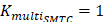
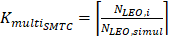
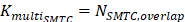
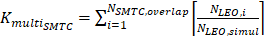
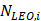
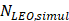
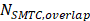

# 3GPP TS 38.133 V19.5.0 (2026-06)

| 3GPP TS 38.133 V19.5.0 (2026-06) |  |
| --- | --- |
| Technical Specification |  |
| 3rd Generation Partnership Project; Technical Specification Group Radio Access Network; NR; Requirements for support of radio resource management (Release 19) |  |
|  |  |
|  |  |
|  |  |
| The present document has been developed within the 3rd Generation Partnership Project (3GPP TM) and may be further elaborated for the purposes of 3GPP. The present document has not been subject to any approval process by the 3GPP Organizational Partners and shall not be implemented. This Specification is provided for future development work within 3GPP only. The Organizational Partners accept no liability for any use of this Specification. Specifications and Reports for implementation of the 3GPP TM system should be obtained via the 3GPP Organizational Partners' Publications Offices. |  |

|  |
| --- |
| 3GPP Postal address 3GPP support office address 650 Route des Lucioles - Sophia Antipolis Valbonne - FRANCE Tel.: +33 4 92 94 42 00 Fax: +33 4 93 65 47 16 Internet http://www.3gpp.org |
| Copyright Notification No part may be reproduced except as authorized by written permission. The copyright and the foregoing restriction extend to reproduction in all media. © 2026, 3GPP Organizational Partners (ARIB, ATIS, CCSA, ETSI, TSDSI, TTA, TTC). All rights reserved. UMTS™ is a Trade Mark of ETSI registered for the benefit of its members 3GPP™ is a Trade Mark of ETSI registered for the benefit of its Members and of the 3GPP Organizational Partners LTE™ is a Trade Mark of ETSI registered for the benefit of its Members and of the 3GPP Organizational Partners GSM® and the GSM logo are registered and owned by the GSM Association |

Contents
Foreword 189
1 Scope 191
2 References 191
3 Definitions, symbols and abbreviations 193
3.1 Definitions 193
3.2 Symbols 194
3.3 Abbreviations 195
3.4 Test tolerances 199
3.5 Frequency bands grouping 199
3.5.1 Introduction 199
3.5.2 NR operating bands in FR1 199
3.5.2A NR operating bands for satellite access in FR1 148
3.5.3 NR operating bands in FR2 148
3.6 Applicability of requirements in this specification version 149
3.6.1 RRC connected state requirements in DRX 149
3.6.2 Number of serving carriers 150
3.6.2.1 Number of serving carriers for SA 150
3.6.2.2 Number of serving carriers for EN-DC 150
3.6.2.3 Number of serving carriers for NE-DC 150
3.6.2.4 Number of serving carriers for NR-DC 150
3.6.3 Applicability for intra-band FR2 150
3.6.4 Applicability for FR2 UE power classes 150
3.6.5 Applicability for SDL bands 151
3.6.6 Applicability of requirements for NGEN-DC operation 151
3.6.7 Applicability of QCL 151
3.6.9 Applicability of requirements for scheduling availability 152
3.6.10 Applicability of requirements for measurement restrictions 152
3.6.11 Applicability of requirements for Redcap UEs 152
3.6.11.1 RRC connected state requirements in DRX 152
3.6.11.2 Applicability for FR2 Redcap UE power classes 152
3.6.11.3 Applicability of QCL 152
3.6.12 Applicability of requirements for Satellite Access 152
3.6.13 Applicability of requirements for FR2 152
3.6.14 Applicability of requirements for FR2 Power Class 6 153
3.6.15 Applicability of requirements for per-FR gap 153
3.6.16 Applicability of requirements for ATG 153
3.6.17 Applicability of requirements for MUSIM gaps 153
3.6.18 Applicability of requirements for a UE operating on a cell with less than 5 MHz BW 153
3.6.19 Applicability of requirements for multi-Rx operation in FR2-1 153
3.6.20 Applicability of requirements for RedCap UE with satellite access 153
3.6.21 Applicability of requirements for UE supporting L3 fast beam sweeping operation in FR2-1 154
3.6.22 Applicability of requirements for UE with LP-WUR 154
3.6.23 Applicability of requirements for SBFD 154
4 SA: RRC_IDLE state mobility 154
4.1 Cell Selection 154
4.2 Cell Re-selection 155
4.2.1 Introduction 155
4.2.2 Requirements 155
4.2.2.1 UE measurement capability 155
4.2.2.2 Measurement and evaluation of serving cell 155
4.2.2.3 Measurements of intra-frequency NR cells 157
4.2.2.4 Measurements of inter-frequency NR cells 161
4.2.2.5 Measurements of inter-RAT E-UTRAN cells 166
4.2.2.6 Maximum interruption in paging reception 168
4.2.2.7 General requirements 169
4.2.2.8 Minimum requirement at transitions 169
4.2.2.9 Measurements of intra-frequency NR cells for UE configured with relaxed measurement criterion 170
4.2.2.9.1 Introduction 170
4.2.2.9.2 Measurements for UE fulfilling low mobility criterion 170
4.2.2.9.3 Measurements for UE fulfilling not-at-cell edge criterion 172
4.2.2.9.4 Measurements for UE fulfilling low mobility and not-at-cell edge criteria 174
4.2.2.10 Measurements of inter-frequency NR cells for UE configured with relaxed measurement criterion 175
4.2.2.10.1 Introduction 175
4.2.2.10.2 Measurements for UE fulfilling low mobility criterion 175
4.2.2.10.3 Measurements for UE fulfilling not-at-cell edge criterion 177
4.2.2.10.4 Measurements for UE fulfilling low mobility and not-at-cell edge criterion 180
4.2.2.11 Measurements of inter-RAT E-UTRAN cells for UE configured with relaxed measurement criterion 180
4.2.2.11.1 Introduction 180
4.2.2.11.2 Measurements for UE fulfilling low mobility criterion 181
4.2.2.11.3 Measurements for UE fulfilling with not-at-cell edge criterion 182
4.2.2.11.4 Measurements for UE fulfilling low mobility and not-at-cell edge criterion 184
4.2.2.12  Measurements of inter-frequency NR cells with NTN carrier 184
4.2A Cell Re-selection when subject to CCA 187
4.2A.1 Introduction 187
4.2A.2 Requirements 187
4.2A.2.1 UE measurement capability 187
4.2A.2.2 Measurement and evaluation when subject to CCA on the serving cell 188
4.2A.2.3 Measurements of intra-frequency NR cells when subject to CCA on the serving cell and target cell 189
4.2A.2.4 Measurements of inter-frequency NR cells when subject to CCA on the target cell 190
4.2A.2.5 Measurements of inter-RAT E-UTRAN cells when subject to CCA on the serving cell 192
4.2A.2.6 Maximum interruption in paging reception when subject to CCA on the target cell 192
4.2A.2.7 General requirements 192
4.2B Cell Re-selection for RedCap 193
4.2B.1 Introduction 193
4.2B.2 Requirements 193
4.2B.2.1 UE measurement capability for RedCap 193
4.2B.2.1.1 UE measurement capability for 1 Rx RedCap 193
4.2B.2.1.2 UE measurement capability for 2 Rx RedCap 193
4.2B.2.2 Measurement and evaluation of serving cell for RedCap UE 193
4.2B.2.3 Measurements of intra-frequency NR cells for RedCap UE 195
4.2B.2.4 Measurements of inter-frequency NR cells for RedCap UE 197
4.2B.2.5 Measurements of inter-RAT E-UTRAN cells for RedCap UE 200
4.2B.2.6 Maximum interruption in paging reception for RedCap 202
4.2B.2.7 General requirements for RedCap 202
4.2B.2.8 Minimum requirement at transitions 202
4.2B.2.9 Measurements of intra-frequency NR cells for UE configured with relaxed measurement criterion for RedCap 203
4.2B.2.9.1 Introduction 203
4.2B.2.9.2 Measurements for UE fulfilling stationary criterion 203
4.2B.2.9.3 Measurements for a UE fulfilling not-at-cell edge while stationary criterion 206
4.2B.2.9.3A Measurements for a UE fulfilling stationary and not-at-cell-edge criteria 206
4.2B.2.9.4 Measurements for a UE fulfilling low mobility and stationary criteria 207
4.2B.2.9.5 Measurements for a UE fulfilling low mobility and not-at-cell-edge while stationary criteria 207
4.2B.2.9.6 Measurements for a UE fulfilling not-at-cell edge and not-at-cell edge while stationary criteria 207
4.2B.2.9.7 Measurements for a UE fulfilling low mobility and not-at-cell edge criteria and not-at-cell-edge while stationary criteria 207
4.2B.2.9.8 Measurements for a UE fulfilling low mobility, not-at-cell edge and stationary criterion 207
4.2B.2.9.9 Measurements for UE fulfilling low mobility criterion 208
4.2B.2.9.10 Measurements for UE fulfilling not-at-cell edge criterion 210
4.2B.2.9.11 Measurements for UE fulfilling low mobility and not-at-cell edge criteria 212
4.2B.2.10 Measurements of inter-frequency NR cells for UE configured with relaxed measurement criterion 213
4.2B.2.10.1 Introduction 213
4.2B.2.10.2 Measurements for UE fulfilling stationary criterion 213
4.2B.2.10.3 Measurements for a UE fulfilling not-at-cell edge while stationary  criterion 215
4.2B.2.10.3A Measurements for a UE fulfilling stationary and not-at-cell-edge criterion 216
4.2B.2.10.4 Measurements for a UE fulfilling low mobility and stationary criteria 216
4.2B.2.10.5 Measurements for a UE fulfilling low mobility and not-at-cell-edge while stationary criteria 216
4.2B.2.10.6 Measurements for a UE fulfilling not-at-cell edge and not-at-cell edge while stationary criteria 217
4.2B.2.10.7 Measurements for a UE fulfilling low mobility and not-at-cell edge criteria and not-at-cell-edge while stationary criteria 217
4.2B.2.10.8 Measurements for a UE fulfilling low mobility, not-at-cell edge and stationary  criteria 217
4.2B.2.10.9 Measurements for UE fulfilling low mobility criterion 217
4.2B.2.10.10 Measurements for UE fulfilling not-at-cell edge criterion 220
4.2B.2.10.11 Measurements for UE fulfilling low mobility and not-at-cell edge criterion 222
4.2B.2.11 Measurements of inter-RAT E-UTRAN cells for UE configured with relaxed measurement criterion 222
4.2B.2.11.1 Introduction 222
4.2B.2.11.2 Measurements for UE fulfilling stationary criterion 223
4.2B.2.11.3 Measurements for a UE fulfilling not-at-cell edge while stationary criterion 224
4.2B.2.11.3A Measurements for a UE fulfilling stationary and not-at-cell-edge criterion 224
4.2B.2.11.4 Measurements for a UE fulfilling low mobility and stationary criteria 225
4.2B.2.11.5 Measurements for a UE fulfilling low mobility and not-at-cell-edge while stationary  criteria 225
4.2B.2.11.6 Measurements for a UE fulfilling not-at-cell edge and not-at-cell edge while stationary criteria 225
4.2B.2.11.7 Measurements for a UE fulfilling low mobility and not-at-cell edge criteria and not-at-cell-edge while stationary criteria 225
4.2B.2.11.8 Measurements for a UE fulfilling low mobility, not-at-cell edge and stationary  criteria 226
4.2B.2.11.9 Measurements for UE fulfilling low mobility criterion 226
4.2B.2.11.10 Measurements for UE fulfilling with not-at-cell edge criterion 227
4.2B.2.11.11 Measurements for UE fulfilling low mobility and not-at-cell edge criterion 228
4.2C Cell Re-selection for NR UE for Satellite Access 229
4.2C.1 Introduction 229
4.2C.2 Requirements 229
4.2C.2.1 UE measurement capability 229
4.2C.2.2 Measurement and evaluation of serving cell 229
4.2C.2.3 Measurements of intra-frequency NR cells 231
4.2C.2.4 Measurements of inter-frequency NR cells 233
4.2C.2.5 Maximum interruption in paging reception 237
4.2C.2.6 Minimum requirement at transitions 238
4.2C.2.7 Measurements of intra-frequency NR cells for UE configured with relaxed measurement criterion 238
4.2C.2.8 Measurements of inter-frequency NR cells for UE configured with relaxed measurement criterion 238
4.2C.2.9 General requirements 238
4.2C.2.10 Measurements of inter-frequency NR cells with TN carrier 238
4.2C.2.11 Measurements of inter-RAT E-UTRAN cells with TN carrier 241
4.2C.3 Void 243
4.2C.4 Void 243
4.2D Cell Re-selection for ATG 243
4.2D.1 Introduction 243
4.2D.2 Requirements 243
4.2D.2.1 UE measurement capability 243
4.2D.2.2 Measurement and evaluation of serving cell 243
4.2D.2.3 Measurements of intra-frequency NR cells 244
4.2D.2.4 Measurements of inter-frequency NR cells 245
4.2D.2.5 Maximum interruption in paging reception 247
4.2D.2.6 General requirements 247
4.2E Cell Re-selection for NR RedCap UE with Satellite Access 247
4.2E.1 Introduction 247
4.2E.2 Requirements for RedCap UE with Satellite Access 248
4.2E.2.1 UE measurement capability for RedCap with Satellite Access 248
4.2E.2.1.1 UE measurement capability for 1Rx RedCap UEs 248
4.2E.2.1.2 UE measurement capability for 2Rx RedCap UEs 248
4.2E.2.2 Measurement and evaluation of serving cell for RedCap UEs 248
4.2E.2.3 Measurements of intra-frequency NR cells for RedCap UE 250
4.2E.2.4 Measurements of inter-frequency NR cells for RedCap UE 252
4.2E.2.5 Maximum interruption in paging reception 255
4.2E.2.6 Minimum requirement at transitions for RedCap UE 255
4.2E.2.7 Measurements of intra-frequency NR cells for RedCap UE configured with relaxed measurement criterion 255
4.2E.2.7.1 Introduction 255
4.2E.2.7.2 Measurements for UE fulfilling low mobility criterion 256
4.2E.2.7.3 Measurements for UE fulfilling not-at-cell edge criterion 256
4.2E.2.7.4 Measurements for UE fulfilling low mobility and not-at-cell edge criteria 256
4.2E.2.8 Measurements of inter-frequency NR cells for UE configured with relaxed measurement criterion 257
4.2E.2.8.1 Introduction 257
4.2E.2.8.2 Measurements for UE fulfilling low mobility criterion 257
4.2E.2.8.3 Measurements for UE fulfilling not-at-cell edge criterion 257
4.2E.2.8.4 Measurements for UE fulfilling low mobility and not-at-cell edge criterion 258
4.2E.2.9 General requirements 258
4.2E.2.10 Measurements of inter-frequency NR cells with TN carrier 258
4.2E.2.11 Measurements of inter-RAT E-UTRAN cells with TN carrier 262
4.3 Minimization of Drive Tests (MDT) 263
4.3.1 Introduction 263
4.3.2 Measurement Requirements 263
4.3.3 Requirements for Relative Time Stamp Accuracy 264
4.3.4 Requirements for Relative Time Stamp Accuracy for RRC Connection Establishment Failure Log Reporting 264
4.3.5 Requirements for Relative Time Stamp Accuracy for Radio Link Failure and Handover Failure Log Reporting 264
4.3C Minimization of Drive Tests (MDT) for Satellite Access 264
4.3C.1 Introduction 264
4.3C.2 Measurement Requirements 265
4.3C.3 Requirements for Relative Time Stamp Accuracy 265
4.3C.4 Requirements for Relative Time Stamp Accuracy for RRC Connection Establishment Failure Log Reporting 265
4.3C.5 Requirements for Relative Time Stamp Accuracy for Radio Link Failure and Handover Failure Log Reporting 266
4.3D Minimization of Drive Tests (MDT) for NR RedCap UE with Satellite Access 266
4.3D.1 Introduction 266
4.3D.2 Measurement Requirements 266
4.3D.3 Requirements for Relative Time Stamp Accuracy 266
4.3D.4 Requirements for Relative Time Stamp Accuracy for RRC Connection Establishment Failure Log Reporting 266
4.3D.5 Requirements for Relative Time Stamp Accuracy for Radio Link Failure and Handover Failure Log Reporting 266
4.4 Idle Mode CA/DC Measurements 267
4.4.1 Introduction 267
4.4.2 Measurement Requirements 267
4.4.2.1 Detected cell requirement during state transition and Idle mode 267
4.4.2.2 Measurements of inter-frequency CA/DC candidate cells 267
4.4.2.3 Measurements on serving cell 268
4.4.2.4 Measurements of E-UTRAN inter-RAT DC candidate cells 269
4.5 NR measurements for positioning 269
4.5.1 Introduction 269
4.5.2 RSTD measurements 270
4.5.2.1 Introduction 270
4.5.2.2 Requirements Applicability 270
4.5.2.3 Measurement Capability 270
4.5.2.4 Measurement Reporting Requirements 270
4.5.2.5 Measurements Period Requirements 270
4.5.2.6 Measurements Period Requirements with Bandwidth Aggregation 273
4.5.3 PRS-RSRP measurements 277
4.5.3.1 Introduction 277
4.5.3.2 Requirements applicability 277
4.5.3.3 Measurement Capability 277
4.5.3.4 Measurement Reporting Requirements 277
4.5.3.5 Measurement Period Requirements 278
4.5.4 PRS-RSRPP measurements 280
4.5.4.1 Introduction 280
4.5.4.2 Requirements Applicability 280
4.5.4.3 Measurement Capability 280
4.5.4.4 Measurement Reporting Requirements 280
4.5.4.5 Measurement Period Requirements 281
4.5.5 Measurement requirements for DL RSCPD reported with RSTD 281
4.5.5.1 Introduction 281
4.5.5.2 Requirements Applicability 281
4.5.5.3 Measurement Capability 281
4.5.5.4 Measurement Reporting Requirements 281
4.5.5.5 Measurements Period Requirements 282
4.5A Reporting Delay Requirements for DL AI/ML Positioning 286
4.5A.1 Introduction 286
4.5A.2 Measurements Period Requirements 286
4.5A.3 Measurements Period Requirements with Bandwidth Aggregation 289
4.6 NR measurements for positioning for RedCap 292
4.6.1 Introduction 292
4.6.2 RSTD measurements for RedCap 293
4.6.2.1 Introduction 293
4.6.2.2 Requirements Applicability 293
4.6.2.3 Measurement Capability 293
4.6.2.4 Measurement Reporting Requirements 293
4.6.2.5 Measurements Period Requirements without RX FH 293
4.6.2.6 Measurement Period Requirements with RX FH 294
4.6.3 PRS-RSRP measurements for RedCap 296
4.6.3.1 Introduction 296
4.6.3.2 Requirements applicability 296
4.6.3.3 Measurement Capability 296
4.6.3.4 Measurement Reporting Requirements 296
4.6.3.5 Measurement Period Requirements without RX FH 297
4.6.3.6 Measurement Period Requirements with RX FH 299
4.6.4 PRS-RSRPP measurements for RedCap 301
4.6.4.1 Introduction 301
4.6.4.2 Requirements Applicability 301
4.6.4.3 Measurement Capability 301
4.6.4.4 Measurement Reporting Requirements 301
4.6.4.5 Measurement Period Requirements without RX FH 302
4.6.4.6 Measurement Period Requirements with RX FH 302
4.7 Measurement report for fast CA/DC setup 302
4.7.1 Introduction 302
4.7.2 Void 302
4.7.3 Measurement Report Requirements 302
4.8 IDLE mode measurement for LP-WUS operation 303
4.8.1 Introduction 303
4.8.2 Requirements 303
4.8.2.1 UE Measurement Capability 303
4.8.2.1.1 LP-WUR measurement capability 303
4.8.2.1.2 MR measurement capability with LP-WUR 303
4.8.2.2 LP-WUR Serving cell measurement and evaluation requirement 303
4.8.2.2.1 General description 303
4.8.2.2.2 LP-WUR measurement and evaluation requirements for PSS/SSS 304
4.8.2.2.3 LP-WUR measurement and evaluation requirements for LP-SS 305
4.8.2.3 Measurement and evaluation of serving cell by MR 305
4.8.2.3.1 Requirements for evaluation of cell selection criterion 305
4.8.2.3.2 Requirements for evaluation of LP-WUS related conditions 306
4.8.2.3A Measurement and evaluation of serving cell by RedCap UE 306
4.8.2.3A.1 Requirements for evaluation of cell selection criterion for RedCap UE 306
4.8.2.3A.2 Requirements for evaluation of LP-WUS related conditions for RedCap UE 306
4.8.2.4 Measurements of intra-frequency NR cells for UE with LP-WUR 307
4.8.2.4A Measurements of intra-frequency NR cells for RedCap UE with LP-WUR 307
4.8.2.5 Measurements of inter-frequency NR cells for UE with LP-WUR 308
4.8.2.5.1 Introduction 308
4.8.2.5.2 Measurements for UE with LP-WUR fulfilling relaxed measurement criterion 308
4.8.2.5.3 Measurements for UE with LP-WUR fulfilling serving cell measurement offloading criterion 309
4.8.2.5A Measurements of inter-frequency NR cells for Redcap with LP-WUR 309
4.8.2.5A.1 Introduction 309
4.8.2.5A.2 Measurements for UE with LP-WUR fulfilling relaxed measurement criterion 309
4.8.2.5A.3 Measurements for UE with LP-WUR fulfilling serving cell measurement offloading criterion 310
4.8.2.6     Measurements of inter-RAT E-UTRAN cells for UE with LP-WUR 310
4.8.2.6.1 Introduction 310
4.8.2.6.2 Measurements for UE fulfilling relaxed measurement criteria 310
4.8.2.6.3 Measurements for UE fulfilling serving cell measurement offloading entry criteria 311
4.8.2.6A Measurements of inter-RAT E-UTRAN cells for RedCap with LP-WUR 311
4.8.2.6A.1 Introduction 311
4.8.2.6A.2 Measurements for UE fulfilling relaxed measurement criteria 311
4.8.2.6A.3 Measurements for UE fulfilling serving cell measurement offloading entry criteria 312
5 SA: RRC_INACTIVE state mobility 312
5.1 Cell Re-selection 312
5.1.1 Introduction 312
5.1.2 Requirements 312
5.1.2.1 UE measurement capability 312
5.1.2.2 Measurement and evaluation of serving cell 312
5.1.2.3 Measurements of intra-frequency NR cells 314
5.1.2.4 Measurements of inter-frequency NR cells 316
5.1.2.5 Measurements of inter-RAT E-UTRAN cells 318
5.1.2.6 Maximum interruption in paging reception 319
5.1.2.7 General requirements 319
5.1.2.8 Measurement of inter-frequency NR cells with NTN carrier 320
5.1.2.9 Minimum requirement at transitions 320
5.1.2.10 Measurements of intra-frequency NR cells for UE configured with relaxed measurement criterion 320
5.1.2.11 Measurements of inter-frequency NR cells for UE configured with relaxed measurement criterion 321
5.1.2.12 Measurements of inter-RAT E-UTRAN cells for UE configured with relaxed measurement criterion 322
5.1A Cell Re-selection with CCA 322
5.1A.1 Introduction 322
5.1A.2 Requirements 323
5.1A.2.1 UE measurement capability 323
5.1A.2.2 Measurement and evaluation when CCA is used on the serving cell 323
5.1A.2.3 Measurements of intra-frequency NR cells when CCA is used on the serving cell and target cell 323
5.1A.2.4 Measurements of inter-frequency NR cells when CCA is used on the target cell 323
5.1A.2.5 Measurements of inter-RAT E-UTRAN cells when CCA is used on the serving cell 323
5.1A.2.6 Maximum interruption in paging reception when CCA is used on the target cell 323
5.1A.2.7 General requirements 323
5.1B Cell Re-selection for RedCap 323
5.1B.1 Introduction 323
5.1B.2 Requirements 323
5.1B.2.1 UE measurement capability 323
5.1B.2.2 Measurement and evaluation of serving cell 323
5.1B.2.3 Measurements of intra-frequency NR cells 326
5.1B.2.4 Measurements of inter-frequency NR cells 328
5.1B.2.5 Measurements of inter-RAT E-UTRAN cells 330
5.1B.2.6 Maximum interruption in paging reception 331
5.1B.2.7 General requirements 331
5.1B.2.8 Minimum requirement at transitions 331
5.1B.2.9 Measurements of intra-frequency NR cells for UE configured with relaxed measurement criterion 331
5.1B.2.10 Measurements of inter-frequency NR cells for UE configured with relaxed measurement criterion 333
5.1B.2.11 Measurements of inter-RAT E-UTRAN cells for UE configured with relaxed measurement criterion 336
5.1C Cell Re-selection for Satellite Access 337
5.1C.1 Introduction 337
5.1C.2 Requirements 337
5.1C.2.1 UE measurement capability 337
5.1C.2.2 Measurement and evaluation of serving cell 337
5.1C.2.3 Measurements of intra-frequency NR cells 337
5.1C.2.4 Measurements of inter-frequency NR cells 338
5.1C.2.5 Maximum interruption in paging reception 338
5.1C.2.6 General requirements 338
5.1C.2.7 Measurements of inter-frequency NR cells with TN carrier 338
5.1C.2.8 Measurements of inter-RAT E-UTRAN cells with TN carrier 338
5.1C.3 Void 338
5.1C.4 Void 338
5.1D Cell Re-selection for ATG 338
5.1D.1 Introduction 338
5.1D.2 Requirements 338
5.1D.2.1 UE measurement capability 338
5.1D.2.2 Measurement and evaluation of serving cell 338
5.1D.2.3 Measurements of intra-frequency NR cells 338
5.1D.2.4 Measurements of inter-frequency NR cells 338
5.1D.2.5 Maximum interruption in paging reception 339
5.1D.2.6 General requirements 339
5.1E Cell Re-selection for RedCap UE with Satellite Access 339
5.1E.1 Introduction 339
5.1E.2 Requirements 339
5.1E.2.1 UE measurement capability 339
5.1E.2.2 Measurement and evaluation of serving cell 339
5.1E.2.3 Measurements of intra-frequency NR cells 340
5.1E.2.4 Measurements of inter-frequency NR cells 341
5.1E.2.5 Maximum interruption in paging reception 341
5.1E.2.6 General requirements 341
5.1E.2.7 Minimum requirement at transitions 341
5.1E.2.8 Measurements of inter-frequency NR cells with TN carrier 341
5.1E.2.9 Measurements of inter-RAT E-UTRAN cells with TN carrier 342
5.2 Void 342
5.2B Configured Grant based Small Data Transmissions (CG-SDT) for RedCap 342
5.2B.1 Introduction 342
5.2B.2 Requirements on UE synchronization for small data transmissions for RedCap 342
5.2B.2.1 Void 342
5.2B.3 TA validation requirements for RedCap 342
5.2B.3.1 Void 343
5.2B.3.2 Void 343
5.2B.4 Scheduling restriction 343
5.2B.5 Applicability conditions for CG-SDT for RedCap 343
5.3 Minimization of Drive Tests (MDT) 344
5.3.1 Introduction 344
5.3.2 Measurement Requirements 344
5.3.3 Requirements for Relative Time Stamp Accuracy 344
5.3.4 Requirements for Relative Time Stamp Accuracy for RRC Connection Establishment Failure Log Reporting 344
5.3.5 Requirements for Relative Time Stamp Accuracy for Radio Link Failure and Handover Failure Log Reporting 344
5.3.6 Requirements for Relative Time Stamp Accuracy for RRC Resume Failure Log Reporting 344
5.3C Minimization of Drive Tests (MDT) for Satellite Access 345
5.3C.1 Introduction 345
5.3C.2 Measurement Requirements 345
5.3C.3 Requirements for Relative Time Stamp Accuracy 345
5.3C.4 Requirements for Relative Time Stamp Accuracy for RRC Connection Establishment Failure Log Reporting 345
5.3C.5 Requirements for Relative Time Stamp Accuracy for Radio Link Failure and Handover Failure Log Reporting 345
5.3C.6 Requirements for Relative Time Stamp Accuracy for RRC Resume Failure Log Reporting 345
5.3D Minimization of Drive Tests (MDT) for NR RedCap UE with Satellite Access 346
5.3D.1 Introduction 346
5.3D.2 Measurement Requirements 346
5.3D.3 Requirements for Relative Time Stamp Accuracy 346
5.3D.4 Requirements for Relative Time Stamp Accuracy for RRC Connection Establishment Failure Log Reporting 346
5.3D.5 Requirements for Relative Time Stamp Accuracy for Radio Link Failure and Handover Failure Log Reporting 346
5.3D.6 Requirements for Relative Time Stamp Accuracy for RRC Resume Failure Log Reporting 346
5.4 Inactive Mode CA/DC Measurements 347
5.4.1 Introduction 347
5.4.2 Measurement Requirements 347
5.4.2.1 Detected cell requirement during state transition and inactive mode 347
5.4.2.2 Measurements of inter-frequency CA/DC candidate cells 347
5.4.2.3 Measurements on serving cell 347
5.4.2.4 Measurements on E-UTRAN inter-RAT DC candidate cells 347
5.5 Configured Grant based Small Data Transmissions (CG-SDT) 347
5.5.1 Introduction 347
5.5.2 Requirements on UE synchronization for small data transmissions 347
5.5.3 TA validation requirements 347
5.5.4 Scheduling restriction 349
5.5.4.1 Scheduling availability of UE performing measurements in TDD bands on FR1 349
5.5.4.2 Scheduling availability of UE performing measurements with a different subcarrier spacing than PDSCH/PDCCH on FR1 349
5.5.4.3 Scheduling availability of UE performing measurements on FR2 349
5.5.5 Applicability conditions for SDT 350
The UE is allowed to delay the reception of PRS resources on the positioning frequency layer until the SDT session is completed if the measurement using PRS resource overlaps with the SDT resources. 350
5.5D Configured Grant based Small Data Transmissions (CG-SDT) for ATG 350
5.5D.1 Scheduling availability of UE performing measurements on FR1 350
5.5E Configured Grant based Small Data Transmissions (CG-SDT) for RedCap UEs with NTN 351
5.5E.1 Introduction 351
5.5E.2 Requirements on UE synchronization for small data transmissions 351
5.5E.3 TA validation requirements 351
5.5E.4 Scheduling restriction 351
5.5E.5 Applicability conditions for SDT 351
5.6 NR measurements for positioning 352
5.6.1 Introduction 352
5.6.1A Cell re-selection for positioning 352
5.6.1A.1 Measurement and evaluation of serving cell 353
5.6.1A.2 Measurements of intra-frequency NR cells 354
5.6.2 RSTD measurements 355
5.6.2.1 Introduction 355
5.6.2.2 Requirements Applicability 355
5.6.2.3 Measurement Capability 355
5.6.2.5 Measurements Period Requirements 355
5.6.2.6 Measurements Period Requirements with Bandwidth Aggregation 358
5.6.3 PRS-RSRP measurements 362
5.6.3.1 Introduction 362
5.6.3.2 Requirements applicability 362
5.6.3.3 Measurement Capability 362
5.6.3.4 Measurement Reporting Requirements 362
5.6.3.5 Measurement Period Requirements 363
5.6.4 UE Rx-Tx time difference measurements 365
5.6.4.1 Introduction 365
5.6.4.2 Requirements Applicability 365
5.6.4.3 Measurement Capability 365
5.6.4.4 Measurement Reporting Requirements 365
5.6.4.5 Measurement Period Requirements 366
5.6.4.6 Measurement Period Requirements with Bandwidth Aggregation 369
5.6.5 PRS-RSRPP measurements 373
5.6.5.1 Introduction 373
5.6.5.2 Requirements Applicability 373
5.6.5.3 Measurement Capability 373
5.6.5.4 Measurement Reporting Requirements 373
5.6.5.5 Measurement Period Requirements 373
5.6.6 TA validation requirements for positioning 373
5.6.6.1 Introduction 373
5.6.6.2 TA validation requirements 374
5.6.6.3 TA validation requirements when configured with validity area 374
5.6.7 Measurement requirements for DL RSCPD reported with RSTD 375
5.6.7.1 Introduction 375
5.6.7.2 Requirements Applicability 375
5.6.7.3 Measurement Capability 376
5.6.7.4 Measurement Reporting Requirements 376
5.6.7.5 Measurements Period Requirements 376
5.6.8 Measurement requirements for DL RSCP reported with UE Rx-Tx time difference 378
5.6.8.1 Introduction 378
5.6.8.2 Requirements Applicability 378
5.6.8.3 Measurement Capability 379
5.6.8.4 Measurement Reporting Requirements 379
5.6.8.5 Measurement Period Requirements 379
5.6A NR measurements for positioning for RedCap 382
5.6A.1 Introduction 382
5.6A.2 Cell re-selection for positioning 382
5.6A.2.1 Measurement and evaluation of serving cell 383
5.6A.2.2 Measurements of intra-frequency NR cells 383
5.6A.3 TA validation requirements for positioning SRS 384
5.6A.3.1 Introduction 384
5.6A.3.2 TA validation requirements 384
5.6A.3.3 TA validation requirements when configured with validity area 384
5.6A.4 RSTD measurements for RedCap 385
5.6A.4.1  Introduction 385
5.6A.4.2 Requirements applicability 385
5.6A.4.3 Measurement Capability 385
5.6A.4.4 Measurement Reporting Requirements 385
5.6A.4.5 Measurement Period Requirement without RX FH 386
5.6A.4.6 Measurement Period Requirement with RX FH 389
5.6A.5 PRS-RSRP measurements for RedCap 391
5.6A.5.1 Introduction 391
5.6A.5.2 Requirements applicability 391
5.6A.5.3 Measurement Capability 391
5.6A.5.4 Measurement Reporting Requirements 391
5.6A.5.5 Measurement Period Requirements without RX FH 392
5.6A.5.6 Measurement Period Requirement with RX FH 395
5.6A.6 UE Rx-Tx time difference measurements for RedCap 396
5.6A.6.1 Introduction 396
5.6A.6.2 Requirements Applicability 397
5.6A.6.3 Measurement Capability 397
5.6A.6.4 Measurement Reporting Requirements 397
5.6A.6.5 Measurement Period Requirements without RX FH 398
5.6A.6.6 Measurement Period Requirements with RX FH 398
5.6A.7 PRS-RSRPP measurements for RedCap 400
5.6A.7.1  Introduction 400
5.6A.7.2 Requirements applicability 400
5.6A.7.3 Measurement Capability 401
5.6A.7.4 Measurement Reporting Requirements 401
5.6A.7.5 Measurement Period Requirements without FH 401
5.6A.7.6 Measurement period requirement with FH 401
5.6B Reporting Delay Requirements for DL AI/ML Positioning 401
5.6B.1 Introduction 401
5.6B.2 Measurements Period Requirements 402
5.6B.3  Measurements Period Requirements with Bandwidth Aggregation 405
5.7 Random access based Small Data Transmissions (RA-SDT) 408
5.7.1 Introduction 408
5.7.2 Requirements for small data transmissions based on 2-step RA 408
5.7.3 Requirements for small data transmissions based on 4-step RA 408
5.7.4 Applicability conditions for SDT 408
5.7B Random access based Small Data Transmissions (RA-SDT) for RedCap 408
5.7B.1 Introduction 408
5.7B.2 Requirements for small data transmissions based on 2-step RA 408
5.7B.3 Requirements for small data transmissions based on 4-step RA 409
5.7B.4 Applicability conditions for RA-SDT for RedCap 409
5.7D Random access based Small Data Transmissions (RA-SDT) for ATG 409
5.7E Random access based Small Data Transmissions (RA-SDT) for RedCap UEs with NTN 409
5.7E.1 Introduction 409
5.7E.2 Requirements for small data transmissions based on 2-step RA 409
5.7E.3 Requirements for small data transmissions based on 4-step RA 409
5.7E.4 Applicability conditions for RA-SDT 409
5.8 Measurement report for fast CA/DC setup 409
5.8.1 Introduction 409
5.8.2 Void 410
5.8.3 Measurement Report Requirements 410
5.9 INACTIVE mode measurement for LP-WUS operation 410
5.9.1 Introduction 410
5.9.2 Requirements 410
5.9.2.1 UE measurement capability 410
5.9.2.1.1 LP-WUR measurement capability 410
5.9.2.1.2 MR measurement capability with LP-WUR 410
5.9.2.2 LP-WUR serving cell measurement and evaluation requirements 410
5.9.2.3 Measurement and evaluation of serving cell by MR 410
5.9.2.3A  Measurement and evaluation of serving cell by Redcap 410
5.9.2.4 Measurements of intra-frequency NR cells for UE with LP-WUR 411
5.9.2.4A Measurements of intra-frequency NR cells for RedCap UE with LP-WUR 411
5.9.2.5 Measurements of inter-frequency NR cells for UE with LP-WUR 411
5.9.2.5A Measurements of inter-frequency NR cells for Redcap with LP-WUR 411
5.9.2.6 Measurements of inter-RAT E-UTRAN cells for UE with LP-WUR 411
5.9.2.6A Measurements of inter-RAT E-UTRAN cells for Redcap with LP-WUR 411
6 RRC_CONNECTED state mobility 411
6.1 Handover 411
6.1.1 NR Handover 411
6.1.1.1 Introduction 411
6.1.1.2 NR FR1 - NR FR1 Handover 411
6.1.1.2.1 Handover delay 412
6.1.1.2.2 Interruption time 412
6.1.1.3 NR FR2- NR FR1 Handover 413
6.1.1.3.1 Handover delay 413
6.1.1.3.2 Interruption time 413
6.1.1.4 NR FR2- NR FR2 Handover 414
6.1.1.4.1 Handover delay 414
6.1.1.4.2 Interruption time 414
6.1.1.5 NR FR1- NR FR2 Handover 415
6.1.1.5.1 Handover delay 416
6.1.1.5.2 Interruption time 416
6.1.2 NR Handover to other RATs 417
6.1.2.1 NR – E-UTRAN Handover 417
6.1.2.1.1 Introduction 417
6.1.2.1.2 Handover delay 417
6.1.2.1.3 Interruption time 417
6.1.2.2 NR – UTRAN Handover 418
6.1.2.2.1 Introduction 418
6.1.2.2.2 Handover delay 418
6.1.2.2.3 Interruption time 418
6.1.3 NR DAPS Handover 419
6.1.3.1 Introduction 419
6.1.3.2 NR FR1 - NR FR1 DAPS Handover 419
6.1.3.2.1 DAPS handover delay 419
6.1.3.2.2 Interruption time 420
6.1.3.3 NR FR2- NR FR1 DAPS Handover 421
6.1.3.3.1 DAPS handover delay 422
6.1.3.3.2 Interruption time 422
6.1.3.4 NR FR1- NR FR2 DAPS Handover 422
6.1.3.4.1 DAPS handover delay 423
6.1.3.4.2 Interruption time 423
6.1.4 NR Conditional Handover 424
6.1.4.1 Introduction 424
6.1.4.2 NR FR1 – NR FR1 conditional handover 424
6.1.4.2.2 Measurement time 424
6.1.4.3 NR FR2 – NR FR1 conditional handover 426
6.1.4.4 NR FR2 – NR FR2 conditional handover 426
6.1.4.4.1 Handover delay 426
6.1.4.4.2 Measurement time 427
6.1.4.4.3 Preparation time 428
6.1.4.4.4 Interruption time 428
6.1.4.5 NR FR1 – NR FR2 conditional handover 428
6.1.5 NR Handover with PSCell 428
6.1.5.1 Introduction 428
6.1.5.2 Handover with PSCell from NR SA to EN-DC 429
6.1.5.2.1 Interruption time for inter-RAT HO from NR to E-UTRAN 429
6.1.5.2.2 PSCell addition in HO with PSCell for NR SA to EN-DC 429
6.1.5.3 HO with PSCell from NE-DC to NE-DC 430
6.1.5.3.1 Handover delay 430
6.1.5.3.2 HO with PSCell - PCell Interruption time 430
6.1.5.3.3 PSCell addition/change in NE-DC to NE-DC HO with PSCell 430
6.1.5.4 HO with PSCell from NR-DC to NR-DC 431
6.1.5.5 Handover with PSCell from NR SA to EN-DC with PSCell using CCA 432
6.1.5.5.1 Introduction 432
6.1.5.5.2 NR SA to EN-DC HO with PSCell- NR to E-UTRA HO Interruption time 432
6.1.5.5.3 NR SA to EN-DC HO with PSCell - NR PSCell Addition Delay requirements 433
6.1.6 NR Conditional Handover including target MCG and target SCG 434
6.1.6.1 Conditional handover including target MCG in FR1 and target SCG in FR1 in NR-DC 434
6.1.6.1.1 CHO with PSCell – PCell Interruption time 434
6.1.6.1.2 CHO with PSCell – PSCell change delay 435
6.1.6.2 Conditional handover including target MCG in FR1 and target SCG in FR2 in NR-DC 435
6.1.6.2.2 CHO with PSCell – PSCell change delay 436
6.1.7 NR Conditional Handover including target MCG and candidate SCG 437
6.1.7.1 Conditional handover including target MCG and candidate SCG for CPC in FR1 NR-DC 437
6.1.7.1.1 PCell conditional handover delay 438
6.1.7.1.2 PSCell conditional change delay 439
6.1.7.2 Conditional handover including target MCG in FR1 and Candidate SCG for CPC in FR2 in NR-DC 440
6.1.7.2.1 PCell handover delay 440
6.1.7.2.2 PSCell conditional change delay 441
6.1A Void 443
6.1A.1 Void 443
6.1A.1.1 Void 443
6.1A.1.2 Void 443
6.1A.1.2.1 Void 443
6.1A.1.2.2 Void 443
6.1B Handover to target cell using CCA 443
6.1B.1 NR Handover 443
6.1B.1.1 Introduction 443
6.1B.1.2 NR FR1 - NR FR1 Handover 443
6.1B.1.2.1 Handover delay 443
6.1B.1.2.2 Interruption time 443
6.1B.1.3 NR FR2-2 NR FR2-2 Handover 444
6.1B.1.3.1 Handover delay 444
6.1B.1.3.2 Interruption time 444
6.1B.1.4 NR FR1- NR FR2-2 Handover 445
6.1B.1.4.1 Handover delay 445
6.1B.1.4.2 Interruption time 446
6.1C Handover for SAN 447
6.1C.1 NR SAN Handover 447
6.1C.1.1 Introduction 447
6.1C.1.2 NR SAN FR1 – NR SAN FR1 Handover 447
6.1C.1.2.1 Handover delay 447
6.1C.1.2.2 Interruption time 447
6.1C.1.3 NR SAN FR2-NTN – NR SAN FR2-NTN Handover 448
6.1C.1.3.1 Handover delay 448
6.1C.1.3.2 Interruption time 449
6.1C.2 NR SAN Conditional Handover 449
6.1C.2.1 Introduction 449
6.1C.2.2 NR SAN FR1 – NR SAN FR1 conditional handover 450
6.1C.2.2.1 Handover delay 450
6.1C.2.2.2 Measurement time 450
6.1C.2.2.3 Preparation time 452
6.1C.2.2.4 Interruption time 452
6.1C.2.3 NR SAN FR1 – NR SAN FR1 conditional handover without L3 measurement criteria 452
6.1C.2.3.1 Handover delay 452
6.1C.2.3.2 Preparation time 453
6.1C.2.3.3 Interruption time 453
6.1C.2.4 NR SAN FR2-NTN – NR SAN FR2-NTN conditional handover 454
6.1C.3 NR SAN Satellite switching with re-synchronization 454
6.1C.3.1 Introduction 454
6.1C.3.2 NR SAN FR1 – NR SAN FR1 Satellite switching with re-synchronization 454
6.1C.3.2.1 Satellite switching delay 454
6.1C.3.2.2 Interruption time for hard satellite switch with re-sync 454
6.1C.3.3 NR SAN FR2 – NR SAN FR2 Satellite switching with re-synchronization 456
6.1C.3.3.1 Satellite switching delay 456
6.1C.3.3.2 Interruption time for hard satellite switch with re-sync 456
6.1C.3.3.3 Satellite switch delay for soft satellite switch with re-sync 457
6.1D Handover for RedCap 457
6.1D.1 NR Handover 457
6.1D.1.1 Introduction 457
6.1D.1.2 NR FR1 - NR FR1 Handover 458
6.1D.1.2.1 Handover delay 458
6.1D.1.2.2 Interruption time 458
6.1D.1.3 NR FR2- NR FR2 Handover 459
6.1D.1.3.1 Handover delay 459
6.1D.1.3.2 Interruption time 459
6.1D.2 NR Handover to other RATs 461
6.1D.2.1 NR – E-UTRAN Handover 461
6.1E Handover for ATG 461
6.1E.1 NR Handover 461
6.1E.1.1 Introduction 461
6.1E.1.2 NR FR1 - NR FR1 Handover 461
6.1E.1.2.1 Handover delay 461
6.1E.1.2.2 Interruption time 461
6.1E.2 NR Conditional Handover 462
6.1E.2.1 Introduction 462
6.1E.2.2 NR FR1 – NR FR1 conditional handover 462
6.1E.2.2.1 Handover delay 462
6.1E.2.2.2 Measurement time 463
6.1E.2.2.3 Preparation time 463
6.1E.2.2.4 Interruption time 463
6.1F Handover for RedCap UE with satellite access 464
6.1F.1 NR SAN Handover 464
6.1F.1.1 Introduction 464
6.1F.1.2 NR SAN FR1 – NR SAN FR1 Handover 464
6.1F.1.2.1 Handover delay 464
6.1F.1.2.2 Interruption time 464
6.1F.2 NR SAN Conditional Handover 464
6.1F.2.1 Introduction 464
6.1F.2.2 NR SAN FR1 – NR SAN FR1 conditional handover 465
6.1F.2.2.1 Handover delay 465
6.1F.2.2.2 Measurement time 465
6.1F.2.2.3 Preparation time 465
6.1F.2.2.4 Interruption time 465
6.1F.2.3 NR SAN FR1 – NR SAN FR1 conditional handover without L3 measurement criteria 465
6.1F.2.3.1 Handover delay 465
6.1F.2.3.2 Preparation time 465
6.1F.2.3.3 Interruption time 465
6.1F.3 NR SAN Satellite switching with re-synchronization 466
6.1F.3.1 Introduction 466
6.1F.3.2 NR SAN FR1 – NR SAN FR1 Satellite switching with re-synchronization 466
6.1F.3.2.1 Satellite switching delay 466
6.1F.3.2.2 Interruption time for hard satellite switch with re-sync 466
6.1F.3.2.3 Satellite switch delay for soft satellite switch with re-sync 466
6.2 RRC Connection Mobility Control 467
6.2.1 SA: RRC Re-establishment 467
6.2.1.1 Introduction 467
6.2.1.2 Requirements 467
6.2.1.2.1 UE Re-establishment delay requirement 467
6.2.1A RRC Re-establishment with CCA 469
6.2.1A.1 Introduction 469
6.2.1A.2 Requirements 470
6.2.1A.2.1 UE Re-establishment with CCA delay requirement 470
6.2.1B SA: RRC Re-establishment for RedCap 471
6.2.1B.1 Introduction 471
6.2.1B.2 Requirements 472
6.2.2 Random access 472
6.2.2.1 Introduction 472
6.2.2.2 Requirements for 4-step RA type 472
6.2.2.2.1 Contention based random access 473
6.2.2.2.1.1 Correct behaviour when transmitting Random Access Preamble 473
6.2.2.2.1.2 Correct behaviour when receiving Random Access Response 473
6.2.2.2.1.3 Correct behaviour when not receiving Random Access Response 473
6.2.2.2.1.4 Correct behaviour when receiving an UL grant for msg3 retransmission 473
6.2.2.2.1.5 SA: Correct behaviour when receiving a message over Temporary C-RNTI 473
6.2.2.2.1.6 Correct behaviour when contention Resolution timer expires 473
6.2.2.2.2 Non-Contention based random access 474
6.2.2.2.2.1 Correct behaviour when transmitting Random Access Preamble 474
6.2.2.2.2.2 Correct behaviour when receiving Random Access Response 474
6.2.2.2.2.3 Correct behaviour when not receiving Random Access Response 474
6.2.2.2.3 UE behaviour when configured with supplementary UL 475
6.2.2.3 Requirements for 2-step RA type 475
6.2.2.3.1 Contention based random access 475
6.2.2.3.1.1 Correct behaviour when transmitting MsgA 475
6.2.2.3.1.2 Correct behaviour when receiving MsgB 475
6.2.2.3.1.3 Correct behaviour when not receiving MsgB 476
6.2.2.3.2 Non-Contention based random access 476
6.2.2.3.2.1 Correct behaviour when transmitting MsgA 476
6.2.2.3.2.2 Correct behaviour when receiving MsgB 476
6.2.2.3.2.3 Correct behaviour when not receiving MsgB 476
6.2.2.3.3 UE behaviour when configured with supplementary UL 476
6.2.2A Random access when CCA is used on target frequency 477
6.2.2A.1 Introduction 477
6.2.2A.2 Requirements for 4-step RA type 477
6.2.2A.2.1 Contention based random access 477
6.2.2A.2.1.1 Correct behaviour when transmitting Random Access Preamble 477
6.2.2A.2.1.2 Correct behaviour when receiving Random Access Response 478
6.2.2A.2.1.3 Correct behaviour when not receiving Random Access Response 478
6.2.2A.2.1.4 Correct behaviour when receiving an UL grant for msg3 retransmission 478
6.2.2A.2.1.6 Correct behaviour when contention Resolution timer expires 478
6.2.2A.2.2 Non-Contention based random access 478
6.2.2A.2.2.1 Correct behaviour when transmitting Random Access Preamble 478
6.2.2A.2.2.2 Correct behaviour when receiving Random Access Response 479
6.2.2A.2.2.3 Correct behaviour when not receiving Random Access Response 479
6.2.2A.3 Requirements for 2-step RA type 479
6.2.2A.3.1 Contention based random access 479
6.2.2A.3.1.1 Correct behaviour when transmitting MsgA 479
6.2.2A.3.1.2 Correct behaviour when receiving MsgB 480
6.2.2A.3.1.3 Correct behaviour when not receiving MsgB 480
6.2.2A.3.2 Non-Contention based random access 480
6.2.2A.3.2.1 Correct behaviour when transmitting MsgA 480
6.2.2A.3.2.2 Correct behaviour when receiving MsgB 481
6.2.2A.3.2.3 Correct behaviour when not receiving MsgB 481
6.2.2B Random access for RedCap 481
6.2.2B.1 Introduction 481
6.2.2B.2 Requirements 482
6.2.2C PDCCH ordered Random Access for LTM 482
6.2.2C.1 Introduction 482
6.2.2C.2 PDCCH ordered Random Access delay 482
6.2.3 SA: RRC Connection Release with Redirection 483
6.2.3.1 Introduction 483
6.2.3.2 Requirements 483
6.2.3.2.1 RRC connection release with redirection to NR 483
6.2.3.2.2 RRC connection release with redirection to E-UTRAN 484
6.2.3.2.3 RRC connection release with redirection to NR carrier subject to CCA 485
6.2.3A SA: RRC Connection Release with Redirection for RedCap 486
6.2.3A.1 Introduction 486
6.2.3A.2 Requirements 486
6.2.3A.2.1 RRC connection release with redirection to NR 486
6.2.3A.2.2 RRC connection release with redirection to E-UTRAN 486
6.2C RRC Connection Mobility Control for Satellite Access 487
6.2C.1 SA: RRC Re-establishment for Satellite Access 487
6.2C.1.1 Introduction 487
6.2C.1.2 Requirements 487
6.2C.1.2.1 UE Re-establishment delay requirement 487
6.2C.1.2.2 UE Re-establishment delay requirement for VSAT 489
6.2C.2 Random access for satellite access 489
6.2C.2.1 Introduction 489
6.2C.2.2 Requirements for 4-step RA type 489
6.2C.2.2.1 Contention based random access 490
6.2C.2.2.1.1 Correct behaviour when transmitting Random Access Preamble 490
6.2C.2.2.1.2 Correct behaviour when receiving Random Access Response 490
6.2C.2.2.1.3 Correct behaviour when not receiving Random Access Response 490
6.2C.2.2.1.4 Correct behaviour when receiving an UL grant for msg3 retransmission 490
6.2C.2.2.1.5 SA: Correct behaviour when receiving a message over Temporary C-RNTI 490
6.2C.2.2.1.6 Correct behaviour when Contention Resolution Timer expires 490
6.2C.2.2.2 Non-Contention based random access 491
6.2C.2.2.2.1 Correct behaviour when transmitting Random Access Preamble 491
6.2C.2.2.2.2 Correct behaviour when receiving Random Access Response 491
6.2C.2.2.2.3 Correct behaviour when not receiving Random Access Response 491
6.2C.2.3 Requirements for 2-step RA type 492
6.2C.2.3.1 Contention based random access 492
6.2C.2.3.1.1 Correct behaviour when transmitting MsgA 492
6.2C.2.3.1.2 Correct behaviour when receiving MsgB 492
6.2C.2.3.1.3 Correct behaviour when not receiving MsgB 493
6.2C.2.3.2 Non-Contention based random access 493
6.2C.2.3.2.1 Correct behaviour when transmitting MsgA 493
6.2C.2.3.2.2 Correct behaviour when receiving MsgB 493
6.2C.2.3.2.3 Correct behaviour when not receiving MsgB 493
6.2C.3 SA: RRC Connection Release with Redirection for Satellite Access 493
6.2C.3.1 Introduction 493
6.2C.3.2 Requirements 494
6.2C.3.2.1 RRC connection release with redirection to NR 494
6.2D RRC Connection Mobility Control for ATG 495
6.2D.1 SA: RRC Re-establishment 495
6.2D.1.1 Introduction 495
6.2D.1.2 Requirements 495
6.2D.1.2.1 UE Re-establishment delay requirement 495
6.2D.2 Random access 496
6.2D.2.1 Introduction 496
6.2D.2.2 Requirements for 4-step RA type 496
6.2D.2.3 Requirements for 2-step RA type 497
6.2D.3 SA: RRC Connection Release with Redirection 497
6.2D.3.1 Introduction 497
6.2D.3.2 Requirements 497
6.2D.3.2.1 RRC connection release with redirection to NR 497
6.2E RRC Connection Mobility Control for RedCap UE with Satellite Access 498
6.2E.1 SA: RRC Re-establishment for RedCap UE with Satellite Access 498
6.2E.1.1 Introduction 498
6.2E.1.2 Requirements 498
6.2E.2 Random access for RedCap UE with satellite access 499
6.2E.2.1 Introduction 499
6.2E.2.2 Requirements 499
6.2E.3 SA: RRC Connection Release with Redirection for RedCap UE with Satellite Access 499
6.2E.3.1 Introduction 499
6.2E.3.2 Requirements 500
6.2E.3.2.1 RRC connection release with redirection to NR 500
6.3 L1/L2-Triggered Mobility 500
6.3.1 LTM PCell Cell Switch 500
6.3.1.1 Introduction 500
6.3.1.2 LTM Cell Switch delay 502
6.3.1.3 Interruption time 502
6.3.2 Conditional L1/L2-Triggered Mobility 503
6.3.2.1 Introduction 503
6.3.2.2 CLTM Cell Switch delay 504
6.3.2.2.1 Measurement time 504
6.3.2.2.2 CLTM RRC processing time 505
6.3.2.2.3 Interruption time 506
6.3.2.3 Subsequent CLTM Cell Switch delay 507
7 Timing 507
7.1 UE transmit timing 507
7.1.1 Introduction 507
7.1.2 Requirements 508
7.1.2.1 Gradual timing adjustment 510
7.1.2.2 Void 511
7.1.2.3 One shot large UL timing adjustment for FR2 Power Class 6 UE 511
7.1.2.4 UE transmit timing for positioning measurements 512
7.1A UE transmit timing for RedCap 512
7.1A.1 Introduction 512
7.1A.2 Requirements 512
7.1A.2.1 Gradual timing adjustment 513
7.1A.2.2 UE transmit timing for positioning measurements 514
7.1C UE transmit timing for Satellite Access 514
7.1C.1 Introduction 514
7.1C.2 Requirements 514
7.1C.2.1 Gradual timing adjustment 516
7.1D UE transmit timing for ATG 516
7.1D.1 Introduction 516
7.1D.2 Requirements 516
7.1D.2.1 Gradual timing adjustment 517
7.1E UE transmit timing for RedCap with Satellite Access 517
7.1E.1 Introduction 517
7.1E.2 Requirements 518
7.1E.2.1 Gradual timing adjustment 518
7.2 UE timer accuracy 518
7.2.1 Introduction 518
7.2.2 Requirements 518
7.2A UE timer accuracy for RedCap 518
7.2A.1 Introduction 518
7.2A.2 Requirements 518
7.2C UE timer accuracy for satellite access 519
7.2C.1 Introduction 519
7.2C.2 Requirements 519
7.2D UE timer accuracy for ATG 519
7.2D.1 Introduction 519
7.2D.2 Requirements 519
7.2E UE timer accuracy for RedCap with Satellite Access 520
7.2E.1 Introduction 520
7.2E.2 Requirements 520
7.3 Timing advance 520
7.3.1 Introduction 520
7.3.2 Requirements 520
7.3.2.1 Timing Advance adjustment delay 520
7.3.2.2 Timing Advance adjustment accuracy 520
7.3A Timing Advance for RedCap 520
7.3A.1 Introduction 520
7.3A.2 Requirements 521
7.3A.2.1 Timing Advance adjustment delay 521
7.3A.2.2 Timing Advance adjustment accuracy 521
7.3C Timing advance for satellite access 521
7.3C.1 Introduction 521
7.3C.2 Requirements 521
7.3C.2.1 Timing Advance adjustment delay 521
7.3C.2.2 Timing Advance adjustment accuracy 521
7.3D Timing advance for ATG 522
7.3D.1 Introduction 522
7.3D.2 Requirements 522
7.3D.2.1 Timing Advance adjustment delay 522
7.3D.2.2 Timing Advance adjustment accuracy 522
7.3E Timing advance for RedCap with Satellite Access 522
7.3E.1 Introduction 522
7.3E.2 Requirements 522
7.3E.2.1 Timing Advance adjustment delay 522
7.3E.2.2 Timing Advance adjustment accuracy 522
7.4 Cell phase synchronization accuracy 522
7.4.1 Definition 522
7.4.2 Minimum requirements 523
7.5 Maximum Transmission Timing Difference 523
7.5.1 Introduction 523
7.5.2 Minimum requirements for inter-band EN-DC 523
7.5.2.1 Minimum requirements for inter-band synchronous EN-DC 523
7.5.3 Minimum requirements for intra-band EN-DC 524
7.5.4 Minimum requirements for NR Carrier Aggregation 525
7.5.5 Minimum requirements for inter-band NE-DC 526
7.5.5.1 Minimum requirements for inter-band synchronous NE-DC 526
7.5.6 Minimum requirements for inter-band NR-DC 526
7.5.7 Minimum requirements for multi-TRP 527
7.6 Maximum Receive Timing Difference 528
7.6.1 Introduction 528
7.6.2 Minimum requirements for inter-band EN-DC 528
7.6.2.1 Minimum requirements for inter-band synchronous EN-DC 529
7.6.3 Minimum requirements for intra-band EN-DC 530
7.6.4 Minimum requirements for NR Carrier Aggregation 530
7.6.5 Minimum requirements for inter-band NE-DC 532
7.6.5.1 Minimum requirements for inter-band synchronous NE-DC 532
7.6.6 Minimum requirements for inter-band NR-DC 532
7.6.7 Minimum requirements for PC6 UE in FR2 533
7.6.8 Minimum requirements for Multi-TRPs 533
7.6D Maximum Receive Timing Difference for ATG UE 534
7.6D.1 Introduction 534
7.6D.2 Minimum requirements for NR Carrier Aggregation 534
7.7 deriveSSB-IndexFromCell tolerance 534
7.7.1 Minimum requirements 534
7.7A deriveSSB-IndexFromCell tolerance for RedCap 535
7.7A.1 Minimum requirements 535
7.7D DeriveSSB-IndexFromCell tolerance for ATG 535
7.7D.1 Minimum requirements 535
7.8 Void 535
7.9 deriveSSB-IndexFromCellInter-r17 tolerance 535
7.9.1 Minimum requirements 535
7.9D DeriveSSB-IndexFromCellInter-r17 tolerance for ATG 536
7.9D.1 Minimum requirements 536
8 Signalling characteristics 590
8.1 Radio Link Monitoring 590
8.1.1 Introduction 590
8.1.1.1 Introduction of Requirement on Radio Link Monitoring for UE Configured with Relaxed Measurement Criteria 591
8.1.2 Requirements for SSB based radio link monitoring 592
8.1.2.1 Introduction 592
8.1.2.2 Minimum requirement 593
8.1.2.3 Measurement restrictions for SSB based RLM 597
8.1.2.4 Minimum requirement of SSB based radio link monitoring for UE fulfilling relaxed measurement criteria 598
8.1.3 Requirements for CSI-RS based radio link monitoring 599
8.1.3.1 Introduction 599
8.1.3.2 Minimum requirement 599
8.1.3.3 Measurement restrictions for CSI-RS based RLM 604
8.1.3.4 Minimum requirement of CSI-RS based radio link monitoring for UE fulfilling relaxed measurement criteria 606
8.1.4 Minimum requirement at transitions 606
8.1.5 Minimum requirement for UE turning off the transmitter 607
8.1.6 Minimum requirement for L1 indication 607
8.1.7 Scheduling availability of UE during radio link monitoring 607
8.1.7.1 Scheduling availability of UE performing radio link monitoring with a same subcarrier spacing as PDSCH/PDCCH on FR1 607
8.1.7.2 Scheduling availability of UE performing radio link monitoring with a different subcarrier spacing than PDSCH/PDCCH on FR1 608
8.1.7.3 Scheduling availability of UE performing radio link monitoring on FR2 608
8.1.7.4 Scheduling availability of UE performing radio link monitoring on FR1 or FR2 in case of FR1-FR2 inter-band CA and NR-DC 609
8.1.8 Minimum requirement under IDC Interference 610
8.1A Radio Link Monitoring with CCA on Target Frequency 610
8.1A.1 Introduction 610
8.1A.2 Requirements for SSB Based Radio Link Monitoring 611
8.1A.2.1 Introduction 611
8.1A.2.2 Minimum Requirement 611
8.1A.2.3 Measurement Restrictions for SSB based RLM 614
8.1A.3 Minimum requirement at transitions 614
8.1A.4 Minimum requirement for UE turning off the transmitter 615
8.1A.5 Minimum requirement for L1 indication 615
8.1A.6 Scheduling availability of UE during radio link monitoring 615
8.1A.6.3 Scheduling availability of UE performing radio link monitoring on FR2-2 615
8.1A.6.4 Scheduling availability of UE performing radio link monitoring on FR1 or FR2-2 in case of FR1-FR2-2 inter-band CA and NR-DC 616
8.1B Radio Link Monitoring for RedCap 616
8.1B.1 Introduction 616
8.1B.2 Requirements for SSB based radio link monitoring 617
8.1B.2.1 Introduction 617
8.1B.2.2 Minimum requirement 618
8.1B.2.3 Measurement restrictions for SSB based RLM 620
8.1B.3 Requirements for CSI-RS based radio link monitoring 620
8.1B.3.1 Introduction 620
8.1B.3.2 Minimum requirement 621
8.1B.3.3 Measurement restrictions for CSI-RS based RLM 623
8.1B.4 Minimum requirement at transitions 624
8.1B.5 Minimum requirement for UE turning off the transmitter 624
8.1B.6 Minimum requirement for L1 indication 624
8.1B.7 Scheduling availability of UE during radio link monitoring 625
8.1B.7.1 Scheduling availability of UE performing radio link monitoring with a same subcarrier spacing as PDSCH/PDCCH on FR1 625
8.1B.7.2 Scheduling availability of UE performing radio link monitoring with a different subcarrier spacing than PDSCH/PDCCH on FR1 625
8.1B.7.3 Scheduling availability of UE performing radio link monitoring on FR2 625
8.1C Radio Link Monitoring for Satellite Access 626
8.1C.1 Introduction 626
8.1C.2 Requirements for SSB based radio link monitoring 627
8.1C.2.1 Introduction 627
8.1C.2.2 Minimum requirement 628
8.1C.2.3 Measurement restrictions for SSB based RLM 629
8.1C.3 Requirements for CSI-RS based radio link monitoring 630
8.1C.3.1 Introduction 630
8.1C.3.2 Minimum requirement 630
8.1C.3.3 Measurement restrictions for CSI-RS based RLM 632
8.1C.4 Minimum requirement at transitions 632
8.1C.5 Minimum requirement for UE turning off the transmitter 632
8.1C.6 Minimum requirement for L1 indication 633
8.1C.7 Scheduling availability of UE during radio link monitoring 633
8.1C.7.1 Scheduling availability of UE performing radio link monitoring with a same subcarrier spacing as PDSCH/PDCCH on FR1-NTN and FR2-NTN 633
8.1C.7.2 Scheduling availability of UE performing radio link monitoring with a different subcarrier spacing than PDSCH/PDCCH on FR1-NTN and FR2-NTN 633
8.1D Radio Link Monitoring for ATG 633
8.1D.1 Introduction 633
8.1D.2 Requirements for SSB based radio link monitoring 634
8.1D.2.1 Introduction 634
8.1D.2.2 Minimum requirement 635
8.1D.2.3 Measurement restrictions for SSB based RLM 636
8.1D.3 Requirements for CSI-RS based radio link monitoring 636
8.1D.3.1 Introduction 636
8.1D.3.2 Minimum requirement 636
8.1D.3.3 Measurement restrictions for CSI-RS based RLM 638
8.1D.4 Minimum requirement at transitions 638
8.1D.5 Minimum requirement for UE turning off the transmitter 638
8.1D.6 Minimum requirement for L1 indication 638
8.1D.7 Scheduling availability of UE during radio link monitoring 638
8.1D.7.1 Scheduling availability of UE performing radio link monitoring with a same subcarrier spacing as PDSCH/PDCCH on FR1 638
8.1D.7.2 Scheduling availability of UE performing radio link monitoring with a different subcarrier spacing than PDSCH/PDCCH on FR1 638
8.1E Radio Link Monitoring for RedCap UE with Satellite Access 639
8.1E.1 Introduction 639
8.1E.2 Requirements for SSB based radio link monitoring 639
8.1E.2.1 Introduction 639
8.1E.2.2 Minimum requirement 640
8.1E.2.3 Measurement restrictions for SSB based RLM 640
8.1E.3 Requirements for CSI-RS based radio link monitoring 640
8.1E.3.1 Introduction 640
8.1E.3.2 Minimum requirement 641
8.1E.3.3 Measurement restrictions for CSI-RS based RLM 642
8.1E.4 Minimum requirement at transitions 642
8.1E.5 Minimum requirement for UE turning off the transmitter 642
8.1E.6 Minimum requirement for L1 indication 642
8.1E.7 Scheduling availability of UE during radio link monitoring 642
8.1E.7.1 Scheduling availability of UE performing radio link monitoring with a same subcarrier spacing as PDSCH/PDCCH 642
8.1E.7.2 Scheduling availability of UE performing radio link monitoring with a different subcarrier spacing than PDSCH/PDCCH 642
8.2 Interruption 642
8.2.1 EN-DC Interruption 642
8.2.1.1 Introduction 642
8.2.1.2 Requirements 643
8.2.1.2.1 Interruptions at transitions between active and non-active during DRX 643
8.2.1.2.2 Interruptions at transitions from non-DRX to DRX 644
8.2.1.2.3 Interruptions at SCell addition/release 644
8.2.1.2.4 Interruptions at SCell activation/deactivation 646
8.2.1.2.5 Interruptions during measurements on SCC 649
8.2.1.2.6 Interruptions at UL carrier RRC reconfiguration 651
8.2.1.2.7 Interruptions due to Active BWP switching Requirement 651
8.2.1.2.8 Interruptions at direct SCell activation and hibernation 652
8.2.1.2.9 Interruptions at SCell hibernation 653
8.2.1.2.10 Interruptions at SCell activation/deactivation with multiple downlink SCells 653
8.2.1.2.11 Interruptions due to UE-specific CBW change 653
8.2.1.2.12 Interruptions at NR SRS carrier based switching 654
8.2.1.2.13 Interruptions at E-UTRA SRS carrier based switching 655
8.2.1.2.14 DL Interruptions at switching between two uplink carriers 656
8.2.1.2.15 Interruptions due to SCell dormancy 656
8.2.1.2.16 Interruptions when identifying CGI of an NR cell with autonomous gaps 657
8.2.1.2.17 Interruptions when identifying CGI of an E-UTRA cell with autonomous gaps 657
8.2.1.2.18 Interruptions at NR SRS antenna port switching 658
8.2.1.2.19 Interruptions at fast SCell activation 659
8.2.1.2.20 Interruptions due to PUCCH SCell activation/deactivation 660
8.2.1.2.21 Interruptions at OD-SSB activation/deactivation 660
8.2.2 SA: Interruptions with Standalone NR Carrier Aggregation 661
8.2.2.1 Introduction 661
8.2.2.2 Requirements 662
8.2.2.2.1 Interruptions at SCell addition/release 662
8.2.2.2.2 Interruptions at SCell activation/deactivation 663
8.2.2.2.3 Interruptions during measurements on deactivated SCC 665
8.2.2.2.4 Interruptions at UL carrier RRC reconfiguration 667
8.2.2.2.5 Interruptions due to Active BWP switching Requirement 667
8.2.2.2.6 Interruptions at inter-frequency SFTD measurement 669
8.2.2.2.7 Interruptions at SCell activation/deactivation with multiple downlink SCells 670
8.2.2.2.8 Interruptions due to UE-specific CBW change 670
8.2.2.2.9 Interruptions at NR SRS carrier based switching 670
8.2.2.2.10 DL Interruptions at UE switching between two uplink carriers 672
8.2.2.2.10A DL Interruptions at UE switching between two uplink carriers with two transmit antenna connectors 672
8.2.2.2.10B DL Interruptions at UE switching between one uplink band with one transmit antenna connector and one uplink band with two transmit antenna connectors 673
8.2.2.2.10C DL Interruptions at UE switching between two uplink bands with two transmit antenna connectors 673
8.2.2.2.10D DL Interruptions at UE switching across three or four uplink bands 673
8.2.2.2.10E DL Interruptions at UE switching between two uplink bands with three transmit antenna connectors and maximum two transmit antenna connectors for each band 674
8.2.2.2.11 Interruptions at direct SCell activation 675
8.2.2.2.12 Interruptions due to SCell dormancy 675
8.2.2.2.12.1 Interruptions due to SCell dormancy switch 675
8.2.2.2.12.2 Interruptions due to CQI measurements during SCell dormancy 675
8.2.2.2.12.3 Interruptions due to RRM measurements during SCell dormancy 675
8.2.2.2.13 Interruptions at transitions between active and non-active during DRX 675
8.2.2.2.14 Interruptions when identifying CGI of an NR cell with autonomous gaps 675
8.2.2.2.15 Interruptions when identifying CGI of an E-UTRA cell with autonomous gaps 676
8.2.2.2.16 Interruptions at NR SRS antenna port switching 677
8.2.2.2.17 Interruptions at fast SCell activation 677
8.2.2.2.18 Interruptions due to PUCCH SCell activation/deactivation 678
8.2.2.2.19 Interruptions due to measurements without gap carried out by UE supporting NeedForInterruptionInfoNR 678
8.2.2.2.20 Interruptions due to PDCCH ordered RACH on target LTM cell 679
8.2.2.2.21 Interruptions at NR SRS bandwidth aggregation for positioning 680
8.2.2.2.22 Interruptions at OD-SSB activation/deactivation 682
8.2.3 NE-DC Interruptions 683
8.2.3.1 Introduction 683
8.2.3.2 Requirements 684
8.2.3.2.1 Interruptions at transitions between active and non-active during DRX 684
8.2.3.2.2 Interruptions at transitions from non-DRX to DRX 684
8.2.3.2.3 Interruptions at PSCell/SCell addition/release 684
8.2.3.2.4 Interruptions at SCell activation/deactivation 685
8.2.3.2.5 Interruptions during measurements on SCC 687
8.2.3.2.5.1 Interruptions during measurements on deactivated NR SCC 687
8.2.3.2.5.2 Interruptions during measurements on deactivated E-UTRAN SCC 687
8.2.3.2.5.3 Interruptions during CQI measurements on dormant E-UTRAN SCC 687
8.2.3.2.5.4 Interruptions during RRM measurements on dormant E-UTRAN SCC 687
8.2.3.2.6 Interruptions at UL carrier RRC reconfiguration 688
8.2.3.2.7 Interruptions due to Active BWP switching Requirement 688
8.2.3.2.8 Interruptions at direct SCell activation and hibernation 688
8.2.3.2.9 Interruptions at SCell hibernation 689
8.2.3.2.10 Interruptions at SCell activation/deactivation with multiple downlink SCells 689
8.2.3.2.11 Interruptions at NR SRS carrier based switching 689
8.2.3.2.12 Interruptions at E-UTRA SRS carrier based switching 691
8.2.3.2.13 Interruptions due to SCell dormancy 691
8.2.3.2.14 Interruptions when identifying CGI of an NR cell with autonomous gaps 692
8.2.3.2.15  Interruptions when identifying CGI of an E-UTRA cell with autonomous gaps 692
8.2.3.2.17 Interruptions at fast SCell activation 694
8.2.3.2.18 Interruptions due to UE-specific CBW change 694
8.2.3.2.19 Interruptions due to PUCCH SCell activation/deactivation 695
8.2.3.2.20 Interruptions at OD-SSB activation/deactivation 695
8.2.4 NR-DC: Interruptions 695
8.2.4.1 Introduction 695
8.2.4.2 Requirements 696
8.2.4.2.1 Interruptions at PSCell/SCell addition/release 696
8.2.4.2.2 Interruptions at SCell activation/deactivation 697
8.2.4.2.3 Interruptions during measurements on SCC 698
8.2.4.2.4 Interruptions at UL carrier RRC reconfiguration 698
8.2.4.2.5 Interruptions due to Active BWP switching Requirement 699
8.2.4.2.6 Interruptions at transitions between active and non-active during DRX 699
8.2.4.2.7 Interruptions at transitions from non-DRX to DRX 699
8.2.4.2.8 Interruptions at SCell activation/deactivation with multiple downlink SCells 700
8.2.4.2.9 Interruptions at NR SRS carrier based switching 700
8.2.4.2.10 Interruptions at direct SCell activation 701
8.2.4.2.11 Interruptions when identifying CGI of an NR cell with autonomous gaps 702
8.2.4.2.12 Interruptions when identifying CGI of an E-UTRA cell with autonomous gaps 702
8.2.4.2.13  Interruptions due to SCell dormancy 703
8.2.4.2.14 Interruptions at NR SRS antenna port switching 703
8.2.4.2.15 Interruptions at fast SCell activation 704
8.2.4.2.16 Interruptions at SCG activation/deactivation 705
8.2.4.2.17 Interruptions due to RRM measurements on deactivated SCG 705
8.2.4.2.18 Interruptions during RLM/BFD measurements on deactivated PSCell 705
8.2.4.2.19 Interruptions due to UE-specific CBW change 705
8.2.4.2.20 Interruptions due to PDCCH ordered RACH on target LTM cell 706
8.2.4.2.21 Interruptions at PSCell Cell switch 706
8.2.4.2.22 Interruptions at OD-SSB activation/deactivation 706
8.2.4.2A Void 707
8.2.4.2A.1 Void 707
8.2.4.2A.2 Void 707
8.2.4.2A.3 Void 707
8.2D Interruption for ATG UE 707
8.2D.1 Interruptions with Standalone NR Carrier Aggregation 707
8.2D.1.1 Introduction 707
8.2D.1.2 Requirements 708
8.2D.1.2.1 Interruptions at SCell addition/release 708
8.2D.1.2.2 Interruptions at SCell activation/deactivation 708
8.2D.1.2.3 Interruptions during measurements on deactivated SCC 709
8.2D.1.2.4 Interruptions at direct SCell activation 709
8.2D.1.2.5 Interruptions due to SCell dormancy 710
8.2D.1.2.6 Interruptions at fast SCell activation 710
8.2D.1.2.8 Interruptions due to UE-specific CBW change 711
8.2D.1.2.9 Interruptions when identifying CGI of an NR cell with autonomous gaps 712
8.2D.1.2.10 Interruptions at NR SRS antenna port switching 712
8.3 SCell Activation and Deactivation Delay 713
8.3.1 Introduction 713
8.3.2 SCell Activation Delay Requirement for Deactivated SCell 713
8.3.2A SCell Activation Delay Requirement for Deactivated SCell based on measurement in IDLE/INACTIVE mode 721
8.3.3 SCell Deactivation Delay Requirement for Activated SCell 723
8.3.4 Direct SCell Activation at SCell addition 724
8.3.5 Direct SCell Activation at Handover 726
8.3.7 SCell Activation Delay Requirement for Deactivated SCell with Multiple Downlink SCells 728
8.3.8 SCell Deactivation Delay Requirement for Activated SCell with Multiple Downlink SCells 732
8.3.9 Direct SCell Activation of Multiple Downlink SCells at SCell addition 732
8.3.10 Direct SCell Activation of Multiple Downlink SCells at Handover 733
8.3.12 SCell Activation Delay Requirement for Deactivated PUCCH SCell 735
8.3.13 SCell activation delay Requirement for Deactivated PUCCH SCell with Multiple SCells 739
8.3.14 SCell Deactivation Delay Requirement for Activated PUCCH SCell 741
8.3.15 SCell Deactivation Delay Requirement for Activated PUCCH SCell with Multiple Downlink SCells 741
8.3.16 Fast SCell Activation Delay Requirement for Deactivated SCell 742
8.3.17 SCell Activation Delay Requirement for Deactivated SCell with the L3 reporting during activation 744
8.3.18 SCell Activation Delay Requirement for Deactivated SCell with Multiple Downlink SCells with L3 reporting 748
8.3.19 OD-SSB based SCell Activation Delay Requirement for Deactivated SCell 751
8.3.20 OD-SSB based SCell Deactivation Delay Requirement for Activated SCell 755
8.3.21 OD-SSB based Direct SCell Activation at SCell addition 756
8.3.22 OD-SSB based SCell Activation Delay Requirement for Deactivated SCell with Multiple Downlink SCells 757
8.3.23 OD-SSB based SCell Deactivation Delay Requirement for Activated SCell with Multiple Downlink SCells 761
8.3.25 OD-SSB based SCell Deactivation Delay Requirement for Activated PUCCH SCell 762
8.3.26 OD-SSB based SCell Activation Delay Requirement for Deactivated SCell with the L3 reporting during activation 762
8.3A SCell Activation and Deactivation Delay in Carriers with CCA 763
8.3A.1 Introduction 763
8.3A.2 SCell Activation Delay Requirement for Deactivated SCell 763
8.3A.3 SCell Deactivation Delay Requirement for Activated SCell 767
8.3D SCell Activation and Deactivation Delay for ATG 768
8.3D.1 Introduction 768
8.3D.2 SCell Activation Delay Requirement for Deactivated SCell 768
8.3D.3 SCell Deactivation Delay Requirement for Activated SCell 773
8.3D.4 Direct SCell Activation at SCell addition 773
8.3D.5 Direct SCell Activation at Handover 774
8.3D.6 Direct SCell Activation at RRC Resume 776
8.3D.7 Fast SCell Activation Delay Requirement for Deactivated SCell 776
8.3D.8 SCell Activation Delay Requirement for Deactivated SCell with the L3 reporting during activation 778
8.4 UE UL carrier RRC reconfiguration delay 780
8.4.1 Introduction 780
8.4.2 UE UL carrier configuration delay requirement 781
8.4.3 UE UL carrier deconfiguration delay requirement 781
8.5 Link Recovery Procedures 781
8.5.1 Introduction 781
8.5.1.1 Introduction of Requirement on Link Recovery Procedures for UE configured with relaxed measurement criteria 782
8.5.2 Requirements for SSB based beam failure detection 783
8.5.2.1 Introduction 783
8.5.2.2 Minimum requirement 784
8.5.2.3 Measurement restriction for SSB based beam failure detection 788
8.5.2.4 Minimum requirement of SSB based beam failure detection for UE fulfilling relaxed measurement criteria 789
8.5.3 Requirements for CSI-RS based beam failure detection 790
8.5.3.1 Introduction 790
8.5.3.2 Minimum requirement 791
8.5.3.3 Measurement restrictions for CSI-RS beam failure detection 795
8.5.3.4 Minimum requirement of CSI-RS based beam failure detection for UE fulfilling relaxed measurement criteria 797
8.5.4 Minimum requirement for L1 indication 798
8.5.5 Requirements for SSB based candidate beam detection 798
8.5.5.1 Introduction 798
8.5.5.2 Minimum requirement 799
8.5.5.3 Measurement restriction for SSB based candidate beam detection 803
8.5.6 Requirements for CSI-RS based candidate beam detection 804
8.5.6.1 Introduction 804
8.5.6.2 Minimum requirement 804
8.5.6.3 Measurement restriction for CSI-RS based candidate beam detection 809
8.5.7 Scheduling availability of UE during beam failure detection 810
8.5.7.1 Scheduling availability of UE performing beam failure detection with a same subcarrier spacing as PDSCH/PDCCH on FR1 810
8.5.7.2 Scheduling availability of UE performing beam failure detection with a different subcarrier spacing than PDSCH/PDCCH on FR1 810
8.5.7.3 Scheduling availability of UE performing beam failure detection on FR2 811
8.5.7.4 Scheduling availability of UE performing beam failure detection on FR1 or FR2 in case of FR1-FR2 inter-band CA and NR-DC 812
8.5.8 Scheduling availability of UE during candidate beam detection 812
8.5.8.1 Scheduling availability of UE performing L1-RSRP measurement with a same subcarrier spacing as PDSCH/PDCCH on FR1 812
8.5.8.2 Scheduling availability of UE performing L1-RSRP measurement with a different subcarrier spacing than PDSCH/PDCCH on FR1 812
8.5.8.3 Scheduling availability of UE performing L1-RSRP measurement on FR2 813
8.5.8.4 Scheduling availability of UE performing L1-RSRP measurement on FR1 or FR2 in case of FR1-FR2 inter-band CA and NR-DC 814
8.5.9 Requirements for Beam Failure Recovery in SCell 814
8.5.9.1 Introduction 814
8.5.9.2 Requirement 814
8.5.10 Minimum requirement at transitions for beam failure detection 814
8.5.11 Minimum requirement under IDC Interference 815
8.5.12 Minimum requirement at transitions for candidate beam detection 815
8.5A Link Recovery Procedures when CCA is used on target frequency 815
8.5A.1 Introduction 815
8.5A.2 Requirements for SSB based beam failure detection 816
8.5A.2.1 Introduction 816
8.5A.2.2 Minimum requirement 816
8.5A.2.3 Measurement restriction for SSB based beam failure detection 818
8.5A.3 Void 819
8.5A.4 Minimum requirement for L1 indication 819
8.5A.5 Requirements for SSB based candidate beam detection 819
8.5A.5.1 Introduction 819
8.5A.5.2 Minimum requirement 819
8.5A.5.3 Measurement restriction for SSB based candidate beam detection 822
8.5A.6 Void 822
8.5A.7 Scheduling availability of UE during beam failure detection 822
8.5A.7.1 Scheduling availability of UE performing beam failure detection with a same subcarrier spacing as PDSCH/PDCCH 822
8.5A.7.2 Scheduling availability of UE performing beam failure detection with a different subcarrier spacing than PDSCH/PDCCH 822
8.5A.7.3 Scheduling availability of UE performing beam failure detection on FR2-2 823
8.5A.7.4 Scheduling availability of UE performing beam failure detection on FR1 or FR2-2 in case of FR1-FR2-2 inter-band CA and NR-DC 823
8.5A.8 Scheduling availability of UE during candidate beam detection 823
8.5A.8.3 Scheduling availability of UE performing L1-RSRP measurement on FR2-2 823
8.5.8A.4 Scheduling availability of UE performing L1-RSRP measurement on FR1 or FR2-2 in case of FR1-FR2-2 inter-band CA and NR-DC 823
8.5B Link Recovery Procedures for Redcap 823
8.5B.1 Introduction 823
8.5B.2 Requirements for SSB based beam failure detection for Redcap 824
8.5B.2.1 Introduction 824
8.5B.2.2 Minimum requirement 824
8.5B.2.3 Measurement restriction for SSB based beam failure detection 826
8.5B.3 Requirements for CSI-RS based beam failure detection for Redcap 826
8.5B.3.1 Introduction 826
8.5B.3.2 Minimum requirement 826
8.5B.3.3 Measurement restrictions for CSI-RS beam failure detection 828
8.5B.4 Minimum requirement for L1 indication for Redcap 829
8.5B.5 Requirements for SSB based candidate beam detection for Redcap 830
8.5B.5.1 Introduction 830
8.5B.5.2 Minimum requirement 830
8.5B.5.3 Measurement restriction for SSB based candidate beam detection 831
8.5B.6 Requirements for CSI-RS based candidate beam detection for Redcap 832
8.5B.6.1 Introduction 832
8.5B.6.2 Minimum requirement 832
8.5B.6.3 Measurement restriction for CSI-RS based candidate beam detection 834
8.5B.7 Scheduling availability of UE during beam failure detection for Redcap 834
8.5B.7.1 Scheduling availability of UE performing beam failure detection with a same subcarrier spacing as PDSCH/PDCCH on FR1 835
8.5B.7.2 Scheduling availability of UE performing beam failure detection with a different subcarrier spacing than PDSCH/PDCCH on FR1 835
8.5B.7.3 Scheduling availability of UE performing beam failure detection on FR2 835
8.5B.8 Scheduling availability of UE during candidate beam detection for Redcap 835
8.5B.8.1 Scheduling availability of UE performing L1-RSRP measurement with a same subcarrier spacing as PDSCH/PDCCH on FR1 835
8.5B.8.2 Scheduling availability of UE performing L1-RSRP measurement with a different subcarrier spacing than PDSCH/PDCCH on FR1 836
8.5B.8.3 Scheduling availability of UE performing L1-RSRP measurement on FR2 836
8.5B.9 Minimum requirement at transitions for beam failure detection for Redcap 836
8.5C Link Recovery Procedures for Satellite Access 836
8.5C.1 Introduction 836
8.5C.2 Requirements for SSB based beam failure detection 837
8.5C.2.1 Introduction 837
8.5C.2.2 Minimum requirement 838
8.5C.2.3 Measurement restriction for SSB based beam failure detection 838
8.5C.3 Requirements for CSI-RS based beam failure detection 839
8.5C.3.1 Introduction 839
8.5C.3.2 Minimum requirement 839
8.5C.3.3 Measurement restrictions for CSI-RS beam failure detection 840
8.5C.4 Minimum requirement for L1 indication 841
8.5C.5 Requirements for SSB based candidate beam detection 841
8.5C.5.1 Introduction 841
8.5C.5.2 Minimum requirement 841
8.5C.5.3 Measurement restriction for SSB based candidate beam detection 842
8.5C.6 Requirements for CSI-RS based candidate beam detection 842
8.5C.6.1 Introduction 842
8.5C.6.2 Minimum requirement 842
8.5C.6.3 Measurement restriction for CSI-RS based candidate beam detection 843
8.5C.7 Scheduling availability of UE during beam failure detection 844
8.5C.7.1 Scheduling availability of UE performing beam failure detection with a same subcarrier spacing as PDSCH/PDCCH on FR1-NTN 844
8.5C.7.2 Scheduling availability of UE performing beam failure detection with a different subcarrier spacing than PDSCH/PDCCH on FR1-NTN 844
8.5C.8 Scheduling availability of UE during candidate beam detection 844
8.5C.8.1 Scheduling availability of UE performing L1-RSRP measurement with a same subcarrier spacing as PDSCH/PDCCH on FR1-NTN 844
8.5C.8.2 Scheduling availability of UE performing L1-RSRP measurement with a different subcarrier spacing than PDSCH/PDCCH on FR1-NTN 844
8.5C.9 Minimum requirement at transitions for beam failure detection 845
8.5D Link Recovery Procedures for ATG 845
8.5D.1 Introduction 845
8.5D.2 Requirements for SSB based beam failure detection 846
8.5D.2.1 Introduction 846
8.5D.2.2 Minimum requirement 846
8.5D.2.3 Measurement restriction for SSB based beam failure detection 847
8.5D.3 Requirements for CSI-RS based beam failure detection 848
8.5D.3.1 Introduction 848
8.5D.3.2 Minimum requirement 848
8.5D.3.3 Measurement restrictions for CSI-RS beam failure detection 849
8.5D.4 Minimum requirement for L1 indication 850
8.5D.5 Requirements for SSB based candidate beam detection 850
8.5D.5.1 Introduction 850
8.5D.5.2 Minimum requirement 850
8.5D.5.3 Measurement restriction for SSB based candidate beam detection 851
8.5D.6 Requirements for CSI-RS based candidate beam detection 852
8.5D.6.1 Introduction 852
8.5D.6.2 Minimum requirement 852
8.5D.6.3 Measurement restriction for CSI-RS based candidate beam detection 853
8.5D.7 Scheduling availability of UE during beam failure detection 854
8.5D.7.1 Scheduling availability of UE performing beam failure detection with a same subcarrier spacing as PDSCH/PDCCH on FR1 854
8.5D.7.2 Scheduling availability of UE performing beam failure detection with a different subcarrier spacing than PDSCH/PDCCH on FR1 854
8.5D.8 Scheduling availability of UE during candidate beam detection 854
8.5D.8.1 Scheduling availability of UE performing L1-RSRP measurement with a same subcarrier spacing as PDSCH/PDCCH on FR1 854
8.5D.8.2 Scheduling availability of UE performing L1-RSRP measurement with a different subcarrier spacing than PDSCH/PDCCH on FR1 854
8.5D.9 Minimum requirement at transitions for beam failure detection 855
8.5D.10 Requirements for Beam Failure Recovery in SCell 855
8.5E Link Recovery Procedures for RedCap UE with Satellite Access 855
8.5E.1 Introduction 855
8.5E.2 Requirements for SSB based beam failure detection for RedCap UE with satellite access 855
8.5E.2.1 Introduction 855
8.5E.2.2 Minimum requirement 856
8.5E.2.3 Measurement restrictions for SSB beam failure detection 856
8.5E.3 Requirements for CSI-RS based beam failure detection for RedCap UE with satellite access 856
8.5E.3.1 Introduction 856
8.5E.3.2 Minimum requirement 857
8.5E.3.3 Measurement restrictions for CSI-RS beam failure detection 857
8.5E.4 Minimum requirement for L1 indication for RedCap UE with satellite access 857
8.5E.5 Requirements for SSB based candidate beam detection for RedCap UE with satellite access 858
8.5E.6 Requirements for CSI-RS based candidate beam detection for RedCap UE with satellite access 858
8.5E.7 Scheduling availability of UE during beam failure detection for RedCap UE with satellite access 858
8.5E.8 Scheduling availability of UE during candidate beam detection for RedCap UE with satellite access 858
8.5E.9 Minimum requirement at transitions for beam failure detection for RedCap UE with satellite access 858
8.6 Active BWP switch delay 858
8.6.1 Introduction 858
8.6.2 DCI and timer based BWP switch delay on a single CC 859
8.6.2A DCI based BWP switch delay on multiple CCs 860
8.6.2A.1 Simultaneous DCI based BWP switch delay on multiple CCs 860
8.6.2A.2 Non-simultaneous DCI based BWP switch delay on multiple CCs 862
8.6.2B Timer based BWP switch delay on multiple CCs 862
8.6.2B.1 Simultaneous timer based BWP switch delay on multiple CCs 862
8.6.2B.2 Non-simultaneous timer based BWP switch delay on multiple CCs 863
8.6.3 RRC based BWP switch delay on a single CC 863
8.6.3A RRC based BWP switch delay on multiple CCs 864
8.6.3A.1 Simultaneous RRC based BWP switch delay on multiple CCs 864
8.6.3A.2 Non-simultaneous RRC based BWP switch delay on multiple CCs 864
8.6.4 BWP switch delay on Consistent UL CCA recovery 865
8.6A Active BWP switch delay for RedCap 865
8.6A.1 Introduction 865
8.6A.2 DCI and timer based BWP switch delay on a single CC 865
8.6A.3 RRC based BWP switch delay on a single CC 867
8.6C Active BWP switch delay for satellite access 867
8.6C.1 Introduction 867
8.6C.2 DCI and timer based BWP switch delay on a single CC 867
8.6C.3 RRC based BWP switch delay on a single CC 869
8.6D Active BWP switch delay for ATG 869
8.6D.1 Introduction 869
8.6D.2 DCI and timer based BWP switch delay on a single CC 869
8.6D.2A DCI based BWP switch delay on multiple CCs 871
8.6D.2A.1 Simultaneous DCI based BWP switch delay on multiple CCs 871
8.6D.2B Timer based BWP switch delay on multiple CCs 872
8.6D.2B.1 Simultaneous timer based BWP switch delay on multiple CCs 872
8.6D.2B.2 Non-simultaneous timer based BWP switch delay on multiple CCs 873
8.6D.3 RRC based BWP switch delay on a single CC 874
8.6D.3A RRC based BWP switch delay on multiple CCs 874
8.6D.3A.1 Simultaneous RRC based BWP switch delay on multiple CCs 874
8.6E Active BWP switch delay for RedCap UE with satellite access 875
8.6E.1 Introduction 875
8.6E.2 DCI and timer based BWP switch delay on a single CC 875
8.6E.3 RRC based BWP switch delay on a single CC 875
8.7 Void 875
8.8 NE-DC: E-UTRAN PSCell Addition and Release Delay 875
8.8.1 Introduction 875
8.8.2 E-UTRAN PSCell Addition Delay Requirement 875
8.8.3 E-UTRAN PSCell Release Delay Requirement 876
8.9 NR-DC: PSCell Addition and Release Delay 876
8.9.1 Introduction 876
8.9.2 PSCell Addition Delay Requirement 876
8.9.3 PSCell Release Delay Requirement 877
8.9A Conditional PSCell Addition Delay 877
8.9A.1 Introduction 877
8.9A.2 Conditional PSCell Addition Delay Requirement 877
8.9A.2.1 Measurement time 878
8.9B NR-DC: PSCell Addition and Release Delay in Carriers with CCA 878
8.9B.1 Introduction 878
8.9B.2 PSCell Addition Delay Requirement 878
8.9B.3 PSCell Release Delay Requirement 879
8.9C Subsequent Conditional PSCell Addition Delay 880
8.9C.1 Introduction 880
8.9C.2 Subsequent Conditional PSCell Addition Delay Requirement 880
8.9C.2.1 Measurement time 880
8.10 Active TCI state switching delay 881
8.10.1 Introduction 881
8.10.2 Known conditions for TCI state 881
8.10.2A Known conditions for TCI state with beam prediction 881
8.10.3A MAC-CE based TCI state switch delay in HST FR2 scenarios 883
8.10.4 DCI based TCI state switch delay 883
8.10.5 RRC based TCI state switch delay 883
8.10.6 Active TCI state list update delay 884
8.10A Active TCI state switching delay with CCA 884
8.10A.1 Introduction 884
8.10A.2 Known conditions for TCI state 884
8.10A.3 MAC-CE based TCI state switch delay 885
8.10A.4 DCI based TCI state switch delay 886
8.10A.5 RRC based TCI state switch delay 886
8.10A.6 Active TCI state list update delay 887
8.10B Active TCI state switching delay for RedCap 887
8.10B.1 Introduction 887
8.10B.2 Known conditions for TCI state 887
8.10B.3 MAC-CE based TCI state switch delay 887
8.10B.4 DCI based TCI state switch delay 888
8.10B.5 RRC based TCI state switch delay 889
8.10B.6 Active TCI state list update delay 889
8.10C Active TCI state switching delay for satellite access 889
8.10C.1 Introduction 889
8.10C.2 MAC-CE based TCI state switch delay 890
8.10C.4 DCI based TCI state switch delay 890
8.10C.5 RRC based TCI state switch delay 890
8.10C.6 Active TCI state list update delay 890
8.10D Active TCI state switching delay for ATG 890
8.10D.2 Void 891
8.10D.6 Active TCI state list update delay 891
8.10E Active TCI state switching delay for UE operating in FR2-1 and configured with groupBasedBeamReporting-r17 892
8.10E.1 Introduction 892
8.10E.2 Known conditions for TCI state 892
8.10E.3 MAC-CE based dual DL TCI state switch delay 892
8.10E.3.1 MAC-CE based dual DL TCI state switching delay for sDCI 892
8.10E.3.2 MAC-CE based dual DL TCI state switching delay for mDCI 893
8.10E.4 DCI based dual DL TCI state switch delay for sDCI and mDCI 893
8.10E.4.1 DCI based dual DL TCI state switching delay for sDCI 893
8.10E.4.2 DCI based dual DL TCI state switching delay for mDCI 893
8.10E.5 RRC based dual DL TCI state switch delay 894
8.10E.6 Active DL TCI state list update delay 894
8.10E.6.1 Active DL TCI state list update delay for sDCI 894
8.10E.6.2 Active DL TCI state list update delay for mDCI 894
8.10F Active TCI state switching delay for RedCap UE with satellite access 894
8.10F.1 Introduction 894
8.10F.2 MAC-CE based TCI state switch delay 894
8.10F.4 DCI based TCI state switch delay 894
8.10F.5 RRC based TCI state switch delay 894
8.10F.6 Active TCI state list update delay 894
8.11 PSCell Change 894
8.11A PSCell Change in Carriers with CCA 895
8.11B Conditional PSCell Change 895
8.11B.1 Introduction 895
8.11B.2 Conditional PSCell Change delay 895
8.11B.2.1 Measurement time 896
8.11D Conditional PSCell Change in Carriers with CCA 897
8.11D.1 Introduction 897
8.11D.2 Conditional PSCell Change delay 897
8.11D.2.1 Measurement time 898
8.11E Subsequent Conditional PSCell Change 898
8.11E.1 Introduction 898
8.11E.2 Subsequent Conditional PSCell Change delay 898
8.11E.2.1 Measurement time 899
8.12 Uplink spatial relation switch delay 899
8.12.1 Introduction 899
8.12.2 Known conditions for spatial relation when associated with DL-RS 899
8.12.3 MAC-CE based spatial relation switch delay 900
8.12.4 DCI based spatial relation switch delay 900
8.12.5 RRC based spatial relation switch delay 901
8.12A Uplink spatial relation switch delay for RedCap 901
8.12A.1 Introduction 901
8.12A.2 Known conditions for spatial relation when associated with DL-RS 901
8.12A.3 MAC-CE based spatial relation switch delay 902
8.12A.4 DCI based spatial relation switch delay 902
8.12A.5 RRC based spatial relation switch delay 903
8.12C Uplink spatial relation switch delay for satellite access 903
8.12C.1 Void 903
8.12C.2 Void 903
8.12C.3 Void 903
8.12C.4 Void 903
8.12C.5 Void 903
8.13 UE-specific CBW change 903
8.13.1 Introduction 903
8.13.2 UE-specific CBW change delay 904
8.13A UE-specific CBW change for RedCap 904
8.13A.1 Introduction 904
8.13A.2 UE-specific CBW change delay 904
8.13C UE-specific CBW change for satellite access 904
8.13C.1 Introduction 904
8.13C.2 UE-specific CBW change delay 905
8.13D UE-specific CBW change for ATG 905
8.13D.1 Introduction 905
8.13D.2 UE-specific CBW change delay 905
8.13E UE-specific CBW change for RedCap UE with satellite access 905
8.13E.1 Introduction 905
8.13E.2 UE-specific CBW change delay 905
8.14 Pathloss reference signal switching delay 905
8.14.1 Introduction 905
8.14.2 Known conditions for pathloss reference signal 906
8.14.3 MAC-CE based pathloss reference signal switch delay 906
8.14C Pathloss reference signal switching delay for satellite access 907
8.14C.1 Introduction 907
8.14C.2 Known conditions for pathloss reference signal 907
8.14C.3 MAC-CE based pathloss reference signal switch delay 908
8.14D Pathloss reference signal switching delay for ATG 908
8.14D.1 Introduction 908
8.14D.2 Known conditions for pathloss reference signal 908
8.14D.3 MAC-CE based pathloss reference signal switch delay 908
8.14E Pathloss reference signal switching delay for RedCap UE with satellite access 908
8.14E.1 Introduction 908
8.14E.2 Known conditions for pathloss reference signal 909
8.14E.3 MAC-CE based pathloss reference signal switch delay 909
8.15 Active downlink TCI state switching delay for unified TCI 909
8.15.1 Introduction 909
8.15.4 DCI based downlink TCI state switch delay 911
8.15.5 Active Downlink TCI state list update delay 911
8.15D Active downlink TCI state switching delay for unified TCI for ATG 912
8.15D.1 Introduction 912
8.15D.2 Void 912
8.15D.4 DCI based downlink TCI state switch delay 912
8.15D.5 Active Downlink TCI state list update delay 913
8.16 Active uplink TCI state switching delay for unified TCI 913
8.16.1 Introduction 913
8.16.3 MAC-CE based uplink TCI state switch delay 914
8.16.4 DCI based uplink TCI state switch delay 916
8.16.5 Active Uplink TCI state list update delay 916
8.16D Active uplink TCI state switching delay for unified TCI for ATG 918
8.16D.1 Introduction 918
8.16D.2 Void 918
8.16D.3 MAC-CE based uplink TCI state switch delay 918
8.16D.4 DCI based uplink TCI state switch delay 919
8.16D.5 Active Uplink TCI state list update delay 919
8.17 SCG Activation and Deactivation Delay 919
8.17.1 Introduction 919
8.17.2 SCG Activation Delay Requirement 920
8.17.3 SCG Deactivation Delay Requirement 921
8.18 TRP specific Link Recovery Procedures 921
8.18.1 Introduction 921
8.18.2 Requirements for TRP specific SSB based beam failure detection 922
8.18.2.1 Introduction 922
8.18.2.2 Minimum requirement 922
8.18.2.3 Measurement restriction for SSB based beam failure detection 924
8.18.3 Requirements for CSI-RS based beam failure detection 925
8.18.3.1 Introduction 925
8.18.3.2 Minimum requirement 925
8.18.3.3 Measurement restrictions for CSI-RS beam failure detection 929
8.18.4 Minimum requirement for L1 indication 930
8.18.5 Requirements for SSB based candidate beam detection 930
8.18.5.1 Introduction 930
8.18.5.2 Minimum requirement 930
8.18.5.3 Measurement restriction for SSB based candidate beam detection 933
8.18.6 Requirements for CSI-RS based candidate beam detection 934
8.18.6.1 Introduction 934
8.18.6.2 Minimum requirement 934
8.18.6.3 Measurement restriction for CSI-RS based candidate beam detection 936
8.18.7 Requirements for TRP specific Beam Failure Recovery 937
8.18.7.1 Introduction 937
8.18.7.2 Requirement 938
8.18.8 Scheduling availability of UE during TRP specific beam failure detection 938
8.18.8.1 Scheduling availability of UE performing TRP specific beam failure detection with a same subcarrier spacing as PDSCH/PDCCH on FR1 938
8.18.8.2 Scheduling availability of UE performing TRP specific beam failure detection with a different subcarrier spacing than PDSCH/PDCCH on FR1 938
8.18.8.3 Scheduling availability of UE performing TRP specific beam failure detection on FR2 938
8.18.8.4 Scheduling availability of UE performing TRP specific beam failure detection on FR1 or FR2 in case of FR1-FR2 inter-band CA and NR-DC 939
8.18.9 Scheduling availability of UE during TRP specific candidate beam detection 939
8.18.9.1 Scheduling availability of UE performing L1-RSRP measurement with a same subcarrier spacing as PDSCH/PDCCH on FR1 939
8.18.9.2 Scheduling availability of UE performing L1-RSRP measurement with a different subcarrier spacing than PDSCH/PDCCH on FR1 940
8.18.9.3 Scheduling availability of UE performing L1-RSRP measurement on FR2 940
8.18.9.4 Scheduling availability of UE performing L1-RSRP measurement on FR1 or FR2 in case of FR1-FR2 inter-band CA and NR-DC 940
8.19 Pre-configured measurement gap activation/deactivation delay 941
8.19.1 Introduction 941
8.19.2 Pre-configured measurement gap activation/deactivation upon DCI/timer-based BWP switch 941
8.19.2.1 Activation/deactivation upon DCI/timer-based BWP switch delay on a single CC 941
8.19.3 Pre-configured measurement gap activation/deactivation upon SCell activation/deactivation 941
8.19.4 Pre-configured measurement gap activation/deactivation upon RRC reconfiguration 941
8.19.5 Activation/deactivation delay requirements for concurrent measurement gaps with Pre-MG 941
8.19.5.1 Activation/deactivation delay requirements for non-overlapped activation/deactivation of concurrent measurement gaps with Pre- MG 942
8.19.5.2 Activation/deactivation delay requirements for fully overlapped activation/deactivation of concurrent measurement gaps with Pre- MG 942
8.19.5.3 Pre-MG activation/deactivation delay when colliding with a concurrent measurement gap 942
8.19D Pre-configured measurement gap activation/deactivation delay for ATG 942
8.19D.1 Introduction 942
8.19D.2 Pre-configured measurement gap activation/deactivation upon DCI/timer-based BWP switch 942
8.19D.2.1 Activation/deactivation upon DCI/timer-based BWP switch delay on a single CC 942
8.19D.3 Pre-configured measurement gap activation/deactivation upon RRC reconfiguration 943
8.19D.4 Pre-configured measurement gap activation/deactivation upon SCell activation/deactivation 943
8.20 LTM PSCell Cell Switch 943
8.20.1 Introduction 943
8.20.2 LTM Cell Switch delay 944
8.20.3 Void 944
8.21 Active downlink TCI state switching delay for unified TCI for single-DCI mTRP 944
8.21.1 Introduction 944
8.21.2 Known conditions for downlink TCI state 945
8.21.3 MAC-CE based downlink TCI state switch delay 945
8.21.4 DCI based downlink TCI state switch delay 946
8.21.5 Active Downlink TCI state list update delay 946
8.22 Active downlink TCI state switching delay for unified TCI for multi-DCI mTRP 947
8.22.1 Introduction 947
8.22.2 Known conditions for downlink TCI state 948
8.22.3 MAC-CE based downlink TCI state switch delay 948
8.22.4 DCI based downlink TCI state switch delay 949
8.22.5 Active Downlink TCI state list update delay 949
8.23 Active uplink TCI state switching delay for unified TCI for single-DCI mTRP 950
8.23.1 Introduction 950
8.23.2 Known conditions for uplink TCI state 950
8.23.3 MAC-CE based uplink TCI state switch delay 951
8.23.4 DCI based uplink TCI state switch delay 952
8.23.5 Active uplink TCI state list update delay 952
8.24 Active uplink TCI state switching delay for unified TCI for multi-DCI mTRP 953
8.24.1 Introduction 953
8.24.2 Known conditions for uplink TCI state 954
8.24.3 MAC-CE based uplink TCI state switch delay 954
8.24.4 DCI based uplink TCI state switch delay 955
8.24.5 Active Uplink TCI state list update delay 955
8.25 TCI state activation for LTM candidate cell 956
8.25.1 Introduction 956
8.25.2 Known TCI state conditions 957
8.25.3 SSB based TCI state activation delay 957
9 Measurement Procedure 958
9.1 General measurement requirement 958
9.1.1 Introduction 958
9.1.2 Measurement gap 958
9.1.2.1 EN-DC: Measurement Gap Sharing 968
9.1.2.1a SA: Measurement Gap Sharing 968
9.1.2.1b NE-DC: Measurement Gap Sharing 969
9.1.2.1c NR-DC: Measurement Gap Sharing 970
9.1.3 UE Measurement capability 971
9.1.3.1 EN-DC: Monitoring of multiple layers using gaps 971
9.1.3.1a SA: Monitoring of multiple layers using gaps 972
9.1.3.1b NE-DC: Monitoring of multiple layers using gaps 972
9.1.3.1c NR-DC: Monitoring of multiple layers using gaps 973
9.1.3.2 EN-DC: Maximum allowed layers for multiple monitoring 973
9.1.3.2a SA: Maximum allowed layers for multiple monitoring 974
9.1.3.2b NE-DC: Maximum allowed layers for multiple monitoring 975
9.1.3.2c NR-DC: Maximum allowed layers for multiple monitoring 975
9.1A.3.2 Void 976
9.1.3A UE Measurement capability under operation mode with CCA 976
9.1.3A.1 EN-DC: Monitoring of multiple layers using gaps under CCA 976
9.1.3A.1a SA: Monitoring of multiple layers using gaps under CCA 976
9.1.3A.2 EN-DC: Maximum allowed layers for multiple monitoring under CCA 976
9.1.3A.2a SA: Maximum allowed layers for multiple monitoring under CCA 977
9.1.3C UE Measurement capability under operation mode with satellite access 977
9.1.3C.1a SA: Monitoring of multiple layers using gaps under satellite access 977
9.1.3C.2a SA: Maximum allowed layers for multiple monitoring for SAN 978
9.1.4 Capabilities for Support of Event Triggering and Reporting Criteria 978
9.1.4.1 Introduction 978
9.1.4.2 Requirements 978
9.1.5 Carrier-specific scaling factor 981
9.1.5.1 Monitoring of multiple layers outside gaps 981
9.1.5.1.1 EN-DC mode: carrier-specific scaling factor for SSB-based, CSI-RS based L3 measurements and RSSI and channel occupancy measurements performed outside gaps 984
9.1.5.1.2 SA mode: carrier-specific scaling factor for SSB-based, CSI-RS based L3 measurements and RSSI and channel occupancy measurements performed outside gaps 988
9.1.5.1.3 NR-DC mode: carrier-specific scaling factor for SSB-based and CSI-RS based L3 measurements performed outside gaps 991
9.1.5.1.4 NE-DC mode: carrier-specific scaling factor for SSB-based and CSI-RS based measurements performed outside gaps 992
9.1.5.2 Monitoring of multiple layers within gaps 994
9.1.5.2.1 EN-DC mode: carrier-specific scaling factor for SSB, CSI-RS-based L3 measurements and RSSI and channel occupancy measurements performed within gaps 996
9.1.5.2.2 SA mode: carrier-specific scaling factor for SSB, CSI-RS-based L3 measurements and RSSI and channel occupancy measurements performed within gaps 998
9.1.5.2.3 NE-DC: carrier-specific scaling factor for SSB-based and CSI-RS based L3 measurements performed within gaps 1000
9.1.5.2.4 NR-DC: carrier-specific scaling factor for SSB-based and CSI-RS-based L3 measurements performed within gaps 1002
9.1.5.2.5 SA mode: carrier-specific scaling factor for PRS-based measurements performed within gaps 1004
9.1.5.2.6 NE-DC: carrier-specific scaling factor for PRS-based measurements performed within gaps 1004
9.1.5.2.7 NR-DC: carrier-specific scaling factor for PRS-based measurements performed within gaps 1004
9.1.5.3 Monitoring of multiple layers within NCSG 1005
9.1.5.3.1 SA mode: carrier-specific scaling factor for measurements performed within NCSG 1006
9.1.5.4 L1-RSRP measurements within measurement gap 1007
9.1.5.4.1 SA mode: carrier-specific scaling factor for L1-RSRP measurements performed within measurement gap 1008
9.1.5.4.2 NR-DC: carrier-specific scaling factor for L1-RSRP measurements performed within measurement gap 1009
9.1.6 Minimum requirement at transitions 1011
9.1.7 Pre-configured measurement gap 1011
9.1.7.1 Introduction 1011
9.1.7.2 Requirements applicability 1012
9.1.7.3 Requirements 1012
9.1.7.3.1 Requirements for autonomous activation/deactivation mechanism 1012
9.1.7.3.2 Requirements for network-controlled activation/deactivation mechanism 1013
9.1.7.3.3 Requirements for reception/transmission during activation/deactivation 1014
9.1.8 Concurrent measurement gaps 1014
9.1.8.1 Introduction 1014
9.1.8.2 Requirements 1014
9.1.8.3 Collision between concurrent measurement gaps 1015
9.1.8.4 Measurement gap related requirements of concurrent measurement gaps 1015
9.1.9 Network controlled small gap 1016
9.1.9.1 Introduction 1016
9.1.9.2 Requirements applicability 1017
9.1.10 MUSIM gaps 1019
9.1.10.1 Introduction 1020
9.1.10.2 Priorities for MUSIM gaps 1021
9.1.10.3 Keep solution for MUSIM gaps 1021
9.1.10.4 Collisions between different MUSIM gaps 1021
9.1.10.5 Collisions between MUSIM gaps and measurement gaps 1021
9.1.10.6 MUSIM gap related requirements 1022
9.1.11 UL gap for Tx power management 1022
9.1.12 Concurrent measurement gaps with Pre-MG 1022
9.1.12.1 Introduction 1022
9.1.12.2 Requirements 1023
9.1.12.3 Collisions involving Pre-MG(s) 1023
9.1.12.4 Collision between Pre-MG activation/deactivation and measurement gap 1024
9.1.12.5 Pre-MG related requirements 1024
9.1.13 Concurrent measurement gaps with NCSG 1024
9.1.13.1 Introduction 1024
9.1.13.2 Requirements 1025
9.1.13.3 Collision involving NCSGs 1026
9.1.14 Measurement gap occasion cancellation 1026
9.1.14.1 Introduction 1026
9.1.14.2 Applicable measurement gap configurations 1026
9.1.14.3 Applicability 1027
9.1.14.4 Requirements for cancelling measurement gap occasions 1027
9.1A General measurement requirement for RedCap 1027
9.1A.1 Introduction 1027
9.1A.2 Measurement gap 1027
9.1A.2.1 SA: Measurement Gap Sharing 1031
9.1A.3 UE Measurement capability 1032
9.1A.3.1 SA: Monitoring of multiple layers using gaps 1032
9.1A.3.2 SA: Maximum allowed layers for multiple monitoring 1032
9.1A.4 Capabilities for Support of Event Triggering and Reporting Criteria 1032
9.1A.4.1 Introduction 1032
9.1A.4.2 Requirements 1033
9.1A.5 Carrier-specific scaling factor 1033
9.1A.5.1 Monitoring of multiple layers outside gaps 1033
9.1A.5.1.1 SA mode: carrier-specific scaling factor for SSB-based measurements performed outside gaps 1034
9.1A.5.2 Monitoring of multiple layers within gaps 1034
9.1A.5.2.1 SA mode: carrier-specific scaling factor for SSB measurements performed within gaps 1034
9.1A.6 Minimum requirement at transitions 1036
9.1C General measurement requirement for SAN 1036
9.1C.1 Introduction 1036
9.1C.2 Measurement gap 1037
9.1C.8 Concurrent measurement gaps for SAN 1039
9.1C.8.1 Introduction 1039
9.1C.8.2 Requirements 1039
9.1C.8.3 Collision between concurrent measurement gaps 1040
9.1C.8.4 Measurement gap related requirements of concurrent measurement gaps 1040
9.1C.9 Collision between SMTC and measurement gap for SAN 1040
9.1C.9.1 Introduction 1040
9.1C.9.2 Collision between SMTCs and measurement gap 1040
9.1C.9.3 Collision between multiple SMTCs on a SAN carrier 1041
9.1D General measurement requirement for ATG 1041
9.1D.1 Introduction 1041
9.1D.2 Measurement gap 1041
9.1D.2.1a SA: Measurement Gap Sharing 1044
9.1D.3 UE Measurement capability 1044
9.1D.3.1 SA: Monitoring of multiple layers using gaps 1044
9.1D.3.2 SA: Maximum allowed layers for multiple monitoring 1044
9.1D.4 Void 1045
9.1D.5 Carrier-specific scaling factor 1045
9.1D.5.1 Monitoring of multiple layers outside gaps 1045
9.1D.5.1.1 Void 1045
9.1D.5.1.2 SA mode: carrier-specific scaling factor for SSB-based, CSI-RS based L3 measurements performed outside gaps 1045
9.1D.5.2 Monitoring of multiple layers within gaps 1046
9.1D.5.2.1 Void 1047
9.1D.5.2.2 SA mode: carrier-specific scaling factor for SSB, CSI-RS-based L3 measurements performed within gaps 1047
9.1D.6 Void 1047
9.1D.7 Pre-configured measurement gap 1047
9.1D.7.1 Introduction 1047
9.1D.7.2 Requirements applicability 1048
9.1D.7.3 Requirements 1048
9.1D.7.3.1 Requirements for autonomous activation/deactivation mechanism 1048
9.1D.7.3.2 Requirements for network-controlled activation/deactivation mechanism 1049
9.1D.7.3.3 Requirements for reception/transmission during activation/deactivation 1049
9.1D.8 Capabilities for Support of Event Triggering and Reporting Criteria 1049
9.1D.8.1 Introduction 1049
9.1D.8.2 Requirements 1050
9.1D.9 Minimum requirement at transitions 1050
9.1E General measurement requirement for RedCap with satellite access 1050
9.1E.1 Introduction 1050
9.1E.2 Measurement gap 1051
9.1E.8 Concurrent measurement gaps for RedCap with SAN 1051
9.1E.8.1 Introduction 1051
9.1E.8.2 Requirements 1051
9.1E.8.3 Collision between concurrent measurement gaps 1051
9.1E.8.4 Measurement gap related requirements of concurrent measurement gaps 1051
9.1E.9 Collision between SMTC and measurement gap for RedCap with satellite access 1051
9.1E.9.1 Introduction 1051
9.1E.9.2 Collision between SMTCs and measurement gap 1051
9.1E.9.3 Collision between multiple SMTCs on a SAN carrier 1052
9.2 NR intra-frequency measurements 1052
9.2.1 Introduction 1052
9.2.2 Requirements applicability 1055
9.2.3 Number of cells and number of SSB 1056
9.2.3.1 Requirements for FR1 1056
9.2.3.2 Requirements for FR2 1056
9.2.4 Measurement Reporting Requirements 1057
9.2.4.1 Periodic Reporting 1057
9.2.4.2 Event-triggered Periodic Reporting 1057
9.2.4.3 Event Triggered Reporting 1057
9.2.4.4 SCell activation Triggered Reporting 1058
9.2.5 Intrafrequency measurements without measurement gaps 1058
9.2.5.1 Intra-frequency cell identification 1058
9.2.5.2 Measurement period 1066
9.2.5.3 Scheduling availability of UE during intra-frequency measurements 1070
9.2.5.3.1 Scheduling availability of UE performing measurements in TDD bands on FR1 1070
9.2.5.3.2 Scheduling availability of UE performing measurements with a different subcarrier spacing than PDSCH/PDCCH on FR1 1071
9.2.5.3.3 Scheduling availability of UE performing measurements on FR2 1072
9.2.5.3.4 Scheduling availability of UE performing measurements on FR1 or FR2 in case of FR1-FR2 inter-band CA 1074
9.2.5.4 SFTD Measurements between PCell and PSCell 1074
9.2.5.4.1 Introduction 1074
9.2.5.4.2 SFTD Measurement delay 1074
9.2.5.4.3 SFTD Measurement Reporting Delay 1075
9.2.6 Intra-frequency measurements with measurement gaps 1075
9.2.6.1 Void 1075
9.2.6.2 Intra-frequency cell identification 1075
9.2.6.3 Intra-frequency Measurement Period 1081
9.2.7 Intra-frequency measurements with NCSG 1084
9.2.7.1 Intra-frequency cell identification 1084
9.2.7.2 Measurement period 1086
9.2.7.3 Scheduling availability during intra-frequency measurement with NCSG 1087
9.2A NR intra-frequency measurements with CCA 1087
9.2A.1 Introduction 1087
9.2A.2 Requirements applicability 1088
9.2A.3 Number of cells and number of SSB 1088
9.2A.3.1 Requirements for FR1 1088
9.2A.3.2 Requirements for FR2-2 1088
9.2A.4 Measurement Reporting Requirements 1089
9.2A.5 Intra-frequency measurements without measurement gaps 1089
9.2A.5.2 Measurement period 1094
9.2A.5.3 Scheduling availability of UE during intra-frequency measurements 1096
9.2A.5.3.1 Scheduling availability of UE performing measurements in TDD bands on FR1 1096
9.2A.5.3.2 Scheduling availability of UE performing measurements with a different subcarrier spacing than PDSCH/PDCCH on FR1 1097
9.2A.5.3.3 Scheduling availability of UE performing measurements in TDD bands on FR2-2 1097
9.2A.6 Intra-frequency measurements with measurement gaps 1097
9.2A.6.1 Intra-frequency cell identification 1097
9.2A.6.2 Intra-frequency Measurement Period 1099
9.2A.7 Intra-frequency RSSI and Channel occupancy measurements 1100
9.2A.7.1 Intra-frequency RSSI measurements 1100
9.2A.7.2 Intra-frequency Channel occupancy measurements 1102
9.2A.7.3 Scheduling restriction during RSSI and Channel Occupancy measurements in FR1 1104
9.2A.7.4 Scheduling restriction during RSSI measurements in FR2-2 1104
9.2B NR intra-frequency measurements for RedCap 1104
9.2B.1 Introduction 1104
9.2B.2 Requirements applicability 1105
9.2B.3 Number of cells and number of SSB 1105
9.2B.3.1 Requirements for FR1 1105
9.2B.3.2 Requirements for FR2 1105
9.2B.4 Measurement Reporting Requirements 1106
9.2B.4.1 Periodic Reporting 1106
9.2B.4.2 Event-triggered Periodic Reporting 1106
9.2B.4.3 Event Triggered Reporting 1106
9.2B.5 Intra-frequency measurements without measurement gaps 1107
9.2B.5.1 Intra-frequency cell identification 1107
9.2B.5.2 Measurement period 1109
9.2B.5.3 Scheduling availability of UE during intra-frequency measurements 1110
9.2B.5.3.1 Scheduling availability of UE performing measurements in TDD bands on FR1 1110
9.2B.5.3.2 Scheduling availability of UE performing measurements with a different subcarrier spacing than PDSCH/PDCCH on FR1 1110
9.2B.5.3.3 Scheduling availability of UE performing measurements on FR2 1111
9.2B.5.3.4 Scheduling availability of HD-FDD UE performing measurements on FR1 1111
9.2B.6 Intra-frequency measurements with measurement gaps 1112
9.2B.6.1 Intra-frequency cell identification 1112
9.2B.6.2 Intra-frequency Measurement Period 1113
9.2C NR intra-frequency measurements for SAN 1114
9.2C.1 Introduction 1114
9.2C.2 Requirements applicability 1115
9.2C.3 Number of cells and number of SSB 1115
9.2C.3.1 Requirements for FR1-NTN 1115
9.2C.4 Measurement Reporting Requirements 1116
9.2C.4.1 Periodic Reporting 1116
9.2C.4.2 Event-triggered Periodic Reporting 1116
9.2C.4.3 Event Triggered Reporting 1116
9.2C.5 Intra-frequency measurements without measurement gaps 1116
9.2C.5.1 Intra-frequency cell identification 1116
9.2C.5.2 Measurement period 1119
9.2C.5.3 Scheduling availability of UE during intra-frequency measurements 1119
9.2C.5.3.1 Scheduling availability of UE performing measurements with a different subcarrier spacing than PDSCH/PDCCH on FR1-NTN 1119
9.2C.5.3.2 Scheduling availability of UE performing measurements on a neighbor cell served by a different satellite in LEO 1119
9.2C.6 Intra-frequency measurements with measurement gaps 1120
9.2C.6.1 Void 1120
9.2C.6.2 Intra-frequency cell identification 1120
9.2C.6.3 Intrafrequency Measurement Period 1121
9.2C.7 Intra-frequency measurements without measurement gaps for NTN band above 10 GHz 1122
9.2C.7.1 Intra-frequency cell identification 1122
9.2C.7.2 Measurement period 1123
9.2C.7.3 Scheduling availability of UE during intra-frequency measurements 1124
9.2C.7.3.1 Scheduling availability of UE performing measurements with a different subcarrier spacing than PDSCH/PDCCH on NTN bands above 10 GHz 1124
9.2C.8 Intra-frequency measurements with measurement gaps for NTN band above 10 GHz 1124
9.2C.8.1 Intra-frequency cell identification 1124
9.2C.8.3 Intra-frequency Measurement Period 1125
9.2D NR intra-frequency measurements for ATG 1125
9.2D.1 Introduction 1125
9.2D.2 Requirements applicability 1126
9.2D.3 Number of cells and number of SSB 1126
9.2D.3.1 Requirements for FR1 1126
9.2D.4 Measurement Reporting Requirements 1127
9.2D.4.1 Periodic Reporting 1127
9.2D.4.2 Event-triggered Periodic Reporting 1127
9.2D.4.3 Event Triggered Reporting 1127
9.2D.4.4 SCell activation Triggered Reporting 1127
9.2D.5 Intra-frequency measurements without measurement gaps 1128
9.2D.5.1 Intra-frequency cell identification 1128
9.2D.5.2 Measurement period 1131
9.2D.5.3 Scheduling availability of UE during intra-frequency measurements 1132
9.2D.5.3.1 Scheduling availability of UE performing measurements on FR1 1132
9.2D.5.3.2 Scheduling availability of UE performing measurements with a different subcarrier spacing than PDSCH/PDCCH on FR1 1134
9.2D.6 Intra-frequency measurements with measurement gaps 1134
9.2D.6.1 Void 1134
9.2D.6.2 Intra-frequency cell identification 1134
9.2D.6.3 Intra-frequency Measurement Period 1135
9.2E NR intra-frequency measurements for RedCap with SAN 1136
9.2E.1 Introduction 1136
9.2E.2 Requirements applicability 1136
9.2E.3 Number of cells and number of SSB 1137
9.2E.3.1 Requirements for FR1 1137
9.2E.4 Measurement Reporting Requirements 1137
9.2E.4.1 Periodic Reporting 1137
9.2E.4.2 Event-triggered Periodic Reporting 1137
9.2E.4.3 Event Triggered Reporting 1137
9.2E.5 Intra-frequency measurements without measurement gaps 1137
9.2E.5.1 Intra-frequency cell identification 1137
9.2E.5.2 Measurement period 1138
9.2E.5.3 Scheduling availability of UE during intra-frequency measurements 1138
9.2E.5.3.1 Scheduling availability of UE performing measurements with a different subcarrier spacing than PDSCH/PDCCH on FR1 1138
9.2E.5.3.2 Scheduling availability of UE performing measurements on a neighbor cell served by a different satellite in LEO 1138
9.2E.5.3.4 Scheduling availability of UE performing measurements in HD-FDD bands on FR1 1138
9.2E.6 Intra-frequency measurements with measurement gaps 1138
9.2E.6.1 Intra-frequency cell identification 1138
9.2E.6.2 Intra-frequency Measurement Period 1139
9.3 NR inter-frequency measurements 1139
9.3.1 Introduction 1139
9.3.2 Requirements applicability 1142
9.3.2.1 Void 1143
9.3.2.2 Void 1143
9.3.3 Number of cells and number of SSB 1143
9.3.3.1 Requirements for FR1 1143
9.3.3.2 Requirements for FR2 1143
9.3.4 Inter-frequency measurement with measurement gaps 1143
9.3.4.1 Void 1149
9.3.4.2 Void 1149
9.3.5 Inter-frequency measurements 1149
9.3.5.1 Void 1152
9.3.5.2 Void 1152
9.3.5.3 Void 1152
9.3.6 Inter-frequency measurements reporting requirements 1152
9.3.6.1 Periodic Reporting 1152
9.3.6.2 Event-triggered Periodic Reporting 1152
9.3.6.3 Event-triggered Reporting 1152
9.3.7 Void 1153
9.3.8 Inter-frequency SFTD measurement requirements 1153
9.3.8.1 Introduction 1153
9.3.8.2 SFTD Measurement delay 1153
9.3.8.3 SFTD Measurement reporting delay 1154
9.3.9 Inter-frequency measurements without measurement gaps 1154
9.3.9.1 Inter-frequency Cell identification 1154
9.3.9.2 Measurement period 1159
9.3.9.3 Scheduling availability of UE during inter-frequency measurements when the SSB is completely contained in the active BWP of the UE 1161
9.3.9.3.1 Scheduling availability of UE performing measurements in TDD bands on FR1 1162
9.3.9.3.2 Scheduling availability of UE performing measurements with a different subcarrier spacing than PDSCH/PDCCH on FR1 1163
9.3.9.3.3 Scheduling availability of UE performing measurements on FR2 1164
9.3.9.3.4 Scheduling availability of UE performing measurements on FR1 or FR2 in case of FR1-FR2 inter-band CA 1164
9.3.9.4 Scheduling availability of UE during inter-frequency measurements when the SSB is not completely contained in the active BWP of the UE 1164
9.3.9.4.1 Scheduling availability of UE performing measurements in TDD bands on FR1 1165
9.3.9.4.2 Scheduling availability of UE performing measurements with a different subcarrier spacing than PDSCH/PDCCH on FR1 1165
9.3.9.4.3 Scheduling availability of UE performing measurements on FR2 1166
9.3.9.4.4 Scheduling availability of UE performing measurements on FR1 or FR2 in case of FR1-FR2 inter-band CA 1167
9.3.10 Inter-frequency measurement with NCSG 1168
9.3.10.1 Inter-frequency cell identification 1168
9.3.10.2 Measurement period 1170
9.3.10.3 Scheduling availability during inter-frequency measurement with NCSG 1170
9.3.10.3.1 Scheduling availability of UE performing measurements in TDD bands on FR1 1170
9.3.10.3.2 Scheduling availability of UE performing measurements with a different subcarrier spacing than PDSCH/PDCCH on FR1 1171
9.3.10.3.3 Scheduling availability of UE performing measurements on FR2 1171
9.3.10.3.4 Scheduling availability of UE performing measurements on FR1 or FR2 in case of FR1-FR2 inter-band CA 1173
9.3A NR inter-frequency measurements in carrier frequencies with CCA 1173
9.3A.1 Introduction 1173
9.3A.2 Requirements applicability 1174
9.3A.3 Number of cells and number of SSB 1174
9.3A.3.1 Requirements for FR1 1174
9.3A.3.2 Requirements for FR2-2 1174
9.3A.4 Inter-frequency cell identification 1175
9.3A.5 Inter-frequency measurements 1177
9.3A.6 Inter-frequency measurements reporting requirements 1178
9.3A.6.1 Periodic Reporting 1178
9.3A.6.2 Event-triggered Periodic Reporting 1178
9.3A.6.3 Event-triggered Reporting 1178
9.3A.8 Inter-frequency RSSI measurements 1179
9.3A.9 Inter-frequency channel occupancy measurements 1180
9.3B NR inter-frequency measurements for RedCap 1180
9.3B.1 Introduction 1180
9.3B.2 Requirements applicability 1181
9.3B.3 Number of cells and number of SSB 1181
9.3B.3.1 Requirements for FR1 1181
9.3B.3.2 Requirements for FR2 1181
9.3B.4 Inter-frequency measurement with measurement gaps 1181
9.3B.5 Inter-frequency measurements 1183
9.3B.6 Inter-frequency measurements reporting requirements 1184
9.3B.6.1 Periodic Reporting 1184
9.3B.6.2 Event-triggered Periodic Reporting 1184
9.3B.6.3 Event-triggered Reporting 1184
9.3B.7 Inter-frequency measurements without measurement gaps 1184
9.3B.7.1 Inter-frequency Cell identification 1184
9.3B.7.2 Measurement period 1186
9.3B.7.3 Scheduling availability of UE during inter-frequency measurements 1187
9.3B.7.3.1 Scheduling availability of UE performing measurements in TDD bands on FR1 1187
9.3B.7.3.2 Scheduling availability of UE performing measurements with a different subcarrier spacing than PDSCH/PDCCH on FR1 1188
9.3B.7.3.3 Scheduling availability of UE performing measurements on FR2 1188
9.3B.7.3.4 Scheduling availability of HD-FDD UE performing measurements on FR1 1188
9.3C NR inter-frequency measurements for SAN 1189
9.3C.1 Introduction 1189
9.3C.2 Requirements applicability 1190
9.3C.3 Number of cells and number of SSB 1190
9.3C.3.1 Requirements for FR1-NTN 1190
9.3C.4 Inter-frequency measurement with measurement gaps 1190
9.3C.5 Inter-frequency measurements 1192
9.3C.6 Inter-frequency measurements reporting requirements 1192
9.3C.6.1 Periodic Reporting 1192
9.3C.6.2 Event-triggered Periodic Reporting 1193
9.3C.6.3 Event-triggered Reporting 1193
9.3C.7 Inter-frequency measurements without measurement gaps 1193
9.3C.7.1 Inter-frequency Cell identification 1193
9.3C.7.2 Measurement period 1195
9.3C.7.3 Scheduling availability of UE during inter-frequency measurements 1195
9.3C.7.3.1 Void 1196
9.3C.7.3.2 Scheduling availability of UE performing measurements with a different subcarrier spacing than PDSCH/PDCCH on FR1-NTN 1196
9.3C.7.3.3 Scheduling availability of UE performing measurements on a neighbor cell served by a different satellite in LEO 1196
9.3C.8 Inter-frequency measurement with measurement gaps for NTN band above 10 GHz 1196
9.3C.9 Inter-frequency measurements for NTN band above 10 GHz 1197
9.3C.10 Inter-frequency measurements without measurement gaps for NTN band above 10 GHz 1197
9.3C.10.1 Inter-frequency Cell identification 1197
9.3C.10.2 Measurement period 1199
9.3C.10.3 Scheduling availability of UE during inter-frequency measurements 1199
9.3C.10.3.1 Scheduling availability of UE performing measurements with a different subcarrier spacing than PDSCH/PDCCH on NTN bands above 10 GHz 1199
9.3D NR inter-frequency measurements for ATG 1199
9.3D.1 Introduction 1199
9.3D.2 Requirements applicability 1200
9.3D.3 Number of cells and number of SSB 1201
9.3D.3.1 Requirements for FR1 1201
9.3D.4 Inter-frequency measurement with measurement gaps 1201
9.3D.5 Inter-frequency measurements 1202
9.3D.6 Inter-frequency measurements reporting requirements 1202
9.3D.6.1 Periodic Reporting 1202
9.3D.6.2 Event-triggered Periodic Reporting 1203
9.3D.6.3 Event-triggered Reporting 1203
9.3D.7 Void 1203
9.3D.8 Void 1203
9.3D.9 Inter-frequency measurements without measurement gaps 1203
9.3D.9.1 Inter-frequency Cell identification 1203
9.3D.9.2 Measurement period 1205
9.3D.9.3 Scheduling availability of UE during inter-frequency measurements 1205
9.3D.9.3.1 Scheduling availability of UE performing measurements on FR1 1206
9.3D.9.3.2 Scheduling availability of UE performing measurements with a different subcarrier spacing than PDSCH/PDCCH on FR1 1207
9.3E NR inter-frequency measurements for Redcap UEs with satellite access 1207
9.3E.1 Introduction 1207
9.3E.2 Requirements applicability 1207
9.3E.3 Number of cells and number of SSB 1208
9.3E.3.1 Requirements for FR1 1208
9.3E.4 Inter-frequency measurement with measurement gaps 1208
9.3E.5 Inter-frequency measurements 1209
9.3E.6 Inter-frequency measurements reporting requirements 1209
9.3E.6.1 Periodic Reporting 1209
9.3E.6.2 Event-triggered Periodic Reporting 1210
9.3E.6.3 Event-triggered Reporting 1210
9.3E.7 Inter-frequency measurements without measurement gaps 1210
9.3E.7.1 Inter-frequency Cell identification 1210
9.3E.7.2 Measurement period 1211
9.3E.7.3 Scheduling availability of UE during inter-frequency measurements 1211
9.3E.7.3.1 Scheduling availability of UE performing measurements with a different subcarrier spacing than PDSCH/PDCCH on FR1 1211
9.3E.7.3.2 Scheduling availability of UE performing measurements in HD-FDD bands on FR1 1211
9.4 Inter-RAT measurements 1212
9.4.1 Introduction 1212
9.4.2 NR − E-UTRAN FDD measurements 1214
9.4.2.1 Introduction 1214
9.4.2.2 Requirements when no DRX is used 1214
9.4.2.3 Requirements when DRX is used 1216
9.4.2.4 Measurement reporting requirements 1218
9.4.2.4.1 Periodic Reporting 1218
9.4.2.4.2 Event-Triggered Periodic Reporting 1218
9.4.2.4.3 Event-Triggered Reporting 1219
9.4.2.5 Scheduling Availability During NR − E-UTRAN FDD measurements with NCSG 1219
9.4.3 NR − E-UTRAN TDD measurements 1219
9.4.3.1 Introduction 1219
9.4.3.2 Requirements when no DRX is used 1219
9.4.3.3 Requirements when DRX is used 1222
9.4.3.4 Measurement reporting requirements 1224
9.4.3.4.1 Periodic Reporting 1224
9.4.3.4.2 Event-Triggered Periodic Reporting 1224
9.4.3.4.3 Event-Triggered Reporting 1225
9.4.3.5 Scheduling Availability During NR − E-UTRAN TDD measurements with NCSG 1225
9.4.4 Inter-RAT RSTD measurements 1225
9.4.4.1 NR − E-UTRAN FDD RSTD measurements 1225
9.4.4.1.1 Introduction 1225
9.4.4.1.2 Requirements 1226
9.4.4.2 NR − E-UTRAN TDD RSTD measurements 1228
9.4.4.2.1 Introduction 1228
9.4.4.2.2 Requirements 1229
9.4.5 Inter-RAT E-CID measurements 1232
9.4.5.1 NR−E-UTRAN FDD E-CID RSRP and RSRQ measurements 1232
9.4.5.1.1 Introduction 1232
9.4.5.1.2 Requirements 1232
9.4.5.1.3 Measurement Reporting Delay 1232
9.4.5.2 NR−E-UTRAN TDD E-CID RSRP and RSRQ measurements 1233
9.4.5.2.1 Introduction 1233
9.4.5.2.2 Requirements 1233
9.4.5.2.3 Measurement Reporting Delay 1233
9.4.6 NR − UTRAN FDD measurements 1233
9.4.6.1 Introduction 1233
9.4.6.2 Requirements when no DRX is used 1233
9.4.6.3 Requirements when DRX is used 1234
9.4.7 NR – E-UTRAN measurements with autonomous gaps 1236
9.4.7.1 CGI identification of an E-UTRA cell with autonomous gaps 1236
9.4.7.2 CGI reporting delay 1236
9.4.8 NR – E-UTRAN measurements without measurement gaps 1237
9.4.8.1 Introduction 1237
9.4.8.2 General requirements 1237
9.4.8.3 NR − E-UTRAN FDD measurements 1238
9.4.8.3.1 Introduction 1238
9.4.8.3.2 Requirements when no DRX is used 1238
9.4.8.3.3 Requirements when DRX is used 1239
9.4.8.3.4 Measurement reporting requirements 1240
9.4.8.3.5 Scheduling availability during NR − E-UTRAN FDD measurements 1240
9.4.8.4 NR − E-UTRAN TDD measurements 1240
9.4.8.4.1 Introduction 1240
9.4.8.4.2 Requirements when no DRX is used 1241
9.4.8.4.3 Requirements when DRX is used 1242
9.4.8.4.4 Measurement reporting requirements 1243
9.4.8.4.5 Scheduling availability during NR − E-UTRAN TDD measurements 1243
9.4A Inter-RAT measurements for RedCap 1244
9.4A.1 Introduction 1244
9.4A.2 NR − E-UTRAN FDD measurements 1245
9.4A.2.1 Introduction 1245
9.4A.2.2 Requirements when no DRX is used 1246
9.4A.2.3 Requirements when DRX is used 1247
9.4A.2.4 Measurement reporting requirements 1248
9.4A.2.4.1 Periodic Reporting 1248
9.4A.2.4.2 Event-Triggered Periodic Reporting 1248
9.4A.2.4.3 Event-Triggered Reporting 1248
9.4A.3 NR − E-UTRAN TDD measurements 1248
9.4A.3.1 Introduction 1248
9.4A.3.2 Requirements when no DRX is used 1249
9.4A.3.3 Requirements when DRX is used 1250
9.4A.3.4 Measurement reporting requirements 1251
9.4A.3.4.1 Periodic Reporting 1251
9.4A.3.4.2 Event-Triggered Periodic Reporting 1251
9.4A.3.4.3 Event-Triggered Reporting 1252
9.4A.4 NR – E-UTRAN measurements with autonomous gaps 1252
9.4A.4.1 CGI identification of an E-UTRA cell with autonomous gaps 1252
9.4A.4.2 CGI reporting delay 1253
9.4A.4.3 CGI reporting scheduling restriction 1253
9.5 L1-RSRP measurements for Reporting 1253
9.5.1 Introduction 1253
9.5.2 Requirements applicability 1254
9.5.3 Measurement Reporting Requirements 1255
9.5.3.1 Periodic Reporting 1255
9.5.3.2 Semi-Persistent Reporting 1255
9.5.3.3 Aperiodic Reporting 1256
9.5.3.4 Event Triggered Reporting for the UE initiated beam management 1256
9.5.4 L1-RSRP measurement requirements 1257
9.5.4.1 SSB based L1-RSRP Reporting 1257
9.5.4.2 CSI-RS based L1-RSRP Reporting 1264
9.5.4A Void 1268
9.5.4A.1 Void 1268
9.5.5 Measurement restriction for CSI-RS and SSB for L1-RSRP measurement 1268
9.5.5.1 Measurement restriction for SSB based L1-RSRP 1269
9.5.5.2 Measurement restriction for CSI-RS based L1-RSRP 1269
9.5.6 Scheduling availability of UE during L1-RSRP measurement 1271
9.5.6.1 Scheduling availability of UE performing L1-RSRP measurement with a same subcarrier spacing as PDSCH/PDCCH on FR1 1271
9.5.6.2 Scheduling availability of UE performing L1-RSRP measurement with a different subcarrier spacing than PDSCH/PDCCH on FR1 1271
9.5.6.3 Scheduling availability of UE performing L1-RSRP measurement on FR2 1272
9.5.6.4 Scheduling availability of UE performing L1-RSRP measurement on FR1 or FR2 in case of FR1-FR2 inter-band CA 1274
9.5.7 Minimum requirement at transitions 1274
9.5A L1-RSRP measurements for Reporting under CCA 1275
9.5A.1 Introduction 1275
9.5A.2 Requirements applicability 1275
9.5A.3 Measurement Reporting Requirements 1275
9.5A.3.1 Periodic Reporting 1276
9.5A.3.2 Semi-Persistent Reporting 1276
9.5A.3.3 Aperiodic Reporting 1276
9.5A.4 L1-RSRP measurement requirements 1276
9.5A.4.1 SSB based L1-RSRP Reporting 1276
9.5A.5 Measurement restriction for L1-RSRP measurement 1279
9.5A.5.1 Measurement restriction for SSB based L1-RSRP 1279
9.5A.6 Scheduling availability of UE during L1-RSRP measurement 1280
9.5A.6.1 Scheduling availability of UE performing L1-RSRP measurement with a same subcarrier spacing as PDSCH/PDCCH on FR1 1280
9.5A.6.2 Scheduling availability of UE performing L1-RSRP measurement with a different subcarrier spacing than PDSCH/PDCCH on FR1 1280
9.5A.6.3 Void 1280
9.5A.6.3A Scheduling availability of UE performing L1-RSRP measurement in case of FR1-FR2 inter-band CA 1280
9.5A.6.3B Scheduling availability of UE performing L1-RSRP measurement on FR2-2 1280
9.5A.6.4 Scheduling availability of UE performing L1-RSRP measurement on FR1 or FR2 in case of FR1-FR2 inter-band CA 1281
9.5B L1-RSRP measurements for Reporting for RedCap 1281
9.5B.1 Introduction 1281
9.5B.2 Requirements applicability 1281
9.5B.3 Measurement Reporting Requirements 1282
9.5B.3.1 Periodic Reporting 1282
9.5B.3.2 Semi-Persistent Reporting 1282
9.5B.3.3 Aperiodic Reporting 1283
9.5B.4 L1-RSRP measurement requirements 1283
9.5B.4.1 SSB based L1-RSRP Reporting 1283
9.5B.4.2 CSI-RS based L1-RSRP Reporting 1285
9.5B.5 Measurement restriction for CSI-RS and SSB for L1-RSRP measurement 1288
9.5B.5.1 Measurement restriction for SSB based L1-RSRP 1288
9.5B.5.2 Measurement restriction for CSI-RS based L1-RSRP 1288
9.5B.6 Scheduling availability of UE during L1-RSRP measurement 1288
9.5B.6.1 Scheduling availability of UE performing L1-RSRP measurement with a same subcarrier spacing as PDSCH/PDCCH on FR1 1289
9.5B.6.2 Scheduling availability of UE performing L1-RSRP measurement with a different subcarrier spacing than PDSCH/PDCCH on FR1 1289
9.5B.6.3 Scheduling availability of UE performing L1-RSRP measurement on FR2 1289
9.5C L1-RSRP measurements for Reporting for satellite access 1290
9.5C.1 Introduction 1290
9.5C.3 Measurement Reporting Requirements 1290
9.5C.3.1 Periodic Reporting 1291
9.5C.3.2 Semi-Persistent Reporting 1291
9.5C.3.3 Aperiodic Reporting 1291
9.5C.4 L1-RSRP measurement requirements 1291
9.5C.4.1 SSB based L1-RSRP Reporting 1291
9.5C.5 Measurement restriction for L1-RSRP measurement 1293
9.5C.5.1 Measurement restriction for SSB based L1-RSRP 1293
9.5C.5.2 Measurement restriction for CSI-RS based L1-RSRP 1293
9.5C.6 Scheduling availability of UE during L1-RSRP measurement 1294
9.5C.6.1 Scheduling availability of UE performing L1-RSRP measurement with a same subcarrier spacing as PDSCH/PDCCH on FR1-NTN 1294
9.5C.6.2 Scheduling availability of UE performing L1-RSRP measurement with a different subcarrier spacing than PDSCH/PDCCH on FR1-NTN 1294
9.5C.7 L1-RSRP measurement requirements for NTN band above 10 GHz 1294
9.5C.7.1 SSB based L1-RSRP Reporting 1294
9.5C.7.2 CSI-RS based L1-RSRP Reporting 1295
9.5C.8 Measurement restriction for L1-RSRP measurement for NTN band above 10 GHz 1296
9.5C.8.1 Measurement restriction for SSB based L1-RSRP 1296
9.5C.8.2 Measurement restriction for CSI-RS based L1-RSRP 1296
9.5C.9 Scheduling availability of UE during L1-RSRP measurement for NTN band above 10 GHz 1297
9.5C.9.1 Scheduling availability of UE performing L1-RSRP measurement with a same subcarrier spacing as PDSCH/PDCCH on NTN bands above 10 GHz 1297
9.5C.9.2 Scheduling availability of UE performing L1-RSRP measurement with a different subcarrier spacing than PDSCH/PDCCH on NTN bands above 10 GHz 1297
9.5D L1-RSRP measurements for Reporting for ATG 1297
9.5D.1 Introduction 1297
9.5D.2 Requirements applicability 1297
9.5D.3 Measurement Reporting Requirements 1298
9.5D.3.1 Periodic Reporting 1298
9.5D.3.2 Semi-Persistent Reporting 1298
9.5D.3.3 Aperiodic Reporting 1298
9.5D.4 L1-RSRP measurement requirements 1298
9.5D.4.1 SSB based L1-RSRP Reporting 1298
9.5D.4.2 CSI-RS based L1-RSRP Reporting 1300
9.5D.5 Measurement restriction for CSI-RS and SSB for L1-RSRP measurement 1302
9.5D.5.1 Measurement restriction for SSB based L1-RSRP 1302
9.5D.5.2 Measurement restriction for CSI-RS based L1-RSRP 1302
9.5D.6 Scheduling availability of UE during L1-RSRP measurement 1303
9.5D.6.1 Scheduling availability of UE performing L1-RSRP measurement with a same subcarrier spacing as PDSCH/PDCCH on FR1 1303
9.5D.6.2 Scheduling availability of UE performing L1-RSRP measurement with a different subcarrier spacing than PDSCH/PDCCH on FR1 1303
9.5E L1-RSRP measurements for Reporting for RedCap UEs with satellite access 1303
9.5E.1 Introduction 1303
9.5E.2 Requirements applicability 1303
9.5E.3 Measurement Reporting Requirements 1304
9.5E.3.1 Periodic Reporting 1304
9.5E.3.2 Semi-Persistent Reporting 1304
9.5E.3.3 Aperiodic Reporting 1305
9.5E.4 L1-RSRP measurement requirements 1305
9.5E.4.1 SSB based L1-RSRP Reporting 1305
9.5E.4.2 CSI-RS based L1-RSRP Reporting 1305
9.5E.5 Measurement restriction for L1-RSRP measurement 1305
9.5E.6 Scheduling availability of UE during L1-RSRP measurement 1305
9.5E.6.1 Scheduling availability of UE performing L1-RSRP measurement with a same subcarrier spacing as PDSCH/PDCCH on FR1 1305
9.5E.6.2 Scheduling availability of UE performing L1-RSRP measurement with a different subcarrier spacing than PDSCH/PDCCH on FR1 1306
9.5F L1-RSRP measurements Reporting for Beam Prediction 1306
9.5F.1 Introduction 1306
9.5F.2 Requirements applicability 1306
9.5F.3 Measurement Reporting Requirements 1307
9.5F.3.1 Periodic Reporting 1307
9.5F.3.2 Semi-Persistent Reporting 1307
9.5F.3.3 Aperiodic Reporting 1307
9.5F.4 L1-RSRP measurement and prediction requirements 1308
9.5F.4.1 SSB based RS prediction reporting 1308
9.5F.4.2 CSI-RS based RS prediction reporting 1309
9.6 NE-DC: Measurements 1311
9.6.1 Introduction 1311
9.6.2 SFTD Measurements 1312
9.6.2.1 Introduction 1312
9.6.2.2 SFTD Measurement requirements 1312
9.7 Cross Link Interference measurements 1312
9.7.1 Introduction 1312
9.7.2 SRS-RSRP measurements 1313
9.7.2.1 Introduction 1313
9.7.2.2 Requirements applicability 1313
9.7.2.3 Measurement Reporting Requirements 1313
9.7.2.3.1 Periodic Reporting 1313
9.7.2.3.2 Event-triggered Periodic Reporting 1313
9.7.2.3.3 Event Triggered Reporting 1313
9.7.2.4 Measurement capability 1314
9.7.2.5 SRS-RSRP measurement period 1314
9.7.3 CLI-RSSI measurements 1314
9.7.3.1 Introduction 1314
9.7.3.2 Requirements applicability 1314
9.7.3.3 Measurement Reporting Requirements 1314
9.7.3.3.1 Periodic Reporting 1315
9.7.3.3.2 Event-triggered Periodic Reporting 1315
9.7.3.3.3 Event Triggered Reporting 1315
9.7.3.4 Measurement capability 1315
9.7.3.5 CLI-RSSI measurement period 1315
9.7.4 Scheduling availability of UE during CLI measurements 1315
9.7.4.1 Scheduling availability of UE performing measurement on FR1 1315
9.7.4.2 Scheduling availability of UE performing measurement on FR2 1316
9.8 L1-SINR measurements for Reporting 1317
9.8.1 Introduction 1317
9.8.2 Requirements applicability 1318
9.8.3 Measurement Reporting Requirements 1319
9.8.3.1 Periodic Reporting 1319
9.8.3.2 Semi-Persistent Reporting 1319
9.8.4 L1-SINR measurement requirements 1319
9.8.4.1 L1-SINR reporting with CSI-RS based CMR and no dedicated IMR configured 1319
9.8.4.2 L1-SINR reporting with SSB based CMR and dedicated IMR configured 1324
9.8.4.3 L1-SINR reporting with CSI-RS based CMR and dedicated IMR configured 1326
9.8.5 Measurement restriction for L1-SINR measurement 1329
9.8.5.1 Measurement restriction if SSB configured for L1-SINR Measurement 1329
9.8.5.2 Measurement restriction if CSI-RS configured for L1-SINR measurement 1330
9.8.5.3 Measurement restriction if CSI-IM configured for L1-SINR measurement 1331
9.8.6 Scheduling availability of UE during L1-SINR measurement 1332
9.8.6.1 Scheduling availability of UE performing L1-SINR measurement with a same subcarrier spacing as PDSCH/PDCCH on FR1 1332
9.8.6.2 Scheduling availability of UE performing L1-SINR measurement with a different subcarrier spacing than PDSCH/PDCCH on FR1 1332
9.8.6.4 Scheduling availability of UE performing L1-SINR measurement on FR1 or FR2 in case of FR1-FR2 inter-band CA 1334
9.8.7 Minimum requirement at transitions 1334
9.8D L1-SINR measurements for Reporting for ATG 1334
9.8D.1 Introduction 1334
9.8D.2 Requirements applicability 1335
9.8D.3 Measurement Reporting Requirements 1335
9.8D.3.1 Periodic Reporting 1336
9.8D.3.2 Semi-Persistent Reporting 1336
9.8D.3.3 Aperiodic Reporting 1336
9.8D.4 L1-SINR measurement requirements 1336
9.8D.4.1 L1-SINR reporting with CSI-RS based CMR and no dedicated IMR configured 1336
9.8D.4.2 L1-SINR reporting with SSB based CMR and dedicated IMR configured 1338
9.8D.4.3 L1-SINR reporting with CSI-RS based CMR and dedicated IMR configured 1339
9.8D.5 Measurement restriction for L1-SINR measurement 1340
9.8D.5.1 Measurement restriction if SSB configured for L1-SINR Measurement 1340
9.8D.5.2 Measurement restriction if CSI-RS configured for L1-SINR measurement 1340
9.8D.5.3 Measurement restriction if CSI-IM configured for L1-SINR measurement 1341
9.8D.6 Scheduling availability of UE during L1-SINR measurement 1341
9.8D.6.1 Scheduling availability of UE performing L1-SINR measurement with a same subcarrier spacing as PDSCH/PDCCH on FR1 1341
9.8D.6.2 Scheduling availability of UE performing L1-SINR measurement with a different subcarrier spacing than PDSCH/PDCCH on FR1 1341
9.9 NR measurements for positioning 1341
9.9.1 Introduction 1341
9.9.1.1 General Aspects of Gap-based Measurement 1341
9.9.1.2 General Aspects of Gapless Measurement 1342
9.9.1.3 Scheduling Availability of UE during PRS Measurement without Measurement Gaps 1343
9.9.2 RSTD measurements 1344
9.9.2.1 Introduction 1344
9.9.2.2 Requirements Applicability 1344
9.9.2.3 Measurement Capability 1345
9.9.2.4 Measurement Reporting Requirements 1345
9.9.2.4.1 Void 1345
9.9.2.4.2 Void 1345
9.9.2.4.3 Void 1345
9.9.2.5 Measurements Period Requirements 1345
9.9.2.6 Void 1348
9.9.2.7 Measurements Period Requirements without Measurement Gaps 1348
9.9.2.8 Void 1351
9.9.2.9 Measurements Period Requirements with both MG and PPW 1351
9.9.2.10 Measurements Period Requirements with Bandwidth Aggregation 1352
9.9.3 PRS-RSRP measurements 1355
9.9.3.1 Introduction 1355
9.9.3.2 Requirements applicability 1355
9.9.3.3 Measurement Capability 1355
9.9.3.4 Measurement Reporting Requirements 1356
9.9.3.5 Measurement Period Requirements 1356
9.9.3.6 Measurement Period Requirements without Measurement Gaps 1358
9.9.3.7 Void 1361
9.9.3.8 Measurements Period Requirements with both MG and PPW 1361
9.9.4 UE Rx-Tx time difference measurements 1361
9.9.4.1 Introduction 1361
9.9.4.2 Requirements Applicability 1362
9.9.4.3 Measurement Capability 1362
9.9.4.4 Measurement Reporting Requirements 1362
9.9.4.5 Measurement Period Requirements 1362
9.9.4.6 Measurement Period Requirements without Measurement Gaps 1366
9.9.4.7 Void 1369
9.9.4.8 Measurements Period Requirements with both MG and PPW 1369
9.9.4.9 Measurements Period Requirements with Bandwidth Aggregation 1369
9.9.5 E-CID measurements 1374
9.9.5.1 Introduction 1374
9.9.5.2 Measurement Requirements 1374
9.9.5.2.1 Intra-frequency Measurement Requirements 1374
9.9.5.2.2 Inter-frequency Measurement Requirements 1374
9.9.5.2.3 Measurement Reporting Delay 1374
9.9.6 PRS-RSRPP measurements 1375
9.9.6.1 Introduction 1375
9.9.6.2 Requirements applicability 1375
9.9.6.3 Measurement capability 1375
9.9.6.4 Measurement reporting requirements 1375
9.9.6.5 Measurement period requirements 1375
9.9.6.6 Measurement Period Requirements without Measurement Gaps 1375
9.9.6.7 Void 1376
9.9.6.8 Measurements Period Requirements with both MG and PPW 1376
9.9.7 Measurement requirements for DL RSCPD reported with RSTD 1376
9.9.7.1 Introduction 1376
9.9.7.2 Requirements Applicability 1376
9.9.7.3 Measurement Capability 1376
9.9.7.4 Measurement Reporting Requirements 1376
9.9.7.5 Measurements Period Requirements for DL RSCPD reported with RSTD 1376
9.9.8 Measurement requirements for DL RSCP reported with UE Rx-Tx time difference 1379
9.9.8.1 Introduction 1379
9.9.8.2 Requirements Applicability 1379
9.9.8.3 Measurement Capability 1380
9.9.8.4 Measurement Reporting Requirements 1380
9.9.8.5 Measurement Period Requirements for DL RSCP and UE Rx-Tx time difference 1380
9.9A NR measurements for positioning for RedCap 1384
9.9A.1 Introduction 1384
9.9A.1.1 General Aspects of Gap-based Measurement 1384
9.9A.1.2 General Aspects of Gapless Measurement for RedCap positioning without FH 1385
9.9A.1.3 Scheduling Availability of UE during PRS Measurement without Measurement Gaps for RedCap positioning without FH 1386
9.9A.2 RSTD measurements for RedCap 1387
9.9A.2.1 Introduction 1387
9.9A.2.2 Requirements Applicability 1387
9.9A.2.3 Measurement Capability 1387
9.9A.2.4 Measurement Reporting Requirements 1387
9.9A.2.5 Measurements Period Requirements without FH 1387
9.9A.2.5.1 Measurements Period Requirements without FH with MG 1387
9.9A.2.5.2 Measurements Period Requirements without FH without MG 1390
9.9A.2.5.3 Measurements Period Requirements without FH with both MG and PPW 1393
9.9A.2.6 Measurements Period Requirements with FH 1394
9.9A.2.6.1 Measurements Period Requirements with FH with MG 1394
9.9A.3 PRS-RSRP measurements for RedCap 1396
9.9A.3.1 Introduction 1396
9.9A.3.2 Requirements applicability 1396
9.9A.3.3 Measurement Capability 1396
9.9A.3.4 Measurement Reporting Requirements 1396
9.9A.3.5 Measurements Period Requirements without FH 1396
9.9A.3.5.1 Measurement Period Requirements without FH with MG 1396
9.9A.3.5.2 Measurement Period Requirements without FH without MG 1399
9.9A.3.5.3 Measurements Period Requirements without FH with both MG and PPW 1401
9.9A.3.6 Measurements Period Requirements with FH 1402
9.9A.3.6.1 Measurements Period Requirements with FH with MG 1402
9.9A.4 UE Rx-Tx time difference measurements for RedCap 1404
9.9A.4.1 Introduction 1404
9.9A.4.2 Requirements Applicability 1404
9.9A.4.3 Measurement Capability 1404
9.9A.4.4 Measurement Reporting Requirements 1404
9.9A.4.5 Measurement Period Requirements without FH with MG 1404
9.9A.4.6 Measurement Period Requirements without FH without MG 1404
9.9A.4.7 Measurements Period Requirements without FH with both MG and PPW 1404
9.9A.4.8 Measurements Period Requirements with FH 1404
9.9A.5 PRS-RSRPP measurements for RedCap 1406
9.9A.5.1 Introduction 1406
9.9A.5.2 Requirements Applicability 1406
9.9A.5.3 Measurement Capability 1406
9.9A.5.4 Measurement Reporting Requirements 1407
9.9A.5.5 Measurement Period Requirements without FH with MG 1407
9.9A.5.6 Measurement Period Requirements without FH without MG 1407
9.9A.5.7 Measurements Period Requirements without FH with both MG and PPW 1407
9.9A.5.8 Measurements Period Requirements with FH 1407
9.9C NR measurements for positioning in Satellite Access 1407
9.9C.1 Introduction 1407
9.9C.1.1 General Aspects of Gap-based Measurement 1407
9.9C.1.2 General Aspects of Gapless Measurement 1408
9.9C.1.3 Scheduling Availability of UE during PRS Measurement without Measurement Gaps 1409
9.9C.2 Void 1409
9.9C.3 Void 1409
9.9C.4 UE Rx-Tx time difference measurements 1409
9.9C.4.1 Introduction 1409
9.9C.4.2 Requirements Applicability 1409
9.9C.4.3 Measurement Capability 1409
9.9C.4.4 Measurement Reporting Requirements 1409
9.9C.4.5 Measurement Period Requirements 1409
9.9C.4.6 Measurement Period Requirements without Measurement Gaps 1412
9.9D NR measurements for positioning for RedCap in Satellite Access 1414
9.9D.1 Introduction 1414
9.9D.1.1 General Aspects of Gap-based Measurement 1414
9.9D.1.2 General Aspects of Gapless Measurement 1414
9.9D.1.3 Scheduling Availability of UE during PRS Measurement without Measurement Gaps 1414
9.9D.2 Void 1415
9.9D.3 Void 1415
9.9D.4 UE Rx-Tx time difference measurements 1415
9.9D.4.1 Introduction 1415
9.9D.4.2 Requirements Applicability 1415
9.9D.4.3 Measurement Capability 1415
9.9D.4.4 Measurement Reporting Requirements 1415
9.9D.4.5 Measurement Period Requirements 1415
9.9D.4.6 Measurement Period Requirements without Measurement Gaps 1416
9.9E Reporting Delay Requirements for DL AI/ML Positioning 1416
9.9E.1 Introduction 1416
9.9E.2 General Aspects Relating to Gap-based Measurement 1416
9.9E.3 General Aspects Relating to Gapless Measurement 1417
9.9E.4 Scheduling Availability Relating to Gapless Measurement 1418
9.9E.5 Measurement Delay Requirement with Measurement Gaps 1418
9.9E.6 Measurement Delay Requirement without Measurement Gaps 1420
9.9E.7 Measurement Delay Requirement with Bandwidth Aggregation 1422
9.10 CSI-RS based L3 measurements 1426
9.10.1 Introduction 1426
9.10.2 CSI-RS based intra-frequency measurements 1426
9.10.2.1 Introduction 1426
9.10.2.2 Requirements applicability 1427
9.10.2.3 Number of cells and number of CSI-RS 1428
9.10.2.3.1 Requirements for FR1 1428
9.10.2.3.2 Requirements for FR2 1428
9.10.2.4 Measurement Reporting Requirements 1428
9.10.2.4.1 Periodic Reporting 1428
9.10.2.4.2 Event-triggered Periodic Reporting 1428
9.10.2.4.3 Event Triggered Reporting 1429
9.10.2.5 Intra-frequency measurements without measurement gaps 1429
9.10.2.6 Scheduling availability of UE during CSI-RS based intra-frequency measurements 1431
9.10.2.6.1 Scheduling availability of UE performing CSI-RS based measurements in TDD bands 1431
9.10.2.6.2 Scheduling availability of UE performing CSI-RS based measurements in FR2 1432
9.10.3 CSI-RS based Inter-frequency measurements 1432
9.10.3.1 Introduction 1432
9.10.3.2 Requirements applicability 1432
9.10.3.3 Number of cells and number of CSI-RS resources 1433
9.10.3.3.1 Requirements for FR1 1433
9.10.3.3.2 Requirements for FR2 1433
9.10.3.4 Measurements reporting requirements 1433
9.10.3.4.1 Periodic Reporting 1433
9.10.3.4.2 Event-triggered Periodic Reporting 1433
9.10.3.4.3 Event-triggered Reporting 1434
9.10.3.5 Inter-frequency measurements with measurement gaps 1434
9.10D CSI-RS based L3 measurements for ATG 1436
9.10D.1 Introduction 1436
9.10D.2 CSI-RS based intra-frequency measurements 1436
9.10D.2.1 Introduction 1436
9.10D.2.2 Requirements applicability 1436
9.10D.2.3 Number of cells and number of CSI-RS 1437
9.10D.2.3.1 Requirements for FR1 1437
9.10D.2.4 Measurement Reporting Requirements 1437
9.10D.2.4.1 Periodic Reporting 1438
9.10D.2.4.2 Event-triggered Periodic Reporting 1438
9.10D.2.4.3 Event Triggered Reporting 1438
9.10D.2.5 Intra-frequency measurements without measurement gaps 1438
9.10D.2.6 Scheduling availability of UE during CSI-RS based intra-frequency measurements 1440
9.10D.2.6.1 Scheduling availability of UE performing CSI-RS based measurements on FR1 1441
9.10D.3 CSI-RS based Inter-frequency measurements 1441
9.10D.3.1 Introduction 1441
9.10D.3.2 Requirements applicability 1441
9.10D.3.3 Number of cells and number of CSI-RS resources 1442
9.10D.3.3.1 Requirements for FR1 1442
9.10D.3.4 Measurements reporting requirements 1442
9.10D.3.4.1 Periodic Reporting 1442
9.10D.3.4.2 Event-triggered Periodic Reporting 1442
9.10D.3.4.3 Event-triggered Reporting 1442
9.10D.3.5 Inter-frequency measurements with measurement gaps 1443
9.11 NR measurements with autonomous gaps 1444
9.11.1 Introduction 1444
9.11.2 CGI identification of an NR cell with autonomous gaps 1444
9.11.3 CGI reporting delay 1445
9.11A NR measurements with autonomous gaps for RedCap 1445
9.11A.1 Introduction 1445
9.11A.2 CGI identification of an NR cell with autonomous gaps 1446
9.11A.3 CGI reporting delay 1446
9.11A.4 CGI reporting scheduling restriction 1447
9.11D NR measurements with autonomous gaps for ATG 1447
9.11D.1 Introduction 1447
9.11D.2 CGI identification of an NR cell with autonomous gaps 1448
9.11D.3 CGI reporting delay 1448
9.12 Measurement for Propagation Delay Compensation 1449
9.12.1 Introduction 1449
9.12.2 Requirements Applicability 1449
9.12.3 Measurement Capability 1449
9.12.4 Measurement period requirements 1449
9.12.4.1 PRS Measurement Period 1449
9.12.4.2 TRS Measurement Period 1450
9.12.5 Measurement Reporting Requirements 1451
9.12.6 Scheduling availability during measurement for Propagation Delay Compensation 1451
9.12.7 Measurement restriction for measurement for Propagation Delay Compensation 1451
9.12.8 Measurement requirement for Propagation Delay Compensation with MUSIM gaps 1452
9.13 L1-RSRP measurements for a cell with different PCI from serving cell 1452
9.13.1 Introduction 1452
9.13.2 Requirements Applicability 1452
9.13.3 Measurement Reporting Requirements 1453
9.13.3.1 Periodic Reporting 1453
9.13.3.2 Semi-Persistent Reporting 1453
9.13.3.3 Aperiodic Reporting 1453
9.13.3.4 Event triggered reporting for UE initiated beam management 1454
9.13.4 L1-RSRP measurement requirements 1455
9.13.4.1 Inter-cell SSB based L1-RSRP Reporting 1455
9.13.5 Measurement restriction for L1-RSRP measurement 1458
9.13.5.1 Measurement restriction for SSB based L1-RSRP 1458
9.13.6 Scheduling availability of UE during L1-RSRP measurement 1459
9.13.6.1 Scheduling availability of UE performing L1-RSRP measurement with a same subcarrier spacing as PDSCH/PDCCH on FR1 1459
9.13.6.2 Scheduling availability of UE performing L1-RSRP measurement with a different subcarrier spacing than PDSCH/PDCCH on FR1 1459
9.13.6.3 Scheduling availability of UE performing L1-RSRP measurement on FR2 1460
9.13.6.4 Scheduling availability of UE performing L1-RSRP measurement on FR1 or FR2 in case of FR1-FR2 inter-band CA 1461
9.13.6.5 Scheduling availability of UE performing L1-RSRP measurement in TDD bands on FR1 1461
9.14 NR intra-frequency L1-RSRP measurements for neighbor cell 1461
9.14.1 Introduction 1461
9.14.2 Requirements Applicability 1461
9.14.3 Measurement Reporting Requirements 1462
9.14.3.1 Periodic Reporting 1462
9.14.3.2 Semi-Persistent Reporting 1462
9.14.3.3 Aperiodic Reporting 1462
9.14.3.4 Event Triggered Reporting 1462
9.14.3.5 Event-triggered Periodic Reporting 1463
9.14.4 Number of SSB frequency layers, number of cells and number of SSBs 1463
9.14.5 L1-RSRP intra-frequency measurement requirements without measurement gaps 1463
9.14.5.1 SSB based L1-RSRP reporting 1463
9.14.6 Measurement restriction for L1-RSRP measurement 1466
9.14.6.1 Measurement restriction for SSB based L1-RSRP 1466
9.14.7 Scheduling availability of UE during L1-RSRP measurement 1467
9.14.7.1 Scheduling availability of UE performing L1-RSRP measurement with a same subcarrier spacing as PDSCH/PDCCH on FR1 1467
9.14.7.2 Scheduling availability of UE performing L1-RSRP measurement with a different subcarrier spacing than PDSCH/PDCCH on FR1 1467
9.14.7.3 Scheduling availability of UE performing L1-RSRP measurement on FR2 1468
9.14.7.4 Scheduling availability of UE performing L1-RSRP measurement on FR1 or FR2 in case of FR1-FR2 inter-band CA 1468
9.14.7.5 Scheduling availability of UE performing L1-RSRP measurement in TDD bands on FR1 1468
9.14a CSI-RS based Intra-frequency L1-RSRP measurements for neighbour cell 1469
9.14a.1 Introduction 1469
9.14a.2 Requirements Applicability 1469
9.14a.3 Measurement Reporting Requirements 1470
9.14a.3.1 Periodic Reporting 1470
9.14a.3.2 Semi-Persistent Reporting 1470
9.14a.3.3 Aperiodic Reporting 1470
9.14a.3.4 Event-triggered Periodic Reporting 1470
9.14a.3.5 Event Triggered Reporting 1470
9.14a.4 Number of CSI-RS resources, number of cells 1471
9.14a.5 CSI-RS based L1-RSRP measurement requirements without measurement gaps 1471
9.14a.6 Measurement restriction for CSI-RS based L1-RSRP measurement 1472
9.14a.6.1 Measurement restriction for CSI-RS based L1-RSRP measurement 1473
9.14a.7 Scheduling availability of UE during CSI-RS based L1-RSRP measurement 1474
9.14a.7.1 Scheduling availability of UE performing L1-RSRP measurement with a same subcarrier spacing as PDSCH/PDCCH on FR1 1474
9.14a.7.2 Scheduling availability of UE performing L1-RSRP measurement on FR2 1474
9.14a.7.3 Scheduling availability of UE performing L1-RSRP measurement on FR1 or FR2 in case of FR1-FR2 inter-band CA 1475
9.14a.7.4 Scheduling availability of UE performing L1-RSRP measurement in TDD bands on FR1 1475
9.15 NR inter-frequency L1-RSRP measurements for neighbor cell 1475
9.15.1 Introduction 1475
9.15.2 Requirements Applicability 1475
9.15.3 Measurement Reporting Requirements 1476
9.15.3.1 Periodic Reporting 1476
9.15.3.2 Semi-Persistent Reporting 1476
9.15.3.3 Aperiodic Reporting 1476
9.15.3.4 Event Triggered Reporting 1477
9.15.3.5 Event Triggered Periodic Reporting 1477
9.15.4 Number of SSB frequency layers, number of cells and number of SSBs 1477
9.15.5 L1-RSRP inter-frequency measurement requirements with measurement gaps 1477
9.15.5.1 Inter-frequency SSB based L1-RSRP reporting 1477
9.15.6 L1-RSRP inter-frequency L1-RSRP measurement requirements without measurement gaps 1479
9.15.6.1 Inter-frequency L1-RSRP measurement requirements 1479
9.15.6.1.1 Inter-frequency SSB based L1-RSRP measurement 1479
9.15.6.2 Measurement restriction for inter-frequency L1-RSRP measurement 1482
9.15.6.2.1 Measurement restriction for SSB based L1-RSRP 1482
9.15.6.3 Scheduling availability of UE during inter-frequency L1-RSRP measurements 1483
9.15.6.3.1 Scheduling availability of UE performing L1-RSRP measurement with a same subcarrier spacing as PDSCH/PDCCH on FR1 1483
9.15.6.3.2 Scheduling availability of UE performing L1-RSRP measurement with a different subcarrier spacing than PDSCH/PDCCH on FR1 1483
9.15.6.3.3 Scheduling availability of UE performing L1-RSRP measurement on FR2 1484
9.15.6.3.4 Scheduling availability of UE performing L1-RSRP measurement on FR1 or FR2 in case of FR1-FR2 inter-band CA 1484
9.15.6.3.5 Scheduling availability of UE performing L1-RSRP measurement in TDD bands on FR1 1484
9.16 CJT calibration reporting for Delay offset and Frequency offset 1485
9.16.1 Introduction 1485
9.16.2 Requirements applicability 1485
9.16.3 Measurement Reporting Requirements 1485
9.16.3.1 Aperiodic Reporting 1485
After the UE receives CSI request in DCI with (reportQuantity set to ‘cjtc-Dd’, ‘cjtc-F’), the UE shall transmit the aperiodic CJTC reporting on PUSCH over the air interface at the time specified according to relevant clause in [26].9.16.4 Measurement Requirements 1485
9.16.4.1 CSI -RS based delay and frequency offset reporting 1485
9.16.5 Measurement restriction for UE during CJT calibration reporting 1487
9.16.5.1 Measurement restriction for CJT calibration reporting 1487
9.16.6 Scheduling availability of UE during CJT calibration reporting 1487
9.16.6.1 Scheduling availability of UE performing measurement for CJT calibration reporting on FR1 1487
9.17 OD-SSB based L3 measurement for an SCell 1488
9.17.1 Introduction 1488
9.17.2 Requirements Applicability 1488
9.17.3 Number of cells and number of SSB 1488
9.17.4 Measurement Reporting Requirements 1489
9.17.5 OD-SSB based Intra-frequency measurements without measurement gaps 1489
9.17.5.1 Intra-frequency cell identification for active SCell 1489
9.17.5.2 Measurement period for active SCell 1494
9.17.5.3 Intra-frequency cell identification for deactivated SCell 1496
9.17.5.4 Measurement period for deactivated SCell 1499
9.17.5.5 Scheduling availability of UE during intra-frequency measurements based on On-demand SSB 1500
9.17.5.5.1 Scheduling availability of UE performing measurements in TDD bands on FR1 1500
9.17.5.5.2 Scheduling availability of UE performing measurements with a different subcarrier spacing than PDSCH/PDCCH on FR1 1500
9.17.5.5.3 Scheduling availability of UE performing measurements on FR2-1 1501
9.17.5.5.4 Scheduling availability of UE performing measurements on FR1 or FR2 in case of FR1-FR2 inter-band CA 1502
9.18 L1 Cross Link Interference measurements 1502
9.18.1 Introduction 1502
9.18.2 L1-SRS-RSRP measurements 1503
9.18.2.1 Introduction 1503
9.18.2.2 Requirements applicability 1503
9.18.2.3 Measurement Reporting Requirements 1503
9.18.2.3.1 Aperiodic Reporting 1503
9.18.2.4 Measurement capability 1504
9.18.2.5 L1-SRS-RSRP measurement period 1504
9.18.2.6 Scheduling availability of UE during L1-CLI measurements 1504
9.18.2.6.1 Scheduling availability of UE performing L1-SRS-RSRP measurement on FR1 1504
9.18.2.6.2 Scheduling availability of UE performing L1-SRS-RSRP measurement on FR2 1505
9.18.3 L1-CLI-RSSI measurements 1506
9.18.3.1 Introduction 1506
9.18.3.2 Requirements applicability 1506
9.18.3.3 Measurement Reporting Requirements 1506
9.18.3.3.1 Periodic Reporting 1506
9.18.3.3.2 Aperiodic Reporting 1506
9.18.3.4 Measurement capability 1507
9.18.3.5 L1-CLI-RSSI measurement period 1507
9.18.3.6 Scheduling availability of UE during L1-CLI-RSSI measurements 1507
9.18.3.6.1 Scheduling availability of UE performing L1-CLI-RSSI measurement on FR1 1508
9.18.3.6.2 Scheduling availability of UE performing L1-CLI-RSSI measurement on FR2 1508
10 Measurement Performance requirements 1509
10.1 NR measurements 1509
10.1.1 Introduction 1509
10.1.2 Intra-frequency RSRP accuracy requirements for FR1 1509
10.1.2.1 Intra-frequency SS-RSRP accuracy requirements 1509
10.1.2.1.1 Absolute SS-RSRP Accuracy 1509
10.1.2.1.2 Relative SS-RSRP Accuracy 1510
10.1.2.2 Void 1511
10.1.2.3 Intra-frequency CSI-RSRP accuracy requirements 1511
10.1.2.3.1 Absolute CSI-RSRP Accuracy 1511
10.1.2.3.2 Relative CSI-RSRP Accuracy 1512
10.1.2B Intra-frequency RSRP accuracy requirements for FR1 for CA/DC Idle Mode Measurements 1513
10.1.2B.1 Intra-frequency SS-RSRP accuracy requirements 1513
10.1.2B.1.1 Absolute SS-RSRP Accuracy 1513
10.1.2C Intra-frequency RSRP accuracy requirements for FR1 SAN 1514
10.1.2C.1 Intra-frequency SS-RSRP accuracy requirements 1514
10.1.2C.1.1 Absolute SS-RSRP Accuracy 1514
10.1.2C.1.2 Relative SS-RSRP Accuracy 1515
10.1.2D Intra-frequency RSRP accuracy requirements for RedCap UE with Satellite Access in FR1 1516
10.1.2D.1 Intra-frequency SS-RSRP accuracy requirements 1516
10.1.2D.1.1 Absolute SS-RSRP Accuracy 1516
10.1.2D.1.2 Relative SS-RSRP Accuracy 1516
10.1.3 Intra-frequency RSRP accuracy requirements for FR2 1517
10.1.3.1 Intra-frequency SS-RSRP accuracy requirements 1517
10.1.3.1.1 Absolute SS-RSRP Accuracy 1517
10.1.3.1.2 Relative SS-RSRP Accuracy 1518
10.1.3.2 Void 1518
10.1.3.3 Intra-frequency CSI-RSRP accuracy requirements 1518
10.1.3.3.1 Absolute CSI-RSRP Accuracy 1518
10.1.3.3.2 Relative CSI-RSRP Accuracy 1519
10.1.3B Intra-frequency RSRP accuracy requirements for FR2 for CA/DC Idle Mode Measurements 1520
10.1.3B.1 Intra-frequency SS-RSRP accuracy requirements 1520
10.1.3B.1.1 Absolute SS-RSRP Accuracy 1520
10.1.3C Intra-frequency RSRP accuracy requirements for FR2-NTN 1521
10.1.3C.1 Intra-frequency SS-RSRP accuracy requirements 1521
10.1.3C.1.1 Absolute SS-RSRP Accuracy 1521
10.1.3C.1.2 Relative SS-RSRP Accuracy 1522
10.1.4 Inter-frequency RSRP accuracy requirements for FR1 1522
10.1.4.1 Inter-frequency SS-RSRP accuracy requirements 1522
10.1.4.1.1 Absolute SS-RSRP Accuracy in FR1 1522
10.1.4.1.2 Relative SS-RSRP Accuracy in FR1 1523
10.1.4.2 Void 1524
10.1.4.3 Inter-frequency CSI-RSRP accuracy requirements 1524
10.1.4.3.1 Absolute CSI-RSRP Accuracy in FR1 1524
10.1.4.3.2 Relative CSI-RSRP Accuracy in FR1 1525
10.1.4B Inter-frequency RSRP accuracy requirements for FR1 for CA/DC Idle Mode Measurements 1526
10.1.4B.1 Inter-frequency SS-RSRP accuracy requirements 1526
10.1.4B.1.1 Absolute SS-RSRP Accuracy in FR1 1527
10.1.4C Inter-frequency RSRP accuracy requirements for FR1 SAN 1528
10.1.4C.1 Inter-frequency SS-RSRP accuracy requirements 1528
10.1.4C.1.1 Absolute SS-RSRP Accuracy in FR1 1528
10.1.4C.1.2 Relative SS-RSRP Accuracy in FR1 1528
10.1.4D Inter-frequency RSRP accuracy requirements for RedCap UE with Satellite Access in FR1 1529
10.1.4D.1 Inter-frequency SS-RSRP accuracy requirements 1529
10.1.4D.1.1 Absolute SS-RSRP Accuracy in FR1 1529
10.1.4D.1.2 Relative SS-RSRP Accuracy in FR1 1529
10.1.5 Inter-frequency RSRP accuracy requirements for FR2 1530
10.1.5.1 Inter-frequency SS-RSRP accuracy requirements 1530
10.1.5.1.1 Absolute SS-RSRP Accuracy 1530
10.1.5.1.2 Relative SS-RSRP Accuracy 1531
10.1.5.2 Void 1532
10.1.5.3 Inter-frequency CSI-RSRP accuracy requirements 1532
10.1.5.3.1 Absolute CSI-RSRP Accuracy 1532
10.1.5.3.2 Relative CSI-RSRP Accuracy 1532
10.1.5B Inter-frequency RSRP accuracy requirements for FR2 for CA/DC Idle Mode Measurements 1533
10.1.5B.1 Inter-frequency SS-RSRP accuracy requirements 1533
10.1.5B.1.1 Absolute SS-RSRP Accuracy 1533
10.1.5C Inter-frequency RSRP accuracy requirements for FR2-NTN 1534
10.1.5C.1 Inter-frequency SS-RSRP accuracy requirements 1534
10.1.5C.1.1 Absolute SS-RSRP Accuracy 1534
10.1.5C.1.2 Relative SS-RSRP Accuracy 1535
10.1.6 RSRP Measurement Report Mapping 1535
10.1.7 Intra-frequency RSRQ accuracy requirements for FR1 1537
10.1.7.1 Intra-frequency SS-RSRQ accuracy requirements in FR1 1537
10.1.7.1.1 Absolute SS-RSRQ Accuracy in FR1 1537
10.1.7.2 Intra-frequency CSI-RSRQ accuracy requirements 1538
10.1.7.2.1 Absolute CSI-RSRQ Accuracy 1538
10.1.7B Intra-frequency RSRQ accuracy requirements for FR1 for CA/DC Idle Mode Measurements 1539
10.1.7B.1 Intra-frequency SS-RSRQ accuracy requirements in FR1 1539
10.1.7B.1.1 Absolute SS-RSRQ Accuracy in FR1 1539
10.1.7C Intra-frequency RSRQ accuracy requirements for FR1 SAN 1540
10.1.7C.1 Intra-frequency SS-RSRQ accuracy requirements in FR1 1540
10.1.7C.1.1 Absolute SS-RSRQ Accuracy in FR1 1540
10.1.7D Intra-frequency RSRQ accuracy requirements for RedCap UE with Satellite Access in FR1 1541
10.1.7D.1 Intra-frequency SS-RSRQ accuracy requirements in FR1 1541
10.1.7D.1.1 Absolute SS-RSRQ Accuracy in FR1 1541
10.1.8 Intra-frequency RSRQ accuracy requirements for FR2 1542
10.1.8.1 Intra-frequency SS-RSRQ accuracy requirements in FR2 1542
10.1.8.1.1 Absolute SS-RSRQ Accuracy in FR2 1542
10.1.8.2 Intra-frequency CSI-RSRQ accuracy requirements 1542
10.1.8.2.1 Absolute CSI-RSRQ Accuracy 1542
10.1.8B Intra-frequency RSRQ accuracy requirements for FR2 for CA/DC Idle Mode Measurements 1543
10.1.8B.1 Intra-frequency SS-RSRQ accuracy requirements in FR2 1543
10.1.8B.1.1 Absolute SS-RSRQ Accuracy in FR2 1543
10.1.8C Intra-frequency RSRQ accuracy requirements for FR2-NTN 1544
10.1.8C.1 Intra-frequency SS-RSRQ accuracy requirements in FR2-NTN 1544
10.1.8C.1.1 Absolute SS-RSRQ Accuracy in FR2-NTN 1544
10.1.9 Inter-frequency RSRQ accuracy requirements for FR1 1545
10.1.9.1 Inter-frequency SS-RSRQ accuracy requirements in FR1 1545
10.1.9.1.1 Absolute SS-RSRQ Accuracy in FR1 1545
10.1.9.1.2 Relative SS-RSRQ Accuracy in FR1 1545
10.1.9.2 Inter-frequency CSI-RSRQ accuracy requirements 1546
10.1.9.2.1 Absolute CSI-RSRQ Accuracy 1546
10.1.9.2.2 Relative CSI-RSRQ Accuracy 1547
10.1.9B Inter-frequency RSRQ accuracy requirements for FR1 for CA/DC Idle Mode Measurements 1548
10.1.9B.1 Inter-frequency SS-RSRQ accuracy requirements in FR1 1548
10.1.9B.1.1 Absolute SS-RSRQ Accuracy in FR1 1548
10.1.9C Inter-frequency RSRQ accuracy requirements for FR1 SAN 1549
10.1.9C.1 Inter-frequency SS-RSRQ accuracy requirements in FR1 1549
10.1.9C.1.1 Absolute SS-RSRQ Accuracy in FR1 1549
10.1.9C.1.2 Relative SS-RSRQ Accuracy in FR1 1550
10.1.9D Inter-frequency RSRQ accuracy requirements for RedCap UE with Satellite Access in FR1 1551
10.1.9D.1 Inter-frequency SS-RSRQ accuracy requirements in FR1 1551
10.1.9D.1.1 Absolute SS-RSRQ Accuracy in FR1 1551
10.1.9D.1.2 Relative SS-RSRQ Accuracy in FR1 1551
10.1.10 Inter-frequency RSRQ accuracy requirements for FR2 1552
10.1.10.1 Inter-frequency SS-RSRQ accuracy requirements in FR2 1552
10.1.10.1.1 Absolute SS-RSRQ Accuracy in FR2 1552
10.1.10.1.2 Relative SS-RSRQ Accuracy in FR2 1552
10.1.10.2 Inter-frequency CSI-RSRQ accuracy requirements 1553
10.1.10.2.1 Absolute CSI-RSRQ Accuracy 1553
10.1.10.2.2 Relative CSI-RSRQ Accuracy 1554
10.1.10B  Inter-frequency RSRQ accuracy requirements for FR2 for CA/DC Idle Mode Measurements 1555
10.1.10B.1 Inter-frequency SS-RSRQ accuracy requirements in FR2 1555
10.1.10B.1.1 Absolute SS-RSRQ Accuracy in FR2 1555
10.1.10C Inter-frequency RSRQ accuracy requirements for FR2-NTN 1556
10.1.10C.1 Inter-frequency SS-RSRQ accuracy requirements in FR2-NTN 1556
10.1.10C.1.1 Absolute SS-RSRQ Accuracy in FR2-NTN 1556
10.1.10C.1.2 Relative SS-RSRQ Accuracy in FR2-NTN 1556
10.1.11 RSRQ report mapping 1557
10.1.12 Intra-frequency SINR accuracy requirements for FR1 1558
10.1.12.1 Intra-frequency SS-SINR accuracy requirements in FR1 1558
10.1.12.1.1 Absolute SS-SINR Accuracy in FR1 1558
10.1.12.2 Intra-frequency CSI-SINR accuracy requirements in FR1 1558
10.1.12.2.1 Absolute CSI-SINR Accuracy in FR1 1558
10.1.12C  Intra-frequency SINR accuracy requirements for FR1 SAN 1559
10.1.12C.1 Intra-frequency SS-SINR accuracy requirements in FR1 1559
10.1.12C.1.1 Absolute SS-SINR Accuracy in FR1 1559
10.1.12D  Intra-frequency SINR accuracy requirements for RedCap UE with Satellite Access in FR1 1560
10.1.12D.1 Intra-frequency SS-SINR accuracy requirements in FR1 1560
10.1.12D.1.1 Absolute SS-SINR Accuracy in FR1 1560
10.1.13 Intra-frequency SINR accuracy requirements for FR2 1561
10.1.13.1 Intra-frequency SS-SINR accuracy requirements in FR2 1561
10.1.13.1.1 Absolute SS-SINR Accuracy in FR2 1561
10.1.13.2 Intra-frequency CSI-SINR accuracy requirements in FR2 1561
10.1.13.2.1 Absolute CSI-SINR Accuracy in FR2 1561
10.1.13C Intra-frequency SINR accuracy requirements for FR2-NTN 1562
10.1.13C.1 Intra-frequency SS-SINR accuracy requirements in FR2-NTN 1562
10.1.13C.1.1 Absolute SS-SINR Accuracy in FR2-NTN 1562
10.1.14 Inter-frequency SINR accuracy requirements for FR1 1563
10.1.14.1 Inter-frequency SS-SINR accuracy requirements in FR1 1563
10.1.14.1.1 Absolute SS-SINR Accuracy in FR1 1563
10.1.14.1.2 Relative SS-SINR Accuracy in FR1 1563
10.1.14.2 Inter-frequency CSI-SINR accuracy requirements in FR1 1564
10.1.14.2.1 Absolute CSI-SINR Accuracy in FR1 1564
10.1.14.2.2 Relative CSI-SINR Accuracy in FR1 1565
10.1.14C  Inter-frequency SINR accuracy requirements for FR1 SAN 1566
10.1.14C.1 Inter-frequency SS-SINR accuracy requirements in FR1 1566
10.1.14C.1.1 Absolute SS-SINR Accuracy in FR1 1566
10.1.14C.1.2 Relative SS-SINR Accuracy in FR1 1567
10.1.14D  Inter-frequency SINR accuracy requirements for RedCap UE with Satellite Access in FR1 1568
10.1.14D.1 Inter-frequency SS-SINR accuracy requirements in FR1 1568
10.1.14D.1.1 Absolute SS-SINR Accuracy in FR1 1568
10.1.14D.1.2 Relative SS-SINR Accuracy in FR1 1568
10.1.15 Inter-frequency SINR accuracy requirements for FR2 1569
10.1.15.1 Inter-frequency SS-SINR accuracy requirements in FR2 1569
10.1.15.1.1 Absolute SS-SINR Accuracy in FR2 1569
10.1.15.1.2 Relative SS-SINR Accuracy in FR2 1569
10.1.15.2 Inter-frequency CSI-SINR accuracy requirements in FR2 1570
10.1.15.2.1 Absolute CSI-SINR Accuracy in FR2 1570
10.1.15.2.2 Relative CSI-SINR Accuracy in FR2 1571
10.1.15C Inter-frequency SINR accuracy requirements for FR2-NTN 1572
10.1.15C.1 Inter-frequency SS-SINR accuracy requirements in FR2-NTN 1572
10.1.15C.1.1 Absolute SS-SINR Accuracy in FR2-NTN 1572
10.1.15C.1.2 Relative SS-SINR Accuracy in FR2-NTN 1572
10.1.16 SINR report mapping 1573
10.1.16.1 SS-SINR and CSI-SINR measurement report mapping 1573
10.1.17 Power Headroom 1574
10.1.17.1 Power Headroom Report 1574
10.1.17.1.1 Power Headroom Report Mapping 1574
10.1.18 PCMAX,c,f 1574
10.1.18.1 Report Mapping 1574
10.1.19 L1-RSRP accuracy requirements for FR1 1575
10.1.19.1 SSB based L1-RSRP accuracy requirements 1575
10.1.19.1.1 Absolute Accuracy 1575
10.1.19.1.2 Relative Accuracy 1576
10.1.19.2 CSI-RS based L1-RSRP accuracy requirements 1577
10.1.19.2.1 Absolute Accuracy 1577
10.1.19.2.2 Relative Accuracy 1579
10.1.19C L1-RSRP accuracy requirements for FR1 SAN 1581
10.1.19C.1 SSB based L1-RSRP accuracy requirements 1581
10.1.19C.1.1 Absolute Accuracy 1581
10.1.19C.1.2 Relative Accuracy 1582
10.1.19C.2 CSI-RS based L1-RSRP accuracy requirements 1582
10.1.19C.2.1 Absolute Accuracy 1582
10.1.19C.2.2 Relative Accuracy 1583
10.1.19D LTM Intra-frequency L1-RSRP accuracy requirements for FR1 1584
10.1.19D.1 SSB based intra-frequency L1-RSRP accuracy requirements 1584
10.1.19D.1.1 Absolute Accuracy 1584
10.1.19D.1.2 Relative Accuracy 1585
10.1.19D.2 CSI-RS based intra-frequency L1-RSRP accuracy requirements 1585
10.1.19D.2.1 Absolute CSI-RSRP Accuracy 1585
10.1.19D.2.2 Relative CSI-RSRP Accuracy 1586
10.1.19E LTM Inter-frequency L1-RSRP accuracy requirements for FR1 1587
10.1.19E.1 SSB based Inter-frequency L1-RSRP accuracy requirements 1587
10.1.19E.1.1 Absolute Accuracy 1587
10.1.19E.1.2 Relative Accuracy 1588
10.1.19F L1-RSRP accuracy requirements for RedCap UE with Satellite Access in FR1 1589
10.1.19F.1 SSB based L1-RSRP accuracy requirements 1589
10.1.19F.1.1 Absolute Accuracy 1589
10.1.19F.1.2 Relative Accuracy 1590
10.1.19F.2 CSI-RS based L1-RSRP accuracy requirements 1590
10.1.19F.2.1 Absolute Accuracy 1590
10.1.19F.2.2 Relative Accuracy 1591
10.1.20 L1-RSRP accuracy requirements for FR2 1592
10.1.20.1 SSB based L1-RSRP accuracy requirements 1592
10.1.20.1.1 Absolute Accuracy 1592
10.1.20.1.2 Relative Accuracy 1592
10.1.20.2 CSI-RS based L1-RSRP accuracy requirements 1593
10.1.20.2.1 Absolute Accuracy 1593
10.1.20.2.2 Relative Accuracy 1594
10.1.20A   LTM Intra-frequency L1-RSRP accuracy requirements for FR2 1595
10.1.20A.1 SSB based intra-frequency L1-RSRP accuracy requirements 1595
10.1.20A.1.1 Absolute Accuracy 1595
10.1.20A.1.2 Relative Accuracy 1596
10.1.20A.2 CSI-RS based intra-frequency L1-RSRP accuracy requirements 1597
10.1.20A.2.1 Absolute Accuracy 1597
10.1.20A.2.2 Relative Accuracy 1597
10.1.20B LTM Inter-frequency L1-RSRP accuracy requirements for FR2 1598
10.1.20B.1 SSB based inter-frequency L1-RSRP accuracy requirements 1598
10.1.20B.1.1 Absolute Accuracy 1598
10.1.20B.1.2 Relative Accuracy 1599
10.1.20C L1-RSRP accuracy requirements for FR2-NTN 1599
10.1.20C.1 SSB based L1-RSRP accuracy requirements 1599
10.1.20C.1.1 Absolute Accuracy 1599
10.1.20C.1.2 Relative Accuracy 1600
10.1.20C.2 CSI-RS based L1-RSRP accuracy requirements 1601
10.1.20C.2.1 Absolute Accuracy 1601
10.1.20C.2.2 Relative Accuracy 1601
10.1.20D  Predicted L1-RSRP accuracy requirements for FR2 1602
10.1.20D.1 CSI-RS based predicted L1-RSRP accuracy requirements 1602
10.1.20D.1.1 Absolute Accuracy 1602
10.1.21 SFTD accuracy requirements 1604
10.1.21.1 SFTD acuracy requirements for NE-DC 1604
10.1.21.2 SFTD acuracy requirements for NR-DC 1606
10.1.21.3 Inter-frequency SFTD acuracy requirements 1607
10.1.22 CLI measurement accuracy requirements 1608
10.1.22.1 SRS-RSRP 1608
10.1.22.1.1 SRS-RSRP Accuracy 1608
10.1.22.1.2 SRS-RSRP report mapping 1609
10.1.22.2 CLI-RSSI 1610
10.1.22.2.1 CLI-RSSI Accuracy 1610
10.1.22.2.2 CLI-RSSI report mapping 1611
10.1.23 RSTD Measurements 1611
10.1.23.1 Introduction 1611
10.1.23.2 Measurement Accuracy Requirements 1611
10.1.23.3 Report mapping 1619
10.1.23.3.1 Absolute DL RSTD Measurement Reporting 1619
10.1.23.3.2 Differential Reporting for DL RSTD Measurement 1622
10.1.23.3.3 Additional Path Report Mapping for DL RSTD 1625
10.1.23A RSTD Measurements Based on PRS Aggregation 1629
10.1.23A.1 Introduction 1629
10.1.23A.3 Report Mapping 1636
10.1.23A.3.1 Absolute DL RSTD Measurement Reporting 1636
10.1.23A.3.2 Differential Reporting for DL RSTD Measurement 1636
10.1.23A.3.3 Additional Path Report Mapping for DL RSTD 1636
10.1.24 PRS-RSRP Measurements 1636
10.1.24.1 Introduction 1636
10.1.24.2 Measurement Accuracy Requirements 1637
10.1.24.2.1 Absolute PRS-RSRP accuracy 1637
10.1.24.2.2 Relative PRS RSRP accuracy 1641
10.1.24.3 Report mapping 1645
10.1.24.3.1 Absolute PRS-RSRP Measurement Report Mapping 1645
10.1.24.3.2 Differential Report Mapping for PRS-RSRP Measurement 1646
10.1.24A PRS-RSRP Measurements Based on PRS Aggregation 1648
10.1.24A.1 Introduction 1648
10.1.24A.2 Measurement Accuracy Requirements 1649
10.1.24A.2.1 Absolute PRS RSRP Accuracy Requirement 1649
10.1.24A.2.2 Relative PRS RSRP Accuracy Requirement 1649
10.1.24A.3 Report Mapping 1649
10.1.24A.3.1 Absolute PRS-RSRP Measurement Report Mapping 1649
10.1.24A.3.2 Differential Report Mapping for PRS-RSRP Measurement 1649
10.1.25 UE Rx-Tx Time Difference Measurements 1649
10.1.25.1 Introduction 1649
10.1.25.2 Measurement Accuracy Requirements 1649
10.1.25.3 Report mapping 1661
10.1.25.3.1 Absolute UE Rx-Tx Measurement Report Mapping 1661
10.1.25.3.2 Differential UE Rx-Tx Measurement Report Mapping 1664
10.1.25.3.3 Additional Path Report Mapping for UE Rx-Tx Time Difference 1667
10.1.25A UE Rx-Tx Time Difference Measurement Based on PRS Aggregation 1670
10.1.25A.1 Introduction 1670
10.1.25A.2 Measurement Accuracy Requirements 1671
10.1.25A.3 Report mapping 1687
10.1.25C UE Rx-Tx Time Difference Measurements in Satellite Accesss 1687
10.1.25C.1 Introduction 1687
10.1.25C.2 Measurement Accuracy Requirements 1687
10.1.25C.3 Report mapping 1688
10.1.25D UE Rx-Tx Time Difference Measurements RedCap UE with Satellite Access in FR1 1688
10.1.25D.1 Introduction 1688
10.1.25D.2 Measurement Accuracy Requirements 1689
10.1.25D.2.1 UE Rx-Tx Accuracy Requirement for 2Rx RedCap UE without FH 1689
10.1.25D.2.2 UE Rx-Tx Accuracy Requirement for 1Rx RedCap UE without FH 1689
10.1.25D.3 Report mapping 1689
10.1.26 FR2 P-MPR report 1689
10.1.26.1 Report mapping 1690
10.1.27 L1-SINR accuracy requirements for FR1 1690
10.1.27.1 L1-SINR accuracy requirements with CSI-RS based CMR and no dedicated IMR configured 1690
10.1.27.1.1 Absolute Accuracy 1690
10.1.27.1.2 Relative Accuracy 1691
10.1.27.2 L1-SINR accuracy requirements with SSB based CMR and dedicated IMR configured 1693
10.1.27.2.1 Absolute Accuracy 1693
10.1.27.2.2 Relative Accuracy 1696
10.1.27.3 L1-SINR accuracy requirements with CSI-RS based CMR and dedicated IMR configured 1698
10.1.27.3.1 Absolute Accuracy 1698
10.1.27.3.2 Relative Accuracy 1701
10.1.28 L1-SINR accuracy requirements for FR2 1704
10.1.29 Intra-frequency RSRQ accuracy requirements under CCA 1715
10.1.29.1 Intra-frequency SS-RSRQ accuracy requirements in FR1 1715
10.1.29.1.1 Absolute SS-RSRQ Accuracy 1715
10.1.30 Inter-frequency RSRQ accuracy requirements under CCA 1715
10.1.30.1 Inter-frequency SS-RSRQ accuracy requirements in FR1 1715
10.1.30.1.1 Absolute SS-RSRQ Accuracy 1715
10.1.30.1.2 Relative SS-RSRQ Accuracy 1716
10.1.31 Intra-frequency SINR accuracy requirements under CCA 1717
10.1.31.1 Intra-frequency SS-SINR accuracy requirements in FR1 1717
10.1.31.1.1 Absolute SS-SINR Accuracy 1717
10.1.32 Inter-frequency SINR accuracy requirements under CCA 1717
10.1.32.1 Inter-frequency SS-SINR accuracy requirements in FR1 1717
10.1.32.1.1 Absolute SS-SINR Accuracy 1717
10.1.32.1.2 Relative SS-SINR Accuracy 1718
10.1.33 L1-RSRP accuracy requirements under CCA 1719
10.1.33.1 SSB based L1-RSRP accuracy requirements in FR1 1719
10.1.33.1.1 Absolute Accuracy 1719
10.1.33.1.2 Relative Accuracy 1719
10.1.34 RSSI measurements under CCA 1720
10.1.34.1 Intra-frequency absolute RSSI measurement accuracy requirements in FR1 1720
10.1.34.2 Inter-frequency absolute RSSI measurement accuracy requirements in FR1 1720
10.1.34.3 RSSI measurement report mapping 1720
10.1.35 Channel occupancy measurements under CCA 1721
10.1.35.1 Intra-frequency channel occupancy measurement accuracy requirements in FR1 1721
10.1.35.2 Inter-frequency channel occupancy measurement accuracy requirements in FR1 1721
10.1.36 Intra-frequency RSRP accuracy requirements under CCA 1721
10.1.36.1 Intra-frequency SS-RSRP accuracy requirements in FR1 1721
10.1.36.1.1 Absolute SS-RSRP Accuracy 1721
10.1.36.1.2 Relative SS-RSRP Accuracy 1722
10.1.37 Inter-frequency RSRP accuracy requirements under CCA 1722
10.1.37.1 Inter-frequency SS-RSRP accuracy requirements in FR1 1722
10.1.37.1.1 Absolute SS-RSRP 1722
10.1.37.1.2 Relative SS-RSRP Accuracy 1723
10.1.38 PRS-RSRPP Measurements 1724
10.1.38.1 Introduction 1724
10.1.38.2 Measurement Accuracy Requirements 1724
10.1.38.2.1 Absolute PRS RSRPP accuracy 1724
10.1.38.3 Report mapping 1728
10.1.38.3.1 Absolute PRS-RSRPP Measurement Report Mapping 1728
10.1.38.3.2 Differential Report Mapping for PRS-RSRPP Measurement 1729
10.1.38A PRS-RSRPP Measurements Based on PRS Aggregation 1730
10.1. 38A.1 Introduction 1730
10.1.38A.2 Measurement Accuracy Requirements 1731
10.1.38A.2.1 Absolute PRS RSRPP accuracy 1731
10.1.38A.3 Report mapping 1731
10.1.38A.3.1 Absolute PRS-RSRPP Measurement Report Mapping 1731
10.1.38A.3.2 Differential Report Mapping for PRS-RSRPP Measurement 1731
10.1.39 UE Rx-Tx time difference measurements for RTT-based PDC 1731
10.1.39.1 Void 1731
10.1.39.2  Measurement Accuracy Requirements for PRS 1731
10.1.39.3  Measurement Accuracy Requirements for TRS 1734
10.1.40 Void 1738
10.1.41 FR1 DPC report 1738
10.1.41.1 Report mapping 1738
10.1.42 TDCP Measurement Report Mapping 1738
10.1.43 DL-RSCPD Measurements 1740
10.1.43.1 Introduction 1740
10.1.43.2.1 Measurement Accuracy Requirements 1740
10.1.43.3 Report Mapping 1747
10.1.43.3.1 Absolute DL RSCPD Measurement Reporting 1747
10.1.44 DL-RSCP Measurements 1748
10.1.44.1 Introduction 1748
10.1.44.2 Measurement Accuracy Requirements 1748
10.1.44.3 Report Mapping 1756
10.1.44.3.1 Relative DL RSCP Measurement Reporting 1756
10.1.45 CJT calibration measurements 1757
10.1.45.1 Introduction 1757
10.1.45.2 CJTC calibration delay offset report 1758
10.1.45.3 CJTC calibration frequency offset report 1760
10.1.46 CJT Calibration Report Mapping 1762
10.1.46.1 CJT Calibration Delay Offset Measurement Report Mapping 1762
10.1.46.2 CJT Calibration Frequency Offset Measurement Report Mapping 1762
10.1.46.3 CJT Calibration Phase Offset Measurement Report Mapping 1762
10.1.47 L1 CLI measurement accuracy requirements 1763
10.1.47.1 L1-SRS-RSRP 1763
10.1.47.1.1 L1-SRS-RSRP Accuracy 1763
10.1.47.1.2 L1-SRS-RSRP report mapping 1764
10.1.47.2 L1-CLI-RSSI 1765
10.1.47.2.1 L1-CLI-RSSI Accuracy 1765
10.1.47.2.2 L1-CLI-RSSI report mapping 1766
10.1.48 RS resource prediction accuracy requirements for FR2 1767
10.1.48.1 CSI-RS based RS resource prediction accuracy requirements 1767
10.1A NR measurements for RedCap 1769
10.1A.1 Introduction 1769
10.1A.2 Intra-frequency RSRP accuracy requirements for FR1 1769
10.1A.2.1 Intra-frequency SS-RSRP accuracy requirements 1769
10.1A.2.1.1 Absolute SS-RSRP Accuracy 1769
10.1A.2.1.2 Relative SS-RSRP Accuracy 1770
10.1A.3 Intra-frequency RSRP accuracy requirements for FR2 1771
10.1A.3.1 Intra-frequency SS-RSRP accuracy requirements 1771
10.1A.3.1.1 Absolute SS-RSRP Accuracy 1771
10.1A.3.1.2 Relative SS-RSRP Accuracy 1771
10.1A.4 Inter-frequency RSRP accuracy requirements for FR1 1771
10.1A.4.1 Inter-frequency SS-RSRP accuracy requirements 1771
10.1A.4.1.1 Absolute SS-RSRP Accuracy in FR1 1771
10.1A.4.1.2 Relative SS-RSRP Accuracy in FR1 1772
10.1A.5 Inter-frequency RSRP accuracy requirements for FR2 1773
10.1A.5.1 Inter-frequency SS-RSRP accuracy requirements 1773
10.1A.5.1.1 Absolute SS-RSRP Accuracy 1773
10.1A.5.1.2 Relative SS-RSRP Accuracy 1773
10.1A.6 Intra-frequency RSRQ accuracy requirements for FR1 1773
10.1A.6.1 Intra-frequency SS-RSRQ accuracy requirements in FR1 1773
10.1A.6.1.1 Absolute SS-RSRQ Accuracy in FR1 1773
10.1A.7 Intra-frequency RSRQ accuracy requirements for FR2 1774
10.1A.7.1 Intra-frequency SS-RSRQ accuracy requirements in FR2 1774
10.1A.7.1.1 Absolute SS-RSRQ Accuracy in FR2 1774
10.1A.8 Inter-frequency RSRQ accuracy requirements for FR1 1774
10.1A.8.1 Inter-frequency SS-RSRQ accuracy requirements in FR1 1774
10.1A.8.1.1 Absolute SS-RSRQ in FR1 1774
10.1A.8.1.2 Relative SS-RSRQ Accuracy in FR1 1775
10.1A.9 Inter-frequency RSRQ accuracy requirements for FR2 1776
10.1A.9.1 Inter-frequency SS-RSRQ accuracy requirements in FR2 1776
10.1A.9.1.1 Absolute SS-RSRQ Accuracy in FR2 1776
10.1A.9.1.2 Relative SS-RSRQ Accuracy in FR2 1776
10.1A.10  Intra-frequency SINR accuracy requirements for FR1 1776
10.1A.10.1 Intra-frequency SS-SINR accuracy requirements in FR1 1776
10.1A.10.1.1 Absolute SS-SINR Accuracy in FR1 1776
10.1A.11 Intra-frequency SINR accuracy requirements for FR2 1777
10.1A.11.1 Intra-frequency SS-SINR accuracy requirements in FR2 1777
10.1A.11.1.1 Absolute SS-SINR Accuracy in FR2 1777
10.1A.12  Inter-frequency SINR accuracy requirements for FR1 1777
10.1A.12.1 Inter-frequency SS-SINR accuracy requirements in FR1 1777
10.1A.12.1.1 Absolute SS-SINR Accuracy in FR1 1777
10.1A.12.1.2 Relative SS-SINR Accuracy in FR1 1778
10.1A.13  Inter-frequency SINR accuracy requirements for FR2 1779
10.1A.13.1 Inter-frequency SS-SINR accuracy requirements in FR2 1779
10.1A.13.1.1 Absolute SS-SINR Accuracy in FR2 1779
10.1A.13.1.2 Relative SS-SINR Accuracy in FR2 1779
10.1A.14 L1-RSRP accuracy requirements for FR1 1779
10.1A.14.1 SSB based L1-RSRP accuracy requirements 1779
10.1A.14.1.1 Absolute Accuracy 1779
10.1A.14.1.2 Relative Accuracy 1780
10.1A.14.2 CSI-RS based L1-RSRP accuracy requirements 1781
10.1A.14.2.1 Absolute Accuracy 1781
10.1A.14.2.2 Relative Accuracy 1782
10.1A.15  L1-RSRP accuracy requirements for FR2 1783
10.1A.15.1 SSB based L1-RSRP accuracy requirements 1783
10.1A.15.1.1 Absolute Accuracy 1783
10.1A.15.1.2 Relative Accuracy 1783
10.1A.15.2 CSI-RS based L1-RSRP accuracy requirements 1783
10.1A.15.2.1 Absolute Accuracy 1783
10.1A.15.2.2 Relative Accuracy 1783
10.1A.16 RSTD Measurements for RedCap Positioning 1784
10.1A.16.1 Introduction 1784
10.1A.16.2 Measurement Accuracy Requirements 1784
10.1A.16.2.1 Accuracy requirement for RSTD measurement without RX FH 1784
10.1A.16.2.2 Accuracy requirement for RSTD measurement with RX FH 1791
10.1A.16.3 Report Mapping 1806
10.1A.16.3.1 Absolute DL RSTD Measurement Reporting 1806
10.1A.16.3.2 Differential Reporting for DL RSTD Measurement 1806
10.1A.16.3.3 Additional Path Report Mapping for DL RSTD 1806
10.1A.17 PRS-RSRP Measurements for RedCap positioning 1806
10.1A.17.1 Introduction 1806
10.1A.17.2 Measurement Accuracy Requirements 1806
10.1A.17.2.1 Absolute PRS RSRP Accuracy Requirement 1806
10.1A.17.2.2 Relative PRS RSRP Accuracy Requirement 1809
10.1A.17.3 Report Mapping 1809
10.1A.17.3.1 Absolute PRS-RSRP Measurement Report Mapping 1809
10.1A.17.3.2 Differential Report Mapping for PRS-RSRP Measurement 1809
10.1A.18   UE Rx-Tx Time Difference Measurements for RedCap Positioning 1810
10.1A.18.1 Introduction 1810
10.1A.18.2 Measurement Accuracy Requirements 1810
10.1A.18.2.1 UE Rx-Tx Accuracy Requirement for 2RX RedCap UE without FH 1810
10.1A.18.2.2 UE Rx-Tx Accuracy Requirement for 1RX RedCap UE without FH 1811
10.1A.18.2.3 UE Rx-Tx Accuracy Requirement for 2RX RedCap UE with FH 1816
10.1A.18.3 Report mapping 1826
10.1A.18.3.1 Absolute UE Rx-Tx Measurement Report Mapping 1826
10.1A.18.3.2 Differential UE Rx-Tx Measurement Report Mapping 1826
10.1A.18.3.3 Additional Path Report Mapping for UE Rx-Tx Time Difference 1826
10.1A.19 PRS-RSRPP Measurements for RedCap Positioning 1826
10.1A.19.1 Introduction 1826
10.1A.19.2 Measurement Accuracy Requirements 1827
10.1A.19.2.1 Absolute PRS RSRPP accuracy 1827
10.1A.19.3 Report mapping 1829
10.1A.19.3.1 Absolute PRS-RSRPP Measurement Report Mapping 1829
10.1A.19.3.2 Differential Report Mapping for PRS-RSRPP Measurement 1830
10.2 E-UTRAN measurements 1830
10.2.1 Introduction 1830
10.2.2 E-UTRAN RSRP measurements 1830
10.2.3 E-UTRAN RSRQ measurements 1830
10.2.4 E-UTRAN RSTD measurements 1830
10.2.5 E-UTRAN RS-SINR measurements 1831
10.2.6 E-UTRAN RSRP measurements for CA/DC Idle Mode Measurements 1831
10.2.7 E-UTRAN RSRQ measurements for CA/DC Idle Mode Measurements 1831
10.2A E-UTRAN measurements for RedCap 1832
10.2A.1 Introduction 1832
10.2A.2 E-UTRAN RSRP measurements 1832
10.2A.3 E-UTRAN RSRQ measurements 1832
10.2A.4 E-UTRAN RS-SINR measurements 1833
10.3 UTRAN FDD Measurements 1833
10.3.1 UTRAN FDD CPICH RSCP 1833
10.3.2 UTRAN FDD CPICH Ec/No 1834
10.4 V2X measurements 1834
10.4.1 Introduction 1834
10.4.2 Intra-frequency PSBCH-RSRP accuracy requirements for FR1 1834
10.4.2.1 PSBCH-RSRP Absolute Accuracy 1834
10.4.2.2 PSBCH-RSRP Relative Accuracy 1835
10.4.2A Intra-frequency PSBCH-RSRP accuracy requirements for FR1 under CCA 1836
10.4.2A.1 PSBCH-RSRP Absolute Accuracy 1836
10.4.2A.2 PSBCH-RSRP Relative Accuracy 1836
10.4.3 Intra-Frequency SL-RSSI Measurement Accuracy Requirements for FR1 1837
10.4.3.1 Absolute SL-RSSI Accuracy 1837
10.4.3A Intra-Frequency SL-RSSI Measurement Accuracy Requirements for FR1 under CCA 1837
10.4.3A.1 Absolute SL-RSSI Accuracy 1837
10.4.4 Intra-Frequency L1 SL-RSRP Measurement Accuracy Requirements for FR1 1838
10.4.4.1 Absolute L1 SL-RSRP Accuracy 1838
10.4.4A Intra-Frequency L1 SL-RSRP Measurement Accuracy Requirements for FR1 under CCA 1838
10.4.4A.1 Absolute L1 SL-RSRP Accuracy 1838
10.4.5 Intra-Frequency Discovery Signal Measurement Accuracy Requirements 1839
10.4.5.1 Absolute Discovery Signal Measurement Accuracy 1839
10.4A NR Sidelink Measurements for Positioning 1840
10.4A.1 Introduction 1840
10.4A.2 SL RSTD measurements 1840
10.4A.2.1 Measurement Report Mapping 1840
10.4A.2.1.1 Absolute SL RSTD Measurement Reporting 1840
10.4A.2.2 Measurement Accuracy Requirements 1841
10.4A.3 SL PRS-RSRP measurements 1843
10.4A.3.1 Measurement Report Mapping 1843
10.4A.3.1.1 Absolute SL PRS-RSRP Measurement Report Mapping 1843
10.4A.3.2 Measurement Accuracy Requirements 1844
10.4A.3.2.1 Absolute SL PRS-RSRP accuracy 1844
10.4A.4 SL Rx-Tx measurements 1845
10.4A.4.1 Measurement Report Mapping 1845
10.4A.4.1.1 Absolute SL Rx-Tx Measurement Report Mapping 1845
10.4A.4.2 Measurement Accuracy 1847
10.4A.5 SL PRS-RSRPP measurements 1848
10.4A.5.1 Measurement Report Mapping 1848
10.4A.5.1.1 Absolute SL PRS-RSRPP Measurement Report Mapping 1848
10.4A.5.2 Measurement Accuracy 1849
10.4A.5.2.1 Introduction 1849
10.4A.5.2.2 Measurement Accuracy Requirements 1850
10.4A.5.2.2.2 Absolute SL PRS-RSRPP accuracy 1850
10.4A.6 SL AoA measurements 1851
10.4A.6.1 Measurement Report Mapping 1851
10.4A.6.1.1 Absolute SL AoA Measurement Report Mapping 1851
10.4A.7 SL RTOA measurements 1852
10.4A.7.1 Measurement Report Mapping 1852
10.4A.7.1.1 Absolute SL RTOA Measurement Report Mapping 1852
11 Void 1854
12 V2X Requirements 1855
12.1 Introduction 1855
12.2 UE Transmit Timing 1855
12.2.1 Introduction 1855
12.2.2 GNSS as synchronization reference source 1856
12.2.3 NR Cell as synchronization reference source 1856
12.2.4 E-URTAN Cell as synchronization reference source 1856
12.2.5 SyncRef UE as synchronization reference source 1857
12.3 Initiation/Cease of SLSS Transmissions 1857
12.3.1 Introduction 1857
12.3.1.1 Initiation/Cease of SLSS transmissions with NR cell as synchronization reference source 1857
12.3.1.2 Initiation/Cease of SLSS transmissions with EUTRAN cell as synchronization reference source 1858
12.3.1.3 Initiation/Cease of SLSS transmissions with GNSS as synchronization reference source 1859
12.3.1.4 Initiation/Cease of SLSS transmissions with SyncRef UE as synchronization reference source 1859
12.3A Initiation/Cease of SLSS Transmissions with CCA 1860
12.3A.1 Introduction 1860
12.3A.1.1 Initiation/Cease of SLSS transmissions with NR cell as synchronization reference source 1860
12.3A.1.2 Initiation/Cease of SLSS transmissions with EUTRAN cell as synchronization reference source 1860
12.3A.1.3 Initiation/Cease of SLSS transmissions with GNSS as synchronization reference source 1860
12.3A.1.4 Initiation/Cease of SLSS transmissions with SyncRef UE as synchronization reference source 1861
12.4 Selection / Reselection of V2X Synchronization Reference Source 1861
12.4A Selection / Reselection of Sidelink Synchronization Reference Source with CCA 1863
12.5 L1 SL-RSRP measurements 1865
12.5.1 Introduction 1865
12.5.2 SL-RSRP measurements 1865
12.6 Congestion Control measurements 1866
12.7 Interruption 1866
12.7.1 Interruptions to WAN due to V2X Sidelink Communication 1866
12.7.2 V2X Sidelink Communication Dropping due to synchronization source change 1866
12.7.3 Interruptions to WAN due to switching between E-UTRA V2X Sidelink and NR V2X Sidelink 1868
12.7.4 Interruptions to WAN at transitions between active and non-active during SL-DRX 1868
12.7.5 Interruptions to V2X sidelink at transitions between active and non-active during DRX 1869
12.7.6 Interruptions to V2X sidelink due to Active BWP switching Requirement 1869
12.7.7 Interruptions to WAN due to SyncRef UE detection and/or Sensing during SL DRX off duration 1870
12.7.8 Interruptions at NR sidelink discovery configuration 1870
12.7.9 Interruptions to WAN due to sidelink carrier addition/release 1870
12.8 Reliability of GNSS signal 1871
12.9 Scheduling availability 1871
12.9.1 Scheduling availability of UE switching between E-UTRA sidelink and NR sidelink 1871
12.9.2 Scheduling availability of UE switching between Uu uplink  and V2X sidelink 1871
12.10 Selection / Reselection of relay UE 1872
12.10.1 Introduction 1872
12.10.2 Selection / Reselection of relay UE 1872
12.11 Component Carrier Addition and Release Delay for Sidelink Carrier Aggregation 1872
12.12 Selection / Reselection of Synchronization Reference Source for NR SL Carrier Aggregation 1873
12A NR Sidelink Measurements for Positioning 1874
12A.1 Introduction 1874
12A.2 SL RSTD measurements 1875
12A.2.1 Introduction 1875
12A.2.3 Measurement Capability 1875
12A.2.4 Measurement Reporting Requirements 1875
12A.2.5 Measurements Period Requirements 1875
12A.3 SL PRS-RSRP measurements 1876
12A.3.1 Introduction 1876
12A.3.2 Requirements Applicability 1877
12A.3.4 Measurement Reporting Requirements 1877
12A.3.5 Measurements Period Requirements 1877
12A.4 SL Rx-Tx measurements 1878
12A.4.1 Introduction 1878
12A.4.2 Requirements Applicability 1878
12A.4.3 Measurement Capability 1878
12A.4.4 Measurement Reporting Requirements 1878
12A.4.5 Measurement Period Requirements 1879
12A.5 SL PRS-RSRPP measurements 1880
12A.5.1 Introduction 1880
12A.5.2 Requirements Applicability 1880
12A.5.3 Measurement Capability 1880
12A.5.4 Measurement Reporting Requirements 1880
12A.5.5 Measurement Period Requirements 1880
12A.6 SL AoA measurements 1881
12A.6.1 Introduction 1881
12A.6.2 Requirements Applicability 1881
12A.6.3 Measurement Capability 1881
12A.6.4 Measurement Reporting Requirements 1881
12A.6.5 Measurement Period Requirements 1882
12A.7 SL RTOA measurements 1882
12A.7.1 Introduction 1882
12A.7.2 Requirements Applicability 1883
12A.7.3 Measurement Capability 1883
12A.7.4 Measurement Reporting Requirements 1883
12A.7.5 Measurement Period Requirements 1883
13 Measurement Performance Requirements for NR gNB 1884
13.1 UL-RTOA 1884
13.1.1 Report mapping 1884
13.1.1A Additional Path Report Mapping for UL-RTOA 1888
13.2 gNB Rx-Tx time difference 1891
13.2.1 Report mapping 1891
13.2.1A Additional Path Report Mapping for gNB Rx-Tx 1895
13.2.2 Measurement Accuracy Requirements 1898
13.2.2.1 Introduction 1898
13.2.2.2 Requirements 1899
13.3 UL SRS RSRP measurement 1900
13.3.1 Report mapping 1900
13.3.2 Measurement accuracy requirements 1900
13.3.2.1 Introduction 1900
13.3.2.2 Requirements 1901
13.4 AoA/ZoA 1901
13.4.1 Report mapping 1901
13.5 Timing advance (TADV) 1902
13.5.1 Report mapping 1902
13.6 UL SRS RSRPP measurement 1903
13.6.1 Report mapping 1903
13.7 gNB Rx-Tx time difference measurements for RTT-based PDC 1903
13.7.1 Report mapping 1903
13.7.2 Measurement Accuracy Requirements 1904
13.7.2.1 Introduction 1904
13.7.2.2 Requirements 1904
13.8 UL-RSCP measurement 1905
13.8.1 Report mapping 1905
13.9 UL SRS-TDCT measurement 1905
13.9.1 Report mapping 1905
13.10 UL SRS-TDCP measurement 1908
13.10.1 Report mapping 1908
Annex A (normative): Test Cases 1910
A.1 Purpose of annex 1910
A.2 Requirement classification for statistical testing 1910
A.2.1 Types of requirements in TS 38.133 1910
A.2.1.1 Time and delay requirements on UE higher layer actions 1910
A.2.1.2 Measurements of power levels, relative powers and time 1911
A.2.1.3 Implementation requirements 1911
A.2.1.4 Physical layer timing requirements 1911
A.2.1.5 Requirements under CCA 1911
A.3 RRM test configurations 1912
A.3.1 Reference measurement channels 1912
A.3.1.1 PDSCH 1912
A.3.1.1.1 FDD 1912
A.3.1.1.2 TDD 1913
A.3.1.2 CORESET for RMSI scheduling 1916
A.3.1.2.1 FDD 1916
A.3.1.2.2 TDD 1917
A.3.1.3 CORESET for RMC scheduling 1919
A.3.1.3.1 FDD 1919
A.3.1.3.2 TDD 1921
A.3.1.4 TDD UL/DL configuration 1925
A.3.1A Reference measurement channels under CCA 1928
A.3.1A.1 PDSCH 1928
A.3.1A.1.1 TDD 1928
A.3.1A.2 CORESET for RMSI scheduling 1929
A.3.1A.2.1 TDD 1929
A.3.1A.3 CORESET for RMC scheduling 1930
A.3.1A.3.1 TDD 1930
A.3.1A.4 TDD UL/DL configuration 1930
A.3.1A.5 RMC burst transmission model 1931
A.3.2.1 Generic OFDMA Channel Noise Generator (OCNG) 1931
A.3.2.1.1 OCNG pattern 1: Generic OCNG pattern for all unused REs 1931
A.3.2.1.2 OCNG pattern 2: Generic OCNG pattern for all unused REs for 2AoA setup 1932
A.3.2.1.3 OCNG pattern 3: Generic OCNG pattern for unused REs in the same bandwidth as CORESET 1932
A.3.2.1.4 OCNG pattern 4: Generic OCNG pattern for all unused REs outside SSB slot(s) 1933
A.3.2.2 Void 1934
A.3.3 Reference DRX configurations 1934
A.3.3.1 DRX Configuration 1: DRX cycle = 40 ms and TAT = 500 ms 1934
A.3.3.2 DRX Configuration 2: DRX cycle = 640 ms and TAT = 500 ms 1934
A.3.3.3 DRX Configuration 3: DRX cycle = 40 ms and TAT = Infinity 1934
A.3.3.4 DRX Configuration 4: DRX cycle = 160 ms and TAT = Infinity 1935
A.3.3.5 DRX Configuration 5: DRX cycle = 320 ms and TAT = Infinity 1935
A.3.3.6 DRX Configuration 6: DRX cycle = 320 ms and TAT = 500 ms 1935
A.3.3.7 DRX Configuration 7: DRX cycle = 640 ms and TAT = Infinity 1935
A.3.3.8 DRX Configuration 8: DRX cycle = 320 ms and TAT = Infinity 1936
A.3.3.9 DRX Configuration 9: DRX cycle = 40 ms and TAT = 500 ms 1936
A.3.3.10 DRX Configuration 10: DRX cycle = 640 ms and TAT = 500 ms 1936
A.3.3.11 DRX Configuration 11: DRX cycle = 20 ms and TAT = Infinity 1936
A.3.3.12 DRX Configuration 12: DRX cycle = 640 ms and TAT = Infinity 1937
A.3.3.13 DRX Configuration X1: DRX cycle = 80 ms and TAT = Infinity 1937
A.3.3.14 DRX Configuration 14: DRX cycle = 160 ms and TAT = Infinity 1937
A.3.4 Test Cases with Different Channel Bandwidths 1937
A.3.4.1 Test Cases with Different E-UTRA Channel Bandwidths 1937
A.3.4.1.1 Introduction 1937
A.3.4.1.2 Principle of testing 1938
A.3.5 Test Cases for Synchronous and Asynchronous DC Operations 1938
A.3.5.1 EN-DC Test Cases for Synchronous and Asynchronous EN-DC Operations 1938
A.3.5.1.1 Introduction 1938
A.3.5.1.2 Principle of Testing 1938
A.3.6 Antenna configurations 1938
A.3.6.1 Antenna configurations for FR1 1938
A.3.6.1.1 Antenna connection for 4 Rx capable UEs 1938
A.3.6.1.1.1 Introduction 1938
A.3.6.1.1.2 Principle of testing 1938
A.3.6.1.2 Antenna connection for 8 Rx capable UEs 1941
A.3.6.1.2.1 Introduction 1941
A.3.6.1.2.2 Principle of testing 1941
A.3.6.1.3 Antenna connection for 6 Rx capable UEs 1943
A.3.6.1.3.1 Introduction 1943
A.3.6.1.3.2 Principle of testing 1943
A.3.6.2 Antenna configurations for FR2 1944
A.3.6A Antenna configurations with unlicensed bands 1944
A.3.6A.1 Antenna configurations for FR1 1944
A.3.6A.1.1 Antenna connection for 4 Rx capable UEs 1944
A.3.6A.1.1.1 Introduction 1944
A.3.6A.1.1.2 Principle of testing 1944
A.3.7 EN-DC test setup 1946
A.3.7.1 Introduction 1946
A.3.7.2 E-UTRAN Serving Cell Parameters 1946
A.3.7.2.1 E-UTRAN Serving Cell Parameters for Tests with NR Cell(s) in FR1 1946
A.3.7.2.2 E-UTRAN Serving Cell Parameters for Tests with NR Cell(s) in FR2 1947
A.3.7A NR FR1-FR2 test setup 1948
A.3.7B EN-DC test setup with unlicensed bands 1948
A.3.7B.1 Introduction 1948
A.3.7B.2 E-UTRAN Serving Cell Parameters 1948
A.3.7B.2.1 E-UTRAN Serving Cell Parameters for Tests with NR Cell(s) under CCA in FR1 1948
A.3.7C LTE-FR1/FR2 test setup 1949
A.3.7D NE-DC test setup 1950
A.3.7D.1 Introduction 1950
A.3.7D.2 E-UTRAN Serving Cell Parameters 1950
A.3.7D.2.1 E-UTRAN Serving Cell Parameters for Tests with NR Cell(s) in FR1 1950
A.3.7D.2.2 E-UTRAN Serving Cell Parameters for Tests with NR Cell(s) in FR2 1950
A.3.8 PRACH configurations 1950
A.3.8.1 Introduction 1950
A.3.8.2 PRACH configurations in FR1 1950
A.3.8.2.1 FR1 PRACH configuration 1 1950
A.3.8.2.2 FR1 PRACH configuration 2 1951
A.3.8.2.3 FR1 PRACH configuration 3 1951
A.3.8.2.4 FR1 PRACH configuration 4 1952
A.3.8.2.5 FR1 PRACH configuration 5 1952
A.3.8.2.6 FR1 PRACH configuration 6 1953
A.3.8.3 PRACH configurations in FR2 1953
A.3.8.3.1 FR2 PRACH configuration 1 1953
A.3.8.3.2 FR2 PRACH configuration 2 1954
A.3.8.3.3 FR2 PRACH configuration 3 1955
A.3.8.3.4 FR2 PRACH configuration 4 1955
A.3.8.3.5 FR2 PRACH configuration 5 1956
A.3.8.3.6 FR2 PRACH configuration 6 1956
A.3.8A PRACH configurations under CCA 1957
A.3.8A.1 Introduction 1957
A.3.8A.2 PRACH configurations in FR1 1957
A.3.8A.2.1 FR1 PRACH configuration 1 under CCA 1957
A.3.8A.2.2 FR1 PRACH configuration 2 under CCA 1958
A.3.9 BWP configurations 1959
A.3.9.1 Introduction 1959
A.3.9.2 Downlink BWP configurations 1959
A.3.9.2.1 Initial BWP 1959
A.3.9.2.2 Dedicated BWP 1960
A.3.9.3 Uplink BWP configurations 1960
A.3.9.3.1 Initial BWP 1960
A.3.9.3.2 Dedicated BWP 1961
A.3.9A BWP configurations for RedCap 1961
A.3.9A.1 Introduction 1961
A.3.9A.2 Downlink BWP configurations 1961
A.3.9A.2.1 Dedicated BWP 1961
A.3.9A.3 Uplink BWP configurations 1962
A.3.9A.3.1 Dedicated BWP 1962
A.3.10 SSB Configurations 1962
A.3.10.1 SSB Configurations for FR1 1962
A.3.10.1.1 SSB pattern 1 in FR1: SSB allocation for SSB SCS=15 kHz in 10 MHz 1962
A.3.10.1.5 SSB pattern 5 in FR1: SSB allocation for SSB SCS=15 kHz starting from odd SFN in 10 MHz 1964
A.3.10.1.6 SSB pattern 6 in FR1: SSB allocation for SSB SCS=30 kHz starting from odd SFN in 40 MHz 1964
A.3.10.1.7 SSB pattern 7 in FR1: SSB allocation for SSB SCS=15 kHz in 10 MHz 1964
A.3.10.1.8 SSB pattern 8 in FR1: SSB allocation for SSB SCS=30 kHz in 40 MHz 1965
A.3.10.1.9 SSB pattern 9 in FR1: SSB allocation for SSB SCS=15 kHz in 10 MHz 1965
A.3.10.1.10 SSB pattern 10 in FR1: SSB allocation for SSB SCS=30 kHz in 40 MHz 1965
A.3.10.1.11 SSB pattern 11 in FR1: SSB allocation for SSB SCS=15 kHz in 10 MHz 1966
A.3.10.1.12 SSB pattern 12 in FR1: SSB allocation for SSB SCS=30 kHz in 40 MHz 1966
A.3.10.1.13 SSB pattern 13 in FR1: SSB allocation for SSB SCS=15 kHz in 3 MHz 1966
A.3.10.1.14 SSB pattern 14 in FR1: SSB allocation for SSB SCS=15 kHz with 160 ms periodicity in 10MHz 1967
A.3.10.1.15 SSB pattern 15 in FR1: SSB allocation for SSB SCS=15 kHz in 10 MHz 1967
A.3.10.1.16 SSB pattern 16 in FR1: SSB allocation for SSB SCS=15 kHz in 10 MHz 1967
A.3.10.1.17 SSB pattern 17 in FR1: SSB allocation for SSB SCS=15 kHz in 10 MHz 1968
A.3.10.1.18 SSB pattern 18 in FR1: SSB allocation for SSB SCS=30 kHz in 40 MHz 1968
A.3.10.1.19 SSB pattern 19 in FR1: SSB allocation for SSB SCS=30 kHz in 40 MHz 1968
A.3.10.1.20 SSB pattern 20 in FR1: SSB allocation for SSB SCS=15 kHz in 10 MHz 1969
A.3.10.1.21 SSB pattern 21 in FR1: SSB allocation for SSB SCS=15 kHz in 10 MHz 1969
A.3.10.1.23 SSB pattern 23 in FR1: SSB allocation for SSB SCS=15 kHz in 10 MHz 1970
A.3.10.1.24 SSB pattern 24 in FR1: SSB allocation for SSB SCS=30 kHz in 100 MHz 1970
A.3.10.2 SSB Configurations for FR2 1971
A.3.10.2.1 SSB pattern 1 in FR2: SSB allocation for SSB SCS=120 kHz in 100 MHz 1971
A.3.10.2.2 SSB pattern 2 in FR2: SSB allocation for SSB SCS=240 kHz in 100 MHz 1971
A.3.10.2.3 SSB pattern 3 in FR2: SSB allocation for SSB SCS=120 kHz in 100 MHz 1972
A.3.10.2.4 SSB pattern 4 in FR2: SSB allocation for SSB SCS=240 kHz in 100 MHz 1972
A.3.10.2.5 SSB pattern 5 in FR2: SSB allocation for SSB SCS=120 kHz in 100 MHz 1973
A.3.10.2.6 SSB pattern 6 in FR2: SSB allocation for SSB SCS=240 kHz in 100 MHz 1973
A.3.10.2.7 SSB pattern 7 in FR2: SSB allocation for SSB SCS=120 kHz in 100 MHz 1973
A.3.10.2.8 SSB pattern 8 in FR2: SSB allocation for SSB SCS=240 kHz in 100 MHz 1974
A.3.10.2.9 SSB pattern 9 in FR2: SSB allocation for SSB SCS=120 kHz in 100 MHz 1974
A.3.10.2.10 SSB pattern 10 in FR2: SSB allocation for SSB SCS=240 kHz in 100 MHz 1974
A.3.10.2.19 SSB pattern 19 in FR2: SSB allocation for SSB SCS=120 kHz in 100 MHz 1979
A.3.10.2.20 SSB pattern 20 in FR2: SSB allocation for SSB SCS=240 kHz in 100 MHz 1979
A.3.10.2.21 SSB pattern 21 in FR2: SSB allocation for SSB SCS=120 kHz in 100 MHz 1980
A.3.10.2.22 SSB pattern 22 in FR2: SSB allocation for SSB SCS=240 kHz in 100 MHz 1980
A.3.10.2.23 SSB pattern 23 in FR2: SSB allocation for SSB SCS=120 kHz in 100 MHz 1980
A.3.10.2.24 SSB pattern 24 in FR2: SSB allocation for SSB SCS=240 kHz in 100 MHz 1981
A.3.10.2.25 SSB pattern 25 in FR2: SSB allocation for SSB SCS=120 kHz in 100 MHz 1981
A.3.10.2.26 SSB pattern 26 in FR2: SSB allocation for SSB SCS=120 kHz in 100 MHz 1981
A.3.10.2.27 SSB pattern 27 in FR2: SSB allocation for SSB SCS=240 kHz in 100 MHz 1982
A.3.10.2.28 SSB pattern 28 in FR2: SSB allocation for SSB SCS=120 kHz in 100 MHz 1982
A.3.10.2.29 SSB pattern 29 in FR2: SSB allocation for SSB SCS=120 kHz in 100 MHz 1982
A.3.10.2.30 SSB pattern 30 in FR2: SSB allocation for SSB SCS=120 kHz in 100 MHz 1983
A.3.10.2.31 SSB pattern 31 in FR2: SSB allocation for SSB SCS=240 kHz in 100 MHz 1983
A.3.10.2.32 SSB pattern 32 in FR2: SSB allocation for SSB SCS=240 kHz in 100 MHz 1983
A.3.10.2.33 SSB pattern 33 in FR2: SSB allocation for SSB SCS=240 kHz in 100 MHz 1984
A.3.10.2.34 SSB pattern 34 in FR2: SSB allocation for SSB SCS=120 kHz in 200 MHz 1984
A.3.10A SSB Configurations under CCA 1985
A.3.10A.1 SSB Configurations under CCA for FR1 1985
A.3.10A.1.1 SSB pattern 1 under CCA for semi-static channel access: SSB allocation for SSB SCS=30 kHz in 40 MHz 1985
A.3.10A.1.2 SSB pattern 2 under CCA for dynamic channel access: SSB allocation for SSB SCS=30 kHz in 40 MHz 1985
A.3.10A.1.3 SSB pattern 3 under CCA for semi-static channel access: SSB allocation for SSB SCS=30 kHz in 40 MHz 1986
A.3.10A.1.4 SSB pattern 4 under CCA for dynamic channel access: SSB allocation for SSB SCS=30 kHz in 40 MHz 1986
A.3.10B SSB Configurations for RedCap 1987
A.3.10B.1 SSB Configurations for FR1 1987
A.3.10B.1.1 SSB pattern 1 for RedCap in FR1: SSB allocation for SSB SCS=30 kHz in 20 MHz 1987
A.3.10B.1.2 SSB pattern 2 for RedCap in FR1: SSB allocation for SSB SCS=30 kHz in 20 MHz 1987
A.3.10B.1.3 SSB pattern 3 for RedCap in FR1: SSB allocation for SSB SCS=30 kHz starting from odd SFN in 20 MHz 1988
A.3.10B.1.4 SSB pattern 4 for RedCap in FR1: SSB allocation for SSB SCS=15 kHz in 10 MHz 1988
A.3.10B.1.5 SSB pattern 5 for RedCap in FR1: SSB allocation for SSB SCS=30 kHz in 20 MHz 1989
A.3.10B.1.6 SSB pattern 6 for RedCap in FR1: SSB allocation for SSB SCS=15 kHz in 10 MHz 1989
A.3.10B.1.7 SSB pattern 7 for RedCap in FR1: SSB allocation for SSB SCS=30 kHz in 20 MHz 1990
A.3.10B.2 SSB Configurations for FR2 1990
A.3.10B.2.1 SSB pattern 1 for RedCap in FR2: SSB allocation for SSB SCS=120 kHz in 100 MHz 1990
A.3.10B.2.2 SSB pattern 2 for RedCap in FR2: SSB allocation for SSB SCS=120 kHz in 100 MHz 1991
A.3.10B.2.3 SSB pattern 3 for RedCap in FR2: SSB allocation for SSB SCS=120 kHz in 100 MHz 1991
A.3.10B.2.4 SSB pattern 4 for RedCap in FR2: SSB allocation for SSB SCS=240 kHz in 100 MHz 1992
A.3.10B.2.5 SSB pattern 5 for RedCap in FR2: SSB allocation for SSB SCS=240 kHz in 100 MHz 1992
A.3.11 SMTC Configurations 1992
A.3.11.1 SMTC pattern 1: SMTC period = 20 ms with SMTC duration = 1 ms 1992
A.3.11.2 SMTC pattern 2: SMTC period = 20 ms with SMTC duration = 5 ms 1993
A.3.11.3 SMTC pattern 3: SMTC period = 160 ms with SMTC duration = 1 ms 1993
A.3.11.4 SMTC pattern 4: SMTC period = 20 ms with SMTC duration = 1 ms 1993
A.3.11.5 SMTC pattern 5: SMTC period = 20 ms with SMTC duration = 5 ms 1993
A.3.11.6 SMTC pattern 6: SMTC period = 20 ms with SMTC duration = 5 ms 1993
A.3.11.7 SMTC pattern 7: SMTC period = 20 ms with SMTC duration = 5 ms 1993
A.3.11.8 SMTC pattern 8: SMTC period = 10 ms with SMTC duration = 1 ms 1994
A.3.11.9 SMTC pattern 9: SMTC period = 20 ms with SMTC duration = 1 ms 1994
A.3.11.10 SMTC pattern 10: SMTC period = 80 ms with SMTC duration = 1 ms 1994
A.3.11.11 SMTC pattern 11: SMTC period = 80 ms with SMTC duration = 5 ms 1994
A.3.11.12 SMTC pattern 12: SMTC period = 20 ms with SMTC duration = 5 ms 1994
A.3.11.13 SMTC pattern 13: SMTC period = 160 ms with SMTC duration = 1 ms 1995
A.3.11.14 SMTC pattern 14: SMTC period = 20 ms with SMTC duration = 1 ms 1995
A.3.11A SMTC Configurations for RedCap 1995
A.3.11A.0 Introduction 1995
A.3.11A.1 SMTC pattern 1 for RedCap: SMTC period = 40 ms with SMTC duration = 1 ms 1995
A.3.11A.2 SMTC pattern 2 for RedCap: SMTC period = 80 ms with SMTC duration = 1 ms 1995
A.3.11A.3 SMTC pattern 3 for RedCap: SMTC period = 40 ms with SMTC duration = 1 ms 1996
A.3.11A.4 SMTC pattern 4 for RedCap: SMTC period = 80 ms with SMTC duration = 5 ms 1996
A.3.12 Test Cases with Different CC Configurations 1996
A.3.12.1 EN-DC Test Cases with Different EN-DC Configurations 1996
A.3.12.1.1 Introduction 1996
A.3.12.1.2 Principle of testing 1996
A.3.12.2 Carrier Aggregation Test Cases with Different CA Configurations 1996
A.3.12.2.1 Introduction 1996
A.3.12.2.2 Principle of testing 1997
A.3.13 Test Cases in SA and EN-DC Operations 1997
A.3.13.1 Introduction 1997
A.3.13.2 Principle of Testing 1997
A.3.13B  Test Cases for EN-DC and NE-DC Operations 1998
A.3.13B.1 Active BWP switch Test Cases for EN-DC and NE-DC Operations 1998
A.3.13B.1.1 Introduction 1998
A.3.13B.1.2 Principle of Testing 1998
A.3.13B.2 SFTD accuracy Test Cases for EN-DC and NE-DC Operations 1998
A.3.13B.2.1 Introduction 1998
A.3.13B.2.2 Principle of Testing 1998
A.3.14 CSI-RS configurations 1999
A.3.14.1 FDD 1999
A.3.14.2 TDD 2001
A.3.15 Angle of Arrival (AoA) for FR2 RRM test cases 2006
A.3.15.1 Setup 1: Single AoA in Rx beam peak direction 2006
A.3.15.2 Setup 2: Single AoA in non Rx beam peak direction 2006
A.3.15.2.1 Setup 2a: Single AoA in non Rx beam peak direction without change in direction 2006
A.3.15.2.2 Setup 2b: Single AoA in non Rx beam peak direction with change in direction 2007
A.3.15.3 Setup 3: 2 AoAs 2007
A.3.15.4 Setup 4: 2 AoAs, 1 AoA in Rx beam peak direction, 1 in non Rx beam peak 2007
A.3.15.4.1 Setup 4a: 2 AoAs, 1 AoA in Rx beam peak direction, 1 in non Rx beam peak without change in direction 2007
A.3.15.4.2 Setup 4b: 2 AoAs, 1 AoA in Rx beam peak direction, 1 in non Rx beam peak with change in direction 2007
A.3.15.4.3 Setup 4c: 2 AoAs, 1 AoA in Rx beam peak direction, 1 in non Rx beam peak for power class 6 UE supporting simultaneous reception from multiple directions 2007
A.3.15.5 Setup 5: 2 AoAs for simultaneous reception with QCL Type-D 2008
A.3.15.6 Setup 6: 3 AoAs for simultaneous reception with different QCL Type-D 2008
A.3.15.7 Setup 7: 3 AoAs 2008
A.3.15.8 Setup 8: 4 AoAs 2008
A.3.15C Angle of Arrival (AoA) for FR2-NTN RRM test cases 2008
A.3.15C.1 Setup 1: Single AoA 2009
A.3.15C.2 Setup 2: 2 AoAs 2009
A.3.16 TCI State Configuration 2009
A.3.16.1 Introduction 2009
A.3.16.2 TCI states 2009
A.3.16A Unified TCI State Configuration 2009
A.3.16A.1 Introduction 2009
A.3.16A.2 DLorJoint TCI states 2010
A.3.16A.3 UL TCI states 2011
A.3.16B  LTM Candidate TCI State Configuration 2011
A.3.16B.1 Introduction 2011
A.3.16B.2 LTM candidate DLorJoint TCI states 2012
A.3.16B.3 LTM candidate UL TCI states 2012
A.3.17 Configurations of CSI-RS for tracking 2013
A.3.17.1 Configuration of CSI-RS for tracking for FR1 2013
A.3.17.1.1 FDD 2013
A.3.17.1.2 TDD 2016
A.3.17.2 Configuration of CSI-RS for tracking for FR2 2020
A.3.17.2.1 TDD 2020
A.3.17.2.2 FDD 2023
A.3.18 Additional definitions related to OTA testing for FR2 RRM test cases 2023
A.3.18.1 Introduction 2023
A.3.18.2 PRACH Power Measurement 2024
A.3.19 Test applicability for DAPS handover 2024
A.3.19.1 Introduction 2024
A.3.19.2 Principle of testing 2024
A.3.20 MsgA configurations 2024
A.3.20.1 Introduction 2024
A.3.20.2 MsgA configurations in FR1 2024
A.3.20.2.1 FR1 MsgA configuration 1 2024
A.3.20.2.2 FR1 MsgA configuration 2 2025
A.3.20.3 MsgA configurations in FR2 2026
A.3.20.3.1 FR2 MsgA configuration 1 2026
A.3.20.3.2 FR2 MsgA configuration 2 2027
A.3.20A MsgA configurations under CCA 2028
A.3.20A.1 Introduction 2028
A.3.20A.2 MsgA configurations in FR1 2028
A.3.20A.2.1 FR1 MsgA configuration 1 under CCA 2028
A.3.20A.2.2 FR1 MsgA configuration 2 under CCA 2029
A.3.21 V2X sidelink communication 2030
A.3.21.1 Introduction 2030
A.3.21.2 Reference resource pool configurations for V2X Sidelink Communication 2031
A.3.21.3 Reference measurement channels for V2X Sidelink Communication 2034
A.3.21.4 Reference SL-DRX configurations 2035
A.3.21.4.1 SL-DRX Configuration 1: SL-DRX cycle = 40 ms 2035
A.3.21.4.2 SL-DRX Configuration 2: SL-DRX cycle = 320 ms 2035
A.3.21.4.3 SL-DRX Configuration 3: SL-DRX cycle = 640 ms 2035
A.3.21A NR Sidelink Measurements for Positioning 2035
A.3.21A.1 Introduction 2035
A.3.21A.2 NR SL-PRS configurations 2036
A.3.21A.2.1 NR SL-PRS configurations for FR1 2036
A.3.22 CSI-IM configurations 2036
A.3.22.1 FDD 2036
A.3.22.2 TDD 2036
A.3.23 Spatial Relation Configuration 2037
A.3.23.1 Introduction 2037
A.3.23.2 Spatial Relation 2038
A.3.24 SRS configuration 2038
A.3.25 Channel bandwidth (CBW) configurations 2040
A.3.25.1 DL UE specific CBW 2040
A.3.25.2 UL UE specific CBW 2041
A.3.26 CCA model 2041
A.3.26.1 Introduction 2041
A.3.26.2 CCA model for operation on a carrier frequency with CCA in FR1 2041
A.3.26.2.1 DL CCA model 2041
A.3.26.2.2 UL CCA model 2042
A.3.26.3 CCA model for operation on a carrier frequency with CCA in FR2-2 2043
A.3.26.3.1 DL CCA model 2043
A.3.26.3.2 UL CCA model 2043
A.3.26.4 CCA model for operation on a sidelink carrier frequency with CCA 2044
A.3.26.4.1 CCA model for SyncRef UE 2044
A.3.27 Void 2045
A.3.27.1 Void 2045
A.3.27.2 Void 2045
A.3.27.3 Void 2045
A.3.27.4 Void 2045
A.3.27.5 Void 2045
A.3.28 Discovery Burst Transmission Window configuration under CCA 2045
A.3.28.1 DBT Window pattern 1: DBT Window period = 20 ms with DBT Window duration = 1 ms 2045
A.3.29 Testing principles for UE capable of only NR bands with shared spectrum access 2045
A.3.29.1 Introduction 2045
A.3.29.2 Principle of testing for UE capable of EN-DC with only NR bands with shared spectrum access 2045
A.3.29.3 Principle of testing for UE capable of SA operation with only NR bands with shared spectrum access 2046
A.3.30 CSI-RS configurations for RRM 2046
A.3.30.1 FDD 2046
A.3.30.2 TDD 2047
A.3.31 PRS Configurations 2048
A.3.31.1 PRS Configurations for FR1 2048
A.3.31.1.1 PRS pattern 1 in FR1: SCS=15 kHz 2048
A.3.31.1.2 PRS pattern 2 in FR1: SCS=30 kHz 2049
A.3.31.2 PRS Configurations for FR2 2050
A.3.31.2.1 PRS pattern 1 in FR2: SCS=120 kHz 2050
A.3.32 NR sidelink discovery 2050
A.3.32.1 Introduction 2050
A.3.32.2 Reference resource pool configurations for NR Sidelink Discovery 2050
A.3.32.3 Principle of Testing 2051
A.3.33 PRS Processing Window (PPW) configurations 2051
A.3.34 Testing principles for test cases related to PRS measurements 2051
A.3.34.1 Introduction 2051
A.3.34.2 Test cases in RRC_INACTIVE state 2051
A.3.34.3 Test cases for PRS measurements with gaps in RRC_CONNECTED state 2052
A.3.34.4 Test cases for PRS measurements without gaps in RRC_CONNECTED state 2052
A.3.34.5 Testing principles for positioning measurements by aggregating PRS resources from multiple PFLs 2052
A.3.34.6 Testing principles for carrier phase measurement for positioning 2053
A.3.34.7 Test cases in RRC_IDLE state 2053
A.3.35 Testing principle for RedCap UE 2053
A.3.35.1 Introduction 2053
A.3.35.2 Principle of testing for FR1 2053
A.3.35.3 Principle of testing for FR2 2053
A.3.35.4 Principle of testing for PRS measurement 2053
A.3.36 Testing related to Satellite access 2054
A.3.36.1 Introduction 2054
A.3.36.2 Principle of testing GSO and NGSO scenarios 2054
A.3.36.3 Principle of testing different RRM requirements 2054
A.3.36.4 Principle of testing different ephemeris formats 2055
A.3.36.5 General setup for SIB19 2057
A.3.36.6 Satellite specific parameters configuration 2058
A.3.36.6.1 Satellite specific configuration for serving cell 2058
A.3.36.6.2 Satellite specific configuration for neighbour cell 2058
A.3.37 Reference Cell DTX configurations 2059
A.3.37.1 Cell DTX Configuration 1: Cell DTX cycle = 160 ms and TAT = Infinity 2059
A.3.38 DL-PRS Measurement Time Window configurations 2059
A.3.39 Testing related to RedCap UE with Satellite Access 2059
A.3.39.1 Introduction 2059
A.3.39.2 Principle of testing 1Rx and 2Rx (e)RedCap UE in FR1 2060
A.3.39.3 Principle of testing GSO and NGSO scenarios 2060
A.3.39.4 Principle of testing different RRM requirements 2060
A.3.39.5 Principle of testing HD-FDD RedCap UE 2061
A.3.39.6 Principle of testing different ephemeris formats 2061
A.3.39.7 General setup for SIB19 2063
A.3.39.8 Satellite specific parameters configuration 2064
A.3.39.8.1 Satellite specific configuration for serving cell 2064
A.3.39.8.2 Satellite specific configuration for neighbour cell 2064
A.3.40 Testing principles for eEMR based fast SCell activation 2065
A.3.40.1 Introduction 2065
A.3.40.2 Principle of testing 2065
A.3.41 Test configurations related to SBFD 2065
A.3.41.1 SBFD configurations for FR1 2065
A.3.41.1.0 Introduction 2065
A.3.41.1.1 SBFD.1 FR1 2066
A.3.41.1.2 SBFD.2 FR1 2066
A.3.41.2 SBFD configurations for FR2 2066
A.3.41.2.0 Introduction 2066
A.3.41.2.1 SBFD.1 FR2 2066
A.3.41.2.2 SBFD.2 FR2 2067
A.3.41.3 Principle of testing L1-RSRP and L1-SINR measurements 2067
A.3.41.4 Collision configurations between CSI-RS and UL scheduling for SBFD 2067
A.3.41.5 Configurations of DL RMC for SBFD 2067
A.3.41.6 Configurations of OCNG for SBFD 2067
A.3.41.7 Configuration of Noc for SBFD 2067
A.3.42 LP-SS configurations 2068
A.3.42.1 LP-SS Configuration 1: M=1 2068
A.3.42.2 LP-SS Configuration 2: M=4 2068
A.3.43 Test conditions for AI/ML 2068
A.3.43.1 Channel models for AI/ML based Beam Management FR2 2068
A.4 EN-DC tests with all NR cells in FR1 2070
A.4.1 Void 2070
A.4.2 Void 2070
A.4.3 RRC_CONNECTED state mobility 2070
A.4.3.1 Void 2070
A.4.3.2 RRC Connection Mobility Control 2070
A.4.3.2.1 Void 2070
A.4.3.2.2 Random Access 2070
A.4.3.2.2.1 4-step RA type contention based random access test in FR1 for PSCell in EN-DC 2070
A.4.3.2.2.2 4-step RA type n on-contention based random access test in FR1 for PSCell in EN-DC 2073
A.4.3.2.2.3 2-step RA type contention based random access test in FR1 for PSCell in EN-DC 2076
A.4.3.2.2.4 2-step RA type non-contention based random access test in FR1 for PSCell in EN-DC 2078
A.4.3.2.3 Void 2080
A.4.3.3 Handover with PSCell from EN-DC to EN-DC with known target PSCell in FR1 2080
A.4.3.3.1 Test Purpose and Environment 2080
A.4.3.3.2 Test Requirements 2084
A.4.4 Timing 2084
A.4.4.1 UE transmit timing 2084
A.4.4.1.1 NR UE Transmit Timing Test for FR1 2084
A.4.4.1.1.1 Test Purpose and environment 2084
A.4.4.1.1.2 Test requirements 2087
A.4.4.1.2 NR UE Transmit Timing Test for two TRPs in FR1 2087
A.4.4.1.2.1 Test Purpose and environment 2087
A.4.4.1.2.2 Test requirements 2090
A.4.4.1.3 NR UE Transmit Timing Test with 2-TA and two TRPs for FR1 UE supporting single DCI 2091
A.4.4.1.3.1 Test Purpose and environment 2091
A.4.4.1.3.2 Test requirements 2093
A.4.4.2 UE timer accuracy 2094
A.4.4.3 Timing advance 2094
A.4.4.3.1 EN-DC FR1 timing advance adjustment accuracy 2094
A.4.4.3.1.1 Test Purpose and Environment 2094
A.4.4.3.1.2 Test Parameters 2094
A.4.4.3.1.3 Test Requirements 2097
A.4.4.3.2 EN-DC FR1 timing advance adjustment accuracy for asymmetric DL sTRP/UL mTRP deployment with two TAs 2097
A.4.4.3.2.1 Test Purpose and Environment 2097
A.4.4.3.2.2 Test Parameters 2097
A.4.4.3.2.3 Test Requirements 2100
A.4.5 Signaling characteristics 2100
A.4.5.1 Radio link Monitoring 2100
A.4.5.1.1 Radio Link Monitoring Out-of-sync Test for FR1 PSCell configured with SSB-based RLM RS in non-DRX mode 2100
A.4.5.1.1.1 Test Purpose and Environment 2100
A.4.5.1.1.2 Test Requirements 2104
A.4.5.1.2 Radio Link Monitoring In-sync Test for FR1 PSCell configured with SSB-based RLM RS in non-DRX mode 2104
A.4.5.1.2.1 Test Purpose and Environment 2104
A.4.5.1.2.2 Test Requirements 2107
A.4.5.1.3 Radio Link Monitoring Out-of-sync Test for FR1 PSCell configured with SSB-based RLM RS in DRX mode 2107
A.4.5.1.3.1 Test Purpose and Environment 2107
A.4.5.1.3.2 Test Requirements 2110
A.4.5.1.4 Radio Link Monitoring In-sync Test for FR1 PSCell configured with SSB-based RLM RS in DRX mode 2110
A.4.5.1.4.1 Test Purpose and Environment 2110
A.4.5.1.4.2 Test Requirements 2113
A.4.5.1.5 EN-DC Radio Link Monitoring Out-of-sync Test for FR1 PSCell configured with CSI-RS-based RLM in non-DRX mode 2113
A.4.5.1.5.1 Test Purpose and Environment 2113
A.4.5.1.5.2 Test Requirements 2116
A.4.5.1.6 EN-DC Radio Link Monitoring In-sync Test for FR1 PSCell configured with CSI-RS-based RLM in non-DRX mode 2117
A.4.5.1.6.1 Test Purpose and Environment 2117
A.4.5.1.6.2 Test Requirements 2119
A.4.5.1.7 EN-DC Radio Link Monitoring Out-of-sync Test for FR1 PSCell configured with CSI-RS-based RLM in DRX mode 2120
A.4.5.1.7.1 Test Purpose and Environment 2120
A.4.5.1.7.2 Test Requirements 2122
A.4.5.1.8 EN-DC Radio Link Monitoring In-sync Test for FR1 PSCell configured with CSI-RS-based RLM in DRX mode 2123
A.4.5.1.8.1 Test Purpose and Environment 2123
A.4.5.1.8.2 Test Requirements 2126
A.4.5.1.9 Radio Link Monitoring Out-of-sync Test for FR1 PSCell configured with SSB-based RLM RS for UE fulfilling relaxed measurement criterion 2126
A.4.5.1.9.1 Test Purpose and Environment 2126
A.4.5.1.10 EN-DC Radio Link Monitoring Out-of-sync Test for FR1 PSCell configured with CSI-RS-based RLM in non-DRX mode when CD-SSB is outside active BWP 2129
A.4.5.1.10.1 Test Purpose and Environment 2129
A.4.5.1.11 Radio Link Monitoring Out-of-sync Test for FR1 PSCell configured with SSB-based RLM RS in non-DRX mode when CD-SSB is outside active BWP 2129
A.4.5.1.11.1 Test Purpose and Environment 2129
A.4.5.1.11.2 Test Requirements 2130
A.4.5.1.12 EN-DC Radio Link Monitoring Out-of-sync Test for FR1 PSCell configured with SSB-based RLM RS in non-DRX mode for UE supporting NCD-SSB based measurement outside active BWP 2130
A.4.5.1.12.1 Test Purpose and Environment 2130
A.4.5.1.12.2 Test Requirements 2133
A.4.5.2 Interruption 2133
A.4.5.2.1 E-UTRAN – NR FR1 interruptions at transitions between active and non-active during DRX in synchronous EN-DC 2133
A.4.5.2.1.1 Test Purpose and Environment 2133
A.4.5.2.1.2 Test Requirements 2135
A.4.5.2.2 E-UTRAN – NR FR1 interruptions at transitions between active and non-active during DRX in asynchronous EN-DC 2135
A.4.5.2.2.1 Test Purpose and Environment 2135
A.4.5.2.2.2 Test Requirements 2137
A.4.5.2.3 E-UTRAN – NR FR1 interruptions during measurements on deactivated NR SCC in synchronous EN-DC 2137
A.4.5.2.3.1 Test Purpose and Environment 2137
A.4.5.2.3.2 Test Requirements 2141
A.4.5.2.4 E-UTRAN – NR FR1 interruptions during measurements on deactivated NR SCC in asynchronous EN-DC 2142
A.4.5.2.4.1 Test Purpose and Environment 2142
A.4.5.2.4.2 Test Requirements 2146
A.4.5.2.5 E-UTRAN – NR FR1 interruptions during measurements on deactivated E-UTRAN SCC in synchronous EN-DC 2146
A.4.5.2.5.1 Test Purpose and Environment 2146
A.4.5.2.5.2 Test Requirements 2148
A.4.5.2.6 E-UTRAN – NR FR1 interruptions during measurements on deactivated E-UTRAN SCC in asynchronous EN-DC 2149
A.4.5.2.6.1 Test Purpose and Environment 2149
A.4.5.2.6.2 Test Requirements 2151
A.4.5.2.7 Void 2151
A.4.5.2.8 E-UTRAN - NR FR1 interruptions at NR SRS carrier based switching in asynchronous EN-DC 2151
A.4.5.2.8.1 Test Purpose and Environment 2151
A.4.5.2.8.2 Test Requirements 2154
A.4.5.2.9 E-UTRAN – NR interruptions at E-UTRA SRS carrier based switching 2154
A.4.5.2.9.1 Test Purpose and Environment 2154
A.4.5.2.9.2 Test Requirements 2157
A.4.5.2.10 E-UTRAN – NR FR1 interruptions due to RRM and RLM/BFD measurements on deactivated NR PSCell 2157
A.4.5.2.10.1 Test Purpose and Environment 2157
A.4.5.2.10.2 Test Requirements 2159
A.4.5.2.11 E-UTRAN - NR FR1 interruptions at NR SRS antenna port switching with 1 SRS symbol in a slot in synchronous EN-DC 2159
A.4.5.2.11.1 Test Purpose and Environment 2159
A.4.5.2.11.2 Test Requirements 2163
A.4.5.2.12 E-UTRAN - NR FR1 interruptions at NR SRS antenna port switching in asynchronous EN-DC 2164
A.4.5.2.12.1 Test Purpose and Environment 2164
A.4.5.3 SCell Activation and Deactivation Delay 2170
A.4.5.3.1 SCell Activation and deactivation of known SCell in FR1 for 160 ms SCell measurement cycle 2170
A.4.5.3.1.1 Test Purpose and Environment 2170
A.4.5.3.1.2 Test Requirements 2175
A.4.5.3.2 SCell Activation and deactivation of known SCell in FR1 for 640 ms SCell measurement cycle 2176
A.4.5.3.2.1 Test Purpose and Environment 2176
A.4.5.3.2.2 Test Requirements 2176
A.4.5.3.3 SCell Activation and deactivation of unknown SCell in FR1 2176
A.4.5.3.3.1 Test Purpose and Environment 2176
A.4.5.3.3.2 Test Requirements 2177
A.4.5.3.4 SCell Activation and deactivation of multiple unknown SCells in FR1 with single activation/deactivation command 2177
A.4.5.3.4.1 Test Purpose and Environment 2177
A.4.5.3.4.2 Test Requirements 2179
A.4.5.3.5 Direct SCell activation at SCell addition of known SCell in FR1 2180
A.4.5.3.5.1 Test Purpose and Environment 2180
A.4.5.3.5.2 Test Requirements 2184
A.4.5.3.6 Fast SCell Activation of known SCell in FR1 for 160 ms SCell measurement cycle 2184
A.4.5.3.6.1 Test Purpose and Environment 2184
A.4.5.3.6.2 Test Requirements 2188
A.4.5.3.7 Fast SCell Activation of known SCell in FR1 for 640 ms SCell measurement cycle 2188
A.4.5.3.7.1 Test Purpose and Environment 2188
A.4.5.3.7.2 Test Requirements 2188
A.4.5.3.8 SCell Activation and deactivation of unknown SCell in FR1 for UE capable of short measurement interval 2189
A.4.5.3.8.1 Test Purpose and Environment 2189
A.4.5.3.8.2 Test Requirements 2190
A.4.5.3.9 SCell Activation of unknown SCell with valid L3 measurement results in FR1 for 160 ms SCell measurement cycle 2190
A.4.5.3.9.1 Test Purpose and Environment 2190
A.4.5.3.9.2 Test Requirements 2195
A.4.5.3.10 SCell Activation of multiple unknown SCells in FR1 with L3 reporting with single activation/deactivation command in non-DRX 2196
A.4.5.3.10.1 Test Purpose and Environment 2196
A.4.5.3.10.2 Test Requirements 2198
A.4.5.3.11 TRS-based SCell Activation of SSB-less SCell in FR1 collocated inter-band 2199
A.4.5.3.11.1 Test Purpose and Environment 2199
A.4.5.3.11.2 Test Requirements 2202
A.4.5.3.12 Inter-band SSB-less Scell activation using A-TRS 2203
A.4.5.3.12.1 Test Purpose and Environment 2203
A.4.5.3.12.2 Test Requirements 2206
A.4.5.4 UE UL carrier RRC reconfiguration Delay 2206
A.4.5.4.1 UE UL carrier RRC reconfiguration Delay 2206
A.4.5.4.1.1 Test Purpose and Environment 2206
A.4.5.4.1.2 Test Requirements 2211
A.4.5.5 Beam Failure Detection and Link recovery procedures 2211
A.4.5.5.1 EN-DC Beam Failure Detection and Link Recovery Test for FR1 PSCell configured with SSB-based BFD and LR in non-DRX mode 2211
A.4.5.5.1.1 Test Purpose and Environment 2211
A.4.5.5.1.2 Test Requirements 2215
A.4.5.5.2 EN-DC Beam Failure Detection and Link Recovery Test for FR1 PSCell configured with SSB-based BFD and LR in DRX mode 2215
A.4.5.5.2.1 Test Purpose and Environment 2215
A.4.5.5.2.2 Test Requirements 2218
A.4.5.5.3 EN-DC Beam Failure Detection and Link Recovery Test for FR1 PSCell configured with CSI-RS-based BFD and LR in non-DRX mode 2219
A.4.5.5.3.1 Test Purpose and Environment 2219
A.4.5.5.3.2 Test Requirements 2222
A.4.5.5.4 EN-DC Beam Failure Detection and Link Recovery Test for FR1 PSCell configured with CSI-RS-based BFD and LR in DRX mode 2223
A.4.5.5.4.1 Test Purpose and Environment 2223
A.4.5.5.4.2 Test Requirements 2226
A.4.5.5.5 EN-DC Beam Failure Detection and Link Recovery Test for FR1 SCell configured with CSI-RS-based BFD and SSB-based LR in non-DRX mode 2227
A.4.5.5.5.1 Test Purpose and Environment 2227
A.4.5.5.5.2 Test Requirements 2230
A.4.5.5.6 EN-DC Beam Failure Detection and Link Recovery Test for FR1 SCell configured with CSI-RS-based BFD and SSB-based LR in DRX mode 2231
A.4.5.5.6.1 Test Purpose and Environment 2231
A.4.5.5.6.2 Test Requirements 2234
A.4.5.5.7 EN-DC TRP specific Beam Failure Detection and Link Recovery Test for FR1 PSCell configured with SSB-based BFD and LR in non-DRX mode 2235
A.4.5.5.7.1 Test Purpose and Environment 2235
A.4.5.5.7.2 Test Requirements 2238
A.4.5.5.8 EN-DC TRP specific Beam Failure Detection and Link Recovery Test for FR1 SCell configured with CSI-RS-based BFD and SSB-based LR in non-DRX mode 2239
A.4.5.5.8.1 Test Purpose and Environment 2239
A.4.5.5.8.2 Test Requirements 2243
A.4.5.6 Active BWP switch 2243
A.4.5.6.1 DCI-based and Timer-based Active BWP Switch 2243
A.4.5.6.1.1 E-UTRAN – NR PSCell FR1 DL active BWP switch in non-DRX in synchronous EN-DC 2243
A.4.5.6.1.2 E-UTRAN – NR PSCell FR1 DL active BWP switch with FR1 SCell in non-DRX in synchronous EN-DC 2247
A.4.5.6.2 RRC-based Active BWP Switch 2252
A.4.5.6.3 Simultaneous DCI-based and Timer-based Active BWP Switch on multiple CCs 2255
A.4.5.6.3.1 Simultaneous E-UTRAN – NR PSCell FR1 DL active BWP switch in non-DRX in EN-DC on multiple CCs 2255
A.4.5.6.4 Simultaneous RRC-based Active BWP Switch on multiple CCs 2260
A.4.5.6.4.1 E-UTRAN – NR PSCell FR1 DL active BWP switch in non-DRX in synchronous EN-DC on multiple CCs 2260
A.4.5.6.4.1.1 Test Purpose and Environment 2260
A.4.5.6.4.1.2 Test Requirements 2264
A.4.5.6.4.2 E-UTRAN – NR FR1 PSCell SCell dormancy switch of two FR1 SCells inside active time 2264
A.4.5.6.4.2.1 Test Purpose and Environment 2264
A.4.5.6.4.2.2 Test Requirements 2270
A.4.5.6.5 SCell dormancy switch 2270
A.4.5.6.5.1 E-UTRAN – NR FR1 PSCell SCell dormancy switch of single FR1 SCell outside active time 2270
A.4.5.6.5.2 E-UTRAN – NR FR1 PSCell SCell dormancy switch of two FR1 SCells inside active time 2275
A.4.5.6.5.2.1 Test Purpose and Environment 2275
A.4.5.6.5.2.2 Test Requirements 2279
A.4.5.7 PSCell addition and release delay 2279
A.4.5.7.1 Addition and Release Delay of known NR PSCell 2279
A.4.5.7.1.1 Test purpose and environment 2279
A.4.5.7.1.2 Test Requirements 2282
A.4.5.8 DL Interruptions at switching between two uplink carriers 2282
A.4.5.8.1 Test Purpose and Environment 2282
A.4.5.8.2 Test Requirements 2286
A.4.5.9 UE specific CBW change 2286
A.4.5.9.1 UE specific CBW change on FR1 NR PSCell with non-DRX in synchronous EN- DC 2286
A.4.5.9.1.1 Test Purpose and Environment 2286
A.4.5.9.1.2 Test Requirements 2289
A.4.5.10 PSCell activation and deactivation delay 2289
A.4.5.10.1 PSCell activation and deactivation delay 2289
A.4.5.10.1.1 Test purpose and environment 2289
A.4.5.10.1.2 Test Requirements 2291
A.4.5.11 Conditional PSCell addition and release delay (FR1 EN-DC) 2292
A.4.5.11.1 Conditional PSCell Addition and Release Delay 2292
A.4.5.11.1.1 Test purpose and environment 2292
A.4.5.11.1.2 Test Parameters 2292
A.4.5.11.1.3 Test Requirements 2294
A.4.6 Measurement procedure 2294
A.4.6.1 Intra-frequency Measurements 2294
A.4.6.1.1 EN-DC event triggered reporting tests without gap under non-DRX 2294
A.4.6.1.1.1 Test purpose and Environment 2294
A.4.6.1.1.2 Test parameters 2295
A.4.6.1.1.3 Test Requirements 2296
A.4.6.1.2 EN-DC event triggered reporting tests without gap under DRX 2296
A.4.6.1.2.1 Test purpose and Environment 2297
A.4.6.1.2.2 Test parameters 2297
A.4.6.1.2.3 Test Requirements 2299
A.4.6.1.3 EN-DC event triggered reporting tests with per-UE gaps under non-DRX 2299
A.4.6.1.3.1 Test purpose and Environment 2299
A.4.6.1.3.2 Test parameters 2299
A.4.6.1.3.3 Test Requirements 2301
A.4.6.1.4 EN-DC event triggered reporting tests with per-UE gaps under DRX 2301
A.4.6.1.4.1 Test purpose and Environment 2301
A.4.6.1.4.2 Test parameters 2301
A.4.6.1.4.3 Test Requirements 2303
A.4.6.1.5 EN-DC event triggered reporting tests without gap under non-DRX with SSB index reading 2304
A.4.6.1.5.1 Test purpose and Environment 2304
A.4.6.1.5.2 Test parameters 2304
A.4.6.1.5.3 Test Requirements 2305
A.4.6.1.6 EN-DC event triggered reporting tests with SSB index reading with per-UE gaps 2305
A.4.6.1.6.1 Test purpose and Environment 2305
A.4.6.1.6.2 Test parameters 2305
A.4.6.1.6.3 Test Requirements 2307
A.4.6.1.7 EN-DC event triggered reporting tests under DRX for UE configured with highSpeedMeasFlag-r16 2307
A.4.6.1.7.1 Test purpose and Environment 2307
A.4.6.1.7.2 Test parameters 2307
A.4.6.1.7.3 Test Requirements 2309
A.4.6.1.8 EN-DC event triggered reporting tests for FR1 cell without SSB time index detection when DRX is used for UE configured with highSpeedMeasCA-Scell-r17 2309
A.4.6.1.8.1 Test Purpose and Environment 2309
A.4.6.1.8.2 Test Requirements 2313
A.4.6.1.9 EN-DC event triggered reporting tests without gap under non-DRX with NCD-SSB 2313
A.4.6.1.9.1 Test purpose and Environment 2313
A.4.6.1.9.2 Test parameters 2313
A.4.6.1.9.3 Test Requirements 2315
A.4.6.1.10 EN-DC event triggered reporting tests without gap under non-DRX when CD-SSB is outside active BWP 2315
A.4.6.110.1 Test purpose and Environment 2315
A.4.6.1.10.2 Test Requirements 2315
A.4.6.2 Inter-frequency Measurements 2315
A.4.6.2.1 EN-DC event triggered reporting tests for FR1 cell without SSB time index detection when DRX is not used 2316
A.4.6.2.1.1 Test Purpose and Environment 2316
A.4.6.2.1.2 Test Requirements 2318
A.4.6.2.2 EN-DC event triggered reporting tests for FR1 cell without SSB time index detection when DRX is used 2318
A.4.6.2.2.1 Test Purpose and Environment 2318
A.4.6.2.2.2 Test Requirements 2321
A.4.6.2.3 Void 2321
A.4.6.2.4 Void 2321
A.4.6.2.5 EN-DC event triggered reporting tests for FR1 cell with SSB time index detection when DRX is not used 2321
A.4.6.2.5.1 Test Purpose and Environment 2321
A.4.6.2.5.2 Test Requirements 2324
A.4.6.2.6 EN-DC event triggered reporting tests for FR1 cell with SSB time index detection when DRX is used 2324
A.4.6.2.6.1 Test Purpose and Environment 2324
A.4.6.2.6.2 Test Requirements 2326
A.4.6.2.7 Void 2327
A.4.6.2.8 Void 2327
A.4.6.2.9 EN-DC event triggered reporting tests for FR1 cell without SSB time index detection when DRX is used for UE configured with highSpeedMeasInterFreq-r17 2327
A.4.6.2.9.1 Test Purpose and Environment 2327
A.4.6.2.9.2 Test Requirements 2330
A.4.6.2.10 EN-DC: event triggered reporting tests under non-DRX in FR1 for UE supporting threeCarrierMeasWithoutGap-r19 2330
A.4.6.2.10.1 Test purpose and Environment 2330
A.4.6.2.10.2 Test parameters 2330
A.4.6.2.10.3 Test Requirements 2332
A.4.6.3 Void 2332
A.4.6.4 L1-RSRP measurement for beam reporting 2332
A.4.6.4.1 SSB based L1-RSRP measurement when DRX is not used 2332
A.4.6.4.1.1 Test Purpose and Environment 2332
A.4.6.4.1.2 Test parameters 2333
A.4.6.4.1.3 Test Requirements 2334
A.4.6.4.2 SSB based L1-RSRP measurement when DRX is used 2334
A.4.6.4.2.1 Test Purpose and Environment 2334
A.4.6.4.2.2 Test parameters 2335
A.4.6.4.2.3 Test Requirements 2336
A.4.6.4.3 CSI-RS based L1-RSRP measurement when DRX is not used 2336
A.4.6.4.3.1 Test Purpose and Environment 2336
A.4.6.4.3.2 Test parameters 2337
A.4.6.4.3.3 Test Requirements 2338
A.4.6.4.4 CSI-RS based L1-RSRP measurement when DRX is used 2338
A.4.6.4.4.1 Test Purpose and Environment 2338
A.4.6.4.4.2 Test parameters 2339
A.4.6.4.4.3 Test Requirements 2340
A.4.6.4.5 SSB based L1-RSRP measurement when DRX is used for UE configured with highSpeedMeasFlag-r16 2340
A.4.6.4.5.1 Test Purpose and Environment 2340
A.4.6.4.5.2 Test parameters 2341
A.4.6.4.5.3 Test Requirements 2342
A.4.6.4.6 CSI-RS based L1-RSRP measurement when DRX is not used when CD-SSB is outside active BWP 2342
A.4.6.4.6.1 Test Purpose and Environment 2342
A.4.6.4.7 SSB based L1-RSRP measurement when DRX is not used when CD-SSB is outside active BWP 2343
A.4.6.4.7.1 Test Purpose and Environment 2343
A.4.6.4.7.2 Test Requirements 2343
A.4.6.4.8 SSB based L1-RSRP measurement for UE supporting NCD-SSB based L1 measurement outside active BWP when DRX is not used 2343
A.4.6.4.8.1 Test Purpose and Environment 2343
A.4.6.4.8.2 Test parameters 2343
A.4.6.4.8.3 Test Requirements 2345
A.4.6.5 CLI measurements 2345
A.4.6.5.1 SRS-RSRP measurement with non-DRX 2345
A.4.6.5.1.1 Test Purpose and Environment 2345
A.4.6.5.1.2 Test Parameters 2345
A.4.6.5.1.3 Test Requirements 2348
A.4.6.5.2 CLI-RSSI measurement with non-DRX 2348
A.4.6.5.2.1 Test Purpose and Environment 2348
A.4.6.5.2.2 Test Parameters 2348
A.4.6.5.2.3 Test Requirements 2349
A.4.6.6.1.2 Test Requirements 2353
A.4.6.7 L1-SINR measurement for beam reporting 2353
A.4.6.7.2 L1-SINR measurement with SSB based CMR and dedicated IMR when DRX is used 2355
A.4.6.7.2.1 Test Purpose and Environment 2355
A.4.6.7.2.2 Test parameters 2356
A.4.6.7.2.3 Test Requirements 2357
A.4.6.7.3 L1-SINR measurement with CSI-RS based CMR and dedicated IMR configured when DRX is used 2357
A.4.6.7.3.1 Test Purpose and Environment 2358
A.4.6.7.3.2 Test parameters 2358
A.4.6.7.3.3 Test Requirements 2359
A.4.6.8 CSI-RS based intra-frequency Measurement 2360
A.4.6.8.1 EN-DC event triggered reporting tests without gap under DRX 2360
A.4.6.8.1.1 Test purpose and Environment 2360
A.4.6.8.1.2 Test Requirements 2362
A.4.6.9 CSI-RS based inter-frequency Measurement 2362
A.4.6.9.1 EN-DC event triggered reporting tests for FR1 cell when non-DRX is used 2362
A.4.6.9.1.1 Test Purpose and Environment 2362
A.4.6.9.1.2 Test Requirements 2364
A.4.7 Measurement Performance requirements 2366
A.4.7.1 SS-RSRP 2366
A.4.7.1.1 EN-DC Intra-frequency measurement accuracy with FR1 serving cell and FR1 target cell 2366
A.4.7.1.1.1 Test Purpose and Environment 2366
A.4.7.1.1.2 Test parameters 2366
A.4.7.1.1.3 Test Requirements 2371
A.4.7.1.2 EN-DC inter-frequency measurement accuracy with FR1 serving cell and FR1 target cell 2371
A.4.7.1.2.1 Test Purpose and Environment 2371
A.4.7.1.2.2 Test parameters 2371
A.4.7.1.2.3 Test Requirements 2374
A.4.7.1.3 Void 2374
A.4.7.2 SS-RSRQ 2374
A.4.7.2.1 EN-DC Intra-frequency measurement accuracy with FR1 serving cell and FR1 target cell 2374
A.4.7.2.1.1 Test Purpose and Environment 2374
A.4.7.2.1.2 Test Parameters 2374
A.4.7.2.1.3 Test Requirements 2378
A.4.7.2.2 EN-DC Inter-frequency measurement accuracy with FR1 serving cell and FR1 target cell 2378
A.4.7.2.2.1 Test Purpose and Environment 2378
A.4.7.2.2.2 Test Parameters 2378
A.4.7.2.2.3 Test Requirements 2382
A.4.7.3 SS-SINR 2382
A.4.7.3.1 EN-DC Intra-frequency measurement accuracy with FR1 serving cell and FR1 target cell 2382
A.4.7.3.1.1 Test Purpose and Environment 2382
A.4.7.3.1.2 Test Parameters 2382
A.4.7.3.1.3 Test Requirements 2386
A.4.7.3.2 EN-DC Inter-frequency measurement accuracy with FR1 serving cell and FR1 target cell 2386
A.4.7.3.2.1 Test Purpose and Environment 2386
A.4.7.3.2.2 Test Parameters 2386
A.4.7.3.2.3 Test Requirements 2389
A.4.7.4 L1-RSRP measurement for beam reporting 2389
A.4.7.4.1 SSB based L1-RSRP measurement 2389
A.4.7.4.1.1 Test Purpose and Environment 2389
A.4.7.4.1.2 Test parameters 2389
A.4.7.4.1.3 Test Requirements 2392
A.4.7.4.2 CSI-RS based L1-RSRP measurement on resource set with repetition off 2392
A.4.7.4.2.1 Test Purpose and Environment 2392
A.4.7.4.2.2 Test parameters 2393
A.4.7.4.2.3 Test Requirements 2396
A.4.7.5 SFTD accuracy 2396
A.4.7.5.1 SFTD accuracy 2396
A.4.7.5.1.1 Test Purpose and Environment 2396
A.4.7.5.1.2 Test Parameters 2396
A.4.7.5.1.3 Test Requirements 2399
A.4.7.5.2 Void 2399
A.4.7.5.3 Void 2399
A.4.7.6 CLI measurements 2399
A.4.7.6.1 EN-DC SRS-RSRP measurement accuracy with FR1 serving cell 2399
A.4.7.6.1.1 Test Purpose and Environment 2399
A.4.7.6.1.2 Test parameters 2399
A.4.7.6.1.3 Test Requirements 2402
A.4.7.6.2 EN-DC CLI-RSSI measurement accuracy with FR1 serving cell 2402
A.4.7.6.2.1 Test Purpose and Environment 2402
A.4.7.6.2.2 Test parameters 2403
A.4.7.6.2.3 Test Requirements 2404
A.4.7.7 L1-SINR measurement for beam reporting 2404
A.4.7.7.2 L1-SINR measurement with SSB based CMR and dedicated IMR 2408
A.4.7.7.2.1 Test Purpose and Environment 2408
A.4.7.7.2.2 Test parameters 2408
A.4.7.7.2.3 Test Requirements 2411
A.4.7.7.3 L1-SINR measurement with CSI-RS based CMR and dedicated IMR 2411
A.4.7.7.3.1 Test Purpose and Environment 2411
A.4.7.7.3.2 Test parameters 2412
A.4.7.7.3.3 Test Requirements 2415
A.4.7.8 CSI-RSRP 2415
A.4.7.8.1 EN-DC Intra-frequency measurement accuracy with FR1 serving cell and FR1 target cell 2415
A.4.7.8.1.1 Test Purpose and Environment 2415
A.4.7.8.1.2 Test parameters 2415
A.4.7.8.1.3 Test Requirements 2419
A.4.7.8.2 EN-DC inter-frequency measurement accuracy with FR1 serving cell and FR1 target cell 2419
A.4.7.8.2.1 Test Purpose and Environment 2419
A.4.7.8.2.2 Test parameters 2420
A.4.7.8.2.3 Test Requirements 2423
A.4.7.9 CSI-RSRQ 2423
A.4.7.9.1 EN-DC Intra-frequency measurement accuracy with FR1 serving cell and FR1 target cell 2423
A.4.7.9.1.1 Test Purpose and Environment 2423
A.4.7.9.1.2 Test Parameters 2423
A.4.7.9.1.3 Test Requirements 2427
A.4.7.9.2 EN-DC Inter-frequency measurement accuracy with FR1 serving cell and FR1 target cell 2427
A.4.7.9.2.1 Test Purpose and Environment 2427
A.4.7.9.2.2 Test Parameters 2427
A.4.7.9.2.3 Test Requirements 2431
A.4.7.10 CSI-SINR 2431
A.4.7.10.1 EN-DC Intra-frequency measurement accuracy with FR1 serving cell and FR1 target cell 2431
A.4.7.10.1.1 Test Purpose and Environment 2431
A.4.7.10.1.2 Test Parameters 2431
A.4.7.10.1.3 Test Requirements 2434
A.4.7.10.2 EN-DC Inter-frequency measurement accuracy with FR1 serving cell and FR1 target cell 2435
A.4.7.10.2.1 Test Purpose and Environment 2435
A.4.7.10.2.2 Test Parameters 2435
A.4.7.10.2.3 Test Requirements 2438
A.4.7.11 TDCP amplitude measurement accuracy 2438
A.4.7.11.1 TDCP amplitude measurement accuracy in EN-DC 2438
A.4.7.11.1.1 Test Purpose and Environment 2438
A.4.7.11.1.2 Test parameters 2439
A.4.7.11.1.3 Test Requirements 2440
A.4.8 Void 2440
A.4A NE-DC test with all NR cells in FR1 2440
A.4A.1 Signaling characteristics 2440
A.4A.1.1 E-UTRAN PSCell addition 2440
A.4A.1.1.1 Test purpose and environment 2440
A.4A.1.1.2 Test Requirements 2444
A.4A.1.2 Active BWP switch 2444
A.4A.1.2.1 E-UTRAN PSCell – NR PCell FR1 DCI-based and Timer-based DL active BWP switch in non-DRX in synchronous NE-DC 2444
A.4A.1.2.1.1 Test Purpose and Environment 2444
A.4A.1.2.1.2 Test Requirements 2447
A.4A.1.3 Intra-frequency handover with E-UTRAN PSCell 2448
A.4A.1.3.1 Test purpose and environment 2448
A.4A.1.3.2 Test Requirements 2452
A.4A.1.4 Handover with PSCell from NE-DC to NE-DC with unknown target PSCell 2452
A.4A.1.4.1 Test Purpose and Environment 2452
A.4A.1.4.2 Test Parameters 2452
A.4A.1.4.3 Test Requirements 2457
A.4A.1.4.3.1 Test Requirements for NR HO 2457
A.4A.1.4.3.2 Test Requirements for LTE PSCell Change 2457
A.4A.2 Measurement performance 2458
A.4A.2.1 SFTD accuracy 2458
A.4A.2.1.1 SFTD accuracy 2458
A.4A.2.1.1.1 Test Purpose 2458
A.4A.2.1.1.2 Test Environment 2458
A.4A.2.1.1.3 Test Requirements 2460
A.5 EN-DC tests with one or more NR cells in FR2 2461
A.5.1 Void 2461
A.5.2 Void 2461
A.5.3 RRC_CONNECTED state mobility 2461
A.5.3.1 Void 2461
A.5.3.2 RRC Connection Mobility Control 2461
A.5.3.2.1 Void 2461
A.5.3.2.2 Random Access 2461
A.5.3.2.2.1 4-step RA type c ontention based random access test in FR2 for PSCell/SCell in EN-DC 2461
A.5.3.2.2.2 4-step RA type non-contention based random access test in FR2 for PSCell/SCell in EN-DC 2464
A.5.3.2.2.3 2-step RA type contention based random access test in FR2 for PSCell/SCell in EN-DC 2467
A.5.3.2.2.4 2-step RA type non-contention based random access test in FR2 for PSCell/SCell in EN-DC 2470
A.5.3.2.3 Void 2472
A.5.3.3 Handover with PSCell with known FR2 target PSCell 2472
A.5.3.3.1 Test purpose and environment 2472
A.5.3.3.2 Test Requirements 2475
A.5.3.3.3 Void 2476
A.5.3.3.4 Void 2476
A.5.3.3.5 Void 2476
A.5.3.3.6 Void 2476
A.5.4 Timing 2476
A.5.4.1 UE transmit timing 2476
A.5.4.1.1 NR UE Transmit Timing Test for FR2 2476
A.5.4.1.1.1 Test Purpose and environment 2476
A.5.4.1.1.2 Test requirements 2478
A.5.4.1.2 NR UE Transmit Timing Test with 2-TA for FR2 UE supporting multiDCI-IntraCellMultiTRP-TwoTA-r18 2479
A.5.4.1.2.1 Test Purpose and environment 2479
A.5.4.1.2.2 Test requirements 2483
A.5.4.1.3 NR UE Transmit Timing Test with 2-TA for FR2 UE supporting single DCI 2483
A.5.4.1.3.1 Test Purpose and environment 2483
A.5.4.1.3.2 Test requirements 2486
A.5.4.2 UE timer accuracy 2487
A.5.4.3 Timing advance 2487
A.5.4.3.1 EN-DC FR2 timing advance adjustment accuracy 2487
A.5.4.3.1.1 Test Purpose and Environment 2487
A.5.4.3.1.2 Test Parameters 2487
A.5.4.3.1.3 Test Requirements 2489
A.5.4.3.2 EN-DC FR2 timing advance adjustment accuracy for asymmetric DL sTRP/UL mTRP deployment with two TAs 2490
A.5.4.3.2.1 Test Purpose and Environment 2490
A.5.4.3.2.2 Test Parameters 2490
A.5.4.3.2.3 Test Requirements 2493
A.5.5 Signaling characteristics 2493
A.5.5.1 Radio link Monitoring 2493
A.5.5.1.1 Radio Link Monitoring Out-of-sync Test for FR2 PSCell configured with SSB-based RLM RS in non-DRX mode 2493
A.5.5.1.1.1 Test Purpose and Environment 2493
A.5.5.1.1.2 Test Requirements 2496
A.5.5.1.2 Radio Link Monitoring In-sync Test for FR2 PSCell configured with SSB-based RLM RS in non-DRX mode 2496
A.5.5.1.2.1 Test Purpose and Environment 2496
A.5.5.1.2.2 Test Requirements 2499
A.5.5.1.3 Radio Link Monitoring Out-of-sync Test for FR2 PSCell configured with SSB-based RLM RS in DRX mode 2500
A.5.5.1.3.1 Test Purpose and Environment 2500
A.5.5.1.3.2 Test Requirements 2502
A.5.5.1.4 Radio Link Monitoring In-sync Test for FR2 PSCell configured with SSB-based RLM RS in DRX mode 2502
A.5.5.1.4.1 Test Purpose and Environment 2502
A.5.5.1.4.2 Test Requirements 2505
A.5.5.1.5 EN-DC Radio Link Monitoring Out-of-sync Test for FR2 PSCell configured with CSI-RS-based RLM in non-DRX mode 2505
A.5.5.1.6 EN-DC Radio Link Monitoring In-sync Test for FR2 PSCell configured with CSI-RS-based RLM in non-DRX mode 2508
A.5.5.1.7 EN-DC Radio Link Monitoring Out-of-sync Test for FR2 PSCell configured with CSI-RS-based RLM in DRX mode 2511
A.5.5.1.8 EN-DC Radio Link Monitoring In-sync Test for FR2 PSCell configured with CSI-RS-based RLM in DRX mode 2514
A.5.5.1.8.2 Test Requirements 2518
A.5.5.1.9 EN-DC Radio Link Monitoring UE Scheduling Restrictions on FR2 2518
A.5.5.1.9.1 Test Purpose and Environment 2518
A.5.5.1.9.2 Test Requirements 2520
A.5.5.1.10 Radio Link Monitoring Out-of-sync Test for FR2 PSCell configured with SSB-based RLM RS for UE fulfilling relaxed measurement criterion 2520
A.5.5.1.10.1 Test Purpose and Environment 2520
A.5.5.1.10.2 Test Requirements 2522
A.5.5.1.11 Radio Link Monitoring Out-of-sync Test for FR2 PSCell configured with SSB-based RLM RS in non-DRX mode for UE supporting fast beam sweeping in multi-Rx 2523
A.5.5.1.11.1 Test Purpose and Environment 2523
A.5.5.1.11.2 Test Requirements 2525
A.5.5.1.12 EN-DC Radio Link Monitoring Out-of-sync Test for FR2 PSCell configured with CSI-RS-based RLM in non-DRX mode when CD-SSB is outside active BWP 2526
A.5.5.1.12.1 Test Purpose and Environment 2526
A.5.5.1.13 Radio Link Monitoring Out-of-sync Test for FR2 PSCell configured with SSB-based RLM RS in non-DRX mode when CD-SSB is outside active BWP 2526
A.5.5.1.13.1 Test Purpose and Environment 2526
A.5.5.1.13.2 Test Requirements 2526
A.5.5.1.14 EN-DC Radio Link Monitoring Out-of-sync Test for FR2 PSCell configured with SSB-based RLM RS in non-DRX mode for UE supporting NCD-SSB based measurement outside active BWP 2526
A.5.5.1.14.1 Test Purpose and Environment 2526
A.5.5.1.14.2 Test Requirements 2529
A.5.5.2 Interruption 2530
A.5.5.2.1 E-UTRAN – NR FR2 interruptions at transitions between active and non-active during DRX in synchronous EN-DC 2530
A.5.5.2.1.1 Test Purpose and Environment 2530
A.5.5.2.1.2 Test Requirements 2532
A.5.5.2.2 E-UTRAN – NR FR2 interruptions at transitions between active and non-active during DRX in asynchronous EN-DC 2532
A.5.5.2.2.1 Test Purpose and Environment 2532
A.5.5.2.2.2 Test Requirements 2534
A.5.5.2.3 E-UTRAN – NR FR2 interruptions during measurements on deactivated NR SCC in synchronous EN-DC 2534
A.5.5.2.3.1 Test Purpose and Environment 2534
A.5.5.2.3.2 Test Requirements 2536
A.5.5.2.4 E-UTRAN – NR FR2 interruptions during measurements on deactivated NR SCC in asynchronous EN-DC 2537
A.5.5.2.4.1 Test Purpose and Environment 2537
A.5.5.2.4.2 Test Requirements 2539
A.5.5.2.5 E-UTRAN – NR FR2 interruptions during measurements on deactivated E-UTRAN SCC in synchronous EN-DC 2539
A.5.5.2.5.1 Test Purpose and Environment 2539
A.5.5.2.5.2 Test Requirements 2541
A.5.5.2.6 E-UTRAN – NR FR2 interruptions during measurements on deactivated E-UTRAN SCC in asynchronous EN-DC 2542
A.5.5.2.6.1 Test Purpose and Environment 2542
A.5.5.2.6.2 Test Requirements 2543
A.5.5.2.7 E-UTRAN – NR FR2 interruptions at E-UTRA SRS carrier based switching 2544
A.5.5.2.7.1 Test Purpose and Environment 2544
A.5.5.2.7.2 Test Requirements 2546
A.5.5.2.8 E-UTRAN – NR FR2 interruptions at NR SRS carrier based switching 2546
A.5.5.2.8.1 Test Purpose and Environment 2546
A.5.5.2.8.3 Test Requirements 2548
A.5.5.2.9 E-UTRAN – NR FR2 interruptions during measurements on deactivated NR PSCell 2548
A.5.5.2.9.1 Test Purpose and Environment 2548
A.5.5.2.9.2 Test Requirements 2551
A.5.5.3 SCell Activation and Deactivation Delay 2551
A.5.5.3.1 SCell Activation and deactivation of SCell in FR2 intra-band 2551
A.5.5.3.1.1 Test Purpose and Environment 2551
A.5.5.3.1.2 Test Requirements 2552
A.5.5.3.2 SCell Activation and deactivation of known SCell in FR1 for 160 ms SCell measurement cycle 2553
A.5.5.3.2.1 Test Purpose and Environment 2553
A.5.5.3.2.2 Test Requirements 2555
A.5.5.3.3 Void 2555
A.5.5.3.4 Void 2555
A.5.5.3.5 SCell Activation and deactivation of SCell in FR2 2555
A.5.5.3.5.1 Test Purpose and Environment 2555
A.5.5.3.5.2 Test Requirements 2558
A.5.5.3.6 Multiple SCell Activation and deactivation of one unknown SCell and one known SCell in FR2 2558
A.5.5.3.6.1 Test Purpose and Environment 2558
A.5.5.3.6.2 Test Requirements 2561
A.5.5.3.7 Direct SCell activation at SCell addition of known SCell in FR2 2561
A.5.5.3.7.1 Test Purpose and Environment 2561
A.5.5.3.7.2 Test Requirements 2564
A.5.5.3.8 Fast SCell Activation of SCell in FR2 intra-band 2564
A.5.5.3.8.1 Test Purpose and Environment 2564
A.5.5.3.8.2 Test Requirements 2567
A.5.5.3.9 PUCCH SCell Activation and deactivation of known SCell in FR2 2567
A.5.5.3.9.1 Test Purpose and Environment 2567
A.5.5.3.9.2 Test Requirements 2570
A.5.5.3.10 PUCCH SCell Activation and deactivation of unknown SCell in FR2 2570
A.5.5.3.10.1 Test Purpose and Environment 2570
A.5.5.3.10.2 Test Requirements 2573
A.5.5.3.11 Multiple SCell activation and deactivation of one known PUCCH SCell and one unknown SCell in FR2 2573
A.5.5.3.11.1 Test Purpose and Environment 2573
A.5.5.3.11.2 Test Requirements 2576
A.5.5.3.12 SCell Activation and deactivation of unknown PUCCH SCell and unknown DL SCell in FR2 in non-DRX 2577
A.5.5.3.12.1 Test Purpose and Environment 2577
A.5.5.3.12.2 Test Requirements 2580
A.5.5.3.13 SCell Activation and deactivation of unknown SCell in FR2 for UE in DRX, capable of small beam sweeping factors and/or short measurement interval 2580
A.5.5.3.13.1 Test Purpose and Environment 2580
A.5.5.3.13.2 Test Requirements 2583
A.5.5.3.14 PUCCH SCell activation and deactivation with FR1 PSCell based on L3 reporting after SCell activation command 2585
A.5.5.3.14.1 Test Purpose and Environment 2585
A.5.5.3.14.2 Test Requirements 2589
A.5.5.3.15 SCell Activation of unknown SCell in FR2 in non-DRX for 160 ms SCell measurement cycle with the L3 reporting during activation 2590
A.5.5.3.15.1 Test Purpose and Environment 2590
A.5.5.3.15.2 Test Requirements 2594
A.5.5.4 Void 2595
A.5.5.5 Beam Failure Detection and Link recovery procedures 2595
A.5.5.5.1 EN-DC Beam Failure Detection and Link Recovery Test for FR2 PSCell configured with SSB-based BFD and LR in non-DRX mode 2595
A.5.5.5.1.1 Test Purpose and Environment 2595
A.5.5.5.1.2 Test Requirements 2598
A.5.5.5.2 EN-DC Beam Failure Detection and Link Recovery Test for FR2 PSCell configured with SSB-based BFD and LR in DRX mode 2598
A.5.5.5.2.1 Test Purpose and Environment 2598
A.5.5.5.2.2 Test Requirements 2602
A.5.5.5.3 EN-DC Beam Failure Detection and Link Recovery Test for FR2 PSCell configured with CSI-RS-based BFD and LR in non-DRX mode 2602
A.5.5.5.3.1 Test Purpose and Environment 2602
A.5.5.5.3.2 Test Requirements 2605
A.5.5.5.4 EN-DC Beam Failure Detection and Link Recovery Test for FR2 PSCell configured with CSI-RS-based BFD and LR in DRX mode 2606
A.5.5.5.4.1 Test Purpose and Environment 2606
A.5.5.5.4.2 Test Requirements 2609
A.5.5.5.5 EN-DC scheduling availability restriction during Beam Failure Detection and Link Recovery for FR2 PSCell configured with SSB-based BFD and LR in non-DRX mode 2609
A.5.5.5.5.1 Test Purpose and Environment 2609
A.5.5.5.5.2 Test Requirements 2612
A.5.5.5.6 EN-DC Beam Failure Detection and Link Recovery Test for FR2 SCell configured with CSI-RS-based BFD and LR in non-DRX mode 2612
A.5.5.5.6.1 Test Purpose and Environment 2612
A.5.5.5.6.2 Test Requirements 2616
A.5.5.5.7 EN-DC Beam Failure Detection and Link Recovery Test for FR2 SCell configured with CSI-RS-based BFD and LR in DRX mode 2616
A.5.5.5.7.1 Test Purpose and Environment 2616
A.5.5.5.7.2 Test Requirements 2619
A.5.5.5.8 EN-DC TRP specific Beam Failure Detection and Link Recovery Test for FR2 PSCell configured with CSI-RS-based BFD and LR in DRX mode 2620
A.5.5.5.8.1 Test Purpose and Environment 2620
A.5.5.5.8.2 Test Requirements 2623
A.5.5.5.9 Beam Failure Detection and Link Recovery Test for FR2 PSCell configured with SSB-based BFD and LR in DRX mode for UE fulfilling relaxed measurement criterion 2623
A.5.5.5.9.1 Test Purpose and Environment 2623
A.5.5.5.9.2 Test Requirements 2626
A.5.5.6 Active BWP switch 2627
A.5.5.6.1 DCI-based and Timer-based Active BWP Switch 2627
A.5.5.6.1.1 E-UTRAN – NR PSCell FR2 DL active BWP switch with non-DRX in synchronous EN-DC 2627
A.5.5.6.1.1.1 Test Purpose and Environment 2627
A.5.5.6.1.1.2 Test Requirements 2629
A.5.5.6.1.2 E-UTRAN – NR PSCell FR2 with FR2 SCell DL active BWP switch in non-DRX in synchronous EN-DC 2630
A.5.5.6.2 RRC-based Active BWP Switch 2633
A.5.5.6.2.1 E-UTRAN – NR PSCell FR2 DL active BWP switch with non-DRX in synchronous EN-DC 2633
A.5.5.6.3 Simultaneous DCI-based and Timer-based Active BWP Switch on multiple CCs 2636
A.5.5.6.3.1 E-UTRAN – NR PSCell FR2 and NR SCell FR2 DL active BWP switch on multiple CCs in synchronous EN-DC 2636
A.5.5.6.4 SCell dormancy switch 2639
A.5.5.6.4.1 E-UTRAN – NR FR2 PSCell SCell dormancy switch of single FR2 SCell inside active time 2639
A.5.5.6.4.1.1 Test Purpose and Environment 2639
A.5.5.6.4.1.2 Test Requirements 2642
A.5.5.6.4.2 E-UTRAN – NR FR1 PSCell SCell dormancy switch of two FR2 SCells outside active time 2643
A.5.5.6.4.2.1 Test Purpose and Environment 2643
A.5.5.6.4.2.2 Test Requirements 2647
A.5.5.6.5 Simultaneous RRC-based Active BWP Switch on multiple CCs 2647
A.5.5.6.5.1 E-UTRAN – NR PSCell FR2  and NR SCell FR2 DL active BWP switch on multiple CCs with non-DRX in synchronous EN-DC 2647
A.5.5.7 PSCell addition and release delay 2650
A.5.5.7.1 Addition and Release Delay of NR PSCell 2650
A.5.5.7.1.1 Test purpose and environment 2650
A.5.5.7.1.2 Test Requirements 2652
A.5.5.8 Active TCI state switch delay 2652
A.5.5.8.1 MAC-CE based active TCI state switch 2653
A.5.5.8.1.1 E-UTRAN – NR PSCell FR2 active TCI state switch for a known TCI state 2653
A.5.5.8.1.1.1 Test Purpose and Environment 2653
A.5.5.8.1.1.2 Test Requirements 2655
A.5.5.8.2 RRC based active TCI state switch 2656
A.5.5.8.2.1 E-UTRAN – NR PSCell FR2 active TCI state switch for a known TCI state 2656
A.5.5.8.2.1.1 Test Purpose and Environment 2656
A.5.5.8.2.1.2 Test Requirements 2659
A.5.5.9 Uplink spatial relation switch delay 2659
A.5.5.9.1 MAC-CE based uplink spatial relation switch 2659
A.5.5.9.1.1 E-UTRAN – NR PSCell FR2 uplink spatial relation switch for a known spatial relation 2659
A.5.5.9.1.1.1 Test Purpose and Environment 2659
A.5.5.9.1.1.2 Test Requirements 2661
A.5.5.9.2 RRC based spatial relation switch 2661
A.5.5.9.2.1 E-UTRAN – NR PSCell FR2 spatial relation switch associated with a known DL-RS 2661
A.5.5.9.2.1.1 Test Purpose and Environment 2662
A.5.5.9.2.1.2 Test Requirements 2663
A.5.5.10 UE specific CBW change 2664
A.5.5.10.1 UE specific CBW change on FR2 NR PSCell 2664
A.5.5.10.1.1 Test Purpose and Environment 2664
A.5.5.10.1.2 Test Requirements 2666
A.5.5.11 Unified TCI state switch delay 2667
A.5.5.11.1 MAC-CE based active joint TCI state switch 2667
A.5.5.11.1.1 E-UTRAN – NR PSCell FR2 active joint TCI state switch for a known TCI state 2667
A.5.5.11.1.1.1 Test Purpose and Environment 2667
A.5.5.11.1.1.2 Test parameters 2667
A.5.5.11.1.1.3 Test Requirements 2669
A.5.5.11.2 MAC-CE based active uplink TCI state switch 2669
A.5.5.11.2.1 E-UTRAN – NR PSCell FR2 active uplink TCI state switch for a known TCI state 2669
A.5.5.11.2.1.1 Test Purpose and Environment 2669
A.5.5.11.2.1.2 Test parameters 2670
A.5.5.11.2.1.3 Test Requirements 2671
A.5.5.11.3 MAC-CE based active downlink TCI state switch 2672
A.5.5.11.3.1 E-UTRAN – NR PSCell FR2 downlink TCI state switch to cell with additional PCI for a known TCI state 2672
A.5.5.11.3.1.1 Test Purpose and Environment 2672
A.5.5.11.3.1.2 Test Parameters 2672
A.5.5.11.3.1.3 Test Requirements 2675
A.5.5.12 PSCell activation and deactivation delay 2675
A.5.5.12.1 PSCell activation and deactivation delay 2675
A.5.5.12.1.1 Test purpose and environment 2675
A.5.5.12.1.2 Test Requirements 2677
A.5.5.13 Conditional PSCell addition and release delay 2678
A.5.5.13.1 Addition and Release Delay of NR PSCell 2678
A.5.5.13.1.1 Test purpose and environment 2678
A.5.5.13.1.2 Test Requirements 2680
A.5.6 Measurement procedure 2680
A.5.6.1 Intra-frequency Measurements 2680
A.5.6.1.1 EN-DC event triggered reporting test without gap under non-DRX 2680
A.5.6.1.1.1 Test purpose and Environment 2680
A.5.6.1.1.2 Test Requirements 2683
A.5.6.1.2 EN-DC event triggered reporting test without gap under DRX 2683
A.5.6.1.2.1 Test purpose and Environment 2683
A.5.6.1.2.2 Test Requirements 2685
A.5.6.1.3 EN-DC event triggered reporting test with per-UE gaps under non-DRX 2686
A.5.6.1.3.1 Test purpose and Environment 2686
A.5.6.1.3.2 Test Requirements 2688
A.5.6.1.4 EN-DC event triggered reporting test with per-UE gaps under DRX 2688
A.5.6.1.4.1 Test purpose and Environment 2688
A.5.6.1.4.2 Test Requirements 2690
A.5.6.1.5 EN-DC event triggered reporting test without gap under non-DRX when CD-SSB is outside active BWP 2691
A.5.6.1.5.1 Test purpose and Environment 2691
A.5.6.1.5.2 Test Requirements 2691
A.5.6.1.6 EN-DC event triggered reporting test without gap under non-DRX 2691
A.5.6.1.6.1 Test purpose and Environment 2691
A.5.6.1.6.2 Test Requirements 2693
A.5.6.1.7 EN-DC event triggered reporting test without gap under non-DRX for UE configured with cssf-Config 2694
A.5.6.1.7.1 Test purpose and Environment 2694
A.5.6.1.7.2 Test Requirements 2697
A.5.6.2 Inter-frequency Measurements 2697
A.5.6.2.1 EN-DC event triggered reporting tests for FR2 cell without SSB time index detection when DRX is not used 2697
A.5.6.2.1.1 Test Purpose and Environment 2697
A.5.6.2.1.2 Test Requirements 2700
A.5.6.2.2  EN-DC event triggered reporting tests for FR2 cell without SSB time index detection when DRX is used 2700
A.5.6.2.2.1 Test Purpose and Environment 2700
A.5.6.2.2.2 Test Requirements 2702
A.5.6.2.3  EN-DC event triggered reporting tests for FR2 cell with SSB time index detection when DRX is not used 2703
A.5.6.2.3.1 Test Purpose and Environment 2703
A.5.6.2.3.2 Test Requirements 2705
A.5.6.2.4 EN-DC event triggered reporting tests for FR2 cell with SSB time index detection when DRX is used 2705
A.5.6.2.4.1 Test Purpose and Environment 2705
A.5.6.2.4.2 Test Requirements 2708
A.5.6.2.5 EN-DC event triggered reporting tests for FR2 cell without SSB time index detection when DRX is not used 2708
A.5.6.2.5.1 Test Purpose and Environment 2708
A.5.6.2.5.2 Test Requirements 2711
A.5.6.2.6 EN-DC event triggered reporting tests for FR2 cell without SSB time index detection when DRX is used 2711
A.5.6.2.6.1 Test Purpose and Environment 2711
A.5.6.2.6.2 Test Requirements 2714
A.5.6.2.7 EN-DC event triggered reporting tests for FR2 cell with SSB time index detection when DRX is not used 2715
A.5.6.2.7.1 Test Purpose and Environment 2715
A.5.6.2.7.2 Test Requirements 2717
A.5.6.2.8 EN-DC event triggered reporting tests for FR2 cell with SSB time index detection when DRX is used 2718
A.5.6.2.8.1 Test Purpose and Environment 2718
A.5.6.2.8.2 Test Requirements 2721
A.5.6.2.9 EN-DC event triggered reporting tests without gap under non-DRX in FR for UE supporting [FR1 only EN-DC 3-searcher capability] 2721
A.5.6.2.9.1 Test purpose and Environment 2721
A.5.6.2.9.2 Test parameters 2721
A.5.6.2.9.3 Test Requirements 2724
A.5.6.3 L1-RSRP measurement for beam reporting 2724
A.5.6.3.1 SSB based L1-RSRP measurement when DRX is not used 2724
A.5.6.3.1.1 Test Purpose and Environment 2724
A.5.6.3.1.2 Test parameters 2724
A.5.6.3.1.3 Test Requirements 2726
A.5.6.3.2 SSB based L1-RSRP measurement when DRX is used 2726
A.5.6.3.2.1 Test Purpose and Environment 2726
A.5.6.3.2.2 Test parameters 2726
A.5.6.3.2.3 Test Requirements 2728
A.5.6.3.3 CSI-RS based L1-RSRP measurement when DRX is not used 2728
A.5.6.3.3.1 Test Purpose and Environment 2728
A.5.6.3.3.2 Test parameters 2728
A.5.6.3.3.3 Test Requirements 2729
A.5.6.3.4 CSI-RS based L1-RSRP measurement when DRX is used 2730
A.5.6.3.4.1 Test Purpose and Environment 2730
A.5.6.3.4.2 Test parameters 2730
A.5.6.3.4.3 Test Requirements 2731
A.5.6.3.5 CSI-RS based L1-RSRP measurement when DRX is not used and when CD-SSB is outside active BWP 2732
A.5.6.3.5.1 Test Purpose and Environment 2732
A.5.6.3.6 SSB based L1-RSRP measurement when DRX is not used when CD-SSB is outside active BWP 2732
A.5.6.3.6.1 Test Purpose and Environment 2732
A.5.6.3.6.2 Test Requirements 2732
A.5.6.3.7 SSB based L1-RSRP measurement for UE supporting NCD-SSB based L1 measurement outside active BWP when DRX is not used 2732
A.5.6.3.7.1 Test Purpose and Environment 2732
A.5.6.3.7.2 Test parameters 2733
A.5.6.3.7.3 Test Requirements 2734
A.5.6.4 CLI measurements 2734
A.5.6.4.1 SRS-RSRP measurement with DRX 2734
A.5.6.4.1.1 Test Purpose and Environment 2734
A.5.6.4.1.2 Test Parameters 2735
A.5.6.4.1.3 Test Requirements 2736
A.5.6.4.2 CLI-RSSI measurement with DRX 2737
A.5.6.4.2.1 Test Purpose and Environment 2737
A.5.6.4.2.2 Test Parameters 2737
A.5.6.4.2.3 Test Requirements 2738
A.5.6.5 Measurements with autonomous gaps 2738
A.5.6.5.1  EN-DC inter-frequency CGI identification of NR neighbor cell in FR2 2738
A.5.6.5.1.1 Test Purpose and Environment 2738
A.5.6.5.1.2 Test Requirements 2741
A.5.6.6 L1-SINR measurement for beam reporting 2741
A.5.6.6.2 L1-SINR measurement with SSB based CMR and dedicated IMR when DRX is not used 2743
A.5.6.6.2.1 Test Purpose and Environment 2743
A.5.6.6.2.2 Test parameters 2743
A.5.6.6.2.3 Test Requirements 2745
A.5.6.6.3 L1-SINR measurement with CSI-RS based CMR and dedicated IMR configured when DRX is not used 2745
A.5.6.6.3.1 Test Purpose and Environment 2745
A.5.6.6.3.2 Test parameters 2746
A.5.6.6.3.3 Test Requirements 2747
A.5.6.7 CSI-RS based Intra-frequency Measurements 2747
A.5.6.7.1 EN-DC event triggered reporting test without gap under non-DRX 2747
A.5.6.7.1.1 Test purpose and Environment 2747
A.5.6.7.1.2 Test Requirements 2749
A.5.6.8 CSI-RS based Inter-frequency Measurements 2749
A.5.6.8.1  EN-DC event triggered reporting tests for NR FR2 cell when DRX is used 2749
A.5.6.8.1.1 Test Purpose and Environment 2749
A.5.6.8.1.2 Test Requirements 2751
A.5.7 Measurement Performance requirements 2752
A.5.7.1 SS-RSRP 2752
A.5.7.1.1 EN-DC intra-frequency case measurement accuracy with FR2 serving cell and FR2 target cell 2752
A.5.7.1.1.1 Test Purpose and Environment 2752
A.5.7.1.1.2 Test parameters 2752
A.5.7.1.1.3 Test Requirements 2754
A.5.7.1.2 EN-DC inter-frequency case measurement accuracy with FR2 serving cell and FR2 target cell 2754
A.5.7.1.2.1 Test Purpose and Environment 2754
A.5.7.1.2.2 Test parameters 2755
A.5.7.1.2.3 Test Requirements 2757
A.5.7.1.3 EN-DC inter-frequency measurement accuracy with FR1 serving cell and FR2 target cell 2758
A.5.7.1.3.1 Test Purpose and Environment 2758
A.5.7.1.3.2 Test parameters 2758
A.5.7.1.3.3 Test Requirements 2760
A.5.7.2 SS-RSRQ 2760
A.5.7.2.1 EN-DC Intra-frequency measurement accuracy with FR2 serving cell and FR2 TDD target cell 2760
A.5.7.2.1.1 Test Purpose and Environment 2760
A.5.7.2.1.2 Test Parameters 2761
A.5.7.2.1.3 Test Requirements 2762
A.5.7.2.2 EN-DC Inter-frequency measurement accuracy with FR2 serving cell and FR2 TDD target cell 2762
A.5.7.2.2.1 Test Purpose and Environment 2762
A.5.7.2.2.2 Test Parameters 2762
A.5.7.2.2.3 Test Requirements 2764
A.5.7.3 SS-SINR 2764
A.5.7.3.1 EN-DC Intra-frequency measurement accuracy with FR2 serving cell and FR2 TDD target cell 2764
A.5.7.3.1.1 Test Purpose and Environment 2764
A.5.7.3.1.2 Test Parameters 2764
A.5.7.3.1.3 Test Requirements 2766
A.5.7.3.2 EN-DC Inter-frequency measurement accuracy with FR2 serving cell and FR2 TDD target cell 2766
A.5.7.3.2.1 Test Purpose and Environment 2766
A.5.7.3.2.2 Test Parameters 2766
A.5.7.3.2.3 Test Requirements 2767
A.5.7.4 L1-RSRP measurement for beam reporting 2767
A.5.7.4.1 SSB based L1-RSRP measurement 2768
A.5.7.4.1.1 Test Purpose and Environment 2768
A.5.7.4.1.2 Test parameters 2768
A.5.7.4.1.3 Test Requirements 2769
A.5.7.4.2 CSI-RS based L1-RSRP measurement on resource set with repetition off 2770
A.5.7.4.2.1 Test Purpose and Environment 2770
A.5.7.4.2.2 Test parameters 2770
A.5.7.4.2.3 Test Requirements 2771
A.5.7.5 CLI measurements 2772
A.5.7.5.1 EN-DC SRS-RSRP measurement accuracy with FR2 serving cell 2772
A.5.7.5.1.1 Test Purpose and Environment 2772
A.5.7.5.1.2 Test parameters 2772
A.5.7.5.1.3 Test Requirements 2774
A.5.7.5.2 EN-DC CLI-RSSI measurement accuracy with FR2 serving cell 2774
A.5.7.5.2.1 Test Purpose and Environment 2774
A.5.7.5.2.2 Test parameters 2774
A.5.7.5.2.3 Test Requirements 2776
A.5.7.6 L1-SINR measurement for beam reporting 2776
A.5.7.6.2 L1-SINR measurement with SSB based CMR and dedicated IMR 2778
A.5.7.6.2.1 Test Purpose and Environment 2779
A.5.7.6.2.2 Test parameters 2779
A.5.7.6.2.3 Test Requirements 2780
A.5.7.6.3 L1-SINR measurement with CSI-RS based CMR and dedicated IMR 2781
A.5.7.6.3.1 Test Purpose and Environment 2781
A.5.7.6.3.2 Test parameters 2781
A.5.7.6.3.3 Test Requirements 2783
A.5.7.7 CSI-RSRP 2783
A.5.7.7.1 EN-DC intra-frequency case measurement accuracy with FR2 serving cell and FR2 target cell 2783
A.5.7.7.1.1 Test Purpose and Environment 2783
A.5.7.7.1.2 Test parameters 2783
A.5.7.7.1.3 Test Requirements 2785
A.5.7.7.2 EN-DC inter-frequency case measurement accuracy with FR2 serving cell and FR2 target cell 2786
A.5.7.7.2.1 Test Purpose and Environment 2786
A.5.7.7.2.2 Test parameters 2786
A.5.7.7.2.3 Test Requirements 2788
A.5.7.8 CSI-RSRQ 2789
A.5.7.8.1 EN-DC Intra-frequency measurement accuracy with FR2 serving cell and FR2 target cell 2789
A.5.7.8.1.1 Test Purpose and Environment 2789
A.5.7.8.1.2 Test Parameters 2789
A.5.7.8.1.3 Test Requirements 2791
A.5.7.8.2 EN-DC Inter-frequency measurement accuracy with FR2 serving cell and FR2 TDD target cell 2791
A.5.7.8.2.1 Test Purpose and Environment 2791
A.5.7.8.2.2 Test Parameters 2791
A.5.7.8.2.3 Test Requirements 2793
A.5.7.9 CSI-SINR 2793
A.5.7.9.1 EN-DC Intra-frequency measurement accuracy with FR2 serving cell and FR2 TDD target cell 2793
A.5.7.9.1.1 Test Purpose and Environment 2793
A.5.7.9.1.2 Test Parameters 2793
A.5.7.9.1.3 Test Requirements 2795
A.5.7.9.2 EN-DC Inter-frequency measurement accuracy with FR2 serving cell and FR2 TDD target cell 2795
A.5.7.9.2.1 Test Purpose and Environment 2795
A.5.7.9.2.2 Test Parameters 2795
A.5.7.9.2.3 Test Requirements 2797
A.5.8 Void 2797
A.6 NR standalone tests with all NR cells in FR1 2798
A.6.1 SA: RRC_IDLE state mobility 2798
A.6.1.1 Cell re-selection to NR 2798
A.6.1.1.1 Cell reselection to FR1 intra-frequency NR case 2798
A.6.1.1.1.1 Test Purpose and Environment 2798
A.6.1.1.1.2 Test Parameters 2798
A.6.1.1.1.3 Test Requirements 2800
A.6.1.1.2 Cell reselection to FR1 inter-frequency NR case 2800
A.6.1.1.2.1 Test Purpose and Environment 2800
A.6.1.1.2.2 Test Parameters 2801
A.6.1.1.2.3 Test Requirements 2803
A.6.1.1.3 Cell reselection to FR1 intra-frequency NR case for UE fulfilling low mobility relaxed measurement criterion 2803
A.6.1.1.3.1 Test Purpose and Environment 2803
A.6.1.1.3.2 Test Parameters 2803
A.6.1.1.3.3 Test Requirements 2806
A.6.1.1.4 Cell reselection to FR1 intra-frequency NR case for UE fulfilling not-at-cell edge relaxed measurement criterion 2806
A.6.1.1.4.1 Test Purpose and Environment 2806
A.6.1.1.4.2 Test Parameters 2806
A.6.1.1.4.3 Test Requirements 2808
A.6.1.1.5 Cell reselection to FR1 inter-frequency NR case for UE fulfilling low mobility relaxed measurement criterion 2809
A.6.1.1.5.1 Test Purpose and Environment 2809
A.6.1.1.5.2 Test Parameters 2809
A.6.1.1.5.3 Test Requirements 2811
A.6.1.1.6 Cell reselection to FR1 inter-frequency NR case for UE fulfilling not-at-cell edge relaxed measurement criterion 2812
A.6.1.1.6.1 Test Purpose and Environment 2812
A.6.1.1.6.2 Test Parameters 2812
A.6.1.1.6.3 Test Requirements 2814
A.6.1.1.7 Cell reselection to FR1 intra-frequency NR case for UE configured with highSpeedMeasFlag-r16 2815
A.6.1.1.7.1 Test Purpose and Environment 2815
A.6.1.1.7.2 Test Parameters 2815
A.6.1.1.7.3 Test Requirements 2818
A.6.1.1.8 Cell reselection to FR1 inter-frequency NR case for UE configured with highSpeedMeasInterFreq-r17 2818
A.6.1.1.8.1 Test Purpose and Environment 2818
A.6.1.1.8.2 Test Parameters 2818
A.6.1.1.8.3 Test Requirements 2821
A.6.1.1.9 Cell reselection to FR1 intra-frequency NR case for UE operating on a cell with less than 5 MHz BW 2821
A.6.1.1.9.1 Test Purpose and Environment 2821
A.6.1.1.9.2 Test Parameters 2821
A.6.1.1.9.3 Test Requirements 2822
A.6.1.1.10 Cell reselection to FR1 intra-frequency NR cell supporting OD-SIB1 2823
A.6.1.1.10.1 Test Purpose and Environment 2823
A.6.1.1.10.2 Test Parameters 2823
A.6.1.1.10.3 Test Requirements 2824
A.6.1.1.11 Cell reselection to FR1 inter-frequency NR cell supporting OD-SIB1 2825
A.6.1.1.11.1 Test Purpose and Environment 2825
A.6.1.1.11.2 Test Parameters 2825
A.6.1.1.11.3 Test Requirements 2827
A.6.1.2 Inter-RAT E-UTRAN cell re-selection 2827
A.6.1.2.1 Cell reselection to higher priority E-UTRAN 2827
A.6.1.2.1.1 Test Purpose and Environment 2827
A.6.1.2.1.2 Test Parameters 2827
A.6.1.2.1.3 Test Requirements 2829
A.6.1.2.2 Cell reselection to lower priority E-UTRAN 2830
A.6.1.2.2.1 Test Purpose and Environment 2830
A.6.1.2.2.2 Test Parameters 2830
A.6.1.2.2.3 Test Requirements 2832
A.6.1.2.3 Cell reselection to lower priority E-UTRAN for UE fulfilling low mobility relaxed measurement criterion 2833
A.6.1.2.3.1 Test Purpose and Environment 2833
A.6.1.2.3.2 Test Parameters 2833
A.6.1.2.3.3 Test Requirements 2836
A.6.1.2.4 Cell reselection to lower priority E-UTRAN for UE fulfilling not-at-cell edge relaxed measurement criterion 2836
A.6.1.2.4.1 Test Purpose and Environment 2836
A.6.1.2.4.2 Test Parameters 2836
A.6.1.2.4.3 Test Requirements 2839
A.6.1.2.5 Cell reselection to lower priority E-UTRAN cell for UE configured with highSpeedMeasFlag-r16 2839
A.6.1.2.5.1 Test Purpose and Environment 2839
A.6.1.2.5.2 Test Parameters 2839
A.6.1.2.5.3 Test Requirements 2842
A.6.1.1.7 Void 2842
A.6.2 SA: RRC_INACTIVE state mobility 2842
A.6.2.1 Configured Grant based Small Data Transmissions (CG-SDT) 2842
A.6.2.1.1 Test purpose and Environment 2842
A.6.2.1.2 Test Parameters 2844
A.6.2.1.3 Test requirements 2845
A.6.2.2 Cell reselection for positioning 2845
A.6.2.2.1 Cell reselection to FR1 intra-frequency NR case with RRC_ INACTIVE eDRX and positioning SRS 2845
A.6.2.2.1.1 Test Purpose and Environment 2845
A.6.2.2.1.2 Test Parameters 2846
A.6.2.2.1.3 Test Requirements 2849
A.6.3 RRC_CONNECTED state mobility 2849
A.6.3.1 Handover 2849
A.6.3.1.1 Intra-frequency handover from FR1 to FR1; known target cell 2849
A.6.3.1.1.1 Test Purpose and Environment 2849
A.6.3.1.1.2 Test Parameters 2849
A.6.3.1.1.3 Test Requirements 2851
A.6.3.1.2 Intra-frequency handover from FR1 to FR1; unknown target cell 2851
A.6.3.1.2.1 Test Purpose and Environment 2851
A.6.3.1.2.2 Test Parameters 2851
A.6.3.1.2.3 Test Requirements 2853
A.6.3.1.3 Inter-frequency handover from FR1 to FR1; unknown target cell 2853
A.6.3.1.3.1 Test Purpose and Environment 2853
A.6.3.1.3.2 Test Parameters 2853
A.6.3.1.3.3 Test Requirements 2855
A.6.3.1.4 SA NR - E-UTRAN handover 2855
A.6.3.1.4.1 Test Purpose and Environment 2855
A.6.3.1.4.2 Test Requirements 2858
A.6.3.1.5 SA NR - E-UTRAN handover with unknown target cell 2859
A.6.3.1.5.1 Test Purpose and Environment 2859
A.6.3.1.5.2 Test Requirements 2862
A.6.3.1.6  SA NR - UTRAN FDD handover 2862
A.6.3.1.6.1 Test Purpose and Environment 2862
A.6.3.1.6.2 Test Requirements 2864
A.6.3.1.7 Intra-frequency synchronous DAPS handover in FR1 2864
A.6.3.1.7.1 Test Purpose and Environment 2864
A.6.3.1.7.2 Test Parameters 2864
A.6.3.1.7.3 Test Requirements 2867
A.6.3.1.8 Intra-frequency asynchronous DAPS handover in FR1 2867
A.6.3.1.8.1 Test Purpose and Environment 2867
A.6.3.1.8.2 Test Parameters 2868
A.6.3.1.8.3 Test Requirements 2870
A.6.3.1.9 Intra-band inter-frequency synchronous DAPS handover test in SA for FR1 2870
A.6.3.1.9.1 Test Purpose and Environment 2870
A.6.3.1.9.2 Test Parameters 2871
A.6.3.1.9.3 Test Requirements 2873
A.6.3.1.10 Intra-band inter-frequency asynchronous DAPS handover test in SA for FR1 2873
A.6.3.1.10.1 Test Purpose and Environment 2873
A.6.3.1.10.2 Test Parameters 2873
A.6.3.1.10.3 Test Requirements 2875
A.6.3.1.11 Inter-band inter-frequency synchronous DAPS handover from FR1 to FR1 2875
A.6.3.1.11.1 Test Purpose and Environment 2875
A.6.3.1.11.2 Test Parameters 2875
A.6.3.1.11.3 Test Requirements 2879
A.6.3.1.12 Inter-band inter-frequency asynchronous DAPS handover from FR1 to FR1 2880
A.6.3.1.12.1 Test Purpose and Environment 2880
A.6.3.1.12.2 Test Parameters 2880
A.6.3.1.12.3 Test Requirements 2884
A.6.3.1.13 SA NR - E-UTRAN with NR PSCell addition in FR1 2884
A.6.3.1.13.1 Test Purpose and Environment 2884
A.6.3.1.13.2 Test Requirements 2889
A.6.3.1.14 SA NR - E-UTRAN handover with NR FR1 PSCell addition 2889
A.6.3.1.14.1 Test Purpose and Environment 2889
A.6.3.1.14.2 Test Requirements 2895
A.6.3.1.15 Intra-frequency handover from FR1 to FR1; known target cell configured with NCD-SSB 2895
A.6.3.1.15.1 Test Purpose and Environment 2896
A.6.3.1.15.2 Test Parameters 2896
A.6.3.1.15.3 Test Requirements 2898
A.6.3.1.16 Inter-frequency handover from FR1 to FR1; known target cell configured with NCD-SSB 2898
A.6.3.1.16.1 Test Purpose and Environment 2898
A.6.3.1.16.2 Test Parameters 2898
A.6.3.1.16.3 Test Requirements 2900
A.6.3.1.17 Handover with PSCell change delay from NR-DC (FR1-FR1) to NR-DC (FR1-FR1) 2900
A.6.3.1.17.1 Test Purpose and Environment 2901
A.6.3.1.17.2 Test Requirements 2904
A.6.3.1.18 Intra-frequency handover from FR1 to FR1; unknown target cell operating with 12 PRB SSB bandwidth 2904
A.6.3.1.18.2 Test Parameters 2905
A.6.3.1.18.3 Test Requirements 2905
A.6.3.1.19 Handover with PSCell change delay where target PSCell is with 12PRB SSB bandwidth 2906
A.6.3.1.19.1 Test Purpose and Environment 2906
A.6.3.1.19.2 Test Parameters 2906
A.6.3.1.19.3 Test Requirements 2908
A.6.3.2 RRC Connection Mobility Control 2909
A.6.3.2.1 SA: RRC Re-establishment 2909
A.6.3.2.1.1 Intra-frequency RRC Re-establishment in FR1 2909
A.6.3.2.1.2 Inter-frequency RRC Re-establishment in FR1 2912
A.6.3.2.1.3 Intra-frequency RRC Re-establishment in FR1 without serving cell timing 2914
A.6.3.2.2 Random Access 2917
A.6.3.2.2.1 4-step RA type contention based random access test in FR1 for NR standalone 2917
A.6.3.2.2.2 4-step RA type non-contention based random access test in FR1 for NR standalone 2920
A.6.3.2.2.3 2-step RA type contention based random access test in FR1 for NR standalone 2923
A.6.3.2.2.4 2-step RA type non-contention based test in FR1 for NR standalone 2925
A.6.3.2.3 SA: RRC Connection Release with Redirection 2928
A.6.3.2.3.1 Redirection from NR in FR1 to NR in FR1 2928
A.6.3.2.3.2 Redirection from NR in FR1 to E-UTRAN 2930
A.6.3.2.4 LTM PDCCH-order Random Access 2933
A.6.3.2.4.1 PDCCH-order RACH on neighbor cell in FR1 when RACH BW is within active UL BWP 2933
A.6.3.2.4.2 PDCCH-ordered RACH to an inter-frequency candidate cell in FR1 for LTM 2937
A.6.3.2.4.3 PDCCH-order RACH on neighbor cell without L1-RSRP measurement in FR1 when RACH BW is within active UL BWP 2941
A.6.3.3 Conditional handover 2944
A.6.3.3.1 Intra-frequency conditional handover from FR1 to FR1 2944
A.6.3.3.1.1 Test Purpose and Environment 2944
A.6.3.3.1.2 Test Parameters 2944
A.6.3.3.1.3 Test Requirements 2946
A.6.3.3.2 Inter-frequency conditional handover from FR1 to FR1 2946
A.6.3.3.2.1 Test Purpose and Environment 2946
A.6.3.3.2.2 Test Parameters 2946
A.6.3.3.2.3 Test Requirements 2948
A.6.3.3.3 NR conditional handover including target MCG and target SCG from FR1-FR1 NR-DC to FR1-FR1 NR-DC 2948
A.6.3.3.3.1 Test Purpose and Environment 2948
A.6.3.3.3.2 Test Requirements 2951
A.6.3.3.4 NR conditional handover including target MCG and candidate SCG from FR1-FR1 NR-DC to FR1-FR1 NR-DC 2952
A.6.3.3.4.1 Test Purpose and Environment 2952
A.6.3.3.4.2 Test Parameters 2952
A.6.3.3.4.3 Test Requirements 2956
A.6.3.3.5 NR conditional handover including target MCG and candidate SCG from FR1-FR1 NR-DC to FR1-FR1 NR-DC with complementary conditional handover configuration 2956
A.6.3.3.5.1 Test Purpose and Environment 2956
A.6.3.3.5.2 Test Parameters 2956
A.6.3.3.5.3 Test Requirements 2960
A.6.3.3.6 NES triggering intra-frequency conditional handover from FR1 to FR1 2960
A.6.3.3.6.1 Test Purpose and Environment 2960
A.6.3.3.6.2 Test Parameters 2960
A.6.3.3.6.3 Test Requirements 2962
A.6.3.3.7 NES-based Inter-frequency conditional handover from FR1 to FR1 2962
A.6.3.3.7.1 Test Purpose and Environment 2962
A.6.3.3.7.2 Test Parameters 2962
A.6.3.3.7.3 Test Requirements 2964
A.6.3.4 LTM PCell Switch 2964
A.6.3.4.1 RACH-based Intra-frequency PCell switch from FR1 to FR1 2964
A.6.3.4.1.1 Test Purpose and Environment 2964
A.6.3.4.1.2 Test Parameters 2964
A.6.3.4.1.3 Test Requirements 2967
A.6.3.4.2 RACH based Inter-frequency LTM PCell switch from FR1 to FR1 2968
A.6.3.4.2.1 Test Purpose and Environment 2968
A.6.3.4.2.2 Test Parameters 2968
A.6.3.4.2.3 Test Requirements 2971
A.6.3.4.3 RACH-less Intra-frequency PCell switch from FR1 to FR1 2972
A.6.3.4.3.1 Test Purpose and Environment 2972
A.6.3.4.3.2 Test Parameters 2972
A.6.3.4.3.3 Test Requirements 2976
A.6.3.4.4 RACH-less Intra-frequency PCell switch from FR1 to FR1 without L1-RSRP measurement 2976
A.6.3.4.4.1 Test Purpose and Environment 2976
A.6.3.4.4.2 Test Parameters 2976
A.6.3.4.4.3 Test Requirements 2980
A.6.3.5 LTM PSCell Switch 2980
A.6.3.5.1 RACH-based intra-frequency LTM PSCell switch from FR1 to FR1 2980
A.6.3.5.1.1 Test Purpose and Environment 2980
A.6.3.5.1.2 Test Parameters 2980
A.6.3.5.1.3 Test Requirements 2985
A.6.3.6 CLTM PCell Switch 2985
A.6.3.6.1 RACH-based intra-frequency CLTM PCell switch from FR1 to FR1 triggered by SSB based L1-RSRP measurement 2985
A.6.3.6.1.1 Test Purpose and Environment 2985
A.6.3.6.1.2 Test Parameters 2985
A.6.3.6.1.3 Test Requirements 2988
A.6.3.6.2 RACH-based inter-frequency CLTM PCell switch from FR1 to FR1 triggered by SSB based L1-RSRP measurement 2989
A.6.3.6.2.1 Test Purpose and Environment 2989
A.6.3.6.2.2 Test Parameters 2989
A.6.3.6.2.3 Test Requirements 2994
A.6.3.6.3 RACH-less intra-frequency CLTM PCell switch from FR1 to FR1 triggered by SSB-based L1-RSRP measurement 2994
A.6.3.6.3.1 Test Purpose and Environment 2994
A.6.3.6.3.2 Test Parameters 2994
A.6.3.6.3.3 Test Requirements 2998
A.6.3.6.4 RACH-less intra-frequency CLTM Pcell switch from FR1 to FR1 triggered by SSB-based L3-RSRP measurement 2998
A.6.3.6.4.1 Test Purpose and Environment 2998
A.6.3.6.4.2 Test Parameters 2998
A.6.3.6.4.3 Test Requirements 3002
A.6.4 Timing 3003
A.6.4.1 UE transmit timing 3003
A.6.4.1.1 NR UE Transmit Timing Test for FR1 3003
A.6.4.1.1.1 Test Purpose and environment 3003
A.6.4.1.1.2 Test requirements 3005
A.6.4.1.2 NR UE Transmit Timing Test for two TRPs in FR1 3005
A.6.4.1.2.1 Test Purpose and environment 3005
A.6.4.1.2.2 Test requirements 3008
A.6.4.1.3 NR UE Transmit Timing Test with 2-TA and two TRPs for FR1 UE supporting single DCI 3009
A.6.4.1.3.1 Test Purpose and environment 3009
A.6.4.1.3.2 Test requirements 3012
A.6.4.2 UE timer accuracy 3012
A.6.4.3 Timing advance 3012
A.6.4.3.1 SA FR1 timing advance adjustment accuracy 3012
A.6.4.3.1.1 Test Purpose and Environment 3012
A.6.4.3.1.2 Test Parameters 3012
A.6.4.3.1.3 Test Requirements 3015
A.6.4.3.2 SA FR1 timing advance adjustment accuracy for asymmetric DL sTRP/UL mTRP deployment with two TAs 3015
A.6.4.3.2.1 Test Purpose and Environment 3015
A.6.4.3.2.2 Test Parameters 3015
A.6.4.3.2.3 Test Requirements 3018
A.6.5 Signalling characteristics 3018
A.6.5.1 Radio link Monitoring 3018
A.6.5.1.1 Radio Link Monitoring Out-of-sync Test for FR1 PCell configured with SSB-based RLM RS in non-DRX mode 3019
A.6.5.1.1.1 Test Purpose and Environment 3019
A.6.5.1.1.2 Test Requirements 3021
A.6.5.1.2 Radio Link Monitoring In-sync Test for FR1 PCell configured with SSB-based RLM RS in non-DRX mode 3022
A.6.5.1.2.1 Test Purpose and Environment 3022
A.6.5.1.2.2 Test Requirements 3024
A.6.5.1.3 Radio Link Monitoring Out-of-sync Test for FR1 PCell configured with SSB-based RLM RS in DRX mode 3024
A.6.5.1.3.1 Test Purpose and Environment 3025
A.6.5.1.3.2 Test Requirements 3027
A.6.5.1.4 Radio Link Monitoring In-sync Test for FR1 PCell configured with SSB-based RLM RS in DRX mode 3027
A.6.5.1.4.1 Test Purpose and Environment 3027
A.6.5.1.4.2 Test Requirements 3030
A.6.5.1.5 Radio Link Monitoring Out-of-sync Test for FR1 PCell configured with CSI-RS-based RLM in non-DRX mode 3030
A.6.5.1.5.1 Test Purpose and Environment 3030
A.6.5.1.5.2 Test Requirements 3033
A.6.5.1.6 Radio Link Monitoring In-sync Test for FR1 PCell configured with CSI-RS-based RLM in non-DRX mode 3033
A.6.5.1.6.1 Test Purpose and Environment 3033
A.6.5.1.6.2 Test Requirements 3036
A.6.5.1.7 Radio Link Monitoring Out-of-sync Test for FR1 PCell configured with CSI-RS-based RLM in DRX mode 3037
A.6.5.1.7.1 Test Purpose and Environment 3037
A.6.5.1.7.2 Test Requirements 3039
A.6.5.1.8 Radio Link Monitoring In-sync Test for FR1 PCell configured with CSI-RS-based RLM in DRX mode 3040
A.6.5.1.8.1 Test Purpose and Environment 3040
A.6.5.1.8.2 Test Requirements 3043
A.6.5.1.9 Radio Link Monitoring Out-of-sync Test for FR1 PCell configured with CSI-RS-based RLM for UE fulfilling relaxed measurement criterion 3043
A.6.5.1.9.1 Test Purpose and Environment 3043
A.6.5.1.9.2 Test Requirements 3046
A.6.5.1.10 Radio Link Monitoring Out-of-sync Test for FR1 PCell configured with CSI-RS-based RLM in non-DRX mode when CD-SSB is outside active BWP 3046
A.6.5.1.10.1 Test Purpose and Environment 3046
A.6.5.1.11 Radio Link Monitoring Out-of-sync Test for FR1 PCell configured with SSB-based RLM RS in non-DRX mode when CD-SSB is outside active BWP 3047
A.6.5.1.11.1 Test Purpose and Environment 3047
A.6.5.1.11.2 Test Requirements 3047
A.6.5.1.12 Radio Link Monitoring Out-of-sync Test for FR1 PCell configured with SSB-based RLM RS in non-DRX mode for UE supporting NCD-SSB based measurement outside active BWP 3047
A.6.5.1.12.1 Test Purpose and Environment 3047
A.6.5.1.12.2 Test Requirements 3050
A.6.5.1.13 Radio Link Monitoring Out-of-sync Test for FR1 PCell configured with SSB-based RLM RS in DRX mode for UE operating on a cell with less than 5 MHz BW 3050
A.6.5.1.13.1 Test Purpose and Environment 3050
A.6.5.1.13.2 Test Requirements 3051
A.6.5.1.14 Radio Link Monitoring Out-of-sync Test for FR1 PCell configured with SSB-based RLM RS in non-DRX mode for UE operating on a cell with less than 5 MHz BW 3051
A.6.5.1.14.1 Test Purpose and Environment 3051
A.6.5.1.14.2 Test Requirements 3052
A.6.5.1.15 Radio Link Monitoring In-sync Test for FR1 PCell with 3 MHz Channel Bandwidth configured with SSB-based RLM RS in non-DRX mode 3052
A.6.5.1.15.1 Test Purpose and Environment 3052
A.6.5.1.15.2 Test Requirements 3053
A.6.5.1.16 Radio Link Monitoring In-sync Test for FR1 PCell with 3MHz Channel Bandwidth configured with SSB-based RLM RS in DRX mode 3053
A.6.5.1.16.1 Test Purpose and Environment 3053
A.6.5.1.16.2 Test Requirements 3054
Test requirements specified in Clause A.6.5.1.4.2 apply to this test.A.6.5.1.17 Radio Link Monitoring Out-of-sync Test for FR1 PCell with LowBandCA-Switching-r19 configured with SSB-based RLM RS in non-DRX mode 3054
A.6.5.1.17.1 Test Purpose and Environment 3054
A.6.5.1.17.2 Test Requirements 3056
A.6.5.1.18 Radio Link Monitoring In-sync Test for FR1 PCell with LowBandCA-Switching-r19 configured with SSB-based RLM RS in non-DRX mode 3057
A.6.5.1.18.1 Test Purpose and Environment 3057
A.6.5.1.18.2 Test Requirements 3059
A.6.5.1.19 Radio Link Monitoring In-sync Test for FR1 PCell configured with CSI-RS-based RLM in DRX mode for a UE operating with SBFD 3059
A.6.5.1.19.1 Test Purpose and Environment 3059
A.6.5.1.19.2 Test Requirements 3062
A.6.5.2 Interruption 3062
A.6.5.2.1 Interruptions during measurements on deactivated NR SCC in FR1 3062
A.6.5.2.1.1 Test Purpose and Environment 3062
A.6.5.2.1.2 Test Requirements 3065
A.6.5.2.1A Interruptions during measurements on deactivated NR SCC in FR1 for UE supporting intraBandNR-CA-non-collocated-r19 3066
A.6.5.2.1A.1 Test Purpose and Environment 3066
A.6.5.2.1A.2 Test Requirements 3070
A.6.5.2.2 SA interruptions at NR SRS carrier based switching 3070
A.6.5.2.2.1 Test Purpose and Environment 3070
A.6.5.2.2.2 Test Parameters 3071
A.6.5.2.2.3 Test Requirements 3073
A.6.5.2.3 SA interruptions at NR SRS antenna port switching with 1 SRS symbol in a slot in NR-CA 3073
A.6.5.2.3.1 Test Purpose and Environment 3073
A.6.5.2.3.2 Test Parameters 3073
A.6.5.2.3.3 Test Requirements 3075
A.6.5.2.4 SA interruptions at NR SRS antenna port switching 3076
A.6.5.2.4.1 Test Purpose and Environment 3076
A.6.5.2.4.2 Test Parameters 3076
A.6.5.2.4.3 Test Requirements 3078
A.6.5.2.5 Interruptions during measurements on deactivated NR SCC in FR1 3079
A.6.5.2.5.1 Test Purpose and Environment 3079
A.6.5.2.5.2 Test Requirements 3081
A.6.5.3 SCell Activation and Deactivation Delay 3081
A.6.5.3.1 SCell Activation and deactivation of known SCell in FR1 in non-DRX for 160 ms SCell measurement cycle 3081
A.6.5.3.1.1 Test Purpose and Environment 3082
A.6.5.3.1.2 Test Requirements 3086
A.6.5.3.2 SCell Activation and deactivation of known SCell in FR1 in non-DRX for 640 ms SCell measurement cycle 3086
A.6.5.3.2.1 Test Purpose and Environment 3086
A.6.5.3.2.2 Test Requirements 3087
A.6.5.3.3 SCell Activation and deactivation of unknown SCell in FR1 in non-DRX 3087
A.6.5.3.3.1 Test Purpose and Environment 3087
A.6.5.3.3.2 Test Requirements 3088
A.6.5.3.4 Direct SCell activation at SCell addition of known SCell in FR1 3088
A.6.5.3.4.1 Test Purpose and Environment 3088
A.6.5.3.4.2 Test Requirements 3091
A.6.5.3.5 Direct SCell activation at handover with known SCell in FR1 3092
A.6.5.3.5.1 Test Purpose and Environment 3092
A.6.5.3.5.2 Test Requirements 3096
A.6.5.3.6 PUCCH SCell Activation and deactivation of known SCell in FR1 3097
A.6.5.3.6.1 Test Purpose and Environment 3097
A.6.5.3.6.2 Test Requirements 3100
A.6.5.3.7 SCell Activation and deactivation of unknown SCell in FR1 in non-DRX 3100
A.6.5.3.7.1 Test Purpose and Environment 3100
A.6.5.3.7.2 Test Requirements 3103
A.6.5.3.8 SCell Activation and Deactivation of one FR1 known PUCCH SCell and one FR1 unknown SCell with single activation/deactivation command 3104
A.6.5.3.8.1 Test Purpose and Environment 3104
A.6.5.3.8.2 Test Requirements 3107
A.6.5.3.9 SCell Activation and deactivation of unknown PUCCH SCell and unknown DL SCell in FR1 in non-DRX 3108
A.6.5.3.9.1 Test Purpose and Environment 3108
A.6.5.3.9.2 Test Requirements 3111
A.6.5.3.10 Fast SCell Activation of known SCell in FR1 in non-DRX for 160 ms SCell measurement cycle 3111
A.6.5.3.10.1 Test Purpose and Environment 3111
A.6.5.3.10.2 Test Requirements 3114
A.6.5.3.11 SCell Activation of known SCell in FR1 in non-DRX for 640 ms SCell measurement cycle 3115
A.6.5.3.11.1 Test Purpose and Environment 3115
A.6.5.3.11.2 Test Requirements 3115
A.6.5.3.12 SCell Activation and deactivation of unknown SCell in FR1 in DRX for UE capable of short measurement interval 3115
A.6.5.3.12.1 Test Purpose and Environment 3115
A.6.5.3.12.2 Test Requirements 3118
A.6.5.3.13 SCell Activation of multiple unknown SCells in FR1 with L3 reporting with single activation/deactivation commandin non-DRX 3118
A.6.5.3.13.1 Test Purpose and Environment 3118
A.6.5.3.13.2 Test Requirements 3123
A.6.5.3.14 SCell Activation of unknown SCell with valid L3 measurement results in FR1 in non-DRX for 160 ms SCell measurement cycle 3123
A.6.5.3.14.1 Test Purpose and Environment 3123
A.6.5.3.14.2 Test Requirements 3128
A.6.5.3.15 TRS based SCell Activation of SSB-less SCell in FR1 inter-band CA in non-DRX 3129
A.6.5.3.15.1 Test Purpose and Environment 3129
A.6.5.3.15.2 Test Requirements 3133
A.6.5.3.16 Inter-band SSB-less SCell Activation based on A-TRS 3133
A.6.5.3.16.1 Test Purpose and Environment 3133
A.6.5.3.16.2 Test Requirements 3137
A.6.5.3.17.1 Test Purpose and Environment 3138
A.6.5.3.17.2 Test Requirements 3139
A.6.5.3.18 OD-SSB based SCell Activation and deactivation of unknown SCell in FR1 in DRX (OD-SSB Case 1) 3139
A.6.5.3.18.1 Test Purpose and Environment 3139
A.6.5.3.18.2 Test Requirements 3143
A.6.5.3.19 OD-SSB based SCell Activation and deactivation of unknown SCell in FR1 DRX mode(OD-SSB Case 2, Alt Time-C1) 3144
A.6.5.3.19.1 Test Purpose and Environment 3144
A.6.5.3.19.2 Test Requirements 3148
A.6.5.3.20 OD-SSB based SCell Activation and deactivation of known SCell in FR1 non-DRX mode(OD-SSB Case 2, Alt Time-C1) 3149
A.6.5.3.20.1 Test Purpose and Environment 3149
A.6.5.3.20.2 Test Requirements 3154
A.6.5.3.21 OD-SSB based Direct SCell activation at SCell addition in FR1(OD-SSB Case 2) 3154
A.6.5.3.21.1 Test Purpose and Environment 3154
A.6.5.3.21.2 Test Requirements 3158
A.6.5.3.22 OD-SSB based Direct SCell activation at SCell addition in FR1 without first SSB transmission 3158
A.6.5.3.22.1 Test Purpose and Environment 3158
A.6.5.3.22.2 Test Requirements 3161
A.6.5.3.23 SDL SCell Activation and deactivation of unknown SCell in FR1 for LBCA 3161
A.6.5.3.23.1 Test Purpose and Environment 3161
A.6.5.3.23.2 Test Requirements 3162
A.6.5.3.24 Direct SCell activation at SCell addition of known SCell in FR1 for LBCA 3162
A.6.5.3.24.1 Test Purpose and Environment 3162
A.6.5.3.24.2 Test Requirements 3163
A.6.5.3.25 PUCCH SCell Activation and deactivation for UE supporting EMR in FR1 3164
A.6.5.3.25.1 Test Purpose and Environment 3164
A.6.5.3.25.2 Test Requirements 3167
A.6.5.3.26 EMR based SCell activation of unknown SCell in FR1 3167
A.6.5.3.26.1 Test Purpose and Environment 3167
A.6.5.3.26.2 Test Requirements 3172
A.6.5.3.27 EMR based Direct SCell activation at SCell addition of unknown SCell in FR1 3172
A.6.5.3.27.1 Test Purpose and Environment 3172
A.6.5.3.27.2 Test Requirements 3176
A.6.5.4 UE UL carrier RRC reconfiguration Delay 3176
A.6.5.4.1 UE UL carrier RRC reconfiguration Delay 3176
A.6.5.4.1.1 Test Purpose and Environment 3176
A.6.5.4.1.2 Test Requirements 3179
A.6.5.4.2 Void 3179
A.6.5.5 Beam Failure Detection and Link recovery procedures 3179
A.6.5.5.1 Beam Failure Detection and Link Recovery Test for FR1 PCell configured with SSB-based BFD and LR in non-DRX mode 3179
A.6.5.5.1.1 Test Purpose and Environment 3179
A.6.5.5.1.2 Test Requirements 3183
A.6.5.5.2 Beam Failure Detection and Link Recovery Test for FR1 PCell configured with SSB-based BFD and LR in DRX mode 3183
A.6.5.5.2.1 Test Purpose and Environment 3183
A.6.5.5.2.2 Test Requirements 3187
A.6.5.5.3 Beam Failure Detection and Link Recovery Test for FR1 PCell configured with CSI-RS-based BFD and LR in non-DRX mode 3187
A.6.5.5.3.1 Test Purpose and Environment 3187
A.6.5.5.3.2 Test Requirements 3190
A.6.5.5.4 Beam Failure Detection and Link Recovery Test for FR1 PCell configured with CSI-RS-based BFD and LR in DRX mode 3191
A.6.5.5.4.1 Test Purpose and Environment 3191
A.6.5.5.4.2 Test Requirements 3195
A.6.5.5.5 Beam Failure Detection and Link Recovery Test for FR1 SCell configured with CSI-RS-based BFD and SSB-based LR in non-DRX mode 3195
A.6.5.5.5.1 Test Purpose and Environment 3195
A.6.5.5.5.2 Test Requirements 3198
A.6.5.5.6 Beam Failure Detection and Link Recovery Test for FR1 SCell configured with CSI-RS-based BFD and SSB-based LR in DRX mode 3199
A.6.5.5.6.1 Test Purpose and Environment 3199
A.6.5.5.6.2 Test Requirements 3202
A.6.5.5.7 TRP Specific Beam Failure Detection and Link Recovery Test for FR1 PCell configured with CSI-RS-based BFD and LR in DRX mode 3203
A.6.5.5.7.1 Test Purpose and Environment 3203
A.6.5.5.7.2 Test Requirements 3206
A.6.5.5.8 Beam Failure Detection and Link Recovery Test for FR1 PCell configured with SSB-based BFD and LR in non-DRX mode for a UE operating on a cell with less than 5 MHz BW 3207
A.6.5.5.8.1 Test Purpose and Environment 3207
A.6.5.5.8.2 Test Requirements 3208
A.6.5.5.9 Beam Failure Detection and Link Recovery Test for FR1 PCell configured with CSI-RS-based BFD and LR in non-DRX mode for a UE operating with SBFD 3208
A.6.5.5.9.1 Test Purpose and Environment 3208
A.6.5.5.9.2 Test Requirements 3209
A.6.5.6 Active BWP switch 3209
A.6.5.6.1 DCI-based and Timer-based Active BWP Switch 3209
A.6.5.6.1.1 NR FR1- NR FR1 DL active BWP switch of SCell with non-DRX in SA 3209
A.6.5.6.1.2 NR FR1 DL active BWP switch with non-DRX in SA 3214
A.6.5.6.2 RRC-based Active BWP Switch 3217
A.6.5.6.2.1 NR FR1 DL active BWP switch of Cell with non-DRX in SA 3217
A.6.5.6.3 Simultaneous DCI-based and Timer-based Active BWP Switch on multiple CCs 3219
A.6.5.6.3.1 NR FR1- NR FR1 DL active BWP switch on multiple CCs with non-DRX in SA 3219
A.6.5.6.4 SCell dormancy switch 3225
A.6.5.6.4.1 NR FR1 PCell SCell dormancy switch of single FR1 SCell outside active time 3225
A.6.5.6.4.1.1 Test Purpose and Environment 3225
A.6.5.6.4.1.2 Test Requirements 3229
A.6.5.6.4.2 NR FR1 PCell SCell dormancy switch of two FR1 SCells inside active time 3230
A.6.5.6.4.2.1  Test Purpose and Environment 3230
A.6.5.6.4.2.2 Test Requirements 3235
A.6.5.6.5 Simultaneous RRC-based Active BWP Switch on multiple CCs 3235
A.6.5.6.5.1 NR FR1- NR FR1 DL active BWP switch on multiple CCs with non-DRX in SA 3235
A.6.5.7 DL interruptions at switching between two uplink carriers 3239
A.6.5.7.1 DL interruptions at switching between two uplink carriers in FDD-TDD CA 3239
A.6.5.7.1.1 Test Purpose and Environment 3239
A.6.5.7.1.2 Test Requirements 3243
A.6.5.7.2 DL interruptions at switching between two uplink carriers in TDD-TDD CA 3243
A.6.5.7.2.1 Test Purpose and Environment 3243
A.6.5.7.2.2 Test Requirements 3246
A.6.5.7A DL interruptions at switching between two uplink carriers with two transmit antenna connectors 3246
A.6.5.7A.1 DL interruptions at switching between two uplink carriers in FDD-TDD CA 3246
A.6.5.7A.1.1 Test Purpose and Environment 3246
A.6.5.7A.1.2 Test Requirements 3250
A.6.5.7A.2 DL interruptions at switching between two uplink carriers in TDD-TDD CA 3250
A.6.5.7A.2.1 Test Purpose and Environment 3250
A.6.5.7A.2.2 Test Requirements 3252
A.6.5.7B DL interruptions at switching between one uplink band with one transmit antenna connector and one uplink band with two transmit antenna connectors 3253
A.6.5.7B.1 DL interruptions at switching between two uplink bands in FDD-TDD CA 3253
A.6.5.7B.1.1 Test Purpose and Environment 3253
A.6.5.7B.1.2 Test Requirements 3257
A.6.5.7B.2 DL interruptions at switching between two uplink bands in TDD-TDD CA 3257
A.6.5.7B.2.1 Test Purpose and Environment 3257
A.6.5.7B.2.2 Test Requirements 3262
A.6.5.7C DL interruptions at switching between two uplink bands with two transmit antenna connectors 3262
A.6.5.7C.1 DL interruptions at switching between two uplink bands with two transmit antenna connectors in FDD-TDD CA 3262
A.6.5.7C.1.1 Test Purpose and Environment 3262
A.6.5.7C.1.2 Test Requirements 3268
A.6.5.7C.2 DL interruptions at switching between two uplink bands with two transmit antenna connectors in TDD-TDD CA 3268
A.6.5.7C.2.1 Test Purpose and Environment 3268
A.6.5.7C.2.2 Test Requirements 3273
A.6.5.7D DL interruptions at UE switching across three or four uplink bands 3273
A.6.5.7D.1 DL interruptions at switching across three uplink bands in TDD-TDD CA for single TAG 3273
A.6.5.7D.1.1 Test Purpose and Environment 3273
A.6.5.7D.1.2 Test Requirements 3277
A.6.5.7D.2 DL interruptions at switching across four uplink bands in FDD-TDD CA for single TAG 3277
A.6.5.7D.2.1 Test Purpose and Environment 3277
A.6.5.7D.2.2 Test Requirements 3281
A.6.5.7D.3 DL interruptions at switching across three uplink bands in FDD-TDD CA for two TAGs 3281
A.6.5.7D.3.1 Test Purpose and Environment 3281
A.6.5.7D.3.2 Test Requirements 3285
A.6.5.7D.4 DL interruptions at switching across four uplink bands in TDD-TDD CA for two TAGs 3285
A.6.5.7D.4.1 Test Purpose and Environment 3285
A.6.5.7D.7.2 Test Requirements 3290
A.6.5.8 UE specific CBW change 3290
A.6.5.8.1 UE specific CBW change on PCell in FR1 in non-DRX 3290
A.6.5.8.1.1 Test Purpose and Environment 3290
A.6.5.8.1.2 Test Requirements 3292
A.6.5.9 Pathloss reference signal switching delay 3292
A.6.5.9.1 MAC-CE based pathloss reference signal switch delay 3292
A.6.5.9.1.1 Test Purpose and Environment 3292
A.6.5.9.1.2 Test Requirements 3295
A.6.5.9.2 MAC-CE based pathloss reference signal switch delay  for LB CA 3295
A.6.5.9.2.1 Test Purpose and Environment 3295
A.6.5.9.2.2 Test Requirements 3296
A.6.5.10 Conditional PSCell addition and release delay (FR1 NR-DC) 3296
A.6.5.10.1 Conditional PSCell Addition and Release Delay 3296
A.6.5.10.1.1 Test purpose and environment 3296
A.6.5.10.1.2 Test Parameters 3296
A.6.5.10.1.3 Test Requirements 3299
A.6.5.11 PSCell addition and release delay 3299
A.6.5.11.1 Addition and Release Delay of unknown NR FR1 PSCell 3299
A.6.5.11.1.1 Test purpose and environment 3299
A.6.5.11.1.2 Test Requirements 3301
A.6.5.11.2 Addition and Release Delay of unknown NR FR1 PSCell with less than 5 MHz 3302
A.6.5.11.2.1 Test purpose and environment 3302
A.6.5.11.2.2 Test Requirements 3302
A.6.5.12 Subsequent conditional PSCell addition/change 3303
A.6.5.12.1 Intra-frequency subsequent CPC from FR1-FR1 NR-DC to FR1-FR1 NR-DC 3303
A.6.5.12.1.1 Test purpose and environment 3303
A.6.5.12.1.2 Test Parameters 3303
A.6.5.12.1.3 Test Requirements 3305
A.6.5.12.2 Inter-frequency subsequent CPA from FR1-FR1 NR-DC to FR1-FR1 NR-DC 3306
A.6.5.12.2.1 Test purpose and environment 3306
A.6.5.12.2.2 Test Parameters 3306
A.6.5.12.2.3 Test Requirements 3309
A.6.5.12.3 Intra-frequency subsequent CPC from FR1-FR1 NR-DC to FR1-FR1 NR-DC with 12 PRB SSB bandwidth 3309
A.6.5.12.3.1 Test purpose and environment 3309
A.6.5.12.3.2 Test Parameters 3309
A.6.5.12.3.3 Test Requirements 3310
A.6.5.12.4 Inter-frequency subsequent CPA from FR1-FR1 NR-DC to FR1-FR1 NR-DC with 12 PRB SSB bandwidth 3310
A.6.5.12.4.1 Test purpose and environment 3310
A.6.5.12.4.2 Test Parameters 3310
A.6.5.12.4.3 Test Requirements 3311
A.6.5.13 Active TCI state switch delay 3311
A.6.5.13.1 MAC-CE based joint TCI state switch for mDCI with two TA when RTD is larger than CP 3312
A.6.5.13.1.1 Test Purpose and Environment 3312
A.6.5.13.1.2 Test Requirements 3314
A.6.6 Measurement procedure 3315
A.6.6.1 Intra-frequency Measurements 3315
A.6.6.1.1 SA event triggered reporting tests without gap under non-DRX 3315
A.6.6.1.1.1 Test purpose and Environment 3315
A.6.6.1.1.2 Test parameters 3315
A.6.6.1.1.3 Test Requirements 3317
A.6.6.1.2 SA event triggered reporting tests without gap under DRX 3317
A.6.6.1.2.1 Test purpose and Environment 3317
A.6.6.1.2.2 Test parameters 3317
A.6.6.1.2.3 Test Requirements 3319
A.6.6.1.3 SA event triggered reporting tests with per-UE gaps under non-DRX 3319
A.6.6.1.3.1 Test purpose and Environment 3319
A.6.6.1.3.2 Test parameters 3319
A.6.6.1.3.3 Test Requirements 3321
A.6.6.1.4 SA event triggered reporting tests with per-UE gaps under DRX 3321
A.6.6.1.4.1 Test purpose and Environment 3321
A.6.6.1.4.2 Test parameters 3322
A.6.6.1.4.3 Test Requirements 3324
A.6.6.1.5 SA event triggered reporting tests without gap under non-DRX with SSB index reading 3324
A.6.6.1.5.1 Test purpose and Environment 3324
A.6.6.1.5.2 Test parameters 3324
A.6.6.1.5.3 Test Requirements 3325
A.6.6.1.6 SA event triggered reporting tests with per-UE gaps under non-DRX with SSB index reading 3325
A.6.6.1.6.1 Test purpose and Environment 3325
A.6.6.1.6.2 Test parameters 3326
A.6.6.1.6.3 Test Requirements 3327
A.6.6.1.7 SA event triggered reporting tests under DRX for UE configured with highSpeedMeasFlag-r16 3327
A.6.6.1.7.1 Test purpose and Environment 3327
A.6.6.1.7.2 Test parameters 3327
A.6.6.1.7.3 Test Requirements 3329
A.6.6.1.8 SA event triggered reporting tests without gap under DRX for UE configured with highSpeedMeasCA-Scell-r17 3330
A.6.6.1.8.1 Test purpose and Environment 3330
A.6.6.1.8.2 Test parameters 3330
A.6.6.1.8.3 Test Requirements 3332
A.6.6.1.9 SA event triggered reporting tests with MUSIM gap configured 3332
A.6.6.1.9.1 Test purpose and Environment 3332
A.6.6.1.9.2 Test parameters 3332
A.6.6.1.9.3 Test requirements 3334
A.6.6.1.10 SA event triggered reporting tests without gap under non-DRX when CD-SSB is outside active BWP 3334
A.6.6.1.10.1 Test purpose and Environment 3334
A.6.6.1.10.2 Test Requirements 3335
A.6.6.1.11 SA event triggered reporting tests without gap under non-DRX with NCD-SSB 3335
A.6.6.1.11.1 Test purpose and Environment 3335
A.6.6.1.11.2 Test parameters 3335
A.6.6.1.11.3 Test Requirements 3336
A.6.6.1.12 SA event triggered reporting tests without gap under non-DRX with SSB index reading and 12 PRB SSB 3337
A.6.6.1.12.1 Test purpose and Environment 3337
A.6.6.1.12.2 Test parameters 3337
A.6.6.1.12.3 Test Requirements 3337
A.6.6.1.13 SA event triggered reporting tests without gap under Cell DTX 3337
A.6.6.1.13.1 Test purpose and Environment 3338
A.6.6.1.13.2 Test parameters 3338
A.6.6.1.13.3 Test Requirements 3339
A.6.6.1.14 Deactivated PSCell measurement test with 12 PRB SSB bandwidth in FR1 3340
A.6.6.1.14.1 Test Purpose and Environment 3340
A.6.6.1.14.2 Test Parameters 3340
A.6.6.1.14.3 Test Requirements 3343
A.6.6.1.15 SA event triggered reporting test without gap under non-DRX with SSB index reading and 12 PRB SSB for a deactivated SCell 3343
A.6.6.1.15.1 Test purpose and Environment 3343
A.6.6.1.15.2 Test parameters 3343
A.6.6.1.15.3 Test requirements 3345
A.6.6.1.16 OD-SSB based deactivated SCell measurement under non-DRX mode in FR1 (OD-SSB Case 1) 3345
A.6.6.1.16.1 Test Purpose and Environment 3345
A.6.6.1.16.2 Test Requirements 3351
A.6.6.1.17 SA event triggered reporting test without gap under non-DRX on deactivated SCell based on OD-SSB 3352
A.6.6.1.17.1 Test purpose and Environment 3352
A.6.6.1.17.2 Test Requirements 3354
A.6.6.1.18 SA event triggered reporting tests without gap under non-DRX based on OD-SSB 3355
A.6.6.1.18.1 Test purpose and Environment 3355
A.6.6.1.18.2 Test parameters 3355
A.6.6.1.18.3 Test Requirements 3357
A.6.6.1.19 SA event triggered reporting test for a UE configured with LB CA via switching 3357
A.6.6.1.19.1 Test purpose and Environment 3357
A.6.6.1.19.2 Test parameters 3357
A.6.6.1.19.3 Test requirements 3360
A.6.6.1.20 SA event triggered reporting tests without gap under non-DRX in FR1 for UE supporting [FR1 only CA and FR1 only NR-DC 3-searcher capability] 3360
A.6.6.1.20.1 Test purpose and Environment 3360
A.6.6.1.20.2 Test parameters 3361
A.6.6.1.20.3 Test Requirements 3365
A.6.6.2 Inter-frequency Measurements 3365
A.6.6.2.1 SA event triggered reporting tests for FR1 without SSB time index detection when DRX is not used 3365
A.6.6.2.1.1 Test Purpose and Environment 3365
A.6.6.2.1.2 Test Requirements 3368
A.6.6.2.2 SA event triggered reporting tests for FR1 without SSB time index detection when DRX is used 3368
A.6.6.2.2.1 Test Purpose and Environment 3368
A.6.6.2.2.2 Test Requirements 3371
A.6.6.2.3 Void 3371
A.6.6.2.4 Void 3371
A.6.6.2.5 SA event triggered reporting tests for FR1 with SSB time index detection when DRX is not used 3371
A.6.6.2.5.1 Test Purpose and Environment 3371
A.6.6.2.5.2 Test Requirements 3373
A.6.6.2.6 SA event triggered reporting tests for FR1 with SSB time index detection when DRX is used 3373
A.6.6.2.6.1 Test Purpose and Environment 3374
A.6.6.2.6.2 Test Requirements 3376
A.6.6.2.7 Void 3376
A.6.6.2.8 Void 3376
A.6.6.2.9 SA event triggered reporting tests with additional mandatory gap pattern 3376
A.6.6.2.9.1 Test Purpose and Environment 3376
A.6.6.2.9.2 Test Requirements 3378
A.6.6.2.10 SA event triggered reporting tests for FR1 when DRX is used 3379
A.6.6.2.10.1 Test Purpose and Environment 3379
A.6.6.2.10.2 Test Requirements 3381
A.6.6.2.12 SA event triggered reporting tests for FR1 without SSB time index detection when DRX is used for UE configured with highSpeedMeasInterFreq-r17 3384
A.6.6.2.12.1 Test Purpose and Environment 3384
A.6.6.2.12.2 Test Requirements 3386
A.6.6.2.13 SA event triggered reporting tests for FR1 with measurement gap with priority and periodic MUSIM gap configured 3387
A.6.6.2.13.1 Test Purpose and Environment 3387
A.6.6.2.13.2 Test Requirements 3389
A.6.6.2.14 SA event triggered reporting tests for FR1 with measurement gap without priority and periodic MUSIM gap configured 3389
A.6.6.2.14.1 Test Purpose and Environment 3389
A.6.6.2.14.2 Test Requirements 3392
A.6.6.2.15 SA event triggered reporting tests for FR1 with 3 MHz Channel Bandwidth configured with SSB time index detection when DRX is used 3392
A.6.6.2.15.1 Test Purpose and Environment 3392
A.6.6.2.15.2 Test Requirements 3393
A.6.6.2.16 SA event triggered reporting tests with SSB adaptation without SSB time index detection without gap under non-DRX 3393
A.6.6.2.16.1 Test purpose and Environment 3393
A.6.6.2.16.2 Test parameters 3393
A.6.6.2.16.3 Test Requirements 3395
A.6.6.2.17 SA event triggered reporting tests under non-DRX 3395
A.6.6.2.17.1 Test purpose and Environment 3395
A.6.6.2.17.2 Test parameters 3396
A.6.6.2.17.3 Test Requirements 3398
A.6.6.2.18 SA event-triggered reporting tests for FR1 without SSB time index detection when DRX is not used for UE configured with measurement gap cancellation 3398
A.6.6.2.18.1 Test Purpose and Environment 3398
A.6.6.2.18.2 Test Requirements 3399
A.6.6.3 Inter-RAT Measurements 3399
A.6.6.3.1 SA NR - E-UTRAN event-triggered reporting in non-DRX in FR1 3399
A.6.6.3.1.1 Test Purpose and Environment 3399
A.6.6.3.1.2 Test Requirements 3402
A.6.6.3.2 SA NR - E-UTRAN event-triggered reporting in DRX in FR1 3402
A.6.6.3.2.1 Test Purpose and Environment 3402
A.6.6.3.2.2 Test Requirements 3405
A.6.6.3.3 SA NR - E-UTRAN event-triggered reporting in DRX in FR1 for UE configured with highSpeedMeasFlag-r16 3406
A.6.6.3.3.1 Test Purpose and Environment 3406
A.6.6.3.3.2 Test Requirements 3409
A.6.6.4 L1-RSRP measurement for beam reporting 3409
A.6.6.4.1 SSB based L1-RSRP measurement when DRX is not used 3409
A.6.6.4.1.1 Test Purpose and Environment 3409
A.6.6.4.1.2 Test parameters 3409
A.6.6.4.1.3 Test Requirements 3411
A.6.6.4.2 SSB based L1-RSRP measurement when DRX is used 3411
A.6.6.4.2.1 Test Purpose and Environment 3411
A.6.6.4.2.2 Test parameters 3411
A.6.6.4.2.3 Test Requirements 3413
A.6.6.4.3 CSI-RS based L1-RSRP measurement when DRX is not used 3413
A.6.6.4.3.1 Test Purpose and Environment 3413
A.6.6.4.3.2 Test parameters 3413
A.6.6.4.3.3 Test Requirements 3415
A.6.6.4.4 CSI-RS based L1-RSRP measurement when DRX is used 3415
A.6.6.4.4.1 Test Purpose and Environment 3415
A.6.6.4.4.2 Test parameters 3415
A.6.6.4.4.3 Test Requirements 3417
A.6.6.4.5 SSB based L1-RSRP measurement when DRX is used for UE configured with highSpeedMeasFlag-r16 3417
A.6.6.4.5.1 Test Purpose and Environment 3417
A.6.6.4.5.2 Test parameters 3417
A.6.6.4.5.3 Test Requirements 3419
A.6.6.4.6 Inter-cell SSB based L1-RSRP measurements on FR1 PCell when DRX is used 3419
A.6.6.4.6.1 Test Purpose and Environment 3419
A.6.6.4.6.2 Test parameters 3419
A.6.6.4.6.3 Test Requirements 3421
A.6.6.4.7 SSB based L1-RSRP measurement when DRX is not used when CD-SSB is outside active BWP 3421
A.6.6.4.7.1 Test Purpose and Environment 3421
A.6.6.4.7.2 Test Requirements 3421
A.6.6.4.8 CSI-RS based L1-RSRP measurement when DRX is not used when CD-SSB is outside active BWP 3421
A.6.6.4.8.1 Test Purpose and Environment 3421
A.6.6.4.9 SSB based L1-RSRP measurement for UE supporting NCD-SSB based L1 measurement outside active BWP when DRX is not used 3422
A.6.6.4.9.1 Test Purpose and Environment 3422
A.6.6.4.9.2 Test parameters 3422
A.6.6.4.9.3 Test Requirements 3423
A.6.6.4.10 OD-SSB based L1-RSRP measurement when DRX is not used 3424
A.6.6.4.10.1 Test Purpose and Environment 3424
A.6.6.4.10.2 Test parameters 3424
A.6.6.4.10.3 Test Requirements 3427
A.6.6.4.11 Event Triggered Reporting for UE initiated beam management without eventDetectionTimeWindowLength-r19 3427
A.6.6.4.11.1 Test Purpose and Environment 3427
A.6.6.4.11.2 Test parameters 3428
A.6.6.4.11.3 Test Requirements 3430
A.6.6.4.12 Event Triggered Reporting for UE initiated beam management with eventDetectionTimeWindowLength-r19 3430
A.6.6.4.12.1 Test Purpose and Environment 3430
A.6.6.4.12.2 Test parameters 3430
A.6.6.4.12.3 Test Requirements 3432
A.6.6.4.13 Event triggered reporting for UE initiated beam management for UE configured with Inter-cell SSB based L1-RSRP measurement on FR1 when DRX is not used 3432
A.6.6.4.13.1 Test Purpose and Environment 3432
A.6.6.4.13.2 Test Parameters 3432
A.6.6.4.13.3 Test Requirements 3434
A.6.6.4.14 SSB based L1-RSRP measurement on SDL SCell for UE supporting LB CA via switching 3434
A.6.6.4.14.1 Test Purpose and Environment 3434
A.6.6.4.14.2 Test parameters 3435
A.6.6.4.14.3 Test Requirements 3436
A.6.6.4.15 CSI-RS based L1-RSRP measurement when DRX is not used for SBFD aware UE with DU configuration 3436
A.6.6.4.15.1 Test Purpose and Environment 3436
A.6.6.4.15.2 Test parameters 3437
A.6.6.4.15.3 Test Requirements 3438
A.6.6.5 Inter-RAT UTRAN FDD measurements 3438
A.6.6.5.1 SA NR - UTRAN FDD event-triggered reporting in non-DRX in FR1 3438
A.6.6.5.1.1 Test Purpose and Environment 3438
A.6.6.5.1.2 Test Requirements 3440
A.6.6.6 CLI measurements 3440
A.6.6.6.1 SRS-RSRP measurement with DRX 3440
A.6.6.6.1.1 Test Purpose and Environment 3440
A.6.6.6.1.2 Test Parameters 3441
A.6.6.6.1.3 Test Requirements 3443
A.6.6.6.2 CLI-RSSI measurement with DRX 3443
A.6.6.6.2.1 Test Purpose and Environment 3443
A.6.6.6.2.2 Test Parameters 3443
A.6.6.6.2.3 Test Requirements 3444
A.6.6.7 NR measurements with autonomous gaps 3445
A.6.6.7.1 SA intra-frequency CGI identification of NR neighbor cell in FR1 3445
A.6.6.7.1.1 Test Purpose and Environment 3445
A.6.6.7.1.2 Test Parameters 3445
A.6.6.7.1.3 Test Requirements 3448
A.6.6.7.2 Identification of a new CGI of inter-RAT E-UTRA cell using autonomous gaps in NR SA 3448
A.6.6.7.2.1 Test Purpose and Environment 3448
A.6.6.7.2.2 Test Requirements 3450
A.6.6.8 L1-SINR measurement for beam reporting 3451
A.6.6.8.1 L1-SINR measurement with CSI-RS based CMR and no dedicated IMR configured when DRX is used 3451
A.6.6.8.1.1 Test Purpose and Environment 3451
A.6.6.8.1.2 Test parameters 3451
A.6.6.8.1.3 Test Requirements 3453
A.6.6.8.2 L1-SINR measurement with SSB based CMR and dedicated IMR when DRX is not used 3453
A.6.6.8.2.1 Test Purpose and Environment 3453
A.6.6.8.2.2 Test parameters 3453
A.6.6.8.2.3 Test Requirements 3455
A.6.6.8.3 L1-SINR measurement with CSI-RS based CMR and dedicated IMR configured when DRX is not used 3455
A.6.6.8.3.1 Test Purpose and Environment 3455
A.6.6.8.3.2 Test parameters 3456
A.6.6.8.3.3 Test Requirements 3457
A.6.6.8.4 L1-SINR measurement with SSB based CMR and dedicated IMR for SSB adaptation 3457
A.6.6.8.4.1 Test Purpose and Environment 3457
A.6.6.8.4.2 Test parameters 3458
A.6.6.8.4.3 Test Requirements 3462
A.6.6.8.5 L1-SINR measurement with SSB based CMR and dedicated IMR with SBFD 3462
A.6.6.8.5.1 Test Purpose and Environment 3462
A.6.6.8.5.2 Test parameters 3462
A.6.6.8.5.3 Test Requirements 3464
A.6.6.9 Idle Mode CA/DC Measurements 3464
A.6.6.9.1 SA Idle mode CA/DC measurement for FR1 3464
A.6.6.9.1.1 Test Purpose and Environment 3464
A.6.6.9.1.2 Test Requirements 3467
A.6.6.9.2  Idle mode fast CA/DC eEMR measurement for FR1 without valid reporting 3468
A.6.6.9.2.1 Test Purpose and Environment 3468
A.6.6.9.2.2 Test Requirements 3470
A.6.6.9.3 Idle mode fast CA/DC cell reselection measurement for FR1 without valid reporting 3470
A.6.6.9.3.1 Test Purpose and Environment 3470
A.6.6.9.3.2 Test Requirements 3473
A.6.6.9.4 Idle mode fast CA/DC cell reselection measurement for FR1 with valid reporting 3473
A.6.6.9.4.1 Test Purpose and Environment 3473
A.6.6.9.4.2 Test Requirements 3476
A.6.6.9.5 SA Idle mode CA/DC measurement for FR1 with 12RB SSB 3476
A.6.6.9.5.1 Test Purpose and Environment 3476
A.6.6.9.5.2 Test Requirements 3477
A.6.6.10 CSI-RS based intra-frequency Measurements 3477
A.6.6.10.1 SA event triggered reporting tests without gap under non-DRX 3477
A.6.6.10.1.1 Test purpose and Environment 3477
A.6.6.10.1.2 Test Requirements 3479
A.6.6.11 CSI-RS based inter-frequency Measurements 3479
A.6.6.11.1  SA event triggered reporting tests with gap under DRX 3479
A.6.6.11.1.1 Test Purpose and Environment 3479
A.6.6.11.1.2 Test Requirements 3482
A.6.6.12 RSTD measurements 3482
A.6.6.12.1 NR RSTD measurement reporting delay test case for single positioning frequency layer in FR1 SA 3482
A.6.6.12.1.1 Test Purpose and Environment 3482
A.6.6.12.1.2 Test Requirements 3485
A.6.6.12.2 NR RSTD measurement reporting delay test case for dual positioning frequency layers in FR1 SA 3486
A.6.6.12.2.1 Test Purpose and Environment 3486
A.6.6.12.2.2 Test Requirements 3489
A.6.6.12.3 NR RSTD measurement reporting delay test case for single positioning frequency layer with reduced number of samples in FR1 SA 3489
A.6.6.12.3.1 Test Purpose and Environment 3489
A.6.6.12.3.2 Test Requirements 3492
A.6.6.12.4 NR RSTD measurement reporting delay test case for single positioning frequency layer in FR1 SA without measurement gap 3493
A.6.6.12.4.1 Test Purpose and Environment 3493
A.6.6.12.4.2 Test Requirements 3496
A.6.6.12.5 NR RSTD measurement reporting delay test case for single positioning frequency layer in FR1 SA in RRC_CONNECTED state with Rx TEG 3496
A.6.6.12.5.1 Test Purpose and Environment 3496
A.6.6.12.5.2 Test Requirements 3499
A.6.6.12.6 NR RSTD measurement reporting delay test case for PRS aggregation in FR1 SA in RRC_CONNECTED mode 3499
A.6.6.12.6.1 Test Purpose and Environment 3499
A.6.6.12.6.2 Test Requirements 3505
A.6.6.13 PRS-RSRP measurements 3505
A.6.6.13.1 PRS-RSRP reporting delay test case for single positioning frequency layer 3505
A.6.6.13.1.1 Test purpose and Environment 3505
A.6.6.13.1.2 Test Requirements 3507
A.6.6.13.2 PRS-RSRP reporting delay test case for dual positioning frequency layer 3507
A.6.6.13.2.1 Test purpose and Environment 3507
A.6.6.13.2.2 Test Requirements 3510
A.6.6.13.3 PRS-RSRP reporting delay test case for reduced number of samples 3510
A.6.6.13.3.1 Test purpose and Environment 3510
A.6.6.13.3.2 Test Requirements 3512
A.6.6.13.4 PRS-RSRP reporting delay test case for single positioning frequency layer outside MG 3512
A.6.6.13.4.1 Test purpose and Environment 3512
A.6.6.14 UE Rx-Tx time difference measurements 3515
A.6.6.14.1 UE Rx-Tx time difference measurement for single positioning frequency layer in FR1 SA 3515
A.6.6.14.1.1 Test purpose and environment 3515
A.6.6.14.1.2 Test requirements 3517
A.6.6.14.2 UE Rx-Tx time difference measurement for dual positioning frequency layers in FR1 SA 3517
A.6.6.14.2.1 Test purpose and environment 3517
A.6.6.14.2.2 Test requirements 3519
A.6.6.14.3 UE Rx-Tx time difference measurement for single positioning frequency layer in FR1 SA with reduced sample number 3520
A.6.6.14.3.1 Test purpose and environment 3520
A.6.6.14.3.2 Test requirements 3522
A.6.6.14.4 UE Rx-Tx time difference measurement without gaps in FR1 SA 3522
A.6.6.14.4.1 Test purpose and environment 3522
A.6.6.14.4.2 Test requirements 3524
A.6.6.14.5 UE Rx-Tx time difference measurement for single positioning frequency layer in FR1 SA with multiple RxTx TEGs 3524
A.6.6.14.4.1 Test purpose and environment 3524
A.6.6.14.4.2 Test requirements 3526
A.6.6.14.6 UE Rx-Tx time difference measurements with PRS bandwidth aggregation in FR1 SA 3527
A.6.6.14.6.1 Test purpose and environment 3527
A.6.6.14.6.2 Test requirements 3530
A.6.6.15 Idle Mode measurements of inter-RAT DC candidate cells for early reporting 3530
A.6.6.15.1 Test Purpose and Environment 3530
A.6.6.15.2 Test Requirements 3534
A.6.6.16 PRS-RSRPP measurements 3535
A.6.6.16.1 PRS-RSRPP reporting delay test case for single positioning frequency layer in FR1 in RRC_CONNECTED state 3535
A.6.6.16.1.1 Test purpose and Environment 3535
A.6.6.16.1.2 Test Requirements 3537
A.6.6.16.2 PRS-RSRPP reporting delay test case with reduced number of samples for single positioning frequency layer in FR1 in RRC_CONNECTED state 3537
A.6.6.16.2.1 Test purpose and Environment 3537
A.6.6.16.2.2 Test Requirements 3539
A.6.6.16.3 PRS-RSRPP reporting delay test case for single positioning frequency layer in FR1 in RRC_CONNECTED state without measurement gap 3539
A.6.6.16.3.1 Test purpose and Environment 3539
A.6.6.16.3.2 Test Requirements 3541
A.6.6.17 SA event triggered reporting tests with Pre-MG 3542
A.6.6.17.1 SA event triggered reporting tests with autonomous activation/deactivation Pre-MG 3542
A.6.6.17.1.1 Test purpose and Environment 3542
A.6.6.17.1.2 Test parameters 3542
A.6.6.17.1.3 Test Requirements 3544
A.6.6.17.2 SA event triggered reporting tests with pre-configured measurement gaps and network-controlled activation/deactivation 3545
A.6.6.17.2.1 Test purpose and Environment 3545
A.6.6.17.2.2 Test parameters 3545
A.6.6.17.2.3 Test Requirements 3547
A.6.6.17.3 Void 3548
A.6.6.17.3.1 Void 3548
A.6.6.17.3.2 Void 3548
A.6.6.17.3.3 Void 3548
A.6.6.18 SA event triggered reporting tests with concurrent gaps 3548
A.6.6.18.1 SA event triggered reporting tests for FR1 concurrent gaps with non-overalpping scenario for SSB-based measurements in both inter-frequency layers 3548
A.6.6.18.1.1 Test Purpose and Environment 3548
A.6.6.18.1.2 Test Requirements 3550
A.6.6.18.2 SA event triggered reporting tests for FR1 concurrent gap with partially partial overalpping scenario for SSB-based measurements in both inter-frequency layers 3550
A.6.6.18.2.1 Test Purpose and Environment 3550
A.6.6.18.2.2 Test Requirements 3553
A.6.6.18.3 SA NR - E-UTRAN and NR FR1 concurrent event-triggered reporting in non-DRX in FR1 3553
A.6.6.18.3.1 Test Purpose and Environment 3553
A.6.6.18.3.2 Test Requirements 3557
A.6.6.18.4 SA event triggered reporting tests for PRS and SSB measurement in FR1 without SSB time index detection when DRX is not used 3558
A.6.6.18.4.1 Test Purpose and Environment 3558
A.6.6.18.4.2 Test Requirements 3561
A.6.6.19 SA event triggered reporting tests with NCSG 3561
A.6.6.19.1 SA event triggered reporting tests with NCSG under non-DRX in FR1 3561
A.6.6.19.1.1 Test purpose and Environment 3561
A.6.6.19.1.2 Test parameters 3561
A.6.6.19.1.3 Test Requirements 3564
A.6.6.19.2 SA event triggered reporting tests for FR1 with NCSG for inter-frequency measurement 3564
A.6.6.19.2.1 Test Purpose and Environment 3564
A.6.6.19.2.2 Test parameters 3564
A.6.6.19.2.3 Test Requirements 3566
A.6.6.19.3 SA NR - E-UTRAN event-triggered reporting in non-DRX in FR1 with NCSG 3567
A.6.6.19.3.1 Test Purpose and Environment 3567
A.6.6.19.3.2 Test parameters 3567
A.6.6.19.3.3 Test Requirements 3570
A.6.6.19.4 Event triggered reporting on SCC with deactivated SCell test with per-UE NCSG under non-DRX 3570
A.6.6.19.4.1 Test purpose and Environment 3570
A.6.6.19.4.2 Test parameters 3570
A.6.6.19.4.3 Test Requirements 3572
A.6.6.20 UE Rx-Tx time difference measurement for propagation delay compensation 3572
A.6.6.20.1 Test purpose and environment 3572
A.6.6.20.2 Test requirements 3574
A.6.6.21 UE Rx-Tx time difference measurement with TRS for RTT-based PDC in FR1 SA 3574
A.6.6.21.1 Test purpose and environment 3574
A.6.6.21.2 Test requirements 3576
A.6.6.22 SA event triggered reporting tests for concurrent measurement gaps with Pre-MG 3576
A.6.6.22.1 SA event triggered reporting tests for FR1 concurrent gap with Pre-MG with partially partial overalpping scenario for SSB-based measurements in both intra-frequency and inter-frequency layers 3576
A.6.6.22.1.1 Test Purpose and Environment 3576
A.6.6.22.1.2 Test Requirements 3579
A.6.6.22.2 SA event triggered reporting tests for concurrent gap with pre-configured gaps and network-controlled activation/deactivation 3580
A.6.6.22.2.1 Test purpose and Environment 3580
A.6.6.22.2.2 Test parameters 3580
A.6.6.22.2.3 Test Requirements 3583
A.6.6.23 SA event triggered reporting tests for concurrent measurement gaps with NCSG 3583
A.6.6.23.1 SA event triggered reporting tests for FR1 concurrent gaps with NCSG for partially partial overalpping scenario for SSB-based measurements in both inter-frequency layers [one MG + one NCSG] 3583
A.6.6.23.1.1 Test Purpose and Environment 3583
A.6.6.23.1.2 Test Requirements 3586
A.6.6.23.2 SA event triggered reporting tests for FR1 concurrent gaps with NCSG for partially partial overalpping scenario for SSB-based measurements in both inter-frequency layers [two NCSG] 3586
A.6.6.23.2.1 Test Purpose and Environment 3586
A.6.6.23.2.2 Test Requirements 3588
A.6.6.23.3 Event triggered reporting on SCC with deactivated SCell test with per-UE Con-NCSG under non-DRX 3589
A.6.6.23.3.1 Test purpose and Environment 3589
A.6.6.23.3.2 Test parameters 3589
A.6.6.23.3.3 Test Requirements 3591
A.6.6.24 SA event triggered reporting tests with NeedForGap in FR1 3591
A.6.6.24.1 SA event triggered reporting tests without gaps, with interruptions, under non-DRX 3591
A.6.6.24.1.1 Test purpose and Environment 3591
A.6.6.24.1.2 Test parameters 3592
A.6.6.24.1.3 Test Requirements 3593
A.6.6.24.2 SA event triggered reporting tests for FR1 without gap with interruption for inter-frequency measurement with SSB time index detection when DRX is not used 3594
A.6.6.24.2.1 Test Purpose and Environment 3594
A.6.6.24.2.2 Test parameters 3594
A.6.6.24.2.3 Test Requirements 3596
A.6.6.24.3 SA event triggered reporting tests for FR1 with ‘no-gap-with-interruption’, without measurement gap or DRX 3596
A.6.6.24.3.1 Test Purpose and Environment 3596
A.6.6.24.3.2 Test Requirements 3598
A.6.6.24.4 SA event triggered reporting tests for FR1 NeedForGaps without gap without interruption when DRX is not used 3599
A.6.6.24.4.1 Test Purpose and Environment 3599
A.6.6.24.4.2 Test parameters 3599
A.6.6.24.4.3 Test Requirements 3601
A.6.6.24.5 SA event triggered reporting tests without gap under non-DRX for UE indicating no-gap-no-interruption 3601
A.6.6.24.5.1 Test purpose and Environment 3601
A.6.6.24.5.2 Test parameters 3601
A.6.6.24.5.3 Test Requirements 3603
A.6.6.25 SA NR - E-UTRAN event-triggered without measurement gaps 3603
A.6.6.25.1 SA NR - E-UTRAN event-triggered reporting in non-DRX in FR1 3604
A.6.6.25.1.1 Test Purpose and Environment 3604
A.6.6.25.1.2 Test Requirements 3607
A.6.6.25.2 SA NR - E-UTRAN event-triggered reporting without gap under non-DRX in FR1 3607
A.6.6.25.2.1 Test Purpose and Environment 3607
A.6.6.25.2.2 Test parameters 3607
A.6.6.25.2.3 Test Requirements 3608
A.6.6.25.3 SA NR - E-UTRAN event-triggered reporting in non-DRX in FR1 for UE capable of inter-RAT EUTRAN measurement without gap when CRS is contained within UE’s active DL BWP 3608
A.6.6.25.3.1 Test Purpose and Environment 3608
A.6.6.25.3.2 Test Requirements 3612
A.6.6.26 LTM Intra-frequency L1-RSRP measurement 3612
A.6.6.26.1 Intra-frequency SSB based L1-RSRP measurement in FR1 3612
A.6.6.26.1.1 Test Purpose and Environment 3612
A.6.6.26.1.2 Test Parameters 3612
A.6.6.26.1.3 Test Requirements 3614
A.6.6.26.2 Intra-frequency SSB based L1-RSRP measurement in FR1 3614
A.6.6.26.2.1 Test Purpose and Environment 3614
A.6.6.26.2.2 Test Parameters 3615
A.6.6.26.2.3 Test Requirements 3615
A.6.6.26.3 CSI-RS based L1 RSRP measurement for neighbour cell in FR1 with event triggered reporting or periodic reporting 3616
A.6.6.26.3.1 Test purpose and Environment 3616
A.6.6.26.3.2 Test Parameters 3616
A.6.6.10.1.2 Test Requirements 3618
A.6.6.27 LTM Inter-frequency L1-RSRP measurement with measurement gap 3619
A.6.6.27.1 Inter-frequency SSB based L1-RSRP measurement with measurement gap 3619
A.6.6.27.1.1 Test Purpose and Environment 3619
A.6.6.27.1.2 Test parameters 3619
A.6.6.27.1.3 Test Requirements 3621
A.6.6.27.2 Inter-frequency SSB based L1-RSRP measurement with measurement gap with event triggered reporting 3621
A.6.6.27.2.1 Test Purpose and Environment 3621
A.6.6.27.2.2 Test parameters 3621
A.6.6.27.2.3 Test Requirements 3622
A.6.6.28 LTM Inter-frequency L1-RSRP measurement without measurement gap 3622
A.6.6.28.1 Inter-frequency SSB based L1-RSRP measurement without measurement gap 3622
A.6.6.28.1.1 Test Purpose and Environment 3622
A.6.6.28.1.2 Test parameters 3622
A.6.6.28.1.3 Test Requirements 3625
A.6.6.28.2 Inter-frequency SSB based L1-RSRP measurement without measurement gap with event triggered reporting 3625
A.6.6.28.2.1 Test Purpose and Environment 3625
A.6.6.28.2.2 Test parameters 3625
A.6.6.28.2.3 Test Requirements 3626
A.6.6.29 RSCPD Measurements 3626
A.6.6.29.1 NR RSCPD with RSTD measurement reporting delay test case for single positioning frequency layer in FR1 SA in RRC_CONNECTED state 3626
A.6.6.29.1.1 Test Purpose and Environment 3626
A.6.6.29.1.2 Test Requirements 3633
A.6.6.30 RSCP Measurements 3633
A.6.6.30.1 DL RSCP with UE Rx-Tx time difference measurement for single positioning frequency layer in FR1 SA 3633
A.6.6.30.1.1 Test purpose and environment 3633
A.6.6.30.1.2 Test requirements 3637
A.6.6.31 CJT calibration measurements and accuracy 3637
A.6.6.31.1 CJTC Delay offset measurement period and accuracy in FR1 3637
A.6.6.31.1.1 Test Purpose and Environment 3637
A.6.6.31.1.2 Test parameters 3638
A.6.6.31.1.3 Test Requirements 3640
A.6.6.31.2 CJTC frequency offset measurement period and accuracy in FR1 3640
A.6.6.31.2.1 Test Purpose and Environment 3640
A.6.6.31.2.2 Test requirements 3642
A.6.6.32 L1 CLI measurements 3642
A.6.6.32.1 L1-SRS-RSRP measurement with DRX with SBFD 3642
A.6.6.32.1.1 Test Purpose and Environment 3642
A.6.6.32.1.2 Test Parameters 3642
A.6.6.32.1.3 Test Requirements 3644
A.6.6.32.2 L1-CLI-RSSI measurement with DRX with SBFD 3644
A.6.6.32.2.1 Test Purpose and Environment 3644
A.6.6.32.2.2 Test Parameters 3644
A.6.6.32.2.3 Test Requirements 3645
A.6.6.33 LTM Inter-frequency L1-RSRP measurement with measurement gap cancellation 3646
A.6.6.33.1 Inter-frequency SSB based L1-RSRP measurement with measurement gap cancellation 3646
A.6.6.33.1.1 Test Purpose and Environment 3646
A.6.6.33.1.2 Test parameters 3646
A.6.6.33.1.3 Test Requirements 3646
A.6.6.34 DL AI/ML positioning reporting delay test case for single positioning frequency layer in FR1 SA in RRC_CONNECTED state 3647
A.6.6.34.1 Test Purpose and Environment 3647
A.6.6.34.2 Test Requirements 3650
A.6.7 Measurement Performance requirements 3650
A.6.7.1 SS-RSRP 3650
A.6.7.1.1 SA: intra-frequency case measurement accuracy with FR1 serving cell and FR1 target cell 3650
A.6.7.1.1.1 Test Purpose and Environment 3650
A.6.7.1.1.2 Test parameters 3650
A.6.7.1.1.3 Test Requirements 3654
A.6.7.1.2 SA inter-frequency case measurement accuracy with FR1 serving cell and FR1 target cell 3654
A.6.7.1.2.1 Test Purpose and Environment 3654
A.6.7.1.2.2 Test parameters 3654
A.6.7.1.2.3 Test Requirements 3657
A.6.7.1.3 Void 3657
A.6.7.1.4 SA inter-frequency measurement accuracy with FR1 serving cell and FR1 target cell for UE configured with measurement gap cancellation 3657
A.6.7.1.4.1 Test Purpose and Environment 3657
A.6.7.1.4.2 Test parameters 3657
A.6.7.1.4.3 Test Requirements 3658
A.6.7.2 SS-RSRQ 3658
A.6.7.2.1 SA: Intra-frequency measurement accuracy with FR1 serving cell and FR1 target cell 3658
A.6.7.2.1.1 Test Purpose and Environment 3658
A.6.7.2.1.2 Test Parameters 3658
A.6.7.2.1.3 Test Requirements 3662
A.6.7.2.2 SA Inter-frequency measurement accuracy with FR1 serving cell and FR1 target cell 3662
A.6.7.2.2.1 Test Purpose and Environment 3662
A.6.7.2.2.2 Test Parameters 3662
A.6.7.2.2.3 Test Requirements 3666
A.6.7.3 SS-SINR 3666
A.6.7.3.1 SA intra-frequency measurement accuracy with FR1 serving cell and FR1 target cell 3666
A.6.7.3.1.1 Test Purpose and Environment 3666
A.6.7.3.1.2 Test Parameters 3666
A.6.7.3.1.3 Test Requirements 3669
A.6.7.3.2 SA Inter-frequency measurement accuracy with FR1 serving cell and FR1 target cell 3669
A.6.7.3.2.1 Test Purpose and Environment 3669
A.6.7.3.2.2 Test Parameters 3669
A.6.7.3.2.3 Test Requirements 3673
A.6.7.4 L1-RSRP measurement for beam reporting 3673
A.6.7.4.1 SSB based L1-RSRP measurement 3673
A.6.7.4.1.1 Test Purpose and Environment 3673
A.6.7.4.1.2 Test parameters 3673
A.6.7.4.1.3 Test Requirements 3676
A.6.7.4.2 CSI-RS based L1-RSRP measurement on resource set with repetition off 3676
A.6.7.4.2.1 Test Purpose and Environment 3676
A.6.7.4.2.2 Test parameters 3676
A.6.7.4.2.3 Test Requirements 3679
A.6.7.5 E-UTRAN RSRP 3680
A.6.7.5.1 SA: inter-RAT measurement accuracy with FR1 serving cell 3680
A.6.7.5.1.1 Test Purpose and Environment 3680
A.6.7.5.1.2 Test parameters 3680
A.6.7.5.1.3 Test Requirements 3683
A.6.7.6 E-UTRAN RSRQ 3683
A.6.7.6.1 SA: inter-RAT measurement accuracy with FR1 serving cell 3683
A.6.7.6.1.1 Test Purpose and Environment 3683
A.6.7.6.1.2 Test parameters 3683
A.6.7.6.1.3 Test Requirements 3686
A.6.7.7 E-UTRAN RS-SINR 3687
A.6.7.7.1 SA: inter-RAT measurement accuracy with FR1 serving cell 3687
A.6.7.7.1.1 Test Purpose and Environment 3687
A.6.7.7.1.2 Test parameters 3687
A.6.7.7.1.3 Test Requirements 3690
A.6.7.8 CLI measurements 3690
A.6.7.8.1 SA SRS-RSRP measurement accuracy with FR1 serving cell 3690
A.6.7.8.1.1 Test Purpose and Environment 3690
A.6.7.8.1.2 Test parameters 3690
A.6.7.8.1.3 Test Requirements 3693
A.6.7.8.2 SA CLI-RSSI measurement accuracy with FR1 serving cell 3693
A.6.7.8.2.1 Test Purpose and Environment 3693
A.6.7.8.2.2 Test parameters 3694
A.6.7.8.2.3 Test Requirements 3695
A.6.7.9 L1-SINR measurement for beam reporting 3695
A.6.7.9.2 L1-SINR measurement with SSB based CMR and dedicated IMR 3698
A.6.7.9.2.1 Test Purpose and Environment 3699
A.6.7.9.2.2 Test parameters 3699
A.6.7.9.2.3 Test Requirements 3702
A.6.7.9.3 L1-SINR measurement with CSI-RS based CMR and dedicated IMR 3702
A.6.7.9.3.1 Test Purpose and Environment 3702
A.6.7.9.3.2 Test parameters 3703
A.6.7.9.3.3 Test Requirements 3706
A.6.7.10 CSI-RSRP 3706
A.6.7.10.1 SA: intra-frequency case measurement accuracy with FR1 serving cell and FR1 target cell 3706
A.6.7.10.1.1 Test Purpose and Environment 3706
A.6.7.10.1.2 Test parameters 3706
A.6.7.10.1.3 Test Requirements 3709
A.6.7.10.2 SA inter-frequency case measurement accuracy with FR1 serving cell and FR1 target cell 3709
A.6.7.10.2.1 Test Purpose and Environment 3710
A.6.7.10.2.2 Test parameters 3710
A.6.7.10.2.3 Test Requirements 3713
A.6.7.11 CSI-RSRQ 3713
A.6.7.11.1 SA: Intra-frequency measurement accuracy with FR1 serving cell and FR1 target cell 3713
A.6.7.11.1.1 Test Purpose and Environment 3713
A.6.7.11.1.2 Test Parameters 3713
A.6.7.11.1.3 Test Requirements 3717
A.6.7.11.2 SA Inter-frequency measurement accuracy with FR1 serving cell and FR1 target cell 3717
A.6.7.11.2.1 Test Purpose and Environment 3717
A.6.7.11.2.2 Test Parameters 3717
A.6.7.11.2.3 Test Requirements 3721
A.6.7.12 CSI-SINR 3721
A.6.7.12.1 SA intra-frequency measurement accuracy with FR1 serving cell and FR1 target cell 3721
A.6.7.12.1.1 Test Purpose and Environment 3721
A.6.7.12.1.2 Test Parameters 3721
A.6.7.12.1.3 Test Requirements 3724
A.6.7.12.2 SA Inter-frequency measurement accuracy with FR1 serving cell and FR1 target cell 3725
A.6.7.12.2.1 Test Purpose and Environment 3725
A.6.7.12.2.2 Test Parameters 3725
A.6.7.12.2.3 Test Requirements 3728
A.6.7.13 RSTD measurements 3728
A.6.7.13.1 RSTD measurement accuracy test case for single positioning frequency layer 3728
A.6.7.13.1.1 Test purpose and Environment 3728
A.6.7.13.1.2 Test Requirements 3730
A.6.7.13.2 RSTD measurement accuracy test case for dual positioning frequency layer 3730
A.6.7.13.2.1 Test purpose and Environment 3730
A.6.7.13.2.2 Test Requirements 3732
A.6.7.13.3 RSTD measurement accuracy test case with reduced number of samples for single positioning frequency layer in FR1 in RRC_CONNECTED state 3732
A.6.7.13.3.1 Test purpose and Environment 3732
A.6.7.13.3.2 Test Requirements 3734
A.6.7.13.4 RSTD measurement accuracy test case with Rx TEG 3734
A.6.7.13.5 NR RSTD measurement accuracy test case for PRS aggregation in FR1 SA in RRC_CONNECTED mode 3736
A.6.7.13.5.1 Test purpose and Environment 3736
A.6.7.13.5.2 Test Requirements 3739
A.6.7.14 PRS-RSRP measurements 3739
A.6.7.14.1 SA: measurement accuracy with PRS in FR1 3739
A.6.7.14.1.1 Test Purpose and Environment 3739
A.6.7.14.1.2 Test parameters 3739
A.6.7.14.1.3 Test Requirements 3741
A.6.7.14.2 SA: measurement accuracy with PRS in FR1 with reduced sample number 3741
A.6.7.14.2.1 Test Purpose and Environment 3741
A.6.7.14.2.2 Test parameters 3741
A.6.7.14.2.3 Test Requirements 3743
A.6.7.14.3 Void 3743
A.6.7.14.3.1 Void 3743
A.6.7.14.3.2 Void 3743
A.6.7.14.3.3 Void 3743
A.6.7.15 UE Rx-Tx time difference measurements 3743
A.6.7.15.1 UE Rx-Tx time difference measurement accuracy for single positioning frequency layer in FR1 SA 3743
A.6.7.15.1.1 Test purpose and environment 3743
A.6.7.15.1.2 Test parameters 3744
A.6.7.15.1.3 Test requirements 3745
A.6.7.15.2 UE Rx-Tx time difference measurement accuracy with reduced number of samples in FR1 SA 3745
A.6.7.15.2.1 Test purpose and environment 3745
A.6.7.15.2.2 Test parameters 3746
A.6.7.15.2.3 Test requirements 3747
A.6.7.15.3 UE Rx-Tx time difference measurement accuracy with RxTx TEG 3747
A.6.7.15.3.1 Test purpose and environment 3747
A.6.7.15.3.2 Test parameters 3748
A.6.7.15.3.3 Test requirements 3750
A.6.7.15.4 UE Rx-Tx time difference measurement accuracy with PRS bandwidth aggregation in FR1 SA 3750
A.6.7.15.4.1 Test purpose and environment 3750
A.6.7.15.4.2 Test requirements 3753
A.6.7.16 PRS-RSRPP measurements 3753
A.6.7.16.1 SA: measurement accuracy with PRS in FR1 3753
A.6.7.16.1.1 Test Purpose and Environment 3753
A.6.7.16.1.2 Test parameters 3753
A.6.7.16.1.3 Test Requirements 3755
A.6.7.16.2 SA: measurement accuracy with reduced PRS samples in FR1 3755
A.6.7.16.2.1 Test Purpose and Environment 3755
A.6.7.16.2.2 Test parameters 3755
A.6.7.17 LTM L1-RSRP measurement 3757
A.6.7.17.1 SSB based Inter-frequency L1-RSRP accuracy requirements for neighbour cell in FR1 3757
A.6.7.17.1.1 Test Purpose and Environment 3757
A.6.7.17.1.2 Test parameters 3758
A.6.7.17.1.3 Test Requirements 3761
A.6.7.17.2 CSI-RS based intra-frequency L1-RSRP accuracy requirement for neighbour cell 3761
A.6.7.17.2.1 Test Purpose and Environment 3761
A.6.7.17.2.2 Test parameters 3761
A.6.7.17.2.3 Test Requirements 3765
A.6.7.18 TDCP amplitude measurement accuracy 3766
A.6.7.18.1 TDCP amplitude measurement accuracy in FR1 3766
A.6.7.18.1.1 Test Purpose and Environment 3766
A.6.7.18.1.2 Test parameters 3766
A.6.7.18.1.3 Test Requirements 3767
A.6.7.19 RSCPD Measurements 3767
A.6.7.19.1 RSCPD with RSTD measurement accuracy in FR1 SA in RRC_CONNECTED 3767
A.6.7.19.1.1 Test purpose and environment 3767
A.6.7.19.1.2 Test parameters 3768
A.6.7.19.1.3 Test requirements 3771
A.6.7.20 RSCP Measurements 3771
A.6.7.20.1 RSCP with UE Rx-Tx time difference measurement accuracy in FR1 SA 3771
A.6.7.20.1.1 Test purpose and environment 3771
A.6.7.20.1.2 Test parameters 3772
A.6.7.20.1.3 Test requirements 3775
A.6.7.21 L1 CLI measurements 3775
A.6.7.21.1 SA L1-SRS-RSRP measurement accuracy with FR1 serving cell with SBFD 3775
A.6.7.21.1.1 Test Purpose and Environment 3775
A.6.7.21.1.2 Test Parameters 3775
A.6.7.21.1.3 Test Requirements 3778
A.6.7.21.2 L1-CLI-RSSI measurement accuracy in FR1 with SBFD 3778
A.6.7.21.2.1 Test Purpose and Environment 3778
A.6.7.21.2.2 Test parameters 3778
A.6.7.21.2.3 Test Requirements 3779
A.6.8 Measurement procedure in RRC_INACTIVE 3779
A.6.8.1 RSTD measurements 3779
A.6.8.1.1 NR RSTD measurement reporting delay test case for single positioning frequency layer in FR1 SA in RRC_INACTIVE state 3779
A.6.8.1.1.1 Test Purpose and Environment 3780
A.6.8.1.1.2 Test Requirements 3782
A.6.8.1.2 NR RSTD measurement reporting delay test case with reduced number of samples in RRC_INACTIVE, FR1 SA 3783
A.6.8.1.2.1 Test Purpose and Environment 3783
A.6.8.1.2.1 Test Purpose and Environment 3783
A.6.8.1.2.2 Test Requirements 3786
A.6.8.1.3 NR RSTD measurement reporting delay test case for PRS aggregation in FR1 SA in RRC_INACTIVE state 3786
A.6.8.1.3.1 Test purpose and environment 3786
A.6.8.1.3.2 Test requirements 3790
A.6.8.1.4 NR RSTD measurement reporting delay test case for single positioning frequency layer in FR1 SA in RRC_INACTIVE state when eDRX cycle > 10.24s for non-RedCap UE 3790
A.6.8.1.4.1 Test Purpose and Environment 3790
A.6.8.1.4.2 Test Requirements 3794
A.6.8.2 PRS-RSRP measurements 3794
A.6.8.2.1 PRS-RSRP reporting delay test case for single positioning frequency layer in RRC_INACTIVE 3794
A.6.8.2.1.1 Test purpose and Environment 3794
A.6.8.2.1.2 Test Requirements 3796
A.6.8.2.2 PRS-RSRP reporting delay test case with reduced number of samples in RRC_INACTIVE 3796
A.6.8.2.2.1 Test purpose and Environment 3796
A.6.8.2.2.2 Test Requirements 3798
A.6.8.2.3 PRS-RSRP reporting delay test case in RRC_INACTIVE state in FR1 with eDRX cycle > 10.24s 3799
A.6.8.2.3.1 Test purpose and Environment 3799
A.6.8.2.3.2 Test Requirements 3801
A.6.8.3 UE Rx-Tx time difference measurements 3802
A.6.8.3.1 UE Rx-Tx time difference measurement for single positioning frequency layer in FR1 SA 3802
A.6.8.3.1.1 Test purpose and environment 3802
A.6.8.3.1.2 Test requirements 3804
A.6.8.3.2 UE Rx-Tx time difference measurement with reduced number of samples in RRC_INACTIVE, FR1 SA 3804
A.6.8.3.2.1 Test purpose and environment 3804
A.6.8.3.2.2 Test requirements 3806
A.6.8.3.3 UE Rx-Tx time difference measurement for single positioning frequency layer with eDRX > 10.24s in FR1 SA 3807
A.6.8.3.3.1 Test purpose and environment 3807
A.6.8.3.3.2 Test requirements 3811
A.6.8.3.4 UE Rx-Tx time difference measurements with PRS bandwidth aggregation in FR1 SA 3811
A.6.8.3.4.1 Test purpose and environment 3811
A.6.8.3.4.2 Test requirements 3814
A.6.8.4 PRS-RSRPP measurements 3814
A.6.8.4.1 PRS-RSRPP reporting delay test case for single positioning frequency layer in FR1 in RRC_INACTIVE state 3814
A.6.8.4.1.1 Test purpose and Environment 3815
A.6.8.4.1.2 Test Requirements 3816
A.6.8.4.2 PRS-RSRPP reporting delay test case for single positioning frequency layer in FR1 in RRC_INACTIVE state for reduced number of samples 3817
A.6.8.4.2.1 Test purpose and Environment 3817
A.6.8.4.2.2 Test Requirements 3819
A.6.8.4.3 PRS-RSRPP reporting delay in RRC_INACTIVE with eDRX 3819
A.6.8.4.3.1 Test purpose and Environment 3819
A.6.8.4.3.2 Test Requirements 3822
A.6.8.5 RSCPD Measurements 3822
A.6.8.5.1 DL RSCPD reported with RSTD measurement reporting delay test case for single positioning frequency layer in FR1 SA in RRC_INACTIVE state 3822
A.6.8.5.1.1 Test Purpose and Environment 3822
A.6.8.5.1.2 Test Requirements 3822
A.6.8.6 RSCP Measurements 3823
A.6.8.6.1 DL RSCP with UE Rx-Tx time difference measurement for single positioning frequency layer in FR1 SA 3823
A.6.8.6.1.1 Test purpose and environment 3823
A.6.8.6.1.2 Test requirements 3827
A.6.9 Measurement performance requirements in RRC_INACTIVE 3827
A.6.9.1 RSTD measurements 3827
A.6.9.1.1 RSTD measurement accuracy test case for single positioning frequency layer in FR1 in RRC_INACTIVE state 3827
A.6.9.1.1.1 Test purpose and Environment 3827
A.6.9.1.1.2 Test Requirements 3829
A.6.9.1.2 RSTD measurement accuracy test case with reduced number of samples for single positioning frequency layer in FR1 in RRC_INACTIVE state 3829
A.6.9.1.2.1 Test purpose and Environment 3829
A.6.9.1.2.2 Test Requirements 3831
A.6.9.1.3 RSTD measurement accuracy for PRS aggregation in FR1 in RRC_INACTIVE state 3831
A.6.9.1.3.1 Test purpose and Environment 3831
A.6.9.1.3.2 Test Requirements 3834
A.6.9.2 PRS-RSRP measurements 3834
A.6.9.2.1 SA: measurement accuracy with PRS in FR1 in RRC_INACTIVE 3834
A.6.9.2.1.1 Test Purpose and Environment 3834
A.6.9.2.1.2 Test parameters 3834
A.6.9.2.1.3 Test Requirements 3836
A.6.9.2.2 SA: measurement accuracy with PRS in FR1 with reduced number of samples in RRC_INACTIVE state 3836
A.6.9.2.2.1 Test Purpose and Environment 3836
A.6.9.2.2.2 Test parameters 3836
A.6.9.2.2.3 Test Requirements 3838
A.6.9.3 UE Rx-Tx time difference measurements 3838
A.6.9.3.1.1 UE Rx-Tx time difference measurement accuracy in FR1 SA 3838
A.6.9.3.1.1.1 Test purpose and environment 3838
A.6.9.3.1.1.2 Test parameters 3839
A.6.9.3.1.1.3 Test requirements 3840
A.6.9.3.2 UE Rx-Tx time difference measurement accuracy with reduced number of samples 3840
A.6.9.3.2.1 Test purpose and environment 3840
A.6.9.3.2.2 Test parameters 3840
A.6.9.3.2.3 Test requirements 3842
A.6.9.3.3 UE Rx-Tx time difference measurement accuracy with PRS bandwidth aggregation in FR1 SA 3842
A.6.9.3.3.1 Test purpose and environment 3842
A.6.9.3.3.2 Test requirements 3845
A.6.9.4 PRS-RSRPP measurements 3845
A.6.9.4.1 SA: PRS-RSRPP measurement accuracy in FR1 in RRC INACTIVE 3845
A.6.9.4.1.1 Test Purpose and Environment 3845
A.6.9.4.1.2 Test parameters 3845
A.6.9.4.1.3 Test Requirements 3847
A.6.9.4.2 SA: measurement accuracy with reduced PRS samples in FR1 in RRC INACTIVE 3847
A.6.9.4.2.1 Test Purpose and Environment 3847
A.6.9.4.2.2 Test parameters 3848
A.6.9.4.2.3 Test Requirements 3849
A.6.9.5 RSCPD Measurements 3850
A.6.9.5.1 RSCPD with RSTD measurement accuracy in FR1 SA in RRC_INACTIVE 3850
A.6.9.5.1.1 Test purpose and environment 3850
A.6.9.5.1.2 Test parameters 3850
A.6.9.5.1.3 Test requirements 3853
A.6.9.6 RSCP Measurements 3853
A.6.9.6.1 RSCP with UE Rx-Tx time difference measurement accuracy in FR1 SA 3853
A.6.9.6.1.1 Test purpose and environment 3853
A.6.9.6.1.2 Test parameters 3854
A.6.9.6.1.3 Test requirements 3857
A.6.10 Measurement Procedure in RRC_IDLE 3857
A.6.10.1 RSTD Measurements 3857
A.6.10.1.1 NR RSTD measurement reporting delay test case for single positioning frequency layer in FR1 SA in RRC_IDLE state for non-RedCap UE 3857
A.6.10.1.1.1 Test purpose and environment 3857
A.6.10.1.1.2 Test requirements 3860
A.6.10.1.2 NR RSTD measurement reporting delay test case for single positioning frequency layer in FR1 SA in RRC_IDLE state with eDRX cycle > 10.24s for non-RedCap UE 3861
A.6.10.1.2.1 Test Purpose and Environment 3861
A.6.10.1.2.2 Test Requirements 3864
A.6.10.1.3 NR RSTD measurement reporting delay test case for PRS aggregation in FR1 SA in RRC_IDLE state 3864
A.6.10.1.3.1 Test purpose and environment 3864
A.6.10.1.3.2 Test requirements 3864
A.6.10.2  PRS-RSRP Measurements 3865
A.6.10.2.1 PRS-RSRP reporting delay test case for single positioning frequency layer in RRC_IDLE state for non-RedCap UE in FR1 3865
A.6.10.2.1.1 Test purpose and Environment 3865
A.6.10.2.1.2 Test Requirements 3867
A.6.10.2.2 PRS-RSRP reporting delay test case in RRC_IDLE state in FR1 when eDRX cycle > 10.24s 3868
A.6.10.2.2.1 Test purpose and Environment 3868
A.6.10.2.2.2 Test Requirements 3868
A.6.10.3 RSCPD Measurements 3868
A.6.10.3.1 DL RSCPD reported with RSTD measurement reporting delay test case for single positioning frequency layer in FR1 SA in RRC_IDLE state 3868
A.6.10.3.1.1 Test Purpose and Environment 3868
A.6.10.3.1.2 Test Requirements 3869
A.6.11 Measurement Performance Requirements in RRC_IDLE 3869
A.6.11.1 RSTD Measurements 3869
A.6.11.1.1 NR RSTD measurement accuracy test case for single positioning frequency layer in FR1 SA in RRC_IDLE state for non-RedCap UE 3869
A.6.11.1.1.1 Test purpose and environment 3869
A.6.11.1.1.2 Test requirements 3871
A.6.11.1.2 RSTD measurement accuracy test case for single positioning frequency layer in FR1 in RRC_IDLE state with eDRX>10.24s for non-RedCap UE 3871
A.6.11.1.2.1 Test purpose and Environment 3871
A.6.11.1.2.2 Test Requirements 3873
A.6.11.1.3 NR RSTD measurement accuracy test case for PRS aggregation in FR1 SA in RRC_IDLE state 3873
A.6.11.1.3.1 Test purpose and environment 3873
A.6.11.1.3.2 Test requirements 3873
A.6.11.2 PRS-RSRP measurements 3873
A.6.11.2.1 PRS-RSRP measurement accuracy test case for non-RedCap UE in FR1 in RRC_IDLE state 3873
A.6.11.2.1.1 Test Purpose and Environment 3873
A.6.11.2.1.2 Test parameters 3874
A.6.11.2.1.3 Test Requirements 3876
A.6.11.2.2 PRS-RSRP measurement accuracy test case in RRC_IDLE state in FR1 when eDRX cycle > 10.24s 3876
A.6.11.2.2.1 Test purpose and Environment 3876
A.6.11.2.2.2 Test parameters 3876
A.6.11.2.2.3 Test Requirements 3877
A.6.11.3 RSCPD Measurements 3877
A.6.11.3.1 RSCPD with RSTD measurement accuracy in FR1 SA in RRC_IDLE 3877
A.6.11.3.1.1 Test purpose and environment 3877
A.6.11.3.1.2 Test parameters 3877
A.6. 11.3.1.3 Test requirements 3880
A.7 NR standalone tests with one or more NR cells in FR2 3881
A.7.1 SA: RRC_IDLE state mobility 3881
A.7.1.1 Cell re-selection to NR 3881
A.7.1.1.1 Cell reselection to FR2 intra-frequency NR case 3881
A.7.1.1.1.1 Test Purpose and Environment 3881
A.7.1.1.1.2 Test Parameters 3881
A.7.1.1.1.3 Test Requirements 3883
A.7.1.1.2 Cell reselection to FR2 inter-frequency NR case 3883
A.7.1.1.2.1 Test Purpose and Environment 3884
A.7.1.1.2.2 Test Parameters 3884
A.7.1.1.2.3 Test Requirements 3885
A.7.1.1.3 Cell reselection to FR2 intra-frequency NR case for UE fulfilling low mobility relaxed measurement criterion 3886
A.7.1.1.3.1 Test Purpose and Environment 3886
A.7.1.1.3.2 Test Parameters 3886
A.7.1.1.3.3 Test Requirements 3888
A.7.1.1.4 Cell reselection to FR2 intra-frequency NR case for UE fulfilling not-at-cell edge relaxed measurement criterion 3888
A.7.1.1.4.1 Test Purpose and Environment 3888
A.7.1.1.4.2 Test Parameters 3889
A.7.1.1.4.3 Test Requirements 3890
A.7.1.1.5 Cell reselection to FR2 inter-frequency NR case for UE fulfilling low mobility relaxed measurement criterion 3891
A.7.1.1.5.1 Test Purpose and Environment 3891
A.7.1.1.5.2 Test Parameters 3891
A.7.1.1.5.3 Test Requirements 3893
A.7.1.1.6 Cell reselection to FR2 inter-frequency NR case for UE fulfilling not-at-cell edge relaxed measurement criterion 3893
A.7.1.1.6.1 Test Purpose and Environment 3893
A.7.1.1.6.2 Test Parameters 3894
A.7.1.1.6.3 Test Requirements 3895
A.7.1.1.7 Cell reselection to FR2 intra-frequency NR case for FR2 power class 6 UE configured with highSpeedMeasFlagFR2-r17 3896
A.7.1.1.7.1 Test Purpose and Environment 3896
A.7.1.1.7.2 Test Parameters 3896
A.7.1.1.7.3 Test Requirements 3898
A.7.1.1.8 Cell reselection to FR2 inter-frequency NR case for UE configured with highSpeedMeasFlagFR2-r17 3898
A.7.1.1.8.1 Test Purpose and Environment 3898
A.7.1.1.8.2 Test Parameters 3899
A.7.1.1.8.3 Test Requirements 3900
A.7.1.1.9 Cell reselection to FR2 intra-frequency NR case for FR2 cell supporting OD-SIB1 3901
A.7.1.1.9.1 Test Purpose and Environment 3901
A.7.1.1.9.2 Test Parameters 3901
A.7.1.1.9.3 Test Requirements 3903
A.7.1.1.10 Cell reselection to FR2 inter-frequency NR case for FR2 cell supporting OD- SIB1 3903
A.7.1.1.10.1 Test Purpose and Environment 3903
A.7.1.1.10.2 Test Parameters 3904
A.7.1.1.10.3 Test Requirements 3905
A.7.2 SA: RRC_INACTIVE state mobility 3906
A.7.2.1 Small Data Transmission 3906
A.7.2.1.1 TA validation for CG-SDT in FR2 3906
A.7.2.1.1.1 Test Purpose and Environment 3906
A.7.2.1.1.2 Test Requirements 3909
A.7.2.2 Cell reselection for positioning 3909
A.7.2.2.1 Cell reselection to FR2 intra-frequency NR case with RRC_ INACTIVE eDRX and positioning SRS 3909
A.7.2.2.1.1 Test Purpose and Environment 3909
A.7.2.2.1.2 Test Parameters 3909
A.7.2.2.1.3 Test Requirements 3912
A.7.3 RRC_CONNECTED state mobility 3912
A.7.3.1 Handover 3912
A.7.3.1.1 Inter-frequency handover from FR1 to FR2; unknown target cell 3912
A.7.3.1.1.1 Test Purpose and Environment 3912
A.7.3.1.1.2 Test Parameters 3912
A.7.3.1.1.3 Test Requirements 3914
A.7.3.1.2 Intra-frequency handover from FR2 to FR2; unknown target cell 3915
A.7.3.1.2.1 Test Purpose and Environment 3915
A.7.3.1.2.2 Test Parameters 3915
A.7.3.1.2.3 Test Requirements 3916
A.7.3.1.3 Inter-frequency handover from FR2 to FR2; unknown target cell 3916
A.7.3.1.3.1 Test Purpose and Environment 3916
A.7.3.1.3.2 Test Parameters 3916
A.7.3.1.3.3 Test Requirements 3918
A.7.3.1.4 Inter-band inter-frequency synchronous DAPS handover from FR1 to FR2 3918
A.7.3.1.4.1 Test Purpose and Environment 3918
A.7.3.1.4.2 Test Parameters 3918
A.7.3.1.4.3 Test Requirements 3921
A.7.3.1.5 Inter-band inter-frequency asynchronous DAPS handover from FR1 to FR2 3922
A.7.3.1.5.1 Test Purpose and Environment 3922
A.7.3.1.5.2 Test Parameters 3922
A.7.3.1.5.3 Test Requirements 3925
A.7.3.1.6 Handover with PSCell from SA to EN-DC with unknown FR2 target PScell 3926
A.7.3.1.6.1 Test Purpose and Environment 3926
A.7.3.1.6.2 Test Parameters 3926
A.7.3.1.6.3 Test Requirements 3931
A.7.3.1.7 HO with PSCell from FR1 NR-SA to EN-DC with known E-UTRA PCell and known FR2 PSCell 3931
A.7.3.1.7.1 Test purpose and environment 3931
A.7.3.1.7.2 Test Requirements 3935
A.7.3.1.8 NR PSCell change delay in HO with PSCell from NR-DC to NR-DC 3936
A.7.3.1.8.1 Test Purpose and Environment 3936
A.7.3.1.8.2 Test Requirements 3939
A.7.3.1.9 Intra-frequency handover from FR2-2 to FR2-2; unknown target cell 3939
A.7.3.1.9.1 Test Purpose and Environment 3939
A.7.3.1.9.2 Test Parameters 3939
A.7.3.1.9.3 Test Requirements 3941
A.7.3.1.10 Inter-frequency handover from FR2-2 to FR2-2; unknown target cell 3942
A.7.3.1.10.1 Test Purpose and Environment 3942
A.7.3.1.10.2 Test Parameters 3942
A.7.3.1.10.3 Test Requirements 3944
A.7.3.1.11 Inter-frequency handover from FR1 to FR2-2; unknown target cell 3944
A.7.3.1.11.1 Test Purpose and Environment 3944
A.7.3.1.11.2 Test Parameters 3944
A.7.3.1.11.3 Test Requirements 3946
A.7.3.1.12 Intra-frequency handover from FR2 to FR2; known target cell configured with NCD-SSB 3947
A.7.3.1.12.1 Test Purpose and Environment 3947
A.7.3.1.12.2 Test Parameters 3947
A.7.3.1.12.3 Test Requirements 3948
A.7.3.1.13 Inter-frequency handover from FR2 to FR2; known target cell configured with NCD-SSB 3949
A.7.3.1.13.1 Test Purpose and Environment 3949
A.7.3.1.13.2 Test Parameters 3949
A.7.3.1.13.3 Test Requirements 3951
A.7.3.1.14 Handover with PSCell from FR1-FR2 NR-DC to FR1-FR1 NR-DC with target PSCell in FR1 3951
A.7.3.1.14.1 Test Purpose and Environment 3951
A.7.3.1.14.2 Test Requirements 3955
A.7.3.1.15 HO with PSCell from FR1-FR1 NR-DC to FR1-FR2 NR-DC 3955
A.7.3.1.15.1 Test Purpose and Environment 3955
A.7.3.1.15.2 Test Requirements 3960
A.7.3.1.16 Intra-frequency handover from FR2 to FR2; unknown target cell; for UE supporting fast beam sweeping 3960
A.7.3.1.16.1 Test Purpose and Environment 3960
A.7.3.1.16.2 Test Parameters 3960
A.7.3.1.16.3 Test Requirements 3962
A.7.3.1.17 Inter-frequency handover from FR2 to FR2; unknown target cell; for UE supporting fast beam sweeping 3962
A.7.3.1.17.1 Test Purpose and Environment 3962
A.7.3.1.17.2 Test Parameters 3962
A.7.3.1.17.3 Test Requirements 3964
A.7.3.2 RRC Connection Mobility Control 3964
A.7.3.2.1 SA: RRC Re-establishment 3964
A.7.3.2.1.1 Intra-frequency RRC Re-establishment in FR2 3964
A.7.3.2.1.2 Inter-frequency RRC Re-establishment in FR2 3966
A.7.3.2.1.3 Intra-frequency RRC Re-establishment in FR2 without serving cell timing 3968
A.7.3.2.1.3.1 Test Purpose and Environment 3968
A.7.3.2.1.3.2 Test Requirements 3970
A.7.3.2.1.4 Intra-frequency RRC Re-establishment in FR2-2 3971
A.7.3.2.1.4.1 Test Purpose and Environment 3971
A.7.3.2.1.4.2 Test Requirements 3972
A.7.3.2.1.5 Inter-frequency RRC Re-establishment in FR2-2 3973
A.7.3.2.1.5.1 Test Purpose and Environment 3973
A.7.3.2.1.5.2 Test Requirements 3975
A.7.3.2.1.6 Intra-frequency RRC Re-establishment in FR2-2 without serving cell timing 3975
A.7.3.2.1.6.1 Test Purpose and Environment 3975
A.7.3.2.1.6.2 Test Requirements 3977
A.7.3.2.1.7 Intra-frequency RRC Re-establishment in FR2 with UE capable of reduced beam sweeping factor 3978
A.7.3.2.1.7.1 Test Purpose and Environment 3978
A.7.3.2.1.7.2 Test Requirements 3979
A.7.3.2.1.8 Inter-frequency RRC Re-establishment in FR2 without serving cell timing with UE capable of reduced beam sweeping factor 3980
A.7.3.2.1.8.1 Test Purpose and Environment 3980
A.7.3.2.1.8.2 Test Requirements 3982
A.7.3.2.2 Random Access 3982
A.7.3.2.2.1 4-step RA type c ontention based random access test in FR2 for NR Standalone 3982
A.7.3.2.2.2 4-step RA type n on-contention based random access test in FR2 for NR Standalone 3986
A.7.3.2.2.3 2-step RA type contention based random access test in FR2 for NR Standalone 3989
A.7.3.2.2.4 2-step RA type n on-contention based random access test in FR2 for NR Standalone 3991
A.7.3.2.3 SA: RRC Connection Release with Redirection 3994
A.7.3.2.3.1 Redirection from NR in FR2 to NR in FR2 3994
A.7.3.2.3.2 Redirection from NR in FR2 to NR in FR2 with UE capable of reduced beam sweeping factor 3996
A.7.3.2.4 LTM PDCCH-order Random Access 3998
A.7.3.2.4.1 PDCCH-order RACH on neighbor cell in FR2 when RACH BW is within active BWP 3998
A.7.3.2.4.2 PDCCH-order RACH on inter-frequency neighbor cell in FR2 4001
A.7.3.3 Conditional Handover 4004
A.7.3.3.1 Intra-frequency conditional handover from FR2 to FR2 4004
A.7.3.3.1.1 Test Purpose and Environment 4004
A.7.3.3.1.2 Test Parameters 4004
A.7.3.3.1.2.3 Test Requirements 4006
A.7.3.3.2 Inter-frequency conditional handover from FR2 to FR2; unknown target cell 4006
A.7.3.3.2.1 Test Purpose and Environment 4006
A.7.3.3.2.2 Test Parameters 4006
A.7.3.3.2.3 Test Requirements 4007
A.7.3.3.3 NES triggering intra-frequency target CHO delay From FR2 to FR2 4008
A.7.3.3.3.1 Test Purpose and Environment 4008
A.7.3.3.3.2 Test Parameters 4008
A.7.3.3.3.2.3 Test Requirements 4009
A.7.3.3.4 NES triggering inter-frequency conditional handover from FR2 to FR1 4010
A.7.3.3.4.1 Test Purpose and Environment 4010
A.7.3.3.4.2 Test Parameters 4010
A.7.3.3.4.3 Test Requirements 4012
A.7.3.3.5 NR conditional handover including target MCG and target SCG from FR1-FR2 NR-DC to FR1-FR2 NR-DC 4012
A.7.3.3.5.1 Test Purpose and Environment 4012
A.7.3.3.5.2 Test Requirements 4015
A.7.3.3.5.2.1 Test Requirements for NR conditional handover 4015
A.7.3.3.5.2.2 Test Requirements for NR PSCell change 4015
A.7.3.3.6 NR conditional Handover including target MCG and candidate SCG from FR1-FR2 NR-DC to FR1-FR2 NR-DC 4015
A.7.3.3.6.1 Test Purpose and Environment 4015
A.7.3.3.6.2 Test Parameters 4015
A.7.3.3.6.3 Test Requirements 4019
A.7.3.4 LTM PCell Switch 4019
A.7.3.4.1 RACH based Intra-frequency PCell switch from FR2 to FR2 4019
A.7.3.4.1.1 Test Purpose and Environment 4019
A.7.3.4.1.2 Test Parameters 4019
A.7.3.4.1.3 Test Requirements 4022
A.7.3.4.2 RACH-less Intra-frequency PCell switch from FR2 to FR2 4023
A.7.3.4.2.1 Test Purpose and Environment 4023
A.7.3.4.2.2 Test Parameters 4023
A.7.3.4.2.3 Test Requirements 4027
A.7.3.4.3 RACH-based Inter-frequency LTM PCell switch from FR2 to FR2 4027
A.7.3.4.3.1 Test Purpose and Environment 4027
A.7.3.4.3.2 Test Parameters 4027
A.7.3.4.3.3 Test Requirements 4030
A.7.3.4.4 RACH-less Intra-frequency CLTM PCell switch from FR2 to FR2 triggered by SSB based L1-RSRP measurement 4031
A.7.3.4.4.1 Test Purpose and Environment 4031
A.7.3.4.4.2 Test Parameters 4031
A.7.3.4.4.3 Test Requirements 4036
A.7.3.4.5 RACH-based Intra-frequency CLTM PCell switch from FR2 to FR2 triggered by SSB based L1-RSRP measurement 4037
A.7.3.4.5.1 Test Purpose and Environment 4037
A.7.3.4.5.2 Test Parameters 4037
A.7.3.4.5.3 Test Requirements 4040
A.7.3.5 LTM PSCell Switch 4040
A.7.3.5.1 RACH-based Intra-frequency LTM PSCell switch from FR2 to FR2 4040
A.7.3.5.1.1 Test Purpose and Environment 4040
A.7.3.5.1.2 Test Parameters 4040
A.7.3.5.1.3 Test Requirements 4045
A.7.4 Timing 4045
A.7.4.1 UE transmit timing 4045
A.7.4.1.1 NR UE Transmit Timing Test for FR2 4045
A.7.4.1.1.1 Test Purpose and environment 4045
A.7.4.1.1.2 Test requirements 4047
A.7.4.1.2 NR UE Transmit Timing Test for FR2-2 4048
A.7.4.1.2.1 Test Purpose and environment 4048
A.7.4.1.2.2 Test requirements 4051
A.7.4.1.3 NR UE Transmit Timing Test with 2-TA for FR2 UE supporting multiDCI-IntraCellMultiTRP-TwoTA-r18 4051
A.7.4.1.3.1 Test Purpose and environment 4051
A.7.4.1.3.2 Test requirements 4054
A.7.4.1.4 NR UE Transmit Timing Test with 2-TA for FR2 UE supporting single DCI 4055
A.7.4.1.4.1 Test Purpose and environment 4055
A.7.4.1.4.2 Test requirements 4059
A.7.4.2 UE timer accuracy 4060
A.7.4.3 Timing advance 4060
A.7.4.3.1 SA FR2 timing advance adjustment accuracy 4060
A.7.4.3.1.1 Test Purpose and Environment 4060
A.7.4.3.1.2 Test Parameters 4060
A.7.4.3.1.3 Test Requirements 4062
A.7.4.3.2 SA FR2-2 timing advance adjustment accuracy 4063
A.7.4.3.2.1 Test Purpose and Environment 4063
A.7.4.3.2.2 Test Parameters 4063
A.7.4.3.2.3 Test Requirements 4065
A.7.4.3.3 SA FR2 timing advance adjustment accuracy for asymmetric DL sTRP/UL mTRP deployment with two TAs 4066
A.7.4.3.3.1 Test Purpose and Environment 4066
A.7.4.3.3.2 Test Parameters 4066
A.7.5 Signaling characteristics 4069
A.7.5.1 Radio link Monitoring 4069
A.7.5.1.1 Radio Link Monitoring Out-of-sync Test for FR2 PCell configured with SSB-based RLM RS in non-DRX mode 4069
A.7.5.1.1.1 Test Purpose and Environment 4069
A.7.5.1.1.2 Test Requirements 4072
A.7.5.1.2 Radio Link Monitoring In-sync Test for FR2 PCell configured with SSB-based RLM RS in non-DRX mode 4072
A.7.5.1.2.1 Test Purpose and Environment 4072
A.7.5.1.2.2 Test Requirements 4075
A.7.5.1.3 Radio Link Monitoring Out-of-sync Test for FR2 PCell configured with SSB-based RLM RS in DRX mode 4075
A.7.5.1.3.1 Test Purpose and Environment 4075
A.7.5.1.3.2 Test Requirements 4077
A.7.5.1.4 Radio Link Monitoring In-sync Test for FR2 PCell configured with SSB-based RLM RS in DRX mode 4078
A.7.5.1.4.1 Test Purpose and Environment 4078
A.7.5.1.4.2 Test Requirements 4080
A.7.5.1.5 Radio Link Monitoring Out-of-sync Test for FR2 PCell configured with CSI-RS-based RLM in non-DRX mode 4080
A.7.5.1.5.1 Test Purpose and Environment 4080
A.7.5.1.5.2 Test Requirements 4084
A.7.5.1.6 Radio Link Monitoring In-sync Test for FR2 PCell configured with CSI-RS-based RLM in non-DRX mode 4084
A.7.5.1.6.1 Test Purpose and Environment 4084
A.7.5.1.6.2 Test Requirements 4088
A.7.5.1.7 Radio Link Monitoring Out-of-sync Test for FR2 PCell configured with CSI-RS-based RLM in DRX mode 4088
A.7.5.1.7.1 Test Purpose and Environment 4088
A.7.5.1.7.2 Test Requirements 4091
A.7.5.1.8 Radio Link Monitoring In-sync Test for FR2 PCell configured with CSI-RS-based RLM in DRX mode 4091
A.7.5.1.8.1 Test Purpose and Environment 4091
A.7.5.1.8.2 Test Requirements 4095
A.7.5.1.9 UE Radio Link Monitoring Scheduling Restrictions on FR2 4095
A.7.5.1.9.1 Test Purpose and Environment 4095
A.7.5.1.9.2 Test Requirements 4097
A.7.5.1.10 Radio Link Monitoring Out-of-sync Test for FR2 PCell configured with SSB-based RLM RS in non-DRX mode for UE supporting fast beam sweeping in multi-Rx 4097
A.7.5.1.10.1 Test Purpose and Environment 4097
A.7.5.1.10.2 Test Requirements 4100
A.7.5.1.11 Radio Link Monitoring Out-of-sync Test for FR2 PCell configured with CSI-RS-based RLM in non-DRX mode when CD-SSB is outside active BWP 4100
A.7.5.1.11.1 Test Purpose and Environment 4100
A.7.5.1.12 Radio Link Monitoring Out-of-sync Test for FR2 PCell configured with SSB-based RLM RS in non-DRX mode when CD-SSB is outside active BWP 4100
A.7.5.1.12.1 Test Purpose and Environment 4100
A.7.5.1.12.2 Test Requirements 4101
A.7.5.1.13 Radio Link Monitoring Out-of-sync Test for FR2 PCell configured with SSB-based RLM RS in non-DRX mode for UE supporting NCD-SSB based measurement outside active BWP 4101
A.7.5.1.13.1 Test Purpose and Environment 4101
A.7.5.1.13.2 Test Requirements 4104
A.7.5.1.14 Radio Link Monitoring In-sync Test for FR2 PCell configured with CSI-RS-based RLM in DRX mode  for a UE operating with SBFD 4104
A.7.5.1.14.1 Test Purpose and Environment 4104
A.7.5.1.14.2 Test Requirements 4107
A.7.5.2 Interruption 4107
A.7.5.2.1 Interruptions during measurements on deactivated NR SCC in FR2 4107
A.7.5.2.1.1 Test Purpose and Environment 4107
A.7.5.2.1.2 Test Requirements 4109
A.7.5.2.2 SA interruptions at NR SRS carrier-based switching 4110
A.7.5.2.2.1 Test Purpose and Environment 4110
A.7.5.2.2.2 Test Parameters 4110
A.7.5.2.2.3 Test Requirements 4112
A.7.5.3 SCell Activation and Deactivation Delay 4112
A.7.5.3.1 SCell Activation and deactivation for SCell in FR2 intra-band in non-DRX 4112
A.7.5.3.1.1 Test Purpose and Environment 4112
A.7.5.3.1.2 Test Requirements 4113
A.7.5.3.2 SCell Activation and deactivation for FR1+FR2 inter-band with target SCell in FR2 4113
A.7.5.3.2.1 Test Purpose and Environment 4113
A.7.5.3.2.2 Test Requirements 4116
A.7.5.3.3 SCell Activation and deactivation for SCell in FR2 inter-band in non-DRX 4116
A.7.5.3.3.1 Test Purpose and Environment 4116
A.7.5.3.3.2 Test Requirements 4119
A.7.5.3.4 Direct SCell activation at SCell addition of known SCell in FR2 4119
A.7.5.3.4.1 Test Purpose and Environment 4119
A.7.5.3.4.2 Test Requirements 4121
A.7.5.3.5 Direct SCell activation at handover with known SCell in FR2 4122
A.7.5.3.5.1 Test Purpose and Environment 4122
A.7.5.3.5.2 Test Requirements 4124
A.7.5.3.6 PUCCH SCell activation and deactivation for FR1+FR2 inter-band with target SCell in FR2 and known 4125
A.7.5.3.6.1 Test Purpose and Environment 4125
A.7.5.3.6.2 Test Requirements 4128
A.7.5.3.7 PUCCH SCell activation and deactivation delay requirements of FR2 unknown cell with FR1 PCell 4128
A.7.5.3.7.1 Test Purpose and Environment 4128
A.7.5.3.7.2 Test Requirements 4131
A.7.5.3.8 SCell Activation and deactivation for known PUCCH SCell in FR2 inter-band in non-DRX 4132
A.7.5.3.8.1 Test Purpose and Environment 4132
A.7.5.3.8.2 Test Requirements 4135
A.7.5.3.9 PUCCH SCell Activation and deactivation of unknown SCell in FR2 4136
A.7.5.3.9.1 Test Purpose and Environment 4136
A.7.5.3.9.2 Test Requirements 4138
A.7.5.3.10 SCell Activation and deactivation of FR2 known PUCCH SCell and one FR2 unknown SCell with FR2 PCell 4139
A.7.5.3.10.1 Test Purpose and Environment 4139
A.7.5.3.10.2 Test Requirements 4142
A.7.5.3.11 PUCCH SCell activation and deactivation delay requirements of FR2 unknown cell with FR2 PCell 4143
A.7.5.3.11.1 PUCCH SCell activation with non-PUCCH SCell in a secondary PUCCH Group 4143
A.7.5.3.11.1.1 Test Purpose and Environment 4143
A.7.5.3.11.1.2 Test Requirements 4146
A.7.5.3.11.2 PUCCH SCell activation with non-PUCCH SCell in a primary PUCCH Group 4147
A.7.5.3.11.2.1 Test Purpose and Environment 4147
A.7.5.3.11.2.2 Test Requirements 4150
A.7.5.3.12 Void 4151
A.7.5.3.13 SCell Activation for SCell in FR2 intra-band in non-DRX 4151
A.7.5.3.13.1 Test Purpose and Environment 4151
A.7.5.3.13.2 Test Requirements 4153
A.7.5.3.14 SCell Activation for known SCell in FR2 inter-band 4153
A.7.5.3.14.1 Test Purpose and Environment 4153
A.7.5.3.14.2 Test Requirements 4155
A.7.5.3.15 PUCCH SCell activation and deactivation with FR1 PCell based on L3 reporting after SCell activation command 4156
A.7.5.3.15.1 Test Purpose and Environment 4156
A.7.5.3.15.2 Test Requirements 4160
A.7.5.3.16 PUCCH SCell activation and deactivation with FR2 PCell based on L3 reporting after SCell activation command 4160
A.7.5.3.16.1 Test Purpose and Environment 4160
A.7.5.3.16.2 Test Requirements 4163
A.7.5.3.17 SCell Activation and deactivation for SCell in FR2 inter-band in DRX for UE capable of small beam sweeping factors and/or short measurement interval 4164
A.7.5.3.17.1 Test Purpose and Environment 4164
A.7.5.3.17.2 Test Requirements 4166
A.7.5.3.18 SCell Activation and deactivation for FR1+FR2 inter-band with target SCell in FR2, in DRX, for UE capable of small beam sweeping factors and/or short measurement interval 4168
A.7.5.3.18.1 Test Purpose and Environment 4168
A.7.5.3.18.2 Test Requirements 4171
A.7.5.3.19 SCell Activation and deactivation of FR2 unknown SCell with FR1 PCell in non-DRX with L3 reporting during activation 4173
A.7.5.3.19.1 Test Purpose and Environment 4173
A.7.5.3.19.2 Test Requirements 4176
A.7.5.3.20 SCell Activation and Deactivation of FR2 unkown SCell with FR2 PCell in non-DRX with L3 reporting during activation 4176
A.7.5.3.20.1 Test Purpose and Environment 4177
A.7.5.3.20.2 Test Requirements 4179
A.7.5.3.21 OD-SSB based SCell Activation and deactivation of unknown SCell in FR2 DRX mode(OD-SSB Case 1) 4180
A.7.5.3.21.1 Test Purpose and Environment 4180
A.7.5.3.21.2 Test Requirements 4183
A.7.5.3.22 OD-SSB based SCell Activation for known SCell in FR2 inter-band 4183
A.7.5.3.22.1 Test Purpose and Environment 4183
A.7.5.3.22.2 Test Requirements 4186
A.7.5.3.23 EMR based SCell activation of unknown SCell in FR2 4186
A.7.5.3.23.1 Test Purpose and Environment 4186
A.7.5.3.23.2 Test Requirements 4190
A.7.5.3.24 EMR based SCell activation of unknown SCell in FR2 in RRC Inactive 4190
A.7.5.3.24.1 Test Purpose and Environment 4190
A.7.5.3.25 PUCCH SCell Activation of unknown SCell for UE supporting EMR in FR2 4195
A.7.5.3.25.1 Test Purpose and Environment 4195
A.7.5.3.25.2 Test Requirements 4198
A.7.5.4 Void 4198
A.7.5.5 Beam Failure Detection and Link recovery procedures 4198
A.7.5.5.1 Beam Failure Detection and Link Recovery Test for FR2 PCell configured with SSB-based BFD and LR in non-DRX mode 4198
A.7.5.5.1.1 Test Purpose and Environment 4198
A.7.5.5.1.2 Test Requirements 4201
A.7.5.5.2 Beam Failure Detection and Link Recovery Test for FR2 PCell configured with SSB-based BFD and LR in DRX mode 4202
A.7.5.5.2.1 Test Purpose and Environment 4202
A.7.5.5.2.2 Test Requirements 4205
A.7.5.5.3 Beam Failure Detection and Link Recovery Test for FR2 PCell configured with CSI-RS-based BFD and LR in non-DRX mode 4205
A.7.5.5.3.1 Test Purpose and Environment 4205
A.7.5.5.3.2 Test Requirements 4208
A.7.5.5.4 Beam Failure Detection and Link Recovery Test for FR2 PCell configured with CSI-RS-based BFD and LR in DRX mode 4208
A.7.5.5.4.1 Test Purpose and Environment 4208
A.7.5.5.4.2 Test Requirements 4211
A.7.5.5.5 Scheduling availability restriction during Beam Failure Detection and Link Recovery for FR2 PCell configured with SSB-based BFD and LR in non-DRX mode 4212
A.7.5.5.5.1 Test Purpose and Environment 4212
A.7.5.5.5.2 Test Requirements 4215
A.7.5.5.6 Beam Failure Detection and Link Recovery Test for FR2 SCell configured with CSI-RS-based BFD and LR in non-DRX mode 4215
A.7.5.5.6.1 Test Purpose and Environment 4215
A.7.5.5.6.2 Test Requirements 4218
A.7.5.5.7 Beam Failure Detection and Link Recovery Test for FR2 SCell configured with CSI-RS-based BFD and LR in DRX mode 4218
A.7.5.5.7.1 Test Purpose and Environment 4218
A.7.5.5.7.2 Test Requirements 4221
A.7.5.5.8 Beam Failure Detection and Link Recovery Test for FR2 PCell configured with CSI-RS-based BFD and LR in DRX mode for UE fulfilling relaxed measurement criterion 4222
A.7.5.5.8.1 Test Purpose and Environment 4222
A.7.5.5.8.2 Test Requirements 4225
A.7.5.5.9 TRP specific Beam Failure Detection and Link Recovery Test for FR2 SCell configured with CSI-RS-based BFD and LR in DRX mode 4225
A.7.5.5.9.1 Test Purpose and Environment 4225
A.7.5.5.9.2 Test Requirements 4228
A.7.5.5.10 TRP specific Beam Failure Detection and Link Recovery Test for FR2 PCell configured with SSB-based BFD and LR in non-DRX mode 4229
A.7.5.5.10.1 Test Purpose and Environment 4229
A.7.5.5.10.2 Test Requirements 4232
A.7.5.5.11 Beam Failure Detection and Link Recovery Test for FR2-2 PCell configured with CSI-RS-based BFD and LR in non-DRX mode 4232
A.7.5.5.11.1 Test Purpose and Environment 4232
A.7.5.5.11.2 Test Requirements 4235
A.7.5.5.12 Beam Failure Detection and Link Recovery Test for FR2-2 PCell configured with CSI-RS-based BFD and LR in DRX mode 4235
A.7.5.5.12.1 Test Purpose and Environment 4235
A.7.5.5.12.2 Test Requirements 4238
A.7.5.5.13 Scheduling availability restriction during Beam Failure Detection and Link Recovery for FR2-2 PCell configured with SSB-based BFD and LR in non-DRX mode 4239
A.7.5.5.13.1 Test Purpose and Environment 4239
A.7.5.5.13.2 Test Requirements 4241
A.7.5.5.14 TRP specific Beam Failure Detection and Link Recovery for FR2 PCell configured with CSI-RS-based BFD and LR and multi-Rx operation in DRX mode 4241
A.7.5.5.14.1 Test Purpose and Environment 4241
A.7.5.5.14.2 Test Requirements 4245
A.7.5.5.15 Beam Failure Detection and Link Recovery Test for FR2 Pcell configured with CSI-RS-based BFD and LR in non-DRX mode for a UE operating with SBFD 4245
A.7.5.5.15.1 Test Purpose and Environment 4245
A.7.5.5.15.2 Test Requirements 4247
A.7.5.6 Active BWP switch 4247
A.7.5.6.1 DCI-based and Timer-based Active BWP Switch 4247
A.7.5.6.1.1 NR FR2- NR FR2 DL active BWP switch of SCell with non-DRX in SA 4247
A.7.5.6.1.2 NR FR1- NR FR2 DL active BWP switch of SCell with non-DRX in SA 4251
A.7.5.6.1.3 NR FR2 DL active BWP switch with non-DRX in SA 4255
A.7.5.6.1.3.1 Test Purpose and Environment 4255
A.7.5.6.1.3.2 Test Requirements 4257
A.7.5.6.1.4 NR FR2-2- NR FR2-2 DL active BWP switch of SCell with non-DRX in SA 4257
A.7.5.6.1.4.1 Test Purpose and Environment 4257
A.7.5.6.1.4.2 Test Requirements 4260
A.7.5.6.2 RRC-based Active BWP Switch 4261
A.7.5.6.2.1.1 Test Purpose and Environment 4261
A.7.5.6.2.1.2 Test Requirements 4264
A.7.5.6.2.2 NR FR2-2 DL active BWP switch of PCell with non-DRX in SA 4264
A.7.5.6.2.2.1 Test Purpose and Environment 4264
A.7.5.6.2.2.2 Test Requirements 4266
A.7.5.6.3 Simultaneous DCI-based and Timer-based Active BWP Switch on multiple CCs 4267
A.7.5.6.3.1.1 Test Purpose and Environment 4267
A.7.5.6.3.1.2 Test Requirements 4269
A.7.5.6.4 SCell dormancy switch 4270
A.7.5.6.4.1 NR FR2 PCell SCell dormancy switch of single FR2 SCell inside active time 4270
A.7.5.6.4.1.1 Test Purpose and Environment 4270
A.7.5.6.4.1.2 Test Requirements 4272
A.7.5.6.4.2 NR FR1 PCell SCell dormancy switch of two FR2 SCells outside active time 4273
A.7.5.6.4.2.1  Test Purpose and Environment 4273
A.7.5.6.4.2.2  Test Requirements 4276
A.7.5.6.5 Simultaneous RRC-based Active BWP Switch on multiple CCs 4276
A.7.5.6.5.1 Active BWP switch on multiple SCells with non-DRX in SA 4276
A.7.5.6.5.2 NR FR2-2 Active BWP switch on multiple SCells with non-DRX in SA 4278
A.7.5.6.5.2.1 Test Purpose and Environment 4278
A.7.5.6.5.2.2 Test Requirements 4281
A.7.5.7 PSCell addition and release delay 4281
A.7.5.7.1 Addition and Release Delay of known NR PSCell 4281
A.7.5.7.1.1 Test Purpose and Environment 4281
A.7.5.7.1.2 Test Requirements 4284
A.7.5.7.2 Addition and Release Delay of unknown NR PSCell in 4284
A.7.5.7.2.1 Test Purpose and Environment 4284
A.7.5.7.2.2 Test Requirements 4286
A.7.5.7.3 Addition and Release Delay of known NR PSCell in FR2-2 4286
A.7.5.7.3.1 Test Purpose and Environment 4286
A.7.5.7.3.2 Test Requirements 4289
A.7.5.7.4 Addition and Release Delay of unknown NR PSCell in FR2-2 4289
A.7.5.7.4.1 Test Purpose and Environment 4289
A.7.5.7.4.2 Test Requirements 4291
A.7.5.8 Active TCI state switch delay 4292
A.7.5.8.1 MAC-CE based active TCI state switch 4292
A.7.5.8.2 RRC based active TCI state switch 4295
A.7.5.8.3 MAC-CE based active TCI state switch for HST FR2 scenario 4298
A.7.5.8.3.1 NR PCell FR2 HST active TCI state switch for a known TCI state 4298
A.7.5.8.3.1.1 Test Purpose and Environment 4298
A.7.5.8.3.1.2 Test Requirements 4301
A.7.5.8.3.2 NR PCell FR2 HST active TCI state switch for PC6 UE supporting tciStateSwitchIndr18 for a known TCI state 4302
A.7.5.8.3.2.1 Test Purpose and Environment 4302
A.7.5.8.3.2.2 Test Requirements 4305
A.7.5.8.4 DCI based active TCI state switch with m-DCI for simultaneous reception 4305
A.7.5.8.4.1 Test Purpose and Environment 4305
A.7.5.8.4.2 Test Requirements 4308
A.7.5.8.5 Single-DCI FR2 DCI based active TCI state switch with known target TCI states for simultaneous reception 4308
A.7.5.8.5.1 Test Purpose and Environment 4308
A.7.5.8.5.1.2 Test Requirements 4310
A.7.5.9 Uplink spatial relation switch delay 4311
A.7.5.9.1.1.1 Test Purpose and Environment 4311
A.7.5.9.1.1.2 Test Requirements 4313
A.7.5.9.2 RRC based spatial relation switch 4313
A.7.5.9.2.1 NR PCell FR2 spatial relation switch associated with a known DL-RS 4313
A.7.5.9.2.1.1 Test Purpose and Environment 4313
A.7.5.9.2.1.2 Test Requirements 4315
A.7.5.10 UE specific CBW change 4315
A.7.5.10.1 NR FR2 UE specific CBW change of PCell with non-DRX in SA 4315
A.7.5.10.1.1 Test Purpose and Environment 4315
A.7.5.10.1.2 Test Requirements 4317
A.7.5.11 UE UL carrier RRC reconfiguration Delay 4318
A.7.5.11.1 UE UL carrier RRC reconfiguration Delay 4318
A.7.5.11.1.1 Test Purpose and Environment 4318
A.7.5.11.1.2 Test Requirements 4320
A.7.5.12 Conditional PSCell addition and release delay (FR2 SA) 4320
A.7.5.12.1 Addition and Release Delay of PSCell 4320
A.7.5.12.1.1 Test purpose and environment 4320
A.7.5.12.1.2 Test Parameters 4320
A.7.5.12.1.3 Test Requirements 4322
A.7.5.13 Unified TCI state switching delay 4322
A.7.5.13.1 MAC-CE based active joint TCI state switching 4322
A.7.5.13.1.1 NR PCell FR2 active joint TCI state switch for a known TCI state 4322
A.7.5.13.1.1.1 Test Purpose and Environment 4322
A.7.5.13.1.1.2 Test parameters 4323
A.7.5.13.1.1.3 Test Requirements 4324
A.7.5.13.2  MAC-CE based active uplink TCI state switch 4325
A.7.5.13.2.1  NR FR2 PCell uplink TCI state switch for a known TCI state 4325
A.7.5.13.2.1.1 Test Purpose and Environment 4325
A.7.5.13.2.1.2 Test parameters 4325
A.7.5.13.2.1.3 Test Requirements 4327
A.7.5.13.3 MAC-CE based active downlink TCI state switch 4327
A.7.5.13.3.1 NR PCell FR2 active downlink TCI state switch to cell with additional PCI for a known TCI state 4327
A.7.5.13.3.1.1 Test Purpose and Environment 4327
A.7.5.13.3.1.2 Test Parameters 4327
A.7.5.13.3.1.3 Test Requirements 4330
A.7.5.13.4 sDCI MAC-CE based joint TCI state switching 4331
A.7.5.13.4.1 NR PCell FR2 dual downlink and uplink TCI state switch in sDCI for known case 4331
A.7.5.13.4.1.1 Test Purpose and Environment 4331
A.7.5.13.4.1.2 Test parameters 4331
A.7.5.13.4.1.3 Test Requirements 4333
A.7.5.13.5 MAC-CE based dual downlink TCI state switching delay for unified TCI for single-DCI mTRP 4333
A.7.5.13.5.1 NR PCell FR2 dual downlink TCI state switch in sDCI for known case 4333
A.7.5.13.5.1.1 Test Purpose and Environment 4333
A.7.5.13.5.1.2 Test Parameters 4334
A.7.5.13.5.1.3 Test Requirements 4336
A.7.5.13.6  MAC-CE based active uplink TCI state switch for single-DCI mTRP 4336
A.7.5.13.6.1  NR FR2 PCell uplink TCI state switch for two known TCI states 4336
A.7.5.13.6.1.1 Test Purpose and Environment 4336
A.7.5.13.6.1.2 Test parameters 4337
A.7.5.13.6.1.3 Test Requirements 4338
A.7.5.14 PSCell RACH-less based Activation and deactivation for FR1+FR2 inter-band with target PSCell in FR2 4338
A.7.5.14.1 Test Purpose and Environment 4338
A.7.5.14.2 Test Requirements 4341
A.7.5.15 Void 4341
A.7.5.16 UE L1-RSRP Scheduling and Measurement Restrictions on FR2-1 4342
A.7.5.16.1 Test Purpose and Environment 4342
A.7.5.16.2 Test Requirements 4344
A.7.5.17 SCG Activation and deactivation for FR1+FR1 inter-band with target PSCell in FR1 4345
A.7.5.17.1 Test Purpose and Environment 4345
A.7.5.17.2 Test Requirements 4347
A.7.5.18 Subsequent conditional PSCell addition/change 4348
A.7.5.18.1 Intra-frequency subsequent CPC from FR1-FR2 NR-DC to FR1-FR2 NR-DC 4348
A.7.5.18.1.1 Test purpose and environment 4348
A.7.5.18.1.2 Test Requirements 4351
A.7.5.18.2 Inter-frequency subsequent CPA from FR1-FR2 NR-DC to FR1-FR2 NR-DC 4352
A.7.5.18.2.1 Test Purpose and Environment 4352
A.7.5.18.2.2 Test Requirements 4354
A.7.6 Measurement procedure 4356
A.7.6.1 Intra-frequency Measurements 4356
A.7.6.1.1 SA event triggered reporting test without gap under non-DRX 4356
A.7.6.1.1.1 Test purpose and Environment 4356
A.7.6.1.1.2 Test Requirements 4358
A.7.6.1.2 SA event triggered reporting test without gap under DRX 4358
A.7.6.1.2.1 Test purpose and Environment 4358
A.7.6.1.2.2 Test Requirements 4360
A.7.6.1.3 SA event triggered reporting test with per-UE gaps under non-DRX 4360
A.7.6.1.3.1 Test purpose and Environment 4360
A.7.6.1.3.2 Test Requirements 4363
A.7.6.1.4 SA event triggered reporting test with per-UE gaps under DRX 4363
A.7.6.1.4.1 Test purpose and Environment 4363
A.7.6.1.4.2 Test Requirements 4365
A.7.6.1.5 SA event triggered reporting test without gap under non-DRX for UE configured with highSpeedMeasFlagFR2-r17 4366
A.7.6.1.5.1 Test purpose and Environment 4366
A.7.6.1.5.2 Test Requirements 4368
A.7.6.1.6 SA event triggered reporting test without gap under non-DRX for FR2-2 4368
A.7.6.1.6.1 Test purpose and Environment 4368
A.7.6.1.6.2 Test Requirements 4370
A.7.6.1.7 SA event triggered reporting test without gap under DRX for FR2-2 4371
A.7.6.1.7.1 Test purpose and Environment 4371
A.7.6.1.7.2 Test Requirements 4373
A.7.6.1.8 SA event triggered reporting test with per-UE gaps under non-DRX for FR2-2 4374
A.7.6.1.8.1 Test purpose and Environment 4374
A.7.6.1.8.2 Test Requirements 4376
A.7.6.1.9 SA event triggered reporting test with per-UE gaps under DRX for FR2-2 4377
A.7.6.1.9.1 Test purpose and Environment 4377
A.7.6.1.9.2 Test Requirements 4379
A.7.6.1.10 SA event triggered reporting test with SSB time index detection without gap under non-DRX for FR2-2 4380
A.7.6.1.10.1 Test purpose and Environment 4380
A.7.6.1.10.2 Test Requirements 4382
A.7.6.1.11 SA event triggered reporting test with SSB time index detection with per-UE gaps under non-DRX for FR2-2 4382
A.7.6.1.11.1 Test purpose and Environment 4382
A.7.6.1.11.2 Test Requirements 4384
A.7.6.1.12 SA event triggered reporting test without gap under non-DRX when CD-SSB is outside active BWP 4385
A.7.6.1.12.1 Test purpose and Environment 4385
A.7.6.1.12.2 Test Requirements 4385
A.7.6.1.13 SA event triggered reporting test without gap under non-DRX with NCD-SSB 4385
A.7.6.1.13.1 Test purpose and Environment 4385
A.7.6.1.13.2 Test Requirements 4387
A.7.6.1.14 SA event triggered reporting test without gap under non-DRX for power class 6 UE supporting measEnhCAInterFreqFR2-r18 4388
A.7.6.1.14.1 Test Purpose and Environment 4388
A.7.6.1.14.2 Test Requirements 4389
A.7.6.1.15 SA event triggered reporting test without gap for SCell under non-DRX based on OD-SSB 4389
A.7.6.1.15.1 Test purpose and Environment 4389
A.7.6.1.15.2 Test Requirements 4392
A.7.6.1.16 SA event triggered reporting test without gap under non-DRX on deactivated SCell based on OD-SSB 4392
A.7.6.1.16.1 Test purpose and Environment 4392
A.7.6.1.16.2 Test Requirements 4394
A.7.6.1.17 SA event triggered reporting test under non-DRX on Rx BSF optimization for SSB based intra-frequency measurement without MG 4394
A.7.6.1.17.1 Test purpose and Environment 4394
A.7.6.1.17.2 Test Requirements 4396
A.7.6.1.18 SA event triggered reporting test with per-UE gaps under DRX for UE supporting multi-Rx based L3 measurement in FR2 4396
A.7.6.1.18.1 Test purpose and Environment 4396
A.7.6.1.18.2 Test Requirements 4398
A.7.6.1.19 SA event triggered reporting test without gap under non-DRX for UE configured with cssf-Config 4399
A.7.6.1.19.1 Test purpose and Environment 4399
A.7.6.1.19.2 Test Requirements 4401
A.7.6.2 Inter-frequency Measurements 4402
A.7.6.2.1 SA event triggered reporting tests for FR2 without SSB time index detection when DRX is not used (PCell in FR2) 4402
A.7.6.2.1.1 Test Purpose and Environment 4402
A.7.6.2.1.2 Test Requirements 4404
A.7.6.2.2 SA event triggered reporting tests for FR2 without SSB time index detection when DRX is used (PCell in FR2) 4404
A.7.6.2.2.1 Test Purpose and Environment 4404
A.7.6.2.2.2 Test Requirements 4406
A.7.6.2.3 SA event triggered reporting tests for FR2 with SSB time index detection when DRX is not used (PCell in FR2) 4407
A.7.6.2.3.1 Test Purpose and Environment 4407
A.7.6.2.3.2 Test Requirements 4409
A.7.6.2.4 SA event triggered reporting tests for FR2 with SSB time index detection when DRX is used (PCell in FR2) 4409
A.7.6.2.4.1 Test Purpose and Environment 4409
A.7.6.2.4.2 Test Requirements 4411
A.7.6.2.5 SA event triggered reporting tests for FR2 without SSB time index detection when DRX is not used (PCell in FR1) 4412
A.7.6.2.5.1 Test Purpose and Environment 4412
A.7.6.2.5.2 Test Requirements 4414
A.7.6.2.6 SA event triggered reporting tests for FR2 without SSB time index detection when DRX is used (PCell in FR1) 4415
A.7.6.2.6.1 Test Purpose and Environment 4415
A.7.6.2.6.2 Test Requirements 4417
A.7.6.2.7 SA event triggered reporting tests for FR2 with SSB time index detection when DRX is not used (PCell in FR1) 4418
A.7.6.2.7.1 Test Purpose and Environment 4418
A.7.6.2.7.2 Test Requirements 4420
A.7.6.2.8 SA event triggered reporting tests for FR2 with SSB time index detection when DRX is used (PCell in FR1) 4421
A.7.6.2.8.1 Test Purpose and Environment 4421
A.7.6.2.8.2 Test Requirements 4423
A.7.6.2.9 SA event triggered reporting tests For FR2 without SSB time index detection when DRX is not used (PCell in FR2) (rel16 additional mandatory gap pattern 17) 4424
A.7.6.2.9.1 Test Purpose and Environment 4424
A.7.6.2.9.2 Test Requirements 4426
A.7.6.2.10 SA event triggered reporting test without gap under non-DRX 4426
A.7.6.2.10.1 Test Purpose and Environment 4426
A.7.6.2.10.2 Test Requirements 4428
A.7.6.2.11 SA event triggered reporting test without gap under DRX 4428
A.7.6.2.11.1 Test Purpose and Environment 4428
A.7.6.2.11.2 Test Requirements 4430
A.7.6.2.12 SA event triggered reporting tests for FR2-2 without SSB time index detection when DRX is not used (PCell in FR2-2) 4430
A.7.6.2.12.1 Test Purpose and Environment 4430
A.7.6.2.12.2 Test Requirements 4433
A.7.6.2.13 SA event triggered reporting tests for FR2-2 without SSB time index detection when DRX is used (PCell in FR2-2) 4433
A.7.6.2.13.1 Test Purpose and Environment 4433
A.7.6.2.13.2 Test Requirements 4436
A.7.6.2.14 SA event triggered reporting tests for FR2-2 with SSB time index detection when DRX is not used (PCell in FR2-2) 4436
A.7.6.2.14.1 Test Purpose and Environment 4436
A.7.6.2.14.2 Test Requirements 4439
A.7.6.2.15 SA event triggered reporting tests for FR2-2 with SSB time index detection when DRX is used (PCell in FR2-2) 4439
A.7.6.2.15.1 Test Purpose and Environment 4439
A.7.6.2.15.2 Test Requirements 4442
A.7.6.2.16 SA event triggered reporting tests for FR2-2 without SSB time index detection when DRX is not used (PCell in FR1) 4443
A.7.6.2.16.1 Test Purpose and Environment 4443
A.7.6.2.16.2 Test Requirements 4447
A.7.6.2.17 SA event triggered reporting tests for FR2-2 without SSB time index detection when DRX is used (PCell in FR1) 4447
A.7.6.2.17.1 Test Purpose and Environment 4447
A.7.6.2.17.2 Test Requirements 4451
A.7.6.2.18 SA event triggered reporting tests for FR2-2 with SSB time index detection when DRX is not used (PCell in FR1) 4452
A.7.6.2.18.1 Test Purpose and Environment 4452
A.7.6.2.18.2 Test Requirements 4455
A.7.6.2.19 SA event triggered reporting tests for FR2-2 with SSB time index detection when DRX is used (PCell in FR1) 4456
A.7.6.2.19.1 Test Purpose and Environment 4456
A.7.6.2.19.2 Test Requirements 4460
A.7.6.2.20 SA event triggered reporting tests for FR2 with measurement gap with priority and two periodic MUSIM gaps configured 4461
A.7.6.2.20.1 Test Purpose and Environment 4461
A.7.6.2.20.2 Test Requirements 4463
A.7.6.2.21 SA event triggered reporting tests for FR2 with measurement gap without priority and periodic MUSIM gap configured 4463
A.7.6.2.21.1 Test Purpose and Environment 4463
A.7.6.2.21.2 Test Requirements 4465
A.7.6.2.22 SA event triggered reporting tests with SSB time index detection when DRX is not used (PCell in FR2) for FR2 power class 6 UE configured with highSpeedMeasFlagFR2-r17 4466
A.7.6.2.22.1 Test Purpose and Environment 4466
A.7.6.2.22.2 Test Requirements 4468
A.7.6.2.23 SA event triggered reporting tests without SSB time index detection when DRX is not used (PCell in FR2) for FR2 power class 6 UE configured with highSpeedMeasFlagFR2-r17 4468
A.7.6.2.23.1 Test Purpose and Environment 4468
A.7.6.2.23.2 Test Requirements 4470
A.7.6.2.24 SA event triggered reporting tests for FR2 without SSB time index detection when DRX is not used (FR1+FR2 CA and LTE+ FR2 EN-DC) for UE supporting [CSSF enhancement for one CC measurement per-band] 4470
A.7.6.2.24.1 Test Purpose and Environment 4470
A.7.6.2.24.2 Test Requirements 4475
A.7.6.2.25 SA event triggered reporting tests for FR2 under non-DRX in FR1+FR2 CA for UE supporting threeCarrierMeasWithoutGap-r19 4475
A.7.6.2.25.1 Test purpose and Environment 4475
A.7.6.2.25.2 Test parameters 4475
A.7.6.2.25.3 Test Requirements 4479
A.7.6.2.26 SA event triggered reporting tests without gap under non-DRX in FR1+FR2 CA for UE supporting threeCarrierMeasWithoutGap-r19 4479
A.7.6.2.26.1 Test purpose and Environment 4479
A.7.6.2.26.2 Test parameters 4479
A.7.6.2.26.3 Test Requirements 4484
A.7.6.2.27 SA serving cell quality triggered reporting tests for FR2 with SSB time index detection when DRX is used (PCell in FR2) 4484
A.7.6.2.27.1 Test Purpose and Environment 4484
A.7.6.2.27.2 Test Requirements 4486
A.7.6.2.28 SA event triggered reporting tests for FR2 without SSB time index detection when DRX is used 4487
A.7.6.2.28.1 Test Purpose and Environment 4487
A.7.6.2.28.2 Test Requirements 4488
A.7.6.3 L1-RSRP measurement for beam reporting 4488
A.7.6.3.1 SSB based L1-RSRP measurement when DRX is not used 4488
A.7.6.3.1.1 Test Purpose and Environment 4488
A.7.6.3.1.2 Test parameters 4488
A.7.6.3.1.3 Test Requirements 4490
A.7.6.3.2 SSB based L1-RSRP measurement when DRX is used 4490
A.7.6.3.2.1 Test Purpose and Environment 4490
A.7.6.3.2.2 Test parameters 4490
A.7.6.3.2.3 Test Requirements 4492
A.7.6.3.3 CSI-RS based L1-RSRP measurement when DRX is not used 4492
A.7.6.3.3.1 Test Purpose and Environment 4492
A.7.6.3.3.2 Test parameters 4492
A.7.6.3.3.3 Test Requirements 4494
A.7.6.3.4 CSI-RS based L1-RSRP measurement when DRX is used 4494
A.7.6.3.4.1 Test Purpose and Environment 4494
A.7.6.3.4.2 Test parameters 4494
A.7.6.3.3.3 Test Requirements 4496
A.7.6.3.5 SSB based L1-RSRP measurement when DRX is used for power class 6 UE configured with highSpeedMeasFlagFR2-r17 4496
A.7.6.3.5.1 Test Purpose and Environment 4496
A.7.6.3.5.2 Test parameters 4496
A.7.6.3.5.3 Test Requirements 4498
A.7.6.3.6 Inter-cell SSB based L1-RSRP measurements on FR2 SCell when DRX is not used 4498
A.7.6.3.6.1 Test Purpose and Environment 4498
A.7.6.3.6.2 Test parameters 4498
A.7.6.3.6.3 Test Requirements 4501
A.7.6.3.7 SSB based L1-RSRP measurement for FR2-2 when DRX is used 4501
A.7.6.3.7.1 Test Purpose and Environment 4501
A.7.6.3.7.2 Test parameters 4502
A.7.6.3.7.3 Test Requirements 4503
A.7.6.3.8 CSI-RS based L1-RSRP measurement when DRX is not used and when CD-SSB is outside active BWP 4503
A.7.6.3.8.1 Test Purpose and Environment 4503
A.7.6.3.9 SSB based L1-RSRP measurement when DRX is not used when CD-SSB is outside active BWP 4504
A.7.6.3.9.1 Test Purpose and Environment 4504
A.7.6.3.9.2 Test Requirements 4504
A.7.6.3.10 SSB based L1-RSRP measurement for UE supporting NCD-SSB based L1 measurement outside active BWP when DRX is not used 4504
A.7.6.3.10.1 Test Purpose and Environment 4504
A.7.6.3.10.2 Test parameters 4504
A.7.6.3.10.3 Test Requirements 4506
A.7.6.3.11 SSB based L1-RSRP measurement when DRX is used for power class 6 UE supporting simultaneousReceptionTwoQCL-r18 4506
A.7.6.3.11.1 Test Purpose and Environment 4506
A.7.6.3.11.2 Test parameters 4506
A.7.6.3.11.3 Test Requirements 4508
A.7.6.3.12 SSB based L1-RSRP measurement when DRX is not used 4508
A.7.6.3.12.1 Test Purpose and Environment 4508
A.7.6.3.12.2 Test parameters 4508
A.7.6.3.12.3 Test Requirements 4511
A.7.6.3.13 Event Triggered Reporting for the UE initiated beam management 4511
A.7.6.3.13.1 Test Purpose and Environment 4511
A.7.6.3.13.2 Test parameters 4511
A.7.6.3.13.3 Test Requirements 4513
A.7.6.3.14 CSI-RS based UE-initiated/event-driven beam management of event2 4513
A.7.6.3.14.1 Test Purpose and Environment 4513
A.7.6.3.14.2 Test parameters 4513
A.7.6.3.14.3 Test Requirements 4515
A.7.6.3.15 Event triggered reporting for UE initiated beam management for UE configured with Inter-cell SSB based L1-RSRP measurement on FR2 when DRX is not used 4515
A.7.6.3.15.1 Test Purpose and Environment 4515
A.7.6.3.15.2 Test parameters 4515
A.7.6.3.15.3 Test Requirements 4518
A.7.6.3.16 CSI-RS based L1-RSRP measurement when DRX is not used with SBFD 4518
A.7.6.3.16.1 Test Purpose and Environment 4518
A.7.6.3.16.2 Test parameters 4518
A.7.6.3.16.3 Test Requirements 4520
A.7.6.4 CLI measurements 4520
A.7.6.4.1 SRS-RSRP measurement with non-DRX 4520
A.7.6.4.1.1 Test Purpose and Environment 4520
A.7.6.4.1.2 Test Parameters 4520
A.7.6.4.1.3 Test Requirements 4522
A.7.6.4.2 CLI-RSSI measurement with non-DRX 4522
A.7.6.4.2.1 Test Purpose and Environment 4522
A.7.6.4.2.2 Test Parameters 4522
A.7.6.4.2.3 Test Requirements 4524
A.7.6.5.1 SA interfrequency CGI reporting in autonomous gaps test (PCell in FR2) 4524
A.7.6.5.1.1 Test Purpose and Environment 4524
A.7.6.5.1.2 Test Requirements 4526
A.7.6.6 L1-SINR measurement for beam reporting 4526
A.7.6.6.2 L1-SINR measurement with SSB based CMR and dedicated IMR when DRX is used 4528
A.7.6.6.2.1 Test Purpose and Environment 4528
A.7.6.6.2.2 Test parameters 4529
A.7.6.6.2.3 Test Requirements 4530
A.7.6.6.3 L1-SINR measurement with CSI-RS based CMR and dedicated IMR configured when DRX is used 4530
A.7.6.6.3.1 Test Purpose and Environment 4530
A.7.6.6.3.2 Test parameters 4530
A.7.6.6.3.3 Test Requirements 4532
A.7.6.6.4 L1-SINR measurement with SSB based CMR and dedicated IMR with SBFD 4532
A.7.6.6.4.1 Test Purpose and Environment 4532
A.7.6.6.4.2 Test parameters 4532
A.7.6.6.4.3 Test Requirements 4533
A.7.6.7 CSI-RS based intra-frequency Measurements 4534
A.7.6.7.1 SA event triggered reporting test without gap under DRX for CSI-RS based intra-frequency measurement 4534
A.7.6.7.1.1 Test purpose and Environment 4534
A.7.6.7.1.2 Test Requirements 4535
A.7.6.8 CSI-RS based inter-frequency Measurements 4536
A.7.6.8.1 SA event triggered reporting tests for FR2 CSI-RS based measurement when non-DRX is used (PCell in FR2) 4536
A.7.6.8.1.1 Test Purpose and Environment 4536
A.7.6.8.1.2 Test Requirements 4538
A.7.6.9 RSTD measurements 4538
A.7.6.9.1  NR RSTD measurement reporting delay test case for single positioning frequency layer in FR2 SA 4538
A.7.6.9.1.1 Test Purpose and Environment 4538
A.7.6.9.1.2 Test Requirements 4542
A.7.6.9.2  NR RSTD measurement reporting delay test case for dual positioning frequency layers in FR2 SA 4542
A.7.6.9.2.1 Test Purpose and Environment 4542
A.7.6.9.2.2 Test Requirements 4545
A.7.6.9.3 NR RSTD measurement reporting delay test case for single positioning frequency layer with reduced number of samples in FR2 SA 4546
A.7.6.9.3.1 Test Purpose and Environment 4546
A.7.6.9.3.2 Test Requirements 4548
A.7.6.9.4 NR RSTD measurement reporting delay test case for single positioning frequency layer in FR2 SA without measurement gap 4549
A.7.6.9.4.1 Test Purpose and Environment 4549
A.7.6.9.4.2 Test Requirements 4551
A.7.6.9.5 NR RSTD measurement reporting delay test case for single positioning frequency layer in FR2 SA in RRC_CONNECTED state with Rx TEG 4552
A.7.6.9.5.1 Test Purpose and Environment 4552
A.7.6.9.5.2 Test Requirements 4555
A.7.6.9.6 NR RSTD measurement reporting delay test case for PRS aggregation in FR2 SA in RRC_CONNECTED mode 4555
A.7.6.9.6.1 Test Purpose and Environment 4555
A.7.6.9.6.2 Test Requirements 4563
A.7.6.10 PRS-RSRP measurements 4563
A.7.6.10.1 PRS-RSRP reporting delay test case for single positioning frequency layer 4563
A.7.6.10.1.1 Test Purpose and Environment 4563
A.7.6.10.1.2 Test Requirements 4565
A.7.6.10.2 PRS-RSRP reporting delay test case for dual positioning frequency layer 4566
A.7.6.10.2.1 Test Purpose and Environment 4566
A.7.6.10.2.2 Test Requirements 4568
A.7.6.10.3 PRS-RSRP reporting delay test case for reduced number of samples 4568
A.7.6.10.3.1 Test Purpose and Environment 4568
A.7.6.10.3.2 Test Requirements 4570
A.7.6.10.4 PRS-RSRP reporting delay test case for single positioning frequency layer outside MG 4571
A.7.6.10.4.1 Test Purpose and Environment 4571
A.7.6.10.4.2 Test Requirements 4573
A.7.6.11 UE Rx-Tx time difference measurements 4573
A.7.6.11.1 UE Rx-Tx time difference measurements for single positioning frequency layer in FR2 SA 4573
A.7.6.11.1.1 Test purpose and environment 4573
A.7.6.11.1.2 Test requirements 4575
A.7.6.11.2 UE Rx-Tx time difference measurement period for dual positioning frequency layers in FR2 SA 4575
A.7.6.11.2.1 Test purpose and environment 4575
A.7.6.11.2.2 Test requirements 4577
A.7.6.11.3 UE Rx-Tx time difference measurements for single positioning frequency layer in FR2 SA with reduced sample number 4578
A.7.6.11.3.1 Test purpose and environment 4578
A.7.6.11.3.2 Test requirements 4579
A.7.6.11.4 UE Rx-Tx time difference measurements without gaps in FR2 SA 4580
A.7.6.11.4.1 Test purpose and environment 4580
A.7.6.11.4.2 Test requirements 4581
A.7.6.11.5 UE Rx-Tx time difference measurements for single positioning frequency layer in FR2 SA with RxTx TEG 4582
A.7.6.11.5.1 Test purpose and environment 4582
A.7.6.11.5.2 Test requirements 4583
A.7.6.11.6 UE Rx-Tx time difference measurements with PRS bandwidth aggregation in FR2 SA 4584
A.7.6.11.6.1 Test purpose and environment 4584
A.7.6.11.6.2 Test requirements 4587
A.7.6.12 PRS-RSRPP measurements 4587
A.7.6.12.1 PRS-RSRPP reporting delay test case for single positioning frequency layer in FR2 in RRC_CONNECTED state 4587
A.7.6.12.1.1 Test Purpose and Environment 4587
A.7.6.12.1.2 Test Requirements 4590
A.7.6.12.2 PRS-RSRPP reporting delay test case for reduced number of samples for single positioning frequency layer in FR2 in RRC_CONNECTED state 4590
A.7.6.12.2.1 Test Purpose and Environment 4590
A.7.6.12.2.2 Test Requirements 4592
A.7.6.12.3 PRS-RSRPP reporting delay test case for gapless measurement in FR2 4593
A.7.6.12.3.1 Test Purpose and Environment 4593
A.7.6.12.3.2 Test Requirements 4595
A.7.6.13 UE Rx-Tx time difference measurements for PDC 4595
A.7.6.13.1 UE Rx-Tx time difference measurement for propagation delay compensation using PRS in FR2 4595
A.7.6.13.1.1 Test purpose and environment 4595
A.7.6.13.1.2 Test requirements 4597
A.7.6.13.2 UE Rx-Tx time difference measurement for propagation delay compensation using TRS in FR2 4597
A.7.6.13.2.1 Test purpose and environment 4597
A.7.6.13.2.2 Test requirements 4598
A.7.6.14 SA event triggered reporting tests with Pre-MG 4599
A.7.6.14.1 Intra-frequency measurement test with SA event triggered reporting tests: with autonomous activation/deactivation of Pre-MG in FR2 4599
A.7.6.14.1.1 Test purpose and Environment 4599
A.7.6.14.1.2 Test parameters 4599
A.7.6.14.1.3 Test Requirements 4601
A.7.6.14.2 Intra-frequency measurement test with SA event triggered reporting tests: with network-controlled activation/deactivation of Pre-MG in FR2 4601
A.7.6.14.2.1 Test purpose and Environment 4601
A.7.6.14.2.2 Test parameters 4601
A.7.6.14.2.3 Test Requirements 4603
A.7.6.15 SA event triggered reporting tests with concurrent gaps 4604
A.7.6.15.1 SA event triggered reporting tests For FR2 with fully non-overlapping concurrent MGs for SSB-based inter-frequency measurements 4604
A.7.6.15.1.1 Test Purpose and Environment 4604
A.7.6.15.1.2 Test Requirements 4606
A.7.6.15.2 SA event triggered reporting tests For FR2 with concurrent measurement gaps without SSB time index detection when DRX is not used (PCell in FR2) 4606
A.7.6.15.2.1 Test Purpose and Environment 4606
A.7.6.15.2.2 Test Requirements 4609
A.7.6.15.3 SA event triggered reporting tests for FR2 concurrent gap with partially partial overlapping scenario for SSB-based measurements and PRS-based measurement 4609
A.7.6.15.3.1 Test Purpose and Environment 4609
A.7.6.15.3.2 Test Requirements 4611
A.7.6.16 SA event triggered reporting tests with NCSG 4612
A.7.6.16.1 SA event triggered reporting test with per-UE NCSG under non-DRX 4612
A.7.6.16.1.1 Test purpose and Environment 4612
A.7.6.16.1.2 Test Requirements 4614
A.7.6.16.2 SA event triggered reporting tests on inter-frequency measurement with NCSG for FR2 when DRX is not used (PCell in FR2) 4615
A.7.6.16.2.1 Test Purpose and Environment 4615
A.7.6.16.2.2 Test Requirements 4617
A.7.6.16.3 Event triggered reporting test on deactivated SCell measurement via NCSG in FR2 in non-DRX 4617
A.7.6.16.3.1 Test Purpose and Environment 4617
A.7.6.16.3.2 Test Requirements 4619
A.7.6.17 SA event triggered reporting tests for concurrent measurement gaps with Pre-MG in FR2 4620
A.7.6.17.1 SA event triggered reporting test for FR2 with one pre-configured gap and one measurement gap 4620
A.7.6.17.1.1 Test Purpose and Environment 4620
A.7.6.17.1.2 Test Requirements 4622
A.7.6.17.2 Inter-frequency measurement test with SA event triggered reporting tests: with autonomous activation/deactivation of Pre-MGs in FR2 4623
A.7.6.17.2.1 Test purpose and Environment 4623
A.7.6.17.2.2 Test parameters 4623
A.7.6.17.2.3 Test Requirements 4625
A.7.6.18 SA event triggered reporting tests with concurrent gaps and NCSG 4626
A.7.6.18.1 SA event triggered reporting tests For FR2 with concurrent measurement gaps and NCSG without SSB time index detection when DRX is not used (PCell in FR2) 4626
A.7.6.18.1.1 Test Purpose and Environment 4626
A.7.6.18.1.2 Test Requirements 4628
A.7.6.19 SA event triggered reporting tests with NeedForGap in FR2 4629
A.7.6.19.1 SA event triggered reporting test for UE indicating NeedforInterruptionInfoNR under non-DRX and no interruption outside configured measurement gaps 4629
A.7.6.19.1.1 Test purpose and Environment 4629
A.7.6.19.1.2 Test Requirements 4631
A.7.6.19.2 SA event triggered reporting test without gap under non-DRX 4631
A.7.6.19.2.1 Test purpose and Environment 4631
A.7.6.19.2.2 Test Requirements 4633
A.7.6.19.3 SA event triggered reporting test without gap without interruption under non-DRX 4634
A.7.6.19.3.1 Test Purpose and Environment 4634
A.7.6.19.3.2 Test Requirements 4636
A.7.6.20 LTM Intra-frequency L1-RSRP measurement 4636
A.7.6.20.1 Intra-frequency SSB based L1-RSRP measurement in FR2 4636
A.7.6.20.1.1 Test Purpose and Environment 4636
A.7.6.20.1.2 Test parameters 4637
A.7.6.20.1.3 Test Requirements 4639
A.7.6.20.2 Intra-frequency SSB based L1-RSRP measurement in FR2 with event triggered reporting 4639
A.7.6.20.2.1 Test Purpose and Environment 4639
A.7.6.20.2.2 Test parameters 4639
A.7.6.20.2.3 Test Requirements 4640
A.7.6.20.3 CSI-RS based L1-RSRP intra-frequency measurement for neighbour cell in FR2 without SSB based L1-RSRP measurement 4640
A.7.6.20.3.1 Test purpose and Environment 4640
A.7.6.20.3.2 Test parameters 4640
A.7.6.20.3.3 Test Requirements 4642
A.7.6.20.4 Intra-frequency CSI-RS based L1-RSRP measurement in FR2 4643
A.7.6.20.4.1 Test Purpose and Environment 4643
A.7.6.20.4.3 Test Requirements 4645
A.7.6.21 LTM Inter-frequency L1-RSRP measurement with measurement gap 4646
A.7.6.21.1 Inter-frequency SSB-based L1-RSRP measurement with measurement gap for LTM in FR2 4646
A.7.6.21.1.1 Test Purpose and Environment 4646
A.7.6.21.1.2 Test parameters 4646
A.7.6.21.1.3 Test Requirements 4648
A.7.6.21.2 Inter-frequency SSB-based L1-RSRP measurement with measurement gap in FR2 with event triggered reporting 4648
A.7.6.21.2.3 Test Requirements 4649
A.7.6.22 LTM Inter-frequency L1-RSRP measurement without measurement gap 4649
A.7.6.22.1 Inter-frequency SSB based L1-RSRP measurement without measurement gap in FR2 4649
A.7.6.22.1.1 Test Purpose and Environment 4649
A.7.6.22.1.2 Test parameters 4649
A.7.6.22.1.3 Test Requirements 4651
A.7.6.23 Idle Mode CA/DC Measurements 4652
A.7.6.23.1 Test case for Idle mode fast CA/DC eEMR measurement for FR2 without valid reporting 4652
A.7.6.23.1.1 Test Purpose and Environment 4652
A.7.6.23.1.2 Test Requirements 4655
A.7.6.23.2 Test case for Idle mode fast CA/DC cell reselection measurement for FR2 without valid reporting 4655
A.7.6.23.2.1 Test Purpose and Environment 4655
A.7.6.23.2.2 Test Requirements 4658
A.7.6.23.3 Test case for Idle mode fast CA/DC cell reselection measurement for FR2 with valid reporting 4659
A.7.6.23.3.1 Test Purpose and Environment 4659
A.7.6.23.3.2 Test Requirements 4662
A.7.6.24 RSCPD measurements 4662
A.7.6.24.1 NR RSCPD with RSTD measurement reporting delay test case for single positioning frequency layer in FR2 SA in RRC_CONNECTED state 4662
A.7.6.24.1.1 Test Purpose and Environment 4662
A.7.6.24.1.2 Test Requirements 4670
A.7.6.25 RSCP measurements 4670
A.7.6.25.1 DL RSCP with UE Rx-Tx time difference measurements for single positioning frequency layer in FR2 SA 4670
A.7.6.25.1.1 Test purpose and environment 4670
A.7.6.25.1.2 Test requirements 4674
A.7.6.26 Inter-RAT Measurements 4674
A.7.6.26.1 SA event triggered reporting test without gap under non-DRX for UE configured with [MeasuringoneCCperFR2band] in FR2 inter-band CA 4674
A.7.6.26.1.1 Test purpose and Environment 4674
A.7.6.26.1.2 Test Requirements 4676
A.7.6.27 L1 CLI measurements 4677
A.7.6.27.1 L1-SRS-RSRP measurement with DRX with SBFD 4677
A.7.6.27.1.1 Test Purpose and Environment 4677
A.7.6.27.1.2 Test Parameters 4677
A.7.6.27.1.3 Test Requirements 4679
A.7.6.27.2 L1-CLI-RSSI measurement with DRX with SBFD 4679
A.7.6.27.2.1 Test Purpose and Environment 4679
A.7.6.27.2.2 Test Parameters 4679
A.7.6.27.2.3 Test Requirements 4681
A.7.6.28 LTM Inter-frequency L1-RSRP event triggered reporting without measurement gap 4681
A.7.6.28.1 Inter-frequency SSB based L1-RSRP measurement without measurement gap in FR2 4681
A.7.6.28.1.1 Test Purpose and Environment 4681
A.7.6.28.1.2 Test parameters 4681
A.7.6.28.1.3 Test Requirements 4682
A.7.6.29 LTM Inter-frequency L1-RSRP measurement with measurement gap cancellation 4682
A.7.6.29.1 Inter-frequency SSB-based L1-RSRP measurement with measurement gap cancellation for LTM in FR2 4682
A.7.6.29.1.1 Test Purpose and Environment 4682
A.7.6.29.1.2 Test parameters 4682
A.7.6.29.1.3 Test Requirements 4683
A.7.6.30 DL AI/ML positioning reporting delay test case for single positioning frequency layer in FR2 SA 4683
A.7.6.30.1 Test Purpose and Environment 4683
A.7.6.30.2 Test Requirements 4686
A.7.7 Measurement Performance requirements 4686
A.7.7.1 SS-RSRP 4686
A.7.7.1.1 SA intra-frequency case measurement accuracy with FR2 serving cell and FR2 target cell 4686
A.7.7.1.1.1 Test Purpose and Environment 4687
A.7.7.1.1.2 Test parameters 4687
A.7.7.1.1.3 Test Requirements 4688
A.7.7.1.2 SA inter-frequency case measurement accuracy with FR2 serving cell and FR2 target cell 4689
A.7.7.1.2.1 Test Purpose and Environment 4689
A.7.7.1.2.2 Test parameters 4689
A.7.7.1.2.3 Test Requirements 4691
A.7.7.1.3 SA inter-frequency measurement accuracy with FR1 serving cell and FR2 target cell 4692
A.7.7.1.3.1 Test Purpose and Environment 4692
A.7.7.1.3.2 Test parameters 4692
A.7.7.1.3.3 Test Requirements 4694
A.7.7.2 SS-RSRQ 4695
A.7.7.2.1 SA intra-frequency measurement accuracy with FR2 serving cell and FR2 target cell 4695
A.7.7.2.1.1 Test Purpose and Environment 4695
A.7.7.2.1.2 Test Parameters 4695
A.7.7.2.1.3 Test Requirements 4696
A.7.7.2.2 SA Inter-frequency measurement accuracy with FR2 serving cell and FR2 TDD target cell 4697
A.7.7.2.2.1 Test Purpose and Environment 4697
A.7.7.2.2.2 Test Parameters 4697
A.7.7.2.2.3 Test Requirements 4698
A.7.7.3 SS-SINR 4698
A.7.7.3.1 SA intra-frequency case measurement accuracy with FR2 serving cell and FR2 target cell 4698
A.7.7.3.1.1 Test Purpose and Environment 4698
A.7.7.3.1.2 Test Parameters 4698
A.7.7.3.1.3 Test Requirements 4700
A.7.7.3.2 SA Inter-frequency measurement accuracy with FR2 serving cell and FR2 TDD target cell 4700
A.7.7.3.2.1 Test Purpose and Environment 4700
A.7.7.3.2.2 Test Parameters 4700
A.7.7.3.2.3 Test Requirements 4701
A.7.7.4 L1-RSRP measurement for beam reporting 4702
A.7.7.4.1 SSB based L1-RSRP measurement 4702
A.7.7.4.1.1 Test Purpose and Environment 4702
A.7.7.4.1.2 Test parameters 4702
A.7.7.4.1.3 Test Requirements 4703
A.7.7.4.2 CSI-RS based L1-RSRP measurement on resource set with repetition off 4704
A.7.7.4.2.1 Test Purpose and Environment 4704
A.7.7.4.2.2 Test parameters 4704
A.7.7.4.2.3 Test Requirements 4705
A.7.7.4.3 CSI-RS based L1-RSRP measurement with SBFD DUD 4706
A.7.7.4.3.1 Test Purpose and Environment 4706
A.7.7.4.3.2 Test parameters 4706
A.7.7.4.3.3 Test Requirements 4707
A.7.7.4.4 CSI-RS based L1-RSRP measurement with SBFD DU 4708
A.7.7.4.4.1 Test Purpose and Environment 4708
A.7.7.4.4.2 Test parameters 4708
A.7.7.4.4.3 Test Requirements 4709
A.7.7.5 CLI measurements 4710
A.7.7.5.1 SA SRS-RSRP measurement accuracy with FR2 serving cell 4710
A.7.7.5.1.1 Test Purpose and Environment 4710
A.7.7.5.1.2 Test parameters 4710
A.7.7.5.1.3 Test Requirements 4712
A.7.7.5.2 SA CLI-RSSI measurement accuracy with FR2 serving cell 4712
A.7.7.5.2.1 Test Purpose and Environment 4712
A.7.7.5.2.2 Test parameters 4712
A.7.7.5.2.3 Test Requirements 4714
A.7.7.6 L1-SINR measurement for beam reporting 4714
A.7.7.6.1.1 Test Purpose and Environment 4714
A.7.7.6.1.2 Test parameters 4715
A.7.7.6.1.3 Test Requirements 4716
A.7.7.6.2 L1-SINR measurement with SSB based CMR and dedicated IMR 4716
A.7.7.6.2.1 Test Purpose and Environment 4716
A.7.7.6.2.2 Test parameters 4717
A.7.7.6.2.3 Test Requirements 4718
A.7.7.6.3 L1-SINR measurement with CSI-RS based CMR and dedicated IMR 4718
A.7.7.6.3.1 Test Purpose and Environment 4718
A.7.7.6.3.2 Test parameters 4719
A.7.7.6.3.3 Test Requirements 4720
A.7.7.7 CSI-RSRP 4720
A.7.7.7.1 SA intra-frequency case measurement accuracy with FR2 serving cell and FR2 target cell 4720
A.7.7.7.1.1 Test Purpose and Environment 4720
A.7.7.7.1.2 Test parameters 4721
A.7.7.7.1.3 Test Requirements 4722
A.7.7.7.2 SA inter-frequency case measurement accuracy with FR2 serving cell and FR2 target cell 4723
A.7.7.7.2.1 Test Purpose and Environment 4723
A.7.7.7.2.2 Test parameters 4723
A.7.7.7.2.3 Test Requirements 4725
A.7.7.8 CSI-RSRQ 4726
A.7.7.8.1 SA intra-frequency measurement accuracy with FR2 serving cell and FR2 target cell 4726
A.7.7.8.1.1 Test Purpose and Environment 4726
A.7.7.8.1.2 Test Parameters 4726
A.7.7.8.1.3 Test Requirements 4727
A.7.7.8.2 SA Inter-frequency measurement accuracy with FR2 serving cell and FR2 TDD target cell 4727
A.7.7.8.2.1 Test Purpose and Environment 4727
A.7.7.8.2.2 Test Parameters 4728
A.7.7.8.2.3 Test Requirements 4729
A.7.7.9 CSI-SINR 4729
A.7.7.9.1 SA intra-frequency case measurement accuracy with FR2 serving cell and FR2 target cell 4729
A.7.7.9.1.1 Test Purpose and Environment 4729
A.7.7.9.1.2 Test Parameters 4729
A.7.7.9.1.3 Test Requirements 4731
A.7.7.9.2 SA Inter-frequency measurement accuracy with FR2 serving cell and FR2 TDD target cell 4731
A.7.7.9.2.1 Test Purpose and Environment 4731
A.7.7.9.2.2 Test Parameters 4731
A.7.7.9.2.3 Test Requirements 4733
A.7.7.10 RSTD measurements 4733
A.7.7.10.1 RSTD measurement accuracy test case for single positioning frequency layer 4733
A.7.7.10.1.1 Test purpose and Environment 4733
A.7.7.10.1.2 Test Requirements 4734
A.7.7.10.2 RSTD measurement accuracy test case for dual positioning frequency layer 4735
A.7.7.10.2.1 Test purpose and Environment 4735
A.7.7.10.2.2 Test Requirements 4736
A.7.7.10.3 RSTD measurement accuracy test case with reduced number of samples for single positioning frequency layer in FR2 in RRC_CONNECTED state 4736
A.7.7.10.3.1 Test purpose and Environment 4736
A.7.7.10.3.2 Test Requirements 4738
A.7.7.10.4 RSTD measurement accuracy test case with Rx TEG 4738
A.7.7.10.4.1 Test purpose and Environment 4738
A.7.7.10.4.2 Test Requirements 4740
A.7.7.10.5 NR RSTD measurement accuracy test case for PRS aggregation in FR2 SA in RRC_CONNECTED mode 4740
A.7.7.10.5.1 Test purpose and Environment 4740
A.7.7.10.5.2 Test Requirements 4742
A.7.7.11 PRS-RSRP measurements 4742
A.7.7.11.1 SA measurement accuracy with PRS in FR2 4742
A.7.7.11.1.1 Test Purpose and Environment 4742
A.7.7.11.1.2 Test parameters 4742
A.7.7.11.1.3 Test Requirements 4744
A.7.7.11.2 SA measurement accuracy with PRS in FR2 with reduced sample number 4744
A.7.7.11.2.1 Test Purpose and Environment 4744
A.7.7.11.2.2 Test parameters 4744
A.7.7.11.2.3 Test Requirements 4746
A.7.7.12 UE Rx-Tx time difference measurements 4746
A.7.7.12.1 UE Rx-Tx time difference measurement accuracy for single positioning frequency layer in FR2 SA 4746
A.7.7.12.1.1 Test purpose and environment 4746
A.7.7.12.1.2 Test parameters 4747
A.7.7.12.1.3 Test requirements 4748
A.7.7.12.2 UE Rx-Tx time difference measurement accuracy with reduced number of samples in FR2 SA 4748
A.7.7.12.2.1 Test purpose and environment 4749
A.7.7.12.2.2 Test parameters 4749
A.7.7.12.2.3 Test requirements 4750
A.7.7.12.3 UE Rx-Tx time difference measurement accuracy with RxTx TEG 4750
A.7.7.12.3.1 Test purpose and environment 4750
A.7.7.12.3.2 Test parameters 4751
A.7.7.12.3.3 Test requirements 4752
A.7.7.12.4 UE Rx-Tx time difference measurement accuracy with PRS bandwidth aggregation in FR2 SA 4753
A.7.7.12.4.1 Test purpose and environment 4753
A.7.7.12.4.2 Test requirements 4757
A.7.7.13 PRS-RSRPP measurements 4757
A.7.7.13.1 SA measurement accuracy with PRS in FR2 4757
A.7.7.13.1.1 Test Purpose and Environment 4757
A.7.7.13.1.2 Test parameters 4757
A.7.7.13.1.3 Test Requirements 4759
A.7.7.13.2 SA measurement accuracy with reduced PRS samples in FR2 4759
A.7.7.13.2.1 Test Purpose and Environment 4759
A.7.7.13.2.2 Test parameters 4759
A.7.7.13.2.3 Test Requirements 4761
A.7.7.14 L1-RSRP measurement for group-based beam reporting 4761
A.7.7.14.1 SSB based L1-RSRP measurement 4761
A.7.7.14.1.1 Test Purpose and Environment 4761
A.7.7.14.1.2 Test parameters 4761
A.7.7.14.1.3 Test Requirements 4763
A.7.7.14.2 CSI-RS based L1-RSRP measurement on resource set with repetition off 4763
A.7.7.14.2.1 Test Purpose and Environment 4763
A.7.7.14.2.2 Test parameters 4763
A.7.7.14.2.3 Test Requirements 4765
A.7.7.15 LTM L1-RSRP measurement 4765
A.7.7.15.1 SSB based inter-frequency L1-RSRP measurement 4765
A.7.7.15.1.1 Test Purpose and Environment 4765
A.7.7.15.1.2 Test parameters 4766
A.7.7.15.1.3 Test Requirements 4767
A.7.7.15.2 CSI-RS based L1-RSRP measurement on resource set with repetition off 4768
A.7.7.15.2.1 Test Purpose and Environment 4768
A.7.7.15.2.2 Test parameters 4768
A.7.7.15.2.3 Test Requirements 4770
A.7.7.16 RSCPD Measurements 4770
A.7.7.16.1 RSCPD with RSTD measurement accuracy in FR2 SA in RRC_CONNECTED 4770
A.7.7.16.1.1 Test purpose and environment 4770
A.7.7.16.1.2 Test parameters 4771
A.7.7.16.1.3 Test requirements 4772
A.7.7.17 RSCP with UE Rx-Tx time difference measurements 4772
A.7.7.17.1 RSCP with UE Rx-Tx time difference measurement accuracy in FR2 SA 4772
A.7.7.17.1.1 Test purpose and environment 4772
A.7.7.17.1.2 Test parameters 4773
A.7.7.17.1.3 Test requirements 4776
A.7.7.18 L1 CLI measurements 4776
A.7.7.18.1 SA L1-SRS-RSRP measurement accuracy with FR2 serving cell with SBFD 4776
A.7.7.18.1.1 Test Purpose and Environment 4776
A.7.7.18.1.2 Test parameters 4776
A.7.7.18.1.3 Test Requirements 4778
A.7.7.18.2 L1-CLI-RSSI measurement accuracy in FR2 with SBFD 4778
A.7.7.18.2.1 Test Purpose and Environment 4778
A.7.7.18.2.2 Test parameters 4779
A.7.7.18.2.3 Test Requirements 4780
A.7.8 Measurement procedure in RRC_INACTIVE 4780
A.7.8.1 RSTD measurements 4780
A.7.8.1.1 NR RSTD measurement reporting delay test case for single positioning frequency layer in FR2 SA in RRC_INACTIVE state 4780
A.7.8.1.1.1 Test Purpose and Environment 4780
A.7.8.1.1.2 Test Requirements 4783
A.7.8.1.2 NR RSTD measurement reporting delay test case with reduced number of samples in RRC_INACTIVE, FR1 SA 4784
A.7.8.1.2.1 Test Purpose and Environment 4784
A.7.8.1.2.2 Test Requirements 4786
A.7.8.1.3 NR RSTD measurement reporting delay test case for PRS aggregation in FR2 SA in RRC_INACTIVE state 4787
A.7.8.1.3.1 Test purpose and environment 4787
A.7.8.1.3.2 Test requirements 4790
A.7.8.1.4 NR RSTD measurement reporting delay test case for single positioning frequency layer in FR2 SA in RRC_INACTIVE state with eDRX > 10.24s 4790
A.7.8.1.4.1 Test purpose and environment 4790
A.7.8.1.4.2 Test requirements 4794
A.7.8.2 PRS-RSRP measurements 4794
A.7.8.2.1 PRS-RSRP reporting delay test case for single positioning frequency layer in RRC_INACTIVE 4794
A.7.8.2.1.1 Test Purpose and Environment 4794
A.7.8.2.1.2 Test Requirements 4796
A.7.8.2.2 PRS-RSRP reporting delay test case with reduced number of samples in RRC_INACTIVE 4797
A.7.8.2.2.1 Test purpose and Environment 4797
A.7.8.2.2.2 Test Requirements 4799
A.7.8.2.3 PRS-RSRP reporting delay in RRC_INACTIVE with eDRX 4799
A.7.8.2.3.1 Test Purpose and Environment 4799
A.7.8.2.3.2 Test Requirements 4803
A.7.8.3 UE Rx-Tx time difference measurements 4803
A.7.8.3.1 UE Rx-Tx time difference measurements for single positioning frequency layer in FR2 SA 4803
A.7.8.3.1.1 Test purpose and environment 4803
A.7.8.3.1.2 Test requirements 4805
A.7.8.3.2 UE Rx-Tx time difference measurement with reduced number of samples in RRC_INACTIVE, FR2 SA 4805
A.7.8.3.2.1 Test purpose and environment 4805
A.7.8.3.2.2 Test requirements 4807
A.7.8.3.3 UE Rx-Tx time difference measurements with PRS bandwidth aggregation in FR2 SA 4807
A.7.8.3.3.1 Test purpose and environment 4807
A.7.8.3.3.2 Test requirements 4810
A.7.8.3.4 UE Rx-Tx time difference measurements for single positioning frequency layer with eDRX > 10.24s in FR2 SA 4810
A.7.8.3.4.1 Test purpose and environment 4810
A.7.8.3.4.2 Test requirements 4813
A.7.8.4 PRS-RSRPP measurements 4813
A.7.8.4.1 PRS-RSRPP reporting delay test case for single positioning frequency layer in FR2 in RRC_INACTIVE state 4813
A.7.8.4.1.1 Test Purpose and Environment 4813
A.7.8.4.1.2 Test Requirements 4816
A.7.8.4.2 PRS-RSRPP reporting delay test with reduced number of samples for single positioning frequency layer in FR2 in RRC_INACTIVE state 4816
A.7.8.4.2.1 Test Purpose and Environment 4816
A.7.8.4.2.2 Test Requirements 4818
A.7.8.4.3 PRS-RSPP reporting delay in RRC_INACTIVE state with eDRX > 10.24s in FR2 4819
A.7.8.4.3.1 Test purpose and environment 4819
A.7.8.4.3.2 Test requirements 4822
A.7.8.5 RSCPD Measurements 4822
A.7.8.5.1 DL RSCPD reported with RSTD measurement reporting delay test case for single positioning frequency layer in FR2 SA in RRC_INACTIVE state 4822
A.7.8.5.1.1 Test Purpose and Environment 4822
A.7.8.5.1.2 Test Requirements 4823
A.7.8.6 RSCP Measurements 4823
A.7.8.6.1 DL RSCP with UE Rx-Tx time difference measurements in RRC_INACTIVE for single positioning frequency layer in FR2 SA 4823
A.7.8.6.1.1 Test purpose and environment 4823
A.7.8.6.1.2 Test requirements 4827
A.7.9 Measurement performance requirements in RRC_INACTIVE 4827
A.7.9.1 RSTD measurements 4827
A.7.9.1.1 RSTD measurement accuracy test case for single positioning frequency layer in FR2 in RRC_INACTIVE state 4827
A.7.9.1.1.1 Test purpose and Environment 4827
A.7.9.1.1.2 Test Requirements 4829
A.7.9.1.2 RSTD measurement accuracy test case with reduced number of samples for single positioning frequency layer in FR2 in RRC_INACTIVE state 4829
A.7.9.1.2.1 Test purpose and Environment 4829
A.7.9.1.2.2 Test Requirements 4831
A.7.9.2 PRS-RSRP measurements 4833
A.7.9.2.1 SA measurement accuracy with PRS in FR2 in RRC_INACTIVE 4833
A.7.9.2.1.1 Test Purpose and Environment 4833
A.7.9.2.1.2 Test parameters 4833
A.7.9.2.1.3 Test Requirements 4834
A.7.9.2.2 PRS-RSRP measurements with reduced number of sample in RRC_INACTIVE 4835
A.7.9.2.2.1 Test Purpose and Environment 4835
A.7.9.2.2.2 Test parameters 4835
A.7.9.2.2.3 Test Requirements 4836
A.7.9.3 UE Rx-Tx time difference measurements 4837
A.7.9.3.1 UE Rx-Tx time difference measurements in RRC_INACTIVE 4837
A.7.9.3.1.1 Test purpose and environment 4837
A.7.9.3.1.2 Test parameters 4837
A.7.9.3.1.3 Test requirements 4838
A.7.9.3.2 UE Rx-Tx time difference measurement accuracy with reduced number of samples in FR2 SA 4838
A.7.9.3.2.1 Test purpose and environment 4838
A.7.9.3.2.2 Test parameters 4839
A.7.9.3.2.3 Test requirements 4840
A.7.9.3.3 UE Rx-Tx time difference measurement accuracy with PRS bandwidth aggregation in FR2 SA in RRC_INACTIVE state 4840
A.7.9.3.3.1 Test purpose and environment 4840
A.7.9.3.3.2 Test requirements 4844
A.7.9.4 PRS-RSRPP measurements 4844
A.7.9.4.1 SA measurement accuracy in FR2 in RRC INACTIVE 4844
A.7.9.4.1.1 Test Purpose and Environment 4844
A.7.9.4.1.2 Test parameters 4844
A.7.9.4.1.3 Test Requirements 4846
A.7.9.4.2 SA measurement accuracy with reduced PRS samples in FR2 in RRC INACTIVE 4846
A.7.9.4.2.1 Test Purpose and Environment 4846
A.7.9.4.2.2 Test parameters 4846
A.7.9.4.2.3 Test Requirements 4848
A.7.9.5 RSCPD Measurements 4848
A.7.9.5.1 RSCPD with RSTD measurement accuracy in FR2 SA in RRC_INACTIVE 4848
A.7.9.5.1.1 Test purpose and environment 4848
A.7.9.5.1.2 Test parameters 4848
A.7.9.5.1.3 Test requirements 4850
A.7.9.6 RSCP Measurements 4850
A.7.9.6.1 RSCP with UE Rx-Tx time difference measurement accuracy in FR2 SA 4850
A.7.9.6.1.1 Test purpose and environment 4850
A.7.9.6.1.2 Test parameters 4851
A.7.9.6.1.3 Test requirements 4852
A.7.10 Measurement Procedure in RRC_IDLE 4852
A.7.10.1 RSTD Measurements 4852
A.7.10.1.1 NR RSTD measurement reporting delay test case for single positioning frequency layer in FR2 SA in RRC_IDLE state for non-RedCap UE 4852
A.7.10.1.1.1 Test purpose and environment 4852
A.7.10.1.1.2 Test requirements 4855
A.7.10.1.2 NR RSTD measurement reporting delay test case for single positioning frequency layer in FR2 SA in RRC_IDLE state with eDRX > 10.24s 4855
A.7.10.1.2.1 Test purpose and environment 4855
A.7.10.1.2.2 Test requirements 4858
A.7.10.1.3 NR RSTD measurement reporting delay test case for PRS aggregation in FR2 SA in RRC_IDLE state 4858
A.7.10.1.3.1 Test purpose and environment 4858
A.7.10.1.3.2 Test requirements 4859
A.7.10.2 PRS-RSRP Measurements 4859
A.7.10.2.1 PRS-RSRP reporting delay test case for single positioning frequency layer in RRC_IDLE state for non-RedCap UE in FR2 4859
A.7.10.2.1.1 Test Purpose and Environment 4859
A.7.10.2.1.2 Test Requirements 4863
A.7.10.2.2 PRS-RSRP reporting delay test case in RRC_IDLE state in FR2 when eDRX cycle > 10.24s 4863
A.7.10.2.2.1 Test Purpose and Environment 4863
A.7.10.2.2.2 Test Requirements 4863
A.7.10.3 RSCPD Measurements 4864
A.7.10.3.1 DL RSCPD reported with RSTD measurement reporting delay test case for single positioning frequency layer in FR2 SA in RRC_IDLE state 4864
A.7.10.3.1.1 Test Purpose and Environment 4864
A.7.10.3.1.2 Test Requirements 4864
A.7.11 Measurement Performance Requirements in RRC_IDLE 4865
A.7.11.1 RSTD Measurements 4865
A.7.11.1.1 NR RSTD measurement accuracy test case for single positioning frequency layer in FR2 SA in RRC_IDLE state for non-RedCap UE 4865
A.7.11.1.1.1 Test purpose and environment 4865
A.7.11.1.1.2 Test requirements 4866
A.7.11.1.2 RSTD measurement accuracy test case for single positioning frequency layer in FR2 SA in RRC_IDLE state with eDRX > 10.24s 4867
A.7.11.1.2.1 Test purpose and environment 4867
A.7.11.1.2.2 Test requirements 4868
A.7.11.1.3 NR RSTD measurement accuracy test case for PRS aggregation in FR2 SA in RRC_IDLE state 4869
A.7.11.1.3.1 Test purpose and environment 4869
A.7.11.1.3.2 Test requirements 4869
A.7.11.2 PRS-RSRP measurements 4869
A.7.11.2.1 PRS-RSRP measurement accuracy test case for non-RedCap UE in FR2 in RRC_IDLE state 4869
A.7.11.2.1.1 Test Purpose and Environment 4869
A.7.11.2.1.2 Test parameters 4869
A.7.11.2.1.3 Test Requirements 4871
A.7.11.2.2 PRS-RSRP measurement accuracy test case in RRC_IDLE state in FR2 for case 2 when eDRX cycle > 10.24s 4871
A.7.11.2.2.1 Test purpose and Environment 4871
A.7.11.2.2.1 Test parameters 4872
A.7.11.2.2.2 Test Requirements 4872
A.7.11.3 RSCPD measurements 4872
A.7.11.3.1 RSCPD with RSTD measurement accuracy in FR2 SA in RRC_IDLE 4872
A.7.11.3.1.1 Test purpose and environment 4872
A.7.11.3.1.2 Test parameters 4872
A.7.11.3.1.3 Test requirements 4874
A.8 E-UTRA standalone tests for NR RRM 4875
A.8.1 Void 4875
A.8.2 RRC_IDLE state mobility 4875
A.8.2.1 Inter-RAT NR Cell re-selection 4875
A.8.2.1.1 E-UTRA Cell reselection to higher priority NR target Cell in FR1 4875
A.8.2.1.1.1 Test Purpose and Environment 4875
A.8.2.1.1.2 Test Requirements 4878
A.8.2.1.2 E-UTRA Cell reselection to lower priority NR target Cell in FR1 for UE configured with highSpeedInterRAT-NR-r16 4878
A.8.2.1.2.1 Test Purpose and Environment 4878
A.8.2.1.2.2 Test Requirements 4881
A.8.2.2 E-UTRA – NR Inter-RAT Early Measruement Reporting 4882
A.8.2.2.1 E-UTRA – NR Early Measurement Reporting for NR in FR1 4882
A.8.2.2.1.1 Test Purpose and Environment 4882
A.8.2.2.1.2 Test Requirements 4884
A.8.2.2.2 E-UTRA – NR Early Measurement Reporting for NR in FR2 4885
A.8.2.2.2.1 Test Purpose and Environment 4885
A.8.2.2.2.2 Test Requirements 4887
A.8.3 RRC_CONNECTED state mobility 4887
A.8.3.1 Handover 4887
A.8.3.1.1 E-UTRAN - NR handover in FR1 4887
A.8.3.1.1.1 Test Purpose and Environment 4887
A.8.3.1.1.2 Test Requirements 4891
A.8.4 Measurement procedure 4891
A.8.4.1 E-UTRA – NR Inter-RAT SFTD Measurement Delay 4891
A.8.4.1.1 E-UTRA – NR Inter-RAT SFTD Measurement Delay in non-DRX 4891
A.8.4.1.1.1 Test Purpose and Environment 4891
A.8.4.1.1.2 Test Requirements 4893
A.8.4.1.2 E-UTRA – NR Inter-RAT SFTD Measurement Delay in DRX 4893
A.8.4.1.2.1 Test Purpose and Environment 4893
A.8.4.1.2.2 Test Requirements 4894
A.8.4.2 E-UTRA – NR Inter-RAT Measurements 4894
A.8.4.2.1 NR Inter-RAT event triggered reporting tests for FR1 without SSB time index detection when DRX is not used 4894
A.8.4.2.1.1 Test Purpose and Environment 4894
A.8.4.2.1.2 Test Requirements 4897
A.8.4.2.2 NR Inter-RAT event triggered reporting tests for FR1 without SSB time index detection when DRX is used 4897
A.8.4.2.2.1 Test Purpose and Environment 4897
A.8.4.2.2.2 Test Requirements 4900
A.8.4.2.3 NR Inter-RAT event triggered reporting tests for FR1 with SSB time index detection when DRX is not used 4901
A.8.4.2.3.1 Test Purpose and Environment 4901
A.8.4.2.3.2 Test Requirements 4904
A.8.4.2.4 NR Inter-RAT event triggered reporting tests for FR1 with SSB time index detection when DRX is used 4904
A.8.4.2.4.1 Test Purpose and Environment 4904
A.8.4.2.4.2 Test Requirements 4907
A.8.4.2.5 NR Inter-RAT event triggered reporting tests for FR2 without SSB time index detection when DRX is not used 4907
A.8.4.2.5.1 Test Purpose and Environment 4907
A.8.4.2.5.2 Test Requirements 4909
A.8.4.2.6 NR Inter-RAT event triggered reporting tests for FR2 without SSB time index detection when DRX is used 4910
A.8.4.2.6.1 Test Purpose and Environment 4910
A.8.4.2.6.2 Test Requirements 4911
A.8.4.2.7 NR Inter-RAT event triggered reporting tests for FR2 with SSB time index detection when DRX is not used 4912
A.8.4.2.7.1 Test Purpose and Environment 4912
A.8.4.2.7.2 Test Requirements 4914
A.8.4.2.8 NR Inter-RAT event triggered reporting tests for FR2 with SSB time index detection when DRX is used 4914
A.8.4.2.8.1 Test Purpose and Environment 4914
A.8.4.2.8.2 Test Requirements 4916
A.8.4.2.9 NR Inter-RAT event triggered reporting tests for FR1 with SSB time index detection in DRX for UE configured with highSpeedInterRAT-NR-r16 4916
A.8.4.2.9.1 Test Purpose and Environment 4916
A.8.4.2.9.2 Test Requirements 4919
A.8.4.3 E-UTRAN - NR Inter-RAT event-triggered without measurement gaps 4920
A.8.4.3.1 NR Inter-RAT event triggered reporting tests for FR2 without MG nor DRX 4920
A.8.4.3.1.1 Test Purpose and Environment 4920
A.8.4.3.1.2 Test Requirements 4921
A.8.4.3.2 NR Inter-RAT event triggered reporting tests for FR1 without gaps when DRX is not used 4922
A.8.4.3.2.1 Test Purpose and Environment 4922
A.8.4.3.2.2 Test Requirements 4925
A.8.5 Measurement performance 4925
A.8.5.1 SFTD accuracy 4925
A.8.5.1.1 SFTD accuracy 4925
A.8.5.1.1.1 Test Purpose 4925
A.8.5.1.1.2 Test Environment 4925
A.8.5.1.1.3 Test Requirements 4929
A.8.5.2 E-UTRA – NR Inter-RAT Measurement Performance requirements 4929
A.8.5.2.1.1 E-UTRAN – NR inter-RAT measurements with FR1 target cell 4929
A.8.5.2.1.2 E-UTRAN – NR inter-RAT measurements with FR2 target cell 4932
A.8.5.2.1.2.1 Test Purpose and Environment 4932
A.8.5.2.1.2.2 Test Parameters 4932
A.8.5.2.1.2.3 Test Requirements 4934
A.8.5.2.2 SS-RSRQ 4934
A.8.5.2.2.1 E-UTRAN – NR inter-RAT measurements with FR1 target cell 4934
A.8.5.2.2.2 E-UTRAN – NR inter-RAT measurements with FR2 target cell 4937
A.8.5.2.2.2.1 Test Purpose and Environment 4937
A.8.5.2.2.2.2 Test Parameters 4937
A.8.5.2.2.2.3 Test Requirements 4939
A.8.5.2.3 SS-SINR 4939
A.8.5.2.3.1 E-UTRAN – NR inter-RAT measurements with FR1 target cell 4939
A.8.5.2.3.2 E-UTRAN – NR inter-RAT measurements with FR2 target cell 4942
A.8.5.2.3.2.1 Test Purpose and Environment 4942
A.8.5.2.3.2.2 Test Parameters 4943
A.8.5.2.3.2.3 Test Requirements 4944
A.9 V2X Tests 4944
A.9.1 V2X Tests in FR1 4944
A.9.1.1 Test for V2X UE Transmit Timing 4944
A.9.1.1.1 Test for GNSS as Synchronization Reference Source 4944
A.9.1.1.1.1 Test Purpose and Environment 4944
A.9.1.1.1.2 Test requirements 4945
A.9.1.1.2 Test for SyncRef UE as Synchronization Reference Source 4945
A.9.1.1.2.1 Test Purpose and Environment 4945
A.9.1.1.2.2 Test requirements 4945
A.9.1.1.3 Test for FR1 NR Cell as Synchronization Reference Source 4945
A.9.1.1.3.1 Test Purpose and Environment 4946
A.9.1.1.3.2 Test requirements 4947
A.9.1.2 Test for Initiation/Cease of S-SSB Transmission with V2X Sidelink Communication 4947
A.9.1.2.1 Test for FR1 NR Cell as synchronization reference source without gap under non-DRX 4947
A.9.1.2.1.1 Test Purpose and Environment 4947
A.9.1.2.1.2 Test Requirements 4949
A.9.1.2.2 Test for SyncRef UE as synchronization reference source 4949
A.9.1.2.2.1 Test Purpose and Environment 4949
A.9.1.2.2.2 Test Requirements 4951
A.9.1.2.3 Test for SyncRef UE as synchronization reference source when SL-DRX is used 4951
A.9.1.2.3.1 Test Purpose and Environment 4951
A.9.1.2.3.2 Test Requirements 4953
A.9.1.2.4 Test for SyncRef UE as synchronization reference source with CCA 4953
A.9.1.2.4.1 Test Purpose and Environment 4953
A.9.1.2.4.2 Test Requirements 4954
A.9.1.3  Test for V2X Synchronization Reference Selection/Reselection 4955
A.9.1.3.1  Test for GNSS configured as the highest priority 4955
A.9.1.3.1.1 Test Purpose and Environment 4955
A.9.1.3.1.2 Test Requirements 4956
A.9.1.3.2  Test for FR1 NR Cell configured as the highest priority 4957
A.9.1.3.2.1 Test Purpose and Environment 4957
A.9.1.3.2.2 Test Requirements 4959
A.9.1.3.3 Test for GNSS configured as the highest priority under SL-DRX 4960
A.9.1.3.3.1 Test Purpose and Environment 4960
A.9.1.3.3.2 Test Requirements 4961
A.9.1.3.4 Test for FR1 NR Cell configured as the highest priority under SL-DRX 4962
A.9.1.3.4.1 Test Purpose and Environment 4962
A.9.1.3.4.2 Test Requirements 4964
A.9.1.4 Test for L1 SL-RSRP Measurement 4964
A.9.1.4.1 Test for V2X UE Autonomous Resource Selection/Reselection 4964
A.9.1.4.1.1 Test Purpose and Environment 4964
A.9.1.4.1.2 Test Requirements 4966
A.9.1.4.2 Test for V2X UE Resource Pre-emption 4967
A.9.1.4.2.1 Test Purpose and Environment 4967
A.9.1.4.2.2 Test Requirements 4968
A.9.1.4.3  Test for V2X UE Resource Re-evaluation 4969
A.9.1.4.3.1 Test Purpose and Environment 4969
A.9.1.4.3.2 Test Requirements 4972
A.9.1.4.4 Test for V2X UE Autonomous Resource Selection/Reselection with Periodic Sensing 4972
A.9.1.4.4.1 Test Purpose and Environment 4972
A.9.1.4.4.2 Test Requirements 4974
A.9.1.4.5 Test for V2X UE Autonomous Resource Selection/Reselection with Contiguous Sensing 4974
A.9.1.4.5.1 Test Purpose and Environment 4974
A.9.1.4.5.2 Test Requirements 4976
A.9.1.4.6 Test for V2X UE Autonomous Resource Selection/Reselection in SL-DRX 4977
A.9.1.4.6.1 Test Purpose and Environment 4977
A.9.1.4.6.2 Test Requirements 4979
A.9.1.5 Test for Congestion Control Measurement 4979
A.9.1.5.1 Test Purpose and Environment 4979
A.9.1.5.2 Test Requirements 4982
A.9.1.6 Test for Interruption 4982
A.9.1.6.1 Test for Interruption to WAN due to V2X Sidelink Communication 4982
A.9.1.6.1.1 Test Purpose and Environment 4982
A.9.1.6.1.2 Test Requirements 4985
A.9.1.6.2 Test for interruption to WAN at transitions between active and non-active during SL-DRX in asynchronous case 4985
A.9.1.6.2.1 Test Purpose and Environment 4985
A.9.1.6.2.2 Test Requirements 4987
A.9.1.6.3 Test for Interruption at NR Sidelink Diccovery Configuration 4987
A.9.1.6.3.1 Test Purpose and Environment 4987
A.9.1.6.3.2 Test Requirements 4990
A.9.1.7 Selection / Reselection of relay UE 4990
A.9.1.7.1 Test Purpose and Environment 4990
A.9.1.7.2 Test Requirements 4994
A.9A Tests for NR Sidelink Measurements for Positioning 4995
A.9A.1 Tests for NR Sidelink Measurements for Positioning in FR1 4995
A.9A.1.1 Measurement delay tests 4995
A.9A.1.1.1 NR SL RSTD measurement reporting delay test case in FR1 SA 4995
A.9A.1.1.1.1 Test Purpose and Environment 4995
A.9A.1.1.1.2 Test Requirements 5000
A.9A.1.1.2 SL Rx-Tx measurement delay tests 5000
A.9A.1.1.2.1 Test Purpose and Environment 5000
A.9A.1.1.2.2 Test Requirements 5003
A.9A.1.1.3 NR SL AoA measurements reporting delay test in FR1 SA 5004
A.9A.1.1.3.1 Test Purpose and Environment 5004
A.9A.1.1.3.2 Test Requirements 5007
A.9A.1.1.4 NR SL RTOA measurements reporting delay test in FR1 SA 5008
A.9A.1.1.4.1 Test Purpose and Environment 5008
A.9A.1.1.4.2 Test Requirements 5011
A.9A.1.1.5 NR SL PRS-RSRP measurement reporting delay test case in FR1 SA 5012
A.9A.1.1.5.1 Test Purpose and Environment 5012
A.9A.1.1.5.2 Test Requirements 5012
A.9A.1.1.6 NR SL PRS-RSRPP measurement reporting delay test case in FR1 SA 5012
A.9A.1.1.6.1 Test Purpose and Environment 5012
A.9A.1.1.6.2 Test Requirements 5012
A.9A.1.2 Measurement Accuracy Tests 5013
A.9A.1.2.1 NR SL RSTD measurement accuracy test case in FR1 SA 5013
A.9A.1.2.1.1 Test Purpose and Environment 5013
A.9A.1.2.1.2 Test Requirements 5016
A.9A.1.2.2 SL Rx-Tx measurement accuracy test case in FR1 5017
A.9A.1.2.2.1 Test Purpose and Environment 5017
A.9A.1.2.2.2 Test Requirements 5020
A.9A.1.2.3 NR SL PRS-RSRP measurement accuracy test case in FR1 SA 5020
A.9A.1.2.3.1 Test Purpose and Environment 5020
A.9A.1.2.3.2 Test Requirements 5021
A.9A.1.2.4 NR SL PRS-RSRPP measurement accuracy test case in FR1 SA 5021
A.9A.1.2.4.1 Test Purpose and Environment 5021
A.9A.1.2.4.2 Test Requirements 5021
A.10 EN-DC Tests with NR PSCell under CCA and Other NR Cells in FR1 5022
A.10.1 RRC_CONNECTED state mobility 5022
A.10.1.1 RRC connection mobility control 5022
A.10.1.1.1 Random Access 5022
A.10.1.1.1.1 4-step RA type contention-based random access for NR PSCell with CCA 5022
A.10.1.1.1.1.1 Test Purpose and Environment 5022
A.10.1.1.1.1.2 Test Requirements 5023
A.10.1.1.1.1.2.1 Random Access Preamble Transmission 5024
A.10.1.1.1.1.2.2 Random Access Response Reception 5024
A.10.1.1.1.1.2.3 No Random Access Response Reception 5024
A.10.1.1.1.1.2.4 Receiving an UL grant for msg3 retransmission 5025
A.10.1.1.1.1.2.5  Contention Resolution Timer expiry 5025
A.10.1.1.1.2 4-step RA type non-contention based random access for NR PSCell with CCA 5025
A.10.1.1.1.2.1 Test Purpose and Environment 5025
A.10.1.1.1.2.2 Test Requirements 5026
A.10.1.1.1.2.2.1 SSB-based Random Access Preamble Transmission 5027
A.10.1.1.1.2.2.2 Random Access Response Reception 5027
A.10.1.1.1.2.2.3 No Random Access Response Reception 5027
A.10.1.1.1.3 2-step RA type contention-based random access for NR PSCell with CCA 5028
A.10.1.1.1.3.1 Test Purpose and Environment 5028
A.10.1.1.1.3.2 Test Requirements 5029
A.10.1.1.1.3.2.1 MsgA Transmission 5030
A.10.1.1.1.3.2.2 MsgB Reception 5030
A.10.1.1.1.3.2.3 No MsgB Reception 5030
A.10.1.1.1.4 2-step RA type non-contention based random access for NR PSCell with CCA 5031
A.10.1.1.1.4.1 Test Purpose and Environment 5031
A.10.1.1.1.4.2 Test Requirements 5032
A.10.1.1.1.4.2.1 MsgA Transmission 5033
A.10.1.1.1.4.2.2 MsgB Reception 5033
A.10.1.1.1.4.2.3 No MsgB Reception 5033
A.10.1.2 Handover with PSCell from EN-DC to EN-DC with known target PSCell using CCA 5034
A.10.1.2.1 Test Purpose and Environment 5034
A.10.1.2.2 Test Requirements 5038
A.10.2 Timing 5039
A.10.2.1 UE transmit timing 5039
A.10.2.1.1 UE Transmit Timing Test with PSCell under DL CCA 5039
A.10.2.1.1.1 Test Purpose and environment 5039
A.10.2.1.1.2 Test requirements 5041
A.10.2.2 UE timing advance 5042
A.10.2.2.1 UE Timing Advance Adjustment Accuracy with PSCell under DL CCA 5042
A.10.2.2.1.1 Test Purpose and Environment 5042
A.10.2.2.1.2 Test Parameters 5042
A.10.2.2.1.3 Test Requirements 5044
A.10.3 Signalling characteristics 5044
A.10.3.1 Radio link monitoring 5044
A.10.3.1.1 Introduction 5044
A.10.3.1.2 Radio link monitoring out-of-sync test for PSCell configured with SSB-based RLM RS in non-DRX mode 5045
A.10.3.1.2.1 Test purpose and environment 5045
A.10.3.1.2.2 Test requirements 5047
A.10.3.1.3 Radio link monitoring in-sync test for PSCell configured with SSB-based RLM RS in non-DRX mode 5048
A.10.3.1.3.1 Test purpose and environment 5048
A.10.3.1.3.2 Test requirements 5050
A.10.3.1.4 Void 5050
A.10.3.1.4.1 Void 5050
A.10.3.1.4.2 Void 5050
A.10.3.1.5 Void 5051
A.10.3.1.5.1 Void 5051
A.10.3.1.5.2 Void 5051
A.10.3.2 Void 5051
A.10.3.3 SCell activation and deactivation delay 5051
A.10.3.3.1 SCell Activation and Deactivation of known NR SCell with NR PSCell and NR SCell under CCA, 160 ms SCell measurement cycle 5051
A.10.3.3.1.1 Test Purpose and Environment 5051
A.10.3.3.1.2 Test Requirements 5054
A.10.3.3.2 SCell Activation and Deactivation of known NR SCell with NR PSCell and NR SCell under CCA, 640 ms SCell measurement cycle 5054
A.10.3.3.2.1 Test Purpose and Environment 5054
A.10.3.3.2.2 Test Requirements 5055
A.10.3.3.3 SCell Activation and Deactivation of unknown NR SCell with NR PSCell and NR SCell under CCA 5055
A.10.3.3.3.1 Test Purpose and Environment 5055
A.10.3.3.3.2 Test Requirements 5055
A.10.3.4 Beam failure detection and link recovery procedures 5056
A.10.3.4.1 EN-DC Beam Failure Detection and Link Recovery Test for FR1 PSCell configured with SSB-based BFD and LR in non-DRX mode 5056
A.10.3.4.1.1 Test Purpose and Environment 5056
A.10.3.4.1.2 Test Requirements 5059
A.10.3.4.2 EN-DC Beam Failure Detection and Link Recovery Test for FR1 PSCell configured with SSB-based BFD and LR in DRX mode 5059
A.10.3.4.2.1 Test Purpose and Environment 5059
A.10.3.4.2.2 Test Requirements 5062
A.10.3.5 Active BWP switching 5063
A.10.3.5.1 UL active BWP switch delay with consistent UL LBT failure on PSCell subject to UL CCA in EN-DC 5063
A.10.3.5.1.2 Test Requirements 5065
A.10.3.5.2 DCI-based and Timer-based Active BWP Switch 5066
A.10.3.5.2.1 E-UTRAN – NR PSCell FR1 DL active BWP switch in non-DRX in synchronous EN-DC 5066
A.10.3.5.2.2 E-UTRAN – NR PSCell FR1 DL active BWP switch with FR1 SCell in non-DRX in synchronous EN-DC 5069
A.10.3.5.3 RRC-based Active BWP Switch 5073
A.10.3.5.3.1 E-UTRAN – NR PSCell FR1 DL active BWP switch in non-DRX in synchronous EN-DC 5073
A.10.3.6 PSCell addition and release delay 5075
A.10.3.6.1 Addition and Release Delay of known NR PSCell on the carrier under CCA 5075
A.10.3.6.1.1 Test purpose and environment 5075
A.10.3.6.1.2 Test Requirements 5078
A.10.3.7 Void 5078
A.10.4 Measurement procedure 5078
A.10.4.1 Intra-frequency measurements 5079
A.10.4.1.1 Event-triggered reporting tests on PSCC without gaps under non-DRX 5079
A.10.4.1.1.1 Test purpose and environment 5079
A.10.4.1.1.2 Test parameters 5079
A.10.4.1.1.3 Test Requirements 5081
A.10.4.1.2 Void 5081
A.10.4.1.3 Void 5081
A.10.4.1.4 Event-triggered reporting tests on PSCC with per-UE gaps under DRX 5081
A.10.4.1.4.1 Test purpose and environment 5081
A.10.4.1.4.2 Test parameters 5081
A.10.4.1.4.3 Test Requirements 5084
A.10.4.1.5 Void 5084
A.10.4.1.6 Void 5084
A.10.4.1.7 Void 5084
A.10.4.1.8 Void 5084
A.10.4.1.9 Void 5084
A.10.4.1.10 Void 5084
A.10.4.1.11 Void 5084
A.10.4.1.12 Void 5084
A.10.4.2 Inter-frequency measurements 5084
A.10.4.2.1 Void 5084
A.10.4.2.2 Void 5084
A.10.4.2.3 EN-DC event triggered reporting tests for FR1 with CCA cell without SSB time index detection when DRX is not used 5085
A.10.4.2.3.1 Test Purpose and Environment 5085
A.10.4.2.3.2 Test Requirements 5087
A.10.4.2.4 EN-DC event triggered reporting tests for FR1 cell with CCA without SSB time index detection when DRX is used 5087
A.10.4.2.4.1 Test Purpose and Environment 5087
A.10.4.2.4.2 Test Requirements 5090
A.10.4.2.5 EN-DC event triggered reporting tests for FR1 cell with CCA with SSB time index detection when DRX is not used 5091
A.10.4.2.5.1 Test Purpose and Environment 5091
A.10.4.2.5.2 Test Requirements 5093
A.10.4.2.6 EN-DC event triggered reporting tests for FR1 cell with CCA with SSB time index detection when DRX is used 5093
A.10.4.2.6.1 Test Purpose and Environment 5093
A.10.4.2.6.2 Test Requirements 5096
A.10.4.2.7 EN-DC event triggered reporting tests for FR1 cell without SSB time index detection when DRX is not used 5097
A.10.4.2.7.1 Test Purpose and Environment 5097
A.10.4.2.7.2 Test Requirements 5100
A.10.4.2.8 EN-DC event triggered reporting tests for FR1 cell without SSB time index detection when DRX is used 5100
A.10.4.2.8.1 Test Purpose and Environment 5100
A.10.4.2.8.2 Test Requirements 5104
A.10.4.2.9 EN-DC event triggered reporting tests for FR1 cell with SSB time index detection when DRX is not used 5105
A.10.4.2.9.1 Test Purpose and Environment 5105
A.10.4.2.9.2 Test Requirements 5108
A.10.4.2.10 EN-DC event triggered reporting tests for FR1 cell with SSB time index detection when DRX is used 5108
A.10.4.2.10.1 Test Purpose and Environment 5108
A.10.4.2.10.2 Test Requirements 5112
A.10.4.3 L1-RSRP measurements for beam reporting 5113
A.10.4.3.1 SSB based L1-RSRP measurement on PSCC when DRX is not used 5113
A.10.4.3.1.1 Test Purpose and Environment 5113
A.10.4.3.1.2 Test parameters 5113
A.10.4.3.1.3 Test Requirements 5114
A.10.4.3.2 SSB based L1-RSRP measurement on PSCC when DRX is used 5115
A.10.4.3.2.1 Test Purpose and Environment 5115
A.10.4.3.2.2 Test parameters 5115
A.10.4.3.2.3 Test Requirements 5116
A.10.4.3.3 SSB based L1-RSRP measurement on SCC when DRX is not used 5117
A.10.4.3.3.1 Test Purpose and Environment 5117
A.10.4.3.3.2 Test parameters 5117
A.10.4.3.3.3 Test Requirements 5118
A.10.4.3.4 SSB based L1-RSRP measurement on SCC when DRX is used 5119
A.10.4.3.4.1 Test Purpose and Environment 5119
A.10.4.3.4.2 Test parameters 5119
A.10.4.3.4.3 Test Requirements 5120
A.10.4.4 E-UTRANNR inter-RAT measurements on NR carrier frequency under CCA 5121
A.10.4.4.1 E-UTRA-NR inter-RAT event triggered reporting tests for FR1 without SSB time index detection when DRX is not used 5121
A.10.4.4.1.1 Test Purpose and Environment 5121
A.10.4.4.1.2 Test Requirements 5124
A.10.4.4.2 E-UTRA-NR inter-RAT event triggered reporting tests for FR1 without SSB time index detection when DRX is used 5125
A.10.4.4.2.1 Test Purpose and Environment 5125
A.10.4.4.2.2 Test Requirements 5128
A.10.4.4.3 NR Inter-RAT event triggered reporting tests for FR1 with SSB time index detection when DRX is not used 5129
A.10.4.4.3.1 Test Purpose and Environment 5129
A.10.4.4.3.2 Test Requirements 5132
A.10.4.4.4 NR Inter-RAT event triggered reporting tests for FR1 with SSB time index detection when DRX is used 5132
A.10.4.4.4.1 Test Purpose and Environment 5132
A.10.4.4.4.2 Test Requirements 5136
A.10.5 Measurement performance 5136
A.10.5.1 SS-RSRP 5136
A.10.5.1.1 Intra-frequency measurement accuracy on a CCA serving cell 5136
A.10.5.1.1.1 Test Purpose and Environment 5136
A.10.5.1.1.2 Test parameters 5137
A.10.5.1.1.3 Test Requirements 5138
A.10.5.1.2 Inter-frequency measurement accuracy with FR1 CCA serving cell and FR1 CCA target cell 5138
A.10.5.1.2.1 Test Purpose and Environment 5138
A.10.5.1.2.2 Test parameters 5139
A.10.5.1.2.3 Test Requirements 5140
A.10.5.2 SS-RSRQ 5140
A.10.5.2.1 Intra-frequency measurement accuracy with FR1 CCA serving cell and FR1 CCA target cell 5140
A.10.5.2.1.1 Test Purpose and Environment 5140
A.10.5.2.1.2 Test Parameters 5140
A.10.5.2.1.3 Test Requirements 5142
A.10.5.2.2 Inter-frequency measurement accuracy with FR1 CCA serving cell and FR1 CCA target cell 5142
A.10.5.2.2.1 Test Purpose and Environment 5142
A.10.5.2.2.2 Test Parameters 5142
A.10.5.2.2.3 Test Requirements 5144
A.10.5.3 SS-SINR 5144
A.10.5.3.1 Intra-frequency measurement accuracy on PSCC 5144
A.10.5.3.1.1 Test Purpose and Environment 5144
A.10.5.3.1.2 Test Parameters 5144
A.10.5.3.1.3 Test Requirements 5145
A.10.5.3.2 Inter-frequency measurement accuracy on PSCC 5146
A.10.5.3.2.1 Test Purpose and Environment 5146
A.10.5.3.2.2 Test Parameters 5146
A.10.5.3.2.3 Test Requirements 5147
A.10.5.3.3 Intra-frequency measurement accuracy on SCC 5147
A.10.5.3.3.1 Test Purpose and Environment 5147
A.10.5.3.3.2 Test Parameters 5147
A.10.5.3.3.3 Test Requirements 5149
A.10.5.4 L1-RSRP measurement for beam reporting with CCA serving cell 5149
A.10.5.4.1 SSB based L1-RSRP measurement 5149
A.10.5.4.1.1 Test Purpose and Environment 5149
A.10.5.4.1.2 Test parameters 5150
A.10.5.4.1.3 Test Requirements 5151
A.10.5.5 RSSI 5151
A.10.5.5.1  RSSI measurement accuracy on PSCC with CCA 5151
A.10.5.5.1.1 Test Purpose and Environment 5151
A.10.5.5.1.2 Test parameters 5151
A.10.5.5.1.3 Test Requirements 5153
A.10.5.5.2 RSSI measurement accuracy on SCC with CCA 5153
A.10.5.5.2.1 Test Purpose and Environment 5153
A.10.5.5.2.2 Test parameters 5153
A.10.5.5.2.3 Test Requirements 5154
A.10.5.5.3  Inter-frequency RSSI measurement accuracy on a carrier with CCA 5154
A.10.5.5.3.1 Test Purpose and Environment 5154
A.10.5.5.3.2 Test parameters 5155
A.10.5.5.3.3 Test Requirements 5156
A.10.5.6 Channel occupancy 5156
A.10.5.6.1  Channel occupancy measurement accuracy on PSCC with CCA 5156
A.10.5.6.1.1 Test Purpose and Environment 5156
A.10.5.6.1.2 Test parameters 5156
A.10.5.6.1.3 Test Requirements 5158
A.10.5.6.2  Channel occupancy measurement accuracy on SCC with CCA 5158
A.10.5.6.2.1 Test Purpose and Environment 5158
A.10.5.6.2.2 Test parameters 5158
A.10.5.6.2.3 Test Requirements 5160
A.10.5.6.3  Inter-frequency channel occupancy measurement accuracy on a carrier with CCA 5160
A.10.5.6.3.1 Test Purpose and Environment 5160
A.10.5.6.3.2 Test parameters 5160
A.10.5.6.3.3 Test Requirements 5162
A.11 NR Standalone Tests with NR PCell under CCA and Other NR Cells in FR1 5163
A.11.1 RRC_IDLE state mobility 5163
A.11.1.1 Cell re-selection with both source and target NR carrier frequencies under CCA 5163
A.11.1.1.1 Cell reselection to FR1 intra-frequency NR cells when subject to CCA on the serving and target cell 5163
A.11.1.1.1.1 Test Purpose and Environment 5163
A.11.1.1.1.2 Test Parameters 5163
A.11.1.1.1.3 Test Requirements 5165
A.11.1.1.2 Cell reselection to FR1 inter-frequency NR case when subject to CCA on the serving and target cell 5166
A.11.1.1.2.1 Test Purpose and Environment 5166
A.11.1.1.2.2 Test Parameters 5166
A.11.1.1.2.3 Test Requirements 5168
A.11.1.2 Cell re-selection to NR with source NR carrier frequency under CCA 5168
A.11.1.2.1 Cell reselection to FR1 inter-frequency NR case when serving cell is subject to CCA 5168
A.11.1.2.1.1 Test Purpose and Environment 5168
A.11.1.2.1.2 Test Parameters 5169
A.11.1.2.1.3 Test Requirements 5171
A.11.1.3 Cell re-selection from NR carrier with target NR carrier frequency under CCA 5172
A.11.1.3.1 Cell reselection to FR1 inter-frequency NR case when target cell is subject to CCA 5172
A.11.1.3.1.1 Test Purpose and Environment 5172
A.11.1.3.1.2 Test Parameters 5172
A.11.1.3.1.3 Test Requirements 5175
A.11.1.4 Inter-RAT cell re-selection to E-UTRAN with source NR carrier frequency under CCA 5176
A.11.1.4.1 Cell reselection to higher priority E-UTRAN when serving cell is subject to CCA 5176
A.11.1.4.1.1 Test Purpose and Environment 5176
A.11.1.4.1.2 Test Parameters 5176
A.11.1.4.1.3 Test Requirements 5179
A.11.1.4.2 Cell reselection to lower priority E-UTRAN when serving cell is subject to CCA 5179
A.11.1.4.2.1 Test Purpose and Environment 5179
A.11.1.4.2.2 Test Requirements 5181
A.11.2 RRC_CONNECTED state mobility 5182
A.11.2.1 Handover 5182
A.11.2.1.1 Intra-frequency handover from FR1 carrier under CCA to FR1 carrier under CCA; known target cell 5182
A.11.2.1.1.1 Test Purpose and Environment 5182
A.11.2.1.1.2 Test Parameters 5182
A.11.2.1.1.3 Test Requirements 5184
A.11.2.1.2 Intra-frequency handover from FR1 carrier under CCA to FR1 carrier under CCA; unknown target cell 5185
A.11.2.1.2.1 Test Purpose and Environment 5185
A.11.2.1.2.2 Test Parameters 5185
A.11.2.1.2.3 Test Requirements 5187
A.11.2.1.3 Inter-frequency handover from FR1 carrier under CCA to FR1 carrier under CCA; unknown target cell 5187
A.11.2.1.3.1 Test Purpose and Environment 5187
A.11.2.1.3.2 Test Parameters 5187
A.11.2.1.3.3 Test Requirements 5189
A.11.2.1.4 Inter-frequency handover from FR1 carrier under CCA to FR1; known target cell 5190
A.11.2.1.4.1 Test Purpose and Environment 5190
A.11.2.1.4.2 Test Parameters 5190
A.11.2.1.4.3 Test Requirements 5193
A.11.2.1.5 Inter-frequency handover from FR1 carrier under CCA to FR1; unknown target cell 5193
A.11.2.1.5.1 Test Purpose and Environment 5193
A.11.2.1.5.2 Test Parameters 5193
A.11.2.1.5.3 Test Requirements 5196
A.11.2.1.6 Inter-frequency handover from FR1 to FR1 carrier under CCA; unknown target cell 5196
A.11.2.1.6.1 Test Purpose and Environment 5196
A.11.2.1.6.2 Test Parameters 5196
A.11.2.1.6.3 Test Requirements 5199
A.11.2.1.7  SA NR FR1 carrier under CCA - E-UTRAN handover with known target cell 5199
A.11.2.1.7.1 Test Purpose and Environment 5199
A.11.2.1.7.2 Test Requirements 5202
A.11.2.1.8 SA NR FR1 carrier under CCA - E-UTRAN handover with unknown target cell 5203
A.11.2.1.8.1 Test Purpose and Environment 5203
A.11.2.1.8.2 Test Requirements 5206
A.11.2.1.9 Handover with PSCell from NR SA to EN-DC with known target PSCell using CCA 5206
A.11.2.1.9.1 Test Purpose and Environment 5206
A.11.2.1.9.2 Test Requirements 5212
A.11.2.2 RRC connection mobility control 5213
A.11.2.2.1 RRC re-establishment 5213
A.11.2.2.1.1 Intra-frequency RRC Re-establishment with CCA in FR1 5213
A.11.2.2.1.2 Inter-frequency RRC Re-establishment with CCA in FR1 5216
A.11.2.2.1.4 Inter-frequency RRC Re-establishment from NR FR1 carrier without CCA to NR FR1 carrier under CCA 5222
A.11.2.2.2 Random Access 5225
A.11.2.2.2.1 4-step RA type contention-based random access for NR PCell with CCA 5225
A.11.2.2.2.1.1 Test Purpose and Environment 5225
A.11.2.2.2.1.2 Test Requirements 5226
A.11.2.2.2.1.2.1 Random Access Preamble Transmission 5226
A.11.2.2.2.1.2.2 Random Access Response Reception 5227
A.11.2.2.2.1.2.3 No Random Access Response Reception 5227
A.11.2.2.2.1.2.4 Receiving an UL grant for msg3 retransmission 5227
A.11.2.2.2.1.2.5 Reception of an Incorrect Message over Temporary C-RNTI 5227
A.11.2.2.2.1.2.6 Reception of a Correct Message over Temporary C-RNTI 5228
A.11.2.2.2.1.2.7 Contention Resolution Timer expiry 5228
A.11.2.2.2.2 4-step RA type non-contention based random access for NR PSCell with CCA 5228
A.11.2.2.2.2.1 Test Purpose and Environment 5228
A.11.2.2.2.2.2 Test Requirements 5229
A.11.2.2.2.2.2.1 SSB-based Random Access Preamble Transmission 5230
A.11.2.2.2.2.2.2 Random Access Response Reception 5230
A.11.2.2.2.2.2.3 No Random Access Response Reception 5230
A.11.2.2.2.3 2-step RA type contention-based random access for NR PCell with CCA 5231
A.11.2.2.2.3.1 Test Purpose and Environment 5231
A.11.2.2.2.3.2 Test Requirements 5232
A.11.2.2.2.3.2.1 MsgA Transmission 5232
A.11.2.2.2.3.2.2 MsgB Reception 5233
A.11.2.2.2.3.2.3 No MsgB Reception 5233
A.11.2.2.2.4 2-step RA type non-contention-based random access for NR PCell with CCA 5234
A.11.2.2.2.4.1 Test Purpose and Environment 5234
A.11.2.2.2.4.2 Test Requirements 5235
A.11.2.2.2.4.2.1 MsgA Transmission 5235
A.11.2.2.2.4.2.2 MsgB Reception 5236
A.11.2.2.2.4.2.3 No MsgB Reception 5236
A.11.2.2.3 RRC connection release with redirection 5237
A.11.2.2.3.1 Redirection from NR FR1 carrier under CCA to NR FR1 carrier under CCA 5237
A.11.2.2.3.2 Redirection from NR FR1 carrier without CCA to NR FR1 carrier with CCA 5239
A.11.3 Timing 5242
A.11.3.1 UE transmit timing 5242
A.11.3.1.1 UE Transmit Timing Test with PCell under DL CCA 5242
A.11.3.1.1.1 Test Purpose and environment 5242
A.11.3.1.1.2 Test requirements 5244
A.11.3.2 UE timing advance 5245
A.11.3.2.1 UE Timing Advance Adjustment Accuracy with PCell under DL CCA 5245
A.11.3.2.1.1 Test Purpose and Environment 5245
A.11.3.2.1.2 Test Parameters 5245
A.11.3.2.1.3 Test Requirements 5247
A.11.4 Signalling characteristics 5247
A.11.4.1 Radio link monitoring 5247
A.11.4.1.1 Introduction 5247
A.11.4.1.2 Radio link monitoring out-of-sync test for PCell configured with SSB-based RLM RS in non-DRX mode 5248
A.11.4.1.2.1 Test purpose and environment 5248
A.11.4.1.2.2 Test requirements 5250
A.11.4.1.3 Radio link monitoring in-sync test for PCell configured with SSB-based RLM RS in non-DRX mode 5251
A.11.4.1.3.1 Test purpose and environment 5251
A.11.4.1.3.2 Test requirements 5254
A.11.4.1.4 Void 5254
A.11.4.1.4.1 Void 5254
A.11.4.1.4.2 Void 5254
A.11.4.1.5 Void 5254
A.11.4.1.5.1 Void 5254
A.11.4.1.5.2 Void 5254
A.11.4.2 Void 5254
A.11.4.3 SCell activation and deactivation delay 5254
A.11.4.3.1 SCell Activation and Deactivation of known SCell with PCell and SCell under CCA, 160 ms SCell measurement cycle 5254
A.11.4.3.1.1 Test Purpose and Environment 5254
A.11.4.3.1.2 Test Requirements 5257
A.11.4.3.2 SCell Activation and Deactivation of known SCell with PCell and SCell under CCA, 640 ms SCell measurement cycle 5257
A.11.4.3.2.1 Test Purpose and Environment 5257
A.11.4.3.2.2 Test Requirements 5258
A.11.4.3.3 SCell Activation and Deactivation of unknown SCell with PCell and SCell under CCA 5258
A.11.4.3.3.1 Test Purpose and Environment 5258
A.11.4.3.3.2 Test Requirements 5258
A.11.4.4 Beam failure detection and link recovery procedures 5259
A.11.4.4.1 Beam Failure Detection and Link Recovery Test for FR1 PCell configured with SSB-based BFD and LR in non-DRX mode 5259
A.11.4.4.1.1 Test Purpose and Environment 5259
A.11.4.4.1.2 Test Requirements 5262
A.11.4.4.2 Beam Failure Detection and Link Recovery Test for FR1 PCell configured with SSB-based BFD and LR in DRX mode 5263
A.11.4.4.2.1 Test Purpose and Environment 5263
A.11.4.4.2.2 Test Requirements 5266
A.11.4.5 Active BWP switching 5266
A.11.4.5.1 UL active BWP switch delay with consistent UL LBT failure on PCell subject to UL CCA 5266
A.11.4.5.1.1 Test Purpose and Environment 5266
A.11.4.5.1.2 Test Requirements 5269
A.11.4.5.2 DCI-based and Timer-based Active BWP Switch 5269
A.11.4.5.2.1 NR FR1- NR FR1 DL active BWP switch of PCell with non-DRX in SA 5269
A.11.4.5.2.2 NR FR1 DL active BWP switch with non-DRX in SA 5272
A.11.4.5.3 RRC-based Active BWP Switch 5275
A.11.4.5.3.1 NR FR1 DL active BWP switch of Cell with non-DRX in SA 5275
A.11.4.6 Void 5277
A.11.5 Measurement procedure 5277
A.11.5.1 Intra-frequency measurements 5277
A.11.5.1.1 Event-triggered reporting tests on PCC without gaps under non-DRX 5277
A.11.5.1.1.1 Test purpose and environment 5277
A.11.5.1.1.2 Test parameters 5277
A.11.5.1.1.3 Test Requirements 5279
A.11.5.1.2 Event-triggered reporting tests on PCC without gaps under DRX 5279
A.11.5.1.2.1 Test purpose and environment 5279
A.11.5.1.2.2 Test parameters 5279
A.11.5.1.2.3 Test Requirements 5281
A.11.5.1.3 Void 5282
A.11.5.1.4 Void 5282
A.11.5.1.5 Void 5282
A.11.5.1.6 Void 5282
A.11.5.1.7 Void 5282
A.11.5.1.8 Void 5282
A.11.5.1.9 Void 5282
A.11.5.1.10 Void 5282
A.11.5.1.11 Void 5282
A.11.5.1.12 Void 5282
A.11.5.2 Inter-frequency measurements 5282
A.11.5.2.1 Void 5282
A.11.5.2.2 Void 5282
A.11.5.2.3 Event triggered reporting tests for FR1 with CCA without SSB time index detection when DRX is not used 5282
A.11.5.2.3.1 Test Purpose and Environment 5282
A.11.5.2.3.2 Test Requirements 5285
A.11.5.2.4 Event triggered reporting tests for FR1 with CCA without SSB time index detection when DRX is used 5285
A.11.5.2.4.1 Test Purpose and Environment 5285
A.11.5.2.4.2 Test Requirements 5288
A.11.5.2.5 Event triggered reporting tests for FR1 with CCA with SSB time index detection when DRX is not used 5288
A.11.5.2.5.1 Test Purpose and Environment 5288
A.11.5.2.5.2 Test Requirements 5291
A.11.5.2.6 Event triggered reporting tests for FR1 with CCA with SSB time index detection when DRX is used 5291
A.11.5.2.6.1 Test Purpose and Environment 5291
A.11.5.2.6.2 Test Requirements 5294
A.11.5.2.7 Event triggered reporting tests for FR1 without SSB time index detection when DRX is not used 5295
A.11.5.2.7.1 Test Purpose and Environment 5295
A.11.5.2.7.2 Test Requirements 5297
A.11.5.2.8 Event triggered reporting tests for FR1 without SSB time index detection when DRX is used 5298
A.11.5.2.8.1 Test Purpose and Environment 5298
A.11.5.2.8.2 Test Requirements 5301
A.11.5.2.9 Event triggered reporting tests for FR1 with SSB time index detection when DRX is not used 5301
A.11.5.2.9.1 Test Purpose and Environment 5301
A.11.5.2.9.2 Test Requirements 5304
A.11.5.2.10 Event triggered reporting tests for FR1 with SSB time index detection when DRX is used 5304
A.11.5.2.10.1 Test Purpose and Environment 5304
A.11.5.2.10.2 Test Requirements 5308
A.11.5.3 Inter-RAT E-UTRAN measurements 5308
A.11.5.3.1 SA NR - E-UTRAN event-triggered reporting in non-DRX in FR1 5308
A.11.5.3.1.1 Test Purpose and Environment 5308
A.11.5.3.1.2 Test Requirements 5311
A.11.5.3.2 SA NR - E-UTRAN event-triggered reporting in DRX in FR1 5311
A.11.5.3.2.1 Test Purpose and Environment 5311
A.11.5.3.2.2 Test Requirements 5315
A.11.5.4 L1-RSRP measurements for beam reporting 5315
A.11.5.4.1 SSB based L1-RSRP measurement when DRX is not used 5315
A.11.5.4.1.1 Test Purpose and Environment 5315
A.11.5.4.1.2 Test parameters 5315
A.11.5.4.1.3 Test Requirements 5317
A.11.5.4.2 SSB based L1-RSRP measurement when DRX is used 5317
A.11.5.4.2.1 Test Purpose and Environment 5317
A.11.5.4.2.2 Test parameters 5317
A.11.5.4.2.3 Test Requirements 5319
A.11.5.4.3 SSB based L1-RSRP measurement on SCC when DRX is not used 5319
A.11.5.4.3.1 Test Purpose and Environment 5319
A.11.5.4.3.2 Test parameters 5320
A.11.5.4.3.3 Test Requirements 5321
A.11.5.4.4 SSB based L1-RSRP measurement on SCC when DRX is used 5321
A.11.5.4.4.1 Test Purpose and Environment 5321
A.11.5.4.4.2 Test parameters 5322
A.11.5.4.4.3 Test Requirements 5323
A.11.6 Measurement performance 5323
A.11.6.1 SS-RSRP 5323
A.11.6.1.1 Intra-frequency measurement accuracy on a carrier frequency with CCA 5323
A.11.6.1.1.1 Test Purpose and Environment 5323
A.11.6.1.1.2 Test parameters 5324
A.11.6.1.1.3 Test Requirements 5325
A.11.6.1.2 Intra-frequency measurement accuracy on SCC on a carrier frequency with CCA 5325
A.11.6.1.2.1 Test Purpose and Environment 5325
A.11.6.1.2.2 Test parameters 5325
A.11.6.1.2.3 Test Requirements 5327
A.11.6.2 SS-RSRQ 5327
A.11.6.2.1 Intra-frequency measurement accuracy 5327
A.11.6.2.1.1 Test Purpose and Environment 5327
A.11.6.2.1.2 Test Parameters 5327
A.11.6.2.1.3 Test Requirements 5329
A.11.6.2.2 Inter-frequency measurement accuracy 5329
A.11.6.2.2.1 Test Purpose and Environment 5329
A.11.6.2.2.2 Test Parameters 5329
A.11.6.2.2.3 Test Requirements 5332
A.11.6.2.3 Intra-frequency measurement accuracy on SCC 5332
A.11.6.2.3.1 Test Purpose and Environment 5332
A.11.6.2.3.2 Test Parameters 5332
A.11.6.2.3.3 Test Requirements 5334
A.11.6.2.4 Inter-frequency measurement accuracy 5334
A.11.6.2.4.1 Test Purpose and Environment 5334
A.11.6.2.4.2 Test Parameters 5334
A.11.6.2.4.3 Test Requirements 5340
A.11.6.3 SS-SINR 5340
A.11.6.3.1 Intra-frequency measurement accuracy 5340
A.11.6.3.1.1 Test Purpose and Environment 5340
A.11.6.3.1.2 Test Parameters 5340
A.11.6.3.1.3 Test Requirements 5342
A.11.6.3.2 Inter-frequency measurement accuracy 5342
A.11.6.3.2.1 Test Purpose and Environment 5342
A.11.6.3.2.2 Test Parameters 5342
A.11.6.3.2.3 Test Requirements 5344
A.11.6.3.3 Intra-frequency measurement accuracy on SCC 5344
A.11.6.3.3.1 Test Purpose and Environment 5344
A.11.6.3.3.2 Test Parameters 5344
A.11.6.3.3.3 Test Requirements 5346
A.11.6.3.4 Inter-frequency measurement accuracy 5346
A.11.6.3.4.1 Test Purpose and Environment 5346
A.11.6.3.4.2 Test Parameters 5346
A.11.6.3.4.3 Test Requirements 5350
A.11.6.4 L1-RSRP measurement for beam reporting with CCA serving cell 5350
A.11.6.4.1 SSB based L1-RSRP measurement 5350
A.11.6.4.1.1 Test Purpose and Environment 5350
A.11.6.4.1.2 Test parameters 5350
A.11.6.4.1.3 Test Requirements 5352
A.11.6.5 RSSI 5352
A.11.6.5.1 Intra-frequency RSSI measurement accuracy on PCC with CCA 5352
A.11.6.5.1.1 Test Purpose and Environment 5352
A.11.6.5.1.2 Test parameters 5352
A.11.6.5.1.3 Test Requirements 5353
A.11.6.5.2 Intra-frequency RSSI measurement accuracy on SCC with CCA 5353
A.11.6.5.2.1 Test Purpose and Environment 5353
A.11.6.5.2.2 Test parameters 5353
A.11.6.5.2.3 Test Requirements 5355
A.11.6.5.3 Inter-frequency RSSI measurement accuracy on a carrier with CCA 5355
A.11.6.5.3.1 Test Purpose and Environment 5355
A.11.6.5.3.2 Test parameters 5355
A.11.6.5.3.3 Test Requirements 5357
A.11.6.6 Channel occupancy 5357
A.11.6.6.1 Intra-frequency channel occupancy measurement accuracy on PCC with CCA 5357
A.11.6.6.1.1 Test Purpose and Environment 5357
A.11.6.6.1.2 Test parameters 5357
A.11.6.6.1.3 Test Requirements 5359
A.11.6.6.2 Intra-frequency channel occupancy measurement accuracy on SCC with CCA 5359
A.11.6.6.2.1 Test Purpose and Environment 5359
A.11.6.6.2.2 Test parameters 5359
A.11.6.6.2.3 Test Requirements 5360
A.11.6.6.3 Inter-frequency channel occupancy measurement accuracy on a carrier with CCA 5360
A.11.6.6.3.1 Test Purpose and Environment 5361
A.11.6.6.3.2 Test parameters 5361
A.11.6.6.3.3 Test Requirements 5362
A.11.6.7 E-UTRAN RSRP 5362
A.11.6.8 E-UTRAN RSRQ 5362
A.11.6.9 E-UTRAN SINR 5362
A.12 E-UTRA Standalone Tests with at Least One NR Cell under CCA 5363
A.12.1 RRC_IDLE state mobility 5363
A.12.1.1 Inter-RAT cell re-selection to NR on a carrier frequency with CCA 5363
A.12.1.1.1 E-UTRA Cell reselection to higher priority NR target Cell in FR1 when target cell is subject to CCA 5363
A.12.1.1.1.1 Test Purpose and Environment 5363
A.12.1.1.1.2 Test Requirements 5366
A.12.2 RRC_CONNECTED state mobility 5366
A.12.2.1 Handover 5366
A.12.2.1.1 E-UTRAN - NR with CCA handover 5366
A.12.2.1.1.1 Test Purpose and Environment 5366
A.12.2.1.1.2 Test Requirements 5370
A.12.3 Void 5370
A.12.4 Measurement procedure 5370
A.12.4.1 E-UTRANNR inter-RAT SFTD measurements 5370
A.12.4.1.1 E-UTRA – NR Inter-RAT SFTD Measurement Delay with NR under CCA in non-DRX 5370
A.12.4.1.1.1 Test Purpose and Environment 5370
A.12.4.1.1.2 Test Requirements 5372
A.12.4.2 E-UTRANNR inter-RAT measurements on NR carrier frequency under CCA 5372
A.12.4.2.1 E-UTRA-NR inter-RAT event triggered reporting tests for FR1 without SSB time index detection when DRX is not used 5372
A.12.4.2.1.1 Test Purpose and Environment 5372
A.12.4.2.1.2 Test Requirements 5376
A.12.4.2.2 E-UTRA-NR inter-RAT event triggered reporting tests for FR1 without SSB time index detection when DRX is used 5376
A.12.4.2.2.1 Test Purpose and Environment 5376
A.12.4.2.2.2 Test Requirements 5379
A.12.4.2.3 NR Inter-RAT event triggered reporting tests for FR1 with SSB time index detection when DRX is not used 5380
A.12.4.2.3.1 Test Purpose and Environment 5380
A.12.4.2.3.2 Test Requirements 5383
A.12.4.2.4 NR Inter-RAT event triggered reporting tests for FR1 with SSB time index detection when DRX is used 5383
A.12.4.2.4.1 Test Purpose and Environment 5383
A.12.4.2.4.2 Test Requirements 5386
A.12.4.2.5 Void 5387
A.12.4.2.6 Void 5387
A.12.5 Measurement performance 5387
A.12.5.1 E-UTRANNR SFTD 5387
A.12.5.1.1 Inter-RAT SFTD accuracy with NR target cell under CCA 5387
A.12.5.1.1.1 Test Purpose 5387
A.12.5.1.1.2 Test Environment 5387
A.12.5.1.1.3 Test Requirements 5389
A.12.5.2 Void 5389
A.12.5.3 Void 5389
A.12.5.4 Void 5390
A.12.5.5 Void 5390
A.12.5.6 Void 5390
A.13 NR Standalone Tests with NR SCell under CCA and All Other NR Cells in FR1 5391
A.13.1 Void 5391
A.13.1.1 Void 5391
A.13.1.2 Void 5391
A.13.2 Signalling characteristics 5391
A.13.2.1 Void 5391
A.13.2.2 SCell activation and deactivation delay 5391
A.13.2.2.1 SCell Activation and Deactivation of known SCell under CCA, 160 ms SCell measurement cycle 5391
A.13.2.2.1.1 Test Purpose and Environment 5391
A.13.2.2.1.2 Test Requirements 5394
A.13.2.2.2 SCell Activation and Deactivation of known SCell under CCA, 640 ms SCell measurement cycle 5394
A.13.2.2.2.1 Test Purpose and Environment 5394
A.13.2.2.2.2 Test Requirements 5395
A.13.2.2.3 SCell Activation and Deactivation of unknown SCell under CCA 5395
A.13.2.2.3.1 Test Purpose and Environment 5395
A.13.2.2.3.2 Test Requirements 5395
A.13.2.3 Void 5396
A.13.3 Measurement procedure 5396
A.13.3.1 Intra-frequency measurements 5396
A.13.3.1.1 Event-triggered reporting tests on SCC without gaps under non-DRX 5396
A.13.3.1.1.1 Test purpose and environment 5396
A.13.3.1.1.2 Test parameters 5396
A.13.3.1.1.3 Test Requirements 5399
A.13.3.1.2 Event-triggered reporting tests on SCC without gaps under DRX 5399
A.13.3.1.2.1 Test purpose and environment 5399
A.13.3.1.2.2 Test parameters 5399
A.13.3.1.2.3 Test Requirements 5402
A.13.3.1.3 Event-triggered reporting tests on SCC with per-UE gaps under non-DRX 5402
A.13.3.1.3.1 Test purpose and environment 5402
A.13.3.1.3.2 Test parameters 5402
A.13.3.1.3.3 Test Requirements 5405
A.13.3.1.4 Event-triggered reporting tests on SCC with per-UE gaps under DRX 5406
A.13.3.1.4.1 Test purpose and environment 5406
A.13.3.1.4.2 Test parameters 5406
A.13.3.1.4.3 Test Requirements 5409
A.13.3.1.5 Void 5409
A.13.3.1.6 Void 5409
A.13.3.2 Inter-frequency measurements 5409
A.13.3.2.1 Void 5409
A.13.3.2.2 Void 5409
A.13.3.2.3 Event triggered reporting tests for FR1 with CCA without SSB time index detection when DRX is not used 5409
A.13.3.2.3.1 Test Purpose and Environment 5409
A.13.3.2.3.2 Test Requirements 5412
A.13.3.2.4 Event triggered reporting tests for FR1 with CCA without SSB time index detection when DRX is used 5413
A.13.3.2.4.1 Test Purpose and Environment 5413
A.13.3.2.4.2 Test Requirements 5416
A.13.3.2.5 Event triggered reporting tests for FR1 with CCA with SSB time index detection when DRX is not used 5416
A.13.3.2.5.1 Test Purpose and Environment 5416
A.13.3.2.5.2 Test Requirements 5419
A.13.3.2.6 Event triggered reporting tests for FR1 with CCA with SSB time index detection when DRX is used 5419
A.13.3.2.6.1 Test Purpose and Environment 5419
A.13.3.2.6.2 Test Requirements 5423
A.13.3.3 L1-RSRP measurements for beam reporting 5423
A.13.3.3.1 SSB based L1-RSRP measurement when DRX is not used 5423
A.13.3.3.1.1 Test Purpose and Environment 5423
A.13.3.3.1.2 Test parameters 5423
A.13.3.3.1.3 Test Requirements 5425
A.13.3.3.2 SSB based L1-RSRP measurement when DRX is used 5426
A.13.3.3.2.1 Test Purpose and Environment 5426
A.13.3.3.2.2 Test parameters 5426
A.13.3.3.2.3 Test Requirements 5428
A.13.4 Measurement performance 5428
A.13.4.1 SS-RSRP 5428
A.13.4.1.1 Intra-frequency measurement accuracy on a carrier frequency with CCA 5428
A.13.4.1.1.1 Test Purpose and Environment 5428
A.13.4.1.1.2 Test parameters 5428
A.13.4.1.1.3 Test Requirements 5430
A.13.4.2 SS-RSRQ 5430
A.13.4.2.1 Intra-frequency measurement accuracy on SCC 5430
A.13.4.2.1.1 Test Purpose and Environment 5430
A.13.4.2.1.2 Test Parameters 5430
A.13.4.2.1.3 Test Requirements 5434
A.13.4.3 SS-SINR 5434
A.13.4.3.1 Intra-frequency measurement accuracy on SCC 5434
A.13.4.3.1.1 Test Purpose and Environment 5434
A.13.4.3.1.2 Test Parameters 5434
A.13.4.3.1.3 Test Requirements 5438
A.13.4.4 L1-RSRP measurement for beam reporting with CCA serving cell 5438
A.13.4.4.1 SSB based L1-RSRP measurement 5438
A.13.4.4.1.1 Test Purpose and Environment 5438
A.13.4.4.1.2 Test parameters 5439
A.13.4.4.1.3 Test Requirements 5441
A.13.4.5 RSSI 5441
A.13.4.5.1  Intra-frequency RSSI measurement accuracy on a carrier with CCA 5441
A.13.4.5.1.1 Test Purpose and Environment 5441
A.13.4.5.1.2 Test parameters 5441
A.13.4.5.1.3 Test Requirements 5443
A.13.4.5.2 Inter-frequency RSSI measurement accuracy on a carrier with CCA 5443
A.13.4.5.2.1 Test Purpose and Environment 5443
A.13.4.5.2.2 Test parameters 5443
A.13.4.5.2.3 Test Requirements 5445
A.13.4.6 Channel occupancy 5445
A.13.4.6.1 Intra-frequency channel occupancy measurement accuracy on SCC with CCA 5445
A.13.4.6.1.1 Test Purpose and Environment 5445
A.13.4.6.1.2 Test parameters 5445
A.13.4.6.1.3 Test Requirements 5447
A.13.4.6.2 Inter-frequency channel occupancy measurement accuracy on a carrier with CCA 5447
A.13.4.6.2.1 Test Purpose and Environment 5447
A.13.4.6.2.2 Test parameters 5447
A.13.4.6.2.3 Test Requirements 5448
A.14 NR standalone tests for Satellite access 5449
A.14.1 RRC_IDLE state mobility 5449
A.14.1.1 Cell reselection to FR1 intra-frequency NR case 5449
A.14.1.1.1 Test Purpose and Environment 5449
A.14.1.1.2 Test Parameters 5449
A.14.1.1.3 Test Requirements 5450
A.14.1.2 Cell reselection to FR1 intra-frequency NR cell for UE configured with the feature for enhanced requirements 5451
A.14.1.2.1 Test Purpose and Environment 5451
A.14.1.2.2 Test Parameters 5451
A.14.1.2.3 Test Requirements 5453
A.14.1.3 Time-based measurement initiation to FR1 intra-frequency NR cell reselection 5453
A.14.1.3.1 Test Purpose and Environment 5453
A.14.1.3.2 Test Parameters 5453
A.14.1.3.3 Test Requirements 5455
A.14.1.4 Location-based measurement initiation to FR1 intra-frequency NR cell reselection 5455
A.14.1.4.1 Test Purpose and Environment 5455
A.14.1.4.2 Test Parameters 5455
A.14.1.4.3 Test Requirements 5457
A.14.1.5 Cell reselection to FR1 inter-frequency NR case 5457
A.14.1.5.1 Test Purpose and Environment 5457
A.14.1.5.2 Test Parameters 5457
A.14.1.5.3 Test Requirements 5459
A.14.1.6 Cell re-selection to FR1 inter-frequency NR cell for UE configured with feature for enhanced requirements 5460
A.14.1.6.1 Test Purpose and Environment 5460
A.14.1.6.2 Test Parameters 5460
A.14.1.6.3 Test Requirements 5462
A.14.1.7 Time-based measurement initiation to FR1 inter-frequency cell reselection 5462
A.14.1.7.1 Test Purpose and Environment 5462
A.14.1.7.2 Test Parameters 5463
A.14.1.7.3 Test Requirements 5464
A.14.1.8 Location-based measurement initiation to FR1 inter-frequency NR cell reselection 5464
A.14.1.8.1 Test Purpose and Environment 5464
A.14.1.8.2 Test Parameters 5464
A.14.1.8.3 Test Requirements 5466
A.14.1.9 Cell reselection to FR1 inter-frequency NR case for UE fulfilling low mobility relaxed measurement criterion 5466
A.14.1.9.1 Test Purpose and Environment 5466
A.14.1.9.2 Test Parameters 5466
A.14.1.9.3 Test Requirements 5468
A.14.1.10 Cell reselection to FR1 inter-frequency NR case for UE fulfilling not-at-cell edge relaxed measurement criterion 5469
A.14.1.10.1 Test Purpose and Environment 5469
A.14.1.10.2 Test Parameters 5469
A.14.1.10.3 Test Requirements 5471
A.14.1.11 Cell reselection to FR1 inter-RAT E-UTRAN cells with TN carrier 5471
A.14.1.11.1 Test purpose and Environment 5471
A.14.1.11.2 Test parameters 5471
A.14.1.11.3 Test requirements 5473
A.14.1.12 Cell re-selection to FR1 inter-frequency NR case with TN carrier 5474
A.14.1.12.1 Test purpose and Environment 5474
A.14.1.12.2 Test parameters 5474
A.14.1.12.3 Test requirements 5476
A.14.1.13 Cell reselection to FR1 intra-frequency NR case for UE operating on a cell with less than 5 MHz BW 5476
A.14.1.13.1 Test Purpose and Environment 5476
A.14.1.13.2 Test Parameters 5476
A.14.1.13.3 Test Requirements 5478
A.14.2 RRC_CONNECTED state mobility 5478
A.14.2.1 Handover 5478
A.14.2.1.1 Intra-frequency SAN Handover from FR1 to FR1 5478
A.14.2.1.1.1 Test Purpose and Environment 5478
A.14.2.1.1.2 Test Parameters 5478
A.14.2.1.1.3 Test Requirements 5480
A.14.2.1.2 Inter-frequency SAN Handover from FR1 to FR1 5480
A.14.2.1.2.1 Test Purpose and Environment 5480
A.14.2.1.2.2 Test Parameters 5480
A.14.2.1.2.3 Test Requirements 5482
A.14.2.1.3 Intra-frequency SAN time-based conditional Handover from FR1 to FR1 5482
A.14.2.1.3.1 Test Purpose and Environment 5482
A.14.2.1.3.2 Test Parameters 5483
A.14.2.1.3.3 Test Requirements 5484
A.14.2.1.4 Inter-frequency SAN time-based conditional Handover from FR1 to FR1 5484
A.14.2.1.4.1 Test Purpose and Environment 5484
A.14.2.1.4.2 Test Parameters 5485
A.14.2.1.4.3 Test Requirements 5486
A.14.2.1.5 Intra-frequency SAN distance-based conditional Handover from FR1 to FR1 5486
A.14.2.1.5.1 Test Purpose and Environment 5487
A.14.2.1.5.2 Test Parameters 5487
A.14.2.1.5.3 Test Requirements 5488
A.14.2.1.6 Inter-frequency SAN distance-based conditional Handover from FR1 to FR1 5489
A.14.2.1.6.1 Test Purpose and Environment 5489
A.14.2.1.6.2 Test Parameters 5489
A.14.2.1.6.3 Test Requirements 5491
A.14.2.1.7 Intra-frequency intra-satellite Handover from FR2-NTN to FR2-NTN 5491
A.14.2.1.7.1 Test Purpose and Environment 5491
A.14.2.1.7.2 Test Parameters 5491
A.14.2.1.7.3 Test Requirements 5493
A.14.2.1.8 Intra-frequency SAN Handover from FR1 to FR1 5494
A.14.2.1.8.1 Test Purpose and Environment 5494
A.14.2.1.8.2 Test Parameters 5494
A.14.2.1.8.3 Test Requirements 5496
A.14.2.1.9 Intra-frequency inter-satellite handover from FR2-NTN to FR2-NTN 5496
A.14.2.1.9.1 Test Purpose and Environment 5496
A.14.2.1.9.2 Test Parameters 5496
A.14.2.1.9.3 Test Requirements 5498
A.14.2.1.10 Intra-frequency SAN Handover from FR1 to FR1 for UE operating on a cell with less than 5 MHz BWA.14.2.1.10.1 Test Purpose and Environment 5498
A.14.2.1.10.2 Test Parameters 5498
A.14.2.1.10.3 Test Requirements 5500
A.14.2.1.11 Intra-frequency SAN time-based conditional Handover from FR1 to FR1 for UE operating on a cell with less than 5 MHz BW 5500
A.14.2.11.1 Test Purpose and Environment 5500
A.14.2.11.2 Test Parameters 5500
A.14.2.11.3 Test Requirements 5502
A.14.2.2 RRC Connection Mobility Control 5502
A.14.2.2.1 SA: RRC Re-establishment for SAN 5502
A.14.2.2.1.1 Intra-frequency RRC Re-establishment in FR1 5502
A.14.2.2.1.2 Inter-frequency RRC Re-establishment in FR1 5505
A.14.2.2.1.3 Inter-frequency RRC Re-establishment in FR1 with 160ms SSB periodicity 5507
A.14.2.2.2 Random Access 5509
A.14.2.2.2.1 4-step RA type contention based random access test in FR1 for NR standalone 5509
A.14.2.2.2.1.1 Test Purpose and Environment 5509
A.14.2.2.2.1.2 Test Requirements 5510
A.14.2.2.2.2 4-step RA type non-contention based random access test in FR1 for NR standalone 5512
A.14.2.2.2.2.1 Test Purpose and Environment 5512
A.14.2.2.2.2.2 Test Requirements 5513
A.14.2.2.3 RRC Connection Release with Redirection 5515
A.14.2.2.3.1 Redirection from NR in FR1 to NR in FR1 5515
A.14.2.2.3.1.1 Test Purpose and Environment 5515
A.14.2.2.3.1.2 Test Parameters 5515
A.14.2.2.3.1.3 Test Requirements 5516
A.14.2.2.4 RACH-based Hard Satellite switching with re-synchronization from FR1 to FR1 5517
A.14.2.2.4.1 Test Purpose and Environment 5517
A.14.2.2.4.2 Test Parameters 5517
A.14.2.2.4.3 Test Requirements 5519
A.14.2.2.5 RACH-less Soft Satellite switching with re-synchronization from FR1 to FR1 5519
A.14.2.2.5.1 Test Purpose and Environment 5519
A.14.2.2.5.2 Test Parameters 5519
A.14.2.2.5.3 Test Requirements 5521
A.14.2.2.6 RACH-based hard Satellite switching with re-synchronization from FR1 to FR1 for less than 5MHz with NTN 5521
A.14.2.2.6.1 Test Purpose and Environment 5521
A.14.2.2.6.2 Test Parameters 5521
A.14.2.2.6.3 Test Requirements 5522
A.14.2.2.7 RACH-based Hard Satellite switching with re-synchronization from FR2 to FR2 5523
A.14.2.2.7.1 Test Purpose and Environment 5523
A.14.2.2.7.2 Test Parameters 5523
A.14.2.2.7.3 Test Requirements 5525
A.14.2.2.8 RACH-less Soft Satellite switching with re-synchronization from FR2 to FR2 5525
A.14.2.2.8.1 Test Purpose and Environment 5525
A.14.2.2.8.2 Test Parameters 5525
A.14.2.2.8.3 Test Requirements 5528
A.14.2.3 Intra-frequency SAN time-based conditional Handover without L3 measurement criteria from FR1 to FR1 5528
A.14.2.3.1 Test Purpose and Environment 5528
A.14.2.3.2 Test Parameters 5528
A.14.2.3.3 Test Requirements 5530
A.14.2.4 Inter-frequency SAN time-based conditional Handover without L3 measurement criteria from FR1 to FR1 5530
A.14.2.4.1 Test Purpose and Environment 5530
A.14.2.4.2 Test Parameters 5530
A.14.2.4.3 Test Requirements 5532
A.14.3 Timing for Satellite Access 5532
A.14.3.1 UE transmit timing for Satellite Access 5532
A.14.3.1.1 NR UE Transmit Timing Test for FR1 5532
A.14.3.1.1.1 Test Purpose and environment 5532
A.14.3.1.1.2 Test requirements 5534
A.14.3.1.2 NR UE Transmit Timing Test for FR2-NTN 5535
A.14.3.1.2.1 Test Purpose and environment 5535
A.14.3.1.2.2 Test requirements 5537
A.14.3.2 Timing advance for satellite access 5538
A.14.3.2.1 SA FR1 timing advance adjustment accuracy 5538
A.14.3.2.1.1 Test Purpose and Environment 5538
A.14.3.2.1.2 Test Parameters 5538
A.14.3.2.1.3 Test Requirements 5540
A.14.3.2.3 SA FR2-NTN timing advance adjustment accuracy 5540
A.14.3.2.3.1 Test Purpose and Environment 5540
A.14.3.2.3.2 Test Parameters 5540
A.14.3.2.1.3 Test Requirements 5543
A.14.4 Signalling characteristics 5543
A.14.4.1 Radio link Monitoring 5543
A.14.4.1.1 Radio Link Monitoring Out-of-sync Test for FR1 SAN PCell configured with SSB-based RLM RS in non-DRX mode 5544
A.14.4.1.1.1 Test Purpose and Environment 5544
A.14.4.1.1.2 Test Requirements 5546
A.14.4.1.2 Radio Link Monitoring In-sync Test for FR1 SAN PCell configured with SSB-based RLM RS in non-DRX mode 5546
A.14.4.1.2.1 Test Purpose and Environment 5546
A.14.4.1.2.2 Test Requirements 5548
A.14.4.1.3 Radio Link Monitoring Out-of-sync Test for FR1 SAN PCell configured with SSB-based RLM RS in DRX mode 5549
A.14.4.1.3.1 Test Purpose and Environment 5549
A.14.4.1.3.2 Test Requirements 5551
A.14.4.1.4 Radio Link Monitoring In-sync Test for FR1 SAN PCell configured with SSB-based RLM RS in DRX mode 5551
A.14.4.1.4.1 Test Purpose and Environment 5551
A.14.4.1.4.2 Test Requirements 5554
A.14.4.1.5 Radio Link Monitoring Out-of-sync Test for FR1 SAN PCell configured with CSI-RS-based RLM in non-DRX mode 5554
A.14.4.1.5.1 Test Purpose and Environment 5554
A.14.4.1.5.2 Test Requirements 5556
A.14.4.1.6 Radio Link Monitoring In-sync Test for FR1 SAN PCell configured with CSI-RS-based RLM in non-DRX mode 5556
A.14.4.1.6.1 Test Purpose and Environment 5556
A.14.4.1.6.2 Test Requirements 5559
A.14.4.1.7 Radio Link Monitoring Out-of-sync Test for FR1 SAN PCell configured with CSI-RS-based RLM in DRX mode 5559
A.14.4.1.7.1 Test Purpose and Environment 5559
A.14.4.1.7.2 Test Requirements 5562
A.14.4.1.8 Radio Link Monitoring In-sync Test for FR1 SAN PCell configured with CSI-RS-based RLM in DRX mode 5562
A.14.4.1.8.1 Test Purpose and Environment 5562
A.14.4.1.8.2 Test Requirements 5565
A.14.4.1.9 Radio Link Monitoring Out-of-sync Test for FR2 SAN PCell configured with SSB-based RLM RS in non-DRX mode 5565
A.14.4.1.9.1 Test Purpose and Environment 5565
A.14.4.1.9.2 Test Requirements 5567
A.14.4.1.10 Radio Link Monitoring In-sync Test for FR2 SAN PCell configured with SSB-based RLM RS in non-DRX mode 5568
A.14.4.1.10.1 Test Purpose and Environment 5568
A.14.4.1.10.2 Test Requirements 5570
A.14.4.1.11 Radio Link Monitoring Out-of-sync Test for FR1 SAN PCell configured with SSB-based RLM RS in non-DRX mode 5570
A.14.4.1.11.1 Test Purpose and Environment 5570
A.14.4.1.11.2 Test Requirements 5571
A.14.4.1.12 Radio Link Monitoring In-sync Test for FR1 SAN PCell configured with SSB-based RLM RS in DRX mode for less than 5 MHz BW 5571
A.14.4.1.12.1 Test Purpose and Environment 5571
A.14.4.1.12.2 Test Requirements 5572
A.14.4.2 Beam Failure Detection and Link recovery procedures for satellite access 5573
A.14.4.2.1 Beam Failure Detection and Link Recovery Test for FR1 PCell for satellite access configured with SSB-based BFD and LR in non-DRX mode 5573
A.14.4.2.1.1 Test Purpose and Environment 5573
A.14.4.2.1.2 Test Requirements 5575
A.14.4.2.2 Beam Failure Detection and Link Recovery Test for FR1 PCell for satellite access configured with SSB-based BFD and LR in DRX mode 5576
A.14.4.2.2.1 Test Purpose and Environment 5576
A.14.4.2.2.2 Test Requirements 5578
A.14.4.2.3 Beam Failure Detection and Link Recovery Test for FR1 PCell for satellite access configured with CSI-RS-based BFD and LR in non-DRX mode 5579
A.14.4.2.3.1 Test Purpose and Environment 5579
A.14.4.2.3.2 Test Requirements 5581
A.14.4.2.4 Beam Failure Detection and Link Recovery Test for FR1 PCell for satellite access configured with CSI-RS-based BFD and LR in DRX mode 5582
A.14.4.2.4.1 Test Purpose and Environment 5582
A.14.4.2.4.2 Test Requirements 5584
A.14.4.2.5 Void 5585
A.14.4.2.6 Void 5585
A.14.4.2.7 Beam Failure Detection and Link Recovery Test for FR1 PCell for satellite access configured with SSB-based BFD and LR in non-DRX mode for a UE operating on a cell with less than 5 MHz BW 5585
A.14.4.2.7.1 Test Purpose and Environment 5585
A.14.4.2.7.2 Test Requirements 5586
A.14.4.3 Active BWP switch for satellite access 5586
A.14.4.3.1 DCI-based and Timer-based Active BWP Switch 5586
A.14.4.3.1.1 NR FR1 DL active BWP switch with non-DRX in SA 5586
A.14.4.3.1.1.1 Test Purpose and Environment 5586
A.14.4.3.1.1.2 Test Requirements 5588
A.14.4.3.2 RRC-based Active BWP Switch 5589
A.14.4.3.2.1 NR FR1 DL active BWP switch of Cell with non-DRX in SA 5589
A.14.4.3.2.1.1 Test Purpose and Environment 5589
A.14.4.3.2.1.2 Test Requirements 5590
A.14.4.4 UE specific CBW change for satellite access 5591
A.14.4.4.1 UE specific CBW change on PCell in FR1 in non-DRX 5591
A.14.4.4.1.1 Test Purpose and Environment 5591
A.14.4.4.1.2 Test Requirements 5593
A.14.4.5 Pathloss reference signal switching delay 5593
A.14.4.5.1 MAC-CE based pathloss reference signal switch delay 5593
A.14.4.5.1.1 Test Purpose and Environment 5593
A.14.4.5.1.2 Test Requirements 5595
A.14.5 Measurement procedure 5595
A.14.5.1 Intra-frequency Measurements 5595
A.14.5.1.1 SA event triggered reporting tests without gap under non-DRX 5596
A.14.5.1.1.1 Test purpose and Environment 5596
A.14.5.1.1.2 Test parameters 5596
A.14.5.1.1.3 Test Requirements 5597
A.14.5.1.2 SA event triggered reporting tests without gap under DRX 5597
A.14.5.1.2.1 Test purpose and Environment 5597
A.14.5.1.2.2 Test parameters 5597
A.14.5.1.2.3 Test Requirements 5599
A.14.5.1.3 SA event triggered reporting tests without gap under non-DRX with SSB index reading 5599
A.14.5.1.3.1 Test purpose and Environment 5599
A.14.5.1.3.2 Test parameters 5599
A.14.5.1.3.3 Test Requirements 5601
A.14.5.1.4 SA event triggered reporting tests with single measurement gap under non-DRX for satellite access 5601
A.14.5.1.4.1 Test purpose and Environment 5601
A.14.5.1.4.2 Test parameters 5601
A.14.5.1.4.3 Test Requirements 5603
A.14.5.1.5 SA event triggered reporting tests with FNO concurrent gaps under DRX for satellite access 5603
A.14.5.1.5.1 Test purpose and Environment 5603
A.14.5.1.5.2 Test parameters 5603
A.15.5.1.5.3 Test Requirements 5605
A.14.5.1.6 SA event triggered reporting tests with PPO concurrent gaps under non-DRX with SSB index reading for satellite access 5605
A.14.5.1.6.1 Test purpose and Environment 5605
A.14.5.1.6.2 Test parameters 5605
A.14.5.1.6.3 Test Requirements 5607
A.14.5.1.7 SA event triggered reporting test with SSB time index reading without gap under non-DRX for FR2-NTN 5607
A.14.5.1.7.1 Test purpose and Environment 5607
A.14.5.1.7.2 Test parameters 5607
A.14.5.1.7.3 Test Requirements 5609
A.14.5.1.8 SA event triggered reporting tests without gap under non-DRX with SSB index reading under less 5MHz BW 5609
A.14.5.1.8.1 Test purpose and Environment 5609
A.14.5.1.8.2 Test parameters 5609
A.14.5.1.8.3 Test Requirements 5611
A.14.5.1.9 SA event triggered reporting tests without gap under non-DRX 5611
A.14.5.1.9.1 Test purpose and Environment 5611
A.14.5.1.9.2 Test parameters 5611
A.14.5.1.9.3 Test Requirements 5613
A.14.5.2 Inter-frequency Measurements 5613
A.14.5.2.1 SA event triggered reporting tests for FR1 without SSB time index detection when DRX is not used with single gap for satellite access 5613
A.14.5.2.1.1 Test Purpose and Environment 5613
A.14.5.2.1.2 Test Requirements 5615
A.14.5.2.2 SA event triggered reporting tests for FR1 without SSB time index detection when DRX is used with single gap for satellite access 5615
A.14.5.2.2.1 Test Purpose and Environment 5615
A.14.5.2.2.2 Test Requirements 5618
A.14.5.2.3 SA event triggered reporting tests for FR1 with SSB time index detection when DRX is not used with single gap for satellite access 5618
A.14.5.2.3.1 Test Purpose and Environment 5618
A.14.5.2.3.2 Test Requirements 5620
A.14.5.2.4 SA event triggered reporting tests for FR1 without SSB time index detection when DRX is not used with two gaps in fully non-overlapped for satellite access 5620
A.14.5.2.4.1 Test Purpose and Environment 5620
A.14.5.2.4.2 Test Requirements 5622
A.14.5.2.5 void 5622
A.14.5.2.5.1 void 5622
A.14.5.2.5.2 void 5622
A.14.5.2.6 SA event triggered reporting tests for FR1 without SSB time index detection when DRX is not used with two gaps in partially partial overalpping for satellite access 5623
A.14.5.2.6.1 Test Purpose and Environment 5623
A.14.5.2.6.2 Test Requirements 5625
A.14.5.2.7 Event triggered reporting test without gap under non-DRX 5625
A.14.5.2.7.1 Test purpose and Environment 5625
A.14.5.2.7.2 Test parameters 5625
A.14.5.2.7.3 Test Requirements 5626
A.14.5.2.8 Event triggered reporting tests without gap under DRX 5626
A.14.5.2.8.1 Test purpose and Environment 5626
A.14.5.2.8.2 Test parameters 5627
A.14.5.2.8.3 Test Requirements 5628
A.14.5.2.9 SA event triggered reporting tests for FR1 with SSB time index detection when DRX is used with single gap for 3 MHz channel bandwidth in satellite access 5628
A.14.5.2.9.1 Test Purpose and Environment 5628
A.14.5.2.9.2 Test Requirements 5630
A.14.5.3 L1-RSRP measurement for beam reporting for satellite access 5630
A.14.5.3.1 SSB based L1-RSRP measurement for satellite access when DRX is not used 5630
A.14.5.3.1.1 Test Purpose and Environment 5630
A.14.5.3.1.2 Test parameters 5630
A.14.5.3.1.3 Test Requirements 5632
A.14.5.3.2 SSB based L1-RSRP measurement for satellite access when DRX is used 5632
A.14.5.3.2.1 Test Purpose and Environment 5632
A.14.5.3.2.2 Test parameters 5632
A.14.5.3.2.3 Test Requirements 5634
A.14.5.3.3 CSI-RS based L1-RSRP measurement for satellite access when DRX is not used 5634
A.14.5.3.3.1 Test Purpose and Environment 5634
A.14.5.3.3.2 Test parameters 5634
A.14.5.3.3.3 Test Requirements 5636
A.14.5.3.4 CSI-RS based L1-RSRP measurement for satellite access when DRX is used 5636
A.14.5.3.4.1 Test Purpose and Environment 5636
A.14.5.3.4.2 Test parameters 5636
A.14.5.3.4.3 Test Requirements 5638
A.14.5.3.5 SSB based L1-RSRP measurement when DRX is not used in FR2-NTN 5638
A.14.5.3.5.1 Test Purpose and Environment 5638
A.14.5.3.5.2 Test parameters 5638
A.14.5.3.5.3 Test Requirements 5640
A.14.6 Measurement Performance requirements 5640
A.14.6.1 SS-RSRP for SAN 5640
A.14.6.1.1 SA: intra-frequency case measurement accuracy with FR1 serving cell and FR1 target cell 5640
A.14.6.1.1.1 Test Purpose and Environment 5640
A.14.6.1.1.2 Test parameters 5640
A.14.6.1.1.3 Test Requirements 5642
A.14.6.1.2 SA inter-frequency case measurement accuracy with FR1 serving cell and FR1 target cell 5642
A.14.6.1.2.1 Test Purpose and Environment 5642
A.14.6.1.2.2 Test parameters 5642
A.14.6.1.2.3 Test Requirements 5643
A.14.6.1.3 SA intra-frequency case measurement accuracy with FR2 serving cell and FR2 target cell 5643
A.14.6.1.3.1 Test Purpose and Environment 5643
A.14.6.1.3.2 Test parameters 5644
A.14.6.1.3.3 Test Requirements 5646
A.14.6.2 SS-RSRQ 5647
A.14.6.2.1 SA: Intra-frequency measurement accuracy with FR1 serving cell and FR1 target cell for satellite access 5647
A.14.6.2.1.1 Test Purpose and Environment 5647
A.14.6.2.1.2 Test Parameters 5647
A.14.6.2.1.3 Test Requirements 5648
A.14.6.2.2 SA Inter-frequency measurement accuracy with FR1 serving cell and FR1 target cell for satellite access 5648
A.14.6.2.2.1 Test Purpose and Environment 5648
A.14.6.2.2.2 Test Parameters 5648
A.14.6.2.2.3 Test Requirements 5650
A.14.6.3 SS-SINR 5650
A.14.6.3.1 SA intra-frequency measurement accuracy with FR1 serving cell and FR1 target cell 5650
A.14.6.3.1.1 Test Purpose and Environment 5650
A.14.6.3.1.2 Test Parameters 5650
A.14.6.3.1.3 Test Requirements 5651
A.14.6.3.2 SA Inter-frequency measurement accuracy with FR1 serving cell and FR1 target cell 5652
A.14.6.3.2.1 Test Purpose and Environment 5652
A.14.6.3.2.2 Test Parameters 5652
A.14.6.3.2.3 Test Requirements 5653
A.14.6.4 L1-RSRP measurement for beam reporting 5653
A.14.6.4.1 SSB based L1-RSRP measurement 5653
A.14.6.4.1.1 Test Purpose and Environment 5653
A.14.6.4.1.2 Test parameters 5653
A.14.6.4.1.3 Test Requirements 5655
A.14.6.4.2 CSI-RS based L1-RSRP measurement on resource set with repetition off 5655
A.14.6.4.2.1 Test Purpose and Environment 5655
A.14.6.4.2.2 Test parameters 5655
A.14.6.4.2.3 Test Requirements 5656
A.14.6.4.3 SSB based L1-RSRP measurement for VSAT UE in FR2-NTN when DRX is not used 5656
A.14.6.4.3.1 Test Purpose and Environment 5656
A.14.6.4.3.2 Test parameters 5656
A.14.6.4.3.3 Test Requirements 5658
A.15 NR standalone tests with one or more NR cells in FR2-2 5659
A.15.1 SA: RRC_IDLE state mobility 5659
A.15.1.1 Cell re-selection to NR 5659
A.15.1.1.1 Cell re-selection to FR2-2 intra-frequency NR case 5659
A.15.1.1.1.1 Test Purpose and Environment 5659
A.15.1.1.1.2 Test Parameters 5659
A.15.1.1.1.3 Test Requirements 5661
A.15.1.2 Cell re-selection to FR2-2 inter-frequency NR case 5661
A.15.1.2.1 Test Purpose and Environment 5661
A.15.1.2.2 Test Parameters 5662
A.15.1.2.3 Test Requirements 5664
A.15.1.3 Cell re-selection to FR2-2 intra-frequency NR case for UE fulfilling low mobility relaxed measurement criterion 5664
A.15.1.3.1 Test Purpose and Environment 5664
A.15.1.3.2 Test Parameters 5664
A.15.1.3.3 Test Requirements 5666
A.15.1.4 Cell re-selection to FR2-2 intra-frequency NR case for UE fulfilling not-at-cell edge relaxed measurement criterion 5667
A.15.1.4.1 Test Purpose and Environment 5667
A.15.1.4.2 Test Parameters 5667
A.15.1.4.3 Test Requirements 5669
A.15.1.5 Cell re-selection to FR2-2 inter-frequency NR case for UE fulfilling low mobility relaxed measurement criterion 5669
A.15.1.5.1 Test Purpose and Environment 5669
A.15.1.5.2 Test Parameters 5669
A.15.1.5.3 Test Requirements 5671
A.15.1.6 Cell re-selection to FR2-2 inter-frequency NR case for UE fulfilling not-at-cell edge relaxed measurement criterion 5672
A.15.1.6.1 Test Purpose and Environment 5672
A.15.1.6.2 Test Parameters 5672
A.15.1.6.3 Test Requirements 5674
A.15.2 Signaling characteristics 5674
A.15.2.1 SCell Activation and Deactivation Delay 5674
A.15.2.1.1 SCell Activation and deactivation for SCell in FR2-2 intra-band in non-DRX 5674
A.15.2.1.1.1 Test Purpose and Environment 5674
A.15.2.1.1.2 Test Requirements 5676
A.15.2.1.2 SCell Activation and deactivation for FR1+FR2-2 inter-band with target SCell in FR2-2 5676
A.15.2.1.2.1 Test Purpose and Environment 5676
A.15.2.1.2.2 Test Requirements 5679
A.15.2.1.3 SCell Activation and deactivation for SCell in FR2-2 inter-band in non-DRX 5679
A.15.2.1.3.1 Test Purpose and Environment 5680
A.15.2.1.3.2 Test Requirements 5682
A.15.2.1.4 Direct SCell activation at SCell addition of known SCell in FR2-2 5683
A.15.2.1.4.1 Test Purpose and Environment 5683
A.15.2.1.4.2 Test Requirements 5685
A.15.2.1.5 Direct SCell activation at handover with known SCell in FR2-2 5686
A.15.2.1.5.1 Test Purpose and Environment 5686
A.15.2.1.5.2 Test Requirements 5688
A.15.3 RRC_CONNECTED state mobility 5689
A.15.3.1 Handover 5689
A.15.3.1.1 Intra-frequency handover from FR2-2 carrier with CCA to FR2-2 carrier with CCA; unknown target cell 5689
A.15.3.1.1.1 Test Purpose and Environment 5689
A.15.3.1.1.2 Test Parameters 5689
A.15.3.1.1.3 Test Requirements 5691
A.15.3.1.2 Inter-frequency handover from FR1 to FR2-2 carrier with CCA; unknown target cell 5692
A.15.3.1.2.1 Test Purpose and Environment 5692
A.15.3.1.2.2 Test Parameters 5692
A.15.3.1.2.3 Test Requirements 5694
A.15.4 Measurement procedure 5694
A.15.4.1 Intra-frequency Measurements 5694
A.15.4.1.1 SA event triggered reporting test without gap under non-DRX for FR2-2 with CCA 5694
A.15.4.1.1.1 Test purpose and Environment 5694
A.15.4.1.1.2 Test Requirements 5697
A.15.4.2 Inter-frequency Measurements 5698
A.15.4.2.1 SA event triggered reporting tests for FR2-2 with CCA without SSB time index detection when DRX is not used (PCell in FR2-2) 5698
A.15.4.2.1.1 Test Purpose and Environment 5698
A.15.4.2.1.2 Test Requirements 5700
A.16 NR standalone tests with all NR cells in FR1 for RedCap 5701
A.16.1 SA: RRC_IDLE state mobility for RedCap 5701
A.16.1.1 Cell re-selection to NR 5701
A.16.1.1.1 Cell re-selection to FR1 intra-frequency NR case for 1 Rx UE 5701
A.16.1.1.1.1 Test Purpose and Environment 5701
A.16.1.1.1.2 Test Parameters 5701
A.16.1.1.1.3 Test Requirements 5703
A.16.1.1.2 Cell re-selection to FR1 intra-frequency NR case for 2 Rx UE 5704
A.16.1.1.2.1 Test Purpose and Environment 5704
A.16.1.1.2.2 Test Parameters 5704
A.16.1.1.2.3 Test Requirements 5706
A.16.1.1.3 Cell re-selection to FR1 inter-frequency NR case for 1 Rx UE 5706
A.16.1.1.3.1 Test Purpose and Environment 5706
A.16.1.1.3.2 Test Parameters 5706
A.16.1.1.3.3 Test Requirements 5709
A.16.1.1.4 Cell re-selection to FR1 inter-frequency NR case for 2 Rx UE 5709
A.16.1.1.4.1 Test Purpose and Environment 5709
A.16.1.1.4.2 Test Parameters 5709
A.16.1.1.4.3 Test Requirements 5712
A.16.1.1.5 Cell re-selection to FR1 intra-frequency NR case for UE fulfilling stationary relaxed measurement criterion for 1 Rx UE 5712
A.16.1.1.5.1 Test Purpose and Environment 5712
A.16.1.1.5.2 Test Parameters 5712
A.16.1.1.5.3 Test Requirements 5715
A.16.1.1.6 Cell re-selection to FR1 intra-frequency NR case for UE fulfilling stationary relaxed measurement criterion for 2 Rx UE 5715
A.16.1.1.6.1 Test Purpose and Environment 5715
A.16.1.1.6.2 Test Parameters 5715
A.16.1.1.6.3 Test Requirements 5717
A.16.1.1.7 Cell re-selection to FR1 inter-frequency NR case for UE fulfilling stationary relaxed measurement criterion for 1 Rx UE 5718
A.16.1.1.7.1 Test Purpose and Environment 5718
A.16.1.1.7.2 Test Parameters 5718
A.16.1.1.7.3 Test Requirements 5720
A.16.1.1.8 Cell re-selection to FR1 inter-frequency NR case for UE fulfilling stationary relaxed measurement criterion for 2 Rx UE 5721
A.16.1.1.8.1 Test Purpose and Environment 5721
A.16.1.1.8.2 Test Parameters 5721
A.16.1.1.8.3 Test Requirements 5723
A.16.1.2 Inter-RAT E-UTRAN cell re-selection for RedCap 5724
A.16.1.2.1 Cell re-selection to higher priority E-UTRAN for 1 RX 5724
A.16.1.2.1.1 Test Purpose and Environment 5724
A.16.1.2.1.2 Test Parameters 5724
A.16.1.2.1.3 Test Requirements 5727
A.16.1.2.2 Cell re-selection to higher priority E-UTRAN for 2 RX 5727
A.16.1.2.2.1 Test Purpose and Environment 5727
A.16.1.2.2.2 Test Parameters 5727
A.16.1.2.2.3 Test Requirements 5730
A.16.1.2.3.1 Test Purpose and Environment 5730
A. 16.1.2.3.2 Test Parameters 5730
A.16.1.2.3.3 Test Requirements 5733
A.16.1.2.4.1 Test Purpose and Environment 5733
A.16.1.2.4.2 Test Parameters 5733
A.16.1.3.1.3 Test Requirements 5736
A.16.1.2.5 Cell re-selection to lower priority E-UTRAN for UE fulfilling stationary relaxed measurement criterion for 1 Rx UE 5736
A.16.1.2.5.1 Test Purpose and Environment 5736
A.16.1.2.5.2 Test Parameters 5736
A.16.1.2.5.3 Test Requirements 5739
A.16.1.2.6 Cell re-selection to lower priority E-UTRAN for UE fulfilling stationary relaxed measurement criterion for 2 Rx UE 5739
A.16.1.2.6.1 Test Purpose and Environment 5740
A.16.1.2.6.2 Test Parameters 5740
A.16.1.2.6.3 Test Requirements 5742
A.16.2 SA: RRC_INACTIVE state mobility for RedCap 5743
A.16.2.1 Configured Grant based Small Data Transmissions (CG-SDT) for RedCap 5743
A.16.2.1.1 NR UE CG-SDT Test in FR1 for 1 Rx RedCap UE 5743
A.16.2.1.1.1 Test purpose and Environment 5743
A.16.2.1.1.2 Test Parameters 5744
A.16.2.1.1.3 Test requirements 5746
A.16.2.1.2 NR UE CG-SDT Test in FR1 for 2 Rx RedCap UE 5746
A.16.2.1.2.1 Test purpose and Environment 5746
A.16.2.1.2.2 Test Parameters 5748
A.16.2.1.2.3 Test requirements 5749
A.16.2.2 Cell Reselection for Positioning 5750
A.16.2.2.1 Cell re-selection to FR1 intra-frequency NR case with RRC_INACTIVE eDRX and positioning SRS 5750
A.16.2.2.1.1 Test Purpose and Environment 5750
A.16.2.2.1.2 Test Parameters 5750
A.16.2.2.1.3 Test Requirements 5753
A.16.3 RRC_CONNECTED state mobility for RedCap 5753
A.16.3.1 Handover 5753
A.16.3.1.1 Intra-frequency handover from FR1 to FR1; known target cell for 1 Rx UE 5753
A.16.3.1.1.1 Test Purpose and Environment 5753
A.16.3.1.1.2 Test Parameters 5753
A.16.3.1.1.3 Test Requirements 5755
A.16.3.1.2 Intra-frequency handover from FR1 to FR1; known target cell for 2 Rx UE 5755
A.16.3.1.2.1 Test Purpose and Environment 5755
A.16.3.1.2.2 Test Parameters 5755
A.16.3.1.2.3 Test Requirements 5757
A.16.3.1.3 Intra-frequency handover from FR1 to FR1; unknown target cell for 1 Rx UE 5757
A.16.3.1.3.1 Test Purpose and Environment 5757
A.16.3.1.3.2 Test Parameters 5758
A.16.3.1.3.3 Test Requirements 5760
A.16.3.1.4 Intra-frequency handover from FR1 to FR1; unknown target cell for 2 Rx UE 5760
A.16.3.1.4.1 Test Purpose and Environment 5760
A.16.3.1.4.2 Test Parameters 5760
A.16.3.1.5 Inter-frequency handover from FR1 to FR1; unknown target cell for 1 Rx UE 5762
A.16.3.1.5.1 Test Purpose and Environment 5762
A.16.3.1.5.2 Test Parameters 5762
A.16.3.1.5.3 Test Requirements 5764
A.16.3.1.6 Inter-frequency handover from FR1 to FR1; unknown target cell for 2 Rx UE 5765
A.16.3.1.6.1 Test Purpose and Environment 5765
A.16.3.1.6.2 Test Parameters 5765
A.16.3.1.6.3 Test Requirements 5767
A.16.3.1.7 SA NR - E-UTRAN handover for 1 Rx UE 5767
A.16.3.1.7.1 Test Purpose and Environment 5767
A.16.3.1.7.2 Test Requirements 5771
A.16.3.1.8 SA NR - E-UTRAN handover for 2 Rx UE 5771
A.16.3.1.8.1 Test Purpose and Environment 5771
A.16.3.1.8.2 Test Requirements 5774
A.16.3.1.9 SA NR - E-UTRAN handover with unknown target cell for 1 Rx UE 5774
A.16.3.1.9.1 Test Purpose and Environment 5774
A.16.3.1.9.2 Test Requirements 5777
A.16.3.1.10 SA NR - E-UTRAN handover with unknown target cell for 2 Rx UE 5777
A.16.3.1.10.1 Test Purpose and Environment 5778
A.16.3.1.10.2 Test Requirements 5781
A.16.3.2 RRC Connection Mobility Control 5781
A.16.3.2.1 SA: RRC Re-establishment 5781
A.16.3.2.1.1 Intra-frequency RRC Re-establishment in FR1 for 1 Rx UE 5781
A.16.3.2.1.2 Intra-frequency RRC Re-establishment in FR1 for 2 Rx UE 5784
A.16.3.2.1.3 Inter-frequency RRC Re-establishment in FR1 for 1 Rx UE 5787
A.16.3.2.1.4 Inter-frequency RRC Re-establishment in FR1 for 2 Rx UE 5790
A.16.3.2.1.5 Intra-frequency RRC Re-establishment in FR1 for 1 Rx UE without serving cell timing 5793
A.16.3.2.1.6 Intra-frequency RRC Re-establishment in FR1 for 2 Rx UE without serving cell timing 5795
A.16.3.2.2 Random Access 5798
A.16.3.2.2.1 4-step RA type contention based random access test in FR1 for NR standalone for 1 Rx UE 5798
A.16.3.2.2.2 4-step RA type contention based random access test in FR1 for NR standalone for 2 Rx UE 5802
A.16.3.2.2.3 4-step RA type non-contention based random access test in FR1 for NR standalone for 1 Rx UE 5805
A.16.3.2.2.4 4-step RA type non-contention based random access test in FR1 for NR standalone for 2 Rx UE 5808
A.16.3.2.2.5 2-step RA type contention based random access test in FR1 for NR standalone for 1 Rx UE 5811
A.16.3.2.2.6 2-step RA type contention based random access test in FR1 for NR standalone for 2 Rx UE 5814
A.16.3.2.2.7 2-step RA type non-contention based test in FR1 for NR standalone for 1 RX UE 5817
A.16.3.2.2.8 2-step RA type non-contention based test in FR1 for NR standalone for 2 RX UE 5820
A.16.3.2.3 SA: RRC Connection Release with Redirection 5822
A.16.3.2.3.1 Redirection from NR in FR1 to NR in FR1 for 1 Rx UE 5822
A.16.3.2.3.2 Redirection from NR in FR1 to NR in FR1 for 2 Rx UE 5825
A.16.3.2.3.3 Redirection from NR in FR1 to E-UTRAN for 1 Rx UE 5827
A.16.3.2.3.4 Redirection from NR in FR1 to E-UTRAN for 2 Rx UE 5830
A.16.4 Timing for RedCap 5834
A.16.4.1 UE transmit timing 5834
A.16.4.1.1 NR UE Transmit Timing Test for FR1 for 1 Rx RedCap UE 5834
A.16.4.1.1.1 Test Purpose and environment 5834
A.16.4.1.1.2 Test requirements 5836
A.16.4.1.2 NR UE Transmit Timing Test for FR1 for 2 Rx RedCap UE 5836
A.16.4.1.2.1 Test Purpose and environment 5836
A.16.4.1.2.2 Test requirements 5838
A.16.4.2 Void 5838
A.16.4.3 Timing advance 5838
A.16.4.3.1 SA FR1 timing advance adjustment accuracy for 1 Rx UE 5838
A.16.4.3.1.1 Test Purpose and Environment 5838
A.16.4.3.1.2 Test Parameters 5838
A.16.4.3.1.3 Test Requirements 5841
A.16.4.3.2 SA FR1 timing advance adjustment accuracy for 2 Rx UE 5841
A.16.4.3.2.1 Test Purpose and Environment 5841
A.16.4.3.2.2 Test Parameters 5841
A.16.4.3.2.3 Test Requirements 5843
A.16.5 Signalling characteristics for RedCap 5844
A.16.5.1 Radio link Monitoring 5844
A.16.5.1.1 Radio Link Monitoring Out-of-sync Test for FR1 PCell configured with SSB-based RLM RS in non-DRX mode for 1 Rx UE 5844
A.16.5.1.1.1 Test Purpose and Environment 5844
A.16.5.1.1.2 Test Requirements 5846
A.16.5.1.2 Radio Link Monitoring Out-of-sync Test for FR1 PCell configured with SSB-based RLM RS in non-DRX mode for 2 Rx UE 5847
A.16.5.1.2.1 Test Purpose and Environment 5847
A.16.5.1.2.2 Test Requirements 5849
A.16.5.1.3 Radio Link Monitoring In-sync Test for FR1 PCell configured with SSB-based RLM RS in non-DRX mode for 1 Rx UE 5850
A.16.5.1.3.1 Test Purpose and Environment 5850
A.16.5.1.3.2 Test Requirements 5852
A.16.5.1.4 Radio Link Monitoring In-sync Test for FR1 PCell configured with SSB-based RLM RS in non-DRX mode for 2 Rx UE 5853
A.16.5.1.4.1 Test Purpose and Environment 5853
A.16.5.1.4.2 Test Requirements 5855
A.16.5.1.5 Radio Link Monitoring Out-of-sync Test for FR1 PCell configured with SSB-based RLM RS in DRX mode for 1 Rx UE 5856
A.16.5.1.5.1 Test Purpose and Environment 5856
A.16.5.1.5.2 Test Requirements 5858
A.16.5.1.6 Radio Link Monitoring Out-of-sync Test for FR1 PCell configured with SSB-based RLM RS in DRX mode for 2 Rx UE 5858
A.16.5.1.6.1 Test Purpose and Environment 5858
A.16.5.1.6.2 Test Requirements 5861
A.16.5.1.7 Radio Link Monitoring In-sync Test for FR1 PCell configured with SSB-based RLM RS in DRX mode for 1 Rx UE 5861
A.16.5.1.7.1 Test Purpose and Environment 5861
A.16.5.1.7.2 Test Requirements 5864
A.16.5.1.8 Radio Link Monitoring In-sync Test for FR1 PCell configured with SSB-based RLM RS in DRX mode for 2 Rx UE 5865
A.16.5.1.8.1 Test Purpose and Environment 5865
A.16.5.1.8.2 Test Requirements 5868
A.16.5.1.9 Radio Link Monitoring Out-of-sync Test for FR1 PCell configured with CSI-RS-based RLM in non-DRX mode for 1 Rx UE 5868
A.16.5.1.9.1 Test Purpose and Environment 5868
A.16.5.1.9.2 Test Requirements 5871
A.16.5.1.10 Radio Link Monitoring Out-of-sync Test for FR1 PCell configured with CSI-RS-based RLM in non-DRX mode for 2 Rx UE 5871
A.16.5.1.10.1 Test Purpose and Environment 5871
A.16.5.1.10.2 Test Requirements 5874
A.16.5.1.11 Radio Link Monitoring In-sync Test for FR1 PCell configured with CSI-RS-based RLM in non-DRX mode for 1 Rx UE 5874
A.16.5.1.11.1 Test Purpose and Environment 5874
A.16.5.1.11.2 Test Requirements 5877
A.16.5.1.12 Radio Link Monitoring In-sync Test for FR1 PCell configured with CSI-RS-based RLM in non-DRX mode for 2 Rx UE 5877
A.16.5.1.12.1 Test Purpose and Environment 5877
A.16.5.1.12.2 Test Requirements 5880
A.16.5.1.13 Radio Link Monitoring Out-of-sync Test for FR1 PCell configured with CSI-RS-based RLM in DRX mode for 1 Rx UE 5881
A.16.5.1.13.1 Test Purpose and Environment 5881
A.16.5.1.13.2 Test Requirements 5883
A.16.5.1.14 Radio Link Monitoring Out-of-sync Test for FR1 PCell configured with CSI-RS-based RLM in DRX mode for 2 Rx UE 5884
A.16.5.1.14.1 Test Purpose and Environment 5884
A.16.5.1.14.2 Test Requirements 5886
A.16.5.1.15 Radio Link Monitoring In-sync Test for FR1 PCell configured with CSI-RS-based RLM in DRX mode for 1 Rx UE 5887
A.16.5.1.15.1 Test Purpose and Environment 5887
A.16.5.1.15.2 Test Requirements 5890
A.16.5.1.16 Radio Link Monitoring In-sync Test for FR1 PCell configured with CSI-RS-based RLM in DRX mode for 2 Rx UE 5890
A.16.5.1.16.1 Test Purpose and Environment 5890
A.16.5.1.16.2 Test Requirements 5893
A.16.5.2 Beam Failure Detection and Link recovery procedures 5893
A.16.5.2.1 Beam Failure Detection and Link Recovery Test for FR1 PCell configured with SSB-based BFD and LR in non-DRX mode for 1 Rx UE 5893
A.16.5.2.1.1 Test Purpose and Environment 5893
A.16.5.2.1.2 Test Requirements 5896
A.16.5.2.2 Beam Failure Detection and Link Recovery Test for FR1 PCell configured with SSB-based BFD and LR in non-DRX mode for 2 Rx UE 5897
A.16.5.2.2.1 Test Purpose and Environment 5897
A.16.5.2.2.2 Test Requirements 5900
A.16.5.2.3 Beam Failure Detection and Link Recovery Test for FR1 PCell configured with SSB-based BFD and LR in DRX mode for 1 Rx UE 5900
A.16.5.2.3.1 Test Purpose and Environment 5900
A.16.5.2.3.2 Test Requirements 5903
A.16.5.2.4 Beam Failure Detection and Link Recovery Test for FR1 PCell configured with SSB-based BFD and LR in DRX mode for 2 Rx UE 5904
A.16.5.2.4.1 Test Purpose and Environment 5904
A.16.5.2.4.2 Test Requirements 5907
A.16.5.2.5 Beam Failure Detection and Link Recovery Test for FR1 PCell configured with CSI-RS-based BFD and LR in non-DRX mode for 1 Rx UE 5907
A.16.5.2.5.1 Test Purpose and Environment 5907
A.16.5.2.5.2 Test Requirements 5910
A.16.5.2.6 Beam Failure Detection and Link Recovery Test for FR1 PCell configured with CSI-RS-based BFD and LR in non-DRX mode for 2 Rx UE 5911
A.16.5.2.6.1 Test Purpose and Environment 5911
A.16.5.2.6.2 Test Requirements 5914
A.16.5.2.7 Beam Failure Detection and Link Recovery Test for FR1 PCell configured with CSI-RS-based BFD and LR in DRX mode for 1 Rx UE 5914
A.16.5.2.7.1 Test Purpose and Environment 5914
A.16.5.2.7.2 Test Requirements 5917
A.16.5.2.8 Beam Failure Detection and Link Recovery Test for FR1 PCell configured with CSI-RS-based BFD and LR in DRX mode for 2 Rx UE 5918
A.16.5.2.8.1 Test Purpose and Environment 5918
A.16.5.2.8.2 Test Requirements 5921
A.16.5.3 Active BWP switch 5921
A.16.5.3.1 DCI-based and Timer-based Active BWP Switch 5921
A.16.5.3.1.1 NR FR1 DL active BWP switch with non-DRX in SA for 1 Rx UE 5921
A.16.5.3.1.1.1 Test Purpose and Environment 5921
A.16.5.3.1.1.2 Test Requirements 5924
A.16.5.3.1.2 NR FR1 DL active BWP switch with non-DRX in SA for 2 Rx UE 5924
A.16.5.3.1.2.1 Test Purpose and Environment 5924
A.16.5.3.1.2.2 Test Requirements 5926
A.16.5.3.2 RRC-based Active BWP Switch 5927
A.16.5.3.2.1 NR FR1 DL active BWP switch of Cell with non-DRX in SA for 1 Rx UE 5927
A.16.5.3.2.1.1 Test Purpose and Environment 5927
A.16.5.3.2.1.2 Test Requirements 5929
A.16.5.3.2.2 NR FR1 DL active BWP switch of Cell with non-DRX in SA for 2 Rx UE 5929
A.16.5.3.2.2.1 Test Purpose and Environment 5929
A.16.5.3.2.2.2 Test Requirements 5931
A.16.5.4 UE specific CBW change 5932
A.16.5.4.1 UE specific CBW change on PCell in FR1 in non-DRX for 1 Rx UE 5932
A.16.5.4.1.1 Test Purpose and Environment 5932
A.16.5.4.1.2 Test Requirements 5934
A.16.5.4.2 UE specific CBW change on PCell in FR1 in non-DRX for 2 Rx UE 5934
A.16.5.4.2.1 Test Purpose and Environment 5934
A.16.5.4.2.2 Test Requirements 5937
A.16.6 Measurement procedure for RedCap 5937
A.16.6.1 Intra-frequency Measurements 5937
A.16.6.1.1 SA event triggered reporting tests without gap under non-DRX for 1 Rx UE 5937
A.16.6.1.1.1 Test purpose and Environment 5937
A.16.6.1.1.2 Test parameters 5937
A.16.6.1.1.3 Test Requirements 5939
A.16.6.1.2 SA event triggered reporting tests without gap under non-DRX for 2 Rx UE 5939
A.16.6.1.2.1 Test purpose and Environment 5939
A.16.6.1.2.2 Test parameters 5939
A.16.6.1.2.3 Test Requirements 5941
A.16.6.1.3 SA event triggered reporting tests without gap under DRX for 1 Rx UE 5941
A.16.6.1.3.1 Test purpose and Environment 5941
A.16.6.1.3.2 Test parameters 5941
A.16.6.1.3.3 Test Requirements 5943
A.16.6.1.4 SA event triggered reporting tests without gap under DRX for 2 Rx UE 5944
A.16.6.1.4.1 Test purpose and Environment 5944
A.16.6.1.4.2 Test parameters 5944
A.16.6.1.4.3 Test Requirements 5946
A.16.6.1.5 SA event triggered reporting tests with per-UE gaps under non-DRX for 1 Rx UE 5946
A.16.6.1.5.1 Test purpose and Environment 5946
A.16.6.1.5.2 Test parameters 5946
A.16.6.1.5.3 Test Requirements 5948
A.16.6.1.6 SA event triggered reporting tests with per-UE gaps under non-DRX for 2 Rx UE 5948
A.16.6.1.6.1 Test purpose and Environment 5948
A.16.6.1.6.2 Test parameters 5948
A.16.6.1.6.3 Test Requirements 5950
A.16.6.1.7 SA event triggered reporting tests with per-UE gaps under DRX for 1 Rx UE 5951
A.16.6.1.7.1 Test purpose and Environment 5951
A.16.6.1.7.2 Test parameters 5951
A.16.6.1.7.3 Test Requirements 5953
A.16.6.1.8 SA event triggered reporting tests with per-UE gaps under DRX for 2 Rx UE 5953
A.16.6.1.8.1 Test purpose and Environment 5953
A.16.6.1.8.2 Test parameters 5953
A.16.6.1.8.3 Test Requirements 5955
A.16.6.1.9 SA event triggered reporting tests without gap under non-DRX with SSB index reading for 1 Rx UE 5955
A.16.6.1.9.1 Test purpose and Environment 5955
A.16.6.1.9.2 Test parameters 5956
A.16.6.1.9.3 Test Requirements 5957
A.16.6.1.10 SA event triggered reporting tests without gap under non-DRX with SSB index reading for 2 Rx UE 5957
A.16.6.1.10.1 Test purpose and Environment 5957
A.16.6.1.10.2 Test parameters 5957
A.16.6.1.10.3 Test Requirements 5959
A.16.6.1.11 SA event triggered reporting tests with per-UE gaps under non-DRX with SSB index reading for 1 Rx UE 5959
A.16.6.1.11.1 Test purpose and Environment 5959
A.16.6.1.11.2 Test parameters 5959
A.16.6.1.11.3 Test Requirements 5961
A.16.6.1.12 SA event triggered reporting tests with per-UE gaps under non-DRX with SSB index reading for 2 Rx UE 5961
A.16.6.1.12.1 Test purpose and Environment 5961
A.16.6.1.12.2 Test parameters 5961
A.16.6.1.12.3 Test Requirements 5962
A.16.6.2 Inter-frequency Measurements 5963
A.16.6.2.1 SA event triggered reporting tests for FR1 without SSB time index detection when DRX is used for 1 Rx UE 5963
A.16.6.2.1.1 Test Purpose and Environment 5963
A.16.6.2.1.2 Test Requirements 5965
A.16.6.2.2 SA event triggered reporting tests for FR1 without SSB time index detection when DRX is used for 2 Rx UE 5966
A.16.6.2.2.1 Test Purpose and Environment 5966
A.16.6.2.2.2 Test Requirements 5968
A.16.6.2.3 SA event triggered reporting tests for FR1 without SSB time index detection when DRX is not used for 1 Rx UE 5969
A.16.6.2.3.1 Test Purpose and Environment 5969
A.16.6.2.3.2 Test Requirements 5971
A.16.6.2.4 SA event triggered reporting tests for FR1 without SSB time index detection when DRX is not used for 2 Rx UE 5971
A.16.6.2.4.1 Test Purpose and Environment 5971
A.16.6.2.4.2 Test Requirements 5973
A.16.6.2.5 SA event triggered reporting tests for FR1 with SSB time index detection when DRX is not used for 1 Rx UE 5974
A.16.6.2.5.1 Test Purpose and Environment 5974
A.16.6.2.5.2 Test Requirements 5976
A.16.6.2.6 SA event triggered reporting tests for FR1 with SSB time index detection when DRX is not used for 2 Rx UE 5976
A.16.6.2.6.1 Test Purpose and Environment 5976
A.16.6.2.6.2 Test Requirements 5978
A.16.6.2.7 SA event triggered reporting tests for FR1 with SSB time index detection when DRX is used for 1 Rx UE 5979
A.16.6.2.7.1 Test Purpose and Environment 5979
A.16.6.2.7.2 Test Requirements 5981
A.16.6.2.8 SA event triggered reporting tests for FR1 with SSB time index detection when DRX is used for 2 Rx UE 5981
A.16.6.2.8.1 Test Purpose and Environment 5981
A.16.6.2.8.2 Test Requirements 5983
A.16.6.2.9 SA event triggered reporting tests with additional mandatory gap pattern for 1 Rx UE 5984
A.16.6.2.9.1 Test Purpose and Environment 5984
A.16.6.2.9.2 Test Requirements 5986
A.16.6.2.10 SA event triggered reporting tests with additional mandatory gap pattern for 2 Rx UE 5986
A.16.6.2.10.1 Test Purpose and Environment 5986
A.16.6.2.10.2 Test Requirements 5988
A.16.6.2.11 SA event triggered reporting tests for FR1 when DRX is used for 1 Rx UE 5989
A.16.6.2.11.1 Test Purpose and Environment 5989
A.16.6.2.11.2 Test Requirements 5991
A.16.6.2.12 SA event triggered reporting tests for FR1 when DRX is used for 2 Rx UE 5991
A.16.6.2.12.1 Test Purpose and Environment 5991
A.16.6.2.12.2 Test Requirements 5994
A.16.6.3 Inter-RAT Measurements 5994
A.16.6.3.1 SA NR - E-UTRAN event-triggered reporting in non-DRX in FR1 for 1 Rx UE 5994
A.16.6.3.1.1 Test purpose and Environment 5994
A.16.6.3.1.2 Test Requirements 5997
A.16.6.3.2 SA NR - E-UTRAN event-triggered reporting in non-DRX in FR1 for 2 Rx UE 5998
A.16.6.3.2.1 Test purpose and Environment 5998
A.16.6.3.2.2 Test Requirements 6001
A.16.6.3.3 SA NR - E-UTRAN event-triggered reporting in DRX in FR1 for 1 Rx UE 6001
A.16.6.3.3.1 Test purpose and Environment 6001
A.16.6.3.3.2 Test Requirements 6005
A.16.6.3.4 SA NR - E-UTRAN event-triggered reporting in DRX in FR1 for 2 Rx UE 6005
A.16.6.3.4.1 Test purpose and Environment 6005
A.16.6.3.4.2 Test Requirements 6008
A.16.6.4 L1-RSRP measurement for beam reporting 6009
A.16.6.4.1 SSB based L1-RSRP measurement when DRX is not used for 1 Rx UE 6009
A.16.6.4.1.1 Test Purpose and Environment 6009
A.16.6.4.1.2 Test parameters 6009
A.16.6.4.1.3 Test Requirements 6010
A.16.6.4.2 SSB based L1-RSRP measurement when DRX is not used for 2 Rx UE 6011
A.16.6.4.2.1 Test Purpose and Environment 6011
A.16.6.4.2.2 Test parameters 6011
A.16.6.4.2.3 Test Requirements 6012
A.16.6.4.3 SSB based L1-RSRP measurement when DRX is used for 1 Rx UE 6012
A.16.6.4.3.1 Test Purpose and Environment 6012
A.16.6.4.3.2 Test parameters 6013
A.16.6.4.3.3 Test Requirements 6014
A.16.6.4.4 SSB based L1-RSRP measurement when DRX is used for 2 Rx UE 6014
A.16.6.4.4.1 Test Purpose and Environment 6014
A.16.6.4.4.2 Test parameters 6015
A.16.6.4.4.3 Test Requirements 6016
A.16.6.4.5 CSI-RS based L1-RSRP measurement when DRX is not used for 1 Rx UE 6016
A.16.6.4.5.1 Test Purpose and Environment 6016
A.16.6.4.5.2 Test parameters 6017
A.16.6.4.5.3 Test Requirements 6018
A.16.6.4.6 CSI-RS based L1-RSRP measurement when DRX is not used for 2 Rx UE 6018
A.16.6.4.6.1 Test Purpose and Environment 6018
A.16.6.4.6.2 Test parameters 6019
A.16.6.4.6.3 Test Requirements 6020
A.16.6.4.7 CSI-RS based L1-RSRP measurement when DRX is used for 1 Rx UE 6020
A.16.6.4.7.1 Test Purpose and Environment 6020
A.16.6.4.7.2 Test parameters 6021
A.16.6.4.7.3 Test Requirements 6022
A.16.6.4.8 CSI-RS based L1-RSRP measurement when DRX is used for 2 Rx UE 6022
A.16.6.4.8.1 Test Purpose and Environment 6022
A.16.6.4.8.2 Test parameters 6023
A.16.6.4.8.3 Test Requirements 6024
A.16.6.5 NR measurements with autonomous gaps 6025
A.16.6.5.1 SA intra-frequency CGI identification of NR neighbor cell in FR1 for 1 Rx UE 6025
A.16.6.5.1.1 Test Purpose and Environment 6025
A.16.6.5.1.2 Test Parameters 6025
A.16.6.5.1.3 Test Requirements 6027
A.16.6.5.2 SA intra-frequency CGI identification of NR neighbor cell in FR1 for 2 Rx UE 6027
A.16.6.5.2.1 Test Purpose and Environment 6027
A.16.6.5.2.2 Test Parameters 6027
A.16.6.5.2.3 Test Requirements 6029
A.16.6.5.3 Identification of a new CGI of inter-RAT E-UTRA cell using autonomous gaps in NR SA for 1 Rx UE 6029
A.16.6.5.3.1 Test Purpose and Environment 6029
A.16.6.5.3.2 Test Requirements 6032
A.16.6.5.4 Identification of a new CGI of inter-RAT E-UTRA cell using autonomous gaps in NR SA for 2 Rx UE 6032
A.16.6.5.4.1 Test Purpose and Environment 6032
A.16.6.5.4.2 Test Requirements 6035
A.16.6.6 RSTD Measurements 6035
A.16.6.6.1 NR RSTD measurement reporting delay test case for RedCap UE without FH in FR1 SA 6035
A.16.6.6.1.1 Test Purpose and Environment 6035
A.16.6.6.1.2 Test Requirements 6040
A.16.6.6.2 NR RSTD measurement reporting delay test case with PRS frequency hopping 6040
A.16.6.6.2.1 Test Purpose and Environment 6040
A.16.6.6.2.2 Test Requirements 6044
A.16.6.7 UE Rx-Tx Measurements 6045
A.16.6.7.1 UE Rx-Tx measurement reporting delay test case for single positioning frequency layer in FR1 SA for RedCap UE without RX FH in RRC_CONNECTED mode 6045
A.16.6.7.1.1 Test purpose and environment 6045
A.16.6.7.1.2 Test requirements 6049
A.16.6.7.2 UE Rx-Tx time difference measurement with Rx FH for single positioning frequency layer in FR1 SA in RRC_CONNECTED state 6049
A.16.6.7.2.1 Test purpose and environment 6049
A.16.6.7.2.2 Test requirements 6053
A.16.6.8 PRS-RSRP measurements 6053
A.16.6.8.1 PRS-RSRP measurement delay test case for single positioning frequency layer 6053
A.16.6.8.1.1 Test purpose and Environment 6053
A.16.6.8.1.2 Test Requirements 6057
A.16.6.8.2 PRS-RSRP measurement delay with FH in RRC_CONNECTED state in FR1 6057
A.16.6.8.2.1 Test purpose and Environment 6057
A.16.6.8.2.2 Test Requirements 6061
A.16.6.9 PRS-RSRPP Measurements 6061
A.16.6.9.1 PRS-RSRPP measurement delay without FH in RRC_CONNECTED state in FR1 6061
A.16.6.9.1.1 Test purpose and Environment 6061
A.16.6.9.1.2 Test Requirements 6063
A.16.6.9.2 PRS-RSRPP measurement with Rx FH reporting delay test case for single positioning frequency layer in FR1 SA in RRC_CONNECTED state 6064
A.16.6.9.2.1 Test purpose and Environment 6064
A.16.6.9.2.2 Test Requirements 6066
A.16.7 Measurement Performance requirements for RedCap 6066
A.16.7.1 SS-RSRP 6066
A.16.7.1.1 SA: intra-frequency case measurement accuracy with FR1 serving cell and FR1 target cell for 1 Rx UE 6066
A.16.7.1.1.1 Test Purpose and Environment 6066
A.16.7.1.1.2 Test parameters 6066
A.16.7.1.1.3 Test Requirements 6070
A.16.7.1.2 SA: intra-frequency case measurement accuracy with FR1 serving cell and FR1 target cell for 2 RX UE 6070
A.16.7.1.2.1 Test Purpose and Environment 6070
A.16.7.1.2.2 Test parameters 6070
A.16.7.1.2.3 Test Requirements 6074
A.16.7.1.3 SA inter-frequency case measurement accuracy with FR1 serving cell and FR1 target cell for 1 Rx UE 6074
A.16.7.1.3.1 Test Purpose and Environment 6074
A.16.7.1.3.2 Test parameters 6074
A.16.7.1.3.3 Test Requirements 6077
A.16.7.1.4 SA inter-frequency case measurement accuracy with FR1 serving cell and FR1 target cell for 2 Rx UE 6077
A.16.7.1.4.1 Test Purpose and Environment 6077
A.16.7.1.4.2 Test parameters 6077
A.16.7.1.4.3 Test Requirements 6080
A.16.7.2 SS-RSRQ 6080
A.16.7.2.1 SA: Intra-frequency measurement accuracy with FR1 serving cell and FR1 target cell for 1 Rx UE 6080
A.16.7.2.1.1 Test Purpose and Environment 6080
A.16.7.2.1.2 Test Parameters 6080
A.16.7.2.1.3 Test Requirements 6084
A.16.7.2.2 SA: Intra-frequency measurement accuracy with FR1 serving cell and FR1 target cell for 2 Rx UE 6084
A.16.7.2.2.1 Test Purpose and Environment 6084
A.16.7.2.2.2 Test Parameters 6084
A.16.7.2.2.3 Test Requirements 6087
A.16.7.2.3 SA Inter-frequency measurement accuracy with FR1 serving cell and FR1 target cell for 1 Rx UE 6087
A.16.7.2.3.1 Test Purpose and Environment 6087
A.16.7.2.3.2 Test parameters 6088
A.16.7.2.3.3 Test Requirements 6091
A.16.7.2.4 SA Inter-frequency measurement accuracy with FR1 serving cell and FR1 target cell for 2 Rx UE 6091
A.16.7.2.4.1 Test Purpose and Environment 6091
A.16.7.2.4.2 Test parameters 6091
A.16.7.2.4.3 Test Requirements 6095
A.16.7.3 SS-SINR 6095
A.16.7.3.1 SA intra-frequency measurement accuracy with FR1 serving cell and FR1 target cell for 1 Rx UE 6095
A.16.7.3.1.1 Test Purpose and Environment 6095
A.16.7.3.1.2 Test parameters 6095
A.16.7.3.1.3 Test Requirements 6098
A.16.7.3.2 SA intra-frequency measurement accuracy with FR1 serving cell and FR1 target cell for 2 Rx UE 6098
A.16.7.3.2.1 Test Purpose and Environment 6098
A.16.7.3.2.2 Test parameters 6098
A.16.7.3.3 SA Inter-frequency measurement accuracy with FR1 serving cell and FR1 target cell for 1 Rx UE 6101
A.16.7.3.3.1 Test Purpose and Environment 6101
A.16.7.3.3.2 Test parameters 6101
A.16.7.3.3.3 Test Requirements 6104
A.16.7.3.4 SA Inter-frequency measurement accuracy with FR1 serving cell and FR1 target cell for 2 Rx UE 6104
A.16.7.3.4.1 Test Purpose and Environment 6104
A.16.7.3.4.2 Test parameters 6104
A.16.7.3.4.3 Test Requirements 6107
A.16.7.4 L1-RSRP measurement for beam reporting 6108
A.16.7.4.1 SSB based L1-RSRP measurement for 1 Rx UE 6108
A.16.7.4.1.1 Test Purpose and Environment 6108
A.16.7.4.1.2 Test parameters 6108
A.16.7.4.1.3 Test Requirements 6110
A.16.7.4.2 SSB based L1-RSRP measurement for 2 Rx UE 6110
A.16.7.4.2.1 Test Purpose and Environment 6110
A.16.7.4.2.2 Test parameters 6111
A.16.7.4.2.3 Test Requirements 6111
A.16.7.4.3 CSI-RS based L1-RSRP measurement on resource set with repetition off for 1 Rx UE 6111
A.16.7.4.3.1 Test Purpose and Environment 6111
A.16.7.4.3.2 Test parameters 6111
A.16.7.4.3.3 Test Requirements 6114
A.16.7.4.4 CSI-RS based L1-RSRP measurement on resource set with repetition off for 2 Rx UE 6114
A.16.7.4.4.1 Test Purpose and Environment 6114
A.16.7.4.4.2 Test parameters 6114
A.16.7.4.4.3 Test Requirements 6114
A.16.7.5 E-UTRAN RSRP 6114
A.16.7.5.1 SA: inter-RAT measurement accuracy with FR1 serving cell for 1 Rx UE 6114
A.16.7.5.1.1 Test Purpose and Environment 6114
A.16.7.5.1.2 Test parameters 6114
A.16.7.5.1.3 Test Requirements 6118
A.16.7.5.2 SA: inter-RAT measurement accuracy with FR1 serving cell for 2 Rx UE 6118
A.16.7.5.2.1 Test Purpose and Environment 6118
A.16.7.5.2.2 Test parameters 6118
A.16.7.5.2.3 Test Requirements 6121
A.16.7.6 E-UTRAN RSRQ 6121
A.16.7.6.1 SA: inter-RAT measurement accuracy with FR1 serving cell for 1 Rx UE 6121
A.16.7.6.1.1 Test Purpose and Environment 6121
A.16.7.6.1.2 Test parameters 6121
A.16.7.6.1.3 Test Requirements 6125
A.16.7.6.2 SA: inter-RAT measurement accuracy with FR1 serving cell for 2 Rx UE 6125
A.16.7.6.2.1 Test Purpose and Environment 6125
A.16.7.6.2.2 Test parameters 6125
A.16.7.6.2.3 Test Requirements 6128
A.16.7.7 RSTD measurements 6128
A.16.7.7.1 RSTD measurement accuracy test case for RedCap UE without FH 6128
A.16.7.7.1.1 Test purpose and Environment 6128
A.16.7.7.1.2 Test Requirements 6130
A.16.7.8 UE Rx-Tx measurements 6134
A.16.7.8.1 UE Rx-Tx time difference measurement accuracy for single positioning frequency layer in FR1 SA for RedCap UE without RX FH in RRC_CONNECTED mode 6134
A.16.7.8.1.1 Test purpose and environment 6134
A.16.7.8.1.2 Test parameters 6135
A.16.7.8.1.3 Test requirements 6138
A.16.7.8.2 SA: UE Rx-Tx time difference measurement accuracy with Rx FH in RRC_CONNECTED state in FR1 6138
A.16.7.8.2.1  Test purpose and Environment 6138
A.16.7.8.2.2 Test parameters 6139
A.16.7.8.2.3 Test requirements 6142
A.16.7.9 PRS-RSRP Measurements 6142
A.16.7.9.1 PRS-RSRP measurement accuracy without FH in RRC_CONNECTED state in FR1 6142
A.16.7.9.1.1 Test Purpose and Environment 6142
A.16.7.9.1.2 Test parameters 6142
A.16.7.9.1.3 Test Requirements 6146
A.16.7.9.2 PRS-RSRP measurement accuracy with FH in RRC_CONNECTED state in FR1 6147
A.16.7.9.2.1 Test Purpose and Environment 6147
A.16.7.9.2.2 Test parameters 6147
A.16.7.9.2.3 Test Requirements 6150
A.16.7.10 PRS-RSRPP measurements 6151
A.16.7.10.1 PRS-RSRPP measurement accuracy without FH in RRC_CONNECTED state in FR1 6151
A.16.7.10.1.1 Test Purpose and Environment 6151
A.16.7.10.1.2 Test parameters 6151
A.16.7.10.1.3 Test Requirements 6154
A.16.7.10.2 SA: PRS-RSRPP measurement accuracy with Rx FH in RRC_CONNECTED state in FR1 6154
A.16.7.10.2.1 Test purpose and Environment 6154
A.16.7.10.2.2 Test parameters 6154
A.16.7.10.2.3 Test requirements 6158
A.16.8 Measurement Procedure for RedCap in RRC_INACTIVE 6158
A.16.8.1 RSTD Measurements 6158
A.16.8.1.1 NR RSTD measurement reporting delay test case for for RedCap UE without FH in FR1 SA in RRC_INACTIVE state 6158
A.16.8.1.1.1 Test Purpose and Environment 6158
A.16.8.1.1.2 Test Requirements 6162
A.16.8.1.2 NR RSTD measurement reporting delay test case with PRS frequency hopping 6162
A.16.8.1.2.1 Test Purpose and Environment 6162
A.16.8.1.2.2 Test Requirements 6166
A.16.8.1.3 NR RSTD measurement reporting delay test case for single positioning frequency layer in FR1 SA in RRC_INACTIVE state when eDRX cycle > 10.24s for RedCap UE 6166
A.16.8.1.3.1 Test Purpose and Environment 6166
A.16.8.1.3.2 Test Requirements 6170
A.16.8.2 UE Rx-Tx Measurements 6170
A.16.8.2.1 UE Rx-Tx measurement reporting delay test case for single positioning frequency layer in FR1 SA for RedCap UE without RX FH in RRC_INACTIVE mode 6170
A.16.8.2.1.1 Test purpose and environment 6170
A.16.8.2.1.2 Test requirements 6174
A.16.8.2.2 UE Rx-Tx time difference measurement with Rx FH for single positioning frequency layer in FR1 SA in RRC_INACTIVE state 6174
A.16.8.2.2.1 Test purpose and environment 6174
A.16.8.2.2.2 Test requirements 6178
A.16.8.2.3. UE Rx-Tx time difference measurement for single positioning frequency layer with eDRX > 10.24s in FR1 SA 6178
A.16.8.2.3.1 Test purpose and environment 6178
A.16.8.2.3.2 Test requirements 6182
A.16.8.3 PRS-RSRP Measurements 6182
A.16.8.3.1 PRS-RSRP reporting delay test case for single positioning frequency layer in RRC_INACTIVE 6182
A.16.8.3.1.1 Test purpose and Environment 6182
A.16.8.3.1.2 Test Requirements 6184
A.16.8.3.3 PRS-RSRP reporting delay test case in RRC_INACTIVE state in FR1 when eDRX cycle > 10.24s 6185
A.16.8.3.3.1 Test purpose and Environment 6185
A.16.8.3.3.2 Test Requirements 6187
A.16.8.4 PRS-RSRPP Measurements 6188
A.16.8.4.1 PRS-RSRPP measurement delay without FH in RRC_INACTIVE state in FR1 6188
A.16.8.4.1.1 Test purpose and Environment 6188
A.16.8.4.2 PRS-RSRPP measurement with Rx FH reporting delay test case for single positioning frequency layer in FR1 SA in RRC_INACTIVE state 6191
A.16.8.4.2.1 Test purpose and Environment 6191
A.16.8.4.2.2 Test Requirements 6193
A.16.9 Measurement Performance Requirements for RedCap in RRC_INACTIVE 6196
A.16.9.1  RSTD Measurements 6196
A.16.9.1.1 RSTD measurement accuracy test case for RedCap UE without FH in FR1 in RRC_INACTIVE state 6196
A.16.9.1.1.1 Test purpose and Environment 6196
A.16.9.1.1.2 Test Requirements 6198
A.16.9.1.2 RSTD measurement accuracy test case for RedCap UE with FH in FR1 in RRC_INACTIVE state 6198
A.16.9.1.2.1 Test purpose and Environment 6198
A.16.9.1.2.2 Test Requirements 6200
A.16.9.2 UE Rx-Tx measurements 6200
A.16.9.2.1 UE Rx-Tx time difference measurement accuracy for single positioning frequency layer in FR1 SA for RedCap UE without RX FH in RRC_INACTIVE mode 6200
A.16.9.2.1.1 Test purpose and environment 6200
A.16.9.2.1.2 Test parameters 6201
A.16.9.2.1.3 Test requirements 6203
A.16.9.2.2 SA: UE Rx-Tx time difference measurement accuracy with Rx FH in RRC_INACTIVE state in FR1 6203
A.16.9.2.2.1 Test purpose and Environment 6203
A.16.9.2.2.2 Test parameters 6203
A.16.9.2.2.3 Test requirements 6206
A.16.9.3 PRS-RSRP Measurements 6206
A.16.9.3.1 PRS-RSRP measurement accuracy without FH in RRC_INACTIVE state in FR1 6206
A.16.9.3.1.1 Test Purpose and Environment 6206
A.16.9.3.1.2 Test parameters 6206
A.16.9.3.1.3 Test Requirements 6209
A.16.9.3.2 PRS-RSRP measurement accuracy with FH in RRC_INACTIVE state in FR1 6209
A.16.9.3.2.1 Test Purpose and Environment 6209
A.16.9.3.2.2 Test parameters 6209
A.16.9.3.2.3 Test Requirements 6212
A.16.9.4 PRS-RSRPP measurements 6212
A.16.9.4.1 PRS-RSRPP measurement accuracy without Rx FH in RRC_INACTIVE state in FR1 6212
A.16.9.4.1.1 Test purpose and Environment 6212
A.16.9.4.1.2 Test parameters 6212
A.16.9.4.1.3 Test requirements 6216
A.16.9.4.2 SA: PRS-RSRPP measurement accuracy with Rx FH in RRC_INACTIVE state in FR1 6216
A.16.9.4.2.1 Test purpose and Environment 6216
A.16.9.4.2.2 Test parameters 6216
A.16.9.4.2.3 Test requirements 6219
A.16.10  Measurement procedure for RedCap in RRC_IDLE 6219
A.16.10.1 RSTD measurements 6219
A.16.10.1.1 NR RSTD measurement reporting delay test case for RedCap UE without FH in FR1 SA in RRC_IDLE state without eDRX 6219
A.16.10.1.1.1 Test Purpose and Environment 6219
A.16.10.1.1.2 Test Requirements 6223
A.16.10.1.2 NR RSTD measurement reporting delay test case for RedCap UE without RX FH in FR1 SA in RRC_IDLE state when eDRX > 10.24s 6223
A.16.10.1.2.1 Test Purpose and Environment 6223
A.16.10.1.2.2 Test Requirements 6227
A.16.10.2 PRS-RSRP Measurements 6227
A.16.10.2.1 PRS-RSRP reporting delay test case for single positioning frequency layer in RRC_IDLE 6227
A.16.10.2.1.1 Test purpose and Environment 6227
A.16.10.2.1.2 Test Requirements 6229
A.16.10.2.2 PRS-RSRP measurement without Rx FH reporting delay test case for single positioning frequency layer in FR1 SA in RRC_IDLE state with eDRX cycle > 10.24s 6230
A.16.10.2.2.1 Test purpose and Environment 6230
A.16.10.2.2.2 Test Requirements 6232
A.16.11  Measurement Performance Requirements for RedCap in RRC_IDLE 6232
A.16.11.1 RSTD Measurements 6232
A.16.11.1.1 RSTD measurement accuracy test case for RedCap UE without FH in FR1 in RRC_IDLE state without eDRX 6232
A.16.11.1.1.1 Test purpose and Environment 6232
A.16.11.1.1.2 Test Requirements 6234
A.16.11.1.2 RSTD measurement accuracy test case for RedCap UE without FH in FR1 in RRC_IDLE state with eDRX > 10.24s 6235
A.16.11.1.2.1 Test purpose and Environment 6235
A.16.11.1.2.2 Test Requirements 6237
A.16.11.2 PRS-RSRP Measurements 6237
A.16.11.2.1 PRS-RSRP measurement accuracy test case for RedCap UE in FR1 in RRC_IDLE state 6237
A.16.11.2.1.1 Test Purpose and Environment 6237
A.16.11.2.1.2 Test parameters 6237
A.16.11.2.1.3 Test Requirements 6239
A.16.11.2.2 PRS-RSRP measurement without Rx FH accuracy test case for single positioning frequency layer in FR1 SA in RRC_IDLE state with eDRX cycle > 10.24s 6239
A.16.11.2.2.1 Test purpose and Environment 6239
A.16.11.2.2.2 Test Requirements 6241
A.17 NR standalone tests with one or more NR cells in FR2 for RedCap 6242
A.17.1 SA: RRC_IDLE state mobility for RedCap 6242
A.17.1.1 Cell re-selection to NR 6242
A.17.1.1.1 Cell reselection to FR2 intra-frequency NR case for 2 Rx 6242
A.17.1.1.1.1 Test Purpose and Environment 6242
A.17.1.1.1.2 Test Parameters 6242
A.17.1.1.1.3 Test Requirements 6244
A.17.1.1.2 Cell reselection to FR2 inter-frequency NR case 6244
A.17.1.1.2.1 Test Purpose and Environment 6244
A.17.1.1.2.2 Test Parameters 6244
A.17.1.1.2.3 Test Requirements 6246
A.17.1.1.3 Cell reselection to FR2 intra-frequency NR case for UE fulfilling stationary relaxed measurement criterion for 2 Rx UE 6247
A.17.1.1.3.1 Test Purpose and Environment 6247
A.17.1.1.3.2 Test Parameters 6247
A.17.1.1.3.3 Test Requirements 6249
A.17.1.1.4 Cell reselection to FR2 inter-frequency NR case for UE fulfilling stationary mobility relaxed measurement criterion for 2 Rx UE 6249
A.17.1.1.4.1 Test Purpose and Environment 6249
A.17.1.1.4.2 Test Parameters 6249
A.17.1.1.4.3 Test Requirements 6251
A.17.2 SA: RRC_INACTIVE state mobility for RedCap 6252
A.17.2.1 Configured Grant based Small Data Transmissions (CG-SDT) for RedCap 6252
A.17.2.1.1 TA validation for CG-SDT in FR2 for RedCap 6252
A.17.2.1.1.1 Test Purpose and Environment 6252
A.17.2.1.1.2 Test Requirements 6255
A.17.2.2 Cell Reselection for Positioning 6255
A.17.2.2.1 Cell reselection to FR2 intra-frequency NR case with RRC_INACTIVE eDRX and positioning SRS 6255
A.17.2.2.1.1 Test Purpose and Environment 6255
A.17.2.2.1.2 Test Parameters 6255
A.17.2.2.1.3 Test Requirements 6255
A.17.3 RRC_CONNECTED state mobility for RedCap 6255
A.17.3.1 Handover for RedCap 6255
A.17.3.1.1 Intra-frequency handover from FR2 to FR2; unknown target cell for 2 Rx 6255
A.17.3.1.1.1 Test Purpose and Environment 6255
A.17.3.1.1.2 Test Parameters 6255
A.17.3.1.1.3 Test Requirements 6257
A.17.3.1.2 Inter-frequency handover from FR2 to FR2; unknown target cell for 2 Rx 6257
A.17.3.1.2.1 Test Purpose and Environment 6257
A.17.3.1.2.2 Test Parameters 6257
A.17.3.1.2.3 Test Requirements 6259
A.17.3.2 RRC Connection Mobility Control for RedCap 6259
A.17.3.2.1 SA: RRC Re-establishment 6259
A.17.3.2.1.1 Intra-frequency RRC Re-establishment in FR2 6259
A.17.3.2.1.1.1 Test Purpose and Environment 6259
A.17.3.2.1.2 Inter-frequency RRC Re-establishment in FR2 6261
A.17.3.2.1.2.1 Test Purpose and Environment 6261
A.17.3.2.1.3 Intra-frequency RRC Re-establishment in FR2 without serving cell timing 6263
A.17.3.2.1.3.1 Test Purpose and Environment 6263
A.17.3.2.1.3.2 Test Requirements 6265
A.17.3.2.2 Random Access 6265
A.17.3.2.2.1 4-step RA type contention based random access test in FR2 for NR Standalone 6265
A.17.3.2.2.1.1 Test Purpose and Environment 6265
A.17.3.2.2.1.2 Test Requirements 6267
A.17.3.2.2.2 4-step RA type non-contention based random access test in FR2 for NR Standalone 6269
A.17.3.2.2.2.1 Test Purpose and Environment 6269
A.17.3.2.2.2.2 Test Requirements 6270
A.17.3.2.2.3 2-step RA type contention based random access test in FR2 for NR Standalone 6272
A.17.3.2.2.3.1 Test Purpose and Environment 6272
A.17.3.2.2.3.2 Test Requirements 6273
A.17.3.2.2.4 2-step RA type non-contention based random access test in FR2 for NR Standalone 6274
A.17.3.2.2.4.1 Test Purpose and Environment 6274
A.17.3.2.2.4.2 Test Requirements 6276
A.17.3.2.3 SA: RRC Connection Release with Redirection 6277
A.17.3.2.3.1 Redirection from NR in FR2 to NR in FR2 6277
A.17.3.2.3.1.1 Test Purpose and Environment 6277
A.17.3.2.3.1.2 Test Parameters 6277
A.17.3.2.3.1.3 Test Requirements 6279
A.17.4 Timing 6279
A.17.4.1 UE transmit timing 6279
A.17.4.1.1 NR UE Transmit Timing Test for FR2 6279
A.17.4.1.1.1 Test Purpose and environment 6279
A.17.4.1.1.2 Test requirements 6281
A.17.4.2 UE timer accuracy 6282
A.17.4.3 Timing advance 6282
A.17.4.3.1 SA FR2 timing advance adjustment accuracy 6282
A.17.4.3.1.1 Test Purpose and Environment 6282
A.17.4.3.1.2 Test Parameters 6282
A.17.4.3.1.3 Test Requirements 6285
A.17.5 Signaling characteristics for RedCap 6285
A.17.5.1 Radio link Monitoring for RedCap 6285
A.17.5.1.1 Radio Link Monitoring Out-of-sync Test for FR2 PCell configured with SSB-based RLM RS in non-DRX mode 6285
A.17.5.1.1.1 Test Purpose and Environment 6285
A.17.5.1.1.2 Test Requirements 6288
A.17.5.1.2 Radio Link Monitoring In-sync Test for FR2 PCell configured with SSB-based RLM RS in non-DRX mode 6288
A.17.5.1.2.1 Test Purpose and Environment 6288
A.17.5.1.2.2 Test Requirements 6291
A.17.5.1.3 Radio Link Monitoring Out-of-sync Test for FR2 PCell configured with SSB-based RLM RS in DRX mode 6291
A.17.5.1.3.1 Test Purpose and Environment 6291
A.17.5.1.3.2 Test Requirements 6294
A.17.5.1.4 Radio Link Monitoring In-sync Test for FR2 PCell configured with SSB-based RLM RS in DRX mode 6294
A.17.5.1.4.1 Test Purpose and Environment 6294
A.17.5.1.4.2 Test Requirements 6296
A.17.5.1.5 Radio Link Monitoring Out-of-sync Test for FR2 PCell configured with CSI-RS-based RLM in non-DRX mode 6297
A.17.5.1.5.1 Test Purpose and Environment 6297
A.17.5.1.5.2 Test Requirements 6299
A.17.5.1.6 Radio Link Monitoring In-sync Test for FR2 PCell configured with CSI-RS-based RLM in non-DRX mode 6300
A.17.5.1.6.1 Test Purpose and Environment 6300
A.17.5.1.6.2 Test Requirements 6302
A.17.5.1.7 Radio Link Monitoring Out-of-sync Test for FR2 PCell configured with CSI-RS-based RLM in DRX mode 6303
A.17.5.1.7.1 Test Purpose and Environment 6303
A.17.5.1.7.2 Test Requirements 6305
A.17.5.1.8 Radio Link Monitoring In-sync Test for FR2 PCell configured with CSI-RS-based RLM in DRX mode 6305
A.17.5.1.8.1 Test Purpose and Environment 6305
A.17.5.1.8.2 Test Requirements 6308
A.17.5.1.9 UE Radio Link Monitoring Scheduling Restrictions on FR2 6309
A.17.5.1.9.1 Test Purpose and Environment 6309
A.17.5.1.9.2 Test Requirements 6310
A.17.5.2 Beam Failure Detection and Link recovery procedures 6311
A.17.5.2.1 Beam Failure Detection and Link Recovery Test for FR2 PCell configured with SSB-based BFD and LR in non-DRX mode 6311
A.17.5.2.1.1 Test Purpose and Environment 6311
A.17.5.2.1.2 Test Requirements 6313
A.17.5.2.2 Beam Failure Detection and Link Recovery Test for FR2 PCell configured with SSB-based BFD and LR in DRX mode 6314
A.17.5.2.2.1 Test Purpose and Environment 6314
A.17.5.2.2.2 Test Requirements 6317
A.17.5.2.3 Beam Failure Detection and Link Recovery Test for FR2 PCell configured with CSI-RS-based BFD and LR in non-DRX mode 6317
A.17.5.2.3.1 Test Purpose and Environment 6317
A.17.5.2.3.2 Test Requirements 6320
A.17.5.2.4 Beam Failure Detection and Link Recovery Test for FR2 PCell configured with CSI-RS-based BFD and LR in DRX mode 6320
A.17.5.2.4.1 Test Purpose and Environment 6320
A.17.5.2.4.2 Test Requirements 6323
A.17.5.2.5 Scheduling availability restriction during Beam Failure Detection and Link Recovery for FR2 PCell configured with SSB-based BFD and LR in non-DRX mode for 2 Rx UE 6323
A.17.5.2.5.1 Test Purpose and Environment 6323
A.17.5.2.5.2 Test Requirements 6326
A.17.5.3 Active BWP switch for RedCap 6327
A.17.5.3.1 DCI-based and Timer-based Active BWP Switch 6327
A.17.5.3.1.1 NR FR2 DL active BWP switch with non-DRX in SA 6327
A.17.5.3.1.1.1 Test Purpose and Environment 6327
A.17.5.3.1.1.2 Test Requirements 6329
A.17.5.3.2 RRC-based Active BWP Switch 6329
A.17.5.3.2.1 NR FR2 DL active BWP switch of PCell with non-DRX in SA 6329
A.17.5.3.2.1.1 Test Purpose and Environment 6329
A.17.5.3.2.1.2 Test Requirements 6332
A.17.5.4 Active TCI state switch delay 6332
A.17.5.4.1 MAC-CE based active TCI state switch 6332
A.17.5.4.1.1 NR PCell FR2 active TCI state switch for a known TCI state 6332
A.17.5.4.1.1.1 Test Purpose and Environment 6332
A.17.5.4.1.1.2 Test Requirements 6335
A.17.5.4.2 RRC based active TCI state switch 6335
A.17.5.4.2.1 NR PCell FR2 active TCI state switch for a known TCI state 6335
A.17.5.4.2.1.1 Test Purpose and Environment 6335
A.17.5.4.2.1.2 Test Requirements 6338
A.17.5.5 Uplink spatial relation switch delay 6338
A.17.5.5.1 MAC-CE based Spatial Relation switch 6338
A.17.5.5.1.1  NR PCell FR2 spatial relation associated with known DL-RS 6338
A.17.5.5.1.1.1 Test Purpose and Environment 6338
A.17.5.5.1.1.2 Test Requirements 6340
A.17.5.5.2 RRC based spatial relation switch 6341
A.17.5.5.2.1 NR PCell FR2 spatial relation switch associated with a known DL-RS 6341
A.17.5.5.2.1.2 Test Requirements 6343
A.17.5.6 UE specific CBW change 6343
A.17.5.6.1 NR FR2 UE specific CBW change of PCell with non-DRX in SA 6343
A.17.5.6.1.1 Test Purpose and Environment 6343
A.17.5.6.1.2 Test Requirements 6345
A.17.6 Measurement procedure for RedCap 6346
A.17.6.1 Intra-frequency Measurements 6346
A.17.6.1.1 SA event triggered reporting test without gap under non-DRX 6346
A.17.6.1.1.1 Test purpose and Environment 6346
A.17.6.1.1.2 Test Requirements 6348
A.17.6.1.2 SA event triggered reporting test without gap under DRX 6348
A.17.6.1.2.1 Test purpose and Environment 6348
A.7.6.1.2.2 Test Requirements 6349
A.17.6.1.3 SA event triggered reporting test with per-UE gaps under non-DRX 6349
A.17.6.1.3.1 Test purpose and Environment 6349
A.17.6.1.3.2 Test Requirements 6352
A.17.6.1.4 SA event triggered reporting test with per-UE gaps under DRX 6352
A.17.6.1.4.1 Test purpose and Environment 6352
A.17.6.1.4.2 Test Requirements 6354
A.17.6.2 Inter-frequency Measurements 6355
A.17.6.2.1 SA event triggered reporting tests For FR2 without SSB time index detection when DRX is not used (PCell in FR2) 6355
A.17.6.2.1.1 Test Purpose and Environment 6355
A.17.6.2.1.2 Test Requirements 6357
A.17.6.2.2 SA event triggered reporting tests For FR2 without SSB time index detection when DRX is used (PCell in FR2) 6357
A.17.6.2.2.1 Test Purpose and Environment 6357
A.17.6.2.2.2 Test Requirements 6359
A.17.6.2.3 SA event triggered reporting tests For FR2 with SSB time index detection when DRX is not used (PCell in FR2) 6360
A.17.6.2.3.1 Test Purpose and Environment 6360
A.17.6.2.3.2 Test Requirements 6362
A.17.6.2.4 SA event triggered reporting tests For FR2 with SSB time index detection when DRX is used (PCell in FR2) for 2 RX UE 6362
A.17.6.2.4.1 Test Purpose and Environment 6362
A.17.6.2.4.2 Test Requirements 6364
A.17.6.3 L1-RSRP measurement for beam reporting 6365
A.17.6.3.1 SSB based L1-RSRP measurement when DRX is not used 6365
A.17.6.3.1.1 Test Purpose and Environment 6365
A.17.6.3.1.2 Test parameters 6365
A.17.6.3.1.3 Test Requirements 6365
A.17.6.3.2 SSB based L1-RSRP measurement when DRX is used 6365
A.17.6.3.2.1 Test Purpose and Environment 6365
A.17.6.3.2.2 Test parameters 6366
A.17.6.3.2.3 Test Requirements 6367
A.17.6.3.3 CSI-RS based L1-RSRP measurement when DRX is not used 6367
A.17.6.3.3.1 Test Purpose and Environment 6367
A.17.6.3.3.2 Test parameters 6367
A.17.6.3.3.3 Test Requirements 6369
A.17.6.3.4 CSI-RS based L1-RSRP measurement when DRX is used 6369
A.17.6.3.4.1 Test Purpose and Environment 6369
A.17.6.3.4.2 Test parameters 6370
A.7.6.3.3.3 Test Requirements 6371
A.17.6.4.1 SA interfrequency CGI reporting in autonomous gaps test (PCell in FR2) for 2 RX UE 6371
A.17.6.4.1.1 Test Purpose and Environment 6371
A.17.6.4.1.2 Test Requirements 6374
A.17.6.5 RSTD measurements 6374
A.17.6.5.1 NR RSTD measurement reporting delay test case for RedCap UE without FH in FR2 SA 6374
A.17.6.5.1.1 Test Purpose and Environment 6374
A.17.6.5.1.2 Test Requirements 6381
A.17.6.5.2 NR RSTD measurement reporting delay test case with PRS frequency hopping 6381
A.17.6.5.2.1 Test Purpose and Environment 6381
A.17.6.5.2.2 Test Requirements 6386
A.17.6.6 UE Rx-Tx Measurements 6387
A.17.6.6.1 UE Rx-Tx measurement reporting delay for single positioning frequency layer in FR2 SA without RX FH in RRC_CONNECTED mode 6387
A.17.6.6.1.1 Test purpose and environment 6387
A.17.6.6.1.2 Test requirements 6391
A.17.6.6.2 UE Rx-Tx time difference measurement with Rx FH for single positioning frequency layer in FR2 SA in RRC_CONNECTED state 6391
A.17.6.6.2.1 Test purpose and environment 6391
A.17.6.6.2.2 Test requirements 6395
A.17.6.7 PRS-RSRP measurements 6395
A.17.6.7.1 PRS-RSRP measurement delay test case for RedCap positioning without Rx FH in RRC_CONNECTED state in FR2 6395
A.17.6.7.1.1 PRS-RSRP measurement delay test case for single positioning frequency layer 6395
A.17.6.7.1.1.1 Test Purpose and Environment 6395
A.17.6.7.1.1.2 Test Requirements 6399
A.17.6.7.1.2 PRS-RSRP measurement delay test case for dual positioning frequency layer 6399
A.17.6.7.1.2.1 Test Purpose and Environment 6399
A.17.6.7.1.2.2 Test Requirements 6403
A.17.6.7.2 PRS-RSRP measurement delay with FH in RRC_CONNECTED state in FR2 6403
A.17.6.7.2.1 Test Purpose and Environment 6403
A.17.6.7.2.2 Test Requirements 6407
A.17.6.8 PRS-RSRPP Measurements 6407
A.17.6.8.1 PRS-RSRPP measurement delay without FH in RRC_CONNECTED state in FR2 6407
A.17.6.8.1.1 Test Purpose and Environment 6407
A.17.6.8.1.2 Test Requirements 6410
A.17.6.8.2 PRS-RSRPP measurement with Rx FH reporting delay test case for single positioning frequency layer in FR2 SA in RRC_CONNECTED state 6410
A.17.6.8.2.1 Test Purpose and Environment 6410
A.17.6.8.2.2 Test Requirements 6412
A.17.7 Measurement Performance requirements 6413
A.17.7.1 SS-RSRP 6413
A.17.7.1.1 SA intra-frequency case measurement accuracy with FR2 serving cell and FR2 target cell 6413
A.17.7.1.1.1 Test Purpose and Environment 6413
A.17.7.1.1.2 Test parameters 6413
A.17.7.1.1.3 Test Requirements 6415
A.17.7.1.2 SA inter-frequency case measurement accuracy with FR2 serving cell and FR2 target cell 6415
A.17.7.1.2.1 Test Purpose and Environment 6415
A.17.7.1.2.2 Test parameters 6415
A.17.7.1.2.3 Test Requirements 6417
A.17.7.2 SS-RSRQ 6418
A.17.7.2.1 SA intra-frequency measurement accuracy with FR2 serving cell and FR2 target cell 6418
A.17.7.2.1.1 Test Purpose and Environment 6418
A.17.7.2.1.2 Test Parameters 6418
A.17.7.2.1.3 Test Requirements 6420
A.17.7.2.2 SA Inter-frequency measurement accuracy with FR2 serving cell and FR2 TDD target cell for 2 Rx UE 6420
A.17.7.2.2.1 Test Purpose and Environment 6420
A.17.7.2.2.2 Test parameters 6420
A.17.7.2.2.3 Test Requirements 6422
A.17.7.2.3 SA Inter-frequency measurement accuracy with FR2 serving cell and FR2 TDD target cell 6422
A.17.7.3 L1-RSRP measurement for beam reporting 6422
A.17.7.3.1 SSB based L1-RSRP measurement 6422
A.17.7.3.1.1 Test Purpose and Environment 6422
A.17.7.3.1.2 Test parameters 6422
A.17.7.3.1.3 Test Requirements 6423
A.17.7.3.2 CSI-RS based L1-RSRP measurement on resource set with repetition off 6423
A.17.7.3.2.1 Test Purpose and Environment 6423
A.17.7.3.2.2 Test parameters 6423
A.17.7.3.2.3 Test Requirements 6423
A.17.7.4 SS-SINR 6424
A.17.7.4 SA intra-frequency case measurement accuracy with FR2 serving cell and FR2 target cell for 2Rx UE 6424
A.17.7.4.1.1 Test Purpose and Environment 6424
A.17.7.4.1.2 Test parameters 6424
A.17.7.4.1.3 Test Requirements 6426
A.17.7.5 RSTD measurements 6426
A.17.7.5.1 RSTD measurement accuracy test case for RedCap UE without FH 6426
A.17.7.5.1.1 Test purpose and Environment 6426
A.17.7.5.1.2 Test Requirements 6428
A.17.7.6 UE Rx-Tx Measurements 6430
A.17.7.6.1 UE Rx-Tx measurement accuracy for single positioning frequency layer in FR2 SA without RX FH in RRC_CONNECTED mode 6430
A.17.7.6.1.1 Test purpose and environment 6430
A.17.7.6.1.2 Test parameters 6431
A.17.7.6.1.3 Test requirements 6434
A.17.7.6.2 SA: UE Rx-Tx time difference measurement accuracy with Rx FH in RRC_CONNECTED state in FR2 6434
A.17.7.6.2.1 Test purpose and Environment 6434
A.17.7.6.2.2 Test parameters 6435
A.17.7.6.2.3 Test requirements 6437
A.17.7.7 PRS-RSRP Measurements 6437
A.17.7.7.1 PRS-RSRP measurement accuracy without FH in RRC_CONNECTED state in FR2 6437
A.17.7.7.1.1 Test Purpose and Environment 6437
A.17.7.7.1.2 Test parameters 6437
A.17.7.7.1.3 Test Requirements 6439
A.17.7.7.2 PRS-RSRP measurement accuracy with FH in RRC_CONNECTED state in FR2 6439
A.17.7.7.2.1 Test Purpose and Environment 6439
A.17.7.7.2.2 Test parameters 6440
A.17.7.7.2.3 Test Requirements 6442
A.17.7.8 PRS-RSRPP Measurements 6442
A.17.7.8.1 PRS-RSRPP measurement accuracy without FH in RRC_CONNECTED state in FR2 6442
A.17.7.8.1.1 Test Purpose and Environment 6442
A.17.7.8.1.2 Test parameters 6443
A.17.7.8.1.3 Test Requirements 6445
A.17.7.8.2 SA: PRS-RSRPP measurement accuracy with Rx FH in RRC_CONNECTED state in FR2 6445
A.17.7.8.2.1 Test purpose and Environment 6445
A.17.7.8.2.2 Test parameters 6446
A.17.7.8.2.3 Test requirements 6448
A.17.8 Measurement Procedure for RedCap in RRC_INACTIVE 6449
A.17.8.1 RSTD Measurements 6449
A.17.8.1.1 NR RSTD measurement reporting delay test case for RedCap UE without FH in FR2 SA in RRC_INACTIVE state 6449
A.17.8.1.1.1 Test Purpose and Environment 6449
A.17.8.1.1.2 Test Requirements 6452
A.17.8.1.2 NR RSTD measurement reporting delay test case for single positioning frequency layer in FR2 SA in RRC_INACTIVE state 6452
A.17.8.1.2.1 Test Purpose and Environment 6452
A.17.8.1.2.2 Test Requirements 6455
A.17.8.1.3 NR RSTD measurement reporting delay test case for single positioning frequency layer in FR2 SA in RRC_INACTIVE state with eDRX > 10.24s 6455
A.17.8.1.3.1 Test purpose and environment 6455
A.17.8.1.3.2 Test requirements 6455
A.17.8.2 UE Rx-Tx Measurements 6456
A.17.8.2.1 UE Rx-Tx measurement reporting delay for single positioning frequency layer in FR2 SA without RX FH in RRC_INACTIVE mode 6456
A.17.8.2.1.1 Test purpose and environment 6456
A.17.8.2.1.2 Test requirements 6459
A.17.8.2.2 UE Rx-Tx time difference measurement with Rx FH for single positioning frequency layer in FR2 SA in RRC_INACTIVE state 6459
A.17.8.2.2.1 Test purpose and environment 6459
A.17.8.2.2.2 Test requirements 6463
A.17.8.2.3 UE Rx-Tx time difference measurements for single positioning frequency layer with eDRX > 10.24s in FR2 SA 6463
A.17.8.2.3.1 Test purpose and environment 6463
A.17.8.2.3.2 Test requirements 6463
A.17.8.3 PRS-RSRP Measurements 6464
A.17.8.3.1 PRS-RSRP reporting delay test case for single positioning frequency layer in RRC_INACTIVE 6464
A.17.8.3.1.1 Test Purpose and Environment 6464
A.17.8.3.1.2 Test Requirements 6468
A.17.8.3.2.2 Test Requirements 6472
A.17.8.3.3 PRS-RSRP reporting delay in RRC_INACTIVE with eDRX 6472
A.17.8.3.3.1 Test Purpose and Environment 6472
A.17.8.3.3.2 Test Requirements 6476
A.17.8.4 PRS-RSRPP Measurements 6476
A.17.8.4.1 PRS-RSRPP measurement delay without FH in RRC_INACTIVE state in FR2 6476
A.17.8.4.1.1 Test Purpose and Environment 6476
A.17.8.4.2 PRS-RSRPP measurement with Rx FH reporting delay test case for single positioning frequency layer in FR2 SA in RRC_INACTIVE state 6479
A.17.8.4.2.1 Test Purpose and Environment 6479
A.17.8.4.2.2 Test Requirements 6481
A.17.8.4.3 PRS-RSPP reporting delay in RRC_INACTIVE state with eDRX > 10.24s 6481
A.17.8.4.3.1 Test purpose and environment 6481
A.17.8.4.3.2 Test requirements 6481
A.17.9 Measurement Performance Requirements for RedCap in RRC_INACTIVE 6482
A.17.9.1 RSTD Measurements 6482
A.17.9.1.1 RSTD measurement accuracy test case for RedCap UE without FH in FR2 in RRC_INACTIVE state 6482
A.17.9.1.1.1 Test purpose and Environment 6482
A.17.9.1.1.2 Test Requirements 6484
A.17.9.1.2 RSTD measurement accuracy test case for RedCap UE with FH in FR2 in RRC_INACTIVE state 6484
A.17.9.1.2.1 Test purpose and Environment 6484
A.17.9.1.2.2 Test Requirements 6486
A.17.9.2 UE Rx-Tx Measurements 6486
A.17.9.2.1 UE Rx-Tx measurement accuracy for single positioning frequency layer in FR2 SA without RX FH in RRC_INACTIVE mode 6486
A.17.9.2.1.1 Test purpose and environment 6486
A.17.9.2.1.2 Test parameters 6487
A.17.9.2.1.3 Test requirements 6490
A.17.9.2.2 SA: UE Rx-Tx time difference measurement accuracy with Rx FH in RRC_INACTIVE state in FR2 6490
A.17.9.2.2.1 Test purpose and Environment 6490
A.17.9.2.2.2 Test parameters 6490
A.17.9.2.2.3 Test requirements 6491
A.17.9.3 PRS-RSRP Measurements 6492
A.17.9.3.2 PRS-RSRP measurement accuracy with FH in RRC_INACTIVE state in FR2 6494
A.17.9.3.2.1 Test Purpose and Environment 6494
A.17.9.3.2.2 Test parameters 6495
A.17.9.3.2.3 Test Requirements 6496
A.17.9.4 PRS-RSRPP Measurements 6496
A.17.9.4.1 SA: PRS-RSRPP measurement accuracy with Rx FH in RRC_INACTIVE state in FR2 6496
A.17.9.4.1.1 Test Purpose and Environment 6496
A.17.9.4.1.2 Test parameters 6497
A.17.9.4.1.3 Test Requirements 6499
A.17.9.4.2 SA: PRS-RSRPP measurement accuracy with Rx FH in RRC_INACTIVE state in FR2 6499
A.17.9.4.2.1 Test Purpose and Environment 6499
A.17.9.4.2.2 Test parameters 6500
A.17.9.4.2.3 Test Requirements 6502
A.17.10 Measurement Procedure for RedCap in RRC_IDLE 6503
A.17.10.1 RSTD Measurements 6503
A.17.10.1.1 NR RSTD measurement reporting delay test case for RedCap UE without FH in FR2 SA in RRC_IDLE state without eDRX 6503
A.17.10.1.1.1 Test Purpose and Environment 6503
A.17.10.1.1.2 Test Requirements 6506
A.17.10.1.2 NR RSTD without FH measurement reporting delay test case for single positioning frequency layer in FR2 SA in RRC_IDLE state with eDRX > 10.24s 6506
A.17.10.1.2.1 Test purpose and environment 6506
A.17.10.1.2.2 Test requirements 6506
A.17.10.2 PRS-RSRP Measurements 6507
A.17.10.2.1 PRS-RSRP measurement delay test case for single positioning frequency layer in RRC_IDLE 6507
A.17.10.2.1.1 Test Purpose and Environment 6507
A.17.10.2.1.2 Test Requirements 6511
A.17.10.2.2 PRS-RSRP reporting delay test case in RRC_IDLE state in FR2 when eDRX cycle > 10.24s 6511
A.17.10.2.2.1 Test Purpose and Environment 6511
A.17.10.2.2.2 Test Requirements 6511
A.17.11  Measurement Performance Requirements for RedCap in RRC_IDLE 6512
A.17.11.1 RSTD Measurements 6512
A.17.11.1.1 RSTD measurement accuracy test case for RedCap UE without FH in FR2 in RRC_IDLE state without eDRX 6512
A.17.11.1.1.1 Test purpose and Environment 6512
11.1.1.2 Test Requirements 6514
A.17.11.1.2 RSTD without FH measurement accuracy test case for single positioning frequency layer in FR2 SA in RRC_IDLE state with eDRX > 10.24s 6514
A.17.11.1.2.1 Test purpose and environment 6514
A.17.11.1.2.2 Test requirements 6516
A.17.11.2 PRS-RSRP Measurements 6516
A.17.11.2.1 PRS-RSRP measurement accuracy test case for RedCap UE in FR2 in RRC_IDLE state 6516
A.17.11.2.1.1 Test Purpose and Environment 6516
A.17.11.2.1.2 Test parameters 6516
A.17.11.2.2 PRS-RSRP measurement accuracy test case in RRC_IDLE state in FR2 when eDRX cycle > 10.24s 6518
A.17.11.2.2.1 Test purpose and Environment 6518
A.17.11.2.2.1 Test parameters 6519
A.17.11.2.2.2 Test Requirements 6519
A.18 E-UTRA standalone tests for NR RRM for RedCap 6519
A.18.1 RRC_IDLE state mobility 6519
A.18.1.1 Inter-RAT NR Cell re-selection 6519
A.18.1.1.1 E-UTRA Cell reselection to higher priority NR target Cell in FR1 6519
A.18.1.1.1.1 Test Purpose and Environment 6519
A.18.1.1.1.2 Test Requirements 6522
A.18.2 RRC_CONNECTED state mobility 6522
A.18.2.1 Handover 6522
A.18.2.1.1 E-UTRAN - NR handover in FR1 6522
A.18.2.1.1.1 Test Purpose and Environment 6522
A.18.2.1.1.2 Test Requirements 6526
A.18.2.2 RRC connection release with redirection 6526
A.18.2.2.1 Redirection from E-UTRA to NR FR1 for redcap UE 6526
A.18.2.2.1.1 Test Purpose and Environment 6526
A.18.2.2.1.2 Test Parameters 6526
A.18.2.2.1.3 Test Requirements 6529
A.18.3 Measurement procedure 6530
A.18.3.1 E-UTRA – NR Inter-RAT Measurements 6530
A.18.3.1.1 NR Inter-RAT event triggered reporting tests for FR1 without SSB time index detection when DRX is not used 6530
A.18.3.1.1.1 Test Purpose and Environment 6530
A.18.3.1.1.2 Test Requirements 6533
A.18.3.1.2 NR Inter-RAT event triggered reporting tests for FR1 without SSB time index detection when DRX is used 6533
A.18.3.1.2.1 Test Purpose and Environment 6533
A.18.3.1.2.2 Test Requirements 6537
A.18.3.1.3 NR Inter-RAT event triggered reporting tests for FR1 with SSB time index detection when DRX is not used 6537
A.18.3.1.3.1 Test Purpose and Environment 6537
A.18.3.1.3.2 Test Requirements 6541
A.18.3.1.4 NR Inter-RAT event triggered reporting tests for FR1 with SSB time index detection when DRX is used 6541
A.18.3.1.4.1 Test Purpose and Environment 6541
A.18.3.1.4.2 Test Requirements 6545
A.18.3.1.5 NR Inter-RAT event triggered reporting tests for FR2 without SSB time index detection when DRX is not used 6545
A.18.3.1.5.1 Test Purpose and Environment 6545
A.18.3.1.5.2 Test Requirements 6547
A.18.3.1.6 NR Inter-RAT event triggered reporting tests for FR2 without SSB time index detection when DRX is used 6547
A.18.3.1.6.1 Test Purpose and Environment 6547
A.18.3.1.6.2 Test Requirements 6549
A.18.3.1.7 NR Inter-RAT event triggered reporting tests for FR2 with SSB time index detection when DRX is not used 6550
A.18.3.1.7.1 Test Purpose and Environment 6550
A.18.3.1.7.2 Test Requirements 6551
A.18.3.1.8 NR Inter-RAT event triggered reporting tests for FR2 with SSB time index detection when DRX is used 6552
A.18.3.1.8.1 Test Purpose and Environment 6552
A.18.3.1.8.2 Test Requirements 6554
A.19 NR standalone tests for ATG 6555
A.19.1 RRC_IDLE state mobility 6555
A.19.1.1 Cell reselection to FR1 intra-frequency NR case 6555
A.19.1.1.1 Test Purpose and Environment 6555
A.19.1.1.2 Test Parameters 6555
A.19.1.1.3 Test Requirements 6556
A.19.1.2 Cell reselection to FR1 inter-frequency NR case 6556
A.19.1.2.1 Test Purpose and Environment 6556
A.19.1.2.2 Test Parameters 6556
A.19.1.2.3 Test Requirements 6558
A.19.1.3 Cell reselection to FR1 inter-frequency NR case for UE configured with hs-ATG-cellReselectionSet-r18 6559
A.19.1.3.1 Test Purpose and Environment 6559
A.19.1.3.2 Test Parameters 6559
A.19.1.3.3 Test Requirements 6561
A.19.2 RRC_CONNECTED state mobility 6561
A.19.2.1 Handover 6561
A.19.2.1.1 Intra-frequency handover from FR1 to FR1; known target cell 6561
A19.2.1.1.1 Test Purpose and Environment 6561
A.19.2.1.1.2 Test Parameters 6561
A.19.2.1.2.3 Test Requirements 6562
A.19.2.1.2 Inter-frequency handover from FR1 to FR1; unknown target cell 6562
A.19.2.1.2.1 Test Purpose and Environment 6562
A.19.2.1.2.2 Test Parameters 6562
A.19.2.1.2.3 Test Requirements 6563
A.19.2.2 Conditional Handover 6563
A.19.2.2.1 Intra-frequency distance-based conditional Handover from FR1 to FR1 6563
A.19.2.2.1.1 Test Purpose and Environment 6563
A.19.2.2.1.2 Test Parameters 6564
A.19.2.2.1.3 Test Requirements 6566
A.19.2.2.2 Inter-frequency distance-based conditional Handover from FR1 to FR1 6566
A.19.2.2.2.1 Test Purpose and Environment 6566
A.19.2.2.2.2 Test Parameters 6566
A.19.2.2.2.3 Test Requirements 6568
A.19.2.3 RRC Connection Mobility Control 6569
A.19.2.3.1 SA: RRC Re-establishment 6569
A.19.2.3.1.1 Intra-frequency RRC Re-establishment in FR1 for ATG 6569
A.19.2.3.1.1.1 Test Purpose and Environment 6569
A.19.2.3.1.1.2 Test Requirements 6570
A.19.2.3.1.2 Inter-frequency RRC Re-establishment in FR1 with unknown target cell without serving cell timing for ATG 6570
A.19.2.3.1.2.1 Test Purpose and Environment 6570
A.19.2.3.1.2.2 Test Requirements 6572
A.19.2.3.2 Random Access for ATG UE 6573
A.19.2.3.2.1.1 Test Purpose and Environment 6573
A.19.2.3.2.1.2 Test Requirements 6573
A.19.2.3.2.2.1 Test Purpose and Environment 6573
A.19.2.3.2.2.2 Test Requirements 6574
A.19.2.3.2.3 2-step RA type contention based random access test in FR1 for NR standalone 6574
A.19.2.3.2.3.1 Test Purpose and Environment 6574
A.19.2.3.2.3.2 Test Requirements 6575
A.19.2.3.2.4 2-step RA type non-contention based test in FR1 for NR standalone 6575
A.19.2.3.2.4.1 Test Purpose and Environment 6575
A.19.2.3.2.4.2 Test Requirements 6575
A.19.2.3.3.1.1 Test Purpose and Environment 6575
A.19.2.3.3.1.2 Test Parameters 6575
A.19.2.3.3.1.3 Test Requirements 6576
A.19.3 Timing 6577
A.19.3.1 UE transmit timing 6577
A.19.3.1.1 ATG UE Transmit Timing Test for FR1 6577
A.19.3.1.1.1 Test Purpose and environment 6577
A.19.3.1.1.2 Test requirements 6578
A.19.3.2 UE timer accuracy 6579
A.19.3.3 Timing advance 6579
A.19.3.3.1 SA FR1 timing advance adjustment accuracy 6579
A.19.3.3.1.1 Test Purpose and Environment 6579
A.19.3.3.1.2 Test Parameters 6579
A.19.3.3.1.3 Test Requirements 6580
A.19.4 Signalling characteristics 6580
A.19.4.1 Radio link Monitoring 6580
A.19.4.1.1 Radio Link Monitoring Out-of-sync Test for FR1 PCell configured with SSB-based RLM RS in non-DRX mode 6580
A.19.4.1.1.1 Test Purpose and Environment 6580
A.19.4.1.1.2 Test Requirements 6583
A.19.4.1.2 Radio Link Monitoring In-sync Test for FR1 PCell configured with SSB-based RLM RS in non-DRX mode 6583
A.19.4.1.2.1 Test Purpose and Environment 6583
A.19.4.1.2.2 Test Requirements 6586
A.19.4.1.3 Radio Link Monitoring Out-of-sync Test for FR1 PCell configured with CSI-RS-based RLM in non-DRX mode 6586
A.19.4.1.3.1 Test Purpose and Environment 6586
A.19.4.1.3.2 Test Requirements 6589
A.19.4.1.4 Radio Link Monitoring In-sync Test for FR1 PCell configured with CSI-RS-based RLM in non-DRX mode 6590
A.19.4.1.4.1 Test Purpose and Environment 6590
A.19.4.1.4.2 Test Requirements 6593
A.19.4.2 Beam Failure Detection and Link recovery procedures 6593
A.19.4.2.1 Beam Failure Detection and Link Recovery Test for FR1 PCell configured with SSB-based BFD and LR in non-DRX mode 6593
A.19.4.2.1.1 Test Purpose and Environment 6593
A.19.4.2.1.2 Test Requirements 6597
A.19.4.2.2 Beam Failure Detection and Link Recovery Test for FR1 PCell configured with CSI-RS-based BFD and LR in non-DRX mode 6597
A.19.4.2.2.1 Test Purpose and Environment 6597
A.19.4.2.2.2 Test Requirements 6601
A.19.4.2.3 Beam Failure Detection and Link Recovery Test for FR1 SCell configured with with CSI-RS-based BFD and SSB-based LR in non-DRX mode 6601
A.19.4.2.3.1 Test Purpose and Environment 6601
A.19.4.2.3.2 Test Requirements 6602
A.19.4.3 Active BWP switch 6602
A.19.4.3.1 DCI-based and Timer-based Active BWP Switch 6602
A.19.4.3.1.1 NR FR1 DL active BWP switch with non-DRX in SA 6602
A.19.4.3.2 RRC-based Active BWP Switch 6605
A.19.4.3.2.1 NR FR1 DL active BWP switch of Cell with non-DRX in SA 6605
A.19.4.4 UE specific CBW change 6607
A19.4.4.1 UE specific CBW change on PCell in FR1 in non-DRX 6607
A19.4.4.1.1 Test Purpose and Environment 6608
A.19.4.4.1.2 Test Requirements 6610
A.19.4.5 Pathloss reference signal switching delay 6610
A.19.4.5.1 MAC-CE based pathloss reference signal switch delay 6610
A.19.4.5.1.1 Test Purpose and Environment 6610
A.19.4.5.1.2 Test Requirements 6612
A.19.4.6 Interruption 6613
A.19.4.6.1 SA interruptions at NR SRS antenna port switching with 1 SRS symbol in a slot in NR-CA 6613
A.19.4.6.1.1 Test Purpose and Environment 6613
A.19.4.6.1.2 Test Parameters 6613
A.19.4.6.1.3 Test Requirements 6615
A.19.4.6.2 SA interruptions at NR SRS antenna port switching with more than 1 SRS symbol in a slot in NR-CA 6615
A.19.4.6.2.1 Test Purpose and Environment 6615
A.19.4.6.2.2 Test Parameters 6615
A.19.4.6.2.3 Test Requirements 6617
A.19.4.7 SCell Activation and Deactivation Delay for ATG 6618
A.19.4.7.1 SCell Activation and deactivation of known SCell in FR1 in non-DRX for 160 ms SCell measurement cycle 6618
A.19.4.7.1.1 Test Purpose and Environment 6618
A.19.4.7.1.2 Test Requirements 6622
A.19.4.7.2 SCell Activation and deactivation of known SCell in FR1 in non-DRX for 640 ms SCell measurement cycle 6623
A.19.4.7.2.1 Test Purpose and Environment 6623
A.19.4.7.2.2 Test Requirements 6623
A.19.4.7.3 SCell Activation and deactivation of unknown SCell in FR1 in non-DRX 6623
A.19.4.7.3.1 Test Purpose and Environment 6623
A.19.4.7.3.2 Test Requirements 6624
A.19.4.7.4 Direct SCell activation at SCell addition of known SCell in FR1 6624
A.19.4.7.4.1 Test Purpose and Environment 6624
A.19.4.7.4.2 Test Requirements 6628
A.19.4.7.5 Direct SCell activation at handover with known SCell in FR1 6628
A.19.4.7.5.1 Test Purpose and Environment 6628
A.19.4.7.5.2 Test Requirements 6632
A.19.4.7.6 Fast SCell Activation of known SCell in FR1 in non-DRX for 160 ms SCell measurement cycle 6633
A.19.4.7.6.1 Test Purpose and Environment 6633
A.19.4.7.6.2 Test Requirements 6634
A.19.4.7.7 Fast SCell Activation of known SCell in FR1 in non-DRX for 640 ms SCell measurement cycle 6634
A.19.4.7.7.1 Test Purpose and Environment 6634
A.19.4.7.7.2 Test Requirements 6635
A.19.4.7.8 SCell Activation of unknown SCell with valid L3 measurement results in FR1 in non-DRX for 160 ms SCell measurement cycle 6635
A.19.4.7.8.1 Test Purpose and Environment 6635
A.19.4.7.8.2 Test Requirements 6640
A.19.4.7.9 TRS based SCell Activation of SSB-less SCell in FR1 inter-band CA in non-DRX for ATG 6640
A.19.4.7.9.1 Test Purpose and Environment 6640
A.19.4.7.9.2 Test Requirements 6642
A.19.5 Measurement procedure 6642
A.19.5.1 Intra-frequency Measurements 6642
A.19.5.1.1 SA event triggered reporting tests without gap without SSB index reading under non-DRX 6642
A.19.5.1.1.1 Test purpose and Environment 6642
A.19.5.1.1.2 Test parameters 6642
A.19.5.1.1.3 Test Requirements 6643
A.19.5.1.2 SA event triggered reporting tests with per-UE gaps under non-DRX 6643
A.19.5.1.2.1 Test purpose and Environment 6643
A.19.5.1.2.2 Test parameters 6643
A.19.5.1.2.3 Test Requirements 6643
A.19.5.1.3 SA event triggered reporting tests without gap under non-DRX with SSB index reading 6644
A.19.5.1.3.1 Test purpose and Environment 6644
A.19.5.1.3.2 Test parameters 6644
A.19.5.1.3.3 Test Requirements 6644
A.19.5.1.4 SA event triggered reporting tests with per-UE gaps under non-DRX with SSB index reading 6644
A.19.5.1.4.1 Test purpose and Environment 6644
A.19.5.1.4.2 Test parameters 6645
A.19.5.1.4.3 Test Requirements 6645
A.19.5.1.5 Event triggered reporting tests on SCC with deactivated SCell under non-DRX with measurement cycle of 640ms 6645
A.19.5.1.5.1 Test purpose and Environment 6645
A.19.5.1.5.2 Test parameters 6645
A.19.5.1.5.3 Test Requirements 6648
A.19.5.2 Inter-frequency Measurements 6648
A.19.5.2.1.2 Test parameters 6648
A.19.5.2.1.3 Test Requirements 6650
A.19.5.2.2.2 Test parameters 6650
A.19.5.2.3.2 Test parameters 6651
A.19.5.2.3.3 Test Requirements 6651
A.19.5.3 L1-RSRP measurement for beam reporting for ATG 6651
A.19.5.3.1 SSB based L1-RSRP measurement when DRX is not used 6651
A.19.5.3.1.1 Test Purpose and Environment 6651
A.19.5.3.1.2 Test parameters 6652
A.19.5.3.1.3 Test Requirements 6652
A.19.5.3.2 CSI-RS based L1-RSRP measurement when DRX is not used 6652
A.19.5.3.2.1 Test Purpose and Environment 6652
A.19.5.3.2.2 Test parameters 6652
A.19.5.3.2.3 Test Requirements 6653
A.19.5.4 L1-SINR measurement for beam reporting for ATG 6653
A.19.5.4.1 L1-SINR measurement with CSI-RS based CMR and no dedicated IMR configured when DRX is not used 6653
A.19.5.4.1.3 Test Requirements 6653
A.19.5.4.2 L1-SINR measurement with SSB based CMR and dedicated IMR when DRX is not used 6653
A.19.5.4.2.1 Test Purpose and Environment 6653
A.19.5.4.2.2 Test parameters 6654
A.19.5.4.2.3 Test Requirements 6654
A.19.5.4.3 L1-SINR measurement with CSI-RS based CMR and dedicated IMR configured when DRX is not used 6654
A.19.5.4.3.1 Test Purpose and Environment 6654
A.19.5.4.3.2 Test parameters 6654
A.19.5.4.3.3 Test Requirements 6655
A.19.5.5 NR measurements with autonomous gaps for ATG 6655
A.19.5.5.1 SA intra-frequency CGI identification of NR neighbor cell in FR1 6655
A.19.5.5.1.1 Test Purpose and Environment 6655
A.19.5.5.1.2 Test Parameters 6655
A.19.5.5.1.3 Test Requirements 6656
A.19.6 Measurement Performance requirements 6656
A.19.6.1 SS-RSRP for ATG UE 6656
A.19.6.1.1 SA: intra-frequency case measurement accuracy with FR1 serving cell and FR1 target cell 6656
A.19.6.1.1.1 Test Purpose and Environment 6656
A.19.6.1.1.2 Test parameters 6656
A.19.6.1.1.3 Test Requirements 6657
A.19.6.1.2 SA inter-frequency case measurement accuracy with FR1 serving cell and FR1 target cell 6657
A.19.6.1.2.1 Test Purpose and Environment 6657
A.19.6.1.2.2 Test parameters 6657
A.19.6.1.2.3 Test Requirements 6657
A.19.6.2 SS-RSRQ for ATG UE 6657
A.19.6.2.1 SA: Intra-frequency measurement accuracy with FR1 serving cell and FR1 target cell 6658
A.19.6.2.1.1 Test Purpose and Environment 6658
A.19.6.2.1.2 Test Parameters 6658
A.19.6.2.1.3 Test Requirements 6658
A.19.6.2.2 SA Inter-frequency measurement accuracy with FR1 serving cell and FR1 target cell 6658
A.19.6.2.2.1 Test Purpose and Environment 6658
A.19.6.2.2.2 Test Parameters 6658
A.19.6.2.2.3 Test Requirements 6659
A.19.6.3 SS-SINR for ATG UE 6659
A.19.6.3.1 SA intra-frequency measurement accuracy with FR1 serving cell and FR1 target cell 6659
A.19.6.3.1.1 Test Purpose and Environment 6659
A.19.6.3.1.2 Test Parameters 6659
A.19.6.3.1.3 Test Requirements 6660
A.19.6.3.2 SA Inter-frequency measurement accuracy with FR1 serving cell and FR1 target cell 6660
A.19.6.3.2.1 Test Purpose and Environment 6660
A.19.6.3.2.2 Test Parameters 6660
A.19.6.3.2.3 Test Requirements 6660
A.19.6.4 L1-RSRP measurement for beam reporting for ATG UE 6660
A.19.6.4.1 SSB based L1-RSRP measurement 6660
A.19.6.4.1.1 Test Purpose and Environment 6660
A.19.6.4.1.2 Test parameters 6661
A.19.6.4.1.3 Test Requirements 6661
A.19.6.4.2 CSI-RS based L1-RSRP measurement on resource set with repetition off 6661
A.19.6.4.2.1 Test Purpose and Environment 6661
A.19.6.4.2.2 Test parameters 6661
A.19.6.4.2.3 Test Requirements 6662
A.19.6.5 L1-SINR measurement for beam reporting based CMR for ATG UE 6662
A.19.6.5.1 L1-SINR measurement with CSI-RS based CMR and no dedicated IMR configured and CSI-RS resource set with repetition off 6662
A.19.6.5.1.1 Test Purpose and Environment 6662
A.19.6.5.1.2 Test parameters 6662
A.19.6.5.1.3 Test Requirements 6662
A.19.6.5.2 L1-SINR measurement with SSB based CMR and dedicated IMR 6662
A.19.6.5.2.1 Test Purpose and Environment 6663
A.19.6.5.2.2 Test parameters 6663
A.19.6.5.2.3 Test Requirements 6663
A.19.6.5.3 L1-SINR measurement with CSI-RS based CMR and dedicated IMR 6663
A.19.6.5.3.1 Test Purpose and Environment 6663
A.19.6.5.3.2 Test parameters 6664
A.19.6.5.3.3 Test Requirements 6664
A.19.6.6 CSI-RSRP for ATG UE 6664
A.19.6.6.1 SA: intra-frequency case measurement accuracy with FR1 serving cell and FR1 target cell 6664
A.19.6.6.1.1 Test Purpose and Environment 6664
A.19.6.6.1.2 Test parameters 6664
A.19.6.6.1.3 Test Requirements 6665
A.19.6.6.2 SA inter-frequency case measurement accuracy with FR1 serving cell and FR1 target cell 6665
A.19.6.6.2.1 Test Purpose and Environment 6665
A.19.6.6.2.2 Test parameters 6665
A.19.6.6.2.3 Test Requirements 6665
A.19.6.7 CSI-RSRQ for ATG UE 6665
A.19.6.7.1 SA: Intra-frequency measurement accuracy with FR1 serving cell and FR1 target cell 6665
A.19.6.7.1.1 Test Purpose and Environment 6665
A.19.6.7.1.2 Test Parameters 6666
A.19.6.7.1.3 Test Requirements 6666
A.19.6.7.2 SA Inter-frequency measurement accuracy with FR1 serving cell and FR1 target cell 6666
A.19.6.7.2.1 Test Purpose and Environment 6666
A.19.6.7.2.2 Test Parameters 6666
A.19.6.7.2.3 Test Requirements 6667
A.19.6.8 CSI-SINR for ATG UE 6667
A.19.6.8.1 SA intra-frequency measurement accuracy with FR1 serving cell and FR1 target cell 6667
A.19.6.8.1.1 Test Purpose and Environment 6667
A.19.6.8.1.2 Test Parameters 6667
A.19.6.8.1.3 Test Requirements 6667
A.19.6.8.2 SA Inter-frequency measurement accuracy with FR1 serving cell and FR1 target cell 6668
A.19.6.8.2.1 Test Purpose and Environment 6668
A.19.6.8.2.2 Test Parameters 6668
A.19.6.8.2.3 Test Requirements 6668
A.20 NR standalone tests for RedCap UE with Satellite Access 6668
A.20.1 RRC_IDLE state mobility 6668
A.20.1.1 Cell reselection to FR1 intra-frequency NR case for 1Rx RedCap UE 6668
A.20.1.1.1 Test Purpose and Environment 6668
A.20.1.1.2 Test Parameters 6668
A.20.1.1.3 Test Requirements 6669
A.20.1.2 Cell reselection to FR1 intra-frequency NR case  for 2Rx RedCap UE 6669
A.20.1.2.1 Test Purpose and Environment 6669
A.20.1.2.2 Test Parameters 6669
A.20.1.2.3 Test Requirements 6669
A.20.1.3 Cell reselection to FR1 intra-frequency NR cell for 1Rx RedCap UE configured with the feature for enhanced requirements 6669
A.20.1.3.1 Test Purpose and Environment 6669
A.20.1.3.2 Test Parameters 6670
A.20.1.3.3 Test Requirements 6670
A.20.1.4 Cell reselection to FR1 intra-frequency NR cell for 2Rx RedCap UE configured with the feature for enhanced requirements 6670
A.20.1.4.1 Test Purpose and Environment 6670
A.20.1.4.2 Test Parameters 6670
A.20.1.4.3 Test Requirements 6670
A.20.1.5 Time-based measurement initiation to FR1 intra-frequency NR cell reselection for 1Rx RedCap UE 6670
A.20.1.5.1 Test Purpose and Environment 6670
A.20.1.5.2 Test Parameters 6670
A.20.1.5.3 Test Requirements 6671
A.20.1.6 Time-based measurement initiation to FR1 intra-frequency NR cell reselection for 2Rx RedCap UE 6671
A.20.1.6.1 Test Purpose and Environment 6671
A.20.1.6.2 Test Parameters 6671
A.20.1.6.3 Test Requirements 6671
A.20.1.7 Location-based measurement initiation to FR1 inter-frequency NR cell reselection for 1Rx RedCap UE 6671
A.20.1.7.1 Test Purpose and Environment 6671
A.20.1.7.2 Test Parameters 6671
A.20.1.7.3 Test Requirements 6672
A.20.1.8 Location-based measurement initiation to FR1 inter-frequency NR cell reselection for 2Rx RedCap UE 6672
A.20.1.8.1 Test Purpose and Environment 6672
A.20.1.8.2 Test Parameters 6672
A.20.1.8.3 Test Requirements 6672
A.20.1.9 Cell reselection to FR1 inter-frequency NR case for UE fulfilling low mobility relaxed measurement criterion for 1Rx RedCap UE 6673
A.20.1.9.1 Test Purpose and Environment 6673
A.20.1.9.2 Test Parameters 6673
A.20.1.9.3 Test Requirements 6674
A.20.1.10 Cell reselection to FR1 inter-frequency NR case for UE fulfilling low mobility relaxed measurement criterion for 2Rx RedCap UE 6674
A.20.1.10.1 Test Purpose and Environment 6674
A.20.1.10.2 Test Parameters 6675
A.20.1.10.3 Test Requirements 6675
A.20.1.11 Cell reselection to FR1 inter-frequency NR case for UE fulfilling not-at-cell edge relaxed measurement criterion for 1Rx RedCap UEs 6675
A.20.1.11.1 Test Purpose and Environment 6675
A.20.1.11.2 Test Parameters 6675
A.20.1.11.3 Test Requirements 6677
A.20.1.12 Cell reselection to FR1 inter-frequency NR case for UE fulfilling not-at-cell edge relaxed measurement criterion for 2Rx RedCap UEs 6677
A.20.1.12.1 Test Purpose and Environment 6677
A.20.1.12.2 Test Parameters 6677
A.20.1.12.3 Test Requirements 6678
A.20.1.13 Cell reselection to FR1 inter-RAT for NR NTN carrier for 1Rx RedCap UE 6678
A.20.1.13.1 Test purpose and Environment 6678
A.20.1.13.2 Test Parameters 6678
A.20.1.13.3 Test requirements 6680
A.20.1.14 Cell reselection to FR1 inter-RAT for NR NTN carrier for 2Rx RedCap UE 6680
A.20.1.14.1 Test purpose and Environment 6680
A.20.1.14.2 Test Parameters 6680
A.20.1.14.3 Test requirements 6681
A.20.1.15 Cell re-selection to FR1 inter-frequency NR case with TN carrier for 1Rx RedCap UE 6681
A.20.1.15.1 Test purpose and Environment 6681
A.20.1.15.2 Test parameters 6681
A.20.1.15.3 Test requirements 6683
A.20.1.16 Cell re-selection to FR1 inter-frequency NR case with TN carrier for 2Rx RedCap UE 6683
A.20.1.16.1 Test purpose and Environment 6683
A.20.1.16.2 Test parameters 6683
A.20.1.16.3 Test requirements 6683
A.20.2 RRC_CONNECTED state mobility 6683
A.20.2.1 Handover 6683
A.20.2.1.1 Intra-frequency SAN Handover from FR1 to FR1 for 1Rx RedCap UE 6683
A.20.2.1.1.1 Test Purpose and Environment 6683
A.20.2.1.1.2 Test Parameters 6684
A.20.2.1.1.3 Test Requirements 6684
A.20.2.1.2 Intra-frequency SAN Handover from FR1 to FR1 for 2Rx RedCap UE 6684
A.20.2.1.2.1 Test Purpose and Environment 6684
A.20.2.1.2.2 Test Parameters 6684
A.20.2.1.2.3 Test Requirements 6684
A.20.2.1.3 Inter-frequency SAN Handover from FR1 to FR1 for 1Rx RedCap UE 6684
A.20.2.1.3.1 Test Purpose and Environment 6684
A.20.2.1.3.2 Test Parameters 6685
A.20.2.1.3.3 Test Requirements 6685
A.20.2.1.4 Inter-frequency SAN Handover from FR1 to FR1 for 2Rx RedCap UE 6685
A.20.2.1.4.1 Test Purpose and Environment 6685
A.20.2.1.4.2 Test Parameters 6685
A.20.2.1.4.3 Test Requirements 6685
A.20.2.1.5 Intra-frequency SAN RACH-less Handover from FR1 to FR1 for 1Rx RedCap UE 6685
A.20.2.1.5.1 Test Purpose and Environment 6685
A.20.2.1.5.2 Test Parameters 6685
A.20.2.1.5.3 Test Requirements 6685
A.20.2.1.6 Intra-frequency SAN RACH-less Handover from FR1 to FR1 for 2Rx RedCap UE 6685
A.20.2.1.6.1 Test Purpose and Environment 6685
A.20.2.1.6.2 Test Parameters 6686
A.20.2.1.6.3 Test Requirements 6686
A.20.2.1.7 Intra-frequency SAN time-based conditional Handover from FR1 to FR1 for 1Rx RedCap UE 6686
A.20.2.1.7.1 Test Purpose and Environment 6686
A.20.2.1.7.2 Test Parameters 6686
A.20.2.1.7.3 Test Requirements 6686
A.20.2.1.8 Intra-frequency SAN time-based conditional Handover from FR1 to FR1 for 2Rx RedCap UE 6686
A.20.2.1.8.1 Test Purpose and Environment 6686
A.20.2.1.8.2 Test Parameters 6687
A.20.2.1.8.3 Test Requirements 6687
A.20.2.1.9 Inter-frequency SAN distance-based conditional Handover from FR1 to FR1 for 1Rx RedCap UE 6687
A.20.2.1.9.1 Test Purpose and Environment 6687
A.20.2.1.9.2 Test Parameters 6687
A.20.2.1.9.3 Test Requirements 6687
A.20.2.1.10 Inter-frequency SAN distance-based conditional Handover from FR1 to FR1 for 2Rx RedCap UE 6687
A.20.2.1.10.1 Test Purpose and Environment 6687
A.20.2.1.10.2 Test Parameters 6687
A.20.2.1.10.3 Test Requirements 6687
A.20.2.1.11 Intra-frequency SAN time-based conditional Handover without L3 measurement criteria from FR1 to FR1 for 1Rx RedCap UE 6687
A.20.2.1.11.1 Test Purpose and Environment 6687
A.20.2.1.11.2 Test Parameters 6687
A.20.2.1.11.3 Test Requirements 6688
A.20.2.1.12 Intra-frequency SAN time-based conditional Handover without L3 measurement criteria from FR1 to FR1 for 2Rx RedCap UE 6688
A.20.2.1.12.1 Test Purpose and Environment 6688
A.20.2.1.12.2 Test Parameters 6688
A.20.2.1.12.3 Test Requirements 6688
A.20.2.1.13 Inter-frequency SAN distance-based conditional Handover without L3 measurement criteria from FR1 to FR1 for 1Rx RedCap UE 6688
A.20.2.1.13.1 Test Purpose and Environment 6688
A.20.2.1.13.2 Test Parameters 6688
A.20.2.1.13.3 Test Requirements 6689
A.20.2.1.14 Inter-frequency SAN distance-based conditional Handover without L3 measurement criteria from FR1 to FR1 for 2Rx RedCap UE 6689
A.20.2.1.14.1 Test Purpose and Environment 6689
A.20.2.1.14.2 Test Parameters 6689
A.20.2.1.14.3 Test Requirements 6689
A.20.2.2 RRC Connection Mobility Control 6690
A.20.2.2.1 SA: RRC Re-establishment for SAN 6690
A.20.2.2.1.1 Intra-frequency RRC Re-establishment in FR1 for 1 Rx RedCap UE 6690
A.20.2.2.1.2 Intra-frequency RRC Re-establishment in FR1 for 2 Rx RedCap UE 6692
A.20.2.2.1.3 Inter-frequency RRC Re-establishment in FR1 for 1 Rx RedCap UE 6694
A.20.2.2.1.4 Inter-frequency RRC Re-establishment in FR1 for 2 Rx RedCap UE 6696
A.20.2.2.2 Random Access 6699
A.20.2.2.2.1 4-step RA type contention based random access test in FR1 for NR standalone for 1 Rx RedCap UE 6699
A.20.2.2.2.2 4-step RA type contention based random access test in FR1 for NR standalone for 2 Rx RedCap UE 6702
A.20.2.2.2.3 4-step RA type non-contention based random access test in FR1 for NR standalone for 1 Rx RedCap UE 6705
A.20.2.2.2.4 4-step RA type non-contention based random access test in FR1 for NR standalone for 2 Rx RedCap UE 6707
A.20.2.2.3 RRC Connection Release with Redirection 6710
A.20.2.2.3.1 Redirection from NR in FR1 to NR in FR1 for 1 Rx RedCap UE 6710
A.20.2.2.3.2 Redirection from NR in FR1 to NR in FR1 for 2 Rx RedCap UE 6713
A.20.2.3 Satellite switching with re-synchronization from FR1 to FR1 for RedCap UE with Satellite Access 6715
A.20.2.3.1 RACH-based Hard Satellite switching with re-synchronization from FR1 to FR1 for RedCap UEs with 2Rx RedCap UE 6715
A.20.2.3.1.1 Test Purpose and Environment 6715
A.20.2.3.1.2 Test Parameters 6715
A.20.2.3.1.3 Test Requirements 6717
A.20.2.3.2 RACH-based Hard Satellite switching with re-synchronization from FR1 to FR1 for RedCap UEs with 1 Rx RedCap UE 6717
A.20.2.3.2.1 Test Purpose and Environment 6717
A.20.2.3.2.2 Test Parameters 6717
A.20.2.3.2.3 Test Requirements 6719
A.20.2.3.3 RACH-less Soft Satellite switching with re-synchronization from FR1 to FR1 for 2Rx RedCap UEs 6720
A.20.2.3.3.1 Test Purpose and Environment 6720
A.20.2.3.3.2 Test Parameters 6720
A.20.2.3.3.3 Test Requirements 6722
A.20.2.3.4 RACH-less Soft Satellite switching with re-synchronization from FR1 to FR1 for 1Rx RedCap UEs 6722
A.20.2.3.4.1 Test Purpose and Environment 6722
A.20.2.3.4.2 Test Parameters 6722
A.20.2.3.4.3 Test Requirements 6722
A.20.3 Timing for RedCap UE with Satellite Access 6723
A.20.3.1 UE transmit timing for RedCap UE with Satellite Access 6723
A.20.3.1.1 NR UE Transmit Timing Test for FR1 6723
A.20.3.1.1.1 Test Purpose and environment 6723
A.20.3.1.1.2 Test requirements 6724
A.20.3.2 Timing advance for RedCap UE with Satellite Access 6724
A.20.3.2.1 SA FR1 timing advance adjustment accuracy for RedCap UE 6724
A.20.3.2.1.1 Test Purpose and Environment 6724
A.20.3.2.1.2 Test Parameters 6724
A.20.3.2.1.3 Test Requirements 6726
A.20.4 Signalling characteristics for RedCap UE with Satellite Access 6726
A.20.4.1 Radio link Monitoring 6726
A.20.4.1.1 Radio Link Monitoring Out-of-sync Test for FR1 SAN PCell configured with SSB-based RLM RS in non-DRX mode for 2Rx RedCap UE with NTN 6726
A.20.4.1.1.1 Test Purpose and Environment 6726
A.20.4.1.1.2 Test Requirements 6726
A.20.4.1.2 Radio Link Monitoring Out-of-sync Test for FR1 SAN PCell configured with SSB-based RLM RS in non-DRX mode for 1Rx RedCap UE with NTN 6726
A.20.4.1.2.1 Test Purpose and Environment 6726
A.20.4.1.2.2 Test Requirements 6727
A.20.4.1.3 Radio Link Monitoring In-sync Test for FR1 SAN PCell configured with SSB-based RLM RS in DRX mode for 2Rx RedCap UE with NTN 6728
A.20.4.1.3.1 Test Purpose and Environment 6728
A.20.4.1.3.2 Test Requirements 6728
A.20.4.1.4 Radio Link Monitoring In-sync Test for FR1 SAN PCell configured with SSB-based RLM RS in DRX mode for 1Rx RedCap UE with NTN 6728
A.20.4.1.4.1 Test Purpose and Environment 6728
A.20.4.1.4.2 Test Requirements 6729
A.20.4.1.5 Radio Link Monitoring Out-of-sync Test for FR1 SAN PCell configured with CSI-RS-based RLM in non-DRX mode for 2Rx RedCap UE with NTN 6729
A.20.4.1.5.1 Test Purpose and Environment 6729
A.20.4.1.5.2 Test Requirements 6729
A.20.4.1.6 Radio Link Monitoring Out-of-sync Test for FR1 SAN PCell configured with CSI-RS-based RLM in non-DRX mode for 1Rx RedCap UE with NTN 6730
A.20.4.1.6.1 Test Purpose and Environment 6730
A.20.4.1.6.2 Test Requirements 6731
A.20.4.1.7 Radio Link Monitoring In-sync Test for FR1 SAN PCell configured with CSI-RS-based RLM in DRX mode for 2Rx RedCap UE with NTN 6731
A.20.4.1.7.1 Test Purpose and Environment 6731
A.20.4.1.7.2 Test Requirements 6731
A.20.4.1.8 Radio Link Monitoring In-sync Test for FR1 SAN PCell configured with CSI-RS-based RLM in DRX mode for 1Rx RedCap UE with NTN 6731
A.20.4.1.8.1 Test Purpose and Environment 6731
A.20.4.1.8.2 Test Requirements 6732
A.20.4.2 Beam Failure Detection and Link recovery procedures for RedCap UE with satellite access 6733
A.20.4.2.1 Beam Failure Detection and Link Recovery Test for FR1 PCell for satellite access configured with SSB-based BFD and LR in non-DRX mode for 1Rx RedCap UE 6733
A.20.4.2.1.1 Test Purpose and Environment 6733
A.20.4.2.1.2 Test Requirements 6733
A.20.4.2.2 Beam Failure Detection and Link Recovery Test for FR1 PCell for satellite access configured with SSB-based BFD and LR in non-DRX mode for 2Rx RedCap UE 6733
A.20.4.2.2.1 Test Purpose and Environment 6733
A.20.4.2.2.2 Test Requirements 6734
A.20.4.2.3 Beam Failure Detection and Link Recovery Test for FR1 PCell for satellite access configured with SSB-based BFD and LR in DRX mode for 1Rx RedCap UE 6734
A.20.4.2.3.1 Test Purpose and Environment 6734
A.20.4.2.3.2 Test Requirements 6734
A.20.4.2.4 Beam Failure Detection and Link Recovery Test for FR1 PCell for satellite access configured with SSB-based BFD and LR in DRX mode for 2Rx RedCap UE 6735
A.20.4.2.4.1 Test Purpose and Environment 6735
A.20.4.2.4.2 Test Requirements 6735
A.20.4.2.5 Beam Failure Detection and Link Recovery Test for FR1 PCell for satellite access configured with CSI-RS-based BFD and LR in non-DRX mode for 1Rx RedCap UE 6735
A.20.4.2.5.1 Test Purpose and Environment 6735
A.20.4.2.5.2 Test Requirements 6736
A.20.4.2.6 Beam Failure Detection and Link Recovery Test for FR1 PCell for satellite access configured with CSI-RS-based BFD and LR in non-DRX mode for 2Rx RedCap UE 6736
A.20.4.2.6.1 Test Purpose and Environment 6736
A.20.4.2.6.2 Test Requirements 6736
A.20.4.2.7 Beam Failure Detection and Link Recovery Test for FR1 PCell for satellite access configured with CSI-RS-based BFD and LR in DRX mode for 1Rx RedCap UE 6736
A.20.4.2.7.1 Test Purpose and Environment 6736
A.20.4.2.7.2 Test Requirements 6737
A.20.4.2.8 Beam Failure Detection and Link Recovery Test for FR1 PCell for satellite access configured with CSI-RS-based BFD and LR in DRX mode for 2Rx RedCap UE 6737
A.20.4.2.8.1 Test Purpose and Environment 6737
A.20.4.2.8.2 Test Requirements 6737
A.20.4.3 Active BWP switch for RedCap UE with Satellite Access 6737
A.20.4.3.1 DCI-based and Timer-based Active BWP Switch 6737
A.20.4.3.1.1 NR FR1 DL active BWP switch with non-DRX in SA 6737
A.20.4.3.2 RRC-based Active BWP Switch 6738
A.20.4.3.2.1 NR FR1 DL active BWP switch of Cell with non-DRX in SA 6738
A.20.4.3.2.1.2 Test Requirements 6738
A.20.4.4 UE specific CBW change for RedCap UE with Satellite Access 6738
A.20.4.4.1 UE specific CBW change on PCell in FR1 in non-DRX 6738
A.20.4.4.1.1 Test Purpose and Environment 6738
A.20.4.4.1.2 Test Requirements 6740
A.20.4.5 Pathloss reference signal switching delay for RedCap UE with Satellite Access 6740
A.20.4.5.1 MAC-CE based pathloss reference signal switch delay 6740
A.20.4.5.1.1 Test Purpose and Environment 6740
A.20.4.5.1.2 Test Requirements 6740
A.20.5 Measurement procedure 6741
A.20.5.1 Intra-frequency Measurements 6741
A.20.5.1.1 SA event triggered reporting tests without gap under non-DRX for 1Rx RedCap UE 6741
A.20.5.1.1.1 Test purpose and Environment 6741
A.20.5.1.1.2 Test parameters 6741
A.20.5.1.1.3 Test Requirements 6741
A.20.5.1.2 SA event triggered reporting tests without gap under non-DRX for 2Rx RedCap UE 6741
A.20.5.1.2.1 Test purpose and Environment 6741
A.20.5.1.2.2 Test parameters 6741
A.20.5.1.2.3 Test Requirements 6742
A.20.5.1.3 SA event triggered reporting tests without gap under DRX for 1Rx RedCap UE 6742
A.20.5.1.3.1 Test purpose and Environment 6742
A.20.5.1.3.2 Test parameters 6742
A.20.5.1.3.3 Test Requirements 6743
A.20.5.1.4 SA event triggered reporting tests without gap under DRX for 2Rx RedCap UE 6743
A.20.5.1.4.1 Test purpose and Environment 6743
A.20.5.1.4.2 Test parameters 6743
A.20.5.1.4.3 Test Requirements 6743
A.20.5.1.5 SA event triggered reporting tests without gap under non-DRX with SSB index reading for 1Rx RedCap UE 6744
A.20.5.1.5.1 Test purpose and Environment 6744
A.20.5.1.5.2 Test parameters 6744
A.20.5.1.5.3 Test Requirements 6744
A.20.5.1.6 SA event triggered reporting tests without gap under non-DRX with SSB index reading for 2Rx RedCap UE 6744
A.20.5.1.6.1 Test purpose and Environment 6744
A.20.5.1.6.2 Test parameters 6744
A.20.5.1.6.3 Test Requirements 6745
A.20.5.1.7 SA event triggered reporting tests with single measurement gap under non-DRX for satellite access for 1Rx RedCap UE 6745
A.20.5.1.7.1 Test purpose and Environment 6745
A.20.5.1.7.2 Test parameters 6745
A.20.5.1.7.3 Test Requirements 6746
A.20.5.1.8 SA event triggered reporting tests with single measurement gap under non-DRX for satellite access for 2Rx RedCap UE 6746
A.20.5.1.8.1 Test purpose and Environment 6746
A.20.5.1.8.2 Test parameters 6746
A.20.5.1.8.3 Test Requirements 6746
A.20.5.1.9 SA event triggered reporting tests with FNO concurrent gaps under DRX for satellite access for 1Rx RedCap UE 6746
A.20.5.1.9.1 Test purpose and Environment 6746
A.20.5.1.9.2 Test parameters 6746
A.20.5.1.9.3 Test Requirements 6747
A.20.5.1.10 SA event triggered reporting tests with FNO concurrent gaps under DRX for satellite access for 2Rx RedCap UE 6747
A.20.5.1.10.1 Test purpose and Environment 6747
A.20.5.1.10.2 Test parameters 6747
A.20.5.1.10.3 Test Requirements 6748
A.20.5.1.11 SA event triggered reporting tests with PPO concurrent gaps under non-DRX with SSB index reading for satellite access for 1Rx RedCap UE 6748
A.20.5.1.11.1 Test purpose and Environment 6748
A.20.5.1.11.2 Test parameters 6748
A.20.5.1.11.3 Test Requirements 6748
A.20.5.1.12 SA event triggered reporting tests with PPO concurrent gaps under non-DRX with SSB index reading for satellite access for 2Rx RedCap UE 6749
A.20.5.1.12.1 Test purpose and Environment 6749
A.20.5.1.12.2 Test parameters 6749
A.20.5.1.12.3 Test Requirements 6749
A.20.5.2 Inter-frequency Measurements 6749
A.20.5.2.1 SA event triggered reporting tests for FR1 without SSB time index detection when DRX is used with single gap for 2Rx RedCap UE with satellite access 6749
A.20.5.2.1.1 Test Purpose and Environment 6749
A.20.5.2.1.2 Test Requirements 6750
A.20.5.2.2 SA event triggered reporting tests for FR1 without SSB time index detection when DRX is used with single gap for 1Rx RedCap UE with satellite access 6750
A.20.5.2.2.1 Test Purpose and Environment 6750
A.20.5.2.2.2 Test Requirements 6750
A.20.5.2.3 SA event triggered reporting tests for FR1 with SSB time index detection when DRX is not used with single gap for 2Rx RedCap UE with satellite access 6751
A.20.5.2.3.1 Test Purpose and Environment 6751
A.20.5.2.3.2 Test Requirements 6751
A.20.5.2.4 SA event triggered reporting tests for FR1 with SSB time index detection when DRX is not used with single gap for 1Rx RedCap UE with satellite access 6751
A.20.5.2.4.1 Test Purpose and Environment 6751
A.20.5.2.4.2 Test Requirements 6752
A.20.5.2.5 SA event triggered reporting tests for FR1 without SSB time index detection when DRX is not used with two gaps in fully non-overlapped for 2Rx RedCap UE with satellite access 6752
A.20.5.2.5.1 Test Purpose and Environment 6752
A.20.5.2.5.2 Test Requirements 6752
A.20.5.2.6 SA event triggered reporting tests for FR1 without SSB time index detection when DRX is not used with two gaps in fully non-overlapped for 1Rx RedCap UE with satellite access 6752
A.20.5.2.6.1 Test Purpose and Environment 6752
A.20.5.2.6.2 Test Requirements 6753
A.20.5.2.7 SA event triggered reporting tests for FR1 without SSB time index detection when DRX is not used with two gaps in partially partial overalpping for 2Rx RedCap UE with satellite access 6753
A.20.5.2.7.1 Test Purpose and Environment 6753
A.20.5.2.7.2 Test Requirements 6753
A.20.5.2.8 SA event triggered reporting tests for FR1 without SSB time index detection when DRX is not used with two gaps in partially partial overalpping for 1Rx RedCap UE with satellite access 6754
A.20.5.2.8.1 Test Purpose and Environment 6754
A.20.5.2.8.2 Test Requirements 6754
A.20.5.2.9 Event triggered reporting test without gap under non-DRX for 2Rx RedCap UE with satellite access 6755
A.20.5.2.9.1 Test purpose and Environment 6755
A.20.5.2.9.2 Test parameters 6755
A.20.5.2.9.3 Test Requirements 6755
A.20.5.2.10 Event triggered reporting test without gap under non-DRX for 1Rx RedCap UE with satellite access 6755
A.20.5.2.10.1 Test purpose and Environment 6755
A.20.5.2.10.2 Test parameters 6755
A.20.5.2.10.3 Test Requirements 6755
A.20.5.2.11 Event triggered reporting tests without gap under DRX for 2Rx RedCap UE with satellite access 6755
A.20.5.2.11.1 Test purpose and Environment 6755
A.20.5.2.11.2 Test parameters 6755
A.20.5.2.11.3 Test Requirements 6756
A.20.5.2.12 Event triggered reporting tests without gap under DRX for 1Rx RedCap UE with satellite access 6756
A.20.5.2.12.1 Test purpose and Environment 6756
A.20.5.2.12.2 Test parameters 6756
A.20.5.2.12.3 Test Requirements 6757
A.20.5.3 L1-RSRP measurement for beam reporting for (e)RedCap UE with Satellite Access 6757
A.20.5.3.1 SSB based L1-RSRP measurement for (e)RedCap UE with satellite access when DRX is not used for 1Rx (e)RedCap UE with NTN 6757
A.20.5.3.1.1 Test Purpose and Environment 6757
A.20.5.3.1.2 Test parameters 6757
A.20.5.3.1.3 Test Requirements 6759
A.20.5.3.2 SSB based L1-RSRP measurement for (e)RedCap UE with satellite access when DRX is not used for 2Rx (e)RedCap UE with NTN 6759
A.20.5.3.2.1 Test Purpose and Environment 6759
A.20.5.3.2.2 Test parameters 6759
A.20.5.3.2.3 Test Requirements 6761
A.20.5.3.3 CSI-RS based L1-RSRP measurement for (e)RedCap UE with satellite access when DRX is used for 1Rx (e)RedCap UE with NTN 6761
A.20.5.3.3.1 Test Purpose and Environment 6761
A.20.5.3.3.2 Test parameters 6761
A.20.5.3.3.3 Test Requirements 6763
A.20.5.3.4 CSI-RS based L1-RSRP measurement for (e)RedCap UE with satellite access when DRX is used for 2Rx (e)RedCap UE with NTN 6763
A.20.5.3.4.1 Test Purpose and Environment 6763
A.20.5.3.4.2 Test parameters 6764
A.20.5.3.4.3 Test Requirements 6765
A.20.6 Measurement Performance requirements 6765
A.20.6.1 SS-RSRP for SAN 6765
A.20.6.1.1 SA: intra-frequency case measurement accuracy with FR1 serving cell and FR1 target cell for 1Rx RedCap UE 6765
A.20.6.1.1.1 Test Purpose and Environment 6765
A.20.6.1.1.2 Test parameters 6765
A.20.6.1.1.3 Test Requirements 6767
A.20.6.1.2 SA: intra-frequency case measurement accuracy with FR1 serving cell and FR1 target cell for 2Rx RedCap UE 6767
A.20.6.1.2.1 Test Purpose and Environment 6767
A.20.6.1.2.2 Test parameters 6767
A.20.6.1.2.3 Test Requirements 6768
A.20.6.1.3 SA inter-frequency case measurement accuracy with FR1 serving cell and FR1 target cell for 1Rx RedCap UE 6768
A.20.6.1.3.1 Test Purpose and Environment 6768
A.20.6.1.3.2 Test parameters 6769
A.20.6.1.3.3 Test Requirements 6770
A.20.6.1.4 SA inter-frequency case measurement accuracy with FR1 serving cell and FR1 target cell for 2Rx RedCap UE 6770
A.20.6.1.4.1 Test Purpose and Environment 6770
A.20.6.1.4.2 Test parameters 6770
A.20.6.1.4.3 Test Requirements 6772
A.20.6.2 SS-RSRQ 6772
A.20.6.2.1 SA: Intra-frequency measurement accuracy with FR1 serving cell and FR1 target cell for satellite access for 1Rx RedCap UE 6772
A.20.6.2.1.1 Test Purpose and Environment 6772
A.20.6.2.1.2 Test Parameters 6772
A.20.6.2.1.3 Test Requirements 6773
A.20.6.2.2 SA: Intra-frequency measurement accuracy with FR1 serving cell and FR1 target cell for satellite access for 2Rx RedCap UE 6773
A.20.6.2.2.1 Test Purpose and Environment 6773
A.20.6.2.2.2 Test Parameters 6773
A.20.6.2.2.3 Test Requirements 6775
A.20.6.2.3 SA Inter-frequency measurement accuracy with FR1 serving cell and FR1 target cell for satellite access for 1Rx RedCap UE 6775
A.20.6.2.3.1 Test Purpose and Environment 6775
A.20.6.2.3.2 Test Parameters 6775
A.20.6.2.3.3 Test Requirements 6776
A.20.6.2.4 SA Inter-frequency measurement accuracy with FR1 serving cell and FR1 target cell for satellite access for 2Rx RedCap UE 6776
A.20.6.2.4.1 Test Purpose and Environment 6776
A.20.6.2.4.2 Test Parameters 6776
A.20.6.2.4.3 Test Requirements 6778
A.20.6.3 SS-SINR 6778
A.20.6.3.1 SA intra-frequency measurement accuracy with FR1 serving cell and FR1 target cell for 1Rx RedCap UE 6778
A.20.6.3.1.1 Test Purpose and Environment 6778
A.20.6.3.1.2 Test Parameters 6778
A.20.6.3.1.3 Test Requirements 6779
A.20.6.3.2 SA intra-frequency measurement accuracy with FR1 serving cell and FR1 target cell for 2Rx RedCap UE 6780
A.20.6.3.2.1 Test Purpose and Environment 6780
A.20.6.3.2.2 Test Parameters 6780
A.20.6.3.2.3 Test Requirements 6781
A.20.6.3.3 SA Inter-frequency measurement accuracy with FR1 serving cell and FR1 target cell for 1Rx RedCap UE 6781
A.20.6.3.3.1 Test Purpose and Environment 6781
A.20.6.3.3.2 Test Parameters 6781
A.20.6.3.3.3 Test Requirements 6783
A.20.6.3.4 SA Inter-frequency measurement accuracy with FR1 serving cell and FR1 target cell for 2Rx RedCap UE 6783
A.20.6.3.4.1 Test Purpose and Environment 6783
A.20.6.3.4.2 Test Parameters 6783
A.20.6.3.4.3 Test Requirements 6784
A.20.6.4 L1-RSRP measurement for beam reporting 6785
A.20.6.4.1 SSB based L1-RSRP measurement for 1Rx RedCap UE 6785
A.20.6.4.1.1 Test Purpose and Environment 6785
A.20.6.4.1.2 Test parameters 6785
A.20.6.4.1.3 Test Requirements 6786
A.20.6.4.2 SSB based L1-RSRP measurement for 2Rx RedCap UE 6786
A.20.6.4.2.1 Test Purpose and Environment 6786
A.20.6.4.2.2 Test parameters 6786
A.20.6.4.2.3 Test Requirements 6788
A.20.6.4.3 CSI-RS based L1-RSRP measurement on resource set with repetition off for 1Rx RedCap UE 6788
A.20.6.4.3.1 Test Purpose and Environment 6788
A.20.6.4.3.2 Test parameters 6788
A.20.6.4.3.3 Test Requirements 6789
A.20.6.4.4 CSI-RS based L1-RSRP measurement on resource set with repetition off for 2Rx RedCap UE 6789
A.20.6.4.4.1 Test Purpose and Environment 6789
A.20.6.4.4.2 Test parameters 6790
A.20.6.4.4.3 Test Requirements 6791
A.21 NR standalone tests for LP-WUR 6791
A.21.1 RRC_IDLE state mobility 6791
A.21.1.1 UE exits offloading mode to legacy mode with LR using LP-SS signal 6791
A.21.1.1.1 Test Purpose and Environment 6791
A.21.1.1.2 Test Parameters 6791
A.21.1.1.3 Test Requirements 6794
A.21.1.2 UE exits from relaxed measurement mode with LR using PSS/SSS in FR1 6794
A.21.1.2.1 Test Procedure and Environment 6794
A.21.1.2.2 Test Parameters 6794
A.21.1.2.3 Test Requirements 6798
A.21.1.3 UE exits relaxed measurement mode to legacy mode with LR using LP-SS signal 6798
A.21.1.3.1 Test Purpose and Environment 6798
A.21.1.3.2 Test Parameters 6798
A.21.1.3.3 Test Requirements 6801
A.21.1.4 UE exit from relaxed measurement mode with LR using PSS/SSS in FR2 6801
A.21.1.4.1 Test Purpose and Environment 6801
A.21.1.4.2 Test Parameters 6801
A.21.1.4.3 Test Requirements 6804
Annex B (normative): Conditions for RRM requirements applicability for operating bands 6805
B.1 Conditions for NR RRC_IDLE state mobility 6805
B.1.1 Introduction 6805
B.1.2 Conditions for measurements on NR intra-frequency cells for cell re-selection 6805
B.1.2A Conditions for measurements on NR intra-frequency cells under CCA for cell re-selection 6807
B.1.3 Conditions for measurements on NR inter-frequency cells for cell re-selection 6808
B.1.3A Conditions for measurements on NR inter-frequency cells under CCA for cell re-selection 6808
B.1.4 Conditions for measurements on NR intra-frequency cells for cell re-selection for RedCap 6808
B.1.5 Conditions for measurements on NR inter-frequency cells for cell re-selection for RedCap 6811
B.1.6 Conditions for measurements on NR intra-frequency cells for cell re-selection for satellite access 6811
B.1.7 Conditions for measurements on NR inter-frequency cells for cell re-selection for satellite access 6811
B.1.8 Conditions for measurements on NR serving cells by LP-WUR 6811
B.2 Conditions for UE measurements procedures and performance requirements in RRC_CONNECTED state 6812
B.2.1 Introduction 6812
B.2.1.1 General 6812
B.2.1.2 Derivation of Minimum SSB_RP values for FR1 6812
B.2.1.3 Derivation of Minimum SSB_RP values for FR2 6812
B.2.1.3.1 Minimum SSB_RP values for Rx Beam Peak angle of arrival 6813
B.2.1.3.2 Minimum SSB_RP values for angle of arrival within Spherical coverage 6813
B.2.1.4 Gain to SS-RSRP and CSI-RSRP measurement point for FR1 6814
B.2.1.5 Gain to SS-RSRP and CSI-RSRP measurement point for FR2 6814
B.2.1.5.1 Gain to SS-RSRP and CSI-RSRP measurement point for Rx Beam Peak angle of arrival 6814
B.2.1.5.2 Gain to SS-RSRP measurement point for different frequency 6815
B.2.1.5.3 Alignment of Rough beam to Rx beam Peak 6815
B.2.1.6 Gain to PRS-RSRP measurement point for FR2 6815
B.2.1.6.1 Gain to PRS-RSRP measurement point for Rx Beam Peak angle of arrival 6815
B.2.1.7 Derivation of Minimum SSB_RP values for FR2-NTN for satellite access 6816
B.2.1.7.1 Minimum SSB_RP values for Rx Beam 6816
B.2.1.8 Gain to SS-RSRP for FR2-NTN for satellite access 6817
B.2.2 Conditions for NR intra-frequency measurements 6817
B.2.3 Conditions for NR inter-frequency measurements 6820
B.2.4 Conditions for NR L1-RSRP reporting 6822
B.2.4.1 Conditions for SSB based L1-RSRP reporting 6822
B.2.4.2 Conditions for CSI-RS based L1-RSRP reporting 6824
B.2.5 Conditions for RRC connection release with redirection to NR 6826
B.2.6 Void 6828
B.2.6.1 Void 6828
B.2.6.2 Void 6828
B.2.7 Conditions for SRS-RSRP measurements 6828
B.2.8 Conditions for NR L1-SINR reporting 6829
B.2.8.1 Conditions for L1-SINR reporting with CSI-RS based CMR and no dedicated IMR configured 6829
B.2.8.2 Conditions for L1-SINR reporting with SSB based CMR and dedicated IMR configured 6831
B.2.8.2.1 L1-SINR reporting with SSB based CMR and dedicated ZP-IMR configured 6831
B.2.8.2.2 L1-SINR reporting with SSB based CMR and dedicated NZP-IMR configured 6833
B.2.8.3 Conditions for L1-SINR reporting with CSI-RS based CMR and dedicated IMR configured 6835
B.2.8.3.1 L1-SINR reporting with CSI-RS based CMR and dedicated ZP-IMR configured 6835
B.2.8.3.2 L1-SINR reporting with CSI-RS based CMR and dedicated NZP-IMR configured 6837
B.2.9 Conditions for NR intra-frequency measurements under CCA 6839
B.2.10 Conditions for NR inter-frequency measurements under CCA 6839
B.2.11 Conditions for NR L1-RSRP reporting under CCA 6839
B.2.11.1 Conditions for SSB based L1-RSRP reporting 6839
B.2.12 Conditions for NR CSI-RS based intra-frequency measurements 6840
B.2.13 Conditions for NR CSI-RS based inter-frequency measurements 6841
B.2.14 Conditions for NR PRS-based measurements 6842
B.2.15 Conditions for NR intra-frequency measurements for RedCap 6844
B.2.16 Conditions for NR inter-frequency measurements for RedCap 6845
B.2.17 Conditions for NR intra-frequency measurements for satellite access 6847
B.2.18 Conditions for NR inter-frequency measurements for satellite access 6847
B.2.19 Conditions for NR L1-RSRP reporting for satellite access 6848
B.2.19.1 Conditions for SSB based L1-RSRP reporting for satellite access 6848
B.2.19.2 Conditions for CSI-RS based L1-RSRP reporting for satellite access 6848
B.2.20 Conditions for RRC connection release with redirection to NR for satellite access 6849
B.3 RRM Requirements Exceptions 6849
B.3.1 Introduction 6849
B.3.2 Receiver sensitivity relaxation for CA 6849
B.3.2.1 Receiver sensitivity relaxation for UE supporting CA in FR1 6849
B.3.2.2 Receiver sensitivity relaxation for UE configured with CA in FR1 6849
B.3.2.2.1 Inter-band carrier aggregation 6849
B.3.2.2.2 Reference sensitivity exceptions due to UL harmonic interference for CA 6850
B.3.2.2.3 Reference sensitivity exceptions due to intermodulation interference due to 2UL CA 6850
B.3.2.3 Receiver sensitivity relaxation for UE supporting CA in FR2 6850
B.3.2.4 Receiver sensitivity relaxation for UE configured with CA in FR2 6850
B.3.2.4.1 Intra-band contiguous carrier aggregation 6850
B.3.2.4.2 Intra-band non-contiguous carrier aggregation 6850
B.3.3 Receiver sensitivity relaxation for DC 6850
B.3.3.1 Receiver sensitivity relaxation for EN-DC 6850
B.3.3.2 Receiver sensitivity relaxation for NE-DC 6851
B.3.4 Receiver sensitivity relaxation for SUL 6851
B.3.4.1 Receiver sensitivity relaxation for UE supporting SUL in FR1 6851
B.3.4.2 Receiver sensitivity relaxation for UE configured with SUL in FR1 6851
B.3.4.2.1 Reference sensitivity exceptions due to UL harmonic interference for SUL 6851
B.4 Conditions for V2X 6851
B.4.1 Test parameters for GNSS signals 6851
B.4.2 Conditions for PSBCH-RSRP Accuracy Requirements 6851
B.4.3 Conditions for Selection/Reselection to Intra-frequency SyncRef UE 6852
B.4.4 Conditions for L1 SL-RSRP Accuracy Requirements 6852
B.4.5 Conditions for PSBCH-RSRP Accuracy Requirements under CCA 6852
B.4.6 Conditions for Selection/Reselection to Intra-frequency SyncRef UE under CCA 6853
B.4.7 Conditions for L1 SL-RSRP Accuracy Requirements under CCA 6853
B.4A Conditions for NR Sidelink Positioning Measurement Procedures and Performance Requirements 6854
B.4A.1 Conditions for NR SL-PRS based measurements 6854
B.5 High level test procedure for SAN RRM tests 6854
Annex C (informative): Change history 6856

---

# Foreword
This Technical Specification has been produced by the 3rd Generation Partnership Project (3GPP).
The contents of the present document are subject to continuing work within the TSG and may change following formal TSG approval. Should the TSG modify the contents of the present document, it will be re-released by the TSG with an identifying change of release date and an increase in version number as follows:
Version x.y.z
where:
x the first digit:
1 presented to TSG for information;
2 presented to TSG for approval;
3 or greater indicates TSG approved document under change control.
y the second digit is incremented for all changes of substance, i.e. technical enhancements, corrections, updates, etc.
z the third digit is incremented when editorial only changes have been incorporated in the document.
In the present document, modal verbs have the following meanings:
shall indicates a mandatory requirement to do something
shall not indicates an interdiction (prohibition) to do something
The constructions "shall" and "shall not" are confined to the context of normative provisions, and do not appear in Technical Reports.
The constructions "must" and "must not" are not used as substitutes for "shall" and "shall not". Their use is avoided insofar as possible, and they are not used in a normative context except in a direct citation from an external, referenced, non-3GPP document, or so as to maintain continuity of style when extending or modifying the provisions of such a referenced document.
should indicates a recommendation to do something
should not indicates a recommendation not to do something
may indicates permission to do something
need not indicates permission not to do something
The construction "may not" is ambiguous and is not used in normative elements. The unambiguous constructions "might not" or "shall not" are used instead, depending upon the meaning intended.
can indicates that something is possible
cannot indicates that something is impossible
The constructions "can" and "cannot" are not substitutes for "may" and "need not".
will indicates that something is certain or expected to happen as a result of action taken by an agency the behaviour of which is outside the scope of the present document
will not indicates that something is certain or expected not to happen as a result of action taken by an agency the behaviour of which is outside the scope of the present document
might indicates a likelihood that something will happen as a result of action taken by some agency the behaviour of which is outside the scope of the present document
might not indicates a likelihood that something will not happen as a result of action taken by some agency the behaviour of which is outside the scope of the present document
In addition:
is (or any other verb in the indicative mood) indicates a statement of fact
is not (or any other negative verb in the indicative mood) indicates a statement of fact
The constructions "is" and "is not" do not indicate requirements.

# 1 Scope
The present document specifies requirements for support of Radio Resource Management for the FDD and TDD modes of New Radio (NR). These requirements include requirements on measurements in NR and the UE as well as requirements on node dynamical behaviour and interaction, in terms of delay and response characteristics.
# 2 References
The following documents contain provisions which, through reference in this text, constitute provisions of the present document.
- References are either specific (identified by date of publication, edition number, version number, etc.) or nonspecific.
- For a specific reference, subsequent revisions do not apply.
- For a non-specific reference, the latest version applies. In the case of a reference to a 3GPP document (including a GSM document), a non-specific reference implicitly refers to the latest version of that document in the same Release as the present document.
[1] 3GPP TS 38.304: "NR; User Equipment (UE) procedures in idle mode".
[2] 3GPP TS 38.331: "NR; Radio Resource Control (RRC); Protocol specification".
[3] 3GPP TS 38.213: "NR; Physical layer procedures for control".
[4] 3GPP TS 38.215: "NR; Physical layer measurements".
[5] 3GPP TS 38.533: "NR; User Equipment (UE) conformance specification; Radio Resource Management (RRM)".
[6] 3GPP TS 38.211: "NR; Physical channels and modulation”.
[7] 3GPP TS 38.321: "NR; Medium Access Control (MAC) protocol specification".
[8] 3GPP TS 38.212 "NR; Multiplexing and channel coding".
[9] 3GPP TS 38.202: "NR; Physical layer services provided by the physical layer".
[10] 3GPP TS 38.300: "NR; Overall description; Stage-2".
[11] 3GPP TR 21.905: "Vocabulary for 3GPP Specifications".
[12] 3GPP TS 38.423: "NG-RAN; Xn Application Protocol (XnAP)".
[13] 3GPP TS 38.104: "NR; Base Station (BS) radio transmission and reception".
[14] 3GPP TS 38.306: "NR; User Equipment (UE) radio access capabilities".
[15] 3GPP TS 36.133: "Evolved Universal Terrestrial Radio Access (E-UTRA); Requirements for support of radio resource management".
[16] 3GPP TS 36.331: "Evolved Universal Terrestrial Radio Access (E-UTRA); Radio Resource Control (RRC) protocol specification".
[17] 3GPP TS 37.340: "Evolved Universal Terrestrial Radio Access (E-UTRA) and NR; Multi-connectivity", Stage 2.
[18] 3GPP TS 38.101-1: "NR; User Equipment (UE) radio transmission and reception; Part 1: Range 1 Standalone".
[19] 3GPP TS 38.101-2: "NR; User Equipment (UE) radio transmission and reception; Part 2: Range 2 Standalone".
[20] 3GPP TS 38.101-3: "NR; User Equipment (UE) radio transmission and reception; Part 3: Range 1 and Range 2 Interworking operation with other radios".
[21] 3GPP TS 38.101-4: "NR; User Equipment (UE) radio transmission and reception; Part 4: Performance requirements".
[22] 3GPP TS 38.305: "NG Radio Access Network (NG-RAN); Stage 2 functional specification of User Equipment (UE) positioning in NG-RAN".
[23] 3GPP TS 36.211: "Evolved Universal Terrestrial Radio Access (E-UTRA); Physical Channels and Modulation".
[24] 3GPP TS 36.300: "Evolved Universal Terrestrial Radio Access (E-UTRA); Overall description".
[25] 3GPP TS 36.101: "Technical Specification Group Radio Access Network; Evolved Universal Terrestrial Radio Access (E-UTRA); User Equipment (UE) radio transmission and reception".
[26] 3GPP TS 38.214: "NR; Physical layer procedures for data".
[27] 3GPP TS 36.355: "Evolved Universal Terrestrial Radio Access (E-UTRA); LTE Positioning Protocol (LPP)".
[28] Void.
[29] 3GPP TS 25.133: "Requirements for Support of Radio Resource Management (FDD)".
[30] 3GPP TS 25.302: "Services provided by the Physical Layer".
[31] 3GPP TS 37.320: "Universal Terrestrial Radio Access (UTRA), Evolved Universal Terrestrial Radio Access (E-UTRA) and Next Generation Radio Access; Radio measurement collection for Minimization of Drive Tests (MDT); Overall description; Stage 2".
[32] 3GPP TS 25.214: "Physical layer procedures (FDD)".
[33] 3GPP TS 37.213: "Physical layer procedures for shared spectrum channel access"
[34] 3GPP TS 37.355: "LTE Positioning Protocol (LPP) ".
[35] 3GPP TS 38.455 : "NG-RAN; NR Positioning Protocol A (NRPPa) ".
[36] 3GPP TS 37.106: "User Equipment (UE) requirements for shared spectrum channel access".
[37] 3GPP TS 38.355: "NR; Sidelink Positioning Protocol (SLPP) ".
[38] 3GPP TS 38.508-1: "5GS; User Equipment (UE) conformance specification; Part 1: Common test environment".
[39] 3GPP TS 36.213: "Evolved Universal Terrestrial Radio Access (E-UTRA): Physical layer procedures"
[40] 3GPP TS 38.521-2: " NR; User Equipment (UE) conformance specification; Radio transmission and reception; Part 2: Range 2 Standalone".
[41] 3GPP TS 38.108: “NR; Satellite Access Node radio transmission and reception”.
[42] 3GPP TS 24.008: "Mobile radio interface Layer 3 specification; Core network protocols; Stage 3".
[43] 3GPP TS 38.101-5: "NR; User Equipment (UE) radio transmission and reception; Part 5: Satellite access Radio Frequency (RF) and performance requirements".
[44] 3GPP TS 23.273: "5G System (5GS) Location Services (LCS); Stage 2".
[45] 3GPP TR 38.827, “Study on radiated metrics and test methodology for the verification of multi-antenna reception performance of NR User Equipment (UE)”
# 3 Definitions, symbols and abbreviations
## 3.1 Definitions
For the purposes of the present document, the terms and definitions given in TR 21.905 [11] and the following apply. A term defined in the present document takes precedence over the definition of the same term, if any, in TR 21.905 [11].
1 Rx RedCap: RedCap UE for which requirements are derived assuming 1 Rx branch.
2 Rx RedCap: RedCap UE for which requirements are derived assuming 2 Rx branches.
Active DL BWP: Active DL bandwidth part as defined in TS 38.213 [3].
Blackbox Approach: Testing methodology, in which the UE internal implementation of certain specific UE functionality involved in the test, is unknown.
CD-SSB: Cell defining SSB as defined in TS 38.300 [10].
Control Resource Set: As defined in TS 38.213 [3].
DL BWP: DL bandwidth part as defined in TS 38.213 [3].
EN-DC: E-UTRA-NR Dual Connectivity as defined in clause 4.1.2 of TS 37.340 [17].
en-gNB: As defined in TS 37.340 [17].
eRedCap UE: A UE with reduced peak data rate, with or without reduced baseband bandwidth in FR1 as defined in clause 4.2.22 in TS 38.306 [14].
FH: As defined in TS 38.214 [26].
First SSB: SS/PBCH block as defined in clause 4.4 of TS 38.213 [3].
FR1: Frequency range 1 as defined in clause 5.1 of TS 38.104 [13].
FR2: Frequency range 2 as defined in clause 5.1 of TS 38.104 [13].
gNB: as defined in TS 38.300 [10].
IBM (Independent Beam Management): As defined in TS 38.101-2 [19].
IDC solution: As described in TS 36.300 [24] and TS 38.300 [10].
LMF: as defined in TS 38.305 [22].
Master Cell Group: As defined in TS 38.331 [2].
Multi-Radio Dual Connectivity: Dual Connectivity between E-UTRA and NR nodes, or between two NR nodes, as defined in TS 37.340 [17].
NCD-SSB: Non cell defining SSB as defined in TS 38.300 [10].
ng-eNB: As defined in TS 38.300 [10].
NE-DC: NR-E-UTRA Dual Connectivity as defined in clause 4.1.3.2 of TS 37.340 [17].
NGEN-DC: NG-RAN E-UTRA-NR Dual Connectivity as defined in clause 4.1.3.1 of TS 37.340 [17].
NR-DC: NR-NR Dual Connectivity as defined in clause 4.1.3.3 of TS 37.340 [17].
Primary Cell: As defined in TS 38.331 [2].
PRS resource instance: An instance in time of a configured PRS resource as defined in TS 38.331 [2], which may or not overlap with a measurement gap occasion.
Quasi Co-Location: As defined in TS 38.214 [26].
RedCap UE: A UE with reduced capabilities as defined in clause 4.2 in TS 38.306 [14].
RLM-RS resource: A resource out of the set of resources configured for RLM by higher layer parameter RLM-RS-List [2] as defined in TS 38.213 [3].
SA operation mode: Operation mode when the UE is configured with at least PCell and not any MR-DC.
Secondary Cell: As defined in TS 38.331 [2].
Secondary Cell Group: As defined in TS 38.331 [2].
Serving Cell: As defined in TS 38.331 [2].
SMTC: An SSB-based measurement timing configuration configured by SSB-MeasurementTimingConfiguration as specified in TS 38.331 [2].
Special Cell: As defined in TS 38.331 [2].
SSB: SS/PBCH block as defined in clause 7.8.3 of TS 38.211 [6].
Timing Advance Group: As defined in TS 38.331 [2].
## 3.2 Symbols
For the purposes of the present document, the following symbols apply:
BWChannel Channel bandwidth, defined in TS 38.101-1, 38.101-2 and 38.101-3 subclause 3.2
Ês Received energy per RE (power normalized to the subcarrier spacing) during the useful part of the symbol, i.e. excluding the cyclic prefix, at the UE antenna connector or radiated interface boundary
FC RF reference frequency on the channel raster, given in table 5.4.2.2-1 in TS 38.101-1 and 38.101-2
FC,low The Fc of the lowest carrier, expressed in MHz
Io The total received power density, including signal and interference, as measured at the UE antenna connector or radiated interface boundary.
Ioc The power spectral density (integrated in a noise bandwidth equal to the chip rate and normalized to the chip rate) of a band limited noise source (simulating interference from cells, which are not defined in a test procedure) as measured at the UE antenna connector or radiated interface boundary.
Iot The received power spectral density of the total noise and interference for a certain RE (power integrated over the RE and normalized to the subcarrier spacing) as measured at the UE antenna connector or radiated interface boundary
 The power spectral density of a white noise source (average power per RE normalised to the subcarrier spacing), simulating interference from cells that are not defined in a test procedure, as measured at the UE antenna connector or radiated interface boundary
 Physical Resource Block number as defined in clause 3.2 in TS 38.211.
 Timing offset between uplink and downlink radio frames at the UE, as defined in clause 4.2 in TS 38.213.
 Fixed timing advance offset, as defined in clause 7.1.2 in TS 38.133.
 Configured UE transmitted power as defined in clause 6.2.4 in TS 38.101-1, 38-101-2 and 38.101-3.
PCMAX,c Configured UE transmitted power on a serving cell c as defined in clause 6.2.4 in TS 38.101-1, 38-101-2 and 38.101-3
S Cell Selection Criterion defined in TS 38.304, subclause 5.2.3.2 for NR
SSB_RP Received (linear) average power of the resource elements that carry NR synchronisation burst, measured at the UE antenna connector or radiated interface boundary
Srxlev Cell selection RX level, defined in TS 38.304, subclause 5.2.3.2
Squal Cell selection quality, defined in TS 38.304, subclause 5.2.3.2
Sintrasearch Defined in TS 38.304 , subclause 5.2.4.7 for E-UTRAN and 38.304 subclause 5.2.4.7 for NR
Snonintrasearch Defined in TS 38.304 , subclause 5.2.4.7
Threshx, high Defined in TS 38.304 , subclause 5.2.4.7
Threshx, low Defined in TS 38.304 , subclause 5.2.4.7
Threshserving, low Defined in TS 38.304 , subclause 5.2.4.7
TRE-ESTABLISH-REQ The RRC Re-establishment delay requirement, the time between the moment when erroneous CRCs are applied, to when the UE starts to send preambles on the PRACH.
Tc Basic time unit, defined in clause 4.1 of TS 38.211 [6].
Ts Reference time unit, defined in clause 4.1 of TS 38.211 [6].
Treselection Defined in TS 25.304, subclause 5.2.6.1.5
TreselectionRAT Defined in TS 36.304 , subclause 5.2.4.7
TreselectionEUTRA Defined in TS 36.304 , subclause 5.2.4.7
TreselectionUTRA Defined in TS 36.304 , subclause 5.2.4.7
TreselectionGERA Defined in TS 36.304 , subclause 5.2.4
Threshx, high Defined in TS 38.304 , subclause 5.2.4.7
Threshx, low  Defined in TS 38.304 , subclause 5.2.4.7
Threshserving, low Defined in TS 38.304 , subclause 5.2.4.7
TUE_re-establish_delay Time between the moments when any of the conditions requiring RRC re-establishment as defined in clause 5.3.7 in TS 38.331 [2] is detected by the UE and when the UE sends PRACH to the target PCell.
## 3.3 Abbreviations
For the purposes of the present document, the abbreviations given in TR 21.905 [11] and the following apply. An abbreviation defined in the present document takes precedence over the definition of the same abbreviation, if any, in TR 21.905 [11].
AI/ML Artificial Intellegence/Machine Learning
AoA Angle of Arrival
AoD Angle of Departure
ATG Air to Ground
AWGN Additive White Gaussian Noise
BFD Beam Failure Detection
BFD-RS BFD Reference Signal
BLER Block Error Rate
BM-RS Beam Management Reference Signal
BW Bandwidth
BWP Bandwidth Part
CA Carrier Aggregation
CBD Candidate Beam Detection
CBW Channel Bandwidth
CC Component Carrier
CCA Clear Channel Assessment
CCE Control Channel Element
CG-SDT Configured Grant Small Data Transmission
CHO Conditional Handover
CLI Cross Link Interference
CLTM Conditional L1/L2 triggered mobility
CMR Channel Measurement Resource
CN Core Network
CORESET Control Resource Set
CP Cyclic Prefix
CPC Conditional PSCell Change
CSI Channel-State Information
CSI-RS CSI Reference Signal
CSI-RSRP CSI Reference Signal based Reference Signal Received Power
CSI-RSRQ CSI Reference Signal based Reference Signal Received Quality
CSI-SINR CSI Reference Signal based Signal to Noise and Interference Ratio
CSI_RP Received (linear) average power of the resource elements that carry NR CSI-RS signals and channels, measured at the UE antenna connector
DAPS Dual Active Protocol Stack
DBT Discovery Burst Transmission
DC Dual Connectivity
DCI Downlink Control Information
DL Downlink
DL-AoD Downlink Angle-of-Departure
DL-TDOA Downlink Time Difference Of Arrival
DMRS Demodulation Reference Signal
DPC Delta Power Class
DRX Discontinuous Reception
E-CID Enhanced Cell ID
eDRX Extended DRX
E-UTRA Evolved UTRA
E-UTRAN Evolved UTRAN
EMP Effective measurement periodicity
EMR Early measurement reporting
EMW Effective measurement window
EMWRP Effective measurement window repetition period
EN-DC E-UTRA-NR Dual Connectivity
FDD Frequency Division Duplex
FH Frequency Hopping
FR Frequency Range
FMW Fast measurement window
GEO Geostationary Earth Orbit
GNSS Global Navigation Satellite System
GSO Geosynchronous Orbit
HARQ Hybrid Automatic Repeat Request
HO Handover
HST High Speed Train
GAP Refers to any of Measurement Gap, activated Pre-MG and NCSG
IMR Interference Measurement Resource
kHz Kilo Hertz
L1-RSRP Layer 1 RSRP
L1 SL-RSRP Layer 1 Sidelink RSRP which corresponds to PSCCH-RSRP and/or PSSCH-RSRP
LEO Low Earth Orbit
LMF Location Management Function
LO  LP-WUS Occasion
LPP LTE Positioning Protocol
LP-SS  Low Power-Synchronization Signal
LP-WUR  Low Power-Wake up Receiver
LP-WUS  Low Power-Wake up Signal
LR  Low Power-Wake up Receiver
LTM L1/L2 triggered mobility
MAC Medium Access Control
MCG Master Cell Group
MDT Minimization of Drive Tests
MG Measurement Gap
MGL Measurement Gap Length
MGRP Measurement Gap Repetition Period
MHz Mega Hertz
MIB Master Information Block
ML Measurement Length
MN Master Node
MR-DC Multi-Radio Dual Connectivity
MR  Main Receiver
MUSIM Multi-Universal Subscriber Identity Module
NCSG Network Controlled Small Gap
NE-DC NR-E-UTRA Dual Connectivity
NGEN-DC NG-RAN E-UTRA-NR Dual Connectivity
NGSO Non-Geosynchronous Orbit
NR New Radio
NR-DC NR-NR Dual Connectivity
NTN Non-Terrestrial Network
OCNG OFDMA Channel Noise Generator
OD-SIB1 On-demand SIB1
OD-SSB On-demand SSB
OFDM Orthogonal Frequency Division Multiplexing
OFDMA Orthogonal Frequency Division Multiple Access
OTDOA Observed Time Difference Of Arrival
PBCH Physical Broadcast Channel
PCC Primary Component Carrier
PCell Primary Cell
PCI Physical Cell Identity
PDCCH Physical Downlink Control Channel
PDSCH Physical Downlink Shared Channel
PLMN Public Land Mobile Network
PRACH Physical RACH
Pre-MG Pre-configured Measurement Gap
ProSe Proximity-based Service
PRB Physical Resource Block
PRP PRS Received Power
PRS Positioning Reference Signal
PRS-RSRP Positioning Reference Signal based Reference Signal Received Power
PPW PRS Processing Window
PPWL PRS Processing Window Length
PPWRP PRS Processing Window Repetition Period
PSBCH Physical Sidelink Broadcast Channel
PSBCH-RSRP Physical Sidelink Broadcast Channel DMRS based Reference Signal Received Power
PSCCH Physical Sidelink Control Channel
PSCCH-RSRP Physical Sidelink Control Channel DMRS based Reference Signal Received Power
PSCell Primary SCell
PSS Primary Synchronization Signal
PSSCH Physical Sidelink Shared Channel
PSSCH-RSRP Physical Sidelink Shared Channel DMRS based Reference Signal Received Power
pTAG Primary Timing Advance Group
PTW Paging Time Window
PUCCH Physical Uplink Control Channel
PUSCH Physical Uplink Shared Channel
QCL Quasi Co-Location
RACH Random Access Channel
RAN Radio Access Network
RAT Radio Access Technology
RF Radio Frequency
RLM Radio Link Monitoring
RLM-RS Reference Signal for RLM
RMC Reference Measurement Channel
RMSI Remaining Minimum System Information
RRC Radio Resource Control
RRH Remote Radio Head
RRM Radio Resource Management
RRT RF Retuning Time
RS Reference Signal
RSCP Reference Signal Carrier Phase
RSCPD Reference Signal Carrier Phase Difference
RSSI Received Signal Strength Indicator
RSRP Reference Signal Received Power
RSRPP Reference Signal Received Path Power
RSRQ Reference Signal Received Quality
RSTD Reference Signal Time Difference
RTD Receive Timing Difference
RTOA Relative Time Of Arrival
RTT Round Trip Time
S-SSB Sidelink Synchronization Signal Block
SSB Synchronization Signal Block
SSB_RP Received (linear) average power of the resource elements that carry NR SSB signals and channels, measured at the UE antenna connector or radiated interface boundary.
SA Standalone operation mode
SAB Satellite access band
SAN Satellite Access Node
SBFD Subband non-overlapping Full Duplex
SCC Secondary Component Carrier
SCCH Sidelink Control Channel
SCell Secondary Cell
SCG Secondary Cell Group
SCH Synchronization Channel
SCS Subcarrier Spacing
SCSSSB SSB subcarrier spacing
SDL Supplementary Downlink
SDT Small Data Transmission
SFN System Frame Number
SFTD SFN and Frame Timing Difference
SI System Information
SIB System Information Block
SL Sidelink
SL AoA Sidelink AoA
SL PRS-RSRP Sidelink PRS-based RSRP
SL PRS-RSRPP Sidelink PRS-based RSRPP
SL RSTD Sidelink RSTD
SL RTOA Sidelink RTOA
SL Rx-Tx Sidelink Receive-Transmit time difference
SL-PRP SL-PRS Received Power
SL-PRS Sidelink PRS
SL-RSSI Sidelink Received Signal Strength Indicator
SLPP Sidelink Positioning Protocol
SLSS Sidelink Synchronization Signal
SMTC SSB-based Measurement Timing configuration
SpCell Special Cell
SRS Sounding Reference Signal
SRS-RSRP Sounding Reference Signal based Reference Signal Received Power
SS-RSRP Synchronization Signal based Reference Signal Received Power
SS-RSRQ Synchronization Signal based Reference Signal Received Quality
SS-SINR Synchronization Signal based Signal to Noise and Interference Ratio
SSB Synchronization Signal Block
SSB_RP Received (linear) average power of the resource elements that carry NR SSB signals and channels, measured at the UE antenna connector.
SSS Secondary Synchronization Signal
sTAG Secondary Timing Advance Group
SUL Supplementary Uplink
TA Timing Advance
TAG Timing Advance Group
TCI Transmission Configuration Indicator
TDCP Time Domain Channel Properties
TDD Time Division Duplex
TDOA Time Difference Of Arrival
TE Test Equipment
TN Terrestrial Network
TRP Transmission-Reception Point
TRS Tracking Reference Signal
TTI Transmission Time Interval
U2N UE-to-Network
U2U UE-to-UE
UE User Equipment
UL Uplink
UL SRS-TDCT Uplink Sounding Reference Signal Time Domain Channel Timing
UL SRS-TDCP Uplink Sounding Reference Signal Time Domain Channel Power
UL-WUS Uplink Wake-up Signal
V2X Vehicle-to-Everything service
V2X Vehicle-to-Everything service
VIL Visible Interruption Length
VIRP Visible Interruption Repetition Period
VSAT Very Small Aperture Terminal

## 3.4 Test tolerances
The requirements given in the present document make no allowance for measurement uncertainty. The test specification TS 38.533 [5] defines the test tolerances.
## 3.5 Frequency bands grouping
### 3.5.1 Introduction
The intention with the frequency band grouping below is to increase the readability of the specification.
The frequency bands grouping is derived based on UE REFSENS requirements specified in [18], [19], [20] and assuming 0.5 dB step between the neighbour groups. The groups are defined in the order of increasing REFSENS, i.e. the group A has the smallest REFSENS among the groups. For the same SCS and a given bandwidth, the bands within the same group have the same Io conditions in a corresponding requirement in this specification, provided the bands support this SCS. For different SCSs supported by a frequency band and the same bandwidth, different Io conditions may apply for the frequency band in the requirements, while the band group is the same, based on the lowest REFSENS requirement normalized by the number of subcarriers among its supported SCSs for this bandwidth. For the same SCS but different supported bandwidths, the group for a band is determined based on the lowest REFSENS requirement normalized by the number of subcarriers among its supported bandwidths.
### 3.5.2 NR operating bands in FR1
NR frequency bands grouping for FR1 is specified in table 3.5.2-1.
Table 3.5.2-1: NR frequency band groups for FR1
| Group | NR FDD | NR TDD | NR SDL | NR CCA10 |  |  |  |  |
| --- | --- | --- | --- | --- | --- | --- | --- | --- |
|  | Band group notation | Operating bands | Band group notation | Operating bands | Band group notation | Operating bands | Band group notation | Operating bands |
| A | NR_FDD_FR1_A | n1, n18, n24, n70, n744, n91, n92, n93, n94, n100, n109, n110 | NR_TDD_FR1_A | n34, n389, n39, n40, n50, n51, n53, n54, n101 | NR_SDL_FR1_A | n67, n75, n76 | NR_CCA_FR1_A | - |
| B | NR_FDD_FR1_B | n65, n66, n743 | NR_TDD_FR1_B | n387 | NR_SDL_FR1_B | - | NR_CCA_FR1_B | - |
| C | NR_FDD_FR1_C | n30 | NR_TDD_FR1_C | n48, n771, n78, n79 | NR_SDL_FR1_C | - | NR_CCA_FR1_C | - |
| D | NR_FDD_FR1_D | n28, n68 | NR_TDD_FR1_D | n772 | NR_SDL_FR1_D | - | NR_CCA_FR1_D | - |
| E | NR_FDD_FR1_E | n2, n5, n7 | NR_TDD_FR1_E | n41, n90 | NR_SDL_FR1_E | - | NR_CCA_FR1_E | - |
| F | NR_FDD_FR1_F | n266 | NR_TDD_FR1_F | - | NR_SDL_FR1_F | - | NR_CCA_FR1_F | - |
| G | NR_FDD_FR1_G | n3, n8, n12, n13, n1412,, n20, n71, n85, n10511, n106 | NR_TDD_FR1_G | n104 | NR_SDL_FR1_G | n29 | NR_CCA_FR1_G | - |
| H | NR_FDD_FR1_H | n25 | NR_TDD_FR1_H | - | NR_SDL_FR1_H | - | NR_CCA_FR1_H | - |
| I | NR_FDD_FR1_I | - | NR_TDD_FR1_I |  | NR_SDL_FR1_I | - | NR_CCA_FR1_I | n46 |
| J | NR_FDD_FR1_J | - | NR_TDD_FR1_J | n478,12 | NR_SDL_FR1_J | - | NR_CCA_FR1_J | n96, n102 |
| K | NR_FDD_FR1_K | - | NR_TDD_FR1_K | - | NR_SDL_FR1_K | - | NR_CCA_FR1_K | - |
| L | NR_FDD_FR1_L | - | NR_TDD_FR1_L | - | NR_SDL_FR1_L | - | NR_CCA_FR1_L | - |
| M | NR_FDD_FR1_M | - | NR_TDD_FR1_M | - | NR_SDL_FR1_M | - | NR_CCA_FR1_M | - |
| N | NR_FDD_FR1_N | n31, n72, n87, n88 | NR_TDD_FR1_N | - | NR_SDL_FR1_N | - | NR_CCA_FR1_N | - |
| NOTE 1: Except 3.8 GHz to 4.2 GHz. NOTE 2: Only 3.8 GHz to 4.2 GHz. NOTE 3: Except 1475.9 MHz to 1510.9 MHz. NOTE 4: Only when the band is confined in 1475.9 MHz to 1510.9 MHz. NOTE 5: These bands are used only in NR carrier aggregation with other NR bands according to NR CA band combinations specified in TS 38.101-1 [18] and TS 38.101-3 [20]. NOTE 6: The minimum Io condition is reduced by 0.5 dB when the carrier frequency of the assigned NR channel bandwidth is within 865-894 MHz. NOTE 7: When this band is used for V2X SL service, the band is exclusively used for NR V2X in particular regions [18]. NOTE 8: This band is unlicensed band used for V2X service. There is no expected network deployment in this band. [18]. NOTE 9: When this band is only used for WAN service. NOTE 10: Operating bands where operation on carrier frequencies with CCA is supported. NOTE 11: The minimum Io condition is reduced by 0.5 dB when the downlink channel overlap the 612-617 MHz frequency range and the channel bandwidth is 5 MHz. NOTE 12: This band can be used for V2X SL operation. |  |  |  |  |  |  |  |  |

### 3.5.2A NR operating bands for satellite access in FR1
NR frequency bands grouping for satellite access in FR1 is specified in table 3.5.2A-1.
Table 3.5.2A-1: NR frequency band groups for satellite access in FR1
| Group | NR FDD |  |
| --- | --- | --- |
|  | Band group notation | Operating bands |
| A | NR_FDD_SAB_FR1_A | n255, n253, n251, n250 |
| B | NR_FDD_SAB_FR1_B | n252, n254, n256 |
| C | NR_FDD_SAB_FR1_C |  |
| D | NR_FDD_SAB_FR1_D |  |
| E | NR_FDD_SAB_FR1_E |  |
| F | NR_FDD_SAB_FR1_F |  |
| G | NR_FDD_SAB_FR1_G |  |
| H | NR_FDD_SAB_FR1_H |  |
| I | NR_FDD_SAB_FR1_I |  |
| J | NR_FDD_SAB_FR1_J |  |

### 3.5.3 NR operating bands in FR2
NR frequency bands grouping for FR2 is specified in table 3.5.3-1.
Table 3.5.3-1: NR frequency band groups for FR2
| Group | Band group notation | Operating bands |
| --- | --- | --- |
| A | NR_TDD_FR2_A | n2571, n2581, n2611 |
| B | NR_TDD_FR2_B | n2574, n2584, n2614 |
| C | NR_TDD_FR2_C |  |
| D | NR_TDD_FR2_D |  |
| E | NR_TDD_FR2_E |  |
| F | NR_TDD_FR2_F | n2604 |
| G | NR_TDD_FR2_G | n2601 |
| H | NR_TDD_FR2_H |  |
| I | NR_TDD_FR2_I |  |
| J | NR_TDD_FR2_J |  |
| K | NR_TDD_FR2_K | n2575,6, n2585,6, n2621, n2616 |
| L | NR_TDD_FR2_L | n2572, n2582, n2612 |
| M | NR_TDD_FR2_M |  |
| N | NR_TDD_FR2_N | n2624 |
| O | NR_TDD_FR2_O |  |
| P | NR_TDD_FR2_P |  |
| Q | NR_TDD_FR2_Q | n2595 |
| R | NR_TDD_FR2_R |  |
| S | NR_TDD_FR2_S |  |
| T | NR_TDD_FR2_T | n2573, n2583, n2613 |
| U | NR_TDD_FR2_U |  |
| V | NR_TDD_FR2_V |  |
| W | NR_TDD_FR2_W | n2622 |
| X | NR_TDD_FR2_X |  |
| Y | NR_TDD_FR2_Y | n2603 |
| Z | NR_TDD_FR2_Z | n2577, n2587, n2617 |
| AA | NR_TDD_FR2_AA | n2593 |
| AB | NR_TDD_FR2_AB |  |
| AC | NR_TDD_FR2_AC |  |
| AD | NR_TDD_FR2_AD |  |
| AE | NR_TDD_FR2_AE | n2623 |
| NOTE 1: UE power class 1. NOTE 2: UE power class 2. NOTE 3: UE power class 3. NOTE 4: UE power class 4. NOTE 5: UE power class 5. NOTE 6: UE power class 6. NOTE 7: UE power class 7. |  |  |

## 3.6 Applicability of requirements in this specification version
In this specification,
- ‘cell’, ‘PCell’, ‘PSCell’ and ‘SCell’ refer to NR cell, NR PCell, NR PSCell, and NR SCell,
- E-UTRA cells are referred to as ‘E-UTRA cell’, ‘E-UTRA PCell’, ‘E-UTRA PSCell’, and ‘E-UTRA SCell’,
- E-UTRA-NR dual connectivity where E-UTRA is the master is referred to as ‘E-UTRA-NR dual connectivity’ or ‘EN-DC’.
- NR-NR dual connectivity which involves two gNB acting as Master gNB and Secondary gNB is referred to as “NR-NR dual connectivity” or “NR-DC”. NR-DC in Rel-15 only includes the scenarios where all serving cells in MCG in FR1 and all serving cells in SCG in FR2.
- ‘active serving cell’ refers to PCell, PSCell and activated SCells
For UE configured with supplementary UL, the requirements in clause 7.1 and 7.3 shall also apply to uplink transmissions on supplementary UL.
Unless explicitly stated, requirements do not apply when CCA is used on serving or neighbour cells.
### 3.6.1 RRC connected state requirements in DRX
For the requirements in RRC connected state specified in this version of the specification, the UE shall assume that no DRX is used provided the following conditions are met:
- DRX parameters are not configured or
- DRX parameters are configured and
- drx-InactivityTimer is running or
- drx-RetransmissionTimerDL is running or
- drx-RetransmissionTimerUL is running or
- ra-ContentionResolutionTimer is running or
- a Scheduling Request sent on PUCCH is pending or
- a PDCCH indicating a new transmission addressed to the C-RNTI of the MAC entity has not been received after successful reception of a Random Access Response for the preamble not selected by the MAC entity.
Otherwise, the UE shall assume that DRX is used.
### 3.6.2 Number of serving carriers
#### 3.6.2.1 Number of serving carriers for SA
Requirements for standalone NR with NR PCell are applicable for the UE configured with the following number of serving NR CCs:
- up to 16 NR DL CCs in total, with 1 UL (or 2 UL if SUL is configured) in PCell and up to 8 UL (or 9 UL if SUL is configured) in total for SCells.
- SUL may be configured together with one of the UL
#### 3.6.2.2 Number of serving carriers for EN-DC
Requirements for EN-DC operation of E-UTRA and NR with E-UTRA PCell and NR PSCell are applicable for the UE configured with the following number of serving NR CCs:
- up to 9 NR DL CCs in total, with 1 UL (or 2 UL if SUL is configured) in PSCell, up to 7 UL (or 8 UL if SUL is configured) in total for SCells in the FR of PSCell and up to 1 UL (or 2 UL if SUL is configured) in SCell in different FR with PSCell.
- SUL may be configured together with one of the UL
The applicable number of E-UTRA CC for EN-DC in the MCG for both UL and DL is specified in TS 36.133 [15].
#### 3.6.2.3 Number of serving carriers for NE-DC
Requirements for NE-DC operation of NR and E-UTRA with NR PCell and E-UTRA PSCell are applicable for the UE configured with the following number of serving NR CCs:
- up to 7 NR DL CCs in total, with 1 UL (or 2 UL if SUL is configured) in PCell and up to 1 UL (or 2 UL if SUL is configured) in SCell.
- SUL may be configured together with one of the UL
The applicable number of E-UTRA CC for NE-DC in the SCG for both UL and DL is specified in TS 36.133 [15].
#### 3.6.2.4 Number of serving carriers for NR-DC
Requirements for NR-DC (FR1+FR1) are applicable for the UE configured with the following number of serving NR CCs:
- up to [6] NR DL CCs in total, with [1] UL in PCell, [1] UL in PSCell, [1] UL in SCell(s).
Requirements for NR-DC (FR1+FR2) are applicable for the UE configured with the following number of serving NR CCs:
- up to 2 NR DL CCs in total in FR1, up to 8 NR DL CCs in total in FR2, with 1 UL in PCell, 1 UL in PSCell, and up to 1 UL in each SCell.
### 3.6.3 Applicability for intra-band FR2
For the requirements in RRC connected state specified in this version of the specification, UE shall assume that the transmitted signals from the serving cells have the same downlink spatial domain transmission filter on one OFDM symbol in the same band in FR2. Otherwise, the UE is not required to satisfy any requirements for SCell.
### 3.6.4 Applicability for FR2 UE power classes
For the requirements of each FR2 power class specified in this version of the specification, certain UE types with specific device architectures are assumed. The UE types can be found in TS 38.101-2 [19].
### 3.6.5 Applicability for SDL bands
The measurements accuracy requirements for SDL bands in this version of specification in clause 10.1 shall apply for NR intra-frequency measurements on SCC (SS-RSRP, SS-RSRQ, SS-SINR, and L1-RSRP) and inter-frequency measurements (SS-RSRP, SS-RSRQ, and SS-SINR).
### 3.6.6 Applicability of requirements for NGEN-DC operation
All the requirements in this specification applicable for EN-DC are also applicable for NGEN-DC.
### 3.6.7 Applicability of QCL
For the requirements specified in this version of the specification for TCI state switching, DL TCI state switching for unified TCI or UL TCI state switching for unified TCI, a reference signal is considered to be QCLed to another reference signal if it is in the same TCI chain as the other reference signal, provided that the number of Reference Signals in the chain is no more than 4. It is assumed there is single QCL type per TCI chain.
A DL TCI chain consists of an SSB, and one or more CSI-RS resources, and the TCI state of each Reference Signal includes another Reference Signal in the same TCI chain, where the SSB can be associated with serving cell PCI or associated with a PCI different from serving cell PCI.
DMRS of PDCCH or PDSCH is QCLed with the reference signal in its active TCI state and any other reference signal that is QCLed, based on the criteria for DL TCI chain, with the reference signal in the active TCI state.
A UL TCI chain consists of an SSB, and one or more CSI-RS resources, and the TCI state of each Reference Signal includes another Reference Signal in the same TCI chain, where the SSB can be associated with serving cell PCI or associated with a PCI different from serving cell PCI.
DMRS of PUCCH or PUSCH is QCLed with the reference signal in its active TCI state and any other reference signal that is QCLed, based on the criteria for UL TCI chain, with the reference signal in the active TCI state.
3.6.8 Applicability of 2-step RA and 4-step RA in RRM requirements
Unless explicitly stated otherwise the requirements under the following clauses, where the UE transmits random access (with requirements in clause 6.2.2) to NR serving cell or NR target cell, are applicable for both 2-step RA and 4-step RA procedures [3]:
- Handover requirements in clause 6.1, except for clauses 6.1.2 and 6.1B,
- RRC connection re-establishment requirements in clause 6.2.1,
- RRC connection release with redirection to NR requirements in clause 6.2.3.2.1,
- UE transmit timing requirements in clause 7.1,
- PSCell addition delay requirements in clause 8.9.2,
- PSCell change requirements in clause 8.11 and
- Conditional PSCell change requirements in clause 8.11B.
Unless explicitly stated otherwise the requirements under the following clauses, where the UE transmits random access (with requirements in clause 6.2.2A) to NR serving cell or NR target cell subject to uplink CCA, are applicable for both 2-step RA and 4-step RA procedures [3]:
- Handover requirements with CCA in clause 6.1B,
- RRC connection re-establishment requirements with CCA in clause 6.2.1A,
- RRC connection release with redirection to NR requirements with CCA in clause 6.2.3.2.3, and
- UE transmit timing requirements with CCA in clause 7.1.
### 3.6.9 Applicability of requirements for scheduling availability
The scheduling availability requirements in clauses 8.1.7.3, 8.5.7.3, 8.5.8.3, 9.5.6.3 and 9.10.2.6.2 assumes that:
- The UE is not configured with simultaneous UL/DL between two FR2 bands if the UE does not have the capability of supporting simultaneousRxTxInterBandCA, and
- The UE is not configured with mixed numerology on two FR2 CCs if the UE does not have the capability of supporting simultaneous reception with two different numerologies between FR2 CCs in DL.
The scheduling availability requirements in clause s 8.1.7.1, 8.1.7.2, 8.5.7.1, 8.5.7.2, 8.5.8.1, 8.5.8.2, 9.5.6.1, 9.5.6.2, 9.8.6.1, and 9.8.6.2 assumes that the UE is not configured with simultaneous UL/DL between two FR1 bands if the UE does not have the capability of supporting simultaneousRxTxInterBandCA.
The scheduling availability requirements in clauses 8.1.7.4, 8.5.7.4, 8.5.8.4, 9.5.6.4 and 9.8.6.4 assumes that the UE is not configured with simultaneous UL/DL between FR1 and FR2 bands if the UE does not have the capability of supporting simultaneousRxTxInterBandCA on this band combination.
### 3.6.10 Applicability of requirements for measurement restrictions
The requirements for measurement restrictions in clauses 8.1.2.3, 8.1.3.3, 8.5.2.3, 8.5.3.3, 8.5.5.3, 8.5.6.3, 8.18.2.3, 8.18.3.3, 8.18.5.3, 8.18.6.3, 9.5.5, 9.8.5 and 9.13.5 are not applicable if the following condition is met:
- The network configures mixed numerology on two CCs if the UE does not have the capability of supporting simultaneous reception with different numerologies between the two CCs in DL.
### 3.6.11 Applicability of requirements for Redcap UEs
#### 3.6.11.1 RRC connected state requirements in DRX
The requirements in clause 3.6.1 shall apply.
#### 3.6.11.2 Applicability for FR2 Redcap UE power classes
The requirements in clause 3.6.4 shall apply.
#### 3.6.11.3 Applicability of QCL
The requirements in clause 3.6.7 shall apply.
### 3.6.12 Applicability of requirements for Satellite Access
The requirements for Satellite Access defined in clauses with suffix ‘C’ apply provided that UE indicates nonTerrestrialNetwork and is accessing a cell served by a Satellite Access Node (SAN). The requirements apply provided that serving and all neighbour satellites on the same layer are of same satellite type (LEO or GEO).
Unless otherwise stated, the requirements defined for FR2-NTN apply for VSAT operating in cells with FR1-NTN numerology.
For all the requirements that are defined based on SMTC periodicity, when 2 SMTC periodicities are configured for a single frequency layer and UE supports twoSMTC-Periodicities-r19, the requirements apply provided that the SMTC periodicity is no smaller than the actual SSB periodicities of the cells associated with the SMTC.
### 3.6.13 Applicability of requirements for FR2
Unless stated otherwise, the requirements for FR2 are applicable to both FR2-1 and FR2-2, except for the following cases:
- SFTD measurement requirements in clauses 9.2.5.4, 9.3.8, 10.1.21 for FR2 are only applicable for FR2-1,
- CGI identification requirements in clause 9.11 for FR2 are only applicable for FR2-1,
- Inter-band CA requirements in all corresponding clauses for FR2 are only applicable for FR2-1.
- L1-RSRP measurements for a cell with different PCI from serving cell in clause 9.13 for FR2 are only applicable for FR2-1.
- LTM requirements in all corresponding clauses for FR2 are only applicable for FR2-1.
### 3.6.14 Applicability of requirements for FR2 Power Class 6
For Rel-17 FR2 power class 6 for the UE type of high speed train roof-mounted UE, UE shall only be in NR SA operation.
Measurement and evaluation period requirements with highSpeedMeasFlagFR2-r17 configured in clause 4.2.2.3, 8.1.2.2, 8.5.2.2, 9.2.5, 9.2.6, 9.5.4, 9.8.4, delay requirements in clause 6.2.1.2.1, 8.10.3A, and UL timing adjustment in clause 7.1.2.3, are only applicable when any two SSBs from non-collocated adjacent RRHs are not on the same or consecutive symbols.
L1-SINR accuracy requirements for FR2 configured in clause 10.1.28 and intra-frequency SS-SINR accuracy requirements configured in clause 10.1.13 are not applicable to Rel-17 HST FR2 power class 6 UEs.
### 3.6.15 Applicability of requirements for per-FR gap
Requirements for per-FR gap are applicable for the UE indicating one of the following capabilities:
- Rel-15 capability “independentGapConfig”;
- Rel-17 capability “independentGapConfig-maxCC-r17,” and the number of configured serving cells is less than or equal to the indicated parameters “fr1-Only,” “fr2-Only,” and “fr1And2,” as specified in TS 38.306 [14].
### 3.6.16 Applicability of requirements for ATG
The requirements in ATG specific clauses apply to an ATG UE operating in FR1 NR SA including co-located intra-band contiguous DL CA and co-located inter-band DL CA operation mode with single SCell at an altitude of at-least 3km.
### 3.6.17 Applicability of requirements for MUSIM gaps
No requirements are defined in this version of specification when MUSIM gaps collide with Pre-MG and/or NCSG.
### 3.6.18 Applicability of requirements for a UE operating on a cell with less than 5 MHz BW
For a UE operating on a cell with less than 5 MHz BW in FR1 FDD bands, the requirements corresponding to NR single carrier operation are applicable unless specific requirements corresponding to reduced BW are specified.
### 3.6.19 Applicability of requirements for multi-Rx operation in FR2-1
The requirements related to the support of fastBeamSweepingMultiRx-r18 or schedulingMeasurementRelaxation-r18 are applicable to a PCell, PSCell, or SCell, provided the UE is configured with a single serving cell (PCell, PSCell, or SCell) in FR2-1.
The requirements related to the support of fastBeamSweepingMultiRx-r18 are applicable when the network configures the UE with a CSI report containing groupBasedBeamReporting-v1710.
### 3.6.20 Applicability of requirements for RedCap UE with satellite access
The requirements for (e)RedCap UEs with satellite access defined in clauses with suffix ‘D’, ‘E’ or ‘F’, respectively, apply provided that UE indicates ntn-ERedCap-FR1-r19 and is accessing a cell served by a Satellite Access Node (SAN) and operating in FR1-NTN bands. The requirements apply provided that serving and all neighbour satellites on the same layer are of same satellite type (LEO or GEO). The applicability defined for (e)RedCap UEs in clause 3.6.11 is also applicable to (e)RedCap UEs with satellite access except for FR2 related requirements.
In addition, the requirements for UE indicating ssb-PeriodicityAddition-r19, for supporting 160 ms SSB periodicity assumed during initial access do not apply for (e)RedCap UEs operating in FR1-NTN bands
### 3.6.21 Applicability of requirements for UE supporting L3 fast beam sweeping operation in FR2-1
The requirements related to the support of fastRx-BSF-MeasDelayReduction-r19 are applicable when
- For intra-frequency measurements, the carrier configured for L3 SSB measurement in a FR2-1 band is the serving carrier, and
- For inter-frequency measurements, in addition to the serving carrier, at most one carrier in the same or another FR2-1 band is configured for L3 SSB measurement, and
- UE is not configured with CA or DC, and
- L3 fast Rx beam sweeping operation is activated.
L3 fast Rx beam sweeping operation is activated for intra-frequency measurements and inter-frequency measurements with measurement gap provided that
- UE is configured with triggering conditions indicated by fbs-ThresholdP-r19 and/or fbs-ThresholdQ-r19, and the configured triggering conditions are satisfied, and
- The time since L3 fast Rx beam sweeping operation is activated is not larger than 90 s.
L3 fast Rx beam sweeping operation is activated when UE is indicated to perform handover or RRC Connection Release with Redirection to NR cell procedure.
### 3.6.22 Applicability of requirements for UE with LP-WUR
The requirements for LP-WUR and LP-WUS apply under the assumption that the LR and the MR are operating on the same carrier frequency.
### 3.6.23 Applicability of requirements for SBFD
If UE supports sbfd-Aware-r19 and SBFD is configured by network, in all applicable requirements hereafter the term “UL slot” includes UL slot or SBFD slot in which UE performs transmission, and the term “DL slot” includes DL slot or SBFD slot in which UE performs reception.
# 4 SA: RRC_IDLE state mobility
## 4.1 Cell Selection
After a UE has switched on and a PLMN has been selected, the Cell selection process takes place, as described in TS 38.304 [1]. This process allows the UE to select a suitable cell where to camp on in order to access available services. In this process, the UE can use stored information (Stored information cell selection) or not (Initial cell selection).
The 1 Rx RedCap UE for the cell selection procedure [1] applies:
- Qrxlevmin as the signaled value of Qrxlevmin [2] -1 dB.
- Qqualmin as the signaled value of Qqualmin [2] -1 dB.
The above offset for Qrxlevmin and Qqualmin is also applicable to RedCap UEs with satellite access.
## 4.2 Cell Re-selection
### 4.2.1 Introduction
The cell reselection procedure allows the UE to select a more suitable cell and camp on it.
When the UE is in either Camped Normally state or Camped on Any Cell state on a cell, the UE shall attempt to detect, synchronise, and monitor intra-frequency, inter-frequency and inter-RAT cells indicated by the serving cell. For intra-frequency and inter-frequency cells the serving cell may provide explicit neighbour list, or only carrier frequency information and bandwidth information. UE measurement activity is also controlled by measurement rules defined in TS 38.304 [1], allowing the UE to limit its measurement activity. For inter-frequency cell re-selection, when NTN carrier is not configured, requirements specified in clause 4.2.2.4 apply and when NTN carrier is configured, requirements specified in clause 4.2.2.12 shall be applied.
In the requirements of clause 4.2, the exceptions for side conditions apply as follows:
- for the UE capable of CA, the applicable exceptions for side conditions are specified in Annex B, clause B.3.2.1, B.3.2.3, or B.3.2.5 for UE supporting CA in FR1, CA in FR2 and CA between FR1 and FR2, respectively;
- for the UE capable of SUL, the applicable exceptions for side conditions are specified in Annex B, clause B.3.4.1 for UE supporting SUL in FR1.
### 4.2.2 Requirements
#### 4.2.2.1 UE measurement capability
For idle mode cell re-selection purposes, and for UE supporting idleInactiveNR-MeasReport-r16, idleInactiveEUTRA-MeasReport-r16 or idleInactiveNR-MeasReport-r17, for NR CA and MR-DC measurement purpose, the UE shall be capable of monitoring at least:
- Intra-frequency carrier, and
- Depending on UE capability, 7 NR inter-frequency carriers, and
- Depending on UE capability, 7 FDD E-UTRA inter-RAT carriers, and
- Depending on UE capability, 7 TDD E-UTRA inter-RAT carriers.
In addition to the requirements defined above, a UE supporting E-UTRA measurements in RRC_IDLE state shall be capable of monitoring a total of at least 14 carrier frequency layers, which includes serving layers, comprising of any above defined combination of E-UTRA FDD, E-UTRA TDD and NR layers.
#### 4.2.2.2 Measurement and evaluation of serving cell
The UE shall measure the SS-RSRP and SS-RSRQ level of the serving cell and evaluate the cell selection criterion S defined in TS 38.304 [1] for the serving cell at least once every M1*N1 DRX cycle; where:
- M1=2 if SMTC periodicity (TSMTC) > 20 ms and DRX cycle ≤ 0.64 second,
- otherwise M1=1.
The UE shall filter the SS-RSRP and SS-RSRQ measurements of the serving cell using at least 2 measurements. Within the set of measurements used for the filtering, at least two measurements shall be spaced by, at least eDRX_IDLE cycle/2, if the UE is configured with eDRX cycle ≤ 10.24 s; otherwise DRX cycle/2.
For UE not configured with highSpeedMeasFlagFR2-r17, Nserv is specified in table 4.2.2.2-1. For FR2 power class 6 UE configured with highSpeedMeasFlagFR2-r17, Nserv is specified in table 4.2.2.2-4.
If the UE is not configured with eDRX_IDLE cycle and the UE has evaluated according to table 4.2.2.2-1 or table 4.2.2.2-4 in Nserv consecutive DRX cycles that the serving cell does not fulfil the cell selection criterion S, the UE shall initiate the measurements of all neighbour cells indicated by the serving cell, regardless of the measurement rules currently limiting UE measurement activities.
If the UE is configured with eDRX_IDLE cycle ≤ 10.24 s and the UE has evaluated according to table 4.2.2.2-2 or table 4.2.2.2-3 in Nserv consecutive eDRX cycles that the serving cell does not fulfil the cell selection criterion S, the UE shall initiate the measurements of all neighbour cells indicated by the serving cell, regardless of the measurement rules currently limiting UE measurement activities.
If the UE is configured with eDRX_IDLE cycle > 10.24 s and the UE has evaluated according to table 4.2.2.2-2 or table 4.2.2.2-3 in Nserv consecutive DRX cycles within a single PTW that the serving cell does not fulfil the cell selection criterion S, the UE shall initiate the measurements of all neighbour cells indicated by the serving cell, regardless of the measurement rules currently limiting UE measurement activities.
If the UE in RRC_IDLE has not found any suitable cell based on searches and measurements using the intra-frequency, inter-frequency and inter-RAT information indicated in the system information during the time T, the UE shall initiate cell selection procedures for the selected PLMN as defined in TS 38.304 [1], where
- T= 10s if the UE is not configured with eDRX_IDLE cycle, or
- T= MAX (10s, one eDRX_IDLE cycle) if the UE is configured with eDRX_IDLE cycle in FR1, or
- T= MAX (10s, N1* eDRX_IDLE cycle) if the UE is configured with eDRX_IDLE cycle less than 20.48s in FR2,
- Otherwise, T= MAX (10s, one eDRX_IDLE cycle) if the UE is configured with eDRX_IDLE cycle no less than 20.48 s in FR2
Table 4.2.2.2-1: Nserv
| DRX cycle length [s] | Scaling Factor (N1) | Nserv [number of DRX cycles] |  |  |
| --- | --- | --- | --- | --- |
|  | FR1 | FR2-1Note1 | FR2-2 Note2 |  |
| 0.32 | 1 | 8 | 12 | M1*N1*4 |
| 0.64 |  | 5 | 8 | M1*N1*4 |
| 1.28 |  | 4 | 6 | N1*2 |
| 2.56 |  | 3 | 5 | N1*2 |
| NOTE 1: Applies for UE supporting FR2-1 power class 2&3&4. For UE supporting FR2-1 power class 1 or 5, N1 = 8 for all DRX cycle length. NOTE 2: Applies for UE supporting FR2-2 power class 2&3. For UE supporting FR2-2 power class 1, N1 = 12 for all DRX cycle length. |  |  |  |  |

Table 4.2.2.2-2: Nserv for UE configured with eDRX_IDLE cycle (Frequency range FR1)
| eDRX_IDLE cycle length [s] | DRX cycle length [s] | PTW length [s] (number of 1.28 s periods) | Scaling Factor (N1) | Nserv [number of DRX or eDRX cycles Note 3] |
| --- | --- | --- | --- | --- |
| 2.56 | N/A | N/A | 1 | N1*2 |
| 5.12 | N/A | N/A |  | N1*2 |
| 10.24 | N/A | N/A |  | N1*2 |
| 20.48 ≤ eDRX_IDLE cycle length ≤10485.76 | 0.32 | ≥[1.28] (1) |  | N1*M1*2 |
|  | 0.64 | ≥ 1.28 (1) (M1=1) or ≥ 2.56 (2) (M1=2) |  | N1*M1*2 |
|  | 1.28 | ≥2.56 (2) |  | N1*2 |
|  | 2.56 | ≥5.12 (4) |  | N1*2 |
| NOTE 1: The number of DRX cycles in this table corresponds to the DRX cycles within PTWs, when PTW is configured. NOTE 2: The eDRX_IDLE cycle lengths are as specified in section 10.5.5.32 of TS 24.008[42]. NOTE 3: Number of eDRX cycles when eDRX_IDLE cycle length equals 2.56 s, 5.12 s and 10.24 s. Otherwise, number of DRX cycles. NOTE 4: The lower bound of PTW length is derived based on $\left⌈ \frac{Nserv *DRX_cycle}{1.28} \right⌉*1.28$. |  |  |  |  |

Table 4.2.2.2-3: Nserv for UE configured with eDRX_IDLE cycle (Frequency range FR2)
| eDRX_IDLE cycle length [s] | DRX cycle length [s] | PTW length [s] (number of 1.28 s periods) | Scaling Factor (N1) Note1 | Nserv [number of DRX or eDRX cycles Note 4] |
| --- | --- | --- | --- | --- |
| 2.56 | N/A | N/A | 3 | N1*2 |
| 5.12 | N/A | N/A | 3 | N1*2 |
| 10.24 | N/A | N/A | 3 | N1*2 |
| 20.48 ≤ eDRX_IDLE cycle length ≤10485.76 | 0.32 | ≥5.12 (4) | 8 | N1*2 |
|  | 0.64 | ≥6.4 (5) | 5 | N1*2 |
|  | 1.28 | ≥10.24 (8) | 4 | N1*2 |
|  | 2.56 | ≥15.36 (12) | 3 | N1*2 |
| NOTE 1: Applies for UE supporting FR2-1 power class 2&3&4. For UE supporting FR2-1 power class 1 or 5, N1 = 8 for all DRX cycle length. NOTE 2: The number of DRX cycles in this table corresponds to the DRX cycles within PTWs, when PTW is configured. NOTE 3: The eDRX_IDLE cycle lengths are as specified in section 10.5.5.32 of TS 24.008 [42]. NOTE 4: Number of eDRX cycles when eDRX_IDLE cycle length equals 2.56 s, 5.12 s and 10.24 s. Otherwise, number of DRX cycles. NOTE 5: The lower bound of PTW length is derived based on $\left⌈ \frac{Nserv *DRX_cycle}{1.28} \right⌉*1.28$. NOTE 6: When eDRX=20.48 s and DRX=0.32 s, UE is allowed to perform cell evaluation within PTW in every 2 eDRX cycles. |  |  |  |  |

Table 4.2.2.2-4: Nserv for UE configured with highSpeedMeasFlagFR2-r17 (Frequency range FR2)
| DRX cycle length [s] | Scaling Factor (N1) | Nserv [number of DRX cycles] |
| --- | --- | --- |
| 0.32 | N2Note1 | M1*N1*4 |
| 0.64 | 5 | M1*N1*4 |
| 1.28 | 4 | N1*2 |
| 2.56 | 3 | N1*2 |
| NOTE 1: N2 = 2 when highSpeedMeasFlagFR2-r17 = [set1]; N2 = 6 when highSpeedMeasFlagFR2-r17 = set2. |  |  |

For any requirement in this section, when the UE transitions between any two states when being configured with eDRX_IDLE, changing eDRX_IDLE cycle length, or changing PTW configuration, the UE shall meet the transition requirement, which is the less stringent requirement of the two requirements corresponding to the first state and the second state, during the transition time interval which is the time corresponding to the transition requirement. After the transition time interval, the UE shall meet the requirement corresponding to the second state.
#### 4.2.2.3 Measurements of intra-frequency NR cells
The UE shall be able to identify new intra-frequency cells and perform SS-RSRP and SS-RSRQ measurements of the identified intra-frequency cells without an explicit intra-frequency neighbour list containing physical layer cell identities.
The UE shall be able to evaluate whether a newly detectable intra-frequency cell meets the reselection criteria defined in TS 38.304 [1] within Tdetect,NR_Intra when that Treselection= 0. An intra frequency cell is considered to be detectable according to the conditions defined in Annex B.1.2 for a corresponding Band.
The UE shall measure SS-RSRP and SS-RSRQ at least every Tmeasure,NR_Intra (see table 4.2.2.3-1, table 4.2.2.3-2, table 4.2.2.3-3, table 4.2.2.3-4 or table 4.2.2.3-5) for intra-frequency cells that are identified and measured according to the measurement rules.
The UE shall filter SS-RSRP and SS-RSRQ measurements of each measured intra-frequency cell using at least 2 measurements. Within the set of measurements used for the filtering, at least two measurements shall be spaced by at least Tmeasure,NR_Intra/2.
The UE shall not consider an NR neighbour cell for cell reselection, if it is indicated as not allowed in the measurement control system information of the serving cell.
For an intra-frequency cell that has been already detected, but that has not been reselected to, the filtering shall be such that the UE shall be capable of evaluating that the intra-frequency cell has met reselection criterion defined in TS 38.304 [1] within Tevaluate,NR_Intra when Treselection = 0 as specified in table 4.2.2.3-1, table 4.2.2.3-2, table 4.2.2.3-3, table 4.2.2.3-4 or table 4.2.2.3-5 provided that:
when rangeToBestCell is not configured:
- the cell is at least 3 dB better ranked in FR1 or 4.5 dB better ranked in FR2.
when rangeToBestCell is configured:
- the cell has the highest number of beams above the threshold absThreshSS-BlocksConsolidation among all detected cells whose cell-ranking criterion R value in TS 38.304 [1] is within rangeToBestCell of the cell-ranking criterion R value of the highest ranked cell.
- if there are multiple such cells, the cell has the highest rank among them.
- the cell is at least 3 dB better ranked in FR1 or 4.5 dB better ranked in FR2 if the current serving cell is among them.
When evaluating cells for reselection, the SSB side conditions apply to both serving and non-serving intra-frequency cells.
If the Treselection timer has a non-zero value and an intra-frequency cell satisfies the reselection criteria defined in TS 38.304 [1], the UE shall evaluate this intra-frequency cell for the Treselection time. If this cell remains satisfied with the reselection criteria within this duration, then the UE shall reselect to this cell.
For UE neither configured with highSpeedMeasFlag-r16 nor highSpeedMeasFlagFR2-r17, Tdetect,NR_Intra, Tmeasure,NR_Intra and Tevaluate, NR_intra are specified in table 4.2.2.3-1. For UE configured with highSpeedMeasFlag-r16, Tdetect,NR_Intra, Tmeasure,NR_Intra and Tevaluate,NR_intra are specified in table 4.2.2.3-2.
For a UE configured with highSpeedMeasFlag-r16, and configured with relaxed measurement criterion (lowMobilityEvaluation or both lowMobilityEvaluation and cellEdgeEvaluation),
- if the relaxed measurement criteria in section 4.2.2.9.2 are fulfilled, it is up to UE implementation whether to apply the relaxed measurements requirements specified in clause 4.2.2.9.2 or high speed requirements specified in this clause
- otherwise, high speed requirements specified in this clause shall be applied.
For FR2 power class 6 UE configured with highSpeedMeasFlagFR2-r17, Tdetect,NR_Intra, Tmeasure,NR_Intra and Tevaluate, NR_intra are specified in table 4.2.2.3-3.
For UE not configured with eDRX_IDLE cycle, Tdetect,NR_Intra, Tmeasure,NR_Intra and Tevaluate,NR_Intra are specified in table 4.2.2.3-1, 4.2.2.3-2 and 4.2.2.3-3.
For UE configured with eDRX_IDLE cycle, Tdetect,NR_Intra, Tmeasure,NR_Intra and Tevaluate,NR_Intra are specified in table 4.2.2.3-4 and table 4.2.2.3-5 for FR1 and FR2 respectively, where the requirements apply provided that the serving cell is configured with eDRX_IDLE and the DRX cycle length is same in all PTWs during any of Tdetect,NR_Intra, Tmeasure,NR_Intra and Tevaluate,NR_Intra when multiple PTWs are used.
The requirements in table 4.2.2.3-2 apply only when the UE supports measurementEnhancement-r16 or intraNR-MeasurementEnhancement-r16. For UE neither supporting measurementEnhancement-r16 nor intraNR-MeasurementEnhancement-r16, the UE is not required to meet the requirements specified in table 4.2.2.3-2.
Table 4.2.2.3-1: Tdetect,NR_Intra, Tmeasure,NR_Intra and Tevaluate,NR_Intra
| DRX cycle length [s] | Scaling Factor (N1) | Tdetect,NR_Intra [s] (number of DRX cycles) | Tmeasure,NR_Intra [s] (number of DRX cycles) | Tevaluate,NR_Intra [s] (number of DRX cycles) |  |  |
| --- | --- | --- | --- | --- | --- | --- |
|  | FR1 | FR2-1Note1 | FR2-2 Note2 |  |  |  |
| 0.32 | 1 | 8 | 12 | 11.52 x N1 x M2 (36 x N1 x M2) | 1.28 x N1 x M2 (4 x N1 x M2) | 5.12 x N1 x M2 (16 x N1 x M2) |
| 0.64 |  | 5 | 8 | 17.92 x N1 (28 x N1) | 1.28 x N1 (2 x N1) | 5.12 x N1 (8 x N1) |
| 1.28 |  | 4 | 6 | 32 x N1 (25 x N1) | 1.28 x N1 (1 x N1) | 6.4 x N1 (5 x N1) |
| 2.56 |  | 3 | 5 | 58.88 x N1 (23 x N1) | 2.56 x N1 (1 x N1) | 7.68 x N1 (3 x N1) |
| NOTE 1: Applies for UE supporting FR2-1 power class 2&3&4. For UE supporting FR2-1 power class 1 or 5, N1 = 8 for all DRX cycle length. NOTE 2: Applies for UE supporting FR2-2 power class 2&3. For UE supporting FR2-2 power class 1, N1 = 12 for all DRX cycle length. NOTE 3: M2 = 1.5 if SMTC periodicity of measured intra-frequency cell > 20 ms; otherwise M2=1. If different SMTC periodicities are configured for different cells, the SMTC periodicity in this note is the one used by the cell being identified. During PSS/SSS detection, the periodicity of the SMTC configured for the intra-frequency carrier is assumed, and if the actual SSB transmission periodicity is greater than the SMTC configured for the intra-frequency carrier, longer Tdetect, NR_intra is expected. |  |  |  |  |  |  |

Table 4.2.2.3-2: Tdetect,NR_Intra, Tmeasure,NR_Intra and Tevaluate,NR_Intra for UE configured with highSpeedMeasFlag-r16 (Frequency range FR1)
| DRX cycle length [s] | Tdetect,NR_Intra [s] (number of DRX cycles) | Tmeasure,NR_Intra [s] (number of DRX cycles) | Tevaluate,NR_Intra [s] (number of DRX cycles) |
| --- | --- | --- | --- |
|  |  |  |  |
| 0.32 | 2.56 x M2 (8 x M2) | 0.32 x M3 (1 x M3) | 0.96 x M4 (3 x M4) |
| 0.64 | 5.12 (8) | 0.64 (1) | 1.92 (3) |
| 1.28 | 8.96 (7) | 1.28 (1) | 3.84 (3) |
| 2.56 | 58.88 (23) | 2.56 (1) | 7.68 (3) |
| NOTE 1: When SMTC < = 40 ms, M2 = M3 = M4 = 1; and when SMTC > 40 ms, M2 = 1.5, M3 = M4 = 2 NOTE 2: When highSpeedMeasFlag-r16 is configured, the requirements apply only to UE supporting either measurementEnhancement-r16 or intraNR-MeasurementEnhancement-r16. |  |  |  |

Table 4.2.2.3-3: Tdetect,NR_Intra, Tmeasure,NR_Intra and Tevaluate,NR_Intra for UE configured with highSpeedMeasFlagFR2-r17 (Frequency range FR2)
| DRX cycle length [s] | Scaling Factor (N1) | Tdetect,NR_Intra [s] (number of DRX cycles) | Tmeasure,NR_Intra [s] (number of DRX cycles) | Tevaluate,NR_Intra [s] (number of DRX cycles) |
| --- | --- | --- | --- | --- |
| 0.32 | N2Note2 | 2.56 x N1 x M2 (8 x N1 x M2) | 0.32 x N1 x M3 (1 x N1 x M3) | 0.96 x N1 x M4 (3 x N1 x M4) |
| 0.64 | 5 | 17.92 x N1 (28 x N1) | 1.28 x N1 (2 x N1) | 5.12 x N1 (8 x N1) |
| 1.28 | 4 | 32 x N1 (25 x N1) | 1.28 x N1 (1 x N1) | 6.4 x N1 (5 x N1) |
| 2.56 | 3 | 58.88 x N1 (23 x N1) | 2.56 x N1 (1 x N1) | 7.68 x N1 (3 x N1) |
| NOTE 1: When SMTC < = 40 ms, M2 = M3 = M4 = 1; and when SMTC > 40 ms, M2 = 1.5, M3 = M4 = 2 NOTE 2: N2 = 2 when highSpeedMeasFlagFR2-r17 = set1; N2 = 6 when highSpeedMeasFlagFR2-r17 = set2. |  |  |  |  |

Table 4.2.2.3-4: Tdetect,NR_Intra, Tmeasure,NR_Intra and Tevaluate,NR_Intra for UE configured with eDRX_IDLE cycle (Frequency range FR1)
| eDRX_IDLE cycle length [s] | DRX cycle length [s] | PTW length [s] (number of 1.28 s periods) | Tdetect,NR_Intra [s] (number of DRX cycles or eDRX cycles Note 3) | Tmeasure,NR_Intra [s] (number of DRX cycles or eDRX cycles Note 3) | Tevaluate,NR_Intra [s] (number of DRX cycles or eDRX cycles Note 3) |
| --- | --- | --- | --- | --- | --- |
| 2.56 | - | - | 58.88 (23) | 2.56 (1) | 7.68 (3) |
| 5.12 | - | - | 117.76 (23) | 5.12 (1) | 10.24 (2) |
| 10.24 | - | - | 235.52 (23) | 10.24 (1) | 20.48 (2) |
| 20.48 ≤ eDRX_IDLE cycle length ≤10485.76 | 0.32 | ≥1.28 (1) | $$eDRX_cycle_length\times \left⌈ \frac{23}{PTW/DRX_cycle_length} \right⌉$$ (23) | 0.32 x M2 (1 x M2) | 0.64 x M2 (2 x M2) |
|  | 0.64 | ≥1.28 (1) |  | 0.64 (1) | 1.28 (2) |
|  | 1.28 | ≥2.56 (2) |  | 1.28 (1) | 2.56 (2) |
|  | 2.56 | ≥5.12 (4) |  | 2.56 (1) | 5.12 (2) |
| NOTE 1: The number of DRX cycles in this table corresponds to the DRX cycles within PTWs, when PTW is configured. NOTE 2: The eDRX_IDLE cycle lengths are as specified in section 10.5.5.32 of TS 24.008 [42]. NOTE 3: Number of eDRX cycles when eDRX_IDLE cycle length equals 2.56 s, 5.12 s and 10.24 s. Otherwise, number of DRX cycles. NOTE 4: The lower bound of PTW length is derived based on $\left⌈ \frac{Tevaluate,NR_Intra*DRX_cycle}{1.28} \right⌉*1.28$. NOTE 5: M2 = 2 if SMTC periodicity of measured intra-frequency cell > 20 ms; otherwise M2=1. |  |  |  |  |  |

Table 4.2.2.3-5: Tdetect,NR_Intra, Tmeasure,NR_Intra and Tevaluate,NR_Intra for UE configured with eDRX_IDLE cycle (Frequency range FR2)
| eDRX_IDLE cycle length [s] | DRX cycle length [s] | PTW length [s] (number of 1.28 s periods) | Scaling Factor (N1) Note1 | Tdetect,NR_Intra [s] (number of DRX cycles or eDRX cycles Note 4) | Tmeasure,NR_Intra [s] (number of DRX cycles or eDRX cycles Note 4) | Tevaluate,NR_Intra [s] (number of DRX cycles or eDRX cycles Note 4) |
| --- | --- | --- | --- | --- | --- | --- |
| 2.56 | - | - | 3 | 58.88 x N1 (23 x N1) | 2.56 x N1 (1 x N1) | 7.68 x N1 (3 x N1) |
| 5.12 | - | - | 3 | 117.76 x N1 (23 x N1) | 5.12 x N1 (1 x N1) | 10.24 x N1 (2 x N1) |
| 10.24 | - | - | 3 | 235.52 x N1 (23 x N1) | 10.24 x N1 (1 x N1) | 20.48 x N1 (2 x N1) |
| 20.48 ≤ eDRX_IDLE cycle length ≤10485.76 | 0.32 | ≥5.12 (4) | 8 | $$eDRX_cycle_length\times \left⌈ \frac{23\times N1}{PTW/DRX_cycle_length} \right⌉$$ (23 x N1) | 0.32 x N1 (1 x N1) | 0.64 x N1 (2 x N1) |
|  | 0.64 | ≥6.4 (5) | 5 |  | 0.64 x N1 (1 x N1) | 1.28 x N1 (2 x N1) |
|  | 1.28 | ≥10.24 (8) | 4 |  | 1.28 x N1 (1 x N1) | 2.56 x N1 (2 x N1) |
|  | 2.56 | ≥15.36 (12) | 3 |  | 2.56 x N1 (1 x N1) | 5.12 x N1 (2 x N1) |
| NOTE 1: Applies for UE supporting FR2-1 power class 2&3&4. For UE supporting FR2-1 power class 1 or 5, N1 = 8 for all DRX cycle length. NOTE 2: The number of DRX cycles in this table corresponds to the DRX cycles within PTWs, when PTW is configured. NOTE 3: The eDRX_IDLE cycle lengths are as specified in section 10.5.5.32 of TS 24.008 [42]. NOTE 4: Number of eDRX cycles when eDRX_IDLE cycle length equals 2.56 s, 5.12 s and 10.24 s. Otherwise, number of DRX cycles. NOTE 5: The lower bound of PTW length is derived based on $\left⌈ \frac{Tevaluate,NR_Intra*DRX_cycle}{1.28} \right⌉*1.28$. NOTE 6: When eDRX=20.48 s and DRX=0.32 s, UE is allowed to perform cell evaluation within PTW in every 2 eDRX cycles. |  |  |  |  |  |  |

For any requirement in this section, when the UE transitions between any two states when being configured with eDRX_IDLE, changing eDRX_IDLE cycle length, or changing PTW configuration, the UE shall meet the transition requirement, which is the less stringent requirement of the two requirements corresponding to the first state and the second state, during the transition time interval which is the time corresponding to the transition requirement. After the transition time interval, the UE shall meet the requirement corresponding to the second state.
#### 4.2.2.4 Measurements of inter-frequency NR cells
The UE shall be able to identify new inter-frequency cells and perform SS-RSRP or SS-RSRQ measurements of identified inter-frequency cells if carrier frequency information is provided by the serving cell, even if no explicit neighbour list with physical layer cell identities is provided.
If Srxlev > SnonIntraSearchP and Squal > SnonIntraSearchQ then the UE shall search for inter-frequency layers of higher priority at least every Thigher_priority_search where Thigher_priority_search is described in clause 4.2.2.7.
If Srxlev ≤ SnonIntraSearchP or Squal ≤ SnonIntraSearchQ then the UE shall search for and measure inter-frequency layers of higher, equal or lower priority in preparation for possible reselection. In this scenario, the minimum rate at which the UE is required to search for and measure higher priority layers shall be the same as that defined below in this clause.
For a UE configured with highSpeedMeasInterFreq-r17, and configured with relaxed measurement criterion (lowMobilityEvaluation or both lowMobilityEvaluation and cellEdgeEvaluation),
- if the relaxed measurement criteria in section 4.2.2.9.2 are fulfilled, it is up to UE implementation whether to apply the relaxed measurements requirements specified in clause 4.2.2.10.2 or high speed requirements specified in this clause
- otherwise, high speed requirements specified in this clause shall be applied
The UE shall be able to evaluate whether a newly detectable inter-frequency cell meets the reselection criteria defined in TS 38.304 [1] within Kcarrier * Tdetect,NR_Inter + Kcarrier_HST * Tdetect,NR_Inter_HST or within (Kcarrier +1)* Tdetect,NR_Inter + Kcarrier_HST * Tdetect,NR_Inter_HST  when UE is configured to perform PRS measurement but does not support parallelPRS-MeasRRC-Inactive-r17, if at least carrier frequency information is provided for inter-frequency neighbour cells by the serving cells when Treselection = 0 provided that the reselection criteria is met by a margin of at least 5 dB in FR1 or 6.5dB in FR2 for reselections based on ranking or 6dB in FR1 or 7.5dB in FR2 for SS-RSRP reselections based on absolute priorities or 4dB in FR1 and 4dB in FR2 for SS-RSRQ reselections based on absolute priorities.
The parameter Kcarrier is the number of NR inter-frequency carriers which are not configured with highSpeedMeasInterFreq-r17 for FR1 or highSpeedMeasFlagFR2-r17 for FR2 indicated by the serving cell. The parameter Kcarrier_HST is the number of NR inter-frequency carriers which are configured with highSpeedMeasInterFreq-r17 for FR1 orhighSpeedMeasFlagFR2-r17 for FR2 indicated by the serving cell. The parameter Kcarrier for a UE configured with idle mode CA/DC measurements (while T331 is running), is the combined number of NR inter-frequency carriers indicated by the serving cell and the number of NR inter-frequency carriers configured for idle mode CA/DC measurements which are not configured with highSpeedMeasInterFreq-r17 for FR1 or highSpeedMeasFlagFR2-r17 for FR2. The parameter Kcarrier_HST for a UE configured with idle mode CA/DC measurements (while T331 is running), is the combined number of NR inter-frequency carriers indicated by the serving cell and the number of NR inter-frequency carriers configured for idle mode CA/DC measurements which are configured with highSpeedMeasInterFreq-r17 for FR1 or highSpeedMeasFlagFR2-r17 for FR2.
Note: Combined total number means that if a carrier is an inter-frequency carrier indicated by the serving cell for mobility and additionally a carrier configured for idle mode CA measurements, it only counts as one carrier.
An inter-frequency cell is considered to be detectable according to the conditions defined in Annex B.1.3 for a corresponding Band.
When higher priority cells are found by the higher priority search, they shall be measured at least every Tmeasure,NR_Inter. If, after detecting a cell in a higher priority search, it is determined that reselection has not occurred then the UE is not required to continuously measure the detected cell to evaluate the ongoing possibility of reselection. However, the minimum measurement filtering requirements specified later in this clause shall still be met by the UE before it makes any determination that it may stop measuring the cell. If the UE detects on a NR carrier a cell whose physical identity is indicated as not allowed for that carrier in the measurement control system information of the serving cell, the UE is not required to perform measurements on that cell.
A UE not configured with eDRX_IDLE cycle shall measure SS-RSRP or SS-RSRQ at least every Kcarrier * Tmeasure,NR_Inter + Kcarrier_HST * Tmeasure,NR_Inter_HST (see table 4.2.2.4-1, table 4.2.2.4-2 if UE declares support of idle mode inter-frequency measurement enhancement when configured with highSpeedMeasInterFreq-r17 in FR1; or table 4.2.2.4-2a if UE declares support of idle mode inter-frequency measurement enhancement when configured with highSpeedMeasFlagFR2-r17 in FR2; else see Table 4.2.2.4-1) or at least every (Kcarrier +1)* Tmeasure,NR_Inter + Kcarrier_HST * Tmeasure,NR_Inter_HST when the UE is configured to perform PRS measurement but does not support parallelPRS-MeasRRC-Inactive-r17 for identified lower or equal priority inter-frequency cells. If the UE detects on a NR carrier a cell whose physical identity is indicated as not allowed for that carrier in the measurement control system information of the serving cell, the UE is not required to perform measurements on that cell.
A UE not configured with eDRX_IDLE cycle shall filter SS-RSRP or SS-RSRQ measurements of each measured higher, lower and equal priority inter-frequency cell using at least 2 measurements. Within the set of measurements used for the filtering, at least two measurements shall be spaced by at least Tmeasure,NR_Inter/2 for carriers which are not configured with highSpeedMeasInterFreq-r17 for FR1 or highSpeedMeasFlagFR2-r17 for FR2 or Tmeasure,NR_Inter_HST /2 for carriers which are configured with highSpeedMeasInterFreq-r17 for FR1 and highSpeedMeasFlagFR2-r17 for FR2.
A UE configured with eDRX_IDLE cycle shall measure SS-RSRP or SS-RSRQ at least every Kcarrier * Tmeasure,NR_Inter (see table 4.2.2.4-3 and table 4.2.2.4-4) or at least every (Kcarrier +1)* Tmeasure,NR_Inter when the UE is configured to perform PRS measurement but does not support parallelPRS-MeasRRC-Inactive-r17 for identified lower or equal priority inter-frequency cells. If the UE detects on a NR carrier a cell whose physical identity is indicated as not allowed for that carrier in the measurement control system information of the serving cell, the UE is not required to perform measurements on that cell.
A UE configured with eDRX_IDLE cycle shall filter SS-RSRP or SS-RSRQ measurements of each measured higher, lower and equal priority inter-frequency cell using at least 2 measurements. Within the set of measurements used for the filtering, at least two measurements shall be spaced by at least Tmeasure,NR_Inter/2.
The UE shall not consider a NR neighbour cell in cell reselection, if it is indicated as not allowed in the measurement control system information of the serving cell.
For an inter-frequency cell that has been already detected, but that has not been reselected to, the filtering shall be such that the UE not configured with eDRX_IDLE cycle shall be capable of evaluating that the inter-frequency cell has met reselection criterion defined TS 38.304 [1] within Kcarrier * Tevaluate,NR_Inter + Kcarrier_HST * Tevaluate,NR_Inter_HST or within (Kcarrier +1)* Tevaluate,NR_Inter + Kcarrier_HST * Tevaluate,NR_Inter_HST when the UE is configured to perform PRS measurement but does not support parallelPRS-MeasRRC-Inactive-r17 when Treselection = 0 (as specified in table 4.2.2.4-1, table 4.2.2.4-2 if UE declares support of idle mode inter-frequency measurement enhancement when configured with highSpeedMeasInterFreq-r17 in FR1; or table 4.2.2.4-2a if UE declares support of idle mode inter-frequency measurement enhancement when configured with highSpeedMeasFlagFR2-r17 in FR2; else  in table 4.2.2.4-1), provided that the reselection criteria is met by
- the condition when performing equal priority reselection and
- when rangeToBestCell is not configured:
- the cell is at least 5 dB better ranked in FR1 or 6.5 dB better ranked in FR2 or.
- when rangeToBestCell is configured:
- the cell has the highest number of beams above the threshold absThreshSS-BlocksConsolidation among all detected cells whose cell-ranking criterion R value in TS 38.304 [1] is within rangeToBestCell of the cell-ranking criterion R value of the highest ranked cell.
- if there are multiple such cells, the cell has the highest rank among them
- the cell is at least 5 dB better ranked in FR1 or 6.5 dB better ranked in FR2 if the current serving cell is among them. or
- 6 dB in FR1 or 7.5 dB in FR2 for SS-RSRP reselections based on absolute priorities or
- 4 dB in FR1 or 4 dB in FR2 for SS-RSRQ reselections based on absolute priorities.
For an inter-frequency cell that has been already detected, but that has not been reselected to, the filtering shall be such that the UE configured with eDRX_IDLE cycle shall be capable of evaluating that the inter-frequency cell has met reselection criterion defined TS 38.304 [1] within Kcarrier * Tevaluate,NR_Inter or within (Kcarrier +1)* Tevaluate,NR_Inter when the UE is configured to perform PRS measurement but does not support parallelPRS-MeasRRC-Inactive-r17, when Treselection = 0 as specified in table 4.2.2.4-3 and table 4.2.2.4-4, provided that the reselection criteria is met by
- the condition when performing equal priority reselection and
- when rangeToBestCell is not configured:
- the cell is at least 5 dB better ranked in FR1 or 6.5 dB better ranked in FR2 or.
- when rangeToBestCell is configured:
- the cell has the highest number of beams above the threshold absThreshSS-BlocksConsolidation among all detected cells whose cell-ranking criterion R value in TS 38.304 [1] is within rangeToBestCell of the cell-ranking criterion R value of the highest ranked cell.
- if there are multiple such cells, the cell has the highest rank among them
- the cell is at least 5 dB better ranked in FR1 or 6.5 dB better ranked in FR2 if the current serving cell is among them. or
- 6 dB in FR1 or 7.5 dB in FR2 for SS-RSRP reselections based on absolute priorities or
- 4 dB in FR1 or 4 dB in FR2 for SS-RSRQ reselections based on absolute priorities.
When evaluating cells for reselection, the SSB side conditions apply to both serving and inter-frequency cells.
If the Treselection timer has a non-zero value and the inter-frequency cell satisfies the reselection criteria, the UE shall evaluate this inter-frequency cell for the Treselection time. If this cell remains satisfied with the reselection criteria within this duration, then the UE shall reselect to this cell.
The UE is not expected to meet the measurement requirements for an inter-frequency carrier under DRX cycle=320 ms defined in table 4.2.2.4-1 and table 4.2.2.4-2 under the following conditions:
- TSMTC_intra = TSMTC_inter = 160 ms; where
- TSMTC_intra is the periodicity of the SMTC configured for the intra-frequency carrier if no identified intra-frequency cell is in the PCI list of smtc2-LP on this intra-frequency carrier; TSMTC_intra is the periodicity of the smtc2-LP configured for the intra-frequency carrier if at least one identified intra-frequency cell is in the PCI list of smtc2-LP on this intra-frequency carrier. During PSS/SSS detection, the periodicity of the SMTC configured for the intra-frequency carrier is assumed for TSMTC_intra. If the actual SSB transmission periodicity is greater than the SMTC configured for the intra-frequency carrier, longer Tdetect, NR_intra is expected.
- TSMTC_inter is the actual SMTC periodicity used by the inter-frequency cell being identified. During PSS/SSS detection, the periodicity of the SMTC configured for the inter-frequency carrier is assumed for TSMTC_inter. If the actual SSB transmission periodicity is greater than the SMTC configured for the inter-frequency carrier, longer Tdetect, NR_inter is expected.
- SMTC occasions configured for the inter-frequency carrier occur up to 1 ms before the start or up to 1 ms after the end of the SMTC occasions configured for the intra-frequency carrier, and
- SMTC occasions configured for the intra-frequency carrier and for the inter-frequency carrier occur up to 1 ms before the start or up to 1 ms after the end of the paging occasion in TS 38.304 [1].
For UE not configured with eDRX_IDLE cycle, Tdetect,NR_Inter, Tmeasure,NR_ Inter and Tevaluate,NR_ Inter are specified in Table 4.2.2.4.1-1 and 4.2.2.4.1-2.
For UE configured with eDRX_IDLE cycle, Tdetect,NR_ Inter, Tmeasure,NR_ Inter and Tevaluate,NR_ Inter are specified in table 4.2.2.4-3 and table 4.2.2.4-4 for FR1 and FR2 respectively. The requirements apply provided that the serving cell is configured with eDRX_IDLE and the DRX cycle length is the same in all PTWs during any of Tdetect,NR_Inter, Tmeasure,NR_Inter and Tevaluate,NR_ Inter when multiple PTWs are used.
Table 4.2.2.4-1: Tdetect,NR_Inter, Tmeasure,NR_Inter and Tevaluate,NR_Inter
| DRX cycle length [s] | Scaling Factor (N1) | Tdetect,NR_Inter [s] (number of DRX cycles) | Tmeasure,NR_Inter [s] (number of DRX cycles) | Tevaluate,NR_Inter [s] (number of DRX cycles) |  |  |
| --- | --- | --- | --- | --- | --- | --- |
|  | FR1 | FR2-1Note1 | FR2-2 Note2 |  |  |  |
| 0.32 | 1 | 8 | 12 | 11.52 x N1 x 1.5 (36 x N1 x 1.5) | 1.28 x N1 x 1.5 (4 x N1 x 1.5) | 5.12 x N1 x 1.5 (16 x N1 x 1.5) |
| 0.64 |  | 5 | 8 | 17.92x N1 (28 x N1) | 1.28 x N1 (2 x N1) | 5.12 x N1 (8 x N1) |
| 1.28 |  | 4 | 6 | 32 x N1 (25 x N1) | 1.28 x N1 (1 x N1) | 6.4 x N1 (5 x N1) |
| 2.56 |  | 3 | 5 | 58.88 x N1 (23 x N1) | 2.56 x N1 (1 x N1) | 7.68 x N1 (3 x N1) |
| NOTE 1: Applies for UE supporting FR2-1 power class 2&3&4. For UE supporting FR2-1 power class 1 or 5, N1 = 8 for all DRX cycle length. NOTE 2: Applies for UE supporting FR2-2 power class 2&3. For UE supporting FR2-2 power class 1, N1 = 12 for all DRX cycle length. |  |  |  |  |  |  |

Table 4.2.2.4-2: Tdetect,NR_Inter_HST, Tmeasure,NR_Inter_HST and Tevaluate,NR_Inter_HST for FR1 configured with highSpeedMeasInterFreq-r17 note2
| DRX cycle length [s] | Tdetect,NR_Inter_HST [s] (number of DRX cycles) | Tmeasure,NR_Inter_HST [s] (number of DRX cycles) | Tevaluate,NR_Inter_HST [s] (number of DRX cycles) |
| --- | --- | --- | --- |
|  |  |  |  |
| 0.32 | 3.2 x M2 (10 x M2) Note 1 | 0.32 x M3 ([1] x M3) Note 1 | 0.96 x M4 (3 x M4) Note 1 |
| 0.64 | 6.4 (10) | 0.64 (1) | 1.92 (3) |
| 1.28 | 10.24 (8) | 1.28 (1) | 3.84 (3) |
| 2.56 | 58.88 (23) | 2.56 (1) | 7.68 (3) |
| NOTE 1: When SMTC < = 40 ms, M2 = M3 = M4 = 1; and when SMTC > 40 ms, M2 = 1.5, M3 = M4 = 2 NOTE 2: The support of HST Idle mode inter-frequency measurement enhancement is optional without capability signalling. The requirements apply to UE that declares support of IDLE mode inter-frequency measurement enhancement for HST in FR1, otherwise table 4.2.2.4-1 shall be used. |  |  |  |

Table 4.2.2.4-2a: Tdetect,NR_Inter_HST, Tmeasure, NR_Inter_HST and Tevaluate, NR_Inter_HST for FR2 configured with  highSpeedMeasFlagFR2-r17note2, note4
| DRX cycle length [s] | Scaling Factor (N1) | Tdetect,NR_Inter_HST [s] (number of DRX cycles) | Tmeasure, NR_Inter_HST [s] (number of DRX cycles) | Tevaluate, NR_Inter_HST [s] (number of DRX cycles) |
| --- | --- | --- | --- | --- |
| 0.32 | N1Note3 | 2.56 x N1 x M2 (8 x N1 x M2) Note1 | 0.32 x N1 x M3 (1 x N1 x M3) Note1 | 0.96 x N1 x M4 (3 x N1 x M4) Note1 |
| 0.64 | 5 | 17.92 x N1 (28 x N1) | 1.28 x N1 (2 x N1) | 5.12 x N1 (8 x N1) |
| 1.28 | 4 | 32 x N1 (25 x N1) | 1.28 x N1 (1 x N1) | 6.4 x N1 (5 x N1) |
| 2.56 | 3 | 58.88 x N1 (23 x N1) | 2.56 x N1 (1 x N1) | 7.68 x N1 (3 x N1) |
| NOTE 1: When SMTC < = 40 ms, M2 = M3 = M4 = 1; and when SMTC > 40 ms, M2 = 1.5, M3 = M4 = 2 NOTE 2: The requirements apply to UE that declares support of idle mode inter-frequency measurement enhancement for HST in FR2, otherwise table 4.2.2.4-1 shall be used. NOTE 3: N1 = 2 when highSpeedMeasFlagFR2-r17= set1, N1 = 6 when highSpeedMeasFlagFR2-r17= set2. NOTE 4: The requirements apply for the HST Idle mode inter-frequency measurement enhancement only if highSpeedMeasFlagFR2-r17 is signalled in SIB1. |  |  |  |  |

Table 4.2.2.4-3: Tdetect,NR_Inter, Tmeasure,NR_Inter and Tevaluate,NR_Inter for UE configured with eDRX_IDLE cycle (Frequency range FR1)
| eDRX_IDLE cycle length [s] | DRX cycle length [s] | PTW length [s] (number of 1.28 s periods) | Tdetect,NR_Inter [s] (number of DRX cycles or eDRX cycles Note 3) | Tmeasure,NR_Inter [s] (number of DRX cycles or eDRX cycles Note 3) | Tevaluate,NR_Inter [s] (number of DRX cycles or eDRX cycles Note 3) |
| --- | --- | --- | --- | --- | --- |
|  |  |  |  |  |  |
| 2.56 | - | - | 58.88 (23) | 2.56 (1) | 7.68 (3) |
| 5.12 | - | - | 117.76 (23) | 5.12 (1) | 10.24 (2) |
| 10.24 | - | - | 235.52 (23) | 10.24 (1) | 20.48 (2) |
| 20.48 ≤ eDRX_IDLE cycle length ≤10485.76 | 0.32 | ≥1.28 (1) | $$eDRX_cycle_length\times \left⌈ \frac{23}{PTW/DRX_cycle_length} \right⌉$$ (23) | 0.32 x 1.5 (1 x 1.5) | 0.64 x 1.5 (2 x 1.5) |
|  | 0.64 | ≥1.28 (1) |  | 0.64 (1) | 1.28 (2) |
|  | 1.28 | ≥2.56 (2) |  | 1.28 (1) | 2.56 (2) |
|  | 2.56 | ≥5.12 (4) |  | 2.56 (1) | 5.12 (2) |
| NOTE 1: The number of DRX cycles in this table corresponds to the DRX cycles within PTWs, when PTW is configured. NOTE 2: The eDRX_IDLE cycle lengths are as specified in section 10.5.5.32 of TS 24.008 [42]. NOTE 3: Number of eDRX cycles when eDRX_IDLE cycle length equals 2.56 s, 5.12 s and 10.24 s. Otherwise, number of DRX cycles. NOTE 4: The lower bound of PTW length is derived based on $\left⌈ \frac{Tevaluate,NR_Inter*DRX_cycle}{1.28} \right⌉*1.28$. |  |  |  |  |  |

Table 4.2.2.4-4: Tdetect,NR_Inter, Tmeasure,NR_Inter and Tevaluate,NR_Inter for UE configured with eDRX_IDLE cycle (Frequency range FR2)
| eDRX_IDLE cycle length [s] | DRX cycle length [s] | PTW length [s] (number of 1.28 s periods) | Scaling Factor (N1) Note1 | Tdetect,NR_Inter [s] (number of DRX cycles or eDRX cycles Note 3) | Tmeasure,NR_Inter [s] (number of DRX cycles or eDRX cycles Note 3) | Tevaluate,NR_Inter [s] (number of DRX cycles or eDRX cycles Note 3) |
| --- | --- | --- | --- | --- | --- | --- |
| 2.56 | - | - | 3 | 58.88 x N1 (23 x N1) | 2.56 x N1 (1 x N1) | 7.68 x N1 (3 x N1) |
| 5.12 | - | - | 3 | 117.76 x N1 (23 x N1) | 5.12 x N1 (1 x N1) | 10.24 x N1 (2 x N1) |
| 10.24 | - | - | 3 | 235.52 x N1 (23 x N1) | 10.24 x N1 (1 x N1) | 20.48 x N1 (2 x N1) |
| 20.48 ≤ eDRX_IDLE cycle length ≤10485.76 | 0.32 | ≥5.12 (4) | 8 | $$eDRX_cycle_length\times \left⌈ \frac{23\times N1}{PTW/DRX_cycle_length} \right⌉$$ (23 x N1) | 0.32 x N1 (1 x N1) | 0.64 x N1 (2 x N1) |
|  | 0.64 | ≥6.4 (5) | 5 |  | 0.64 x N1 (1 x N1) | 1.28 x N1 (2 x N1) |
|  | 1.28 | ≥10.24 (8) | 4 |  | 1.28 x N1 (1 x N1) | 2.56 x N1 (2 x N1) |
|  | 2.56 | ≥15.36 (12) | 3 |  | 2.56 x N1 (1 x N1) | 5.12 x N1 (2 x N1) |
| NOTE 1: Applies for UE supporting FR2-1 power class 2&3&4. For UE supporting FR2-1 power class 1 or 5, N1 = 8 for all DRX cycle length. NOTE 2: The number of DRX cycles in this table corresponds to the DRX cycles within PTWs, when PTW is configured. NOTE 3: The eDRX_IDLE cycle lengths are as specified in section 10.5.5.32 of TS 24.008 [42]. NOTE 4: Number of eDRX cycles when eDRX_IDLE cycle length equals 2.56 s, 5.12 s and 10.24 s. Otherwise, number of DRX cycles. NOTE 5: The lower bound of PTW length is derived based on $\left⌈ \frac{Tevaluate,NR_Inter*DRX_cycle}{1.28} \right⌉*1.28$. NOTE 6: When eDRX=20.48 s and DRX=0.32 s, UE is allowed to perform cell evaluation within PTW in every 2 eDRX cycles. |  |  |  |  |  |  |

For any requirement in this section, when the UE transitions between any two states when being configured with eDRX_IDLE, changing eDRX_IDLE cycle length, or changing PTW configuration, the UE shall meet the transition requirement, which is the less stringent requirement of the two requirements corresponding to the first state and the second state, during the transition time interval which is the time corresponding to the transition requirement. After the transition time interval, the UE shall meet the requirement corresponding to the second state.
#### 4.2.2.5 Measurements of inter-RAT E-UTRAN cells
If Srxlev > SnonIntraSearchP and Squal > SnonIntraSearchQ then the UE shall search for inter-RAT E-UTRAN layers of higher priority at least every Thigher_priority_search where Thigher_priority_search is described in clause 4.2.2.
If Srxlev ≤ SnonIntraSearchP or Squal ≤ SnonIntraSearchQ then the UE shall search for and measure inter-RAT E-UTRAN layers of higher, lower priority in preparation for possible reselection. In this scenario, the minimum rate at which the UE is required to search for and measure higher priority inter-RAT E-UTRAN layers shall be the same as that defined below for lower priority RATs.
The requirements in this clause apply to inter-RAT E-UTRAN FDD measurements and E-UTRA TDD measurements. When the measurement rules indicate that inter-RAT E-UTRAN cells are to be measured, the UE shall measure RSRP and RSRQ of detected E-UTRA cells in the neighbour frequency list at the minimum measurement rate specified in this clause.
The parameter NEUTRA_carrier is the total number of configured E-UTRA carriers indicated to meet non high speed requirements in the neighbour frequency list. The parameter NEUTRA_carrier_HST is the total number of configured E-UTRA carriers indicated to meet high speed requirements in the neighbour frequency list. If Srxlev ≤ SnonIntraSearchP or Squal ≤ SnonIntraSearchQ, an inter-RAT E-UTRAN layer is indicated to meet high speed requirements if highSpeedMeasFlag-r16 is configured and the carrier to be measured is configured with highSpeedEUTRACarrier-r16 and UE supports the enhanced inter-RAT E-UTRAN measurement requirements. If Srxlev > SnonIntraSearchP and Squal > SnonIntraSearchQ, UE is required to meet non high speed requirements no matter whether highSpeedMeasFlag-r16 or highSpeedEUTRACarrier-r16 is configured or not.
For a UE configured with highSpeedMeasFlag-r16, and configured with relaxed measurement criterion (lowMobilityEvaluation or both lowMobilityEvaluation and cellEdgeEvaluation),
-  if the relaxed measurement criteria in section 4.2.2.9.2 are fulfilled, it is up to UE implementation whether to apply the relaxed measurements requirements specified in clause 4.2.2.11.2 or high speed requirements specified in this clause
-  otherwise, high speed requirements specified in this clause shall apply
The parameter NEUTRA_carrier for a UE configured with idle mode DC measurements (while T331 is running), is the combined number of configured E-UTRA carriers in the neighbour frequency list and E-UTRA carriers configured for idle mode DC measurements, excluding the configured E-UTRA carriers indicated to meet high speed requirements in the neighbour frequency list.
NOTE: combined total number means that if a carrier is an E-UTRA carrier indicated by the serving cell for mobility and additionally a carrier configured for idle mode DC measurements, it only counts as one carrier.
The UE shall filter RSRP and RSRQ measurements of each measured E-UTRA cell using at least 2 measurements. Within the set of measurements used for the filtering, at least two measurements shall be spaced by at least half the minimum specified measurement period.
An inter-RAT E-UTRA cell is considered to be detectable provided the following conditions are fulfilled:
- the same conditions as for inter-frequency RSRP measurements specified in TS 36.133 [15, Annex B.1.2] are fulfilled for a corresponding Band, and
- the same conditions as for inter-frequency RSRQ measurements specified in TS 36.133 [15, Annex B.1.2] are fulfilled for a corresponding Band.
- SCH conditions specified in TS 36.133 [15, Annex B.1.2] are fulfilled for a corresponding Band
The UE shall be able to evaluate whether a newly detectable inter-RAT E-UTRAN cell meets the reselection criteria defined in TS 38.304 [1] within NEUTRA_carrier_HST * Tdetect,EUTRAN_HST + NEUTRA_carrier  * Tdetect,EUTRAN when Srxlev ≤ SnonIntraSearchP or Squal ≤ SnonIntraSearchQ when Treselection = 0 provided that the reselection criteria is met by a margin of at least 6dB for RSRP reselections based on absolute priorities or 4dB for RSRQ reselections based on absolute priorities.
Cells which have been detected shall be measured at least every NEUTRA_carrier_HST * Tmeasure,EUTRAN_HST + NEUTRA_carrier  * Tmeasure,EUTRAN when Srxlev ≤ SnonIntraSearchP or Squal ≤ SnonIntraSearchQ.
When higher priority cells are found by the higher priority search, they shall be measured at least every Tmeasure,EUTRAN. If, after detecting a cell in a higher priority search, it is determined that reselection has not occurred then the UE is not required to continuously measure the detected cell to evaluate the ongoing possibility of reselection. However, the minimum measurement filtering requirements specified later in this clause shall still be met by the UE before it makes any determination that it may stop measuring the cell.
If the UE detects, on an inter-RAT E-UTRAN carrier, a cell whose physical identity is indicated as not allowed for that carrier in the measurement control system information of the serving cell, the UE is not required to perform measurements on that cell.
The UE shall not consider an inter-RAT E-UTRA cell in cell reselection, if it is indicated as not allowed in the measurement control system information of the serving cell.
For a cell that has been already detected, but has not been reselected to, the filtering shall be such that a UE not configured with eDRX_IDLE cycle shall be capable of evaluating that an already identified inter-RAT E-UTRA cell has met reselection criterion defined in TS 38.304 [1] within NEUTRA_carrier_HST * Tevaluate,EUTRAN_HST + NEUTRA_carrier  * T evaluate,EUTRAN when Treselection = 0 as specified in table 4.2.2.5-1 and 4.2.2.5-2 provided that the reselection criteria is met by a margin of at least 6dB for RSRP reselections based on absolute priorities or 4dB for RSRQ reselections based on absolute priorities.
For a cell that has been already detected, but that has not been reselected to, the filtering shall be such that a UE configured with eDRX_IDLE cycle shall be capable of evaluating that an already identified inter-RAT E-UTRA cell has met reselection criterion defined in TS 38.304 [1] within NEUTRA_carrier  * T evaluate,EUTRAN when Treselection = 0 as specified in table 4.2.2.5-3 provided that the reselection criteria is met by a margin of at least 6dB for RSRP reselections based on absolute priorities or 4dB for RSRQ reselections based on absolute priorities.
If the Treselection timer has a non-zero value and an inter-RAT E-UTRA cell satisfies the reselection criteria defined in TS 38.304 [1], the UE shall evaluate this E-UTRA cell for the Treselection time. If this cell remains satisfied with the reselection criteria within this duration, then the UE shall reselect to this cell.
For UE not configured with eDRX_IDLE cycle, Tdetect,EUTRAN, Tmeasure,EUTRAN and Tevaluate, E-UTRAN are specified in tables 4.2.2.5-1 and 4.2.2.5-2.
For UE configured with eDRX_IDLE cycle, Tdetect,EUTRAN, Tmeasure,EUTRAN and Tevaluate, E-UTRAN are specified in table 4.2.2.5-3, where the requirements apply provided that the serving cell is configured with eDRX_IDLE and the DRX cycle length is the same in all PTWs during any of Tdetect,EUTRAN, Tmeasure,EUTRAN and Tevaluate, E-UTRAN when multiple PTWs are used.
Table 4.2.2.5-1: Tdetect,EUTRAN, Tmeasure,EUTRAN, and Tevaluate,EUTRAN
| DRX cycle length [s] | Tdetect,EUTRAN [s] (number of DRX cycles) | Tmeasure,EUTRAN [s] (number of DRX cycles) | Tevaluate,EUTRAN [s] (number of DRX cycles) |
| --- | --- | --- | --- |
| 0.32 | 11.52 (36) | 1.28 (4) | 5.12 (16) |
| 0.64 | 17.92 (28) | 1.28 (2) | 5.12 (8) |
| 1.28 | 32(25) | 1.28 (1) | 6.4 (5) |
| 2.56 | 58.88 (23) | 2.56 (1) | 7.68 (3) |

Table 4.2.2.5-2: Tdetect,EUTRAN_HST, Tmeasure,EUTRAN_HST, and Tevaluate,EUTRAN_HST for UE configured with highSpeedMeasFlag-r16
| DRX cycle length [s] | Tdetect,EURAN_HST [s] (number of DRX cycles) | Tmeasure,EUTRAN_HST [s] (number of DRX cycles) | Tevaluate,EUTRAN_HST [s] (number of DRX cycles) |
| --- | --- | --- | --- |
|  |  |  |  |
| 0.32 | 4.16 (13) | 0.64 (2) | 0.96 (3) |
| 0.64 | 7.68 (12) | 1.28 (2) | 1.92 (3) |
| 1.28 | 8.96 (7) | 1.28 (1) | 3.84 (3) |
| 2.56 | 58.88 (23) | 2.56 (1) | 7.68 (3) |
| NOTE 1: When highSpeedMeasFlag-r16 is configured, the requirements apply only to UE supporting either measurementEnhancement-r16 or [interRAT-MeasurementEnhancement-r16]. |  |  |  |

The requirements in table 4.2.2.5-2 apply only when the UE supports measurementEnhancement-r16 or interRAT-MeasurementEnhancement-r16. For UE not supporting either measurementEnhancement-r16 or interRAT-MeasurementEnhancement-r16, the UE is not required to meet the requirements specified in table 4.2.2.5-2.

Table 4.2.2.5-3: Tdetect,EUTRAN, Tmeasure,EUTRAN, and Tevaluate,EUTRAN for UE configured with eDRX_IDLE cycle
| eDRX_IDLE cycle length [s] | DRX cycle length [s] | PTW length [s] (number of 1.28 s periods) | Tdetect,EUTRAN [s] (number of DRX or eDRX cycles Note 3) | Tmeasure,EUTRAN [s] (number of DRX or eDRX cycles Note 3) | Tevaluate,E-UTRAN [s] (number of DRX or eDRX cycles Note 3) |
| --- | --- | --- | --- | --- | --- |
| 2.56 | N/A | N/A | 58.88 (23) | 2.56 (1) | 7.68 (3) |
| 5.12 | N/A | N/A | 117.76 (23) | 5.12 (1) | 10.24 (2) |
| 10.24 | N/A | N/A | 235.52 (23) | 10.24 (1) | 20.48 (2) |
| 20.48 ≤ eDRX_IDLE cycle length ≤10485.76 | 0.32 | ≥1.28 (1) |  (23) | 0.32 (1) | 0.64 (2) |
|  | 0.64 | ≥1.28 (1) |  | 0.64 (1) | 1.28 (2) |
|  | 1.28 | ≥2.56 (2) |  | 1.28 (1) | 2.56 (2) |
|  | 2.56 | ≥5.12 (4) |  | 2.56 (1) | 5.12 (2) |
| NOTE 1: The number of DRX cycles in this table corresponds to the DRX cycles within PTWs, when PTW is configured. NOTE 2: The eDRX_IDLE cycle lengths are as specified in section 10.5.5.32 of TS 24.008 [42]. NOTE 3: Number of eDRX cycles when eDRX_IDLE cycle length equals 2.56 s, 5.12 s, or 10.24 s; number of DRX cycles otherwise. NOTE 4: The lower bound of PTW length is derived based on $\left⌈ \frac{Tevaluate,E-UTRAN*DRX_cycle}{1.28} \right⌉*1.28$. NOTE 5: When eDRX=20.48 s and DRX=0.32 s, UE is allowed to perform cell evaluation within PTW in every 2 eDRX cycles. |  |  |  |  |  |

For any requirement in this section, when the UE transitions between any two states when being configured with eDRX_IDLE, changing eDRX_IDLE cycle length, or changing PTW configuration, the UE shall meet the transition requirement, which is the less stringent requirement of the two requirements corresponding to the first state and the second state, during the transition time interval which is the time corresponding to the transition requirement. After the transition time interval, the UE shall meet the requirement corresponding to the second state.
#### 4.2.2.6 Maximum interruption in paging reception
UE shall perform the cell re-selection with minimum interruption in monitoring downlink channels for paging reception. In addition, when the UE is configured with eDRX_IDLE cycle, the UE shall not miss any paging in a PTW provided the paging is sent in at least 2 DRX cycles before the end of that PTW.
At intra-frequency and inter-frequency cell re-selection, the UE shall monitor the downlink of serving cell for paging reception until the UE is capable to start monitoring downlink channels of the target intra-frequency and inter-frequency cell for paging reception. The interruption time shall not exceed TSI-NR + 2*Ttarget_cell_SMTC_period ms. Ttarget_cell_SMTC_period is the periodicity of the SMTC occasions configured for the target NR cell. If the target cell is in the PCI list of smtc2-LP, the SMTC periodicity follows smtc2-LP; otherwise, the SMTC periodicity follows smtc. The interruption time could be longer due to on demand SIB1 acquisition if the target NR cell is an NES cell and UE is capable of on-demand SIB1 acquisition.
At inter-RAT cell re-selection, the UE shall monitor the downlink of serving cell for paging reception until the UE is capable to start monitoring downlink channels for paging reception of the target inter-RAT cell. For NR to E-UTRAN cell re-selection the interruption time must not exceed TSI-EUTRA + 55 ms.
TSI-NR is the time required for receiving all the relevant system information data according to the reception procedure and the RRC procedure delay of system information blocks defined in TS 38.331 [2] for an NR cell. If the target NR cell is an NES cell and UE is capable of on-demand SIB1 acquisition, TSI-NR could be longer due to UL WUS transmission and RAR reception for on-demand SIB1 acquisition of NES cell.
TSI-EUTRA is the time required for receiving all the relevant system information data according to the reception procedure and the RRC procedure delay of system information blocks defined in TS 36.331 [16] for an E-UTRAN cell. These requirements assume sufficient radio conditions, so that decoding of system information can be made without errors and does not take into account cell re-selection failure.
#### 4.2.2.7 General requirements
When configured with eDRX_IDLE, the UE shall search every layer of higher priority at least every Thigher_priority_search, where Thigher_priority_search is defined as follows:
- Thigher_priority_search = max(60, 15*eDRX_IDLE cycle length) * Nlayers seconds if eDRX_IDLE cycle ≤ 10.24 s,
- Thigher_priority_search = max(60, 15*eDRX_IDLE cycle length) * (Nlayers + 1) seconds if the UE is configured to perform PRS measurement but does not support parallelPRS-MeasRRC-Inactive-r17 and if eDRX_IDLE cycle ≤ 10.24 s
- Thigher_priority_search = max(60, ceil (15/NDRX-PTW)*eDRX_IDLE cycle length) * Nlayers seconds if eDRX_IDLE cycle > 10.24 s, where NDRX-PTW is the number of DRX cycles within a single PTW.
- Thigher_priority_search = max(60, ceil (15/NDRX-PTW)*eDRX_IDLE cycle length) * (Nlayers + 1) seconds if the UE is configured to perform PRS measurement but does not support parallelPRS-MeasRRC-Inactive-r17 and if eDRX_IDLE cycle > 10.24 s, where NDRX-PTW is the number of DRX cycles within a single PTW.
Otherwise, if the UE is not configured with eDRX_IDLE cycle, the UE shall search every layer of higher priority at least every Thigher_priority_search = (60 * Nlayers) seconds or at least every Thigher_priority_search = (60 * (Nlayers+ 1)) seconds when the UE is configured to perform PRS measurement but does not support parallelPRS-MeasRRC-Inactive-r17.
Nlayers is the total number of higher priority NR and E-UTRA carrier frequencies broadcasted in system information.
For a UE configured with early measurement reporting, while T331 is running, Nlayers is the combined total number of higher priority NR and E-UTRA carrier frequencies broadcasted in system information and carriers configured for idle mode CA/DC measurements.
NOTE: Combined total number means that if a carrier is a high priority carrier and additionally a carrier configured for idle mode CA/DC measurements, it only counts as one carrier.
#### 4.2.2.8 Minimum requirement at transitions
When switching from low mobility scenario or not-at-cell-edge scenario to low mobility and not-at-cell-edge scenario during cell-reselection period, the UE shall fulfill the requirements corresponding to low mobility scenario or not-at-cell-edge scenario over measurement period (Trelaxed) and thereafter switch to requirements corresponding to low mobility and not-at-cell-edge scenario. The measurement period, Trelaxed, is any of:
- Tmeasure,NR_Intra and Tevaluate,NR_Intra, defined in section 4.2.2.9 for intra-frequency measurements on NR cells,
- Tmeasure,NR_Inter and Tevaluate,NR_Inter defined in section 4.2.2.10 for inter-frequency measurements on NR cells and
- Tmeasure,EUTRAN and Tevaluate,EUTRAN defined in sections 4.2.2.11 for inter-RAT E-UTRAN measurements.
When switching from low mobility and not-at-cell-edge scenario to low mobility scenario or not-at-cell-edge scenario during cell-reselection period, the UE shall fulfill the requirements corresponding to low mobility scenario or not-at-cell-edge scenario upon fulfilling the switching criteria.
When switching from normal mode to low mobility scenario or not-at-cell-edge scenario or low mobility and not-at-cell-edge scenario during cell-reselection period, the UE shall fulfill the requirements corresponding to normal mode over measurement period (Tnormal) and thereafter switch to requirements corresponding to low mobility scenario or not-at-cell-edge scenario or low mobility and not-at-cell-edge scenario. The measurement period, Tnormal, is any of:
- Tmeasure,NR_Intra and Tevaluate,NR_Intra, defined in section 4.2.2.3 for intra-frequency measurements on NR cells,
- Tmeasure,NR_Inter and Tevaluate,NR_Inter defined in section 4.2.2.4 for inter-frequency measurements on NR cells and
- Tmeasure,EUTRAN and Tevaluate,EUTRAN defined in sections 4.2.2.5 for inter-RAT E-UTRAN measurements.
When switching from low mobility scenario or not-at-cell-edge scenario or low mobility and not-at-cell-edge scenario to normal mode during cell-reselection period, the UE shall fulfill the requirements corresponding to normal mode upon fulfilling the switching criteria.
No requirement is defined for multiple transitions of scenarios within one measurement period.
#### 4.2.2.9 Measurements of intra-frequency NR cells for UE configured with relaxed measurement criterion
##### 4.2.2.9.1 Introduction
This clause contains the requirements for measurements on intra-frequency NR cells when Srxlev ≤ SIntraSearchP or Squal ≤ SIntraSearchQ and when the UE is configured any of the following relaxed measurement criteria:
- Relaxed measurement criterion for UE with low mobility defined in clause 5.2.4.9.1 in [1],
- Relaxed measurement criterion for UE not-at-cell edge defined in clause 5.2.4.9.2 in [1],
- Both low mobility criterion and not-at-cell edge criterion as defined in clauses 5.2.4.9.1 and 5.2.4.9.2 in [1] respectively.
##### 4.2.2.9.2 Measurements for UE fulfilling low mobility criterion
This clause contains requirements for measurements on intra-frequency NR cells provided that:
- UE is only configured with lowMobilityEvaluation [2] criterion and UE has fulfilled the lowMobilityEvaluation [2] criterion, or
- UE is configured with both lowMobilityEvaluation [2] criterion and cellEdgeEvaluation [2] criterion and combineRelaxedMeasCondition [2] is not configured, and UE has fulfilled only the lowMobilityEvaluation [2] criterion.
The requirements defined in clause 4.2.2.3 apply for this clause except that:
- For a UE not configured with eDRX_IDLE, Tdetect,NR_Intra, Tmeasure,NR_Intra and Tevaluate,NR_Intra are as specified in table 4.2.2.9.2-1.
- For a UE configured with eDRX_IDLE cycle up to 10.24 s, Tdetect,NR_Intra, Tmeasure,NR_Intra and Tevaluate,NR_Intra are as specified in table 4.2.2.9.2-2 and table 4.2.2.9.2-3 for FR1 and FR2, respectively.
- For a UE configured with eDRX_IDLE cycle greater than 10.24 s, Tdetect,NR_Intra, Tmeasure,NR_Intra and Tevaluate,NR_Intra are as specified in table 4.2.2.9.2-4 and table 4.2.2.9.2-5 for FR1 and FR2, respectively, provided eDRX cycle is ≤ [163.84] sec and evaluation/measurement period with relaxation on one carrier is not greater than single PTW length.
Table 4.2.2.9.2-1: Tdetect,NR_Intra, Tmeasure,NR_Intra and Tevaluate,NR_Intra
| DRX cycle length [s] | Scaling Factor (N1) | Tdetect,NR_Intra [s] (number of DRX cycles) | Tmeasure,NR_Intra [s] (number of DRX cycles) | Tevaluate,NR_Intra [s] (number of DRX cycles) |  |  |
| --- | --- | --- | --- | --- | --- | --- |
|  | FR1 | FR2-1Note1 | FR2-2 Note2 |  |  |  |
| 0.32 | 1 | 8 | 12 | 11.52 x N1 x M2 x K1 (36 x N1 x M2 x K1) | 1.28 x N1 x M2 x K1 (4 x N1 x M2 x K1) | 5.12 x N1 x M2 x K1 (16 x N1 x M2 x K1) |
| 0.64 |  | 5 | 8 | 17.92 x N1 x K1 (28 x N1 x K1) | 1.28 x N1 x K1 (2 x N1 x K1) | 5.12 x N1 x K1 (8 x N1 x K1) |
| 1.28 |  | 4 | 6 | 32 x N1 x K1 (25 x N1 x K1) | 1.28 x N1 x K1 (1 x N1 x K1) | 6.4 x N1 x K1 (5 x N1 x K1) |
| 2.56 |  | 3 | 5 | 58.88 x N1 x K1 (23 x N1 x K1) | 2.56 x N1 x K1 (1 x N1 x K1) | 7.68 x N1 x K1 (3 x N1 x K1) |
| NOTE 1: Applies for UE supporting FR2-1 power class 2&3&4. For UE supporting FR2-1 power class 1 or 5, N1 = 8 for all DRX cycle length. NOTE 2: Applies for UE supporting FR2-2 power class 2&3. For UE supporting FR2-2 power class 1, N1 = 12 for all DRX cycle length. NOTE 3: M2 = 1.5 if SMTC periodicity of measured intra-frequency cell > 20 ms; otherwise M2=1. If high layer signalling smtc2-LP-r16 is configured, for cells indicated in the pci-List parameter in smtc2-LP-r16, the SMTC periodicity corresponds to the value of higher layer parameter smtc2-LP-r16; for the other cells, the SMTC periodicity corresponds to the value of higher layer parameter smtc. NOTE 4: K1 = 3 is the measurement relaxation factor applicable for UE fulfilling the lowMobilityEvaluation [2] criterion. |  |  |  |  |  |  |

Table 4.2.2.9.2-2: Tdetect,NR_Intra, Tmeasure,NR_Intra and Tevaluate,NR_Intra for UE configured with eDRX_IDLE cycle (Frequency range FR1) for eDRX_IDLE cycle up to 10.24s
| eDRX_IDLE cycle length [s] | Tdetect,NR_Intra [s] (number of eDRX IDLE cycles) | Tmeasure,NR_Intra [s] (number of eDRX IDLE cycles) | Tevaluate,NR_Intra [s] (number of eDRX IDLE cycles) |
| --- | --- | --- | --- |
|  |  |  |  |
| 2.56 | 58.88 x K1 (23 x K1) | 2.56 x K1 (1 x K1) | 7.68 x K1 (3 x K1) |
| 5.12 | 117.76 x K1 (23 x K1) | 5.12 x K1 (1 x K1) | 10.24 x K1 (2 x K1) |
| 10.24 | 235.52 x K1 (23 x K1) | 10.24 x K1 (1 x K1) | 20.48 x K1 (2 x K1) |
| NOTE 1: Void. NOTE 2: K1 = 3 is the measurement relaxation factor applicable for UE fulfilling the lowMobilityEvaluation [2] criterion. |  |  |  |

Table 4.2.2.9.2-3: Tdetect,NR_Intra, Tmeasure,NR_Intra and Tevaluate,NR_Intra for UE configured with eDRX_IDLE cycle (Frequency range FR2-1) for eDRX_IDLE cycle up to 10.24s
| eDRX_IDLE cycle length [s] | Tdetect,NR_Intra [s] (number of eDRX IDLE cycles) | Tmeasure,NR_Intra [s] (number of eDRX IDLE cycles) | Tevaluate,NR_Intra [s] (number of eDRX IDLE cycles) |
| --- | --- | --- | --- |
|  |  |  |  |
| 2.56 | 58.88 x N1 x K1 (23 x N1 x K1) | 2.56 x N1 x K1 (1 x N1 x K1) | 7.68 x N1 x K1 (3 x N1 x K1) |
| 5.12 | 117.76 x N1 x K1 (23 x N1 x K1) | 5.12 x N1 x K1 (1 x N1 x K1) | 10.24 x N1 x K1 (2 x N1 x K1) |
| 10.24 | 235.52 x N1 x K1 (23 x N1 x K1) | 10.24 x N1 x K1 (1 x N1 x K1) | 20.48 x N1 x K1 (2 x N1 x K1) |
| NOTE 1: For UE supporting FR2-1 power class 2&3&4, N1 = 3. For UE supporting FR2-1 power class 1 or 5, N1 = 8. NOTE 2: Void. NOTE 3: K1 = 3 is the measurement relaxation factor applicable for UE fulfilling the lowMobilityEvaluation [2] criterion. |  |  |  |

Table 4.2.2.9.2-4: Tdetect,NR_Intra, Tmeasure,NR_Intra and Tevaluate,NR_Intra for UE configured with eDRX_IDLE cycle greater than 10.24s (Frequency range FR1)
| eDRX_IDLE cycle length [s] | DRX cycle length [s] | PTW length [s] (number of 1.28 s periods) | Tdetect,NR_Intra [s] (number of DRX cycles Note 3) | Tmeasure,NR_Intra [s] (number of DRX cycles Note 3) | Tevaluate,NR_Intra [s] (number of DRX cyclesNote 3) |
| --- | --- | --- | --- | --- | --- |
| 20.48 ≤ eDRX_IDLE cycle length ≤[163.84] | 0.32 | ≥3.84 (3) | $$eDRX_cycle_length\times \left⌈ \frac{23}{PTW/DRX_cycle_length} \right⌉x K1$$ (23 x K1) | 0.32 x M2 x K1 (1 x M2 x K1) | 0.64 x M2 x K1 (2 x M2 x K1) |
|  | 0.64 | ≥3.84 (3) |  | 0.64 x K1 (1 x K1) | 1.28 x K1 (2 x K1) |
|  | 1.28 | ≥7.68 (6) |  | 1.28 x K1 (1 x K1) | 2.56 x K1 (2 x K1) |
|  | 2.56 | ≥15.36 (12) |  | 2.56 x K1 (1 x K1) | 5.12 x K1 (2 x K1) |
| NOTE 1: The number of DRX cycles in this table corresponds to the DRX cycles within PTWs. NOTE 2: The eDRX_IDLE cycle lengths are as specified in section 10.5.5.32 of TS 24.008 [42]. NOTE 3: The lower bound of PTW length is derived based on $\left⌈ \frac{Tevaluate,NR_Intra*DRX_cycle}{1.28} \right⌉*1.28$. NOTE 4: M2 = 1.5 if SMTC periodicity of measured intra-frequency cell > 20 ms; otherwise M2=1. NOTE 5: K1 = 3 is the measurement relaxation factor applicable for UE fulfilling the lowMobilityEvaluation [2] criterion. |  |  |  |  |  |

Table 4.2.2.9.2-5: Tdetect,NR_Intra, Tmeasure,NR_Intra and Tevaluate,NR_Intra for UE configured with eDRX_IDLE cycle greater than 10.24s (Frequency range FR2-1)
| eDRX_IDLE cycle length [s] | DRX cycle length [s] | PTW length [s] (number of 1.28 s periods) | Scaling Factor (N1) Note1 | Tdetect,NR_Intra [s] (number of DRX cyclesNote 3) | Tmeasure,NR_Intra [s] (number of DRX cycles Note 3) | Tevaluate,NR_Intra [s] (number of DRX cycles Note 3) |
| --- | --- | --- | --- | --- | --- | --- |
| 20.48 ≤ eDRX_IDLE cycle length ≤[163.84] | 0.32 | ≥15.36 (12) | 8 | K1 x $eDRX_cycle_length\times \left⌈ \frac{23\times N1}{PTW/DRX_cycle_length} \right⌉$ (23 x N1 x K1) | 0.32 x N1 x K1 (1 x N1 x K1) | 0.64 x N1 x K1 (2 x N1 x K1) |
|  | 0.64 | ≥19.2 (15) | 5 |  | 0.64 x N1 x K1 (1 x N1 x K1) | 1.28 x N1 x K1 (2 x N1 x K1) |
|  | 1.28 | ≥30.72 (24) | 4 |  | 1.28 x N1 x K1 (1 x N1 x K1) | 2.56 x N1 x K1 (2 x N1 x K1) |
|  | 2.56 | 40.96 (32) | 3 |  | 20.48 | 40.96 |
| NOTE 1: Applies for UE supporting FR2-1 power class 2&3&4. For UE supporting FR2-1 power class 1 or 5, N1 = 8 for all DRX cycle length. NOTE 2: The number of DRX cycles in this table corresponds to the DRX cycles within PTWs. NOTE 3: The eDRX_IDLE cycle lengths are as specified in section 10.5.5.32 of TS 24.008 [42]. NOTE 4: The lower bound of PTW length is derived based on $\left⌈ \frac{Tevaluate,NR_Intra*DRX_cycle}{1.28} \right⌉*1.28$. NOTE 5: The measurement shall not be performed across PTW’s. In this case the measurement is performed in the next available PTW. NOTE 6: The evaluation shall not be performed across PTW’s. NOTE 7: K1 = 3 is the measurement relaxation factor applicable for UE fulfilling the lowMobilityEvaluation criterion [2]. |  |  |  |  |  |  |

##### 4.2.2.9.3 Measurements for UE fulfilling not-at-cell edge criterion
This clause contains requirements for measurements on intra-frequency NR cells provided that:
- UE is only configured with cellEdgeEvaluation [2] criterion and UE has fulfilled the cellEdgeEvaluation [2] criterion, or
- UE is configured with both lowMobilityEvaluation [2] criterion and cellEdgeEvaluation [2] criterion and combineRelaxedMeasCondition [2] is not configured, and UE has fulfilled only the cellEdgeEvaluation [2] criterion.
The requirements defined in clause 4.2.2.3 apply for this clause except that:
- For a UE not configured with eDRX_IDLE, Tdetect,NR_Intra, Tmeasure,NR_Intra and Tevaluate,NR_Intra are as specified in table 4.2.2.9.3-1.
- For a UE configured with eDRX_IDLE cycle up to 10.24s, Tdetect,NR_Intra, Tmeasure,NR_Intra and Tevaluate,NR_Intra are as specified in Tmeasure,NR_Intra as specified in table 4.2.2.9.3-2 and table 4.2.2.9.3-3 for FR1 and FR2, respectively.
- For a UE configured with eDRX_IDLE cycle greater than 10.24s, Tdetect,NR_Intra, Tmeasure,NR_Intra and Tevaluate,NR_Intra are as specified in table 4.2.2.9.3-4 and table 4.2.2.9.3-5 for FR1 and FR2, respectively, provided eDRX cycle is ≤ [163.84] sec and evaluation/measurement period with relaxation on one carrier is not greater than single PTW length.
Table 4.2.2.9.3-1: Tdetect,NR_Intra, Tmeasure,NR_Intra and Tevaluate,NR_Intra
| DRX cycle length [s] | Scaling Factor (N1) | Tdetect,NR_Intra [s] (number of DRX cycles) | Tmeasure,NR_Intra [s] (number of DRX cycles) | Tevaluate,NR_Intra [s] (number of DRX cycles) |  |  |
| --- | --- | --- | --- | --- | --- | --- |
|  | FR1 | FR2-1Note1 | FR2-2 Note2 |  |  |  |
| 0.32 | 1 | 8 | 12 | 11.52 x N1 x M2 x K1 (36 x N1 x M2 x K1) | 1.28 x N1 x M2 x K1 (4 x N1 x M2 x K1) | 5.12 x N1 x M2 x K1 (16 x N1 x M2 x K1) |
| 0.64 |  | 5 | 8 | 17.92 x N1 x K1 (28 x N1 x K1) | 1.28 x N1 x K1 (2 x N1 x K1) | 5.12 x N1 x K1 (8 x N1 x K1) |
| 1.28 |  | 4 | 6 | 32 x N1 x K1 (25 x N1 x K1) | 1.28 x N1 x K1 (1 x N1 x K1) | 6.4 x N1 x K1 (5 x N1 x K1) |
| 2.56 |  | 3 | 5 | 58.88 x N1 x K1 (23 x N1 x K1) | 2.56 x N1 x K1 (1 x N1 x K1) | 7.68 x N1 x K1 (3 x N1 x K1) |
| NOTE 1: Applies for UE supporting FR2-1 power class 2&3&4. For UE supporting FR2-1 power class 1 or 5, N1 = 8 for all DRX cycle length. NOTE 2: Applies for UE supporting FR2-2 power class 2&3. For UE supporting FR2-2 power class 1, N1 = 12 for all DRX cycle length. NOTE 3: M2 = 1.5 if SMTC periodicity of measured intra-frequency cell > 20 ms; otherwise M2=1. If high layer signalling smtc2-LP-r16 is configured, for cells indicated in the pci-List parameter in smtc2-LP-r16, the SMTC periodicity corresponds to the value of higher layer parameter smtc2-LP-r16; for the other cells, the SMTC periodicity corresponds to the value of higher layer parameter smtc. NOTE 4: K1 = 3 is the measurement relaxation factor applicable for UE fulfilling the cellEdgeEvaluation [2] criterion. |  |  |  |  |  |  |

Table 4.2.2.9.3-2: Tdetect,NR_Intra, Tmeasure,NR_Intra and Tevaluate,NR_Intra for UE configured with eDRX_IDLE cycle (Frequency range FR1) for eDRX_IDLE cycle up to 10.24 s
| eDRX_IDLE cycle length [s] | Tdetect,NR_Intra [s] (number of eDRX IDLE cycles) | Tmeasure,NR_Intra [s] (number of eDRX IDLE cycles) | Tevaluate,NR_Intra [s] (number of eDRX IDLE cycles) |
| --- | --- | --- | --- |
|  |  |  |  |
| 2.56 | 58.88 x K1 (23 x K1) | 2.56 x K1 (1 x K1) | 7.68 x K1 (3 x K1) |
| 5.12 | 117.76 x K1 (23 x K1) | 5.12 x K1 (1 x K1) | 10.24 x K1 (2 x K1) |
| 10.24 | 235.52 x K1 (23 x K1) | 10.24 x K1 (1 x K1) | 20.48 x K1 (2 x K1) |
| NOTE 1: Void NOTE 2: K1 = 3 is the measurement relaxation factor applicable for UE fulfilling the cellEdgeEvaluation [2] criterion. |  |  |  |

Table 4.2.2.9.3-3: Tdetect,NR_Intra, Tmeasure,NR_Intra and Tevaluate,NR_Intra for UE configured with eDRX_IDLE cycle (Frequency range FR2) for eDRX_IDLE cycle up to 10.24 s
| eDRX_IDLE cycle length [s] | Tdetect,NR_Intra [s] (number of eDRX IDLE cycles) | Tmeasure,NR_Intra [s] (number of eDRX IDLE cycles) | Tevaluate,NR_Intra [s] (number of eDRX IDLE cycles) |
| --- | --- | --- | --- |
|  |  |  |  |
| 2.56 | 58.88 x N1 x K1 (23 x N1 x K1) | 2.56 x N1 x K1 (1 x K1) | 7.68 x N1 x K1 (3 x N1 x K1) |
| 5.12 | 117.76 x N1 x K1 (23 x N1 x K1) | 5.12 x N1 x K1 (1 x N1 x K1) | 10.24 x N1 x K1 (2 x N1 x K1) |
| 10.24 | 235.52 x N1 x K1 (23 x N1 x K1) | 10.24 x N1 x K1 (1 x N1 x K1) | 20.48 x N1 x K1 (2 x N1 x K1) |
| NOTE 1: For UE supporting FR2-1 power class 2&3&4, N1 = 3. For UE supporting FR2-1 power class 1 or 5, N1 = 8 for all DRX cycle length. NOTE 2: Void NOTE 3: K1 = 3 is the measurement relaxation factor applicable for UE fulfilling the cellEdgeEvaluation [2] criterion. |  |  |  |

Table 4.2.2.9.3-4: Tdetect,NR_Intra, Tmeasure,NR_Intra and Tevaluate,NR_Intra for UE configured with eDRX_IDLE cycle greater than 10.24 s (Frequency range FR1)
| eDRX_IDLE cycle length [s] | DRX cycle length [s] | PTW length [s] (number of 1.28 s periods) | Tdetect,NR_Intra [s] (number of DRX cyclesNote 3) | Tmeasure,NR_Intra [s] (number of DRX cyclesNote 3) | Tevaluate,NR_Intra [s] (number of DRX cyclesNote 3) |
| --- | --- | --- | --- | --- | --- |
| 20.48 ≤ eDRX_IDLE cycle length ≤[163.84] | 0.32 | ≥3.84 (3) | $$eDRX_cycle_length\times \left⌈ \frac{23}{PTW/DRX_cycle_length} \right⌉x K1$$ (23 x K1) | 0.32 x M2 x K1 (1 x M2 x K1) | 0.64 x M2 x K1 (2 x M2 x K1) |
|  | 0.64 | ≥3.84 (3) |  | 0.64 x K1 (1 x K1) | 1.28 x K1 (2 x K1) |
|  | 1.28 | ≥7.68 (6) |  | 1.28 x K1 (1 x K1) | 2.56 x K1 (2 x K1) |
|  | 2.56 | ≥15.36 (12) |  | 2.56 x K1 (1 x K1) | 5.12 x K1 (2 x K1) |
| NOTE 1: The number of DRX cycles in this table correspond to the DRX cycles within PTWs. NOTE 2: The eDRX_IDLE cycle lengths are as specified in section 10.5.5.32 of TS 24.008 [42]. NOTE 3: The lower bound of PTW length is derived based on $\left⌈ \frac{Tevaluate,NR_Intra*DRX_cycle}{1.28} \right⌉*1.28$. NOTE 4: M2 = 1.5 if SMTC periodicity of measured intra-frequency cell > 20 ms; otherwise M2=1. NOTE 5: K1 = 3 is the measurement relaxation factor applicable for UE fulfilling the cellEdgeEvaluation [2] criterion. |  |  |  |  |  |

Table 4.2.2.9.3-5: Tdetect,NR_Intra, Tmeasure,NR_Intra and Tevaluate,NR_Intra for UE configured with eDRX_IDLE cycle greater than 10.24 s (Frequency range FR2)
| eDRX_IDLE cycle length [s] | DRX cycle length [s] | PTW length [s] (number of 1.28 s periods) | Scaling Factor (N1) Note1 | Tdetect,NR_Intra [s] (number of DRX cycles Note 3) | Tmeasure,NR_Intra [s] (number of DRX cycles Note 3) | Tevaluate,NR_Intra [s] (number of DRX cycles Note 3) |
| --- | --- | --- | --- | --- | --- | --- |
| 20.48 ≤ eDRX_IDLE cycle length ≤[163.84] | 0.32 | ≥15.36 (12) | 8 | K1 x $eDRX_cycle_length\times \left⌈ \frac{23\times N1}{PTW/DRX_cycle_length} \right⌉$ (23 x N1 x K1) | 0.32 x N1 x K1 (1 x N1 x K1) | 0.64 x N1 x K1 (2 x N1 x K1) |
|  | 0.64 | ≥19.2 (15) | 5 |  | 0.64 x N1 x K1 (1 x N1 x K1) | 1.28 x N1 x K1 (2 x N1 x K1) |
|  | 1.28 | ≥30.72 (24) | 4 |  | 1.28 x N1 x K1 (1 x N1 x K1) | 2.56 x N1 x K1 (2 x N1 x K1) |
|  | 2.56 | 40.96 (32) | 3 |  | 20.48 | 40.96 |
| NOTE 1: Applies for UE supporting FR2-1 power class 2&3&4. For UE supporting FR2-1 power class 1 or 5, N1 = 8 for all DRX cycle length. NOTE 2: The number of DRX cycles in this table corresponds to the DRX cycles within PTWs. NOTE 3: The eDRX_IDLE cycle lengths are as specified in section 10.5.5.32 of TS 24.008 [42]. NOTE 4: The lower bound of PTW length is derived based on $\left⌈ \frac{Tevaluate,NR_Intra*DRX_cycle}{1.28} \right⌉*1.28$. NOTE 5: The measurement shall not be performed across PTW’s. In this case the measurement is performed in the next available PTW. NOTE 6: The evaluation shall not be performed across PTW’s. NOTE 7: K1 = 3 is the measurement relaxation factor applicable for UE fulfilling the cellEdgeEvaluation criterion [2]. |  |  |  |  |  |  |

##### 4.2.2.9.4 Measurements for UE fulfilling low mobility and not-at-cell edge criteria
This clause contains requirements for measurements on intra-frequency NR cells provided that:
- UE is configured with both lowMobilityEvaluation [2] criterion and cellEdgeEvaluation [2] criterion, and
- both lowMobilityEvaluation [2] and cellEdgeEvaluation [2] criteria are fulfilled, and
- less than 1 hour have passed since measurements for cell reselection were last performed
In this case the UE is not required to meet Tdetect,NR_Intra, Tmeasure,NR_Intra and Tevaluate,NR_Intra as defined in table 4.2.2.3-1 or table 4.2.2.3-4 or table 4.2.2.3-5.
#### 4.2.2.10 Measurements of inter-frequency NR cells for UE configured with relaxed measurement criterion
##### 4.2.2.10.1 Introduction
This clause contains the requirements for measurements on inter-frequency NR cells when the UE is configured with any of following relaxed measurement criteria:
- Relaxed measurement criterion for UE with low mobility defined in clause 5.2.4.9.1 in [1],
- Relaxed measurement criterion for UE not-at-cell edge defined in clause 5.2.4.9.2 in [1],
- Both low mobility criterion and not-at-cell edge criterion as defined in clauses 5.2.4. 9.1 and 5.2.4.9.2 in [1] respectively.
##### 4.2.2.10.2 Measurements for UE fulfilling low mobility criterion
This clause contains requirements for measurements on inter-frequency NR cells provided that:
- UE is only configured with lowMobilityEvaluation [2] criterion and UE has fulfilled the lowMobilityEvaluation [2] criterion, or
- UE is configured with both lowMobilityEvaluation [2] and cellEdgeEvaluation [2] criteria and combineRelaxedMeasCondition [2] is not configured, and UE has fulfilled only the lowMobilityEvaluation [2] criterion.
The UE shall not relax measurements on NR inter-frequency carriers configured for idle mode CA/DC measurements (defined in clause 4.4) while T331 is running.
When Srxlev ≤ SnonIntraSearchP or Squal ≤ SnonIntraSearchQ then the requirements are defined as follows:
- The UE shall be able to evaluate whether a newly detectable inter-frequency NR cell meets the reselection criteria defined in TS 38.304 [1] within Ncarrier_Relax * Tdetect,NR_Inter_Relax + Ncarrier_Non_relax  * Tdetect,NR_Inter. Cells which have been detected shall be measured at least every Ncarrier_Relax * Tmeasure,NR_Inter_Relax + Ncarrier_Non_relax  * Tmeasure,NR_Inter. The UE shall be able to evaluate that an already identified inter-frequency NR cell has met reselection criterion defined in TS 38.304 [1] within Ncarrier_Relax *Tevaluate,NR_Inter_Relax + Ncarrier_Non_relax  * Tevaluate,NR_Inter.
- When T331 is running,
- The parameter Ncarrier_Relax is the total number of NR inter-frequency carriers not configured for idle mode CA/DC measurements.
- The parameter Ncarrier_Non_relax is the total number of NR inter-frequency carriers configured for idle mode CA/DC measurements.
- When T331 is not running,
- The parameter Ncarrier_Relax is the total number of inter-frequency carriers configured for mobility measurements only and the number of inter-frequency carriers configured for both mobility measurement and idle mode CA/DC measurements.
- The parameter Ncarrier_Non_relax =0.
- For a UE not configured with eDRX_IDLE, Tdetect,NR_Inter_Relax, Tmeasure,NR_Inter_Relax and Tevaluate,NR_Inter_Relax are as specified in table 4.2.2.10.2-1 and Tdetect,NR_Inter, Tmeasure,NR_ Inter and Tevaluate,NR_ Inter are as specified in table 4.2.2.4.1-1.
- For a UE configured with eDRX_IDLE, Tdetect,NR_Inter, Tmeasure,NR_ Inter and Tevaluate,NR_ Inter are as specified in table 4.2.2.4-3 and table 4.2.2.4-4 for FR1 and FR2 respectively.
- For a UE configured with eDRX_IDLE cycle up to 10.24 s, Tdetect,NR_Inter_Relax, Tmeasure,NR_Inter_Relax and Tevaluate,NR_Inter_Relax are as specified in table 4.2.2.10.2-2 and table 4.2.2.10.2-3 for FR1 and FR2, respectively.
- For a UE configured with eDRX_IDLE cycle greater than 10.24 s, Tdetect,NR_Inter_Relax, Tmeasure,NR_Inter_Relax and Tevaluate,NR_Inter_Relax are as specified in table 4.2.2.10.2-4 and table 4.2.2.10.2-5 for FR1 and FR2, respectively, provided eDRX cycle is ≤ [163.84] sec and evaluation/measurement time with relaxation on one carrier is not greater than single PTW length.
When UE is only configured with lowMobilityEvaluation [2] criterion and UE has fulfilled the lowMobilityEvaluation [2] criterion, and Srxlev > SnonIntraSearchP and Squal > SnonIntraSearchQ,
- if the UE is configured with highPriorityMeasRelax [2] then the UE shall search for inter-frequency layers of higher priority at least every K2*Thigher_priority_search where Thigher_priority_search is described in clause 4.2.2.7 and, K2 = 60
- otherwise, the UE shall search for inter-frequency layers of higher priority at least every Thigher_priority_search where Thigher_priority_search is described in clause 4.2.2.7.
Table 4.2.2.10.2-1: Tdetect,NR_Inter_Relax, Tmeasure,NR_Inter_Relax and Tevaluate,NR_Inter_Relax
| DRX cycle length [s] | Scaling Factor (N1) | Tdetect,NR_Inter_Relax [s] (number of DRX cycles) | Tmeasure,NR_Inter_Relax [s] (number of DRX cycles) | Tevaluate,NR_Inter_Relax [s] (number of DRX cycles) |  |  |
| --- | --- | --- | --- | --- | --- | --- |
|  | FR1 | FR2-1Note1 | FR2-2 Note2 |  |  |  |
| 0.32 | 1 | 8 | 12 | 11.52 x N1 x K1 x 1.5 (36 x N1 x K1 x 1.5) | 1.28 x N1 x K1x 1.5 (4 x N1 x K1 x 1.5) | 5.12 x N1 x K1x 1.5 (16 x N1 x K1 x 1.5) |
| 0.64 |  | 5 | 8 | 17.92x N1 x K1 (28 x N1 x K1) | 1.28 x N1 x K1 (2 x N1 x K1) | 5.12 x N1 x K1 (8 x N1 x K1) |
| 1.28 |  | 4 | 6 | 32 x N1 x K1 (25 x N1 x K1) | 1.28 x N1 x K1 (1 x N1 x K1) | 6.4 x N1 x K1 (5 x N1 x K1) |
| 2.56 |  | 3 | 5 | 58.88 x N1 x K1 (23 x N1 x K1) | 2.56 x N1 x K1 (1 x N1 x K1) | 7.68 x N1 x K1 (3 x N1 x K1) |
| NOTE 1: Applies for UE supporting FR2-1 power class 2&3&4. For UE supporting FR2-1 power class 1 or 5, N1 = 8 for all DRX cycle length. NOTE 2: Applies for UE supporting FR2-2 power class 2&3. For UE supporting FR2-2 power class 1, N1 = 12 for all DRX cycle length. NOTE 3: K1 = 3 is the measurement relaxation factor applicable for UE fulfilling lowMobilityEvaluation [2] criterion. |  |  |  |  |  |  |

Table 4.2.2.10.2-2: Tdetect,NR_Inter_Relax, Tmeasure,NR_Inter_Relax and Tevaluate,NR_Inter_Relax for UE configured with eDRX_IDLE cycle up to 10.24 s (Frequency range FR1)
| eDRX_IDLE cycle length [s] | Tdetect,NR_Inter_Relax [s] (number of eDRX IDLE cycles) | Tmeasure,NR_Inter_Relax [s] (number of eDRX IDLE cycles) | Tevaluate,NR_Inter_Relax [s] (number of eDRX IDLE cycles) |
| --- | --- | --- | --- |
|  |  |  |  |
| 2.56 | 58.88 x K1 (23 x K1) | 2.56 x K1 (1 x K1) | 7.68 x K1 (3 x K1) |
| 5.12 | 117.76 x K1 (23 x K1) | 5.12 x K1 (1 x K1) | 10.24 x K1 (2 x K1) |
| 10.24 | 235.52 x K1 (23 x K1) | 10.24 x K1 (1 x K1) | 20.48 x K1 (2 x K1) |
| NOTE 1: Void NOTE 2: K1 = 3 is the measurement relaxation factor applicable for UE fulfilling the lowMobilityEvaluation [2] criterion. |  |  |  |

Table 4.2.2.10.2-3: Tdetect,NR_Inter_Relax, Tmeasure,NR_Inter_Relax and Tevaluate,NR_Inter_Relax for UE configured with eDRX_IDLE cycle upto 10.24 s (Frequency range FR2)
| eDRX_IDLE cycle length [s] | Tdetect,NR_Inter_Relax [s] (number of eDRX IDLE cycles) | Tmeasure,NR_Inter_Relax [s] (number of eDRX IDLE cycles) | Tevaluate,NR_Inter_Relax [s] (number of eDRX IDLE cycles) |
| --- | --- | --- | --- |
|  |  |  |  |
| 2.56 | 58.88 x N1 x K1 (23 x N1 x K1) | 2.56 x N1 x K1 (1 x N1 x K1) | 7.68 x N1 x K1 (3 x N1 x K1) |
| 5.12 | 117.76 x N1 x K1 (23 x N1 x K1) | 5.12 x N1 x K1 (1 x N1 x K1) | 10.24 x N1 x K1 (2 x N1 x K1) |
| 10.24 | 235.52 x N1 x K1 (23 x N1 x K1) | 10.24 x N1 x K1 (1 x N1 x K1) | 20.48 x N1 x K1 (2 x N1 x K1) |
| NOTE 1: For UE supporting FR2-1 power class 2&3&4, N1=3. For UE supporting FR2-1 power class 1 or 5, N1 = 8 for all DRX cycle length. NOTE 2: Void NOTE 3: K1 = 3 is the measurement relaxation factor applicable for UE fulfilling the lowMobilityEvaluation [2] criterion. |  |  |  |

Table 4.2.2.10.2-4: Tdetect,NR_Inter_Relax, Tmeasure,NR_Inter_Relax and Tevaluate,NR_Inter_Relax for UE configured with eDRX_IDLE cycle greater than 10.24 s (Frequency range FR1)
| eDRX_IDLE cycle length [s] | DRX cycle length [s] | PTW length [s] (number of 1.28 s periods) | Tdetect,NR_Inter_Relax [s] (number of DRX cyclesNote 3) | Tmeasure,NR_Inter_Relax [s] (number of DRX cycles Note 3) | Tevaluate,NR_Inter_Relax [s] (number of DRX cyclesNote 3) |
| --- | --- | --- | --- | --- | --- |
| 20.48 ≤ eDRX_IDLE cycle length ≤[163.84] | 0.32 | ≥3.84 (3) | $$eDRX_cycle_length\times \left⌈ \frac{23}{PTW/DRX_cycle_length} \right⌉x K1$$ (23 x K1) | 0.32 x 1.5 x K1 (1 x M2 x K1) | 0.64 x 1.5 x K1 (2 x M2 x K1) |
|  | 0.64 | ≥3.84 (3) |  | 0.64 x K1 (1 x K1) | 1.28 x K1 (2 x K1) |
|  | 1.28 | ≥7.68 (6) |  | 1.28 x K1 (1 x K1) | 2.56 x K1 (2 x K1) |
|  | 2.56 | ≥15.36 (12) |  | 2.56 x K1 (1 x K1) | 5.12 x K1 (2 x K1) |
| NOTE 1: The number of DRX cycles in this table correspond to the DRX cycles within PTWs. NOTE 2: The eDRX_IDLE cycle lengths are as specified in section 10.5.5.32 of TS 24.008 [42]. NOTE 3: The lower bound of PTW length is derived based on $\left⌈ \frac{Tevaluate,NR_Inter_Relax*DRX_cycle}{1.28} \right⌉*1.28$. NOTE 4: K1 = 3 is the measurement relaxation factor applicable for UE fulfilling the lowMobilityEvaluation [2] criterion. |  |  |  |  |  |

Table 4.2.2.10.2-5: Tdetect,NR_Inter_Relax, Tmeasure,NR_Inter_Relax and Tevaluate,NR_Inter_Relax for UE configured with eDRX_IDLE cycle greater than 10.24 s (Frequency range FR2)
| eDRX_IDLE cycle length [s] | DRX cycle length [s] | PTW length [s] (number of 1.28 s periods) | Scaling Factor (N1) Note1 | Tdetect,NR_Inter_Relax [s] (number of DRX cycles Note 3) | Tmeasure,NR_Inter_Relax [s] (number of DRX cycles Note 3) | Tevaluate,NR_Inter_Relax [s] (number of DRX cycles Note 3) |
| --- | --- | --- | --- | --- | --- | --- |
| 20.48 ≤ eDRX_IDLE cycle length ≤[163.84] | 0.32 | ≥15.36 (12) | 8 | K1 x $eDRX_cycle_length\times \left⌈ \frac{23\times N1}{PTW/DRX_cycle_length} \right⌉$ (23 x N1 x K1) | 0.32 x N1 x K1 (1 x N1 x K1) | 0.64 x N1 x K1 (2 x N1 x K1) |
|  | 0.64 | ≥19.2 (15) | 5 |  | 0.64 x N1 x K1 (1 x N1 x K1) | 1.28 x N1 x K1 (2 x N1 x K1) |
|  | 1.28 | ≥30.72 (24) | 4 |  | 1.28 x N1 x K1 (1 x N1 x K1) | 2.56 x N1 x K1 (2 x N1 x K1) |
|  | 2.56 | 40.96 (32) | 3 |  | 20.48 | 40.96 |
| NOTE 1: Applies for UE supporting FR2-1 power class 2&3&4. For UE supporting FR2-1 power class 1 or 5, N1 = 8 for all DRX cycle length. NOTE 2: The number of DRX cycles in this table correspond to the DRX cycles within PTWs. NOTE 3: The eDRX_IDLE cycle lengths are as specified in section 10.5.5.32 of TS 24.008 [42]. NOTE 4: The lower bound of PTW length is derived based on $\left⌈ \frac{Tevaluate,NR_Inter_relax*DRX_cycle}{1.28} \right⌉*1.28$. NOTE 5: The measurement shall not be performed across PTW’s. In this case the measurement is performed in the next available PTW. NOTE 6: The evaluation shall not be performed across PTW’s. NOTE 7: K1 = 3 is the measurement relaxation factor applicable for UE fulfilling the lowMobilityEvaluation criterion [2]. |  |  |  |  |  |  |

##### 4.2.2.10.3 Measurements for UE fulfilling not-at-cell edge criterion
This clause contains requirements for measurements on inter-frequency NR cells provided that:
- UE is only configured with cellEdgeEvaluation [2] criterion, and UE has fulfilled the cellEdgeEvaluation [2] criterion or
- UE is configured with both lowMobilityEvaluation [2] criterion and cellEdgeEvaluation [2] criterion and combineRelaxedMeasCondition [2] is not configured, and UE has fulfilled only the cellEdgeEvaluation [2] criterion.
The UE shall not relax measurements on NR inter-frequency carriers configured for idle mode CA/DC measurements (defined in clause 4.4) while T331 is running.
When Srxlev ≤ SnonIntraSearchP or Squal ≤ SnonIntraSearchQ then the requirements defined in clause 4.2.2.4 apply for this clause except that:
- The UE shall be able to evaluate whether a newly detectable inter-frequency NR cell meets the reselection criteria defined in TS 38.304 [1] within Ncarrier_Relax * Tdetect,NR_Inter_Relax + Ncarrier_Non_relax  * Tdetect,NR_Inter. Cells which have been detected shall be measured at least every Ncarrier_Relax * Tmeasure,NR_Inter_Relax + Ncarrier_Non_relax  * Tmeasure,NR_Inter. The UE shall be able to evaluate that an already identified inter-frequency NR cell has met reselection criterion defined in TS 38.304 [1] within Ncarrier_Relax * Tevaluate,NR_Inter_Relax + Ncarrier_Non_relax  * Tevaluate,NR_Inter.
- When T331 is running,
- The parameter Ncarrier_Relax is the total number of NR inter-frequency carriers not configured for idle mode CA/DC measurements.
- The parameter Ncarrier_Non_relax is the total number of NR inter-frequency carriers configured for idle mode CA/DC measurements.
- When T331 is not running,
- The parameter Ncarrier_Relax is the total number of inter-frequency carriers configured for mobility measurements only and the number of inter-frequency carriers configured for both mobility measurement and idle mode CA/DC measurements.
- The parameter Ncarrier_Non_relax =0.
- For a UE not configured with eDRX_IDLE, Tdetect,NR_Inter_Relax, Tmeasure,NR_Inter_Relax and Tevaluate,NR_Inter_Relax are as specified in table 4.2.2.10.3-1 and Tdetect,NR_Inter, Tmeasure,NR_ Inter and Tevaluate,NR_ Inter are as specified in table 4.2.2.4.1-1.
- For a UE configured with eDRX_IDLE, Tdetect,NR_Inter, Tmeasure,NR_ Inter and Tevaluate,NR_ Inter are as specified in table 4.2.2.4-3 and table 4.2.2.4-4 for FR1 and FR2 respectively.
- For a UE configured with eDRX_IDLE cycle up to 10.24 s, Tdetect,NR_Inter_Relax, Tmeasure,NR_Inter_Relax and Tevaluate,NR_Inter_Relax are as specified in table 4.2.2.10.3-2 and table 4.2.2.10.3-3 for FR1 and FR2, respectively.
- For a UE configured with eDRX_IDLE cycle greater than 10.24 s, Tdetect,NR_Inter_Relax, Tmeasure,NR_Inter_Relax and Tevaluate,NR_Inter_Relax are as specified in table 4.2.2.10.3-4 and table 4.2.2.10.3-5 for FR1 and FR2, respectively, provided eDRX cycle is ≤ [163.84] sec and evaluation/measurement time with relaxation on one carrier is not greater than single PTW length.
When Srxlev > SnonIntraSearchP and Squal > SnonIntraSearchQ, then regardless of whether the UE is configured with highPriorityMeasRelax [2] or not, the UE shall search for inter-frequency layers of higher priority at least every Thigher_priority_search where Thigher_priority_search is described in clause 4.2.2.7.
Table 4.2.2.10.3-1: Tdetect,NR_Inter_Relax, Tmeasure,NR_Inter_Relax and Tevaluate,NR_Inter_Relax
| DRX cycle length [s] | Scaling Factor (N1) | Tdetect,NR_Inter_Relax [s] (number of DRX cycles) | Tmeasure,NR_Inter_Relax [s] (number of DRX cycles) | Tevaluate,NR_Inter_Relax [s] (number of DRX cycles) |  |  |
| --- | --- | --- | --- | --- | --- | --- |
|  | FR1 | FR2-1Note1 | FR2-2 Note2 |  |  |  |
| 0.32 | 1 | 8 | 12 | 11.52 x N1 x K1 x 1.5 (36 x N1 x K1 x 1.5) | 1.28 x N1 x K1 x 1.5 (4 x N1 x K1 x 1.5) | 5.12 x N1 x K1 x 1.5 (16 x N1 x K1 x 1.5) |
| 0.64 |  | 5 | 8 | 17.92x N1 x K1 (28 x N1 x K1) | 1.28 x N1 x K1 (2 x N1 x K1) | 5.12 x N1 x K1 (8 x N1 x K1) |
| 1.28 |  | 4 | 6 | 32 x N1 x K1 (25 x N1 x K1) | 1.28 x N1 x K1 (1 x N1 x K1) | 6.4 x N1 x K1 (5 x N1 x K1) |
| 2.56 |  | 3 | 5 | 58.88 x N1 x K1 (23 x N1 x K1) | 2.56 x N1 x K1 (1 x N1 x K1) | 7.68 x N1 x K1 (3 x N1 x K1) |
| NOTE 1: Applies for UE supporting FR2-1 power class 2&3&4. For UE supporting FR2-1 power class 1 or 5, N1 = 8 for all DRX cycle length. NOTE 2: Applies for UE supporting FR2-2 power class 2&3. For UE supporting FR2-2 power class 1, N1 = 12 for all DRX cycle length. NOTE 3: K1 = 3 is the measurement relaxation factor applicable for UE fulfilling the cellEdgeEvaluation [2] criterion. |  |  |  |  |  |  |

Table 4.2.2.10.3-2: Tdetect,NR_Inter_Relax, Tmeasure,NR_Inter_Relax and Tevaluate,NR_Inter_Relax for UE configured with eDRX_IDLE cycle (Frequency range FR1) for eDRX_IDLE cycle up to 10.24 s
| eDRX_IDLE cycle length [s] | Tdetect,NR_Inter_Relax [s] (number of eDRX IDLE cycles) | Tmeasure,NR_Inter_Relax [s] (number of eDRX IDLE cycles) | Tevaluate,NR_Inter_Relax [s] (number of eDRX IDLE cycles) |
| --- | --- | --- | --- |
|  |  |  |  |
| 2.56 | 58.88 x K1 (23 x K1) | 2.56 x K1 (1 x K1) | 7.68 x K1 (3 x K1) |
| 5.12 | 117.76 x K1 (23 x K1) | 5.12 x K1 (1 x K1) | 10.24 x K1 (2 x K1) |
| 10.24 | 235.52 x K1 (23 x K1) | 10.24 x K1 (1 x K1) | 20.48 x K1 (2 x K1) |
| NOTE 1: Void. NOTE 2: K1 = 3 is the measurement relaxation factor applicable for UE fulfilling the cellEdgeEvaluation [2] criterion. |  |  |  |

Table 4.2.2.10.3-3: Tdetect,NR_Inter_Relax, Tmeasure,NR_Inter_Relax and Tevaluate,NR_Inter_Relax for UE configured with eDRX_IDLE cycle (Frequency range FR2) for eDRX_IDLE cycle up to 10.24 s
| eDRX_IDLE cycle length [s] | Tdetect,NR_Inter_Relax [s] (number of eDRX IDLE cycles) | Tmeasure,NR_Inter_Relax [s] (number of eDRX IDLE cycles) | Tevaluate,NR_Inter_Relax [s] (number of eDRX IDLE cycles) |
| --- | --- | --- | --- |
|  |  |  |  |
| 2.56 | 58.88 x N1 x K1 (23 x N1 x K1) | 2.56 x N1 x K1 (1 x N1 x K1) | 7.68 x N1 x K1 (3 x N1 x K1) |
| 5.12 | 117.76 x N1 x K1 (23 x N1 x K1) | 5.12 x N1 x K1 (1 x N1 x K1) | 10.24 x N1 x K1 (2 x N1 x K1) |
| 10.24 | 235.52 x N1 x K1 (23 x N1 x K1) | 10.24 x N1 x K1 (1 x N1 x K1) | 20.48 x N1 x K1 (2 x N1 x K1) |
| NOTE 1: For UE supporting FR2-1 power class 2&3&4, N1=3. For UE supporting FR2-1 power class 1 or 5, N1 = 8 for all DRX cycle length. NOTE 2: Void. NOTE 3: K1 = 3 is the measurement relaxation factor applicable for UE fulfilling the cellEdgeEvaluation [2] criterion. |  |  |  |

Table 4.2.2.10.3-4: Tdetect,NR_Inter_Relax, Tmeasure,NR_Inter_Relax and Tevaluate,NR_Inter_Relax for UE configured with eDRX_IDLE cycle greater than 10.24 s(Frequency range FR1)
| eDRX_IDLE cycle length [s] | DRX cycle length [s] | PTW length [s] (number of 1.28 s periods) | Tdetect,NR_Inter_Relax [s] (number of DRX cycles Note 3) | Tmeasure,NR_Inter_Relax [s] (number of DRX cycles Note 3) | Tevaluate,NR_Inter_Relax [s] (number of DRX cycles Note 3) |
| --- | --- | --- | --- | --- | --- |
| 20.48 ≤ eDRX_IDLE cycle length ≤[163.84] | 0.32 | ≥3.84 (3) | $$eDRX_cycle_length\times \left⌈ \frac{23}{PTW/DRX_cycle_length} \right⌉x K1$$ (23 x K1) | 0.32 x M2 x K1 (1 x M2 x K1) | 0.64 x M2 x K1 (2 x M2 x K1) |
|  | 0.64 | ≥3.84 (3) |  | 0.64 x K1 (1 x K1) | 1.28 x K1 (2 x K1) |
|  | 1.28 | ≥7.68 (6) |  | 1.28 x K1 (1 x K1) | 2.56 x K1 (2 x K1) |
|  | 2.56 | ≥15.36 (12) |  | 2.56 x K1 (1 x K1) | 5.12 x K1 (2 x K1) |
| NOTE 1: The number of DRX cycles in this table correspond to the DRX cycles within PTWs. NOTE 2: The eDRX_IDLE cycle lengths are as specified in section 10.5.5.32 of TS 24.008 [42]. NOTE 3: The lower bound of PTW length is derived based on $\left⌈ \frac{Tevaluate,NR_Inter_Relax*DRX_cycle}{1.28} \right⌉*1.28$. NOTE 4: M2 = 1.5 if SMTC periodicity of measured intra-frequency cell > 20 ms; otherwise M2=1. If different SMTC periodicities are configured for different cells, the SMTC periodicity in this note is the one used by the cell being identified. During PSS/SSS detection, the periodicity of the SMTC configured for the intra-frequency carrier is assumed, and if the actual SSB transmission periodicity is greater than the SMTC configured for the intra-frequency carrier, longer Tdetect, NR_intra is expected. NOTE 5: K1 = 3 is the measurement relaxation factor applicable for UE fulfilling the cellEdgeEvaluation [2] criterion. |  |  |  |  |  |

Table 4.2.2.10.3-5: Tdetect,NR_Inter_Relax, Tmeasure,NR_Inter_Relax and Tevaluate,NR_Inter_Relax for UE configured with eDRX_IDLE cycle greater than 10.24 s (Frequency range FR2)
| eDRX_IDLE cycle length [s] | DRX cycle length [s] | PTW length [s] (number of 1.28 s periods) | Scaling Factor (N1) Note1 | Tdetect,NR_Inter_Relax [s] (number of DRX cycles Note 3) | Tmeasure,NR_Inter_Relax [s] (number of DRX cycles Note 3) | Tevaluate,NR_Inter_Relax [s] (number of DRX cycles Note 3) |
| --- | --- | --- | --- | --- | --- | --- |
| 20.48 ≤ eDRX_IDLE cycle length ≤[163.84] | 0.32 | ≥15.36 (12) | 8 | K1 x $eDRX_cycle_length\times \left⌈ \frac{23\times N1}{PTW/DRX_cycle_length} \right⌉$ (23 x N1 x K1) | 0.32 x N1 x K1 (1 x N1 x K1) | 0.64 x N1 x K1 (2 x N1 x K1) |
|  | 0.64 | ≥19.2 (15) | 5 |  | 0.64 x N1 x K1 (1 x N1 x K1) | 1.28 x N1 x K1 (2 x N1 x K1) |
|  | 1.28 | ≥30.72 (24) | 4 |  | 1.28 x N1 x K1 (1 x N1 x K1) | 2.56 x N1 x K1 (2 x N1 x K1) |
|  | 2.56 | 40.96 (32) | 3 |  | 20.48 | 40.96 |
| NOTE 1: Applies for UE supporting FR2-1 power class 2&3&4. For UE supporting FR2-1 power class 1 or 5, N1 = 8 for all DRX cycle length. NOTE 2: The number of DRX cycles in this table correspond to the DRX cycles within PTWs. NOTE 3: The eDRX_IDLE cycle lengths are as specified in section 10.5.5.32 of TS 24.008 [42]. NOTE 4: The lower bound of PTW length is derived based on $\left⌈ \frac{Tevaluate,NR_Inter_Relax*DRX_cycle}{1.28} \right⌉*1.28$. NOTE 5: The measurement shall not be performed across PTW’s. In this case the measurement is performed in the next available PTW. NOTE 6: The evaluation shall not be performed across PTW’s. NOTE 7: K1 = 3 is the measurement relaxation factor applicable for UE fulfilling the cellEdgeEvaluation criterion [2]. |  |  |  |  |  |  |

##### 4.2.2.10.4 Measurements for UE fulfilling low mobility and not-at-cell edge criterion
This clause contains requirements for measurements on inter-frequency NR cells provided that:
- T331 timer is not running for EMR measurements on inter-frequency NR carrier, and
- UE is configured with both lowMobilityEvaluation [2] criterion and cellEdgeEvaluation [2] criterion, and
- both lowMobilityEvaluation [2] and cellEdgeEvaluation [2] criteria are fulfilled.
In this case the UE is not required to meet Tdetect,NR_Inter, Tmeasure,NR_Inter and Tevaluate,NR_Inter as defined in table 4.2.2.4-1 or table 4.2.2.4-3 or table 4.2.2.4-4.
When Srxlev ≤ SnonIntraSearchP or Squal ≤ SnonIntraSearchQ, the UE shall search for, measure and evaluate inter-frequency layers of higher, equal or lower priority at least every 1 hour.
When Srxlev > SnonIntraSearchP and Squal > SnonIntraSearchQ, the UE shall search for inter-frequency layers of higher priority at least every K2*Thigher_priority_search where Thigher_priority_search is described in clause 4.2.2.7 and K2=60.
#### 4.2.2.11 Measurements of inter-RAT E-UTRAN cells for UE configured with relaxed measurement criterion
##### 4.2.2.11.1 Introduction
This clause contains the requirements for measurements on inter-RAT E-UTRAN cells when the UE is configured with any of following relaxed measurement critera:
- Relaxed measurement criterion for UE with low mobility defined in clause 5.2.4.9.1 in [1],
- Relaxed measurement criterion for UE not-at-cell edge defined in clause 5.2.4.9.2 in [1],
- Both low mobility criterion and not-at-cell edge criterion as defined in clauses 5.2.4.9.1 and 5.2.4.9.2 in [1] respectively.
##### 4.2.2.11.2 Measurements for UE fulfilling low mobility criterion
This clause contains requirements for measurements on inter-RAT E-UTRAN cells provided that:
- UE is only configured with lowMobilityEvaluation [2] criterion and UE has fulfilled the lowMobilityEvaluation [2] criterion, or
- UE is configured with both lowMobilityEvaluation [2] criterion and cellEdgeEvaluation [2] criterion and combineRelaxedMeasCondition [2] is not configured, and
- UE has fulfilled only the lowMobilityEvaluation [2] criterion.
The UE shall not relax measurements on inter-RAT E-UTRAN carriers configured for idle mode CA/DC measurements (defined in clause 4.4) while T331 is running.
When Srxlev ≤ SnonIntraSearchP or Squal ≤ SnonIntraSearchQ then the requirements defined in clause 4.2.2.5 apply for this clause except that:
- The UE shall be able to evaluate whether a newly detectable inter-RAT E-UTRAN cell meets the reselection criteria defined in TS 38.304 [1] within NEUTRAN carrier_Relax * Tdetect,EUTRAN_Relax + NEUTRAN carrier_Non_relax  * Tdetect,EUTRAN. Cells which have been detected shall be measured at least every NEUTRAN carrier_Relax * Tmeasure,EUTRAN_Relax + NEUTRAN carrier_Non_relax  * Tmeasure,EUTRAN. The UE shall be able to evaluate that an already identified inter-RAT E-UTRAN cell has met reselection criterion defined in TS 38.304 [1] within NEUTRAN carrier_Relax * Tevaluate,EUTRAN_Relax + NEUTRAN carrier_Non_relax  * Tevaluate,EUTRAN.
- When T331 is running,
- The parameter NEUTRAN carrier_Relax is the total number of inter-RAT E-UTRAN carriers not configured for idle mode CA/DC measurements.
- The parameter NEUTRAN carrier_Non_relax is the total number of inter-RAT E-UTRAN carriers configured for idle mode CA/DC measurements.
- When T331 is not running,
- The parameter NEUTRAN carrier_Relax is the total number of inter-RAT E-UTRAN carriers configured for mobility measurements only and the number of inter-RAT E-UTRAN carriers configured for both mobility measurement and idle mode CA/DC measurements.
- The parameter NEUTRAN carrier_Non_relax =0.
- For a UE not configured with eDRX_IDLE, Tdetect,EUTRAN_Relax, Tmeasure,EUTRAN_Relax and Tevaluate,EUTRAN_Relax are as specified in table 4.2.2.11.2-1 and Tdetect,EUTRAN, Tmeasure,EUTRAN and Tevaluate,EUTRAN are as specified in table 4.2.2.5-1.
- For a UE configured with eDRX_IDLE, Tdetect,EUTRAN, Tmeasure,EUTRAN and Tevaluate,EUTRAN are as specified in table 4.2.2.5-3.
- For a UE configured with eDRX_IDLE cycle up to 10.24 s, Tdetect,EUTRAN_Relax, Tmeasure,EUTRAN_Relax and Tevaluate,EUTRAN_Relax are as specified in table 4.2.2.11.2-2.
- For a UE configured with eDRX_IDLE cycle greater than 10.24 s, Tdetect,EUTRAN_Relax, Tmeasure,EUTRAN_Relax and Tevaluate,EUTRAN_Relax are as specified in table 4.2.2.11.2-3, provided eDRX cycle is ≤ [163.84] sec and evaluation/measurement time with relaxation on one carrier is not greater than single PTW length.
When UE is only configured with lowMobilityEvaluation [2] criterion and UE has fulfilled the lowMobilityEvaluation [2] criterion, and Srxlev > SnonIntraSearchP and Squal > SnonIntraSearchQ,
- if the UE is configured with highPriorityMeasRelax [2] then the UE shall search for E-UTRA inter-RAT frequency layers of higher priority at least every K2*Thigher_priority_search where Thigher_priority_search is described in clause 4.2.2.7 and, K2 = 60
- otherwise, the UE is not configured with highPriorityMeasRelax [2] then the UE shall search for E-UTRA inter-RAT frequency layers of higher priority at least every Thigher_priority_search where Thigher_priority_search is described in clause 4.2.2.7.
Table 4.2.2.11.2-1: Tdetect,EUTRAN_Relax, Tmeasure,EUTRAN_Relax, and Tevaluate,EUTRAN_Relax
| DRX cycle length [s] | Tdetect,EUTRAN_Relax [s] (number of DRX cycles) | Tmeasure,EUTRAN_Relax [s] (number of DRX cycles) | Tevaluate,EUTRAN_Relax [s] (number of DRX cycles) |
| --- | --- | --- | --- |
| 0.32 | 11.52 x K1 (36 x K1) | 1.28 x K1 (4 x K1) | 5.12 x K1 (16 x K1) |
| 0.64 | 17.92 x K1 (28 x K1) | 1.28 x K1 (2 x K1) | 5.12 x K1 (8 x K1) |
| 1.28 | 32 x K1 (25 x K1) | 1.28 x K1 (1 x K1) | 6.4 x K1 (5 x K1) |
| 2.56 | 58.88 x K1 (23 x K1) | 2.56 x K1 (1 x K1) | 7.68 x K1 (3 x K1) |
| NOTE 1: K1 = 3 is the measurement relaxation factor applicable for UE fulfilling the lowMobilityEvaluation [2] criterion. |  |  |  |

Table 4.2.2.11.2-2: Tdetect, EUTRAN_Relax, Tmeasure, EUTRAN _Relax and Tevaluate, EUTRAN _Relax for UE configured with eDRX_IDLE cycle upto 10.24 s (Frequency range FR1)
| eDRX_IDLE cycle length [s] | Tdetect, EUTRAN _Relax [s] (number of eDRX IDLE cycles) | Tmeasure, EUTRAN _Relax [s] (number of eDRX IDLE cycles) | Tevaluate, EUTRAN _Relax [s] (number of eDRX IDLE cycles) |
| --- | --- | --- | --- |
|  |  |  |  |
| 2.56 | 58.88 x K1 (23 x K1) | 2.56 x K1 (1 x K1) | 7.68 x K1 (3 x K1) |
| 5.12 | 117.76 x K1 (23 x K1) | 5.12 x K1 (1 x K1) | 10.24 x K1 (2 x K1) |
| 10.24 | 235.52 x K1 (23 x K1) | 10.24 x K1 (1 x K1) | 20.48 x K1 (2 x K1) |
| NOTE 1: K1 = 3 is the measurement relaxation factor applicable for UE fulfilling the lowMobilityEvaluation [2] criterion. |  |  |  |

Table 4.2.2.11.2-3: Tdetect, EUTRAN _Relax, Tmeasure, EUTRAN _Relax and Tevaluate, EUTRAN _Relax for UE configured with eDRX_IDLE cycle greater than 10.24 s (Frequency range FR1)
| eDRX_IDLE cycle length [s] | DRX cycle length [s] | PTW length [s] (number of 1.28 s periods) | Tdetect, EUTRAN _Relax [s] (number of DRX cycles Note 3) | Tmeasure, EUTRAN _Relax [s] (number of DRX cycles Note 3) | Tevaluate, EUTRAN _Relax [s] (number of DRX cycles Note 3) |
| --- | --- | --- | --- | --- | --- |
| 20.48 ≤ eDRX_IDLE cycle length ≤[163.84] | 0.32 | ≥3.84 (3) | $$eDRX_cycle_length\times \left⌈ \frac{23}{PTW/DRX_cycle_length} \right⌉x K1$$ (23 x K1) | 0.32 x K1 (1 x K1) | 0.64 x K1 (2 x K1) |
|  | 0.64 | ≥3.84 (3) |  | 0.64 x K1 (1 x K1) | 1.28 x K1 (2 x K1) |
|  | 1.28 | ≥7.68 (6) |  | 1.28 x K1 (1 x K1) | 2.56 x K1 (2 x K1) |
|  | 2.56 | ≥15.36 (12) |  | 2.56 x K1 (1 x K1) | 5.12 x K1 (2 x K1) |
| NOTE 1: The number of DRX cycles in this table correspond to the DRX cycles within PTWs. NOTE 2: The eDRX_IDLE cycle lengths are as specified in section 10.5.5.32 of TS 24.008 [42]. NOTE 3: The lower bound of PTW length is derived based on $\left⌈ \frac{Tevaluate,EUTRAN_Relax*DRX_cycle}{1.28} \right⌉*1.28$. NOTE 4: K1 = 3 is the measurement relaxation factor applicable for UE fulfilling the lowMobilityEvaluation [2] criterion. |  |  |  |  |  |

##### 4.2.2.11.3 Measurements for UE fulfilling with not-at-cell edge criterion
This clause contains requirements for measurements on inter-RAT E-UTRAN cells provided that:
- UE is only configured with cellEdgeEvaluation [2] criterion and UE has fulfilled the cellEdgeEvaluation [2] criterion, or
- UE is configured with both lowMobilityEvaluation [2] criterion and cellEdgeEvaluation [2] criterion and combineRelaxedMeasCondition [2] is not configured, and UE has fulfilled only the cellEdgeEvaluation [2] criterion.
The UE shall not relax measurements on inter-RAT E-UTRAN carriers configured for idle mode CA/DC measurements (defined in clause 4.4) while T331 is running.
When Srxlev ≤ SnonIntraSearchP or Squal ≤ SnonIntraSearchQ then the requirements defined in clause 4.2.2.5 apply for this clause except that:
- The UE shall be able to evaluate whether a newly detectable inter-RAT E-UTRAN cell meets the reselection criteria defined in TS 38.304 [1] within NEUTRAN carrier_Relax * Tdetect,EUTRAN_Relax + NEUTRAN carrier_Non_relax * Tdetect,EUTRAN. Cells which have been detected shall be measured at least every NEUTRAN carrier_Relax * Tmeasure,EUTRAN_Relax + NEUTRAN carrier_Non_relax * Tmeasure,EUTRAN. The UE shall be able to evaluate that an already identified inter-RAT E-UTRAN cell has met reselection criterion defined in TS 38.304 [1] within NEUTRAN carrier_Relax * Tevaluate,EUTRAN_Relax + NEUTRAN carrier_Non_relax * Tevaluate,EUTRAN.
- When T331 is running,
- The parameter NEUTRAN carrier_Relax is the total number of inter-RAT E-UTRAN carriers not configured for idle mode CA/DC measurements.
- The parameter NEUTRAN carrier_Non_relax is the total number of inter-RAT E-UTRAN carriers configured for idle mode CA/DC measurements.
- When T331 is not running,
- The parameter NEUTRAN carrier_Relax is the total number of inter-RAT E-UTRAN carriers configured for mobility measurements only and the number of inter-RAT E-UTRAN carriers configured for both mobility measurement and idle mode CA/DC measurements.
- The parameter NEUTRAN carrier_Non_relax =0.
- For a UE not configured with eDRX_IDLE, Tdetect,EUTRAN_Relax, Tmeasure,EUTRAN_Relax and Tevaluate,EUTRAN_Relax are as specified in table 4.2.2.11.3-1 and Tdetect,EUTRAN, Tmeasure,EUTRAN and Tevaluate,EUTRAN are as specified in table 4.2.2.5-1.
- For a UE configured with eDRX_IDLE, Tdetect,EUTRAN, Tmeasure,EUTRAN and Tevaluate,EUTRAN are as specified in table 4.2.2.5-3.
- For a UE configured with eDRX_IDLE cycle up to 10.24 s, Tdetect,EUTRAN_Relax, Tmeasure,EUTRAN_Relax and Tevaluate,EUTRAN_Relax are as specified in table 4.2.2.11.3-2.
- For a UE configured with eDRX_IDLE cycle greater than 10.24 s, Tdetect,EUTRAN_Relax, Tmeasure,EUTRAN_Relax and Tevaluate,EUTRAN_Relax are as specified in table 4.2.2.11.3-3, provided eDRX cycle is ≤ [163.84] sec and evaluation/measurement time with relaxation on one carrier is not greater than single PTW length.
When Srxlev > SnonIntraSearchP and Squal > SnonIntraSearchQ and regardless of whether the UE is configured with highPriorityMeasRelax [2] or not, the UE shall search for inter-RAT E-UTRAN frequency layers of higher priority at least every Thigher_priority_search where Thigher_priority_search is described in clause 4.2.2.7.
Table 4.2.2.11.3-1: Tdetect,EUTRAN_Relax, Tmeasure,EUTRAN_Relax, and Tevaluate,EUTRAN_Relax
| DRX cycle length [s] | Tdetect,EUTRAN_Relax [s] (number of DRX cycles) | Tmeasure,EUTRAN_Relax [s] (number of DRX cycles) | Tevaluate,EUTRAN_Relax [s] (number of DRX cycles) |
| --- | --- | --- | --- |
| 0.32 | 11.52 x K1 (36 x K1) | 1.28 x K1 (4 x K1) | 5.12 x K1 (16 x K1) |
| 0.64 | 17.92 x K1 (28 x K1) | 1.28 x K1 (2 x K1) | 5.12 x K1 (8 x K1) |
| 1.28 | 32 x K1 (25 x K1) | 1.28 x K1 (1 x K1) | 6.4 x K1 (5 x K1) |
| 2.56 | 58.88 x K1 (23 x K1) | 2.56 x K1 (1 x K1) | 7.68 x K1 (3 x K1) |
| NOTE 1: K1 = 3 is the measurement relaxation factor applicable for UE fulfilling the cellEdgeEvaluation [2] criterion. |  |  |  |

Table 4.2.2.11.3-2: Tdetect, EUTRAN_Relax, Tmeasure, EUTRAN_Relax and Tevaluate, EUTRAN_Relax for UE configured with eDRX_IDLE cycle up to 10.24 s (Frequency range FR1)
| eDRX_IDLE cycle length [s] | Tdetect, EUTRAN _Relax [s] (number of eDRX IDLE cycles) | Tmeasure, EUTRAN_Relax [s] (number of eDRX IDLE cycles) | Tevaluate, EUTRAN_Relax [s] (number of eDRX IDLE cycles) |
| --- | --- | --- | --- |
|  |  |  |  |
| 2.56 | 58.88 x K1 (23 x K1) | 2.56 x K1 (1 x K1) | 7.68 x K1 (3 x K1) |
| 5.12 | 117.76 x K1 (23 x K1) | 5.12 x K1 (1 x K1) | 10.24 x K1 (2 x K1) |
| 10.24 | 235.52 x K1 (23 x K1) | 10.24 x K1 (1 x K1) | 20.48 x K1 (2 x K1) |
| NOTE 1: K1 = 3 is the measurement relaxation factor applicable for UE fulfilling the cellEdgeEvaluation [2] criterion. |  |  |  |

Table 4.2.2.11.3-3: Tdetect, EUTRAN_Relax, Tmeasure, EUTRAN_Relax and Tevaluate, EUTRAN_Relax for UE configured with eDRX_IDLE cycle greater than 10.24 s (Frequency range FR1)
| eDRX_IDLE cycle length [s] | DRX cycle length [s] | PTW length [s] (number of 1.28 s periods) | Tdetect, EUTRAN_Relax [s] (number of DRX cycles Note 3) | Tmeasure,EUTRAN_Relax [s] (number of DRX cycles Note 3) | Tevaluate,EUTRAN_Relax [s] (number of DRX cycles Note 3) |
| --- | --- | --- | --- | --- | --- |
| 20.48 ≤ eDRX_IDLE cycle length ≤[163.84] | 0.32 | ≥3.84 (3) | $$eDRX_cycle_length\times \left⌈ \frac{23}{PTW/DRX_cycle_length} \right⌉x K1$$ (23 x K1) | 0.32 x K1 (1 x M2 x K1) | 0.64 x K1 (2 x M2 x K1) |
|  | 0.64 | ≥3.84 (3) |  | 0.64 x K1 (1 x K1) | 1.28 x K1 (2 x K1) |
|  | 1.28 | ≥7.68 (6) |  | 1.28 x K1 (1 x K1) | 2.56 x K1 (2 x K1) |
|  | 2.56 | ≥15.36 (12) |  | 2.56 x K1 (1 x K1) | 5.12 x K1 (2 x K1) |
| NOTE 1: The number of DRX cycles in this table corresponds to the DRX cycles within PTWs. NOTE 2: The eDRX_IDLE cycle lengths are as specified in section 10.5.5.32 of TS 24.008 [42]. NOTE 3: The lower bound of PTW length is derived based on $\left⌈ \frac{Tevaluate,EUTRAN_Relax*DRX_cycle}{1.28} \right⌉*1.28$. NOTE 4: K1 = 3 is the measurement relaxation factor applicable for UE fulfilling the cellEdgeEvaluation [2] criterion. |  |  |  |  |  |

##### 4.2.2.11.4 Measurements for UE fulfilling low mobility and not-at-cell edge criterion
This clause contains requirements for measurements on inter-RAT E-UTRAN cells provided that:
- T331 timer is not running for EMR measurements on inter-RAT E-UTRAN, and
- UE is configured with both lowMobilityEvaluation [2] criterion and cellEdgeEvaluation [2] criterion, and
- both lowMobilityEvaluation [2] and cellEdgeEvaluation [2] criteria are fulfilled.
In this case the UE is not required to meet Tdetect,EUTRAN , Tmeasure,EUTRAN  and Tevaluate,EUTRAN as defined in table 4.2.2.5-1 or table 4.2.2.5-3.
When Srxlev ≤ SnonIntraSearchP or Squal ≤ SnonIntraSearchQ, the UE shall search for, measure and evaluate inter-RAT E-UTRAN layers of higher or lower priority at least every 1 hour.
When Srxlev > SnonIntraSearchP and Squal > SnonIntraSearchQ, the UE shall search for inter-RAT E-UTRAN of higher priority at least every K2*Thigher_priority_search where Thigher_priority_search is described in clause 4.2.2.7 and K2=60.
#### 4.2.2.12  Measurements of inter-frequency NR cells with NTN carrier
This clause applies for the inter-frequency cell reselection for NTN carriers in FR1 NTN, and TN carriers if configured. The requirements in clause 4.2.2.12 apply provided that network provides SIB19 and UE is configured with one or more NTN carrier. UE is not required to ensure having a valid version of SIB19 and the exact time of reacquiring SIB19 is up to UE implementation.
The UE shall be able to identify new inter-frequency cells and perform SS-RSRP or SS-RSRQ measurements of identified inter-frequency cells if carrier frequency information is provided by the serving cell, even if no explicit neighbour list with physical layer cell identities is provided.
If Srxlev > SnonIntraSearchP and Squal > SnonIntraSearchQ,  then the UE shall search for inter-frequency layers of higher priority at least every Thigher_priority_search where Thigher_priority_search is described in clause 4.2.2.7.
If Srxlev ≤ SnonIntraSearchP or Squal ≤ SnonIntraSearchQ, then the UE shall search for and measure inter-frequency layers of higher, equal or lower priority in preparation for possible reselection. In this scenario, the minimum rate at which the UE is required to search for and measure higher priority layers shall be the same as that defined below in this clause.
The UE shall be able to evaluate whether a newly detectable inter-frequency cell meets the reselection criteria defined in TS 38.304 [1] within Kcarrier_TN* Tdetect,NR_Inter_TN + $\sum_{i=1}^{K_{carrier_NTN}} K_{multi_SMTC,i}*T_{detect,NR_Inter_NTN}$+T_GNSS if the UE does not support Enhanced RRM requirements for measurements in IDLE and INACTIVE modes defined in TS 38.306 [14]  or if the enhancedMeasurementNGSO-r17 is not enabled, or within Kcarrier_TN* Tdetect,NR_Inter_TN + $\sum_{i=1}^{K_{carrier_NTN}} K_{multi_SMTC,i}*T_{detect,NR_Inter_NTN_enh}$+T_GNSS if the UE supports Enhanced RRM requirements for measurements in IDLE and INACTIVE modes defined in TS 38.306 [14] and the enhancedMeasurementNGSO-r17 is enabled, if at least carrier frequency information is provided for inter-frequency neighbour cells by the serving cells when Treselection = 0 provided that the reselection criteria is met by a margin of at least [5]dB in FR1 for reselections based on ranking or [6]dB in FR1 for SS-RSRP reselections based on absolute priorities or [4]dB in FR1 for SS-RSRQ reselections based on absolute priorities. The parameter Kcarrier_TN is the number of NR TN inter-frequency carriers and the parameter Kcarrier_NTN is the number of NR NTN inter-frequency carriers indicated by the serving cell.
The parameter Kmulti_SMTC,i is the scaling factor for measurement of multiple SMTCs or multiple satellites
- If SMTCs do not overlap with each other,
- $K_{multi_{SMTC},i}=1$, if GEO satellites are measured on the carrier;
- $K_{multi_{SMTC},i}=\left⌈ \frac{N_{LEO,i}}{N_{LEO,simul}} \right⌉$, if LEO satellites are measured on the carrier;
- If SMTCs partially overlap with each other,
- $K_{multi_{SMTC},i}=N_{SMTC,overlap}$, if only GEO satellites are measured on the carrier;
- $K_{multi_{SMTC},i}=max_{j}⁡(\sum_{i=1}^{N_{SMTC,overlap,j}} \left⌈ \frac{N_{LEO,i}}{N_{LEO,simul}} \right⌉)$, if only LEO satellites are measured on the carrier;
where
- $N_{LEO,i}$ is the number of LEO satellites to be measured within i-th SMTC,
- $N_{LEO,simul}$ is the number of LEO satellites that UE can measure in parallel within an SMTC,
- $N_{SMTC,overlap,j}$ is the number of j-th occasion of SMTCs that partially overlap with each other.
NOTE:  for deriving Kmulti_SMTC,i for Tdetect,NR_Inter, Tmeasure,NR_Inter and Tevaluate,NR_Inter of frequency layer i, two SMTCs are considered as overlapping if they overlap in one or more occasions during a single Tdetect,NR_Inter, Tmeasure,NR_Inter or Tevaluate,NR_Inter.
Tdetecet,NR_Inter_TN, Tmeasure,NR_Inter_TN and Tevaluate,NR_Inter_TN are the NR TN inter-frequency cell re-selection requirement defined in table 4.2.2.4-1 in TS 38.133.
Tdetect,NR_Inter_NTN, Tmeasure,NR_Inter_NTN and Tevaluate,NR_Inter_NTN are the NR NTN inter-frequency cell re-selection requirement defined in table 4.2C.2.4-1 in TS 38.133.
Tdetect,NR_Inter_NTN_enh, Tmeasure,NR_Inter_NTN_enh and Tevaluate,NR_Inter_NTN_enh are the NR NTN inter-frequency cell re-selection requirement defined in table 4.2C.2.4-2 in TS 38.133.
T_GNSS is TTFF (Time To First Fix) of which value is left undefined in RRM spec. If UE GNSS has been switched ON, T_GNSS can be assumed zero.
NOTE: The above requirement does not assume UE always performs NTN cell detection/measurement as well as TN cells.
An inter-frequency cell is considered to be detectable according to the conditions defined in Annex B.1.7 for a corresponding Band.
When higher priority cells are found by the higher priority search, they shall be measured at least every Tmeasure,NR_Inter. If, after detecting a cell in a higher priority search, it is determined that reselection has not occurred then the UE is not required to continuously measure the detected cell to evaluate the ongoing possibility of reselection. However, the minimum measurement filtering requirements specified later in this clause shall still be met by the UE before it makes any determination that it may stop measuring the cell. If the UE detects on a NR carrier a cell whose physical identity is indicated as not allowed for that carrier in the measurement control system information of the serving cell, the UE is not required to perform measurements on that cell.
The UE shall measure SS-RSRP or SS-RSRQ at least every Kcarrier_TN* Tmeasure,NR_Inter_TN + $\sum_{i=1}^{K_{carrier_NTN}} K_{multi_SMTC,i}*T_{measure,NR_Inter_NTN}$+T_GNSS  (see table 4.2C.2.4-1) if the UE does not support Enhanced RRM requirements  for measurements in IDLE and INACTIVE mdoes defined in TS 38.306 [14]  or if the enhancedMeasurementNGSO-r17 is not enabled, or every Kcarrier_TN* Tmeasure,NR_Inter_TN + $\sum_{i=1}^{K_{carrier_NTN}} K_{multi_SMTC,i}*T_{measure,NR_Inter_NTN_enh}$+T_GNSS (see table 4.2C.2.4-2) if the UE supports Enhanced RRM requirements for measurements in IDLE and INACTIVE modes defined in TS 38.306 [14] and the enhancedMeasurementNGSO-r17 is enabled, for identified lower or equal priority inter-frequency cells. If the UE detects on a NR carrier a cell whose physical identity is indicated as not allowed for that carrier in the measurement control system information of the serving cell, the UE is not required to perform measurements on that cell.
The UE shall filter SS-RSRP or SS-RSRQ measurements of each measured higher, lower and equal priority inter-frequency cell using at least 2 measurements. Within the set of measurements used for the filtering, at least two measurements shall be spaced by at least Tmeasure,NR_Inter/2.
The UE shall not consider a NR neighbour cell in cell reselection, if it is indicated as not allowed in the measurement control system information of the serving cell.
For an inter-frequency cell that has been already detected, but that has not been reselected to, the filtering shall be such that the UE shall be capable of evaluating that the inter-frequency cell has met reselection criterion defined TS 38.304 [1] within Kcarrier_TN* Tevaluate,NR_Inter_TN + $\sum_{i=1}^{K_{carrier_NTN}} K_{multi_SMTC,i}*T_{evaluste,NR_Inter_NTN}$+T_GNSS if the UE does not support Enhanced  RRM requirements for measurements in IDLE and INACTIVE modes defined in TS 38.306 [14] or if the enhanceddMeasurementLEO-r17 is not enabled, or within Kcarrier_TN* Tevaluate,NR_Inter_TN + $\sum_{i=1}^{K_{carrier_NTN}} K_{multi_SMTC,i}*T_{evaluste,NR_Inter_NTN_enh}$+T_GNSS if the UE supports Enhanced RRM requirements for measurements in IDLE and INACTIVE modes defined in TS 38.306 [14]  and the enhancedMeasurementNGSO-r17 is enabled, when Treselection = 0 as specified in table 4.2C.2.4-1 provided that the reselection criteria is met by
- the condition when performing equal priority reselection and
when rangeToBestCell is not configured:
- the cell is at least [5]dB better ranked in FR1 or.
when rangeToBestCell is configured:
- the cell has the highest number of beams above the threshold absThreshSS-BlocksConsolidation among all detected cells whose cell-ranking criterion R value in TS 38.304 [1] is within rangeToBestCell of the cell-ranking criterion R value of the highest ranked cell.
- if there are multiple such cells, the cell has the highest rank among them
- the cell is at least [5]dB better ranked in FR1 if the current serving cell is among them. or
- [6]dB in FR1 for SS-RSRP reselections based on absolute priorities or
- [4]dB in FR1 for SS-RSRQ reselections based on absolute priorities.
When evaluating cells for reselection, the SSB side conditions apply to both serving and inter-frequency cells.
If Treselection timer has a non-zero value and the inter-frequency cell is satisfied with the reselection criteria, the UE shall evaluate this inter-frequency cell for the Treselection time. If this cell remains satisfied with the reselection criteria within this duration, then the UE shall reselect that cell.
The UE is not expected to meet the measurement requirements for an inter-frequency carrier under DRX cycle=320 ms defined in table 4.2C.2.4-1 under the following conditions:
- TSMTC_intra = TSMTC_inter = 160 ms; where
- TSMTC_intra is the periodicity of the SMTC configured for the intra-frequency carrier if no identified intra-frequency cell is in the PCI list of smtc2-LP on this intra-frequency carrier; TSMTC_intra is the periodicity of the smtc2-LP configured for the intra-frequency carrier if at least one identified intra-frequency cell is in the PCI list of smtc2-LP on this intra-frequency carrier. During PSS/SSS detection, the periodicity of the SMTC configured for the intra-frequency carrier is assumed for TSMTC_intra. If the actual SSB transmission periodicity is greater than the SMTC configured for the intra-frequency carrier, longer Tdetect, NR_intra is expected.
- TSMTC_inter is the actual SMTC periodicity used by the inter-frequency cell being identified. During PSS/SSS detection, the periodicity of the SMTC configured for the inter-frequency carrier is assumed for TSMTC_inter. If the actual SSB transmission periodicity is greater than the SMTC configured for the inter-frequency carrier, longer Tdetect, NR_inter is expected.
- SMTC occasions configured for the inter-frequency carrier occur up to 1 ms before the start or up to 1 ms after the end of the SMTC occasions configured for the intra-frequency carrier, and
- SMTC occasions configured for the intra-frequency carrier and for the inter-frequency carrier occur up to 1 ms before the start or up to 1 ms after the end of the paging occasion in TS 38.304 [1].
The requirements in this clause apply provided that the number of SMTCs for any inter-frequency carrier does not exceed the value indicated by parallelSMTC-r17, otherwise UE may select one or subset of all the configured SMTCs sequentially until all of the SMTCs can be measured, the selection of SMTCs to be used is up to UE implementation, and longer measurement delay than the corresponding measurement period specified in table 4.2C.2.4-1 and table 4.2C.2.4-2 is expected.
The requirements in this clause apply provided that the valid information for the satellite serving the target cell has been provided by the serving cell.
The requirements in this clause apply provided that SSB of neighbour cells are within the time shifted SMTC.
## 4.2A Cell Re-selection when subject to CCA
### 4.2A.1 Introduction
The cell reselection procedure allows the UE to select a more suitable cell and camp on it. The requirements in clauses 4.2A.2.3, 4.2A.2.4, and 4.2A.2.6, apply when at least the target cell is on a carrier frequency subject to CCA, and the requirements in clauses 4.2A.2.2, and 4.2A.2.5 apply when at least the camping cell is on a carrier frequency subject to CCA.
When the UE is in either Camped Normally state or Camped on Any Cell state on a cell, the UE shall attempt to detect, synchronise, and monitor intra-frequency, inter-frequency and inter-RAT cells indicated by the serving cell. For intra-frequency and inter-frequency cells the serving cell may provide explicit neighbour list, or only carrier frequency information and bandwidth information. UE measurement activity is also controlled by measurement rules defined in TS 38.304 [1], allowing the UE to limit its measurement activity.
In the requirements of clause 4.2A, the exceptions for side conditions apply as follows:
- for the UE capable of CA, the applicable exceptions for side conditions are specified in Annex B, clause B.3.2 for UE supporting CA in FR1.
In the requirements of clause 4.2A.2, the term SMTC occasion not available at the UE refers to when the SMTC contains SSBs configured by gNB in a cell on a carrier frequency subject to CCA, but  N candidate SSB positions for the same SS/PBCH block index within the discovery burst transmission window are not available at the UE due to DL CCA failures at gNB during the corresponding detection, measurement, or evaluation period, where:
- For the cell detection procedure: N is at least one candidate SSB position (NOTE: the one candidate SSB position for the cell detection shall not be impacted by the set of candidate SSB positions which are already being measured by the UE within the current measurement period of the on-going measurements), and
- For other procedures in clause 4.2A.2: N are the first two successive candidate SSB positions when two or more candidate SSB positions are configured for this SSB index in one discovery burst transmission window, otherwise N is one candidate SSB position;
Otherwise, the SMTC occasion is considered as available at the UE.
### 4.2A.2 Requirements
#### 4.2A.2.1 UE measurement capability
For idle mode cell re-selection purposes, the UE shall be capable of monitoring at least:
- Intra-frequency carrier, and
- Depending on UE capability, 7 NR inter-frequency carriers, and
- Depending on UE capability, 7 FDD E-UTRA inter-RAT carriers, and
- Depending on UE capability, 7 TDD E-UTRA inter-RAT carriers.
In addition to the requirements defined above, a UE supporting E-UTRA measurements in RRC_IDLE state shall be capable of monitoring a total of at least 14 carrier frequency layers, which includes serving layer, comprising of any above defined combination of E-UTRA FDD, E-UTRA TDD and NR layers. The inter-frequency carriers include carriers on unlicensed band and/or licensed band.
#### 4.2A.2.2 Measurement and evaluation when subject to CCA on the serving cell
The UE shall measure the SS-RSRP and SS-RSRQ level of the serving cell and evaluate the cell selection criterion S defined in TS 38.304 [1] for the serving cell at least once every (1+Mn)*M1*N1 DRX cycles in Nserv_CCA consecutive DRX cycles; where:
- M1=2 if SMTC periodicity (TSMTC) > 20 ms and DRX cycle ≤  0.64 second,
- otherwise M1=1.
- N1*Mn is the maximum separation in DRX cycles between two measurements that are used for filtering.
The UE shall filter the SS-RSRP and SS-RSRQ measurements of the serving cell using at least 2 measurements. Within the set of measurements used for the filtering, at least two measurements shall be spaced by, at least DRX cycle/2 but not separated in time by more than N1*Mn, where Mn=2.
If the UE has evaluated according to table 4.2A.2.2-1 in Nserv_CCA consecutive DRX cycles that the serving cell does not fulfil the cell selection criterion S, the UE shall initiate the measurements of all neighbour cells indicated by the serving cell, regardless of the measurement rules currently limiting UE measurement activities.
UE shall initiate measurements on neighbour cells indicated by the serving cell if it is unable to measure on the serving cell for at least N1*Mp consecutive number of DRX cycles each with at least one SMTC occasion not available at the UE, where Mp=4 when DRX cycle length <1.28 s, Mp=2 when DRX cycle length ≥1.28 s.
UE shall initiate the measurements on neighbour cells of any intra-frequency or inter-frequency if it is unable to measure on serving cell during at least consecutive N1*Mq number of DRX cycles each with at least one SMTC occasion not available at the UE, regardless of any condition of SnonIntraSearchP and SnonIntraSearchQ, where Mq=8 when DRX cycle length <1.28 s, Mq=4 when DRX cycle length ≥1.28 s.
If the UE in RRC_IDLE has not found any new suitable cell based on searches and measurements using the intra-frequency, inter-frequency and inter-RAT information indicated in the system information for 10 s, the UE shall initiate cell selection procedures for the selected PLMN as defined in TS 38.304 [1].
Table 4.2A.2.2-1: Nserv_CCA
| DRX cycle length [s] | Scaling Factor (N1) | Nserv_CCA [number of DRX cycles] |  |
| --- | --- | --- | --- |
|  | FR1 | FR2-2 Note 3 |  |
| 0.32 | 1 | 12 | N1*M1*(4+ Ms) |
| 0.64 |  | 8 | N1*M1*(4+ Ms) |
| 1.28 |  | 6 | N1*(2+Ms) |
| 2.56 |  | 5 | N1*(2+Ms) |
| Note 1: Ms is the number of groups of consecutive N1 DRX cycles each group with at least one SMTC occasion not available at the UE during Nserv_CCA, and Ms< Ms,max Note 2: Ms,max=8 for DRX cycle length < 1.28 s, Ms,max= 4 for DRX cycle length ≥ 1.28 s. Note 3: Applies for UE supporting FR2-2 power class 2&3. For UE supporting FR2-2 power class 1, N1 = 12 for all DRX cycle length. |  |  |  |

The UE shall restart the measurements used for serving cell evaluation if Ms exceeds Ms,max.
#### 4.2A.2.3 Measurements of intra-frequency NR cells when subject to CCA on the serving cell and target cell
The UE shall be able to identify new intra-frequency cells with CCA and perform SS-RSRP and SS-RSRQ measurements of the identified intra-frequency cells without an explicit intra-frequency neighbour list containing physical layer cell identities.
When the intra-frequency measurement is performed on a neighbour cell in FR2-2 with shared spectrum channel access, UE shall determine the CCA mode of the neighbour cell according to channelAccessMode2-r17of the cell configured in SIB3. If channelAccessMode2-r17 of the cell is enabled, UE shall assume that CCA applies to the cell and perform measurement accordingly, and the requirements in clause 4.2A.2.3 shall apply; otherwise, UE shall assume that CCA does not apply to the cell and perform measurement accordingly, and requirements in clause 4.2.2.3 shall apply.
The UE shall be able to evaluate whether a newly detectable intra-frequency cell meets the reselection criteria defined in TS 38.304 [1] within Tdetect,NR_Intra_CCA when that Treselection= 0 . An intra frequency cell is considered to be detectable according to the conditions defined in annex B.1.2A for a corresponding Band.
The UE shall measure SS-RSRP and SS-RSRQ at least every Tmeasure,NR_Intra_CCA (see table 4.2A.2.3-1) for intra-frequency cells that are identified and measured according to the measurement rules.  For a cell that is already identified, after 2 unsuccessful measurement attempts due to exceeding the maximum number of SMTC occasions not available at the UE, the UE shall detect cells on any of the configured serving- and/or non-serving carriers.
The UE shall filter SS-RSRP and SS-RSRQ measurements of each measured intra-frequency cell using at least 2 measurements. Within the set of measurements used for the filtering, at least two measurements shall be spaced by at least Tmeasure,NR_Intra_CCA/2.
The UE shall not consider a NR neighbour cell in cell reselection, if it is indicated as not allowed in the measurement control system information of the serving cell.
For an intra-frequency cell that has been already detected, but that has not been reselected to, the filtering shall be such that the UE shall be capable of evaluating that the intra-frequency cell has met reselection criterion defined [1] within Tevaluate,NR_Intra_CCA when Treselection = 0 as specified in table 4.2A.2.3-1 provided that:
when rangeToBestCell is not configured:
- the cell is at least 3 dB better ranked in FR1 or 4.5 dB better ranked in FR2-2.
when rangeToBestCell is configured:
- the cell has the highest number of beams above the threshold absThreshSS-BlocksConsolidation among all detected cells whose cell-ranking criterion R value [1] is within rangeToBestCell of the cell-ranking criterion R value of the highest ranked cell.
- if there are multiple such cells, the cell has the highest rank among them.
- the cell is at least 3 dB better ranked in FR1 or 4.5 dB better ranked in FR2-2 if the current serving cell is among them.
When evaluating cells for reselection, the SSB side conditions apply to both serving and non-serving intra-frequency cells.
If Treselection timer has a non-zero value and the intra-frequency cell is satisfied with the reselection criteria, which are defined in TS 38.304 [1], the UE shall evaluate this intra-frequency cell for the Treselection time. If this cell remains satisfied with the reselection criteria within this duration, then the UE shall reselect that cell.
Table 4.2A.2.3-1: Tdetect,NR_Intra_CCA, Tmeasure,NR_Intra_CCA and Tevaluate,NR_Intra_CCA
| DRX cycle length [s] | Scaling Factor (N1) | Tdetect,NR_Intra_CCA [s] (number of DRX cycles) | Tmeasure,NR_Intra_CCA [s] (number of DRX cycles) | Tevaluate,NR_Intra_CCA [s] (number of DRX cycles) |  |
| --- | --- | --- | --- | --- | --- |
|  | FR1 | FR2-2 Note 5 |  |  |  |
| 0.32 | 1 | 12 | 0.32xN1x(36+Md)xM2 {(36+Md)xN1xM2} | 0.32xN1x(4+Mm)xM2 {(4+Mm)xN1 xM2 | 0.32xN1x(16+Me) x M2 {(16+Me)xN1xM2} |
| 0.64 |  | 8 | 0.64xN1x(28+Md) {(28+Md)xN1 } | 0.64xN1x(2+Mm) {(2+Mm)xN1 } | 0.64xN1x(8+Me) {(8+Me)xN1 } |
| 1.28 |  | 6 | 1.28xN1x(25+Md) {(25+Md)xN1 } | 1.28xN1x(1+Mm) {(1+Mm)xN1 } | 1.28xN1x(5+Me) {(5+Me)xN1 } |
| 2.56 |  | 5 | 2.56xN1x(23+Md) {(23+Md)xN1 } | 2.56xN1x(1+Mm) {(1+Mm)xN1 } | 2.56xN1x(3+Me) {(3+Me)xN1 } |
| NOTE 1: M2 = 1.5 if SMTC periodicity of measured intra-frequency cell > 20 ms; otherwise M2=1. NOTE 2: Md, Mm, Me are the number of groups of consecutive N1 DRX cycles each group with at least one SMTC occasion not available during the Tdetect,NR_Intra_CCA, Tmeasure,NR_Intra_CCA and Tevaluate,NR_Intra_CCA, and Mm ≤ Mm,max, Md ≤ Md,max and Me ≤ Me,max NOTE 3: Mm,max = 16 for DRX cycle length = 0.32 s; Mm,max = 8 for DRX cycle length = 0.64 s; Mm,max = 4 for DRX cycle length = 1.28 s; Mm,max = 4 for DRX cycle length = 2.56 s. NOTE 4: Md,max = 4*Mm,max, Me,max = 2*Mm,max. NOTE 5: Applies for UE supporting FR2-2 power class 2&3. For UE supporting FR2-2 power class 1, N1 = 12 for all DRX cycle length. |  |  |  |  |  |

The UE shall restart the measurements upon exceeding Mm,max, Md,max, or Me,max.
#### 4.2A.2.4 Measurements of inter-frequency NR cells when subject to CCA on the target cell
The UE shall be able to identify new inter-frequency cells and perform SS-RSRP or SS-RSRQ measurements of identified inter-frequency cells if carrier frequency information is provided by the serving cell, even if no explicit neighbour list with physical layer cell identities is provided.
When the inter-frequency measurement is performed on a neighbour cell in FR2-2 with shared spectrum channel access, UE shall determine the CCA mode of the neighbour cell according to channelAccessMode2-r17of the cell configured in SIB4. If channelAccessMode2-r17 of the cell is enabled, UE shall assume that CCA applies to the cell and perform measurement accordingly, and the requirements in clause 4.2A.2.4 shall apply; otherwise, UE shall assume that CCA does not apply to the cell and perform measurement accordingly, and requirements in clause 4.2.2.4 shall apply.
If Srxlev > SnonIntraSearchP and Squal > SnonIntraSearchQ then the UE shall search for inter-frequency layers of higher priority at least every Thigher_priority_search where Thigher_priority_search is described in clause 4.2A.2.7.
If Srxlev ≤ SnonIntraSearchP or Squal ≤ SnonIntraSearchQ then the UE shall search for and measure inter-frequency layers of higher, equal or lower priority in preparation for possible reselection. In this scenario, the minimum rate at which the UE is required to search for and measure higher priority layers shall be the same as that defined below in this clause.
The UE shall be able to evaluate whether a newly detectable inter-frequency cell meets the reselection criteria defined in TS 38.304 [1] within Kcarrier * Tdetect,NR_Inter + Kcarrier_CCA * Tdetect,NR_Inter_CCA  if at least carrier frequency information is provided for inter-frequency neighbour cells by the serving cells when Treselection = 0 provided that the reselection criteria is met by a margin of at least 5 dB in FR1 or 6.5dB in FR2-2 for reselections based on ranking or 6dB in FR1 or 7.5 dB in FR2-2 for SS-RSRP reselections based on absolute priorities or 4dB in FR1 and 4 dB in FR2-2 for SS-RSRQ reselections based on absolute priorities. The parameter Kcarrier is the number of NR inter-frequency carriers on licensed band and Kcarrier_CCA is the number of NR inter-frequency carriers on unlicensed band indicated by the serving cell. An inter-frequency cell is considered to be detectable according to the conditions defined in annex B.1.3A for a corresponding Band.
When higher priority cells are found by the higher priority search, they shall be measured at least every Tmeasure,NR_Inter_CCA. If after detecting a cell in a higher priority search, it is determined that reselection has not occurred then the UE is not required to continuously measure the detected cell to evaluate the ongoing possibility of reselection. However, the minimum measurement filtering requirements specified later in this clause shall still be met by the UE before it makes any determination that it may stop measuring the cell. If the UE detects on a NR carrier a cell whose physical identity is indicated as not allowed for that carrier in the measurement control system information of the serving cell, the UE is not required to perform measurements on that cell.
The UE shall measure SS-RSRP or SS-RSRQ at least every Kcarrier * Tmeasure,NR_Inter + Kcarrier_CCA * Tmeasure,NR_Inter_CCA  for identified lower or equal priority inter-frequency cells. If the UE detects on a NR carrier a cell whose physical identity is indicated as not allowed for that carrier in the measurement control system information of the serving cell, the UE is not required to perform measurements on that cell.
For a cell that is already identified, after 2 unsuccessful measurement attempts due to exceeding the maximum number of SMTC occasions not available at the UE, the UE shall detect cells on any of the configured serving- and/or non-serving carriers.
The UE shall filter SS-RSRP or SS-RSRQ measurements of each measured higher, lower and equal priority inter-frequency cell using at least 2 measurements. Within the set of measurements used for the filtering, at least two measurements shall be spaced by at least Tmeasure,NR_Inter_CCA/2.
The UE shall not consider a NR neighbour cell in cell reselection, if it is indicated as not allowed in the measurement control system information of the serving cell.
For an inter-frequency cell that has been already detected, but that has not been reselected to, the filtering shall be such that the UE shall be capable of evaluating that the inter-frequency cell has met reselection criterion defined TS 38.304 [1] within Kcarrier * Tevaluate,NR_Inter + Kcarrier_CCA * Tevaluate,NR_Inter_CCA when Treselection = 0 as specified in table 4.2A.2.4-1 provided that the reselection criteria is met by
- the condition when performing equal priority reselection and
when rangeToBestCell is not configured:
- the cell is at least 5 dB better ranked in FR1 or 6.5 dB better ranked in FR2-2 or.
when rangeToBestCell is configured:
- the cell has the highest number of beams above the threshold absThreshSS-BlocksConsolidation among all detected cells whose cell-ranking criterion R value [1] is within rangeToBestCell of the cell-ranking criterion R value of the highest ranked cell.
- if there are multiple such cells, the cell has the highest rank among them
- the cell is at least 5 dB better ranked in FR1 or 6.5 dB better ranked in FR2-2 if the current serving cell is among them. or
- 6 dB in FR1 or 7.5 dB in FR2-2 for SS-RSRP reselections based on absolute priorities or
- 4 dB in FR1 or 4 dB in FR2-2 for SS-RSRQ reselections based on absolute priorities.
When evaluating cells for reselection, the SSB side conditions apply to both serving and inter-frequency cells.
If Treselection timer has a non-zero value and the inter-frequency cell is satisfied with the reselection criteria, the UE shall evaluate this inter-frequency cell for the Treselection time. If this cell remains satisfied with the reselection criteria within this duration, then the UE shall reselect that cell.
The UE is not expected to meet the measurement requirements for an inter-frequency carrier under DRX cycle=320 ms defined in table 4.2A.2.4-1 under the following conditions:
- TSMTC_intra = TSMTC_inter = 160 ms; where TSMTC_intra and TSMTC_inter are periodicities of the SMTC occasions configured for the intra-frequency carrier and the inter-frequency carrier respectively, and
- SMTC occasions configured for the inter-frequency carrier occur up to 1 ms before the start or up to 1 ms after the end of the SMTC occasions configured for the intra-frequency carrier, and
- SMTC occasions configured for the intra-frequency carrier and for the inter-frequency carrier occur up to 1 ms before the start or up to 1 ms after the end of the paging occasion [1].
Table 4.2A.2.4-1: Tdetect,NR_Inter_CCA, Tmeasure,NR_Inter_CCA and Tevaluate,NR_Inter_CCA
| DRX cycle length [s] | Scaling Factor (N1) | Tdetect,NR_Inter_CCA [s] (number of DRX cycles) | Tmeasure,NR_Inter_CCA [s] (number of DRX cycles) | Tevaluate,NR_Inter_CCA [s] (number of DRX cycles) |  |
| --- | --- | --- | --- | --- | --- |
|  | FR1 | FR2-2Note 5 |  |  |  |
| 0.32 | 1 | 12 | 0.32xN1x(36+Md)xM2 {(36+Md)xN1xM2} | 0.32xN1x(4+Mm) xM2 {(4+Mm)xN1xM2} | 0.32xN1x(16+Me) x M2 {(16+Me)xN1 xM2} |
| 0.64 |  | 8 | 0.64xN1x(28+Md) {(28+Md)xN1 } | 0.64xN1x(2+Mm) {(2+Mm)xN1 } | 0.64xN1x(8+Me) {(8+Me)xN1 } |
| 1.28 |  | 6 | 1.28xN1x(25+Md) {(25+Md)xN1 } | 1.28xN1x(1+Mm) {(1+Mm)xN1 } | 1.28xN1x(5+Me) {(5+Me)xN1} |
| 2.56 |  | 5 | 2.56xN1x(23+Md) {(23+Md)xN1 } | 2.56xN1x(1+Mm) {(1+Mm)xN1 } | 2.56xN1x(3+Me) {(3+Me)xN1} |
| Note 1: M2 = 1.5 if SMTC periodicity of measured intra-frequency cell > 20 ms; otherwise M2=1. Note 2: Md, Mm, Me are the number of groups of consecutive N1 DRX cycles each group with at least one SMTC occasion not available at the UE during Tdetect,NR_Inter_CCA, Tmeasure,NR_Inter_CCA and Tevaluate,NR_Inter_CCA, and Mm ≤ Mm,max, Md ≤ Md,max and Me ≤ Me,max Note 3: Mm,max = 16 for DRX cycle length = 0.32s; Mm,max = 8 for DRX cycle length = 0.64s; Mm,max = 4 for DRX cycle length = 1.28s; Mm,max = 4 for DRX cycle length = 2.56s Note 4: Md,max = 4*Mm,max, Me,max = 2*Mm,max. Note 5: Applies for UE supporting FR2-2 power class 2&3. For UE supporting FR2-2 power class 1, N1 = 12 for all DRX cycle length. |  |  |  |  |  |

The UE shall restart the measurements upon exceeding Mm,max, Md,max, or Me,max.
#### 4.2A.2.5 Measurements of inter-RAT E-UTRAN cells when subject to CCA on the serving cell
The requirements in clause 4.2.2.5 shall apply.
#### 4.2A.2.6 Maximum interruption in paging reception when subject to CCA on the target cell
UE shall perform the cell re-selection with minimum interruption in monitoring downlink channels for paging reception.
At intra-frequency and inter-frequency cell re-selection, the UE shall monitor the downlink of serving cell for paging reception until the UE is capable to start monitoring downlink channels of the target intra-frequency and inter-frequency cell for paging reception. The interruption time shall not exceed TSI,CCA + 2*Ttarget_cell_SMTC_period.
At inter-RAT cell re-selection, the UE shall monitor the downlink of serving cell for paging reception until the UE is capable to start monitoring downlink channels for paging reception of the target inter-RAT cell. For NR to E-UTRAN cell re-selection the interruption time shall not exceed TSI-EUTRA + 55 ms.
TSI_CCA is the time required for receiving all the relevant system information data according to the reception procedure and the RRC procedure delay of system information blocks defined in TS 38.331 [2] for an NR cell.
TSI-EUTRA is the time required for receiving all the relevant system information data according to the reception procedure and the RRC procedure delay of system information blocks defined in TS 36.331 [16] for an E-UTRAN cell.
These requirements assume sufficient radio conditions, so that decoding of system information can be made without errors and does not take into account cell re-selection failure.
#### 4.2A.2.7 General requirements
The requirements in clause 4.2.2.7 shall apply.
## 4.2B Cell Re-selection for RedCap
### 4.2B.1 Introduction
The terms SSB and SMTC in this clause apply to CD-SSB only if not specified otherwise.
The 1 Rx RedCap UE for performing the cell reselection procedure [1] applies:
- Qrxlevmin as the signaled value of Qrxlevmin [2] -1 dB.
- Qqualmin as the signaled value of Qqualmin [2] -1 dB.
### 4.2B.2 Requirements
#### 4.2B.2.1 UE measurement capability for RedCap
##### 4.2B.2.1.1 UE measurement capability for 1 Rx RedCap
For idle mode cell re-selection purposes, and for UE supporting IdleInactiveMeasurements-r16 or idleInactiveEUTRA-MeasReport-r16, the UE shall be capable of monitoring at least:
- Intra-frequency carrier, and
- Depending on UE capability, 6 NR inter-frequency carriers, and
- Depending on UE capability, 6 FDD E-UTRA inter-RAT carriers, and
- Depending on UE capability, 6 TDD E-UTRA inter-RAT carriers.
In addition to the requirements defined above, a UE supporting E-UTRA measurements in RRC_IDLE state shall be capable of monitoring a total of at least 11 carrier frequency layers, which includes serving layer, comprising of any above defined combination of E-UTRA FDD, E-UTRA TDD and NR layers.
##### 4.2B.2.1.2 UE measurement capability for 2 Rx RedCap
The capability defined in section 4.2.2.1 apply for this section.
#### 4.2B.2.2 Measurement and evaluation of serving cell for RedCap UE
The UE shall measure the SS-RSRP and SS-RSRQ level of the serving cell and evaluate the cell selection criterion S defined in TS 38.304 [1] for the serving cell at least once every M1*N1 DRX cycle; where:
- M1=2 if SMTC periodicity (TSMTC) > 20 ms and DRX cycle ≤ 0.64 second,
- otherwise M1=1.
The UE shall filter the SS-RSRP and SS-RSRQ measurements of the serving cell using at least 2 measurements. Within the set of measurements used for the filtering, at least two measurements shall be spaced by, at least eDRX_IDLE cycle/2, if the UE is configured with eDRX cycle ≤ 10.24 s; otherwise DRX cycle/2.
If the UE is not configured with eDRX_IDLE cycle and the UE has evaluated according to table 4.2B.2.2-1 for both 1Rx RedCap and 2Rx RedCap in Nserv_RedCap consecutive DRX cycles that the serving cell does not fulfil the cell selection criterion S, the UE shall initiate the measurements of all neighbour cells indicated by the serving cell, regardless of the measurement rules currently limiting UE measurement activities. In this case the UE shall not relax measurements on any of the neighbour cells even if UE has fulfilled the criteria for meeting the relaxed measurement requirements defined clauses 4.2B.2.9.3, 4.2B.2.9.5, 4.2B.2.9.6, 4.2B.2.9.7, 4.2B.2.10.3, 4.2B.2.10.5, 4.2B.2.10.6, 4.2B.2.10.7, 4.2B.2.11.3, 4.2B.2.11.5, 4.2B.2.11.6, and 4.2B.2.11.7.
If the UE is configured with eDRX_IDLE cycle and has evaluated according to table 4.2B.2.2-2 or table 4.2B.2.2-3,  in Nserv_RedCap consecutive eDRX cycles if eDRX_IDLE cycle ≤ 10.24 s, otherwise Nserv_RedCap consecutive DRX cycles within a single PTW that the serving cell does not fulfil the cell selection criterion S, the UE shall initiate the measurements of all neighbour cells indicated by the serving cell, regardless of the measurement rules currently limiting UE measurement activities. In this case the UE shall not relax measurements on any of the neighbour cells even if UE has fulfilled the criteria for meeting the relaxed measurement requirements defined clauses 4.2B.2.9.3, 4.2B.2.9.5, 4.2B.2.9.6, 4.2B.2.9.7, 4.2B.2.10.3, 4.2B.2.10.5, 4.2B.2.10.6, 4.2B.2.10.7, 4.2B.2.11.3, 4.2B.2.11.5, 4.2B.2.11.6, and 4.2B.2.11.7.
For the UE configured with eDRX_IDLE cycle, Nserv_RedCap is specified in table 4.2B.2.2-2 for 1 Rx RedCap and 2 Rx RedCap in FR1 and in table 4.2B.2.2-3 for FR2 for 2 Rx RedCap.
If the UE in RRC_IDLE has not found any new suitable cell based on searches and measurements using the intra-frequency, inter-frequency and inter-RAT information indicated in the system information during the time T, the UE shall initiate cell selection procedures for the selected PLMN as defined in TS 38.304 [1], where
- T= 10 s if the UE is not configured with eDRX_IDLE cycle, or
- T= MAX (10 s, one eDRX_IDLE cycle) if the UE is configured with eDRX_IDLE cycle in FR1, or
- T= MAX (10 s, N1* eDRX_IDLE cycle) if the UE is configured with eDRX_IDLE cycle less than 20.48 s in FR2,
- Otherwise, T= MAX (10 s, one eDRX_IDLE cycle) if the UE is configured with eDRX_IDLE cycle no less than 20.48 s in FR2
Table 4.2B.2.2-1: Nserv_RedCap
| DRX cycle length [s] | Scaling Factor (N1) | Nserv_RedCap [number of DRX cycles] |  |
| --- | --- | --- | --- |
|  | FR1 | FR2Note1 |  |
| 0.32 | 1 | 8 | M1*N1*4 |
| 0.64 |  | 5 | M1*N1*4 |
| 1.28 |  | 4 | N1*2 |
| 2.56 |  | 3 | N1*2 |
| NOTE 1: Applies for RedCap UE of all FR2 power class. |  |  |  |

Table 4.2B.2.2-2: Nserv_RedCap for UE configured with eDRX_IDLE cycle (Frequency range FR1)
| eDRX_IDLE cycle length [s] | DRX cycle length [s] | PTW length [s] (number of 1.28 s periods) | Scaling Factor (N1) | Nserv_RedCap [number of DRX or eDRX cycles Note 3] |
| --- | --- | --- | --- | --- |
| 2.56 | N/A | N/A | 1 | N1*2 |
| 5.12 | N/A | N/A |  | N1*2 |
| 10.24 | N/A | N/A |  | N1*2 |
| 20.48 ≤ eDRX_IDLE cycle length ≤10485.76 | 0.32 | ≥[1.28] (1) |  | N1*M1*2 |
|  | 0.64 | ≥ 1.28 (1) (M1=1) or ≥ 2.56 (2) (M1=2) |  | N1*M1*2 |
|  | 1.28 | ≥2.56 (2) |  | N1*2 |
|  | 2.56 | ≥5.12 (4) |  | N1*2 |
| NOTE 1: The number of DRX cycles in this table corresponds to the DRX cycles within PTWs, when PTW is configured. NOTE 2: The eDRX_IDLE cycle lengths are as specified in section 10.5.5.32 of TS 24.008 [42]. NOTE 3: Number of eDRX cycles when eDRX_IDLE cycle length equals 2.56 s, 5.12 s and 10.24 s. Otherwise, number of DRX cycles. NOTE 4: The lower bound of PTW length is derived based on $\left⌈ \frac{Nserv_RedCap *DRX_cycle}{1.28} \right⌉*1.28$. |  |  |  |  |

Table 4.2B.2.2-3: Nserv_RedCap for UE configured with eDRX_IDLE cycle (Frequency range FR2)
| eDRX_IDLE cycle length [s] | DRX cycle length [s] | PTW length [s] (number of 1.28 s periods) | Scaling Factor (N1) Note1 | Nserv_RedCap [number of DRX or eDRX cycles Note 4] |
| --- | --- | --- | --- | --- |
| 2.56 | N/A | N/A | 3 | N1*2 |
| 5.12 | N/A | N/A | 3 | N1*2 |
| 10.24 | N/A | N/A | 3 | N1*2 |
| 20.48 ≤ eDRX_IDLE cycle length ≤10485.76 | 0.32 | ≥5.12 (4) | 8 | N1*2 |
|  | 0.64 | ≥6.4 (5) | 5 | N1*2 |
|  | 1.28 | ≥10.24 (8) | 4 | N1*2 |
|  | 2.56 | ≥15.36 (12) | 3 | N1*2 |
| NOTE 1: Applies for RedCap UE of all FR2 power class. NOTE 2: The number of DRX cycles in this table corresponds to the DRX cycles within PTWs, when PTW is configured. NOTE 3: The eDRX_IDLE cycle lengths are as specified in section 10.5.5.32 of TS 24.008 [42]. NOTE 4: Number of eDRX cycles when eDRX_IDLE cycle length equals 2.56 s, 5.12 s and 10.24 s. Otherwise, number of DRX cycles. NOTE 5: The lower bound of PTW length is derived based on $\left⌈ \frac{Nserv_RedCap *DRX_cycle}{1.28} \right⌉*1.28$. NOTE 6: When eDRX=20.48 s and DRX=0.32 s, UE is allowed to perform cell evaluation within PTW in every 2 eDRX cycles. |  |  |  |  |

For any requirement in this section, when the UE transitions between any two states when being configured with eDRX_IDLE, changing eDRX_IDLE cycle length, or changing PTW configuration, the UE shall meet the transition requirement, which is the less stringent requirement of the two requirements corresponding to the first state and the second state, during the transition time interval which is the time corresponding to the transition requirement. After the transition time interval, the UE shall meet the requirement corresponding to the second state.
#### 4.2B.2.3 Measurements of intra-frequency NR cells for RedCap UE
The UE shall be able to identify new intra-frequency cells and perform SS-RSRP and SS-RSRQ measurements of the identified intra-frequency cells without an explicit intra-frequency neighbour list containing physical layer cell identities.
The UE shall be able to evaluate whether a newly detectable intra-frequency cell meets the reselection criteria defined in TS 38.304 [1] within Tdetect,NR_Intra_RedCap when that Treselection= 0 . An intra frequency cell is considered to be detectable according to the conditions defined in Annex B.1.4 for a corresponding Band.
The UE shall measure SS-RSRP and SS-RSRQ at least every Tmeasure,NR_Intra_RedCap for intra-frequency cells that are identified and measured according to the measurement rules.
The UE shall filter SS-RSRP and SS-RSRQ measurements of each measured intra-frequency cell using at least 2 measurements. Within the set of measurements used for the filtering, at least two measurements shall be spaced by at least Tmeasure,NR_Intra_RedCap/2.
The UE shall not consider an NR neighbour cell for cell reselection, if it is indicated as not allowed in the measurement control system information of the serving cell.
For an intra-frequency cell that has been already detected, but that has not been reselected to, the filtering shall be such that the UE shall be capable of evaluating that the intra-frequency cell has met reselection criterion defined in TS 38.304 [1] within Tevaluate,NR_Intra_RedCap when Treselection = 0 provided that:
when rangeToBestCell is not configured:
- the cell is at least 3 dB better ranked in FR1 or 4.5 dB better ranked in FR2 for 2 Rx RedCap.
- the cell is at least 4 dB better ranked in FR1 for 1 Rx RedCap.
when rangeToBestCell is configured:
- the cell has the highest number of beams above the threshold absThreshSS-BlocksConsolidation among all detected cells whose cell-ranking criterion R value in TS 38.304 [1] is within rangeToBestCell of the cell-ranking criterion R value of the highest ranked cell.
- if there are multiple such cells, the cell has the highest rank among them.
- the cell is at least 3 dB better ranked in FR1 or 4.5 dB better ranked in FR2 if the current serving cell is among them for 2 Rx RedCap.
- the cell is at least 4 dB better ranked in FR1 if the current serving cell is among them for 1 Rx RedCap.
The 1 Rx RedCap UE applies absThreshSS-BlocksConsolidation as the signalled value of absThreshSS-BlocksConsolidation [2] + 1 dB.
When evaluating cells for reselection, the SSB side conditions apply to both serving and non-serving intra-frequency cells.
If the Treselection timer has a non-zero value and an intra-frequency cell satisfies the reselection criteria defined in TS 38.304 [1], the UE shall evaluate this intra-frequency cell for the Treselection time. If this cell remains satisfied with the reselection criteria within this duration, then the UE shall reselect this cell.
For both 1Rx RedCap and 2Rx RedCap not configured with eDRX_IDLE cycle, Tdetect,NR_Intra_RedCap, Tmeasure,NR_Intra_RedCap and Tevaluate,NR_Intra_RedCap are specified in table 4.2B.2.3-1
For 1 Rx RedCap and 2 Rx RedCap configured with eDRX_IDLE cycle, Tdetect,NR_Intra_RedCap, Tmeasure,NR_Intra_RedCap and Tevaluate,NR_Intra_RedCap are specified in table 4.2B.2.3-2 and table 4.2B.2.3-3 for FR1 and FR2 respectively, where the requirements apply provided that the serving cell is configured with eDRX_IDLE and the DRX cycle length is same in all PTWs during any of Tdetect,NR_Intra_RedCap, Tmeasure,NR_Intra_RedCap and Tevaluate,NR_Intra_RedCap when multiple PTWs are used.
Table 4.2B.2.3-1: Tdetect,NR_Intra_RedCap, Tmeasure,NR_Intra_RedCap and Tevaluate,NR_Intra_RedCap
| DRX cycle length [s] | Scaling Factor (N1) | Tdetect,NR_Intra_RedCap [s] (number of DRX cycles) | Tmeasure,NR_Intra_RedCap [s] (number of DRX cycles) | Tevaluate,NR_Intra_RedCap [s] (number of DRX cycles) |  |
| --- | --- | --- | --- | --- | --- |
|  | FR1 | FR2Note1 |  |  |  |
| 0.32 | 1 | 8 | 11.52 x N1 x M2 (36 x N1 x M2) | 1.28 x N1 x M2 (4 x N1 x M2) | 5.12 x N1 x M2 (16 x N1 x M2) |
| 0.64 |  | 5 | 17.92 x N1 (28 x N1) | 1.28 x N1 (2 x N1) | 5.12 x N1 (8 x N1) |
| 1.28 |  | 4 | 32 x N1 (25 x N1) | 1.28 x N1 (1 x N1) | 6.4 x N1 (5 x N1) |
| 2.56 |  | 3 | 58.88 x N1 (23 x N1) | 2.56 x N1 (1 x N1) | 7.68 x N1 (3 x N1) |
| NOTE 1: Applies for RedCap UE of all FR2 power class. NOTE 2: M2 = 1.5 if SMTC periodicity of measured intra-frequency cell > 20 ms; otherwise M2=1. If different SMTC periodicities are configured for different cells, the SMTC periodicity in this note is the one used by the cell being identified. During PSS/SSS detection, the periodicity of the SMTC configured for the intra-frequency carrier is assumed, and if the actual SSB transmission periodicity is greater than the SMTC configured for the intra-frequency carrier, longer Tdetect, NR_intra_RedCap is expected. |  |  |  |  |  |

Table 4.2B.2.3-2: Tdetect,NR_Intra_RedCap, Tmeasure,NR_Intra_RedCap and Tevaluate,NR_Intra_RedCap for UE configured with eDRX_IDLE cycle (Frequency range FR1)
| eDRX_IDLE cycle length [s] | DRX cycle length [s] | PTW length [s] (number of 1.28 s periods) | Tdetect,NR_Intra_RedCap [s] (number of DRX cycles or eDRX cycles Note 3) | Tmeasure,NR_Intra_RedCap [s] (number of DRX cycles or eDRX cycles Note 3) | Tevaluate,NR_Intra_RedCap [s] (number of DRX cycles or eDRX cycles Note 3) |
| --- | --- | --- | --- | --- | --- |
| 2.56 | - | - | 58.88 (23) | 2.56 (1) | 7.68 (3) |
| 5.12 | - | - | 117.76 (23) | 5.12 (1) | 10.24 (2) |
| 10.24 | - | - | 235.52 (23) | 10.24 (1) | 20.48 (2) |
| 20.48 ≤ eDRX_IDLE cycle length ≤10485.76 | 0.32 | ≥1.28 (1) | $$eDRX_cycle_length\times \left⌈ \frac{23}{PTW/DRX_cycle_length} \right⌉$$ (23) | 0.32 x M2 (1 x M2) | 0.64 x M2 (2 x M2) |
|  | 0.64 | ≥1.28 (1) |  | 0.64 (1) | 1.28 (2) |
|  | 1.28 | ≥2.56 (2) |  | 1.28 (1) | 2.56 (2) |
|  | 2.56 | ≥5.12 (4) |  | 2.56 (1) | 5.12 (2) |
| NOTE 1: The number of DRX cycles in this table corresponds to the DRX cycles within PTWs, when PTW is configured. NOTE 2: The eDRX_IDLE cycle lengths are as specified in section 10.5.5.32 of TS 24.008 [42]. NOTE 3: Number of eDRX cycles when eDRX_IDLE cycle length equals 2.56 s, 5.12 s and 10.24 s. Otherwise, number of DRX cycles. NOTE 4: The lower bound of PTW length is derived based on $\left⌈ \frac{Tevaluate,NR_Intra_RedCap*DRX_cycle}{1.28} \right⌉*1.28$. NOTE 5: M2 = 2 if SMTC periodicity of measured intra-frequency cell > 20 ms; otherwise M2=1. |  |  |  |  |  |

Table 4.2B.2.3-3: Tdetect,NR_Intra_RedCap, Tmeasure,NR_Intra_RedCap and Tevaluate,NR_Intra_RedCap for UE configured with eDRX_IDLE cycle (Frequency range FR2)
| eDRX_IDLE cycle length [s] | DRX cycle length [s] | PTW length [s] (number of 1.28 s periods) | Scaling Factor (N1) Note1 | Tdetect,NR_Intra_RedCap [s] (number of DRX cycles or eDRX cycles Note 4) | Tmeasure,NR_Intra_RedCap [s] (number of DRX cycles or eDRX cycles Note 4) | Tevaluate,NR_Intra_RedCap [s] (number of DRX cycles or eDRX cycles Note 4) |
| --- | --- | --- | --- | --- | --- | --- |
| 2.56 | - | - | 3 | 58.88 x N1 (23 x N1) | 2.56 x N1 (1 x N1) | 7.68 x N1 (3 x N1) |
| 5.12 | - | - | 3 | 117.76 x N1 (23 x N1) | 5.12 x N1 (1 x N1) | 10.24 x N1 (2 x N1) |
| 10.24 | - | - | 3 | 235.52 x N1 (23 x N1) | 10.24 x N1 (1 x N1) | 20.48 x N1 (2 x N1) |
| 20.48 ≤ eDRX_IDLE cycle length ≤10485.76 | 0.32 | ≥5.12 (4) | 8 | $$eDRX_cycle_length\times \left⌈ \frac{23\times N1}{PTW/DRX_cycle_length} \right⌉$$ (23 x N1) | 0.32 x N1 (1 x N1) | 0.64 x N1 (2 x N1) |
|  | 0.64 | ≥6.4 (5) | 5 |  | 0.64 x N1 (1 x N1) | 1.28 x N1 (2 x N1) |
|  | 1.28 | ≥10.24 (8) | 4 |  | 1.28 x N1 (1 x N1) | 2.56 x N1 (2 x N1) |
|  | 2.56 | ≥15.36 (12) | 3 |  | 2.56 x N1 (1 x N1) | 5.12 x N1 (2 x N1) |
| NOTE 1: Applies for RedCap UE of all power class. NOTE 2: The number of DRX cycles in this table corresponds to the DRX cycles within PTWs, when PTW is configured. NOTE 3: The eDRX_IDLE cycle lengths are as specified in section 10.5.5.32 of TS 24.008 [42]. NOTE 4: Number of eDRX cycles when eDRX_IDLE cycle length equals 2.56 s, 5.12 s and 10.24 s. Otherwise, number of DRX cycles. NOTE 5: The lower bound of PTW length is derived based on $\left⌈ \frac{Tevaluate,NR_Intra_RedCap*DRX_cycle}{1.28} \right⌉*1.28$. NOTE 6: When eDRX=20.48 s and DRX=0.32 s, UE is allowed to perform cell evaluation within PTW in every 2 eDRX cycles. |  |  |  |  |  |  |

For any requirement in this section, when the UE transitions between any two states when being configured with eDRX_IDLE, changing eDRX_IDLE cycle length, or changing PTW configuration, the UE shall meet the transition requirement, which is the less stringent requirement of the two requirements corresponding to the first state and the second state, during the transition time interval which is the time corresponding to the transition requirement. After the transition time interval, the UE shall meet the requirement corresponding to the second state.
#### 4.2B.2.4 Measurements of inter-frequency NR cells for RedCap UE
The UE shall be able to identify new inter-frequency cells and perform SS-RSRP or SS-RSRQ measurements of identified inter-frequency cells if carrier frequency information is provided by the serving cell, even if no explicit neighbour list with physical layer cell identities is provided.
If Srxlev > SnonIntraSearchP and Squal > SnonIntraSearchQ then the UE shall search for inter-frequency layers of higher priority at least every Thigher_priority_search where Thigher_priority_search is described in clause 4.2.2.7.
If Srxlev ≤ SnonIntraSearchP or Squal ≤ SnonIntraSearchQ then the UE shall search for and measure inter-frequency layers of higher, equal, or lower priority in preparation for possible reselection. In this scenario, the minimum rate at which the UE is required to search for and measure higher priority layers shall be the same as that defined below in this clause.
The UE shall be able to evaluate whether a newly detectable inter-frequency cell meets the reselection criteria defined in TS 38.304 [1] within Kcarrier_RedCap * Tdetect,NR_Inter_RedCap  if at least carrier frequency information is provided for inter-frequency neighbour cells by the serving cells when Treselection = 0 provided that the reselection criteria is met
For 2 Rx RedCap by a margin of at least
5 dB in FR1 or 6.5 dB in FR2 for reselections based on ranking or
6 dB in FR1 or 7.5 dB in FR2 for SS-RSRP reselections based on absolute priorities or
4 dB in FR1 and 4 dB in FR2 for SS-RSRQ reselections based on absolute priorities
For 1 Rx RedCap by a margin of at least
6 dB in FR1 for reselections based on ranking or
7 dB in FR1 for SS-RSRP reselections based on absolute priorities or
5 dB in FR1 for SS-RSRQ reselections based on absolute priorities.
The parameter Kcarrier_RedCap is the number of NR inter-frequency carriers indicated by the serving cell. An inter-frequency cell is considered to be detectable according to the conditions defined in Annex B.1.5 for a corresponding Band. When higher priority cells are found by the higher priority search, they shall be measured at least every Tmeasure,NR_Inter_RedCap. If, after detecting a cell in a higher priority search, it is determined that reselection has not occurred then the UE is not required to continuously measure the detected cell to evaluate the ongoing possibility of reselection. However, the minimum measurement filtering requirements specified later in this clause shall still be met by the UE before it makes any determination that it may stop measuring the cell. If the UE detects on a NR carrier a cell whose physical identity is indicated as not allowed for that carrier in the measurement control system information of the serving cell, the UE is not required to perform measurements on that cell.
The UE shall measure SS-RSRP or SS-RSRQ at least every Kcarrier_RedCap * Tmeasure,NR_Inter_RedCap for identified lower or equal priority inter-frequency cells. If the UE detects on a NR carrier a cell whose physical identity is indicated as not allowed for that carrier in the measurement control system information of the serving cell, the UE is not required to perform measurements on that cell.
The UE shall filter SS-RSRP or SS-RSRQ measurements of each measured higher, lower and equal priority inter-frequency cell using at least 2 measurements. Within the set of measurements used for the filtering, at least two measurements shall be spaced by at least Tmeasure,NR_Inter/2.
The UE shall not consider a NR neighbour cell in cell reselection, if it is indicated as not allowed in the measurement control system information of the serving cell.
For an inter-frequency cell that has been already detected, but that has not been reselected to, the filtering shall be such that the UE shall be capable of evaluating that the inter-frequency cell has met reselection criterion defined TS 38.304 [1] within Kcarrier * Tevaluate,NR_Inter_RedCap when Treselection = 0 provided that the reselection criteria is met by
- the condition when performing equal priority reselection and
- when rangeToBestCell is not configured:
- the cell is at least 5 dB better ranked in FR1 or 6.5 dB better ranked in FR2 for 2 Rx RedCap.
- the cell is at least 6 dB better ranked in FR1 for 1 Rx RedCap.
- when rangeToBestCell is configured:
- the cell has the highest number of beams above the threshold absThreshSS-BlocksConsolidation among all detected cells whose cell-ranking criterion R value defined in TS 38.304 [1] is within rangeToBestCell of the cell-ranking criterion R value of the highest ranked cell.
- if there are multiple such cells, the cell has the highest rank among them
- the cell is at least 5 dB better ranked in FR1 or 6.5 dB better ranked in FR2 if the current serving cell is among them, or 6 dB in FR1 or 7.5 dB in FR2 for SS-RSRP reselections based on absolute priorities for 2 Rx RedCap or 4 dB in FR1 or 4 dB in FR2 for SS-RSRQ reselections based on absolute priorities for 2 Rx RedCap.
- the cell is at least 6 dB better ranked in FR1 if the current serving cell is among them, or 7 dB in FR1 for SS-RSRP reselections based on absolute priorities or 5 dB in FR1 for SS-RSRQ reselections based on absolute priorities for 1 Rx RedCap.
The 1 Rx RedCap UE applies absThreshSS-BlocksConsolidation as the signalled value of absThreshSS-BlocksConsolidation [2] + 1 dB.
When evaluating cells for reselection, the SSB side conditions apply to both serving and inter-frequency cells.
If the Treselection timer has a non-zero value and the inter-frequency cell satisfies the reselection criteria, the UE shall evaluate this inter-frequency cell for the Treselection time. If this cell remains satisfied with the reselection criteria within this duration, then the UE shall reselect this cell.
The UE is not expected to meet the measurement requirements for an inter-frequency carrier under DRX cycle=320 ms defined in table 4.2B.2.4-1 for both 1Rx RedCap and 2Rx RedCap under the following conditions:
- TSMTC_intra = TSMTC_inter = 160 ms; where TSMTC_intra and TSMTC_inter are periodicities of the SMTC occasions configured for the intra-frequency carrier and the inter-frequency carrier respectively, and
- SMTC occasions configured for the inter-frequency carrier occur up to 1 ms before the start or up to 1 ms after the end of the SMTC occasions configured for the intra-frequency carrier, and
- SMTC occasions configured for the intra-frequency carrier and for the inter-frequency carrier occur up to 1 ms before the start or up to 1 ms after the end of the paging occasion defined in TS 38.304 [1].
For 1 Rx RedCap and 2 Rx RedCap not configured with eDRX_IDLE cycle, Tdetect,NR_Inter_RedCap, Tmeasure,NR_ Inter _RedCap and Tevaluate,NR_ Inter _RedCap are specified in table 4.2B.2.4.1-1.
For 1 Rx RedCap and 2 Rx RedCap configured with eDRX_IDLE cycle, Tdetect,NR_ Inter _RedCap, Tmeasure,NR_ Inter _RedCap and Tevaluate,NR_ Inter _RedCap are specified in table 4.2B.2.4-2 and table 4.2B.2.4-3 for FR1 and FR2 respectively. The requirements apply provided that the serving cell is configured with eDRX_IDLE and the DRX cycle length is same in all PTWs during any of Tdetect,NR_ Inter _RedCap, Tmeasure,NR_ Inter _RedCap and Tevaluate,NR_ Inter _RedCap when multiple PTWs are used.
Table 4.2B.2.4-1: Tdetect,NR_Inter_RedCap, Tmeasure,NR_Inter_RedCap and Tevaluate,NR_Inter_RedCap
| DRX cycle length [s] | Scaling Factor (N1) | Tdetect,NR_Inter_RedCap [s] (number of DRX cycles) | Tmeasure,NR_Inter_RedCap [s] (number of DRX cycles) | Tevaluate,NR_Inter_RedCap [s] (number of DRX cycles) |  |
| --- | --- | --- | --- | --- | --- |
|  | FR1 | FR2Note1 |  |  |  |
| 0.32 | 1 | 8 | 11.52 x N1 x 1.5 (36 x N1 x 1.5) | 1.28 x N1 x 1.5 (4 x N1 x 1.5) | 5.12 x N1 x 1.5 (16 x N1 x 1.5) |
| 0.64 |  | 5 | 17.92x N1 (28 x N1) | 1.28 x N1 (2 x N1) | 5.12 x N1 (8 x N1) |
| 1.28 |  | 4 | 32 x N1 (25 x N1) | 1.28 x N1 (1 x N1) | 6.4 x N1 (5 x N1) |
| 2.56 |  | 3 | 58.88 x N1 (23 x N1) | 2.56 x N1 (1 x N1) | 7.68 x N1 (3 x N1) |
| NOTE 1: Applies for RedCap UE of all FR2 power class. |  |  |  |  |  |

Table 4.2B.2.4-2: Tdetect,NR_Inter_RedCap, Tmeasure,NR_Inter_RedCap and Tevaluate,NR_Inter_RedCap for UE configured with eDRX_IDLE cycle (Frequency range FR1)
| eDRX_IDLE cycle length [s] | DRX cycle length [s] | PTW length [s] (number of 1.28 s periods) | Tdetect,NR_Inter_RedCap [s] (number of DRX cycles or eDRX cycles Note 3) | Tmeasure,NR_Inter_RedCap [s] (number of DRX cycles or eDRX cycles Note 3) | Tevaluate,NR_Inter_RedCap [s] (number of DRX cycles or eDRX cycles Note 3) |
| --- | --- | --- | --- | --- | --- |
|  |  |  |  |  |  |
| 2.56 | - | - | 58.88 (23) | 2.56 (1) | 7.68 (3) |
| 5.12 | - | - | 117.76 (23) | 5.12 (1) | 10.24 (2) |
| 10.24 | - | - | 235.52 (23) | 10.24 (1) | 20.48 (2) |
| 20.48 ≤ eDRX_IDLE cycle length ≤10485.76 | 0.32 | ≥1.28 (1) | $$eDRX_cycle_length\times \left⌈ \frac{23}{PTW/DRX_cycle_length} \right⌉$$ (23) | 0.32 x 1.5 (1 x 1.5) | 0.64 x 1.5 (2 x 1.5) |
|  | 0.64 | ≥1.28 (1) |  | 0.64 (1) | 1.28 (2) |
|  | 1.28 | ≥2.56 (2) |  | 1.28 (1) | 2.56 (2) |
|  | 2.56 | ≥5.12 (4) |  | 2.56 (1) | 5.12 (2) |
| NOTE 1: The number of DRX cycles in this table corresponds to the DRX cycles within PTWs, when PTW is configured. NOTE 2: The eDRX_IDLE cycle lengths are as specified in section 10.5.5.32 of TS 24.008 [42]. NOTE 3: Number of eDRX cycles when eDRX_IDLE cycle length equals 2.56 s, 5.12 s and 10.24 s. Otherwise, number of DRX cycles. NOTE 4: The lower bound of PTW length is derived based on $\left⌈ \frac{Tevaluate,NR_Inter_RedCap*DRX_cycle}{1.28} \right⌉*1.28$. |  |  |  |  |  |

Table 4.2B.2.4-3: Tdetect,NR_Inter_RedCap, Tmeasure,NR_Inter_RedCap and Tevaluate,NR_Inter_RedCap for UE configured with eDRX_IDLE cycle (Frequency range FR2)
| eDRX_IDLE cycle length [s] | DRX cycle length [s] | PTW length [s] (number of 1.28 s periods) | Scaling Factor (N1) Note1 | Tdetect,NR_Inter_RedCap [s] (number of DRX cycles or eDRX cycles Note 3) | Tmeasure,NR_Inter_RedCap [s] (number of DRX cycles or eDRX cycles Note 3) | Tevaluate,NR_Inter_RedCap [s] (number of DRX cycles or eDRX cycles Note 3) |
| --- | --- | --- | --- | --- | --- | --- |
| 2.56 | - | - | 3 | 58.88 x N1 (23 x N1) | 2.56 x N1 (1 x N1) | 7.68 x N1 (3 x N1) |
| 5.12 | - | - | 3 | 117.76 x N1 (23 x N1) | 5.12 x N1 (1 x N1) | 10.24 x N1 (2 x N1) |
| 10.24 | - | - | 3 | 235.52 x N1 (23 x N1) | 10.24 x N1 (1 x N1) | 20.48 x N1 (2 x N1) |
| 20.48 ≤ eDRX_IDLE cycle length ≤10485.76 | 0.32 | ≥5.12 (4) | 8 | $$eDRX_cycle_length\times \left⌈ \frac{23\times N1}{PTW/DRX_cycle_length} \right⌉$$ (23 x N1) | 0.32 x N1 (1 x N1) | 0.64 x N1 (2 x N1) |
|  | 0.64 | ≥6.4 (5) | 5 |  | 0.64 x N1 (1 x N1) | 1.28 x N1 (2 x N1) |
|  | 1.28 | ≥10.24 (8) | 4 |  | 1.28 x N1 (1 x N1) | 2.56 x N1 (2 x N1) |
|  | 2.56 | ≥15.36 (12) | 3 |  | 2.56 x N1 (1 x N1) | 5.12 x N1 (2 x N1) |
| NOTE 1: Applies for RedCap UE of all power class. NOTE 2: The number of DRX cycles in this table corresponds to the DRX cycles within PTWs, when PTW is configured. NOTE 3: The eDRX_IDLE cycle lengths are as specified in section 10.5.5.32 of TS 24.008 [42]. NOTE 4: Number of eDRX cycles when eDRX_IDLE cycle length equals 2.56 s, 5.12 s and 10.24 s. Otherwise, number of DRX cycles. NOTE 5: The lower bound of PTW length is derived based on $\left⌈ \frac{Tevaluate,NR_Inter_RedCap*DRX_cycle}{1.28} \right⌉*1.28$. NOTE 6: When eDRX=20.48 s and DRX=0.32 s, UE is allowed to perform cell evaluation within PTW in every 2 eDRX cycles. |  |  |  |  |  |  |

For any requirement in this section, when the UE transitions between any two states when being configured with eDRX_IDLE, changing eDRX_IDLE cycle length, or changing PTW configuration, the UE shall meet the transition requirement, which is the less stringent requirement of the two requirements corresponding to the first state and the second state, during the transition time interval which is the time corresponding to the transition requirement. After the transition time interval, the UE shall meet the requirement corresponding to the second state.
#### 4.2B.2.5 Measurements of inter-RAT E-UTRAN cells for RedCap UE
If Srxlev > SnonIntraSearchP and Squal > SnonIntraSearchQ then the UE shall search for inter-RAT E-UTRAN layers of higher priority at least every Thigher_priority_search where Thigher_priority_search is described in clause 4.2B.2.7.
If Srxlev ≤ SnonIntraSearchP or Squal ≤ SnonIntraSearchQ then the UE shall search for and measure inter-RAT E-UTRAN layers of higher, lower priority in preparation for possible reselection. In this scenario, the minimum rate at which the UE is required to search for and measure higher priority inter-RAT E-UTRAN layers shall be the same as that defined below for lower priority RATs.
The requirements in this clause apply to inter-RAT E-UTRAN FDD measurements and E-UTRA TDD measurements. When the measurement rules indicate that inter-RAT E-UTRAN cells are to be measured, the UE shall measure RSRP and RSRQ of detected E-UTRA cells in the neighbour frequency list at the minimum measurement rate specified in this clause.
The parameter NEUTRA_carrier_RedCap is the total number of configured E-UTRA carriers in the neighbour frequency list. The UE shall filter RSRP and RSRQ measurements of each measured E-UTRA cell using at least 2 measurements. Within the set of measurements used for the filtering, at least two measurements shall be spaced by at least Tmeasure,EUTRAN_RedCap/2.
An inter-RAT E-UTRA cell is considered to be detectable provided the following conditions are fulfilled:
- the same conditions as for inter-frequency RSRP measurements specified in TS 36.133 [15], annex B.1.2, are fulfilled for a corresponding Band, and
- the same conditions as for inter-frequency RSRQ measurements specified in TS 36.133 [15], annex B.1.2, are fulfilled for a corresponding Band.
- SCH conditions specified in TS 36.133 [15], annex B.1.2, are fulfilled for a corresponding Band
The UE shall be able to evaluate whether a newly detectable inter-RAT E-UTRAN cell meets the reselection criteria defined in TS 38.304 [1] within (NEUTRA_carrier_RedCap) * Tdetect,EUTRAN_RedCap when Srxlev ≤ SnonIntraSearchP or Squal ≤ SnonIntraSearchQ when Treselection = 0 provided that the reselection criteria are met by a margin of at least 6dB for RSRP reselections based on absolute priorities or 4dB for RSRQ reselections based on absolute priorities for 2 Rx RedCap and at least 6dB for RSRP reselections based on absolute priorities or 4dB for RSRQ reselections based on absolute priorities for 1 Rx RedCap.
Cells which have been detected shall be measured at least every (NEUTRA_carrier_RedCap) * Tmeasure,EUTRAN_RedCap when Srxlev ≤ SnonIntraSearchP or Squal ≤ SnonIntraSearchQ.
When higher priority cells are found by the higher priority search, they shall be measured at least every Tmeasure,EUTRAN_RedCap. If, after detecting a cell in a higher priority search, it is determined that reselection has not occurred then the UE is not required to continuously measure the detected cell to evaluate the ongoing possibility of reselection. However, the minimum measurement filtering requirements specified later in this clause shall still be met by the UE before it makes any determination that it may stop measuring the cell.
If the UE detects on an inter-RAT E-UTRAN carrier, a cell whose physical identity is indicated as not allowed for that carrier in the measurement control system information of the serving cell, the UE is not required to perform measurements on that cell.
The UE shall not consider an inter-RAT E-UTRA cell in cell reselection, if it is indicated as not allowed in the measurement control system information of the serving cell.
For a cell that has been already detected, but has not been reselected to, the filtering shall be such that the UE shall be capable of evaluating that an already identified inter-RAT E-UTRA cell has met reselection criterion defined in TS 38.304 [1] within (NEUTRA_carrier_RedCap) * Tevaluate,EUTRAN_RedCap when Treselection = 0 provided that the reselection criteria are met by a margin of at least 6 dB for RSRP reselections based on absolute priorities or 4 dB for RSRQ reselections based on absolute priorities for 2 Rx RedCap and at least 6 dB for RSRP reselections based on absolute priorities or 4 dB for RSRQ reselections based on absolute priorities for 1 Rx RedCap.
If the Treselection timer has a non-zero value and the inter-RAT E-UTRA cell satisfies the reselection criteria defined in TS 38.304 [1], the UE shall evaluate this E-UTRA cell for the Treselection time. If this cell remains satisfied with the reselection criteria within this duration, then the UE shall reselect this cell.
For 1 Rx RedCap and 2 Rx RedCap not configured with eDRX_IDLE cycle, Tdetect,EUTRAN_RedCap, Tmeasure,EUTRAN_RedCap and Tevaluate, E-UTRAN_RedCap are specified in table 4.2B.2.5-1.
For 1 Rx RedCap and 2 Rx RedCap configured with eDRX_IDLE cycle, Tdetect,EUTRAN_RedCap, Tmeasure,EUTRAN_RedCap and Tevaluate, E-UTRAN_RedCap are specified in table 4.2B.2.5-2, where the requirements apply provided that the serving cell is configured with eDRX_IDLE and the DRX cycle length is the same in all PTWs during any of Tdetect,EUTRAN_RedCap, Tmeasure,EUTRAN_RedCap and Tevaluate, E-UTRAN_RedCap when multiple PTWs are used.
Table 4.2B.2.5-1: Tdetect,EUTRAN_RedCap, Tmeasure,EUTRAN_RedCap, and Tevaluate,EUTRAN_RedCap
| DRX cycle length [s] | Tdetect,EUTRAN_RedCap [s] (number of DRX cycles) | Tmeasure,EUTRAN_RedCap [s] (number of DRX cycles) | Tevaluate,EUTRAN_RedCap [s] (number of DRX cycles) |
| --- | --- | --- | --- |
| 0.32 | 11.52 (36) | 1.28 (4) | 5.12 (16) |
| 0.64 | 17.92 (28) | 1.28 (2) | 5.12 (8) |
| 1.28 | 32(25) | 1.28 (1) | 6.4 (5) |
| 2.56 | 58.88 (23) | 2.56 (1) | 7.68 (3) |

Table 4.2B.2.5-2: Tdetect,EUTRAN_RedCap, Tmeasure,EUTRAN_RedCap, and Tevaluate,EUTRAN_RedCap for UE configured with eDRX_IDLE cycle
| eDRX_IDLE cycle length [s] | DRX cycle length [s] | PTW length [s] (number of 1.28 s periods) | Tdetect,EUTRAN_RedCap [s] (number of DRX or eDRX cycles Note 3) | Tmeasure,EUTRAN_RedCap [s] (number of DRX or eDRX cycles Note 3) | Tevaluate,E-UTRAN_RedCap [s] (number of DRX or eDRX cycles Note 3) |
| --- | --- | --- | --- | --- | --- |
| 2.56 | N/A | N/A | 58.88 (23) | 2.56 (1) | 7.68 (3) |
| 5.12 | N/A | N/A | 117.76 (23) | 5.12 (1) | 10.24 (2) |
| 10.24 | N/A | N/A | 235.52 (23) | 10.24 (1) | 20.48 (2) |
| 20.48 ≤ eDRX_IDLE cycle length ≤10485.76 | 0.32 | ≥1.28 (1) |  (23) | 0.32 (1) | 0.64 (2) |
|  | 0.64 | ≥1.28 (1) |  | 0.64 (1) | 1.28 (2) |
|  | 1.28 | ≥2.56 (2) |  | 1.28 (1) | 2.56 (2) |
|  | 2.56 | ≥5.12 (4) |  | 2.56 (1) | 5.12 (2) |
| NOTE 1: The number of DRX cycles in this table corresponds to the DRX cycles within PTWs, if PTW is configured. NOTE 2: The eDRX_IDLE cycle lengths are as specified in Section 10.5.5.32 of TS 24.008 [42]. NOTE 3: Number of eDRX cycles when eDRX_IDLE cycle length equals 2.56s, 5.12s, or 10.24s; number of DRX cycles otherwise. NOTE 4: The lower bound of PTW length is derived based on $\left⌈ \frac{Tevaluate,E-UTRAN_RedCap*DRX_cycle}{1.28} \right⌉*1.28$. NOTE 5: When eDRX=20.48s and DRX=0.32s, UE is allowed to perform cell evaluation within PTW in every 2 eDRX cycles. |  |  |  |  |  |

For any requirement in this section, when the UE transitions between any two states when being configured with eDRX_IDLE, changing eDRX_IDLE cycle length, or changing PTW configuration, the UE shall meet the transition requirement, which is the less stringent requirement of the two requirements corresponding to the first state and the second state, during the transition time interval which is the time corresponding to the transition requirement. After the transition time interval, the UE shall meet the requirement corresponding to the second state.
#### 4.2B.2.6 Maximum interruption in paging reception for RedCap
The FDD, HD-FDD and TDD RedCap UE shall meet all applicable requirements specified in clause 4.2.2.6. In addition, when the UE is configured with eDRX_IDLE cycle, the UE shall not miss any paging in a PTW provided the paging is sent in at least 2 DRX cycles before the end of that PTW.
#### 4.2B.2.7 General requirements for RedCap
The requirements defined in section 4.2.2.7 apply for this section.
#### 4.2B.2.8 Minimum requirement at transitions
When switching from:
low mobility scenario to stationary scenario, or
from low mobility scenario to stationary and not-at-cell-edge scenario,
the UE shall fulfill the requirements corresponding to low mobility scenario over measurement period (Trelaxed) and thereafter switch to requirements corresponding to stationary scenario, or stationary and not-at-cell-edge scenario. The measurement period, Trelaxed, is any of:
- Tmeasure,NR_Intra_RedCap_Relax and Tevaluate,NR_Intra_RedCap_Relax, defined in section 4.2B.2.9 for intra-frequency measurements on NR cells,
- Tmeasure,NR_Inter_RedCap_Relax and Tevaluate,NR_Inter_RedCap_Relax defined in section 4.2B.2.10 for inter-frequency measurements on NR cells and
- Tmeasure,EUTRAN_RedCap_Relax and Tevaluate,EUTRAN_RedCap_Relax defined in sections 4.2B.2.11 for inter-RAT E-UTRAN measurements.
When switching from:
stationary scenario to low mobility scenario, or
stationary and not-at-cell-edge scenario to low mobility scenario,
the UE shall fulfill the requirements corresponding to low mobility scenario upon fulfilling the switching criteria.
When switching from normal mode to low mobility scenario, stationary scenario or stationary and not-at-cell edge scenario during cell-reselection period, the UE shall fulfill the requirements corresponding to normal mode over measurement period (Tnormal) and thereafter switch to requirements corresponding to low mobility scenario, stationary scenario or stationary and not-at-cell edge scenario. The measurement period, Tnormal, is any of:
- Tmeasure,NR_Intra_RedCap and Tevaluate,NR_Intra_RedCap, defined in section 4.2B.2.3 for intra-frequency measurements on NR cells,
- Tmeasure,NR_Inter_RedCap and Tevaluate,NR_Inter_RedCap defined in section 4.2B.2.4 for inter-frequency measurements on NR cells and
- Tmeasure,EUTRAN_RedCap and Tevaluate,EUTRAN_RedCap defined in sections 4.2B.2.5 for inter-RAT E-UTRAN measurements.
When switching from:
low mobility scenario to normal mode, or
stationary scenario to normal mode, or
stationary and not-at-cell-edge scenario to normal mode
the UE shall fulfill the requirements corresponding to normal mode upon fulfilling the switching criteria.
No requirement is defined for multiple transitions of scenarios within one measurement period.
#### 4.2B.2.9 Measurements of intra-frequency NR cells for UE configured with relaxed measurement criterion for RedCap
##### 4.2B.2.9.1 Introduction
This clause contains the requirements for measurements on intra-frequency NR cells when Srxlev ≤ SIntraSearchP or Squal ≤ SIntraSearchQ and when the UE is configured any of the following relaxed measurement criteria:
- Relaxed measurement criterion for a stationary UE defined in clause 5.2.4.9.3 in [1],
- Relaxed measurement criteria for a stationary UE and not-at-cell edge defined in clause 5.2.4.9.4 in [1],
- Both low mobility criterion and stationary criterion as defined in clauses 5.2.4.9.1 and 5.2.4.9.3 or 5.2.4.9.4 in [1] respectively.
- Relaxed measurement criterion for UE with low mobility defined in clause 5.2.4.9.1 in [1],
- Relaxed measurement criterion for UE not-at-cell edge defined in clause 5.2.4.9.2 in [1],
- Both low mobility criterion and not-at-cell edge criterion as defined in clauses 5.2.4.9.1 and 5.2.4.9.2 in [1] respectively.
##### 4.2B.2.9.2 Measurements for UE fulfilling stationary criterion
This clause contains requirements for measurements on intra-frequency NR cells provided that:
- UE is configured with stationaryMobilityEvaluation [2] criterion and UE is not configured with cellEdgeEvaluationWhileStationary [2] criterion and UE has fulfilled the stationaryMobilityEvaluation [2] criterion, or
- UE is configured with both stationaryMobilityEvaluation [2] criterion and cellEdgeEvaluationWhileStationary [2] criterion and combineRelaxedMeasCondition2 [2] not configured, and UE has fulfilled only the stationaryMobilityEvaluation [2] criterion
The requirements defined in clause 4.2B.2.3 apply for this clause except that:
- For a UE not configured with eDRX_IDLE, Tdetect,NR_Intra_RedCap_Relax, Tmeasure,NR_Intra_RedCap_Relax and Tevaluate,NR_Intra_RedCap_Relax are as specified in table 4.2B.2.9.2-1 and table 4.2B.2.9.2-2 for 1 Rx RedCap  and 2 Rx RedCap respectively.
- For a UE configured with eDRX_IDLE up-to 10.24 s, Tdetect,NR_Intra_RedCap_Relax, Tmeasure,NR_Intra_RedCap_Relax and Tevaluate,NR_Intra_RedCap_Relax are as specified in table 4.2B.2.9.2-3 and table 4.2B.2.9.2-4 for 1 Rx RedCap  and 2 Rx RedCap respectively.
- For a UE configured with eDRX_IDLE greater than 10.24 s, Tdetect,NR_Intra_RedCap_Relax, Tmeasure,NR_Intra_RedCap_Relax and Tevaluate,NR_Intra_RedCap_Relax are as specified in table 4.2B.2.9.2-5 and table 4.2B.2.9.2-6 for 1 Rx RedCap and 2 Rx RedCap respectively, provided eDRX_IDLE cycle is ≤ [163.84] sec and evaluation/measurement time with relaxation on one carrier is not greater than single PTW window length.
Table 4.2B.2.9.2-1: Tdetect,NR_Intra_RedCap_Relax, Tmeasure,NR_Intra_RedCap_Relax and Tevaluate,NR_Intra_RedCap_Relax for UEs fulfilling stationary criterion for 1 Rx RedCap UE
| DRX cycle length [s] | Tdetect,NR_Intra_RedCap_Relax [s] (number of DRX cycles) | Tmeasure,NR_Intra_RedCap_Relax [s] (number of DRX cycles) | Tevaluate,NR_Intra_RedCap_Relax [s] (number of DRX cycles) |
| --- | --- | --- | --- |
|  |  |  |  |
| 0.32 | 11.52 x M2 x K3 (36 x M2 x K3) | 1.28 x M2 x K3 (4 x M2 x K3) | 5.12 x M2 x K3 (16 x M2 x K3) |
| 0.64 | 17.92 x K3 (28 x K3) | 1.28 x K3 (2 x K3) | 5.12 x K3 (8 x K3) |
| 1.28 | 32 x K3 (25 x K3) | 1.28x K3 (1 x K3) | 6.4 x K3 (5 x K3) |
| 2.56 | 58.88 x K3 (23 x K3) | 2.56 x K3 (1 x K3) | 7.68 x K3 (3 x K3) |
| NOTE 1: M2 = 1.5 if SMTC periodicity of measured intra-frequency cell > 20 ms; otherwise M2=1. If different SMTC periodicities are configured for different cells, the SMTC periodicity in this note is the one used by the cell being identified. During PSS/SSS detection, the periodicity of the SMTC configured for the intra-frequency carrier is assumed, and if the actual SSB transmission periodicity is greater than the SMTC configured for the intra-frequency carrier, longer Tdetect, NR_Intra_RedCap_Relax is expected. NOTE 2: K3 = 6 is the measurement relaxation factor applicable for UE fulfilling the stationaryMobilityEvaluation [2] criterion. |  |  |  |

Table 4.2B.2.9.2-2: Tdetect,NR_Intra_RedCap_Relax, Tmeasure,NR_Intra_RedCap_Relax and Tevaluate,NR_Intra_RedCap_Relax for UEs fulfilling stationary criterion for 2 Rx RedCap UE
| DRX cycle length [s] | Scaling Factor (N1) | Tdetect,NR_Intra_RedCap_Relax [s] (number of DRX cycles) | Tmeasure,NR_Intra_RedCap_Relax [s] (number of DRX cycles) | Tevaluate,NR_Intra_RedCap_Relax [s] (number of DRX cycles) |  |
| --- | --- | --- | --- | --- | --- |
|  | FR1 | FR2Note1 |  |  |  |
| 0.32 | 1 | 8 | 11.52 x N1 x M2 x K3 (36 x N1 x M2 x K3) | 1.28 x N1 x M2 x K3 (4 x N1 x M2 x K3) | 5.12 x N1 x M2 x K3 (16 x N1 x M2 x K3) |
| 0.64 |  | 5 | 17.92 x N1 x K3 (28 x N1 x K3) | 1.28 x N1 x K3 (2 x N1 x K3) | 5.12 x N1 x K3 (8 x N1 x K3) |
| 1.28 |  | 4 | 32 x N1 x K3 (25 x N1 x K3) | 1.28 x N1 x K3 (1 x N1 x K3) | 6.4 x N1 x K3 (5 x N1 x K3) |
| 2.56 |  | 3 | 58.88 x N1 x K3 (23 x N1 x K3) | 2.56 x N1 x K3 (1 x N1 x K3) | 7.68 x N1 x K3 (3 x N1 x K3) |
| NOTE 1: Applies for RedCap UE of all supporting FR2 power classes. NOTE 2: M2 = 1.5 if SMTC periodicity of measured intra-frequency cell > 20 ms; otherwise M2=1. If different SMTC periodicities are configured for different cells, the SMTC periodicity in this note is the one used by the cell being identified. During PSS/SSS detection, the periodicity of the SMTC configured for the intra-frequency carrier is assumed, and if the actual SSB transmission periodicity is greater than the SMTC configured for the intra-frequency carrier, longer Tdetect, NR_Intra_RedCap_Relax is expected. NOTE 3: K3 = 6 is the measurement relaxation factor applicable for UE fulfilling the stationaryMobilityEvaluation [2] criterion. |  |  |  |  |  |

Table 4.2B.2.9.2-3: Tdetect,NR_Intra_RedCap_Relax, Tmeasure,NR_Intra_RedCap_Relax and Tevaluate,NR_Intra_RedCap_Relax for UE configured with eDRX_IDLE cycle up to 10.24 s (Frequency range FR1)
| eDRX_IDLE cycle length [s] | Tdetect,NR_Intra_RedCap_Relax [s] (number of eDRX IDLE cycles) | Tmeasure,NR_Intra_RedCap_Relax [s] (number of eDRX IDLE cycles) | Tevaluate,NR_Intra_RedCap_Relax [s] (number of eDRX IDLE cycles) |
| --- | --- | --- | --- |
|  |  |  |  |
| 2.56 | 58.88 x K3 (23 x K3) | 2.56 x K3 (1 x K3) | 7.68 x K3 (3 x K3) |
| 5.12 | 117.76 x K3 (23 x K3) | 5.12 x K3 (1 x K3) | 10.24 x K3 (2 x K3) |
| 10.24 | 235.52 x K3 (23 x K3) | 10.24 x K3 (1 x K3) | 20.48 x K3 (2 x K3) |
| NOTE 1: K3 = 6 is the measurement relaxation factor applicable for UE fulfilling the stationaryMobilityEvaluation [2] criterion. |  |  |  |

Table 4.2B.2.9.2-4: Tdetect,NR_Intra_RedCap_Relax, Tmeasure,NR_Intra_RedCap_Relax and Tevaluate,NR_Intra_RedCap_Relax for UE configured with eDRX_IDLE cycle up to 10.24 s (Frequency range FR2)
| eDRX_IDLE cycle length [s] | Tdetect,NR_Intra_RedCap_Relax [s] (number of eDRX IDLE cycles) | Tmeasure,NR_Intra_RedCap_Relax [s] (number of eDRX IDLE cycles) | Tevaluate,NR_Intra_RedCap_Relax [s] (number of eDRX IDLE cycles) |
| --- | --- | --- | --- |
|  |  |  |  |
| 2.56 | 58.88 x N1 x K3 (23 x N1 x K3) | 2.56 x N1 x K3 (1 x N1 x K3) | 7.68 x N1 x K3 (3 x N1 x K3) |
| 5.12 | 117.76 x N1 x K3 (23 x N1 x K3) | 5.12 x N1 x K3 (1 x N1 x K3) | 10.24 x N1 x K3 (2 x N1 x K3) |
| 10.24 | 235.52 x N1 x K3 (23 x N1 x K3) | 10.24 x N1 x K3 (1 x N1 x K3) | 20.48 x N1 x K3 (2 x N1 x K3) |
| NOTE 1: K3 = 6 is the measurement relaxation factor applicable for UE fulfilling the stationaryMobilityEvaluation [2] criterion. |  |  |  |

Table 4.2B.2.9.2-5: Tdetect,NR_Intra_RedCap_Relax, Tmeasure,NR_Intra_RedCap_Relax and Tevaluate,NR_Intra_RedCap_Relax for UE configured with eDRX_IDLE cycle greater than 10.24 s (Frequency range FR1)
| eDRX_IDLE cycle length [s] | DRX cycle length [s] | PTW length [s] (number of 1.28 s periods) | Tdetect,NR_Intra_RedCap_Relax [s] (number of DRX cycles or eDRX cycles Note 3) | Tmeasure,NR_Intra_RedCap_Relax [s] (number of DRX cycles or eDRX cycles Note 3) | Tevaluate,NR_Intra_RedCap_Relax [s] (number of DRX cycles or eDRX cycles Note 3) |
| --- | --- | --- | --- | --- | --- |
| 20.48 ≤ eDRX_IDLE cycle length ≤[163.84] | 0.32 | ≥6.4 (5) | $$eDRX_cycle_length\times \left⌈ \frac{23}{PTW/DRX_cycle_length} \right⌉x K3$$ (23 x K3) | 0.32 x M2 x K3 (1 x M2 x K3) | 0.64 x M2 x K3 (2 x M2 x K3) |
|  | 0.64 | ≥12.8 (10) |  | 0.64 x K3 (1 x K3) | 1.28 x K3 (2 x K3) |
|  | 1.28 | ≥15.36 (12) |  | 1.28 x K3 (1 x K3) | 2.56 x K3 (2 x K3) |
|  | 2.56 | ≥30.72 (24) |  | 2.56 x K3 (1 x K3) | 5.12 x K3 (2 x K3) |
| NOTE 1: The number of DRX cycles in this table corresponds to the DRX cycles within PTWs. NOTE 2: The eDRX_IDLE cycle lengths are as specified in section 10.5.5.32 of TS 24.008 [42]. NOTE 3: The lower bound of PTW length is derived based on $\left⌈ \frac{Tevaluate,NR_Intra_RedCap_Relax*DRX_cycle}{1.28} \right⌉*1.28$. NOTE 4: M2 = 1.5 if SMTC periodicity of measured intra-frequency cell > 20 ms; otherwise M2=1. If different SMTC periodicities are configured for different cells, the SMTC periodicity in this note is the one used by the cell being identified. During PSS/SSS detection, the periodicity of the SMTC configured for the intra-frequency carrier is assumed, and if the actual SSB transmission periodicity is greater than the SMTC configured for the intra-frequency carrier, longer Tdetect, NR_intra_RedCap_Relax is expected. NOTE 5: K3 = 6 is the measurement relaxation factor applicable for UE fulfilling the stationaryMobilityEvaluation [2] criterion. |  |  |  |  |  |

Table 4.2B.2.9.2-6: Tdetect,NR_Intra_RedCap_Relax, Tmeasure,NR_Intra_RedCap_Relax and Tevaluate,NR_Intra_RedCap_Relax for UE configured with eDRX_IDLE cycle greater than 10.24 s (Frequency range FR2)
| eDRX_IDLE cycle length [s] | DRX cycle length [s] | PTW length [s] (number of 1.28 s periods) | Scaling Factor (N1) Note1 | Tdetect,NR_Intra_RedCap_Relax [s] (number of DRX cycles or eDRX cycles Note 3) | Tmeasure,NR_Intra_RedCap_Relax [s] (number of DRX cycles or eDRX cycles Note 3) | Tevaluate,NR_Intra_RedCap_Relax [s] (number of DRX cycles or eDRX cycles Note 3) |
| --- | --- | --- | --- | --- | --- | --- |
| 20.48 ≤ eDRX_IDLE cycle length ≤[163.84] | 0.32 | ≥30.72 (24) | 8 | K3 x $eDRX_cycle_length\times \left⌈ \frac{23\times N1}{PTW/DRX_cycle_length} \right⌉$ (23 x N1 x K3) | 0.32 x N1 x K3 (1 x N1 x K3) | 0.64 x N1 x K3 (2 x N1 x K3) |
|  | 0.64 | ≥38.4 (30) | 5 |  | 0.64 x N1 x K3 (1 x N1 x K3) | 1.28 x N1 x K3 (2 x N1 x K3) |
|  | 1.28 | 40.96 (32) | 4 |  | 1.28 x N1 x K3 (1 x N1 x K3) | 2.56 x N1 x K3 (2 x N1 x K3) |
|  | 2.56 | 40.96 (32) | 3 |  | 20.48 (8) | 40.96 (16) |
| NOTE 1: Applies for RedCap UE of all supporting FR2 power classes. NOTE 2: The number of DRX cycles in this table corresponds to the DRX cycles within PTWs. NOTE 3: The eDRX_IDLE cycle lengths are as specified in section 10.5.5.32 of TS 24.008 [42]. NOTE 4: The lower bound of PTW length is derived based on $\left⌈ \frac{Tevaluate,NR_Intra_RedCap_Relax*DRX_cycle}{1.28} \right⌉*1.28$. NOTE 5: The measurement shall not be performed across PTW’s. In this case the measurement is performed in the next available PTW. NOTE 6: The evaluation shall not be performed across PTW’s. In this case the evaluation is performed in the next available PTW. NOTE 7: For DRX cycle length is 0.32 s, 0.64 s, and 2.56 s, K3 = 6 is the measurement relaxation factor applicable for UE fulfilling the stationaryMobilityEvaluation [2] criterion. For DRX cycle length is 1.28 s, K3 = 4 is the measurement relaxation factor applicable for UE fulfilling the stationaryMobilityEvaluation [2] criterion. |  |  |  |  |  |  |

##### 4.2B.2.9.3 Measurements for a UE fulfilling not-at-cell edge while stationary criterion
This clause contains requirements for measurements on intra-frequency NR cells provided that:
- UE is configured with both stationaryMobilityEvaluation [2] criterion and cellEdgeEvaluationWhileStationary [2] criterion, and
- both criteria are fulfilled, and,
- less than 4 hours have passed since measurements for cell reselection were last performed
The requirements defined in this clause apply regardless of eDRX_IDLE configurations.
In this case the UE is not required to meet Tdetect,NR_Intra_RedCap, Tmeasure,NR_Intra_RedCap and Tevaluate,NR_Intra_RedCap as defined in clause 4.2B.2.3.
##### 4.2B.2.9.3A Measurements for a UE fulfilling stationary and not-at-cell-edge criteria
This clause contains requirements for measurements on intra-frequency NR cells provided that:
- UE is configured with both stationaryMobilityEvaluation [2] criterion and cellEdgeEvaluation [2] criterion, and has also fulfilled both criteria, or
- UE is configured with cellEdgeEvaluation [2] criterion, stationaryMobilityEvaluation [2] criterion and cellEdgeEvaluationWhileStationary [2] criterion and combineRelaxedMeasCondition2 [2] is not configured, and UE has fulfilled cellEdgeEvaluation and stationaryMobilityEvaluation [2] criteria
The requirements defined in clause 4.2B.2.3 apply for this clause except that:
- For a UE not configured with eDRX_IDLE, Tdetect,NR_Intra_RedCap_Relax, Tmeasure,NR_Intra_RedCap_Relax and Tevaluate,NR_Intra_RedCap_Relax are as specified in table 4.2B.2.9.2-1 and table 4.2B.2.9.2-2 for 1 Rx RedCap  and 2 Rx RedCap respectively.
- For a UE configured with eDRX_IDLE up to 10.24s, Tdetect,NR_Intra_RedCap_Relax, Tmeasure,NR_Intra_RedCap_Relax and Tevaluate,NR_Intra_RedCap_Relax are as specified in table 4.2B.2.9.2-3 and table 4.2B.2.9.2-4 for 1 Rx RedCap  and 2 Rx RedCap respectively.
- For a UE configured with eDRX_IDLE greater than 10.24 s, Tdetect,NR_Intra_RedCap_Relax, Tmeasure,NR_Intra_RedCap_Relax and Tevaluate,NR_Intra_RedCap_Relax are as specified in table 4.2B.2.9.2-5 and table 4.2B.2.9.2-6 for 1 Rx RedCap and 2 Rx RedCap respectively, provided eDRX_IDLE cycle is ≤ [163.84] sec and evaluation/measurement time with relaxation on one carrier is not greater than single PTW window length.
##### 4.2B.2.9.4 Measurements for a UE fulfilling low mobility and stationary criteria
This clause contains requirements for measurements on intra-frequency NR cells provided that:
- UE is configured with lowMobilityEvaluation [2] criterion and stationaryMobilityEvaluation [2] criterion, and has also fulfilled both criteria, or,
- UE is configured with lowMobilityEvaluation [2] criterion, stationaryMobilityEvaluation [2] criterion and cellEdgeEvaluationWhileStationary [2] criterion and combineRelaxedMeasCondition2 [2] is not configured, and UE has fulfilled lowMobilityEvaluation and stationaryMobilityEvaluation [2] criteria
The requirements defined in clause 4.2B.2.9.2 apply for this clause.
##### 4.2B.2.9.5 Measurements for a UE fulfilling low mobility and not-at-cell-edge while stationary criteria
This clause contains requirements for measurements on intra-frequency NR cells provided that:
- UE is configured with lowMobilityEvaluation [2] criterion and UE has fulfilled this criterion, and
- UE is configured with stationaryMobilityEvaluation [2] and cellEdgeEvaluationWhileStationary [2] criterion, and UE has fulfilled both criteria
The requirements defined in clause 4.2B.2.9.3 apply for this clause.
##### 4.2B.2.9.6 Measurements for a UE fulfilling not-at-cell edge and not-at-cell edge while stationary criteria
This clause contains requirements for measurements on intra-frequency NR cells provided that:
- UE is configured with cellEdgeEvaluation [2] criterion and UE has fulfilled that criterion, and
- UE is configured with stationaryMobilityEvaluation [2] criterion and cellEdgeEvaluationWhileStationary [2] criterion and has fulfilled both criteria.
The requirements defined in clause 4.2B.2.9.3 apply for this clause.
##### 4.2B.2.9.7 Measurements for a UE fulfilling low mobility and not-at-cell edge criteria and not-at-cell-edge while stationary criteria
This clause contains requirements for measurements on intra-frequency NR cells provided that:
- UE is configured with both lowMobilityEvaluation [2] criterion and cellEdgeEvaluation [2] criterion, and has fulfilled both criteria, and
- UE is configured with stationaryMobilityEvaluation [2] criterion and cellEdgeEvaluationWhileStationary [2] criterion, and has fulfilled both criteria
The requirements defined in clause 4.2B.2.9.3 apply for this clause.
##### 4.2B.2.9.8 Measurements for a UE fulfilling low mobility, not-at-cell edge and stationary criterion
This clause contains requirements for measurements on intra-frequency NR cells provided that:
- UE is configured with both lowMobilityEvaluation [2] criterion and cellEdgeEvaluation [2] criterion, and has fulfilled both criteria, and
- UE is configured with stationaryMobilityEvaluation [2] criterion and has also fulfilled that criterion, or UE is configured with both stationaryMobilityEvaluation [2] criterion and cellEdgeEvaluationWhileStationary [2] criterion and combineRelaxedMeasCondition2 [2] is not configured, and UE has fulfilled stationaryMobilityEvaluation [2] criteria
The requirements defined in clause 4.2.2.9.4 apply for this clause.
##### 4.2B.2.9.9 Measurements for UE fulfilling low mobility criterion
This clause contains requirements for measurements on intra-frequency NR cells provided that:
UE is configured with lowMobilityEvaluation [2] criterion and UE is not configured with cellEdgeEvaluation [2] criterion and UE has fulfilled the lowMobilityEvaluation [2] criterion, or
- UE is configured with both lowMobilityEvaluation [2] criterion and cellEdgeEvaluation [2] criterion and combineRelaxedMeasCondition [2] is not configured, and UE has fulfilled only the lowMobilityEvaluation [2] criterion.
The requirements defined in clause 4.2B.2.3 apply for this clause except that:
- For a UE not configured with eDRX_IDLE, Tdetect,NR_Intra_RedCap_Relax, Tmeasure,NR_Intra_RedCap_Relax and Tevaluate,NR_Intra_RedCap_Relax are as specified in table 4.2B.2.9.9-1 and table 4.2B.2.9.9-2 for 1 Rx RedCap  and 2 Rx RedCap respectively.
- For a UE configured with eDRX_IDLE up-to 10.24 s, Tdetect,NR_Intra_RedCap_Relax, Tmeasure,NR_Intra_RedCap_Relax and Tevaluate,NR_Intra_RedCap_Relax are as specified in table 4.2B.2.9.9-3 and table 4.2B.2.9.9-4 for 1 Rx RedCap  and 2 Rx RedCap respectively.
- For a UE configured with eDRX_IDLE greater than 10.24 s, Tdetect,NR_Intra_RedCap_Relax, Tmeasure,NR_Intra_RedCap_Relax and Tevaluate,NR_Intra_RedCap_Relax are as specified in table 4.2B.2.9.9-5 and table 4.2B.2.9.9-6 for 1 Rx RedCap and 2 Rx RedCap respectively, provided eDRX_IDLE cycle is ≤ [163.84] sec and evaluation/measurement time with relaxation on one carrier is not greater than single PTW window length.
Table 4.2B.2.9.9-1: Tdetect,NR_Intra_RedCap_Relax, Tmeasure,NR_Intra_RedCap_Relax and Tevaluate,NR_Intra_RedCap_Relax for UEs fulfilling low mobility criterion for 1 Rx RedCap UE
| DRX cycle length [s] | Tdetect,NR_Intra_RedCap_Relax [s] (number of DRX cycles) | Tmeasure,NR_Intra_RedCap_Relax [s] (number of DRX cycles) | Tevaluate,NR_Intra_RedCap_Relax [s] (number of DRX cycles) |
| --- | --- | --- | --- |
| 0.32 | 11.52 x M2 x K1 (36 x M2 x K1) | 1.28 x M2 x K1 (4 x M2 x K1) | 5.12 x M2 x K1 (16 x M2 x K1) |
| 0.64 | 17.92 x K1 (28 x K1) | 1.28 x K1 (2 x K1) | 5.12 x K1 (8 x K1) |
| 1.28 | 32 x K1 (25 x K1) | 1.28 x K1 (1 x K1) | 6.4 x K1 (5 x K1) |
| 2.56 | 58.88 x K1 (23 x K1) | 2.56 x K1 (1 x K1) | 7.68 x K1 (3 x K1) |
| NOTE 1: M2 = 1.5 if SMTC periodicity of measured intra-frequency cell > 20 ms; otherwise M2=1. NOTE 2: K1 = 3 is the measurement relaxation factor applicable for UE fulfilling the lowMobilityEvaluation [2] criterion. |  |  |  |

Table 4.2B.2.9.9-2: Tdetect,NR_Intra_RedCap_Relax, Tmeasure,NR_Intra_RedCap_Relax and Tevaluate,NR_Intra_RedCap_Relax for UEs fulfilling low mobility criterion for 2 Rx RedCap UE
| DRX cycle length [s] | Scaling Factor (N1) | Tdetect,NR_Intra_RedCap_Relax [s] (number of DRX cycles) | Tmeasure,NR_Intra_RedCap_Relax [s] (number of DRX cycles) | Tevaluate,NR_Intra_RedCap_Relax [s] (number of DRX cycles) |  |
| --- | --- | --- | --- | --- | --- |
|  | FR1 | FR2Note1 |  |  |  |
| 0.32 | 1 | 8 | 11.52 x N1 x M2 x K1 (36 x N1 x M2 x K1) | 1.28 x N1 x M2 x K1 (4 x N1 x M2 x K1) | 5.12 x N1 x M2 x K1 (16 x N1 x M2 x K1) |
| 0.64 |  | 5 | 17.92 x N1 x K1 (28 x N1 x K1) | 1.28 x N1 x K1 (2 x N1 x K1) | 5.12 x N1 x K1 (8 x N1 x K1) |
| 1.28 |  | 4 | 32 x N1 x K1 (25 x N1 x K1) | 1.28 x N1 x K1 (1 x N1 x K1) | 6.4 x N1 x K1 (5 x N1 x K1) |
| 2.56 |  | 3 | 58.88 x N1 x K1 (23 x N1 x K1) | 2.56 x N1 x K1 (1 x N1 x K1) | 7.68 x N1 x K1 (3 x N1 x K1) |
| NOTE 1: Applies for RedCap UE of all supporting FR2 power classes. NOTE 2: M2 = 1.5 if SMTC periodicity of measured intra-frequency cell > 20 ms; otherwise M2=1. NOTE 3: K1 = 3 is the measurement relaxation factor applicable for UE fulfilling the lowMobilityEvaluation [2] criterion. |  |  |  |  |  |

Table 4.2B.2.9.9-3: Tdetect,NR_Intra_RedCap_Relax, Tmeasure,NR_Intra_RedCap_Relax and Tevaluate,NR_Intra_RedCap_Relax for UE configured with eDRX_IDLE cycle up to 10.24 s (Frequency range FR1)
| eDRX_IDLE cycle length [s] | Tdetect,NR_Intra_RedCap_Relax [s] (number of eDRX IDLE cycles) | Tmeasure,NR_Intra_RedCap_Relax [s] (number of eDRX IDLE cycles) | Tevaluate,NR_Intra_RedCap_Relax [s] (number of eDRX IDLE cycles) |
| --- | --- | --- | --- |
|  |  |  |  |
| 2.56 | 58.88 x K1 (23 x K1) | 2.56 x K1 (1 x K1) | 7.68 x K1 (3 x K1) |
| 5.12 | 117.76 x K1 (23 x K1) | 5.12 x K1 (1 x K1) | 10.24 x K1 (2 x K1) |
| 10.24 | 235.52 x K1 (23 x K1) | 10.24 x K1 (1 x K1) | 20.48 x K1 (2 x K1) |
| NOTE 1: Void. NOTE 2: K1 = 3 is the measurement relaxation factor applicable for UE fulfilling the lowMobilityEvaluation [2] criterion. |  |  |  |

Table 4.2B.2.9.9-4: Tdetect,NR_Intra_RedCap_Relax, Tmeasure,NR_Intra_RedCap_Relax and Tevaluate,NR_Intra_RedCap_Relax for UE configured with eDRX_IDLE cycle up to 10.24 s (Frequency range FR2)
| eDRX_IDLE cycle length [s] | Tdetect,NR_Intra_RedCap_Relax [s] (number of eDRX IDLE cycles) | Tmeasure,NR_Intra_RedCap_Relax [s] (number of eDRX IDLE cycles) | Tevaluate,NR_Intra_RedCap_Relax [s] (number of eDRX IDLE cycles) |
| --- | --- | --- | --- |
|  |  |  |  |
| 2.56 | 58.88 x N1 x K1 (23 x N1 x K1) | 2.56 x N1 x K1 (1 x N1 x K1) | 7.68 x N1 x K1 (3 x N1 x K1) |
| 5.12 | 117.76 x N1 x K1 (23 x N1 x K1) | 5.12 x N1 x K1 (1 x N1 x K1) | 10.24 x N1 x K1 (2 x N1 x K1) |
| 10.24 | 235.52 x N1 x K1 (23 x N1 x K1) | 10.24 x N1 x K1 (1 x N1 x K1) | 20.48 x N1 x K1 (2 x N1 x K1) |
| NOTE 1: Applies for RedCap UE of all supporting FR2 power classes. NOTE 2: N1 = 3. NOTE 3: K1 = 3 is the measurement relaxation factor applicable for UE fulfilling the lowMobilityEvaluation [2] criterion. |  |  |  |

Table 4.2B.2.9.9-5: Tdetect,NR_Intra_RedCap_Relax, Tmeasure,NR_Intra_RedCap_Relax and Tevaluate,NR_Intra_RedCap_Relax for UE configured with eDRX_IDLE cycle greater than 10.24 s (Frequency range FR1)
| eDRX_IDLE cycle length [s] | DRX cycle length [s] | PTW length [s] (number of 1.28 s periods) Note 3 | Tdetect,NR_Intra_RedCap_Relax [s] (number of DRX cycles) | Tmeasure,NR_Intra_RedCap_Relax [s] (number of DRX cycles) | Tevaluate,NR_Intra_RedCap_Relax [s] (number of DRX cycles) |
| --- | --- | --- | --- | --- | --- |
| 20.48 ≤ eDRX_IDLE cycle length ≤[163.84] | 0.32 | ≥3.84 (3) | $$eDRX_cycle_length\times \left⌈ \frac{23}{PTW/DRX_cycle_length} \right⌉x K1$$ (23 x K1) | 0.32 x M2 x K1 (1 x M2 x K1) | 0.64 x M2 x K1 (2 x M2 x K1) |
|  | 0.64 | ≥3.84 (3) |  | 0.64 x K1 (1 x K1) | 1.28 x K1 (2 x K1) |
|  | 1.28 | ≥7.68 (6) |  | 1.28 x K1 (1 x K1) | 2.56 x K1 (2 x K1) |
|  | 2.56 | ≥15.36 (12) |  | 2.56 x K1 (1 x K1) | 5.12 x K1 (2 x K1) |
| NOTE 1: The number of DRX cycles in this table is given for the DRX cycles within PTWs. NOTE 2: The eDRX_IDLE cycle lengths are as specified in section 10.5.5.32 of TS 24.008 [42]. NOTE 3: The lower bound of PTW length is derived based on $\left⌈ \frac{Tevaluate,NR_Intra_RedCap*DRX_cycle}{1.28} \right⌉*1.28$. NOTE 4: M2 = 1.5 if SMTC periodicity of measured intra-frequency cell > 20 ms; otherwise M2=1. NOTE 5: K1 = 3 is the measurement relaxation factor applicable for UE fulfilling the lowMobilityEvaluation [2] criterion. |  |  |  |  |  |

Table 4.2B.2.9.9-6: Tdetect,NR_Intra_RedCap_Relax, Tmeasure,NR_Intra_RedCap_Relax and Tevaluate,NR_Intra_RedCap_Relax for UE configured with eDRX_IDLE cycle greater than 10.24 s (Frequency range FR2)
| eDRX_IDLE cycle length [s] Note 3 | DRX cycle length [s] | PTW length [s] (number of 1.28 s periods)Note 4 | Scaling Factor (N1) Note1 | Tdetect,NR_Intra_RedCap_Relax [s] (number of DRX cycles or eDRX cycles Note 2) | Tmeasure,NR_Intra_RedCap_Relax [s] (number of DRX cycles Note 2) | Tevaluate,NR_Intra_RedCap_Relax [s] (number of DRX cycles Note 2) |
| --- | --- | --- | --- | --- | --- | --- |
| 20.48 ≤ eDRX_IDLE cycle length ≤ [163.84] | 0.32 | ≥15.36 (12) | 8 | K1 x $eDRX_cycle_length\times \left⌈ \frac{23\times N1}{PTW/DRX_cycle_length} \right⌉$ (23 x N1 x K1) | 0.32 x N1 x K1 (1 x N1 x K1) | 0.64 x N1 x K1 (2 x N1 x K1) |
|  | 0.64 | ≥19.2 (15) | 5 |  | 0.64 x N1 x K1 (1 x N1 x K1) | 1.28 x N1 x K1 (2 x N1 x K1) |
|  | 1.28 | ≥30.72 (24) | 4 |  | 1.28 x N1 x K1 (1 x N1 x K1) | 2.56 x N1 x K1 (2 x N1 x K1) |
|  | 2.56 | 40.96 (32) | 3 |  | 20.48 (8) | 40.96 (16) |
| NOTE 1: Applies for RedCap UE of all supporting FR2 power classes. NOTE 2: The number of DRX cycles in this table is given for the DRX cycles within PTWs. NOTE 3: The eDRX_IDLE cycle lengths are as specified in section 10.5.5.32 of TS 24.008 [42]. NOTE 4: The lower bound of PTW length is derived based on $\left⌈ \frac{Tevaluate,NR_Intra_RedCap_Relax*DRX_cycle}{1.28} \right⌉*1.28$. NOTE 5: The measurement shall not be performed across PTW’s. In this case the measurement is performed in the next available PTW. NOTE 6: The evaluation shall not be performed across PTW’s. NOTE 7: K1 = 3 is the measurement relaxation factor applicable for UE fulfilling the lowMobilityEvaluation criterion [2]. |  |  |  |  |  |  |

##### 4.2B.2.9.10 Measurements for UE fulfilling not-at-cell edge criterion
This clause contains requirements for measurements on intra-frequency NR cells provided that:
UE is configured with cellEdgeEvaluation [2] criterion and UE is not configured with lowMobilityEvaluation [2] criterion and UE has fulfilled the cellEdgeEvaluation [2] criterion, or
- UE is configured with both lowMobilityEvaluation [2] criterion and cellEdgeEvaluation [2] criteria and combineRelaxedMeasCondition [2] is not configured, and UE has fulfilled only the cellEdgeEvaluation [2] criterion.
The requirements defined in clause 4.2B.2.3 apply for this clause except that:
- For a UE not configured with eDRX_IDLE, Tdetect,NR_Intra_RedCap_Relax, Tmeasure,NR_Intra_RedCap_Relax and Tevaluate,NR_Intra_RedCap_Relax are as specified in table 4.2B.2.9.10-1 and table 4.2B.2.9.10-2 for 1 Rx RedCap  and 2 Rx RedCap respectively.
- For a UE configured with eDRX_IDLE up to 10.24s, Tdetect,NR_Intra_RedCap_Relax, Tmeasure,NR_Intra_RedCap_Relax and Tevaluate,NR_Intra_RedCap_Relax are as specified in table 4.2B.2.9.10-3 and table 4.2B.2.9.10-4 for 1 Rx RedCap  and 2 Rx RedCap respectively.
- For a UE configured with eDRX_IDLE greater than 10.24 s, Tdetect,NR_Intra_RedCap_Relax, Tmeasure,NR_Intra_RedCap_Relax and Tevaluate,NR_Intra_RedCap_Relax are as specified in table 4.2B.2.9.10-5 and table 4.2B.2.9.10-6 for 1 Rx RedCap and 2 Rx RedCap respectively, provided eDRX_IDLE cycle is ≤ [163.84] sec and evaluation/measurement time with relaxation on one carrier is not greater than single PTW window length.
Table 4.2B.2.9.10-1: Tdetect,NR_Intra_RedCap_Relax, Tmeasure,NR_Intra_RedCap_Relax and Tevaluate,NR_Intra_RedCap_Relax for UEs fulfilling not-at-cell edge criterion for 1 Rx RedCap UE
| DRX cycle length [s] | Tdetect,NR_Intra_RedCap_Relax [s] (number of DRX cycles) | Tmeasure,NR_Intra_RedCap_Relax [s] (number of DRX cycles) | Tevaluate,NR_Intra_RedCap_Relax [s] (number of DRX cycles) |
| --- | --- | --- | --- |
| 0.32 | 11.52 x M2 x K1 (36 x M2 x K1) | 1.28 x M2 x K1 (4 x M2 x K1) | 5.12 x M2 x K1 (16 x M2 x K1) |
| 0.64 | 17.92 x K1 (28 x K1) | 1.28 x K1 (2 x K1) | 5.12 x K1 (8 x K1) |
| 1.28 | 32 x K1 (25 x K1) | 1.28 x K1 (1 x K1) | 6.4 x K1 (5 x K1) |
| 2.56 | 58.88 x K1 (23 x K1) | 2.56 x K1 (1 x K1) | 7.68 x K1 (3 x K1) |
| NOTE 1: M2 = 1.5 if SMTC periodicity of measured intra-frequency cell > 20 ms; otherwise M2=1. NOTE 2: K1 = 3 is the measurement relaxation factor applicable for UE fulfilling the cellEdgeEvaluation [2] criterion. |  |  |  |

Table 4.2B.2.9.10-2: Tdetect,NR_Intra_RedCap_Relax, Tmeasure,NR_Intra_RedCap_Relax and Tevaluate,NR_Intra_RedCap_Relax for UEs fulfilling not-at-cell edge criterion for 2 Rx RedCap UE
| DRX cycle length [s] | Scaling Factor (N1) | Tdetect,NR_Intra_RedCap_Relax [s] (number of DRX cycles) | Tmeasure,NR_Intra_RedCap_Relax [s] (number of DRX cycles) | Tevaluate,NR_Intra_RedCap_Relax [s] (number of DRX cycles) |  |
| --- | --- | --- | --- | --- | --- |
|  | FR1 | FR2Note1 |  |  |  |
| 0.32 | 1 | 8 | 11.52 x N1 x M2 x K1 (36 x N1 x M2 x K1) | 1.28 x N1 x M2 x K1 (4 x N1 x M2 x K1) | 5.12 x N1 x M2 x K1 (16 x N1 x M2 x K1) |
| 0.64 |  | 5 | 17.92 x N1 x K1 (28 x N1 x K1) | 1.28 x N1 x K1 (2 x N1 x K1) | 5.12 x N1 x K1 (8 x N1 x K1) |
| 1.28 |  | 4 | 32 x N1 x K1 (25 x N1 x K1) | 1.28 x N1 x K1 (1 x N1 x K1) | 6.4 x N1 x K1 (5 x N1 x K1) |
| 2.56 |  | 3 | 58.88 x N1 x K1 (23 x N1 x K1) | 2.56 x N1 x K1 (1 x N1 x K1) | 7.68 x N1 x K1 (3 x N1 x K1) |
| NOTE 1: Applies for RedCap UE of all supporting FR2 power classes. NOTE 2: M2 = 1.5 if SMTC periodicity of measured intra-frequency cell > 20 ms; otherwise M2=1. NOTE 3: K1 = 3 is the measurement relaxation factor applicable for UE fulfilling the cellEdgeEvaluation [2] criterion. |  |  |  |  |  |

Table 4.2B.2.9.10-3: Tdetect,NR_Intra_RedCap_Relax, Tmeasure,NR_Intra_RedCap_Relax and Tevaluate,NR_Intra_RedCap_Relax for UE configured with eDRX_IDLE cycle up to 10.24 s (Frequency range FR1)
| eDRX_IDLE cycle length [s] | Tdetect,NR_Intra_RedCap_Relax [s] (number of eDRX IDLE cycles) | Tmeasure,NR_Intra_RedCap_Relax [s] (number of eDRX IDLE cycles) | Tevaluate,NR_Intra_RedCap_Relax [s] (number of eDRX IDLE cycles) |
| --- | --- | --- | --- |
|  |  |  |  |
| 2.56 | 58.88 x K1 (23 x K1) | 2.56 x K1 (1 x K1) | 7.68 x K1 (3 x K1) |
| 5.12 | 117.76 x K1 (23 x K1) | 5.12 x K1 (1 x K1) | 10.24 x K1 (2 x K1) |
| 10.24 | 235.52 x K1 (23 x K1) | 10.24 x K1 (1 x K1) | 20.48 x K1 (2 x K1) |
| NOTE 1: Void. NOTE 2: K1 = 3 is the measurement relaxation factor applicable for UE fulfilling the cellEdgeEvaluation [2] criterion. |  |  |  |

Table 4.2B.2.9.10-4: Tdetect,NR_Intra_RedCap_Relax, Tmeasure,NR_Intra_RedCap_Relax and Tevaluate,NR_Intra_RedCap_Relax for UE configured with eDRX_IDLE cycle up to 10.24 s (Frequency range FR2)
| eDRX_IDLE cycle length [s] | Tdetect,NR_Intra_RedCap_Relax [s] (number of eDRX IDLE cycles) | Tmeasure,NR_Intra_RedCap_Relax [s] (number of eDRX IDLE cycles) | Tevaluate,NR_Intra_RedCap_Relax [s] (number of eDRX IDLE cycles) |
| --- | --- | --- | --- |
|  |  |  |  |
| 2.56 | 58.88 x N1 x K1 (23 x N1 x K1) | 2.56 x N1 x K1 (1 x K1) | 7.68 x N1 x K1 (3 x N1 x K1) |
| 5.12 | 117.76 x N1 x K1 (23 x N1 x K1) | 5.12 x N1 x K1 (1 x N1 x K1) | 10.24 x N1 x K1 (2 x N1 x K1) |
| 10.24 | 235.52 x N1 x K1 (23 x N1 x K1) | 10.24 x N1 x K1 (1 x N1 x K1) | 20.48 x N1 x K1 (2 x N1 x K1) |
| NOTE 1: Void. NOTE 2: N1 = 3 for RedCap UE of all supporting FR2 power classes. NOTE 3: K1 = 3 is the measurement relaxation factor applicable for UE fulfilling the cellEdgeEvaluation [2] criterion. |  |  |  |

Table 4.2B.2.9.10-5: Tdetect,NR_Intra_RedCap_Relax, Tmeasure,NR_Intra_RedCap_elax and Tevaluate,NR_Intra_RedCap_Relax for UE configured with eDRX_IDLE cycle greater than 10.24 s (Frequency range FR1)
| eDRX_IDLE cycle length [s] | DRX cycle length [s] | PTW length [s] (number of 1.28 s periods) | Tdetect,NR_Intra_RedCap_Relax [s] (number of DRX cycles) | Tmeasure,NR_Intra_RedCap_Relax [s] (number of DRX cycles) | Tevaluate,NR_Intra_RedCap_Relax [s] (number of DRX cycles) |
| --- | --- | --- | --- | --- | --- |
| 20.48 ≤ eDRX_IDLE cycle length ≤[163.84] | 0.32 | ≥3.84 (3) | $$eDRX_cycle_length\times \left⌈ \frac{23}{PTW/DRX_cycle_length} \right⌉x K1$$ (23 x K1) | 0.32 x M2 x K1 (1 x M2 x K1) | 0.64 x M2 x K1 (2 x M2 x K1) |
|  | 0.64 | ≥3.84 (3) |  | 0.64 x K1 (1 x K1) | 1.28 x K1 (2 x K1) |
|  | 1.28 | ≥7.68 (6) |  | 1.28 x K1 (1 x K1) | 2.56 x K1 (2 x K1) |
|  | 2.56 | ≥15.36 (12) |  | 2.56 x K1 (1 x K1) | 5.12 x K1 (2 x K1) |
| NOTE 1: The number of DRX cycles in this table corresponds to the DRX cycles within PTWs. NOTE 2: The eDRX_IDLE cycle lengths are as specified in section 10.5.5.32 of TS 24.008 [42]. NOTE 3: The lower bound of PTW length is derived based on $\left⌈ \frac{Tevaluate,NR_Intra_RedCap_Relax*DRX_cycle}{1.28} \right⌉*1.28$. NOTE 4: M2 = 1.5 if SMTC periodicity of measured intra-frequency cell > 20 ms; otherwise M2=1. NOTE 5: K1 = 3 is the measurement relaxation factor applicable for UE fulfilling the cellEdgeEvaluation [2] criterion. |  |  |  |  |  |

Table 4.2B.2.9.10-6: Tdetect,NR_Intra_RedCap_Relax, Tmeasure,NR_Intra_RedCap_Relax and Tevaluate,NR_Intra_RedCap_Relax for UE configured with eDRX_IDLE cycle greater than 10.24 s (Frequency range FR2)
| eDRX_IDLE cycle length [s] | DRX cycle length [s] | PTW length [s] (number of 1.28 s periods) | Scaling Factor (N1) Note1 | Tdetect,NR_Intra_RedCap_Relax [s] (number of DRX cycles) | Tmeasure,NR_Intra_RedCap_Relax [s] (number of DRX cycles) | Tevaluate,NR_Intra_RedCap_Relax [s] (number of DRX cycles) |
| --- | --- | --- | --- | --- | --- | --- |
| 20.48 ≤ eDRX_IDLE cycle length ≤[163.84] | 0.32 | ≥15.36 (12) | 8 | K1 x $eDRX_cycle_length\times \left⌈ \frac{23\times N1}{PTW/DRX_cycle_length} \right⌉$ (23 x N1 x K1) | 0.32 x N1 x K1 (1 x N1 x K1) | 0.64 x N1 x K1 (2 x N1 x K1) |
|  | 0.64 | ≥19.2 (15) | 5 |  | 0.64 x N1 x K1 (1 x N1 x K1) | 1.28 x N1 x K1 (2 x N1 x K1) |
|  | 1.28 | ≥30.72 (24) | 4 |  | 1.28 x N1 x K1 (1 x N1 x K1) | 2.56 x N1 x K1 (2 x N1 x K1) |
|  | 2.56 | 40.96 (32) | 3 |  | 20.48 | 40.96 |
| NOTE 1: Applies for RedCap UE of all supporting FR2 power classes. NOTE 2: The number of DRX cycles in this table corresponds to the DRX cycles within PTWs. NOTE 3: The eDRX_IDLE cycle lengths are as specified in section 10.5.5.32 of TS 24.008 [42]. NOTE 4: The lower bound of PTW length is derived based on $\left⌈ \frac{Tevaluate,NR_Intra_RedCap_Relax*DRX_cycle}{1.28} \right⌉*1.28$. NOTE 5: The measurement shall not be performed across PTW’s. In this case the measurement is performed in the next available PTW. NOTE 6: The evaluation shall not be performed across PTW’s. NOTE 7: K1 = 3 is the measurement relaxation factor applicable for UE fulfilling the cellEdgeEvaluation criterion [2]. |  |  |  |  |  |  |

##### 4.2B.2.9.11 Measurements for UE fulfilling low mobility and not-at-cell edge criteria
This clause contains requirements for measurements on intra-frequency NR cells provided that:
- UE is configured with both lowMobilityEvaluation [2] criterion and cellEdgeEvaluation [2] criterion, and
- both criteria are fulfilled, and
- less than 1 hour have passed since measurements for cell reselection were performed
In this case the UE is not required to meet Tdetect,NR_Intra_RedCap, Tmeasure,NR_Intra_RedCap and Tevaluate,NR_Intra_RedCap as defined in table 4.2B.2.3.
#### 4.2B.2.10 Measurements of inter-frequency NR cells for UE configured with relaxed measurement criterion
##### 4.2B.2.10.1 Introduction
This clause contains the requirements for measurements on inter-frequency NR cells when Srxlev ≤ SnonIntraSearchP or Squal ≤ SnonIntraSearchQ and when the UE is configured any of the following relaxed measurement criteria:
- Relaxed measurement criterion for a stationary UE defined in clause 5.2.4.9.3 in [1],
- Relaxed measurement criterion for a stationary UE not at cell edge defined in clause 5.2.4.9.4 in [1],
- Both low mobility criterion and stationary criterion as defined in clause 5.2.4.9.1 and 5.2.4.9.3 or 5.2.4.9.4 in [1] respectively.
- Relaxed measurement criterion for UE with low mobility defined in clause 5.2.4.9.1 in [1],
- Relaxed measurement criterion for UE not-at-cell edge defined in clause 5.2.4. 9.2 in [1],
- Both low mobility criterion and not-at-cell edge criterion as defined in clauses 5.2.4. 9.1 and 5.2.4.9.2 in [1] respectively.
##### 4.2B.2.10.2 Measurements for UE fulfilling stationary criterion
This clause contains requirements for measurements on inter-frequency NR cells provided that:
- UE is configured with stationaryMobilityEvaluation [2] criterion and UE is not configured with cellEdgeEvaluationWhileStationary [2] criterion and UE has fulfilled the stationaryMobilityEvaluation [2] criterion, or
- UE is configured with both stationaryMobilityEvaluation [2] criterion and cellEdgeEvaluationWhileStationary [2] criterion and combineRelaxedMeasCondition2 [2] is not configured, and UE has fulfilled only the stationaryMobilityEvaluation [2] criterion.
When Srxlev ≤ SnonIntraSearchP or Squal ≤ SnonIntraSearchQ then the requirements defined in clause 4.2B.2.4 apply for this clause except that:
- For a UE not configured with eDRX_IDLE, Tdetect,NR_Inter_RedCap_Relax, Tmeasure,NR_Inter_RedCap_Relax and Tevaluate,NR_Inter_RedCap_Relax are as specified in table 4.2B.2.10.2-1 and table 4.2B.2.10.2-2 for 1 Rx RedCap  and 2 Rx RedCap respectively.
- For a UE configured with eDRX_IDLE up to 10.24s, Tdetect,NR_Inter_RedCap_Relax, Tmeasure,NR_Inter_RedCap_Relax and Tevaluate,NR_Inter_RedCap_Relax are as specified in table 4.2B.2.10.2-3 and table 4.2B.2.10.2-4 for 1 Rx RedCap  and 2 Rx RedCap respectively.
- For a UE configured with eDRX_IDLE greater than 10.24 s, Tdetect,NR_Inter_RedCap_Relax, Tmeasure,NR_Inter_RedCap_Relax and Tevaluate,NR_Inter_RedCap_Relax are as specified in table 4.2B.2.10.2-5 and table 4.2B.2.10.2-6 for 1 Rx RedCap and 2 Rx RedCap respectively, provided eDRX_IDLE cycle is ≤ [163.84] sec and evaluation/measurement time with relaxation on one carrier is not greater than single PTW window length.
When Srxlev > SnonIntraSearchP and Squal > SnonIntraSearchQ then the UE shall search for inter-frequency layers of higher priority at least every K2*Thigher_priority_search where Thigher_priority_search is described in clause 4.2.2.7 and, K2 = 240.
Table 4.2B.2.10.2-1: Tdetect,NR_Inter_RedCap_Relax, Tmeasure,NR_Inter_RedCap_Relax and Tevaluate,NR_Inter_RedCap_Relax for 1 Rx RedCap UE
| DRX cycle length [s] | Tdetect,NR_Inter_RedCap_Relax [s] (number of DRX cycles) | Tmeasure,NR_Inter_RedCap_Relax [s] (number of DRX cycles) | Tevaluate,NR_Inter_RedCap_Relax [s] (number of DRX cycles) |
| --- | --- | --- | --- |
| 0.32 | 11.52 x 1.5 x K3(36 x 1.5 x K3) | 1.28 x 1.5 x K3 (4 x 1.5 x K3) | 5.12 x 1.5 x K3 (16 x 1.5 x K3) |
| 0.64 | 17.92 x K3 (28 x K3) | 1.28x K3 (2 x K3) | 5.12 x K3 (8 x K3) |
| 1.28 | 32 x K3 (25 x K3) | 1.28x K3 (1 x K3) | 6.4 x K3 (5 x K3) |
| 2.56 | 58.88 x K3 (23 x K3) | 2.56 x K3 (1 x K3) | 7.68 x K3 (3 x K3) |
| NOTE 1: K3 = 6 is the measurement relaxation factor applicable for UE fulfilling the stationaryMobilityEvaluation [2] criterion. |  |  |  |

Table 4.2B.2.10.2-2: Tdetect,NR_Inter_RedCap_Relax, Tmeasure,NR_Inter_RedCap_Relax and Tevaluate,NR_Inter_RedCap_Relax for 2 Rx RedCap UE
| DRX cycle length [s] | Scaling Factor (N1) | Tdetect,NR_Inter_RedCap_Relax [s] (number of DRX cycles) | Tmeasure,NR_Inter_RedCap_Relax [s] (number of DRX cycles) | Tevaluate,NR_Inter_RedCap_Relax [s] (number of DRX cycles) |  |
| --- | --- | --- | --- | --- | --- |
|  | FR1 | FR2Note1 |  |  |  |
| 0.32 | 1 | 8 | 11.52 x N1 x 1.5 x K3 (36 x N1 x 1.5 x K3) | 1.28 x N1 x 1.5 x K3 (4 x N1 x 1.5 x K3) | 5.12 x N1 x 1.5 x K3 (16 x N1 x 1.5 x K3) |
| 0.64 |  | 5 | 17.92x N1 x K3 (28 x N1 x K3) | 1.28 x N1 x K3 (2 x N1 x K3) | 5.12 x N1 x K3 (8 x N1 x K3) |
| 1.28 |  | 4 | 32 x N1 x K3 (25 x N1 x K3) | 1.28 x N1 x K3 (1 x N1 x K3) | 6.4 x N1 x K3 (5 x N1 x K3) |
| 2.56 |  | 3 | 58.88 x N1 x K3 (23 x N1 x K3) | 2.56 x N1 x K3 (1 x N1 x K3) | 7.68 x N1 x K3 (3 x N1 x K3) |
| NOTE 1: Applies for RedCap UE of all supporting power class. NOTE 2: K3 = 6 is the measurement relaxation factor applicable for UE fulfilling the stationaryMobilityEvaluation [2] criterion. |  |  |  |  |  |

Table 4.2B.2.10.2-3: Tdetect, NR_Inter _RedCap_Relax, Tmeasure,NR_Inter _RedCap_Relax and Tevaluate, NR_Inter _RedCap_Relax for UE configured with eDRX_IDLE cycle upto 10.24s (Frequency range FR1)
| eDRX_IDLE cycle length [s] | Tdetect, NR_Inter_RedCap_Relax [s] (number of DRX cycles) | Tmeasure, NR_Inter_RedCap_Relax [s] (number of DRX cycles) | Tevaluate, NR_Inter_RedCap_Relax [s] (number of DRX cycles) |
| --- | --- | --- | --- |
|  |  |  |  |
| 2.56 | 58.88 x K3 (23 x K3) | 2.56 x K3 (1 x K3) | 5.12 x K3 (2 x K3) |
| 5.12 | 117.76 x K3 (23 x K3) | 5.12 x K3 (1 x K3) | 10.24 x K3 (2 x K3) |
| 10.24 | 235.52 x K3 (23 x K3) | 10.24 x K3 (1 x K3) | 20.48 x K3 (2 x K3) |
| NOTE 1: M2 = 1.5 if SMTC periodicity of measured intra-frequency cell > 20 ms; otherwise M2=1. If different SMTC periodicities are configured for different cells, the SMTC periodicity in this note is the one used by the cell being identified. During PSS/SSS detection, the periodicity of the SMTC configured for the intra-frequency carrier is assumed, and if the actual SSB transmission periodicity is greater than the SMTC configured for the intra-frequency carrier, longer Tdetect, NR_Inter_RedCap_Relax is expected. NOTE 2: K3 = 6 is the measurement relaxation factor applicable for UE fulfilling the stationaryMobilityEvaluation [2] criterion. |  |  |  |

Table 4.2B.2.10.2-4: Tdetect,NR_Inter_RedCap_Relax, Tmeasure,NR_Inter_RedCap_Relax and Tevaluate,NR_Inter_RedCap_Relax for UE configured with eDRX_IDLE cycle up to 10.24 s (Frequency range FR2)
| eDRX_IDLE cycle length [s] | Tdetect,NR_Inter_RedCap_Relax [s] (number of eDRX cycles) | Tmeasure,NR_Inter_RedCap_Relax [s] (number of eDRX cycles) | Tevaluate,NR_Inter_RedCap_Relax [s] (number of eDRX cycles) |
| --- | --- | --- | --- |
|  |  |  |  |
| 2.56 | 58.88 x N1 x K3 (23 x N1 x K3) | 2.56 x N1 x K3 (1 x N1 x K3) | 7.68 x N1 x K3 (3 x N1 x K3) |
| 5.12 | 117.76 x N1 x K3 (23 x N1 x K3) | 5.12 x N1 x K3 (1 x N1 x K3) | 10.24 x N1 x K3 (2 x N1 x K3) |
| 10.24 | 235.52 x N1 x K3 (23 x N1 x K3) | 10.24 x N1 x K3 (1 x N1 x K3) | 20.48 x N1 x K3 (2 x N1 x K3) |
| NOTE 1: K3 = 6 is the measurement relaxation factor applicable for UE fulfilling the stationaryMobilityEvaluation [2] criterion. |  |  |  |

Table 4.2B.2.10.2-5: Tdetect,NR_Inter_RedCap_Relax, Tmeasure,NR_ Inter _RedCap_Relax and Tevaluate,NR_ Inter _RedCap_Relax for UE configured with eDRX_IDLE cycle greater than 10.24 s(Frequency range FR1)
| eDRX_IDLE cycle length [s] | DRX cycle length [s] | PTW length [s] (number of 1.28 s periods) | Tdetect,NR_Inter_RedCap_Relax [s] (number of DRX cycles) | Tmeasure,NR_Inter_RedCap_Relax [s] (number of DRX cycles) | Tevaluate,NR_Inter_RedCap_Relax [s] (number of DRX cycles) |
| --- | --- | --- | --- | --- | --- |
| 20.48 ≤ eDRX_IDLE cycle length ≤[163.84] | 0.32 | ≥6.4 (5) | $$K3\times eDRX_cycle_length\times \left⌈ \frac{23}{PTW/DRX_cycle_length} \right⌉$$ (23 x K3) | 0.32 x M2 x K3 (1 x M2 x K3) | 0.64 x M2 x K3 (2 x M2 x K3) |
|  | 0.64 | ≥12.8 (10) |  | 0.64 x K3 (1 x K3) | 1.28 x K3 (2 x K3) |
|  | 1.28 | ≥15.36 (12) |  | 1.28 x K3 (1 x K3) | 2.56 x K3 (2 x K3) |
|  | 2.56 | ≥30.72 (4) |  | 2.56 x K3 (1 x K3) | 5.12 x K3 (2 x K3) |
| NOTE 1: The number of DRX cycles in this table corresponds to the DRX cycles within PTWs. NOTE 2: The eDRX_IDLE cycle lengths are as specified in section 10.5.5.32 of TS 24.008 [42]. NOTE 3: The lower bound of PTW length is derived based on $\left⌈ \frac{Tevaluate,NR_Inter_RedCap_Relax*DRX_cycle}{1.28} \right⌉*1.28$. NOTE 4: K3 = 6 is the measurement relaxation factor applicable for UE fulfilling the stationaryMobilityEvaluation [2] criterion. |  |  |  |  |  |

Table 4.2B.2.10.2-6: Tdetect,NR_Inter_RedCap_Relax, Tmeasure,NR_Inter_RedCap_Relax and Tevaluate,NR_Inter_RedCap_Relax for UE configured with eDRX_IDLE cycle (Frequency range FR2) for eDRX_IDLE cycle larger than 10.24 s
| eDRX_IDLE cycle length [s] | DRX cycle length [s] | PTW length [s] (number of 1.28 s periods) | Scaling Factor (N1) Note1 | Tdetect,NR_Inter_RedCap_Relax [s] (number of DRX cycles or eDRX cycles Note 3) | Tmeasure,NR_Inter_RedCap_Relax [s] (number of DRX cycles or eDRX cycles Note 3) | Tevaluate,NR_Inter_RedCap_Relax [s] (number of DRX cycles or eDRX cycles Note 3) |
| --- | --- | --- | --- | --- | --- | --- |
| 20.48 ≤ eDRX_IDLE cycle length ≤[163.84] | 0.32 | ≥30.72 (24) | 8 | K3 x $eDRX_cycle_length\times \left⌈ \frac{23\times N1}{PTW/DRX_cycle_length} \right⌉$ (23 x N1 x K3) | 0.32 x N1 x K3 (1 x N1 x K3) | 0.64 x N1 x K3 (2 x N1 x K3) |
|  | 0.64 | ≥38.4 (30) | 5 |  | 0.64 x N1 x K3 (1 x N1 x K3) | 1.28 x N1 x K3 (2 x N1 x K3) |
|  | 1.28 | 40.96 (32) | 4 |  | 1.28 x N1 x K3 (1 x N1 x K3) | 2.56 x N1 x K3 (2 x N1 x K3) |
|  | 2.56 | 40.96 (32) | 3 |  | 20.48 (8) | 40.96 (16) |
| NOTE 1: Applies for RedCap UE of all supporting FR2 power classes. NOTE 2: The number of DRX cycles in this table is given for the DRX cycles within PTWs. NOTE 3: The eDRX_IDLE cycle lengths are as specified in section 10.5.5.32 of TS 24.008 [42]. NOTE 4: The lower bound of PTW length is derived based on $\left⌈ \frac{Tevaluate,NR_Inter_RedCap_Relax*DRX_cycle}{1.28} \right⌉*1.28$. NOTE 5: For DRX cycle length is 0.32 s, 0.64 s and 2.56 s, K3 = 6 is the measurement relaxation factor applicable for UE fulfilling the stationaryMobilityEvaluation [2] criterion. For DRX cycle length is 1.28 s, K3 = 4 is the measurement relaxation factor applicable for UE fulfilling the stationaryMobilityEvaluation [2] criterion. |  |  |  |  |  |  |

##### 4.2B.2.10.3 Measurements for a UE fulfilling not-at-cell edge while stationary  criterion
This clause contains requirements for measurements on inter-frequency NR cells provided that:
- UE is configured with both stationaryMobilityEvaluation [2] criterion and cellEdgeEvaluationWhileStationary [2] criterion, and
- both criteria are fulfilled, and
- less than 4 hours have passed since measurements for cell reselection were performed.
In this case the UE is not required to meet Tdetect,NR_Inter_RedCap, Tmeasure,NR_Inter_RedCap and Tevaluate,NR_Inter_RedCap as defined in clause 4.2B.2.4.
When Srxlev ≤ SnonIntraSearchP or Squal ≤ SnonIntraSearchQ, the UE shall search for, measure and evaluate inter-frequency layers of higher, equal or lower priority at least every 4 hours.
When Srxlev > SnonIntraSearchP and Squal > SnonIntraSearchQ, the UE shall search for inter-frequency layers of higher priority at least every K2*Thigher_priority_search where Thigher_priority_search is described in clause 4.2.2.7 and K2=240.
The requirements defined in this clause apply regardless of eDRX_IDLE configurations.
##### 4.2B.2.10.3A Measurements for a UE fulfilling stationary and not-at-cell-edge criterion
This clause contains requirements for measurements on inter-frequency NR cells provided that:
- UE is configured with both stationaryMobilityEvaluation [2] criterion and cellEdgeEvaluation [2] criterion, has also fulfilled both criteria, or
- UE is configured with cellEdgeEvaluation [2] criterion and with both stationaryMobilityEvaluation [2] criterion and cellEdgeEvaluationWhileStationary [2] criterion and combineRelaxedMeasCondition2 [2] is not configured, and UE has fulfilled cellEdgeEvaluation and stationaryMobilityEvaluation [2] criteria
When Srxlev ≤ SnonIntraSearchP or Squal ≤ SnonIntraSearchQ then the requirements defined in clause 4.2B.2.4 apply for this clause except that:
- Tdetect,NR_Inter_RedCap_Relax as specified in table 4.2B.2.10.2-1 and table 4.2B.2.10.2-2 for 1 Rx RedCap and 2 Rx RedCap respectively.
- Tmeasure,NR_Inter_RedCap_Relax as specified in table 4.2B.2.10.2-1 and table 4.2B.2.10.2-2 for 1 Rx RedCap and 2 Rx RedCap respectively.
- Tevaluate,NR_Inter_RedCap_Relax as specified in table 4.2B.2.10.2-1 and table 4.2B.2.10.2-2 for 1 Rx RedCap and 2 Rx RedCap respectively.
If the UE is configured with eDRX_IDLE cycle then the requirements in table 4.2B.2.10.2-3 and table 4.2B.2.10.2-4 are applicable for eDRX cycle up to 10.24 s in FR1 and FR2 respectively.
If the UE is configured with eDRX_IDLE cycle greater than 10.24 s in FR1 and FR2, then the requirements in table 4.2B.2.10.2-5 and table 4.2B.2.10.2-6 respectively apply provided that eDRX cycle is ≤ [163.84] sec and evaluation/measurement time with relaxation on one carrier is not greater than single PTW window length.
When Srxlev > SnonIntraSearchP and Squal > SnonIntraSearchQ then the UE shall search for inter-frequency layers of higher priority at least every K2*Thigher_priority_search where Thigher_priority_search is described in clause 4.2.2.7 and, K2 = 240.
##### 4.2B.2.10.4 Measurements for a UE fulfilling low mobility and stationary criteria
This clause contains requirements for measurements on inter-frequency NR cells provided that:
- UE is configured with lowMobilityEvaluation [2] criterion and stationaryMobilityEvaluation [2] criterion, and has also fulfilled both criteria, or,
- UE is configured with lowMobilityEvaluation [2] criterion and with both stationaryMobilityEvaluation [2] criterion and cellEdgeEvaluationWhileStationary [2] criterion and combineRelaxedMeasCondition2 [2] not configured, and UE has fulfilled lowMobilityEvaluation and stationaryMobilityEvaluation [2] criteria
The requirements defined in clause 4.2B.2.10.2 apply for this clause.
##### 4.2B.2.10.5 Measurements for a UE fulfilling low mobility and not-at-cell-edge while stationary criteria
This clause contains requirements for measurements on intra-frequency NR cells provided that:
- UE is configured with lowMobilityEvaluation [2] criterion and UE has fulfilled this criterion, and
-  UE is configured with stationaryMobilityEvaluation [2] and cellEdgeEvaluationWhileStationary [2] criterion, and UE has fulfilled both criteria
The requirements defined in clause 4.2B.2.10.3 apply for this clause.
##### 4.2B.2.10.6 Measurements for a UE fulfilling not-at-cell edge and not-at-cell edge while stationary criteria
This clause contains requirements for measurements on inter-frequency NR cells provided that:
- UE is configured with cellEdgeEvaluation [2] criterion and UE has fulfilled that criterion, and
- UE is configured with stationaryMobilityEvaluation [2] criterion and cellEdgeEvaluationWhileStationary [2] criterion, and has fulfilled both criteria
The requirements defined in clause 4.2B.2.10.3 apply for this clause.
##### 4.2B.2.10.7 Measurements for a UE fulfilling low mobility and not-at-cell edge criteria and not-at-cell-edge while stationary criteria
This clause contains requirements for measurements on intra-frequency NR cells provided that:
- UE is configured with both lowMobilityEvaluation [2] criterion and cellEdgeEvaluation [2] criterion, and has fulfilled both criteria, and
- UE is configured with stationaryMobilityEvaluation [2] criterion and cellEdgeEvaluationWhileStationary [2] criterion, and has fulfilled both criteria
The requirements defined in clause 4.2B.2.10.3 apply for this clause.
##### 4.2B.2.10.8 Measurements for a UE fulfilling low mobility, not-at-cell edge and stationary  criteria
This clause contains requirements for measurements on inter-frequency NR cells provided that:
- UE is configured with both lowMobilityEvaluation [2] criterion and cellEdgeEvaluation [2] criterion, and has fulfilled both criteria, and
- UE is configured with stationaryMobilityEvaluation [2] criterion and has also fulfilled that criterion, or UE is configured with both stationaryMobilityEvaluation [2] criterion and cellEdgeEvaluationWhileStationary [2] criterion and combineRelaxedMeasCondition2 [2] is not configured, and UE has fulfilled stationaryMobilityEvaluation [2] criterion.
In this case the UE is not required to meet Tdetect,NR_Inter_RedCap, Tmeasure,NR_Inter_RedCap and Tevaluate,NR_Inter_RedCap as defined in clause 4.2B.2.4.
When Srxlev ≤ SnonIntraSearchP or Squal ≤ SnonIntraSearchQ, the requirements of Srxlev ≤ SnonIntraSearchP or Squal ≤ SnonIntraSearchQ defined in clause 4.2.2.10.4 apply for this clause.
When Srxlev > SnonIntraSearchP and Squal > SnonIntraSearchQ, the UE the requirements of Srxlev > SnonIntraSearchP and Squal > SnonIntraSearchQ defined in clause 4.2B.2.10.2 apply for this clause.
##### 4.2B.2.10.9 Measurements for UE fulfilling low mobility criterion
This clause contains requirements for measurements on inter-frequency NR cells provided that:
- UE is configured with lowMobilityEvaluation [2] criterion and UE is not configured with cellEdgeEvaluation [2] criterion and UE has fulfilled the lowMobilityEvaluation [2] criterion, or
- UE is configured with both lowMobilityEvaluation [2] and cellEdgeEvaluation [2] criterion and combineRelaxedMeasCondition [2] is not configured, and UE has fulfilled only the lowMobilityEvaluation [2] criterion.
When Srxlev ≤ SnonIntraSearchP or Squal ≤ SnonIntraSearchQ then the requirements are defined as follows:
- For a UE not configured with eDRX_IDLE, Tdetect,NR_Inter_RedCap_Relax, Tmeasure,NR_Inter_RedCap_Relax and Tevaluate,NR_Inter_RedCap_Relax are as specified in table 4.2B.2.10.9-1 and table 4.2B.2.10.9-2 for 1 Rx RedCap  and 2 Rx RedCap respectively.
- For a UE configured with eDRX_IDLE up to 10.24s, Tdetect,NR_Inter_RedCap_Relax, Tmeasure,NR_Inter_RedCap_Relax and Tevaluate,NR_Inter_RedCap_Relax are as specified in table 4.2B.2.10.9-3 and table 4.2B.2.10.9-4 for 1 Rx RedCap  and 2 Rx RedCap respectively.
- For a UE configured with eDRX_IDLE greater than 10.24 s, Tdetect,NR_Inter_RedCap_Relax, Tmeasure,NR_Inter_RedCap_Relax and Tevaluate,NR_Inter_RedCap_Relax are as specified in table 4.2B.2.10.9-5 and table 4.2B.2.10.9-6 for 1 Rx RedCap and 2 Rx RedCap respectively, provided eDRX_IDLE cycle is ≤ [163.84] sec and evaluation/measurement time with relaxation on one carrier is not greater than single PTW window length.
When Srxlev > SnonIntraSearchP and Squal > SnonIntraSearchQ and the UE is configured with highPriorityMeasRelax [2] then the UE shall search for inter-frequency layers of higher priority at least every K2*Thigher_priority_search where Thigher_priority_search is described in clause 4.2B.2.7 and, K2 = 60. Otherwise, if the UE is not configured with highPriorityMeasRelax [2] then the UE shall search for inter-frequency layers of higher priority at least every Thigher_priority_search where Thigher_priority_search is described in clause 4.2B.2.7.
Table 4.2B.2.10.9-1: Tdetect,NR_ Inter_RedCap_Relax, Tmeasure,NR_ Inter RedCap_Relax and Tevaluate,NR_ Inter RedCap_Relax for UEs fulfilling low mobility criterion for 1 Rx RedCap UE
| DRX cycle length [s] | Tdetect,NR_Inter_RedCap_Relax [s] (number of DRX cycles) | Tmeasure,NR_Inter_RedCap_Relax [s] (number of DRX cycles) | Tevaluate,NR_Inter_RedCap_Relax [s] (number of DRX cycles) |
| --- | --- | --- | --- |
| 0.32 | 11.52 x M2 x K1 (36 x M2 x K1) | 1.28 x M2 x K1 (4 x M2 x K1) | 5.12 x M2 x K1 (16 x M2 x K1) |
| 0.64 | 17.92 x K1 (28 x K1) | 1.28 x K1 (2 x K1) | 5.12 x K1 (8 x K1) |
| 1.28 | 32 x K1 (25 x K1) | 1.28 x K1 (1 x K1) | 6.4 x K1 (5 x K1) |
| 2.56 | 58.88 x K1 (23 x K1) | 2.56 x K1 (1 x K1) | 7.68 x K1 (3 x K1) |
| NOTE 1: M2 = 1.5 if SMTC periodicity of measured intra-frequency cell > 20 ms; otherwise M2=1. NOTE 2: K1 = 3 is the measurement relaxation factor applicable for UE fulfilling the lowMobilityEvaluation [2] criterion. |  |  |  |

Table 4.2B.2.10.9-2: Tdetect,NR_ Inter_RedCap_Relax, Tmeasure,NR_ Inter RedCap_Relax and Tevaluate,NR_ Inter RedCap_Relax for UEs fulfilling low mobility criterion for 2 Rx RedCap UE
| DRX cycle length [s] | Scaling Factor (N1) | Tdetect,NR_ Inter RedCap_Relax [s] (number of DRX cycles) | Tmeasure,NR_ Inter RedCap_Relax [s] (number of DRX cycles) | Tevaluate,NR_ Inter RedCap_Relax [s] (number of DRX cycles) |  |
| --- | --- | --- | --- | --- | --- |
|  | FR1 | FR2Note1 |  |  |  |
| 0.32 | 1 | 8 | 11.52 x N1 x M2 x K1 (36 x N1 x M2 x K1) | 1.28 x N1 x M2 x K1 (4 x N1 x M2 x K1) | 5.12 x N1 x M2 x K1 (16 x N1 x M2 x K1) |
| 0.64 |  | 5 | 17.92 x N1 x K1 (28 x N1 x K1) | 1.28 x N1 x K1 (2 x N1 x K1) | 5.12 x N1 x K1 (8 x N1 x K1) |
| 1.28 |  | 4 | 32 x N1 x K1 (25 x N1 x K1) | 1.28 x N1 x K1 (1 x N1 x K1) | 6.4 x N1 x K1 (5 x N1 x K1) |
| 2.56 |  | 3 | 58.88 x N1 x K1 (23 x N1 x K1) | 2.56 x N1 x K1 (1 x N1 x K1) | 7.68 x N1 x K1 (3 x N1 x K1) |
| NOTE 1: Applies for RedCap UE of all supporting FR2 power classes. NOTE 2: M2 = 1.5 if SMTC periodicity of measured intra-frequency cell > 20 ms; otherwise M2=1. NOTE 3: K1 = 3 is the measurement relaxation factor applicable for UE fulfilling the lowMobilityEvaluation [2] criterion. |  |  |  |  |  |

Table 4.2B.2.10.9-3: Tdetect,NR_Inter_RedCap_Relax, Tmeasure,NR_Inter_RedCap_Relax and Tevaluate,NR_Inter_RedCap_Relax for UE configured with eDRX_IDLE cycle up to 10.24 s (Frequency range FR1)
| eDRX_IDLE cycle length [s] | Tdetect,NR_Inter_RedCap_Relax [s] (number of eDRX IDLE cycles) | Tmeasure,NR_Inter_RedCap_Relax [s] (number of eDRX IDLE cycles) | Tevaluate,NR_Inter_RedCap_Relax [s] (number of eDRX IDLE cycles) |
| --- | --- | --- | --- |
|  |  |  |  |
| 2.56 | 58.88 x K1 (23 x K1) | 2.56 x K1 (1 x K1) | 7.68 x K1 (3 x K1) |
| 5.12 | 117.76 x K1 (23 x K1) | 5.12 x K1 (1 x K1) | 10.24 x K1 (2 x K1) |
| 10.24 | 235.52 x K1 (23 x K1) | 10.24 x K1 (1 x K1) | 20.48 x K1 (2 x K1) |
| NOTE 1: Void. NOTE 2: K1 = 3 is the measurement relaxation factor applicable for UE fulfilling the lowMobilityEvaluation [2] criterion. |  |  |  |

Table 4.2B.2.10.9-4: Tdetect,NR_Inter_RedCap_Relax, Tmeasure,NR_Inter_RedCap_Relax and Tevaluate,NR_Inter_RedCap_Relax for UE configured with eDRX_IDLE cycle up to 10.24 s (Frequency range FR2)
| eDRX_IDLE cycle length [s] | Tdetect,NR_Inter_RedCap_Relax [s] (number of eDRX IDLE cycles) | Tmeasure,NR_Inter_RedCap_Relax [s] (number of eDRX IDLE cycles) | Tevaluate,NR_Inter_RedCap_Relax [s] (number of eDRX IDLE cycles) |
| --- | --- | --- | --- |
|  |  |  |  |
| 2.56 | 58.88 x N1 x K1 (23 x N1 x K1) | 2.56 x N1 x K1 (1 x N1 x K1) | 7.68 x N1 x K1 (3 x N1 x K1) |
| 5.12 | 117.76 x N1 x K1 (23 x N1 x K1) | 5.12 x N1 x K1 (1 x N1 x K1) | 10.24 x N1 x K1 (2 x N1 x K1) |
| 10.24 | 235.52 x N1 x K1 (23 x N1 x K1) | 10.24 x N1 x K1 (1 x N1 x K1) | 20.48 x N1 x K1 (2 x N1 x K1) |
| NOTE 1: Void. NOTE 2: N1 = 3 for RedCap UE of all supporting FR2 power classes. NOTE 3: K1 = 3 is the measurement relaxation factor applicable for UE fulfilling the lowMobilityEvaluation [2] criterion. |  |  |  |

Table 4.2B.2.10.9-5: Tdetect,NR_Inter_RedCap_Relax, Tmeasure,NR_Inter_RedCap_Relax and Tevaluate,NR_Inter_RedCap_Relax for UE configured with eDRX_IDLE cycle greater than 10.24 s(Frequency range FR1)
| eDRX_IDLE cycle length [s] | DRX cycle length [s] | PTW length [s] (number of 1.28 s periods) | Tdetect,NR_Inter_RedCap_Relax [s] (number of DRX cycles) | Tmeasure,NR_Inter_RedCap_Relax [s] (number of DRX cycles) | Tevaluate,NR_Inter_RedCap_Relax [s] (number of DRX cycles) |
| --- | --- | --- | --- | --- | --- |
| 20.48 ≤ eDRX_IDLE cycle length ≤[163.84] | 0.32 | ≥3.84 (3) | $$eDRX_cycle_length\times \left⌈ \frac{23}{PTW/DRX_cycle_length} \right⌉x K1$$ (23 x K1) | 0.32 x 1.5 x K1 (1 x M2 x K1) | 0.64 x 1.5 x K1 (2 x M2 x K1) |
|  | 0.64 | ≥3.84 (3) |  | 0.64 x K1 (1 x K1) | 1.28 x K1 (2 x K1) |
|  | 1.28 | ≥7.68 (6) |  | 1.28 x K1 (1 x K1) | 2.56 x K1 (2 x K1) |
|  | 2.56 | ≥15.36 (12) |  | 2.56 x K1 (1 x K1) | 5.12 x K1 (2 x K1) |
| NOTE 1: The number of DRX cycles in this table corresponds to the DRX cycles within PTWs. NOTE 2: The eDRX_IDLE cycle lengths are as specified in section 10.5.5.32 of TS 24.008 [42]. NOTE 3: The lower bound of PTW length is derived based on $\left⌈ \frac{Tevaluate,NR_Intra_RedCap_Relax*DRX_cycle}{1.28} \right⌉*1.28$. NOTE 4: K1 = 3 is the measurement relaxation factor applicable for UE fulfilling the lowMobilityEvaluation [2] criterion. |  |  |  |  |  |

Table 4.2B.2.10.9-6: Tdetect,NR_Inter_RedCap_Relax, Tmeasure,NR_Inter_RedCap_Relax and Tevaluate,NR_Inter_RedCap_Relax for UE configured with eDRX_IDLE cycle greater than 10.24 s(Frequency range FR2)
| eDRX_IDLE cycle length [s] | DRX cycle length [s] | PTW length [s] (number of 1.28 s periods) | Scaling Factor (N1) Note1 | Tdetect,NR_Inter_RedCap_Relax [s] (number of DRX cycles) | Tmeasure,NR_Inter_RedCap_Relax [s] (number of DRX cycles) | Tevaluate,NR_Inter_RedCap_Relax [s] (number of DRX cycles) |
| --- | --- | --- | --- | --- | --- | --- |
| 20.48 ≤ eDRX_IDLE cycle length ≤[163.84] | 0.32 | ≥15.36 (12) | 8 | K1 x $eDRX_cycle_length\times \left⌈ \frac{23\times N1}{PTW/DRX_cycle_length} \right⌉$ (23 x N1 x K1) | 0.32 x N1 x K1 (1 x N1 x K1) | 0.64 x N1 x K1 (2 x N1 x K1) |
|  | 0.64 | ≥19.2 (15) | 5 |  | 0.64 x N1 x K1 (1 x N1 x K1) | 1.28 x N1 x K1 (2 x N1 x K1) |
|  | 1.28 | ≥30.72 (24) | 4 |  | 1.28 x N1 x K1 (1 x N1 x K1) | 2.56 x N1 x K1 (2 x N1 x K1) |
|  | 2.56 | 40.96 (32) | 3 |  | 20.48 (8) | 40.96 (16) |
| NOTE 1: Applies for RedCap UE of all supporting FR2 power classes. NOTE 2: The number of DRX cycles in this table corresponds to the DRX cycles within PTWs. NOTE 3: The eDRX_IDLE cycle lengths are as specified in section 10.5.5.32 of TS 24.008 [42]. NOTE 4: The lower bound of PTW length is derived based on $\left⌈ \frac{Tevaluate,NR_Inter_RedCap_Relax*DRX_cycle}{1.28} \right⌉*1.28$. NOTE 5: The measurement shall not be performed across PTW’s. In this case the measurement is performed in the next available PTW. NOTE 6: The evaluation shall not be performed across PTW’s. NOTE 7: K1 = 3 is the measurement relaxation factor applicable for UE fulfilling the lowMobilityEvaluation criterion [2]. |  |  |  |  |  |  |

##### 4.2B.2.10.10 Measurements for UE fulfilling not-at-cell edge criterion
This clause contains requirements for measurements on inter-frequency NR cells provided that:
- UE is configured with cellEdgeEvaluation [2] criterion, and UE is not configured with lowMobilityEvaluation [2] criterion and UE has fulfilled the cellEdgeEvaluation [2] criterion or
- UE is configured with both lowMobilityEvaluation [2] criterion and cellEdgeEvaluation [2] criterion and combineRelaxedMeasCondition [2] is not configured, and UE has fulfilled only the cellEdgeEvaluation [2] criterion.
When Srxlev ≤ SnonIntraSearchP or Squal ≤ SnonIntraSearchQ then the requirements defined in clause 4.2B.2.4 apply for this clause except that:
- For a UE not configured with eDRX_IDLE, Tdetect,NR_Inter_RedCap_Relax, Tmeasure,NR_Inter_RedCap_Relax and Tevaluate,NR_Inter_RedCap_Relax are as specified in table 4.2B.2.10.10-1 and table 4.2B.2.10.10-2 for 1 Rx RedCap  and 2 Rx RedCap respectively.
- For a UE configured with eDRX_IDLE up to 10.24s, Tdetect,NR_Inter_RedCap_Relax, Tmeasure,NR_Inter_RedCap_Relax and Tevaluate,NR_Inter_RedCap_Relax are as specified in table 4.2B.2.10.10-3 and table 4.2B.2.10.10-4 for 1 Rx RedCap  and 2 Rx RedCap respectively.
- For a UE configured with eDRX_IDLE greater than 10.24 s, Tdetect,NR_Inter_RedCap_Relax, Tmeasure,NR_Inter_RedCap_Relax and Tevaluate,NR_Inter_RedCap_Relax are as specified in table 4.2B.2.10.10-5 and table 4.2B.2.10.10-6 for 1 Rx RedCap and 2 Rx RedCap respectively, provided eDRX_IDLE cycle is ≤ [163.84] sec and evaluation/measurement time with relaxation on one carrier is not greater than single PTW window length.
When Srxlev > SnonIntraSearchP and Squal > SnonIntraSearchQ and regardless of whether the UE is configured with highPriorityMeasRelax [2] or not, the UE shall search for inter-frequency layers of higher priority at least every Thigher_priority_search where Thigher_priority_search is described in clause 4.2B.2.7.
Table 4.2B.2.10.10-1: Tdetect,NR_ Inter_RedCap_Relax, Tmeasure,NR_ Inter RedCap_Relax and Tevaluate,NR_ Inter RedCap_Relax for UEs fulfilling low mobility criterion for 1 Rx RedCap UE
| DRX cycle length [s] | Tdetect,NR_ Inter RedCap_Relax [s] (number of DRX cycles) | Tmeasure,NR_ Inter RedCap_Relax [s] (number of DRX cycles) | Tevaluate,NR_ Inter RedCap_Relax [s] (number of DRX cycles) |
| --- | --- | --- | --- |
| 0.32 | 11.52 x 1.5 x K1 (36 x 1.5 x K1) | 1.28 x 1.5 x K1 (4 x 1.5 x K1) | 5.12 x 1.5 x K1 (16 x 1.5 x K1) |
| 0.64 | 17.92 x K1 (28 x K1) | 1.28 x K1 (2 x K1) | 5.12 x K1 (8 x K1) |
| 1.28 | 32 x K1 (25 x K1) | 1.28 x K1 (1 x K1) | 6.4 x K1 (5 x K1) |
| 2.56 | 58.88 x K1 (23 x K1) | 2.56 x K1 (1 x K1) | 7.68 x K1 (3 x K1) |
| NOTE 1: K1 = 3 is the measurement relaxation factor applicable for UE fulfilling the cellEdgeEvaluation [2] criterion. |  |  |  |

Table 4.2B.2.10.10-2: Tdetect,NR_ Inter_RedCap_Relax, Tmeasure,NR_ Inter RedCap_Relax and Tevaluate,NR_ Inter RedCap_Relax for UEs fulfilling low mobility criterion for 2 Rx RedCap UE
| DRX cycle length [s] | Scaling Factor (N1) | Tdetect,NR_ Inter RedCap_Relax [s] (number of DRX cycles) | Tmeasure,NR_ Inter RedCap_Relax [s] (number of DRX cycles) | Tevaluate,NR_ Inter RedCap_Relax [s] (number of DRX cycles) |  |
| --- | --- | --- | --- | --- | --- |
|  | FR1 | FR2Note1 |  |  |  |
| 0.32 | 1 | 8 | 11.52 x N1 x 1.5 x K1 (36 x N1 x 1.5 x K1) | 1.28 x N1 x 1.5 x K1 (4 x N1 x 1.5 x K1) | 5.12 x N1 x 1.5 x K1 (16 x N1 x 1.5 x K1) |
| 0.64 |  | 5 | 17.92 x N1 x K1 (28 x N1 x K1) | 1.28 x N1 x K1 (2 x N1 x K1) | 5.12 x N1 x K1 (8 x N1 x K1) |
| 1.28 |  | 4 | 32 x N1 x K1 (25 x N1 x K1) | 1.28 x N1 x K1 (1 x N1 x K1) | 6.4 x N1 x K1 (5 x N1 x K1) |
| 2.56 |  | 3 | 58.88 x N1 x K1 (23 x N1 x K1) | 2.56 x N1 x K1 (1 x N1 x K1) | 7.68 x N1 x K1 (3 x N1 x K1) |
| NOTE 1: Applies for RedCap UE of all supporting FR2 power classes. NOTE 2: K1 = 3 is the measurement relaxation factor applicable for UE fulfilling the cellEdgeEvaluation [2] criterion. |  |  |  |  |  |

Table 4.2B.2.10.10-3: Tdetect,NR_Inter_RedCap_Relax, Tmeasure,NR_Inter_RedCap_Relax and Tevaluate,NR_Inter_RedCap_Relax for UE configured with eDRX_IDLE cycle up to 10.24 s (Frequency range FR1)
| eDRX_IDLE cycle length [s] | Tdetect,NR_Inter_RedCap_Relax [s] (number of eDRX IDLE cycles) | Tmeasure,NR_Inter_RedCap_Relax [s] (number of eDRX IDLE cycles) | Tevaluate,NR_Inter_RedCap_Relax [s] (number of eDRX IDLE cycles) |
| --- | --- | --- | --- |
|  |  |  |  |
| 2.56 | 58.88 x K1 (23 x K1) | 2.56 x K1 (1 x K1) | 7.68 x N1 x K1 (3 x N1 x K1) |
| 5.12 | 117.76 x K1 (23 x K1) | 5.12 x K1 (1 x K1) | 10.24 x N1 x K1 (2 x N1 x K1) |
| 10.24 | 235.52 x K1 (23 x K1) | 10.24 x K1 (1 x K1) | 20.48 x N1 x K1 (2 x N1 x K1) |
| NOTE 1: Void. NOTE 2: K1 = 3 is the measurement relaxation factor applicable for UE fulfilling the cellEdgeEvaluation [2] criterion. |  |  |  |

Table 4.2B.2.10.10-4: Tdetect,NR_Inter_RedCap_Relax, Tmeasure,NR_Inter_RedCap_Relax and Tevaluate,NR_Inter_RedCap_Relax for UE configured with eDRX_IDLE cycle up to 10.24 s (Frequency range FR2)
| eDRX_IDLE cycle length [s] | Tdetect,NR_Inter_RedCap_Relax [s] (number of eDRX IDLE cycles) | Tmeasure,NR_Inter_RedCap_Relax [s] (number of eDRX IDLE cycles) | Tevaluate,NR_Inter_RedCap_Relax [s] (number of eDRX IDLE cycles) |
| --- | --- | --- | --- |
|  |  |  |  |
| 2.56 | 58.88 x N1 x K1 (23 x N1 x K1) | 2.56 x N1 x K1 (1 x N1 x K1) | 7.68 x N1 x K1 (3 x N1 x K1) |
| 5.12 | 117.76 x N1 x K1 (23 x N1 x K1) | 5.12 x N1 x K1 (1 x N1 x K1) | 10.24 x N1 x K1 (2 x N1 x K1) |
| 10.24 | 235.52 x N1 x K1 (23 x N1 x K1) | 10.24 x N1 x K1 (1 x N1 x K1) | 20.48 x N1 x K1 (2 x N1 x K1) |
| NOTE 1: Void. NOTE 2: N1 = 3 for RedCap UE of all supporting FR2 power classes. NOTE 3: K1 = 3 is the measurement relaxation factor applicable for UE fulfilling the cellEdgeEvaluation [2] criterion. |  |  |  |

Table 4.2B.2.10.10-5: Tdetect,NR_Inter_RedCap_Relax, Tmeasure,NR_Inter_RedCap_Relax and Tevaluate,NR_Inter_RedCap_Relax for UE configured with eDRX_IDLE cycle greater than 10.24 s (Frequency range FR1)
| eDRX_IDLE cycle length [s] | DRX cycle length [s] | PTW length [s] (number of 1.28 s periods) | Tdetect,NR_Inter_RedCap_Relax [s] (number of DRX cycles) | Tmeasure,NR_Inter_RedCap_Relax [s] (number of DRX cycles) | Tevaluate,NR_Inter_RedCap_Relax [s] (number of DRX cycles) |
| --- | --- | --- | --- | --- | --- |
| 20.48 ≤ eDRX_IDLE cycle length ≤[163.84] | 0.32 | ≥3.84 (3) | $$eDRX_cycle_length\times \left⌈ \frac{23}{PTW/DRX_cycle_length} \right⌉x K1$$ (23 x K1) | 0.32 x M2 x K1 (1 x M2 x K1) | 0.64 x M2 x K1 (2 x M2 x K1) |
|  | 0.64 | ≥3.84 (3) |  | 0.64 x K1 (1 x K1) | 1.28 x K1 (2 x K1) |
|  | 1.28 | ≥7.68 (6) |  | 1.28 x K1 (1 x K1) | 2.56 x K1 (2 x K1) |
|  | 2.56 | ≥15.36 (12) |  | 2.56 x K1 (1 x K1) | 5.12 x K1 (2 x K1) |
| NOTE 1: The number of DRX cycles in this table correspond to the DRX cycles within PTWs. NOTE 2: The eDRX_IDLE cycle lengths are as specified in section 10.5.5.32 of TS 24.008 [42]. NOTE 3: The lower bound of PTW length is derived based on $\left⌈ \frac{Tevaluate,NR_Intra_RedCap_Relax*DRX_cycle}{1.28} \right⌉*1.28$. NOTE 4: M2 = 1.5 if SMTC periodicity of measured intra-frequency cell > 20 ms; otherwise M2=1. If different SMTC periodicities are configured for different cells, the SMTC periodicity in this note is the one used by the cell being identified. During PSS/SSS detection, the periodicity of the SMTC configured for the intra-frequency carrier is assumed, and if the actual SSB transmission periodicity is greater than the SMTC configured for the intra-frequency carrier, longer Tdetect, NR_intra_RedCap_Relax is expected. NOTE 5: K1 = 3 is the measurement relaxation factor applicable for UE fulfilling the cellEdgeEvaluation [2] criterion. |  |  |  |  |  |

Table 4.2B.2.10.10-6: Tdetect,NR_Inter_RedCap_Relax, Tmeasure,NR_Inter_RedCap_Relax and Tevaluate,NR_Inter_RedCap_Relax for UE configured with eDRX_IDLE cycle greater than 10.24 s(Frequency range FR2)
| eDRX_IDLE cycle length [s] | DRX cycle length [s] | PTW length [s] (number of 1.28 s periods) | Scaling Factor (N1) Note1 | Tdetect,NR_Inter_RedCap_Relax [s] (number of DRX cycles) | Tmeasure,NR_Inter_RedCap_Relax [s] (number of DRX cycles) | Tevaluate,NR_Inter_RedCap_Relax [s] (number of DRX cycles) |
| --- | --- | --- | --- | --- | --- | --- |
| 20.48 ≤ eDRX_IDLE cycle length ≤[163.84] | 0.32 | ≥15.36 (12) | 8 | K1 x $eDRX_cycle_length\times \left⌈ \frac{23\times N1}{PTW/DRX_cycle_length} \right⌉$ (23 x N1 x K1) | 0.32 x N1 x K1 (1 x N1 x K1) | 0.64 x N1 x K1 (2 x N1 x K1) |
|  | 0.64 | ≥19.2 (15) | 5 |  | 0.64 x N1 x K1 (1 x N1 x K1) | 1.28 x N1 x K1 (2 x N1 x K1) |
|  | 1.28 | ≥30.72 (24) | 4 |  | 1.28 x N1 x K1 (1 x N1 x K1) | 2.56 x N1 x K1 (2 x N1 x K1) |
|  | 2.56 | 40.96 (32) | 3 |  | 20.48 (8) | 40.96 (16) |
| NOTE 1: Applies for RedCap UE of all supporting FR2 power classes. NOTE 2: The number of DRX cycles in this table corresponds to the DRX cycles within PTWs. NOTE 3: The eDRX_IDLE cycle lengths are as specified in section 10.5.5.32 of TS 24.008 [42]. NOTE 4: The lower bound of PTW length is derived based on $\left⌈ \frac{Tevaluate,NR_Inter_RedCap_Relax*DRX_cycle}{1.28} \right⌉*1.28$. NOTE 5: The measurement shall not be performed across PTW’s. In this case the measurement is performed in the next available PTW. NOTE 6: The evaluation shall not be performed across PTW’s. NOTE 7: K1 = 3 is the measurement relaxation factor applicable for UE fulfilling the cellEdgeEvaluation criterion [2]. |  |  |  |  |  |  |

##### 4.2B.2.10.11 Measurements for UE fulfilling low mobility and not-at-cell edge criterion
This clause contains requirements for measurements on inter-frequency NR cells provided that:
- UE is configured with both lowMobilityEvaluation [2] criterion and cellEdgeEvaluation [2] criterion, and has fulfilled both criteria, and
- less than 1 hour have passed since measurements for cell reselection were last performed
In this case the UE is not required to meet Tdetect,NR_Inter_RedCap, Tmeasure,NR_Inter_RedCap and Tevaluate,NR_Inter_RedCap as defined in clause 4.2B.2.4.
When Srxlev ≤ SnonIntraSearchP or Squal ≤ SnonIntraSearchQ, the UE shall search for, measure and evaluate inter-frequency layers of higher, equal or lower priority at least every 1 hour.
When Srxlev > SnonIntraSearchP and Squal > SnonIntraSearchQ, the UE shall search for inter-frequency layers of higher priority at least every K2*Thigher_priority_search where Thigher_priority_search is described in clause 4.2.2.7 and K2=60.
The requirements defined in this clause apply regardless of eDRX_IDLE configurations.
#### 4.2B.2.11 Measurements of inter-RAT E-UTRAN cells for UE configured with relaxed measurement criterion
##### 4.2B.2.11.1 Introduction
This clause contains the requirements for measurements on inter-RAT E-UTRAN cells when the UE is configured with any of the following relaxed measurement criteria:
- Relaxed measurement criterion for a stationary UE defined in clause 5.2.4.9.3 in [1],
- Relaxed measurement criterion for a stationary UE not at cell edge defined in clause 5.2.4.9.4 in [1],
- Both low mobility criterion and stationary criterion as defined in clause 5.2.4.9.1 and 5.2.4.9.3 in [1] respectively.
- Relaxed measurement criterion for UE with low mobility defined in clause 5.2.4.9.1 in [1],
- Relaxed measurement criterion for UE not-at-cell edge defined in clause 5.2.4.9.2 in [1],
- Both low mobility criterion and not-at-cell edge criterion as defined in clauses 5.2.4.9.1 and 5.2.4.9.2 in [1] respectively.
##### 4.2B.2.11.2 Measurements for UE fulfilling stationary criterion
This clause contains requirements for measurements on inter-RAT E-UTRAN cells provided that:
- UE is configured with stationaryMobilityEvaluation [2] criterion and UE is not configured with cellEdgeEvaluationWhileStationary [2] criterion and UE has fulfilled the stationaryMobilityEvaluation [2] criterion, or
- UE is configured with both stationaryMobilityEvaluation [2] criterion and cellEdgeEvaluationWhileStationary [2] criterion and combineRelaxedMeasCondition2 [2] is not configured, and UE has fulfilled only the stationaryMobilityEvaluation [2] criterion
When Srxlev ≤ SnonIntraSearchP or Squal ≤ SnonIntraSearchQ then the requirements defined in clause 4.2B.2.5 apply for this clause except that:
- For a UE not configured with eDRX_IDLE, Tdetect,EUTRAN_RedCap_Relax, Tmeasure,EUTRAN_RedCap_Relax and Tevaluate,EUTRAN_RedCap_Relax are as specified in table 4.2B.2.11.2-1.
- For a UE configured with eDRX_IDLE up to 10.24s, Tdetect,EUTRAN_RedCap_Relax, Tmeasure,EUTRAN_RedCap_Relax and Tevaluate,EUTRAN_RedCap_Relax are as specified in table 4.2B.2.11.2-3.
- For a UE configured with eDRX_IDLE greater than 10.24 s, Tdetect,EUTRAN_RedCap_Relax, Tmeasure,EUTRAN_RedCap_Relax and Tevaluate,EUTRAN_RedCap_Relax are as specified in table 4.2B.2.11.2-4, provided eDRX_IDLE cycle is ≤ [163.84] sec and evaluation/measurement time with relaxation on one carrier is not greater than single PTW window length.
When Srxlev > SnonIntraSearchP and Squal > SnonIntraSearchQ then the UE shall search for E-UTRA inter-RAT frequency layers of higher priority at least every K2*Thigher_priority_search where Thigher_priority_search is described in clause 4.2.2.7 and, K2 = 240.
Table 4.2B.2.11.2-1: Tdetect,EUTRAN_RedCap_Relax, Tmeasure,EUTRAN_RedCap_Relax, and Tevaluate,EUTRAN_RedCap_Relax
| DRX cycle length [s] | Tdetect,EUTRAN_RedCap_Relax [s] (number of DRX cycles) | Tmeasure,EUTRAN_RedCap_Relax [s] (number of DRX cycles) | Tevaluate,EUTRAN_RedCap_Relax [s] (number of DRX cycles) |
| --- | --- | --- | --- |
| 0.32 | 11.52 x K3 (36 x K3) | 1.28 x K3 (4 x K3) | 5.12 x K3 (16 x K3) |
| 0.64 | 17.92 x K3 (28 x K3) | 1.28 x K3 (2 x K3) | 5.12 x K3 (8 x K3) |
| 1.28 | 32 x K3 (25 x K3) | 1.28 x K3 (1 x K3) | 6.4 x K3 (5 x K3) |
| 2.56 | 58.88 x K3 (23 x K3) | 2.56 x K3 (1 x K3) | 7.68 x K3 (3 x K3) |
| NOTE 1: K3 = 6 is the measurement relaxation factor applicable for UE fulfilling the stationaryMobilityEvaluation [2] criterion. |  |  |  |

Table 4.2B.2.11.2-2: Void
Table 4.2B.2.11.2-3: Tdetect,E-UTRAN _RedCap_Relax, Tmeasure,E-UTRAN _RedCap_Relax and Tevaluate,E-UTRAN _RedCap_Relax for UE configured with eDRX_IDLE cycle up to 10.24 s
| eDRX_IDLE cycle length [s] | Tdetect,E-UTRAN_RedCap_Relax [s] (number of DRX cycles) | Tmeasure,E-UTRAN_RedCap_Relax [s] (number of DRX cycles) | Tevaluate,E-UTRAN_RedCap_Relax [s] (number of DRX cycles) |
| --- | --- | --- | --- |
|  |  |  |  |
| 2.56 | 58.88 x K3 (23 x K3) | 2.56 x K3 (1 x K3) | 7.68 x K3 (3 x K3) |
| 5.12 | 117.76 x K3 (23 x K3) | 5.12 x K3 (1 x K3) | 10.24 x K3 (2 x K3) |
| 10.24 | 235.52 x K3 (23 x K3) | 10.24 x K3 (1 x K3) | 20.48 x K3 (2 x K3) |
| NOTE 1: Void NOTE 2: K3 = 6 is the measurement relaxation factor applicable for UE fulfilling the stationaryMobilityEvaluation [2] criterion. |  |  |  |

Table 4.2B.2.11.2-4: Tdetect,E-UTRAN _RedCap_Relax, Tmeasure,E-UTRAN _RedCap_Relax and Tevaluate,E-UTRAN _RedCap_Relax for UE configured with eDRX_IDLE cycle greater than 10.24 s
| eDRX_IDLE cycle length [s] | DRX cycle length [s] | PTW length [s] (number of 1.28 s periods) | Tdetect,EUTRAN_RedCap_Relax [s] (number of DRX cycles) | Tmeasure,EUTRAN_RedCap_Relax [s] (number of DRX cycles) | Tevaluate,E-UTRAN_RedCap_Relax [s] (number of DRX cycles) |
| --- | --- | --- | --- | --- | --- |
| 10.24 ≤ eDRX_IDLE cycle length ≤ [163.84] | 0.32 | ≥6.4 (5) | K3 x  (23 x K3) | 0.32 x K3 (1 x K3) | 0.64 x K3 (2 x K3) |
|  | 0.64 | ≥12.8 (10) |  | 0.64 x K3 (1 x K3) | 1.28 x K3 (2 x K3) |
|  | 1.28 | ≥15.36 (12) |  | 1.28 x K3 (1 x K3) | 2.56 x K3 (2 x K3) |
|  | 2.56 | ≥30.72 (4) |  | 2.56 x K3 (1 x K3) | 5.12 x K3 (2 x K3) |
| NOTE 1: The number of DRX cycles in this table corresponds to the DRX cycles within PTWs. NOTE 2: The eDRX_IDLE cycle lengths are as specified in section 10.5.5.32 of TS 24.008 [42]. NOTE 3: Void. NOTE 4: The lower bound of PTW length is derived based on $\left⌈ \frac{Tevaluate,E-UTRAN_RedCap_Relax*DRX_cycle}{1.28} \right⌉*1.28$. NOTE 5: K3 = 6 is the measurement relaxation factor applicable for UE fulfilling the stationaryMobilityEvaluation [2] criterion. |  |  |  |  |  |

##### 4.2B.2.11.3 Measurements for a UE fulfilling not-at-cell edge while stationary criterion
This clause contains requirements for measurements on inter-RAT E-UTRAN cells provided that:
- UE is configured with both stationaryMobilityEvaluation [2] criterion and cellEdgeEvaluationWhileStationary [2] criterion, and
has fulfilled both criteria, and
- less than 4 hours have passed since measurements for cell reselection were last performed.
In this case the UE is not required to meet Tdetect,EUTRAN_RedCap, Tmeasure,EUTRAN_RedCap and Tevaluate,EUTRAN_RedCap as defined in clause 4.2B.2.5.
When Srxlev ≤ SnonIntraSearchP or Squal ≤ SnonIntraSearchQ, the UE shall search for, measure and evaluate inter-RAT E-UTRAN layers of higher or lower priority at least every 4 hours.
When Srxlev > SnonIntraSearchP and Squal > SnonIntraSearchQ, the UE shall search for inter-RAT E-UTRAN of higher priority at least every K2*Thigher_priority_search where Thigher_priority_search is described in clause 4.2.2.7 and K2=240.
The requirements defined in this clause apply regardless of eDRX_IDLE configurations.
##### 4.2B.2.11.3A Measurements for a UE fulfilling stationary and not-at-cell-edge criterion
This clause contains requirements for measurements on inter-RAT E-UTRAN cells provided that:
- UE is configured with both stationaryMobilityEvaluation [2] criterion and cellEdgeEvaluation [2] criterion, and has fulfilled both criteria, or,
- UE is configured with cellEdgeEvaluation [2] criterion, stationaryMobilityEvaluation [2] criterion and cellEdgeEvaluationWhileStationary [2] criterion and combineRelaxedMeasCondition2 [2] is not configured, and UE has fulfilled cellEdgeEvaluation and stationaryMobilityEvaluation [2] criterion.
When Srxlev ≤ SnonIntraSearchP or Squal ≤ SnonIntraSearchQ then the requirements defined in clause 4.2B.2.5 apply for this clause except that:
- For a UE not configured with eDRX_IDLE, Tdetect,EUTRAN_RedCap_Relax, Tmeasure,EUTRAN_RedCap_Relax and Tevaluate,EUTRAN_RedCap_Relax are as specified in table 4.2B.2.11.2-1.
- For a UE configured with eDRX_IDLE up to 10.24s, Tdetect,EUTRAN_RedCap_Relax, Tmeasure,EUTRAN_RedCap_Relax and Tevaluate,EUTRAN_RedCap_Relax are as specified in table 4.2B.2.11.2-2.
- For a UE configured with eDRX_IDLE greater than 10.24 s, Tdetect,EUTRAN_RedCap_Relax, Tmeasure,EUTRAN_RedCap_Relax and Tevaluate,EUTRAN_RedCap_Relax are as specified in table 4.2B.2.11.2-3, provided eDRX_IDLE cycle is ≤ [163.84] sec and evaluation/measurement time with relaxation on one carrier is not greater than single PTW window length.
When Srxlev > SnonIntraSearchP and Squal > SnonIntraSearchQ, the UE shall search for inter-RAT E-UTRAN of higher priority at least every K2*Thigher_priority_search where Thigher_priority_search is described in clause 4.2.2.7 and K2=240.
##### 4.2B.2.11.4 Measurements for a UE fulfilling low mobility and stationary criteria
This clause contains requirements for measurements on inter-RAT E-UTRAN cells provided that:
- UE is configured with lowMobilityEvaluation [2] criterion and stationaryMobilityEvaluation [2] criterion, and has also fulfilled both criteria, or,
- UE is configured with lowMobilityEvaluation [2] criterion and with both stationaryMobilityEvaluation [2] criterion and cellEdgeEvaluationWhileStationary [2] criterion and combineRelaxedMeasCondition2 [2] is not configured, and UE has fulfilled lowMobilityEvaluation and stationaryMobilityEvaluation [2] criteria
The requirements defined in clause 4.2B.2.11.2 apply for this clause.
##### 4.2B.2.11.5 Measurements for a UE fulfilling low mobility and not-at-cell-edge while stationary  criteria
This clause contains requirements for measurements on inter-RAT E-UTRAN cells provided that:
- UE is configured with lowMobilityEvaluation [2] criterion and UE has fulfilled this criterion, and
- UE is configured with stationaryMobilityEvaluation [2] and cellEdgeEvaluationWhileStationary [2] criterion, and UE has fulfilled both criteria
The requirements defined in clause 4.2B.2.11.3 apply for this clause.
##### 4.2B.2.11.6 Measurements for a UE fulfilling not-at-cell edge and not-at-cell edge while stationary criteria
This clause contains requirements for measurements on inter-RAT E-UTRAN cells provided that:
- UE is configured with cellEdgeEvaluation [2] criterion and UE has fulfilled that criterion, and
- UE is configured with stationaryMobilityEvaluation [2] criterion and cellEdgeEvaluationWhileStationary [2] criterion, and has fulfilled both criteria
The requirements defined in clause 4.2B.2.11.3 apply for this clause.
##### 4.2B.2.11.7 Measurements for a UE fulfilling low mobility and not-at-cell edge criteria and not-at-cell-edge while stationary criteria
This clause contains requirements for measurements on inter-RAT E-UTRAN cells provided that:
UE is configured with both lowMobilityEvaluation [2] criterion and cellEdgeEvaluation [2] criterion, and has fulfilled both criteria, and
UE is configured with stationaryMobilityEvaluation [2] criterion and cellEdgeEvaluationWhileStationary [2] criterion, and has also fulfilled both criteria
The requirements defined in clause 4.2B.2.11.3 apply for this clause.
##### 4.2B.2.11.8 Measurements for a UE fulfilling low mobility, not-at-cell edge and stationary  criteria
This clause contains requirements for measurements on inter-RAT E-UTRAN cells provided that:
- UE is configured with both lowMobilityEvaluation [2] criterion and cellEdgeEvaluation [2] criterion, and has fulfilled both criteria, and
- UE is configured with stationaryMobilityEvaluation [2] criterion and has also fulfilled that criterion, or UE is configured with both stationaryMobilityEvaluation [2] criterion and cellEdgeEvaluationWhileStationary [2] criterion and combineRelaxedMeasCondition2 [2] is not configured, and UE has fulfilled stationaryMobilityEvaluation [2] criteria.
In this case the UE is not required to meet Tdetect,NR_Inter_RedCap, Tmeasure,NR_Inter_RedCap and Tevaluate,NR_Inter_RedCap as defined in clause 4.2B.2.5.
When Srxlev ≤ SnonIntraSearchP or Squal ≤ SnonIntraSearchQ, the requirements of Srxlev ≤ SnonIntraSearchP or Squal ≤ SnonIntraSearchQ defined in clause 4.2.2.11.4 apply for this clause.
When Srxlev > SnonIntraSearchP and Squal > SnonIntraSearchQ, the UE the requirements of Srxlev > SnonIntraSearchP and Squal > SnonIntraSearchQ defined in clause 4.2B.2.11.2 apply for this clause.
##### 4.2B.2.11.9 Measurements for UE fulfilling low mobility criterion
This clause contains requirements for measurements on inter-RAT E-UTRAN cells provided that:
- UE is configured with lowMobilityEvalutation [2] criterion and UE is not configured with cellEdgeEvaluation [2] criterion and UE has fulfilled the lowMobilityEvalutation [2] criterion, or
- UE is configured with both lowMobilityEvalutation [2] criterion and cellEdgeEvaluation [2] criterion and combineRelaxedMeasCondition [2] is not configured, and
- UE has fulfilled only the lowMobilityEvalutation [2] criterion.
When Srxlev ≤ SnonIntraSearchP and Squal ≤ SnonIntraSearchQ then the requirements defined in clause 4.2B.2.5 apply for this clause except that:
- For a UE not configured with eDRX_IDLE, Tdetect,EUTRAN_RedCap_Relax, Tmeasure,EUTRAN_RedCap_Relax and Tevaluate,EUTRAN_RedCap_Relax are as specified in table 4.2B.2.11.9-1.
- For a UE configured with eDRX_IDLE up to 10.24s, Tdetect,EUTRAN_RedCap_Relax, Tmeasure,EUTRAN_RedCap_Relax and Tevaluate,EUTRAN_RedCap_Relax are as specified in table 4.2B.2.11.9-2.
- For a UE configured with eDRX_IDLE greater than 10.24 s, Tdetect,EUTRAN_RedCap_Relax, Tmeasure,EUTRAN_RedCap_Relax and Tevaluate,EUTRAN_RedCap_Relax are as specified in table 4.2B.2.11.9-3, provided eDRX_IDLE cycle is ≤ [163.84] sec and evaluation/measurement time with relaxation on one carrier is not greater than single PTW window length.
When Srxlev > SnonIntraSearchP and Squal > SnonIntraSearchQ and the UE is configured with highPriorityMeasRelax [2] then the UE shall search for E-UTRA inter-RAT frequency layers of higher priority at least every K2*Thigher_priority_search seconds where Thigher_priority_search is described in clause 4.2B.2.7 and, K2 = 60. Otherwise, if the UE is not configured with highPriorityMeasRelax [2] then the UE shall search for E-UTRA inter-RAT frequency layers of higher priority at least every Thigher_priority_search where Thigher_priority_search is described in clause 4.2B.2.7.
Table 4.2B.2.11.9-1: Tdetect,EUTRAN_RedCap_Relax, Tmeasure,EUTRAN_RedCap_Relax, and Tevaluate,EUTRAN_RedCap_Relax
| DRX cycle length [s] | Tdetect,EUTRAN_RedCap_Relax [s] (number of DRX cycles) | Tmeasure,EUTRAN_RedCap_Relax [s] (number of DRX cycles) | Tevaluate,EUTRAN_RedCap_Relax [s] (number of DRX cycles) |
| --- | --- | --- | --- |
| 0.32 | 11.52 x K1 (36 x K1) | 1.28 x K1 (4 x K1) | 5.12 x K1 (16 x K1) |
| 0.64 | 17.92 x K1 (28 x K1) | 1.28 x K1 (2 x K1) | 5.12 x K1 (8 x K1) |
| 1.28 | 32 x K1 (25 x K1) | 1.28 x K1 (1 x K1) | 6.4 x K1 (5 x K1) |
| 2.56 | 58.88 x K1 (23 x K1) | 2.56 (1 x K1) | 7.68 x K1 (3 x K1) |
| NOTE 1: K1 = 3 is the measurement relaxation factor applicable for UE fulfilling the lowMobilityEvalutation [2] criterion. |  |  |  |

Table 4.2B.2.11.9-2: Tdetect,EUTRAN_RedCap_Relax, Tmeasure, EUTRAN_RedCap_Relax and Tevaluate, EUTRAN_RedCap_Relax for UE configured with eDRX_IDLE cycle upto 10.24s
| eDRX_IDLE cycle length [s] | Tdetect, EUTRAN_RedCap_Relax [s] (number of eDRX IDLE cycles) | Tmeasure, EUTRAN_RedCap_Relax [s] (number of eDRX IDLE cycles) | Tevaluate, EUTRAN_RedCap_Relax [s] (number of eDRX IDLE cycles) |
| --- | --- | --- | --- |
|  |  |  |  |
| 2.56 | 58.88 x K1 (23 x K1) | 2.56 (1 x K1) | 7.68 x K1 (3 x K1) |
| 5.12 | 117.76 x K1 (23 x K1) | 5.12 x K1 (1 x K1) | 10.24 x K1 (2 x K1) |
| 10.24 | 235.52 x K1 (23 x K1) | 10.24 x K1 (1 x K1) | 20.48 x K1 (2 x K1) |
| NOTE 1: K1 = 3 is the measurement relaxation factor applicable for UE fulfilling the lowMobilityEvaluation [2] criterion. |  |  |  |

Table 4.2B.2.11.9-3: Tdetect, EUTRAN_RedCap_Relax, Tmeasure, EUTRAN_RedCap_Relax and Tevaluate, EUTRAN_RedCap_Relax for UE configured with eDRX_IDLE cycle greater than 10.24 s
| eDRX_IDLE cycle length [s] | DRX cycle length [s] | PTW length [s] (number of 1.28 s periods) | Tdetect, EUTRAN_RedCap_Relax [s] (number of DRX cycles) | Tmeasure,EUTRAN_RedCap_Relax [s] (number of DRX cycles) | Tevaluate,EUTRAN_RedCap_Relax [s] (number of DRX cycles) |
| --- | --- | --- | --- | --- | --- |
| 20.48 ≤ eDRX_IDLE cycle length ≤[163.84] | 0.32 | ≥3.84 (3) | $$eDRX_cycle_length\times \left⌈ \frac{23}{PTW/DRX_cycle_length} \right⌉x K1$$ (23 x K1) | 0.32 x K1 (1 x K1) | 0.64 x K1 (2 x K1) |
|  | 0.64 | ≥3.84 (3) |  | 0.64 x K1 (1 x K1) | 1.28 x K1 (2 x K1) |
|  | 1.28 | ≥7.68 (6) |  | 1.28 x K1 (1 x K1) | 2.56 x K1 (2 x K1) |
|  | 2.56 | ≥15.36 (12) |  | 2.56 x K1 (1 x K1) | 5.12 x K1 (2 x K1) |
| NOTE 1: The number of DRX cycles in this table corresponds to the DRX cycles within PTWs. NOTE 2: The eDRX_IDLE cycle lengths are as specified in section 10.5.5.32 of TS 24.008 [42]. NOTE 3: The lower bound of PTW length is derived based on $\left⌈ \frac{Tevaluate,EUTRAN_RedCap_Relax*DRX_cycle}{1.28} \right⌉*1.28$. NOTE 4: K1 = 3 is the measurement relaxation factor applicable for UE fulfilling the lowMobilityEvaluation [2] criterion. |  |  |  |  |  |

##### 4.2B.2.11.10 Measurements for UE fulfilling with not-at-cell edge criterion
This clause contains requirements for measurements on inter-RAT E-UTRAN cells provided that:
- UE is configured with cellEdgeEvaluation [2] criterion and UE is not configured with cellEdgeEvaluation [2] criterion and UE has fulfilled the cellEdgeEvaluation [2] criterion, or
- UE is configured with both lowMobilityEvalutation [2] criterion and cellEdgeEvaluation [2] criterion and combineRelaxedMeasCondition [2] is not configured, and
- UE has fulfilled only the cellEdgeEvaluation [2] criterion.
When Srxlev ≤ SnonIntraSearchP and Squal ≤ SnonIntraSearchQ then the requirements defined in clause 4.2B.2.5 apply for this clause except that:
- For a UE not configured with eDRX_IDLE, Tdetect,EUTRAN_RedCap_Relax, Tmeasure,EUTRAN_RedCap_Relax and Tevaluate,EUTRAN_RedCap_Relax are as specified in table 4.2B.2.11.10-1.
- For a UE configured with eDRX_IDLE up to 10.24s, Tdetect,EUTRAN_RedCap_Relax, Tmeasure,EUTRAN_RedCap_Relax and Tevaluate,EUTRAN_RedCap_Relax are as specified in table 4.2B.2.11.10-2.
- For a UE configured with eDRX_IDLE greater than 10.24 s, Tdetect,EUTRAN_RedCap_Relax, Tmeasure,EUTRAN_RedCap_Relax and Tevaluate,EUTRAN_RedCap_Relax are as specified in table 4.2B.2.11.10-3, provided eDRX_IDLE cycle is ≤ [163.84] sec and evaluation/measurement time with relaxation on one carrier is not greater than single PTW window length.
When Srxlev > SnonIntraSearchP and Squal > SnonIntraSearchQ, then regardless of whether the UE is configured with highPriorityMeasRelax [2] or not, the UE shall search for inter-RAT E-UTRAN frequency layers of higher priority at least every Thigher_priority_search where Thigher_priority_search is described in clause 4.2B.2.7.
Table 4.2B.2.11.10-1: Tdetect,EUTRAN_RedCap_Relax, Tmeasure,EUTRAN_RedCap_Relax, and Tevaluate,EUTRAN_RedCap_Relax
| DRX cycle length [s] | Tdetect,EUTRAN_RedCap_Relax [s] (number of DRX cycles) | Tmeasure,EUTRAN_RedCap_Relax [s] (number of DRX cycles) | Tevaluate,EUTRAN_RedCap_Relax [s] (number of DRX cycles) |
| --- | --- | --- | --- |
| 0.32 | 11.52 x K1 (36 x K1) | 1.28 x K1 (4 x K1) | 5.12 x K1 (16 x K1) |
| 0.64 | 17.92 x K1 (28 x K1) | 1.28 x K1 (2 x K1) | 5.12 x K1 (8 x K1) |
| 1.28 | 32 x K1 (25 x K1) | 1.28 x K1 (1 x K1) | 6.4 x K1 (5 x K1) |
| 2.56 | 58.88 x K1 (23 x K1) | 2.56 x K1 (1 x K1) | 7.68 x K1 (3 x K1) |
| NOTE 1: K1 = 3 is the measurement relaxation factor applicable for UE fulfilling the cellEdgeEvaluation [2] criterion. |  |  |  |

Table 4.2B.2.11.10-2: Tdetect, EUTRAN_RedCap_Relax, Tmeasure, EUTRAN_RedCap_Relax and Tevaluate, EUTRAN_RedCap_Relax for UE configured with eDRX_IDLE cycle up to 10.24 s
| eDRX_IDLE cycle length [s] | Tdetect, EUTRAN_RedCap_Relax [s] (number of eDRX IDLE cycles) | Tmeasure, EUTRAN_RedCap_Relax [s] (number of eDRX IDLE cycles) | Tevaluate, EUTRAN_RedCap_Relax [s] (number of eDRX IDLE cycles) |
| --- | --- | --- | --- |
|  |  |  |  |
| 2.56 | 58.88 x K1 (23 x K1) | 2.56 x K1 (1 x K1) | 7.68 x K1 (3 x K1) |
| 5.12 | 117.76 x K1 (23 x K1) | 5.12 x K1 (1 x K1) | 10.24 x K1 (2 x K1) |
| 10.24 | 235.52 x K1 (23 x K1) | 10.24 x K1 (1 x K1) | 20.48 x K1 (2 x K1) |
| NOTE 1: K1 = 3 is the measurement relaxation factor applicable for UE fulfilling the cellEdgeEvaluation [2] criterion. |  |  |  |

Table 4.2B.2.11.10-3: Tdetect, EUTRAN_RedCap_Relax, Tmeasure, EUTRAN_RedCap_Relax and Tevaluate, EUTRAN_RedCap_Relax for UE configured with eDRX_IDLE cycle greater than 10.24 s
| eDRX_IDLE cycle length [s] | DRX cycle length [s] | PTW length [s] (number of 1.28 s periods) | Tdetect, EUTRAN_RedCap_Relax [s] (number of DRX cycles) | Tmeasure,EUTRAN_RedCap_Relax [s] (number of DRX cycles) | Tevaluate,EUTRAN_RedCap_Relax [s] (number of DRX cycles) |
| --- | --- | --- | --- | --- | --- |
| 20.48 ≤ eDRX_IDLE cycle length ≤[163.84] | 0.32 | ≥3.84 (3) | $$eDRX_cycle_length\times \left⌈ \frac{23}{PTW/DRX_cycle_length} \right⌉x K1$$ (23 x K1) | 0.32 x K1 (1 x M2 x K1) | 0.64 x K1 (2 x M2 x K1) |
|  | 0.64 | ≥3.84 (3) |  | 0.64 x K1 (1 x K1) | 1.28 x K1 (2 x K1) |
|  | 1.28 | ≥7.68 (6) |  | 1.28 x K1 (1 x K1) | 2.56 x K1 (2 x K1) |
|  | 2.56 | ≥15.36 (12) |  | 2.56 x K1 (1 x K1) | 5.12 x K1 (2 x K1) |
| NOTE 1: The number of DRX cycles in this table correspond to the DRX cycles within PTWs. NOTE 2: The eDRX_IDLE cycle lengths are as specified in section 10.5.5.32 of TS 24.008 [42]. NOTE 3: The lower bound of PTW length is derived based on $\left⌈ \frac{Tevaluate,NR_Intra_RedCap_Relax*DRX_cycle}{1.28} \right⌉*1.28$. NOTE 4: K1 = 3 is the measurement relaxation factor applicable for UE fulfilling the cellEdgeEvaluation [2] criterion. |  |  |  |  |  |

##### 4.2B.2.11.11 Measurements for UE fulfilling low mobility and not-at-cell edge criterion
This clause contains requirements for measurements on inter-RAT E-UTRAN cells provided that:
- UE is configured with both lowMobilityEvalutation [2] criterion and cellEdgeEvaluation [2] criterion, and both criteria are fulfilled, and
- less than 1 hour have passed since measurements for cell reselection were last performed,
In this case the UE is not required to meet Tdetect,EUTRAN_RedCap, Tmeasure,EUTRAN_RedCap  and Tevaluate,EUTRAN_RedCap as defined in clause 4.2B.2.5.
When Srxlev ≤ SnonIntraSearchP or Squal ≤ SnonIntraSearchQ, the UE shall search for, measure and evaluate inter-RAT E-UTRAN layers of higher, equal or lower priority at least every 1 hour.
When Srxlev > SnonIntraSearchP and Squal > SnonIntraSearchQ, the UE shall search for inter-RAT E-UTRAN layers of higher priority at least every K2*Thigher_priority_search where Thigher_priority_search is described in clause 4.2.2.7 and K2=60.
The requirements defined in this clause apply regardless of eDRX_IDLE configurations.
## 4.2C Cell Re-selection for NR UE for Satellite Access
### 4.2C.1 Introduction
The cell reselection procedure allows the UE to select a more suitable cell and camp on it.
When the UE is in either Camped Normally state or Camped on Any Cell state on a cell, the UE shall attempt to detect, synchronise, and monitor intra-frequency , inter-frequency and inter-RAT cells indicated by the serving cell. For intra-frequency ,inter-frequency and inter-RAT cells, the serving cell may provide explicit neighbour list, or only carrier frequency information and bandwidth information. UE measurement activity is also controlled by measurement rules defined in TS 38.304 [1], allowing the UE to limit its measurement activity.
For intra-frequency cell re-selection, requirements in 4.2C.2.3 apply.
For inter-frequency cell re-selection, when TN carrier is not configured, requirements specified in clause 4.2C.2.4 apply and when TN carrier is configured, requirements specified in clause 4.2C.2.10 apply.
For inter-RAT cell re-selection,  requirements in 4.2C.2.11 apply.
The requirements specified in clause 4.2C shall apply for the earth fixed cell (GSO), the quasi-earth fixed cell and the earth moving cell (NGSO).
The requirements specified in clause 4.2C apply to FR1-NTN and FR2-NTN as defined in TS 38.101-5 [43].
The requirements specified in clause 4.2C apply to FR2-NTN with the following assumption:
- no inter-satellite measurement is configured;
- single SAN Tx beam per radio cell in DL;
- same UE Rx beam is used for both serving and neighbouring cells which belong to the same satellite.
### 4.2C.2 Requirements
#### 4.2C.2.1 UE measurement capability
For idle mode cell re-selection purposes, the UE shall be capable of monitoring at least:
- Intra-frequency carrier, and
- Depending on UE capability, 7 NR inter-frequency carriers,and
- Depending on UE capability, 7 FDD E-UTRA inter-RAT carriers, and
- Depending on UE capability, 7 TDD E-UTRA inter-RAT carriers.
In addition to the requirements defined above, a UE supporting E-UTRA measurements in RRC_IDLE state shall be capable of monitoring a total of at least 14 carrier frequency layers, which includes serving layers, comprising of any above defined combination of E-UTRA FDD, E-UTRA TDD and NR layers.
#### 4.2C.2.2 Measurement and evaluation of serving cell
The UE shall measure the SS-RSRP and SS-RSRQ level of the serving cell and evaluate the cell selection criterion S defined in TS 38.304 [1] for the serving cell at least once every M1*N1 DRX cycle; where:
- M1=2 if SMTC periodicity (TSMTC) > 20 ms and DRX cycle ≤ 0.64 second and NSMTC =1, upon one SMTC configured at the UE,
- M1=2.5 if SMTC periodicity (TSMTC) > 20 ms and DRX cycle ≤ 0.64 second and 1<NSMTC  4,
- otherwise M1=1.
Where, NSMTC is the number of SMTCs configured by SAN.
The UE shall filter the SS-RSRP and SS-RSRQ measurements of the serving cell using at least 2 measurements. Within the set of measurements used for the filtering, at least two measurements shall be spaced by, at least DRX cycle/2.
If the UE has evaluated according to table 4.2C.2.2-1 in Nserv consecutive DRX cycles that the serving cell does not fulfil the cell selection criterion S, the UE shall initiate the measurements of all neighbour cells indicated by the serving cell, regardless of the measurement rules currently limiting UE measurement activities.
Additionally, if the UE is configured with ‘t-service’ [2], the UE shall start measurements of the neighbour cells indicated by the serving cell before ‘t-service’ is reached according to the requirements provided in clauses 4.2C.2.3 and 4.2C.2.4.
Also,
- if distanceThresh and referenceLocation are configured by the network [2] and the UE supports location-based measurement initiation and has obtained its location information, the UE shall initiate the measurements of all neighbour cells indicated by the serving cell if the distance between UE and the serving cell reference location – referenceLocation – is larger than distanceThresh. The requirements apply provided that the distance exceeds the distanceThresh by a margin of 50 m.
-  if distanceThresh and movingReferenceLocation are configured by the network [2] and the UE supports location-based measurement initiation and has obtained its location information, the UE shall initiate the measurements of all neighbour cells indicated by the serving cell if the distance between UE and the serving cell moving reference location – movingReferenceLocation – is larger than distanceThresh. The requirements apply provided that the distance exceeds the distanceThresh by a margin of 80 m.
If the UE is not configured with‘t-Service’ [2] in the serving cell and if the UE in RRC_IDLE has not found any new suitable cell based on searches and measurements using the intra-frequency, inter-frequency and inter-RAT information indicated in the system information for 10 s, the UE shall initiate cell selection procedures for the selected PLMN as defined in TS 38.304 [1].
If the UE is configured with ‘t-Service’ in the serving cell then the UE shall initiate cell selection procedures for the selected PLMN as defined in TS 38.304 [1] when any of the following conditions is fulfilled:
- If the UE in RRC_IDLE has not found any new suitable cell based on searches and measurements using the intra-frequency, inter-frequency and inter-RAT information indicated in the system information within 10 s since time instance T1 provided that ‘t-Service’ > T1 or
- If the UE in RRC_IDLE has not found any new suitable cell based on searches and measurements using the intra-frequency, inter-frequency and inter-RAT information indicated in the system information within 10 s since the time instance ‘t-Service’.
- Where, T1 is the time instance in seconds when the UE has determined that the serving cell does not fulfil the cell selection criterion S.
Table 4.2C.2.2-1: Nserv
| DRX cycle length [s] | Scaling Factor (N1) | Nserv [number of DRX cycles] |
| --- | --- | --- |
|  | FR1-NTN and FR2-NTN |  |
| 0.32 | 1 | M1*N1*4 |
| 0.64 |  | M1*N1*4 |
| 1.28 |  | N1*2 |
| 2.56 |  | N1*2 |
| NOTE 1: The UE is not required to meet the requirements for 2.56 s DRX cycle length for earth-moving LEO deployment. |  |  |

#### 4.2C.2.3 Measurements of intra-frequency NR cells
The UE shall be able to identify new intra-frequency cells and perform SS-RSRP and SS-RSRQ measurements of the identified intra-frequency cells without an explicit intra-frequency neighbour list containing physical layer cell identities.
If Srxlev > SIntraSearchP and Squal > SIntraSearchQ, and the distance between UE and serving cell reference location or serving cell moving reference location is smaller than distanceThresh if the distanceThresh is configured (see TS 38.304[1]) and UE has location information, then the UE is not required to perform measurement of intra-frequency.
The UE shall be able to evaluate whether a newly detectable intra-frequency cell meets the reselection criteria defined in TS 38.304 [1] within Kmulti_SMTC * Tdetect,NR_Intra when that Treselection= 0 if the UE does not support Enhanced RRM requirements for measurements in IDLE and INACTIVE modes defined in TS 38.306 [14] or if the enhancedMeasurementNGSO-r17 is not enabled, or within Kmulti_SMTC *  Tdetect,NR_Intra_enh if the UE supports Enhanced RRM requirements for measurements in IDLE and INACTIVE modes defined in TS 38.306 [14] and the enhancedMeasurementNGSO-r17 is enabled. An intra frequency cell is considered to be detectable according to the conditions defined in annex B.1.6 for a corresponding Band.
The UE shall measure SS-RSRP and SS-RSRQ at least every Kmulti_SMTC * Tmeasure,NR_Intra (see table 4.2C.2.3-1) if the UE does not support Enhanced RRM requirements for measurements in IDLE and INACTIVE modes defined in TS 38.306 [14] or if the enhancedMeasurementNGSO-r17 is not enabled, or every Kmulti_SMTC * Tmeasure,NR_Intra_enh (see table 4.2C.2.3-2) if the UE supports Enhanced RRM requirements for measurements in IDLE and INACTIVE modes defined in TS 38.306 [14] and the enhancedMeasurementNGSO-r17 is enabled, for intra-frequency cells that are identified and measured according to the measurement rules.
The UE shall filter SS-RSRP and SS-RSRQ measurements of each measured intra-frequency cell using at least 2 measurements. Within the set of measurements used for the filtering, at least two measurements shall be spaced by at least Tmeasure,NR_Intra/2.
For UE in FR1-NTN-NTN:
If SMTCs do not overlap with each other,
- $K_{multi_SMTC}=1$, if GEO satellites are measured on the carrier;
- $K_{multi_SMTC}=\left⌈ \frac{N_{LEO,i}}{N_{LEO,simul}} \right⌉$, if LEO satellites are measured on the carrier;
- If SMTCs partially overlap with each other,
- $K_{multi_SMTC}=N_{SMTC,overlap}$, if only GEO satellites are measured on the carrier;
- $K_{multi_SMTC}=max_{j}⁡(\sum_{i=1}^{N_{SMTC,overlap,j}} \left⌈ \frac{N_{LEO,i}}{N_{LEO,simul}} \right⌉)$, if only LEO satellites are measured on the carrier;
Where
- $N_{LEO,i}$ is the number of LEO satellites to be measured within i-th SMTC,
- $N_{LEO,simul}$ is the number of LEO satellites that UE can measure in parallel within an SMTC,
- $N_{SMTC,overlap,j}$ is the number of j-th occasion of SMTCs that partially overlap with each other.
Note: for deriving Kmulti_SMTC for Tdetect,NR_Intra, Tmeasure,NR_Intra and Tevaluate,NR_Intra, two SMTCs are considered as overlapping if they overlap in one or more occasions during a single Tdetect,NR_Intra, Tmeasure,NR_Intra or Tevaluate,NR_Intra.
For UE in FR2-NTN, Kmulti_SMTC = 1.
The parameter Kmulti_SMTC is the scaling factor for measurements of multiple SMTCs which correspond to different satellites.
The UE shall not consider a NR neighbour cell in cell reselection, if it is indicated as not allowed in the measurement control system information of the serving cell.
For an intra-frequency cell that has been already detected, but that has not been reselected to, the filtering shall be such that the UE shall be capable of evaluating that the intra-frequency cell has met reselection criterion defined in TS 38.304 [1] within Kmulti_SMTC * Tevaluate,NR_Intra if the UE does not support Enhanced RRM requirements for measurements in IDLE and INACTIVE modes defined in TS 38.306 [14] or if the enhancedMeasurementNGSO-r17 is not enabled, or within Kmulti_SMTC * Tevaluate,NR_Intra_enh if the UE supports Enhanced RRM requirements for measurements in IDLE and INACTIVE modes defined in TS 38.306 [14] and the enhancedMeasurementNGSO-r17 is enabled, when Treselection = 0 as specified in table 4.2C.2.3-1 or table 4.2C.2.3-2 provided that:
- when rangeToBestCell is not configured:
- the cell is at least 3 dB better ranked in FR1-NTN or 4.5 dB better ranked in FR2.
- when rangeToBestCell is configured:
- the cell has the highest number of beams above the threshold absThreshSS-BlocksConsolidation among all detected cells whose cell-ranking criterion R value in TS 38.304 [1] is within rangeToBestCell of the cell-ranking criterion R value of the highest ranked cell.
- if there are multiple such cells, the cell has the highest rank among them.
- the cell is at least 3 dB better ranked in FR1-NTN or 4.5 dB better ranked in FR2 if the current serving cell is among them.
When evaluating cells for reselection, the SSB side conditions apply to both serving and non-serving intra-frequency cells.
If Treselection timer has a nonzero value and the intra-frequency cell is satisfied with the reselection criteria which are defined in TS 38.304 [1], the UE shall evaluate this intra-frequency cell for the Treselection time. If this cell remains satisfied with the reselection criteria within this duration, then the UE shall reselect that cell.
Table 4.2C.2.3-1: Tdetect,NR_Intra, Tmeasure,NR_Intra and Tevaluate,NR_Intra
| DRX cycle length [s] | Scaling Factor (N1) | Tdetect,NR_Intra [s] (number of DRX cycles) | Tmeasure,NR_Intra [s] (number of DRX cycles) | Tevaluate,NR_Intra [s] (number of DRX cycles) |
| --- | --- | --- | --- | --- |
|  | FR1-NTN and FR2-NTN |  |  |  |
| 0.32 | 1 | 11.52 x N1 x M2 (36 x N1 x M2) | 1.28 x N1 x M2 (4 x N1 x M2) | 5.12 x N1 x M2 (16 x N1 x M2) |
| 0.64 |  | 17.92 x N1 (28 x N1) | 1.28 x N1 (2 x N1) | 5.12 x N1 (8 x N1) |
| 1.28 |  | 32 x N1 (25 x N1) | 1.28 x N1 (1 x N1) | 6.4 x N1 (5 x N1) |
| 2.56 |  | 58.88 x N1 (23 x N1) | 2.56 x N1 (1 x N1) | 7.68 x N1 (3 x N1) |
| NOTE 1: M2 = 2 if SMTC periodicity of measured intra-frequency cell > 20 ms and 1<NSMTC 4 upon more than 1 SMTC configured at the UE; M2 = 1.5 if SMTC periodicity of measured intra-frequency cell > 20 ms and NSMTC=1 upon 1 SMTC configured at the UE; otherwise M2=1. Where, NSMTC is the number of SMTCs configured by SAN If different SMTC periodicities are configured for different cells, the SMTC periodicity in this note is the one used by the cell being identified. If the actual SSB transmission periodicity is greater than the periodicity of the associated configured SMTC, longer Tdetect, NR_intra is expected. NOTE 2: The UE is not required to meet the requirements for 2.56 s DRX cycle length for earth-moving LEO deployment. |  |  |  |  |

Table 4.2C.2.3-2: Tdetect,NR_Intra_enh, Tmeasure,NR_Intra_enh and Tevaluate,NR_Intra_enh
| DRX cycle length [s] | Tdetect,NR_Intra_enh [s] (number of DRX cycles) | Tmeasure,NR_Intra_enh [s] (number of DRX cycles) | Tevaluate,NR_Intra_enh [s] (number of DRX cycles) |
| --- | --- | --- | --- |
|  |  |  |  |
| 0.32 | 2.56 x M2 (8 x M2)Note 1 | 0.32 x M3 (1 x M3) Note 1 | 0.96 x M4 (3 x M4) Note 1 |
| 0.64 | 5.12 (8) | 0.64 (1) | 1.92 (3) |
| 1.28 | 8.96 (7) | 1.28 (1) | 3.84 (3) |
| 2.56 | 58.88 (23) | 2.56 (1) | 7.68 (3) |
| NOTE 1: When SMTC < = 40 ms, M2 = M3 = M4 = 1; and when SMTC > 40 ms, M2 = 2, M3 = M4 = 2.5 |  |  |  |

If ‘t-Service’ is broadcasted and applicable, UE shall be able to detect, measure, and evaluate neighbour cells before the serving cell stops serving the area regardless of whether the distance condition based on serving cell reference location or serving cell moving reference location is met or the legacy Srxlev/Squal condition are met, and when to start the detection, measurement and evaluation on neighbour cells is up to UE implementation. This requirement does not apply when the time span from the last slot of SI transmission within SI modification period where the broadcasting of the last updated value for t-Service is acquired by the UE for the first time to the first slot when the cell is scheduled to stop serving the area according to the broadcasted information is less than Ttrigger.
Ttrigger = max(Kmulti_SMTC*Tdetect,NR_Intra, Kmulti_SMTC*Kcarrier* Tdetect,NR_Inter),
where
- Kcarrier is the number of NR inter-frequency carriers indicated by the serving cell,
- Tdetect,NR_Intra refers to intra-frequency cell detection delay in IDLE/INACTIVE mode defined in table 4.2C.2.3-2,
- Tdetect,NR_Inter refers to inter-frequency cell detection delay in IDLE/INACTIVE mode defined in table 4.2C.2.4-2.
If UE supports twoSMTC-Periodicities-r19 or if single periodicity is configured for all SMTCs in the intra-frequency carrier,
- If the number of SMTCs for intra-frequency carrier does not exceed the parallelSMTC-r17, the requirements in this clause apply to all SMTCs;
- Otherwise,
- If UE supports Location based SMTC selection for RRC_IDLE/RRC_INACTIVE, the requirements in this clause apply for the SMTCs selected by the UE as defined in TS 38.331 [2];
- Otherwise, UE may select one or subset of all the configured SMTCs sequentially for performing the measurements until all of the SMTCs can be measured. The selection of SMTCs to be used is up to UE implementation, and in this case, measurement period longer than the corresponding measurement period specified in table 4.2C.2.3-1 and table 4.2C.2.3-2 is expected;
Otherwise,
- If the number of SMTCs for intra-frequency carrier with the periodicity configured in smtc does not exceed the parallelSMTC-r17, the requirements in this clause apply to all SMTCs with the periodicity configured in smtc;
- Otherwise,
- If UE supports Location based SMTC selection for RRC_IDLE/RRC_INACTIVE, the requirements in this clause apply for the SMTCs selected by the UE as defined in TS 38.331 [2] among those with the periodicity configured in smtc;
- Otherwise, UE may select one or subset of all the configured SMTCs among those with the periodicity configured in smtc sequentially for performing the measurements until all of the SMTCs can be measured. The selection of SMTCs to be used is up to UE implementation, and in this case, measurement period longer than the corresponding measurement period specified in table 4.2C.2.3-1 and table 4.2C.2.3-2 is expected;
#### 4.2C.2.4 Measurements of inter-frequency NR cells
The UE shall be able to identify new inter-frequency cells and perform SS-RSRP or SS-RSRQ measurements of identified inter-frequency cells if carrier frequency information is provided by the serving cell, even if no explicit neighbour list with physical layer cell identities is provided.
If Srxlev > SnonIntraSearchP and Squal > SnonIntraSearchQ, and the distance between UE and serving cell reference location or serving cell moving reference location is smaller than distanceThresh if distanceThresh is configured and UE has location information, then the UE shall search for inter-frequency layers of higher priority at least every Thigher_priority_search where Thigher_priority_search is described in clause 4.2C.2.9.
If Srxlev ≤ SnonIntraSearchP or Squal ≤ SnonIntraSearchQ, or the distance between UE and serving cell reference location or serving cell moving reference location is larger than distanceThresh if distanceThresh is configured and UE has location information, then the UE shall search for and measure inter-frequency layers of higher, equal or lower priority in preparation for possible reselection. The requirements apply provided that the distance exceeds the distanceThresh by a margin of 50 m when referenceLocation is configured by the network or 80 m when movingReferenceLocation is configured by the network. In this scenario, the minimum rate at which the UE is required to search for and measure higher priority layers shall be the same as that defined below in this clause.
The UE shall be able to evaluate whether a newly detectable inter-frequency cell meets the reselection criteria defined in TS 38.304 [1] within  $K_{carrier}*K_{multi_SMTC}*T_{detect,NR_Inter}$ if the UE does not support t Enhanced RRM requirements for measurements in IDLE and INACTIVE modes defined in TS 38.306 [14] or if the enhancedMeasurementNGSO-r17 is not enabled, or within $K_{carrier}*K_{multi_SMTC}*T_{detect,NR_Inter_enh}$ if the UE supports Enhanced RRM requirements for measurements in IDLE and INACTIVE modes defined in TS 38.306 [14] and the enhancedMeasurementNGSO-r17 is enabled, if at least carrier frequency information is provided for inter-frequency neighbour cells by the serving cells when Treselection = 0 provided that the reselection criteria is met by a margin of at least [5]dB in FR1-NTN for reselections based on ranking or [6]dB in FR1-NTN for SS-RSRP reselections based on absolute priorities or [4]dB in FR1-NTN for SS-RSRQ reselections based on absolute priorities. The parameter Kcarrier is the number of NR inter-frequency carriers indicated by the serving cell.
The parameter Kmulti_SMTC is the scaling factor for measurement of multiple SMTCs or multiple satellites.
For FR2-NTN, Kmulti_SMTC = 1.
For UE in FR1-NTN:
- If SMTCs do not overlap with each other,
- $K_{multi_{SMTC}}=1$, if GEO satellites are measured on the carrier;
- $K_{multi_{SMTC}}=\left⌈ \frac{N_{LEO,i}}{N_{LEO,simul}} \right⌉$, if LEO satellites are measured on the carrier;
- If SMTCs partially overlap with each other,
- $K_{multi_{SMTC}}=N_{SMTC,overlap}$, if only GEO satellites are measured on the carrier;
- $K_{multi_{SMTC}}=max_{j}⁡(\sum_{i=1}^{N_{SMTC,overlap,j}} \left⌈ \frac{N_{LEO,i}}{N_{LEO,simul}} \right⌉)$, if only LEO satellites are measured on the carrier;
where
- $N_{LEO,i}$ is the number of LEO satellites to be measured within i-th SMTC,
- $N_{LEO,simul}$ is the number of LEO satellites that UE can measure in parallel within an SMTC,
- $N_{SMTC,overlap,j}$ is the number of j-th occasion of SMTCs that partially overlap with each other.
NOTE: For deriving Kmulti_SMTC for Tdetect,NR_Inter, Tmeasure,NR_Inter and Tevaluate,NR_Inter of frequency layer j, two SMTCs are considered as overlapping if they overlap in one or more occasions during a single Tdetect,NR_Inter, Tmeasure,NR_Inter or Tevaluate,NR_Inter.
An inter-frequency cell is considered to be detectable according to the conditions defined in Annex B.1.7 for a corresponding Band.
When higher priority cells are found by the higher priority search, they shall be measured at least every Tmeasure,NR_Inter. If, after detecting a cell in a higher priority search, it is determined that reselection has not occurred then the UE is not required to continuously measure the detected cell to evaluate the ongoing possibility of reselection. However, the minimum measurement filtering requirements specified later in this clause shall still be met by the UE before it makes any determination that it may stop measuring the cell. If the UE detects on a NR carrier a cell whose physical identity is indicated as not allowed for that carrier in the measurement control system information of the serving cell, the UE is not required to perform measurements on that cell.
The UE shall measure SS-RSRP or SS-RSRQ at least every $K_{carrier}*K_{multi_SMTC}*T_{measure,NR_Inter}$ (see table 4.2C.2.4-1) if the UE does not support Enhanced RRM requirements for measurements in IDLE and INACTIVE modes defined in TS 38.306 [14] or if the enhancedMeasurementNGSO-r17 is not enabled, or every $K_{carrier}*K_{multi_SMTC}*T_{measure,NR_Inter_enh}$ (see table 4.2C.2.4-2) if the UE supports Enhanced RRM requirements for measurements in IDLE and INACTIVE modes defined in TS 38.306 [14] and the enhancedMeasurementNGSO-r17 is enabled, for identified lower or equal priority inter-frequency cells. If the UE detects on a NR carrier a cell whose physical identity is indicated as not allowed for that carrier in the measurement control system information of the serving cell, the UE is not required to perform measurements on that cell.
The UE shall filter SS-RSRP or SS-RSRQ measurements of each measured higher, lower and equal priority inter-frequency cell using at least 2 measurements. Within the set of measurements used for the filtering, at least two measurements shall be spaced by at least Tmeasure,NR_Inter/2.
The UE shall not consider a NR neighbour cell in cell reselection, if it is indicated as not allowed in the measurement control system information of the serving cell.
For an inter-frequency cell that has been already detected, but that has not been reselected to, the filtering shall be such that the UE shall be capable of evaluating that the inter-frequency cell has met reselection criterion defined TS 38.304 [1] within $K_{carrier}*K_{multi_SMTC}*T_{evaluate,NR_Inter}$ if the UE does not support Enhanced RRM requirements for measurements in IDLE and INACTIVE modes defined in TS 38.306 [14] or if the enhancedMeasurementNGSO-r17 is not enabled, or within $K_{carrier}*K_{multi_SMTC}*T_{evaluate,NR_Inter_enh }$ if the UE supports Enhanced RRM requirements for measurements in IDLE and INACTIVE modes defined in TS 38.306 [14] and the enhancedMeasurementNGSO-r17 is enabled, when Treselection = 0 as specified in table 4.2C.2.4-1 provided that the reselection criteria is met by
- the condition when performing equal priority reselection and
when rangeToBestCell is not configured:
- the cell is at least [5]dB better ranked in FR1-NTN or.
when rangeToBestCell is configured:
- the cell has the highest number of beams above the threshold absThreshSS-BlocksConsolidation among all detected cells whose cell-ranking criterion R value in TS 38.304 [1] is within rangeToBestCell of the cell-ranking criterion R value of the highest ranked cell.
- if there are multiple such cells, the cell has the highest rank among them
- the cell is at least [5]dB better ranked in FR1-NTN if the current serving cell is among them. or
- [6]dB in FR1-NTN for SS-RSRP reselections based on absolute priorities or
- [4]dB in FR1-NTN for SS-RSRQ reselections based on absolute priorities.
When evaluating cells for reselection, the SSB side conditions apply to both serving and inter-frequency cells.
If Treselection timer has a non-zero value and the inter-frequency cell is satisfied with the reselection criteria, the UE shall evaluate this inter-frequency cell for the Treselection time. If this cell remains satisfied with the reselection criteria within this duration, then the UE shall reselect that cell.
The UE is not expected to meet the measurement requirements for an inter-frequency carrier under DRX cycle=320 ms defined in table 4.2C.2.4-1 under the following conditions:
- TSMTC_intra = TSMTC_inter = 160 ms; where
- TSMTC_intra is the periodicity of the SMTC configured for the intra-frequency carrier if no identified intra-frequency cell is in the PCI list of smtc2-LP on this intra-frequency carrier; TSMTC_intra is the periodicity of the smtc2-LP configured for the intra-frequency carrier if at least one identified intra-frequency cell is in the PCI list of smtc2-LP on this intra-frequency carrier. If the actual SSB transmission periodicity is greater than the periodicity of the associated configured SMTC, longer Tdetect, NR_intra is expected.
- TSMTC_inter is the actual SMTC periodicity used by the inter-frequency cell being identified. During PSS/SSS detection, the periodicity of the SMTC configured for the inter-frequency carrier is assumed for TSMTC_inter. If the actual SSB transmission periodicity is greater than the periodicity of the associated configured SMTC, longer Tdetect, NR_inter is expected.
- SMTC occasions configured for the inter-frequency carrier occur up to 1 ms before the start or up to 1 ms after the end of the SMTC occasions configured for the intra-frequency carrier, and
- SMTC occasions configured for the intra-frequency carrier and for the inter-frequency carrier occur up to 1 ms before the start or up to 1 ms after the end of the paging occasion in TS 38.304 [1].

Table 4.2C.2.4-1: Tdetect,NR_Inter, Tmeasure,NR_Inter and Tevaluate,NR_Inter
| DRX cycle length [s] | Scaling Factor (N1) | Tdetect,NR_Inter [s] (number of DRX cycles) | Tmeasure,NR_Inter [s] (number of DRX cycles) | Tevaluate,NR_Inter [s] (number of DRX cycles) |
| --- | --- | --- | --- | --- |
|  | FR1-NTN and FR2-NTN |  |  |  |
| 0.32 | 1 | 11.52 x N1 x 1.5 (36 x N1 x 1.5) | 1.28 x N1 x 1.5 (4 x N1 x 1.5) | 5.12 x N1 x 1.5 (16 x N1 x 1.5) |
| 0.64 |  | 17.92x N1 (28 x N1) | 1.28 x N1 (2 x N1) | 5.12 x N1 (8 x N1) |
| 1.28 |  | 32 x N1 (25 x N1) | 1.28 x N1 (1 x N1) | 6.4 x N1 (5 x N1) |
| 2.56 |  | 58.88 x N1 (23 x N1) | 2.56 x N1 (1 x N1) | 7.68 x N1 (3 x N1) |
| NOTE 1: UE is not required to fulfil the requirements for 2.56 s DRX cycle length for earth-moving LEO deployment. |  |  |  |  |

Table 4.2C.2.4-2: Tdetect,NR_Inter_enh, Tmeasure,NR_Inter_enh and Tevaluate,NR_Inter_enh
| DRX cycle length [s] | Tdetect,NR_Inter_enh [s] (number of DRX cycles) | Tmeasure,NR_Inter_enh [s] (number of DRX cycles) | Tevaluate,NR_Inter_enh [s] (number of DRX cycles) |
| --- | --- | --- | --- |
|  |  |  |  |
| 0.32 | [3.2 x M2 (10 x M2)] Note 1 | [0.32 x M3 ([1] x M3)] Note 1 | 0.96 x M4 (3 x M4) Note 1 |
| 0.64 | [6.4 (10)] | [0.64 (1)] | 1.92 (3) |
| 1.28 | [10.24 (8)] | 1.28 (1) | 3.84 (3) |
| 2.56 | 58.88 (23) | 2.56 (1) | 7.68 (3) |
| NOTE 1: When SMTC < = 40 ms, M2 = M3 = M4 = 1; and when SMTC > 40 ms, M2 = 1.5, M3 = M4 = 2 |  |  |  |

If t-Service is broadcasted and applicable, UE shall be able to detect, measure, and evaluate neighbour cells before the serving cell stops serving the area regardless of whether the distance condition based on serving cell reference location or serving cell moving reference location or the legacy Srxlev/Squal condition are met, and when to start detection, measurement, and evaluation is up to UE implementation. This requirement does not apply when the time span from the last slot of SI transmission within SI modification period where the broadcasting of the last updated value for t-Service is acquired by the UE for the first time to the first slot when the cell is scheduled to stop serving the area according to the broadcasted information is less than Ttrigger, and Ttrigger = max(Kmulti_SMTC*Tdetect,NR_Intra, Kmulti_SMTC*Kcarrier* Tdetect,NR_Inter) when serving cell is below the search threshold, and Ttrigger = max(Kmulti_SMTC*Tdetect,NR_Intra, Nlayer* [60 s]) when serving cell is above the search threshold, where
- Kcarrier is the number of NR inter-frequency carriers indicated by the serving cell,
- Nlayer is the total number of higher priority NR carrier frequencies broadcasted in system information,
- Tdetect,NR_Intra refers to HST intra-frequency cell detection delay in IDLE/INACTIVE mode defined table 4.2.2.3-2,
- Tdetect,NR_Inter refers to HST inter-frequency cell detection delay in IDLE/INACTIVE mode defined table 4.2.2.4-2.
If UE supports twoSMTC-Periodicities-r19 or if single periodicity is configured for all SMTCs in the inter-frequency carrier,
- If the number of SMTCs for inter-frequency carrier does not exceed the parallelSMTC-r17, the requirements in this clause apply to all SMTCs;
- Otherwise,
- If UE supports Location based SMTC selection for RRC_IDLE/RRC_INACTIVE, the requirements in this clause apply for the SMTCs selected by the UE as defined in TS 38.331 [2];
- Otherwise, UE may select one or subset of all the configured SMTCs sequentially for performing the measurements until all of the SMTCs can be measured. The selection of SMTCs to be used is up to UE implementation, and in this case, measurement period longer than the corresponding measurement period specified in table 4.2C.2.4-1 and table 4.2C.2.4-2 is expected;
Otherwise,
- If the number of SMTCs for inter-frequency carrier with the periodicity configured in smtc does not exceed the parallelSMTC-r17, the requirements in this clause apply to all SMTCs with the periodicity configured in smtc;
- Otherwise,
- If UE supports Location based SMTC selection for RRC_IDLE/RRC_INACTIVE, the requirements in this clause apply for the SMTCs selected by the UE as defined in TS 38.331 [2] among those with the periodicity configured in smtc;
- Otherwise, UE may select one or subset of all the configured SMTCs among those with the periodicity configured in smtc sequentially for performing the measurements until all of the SMTCs can be measured. The selection of SMTCs to be used is up to UE implementation, and in this case, measurement period longer than the corresponding measurement period specified in table 4.2C.2.4-1 and table 4.2C.2.4-2 is expected;
The requirements in this clause apply provided that the valid information for the satellite serving the target cell has been provided by the serving cell.
The requirements in this clause apply provided that SSB of neighbour cells are within the time shifted SMTC.
#### 4.2C.2.5 Maximum interruption in paging reception
UE shall perform the cell re-selection with minimum interruption in monitoring downlink channels for paging reception.
At intra-frequency and inter-frequency cell re-selection, the UE shall monitor the downlink of serving cell for paging reception until the UE is capable to start monitoring downlink channels of the target intra-frequency and inter-frequency cell for paging reception. The interruption time shall not exceed TSI-NR + K*Ttarget_cell_SMTC_period ms.
At inter-frequency cell re-selection with TN carrier, the UE shall monitor the downlink of serving cell for paging reception until the UE is capable to start monitoring downlink channels of the target inter-frequency cell for paging reception. The interruption time shall not exceed TSI-NR + K*Ttarget_cell_SMTC_period ms.
At inter-RAT cell re-selection with TN carrier, the UE shall monitor the downlink of serving cell for paging reception until the UE is capable to start monitoring downlink channels for paging reception of the target inter-RAT cell. The interruption time must not exceed TSI-EUTRA + 55 ms.
Where,
If the target cell belongs to the same satellite as the current one, and if the target cell is known, then K = 2.
If the target cell belongs to a different satellite than the current one and the target cell’s satellite is GEO, and if the target cell is known, then K = 2.
If the target cell belongs to a different satellite than the current one and the target cell’s satellite is non-GEO, then K = 5 if the target cell is known.
If the target cell is NR cell with TN carrier, then K = 2.
Ttarget_cell_SMTC_period is the periodicity of the SMTC occasions configured for the target NR cell. The SMTC periodicity is according to the physical cell ID of the target cell. If the target cell is in the PCI list of smtc2-LP, the SMTC periodicity follows smtc2-LP; otherwise, the SMTC periodicity follows smtc.
TSI-NR is the time required for receiving all the relevant system information data according to the reception procedure and the RRC procedure delay of system information blocks defined in TS 38.331 [2] for an NR cell.
TSI-EUTRA is the time required for receiving all the relevant system information data according to the reception procedure and the RRC procedure delay of system information blocks defined in TS 36.331 [16] for an E-UTRAN cell.
The target cell is considered as known if it has been detectable during Tdetect,NR_Intra or Tdetect,NR_Inter, and the time span between SIB broadcasting cell stop time and the cell stop time is not less than Ttrigger. Otherwise, the target cell is considered as unknown, where Tdetect,NR_Intra, Tdetect,NR_Inter and Ttrigger are defined in clauses 4.2C.2.3 and 4.2C.2.4. A longer interruption can be expected if the target cell is unknown.
These requirements assume sufficient radio conditions, so that decoding of system information can be made without errors and does not take into account cell re-selection failure.
#### 4.2C.2.6 Minimum requirement at transitions
The requirements in clause 4.2.2.8 apply provided that target cell’s satellite is GEO.
#### 4.2C.2.7 Measurements of intra-frequency NR cells for UE configured with relaxed measurement criterion
The requirements in clause 4.2.2.9 apply provided that target cell’s satellite is GEO.
#### 4.2C.2.8 Measurements of inter-frequency NR cells for UE configured with relaxed measurement criterion
The requirements in clause 4.2.2.10 apply provided that target cell’s satellite is GEO.
#### 4.2C.2.9 General requirements
The UE shall search every layer of higher priority at least every Thigher_priority_search = (60 * Nlayers) seconds, where Nlayers is the total number of higher priority NR carrier frequencies broadcasted in system information.
#### 4.2C.2.10 Measurements of inter-frequency NR cells with TN carrier
This clause applies for the inter-frequency cell re-selection for TN carriers, and NTN carriers if configured. The requirements in clause 4.2C.2.10 apply provided that network provides SIB19 and UE is configured with and one or more TN carriers.
UE is allowed to skip TN neighbour cells measurement in an area where there is no coverage of the frequency based on the provided TN cell coverage information and UE GNSS position information. Otherwise, UE shall perform TN measurement if its estimated distance to tn-ReferenceLocation is smaller than tn-DistanceRadius. The requirements apply provided that the actual distance between UE to tn-ReferenceLocation is smaller than tn-DistanceRadius – 50m.This clause considers the inter-frequency cell reselection from NTN to TN in FR1-NTN.
The UE shall be able to identify new inter-frequency cells and perform SS-RSRP or SS-RSRQ measurements of identified inter-frequency cells if carrier frequency information is provided by the serving cell, even if no explicit neighbour list with physical layer cell identities is provided.
If Srxlev > SnonIntraSearchP and Squal > SnonIntraSearchQ, and the distance between UE and serving cell reference location is smaller than distanceThresh if distanceThresh is configured and UE has location information, then the UE shall search for inter-frequency layers of higher priority at least every Thigher_priority_search where Thigher_priority_search is described in clause 4.2C.2.9.
If Srxlev ≤ SnonIntraSearchP or Squal ≤ SnonIntraSearchQ, or the distance between UE and serving cell reference location is larger than distanceThresh if distanceThresh is configured and UE has location information, then the UE shall search for and measure inter-frequency layers of higher, equal or lower priority in preparation for possible reselection. The requirements apply provided that the distance exceeds the distanceThresh by a margin of 50 m. In this scenario, the minimum rate at which the UE is required to search for and measure higher priority layers shall be the same as that defined below in this clause.
The UE shall be able to evaluate whether a newly detectable inter-frequency cell meets the reselection criteria defined in TS 38.304 [1] within Kcarrier_TN * Tdetect,NR_Inter_TN + $K_{carrier}*K_{multi_SMTC}*T_{detect,NR_Inter_NTN}$ if the UE does not support Enhanced RRM requirements for measurements in IDLE and INACTIVE modes defined in TS 38.306 [14]  or if the enhancedMeasurementNGSO-r17 is not enabled, or withinKcarrier_TN * Tdetect,NR_Inter_TN + $K_{carrier}*K_{multi_SMTC}*T_{detect,NR_Inter_NTN_enh}$ if the UE supports Enhanced RRM requirements for measurements in IDLE and INACTIVE modes defined in TS 38.306 [14]  and the enhancedMeasurementNGSO-r17 is enabled, if at least carrier frequency information is provided for inter-frequency neighbour cells by the serving cells when Treselection = 0 provided that the reselection criteria is met by a margin of at least [5]dB in FR1-NTN for reselections based on ranking or [6]dB in FR1-NTN for SS-RSRP reselections based on absolute priorities or [4]dB in FR1-NTN for SS-RSRQ reselections based on absolute priorities.
The parameter Kmulti_SMTC is the scaling factor for measurement of multiple SMTCs or multiple satellites
- If SMTCs do not overlap with each other,
- $K_{multi_{SMTC}}=1$, if GEO satellites are measured on the carrier;
- $K_{multi_{SMTC}}=\left⌈ \frac{N_{LEO,i}}{N_{LEO,simul}} \right⌉$, if LEO satellites are measured on the carrier;
- If SMTCs partially overlap with each other,
- $K_{multi_{SMTC}}=N_{SMTC,overlap}$, if only GEO satellites are measured on the carrier;
- $K_{multi_{SMTC}}=max_{j}⁡(\sum_{i=1}^{N_{SMTC,overlap,j}} \left⌈ \frac{N_{LEO,i}}{N_{LEO,simul}} \right⌉)$, if only LEO satellites are measured on the carrier;
where
- $N_{LEO,i}$ is the number of LEO satellites to be measured within i-th SMTC,
- $N_{LEO,simul}$ is the number of LEO satellites that UE can measure in parallel within an SMTC,
- $N_{SMTC,overlap,j}$ is the number of j-th occasion of SMTCs that partially overlap with each other.
NOTE: For deriving Kmulti_SMTC for Tdetect,NR_Inter, Tmeasure,NR_Inter and Tevaluate,NR_Inter of frequency layer j, two SMTCs are considered as overlapping if they overlap in one or more occasions during a single Tdetect,NR_Inter, Tmeasure,NR_Inter or Tevaluate,NR_Inter.
The parameter Kcarrier_TN is the number of NR TN inter-frequency carriers indicated by the serving cell, except for the frequency carrier where there is no coverage of that frequency based on the provide TN cell coverage information and UE GNSS position information.
Tdetect,NR_Inter_TN ,Tmeasure,NR_Inter_TN and Tevaluate,NR_Inter_TN are the NR TN inter-frequency cell re-selection requirement defined in table 4.2.2.4-1 in TS 38.133
Tdetect,NR_Inter_NTN ,Tmeasure,NR_Inter_NTN and Tevaluate,NR_Inter_NTN are the NR NTN inter-frequency cell re-selection requirement defined in table 4.2C.2.4-1 in TS 38.133.
Tdetect,NR_Inter_NTN_enh, Tmeasure,NR_Inter_NTN_enh and Tevaluate,NR_Inter_NTN_enh are the NR NTN inter-frequency cell re-selection requirement defined in table 4.2C.2.4-2 in TS 38.133.
An inter-frequency cell is considered to be detectable according to the conditions defined in Annex B.1.7 for a corresponding band.
When higher priority cells are found by the higher priority search, they shall be measured at least every Tmeasure,NR_Inter. If, after detecting a cell in a higher priority search, it is determined that re-selection has not occurred then the UE is not required to continuously measure the detected cell to evaluate the ongoing possibility of re-selection. However, the minimum measurement filtering requirements specified later in this clause shall still be met by the UE before it makes any determination that it may stop measuring the cell. If the UE detects on a NR carrier a cell whose physical identity is indicated as not allowed for that carrier in the measurement control system information of the serving cell, the UE is not required to perform measurements on that cell.
The UE shall measure SS-RSRP or SS-RSRQ at least every Kcarrier_TN * Tmeasure,NR_Inter_TN + $K_{carrier}*K_{multi_SMTC}*T_{measure,NR_Inter_NTN}$  (see table 4.2C.2.4-1) if the UE does not support Enhanced RRM requirements for measurements in IDLE and INACTIVE modes defined in TS 38.306 [14]  or if the enhancedMeasurementNGSO-r17 is not enabled, or every  Kcarrier_TN * Tmeasure,NR_Inter_TN + $K_{carrier}*K_{multi_SMTC}*T_{measure,NR_Inter_NTN_enh}$ (see table 4.2C.2.4-2) if the UE supports Enhanced RRM requirements for measurements in IDLE and INACTIVE modes defined in TS 38.306 [14]  and the enhancedMeasurementNGSO-r17 is enabled, for identified lower or equal priority inter-frequency cells. If the UE detects on a NR carrier a cell whose physical identity is indicated as not allowed for that carrier in the measurement control system information of the serving cell, the UE is not required to perform measurements on that cell.
The UE shall filter SS-RSRP or SS-RSRQ measurements of each measured higher, lower and equal priority inter-frequency cell using at least 2 measurements. Within the set of measurements used for the filtering, at least two measurements shall be spaced by at least Tmeasure,NR_Inter/2.
The UE shall not consider a NR neighbour cell in cell reselection, if it is indicated as not allowed in the measurement control system information of the serving cell.
For an inter-frequency cell that has been already detected, but that has not been reselected to, the filtering shall be such that the UE shall be capable of evaluating that the inter-frequency cell has met reselection criterion defined TS 38.304 [1] within  Kcarrier_TN * Tevaluate,NR_Inter_TN + $K_{carrier}*K_{multi_SMTC}*T_{evaluate,NR_Inter_NTN}$ if the UE does not support Enhanced RRM requirements for measurements in IDLE and INACTIVE modes defined in TS 38.306 [14] or if the enhancedMeasurementNGSO-r17 is not enabled, or within  Kcarrier_TN * Tevaluate,NR_Inter_TN + $K_{carrier}*K_{multi_SMTC}*T_{evaluate,NR_Inter_NTN_enh }$ if the UE supportsEnhanced RRM requirements for measurements in IDLE and INACTIVE modes defined in TS 38.306 [14]  and the enhancedMeasurementNGSO-r17 is enabled, when Treselection = 0 as specified in table 4.2C.2.4-1 provided that the reselection criteria is met by
- the condition when performing equal priority reselection and
when rangeToBestCell is not configured:
- the cell is at least [5]dB better ranked in FR1-NTN or.
when rangeToBestCell is configured:
- the cell has the highest number of beams above the threshold absThreshSS-BlocksConsolidation among all detected cells whose cell-ranking criterion R value in TS 38.304 [1] is within rangeToBestCell of the cell-ranking criterion R value of the highest ranked cell.
- if there are multiple such cells, the cell has the highest rank among them
- the cell is at least [5]dB better ranked in FR1-NTN if the current serving cell is among them. or
- [6]dB in FR1-NTN for SS-RSRP reselections based on absolute priorities or
- [4]dB in FR1-NTN for SS-RSRQ reselections based on absolute priorities.
When evaluating cells for reselection, the SSB side conditions apply to both serving and inter-frequency cells.
If Treselection timer has a non-zero value and the inter-frequency cell is satisfied with the reselection criteria, the UE shall evaluate this inter-frequency cell for the Treselection time. If this cell remains satisfied with the reselection criteria within this duration, then the UE shall reselect that cell.
The UE is not expected to meet the measurement requirements for an inter-frequency carrier under DRX cycle=320 ms defined in table 4.2C.2.4-1 under the following conditions:
TSMTC_intra = TSMTC_inter = 160 ms; where
- TSMTC_intra is the periodicity of the SMTC configured for the intra-frequency carrier if no identified intra-frequency cell is in the PCI list of smtc2-LP on this intra-frequency carrier; TSMTC_intra is the periodicity of the smtc2-LP configured for the intra-frequency carrier if at least one identified intra-frequency cell is in the PCI list of smtc2-LP on this intra-frequency carrier. If the actual SSB transmission periodicity is greater than the periodicity of the associated configured SMTC, longer Tdetect, NR_intra is expected.
- TSMTC_inter is the actual SMTC periodicity used by the inter-frequency cell being identified. If the actual SSB transmission periodicity is greater than the periodicity of the associated configured SMTC, longer Tdetect, NR_inter is expected.
- SMTC occasions configured for the inter-frequency carrier occur up to 1 ms before the start or up to 1 ms after the end of the SMTC occasions configured for the intra-frequency carrier, and
- SMTC occasions configured for the intra-frequency carrier and for the inter-frequency carrier occur up to 1 ms before the start or up to 1 ms after the end of the paging occasion in TS 38.304 [1].
If t-Service is broadcasted and applicable, UE shall be able to detect, measure, and evaluate neighbour cells before the serving cell stops serving the area regardless of whether the distance condition based on serving cell reference location or the legacy Srxlev/Squal condition are met, and when to start detection, measurement, and evaluation is up to UE implementation. This requirement does not apply when the time span from the last slot of SI transmission within SI modification period where the broadcasting of the last updated value for t-Service is acquired by the UE for the first time to the first slot when the cell is scheduled to stop serving the area according to the broadcasted information is less than Ttrigger, and Ttrigger = max(Tdetect,NR_Intra, Kcarrier* Tdetect,NR_Inter) when serving cell is below the search threshold, and Ttrigger = max(Tdetect,NR_Intra, Nlayer* [60s]) when serving cell is above the search threshold, where
- Kcarrier is the number of NR inter-frequency carriers indicated by the serving cell,
- Nlayer is the total number of higher priority NR carrier frequencies broadcasted in system information,
- Tdetect,NR_Intra refers to HST intra-frequency cell detection delay in IDLE/INACTIVE mode defined table 4.2.2.3-2,
- Tdetect,NR_Inter refers to HST inter-frequency cell detection delay in IDLE/INACTIVE mode defined table 4.2.2.4-2.
If UE supports twoSMTC-Periodicities-r19 or if single periodicity is configured for all SMTCs in the inter-frequency carrier,
- If the number of SMTCs for inter-frequency carrier does not exceed the parallelSMTC-r17, the requirements in this clause apply to all SMTCs;
- Otherwise,
- If UE supports Location based SMTC selection for RRC_IDLE/RRC_INACTIVE, the requirements in this clause apply for the SMTCs selected by the UE as defined in TS 38.331 [2];
- Otherwise, UE may select one or subset of all the configured SMTCs sequentially for performing the measurements until all of the SMTCs can be measured. The selection of SMTCs to be used is up to UE implementation, and in this case, measurement period longer than the corresponding measurement period specified in table 4.2C.2.4-1 and table 4.2C.2.4-2 is expected;
Otherwise,
- If the number of SMTCs for inter-frequency carrier with the periodicity configured in smtc does not exceed the parallelSMTC-r17, the requirements in this clause apply to all SMTCs with the periodicity configured in smtc;
- Otherwise,
- If UE supports Location based SMTC selection for RRC_IDLE/RRC_INACTIVE, the requirements in this clause apply for the SMTCs selected by the UE as defined in TS 38.331 [2] among those with the periodicity configured in smtc;
- Otherwise, UE may select one or subset of all the configured SMTCs among those with the periodicity configured in smtc sequentially for performing the measurements until all of the SMTCs can be measured. The selection of SMTCs to be used is up to UE implementation, and in this case, measurement period longer than the corresponding measurement period specified in table 4.2C.2.4-1 and table 4.2C.2.4-2 is expected;
The requirements in this clause apply provided that the valid information for the satellite serving the target cell has been provided by the serving cell.
The requirements in this clause apply provided that SSB of neighbour cells are within the time shifted SMTC.
#### 4.2C.2.11 Measurements of inter-RAT E-UTRAN cells with TN carrier
This clause applies for the inter-RAT cell re-selection for TN carriers. The requirements in clause 4.2C.2.11 apply provided that network provides SIB19 and UE is configured with and one or more TN carriers.
UE is allowed to skip TN neighbour cells measurement in an area where there is no coverage of the frequency based on the provided TN cell coverage information and UE GNSS position information.  Otherwise, UE shall perform TN measurement if its estimated distance to tn-ReferenceLocation is smaller than tn-DistanceRadius. The requirements apply provided that the actual distance between UE to tn-ReferenceLocation is smaller than tn-DistanceRadius – 50m.This clause considers the inter-RAT cell reselection from NTN to E-UTRAN TN in FR1-NTN.
If Srxlev > SnonIntraSearchP and Squal > SnonIntraSearchQ , and the distance between UE and serving cell reference location is smaller than distanceThresh if distanceThresh is configured and UE has location information, then the UE shall search for inter-RAT E-UTRAN layers of higher priority at least every Thigher_priority_search where Thigher_priority_search is described in clause 4.2.2.
If Srxlev ≤ SnonIntraSearchP or Squal ≤ SnonIntraSearchQ , or the distance between UE and serving cell reference location is larger than distanceThresh if distanceThresh is configured and UE has location information, then the UE shall search for and measure inter-RAT E-UTRAN layers of higher, lower priority in preparation for possible reselection. In this scenario, the minimum rate at which the UE is required to search for and measure higher priority inter-RAT E-UTRAN layers shall be the same as that defined below for lower priority RATs.
The requirements in this clause apply to inter-RAT E-UTRAN FDD measurements and E-UTRA TDD measurements. When the measurement rules indicate that inter-RAT E-UTRAN cells are to be measured, the UE shall measure RSRP and RSRQ of detected E-UTRA cells in the neighbour frequency list at the minimum measurement rate specified in this clause.
The parameter NEUTRA_carrier is the number of EUTRA TN carriers indicated by the serving cell, except for the frequency carrier where there is no coverage of that frequency based on the provide TN cell coverage information and UE GNSS position information. The UE shall filter RSRP and RSRQ measurements of each measured E-UTRA cell using at least 2 measurements. Within the set of measurements used for the filtering, at least two measurements shall be spaced by at least half the minimum specified measurement period.
An inter-RAT E-UTRA cell is considered to be detectable provided the following conditions are fulfilled:
- the same conditions as for inter-frequency RSRP measurements specified in TS 36.133 [15, Annex B.1.2] are fulfilled for a corresponding Band, and
- the same conditions as for inter-frequency RSRQ measurements specified in TS 36.133 [15, Annex B.1.2] are fulfilled for a corresponding Band.
- SCH conditions specified in TS 36.133 [15, Annex B.1.2] are fulfilled for a corresponding Band
The UE shall be able to evaluate whether a newly detectable inter-RAT E-UTRAN cell meets the reselection criteria defined in TS 38.304 [1] within NEUTRA_carrier * Tdetect,EUTRAN when Srxlev ≤ SnonIntraSearchP or Squal ≤ SnonIntraSearchQ when Treselection = 0 provided that the reselection criteria is met by a margin of at least 6dB for RSRP reselections based on absolute priorities or 4dB for RSRQ reselections based on absolute priorities.
Cells which have been detected shall be measured at least every NEUTRA_carrier * Tmeasure,EUTRAN when Srxlev ≤ SnonIntraSearchP or Squal ≤ SnonIntraSearchQ.
When higher priority cells are found by the higher priority search, they shall be measured at least every Tmeasure,EUTRAN. If, after detecting a cell in a higher priority search, it is determined that reselection has not occurred then the UE is not required to continuously measure the detected cell to evaluate the ongoing possibility of reselection. However, the minimum measurement filtering requirements specified later in this clause shall still be met by the UE before it makes any determination that it may stop measuring the cell.
If the UE detects, on an inter-RAT E-UTRAN carrier, a cell whose physical identity is indicated as not allowed for that carrier in the measurement control system information of the serving cell, the UE is not required to perform measurements on that cell.
The UE shall not consider an inter-RAT E-UTRA cell in cell reselection, if it is indicated as not allowed in the measurement control system information of the serving cell.
For a cell that has been already detected, but has not been reselected to, the filtering shall be such that a UE shall be capable of evaluating that an already identified inter-RAT E-UTRA cell has met reselection criterion defined in TS 38.304 [1] within NEUTRA_carrier * Tevaluate,EUTRAN when Treselection = 0 as specified in table 4.2.2.5-1 provided that the reselection criteria is met by a margin of at least 6 dB for RSRP reselections based on absolute priorities or 4 dB for RSRQ reselections based on absolute priorities.
If the Treselection timer has a non-zero value and an inter-RAT E-UTRA cell satisfies the reselection criteria defined in TS 38.304 [1], the UE shall evaluate this E-UTRA cell for the Treselection time. If this cell remains satisfied with the reselection criteria within this duration, then the UE shall reselect to this cell.
When the distance between the UE and tn-ReferenceLocation is larger than tn-DistanceRadius +50m, the UE is allowed to not perform measurements on the TN frequency in the corresponding area.
Tdetect,EUTRAN, Tmeasure,EUTRAN and Tevaluate, E-UTRAN are specified in table 4.2.2.5-1.
### 4.2C.3 Void
### 4.2C.4 Void
## 4.2D Cell Re-selection for ATG
### 4.2D.1 Introduction
The cell reselection procedure allows the UE to select a more suitable cell and camp on it.
When the UE is in either Camped Normally state or Camped on Any Cell state on a cell, the UE shall attempt to detect, synchronise, and monitor intra-frequency and inter-frequency cells indicated by the serving cell. For intra-frequency and inter-frequency cells, the serving cell may provide explicit neighbour list, or only carrier frequency information and bandwidth information. UE measurement activity is also controlled by measurement rules defined in TS 38.304 [1], allowing the UE to limit its measurement activity.
In the requirements of clause 4.2D, the exceptions for side conditions apply as follows:
- for the UE capable of CA, the applicable exceptions for side conditions are specified in Annex B, clause B.3.2.1, for UE supporting CA in FR1.
### 4.2D.2 Requirements
#### 4.2D.2.1 UE measurement capability
For idle mode cell re-selection purposes, the UE shall be capable of monitoring at least:
- Intra-frequency carrier, and
- Depending on UE capability, 7 NR inter-frequency carriers
#### 4.2D.2.2 Measurement and evaluation of serving cell
The UE shall measure the SS-RSRP and SS-RSRQ level of the serving cell and evaluate the cell selection criterion S defined in TS 38.304 [1] for the serving cell at least once every M1*N1 DRX cycle; where:
- M1=2 if SMTC periodicity (TSMTC) > 20 ms and DRX cycle ≤ 0.64 second,
- otherwise M1=1.
The UE shall filter the SS-RSRP and SS-RSRQ measurements of the serving cell using at least 2 measurements. Within the set of measurements used for the filtering, at least two measurements shall be spaced by, at least DRX cycle/2.
If the UE has evaluated according to table 4.2D.2.2-1 in Nserv consecutive DRX cycles that the serving cell does not fulfil the cell selection criterion S, the UE shall initiate the measurements of all neighbour cells indicated by the serving cell, regardless of the measurement rules currently limiting UE measurement activities.
If the UE in RRC_IDLE has not found any new suitable cell based on searches and measurements using the intra-frequency and inter-frequency information indicated in the system information for 10 s, the UE shall initiate cell selection procedures for the selected PLMN as defined in TS 38.304 [1].
Table 4.2D.2.2-1: Nserv
| DRX cycle length [s] | Scaling Factor (N1) | Nserv [number of DRX cycles] |
| --- | --- | --- |
|  | FR1 |  |
| 0.32 | N1Note 1 | M1*N1*4 |
| 0.64 |  | M1*N1*4 |
| 1.28 |  | N1*2 |
| 2.56 |  | N1*2 |
| NOTE 1: For ATG UEs capable of antennaArrayType-r18, N1 = 3 when network assistance on ATG cells reference locations is provided, otherwise N1 = 4. Otherwise, N1 = 1. |  |  |

#### 4.2D.2.3 Measurements of intra-frequency NR cells
The UE shall be able to identify new intra-frequency cells and perform SS-RSRP and SS-RSRQ measurements of the identified intra-frequency cells without an explicit intra-frequency neighbour list containing physical layer cell identities.
The UE shall be able to evaluate whether a newly detectable intra-frequency cell meets the reselection criteria defined in TS 38.304 [1] within Tdetect,NR_Intra when that Treselection= 0 . An intra-frequency cell is considered to be detectable according to the conditions defined in Annex B.1.2 for a corresponding Band.
The UE shall measure SS-RSRP and SS-RSRQ at least every Tmeasure,NR_Intra (see table 4.2D.2.3-1 ) for intra-frequency cells that are identified and measured according to the measurement rules.
The UE shall filter SS-RSRP and SS-RSRQ measurements of each measured intra-frequency cell using at least 2 measurements. Within the set of measurements used for the filtering, at least two measurements shall be spaced by at least Tmeasure,NR_Intra/2.
The UE shall not consider a NR neighbour cell in cell reselection, if it is indicated as not allowed in the measurement control system information of the serving cell.
For an intra-frequency cell that has been already detected, but that has not been reselected to, the filtering shall be such that the UE shall be capable of evaluating that the intra-frequency cell has met reselection criterion defined in TS 38.304 [1] within Tevaluate,NR_Intra when Treselection = 0 as specified in table 4.2D.2.3-1 provided that:
when rangeToBestCell is not configured:
- the cell is at least 3 dB better ranked in FR1.
when rangeToBestCell is configured:
- the cell has the highest number of beams above the threshold absThreshSS-BlocksConsolidation among all detected cells whose cell-ranking criterion R value in TS 38.304 [1] is within rangeToBestCell of the cell-ranking criterion R value of the highest ranked cell.
- if there are multiple such cells, the cell has the highest rank among them.
- the cell is at least 3 dB better ranked in FR1 if the current serving cell is among them.
When evaluating cells for reselection, the SSB side conditions apply to both serving and non-serving intra-frequency cells.
If Treselection timer has a non-zero value and the intra-frequency cell is satisfied with the reselection criteria which are defined in TS 38.304 [1], the UE shall evaluate this intra-frequency cell for the Treselection time. If this cell remains satisfied with the reselection criteria within this duration, then the UE shall reselect that cell.
Tdetect,NR_Intra, Tmeasure,NR_Intra and Tevaluate, NR_intra are specified in table 4.2D.2.3-1. The requirements in this clause apply provided that SSB of neighbour cells are within SMTC window duration.
Table 4.2D.2.3-1: Tdetect,NR_Intra, Tmeasure,NR_Intra and Tevaluate,NR_Intra
| DRX cycle length [s] | Scaling Factor (N1) | Tdetect,NR_Intra [s] (number of DRX cycles) | Tmeasure,NR_Intra [s] (number of DRX cycles) | Tevaluate,NR_Intra [s] (number of DRX cycles) |
| --- | --- | --- | --- | --- |
|  | FR1 |  |  |  |
| 0.32 | N1Note 1 | 11.52 x N1 x M2 (36 x N1 x M2) | 1.28 x N1 x M2 (4 x N1 x M2) | 5.12 x N1 x M2 (16 x N1 x M2) |
| 0.64 |  | 17.92 x N1 (28 x N1) | 1.28 x N1 (2 x N1) | 5.12 x N1 (8 x N1) |
| 1.28 |  | 32 x N1 (25 x N1) | 1.28 x N1 (1 x N1) | 6.4 x N1 (5 x N1) |
| 2.56 |  | 58.88 x N1 (23 x N1) | 2.56 x N1 (1 x N1) | 7.68 x N1 (3 x N1) |
| NOTE 1: For ATG UEs capable of antennaArrayType-r18, N1 = 3 when network assistance on ATG cells reference locations is provided, otherwise N1 = 4. Otherwise, N1 = 1. NOTE 2: M2 = 1.5 if SMTC periodicity of measured intra-frequency cell > 20 ms; otherwise M2=1. If different SMTC periodicities are configured for different cells, the SMTC periodicity in this note is the one used by the cell being identified. During PSS/SSS detection, the periodicity of the SMTC configured for the intra-frequency carrier is assumed, and if the actual SSB transmission periodicity is greater than the SMTC configured for the intra-frequency carrier, longer Tdetect, NR_intra is expected. |  |  |  |  |

#### 4.2D.2.4 Measurements of inter-frequency NR cells
The UE shall be able to identify new inter-frequency cells and perform SS-RSRP or SS-RSRQ measurements of identified inter-frequency cells if carrier frequency information is provided by the serving cell, even if no explicit neighbour list with physical layer cell identities is provided.
If Srxlev > SnonIntraSearchP and Squal > SnonIntraSearchQ then the UE shall search for inter-frequency layers of higher priority at least every Thigher_priority_search where Thigher_priority_search is described in clause 4.2D.2.6.
If Srxlev ≤ SnonIntraSearchP or Squal ≤ SnonIntraSearchQ then the UE shall search for and measure inter-frequency layers of higher, equal or lower priority in preparation for possible reselection. In this scenario, the minimum rate at which the UE is required to search for and measure higher priority layers shall be the same as that defined below in this clause.
If at least carrier frequency information is provided for inter-frequency neighbour cells by the serving cells when Treselection = 0 provided that the reselection criteria is met by a margin of at least 5 dB in FR1 for reselections based on ranking or 6 dB in FR1 for SS-RSRP reselections based on absolute priorities or 4 dB in FR1 for SS-RSRQ reselections based on absolute priorities, the UE shall be able to evaluate whether a newly detectable inter-frequency cell meets the reselection criteria defined in TS 38.304 [1] within Kcarrier * Tdetect,NR_Inter_enh as specified in table 4.2D.2.4-2 if UE indicates support of Enhanced RRM requirements for measurements in IDLE and INACTIVE modes for ATG and is configured with hs-ATG-cellReselectionSet-r18 for FR1, otherwise the UE shall be able to evaluate whether a newly detectable inter-frequency cell meets the reselection criteria defined in TS 38.304 [1] within Kcarrier * Tdetect,NR_Inter as specified in table 4.2D.2.4-1. The parameter Kcarrier is the number of NR inter-frequency carriers indicated by the serving cell.
An inter-frequency cell is considered to be detectable according to the conditions defined in Annex B.1.3 for a corresponding Band.
When higher priority cells are found by the higher priority search, they shall be measured at least every Tmeasure,NR_Inter. If, after detecting a cell in a higher priority search, it is determined that reselection has not occurred then the UE is not required to continuously measure the detected cell to evaluate the ongoing possibility of reselection. However, the minimum measurement filtering requirements specified later in this clause shall still be met by the UE before it makes any determination that it may stop measuring the cell. If the UE detects on a NR carrier a cell whose physical identity is indicated as not allowed for that carrier in the measurement control system information of the serving cell, the UE is not required to perform measurements on that cell.
The UE shall measure SS-RSRP or SS-RSRQ at least every Kcarrier * Tmeasure,NR_Inter for identified lower or equal priority inter-frequency cells. If the UE detects on a NR carrier a cell whose physical identity is indicated as not allowed for that carrier in the measurement control system information of the serving cell, the UE is not required to perform measurements on that cell.
The UE shall filter SS-RSRP or SS-RSRQ measurements of each measured higher, lower and equal priority inter-frequency cell using at least 2 measurements. Within the set of measurements used for the filtering, at least two measurements shall be spaced by at least Tmeasure,NR_Inter/2.
The UE shall not consider a NR neighbour cell in cell reselection, if it is indicated as not allowed in the measurement control system information of the serving cell.
For an inter-frequency cell that has been already detected, but that has not been reselected to, the filtering shall be such that the UE shall be capable of evaluating that the inter-frequency cell has met reselection criterion defined TS 38.304 [1] within Kcarrier * Tevaluate,NR_Inter when Treselection = 0 as specified in table 4.2D.2.4-1, provided that the reselection criteria is met by
- the condition when performing equal priority reselection and
- when rangeToBestCell is not configured:
- the cell is at least 5 dB better ranked in FR1 or.
when rangeToBestCell is configured:
- the cell has the highest number of beams above the threshold absThreshSS-BlocksConsolidation among all detected cells whose cell-ranking criterion R value in TS 38.304 [1] is within rangeToBestCell of the cell-ranking criterion R value of the highest ranked cell.
- if there are multiple such cells, the cell has the highest rank among them
- the cell is at least 5 dB better ranked in FR1 if the current serving cell is among them. or
- 6 dB in FR1 for SS-RSRP reselections based on absolute priorities or
- 4 dB in FR1 for SS-RSRQ reselections based on absolute priorities.
When evaluating cells for reselection, the SSB side conditions apply to both serving and inter-frequency cells.
If Treselection timer has a non-zero value and the inter-frequency cell is satisfied with the reselection criteria, the UE shall evaluate this inter-frequency cell for the Treselection time. If this cell remains satisfied with the reselection criteria within this duration, then the UE shall reselect that cell.
The UE is not expected to meet the measurement requirements for an inter-frequency carrier under DRX cycle=320 ms defined in table 4.2D.2.4-1 and table 4.2D.2.4-2 under the following conditions:
- TSMTC_intra = TSMTC_inter = 160 ms; where
- TSMTC_intra is the periodicity of the SMTC configured for the intra-frequency carrier if no identified intra-frequency cell is in the PCI list of smtc2-LP on this intra-frequency carrier; TSMTC_intra is the periodicity of the smtc2-LP configured for the intra-frequency carrier if at least one identified intra-frequency cell is in the PCI list of smtc2-LP on this intra-frequency carrier. During PSS/SSS detection, the periodicity of the SMTC configured for the intra-frequency carrier is assumed for TSMTC_intra. If the actual SSB transmission periodicity is greater than the SMTC configured for the intra-frequency carrier, longer Tdetect, NR_intra is expected.
- TSMTC_inter is the actual SMTC periodicity used by the inter-frequency cell being identified. During PSS/SSS detection, the periodicity of the SMTC configured for the inter-frequency carrier is assumed for TSMTC_inter. If the actual SSB transmission periodicity is greater than the SMTC configured for the inter-frequency carrier, longer Tdetect, NR_inter is expected.
- SMTC occasions configured for the inter-frequency carrier occur up to 1 ms before the start or up to 1 ms after the end of the SMTC occasions configured for the intra-frequency carrier, and
- SMTC occasions configured for the intra-frequency carrier and for the inter-frequency carrier occur up to 1 ms before the start or up to 1 ms after the end of the paging occasion in TS 38.304 [1].
The requirements in this clause apply provided that SSB of neighbour cells are within SMTC window duration.
Table 4.2D.2.4-1: Tdetect,NR_Inter, Tmeasure,NR_Inter and Tevaluate,NR_Inter
| DRX cycle length [s] | Scaling Factor (N1) | Tdetect,NR_Inter [s] (number of DRX cycles) | Tmeasure,NR_Inter [s] (number of DRX cycles) | Tevaluate,NR_Inter [s] (number of DRX cycles) |
| --- | --- | --- | --- | --- |
|  | FR1 |  |  |  |
| 0.32 | N1Note 1 | 11.52 x N1 x 1.5 (36 x N1 x 1.5) | 1.28 x N1 x 1.5 (4 x N1 x 1.5) | 5.12 x N1 x 1.5 (16 x N1 x 1.5) |
| 0.64 |  | 17.92x N1 (28 x N1) | 1.28 x N1 (2 x N1) | 5.12 x N1 (8 x N1) |
| 1.28 |  | 32 x N1 (25 x N1) | 1.28 x N1 (1 x N1) | 6.4 x N1 (5 x N1) |
| 2.56 |  | 58.88 x N1 (23 x N1) | 2.56 x N1 (1 x N1) | 7.68 x N1 (3 x N1) |
| NOTE 1: For ATG UEs capable of antennaArrayType-r18, N1 = 3 when network assistance on ATG cells reference locations is provided, otherwise N1 = 4. Otherwise, N1 = 1. |  |  |  |  |

Table 4.2D.2.4-2: Tdetect,NR_Inter_enh, for FR1 configured with hs-ATG-cellReselectionSet-r18
| DRX cycle length [s] | Scaling Factor (N1) | Tdetect,NR_Inter_enh [s] (number of DRX cycles) |
| --- | --- | --- |
| 0.32 | N1Note 1 | 3.2 x N1 x M2 (10 x N1 x M2) Note 2 |
| 0.64 |  | 6.4 x N1 (10 x N1) |
| 1.28 |  | 10.24 x N1 (8 x N1) |
| 2.56 |  | 58.88 x N1 (23 x N1) |
| NOTE 1: For ATG UEs capable of antennaArrayType-r18, N1 = 3 when network assistance on ATG cells reference locations is provided, otherwise N1 = 4. Otherwise, N1 = 1. NOTE 2: When SMTC < = 40 ms, M2 = 1; and when SMTC > 40 ms, M2 = 1.5. |  |  |

#### 4.2D.2.5 Maximum interruption in paging reception
The requirements in clause 4.2.2.6 shall apply without considering inter-RAT cell re-selection.
#### 4.2D.2.6 General requirements
The UE shall search every layer of higher priority at least every Thigher_priority_search = (60 * Nlayers) seconds, where Nlayers is the total number of higher priority NR carrier frequencies broadcasted in system information.
## 4.2E Cell Re-selection for NR RedCap UE with Satellite Access
### 4.2E.1 Introduction
The cell reselection procedure allows the UE to select a more suitable cell and camp on it.
When the RedCap UE is in either Camped Normally state or Camped on Any Cell state on a cell, the RedCap UE shall attempt to detect, synchronize, and monitor intra-frequency , inter-frequency and inter-RAT cells indicated by the serving cell. For intra-frequency, inter-frequency and inter-RAT cells, the serving cell may provide explicit neighbour list, or only carrier frequency information and bandwidth information. RedCap UE measurement activity is also controlled by measurement rules defined in TS 38.304 [1], allowing the RedCap UE to limit its measurement activity.
For intra-frequency cell re-selection, requirements defined in clause 4.2E.2.3 apply.
For inter-frequency cell re-selection, when TN carrier is not configured, requirements specified in clause 4.2E.2.4 apply and when TN carrier is configured, requirements specified in clause 4.2E.2.10 apply.
For inter-RAT cell re-selection, requirements defined in clause 4.2E.2.11 apply.
The requirements specified in clause 4.2E shall apply for the earth fixed cell (GSO), the quasi-earth fixed cell and the earth moving cell (NGSO).
The requirements specified in clause 4.2E apply to FR1-NTN as defined in TS 38.101-5 [43].
The terms SSB and SMTC in this clause apply to CD-SSB only if not specified otherwise.
The 1 Rx RedCap UE for performing the cell reselection procedure [1] applies:
- Qrxlevmin as the signaled value of Qrxlevmin [2] -1 dB.
- Qqualmin as the signaled value of Qqualmin [2] -1 dB.
### 4.2E.2 Requirements for RedCap UE with Satellite Access
#### 4.2E.2.1 UE measurement capability for RedCap with Satellite Access
##### 4.2E.2.1.1 UE measurement capability for 1Rx RedCap UEs
For idle mode cell re-selection purposes, the UE shall be capable of monitoring at least:
- Intra-frequency carrier, and
- Depending on UE capability, 6 NR inter-frequency carriers, and
- Depending on UE capability, 6 FDD E-UTRAN inter-RAT carriers, and
- Depending on UE capability, 6 TDD E-UTRAN inter-RAT carriers.
In addition to the requirements defined above, a UE supporting E-UTRA measurements in RRC_IDLE state shall be capable of monitoring a total of at least 11 carrier frequency layers, which includes serving layer, comprising of any above defined combination of E-UTRA FDD, E-UTRA TDD and NR layers.
##### 4.2E.2.1.2 UE measurement capability for 2Rx RedCap UEs
The capability defined in section 4.2C.2.1 shall apply.
#### 4.2E.2.2 Measurement and evaluation of serving cell for RedCap UEs
The RedCap UE shall measure the SS-RSRP and SS-RSRQ level of the serving cell and evaluate the cell selection criterion S defined in TS 38.304 [1] for the serving cell at least once every M1*N1 DRX cycle; where:
- M1=2 if SMTC periodicity (TSMTC) > 20 ms and DRX cycle ≤ 0.64 second and NSMTC =1, upon one SMTC configured at the UE,
- M1=2.5 if SMTC periodicity (TSMTC) > 20 ms and DRX cycle ≤ 0.64 second and 1<NSMTC  4,
- otherwise M1=1.
Where, NSMTC is the number of SMTCs configured by SAN.
The UE shall filter the SS-RSRP and SS-RSRQ measurements of the serving cell using at least 2 measurements. Within the set of measurements used for the filtering, at least two measurements shall be spaced by, at least eDRX_IDLE cycle/2, when the RedCap UE is configured with eDRX cycle ≤10.24s; otherwise, DRX cycle/2.
If the UE is not configured with eDRX_IDLE cycle and the UE has evaluated according to table 4.2C.2.2-1 (only FR1) for both 1Rx RedCap and 2Rx RedCap in Nserv_RedCap consecutive DRX cycles that the serving cell does not fulfil the cell selection criterion S, the UE shall initiate the measurements of all neighbour cells indicated by the serving cell, regardless of the measurement rules currently limiting UE measurement activities. In this case the UE shall not relax measurements on any of the neighbour cells even if UE has fulfilled the criteria for meeting the relaxed measurement requirements defined clauses 4.2E.2.7 and 4.2E.2.8.
If the UE is configured with eDRX_IDLE cycle and has evaluated according to table 4.2E.2.2-1 if the serving cell is served by NGSO and according to table 4.2B.2.2-2 if the serving cell is served by GSO, in Nserv_RedCap consecutive eDRX cycles, the UE shall initiate the measurements of all neighbour cells indicated by the serving cell, regardless of the measurement rules currently limiting UE measurement activities. In this case the UE shall not relax measurements on any of the neighbour cells even if UE has fulfilled the criteria for meeting the relaxed measurement requirements defined clauses 4.2E.2.7 and 4.2E.2.8.
For the UE configured with eDRX_IDLE cycle, Nserv_RedCap is specified in table 4.2E.2.2-1 if the serving cell is served by NGSO and in table 4.2B.2.2-2 if the serving cell is served by GSO for 1 Rx RedCap and 2 Rx RedCap in FR1.Additionally, if the UE is configured with ‘t-service’ [2], the UE shall start measurements of the neighbour cells indicated by the serving cell before ‘t-service’ is reached according to the requirements provided in clauses 4.2E.2.3 and 4.2E.2.4.
Also,
- if distanceThresh and referenceLocation are configured by the network [2] and the UE supports location-based measurement initiation and has obtained its location information, the UE shall initiate the measurements of all neighbour cells indicated by the serving cell if the distance between UE and the serving cell reference location – referenceLocation – is larger than distanceThresh. The requirements apply provided that the distance exceeds the distanceThresh by a margin of 50 m.
- if distanceThresh and movingReferenceLocation are configured by the network [2] and the UE supports location-based measurement initiation and has obtained its location information, the UE shall initiate the measurements of all neighbour cells indicated by the serving cell if the distance between UE and the serving cell moving reference location – movingReferenceLocation – is larger than distanceThresh. The requirements apply provided that the distance exceeds the distanceThresh by a margin of 80 m.
If the UE is not configured with‘t-Service’ [2] in the serving cell and if the UE in RRC_IDLE has not found any new suitable cell based on searches and measurements using the intra-frequency, inter-frequency and inter-RAT information indicated in the system information during the time T, the UE shall initiate cell selection procedures for the selected PLMN as defined in TS 38.304 [1], where
- T= 10 s if the UE is not configured with eDRX_IDLE cycle, or
-  T= MAX (10 s, one eDRX_IDLE cycle) if the UE is configured with eDRX_IDLE cycle in FR1
If the UE is configured with ‘t-Service’ in the serving cell then the UE shall initiate cell selection procedures for the selected PLMN as defined in TS 38.304 [1] when any of the following conditions is fulfilled:
- If the UE in RRC_IDLE has not found any new suitable cell based on searches and measurements using the intra-frequency, inter-frequency and inter-RAT information indicated in the system information within T since time instance T1 provided that ‘t-Service’ > T1 or
- If the UE in RRC_IDLE has not found any new suitable cell based on searches and measurements using the intra-frequency, inter-frequency and inter-RAT information indicated in the system information within T since the time instance ‘t-Service’.
- Where, T1 is the time instance in seconds when the UE has determined that the serving cell does not fulfil the cell selection criterion S.
Table 4.2E.2.2-1: Nserv_RedCap for UE configured with eDRX_IDLE cycle (Frequency range FR1)
| eDRX_IDLE cycle length [s] | DRX cycle length [s] | PTW length [s] (number of 1.28 s periods) | Scaling Factor (N1) | Nserv_RedCap [number of eDRX cycles] |
| --- | --- | --- | --- | --- |
| 2.56 | N/A | N/A | 1 | N1*2 |
| 5.12 | N/A | N/A |  | N1*2 |
| 10.24 | N/A | N/A |  | N1*2 |
| NOTE 1: Void. NOTE 2: The eDRX_IDLE cycle lengths are as specified in section 10.5.5.32 of TS 24.008 [42]. NOTE 3: Void. NOTE 4: Void |  |  |  |  |

#### 4.2E.2.3 Measurements of intra-frequency NR cells for RedCap UE
The UE shall be able to identify new intra-frequency cells and perform SS-RSRP and SS-RSRQ measurements of the identified intra-frequency cells without an explicit intra-frequency neighbour list containing physical layer cell identities.
If Srxlev > SIntraSearchP and Squal > SIntraSearchQ, and the distance between UE and serving cell reference location or serving cell moving reference location is smaller than distanceThresh if the distanceThresh is configured (see TS 38.304[1]) and UE has location information, then the UE is not required to perform measurement of intra-frequency.
The UE shall be able to evaluate whether a newly detectable intra-frequency cell meets the reselection criteria defined in TS 38.304 [1] within Kmulti_SMTC * Tdetect,NR_Intra when that Treselection= 0 if the UE does not support Enhanced RRM requirements for measurements in IDLE and INACTIVE modes defined in TS 38.306 [14] or if the enhancedMeasurementNGSO-r17 is not enabled, or within Kmulti_SMTC *  Tdetect,NR_Intra_enh if the UE supports Enhanced RRM requirements for measurements in IDLE and INACTIVE modes defined in TS 38.306 [14] and the enhancedMeasurementNGSO-r17 is enabled. An intra-frequency cell is considered to be detectable according to the conditions defined in annex B.1.6 for a corresponding Band.
The UE shall measure SS-RSRP and SS-RSRQ at least every Kmulti_SMTC * Tmeasure,NR_Intra if the UE does not support Enhanced RRM requirements for measurements in IDLE and INACTIVE modes defined in TS 38.306 [14] or if the enhancedMeasurementNGSO-r17 is not enabled, or every Kmulti_SMTC * Tmeasure,NR_Intra_enh if the UE supports Enhanced RRM requirements for measurements in IDLE and INACTIVE modes defined in TS 38.306 [14] and the enhancedMeasurementNGSO-r17 is enabled, for intra-frequency cells that are identified and measured according to the measurement rules.The UE shall filter SS-RSRP and SS-RSRQ measurements of each measured intra-frequency cell using at least 2 measurements. Within the set of measurements used for the filtering, at least two measurements shall be spaced by at least Tmeasure,NR_Intra/2. The UE shall not consider an NR neighbour cell for cell reselection, if it is indicated as not allowed in the measurement control system information of the serving cell.

The parameter Kmulti_SMTC is the scaling factor for measurements of multiple SMTCs or multiple satellites, which refers to clause 4.2C.2.3.
For an intra-frequency cell that has been already detected, but that has not been reselected to, the filtering shall be such that the UE shall be capable of evaluating that the intra-frequency cell has met reselection criterion defined in TS 38.304 [1] within Kmulti_SMTC * Tevaluate,NR_Intra if the UE does not support Enhanced RRM requirements for measurements in IDLE and INACTIVE modes defined in TS 38.306 [14] or if the enhancedMeasurementNGSO-r17 is not enabled, or within Kmulti_SMTC * Tevaluate,NR_Intra_enh if the UE supports Enhanced RRM requirements for measurements in IDLE and INACTIVE modes defined in TS 38.306 [14] and the enhancedMeasurementNGSO-r17 is enabled, when Treselection = 0 as specified in table 4.2C.2.3-1(with FR1), table 4.2E.2.3-1 or table 4.2E.2.3-2 provided that:
- when rangeToBestCell is not configured:
- the cell is at least 3 dB better ranked in FR1 for 2Rx RedCap, or
-  the cell is at least 4 dB better ranked in FR1 for 1Rx RedCap.
- when rangeToBestCell is configured:
- the cell has the highest number of beams above the threshold absThreshSS-BlocksConsolidation among all detected cells whose cell-ranking criterion R value in TS 38.304 [1] is within rangeToBestCell of the cell-ranking criterion R value of the highest ranked cell.
- if there are multiple such cells, the cell has the highest rank among them.
- the cell is at least 3 dB better ranked in FR1 if the current serving cell is among them for 2 Rx RedCap.
- the cell is at least 4 dB better ranked in FR1 if the current serving cell is among them for 1 Rx RedCap.
The 1 Rx RedCap UE applies absThreshSS-BlocksConsolidation as the signalled value of absThreshSS-BlocksConsolidation [2] + 1 dB.
When evaluating cells for reselection, the SSB side conditions apply to both serving and non-serving intra-frequency cells.
If Treselection timer has a nonzero value and the intra-frequency cell is satisfied with the reselection criteria which are defined in TS 38.304 [1], the UE shall evaluate this intra-frequency cell for the Treselection time. If this cell remains satisfied with the reselection criteria within this duration, then the UE shall reselect that cell.
For both 1Rx RedCap and 2Rx RedCap not configured with eDRX_IDLE cycle, Tdetect,NR_Intra_RedCap, Tmeasure,NR_Intra_RedCap and Tevaluate,NR_Intra_RedCap are specified in table 4.2C.2.3-1.
For 1 Rx RedCap and 2 Rx RedCap configured with eDRX_IDLE cycle, Tdetect,NR_Intra_RedCap, Tmeasure,NR_Intra_RedCap and Tevaluate,NR_Intra_RedCap are specified in table 4.2E.2.3-1 if the serving cell is served by NGSO and in table 4.2B.2.3-2 if the serving cell is served by GSO for FR1, where the requirements apply provided that the serving cell is configured with eDRX_IDLE.
For both 1Rx RedCap and 2Rx RedCap, Tdetect,NR_Intra_enh_RedCap ,Tmeasure,NR_Intra_enh_RedCap and Tevaluate,NR_Intra_enh_RedCap are defined in table 4.2E.2.3-2.

Table 4.2E.2.3-1: Tdetect,NR_Intra_RedCap, Tmeasure,NR_Intra_RedCap and Tevaluate,NR_Intra_RedCap for UE configured with eDRX_IDLE cycle (Frequency range FR1)
| eDRX_IDLE cycle length [s] | DRX cycle length [s] | PTW length [s] (number of 1.28 s periods) | Tdetect,NR_Intra_RedCap [s] (number of eDRX cycles) | Tmeasure,NR_Intra_RedCap [s] (number of eDRX cycles) | Tevaluate,NR_Intra_RedCap [s] (number of eDRX cycles) |
| --- | --- | --- | --- | --- | --- |
| 2.56 | - | - | 58.88 (23) | 2.56 (1) | 7.68 (3) |
| 5.12 | - | - | 117.76 (23) | 5.12 (1) | 10.24 (2) |
| 10.24 | - | - | 235.52 (23) | 10.24 (1) | 20.48 (2) |
| NOTE 1: Void NOTE 2: The eDRX_IDLE cycle lengths are as specified in section 10.5.5.32 of TS 24.008 [42]. NOTE 3: Void NOTE 4: Void NOTE 5: Void |  |  |  |  |  |

Table 4.2E.2.3-2: Tdetect,NR_Intra_enh_RedCap, Tmeasure,NR_Intra_enh_RedCap and Tevaluate,NR_Intra_enh_RedCap
| DRX cycle length [s] | Tdetect,NR_Intra_enh_RedCap [s] (number of DRX cycles) | Tmeasure,NR_Intra_enh_RedCap [s] (number of DRX cycles) | Tevaluate,NR_Intra_enh_RedCap [s] (number of DRX cycles) |
| --- | --- | --- | --- |
|  |  |  |  |
| 0.32 | 3.2 x M2 (10 x M2)Note 1 | 0.32 x M3 (1 x M3) Note 1 | 0.96 x M4 (3 x M4) Note 1 |
| 0.64 | 6.4 (10) | 0.64 (1) | 1.92 (3) |
| 1.28 | 11.52 (9) | 1.28 (1) | 3.84 (3) |
| 2.56 | 64 (25) | 2.56 (1) | 7.68 (3) |
| NOTE 1: When SMTC < = 40 ms, M2 = M3 = M4 = 1; and when SMTC > 40 ms, M2 = 2, M3 = M4 = 2.5 |  |  |  |

For any requirement in this section, when the UE transitions between any two states when being configured with eDRX_IDLE, changing eDRX_IDLE cycle length, the UE shall meet the transition requirement, which is the less stringent requirement of the two requirements corresponding to the first state and the second state, during the transition time interval which is the time corresponding to the transition requirement. After the transition time interval, the UE shall meet the requirement corresponding to the second state.
If ‘t-Service’ is broadcasted and applicable, UE shall be able to detect, measure, and evaluate neighbour cells before the serving cell stops serving the area regardless of whether the distance condition based on serving cell reference location or serving cell moving reference location is met or the legacy Srxlev/Squal condition are met, and when to start the detection, measurement and evaluation on neighbour cells is up to UE implementation. This requirement does not apply when the time span from the last slot of SI transmission within SI modification period where the broadcasting of the last updated value for t-Service is acquired by the UE for the first time to the first slot when the cell is scheduled to stop serving the area according to the broadcasted information is less than Ttrigger.
Ttrigger = max(Kmulti_SMTC*Tdetect,NR_Intra, Kmulti_SMTC*Kcarrier* Tdetect,NR_Inter),
where
- Kcarrier is the number of NR inter-frequency carriers indicated by the serving cell,
- Tdetect,NR_Intra_RedCap refers to intra-frequency cell detection delay in IDLE/INACTIVE mode defined in tables 4.2C.2.3-1(with FR1) and 4.2E.2.3-1,
- Tdetect,NR_Inter_RedCap refers to inter-frequency cell detection delay in IDLE/INACTIVE mode defined in table 4.2C.2.4-1(with FR1) and 4.2E.2.4-1.
The requirements in this clause apply provided that the number of SMTCs for intra-frequency carrier does not exceed the parallelSMTC-r17, otherwise UE may select one or subset of all the configured SMTCs sequentially for performing the measurements until all of the SMTCs can be measured. The selection of SMTCs to be used is up to UE implementation, and in this case, measurement period longer than the corresponding measurement period specified in tables 4.2C.2.3-1 (with FR1), 4.2E.2.3-1 and table 4.2E.2.3-2 is expected.
#### 4.2E.2.4 Measurements of inter-frequency NR cells for RedCap UE
The UE shall be able to identify new inter-frequency cells and perform SS-RSRP or SS-RSRQ measurements of identified inter-frequency cells if carrier frequency information is provided by the serving cell, even if no explicit neighbour list with physical layer cell identities is provided.
If Srxlev > SnonIntraSearchP and Squal > SnonIntraSearchQ, and the distance between UE and serving cell reference location or serving cell moving reference location is smaller than distanceThresh if distanceThresh is configured and UE has location information, then the UE shall search for inter-frequency layers of higher priority at least every Thigher_priority_search where Thigher_priority_search is described in clause 4.2E.2.9.
If Srxlev ≤ SnonIntraSearchP or Squal ≤ SnonIntraSearchQ, or the distance between UE and serving cell reference location or serving cell moving reference location is larger than distanceThresh if distanceThresh is configured and UE has location information, then the UE shall search for and measure inter-frequency layers of higher, equal or lower priority in preparation for possible reselection. The requirements apply provided that the distance exceeds the distanceThresh by a margin of 50 m when referenceLocation is configured by the network or 80 m when movingReferenceLocation is configured by the network. In this scenario, the minimum rate at which the UE is required to search for and measure higher priority layers shall be the same as that defined below in this clause.
The UE shall be able to evaluate whether a newly detectable inter-frequency cell meets the reselection criteria defined in TS 38.304 [1] within  $K_{carrier}*K_{multi_SMTC}*T_{detect,NR_{Inter_RedCap}}$ if the UE does not support t Enhanced RRM requirements for measurements in IDLE and INACTIVE modes defined in TS 38.306 [14] or if the enhancedMeasuremenNGSO-r17is not enabled, or within $K_{carrier}*K_{multi_SMTC}*T_{detect,NR_Inter_RedCap_enh}$ if the UE supports Enhanced RRM requirements for measurements in IDLE and INACTIVE modes defined in TS 38.306 [14] and the enhancedMeasurementNGSO-r17is enabled, if at least carrier frequency information is provided for inter-frequency neighbour cells by the serving cells when Treselection = 0 provided that the reselection criteria is met:
For 2 Rx RedCap by a margin of at least
5 dB in FR1 for reselections based on ranking or
6 dB in FR1 for SS-RSRP reselections based on absolute priorities or
4 dB in FR1 for SS-RSRQ reselections based on absolute priorities
For 1 Rx RedCap by a margin of at least
6 dB in FR1 for reselections based on ranking or
7 dB in FR1 for SS-RSRP reselections based on absolute priorities or
5 dB in FR1 for SS-RSRQ reselections based on absolute priorities.
The parameter Kcarrier is the number of NR inter-frequency carriers indicated by the serving cell.
The parameter Kmulti_SMTC is the scaling factor for measurement of multiple SMTCs or multiple satellites, which refers to clause 4.2C.2.4.
An inter-frequency cell is considered to be detectable according to the conditions defined in Annex B.1.7 for a corresponding Band.
When higher priority cells are found by the higher priority search, they shall be measured at least every Tmeasure,NR_Inter. If, after detecting a cell in a higher priority search, it is determined that reselection has not occurred then the UE is not required to continuously measure the detected cell to evaluate the ongoing possibility of reselection. However, the minimum measurement filtering requirements specified later in this clause shall still be met by the UE before it makes any determination that it may stop measuring the cell. If the UE detects on a NR carrier a cell whose physical identity is indicated as not allowed for that carrier in the measurement control system information of the serving cell, the UE is not required to perform measurements on that cell.
The UE shall measure SS-RSRP or SS-RSRQ at least every $K_{carrier}*K_{multi_SMTC}*T_{measure,NR_Inter_RedCap}$ if the UE does not support Enhanced RRM requirements for measurements in IDLE and INACTIVE modes defined in TS 38.306 [14] or if the enhancedMeasurementNGSO-r17is not enabled, or every $K_{carrier}*K_{multi_SMTC}*T_{measure,NR_Inter_RedCap_enh}$ if the UE supports Enhanced RRM requirements for measurements in IDLE and INACTIVE modes defined in TS 38.306 [14] and the enhancedMeasurementNGSO-r17is enabled, for identified lower or equal priority inter-frequency cells. If the UE detects on a NR carrier a cell whose physical identity is indicated as not allowed for that carrier in the measurement control system information of the serving cell, the UE is not required to perform measurements on that cell.
The UE shall filter SS-RSRP or SS-RSRQ measurements of each measured higher, lower and equal priority inter-frequency cell using at least 2 measurements. Within the set of measurements used for the filtering, at least two measurements shall be spaced by at least Tmeasure,NR_Inter_RedCap/2.
The UE shall not consider a NR neighbour cell in cell reselection, if it is indicated as not allowed in the measurement control system information of the serving cell.
For an inter-frequency cell that has been already detected, but that has not been reselected to, the filtering shall be such that the UE shall be capable of evaluating that the inter-frequency cell has met reselection criterion defined TS 38.304 [1] within $K_{carrier}*K_{multi_SMTC}*T_{evaluate,NR_Inter_RedCap}$ if the UE does not support Enhanced RRM requirements for measurements in IDLE and INACTIVE modes defined in TS 38.306 [14] or if the enhancedMeasurementNGSO-r17 is not enabled, or within $K_{carrier}*K_{multi_SMTC}*T_{evaluate,NR_Inter_RedCap_enh }$ if the UE supports Enhanced RRM requirements for measurements in IDLE and INACTIVE modes defined in TS 38.306 [14] and the enhancedMeasurementNGSO-r17is enabled, when Treselection = 0 as specified in tables 4.2C.2.4-1(with FR1) and 4.2E.2.4-1 provided that the reselection criteria is met by
- the condition when performing equal priority reselection and
- when rangeToBestCell is not configured:
- the cell is at least 5 dB better ranked in FR1 for 2 Rx RedCap.
- the cell is at least 6 dB better ranked in FR1 for 1 Rx RedCap.
- when rangeToBestCell is configured:
- the cell has the highest number of beams above the threshold absThreshSS-BlocksConsolidation among all detected cells whose cell-ranking criterion R value defined in TS 38.304 [1] is within rangeToBestCell of the cell-ranking criterion R value of the highest ranked cell.
- if there are multiple such cells, the cell has the highest rank among them
- the cell is at least 5 dB better ranked in FR1 if the current serving cell is among them, or 6 dB in FR1 for SS-RSRP reselections based on absolute priorities for 2 Rx RedCap or 4 dB in FR1 for SS-RSRQ reselections based on absolute priorities for 2 Rx RedCap.
- the cell is at least 6 dB better ranked in FR1 if the current serving cell is among them, or 7 dB in FR1 for SS-RSRP reselections based on absolute priorities or 5 dB in FR1 for SS-RSRQ reselections based on absolute priorities for 1 Rx RedCap.
The 1 Rx RedCap UE applies absThreshSS-BlocksConsolidation as the signalled value of absThreshSS-BlocksConsolidation [2] + 1 dB.
When evaluating cells for reselection, the SSB side conditions apply to both serving and inter-frequency cells.
If Treselection timer has a non-zero value and the inter-frequency cell is satisfied with the reselection criteria, the UE shall evaluate this inter-frequency cell for the Treselection time. If this cell remains satisfied with the reselection criteria within this duration, then the UE shall reselect that cell.
The UE is not expected to meet the measurement requirements for an inter-frequency carrier under DRX cycle=320 ms defined in table 4.2C.2.4-1(with FR1) under the following conditions:
- TSMTC_intra = TSMTC_inter = 160 ms; where
- TSMTC_intra is the periodicity of the SMTC configured for the intra-frequency carrier if no identified intra-frequency cell is in the PCI list of smtc2-LP on this intra-frequency carrier; TSMTC_intra is the periodicity of the smtc2-LP configured for the intra-frequency carrier if at least one identified intra-frequency cell is in the PCI list of smtc2-LP on this intra-frequency carrier. During PSS/SSS detection, the periodicity of the SMTC configured for the intra-frequency carrier is assumed for TSMTC_intra. If the actual SSB transmission periodicity is greater than the SMTC configured for the intra-frequency carrier, longer Tdetect, NR_intra is expected.
- TSMTC_inter is the actual SMTC periodicity used by the inter-frequency cell being identified. During PSS/SSS detection, the periodicity of the SMTC configured for the inter-frequency carrier is assumed for TSMTC_inter. If the actual SSB transmission periodicity is greater than the SMTC configured for the inter-frequency carrier, longer Tdetect, NR_inter is expected.
- SMTC occasions configured for the inter-frequency carrier occur up to 1 ms before the start or up to 1 ms after the end of the SMTC occasions configured for the intra-frequency carrier, and
- SMTC occasions configured for the intra-frequency carrier and for the inter-frequency carrier occur up to 1 ms before the start or up to 1 ms after the end of the paging occasion in TS 38.304 [1].
For 1 Rx RedCap and 2 Rx RedCap not configured with eDRX_IDLE cycle, Tdetect,NR_Inter_RedCap, Tmeasure,NR_ Inter _RedCap and Tevaluate,NR_ Inter _RedCap are specified in table 4.2C.2.4-1 (with FR1).
For 1 Rx RedCap and 2 Rx RedCap configured with eDRX_IDLE cycle, Tdetect,NR_ Inter _RedCap, Tmeasure,NR_ Inter _RedCap and Tevaluate,NR_ Inter _RedCap are specified in table 4.2E.2.4-1 if the serving cell is served by NGSO and in table 4.2B.2.4-2 if the serving cell is served by GSO for FR1.
For both 1Rx RedCap and 2Rx RedCap, Tdetect,NR_Inter_RedCap_enh ,Tmeasure,NR_Intra_RedCap_enh and Tevaluate,NR_Intra_RedCap_enh refer to table 4.2E.2.4-2.
Table 4.2E.2.4-1: Tdetect,NR_Inter_RedCap, Tmeasure,NR_Inter_RedCap and Tevaluate,NR_Inter_RedCap for UE configured with eDRX_IDLE cycle (Frequency range FR1)
| eDRX_IDLE cycle length [s] | DRX cycle length [s] | PTW length [s] (number of 1.28 s periods) | Tdetect,NR_Inter_RedCap [s] (number of eDRX cycles) | Tmeasure,NR_Inter_RedCap [s] (number of eDRX cycles) | Tevaluate,NR_Inter_RedCap [s] (number of eDRX cycles) |
| --- | --- | --- | --- | --- | --- |
|  |  |  |  |  |  |
| 2.56 | - | - | 58.88 (23) | 2.56 (1) | 7.68 (3) |
| 5.12 | - | - | 117.76 (23) | 5.12 (1) | 10.24 (2) |
| 10.24 | - | - | 235.52 (23) | 10.24 (1) | 20.48 (2) |
| NOTE 1: Void NOTE 2: The eDRX_IDLE cycle lengths are as specified in section 10.5.5.32 of TS 24.008 [42]. NOTE 3: Void NOTE 4: Void |  |  |  |  |  |

Table 4.2E.2.4-2: Tdetect,NR_Inter_RedCap_enh, Tmeasure,NR_Inter_RedCap_enh and Tevaluate,NR_Inter_RedCap_enh
| DRX cycle length [s] | Tdetect,NR_Inter_RedCap_enh [s] (number of DRX cycles) | Tmeasure,NR_Inter_RedCap_enh [s] (number of DRX cycles) | Tevaluate,NR_Inter_RedCap_enh [s] (number of DRX cycles) |
| --- | --- | --- | --- |
|  |  |  |  |
| 0.32 | 3.84 x M2 (12 x M2) Note 1 | 0.32 x M3 (1 x M3) Note 1 | 0.96 x M4 (3 x M4) Note 1 |
| 0.64 | 7.68 (12) | 0.64 (1) | 1.92 (3) |
| 1.28 | 12.8 (10) | 1.28 (1) | 3.84 (3) |
| 2.56 | 64 (25) | 2.56 (1) | 7.68 (3) |
| NOTE 1: When SMTC < = 40 ms, M2 = M3 = M4 = 1; and when SMTC > 40 ms, M2 = 1.5, M3 = M4 = 2 |  |  |  |

If t-Service is broadcasted and applicable, UE shall be able to detect, measure, and evaluate neighbour cells before the serving cell stops serving the area regardless of whether the distance condition based on serving cell reference location or serving cell moving reference location or the legacy Srxlev/Squal condition are met, and when to start detection, measurement, and evaluation is up to UE implementation. This requirement does not apply when the time span from the last slot of SI transmission within SI modification period where the broadcasting of the last updated value for t-Service is acquired by the UE for the first time to the first slot when the cell is scheduled to stop serving the area according to the broadcasted information is less than Ttrigger, and Ttrigger = max(Kmulti_SMTC*Tdetect,NR_Intra, Kmulti_SMTC*Kcarrier* Tdetect,NR_Inter) when serving cell is below the search threshold, and Ttrigger = max(Kmulti_SMTC*Tdetect,NR_Intra, Nlayer* 60 s) when serving cell is above the search threshold, where
- Kcarrier is the number of NR inter-frequency carriers indicated by the serving cell,
- Nlayer is the total number of higher priority NR carrier frequencies broadcasted in system information,
- Tdetect,NR_Intra refers to enhanced intra-frequency cell detection delay in IDLE/INACTIVE mode defined table 4.2E.2.3-2,
- Tdetect,NR_Inter refers to enhanced inter-frequency cell detection delay in IDLE/INACTIVE mode defined table 4.2E.2.4-2.
The requirements in this clause apply provided that the number of SMTCs for any inter-frequency carrier does not exceed the values indicated by parallelSMTC-r17, otherwise UE may select one or subset of all the configured SMTCs sequentially until all of the SMTCs can be measured, the selection of SMTCs to be used is up to UE implementation, and longer measurement delay than the corresponding measurement period specified in tables 4.2C.2.4-1 (with FR1), table 4.2E.2.4-1 and table 4.2C.2.4-2 is expected.
The requirements in this clause apply provided that the valid information for the satellite serving the target cell has been provided by the serving cell.
The requirements in this clause apply provided that SSB of neighbour cells are within the time shifted SMTC.
#### 4.2E.2.5 Maximum interruption in paging reception
UE shall perform the cell re-selection with minimum interruption in monitoring downlink channels for paging reception.
The FDD and HD-FDD RedCap UE shall meet all applicable requirements specified in clause 4.2C.2.5, except that
-  ‘Tdetect,NR_Intra’ is replaced with ‘Tdetect,NR_Intra_RedCap’ , and
-  ‘Tdetect,NR_Inter’ is replaced with Tdetect,NR_Inter_RedCap , and
- clause 4.2C.2.3 is replaced with 4.2E.2.3, and
- clause 4.2C.2.4 is replaced with 4.2E.2.4.
The 1 Rx RedCap in HD-FDD shall meet all applicable requirements specified in clause 4.2C.2.5 under the following conditions
- at least 1 SSB is available at the UE in the serving cell during the last 160 ms duration.
#### 4.2E.2.6 Minimum requirement at transitions for RedCap UE
The requirements in clause 4.2.2.8 apply provided that target cell’s satellite is GEO.
#### 4.2E.2.7 Measurements of intra-frequency NR cells for RedCap UE configured with relaxed measurement criterion
##### 4.2E.2.7.1 Introduction
This clause contains the requirements for measurements on intra-frequency NR cells when Srxlev ≤ SIntraSearchP or Squal ≤ SIntraSearchQ and when the UE is configured any of the following relaxed measurement criteria:
- Relaxed measurement criterion for UE with low mobility defined in clause 5.2.4.9.1 in [1],
- Relaxed measurement criterion for UE not-at-cell edge defined in clause 5.2.4.9.2 in [1],
- Both low mobility criterion and not-at-cell edge criterion as defined in clauses 5.2.4.9.1 and 5.2.4.9.2 in [1] respectively.
The requirements in clause 4.2E.2.7 apply provided that target cell’s satellite is GEO.
##### 4.2E.2.7.2 Measurements for UE fulfilling low mobility criterion
This clause contains requirements for measurements on intra-frequency NR cells provided that:
UE is configured with lowMobilityEvaluation [2] criterion and UE is not configured with cellEdgeEvaluation [2] criterion and UE has fulfilled the lowMobilityEvaluation [2] criterion, or
- UE is configured with both lowMobilityEvaluation [2] criterion and cellEdgeEvaluation [2] criterion and combineRelaxedMeasCondition [2] is not configured, and UE has fulfilled only the lowMobilityEvaluation [2] criterion.
The requirements defined in clause 4.2E.2.3 apply for this clause except that:
- For a UE not configured with eDRX_IDLE, Tdetect,NR_Intra_RedCap_Relax, Tmeasure,NR_Intra_RedCap_Relax and Tevaluate,NR_Intra_RedCap_Relax refer to table 4.2B.2.9.9-1 and table 4.2B.2.9.9-2 with FR1 only for 1 Rx RedCap and 2 Rx RedCap respectively.
- For a UE configured with eDRX_IDLE up-to 10.24 s if the serving cell is served by NGSO, Tdetect,NR_Intra_RedCap_Relax, Tmeasure,NR_Intra_RedCap_Relax and Tevaluate,NR_Intra_RedCap_Relax refer to table 4.2B.2.9.9-3 and table 4.2B.2.9.9-4 for 1 Rx RedCap and 2 Rx RedCap respectively.
- For a UE configured with eDRX_IDLE if the serving cell is served by GSO, Tdetect,NR_Intra_RedCap_Relax, Tmeasure,NR_Intra_RedCap_Relax and Tevaluate,NR_Intra_RedCap_Relax refer to table 4.2B.2.9.9-3 and table 4.2B.2.9.9-5.
##### 4.2E.2.7.3 Measurements for UE fulfilling not-at-cell edge criterion
This clause contains requirements for measurements on intra-frequency NR cells provided that:
UE is configured with cellEdgeEvaluation [2] criterion and UE is not configured with lowMobilityEvaluation [2] criterion and UE has fulfilled the cellEdgeEvaluation [2] criterion, or
- UE is configured with both lowMobilityEvaluation [2] criterion and cellEdgeEvaluation [2] criteria and combineRelaxedMeasCondition [2] is not configured, and UE has fulfilled only the cellEdgeEvaluation [2] criterion.
The requirements defined in clause 4.2E.2.3 apply for this clause except that:
- For a UE not configured with eDRX_IDLE, Tdetect,NR_Intra_RedCap_Relax, Tmeasure,NR_Intra_RedCap_Relax and Tevaluate,NR_Intra_RedCap_Relax refer to table 4.2B.2.9.10-1 and table 4.2B.2.9.10-2 with FR1 only for 1 Rx RedCap  and 2 Rx RedCap respectively.
- For a UE configured with eDRX_IDLE up to 10.24s if the serving cell is served by NGSO, Tdetect,NR_Intra_RedCap_Relax, Tmeasure,NR_Intra_RedCap_Relax and Tevaluate,NR_Intra_RedCap_Relax refer to table 4.2B.2.9.10-3 and table 4.2B.2.9.10-4 for 1 Rx RedCap and 2 Rx RedCap respectively.
- For a UE configured with eDRX_IDLE if the serving cell is served by GSO, Tdetect,NR_Intra_RedCap_Relax, Tmeasure,NR_Intra_RedCap_Relax and Tevaluate,NR_Intra_RedCap_Relax refer to table 4.2B.2.9.10-3 and table 4.2B.2.9.10-5.
##### 4.2E.2.7.4 Measurements for UE fulfilling low mobility and not-at-cell edge criteria
This clause contains requirements for measurements on intra-frequency NR cells provided that:
- UE is configured with both lowMobilityEvaluation [2] criterion and cellEdgeEvaluation [2] criterion, and
- both criteria are fulfilled, and
- less than 1 hour have passed since measurements for cell reselection were performed
In this case the UE is not required to meet Tdetect,NR_Intra_RedCap, Tmeasure,NR_Intra_RedCap and Tevaluate,NR_Intra_RedCap as defined in table 4.2E.2.3.
#### 4.2E.2.8 Measurements of inter-frequency NR cells for UE configured with relaxed measurement criterion
##### 4.2E.2.8.1 Introduction
This clause contains the requirements for measurements on inter-frequency NR cells when Srxlev ≤ SnonIntraSearchP or Squal ≤ SnonIntraSearchQ and when the UE is configured any of the following relaxed measurement criteria:
- Relaxed measurement criterion for UE with low mobility defined in clause 5.2.4.9.1 in [1],
- Relaxed measurement criterion for UE not-at-cell edge defined in clause 5.2.4. 9.2 in [1],
- Both low mobility criterion and not-at-cell edge criterion as defined in clauses 5.2.4.9.1 and 5.2.4.9.2 in [1] respectively.
The requirements in clause 4.2E.2.8 apply provided that target cell’s satellite is GEO.
##### 4.2E.2.8.2 Measurements for UE fulfilling low mobility criterion
This clause contains requirements for measurements on inter-frequency NR cells provided that:
- UE is configured with lowMobilityEvaluation [2] criterion and UE is not configured with cellEdgeEvaluation [2] criterion and UE has fulfilled the lowMobilityEvaluation [2] criterion, or
- UE is configured with both lowMobilityEvaluation [2] and cellEdgeEvaluation [2] criterion and combineRelaxedMeasCondition [2] is not configured, and UE has fulfilled only the lowMobilityEvaluation [2] criterion.
When Srxlev ≤ SnonIntraSearchP or Squal ≤ SnonIntraSearchQ then the requirements are defined as follows:
- For a UE not configured with eDRX_IDLE, Tdetect,NR_Inter_RedCap_Relax, Tmeasure,NR_Inter_RedCap_Relax and Tevaluate,NR_Inter_RedCap_Relax refer to table 4.2B.2.10.9-1 and table 4.2B.2.10.9-2 for 1 Rx RedCap and 2 Rx RedCap respectively
- For a UE configured with eDRX_IDLE up to 10.24s if the serving cell is served by NGSO, Tdetect,NR_Inter_RedCap_Relax, Tmeasure,NR_Inter_RedCap_Relax and Tevaluate,NR_Inter_RedCap_Relax refer to table 4.2B.2.10.9-3 and table 4.2B.2.10.9-4 for 1 Rx RedCap and 2 Rx RedCap respectively.
- For a UE configured with eDRX_IDLE if the serving cell is served by GSO, Tdetect,NR_Inter_RedCap_Relax, Tmeasure,NR_Inter_RedCap_Relax and Tevaluate,NR_Inter_RedCap_Relax refer to table 4.2B.2.10.9-3 and table 4.2B.2.10.9-5.
When Srxlev > SnonIntraSearchP and Squal > SnonIntraSearchQ and the UE is configured with highPriorityMeasRelax [2] then the UE shall search for inter-frequency layers of higher priority at least every K2*Thigher_priority_search where Thigher_priority_search is described in clause 4.2B.2.7 and, K2 = 60. Otherwise, if the UE is not configured with highPriorityMeasRelax [2] then the UE shall search for inter-frequency layers of higher priority at least every Thigher_priority_search where Thigher_priority_search is described in clause 4.2E.2.9.
##### 4.2E.2.8.3 Measurements for UE fulfilling not-at-cell edge criterion
This clause contains requirements for measurements on inter-frequency NR cells provided that:
- UE is configured with cellEdgeEvaluation [2] criterion, and UE is not configured with lowMobilityEvaluation [2] criterion and UE has fulfilled the cellEdgeEvaluation [2] criterion or
- UE is configured with both lowMobilityEvaluation [2] criterion and cellEdgeEvaluation [2] criterion and combineRelaxedMeasCondition [2] is not configured, and UE has fulfilled only the cellEdgeEvaluation [2] criterion.
When Srxlev ≤ SnonIntraSearchP or Squal ≤ SnonIntraSearchQ then the requirements defined in clause 4.2B.2.4 apply for this clause except that:
- For a UE not configured with eDRX_IDLE, Tdetect,NR_Inter_RedCap_Relax, Tmeasure,NR_Inter_RedCap_Relax and Tevaluate,NR_Inter_RedCap_Relax are as specified in table 4.2B.2.10.10-1 and table 4.2B.2.10.10-2 with FR1 only for 1 Rx RedCap and 2 Rx RedCap respectively.
- For a UE configured with eDRX_IDLE up to 10.24s if the serving cell is served by NGSO, Tdetect,NR_Inter_RedCap_Relax, Tmeasure,NR_Inter_RedCap_Relax and Tevaluate,NR_Inter_RedCap_Relax are as specified in table 4.2B.2.10.10-3 and table 4.2B.2.10.10-4 for 1 Rx RedCap and 2 Rx RedCap respectively.
- For a UE configured with eDRX_IDLE if the serving cell is served by GSO, Tdetect,NR_Inter_RedCap_Relax, Tmeasure,NR_Inter_RedCap_Relax and Tevaluate,NR_Inter_RedCap_Relax refer to table 4.2B.2.10.10-3 and table 4.2B.2.10.10-5.
When Srxlev > SnonIntraSearchP and Squal > SnonIntraSearchQ and regardless of whether the UE is configured with highPriorityMeasRelax [2] or not, the UE shall search for inter-frequency layers of higher priority at least every Thigher_priority_search where Thigher_priority_search is described in clause 4.2E.2.9.
##### 4.2E.2.8.4 Measurements for UE fulfilling low mobility and not-at-cell edge criterion
This clause contains requirements for measurements on inter-frequency NR cells provided that:
- UE is configured with both lowMobilityEvaluation [2] criterion and cellEdgeEvaluation [2] criterion, and has fulfilled both criteria, and
- less than 1 hour have passed since measurements for cell reselection were last performed
In this case the UE is not required to meet Tdetect,NR_Inter_RedCap, Tmeasure,NR_Inter_RedCap and Tevaluate,NR_Inter_RedCap as defined in clause 4.2E.2.4.
When Srxlev ≤ SnonIntraSearchP or Squal ≤ SnonIntraSearchQ, the UE shall search for, measure and evaluate inter-frequency layers of higher, equal or lower priority at least every 1 hour.
When Srxlev > SnonIntraSearchP and Squal > SnonIntraSearchQ, the UE shall search for inter-frequency layers of higher priority at least every K2*Thigher_priority_search where Thigher_priority_search is described in clause 4.2E.2.9 and K2=60.
The requirements defined in this clause apply regardless of eDRX_IDLE configurations.
#### 4.2E.2.9 General requirements
When configured with eDRX_IDLE, the UE shall search every layer of higher priority at least every Thigher_priority_search, where Thigher_priority_search is defined as follows:
- Thigher_priority_search = max(60, 15*eDRX_IDLE cycle length) * Nlayers seconds if eDRX_IDLE cycle ≤ 10.24 s,
- Thigher_priority_search = max(60, ceil (15/NDRX-PTW)*eDRX_IDLE cycle length) * Nlayers seconds if eDRX_IDLE cycle > 10.24 s and the serving cell is served by GSO, where NDRX-PTW is the number of DRX cycles within a single PTW.
Otherwise, if the UE is not configured with eDRX_IDLE cycle, the UE shall search every layer of higher priority at least every Thigher_priority_search = (60 * Nlayers) seconds.
Nlayers is the total number of higher priority NR and E-UTRA carrier frequencies broadcasted in system information.
For a UE configured with early measurement reporting, while T331 is running, Nlayers is the combined total number of higher priority NR and E-UTRA carrier frequencies broadcasted in system information.
#### 4.2E.2.10 Measurements of inter-frequency NR cells with TN carrier
This clause applies for the inter-frequency cell re-selection for TN carriers, and NTN carriers if configured. The requirements in clause 4.2E.2.10 apply provided that network provides SIB19 and UE is configured with and one or more TN carriers.
UE is allowed to skip TN neighbour cells measurement in an area where there is no coverage of the frequency based on the provided TN cell coverage information and UE GNSS position information. Otherwise, UE shall perform TN measurement if its estimated distance to tn-ReferenceLocation is smaller than tn-DistanceRadius. The requirements apply provided that the actual distance between UE to tn-ReferenceLocation is smaller than tn-DistanceRadius – 50m.This clause considers the inter-frequency cell reselection from NTN to TN in FR1.
The UE shall be able to identify new inter-frequency cells and perform SS-RSRP or SS-RSRQ measurements of identified inter-frequency cells if carrier frequency information is provided by the serving cell, even if no explicit neighbour list with physical layer cell identities is provided.
If Srxlev > SnonIntraSearchP and Squal > SnonIntraSearchQ, and the distance between UE and serving cell reference location is smaller than distanceThresh if distanceThresh is configured and UE has location information, then the UE shall search for inter-frequency layers of higher priority at least every Thigher_priority_search where Thigher_priority_search is described in clause 4.2E.2.9.
If Srxlev ≤ SnonIntraSearchP or Squal ≤ SnonIntraSearchQ, or the distance between UE and serving cell reference location is larger than distanceThresh if distanceThresh is configured and UE has location information, then the UE shall search for and measure inter-frequency layers of higher, equal or lower priority in preparation for possible reselection. The requirements apply provided that the distance exceeds the distanceThresh by a margin of 50 m. In this scenario, the minimum rate at which the UE is required to search for and measure higher priority layers shall be the same as that defined below in this clause.
The UE shall be able to evaluate whether a newly detectable inter-frequency cell meets the reselection criteria defined in TS 38.304 [1] within Kcarrier_TN * Tdetect,NR_Inter_TN + $K_{carrier}*K_{multi_SMTC}*T_{detect,NR_Inter_NTN_RedCap}$ if the UE does not support Enhanced RRM requirements for measurements in IDLE and INACTIVE modes defined in TS 38.306 [14]  or if the enhancedMeasurementNGSO-r17is not enabled, or within Kcarrier_TN * Tdetect,NR_Inter_TN + $K_{carrier}*K_{multi_SMTC}*T_{detect,NR_Inter_NTN_RedCap_enh}$ if the UE supports Enhanced RRM requirements for measurements in IDLE and INACTIVE modes defined in TS 38.306 [14]  and the enhancedMeasurementNGSO-r17is enabled, if at least carrier frequency information is provided for inter-frequency neighbour cells by the serving cells when Treselection = 0 provided that the reselection criteria is met:
For 2 Rx RedCap by a margin of at least
5 dB in FR1 for reselections based on ranking or
6 dB in FR1 for SS-RSRP reselections based on absolute priorities or
4 dB in FR1 for SS-RSRQ reselections based on absolute priorities
For 1 Rx RedCap by a margin of at least
6 dB in FR1 for reselections based on ranking or
7 dB in FR1 for SS-RSRP reselections based on absolute priorities or
5 dB in FR1 for SS-RSRQ reselections based on absolute priorities.
The parameter Kmulti_SMTC is the scaling factor for measurement of multiple SMTCs or multiple satellites
- If SMTCs do not overlap with each other,
- , if GEO satellites are measured on the carrier;
- , if LEO satellites are measured on the carrier;
- If SMTCs partially overlap with each other,
- , if only GEO satellites are measured on the carrier;
- , if only LEO satellites are measured on the carrier;
where
 is the number of LEO satellites to be measured within i-th SMTC,
 is the number of LEO satellites that UE can measure in parallel within an SMTC, is the number of SMTCs that partially overlap with each other.
NOTE: For deriving Kmulti_SMTC for Tdetect,NR_Inter, Tmeasure,NR_Inter and Tevaluate,NR_Inter of frequency layer j, two SMTCs are considered as overlapping if they overlap in one or more occasions during a single Tdetect,NR_Inter, Tmeasure,NR_Inter or Tevaluate,NR_Inter.
The parameter Kcarrier_TN is the number of NR TN inter-frequency carriers indicated by the serving cell, except for the frequency carrier where there is no coverage of that frequency based on the provide TN cell coverage information and UE GNSS position information.
Tdetect,NR_Inter_TN ,Tmeasure,NR_Inter_TN and Tevaluate,NR_Inter_TN are the NR TN inter-frequency cell re-selection requirement defined in table 4.2.2.4-1 in TS 38.133
Tdetect,NR_Inter_NTN_RedCap ,Tmeasure,NR_Inter_NTN_RedCap and Tevaluate,NR_Inter_NTN-RedCap are the NR NTN inter-frequency cell re-selection requirement defined in tables 4.2C.2.4-1 (with FR1) and 4.2C.2.4-1 in TS 38.133.
Tdetect,NR_Inter_NTN_RedCap_enh, Tmeasure,NR_Inter_NTN_RedCap_enh and Tevaluate,NR_Inter_NTN_RedCap_enh are the NR NTN inter-frequency cell re-selection requirement defined in table 4.2E.2.4-2 in TS 38.133.
An inter-frequency cell is considered to be detectable according to the conditions defined in Annex B.1.7 for a corresponding band.
When higher priority cells are found by the higher priority search, they shall be measured at least every Tmeasure,NR_Inter. If, after detecting a cell in a higher priority search, it is determined that re-selection has not occurred then the UE is not required to continuously measure the detected cell to evaluate the ongoing possibility of re-selection. However, the minimum measurement filtering requirements specified later in this clause shall still be met by the UE before it makes any determination that it may stop measuring the cell. If the UE detects on a NR carrier a cell whose physical identity is indicated as not allowed for that carrier in the measurement control system information of the serving cell, the UE is not required to perform measurements on that cell.
The UE shall measure SS-RSRP or SS-RSRQ at least every Kcarrier_TN * Tmeasure,NR_Inter_TN + $K_{carrier}*K_{multi_SMTC}*T_{measure,NR_Inter_NTN_RedCap}$ if the UE does not support Enhanced RRM requirements for measurements in IDLE and INACTIVE modes defined in TS 38.306 [14]  or if the enhancedMeasurementNGSO-r17is not enabled, or every  Kcarrier_TN * Tmeasure,NR_Inter_TN + $K_{carrier}*K_{multi_SMTC}*T_{measure,NR_Inter_NTN_RedCap_enh}$ if the UE supports Enhanced RRM requirements for measurements in IDLE and INACTIVE modes defined in TS 38.306 [14] and the enhancedMeasurementNGSO-r17is enabled, for identified lower or equal priority inter-frequency cells. If the UE detects on a NR carrier a cell whose physical identity is indicated as not allowed for that carrier in the measurement control system information of the serving cell, the UE is not required to perform measurements on that cell.
The UE shall filter SS-RSRP or SS-RSRQ measurements of each measured higher, lower and equal priority inter-frequency cell using at least 2 measurements. Within the set of measurements used for the filtering, at least two measurements shall be spaced by at least $T_{measure,NR_Inter_NTN_RedCap_enh}$/2.
The UE shall not consider a NR neighbour cell in cell reselection, if it is indicated as not allowed in the measurement control system information of the serving cell.
For an inter-frequency cell that has been already detected, but that has not been reselected to, the filtering shall be such that the UE shall be capable of evaluating that the inter-frequency cell has met reselection criterion defined TS 38.304 [1] within  Kcarrier_TN * Tevaluate,NR_Inter_TN + $K_{carrier}*K_{multi_SMTC}*T_{evaluate,NR_Inter_NTN_RedCap}$ if the UE does not support Enhanced RRM requirements for measurements in IDLE and INACTIVE modes defined in TS 38.306 [14] or if the enhancedMeasurementNGSO-r17 is not enabled, or within  Kcarrier_TN * Tevaluate,NR_Inter_TN + $K_{carrier}*K_{multi_SMTC}*T_{evaluate,NR_Inter_NTN_RedCap_enh }$ if the UE supportsEnhanced RRM requirements for measurements in IDLE and INACTIVE modes defined in TS 38.306 [14] and the enhancedMeasurementNGSO-r17is enabled, when Treselection = 0 as specified in tables 4.2C.2.4-1 (with FR1) and table 4.2E.2.3-1 provided that the reselection criteria is met by
- For 2 Rx RedCap by a margin of at least
5 dB in FR1 for reselections based on ranking or
6 dB in FR1 for SS-RSRP reselections based on absolute priorities or
4 dB in FR1 for SS-RSRQ reselections based on absolute priorities
For 1 Rx RedCap by a margin of at least
6 dB in FR1 for reselections based on ranking or
7 dB in FR1 for SS-RSRP reselections based on absolute priorities or
5 dB in FR1 for SS-RSRQ reselections based on absolute priorities.
When evaluating cells for reselection, the SSB side conditions apply to both serving and inter-frequency cells.
If Treselection timer has a non-zero value and the inter-frequency cell is satisfied with the reselection criteria, the UE shall evaluate this inter-frequency cell for the Treselection time. If this cell remains satisfied with the reselection criteria within this duration, then the UE shall reselect that cell.
The UE is not expected to meet the measurement requirements for an inter-frequency carrier under DRX cycle=320 ms defined in table 4.2C.2.4-1 under the following conditions:
TSMTC_intra = TSMTC_inter = 160 ms; where
- TSMTC_intra is the periodicity of the SMTC configured for the intra-frequency carrier if no identified intra-frequency cell is in the PCI list of smtc2-LP on this intra-frequency carrier; TSMTC_intra is the periodicity of the smtc2-LP configured for the intra-frequency carrier if at least one identified intra-frequency cell is in the PCI list of smtc2-LP on this intra-frequency carrier. During PSS/SSS detection, the periodicity of the SMTC configured for the intra-frequency carrier is assumed for TSMTC_intra. If the actual SSB transmission periodicity is greater than the SMTC configured for the intra-frequency carrier, longer Tdetect, NR_intra is expected.
- TSMTC_inter is the actual SMTC periodicity used by the inter-frequency cell being identified. During PSS/SSS detection, the periodicity of the SMTC configured for the inter-frequency carrier is assumed for TSMTC_inter. If the actual SSB transmission periodicity is greater than the SMTC configured for the inter-frequency carrier, longer Tdetect, NR_inter is expected.
- SMTC occasions configured for the inter-frequency carrier occur up to 1 ms before the start or up to 1 ms after the end of the SMTC occasions configured for the intra-frequency carrier, and
- SMTC occasions configured for the intra-frequency carrier and for the inter-frequency carrier occur up to 1 ms before the start or up to 1 ms after the end of the paging occasion in TS 38.304 [1].
If t-Service is broadcasted and applicable, UE shall be able to detect, measure, and evaluate neighbour cells before the serving cell stops serving the area regardless of whether the distance condition based on serving cell reference location or the legacy Srxlev/Squal condition are met, and when to start detection, measurement, and evaluation is up to UE implementation. This requirement does not apply when the time span from the last slot of SI transmission within SI modification period where the broadcasting of the last updated value for t-Service is acquired by the UE for the first time to the first slot when the cell is scheduled to stop serving the area according to the broadcasted information is less than Ttrigger, and Ttrigger = max(Tdetect,NR_Intra, Kcarrier* Tdetect,NR_Inter) when serving cell is below the search threshold, and Ttrigger = max(Tdetect,NR_Intra, Nlayer* 60s) when serving cell is above the search threshold, where
- Kcarrier is the number of NR inter-frequency carriers indicated by the serving cell,
- Nlayer is the total number of higher priority NR carrier frequencies broadcasted in system information,
- Tdetect,NR_Intra refers to HST intra-frequency cell detection delay in IDLE/INACTIVE mode defined table 4.2.2.3-2,
- Tdetect,NR_Inter refers to HST inter-frequency cell detection delay in IDLE/INACTIVE mode defined table 4.2.2.4-2.
The requirements in this clause apply provided that the number of SMTCs for any inter-frequency carrier does not exceed the values indicated by parallelSMTC-r17, otherwise UE may select one or subset of all the configured SMTCs sequentially until all of the SMTCs can be measured, the selection of SMTCs to be used is up to UE implementation, and longer measurement delay than the corresponding measurement period specified in table 4.2C.2.4-1 and table 4.2E.2.4-2 is expected.
For 1 Rx RedCap and 2 Rx RedCap not configured with eDRX_IDLE cycle, Tdetect,NR_Inter_RedCap, Tmeasure,NR_ Inter _RedCap and Tevaluate,NR_ Inter _RedCap are specified in table 4.2C.2.4-1 with FR1.
For 1 Rx RedCap and 2 Rx RedCap configured with eDRX_IDLE cycle, Tdetect,NR_ Inter _RedCap, Tmeasure,NR_ Inter _RedCap and Tevaluate,NR_ Inter _RedCap are specified in table 4.2E.2.4-1 if the serving cell is served by NGSO and in table 4.2B.2.4-2 if the serving cell is served by GSO for FR1.
For both 1Rx RedCap and 2Rx RedCap, Tdetect,NR_Inter_RedCap_enh ,Tmeasure,NR_Intra_RedCap_enh ,Tevaluate,NR_Intra_RedCap_enh are defined in table 4.2E.2.4-2.
#### 4.2E.2.11 Measurements of inter-RAT E-UTRAN cells with TN carrier
This clause applies for the inter-RAT cell re-selection for TN carriers. The requirements in clause 4.2C.2.11 apply provided that network provides SIB19 and UE is configured with and one or more TN carriers.
UE is allowed to skip TN neighbour cells measurement in an area where there is no coverage of the frequency based on the provided TN cell coverage information and UE GNSS position information.  Otherwise, UE shall perform TN measurement if its estimated distance to tn-ReferenceLocation is smaller than tn-DistanceRadius. The requirements apply provided that the actual distance between UE to tn-ReferenceLocation is smaller than tn-DistanceRadius – 50m.This clause considers the inter-RAT cell reselection from NTN to E-UTRAN TN in FR1.
If Srxlev > SnonIntraSearchP and Squal > SnonIntraSearchQ , and the distance between UE and serving cell reference location is smaller than distanceThresh if distanceThresh is configured and UE has location information, then the UE shall search for inter-RAT E-UTRAN layers of higher priority at least every Thigher_priority_search where Thigher_priority_search is described in clause 4.2E.2.9
If Srxlev ≤ SnonIntraSearchP or Squal ≤ SnonIntraSearchQ , or the distance between UE and serving cell reference location is larger than distanceThresh if distanceThresh is configured and UE has location information, then the UE shall search for and measure inter-RAT E-UTRAN layers of higher, lower priority in preparation for possible reselection. In this scenario, the minimum rate at which the UE is required to search for and measure higher priority inter-RAT E-UTRAN layers shall be the same as that defined below for lower priority RATs.
The requirements in this clause apply to inter-RAT E-UTRAN FDD measurements and E-UTRA TDD measurements. When the measurement rules indicate that inter-RAT E-UTRAN cells are to be measured, the UE shall measure RSRP and RSRQ of detected E-UTRA cells in the neighbour frequency list at the minimum measurement rate specified in this clause.
The parameter NEUTRA_carrier is the number of EUTRA TN carriers indicated by the serving cell, except for the frequency carrier where there is no coverage of that frequency based on the provide TN cell coverage information and UE GNSS position information.
The UE shall filter RSRP and RSRQ measurements of each measured E-UTRA cell using at least 2 measurements. Within the set of measurements used for the filtering, at least two measurements shall be spaced by at least half the minimum specified measurement period.
An inter-RAT E-UTRA cell is considered to be detectable provided the following conditions are fulfilled:
- the same conditions as for inter-frequency RSRP measurements specified in TS 36.133 [15, Annex B.1.2] are fulfilled for a corresponding Band, and
- the same conditions as for inter-frequency RSRQ measurements specified in TS 36.133 [15, Annex B.1.2] are fulfilled for a corresponding Band.
- SCH conditions specified in TS 36.133 [15, Annex B.1.2] are fulfilled for a corresponding Band
The UE shall be able to evaluate whether a newly detectable inter-RAT E-UTRAN cell meets the reselection criteria defined in TS 38.304 [1] within NEUTRA_carrier * Tdetect,EUTRAN when Srxlev ≤ SnonIntraSearchP or Squal ≤ SnonIntraSearchQ when Treselection = 0 provided that the reselection criteria is met by a margin of at least 6dB for RSRP reselections based on absolute priorities or 4dB for RSRQ reselections based on absolute priorities.
Cells which have been detected shall be measured at least every NEUTRA_carrier * Tmeasure,EUTRAN when Srxlev ≤ SnonIntraSearchP or Squal ≤ SnonIntraSearchQ.
When higher priority cells are found by the higher priority search, they shall be measured at least every Tmeasure,EUTRAN. If, after detecting a cell in a higher priority search, it is determined that reselection has not occurred then the UE is not required to continuously measure the detected cell to evaluate the ongoing possibility of reselection. However, the minimum measurement filtering requirements specified later in this clause shall still be met by the UE before it makes any determination that it may stop measuring the cell.
If the UE detects, on an inter-RAT E-UTRAN carrier, a cell whose physical identity is indicated as not allowed for that carrier in the measurement control system information of the serving cell, the UE is not required to perform measurements on that cell.
The UE shall not consider an inter-RAT E-UTRA cell in cell reselection, if it is indicated as not allowed in the measurement control system information of the serving cell.
For a cell that has been already detected, but has not been reselected to, the filtering shall be such that a UE not configured with eDRX_IDLE cycle shall be capable of evaluating that an already identified inter-RAT E-UTRA cell has met reselection criterion defined in TS 38.304 [1] within NEUTRA_carrier_RedCap * Tevaluate,EUTRAN_RedCap when Treselection = 0 as specified in table 4.2.2.5-1provided that the reselection criteria is met by a margin of at least 6 dB for RSRP reselections based on absolute priorities or 4 dB for RSRQ reselections based on absolute priorities for 2Rx RedCap and at least 6dB for RSRP reselections based on absolute priorities or 4dB for RSRQ reselections based on absolute priorities for 1 Rx RedCap.
If the Treselection timer has a non-zero value and an inter-RAT E-UTRA cell satisfies the reselection criteria defined in TS 38.304 [1], the UE shall evaluate this E-UTRA cell for the Treselection time. If this cell remains satisfied with the reselection criteria within this duration, then the UE shall reselect to this cell.
When the distance between the UE and tn-ReferenceLocation is larger than tn-DistanceRadius +50m, the UE is allowed to not perform measurements on the TN frequency in the corresponding area.
For 1 Rx RedCap and 2 Rx RedCap configured with eDRX_IDLE cycle, Tdetect,EUTRAN_RedCap, Tmeasure,EUTRAN_RedCap and Tevaluate, E-UTRAN_RedCap are specified in table 4.2B.2.5-2.
For UE not configured with eDRX_IDLE cycle, Tdetect,EUTRAN_RedCap, Tmeasure,EUTRAN_RedCap and Tevaluate, E-UTRAN_RedCap are specified in table 4.2B.2.5-1.
## 4.3 Minimization of Drive Tests (MDT)
### 4.3.1 Introduction
UE supporting minimisation of drive tests in RRC_IDLE shall be capable of:
- logging measurements in RRC_IDLE, reporting the logged measurements and meeting requirements in clause 4.3;
- logging of RRC connection establishment failure, reporting the logged failure and meeting requirements in clause 4.3;
- logging of radio link failure and handover failure, reporting the logged failure and meeting requirements in clause 4.3.
The logged MDT requirements consist of measurement requirements as specified in clause 4.3.2 and relative time stamp accuracy requirements as specified in clause 4.3.3. Both sets of requirements are applicable for intra-frequency, inter-frequency and inter-RAT cases in RRC_IDLE state. The MDT procedures are described in TS 37.320 [31].
For RRC connection establishment failure logging and reporting, the MDT requirements consist of requirements for measurements performed and logged in RRC_IDLE state specified in clause 4.3.2 and relative time stamp accuracy requirement for RRC connection establishment failure log reporting as specified in clause 4.3.4.
### 4.3.2 Measurement Requirements
The requirements specified in this clause apply for the following measurements performed and logged by the UE for MDT in RRC_IDLE:
- inter-RAT E-UTRA FDD and TDD RSRP,
- inter-RAT E-UTRA FDD and TDD RSRQ,
- SS-RSRP per cell,
- SS-RSRQ per cell,
- SS-RSRP per SSB index of the serving cell,
- SS-RSRQ per SSB index of the serving cell,
- best SSB index of the serving cell,
- the number of SSBs with different SSB index which are above the threshold absThreshSS-BlocksConsolidation for all detected cells whose cell-ranking criterion R value is within rangeToBestCell of the cell-ranking criterion R value of the highest ranked cell.
The requirements apply for the measurements included in logged MDT reports and RRC connection establishment failure reports.
The measurement values that are used to meet
- serving cell and reselection requirements as specified in clauses 4.2.2.24.2.2.7
- shall also apply to values logged for MDT measurements in RRC_IDLE state.
### 4.3.3 Requirements for Relative Time Stamp Accuracy
The relative time stamp for a logged measurement is defined as the time from the moment the MDT configuration was received at the UE until the measurement was logged, see TS 38.331 [2].
The accuracy of the relative time stamping is such that the drift of the time stamping shall be not more than ± 2 seconds per hour.
### 4.3.4 Requirements for Relative Time Stamp Accuracy for RRC Connection Establishment Failure Log Reporting
Relative time stamp for RRC connection establishment failure log reporting is defined as the time elapsed from the last RRC connection establishment failure to the time when the log is included in the report TS 38.331 [2]. The UE shall report the RRC connection establishment failure log, while meeting the accuracy requirement specified in this clause.
The accuracy of the relative time stamping for RRC connection establishment failure log reporting is such that the drift of the time stamping shall not be larger than ± 0.72 seconds per hour and ± 10 seconds over 48 hours. The relative time stamp accuracy requirements shall apply provided that:
- no power off or detach occurs after the RRC connection establishment failure had been detected and until the log is time-stamped.
### 4.3.5 Requirements for Relative Time Stamp Accuracy for Radio Link Failure and Handover Failure Log Reporting
The UE shall report the radio link and handover failure log, while meeting the accuracy requirements specified in this clause.
Relative time stamp accuracy requirements for timeSinceFailure reported for MDT in a radio link failure or handover failure log are specified in this clause. timeSinceFailure determines the time elapsed from the last radio link failure or handover failure in NR to the time when the log is included in the report TS 38.331 [2].
The accuracy of the relative time stamping for timeSinceFailure is such that the drift of the time stamping shall not be larger than ± 0.72 seconds per hour and ± 10 seconds over 48 hours. These relative time stamp accuracy requirements shall apply provided that:
- no power off or detach occurs after the RLF or handover failure had been detected and until the log is time-stamped.
## 4.3C Minimization of Drive Tests (MDT) for Satellite Access
### 4.3C.1 Introduction
UE supporting minimisation of drive tests in RRC_IDLE shall be capable of:
- logging measurements in RRC_IDLE, reporting the logged measurements and meeting requirements in clause 4.3C;
- logging of RRC connection establishment failure, reporting the logged failure and meeting requirements in clause 4.3C;
- logging of radio link failure and handover failure, reporting the logged failure and meeting requirements in clause 4.3C.
The logged MDT requirements consist of measurement requirements as specified in clause 4.3C.2 and relative time stamp accuracy requirements as specified in clause 4.3C.3. Both sets of requirements are applicable for intra-frequency and inter-frequency cases in RRC_IDLE state. The MDT procedures are described in TS 37.320 [31].
For RRC connection establishment failure logging and reporting, the MDT requirements consist of requirements for measurements performed and logged in RRC_IDLE state specified in clause 4.3C.2 and relative time stamp accuracy requirement for RRC connection establishment failure log reporting as specified in clause 4.3C.4.
### 4.3C.2 Measurement Requirements
The requirements specified in this clause apply for the following measurements performed and logged by the UE for MDT in RRC_IDLE:
- SS-RSRP per cell,
- SS-RSRQ per cell,
- SS-RSRP per SSB index of the serving cell,
- SS-RSRQ per SSB index of the serving cell,
- best SSB index of the serving cell,
- the number of SSBs with different SSB index which are above the threshold absThreshSS-BlocksConsolidation for all detected cells whose cell-ranking criterion R value is within rangeToBestCell of the cell-ranking criterion R value of the highest ranked cell.
The requirements apply for the measurements included in logged MDT reports and RRC connection establishment failure reports.
The measurement values that are used to meet
serving cell and reselection requirements as specified in clauses 4.2C.2.24.2C.2.11.
shall also apply to values logged for MDT measurements in RRC_IDLE state.
### 4.3C.3 Requirements for Relative Time Stamp Accuracy
The relative time stamp for a logged measurement is defined as the time from the moment the MDT configuration was received at the UE until the measurement was logged, see TS 38.331 [2].
The accuracy of the relative time stamping is such that the drift of the time stamping shall be not more than ± 2 seconds per hour.
### 4.3C.4 Requirements for Relative Time Stamp Accuracy for RRC Connection Establishment Failure Log Reporting
Relative time stamp for RRC connection establishment failure log reporting is defined as the time elapsed from the last RRC connection establishment failure to the time when the log is included in the report TS 38.331 [2]. The UE shall report the RRC connection establishment failure log, while meeting the accuracy requirement specified in this clause.
The accuracy of the relative time stamping for RRC connection establishment failure log reporting is such that the drift of the time stamping shall not be larger than ± 0.72 seconds per hour and ± 10 seconds over 48 hours. The relative time stamp accuracy requirements shall apply provided that:
- no power off or detach occurs after the RRC connection establishment failure had been detected and until the log is time-stamped.
### 4.3C.5 Requirements for Relative Time Stamp Accuracy for Radio Link Failure and Handover Failure Log Reporting
The UE shall report the radio link and handover failure log, while meeting the accuracy requirements specified in this clause.
Relative time stamp accuracy requirements for timeSinceFailure reported for MDT in a radio link failure or handover failure log are specified in this clause. timeSinceFailure determines the time elapsed from the last radio link failure or handover failure in NR to the time when the log is included in the report TS 38.331 [2].
The accuracy of the relative time stamping for timeSinceFailure is such that the drift of the time stamping shall not be larger than ± 0.72 seconds per hour and ± 10 seconds over 48 hours. These relative time stamp accuracy requirements shall apply provided that:
- no power off or detach occurs after the RLF or handover failure had been detected and until the log is time-stamped.
## 4.3D Minimization of Drive Tests (MDT) for NR RedCap UE with Satellite Access
### 4.3D.1 Introduction
The requirements in clause 4.3C.1 shall apply except that:
- clause 4.3C is replaced with clause 4.3D, and
- clause 4.3C.2 is replaced with clause 4.3D.2, and
- clause 4.3C.3 is replaced with clause 4.3D.3, and
- clause 4.3C.4 is replaced with clause 4.3D.4.
### 4.3D.2 Measurement Requirements
The requirements in clause 4.3C.2 shall apply except that:
The measurement values that are used to meet
serving cell and reselection requirements as specified in clauses 4.2E.2.24.2E.2.11.
shall also apply to values logged for MDT measurements in RRC_IDLE state.
### 4.3D.3 Requirements for Relative Time Stamp Accuracy
The requirements in clause 4.3C.3 shall apply.
### 4.3D.4 Requirements for Relative Time Stamp Accuracy for RRC Connection Establishment Failure Log Reporting
The requirements in clause 4.3C.4 shall apply.
### 4.3D.5 Requirements for Relative Time Stamp Accuracy for Radio Link Failure and Handover Failure Log Reporting
The requirements in clause 4.3C.5 shall apply.
## 4.4 Idle Mode CA/DC Measurements
### 4.4.1 Introduction
A UE supporting idleInactiveNR-MeasReport-r16 or idleInactiveEUTRA-MeasReport-r16 shall perform the idle mode measurement on the inter-frequency CA and DC candidate frequencies/cells and E-UTRAN inter-RAT DC candidate frequencies/cells indicated by higher layers and meet the requirement specified in this clause. The UE shall perform idle mode measurements provided that the serving cell support early measurement and is within the validity area. The idle mode measurement requirements apply to a configured carrier frequency and the serving cell are among the supported band combination of the UE.
### 4.4.2 Measurement Requirements
For a UE which supports idleInactiveNR-MeasReport-r16 or idleInactiveEUTRA-MeasReport-r16 the UE shall support the idle mode CA/DC measurements on the serving cell, and carriers configured for idle mode CA/DC measurement reporting provided T331 has not expired, the serving cell is supporting idle mode CA/DC measurement reporting and the serving cell is in the validity area.
#### 4.4.2.1 Detected cell requirement during state transition and Idle mode
This subclause defines the requirements for the detected cell status for the idle mode CA/DC measurement when UE transitions from RRC Connected mode to Idle mode and after UE has entered Idle mode. The requirements are applicable to an NE-DC and NR carrier aggregation capable UE which has been configured with one or more of following, one or more SCells, one E-UTRAN PSCell or one or more downlink E-UTRAN SCells during the Connected mode and which supports idleInactiveNR-MeasReport-r16 or idleInactiveEUTRA-MeasReport-r16. The requirements are applicable for SCell(s) and E-UTRAN FDD and TDD PSCell and SCells.
Upon releasing the connection and if the UE has been configured with idle mode CA/DC measurement reporting, following requirements apply concerning the detected cells in Connected mode upon state transitioning to Idle mode and during Idle mode:
- A cell which is detected cell in Connected mode prior to connection release, shall remain detected after UE has entered Idle mode and during Idle mode, provided that the following conditions are met:
- The UE has been provided with a list of cells and/or carrier frequencies for early measurement reporting by dedicated RRC signalling and
- The detected cell is among the list of cells or on a carrier frequency provided for early measurement reporting, and
- The UE is provided with a valid timer T331 by dedicated RRC signalling, and
- The detected cell and SSBs remains detectable until UE reconnect to the network and transmits the early measurement reporting, and
- The carrier frequency of the detected cell and the carrier frequency of the serving cell are among the supported band combination of the UE.
An inter-RAT E-UTRAN cell is considered detectable according to RSRP, RSRP Ês/Iot, SCH_RP and SCH Ês/Iot defined in Annex B.1.1 and Annex B.1.2 in [15] for a corresponding Band. An inter-frequency cell is considered detectable according to the conditions in Annex B.1.2 and B.1.3 for a corresponding band. An SSB of an inter-frequency cell is considered detectable according to SSB_RP and SSB Ês/Iot defined in Annex B.1.2 and B.1.3 for a corresponding Band.
#### 4.4.2.2 Measurements of inter-frequency CA/DC candidate cells
While T331 is running, the UE shall perform measurement on the configured inter-frequency carriers for idle mode CA/DC measurement reporting according to the UE measurement capability.
A UE which supports idleInactiveNR-MeasReport-r16 shall support idle mode CA/DC measurements of:
- at least 7 inter-frequency carriers which are also configured for inter-frequency mobility measurements, and
- at least 7 inter-frequency carriers which are not configured for inter-frequency mobility measurements.
The UE shall be capable of monitoring a total of at least 7 inter-frequency carriers for idle mode CA/DC measurements comprising of carriers configured for inter-frequency mobility measurements and carriers not configured for inter-frequency mobility measurements.
For inter-frequency carriers configured for idle mode CA/DC measurements, if Srxlev ≤ SnonIntraSearchP or Squal ≤ SnonIntraSearchQ the inter-frequency measurement requirements in clause 4.2.2.4 shall apply, where UE shall search for and measure inter-frequency layers configured for idle mode CA/DC measurements in preparation for possible reporting. If Srxlev > SnonIntraSearchP and Squal > SnonIntraSearchQ the UE shall search for inter-frequency layers configured for idle mode CA/DC measurements at least every Thigher_priority_search where Thigher_priority_search is described in clause 4.2.2.7, where UE shall search for and measure inter-frequency layers configured for idle mode CA/DC measurements in preparation for possible reporting.
For UE supporting idleInactiveNR-MeasBeamReport-r16, if the UE is configured with beamMeasConfigIdle-r16 for idle mode CA/DC measurement, the UE shall be capable of performing SS-RSRP, SS-RSRQ for at least
- 7 SSBs with different SSB index and/or PCI on an inter-frequency layer in FR1,
- 10 SSBs with different SSB index and/or PCI on an inter-frequency layer in FR2.
For UE supporting idleInactiveNR-MeasBeamReport-r16, if the UE is configured with beamMeasConfigIdle-r16 on one or more carrier for idle mode CA/DC measurement, the UE, on each carrier, shall be able to:
- detect a newly detectable inter-frequency NR cell and perform RSRP/RSRQ measurement in preparation for reporting, and
- acquire the SSB index for a newly detectable inter-frequency NR cell if beamMeasConfigIdle-r16 is configured on this carrier and perform RSRP/RSRQ measurement in preparation for reporting,
within the requirements defined in clause 4.2.2.4 plus k* TSSB_index,NR_Inter, where k is the number of carriers configured for idle mode CA/DC measurement with beamMeasConfigIdle-r16,  and TSSB_index,NR_Inter is the additional time period used to acquire the index of the SSB being measured as defined in table 4.4.2.2-1.
Table 4.4.2.2-1: TSSB_index,NR_Inter
| DRX cycle length [s] | Scaling Factor (N1) | TSSB_index,NR_Inter [s] (number of DRX cycles) |  |
| --- | --- | --- | --- |
|  | FR1 | FR2Note1 |  |
| 0.32 | 1 | 8 | N2 x 1.28 x N1 x 1.5 (N2 x 4 x N1 x 1.5) |
| 0.64 |  | 5 | N2 x 1.28 x N1 (N2 x 2 x N1) |
| 1.28 |  | 4 | N2 x 1.28 x N1 (N2 x 1 x N1) |
| 2.56 |  | 3 | N2 x 2.56 x N1 (N2 x 1 x N1) |
| NOTE 1: Applies for UE supporting power class 2&3&4. For UE supporting power class 1, N1 = 8 for all DRX cycle length. NOTE 2: N2 = 3 if the NR inter-frequency carrier for idle mode CA/DC measurement reporting is in FR1, N2=6 if the NR inter-frequency carrier for idle mode CA/DC measurement reporting is in FR1 and UE operating on a target cell with 12 PRB, and N2 = 5 if the NR inter-frequency carrier for idle mode CA/DC measurement reporting is in FR2. |  |  |  |

In the absence or expiration of T331, it is up to UE implementation to perform the idle mode CA/DC measurement.
For inter-frequency carriers configured for idle mode CA/DC measurements, the UE shall be capable of performing SS-RSRP and SS-RSRQ measurements of the carriers, and the UE physical layer shall be capable of reporting SS-RSRP and SS-RSRQ measurements of the carriers configured for idle mode CA/DC measurements to higher layers, with measurement accuracy as specified in clauses 10.1.4B and 10.1.5B and 10.1.9B and 10.1.10B, respectively.
The UE shall be able to report idle mode CA/DC measurements when idle mode CA/DC measurement reporting is requested by the network.
#### 4.4.2.3 Measurements on serving cell
The UE shall measure the RSRP and RSRQ level of the serving cell and evaluate the cell selection criterion S defined in clause 4.2.2.2 and the UE physical layer shall be capable of reporting RSRP and RSRQ measurements of the serving cell to higher layers, with measurement accuracy as specified in 10.1.2B, 10.1.3B, 10.1.7B and 10.1.8B.
#### 4.4.2.4 Measurements of E-UTRAN inter-RAT DC candidate cells
While T331 is running, the UE shall perform measurement on the configured inter-RAT carriers for idle mode DC measurement reporting according to the UE measurement capability.
A UE which supports idleInactiveEUTRA-MeasReport-r16 shall support idle mode DC measurements of:
- at least 7 E-UTRAN inter-RAT carriers which are also configured for E-UTRAN inter-RAT mobility measurements, and
- at least 1 E-UTRAN inter-RAT carrier which is not configured for E-UTRAN inter-RAT mobility measurements.
The UE shall be capable of monitoring a total of at least 7 inter-RAT carriers for idle mode DC measurements comprising of carriers configured for inter-RAT mobility measurements and carriers not configured for inter-RAT mobility measurements.
For inter-RAT carriers configured for idle mode DC measurements, if Srxlev ≤ SnonIntraSearchP or Squal ≤ SnonIntraSearchQ the inter-RAT measurement requirements in clause 4.2.2.5 shall apply, where UE shall search for and measure inter-RAT layers configured for idle mode DC measurements in preparation for possible reporting. If Srxlev > SnonIntraSearchP and Squal > SnonIntraSearchQ the UE shall search for inter-RAT layers configured for idle mode DC measurements at least every Thigher_priority_search where Thigher_priority_search is described in clause 4.2.2, where UE shall search for and measure inter-RAT layers configured for idle mode /DC measurements in preparation for possible reporting.
For overlapping inter-RAT carriers configured for idle mode DC measurements, the UE shall be capable of performing RSRP and RSRQ measurements of the carriers, and the UE physical layer shall be capable of reporting RSRP and RSRQ measurements of the carriers configured for idle mode DC measurements to higher layers, with measurement accuracy as specified in clauses 9.1.3B.2 and 9.1.6B.2 [15], respectively.
The UE shall be able to report idle mode DC measurements when idle mode DC measurement reporting is requested by the network.
## 4.5 NR measurements for positioning
### 4.5.1 Introduction
This clause contains requirements for UE capable of performing NR positioning measurements defined in TS 38.215 [4], including RSTD, PRS-RSRP, PRS-RSRPP, and RSCPD with RSTD measurements in RRC_IDLE state.
The requirements in clauses 4.5.2, 4.5.3, 4.5.4, and 4.5.5 are applicable to PRS resources that do not collide with other DL signals/channels which include SSB, SIB1, CORESET0, MSG2/MSGB, paging and DL SDT. In addition, a UE is not expected to receive PRS resources that collide with a time interval starting at symbol m and ending at symbol m + N2, where symbol m is the last symbol in which the UE is configured to receive PDCCH and N2 is defined in clause 6.4 of TS 38.214 [26] for the subcarrier spacing μ of the DL PRS.
If a PRS resource is outside or partially overlapped with the initial DL BWP, a PRS resource instance collides with another DL signals/channels if any portion of the other DL signal/channel overlaps with the time interval starting X symbols before the PRS instance and ending X symbols after the PRS instance, taking into account nr-DL- PRS-ExpectedRSTD-Uncertainty and nr-DL-PRS-ExpectedRSTD, where X is defined in table 5.6.1-1.
All measurement requirements specified in clauses 4.5.2, 4.5.3, 4.5.4, and 4.5.5 shall apply for DRX and eDRX configurations specified in TS 38.331 [2] for RRC_IDLE state.
The requirements in clauses 4.5.2, 4.5.3, 4.5.4 and 4.5.5 are applicable provided that the cell selection procedure for the selected PLMN defined in TS 38.304 [1] is not triggered during PRS measurement period.
The requirements in clauses 4.5.2, 4.5.3, and 4.5.4 apply provided that all PRS resources within a PFL are within up to 2 separate windows within TPRS,i for each positioning frequency layer i, where each window is up to 10ms and TPRS,i is defined in clauses 4.5.2, 4.5.3, and 4.5.4.
The UE is not required to perform additional SSB measurement for the SSB configured as QCL source of PRS resources.
When the UE is configured with measurement for more than one positioning requests, the measurement period for each request may be longer than measurement period when UE is configured with measurement for single positioning request.
### 4.5.2 RSTD measurements
#### 4.5.2.1 Introduction
The requirements in clause 4.5.2 shall apply provided the UE has received NR-DL-TDOA-RequestLocationInformation message from the LMF via LPP [34] requesting the UE to measure and report DL RSTD measurements defined in TS 38.215 [4].
#### 4.5.2.2 Requirements Applicability
The requirements in clause 4.5.2 apply for periodic and triggered RSTD measurements, provided:
- PRS-RSTD related side conditions given in clause 10.1.23.2 for FR1 and FR2 are fulfilled, for a corresponding band.
#### 4.5.2.3 Measurement Capability
The UE PRS RSTD measurement capability in RRC_IDLE state is as indicated by the UE in NR-DL-TDOA-ProvideCapabilities, according to TS 37.355 [34].
#### 4.5.2.4 Measurement Reporting Requirements
The measurement reporting delay is defined as the time between the moment when the periodic measurement report is triggered and the moment when the UE is ready to transmit the measurement report over the air interface. The UE will transition to RRC_CONNECTED state prior to transmitting the measurement report.
For RSTD measurements performed by a UE in RRC_IDLE state, the measurement reporting delay excludes all of the following:
- additional delay caused other LPP signalling on the DCCH,
- delay uncertainty introduced when inserting the measurement report in the TTI of the uplink DCCH, equal to 2 x TTIDCCH where TTIDCCH is the duration of subframe or slot or subslot when the measurement report is transmitted on the PUSCH with subframe or slot or subslot duration,
- any delay caused by unavailability of UL resources to transmit the measurement report,
- the time needed to transition to RRC_CONNECTED state to report the measurements.
The reported RSTD measurement values contained in measurement reports shall be based on the measurement report mapping requirements specified in clause 10.1.23.3.
The RSTD measurements performed and reported according to this section shall meet the RSTD measurement accuracy requirements in clause 10.1.23.2, for each measured DL PRS resource.
#### 4.5.2.5 Measurements Period Requirements
After receiving both NR-DL-TDOA-ProvideAssistanceData message and NR-DL-TDOA-RequestLocationInformation  message from the LMF via LPP [34], the UE shall be able to measure multiple (up to the UE capability specified in clause 4.5.2.3) DL RSTD measurements, defined in TS 38.215 [4], during the measurement period $T_{RSTD,Total}$ defined as:
$$T_{RSTD,Total}=\sum_{i=1}^{L} T_{RSTD,i}+ \left( L-1 \right)*\max {\left( T_{effect,i} \right)}$$
Where:
- $i$ is the index of positioning frequency layer,
- $L$ is total number of positioning frequency layers, and
- $T_{effect,i}$ is the periodicity of the PRS RSTD measurement in positioning frequency layer i
$T_{RSTD,i}$ is the measurement period for PRS RSTD measurement in positioning frequency layer i as specified below:
$T_{RSTD,i}= \left( K_{carrier_PRS}* N_{Rx,TEG,i}*N_{RxBeam,i}*\left⌈ \frac{N_{PRS,i}^{slot}}{N^{'}} \right⌉*\left⌈ \frac{L_{available_PRS,i}}{N} \right⌉*N_{sample}-1 \right)*T_{effect,i}+T_{last,i}$ ,
Where:
- $N_{RxBeam,i}$ is the UE Rx beam sweeping factor:
- $N_{RxBeam,i}$ = 1 if positioning frequency layer i is in FR1, and if positioning frequency layer i is in FR2
- $N_{RxBeam,i}$ equals to the value as UE reported in supportedLowerRxBeamSweepingFactor-FR2 if the capability is reported by the UE for the band containing positioning frequency layer i, and LMF indicates lowerRxBeamSweepingFactor-FR2 in NR-DL-TDOA-RequestLocationInformation .
- $N_{RxBeam,i}$ equals to 8, otherwise.
- $K_{carrier_PRS}$ is a scaling factor for PRS-based NR positioning measurements in RRC_IDLE. If the UE supports parallelPRS-MeasRRC-Inactive-r17, Kcarrier_PRS = 1; otherwise,
- If Srxlev ≤ SnonIntraSearchP or Squal ≤ SnonIntraSearchQ, $K_{carrier_PRS}=K_{carrier}+1$, where $K_{carrier}$ is defined in clause 4.2.2.4
- If Srxlev > SnonIntraSearchP and Squal > SnonIntraSearchQ, $K_{carrier_PRS}=N_{layers}+1$, where $N_{layers}$ is defined in clause 4.2.2.7.
- $N_{Rx,TEG,i}$ is the Rx TEG specific scaling factor:
- $N_{Rx,TEG,i}$ =1 if the UE is not configured by the LMF to measure a PRS resource with multiple Rx TEGs via measureSameDL-PRS-ResourceWithDifferentRxTEGs-r17 [34].
- $N_{Rx,TEG,i}$ is defined as follows if the UE is configured by the LMF with measureSameDL-PRS-ResourceWithDifferentRxTEGs-r17 [34] to perform measurement on same DL PRS resource of a TRP using different Rx TEGs in NR-DL-TDOA-RequestLocationInformation [34]:
- $N_{Rx,TEG,i} = P$, if the UE is not capable of receiving same DL PRS resource simultaneously from multiple Rx TEGs, where P is the number of UE Rx TEGs that the UE is requested by LMF to measure the same DL-PRS Resource of a TRP indicated by measureSameDL-PRS-ResourceWithDifferentRxTEGs-r17 in [34], and in case ‘n0’ is indicated, P is the maximum number of Rx TEGs with which UE can support to measure the same PRS resource as reported in NR-UE-TEG-Capability.
- $N_{Rx,TEG,i} = \left⌈ \frac{P}{Q} \right⌉$, if the UE is capable of receiving the same DL PRS resource simultaneously from multiple Rx TEGs, where $Q$ is the number of UE Rx TEGs for measuring the same DL-PRS Resource simultaneously indicated by measureSameDL-PRS-ResourceWithDifferentRxTEGsSimul-r17 in [34].
- $N_{PRS,i}^{slot}$ is the maximum number of DL PRS resources in positioning frequency layer i configured in a slot.
- $L_{available_PRS,i}$ is the time duration of available PRS in positioning frequency layer i to be measured $T_{PRS,i}$, and is calculated in the same way as PRS duration K defined in clause 5.1.6.5 of TS 38.214 [26]. For calculation of $L_{available_PRS,i}$, only unmuted PRS resources that are not fully overlapped with other higher-priority DL signals/channels are considered.
- $N_{sample}$ is the number of PRS RSTD samples, where
- $N_{sample}$= 1 if the UE supports supportedDL-PRS-ProcessingSamples-RRC-Inactive-r17 [34], and the LMF requests the UE to perform positioning measurements with reduced number of samples, and meets the following conditions:
- PRS bandwidth is within the initial BWP and
- Magnitude of difference between the serving cell’s SS-RSRP and the neighbour cell’s PRS-RSRP is within 6 dB.
- $N_{sample}$= 2 if the UE supports supportedDL-PRS-ProcessingSamples-RRC-Inactive-r17 [34], and the LMF requests the UE to perform positioning measurements with reduced number of samples, and does not meet the following conditions:
- PRS bandwidth is within the initial BWP and
- Magnitude of difference between the serving cell’s SS-RSRP and the neighbour cell’s PRS-RSRP is within 6 dB.
- $N_{sample}$= 4 otherwise.
- $T_{last,i}$ is the measurement duration for the last PRS RSTD sample in positioning frequency layer i, including the sampling time and processing time, $T_{last,i}$ = $T_{i}$ + $T_{available_PRS,i}$ ,
- $T_{effect,i}$ is the periodicity of the PRS RSTD measurement in positioning frequency layer i defined as:
$T_{effect,i}$ = $\left⌈ \frac{T_{i}}{T_{available_PRS,i}} \right⌉*T_{available_PRS,i}$
Where:
- $T_{i}$ corresponds to durationOfPRS-ProcessingSymbolsInEveryTms-r17 in TS 37.355 [34],
- $T_{available_PRS,i}=LCM\left( T_{PRS,i},T_{DRX} \right)$, the least common multiple between $T_{PRS,i}$ and $T_{DRX}$, where $T_{DRX}$ is the DRX cycle of the UE, defined in TS 38.304 [1], clause 7.1.
- $T_{PRS,i}$ is the periodicity of DL PRS resource with muting on positioning frequency layer i.
If more than one PRS periodicities are configured in positioning frequency layer i, the least common multiple of PRS periodicities $T_{per}^{PRS with muting}$ among all DL PRS resource sets in the positioning frequency layer is used to derive $T_{PRS,i}$, where,
- $T_{per}^{PRS with muting}=N_{muting}*T_{per}^{PRS}$, is the PRS periodicity with muting per PRS resource,
- $T_{per}^{PRS}$ is the periodicity of PRS resource sets given by the higher-layer parameter DL-PRS-Periodicity.
- $N_{muting}$ is the scaling factor considering PRS resource muting. $N_{muting}=T_{muting}^{PRS}*L_{muting}$, where
- $T_{muting}^{PRS}$ is the muting repetition factor given by the higher-layer parameter DL-PRS-MutingBitRepetitionFactor, and $L_{muting}$ is the size of the bitmap $\left\{ b^{1} \right\}$.
- ${N,T}$ is the UE capability combination per band for RRC_IDLE state where N is a duration of DL PRS symbols in ms corresponding to durationOfPRS-ProcessingSymbols-r17 in TS 37.355 [34], T (ms) corresponds to durationOfPRS-ProcessingSymbolsInEveryTms-r17 in TS 37.355 [34], for a given maximum bandwidth supported by UE corresponding to supportedBandwidthPRS in TS 37.355 [34],
- $N’$ is UE capability for number of DL PRS resources that it can process in a slot in RRC_IDLE state as indicated by maxNumOfDL-PRS-ResProcessedPerSlot-RRC-Inactive-r17 specified in TS 37.355 [34].
If the following conditions are met, the time$T_{RSTD,Total}$ starts from the first DL PRS resource(s) instances inside a PTW after both the NR-DL-TDOA-ProvideAssistanceData message and NR-DL-TDOA-RequestLocationInformation message are delivered from LMF to the UE via LPP [34].
- UE is configured with CN eDRX > 10.24 s, and
- periodic PRS measurement reporting is configured, and
- CN eDRX cycle is smaller or equal to the PRS measurement reporting periodicity configured via higher layer parameter reportingInterval in TS 37.355 [34], and
- there is one or more PRS resources occurring in PTW.
Otherwise, the time$T_{RSTD,Total}$ starts from the first DL PRS resource(s) after both the NR-DL-TDOA-ProvideAssistanceData message and NR-DL-TDOA-RequestLocationInformation message are delivered from LMF to the UE via LPP [34].When the UE is configured with periodic reporting, as defined in TS 23.273, clause 4.1a.5.1,
If the UE operates in eDRX and eDRX is configured by higher layers [1], and the eDRX cycle TeDRX, CN is smaller than or equal to the configured PRS measurement reporting periodicity given by reportingInterval in TS 37.355 [34], and TeDRX, CN > 10.24 s, the time$T_{RSTD,Total}$ starts from the first DL PRS resource(s) instances in the assistance data contained inside a Paging Time Window (PTW) after both the NR-DL-TDOA-ProvideAssistanceData message and NR-DL-TDOA-RequestLocationInformation message are delivered from LMF to the UE via LPP [34]. Otherwise, the time$T_{RSTD,Total}$ starts from the first DRX cycle containing the DL PRS resource(s) in the assistance data after both the NR-DL-TDOA-ProvideAssistanceData message and NR-DL-TDOA-RequestLocationInformation message are delivered from LMF to the UE via LPP [34].
When the UE is not configured with periodic reporting, the time$T_{RSTD,Total}$ starts from the first DRX cycle containing the DL PRS resource(s) in the assistance data after both the NR-DL-TDOA-ProvideAssistanceData message and NR-DL-TDOA-RequestLocationInformation message are delivered from LMF to the UE via LPP [34].
NOTE: No per-positioning frequency layer requirement is applied in scenarios when multiple positioning frequency layers are configured.
If the UE DRX cycle $T_{DRX}$ changes during the RSTD measurement period, then the measurement period can be longer.
When PRS-RSRP is configured for DL-TDOA, RSTD and PRS-RSRP are performed over the same measurement period.
When PRS-RSRPP is configured for DL-TDOA, RSTD and PRS-RSRPP are performed over the same measurement period.
The measurement requirements do not apply to any PRS resource that always collides with other higher-priority DL signals/channels, as specified in clause 4.5.1.
Longer RSTD measurement period is expected when there are collisions between PRS resources and other higher-priority DL signals/channels.
If $K_{carrier_PRS}$ changes for any PFL during the measurement period, the measurement period could be longer.
The measurement requirements do not apply for a PRS resource, if the PRS resource is across two sampling duration of N within duration $L_{available_PRS,i}$.
The measurement requirements do not apply for a PRS resource, if time span of the PRS resource instance (including at least the minimum number of repetitions specified in the accuracy requirements) is greater than UE reported capability N.
The requirements in clause 4.5.2 do not apply if the PRS configuration given by higher layer parameters NR-DL-PRS-AssistanceData exceeds any of the UE measurement capabilities given by NR-DL-PRS-ResourcesCapability in NR-DL-TDOA-ProvideCapabilities, and it is up to UE implementation which PRS resources are measured, subject to UE measurement capabilities.
If cell re-selection occurs while RSTD measurements are being performed, then the UE shall continue and complete the on-going RSTD measurements after the cell selection is completed. The RSTD measurement period can be longer.
If the RRC state transition occurs from RRC_IDLE to RRC_CONNECTED state during the RSTD measurement period, then the UE shall continue the RSTD measurement in the RRC_CONNECTED state. The RSTD measurement period can be longer.
The UE shall meet the RSTD measurement accuracy requirements in clause 10.1.23.2.
#### 4.5.2.6 Measurements Period Requirements with Bandwidth Aggregation
The requirements in this clause apply provided that UE receives requests from LMF to perform PRS measurement on aggregated positioning frequency layers (PFLs) via nr-DL-PRS-JointMeasurementRequestedPFL-List in NR-DL-TDOA-RequestLocationInformation.
After receiving both NR-DL-TDOA-ProvideAssistanceData message and NR-DL-TDOA-RequestLocationInformation message from the LMF via LPP [34], the UE shall be able to measure multiple (up to the UE capability specified in clause 4.5.2.3) DL RSTD measurements, defined in TS 38.215 [4], during the measurement period $T_{RSTD,Total}$ defined as:
$$T_{RSTD,total}= T_{RSTD, aggr}+ T_{RSTD,non-aggr} + T_{margin}$$
Where:
- $T_{RSTD, aggr}$ is the total measurement period for aggregated measurements, and
- $T_{RSTD,non-aggr}$ is the total measurement period for non-aggregated measurements as defined in this clause, and
- When both $T_{RSTD, aggr}$ and $T_{RSTD,non-aggr}$ are non-zero, then $T_{margin}=T_{margin}^{'}$; otherwise $T_{margin}=0$, where $T_{margin}^{'}=\max {\left( T_{effect,j} \right)}$, and the maximum $T_{effect,j}$ is across all the PFL combination(s) and non-aggregated PFL(s) configured for positioning measurements.
$T_{RSTD,non-aggr}$ is zero if every resource set on every PFL is linked for aggregation to at least one other resource set on another PFL. Otherwise, $T_{RSTD,non-aggr}$ is as defined in clause 4.5.2.5 with the following exceptions,
- only PFLs containing resource set(s) not linked to any other resource set(s) are considered in $L$,
- on each PFL $i$, only resource set(s) not linked to any other resource set(s) are considered in $T_{available_PRS,i}$, $N_{PRS,i}^{slot}$ and $L_{available_PRS,i}$,
- $N_{sample}$= 2 if the UE supports the capability of positioning measurements with reduced number of samples as indicated by supportedDL-PRS-ProcessingSamples-RRC-Inactive specified in TS 37.355 [34], and the LMF requests the UE to perform positioning measurements with reduced number of samples,
- $\left( L-1 \right)*\max {\left( T_{effect,i} \right)}$ is replace by $\left( L-1 \right)*T_{margin}^{'}$.
$T_{RSTD,aggr}$ is zero if no resource sets on any PFL are linked for aggregation with other resource sets on other PFLs. Otherwise, $T_{RSTD,aggr}$ is defined as
$$T_{RSTD,aggr}= \sum_{m=1}^{M} T_{RSTD,aggr,m}+ \left( M-1 \right)*T_{margin}^{'}$$
where:
- $m$ is the index of PFL combination,
- $M$ is total number of PFL combinations,
- $T_{effect,aggr,m}$ is the periodicity of the PRS measurement in PFL combination $m$ as defined in this clause,
- $T_{RSTD,aggr,m}$ is the measurement period for PRS RSTD measurement in PFL combination $m$ as specified below.
$$T_{RSTD,aggr,m}=\left( K_{carrier,aggr}*N_{Rx,TEG,aggr,m}*N_{RxBeam,aggr,m}*\left⌈ \frac{N_{PRS,aggr,m}^{slot}}{N_{aggr,m}^{'}} \right⌉*\left⌈ \frac{L_{available_{PRS},aggr,m}}{N_{aggr,m}} \right⌉*N_{sample}-1 \right)*T_{effect,aggr,m}+T_{last,aggr,m}$$
where:
- $K_{carrier,aggr}$ is a scaling factor for PRS measurements in RRC_IDLE. If the UE supports parallelPRS-MeasRRC-Inactive-r17, $K_{carrier_PRS}$= 1. Otherwise,
- If Srxlev ≤ SnonIntraSearchP or Squal ≤ SnonIntraSearchQ, $K_{carrier_PRS}$equals to the sum of Kcarrier in clause 4.2.2.4 and one positioning layer.
- If Srxlev > SnonIntraSearchP and Squal > SnonIntraSearchQ, $K_{carrier_PRS}$ equals to the sum of Nlayer in clause 4.2.2.7 and one positioning layer.
- $N_{Rx,TEG,m}$ is the Rx TEG specific scaling factor:
- $N_{Rx,TEG,m}$ =1 if the UE is not configured by the LMF to measure a PRS resource with multiple Rx TEGs via measureSameDL-PRS-ResourceWithDifferentRxTEGs-r17 [34].
- $N_{Rx,TEG,m}$ is defined as follows if the UE is configured by the LMF with measureSameDL-PRS-ResourceWithDifferentRxTEGs-r17 [34] to perform measurement on same DL PRS resource of a TRP using different Rx TEGs in NR-DL-TDOA-RequestLocationInformation [34]:
- $N_{Rx,TEG,m} = P$, if the UE is not capable of receiving same DL PRS resource simultaneously from multiple Rx TEGs, where P is the number of UE Rx TEGs that the UE is requested by LMF to measure the same DL-PRS Resource of a TRP indicated by measureSameDL-PRS-ResourceWithDifferentRxTEGs-r17 in [34], and in case ‘n0’ is indicated, P is the maximum number of Rx TEGs with which UE can support to measure the same PRS resource as reported in NR-UE-TEG-Capability.
- $N_{Rx,TEG,m} = \left⌈ \frac{P}{Q} \right⌉$, if the UE is capable of receiving the same DL PRS resource simultaneously from multiple Rx TEGs, where $Q$ is the number of UE Rx TEGs for measuring the same DL-PRS Resource simultaneously indicated by measureSameDL-PRS-ResourceWithDifferentRxTEGsSimul-r17 in [34].
- $N_{RxBeam,aggr,m}$ is a scaling factor for PRS measurements with multiple Rx beams, and is defined as
- $N_{RxBeam,aggr,m}$ = 1 if PFL combination m is in FR1,
- $N_{RxBeam,aggr,m}$ is defined as follows if PFL combination m is in FR2
- $N_{RxBeam,aggr,m}$ equals to the value as UE reported in supportedLowerRxBeamSweepingFactor-FR2 if the capability is reported by the UE for the band containing PFL combination m, and LMF indicates lowerRxBeamSweepingFactor-FR2 in NR-DL-TDOA-RequestLocationInformation,
- $N_{RxBeam,aggr,m}$ equals to 8 otherwise
- $N_{PRS,aggr,m}^{slot}$ is the maximum number of DL PRS resources in PFL combination m configured in a slot, and only the PRS resources in resource set(s) linked to other resource set in PFL combination m are counted
- $N_{aggr,m}^{'}$ is the UE capability on maximum number of DL PRS resources that can be processed in a slot for PFL combination m as indicated by maxNumOfAggregatedDL-PRS-ResourcePerSlot specified in TS 37.355 [34].
- $L_{available_{PRS},aggr,m}$ is the time duration of available PRS resources in PFL combination m to be measured during $T_{PRS,aggr,m}$, and is calculated in the same way as PRS duration K defined in clause 5.1.6.5 of TS 38.214 [26]. For calculation of $L_{available_{PRS},aggr,m}$, only unmuted PRS resources in resource set(s) linked to other resource set in PFL combination m and that are not fully overlapped with other higher-priority DL signals/channels are considered.
- $N_{aggr,m}$ is the UE capability on duration of DL PRS resources in ms for PFL combination m as indicated by prs-durationOfTwoPRS-BWA-ProcessingSymbolsN or prs-durationOfThreePRS-BWA-ProcessingSymbolsN specified in TS 37.355 [34].
- $N_{sample}$ is number of PRS measurement samples,
- $N_{sample}$= 2 if the UE supports the capability of positioning measurements with reduced number of samples as indicated by reducedNumOfSampleInMeasurementWithPRS-BWA-RRC-IdleAndInactive specified in TS 37.355 [34], and the LMF requests the UE to perform positioning measurements with reduced number of samples,
- $N_{sample}$= 4 otherwise.
- $T_{effect,aggr,m}$ is the periodicity of the PRS measurement in PFL combination $m$,
$$T_{effect,aggr,m}=\left⌈ \frac{T_{aggr,m}}{T_{available,PRS,aggr,m}} \right⌉*T_{available,PRS,aggr,m}$$
- $T_{aggr,m}$ is the UE capability on time for processing of DL PRS resources in ms for PFL combination m as indicated by prs-durationOfTwoPRS-BWA-ProcessingSymbolsT or prs-durationOfThreePRS-BWA-ProcessingSymbolsT specified in TS 37.355 [34].
- $T_{available,PRS,aggr,m}=LCM\left( T_{PRS,aggr,m},T_{DRX} \right)$, the least common multiple between $T_{PRS,aggr,m}$ and the DRX cycle length $T_{DRX}$, defined in TS 38.304 [1], clause 7.1.
- $T_{PRS,aggr,m}$ is the periodicity of DL PRS resource with muting on PFL combination $m$
- If more than one PRS periodicities are configured in PFL combination $m$, the least common multiple of PRS periodicities $T_{per}^{PRS with muting}$ among all DL PRS resource sets that are linked to other resource set in PFL combination $m$, is used to derive $T_{PRS,aggr,m}$, and for each applicable PRS resource set,
- $T_{per}^{PRS with muting}=N_{muting}*T_{per}^{PRS}$, is the PRS periodicity with muting per PRS resource, and
- $T_{per}^{PRS}$ is the periodicity of PRS resource set given by the higher-layer parameter DL-PRS-Periodicity, and
- $N_{muting}$ is the scaling factor considering PRS resource muting. $N_{muting}=T_{muting}^{PRS}*L_{muting}$, where  $T_{muting}^{PRS}$ is the muting repetition factor given by the higher-layer parameter DL-PRS-MutingBitRepetitionFactor, and $L_{muting}$ is the size of the bitmap $\left\{ b^{1} \right\}$.
- $T_{last,aggr,m}$ is the measurement duration for the last PRS sample in PFL combination $m$, including the sampling time and processing time, $T_{last,aggr,m}=T_{aggr,m}+T_{available,PRS,aggr,m}$.
If the following conditions are met, the time$T_{RSTD,Total}$ starts from the first DL PRS resource(s) instances inside a PTW after both the NR-DL-TDOA-ProvideAssistanceData message and NR-DL-TDOA-RequestLocationInformation message are delivered from LMF to the UE via LPP [34].
- UE is configured with CN eDRX > 10.24 s, and
- periodic PRS measurement reporting is configured, and
- CN eDRX cycle is smaller or equal to the PRS measurement reporting periodicity configured via higher layer parameter reportingInterval in TS 37.355 [34], and
- there is one or more PRS resources occurring in PTW.
Otherwise, the time$T_{RSTD,Total}$ starts from the first DL PRS resource(s) after both the NR-DL-TDOA-ProvideAssistanceData message and NR-DL-TDOA-RequestLocationInformation message are delivered from LMF to the UE via LPP [34].
The requirements in this clause for aggregated measurements apply provided that the linked PRS resource sets on multiple PFLs for aggregated measurements satisfy all the conditions specified in clause 5.1.6.5.3 in TS 38.214 [26].
NOTE: No separate requirement on non-aggregated measurement based on $T_{RSTD,non-aggr}$ or on aggregated measurement based on $T_{RSTD,aggr}$ is applied when both $T_{RSTD, aggr}$ and $T_{RSTD,non-aggr}$ are non-zero.
If the DRX cycle is reconfigured during the RSTD measurement period, then the measurement period can be longer.
When PRS-RSRP is also reported by UE together with RSTD measurement based on aggregated DL-PRS resources from multiple-PFLs, PRS-RSRP are performed over the measurement period defined in clause 4.5.2.6.
When PRS-RSRPP is also reported by UE together with RSTD measurement based on aggregated DL-PRS resources from multiple-PFLs, PRS-RSRPP are performed over the measurement period defined in clause 4.5.2.6.
Longer RSTD measurement period is expected when there are collisions between PRS resources in any of the PFLs configured for aggregation and other higher-priority DL signals/channels.
If $K_{carrier_PRS}$ changes for any PFL or any PFL combination during the measurement period, the measurement period could be longer.
The measurement requirements do not apply for a PRS resource, if the PRS resource is across two sampling duration of N within duration $L_{available_PRS,i}$.
The measurement requirements do not apply for a PRS resource, if time span of the PRS resource instance (including at least the minimum number of repetitions specified in the accuracy requirements) is greater than UE reported capability N.
The requirements in clause 4.5.2.6 do not apply if the PRS configuration given by higher layer parameters NR-DL-PRS-AssistanceData exceeds any of the UE measurement capabilities given by NR-DL-PRS-ResourcesCapability in NR-DL-TDOA-ProvideCapabilities, and it is up to UE implementation which PRS resources are measured, subject to UE measurement capabilities.
If cell re-selection occurs while RSTD measurements are being performed, then the UE shall continue and complete the on-going RSTD measurements after the cell selection is completed. The RSTD measurement period can be longer.
If the RRC state transition occurs from RRC_IDLE to RRC_CONNECTED state during the RSTD measurement period then the UE shall continue the RSTD measurement in the RRC_CONNECTED state. The RSTD measurement period can be longer.
The UE shall meet the RSTD measurement accuracy requirements in clause 10.1.23A.2.
### 4.5.3 PRS-RSRP measurements
#### 4.5.3.1 Introduction
The requirements in clause 4.5.3 shall apply provided the UE has received a message from LMF via LPP [34] requesting the UE to measure and report PRS-RSRP measurements defined in TS 38.215 [4]. The UE is supposed to transition to RRC_CONNECTED state to report the measurements.
#### 4.5.3.2 Requirements applicability
The requirements in clause 4.5.3 apply for periodic and triggered PRS-RSRP measurements, provided:
- PRS-RSRP related side conditions given in clause 10.1.24.2 are met for a corresponding Band.
#### 4.5.3.3 Measurement Capability
UE PRS-RSRP measurement capability in RRC_IDLE state is as indicated by the UE in NR-DL-AoD-ProvideCapabilities according to TS 37.355 [34].
#### 4.5.3.4 Measurement Reporting Requirements
The measurement reporting delay is defined as the time between the moment when the periodic measurement report is triggered and the moment when the UE is ready to transmit the measurement report over the air interface. The UE will transition to RRC_CONNECTED state prior to transmitting the measurement report.
For PRS-RSRP measurements performed by the UE in RRC_IDLE state, the measurement reporting delay excludes all of the following:
- any delay caused other LPP signalling on the DCCH,
- delay uncertainty introduced when inserting the measurement report in the TTI of the uplink DCCH which is equal to 2 x TTIDCCH where TTIDCCH is the duration of subframe or slot or subslot when the measurement report is transmitted on the PUSCH with subframe or slot or subslot duration,
- any delay caused by no UL resources for UE to send the measurement report,
- the time needed to transition to RRC_CONNECTED state to report the measurements.
The reported PRS-RSRP measurement values contained in measurement reports shall be based on the measurement report mapping requirements specified in clause 10.1.24.3.
The PRS-RSRP measurement accuracy for all measured PRS resources shall be fulfilled according to the accuracy requirements specified in the clause 10.1.24.2.
#### 4.5.3.5 Measurement Period Requirements
When the physical layer receives NR-DL-AoD-ProvideAssistanceData message and NR-DL-AoD-RequestLocationInformation message from LMF via LPP [34], the UE shall be able to measure multiple (up to the UE capability specified in clause 4.5.3.3) PRS-RSRP measurements, defined in TS 38.215 [4], from configured PRS resources for configured TRPs on configured positioning frequency layers, within $T_{PRS-RSRP,total}$ ms.
$$T_{PRS-RSRP,Total}=\sum_{i=1}^{L} T_{PRS-RSRP,i}+ \left( L-1 \right)*\max {\left( T_{effect,i} \right)}$$
Where:
- i is the index of positioning frequency layer,
- L is total number of positioning frequency layers,
- $T_{effect,i}$ is the periodicity of the PRS-RSRP measurement in positioning frequency layer i.
$$T_{PRS-RSRP,i}=\left( K_{carrier_PRS}_{i}*N_{RxBeam,i}*\left⌈ \frac{N_{PRS,i}^{slot}}{N^{'}} \right⌉\left⌈ \frac{L_{available_PRS,i}}{N} \right⌉*N_{sample}-1 \right)*T_{effect,i}+T_{last}$$
Where:
- $K_{carrier_PRS}$ is a scaling factor for PRS-based NR positioning measurements in RRC_IDLE. If the UE supports parallelPRS-MeasRRC-Inactive-r17, $K_{carrier_PRS}$= 1. Otherwise,
- If Srxlev ≤ SnonIntraSearchP or Squal ≤ SnonIntraSearchQ, $K_{carrier_PRS}$equals to the sum of Kcarrier in clause 4.2.2.4 and one positioning layer.
- If Srxlev > SnonIntraSearchP and Squal > SnonIntraSearchQ, $K_{carrier_PRS}$ equals to the sum of Nlayer in clause 4.2.2.7 and one positioning layer.
- $N_{RxBeam,i}$is the scaling factor for Rx beam sweeping:
$N_{RxBeam,i}$=1 if positioning frequency layer i is in FR1, and
If positioning frequency layer i is in FR2
- $N_{RxBeam,i}$ equals to the value as UE reported in supportedLowerRxBeamSweepingFactor-FR2 if the capability is reported by the UE for the band containing positioning frequency layer i, and LMF indicates lowerRxBeamSweepingFactor-FR2 in NR-DL-AoD-RequestLocationInformation.
-  $N_{RxBeam,i}$ equals to 8, otherwise.
- $L_{available_PRS,i}$ is the time duration of available PRS to be measured in the positioning frequency layer i to be measured during $T_{PRS,i}$, and is calculated in the same way as PRS duration K defined in clause 5.1.6.5 of TS 38.214 [26]. For calculation of $L_{available_PRS,i}$, only unmuted PRS resources that are not fully overlapped with other higher-priority DL signals/channels are considered.
- $N_{PRS,i}^{slot}$ is the maximum number of DL PRS resources of positioning frequency layer i configured in a slot,
- ${N,T}$ is UE capability combination per band where N is a duration of DL PRS symbols in ms corresponding to durationOfPRS-ProcessingSymbols-r17 in TS 37.355 [34] processed every T ms corresponding to durationOfPRS-ProcessingSymbolsInEveryTms-r17 in TS 37.355 [34] for a given maximum bandwidth supported by UE corresponding to supportedBandwidthPRS in TS 37.355 [34],
- $N’$ is UE capability for number of DL PRS resources that it can process in a slot as indicated by maxNumOfDL-PRS-ResProcessedPerSlot-RRC-Inactive-r17 in clause 6.4.3 of TS 37.355 [34],
- $N_{sample}$ is the number of PRS-RSRP measurement samples and
- $N_{sample}$= 1, if UE supports supportedDL-PRS-ProcessingSamples-RRC-Inactive [34], and the LMF indicates the UE to perform positioning measurements with reduced number of samples by reducedDL-PRS-ProcessingSamples [34], and the following conditions are met:
- PRS bandwidth is within the initial BWP and
- Magnitude of difference between the serving cell’s SS-RSRP and the neighbour cell’s PRS-RSRP is within 6 dB.
- $N_{sample}$= 2, if UE supports supportedDL-PRS-ProcessingSamples-RRC-Inactive [34], and the LMF indicates the UE to perform positioning measurements with reduced number of samples by reducedDL-PRS-ProcessingSamples [34], and the following conditions are not met$:$
- PRS bandwidth is within the initial BWP and
- Magnitude of difference between the serving cell’s SS-RSRP and the neighbour cell’s PRS-RSRP is within 6 dB.
- $N_{sample}$= 4 otherwise
$T_{last,i}$ = $T_{i}$ +$T_{available_PRS,i}$ is the measurement duration for the last PRS-RSRP sample, including the sampling time and processing time,
- $T_{effect,i}= \left⌈ \frac{T_{i}}{T_{available_PRS,i}} \right⌉*T_{available_PRS,i}$ is the periodicity of PRS-RSRP measurement in positioning frequency layer i,
- $T_{i}$ corresponds to durationOfPRS-ProcessingSymbolsInEveryTms-r17 in TS 37.355 [34],
- $T_{available_PRS,i}=LCM\left( T_{PRS,i},T_{DRX} \right) is$ the least common multiple between $T_{PRS,i}$ and $T_{DRX}$.
- $T_{PRS,i}$ is the maximum PRS resource periodicity among all PRS resources in positioning frequency layer i,
- $T_{DRX}$ is the DRX cycle length if UE is not configured with eDRX_IDLE cycle, and $T_{DRX}$ is defined as T in TS 38.304[1] if UE is configured with eDRX_IDLE cycle.
If positioning frequency layer i has more than one DL PRS resource set with different PRS periodicities with muting,  $T_{per}^{PRS with muting}=N_{muting}*T_{per}^{PRS}$, the least common multiple of  $T_{per}^{PRS with muting}$ among the DL PRS resource sets is used to derive $T_{PRS,i}$, where:
- $T_{per}^{PRS}$ is the periodicity of PRS resource sets given by the higher-layer parameter DL-PRS-Periodicity.
- $N_{muting}$ is the scaling factor considering PRS resource muting. $N_{muting}=T_{muting}^{PRS}*L_{muting}$, where $T_{muting}^{PRS}$ is the muting repetition factor given by the higher-layer parameter DL-PRS-MutingBitRepetitionFactor, and $L_{muting}$ is the size of the bitmap $\left\{ b^{1} \right\}$.
If the following conditions are met, the time$T_{PRS-RSRP,Total}$ starts from the first DL PRS resource(s) instances inside a PTW after both the NR-DL-AoD-ProvideAssistanceData message and NR-DL-AoD-RequestLocationInformation message are delivered from LMF to the UE via LPP [34].
- UE is configured with CN eDRX > 10.24 s, and
- periodic PRS measurement reporting is configured, and
- CN eDRX cycle is smaller or equal to the PRS measurement reporting periodicity configured via higher layer parameter reportingInterval in TS 37.355 [34], and
- there is one or more PRS resources occurring in PTW.
Otherwise, the time$T_{PRS-RSRP,Total}$ starts from the first DL PRS resource(s) after both the NR-DL-AoD-ProvideAssistanceData message and NR-DL-AoD-RequestLocationInformation message are delivered from LMF to the UE via LPP [34].
NOTE: No per-positioning frequency layer requirement is applied in scenarios when multiple positioning frequency layers are configured.
When the PRS-RSRP measurement is configured together with RSTD measurement then the PRS-RSRP measurement shall meet the RSTD measurement requirements defined in clause 4.5.2.
The measurement requirements do not apply for a PRS resource:
- if the PRS resource is across two sampling duration of N within duration $L_{available_PRS,i}$ or
- if time span of the PRS resource instance (including at least the minimum number of repetitions specified in the accuracy requirements) is greater than UE reported capability N.
Longer PRS-RSRP measurement period is expected when there is collision/overlap between other DL signals/channels and PRS resources in RRC_IDLE state.
The requirements in clause 4.5.3 do not apply if the PRS configuration given by higher layer paramters NR-DL-PRS-AssistanceData exceeds any of the UE measurement capabilities given by NR-DL-PRS-ResourcesCapability in NR-DL-AoD-ProvideCapabilities, and it is up to UE implementation which PRS resources are measured, subject to UE measurement capabilities.
If the DRX cycle is reconfigured during the PRS-RSRP measurement period then the PRS-RSRP measurement period can be longer.
If cell reselection occurs while PRS-RSRPP measurement is being performed, then the UE shall continue and complete the on-going PRS-RSRP measurement after the cell selection is completed. The PRS-RSRP measurement period can be longer.
If the UE’s RRC state changes from the RRC_IDLE to RRC_CONNECTED during the PRS-RSRP measurement period, then the UE shall continue the PRS-RSRP measurement in the RRC_CONNECTED state. The PRS-RSRP measurement period can be longer.
The UE shall meet the PRS-RSRP measurement accuracy requirements in clause 10.1.24.2.
### 4.5.4 PRS-RSRPP measurements
#### 4.5.4.1 Introduction
The requirements in clause 4.5.4 shall apply provided the UE has received a message from LMF via LPP requesting the UE to measure and report PRS-RSRPP measurements defined in TS 38.215 [4]. The UE is supposed to transition to RRC_CONNECTED state to report the measurements.
#### 4.5.4.2 Requirements Applicability
The requirements in clause 4.5.4 apply for periodic and triggered PRS-RSRPP measurements, provided:
- PRS-RSRPP related side conditions given in clause 10.1.38.2 are met for a corresponding Band.
#### 4.5.4.3 Measurement Capability
UE PRS-RSRPP measurement capability in RRC_IDLE state is as indicated by the UE in NR-DL-AoD-ProvideCapabilities according to TS 37.355 [34].
#### 4.5.4.4 Measurement Reporting Requirements
The measurement reporting delay is defined as the time between the moment when the periodic measurement report is triggered and the moment when the UE is ready to transmit the measurement report over the air interface. The UE will transition to RRC_CONNECTED state prior to transmitting the measurement report.
For PRS-RSRPP measurements performed by the UE in RRC_IDLE state, the measurement reporting delay excludes all of the following:
- any delay caused other LPP signalling on the DCCH,
- delay uncertainty introduced when inserting the measurement report in the TTI of the uplink DCCH which is equal to 2 x TTIDCCH where TTIDCCH is the duration of subframe or slot or subslot when the measurement report is transmitted on the PUSCH with subframe or slot or subslot duration,
- any delay caused by no UL resources for UE to send the measurement report,
- the time needed to transition to RRC_CONNECTED state to report the measurements.
The reported PRS-RSRPP measurement values contained in measurement reports shall be based on the measurement report mapping requirements specified in clause 10.1.38.3.
The PRS-RSRPP measurement accuracy for all measured PRS resources shall be fulfilled according to the accuracy requirements specified in the clause 10.1.38.2.
#### 4.5.4.5 Measurement Period Requirements
When the physical layer receives NR-DL-AoD-ProvideAssistanceData message and NR-DL-AoD-RequestLocationInformation message from LMF via LPP [34], and the PRS-RSRPP measurement is performed in RRC_IDLE state, measurement period requirements for PRS-RSRP defined in clause 4.5.3.5 is re-used for PRS-RSRPP measurement.
### 4.5.5 Measurement requirements for DL RSCPD reported with RSTD
#### 4.5.5.1 Introduction
The requirements in clause 4.5.5 shall apply provided the UE has received NR-DL-TDOA-RequestLocationInformation message with dl-PRS-RSCPD-Request-r18 from the LMF via LPP [34] requesting the UE to measure and report DL RSCPD with DL RSTD measurements defined in TS 38.215 [4].
#### 4.5.5.2 Requirements Applicability
The requirements in clause 4.5.5 apply for periodic and triggered RSTD and DL RSCPD measurements, provided:
- PRS-RSTD related side conditions given in clause 10.1.23.2 for FR1 and FR2 are fulfilled, for a corresponding Band.
- DL RSCPD related side conditions given in clause 10.1.43.2 for FR1 and FR2 are fulfilled, for a corresponding Band.
#### 4.5.5.3 Measurement Capability
The UE PRS RSTD and DL-RSCPD measurement capabilities in RRC_IDLE state are as indicated by the UE in NR-DL-TDOA-ProvideCapabilities, according to TS 37.355 [34].
#### 4.5.5.4 Measurement Reporting Requirements
The measurement reporting delay is defined as the time between the moment when the periodic measurement report is triggered and the moment when the UE is ready to transmit the measurement report over the air interface. The UE will transition to RRC_CONNECTED state prior to transmitting the measurement report.
For RSTD and DL RSCPD measurements performed by the UE in RRC_IDLE state, the measurement reporting delay excludes all of the following:
- additional delay caused by other LPP signalling on the DCCH,
- delay uncertainty introduced when inserting the measurement report in the TTI of the uplink DCCH, equal to 2 x TTIDCCH where TTIDCCH is the duration of subframe or slot or subslot when the measurement report is transmitted on the PUSCH with subframe or slot or subslot duration,
- any delay caused by unavailability of UL resources to transmit the measurement report,
- the time needed to transition to RRC_CONNECTED state to report the measurements.
The reported RSTD measurement values contained in measurement reports shall be based on the measurement report mapping requirements specified in clause 10.1.23.3. The reported DL RSCPD measurement values contained in measurement reports shall be based on the measurement report mapping requirements specified in clause 10.1.43.3.
The RSTD measurements performed and reported according to this section shall meet the RSTD measurement accuracy requirements in clause 10.1.23.2, for each measured DL PRS resource. The DL RSCPD measurements performed and reported according to this section shall meet the DL RSCPD measurement accuracy requirements in clause 10.1.43.2, for each measured DL PRS resource.
#### 4.5.5.5 Measurements Period Requirements
After receiving both NR-DL-TDOA-ProvideAssistanceData message and NR-DL-TDOA-RequestLocationInformation message from the LMF via LPP [34] with dl-PRS-RSCPD-Request-r18, the UE shall be able to measure multiple (up to the UE capability specified in clause 4.5.5.3) DL RSTD and DL RSCPD measurements, defined in TS 38.215 [4].
When LMF does not configure measurement time window(s):
- When a single PFL is configured, requirements in clause 4.5.2.5 apply to both DL RSTD and DL RSCPD.
- When multiple PFLs are configured, the UE performs DL RSCPD measurement on a single PFL that is common between the reference TRP and the target TRP, and requirements in clause 4.5.2.5 apply to both DL RSTD and DL RSCPD.
When LMF configures measurement time window(s), but does not configure UE to perform RSCPD measurement inside time window as indicated in nr-MeasurementsToPerformInTimeWindow-r18:
- The UE performs DL RSCPD measurement on the indicated PFL by the network. The requirements in clause 4.5.2.5 apply to both DL RSTD and DL RSCPD measurements.
When LMF configures measurement time window(s), and subject to UE capability, configures UE to perform RSCPD but not RSTD measurement inside time window as indicated in nr-MeasurementsToPerformInTimeWindow-r18:
- The requirements in the clause 4.5.2.5 apply to DL RSTD measurement.
- The requirements in clause 4.5.5.5 apply to DL RSCPD measurement for the PRS resource(s) that have occasions only within the measurement time window.
When LMF configures measurement time window(s), and subject to UE capability, configures UE to perform both RSCPD and RSTD measurement inside time window as indicated in nr-MeasurementsToPerformInTimeWindow-r18:
- The requirements in clause 4.5.5.5 apply to DL RSTD measurement and DL RSCPD measurement.
If a one-shot time window is configured, the UE shall be able to measure multiple (up to the UE capability specified in clause 4.5.5.3) DL RSTD and DL RSCPD measurements, defined in TS 38.215 [4], based on the indicated PRS resource sets occurring inside the one-shot time window during the measurement period $T_{RSCPD with RSTD,Total}$ defined as:
$T_{RSCPD with RSTD,Total}=min⁡(L_{window},10 ms)+ T_{i}$,
and the UE shall be able to measure multiple DL RSTD measurements, defined in TS 38.215 [4], during the measurement period $T_{RSTD,Total,with one shot window}$ defined as:
$$T_{RSTD,Total, with one shot window}=T_{RSCPD with RSTD,Total}+max\left( T_{effect,i} \right)+T_{RSTD,Total}$$
Where:
- the start of the measurement is the start of the one-shot time window, and
- $L_{window}$ is the length of the one-shot window, and
- $T_{effect,i}$ and $T_{i}$ are defined in the following of this clause, and
- $T_{RSTD,Total}$ is defined in clause 4.5.2.5.
The requirements with one-shot window assume scaling factors equal to 1 for the PFLs, for which the one-shot time window is configured.
If a periodic time window is configured, the UE shall be able to measure multiple (up to the UE capability specified in clause 4.5.5.3) DL RSTD and DL RSCPD measurements, defined in TS 38.215 [4], based on the indicated PRS resource sets occurring inside the time window during the measurement period $T_{RSCPD with RSTD,Total}$ defined as:
$$T_{RSCPD with RSTD,Total}=\sum_{i=1}^{L} T_{RSCPD with RSTD,i}+ \left( L-1 \right)*\max {\left( T_{effect,i} \right)}$$
Where:
- $i$ is the index of positioning frequency layer,
- $L$ is total number of positioning frequency layers, and
- $T_{effect,i}$ is the periodicity of the PRS RSTD measurement in positioning frequency layer i
$T_{RSCPD with RSTD,i}$ is the measurement period for PRS RSTD measurement in positioning frequency layer i as specified below:
$T_{RSCPD with RSTD,i}= \left( K_{carrier_PRS}* N_{Rx,TEG,i}*N_{RxBeam,i}*\left⌈ \frac{N_{PRS,i}^{slot}}{N^{'}} \right⌉*\left⌈ \frac{L_{available_PRS,i}}{N} \right⌉*N_{sample}-1 \right)*T_{effect,i}+T_{last,i}$ ,
Where:
- $N_{RxBeam,i}$ is the UE Rx beam sweeping factor:
- $N_{RxBeam,i}$ = 1 if positioning frequency layer i is in FR1, and if positioning frequency layer i is in FR2
- $N_{RxBeam,i}$ equals to the value as UE reported in supportedLowerRxBeamSweepingFactor-FR2 if the capability is reported by the UE for the band containing positioning frequency layer i, and LMF indicates lowerRxBeamSweepingFactor-FR2 in NR-DL-TDOA-RequestLocationInformation.
- $N_{RxBeam,i}$ equals to 8, otherwise.
- $K_{carrier_PRS}$ is a scaling factor for PRS-based NR positioning measurements in RRC_IDLE. If the UE supports parallelPRS-MeasRRC-Inactive-r17, Kcarrier_PRS = 1; otherwise,
- If Srxlev ≤ SnonIntraSearchP or Squal ≤ SnonIntraSearchQ, $K_{carrier_PRS}=K_{carrier}+1$, where $K_{carrier}$ is defined in clause 4.2.2.4
- If Srxlev > SnonIntraSearchP and Squal > SnonIntraSearchQ, $K_{carrier_PRS}=N_{layers}+1$, where $N_{layers}$ is defined in clause 4.2.2.7.
- $N_{Rx,TEG,i}$ is the Rx TEG specific scaling factor:
- $N_{Rx,TEG,i}$ =1 if the UE is not configured by the LMF to measure a PRS resource with multiple Rx TEGs via measureSameDL-PRS-ResourceWithDifferentRxTEGs-r17 [34].
- $N_{Rx,TEG,i}$ is defined as follows if the UE is configured by the LMF with measureSameDL-PRS-ResourceWithDifferentRxTEGs-r17 [34] to perform measurement on same DL PRS resource of a TRP using different Rx TEGs in NR-DL-TDOA-RequestLocationInformation [34]:
- $N_{Rx,TEG,i} = P$, if the UE is not capable of receiving same DL PRS resource simultaneously from multiple Rx TEGs, where P is the number of UE Rx TEGs that the UE is requested by LMF to measure the same DL-PRS Resource of a TRP indicated by measureSameDL-PRS-ResourceWithDifferentRxTEGs-r17 in [34], and in case ‘n0’ is indicated, P is the maximum number of Rx TEGs with which UE can support to measure the same PRS resource as reported in NR-UE-TEG-Capability.
- $N_{Rx,TEG,i} = \left⌈ \frac{P}{Q} \right⌉$, if the UE is capable of receiving the same DL PRS resource simultaneously from multiple Rx TEGs, where $Q$ is the number of UE Rx TEGs for measuring the same DL-PRS Resource simultaneously indicated by measureSameDL-PRS-ResourceWithDifferentRxTEGsSimul-r17 in [34].
- $N_{PRS,i}^{slot}$ is the maximum number of DL PRS resources in positioning frequency layer i configured in a slot.
- $L_{available_PRS,i}$ is the time duration of available PRS in positioning frequency layer i to be measured $T_{PRS,i}$, and is calculated in the same way as PRS duration K defined in clause 5.1.6.5 of TS 38.214 [26]. For calculation of $L_{available_PRS,i}$, only the unmuted PRS resources in the indicated resources sets that are not fully overlapped with other higher-priority DL signals/channels and overlapped the time window(s) are considered if PFL i is associated with the time window are considered, otherwise only the unmuted PRS resources that are not fully overlapped with other higher-priority DL signals/channels are considered.
- $N_{sample}$ is the number of PRS RSTD samples, where
- $N_{sample}$= 1 if the UE supports supportedDL-PRS-ProcessingSamples-RRC-Inactive [34], and the LMF requests the UE to perform positioning measurements with reduced number of samples, and meets the following conditions:
- PRS bandwidth is within the initial BWP and
- Magnitude of difference between the serving cell’s SS-RSRP and the neighbour cell’s PRS-RSRP is within 6 dB.
- $N_{sample}$= 2 if the UE supports supportedDL-PRS-ProcessingSamples-RRC-Inactive [34], and the LMF requests the UE to perform positioning measurements with reduced number of samples, and does not meet the following conditions:
- PRS bandwidth is within the initial BWP and
- Magnitude of difference between the serving cell’s SS-RSRP and the neighbour cell’s PRS-RSRP is within 6 dB.
- $N_{sample}$= 4 otherwise.
- $T_{last,i}$ is the measurement duration for the last PRS RSTD sample in positioning frequency layer i, including the sampling time and processing time, $T_{last,i}$ = $T_{i}$ + $T_{available_PRS,i}$ ,
- $T_{effect,i}$ is the periodicity of the PRS RSTD measurement in positioning frequency layer i defined as:
$T_{effect,i}$ = $\left⌈ \frac{T_{i}}{T_{available_PRS,i}} \right⌉*T_{available_PRS,i}$
Where:
- $T_{i}$ corresponds to durationOfPRS-ProcessingSymbolsInEveryTms-r17 in TS 37.355 [34],
- $T_{available_PRS,i}=LCM\left( T_{PRS,i},T_{DRX}, T_{window} \right)$, the least common multiple between the time window periodicity $T_{window}$ $T_{PRS,i}$, and the DRX cycle length $T_{DRX}$, defined in TS 38.304 [1], clause 7.1, if PFL i is associated with the time window, otherwise $T_{available_PRS,i}=LCM\left( T_{PRS,i},T_{DRX} \right)$,
- $T_{PRS,i}$ is the periodicity of DL PRS resource with muting on positioning frequency layer i, and when calculating $T_{PRS,i}$, only the PRS resources in the indicated resources sets and overlapped with the indicated time window(s) are considered if PFL i is associated with the time window,
- $T_{window}$ is the maximum periodicity of the indicated time window(s).
If more than one PRS periodicities are configured in positioning frequency layer i, the least common multiple of PRS periodicities $T_{per}^{PRS with muting}$ among all DL PRS resource sets in the positioning frequency layer is used to derive $T_{PRS,i}$, where,
- $T_{per}^{PRS with muting}=N_{muting}*T_{per}^{PRS}$, is the PRS periodicity with muting per PRS resource,
- $T_{per}^{PRS}$ is the periodicity of PRS resource sets given by the higher-layer parameter DL-PRS-Periodicity.
- $N_{muting}$ is the scaling factor considering PRS resource muting. $N_{muting}=T_{muting}^{PRS}*L_{muting}$, where
- $T_{muting}^{PRS}$ is the muting repetition factor given by the higher-layer parameter DL-PRS-MutingBitRepetitionFactor, and $L_{muting}$ is the size of the bitmap $\left\{ b^{1} \right\}$.
- ${N,T}$ is the UE capability combination per band for RRC_IDLE state where N is a duration of DL PRS symbols in ms corresponding to durationOfPRS-ProcessingSymbols-r17 in TS 37.355 [34],  T (ms) corresponds to durationOfPRS-ProcessingSymbolsInEveryTms-r17 in TS 37.355 [34], and T-N>0 is the time required to process duration N of DL PRS symbols already buffered in memory, for a given maximum bandwidth supported by UE corresponding to supportedBandwidthPRS in TS 37.355 [34],
- $N’$ is UE capability for number of DL PRS resources that it can process in a slot in RRC_IDLE state as indicated by maxNumOfDL-PRS-ResProcessedPerSlot-RRC-Inactive-r17 specified in TS 37.355 [34].
If the following conditions are met, the time$T_{RSTD,Total}$ starts from the first DL PRS resource(s) instances inside a PTW after both the NR-DL-TDOA-ProvideAssistanceData message and NR-DL-TDOA-RequestLocationInformation message are delivered from LMF to the UE via LPP [34].
- UE is configured with CN eDRX > 10.24 s, and
- periodic PRS measurement reporting is configured, and
- CN eDRX cycle is smaller or equal to the PRS measurement reporting periodicity configured via higher layer parameter reportingInterval in TS 37.355 [34], and
- there is one or more PRS resources occurring in PTW.
Otherwise, the time$T_{RSTD,Total}$ starts from the first DL PRS resource(s) after both the NR-DL-TDOA-ProvideAssistanceData message and NR-DL-TDOA-RequestLocationInformation message are delivered from LMF to the UE via LPP [34].
NOTE: No per-positioning frequency layer requirement is applied in scenarios when multiple positioning frequency layers are configured.
If the DRX cycle is reconfigured during the RSCPD with RSTD measurement period, then the measurement period can be longer.
When PRS-RSRP is configured for DL-TDOA with a request to perform RSCPD measurement with RSTD measurement, RSCPD with RSTD and PRS-RSRP are performed over the same measurement period.
When PRS-RSRPP is configured for DL-TDOA with a request to perform RSCPD measurement with RSTD measurement, RSCPD with RSTD and PRS-RSRPP are performed over the same measurement period.The measurement requirements do not apply to any PRS resource that always collides with other higher-priority DL signals/channels, as specified in clause 5.6.1.
Longer RSCPD with RSTD measurement period is expected when there are collisions between PRS resources and other higher-priority DL signals/channels.
If $K_{carrier_PRS}$ changes for any PFL during the measurement period, the measurement period could be longer.
The measurement requirements do not apply for a PRS resource, if the PRS resource is across two sampling duration of N within duration $L_{available_PRS,i}$.
The measurement requirements do not apply for a PRS resource, if time span of the PRS resource instance (including at least the minimum number of repetitions specified in the accuracy requirements) is greater than UE reported capability N.
The requirements in clause 4.5.5 do not apply if the PRS configuration given by higher layer parameters NR-DL-PRS-AssistanceData exceeds any of the UE measurement capabilities given by NR-DL-PRS-ResourcesCapability in NR-DL-TDOA-ProvideCapabilities, and it is up to UE implementation which PRS resources are measured, subject to UE measurement capabilities.
If cell re-selection occurs while RSTD and DL RSCPD measurements are being performed, then the UE shall continue and complete the on-going RSTD and DL RSCPD measurements after the cell selection is completed. The RSTD and DL RSCPD measurement period can be longer.
If the RRC state transition occurs from RRC_IDLE to RRC_CONNECTED state during the measurement period then the UE shall continue the RSTD and DL RSCPD measurement in the RRC_CONNECTED state. The RSTD and DL RSCPD measurement period can be longer.
The UE shall meet the RSTD measurement accuracy requirements in clause 10.1.23.2.
The UE shall meet the DL-RSCPD measurement accuracy requirements in clause 10.1.43.2.
## 4.5A Reporting Delay Requirements for DL AI/ML Positioning
### 4.5A.1 Introduction
The reporting delay requirements in clause 4.5A shall apply provided the UE supports DL AI/ML positioning specified in TS 38.305 [22] in RRC_IDLE state as indicated in supportOfDL-AIML-Pos-RRC-Idle-r19, and has received NR-DL-AIML-RequestLocationInformation message from LMF via LPP requesting UE to report its location based on DL AI/ML positioning [34].
The position reporting delay is the sum of measurement delay, inference delay and is defined as the time between the moment when the position report is triggered and the moment when the UE is ready to start to transmit the position report over the air interface. The UE shall be able to send the positioning response within
$T_{position_reporting_delay}=T_{measurement_delay}+T_{inference_delay}$,
where $T_{measurement_delay}$ for PRS measurement without bandwidth aggregation is specified in Clause 4.5A.2 and $T_{measurement_delay}$ for PRS measurement with bandwidth aggregation is specified in Clause 4.5A.3, $T_{inference_delay}$, is the summation of inference delay across the number of configured PFLs where inference delay per PFL is reported by UE in inferenceTimePerPFL-r19. For bandwidth aggregation, the inference delay is the sum of inference delays across all effective PFLs where the UE performs aggregated measurements, with inference delay per effective PFL is equal to each per-PFL inference delay reported by the UE in inferenceTimePerPFL-r19.When performing measurements in RRC_IDLE state, the UE will transition to RRC_CONNECTED state prior to transmitting the positioning report. Therefore, the positioning reporting delay in RRC_IDLE state excludes all of the following:
- additional delay caused other LPP signalling on the DCCH,
- delay uncertainty introduced when inserting the measurement report in the TTI of the uplink DCCH, equal to 2 x TTIDCCH where TTIDCCH is the duration of subframe or slot or subslot when the measurement report is transmitted on the PUSCH with subframe or slot or subslot duration,
- any delay caused by unavailability of UL resources to transmit the measurement report,
- the time needed to transition to RRC_CONNECTED state to report the measurements.

### 4.5A.2 Measurements Period Requirements
After receiving both NR-DL-AIML-ProvideAssistanceData message and NR-DL-AIML-RequestLocationInformation  message from the LMF via LPP [34], the UE shall be able to measure PRS resources within the measurement period $T_{measurement_delay}$ to produce inputs for its AI/ML model to infer its location for reporting. The measurement delay when UE performs PRS measurement is defined as:
$$T_{measurement_delay}=\sum_{i=1}^{L} T_{measure,i}+ \left( L-1 \right)*\max {\left( T_{effect,i} \right)}$$
Where:
- $i$ is the index of positioning frequency layer,
- $L$ is total number of positioning frequency layers, and
- $T_{effect,i}$ is the periodicity of the PRS measurement in positioning frequency layer i
$T_{measure,i}$ is the measurement period for PRS measurement in positioning frequency layer i as specified below:
$T_{measure,i}= \left( K_{carrier_PRS}*N_{Rx,TEG,i}*N_{RxBeam,i}*\left⌈ \frac{N_{PRS,i}^{slot}}{N^{'}} \right⌉*\left⌈ \frac{L_{available_PRS,i}}{N} \right⌉*N_{sample}-1 \right)*T_{effect,i}+T_{last,i}$ ,
Where:
- $N_{RxBeam,i}$ is the UE Rx beam sweeping factor:
- $N_{RxBeam,i}$ = 1 if positioning frequency layer i is in FR1. If positioning frequency layer i is in FR2,  $N_{RxBeam,i}$ equals to the value as UE reported in supportedLowerRxBeamSweepingFactor-FR2-r19 if the capability is reported by the UE for the band containing positioning frequency layer i, and LMF indicates lowerRxBeamSweepingFactor-FR2 in NR-DL-AIML-RequestLocationInformation .
- $N_{RxBeam,i}$ equals to 8, otherwise.
- $K_{carrier_PRS}$ is a scaling factor for PRS-based NR positioning measurements in RRC_IDLE. If the UE supports parallelPRS-MeasRRC-Inactive-r17, Kcarrier_PRS = 1; otherwise,
- If Srxlev ≤ SnonIntraSearchP or Squal ≤ SnonIntraSearchQ, $K_{carrier_PRS}=K_{carrier}+1$, where $K_{carrier}$ is defined in clause 4.2.2.4
- If Srxlev > SnonIntraSearchP and Squal > SnonIntraSearchQ, $K_{carrier_PRS}=N_{layers}+1$, where $N_{layers}$ is defined in clause 4.2.2.7.
- $N_{Rx,TEG,i}$ is the Rx TEG specific scaling factor:
- $N_{Rx,TEG,i}$ = P, where P is the number of UE Rx TEGs configured by LMF for PRS measurement depending on the UE capability regarding the number of UE-RxTEG(s) that is supported by UE and reported in ue-RxTEGs-Support-r19
- $N_{PRS,i}^{slot}$ is the maximum number of DL PRS resources in positioning frequency layer i configured in a slot.
- $L_{available_PRS,i}$ is the time duration of available PRS in positioning frequency layer i to be measured $T_{PRS,i}$, and is calculated in the same way as PRS duration K defined in clause 5.1.6.5 of TS 38.214 [26]. For calculation of $L_{available_PRS,i}$, only unmuted PRS resources that are not fully overlapped with other higher-priority DL signals/channels are considered.
- $N_{sample}$ is the number of PRS measurement samples, where
- $N_{sample}$= 1 if the UE supports supportedDL-PRS-ProcessingSamples-r19 [34], and the LMF requests the UE to perform positioning measurements with reduced number of samples, and meets the following conditions:
- PRS bandwidth is within the initial BWP and
- Magnitude of difference between the serving cell’s SS-RSRP and the neighbour cell’s PRS-RSRP is within 6 dB.
- $N_{sample}$= 2 if the UE supports supportedDL-PRS-ProcessingSamples-r19 [34], and the LMF requests the UE to perform positioning measurements with reduced number of samples, and does not meet the following conditions:
- PRS bandwidth is within the initial BWP and
- Magnitude of difference between the serving cell’s SS-RSRP and the neighbour cell’s PRS-RSRP is within 6 dB.
- $N_{sample}$= 4 otherwise.
- $T_{last,i}$ is the measurement duration for the last PRS measurement sample in positioning frequency layer i, including the sampling time and processing time, $T_{last,i}$ = $T_{i}$ + $T_{available_PRS,i}$ ,
- $T_{effect,i}$ is the periodicity of the PRS measurement in positioning frequency layer i defined as:
$T_{effect,i}$ = $\left⌈ \frac{T_{i}}{T_{available_PRS,i}} \right⌉*T_{available_PRS,i}$
Where:
- $T_{i}$ corresponds to durationOfPRS-ProcessingSymbolsInEveryTms-r19 in TS 37.355 [34],
- $T_{available_PRS,i}=LCM\left( T_{PRS,i},T_{DRX} \right)$, the least common multiple between $T_{PRS,i}$ and $T_{DRX}$, where $T_{DRX}$ is the DRX cycle of the UE, defined in TS 38.304 [1], clause 7.1.
- $T_{PRS,i}$ is the periodicity of DL PRS resource with muting on positioning frequency layer i.
If more than one PRS periodicities are configured in positioning frequency layer i, the least common multiple of PRS periodicities $T_{per}^{PRS with muting}$ among all DL PRS resource sets in the positioning frequency layer is used to derive $T_{PRS,i}$, where,
- $T_{per}^{PRS with muting}=N_{muting}*T_{per}^{PRS}$, is the PRS periodicity with muting per PRS resource,
- $T_{per}^{PRS}$ is the periodicity of PRS resource sets given by the higher-layer parameter DL-PRS-Periodicity.
- $N_{muting}$ is the scaling factor considering PRS resource muting. $N_{muting}=T_{muting}^{PRS}*L_{muting}$, where
- $T_{muting}^{PRS}$ is the muting repetition factor given by the higher-layer parameter DL-PRS-MutingBitRepetitionFactor, and $L_{muting}$ is the size of the bitmap $\left\{ b^{1} \right\}$.
- ${N,T}$ is the UE capability combination per band for RRC_IDLE state where N is a duration of DL PRS symbols in ms corresponding to durationOfPRS-ProcessingSymbols-r19 in TS 37.355 [34], T (ms) corresponds to durationOfPRS-ProcessingSymbolsInEveryTms-r19 in TS 37.355 [34], for a given maximum bandwidth supported by UE corresponding to supportedBandwidthPRS-r19 in TS 37.355 [34],
- $N’$ is UE capability for number of DL PRS resources that it can process in a slot in RRC_IDLE state as indicated by maxNumOfDL-PRS-ResProcessedPerSlot-RRC-Inactive-r19 specified in TS 37.355 [34].
If the following conditions are met, the time$T_{measurement_delay}$ starts from the first DL PRS resource(s) instances inside a PTW after both the NR-DL-AIML-ProvideAssistanceData message and NR-DL-AIML-RequestLocationInformation message are delivered from LMF to the UE via LPP [34].
- UE is configured with CN eDRX > 10.24 s, and
- periodic PRS measurement reporting is configured, and
- CN eDRX cycle is smaller or equal to the PRS measurement reporting periodicity configured via higher layer parameter reportingInterval in TS 37.355 [34], and
- there is one or more PRS resources occurring in PTW.
Otherwise, the time Tmeasurement_delay starts from the first DL PRS resource(s) after both the NR-DL-AIML-ProvideAssistanceData message and NR-DL-AIML-RequestLocationInformation message are delivered from LMF to the UE via LPP [34].When the UE is configured with periodic reporting, as defined in TS 23.273, clause 4.1a.5.1,
If the UE operates in eDRX and eDRX is configured by higher layers [1], and the eDRX cycle TeDRX, CN is smaller than or equal to the configured PRS measurement reporting periodicity given by reportingInterval in TS 37.355 [34], and TeDRX, CN > 10.24 s, the time Tmeasurement_delay starts from the first DL PRS resource(s) instances in the assistance data contained inside a Paging Time Window (PTW) after both the NR-DL-AIML-ProvideAssistanceData message and NR-DL-AIML-RequestLocationInformation message are delivered from LMF to the UE via LPP [34]. Otherwise, the time Tmeasurement_delay starts from the first DRX cycle containing the DL PRS resource(s) in the assistance data after both the NR-DL-AIML-ProvideAssistanceData message and NR-DL-AIML-RequestLocationInformation message are delivered from LMF to the UE via LPP [34].
When the UE is not configured with periodic reporting, the time Tmeasurement_delay starts from the first DRX cycle containing the DL PRS resource(s) in the assistance data after both the NR-DL-AIML-ProvideAssistanceData message and NR-DL-AIML-RequestLocationInformation message are delivered from LMF to the UE via LPP [34].
NOTE: No per-positioning frequency layer requirement is applied in scenarios when multiple positioning frequency layers are configured.
If the UE DRX cycle $T_{DRX}$ changes during the measurement period, then the measurement period can be longer.
The measurement requirements do not apply to any PRS resource that always collides with other higher-priority DL signals/channels.
Longer measurement period is expected when there are collisions between PRS resources and other higher-priority DL signals/channels.
If $K_{carrier_PRS}$ changes for any PFL during the measurement period, the measurement period could be longer.
The measurement requirements do not apply for a PRS resource, if the PRS resource is across two sampling duration of N within duration $L_{available_PRS,i}$.
The measurement requirements do not apply for a PRS resource, if time span of the PRS resource instance (including at least the minimum number of repetitions specified in the accuracy requirements) is greater than UE reported capability N.
The requirements in clause 4.5A.2 do not apply if the PRS configuration given by higher layer parameters nr-DL-PRS-AssistanceData-r19 exceeds any of the UE measurement capabilities given by nr-DL-AIML-PRS-Capability-r19 in NR-DL-AIML-ProvideCapabilities.
If cell re-selection occurs while measurements are being performed, then the UE shall continue and complete the on-going measurements after the cell selection is completed. The measurement period can be longer.
If the RRC state transition occurs from RRC_IDLE to RRC_CONNECTED state during the measurement period, then the UE shall continue the measurement in the RRC_CONNECTED state. The measurement period can be longer.
### 4.5A.3 Measurements Period Requirements with Bandwidth Aggregation
When UE physical layer receives last of NR-DL-AIML-ProvideAssistanceData message, NR-DL-AIML-RequestLocationInformation message from LMF via LPP [34] with an indication of PRS resources in multiple PFLs that can be aggregated in nr-DL-PRS-AggregationInfo, the UE shall be able to measure PRS resources within the measurement period $T_{measurement_delay}$ to produce inputs for its AI/ML model to infer its location for reporting. The measurement delay when UE performs PRS measurement by aggregating PRS resources in multiple PFLs is defined as:
$$T_{measurement_delay}= T_{measurement_delay, aggr}+ T_{measurement_delay,non-aggr} + T_{margin}$$
Where:
- $T_{measurement_delay, aggr}$ is the total measurement period for aggregated measurements, and
- $T_{measurement_delay,non-aggr}$ is the total measurement period for non-aggregated measurements as defined in this clause, and
- When both $T_{measurement_delay, aggr}$ and $T_{measurement_delay,non-aggr}$ are non-zero, then $T_{margin}=T_{margin}^{'}$; otherwise $T_{margin}=0$, where $T_{margin}^{'}=\max {\left( T_{effect,j} \right)}$, and the maximum $T_{effect,j}$ is across all the PFL combination(s) and non-aggregated PFL(s) configured for positioning measurements.
$T_{measurement_delay,non-aggr}$ is zero if every resource set on every PFL is linked for aggregation to at least one other resource set on another PFL. Otherwise, $T_{measurement_delay,non-aggr}$ is as defined in clause 4.5A.2 with the following exceptions,
- only PFLs containing resource set(s) not linked to any other resource set(s) are considered in $L$,
- on each PFL $i$, only resource set(s) not linked to any other resource set(s) are considered in $T_{available_PRS,i}$, $N_{PRS,i}^{slot}$ and $L_{available_PRS,i}$,
- $N_{sample}$= 2 if the UE supports the capability of positioning measurements with reduced number of samples as indicated by supportedDL-PRS-ProcessingSamples-r19 specified in TS 37.355 [34], and the LMF requests the UE to perform positioning measurements with reduced number of samples,
- $\left( L-1 \right)*\max {\left( T_{effect,i} \right)}$ is replace by $\left( L-1 \right)*T_{margin}^{'}$.
$T_{measurement_delay,aggr}$ is zero if no resource sets on any PFL are linked for aggregation with other resource sets on other PFLs. Otherwise, $T_{measurement_delay,aggr}$ is defined as
$$T_{measurement_delay,aggr}= \sum_{m=1}^{M} T_{measurement_delay,aggr,m}+ \left( M-1 \right)*T_{margin}^{'}$$
where:
- $m$ is the index of PFL combination,
- $M$ is total number of PFL combinations,
- $T_{effect,aggr,m}$ is the periodicity of the PRS measurement in PFL combination $m$ as defined in this clause,
- $T_{measurement_delay,aggr,m}$ is the measurement period for PRS measurement in PFL combination $m$ as specified below.
$$T_{measurement_delay,aggr,m}=\left( K_{carrier,aggr}*N_{Rx,TEG,aggr,m}*N_{RxBeam,aggr,m}*\left⌈ \frac{N_{PRS,aggr,m}^{slot}}{N_{aggr,m}^{'}} \right⌉*\left⌈ \frac{L_{available_{PRS},aggr,m}}{N_{aggr,m}} \right⌉*N_{sample}-1 \right)*T_{effect,aggr,m}+T_{last,aggr,m}$$
where:
- $K_{carrier,aggr}$ is a scaling factor for PRS measurements in RRC_IDLE. If the UE supports parallelPRS-MeasRRC-Inactive-r17, $K_{carrier_PRS}$= 1. Otherwise,
- If Srxlev ≤ SnonIntraSearchP or Squal ≤ SnonIntraSearchQ, $K_{carrier_PRS}$ equals to the sum of Kcarrier in clause 4.2.2.4 and one positioning layer.
- If Srxlev > SnonIntraSearchP and Squal > SnonIntraSearchQ, $K_{carrier_PRS}$ equals to the sum of Nlayer in clause 4.2.2.7 and one positioning layer.
- $N_{Rx,TEG,m}$ is the Rx TEG specific scaling factor:
- $N_{Rx,TEG,m}$= P, where P is the number of UE Rx TEGs configured by LMF for PRS measurement depending on the UE capability regarding the number of UE-RxTEG(s) that is supported by UE and reported in ue-RxTEGs-Support-r19.
- $N_{RxBeam,aggr,m}$ is a scaling factor for PRS measurements with multiple Rx beams, and is defined as
- $N_{RxBeam,aggr,m}$ = 1 if PFL combination m is in FR1,
- $N_{RxBeam,aggr,m}$ equals to 8 otherwise if PFL combination m is in FR2, unless specified otherwise.
- $N_{PRS,aggr,m}^{slot}$ is the maximum number of DL PRS resources in PFL combination m configured in a slot, and only the PRS resources in resource set(s) linked to other resource set in PFL combination m are counted
- $N_{aggr,m}^{'}$ is the UE capability on maximum number of DL PRS resources that can be processed in a slot for PFL combination m as indicated by maxNumOfAggregatedDL-PRS-ResourcePerSlot-FR1-r19 or maxNumOfAggregatedDL-PRS-ResourcePerSlot-FR2-r19 specified in TS 37.355 [34].
- $L_{available_{PRS},aggr,m}$ is the time duration of available PRS resources in PFL combination m to be measured during $T_{PRS,aggr,m}$, and is calculated in the same way as PRS duration K defined in clause 5.1.6.5 of TS 38.214 [26]. For calculation of $L_{available_{PRS},aggr,m}$, only unmuted PRS resources in resource set(s) linked to other resource set in PFL combination m and that are not fully overlapped with other higher-priority DL signals/channels are considered.
- $N_{aggr,m}$ is the UE capability on duration of DL PRS resources in ms for PFL combination m as indicated by prs-durationOfTwoPRS-BWA-ProcessingSymbolsN-r19 or prs-durationOfThreePRS-BWA-ProcessingSymbolsN-r19 specified in TS 37.355 [34].
- $N_{sample}$ is number of PRS measurement samples,
- $N_{sample}$= 2 if the UE supports the capability of positioning measurements with reduced number of samples as indicated by supportedDL-PRS-ProcessingSamples-r19 specified in TS 37.355 [34], and the LMF requests the UE to perform positioning measurements with reduced number of samples,
- $N_{sample}$= 4 otherwise.
- $T_{effect,aggr,m}$ is the periodicity of the PRS measurement in PFL combination $m$,
$$T_{effect,aggr,m}=\left⌈ \frac{T_{aggr,m}}{T_{available,PRS,aggr,m}} \right⌉*T_{available,PRS,aggr,m}$$
- $T_{aggr,m}$ is the UE capability on time for processing of DL PRS resources in ms for PFL combination m as indicated by prs-durationOfTwoPRS-BWA-ProcessingSymbolsT-r19 or prs-durationOfThreePRS-BWA-ProcessingSymbolsT-r19 specified in TS 37.355 [34].
- $T_{available,PRS,aggr,m}=LCM\left( T_{PRS,aggr,m},T_{DRX} \right)$, the least common multiple between $T_{PRS,aggr,m}$ and the DRX cycle length $T_{DRX}$, defined in TS 38.304 [1], clause 7.1.
- $T_{PRS,aggr,m}$ is the periodicity of DL PRS resource with muting on PFL combination $m$
- If more than one PRS periodicities are configured in PFL combination $m$, the least common multiple of PRS periodicities $T_{per}^{PRS with muting}$ among all DL PRS resource sets that are linked to other resource set in PFL combination $m$, is used to derive $T_{PRS,aggr,m}$, and for each applicable PRS resource set,
- $T_{per}^{PRS with muting}=N_{muting}*T_{per}^{PRS}$, is the PRS periodicity with muting per PRS resource, and
- $T_{per}^{PRS}$ is the periodicity of PRS resource set given by the higher-layer parameter DL-PRS-Periodicity, and
- $N_{muting}$ is the scaling factor considering PRS resource muting. $N_{muting}=T_{muting}^{PRS}*L_{muting}$, where  $T_{muting}^{PRS}$ is the muting repetition factor given by the higher-layer parameter DL-PRS-MutingBitRepetitionFactor, and $L_{muting}$ is the size of the bitmap $\left\{ b^{1} \right\}$.
- $T_{last,aggr,m}$ is the measurement duration for the last PRS sample in PFL combination $m$, including the sampling time and processing time, $T_{last,aggr,m}=T_{aggr,m}+T_{available,PRS,aggr,m}$.
If the following conditions are met, the time Tmeasurement_delay starts from the first DL PRS resource(s) instances inside a PTW after both the NR-DL-AIML-ProvideAssistanceData message and NR-DL-AIML-RequestLocationInformation message are delivered from LMF to the UE via LPP [34].
- UE is configured with CN eDRX > 10.24 s, and
- periodic PRS measurement reporting is configured, and
- CN eDRX cycle is smaller or equal to the PRS measurement reporting periodicity configured via higher layer parameter reportingInterval in TS 37.355 [34], and
- there is one or more PRS resources occurring in PTW.
Otherwise, the time Tmeasurement_delay starts from the first DL PRS resource(s) after both the NR-DL-AIML-ProvideAssistanceData message and NR-DL-AIML-RequestLocationInformation message are delivered from LMF to the UE via LPP [34].
The requirements in this clause for aggregated measurements apply provided that the linked PRS resource sets on multiple PFLs for aggregated measurements satisfy all the conditions specified in clause 5.1.6.5.3 in TS 38.214 [26].
NOTE: No separate requirement on non-aggregated measurement based on $T_{measurement_delay,non-aggr}$ or on aggregated measurement based on $T_{measurement_delay,aggr}$ is applied when both $T_{measurement_delay, aggr}$ and $T_{measurement_delay,non-aggr}$ are non-zero.
If the DRX cycle is reconfigured during the measurement period, then the measurement period can be longer.
Longer measurement period is expected when there are collisions between PRS resources in any of the PFLs configured for aggregation and other higher-priority DL signals/channels.
If $K_{carrier_PRS}$ changes for any PFL or any PFL combination during the measurement period, the measurement period could be longer.
The measurement requirements do not apply for a PRS resource, if the PRS resource is across two sampling duration of N within duration $L_{available_PRS,i}$.
The measurement requirements do not apply for a PRS resource, if time span of the PRS resource instance (including at least the minimum number of repetitions specified in the accuracy requirements) is greater than UE reported capability N.
The requirements in clause 4.5A.3 do not apply if the PRS configuration given by higher layer parameters NR-DL-PRS-AssistanceData-r19 exceeds any of the UE measurement capabilities given by nr-DL-AIML-PRS-Capability-r19 in NR-DL-AIML-ProvideCapabilities, and it is up to UE implementation which PRS resources are measured, subject to UE measurement capabilities.
If cell re-selection occurs while measurements are being performed, then the UE shall continue and complete the on-going measurements after the cell selection is completed. The measurement period can be longer.
## 4.6 NR measurements for positioning for RedCap
### 4.6.1 Introduction
This clause contains requirements for RedCap UE capable of performing NR positioning measurements defined in TS 38.215 [4], including RSTD, PRS-RSRP, and PRS-RSRPP, in RRC_IDLE state.
The requirements in clauses 4.6.2, 4.6.3, and 4.6.4 are applicable to PRS resources that do not collide with other DL signals/channels which include SSB, SIB1, CORESET0, MSG2/MSGB, paging and DL SDT. In addition, a UE is not expected to receive PRS resources that collide with a time interval starting at symbol m and ending at symbol m + N2, where symbol m is the last symbol in which the UE is configured to receive PDCCH and N2 is defined in clause 6.4 of TS 38.214 [26] for the subcarrier spacing μ of the DL PRS.
If a PRS resource is outside or partially overlapped with the initial DL BWP, a PRS resource instance collides with another DL signals/channels if any portion of the other DL signal/channel overlaps with the time interval starting X symbols before the PRS instance and ending X symbols after the PRS instance, taking into account nr-DL- PRS-ExpectedRSTD-Uncertainty and nr-DL-PRS-ExpectedRSTD. Where X is defined in table 5.6.1-1.
All measurement requirements specified in clauses 4.6.2, 4.6.3, and 4.6.4 shall apply for DRX and eDRX configurations specified in TS 38.331 [2] for RRC_IDLE state.
The requirements in clauses 4.6.2, 4.6.3, and 4.6.4 are applicable provided that the cell selection procedure for the selected PLMN defined in TS 38.304 [1] is not triggered during PRS measurement period.
The requirements in clauses 4.6.2, 4.6.3, and 4.6.4 apply provided that all PRS resources within a PFL are within up to 2 separate windows within TPRS,i for each positioning frequency layer i, where each window is up to 10 ms and TPRS,i is defined in in clauses 4.6.2, 4.6.3, and 4.6.4.
The UE is not required to perform additional SSB measurement for the SSB configured as QCL source of PRS resources.
When the UE is configured with measurement for more than one positioning requests, the measurement period for each request may be longer than measurement period when UE is configured with measurement for single positioning request.
### 4.6.2 RSTD measurements for RedCap
#### 4.6.2.1 Introduction
The requirements in clause 4.6.2 shall apply provided the RedCap UE performing PRS measurement with Rx FH or without RX FH in RRC_IDLE state has received NR-DL-TDOA-RequestLocationInformation message from the LMF via LPP [34] requesting the UE to measure and report DL RSTD measurements defined in TS 38.215 [4].
#### 4.6.2.2 Requirements Applicability
The requirements in clause 4.6.2 apply for periodic and triggered RSTD measurements, provided:
- PRS-RSTD related side conditions given in clause 10.1.23.2 for FR1 are fulfilled, for a corresponding Band, for 1 Rx RedCap UE.
- PRS-RSTD related side conditions given in clause 10.1.23.2 for FR1 and FR2 are fulfilled, for a corresponding Band, for 2 Rx RedCap UE.
#### 4.6.2.3 Measurement Capability
The UE PRS RSTD measurement capability in RRC_IDLE state is as indicated by the UE in NR-DL-TDOA-ProvideCapabilities, according to TS 37.355 [34].
#### 4.6.2.4 Measurement Reporting Requirements
The measurement reporting delay shall satisfy the requirements defined in clause 4.5.2.4, with the exception of the applicable measurement accuracy requirements, which are specified below.
The RSTD measurements performed and reported according to this section shall meet the RSTD measurement accuracy requirements in clause 10.1A.16.2.1, for each measured DL PRS resource by 1 Rx RedCap UE without RX FH.
The RSTD measurements performed and reported according to this section shall meet the RSTD measurement accuracy requirements in clause 10.1.23.2, for each measured DL PRS resource by 2 Rx RedCap UE without RX FH.
The RSTD measurements performed and reported according to this section shall meet the RSTD measurement accuracy requirements in clause 10.1A.16.2.2, for each measured DL PRS resource by 2 Rx RedCap UE with RX FH.
The RSTD measurements performed and reported according to this section shall meet the RSTD measurement accuracy requirements in clause 10.1A.16.2.2, for each measured DL PRS resource by 1 Rx RedCap UE with RX FH.
#### 4.6.2.5 Measurements Period Requirements without RX FH
After receiving both NR-DL-TDOA-ProvideAssistanceData message and NR-DL-TDOA-RequestLocationInformation  message from the LMF via LPP [34], and UE is not configured to perform DL RSTD measurement with RX FH,  the UE shall be able to measure multiple (up to the UE capability specified in clause 4.6.2.3) DL RSTD measurements without RX FH, defined in TS 38.215 [4], during the measurement period $T_{RSTD,Total}$ defined in 4.5.2.5.
If the following conditions are met, the time$T_{RSTD,Total}$ starts from the first DL PRS resource(s) instances inside a PTW after both the NR-DL-TDOA-ProvideAssistanceData message and NR-DL-TDOA-RequestLocationInformation message are delivered from LMF to the UE via LPP [34].
- UE is configured with CN eDRX > 10.24 s, and
- periodic PRS measurement reporting is configured, and
- CN eDRX cycle is smaller or equal to the PRS measurement reporting periodicity configured via higher layer parameter reportingInterval in TS 37.355 [34], and
- there is one or more PRS resources occurring in PTW.
Otherwise, the time$T_{RSTD,Total}$ starts from the first DL PRS resource(s) after both the NR-DL-TDOA-ProvideAssistanceData message and NR-DL-TDOA-RequestLocationInformation message are delivered from LMF to the UE via LPP [34].
NOTE: No per-positioning frequency layer requirement is applied in scenarios when multiple positioning frequency layers are configured.
If the DRX cycle is reconfigured during the RSTD measurement period, then the measurement period can be longer.
When PRS-RSRP is configured for DL-TDOA, RSTD and PRS-RSRP are performed over the same measurement period.
When PRS-RSRPP is configured for DL-TDOA, RSTD and PRS-RSRPP are performed over the same measurement period.
The measurement requirements do not apply to any PRS resource that always collides with other higher-priority DL signals/channels, as specified in clause 4.6.2.
Longer RSTD measurement period is expected when there are collisions between PRS resources and other higher-priority DL signals/channels.
If $K_{carrier_PRS}$ changes for any PFL during the measurement period, the measurement period could be longer.
The measurement requirements do not apply for a PRS resource, if the PRS resource is across two sampling duration of N within duration $L_{available_PRS,i}$.
The measurement requirements do not apply for a PRS resource, if time span of the PRS resource instance (including at least the minimum number of repetitions specified in the accuracy requirements) is greater than UE reported capability N.
The requirements in clause 4.6.2.5 do not apply if the PRS configuration given by higher layer parameters NR-DL-PRS-AssistanceData exceeds any of the UE measurement capabilities given by NR-DL-PRS-ResourcesCapability in NR-DL-TDOA-ProvideCapabilities, and it is up to UE implementation which PRS resources are measured, subject to UE measurement capabilities.
If cell re-selection occurs while RSTD measurements are being performed, then the UE shall continue and complete the on-going RSTD measurements after the cell selection is completed. The RSTD measurement period can be longer.
If the RRC state transition occurs from RRC_IDLE to RRC_CONNECTED state during the RSTD measurement period then the UE shall continue the RSTD measurement in the RRC_CONNECTED state. The RSTD measurement period can be longer.
The UE shall meet the RSTD measurement accuracy requirements in clause 10.1.23.2.
#### 4.6.2.6 Measurement Period Requirements with RX FH
The requirements in this clause apply when a RedCap UE is requested by the LMF to perform measurements with FH, and UE reports measurement based on multiple hops.
The requirements in clause 4.5.2.5 shall apply with the following modifications.
- $N_{sample}$= 2 if the UE supports the capability of positioning measurements with reduced number of samples as indicated by reducedNumOfSampleForMeasurementWithFH-RRC-IdleAndInactive specified in TS 37.355 [34], and the LMF requests the UE to perform positioning measurements with reduced number of samples.
- A measurement sample with FH is defined as a PRS measurement over multiple hops within a single time window.
- $L_{available_PRS,i}=\sum_{j=1}^{J} N_{hop,i,j}*L_{per-hop,i,j}$, where
- $N_{hop,i,j}$ is the number of hops that UE can do within a time window occasion j as defined in the following, and
- $L_{per-hop,i,j}$ is the time duration of available PRS resources in the positioning frequency layer i in each hop to be measured in time window occasion j during $T_{available_PRS,i}$, and is calculated in the same way as PRS duration K defined in clause 5.1.6.5 of TS 38.214 [26]. For calculation of $L_{per-hop,i,j}$, only the PRS resources unmuted and fully or partially overlapped with the sampling duration in each hop are considered;
- J is the number of time window occasions during $T_{available_PRS,i}$.
The sampling window per hop is the first $T_{sample,hop}$ symbols in each hop, where $T_{sample,hop}= T_{hop}-RRT_{FH}$, $T_{hop}$ is the applicable length per hop as defined in table 4.6.2.6-1, and $RRT_{FH}$ is the retuning time between Rx hops as reported by UE in rf-RxRetuneTimeFR1 or rf-RxRetuneTimeFR2 via NR-DL-PRS-ProcessingCapability [34]. The first hop within a time window instance starts at no earlier than the earliest arrival time of the first unmuted PRS resource fully or partially overlapped with the time window instance considering the expectedRSTD and expectedRSTD-uncertainty in the PRS assistance data.
Table 4.6.2.6-1: Applicable number of hops per slot and applicable length of each hop
| $$RRT_{FH}$$ | (comb size, Number of PRS symbols) | Applicable number of hops per slot$\left( N_{hops}^{slot} \right)$ | Applicable length per hop ($T_{hop}$) in number of symbols |
| --- | --- | --- | --- |
| $$RRT_{FH}\leq 2 symbols$$ | (2, 12) with SCS 15 kHz, 30 kHz, 60 kHz in FR2, 120 kHz | 2 | 7 |
|  | All others | 1 | 14 |
| $$2 symbols <RRT_{FH}\leq 6 symbols$$ | (≤ 6, any) | 1 | 14 |
|  | (12, 12) | ½ | 28 |
| $$RRT_{FH}>6 symbols$$ | Any combination | ½ | 28 |

The number of hops within a single time window occasion $N_{hop,i,j}$ is defined as
$N_{hop,i,j}=min\left( N_{hops,effect,i,j},\left⌊ \frac{N3_{i}}{L_{per-hop,i,j}} \right⌋,N_{hop,max,i} \right)$ ,
where
- $N_{hop,max,i}$ is the maximum number of Rx hops signaled as reported by UE in maximumFH-Hops via NR-DL-PRS-ProcessingCapability as specified in [34] for positioning frequency layer i,
- $N_{hops,effect,i,j}$ is the effective number of Rx hops within a single time window occasion j,
- $N_{hops,effect,i,j}=2*N_{rep}^{PRS}$, if  $N_{hops}^{slot}$ = 2,
- $N_{hops,effect,i,j}=N_{rep}^{PRS}$, if  $N_{hops}^{slot}$ = 1,
- $N_{hops,effect,i,j}=N_{rep}^{PRS}$, if  $N_{hops}^{slot}$ = 1/2 and $M_{rep}^{PRS}$ >1,
- $N_{hops,effect,i,j}=\left⌊ \frac{\left( N_{rep}^{PRS}-1 \right)}{2} \right⌋+1$, if  $N_{hops}^{slot}$ = 1/2 and $M_{rep}^{PRS}$ =1,
where $N_{rep}^{PRS}$is the number of PRS repetitions within the time window occasion, which are unmuted and fully or partially overlapped with the sampling duration within each hop. $M_{rep}^{PRS}$ is the PRS repetition interval configured by dl-PRS-ResourceTimeGap and $N_{hops}^{slot}$ is the applicable number of hops per slot as defined in table 4.6.2.6-1.
The measurement period requirement with the above modifications applies provided all PRS resources in each PFL have the same number of PRS repetitions $\left( N_{rep}^{PRS} \right)$ within a time window instance and the same PRS repetition interval $\left( M_{rep}^{PRS} \right)$, otherwise the measurement period can be longer.
UE shall be able to measure PRS resources with multiple hops at least over the BW of $BW_{total}$ defined as
$BW_{total}=min\left( BW_{PRS},N_{hop,i,j}*BW_{per-hop}-\left( N_{hop,i,j}-1 \right)*BW_{overlap} \right)$ ,
where
$BW_{PRS}$ is the minimum among:
- configured PRS BW, and
- UE capability of maximum PRS BW across all hops indicated via maximumPRS-BandwidthAcrossAllHopsFR1-r18 or maximumPRS-BandwidthAcrossAllHopsFR2-r18 as specified in [34], and
- total BW of all hops requested by LMF via nr-DL-PRS-RxHoppingTotalBandwidth-r18 as specified in [34],
$N_{hop,i,j}$ is number of hops within a single time window as define above,
$BW_{per-hop}$ is the UE capability on PRS BW per hop indicated via supportedBandwidthPRS-r16 as specified in [34].
$BW_{overlap}$ is the UE capability on BW of the overlapping RB indicated via numOfOverlappingPRB-r18 as specified in [34].

### 4.6.3 PRS-RSRP measurements for RedCap
#### 4.6.3.1 Introduction
The requirements in clause 4.6.3 shall apply provided the RedCap UE has received a message from LMF via LPP [34] requesting the RedCap UE to measure and report PRS-RSRP measurements defined in TS 38.215 [4]. And the RedCap UE is capable of supporting the PRS-RSRP measurement in RRC IDLE state.
#### 4.6.3.2 Requirements applicability
The requirements in clause 4.6.3 apply for periodic and triggered PRS-RSRP measurements, provided:
- PRS-RSRP related side conditions given in clause 10.1.23.2 for FR1 are met for a corresponding Band for 1 Rx RedCap UE.
- PRS-RSRP related side conditions given in clause 10.1.23.2 for FR1 and FR2 are met for a corresponding Band for 2 Rx RedCap UE.
#### 4.6.3.3 Measurement Capability
UE PRS-RSRP measurement capability is as indicated by the UE in NR-DL-AoD-ProvideCapabilities according to TS 37.355 [34].
#### 4.6.3.4 Measurement Reporting Requirements
The measurement reporting delay is defined as the time between the moment when the periodic measurement report is triggered and the moment when the UE is ready to transmit the measurement report over the air interface. The UE will transition to RRC_CONNECTED state prior to transmitting the measurement report.
For PRS-RSRP measurements performed by the UE in RRC_IDLE state, the measurement reporting delay excludes all of the following:
- any delay caused by other LPP signalling on the DCCH,
- delay uncertainty introduced when inserting the measurement report in the TTI of the uplink DCCH which is equal to 2 x TTIDCCH where TTIDCCH is the duration of subframe or slot or subslot when the measurement report is transmitted on the PUSCH with subframe or slot or subslot duration,
- any delay caused by no UL resources for UE to send the measurement report,
- the time needed to transition to RRC_CONNECTED state to report the measurements.
The reported PRS-RSRP measurement values contained in measurement reports shall be based on the measurement report mapping requirements specified in clause 10.1.24.3.
The PRS-RSRP measurement accuracy for all measured PRS resources shall be fulfilled according to the accuracy requirements specified in the clause 10.1.24.2 for FR1 for 1 Rx RedCap UE.
The PRS-RSRP measurement accuracy for all measured PRS resources shall be fulfilled according to the accuracy requirements specified in the clause 10.1.24.2 for FR1 and FR2 for 2 Rx RedCap UE.
#### 4.6.3.5 Measurement Period Requirements without RX FH
When the physical layer receives NR-DL-AoD-ProvideAssistanceData message and NR-DL-AoD-RequestLocationInformation message from LMF via LPP [34], and UE is not configured to perform measurement with RX FH, the UE shall be able to measure multiple (up to the UE capability specified in clause 4.6.3.3) PRS-RSRP measurements, defined in TS 38.215 [4], from configured PRS resources for configured TRPs on configured positioning frequency layers, within $T_{PRS-RSRP,total}$.
$$T_{PRS-RSRP, total}=\sum_{i=1}^{L} T_{PRS-RSRP,i}+\left( L-1 \right)*\max {\left( T_{effect,i} \right)}$$
Where:
- i is the index of positioning frequency layer,
- L is total number of positioning frequency layers,
- $T_{effect,i}$ is the periodicity of the PRS-RSRP measurement in positioning frequency layer i.
$$T_{PRS-RSRP,i}=\left( K_{carrier_PRS_RedCap}_{i}*N_{RxBeam,i}*\left⌈ \frac{N_{PRS,i}^{slot}}{N^{'}} \right⌉\left⌈ \frac{L_{available_PRS,i}}{N} \right⌉*N_{sample}-1 \right)*T_{effect,i}+T_{last}$$
Where:
- $K_{carrier_PRS_RedCap_{i}}$ is a scaling factor for PRS-based NR positioning measurements in RRC_IDLE. If the UE can perform RRM measurement and PRS measurement in parallel to each other, $K_{carrier_PRS_RedCap_{i}}$= 1. Otherwise,
- If Srxlev ≤ SnonIntraSearchP or Squal ≤ SnonIntraSearchQ, $K_{carrier_PRS_RedCap}=K_{carrier_RedCap}+1$, where $K_{carrier_RedCap}$ is defined in clause 4.2B.2.4.
- If Srxlev > SnonIntraSearchP and Squal > SnonIntraSearchQ, $K_{carrier_PRS_RedCap}=N_{layers}+1$, where Nlayer is defined in clause 4.2.2.7.
- $N_{RxBeam,i}$is the scaling factor for Rx beam sweeping:
$N_{RxBeam,i}$=1 if positioning frequency layer i is in FR1 or UE has only 1 Rx branch, and if positioning frequency layer i is in FR2 or UE has 2 Rx branches
- $N_{RxBeam,i}$ equals to the value as UE reported in supportedLowerRxBeamSweepingFactor-FR2 if the capability is reported by the UE for the band containing positioning frequency layer i, and LMF indicates lowerRxBeamSweepingFactor-FR2 in NR-DL-AoD-RequestLocationInformation.
-  $N_{RxBeam,i}$ equals to 8, otherwise.
- $L_{available_PRS,i}$ is the time duration of available PRS to be measured in the positioning frequency layer i to be measured during $T_{PRS,i}$, and is calculated in the same way as PRS duration K defined in clause 5.1.6.5 of TS 38.214 [26]. For calculation of $L_{available_PRS,i}$, only unmuted PRS resources that are not fully overlapped with other higher-priority DL signals/channels are considered.
- $N_{PRS,i}^{slot}$ is the maximum number of DL PRS resources of positioning frequency layer i configured in a slot,
- ${N,T}$ is UE capability combination per band where N is a duration of DL PRS symbols in ms corresponding to durationOfPRS-ProcessingSymbols-r17 in TS 37.355 [34] processed every T ms corresponding to durationOfPRS-ProcessingSymbolsInEveryTms-r17in TS 37.355 [34] for a given maximum bandwidth supported by UE corresponding to supportedBandwidthPRS in TS 37.355 [34],
- $N’$ is UE capability for number of DL PRS resources that it can process in a slot as indicated by maxNumOfDL-PRS-ResProcessedPerSlot-RRC-Inactive-r17 in clause 6.4.3 of TS 37.355 [34],
- $N_{sample}$ is the number of PRS-RSRP measurement samples and
- $N_{sample}$= 1, if UE supports supportedDL-PRS-ProcessingSamples-RRC-Inactive [34], and the LMF indicates the UE to perform positioning measurements with reduced number of samples by reducedDL-PRS-ProcessingSamples [34], and the following conditions are met:
- PRS bandwidth is within the initial BWP and
- Magnitude of difference between the serving cell’s SS-RSRP and the neighbour cell’s PRS-RSRP is within 6 dB.
- $N_{sample}$= 2, if UE supports supportedDL-PRS-ProcessingSamples-RRC-Inactive [34], and the LMF indicates the UE to perform positioning measurements with reduced number of samples by reducedDL-PRS-ProcessingSamples [34], and the following conditions are not met$:$
- PRS bandwidth is within the initial BWP and
- Magnitude of difference between the serving cell’s SS-RSRP and the neighbour cell’s PRS-RSRP is within 6 dB.
- $N_{sample}$= 4 otherwise
$T_{last,i}$ = $T_{i}$ +$T_{available_PRS,i}$ is the measurement duration for the last PRS-RSRP sample, including the sampling time and processing time,
- $T_{effect,i}= \left⌈ \frac{T_{i}}{T_{available_PRS,i}} \right⌉*T_{available_PRS,i}$ is the periodicity of PRS-RSRP measurement in positioning frequency layer i,
- $T_{i}$ corresponds to durationOfPRS-ProcessingSymbolsInEveryTms-r17 in TS 37.355 [34],
- $T_{available_PRS,i}=LCM\left( T_{PRS,i},T_{DRX} \right)$, the least common multiple between $T_{PRS,i}$ and $T_{DRX}$.
- $T_{PRS,i}$ is the maximum PRS resource periodicity among all PRS resources in positioning frequency layer i,
- $T_{DRX}$ is the DRX cycle length if UE is not configured with eDRX. Otherwise, $T_{DRX}$ is defined as T in TS 38.304 [1].
If positioning frequency layer i has more than one DL PRS resource set with different PRS periodicities with muting,  $T_{per}^{PRS with muting}=N_{muting}*T_{per}^{PRS}$, the least common multiple of  $T_{per}^{PRS with muting}$ among the DL PRS resource sets is used to derive $T_{PRS,i}$, where:
- $T_{per}^{PRS}$ is the periodicity of PRS resource sets given by the higher-layer parameter DL-PRS-Periodicity.
- $N_{muting}$ is the scaling factor considering PRS resource muting. $N_{muting}=T_{muting}^{PRS}*L_{muting}$, where $T_{muting}^{PRS}$ is the muting repetition factor given by the higher-layer parameter DL-PRS-MutingBitRepetitionFactor, and $L_{muting}$ is the size of the bitmap $\left\{ b^{1} \right\}$.
If the following conditions are met, the time$T_{PRS-RSRP,Total}$ starts from the first DL PRS resource(s) instances inside a PTW after both the NR-DL-AoD-ProvideAssistanceData message and NR-DL-AoD-RequestLocationInformation messages are delivered from LMF to the UE via LPP [34].
- UE is configured with CN eDRX > 10.24 s, and
- periodic PRS measurement reporting is configured, and
- CN eDRX cycle is smaller or equal to the PRS measurement reporting periodicity configured via higher layer parameter reportingInterval in TS 37.355 [34], and
- there is one or more PRS resources occurring in PTW.
Otherwise, the time$T_{PRS-RSRP,Total}$ starts from the first DL PRS resource(s) after both the NR-DL-TDOAProvideAssistanceData message and NR-DL-TDOA-RequestLocationInformation messages are delivered from LMF to the UE via LPP [34].
NOTE: No per-positioning frequency layer requirement is applied in scenarios when multiple positioning frequency layers are configured.
When the PRS-RSRP measurement is configured together with RSTD measurement then the PRS-RSRP measurement shall meet the RSTD measurement requirements defined in clause 4.6.2.
The measurement requirements do not apply for a PRS resource:
- if the PRS resource is across two sampling duration of N within duration $L_{available_PRS,i}$ or
- if time span of the PRS resource instance (including at least the minimum number of repetitions specified in the accuracy requirements) is greater than UE reported capability N.
Longer PRS-RSRP measurement period is expected when there is collision/overlap between other DL signals/channels and PRS resources in RRC_IDLE state.
The requirements in clause 4.6.3 do not apply if the PRS configuration given by higher layer parameters NR-DL-PRS-AssistanceData exceeds any of the UE measurement capabilities given by NR-DL-PRS-ResourcesCapability in NR-DL-AoD-ProvideCapabilities, and it is up to UE implementation which PRS resources are measured, subject to UE measurement capabilities.
If the DRX cycle is reconfigured during the PRS-RSRP measurement period, then the PRS-RSRP measurement period can be longer.
If cell reselection occurs while PRS-RSRP measurement is being performed, then the UE shall continue and complete the on-going PRS-RSRP measurement after the cell selection is completed. The PRS-RSRP measurement period can be longer.
If the UE’s RRC state changes from the RRC_IDLE to RRC_CONNECTED during the PRS-RSRP measurement period, then the UE shall continue the PRS-RSRP measurement in the RRC_CONNECTED state. The PRS-RSRP measurement period can be longer.
#### 4.6.3.6 Measurement Period Requirements with RX FH
When physical layer receives NR-DL-AoD-ProvideAssistanceData message and NR-DL-AoD-RequestLocationInformation message from LMF via LPP [34], and UE is configured to perform PRS-RSRP measurement with RX FH via nr-DL-PRS-RxHoppingRequest-r18 as defined in TS 37.355 [34], the UE shall be able to measure multiple (up to the UE capability specified in clause 4.6.3.3) PRS-RSRP measurements, defined in TS 38.215 [4], during the measurement period $T_{PRS-RSRP,Total}$ defined in clause 4.6.3.5 with using the following definition for $N_{sample}$ and $L_{available_PRS,i}$.
$N_{sample}$ is the number of PRS-RSRP measurement samples, where
- $N_{sample}$= 2 if the RedCap UE supports reducedNumOfSampleForMeasurementWithFH-RRC-IdleAndInactive [34], and the LMF requests the UE to perform positioning measurements with reduced number of samples.
- $N_{sample}$= 4 otherwise.
A measurement sample under RX FH is defined as a PRS measurement over multiple hops.
$L_{available_PRS,i}$ is the time duration of available PRS in the positioning frequency layer i to be measured, and is calculated by:
$L_{available_PRS,i}= \sum_{j=1}^{J} N_{hop,i,j}*L_{per-hop,i,j}$ ,
where,
- $N_{hop,i,j}$ is the number of hops that UE can perform within a time window occasion j as defined in the following, and
- $L_{per-hop,i,j}$ is the time duration of available PRS resources in the positioning frequency layer i in each hop to be measured in time window occasion j during $T_{available_PRS,i}$, and is calculated in the same way as PRS duration K defined in clause 5.1.6.5 of TS 38.214 [26]. For calculation of $L_{per-hop,i,j}$, only unmuted PRS resources that are not fully overlapped with other higher-priority DL signals/channels are considered;
- J is the number of time window occasions during $T_{available_PRS,i}$.
The sampling duration per hop is the first $T_{sample,hop}$ symbols in each hop, where $T_{sample,hop}= T_{hop}-RRT_{FH}$, $T_{hop}$ is the applicable length per hop as defined in table 4.6.3.6-1, and $RRT_{FH}$ is the retuning time between Rx hops indicated by UE in rf-RxRetuneTimeFR1 or rf-RxRetuneTimeFR2 via NR-DL-PRS-ProcessingCapability [34]. The first hop starts at no earlier than the earliest arrival time of the first unmuted PRS resource fully or partially overlapped with the measurement time window, defined in clause 4.6.1, taking into account the expectedRSTD and expectedRSTD-uncertainty in the PRS assistance data.
Table 4.6.3.6-1: Applicable number of hops per slot and applicable length of each hop
| $$RRT_{FH}$$ | (comb size, Number of PRS symbols) | Applicable number of hops per slot$\left( N_{hops}^{slot} \right)$ | Applicable length per hop ($T_{per-hop}$) in number of symbols |
| --- | --- | --- | --- |
| $$RRT_{FH}\leq 2 symbols$$ | (2, 12) with SCS 15 kHz, 30 kHz in FR1, and 60 kHz, 120 kHz in FR2 | 2 | 7 |
|  | All others | 1 | 14 |
| $$2 symbols <RRT_{FH}\leq 6 symbols$$ | (≤ 6, any) | 1 | 14 |
|  | (12, 12) | ½ | 28 |
| $$RRT_{FH}>6 symbols$$ | Any combination | ½ | 28 |

The number of hops within a single time window $N_{hop}$ is defined as
$N_{hop,i,j}=min\left( N_{hops,effect,i,j},\left⌊ \frac{N3_{i}}{L_{per-hop,i,j}} \right⌋,N_{hop,max,i} \right)$ ,
where
- $N_{hop,max,i}$ is the maximum number of Rx hops signaled by UE in maximumFH-Hops via NR-DL-PRS-ProcessingCapability for positioning frequency layer i as specified in [34].
- $N3_{i}$ is indicated via UE capability processingPRS-SymbolsDurationN3-r18 for positioning frequency layer i.
- $N_{hops,effect,i,j}$ is the effective number of Rx hops within a single time window occasion j,
- $N_{hops,effect,i,j}=2*N_{rep}^{PRS}$, if  $N_{hops}^{slot}$ = 2,
- $N_{hops,effect,i,j}=N_{rep}^{PRS}$, if  $N_{hops}^{slot}$ = 1,
- $N_{hops,effect,i,j}=N_{rep}^{PRS}$, if  $N_{hops}^{slot}$ = 1/2 and $M_{rep}^{PRS}$ >1,
- $N_{hops,effect,i,j}=\left⌊ \frac{\left( N_{rep}^{PRS}-1 \right)}{2} \right⌋+1$, if  $N_{hops}^{slot}$ = 1/2 and $M_{rep}^{PRS}$ =1,
- where $N_{rep}^{PRS}$is the number of inter-slot PRS repetitions within a single time window, which are unmuted and fully or partially overlapped with the sampling duration within each hop. $M_{rep}^{PRS}$ is the PRS repetition interval configured by dl-PRS-ResourceTimeGap, $N_{hops}^{slot}$ is the applicable number of hops per slot as defined in table 4.6.3.6-1.
The measurement period requirement with the above modifications applies provided all PRS resources in each PFL have the same number of PRS repetitions $\left( N_{rep}^{PRS} \right)$ within a time window instance and the same PRS repetition interval $\left( M_{rep}^{PRS} \right)$, otherwise the measurement period can be longer.
UE shall be able to measure PRS resources with multiple hops at least over the BW of $BW_{total}$ defined as
$BW_{total}=min\left( BW_{PRS},N_{hop,i,j}*BW_{per-hop}-\left( N_{hop,i,j}-1 \right)*BW_{overlap} \right)$ ,
where
$BW_{PRS}$ is the minimum among:
- configured PRS BW, and
- UE capability of maximum PRS BW across all hops indicated via maximumPRS-BandwidthAcrossAllHopsFR1-r18 or maximumPRS-BandwidthAcrossAllHopsFR2-r18 as specified in [34], and
- total BW of all hops requested by LMF via nr-DL-PRS-RxHoppingTotalBandwidth-r18 as specified in [34].
$N_{hop,i,j}$ is number of hops within a single time window as defined above.
$BW_{per-hop}$ is the UE capability on PRS BW per hop indicated via supportedBandwidthPRS-r16 as specified in [34].
$BW_{overlap}$ is the UE capability on BW of the overlapping PRB indicated via numOfOverlappingPRB-r18 as specified in [34].
### 4.6.4 PRS-RSRPP measurements for RedCap
#### 4.6.4.1 Introduction
The requirements in clause 4.6.4 shall apply provided the UE has received a message from LMF via LPP requesting the UE to measure and report PRS-RSRPP measurements defined in TS 38.215 [4] and the UE can support the PRS-RSRPP measurement in RRC_IDLE state.
#### 4.6.4.2 Requirements Applicability
The requirements in clause 4.6.4 apply for periodic and triggered PRS-RSRPP measurements, provided:
- PRS-RSRPP related side conditions given in clause 10.1.24.2 for FR1 are met for a corresponding Band for 1Rx RedCap UE.
- PRS-RSRPP related side conditions given in clause 10.1.24.2 for FR1 and FR2 are met for a corresponding Band for 2Rx RedCap UE.
#### 4.6.4.3 Measurement Capability
UE PRS-RSRPP measurement capability is as indicated by the UE in NR-DL-AoD-ProvideCapabilities according to TS 37.355 [34].
#### 4.6.4.4 Measurement Reporting Requirements
The measurement reporting delay is defined as the time between the moment when the periodic measurement report is triggered and the moment when the UE is ready to transmit the measurement report over the air interface. The UE will transition to RRC_CONNECTED state prior to transmitting the measurement report.
For PRS-RSRPP measurements performed by the UE in RRC_IDLE state, the measurement reporting delay excludes all of the following:
- any delay caused by other LPP signalling on the DCCH,
- delay uncertainty introduced when inserting the measurement report in the TTI of the uplink DCCH which is equal to 2 x TTIDCCH where TTIDCCH is the duration of subframe or slot or subslot when the measurement report is transmitted on the PUSCH with subframe or slot or subslot duration,
- any delay caused by no UL resources for UE to send the measurement report,
- the time needed to transition to RRC_CONNECTED state to report the measurements.
The reported PRS-RSRPP measurement values contained in measurement reports shall be based on the measurement report mapping requirements specified in clause 10.1.38.3.
The PRS-RSRPP measurement accuracy for all measured PRS resources shall be fulfilled according to the accuracy requirements specified in the clause 10.1.38.2 for FR1 for 1 Rx RedCap UE.
The PRS-RSRPP measurement accuracy for all measured PRS resources shall be fulfilled according to the accuracy requirements specified in the clause 10.1.38.2 for FR1 and FR2 for 2 Rx RedCap UE.
#### 4.6.4.5 Measurement Period Requirements without RX FH
When the physical layer receives NR-DL-AoD-ProvideAssistanceData message and NR-DL-AoD-RequestLocationInformation message from LMF via LPP [34], and the PRS-RSRPP measurement is performed in RRC_IDLE state, measurement period requirements for PRS-RSRP defined in clause 4.6.3.5 is re-used for PRS-RSRPP measurement.
#### 4.6.4.6 Measurement Period Requirements with RX FH
When the physical layer receives NR-DL-AoD-ProvideAssistanceData message and NR-DL-AoD-RequestLocationInformation message from LMF via LPP [34], requesting RedCap UE to measure DL PRS-RSRPP measurement with FH via nr-DL-PRS-RxHoppingRequest-r18, measurement period requirements defined in clause 4.6.3.6 apply.
## 4.7 Measurement report for fast CA/DC setup
### 4.7.1 Introduction
The requirements of measurement report for fast CA/DC setup apply in this clause for:
- UE supporting measValidationReportEMR-r18 and configured with measIdleCarrierListNR-r16 and/or measIdleCarrierListEUTRA-r16 by higher layers.
- UE supporting measValidationReportReselectionMeasurements-r18 and configured with measReselectionCarrierListNR-r18 by higher layers.
A UE supporting measValidationReportEMR-r18  and idleInactiveNR-MeasReport-r16 or idleInactiveEUTRA-MeasReport-r16 shall report the results of the idle mode measurement which is specified in clause 4.4, and according to the measurement reporting requirements specified in clause 4.7.3.
A UE supporting measValidationReportReselectionMeasurements-r18 shall report the results of the idle mode measurement specified in the clause 4.2.2, and according to the measurement reporting requirements specified in the clause 4.7.3.
UE is not required to report for fast CA/DC setup from any measurements during IDLE mode for carriers which are not configured by higher layers.
### 4.7.2 Void
### 4.7.3 Measurement Report Requirements
A UE shall perform validity check and report valid measurement results:
- if the UE supports measValidationReportEMR-r18 and measIdleValidityDuration-r18 is configured for carriers in measIdleCarrierListNR-r16 or measIdleCarrierListEUTRA-r16,
- if the UEsupports measValidationReportReselectionMeasurements-r18 and measReselectionValidityDuration-r18 is configured for carriers in measReselectionCarrierListNR-r18
The measurement results are considered valid if the following conditions are met for the validity check:
- the measurements are performed before msg1 transmission for RRC resume/setup request within the last:
-  measIdleValidityDuration-r18 seconds for carriers configured in measIdleCarrierListNR-r16 or measIdleCarrierListEUTRA-r16, and/or
-  measReselectionValidityDuration-r18 seconds for carriers configured in measReselectionCarrierListNR-r18,
- the measurement results satisfy measurement accuracy requirement at the measurement instance.
Otherwise, the measurement results are considered invalid. The UE shall not report invalid measurement results when measIdleValidityDuration-r18 and/or measReselectionValidityDuration-r18 is configured.
If the measIdleValidityDuration-r18 is not configured, the UE is not required to perform validity check for carriers in measIdleCarrierListNR-r16 and measIdleCarrierListEUTRA-r16, and the UE may report measurement results given the measurement results satisfy measurement accuracy requirement at the measurement instance.
If the measReselectionValidityDuration-r18 is not configured, the UE is not required to perform validity check for carriers configured in measReselectionCarrierListNR-r18, and the UE may report measurement results given the measurement results satisfy measurement accuracy requirement at the measurement instance.
RSRP, RSRQ measurements contained in the measurement reports shall meet the corresponding accuracy requirements at the measurement instance specified in the clauses 10.1.2B, 10.1.3B, 10.1.4B, 10.1.5B, 10.1.7B, 10.1.8B, 10.1.9B, 10.1.10B.
## 4.8 IDLE mode measurement for LP-WUS operation
### 4.8.1 Introduction
The UE supporting lpwus-OOK-r19 or lpwus-OFDM-r19 in RRC_IDLE shall be capable of:
- performing serving cell measurement offloading based on LP-SS or SSB by LR, when serving cell measurement offloading criteria defined in [1] is met, or
- performing serving cell and neighbour cell measurement relaxation when relaxed measurement criteria defined in [1] is met by MR together with LP-SS or SSB based serving cell measurement by LR, or
- monitoring LP-WUS signal when monitoring criteria defined in [1] is met.
### 4.8.2 Requirements
#### 4.8.2.1 UE Measurement Capability
##### 4.8.2.1.1 LP-WUR measurement capability
UE LP-WUR shall be capable of monitoring at least the serving cell.
##### 4.8.2.1.2 MR measurement capability with LP-WUR
For the UE measurement capability, the requirements in clause 4.2.2.1 apply.
For the Redcap UE measurement capability, the requirements in clause 4.2B.2.1 apply.

#### 4.8.2.2 LP-WUR Serving cell measurement and evaluation requirement
##### 4.8.2.2.1 General description
This sub-clause specifies the serving cell measurements and evaluation requirements for a UE with LP-WUR in RRC_IDLE State.
The requirements apply to a UE supporting lpwus-OOK-r19 or lpwus-OFDM-r19 and when the corresponding evaluation thresholds are configured by higher layers.
The requirements in this clause 4.8.2 apply whenUE is in LP-WUS monitoring, RRM offloading or RRM relaxation mode.
Before entering LP-WUS monitoring, RRM offloading or RRM relaxation mode and after exiting LP-WUS monitoring, RRM offloading and RRM relaxation mode, it is up to UE implementation when and how to turn the LP-WUR to ON state for serving cell measurement.
WhenUE is in LP-WUS monitoring, RRM offloading or RRM relaxation mode, the UE may perform serving cell measurements based on LP-SS or PSS/SSS, where the requirements for LP-SS based measurements and evaluations in the clause 4.8.2 apply only if the LP-SS is configured and transmitted on the same carrier frequency as the serving cell.
The requirements in section 4.2 apply when the network has not configured thresholds for RRM measurement offloading or RRM measurement relaxation, or when the corresponding conditions are not fulfilled. If the UE applies RRM measurement offloading or RRM measurement relaxation, it shall perform measurements based on PSS/SSS or LP-SS following the requirements specified in section 4.8.2.2.2 or 4.8.2.2.3.
The requirements in this clause apply for Redcap UE supporting lpwus-OOK-r19 or, lpwus-OFDM-r19.
LP-WUR evaluation requirements specified in 4.8.2.2.2 and 4.8.2.2.3 apply to LP-WUR entry and exit criteria evaluation.
Prior to performing LP-WUR evaluation specified in 4.8.2.2 or 4.8.2.3, if configured, the UE shall meet the corresponding LR entry criteria, if configured, at least once for:
- entry condition for LP-WUS monitoring
- entry condition for RRM relaxation
- entry condition for RRM offloading
##### 4.8.2.2.2 LP-WUR measurement and evaluation requirements for PSS/SSS
Upon meeting the entry conditions for LP-WUS monitoring, RRM offloading or RRM relaxation, the UE shall measure the SS-RSRP and SS-RSRQ level once every LO cycle and evaluate whether one or more of the following conditions defined in TS 38.304 [1], if configured, are met within Tevaluate-LP-WUR-PSS/SSS
- exit condition for LP-WUS monitoring
- exit condition for RRM offloading
- condition for exiting RRM relaxation mode
The UE shall filter the SS-RSRP and SS-RSRQ measurements of the serving cell using at least 2 measurement samples. Within the set of measurements used for the filtering, at least two measurement samples shall be spaced by LO periodicity / 2.
Table 4.8.2.2.2-1: Tevaluate-LP-WUR-PSS/SSS for FR1 and FR2
| LO periodicity [s] Note 1 | Scaling Factor (NLP-WUS) | Tevaluate-LP-WUR-PSS/SSS [s] (number of LO Cycles) |  |
| --- | --- | --- | --- |
|  | FR1 | FR2 |  |
| 0.32 | 1 | 8 | 1.28s x NLP-WUS (4 x NLP-WUS) |
| 0.64 |  | 5 | 2.56s x NLP-WUS (4 x NLP-WUS) |
| 1.28 |  | 4 | 5.12s x NLP-WUS (4 x NLP-WUS) |
| 2.56 |  | 3 | 10.24s x NLP-WUS (4 x NLP-WUS) |
| Note 1: The LO periodicity is the same as the configured DRX cycle length |  |  |  |

The UE shall evaluate and consider an entry or exit criteria is fulfilled within Tevaluate-LP-WUR-PSS/SSS, provided that the corresponding criteria is met by a margin of 6 dB for SS-RSRP and/or 3.5 dB for SS-RSRQ in FR1 and by a margin of 7.5 dB for SS-RSRP and/or 3.5 dB for SS-RSRQ in FR2 when SSB Ês/Iot ≥ -3dB
Upon fulfilling a configured entry or exit condition, the UE shall perform corresponding actions as defined in clause 5.2.4.12 in TS 38.304 [1].
The requirements in this clause apply for UE which supports lpwus-OFDM-r19 and measures PSS/SSS.
##### 4.8.2.2.3 LP-WUR measurement and evaluation requirements for LP-SS
Upon meeting the entry conditions for LP-WUS monitoring, RRM offloading or RRM relaxation, the UE shall measure the LP-RSRP and LP-RSRQ level once every LP-SS cycle and evaluate whether one or more of the following conditions defined in TS 38.304 [1] are met within Tevaluate-LP-WUR-LP-SS
- exit condition for LP-WUS monitoring
- exit condition for RRM offloading
- condition for exiting RRM relaxation mode
The UE shall filter the LP-SS measurements of the serving cell using at least 2 measurement samples.
Table 4.8.2.2.3-1: Tevaluate-LP-WUR-LP-SS
| LP-SS periodicity [s] | Tevaluate-LP-WUR-LP-SS [s] (number of LP-SS Cycles) |
| --- | --- |
| 0.16 | 0.96s (6) |
| 0.32 | 1.92s (6) |

The UE shall evaluate and consider an entry or exit criteria is fulfilled within Tevaluate-LP-WUR-LP-SS, provided that the criteria is met by a margin of 6 dB for LP-RSRP and/or 3.5 dB for LP-RSRQ in FR1 when LP-SS Ês/Iot ≥ -3dB
Upon fulfilling a configured entry or exit condition, the UE shall perform corresponding actions as defined in clause 5.2 in TS 38.304 [1].
The requirements in this clause apply for UE which supports lpwus-OOK-r19, or UE which supports lpwus-LP-SS-r19 and measures only LP-SS.
Note: Higher margin may be required for UE to consider an entry or exit criteria fulfilled when LP-RSRP and LP-RSRQ thresholds are configured, if the serving cell and neighbour cell are using opposite binary sequences for LP-SS, and LP-SS are transmitted on the same time and frequency resource in the two cells.
#### 4.8.2.3 Measurement and evaluation of serving cell by MR
The requirements in this clause apply for UE measurement and evaluation of serving cell using MR, when LP-WUS UE is not in serving cell offloading mode as defined in [1].
##### 4.8.2.3.1 Requirements for evaluation of cell selection criterion
When LP-WUS UE is not in relaxed measurement mode as defined in [1], the requirements in clause 4.2.2.2 shall apply.
When UE is in relaxed measurement mode as defined in TS 38.304 [1], the UE shall measure the SS-RSRP and SS-RSRQ level of the serving cell and evaluate the cell selection criterion S defined in TS 38.304 [1] for the serving cell at least once every N1*16 DRX cycle.
The UE shall filter the SS-RSRP and SS-RSRQ measurements of the serving cell using at least 2 measurements. Within the set of measurements used for the filtering, at least two measurements shall be spaced by 8 DRX cycles.
If the UE has evaluated according to table 4.8.2.3.1-1 in 16*Nserv consecutive DRX cycles that the serving cell does not fulfil the cell selection criterion S, the UE shall initiate the measurements of all neighbour cells indicated by the serving cell, regardless of the measurement rules currently limiting UE measurement activities.
If the UE in RRC_IDLE has not found any new suitable cell based on searches and measurements using the intra-frequency, inter-frequency and inter-RAT information indicated in the system information during the time T, the UE shall initiate cell selection procedures for the selected PLMN as defined in TS 38.304 [1], where T= 10s.
Table 4.8.2.3.1-1: Nserv
| DRX cycle length [s] | Scaling Factor (N1) | Nserv [number of 16*DRX cycles] |  |
| --- | --- | --- | --- |
|  | FR1 | FR2-1Note1 |  |
| 0.32 | 1 | 8 | N1*4 |
| 0.64 |  | 5 | N1*4 |
| 1.28 |  | 4 | N1*2 |
| 2.56 |  | 3 | N1*2 |
| NOTE 1: Applies for UE supporting FR2-1 power class 2&3&4. For UE supporting FR2-1 power class 1 or 5, N1 = 8 for all DRX cycle length. |  |  |  |

##### 4.8.2.3.2 Requirements for evaluation of LP-WUS related conditions
When UE is in serving cell measurement offloading mode as defined in [1], after exiting serving cell measurement offloading mode due to exit conditions for serving cell measurement offloading is fulfilled, MR follows legacy measurement and shall meet the requirements defined in 4.2.2.3, 4.2.2.4 and 4.2.2.5 when corresponding measurements are performed.
When UE is in relaxed measurement mode as defined in [1], the UE shall measure the SS-RSRP and SS-RSRQ level of the serving cell and evaluate the following LP-WUR related conditions defined in TS 38.304 [1], if configured, for the serving cell at least once every N1*16 DRX cycle.
- condition for relaxed measurement mode
The UE shall filter the SS-RSRP and SS-RSRQ measurements of the serving cell using at least 2 measurements. Within the set of measurements used for the filtering, at least two measurements shall be spaced by at least 8 DRX cycles.
If the UE has evaluated according to table 4.8.2.3.2-1 in 16*Nserv consecutive DRX cycles that the serving cell fulfils the exit condition for relaxed measurement mode, the UE shall perform corresponding actions as defined in clause 5.2.4.12 in [1].
Table 4.8.2.3.2-1: Nserv when UE is in relaxed measurement mode
| DRX cycle length [s] | Scaling Factor (N1) | Nserv [number of 16*DRX cycles] |  |
| --- | --- | --- | --- |
|  | FR1 | FR2-1Note1 |  |
| 0.32 | 1 | 8 | N1*4 |
| 0.64 |  | 5 | N1*4 |
| 1.28 |  | 4 | N1*2 |
| 2.56 |  | 3 | N1*2 |
| NOTE 1: Applies for UE supporting FR2-1 power class 2&3&4. For UE supporting FR2-1 power class 1 or 5, N1 = 8 for all DRX cycle length. |  |  |  |

#### 4.8.2.3A Measurement and evaluation of serving cell by RedCap UE
The requirements in this clause apply for RedCap UE measurement and evaluation of serving cell using MR, when the RedCap UE is not in serving cell measurement offloading mode as defined in [1].
Requirements defined in clause 4.2B.1 shall apply.
##### 4.8.2.3A.1 Requirements for evaluation of cell selection criterion for RedCap UE
Requirements in clause 4.8.2.3.1 shall apply, except that clause 4.2.2.2 is replaced with 4.2B.2.2.
##### 4.8.2.3A.2 Requirements for evaluation of LP-WUS related conditions for RedCap UE
Requirements defined in clause 4.8.2.3.2 shall apply.
#### 4.8.2.4 Measurements of intra-frequency NR cells for UE with LP-WUR
For a UE supporting LP-WUR capability and not configured with eDRX_IDLE cycle, the requirements in clause 4.2.2.3 for FR1 and FR2-1 apply except for the requirements specified in this clause when the relaxed measurement criterion defined in 5.2.4.12.2 in TS 38.304 [1] is fulfilled.
The UE shall be able to evaluate whether a newly detectable intra-frequency cell meets the reselection criteria defined in TS 38.304 [1] within KLPW * Tdetect,NR_Intra when that Treselection= 0, where KLPW = 16.
The UE shall measure SS-RSRP and SS-RSRQ at least every KLPW * Tmeasure,NR_Intra for intra-frequency cells that are identified and measured according to the measurement rules.
The UE shall filter SS-RSRP and SS-RSRQ measurements of each measured intra-frequency cell using at least 2 measurements. Within the set of measurements used for the filtering, at least two measurements shall be spaced by at least KLPW * Tmeasure,NR_Intra/2.
For an intra-frequency cell that has been already detected, but that has not been reselected to, the filtering shall be such that the UE shall be capable of evaluating that the intra-frequency cell has met reselection criterion defined in TS 38.304 [1] within KLPW * Tevaluate,NR_Intra when Treselection = 0, provided that:
when rangeToBestCell is not configured:
- the cell is at least 3 dB better ranked in FR1.
when rangeToBestCell is configured:
- the cell has the highest number of beams above the threshold absThreshSS-BlocksConsolidation among all detected cells whose cell-ranking criterion R value in TS 38.304 [1] is within rangeToBestCell of the cell-ranking criterion R value of the highest ranked cell.
- if there are multiple such cells, the cell has the highest rank among them.
- the cell is at least 3 dB better ranked in FR1 if the current serving cell is among them.
Tdetect,NR_Intra, Tmeasure,NR_Intra and Tevaluate,NR_Intra are specified in table 4.2.2.3-1 for FR1 and FR2-1.
#### 4.8.2.4A Measurements of intra-frequency NR cells for RedCap UE with LP-WUR
For a Redcap UE supporting LP-WUR capability and not configured with eDRX_IDLE cycle, the requirements in clause 4.2B.2.3 apply except for the requirements specified in this clause when the relaxed measurement criterion defined in 5.2.4.12.2 in TS 38.304 [1] is fulfilled.
The UE shall be able to evaluate whether a newly detectable intra-frequency cell meets the reselection criteria defined in TS 38.304 [1] within KLPW * Tdetect,NR_Intra_RedCap when that Treselection= 0, where KLPW = 16.
The UE shall measure SS-RSRP and SS-RSRQ at least every KLPW x Tmeasure,NR_Intra_RedCap for intra-frequency cells that are identified and measured according to the measurement rules.
The UE shall filter SS-RSRP and SS-RSRQ measurements of each measured intra-frequency cell using at least 2 measurements. Within the set of measurements used for the filtering, at least two measurements shall be spaced by at least KLPW * Tmeasure,NR_Intra_RedCap /2.
For an intra-frequency cell that has been already detected, but that has not been reselected to, the filtering shall be such that the UE shall be capable of evaluating that the intra-frequency cell has met reselection criterion defined in TS 38.304 [1] within KLPW * Tevaluate,NR_Intra_RedCap when Treselection = 0, provided that:
when rangeToBestCell is not configured:
- the cell is at least 3 dB better ranked in FR1 or 4.5 dB better ranked in FR2 for 2 Rx RedCap.
- the cell is at least 4 dB better ranked in FR1 for 1 Rx RedCap.
when rangeToBestCell is configured:
- the cell has the highest number of beams above the threshold absThreshSS-BlocksConsolidation among all detected cells whose cell-ranking criterion R value in TS 38.304 [1] is within rangeToBestCell of the cell-ranking criterion R value of the highest ranked cell.
- if there are multiple such cells, the cell has the highest rank among them.
- the cell is at least 3 dB better ranked in FR1 or 4.5 dB better ranked in FR2 if the current serving cell is among them for 2 Rx RedCap.
- the cell is at least 4 dB better ranked in FR1 if the current serving cell is among them for 1 Rx RedCap.
Tdetect,NR_Intra_RedCap, Tmeasure,NR_Intra_RedCap and Tevaluate,NR_Intra_RedCap are specified in table 4.2B.2.3-1.
#### 4.8.2.5 Measurements of inter-frequency NR cells for UE with LP-WUR
##### 4.8.2.5.1 Introduction
This clause contains the requirements for measurements on inter-frequency NR cells for UE with LP-WUR when the UE is configured with any of following measurement criteria and when any one or both of the follow critera are met:
- Relaxed measurement criterion for UE with LP-WUR defined in TS 38.304 [1],
- Serving cell measurement offloading criterion for UE with LP-WUR defined in TS 38.304 [1],
##### 4.8.2.5.2 Measurements for UE with LP-WUR fulfilling relaxed measurement criterion
The requirements for measurements on inter-frequency NR cells specified in this clause apply provided that:
- UE is configured with relaxed measurement [2] criterion and UE has fulfilled the relaxed measurement [2] criterion.
The UE shall not relax measurements on NR inter-frequency carriers configured for idle mode CA/DC measurements (defined in clause 4.4) while T331 is running.
The requirements defined in clause 4.2.2.4 apply for this clause except that:
When Srxlev ≤ SnonIntraSearchP or Squal ≤ SnonIntraSearchQ then:
-    When T331 is running, for a UE not configured with eDRX_IDLE, Tdetect,NR_Inter, Tmeasure,NR_Inter and Tevaluate,NR_Inter apply for NR inter-frequency layers configured and not configured for idle mode CA/DC measurements specified in Table 4.2.2.4-1.
- When T331 is not running, for a UE not configured with eDRX_IDLE, Tdetect,NR_Inter_Relax, Tmeasure,NR_Inter_Relax and Tevaluate,NR_Inter_Relax apply for NR inter-frequency layers not configured for idle mode CA/DC measurements and NR inter-frequency layers configured for idle mode CA/DC measurements and mobility measurement are as specified in table 4.8.2.5.2-1.
When Srxlev > SnonIntraSearchP and Squal > SnonIntraSearchQ,
-    When T331 is running, the UE shall search for NR inter-frequency layers configured for idle mode CA/DC measurements and inter-frequency layers of higher priority at least every Thigher_priority_search where Thigher_priority_search is specified in clause 4.2.2.7.
- When T331 is not running, the UE shall search for inter-frequency layers of higher priority at least every K2*Thigher_priority_search where Thigher_priority_search is described in clause 4.2.2.7 and, K2 = 60
Table 4.8.2.5.2-1: Tdetect,NR_Inter_Relax, Tmeasure,NR_Inter_Relax and Tevaluate,NR_Inter_Relax
| DRX cycle length [s] | Scaling Factor (N1) | Tdetect,NR_Inter_Relax [s] (number of DRX cycles) | Tmeasure,NR_Inter_Relax [s] (number of DRX cycles) | Tevaluate,NR_Inter_Relax [s] (number of DRX cycles) |  |
| --- | --- | --- | --- | --- | --- |
|  | FR1 | FR2-1Note1 |  |  |  |
| 0.32 | 1 | 8 | 11.52 x N1 x KLPW x 1.5 (36 x N1 x KLPW x 1.5) | 1.28 x N1 x KLPW 1.5 (4 x N1 x KLPW x 1.5) | 5.12 x N1 x KLPW 1.5 (16 x N1 x KLPW x 1.5) |
| 0.64 |  | 5 | 17.92x N1 x KLPW (28 x N1 x KLPW) | 1.28 x N1 x KLPW (2 x N1 x KLPW) | 5.12 x N1 x KLPW (8 x N1 x KLPW) |
| 1.28 |  | 4 | 32 x N1 x KLPW (25 x N1 x KLPW) | 1.28 x N1 x KLPW (1 x N1 x KLPW) | 6.4 x N1 x KLPW (5 x N1 x KLPW) |
| 2.56 |  | 3 | 58.88 x N1 x KLPW (23 x N1 x KLPW) | 2.56 x N1 x KLPW (1 x N1 x KLPW) | 7.68 x N1 x KLPW (3 x N1 x KLPW) |
| NOTE 1: Applies for UE supporting FR2-1 power class 2&3&4. For UE supporting FR2-1 power class 1 or 5, N1 = 8 for all DRX cycle length. NOTE 2: KLPW = 16 is the measurement relaxation factor applicable for UE with LP-WUR fulfilling relaxed measurement criterion. |  |  |  |  |  |

##### 4.8.2.5.3 Measurements for UE with LP-WUR fulfilling serving cell measurement offloading criterion
This clause contains requirements for measurements on inter-frequency NR cells provided that:
- Entry conditions for serving cell measurement offloading for UE with LP-WUR defined in clause 5.2.4.8.4 in 38.304 [1] are fulfilled.
- UE is configured with Rel-19 LP-WUR and UE has fulfilled serving cell measurement offloading criterion.
The UE shall not relax measurements on NR inter-frequency carriers configured for idle mode CA/DC measurements (defined in clause 4.4) while T331 is running.
The requirements defined in clause 4.2.2.4 apply for this clause except that:
- When T331 is not running, the UE shall search for inter-frequency layers of higher priority at least every K2*Thigher_priority_search where Thigher_priority_search is described in clause 4.2.2.7 and, K2 = 60
- When T331 is running, the UE shall search for inter-frequency layers of higher priority and inter-frequency NR layers configured for idle mode DC measurements at least every Thigher_priority_search where Thigher_priority_search is described in clause 4.2.2.7.
#### 4.8.2.5A Measurements of inter-frequency NR cells for Redcap with LP-WUR
##### 4.8.2.5A.1 Introduction
This clause contains the requirements for measurements on inter-frequency NR cells for Redcap with LP-WUR when the UE is configured with any of following relaxed measurement criteria and when any one or both of the follow critera are met:
- Relaxed measurement criterion for UE with LP-WUR defined in clause 5.2.4.12.2 in [1],
- Serving cell measurement offloading criterion for UE with LP-WUR defined in clause 5.2.4.12.4 in [1],
##### 4.8.2.5A.2 Measurements for UE with LP-WUR fulfilling relaxed measurement criterion
The requirements for measurements on inter-frequency NR cells specified in this clause apply provided that:
- UE is configured with relaxed measurement [2] criterion and UE has fulfilled the relaxed measurement [2] criterion.
The requirements defined in clause 4.2B.2.4 apply for this clause except that:
When Srxlev ≤ SnonIntraSearchP or Squal ≤ SnonIntraSearchQ:
- For a UE not configured with eDRX_IDLE, Tdetect,NR_Inter_Relax, Tmeasure,NR_Inter_Relax and Tevaluate,NR_Inter_Relax are as specified in table 4.8.2.5.2-1.
When Srxlev > SnonIntraSearchP and Squal > SnonIntraSearchQ:
- The UE shall search for inter-frequency layers of higher priority at least every K2*Thigher_priority_search where Thigher_priority_search is specified in clause 4.2.2.7 and, K2 = 60
##### 4.8.2.5A.3 Measurements for UE with LP-WUR fulfilling serving cell measurement offloading criterion
The requirements for measurements on inter-frequency NR cells specified in this clause apply provided that:
- UE is configured with serving cell measurement offloading [1] criterion and UE has fulfilled the serving cell measurement offloading [1] criterion.
The requirements defined in clause 4.2B.2.4 apply for this clause except that:
- The UE shall search for inter-frequency layers of higher priority at least every K2*Thigher_priority_search where Thigher_priority_search is specified in clause 4.2.2.7 and, K2 = 60
#### 4.8.2.6     Measurements of inter-RAT E-UTRAN cells for UE with LP-WUR
##### 4.8.2.6.1 Introduction
This clause specifies the requirements for measurements on inter-RAT E-UTRAN cells performed by MR when the UE with LP-WUR is configured with any of the following relaxed measurement criteria and when any one or both of the follow critera are met:
- Relaxed measurement criteria for UE with LP-WUR defined in clause 5.2.4.12.2 in TS 38.304 [1],
- Serving cell measurement offloading criteria for UE with LP-WUR defined in clause 5.2.4.12.4 in TS 38.304 [1].
##### 4.8.2.6.2 Measurements for UE fulfilling relaxed measurement criteria
The requirements for measurements on inter-RAT E-UTRAN cells specified in this clause apply provided that:
- Relaxed measurement criteria for UE with LP-WUR defined in clause 5.2.4.12.2 in TS 38.304 [1] are fulfilled.
The UE shall not relax measurements on inter-RAT E-UTRAN carriers configured for idle mode CA/DC measurements (defined in clause 4.4) while T331 is running.
The requirements defined in clause 4.2.2.5 apply for this clause except that:
- When Srxlev ≤ SnonIntraSearchP or Squal ≤ SnonIntraSearchQ, then
- When T331 is running, for a UE not configured with eDRX_IDLE, Tdetect,EUTRAN_Relax, Tmeasure,EUTRAN_Relax and Tevaluate,EUTRAN_Relax apply for inter-RAT E-UTRAN carriers configure and not configured for idle mode CA/DC measurements are specified in Table 4.2.2.5-1.
- When T331 is not running, for a UE not configured with eDRX_IDLE, Tdetect,EUTRAN_Relax, Tmeasure,EUTRAN_Relax and Tevaluate,EUTRAN_Relax apply for inter-RAT E-UTRAN layers not configured for idle mode CA/DC measurements and inter-RAT E-UTRAN configured for idle mode CA/DC measurements and mobility measurement are as specified in table 4.X.2.6.2-1.
- When Srxlev > SnonIntraSearchP and Squal > SnonIntraSearchQ the requirements are defined as follows:
- When T331 is running, the UE shall search for inter-RAT E-UTRAN configured for idle mode CA/DC measurements and inter-RAT E-UTRAN frequency layers of higher priority at least every Thigher_priority_search where Thigher_priority_search is specified in clause 4.2.2.7.
- When T331 is not running, the UE shall search for inter-RAT E-UTRAN frequency layers of higher priority at least every K2*Thigher_priority_search where Thigher_priority_search is specified in clause 4.2.2.7 and, K2 = 60.
Table 4.8.2.6.2-1: Tdetect,EUTRAN_Relax, Tmeasure,EUTRAN_Relax, and Tevaluate,EUTRAN_Relax for UE with LP-WUR
| DRX cycle length [s] | Tdetect,EUTRAN_Relax [s] (number of DRX cycles) | Tmeasure,EUTRAN_Relax [s] (number of DRX cycles) | Tevaluate,EUTRAN_Relax [s] (number of DRX cycles) |
| --- | --- | --- | --- |
| 0.32 | 11.52 x KLPW (36 x KLPW) | 1.28 x KLPW (4 x KLPW) | 5.12 x KLPW (16 x KLPW) |
| 0.64 | 17.92 x KLPW (28 x KLPW) | 1.28 x KLPW (2 x KLPW) | 5.12 x KLPW (8 x KLPW) |
| 1.28 | 32 x KLPW (25 x KLPW) | 1.28 x KLPW (1 x KLPW) | 6.4 x KLPW (5 x KLPW) |
| 2.56 | 58.88 x KLPW (23 x KLPW) | 2.56 x KLPW (1 x KLPW) | 7.68 x KLPW (3 x KLPW) |
| NOTE 1: KLPW = 16 is the measurement relaxation factor applicable for UE with LP-WUR fulfilling relaxed measurement criterion. |  |  |  |

##### 4.8.2.6.3 Measurements for UE fulfilling serving cell measurement offloading entry criteria
The requirements for measurements on inter-RAT E-UTRAN cells specified in this clause apply provided that:
- Entry conditions for serving cell measurement offloading for UE with LP-WUR defined in clause 5.2.4.12.4 in TS 38.304 [1] are fulfilled.
The UE shall not relax measurements on inter-RAT E-UTRAN carriers configured for idle mode CA/DC measurements (defined in clause 4.4) while T331 is running.
The requirements defined in clause 4.2.2.5 apply for this clause except that:
-  When T331 is not running, the UE shall search for inter-RAT E-UTRAN layers of higher priority at least every K2*Thigher_priority_search where Thigher_priority_search is specified in clause 4.2.2.7 and, K2 = 60.
- When T331 is running, the UE shall search for inter-RAT E-UTRAN layers of higher priority and inter-RAT E-UTRAN layers configured for idle mode DC measurements at least every Thigher_priority_search where Thigher_priority_search is specified in clause 4.2.2.7.
Note: It is assumed that Srxlev > SnonIntraSearchP and Squal > SnonIntraSearchQ is always met when the entry conditions for serving cell measurement offloading are met.
#### 4.8.2.6A Measurements of inter-RAT E-UTRAN cells for RedCap with LP-WUR
##### 4.8.2.6A.1 Introduction
This clause contains the requirements for measurements on inter-RAT E-UTRAN cells performed by RedCap UE when the UE with LP-WUR is configured with any of the following relaxed measurement criteria and when any one or both of the follow critera are met:
- Relaxed measurement criteria for UE with LP-WUR defined in clause 5.2.4.12.2 in TS 38.304 [1],
- Serving cell measurement offloading criteria for UE with LP-WUR defined in clause 5.2.4.12.4 in TS 38.304 [1].
##### 4.8.2.6A.2 Measurements for UE fulfilling relaxed measurement criteria
The requirements for measurements on inter-RAT E-UTRAN cells specified in this clause apply provided that:
- Relaxed measurement criteria for UE with LP-WUR defined in clause 5.2.4.12.2 in TS 38.304 [1] are fulfilled:
The requirements defined in clause 4.2B.2.5 apply for this clause except:
-  When Srxlev ≤ SnonIntraSearchP or Squal ≤ SnonIntraSearchQ:
- For a UE not configured with eDRX_IDLE, Tdetect,EUTRAN_Relax, Tmeasure,EUTRAN_Relax and Tevaluate,EUTRAN_Relax are specified in Table 4.2B.2.5-1.
-  When Srxlev > SnonIntraSearchP and Squal > SnonIntraSearchQ the requirements are defined as follows
- The UE shall search for inter-RAT E-UTRAN frequency layers of higher priority at least every K2*Thigher_priority_search where Thigher_priority_search is specified in clause 4.2.2.7 and, K2 = 60.
##### 4.8.2.6A.3 Measurements for UE fulfilling serving cell measurement offloading entry criteria
The requirements for measurements on inter-RAT E-UTRAN cells specified in this clause apply provided that:
- Entry conditions for serving cell measurement offloading for UE with LP-WUR defined in clause 5.2.4.12.4 in TS 38.304 [1] are fulfilled.
The requirements defined in clause 4.2B.2.5 apply for this clause except that:
-   The UE shall search for inter-RAT E-UTRAN layers of higher priority at least every K2*Thigher_priority_search where Thigher_priority_search is specified in clause 4.2.2.7 and, K2 = 60.
Note: It is assumed that Srxlev > SnonIntraSearchP and Squal > SnonIntraSearchQ is always met when the entry conditions for serving cell measurement offloading are met.
# 5 SA: RRC_INACTIVE state mobility
## 5.1 Cell Re-selection
### 5.1.1 Introduction
The cell reselection procedure allows the UE to select a more suitable cell and camp on it.
When the UE is in Camped Normally state on a cell, the UE shall attempt to detect, synchronise, and monitor intra-frequency, inter-frequency and inter-RAT cells indicated by the serving cell. For intra-frequency and inter-frequency cells the serving cell may provide explicit neighbour list, or only carrier frequency information and bandwidth information. UE measurement activity is also controlled by measurement rules defined in TS 38.304 [1], allowing the UE to limit its measurement activity. For inter-frequency cell re-selection, when NTN carrier is not configured, requirements in clause 5.1.2.4 apply and when NTN carrier is configured, requirements in clause 5.1.2.8 shall be applied.
### 5.1.2 Requirements
#### 5.1.2.1 UE measurement capability
The requirements in clause 4.2.2.1 shall apply.
#### 5.1.2.2 Measurement and evaluation of serving cell
The requirements in this clause apply when UE is configured with eDRX_IDLE, otherwise the requirements in clause 4.2.2.2 shall apply.
When UE is configured with eDRX_IDLE and UE is not configured with eDRX by ran-ExtendedPagingCycleConfig-r18 or eDRX-AllowedInactive-r18 is not signalled in SIB1, the UE shall measure the SS-RSRP and SS-RSRQ level of the serving cell and evaluate the cell selection criterion S defined in TS 38.304 [1] for the serving cell at least once every M1* T for FR1 and N1*T for FR2; where:
- T is determined according to clause 7.1 in [1],
- M1=2 if SMTC periodicity (TSMTC) > 20 ms and T ≤ 0.64 second, otherwise M1=1.
When UE is configured with eDRX_IDLE and eDRX by ran-ExtendedPagingCycleConfig-r18 and eDRX-AllowedInactive-r18 is signalled in SIB1, within a single eDRX INACTIVE PTW, the UE shall measure the SS-RSRP and SS-RSRQ level of the serving cell and evaluate the cell selection criterion S defined in TS 38.304 [1] for the serving cell at least once every M1* T for FR1 and N1*T for FR2; where:
- T is determined according to clause 7.1 in [1],
- M1=2 if SMTC periodicity (TSMTC) > 20 ms and T ≤ 0.64 second, otherwise M1=1.
The UE shall filter the SS-RSRP and SS-RSRQ measurements of the serving cell using at least 2 measurements. Within the set of measurements used for the filtering, at least two measurements shall be spaced by, at least T/2.
If UE is not configured with eDRX by ran-ExtendedPagingCycleConfig-r18 or eDRX-AllowedInactive-r18 is not signalled in SIB1 and the UE has evaluated according to table 5.1.2.2-1 or table 5.1.2.2-2 in Nserv consecutive T cycles that the serving cell does not fulfil the cell selection criterion S, the UE shall initiate the measurements of all neighbour cells indicated by the serving cell, regardless of the measurement rules currently limiting UE measurement activities.
If UE is configured with eDRX by ran-ExtendedPagingCycleConfig-r18 and eDRX-AllowedInactive-r18 is signalled in SIB1 and the UE has evaluated according to table 5.1.2.2-3 or table 5.1.2.2-4 in Nserv consecutive T within a single eDRX INACTIVE PTW that the serving cell does not fulfil the cell selection criterion S, the UE shall initiate the measurements of all neighbour cells indicated by the serving cell, regardless of the measurement rules currently limiting UE measurement activities.
Table 5.1.2.2-1: Nserv for UE configured with eDRX_IDLE cycle, (Frequency range FR1)
| eDRX_IDLE cycle length [s] | DRX or eDRX INACTIVE cycle length[s] | T [s] | Nserv [number of T ] |
| --- | --- | --- | --- |
| 2.56 ≤eDRX_IDLE cycle length ≤10485.76 | 0.32 ≤DRX_Inactive cycle length ≤2.56; or 2.56 ≤eDRX_Inactive cycle length ≤10.24 if inactive eDRX is configured | 0.32 | 4*M1 |
|  |  | 0.64 | 4*M1 |
|  |  | 1.28 | 2 |
|  |  | 2.56 | 2 |
|  |  | 5.12 | 2 |
|  |  | 10.24 | 2 |
| NOTE1: T is determined according to clause 7.1 in [1]. |  |  |  |

Table 5.1.2.2-2: Nserv for UE configured with eDRX_IDLE cycle, (Frequency range FR2)
| eDRX_IDLE cycle length [s] | DRX or eDRX INACTIVE cycle length[s] | T [s] | Scaling Factor (N1) | Nserv [number of T] |
| --- | --- | --- | --- | --- |
| 2.56 ≤eDRX_IDLE cycle length ≤10485.76 | 0.32 ≤DRX_Inactive cycle length ≤2.56; or 2.56 ≤eDRX_Inactive cycle length ≤10.24 if inactive eDRX is configured | 0.32 | 8 | 4* N1 |
|  |  | 0.64 | 5 | 4* N1 |
|  |  | 1.28 | 4 | 2* N1 |
|  |  | 2.56 | 3 | 2* N1 |
|  |  | 5.12 | 3 | 2* N1 |
|  |  | 10.24 | 3 | 2* N1 |
| NOTE1: T is determined according to clause 7.1 in [1]. |  |  |  |  |

Table 5.1.2.2-3: Nserv for UE configured with eDRX_IDLE cycle and eDRX_INACTIVE cycle, (Frequency range FR1)
| eDRX_IDLE cycle and eDRX INACTIVE cycle length [s] | T [s] | eDRX INACTIVE PTW length [s] (number of 1.28 s periods) | Nserv [number of T Note 3] |
| --- | --- | --- | --- |
| 20.48 ≤ eDRX_IDLE cycle length ≤10485.76 20.48 ≤ eDRX_INACTIVE cycle length ≤10485.76 | 0.32 | ≥ 1.28 (1) | M1*2 |
|  | 0.64 | ≥ 1.28 (1) (M1=1) or ≥ 2.56 (2) (M1=2) | M1*2 |
|  | 1.28 | ≥2.56 (2) | 2 |
|  | 2.56 | ≥5.12 (4) | 2 |
| NOTE 1: eDRX INACTIVE PTW in this table is RAN configured PTW. NOTE 2: Nserv requirements are only defined within a single eDRX INACTIVE PTW duration. NOTE 3: T is determined according to clause 7.1 in [1]. NOTE 4: The eDRX_INACTIVE cycle lengths are as specified in section 10.5.5.32 of TS 24.008 [42]. NOTE 5: The lower bound of PTW length is derived based on $\left⌈ \frac{Nserv *DRX_cycle}{1.28} \right⌉*1.28$. |  |  |  |

Table 5.1.2.2-4: Nserv for UE configured with eDRX_IDLE cycle and eDRX_INACTIVE cycle, (Frequency range FR2)
| eDRX_IDLE cycle and eDRX INACTIVE cycle length [s] | T [s] | eDRX INACTIVE PTW length [s] (number of 1.28 s periods) | Scaling Factor (N1) | Nserv [number of T Note 3] |
| --- | --- | --- | --- | --- |
| 20.48 ≤ eDRX_IDLE cycle length ≤10485.76 20.48 ≤ eDRX_INACTIVE cycle length ≤10485.76 | 0.32 | ≥5.12 (4) | 8 | N1*2 |
|  | 0.64 | ≥6.4 (5) | 5 | N1*2 |
|  | 1.28 | ≥10.24 (8) | 4 | N1*2 |
|  | 2.56 | ≥15.36 (12) | 3 | N1*2 |
| NOTE 1: Applies for UE of all FR2 power class. NOTE 2: eDRX INACTIVE PTW in this table is RAN configured PTW. NOTE 3: Nserv requirements are only defined within a single eDRX INACTIVE PTW duration. NOTE 4: T is determined according to clause 7.1 in [1]. NOTE 5: The eDRX_INACTIVE cycle lengths are as specified in section 10.5.5.32 of TS 24.008 [42]. NOTE 6: The lower bound of PTW length is derived based on $\left⌈ \frac{Nserv *DRX_cycle}{1.28} \right⌉*1.28$. NOTE 7: When eDRX=20.48 s and DRX=0.32 s, UE is allowed to perform cell evaluation within PTW in every 2 eDRX cycles. |  |  |  |  |

If UE is not configured with eDRX_INACTIVE ≥ 20.48 s, when UE transitions from measurements within eDRX_IDLE PTW to measurements outside eDRX_IDLE PTW or vice versa during one measurement period, the UE measurement requirements apply based on the longer measurement period requirements before or after the transition.
When the UE transitions between any two states when changing eDRX_IDLE cycle length, eDRX_INACTIVE cycle length, INACTIVE RAN DRX length or changing PTW configuration, the UE shall meet the transition requirement, which is the less stringent requirement of the two requirements corresponding to the first state and the second state, during the transition time interval which is the time corresponding to the transition requirement. After the transition time interval, the UE shall meet the requirement corresponding to the second state.
If the UE in RRC_INACTIVE has not found any new suitable cell based on searches and measurements using the intra-frequency, inter-frequency and inter-RAT information indicated in the system information during the time T’, the UE shall initiate cell selection procedures for the selected PLMN as defined in TS 38.304 [1], where:
- T’= 10 s, if the UE is not configured with eDRX_INACTIVE cycle, or
- T’= MAX (10 s, one eDRX_INACTIVE cycle) if the UE is configured with eDRX_INACTIVE cycle for FR1, or
- T’= MAX (10 s, N1* eDRX_INACTIVE cycle) if the UE is configured with eDRX_INACTIVE cycle for FR2.
#### 5.1.2.3 Measurements of intra-frequency NR cells
The requirements in this clause apply when UE is configured with eDRX_IDLE, otherwise the requirements in clause 4.2.2.3 shall apply. The requirements in clause 4.2.2.9 apply for UE configured with relaxed measurement criterion when UE is not configured with eDRX_IDLE.
When UE is configured with eDRX_IDLE and UE is not configured with eDRX by ran-ExtendedPagingCycleConfig-r18 or eDRX-AllowedInactive-r18 is not signalled in SIB1, the requirements defined in section 4.2.2.3 shall apply with Tdetect,NR_Intra, Tmeasure,NR_Intra and Tevaluate,NR_Intra defined in table 5.1.2.3-1 and table 5.1.2.3-2.
When UE is configured with eDRX by ran-ExtendedPagingCycleConfig-r18 and eDRX-AllowedInactive-r18 is signalled in SIB1, the requirements defined in section 4.2.2.3 shall apply with Tdetect,NR_Intra, Tmeasure,NR_Intra and Tevaluate,NR_Intra defined in table 5.1.2.3-3 and table 5.1.2.3-4.
Table 5.1.2.3-1: Tdetect, NR_Intra, Tmeasure, NR_Intra and Tevaluate, NR_Intra for UE configured with eDRX_IDLE cycle, (Frequency range FR1)
| eDRX_IDLE cycle length [s] | DRX or eDRX INACTIVE cycle length [s] | Tdetect,NR_Intra [s] (number of DRX or eDRX INACTIVE cycles) | Tmeasure,NR_Intra [s] (number of DRX or eDRX INACTIVE cycles) | Tevaluate,NR_Intra [s] (number of DRX or INACTIVE eDRX cycles) |
| --- | --- | --- | --- | --- |
|  |  |  |  |  |
| 2.56 ≤eDRX_IDLE cycle length ≤ 10485.76 | 0.32 | 11.52 x M2 (36 x M2) | 1.28 x M2 (4 x M2) | 5.12 x M2 (16 x M2) |
|  | 0.64 | 17.92 (28) | 1.28 (2) | 5.12 (8) |
|  | 1.28 | 32 (25) | 1.28 (1) | 6.4 (5) |
|  | 2.56 | 58.88 (23) | 2.56 (1) | 7.68 (3) |
|  | 5.12 | 117.76 (23) | 5.12 (1) | 15.36 (3) |
|  | 10.24 | 235.52 (23) | 10.24 (1) | 30.72 (3) |
| NOTE1: M2 = 1.5 if SMTC periodicity of measured intra-frequency cell > 20 ms; otherwise M2=1. |  |  |  |  |

Table 5.1.2.3-2: Tdetect,NR_Intra, Tmeasure, NR_Intra and Tevaluate,NR_Intra for UE configured with eDRX_IDLE cycle, (Frequency range FR2)
| eDRX_IDLE cycle length [s] | DRX or eDRX INACTIVE cycle length [s] | Scaling Factor (N1) | Tdetect,NR_Intra [s] (number of DRX or eDRX INACTIVE cycles) | Tmeasure,NR_Intra [s] (number of DRX or eDRX INACTIVE cycles) | Tevaluate,NR_Intra [s] (number of DRX or eDRX INACTIVE cycles) |
| --- | --- | --- | --- | --- | --- |
|  |  |  |  |  |  |
| 2.56 ≤eDRX_IDLE cycle length ≤ 10485.76 | 0.32 | 8 | 11.52 x N1 x M2 (36 x N1 x M2) | 1.28 x N1 x M2 (4 x N1 x M2) | 5.12 x N1 x M2 (16 x N1 x M2) |
|  | 0.64 | 5 | 17.92x N1 (28 x N1) | 1.28 x N1 (2 x N1) | 5.12 x N1 (8 x N1) |
|  | 1.28 | 4 | 32 x N1 (25 x N1) | 1.28 x N1 (1 x N1) | 6.4 x N1 (5 x N1) |
|  | 2.56 | 3 | 58.88 x N1 (23 x N1) | 2.56 x N1 (1 x N1) | 7.68 x N1 (3 x N1) |
|  | 5.12 | 3 | 117.76 x N1 (23 x N1) | 5.12 x N1 (1 x N1) | 15.36 x N1 (3 x N1) |
|  | 10.24 | 3 | 235.52 x N1 (23 x N1) | 10.24 x N1 (1 x N1) | 30.72 x N1 (3 x N1) |
| NOTE1: M2 = 1.5 if SMTC periodicity of measured intra-frequency cell > 20 ms; otherwise M2=1. |  |  |  |  |  |

Table 5.1.2.3-3: Tdetect,NR_Intra, Tmeasure,NR_Intra and Tevaluate,NR_Intra for UE configured with eDRX_IDLE cycle and eDRX_INACTIVE cycle, (Frequency range FR1)
| eDRX_IDLE cycle and eDRX INACTIVE cycle length [s] | RANDRX cycle length [s] | eDRX INACTIVEPTW length [s] (number of 1.28 s periods) | Tdetect,NR_Intra [s] (number of RAN DRX cycles) | Tmeasure,NR_Intra [s] (number of RAN DRX cycles Note 3) | Tevaluate,NR_Intra [s] (number of RAN DRX cycles Note 3) |
| --- | --- | --- | --- | --- | --- |
| 20.48 ≤ eDRX_IDLE cycle length ≤10485.76 20.48 ≤ eDRX_INACTIVE cycle length ≤10485.76 | 0.32 | ≥[1.28] ([1]) | $$eDRX_cycle_length\times \left⌈ \frac{23}{PTW/DRX_cycle_length} \right⌉$$ (23) | 0.32 x M2 (1 x M2) | 0.64 x M2 (2 x M2) |
|  | 0.64 | ≥[1.28] ([1]) |  | 0.64 (1) | 1.28 (2) |
|  | 1.28 | ≥[2.56] ([2]) |  | 1.28 (1) | 2.56 (2) |
|  | 2.56 | ≥[5.12] ([4]) |  | 2.56 (1) | 5.12 (2) |
| NOTE 1: RAN DRX cycle in this table is UE specific DRX value configured by RRC specified in [1]. NOTE 2: The number of RAN DRX cycles in this table is given for the DRX cycles within RAN configured PTWs. NOTE 3: eDRX INACTIVE PTW in this table is RAN configured PTW. NOTE 4: The eDRX_IDLE cycle lengths are as specified in section 10.5.5.32 of TS 24.008 [42]. NOTE 5: The lower bound of PTW length is derived based on $\left⌈ \frac{Tevaluate,NR_Intra*DRX_cycle}{1.28} \right⌉*1.28$. NOTE 6: M2 = 2 if SMTC periodicity of measured intra-frequency cell > 20 ms; otherwise M2=1. |  |  |  |  |  |

Table 5.1.2.3-4: Tdetect,NR_Intra, Tmeasure,NR_Intra and Tevaluate,NR_Intra for UE configured with eDRX_IDLE cycle and eDRX_INACTIVE cycle, (Frequency range FR2)
| eDRX_IDLE cycle and eDRX INACTIVE cycle length [s] | RAN DRX length [s] | eDRX INACTIVEPTW length [s] (number of 1.28 s periods) | Scaling Factor (N1) | Tdetect,NR_Intra [s] (number of RAN DRX cycles) | Tmeasure,NR_Intra [s] (number of RAN DRX cycles Note 5) | Tevaluate,NR_Intra [s] (number of RAN DRX cycles Note 5) |
| --- | --- | --- | --- | --- | --- | --- |
| 2.56 ≤eDRX_IDLE cycle length ≤ 10485.76 20.48 ≤ eDRX_INACTIVE cycle length ≤10485.76 | 0.32 | ≥5.12 (4) | 8 | $$eDRX_cycle_length\times \left⌈ \frac{23\times N1}{PTW/DRX_cycle_length} \right⌉$$ (23 x N1) | 0.32 x N1 (1 x N1) | 0.64 x N1 (2 x N1) |
|  | 0.64 | ≥6.4 (5) | 5 |  | 0.64 x N1 (1 x N1) | 1.28 x N1 (2 x N1) |
|  | 1.28 | ≥10.24 (8) | 4 |  | 1.28 x N1 (1 x N1) | 2.56 x N1 (2 x N1) |
|  | 2.56 | ≥15.36 (12) | 3 |  | 2.56 x N1 (1 x N1) | 5.12 x N1 (2 x N1) |
| NOTE 1: RAN DRX cycle in this table is UE specific DRX value configured by RRC specified in [1]. NOTE 2: Applies for UE of all power class. NOTE 3: The number of RAN DRX cycles in this table is given for the DRX cycles within RAN configured PTWs. NOTE 4: eDRX INACTIVE PTW in this table is RAN configured PTW. NOTE 5: The eDRX_IDLE cycle lengths are as specified in section 10.5.5.32 of TS 24.008 [42]. NOTE 6: The lower bound of PTW length is derived based on $\left⌈ \frac{Tevaluate,NR_Intra*DRX_cycle}{1.28} \right⌉*1.28$. NOTE 7: When eDRX=20.48 s and DRX=0.32 s, UE is allowed to perform cell evaluation within PTW in every 2 eDRX cycles. |  |  |  |  |  |  |

When the UE transitions between any two states when changing eDRX_IDLE cycle length, eDRX_INACTIVE cycle length, INACTIVE RAN DRX length or changing PTW configuration, the UE shall meet the transition requirement, which is the less stringent requirement of the two requirements corresponding to the first state and the second state, during the transition time interval which is the time corresponding to the transition requirement. After the transition time interval, the UE shall meet the requirement corresponding to the second state.
#### 5.1.2.4 Measurements of inter-frequency NR cells
When UE is configured with eDRX_IDLE and UE is not configured with eDRX by ran-ExtendedPagingCycleConfig-r18 or eDRX-AllowedInactive-r18 is not signalled in SIB1, the requirements defined in section 4.2.2.4 shall apply with Tdetect,NR_Inter, Tmeasure,NR_Inter and Tevaluate,NR_Inter defined in table 5.1.2.4-1 and table 5.1.2.4-2, and with Kcarrier defined as follows.
When UE is configured with eDRX by ran-ExtendedPagingCycleConfig-r18 and eDRX-AllowedInactive-r18 is signalled in SIB1, the requirements defined in section 4.2.2.4 shall apply with Tdetect,NR_Inter, Tmeasure,NR_Inter and Tevaluate,NR_Inter defined in table 5.1.2.4-3 and table 5.1.2.4-4.
Table 5.1.2.4-1: Tdetect,NR_Inter, Tmeasure,NR_Inter and Tevaluate,NR_Inter for UE configured with eDRX_IDLE cycle, (Frequency range FR1)
| eDRX_IDLE cycle length [s] | DRX or eDRX INACTIVE cycle length [s] | Tdetect,NR_Inter [s] (number of DRX or eDRX INACTIVE cycles) | Tmeasure,NR_Inter [s] (number of DRX or eDRX INACTIVE cycles) | Tevaluate,NR_Inter [s] (number of DRX or eDRX INACTIVE cycles) |
| --- | --- | --- | --- | --- |
|  |  |  |  |  |
| 2.56 ≤eDRX_IDLE cycle length ≤ 10485.76 | 0.32 | 11.52 x 1.5 (36 x 1.5) | 1.28 x 1.5 (4 x 1.5) | 5.12 x 1.5 (16 x 1.5) |
|  | 0.64 | 17.92 (28) | 1.28 (2) | 5.12 (8) |
|  | 1.28 | 32 (25) | 1.28 (1) | 6.4 (5) |
|  | 2.56 | 58.88 (23) | 2.56 (1) | 7.68 (3) |
|  | 5.12 | 117.76 (23) | 5.12 (1) | 15.36 (3) |
|  | 10.24 | 235.52(23) | 10.24 (1) | 30.72 (3) |

Table 5.1.2.4-2: Tdetect,NR_Inter, Tmeasure,NR_Inter and Tevaluate,NR_Inter for UE configured with eDRX_IDLE cycle, (Frequency range FR2)
| eDRX_IDLE cycle length [s] | DRX or eDRX INACTIVE cycle length [s] | Scaling Factor (N1) | Tdetect,NR_Inter [s] (number of DRX or eDRX INACTIVE cycles) | Tmeasure,NR_Inter [s] (number of DRX or eDRX INACTIVE cycles) | Tevaluate,NR_Inter [s] (number of DRX or eDRX INACTIVE cycles) |
| --- | --- | --- | --- | --- | --- |
|  |  |  |  |  |  |
| 2.56 ≤eDRX_IDLE cycle length ≤ 10485.76 | 0.32 | 8 | 11.52 x N1 x 1.5 (36 x N1 x 1.5) | 1.28 x N1 x 1.5 (4 x N1 x 1.5) | 5.12 x N1 x 1.5 (16 x N1 x 1.5) |
|  | 0.64 | 5 | 17.92x N1 (28 x N1) | 1.28 x N1 (2 x N1) | 5.12 x N1 (8 x N1) |
|  | 1.28 | 4 | 32 x N1 (25 x N1) | 1.28 x N1 (1 x N1) | 6.4 x N1 (5 x N1) |
|  | 2.56 | 3 | 58.88 x N1 (23 x N1) | 2.56 x N1 (1 x N1) | 7.68 x N1 (3 x N1) |
|  | 5.12 | 3 | 117.76 x N1 (23 x N1) | 5.12 x N1 (1 x N1) | 15.36 x N1 (3 x N1) |
|  | 10.24 | 3 | 235.52 x N1 (23 x N1) | 10.24 x N1 (1 x N1) | 30.72 x N1 (3 x N1) |

Table 5.1.2.4-3: Tdetect,NR_Inter, Tmeasure,NR_Inter and Tevaluate,NR_Inter for UE configured with eDRX_IDLE cycle and eDRX_INACTIVE cycle (Frequency range FR1)
| eDRX_IDLE cycle and eDRX_INACTIVE cycle length [s] | RAN DRX cycle length [s] | eDRX INACTIVE PTW length [s] (number of 1.28 s periods) | Tdetect,NR_Inter [s] (number of DRX or eDRX INACTIVE cycles) | Tmeasure,NR_Inter [s] (number of DRX or eDRX INACTIVE cycles) | Tevaluate,NR_Inter [s] (number of DRX or eDRX INACTIVE cycles) |
| --- | --- | --- | --- | --- | --- |
| 20.48≤eDRX_IDLE cycle length ≤ 10485.76 20.48 ≤eDRX_INACTIVE cycle length ≤ 10485.76 | 0.32 | ≥1.28 (1) | $$eDRX_cycle_length\times \left⌈ \frac{23}{PTW/DRX_cycle_length} \right⌉$$ (23) | 0.32 x 1.5 (1 x 1.5) | 0.64 x 1.5 (2 x 1.5) |
|  | 0.64 | ≥1.28 (1) |  | 0.64 (1) | 1.28 (2) |
|  | 1.28 | ≥2.56 (2) |  | 1.28 (1) | 2.56 (2) |
|  | 2.56 | ≥5.12 (4) |  | 2.56 (1) | 5.12 (2) |
| NOTE 1: RAN DRX cycle in this table is UE specific DRX value configured by RRC specified in [1]. NOTE 2: The number of RAN DRX cycles in this table is given for the DRX cycles within RAN configured PTWs. NOTE 3: eDRX INACTIVE PTW in this table is RAN configured PTW [1]. NOTE 4: The number of DRX cycles in this table is given for the DRX cycles within RAN PTWs. NOTE 5: The eDRX_INACTIVE cycle lengths are as specified in section 10.5.5.32 of TS 24.008 [42]. NOTE 6: The lower bound of PTW length is derived based on $\left⌈ \frac{Tevaluate,NR_Inter*DRX_cycle}{1.28} \right⌉*1.28$. |  |  |  |  |  |

Table 5.1.2.4-4: Tdetect,NR_Inter, Tmeasure,NR_Inter and Tevaluate,NR_Inter for UE configured with eDRX_IDLE cycle and eDRX_INACTIVE cycle (Frequency range FR2)
| eDRX_IDLE cycle and eDRX_INACTIVE cycle length [s] | RAN DRX cycle length [s] | eDRX INACTIVE PTW length [s] (number of 1.28 s periods) | Scaling Factor (N1) Note1 | Tdetect,NR_Inter [s] (number of DRX or eDRX INACTIVE cycles) | Tmeasure,NR_Inter [s] (number of DRX or eDRX INACTIVE cycles) | Tevaluate,NR_Inter [s] (number of DRX or eDRX INACTIVE cycles) |
| --- | --- | --- | --- | --- | --- | --- |
| 20.48≤eDRX_IDLE cycle length ≤ 10485.76 20.48 ≤eDRX_INACTIVE cycle length ≤ 10485.76 | 0.32 | ≥5.12 (4) | 8 | $$eDRX_cycle_length\times \left⌈ \frac{23\times N1}{PTW/DRX_cycle_length} \right⌉$$ (23 x N1) | 0.32 x N1 (1 x N1) | 0.64 x N1 (2 x N1) |
|  | 0.64 | ≥6.4 (5) | 5 |  | 0.64 x N1 (1 x N1) | 1.28 x N1 (2 x N1) |
|  | 1.28 | ≥10.24 (8) | 4 |  | 1.28 x N1 (1 x N1) | 2.56 x N1 (2 x N1) |
|  | 2.56 | ≥15.36 (12) | 3 |  | 2.56 x N1 (1 x N1) | 5.12 x N1 (2 x N1) |
| NOTE 1: Applies for UE of all power class. NOTE 2: The number of DRX cycles in this table is given for the DRX cycles within RAN PTWs. NOTE 3: The eDRX_INACTIVE cycle lengths are as specified in section 10.5.5.32 of TS 24.008 [42]. NOTE 4: The lower bound of PTW length is derived based on $\left⌈ \frac{Tevaluate,NR_Inter*DRX_cycle}{1.28} \right⌉*1.28$. NOTE 5: When eDRX_INACTIVE=20.48 s and DRX=0.32 s, UE is allowed to perform cell evaluation within PTW in every 2 eDRX _INACTIVE cycles. NOTE 6: RAN DRX cycle in this table is UE specific DRX value configured by RRC specified in [1]. NOTE 7: The number of RAN DRX cycles in this table is given for the DRX cycles within RAN configured PTWs. NOTE 8: eDRX INACTIVE PTW in this table is RAN configured PTW [1]. |  |  |  |  |  |  |

When the UE transitions between any two states when being configured with eDRX_INACTIVE, being configured with eDRX_INACTIVE cycle, changing eDRX_INACTIVE cycle length, or changing PTW configuration, the UE shall meet the transition requirement, which is the less stringent requirement of the two requirements corresponding to the first state and the second state, during the transition time interval which is the time corresponding to the transition requirement. After the transition time interval, the UE shall meet the requirement corresponding to the second state.
If UE is not configured to perform PRS measurement, or if UE is configured to perform PRS measurement and supports parallelPRS-MeasRRC-Inactive-r17, Kcarrier in clause 4.2.2.4 shall apply regardless of whether the serving cell is subject to CCA or not.
If UE is configured to perform PRS measurement but does not support parallelPRS-MeasRRC-Inactive-r17, Kcarrier is replaced with Kcarrier + 1, regardless of whether the serving cell is subject to CCA or not.
If UE is not configured to perform PRS measurement, or if UE is configured to perform PRS measurement and supports parallelPRS-MeasRRC-Inactive-r17, the requirements in clause 4.2.2.10 shall apply regardless of whether the serving cell is subject to CCA or not for UE configured with relaxed measurement criterion.
If UE is configured to perform PRS measurement but does not support parallelPRS-MeasRRC-Inactive-r17, the requirements in clause 4.2.2.10 shall apply with Kcarrier being replaced with Kcarrier + 1, regardless of whether the serving cell is subject to CCA or not for UE configured with relaxed measurement criterion.
#### 5.1.2.5 Measurements of inter-RAT E-UTRAN cells
When UE is configured with eDRX_IDLE and UE is not configured with eDRX by ran-ExtendedPagingCycleConfig-r18 or eDRX-AllowedInactive-r18 is not signalled in SIB1, the requirements defined in section 4.2.2.5 shall apply with Tdetect, EUTRAN, Tmeasure, EUTRAN and Tevaluate, EUTRAN defined in table 5.1.2.5-1.
When UE is configured with eDRX by ran-ExtendedPagingCycleConfig-r18 and eDRX-AllowedInactive-r18 is signalled in SIB1, the requirements defined in section 4.2B.2.5 shall apply with Tdetect, EUTRAN, Tmeasure, EUTRAN and Tevaluate, EUTRAN  defined in table 5.1.2.5-2.
Table 5.1.2.5-1: Tdetect, EUTRAN, Tmeasure, EUTRAN and Tevaluate, EUTRAN for inactive UE configured with eDRX_IDLE cycle, (Frequency range FR1)
| eDRX_IDLE cycle length [s] | DRX or eDRX INACTIVE cycle length [s] | Tdetect, EUTRAN [s] (number of DRX or eDRX INACTIVE cycles) | Tmeasure, EUTRAN [s] (number of DRX or eDRX INACTIVE cycles) | Tevaluate, EUTRAN [s] (number of DRX or eDRX INACTIVE cycles) |
| --- | --- | --- | --- | --- |
|  |  |  |  |  |
| 2.56 ≤eDRX_IDLE cycle length ≤ 10485.76 | 0.32 | 11.52 x 1.5 (36 x 1.5) | 1.28 x 1.5 (4 x 1.5) | 5.12 x 1.5 (16 x 1.5) |
|  | 0.64 | 17.92 (28) | 1.28 (2) | 5.12 (8) |
|  | 1.28 | 32 (25) | 1.28 (1) | 6.4 (5) |
|  | 2.56 | 58.88 (23) | 2.56 (1) | 7.68 (3) |
|  | 5.12 | 117.76 (23) | 5.12 (1) | 15.36 (3) |
|  | 10.24 | 235.52(23) | 10.24 (1) | 30.72 (3) |

Table 5.1.2.5-2: Tdetect,EUTRAN, Tmeasure,EUTRAN, and Tevaluate,EUTRAN for UE configured with eDRX_IDLE cycle and eDRX_INACTIVE ≥ 20.48 s, (Frequency range FR1)
| eDRX_IDLE cycle and eDRX_Inactive cycle length [s] | RAN DRX cycle length [s] | eDRX Inactive PTW length [s] (number of 1.28 s periods) | Tdetect,EUTRAN [s] (number of RAN DRX cycles Note 3) | Tmeasure,EUTRAN [s] (number of RAN DRX cycles Note 3) | Tevaluate,E-UTRAN [s] (number of RAN DRX cycles Note 3) |
| --- | --- | --- | --- | --- | --- |
| 20.48 ≤ eDRX_IDLE cycle length ≤10485.76 20.48 ≤ eDRX_INACTIVE cycle length ≤10485.76 | 0.32 | ≥1.28 (1) | $eDRX_(c)ycle_(l)ength\times \left⌈ \frac{23}{\left⌈ PTW/DRX_(c)ycle_(l)ength \right⌉} \right⌉$ (23) | 0.32 (1) | 0.64 (2) |
|  | 0.64 | ≥1.28 (1) |  | 0.64 (1) | 1.28 (2) |
|  | 1.28 | ≥2.56 (2) |  | 1.28 (1) | 2.56 (2) |
|  | 2.56 | ≥5.12 (4) |  | 2.56 (1) | 5.12 (2) |
| NOTE 1: RAN DRX cycle in this table is UE specific DRX value configured by RRC specified in [1]. NOTE 2: The number of RAN DRX cycles in this table is given for the RAN DRX cycles within RAN configured PTWs. NOTE 3: eDRX Inactive PTW in this table is RAN configured PTW [1]. NOTE 4: The eDRX_IDLE cycle lengths are as specified in section 10.5.5.32 of TS 24.008 [42]. NOTE 5: The eDRX_INACTIVE cycle lengths are ran-ExtendedPagingCycleConfig-r18 as specified in [2] NOTE 6: The lower bound of PTW length is derived based on $\left⌈ \frac{Tevaluate,E-UTRAN*DRX_cycle}{1.28} \right⌉*1.28$. NOTE 7: When eDRX=20.48 s and DRX=0.32 s, UE is allowed to perform cell evaluation within PTW in every 2 eDRX cycles. |  |  |  |  |  |

When the UE transitions between any two states when changing eDRX_IDLE cycle length, eDRX_INACTIVE cycle length, INACTIVE RAN DRX length or changing PTW configuration, the UE shall meet the transition requirement, which is the less stringent requirement of the two requirements corresponding to the first state and the second state, during the transition time interval which is the time corresponding to the transition requirement. After the transition time interval, the UE shall meet the requirement corresponding to the second state.
#### 5.1.2.6 Maximum interruption in paging reception
The requirements in clause 4.2.2.6 shall apply.
#### 5.1.2.7 General requirements
When configured with eDRX_INACTIVE, the UE shall search every layer of higher priority at least every Thigher_priority_search, where Thigher_priority_search is defined as follows:
- Thigher_priority_search = max(60, 15*eDRX_INACTIVE cycle length) * Nlayers seconds if eDRX_INACTIVE cycle ≤ 10.24 s,
- Thigher_priority_search = max(60, ceil (15/NDRX-PTW)*eDRX_INACTIVE cycle length) * Nlayers seconds if eDRX_INACTIVE cycle > 10.24 s, where NDRX-PTW is the number of RAN DRX cycles within a single RAN configured PTW.
Otherwise, if the UE is not configured with eDRX_INACTIVE cycle, the UE shall search every layer of higher priority at least every Thigher_priority_search = (60 * Nlayers) seconds.
Nlayers is the total number of higher priority NR and E-UTRA carrier frequencies broadcasted in system information. For a UE configured with early measurement reporting, while T331 is running, Nlayers is the combined total number of higher priority NR and E-UTRA carrier frequencies broadcasted in system information and carriers configured for idle mode CA measurements.
NOTE: Combined total number means that if a carrier is a high priority carrier and additionally a carrier configured for idle mode CA measurements, it only counts as one carrier.
If UE is not configured to perform PRS measurement, or if UE is configured to perform PRS measurement and supports parallelPRS-MeasRRC-Inactive-r17, the requirements in this clause shall apply.
If UE is configured to perform PRS measurement but does not support parallelPRS-MeasRRC-Inactive-r17, the requirements in this clause shall apply with Nlayers being replaced with Nlayers + 1.
#### 5.1.2.8 Measurement of inter-frequency NR cells with NTN carrier
This clause applies for the inter-frequency cell re-selection from TN to NTN only in FR1-NTN. The requirements in clause 4.2.2.12 shall apply.
#### 5.1.2.9 Minimum requirement at transitions
The requirements in sub-clause 4.2.2.8 shall apply.
#### 5.1.2.10 Measurements of intra-frequency NR cells for UE configured with relaxed measurement criterion
The requirements in clause 4.2.2.9 apply for UE configured with relaxed measurement criterion except when UE is configured with eDRX_IDLE cycle greater than 10.24 s and UE has fulfilled low mobility criterion or not-at-cell edge criterion.
If the UE is configured with eDRX_IDLE cycle greater than 10.24 s in FR1 and FR2, and UE has fulfilled low mobility criterion or not-at-cell edge criterion, then the requirements in table 5.1.2.10-1 and table 5.1.2.10-2 respectively apply provided that eDRX cycle is ≤ [10485.76] sec.
Table 5.1.2.10-1: Tdetect,NR_Intra_Relax, Tmeasure,NR_Intra_Relax and Tevaluate,NR_Intra_Relax for inactive UE configured with eDRX_IDLE cycle (Frequency range FR1)
| eDRX_IDLE cycle length [s] | DRX or eDRX INACTIVE cycle length [s] | Tdetect,NR_Intra_Relax [s] (number of DRX or eDRX INACTIVE cycles) | Tmeasure,NR_Intra_Relax [s] (number of DRX or eDRX INACTIVE cycles) | Tevaluate,NR_Intra_Relax [s] (number of DRX or INACTIVE eDRX cycles) |
| --- | --- | --- | --- | --- |
|  |  |  |  |  |
| 20.48 ≤eDRX_IDLE cycle length ≤10485.76 | 0.32 | 11.52 x M2 x K1 (36 x M2 x K1) | 1.28 x M2 x K1 (4 x M2 x K1) | 5.12 x M2 x K1 (16 x M2 x K1) |
|  | 0.64 | 17.92 x K1 (28 x K1) | 1.28 x K1 (2 x K1) | 5.12 x K1 (8 x K1) |
|  | 1.28 | 32 x K1 (25 x K1) | 1.28 x K1 (1 x K1) | 6.4 x K1 (5 x K1) |
|  | 2.56 | 58.88 x K1 (23 x K1) | 2.56 x K1 (1 x K1) | 7.68 x K1 (3 x K1) |
|  | 5.12 | 117.76 x K1 (23 x K1) | 5.12 x K1 (1 x K1) | 15.36 x K1 (3 x K1) |
|  | 10.24 | 235.52 x K1 (23 x K1) | 10.24 x K1 (1 x K1) | 30.72 x K1 (3 x K1) |
| NOTE 1: M2 = 1.5 if SMTC periodicity of measured intra-frequency cell > 20 ms; otherwise M2=1. NOTE 2: K1 = 3 is the measurement relaxation factor applicable for UE fulfilling the lowMobilityEvaluation [2] criterion or fulfilling the cellEdgeEvaluation [2] criterion. |  |  |  |  |

Table 5.1.2.10-2: Tdetect,NR_Intra_Relax, Tmeasure,NR_Intra_Relax and Tevaluate,NR_Intra_Relax for inactive UE configured with eDRX_IDLE cycle, (Frequency range FR2)
| eDRX_IDLE cycle length [s] | DRX or eDRX INACTIVE cycle length [s] | Scaling Factor (N1) | Tdetect,NR_Intra_Relax [s] (number of DRX or eDRX INACTIVE cycles) | Tmeasure,NR_Intra_Relax [s] (number of DRX or eDRX INACTIVE cycles) | Tevaluate,NR_Intra_Relax [s] (number of DRX or eDRX INACTIVE cycles) |
| --- | --- | --- | --- | --- | --- |
|  |  |  |  |  |  |
| 20.48 ≤eDRX_IDLE cycle length ≤10485.76 | 0.32 | 8 | 11.52 x N1 x M2 x K1 (36 x N1 x M2 x K1) | 1.28 x N1 x M2 x K1 (4 x N1 x M2 x K1) | 5.12 x N1 x M2 x K1 (16 x N1 x M2 x K1) |
|  | 0.64 | 5 | 17.92x N1 x K1 (28 x N1 x K1) | 1.28 x N1 x K1 (2 x N1 x K1) | 5.12 x N1 x K1 (8 x N1 x K1) |
|  | 1.28 | 4 | 32 x N1 x K1 (25 x N1 x K1) | 1.28 x N1 x K1 (1 x N1 x K1) | 6.4 x N1 x K1 (5 x N1 x K1) |
|  | 2.56 | 3 | 58.88 x N1 x K1 (23 x N1 x K1) | 2.56 x N1 x K1 (1 x N1 x K1) | 7.68 x N1 x K1 (3 x N1 x K1) |
|  | 5.12 | 3 | 117.76 x N1 x K1 (23 x N1 x K1) | 5.12 x N1 x K1 (1 x N1 x K1) | 15.36 x N1 x K1 (3 x N1 x K1) |
|  | 10.24 | 3 | 235.52 x N1 x K1 (23 x N1 x K1) | 10.24 x N1 x K1 (1 x N1 x K1) | 30.72 x N1 x K1 (3 x N1 x K1) |
| NOTE 1: M2 = 1.5 if SMTC periodicity of measured intra-frequency cell > 20 ms; otherwise M2=1. NOTE 2: K1 = 3 is the measurement relaxation factor applicable for UE fulfilling the lowMobilityEvaluation [2] criterion or fulfilling the cellEdgeEvaluation [2] criterion. |  |  |  |  |  |

#### 5.1.2.11 Measurements of inter-frequency NR cells for UE configured with relaxed measurement criterion
The requirements in clause 4.2.2.10 apply for UE configured with relaxed measurement criterion except when UE is configured with eDRX_IDLE cycle greater than 10.24 s and UE has fulfilled or low mobility criterion or not-at-cell edge criterion.
If the UE is configured with eDRX_IDLE cycle greater than 10.24 s in FR1 and FR2, and UE has fulfilled low mobility criterion or not-at-cell edge criterion, then the requirements in table 5.1.2.11-1 and table 5.1.2.11-2 respectively apply provided that eDRX cycle is ≤ [10485.76] sec.
Table 5.1.2.11-1: Tdetect,NR_Inter_Relax, Tmeasure,NR_Inter_Relax and Tevaluate,NR_Inter_Relax for inactive UE configured with eDRX_IDLE cycle (Frequency range FR1)
| eDRX_IDLE cycle length [s] | DRX or eDRX INACTIVE cycle length [s] | Tdetect,NR_Inter_Relax [s] (number of DRX or eDRX INACTIVE cycles) | Tmeasure,NR_Inter_Relax [s] (number of DRX or eDRX INACTIVE cycles) | Tevaluate,NR_Inter_Relax [s] (number of DRX or INACTIVE eDRX cycles) |
| --- | --- | --- | --- | --- |
|  |  |  |  |  |
| 20.48 ≤eDRX_IDLE cycle length ≤10485.76 | 0.32 | 11.52 x M2 x K1 (36 x M2 x K1) | 1.28 x M2 x K1 (4 x M2 x K1) | 5.12 x M2 x K1 (16 x M2 x K1) |
|  | 0.64 | 17.92 x K1 (28 x K1) | 1.28 x K1 (2 x K1) | 5.12 x K1 (8 x K1) |
|  | 1.28 | 32 x K1 (25 x K1) | 1.28 x K1 (1 x K1) | 6.4 x K1 (5 x K1) |
|  | 2.56 | 58.88 x K1 (23 x K1) | 2.56 x K1 (1 x K1) | 7.68 x K1 (3 x K1) |
|  | 5.12 | 117.76 x K1 (23 x K1) | 5.12 x K1 (1 x K1) | 15.36 x K1 (3 x K1) |
|  | 10.24 | 235.52 x K1 (23) | 10.24 x K1 (1 x K1) | 30.72 x K1 (3 x K1) |
| NOTE 1: M2 = 1.5 if SMTC periodicity of measured intra-frequency cell > 20 ms; otherwise M2=1. NOTE 2: K1 = 3 is the measurement relaxation factor applicable for UE fulfilling the lowMobilityEvaluation [2] criterion or fulfilling the cellEdgeEvaluation [2] criterion. |  |  |  |  |

Table 5.1.2.11-2: Tdetect,NR_Inter_Relax, Tmeasure,NR_Inter_Relax and Tevaluate,NR_Inter_Relax for inactive UE configured with eDRX_IDLE cycle, (Frequency range FR2)
| eDRX_IDLE cycle length [s] | DRX or eDRX INACTIVE cycle length [s] | Scaling Factor (N1) | Tdetect,NR_Inter_Relax [s] (number of DRX or eDRX INACTIVE cycles) | Tmeasure,NR_Inter_Relax [s] (number of DRX or eDRX INACTIVE cycles) | Tevaluate,NR_Inter_Relax [s] (number of DRX or eDRX INACTIVE cycles) |
| --- | --- | --- | --- | --- | --- |
|  |  |  |  |  |  |
| 20.48 ≤eDRX_IDLE cycle length ≤10485.76 | 0.32 | 8 | 11.52 x N1 x M2 x K1 (36 x N1 x M2 x K1) | 1.28 x N1 x M2 x K1 (4 x N1 x M2 x K1) | 5.12 x N1 x M2 x K1 (16 x N1 x M2 x K1) |
|  | 0.64 | 5 | 17.92x N1 x K1 (28 x N1 x K1) | 1.28 x N1 x K1 (2 x N1 x K1) | 5.12 x N1 x K1 (8 x N1 x K1) |
|  | 1.28 | 4 | 32 x N1 x K1 (25 x N1 x K1) | 1.28 x N1 x K1 (1 x N1 x K1) | 6.4 x N1 x K1 (5 x N1 x K1) |
|  | 2.56 | 3 | 58.88 x N1 x K1 (23 x N1 x K1) | 2.56 x N1 x K1 (1 x N1 x K1) | 7.68 x N1 x K1 (3 x N1 x K1) |
|  | 5.12 | 3 | 117.76 x N1 x K1 (23 x N1 x K1) | 5.12 x N1 x K1 (1 x N1 x K1) | 15.36 x N1 x K1 (3 x N1 x K1) |
|  | 10.24 | 3 | 235.52 x N1 x K1 (23 x N1 x K1) | 10.24 x N1 x K1 (1 x N1 x K1) | 30.72 x N1 x K1 (3 x N1 x K1) |
| NOTE 1: M2 = 1.5 if SMTC periodicity of measured intra-frequency cell > 20 ms; otherwise M2=1. NOTE 2: K1 = 3 is the measurement relaxation factor applicable for UE fulfilling the lowMobilityEvaluation [2] criterion or fulfilling the cellEdgeEvaluation [2] criterion. |  |  |  |  |  |

#### 5.1.2.12 Measurements of inter-RAT E-UTRAN cells for UE configured with relaxed measurement criterion
The requirements in clause 4.2.2.11 apply for UE configured with relaxed measurement criterion except when UE is configured with eDRX_IDLE cycle greater than 10.24 s and UE has fulfilled low mobility criterion or not-at-cell edge criterion.
If the UE is configured with eDRX_IDLE cycle greater than 10.24 s in FR1 and FR2, and UE has fulfilled low mobility criterion or not-at-cell edge criterion, then the requirements in table 5.1.2.12-1 apply provided that eDRX cycle is ≤ [10485.76] sec.
Table 5.1.2.12-1: Tdetect, EUTRAN_Relax, Tmeasure, EUTRAN_Relax and Tevaluate, EUTRAN_Relax for inactive UE configured with eDRX_IDLE cycle (Frequency range FR1)
| eDRX_IDLE cycle length [s] | DRX or eDRX INACTIVE cycle length [s] | Tdetect, EUTRAN_Relax [s] (number of DRX or eDRX INACTIVE cycles) | Tmeasure, EUTRAN_Relax [s] (number of DRX or eDRX INACTIVE cycles) | Tevaluate, EUTRAN_Relax [s] (number of DRX or INACTIVE eDRX cycles) |
| --- | --- | --- | --- | --- |
|  |  |  |  |  |
| 20.48 ≤eDRX_IDLE cycle length ≤10485.76 | 0.32 | 11.52 x M2 x K1 (36 x M2 x K1) | 1.28 x M2 x K1 (4 x M2 x K1) | 5.12 x M2 x K1 (16 x M2 x K1) |
|  | 0.64 | 17.92 x K1 (28 x K1) | 1.28 x K1 (2 x K1) | 5.12 x K1 (8 x K1) |
|  | 1.28 | 32 x K1 (25 x K1) | 1.28 x K1 (1 x K1) | 6.4 x K1 (5 x K1) |
|  | 2.56 | 58.88 x K1 (23 x K1) | 2.56 x K1 (1 x K1) | 7.68 x K1 (3 x K1) |
|  | 5.12 | 117.76 x K1 (23 x K1) | 5.12 x K1 (1 x K1) | 15.36 x K1 (3 x K1) |
|  | 10.24 | 235.52 x K1 (23 x K1) | 10.24 x K1 (1 x K1) | 30.72 x K1 (3 x K1) |
| NOTE 1: M2 = 1.5 if SMTC periodicity of measured intra-frequency cell > 20 ms; otherwise M2=1. NOTE 2: K1 = 3 is the measurement relaxation factor applicable for UE fulfilling the lowMobilityEvaluation [2] criterion or fulfilling the cellEdgeEvaluation [2] criterion. |  |  |  |  |

## 5.1A Cell Re-selection with CCA
### 5.1A.1 Introduction
The cell reselection procedure allows the UE to select a more suitable cell and camp on it. The requirements in subclauses 5.1A.2.3, 5.1A.2.4, and 5.1A.2.6 apply when at least the target cell is on a carrier frequency with CCA, and the requirements in subclauses 5.1A.2.2 and 5.1A.2.5 apply when at least the camping cell is on a carrier frequency with CCA.
When the UE is in Camped Normally state on a cell, the UE shall attempt to detect, synchronise, and monitor intra-frequency, inter-frequency and inter-RAT cells indicated by the serving cell. For intra-frequency and inter-frequency cells the serving cell may provide explicit neighbour list, or only carrier frequency information and bandwidth information. UE measurement activity is also controlled by measurement rules defined in TS 38.304 [1], allowing the UE to limit its measurement activity.
### 5.1A.2 Requirements
#### 5.1A.2.1 UE measurement capability
The requirements in clause 4.2A.2.1 shall apply.
#### 5.1A.2.2 Measurement and evaluation when CCA is used on the serving cell
The requirements in clause 4.2A.2.2 shall apply.
#### 5.1A.2.3 Measurements of intra-frequency NR cells when CCA is used on the serving cell and target cell
The requirements in clause 4.2A.2.3 shall apply.
#### 5.1A.2.4 Measurements of inter-frequency NR cells when CCA is used on the target cell
The requirements in clause 4.2A.2.4 shall apply.
#### 5.1A.2.5 Measurements of inter-RAT E-UTRAN cells when CCA is used on the serving cell
The requirements in clause 4.2.2.5 shall apply.
#### 5.1A.2.6 Maximum interruption in paging reception when CCA is used on the target cell
The requirements in clause 4.2A.2.6 shall apply.
#### 5.1A.2.7 General requirements
The requirements in clause 4.2.2.7 shall apply.
## 5.1B Cell Re-selection for RedCap
### 5.1B.1 Introduction
### 5.1B.2 Requirements
#### 5.1B.2.1 UE measurement capability
The requirements in clause 4.2B.2.1 shall apply.
#### 5.1B.2.2 Measurement and evaluation of serving cell
The requirements in clause 4.2B.2.2 shall apply when UE is not configured with eDRX_IDLE.
When UE is configured with eDRX_IDLE and UE is not configured with eDRX by ran-ExtendedPagingCycleConfig-r18 or eDRX-AllowedInactive-r18 is not signalled in SIB1, the UE shall measure the SS-RSRP and SS-RSRQ level of the serving cell and evaluate the cell selection criterion S defined in TS 38.304 [1] for the serving cell at least once every M1* T for FR1 and N1*T for FR2; where:
- T is determined according to clause 7.1 in [1],
- M1=2 if SMTC periodicity (TSMTC) > 20 ms and T ≤ 0.64 second, otherwise M1=1.
When UE is configured with eDRX_IDLE and eDRX by ran-ExtendedPagingCycleConfig-r18 and eDRX-AllowedInactive-r18 is signalled in SIB1, within a single eDRX INACTIVE PTW, the UE shall measure the SS-RSRP and SS-RSRQ level of the serving cell and evaluate the cell selection criterion S defined in TS 38.304 [1] for the serving cell at least once every M1* T for FR1 and N1*T for FR2; where:
- T is determined according to clause 7.1 in [1],
- M1=2 if SMTC periodicity (TSMTC) > 20 ms and T ≤ 0.64 second, otherwise M1=1.
The UE shall filter the SS-RSRP and SS-RSRQ measurements of the serving cell using at least 2 measurements. Within the set of measurements used for the filtering, at least two measurements shall be spaced by, at least T/2.
If UE is not configured with eDRX by ran-ExtendedPagingCycleConfig-r18 or eDRX-AllowedInactive-r18 is not signalled in SIB1 and the UE has evaluated according to table 5.1B.2.2-1or table 5.1B.2.2-2 in Nserv_RedCap consecutive T that the serving cell does not fulfil the cell selection criterion S, the UE shall initiate the measurements of all neighbour cells indicated by the serving cell, regardless of the measurement rules currently limiting UE measurement activities.
If UE is configured with eDRX by ran-ExtendedPagingCycleConfig-r18 and eDRX-AllowedInactive-r18 is signalled in SIB1 and the UE has evaluated according to table 5.1B.2.2-3 or table 5.1B.2.2-4 in Nserv_RedCap consecutive T within a single eDRX INACTIVE PTW that the serving cell does not fulfil the cell selection criterion S, the UE shall initiate the measurements of all neighbour cells indicated by the serving cell, regardless of the measurement rules currently limiting UE measurement activities.
Table 5.1B.2.2-1: Nserv_RedCap for inactive Redcap UE configured with eDRX_IDLE cycle, (Frequency range FR1)
| eDRX_IDLE cycle length [s] | DRX or eDRX INACTIVE cycle length[s] | T [s] | Nserv _RedCap [number of T ] |
| --- | --- | --- | --- |
| 2.56 ≤eDRX_IDLE cycle length ≤10485.76 | 0.32 ≤DRX_Inactive cycle length ≤2.56; or 2.56 ≤eDRX_Inactive cycle length ≤10.24 if inactive eDRX is configured | 0.32 | 4*M1 |
|  |  | 0.64 | 4*M1 |
|  |  | 1.28 | 2 |
|  |  | 2.56 | 2 |
|  |  | 5.12 | 2 |
|  |  | 10.24 | 2 |
| NOTE 1: T is determined according to clause 7.1 in [1]. NOTE 2: M1=2 if SMTC periodicity (TSMTC) > 20 ms and T≤ 0.64 second, otherwise M1=1. |  |  |  |

Table 5.1B.2.2-2: Nserv_RedCap for inactive Redcap UE configured with eDRX_IDLE cycle, (Frequency range FR2)
| eDRX_IDLE cycle length [s] | DRX or eDRX INACTIVE cycle length[s] | T [s] | Scaling Factor (N1) | Nserv_RedCap [number of T] |
| --- | --- | --- | --- | --- |
| 2.56 ≤eDRX_IDLE cycle length ≤10485.76 | 0.32 ≤DRX_Inactive cycle length ≤2.56; or 2.56 ≤eDRX_Inactive cycle length ≤10.24 if inactive eDRX is configured | 0.32 | 8 | 4* N1 |
|  |  | 0.64 | 5 | 4* N1 |
|  |  | 1.28 | 4 | 2* N1 |
|  |  | 2.56 | 3 | 2* N1 |
|  |  | 5.12 | 3 | 2* N1 |
|  |  | 10.24 | 3 | 2* N1 |
| NOTE 1: T is determined according to clause 7.1 in [1]. |  |  |  |  |

Table 5.1B.2.2-3: Nserv_RedCap for inactive Redcap UE, (Frequency range FR1)
| eDRX_IDLE cycle and eDRX INACTIVE cycle length [s] | T [s] | eDRX INACTIVE PTW length [s] (number of 1.28 s periods) | Nserv_RedCap [number of T Note 3] |
| --- | --- | --- | --- |
| 20.48 ≤ eDRX_IDLE cycle length ≤10485.76 20.48 ≤ eDRX_ INACTIVE cycle length ≤10485.76 | 0.32 | ≥ 1.28 (1) | M1*2 |
|  | 0.64 | ≥ 1.28 (1) (M1=1) or ≥ 2.56 (2) (M1=2) | M1*2 |
|  | 1.28 | ≥2.56 (2) | 2 |
|  | 2.56 | ≥5.12 (4) | 2 |
| NOTE 1: RAN DRX cycle in this table is UE specific DRX value configured by RRC specified in [1]. NOTE 2: The number of RAN DRX cycles in this table is given for the DRX cycles within RAN configured PTWs. NOTE 3: eDRX INACTIVE PTW in this table is RAN configured PTW. NOTE 4: Nserv_RedCap requirements are only defined within a single eDRX INACTIVE PTW duration. NOTE 5: T is determined according to clause 7.1 in [1]. NOTE 6: The eDRX_INACTIVE cycle lengths are as specified in section 10.5.5.32 of TS 24.008 [42]. NOTE 7: The lower bound of PTW length is derived based on $\left⌈ \frac{Nserv_RedCap *DRX_cycle}{1.28} \right⌉*1.28$. |  |  |  |

Table 5.1B.2.2-4: Nserv_RedCap for inactive Redcap UE, (Frequency range FR2)
| eDRX_IDLE cycle and eDRX INACTIVE cycle length [s] | T [s] | eDRX INACTIVE PTW length [s] (number of 1.28 s periods) | Scaling Factor (N1) | Nserv_RedCap [number of T Note 3] |
| --- | --- | --- | --- | --- |
| 20.48 ≤ eDRX_IDLE cycle length ≤10485.76 20.48 ≤ eDRX_ INACTIVE cycle length ≤10485.76 | 0.32 | ≥5.12 (4) | 8 | N1*2 |
|  | 0.64 | ≥6.4 (5) | 5 | N1*2 |
|  | 1.28 | ≥10.24 (8) | 4 | N1*2 |
|  | 2.56 | ≥15.36 (12) | 3 | N1*2 |
| NOTE 1: Applies for RedCap UE of all FR2 power class. NOTE 2: RAN DRX cycle in this table is UE specific DRX value configured by RRC specified in [1]. NOTE 3: The number of RAN DRX cycles in this table is given for the DRX cycles within RAN configured PTWs. NOTE 4: eDRX INACTIVE PTW in this table is RAN configured PTW. NOTE 5: Nserv_RedCap requirements are only defined within a single eDRX INACTIVE PTW duration. NOTE 6: T is determined according to clause 7.1 in [1]. NOTE 7: The eDRX_INACTIVE cycle lengths are as specified in section 10.5.5.32 of TS 24.008 [42]. NOTE 8: The lower bound of PTW length is derived based on $\left⌈ \frac{Nserv_RedCap *DRX_cycle}{1.28} \right⌉*1.28$. NOTE 9: When eDRX=20.48 s and DRX=0.32 s, UE is allowed to perform cell evaluation within PTW in every 2 eDRX cycles. |  |  |  |  |

If UE is not configured with eDRX_INACTIVE ≥ 20.48 s, when UE transitions from measurements within eDRX_IDLE PTW and to measurements outside eDRX_IDLE PTW or vice versa during one measurement period, the UE measurement requirements apply based on the longer measurement period requirements before or after the transition.
When the UE transitions between any two states when changing eDRX_IDLE cycle length, eDRX_INACTIVE cycle length, INACTIVE RAN DRX length or changing PTW configuration, the UE shall meet the transition requirement, which is the less stringent requirement of the two requirements corresponding to the first state and the second state, during the transition time interval which is the time corresponding to the transition requirement. After the transition time interval, the UE shall meet the requirement corresponding to the second state.
If the UE in RRC_INACTIVE has not found any new suitable cell based on searches and measurements using the intra-frequency, inter-frequency and inter-RAT information indicated in the system information during the time T’, the UE shall initiate cell selection procedures for the selected PLMN as defined in TS 38.304 [1], where
- T’= 10 s, if the UE is not configured with eDRX_INACTIVE cycle, or
- T’= MAX (10 s, one eDRX_INACTIVE cycle) if the UE is configured with eDRX_INACTIVE cycle for FR1, or
- T’= MAX (10 s, N1* eDRX_INACTIVE cycle) if the UE is configured with eDRX_INACTIVE cycle for FR2.
#### 5.1B.2.3 Measurements of intra-frequency NR cells
The requirements in clause 4.2B.2.3 shall apply when UE is not configured with eDRX_IDLE. When UE is configured with eDRX_IDLE and UE is not configured with eDRX by  ran-ExtendedPagingCycleConfig-r18 or eDRX-AllowedInactive-r18 is not signalled in SIB1, the requirements defined in section 4.2B.2.3 shall apply with Tdetect,NR_Intra_RedCap, Tmeasure,NR_Intra_RedCap and Tevaluate,NR_Intra_RedCap defined in table 5.1B.2.3-1 and table 5.1B.2.3-2.
When UE is configured with eDRX by ran-ExtendedPagingCycleConfig-r18 and eDRX-AllowedInactive-r18 is signalled in SIB1, the requirements defined in section 4.2B.2.3 shall apply with Tdetect,NR_Intra_RedCap, Tmeasure,NR_Intra_RedCap and Tevaluate,NR_Intra_RedCap defined in table 5.1B.2.3-3 and table 5.1B.2.3-4.
Table 5.1B.2.3-1: Tdetect,NR_Intra_RedCap, Tmeasure,NR_Intra_RedCap and Tevaluate,NR_Intra_RedCap for Redcap UE configured with eDRX_IDLE cycle, (Frequency range FR1)
| eDRX_IDLE cycle length [s] | DRX or eDRX INACTIVE cycle length [s] | Tdetect,NR_Intra_RedCap [s] (number of DRX or eDRX INACTIVE cycles) | Tmeasure,NR_Intra_RedCap [s] (number of DRX or eDRX INACTIVE cycles) | Tevaluate,NR_Intra_RedCap [s] (number of DRX or INACTIVE eDRX cycles) |
| --- | --- | --- | --- | --- |
|  |  |  |  |  |
| 2.56 ≤eDRX_IDLE cycle length ≤ 10485.76 | 0.32 | 11.52 x M2 (36 x M2) | 1.28 x M2 (4 x M2) | 5.12 x M2 (16 x M2) |
|  | 0.64 | 17.92 (28) | 1.28 (2) | 5.12 (8) |
|  | 1.28 | 32 (25) | 1.28 (1) | 6.4 (5) |
|  | 2.56 | 58.88 (23) | 2.56 (1) | 7.68 (3) |
|  | 5.12 | 117.76 (23) | 5.12 (1) | 15.36 (3) |
|  | 10.24 | 235.52 (23) | 10.24 (1) | 30.72 (3) |
| NOTE 1: M2 = 1.5 if SMTC periodicity of measured intra-frequency cell > 20 ms; otherwise M2=1. |  |  |  |  |

Table 5.1B.2.3-2: Tdetect,NR_Intra_RedCap, Tmeasure,NR_Intra_RedCap and Tevaluate,NR_Intra_RedCap for Redcap UE configured with eDRX_IDLE cycle, (Frequency range FR2)
| eDRX_IDLE cycle length [s] | DRX or eDRX INACTIVE cycle length [s] | Scaling Factor (N1) | Tdetect,NR_Intra_RedCap [s] (number of DRX or eDRX INACTIVE cycles) | Tmeasure,NR_Intra_RedCap [s] (number of DRX or eDRX INACTIVE cycles) | Tevaluate,NR_Intra_RedCap [s] (number of DRX or eDRX INACTIVE cycles) |
| --- | --- | --- | --- | --- | --- |
|  |  |  |  |  |  |
| 2.56 ≤eDRX_IDLE cycle length ≤ 10485.76 | 0.32 | 8 | 11.52 x N1 x M2 (36 x N1 x M2) | 1.28 x N1 x M2 (4 x N1 x M2) | 5.12 x N1 x M2 (16 x N1 x M2) |
|  | 0.64 | 5 | 17.92x N1 (28 x N1) | 1.28 x N1 (2 x N1) | 5.12 x N1 (8 x N1) |
|  | 1.28 | 4 | 32 x N1 (25 x N1) | 1.28 x N1 (1 x N1) | 6.4 x N1 (5 x N1) |
|  | 2.56 | 3 | 58.88 x N1 (23 x N1) | 2.56 x N1 (1 x N1) | 7.68 x N1 (3 x N1) |
|  | 5.12 | 3 | 117.76 x N1 (23 x N1) | 5.12 x N1 (1 x N1) | 15.36 x N1 (3 x N1) |
|  | 10.24 | 3 | 235.52 x N1 (23 x N1) | 10.24 x N1 (1 x N1) | 30.72 x N1 (3 x N1) |
| NOTE 1: M2 = 1.5 if SMTC periodicity of measured intra-frequency cell > 20 ms; otherwise M2=1. |  |  |  |  |  |

Table 5.1B.2.3-3: Tdetect,NR_Intra_RedCap, Tmeasure,NR_Intra_RedCap and Tevaluate,NR_Intra_RedCap for Redcap UE configured with eDRX_IDLE cycle and eDRX_INACTIVE cycle, (Frequency range FR1)
| eDRX_IDLE cycle and eDRX INACTIVE cycle length [s] | RANDRX cycle length [s] | eDRX INACTIVEPTW length [s] (number of 1.28 s periods) | Tdetect,NR_Intra_RedCap [s] (number of RAN DRX cycles) | Tmeasure,NR_Intra_RedCap [s] (number of RAN DRX cycles Note 3) | Tevaluate,NR_Intra_RedCap [s] (number of RAN DRX cycles Note 3) |
| --- | --- | --- | --- | --- | --- |
| 20.48 ≤ eDRX_IDLE cycle length ≤10485.76 20.48 ≤eDRX_INACTIVE cycle length ≤ 10485.76 | 0.32 | ≥[1.28] ([1]) | $$eDRX_cycle_length\times \left⌈ \frac{23}{PTW/DRX_cycle_length} \right⌉$$ (23) | 0.32 x M2 (1 x M2) | 0.64 x M2 (2 x M2) |
|  | 0.64 | ≥[1.28] ([1]) |  | 0.64 (1) | 1.28 (2) |
|  | 1.28 | ≥[2.56] ([2]) |  | 1.28 (1) | 2.56 (2) |
|  | 2.56 | ≥[5.12] ([4]) |  | 2.56 (1) | 5.12 (2) |
| NOTE 1: RAN DRX cycle in this table is UE specific DRX value configured by RRC specified in [1]. NOTE 2: The number of RAN DRX cycles in this table is given for the DRX cycles within RAN configured PTWs. NOTE 3: eDRX INACTIVE PTW in this table is RAN configured PTW. NOTE 4: The eDRX_IDLE cycle lengths are as specified in section 10.5.5.32 of TS 24.008 [42]. NOTE 5: The lower bound of PTW length is derived based on $\left⌈ \frac{Tevaluate,NR_Intra_RedCap*DRX_cycle}{1.28} \right⌉*1.28$. NOTE 6: M2 = 2 if SMTC periodicity of measured intra-frequency cell > 20 ms; otherwise M2=1. |  |  |  |  |  |

Table 5.1B.2.3-4: Tdetect,NR_Intra_RedCap, Tmeasure,NR_Intra_RedCap and Tevaluate,NR_Intra_RedCap for Redcap UE configured with eDRX_IDLE cycle and eDRX_INACTIVE cycle, (Frequency range FR2)
| eDRX_IDLE cycle and eDRX INACTIVE cycle length [s] | RAN DRX length [s] | eDRX INACTIVEPTW length [s] (number of 1.28 s periods) | Scaling Factor (N1) | Tdetect,NR_Intra_RedCap [s] (number of RAN DRX cycles) | Tmeasure,NR_Intra_RedCap [s] (number of RAN DRX cycles Note 5) | Tevaluate,NR_Intra_RedCap [s] (number of RAN DRX cycles Note 5) |
| --- | --- | --- | --- | --- | --- | --- |
| 2.56 ≤eDRX_IDLE cycle length ≤ 10485.76 20.48 ≤eDRX_INACTIVE cycle length ≤10485.76 | 0.32 | ≥5.12 (4) | 8 | $$eDRX_cycle_length\times \left⌈ \frac{23\times N1}{PTW/DRX_cycle_length} \right⌉$$ (23 x N1) | 0.32 x N1 (1 x N1) | 0.64 x N1 (2 x N1) |
|  | 0.64 | ≥6.4 (5) | 5 |  | 0.64 x N1 (1 x N1) | 1.28 x N1 (2 x N1) |
|  | 1.28 | ≥10.24 (8) | 4 |  | 1.28 x N1 (1 x N1) | 2.56 x N1 (2 x N1) |
|  | 2.56 | ≥15.36 (12) | 3 |  | 2.56 x N1 (1 x N1) | 5.12 x N1 (2 x N1) |
| NOTE 1: RAN DRX cycle in this table is UE specific DRX value configured by RRC specified in [1]. NOTE 2: Applies for RedCap UE of all power class. NOTE 3: The number of RAN DRX cycles in this table is given for the DRX cycles within RAN configured PTWs. NOTE 4: eDRX INACTIVE PTW in this table is RAN configured PTW. NOTE 5: The eDRX_IDLE cycle lengths are as specified in section 10.5.5.32 of TS 24.008 [42]. NOTE 6: The lower bound of PTW length is derived based on $\left⌈ \frac{Tevaluate,NR_Intra_RedCap*DRX_cycle}{1.28} \right⌉*1.28$. NOTE 7: When eDRX=20.48 s and DRX=0.32 s, UE is allowed to perform cell evaluation within PTW in every 2 eDRX cycles. |  |  |  |  |  |  |

When the UE transitions between any two states when changing eDRX_IDLE cycle length, eDRX_INACTIVE cycle length, INACTIVE RAN DRX length or changing PTW configuration, the UE shall meet the transition requirement, which is the less stringent requirement of the two requirements corresponding to the first state and the second state, during the transition time interval which is the time corresponding to the transition requirement. After the transition time interval, the UE shall meet the requirement corresponding to the second state.
#### 5.1B.2.4 Measurements of inter-frequency NR cells
The requirements in clause 4.2B.2.4 shall apply when UE is not configured with eDRX_IDLE. When UE is configured with eDRX_IDLE and UE is not configured with eDRX by ran-ExtendedPagingCycleConfig-r18 or eDRX-AllowedInactive-r18 is not signalled in SIB1, the requirements defined in section 4.2B.2.4 shall apply with Tdetect,NR_Inter_RedCap, Tmeasure,NR_Inter_RedCap and Tevaluate,NR_Inter_RedCap defined in table 5.1B.2.4-1 and table 5.1B.2.4-2.
When UE is configured with eDRX by ran-ExtendedPagingCycleConfig-r18 and eDRX-AllowedInactive-r18 is signalled in SIB1, the requirements defined in section 4.2B.2.4 shall apply with Tdetect,NR_Inter_RedCap, Tmeasure,NR_Inter_RedCap and Tevaluate,NR_Inter_RedCap defined in table 5.1B.2.4-3 and table 5.1B.2.4-4.
Table 5.1B.2.4-1: Tdetect,NR_Inter_RedCap, Tmeasure,NR_Inter_RedCap and Tevaluate,NR_Inter_RedCap for Redcap UE configured with eDRX_IDLE cycle, (Frequency range FR1)
| eDRX_IDLE cycle length [s] | DRX or eDRX INACTIVE cycle length [s] | Tdetect,NR_Inter_RedCap [s] (number of DRX or eDRX INACTIVE cycles) | Tmeasure,NR_Inter_RedCap [s] (number of DRX or eDRX INACTIVE cycles) | Tevaluate,NR_Inter_RedCap [s] (number of DRX or eDRX INACTIVE cycles) |
| --- | --- | --- | --- | --- |
|  |  |  |  |  |
| 2.56 ≤eDRX_IDLE cycle length ≤ 10485.76 | 0.32 | 11.52 x 1.5 (36 x 1.5) | 1.28 x 1.5 (4 x 1.5) | 5.12 x 1.5 (16 x 1.5) |
|  | 0.64 | 17.92 (28) | 1.28 (2) | 5.12 (8) |
|  | 1.28 | 32 (25) | 1.28 (1) | 6.4 (5) |
|  | 2.56 | 58.88 (23) | 2.56 (1) | 7.68 (3) |
|  | 5.12 | 117.76 (23) | 5.12 (1) | 15.36 (3) |
|  | 10.24 | 235.52(23) | 10.24 (1) | 30.72 (3) |

Table 5.1B.2.4-2: Tdetect,NR_Inter_RedCap, Tmeasure,NR_Inter_RedCap and Tevaluate,NR_Inter_RedCap for Redcap UE configured with eDRX_IDLE cycle, (Frequency range FR2)
| eDRX_IDLE cycle length [s] | DRX or eDRX INACTIVE cycle length [s] | Scaling Factor (N1) | Tdetect,NR_Inter_RedCap [s] (number of DRX or eDRX INACTIVE cycles) | Tmeasure,NR_Inter_RedCap [s] (number of DRX or eDRX INACTIVE cycles) | Tevaluate,NR_Inter_RedCap [s] (number of DRX or eDRX INACTIVE cycles) |
| --- | --- | --- | --- | --- | --- |
|  |  |  |  |  |  |
| 2.56 ≤eDRX_IDLE cycle length ≤ 10485.76 | 0.32 | 8 | 11.52 x N1 x 1.5 (36 x N1 x 1.5) | 1.28 x N1 x 1.5 (4 x N1 x 1.5) | 5.12 x N1 x 1.5 (16 x N1 x 1.5) |
|  | 0.64 | 5 | 17.92x N1 (28 x N1) | 1.28 x N1 (2 x N1) | 5.12 x N1 (8 x N1) |
|  | 1.28 | 4 | 32 x N1 (25 x N1) | 1.28 x N1 (1 x N1) | 6.4 x N1 (5 x N1) |
|  | 2.56 | 3 | 58.88 x N1 (23 x N1) | 2.56 x N1 (1 x N1) | 7.68 x N1 (3 x N1) |
|  | 5.12 | 3 | 117.76 x N1 (23 x N1) | 5.12 x N1 (1 x N1) | 15.36 x N1 (3 x N1) |
|  | 10.24 | 3 | 235.52 x N1 (23 x N1) | 10.24 x N1 (1 x N1) | 30.72 x N1 (3 x N1) |

Table 5.1B.2.4-3: Tdetect,NR_Inter_RedCap, Tmeasure,NR_Inter_RedCap and Tevaluate,NR_Inter_RedCap for Redcap UE configured with eDRX_IDLE cycle and eDRX_INACTIVE cycle (Frequency range FR1)
| eDRX_IDLE cycle and eDRX_INACTIVE cycle length [s] | RAN DRX cycle length [s] | eDRX INACTIVE PTW length [s] (number of 1.28 s periods) | Tdetect,NR_Inter_RedCap [s] (number of DRX or eDRX INACTIVE cycles) | Tmeasure,NR_Inter_RedCap [s] (number of DRX or eDRX INACTIVE cycles) | Tevaluate,NR_Inter_RedCap [s] (number of DRX or eDRX INACTIVE cycles) |
| --- | --- | --- | --- | --- | --- |
| 20.48≤eDRX_IDLE cycle length ≤ 10485.76 20.48 ≤eDRX_INACTIVE cycle length ≤ 10485.76 | 0.32 | ≥1.28 (1) | $$eDRX_cycle_length\times \left⌈ \frac{23}{PTW/DRX_cycle_length} \right⌉$$ (23) | 0.32 x 1.5 (1 x 1.5) | 0.64 x 1.5 (2 x 1.5) |
|  | 0.64 | ≥1.28 (1) |  | 0.64 (1) | 1.28 (2) |
|  | 1.28 | ≥2.56 (2) |  | 1.28 (1) | 2.56 (2) |
|  | 2.56 | ≥5.12 (4) |  | 2.56 (1) | 5.12 (2) |
| NOTE 1: RAN DRX cycle in this table is UE specific DRX value configured by RRC specified in [1]. NOTE 2: The number of RAN DRX cycles in this table is given for the DRX cycles within RAN configured PTWs. NOTE 3: eDRX INACTIVE PTW in this table is RAN configured PTW [1]. NOTE 4: The number of DRX cycles in this table is given for the DRX cycles within RAN PTWs. NOTE 5: The eDRX_INACTIVE cycle lengths are as specified in section 10.5.5.32 of TS 24.008 [42]. NOTE 6: The lower bound of PTW length is derived based on $\left⌈ \frac{Tevaluate,NR_Inter_RedCap*DRX_cycle}{1.28} \right⌉*1.28$. |  |  |  |  |  |

Table 5.1B.2.4-4: Tdetect,NR_Inter_RedCap, Tmeasure,NR_Inter_RedCap and Tevaluate,NR_Inter_RedCap for Redcap UE configured with eDRX_IDLE cycle and eDRX_INACTIVE cycle (Frequency range FR2)
| eDRX_IDLE cycle and eDRX_INACTIVE cycle length [s] | RAN DRX cycle length [s] | eDRX INACTIVE PTW length [s] (number of 1.28 s periods) | Scaling Factor (N1) Note1 | Tdetect,NR_Inter_RedCap [s] (number of DRX or eDRX INACTIVE cycles) | Tmeasure,NR_Inter_RedCap [s] (number of DRX or eDRX INACTIVE cycles) | Tevaluate,NR_Inter_RedCap [s] (number of DRX or eDRX INACTIVE cycles) |
| --- | --- | --- | --- | --- | --- | --- |
| 20.48≤eDRX_IDLE cycle length ≤ 10485.76 20.48 ≤eDRX_INACTIVE cycle length ≤ 10485.76 | 0.32 | ≥5.12 (4) | 8 | $$eDRX_cycle_length\times \left⌈ \frac{23\times N1}{PTW/DRX_cycle_length} \right⌉$$ (23 x N1) | 0.32 x N1 (1 x N1) | 0.64 x N1 (2 x N1) |
|  | 0.64 | ≥6.4 (5) | 5 |  | 0.64 x N1 (1 x N1) | 1.28 x N1 (2 x N1) |
|  | 1.28 | ≥10.24 (8) | 4 |  | 1.28 x N1 (1 x N1) | 2.56 x N1 (2 x N1) |
|  | 2.56 | ≥15.36 (12) | 3 |  | 2.56 x N1 (1 x N1) | 5.12 x N1 (2 x N1) |
| NOTE 1: Applies for RedCap UE of all power class. NOTE 2: The number of DRX cycles in this table is given for the DRX cycles within RAN PTWs. NOTE 3: The eDRX_INACTIVE cycle lengths are as specified in section 10.5.5.32 of TS 24.008 [42]. NOTE 4: The lower bound of PTW length is derived based on $\left⌈ \frac{Tevaluate,NR_Inter_RedCap*DRX_cycle}{1.28} \right⌉*1.28$. NOTE 5: When eDRX_INACTIVE=20.48 s and DRX=0.32 s, UE is allowed to perform cell evaluation within PTW in every 2 eDRX_INACTIVE cycles. NOTE 6: RAN DRX cycle in this table is UE specific DRX value configured by RRC specified in [1]. NOTE 7: The number of RAN DRX cycles in this table is given for the DRX cycles within RAN configured PTWs. NOTE 8: eDRX INACTIVE PTW in this table is RAN configured PTW [1]. |  |  |  |  |  |  |

When the UE transitions between any two states when changing eDRX_IDLE cycle length, eDRX_INACTIVE cycle length, INACTIVE RAN DRX length or changing PTW configuration, the UE shall meet the transition requirement, which is the less stringent requirement of the two requirements corresponding to the first state and the second state, during the transition time interval which is the time corresponding to the transition requirement. After the transition time interval, the UE shall meet the requirement corresponding to the second state.
#### 5.1B.2.5 Measurements of inter-RAT E-UTRAN cells
The requirements in clause 4.2B.2.5 shall apply when UE is not configured with eDRX_IDLE. When UE is configured with eDRX_IDLE and UE is not configured with eDRX by ran-ExtendedPagingCycleConfig-r18 or eDRX-AllowedInactive-r18 is not signalled in SIB1, the requirements defined in section 4.2B.2.5 shall apply with Tdetect, EUTRAN_RedCap, Tmeasure, EUTRAN _RedCap and Tevaluate, EUTRAN _RedCap defined in table 5.1B.2.5-1.
Table 5.1B.2.5-1: Tdetect, EUTRAN_RedCap, Tmeasure, EUTRAN _RedCap and Tevaluate, EUTRAN _RedCap for inactive Redcap UE configured with eDRX_IDLE cycle, (Frequency range FR1)
| eDRX_IDLE cycle length [s] | DRX or eDRX INACTIVE cycle length [s] | Tdetect, EUTRAN_RedCap [s] (number of DRX or eDRX INACTIVE cycles) | Tmeasure, EUTRAN _RedCap [s] (number of DRX or eDRX INACTIVE cycles) | Tevaluate, EUTRAN _RedCap [s] (number of DRX or eDRX INACTIVE cycles) |
| --- | --- | --- | --- | --- |
|  |  |  |  |  |
| 2.56 ≤eDRX_IDLE cycle length ≤ 10485.76 | 0.32 | 11.52 x 1.5 (36 x 1.5) | 1.28 x 1.5 (4 x 1.5) | 5.12 x 1.5 (16 x 1.5) |
|  | 0.64 | 17.92 (28) | 1.28 (2) | 5.12 (8) |
|  | 1.28 | 32 (25) | 1.28 (1) | 6.4 (5) |
|  | 2.56 | 58.88 (23) | 2.56 (1) | 7.68 (3) |
|  | 5.12 | 117.76 (23) | 5.12 (1) | 15.36 (3) |
|  | 10.24 | 235.52(23) | 10.24 (1) | 30.72 (3) |

When UE is configured with eDRX by ran-ExtendedPagingCycleConfig-r18 and eDRX-AllowedInactive-r18 is signalled in SIB1, the requirements defined in section 4.2B.2.5 shall apply with Tdetect, EUTRAN_RedCap, Tmeasure, EUTRAN _RedCap and Tevaluate, EUTRAN _RedCap defined in table 5.1B.2.5-2.
Table 5.1B.2.5-2: Tdetect,EUTRAN_RedCap, Tmeasure,EUTRAN_RedCap, and Tevaluate,EUTRAN_RedCap for UE configured with eDRX_IDLE cycle and eDRX_INACTIVE ≥ 20.48 s, (Frequency range FR1)
| eDRX_IDLE cycle and eDRX_Inactive cycle length [s] | RAN DRX cycle length [s] | eDRX Inactive PTW length [s] (number of 1.28 s periods) | Tdetect,EUTRAN_RedCap [s] (number of RAN DRX cycles Note 3) | Tmeasure,EUTRAN_RedCap [s] (number of RAN DRX cycles Note 3) | Tevaluate,E-UTRAN_RedCap [s] (number of RAN DRX cycles Note 3) |
| --- | --- | --- | --- | --- | --- |
| 20.48 ≤ eDRX_IDLE cycle length ≤10485.76 20.48 ≤ eDRX_INACTIVE cycle length ≤10485.76 | 0.32 | ≥1.28 (1) | $eDRX_(c)ycle_(l)ength\times \left⌈ \frac{23}{\left⌈ PTW/DRX_(c)ycle_(l)ength \right⌉} \right⌉$ (23) | 0.32 (1) | 0.64 (2) |
|  | 0.64 | ≥1.28 (1) |  | 0.64 (1) | 1.28 (2) |
|  | 1.28 | ≥2.56 (2) |  | 1.28 (1) | 2.56 (2) |
|  | 2.56 | ≥5.12 (4) |  | 2.56 (1) | 5.12 (2) |
| NOTE 1: RAN DRX cycle in this table is UE specific DRX value configured by RRC specified in [1]. NOTE 2: The number of RAN DRX cycles in this table is given for the RAN DRX cycles within RAN configured PTWs. NOTE 3: eDRX Inactive PTW in this table is RAN configured PTW [1]. NOTE 4: The eDRX_IDLE cycle lengths are as specified in section 10.5.5.32 of TS 24.008 [42]. NOTE 5: The eDRX_INACITVE cycle lengths are ran-ExtendedPagingCycleConfig-r18 as specified in [2] NOTE 6: The lower bound of PTW length is derived based on $\left⌈ \frac{Tevaluate,E-UTRAN_RedCap*DRX_cycle}{1.28} \right⌉*1.28$. NOTE 7: When eDRX=20.48 s and DRX=0.32 s, UE is allowed to perform cell evaluation within PTW in every 2 eDRX cycles. |  |  |  |  |  |

When the UE transitions between any two states when changing eDRX_IDLE cycle length, eDRX_INACTIVE cycle length, INACTIVE RAN DRX length or changing PTW configuration, the UE shall meet the transition requirement, which is the less stringent requirement of the two requirements corresponding to the first state and the second state, during the transition time interval which is the time corresponding to the transition requirement. After the transition time interval, the UE shall meet the requirement corresponding to the second state.
#### 5.1B.2.6 Maximum interruption in paging reception
The requirements in clause 4.2B.2.6 shall apply for RedCap UEs.
For RedCap UE in HD-FDD mode, if paging occasions partially overlap with CG-SDT transmission, the UE is only required to monitor for SI change indication in any paging occasion at least once per modification period [2] during SDT if the initial downlink BWP on which the SDT procedure is ongoing is associated with a CD-SSB.
#### 5.1B.2.7 General requirements
The requirements in sub-clause 5.1.2.7 shall apply.
#### 5.1B.2.8 Minimum requirement at transitions
The requirements in sub-clause 4.2B.2.8 shall apply.
#### 5.1B.2.9 Measurements of intra-frequency NR cells for UE configured with relaxed measurement criterion
The requirements in clause 4.2B.2.9 apply for UE configured with relaxed measurement criterion except when UE is configured with eDRX_IDLE cycle greater than 10.24 s and UE has fulfilled stationary criterion or low mobility criterion or not-at-cell edge criterion.
If the UE is configured with eDRX_IDLE cycle greater than 10.24 s in FR1 and FR2, and UE has fulfilled stationary criterion or low mobility criterion or not-at-cell edge criterion, and
- when UE is not configured with eDRX by ran-ExtendedPagingCycleConfig-r18 or eDRX-AllowedInactive-r18 is not signalled in SIB1, then the requirements in table 5.1B.2.9-1 and table 5.1B.2.9-2 respectively apply provided that eDRX_IDLE cycle is ≤ 10485.76 sec, or
- when UE is configured with eDRX by ran-ExtendedPagingCycleConfig-r18 and eDRX-AllowedInactive-r18 is signalled in SIB1, the requirements defined in section 4.2B.2.9 shall apply with Tdetect, NR_intra_RedCap_Relax, Tmeasure, NR_intra _RedCap_Relax and Tevaluate, NR_intra _RedCap_Relax defined in table 5.1B.2.9-3 and table 5.1B.2.9-4.
Table 5.1B.2.9-1: detect,NR_Intra_RedCap_Relax, Tmeasure,NR_Intra_RedCap_Relax and Tevaluate,NR_Intra_RedCap_Relax for inactive Redcap UE configured with eDRX_IDLE cycle (Frequency range FR1)
| eDRX_IDLE cycle length [s] | DRX or eDRX INACTIVE cycle length [s] | Tdetect,NR_Intra_RedCap_Relax [s] (number of DRX or eDRX INACTIVE cycles) | Tmeasure,NR_Intra_RedCap_Relax [s] (number of DRX or eDRX INACTIVE cycles) | Tevaluate,NR_Intra_RedCap_Relax [s] (number of DRX or INACTIVE eDRX cycles) |
| --- | --- | --- | --- | --- |
|  |  |  |  |  |
| 20.48 ≤eDRX_IDLE cycle length ≤10485.76 | 0.32 | 11.52 x M2 x K4 (36 x M2 x K4) | 1.28 x M2 x K4 (4 x M2 x K4) | 5.12 x M2 x K4 (16 x M2 x K4) |
|  | 0.64 | 17.92 x K4 (28 x K4) | 1.28 x K4 (2 x K4) | 5.12 x K4 (8 x K4) |
|  | 1.28 | 32 x K4 (25 x K4) | 1.28 x K4 (1 x K4) | 6.4 x K4 (5 x K4) |
|  | 2.56 | 58.88 x K4 (23 x K4) | 2.56 x K4 (1 x K4) | 7.68 x K4 (3 x K4) |
|  | 5.12 | 117.76 x K4 (23 x K4) | 5.12 x K4 (1 x K4) | 15.36 x K4 (3 x K4) |
|  | 10.24 | 235.52 x K4 (23 x K4) | 10.24 x K4 (1 x K4) | 30.72 x K4 (3 x K4) |
| NOTE 1: M2 = 1.5 if SMTC periodicity of measured intra-frequency cell > 20 ms; otherwise M2=1. NOTE 2: K4 = 6 is the measurement relaxation factor applicable for UE fulfilling the stationaryMobilityEvaluation [2] criterion. K4 = 3 is the measurement relaxation factor applicable for UE fulfilling the lowMobilityEvaluation [2] criterion or fulfilling the cellEdgeEvaluation [2] criterion. |  |  |  |  |

Table 5.1B.2.9-2: Tdetect,NR_Intra_RedCap_Relax, Tmeasure,NR_Intra_RedCap_Relax and Tevaluate,NR_Intra_RedCap_Relax for inactive Redcap UE configured with eDRX_IDLE cycle, (Frequency range FR2)
| eDRX_IDLE cycle length [s] | DRX or eDRX INACTIVE cycle length [s] | Scaling Factor (N1) | Tdetect,NR_Intra_RedCap_Relax [s] (number of DRX or eDRX INACTIVE cycles) | Tmeasure,NR_Intra_RedCap_Relax [s] (number of DRX or eDRX INACTIVE cycles) | Tevaluate,NR_Intra_RedCap_Relax [s] (number of DRX or eDRX INACTIVE cycles) |
| --- | --- | --- | --- | --- | --- |
|  |  |  |  |  |  |
| 20.48 ≤eDRX_IDLE cycle length ≤10485.76 | 0.32 | 8 | 11.52 x N1 x M2 x K4 (36 x N1 x M2 x K4) | 1.28 x N1 x M2 x K4 (4 x N1 x M2 x K4) | 5.12 x N1 x M2 x K4 (16 x N1 x M2 x K4) |
|  | 0.64 | 5 | 17.92x N1 x K4 (28 x N1 x K4) | 1.28 x N1 x K4 (2 x N1 x K4) | 5.12 x N1 x K4 (8 x N1 x K4) |
|  | 1.28 | 4 | 32 x N1 x K4 (25 x N1 x K4) | 1.28 x N1 x K4 (1 x N1 x K4) | 6.4 x N1 x K4 (5 x N1 x K4) |
|  | 2.56 | 3 | 58.88 x N1 x K4 (23 x N1 x K4) | 2.56 x N1 x K4 (1 x N1 x K4) | 7.68 x N1 x K4 (3 x N1 x K4) |
|  | 5.12 | 3 | 117.76 x N1 x K4 (23 x N1 x K4) | 5.12 x N1 x K4 (1 x N1 x K4) | 15.36 x N1 x K4 (3 x N1 x K4) |
|  | 10.24 | 3 | 235.52 x N1 x K4 (23 x N1 x K4) | 10.24 x N1 x K4 (1 x N1 x K4) | 30.72 x N1 x K4 (3 x N1 x K4) |
| NOTE 1: M2 = 1.5 if SMTC periodicity of measured intra-frequency cell > 20 ms; otherwise M2=1. NOTE 2: K4 = 6 is the measurement relaxation factor applicable for UE fulfilling the stationaryMobilityEvaluation [2] criterion. K4 = 3 is the measurement relaxation factor applicable for UE fulfilling the lowMobilityEvaluation [2] criterion or fulfilling the cellEdgeEvaluation [2] criterion. |  |  |  |  |  |

Table 5.1B.2.9-3: Tdetect,NR_Intra_RedCap_Relax, Tmeasure,NR_Intra_RedCap_Relax and Tevaluate,NR_Intra_RedCap_Relax for Redcap UE configured with eDRX_IDLE cycle and eDRX_INACTIVE cycle (Frequency range FR1)
| eDRX_IDLE cycle and eDRX_INACTIVE cycle length [s] | RAN DRX cycle length [s] | eDRX INACTIVE PTW length [s] (number of 1.28 s periods) | Tdetect,NR_Intra_RedCap_Relax [s] (number of DRX or eDRX INACTIVE cycles) | Tmeasure,NR_Intra_RedCap_Relax [s] (number of DRX or eDRX INACTIVE cycles) | Tevaluate,NR_Intra_RedCap_Relax [s] (number of DRX or eDRX INACTIVE cycles) |
| --- | --- | --- | --- | --- | --- |
| 20.48≤eDRX_IDLE cycle length ≤163.84 20.48 ≤eDRX_INACTIVE cycle length ≤ 163.84 | 0.32 | ≥1.28 (1) | $$eDRX_{cycle_{length}}\times \left⌈ \frac{23}{\frac{PTW}{DRX_{cycle_{length}}}} \right⌉\times Kx$$ (23 x Kx) | 0.32 x M2 x Kx (1 x 1.5 x Kx) | 0.64 x M2 x Kx (2 x 1.5) |
|  | 0.64 | ≥1.28 (1) |  | 0.64 x Kx (1 x Kx) | 1.28 x Kx (2 x Kx) |
|  | 1.28 | ≥2.56 (2) |  | 1.28 x Kx (1 x Kx) | 2.56 x Kx (2 x Kx) |
|  | 2.56 | ≥5.12 (4) |  | 2.56 x Kx (1 x Kx) | 5.12 x Kx (2 x Kx) |
| NOTE 1: RAN DRX cycle in this table is UE specific DRX value configured by RRC specified in [1]. NOTE 2: The number of RAN DRX cycles in this table is given for the DRX cycles within RAN configured PTWs. NOTE 3: eDRX INACTIVE PTW in this table is RAN configured PTW [1]. NOTE 4: The number of DRX cycles in this table is given for the DRX cycles within RAN PTWs. NOTE 5: The eDRX_INACTIVE cycle lengths are as specified in section 10.5.5.32 of TS 24.008 [42]. NOTE 6: The lower bound of PTW length is derived based on $\left⌈ \frac{Tevaluate,NR_Inter_RedCap*DRX_cycle}{1.28} \right⌉*1.28$. NOTE 7: Kx = 6 is the measurement relaxation factor applicable for UE fulfilling the stationaryMobilityEvaluation [2] criterion. Kx = 3 is the measurement relaxation factor applicable for UE fulfilling the lowMobilityEvaluation [2] criterion or fulfilling the cellEdgeEvaluation [2] criterion. NOTE 8: M2 = 1.5 if SMTC periodicity of measured intra-frequency cell > 20 ms; otherwise M2=1. |  |  |  |  |  |

Table 5.1B.2.9-4: Tdetect,NR_Intra_RedCap_Relax, Tmeasure,NR_Intra_RedCap_Relax and Tevaluate,NR_Intra_RedCap_Relax for Redcap UE configured with eDRX_IDLE cycle and eDRX_INACTIVE cycle (Frequency range FR2)
| eDRX_IDLE cycle and eDRX_INACTIVE cycle length [s] | RAN DRX cycle length [s] | eDRX INACTIVE PTW length [s] (number of 1.28 s periods) | Scaling Factor (N1) Note1 | Tdetect,NR_Intra_RedCap_Relax [s] (number of DRX or eDRX INACTIVE cycles) | Tmeasure,NR_Intra_RedCap_Relax [s] (number of DRX or eDRX INACTIVE cycles) | Tevaluate,NR_Intra_RedCap_Relax [s] (number of DRX or eDRX INACTIVE cycles) |
| --- | --- | --- | --- | --- | --- | --- |
| 20.48≤eDRX_IDLE cycle length ≤163.84 20.48 ≤eDRX_INACTIVE cycle length ≤163.84 | 0.32 | ≥5.12 (4) | 8 | $$eDRX_{cycle_{length}}\times \left⌈ \frac{23\times N1}{\frac{PTW}{DRX_{cycle_{length}}}} \right⌉ x Kx$$ (23 x N1 x Kx) | 0.32 x N1 x Kx (1 x N1 x Kx) | 0.64 x N1 x Kx (2 x N1 x Kx) |
|  | 0.64 | ≥6.4 (5) | 5 |  | 0.64 x N1 x Kx (1 x N1 x Kx) | 1.28 x N1 x Kx (2 x N1 x Kx) |
|  | 1.28 | ≥10.24 (8) | 4 |  | 1.28 x N1 x Kx (1 x N1 x Kx) | 2.56 x N1 x Kx (2 x N1 x Kx) |
|  | 2.56 | ≥15.36 (12) | 3 |  | 2.56 x N1 x Kx (1 x N1 x Kx) | 5.12 x N1 x Kx (2 x N1 x Kx) |
| NOTE 1: Applies for RedCap UE of all power class. NOTE 2: The number of DRX cycles in this table is given for the DRX cycles within RAN PTWs. NOTE 3: The eDRX_INACTIVE cycle lengths are as specified in section 10.5.5.32 of TS 24.008 [42]. NOTE 4: The lower bound of PTW length is derived based on $\left⌈ \frac{Tevaluate,NR_Inter_RedCap*DRX_cycle}{1.28} \right⌉*1.28$. NOTE 5: When eDRX_INACTIVE=20.48 s and DRX=0.32 s, UE is allowed to perform cell evaluation within PTW in every 2 eDRX_INACTIVE cycles. NOTE 6: RAN DRX cycle in this table is UE specific DRX value configured by RRC specified in [1]. NOTE 7: The number of RAN DRX cycles in this table is given for the DRX cycles within RAN configured PTWs. NOTE 8: eDRX INACTIVE PTW in this table is RAN configured PTW [1]. NOTE 9: Kx = 6 is the measurement relaxation factor applicable for UE fulfilling the stationaryMobilityEvaluation [2] criterion. Kx = 3 is the measurement relaxation factor applicable for UE fulfilling the lowMobilityEvaluation [2] criterion or fulfilling the cellEdgeEvaluation [2] criterion. |  |  |  |  |  |  |

#### 5.1B.2.10 Measurements of inter-frequency NR cells for UE configured with relaxed measurement criterion
The requirements in clause 4.2B.2.10 apply for UE configured with relaxed measurement criterion except when UE is configured with eDRX_IDLE cycle greater than 10.24 s and UE has fulfilled stationary criterion or low mobility criterion or not-at-cell edge criterion.
If the UE is configured with eDRX_IDLE cycle greater than 10.24 s in FR1 and FR2, and UE has fulfilled stationary criterion or low mobility criterion or not-at-cell edge criterion, and
- when UE is not configured with eDRX by ran-ExtendedPagingCycleConfig-r18 or eDRX-AllowedInactive-r18 is not signalled in SIB1, then the requirements in table 5.1B.2.10-1 and table 5.1B.2.10-2 respectively apply provided that eDRX_IDLE cycle is ≤ 10485.76 sec, or
- when UE is configured with eDRX by ran-ExtendedPagingCycleConfig-r18 and eDRX-AllowedInactive-r18 is signalled in SIB1, the requirements defined in section 4.2B.2.10 shall apply with Tdetect, NR_inter_RedCap_Relax, Tmeasure, NR_inter _RedCap_Relax and Tevaluate, NR_inter _RedCap_Relax defined in table 5.1B.2.10-3 and table 5.1B.2.10-4.
Table 5.1B.2.10-1: Tdetect,NR_Intra_RedCap_Relax, Tmeasure,NR_Intra_RedCap_Relax and Tevaluate,NR_Intra_RedCap_Relax for inactive Redcap UE configured with eDRX_IDLE cycle (Frequency range FR1)
| eDRX_IDLE cycle length [s] | DRX or eDRX INACTIVE cycle length [s] | Tdetect,NR_Inter_RedCap_Relax [s] (number of DRX or eDRX INACTIVE cycles) | Tmeasure,NR_Inter_RedCap_Relax [s] (number of DRX or eDRX INACTIVE cycles) | Tevaluate,NR_Inter_RedCap_Relax [s] (number of DRX or INACTIVE eDRX cycles) |
| --- | --- | --- | --- | --- |
|  |  |  |  |  |
| 20.48 ≤eDRX_IDLE cycle length ≤ 10485.76 | 0.32 | 11.52 x M2 x K4 (36 x M2 x K4) | 1.28 x M2 x K4 (4 x M2 x K4) | 5.12 x M2 x K4 (16 x M2 x K4) |
|  | 0.64 | 17.92 x K4 (28 x K4) | 1.28 x K4 (2 x K4) | 5.12 x K4 (8 x K4) |
|  | 1.28 | 32 x K4 (25 x K4) | 1.28 x K4 (1 x K4) | 6.4 x K4 (5 x K4) |
|  | 2.56 | 58.88 x K4 (23 x K4) | 2.56 x K4 (1 x K4) | 7.68 x K4 (3 x K4) |
|  | 5.12 | 117.76 x K4 (23 x K4) | 5.12 x K4 (1 x K4) | 15.36 x K4 (3 x K4) |
|  | 10.24 | 235.52 x K4 (23) | 10.24 x K4 (1 x K4) | 30.72 x K4 (3 x K4) |
| NOTE 1: M2 = 1.5 if SMTC periodicity of measured intra-frequency cell > 20 ms; otherwise M2=1. NOTE 2: K4 = 6 is the measurement relaxation factor applicable for UE fulfilling the stationaryMobilityEvaluation [2] criterion. K4 = 3 is the measurement relaxation factor applicable for UE fulfilling the lowMobilityEvaluation [2] criterion or fulfilling the cellEdgeEvaluation [2] criterion. |  |  |  |  |

Table 5.1B.2.10-2: Tdetect,NR_Intra_RedCap_Relax, Tmeasure,NR_Intra_RedCap_Relax and Tevaluate,NR_Intra_RedCap_Relax for inactive Redcap UE configured with eDRX_IDLE cycle, (Frequency range FR2)
| eDRX_IDLE cycle length [s] | DRX or eDRX INACTIVE cycle length [s] | Scaling Factor (N1) | Tdetect,NR_Inter_RedCap_Relax [s] (number of DRX or eDRX INACTIVE cycles) | Tmeasure,NR_Inter_RedCap_Relax [s] (number of DRX or eDRX INACTIVE cycles) | Tevaluate,NR_Inter_RedCap_Relax [s] (number of DRX or eDRX INACTIVE cycles) |
| --- | --- | --- | --- | --- | --- |
|  |  |  |  |  |  |
| 20.48 ≤eDRX_IDLE cycle length ≤10485.76 | 0.32 | 8 | 11.52 x N1 x M2 x K4 (36 x N1 x M2 x K4) | 1.28 x N1 x M2 x K4 (4 x N1 x M2 x K4) | 5.12 x N1 x M2 x K4 (16 x N1 x M2 x K4) |
|  | 0.64 | 5 | 17.92x N1 x K4 (28 x N1 x K4) | 1.28 x N1 x K4 (2 x N1 x K4) | 5.12 x N1 x K4 (8 x N1 x K4) |
|  | 1.28 | 4 | 32 x N1 x K4 (25 x N1 x K4) | 1.28 x N1 x K4 (1 x N1 x K4) | 6.4 x N1 x K4 (5 x N1 x K4) |
|  | 2.56 | 3 | 58.88 x N1 x K4 (23 x N1 x K4) | 2.56 x N1 x K4 (1 x N1 x K4) | 7.68 x N1 x K4 (3 x N1 x K4) |
|  | 5.12 | 3 | 117.76 x N1 x K4 (23 x N1 x K4) | 5.12 x N1 x K4 (1 x N1 x K4) | 15.36 x N1 x K4 (3 x N1 x K4) |
|  | 10.24 | 3 | 235.52 x N1 x K4 (23 x N1 x K4) | 10.24 x N1 x K4 (1 x N1 x K4) | 30.72 x N1 x K4 (3 x N1 x K4) |
| NOTE 1: M2 = 1.5 if SMTC periodicity of measured intra-frequency cell > 20 ms; otherwise M2=1. NOTE 2: K4 = 6 is the measurement relaxation factor applicable for UE fulfilling the stationaryMobilityEvaluation [2] criterion. K4 = 3 is the measurement relaxation factor applicable for UE fulfilling the lowMobilityEvaluation [2] criterion or fulfilling the cellEdgeEvaluation [2] criterion. |  |  |  |  |  |

Table 5.1B.2.10-3: Tdetect,NR_Inter_RedCap_Relax, Tmeasure,NR_Inter_RedCap_Relax and Tevaluate,NR_Inter_RedCap_Relax for Redcap UE configured with eDRX_IDLE cycle and eDRX_INACTIVE cycle (Frequency range FR1)
| eDRX_IDLE cycle and eDRX_INACTIVE cycle length [s] | RAN DRX cycle length [s] | eDRX INACTIVE PTW length [s] (number of 1.28 s periods) | Tdetect,NR_Inter_RedCap_Relax [s] (number of DRX or eDRX INACTIVE cycles) | Tmeasure,NR_Inter_RedCap_Relax [s] (number of DRX or eDRX INACTIVE cycles) | Tevaluate,NR_Inter_RedCap_Relax [s] (number of DRX or eDRX INACTIVE cycles) |
| --- | --- | --- | --- | --- | --- |
| 20.48≤eDRX_IDLE cycle length ≤163.84 20.48 ≤eDRX_INACTIVE cycle length ≤ 163.84 | 0.32 | ≥1.28 (1) | $$eDRX_{cycle_{length}}\times \left⌈ \frac{23}{\frac{PTW}{DRX_{cycle_{length}}}} \right⌉\times Kx$$ (23 x Kx) | 0.32 x 1.5 x Kx (1 x 1.5 x Kx) | 0.64 x 1.5 x Kx (2 x 1.5) |
|  | 0.64 | ≥1.28 (1) |  | 0.64 x Kx (1 x Kx) | 1.28 x Kx (2 x Kx) |
|  | 1.28 | ≥2.56 (2) |  | 1.28 x Kx (1 x Kx) | 2.56 x Kx (2 x Kx) |
|  | 2.56 | ≥5.12 (4) |  | 2.56 x Kx (1 x Kx) | 5.12 x Kx (2 x Kx) |
| NOTE 1: RAN DRX cycle in this table is UE specific DRX value configured by RRC specified in [1]. NOTE 2: The number of RAN DRX cycles in this table is given for the DRX cycles within RAN configured PTWs. NOTE 3: eDRX INACTIVE PTW in this table is RAN configured PTW [1]. NOTE 4: The number of DRX cycles in this table is given for the DRX cycles within RAN PTWs. NOTE 5: The eDRX_INACTIVE cycle lengths are as specified in section 10.5.5.32 of TS 24.008 [42]. NOTE 6: The lower bound of PTW length is derived based on $\left⌈ \frac{Tevaluate,NR_Inter_RedCap*DRX_cycle}{1.28} \right⌉*1.28$. NOTE 7: Kx = 6 is the measurement relaxation factor applicable for UE fulfilling the stationaryMobilityEvaluation [2] criterion. Kx = 3 is the measurement relaxation factor applicable for UE fulfilling the lowMobilityEvaluation [2] criterion or fulfilling the cellEdgeEvaluation [2] criterion. |  |  |  |  |  |

Table 5.1B.2.10-4: Tdetect,NR_Inter_RedCap_Relax, Tmeasure,NR_Inter_RedCap_Relax and Tevaluate,NR_Inter_RedCap_Relax for Redcap UE configured with eDRX_IDLE cycle and eDRX_INACTIVE cycle (Frequency range FR2)
| eDRX_IDLE cycle and eDRX_INACTIVE cycle length [s] | RAN DRX cycle length [s] | eDRX INACTIVE PTW length [s] (number of 1.28 s periods) | Scaling Factor (N1) Note1 | Tdetect,NR_Inter_RedCap_Relax [s] (number of DRX or eDRX INACTIVE cycles) | Tmeasure,NR_Inter_RedCap_Relax [s] (number of DRX or eDRX INACTIVE cycles) | Tevaluate,NR_Inter_RedCap_Relax [s] (number of DRX or eDRX INACTIVE cycles) |
| --- | --- | --- | --- | --- | --- | --- |
| 20.48≤eDRX_IDLE cycle length ≤163.84 20.48 ≤eDRX_INACTIVE cycle length ≤163.84 | 0.32 | ≥5.12 (4) | 8 | $$eDRX_{cycle_{length}}\times \left⌈ \frac{23\times N1}{\frac{PTW}{DRX_{cycle_{length}}}} \right⌉ x Kx$$ (23 x N1 x Kx) | 0.32 x N1 x Kx (1 x N1 x Kx) | 0.64 x N1 x Kx (2 x N1 x Kx) |
|  | 0.64 | ≥6.4 (5) | 5 |  | 0.64 x N1 x Kx (1 x N1 x Kx) | 1.28 x N1 x Kx (2 x N1 x Kx) |
|  | 1.28 | ≥10.24 (8) | 4 |  | 1.28 x N1 x Kx (1 x N1 x Kx) | 2.56 x N1 x Kx (2 x N1 x Kx) |
|  | 2.56 | ≥15.36 (12) | 3 |  | 2.56 x N1 x Kx (1 x N1 x Kx) | 5.12 x N1 x Kx (2 x N1 x Kx) |
| NOTE 1: Applies for RedCap UE of all power class. NOTE 2: The number of DRX cycles in this table is given for the DRX cycles within RAN PTWs. NOTE 3: The eDRX_INACTIVE cycle lengths are as specified in section 10.5.5.32 of TS 24.008 [42]. NOTE 4: The lower bound of PTW length is derived based on $\left⌈ \frac{Tevaluate,NR_Inter_RedCap*DRX_cycle}{1.28} \right⌉*1.28$. NOTE 5: When eDRX_INACTIVE=20.48 s and DRX=0.32 s, UE is allowed to perform cell evaluation within PTW in every 2 eDRX _INACTIVE cycles. NOTE 6: RAN DRX cycle in this table is UE specific DRX value configured by RRC specified in [1]. NOTE 7: The number of RAN DRX cycles in this table is given for the DRX cycles within RAN configured PTWs. NOTE 8: eDRX INACTIVE PTW in this table is RAN configured PTW [1]. NOTE 9: Kx = 6 is the measurement relaxation factor applicable for UE fulfilling the stationaryMobilityEvaluation [2] criterion. Kx = 3 is the measurement relaxation factor applicable for UE fulfilling the lowMobilityEvaluation [2] criterion or fulfilling the cellEdgeEvaluation [2] criterion. |  |  |  |  |  |  |

#### 5.1B.2.11 Measurements of inter-RAT E-UTRAN cells for UE configured with relaxed measurement criterion
The requirements in clause 4.2B.2.11 apply for UE configured with relaxed measurement criterion except when UE is configured with eDRX_IDLE cycle greater than 10.24 s and UE has fulfilled stationary criterion or low mobility criterion or not-at-cell edge criterion.
If the UE is configured with eDRX_IDLE cycle greater than 10.24 s in FR1 and FR2, and UE has fulfilled stationary criterion or low mobility criterion or not-at-cell edge criterion, and
- when UE is not configured with eDRX by ran-ExtendedPagingCycleConfig-r18 or eDRX-AllowedInactive-r18 is not signalled in SIB1, then the requirements in table 5.1B.2.11-1 apply provided that eDRX_IDLE cycle is ≤ 10485.76 sec, or
- when UE is configured with eDRX byran-ExtendedPagingCycleConfig-r18 and eDRX-AllowedInactive-r18 is signalled in SIB1, the requirements defined in section 4.2B.2.11 shall apply with Tdetect, EUTRAN_RedCap_Relax, Tmeasure, EUTRAN _RedCap_Relax and Tevaluate, EUTRAN _RedCap_Relax defined in table 5.1B.2.11-2.
Table 5.1B.2.11-1: Tdetect,NR_Intra_RedCap_Relax, Tmeasure,NR_Intra_RedCap_Relax and Tevaluate,NR_Intra_RedCap_Relax for inactive Redcap UE configured with eDRX_IDLE cycle (Frequency range FR1)
| eDRX_IDLE cycle length [s] | DRX or eDRX INACTIVE cycle length [s] | Tdetect, EUTRAN_RedCap_Relax [s] (number of DRX or eDRX INACTIVE cycles) | Tmeasure, EUTRAN_RedCap_Relax [s] (number of DRX or eDRX INACTIVE cycles) | Tevaluate, EUTRAN_RedCap_Relax [s] (number of DRX or INACTIVE eDRX cycles) |
| --- | --- | --- | --- | --- |
|  |  |  |  |  |
| 20.48 ≤eDRX_IDLE cycle length ≤ 10485.76 | 0.32 | 11.52 x M2 x K4 (36 x M2 x K4) | 1.28 x M2 x K4 (4 x M2 x K4) | 5.12 x M2 x K4 (16 x M2 x K4) |
|  | 0.64 | 17.92 x K4 (28 x K4) | 1.28 x K4 (2 x K4) | 5.12 x K4 (8 x K4) |
|  | 1.28 | 32 x K4 (25 x K4) | 1.28 x K4 (1 x K4) | 6.4 x K4 (5 x K4) |
|  | 2.56 | 58.88 x K4 (23 x K4) | 2.56 x K4 (1 x K4) | 7.68 x K4 (3 x K4) |
|  | 5.12 | 117.76 x K4 (23 x K4) | 5.12 x K4 (1 x K4) | 15.36 x K4 (3 x K4) |
|  | 10.24 | 235.52 x K4 (23 x K4) | 10.24 x K4 (1 x K4) | 30.72 x K4 (3 x K4) |
| NOTE1: M2 = 1.5 if SMTC periodicity of measured intra-frequency cell > 20 ms; otherwise M2=1. NOTE 2: K4 = 6 is the measurement relaxation factor applicable for UE fulfilling the stationaryMobilityEvaluation [2] criterion. K4 = 3 is the measurement relaxation factor applicable for UE fulfilling the lowMobilityEvaluation [2] criterion or fulfilling the cellEdgeEvaluation [2] criterion. |  |  |  |  |

Table 5.1B.2.11-2: Tdetect,EUTRAN_RedCap_Relax, Tmeasure,EUTRAN_RedCap_Relax, and Tevaluate,EUTRAN_RedCap_Relax for UE configured with eDRX_IDLE cycle and eDRX_INACTIVE ≥ 20.48 s, (Frequency range FR1)
| eDRX_IDLE cycle and eDRX_Inactive cycle length [s] | RAN DRX cycle length [s] | eDRX Inactive PTW length [s] (number of 1.28 s periods) | Tdetect,EUTRAN_RedCap_Relax [s] (number of RAN DRX cycles Note 3) | Tmeasure,EUTRAN_RedCap_Relax [s] (number of RAN DRX cycles Note 3) | Tevaluate,E-UTRAN_RedCap_Relax [s] (number of RAN DRX cycles Note 3) |
| --- | --- | --- | --- | --- | --- |
| 20.48 ≤ eDRX_IDLE cycle length ≤ 163.84 20.48 ≤ eDRX_INACTIVE cycle length ≤ 163.84 | 0.32 | ≥1.28 (1) | $eDRX_(c)ycle_(l)ength\times \left⌈ \frac{23}{\left⌈ PTW/DRX_(c)ycle_(l)ength \right⌉} \right⌉$x Kx (23 x Kx) | 0.32 x Kx (1 x Kx) | 0.64 x Kx (2 x Kx) |
|  | 0.64 | ≥1.28 (1) |  | 0.64 x Kx (1 x Kx) | 1.28 x Kx (2 x Kx) |
|  | 1.28 | ≥2.56 (2) |  | 1.28 x Kx (1 x Kx) | 2.56 x Kx (2 x Kx) |
|  | 2.56 | ≥5.12 (4) |  | 2.56 x Kx (1 x Kx) | 5.12 x Kx (2 x Kx) |
| NOTE 1: RAN DRX cycle in this table is UE specific DRX value configured by RRC specified in [1]. NOTE 2: The number of RAN DRX cycles in this table is given for the RAN DRX cycles within RAN configured PTWs. NOTE 3: eDRX Inactive PTW in this table is RAN configured PTW [1]. NOTE 4: The eDRX_IDLE cycle lengths are as specified in section 10.5.5.32 of TS 24.008 [42]. NOTE 5: The eDRX_INACITVE cycle lengths are ran-ExtendedPagingCycleConfig-r18 as specified in [2] NOTE 6: The lower bound of PTW length is derived based on $\left⌈ \frac{Tevaluate,E-UTRAN_RedCap*DRX_cycle}{1.28} \right⌉*1.28$. NOTE 7: When eDRX=20.48 s and DRX=0.32 s, UE is allowed to perform cell evaluation within PTW in every 2 eDRX cycles. NOTE 8: Kx = 6 is the measurement relaxation factor applicable for UE fulfilling the stationaryMobilityEvaluation [2] criterion. Kx = 3 is the measurement relaxation factor applicable for UE fulfilling the lowMobilityEvaluation [2] criterion or fulfilling the cellEdgeEvaluation [2] criterion. |  |  |  |  |  |

## 5.1C Cell Re-selection for Satellite Access
### 5.1C.1 Introduction
The cell reselection procedure allows the UE to select a more suitable cell and camp on it.
When the UE is in Camped Normally state on a cell, the UE shall attempt to detect, synchronise, and monitor intra-frequency, inter-frequency and inter-RAT cells indicated by the serving cell. For intra-frequency, inter-frequency and inter-RAT cells the serving cell may provide explicit neighbour list, or only carrier frequency information and bandwidth information. UE measurement activity is also controlled by measurement rules defined in TS 38.304 [1], allowing the UE to limit its measurement activity. The requirements in this clause shall apply for the earth fixed cell, the quasi-earth_fixed cell and the earth_moving cell.
### 5.1C.2 Requirements
#### 5.1C.2.1 UE measurement capability
The requirements in clause 4.2C.2.1 shall apply.
#### 5.1C.2.2 Measurement and evaluation of serving cell
The requirements in clause 4.2C.2.2 shall apply.
#### 5.1C.2.3 Measurements of intra-frequency NR cells
The requirements in clause 4.2C.2.3 shall apply. The requirements in clause 4.2C.2.7 apply for UE configured with relaxed measurement criterion.
#### 5.1C.2.4 Measurements of inter-frequency NR cells
The requirements in clause 4.2C.2.4 shall apply. The requirements in clause 4.2C.2.8 apply for UE configured with relaxed measurement criterion.
#### 5.1C.2.5 Maximum interruption in paging reception
The requirements in clause 4.2C.2.5 shall apply.
#### 5.1C.2.6 General requirements
The requirements in clause 4.2C.2.9 shall apply.
#### 5.1C.2.7 Measurements of inter-frequency NR cells with TN carrier
The requirements in clause 4.2C.2.10 shall apply.
#### 5.1C.2.8 Measurements of inter-RAT E-UTRAN cells with TN carrier
The requirements in clause 4.2C.2.11 shall apply.
### 5.1C.3 Void

### 5.1C.4 Void
## 5.1D Cell Re-selection for ATG
### 5.1D.1 Introduction
The cell reselection procedure allows the UE to select a more suitable cell and camp on it.
When the UE is in Camped Normally state on a cell, the UE shall attempt to detect, synchronise, and monitor intra-frequency and inter-frequency cells indicated by the serving cell. For intra-frequency and inter-frequency cells the serving cell may provide explicit neighbour list, or only carrier frequency information and bandwidth information. UE measurement activity is also controlled by measurement rules defined in TS 38.304 [1], allowing the UE to limit its measurement activity.
### 5.1D.2 Requirements
#### 5.1D.2.1 UE measurement capability
The requirements in clause 4.2D.2.1 shall apply.
#### 5.1D.2.2 Measurement and evaluation of serving cell
The requirements in clause 4.2D.2.2 shall apply.
#### 5.1D.2.3 Measurements of intra-frequency NR cells
The requirements in clause 4.2D.2.3 shall apply.
#### 5.1D.2.4 Measurements of inter-frequency NR cells
The requirements in clause 4.2D.2.4 shall apply.
#### 5.1D.2.5 Maximum interruption in paging reception
The requirements in clause 4.2D.2.5 shall apply.
#### 5.1D.2.6 General requirements
The requirements in clause 4.2D.2.6 shall apply.
## 5.1E Cell Re-selection for RedCap UE with Satellite Access
### 5.1E.1 Introduction
The cell reselection procedure allows the UE to select a more suitable cell and camp on it.
When the UE is in Camped Normally state on a cell, the UE shall attempt to detect, synchroniZe, and monitor intra-frequency, inter-frequency and inter-RAT cells indicated by the serving cell. For intra-frequency, inter-frequency and inter-RAT cells the serving cell may provide explicit neighbour list, or only carrier frequency information and bandwidth information. UE measurement activity is also controlled by measurement rules defined in TS 38.304 [1], allowing the UE to limit its measurement activity. The requirements in this clause shall apply for the earth fixed cell, the quasi-earth_fixed cell and the earth_moving cell.
The 1 Rx RedCap UE for performing the cell reselection procedure [1] applies:
- Qrxlevmin as the signaled value of Qrxlevmin [2] -1 dB.
- Qqualmin as the signaled value of Qqualmin [2] -1 dB.
### 5.1E.2 Requirements
#### 5.1E.2.1 UE measurement capability
The requirements in clause 4.2E.2.1 shall apply.
#### 5.1E.2.2 Measurement and evaluation of serving cell
The requirements in clause 4.2E.2.2 shall apply when UE is not configured with eDRX_IDLE.
When UE is configured with eDRX_IDLE and UE is not configured with eDRX by ran-ExtendedPagingCycleConfig-r18 or eDRX-AllowedInactive-r18 is not signalled in SIB1, the UE shall measure the SS-RSRP and SS-RSRQ level of the serving cell and evaluate the cell selection criterion S defined in TS 38.304 [1] for the serving cell at least once every M1* T for FR1; where:
- T is determined according to clause 7.1 in [1],
- M1=2 if SMTC periodicity (TSMTC) > 20 ms and T ≤ 0.64 second, otherwise M1=1.
When UE is configured with eDRX_IDLE and eDRX by ran-ExtendedPagingCycleConfig-r18 and eDRX-AllowedInactive-r18 is signalled in SIB1, within a single eDRX INACTIVE PTW, the UE shall measure the SS-RSRP and SS-RSRQ level of the serving cell and evaluate the cell selection criterion S defined in TS 38.304 [1] for the serving cell at least once every M1* T for FR1; where:
- T is determined according to clause 7.1 in [1],
- M1=2 if SMTC periodicity (TSMTC) > 20 ms and T ≤ 0.64 second, otherwise M1=1.
The UE shall filter the SS-RSRP and SS-RSRQ measurements of the serving cell using at least 2 measurements. Within the set of measurements used for the filtering, at least two measurements shall be spaced by, at least T/2.
If UE is not configured with eDRX by ran-ExtendedPagingCycleConfig-r18 or eDRX-AllowedInactive-r18 is not signalled in SIB1 and the UE has evaluated according to table 5.1E.2.2-1 in Nserv_RedCap consecutive T that the serving cell does not fulfil the cell selection criterion S, the UE shall initiate the measurements of all neighbour cells indicated by the serving cell, regardless of the measurement rules currently limiting UE measurement activities.
Table 5.1E.2.2-1: Nserv_RedCap for inactive RedCap UE configured with eDRX_IDLE cycle, (Frequency range FR1)
| eDRX_IDLE cycle length [s] | DRX or eDRX INACTIVE cycle length[s] | T [s] | Nserv _RedCap [number of T ] |
| --- | --- | --- | --- |
| 2.56 ≤eDRX_IDLE cycle length ≤10.24 | 0.32 ≤DRX_Inactive cycle length ≤2.56; or 2.56 ≤eDRX_Inactive cycle length ≤10.24 if inactive eDRX is configured | 0.32 | 4*M1 |
|  |  | 0.64 | 4*M1 |
|  |  | 1.28 | 2 |
|  |  | 2.56 | 2 |
|  |  | 5.12 | 2 |
|  |  | 10.24 | 2 |
| NOTE 1: T is determined according to clause 7.1 in [1]. NOTE 2: M1=2 if SMTC periodicity (TSMTC) > 20 ms and T≤ 0.64 second, otherwise M1=1. |  |  |  |

When the UE transitions between any two states when changing eDRX_IDLE cycle length, eDRX_INACTIVE cycle length, the UE shall meet the transition requirement, which is the less stringent requirement of the two requirements corresponding to the first state and the second state, during the transition time interval which is the time corresponding to the transition requirement. After the transition time interval, the UE shall meet the requirement corresponding to the second state.
If the UE in RRC_INACTIVE has not found any new suitable cell based on searches and measurements using the intra-frequency, inter-frequency and inter-RAT information indicated in the system information during the time T’, the UE shall initiate cell selection procedures for the selected PLMN as defined in TS 38.304 [1], where
- T’= 10 s, if the UE is not configured with eDRX_INACTIVE cycle, or
- T’= MAX (10 s, one eDRX_INACTIVE cycle) if the UE is configured with eDRX_INACTIVE cycle for FR1
#### 5.1E.2.3 Measurements of intra-frequency NR cells
The requirements in clause 4.2E.2.3 shall apply when UE is not configured with eDRX_IDLE. When UE is configured with eDRX_IDLE and UE is not configured with eDRX by ran-ExtendedPagingCycleConfig-r18 or eDRX-AllowedInactive-r18 is not signalled in SIB1, the requirements defined in section 4.2E.2.3 shall apply with Tdetect,NR_Intra_RedCap, Tmeasure,NR_Intra_RedCap and Tevaluate,NR_Intra_RedCap defined in table 5.1E.2.3-1.
Table 5.1E.2.3-1: Tdetect,NR_Intra_RedCap, Tmeasure,NR_Intra_RedCap and Tevaluate,NR_Intra_RedCap for RedCap UE configured with eDRX_IDLE cycle, (Frequency range FR1)
| eDRX_IDLE cycle length [s] | DRX or eDRX INACTIVE cycle length [s] | Tdetect,NR_Intra_RedCap [s] (number of DRX or eDRX INACTIVE cycles) | Tmeasure,NR_Intra_RedCap [s] (number of DRX or eDRX INACTIVE cycles) | Tevaluate,NR_Intra_RedCap [s] (number of DRX or INACTIVE eDRX cycles) |
| --- | --- | --- | --- | --- |
|  |  |  |  |  |
| 2.56 ≤eDRX_IDLE cycle length ≤ 10.24 | 0.32 | 11.52 x M2 (36 x M2) | 1.28 x M2 (4 x M2) | 5.12 x M2 (16 x M2) |
|  | 0.64 | 17.92 (28) | 1.28 (2) | 5.12 (8) |
|  | 1.28 | 32 (25) | 1.28 (1) | 6.4 (5) |
|  | 2.56 | 58.88 (23) | 2.56 (1) | 7.68 (3) |
|  | 5.12 | 117.76 (23) | 5.12 (1) | 15.36 (3) |
|  | 10.24 | 235.52 (23) | 10.24 (1) | 30.72 (3) |
| NOTE 1: M2 = 1.5 if SMTC periodicity of measured intra-frequency cell > 20 ms; otherwise M2=1. |  |  |  |  |

When the UE transitions between any two states when changing eDRX_IDLE cycle length, eDRX_INACTIVE cycle length, the UE shall meet the transition requirement, which is the less stringent requirement of the two requirements corresponding to the first state and the second state, during the transition time interval which is the time corresponding to the transition requirement. After the transition time interval, the UE shall meet the requirement corresponding to the second state.
#### 5.1E.2.4 Measurements of inter-frequency NR cells
The requirements in clause 4.2E.2.4 shall apply when UE is not configured with eDRX_IDLE. When UE is configured with eDRX_IDLE and UE is not configured with eDRX by ran-ExtendedPagingCycleConfig-r18 or eDRX-AllowedInactive-r18 is not signalled in SIB1, the requirements defined in section 4.2E.2.4 shall apply with Tdetect,NR_Inter_RedCap, Tmeasure,NR_Inter_RedCap and Tevaluate,NR_Inter_RedCap defined in table 5.1E.2.4-1.
Table 5.1E.2.4-1: Tdetect,NR_Inter_RedCap, Tmeasure,NR_Inter_RedCap and Tevaluate,NR_Inter_RedCap for RedCap UE configured with eDRX_IDLE cycle, (Frequency range FR1)
| eDRX_IDLE cycle length [s] | DRX or eDRX INACTIVE cycle length [s] | Tdetect,NR_Inter_RedCap [s] (number of DRX or eDRX INACTIVE cycles) | Tmeasure,NR_Inter_RedCap [s] (number of DRX or eDRX INACTIVE cycles) | Tevaluate,NR_Inter_RedCap [s] (number of DRX or eDRX INACTIVE cycles) |
| --- | --- | --- | --- | --- |
|  |  |  |  |  |
| 2.56 ≤eDRX_IDLE cycle length ≤ 10.24 | 0.32 | 11.52 x 1.5 (36 x 1.5) | 1.28 x 1.5 (4 x 1.5) | 5.12 x 1.5 (16 x 1.5) |
|  | 0.64 | 17.92 (28) | 1.28 (2) | 5.12 (8) |
|  | 1.28 | 32 (25) | 1.28 (1) | 6.4 (5) |
|  | 2.56 | 58.88 (23) | 2.56 (1) | 7.68 (3) |
|  | 5.12 | 117.76 (23) | 5.12 (1) | 15.36 (3) |
|  | 10.24 | 235.52(23) | 10.24 (1) | 30.72 (3) |

When the UE transitions between any two states when changing eDRX_IDLE cycle length, eDRX_INACTIVE cycle length, the UE shall meet the transition requirement, which is the less stringent requirement of the two requirements corresponding to the first state and the second state, during the transition time interval which is the time corresponding to the transition requirement. After the transition time interval, the UE shall meet the requirement corresponding to the second state.
#### 5.1E.2.5 Maximum interruption in paging reception
The requirements in clause 4.2E.2.5 shall apply for RedCap UEs.
For RedCap UE in HD-FDD mode, if paging occasions partially overlap with CG-SDT transmission, the UE is only required to monitor for SI change indication in any paging occasion at least once per modification period [2] during SDT if the initial downlink BWP on which the SDT procedure is ongoing is associated with a CD-SSB.
#### 5.1E.2.6 General requirements
When configured with eDRX_INACTIVE, the UE shall search every layer of higher priority at least every Thigher_priority_search, where Thigher_priority_search is defined as follows:
- Thigher_priority_search = max(60, 15*eDRX_INACTIVE cycle length) * Nlayers seconds if eDRX_INACTIVE cycle ≤ 10.24 s,
Otherwise, if the UE is not configured with eDRX_INACTIVE cycle, the UE shall search every layer of higher priority at least every Thigher_priority_search = (60 * Nlayers) seconds.
Nlayers is the total number of higher priority NR and E-UTRA carrier frequencies broadcasted in system information. For a UE configured with early measurement reporting, while T331 is running, Nlayers is the combined total number of higher priority NR and E-UTRA carrier frequencies broadcasted in system information.
#### 5.1E.2.7 Minimum requirement at transitions
The requirements in sub-clause 4.2E.2.6 shall apply.
#### 5.1E.2.8 Measurements of inter-frequency NR cells with TN carrier
The requirements in sub-clause 4.2E.2.10 shall apply.
#### 5.1E.2.9 Measurements of inter-RAT E-UTRAN cells with TN carrier
The requirements in clause 4.2E.2.11 shall apply.
## 5.2 Void
## 5.2B Configured Grant based Small Data Transmissions (CG-SDT) for RedCap
### 5.2B.1 Introduction
This section contains the requirements for Small Data Transmissions (SDT) for 1 Rx RedCap and 2 Rx RedCap.
The 1 Rx RedCap UE for determining whether to perform SDT procedure defined in clause 5.27 [7] applies:
- sdt-RSRP-Threshold-r17 as the signaled value of sdt-RSRP-Threshold-r17 [2] + 1 dB.
### 5.2B.2 Requirements on UE synchronization for small data transmissions for RedCap
The requirements in this clause are applicable for the RedCap UE performing small data transmissions using configured resources as TS 38.331 [2].
The UE is allowed to transmit using the configured uplink resources provided that the UE is synchronized towards (i.e. using the timing derived using the latest available $N_{TA}$ value as specified in subclause 7.1A.2) the serving cell prior to transmission. If the UE is not able to obtain the synchronization towards the serving cell then the UE shall drop the small data transmission. The UE determines the small data transmission occasion according to the received CG-SDT configuration TS 38.331 [2].
#### 5.2B.2.1 Void
### 5.2B.3 TA validation requirements for RedCap
When cg-SDT-RSRP-ChangeThreshold TS 38.331 [2] is configured for TA validation based on the RSRP change criterion according to clause 5.8.2 in TS 38.321 [7], the UE is allowed to transmit using CG-SDT using the timing derived using the latest available $N_{TA}$ value as specified in subclause 7.1 provided that
- the first RSRP (RSRP1) measurement and the second RSRP (RSRP2) measurements used in the TA validation are valid measurements and,
- timing alignment validation for transmission using CG-SDT is valid according to the validation criteria in clause 5.8.2 in TS 38.321 [7].
RSRP1 and RSRP2 are considered valid provided that the conditions in table5.2B.3-1 are met for FR1 when UE is not configured with any eDRX cycle by serving gNB or core network.
RSRP1 and RSRP2 are considered valid provided that the conditions in table 5.2B.3-2 are met for FR2 regardless of whether the UE is configured with eDRX cycle by serving gNB or core network (AMF).
RSRP1 and RSRP2 are considered valid provided that the conditions in table 5.2B.3-3 are met for FR1 when UE is configured:
- only with CN eDRX cycle (TeDRX-CN) by core network (AMF), or
- with both RAN eDRX cycle (TeDRX-RAN) by serving gNB and TeDRX-CN by the core network (AMF) and TeDRX-RAN ≤10.24s.
RSRP1 and RSRP2 are considered valid provided that the conditions in table 5.2B.3-1 are met for FR1 when UE is configured with both TeDRX-RAN by serving gNB and CN eDRX cycle (TeDRX-CN) by the core network (AMF) and TeDRX-RAN >10.24s.
Table 5.2B.3-1 Valid measurement for FR1 without eDRX cycle
| Measurement | FR1 |
| --- | --- |
| RSRP1 | (T1 – min(640 ms, M1*TDRX)) ≤ T1’ ≤ (T1 + min(640 ms, M1*TDRX)) |
| RSRP2 | (T2 – min(640 ms, M1*TDRX)) ≤ T2’ ≤ T2 |

Table 5.2B.3-2 Valid measurement for FR2
| Measurement | FR2 |
| --- | --- |
| RSRP1 | (T1 – max{480 ms, 8*SMTC periodicity}) ≤ T1’ ≤ (T1 + max{480 ms, 8*SMTC periodicity}) |
| RSRP2 | (T2 – max{480 ms, 8*SMTC periodicity}) ≤ T2’ ≤ T2 |

Table 5.2B.3-3 Valid measurement for FR1 when RAN eDRX cycle is not configured or RAN eDRX cycle≤10.24s
| Measurement | FR1 |
| --- | --- |
| RSRP1 | (T1 – min(640 ms, M1* T)) ≤ T1’ ≤ (T1 + min(640 ms, M1* T)) |
| RSRP2 | (T2 – min(640 ms, M1* T)) ≤ T2’ ≤ T2 |
| NOTE 1: T is determined according to clause 7.1 in [1]. |  |

If at least one of RSRP1 and RSRP2 is considered to be invalid based on the above conditions, then the UE shall not validate the CG-SDT using RSRP1 and RSRP2 and shall not transmit using CG-SDT. Additionally for the initial CG-SDT transmission, the UE shall not transmit in an CG-SDT occasion that occurs more than 640 ms after T2.
Where:
- T1 is the time when the latest $N_{TA}$was obtained by the UE via:
- RRCRelease with CG-SDT configuration (TS 38.331 [2]) is received, or
- the latest TA is received if TA is received while in RRC_INACITVE state.
- T1’ is the time when the UE has completed RSRP1.
- T2 is the time when the UE performs TA validation as defined in clause 5.8.2.x in [7] for transmission using CG-SDT.
- T2’ is the time when the UE has completed RSRP2.
- TDRX is the DRX cycle length in ms.
- M1 the scaling factor as defined in clause 4.2.2.2.
#### 5.2B.3.1 Void

#### 5.2B.3.2 Void
### 5.2B.4 Scheduling restriction
The requirements in clause 5.5.4 shall apply for RedCap UEs.
### 5.2B.5 Applicability conditions for CG-SDT for RedCap
The UE is not required to meet the following measurement requirements during subsequent SDT transmissions:
- Measurements of inter-frequency NR cells in clause 5.1B.2.4
- Measurements of inter-RAT E-UTRAN cells in clause 5.1B.2.5
## 5.3 Minimization of Drive Tests (MDT)
### 5.3.1 Introduction
UE supporting minimisation of drive tests in RRC_INACTIVE shall be capable of:
- logging measurements in RRC_INACTIVE, reporting the logged measurements and meeting requirements in clause 5.3.1;
- logging of RRC connection establishment failure, reporting the logged failure and meeting requirements in clause 5.3.1;
- logging of radio link failure and handover failure, reporting the logged failure and meeting requirements in clause 5.3.1.
The logged MDT requirements consist of measurement requirements as specified in clause 5.3.2 and relative time stamp accuracy requirements as specified in clause 5.3.3. Both sets of requirements are applicable for intra-frequency, inter-frequency and inter-RAT cases in RRC_INACTIVE state. The MDT procedures are described in TS 37.320 [31].
For RRC connection establishment failure logging and reporting, the MDT requirements consist of requirements for measurements performed and logged in RRC_INACTIVE state specified in clause 5.3.2 and relative time stamp accuracy requirement for RRC connection establishment failure log reporting as specified in clause 5.3.4.
### 5.3.2 Measurement Requirements
The measurements and measurement requirements applicable for MDT in RRC_INACTIVE are the same as specified for MDT in RRC_IDLE in clause 4.3.2.
### 5.3.3 Requirements for Relative Time Stamp Accuracy
The requirements for relative time stamp accuracy applicable for MDT in RRC_INACTIVE are the same as specified for MDT in RRC_IDLE in clause 4.3.3.
### 5.3.4 Requirements for Relative Time Stamp Accuracy for RRC Connection Establishment Failure Log Reporting
The requirements for relative time stamp accuracy for RRC connection establishment failure applicable for MDT in RRC_INACTIVE are the same as specified for MDT in RRC_IDLE in clause 4.3.4.
### 5.3.5 Requirements for Relative Time Stamp Accuracy for Radio Link Failure and Handover Failure Log Reporting
The requirements for relative time stamp accuracy for RRC link failure and handover failure applicable for MDT in RRC_INACTIVE are the same as specified for MDT in RRC_IDLE in clause 4.3.5.
### 5.3.6 Requirements for Relative Time Stamp Accuracy for RRC Resume Failure Log Reporting
The requirements for relative time stamp accuracy for RRC resume failure applicable for MDT in RRC_INACTIVE are the same as specified for MDT in RRC_IDLE in clause 4.3.4.
## 5.3C Minimization of Drive Tests (MDT) for Satellite Access
### 5.3C.1 Introduction
UE supporting minimisation of drive tests in RRC_INACTIVE shall be capable of:
- logging measurements in RRC_INACTIVE, reporting the logged measurements and meeting requirements in clause 5.3C;
- logging of RRC connection establishment failure, reporting the logged failure and meeting requirements in clause 5.3C;
- logging of radio link failure and handover failure, reporting the logged failure and meeting requirements in clause 5.3C.
The logged MDT requirements consist of measurement requirements as specified in clause 5.3C.2 and relative time stamp accuracy requirements as specified in clause 5.3C.3. Both sets of requirements are applicable for intra-frequency and inter-frequency cases in RRC_INACTIVE state. The MDT procedures are described in TS 37.320 [31].
For RRC connection establishment failure logging and reporting, the MDT requirements consist of requirements for measurements performed and logged in RRC_INACTIVE state specified in clause 5.3C.2 and relative time stamp accuracy requirement for RRC connection establishment failure log reporting as specified in clause 5.3C.4.
### 5.3C.2 Measurement Requirements
The measurements and measurement requirements applicable for MDT in RRC_INACTIVE are the same as specified for MDT in RRC_IDLE in clause 4.3C.2.
### 5.3C.3 Requirements for Relative Time Stamp Accuracy
The requirements for relative time stamp accuracy applicable for MDT in RRC_INACTIVE are the same as specified for MDT in RRC_IDLE in clause 4.3C.3.
### 5.3C.4 Requirements for Relative Time Stamp Accuracy for RRC Connection Establishment Failure Log Reporting
The requirements for relative time stamp accuracy for RRC connection establishment failure applicable for MDT in RRC_INACTIVE are the same as specified for MDT in RRC_IDLE in clause 4.3C.4.
### 5.3C.5 Requirements for Relative Time Stamp Accuracy for Radio Link Failure and Handover Failure Log Reporting
The requirements for relative time stamp accuracy for RRC link failure and handover failure applicable for MDT in RRC_INACTIVE are the same as specified for MDT in RRC_IDLE in clause 4.3C.5.
### 5.3C.6 Requirements for Relative Time Stamp Accuracy for RRC Resume Failure Log Reporting
The requirements for relative time stamp accuracy for RRC resume failure applicable for MDT in RRC_INACTIVE are the same as specified for MDT in RRC_IDLE in clause 4.3C.4.
## 5.3D Minimization of Drive Tests (MDT) for NR RedCap UE with Satellite Access
### 5.3D.1 Introduction
The requirements in clause 5.3D.1 shall apply except that:
- clause 5.3C is replaced with clause 5.3D, and
- clause 5.3C.2 is replaced with clause 5.3D.2, and
- clause 5.3C.3 is replaced with clause 5.3D.3, and
- clause 5.3C.4 is replaced with clause 5.3D.4.
### 5.3D.2 Measurement Requirements
The measurements and measurement requirements applicable for MDT in RRC_INACTIVE are the same as specified for MDT in RRC_IDLE in clause 4.3D.2.
### 5.3D.3 Requirements for Relative Time Stamp Accuracy
The requirements for relative time stamp accuracy applicable for MDT in RRC_INACTIVE are the same as specified for MDT in RRC_IDLE in clause 4.3D.3.
### 5.3D.4 Requirements for Relative Time Stamp Accuracy for RRC Connection Establishment Failure Log Reporting
The requirements for relative time stamp accuracy for RRC connection establishment failure applicable for MDT in RRC_INACTIVE are the same as specified for MDT in RRC_IDLE in clause 4.3D.4.
### 5.3D.5 Requirements for Relative Time Stamp Accuracy for Radio Link Failure and Handover Failure Log Reporting
The requirements for relative time stamp accuracy for RRC link failure and handover failure applicable for MDT in RRC_INACTIVE are the same as specified for MDT in RRC_IDLE in clause 4.3D.5.
### 5.3D.6 Requirements for Relative Time Stamp Accuracy for RRC Resume Failure Log Reporting
The requirements for relative time stamp accuracy for RRC resume failure applicable for MDT in RRC_INACTIVE are the same as specified for MDT in RRC_IDLE in clause 4.3D.4.
## 5.4 Inactive Mode CA/DC Measurements
### 5.4.1 Introduction
A UE supporting idleInactiveNR-MeasReport-r16, idleInactiveEUTRA-MeasReport-r16 or idleInactiveNR-MeasReport-r17 shall perform the inactive mode measurement on the inter-frequency CA and DC candidate frequencies/cells and E-UTRAN inter-RAT DC candidate frequencies/cells indicated by higher layers and meet the requirement specified in this clause. The UE shall perform inactive mode measurements provided that the serving cell support early measurement and is within the validity area. The inactive mode measurement requirements apply to a configured carrier frequency and the serving cell are among the supported band combination of the UE.
### 5.4.2 Measurement Requirements
The requirements in clause 4.4.2 shall apply.
#### 5.4.2.1 Detected cell requirement during state transition and inactive mode
The requirements in clause 4.4.2.1 shall apply.
#### 5.4.2.2 Measurements of inter-frequency CA/DC candidate cells
The requirements in clause 4.4.2.2 shall apply.
#### 5.4.2.3 Measurements on serving cell
The requirements in clause 4.4.2.3 shall apply.
#### 5.4.2.4 Measurements on E-UTRAN inter-RAT DC candidate cells
The requirements in clause 4.4.2.4 shall apply.
## 5.5 Configured Grant based Small Data Transmissions (CG-SDT)
### 5.5.1 Introduction
The requirements in this clause are applicable when the UE is configured with timing alignment (TA) validation using cg-SDT-RSRP-ChangeThreshold for transmitting in uplink using CG-SDT as specified in TS 38.331 [2].
### 5.5.2 Requirements on UE synchronization for small data transmissions
The requirements in this clause are applicable for the UE performing small data transmissions using configured resources as TS 38.331 [2].
The UE is allowed to transmit using the configured uplink resources provided that the UE is synchronized towards (i.e. using the timing derived using the latest available $N_{TA}$ value as specified in subclause 7.1.2) the serving cell prior to transmission. If the UE is not able to obtain the synchronization towards the serving cell, then the UE shall drop the small data transmission. The UE determines the small data transmission occasion according to the received CG-SDT configuration [2].
### 5.5.3 TA validation requirements
When cg-SDT-RSRP-ChangeThreshold [2] is configured for TA validation based on the RSRP change criterion according to clause 5.8.2 in TS 38.331 [7], the UE is allowed to transmit using CG-SDT using the timing derived using the latest available $N_{TA}$ value as specified in subclause 7.1 provided that
- the first RSRP (RSRP1) measurement and the second RSRP (RSRP2) measurements used in the TA validation are valid measurements and,
- timing alignment validation for transmission using CG-SDT is valid according to the validation criteria in clause 5.8.2 in TS 38.321 [7].
RSRP1 and RSRP2 are considered valid provided that the conditions in table 5.5.3-1 are met for FR1 when UE is not configured with any eDRX cycle by serving gNB or core network.
RSRP1 and RSRP2 are considered valid provided that the conditions in table 5.5.3-2 are met for FR2-1 regardless of whether the UE is configured with eDRX cycle by serving gNB or core network (AMF).
RSRP1 and RSRP2 are considered valid provided that the conditions in table 5.5.3-3 are met for FR1 when UE is configured:
- only with CN eDRX cycle (TeDRX-CN) by the core network (AMF), or
- with both RAN eDRX cycle (TeDRX-RAN) by serving gNB and CN eDRX cycle (TeDRX-CN) by the core network (AMF) and TeDRX-RAN ≤10.24s.
RSRP1 and RSRP2 are considered valid provided that the conditions in table 5.5.3-1 are met for FR1 when UE is configured with both RAN eDRX cycle (TeDRX-RAN) by serving gNB and CN eDRX cycle (TeDRX-CN) by the core network (AMF) and TeDRX-RAN >10.24s.
Table 5.5.3-1 Valid measurement for FR1 for UE not configured with eDRX cycle
| Measurement | FR1 |
| --- | --- |
| RSRP1 | (T1 – min(640 ms, M1*TDRX)) ≤ T1’ ≤ (T1 + min(640 ms, M1*TDRX)) |
| RSRP2 | (T2 – min(640 ms, M1*TDRX)) ≤ T2’ ≤ T2 |

Table 5.5.3-2 Valid measurement for FR2-1
| Measurement | FR2-1 |
| --- | --- |
| RSRP1 | (T1 – max(480 ms, 8*SMTC periodicity)) ≤ T1’ ≤ (T1 + max(480 ms, 8*SMTC periodicity)) |
| RSRP2 | (T2 – max(480 ms, 8*SMTC periodicity)) ≤ T2’ ≤ T2 |

Table 5.5.3-3 Valid measurement for FR1 for UE configured when RAN eDRX_cycle is not configured or RAN eDRX cycle ≤ 10.24s
| Measurement | FR1 |
| --- | --- |
| RSRP1 | (T1 – min(640 ms, M1* T)) ≤ T1’ ≤ (T1 + min(640 ms, M1* T)) |
| RSRP2 | (T2 – min(640 ms, M1* T)) ≤ T2’ ≤ T2 |
| NOTE 1: T is determined according to clause 7.1 in [1]. |  |

If at least one of RSRP1 and RSRP2 is considered to be invalid based on the above conditions, then the UE shall not validate the CG-SDT using RSRP1 and RSRP2 and shall not transmit using CG-SDT. Additionally, for the initial CG-SDT transmission, the UE shall not transmit in an CG-SDT occasion that occurs more than 640 ms after T2.
Where:
- T1 is the time when
- RRCRelease with CG-SDT configuration (TS 38.331 [2]) is received, or
- the latest TA is received if TA is received while in RRC_INACITVE state.
- T1’ is the time when the UE has completed RSRP1.
- T2 is the time when the UE performs TA validation as defined in clause 5.27.2 in (TS 38.321 [7]) for transmission using CG-SDT.
- T2’ is the time when the UE has completed RSRP2.
- TDRX is the DRX cycle length in ms.
- M1 the scaling factor as defined in clause 4.2.2.2.
### 5.5.4 Scheduling restriction
#### 5.5.4.1 Scheduling availability of UE performing measurements in TDD bands on FR1
When the UE performs intra-frequency measurements in a TDD band, the following restrictions apply due to SS-RSRP measurement
- The UE is not expected to transmit PUCCH/PUSCH/SRS on SSB symbols to be measured, and on 1 data symbol before each consecutive SSB symbols to be measured and 1 data symbol after each consecutive SSB symbols to be measured within SMTC window duration.
When the UE performs intra-frequency measurements in a TDD band, the following restrictions apply due to SS-RSRQ measurement
- The UE is not expected to transmit PUCCH/PUSCH/SRS on SSB symbols to be measured, RSSI measurement symbols, and on 1 data symbol before each consecutive SSB to be measured/RSSI symbols and 1 data symbol after each consecutive SSB to be measured/RSSI symbols within SMTC window duration.
#### 5.5.4.2 Scheduling availability of UE performing measurements with a different subcarrier spacing than PDSCH/PDCCH on FR1
For UE which do not support simultaneousRxDataSSB-DiffNumerology [14] the following restrictions apply due to SS-RSRP/RSRQ measurement
- If deriveSSB_IndexFromCell is enabled the UE is not expected to transmit PUCCH/PUSCH/SRS or receive PDCCH/PDSCH on SSB symbols to be measured, and on 1 data symbol before each consecutive SSB symbols to be measured and 1 data symbol after each consecutive SSB symbols to be measured within SMTC window duration.
- If deriveSSB_IndexFromCell is not enabled the UE is not expected to transmit PUCCH/PUSCH/SRS or receive PDCCH/PDSCH on all symbols within SMTC window duration.
For UEs which do not support simultaneousRxDataSSB-DiffNumerology [14] the following restrictions apply due to measurement of serving cell.
- The UE is not expected to transmit PUCCH/PUSCH/SRS or receive PDCCH/PDSCH/ on SSB symbols of the serving cell.
#### 5.5.4.3 Scheduling availability of UE performing measurements on FR2
The following scheduling restriction applies due to SS-RSRP measurement on an FR2 intra-frequency cell
- The UE is not expected to transmit PUCCH/PUSCH/SRS or receive PDCCH/PDSCH on SSB symbols to be measured, and on 1 data symbol before each consecutive SSB symbols to be measured and 1 data symbol after each consecutive SSB symbols to be measured within SMTC window duration (The signalling deriveSSB_IndexFromCell is always enabled for FR2).
The following scheduling restriction applies to SS-RSRQ measurement on an FR2 intra-frequency cell
- The UE is not expected to transmit PUCCH/PUSCH/SRS or receive PDCCH/PDSCH/ on SSB symbols to be measured, RSSI measurement symbols, and on 1 data symbol before each consecutive SSB to be measured/RSSI symbols and 1 data symbol after each consecutive SSB to be measured/RSSI symbols within SMTC window duration (The signalling deriveSSB_IndexFromCellc is always enabled for FR2).
The following scheduling restriction applies to measurement on an FR2 serving cell
- The UE is not expected to transmit PUCCH/PUSCH/SRS or receive PDCCH/PDSCH/ on SSB symbols of the serving cell.
### 5.5.5 Applicability conditions for SDT
The UE is not required to meet the following measurement requirements during subsequent SDT transmissions:
- Measurements of inter-frequency NR cells in clause 5.1.2.4
- Measurements of inter-RAT E-UTRAN cells in clause 5.1.2.5
- Inactive Mode CA/DC Measurements in clause 5.4
## The UE is allowed to delay the reception of PRS resources on the positioning frequency layer until the SDT session is completed if the measurement using PRS resource overlaps with the SDT resources.
## 5.5D Configured Grant based Small Data Transmissions (CG-SDT) for ATG
The requirements in clause 5.5 shall apply only for FR1 except for 5.5.4.1.
### 5.5D.1 Scheduling availability of UE performing measurements on FR1
When the ATG UE performs intra-frequency measurements in a TDD band, the following restrictions apply due to SS-RSRP measurement
- If deriveSSB-IndexFromCell is enabled, the UE is not expected to transmit PUCCH/PUSCH/SRS on SSB symbols to be measured, and on 1 data symbol before each consecutive SSB symbols to be measured and 1 data symbol after each consecutive SSB symbols to be measured within SMTC window duration.
- If deriveSSB-IndexFromCell is not enabled, the UE is not expected to transmit PUCCH/PUSCH/SRS on all symbols within SMTC window duration.
When the ATG UE capable of antennaArrayType-r18 performs intra-frequency measurements, the following restrictions apply due to SS-RSRP or SS-SINR measurement:
- If deriveSSB-IndexFromCell is enabled, the UE is not expected to receive PDCCH/PDSCH for CQI on SSB symbols to be measured, and on 1 data symbol before each consecutive SSB symbols to be measured and 1 data symbol after each consecutive SSB symbols to be measured within SMTC window duration.
- If deriveSSB-IndexFromCell is not enabled, the UE is not expected to receive PDCCH/PDSCH for CQI on all symbols within SMTC window duration.
When the ATG UE performs intra-frequency measurements in a TDD band, the following restrictions apply due to SS-RSRQ measurement
- If deriveSSB-IndexFromCell is enabled, the UE is not expected to transmit PUCCH/PUSCH/SRS on SSB symbols to be measured, RSSI measurement symbols, and on 1 data symbol before each consecutive SSB to be measured/RSSI symbols and 1 data symbol after each consecutive SSB to be measured/RSSI symbols within SMTC window duration.
- If deriveSSB-IndexFromCell is not enabled, the UE is not expected to transmit PUCCH/PUSCH/SRS on all symbols within SMTC window duration.
When the ATG UE capable of antennaArrayType-r18 performs intra-frequency measurements, the following restrictions apply due to SS-RSRQ measurement:
- If deriveSSB-IndexFromCell is enabled, the UE is not expected to receive PDCCH/PDSCH for CQI on SSB symbols to be measured, RSSI measurement symbols, and on 1 data symbol before each consecutive SSB to be measured/RSSI symbols and 1 data symbol after each consecutive SSB to be measured/RSSI symbols within SMTC window duration.
- If deriveSSB-IndexFromCell is not enabled, the UE is not expected to receive PDCCH/PDSCH for CQI on all symbols within SMTC window duration.
## 5.5E Configured Grant based Small Data Transmissions (CG-SDT) for RedCap UEs with NTN
### 5.5E.1 Introduction
The requirements in this clause are applicable for 1 Rx (e)RedCap and 2 Rx (e)RedCap UEs with FR1-NTN when the UE is configured with timing alignment (TA) validation for transmitting in uplink using CG-SDT as specified in TS 38.331 [2].
The 1 Rx (e)RedCap UE for determining whether to perform SDT procedure defined in clause 5.27 [7] applies:
- sdt-RSRP-Threshold-r17 as the signaled value of sdt-RSRP-Threshold-r17 [2] + 1 dB.
### 5.5E.2 Requirements on UE synchronization for small data transmissions
The requirements in this clause are applicable for the UE performing small data transmissions using configured resources as TS 38.331 [2].
The UE is allowed to transmit using the configured uplink resources provided that the UE is synchronized towards (i.e. using the timing derived using the latest available $N_{TA}$, $N_{TA,adj}^{common}$, and $N_{TA,adj}^{UE}$ values as specified in subclause 7.1E.2) the serving cell prior to transmission. If the UE is not able to obtain the synchronization towards the serving cell, then the UE shall drop the small data transmission. The UE determines the small data transmission occasion according to the received CG-SDT configuration [2].
### 5.5E.3 TA validation requirements
The UE is allowed to transmit using CG-SDT using the timing derived using the latest available $N_{TA}$, $N_{TA,adj}^{common}$, and $N_{TA,adj}^{UE}$ values as specified in subclause 7.1C before CG-SDT transmission provided that
- timing alignment validation for transmission using CG-SDT is valid according to the validation criteria in clause 5.8.2 in TS 38.321 [7], and
-  either cg-SDT-TimeAlignmentTimer is not configured or cg-SDT-TimeAlignmentTimer is running as confirmed by lower layers, as defined in clause 5.27.2 in TS 38.321 [7] with UE expected to not perform any threshold comparison against cg-SDT-RSRP-ChangeThreshold.
Additionally, for the initial CG-SDT transmission, the UE shall not transmit in an CG-SDT occasion that occurs more than 640ms after T2, where T2 is the time when the UE performs TA validation as defined in clause 5.27.2 in (TS 38.321 [7]) for transmission using CG-SDT.
### 5.5E.4 Scheduling restriction
The requirements in clause 5.5.4 shall apply for (e)RedCap UEs with FR1-NTN.
### 5.5E.5 Applicability conditions for SDT
The UE is not required to meet the following measurement requirements during subsequent SDT transmissions:
- Measurements of inter-frequency NR cells in clause 5.1E.2.4 or clause 5.1E.2.8
- Measurements of inter-RAT E-UTRAN cells in clause 5.1E.2.9
## 5.6 NR measurements for positioning
### 5.6.1 Introduction
This clause contains requirements for UE capable of performing NR positioning measurements defined in TS 38.215 [4], including RSTD, PRS-RSRP, UE Rx-Tx time difference, PRS-RSRPP, RSCPD and RSCP in RRC_INACTIVE state. For RSTD and UE Rx-Tx time difference, measurement requirements are specified both with and without aggregation of PRS resources from multiple PFLs. Requirements for RSCPD are specified only for measurements reported together with RSTD. Requirements for RSCP are specified only for measurements reported together with UE Rx-Tx time difference measurement.
The requirements in clauses 5.6.2, 5.6.3, 5.6.4, 5.6.5, 5.6.7, and 5.6.8 are applicable to PRS resources that do not collide with other DL signals/channels which include SSB, SIB1, CORESET0, MSG2/MSGB, paging and DL SDT. In addition, a UE is not expected to receive PRS resources that collide with a time interval starting at symbol m and ending at symbol m + N2, where symbol m is the last symbol in which the UE is configured to receive PDCCH and N2 is defined in clause 6.4 of TS 38.214 [26] for the subcarrier spacing μ of the DL PRS.
If a PRS resource is outside or partially overlapped with the initial DL BWP, a PRS resource instance collides with another DL signal/channel if any portion of the other DL signal/channel overlaps with the time interval starting X symbols before the PRS instance and ending X symbols after the PRS instance, taking into account nr-DL- PRS-ExpectedRSTD-Uncertainty and nr-DL-PRS-ExpectedRSTD, where X is defined in table 5.6.1-1.
Table 5.6.1-1: Value of X number of symbols
| FR |  | NR Slot length (ms) | X symbols |
| --- | --- | --- | --- |
|  |  |  |  |
| FR1 | 0 | 1 | 7 |
|  | 1 | 0.5 | 14 |
|  | 2 | 0.25 | 28 |
| FR2 | 2 | 0.25 | 14 |
|  | 3 | 0.125 | 28 |
| NOTE 1: The FR1 value applies if one or both of the serving cell and the positioning frequency layer are in FR1. FR2 value applies if both of the serving cell and the positioning frequency layer are in FR2. |  |  |  |

Measurement requirements specified in clauses 5.6.2, 5.6.3, 5.6.4, 5.6.5, 5.6.7, and 5.6.8 shall apply for any DRX and eDRX configuration specified in TS 38.331 [2].
The requirements in clauses 5.6.2, 5.6.3, 5.6.4, 5.6.5, 5.6.7, and 5.6.8 are applicable provided that the cell selection procedure for the selected PLMN defined in TS 38.304 [1] is not triggered during PRS measurement period.
The requirements in clauses 5.6.2, 5.6.3, 5.6.4, 5.6.5, 5.6.7, and 5.6.8 apply provided that:
- all PRS resources within a PFL are within up to 2 separate windows within TPRS,i for each positioning frequency layer i as defined in clauses 5.6.2, 5.6.3, 5.6.4 and 5.6.5, where each window is up to 10 ms.
The UE is not required to perform additional SSB measurement for the SSB configured as QCL source of PRS resources.
When the UE is configured with measurement for more than one positioning requests, the measurement period for each request may be longer than measurement period when UE is configured with measurement for single positioning request.
### 5.6.1A Cell re-selection for positioning
The requirements in this clause apply when UE is configured to perform SRS transmission for positioning.
The requirements in clause 5.1.2 shall apply in the following conditions.
- UE is not configured with eDRX_IDLE, or
- UE is configured with eDRX_IDLE but without eDRX_INACTIVE, or
- UE is configured with both eDRX_IDLE and eDRX_INACTIVE, and eDRX_INACTIVE cycle is smaller or equal to TPOS,
where TPOS is
- SRS transmission periodicity, if UE is configured to only perform SRS transmission for positioning, or if UE is configured to both perform PRS measurements without periodic reporting and to perform SRS transmission for positioning,
- the minimum of PRS measurement reporting periodicity and SRS transmission periodicity, if UE is configured to both perform PRS measurements with periodic reporting and to perform SRS transmission for positioning.
NOTE: PRS measurement reporting periodicity is the configured reportingInterval in RequestLocationInformation as defined in [34].
When UE is configured with both eDRX_IDLE and eDRX_INACTIVE, and eDRX_INACTIVE cycle is larger than TPOS, the requirements in clause 5.1.2 except clauses 5.1.2.2 and 5.1.2.3 shall apply, and the requirements in clause 5.6.1A.1 apply for measurement and evaluation of serving cell, and the requirements in clause 5.6.1A.2 apply for measurements of intra-frequency NR cells.
#### 5.6.1A.1 Measurement and evaluation of serving cell
When UE is configured with both eDRX_IDLE and eDRX_INACTIVE, and eDRX_INACTIVE cycle is larger than TPOS, the UE shall measure the SS-RSRP and SS-RSRQ level of the serving cell and evaluate the cell selection criterion S defined in TS 38.304 [1] for the serving cell at least once every M1*Tserv for FR1 and N1* Tserv for FR2; where:
- Tserv is defined as max(TDRX, TPOS), where
- TDRX is defined as T in clause 7.1 TS 38.304 [1] when RAN eDRX <= 10.24s and CN eDRX <= 10.24s
- TDRX is the maximum of the T inside and outside of the CN PTW, where T inside and outside of the CN PTW are defined in clause 7.1 TS 38.304 [1], when RAN eDRX <= 10.24s and CN eDRX > 10.24s
- TDRX is the maximum of the DRX cycles within the CN PTW and the RAN PTW when RAN eDRX > 10.24 s
- M1=2 if SMTC periodicity (TSMTC) > 20 ms and Tserv ≤ 0.64 second, otherwise M1=1.
- The serving cell measurement is not limited to PTW.
The UE shall filter the SS-RSRP and SS-RSRQ measurements of the serving cell using at least 2 measurements. Within the set of measurements used for the filtering, at least two measurements shall be spaced by, at least Tserv/2.
If the UE has evaluated according to table 5.6.1A.1-1 or table 5.6.1A.1-2 in Nserv consecutive Tserv that the serving cell does not fulfil the cell selection criterion S, the UE shall initiate the measurements of all neighbour cells indicated by the serving cell, regardless of the measurement rules currently limiting UE measurement activities.
Table 5.6.1A.1-1: Nserv for UE configured with eDRX INACTIVE cycle ≥ TPOS (FR1)
| eDRX_IDLE cycle length [s] | eDRX INACTIVE cycle length[s] | Tserv [s] | Nserv [number of Tserv] |
| --- | --- | --- | --- |
| 2.56 ≤eDRX_IDLE cycle length ≤10485.76 | eDRX INACTIVE cycle length ≥ TPOS | 0.32 ≤ Tserv < 1.28 | 4*M1 |
|  |  | 1.28 ≤ Tserv | 2 |

Table 5.6.1A.1-2: Nserv for UE configured with eDRX INACTIVE cycle ≥ TPOS (FR2-1)
| eDRX_IDLE cycle length [s] | eDRX INACTIVE cycle length[s] | Tserv [s] | Scaling Factor (N1) | Nserv [number of Tserv] |
| --- | --- | --- | --- | --- |
| 2.56 ≤eDRX_IDLE cycle length ≤10485.76 | eDRX INACTIVE cycle length ≥ TPOS | 0.32 ≤ Tserv < 0.64 | 8 | 4*M1*N1 |
|  |  | 0.64 ≤ Tserv < 1.28 | 5 | 4*M1*N1 |
|  |  | 1.28 ≤ Tserv < 2.56 | 4 | 2*N1 |
|  |  | 2.56 ≤ Tserv | 3 | 2*N1 |

If the UE in RRC_INACTIVE has not found any new suitable cell based on searches and measurements using the intra-frequency, inter-frequency and inter-RAT information indicated in the system information during the time T’, the UE shall initiate cell selection procedures for the selected PLMN as defined in TS 38.304 [1], where
- T’ = MAX (10 s, one eDRX_INACTIVE cycle) for FR1, or
- T’= MAX (10 s, N1* eDRX_INACTIVE cycle) for FR2.
#### 5.6.1A.2 Measurements of intra-frequency NR cells
When UE is configured with both eDRX_IDLE and eDRX_INACTIVE, and eDRX_INACTIVE cycle is larger than TPOS, the requirements defined in section 5.1.2.3 shall apply with Tdetect,NR_Intra, Tmeasure,NR_Intra and Tevaluate,NR_Intra defined in table 5.6.1A.2-1 and table 5.6.1A.2-2, where
- Tserv is defined as max(TDRX, TPOS), where
- TDRX is defined as T in clause 7.1 TS 38.304 [1] when RAN eDRX <= 10.24s and CN eDRX <= 10.24s
- TDRX is the maximum of the T inside and outside of the CN PTW, where T inside and outside of the CN PTW are defined in clause 7.1 TS 38.304 [1], when RAN eDRX <= 10.24s and CN eDRX > 10.24s
- TDRX is the maximum of the DRX cycles within the CN PTW and the RAN PTW when RAN eDRX > 10.24 s
- M2 = 1.5 if SMTC periodicity of measured intra-frequency cell > 20 ms; otherwise M2=1.
- The detection, measurement and evaluation of intra-frequency neighbour cells are not limited to PTW.
Table 5.6.1A.2-1: Tdetect, Tmeasure and Tevaluate for UE configured with eDRX INACTIVE cycle > TPOS (FR1)
| eDRX_IDLE cycle length [s] | Tserv [s] | Tdetect,NR_Intra (number of Tserv) | Tmeasure,NR_Intra (number of Tserv) | Tevaluate,NR_Intra (number of Tserv) |
| --- | --- | --- | --- | --- |
|  |  |  |  |  |
| 2.56 ≤eDRX_IDLE cycle length ≤ 10485.76 | 0.32 ≤ Tserv < 0.64 | 36 x M2 | 4 x M2 | 16 x M2 |
|  | 0.64 ≤ Tserv < 1.28 | 28 | 2 | 8 |
|  | 1.28 ≤ Tserv < 2.56 | 25 | 1 | 5 |
|  | 2.56 ≤ Tserv | 23 | 1 | 3 |
| NOTE 1: Tdetect,NR_Intra, Tmeasure,NR_Intra and Tevaluate,NR_Intra in seconds depend on the number N of Tserv and are calculated as N * Tserv. |  |  |  |  |

Table 5.6.1A.2-2: Tdetect, Tmeasure and Tevaluate for UE configured with eDRX INACTIVE cycle > TPOS (FR2-1)
| eDRX_IDLE cycle length [s] | Tserv [s] | Scaling Factor (N1) | Tdetect,NR_Intra (number of Tserv) | Tmeasure,NR_Intra (number of Tserv) | Tevaluate,NR_Intra (number of Tserv) |
| --- | --- | --- | --- | --- | --- |
|  |  |  |  |  |  |
| 2.56 ≤eDRX_IDLE cycle length ≤ 10485.76 | 0.32 ≤ Tserv < 0.64 | 8 | 36 x N1 x M2 | 4 x N1 x M2 | 16 x N1 x M2 |
|  | 0.64 ≤ Tserv < 1.28 | 5 | 28 x N1 | 2 x N1 | 8 x N1 |
|  | 1.28 ≤ Tserv < 2.56 | 4 | 25 x N1 | 1 x N1 | 5 x N1 |
|  | 2.56 ≤ Tserv | 3 | 23 x N1 | 1 x N1 | 3 x N1 |
| NOTE 1: Tdetect,NR_Intra, Tmeasure,NR_Intra and Tevaluate,NR_Intra in seconds depend on the number N of Tserv and are calculated as N * Tserv. |  |  |  |  |  |

### 5.6.2 RSTD measurements
#### 5.6.2.1 Introduction
The requirements in clause 5.6.2 shall apply provided the UE has received NR-DL-TDOA-RequestLocationInformation message from the LMF via LPP [34] requesting the UE to measure and report DL RSTD measurements defined in TS 38.215 [4].
#### 5.6.2.2 Requirements Applicability
The requirements in clause 5.6.2 apply for periodic and triggered RSTD measurements, provided:
- PRS-RSTD related side conditions given in clause 10.1.23.2 for FR1 and FR2 are fulfilled, for a corresponding Band.
#### 5.6.2.3 Measurement Capability
The UE PRS RSTD measurement capability in RRC_INACTIVE state is as indicated by the UE in NR-DL-TDOA-ProvideCapabilities, according to TS 37.355 [34].
5.6.2.4 Measurement Reporting Requirements
The measurement reporting delay is defined as the time between the moment when the periodic measurement report is triggered and the moment when the UE is ready to transmit the measurement report over the air interface. If the UE supports reporting of NR positioning measurements via SDT, the UE may be able to report the measurements while it remains in RRC_INACTIVE state; otherwise, the UE will transition to RRC_CONNECTED state prior to transmitting the measurement report.
For RSTD measurements performed by the UE in RRC_INACTIVE state, the measurement reporting delay excludes all of the following:
- additional delay caused by other LPP signalling on the DCCH,
- delay uncertainty introduced when inserting the measurement report in the TTI of the uplink DCCH, equal to 2 x TTIDCCH where TTIDCCH is the duration of subframe or slot or subslot when the measurement report is transmitted on the PUSCH with subframe or slot or subslot duration,
- any delay caused by unavailability of UL resources to transmit the measurement report,
- any transmission delay needed by SDT,
- the time needed to transition to RRC_CONNECTED state to report the measurements.
The reported RSTD measurement values contained in measurement reports shall be based on the measurement report mapping requirements specified in clause 10.1.23.3.
The RSTD measurements performed and reported according to this section shall meet the RSTD measurement accuracy requirements in clause 10.1.23.2, for each measured DL PRS resource.
#### 5.6.2.5 Measurements Period Requirements
After receiving both NR-DL-TDOA-ProvideAssistanceData message and NR-DL-TDOA-RequestLocationInformation message from the LMF via LPP [34], the UE shall be able to measure multiple (up to the UE capability specified in clause 5.6.2.3) DL RSTD measurements, defined in TS 38.215 [4], during the measurement period $T_{RSTD,Total}$ defined as:
$$T_{RSTD,Total}=\sum_{i=1}^{L} T_{RSTD,i}+ \left( L-1 \right)*\max {\left( T_{effect,i} \right)}$$
Where:
- $i$ is the index of positioning frequency layer,
- $L$ is total number of positioning frequency layers, and
- $T_{effect,i}$ is the periodicity of the PRS RSTD measurement in positioning frequency layer i
$T_{RSTD,i}$ is the measurement period for PRS RSTD measurement in positioning frequency layer i as specified below:
$T_{RSTD,i}= \left( K_{carrier_PRS}* N_{Rx,TEG,i}*N_{RxBeam,i}*\left⌈ \frac{N_{PRS,i}^{slot}}{N^{'}} \right⌉*\left⌈ \frac{L_{available_PRS,i}}{N} \right⌉*N_{sample}-1 \right)*T_{effect,i}+T_{last,i}$ ,
Where:
- $N_{RxBeam,i}$ is the UE Rx beam sweeping factor:
- $N_{RxBeam,i}$ = 1 if positioning frequency layer i is in FR1, and if positioning frequency layer i is in FR2
- $N_{RxBeam,i}$ equals to the value as UE reported in supportedLowerRxBeamSweepingFactor-FR2 if the capability is reported by the UE for the band containing positioning frequency layer i, and LMF indicates lowerRxBeamSweepingFactor-FR2 in NR-DL-TDOA-RequestLocationInformation .
- $N_{RxBeam,i}$ equals to 8, otherwise.
- $K_{carrier_PRS}$ is a scaling factor for PRS-based NR positioning measurements in RRC_INACTIVE. If the UE supports parallelPRS-MeasRRC-Inactive-r17, Kcarrier_PRS = 1; otherwise,
- If Srxlev ≤ SnonIntraSearchP or Squal ≤ SnonIntraSearchQ, $K_{carrier_PRS}=K_{carrier}+1$, where $K_{carrier}$ is defined in clause 4.2.2.4
- If Srxlev > SnonIntraSearchP and Squal > SnonIntraSearchQ, $K_{carrier_PRS}=N_{layers}+1$, where $N_{layers}$ is defined in clause 4.2.2.7.
- $N_{Rx,TEG,i}$ is the Rx TEG specific scaling factor:
- $N_{Rx,TEG,i}$ =1 if the UE is not configured by the LMF to measure a PRS resource with multiple Rx TEGs via measureSameDL-PRS-ResourceWithDifferentRxTEGs-r17 [34].
- $N_{Rx,TEG,i}$ is defined as follows if the UE is configured by the LMF with measureSameDL-PRS-ResourceWithDifferentRxTEGs-r17 [34] to perform measurement on same DL PRS resource of a TRP using different Rx TEGs in NR-DL-TDOA-RequestLocationInformation [34]:
- $N_{Rx,TEG,i} = P$, if the UE is not capable of measuring same DL PRS resource simultaneously from multiple Rx TEGs, where P is the number of UE Rx TEGs that the UE is requested by LMF to measure the same DL-PRS Resource of a TRP indicated by measureSameDL-PRS-ResourceWithDifferentRxTEGs-r17 in [34], and in case ‘n0’ is indicated, P is the maximum number of Rx TEGs with which UE can support to measure the same PRS resource as reported in NR-UE-TEG-Capability.
- $N_{Rx,TEG,i} = \left⌈ \frac{P}{Q} \right⌉$, if the UE is capable of measuring the same DL PRS resource simultaneously from multiple Rx TEGs, where $Q$ is the number of UE Rx TEGs for measuring the same DL-PRS Resource simultaneously indicated by measureSameDL-PRS-ResourceWithDifferentRxTEGsSimul-r17 in [34].
- $N_{PRS,i}^{slot}$ is the maximum number of DL PRS resources in positioning frequency layer i configured in a slot.
- $L_{available_PRS,i}$ is the time duration of available PRS in positioning frequency layer i to be measured within $T_{PRS,i}$, and is calculated in the same way as PRS duration K defined in clause 5.1.6.5 of TS 38.214 [26]. For calculation of $L_{available_PRS,i}$, only unmuted PRS resources that are not fully overlapped with other higher-priority DL signals/channels are considered.
- $N_{sample}$ is the number of PRS RSTD samples, where
- $N_{sample}$= 1 if the UE supports supportedDL-PRS-ProcessingSamples-RRC-Inactive [34], and the LMF requests the UE to perform positioning measurements with reduced number of samples, and meets the following conditions:
- PRS bandwidth is within the initial BWP and
- Magnitude of difference between the serving cell’s SS-RSRP and the neighbour cell’s PRS-RSRP is within 6 dB.
- $N_{sample}$= 2 if the UE supports supportedDL-PRS-ProcessingSamples-RRC-Inactive [34], and the LMF requests the UE to perform positioning measurements with reduced number of samples, and does not meet the following conditions:
- PRS bandwidth is within the initial BWP and
- Magnitude of difference between the serving cell’s SS-RSRP and the neighbour cell’s PRS-RSRP is within 6 dB.
- $N_{sample}$= 4 otherwise.
- $T_{last,i}$ is the measurement duration for the last PRS RSTD sample in positioning frequency layer i, including the sampling time and processing time, $T_{last,i}$ = $T_{i}$ + $T_{available_PRS,i}$ ,
- $T_{effect,i}$ is the periodicity of the PRS RSTD measurement in positioning frequency layer i defined as:
$T_{effect,i}$ = $\left⌈ \frac{T_{i}}{T_{available_PRS,i}} \right⌉*T_{available_PRS,i}$
Where:
- $T_{i}$ corresponds to durationOfPRS-ProcessingSymbolsInEveryTms-r17 in TS 37.355 [34],
- $T_{available_PRS,i}=LCM\left( T_{PRS,i},T_{DRX} \right)$, the least common multiple between $T_{PRS,i}$ and $T_{DRX}$
- $T_{DRX}$ is defined as following:
- $T_{DRX}$ is DRX cycle length, defined in clause 7.1 TS 38.304, when no extended DRX (eDRX) cycle is configured
- $T_{DRX}$ is defined as T in clause 7.1 TS 38.304 when RAN eDRX <= 10.24 s and CN eDRX <= 10.24 s
- $T_{DRX}$ is the maximum of the T inside and outside of the CN PTW, where T inside and outside of the CN PTW are defined in clause 7.1 TS 38.304, when RAN eDRX <= 10.24 s and CN eDRX > 10.24 s
-  $T_{DRX}$ is the maximum of the DRX cycles within the CN PTW and the RAN PTW when RAN eDRX > 10.24 s
- $T_{PRS,i}$ is the periodicity of DL PRS resource with muting on positioning frequency layer i.
If more than one PRS periodicities are configured in positioning frequency layer i, the least common multiple of PRS periodicities $T_{per}^{PRS with muting}$ among all DL PRS resource sets in the positioning frequency layer is used to derive $T_{PRS,i}$, where,
- $T_{per}^{PRS with muting}=N_{muting}*T_{per}^{PRS}$, is the PRS periodicity with muting per PRS resource,
- $T_{per}^{PRS}$ is the periodicity of PRS resource sets given by the higher-layer parameter DL-PRS-Periodicity.
- $N_{muting}$ is the scaling factor considering PRS resource muting. $N_{muting}=T_{muting}^{PRS}*L_{muting}$, where
- $T_{muting}^{PRS}$ is the muting repetition factor given by the higher-layer parameter DL-PRS-MutingBitRepetitionFactor, and $L_{muting}$ is the size of the bitmap $\left\{ b^{1} \right\}$.
- ${N,T}$ is the UE capability combination per band for RRC_INACTIVE state where N is a duration of DL PRS symbols in ms corresponding to durationOfPRS-ProcessingSymbols-r17 in TS 37.355 [34],  T (ms) corresponds to durationOfPRS-ProcessingSymbolsInEveryTms-r17 in TS 37.355 [34], for a given maximum bandwidth supported by UE corresponding to supportedBandwidthPRS in TS 37.355 [34],
- $N’$ is UE capability for number of DL PRS resources that it can process in a slot in RRC_INACTIVE state as indicated by maxNumOfDL-PRS-ResProcessedPerSlot-RRC-Inactive-r17 specified in TS 37.355 [34].
If the following conditions are met, the time$T_{RSTD,Total}$ starts from the first DL PRS resource(s) instances inside a PTW after both the NR-DL-TDOA-ProvideAssistanceData message and NR-DL-TDOA-RequestLocationInformation message are delivered from LMF to the UE via LPP [34].
- UE is configured with RAN eDRX > 10.24 s, and
- periodic PRS measurement reporting is configured, and
- RAN eDRX cycle is smaller or equal to the PRS measurement reporting periodicity configured via higher layer parameter reportingInterval in TS 37.355 [34], and
- there is one or more PRS resources occurring in PTW.
Otherwise, the time$T_{RSTD,Total}$ starts from the first DL PRS resource(s) after both the NR-DL-TDOA-ProvideAssistanceData message and NR-DL-TDOA-RequestLocationInformation message are delivered from LMF to the UE via LPP [34].
NOTE 1: No per-positioning frequency layer requirement is applied in scenarios when multiple positioning frequency layers are configured.
If the DRX cycle is reconfigured during the RSTD measurement period, then the measurement period can be longer.
When PRS-RSRP is configured for DL-TDOA, RSTD and PRS-RSRP are performed over the same measurement period.
When PRS-RSRPP is configured for DL-TDOA, RSTD and PRS-RSRPP are performed over the same measurement period.
The measurement requirements do not apply to any PRS resource that always collides with other higher-priority DL signals/channels, as specified in clause 5.6.1.
Longer RSTD measurement period is expected when there are collisions between PRS resources and other higher-priority DL signals/channels.
If $K_{carrier_PRS}$ changes for any PFL during the measurement period, the measurement period could be longer.
The measurement requirements do not apply for a PRS resource, if the PRS resource is across two sampling duration of N within duration $L_{available_PRS,i}$.
The measurement requirements do not apply for a PRS resource, if time span of the PRS resource instance (including at least the minimum number of repetitions specified in the accuracy requirements) is greater than UE reported capability N.
The requirements in clause 5.6.2 do not apply if the PRS configuration given by higher layer parameters NR-DL-PRS-AssistanceData exceeds any of the UE measurement capabilities given by NR-DL-PRS-ResourcesCapability in NR-DL-TDOA-ProvideCapabilities, and it is up to UE implementation which PRS resources are measured, subject to UE measurement capabilities.
If cell re-selection occurs while RSTD measurements are being performed, then the UE shall continue and complete the on-going RSTD measurements after the cell selection is completed. The RSTD measurement period can be longer.
If the RRC state transition occurs from RRC_INACTIVE to RRC_CONNECTED state during the RSTD measurement period then the UE shall continue the RSTD measurement in the RRC_CONNECTED state. The RSTD measurement period can be longer.
The UE shall meet the RSTD measurement accuracy requirements in clause 10.1.23.2
#### 5.6.2.6 Measurements Period Requirements with Bandwidth Aggregation
The requirements in this clause apply provided that UE receives requests from LMF to perform PRS measurement on aggregated positioning frequency layers (PFLs) via nr-DL-PRS-JointMeasurementRequestedPFL-List [34].
After receiving both NR-DL-TDOA-ProvideAssistanceData message and NR-DL-TDOA-RequestLocationInformation message from the LMF via LPP [34], the UE shall be able to measure multiple (up to the UE capability specified in clause 5.6.2.3) DL RSTD measurements, defined in TS 38.215 [4], during the measurement period $T_{RSTD,Total}$ defined as:
$$T_{RSTD,total}= T_{RSTD, aggr}+ T_{RSTD,non-aggr} + T_{margin}$$
Where:
- $T_{RSTD, aggr}$ is the total measurement period for aggregated measurements as defined in this clause, and
- $T_{RSTD,non-aggr}$ is the total measurement period for non-aggregated measurements as defined in this clause, and
- When both $T_{RSTD, aggr}$  and $T_{RSTD,non-aggr}$ are non-zero,  then $T_{margin}=T_{margin}^{'}$; otherwise $T_{margin}=0$, where $T_{margin}^{'}=\max {\left( T_{effect,j} \right)}$, andthe maximum $T_{effect,j}$ is across all the PFL combination(s) and non-aggregated PFL(s) configured for positioning measurements.
$T_{RSTD,non-aggr}$ is zero if every resource set on every PFL is linked for aggregation to at least one other resource set on another PFL. Otherwise, $T_{RSTD,non-aggr}$ is as defined in clause 5.6.2.5 with the following exceptions,
- only PFLs containing resource set(s) not linked to any other resource set(s) are considered in $L$,
- on each PFL $i$, only resource set(s) not linked to any other resource set(s) are considered in $T_{available_PRS,i}$, $N_{PRS,i}^{slot}$ and $L_{available_PRS,i}$,
- $N_{sample}$= 2 if the UE supports the capability of positioning measurements with reduced number of samples as indicated by supportedDL-PRS-ProcessingSamples-RRC-Inactive specified in TS 37.355 [34], and the LMF requests the UE to perform positioning measurements with reduced number of samples,
- $\left( L-1 \right)*\max {\left( T_{effect,i} \right)}$ is replace by $\left( L-1 \right)*T_{margin}^{'}$.
$T_{RSTD,aggr}$ is zero if no resource sets on any PFL are linked for aggregation with other resource sets on other PFLs. Otherwise, $T_{RSTD,aggr}$ is defined as
$T_{RSTD,aggr}= \sum_{m=1}^{M} T_{RSTD,aggr,m}+ \left( M-1 \right)*T_{margin}^{'}$ ,
where:
- $m$ is the index of PFL combination,
- $M$ is total number of PFL combinations,
- $T_{effect,aggr,m}$ is the periodicity of the PRS measurement in PFL combination $m$ as defined in this clause,
- $T_{RSTD,aggr,m}$ is the measurement period for PRS RSTD measurement in PFL combination $m$ as specified below.
$T_{RSTD,aggr,m}=\left( K_{carrier,aggr}*N_{Rx,TEG,aggr,m}*N_{RxBeam,aggr,m}*\left⌈ \frac{N_{PRS,aggr,m}^{slot}}{N_{aggr,m}^{'}} \right⌉*\left⌈ \frac{L_{available_{PRS},aggr,m}}{N_{aggr,m}} \right⌉*N_{sample}-1 \right)*T_{effect,aggr,m}+T_{last,aggr,m}$ ,
where:
- $K_{carrier,aggr}$ is a scaling factor for PRS measurements in RRC_INACTIVE,
- $K_{carrier,aggr}=1$ if the UE supports parallelPRS-MeasRRC-Inactive-r17,
- Otherwise,
- If Srxlev ≤ SnonIntraSearchP or Squal ≤ SnonIntraSearchQ, $K_{carrier,aggr}=K_{carrier}+1$, where $K_{carrier}$ is defined in clause 4.2.2.4
- If Srxlev > SnonIntraSearchP and Squal > SnonIntraSearchQ, $K_{carrier,aggr}=N_{layers}+1$, where $N_{layers}$ is defined in clause 4.2.2.7.
- $N_{Rx,TEG,aggr,m}$ is a scaling factor for PRS measurements with multiple Rx TEGs
- $N_{Rx,TEG,aggr,m}$ =1 if the UE is not configured by the LMF to measure a PRS resource with multiple Rx TEGs via measureSameDL-PRS-ResourceWithDifferentRxTEGs-r17 [34].
- $N_{Rx,TEG,aggr,m}$ is defined as follows if the UE is configured by the LMF with measureSameDL-PRS-ResourceWithDifferentRxTEGs-r17 [34] to perform measurement on same DL PRS resource of a TRP using different Rx TEGs in NR-DL-TDOA-RequestLocationInformation [34]:
- $N_{Rx,TEG,i} = P$, if the UE is not capable of receiving same DL PRS resource simultaneously from multiple Rx TEGs, where P is the number of UE Rx TEGs that the UE is requested by LMF to measure the same DL-PRS Resource of a TRP indicated by measureSameDL-PRS-ResourceWithDifferentRxTEGs-r17 in [34], and in case ‘n0’ is indicated, P is the maximum number of Rx TEGs with which UE can support to measure the same PRS resource as reported in NR-UE-TEG-Capability.
- $N_{Rx,TEG,i} = \left⌈ \frac{P}{Q} \right⌉$, if the UE is capable of receiving the same DL PRS resource simultaneously from multiple Rx TEGs, where $Q$ is the number of UE Rx TEGs for measuring the same DL-PRS Resource simultaneously indicated by measureSameDL-PRS-ResourceWithDifferentRxTEGsSimul-r17 in [34].
- $N_{RxBeam,aggr,m}$ is a scaling factor for PRS measurements with multiple Rx beams, and is defined as
- $N_{RxBeam,aggr,m}$ = 1 if PFL combination m is in FR1,
- $N_{RxBeam,aggr,m}$ is defined as follows if PFL combination m is in FR2
- $N_{RxBeam,aggr,m}$ equals to the value as UE reported in supportedLowerRxBeamSweepingFactor-FR2 if the capability is reported by the UE for the band containing PFL combination m, and LMF indicates lowerRxBeamSweepingFactor-FR2 in NR-DL-TDOA-RequestLocationInformation,
- $N_{RxBeam,aggr,m}$ equals to 8 otherwise
- $N_{PRS,aggr,m}^{slot}$ is the maximum number of DL PRS resources in PFL combination m configured in a slot, and only the PRS resources in resource set(s) linked to other resource set in PFL combination m are counted
- $N_{aggr,m}^{'}$ is the UE capability on maximum number of DL PRS resources that can be processed in a slot for PFL combination m as indicated by maxNumOfAggregatedDL-PRS-ResourcePerSlot-FR1-r18 for FR1 and maxNumOfAggregatedDL-PRS-ResourcePerSlot-FR2-r18 for FR2 specified in TS 37.355 [34].
- $L_{available_{PRS},aggr,m}$ is the time duration of available PRS resources in PFL combination m to be measured during $T_{PRS,aggr,m}$, and is calculated in the same way as PRS duration K defined in clause 5.1.6.5 of TS 38.214 [26]. For calculation of $L_{available_{PRS},aggr,m}$, only unmuted PRS resources in resource set(s) linked to other resource set in PFL combination m and that are not fully overlapped with other higher-priority DL signals/channels are considered.
- $N_{aggr,m}$ is the UE capability on duration of DL PRS resources in ms for PFL combination m as indicated by prs-durationOfTwoPRS-BWA-ProcessingSymbolsN-r18 or prs-durationOfThreePRS-BWA-ProcessingSymbolsN-r18 specified in TS 37.355 [34].
- $N_{sample}$ is number of PRS measurement samples,
- $N_{sample}$= 2 if the UE supports the capability of positioning measurements with reduced number of samples as indicated by reducedNumOfSampleInMeasurementWithPRS-BWA-RRC-IdleAndInactive specified in TS 37.355 [34], and the LMF requests the UE to perform positioning measurements with reduced number of samples,
- $N_{sample}$= 4 otherwise.
- $T_{effect,aggr,m}$ is the periodicity of the PRS measurement in PFL combination $m$,
$$T_{effect,aggr,m}=\left⌈ \frac{T_{aggr,m}}{T_{available,PRS,aggr,m}} \right⌉*T_{available,PRS,aggr,m}$$
- $T_{aggr,m}$ is the UE capability on time for processing of DL PRS resources in ms for PFL combination m as indicated by prs-durationOfTwoPRS-BWA-ProcessingSymbolsT-r18 or prs-durationOfThreePRS-BWA-ProcessingSymbolsT specified in TS 37.355 [34].
- $T_{available,PRS,aggr,m}=LCM\left( T_{PRS,aggr,m},T_{DRX} \right)$, the least common multiple between $T_{PRS,aggr,m}$ and the DRX cycle length $T_{DRX}$, where $T_{PRS,aggr,m}$ is the periodicity of DL PRS resource with muting on PFL combination $m$.
- If more than one PRS periodicities are configured in PFL combination $m$, the least common multiple of PRS periodicities $T_{per}^{PRS with muting}$ among all DL PRS resource sets that are linked to other resource set in PFL combination $m$, is used to derive $T_{PRS,aggr,m}$, and for each applicable PRS resource set,
- $T_{per}^{PRS with muting}=N_{muting}*T_{per}^{PRS}$, is the PRS periodicity with muting per PRS resource, and
- $T_{per}^{PRS}$ is the periodicity of PRS resource set given by the higher-layer parameter DL-PRS-Periodicity, and
- $N_{muting}$ is the scaling factor considering PRS resource muting. $N_{muting}=T_{muting}^{PRS}*L_{muting}$, where  $T_{muting}^{PRS}$ is the muting repetition factor given by the higher-layer parameter DL-PRS-MutingBitRepetitionFactor, and $L_{muting}$ is the size of the bitmap $\left\{ b^{1} \right\}$.
- $T_{last,aggr,m}$ is the measurement duration for the last PRS sample in PFL combination $m$, including the sampling time and processing time, $T_{last,aggr,m}=T_{aggr,m}+T_{available,PRS,aggr,m}$.
The requirements in this clause for aggregated measurements apply provided that the linked PRS resource sets on multiple PFLs for aggregated measurements are transmitted by the TRP using single Tx chain as defined in clause 5.1.6.5.3 in TS 38.214 [26].
If PRS resources in one or more of the aggregated PFLs in PFL combination $m$ are dropped because of collision with other signals, $T_{RSTD,aggr,m}$ can be longer than specified above.
The time$T_{RSTD,Total}$ starts from the first DRX cycle containing the DL PRS resource(s) in the assistance data after both the NR-DL-TDOA-ProvideAssistanceData message and NR-DL-TDOA-RequestLocationInformation message are delivered from LMF to the UE via LPP [34].
NOTE: No separate requirement on non-aggregated measurement based on $T_{RSTD,non-aggr}$ or on aggregated measurement based on $T_{RSTD,aggr}$ is applied when both $T_{RSTD, aggr}$ and $T_{RSTD,non-aggr}$ are non-zero.
If the DRX cycle is reconfigured during the RSTD measurement period, then the measurement period can be longer.
When PRS-RSRP is configured for DL-TDOA, RSTD and PRS-RSRP are performed over the same measurement period. When PRS-RSRPP is configured for DL-TDOA, RSTD and PRS-RSRPP are performed over the same measurement period.
The measurement requirements do not apply to any PRS resource that always collides with other higher-priority DL signals/channels, as specified in clause 5.6.1.
Longer RSTD measurement period is expected when there are collisions between PRS resources and other higher-priority DL signals/channels.
If $K_{carrier_PRS}$ changes for any PFL or any PFL combination during the measurement period, the measurement period could be longer.
The measurement requirements do not apply for a PRS resource, if the PRS resource is across two sampling duration of N within duration $L_{available_PRS,i}$.
The measurement requirements do not apply for a PRS resource, if time span of the PRS resource instance (including at least the minimum number of repetitions specified in the accuracy requirements) is greater than UE reported capability N.
The requirements in clause 5.6.2 do not apply if the PRS configuration given by higher layer parameters NR-DL-PRS-AssistanceData exceeds any of the UE measurement capabilities given by NR-DL-PRS-ResourcesCapability in NR-DL-TDOA-ProvideCapabilities, and it is up to UE implementation which PRS resources are measured, subject to UE measurement capabilities.
If cell re-selection occurs while RSTD measurements are being performed, then the UE shall continue and complete the on-going RSTD measurements after the cell selection is completed. The RSTD measurement period can be longer.
If the RRC state transition occurs from RRC_INACTIVE to RRC_CONNECTED state during the RSTD measurement period, then the UE shall continue the RSTD measurement in the RRC_CONNECTED state. The RSTD measurement period can be longer.
The UE shall meet the RSTD measurement accuracy requirements in clause 10.1.23A.2.
### 5.6.3 PRS-RSRP measurements
#### 5.6.3.1 Introduction
The requirements in clause 5.6.3 shall apply provided the UE has received a message from LMF via LPP [34] requesting the UE to measure and report PRS-RSRP measurements defined in TS 38.215 [4] and the UE is capable of supporting the PRS-RSRP measurement in RRC INACTIVE state.
#### 5.6.3.2 Requirements applicability
The requirements in clause 5.6.3 apply for periodic and triggered PRS-RSRP measurements, provided:
- PRS-RSRP related side conditions given in clause 10.1.24.2 are met for a corresponding Band.
#### 5.6.3.3 Measurement Capability
UE PRS-RSRP measurement capability is as indicated by the UE in NR-DL-AoD-ProvideCapabilities according to TS 37.355 [34].
#### 5.6.3.4 Measurement Reporting Requirements
The measurement reporting delay is defined as the time between the moment when the periodic measurement report is triggered and the moment when the UE is ready to transmit the measurement report over the air interface. If the UE supports reporting of NR positioning measurements via SDT, the UE may be able to report the measurements while it remains in RRC_INACTIVE state; otherwise, the UE will transition to RRC_CONNECTED state prior to transmitting the measurement report.
For PRS-RSRP measurements performed by the UE in RRC_INACTIVE state, the measurement reporting delay excludes all of the following:
- any delay caused by other LPP signalling on the DCCH,
- delay uncertainty introduced when inserting the measurement report in the TTI of the uplink DCCH which is equal to 2 x TTIDCCH where TTIDCCH is the duration of subframe or slot or subslot when the measurement report is transmitted on the PUSCH with subframe or slot or subslot duration,
- any delay caused by no UL resources for UE to send the measurement report,
- any transmission delay needed by SDT,
- the time needed to transition to RRC_CONNECTED state to report the measurements.
The reported PRS-RSRP measurement values contained in measurement reports shall be based on the measurement report mapping requirements specified in clause 10.1.24.3.
The PRS-RSRP measurement accuracy for all measured PRS resources shall be fulfilled according to the accuracy requirements specified in the clause 10.1.24.2.
#### 5.6.3.5 Measurement Period Requirements
When the physical layer receives NR-DL-AoD-ProvideAssistanceData message and NR-DL-AoD-RequestLocationInformation message from LMF via LPP [34], the UE shall be able to measure multiple (up to the UE capability specified in clause 5.6.3.3) PRS-RSRP measurements, defined in TS 38.215 [4], from configured PRS resources for configured TRPs on configured positioning frequency layers, within $T_{PRS-RSRP,total}$ ms.
$$T_{PRS-RSRP, total}=\sum_{i=1}^{L} T_{PRS-RSRP,i}+\left( L-1 \right)\times \max {\left( T_{effect,i} \right)}$$
Where:
- i is the index of positioning frequency layer,
- L is total number of positioning frequency layers,
- $T_{effect,i}$ is the periodicity of the PRS-RSRP measurement in positioning frequency layer i.
$$T_{PRS-RSRP,i}=\left( K_{carrier_PRS}_{i}*N_{RxBeam,i}*\left⌈ \frac{N_{PRS,i}^{slot}}{N^{'}} \right⌉\left⌈ \frac{L_{available_PRS,i}}{N} \right⌉*N_{sample}-1 \right)*T_{effect,i}+T_{last}$$
Where:
- $K_{carrier_PRS}$ is a scaling factor for PRS-based NR positioning measurements in RRC_INACTIVE. If the UE supports parallelPRS-MeasRRC-Inactive-r17, $K_{carrier_PRS}$= 1. Otherwise,
- If Srxlev ≤ SnonIntraSearchP or Squal ≤ SnonIntraSearchQ, $K_{carrier_PRS}$equals to the sum of Kcarrier in clause 4.2.2.4 and one positioning layer.
- If Srxlev > SnonIntraSearchP and Squal > SnonIntraSearchQ, $K_{carrier_PRS}$ equals to the sum of Nlayer in clause 4.2.2.7 and one positioning layer.
- $N_{RxBeam,i}$is the scaling factor for Rx beam sweeping:
$N_{RxBeam,i}$=1 if positioning frequency layer i is in FR1, and if positioning frequency layer i is in FR2
- $N_{RxBeam,i}$ equals to the value as UE reported in supportedLowerRxBeamSweepingFactor-FR2 if the capability is reported by the UE for the band containing positioning frequency layer i, and LMF indicates lowerRxBeamSweepingFactor-FR2 in NR-DL-AoD-RequestLocationInformation.
-  $N_{RxBeam,i}$ equals to 8, otherwise.
- $L_{available_PRS,i}$ is the time duration of available PRS to be measured in the positioning frequency layer i to be measured during $T_{PRS,i}$, and is calculated in the same way as PRS duration K defined in clause 5.1.6.5 of TS 38.214 [26]. For calculation of $L_{available_PRS,i}$, only unmuted PRS resources that are not fully overlapped with other higher-priority DL signals/channels are considered.
- $N_{PRS,i}^{slot}$ is the maximum number of DL PRS resources of positioning frequency layer i configured in a slot,
- ${N,T}$ is UE capability combination per band where N is a duration of DL PRS symbols in ms corresponding to durationOfPRS-ProcessingSymbols-r17 in TS 37.355 [34] processed every T ms corresponding to durationOfPRS-ProcessingSymbolsInEveryTms-r17in TS 37.355 [34] for a given maximum bandwidth supported by UE corresponding to supportedBandwidthPRS in TS 37.355 [34],
- $N’$ is UE capability for number of DL PRS resources that it can process in a slot as indicated by maxNumOfDL-PRS-ResProcessedPerSlot-RRC-Inactive-r17 in clause 6.4.3 of TS 37.355 [34],
- $N_{sample}$ is the number of PRS-RSRP measurement samples and
- $N_{sample}$= 1, if UE supports supportedDL-PRS-ProcessingSamples-RRC-Inactive [34], and the LMF indicates the UE to perform positioning measurements with reduced number of samples by reducedDL-PRS-ProcessingSamples [34], and the following conditions are met:
- PRS bandwidth is within the initial BWP and
- Magnitude of difference between the serving cell’s SS-RSRP and the neighbour cell’s PRS-RSRP is within 6 dB.
- $N_{sample}$= 2, if UE supports supportedDL-PRS-ProcessingSamples-RRC-Inactive [34], and the LMF indicates the UE to perform positioning measurements with reduced number of samples by reducedDL-PRS-ProcessingSamples [34], and the following conditions are not met$:$
- PRS bandwidth is within the initial BWP and
- Magnitude of difference between the serving cell’s SS-RSRP and the neighbour cell’s PRS-RSRP is within 6 dB.
- $N_{sample}$= 4 otherwise
$T_{last,i}$ = $T_{i}$ +$T_{available_PRS,i}$ is the measurement duration for the last PRS-RSRP sample, including the sampling time and processing time,
- $T_{effect,i}= \left⌈ \frac{T_{i}}{T_{available_PRS,i}} \right⌉*T_{available_PRS,i}$ is the periodicity of PRS-RSRP measurement in positioning frequency layer i,
- $T_{i}$ corresponds to durationOfPRS-ProcessingSymbolsInEveryTms-r17 in TS 37.355 [34],
- $T_{available_PRS,i}=LCM\left( T_{PRS,i},T_{DRX} \right) is$ the least common multiple between $T_{PRS,i}$ and $T_{DRX}$,
- $T_{PRS,i}$ is the maximum PRS resource periodicity among all PRS resources in positioning frequency layer i,
- $T_{DRX}$ is defined as following:
- $T_{DRX}$ is DRX cycle length when no extended DRX (eDRX) cycle is configured
- $T_{DRX}$ is defined as T in clause 7.1 TS 38.304 [1] when RAN eDRX <= 10.24 s and CN eDRX <= 10.24 s
- $T_{DRX}$ is the maximum of the T inside and outside of the CN PTW, where T inside and outside of the CN PTW are defined in clause 7.1 TS 38.304 [1], when RAN eDRX <= 10.24 s and CN eDRX > 10.24 s
- $T_{DRX}$ is the maximum of the DRX cycles within the CN PTW and the RAN PTW when RAN eDRX > 10.24 s
If positioning frequency layer i has more than one DL PRS resource set with different PRS periodicities with muting,  $T_{per}^{PRS with muting}=N_{muting}*T_{per}^{PRS}$, the least common multiple of  $T_{per}^{PRS with muting}$ among the DL PRS resource sets is used to derive $T_{PRS,i}$, where:
- $T_{per}^{PRS}$ is the periodicity of PRS resource sets given by the higher-layer parameter DL-PRS-Periodicity.
- $N_{muting}$ is the scaling factor considering PRS resource muting. $N_{muting}=T_{muting}^{PRS}*L_{muting}$, where $T_{muting}^{PRS}$ is the muting repetition factor given by the higher-layer parameter DL-PRS-MutingBitRepetitionFactor, and $L_{muting}$ is the size of the bitmap $\left\{ b^{1} \right\}$.
If the following conditions are met, the time$T_{PRS-RSRP,Total}$ starts from the first DL PRS resource(s) instances inside a PTW after both the NR-DL-AoD-ProvideAssistanceData message and NR-DL-AoD-RequestLocationInformation message are delivered from LMF to the UE via LPP [34].
- UE is configured with RAN eDRX > 10.24 s, and
- periodic PRS measurement reporting is configured, and
- RAN eDRX cycle is smaller or equal to the PRS measurement reporting periodicity configured via higher layer parameter reportingInterval in TS 37.355 [34], and
- there is one or more PRS resources occurring in PTW.
Otherwise, the time$T_{PRS-RSRP,Total}$ starts from the first DL PRS resource(s) after both the NR-DL-AoD-ProvideAssistanceData message and NR-DL-AoD-RequestLocationInformation message are delivered from LMF to the UE via LPP [34].
NOTE 1: No per-positioning frequency layer requirement is applied in scenarios when multiple positioning frequency layers are configured.
When the PRS-RSRP measurement is configured together with RSTD measurement then the PRS-RSRP measurement shall meet the RSTD measurement requirements defined in clause 5.6.2.
When the PRS-RSRP measurement is configured together with UE Rx-Tx time difference measurement then the PRS-RSRP measurement shall meet the UE Rx-Tx time difference measurement requirements defined in clause 5.6.4.
The measurement requirements do not apply for a PRS resource:
- if the PRS resource is across two sampling duration of N within duration $L_{available_PRS,i}$ or
- if time span of the PRS resource instance (including at least the minimum number of repetitions specified in the accuracy requirements) is greater than UE reported capability N.
Longer PRS-RSRP measurement period is expected when there is collision/overlap between other DL signals/channels and PRS resources in RRC_INACTIVE state.
The requirements in clause 5.6.3 do not apply if the PRS configuration given by higher layer parameters NR-DL-PRS-AssistanceData exceeds any of the UE measurement capabilities given by NR-DL-PRS-ResourcesCapability in NR-DL-AoD-ProvideCapabilities, and it is up to UE implementation which PRS resources are measured, subject to UE measurement capabilities.
If the DRX cycle is reconfigured during the PRS-RSRP measurement period then the PRS-RSRP measurement period can be longer.
If cell reselection occurs while PRS-RSRP measurement is being performed, then the UE shall continue and complete the on-going PRS-RSRP measurement after the cell selection is completed. The PRS-RSRP measurement period can be longer.
If the UE’s RRC state changes from the RRC_INACTIVE to RRC_CONNECTED during the PRS-RSRP measurement period, then the UE shall continue the PRS-RSRP measurement in the RRC_CONNECTED state. The PRS-RSRP measurement period can be longer.
### 5.6.4 UE Rx-Tx time difference measurements
#### 5.6.4.1 Introduction
The requirements in this clause shall apply, provided the UE has received nr-Multi-RTT-RequestLocationInformation message from LMF via LPP [34] requesting the UE to measure and report one or more UE Rx-Tx time difference measurements defined in TS 38.215 [4].
#### 5.6.4.2 Requirements Applicability
The requirements in clause 5.6.4 apply for periodic and triggered UE Rx-Tx time difference measurements, provided:
- UE Rx-Tx time difference measurement related side conditions given in clause 10.1.25.2 are met for a corresponding band.
- SRS is configured on the PCell.
- UE has valid SRS configuration in the current camping cell.
#### 5.6.4.3 Measurement Capability
UE Rx-Tx time difference measurement capability is as indicated by the UE in NR-Multi-RTT-ProvideCapabilities, according to TS 37.355 [34].
#### 5.6.4.4 Measurement Reporting Requirements
The measurement reporting delay is defined as the time between the moment when the measurement report is triggered and the moment when the UE starts to transmit the measurement report over the air interface.
This measurement reporting delay excludes the delay caused by any of the following:
- delay caused by other LPP signalling on the DCCH.
- delay uncertainty resulted when inserting the measurement report to the TTI of the uplink DCCH. The delay uncertainty is: 2 x TTIDCCH where TTIDCCH is the duration of subframe or slot or subslot when the measurement report is transmitted on the PUSCH with subframe or slot or subslot duration.
- delay caused due to lack of UL resources for UE to send the measurement report.
- delay required by SDT for reporting the measurement using SDT resources.
- delay required for transition to RRC_CONNECTED state for report the measurement in RRC_CONNECTED.
The UE Rx-Tx time difference measurement values contained in measurement reports shall be based on the measurement report mapping requirements specified in clause 10.1.25.3.
The UE Rx-Tx time difference measurement accuracy for all measured DL PRS resources shall be fulfilled according to the accuracy requirements specified in clause 10.1.25.2.
#### 5.6.4.5 Measurement Period Requirements
When physical layer receives last of NR-Multi-RTT-ProvideAssistanceData message and NR-Multi-RTT-RequestLocationInformation message from LMF via LPP [34], UE shall be able to measure multiple (up to the UE capability specified in clause 5.6.4.3) UE Rx-Tx time difference measurements as defined in TS 38.215 [4] in configured positioning frequency layers within the measurement period $T_{UERxTx,Total}$ ms.
$$T_{UERxTx, Total}=\sum_{i=1}^{L} T_{UERxTx,i}+\left( L-1 \right)*\max {\left( T_{effect,i} \right)}$$
Where:
- $i$ is the index of positioning frequency layer,
- $T_{UERxTx,i}$ is the measurement period for UE Rx-Tx time difference measurements in positioning frequency layer i as further defined in this clause,
- L is total number of positioning frequency layers,
- $T_{effect,i}$ is the periodicity of the UE Rx-Tx time difference measurement in positioning frequency layer i as defined further in this clause.
$$T_{UERxTx,i}=\left( K_{carrier_PRS}*N_{RxTx,TEG,i}*N_{RxBeam,i}*\left⌈ \frac{N_{PRS,i}^{slot}}{N^{'}} \right⌉\left⌈ \frac{L_{available_PRS,i}}{N} \right⌉*N_{sample}-1 \right)*T_{effect,i}+T_{last,i}$$
Where:
- $K_{carrier_PRS}$=1 if the UE is capable of parallelPRS-MeasRRC-Inactive-r17 defined in [34].
- $K_{carrier_PRS}=N_{layer}+1$ if the UE is not capable of parallelPRS-MeasRRC-Inactive-r17 defined in [34] and if Srxlev > SnonIntraSearchP and Squal > SnonIntraSearchQ; where $N_{layer}$is defined in clause 4.2.2.7.
- $K_{carrier_PRS}=K_{carrier}+1$ if the UE is not capable of parallelPRS-MeasRRC-Inactive-r17 defined in [34] and if Srxlev ≤ SnonIntraSearchP or Squal ≤ SnonIntraSearchQ; where $K_{carrier}$is defined in clause 4.2.2.4.
- $N_{RxBeam,i}$is the scaling factor for UE Rx beam sweeping:
- $N_{RxBeam,i}$=1 if positioning frequency layer i is in FR1, and if positioning frequency layer i is in FR2.
-  $N_{RxBeam,i}$ equals to the value as UE reported in supportedLowerRxBeamSweepingFactor-FR2 if the capability is reported by the UE for the band containing positioning frequency layer i, and LMF indicates lowerRxBeamSweepingFactor-FR2 in NR-Multi-RTT -RequestLocationInformation.
-  $N_{RxBeam,i}$ equals to 8, otherwise.
$N_{RxTx,TEG,i}$ is the Rx TEG specific scaling factor:
- $N_{RxTx,TEG,i}$ = 1 if UE is not configured by LMF with measureSameDL-PRS-ResourceWithDifferentRxTxTEGs-r17 or measureSameDL-PRS-ResourceWithDifferentRxTEGs-r17 [34].
Otherwise,
- $N_{RxTx,TEG,i}$ = $N_{TEG,i}$, if UE is not capable of measuring same DL PRS resource simultaneously from multiple Rx TEGs, where $N_{TEG,i}$ is the number of Rx TEGs or RxTx TEGs with which UE is requested to measure a PRS resource indicated via measureSameDL-PRS-ResourceWithDifferentRxTxTEGs-r17 or measureSameDL-PRS-ResourceWithDifferentRxTEGs-r17 [34], and in case ‘n0’ is indicated, $N_{TEG,i}$ is the maximum number of Rx TEGs with which UE can support to measure the same PRS resource as reported in NR-UE-TEG-Capability.
- $N_{RxTx,TEG,i}$ = $\left⌈ \frac{N_{TEG,i}}{k_{TEG,simul,i}} \right⌉$, if UE is capable of measuring same DL PRS resource simultaneously from multiple Rx TEGs, where $k_{TEG,simul,i}$ is the number of Rx TEGs UE can measure simultaneously which is reported via measureSameDL-PRS-ResourceWithDifferentRxTEGsSimul.
- $L_{available_PRS,i}$ is the time duration of available PRS resources in the positioning frequency layer i, to be measured during $T_{PRS,i}$, and is calculated in the same way as PRS duration K defined in clause 5.1.6.5 of TS 38.214 [26]. For calculation of $L_{available_PRS,i}$, only unmuted PRS resources that are not fully overlapped with other higher-priority DL signals/channels are considered.
- $N_{PRS,i}^{slot}$ is the maximum number of DL PRS resources of positioning frequency layer i configured in a slot,
- ${N,T}$ is UE capability combination per band where N is a duration of DL PRS symbols in ms corresponding to durationOfPRS-ProcessingSymbols-r17 in TS 37.355 [34] processed every T ms corresponding to durationOfPRS-ProcessingSymbolsInEveryTms-r17 in TS 37.355 [34] for a given maximum bandwidth supported by UE corresponding to supportedBandwidthPRS in clause 4.2.7.2 of TS 37.355 [34],
- $N’$ is UE capability for number of DL PRS resources that it can process in a slot corresponding to maxNumOfDL-PRS-ResProcessedPerSlot-RRC-Inactive-r17 as specified in clause 6.4.3 of TS 37.355 [34],
- $N_{sample}$ is the number of UE Rx-Tx time difference measurement samples:
- $N_{sample}$= 4 if the UE is not capable of supportedDL-PRS-ProcessingSamples-RRC-Inactive defined in [34] or not configured to perform positioning measurements with reduced number of samples by reducedDL-PRS-ProcessingSamples-r17 [34].
- $N_{sample}$= 1 if the UE is capable of supportedDL-PRS-ProcessingSamples-RRC-Inactive defined in [34] and LMF requests the UE to perform positioning measurements with reduced number of samples by reducedDL-PRS-ProcessingSamples-r17 [34] and the following conditions are met:
- PRS bandwidth is within the initial BWP and
- Magnitude of difference between the serving cell’s SS-RSRP and the neighbour cell’s PRS-RSRP is within 6 dB.
- $N_{sample}$=  2 if the UE is capable of supportedDL-PRS-ProcessingSamples-RRC-Inactive defined in [34] and the LMF requests the UE to perform positioning measurements with reduced number of samples by reducedDL-PRS-ProcessingSamples-r17 [34] but the following conditions are not met:
- PRS bandwidth is within the initial BWP and
- Magnitude of difference between the serving cell’s SS-RSRP and the neighbour cell’s PRS-RSRP is within 6 dB.
- $T_{last,i}$ is the measurement duration for the last UE Rx-Tx time difference measurement sample in the positioning layer i, including the sampling time and processing time, $T_{last,i}$ = $T_{i}$ + $T_{available_PRS,i}$ ,
- $T_{effect,i}$ is periodicity of UE Rx-Tx time difference measurement in positioning frequency layer i:
$$T_{effect,i}= \left⌈ \frac{T_{i}}{T_{available_PRS,i}} \right⌉*T_{available_PRS,i}$$
Where:
- $T_{i}$ corresponds to durationOfPRS-ProcessingSymbolsInEveryTms-r17 in TS 37.355 [34],
- $T_{available_PRS,i}= LCM\left( T_{PRS,i},T_{DRX} \right)$, the least common multiple between $T_{PRS,i}$ and $T_{DRX}$.
- When UE is configured with RAN eDRX ≤ 10.24 s:
- $T_{DRX}$ is defined as T in TS 38.304 [1] when CN eDRX ≤ 10.24 s.
- $T_{DRX}$ is the maximum of the T inside and outside of the CN PTW when CN eDRX > 10.24 s, where T    inside and outside of the CN PTW are defined in TS 38.304 [1].
- When UE is configured with RAN eDRX > 10.24 s:
- $T_{DRX}$ is the maximum of the DRX cycles within the CN PTW and the RAN PTW.
- Otherwise, $T_{DRX}$ is the DRX cycle of the UE in the serving cell.
- $T_{PRS,i}$ is the PRS resource periodicity in positioning frequency layer i. If the positioning frequency layer i has more than one DL PRS resource sets with different PRS periodicities with muting,  $T_{per}^{PRS with muting}=N_{muting}*T_{per}^{PRS}$, the least common multiple of $T_{per}^{PRS with muting}$ among DL PRS resource sets is used to derive $T_{PRS,i}$, where:
- $T_{per}^{PRS}$ is the periodicity of PRS resource sets given by the higher-layer parameter DL-PRS-Periodicity.
- $N_{muting}$ is the scaling factor considering PRS resource muting. $N_{muting}=T_{muting}^{PRS}*L_{muting}$, where $T_{muting}^{PRS}$ is the muting repetition factor given by the higher-layer parameter DL-PRS-MutingBitRepetitionFactor, and $L_{muting}$ is the size of the bitmap $\left\{ b^{1} \right\}$
If the following conditions are met, the time$T_{UERxTx, Total}$ starts from the first DL PRS resource(s) instances inside a PTW after both the NR-Multi-RTT-ProvideAssistanceData message and NR-Multi-RTT-RequestLocationInformation message are delivered from LMF to the UE via LPP [34].
- UE is configured with RAN eDRX > 10.24 s, and
- periodic PRS measurement reporting is configured, and
- RAN eDRX cycle is smaller or equal to the PRS measurement reporting periodicity configured via higher layer parameter reportingInterval in TS 37.355 [34], and
- there is one or more PRS resources occurring in PTW.
Otherwise, the time$T_{UERxTx, Total}$ starts from the first DL PRS resource(s) after both the NR-Multi-RTT-ProvideAssistanceData message and NR-Multi-RTT-RequestLocationInformation message are delivered from LMF to the UE via LPP [34].
NOTE 1: No per-positioning frequency layer requirement is applied in scenarios when multiple positioning frequency layers are configured.
If the RRC state transition occurs from RRC_INACTIVE to RRC_CONNECTED state during the UE Rx-Tx time difference measurement period then the UE shall restart the UE Rx-Tx time difference measurement after it obtains SRS configuration and Timing Advance command from the serving cell.
If cell reselection occurs during the UE Rx-Tx time difference measurement period then the UE shall restart the UE Rx-Tx time difference measurement after it obtains SRS configuration and Timing Advance command from the new serving cell.
If cell reselection occurs, and UE reselects to a cell out of the positioning validity area or if UE performs autonomous TA adjustment at reselection, then UE shall restart the measurement.
The measurement requirements do not apply for a PRS resource:
- if the PRS resource is across two sampling duration of N within duration $L_{available_PRS,i}$ or
- if time span of the PRS resource instance (including at least the minimum number of repetitions specified in the accuracy requirements) is greater than UE reported capability N.
If the DRX cycle is reconfigured during the UE Rx-Tx time difference measurement period then the UE Rx-Tx time difference measurement period can be longer.
If during UE Rx-Tx time difference measurement period PRS resources overlap with other DL signals/channels then the UE Rx-Tx time difference measurement period can be longer.
When PRS-RSRP is configured for multi-RTT, the UE Rx-Tx time difference measurements and PRS-RSRP measurements are performed over the same measurement period.
When PRS-RSRPP is configured for multi-RTT, the UE Rx-Tx time difference measurements and PRS-RSRPP measurements are performed over the same measurement period.
The requirements in clause 5.6.4 do not apply if the PRS configuration given by higher layer parameters NR-DL-PRS-AssistanceData exceeds any of the UE measurement capabilities given by NR-DL-PRS-ResourcesCapability in NR-Multi-RTT-ProvideCapabilities, and it is up to UE implementation which PRS resources are measured, subject to UE measurement capabilities.
If UE uplink transmission timing changes due to the network-configured Timing Advance command during the UE Rx-Tx measurement period, then the UE Rx-Tx time difference measurement period is restarted after uplink transmission timing changes, and the UE Rx-Tx time difference measurement period requirements in this clause shall not apply.
If UE uplink transmission timing changes due to the change in the NTA_offset defined in table 7.1.2-2 during the UE Rx-Tx measurement period, then the UE Rx-Tx time difference measurement period is restarted after uplink transmission timing changes, and the UE Rx-Tx time difference measurement period requirements in this clause shall not apply.
#### 5.6.4.6 Measurement Period Requirements with Bandwidth Aggregation
The requirements in this clause apply provided that UE receives requests from LMF to perform PRS measurement on aggregated positioning frequency layers (PFLs) via nr-DL-PRS-JointMeasurementRequestedPFL-List [34].
When physical layer receives last of NR-Multi-RTT-ProvideAssistanceData message and NR-Multi-RTT-RequestLocationInformation message from LMF via LPP [34], the UE shall be able to measure multiple (up to the UE capability specified in clause 5.6.4.3) UE Rx-Tx time difference measurements, defined in TS 38.215 [4], during the measurement period $T_{UERxTx,Total}$ defined as:
$$T_{UERxTx,total}= T_{UERxTx, aggr}+ T_{UERxTx,non-aggr} + T_{margin}$$
Where:
- $T_{UERxTx, aggr}$ is the total measurement period for aggregated measurements as defined in this clause, and
- $T_{UERxTx,non-aggr}$ is the total measurement period for non-aggregates measurements as defined in this clause, and
- $T_{margin}=T_{margin}^{'}$ is $\max {\left( T_{effect,j} \right)}$, if both $T_{UERxTx, aggr}$  and $T_{UERxTx,non-aggr}$ are non-zero, and $T_{margin}=$ $0$ otherwise, where $T_{margin}^{'}=\max {\left( T_{effect,j} \right)}$ and $T_{effect,j}$ is the $T_{effect}$ from both PFL combination(s) and non-aggregated PFL(s) which are configured for positioning measurement.
$T_{UERxTx,non-aggr}$ is zero if every resource set on every PFL is linked for aggregation with at least one other resource set on another PFL. Otherwise, $T_{UERxTx,non-aggr}$ is as defined in clause 5.6.4.5 with the following exceptions,
- only PFLs containing resource set(s) not linked to any other resource set(s) are considered in $L$
- on each PFL $i$, only resource set(s) not linked to any other resource set(s) are considered in $T_{available_PRS,i}$, $N_{PRS,i}^{slot}$ and $L_{available_PRS,i}$
- $N_{sample}$= 2 if the UE supports the capability of positioning measurements with reduced number of samples as indicated by supportedDL-PRS-ProcessingSamples-RRC-Inactive specified in TS 37.355 [34], and the LMF requests the UE to perform positioning measurements with reduced number of samples,
- $\left( L-1 \right)*\max {\left( T_{effect,i} \right)}$ is replace by $\left( L-1 \right)*T_{margin}^{'}$.
$T_{UERxTx,aggr}$ is zero if no resourse sets on any PFL are linked for aggregation with other resource sets on other PFLs. Otherwise, $T_{UERxTx,aggr}$ is defined as
$T_{UERxTx,aggr}= \sum_{m=1}^{M} T_{UERxTx,aggr,m}+ \left( M-1 \right)*T_{margin}^{'}()$,
where:
- $m$ is the index of PFL combination,
- $M$ is total number of PFL combinations,
- $T_{effect,aggr,m}$ is the periodicity of the PRS measurement in PFL combination $m$ as defined in this clause,
- $T_{UERxTx,aggr,m}$ is the measurement period for UE Rx-Tx time difference measurement in PFL combination $m$ as specified below.
$$T_{UERxTx,aggr,m}=\left( K_{carrier,aggr}*N_{Rx,TEG,aggr,m}*N_{RxBeam,aggr,m}*\left⌈ \frac{N_{PRS,aggr,m}^{slot}}{N_{aggr,m}^{'}} \right⌉*\left⌈ \frac{L_{available_{PRS},aggr,m}}{N_{aggr,m}} \right⌉*N_{sample}-1 \right)*T_{effect,aggr,m}+T_{last,aggr,m}$$
where:
- $K_{carrier,aggr}$ is a scaling factor for PRS measurements in RRC_INACTIVE, and is defined as:
- $K_{carrier,aggr}=1$ if the UE supports parallelPRS-MeasRRC-Inactive-r17,
- Otherwise,
- If Srxlev ≤ SnonIntraSearchP or Squal ≤ SnonIntraSearchQ, $K_{carrier,aggr}=K_{carrier}+1$, where $K_{carrier}$ is defined in clause 4.2.2.4
- If Srxlev > SnonIntraSearchP and Squal > SnonIntraSearchQ, $K_{carrier,aggr}=N_{layers}+1$, where $N_{layers}$ is defined in clause 4.2.2.7.
- $N_{Rx,TEG,aggr,m}$ is a scaling factor for PRS measurements with multiple Rx TEGs, and is defined as:
- $N_{Rx,TEG,aggr,m}$ =1 if the UE is not configured by the LMF to measure a PRS resource with multiple Rx TEGs via measureSameDL-PRS-ResourceWithDifferentRxTEGs-r17 [34].
- $N_{Rx,TEG,aggr,m}$ is defined as follows if the UE is configured by the LMF with measureSameDL-PRS-ResourceWithDifferentRxTEGs-r17 [34] to perform measurement on same DL PRS resource of a TRP using different Rx TEGs in NR-DL-TDOA-RequestLocationInformation [34]:
- $N_{Rx,TEG,i} = P$, if the UE is not capable of receiving same DL PRS resource simultaneously from multiple Rx TEGs, where P is the number of UE Rx TEGs that the UE is requested by LMF to measure the same DL-PRS Resource of a TRP indicated by measureSameDL-PRS-ResourceWithDifferentRxTEGs-r17 in [34], and in case ‘n0’ is indicated, P is the maximum number of Rx TEGs with which UE can support to measure the same PRS resource as reported in NR-UE-TEG-Capability.
- $N_{Rx,TEG,i} = \left⌈ \frac{P}{Q} \right⌉$, if the UE is capable of receiving the same DL PRS resource simultaneously from multiple Rx TEGs, where $Q$ is the number of UE Rx TEGs for measuring the same DL-PRS Resource simultaneously indicated by measureSameDL-PRS-ResourceWithDifferentRxTEGsSimul-r17 in [34].
- $N_{RxBeam,aggr,m}$ is a scaling factor for PRS measurements with multiple Rx beams, and is defined as
- $N_{RxBeam,aggr,m}$ = 1 if PFL combination m is in FR1,
- $N_{RxBeam,aggr,m}$ is defined as follows if PFL combination m is in FR2
- $N_{RxBeam,aggr,m}$ equals to the value as UE reported in supportedLowerRxBeamSweepingFactor-FR2 if the capability is reported by the UE for the band containing PFL combination m, and LMF indicates lowerRxBeamSweepingFactor-FR2 in NR-DL-TDOA-RequestLocationInformation,
- $N_{RxBeam,aggr,m}$ equals to 8 otherwise
- $N_{PRS,aggr,m}^{slot}$ is the maximum number of DL PRS resources in PFL combination m configured in a slot, and only the PRS resources in resource set(s) linked to other resource set in PFL combination m are counted
- $N_{aggr,m}^{'}$ is the UE capability on maximum number of DL PRS resources that can be processed in a slot for PFL combination m as indicated by maxNumOfAggregatedDL-PRS-ResourcePerSlot-FR1-r18 for FR1 and maxNumOfAggregatedDL-PRS-ResourcePerSlot-FR2-r18 for FR2 specified in TS 37.355 [34].
- $L_{available_{PRS},aggr,m}$ is the time duration of available PRS resources in PFL combination m to be measured during $T_{PRS,aggr,m}$, and is calculated in the same way as PRS duration K defined in clause 5.1.6.5 of TS 38.214 [26]. For calculation of $L_{available_{PRS},aggr,m}$, only unmuted PRS resources in resource set(s) linked to other resource set in PFL combination m and that are not fully overlapped with other higher-priority DL signals/channels are considered.
- $N_{aggr,m}$ is the UE capability on duration of DL PRS resources in ms for PFL combination m as indicated by prs-durationOfTwoPRS-BWA-ProcessingSymbolsN-r18 or prs-durationOfThreePRS-BWA-ProcessingSymbolsN-r18 specified in TS 37.355 [34].
- $N_{sample}$ is number of PRS measurement samples,
- $N_{sample}$= 2 if the UE supports the capability of positioning measurements with reduced number of samples as indicated by reducedNumOfSampleInMeasurementWithPRS-BWA-RRC-IdleAndInactive specified in TS 37.355 [34], and the LMF requests the UE to perform positioning measurements with reduced number of samples,
- $N_{sample}$= 4 otherwise.
- $T_{effect,aggr,m}$ is the periodicity of the PRS measurement in PFL combination $m$,
$$T_{effect,aggr,m}=\left⌈ \frac{T_{aggr,m}}{T_{available,PRS,aggr,m}} \right⌉*T_{available,PRS,aggr,m}$$
- $T_{aggr,m}$ is the UE capability on time for processing of DL PRS resources in ms for PFL combination m as indicated by prs-durationOfTwoPRS-BWA-ProcessingSymbolsT-r18 or prs-durationOfThreePRS-BWA-ProcessingSymbolsT specified in TS 37.355 [34].
- $T_{available,PRS,aggr,m}=LCM\left( T_{PRS,aggr,m},T_{DRX} \right)$, the least common multiple between $T_{PRS,aggr,m}$ and the DRX cycle length $T_{DRX}$, where $T_{PRS,aggr,m}$ is the periodicity of DL PRS resource with muting on PFL combination $m$.
- If more than one PRS periodicities are configured in PFL combination $m$, the least common multiple of PRS periodicities $T_{per}^{PRS with muting}$ among all DL PRS resource sets that are linked to other resource set in PFL combination $m$, is used to derive $T_{PRS,aggr,m}$, and for each applicable PRS resource set,
- $T_{per}^{PRS with muting}=N_{muting}*T_{per}^{PRS}$, is the PRS periodicity with muting per PRS resource, and
- $T_{per}^{PRS}$ is the periodicity of PRS resource set given by the higher-layer parameter DL-PRS-Periodicity, and
- $N_{muting}$ is the scaling factor considering PRS resource muting. $N_{muting}=T_{muting}^{PRS}*L_{muting}$, where  $T_{muting}^{PRS}$ is the muting repetition factor given by the higher-layer parameter DL-PRS-MutingBitRepetitionFactor, and $L_{muting}$ is the size of the bitmap $\left\{ b^{1} \right\}$.
- $T_{last,aggr,m}$ is the measurement duration for the last PRS sample in PFL combination $m$, including the sampling time and processing time, $T_{last,aggr,m}=T_{aggr,m}+T_{available,PRS,aggr,m}$.
The requirements in this clause for aggregated measurements apply provided that the linked PRS resource sets on multiple PFLs for aggregated measurements are transmitted by the TRP using single Tx chain as defined in clause 5.1.6.5.3 in TS 38.214 [26].
If PRS resources in one or more of the aggregated PFLs in PFL combination $m$ are dropped because of collision with other signals, $T_{RSTD,aggr,m}$ can be longer than specified above.
The time$T_{UERxTx,total}$ starts from the first DRX cycle containing the DL PRS resource(s) in the assistance data after both the NR-Multi-RTT-RequestLocationInformation message and NR-Multi-RTT-ProvideAssistanceData message are delivered from LMF to the UE via LPP [34].
NOTE: No separate requirement on non-aggregated measurement based on $T_{UERxTx,non-aggr}$ or on aggregated measurement based on $T_{UERxTx,aggr}$ is applied when both $T_{UERxTx, aggr}$ and $T_{UERxTx,non-aggr}$ are non-zero.
If the RRC state transition occurs from RRC_INACTIVE to RRC_CONNECTED state during the UE Rx-Tx time difference measurement period then the UE shall restart the UE Rx-Tx time difference measurement after it obtains SRS configuration and Timing Advance command from the serving cell.
If cell reselection occurs during the UE Rx-Tx time difference measurement period then the UE shall restart the UE Rx-Tx time difference measurement after it obtains SRS configuration and Timing Advance command from the new serving cell.
The measurement requirements do not apply for a PRS resource:
- if the PRS resource is across two sampling duration of N within duration $L_{available_PRS,i}$ or
- if time span of the PRS resource instance (including at least the minimum number of repetitions specified in the accuracy requirements) is greater than UE reported capability N.
If the DRX cycle is reconfigured during the UE Rx-Tx time difference measurement period then the UE Rx-Tx time difference measurement period can be longer.
If $K_{carrier_PRS}$ changes for any PFL or any PFL combination during the measurement period, the measurement period could be longer.
If during UE Rx-Tx time difference measurement period PRS resources overlap with other DL signals/channels then the UE Rx-Tx time difference measurement period can be longer.
When PRS-RSRP is configured for multi-RTT, the UE Rx-Tx time difference measurements and PRS-RSRP measurements are performed over the same measurement period. When PRS-RSRPP is configured for multi-RTT, the UE Rx-Tx time difference measurements and PRS-RSRPP are performed over the same measurement period.
The requirements in clause 5.6.4 do not apply if the PRS configuration given by higher layer parameters NR-DL-PRS-AssistanceData exceeds any of the UE measurement capabilities given by NR-DL-PRS-ResourcesCapability in NR-Multi-RTT-ProvideCapabilities, and it is up to UE implementation which PRS resources are measured, subject to UE measurement capabilities.
If UE uplink transmission timing changes due to the network-configured Timing Advance command during the UE Rx-Tx measurement period, then the UE Rx-Tx time difference measurement period is restarted after uplink transmission timing changes, and the UE Rx-Tx time difference measurement period requirements in this clause shall not apply.
If UE uplink transmission timing changes due to the change in the NTA_offset defined in table 7.1.2-2 during the UE Rx-Tx measurement period, then the UE Rx-Tx time difference measurement period is restarted after uplink transmission timing changes, and the UE Rx-Tx time difference measurement period requirements in this clause shall not apply.
The UE shall meet the UE Rx-Tx time difference measurement accuracy requirements in clause 10.1.25A.2.
### 5.6.5 PRS-RSRPP measurements
#### 5.6.5.1 Introduction
The requirements in clause 5.6.5 shall apply provided the UE has received a message from LMF via LPP requesting the UE to measure and report PRS-RSRPP measurements defined in TS 38.215 [4]. And the UE is capable of supporting the PRS-RSRPP measurement in RRC INACTIVE state.
#### 5.6.5.2 Requirements Applicability
The requirements in clause 5.6.5 apply for periodic and triggered PRS-RSRPP measurements, provided:
- PRS-RSRPP related side conditions given in clause 10.1.38 are met for a corresponding Band.
#### 5.6.5.3 Measurement Capability
UE PRS-RSRPP measurement capability is as indicated by the UE in NR-DL-AoD-ProvideCapabilities according to TS 37.355 [34].
#### 5.6.5.4 Measurement Reporting Requirements
The measurement reporting delay is defined as the time between the moment when the periodic measurement report is triggered and the moment when the UE is ready to transmit the measurement report over the air interface. If the UE supports reporting of NR positioning measurements via SDT, the UE may be able to report the measurements while it remains in RRC_INACTIVE state; otherwise, the UE will transition to RRC_CONNECTED state prior to transmitting the measurement report.
For PRS-RSRPP measurements performed by the UE in RRC_INACTIVE state, the measurement reporting delay excludes all of the following:
- any delay caused by other LPP signalling on the DCCH,
- delay uncertainty introduced when inserting the measurement report in the TTI of the uplink DCCH which is equal to 2 x TTIDCCH where TTIDCCH is the duration of subframe or slot or subslot when the measurement report is transmitted on the PUSCH with subframe or slot or subslot duration,
- any delay caused by no UL resources for UE to send the measurement report,
- any transmission delay needed by SDT,
- the time needed to transition to RRC_CONNECTED state to report the measurements.
The reported PRS-RSRPP measurement values contained in measurement reports shall be based on the measurement report mapping requirements specified in clause 10.1.38.3.
The PRS-RSRPP measurement accuracy for all measured PRS resources shall be fulfilled according to the accuracy requirements specified in the clause 10.1.38.2.
#### 5.6.5.5 Measurement Period Requirements
When the physical layer receives NR-DL-AoD-ProvideAssistanceData message and NR-DL-AoD-RequestLocationInformation message in RRC_INACTIVE state, measurement period requirements for PRS-RSRP defined in clause 5.6.3.5 is re-used for PRS-RSRPP measurement.
### 5.6.6 TA validation requirements for positioning
#### 5.6.6.1 Introduction
The requirements in clause 5.6.6 shall apply when the UE is configured with the SRS transmission on the PCell and with inactivePosSRS-RSRP-ChangeThreshold for the time alignment (TA) validation before the SRS transmission [2].
#### 5.6.6.2 TA validation requirements
When inactivePosSRS-RSRP-ChangeThreshold [2] is configured for TA validation based on the RSRP change criterion according to clause 5.26.2 in [7], the UE is allowed to transmit the SRS using the timing derived using the latest available $N_{TA}$ value as specified in subclause 7.1 provided that the following conditions are met:
- the first RSRP (RSRP1) measurement and the second RSRP (RSRP2) measurements used in the TA validation are valid measurements and,
- TA for the SRS transmission is valid according to the TA validation criteria in clause 5.26.2 in [7].
RSRP1 and RSRP2 are considered valid provided that the conditions in table 5.6.6.2-1 and table 5.6.6.2-2 are met for FR1 and FR2-1 respectively.
Table 5.6.6.2-1 Valid measurement for FR1
| Measurement | FR1 |
| --- | --- |
| RSRP1 | (T1 – min(640 ms, M1*TDRX)) ≤ T1’ ≤ (T1 + min(640 ms, M1*TDRX)) |
| RSRP2 | (T2 – min(640 ms, M1*TDRX)) ≤ T2’ ≤ T2 |

Table 5.6.6.2-2 Valid measurement for FR2-1
| Measurement | FR2-1 |
| --- | --- |
| RSRP1 | (T1 – max(480 ms, 8*SMTC periodicity)) ≤ T1’ ≤ (T1 + max(480 ms, 8*SMTC periodicity)) |
| RSRP2 | (T2 – max(480 ms, 8*SMTC periodicity)) ≤ T2’ ≤ T2 |

If at least one of RSRP1 and RSRP2 is invalid based on the above conditions, then the UE shall not validate the SRS transmission using RSRP1 and RSRP2 and shall not transmit the SRS. The UE shall not transmit in an SRS resource that occurs more than 640 ms after T2.
Where:
- T1 is the time when:
- RRCRelease with SRS-PosRRC-InactiveConfig [2] is received by the UE, or
- the latest TA is received by the UE while the UE is in RRC_INACTIVE state.
- T1’ is the time when the UE has completed RSRP1.
- T2 is the time when the UE performs TA validation as defined in clause 5.26.2 in [7] for the SRS transmission.
- T2’ is the time when the UE has completed RSRP2.
- TDRX is the DRX cycle length in ms.
- M1 the scaling factor as defined in clause 4.2.2.2.
#### 5.6.6.3 TA validation requirements when configured with validity area
The requirement in this section shall apply when the UE is configured with:
- inactivePosSRS-ValidityAreaRSRP [2] for TA validation based on the RSRP change criterion according to clause 5.26.2 in [7] and
- SRS-PosRRC-InactiveValidityAreaConfig [2] for SRS for positioning configuration which is valid during RRC_INACTIVE state across the cells included in srs-PosRRC-InactiveValidityArea area [2].
The UE is allowed to transmit the SRS using the timing derived using the latest available $N_{TA}$ value as specified in subclause 7.1 and is allowed to perform the cell reselection to a cell included in srs-PosRRC-InactiveValidityArea area [2], provided that the following conditions are met:
the first RSRP (RSRP1) measurement and the second RSRP (RSRP2) measurements used in the TA validation are valid measurements and,
TA for the SRS transmission is valid according to the TA validation criteria defined in clause 5.26.2 in [7].
RSRP1 and RSRP2 are measured by the UE from the same camped cell. RSRP1 and RSRP2 are considered valid provided that the conditions in table 5.6.6.3-1 and table 5.6.6.3-2 are met for FR1 and FR2-1 respectively.
Table 5.6.6.3-1 Valid measurement for FR1
| Measurement | FR1 |
| --- | --- |
| RSRP1 | (T1 – min(640 ms, M1*TDRX)) ≤ T1’ ≤ (T1 + min(640 ms, M1*TDRX)) |
| RSRP2 | (T2 – min(640 ms, M1*TDRX)) ≤ T2’ ≤ T2 |

Table 5.6.6.3-2 Valid measurement for FR2-1
| Measurement | FR2-1 |
| --- | --- |
| RSRP1 | (T1 – max(480 ms, 8*SMTC periodicity)) ≤ T1’ ≤ (T1 + max(480 ms, 8*SMTC periodicity)) |
| RSRP2 | (T2 – max(480 ms, 8*SMTC periodicity)) ≤ T2’ ≤ T2 |

If at least one of RSRP1 and RSRP2 is invalid based on the above conditions, then the UE shall not validate the SRS transmission using RSRP1 and RSRP2 and shall not transmit the SRS. The UE shall not transmit in an SRS resource that occurs more than 640 ms after T2.
Where:
- T1 is the time when:
- RRCRelease with SRS-PosRRC-InactiveConfig [2] is received by the UE, or
- the latest TA is received by the UE while in RRC_INACTIVE state, or
- according to clause 7.1.2.4, the UE while in RRC_INACTIVE state has autonomously adjusted the TA during the cell reselection to a cell included in srs-PosRRC-InactiveValidityArea area [2].
- T1’ is the time when the UE has completed RSRP1.
- T2 is the time when the UE performs TA validation as defined in clause 5.26.2 in [7] for the SRS transmission.
- T2’ is the time when the UE has completed RSRP2.
- TDRX is the DRX cycle length in ms.
- M1 the scaling factor as defined in clause 4.2.2.2.
### 5.6.7 Measurement requirements for DL RSCPD reported with RSTD
#### 5.6.7.1 Introduction
The requirements in clause 5.6.7 shall apply provided the UE has received NR-DL-TDOA-RequestLocationInformation message with dl-PRS-RSCPD-Request-r18 from the LMF via LPP [34] requesting the UE to measure and report RSCPD measurement together with DL RSTD measurements defined in TS 38.215 [4].
#### 5.6.7.2 Requirements Applicability
The requirements in clause 5.6.7 apply for periodic and triggered reporting of RSCPD with RSTD measurements, provided:
- PRS-RSTD related side conditions given in clause 10.1.23.2 for FR1 and FR2 are fulfilled, for a corresponding Band.
- RSCPD related side conditions given in clause 10.1.43.2 for FR1 and FR2 are fulfilled, for a corresponding Band.
#### 5.6.7.3 Measurement Capability
The UE PRS RSTD and DL-RSCPD measurement measurement capabilities in RRC_INACTIVE state are as indicated by the UE in NR-DL-TDOA-ProvideCapabilities, according to TS 37.355 [34].
#### 5.6.7.4 Measurement Reporting Requirements
The measurement reporting delay shall satisfy the requirements defined in clause 5.6.2.4, and the applicable measurement report mapping and measurement accuracy requirements are specified below.
The reported RSTD measurement values contained in measurement reports shall be based on the measurement report mapping requirements specified in clause 10.1.23.3.
The reported RSCPD measurement values contained in the measurement reports shall be based on the measurement report mapping requirements specified in clauses 10.1.43.3.
The RSTD measurements performed and reported according to this section shall meet the RSTD measurement accuracy requirements in clause 10.1.23.2, for each measured DL PRS resource.
The RSCPD measurements performed and reported according to this section shall meet the RSCPD measurement accuracy requirements in clause 10.1.43.2, for the measured DL PRS resource.
#### 5.6.7.5 Measurements Period Requirements
After receiving both NR-DL-TDOA-ProvideAssistanceData message and NR-DL-TDOA-RequestLocationInformation  message with dl-PRS-RSCPD-Request-r18 from the LMF via LPP [34], when LMF configures measurement time window(s) for a PFL, the UE shall be able to measure multiple (up to the UE capability specified in clause 5.6.7.3) DL RSTD and RSCPD measurements, defined in TS 38.215 [4], during the time window configured to UE via nr-DL-PRS-MeasurementTimeWindowsConfig.
When LMF does not configure measurement time window(s):
- When a single PFL is configured, requirements in clause 5.6.2.5 apply to both RSCPD and RSTD measurements.
- When multiple PFLs are configured for legacy measurements, the UE performs RSCPD measurement on a single PFL that is common between the reference TRP and the target TRP. The requirement in clause 5.6.2.5 apply to both RSTD and RSCPD measurements.
When LMF configures measurement time window(s), but does not configure UE to perform RSCPD measurement inside time window as indicated in nr-MeasurementsToPerformInTimeWindow-r18:
- The UE performs RSCPD measurement on the indicated PFL by the network. The requirements in clause 5.6.2.5 apply to both RSTD and RSCPD measurements.
When LMF configures measurement time window(s), but subject to UE capability, configures UE to perform RSCPD but not RSTD measurement inside time window as indicated in nr-MeasurementsToPerformInTimeWindow-r18:
- The requirements in the clause 5.6.2.5 apply to RSTD measurements.
- The requirements in clause 5.6.7.5 apply to RSCPD measurement for the PRS resource(s) that have occasions only within the measurement time window.
When LMF configures measurement time window(s), and subject to UE capability, configures UE to perform both RSCPD and RSTD measurement inside time window as indicated in nr-MeasurementsToPerformInTimeWindow-r18:
- The requirements in Clause 5.6.7.5 apply to DL RSTD measurement and DL RSCPD measurement.
If a one-shot time window is configured, the UE shall be able to measure multiple (up to the UE capability specified in clause 5.6.7.3) DL RSTD and DL RSCPD measurements, defined in TS 38.215 [4], based on the indicated PRS resource sets occurring inside the one-shot time window during the measurement period $T_{RSCPD with RSTD,Total}$ defined as:
$T_{RSCPD with RSTD,Total}=min⁡(L_{window},10 ms)+T_{i}$ ,
and the UE shall be able to measure multiple DL RSTD measurements, defined in TS 38.215 [4], during the measurement period $T_{RSTD,Total,with one shot window}$ defined as:
$$T_{RSTD,Total, with one shot window}=T_{RSCPD with RSTD,Total}+max\left( T_{effect,i} \right)+T_{RSTD,Total}$$
Where:
- the start of the measurement is the start of the one-shot time window, and
- $L_{window}$ is the length of the one-shot window, and
- $T_{effect,i}$ and $T_{i}$ are defined in the following of this clause, and
- $T_{RSTD,Total}$ is defined in clause 5.6.2.5.
The requirements with one-shot window assume scaling factors equal to 1 for the PFLs, for which the one-shot time window is configured.
If a periodic time window is configured, the UE shall be able to measure multiple (up to the UE capability specified in clause 5.6.8.3) DL RSTD and DL RSCPD measurements, defined in TS 38.215 [4], during the measurement period $T_{RSCPD with RSTD,Total}$ defined as:
$$T_{RSCPD with RSTD,Total}=\sum_{i=1}^{L} T_{RSCPD with RSTD,i}+ \left( L-1 \right)*\max {\left( T_{effect,i} \right)}$$
Where:
- $i$ is the index of positioning frequency layer,
- $L$ is total number of positioning frequency layers, and
- $T_{effect,i}$ is the periodicity of the PRS RSTD measurement in positioning frequency layer i
$T_{RSCPD with RSTD,i}$ is the measurement period for PRS RSTD with RSCPD measurement in positioning frequency layer i as specified below:
$T_{RSCPD with RSTD}=\left( K_{carrier_PRS}* N_{Rx,TEG,i}*N_{RxBeam,i}*\left⌈ \frac{N_{PRS,i}^{slot}}{N^{'}} \right⌉*\left⌈ \frac{L_{available_{PRS},i}}{N} \right⌉*N_{sample}-1 \right)*T_{effect,i}+T_{last,i}$ ,
where:
- $K_{carrier_PRS}$, $N_{Rx,TEG,i}$, $N_{RxBeam,i}$, $N_{PRS,i}^{slot}$, $N$, $N’$, $N_{sample}$, $T_{effect,i}$ and $T_{last,i}$ are defined in clause 5.6.2.5
- $L_{available_{PRS},i}$ is the time duration of available PRS in the positioning frequency layer to be measured during $T_{PRS}$, and is calculated in the same way as PRS duration K defined in clause 5.1.6.5 of TS 38.214 [26]. For calculation of $L_{available_{PRS},i}$, only unmuted PRS resources that are not fully overlapped with other higher-priority DL signals/channels are considered.
- When periodic time window(s) are configured by the LMF and PFL i is associated with the configured time window, $T_{available_{PRS},i}=LCM\left( T_{PRS,i},T_{DRX}, T_{window} \right)$, the least common multiple between $T_{PRS,i}$ , the DRX cycle length $T_{DRX}$and Twindow being the maximum periodicity of the indicated time window(s). $T_{PRS.i}$ is defined in clause 5.6.2.5.
- When periodic time window(s) are configured by the LMF and PFL i is not associated with the configured time window(s), $T_{available_{PRS},i}=LCM\left( T_{PRS,i},T_{DRX} \right)$, the least common multiple between $T_{PRS,i}$ and the DRX cycle length $T_{DRX}$ . $T_{PRS,i}$ is defined in clause 5.6.2.5.
- $L_{available_{PRS},i}$ and $T_{PRS,i}$ are calculated by only considering the PRS resources in the indicated resources sets overlapping with the indicated time window(s).
The time$T_{RSCPD with RSTD}$ starts from the first time window (TDL RSCPD) configured by LMF within DRX cycle containing the DL PRS resource(s) in the assistance data after both the NR-DL-TDOA-ProvideAssistanceData message and NR-DL-TDOA-RequestLocationInformation message are delivered from LMF to the UE via LPP [34].
If the DRX cycle is reconfigured during the measurement period, then the measurement period can be longer.
When PRS-RSRP is configured for DL-TDOAwith a request to perform RSCPD measurement with RSTD measurement, RSCPD with RSTD and PRS-RSRP are performed over the same measurement period.
When PRS-RSRPP is configured for DL-TDOA with a request to perform RSCPD measurement with RSTD measurement, RSCPD with RSTD and PRS-RSRPP are performed over the same measurement period.
The measurement requirements do not apply to any PRS resource that always collides with other higher-priority DL signals/channels, as specified in clause 5.6.1.
Longer measurement period is expected when there are collisions between PRS resources and other higher-priority DL signals/channels.
If $K_{carrier_PRS}$ changes for the PFL during the measurement period, the measurement period can be longer.
The measurement requirements do not apply for a PRS resource, if the PRS resource is across two sampling duration of N within duration $L_{available_PRS}$.
The measurement requirements do not apply for a PRS resource, if time span of the PRS resource instance (including at least the minimum number of repetitions specified in the accuracy requirements) is greater than UE reported capability N.
The requirements in clause 5.6.7 do not apply if the PRS configuration given by higher layer parameters NR-DL-PRS-AssistanceData exceeds any of the UE measurement capabilities given by NR-DL-PRS-ResourcesCapability in NR-DL-TDOA-ProvideCapabilities, and it is up to UE implementation which PRS resources are measured, subject to UE measurement capabilities.
If cell re-selection occurs while RSCPD together with RSTD measurements are being performed, then the UE shall continue and complete the on-going RSCPD and RSTD measurements after the cell re-selection is completed. The measurement period can be longer.
If the RRC state transition occurs from RRC_INACTIVE to RRC_CONNECTED state during the measurement period then the UE shall continue the RSCPD and RSTD measurements in the RRC_CONNECTED state. The measurement period can be longer.
### 5.6.8 Measurement requirements for DL RSCP reported with UE Rx-Tx time difference
#### 5.6.8.1 Introduction
The requirements in this clause shall apply, provided the UE has received nr-Multi-RTT-RequestLocationInformation message with dl-PRS-RSCP-Request-r18 from LMF via LPP [34] requesting the UE to measure and report one or more DL RSCP measurements together with UE Rx-Tx time difference measurements defined in TS 38.215 [4].
#### 5.6.8.2 Requirements Applicability
The requirements in clause 5.6.8 apply for periodic and triggered UE Rx-Tx time difference measurements, provided:
- UE Rx-Tx time difference measurement related side conditions given in clause 10.1.25.2 are met for a corresponding band.
- DL RSCP related side conditions given in clause 10.1.44.2 for FR1 and FR2 are fulfilled, for a corresponding Band.
- SRS is configured on the PCell.
#### 5.6.8.3 Measurement Capability
UE Rx-Tx time difference and DL-RSCP measurement capabilities are as indicated by the UE in NR-Multi-RTT-ProvideCapabilities, according to TS 37.355 [34].
#### 5.6.8.4 Measurement Reporting Requirements
The measurement reporting delay is defined as the time between the moment the measurement report is triggered and the moment when the UE starts to transmit the measurement report over the air interface.
This measurement reporting delay excludes the delay caused by any of the following:
- delay caused by other LPP signalling on the DCCH.
- delay uncertainty resulted when inserting the measurement report to the TTI of the uplink DCCH. The delay uncertainty is: 2 x TTIDCCH where TTIDCCH is the duration of subframe or slot or subslot when the measurement report is transmitted on the PUSCH with subframe or slot or subslot duration.
- delay caused due to lack of UL resources for UE to send the measurement report.
- delay required by SDT for reporting the measurement using SDT resources.
- delay required for transition to RRC_CONNECTED state for report the measurement in RRC_CONNECTED.
The UE Rx-Tx time difference measurement values contained in measurement reports shall be based on the measurement report mapping requirements specified in clause 10.1.25.3.
The DL RSCP measurement values contained in measurement reports shall be based on the measurement report mapping requirements specified in clause 10.1.44.3.
The UE Rx-Tx time difference measurement accuracy for all measured DL PRS resources shall be fulfilled according to the accuracy requirements specified in clause 10.1.25.2.
The DL RSCP measurement accuracy for all measured DL PRS resources shall be fulfilled according to the accuracy requirements specified in clause 10.1.44.2.
#### 5.6.8.5 Measurement Period Requirements
When the physical layer receives the last of NR-Multi-RTT-ProvideAssistanceData message and NR-Multi-RTT-RequestLocationInformation message from LMF via LPP [34] with dl-PRS-RSCP-Request-r18 and configuring a measurement time window via nr-DL-PRS-MeasurementTimeWindowsConfig, subject to UE capabilities supportOfRSCP-MeasurementInTimeWindow and supportOfLegacyMeasurementInTimeWindow, the UE shall be able to measure multiple (up to the UE capability specified in clause 5.6.8.3) UE Rx-Tx and DL RSCP measurements, defined in TS 38.215 [4], during the time window only.
When LMF does not configure measurement time window(s):
- When a single PFL is configured, requirements in clause 5.6.4.5 apply to both RSCP and UE Rx-Tx measurements.
- When multiple PFLs are configured for legacy measurements, the UE performs RSCP measurement on a single PFL that is common between the reference TRP and the target TRP. The requirement in clause 5.6.4.5 apply to both RSCP and UE Rx-Tx measurements.
When LMF configures measurement time window(s), but does not configure UE to perform RSCP measurement inside time window as indicated in nr-MeasurementsToPerformInTimeWindow-r18:
- The UE performs RSCP measurement on the indicated PFL by the network. The requirement in clause 5.6.4.5 apply to both UE Rx-Tx and RSCP measurements.
When LMF configures measurement time window(s), but subject to UE capability, configures UE to perform RSCP but not UE Rx-Tx measurement inside time window as indicated in nr-MeasurementsToPerformInTimeWindow-r18:
- The requirements in the clause 5.6.4.5 apply to UE Rx-Tx measurement.
- The requirements in clause 5.6.8.5 apply to RSCP measurement for the PRS resource(s) that have occasions only within the measurement time window.
When LMF configures measurement time window(s), and subject to UE capability, configures UE to perform both RSCP and UE Rx-Tx measurement inside time window as indicated in nr-MeasurementsToPerformInTimeWindow-r18:
- The requirements in Clause 5.6.8.5 apply to UE Rx-Tx measurement and DL RSCP measurement.
If a one-shot time window is configured, the UE shall be able to measure multiple (up to the UE capability specified in clause 5.6.8.3) UE Rx-Tx and DL RSCP measurements, defined in TS 38.215 [4], based on the indicated PRS resource sets occurring inside the one-shot time window during the measurement period $T_{DL RSCP with UERxTx,Total}$ defined as:
$T_{DL RSCP with UERxTx,Total}=min⁡(L_{window},10 ms)+T_{i}$ ,
and the UE shall be able to measure multiple UE Rx-Tx measurements, defined in TS 38.215 [4], during the measurement period $T_{UERxTx,Total,with one shot window}$ defined as:
$$T_{UERxTx,Total,with one shot window}=T_{DL RSCP with UERxTx,Total}+max\left( T_{effect,i} \right)+T_{UERxTx,Total}$$
Where:
- the start of the measurement is the start of the one-shot time window, and
- $L_{window}$ is the length of the one-shot window, and
- $T_{effect,i}$ and $T_{i}$ are defined in the following of this clause, and
- $T_{UERxTx,Total}$ is defined in clause 5.6.4.5.
The requirements with one-shot window assume scaling factors equal to 1 for the PFLs, for which the one-shot time window is configured.
If a periodic time window is configured, the UE shall be able to measure multiple (up to the UE capability specified in clause 5.6.8.3) UE Rx-Tx and DL RSCP measurements, defined in TS 38.215 [4], during the measurement period $T_{DL RSCP with UERxTx,Total}$ defined as:
$$T_{RSCP with UERxTx,Total}=\sum_{i=1}^{L} T_{DL RSCP with UERxTx,i}+ \left( L-1 \right)*\max {\left( T_{effect,i} \right)}$$
where:
- $i$ is the index of positioning frequency layer,
- $L$ is total number of positioning frequency layers, and
- $T_{effect,i}$ is the periodicity of the UE Rx-Tx time difference measurement in positioning frequency layer i.
$T_{DL RSCP with UERxTx,i}$ is the measurement period for DL RSCP with UE Rx-Tx measurement in positioning frequency layer i as specified below:
$T_{DL RSCP with UERxTx,i}=\left( K_{carrier_PRS}*N_{RxTx,TEG,i}*N_{RxBeam,i}*\left⌈ \frac{N_{PRS,i}^{slot}}{N^{'}} \right⌉\left⌈ \frac{L_{available_{PRS},i}}{N} \right⌉*N_{sample}-1 \right)*T_{effect,i}+T_{last,i}$,
where:
- $K_{carrier_PRS}$, $N_{RxTx,TEG,i}$, $N_{RxBeam,i}$, $N_{PRS,i}^{slot}$, $N$, $N’$, $N_{sample}$, $T_{effect,i}$ and $T_{last,i}$ are defined in clause 5.6.4.5.
- DL-RSCP performed during $T_{DL RSCP with UERxTx}$ is a single sample measurement where DL RSCP and UE Rx-Tx measurements are performed on the same PFL.
- $L_{available_{PRS},i}$ is the time duration of available PRS resources in the positioning frequency layer i, to be measured during $T_{PRS,i}$, and is calculated in the same way as PRS duration K defined in clause 5.1.6.5 of TS 38.214 [26]. For calculation of $L_{available_{PRS},i}$, only unmuted PRS resources that are not fully overlapped with other higher-priority DL signals/channels are considered.
- When periodic time window(s) are configured by the LMF and PFL i is associated with the configured time window, $T_{available_{PRS},i}= LCM\left( T_{PRS,i},T_{DRX}, T_{window} \right)$, the least common multiple between $T_{PRS,i}$ , $T_{DRX}$and Twindow being the maximum periodicity of the indicated time window(s).
- When periodic time window(s) are configured by the LMF and PFL i is not associated with the configured time window(s), $T_{available_{PRS},i}=LCM\left( T_{PRS,i},T_{DRX} \right)$, the least common multiple between $T_{PRS,i}$ and the DRX cycle length $T_{DRX}$ .
- $L_{available_{PRS},i}$ and $T_{PRS,i}$ are calculated by only considering the PRS resources in the indicated resources sets overlapping with the indicated time window(s).
The time $T_{DL RSCP with UERxTx}$ starts from the first time window (TDL RSCP) configured by LMF within DRX cycle containing the DL PRS resources in the assistance data after both the NR-Multi-RTT-RequestLocationInformation message and NR-Multi-RTT-ProvideAssistanceData message from LMF via LPP [34] are delivered to the physical layer of UE.
If the RRC state transition occurs from RRC_INACTIVE to RRC_CONNECTED state during the measurement period then the UE shall continue the DL RSCP measurement and shall restart the UE Rx-Tx time difference measurement after it obtains SRS configuration and Timing Advance command from the serving cell.
If cell reselection occurs during the measurement period then the UE shall restart the DL RSCP and UE Rx-Tx time difference measurements after it obtains SRS configuration and Timing Advance command from the new serving cell.
The measurement requirements do not apply for a PRS resource:
- if the PRS resource is across two sampling duration of N within duration $L_{available_{PRS},i}$ or
- if time span of the PRS resource instance (including at least the minimum number of repetitions specified in the accuracy requirements) is greater than UE reported capability N.
If the DRX cycle is reconfigured during the measurement period, then the measurement period can be longer.
If during the measurement period, PRS resources overlap with other DL signals/channels then the measurement period can be longer.
When PRS-RSRP is configured for multi-RTT, the DL RSCP with UE Rx-Tx time difference measurements and PRS-RSRP measurements are performed over the same measurement period.
When PRS-RSRPP is configured for multi-RTT, the DL RSCP with UE Rx-Tx time difference measurements and PRS-RSRPP measurements are performed over the same measurement period.
The requirements in clause 5.6.8 do not apply if the PRS configuration given by higher layer parameters NR-DL-PRS-AssistanceData exceeds any of the UE measurement capabilities given by NR-DL-PRS-ResourcesCapability in NR-Multi-RTT-ProvideCapabilities, and it is up to UE implementation which PRS resources are measured, subject to UE measurement capabilities.
If UE uplink transmission timing changes due to the network-configured Timing Advance command during the DL RSCP with UE Rx-Tx measurement period, then the DL RSCP with UE Rx-Tx time difference measurement period is restarted after uplink transmission timing changes, and the DL RSCP and UE Rx-Tx time difference measurement period requirements in this clause shall not apply.
If UE uplink transmission timing changes due to the change in the NTA_offset defined in table 7.1.2-2 during the DL RSCP with UE Rx-Tx measurement period, then the DL RSCP with UE Rx-Tx time difference measurement period is restarted after uplink transmission timing changes, and the DL RSCP and UE Rx-Tx time difference measurement period requirements in this clause shall not apply.
If UE uplink transmission timing changes due to the UE autonomous timing adjustment defined in clause 7.1.2 during the measurement period, then:
- DL RSCP and UE Rx-Tx measurement period requirements in this clause shall apply for a cell, which is also the downlink reference cell (defined in section 7.1.1) for SRS transmission.
- DL RSCP and UE Rx-Tx measurement period requirements in this clause shall not apply for a cell, which is not the downlink reference cell (defined in section 7.1.1) for SRS transmission. The DL RSCP with UE Rx-Tx time difference measurement period may be restarted in such case.
## 5.6A NR measurements for positioning for RedCap
### 5.6A.1 Introduction
This clause contains requirements for RedCap UE capable of performing NR positioning measurements defined in TS 38.215 [4], including RSTD, PRS-RSRP, UE Rx-Tx time difference and PRS-RSRPP, in RRC_INACTIVE state.
The requirements in clauses 5.6A.4, 5.6A.5, 5.6A.6 and 5.6A.7 are applicable to PRS resources that do not collide with other DL signals/channels which include SSB, SIB1, CORESET0, MSG2/MSGB, paging and DL SDT. In addition, a UE is not expected to receive PRS resources that collide with a time interval starting at symbol m and ending at symbol m + N2, where symbol m is the last symbol in which the UE is configured to receive PDCCH and N2 is defined in clause 6.4 of TS 38.214 [26] for the subcarrier spacing μ of the DL PRS.
If a PRS resource is outside or partially overlapped with the initial DL BWP, a PRS resource instance collides with another DL signals/channels if any portion of the other DL signal/channel overlaps with the time interval starting X symbols before the PRS instance and ending X symbols after the PRS instance, taking into account nr-DL- PRS-ExpectedRSTD-Uncertainty and nr-DL-PRS-ExpectedRSTD. Where X is defined in table 5.6.1-1.
All measurement requirements specified in clauses 5.6A.4, 5.6A.5, 5.6A.6 and 5.6A.7 shall apply for DRX and eDRX configuration specified in TS 38.331 [2].
The requirements in clauses 5.6A.4, 5.6A.5, 5.6A.6 and 5.6A.7 are applicable provided that the cell selection procedure for the selected PLMN defined in TS 38.304 [1] is not triggered during PRS measurement period.
The requirements in clauses 5.6A.4, 5.6A.5, 5.6A.6 and 5.6A.7 apply provided that all PRS resources within a PFL are within up to 2 separate windows within TPRS,i for each positioning frequency layer i, where each window is up to 10 ms. TPRS,i is defined in clauses 5.6A.4, 5.6A.5, 5.6A.6 and 5.6A.7.
The UE is not required to perform additional SSB measurement for the SSB configured as QCL source of PRS resources.
When the UE is configured with measurement for more than one positioning requests, the measurement period for each request may be longer than measurement period when UE is configured with measurement for single positioning request.
### 5.6A.2 Cell re-selection for positioning
The requirements in this clause apply for RedCap UE, when the UE is configured to perform SRS transmission for positioning.
The requirements in clause 5.1B.2 shall apply in the following conditions.
- UE is not configured with eDRX_IDLE, or
- UE is configured with eDRX_IDLE but without eDRX_INACTIVE, or
- UE is configured with both eDRX_IDLE and eDRX_INACTIVE, and eDRX_INACTIVE cycle is smaller or equal to TPOS,
where TPOS is
- SRS transmission periodicity, if UE is configured to only perform SRS transmission for positioning, or if UE is configured to both perform PRS measurements without periodic reporting and to perform SRS transmission for positioning,
- the minimum of PRS measurement reporting periodicity and SRS transmission periodicity, if UE is configured to both perform PRS measurements with periodic reporting and to perform SRS transmission for positioning.
NOTE: PRS measurement reporting periodicity is the configured reportingInterval in RequestLocationInformation as defined in [34].
When UE is configured with both eDRX_IDLE and eDRX_INACTIVE, and eDRX_INACTIVE cycle is larger than TPOS, the requirements in clause 5.1B.2 except clause 5.1B.2.2 and 5.1.2B.3 shall apply, and the requirements in clause 5.6A.2.1 apply for measurement and evaluation of serving cell, and the requirements in clause 5.6A.2.2 apply for measurements of intra-frequency NR cells.
#### 5.6A.2.1 Measurement and evaluation of serving cell
When a RedCap UE is configured with both eDRX_IDLE and eDRX_INACTIVE, and eDRX_INACTIVE cycle is larger than TPOS, the UE shall measure the SS-RSRP and SS-RSRQ level of the serving cell and evaluate the cell selection criterion S defined in TS 38.304 [1] for the serving cell at least once every M1*Tserv for FR1 and N1* Tserv for FR2; where:
- Tserv is defined as max(TDRX, TPOS), where
- TDRX is defined as T in clause 7.1 TS 38.304 [1] when RAN eDRX <= 10.24s and CN eDRX <= 10.24s
- TDRX is the maximum of the T inside and outside of the CN PTW, where T inside and outside of the CN PTW are defined in clause 7.1 TS 38.304 [1], when RAN eDRX <= 10.24s and CN eDRX > 10.24s
- TDRX is the maximum of the DRX cycles within the CN PTW and the RAN PTW when RAN eDRX > 10.24 s
- M1=2 if SMTC periodicity (TSMTC) > 20 ms and Tserv ≤ 0.64 second, otherwise M1=1.
- The serving cell measurement is not limited to PTW.
The UE shall filter the SS-RSRP and SS-RSRQ measurements of the serving cell using at least 2 measurements. Within the set of measurements used for the filtering, at least two measurements shall be spaced by, at least Tserv/2.
If the UE has evaluated according to table 5.6A.2.1-1 or table 5.6A.2.1-2 in Nserv consecutive Tserv that the serving cell does not fulfil the cell selection criterion S, the UE shall initiate the measurements of all neighbour cells indicated by the serving cell, regardless of the measurement rules currently limiting UE measurement activities.
Table 5.6A.2.1-1: Nserv for UE configured with eDRX INACTIVE cycle > TPOS (FR1)
| eDRX_IDLE cycle length [s] | eDRX INACTIVE cycle length[s] | Tserv [s] | Nserv [number of Tserv] |
| --- | --- | --- | --- |
| 2.56 ≤eDRX_IDLE cycle length ≤10485.76 | eDRX INACTIVE cycle length ≥ TPOS | 0.32 ≤ Tserv < 1.28 | [4*M1] |
|  |  | 1.28 ≤ Tserv | [2] |

Table 5.6A.2.1-2: Nserv for UE configured with eDRX INACTIVE cycle > TPOS (FR2-1)
| eDRX_IDLE cycle length [s] | eDRX INACTIVE cycle length[s] | Tserv [s] | Scaling Factor (N1) | Nserv [number of Tserv] |
| --- | --- | --- | --- | --- |
| 2.56 ≤eDRX_IDLE cycle length ≤10485.76 | eDRX INACTIVE cycle length ≥ TPOS | 0.32 ≤ Tserv < 0.64 | 8 | [4* M1*N1] |
|  |  | 0.64 ≤ Tserv < 1.28 | 5 | [4* M1*N1 |
|  |  | 1.28 ≤ Tserv < 2.56 | 4 | [2*N1] |
|  |  | 2.56 ≤ Tserv | 3 | [2*N1] |

If the UE in RRC_INACTIVE has not found any new suitable cell based on searches and measurements using the intra-frequency, inter-frequency and inter-RAT information indicated in the system information during the time T’, the UE shall initiate cell selection procedures for the selected PLMN as defined in TS 38.304 [1], where
- T’ = MAX (10 s, one eDRX_INACTIVE cycle) for FR1, or
- T’= MAX (10 s, N1* eDRX_INACTIVE cycle) for FR2.
#### 5.6A.2.2 Measurements of intra-frequency NR cells
When a RedCap UE is configured with both eDRX_IDLE and eDRX_INACTIVE, and eDRX_INACTIVE cycle is larger than TPOS, the requirements defined in section 5.1B.2.3 shall apply with Tdetect,NR_Intra, Tmeasure,NR_Intra and Tevaluate,NR_Intra defined in table 5.6A.2.2-1 and table 5.6A.2.2-2, where
- Tserv is defined as max(TDRX, TPOS), where
- TDRX is defined as T in clause 7.1 TS 38.304 [1] when RAN eDRX <= 10.24s and CN eDRX <= 10.24s
- TDRX is the maximum of the T inside and outside of the CN PTW, where T inside and outside of the CN PTW are defined in clause 7.1 TS 38.304 [1], when RAN eDRX <= 10.24s and CN eDRX > 10.24s
- TDRX is the maximum of the DRX cycles within the CN PTW and the RAN PTW when RAN eDRX > 10.24 s
- M2 = 1.5 if SMTC periodicity of measured intra-frequency cell > 20 ms; otherwise M2=1.
- The detection, measurement and evaluation of intra-frequency neighbour cells are not limited to PTW.
Table 5.6A.2.2-1: Tdetect, Tmeasure and Tevaluate for UE configured with eDRX INACTIVE cycle > TPOS (FR1)
| eDRX_IDLE cycle length [s] | Tserv [s] | Tdetect,NR_Intra (number of Tserv) | Tmeasure,NR_Intra (number of Tserv) | Tevaluate,NR_Intra (number of Tserv) |
| --- | --- | --- | --- | --- |
|  |  |  |  |  |
| 2.56 ≤eDRX_IDLE cycle length ≤ 10485.76 | 0.32 ≤ Tserv < 0.64 | [36 x M2] | [4 x M2] | [16 x M2] |
|  | 0.64 ≤ Tserv < 1.28 | [28] | [2] | [8] |
|  | 1.28 ≤ Tserv < 2.56 | [25] | [1] | [5] |
|  | 2.56 ≤ Tserv | [23] | [1] | [3] |
| NOTE 1: Tdetect,NR_Intra, Tmeasure,NR_Intra and Tevaluate,NR_Intra in seconds depend on the number N of Tserv and are calculated as N * Tserv. |  |  |  |  |

Table 5.6A.2.2-2: Tdetect, Tmeasure and Tevaluate for UE configured with eDRX INACTIVE cycle > TPOS (FR2-1)
| eDRX_IDLE cycle length [s] | Tserv [s] | Scaling Factor (N1) | Tdetect,NR_Intra (number of Tserv) | Tmeasure,NR_Intra (number of Tserv) | Tevaluate,NR_Intra (number of Tserv) |
| --- | --- | --- | --- | --- | --- |
|  |  |  |  |  |  |
| 2.56 ≤eDRX_IDLE cycle length ≤ 10485.76 | 0.32 ≤ Tserv < 0.64 | 8 | [36 x N1 x M2] | [4 x N1 x M2] | [16 x N1 x M2] |
|  | 0.64 ≤ Tserv < 1.28 | 5 | [28 x N1] | [2 x N1] | [8 x N1] |
|  | 1.28 ≤ Tserv < 2.56 | 4 | [25 x N1] | [1 x N1] | [5 x N1] |
|  | 2.56 ≤ Tserv | 3 | [23 x N1] | [1 x N1] | [3 x N1] |
| NOTE 1: Tdetect,NR_Intra, Tmeasure,NR_Intra and Tevaluate,NR_Intra in seconds depend on the number N of Tserv and are calculated as N * Tserv. |  |  |  |  |  |

### 5.6A.3 TA validation requirements for positioning SRS
#### 5.6A.3.1 Introduction
The requirements in clause 5.6A.3 shall apply when the UE is configured with the SRS transmission on the PCell and with inactivePosSRS-RSRP-ChangeThreshold for the time alignment (TA) validation before the SRS transmission [2].  The requirements in clause 5.6A.3 are applicable for both 1 Rx RedCap UE and 2 Rx RedCap UE.
#### 5.6A.3.2 TA validation requirements
The requirements in clause 5.6.6.2 shall apply when the UE is configured with inactivePosSRS-RSRP-ChangeThreshold [2] for TA validation based on the RSRP change criterion according to clause 5.26.2 in [7].
#### 5.6A.3.3 TA validation requirements when configured with validity area
The requirements in clause 5.6.6.3 shall apply when the UE is configured with:
- inactivePosSRS-RSRP-ChangeThreshold [2] for TA validation based on the RSRP change criterion according to clause 5.26.2 in [7] and
SRS-PosRRC-InactiveValidityAreaConfig [2] for SRS for positioning configuration which is valid during RRC_INACTIVE state across the cells included in srs-PosRRC-InactiveValidityArea area [2].
### 5.6A.4 RSTD measurements for RedCap
#### 5.6A.4.1  Introduction
The requirements in clause 5.6A.4.5 shall apply provided the RedCap UE has received NR-DL-TDOA-RequestLocationInformation message from the LMF via LPP [34] requesting the RedCap UE to measure and report DL RSTD measurements defined in TS 38.215 [4] without FH via nr-DL-PRS-RxHoppingRequest.
The requirements in clause 5.6A.4.6 shall apply provided the RedCap UE has received NR-DL-TDOA-RequestLocationInformation message from the LMF via LPP [34] requesting the UE to measure and report DL RSTD measurements defined in TS 38.215 [4] with FH via nr-DL-PRS-RxHoppingRequest.
#### 5.6A.4.2 Requirements applicability
The requirement in clause 5.6A.4.5 apply for periodic and triggered RSTD measurements, provided:
PRS-RSTD related side conditions given in clause 10.1A.16.2.1 for FR1 are fulfilled, for a corresponding band, for 1 Rx RedCap UE.
PRS-RSTD related side conditions given in clause 10.1.23.2 for FR1 and FR2 are fulfilled, for a corresponding band, for 2 Rx RedCap UE.
The requirement in clause 5.6A.4.6 apply for periodic and triggered RSTD measurements, provided:
PRS-RSTD related side conditions given in clause 10.1A.16.2.2 for FR1 are fulfilled, for a corresponding band, for 1 Rx RedCap UE.
PRS-RSTD related side conditions given in clause 10.1A.16.2.2 for FR1 and FR2 are fulfilled, for a corresponding band, for 2 Rx RedCap UE.
#### 5.6A.4.3 Measurement Capability
The UE PRS RSTD measurement capability in RRC_INACTIVE state is as indicated by the UE in NR-DL-TDOA-ProvideCapabilities, according to TS 37.355 [34].
#### 5.6A.4.4 Measurement Reporting Requirements
The measurement reporting delay is defined as the time between the moment when the periodic measurement report is triggered and the moment when the UE is ready to transmit the measurement report over the air interface. If the UE supports reporting of NR positioning measurements via SDT, the UE may be able to report the measurements while it remains in RRC_INACTIVE state; otherwise, the UE will transition to RRC_CONNECTED state prior to transmitting the measurement report.
For RSTD measurements performed by the UE in RRC_INACTIVE state, with and without FH, the measurement reporting delay excludes all of the following:
- additional delay caused other LPP signalling on the DCCH,
- delay uncertainty introduced when inserting the measurement report in the TTI of the uplink DCCH, equal to 2 x TTIDCCH where TTIDCCH is the duration of subframe or slot or subslot when the measurement report is transmitted on the PUSCH with subframe or slot or subslot duration,
- any delay caused by unavailability of UL resources to transmit the measurement report,
- any transmission delay needed by SDT,
- the time needed to transition to RRC_CONNECTED state to report the measurements.
The reported RSTD measurement values contained in measurement reports shall be based on the measurement report mapping requirements specified in clause 10.1.23.3.
The RSTD measurements performed and reported according to this section shall meet the RSTD measurement accuracy requirements in clause 10.1A.16.2.1, for each measured DL PRS resource by 1 Rx RedCap UE without FH.
The RSTD measurements performed and reported according to this section shall meet the RSTD measurement accuracy requirements in clause 10.1A.16.2.2, for each measured DL PRS resource by 1 Rx RedCap UE with FH.
The RSTD measurements performed and reported according to this section shall meet the RSTD measurement accuracy requirements in clause 10.1A.16.2.1, for each measured DL PRS resource by 2 Rx RedCap UE without FH.
The RSTD measurements performed and reported according to this section shall meet the RSTD measurement accuracy requirements in clause 10.1A.16.2.2, for each measured DL PRS resource by 2 Rx RedCap UE with FH.
#### 5.6A.4.5 Measurement Period Requirement without RX FH
After receiving both NR-DL-TDOA-ProvideAssistanceData message and NR-DL-TDOA-RequestLocationInformation  message from the LMF via LPP [34], and UE is not configured to perform measurement with RX FH, the UE shall be able to measure multiple (up to the UE capability specified in clause 5.6A.4.3) DL RSTD measurements, defined in TS 38.215 [4], during the measurement period $T_{RSTD,Total}$ defined as:
$$T_{RSTD,Total}=\sum_{i=1}^{L} T_{RSTD,i}+ \left( L-1 \right)\times \max {\left( T_{effect,i} \right)}$$
Where:
- $i$ is the index of positioning frequency layer,
- $L$ is total number of positioning frequency layers, and
- $T_{effect,i}$ is the periodicity of the PRS RSTD measurement in positioning frequency layer i
$T_{RSTD,i}$ is the measurement period for PRS RSTD measurement in positioning frequency layer i as specified below:
$T_{RSTD,i}= \left( K_{carrier_PRS_RedCap}\times N_{Rx,TEG,i}\times N_{RxBeam,i}\times \left⌈ \frac{N_{PRS,i}^{slot}}{N^{'}} \right⌉\times \left⌈ \frac{L_{available_PRS,i}}{N} \right⌉\times N_{sample}-1 \right)\times T_{effect,i}+T_{last,i}$ ,
Where:
- $N_{RxBeam,i}$ is the UE Rx beam sweeping factor:
- $N_{RxBeam,i}$ = 1 if positioning frequency layer i is in FR1 or UE has only 1Rx branch,
- $N_{RxBeam,i}$ equals to the value as UE reported in supportedLowerRxBeamSweepingFactor-FR2, if positioning frequency layer i is in FR2 or the UE has 2Rx branches, and the capability is reported by the UE for the band containing positioning frequency layer i, and LMF indicates lowerRxBeamSweepingFactor-FR2 in NR-DL-TDOA-RequestLocationInformation.
- $N_{RxBeam,i}$ equals to 8, otherwise.
- $K_{carrier_PRS_RedCap}$ is a scaling factor for PRS-based NR positioning measurements in RRC_INACTIVE. If the UE supports parallelPRS-MeasRRC-Inactive-r17, Kcarrier_PRS_RedCap = 1; otherwise,
- If Srxlev ≤ SnonIntraSearchP or Squal ≤ SnonIntraSearchQ, $K_{carrier_PRS_RedCap}=K_{carrier_RedCap}+1$, where $K_{carrier_RedCap}$ is defined in clause 4.2B.2.4
- If Srxlev > SnonIntraSearchP and Squal > SnonIntraSearchQ, $K_{carrier_PRS_RedCap}=N_{layers}+1$, where $N_{layers}$ is defined in clause 4.2.2.7.
- $N_{Rx,TEG,i}$ is the Rx TEG specific scaling factor:
- $N_{Rx,TEG,i}$ =1 if the UE is not configured by the LMF to measure a PRS resource with multiple Rx TEGs via measureSameDL-PRS-ResourceWithDifferentRxTEGs-r17 [34].
- $N_{Rx,TEG,i}$ is defined as follows if the UE is configured by the LMF with measureSameDL-PRS-ResourceWithDifferentRxTEGs-r17 [34] to perform measurement on same DL PRS resource of a TRP using different Rx TEGs in NR-DL-TDOA-RequestLocationInformation [34]:
- $N_{Rx,TEG,i} = P$, if the UE is not capable of receiving same DL PRS resource simultaneously from multiple Rx TEGs, where P is the number of UE Rx TEGs that the UE is requested by LMF to measure the same DL-PRS Resource of a TRP indicated by measureSameDL-PRS-ResourceWithDifferentRxTEGs-r17 in [34], and in case ‘n0’ is indicated, P is the maximum number of Rx TEGs with which UE can support to measure the same PRS resource as reported in NR-UE-TEG-Capability.
- $N_{Rx,TEG,i} = \left⌈ \frac{P}{Q} \right⌉$, if the UE is capable of receiving the same DL PRS resource simultaneously from multiple Rx TEGs, where $Q$ is the number of UE Rx TEGs for measuring the same DL-PRS Resource simultaneously indicated by measureSameDL-PRS-ResourceWithDifferentRxTEGsSimul-r17 in [34].
- $N_{PRS,i}^{slot}$ is the maximum number of DL PRS resources in positioning frequency layer i configured in a slot.
- $L_{available_PRS,i}$ is the time duration of available PRS in positioning frequency layer i to be measured $T_{PRS,i}$, and is calculated in the same way as PRS duration K defined in clause 5.1.6.5 of TS 38.214 [26]. For calculation of $L_{available_PRS,i}$, only unmuted PRS resources that are not fully overlapped with other higher-priority DL signals/channels are considered.
- $N_{sample}$ is the number of PRS RSTD samples, where
- $N_{sample}$= 1 if the UE supports supportedDL-PRS-ProcessingSamples-RRC-Inactive [34], and the LMF requests the UE to perform positioning measurements with reduced number of samples, and meets the following conditions:
- PRS bandwidth is within the initial BWP and
- Magnitude of difference between the serving cell’s SS-RSRP and the neighbour cell’s PRS-RSRP is within 6 dB.
- $N_{sample}$= 2 if the UE supports supportedDL-PRS-ProcessingSamples-RRC-Inactive [34], and the LMF requests the UE to perform positioning measurements with reduced number of samples, and does not meet the following conditions:
- PRS bandwidth is within the initial BWP and
- Magnitude of difference between the serving cell’s SS-RSRP and the neighbour cell’s PRS-RSRP is within 6 dB.
- $N_{sample}$= 4 otherwise.
- $T_{last,i}$ is the measurement duration for the last PRS RSTD sample in positioning frequency layer i, including the sampling time and processing time, $T_{last,i}$ = $T_{i}$ + $T_{available_PRS,i}$ ,
- $T_{effect,i}$ is the periodicity of the PRS RSTD measurement in positioning frequency layer i defined as:
$T_{effect,i}$ = $\left⌈ \frac{T_{i}}{T_{available_PRS,i}} \right⌉\times T_{available_PRS,i}$
where:
- $T_{i}$ corresponds to durationOfPRS-ProcessingSymbolsInEveryTms-r17 in TS 37.355 [34],
- $T_{available_PRS,i}=LCM\left( T_{PRS,i},T_{DRX} \right)$, the least common multiple between $T_{PRS,i}$ and the DRX cycle length $T_{DRX}$
When UE is configured with RAN eDRX_INACTIVE ≤ 10.24 s:
TDRX is calculated as T defined in TS 38.304 [1] when CN eDRX_INACTIVE ≤ 10.24 s.
TDRX is calculated as max(Tinside, Toutside), where Tinside and Toutside of the CN PTW as defined in TS 38.304 [1].
When UE is configured with RAN eDRX_INACTIVE > 10.24 s:
TDRX is calculated as max(TDRX_RAN, TDRX_CN), TDRX_RAN and TDRX_CN are DRX cycles with the RAN PTW and CN PTW defined in TS 38.304 [1].
Otherwise, TDRX is the DRX cycle of the UE in the serving cell.
- $T_{PRS,i}$ is the periodicity of DL PRS resource with muting on positioning frequency layer i.
If more than one PRS periodicities are configured in positioning frequency layer i, the least common multiple of PRS periodicities $T_{per}^{PRS with muting}$ among all DL PRS resource sets in the positioning frequency layer is used to derive $T_{PRS,i}$, where,
- $T_{per}^{PRS with muting}=N_{muting}\times T_{per}^{PRS}$, is the PRS periodicity with muting per PRS resource,
- $T_{per}^{PRS}$ is the periodicity of PRS resource sets given by the higher-layer parameter DL-PRS-Periodicity.
- $N_{muting}$ is the scaling factor considering PRS resource muting. $N_{muting}=T_{muting}^{PRS}\times L_{muting}$, where
- $T_{muting}^{PRS}$ is the muting repetition factor given by the higher-layer parameter DL-PRS-MutingBitRepetitionFactor, and $L_{muting}$ is the size of the bitmap $\left\{ b^{1} \right\}$.
- ${N,T}$ is the UE capability combination per band for RRC_INACTIVE state where N is the duration of DL PRS symbols in ms corresponding to durationOfPRS-ProcessingSymbols-r17 in TS 37.355 [34],  T (ms) corresponds to durationOfPRS-ProcessingSymbolsInEveryTms-r17 in TS 37.355 [34], and T-N (>0) is the time required to process duration N of DL PRS symbols already buffered in memory, for a given maximum bandwidth supported by UE corresponding to supportedBandwidthPRS in TS 37.355 [34] .
- $N’$ is UE capability for number of DL PRS resources that it can process in a slot in RRC_INACTIVE state as indicated by maxNumOfDL-PRS-ResProcessedPerSlot-RRC-Inactive-r17 specified in TS 37.355 [34].
If the following conditions are met, the time$T_{RSTD,Total}$ starts from the first DL PRS resource(s) instances inside a PTW after both the NR-DL-TDOA-ProvideAssistanceData message and NR-DL-TDOA-RequestLocationInformation message are delivered from LMF to the UE via LPP [34].
- UE is configured with RAN eDRX > 10.24 s, and
- periodic PRS measurement reporting is configured, and
- RAN eDRX cycle is smaller or equal to the PRS measurement reporting periodicity configured via higher layer parameter reportingInterval in TS 37.355 [34], and
- there is one or more PRS resources occurring in PTW.
Otherwise, the time$T_{RSTD,Total}$ starts from the first DL PRS resource(s) after both the NR-DL-TDOAProvideAssistanceData message and NR-DL-TDOA-RequestLocationInformation message are delivered from LMF to the UE via LPP [34].
NOTE: No per-positioning frequency layer requirement is applied in scenarios when multiple positioning frequency layers are configured.
If the DRX cycle is reconfigured during the RSTD measurement period, then the measurement period can be longer.
If eDRX_INACTIVE cycle is reconfigured during the RSTD measurement period, then the measurement period can be longer.
When PRS-RSRP is configured for DL-TDOA, RSTD and PRS-RSRP are performed over the same measurement period.
When PRS-RSRPP is configured for DL-TDOA, RSTD and PRS-RSRPP are performed over the same measurement period.
The measurement requirements do not apply to any PRS resource that always collides with other higher-priority DL signals/channels, as specified in clause 5.6A.1.
Longer RSTD measurement period is expected when there are collisions between PRS resources and other higher-priority DL signals/channels.
If $K_{carrier_PRS_RedCap}$ changes for any PFL during the measurement period, the measurement period could be longer.
The measurement requirements do not apply for a PRS resource, if the PRS resource is across two sampling duration of N within duration $L_{available_PRS,i}$.
The measurement requirements do not apply for a PRS resource, if time span of the PRS resource instance (including at least the minimum number of repetitions specified in the accuracy requirements) is greater than UE reported capability N.
The requirements in clause 5.6A.4.5 do not apply if the PRS configuration given by higher layer parameters NR-DL-PRS-AssistanceData exceeds any of the UE measurement capabilities given by NR-DL-PRS-ResourcesCapability in NR-DL-TDOA-ProvideCapabilities, and it is up to UE implementation which PRS resources are measured, subject to UE measurement capabilities.
If cell re-selection occurs while RSTD measurements are being performed, then the UE shall continue and complete the on-going RSTD measurements after the cell selection is completed. The RSTD measurement period can be longer.
If the RRC state transition occurs from RRC_INACTIVE to RRC_CONNECTED state during the RSTD measurement period, then the UE shall continue the RSTD measurement in the RRC_CONNECTED state. The RSTD measurement period can be longer.
#### 5.6A.4.6 Measurement Period Requirement with RX FH
When physical layer receives last of NR-TDOA-ProvideAssistanceData message and NR-TDOA-RequestLocationInformation message from LMF via LPP [34], requesting RedCap UE to measure DL RSTD measurement with RX FH via nr-DL-PRS-RxHoppingRequest-r18 as defined in TS 37.355 [34], the RedCap UE shall be able to measure multiple (up to the RedCap UE capability specified in clause 5.6A.4.3) DL RSTD measurements, defined in TS 38.215 [4], during the measurement period $T_{RSTD,Total}$ defined in clause 5.6A.4.5 with using the following definition for $N_{sample}$ and $L_{available_PRS,i}$.
$N_{sample}$ is the number of PRS RSTD measurement samples, where
- $N_{sample}$= 2 if the RedCap UE supports reducedNumOfSampleForMeasurementWithFH-RRC-IdleAndInactive [34], and the LMF requests the UE to perform positioning measurements with reduced number of samples.
- $N_{sample}$= 4 otherwise.
A measurement sample under RX FH is defined as a PRS measurement over multiple hops.
$L_{available_PRS,i}$ is the time duration of available PRS in the positioning frequency layer i to be measured, and is calculated by:
$L_{available_PRS,i}= \sum_{j=1}^{J} N_{hop,i,j}*L_{per-hop,i,j}_{}$ ,
where
- $N_{hop,i,j}$ is the number of hops that UE can perform within a time window occasion j as defined in the following, and
- $L_{per-hop,i,j}$ is the time duration of available PRS resources in the positioning frequency layer i in each hop to be measured in time window occasion j during $T_{available_PRS,i}$, and is calculated in the same way as PRS duration K defined in clause 5.1.6.5 of TS 38.214 [26]. For calculation of $L_{per-hop,i,j}$, only unmuted PRS resources that are not fully overlapped with other higher-priority DL signals/channels are considered;
- J is the number of time window occasions during $T_{available_PRS,i}$.
The sampling duration per hop is the first $T_{sample,hop}$ symbols in each hop, where $T_{sample,hop}= T_{hop}-RRT_{FH}$, $T_{hop}$ is the applicable length per hop as defined in table 5.6A.4.6-1, and $RRT_{FH}$ is the RF retuning time between Rx hops indicated by UE in rf-RxRetuneTimeFR1 or rf-RxRetuneTimeFR2 via NR-DL-PRS-ProcessingCapability [34]. The first hop starts at no earlier than the earliest arrival time of the first unmuted PRS resource fully or partially overlapped with the measurement time window, defined in clause 5.6A.1, taking into account the expectedRSTD and expectedRSTD-uncertainty in the PRS assistance data.
Table5.6A.4.6-1: Applicable number of hops per slot and applicable length of each hop
| RRTFH | (comb size, Number of PRS symbols) | Applicable number of hops per slot $\left( N_{hops}^{slot} \right)$ | Applicable length per hop ($T_{per-hop}$) in number of symbols |
| --- | --- | --- | --- |
| $$RRT_{FH}\leq 2 symbols$$ | (2, 12) with SCS 15 kHz, 30 kHz in FR1, and 60 kHz, 120 kHz in FR2 | 2 | 7 |
|  | All others | 1 | 14 |
| $$2 symbols <RRT_{FH}\leq 6 symbols$$ | (≤ 6, any) | 1 | 14 |
|  | (12, 12) | ½ | 28 |
| $$RRT_{FH}>6 symbols$$ | Any combination | ½ | 28 |

The number of hops within a single time window $N_{hop,i,j}$ is defined as
$$N_{hop,i,j}=min\left( N_{hops,effect,i,j},\left⌊ \frac{N3_{i}}{L_{per-hop,i,j}} \right⌋,N_{hop,max,i} \right)$$
where
- $N_{hop,max,i}$ is the maximum number of Rx hops as reported by UE in maximumFH-Hops via NR-DL-PRS-ProcessingCapability as specified in [34] for positioning frequency layer i ,
- $N3_{i}$ is indicated via UE capability processingPRS-SymbolsDurationN3-r18 for positioning frequency layer i,
- $N_{hops,effect,i,j}$ is the effective number of Rx hops within a single time window occasion j,
- $N_{hops,effect,i,j}=2*N_{rep}^{PRS}$, if  $N_{hops}^{slot}$ = 2,
- $N_{hops,effect,i,j}=N_{rep}^{PRS}$, if  $N_{hops}^{slot}$ = 1,
- $N_{hops,effect,i,j}=N_{rep}^{PRS}$, if  $N_{hops}^{slot}$ = 1/2 and $M_{rep}^{PRS}$ >1,
- $N_{hops,effect,i,j}=\left⌊ \frac{\left( N_{rep}^{PRS}-1 \right)}{2} \right⌋+1$, if  $N_{hops}^{slot}$ = 1/2 and $M_{rep}^{PRS}$ =1,
where $N_{rep}^{PRS}$is the number of inter-slot PRS repetitions within a single time window, which are unmuted and fully or partially overlapped with the sampling duration within each hop. $M_{rep}^{PRS}$ is the PRS repetition interval configured by dl-PRS-ResourceTimeGap, $N_{hops}^{slot}$ is the applicable number of hops per slot as defined in table 5.6A.4.6-1.
The measurement period requirement with the above modifications applies provided all PRS resources in each PFL have the same number of PRS repetitions $\left( N_{rep}^{PRS} \right)$ within a time window instance and the same PRS repetition interval $\left( M_{rep}^{PRS} \right)$, otherwise the measurement period can be longer.
UE shall be able to measure PRS resources with multiple hops at least over the BW of $BW_{total}$ defined as
$BW_{total}=min\left( BW_{PRS},N_{hop,i,j}*BW_{per-hop}-\left( N_{hop,i,j}-1 \right)*BW_{overlap} \right)$ ,
where
$BW_{PRS}$ is the minimum among:
- configured PRS BW, and
- UE capability of maximum PRS BW across all hops indicated via maximumPRS-BandwidthAcrossAllHopsFR1-r18 or maximumPRS-BandwidthAcrossAllHopsFR2-r18 as specified in [34], and
- total BW of all hops requested by LMF via nr-DL-PRS-RxHoppingTotalBandwidth-r18.as specified in [34],
$N_{hop,i,j}$ is number of hops within a single time window as define above,
$BW_{per-hop}$ is the UE capability on PRS BW per hop indicated via supportedBandwidthPRS-r16 as specified in [34].
$BW_{overlap}$ is the UE capability on BW of the overlapping RB indicated via numOfOverlappingPRB-r18 as specified in [34].

### 5.6A.5 PRS-RSRP measurements for RedCap
#### 5.6A.5.1 Introduction
The requirements in clause 5.6A.5.5 shall apply provided the RedCap UE has received NR-DL-AoD-RequestLocationInformation message from LMF via LPP [34] requesting the UE to measure and report PRS-RSRP measurements defined in TS 38.215 [4] without FH via nr-DL-PRS-RxHoppingRequest. And the UE is capable of supporting the PRS-RSRP measurement in RRC_INACTIVE state.
The requirements in clause 5.6A.5.6 shall apply provided the RedCap UE has received NR-DL-AoD-RequestLocationInformation message from the LMF via LPP [34] requesting the UE to measure and report PRS-RSRP measurements defined in TS 38.215 [4] with FH via nr-DL-PRS-RxHoppingRequest. And the UE is capable of supporting the PRS-RSRP measurement in RRC_INACTIVE state.
#### 5.6A.5.2 Requirements applicability
The requirements in clause 5.6A.5.5 apply for periodic and triggered PRS-RSRP measurements, provided:
- PRS-RSRP related side conditions given in clause 10.1A.17.2 for FR1 are fulfilled, for a corresponding band, for 1 Rx RedCap UE.
- PRS-RSRP related side conditions given in clause 10.1.24.2 are met for a corresponding Band, for 2Rx RedCap UE.
The requirements in clause 5.6A.5.6 apply for periodic and triggered PRS-RSRP measurements, provided:
- PRS-RSRP related side conditions given in clause 10.1A.17.2 for FR1 are fulfilled, for a corresponding band, for 1 Rx RedCap UE.
- PRS-RSRP related side conditions given in clause 10.1.24.2 are met for a corresponding Band, for 2Rx RedCap UE.
#### 5.6A.5.3 Measurement Capability
UE PRS-RSRP measurement capability is as indicated by the UE in NR-DL-AoD-ProvideCapabilities according to TS 37.355 [34].
#### 5.6A.5.4 Measurement Reporting Requirements
The measurement reporting delay is defined as the time between the moment when the periodic measurement report is triggered and the moment when the UE is ready to transmit the measurement report over the air interface. If the UE supports reporting of NR positioning measurements via SDT, the UE may be able to report the measurements while it remains in RRC_INACTIVE state; otherwise, the UE will transition to RRC_CONNECTED state prior to transmitting the measurement report.
For PRS-RSRP measurements performed by the UE in RRC_INACTIVE state, the measurement reporting delay excludes all of the following:
- any delay caused other LPP signalling on the DCCH,
- delay uncertainty introduced when inserting the measurement report in the TTI of the uplink DCCH which is equal to 2 $\times$ TTIDCCH where TTIDCCH is the duration of subframe or slot or subslot when the measurement report is transmitted on the PUSCH with subframe or slot or subslot duration,
- any delay caused by no UL resources for UE to send the measurement report,
- any transmission delay needed by SDT,
- the time needed to transition to RRC_CONNECTED state to report the measurements.
The reported PRS-RSRP measurement values contained in measurement reports shall be based on the measurement report mapping requirements specified in clause 10.1.24.3.
The PRS-RSRP measurement accuracy for all measured PRS resources shall be fulfilled according to the accuracy requirements specified in the clause 10.1A.17.2, for each measured DL PRS resource by 1 Rx RedCap UE without FH.
The PRS-RSRP measurement accuracy for all measured PRS resources shall be fulfilled according to the accuracy requirements specified in the clause 10.1A.17.2, for each measured DL PRS resource by 1 Rx RedCap UE with FH.
The PRS-RSRP measurement accuracy for all measured PRS resources shall be fulfilled according to the accuracy requirements specified in the clause 10.1A.17.2, for each measured DL PRS resource by 2 Rx RedCap UE without FH.
The PRS-RSRP measurement accuracy for all measured PRS resources shall be fulfilled according to the accuracy requirements specified in the clause 10.1A.17.2, for each measured DL PRS resource by 2 Rx RedCap UE with FH.
#### 5.6A.5.5 Measurement Period Requirements without RX FH
When the physical layer receives NR-DL-AoD-ProvideAssistanceData message and NR-DL-AoD-RequestLocationInformation message from LMF via LPP [34], and UE is not configured to perform measurement with RX FH, the UE shall be able to measure multiple (up to the UE capability specified in clause 5.6A.5.3) PRS-RSRP measurements, defined in TS 38.215 [4], from configured PRS resources for configured TRPs on configured positioning frequency layers, within $T_{PRS-RSRP,total}$.
$$T_{PRS-RSRP, total}=\sum_{i=1}^{L} T_{PRS-RSRP,i}+\left( L-1 \right)\times \max {\left( T_{effect,i} \right)}$$
Where:
- i is the index of positioning frequency layer,
- L is total number of positioning frequency layers,
- $T_{effect,i}$ is the periodicity of the PRS-RSRP measurement in positioning frequency layer i.
$T_{PRS-RSRP,i}=\left( K_{carrier_PRS_RedCap}\times N_{RxBeam,i}\times \left⌈ \frac{N_{PRS,i}^{slot}}{N^{'}} \right⌉\left⌈ \frac{L_{available_PRS,i}}{N} \right⌉\times N_{sample}-1 \right)\times T_{effect,i}+T_{last,i}$Where:
- $K_{carrier_PRS_RedCap}$ is a scaling factor for PRS-based NR positioning measurements in RRC_INACTIVE. If the UE supports parallelPRS-MeasRRC-Inactive-r17, Kcarrier_PRS = 1; otherwise,
- If Srxlev ≤ SnonIntraSearchP or Squal ≤ SnonIntraSearchQ, $K_{carrier_PRS_RedCap}=K_{carrier_RedCap}+1$, where $K_{carrier_RedCap}$ is defined in clause 4.2B.2.4
- If Srxlev > SnonIntraSearchP and Squal > SnonIntraSearchQ, $K_{carrier_PRS_RedCap}=N_{layers}+1$, where $N_{layers}$ is defined in clause 4.2.2.7.
- $N_{RxBeam,i}$ is the UE Rx beam sweeping factor:
- $N_{RxBeam,i}$ = 1 if positioning frequency layer i is in FR1 or UE has only 1Rx branch,
- $N_{RxBeam,i}$ equals to the value as UE reported in supportedLowerRxBeamSweepingFactor-FR2, if positioning frequency layer i is in FR2 or the UE has 2Rx branches, and the capability is reported by the UE for the band containing positioning frequency layer i, and LMF indicates lowerRxBeamSweepingFactor-FR2 in NR-DL-TDOA-RequestLocationInformation.
- $N_{RxBeam,i}$ equals to 8, otherwise.
- $L_{available_PRS,i}$ is the time duration of available PRS to be measured in the positioning frequency layer i to be measured during $T_{PRS,i}$, and is calculated in the same way as PRS duration K defined in clause 5.1.6.5 of TS 38.214 [26]. For calculation of $L_{available_PRS,i}$, only unmuted PRS resources that are not fully overlapped with other higher-priority DL signals/channels are considered.
- $N_{PRS,i}^{slot}$ is the maximum number of DL PRS resources of positioning frequency layer i configured in a slot,
- ${N,T}$ is UE capability combination per band where N is a duration of DL PRS symbols in ms corresponding to durationOfPRS-ProcessingSymbols-r17 in TS 37.355 [34] processed every T ms corresponding to durationOfPRS-ProcessingSymbolsInEveryTms-r17 in TS 37.355 [34] for a given maximum bandwidth supported by UE corresponding to supportedBandwidthPRS in TS 37.355 [34],
- $N’$ is UE capability for number of DL PRS resources that it can process in a slot as indicated by maxNumOfDL-PRS-ResProcessedPerSlot-RRC-Inactive-r17 in clause 6.4.3 of TS 37.355 [34],
- $N_{sample}$ is the number of PRS-RSRP measurement samples and
- $N_{sample}$= 1, if UE supports supportedDL-PRS-ProcessingSamples-RRC-Inactive [34], and the LMF indicates the UE to perform positioning measurements with reduced number of samples by reducedDL-PRS-ProcessingSamplesrequestedDL-PRS-ProcessingSamples [34], and the following conditions are met:
- PRS bandwidth is within the initial BWP and
- Magnitude of difference between the serving cell’s SS-RSRP and the neighbour cell’s PRS-RSRP is within 6 dB.
- $N_{sample}$= 2, if UE supports supportedDL-PRS-ProcessingSamples-RRC-Inactive [34], and the LMF indicates the UE to perform positioning measurements with reduced number of samples by reducedDL-PRS-ProcessingSamples [34], and the following conditions are not met$:$
- PRS bandwidth is within the initial BWP and
- Magnitude of difference between the serving cell’s SS-RSRP and the neighbour cell’s PRS-RSRP is within 6 dB.
- $N_{sample}$= 4 otherwise
- $T_{last,i}$ = $T_{i}$ +$T_{available_PRS,i}$ is the measurement duration for the last PRS-RSRP sample, including the sampling time and processing time,
- $T_{effect,i}= \left⌈ \frac{T_{i}}{T_{available_PRS,i}} \right⌉\times T_{available_PRS,i}$ is the periodicity of PRS-RSRP measurement in positioning frequency layer i,
- $T_{i}$ corresponds to durationOfPRS-ProcessingSymbolsInEveryTms-r17 in TS 37.355 [34],
- $T_{available_PRS,i}=LCM\left( T_{PRS,i},T_{DRX} \right)$, the least common multiple between $T_{PRS,i}$ and the DRX cycle length $T_{DRX}$
When UE is configured with RAN eDRX_INACTIVE ≤ 10.24 s:
TDRX is calculated as T defined in TS 38.304 [1] when CN eDRX_INACTIVE ≤ 10.24 s.
TDRX is calculated as max(Tinside, Toutside), where Tinside and Toutside of the CN PTW as defined in TS 38.304 [1].
When UE is configured with RAN eDRX_INACTIVE > 10.24 s:
TDRX is calculated as max(TDRX_RAN, TDRX_CN), TDRX_RAN and TDRX_CN are DRX cycles with the RAN PTW and CN PTW defined in TS 38.304 [1].
Otherwise, TDRX is the DRX cycle of the UE in the serving cell.
- $T_{PRS,i}$ is the maximum PRS resource periodicity among all PRS resources in positioning frequency layer i,
- $T_{DRX}$ is the DRX cycle length.
If positioning frequency layer i has more than one DL PRS resource set with different PRS periodicities with muting,  $T_{per}^{PRS with muting}=N_{muting}\times T_{per}^{PRS}$, the least common multiple of  $T_{per}^{PRS with muting}$ among the DL PRS resource sets is used to derive $T_{PRS,i}$, where:
- $T_{per}^{PRS}$ is the periodicity of PRS resource sets given by the higher-layer parameter DL-PRS-Periodicity.
- $N_{muting}$ is the scaling factor considering PRS resource muting. $N_{muting}=T_{muting}^{PRS}\times L_{muting}$, where $T_{muting}^{PRS}$ is the muting repetition factor given by the higher-layer parameter DL-PRS-MutingBitRepetitionFactor, and $L_{muting}$ is the size of the bitmap $\left\{ b^{1} \right\}$.
When UE is configured with DRX_cycle, the time $T_{PRS-RSRP,total}$ starts from the first DRX cycle containing the DL PRS resources in the assistance data after both the NR-DL-AoD-RequestLocationInformation message and NR-DL-AoD-ProvideAssistanceData message from LMF via LPP [34] are delivered to the physical layer of UE.
If the following conditions are met, the time$T_{PRS-RSRP, total}$ starts from the first DL PRS resource(s) instances inside a PTW after both the NR-DL-AoD-ProvideAssistanceData message and NR-DL-AoD-RequestLocationInformation messages are delivered from LMF to the UE via LPP [34].
- UE is configured with RAN eDRX > 10.24 s, and
- periodic PRS measurement reporting is configured, and
- RAN eDRX cycle is smaller or equal to the PRS measurement reporting periodicity configured via higher layer parameter reportingInterval in TS 37.355 [34], and
- there is one or more PRS resources occurring in PTW.
Otherwise, the time$T_{RSTD,Total}$ starts from the first DL PRS resource(s) after both the NR-DL-TDOAProvideAssistanceData message and NR-DL-TDOA-RequestLocationInformation messages are delivered from LMF to the UE via LPP [34].
NOTE: No per-positioning frequency layer requirement is applied in scenarios when multiple positioning frequency layers are configured.
When the PRS-RSRP measurement is configured together with RSTD measurement then the PRS-RSRP measurement shall meet the RSTD measurement requirements defined in clause 5.6A.4.5.
When the PRS-RSRP measurement is configured together with UE Rx-Tx time difference measurement then the PRS-RSRP measurement shall meet the UE Rx-Tx time difference measurement requirements defined in clause 5.6A.6.5.
The measurement requirements do not apply for a PRS resource:
- if the PRS resource is across two sampling duration of N within duration $L_{available_PRS,i}$ or
- if time span of the PRS resource instance (including at least the minimum number of repetitions specified in the accuracy requirements) is greater than UE reported capability N.
Longer PRS-RSRP measurement period is expected when there is collision/overlap between other DL signals/channels and PRS resources in RRC_INACTIVE state.
The requirements in clause 5.6A.5.5 do not apply if the PRS configuration given by higher layer parameters NR-DL-PRS-AssistanceData exceeds any of the UE measurement capabilities given by NR-DL-PRS-ResourcesCapability in NR-DL-AoD-ProvideCapabilities, and it is up to UE implementation which PRS resources are measured, subject to UE measurement capabilities.
If the DRX cycle is reconfigured during the PRS-RSRP measurement period, then the PRS-RSRP measurement period can be longer.
If the eDRX_INACTIVE cycle is reconfigured during the PRS-RSRP measurement period, then the PRS-RSRP measurement period can be longer.
If cell reselection occurs while PRS-RSRPP measurement is being performed, then the UE shall continue and complete the on-going PRS-RSRP measurement after the cell selection is completed. The PRS-RSRP measurement period can be longer.
If the UE’s RRC state changes from the RRC_INACTIVE to RRC_CONNECTED during the PRS-RSRP measurement period, then the UE shall continue the PRS-RSRP measurement in the RRC_CONNECTED state. The PRS-RSRP measurement period can be longer.
#### 5.6A.5.6 Measurement Period Requirement with RX FH
When physical layer receives NR-DL-AoD-ProvideAssistanceData message and NR-DL-AoD-RequestLocationInformation message from LMF via LPP [34], and UE is configured to perform PRS-RSRP measurement with RX FH via nr-DL-PRS-RxHoppingRequest-r18 as defined in TS 37.355 [34], the UE shall be able to measure multiple (up to the UE capability specified in 5.6A.5.3) PRS-RSRP measurements, defined in TS 38.215 [4], during the measurement period $T_{PRS-RSRP,Total}$ defined in clause 5.6A.5.5 with using the following definition for $N_{sample}$ and $L_{available_PRS,i}$.
$N_{sample}$ is the number of PRS-RSRP measurement samples, where
- $N_{sample}$= 2 if the RedCap UE supports reducedNumOfSampleForMeasurementWithFH-RRC-IdleAndInactive [34], and the LMF requests the UE to perform positioning measurements with reduced number of samples.
- $N_{sample}$= 4 otherwise.
A measurement sample under RX FH is defined as a PRS measurement over multiple hops.
$L_{available_PRS,i}$ is the time duration of available PRS in the positioning frequency layer i to be measured, and is calculated by:
$L_{available_PRS,i}= \sum_{j=1}^{J} N_{hop,i,j}*L_{per-hop,i,j}$ ,

where,
- $N_{hop,i,j}$ is the number of hops that UE can perform within a time window occasion j as defined in the following, and
- $L_{per-hop,i,j}$ is the time duration of available PRS resources in the positioning frequency layer i in each hop to be measured in a time window occasion j during $T_{available_PRS,i}$, and is calculated in the same way as PRS duration K defined in clause 5.1.6.5 of TS 38.214 [26]. For calculation of $L_{per-hop,i,j}$, only unmuted PRS resources that are not fully overlapped with other higher-priority DL signals/channels are considered;
- J is the number of time window occasions during $T_{available_PRS,i}$.
The sampling duration per hop is the first $T_{sample,hop}$ symbols in each hop, where $T_{sample,hop}= T_{hop}-RRT_{FH}$, $T_{hop}$ is the applicable length per hop as defined in table 5.6A.5.6-1, and $RRT_{FH}$ is the retuning time between Rx hops indicated by UE in rf-RxRetuneTimeFR1 or rf-RxRetuneTimeFR2 via NR-DL-PRS-ProcessingCapability [34]. The first hop starts at no earlier than the earliest arrival time of the first unmuted PRS resource fully or partially overlapped with the measurement time window, defined in clause 5.6A.1, taking into account the expectedRSTD and expectedRSTD-uncertainty in the PRS assistance data.
Table5.6A.5.6-1: Applicable number of hops per slot and applicable length of each hop
| RRTFH | (comb size, Number of PRS symbols) | Applicable number of hops per slot $\left( N_{hops}^{slot} \right)$ | Applicable length per hop ($T_{per-hop}$) in number of symbols |
| --- | --- | --- | --- |
| $$RRT_{FH}\leq 2 symbols$$ | (2, 12) with SCS 15 kHz, 30 kHz in FR1, and 60 kHz, 120 kHz in FR2 | 2 | 7 |
|  | All others | 1 | 14 |
| $$2 symbols <RRT_{FH}\leq 6 symbols$$ | (≤ 6, any) | 1 | 14 |
|  | (12, 12) | ½ | 28 |
| $$RRT_{FH}>6 symbols$$ | Any combination | ½ | 28 |

The number of hops within a single time window $N_{hop,i,j}$ is defined as
$N_{hop,i,j}=min\left( N_{hops,effect,i,j},\left⌊ \frac{N3_{i}}{L_{per-hop,i,j}} \right⌋,N_{hop,max,i} \right)$ ,
where
- $N_{hop,max,i}$ is the maximum number of Rx hops as reported by UE in maximumFH-Hops via NR-DL-PRS-ProcessingCapability for positioning frequency layer i as specified in [34],
- $N3_{i}$ is indicated via UE capability processingPRS-SymbolsDurationN3-r18 for positioning frequency layer i,
- $N_{hops,effect,i,j}$ is the effective number of Rx hops within a single time window occasion j,
- $N_{hops,effect,i,j}=2*N_{rep}^{PRS}$, if  $N_{hops}^{slot}$ = 2,
- $N_{hops,effect,i,j}=N_{rep}^{PRS}$, if  $N_{hops}^{slot}$ = 1,
- $N_{hops,effect,i,j}=N_{rep}^{PRS}$, if  $N_{hops}^{slot}$ = 1/2 and $M_{rep}^{PRS}$ >1,
- $N_{hops,effect,i,j}=\left⌊ \frac{\left( N_{rep}^{PRS}-1 \right)}{2} \right⌋+1$, if  $N_{hops}^{slot}$ = 1/2 and $M_{rep}^{PRS}$ =1,
- where $N_{rep}^{PRS}$is the number of inter-slot PRS repetitions within a single time window,  which are unmuted and fully or partially overlapped with the sampling duration within each hop. $M_{rep}^{PRS}$ is the PRS repetition interval configured by dl-PRS-ResourceTimeGap, $N_{hops}^{slot}$ is the applicable number of hops per slot as defined in table 5.6A.5.6-1.
The measurement period requirement with the above modifications applies provided all PRS resources in each PFL have the same number of PRS repetitions $\left( N_{rep}^{PRS} \right)$ within a time window instance and the same PRS repetition interval $\left( M_{rep}^{PRS} \right)$, otherwise the measurement period can be longer.
UE shall be able to measure PRS resources with multiple hops at least over the BW of $BW_{total}$ defined as
$BW_{total}=min\left( BW_{PRS},N_{hop,i,j}*BW_{per-hop}-\left( N_{hop,i,j}-1 \right)*BW_{overlap} \right)$ ,
where
$BW_{PRS}$ is the minimum among:
- configured PRS BW, and
- UE capability of maximum PRS BW across all hops indicated via maximumPRS-BandwidthAcrossAllHopsFR1-r18 or maximumPRS-BandwidthAcrossAllHopsFR2-r18 as specified in [34], and
- total BW of all hops requested by LMF via nr-DL-PRS-RxHoppingTotalBandwidth-r18 as specified in [34],
$N_{hop,i,j}$ is number of hops within a single time window as define above,
$BW_{per-hop}$ is the UE capability on PRS BW per hop indicated via supportedBandwidthPRS-r16 as specified in [34],
$BW_{overlap}$ is the UE capability on BW of the overlapping RB indicated via numOfOverlappingPRB-r18 as specified in [34].

### 5.6A.6 UE Rx-Tx time difference measurements for RedCap
#### 5.6A.6.1 Introduction
The requirements in clause 5.6A.6.5 shall apply, provided the RedCap UE has received NR-Multi-RTT-RequestLocationInformation message from LMF via LPP [34] requesting the UE to measure and report one or more UE Rx-Tx time difference measurements defined in TS 38.215 [4] without FH via nr-DL-PRS-RxHoppingRequest.
The requirements in clause 5.6A.6.6 shall apply, provided the RedCap UE has received nr-Multi-RTT-ReqstLocationInformation message from LMF via LPP [34] requesting the UE to measure and report one or more UE Rx-Tx time difference measurements defined in TS 38.215 [4] with FH via nr-DL-PRS-RxHoppingRequest.
#### 5.6A.6.2 Requirements Applicability
The requirements in clause 5.6A.6.5 apply for periodic and triggered UE Rx-Tx time difference measurements, provided:
- UE Rx-Tx time difference measurement related side conditions given in clause 10.1A.18.2.2 for FR1 are fulfilled, for a corresponding band, for 1 Rx RedCap UE.
- UE Rx-Tx time difference measurement related side conditions given in clause 10.1.25.2 are met for a corresponding band, for 2Rx RedCap UE.
- SRS is configured on the PCell.
The requirements in clause 5.6A.6.6 apply for periodic and triggered UE Rx-Tx time difference measurements, provided:
- UE Rx-Tx time difference measurement related side conditions given in clause 10.1A.18.2.4 for FR1 are fulfilled, for a corresponding band, for 1 Rx RedCap UE.
- UE Rx-Tx time difference measurement related side conditions given in clause 10.1A.18.2.3 are met for a corresponding band, for 2RX RedCap UE.
- SRS is configured on the PCell.
#### 5.6A.6.3 Measurement Capability
UE Rx-Tx time difference measurement capability is as indicated by the UE in NR-Multi-RTT-ProvideCapabilities, according to TS 37.355 [34].
#### 5.6A.6.4 Measurement Reporting Requirements
The measurement reporting delay is defined as the time between the moment the measurement report is triggered and the moment when the UE starts to transmit the measurement report over the air interface.
This measurement reporting delay excludes the delay caused by any of the following:
- delay caused by other LPP signalling on the DCCH.
- delay uncertainty resulted when inserting the measurement report to the TTI of the uplink DCCH. The delay uncertainty is: 2 x TTIDCCH where TTIDCCH is the duration of subframe or slot or subslot when the measurement report is transmitted on the PUSCH with subframe or slot or subslot duration.
- delay caused due to lack of UL resources for UE to send the measurement report.
- delay required by SDT for reporting the measurement using SDT resources.
- delay required for transition to RRC_CONNECTED state for report the measurement in RRC_CONNECTED.
The UE Rx-Tx time difference measurement values contained in measurement reports shall be based on the measurement report mapping requirements specified in clause 10.1A.18.2.2.
The UE Rx-Tx time difference measurement performed and reported according to this section shall meet the UE Rx-Tx time difference measurement accuracy requirements in clause 10.1A.18.2.1, for each measured DL PRS resource by 1 Rx RedCap UE without FH.
The UE Rx-Tx time difference measurement performed and reported according to this section shall meet the UE Rx-Tx time difference measurement accuracy requirements in clause 10.1A.18.2.4, for each measured DL PRS resource by 2 Rx RedCap UE without FH.
The UE Rx-Tx time difference measurement performed and reported according to this section shall meet the UE Rx-Tx time difference measurement accuracy requirements in clause 10.1A.18.2.3, for each measured DL PRS resource by 1 Rx RedCap UE with FH.
The UE Rx-Tx time difference measurement performed and reported according to this section shall meet the UE Rx-Tx time difference measurement accuracy requirements in clause 10.1A.25.x.x.z, for each measured DL PRS resource by 2 Rx RedCap UE with FH.
#### 5.6A.6.5 Measurement Period Requirements without RX FH
When physical layer receives last of NR-Multi-RTT-ProvideAssistanceData message and NR-Multi-RTT-RequestLocationInformation message from LMF via LPP [34], and UE is not configured to perform measurement with RX FH, UE shall be able to measure multiple (up to the UE capability specified in clause 5.6A.6.3) UE Rx-Tx time difference measurements as defined in TS 38.215 [4] in configured positioning frequency layers within the measurement period $T_{UERxTx,Total}$ defined in 5.6.4.5.
If the RRC state transion occurs from RRC_INACTIVE to RRC_CONNECTED state during the UE Rx-Tx time difference measurement period,  then the UE shall restart the UE Rx-Tx time difference measurement after it obtains SRS configuration and Timing Advance command from the serving cell.
If cell reselection occurs during the UE Rx-Tx time difference measurement period then the UE shall restart the UE Rx-Tx time difference measurement after it obtains SRS configuration and Timing Advance command from the new serving cell.
The measurement requirements do not apply for a PRS resource:
- if the PRS resource is across two sampling duration of N within duration $L_{available_PRS,i}$ or
- if time span of the PRS resource instance (including at least the minimum number of repetitions specified in the accuracy requirements) is greater than UE reported capability N.
If the DRX cycle is reconfigured during the UE Rx-Tx time difference measurement period then the UE Rx-Tx time difference measurement period can be longer.
If during UE Rx-Tx time difference measurement period PRS resources overlap with other DL signals/channels then the UE Rx-Tx time difference measurement period can be longer.
When PRS-RSRP is configured for multi-RTT, the UE Rx-Tx time difference measurements and PRS-RSRP measurements are performed over the same measurement period.
When PRS-RSRPP is configured for multi-RTT, the UE Rx-Tx time difference measurements and PRS-RSRPP measurements are performed over the same measurement period.
The requirements in clause 5.6.4 do not apply if the PRS configuration given by higher layer parameters NR-DL-PRS-AssistanceData exceeds any of the UE measurement capabilities given by NR-DL-PRS-ResourcesCapability in NR-Multi-RTT-ProvideCapabilities, and it is up to UE implementation which PRS resources are measured, subject to UE measurement capabilities.
If UE uplink transmission timing changes due to the network-configured Timing Advance command during the UE Rx-Tx measurement period, then the UE Rx-Tx time difference measurement period is restarted after uplink transmission timing changes, and the UE Rx-Tx time difference measurement period requirements in this clause shall not apply.
If UE uplink transmission timing changes due to the change in the NTA_offset defined in table 7.1.2-2 during the UE Rx-Tx measurement period, then the UE Rx-Tx time difference measurement period is restarted after uplink transmission timing changes, and the UE Rx-Tx time difference measurement period requirements in this clause shall not apply.
The UE shall meet the UE Rx-Tx time difference measurement accuracy requirements in clause 10.1.25.2.
#### 5.6A.6.6 Measurement Period Requirements with RX FH
When physical layer receives NR-Multi-RTT-ProvideAssistanceData message and NR-Multi-RTT-RequestLocationInformation message from LMF via LPP [34], and UE is configured to perform PRS-RSRP measurement with RX FH via nr-DL-PRS-RxHoppingRequest-r18 as defined in TS 37.355 [34], the RedCap UE shall be able to measure multiple (up to the RedCap UE capability specified in clause 5.6A.6.3) UE Rx-Tx time difference measurements as defined in TS 38.215 [4], during the measurement period $T_{UE RxTx, Total}$ defined in clause 5.6.4.5 with using the following definition for $N_{sample}$ and $L_{available_PRS,i}$:
$N_{sample}$ is the number of UE Rx-Tx time difference measurement samples, where
- $N_{sample}$= 2 if the RedCap UE supports reducedNumOfSampleForMeasurementWithFH-RRC-IdleAndInactive [34], and the LMF requests the UE to perform positioning measurements with reduced number of samples.
- $N_{sample}$= 4 otherwise.
A measurement sample under RX FH is defined as a PRS measurement over multiple hops.
$L_{available_PRS,i}$ is the time duration of available PRS in the positioning frequency layer i to be measured, and is calculated by:
$L_{available_PRS,i}$ is the time duration of available PRS in the positioning frequency layer i to be measured, and is calculated by:
$L_{available_PRS,i}= \sum_{j=1}^{J} N_{hop,i,j}*L_{per-hop,i,j}_{}$ ,
where
- $N_{hop,i,j}$ is the number of hops that UE can perform within a time window occasion j as defined in the following, and
- $L_{per-hop,i,j}$ is the time duration of available PRS resources in the positioning frequency layer i in each hop to be measured in time window occasion j during $T_{available_PRS,i}$, and is calculated in the same way as PRS duration K defined in clause 5.1.6.5 of TS 38.214 [26]. For calculation of $L_{per-hop,i}$, only unmuted PRS resources that are not fully overlapped with other higher-priority DL signals/channels are considered;
- J is the number of time window occasions during $T_{available_PRS,i}$.
The sampling duration per hop is the first $T_{sample,hop}$ symbols in each hop, where $T_{sample,hop}= T_{hop}-RRT_{FH}$, $T_{hop}$ is the applicable length per hop as defined in table 5.6A.6.6-1, and $RRT_{FH}$ is the retuning time between Rx hops indicated by UE in rf-RxRetuneTimeFR1 or rf-RxRetuneTimeFR2 via NR-DL-PRS-ProcessingCapability [34]. The first hop starts at no earlier than the earliest arrival time of the first unmuted PRS resource fully or partially overlapped with the measurement time window, defined in clause 5.6A.1, taking into account the expectedRSTD and expectedRSTD-uncertainty in the PRS assistance data.
Table5.6A.6.6-1: Applicable number of hops per slot and applicable length of each hop
| RRTFH | (comb size, Number of PRS symbols) | Applicable number of hops per slot $\left( N_{hops}^{slot} \right)$ | Applicable length per hop ($T_{per-hop}$) in number of symbols |
| --- | --- | --- | --- |
| $$RRT_{FH}\leq 2 symbols$$ | (2, 12) with SCS 15kHz, 30kHz in FR1, and 60kHz, 120kHz in FR2 | 2 | 7 |
|  | All others | 1 | 14 |
| $$2 symbols <RRT_{FH}\leq 6 symbols$$ | (≤ 6, any) | 1 | 14 |
|  | (12, 12) | ½ | 28 |
| $$RRT_{FH}>6 symbols$$ | Any combination | ½ | 28 |

The number of hops within a single time window $N_{hop,i,j}$ is defined as
$N_{hop,i,j}=min\left( N_{hops,effect,i,j},\left⌊ \frac{N3_{i}}{L_{per-hop,i,j}} \right⌋,N_{hop,max,i} \right)$ ,
where
- $N_{hop,max,i}$ is the maximum number of Rx hops as reported by UE in maximumFH-Hops via NR-DL-PRS-ProcessingCapability as specified in [34] for positioning frequency layer i ,
- $N3_{i}$ is indicated via UE capability processingPRS-SymbolsDurationN3-r18 for positioning frequency layer i,
- $N_{hops,effect,i,j}$ is the effective number of Rx hops within a single time window occasion j,
- $N_{hops,effect,i,j}=2*N_{rep}^{PRS}$, if  $N_{hops}^{slot}$ = 2,
- $N_{hops,effect,i,j}=N_{rep}^{PRS}$, if  $N_{hops}^{slot}$ = 1,
- $N_{hops,effect,i,j}=N_{rep}^{PRS}$, if  $N_{hops}^{slot}$ = 1/2 and $M_{rep}^{PRS}$ >1,
- $N_{hops,effect,i,j}=\left⌊ \frac{\left( N_{rep}^{PRS}-1 \right)}{2} \right⌋+1$, if  $N_{hops}^{slot}$ = 1/2 and $M_{rep}^{PRS}$ =1,
- where $N_{rep}^{PRS}$is the number of inter-slot PRS repetitions within a single time window, which are unmuted and fully or partially overlapped with the sampling duration within each hop. $M_{rep}^{PRS}$ is the PRS repetition interval configured by dl-PRS-ResourceTimeGap, $N_{hops}^{slot}$ is the applicable number of hops per slot as defined in table 5.6A.6.6-1.
The measurement period requirement with the above modifications applies provided all PRS resources in each PFL have the same number of PRS repetitions $\left( N_{rep}^{PRS} \right)$ within a time window instance and the same PRS repetition interval $\left( M_{rep}^{PRS} \right)$, otherwise the measurement period can be longer.
UE shall be able to measure PRS resources with multiple hops at least over the BW of $BW_{total}$ defined as
$BW_{total}=min\left( BW_{PRS},N_{hop,i,j}*BW_{per-hop}-\left( N_{hop,i,j}-1 \right)*BW_{overlap} \right)$ ,
where
$BW_{PRS}$ is the minimum among:
- configured PRS BW, and
- UE capability of maximum PRS BW across all hops indicated via maximumPRS-BandwidthAcrossAllHopsFR1-r18 or maximumPRS-BandwidthAcrossAllHopsFR2-r18 as specified in [34], and
- total BW of all hops requested by LMF via nr-DL-PRS-RxHoppingTotalBandwidth-r18 as specified in [34],
$N_{hop,i,j}$ is number of hops within a single time window as define above,
$BW_{per-hop}$ is the UE capability on PRS BW per hop indicated via supportedBandwidthPRS-r16 as specified in [34],
$BW_{overlap}$ is the UE capability on BW of the overlapping RB indicated via numOfOverlappingPRB-r18 as specified in [34].

### 5.6A.7 PRS-RSRPP measurements for RedCap
#### 5.6A.7.1  Introduction
The requirements in clause 5.6A.7.5 shall apply provided the UE has received a message from LMF via LPP [34] requesting the UE to measure and report PRS-RSRPP measurements defined in TS 38.215 [4]. And the UE is capable of supporting the PRS-RSRPP measurement in RRC INACTIVE state.
The requirements in clause 5.6A.7.6 shall apply provided the RedCap UE has received NR-DL-AoD-RequestLocationInformation message from the LMF via LPP [34] requesting the UE to measure and report DL RSRPP measurements defined in TS 38.215 [4] with FH via nr-DL-PRS-RxHopping-Request.
#### 5.6A.7.2 Requirements applicability
The requirements in clause 5.6A.7.5 apply for periodic and triggered PRS-RSRPP measurements, provided:
- PRS-RSRPP related side conditions given in clause 10.1A.19.2 for FR1 are fulfilled, for a corresponding band, for 1 Rx RedCap UE.
- PRS-RSRPP related side conditions given in clause 10.1.38.2 are met for a corresponding Band, for 2Rx RedCap UE.
The requirements in clause 5.6A.7.6 apply for periodic and triggered PRS-RSRPP measurements, provided:
- PRS-RSRPP related side conditions given in clause 10.1A.19.2 for FR1 are fulfilled, for a corresponding band, for 1 Rx RedCap UE.
- PRS-RSRPP related side conditions given in clause 10.1A.38.2 are met for a corresponding Band, for 2Rx RedCap UE.
#### 5.6A.7.3 Measurement Capability
UE PRS-RSRPP measurement capability is as indicated by the UE in NR-DL-AoD-ProvideCapabilities according to TS 37.355 [34].
#### 5.6A.7.4 Measurement Reporting Requirements
The measurement reporting delay is defined as the time between the moment when the periodic measurement report is triggered and the moment when the UE is ready to transmit the measurement report over the air interface. If the UE supports reporting of NR positioning measurements via SDT, the UE may be able to report the measurements while it remains in RRC_INACTIVE state; otherwise, the UE will transition to RRC_CONNECTED state prior to transmitting the measurement report.
For PRS-RSRPP measurements performed by the UE in RRC_INACTIVE state, the measurement reporting delay excludes all of the following:
- any delay caused other LPP signalling on the DCCH,
- delay uncertainty introduced when inserting the measurement report in the TTI of the uplink DCCH which is equal to 2 $\times$ TTIDCCH where TTIDCCH is the duration of subframe or slot or subslot when the measurement report is transmitted on the PUSCH with subframe or slot or subslot duration,
- any delay caused by no UL resources for UE to send the measurement report,
- any transmission delay needed by SDT,
- the time needed to transition to RRC_CONNECTED state to report the measurements.
The reported PRS-RSRPP measurement values contained in measurement reports shall be based on the measurement report mapping requirements specified in clause 10.1.38.3.
The PRS-RSRPP measurement accuracy for all measured PRS resources shall be fulfilled according to the accuracy requirements specified in the clause 10.1.38.2 for FR1 for 1 Rx RedCap UE.
The PRS-RSRPP measurement accuracy for all measured PRS resources shall be fulfilled according to the accuracy requirements specified in the clause 10.1.38.2 for FR1 and FR2 for 2 Rx RedCap UE.
#### 5.6A.7.5 Measurement Period Requirements without FH
When the physical layer receives NR-DL-AoD-ProvideAssistanceData message and NR-DL-AoD-RequestLocationInformation message in RRC_INACTIVE state, the measurement period requirements for PRS-RSRP in clause 5.6A.5.5 applies.
#### 5.6A.7.6 Measurement period requirement with FH
When the physical layer receives NR-DL-AoD-ProvideAssistanceData message and NR-DL-AoD-RequestLocationInformation message in RRC_INACTIVE state, the measurement period requirements for PRS-RSRP in clause 5.6A.5.6 applies.
## 5.6B Reporting Delay Requirements for DL AI/ML Positioning
### 5.6B.1 Introduction
The reporting delay requirements in clause 5.6B shall apply provided the UE supports DL AI/ML positioning specified in TS 38.305 [22] in RRC_INACTIVE state as indicated in supportOfDL-AIML-Pos-RRC-Inactive-r19, and has received NR-DL-AIML-RequestLocationInformation message from LMF via LPP requesting UE to report its location based on DL AI/ML positioning [34].
The position reporting delay is the sum of measurement delay, inference delay and is defined as the time between the moment when the position report is triggered and the moment when the UE is ready to start to transmit the position report over the air interface. The UE shall be able to send the positioning response within
$T_{position_reporting_delay}=T_{measurement_delay}+T_{inference_delay}$,
where $T_{measurement_delay}$ for PRS measurement without bandwidth aggregation is specified in Clause 5.6B.2 and $T_{measurement_delay}$ for PRS measurement with bandwidth aggregation is specified in Clause 5.6B.3, and the inference delay, $T_{inference_delay}$, is the summation of inference delay across the number of configured PFLs where inference delay per PFL is reported by UE in inferenceTimePerPFL-r19. For bandwidth aggregation, the inference delay is the sum of inference delays across all effective PFLs where the UE performs aggregated measurements, with inference delay per effective PFL is equal to each per-PFL inference delay reported by the UE in inferenceTimePerPFL-r19.
When performing measurements in RRC_INACTIVE state, if the UE supports reporting of NR positioning location information via SDT, the UE may be able to report the positioning while it remains in RRC_INACTIVE state; otherwise, the UE will transition to RRC_CONNECTED state prior to transmitting the positioning report. Therefore, the positioning reporting delay in RRC_INACTIVE state excludes all of the following:
- additional delay caused by other LPP signalling on the DCCH,
- delay uncertainty introduced when inserting the measurement report in the TTI of the uplink DCCH, equal to 2 x TTIDCCH where TTIDCCH is the duration of subframe or slot or subslot when the measurement report is transmitted on the PUSCH with subframe or slot or subslot duration,
- any delay caused by unavailability of UL resources to transmit the measurement report,
- any transmission delay needed by SDT,
- the time needed to transition to RRC_CONNECTED state to report the measurements.

### 5.6B.2 Measurements Period Requirements
After receiving both NR-DL-AIML-ProvideAssistanceData message and NR-DL-AIML-RequestLocationInformation  message from the LMF via LPP [34], the UE shall be able to measure PRS resources within the measurement period Tmeasurement_delay, Total to produce inputs for its AI/ML model to infer its location for reporting. The measurement delay when UE performs PRS measurement is defined as:
$$T_{measurement_delay,Total}=\sum_{i=1}^{L} T_{measurement_delay,i}+ \left( L-1 \right)*\max {\left( T_{effect,i} \right)}$$
Where:
- $i$ is the index of positioning frequency layer,
- $L$ is total number of positioning frequency layers, and
- $T_{effect,i}$ is the periodicity of the PRS measurement in positioning frequency layer i
$T_{measurement_delay,i}$ is the measurement period for PRS measurement in positioning frequency layer i as specified below:
$T_{measurement_delay,i}= \left( K_{carrier_PRS}* N_{Rx,TEG,i}* N_{RxBeam,i}*\left⌈ \frac{N_{PRS,i}^{slot}}{N^{'}} \right⌉*\left⌈ \frac{L_{available_PRS,i}}{N} \right⌉*N_{sample}-1 \right)*T_{effect,i}+T_{last,i}$ ,
Where:
- $N_{RxBeam,i}$ is the UE Rx beam sweeping factor:
- $N_{RxBeam,i}$ = 1 if positioning frequency layer i is in FR1. If positioning frequency layer i is in FR2, $N_{RxBeam,i}$ equals to the value as UE reported in supportedLowerRxBeamSweepingFactor-FR2-r19 if the capability is reported by the UE for the band containing positioning frequency layer i, and LMF indicates lowerRxBeamSweepingFactor-FR2 in NR-DL-AIML-RequestLocationInformation.
- $N_{RxBeam,i}$ equals to 8, otherwise.
- $K_{carrier_PRS}$ is a scaling factor for PRS-based NR positioning measurements in RRC_INACTIVE. If the UE supports parallelPRS-MeasRRC-Inactive-r17, Kcarrier_PRS = 1; otherwise,
- If Srxlev ≤ SnonIntraSearchP or Squal ≤ SnonIntraSearchQ, $K_{carrier_PRS}=K_{carrier}+1$, where $K_{carrier}$ is defined in clause 4.2.2.4
- If Srxlev > SnonIntraSearchP and Squal > SnonIntraSearchQ, $K_{carrier_PRS}=N_{layers}+1$, where $N_{layers}$ is defined in clause 4.2.2.7.
- $N_{Rx,TEG,i}$ is the Rx TEG specific scaling factor:
- $N_{Rx,TEG,i}$ = P, where P is the number of UE Rx TEGs configured by LMF for PRS measurement depending on the UE capability regarding the number of UE-RxTEG(s) that is supported by UE and reported in ue-RxTEGs-Support-r19
- $N_{PRS,i}^{slot}$ is the maximum number of DL PRS resources in positioning frequency layer i configured in a slot.
- $L_{available_PRS,i}$ is the time duration of available PRS in positioning frequency layer i to be measured within $T_{PRS,i}$, and is calculated in the same way as PRS duration K defined in clause 5.1.6.5 of TS 38.214 [26]. For calculation of $L_{available_PRS,i}$, only unmuted PRS resources that are not fully overlapped with other higher-priority DL signals/channels are considered.
- $N_{sample}$ is the number of PRS samples, where
- $N_{sample}$= 1 if the UE supports supportedDL-PRS-ProcessingSamples-r19 [34], and the LMF requests the UE to perform positioning measurements with reduced number of samples, and meets the following conditions:
- PRS bandwidth is within the initial BWP and
- Magnitude of difference between the serving cell’s SS-RSRP and the neighbour cell’s PRS-RSRP is within 6 dB.
- $N_{sample}$= 2 if the UE supports supportedDL-PRS-ProcessingSamples-r19 [34], and the LMF requests the UE to perform positioning measurements with reduced number of samples, and does not meet the following conditions:
- PRS bandwidth is within the initial BWP and
- Magnitude of difference between the serving cell’s SS-RSRP and the neighbour cell’s PRS-RSRP is within 6 dB.
- $N_{sample}$= 4 otherwise.
- $T_{last,i}$ is the measurement duration for the last PRS sample in positioning frequency layer i, including the sampling time and processing time, $T_{last,i}$ = $T_{i}$ + $T_{available_PRS,i}$ ,
- $T_{effect,i}$ is the periodicity of the PRS measurement in positioning frequency layer i defined as:
$T_{effect,i}$ = $\left⌈ \frac{T_{i}}{T_{available_PRS,i}} \right⌉*T_{available_PRS,i}$ ,
where:
- $T_{i}$ corresponds to durationOfPRS-ProcessingSymbolsInEveryTms-r19 in TS 37.355 [34],
- $T_{available_PRS,i}=LCM\left( T_{PRS,i},T_{DRX} \right)$, the least common multiple between $T_{PRS,i}$ and $T_{DRX}$
- $T_{DRX}$ is defined as following:
- $T_{DRX}$ is DRX cycle length, defined in clause 7.1 TS 38.304, when no extended DRX (eDRX) cycle is configured
- $T_{DRX}$ is defined as T in clause 7.1 TS 38.304 when RAN eDRX <= 10.24 s and CN eDRX <= 10.24 s
- $T_{DRX}$ is the maximum of the T inside and outside of the CN PTW, where T inside and outside of the CN PTW are defined in clause 7.1 TS 38.304, when RAN eDRX <= 10.24 s and CN eDRX > 10.24 s
-  $T_{DRX}$ is the maximum of the DRX cycles within the CN PTW and the RAN PTW when RAN eDRX > 10.24 s
- $T_{PRS,i}$ is the periodicity of DL PRS resource with muting on positioning frequency layer i.
If more than one PRS periodicities are configured in positioning frequency layer i, the least common multiple of PRS periodicities $T_{per}^{PRS with muting}$ among all DL PRS resource sets in the positioning frequency layer is used to derive $T_{PRS,i}$, where,
- $T_{per}^{PRS with muting}=N_{muting}*T_{per}^{PRS}$, is the PRS periodicity with muting per PRS resource,
- $T_{per}^{PRS}$ is the periodicity of PRS resource sets given by the higher-layer parameter DL-PRS-Periodicity.
- $N_{muting}$ is the scaling factor considering PRS resource muting. $N_{muting}=T_{muting}^{PRS}*L_{muting}$, where
- $T_{muting}^{PRS}$ is the muting repetition factor given by the higher-layer parameter DL-PRS-MutingBitRepetitionFactor, and $L_{muting}$ is the size of the bitmap $\left\{ b^{1} \right\}$.
- ${N,T}$ is the UE capability combination per band for RRC_INACTIVE state where N is a duration of DL PRS symbols in ms corresponding to durationOfPRS-ProcessingSymbols-r19 in TS 37.355 [34],  T (ms) corresponds to durationOfPRS-ProcessingSymbolsInEveryTms-r19 in TS 37.355 [34], for a given maximum bandwidth supported by UE corresponding to supportedBandwidthPRS-r19 in TS 37.355 [34],
- $N’$ is UE capability for number of DL PRS resources that it can process in a slot in RRC_INACTIVE state as indicated by maxNumOfDL-PRS-ResProcessedPerSlot-RRC-Inactive-r19 specified in TS 37.355 [34].
If the following conditions are met, the time$T_{measurement_delay,Total}$ starts from the first DL PRS resource(s) instances inside a PTW after both the NR-DL-AIML-ProvideAssistanceData message and NR-DL-AIML-RequestLocationInformation message are delivered from LMF to the UE via LPP [34].
- UE is configured with RAN eDRX > 10.24 s, and
- periodic PRS measurement reporting is configured, and
- RAN eDRX cycle is smaller or equal to the PRS measurement reporting periodicity configured via higher layer parameter reportingInterval in TS 37.355 [34], and
- there is one or more PRS resources occurring in PTW.
Otherwise, the time$T_{measurement_delay,Total}$ starts from the first DL PRS resource(s) after both the NR-DL-AIML-ProvideAssistanceData message and NR-DL-AIML-RequestLocationInformation message are delivered from LMF to the UE via LPP [34].
NOTE 1: No per-positioning frequency layer requirement is applied in scenarios when multiple positioning frequency layers are configured.
If the DRX cycle is reconfigured during the measurement period, then the measurement period can be longer.
The measurement requirements do not apply to any PRS resource that always collides with other higher-priority DL signals/channels.
Longer measurement period is expected when there are collisions between PRS resources and other higher-priority DL signals/channels.
If $K_{carrier_PRS}$ changes for any PFL during the measurement period, the measurement period could be longer.
The measurement requirements do not apply for a PRS resource, if the PRS resource is across two sampling duration of N within duration $L_{available_PRS,i}$.
The measurement requirements do not apply for a PRS resource, if time span of the PRS resource instance (including at least the minimum number of repetitions specified in the accuracy requirements) is greater than UE reported capability N.
The requirements in clause 5.6B.2 do not apply if the PRS configuration given by higher layer parameters NR-DL-PRS-AssistanceData exceeds any of the UE measurement capabilities given by nr-DL-AIML-PRS-Capability-r19 in NR-DL-AIML-ProvideCapabilities, and it is up to UE implementation which PRS resources are measured, subject to UE measurement capabilities.
If cell re-selection occurs while measurements are being performed, then the UE shall continue and complete the on-going measurements after the cell selection is completed. The measurement period can be longer.
If the RRC state transition occurs from RRC_INACTIVE to RRC_CONNECTED state during the measurement period then the UE shall continue the measurement in the RRC_CONNECTED state. The measurement period can be longer.
### 5.6B.3  Measurements Period Requirements with Bandwidth Aggregation
When UE physical layer receives last of NR-DL-AIML-ProvideAssistanceData message, NR-DL-AIML-RequestLocationInformation message from LMF via LPP [34] with an indication of PRS resources in multiple PFLs that can be aggregated in nr-DL-PRS-AggregationInfo, the UE shall be able to measure PRS resources within the measurement period $T_{measurement_delay}$ to produce inputs for its AI/ML model to infer its location for reporting. The measurement delay when UE performs PRS measurement by aggregating PRS resources in multiple PFLs is defined as:
$$T_{measurement_delay}= T_{measurement_delay, aggr}+ T_{measurement_delay,non-aggr} + T_{margin}$$
where:
- $T_{measurement_delay, aggr}$ is the total measurement period for aggregated measurements as defined in this clause, and
- $T_{measurement_delay,non-aggr}$ is the total measurement period for non-aggregated measurements as defined in this clause, and
- When both $T_{measurement_delay, aggr}$  and $T_{measurement_delay,non-aggr}$ are non-zero,  then $T_{margin}=T_{margin}^{'}$; otherwise $T_{margin}=0$, where $T_{margin}^{'}=\max {\left( T_{effect,j} \right)}$, and the maximum $T_{effect,j}$ is across all the PFL combination(s) and non-aggregated PFL(s) configured for positioning measurements.
$T_{measurement_delay,non-aggr}$ is zero if every resource set on every PFL is linked for aggregation to at least one other resource set on another PFL. Otherwise, $T_{measurement_delay,non-aggr}$ is as defined in clause 5.6B.2 with the following exceptions,
- only PFLs containing resource set(s) not linked to any other resource set(s) are considered in $L$,
- on each PFL $i$, only resource set(s) not linked to any other resource set(s) are considered in $T_{available_PRS,i}$, $N_{PRS,i}^{slot}$ and $L_{available_PRS,i}$,
- $N_{sample}$= 2 if the UE supports the capability of positioning measurements with reduced number of samples as indicated by supportedDL-PRS-ProcessingSamples-r19 specified in TS 37.355 [34], and the LMF requests the UE to perform positioning measurements with reduced number of samples,
- $\left( L-1 \right)*\max {\left( T_{effect,i} \right)}$ is replace by $\left( L-1 \right)*T_{margin}^{'}$.
$T_{measurement_delay,aggr}$ is zero if no resource sets on any PFL are linked for aggregation with other resource sets on other PFLs. Otherwise, $T_{measurement_delay,aggr}$ is defined as
$$T_{measurement_delay,aggr}= \sum_{m=1}^{M} T_{measurement_delay,aggr,m}+ \left( M-1 \right)*T_{margin}^{'}$$
where:
- $m$ is the index of PFL combination,
- $M$ is total number of PFL combinations,
- $T_{effect,aggr,m}$ is the periodicity of the PRS measurement in PFL combination $m$ as defined in this clause,
- $T_{measurement_delay,aggr,m}$ is the measurement period for PRS measurement in PFL combination $m$ as specified below.
$T_{measurement_delay,aggr,m}=\left( K_{carrier,aggr}*N_{Rx,TEG,aggr,m}*N_{RxBeam,aggr,m}*\left⌈ \frac{N_{PRS,aggr,m}^{slot}}{N_{aggr,m}^{'}} \right⌉*\left⌈ \frac{L_{available_{PRS},aggr,m}}{N_{aggr,m}} \right⌉*N_{sample}-1 \right)*T_{effect,aggr,m}+T_{last,aggr,m}$ ,
where:
- $K_{carrier,aggr}$ is a scaling factor for PRS measurements in RRC_INACTIVE,
- $K_{carrier,aggr}=1$ if the UE supports parallelPRS-MeasRRC-Inactive-r17,
- Otherwise,
- If Srxlev ≤ SnonIntraSearchP or Squal ≤ SnonIntraSearchQ, $K_{carrier,aggr}=K_{carrier}+1$, where $K_{carrier}$ is defined in clause 4.2.2.4
- If Srxlev > SnonIntraSearchP and Squal > SnonIntraSearchQ, $K_{carrier,aggr}=N_{layers}+1$, where $N_{layers}$ is defined in clause 4.2.2.7.
- $N_{Rx,TEG,aggr,m}$ is the scaling factor for PRS measurement with multiple Rx TEGs.
- $N_{Rx,TEG,aggr,m}$ = P, where P is the number of UE Rx TEGs configured by LMF for PRS measurement depending on the UE capability regarding the number of UE-RxTEG(s) that is supported by UE and reported in ue-RxTEGs-Support-r19
-  $N_{RxBeam,aggr,m}$ is a scaling factor for PRS measurements with multiple Rx beams, and is defined as
- $N_{RxBeam,aggr,m}$ = 1 if PFL combination m is in FR1,
- $N_{RxBeam,aggr,m}$ equals to 8 if PFL combination m is in FR2 unless specified otherwise.
- $N_{PRS,aggr,m}^{slot}$ is the maximum number of DL PRS resources in PFL combination m configured in a slot, and only the PRS resources in resource set(s) linked to other resource set in PFL combination m are counted
- $N_{aggr,m}^{'}$ is the UE capability on maximum number of DL PRS resources that can be processed in a slot for PFL combination m as indicated by maxNumOfAggregatedDL-PRS-ResourcePerSlot-FR1-r19 for FR1 and maxNumOfAggregatedDL-PRS-ResourcePerSlot-FR2-r19 for FR2 specified in TS 37.355 [34].
- $L_{available_{PRS},aggr,m}$ is the time duration of available PRS resources in PFL combination m to be measured during $T_{PRS,aggr,m}$, and is calculated in the same way as PRS duration K defined in clause 5.1.6.5 of TS 38.214 [26]. For calculation of $L_{available_{PRS},aggr,m}$, only unmuted PRS resources in resource set(s) linked to other resource set in PFL combination m and that are not fully overlapped with other higher-priority DL signals/channels are considered.
- $N_{aggr,m}$ is the UE capability on duration of DL PRS resources in ms for PFL combination m as indicated by prs-durationOfTwoPRS-BWA-ProcessingSymbolsN-r19 or prs-durationOfThreePRS-BWA-ProcessingSymbolsN-r19 specified in TS 37.355 [34].
- $N_{sample}$ is number of PRS measurement samples,
- $N_{sample}$= 2 if the UE supports the capability of positioning measurements with reduced number of samples as indicated by supportedDL-PRS-ProcessingSamples-r19 specified in TS 37.355 [34], and the LMF requests the UE to perform positioning measurements with reduced number of samples,
- $N_{sample}$= 4 otherwise.
- $T_{effect,aggr,m}$ is the periodicity of the PRS measurement in PFL combination $m$,
$$T_{effect,aggr,m}=\left⌈ \frac{T_{aggr,m}}{T_{available,PRS,aggr,m}} \right⌉*T_{available,PRS,aggr,m}$$
- $T_{aggr,m}$ is the UE capability on time for processing of DL PRS resources in ms for PFL combination m as indicated by prs-durationOfTwoPRS-BWA-ProcessingSymbolsT-r19 or prs-durationOfThreePRS-BWA-ProcessingSymbolsT-r19 specified in TS 37.355 [34].
- $T_{available,PRS,aggr,m}=LCM\left( T_{PRS,aggr,m},T_{DRX} \right)$, the least common multiple between $T_{PRS,aggr,m}$ and the DRX cycle length $T_{DRX}$, where $T_{PRS,aggr,m}$ is the periodicity of DL PRS resource with muting on PFL combination $m$.
- If more than one PRS periodicities are configured in PFL combination $m$, the least common multiple of PRS periodicities $T_{per}^{PRS with muting}$ among all DL PRS resource sets that are linked to other resource set in PFL combination $m$, is used to derive $T_{PRS,aggr,m}$, and for each applicable PRS resource set,
- $T_{per}^{PRS with muting}=N_{muting}*T_{per}^{PRS}$, is the PRS periodicity with muting per PRS resource, and
- $T_{per}^{PRS}$ is the periodicity of PRS resource set given by the higher-layer parameter DL-PRS-Periodicity, and
- $N_{muting}$ is the scaling factor considering PRS resource muting. $N_{muting}=T_{muting}^{PRS}*L_{muting}$, where  $T_{muting}^{PRS}$ is the muting repetition factor given by the higher-layer parameter DL-PRS-MutingBitRepetitionFactor, and $L_{muting}$ is the size of the bitmap $\left\{ b^{1} \right\}$.
- $T_{last,aggr,m}$ is the measurement duration for the last PRS sample in PFL combination $m$, including the sampling time and processing time, $T_{last,aggr,m}=T_{aggr,m}+T_{available,PRS,aggr,m}$.
The requirements in this clause for aggregated measurements apply provided that the linked PRS resource sets on multiple PFLs for aggregated measurements are transmitted by the TRP using single Tx chain as defined in clause 5.1.6.5.3 in TS 38.214 [26].
If PRS resources in one or more of the aggregated PFLs in PFL combination $m$ are dropped because of collision with other signals, $T_{measurement_delay,aggr,m}$ can be longer than specified above.
The time Tmeasurement_delay starts from the first DRX cycle containing the DL PRS resource(s) in the assistance data after both the NR-DL-AIML-ProvideAssistanceData message and NR-DL-AIML-RequestLocationInformation message are delivered from LMF to the UE via LPP [34].
NOTE: No separate requirement on non-aggregated measurement based on $T_{measurement_delay,non-aggr}$ or on aggregated measurement based on $T_{measurement_delay,aggr}$ is applied when both $T_{measurement_delay, aggr}$ and $T_{measurement_delay,non-aggr}$ are non-zero.
If the DRX cycle is reconfigured during the measurement period, then the measurement period can be longer.
The measurement requirements do not apply to any PRS resource that always collides with other higher-priority DL signals/channels.
Longer measurement period is expected when there are collisions between PRS resources and other higher-priority DL signals/channels.
If $K_{carrier_PRS}$ changes for any PFL or any PFL combination during the measurement period, the measurement period could be longer.
The measurement requirements do not apply for a PRS resource, if the PRS resource is across two sampling duration of N within duration $L_{available_PRS,i}$.
The measurement requirements do not apply for a PRS resource, if time span of the PRS resource instance (including at least the minimum number of repetitions specified in the accuracy requirements) is greater than UE reported capability N.
The requirements in clause 5.6B.3 do not apply if the PRS configuration given by higher layer parameters NR-DL-AIML-ProvideAssistanceData-r19 exceeds any of the UE measurement capabilities given by nr-DL-AIML-PRS-Capability-r19 in NR-DL-AIML-ProvideCapabilities.
If cell re-selection occurs while measurements are being performed, then the UE shall continue and complete the on-going measurements after the cell selection is completed. The measurement period can be longer.
If the RRC state transition occurs from RRC_INACTIVE to RRC_CONNECTED state during the measurement period, then the UE shall continue the measurement in the RRC_CONNECTED state. The measurement period can be longer.
## 5.7 Random access based Small Data Transmissions (RA-SDT)
### 5.7.1 Introduction
The requirements in this clause are applicable for the UE performing small data transmissions using 2-step RA or 4-step RA procedures [3].
### 5.7.2 Requirements for small data transmissions based on 2-step RA
The requirements in clause 6.2.2.3 shall apply.
### 5.7.3 Requirements for small data transmissions based on 4-step RA
The requirements in clause 6.2.2.2 shall apply.
### 5.7.4 Applicability conditions for SDT
The UE is not required to meet the following measurement requirements during subsequent SDT transmissions:
- Measurements of inter-frequency NR cells in clause 5.1.2.4
- Measurements of inter-RAT E-UTRAN cells in clause 5.1.2.5
- Idle Mode CA/DC Measurements in clause 5.4
The UE is allowed to delay the reception of PRS resources on the positioning frequency layer until the SDT session is completed if the measurement using PRS resource overlaps with the SDT resources.
## 5.7B Random access based Small Data Transmissions (RA-SDT) for RedCap
### 5.7B.1 Introduction
The requirements in this clause are applicable for the UE performing small data transmissions 1 Rx RedCap and 2 Rx RedCap UE using 2-step RA or 4-step RA procedures [3].
The 1 Rx RedCap UE for determining whether to perform SDT procedure defined in clause 5.27 [7] applies:
- sdt-RSRP-Threshold-r17 as the signaled value of sdt-RSRP-Threshold-r17 [2] + 1 dB.
### 5.7B.2 Requirements for small data transmissions based on 2-step RA
The requirements in clause 6.2.2.3 shall apply.
### 5.7B.3 Requirements for small data transmissions based on 4-step RA
The requirements in clause 6.2.2.2 shall apply.
### 5.7B.4 Applicability conditions for RA-SDT for RedCap
The UE is not required to meet the following measurement requirements during SDT transmissions:
- Measurements of inter-frequency NR cells in clause 5.1B.2.4
- Measurements of inter-RAT E-UTRAN cells in clause 5.1B.2.5
## 5.7D Random access based Small Data Transmissions (RA-SDT) for ATG
The requirements in clause 5.7 shall apply.
## 5.7E Random access based Small Data Transmissions (RA-SDT) for RedCap UEs with NTN
### 5.7E.1 Introduction
The requirements in this clause are applicable for the 1 Rx (e)RedCap and 2 Rx (e)RedCap UE with FR1-NTN performing small data transmissions using 2-step RA or 4-step RA procedures [3].
The 1 Rx (e)RedCap UE for determining whether to perform SDT procedure defined in clause 5.27 [7] applies:
- sdt-RSRP-Threshold-r17 as the signaled value of sdt-RSRP-Threshold-r17 [2] + 1 dB.
### 5.7E.2 Requirements for small data transmissions based on 2-step RA
The requirements in clause 6.2C.2.3 shall apply.
### 5.7E.3 Requirements for small data transmissions based on 4-step RA
The requirements in clause 6.2C.2.2 shall apply.
### 5.7E.4 Applicability conditions for RA-SDT
The UE is not required to meet the following measurement requirements during subsequent SDT transmissions:
- Measurements of inter-frequency NR cells in clause 5.1E.2.4 and 5.1E.2.8
- Measurements of inter-RAT E-UTRAN cells in clause 5.1E.2.9
## 5.8 Measurement report for fast CA/DC setup
### 5.8.1 Introduction
The requirements of measurement report for fast CA/DC setup apply in this clause for:
- UE supporting measValidationReportEMR-r18 and configured with measIdleCarrierListNR-r16 and/or measIdleCarrierListEUTRA-r16 by higher layers.
- UE supporting measValidationReportReselectionMeasurements-r18 and configured with measReselectionCarrierListNR-r18 higher layers.
A UE supporting  measValidationReportEMR-r18 and idleInactiveNR-MeasReport-r16 or idleInactiveEUTRA-MeasReport-r16 shall report the results of the inactive mode measurement specified in the clause 5.4, and according to the measurement reporting requirements specified in the clause 5.8.3.
A UE supporting measValidationReportReselectionMeasurements-r18 shall report the results of the inactive-mode cell re-selection requirements specified in clause 5.1.2, and according to the measurement reporting requirements specified in the clause 5.8.3.
UE is not required to report for fast CA/DC setup from any measurements during INACTIVE mode for carriers which are not configured by higher layers.
### 5.8.2 Void
### 5.8.3 Measurement Report Requirements
The requirements in clause 4.7.3 shall apply.
## 5.9 INACTIVE mode measurement for LP-WUS operation
### 5.9.1 Introduction
The UE supporting lpwus-OOK-r19 or lpwus-OFDM-r19 in RRC_INACTIVE shall be capable of:
performing serving cell measurement based on LP-SS or SSB by LR.
Monitoring LP-WUS signal when monitoring criteria defined in [1] is met, and
performing serving cell offloading when serving cell measurement offloading criteria defined in [1] is met, or performing serving cell and neighbour cell measurement relaxation when relaxed measurement criteria defined in [1] is met by MR together with LP-SS or SSB based serving cell measurement by LR.
### 5.9.2 Requirements
#### 5.9.2.1 UE measurement capability
##### 5.9.2.1.1 LP-WUR measurement capability
The requirements in clause 4.8.2.1.1 could be applied.
##### 5.9.2.1.2 MR measurement capability with LP-WUR
The requirements in clause 4.8.2.1.2 could be applied.
#### 5.9.2.2 LP-WUR serving cell measurement and evaluation requirements
The requirements in clause 4.8.2.2 shall apply.
#### 5.9.2.3 Measurement and evaluation of serving cell by MR
The requirements in clause 4.8.2.3 shall apply.
#### 5.9.2.3A  Measurement and evaluation of serving cell by Redcap
The requirements in clause 4.8.2.3A shall apply.
#### 5.9.2.4 Measurements of intra-frequency NR cells for UE with LP-WUR
The requirements in clause 4.8.2.4 shall apply.
#### 5.9.2.4A Measurements of intra-frequency NR cells for RedCap UE with LP-WUR
The requirements in clause 4.8A.2.4 shall apply.
#### 5.9.2.5 Measurements of inter-frequency NR cells for UE with LP-WUR
The requirements in clause 4.8.2.5 shall apply when UE with LP-WUR is not configured with eDRX_IDLE and has fulfilled the relaxed measurement criterion.
#### 5.9.2.5A Measurements of inter-frequency NR cells for Redcap with LP-WUR
The requirements in clause 4.8.2.5A shall apply when UE with LP-WUR is not configured with eDRX_IDLE and has fulfilled the relaxed measurement criterion.

#### 5.9.2.6 Measurements of inter-RAT E-UTRAN cells for UE with LP-WUR
The requirements in clause 4.8.2.6 shall apply when UE with LP-WUR is not configured with eDRX_IDLE and has fulfilled the relaxed measurement criterion.
#### 5.9.2.6A Measurements of inter-RAT E-UTRAN cells for Redcap with LP-WUR
The requirements in clause 4.8.2.6A shall apply when UE with LP-WUR is not configured with eDRX_IDLE and has fulfilled the relaxed measurement criterion.
# 6 RRC_CONNECTED state mobility
## 6.1 Handover
### 6.1.1 NR Handover
#### 6.1.1.1 Introduction
The purpose of NR handover is to change the NR PCell to another NR cell. The requirements in this clause are applicable to SA NR, NE-DC and NR-DC.
Handover is defined as intra-frequency handover if the center frequency and subcarrier spacing (SCS) of the reference SSB of the serving cell is same as the center frequency and SCS of the reference SSB of the target cell, where:
- The reference SSB of the serving cell is the SSB in the active DL BWP of serving cell
- The reference SSB of the target cell is the SSB in the first active DL BWP of the target cell upon reconfiguration.
The requirements in this clause apply for the following handover scenarios:
- Handover to the first active DL BWP of the target cell associated with CD-SSB;
- Handover to the first active DL BWP of the target cell associated with NCD-SSB if the UE supports ncd-SSB-BWP-Wor-r18.
#### 6.1.1.2 NR FR1 - NR FR1 Handover
The requirements in this clause are applicable to both intra-frequency and inter-frequency handovers from NR FR1 cell to NR FR1 cell, and to inter-frequency handover from NR FR1 cell in a carrier frequency with CCA to NR FR1 cell.
##### 6.1.1.2.1 Handover delay
When the UE receives a RRC message implying handover the UE shall be ready to start the transmission of the new uplink PRACH channel within Dhandover msec from the end of the last TTI containing the RRC command.
Where:
Dhandover equals the applicable RRC procedure delay defined in clause 12 in TS 38.331 [2] plus the interruption time stated in clause 6.1.1.2.2.
##### 6.1.1.2.2 Interruption time
The interruption time is the time between the end of the last TTI containing the RRC command on the old PDSCH and the time the UE starts transmission of the new PRACH, excluding the RRC procedure delay.
When intra-frequency or inter-frequency handover is commanded, the interruption time shall be less than Tinterrupt
Tinterrupt = Tsearch + TIU + Tprocessing  + T∆ + Tmargin ms
Where:
Tsearch is the time required to search the target cell when the target cell is not already known when the handover command is received by the UE. Regardless of whether DRX is in use by the UE, Tsearch shall still be based on non-DRX target cell search times.
- If the target cell is a known intra-frequency cell, then Tsearch = 0 ms.
- If the target cell is an unknown intra-frequency cell and the target cell Es/Iot≥-2 dB, then Tsearch = Trs ms.
- If the target cell is a known inter-frequency cell, then
- For a UE supporting ncd-SSB-BWP-Wor-r18:
- if the measured SSB is the target SSB for handover of the target cell, Tsearch = 0 ms;
- if the measured SSB and the target SSB for handover belong to the same NR target cell and are not the same SSB, Tsearch = Trs ms provided one of the following conditions is satisfied:
- The measured SSB is the CD-SSB in the target cell and the HO target SSB is the NCD-SSB in the first active DL BWP, or
- The measured SSB is the NCD-SSB in the target cell and the HO target SSB is the CD-SSB in the first active DL BWP, or
- The measured SSB is the NCD-SSB in the target cell and the HO target SSB is the NCD-SSB and they are within different DL BWPs
- For a UE not supporting ncd-SSB-BWP-Wor-r18, then Tsearch = 0 ms.
- If the target cell is an unknown inter-frequency cell and the target cell Es/Iot≥-2 dB, Tsearch = 3* Trs ms.
T∆ is time for fine time tracking and acquiring full timing information of the target cell.
T∆ = Trs for both known and unknown target cells operating with 20 PRB SSB BW.
T∆ = 3*Trs for both known and unknown target cells operating with 12 PRB SSB BW.
Tprocessing is time for UE processing. Tprocessing can be up to 20 ms.
Tmargin is time for SSB post-processing. Tmargin can be up to 2 ms.
TIU is the interruption uncertainty in acquiring the first available PRACH occasion in the new cell. TIU can be up to the summation of SSB to PRACH occasion association period and 10 ms. SSB to PRACH occasion associated period is defined in table 8.1-1 of TS 38.213 [3].
Trs is the SMTC periodicity of the target NR cell if the UE has been provided with an SMTC configuration for the target cellin the handover command, otherwise Trs is the SMTC configured in the measObjectNR having the same SSB frequency and subcarrier spacing. If the measObjectNRs having the same SSB frequency and subcarrier spacing configured by MN and SN have different SMTC, Trs is the periodicity of one of the SMTC which is up to UE implementation. If the UE is not provided SMTC configuration or measurement object on this frequency, the requirement in this clause is applied with Trs=5 ms assuming the SSB transmission periodicity is 5 ms. There is no requirement if the SSB transmission periodicity is not 5 ms. If the UE has been provided with higher layer in TS 38.331 [2] signalling of smtc2 prior to the handover command, Trs follows smtc1 or smtc2 according to the physical cell ID of the target cell.
In the interruption requirement a cell is known if it has been meeting the relevant cell identification requirement during the last 5 seconds otherwise it is unknown. Relevant cell identification requirements are described in clause 9.2.5 for intra-frequency handover and clause 9.3.4 for inter-frequency handover.
#### 6.1.1.3 NR FR2- NR FR1 Handover
The requirements in this clause are applicable to inter-frequency handovers from NR FR2 cell to NR FR1 cell.
##### 6.1.1.3.1 Handover delay
When the UE receives a RRC message implying handover the UE shall be ready to start the transmission of the new uplink PRACH channel within Dhandover  ms from the end of the last TTI containing the RRC command.
Where:
Dhandover equals the applicable RRC procedure delay defined in clause 12 in TS 38.331 [2] plus the interruption time stated in clause 6.1.1.3.2.
##### 6.1.1.3.2 Interruption time
The interruption time is the time between the end of the last TTI containing the RRC command on the old PDSCH and the time the UE starts transmission of the new PRACH, excluding the RRC procedure delay.
When inter-frequency handover is commanded, the interruption time shall be less than Tinterrupt
Tinterrupt = Tsearch + TIU + Tprocessing + T∆ + Tmargin ms
Where:
Tsearch is the time required to search the target cell when the target cell is not already known when the handover command is received by the UE. Regardless of whether DRX is in use by the UE, Tsearch shall still be based on non-DRX target cell search times.
- If the target cell is a known intra-frequency cell, then Tsearch = 0 ms.
- If the target cell is an unknown intra-frequency cell and the target cell Es/Iot≥-2 dB, then Tsearch = Trs ms.
- If the target cell is a known inter-frequency cell, then
- For a UE supporting ncd-SSB-BWP-Wor-r18:
- if the measured SSB is the target SSB for handover of the target cell, Tsearch = 0 ms;
- if the measured SSB and the target SSB for handover belong to the same NR target cell and are not the same SSB, Tsearch = Trs ms provided one of the following conditions is satisfied:
- The measured SSB is the CD-SSB in the target cell and the HO target SSB is the NCD-SSB in the first active DL BWP, or
- The measured SSB is the NCD-SSB in the target cell and the HO target SSB is the CD-SSB in the first active DL BWP, or
- The measured SSB is the NCD-SSB in the target cell and the HO target SSB is the NCD-SSB and they are within different DL BWPs
- For a UE not supporting ncd-SSB-BWP-Wor-r18, then Tsearch = 0 ms.
- If the target cell is an unknown inter-frequency cell and the target cell Es/Iot≥-2 dB, Tsearch = 3* Trs ms.
T∆ is time for fine time tracking and acquiring full timing information of the target cell.
T∆ = Trs for both known and unknown target cells operating with 20 PRB SSB BW.
T∆ = 3*Trs for both known and unknown target cells operating with 12 PRB SSB BW.
Tprocessing is time for UE processing. Tprocessing can be up to 40 ms.
Tmargin is time for SSB post-processing. Tmargin can be up to 2 ms.
TIU is the interruption uncertainty in acquiring the first available PRACH occasion in the new cell. TIU can be up to the summation of SSB to PRACH occasion association period and 10 ms. SSB to PRACH occasion associated period is defined in table 8.1-1 of TS 38.213 [3].
Trs is the SMTC periodicity of the target NR cell if the UE has been provided with an SMTC configuration for the target cell in the handover command, otherwise Trs is the SMTC configured in the measObjectNR having the same SSB frequency and subcarrier spacing. If such measObjectNRs configured by MN and SN have different SMTC, Trs is the periodicity of one of the SMTC which is up to UE implementation. If the UE is not provided SMTC configuration or measurement object on this frequency, the requirement in this clause is applied with Trs = 5 ms assuming the SSB transmission periodicity is 5 ms. There is no requirement if the SSB transmission periodicity is not 5 ms.
In the interruption requirement a cell is known if it has been meeting the relevant cell identification requirement during the last 5 seconds otherwise it is unknown. Relevant cell identification requirements are described in clause 9.2.5 for intra-frequency handover and clause 9.3.4 for inter-frequency handover.
#### 6.1.1.4 NR FR2- NR FR2 Handover
The requirements in this clause are applicable to both intra-frequency and inter-frequency handovers from NR FR2 cell to NR FR2 cell.
##### 6.1.1.4.1 Handover delay
When the UE receives a RRC message implying handover the UE shall be ready to start the transmission of the new uplink PRACH channel within Dhandover ms from the end of the last TTI containing the RRC command.
Where:
Dhandover equals the applicable RRC procedure delay defined in clause 12 in TS 38.331 [2] plus the interruption time stated in clause 6.1.1.4.2.
##### 6.1.1.4.2 Interruption time
The interruption time is the time between end of the last TTI containing the RRC command on the old PDSCH and the time the UE starts transmission of the new PRACH, excluding the RRC procedure delay.
When intra-frequency or inter-frequency handover is commanded, the interruption time shall be less than Tinterrupt
Tinterrupt = Tsearch + TIU + Tprocessing + T∆ + Tmargin ms
Where:
Tsearch is the time required to search the target cell when the handover command is received by the UE. Regardless of whether DRX is in use by the UE, Tsearch shall still be based on non-DRX target cell search times.
- If the target cell is a known intra-frequency cell, then Tsearch = 0 ms.
- If the target cell is an unknown intra-frequency cell and the target cell Es/Iot≥-2 dB, then Tsearch = N* Trs ms.
- If the target cell is a known inter-frequency cell, then
- For a UE supporting ncd-SSB-BWP-Wor-r18:
- if the measured SSB is the target SSB for handover of the target cell, Tsearch = 0 ms;
- if the measured SSB and the target SSB for handover belong to the same NR target cell and are not the same SSB, Tsearch = Trs ms provided one of the following conditions is satisfied:
- The measured SSB is the CD-SSB in the target cell and the HO target SSB is the NCD-SSB in the first active DL BWP, or
- The measured SSB is the NCD-SSB in the target cell and the HO target SSB is the CD-SSB in the first active DL BWP, or
- The measured SSB is the NCD-SSB in the target cell and the HO target SSB is the NCD-SSB and they are within different DL BWPs
- For a UE not supporting ncd-SSB-BWP-Wor-r18, then Tsearch = 0 ms.
- If the target cell is an unknown inter-frequency cell and the target cell Es/Iot≥-2 dB, Tsearch = N*3* Trs ms.
Where
N = reported value via UE capability fastRx-BSF-MeasDelayReduction-r19 in FR2-1 when the UE supports fastRx-BSF-MeasDelayReduction-r19 and the conditions in clause 3.6.21 are fulfilled, otherwise N = 8 when the target cell is in FR2-1, and N = 12 when the target cell is in FR2-2.
Tprocessing is time for UE processing. Tprocessing can be up to 20 ms.
Tmargin is time for SSB post-processing. Tmargin can be up to 2 ms.
T∆ is time for fine time tracking and acquiring full timing information of the target cell. T∆ =  Trs for both known and unknown target cell.
TIU is the interruption uncertainty in acquiring the first available PRACH occasion in the new cell. TIU can be up to the summation of SSB to PRACH occasion association period and 10 ms. SSB to PRACH occasion associated period is defined in table 8.1-1 of TS 38.213 [3].
Trs is the SMTC periodicity of the target NR cell if the UE has been provided with an SMTC configuration for the target cell in the handover command, otherwise Trs is the SMTC configured in the measObjectNR having the same SSB frequency and subcarrier spacing. If such measObjectNRs configured by MN and SN have different SMTC, Trs is the periodicity of one of the SMTC which is up to UE implementation. If the UE is not provided SMTC configuration or measurement object on this frequency, the requirement in this clause is applied with Trs=5 ms assuming the SSB transmission periodicity is 5 ms. There is no requirement if the SSB transmission periodicity is not 5 ms. If the UE has been provided with higher layer in TS 38.331 [2] signalling of smtc2 prior to the handover command, Trs follows smtc1 or smtc2 according to the physical cell ID of the target cell.
In FR2, the target cell is known if it has been meeting the following conditions:
- During the last 5 seconds before the reception of the handover command:
- the UE has sent a valid measurement report for the target cell and
- One of the SSBs measured from the NR target cell being configured remains detectable according to the cell identification conditions specified in clause 9.2 for intra-frequency cell and in clause 9.3 for inter-frequency cell,
- One of the SSBs measured from the target cell also remains detectable during the handover delay according to the cell identification conditions specified in clause 9.2 for intra-frequency cell and in clause 9.3 for inter-frequency cell.
otherwise, it is unknown.
#### 6.1.1.5 NR FR1- NR FR2 Handover
The requirements in this clause are applicable to inter-frequency handovers from NR FR1 cell to NR FR2 cell.
##### 6.1.1.5.1 Handover delay
When the UE receives a RRC message implying handover the UE shall be ready to start the transmission of the new uplink PRACH channel within Dhandover ms from the end of the last TTI containing the RRC command.
Where:
Dhandover equals the applicable RRC procedure delay defined in clause 12 in TS 38.331 [2] plus the interruption time stated in clause 6.1.1.5.2.
##### 6.1.1.5.2 Interruption time
The interruption time is the time between end of the last TTI containing the RRC command on the old PDSCH and the time the UE starts transmission of the new PRACH, excluding the RRC procedure delay.
When in inter-frequency handover is commanded, the interruption time shall be less than Tinterrupt
Tinterrupt = Tsearch + TIU + Tprocessing + T∆ + Tmargin ms
Where:
Tsearch is the time required to search the target cell when the handover command is received by the UE. Regardless of whether DRX is in use by the UE, Tsearch shall still be based on non-DRX target cell search times.
- If the target cell is a known intra-frequency cell, then Tsearch = 0 ms.
- If the target cell is an unknown intra-frequency cell and the target cell Es/Iot≥-2 dB, then Tsearch = N* Trs ms.
- If the target cell is a known inter-frequency cell, then
- For a UE supporting ncd-SSB-BWP-Wor-r18:
- if the measured SSB is the target SSB for handover of the target cell, Tsearch = 0 ms;
- if the measured SSB and the target SSB for handover belong to the same NR target cell and are not the same SSB, Tsearch = Trs ms provided one of the following conditions is satisfied:
- The measured SSB is the CD-SSB in the target cell and the HO target SSB is the NCD-SSB in the first active DL BWP, or
- The measured SSB is the NCD-SSB in the target cell and the HO target SSB is the CD-SSB in the first active DL BWP, or
- The measured SSB is the NCD-SSB in the target cell and the HO target SSB is the NCD-SSB and they are within different DL BWPs
- For a UE not supporting ncd-SSB-BWP-Wor-r18, then Tsearch = 0 ms.
- If the target cell is an unknown inter-frequency cell and the target cell Es/Iot≥-2 dB, Tsearch = N*3* Trs ms.
Where N = reported value via UE capability fastRx-BSF-MeasDelayReduction-r19 in FR2-1 factor when the UE supports fastRx-BSF-MeasDelayReduction-r19 and the conditions in clause 3.6.21 are fulfilled, otherwise N = 8 when the target cell is in FR2-1, and N = 12 when the target cell is in FR2-2.
Tprocessing is time for UE processing. Tprocessing can be up 40 ms.
Tmargin is time for SSB post-processing. Tmargin can be up to 2 ms.
T∆ is time for fine time tracking and acquiring full timing information of the target cell. T∆ =  Trs for both known and unknown target cell.
TIU is the interruption uncertainty in acquiring the first available PRACH occasion in the new cell. TIU can be up to the summation of SSB to PRACH occasion association period and 10 ms. SSB to PRACH occasion associated period is defined in the table 8.1-1 of TS 38.213 [3].
Trs is the SMTC periodicity of the target NR cell if the UE has been provided with an SMTC configuration for the target cell in the handover command, otherwise Trs is the SMTC configured in the measObjectNR having the same SSB frequency and subcarrier spacing. If such measObjectNRs configured by MN and SN have different SMTC, Trs is the periodicity of one of the SMTC which is up to UE implementation. If the UE is not provided SMTC configuration or measurement object on this frequency, the requirement in this clause is applied with Trs=5 ms assuming the SSB transmission periodicity is 5 ms. There is no requirement if the SSB transmission periodicity is not 5 ms.
In FR2, the target cell is known if it has been meeting the following conditions:
- During the last 5 seconds before the reception of the handover command:
- the UE has sent a valid measurement report for the target cell and
- One of the SSBs measured from the NR target cell being configured remains detectable according to the cell identification conditions specified in clause 9.3,
- One of the SSBs measured from the target cell also remains detectable during the handover delay according to the cell identification conditions specified in clause 9.3.
otherwise, it is unknown.
### 6.1.2 NR Handover to other RATs
#### 6.1.2.1 NR – E-UTRAN Handover
##### 6.1.2.1.1 Introduction
The purpose of inter-RAT handover from NR to E-UTRAN is to change the radio access mode of PCell from NR to E-UTRAN. The handover procedure is initiated from NR with a RRC message that implies a handover as described in TS 38.331 [2]. The requirements in this clause are applicable to SA NR, NE-DC and NR-DC, and to handover from SA NR cell in a carrier frequency with CCA to E-UTRAN.
##### 6.1.2.1.2 Handover delay
When the UE receives a RRC message implying handover to E-UTRAN the UE shall be ready to start the transmission of the uplink PRACH channel in E-UTRA within Dhandover ms from the end of the last TTI containing the RRC command. Dhandover is defined as
Dhandover = TRRC_procedure_delay + Tinterrupt
Where:
TRRC_procedure_delay: it is the RRC procedure delay, which is 50 ms
Tinterrupt: it is the time between end of the last TTI containing the RRC command on the NR PDSCH and the time the UE starts transmission of the PRACH in E-UTRAN, excluding TRRC_procedure_delay. Tinterrupt is defined in clause 6.1.2.1.3.
##### 6.1.2.1.3 Interruption time
When the inter-RAT handover to E-UTRAN is commanded, the interruption time shall be less than Tinterrupt
Tinterrupt = Tsearch + TIU + 20 ms
Where:
Tsearch is the time required to search the target cell when the target cell is not already known when the handover command is received by the UE. If the target cell is known, then Tsearch = 0 ms. If the target cell is unknown and signal quality is sufficient for successful cell detection on the first attempt, then Tsearch = 80 ms. Regardless of whether DRX is in use by the UE, Tsearch shall still be based on non-DRX target cell search times.
TIU is the interruption uncertainty in acquiring the first available PRACH occasion in the new cell. TIU can be up to 30 ms. If PRACH occasion is configured in radio frames with even SFN and the relative time difference between radio frame i in the current cell and the target cell is larger than or equal to 153600⋅Ts, the UE is allowed an additional MIB reception delay of 50ms.
NOTE: The actual value of TIU shall depend upon the PRACH configuration used in the target cell.
In the interruption requirement a cell is known if it has been meeting the relevant cell identification requirement during the last 5 seconds otherwise it is unknown. Relevant E-UTRAN cell identification requirements are described in clause 9.4.1.
#### 6.1.2.2 NR – UTRAN Handover
#### 6.1.2.2.1 Introduction
The purpose of inter-RAT handover from NR to UTRAN is to change the radio access mode from NR to UTRAN. The handover procedure is initiated from NR with a RRC message that implies a hard handover as described in TS 38.331 [2].
##### 6.1.2.2.2 Handover delay
When the UE receives a RRC message implying handover to UTRAN the UE shall be ready to start the transmission of the new UTRA uplink DPCCH within Dhandover msfrom the end of the last NR TTI containing the RRC MobilityfromNRCommand command.
where:
- Dhandover equals the RRC procedure delay, which is 50 ms plus the interruption time stated in clause 6.1.2.2.3.
##### 6.1.2.2.3 Interruption time
The interruption time is the time between the end of the last TTI containing the RRC command on the NR PDSCH and the time the UE starts transmission on the uplink DPCCH in UTRAN, excluding the RRC procedure delay. The interruption time depends on whether the target cell is known to the UE or not.
The target cell is known if it has been measured by the UE during the last 5 seconds otherwise it is unknown. The UE shall always perform a UTRA synchronisation procedure as part of the handover procedure.
If the target cell is known the interruption time shall be less than Tinterrupt1
Tinterrupt1 = TIU+Tsync+50+ 10*Fmax + TMC ms
If the target cell is unknown the interruption time shall be less than Tinterrupt2
Tinterrupt2 = TIU+Tsync+150 + 10*Fmax + TMC ms
This requirement shall be met, if there is one target cell in the MobilityfromNRCommand command. Performance requirements for E-UTRA to UTRA soft handover are not specified. When UE is connected to an NR cell, UTRA SFN timing measurements are not reported. This implies that the timing of the DPCH of the UTRA target cells in the active set cannot be configured by UTRAN to guarantee that all target cells fall within the UE reception window of T0 +/- 148 chips.
Where:
- TIU is the interruption uncertainty when changing the timing from the NR to the new UTRAN cell. TIU can be up to one UTRA frame (10 ms).
- Fmax denotes the maximum number of radio frames within the transmission time intervals of all transport channels that are multiplexed into the same CCTrCH on the UTRA target cell. If HS-PDSCH is configured in the UTRA target cell, Fmax is 4 radio frames.
- Tsync is the time required for measuring the downlink DPCCH channel as stated in TS 25.214 [32], clause 4.3.1.2. In case higher layers indicate the usage of a post-verification period Tsync=0 ms. Otherwise Tsync=40 ms.
- TMC is 0 ms if a single UTRA cell is configured as the handover target, otherwise 20 ms if handover to UTRA with 1, 2 or 3 UTRA carriers with secondary HS-PDSCH is configured.
The phase reference is the primary CPICH.
The requirements in this clause assume that N312 has the smallest possible value i.e. only one insync is required.
### 6.1.3 NR DAPS Handover
#### 6.1.3.1 Introduction
The requirements in this clause are applicable to DAPS handover to change the NR PCell to another NR cell.
NOTE: requirements only apply if
- the UE indicates ‘no-gap’ via intraFreq-needForGap for intra-frequency measurement of source cell and intra-frequency measurement of target cell, or
- the SSB of source cell is completely contained in the active DL BWP of the source cell, and the SSB of target cell is completely contained in the active DL BWP of the target cell, or
- the initial DL and UL BWP of source cell is confined within the active DL and UL BWP of the source cell respectively, and the initial DL and UL BWP of target cell is confined within the active DL and UL BWP of the target cell respectively.
#### 6.1.3.2 NR FR1 - NR FR1 DAPS Handover
The requirements in this clause are applicable to both intra-frequency and inter-frequency handovers from NR FR1 cell to NR FR1 cell. A DAPS handover is intra-frequency if the centre frequency of the SSB of the source cell and the centre frequency of the SSB of the target cell are the same, and the subcarrier spacing of the two SSBs are also the same.
NOTE: For intra-frequency DAPS handover, no requirement applies if active DL and UL BWP of target cell is not confined within the active DL and UL BWP of the source cell respectively.
NOTE: For inter-frequency DAPS handover, no requirement applies if the BWP of target cell is overlapped with the BWP of source cell in frequency domain.
An FR1 DAPS handover is synchronous if it meets the conditions in table  6.1.3.2-1, otherwise it is asynchronous
Table 6.1.3.2-1: Sync conditions for FR1 DAPS handover
| Type of handover | Maximum receive timing difference between source and target cell (µs) for sync DAPS handover | Maximum transmit timing difference between source and target cell (µs) for sync DAPS handover |
| --- | --- | --- |
| Intra-frequencyNote 1,2,3 | 6µs | 7.6 µs |
| Intra-band inter-frequency Note 1,2,3 | 6µs | 7.6 µs |
| Inter-band inter-frequency | 33 µs | 34.6 µs |
| NOTE 1: For synchronous DAPS handover, if the receive time difference exceeds the cyclic prefix length of that SCS, demodulation performance degradation is expected for the first symbol of the slot. For asynchronous DAPS handover, if the receive time difference exceeds the cyclic prefix length of that SCS, interruptions may occur depending on UE implementation. The duration and frequency of occurrence of such interruptions is not specified. NOTE 2: For DAPS handover on a TDD band, after starting RACH procedure, a UE is not required to transmit in the uplink to any of source and target cells earlier than NRX-TX after the end of the last received downlink symbol from any of source and target cells in the same TDD band where NRX-TX=25600Tc. NOTE 3: For DAPS handover on a TDD band, after starting RACH procedure, a UE is not required to receive in the downlink from any of source and target cells earlier than NTX-RX after the end of the last transmitted uplink symbol to any of source and target cells in the same TDD band where NTX-RX=25600Tc. |  |  |

##### 6.1.3.2.1 DAPS handover delay
Procedure delays for the procedure that can command a DAPS handover are specified in TS 38.331 [2].
When the UE receives a RRC message implying handover, the UE shall be ready to start the transmission of the new uplink PRACH channel within Dhandover1 seconds from the end of the last TTI containing the RRC command when UE is configured with dual active protocol stack handover.
Dhandover1 = TRRC_procedure + Tsearch + TIU + Tprocessing + T∆ + Tmargin ms
Where:
TRRC_procedure is the maximum RRC procedure delay as specified in clause 12 in TS 38.331 [2].
Tsearch, TIU, Tprocessing, T∆ and Tmargin are defined in clause 6.1.1.2.2.
After successful RACH procedure of the target cell, when the UE receives an RRC message implying source cell release command, the UE shall accomplish the release actions specified in TS 38.331 [2] within Dhandover2.
Dhandover2 = TRRC_procedure+ Tinterrupt2
Where:
TRRC_procedure is the RRC procedure delay as specified in clause 12 in TS 38.331 [2].
Tinterrupt2 is defined in clause 6.1.3.2.2.

##### 6.1.3.2.2 Interruption time
During Dhandover1, the UE is allowed an interruption of up to Tinterrupt1 on source cell.
For FR1-to-FR1 intra-frequency handover, Tinterrupt1 is specified in table 6.1.3.2.2-1.
Table 6.1.3.2.2-1: Tinterrupt1 for FR1-to-FR1 intra-frequency DAPS HO
|  | NR Slot length (ms) | Interruption length Tinterrupt1 (slotsNote 1), synchronous DAPS HO | Interruption length Tinterrupt1 (slotsNote 1), asynchronous DAPS HO |
| --- | --- | --- | --- |
| 0 | 1 | 1 | 2 |
| 1 | 0.5 | 2 | 3 |
| 2 | 0.25 | 4 | 5 |
| NOTE 1: The same SCS of source cell and target cell is assumed. NOTE 2: It is assumed that the BWP of target cell is not larger than the BWP of source cell. It is assumed that the CBW of target cell is not larger than the CBW of source cell NOTE 3: Void |  |  |  |

For FR1-to-FR1 intra-band inter-frequency handover, Tinterrupt1 is specified in table 6.1.3.2.2-2.
Table 6.1.3.2.2-2: Tinterrupt1 for FR1-to-FR1 intra-band inter-frequency DAPS HO
|  | NR Slot length (ms) | Tinterrupt1 (slotsNote 1), synchronous DAPS HO | Tinterrupt1 (slotsNote 1), asynchronous DAPS HO |
| --- | --- | --- | --- |
| 0 | 1 | 1 + TSMTC_duration * $N_{slot}^{subframe,\mu }$ | 2+ TSMTC_duration * $N_{slot}^{subframe,\mu }$ |
| 1 | 0.5 | 2 + TSMTC_duration * $N_{slot}^{subframe,\mu }$ | 3+ TSMTC_duration * $N_{slot}^{subframe,\mu }$ |
| 2 | 0.25 | 4 + TSMTC_duration * $N_{slot}^{subframe,\mu }$ | 5+ TSMTC_duration * $N_{slot}^{subframe,\mu }$ |
| NOTE 1: The same SCS of source cell and target cell is assumed. NOTE 2: TSMTC_duration measured in subframes is the longest SMTC duration between source cell and target cell. NOTE 3: Void NOTE 4: $N_{slot}^{subframe,\mu }$ is as defined in TS 38.211 [6]. |  |  |  |

For FR1-to-FR1 inter-band handover, Tinterrupt1 is specified in table 6.1.3.2.2-3.
Table 6.1.3.2.2-3: Tinterrupt1 for FR1-to-FR1 inter-band DAPS HO
|  | NR Slot length (ms) | Tinterrupt1 (slots) |  |
| --- | --- | --- | --- |
|  | of source cell | Sync | Async |
| 0 | 1 | 1 | 2 |
| 1 | 0.5 | 2 | 3 |
| 2 | 0.25 | 5 | 5 |

For FR1-to-FR1 intra-frequency handover, Tinterrupt2 is specified in table 6.1.3.2.2-4 when the BWP of target cell is smaller than the BWP of source cell, and Tinterrupt2 is specified in table 6.1.3.2.2-5 when the same BWP is used for target cell and source cell.
Table 6.1.3.2.2-4: Tinterrupt2 for FR1-to-FR1 intra-frequency DAPS HO
|  | NR Slot length (ms) | Interruption length X (slotsNote 1) | Tinterrupt2 (slotsNote 1) for asynchronous DAPS HO |
| --- | --- | --- | --- |
| 0 | 1 | 2 | 3 |
| 1 | 0.5 | 4 | 5 |
| 2 | 0.25 | 8 | 9 |
| NOTE 1: The same SCS of source cell and target cell is assumed. NOTE 2: It is assumed that the BWP of target cell is smaller than the BWP of source cell. |  |  |  |

Table 6.1.3.2.2-5: Tinterrupt2 for FR1-to-FR1 intra-frequency DAPS HO
|  | NR Slot length (ms) | Interruption length X (slotsNote 1) | Tinterrupt2 (slotsNote 1) for asynchronous DAPS HO |
| --- | --- | --- | --- |
| 0 | 1 | 1 | 2 |
| 1 | 0.5 | 2 | 3 |
| 2 | 0.25 | 4 | 5 |
| NOTE 1: The same SCS of source cell and target cell is assumed. NOTE 2: It is assumed that the BWP of target cell is the same as the BWP of source cell. NOTE 3: Void |  |  |  |

For FR1-to-FR1 intra-band inter-frequency handover, Tinterrupt2 is specified in table 6.1.3.2.2-6.
Table 6.1.3.2.2-6: Tinterrupt2 for FR1-to-FR1 intra-band inter-frequency DAPS HO
|  | NR Slot length (ms) | Tinterrupt2 (slotsNote 1) for synchronous DAPS HO | Tinterrupt2 (slotsNote 1) for asynchronous DAPS HO |
| --- | --- | --- | --- |
| 0 | 1 | 1 + TSMTC_duration * $N_{slot}^{subframe,\mu }$ | 2+ TSMTC_duration * $N_{slot}^{subframe,\mu }$ |
| 1 | 0.5 | 2 + TSMTC_duration * $N_{slot}^{subframe,\mu }$ | 3+ TSMTC_duration * $N_{slot}^{subframe,\mu }$ |
| 2 | 0.25 | 4 + TSMTC_duration * $N_{slot}^{subframe,\mu }$ | 5+ TSMTC_duration * $N_{slot}^{subframe,\mu }$ |
| NOTE 1: The same SCS of source cell and target cell is assumed. NOTE 2: TSMTC_duration measured in subframes is the longest SMTC duration between source cell and target cell. NOTE 3: Void. NOTE 4: $N_{slot}^{subframe,\mu }$ is as defined in TS 38.211 [6]. |  |  |  |

For FR1-to-FR1 inter-band handover, Tinterrupt2 is specified in table 6.1.3.2.2-7.
Table 6.1.3.2.2-7: Tinterrupt2 for FR1-to-FR1 inter-band DAPS HO
|  | NR slot length (ms) | Tinterrupt2 (slots) |  |
| --- | --- | --- | --- |
|  | of target cell | Sync | Async |
| 0 | 1 | 1 | 2 |
| 1 | 0.5 | 2 | 3 |
| 2 | 0.25 | 5 | 5 |

#### 6.1.3.3 NR FR2- NR FR1 DAPS Handover
The requirements in this clause are applicable to inter-frequency handovers from NR FR2 cell to NR FR1 cell.
An FR2-FR1 DAPS handover is synchronous if it meets the conditions in table  6.1.3.3-1, otherwise it is asynchronous
Table 6.1.3.3-1: Sync condition for FR2-FR1 DAPS handover
| Frequency Range of the pair of carriers | Maximum receive timing difference between source and tagettarget cell (µs) for sync DAPS handover | Maximum transmit timing difference between source and tagettarget cell (µs) for sync DAPS handover |
| --- | --- | --- |
| Between FR1 and FR2 | 25 | 26.1 |

##### 6.1.3.3.1 DAPS handover delay
Procedure delays for the procedure that can command a DAPS handover are specified in TS 38.331 [2].
When the UE receives a RRC message implying handover, the UE shall be ready to start the transmission of the new uplink PRACH channel within Dhandover1 ms from the end of the last TTI containing the RRC command when UE is configured with dual active protocol stack handover.
Dhandover1 = TRRC_procedure + Tsearch + TIU + Tprocessing + T∆ + Tmargin ms
Where:
TRRC_procedure is the maximum RRC procedure delay as specified in clause 12 in TS 38.331 [2].
Tsearch, TIU, Tprocessing, T∆ and Tmargin are defined in clause 6.1.1.3.2.
After successful RACH procedure of the target cell, when the UE receives an RRC message implying source cell release command, the UE shall accomplish the release actions specified in TS 38.331 [2] within Dhandover2.
Dhandover2 = TRRC_procedure+ Tinterrupt2
Where:
TRRC_procedure is the RRC procedure delay as specified in clause 12 in TS 38.331 [2].
Tinterrupt2 is defined in clause 6.1.3.3.2.
##### 6.1.3.3.2 Interruption time
During Dhandover1, the UE is allowed an interruption of up to Tinterrupt1 on source cell.
For FR2-to-FR1 inter-band handover, Tinterrupt1 is specified in table 6.1.3.3.2-1.
Table 6.1.3.3.2-1: Tinterrupt1 for FR2-to-FR1 inter-band DAPS HO
|  | NR slot length (ms) | Tinterrupt1 (slots) |  |
| --- | --- | --- | --- |
|  | of source cell | Sync | Async |
| 2 | 0.25 | 5 | 5 |
| 3 | 0.125 | 9 | 9 |

During Dhandover2, the UE is allowed an interruption of up to Tinterrupt2 on target cell.
For FR2-to-FR1 inter-band handover, Tinterrupt2 is specified in table 6.1.3.3.2-2.
Table 6.1.3.3.2-2: Tinterrupt2 for FR2-to-FR1 inter-band DAPS HO
|  | NR slot length (ms) | Tinterrupt2 (slots) |  |
| --- | --- | --- | --- |
|  | of target cell | Sync | Async |
| 0 | 1 | 1 | 2 |
| 1 | 0.5 | 2 | 3 |
| 2 | 0.25 | 5 | 5 |

#### 6.1.3.4 NR FR1- NR FR2 DAPS Handover
The requirements in this clause are applicable to inter-frequency handovers from NR FR1 cell to NR FR2 cell.
An FR1-FR2 DAPS handover is synchronous if it meets the conditions in table  6.1.3.4-1, otherwise it is asynchronous
Table 6.1.3.4-1: Sync condition for FR1-FR2  DAPS handover
| Frequency Range of the pair of carriers | Maximum receive timing difference between source and tagettarget cell (µs) for sync DAPS handover | Maximum transmit timing difference between source and tagettarget cell (µs)Note 1 sync DAPS handover |
| --- | --- | --- |
| Between FR1 and FR2 | 25 | 26.1 |

##### 6.1.3.4.1 DAPS handover delay
Procedure delays for the procedure that can command a DAPS handover are specified in TS 38.331 [2].
When the UE receives a RRC message implying handover, the UE shall be ready to start the transmission of the new uplink PRACH channel within Dhandover1 ms from the end of the last TTI containing the RRC command when UE is configured with dual active protocol stack handover.
Dhandover1 = TRRC_procedure + Tsearch + TIU + Tprocessing + T∆ + Tmargin ms
Where:
TRRC_procedure is the maximum RRC procedure delay as specified in clause 12 in TS 38.331 [2].
Tsearch, TIU, Tprocessing, T∆ and Tmargin are defined in clause 6.1.1.5.2.
After successful RACH procedure of the target cell, when the UE receives an RRC message implying source cell release command, the UE shall accomplish the release actions specified in TS 38.331 [2] within Dhandover2.
Dhandover2 = TRRC_procedure+ Tinterrupt2
Where:
TRRC_procedure is the RRC procedure delay as specified in clause 12 in TS 38.331 [2].
Tinterrupt2 is defined in clause 6.1.3.4.2.

##### 6.1.3.4.2 Interruption time
During Dhandover1, the UE is allowed an interruption of up to Tinterrupt1 on source cell.
For FR1-to-FR2 inter-band handover, Tinterrupt1 is specified in table 6.1.3.4.2-1.
Table 6.1.3.4.2-1: Tinterrupt1 for FR1-to-FR2 inter-band DAPS HO
|  | NR slot length (ms) | Tinterrupt1 (slots) |  |
| --- | --- | --- | --- |
|  | of source cell | Sync | Async |
| 0 | 1 | 1 | 2 |
| 1 | 0.5 | 2 | 3 |
| 2 | 0.25 | 5 | 5 |

During Dhandover2, the UE is allowed an interruption of up to Tinterrupt2 on target cell.
For FR1-to-FR2 inter-band handover, Tinterrupt2 is specified in table 6.1.3.4.2-2.
Table 6.1.3.4.2-2: Tinterrupt2 for FR1-to-FR2 inter-band DAPS HO
|  | NR slot length (ms) | Tinterrupt2 (slots) |  |
| --- | --- | --- | --- |
|  | of target cell | Sync | Async |
| 2 | 0.25 | 5 | 5 |
| 3 | 0.125 | 9 | 9 |

### 6.1.4 NR Conditional Handover
#### 6.1.4.1 Introduction
The requirements in this clause are applicable to conditional handover to change the NR PCell to another NR cell.
#### 6.1.4.2 NR FR1 – NR FR1 conditional handover
The requirements in this clause are applicable to both intra-frequency and inter-frequency conditional handover from NR FR1 cell to NR FR1 cell.
6.1.4.2.1 Handover delay
Procedure delays for all procedures that can command a conditional handover are specified in TS 38.331 [2].
When the UE receives a RRC message implying conditional handover the UE shall be ready to start the transmission of the new uplink PRACH channel within DCHO seconds from the end of the last TTI containing the RRC command.
DCHO = TRRC + TEvent_DU + Tmeasure + TCHO_execution + Tinterrupt
Where:
TRRC is the RRC procedure delay defined in clause 12 in TS 38.331 [2].
TEvent_DU is the delay uncertainty which is the time from when the UE successfully decodes a conditional handover command until
- a condition exists at the measurement reference point which will trigger the conditional handover, or
- a condition exists at the measurement reference point which will trigger the NES-based conditional handover
Tmeasure is the time for the UE to measure and realize the condition for CHO is fulfilled. Tmeasure equals to the measurements time stated in clause 6.1.4.2.2.
TCHO_execution is the conditional execution preparation time in clause 6.1.4.2.3.
Tinterrupt is the interruption time stated in clause 6.1.4.2.4.
The NES-based conditional handover delay requirements shall apply if UE receives a RRC message implying NES-based conditional handover before receiving the NES indication in DCI 2-9 command.
UE is not expected to receive a NES indication in DCI 2-9 command before receiving a RRC message implying NES-based conditional handover. When UE receives a RRC message implying NES-based conditional handover but no NES indication in DCI 2-9 command no NES-based conditional handover requirement is applied. The NES indication is specified in clause 5.5.4 in TS 38.331[2].
##### 6.1.4.2.2 Measurement time
The measurement time delay is defined from the end of TEvent_DU until UE starts handover execution preparation (TCHO_execution) to a target cell.
For conditional intra-frequency handover, the measurement time delay measured without Time To Trigger (TTT) and L3 filtering shall be less than Tidentify intra with index or Tidentify_intra_without_index defined in clause 9.2.5.1 or clause 9.2.6.2.
For conditional inter-frequency handover, the measurement time delay measured without Time To Trigger (TTT) and L3 filtering shall be less than Tidentify_inter_with_index or Tidentify_inter_without_index defined in clause 9.3.4 or clause 9.3.9.
For NES-based conditional intra-frequency handover:
- If UE successfully decodes DCI 2-9 command earlier than the time at the end of TEvent_DU + Tidentify_intra_with_index or TEvent_DU + Tidentify_intra_without_index, then the measurement time delay equal to Tidentify_intra_with_index or Tidentify_intra_without_index
- If UE successfully decodes DCI 2-9 command later than the time at the end of TEvent_DU + Tidentify_intra_with_index or TEvent_DU + Tidentify_intra_without_index, and the condition of NES-based CHO keeps existing till UE receiving the DCI 2-9 command, then the measurement time delay equals to the time from the end of TEvent_DU until UE successfully decodes DCI 2-9 command.
- If UE successfully decodes DCI 2-9 command later than the time at the end of TEvent_DU + Tidentify_intra_with_index or TEvent_DU + Tidentify_intra_without_index, and the condition of NES-based CHO is not met when receiving the DCI 2-9 command, then the measurement time delay equals to the time span from the end of TEvent_DU until a condition keeps existing for TSSB measurement period_intra which will immediately trigger the NES-based conditional handover after DCI 2-9.
For NES-based conditional inter-frequency handover:
- If UE successfully decodes DCI 2-9 command earlier than the time at the end of TEvent_DU + Tidentify_inter_with_index or TEvent_DU + Tidentify_inter_without_index, and the condition of NES-based CHO keeps existing till UE receiving the DCI 2-9 command, then the measurement time delay equal to Tidentify_inter_with_index or Tidentify_inter_without_index
- If UE successfully decodes DCI 2-9 command later than the time at the end of TEvent_DU + Tidentify_inter_with_index or TEvent_DU + Tidentify_inter_without_index, then the measurement time delay equals to the time from the end of TEvent_DU until UE successfully decodes DCI 2-9 command.
- If UE successfully decodes DCI 2-9 command later than the time at the end of TEvent_DU + Tidentify_inter_with_index or TEvent_DU + Tidentify_inter_without_index, and the condition of NES-based CHO is not met when receiving the DCI 2-9 command, then the measurement time delay equals to the time span from the end of TEvent_DU until a condition keeps existing for TSSB measurement period_inter which will immediately trigger the NES-based conditional handover after DCI 2-9.
When TTT or L3 filtering is used an additional delay can be expected.
A cell is detectable only if at least one SSB measured from the cell being configured remains detectable during the time period Tidentify_intra_without_index or Tidentify_intra_with_index for intra-frequency handover or Tidentify_inter_without_index for inter-frequency handover. If a cell which has been detectable at least for the time period Tidentify_intra_without_index or Tidentify_intra_with_index for intra-frequency handover or Tidentify_inter_without_index for inter-frequency handover becomes undetectable for a period and then the cell becomes detectable again and triggers a handover, the measurement time delay shall be less than TSSB_measurement_period_intra or TSSB_measurement_period_inter provided the timing to that cell has not changed more than ± 3200/$2^{µ}$ Tc while the measurement gap has not been available and the L3 filter has not been used, where µ is the SCS configuration as defined in clause 4.2 of TS 38.211 [3]. When L3 filtering is used, an additional delay can be expected.
6.1.4.2.3 Preparation time
TCHO_execution is the UE execution preparation time for conditional handover. TCHO_execution can be up to 10ms.
For conditional handover, it starts after UE realizes the condition of CHO is fulfilled and identity of the target cell is determined.
For NES-based conditional handover,
- It starts after UE realizes the condition of CHO is met and identity of the target cell is determined provided that UE has already successfully decoded DCI 2-9.
- Otherwise, it starts after UE successfully decodes DCI 2-9.

6.1.4.2.4 Interruption time
The interruption time is the time between when the UE starts to execute the conditional handover to the target cell and the time the UE starts transmission of the new PRACH.
For intra-frequency or inter-frequency conditional handover, the interruption time shall be less than
Tinterrupt = Tprocessing + TIU + T∆ + Tmargin ms
Where:
Tprocessing is time for UE processing. Tprocessing can be up to 20 ms.
TIU is the interruption uncertainty in acquiring the first available PRACH occasion in the new cell. TIU can be up to the summation of SSB to PRACH occasion association period and 10 ms. SSB to PRACH occasion associated period is defined in the table 8.1-1 of TS 38.213 [3]
T∆ is time for fine time tracking and acquiring full timing information of the target cell. TΔ = Trs.
Tmargin is time for SSB post-processing. Tmargin can be up to 2 ms.
Trs is the SMTC periodicity of the target NR cell if the UE has been provided with an SMTC configuration for the target cellin the handover command, otherwise Trs is the SMTC configured in the measObjectNR having the same SSB frequency and subcarrier spacing. If the UE is not provided SMTC configuration or measurement object on this frequency, the requirement in this clause is applied with Trs=5 ms assuming the SSB transmission periodicity is 5 ms. There is no requirement if the SSB transmission periodicity is not 5 ms. If the UE has been provided with higher layer in TS 38.331 [2] signalling of smtc2 prior to the handover command, Trs follows smtc1 or smtc2 according to the physical cell ID of the target cell.
NOTE 1: The actual value of TIU shall depend upon the PRACH configuration used in the target cell.
#### 6.1.4.3 NR FR2 – NR FR1 conditional handover
The requirements in this clause are applicable to inter-frequency conditional handover from NR FR2 cell to NR FR1 cell.
The requirements defined in clause 6.1.4.2 applies assuming inter-frequency handover and:
Tprocessing is time for UE processing. Tprocessing can be up to 40 ms.
#### 6.1.4.4 NR FR2 – NR FR2 conditional handover
The requirements in this clause are applicable to both intra-frequency and inter-frequency conditional handover from NR FR2 cell to NR FR2 cell.
##### 6.1.4.4.1 Handover delay
Procedure delays for all procedures that can command a conditional handover are specified in TS 38.331 [2].
When the UE receives a RRC message implying conditional handover the UE shall be ready to start the transmission of the new uplink PRACH channel within DCHO seconds from the end of the last TTI containing the RRC command.
DCHO = TRRC + TEvent_DU + Tmeasure + TCHO_execution + Tinterrupt
Where:
TRRC is the RRC procedure delay defined in clause 12 in TS 38.331 [2].
TEvent_DU is the delay uncertainty which is the time from when the UE successfully decodes a conditional handover command until
- a condition exists at the measurement reference point which will trigger the conditional handover, or
- a condition exists at the measurement reference point which will trigger the NES-based conditional handover if NES-based conditional handover applies
Tmeasure is the time for the UE to measure and realize the condition for CHO is fulfilled. Tmeasure equals to the measurements time stated in clause 6.1.4.4.2.
TCHO_execution is the conditional execution preparation time in clause 6.1.4.4.3.
Tinterrupt is the interruption time stated in clause 6.1.4.4.4.
The NES-based conditional handover delay requirements shall apply if UE receives a RRC message implying NES-based conditional handover before receiving the NES indication in DCI 2-9 command.
UE is not expected to receive a NES indication in DCI 2-9 command before receiving a RRC message implying NES-based conditional handover. When UE receives a RRC message implying NES-based conditional handover but no NES indication in DCI 2-9 command, no NES-based conditional handover requirement is applied. The NES indication is specified in clause 5.5.4 in TS 38.331[2].
##### 6.1.4.4.2 Measurement time
The measurement time delay is defined from the end of TEvent_DU until UE starts handover execution preparation (TCHO_execution) to a target cell.
For conditional intra-frequency handover, the measurement time delay measured without Time To Trigger (TTT) and L3 filtering shall be less than Tidentify intra with index or Tidentify_intra_without_index defined in clause 9.2.5.1 or clause 9.2.6.2.
For conditional inter-frequency handover, the measurement time delay measured without Time To Trigger (TTT) and L3 filtering shall be less than Tidentify_inter_with_index or Tidentify_inter_without_index defined in clause 9.3.4 or clause 9.3.9.
For NES-based conditional intra-frequency handover:
- If UE successfully decodes DCI 2-9 command occurs earlier than the time at the end of TEvent_DU + Tidentify_intra_with_index or TEvent_DU + Tidentify_intra_without_index, then the measurement time delay equal to Tidentify_intra_with_index or Tidentify_intra_without_index
- If UE successfully decodes DCI 2-9 command occurs later than the time at the end of TEvent_DU + Tidentify_intra_with_index or TEvent_DU + Tidentify_intra_without_index, and the condition of NES-based CHO keeps existing till UE receiving the DCI 2-9 command, then the measurement time delay equals to the time from the end of TEvent_DU until UE successfully decodes DCI 2-9 command.
- If UE successfully decodes DCI 2-9 command later than the time at the end of TEvent_DU + Tidentify_intra_with_index or TEvent_DU + Tidentify_intra_without_index, and the condition of NES-based CHO is not met when receiving the DCI 2-9 command, then the measurement time delay equals to the time span from the end of TEvent_DU until a condition keeps existing for TSSB measurement period_intra which will immediately trigger the NES-based conditional handover after DCI 2-9.
For NES-based conditional inter-frequency handover:
- If UE successfully decodes DCI 2-9 command occurs earlier than the time at the end of TEvent_DU + Tidentify_inter_with_index or TEvent_DU + Tidentify_inter_without_index, then the measurement time delay equal to Tidentify_inter_with_index or Tidentify_inter_without_index
- If UE successfully decodes DCI 2-9 command occurs later than the time at the end of TEvent_DU + Tidentify_inter_with_index or TEvent_DU + Tidentify_inter_without_index, and the condition of NES-based CHO keeps existing till UE receiving the DCI 2-9 command, then the measurement time delay equals to the time from the end of TEvent_DU until UE successfully decodes DCI 2-9 command.
- If UE successfully decodes DCI 2-9 command later than the time at the end of TEvent_DU + Tidentify_inter_with_index or TEvent_DU + Tidentify_inter_without_index, and the condition of NES-based CHO is not met when receiving the DCI 2-9 command, then the measurement time delay equals to the time span from the end of TEvent_DU until a condition keeps existing for TSSB measurement period_inter which will immediately trigger the NES-based conditional handover after DCI 2-9.
When TTT or L3 filtering is used an additional delay can be expected.
A cell is detectable only if at least one SSB measured from the cell being configured remains detectable during the time period Tidentify_intra_without_index or Tidentify_intra_with_index for intra-frequency handover or Tidentify_inter_without_index for inter-frequency handover. If a cell which has been detectable at least for the time period Tidentify_intra_without_index or Tidentify_intra_with_index for intra-frequency handover or Tidentify_inter_without_index for inter-frequency handover becomes undetectable for a period and then the cell becomes detectable again and triggers a handover, the measurement time delay shall be less than TSSB_measurement_period_intra or TSSB_measurement_period_inter provided the timing to that cell has not changed more than ± 3200/$2^{µ}$ Tc while the measurement gap has not been available and the L3 filter has not been used, where µ is the SCS configuration as defined in clause 4.2 of TS 38.211 [3]. When L3 filtering is used, an additional delay can be expected.
##### 6.1.4.4.3 Preparation time
TCHO_execution is the UE execution preparation time for conditional handover.
For conditional handover, it starts after UE realizes the condition of CHO is fulfilled and identity of the target cell is determined.
For NES-based conditional handover,
- It starts after UE realizes the condition of CHO is met and identity of the target cell is determined provided that UE has already successfully decoded DCI 2-9.
- Otherwise, it starts after UE successfully decodes DCI 2-9.
And TCHO_execution can be up to 10ms.

##### 6.1.4.4.4 Interruption time
The interruption time is the time between when the UE starts to execute the conditional handover to the target cell and the time the UE starts transmission of the new PRACH.
For intra-frequency or inter-frequency conditional handover, the interruption time shall be less than
Tinterrupt = Tprocessing + TIU + T∆ + Tmargin ms
Where:
Tprocessing is time for UE processing. Tprocessing can be up to 20 ms.
TIU is the interruption uncertainty in acquiring the first available PRACH occasion in the new cell. TIU can be up to the summation of SSB to PRACH occasion association period and 10 ms. SSB to PRACH occasion associated period is defined in the table 8.1-1 of TS 38.213 [3]
T∆ is time for fine time tracking and acquiring full timing information of the target cell. TΔ = Trs.
Tmargin is time for SSB post-processing. Tmargin can be up to 2 ms.
Trs is the SMTC periodicity of the target NR cell if the UE has been provided with an SMTC configuration for the target cellin the handover command, otherwise Trs is the SMTC configured in the measObjectNR having the same SSB frequency and subcarrier spacing. If the UE is not provided SMTC configuration or measurement object on this frequency, the requirement in this clause is applied with Trs=5 ms assuming the SSB transmission periodicity is 5 ms. There is no requirement if the SSB transmission periodicity is not 5 ms. If the UE has been provided with higher layer in TS 38.331 [2] signalling of smtc2 prior to the handover command, Trs follows smtc1 or smtc2 according to the physical cell ID of the target cell.
NOTE 1: The actual value of TIU shall depend upon the PRACH configuration used in the target cell.
#### 6.1.4.5 NR FR1 – NR FR2 conditional handover
The requirements in this clause are applicable to inter-frequency conditional handover from NR FR1 cell to NR FR2 cell.
The requirements defined in clause 6.1.4.4 applies assuming inter-frequency handover and:
Tprocessing is time for UE processing. Tprocessing can be up to 40 ms.
### 6.1.5 NR Handover with PSCell
#### 6.1.5.1 Introduction
The purpose of NR handover with PSCell is to change the NR PCell to another NR cell or E-UTRA cell and add or change the PSCell along with PCell handover. The requirements in this clause are applicable to:
- Handover with PSCell from NR SA to EN-DC
- Handover with PSCell from NR-DC to NR-DC
- Handover with PSCell from NE-DC to NE-DC
- Requirements in this clause only applies to NE-DC with FR1 PCell
#### 6.1.5.2 Handover with PSCell from NR SA to EN-DC
The requirements in this clause are applicable to inter-RAT handover from NR to E-UTRAN and FR1/FR2 PSCell addition.
When the UE receives a RRC message implying handover with PSCell, the UE shall be ready to start the transmission of the new uplink PRACH channel on target E-UTRA PCell within DHOwithPSCell_PCell msec from the end of the last TTI containing the RRC command, and the UE shall be ready to start the transmission of the new uplink PRACH channel on target PSCell within DHOwithPSCell_PSCell msec from the end of the last TTI containing the RRC command.
Where:
- DHOwithPSCell_PCell equals the applicable RRC procedure delay (i.e. 50 ms) plus the interruption time stated in clause 6.1.5.2.1.
- DHOwithPSCell_PSCell equals the PSCell addition delay stated in clause 6.1.5.2.2.
##### 6.1.5.2.1 Interruption time for inter-RAT HO from NR to E-UTRAN
The interruption time is the time between end of the last TTI containing the RRC command on the old PDSCH and the time the UE starts transmission of the new PRACH, excluding the RRC procedure delay
When handover with PSCell from NR SA to EN-DC is commanded, the interruption time shall be less than Tinterrupt
Tinterrupt = Tsearch_HO + TIU + Tprocessing
Where:
- Tsearch_HO is same as the Tsearch defined in section 6.1.2.1.3.
- TIU is same as the one defined in section 6.1.2.1.3.
- Tprocessing is the SW processing time needed by UE, including RF warm up period.  When target PSCell is unknown and SMTC configuration of target unknown PSCell is present in RRCConnectionReconfiguration [2], Tprocessing = 30ms if target PSCell is in FR1, Tprocessing = 50ms if target PSCell is in FR2; otherwise, Tprocessing = 25ms if target PSCell is in FR1, Tprocessing = 45ms if target PSCell is in FR2.
In the interruption requirement a cell is known if it has been meeting the relevant cell identification requirement during the last 5 seconds otherwise it is unknown. Relevant E-UTRA cell identification requirements are described in clause 9.4.1.
##### 6.1.5.2.2 PSCell addition in HO with PSCell for NR SA to EN-DC
The requirements in this section shall apply for PSCell addition during handover with PSCell from NR SA to EN-DC.
When handover with PSCell from NR SA to EN-DC is commanded, the PSCell addition time shall be less than DHOwithPSCell_PSCell:
- DHOwithPSCell_PSCell = TRRC_delay + Tprocessing + Tsearch_PCell + Tsearch_PSCell + T∆ + TPSCell_ DU + 2 ms
Where:
- TRRC_delay is the RRC procedure delay. TRRC_delay = 50 ms.
- Tprocessing is as defined in section 6.1.5.2.1.
- Tsearch_PCell is the time for obtaining the timing reference of target PCell. Tsearch_PCell = Tsearch_HO which is as defined in section 6.1.5.2.1 if target PSCell is unknown and SMTC configuration of target unknown PSCell is configured in RRCConnectionReconfiguration of targetRAT-MessageContainer [2]. Otherwise, Tsearch_PCell = 0.
- Tsearch_PSCell is same as Tsearch in section 7.31.2 of TS 36.133[15], and T∆ and TPSCell_ DU is same as the one defined in section 7.31.2 of TS 36.133[15]. The Trs definition from section 7.31.2 of TS 36.133[15] is modified as following for requirement in this section:
- Trs is the SMTC periodicity of the target NR cell if target PSCell is unknown and SMTC configuration of target unknown PSCell is present in RRCConnectionReconfiguration [2], otherwise Trs is the SMTC configured in the measObjectNR having the same SSB frequency and subcarrier spacing. If the UE is not provided SMTC configuration or measurement object on this frequency, the requirement in this section is applied with Trs = 5 ms assuming the SSB transmission periodicity is 5 ms. There is no requirement if the SSB transmission periodicity is not 5 ms.
PSCell known and unknown condition is as defined in section 7.31.2 of TS 36.133[15].
#### 6.1.5.3 HO with PSCell from NE-DC to NE-DC
The requirements in this clause are applicable to both intra-frequency and inter-frequency handovers from NR PCell to NR PCell on FR1, and the PSCell addition is on LTE.
##### 6.1.5.3.1 Handover delay
When the UE receives a RRC message implying PCell handover with PSCell change, the UE shall be ready to start the transmission of the new uplink PRACH channel on target NR PCell within DHOwithPSCell_PCell from the end of the last TTI containing the RRC command, and UE shall be ready to start the transmission of the new uplink PRACH channel on target E-UTRA PSCell within DHOwithPSCell_PSCell from the end of the last TTI containing the RRC command.
The PCell handover delay, DHOwithPSCell_PCell, equals to the applicable RRC procedure delay defined in clause 12 in TS 38.331 [2] plus the PCell interruption time (Tinterrupt) defined in clause 6.1.5.3.2.
PSCell addition/change delay, DHOwithPSCell_PSCell is defined in clause 6.1.5.3.3.
##### 6.1.5.3.2 HO with PSCell - PCell Interruption time
When intra-frequency or inter-frequency handover is commanded, the interruption time shall be less than Tinterrupt
Tinterrupt = Tsearch_PCell  + T∆_PCell + Tmargin_PCell + TIU_PCell + Tprocessing ms
Where:
- If the source cell is in FR1 and target cell is in FR1, Tsearch_PCell, T∆_PCell, Tmargin_PCell is same as the Tsearch,  T∆, Tmargin defined in section 6.1.1.2.2 respectively.
- Tprocessing is UE software processing and RF warmup delay for PCell HO and for this case Tprocessing can be up to 25 ms.
- TIU_PCell can be up to the summation of SSB to PRACH occasion association period and 10 ms if there is no collision between PCell RACH and PSCell RACH occasion or UE can perform PCell RACH and PSCell RACH occasion simultaneously as defined in TS 38.213[39] section 7.6.1A; otherwise, longer TIU_PCell is expected to include the uncertainty in acquiring the next available RACH occasion for PCell RACH transmission.
##### 6.1.5.3.3 PSCell addition/change in NE-DC to NE-DC HO with PSCell
When HO with PSCell addition is commanded, the PSCell addition/change time shall be less than DHOwithPSCell_PSCell.
- DHOwithPSCell_PSCell = Tconfig_EUTRAN-PSCell + Tprocessing_margin.
where
- Tconfig_EUTRAN-PSCell is defined in clause 8.8.2, and
- Tprocessing_margin = 5 ms is the additional delay margin for RF warm-up and software processing in handover with PSCell.
#### 6.1.5.4 HO with PSCell from NR-DC to NR-DC
The requirements in this clause are applicable to handover with PSCell from NR-DC to NR-DC. The requirements in this clause are applicable to
- FR1-FR1 NR-DC to FR1-FR1 NR-DC,
- FR1-FR1 NR-DC to FR1-FR2 NR-DC,
- FR1-FR2 NR-DC to FR1-FR1 NR-DC,
- FR1-FR2 NR-DC to FR1-FR2 NR-DC.
This clause defines requirements for the delay within which the UE shall be able to handover from NR cell to NR cell and change NR PSCell in the meantime.
When the UE receives a RRC message implying handover with PSCell,
- The UE shall be ready to start the transmission of the new uplink PRACH channel of the target PCell within DHOwithPSCell_PCell ms from the end of the last TTI containing the RRC command, and
- The UE shall be capable of transmitting PRACH preamble towards the target PSCell no later than DHOwithPSCell_PSCell ms from the end of the last TTI containing the RRC command.
Where:
- DHOwithPSCell_PCell equals the applicable RRC procedure delay defined in clause 12 in TS 38.331 [2] plus the interruption time stated in clause 6.1.5.4.1.
- DHOwithPSCell_PSCell is the PSCell change delay stated in clause 6.1.5.4.2.
6.1.5.4.1 HO with PSCell – PCell Interruption time
The interruption time is the time between end of the last TTI containing the RRC command on the old PDSCH and the time the UE starts transmission of the new PRACH, excluding the RRC procedure delay.
When handover with PSCell from NR-DC to NR-DC is commanded, the interruption time shall be less than Tinterrupt
Tinterrupt = Tsearch + TIU + Tprocessing  + T∆ + Tmargin ms
Where:
- Tsearch, TIU, T∆ and Tmargin are the same as defined in clause 6.1.1.2.2.
- Tprocessing is the SW processing time needed by UE, including RF warm up period.
For FR1-FR1 NR-DC to FR1-FR1 NR-DC or FR1-FR2 NR-DC to FR1-FR2 NR-DC, Tprocessing = 30 ms if SMTC of the target unknown PSCell is configured in targetcellSMTC-SCG-r16 but not configured in reconfigurationWithSync. Otherwise, Tprocessing = 25 ms.
For FR1-FR1 NR-DC to FR1-FR2 NR-DC or FR1-FR2 NR-DC to FR1-FR1 NR-DC, Tprocessing = 50 ms if SMTC of the target unknown PSCell is configured in targetcellSMTC-SCG-r16 but not configured in reconfigurationWithSync. Otherwise, Tprocessing = 45 ms.
In the interruption requirement a cell is known if it has been meeting the relevant cell identification requirement during the last 5 seconds otherwise it is unknown. Relevant cell identification requirements are described in clause 9.2.5 for intra-frequency handover and clause 9.3.4 for inter-frequency handover.
6.1.5.4.2 HO with PSCell – PSCell change delay
The requirements in this section shall apply for PSCell change during handover with PSCell from NR-DC to NR-DC. In the case of NR-DC PSCell change in FR1, when the UE indicating support3MHz-ChannelBW-Symmetric-r18 is configured with a target PSCell that is with 12PRB SSB bandwidth, the UE shall transmit PRACH preamble towards the target PSCell no later than the delay requirements specified in clause 8.9.2.
When handover with PSCell from NR-DC to NR-DC is commanded, the PSCell change time shall be less than DHOwithPSCell_PSCell:
- DHOwithPSCell_PSCell = TRRC_delay + Tprocessing + Tsearch_PCell + Tsearch_PSCell + T∆_PSCell + TPSCell_ DU + 2 ms
Where:
- TRRC_delay, Tsearch_PSCell, and TPSCell_ DU are the same as defined in clause 8.9.2. T∆_PSCell = T∆ which is specified in clause 8.9.2
- Tprocessing is the SW processing time needed by UE, including RF warm up period.
For FR1-FR1 NR-DC to FR1-FR1 NR-DC or FR1-FR2 NR-DC to FR1-FR2 NR-DC, Tprocessing = 30 ms if SMTC of the target unknown PSCell is configured in targetcellSMTC-SCG-r16 but not configured in reconfigurationWithSync. Otherwise, Tprocessing = 25 ms.
For FR1-FR1 NR-DC to FR1-FR2 NR-DC or FR1-FR2 NR-DC to FR1-FR1 NR-DC, Tprocessing = 50 ms if SMTC of the target unknown PSCell is configured in targetcellSMTC-SCG-r16 but not configured in reconfigurationWithSync. Otherwise, Tprocessing = 45 ms.
- Tsearch_PCell is the time for obtaining the timing reference of target PCell. If SMTC of the target unknown PSCell is configured in targetcellSMTC-SCG-r16 but not configured in reconfigurationWithSync, Tsearch_PCell = Tsearch + TΔ + Tmargin, where Tsearch, TΔ and Tmargin are specified in clause 6.1.5.4.1. Otherwise, Tsearch_PCell = 0 ms.
The Trs definition from clause 8.9.2 is modified as following for requirements in this section:
- Trs is the SMTC periodicity of the target NR cell if target PSCell is unknown and SMTC configuration of target unknown PSCell is present in either targetcellSMTC-SCG-r16 or reconfigurationWithSync, otherwise Trs is the SMTC configured in the measObjectNR having the same SSB frequency and subcarrier spacing. If the measObjectNRs having the same SSB frequency and subcarrier spacing configured by MN and SN have different SMTC, Trs is the periodicity of one of the SMTC which is up to UE implementation. If the UE is not provided SMTC configuration or measurement object on this frequency, the requirement in this section is applied with Trs = 5 ms assuming the SSB transmission periodicity is 5 ms. There is no requirement if the SSB transmission periodicity is not 5 ms.
PSCell known and unknown condition is as defined in clause 8.9.2.
#### 6.1.5.5 Handover with PSCell from NR SA to EN-DC with PSCell using CCA
##### 6.1.5.5.1 Introduction
When the UE receives a RRC message implying handover with PSCell change, the UE shall be ready to start the transmission of the new uplink PRACH channel on target E-UTRA PCell within DHOwithPSCell_PCell ms from the end of the last TTI containing the RRC command, and UE shall be ready to start the transmission of the new uplink PRACH channel on a target PSCell on a carrier frequency with CCA within DHOwithPSCell_PSCell seconds and from the end of the last TTI containing the RRC command.
Where:
DHOwithPSCell_PCell equals the maximum RRC procedure delay defined in clause 11.2 in TS 36.331 [16] plus the interruption time stated in clause 6.1.5.5.2.
DHOwithPSCell_PSCell is the PSCell addition delay stated in clause 6.1.5.5.3
##### 6.1.5.5.2 NR SA to EN-DC HO with PSCell- NR to E-UTRA HO Interruption time
The interruption time is the time between end of the last TTI containing the RRC command on the old PDSCH and the time the UE starts transmission of the new PRACH excluding the RRC procedure delay. This requirement applies when UE is not required to perform any synchronisation procedure before transmitting on the new PRACH or on the new PUSCH.
When Handover with PSCell is commanded, the interruption time shall be less than Tinterrupt
Tinterrupt = Tsearch + TIU + Tprocessing ms
Where:
Tsearch is same as the Tsearch defined in section 6.1.2.1.3
TIU is same as the one defined in section 6.1.2.1.3.
Tprocessing is the SW processing time needed by UE, including RF warm up period. When target PSCell is unknown and SMTC configuration of target unknown PSCell is present in RRCConnectionReconfiguration [2], Tprocessing = 30 ms, otherwise, Tprocessing = 25 ms.
NOTE: The actual value of TIU shall depend upon the PRACH configuration used in the target E-UTRA cell.
In the interruption requirement, a cell is known if it has been meeting the relevant cell identification requirement during the last 5 seconds. Otherwise, it is unknown. Relevant E-UTRA cell identification requirements are described in clause 9.4.1.
##### 6.1.5.5.3 NR SA to EN-DC HO with PSCell - NR PSCell Addition Delay requirements
When Handover with PSCell is commanded, the NR PSCell on a carrier frequency with CCA changing delay shall be less than DHOwithPSCell_PSCell:
DHOwithPSCell_PSCell = TRRC_delay + Tprocessing + Tsearch_PCell + Tsearch_PSCell + T∆ + TIU_PSCell + Tmargin
Where:
TRRC_delay is maximum RRC procedure delay defined in clause 11.2 in TS 36.331 [16].
Tsearch_PCell is the time for obtaining the timing reference of target PCell. Tsearch_PCell is same as Tsearch_HO as defined in section 6.1.5.2.1, if target PSCell is unknown and SMTC configuration of target unknown PSCell is present in RRCConnectionReconfiguration [2]. Otherwise, Tsearch_PCell = 0
Tsearch_PSCell is the time required to search the target cell when the target cell is not already known when the handover command is received by the UE. If the target cell is known, then Tsearch_PSCell = 0 ms. If the target cell is an unknown cell and target cell Es/Iot ≥ [-2] dB, then Tsearch_PSCell = (3+L1) *Trs ms. Regardless of whether DRX is in use by the UE, Tsearch shall still be based on non-DRX target cell search times.
L1 is the number of SMTC occasions not available at the UE during the inter-RAT detection period. Regardless of whether DRX is in use by the UE, Tsearch shall still be based on non-DRX target cell search times.
T∆ is same as T∆_withCCA in section 7.31A.2 in TS 36.133[15].
Tprocessing is time for UE processing and is same as defined in clause 6.1.5.5.2.
Tmargin is time for SSB post-processing. Tmargin can be up to 2 ms.
TIU_PSCell is the delay uncertainty due to the random-access procedure when sending PRACH to the new cell. TIU_PSCell can be up to: (1+ L3) *TSSB,RO + 10 ms; where TSSB,RO is the SSB to PRACH occasion association period as defined in table 8.1-1 of TS 38.213 [39] and L3 is the number of consecutive SSB to PRACH occasion association periods during which no PRACH occasion is available for PRACH transmission due to UL CCA failures or RACH collision between PCell and PSCell.  L3 = 0 for Type 2C UL channel access procedure as defined in TS 37.213 [57] and when there are no RACH collisions between PCell and PSCell. When the UE is configured with both the UL BWP with PRACH occasion on the target cell and UL LBT failure detection/recovery, the interruption can be longer.
NOTE 1: The actual value of TIU_PSCell shall depend upon the PRACH configuration used in the target cell.
NOTE 2: The interruption time extended by L1, L2, and L3 parameters, and by the UL LBT failure detection/recovery mechanism is limited by the T304 timer. The UE behaviour at the T304 timer expiry is specified in TS 38.331 [2].
Trs is the SMTC periodicity of the target NR cell if target PSCell is unknown and SMTC configuration of target unknown PSCell is present in RRCConnectionReconfiguration [2], otherwise Trs is the SMTC configured in the measObjectNR having the same SSB frequency and subcarrier spacing. If the UE is not provided SMTC configuration or measurement object on this frequency, the requirement in this section is applied with Trs = 5 ms assuming the SSB transmission periodicity is 5 ms. There is no requirement if the SSB transmission periodicity is not 5 ms.
A cell on a carrier frequency with CCA is known if it has been meeting the relevant cell identification requirement during the last 5 seconds. Otherwise, it is unknown. Relevant cell identification requirements are described in clauses 8.1.2.4.21A, and 8.1.2.4.22A in TS 36.133[15].
### 6.1.6 NR Conditional Handover including target MCG and target SCG
#### 6.1.6.1 Conditional handover including target MCG in FR1 and target SCG in FR1 in NR-DC
The requirements in this clause are applicable to conditional handover with target SCG from NR-DC to NR-DC. The requirements in this clause are only applicable to:
- FR1-FR1 NR-DC to FR1-FR1 NR-DC,
- FR1-FR2 NR-DC to FR1-FR1 NR-DC.
This clause defines requirements for the delay within which the UE shall be able to conditional handover from NR cell to NR cell and change NR PSCell in the meantime.
When the UE receives a RRC message implying conditional handover with PSCell,
- The UE shall be ready to start the transmission of the new uplink PRACH channel of the target PCell within DCHOwithPSCell_PCell ms from the end of the last TTI containing the RRC command, and
- The UE shall be capable of transmitting PRACH preamble towards the target PSCell no later than DCHOwithPSCell_PSCell ms from the end of the last TTI containing the RRC command.
DCHOwithPSCell_PCell = TRRC + TEvent_DU + Tmeasure + TCHO_execution + Tinterrupt
DCHOwithPSCell_PSCell is the PSCell change delay stated in clause 6.1.6.1.2
Where:
TRRC is the RRC procedure delay defined in clause 12 in TS 38.331 [2].
TEvent_DU is the delay uncertainty which is the time from when the UE successfully decodes a conditional handover command until a condition exists at the measurement reference point which will trigger the conditional handover.
Tmeasure is the time for the UE to measure and realize the condition for CHO is fulfilled. Tmeasure equals to the measurements time stated in clause 6.1.4.2.2.
TCHO_execution is the conditional execution preparation time in clause 6.1.4.2.3.
Tinterrupt is the interruption time stated in clause 6.1.6.1.1.
##### 6.1.6.1.1 CHO with PSCell – PCell Interruption time
The interruption time is the time between when the UE starts to execute the conditional handover to the target cell and the time the UE starts transmission of the new PRACH.
For intra-frequency or inter-frequency conditional handover, the interruption time shall be less than Tinterrupt
Tinterrupt = TIU + Tprocessing  + T∆ + Tmargin ms
Where:
- TIU, T∆ and Tmargin are the same as defined in clause 6.1.4.2.4
- Tprocessing is the SW processing time needed by UE, including RF warm up period.
For FR1-FR1 NR-DC to FR1-FR1 NR-DC, Tprocessing = 30 ms if SMTC of the target unknown PSCell is configured in targetcellSMTC-SCG-r16 but not configured in reconfigurationWithSync. Otherwise, Tprocessing = 25 ms.
For FR1-FR2 NR-DC to FR1-FR1 NR-DC, Tprocessing = 50 ms if SMTC of the target unknown PSCell is configured in targetcellSMTC-SCG-r16 but not configured in reconfigurationWithSync. Otherwise, Tprocessing = 45 ms.
In the interruption requirement a cell is known if it has been meeting the relevant cell identification requirement during the last 5 seconds otherwise it is unknown. Relevant cell identification requirements are described in clause 9.2.5 for intra-frequency handover and clause 9.3.4 for inter-frequency handover.
##### 6.1.6.1.2 CHO with PSCell – PSCell change delay
The requirements in this section shall apply for PSCell change during conditional handover with PSCell from NR DC to NR-DC.
When conditional handover with PSCell from NR-DC to NR-DC is commanded, the PSCell change time shall be less than DCHOwithPSCell_PSCell:
- DCHOwithPSCell_PSCell = TRRC_delay + TEvent_DU + Tmeasure + TCHO_execution + Tprocessing + Tsearch_PCell_Conditional + Tsearch_PSCell + T∆_PSCell + TPSCell_DU + 2 ms
Where:
- TRRC_delay, TEvent_DU, Tmeasure, TCHO_execution are the same as defined in clause 6.1.6.1
- Tprocessing is the same as defined in clause 6.1.6.1.1. Tsearch_PSCell is same as Tsearch defined in clause 8.9.2.
- Tsearch_PCell_Conditional is the time for obtaining the timing reference of target PCell. If SMTC of the target unknown PSCell is configured in targetcellSMTC-SCG-r16 but not configured in reconfigurationWithSync, Tsearch_PCell_Conditional = TΔ + Tmargin, where TΔ and Tmargin are specified in clause 6.1.6.1.1 Otherwise, Tsearch_PCell_Conditional = 0 ms.
- T∆_PSCell is time for fine time tracking and acquiring full timing information of the target cell. T∆_PSCell = 3*Trs ms for target PSCell operating with 12 PRB SSB BW. Otherwise, T∆_PSCell = 1*Trs ms.
- TPSCell_DU is the delay uncertainty in acquiring the first available PRACH occasion in the PSCell. TPSCell_DU is up to the summation of SSB to PRACH occasion association period and 10 ms. SSB to PRACH occasion associated period is defined in table 8.1-1 of TS 38.213 [3].
The Trs definition from clause 8.9.2 is modified as following for requirements in this section:
- Trs is the SMTC periodicity of the target NR cell if target PSCell is unknown and SMTC configuration of target unknown PSCell is present in either targetcellSMTC-SCG-r16 or reconfigurationWithSync, otherwise Trs is the SMTC configured in the measObjectNR having the same SSB frequency and subcarrier spacing. If the measObjectNRs having the same SSB frequency and subcarrier spacing configured by MN and SN have different SMTC, Trs is the periodicity of one of the SMTC which is up to UE implementation. If the UE is not provided SMTC configuration or measurement object on this frequency, the requirement in this section is applied with Trs = 5 ms assuming the SSB transmission periodicity is 5 ms. There is no requirement if the SSB transmission periodicity is not 5 ms.
PSCell known and unknown condition is as defined in clause 8.9.2.
#### 6.1.6.2 Conditional handover including target MCG in FR1 and target SCG in FR2 in NR-DC
The requirements in this clause are applicable to conditional handover with target SCG from NR-DC to NR-DC. The requirements in this clause are only applicable to:
- FR1-FR1 NR-DC to FR1-FR2 NR-DC,
- FR1-FR2 NR-DC to FR1-FR2 NR-DC.
This clause defines requirements for the delay within which the UE shall be able to handover from NR cell to NR cell and change NR PSCell in the meantime.
When the UE receives a RRC message implying conditional handover including target MCG in FR1 and target SCG in FR2,
- The UE shall be ready to start the transmission of the new uplink PRACH channel of the target PCell within DCHOwithPSCell_PCell ms from the end of the last TTI containing the RRC command, and
- The UE shall be capable of transmitting PRACH preamble towards the target PSCell no later than DCHOwithPSCell_PSCell ms from the end of the last TTI containing the RRC command.
Where:
- DCHOwithPSCell_PCell equals the applicable RRC procedure delay defined in clause 12 in TS 38.331 [2] plus the interruption time stated in clause 6.1.6.2.1.
- DCHOwithPSCell_PSCell is the PSCell change delay stated in clause 6.1.6.2.2.
6.1.6.2.1 CHO with PSCell – PCell handover delay
Procedure delays for all procedures that can command a conditional handover are specified in TS 38.331 [2].
When the UE receives a RRC message implying conditional handover the UE shall be ready to start the transmission of the new uplink PRACH channel of the target PCell within DCHOwithPSCell_PCell seconds from the end of the last TTI containing the RRC command.
DCHOwithPSCell_PCell =TRRC + TEvent_DU + Tmeasure + TCHO_execution + Tprocessing + TIU + T∆ + Tmargin
Where:
TRRC is the RRC procedure delay defined in clause 12 in TS 38.331 [2].
TEvent_DU is the delay uncertainty which is the time from when the UE successfully decodes a conditional handover command until a condition exists at the measurement reference point which will trigger the conditional handover.
Tmeasure is the time for the UE to measure and realize the condition for CHO is fulfilled. Tmeasure equals to the measurements time stated in clause 6.1.4.2.2.
Tprocessing is the SW processing time needed by UE, including RF warm up period.
For FR1-FR1 NR-DC to FR1-FR2 NR-DC, Tprocessing = 50 ms if SMTC of the target unknown PSCell is configured in targetcellSMTC-SCG-r16 but not configured in reconfigurationWithSync. Otherwise, Tprocessing = 45 ms.
For FR1-FR2 NR-DC to FR1-FR2 NR-DC, Tprocessing = 30 ms if SMTC of the target unknown PSCell is configured in targetcellSMTC-SCG-r16 but not configured in reconfigurationWithSync. Otherwise, Tprocessing = 25 ms.
TIU is the interruption uncertainty in acquiring the first available PRACH occasion in the new cell stated in clause 6.1.4.2.4.
T∆ is time for fine time tracking and acquiring full timing information of the target cell stated in clause 6.1.4.2.4.
Tmargin is time for SSB post-processing stated in clause 6.1.4.2.4.
TCHO_execution is the conditional execution preparation time in clause 6.1.4.2.3
##### 6.1.6.2.2 CHO with PSCell – PSCell change delay
The requirements in this section shall apply for PSCell change during handover with PSCell from NR DC to NR-DC.
When handover with PSCell from NR-DC to NR-DC is commanded, the PSCell change time shall be less than DHOwithPSCell_PSCell:
- DCHOwithPSCell_PSCell = TRRC_delay + TEvent_DU + Tmeasure + TCHO_execution + Tprocessing + Tsearch_PCell_Conditional + Tsearch_PSCell + T∆_PSCell + TPSCell_ DU + 2 ms
Where:
- TRRC_delay, TEvent_DU, Tmeasure and TCHO_execution are the same as defined in clause 6.1.6.2.1. Tsearch_PSCell, T∆_PSCell and TPSCell_ DU are the same as defined in clause 6.1.5.4.2.
- Tprocessing is the SW processing time needed by UE, including RF warm up period.
For FR1-FR1 NR-DC to FR1-FR2 NR-DC, Tprocessing = 50 ms if SMTC of the target unknown PSCell is configured in targetcellSMTC-SCG-r16 but not configured in reconfigurationWithSync. Otherwise, Tprocessing = 45 ms.
For FR1-FR2 NR-DC to FR1-FR2 NR-DC, Tprocessing = 30 ms if SMTC of the target unknown PSCell is configured in targetcellSMTC-SCG-r16 but not configured in reconfigurationWithSync. Otherwise, Tprocessing = 25 ms.
- Tsearch_PCell_Conditional is the time for obtaining the timing reference of target PCell. If SMTC of the target unknown PSCell is configured in targetcellSMTC-SCG-r16 but not configured in reconfigurationWithSync, Tsearch_PCell _Conditional = TΔ + Tmargin, where TΔ and Tmargin are specified in clause 6.1.5.4.1. Otherwise, Tsearch_PCell _Conditional = 0 ms.
The Trs definition from clause 8.9.2 is modified as following for requirements in this section:
- Trs is the SMTC periodicity of the target NR cell if target PSCell is unknown and SMTC configuration of target unknown PSCell is present in either targetcellSMTC-SCG-r16 or reconfigurationWithSync, otherwise Trs is the SMTC configured in the measObjectNR having the same SSB frequency and subcarrier spacing. If the measObjectNRs having the same SSB frequency and subcarrier spacing configured by MN and SN have different SMTC, Trs is the periodicity of one of the SMTC which is up to UE implementation. If the UE is not provided SMTC configuration or measurement object on this frequency, the requirement in this section is applied with Trs = 5 ms assuming the SSB transmission periodicity is 5 ms. There is no requirement if the SSB transmission periodicity is not 5 ms.
PSCell known and unknown condition is as defined in clause 8.9.2.
### 6.1.7 NR Conditional Handover including target MCG and candidate SCG
#### 6.1.7.1 Conditional handover including target MCG and candidate SCG for CPC in FR1 NR-DC
The purpose of NR Conditional handover including target MCG and candidate SCG for CPC is to change the NR PCell to another NR cell and change the PSCell along with PCell handover. The requirements in this clause are applicable to:
- FR1-FR1 NR-DC to FR1-FR1 NR-DC,
- FR1-FR2 NR-DC to FR1-FR1 NR-DC.
When the CHO execution condition is met but no CPC execution condition is met, and the UE has an available complementary CHO-only configuration, the UE executes CHO without CPC and the delay requirements for CHO defined in section 6.1.4 apply.
When the CHO execution condition is met but no CPC execution condition is met, and the UE has Rel-17 complementary CHO with SCG configuration, the UE executes Rel-17 CHO with SCG execution and the delay requirements for CHO with SCG defined in section 6.1.6 apply.
When the UE receives a RRC message implying conditional handover including target MCG and candidate SCG for CPC,
- The UE shall be ready to start the transmission of the new uplink PRACH channel of the target PCell within DCHOwithCPC_PCell ms from the end of the last TTI containing the RRC command, and
- The UE shall be capable of transmitting PRACH preamble towards the target PSCell no later than DCHOwithCPC_PSCell ms from the end of the last TTI containing the RRC command.
Where:
- DCHOwithCPC_PCell is the PCell conditional handover delay stated in clause 6.1.7.1.1.
- DCHOwithCPC_PSCell is the PSCell conditional change delay stated in clause 6.1.7.1.2.
##### 6.1.7.1.1 PCell conditional handover delay
DCHOwithCPC_PCell = TRRC_delay + TEvent_DU + max (Tmeasure_PCell, Tmeasure_PSCell) + TUE_preparation + Tprocessing + T∆_PCell + TPCell_DU + 2 ms
- TRRC_delay is the RRC procedure delay defined in clause 12 in TS 38.331 [2] for processing the RRC command.
- TEvent_DU in PCell and PSCell handover delay requirement is the delay uncertainty which is the time from when the UE successfully decodes the RRC command for CHO including target MCG and candidate SCG for CPC until conditions exist at the measurement reference point which will trigger the CHO and CPC.
- Tmeasure_PCell is the time for the UE to measure and realize the condition for CHO is fulfilled. Tmeasure_PCell equals to the measurements time stated in clause 6.1.7.1.1.1.
- Tmeasure_PSCell is the time for the UE to measure and realize the condition for conditional PSCell change is fulfilled. Tmeasure_PSCell equals to the measurements time stated in clause 6.1.7.1.2.1.
- TUE_preparation is the UE preparation time for conditional handover with conditional PSCell change, and starts at simultaneous execution of PCell handover and PSCell change to a target PCell and a target PSCell respectively after UE realizes the conditions of conditional PCell handover and conditional PSCell change are met and identities of the target PCell and PSCell are determined. TUE_preparation is up to 10 ms.
- Tprocessing is the SW processing time needed by UE, including RF warm up period.
For FR1-FR1 NR-DC to FR1-FR1 NR-DC, Tprocessing = 25 ms.
For FR1-FR2 NR-DC to FR1-FR1 NR-DC, Tprocessing = 45 ms.
- T∆_PCell is time for fine time tracking and acquiring full timing information of the target PCell. T∆_PCell = 1*Trs ms.
- Trs is the SMTC periodicity of the target cell if the UE has been provided with an SMTC configuration for the target cell in handover message, otherwise Trs is the SMTC configured in the measObjectNR having the same SSB frequency and subcarrier spacing. If the UE is not provided SMTC configuration or measurement object on this frequency, the requirement in this clause is applied with Trs = 5 ms assuming the SSB transmission periodicity is 5 ms. There is no requirement if the SSB transmission periodicity is not 5 ms.
- TPCell_DU is the delay uncertainty in acquiring the first available PRACH occasion in the PCell. TPCell_DU is up to the summation of SSB to PRACH occasion association period and 10 ms. SSB to PRACH occasion associated period is defined in table 8.1-1 of TS 38.213 [3].
6.1.7.1.1.1 Measurement time
The measurement time delay for PCell is defined from the end of TEvent_DU until UE realizes the condition of PCell handover is met and the identity of new PCell is determined.
For intra-frequency PCell handover, the measurement time delay measured without Time To Trigger (TTT) and L3 filtering shall be less than Tidentify_intra with index or Tidentify_intra_without_index defined in clause 9.2.5.1 or clause 9.2.6.2.
For inter-frequency PCell handover, the measurement time delay measured without Time To Trigger (TTT) and L3 filtering shall be less than Tidentify_inter_without_index or Tidentify_inter_with_index defined in clause 9.3.4. When TTT or L3 filtering is used an additional delay can be expected.
A cell is detectable only if at least one SSB measured from the cell being configured remains detectable during the time period Tidentify_intra_without_index or Tidentify_intra_with_index for intra-frequency PCell handover or the time period Tidentify_inter_without_index or Tidentify_inter_with_index for inter-frequency PCell handover. If a cell, which has been detectable at least for the time period Tidentify_intra_without_index or Tidentify_intra_with_index for intra-frequency PCell handover or the time period Tidentify_inter_without_index or Tidentify_inter_with_index for inter-frequency PCell handover, becomes undetectable for a period and then the cell becomes detectable again and triggers a PCell handover, the measurement time delay shall be less than TSSB_measurement_period_intra or TSSB_measurement_period_inter provided the timing to that cell has not changed more than ± 3200/$2^{µ}$ Tc while the measurement gap has not been available and the L3 filter has not been used, where µ is the SCS configuration as defined in clause 4.2 of TS 38.211 [3]. When L3 filtering is used, an additional delay can be expected.
##### 6.1.7.1.2 PSCell conditional change delay
DCHOwithCPC_PSCell = TRRC_delay + TEvent_DU + max (Tmeasure_PCell, Tmeasure_PSCell) + TUE_preparation + Tprocessing + T∆_PSCell + TPSCell_DU + 2 ms
- TRRC_delay is the RRC procedure delay defined in clause 12 in TS 38.331 [2] for processing the RRC command.
- TEvent_DU in PCell and PSCell handover delay requirement is the delay uncertainty which is the time from when the UE successfully decodes the RRC command for CHO including target MCG and candidate SCG for CPC until conditions exist at the measurement reference point which will trigger the CHO and CPC.
- Tmeasure_PCell is the time for the UE to measure and realize the condition for CHO is fulfilled. Tmeasure_PCell equals to the measurements time stated in clause 6.1.7.1.1.1.
- Tmeasure_PSCell is the time for the UE to measure and realize the condition for conditional PSCell change is fulfilled. Tmeasure_PSCell equals to the measurements time stated in clause 6.1.7.1.2.1.
- TUE_preparation is the UE preparation time for conditional handover with conditional PSCell change, and starts at simultaneous execution of PCell handover and PSCell change to a target PCell and a target PSCell respectively after UE realizes the conditions of conditional PCell handover and conditional PSCell change are met and identities of the target PCell and PSCell are determined. TUE_preparation is up to 10 ms.
- Tprocessing is as specified in clause 6.1.7.1.1.
- T∆_PSCell is time for fine time tracking and acquiring full timing information of the target PSCell. T∆_PSCell = 3*Trs ms for target PSCell operating with 12 PRB SSB BW. Otherwise, T∆_PSCell = 1*Trs ms.
- Trs is the SMTC periodicity of the target cell if the UE has been provided with an SMTC configuration for the target cell in PSCell addition message, otherwise Trs is the SMTC configured in the measObjectNR having the same SSB frequency and subcarrier spacing. If the UE is not provided SMTC configuration or measurement object on this frequency, the requirement in this clause is applied with Trs = 5 ms assuming the SSB transmission periodicity is 5 ms. There is no requirement if the SSB transmission periodicity is not 5 ms.
- TPSCell_DU is the delay uncertainty in acquiring the first available PRACH occasion in the PSCell. TPSCell_DU is up to the summation of SSB to PRACH occasion association period and 10 ms. SSB to PRACH occasion associated period is defined in table 8.1-1 of TS 38.213 [3].
6.1.7.1.2.1 Measurement time
The measurement time delay for PSCell is defined from the end of TEvent_DU until UE realizes the condition of PSCell change is met and identity of new PSCell is determined.
For intra-frequency PSCell change, the measurement time delay measured without Time To Trigger (TTT) and L3 filtering shall be less than Tidentify intra with index or Tidentify_intra_without_index defined in clause 9.2.5.1 or clause 9.2.6.2.
For inter-frequency PSCell change, the measurement time delay measured without Time To Trigger (TTT) and L3 filtering shall be less than Tidentify_inter_without_index or Tidentify_inter_with_index defined in clause 9.3.4. When TTT or L3 filtering is used an additional delay can be expected.
A cell is detectable only if at least one SSB measured from the cell being configured remains detectable during the time period Tidentify_intra_without_index or Tidentify_intra_with_index for intra-frequency PCell handover or the time period Tidentify_inter_without_index or Tidentify_inter_with_index for inter-frequency PCell handover. If a cell, which has been detectable at least for the time period Tidentify_intra_without_index or Tidentify_intra_with_index for intra-frequency PCell handover or the time period Tidentify_inter_without_index or Tidentify_inter_with_index for inter-frequency PCell handover, becomes undetectable for a period and then the cell becomes detectable again and triggers a PCell handover, the measurement time delay shall be less than TSSB_measurement_period_intra or TSSB_measurement_period_inter provided the timing to that cell has not changed more than ± 3200/$2^{µ}$ Tc while the measurement gap has not been available and the L3 filter has not been used, where µ is the SCS configuration as defined in clause 4.2 of TS 38.211 [3]. When L3 filtering is used, an additional delay can be expected.
#### 6.1.7.2 Conditional handover including target MCG in FR1 and Candidate SCG for CPC in FR2 in NR-DC
The requirements in this clause are applicable to conditional handover including target MCG in FR1 and candidate SCG for CPC in FR2 NR-DC. The requirements in this clause are applicable to:
- FR1-FR1 NR-DC to FR1-FR2 NR-DC,
- FR1-FR2 NR-DC to FR1-FR2 NR-DC.
Procedure delays for all procedures that can command a conditional handover including target MCG and candidate SCG for CPC are specified in TS 38.331 [2].
When the CHO execution condition is met but no CPC execution condition is met and the UE has an available complementary CHO-only configuration the UE executes CHO without CPC and the delay requirements for CHO defined in section 6.1.4 apply.
When the CHO execution condition is met but no CPC execution condition is met and the UE has Rel-17 complementary CHO with SCG configuration the UE executes Rel-17 CHO with SCG execution and the delay requirements for CHO with SCG defined in section 6.1.6 apply.
When the UE receives a RRC message implying conditional handover including target MCG and candidate SCG for CPC
the UE shall be ready to start the transmission of the new uplink PRACH channel of the target PCell within DCHOwithCPC_PCell ms from the end of the last TTI containing the RRC command and
the UE shall be capable of transmitting of the new uplink PRACH channel of the target PSCell within DCHOwithCPC_PSCell ms from the end of the last TTI containing the RRC command.
Where:
- DCHOwithCPC_PCell is the PCell conditional handover delay stated in clause 6.1.7.2.1.
- DCHOwithCPC_PSCell is the PSCell conditional change delay stated in clause 6.1.7.2.2.
##### 6.1.7.2.1 PCell handover delay
DCHOwithCPC_PCell = TRRC_delay + TEvent_DU + max (Tmeasure_PCell, Tmeasure_PSCell) + TUE_preparation + Tprocessing + T∆_PCell + TPCell_DU + 2 ms
- TRRC_delay is the RRC procedure delay defined in clause 12 in TS 38.331 [2] for processing the RRC command.
- TEvent_DU in PCell and PSCell handover delay requirement is the delay uncertainty which is the time from when the UE successfully decodes the RRC command for CHO including target MCG and candidate SCG for CPC until conditions exist at the measurement reference point which will trigger the CHO with CPC.
- Tmeasure_PCell is the time for the UE to measure and realize the condition for CHO is fulfilled. Tmeasure_PCell equals to the measurements time stated in clause 6.1.7.2.1.1
- Tmeasure_PSCell is the time for the UE to measure and realize the condition for conditional PSCell change is fulfilled. Tmeasure_PSCell equals to the measurements time stated in clause 6.1.7.2.2.1.
- TUE_preparation is the UE preparation time for conditional handover with conditional PSCell change and starts at simultaneous execution of PCell handover and PSCell change to a target PCell and a target PSCell respectively after UE realizes the conditions of conditional PCell handover and conditional PSCell change are met and identities of the target PCell and PSCell are determined. TUE_preparation is up to 10 ms.
- Tprocessing is the SW processing time needed by UE, including RF warm up period.
For FR1-FR1 NR-DC to FR1-FR2 NR-DC, Tprocessing = 45 ms.
For FR1-FR2 NR-DC to FR1-FR2 NR-DC, Tprocessing = 25 ms
- T∆_PCell is time for fine time tracking and acquiring full timing information of the target PCell. T∆_PCell = 1*Trs ms.
- Trs is the SMTC periodicity of the target cell if the UE has been provided with an SMTC configuration for the target cell in handover message, otherwise Trs is the SMTC configured in the measObjectNR having the same SSB frequency and subcarrier spacing. If the UE is not provided SMTC configuration or measurement object on this frequency, the requirement in this clause is applied with Trs = 5 ms assuming the SSB transmission periodicity is 5 ms. There is no requirement if the SSB transmission periodicity is not 5 ms.
- TPCell_DU is the delay uncertainty in acquiring the first available PRACH occasion in the PCell. TPCell_DU is up to the summation of SSB to PRACH occasion association period and 10 ms. SSB to PRACH occasion associated period is defined in table 8.1-1 of TS 38.213 [3].
6.1.7.2.1.1 Measurement time
The measurement time delay for PCell is defined from the end of TEvent_DU until UE realizes the condition of PCell handover is met and identity of new PCell is determined.
For intra-frequency PCell handover, the measurement time delay measured without Time To Trigger (TTT) and L3 filtering shall be less than Tidentify intra with index or Tidentify_intra_without_index defined in clause 9.2.5.1 or clause 9.2.6.2.
For inter-frequency PCell handover, the measurement time delay measured without Time To Trigger (TTT) and L3 filtering shall be less than Tidentify_inter_without_index or Tidentify_inter_with_index defined in clause 9.3.4. When TTT or L3 filtering is used an additional delay can be expected.
A cell is detectable only if at least one SSB measured from the cell being configured remains detectable during the time period Tidentify_intra_without_index or Tidentify_intra_with_index for intra-frequency PCell handover or the time period Tidentify_inter_without_index or Tidentify_inter_with_index for inter-frequency PCell handover. If a cell, which has been detectable at least for the time period Tidentify_intra_without_index or Tidentify_intra_with_index for intra-frequency PCell handover or the time period Tidentify_inter_without_index or Tidentify_inter_with_index for inter-frequency PCell handover, becomes undetectable for a period and then the cell becomes detectable again and triggers a PCell handover, the measurement time delay shall be less than TSSB_measurement_period_intra or TSSB_measurement_period_inter provided the timing to that cell has not changed more than ± 3200/$2^{µ}$ Tc while the measurement gap has not been available and the L3 filter has not been used, where µ is the SCS configuration as defined in clause 4.2 of TS 38.211 [3]. When L3 filtering is used, an additional delay can be expected.
##### 6.1.7.2.2 PSCell conditional change delay
DCHOwithCPC_PSCell = TRRC_delay + TEvent_DU + max(Tmeasure_PCell, Tmeasure_PSCell) + TUE_preparation + Tprocessing + T∆_PSCell + TPSCell_DU + 2 ms
- TRRC_delay is the RRC procedure delay defined in clause 12 in TS 38.331 [2] for processing the RRC command.
- TEvent_DU in PCell and PSCell handover delay requirement is the delay uncertainty which is the time from when the UE successfully decodes the RRC command for CHO including target MCG and candidate SCG for CPC until conditions exist at the measurement reference point which will trigger the CHO with CPC.
- Tmeasure_PCell is the time for the UE to measure and realize the condition for CHO is fulfilled. Tmeasure_PCell equals to the measurements time stated in clause 6.1.7.2.1.1.
- Tmeasure_PSCell is the time for the UE to measure and realize the condition for conditional PSCell change is fulfilled. Tmeasure_PSCell equals to the measurements time stated in clause 6.1.7.2.2.1.
- TUE_preparation is the UE preparation time for conditional handover with conditional PSCell change and starts at simultaneous execution of PCell handover and PSCell change to a target PCell and a target PSCell respectively after UE realizes the conditions of conditional PCell handover and conditional PSCell change are met and identities of the target PCell and PSCell are determined. TUE_preparation is up to 10 ms.
- Tprocessing is as specified in clause 6.1.7.2.1.
- T∆_PSCell is time for fine time tracking and acquiring full timing information of the target PSCell. T∆_PSCell = 1*Trs ms.
- Trs is the SMTC periodicity of the target cell if the UE has been provided with an SMTC configuration for the target cell in PSCell change message, otherwise Trs is the SMTC configured in the measObjectNR having the same SSB frequency and subcarrier spacing. If the UE is not provided SMTC configuration or measurement object on this frequency, the requirement in this clause is applied with Trs = 5 ms assuming the SSB transmission periodicity is 5 ms. There is no requirement if the SSB transmission periodicity is not 5 ms.
- TPSCell_DU is the delay uncertainty in acquiring the first available PRACH occasion in the PSCell. TPSCell_DU is up to the summation of SSB to PRACH occasion association period and 10 ms. SSB to PRACH occasion associated period is defined in table 8.1-1 of TS 38.213 [3].
6.1.7.2.2.1 Measurement time
The measurement time delay for PSCell is defined from the end of TEvent_DU until UE realizes the condition of PSCell change is met and identity of new PSCell is determined.
For intra-frequency PSCell change, the measurement time delay measured without Time To Trigger (TTT) and L3 filtering shall be less than Tidentify intra with index or Tidentify_intra_without_index defined in clause 9.2.5.1 or clause 9.2.6.2.
For inter-frequency PSCell change, the measurement time delay measured without Time To Trigger (TTT) and L3 filtering shall be less than Tidentify_inter_without_index or Tidentify_inter_with_index defined in clause 9.3.4. When TTT or L3 filtering is used an additional delay can be expected.
A cell is detectable only if at least one SSB measured from the cell being configured remains detectable during the time period Tidentify_intra_without_index or Tidentify_intra_with_index for intra-frequency PCell handover or the time period Tidentify_inter_without_index or Tidentify_inter_with_index for inter-frequency PCell handover. If a cell, which has been detectable at least for the time period Tidentify_intra_without_index or Tidentify_intra_with_index for intra-frequency PCell handover or the time period Tidentify_inter_without_index or Tidentify_inter_with_index for inter-frequency PCell handover, becomes undetectable for a period and then the cell becomes detectable again and triggers a PCell handover, the measurement time delay shall be less than TSSB_measurement_period_intra or TSSB_measurement_period_inter provided the timing to that cell has not changed more than ± 3200/$2^{µ}$ Tc while the measurement gap has not been available and the L3 filter has not been used, where µ is the SCS configuration as defined in clause 4.2 of TS 38.211 [3]. When L3 filtering is used, an additional delay can be expected.
## 6.1A Void
### 6.1A.1 Void
#### 6.1A.1.1 Void
#### 6.1A.1.2 Void
##### 6.1A.1.2.1 Void
##### 6.1A.1.2.2 Void
## 6.1B Handover to target cell using CCA
### 6.1B.1 NR Handover
#### 6.1B.1.1 Introduction
The purpose of NR handover to target cell using CCA is to change the NR PCell to a target NR cell in a carrier frequency with CCA. The requirements in this clause are applicable to NR SA.
In the requirements of clause 6.1B.1, the term SMTC occasion not available at the UE refers to when the SMTC contains SSBs configured by gNB in a cell on a carrier frequency subject to CCA, but the first two successive candidate SSB positions for the same SSB index within the discovery burst transmission window are not available at the UE due to DL CCA failures at gNB during the corresponding detection or time tracking period; otherwise the SMTC occasion is considered as available at the UE.
In the requirements of clause 6.1B.1, the term PRACH occasion unavailable for transmission refers to when the PRACH occasion is configured by gNB but not transmitted by the UE during the corresponding period due to UL CCA failure at the UE.
#### 6.1B.1.2 NR FR1 - NR FR1 Handover
The requirements in this clause are applicable to inter-frequency handovers from NR FR1 cell to NR FR1 cell in carrier frequencies with CCA, and to both intra-frequency and inter-frequency handovers from NR FR1 cell in carrier frequencies with CCA to NR FR1 cell in carrier frequencies with CCA.
##### 6.1B.1.2.1 Handover delay
When the UE receives an RRC message implying handover the UE shall be ready to start the transmission of the new uplink PRACH channel within Dhandover ms from the end of the last TTI containing the RRC command.
Where:
Dhandover equals the applicable RRC procedure delay to be defined in clause12 in TS 38.331 [2] plus the interruption time stated in clause 6.1B.1.2.2.
##### 6.1B.1.2.2 Interruption time
The interruption time is the time between end of the last TTI containing the RRC command on the old PDSCH and the time the UE starts transmission of the new PRACH, excluding the RRC procedure delay.
When intra-frequency or inter-frequency handover is commanded, the interruption time shall be less than Tinterrupt
Tinterrupt = Tsearch + TIU + Tprocessing  + T∆ + Tmargin ms
Where:
Tsearch is the time required to search the target cell when the target cell is not already known when the handover command is received by the UE. If the target cell is known, then Tsearch = 0 ms. If the target cell is an unknown intra-frequency cell and the target cell Es/Iot≥-2 dB, then Tsearch = (1+L1) *Trs. If the target cell is an unknown inter-frequency cell and the target cell Es/Iot≥-2 dB, then Tsearch = (3+L1´) *Trs where L1 and L1´ are the number of SMTC occasions not available at the UE during the intra-frequency and inter-frequency detection period, respectively. Regardless of whether DRX is in use by the UE, Tsearch shall still be based on non-DRX target cell search times.
T∆ is time for fine time tracking and acquiring full timing information of the target cell. T∆ = (1+ L2) *Trs ms, where L2 is the number of SMTC occasions not available at the UE during the time tracking period.
Tprocessing is time for UE processing. Tprocessing can be up to 20 ms.
Tmargin is time for SSB post-processing. Tmargin can be up to 2 ms.
TIU is the interruption uncertainty due to the random access procedure when sending PRACH to the new cell. TIU can be up to: (1+ L3)*TSSB,RO + 10 ms where TSSB,RO is the SSB to PRACH occasion association period as defined in table 8.1-1 of TS 38.213 [3] and L3 is the number of consecutive SSB to PRACH occasion association periods during which no PRACH occasion is available for PRACH transmission due to UL CCA failure. L3 = 0 for Type 2C UL channel access procedure as defined in TS 37.213 [33]. When the UE is configured with both the UL BWP with PRACH occasion on the target cell and UL CCA failure detection/recovery, the interruption can be longer.
Trs is the SMTC periodicity of the target NR cell in a carrier frequency with CCA if the UE has been provided with an SMTC configuration for the target cell in the handover command, otherwise Trs is the SMTC configured in the measObjectNR having the same SSB frequency and subcarrier spacing. If the UE is not provided SMTC configuration or measurement object on this frequency, the requirement in this clause is applied with Trs=5 ms assuming the SSB transmission periodicity is 5 ms. There is no requirement if the SSB transmission periodicity is not 5 ms.
NOTE 1: The interruption time considering the potential extensions caused by L1, L1´,L2 , L3  and by the UL CCA failure detection/recovery mechanism is limited by the T304 timer. The UE behaviour at the T304 timer expiry is detailed in TS 38.331 [2].
In the interruption requirement a cell is known if it has been meeting the relevant cell identification requirement during the last 5 seconds otherwise it is unknown. Relevant cell identification requirements are described in clause 9.2A.5 for intra-frequency handover and clause 9.3A.4 for inter-frequency handover to a carrier frequency with CCA.
#### 6.1B.1.3 NR FR2-2 NR FR2-2 Handover
The requirements in this clause are applicable to inter-frequency handovers from NR FR2-2 cell to NR FR2-2 cell in carrier frequencies with CCA, and to both intra-frequency and inter-frequency handovers from NR FR2-2 cell in carrier frequencies with CCA to NR FR2-2 cell in carrier frequencies with CCA.
##### 6.1B.1.3.1 Handover delay
When the UE receives a RRC message implying handover the UE shall be ready to start the transmission of the new uplink PRACH channel within Dhandover ms from the end of the last TTI containing the RRC command.
Where:
- Dhandover equals the applicable RRC procedure delay defined in clause 12 in TS 38.331 [2] plus the interruption time stated in clause 6.1B.1.3.2.
##### 6.1B.1.3.2 Interruption time
The interruption time is the time between end of the last TTI containing the RRC command on the old PDSCH and the time the UE starts transmission of the new PRACH, excluding the RRC procedure delay.
When intra-frequency or inter-frequency handover is commanded, the interruption time shall be less than Tinterrupt
Tinterrupt = Tsearch + TIU + Tprocessing + T∆ + Tmargin ms
Where:
- Tsearch is the time required to search the target cell when the handover command is received by the UE. If the target cell is a known cell, then Tsearch = 0 ms. If the target cell is an unknown intra-frequency cell and the target cell Es/Iot≥-2 dB, then Tsearch = (1+L1) * N * Trs ms. If the target cell is an unknown inter-frequency cell and the target cell Es/Iot≥-2 dB, then Tsearch = (3+L1´) * N * Trs where L1 and L1´ are the number of SMTC occasion groups not available at the UE during the intra-frequency and inter-frequency detection period, respectively. An SMTC occasion group consists of N consecutive SMTC occasions. An SMTC occasion group is not available, when at least one SMTC occasion in the group is not transmitted by the gNB. N is equal to 12. Regardless of whether DRX is in use by the UE, Tsearch shall still be based on non-DRX target cell search times.
- Tprocessing is time for UE processing. Tprocessing can be up to 20 ms.
- Tmargin is time for SSB post-processing. Tmargin can be up to 2 ms.
- T∆ is time for fine time tracking and acquiring full timing information of the target cell. T∆ = (1+ L2) * Trs, where L2 is the number of SMTC occasions not available at the UE during the time tracking period.
- TIU is the interruption uncertainty due to the random access procedure when sending PRACH to the new cell. TIU can be up to (1+ L3)*TSSB,RO + 10 ms, where TSSB,RO is SSB to PRACH occasion associated period is defined in the table 8.1-1 of TS 38.213 [3] and L3 is the number of consecutive SSB to PRACH occasion association periods during which no PRACH occasion is available for PRACH transmission due to UL CCA failure. L3 = 0 for Type 3 channel access procedure as defined in TS 37.213 [33] L3 = 0 if ra-ChannelAccess-r17 is not configured in FR2-2.
- Trs is the SMTC periodicity of the target NR cell in a carrier frequency with CCA if the UE has been provided with an SMTC configuration for the target cell in the handover command, otherwise Trs is the SMTC configured in the measObjectNR having the same SSB frequency and subcarrier spacing. If the UE is not provided SMTC configuration or measurement object on this frequency, the requirement in this clause is applied with Trs=5 ms assuming the SSB transmission periodicity is 5 ms. There is no requirement if the SSB transmission periodicity is not 5 ms.
NOTE 1: The interruption time considering the potential extensions caused by L1, L1, L2 , L3  and by the UL CCA failure detection/recovery mechanism is limited by the T304 timer. The UE behaviour at the T304 timer expiry is detailed in TS 38.331 [2].
In FR2-2, the target cell is known if it has been meeting the following conditions:
- During the last 5 seconds before the reception of the handover command:
- the UE has sent a valid measurement report for the target cell and
- One of the SSBs measured from the NR target cell being configured remains detectable according to the cell identification conditions specified in clause 9.2A.5 for intra-frequency handover and clause 9.3A.4 for inter-frequency handover to a carrier frequency with CCA,
- One of the SSBs measured from the target cell also remains detectable during the handover delay according to the cell identification conditions specified in clause 9.2A.5 for intra-frequency handover and clause 9.3A.4 for inter-frequency handover to a carrier frequency with CCA.
otherwise it is unknown.
#### 6.1B.1.4 NR FR1- NR FR2-2 Handover
The requirements in this clause are applicable to inter-frequency handovers from NR FR1 cell to NR FR2-2 cell in carrier frequencies with CCA.
##### 6.1B.1.4.1 Handover delay
When the UE receives a RRC message implying handover the UE shall be ready to start the transmission of the new uplink PRACH channel within Dhandover ms from the end of the last TTI containing the RRC command.
Where:
Dhandover equals the applicable RRC procedure delay defined in clause 12 in TS 38.331 [2] plus the interruption time stated in clause 6.1B.1.4.2.
##### 6.1B.1.4.2 Interruption time
The interruption time is the time between end of the last TTI containing the RRC command on the old PDSCH and the time the UE starts transmission of the new PRACH, excluding the RRC procedure delay.
When inter-frequency handover is commanded, the interruption time shall be less than Tinterrupt
Tinterrupt = Tsearch + TIU + Tprocessing + T∆ + Tmargin ms
Where:
Tsearch is the time required to search the target cell when the handover command is received by the UE. If the target cell is a known cell, then Tsearch = 0 ms. If the target cell is an unknown inter-frequency cell and the target cell Es/Iot≥-2 dB, then Tsearch = (3+L1) * N * Trs, where L1 is the number of SMTC occasion groups not available at the UE during the inter-frequency detection period. An SMTC occasion group consists of N consecutive SMTC occasions. An SMTC occasion group is not available, when at least one SMTC occasion in the group is not transmitted by the gNB. N is equal to 12. Regardless of whether DRX is in use by the UE, Tsearch shall still be based on non-DRX target cell search times.
Tprocessing is time for UE processing. Tprocessing can be up 40 ms.
Tmargin is time for SSB post-processing. Tmargin can be up to 2 ms.
T∆ is time for fine time tracking and acquiring full timing information of the target cell. T∆ = (1+ L2) * Trs, where L2 is the number of SMTC occasions not available at the UE during the time tracking period.
TIU is the interruption uncertainty due to the random access procedure when sending PRACH to the new cell. TIU can be up to (1+ L3)*TSSB,RO + 10 ms, where TSSB,RO is SSB to PRACH occasion associated period is defined in the table 8.1-1 of TS 38.213 [3] and L3 is the number of consecutive SSB to PRACH occasion association periods during which no PRACH occasion is available for PRACH transmission due to UL CCA failure. L3 = 0 for Type 3 channel access procedure as defined in TS 37.213 [33] L3 = 0 if ra-ChannelAccess-r17 is not configured in FR2-2.
- Trs is the SMTC periodicity of the target NR cell in a carrier frequency with CCA if the UE has been provided with an SMTC configuration for the target cell in the handover command, otherwise Trs is the SMTC configured in the measObjectNR having the same SSB frequency and subcarrier spacing. If the UE is not provided SMTC configuration or measurement object on this frequency, the requirement in this clause is applied with Trs=5 ms assuming the SSB transmission periodicity is 5 ms. There is no requirement if the SSB transmission periodicity is not 5 ms.
NOTE 1: The interruption time considering the potential extensions caused by L1, L2, L3  and by the UL CCA failure detection/recovery mechanism is limited by the T304 timer. The UE behaviour at the T304 timer expiry is detailed in TS 38.331 [2].
In FR2-2, the target cell is known if it has been meeting the following conditions:
During the last 5 seconds before the reception of the handover command:
- the UE has sent a valid measurement report for the target cell and
One of the SSBs measured from the NR target cell being configured remains detectable according to the cell identification conditions specified in clause 9.2A.5 for intra-frequency handover and clause 9.3A.4 for inter-frequency handover to a carrier frequency with CCA,
- One of the SSBs measured from the target cell also remains detectable during the handover delay according to the cell identification conditions specified in clause 9.2A.5 for intra-frequency handover and clause 9.3A.4 for inter-frequency handover to a carrier frequency with CCA.
otherwise it is unknown.
## 6.1C Handover for SAN
### 6.1C.1 NR SAN Handover
#### 6.1C.1.1 Introduction
The purpose of NR SAN handover is to change the NR SAN PCell to another NR SAN cell. The requirements in this clause are applicable to SA NR SAN.
#### 6.1C.1.2 NR SAN FR1 – NR SAN FR1 Handover
The requirements in this clause are applicable to both intra-frequency and inter-frequency handovers from NR SAN FR1 cell to NR SAN FR1 cell. The requirements in this clause apply provided that UE has the valid and applicable parameters of ephemeris information, common TA, DL and UL Polarization information, Koffset, and Kmac for target NR SAN cell during Dhandover, otherwise interruption time may be longer than the requirements in clause 6.1C.1.2.2.1 or clause 6.1C.1.2.2.2.
##### 6.1C.1.2.1 Handover delay
When the UE receives a RRC message implying handover to NR SAN cell, the UE shall be ready to start the transmission of the new uplink PRACH channel within Dhandover msec from the end of the last TTI containing the RRC command when UE is configured with RACH-based handover.
When the UE receives a RRC message implying handover to NR SAN cell, the UE shall be ready to start the transmission of the new uplink PUSCH channel or PRACH channel within Dhandover msec from the end of the last TTI containing the RRC command when UE is configured with RACH-less handover.
Where:
- Dhandover equals the applicable RRC procedure delay defined in clause 12 in TS 38.331 [2] plus the interruption time stated in clause 6.1C.1.2.2.1 when UE is configured with RACH-based handover.
- Dhandover equals the applicable RRC procedure delay defined in clause 12 in TS 38.331 [2] plus the interruption time stated in clause 6.1C.1.2.2.2 when UE is configured with RACH-less handover.
##### 6.1C.1.2.2 Interruption time
The interruption time is the time between end of the last TTI containing the RRC command on the old PDSCH and the time the UE starts transmission of the new PRACH or PUSCH, excluding the RRC procedure delay.
In the interruption requirement a cell is known if it has been meeting the relevant cell identification requirement during the last 5 seconds otherwise it is unknown. Relevant cell identification requirements are described in clause 9.2C.5 for intra-frequency handover and clause 9.3C.4 for inter-frequency handover.
6.1C.1.2.2.1 Interruption time for RACH-based handover
When intra-frequency or inter-frequency handover to NR SAN cell is commanded,
the interruption time shall be less than Tinterrupt
Tinterrupt = Tsearch + TIU + Tprocessing  + T∆ + Tmargin ms
Otherwise, no interruption time requirement is applied.
Where:
- Tsearch is the time required to search the target NR SAN cell when the target cell is not already known when the handover command is received by the UE. If the target cell is known, then Tsearch = 0 ms. If the target cell is an unknown intra-frequency cell and the target cell Es/Iot ≥ -2 dB, then Tsearch = Trs ms. If the target cell is an unknown inter-frequency cell and the target cell Es/Iot ≥ -2 dB, then Tsearch = 3* Trs ms. Regardless of whether DRX is in use by the UE, Tsearch shall still be based on non-DRX target cell search times.
- T∆ is time for fine time tracking and acquiring full timing information of the target cell.
T∆ = Trs   for both known and unknown target cells operating with 20 PRB SSB BW.
T∆ = 3*Trs  for both known and unknown target cells operating with 12 PRB SSB BW.
- Tprocessing is time for UE processing. Tprocessing can be up to 20 ms.
- Tmargin is time for SSB post-processing. Tmargin can be up to 2 ms.
- TIU is the interruption uncertainty in acquiring the first available PRACH occasion in the new cell. TIU can be up to the summation of SSB to PRACH occasion association period and 10 ms. SSB to PRACH occasion associated period is defined in the table 8.1-1 of TS 38.213 [3].
- Trs is the SMTC periodicity of the target NR SAN cell if the UE has been provided with an SMTC configuration for the target cell in the handover command, otherwise Trs is the SMTC configured in the measObjectNR having the same SSB frequency and subcarrier spacing if UE doesn’t support twoSMTC-Periodicities-r19 or UE support twoSMTC-Periodicities-r19 but only a single SMTC periodicity is configured or Trs is the SMTC periodicity configured in the measObjectNR corresponding to the physical cell ID of the target cell if UE support twoSMTC-Periodicities-r19 and more than one SMTC periodicity are configured. If the UE is not provided SMTC configuration or measurement object on this frequency, the requirement in this clause is applied with Trs=5 ms assuming the SSB transmission periodicity is 5 ms. There is no requirement if the SSB transmission periodicity is not 5 ms. If the UE has been provided with higher layer in TS 38.331 [2] signalling of smtc2 prior to the handover command, Trs follows smtc1 or smtc2 according to the physical cell ID of the target cell.
6.1C.1.2.2.2 Interruption time for RACH-less handover
When intra-frequency or inter-frequency RACH-less handover to NR SAN cell is commanded,
the interruption time shall be less than Tinterrupt
Tinterrupt = Tsearch + TIU + Tprocessing  + T∆ + Tmargin ms
Otherwise, no interruption time requirement is applied.
Where:
- Tsearch is same as the one defined in section 6.1C.1.2.2.1.
- T∆ is same as the one defined in section 6.1C.1.2.2.1.
- Tprocessing is same as the one defined in section 6.1C.1.2.2.1.
- Tmargin is same as the one defined in section 6.1C.1.2.2.1.
- TIU is the interruption uncertainty in acquiring the first UL transmission resource, which can be a configured grant based PUSCH, dynamic grant based PUSCH, according to NW configuration and scheduling, or PRACH if no valid configured grant based PUSCH is selected. TIU can be up to the summation of SSB to PRACH occasion association period and 10 ms. SSB to PRACH occasion associated period is defined in the table 8.1-1 of TS 38.213 [3].
#### 6.1C.1.3 NR SAN FR2-NTN – NR SAN FR2-NTN Handover
The requirements in this clause are applicable to both intra-frequency and inter-frequency handovers from NR SAN FR2-NTN cell to NR SAN FR2-NTN cell. The requirements in this clause apply provided that UE has the valid and applicable parameters of ephemeris information, common TA, DL and UL Polarization information, Koffset, and Kmac for target NR SAN cell during Dhandover, otherwise interruption time may be longer than the requirements in clause 6.1C.1.3.2.
##### 6.1C.1.3.1 Handover delay
When the UE receives a RRC message implying handover to NR SAN cell, the UE shall be ready to start the transmission of the new uplink PRACH channel within Dhandover msec from the end of the last TTI containing the RRC command.
Where:
- Dhandover equals the applicable RRC procedure delay defined in clause 12 in TS 38.331 [2] plus the interruption time stated in clause 6.1C.1.3.2.
##### 6.1C.1.3.2 Interruption time
The interruption time is the time between end of the last TTI containing the RRC command on the old PDSCH and the time the UE starts transmission of the new PRACH, excluding the RRC procedure delay.
When intra-frequency or inter-frequency handover to NR SAN cell is commanded, and if the target NR SAN cell is served by the same satellite as the serving cell, the interruption time shall be less than Tinterrupt_intra_sat, where Tinterrupt_intra_sat is same as Tinterrupt defined in clause 6.1C.1.2.2.
When intra-frequency or inter-frequency handover to NR SAN cell is commanded, and if the target NR SAN cell is served by a different satellite than the serving cell, the interruption time shall be less than Tinterrupt_inter_sat, where
Tinterrupt_inter_sat = Tsearch + TIU + Tprocessing  + Tsat_beam + T∆ + Tmargin ms
Where:
- Tsearch is the time required to search the target NR SAN cell. If the target cell is an intra-frequency cell and the target cell Es/Iot ≥ -2 dB, then Tsearch = Trs ms. If the target cell is an inter-frequency cell and the target cell Es/Iot ≥ -2 dB, then Tsearch = 3* Trs ms. Regardless of whether DRX is in use by the UE, Tsearch shall still be based on non-DRX target cell search times.
- T∆ is time for fine time tracking and acquiring full timing information of the target cell. T∆ = Trs.
- Tprocessing is time for UE processing. Tprocessing can be up to 20 ms.
- Tmargin is time for SSB post-processing. Tmargin can be up to 2 ms.
- TIU is the interruption uncertainty in acquiring the first available PRACH occasion in the new cell. TIU can be up to the summation of SSB to PRACH occasion association period and 10 ms. SSB to PRACH occasion associated period is defined in the table 8.1-1 of TS 38.213 [3].
- Tsat_beam is additional time for UE to steer the downlink spatial domain reception filter to the target cell.
- For UE indicating ‘electronic’ via UE capability ntn-VSAT-AntennaType-r18, Tsat_beam is 3*Trs
- For UE indicating ‘mechanical’ via UE capability ntn-VSAT-AntennaType-r18, Tsat_beam is Oangle / 22.5 s, where Oangle is the angle offset observed from UE in degree between the satellite for the serving cell and the satellite for the target cell.
- Trs is the SMTC periodicity of the target NR SAN cell if the UE has been provided with an SMTC configuration for the target cell in the handover command, otherwise Trs is the SMTC configured in the measObjectNR having the same SSB frequency and subcarrier spacing if UE doesn’t support twoSMTC-Periodicities-r19 or UE support twoSMTC-Periodicities-r19 but only a single SMTC periodicity is configured or Trs is the SMTC periodicity configured in the measObjectNR corresponding to the physical cell ID of the target cell if UE support twoSMTC-Periodicities-r19 and more than one SMTC periodicity are configured. If the UE is not provided SMTC configuration or measurement object on this frequency, the requirement in this clause is applied with Trs=5 ms assuming the SSB transmission periodicity is 5 ms. There is no requirement if the SSB transmission periodicity is not 5 ms. If the UE has been provided with higher layer in TS 38.331 [2] signalling of smtc2 prior to the handover command, Trs follows smtc1 or smtc2 according to the physical cell ID of the target cell.
### 6.1C.2 NR SAN Conditional Handover
#### 6.1C.2.1 Introduction
The requirements in this clause are applicable to conditional handover to change the NR SAN PCell to another NR SAN cell.
#### 6.1C.2.2 NR SAN FR1 – NR SAN FR1 conditional handover
The requirements in this clause are applicable to both intra-frequency and inter-frequency conditional handover from NR SAN FR1 cell to NR SAN FR1 cell. The requirements in this clause apply provided that UE has the valid and applicable parameters of ephemeris information, common TA, DL and UL Polarization information, Koffset, and Kmac for target NR SAN cell during DCHO, otherwise the measurement time, preparation time and interruption time may be longer than the requirements in clauses 6.1C.2.2.2, 6.1C.2.2.3 and 6.1C.2.2.4.
##### 6.1C.2.2.1 Handover delay
Procedure delays for all procedures that can command a conditional handover are specified in TS 38.331 [2]. UE shall start RRM measurement before the time or distance condition is met, the time/distance condition is defined in clause 5.5.4 in TS 38.331[2]
When the UE receives a RRC message implying conditional handover the UE shall be ready to start the transmission of the new uplink PRACH channel or PUSCH channel within DCHO seconds from the end of the last TTI containing the RRC command.
DCHO = TRRC + TEvent_DU + Tmeasure + Tinterrupt + TCHO_execution
Where:
- TRRC is the RRC procedure delay defined in clause 12 in TS 38.331 [2].
- TEvent_DU is the delay uncertainty which is the time from when the UE successfully decodes a conditional handover command until a condition exists at the measurement reference point which will trigger the conditional handover
- Tmeasure is the measurements time stated in clause 6.1C.2.2.2.
- TCHO_execution is the UE conditional execution preparation time for conditional handover in clause 6.1C.2.2.3.
- Tinterrupt is the interruption time stated in clause 6.1C.2.2.4.
The conditional handover delay requirements are applied if condition T1-1 is later than the end of Tmeasure for time based CHO, both condition D1-1 and condition D1-2 , or both condition D2-1 and condition D2-2 are fulfilled before the end of Tmeasure for location-based CHO, otherwise no CHO requirement is applied.
##### 6.1C.2.2.2 Measurement time
The measurement time delay is defined from the end of TEvent_DU until UE executes a handover to a target cell and interruption time starts.
For intra-frequency handover, the measurement time delay for identifying a new detectable intra frequency cell measured without Time To Trigger (TTT) and L3 filtering shall be less than Tidentify_intra_with_index or Tidentify_intra_without_index, defined in clause 9.2C.5.1 and clause 9.2C.6.1.
For time-based conditional intra-frequency handover:
- If condition T1-1 occurs earlier than the time at the end of TEvent_DU + Tidentify_intra_with_index or TEvent_DU + Tidentify_intra_without_index, then the measurement time delay equals to Tidentify_intra_with_index or Tidentify_intra_without_index assuming UE only performs the measurements within SMTC window of the target cell.
- If condition T1-1 occurs later than the time at the end of TEvent_DU + Tidentify_intra_with_index or TEvent_DU + Tidentify_intra_without_index, then the measurement time delay equals to the time from the end of TEvent_DU until condition T1-1.
For location-based conditional intra-frequency handover:
- If both source cell and target cell are quasi-Earth fixed cells,
- if both condition D1-1 and condition D1-2 are fulfilled earlier than the time at the end of TEvent_DU + Tidentify_intra_with_index or TEvent_DU + Tidentify_intra_without_index, then the measurement time delay equals to Tidentify_intra_with_index or Tidentify_intra_without_index assuming UE only performs measurements within SMTC window of the target cell.
- if both condition D1-1 and condition D1-2 are fulfilled is later than the time at the end of TEvent_DU + Tidentify_intra_with_index or TEvent_DU + Tidentify_intra_without_index for intra-frequency handover, then the measurement time delay equals to the time from the end of TEvent_DU until the time when both condition D2-1 and condition D1-2 are fulfilled.
- if both source cell and target cell are earth moving cells,
- if both condition D2-1 and condition D2-2 are fulfilled earlier than the time at the end of TEvent_DU + Tidentify_intra_with_index or TEvent_DU + Tidentify_intra_without_index, then the measurement time delay equals to Tidentify_intra_with_index or Tidentify_intra_without_index assuming UE only performs measurements within SMTC window of the target cell.
- if both condition D2-1 and condition D2-2 are fulfilled later than the time at the end of TEvent_DU plus Tidentify_intra_with_index or Tidentify_intra_without_index for intra-frequency handover, then the measurement time delay equals to the time from the end of TEvent_DU until the time when both condition D1-1 and condition D2-2 are fulfilled.
For inter-frequency handover, the measurement time delay for identifying a new detectable inter frequency cell measured without Time To Trigger (TTT) and L3 filtering shall be less than Tidentify_inter_with_index or Tidentify_inter_without_index, defined in clause 9.3C.7.1.
For time-based conditional inter-frequency handover:
- If condition T1-1 occurs earlier than the time at the end of TEvent_DU + Tidentify_inter_with_index or TEvent_DU + Tidentify_inter_without_index, then the measurement time delay equals to Tidentify_inter_with_index or Tidentify_inter_without_index assuming that the UE uses only the SMTC window of the target inter-frequency carrier for performing the measurements. In this case Ksatellite=1, CSSFinter=1.
- If condition T1-1 occurs later than the time at the end of TEvent_DU + Tidentify_inter_with_index or TEvent_DU + Tidentify_inter_without_index, then the measurement time delay equals to the time from the end of TEvent_DU until condition T1-1.
For location-based conditional inter-frequency handover,
- if both source cell and target cell are quasi-Earth fixed cells,
- If both condition D1-1 and condition D1-2 are fulfilled earlier than the time at the end of TEvent_DU + Tidentify_inter_with_index or TEvent_DU + Tidentify_inter_without_index, then the measurement time delay equals to Tidentify_inter_with_index or Tidentify_inter_without_index, assuming that the UE uses only the SMTC window of the target inter-frequency carrier for performing the measurements. In this case Ksatellite=1, CSSFinter=1.
- If both condition D1-1 and condition D1-2 are fulfilled later than the time at the end of TEvent_DU+Tidentify_inter_with_index or TEvent_DU + Tidentify_inter_without_index, then the measurement time delay equal to the time from the end of TEvent_DU until the time of both condition D1-1 and condition D1-2 are fulfilled.
- if both source cell and target cell are earth moving cells,
- if both condition D2-1 and condition D2-2 are fulfilled earlier than the time at the end of TEvent_DU + Tidentify_inter_with_index or TEvent_DU + Tidentify_inter_without_index, then the measurement time delay equals to Tidentify_inter_with_index or Tidentify_inter_without_index, assuming that the UE uses only the SMTC window of the target inter-frequency carrier for performing the measurements. In this case Ksatellite=1, CSSFinter=1.
- if both condition D2-1 and condition D2-2 are fulfilled later than the time at the end of TEvent_DU + Tidentify_inter_with_index or TEvent_DU + Tidentify_inter_without_index, then the measurement time delay equals to the time from the end of TEvent_DU until the time of both condition D2-1 and condition D2-2 are fulfilled.
When TTT or L3 filtering is used an additional delay can be expected.
A cell is detectable only if at least one SSB measured from the cell being configured remains detectable during the time period Tidentify_intra_without_index or Tidentify_intra_with_index for intra-frequency handover or [Tidentify_inter_without_index] for inter-frequency handover.
##### 6.1C.2.2.3 Preparation time
TCHO_execution is the UE execution preparation time for conditional handover, and starts after UE realizes the condition of CHO is met and identity of the target cell is determined. TCHO_execution can be up to 10 ms.
##### 6.1C.2.2.4 Interruption time
The interruption time is the time between when the UE starts to execute the conditional handover to the target cell and the time the UE starts transmission of the new PRACH or PUSCH.
For intra-frequency or inter-frequency conditional handover, the measurement time shall be less than
Tinterrupt = Tprocessing + TIU + T∆ + Tmargin ms
Where:
- Tprocessing is time for UE processing. Tprocessing can be up to 20 ms.
- TIU is the interruption uncertainty in acquiring the first available PRACH occasion in the new cell. TIU can be up to the summation of SSB to PRACH occasion association period and 10ms. SSB to PRACH occasion associated period is defined in the table 8.1-1 of TS 38.213 [3]. For combination of RACH-less handover with time-based conditional handover, TIU can be a configured grant based PUSCH, dynamic grant based PUSCH, SR on PUCCH, according to NW configuration and scheduling, or PRACH if no valid configured grant based PUSCH is selected.
- T∆ is time for fine time tracking and acquiring full timing information of the target cell.  T∆ = Trs for both known and unknown target cells operating with 20 PRB SSB BW. T∆ = 2*Trs for both known and unknown target cells operating with 12 PRB SSB BW.
- Tmargin is time for SSB post-processing. Tmargin can be up to 2 ms.
- Trs is the SMTC periodicity of the target NR SAN cell if the UE has been provided with an SMTC configuration for the target cell in the handover command, otherwise Trs is the SMTC configured in the measObjectNR having the same SSB frequency and subcarrier spacing if UE doesn’t support twoSMTC-Periodicities-r19 or UE support twoSMTC-Periodicities-r19 but only a single SMTC periodicity is configured or Trs is the SMTC periodicity configured in the measObjectNR corresponding to the physical cell ID of the target cell if UE support twoSMTC-Periodicities-r19 and more than one SMTC periodicity are configured. If the UE is not provided SMTC configuration or measurement object on this frequency, the requirement in this clause is applied with Trs=5 ms assuming the SSB transmission periodicity is 5 ms. There is no requirement if the SSB transmission periodicity is not 5 ms. If the UE has been provided with higher layer in TS 38.331 [2] signalling of smtc2 prior to the handover command, Trs follows smtc1 or smtc2 according to the physical cell ID of the target cell.
NOTE 1: The actual value of TIU shall depend upon the PRACH configuration used in the target cell.
#### 6.1C.2.3 NR SAN FR1 – NR SAN FR1 conditional handover without L3 measurement criteria
The requirements in this clause are applicable to both intra-frequency and inter-frequency conditional handover from NR SAN FR1 cell to NR SAN FR1 cell without L3 measurement criteria. The requirements in this clause apply provided that UE has the valid and applicable parameters of ephemeris information, common TA, DL and UL Polarization information, Koffset, and Kmac for target NR SAN cell during DCHO, otherwise preparation time and interruption time may be longer than the requirements in clauses 6.1C.2.3.2, 6.1C.2.3.3.
##### 6.1C.2.3.1 Handover delay
Procedure delays for all procedures that can command a conditional handover are specified in TS 38.331 [2]. UE is allowed to execute time-based and location-based conditional handover without RRM measurement once the time or distance condition is met, the time/distance condition is defined in clause 5.5.4 in TS 38.331[2]
When the UE receives a RRC message implying conditional handover the UE shall be ready to start the transmission of the new uplink PRACH channel or PUSCH channel within DCHO seconds from the end of the last TTI containing the RRC command.
DCHO = TRRC + TEvent_DU + Tinterrupt + TCHO_execution
Where:
- TRRC is the RRC procedure delay defined in clause 12 in TS 38.331 [2].
For time-based conditional handover:
- TEvent_DU is the delay uncertainty which is the time from when the UE successfully decodes a conditional handover command until condition T1-1 is fulfilled which will trigger the conditional handover
For location-based conditional handover:
- TEvent_DU is the delay uncertainty which is the time from when the UE successfully decodes a conditional handover command until both entering conditions are fulfilled which will trigger the conditional handover. If both source cell and target cell are quasi-Earth fixed cells, entering conditions correspond to condition D1-1 and condition D1-2. If both source cell and target cell are moving cells, entering conditions correspond to condition D2-1 and condition D2-2.
- TCHO_execution is the UE conditional execution preparation time for conditional handover in clause 6.1C.2.3.2.
- Tinterrupt is the interruption time stated in clause 6.1C.2.3.3.
##### 6.1C.2.3.2 Preparation time
TCHO_execution is the UE execution preparation time for conditional handover, and starts after UE realizes the condition of CHO is met and identity of the target cell is determined. TCHO_execution can be up to 10 ms.
##### 6.1C.2.3.3 Interruption time
The interruption time is the time between when the UE starts to execute the conditional handover to the target cell and the time the UE starts transmission of the new PRACH or PUSCH.
For intra-frequency or inter-frequency conditional handover, the measurement time shall be less than
Tinterrupt = Tprocessing + Tsearch + TIU + T∆ + Tmargin ms
Where:
- Tprocessing is time for UE processing. Tprocessing can be up to 20 ms.
- Tsearch is the time required to search the target cell when the target cell is not already known when the conditional handover command is received by the UE. If the target cell is known, then Tsearch = 0 ms. If the target cell is an unknown intra-frequency cell and the target cell Es/Iot≥-2 dB, then Tsearch = Trs ms. If the target cell is an unknown inter-frequency cell and the target cell Es/Iot≥-2 dB, then Tsearch = 3* Trs ms.
- TIU is the interruption uncertainty in acquiring the first available PRACH occasion in the new cell. TIU can be up to the summation of SSB to PRACH occasion association period and 10ms. SSB to PRACH occasion associated period is defined in the table 8.1-1 of TS 38.213 [3]. For combination of RACH-less handover with time-based conditional handover, TIU can be a configured grant based PUSCH, dynamic grant based PUSCH, SR on PUCCH, according to NW configuration and scheduling, or PRACH if no valid configured grant based PUSCH is selected.
- T∆ is time for fine time tracking and acquiring full timing information of the target cell.  T∆ = Trs for both known and unknown target cells operating with 20 PRB SSB BW. T∆ = 3*Trs for both known and unknown target cells operating with 12 PRB SSB BW.
- Tmargin is time for SSB post-processing. Tmargin can be up to 2 ms.
- Trs is the SMTC periodicity of the target NR SAN cell if the UE has been provided with an SMTC configuration for the target cell in the handover command, otherwise Trs is the SMTC configured in the measObjectNR having the same SSB frequency and subcarrier spacing if UE doesn’t support twoSMTC-Periodicities-r19 or UE support twoSMTC-Periodicities-r19 but only a single SMTC periodicity is configured or Trs is the SMTC periodicity configured in the measObjectNR corresponding to the physical cell ID of the target cell if UE support twoSMTC-Periodicities-r19 and more than one SMTC periodicity are configured. If the UE is not provided SMTC configuration or measurement object on this frequency, the requirement in this clause is applied with Trs=5 ms assuming the SSB transmission periodicity is 5 ms. There is no requirement if the SSB transmission periodicity is not 5 ms. If the UE has been provided with higher layer in TS 38.331 [2] signalling of smtc2 prior to the handover command, Trs follows smtc1 or smtc2 according to the physical cell ID of the target cell.
NOTE 1: The actual value of TIU shall depend upon the PRACH configuration used in the target cell.
#### 6.1C.2.4 NR SAN FR2-NTN – NR SAN FR2-NTN conditional handover
The requirements in this clause are applicable to both intra-frequency and inter-frequency conditional handover from NR SAN FR2-NTN cell to NR SAN FR2-NTN cell, when the serving cell and the target cell are served by the same satellite.
The requirements in this clause apply provided that UE has the valid and applicable parameters of ephemeris information, common TA, DL and UL Polarization information, Koffset, and Kmac for target NR SAN cell during DCHO, otherwise the measurement time, preparation time and interruption time may be longer than the requirements in clauses 6.1C.2.2.2, 6.1C.2.2.3 and 6.1C.2.2.4.
The requirements in this clause 6.1C.2.2 shall apply.
### 6.1C.3 NR SAN Satellite switching with re-synchronization
#### 6.1C.3.1 Introduction
The purpose of NR SAN Satellite switching with re-synchronization is to switch satellite in the same SSB frequency and same gNB without PCI changing. The requirements in this clause are applicable to SA NR SAN.
#### 6.1C.3.2 NR SAN FR1 – NR SAN FR1 Satellite switching with re-synchronization
The requirements in this clause are applicable to both hard and soft switch over quasi-earth fixed scenario from NR SAN FR1 satellite to NR SAN FR1 satellite. The requirements in this clause apply provided that UE has the valid and applicable parameters of ephemeris information, common TA, DL and UL Polarization information, Koffset, and Kmac for the cell in the target NR SAN satellite during Dswitch_unchangedPCI, otherwise interruption time may be longer than the requirements in clause 6.1C.3.2.2 for hard satellite switch and satellite switch delay may be longer than the requirements in clause 6.1C.3.2.3 for soft satellite switch.
Requirements for soft satellite switching are applicable for UEs that support softSatelliteSwitchResyncNTN-r18 [14] when network configures soft satellite switching with resynchronization [2].
Requirements for hard satellite switching are applicable for UEs that support hardSatelliteSwitchResyncNTN-r18 or softSatelliteSwitchResyncNTN-r18 [14] when the network configures hard satellite switching with resynchronization [2]; or for UEs that support hardSatelliteSwitchResyncNTN-r18 but do not support softSatelliteSwitchResyncNTN-r18 when the network configures soft satellite switching with resynchronization.
##### 6.1C.3.2.1 Satellite switching delay
When the UE receives a broadcast message implying satellite switching within re-synchronization, the UE shall be ready to start the transmission of the new uplink PRACH channel or transmission of the new uplink PUSCH channel within Dswitch_unchangedPCI msec.
Where:
- Dswitch_unchangedPCI equals to the interruption time stated in clause 6.1C.3.2.2 for hard satellite switch and satellite switch delay stated in clause 6.1C.3.2.3 for soft satellite switch.
##### 6.1C.3.2.2 Interruption time for hard satellite switch with re-sync
The interruption time is the time between t-service and the time when the UE is ready to receive any DL channel/signal and transmit any UL channel/signal from/to the cell with same PCI in the target satellite.
When intra-frequency hard switch to NR SAN satellite is commanded,
the interruption time shall be less than Tinterrupt
Tinterrupt = Tsearch + Tprocessing + T∆ + Tmargin ms
Otherwise, no interruption time requirement is applied.
Where:
- Tsearch is the time required to search the target NR SAN satellite assuming the cell with same PCI in the target satellite is not already known when UE starts synchronizing with this cell in the target satellite. If the cell’s with same PCI in the target satellite Es/Iot ≥ -2 dB, then Tsearch = Tfirst_SSB ms. Regardless of whether DRX is in use by the UE, Tsearch shall still be based on non-DRX target cell search times.
- T∆ is time for fine time tracking and acquiring full timing information of the cell with same PCI in the target satellite.
T∆ = Trs for unknown cell with same PCI in the target satellites operating with 20 PRB SSB BW.
T∆ = 3*Trs for unknown cell with same PCI in the target satellites operating with 12 PRB SSB BW.
- Tprocessing is time for UE processing. Tprocessing can be up to 10 ms.
- Tmargin is time for SSB post-processing. Tmargin can be up to 2 ms.
- Tfirst_SSB is the time to the end of the first complete SSB burst of the cell with same PCI in the target satellite, the location of which is determined by the periodicity and location of SSB of the the cell with same PCI in the source satellite, and if ssb-TimeOffset is configured, the ssb-TimeOffset and the difference between propagation delay of the serving satellite and the target satellite counted from the SSB-TimeOffset reference point as defined in TS 38.331 [2] to UE.
UE is allowed to skip measurements for other cells and satellites than the target satellite and source satellite from T-service until the satellite switch completion.
6.1C.3.2.3 Satellite switch delay for soft satellite switch with re-sync
The Satellite switch delay is from t-serviceStart to the time instance when UE is ready to receive any DL channel/signal and transmit any UL channel/signal from/to the cell with same PCI in the target satellite.
When intra-frequency soft switch to NR SAN satellite is commanded,
the satellite switch time shall be less than Tsoft_switch
Tsoft_switch = max(t-service-t-seviceStart, Tsearch + T∆ + Tmargin) + Tprocessing  ms
Where:
- Tsearch is the time required to search the target NR SAN satellite assuming the cell with same PCI in the target satellite is not already known when the broadcast message implying satellite switching with re-synchronization is received by the UE. If the cell’ with same PCI in the target satellite Es/Iot ≥ -2 dB, then Tsearch = Tfirst_SSB ms. Regardless of whether DRX is in use by the UE, Tsearch shall still be based on non-DRX target satellite search times.
- T∆ is time for fine time tracking and acquiring full timing information of the cell with same PCI in the target satellite.
T∆ = Trs for unknown cell with same PCI in the target satellites operating with 20 PRB SSB BW.
T∆ = 3*Trs for unknown cell with same PCI in the target satellites operating with 12 PRB SSB BW.
- Tprocessing is time for UE processing. Tprocessing can be up to 10 ms.
- Tmargin is same as the one defined in section 6.1C.1.2.2.1.
- Tfirst_SSB is the time to the end of the first complete SSB burst of the cell with same PCI in the target satellite, the location of which is determined by the periodicity and location of SSB of cell with same PCI in the source satellite, the ssb-TimeOffset and the difference between propagation delay of the serving satellite and the target satellite counted from SSB-TimeOffset reference point as defined in 38.331 [2] to UE.
During the time period from t-seviceStart to t-service, the UE is not expected to transmit PUCCH/PUSCH/SRS or receive PDCCH/PDSCH/TRS/CSI-RS for CQI on SSB symbols of the target satellite, and 1 data symbol before and after each consecutive SSB symbols of the target satellite, the locations of SSB symbols of the cell with same PCI in the target satellite where scheduling restriction applies are determined by the periodicity and location of SSB of the cell with same PCI in the source satellite, the ssb-TimeOffset and the difference between propagation delay of the serving satellite and the target satellite counted from the SSB-TimeOffset reference point as defined in TS 38.331 [2] to UE.
UE is allowed to skip measurements for other cells and satellites than the target satellite and source satellite from t-seviceStart to the satellite switch completion.
The requirement in this clause applies and UE is required to keep the connection (DL and UL) with the source NGSO satellite, under the following conditions:
- SSBs from the two satellites are spaced apart from each other at least by 1 OFDM symbol in the time domain at UE Rx side.
#### 6.1C.3.3 NR SAN FR2 – NR SAN FR2 Satellite switching with re-synchronization
The requirements in this clause are applicable to both hard and soft switch over quasi-earth fixed scenario from FR2-NTN satellite to FR2-NTN satellite. The requirements in this clause apply provided that UE has the valid and applicable parameters of ephemeris information, common TA, DL and UL Polarization information, Koffset, and Kmac for target NR SAN satellite during Dswitch_unchangedPCI, otherwise interruption time may be longer than the requirements in clause 6.1C.3.3.2 for hard satellite switch and satellite switch delay may be longer than the requirements in clause 6.1C.3.3.3 for soft satellite switch.
Requirements for soft satellite switching are applicable for UEs that support softSatelliteSwitchResyncNTN-r18 [14] when network configures soft satellite switching with resynchronization [2].
Requirements for hard satellite switching are applicable for UEs that support hardSatelliteSwitchResyncNTN-r18 or softSatelliteSwitchResyncNTN-r18 [14] when the network configures hard satellite switching with resynchronization [2]; or for UEs that support hardSatelliteSwitchResyncNTN-r18 but do not support softSatelliteSwitchResyncNTN-r18 when the network configures soft satellite switching with resynchronization.
Note: UE indicating ‘mechanical’ via UE capability ntn-VSAT-AntennaType-r19 is not expected to indicate support of softSatelliteSwitchResyncNTN-r18 [14].
##### 6.1C.3.3.1 Satellite switching delay
The requirements in clause 6.1C.3.2.1 shall apply except that
- clause 6.1C.3.2.2 is replaced with clause 6.1C.3.3.2, and
- clause 6.1C.3.2.3 is replaced with 6.1C.3.3.3.
##### 6.1C.3.3.2 Interruption time for hard satellite switch with re-sync
The requirements in clause 6.1C.3.2.2 shall apply except that Tinterrupt is replaced with
Tinterrupt = Tsat_beam +Tsearch + Tprocessing + T∆ + Tmargin ms
where:
- Tsearch, Tprocessing, T∆ and Tmargin are as defined in clause 6.1C.3.2.2,
- Tsat_beam is additional time for UE to steer the downlink spatial domain reception filter to the target satellite.
- For UE indicating ‘electronic’ via UE capability ntn-VSAT-AntennaType-r19, Tsat_beam is 3*TSSB, where TSSB is the periodicity of the SSB of the source satellite.
- For UE indicating ‘mechanical’ via UE capability ntn-VSAT-AntennaType-r19, Tsat_beam is Oangle / 22.5 s, where Oangle is the angle offset observed from UE in degree between the satellite for the serving cell and the satellite for the target cell.
##### 6.1C.3.3.3 Satellite switch delay for soft satellite switch with re-sync
The requirements in clause 6.1C.3.2.3 shall apply except that
- clause 9.2C.5.3 is replaced with clause 9.2C.7.3, and
- Tsoft_switch is replaced with
Tsoft_switch = max(t-service-t-serviceStart, Tsat_beam + Tsearch + T∆ + Tmargin) + Tprocessing  ms
where
- Tsearch, Tprocessing, T∆ and Tmargin are as defined in clause 6.1C.3.2.3,
- Tsat_beam is additional time for UE to steer the downlink spatial domain reception filter to the target satellite.
- For UE indicating ‘electronic’ via UE capability ntn-VSAT-AntennaType-r19, Tsat_beam is 3*TSSB, where TSSB is the periodicity of the SSB of the source satellite.
In addition, following scheduling restriction applies during the time period from t-serviceStart to t-service, the UE is not expected to transmit PUCCH/PUSCH/SRS or receive PDCCH/PDSCH/TRS/CSI-RS for CQI on SSB symbols of the target satellite, and 1 data symbol before and after each consecutive SSB symbols of the target satellite.
The location of the target satellite SSB symbols is determined by the periodicity and location of SSB of the source satellite, the ssb-TimeOffset and the difference between propagation delay of the serving satellite and the target satellite counted from SSB-TimeOffset reference point as defined in 38.331 [2] to UE.
The requirements in this clause do not apply if the time span from the last slot of SI transmission within SI modification period where the broadcasting of the last updated value for t-ServiceStart-r18 and ssb-TimeOffset are available for the UE for the first time to the first slot corresponding to t-ServiceStart-r18 is less than 1s.
## 6.1D Handover for RedCap
### 6.1D.1 NR Handover
#### 6.1D.1.1 Introduction
The purpose of NR handover is to change the NR PCell to another NR cell for RedCap UE. The requirements in this clause are applicable to SA NR.
Handover for a RedCap UE is defined as intra-frequency handover if the center frequency and subcarrier spacing (SCS) of the reference SSB of the serving cell is same as the center frequency and SCS of the reference SSB of the target cell, where:
- The reference SSB of the serving cell is the SSB in the active DL BWP of serving cell
- The reference SSB of the target cell is the SSB in the first active DL BWP of the target cell upon reconfiguration.
The requirements in this clause apply for the following handover scenarios:
- Handover to a target cell’s DL BWP associated with CD-SSB;
- Handover to a target cell’s Redcap specific DL BWP associated with NCD-SSB with RACH on the corresponding Redcap specific UL BWP.
#### 6.1D.1.2 NR FR1 - NR FR1 Handover
The requirements in this clause are applicable to both intra-frequency and inter-frequency handovers from NR FR1 cell to NR FR1 cell.
##### 6.1D.1.2.1 Handover delay
When the UE receives a RRC message implying handover the UE shall be ready to start the transmission of the new uplink PRACH channel within Dhandover msec from the end of the last TTI containing the RRC command.
Where:
Dhandover equals the applicable RRC procedure delay defined in clause 12 in TS 38.331 [2] plus the interruption time stated in clause 6.1D.1.2.2.
##### 6.1D.1.2.2 Interruption time
The interruption time is the time between end of the last TTI containing the RRC command on the old PDSCH and the time the UE starts transmission of the new PRACH, excluding the RRC procedure delay.
When intra-frequency or inter-frequency handover is commanded, the interruption time shall be less than Tinterrupt
Tinterrupt = Tsearch + TIU + Tprocessing  + T∆ + Tmargin ms
Where:
Tsearch is the time required to search the target cell which depends on whether the target cell is already known when the handover command is received by the UE.
- If the target cell is a known intra-frequency cell, Tsearch = 0 ms. If the target cell is an unknown intra-frequency cell and the target cell Es/Iot≥-2 dB, then Tsearch = 1*Trs ms if UE is capable of 2 Rx antennas; Tsearch = 2*Trs ms if UE is only required to support 1 Rx antenna.
- If the target cell is a known inter-frequency cell, then
if the measured SSB is the target SSB for HO of the target cell, Tsearch = 0 ms;
if the measured SSB and the target SSB for HO belong to the same NR target cell , Tsearch = Trs ms provided one of the following conditions is fulfilled:
The measured SSB is the CD-SSB in the DL BWP and the target SSB for HO is the NCD-SSB in RedCap specific DL BWP, or
The measured SSB is the NCD-SSB in RedCap specific DL BWP and the target SSB for HO is the CD-SSB in DL BWP, or
The measured SSB is the NCD-SSB and the target SSB for HO is the NCD-SSB and both are within different RedCap specific DL BWPs
If the target cell is an unknown inter-frequency celland if the target cell Es/Iot≥-2 dB, then Tsearch = 3* Trs ms if the UE is operating with 2 Rx antennas; Tsearch = 5*Trs ms if UE is operating with only 1 Rx antenna.
Regardless of whether DRX is in use by the UE, Tsearch shall still be based on non-DRX target cell search times.
T∆ is time for fine time tracking and acquiring full timing information of the target cell. T∆ = Trs for both known and unknown target cell.
Tprocessing is time for UE processing. Tprocessing can be up to 20 ms.
Tmargin is time for SSB post-processing. Tmargin can be up to 2 ms.
TIU is the interruption uncertainty in acquiring the first available PRACH occasion in the new cell. TIU can be up to the summation of SSB to PRACH occasion association period and 10 ms. SSB to PRACH occasion associated period is defined in the table 8.1-1 of TS 38.213 [3].
Trs is the SMTC periodicity of the target NR cell if the UE has been provided with an SMTC configuration for the target cell in the handover command, otherwise,
- Trs is the SMTC configured in the measObjectNR having the same SSB frequency and subcarrier spacing as NCD-SSB indicated by nonCellDefiningSSB-r17 if the first active DL BWP included in handover command is configured with nonCellDefiningSSB-r17, otherwise, as CD-SSB indicated by absoluteFrequencySSB in frequencyInfoDL in handover command.
- If the UE is not provided SMTC configuration or measurement object on this frequency, the requirement in this clause is applied with Trs=5 ms assuming the SSB transmission periodicity is 5 ms. There is no requirement if the SSB transmission periodicity is not 5 ms. If the UE has been provided with higher layer in TS 38.331 [2] signalling of smtc2 prior to the handover command, Trs follows smtc1 or smtc2 according to the physical cell ID of the target cell.
In FR1, the target cell is known if it has been meeting the following conditions:
- At least one of the SSBs measured belongs to the same NR target cell,
- During the last 5 seconds before the reception of the handover command:
- at least one of the SSBs measured which belongs to the same NR target cell remains detectable according to the cell identification requirements as described in clause 9.2B for intra-frequency measurements and clause 9.3B for inter-frequency measurements,
- The reference SSB of the NR target cell also remains detectable during the handover delay according to the cell identification requirements are described in clause 9.2B for intra-frequency handover and clause 9.3B for inter-frequency handover.
Otherwise, it is unknown.
#### 6.1D.1.3 NR FR2- NR FR2 Handover
The requirements in this clause are applicable to both intra-frequency and inter-frequency handovers from NR FR2 cell to NR FR2 cell.
##### 6.1D.1.3.1 Handover delay
When the UE receives a RRC message implying handover the UE shall be ready to start the transmission of the new uplink PRACH channel within Dhandover msec from the end of the last TTI containing the RRC command.
Where:
Dhandover equals the applicable RRC procedure delay defined in clause 12 in TS 38.331 [2] plus the interruption time stated in clause 6.1D.1.3.2.
##### 6.1D.1.3.2 Interruption time
The interruption time is the time between end of the last TTI containing the RRC command on the old PDSCH and the time the UE starts transmission of the new PRACH, excluding the RRC procedure delay.
When intra-frequency or inter-frequency handover is commanded, the interruption time shall be less than Tinterrupt
Tinterrupt = Tsearch + TIU + Tprocessing  + T∆ + Tmargin ms
Where:
Tsearch is the time required to search the target cell which depends on whether the target cell is already known when the handover command is received by the UE.
- If the target cell is a known intra-frequency cell, Tsearch = 0 ms. If the target cell is an unknown intra-frequency cell and the target cell Es/Iot≥-2 dB, then Tsearch = N*Trs ms.
- If the target cell is a known inter-frequency cell, then
if the measured SSB is the target SSB for HO of the target cell, Tsearch = 0 ms;
if the measured SSB and the target SSB for HO belong to the same NR target cell, Tsearch = Trs ms provided one of the following conditions is fulfilled:
The measured SSB is the CD-SSB in the DL BWP and the target SSB for HO is the NCD-SSB in RedCap specific DL BWP, or
The measured SSB is the NCD-SSB in RedCap specific DL BWP and the target SSB for HO is the CD-SSB in DL BWP, or
The measured SSB is the NCD-SSB and the target SSB for HO is the NCD-SSB and both are within different RedCap specific DL BWPs
Otherwise, the target cell is an unknown inter-frequency cell. In this case, if the target cell Es/Iot≥-2 dB, then Tsearch = 3*N* Trs ms.
Where N = 8 when the target cell is in FR2-1.
Regardless of whether DRX is in use by the UE, Tsearch shall still be based on non-DRX target cell search times.
T∆ is time for fine time tracking and acquiring full timing information of the target cell. T∆ = Trs for both known and unknown target cell.
Tprocessing is time for UE processing. Tprocessing can be up to 20 ms.
Tmargin is time for SSB post-processing. Tmargin can be up to 2 ms.
TIU is the interruption uncertainty in acquiring the first available PRACH occasion in the new cell. TIU can be up to the summation of SSB to PRACH occasion association period and 10 ms. SSB to PRACH occasion associated period is defined in the table 8.1-1 of TS 38.213 [3].
Trs is the SMTC periodicity of the target NR cell if the UE has been provided with an SMTC configuration for the target cellin the handover command, otherwise,
- Trs is the SMTC configured in the measObjectNR having the same SSB frequency and subcarrier spacing as NCD-SSB indicated by nonCellDefiningSSB-r17 if the first active DL BWP included in handover command is configured with nonCellDefiningSSB-r17, otherwise, as CD-SSB indicated by absoluteFrequencySSB in frequencyInfoDL in handover command.
- If the UE is not provided SMTC configuration or measurement object on this frequency, the requirement in this clause is applied with Trs=5 ms assuming the SSB transmission periodicity is 5 ms. There is no requirement if the SSB transmission periodicity is not 5 ms. If the UE has been provided with higher layer in TS 38.331 [2] signalling of smtc2 prior to the handover command, Trs follows smtc1 or smtc2 according to the physical cell ID of the target cell.
In FR2, the target cell is known if it has been meeting the following conditions:
- At least one of the SSBs measured belongs to the same NR target cell,
- During the last 5 seconds before the reception of the handover command:
- the UE has sent a valid measurement report for the target cell and
- at least one of the SSBs measured which belongs to the same NR target cell remains detectable according to the cell identification requirements as described in clause 9.2B for intra-frequency measurements and clause 9.3B for inter-frequency measurements,
- The reference SSB of the NR target cell also remains detectable during the handover delay according to the cell identification requirements are described in clause 9.2B for intra-frequency handover and clause 9.3B for inter-frequency handover.
Otherwise, it is unknown.
### 6.1D.2 NR Handover to other RATs
#### 6.1D.2.1 NR – E-UTRAN Handover
The purpose of inter-RAT handover from NR to E-UTRAN is to change the radio access mode of PCell from NR to E-UTRAN for RedCap UE. The handover procedure is initiated from NR with a RRC message that implies a handover as described in TS 38.331 [2]. The requirements in this clause are applicable to SA NR.
The requirements in clause 6.1.2.1 shall apply when RedCap UE is capable of 2 Rx. When UE is only required to support 1 Rx antenna, the requirements for category 1bis UE defined in clause 5.1.2 in [15] shall apply.
## 6.1E Handover for ATG
### 6.1E.1 NR Handover
#### 6.1E.1.1 Introduction
The purpose of NR handover for NR ATG is to change the NR PCell to another NR cell. The requirements in this clause are applicable to SA NR ATG.
#### 6.1E.1.2 NR FR1 - NR FR1 Handover
The requirements in this clause are applicable to both intra-frequency and inter-frequency handovers from NR FR1 cell to NR FR1 cell.
##### 6.1E.1.2.1 Handover delay
When the UE receives a RRC message implying handover to NR cell, the UE shall be ready to start the transmission of the new uplink PRACH channel within Dhandover msec from the end of the last TTI containing the RRC command.
Where:
Dhandover equals the applicable RRC procedure delay defined in clause 12 in TS 38.331 [2] plus the interruption time stated in clause 6.1E.1.2.2.
##### 6.1E.1.2.2 Interruption time
The interruption time is the time between end of the last TTI containing the RRC command on the old PDSCH and the time the UE starts transmission of the new PRACH, excluding the RRC procedure delay.
When intra-frequency or inter-frequency handover to NR cell is commanded, the interruption time shall be less than Tinterrupt
Tinterrupt = Tsearch + TIU + Tprocessing + T∆ + Tmargin ms
Where:
Tsearch is the time required to search the target cell when the target cell is not already known when the handover command is received by the UE. If the target cell is known, then Tsearch = 0 ms. If the target cell is an unknown intra-frequency cell and the target cell Es/Iot≥-2 dB, then Tsearch = N*Trs  ms. If the target cell is an unknown inter-frequency cell and the target cell Es/Iot≥-2 dB, then Tsearch = 3* N*Trs  ms. Regardless of whether DRX is in use by the UE, Tsearch shall still be based on non-DRX target cell search times.
For ATG UE capable of antennaArrayType-r18,
- When network assistance on ATG cells reference location of the target cell is provided to UE, N = 2;
- Otherwise, N = 4.
- Otherwise, N=1
T∆ is time for fine time tracking and acquiring full timing information of the target cell. T∆ = Trs for both known and unknown target cell.
Tprocessing is time for UE processing. Tprocessing can be up to 20 ms.
Tmargin is time for SSB post-processing. Tmargin can be up to 2 ms.
TIU is the interruption uncertainty in acquiring the first available PRACH occasion in the new cell. TIU can be up to the summation of SSB to PRACH occasion association period and 10 ms. SSB to PRACH occasion associated period is defined in the table 8.1-1 of TS 38.213 [3].
Trs is the SMTC periodicity of the target NR cell if the UE has been provided with an SMTC configuration for the target cell in the handover command, otherwise Trs is the SMTC configured in the measObjectNR having the same SSB frequency and subcarrier spacing. If the UE is not provided SMTC configuration or measurement object on this frequency, the requirement in this clause is applied with Trs=5 ms assuming the SSB transmission periodicity is 5 ms. There is no requirement if the SSB transmission periodicity is not 5 ms. If the UE has been provided with higher layer in TS 38.331 [2] signalling of smtc2 prior to the handover command, Trs follows smtc1 or smtc2 according to the physical cell ID of the target cell.
In the interruption requirement a cell is known if it has been meeting the relevant cell identification requirement during the last 5 seconds otherwise it is unknown. Relevant cell identification requirements are described in clause 9.2D.5 for intra-frequency handover and clause 9.3D.4 for inter-frequency handover.
### 6.1E.2 NR Conditional Handover
#### 6.1E.2.1 Introduction
The requirements in this clause are applicable to conditional handover to change the NR PCell to another NR cell for NR ATG.
#### 6.1E.2.2 NR FR1 – NR FR1 conditional handover
The requirements in this clause are applicable to both intra-frequency and inter-frequency conditional handover from NR FR1 cell to NR FR1 cell. When the condEventD1 is configured to UE, the requirements in this clause apply provided that UE has the valid and applicable parameters of BS location information and Koffset for target NR cell during DCHO, otherwise the measurement time, preparation time and interruption time may be longer than the requirements in clause 6.1E.2.2.2, 6.1E.2.2.3 and 6.1E.2.2.4.
##### 6.1E.2.2.1 Handover delay
Procedure delays for all procedures that can command a conditional handover are specified in TS 38.331 [2]. UE shall start RRM measurement before the distance condition is met if the condEventD1 is configured to UE, the distance condition is defined in clause 5.5.4 in TS 38.331[2]. When the UE receives a RRC message implying conditional handover the UE shall be ready to start the transmission of the new uplink PRACH channel within DCHO seconds from the end of the last TTI containing the RRC command.
DCHO = TRRC + TEvent_DU + Tmeasure + Tinterrupt + TCHO_execution
Where:
TRRC is the RRC procedure delay defined in clause 12 in TS 38.331 [2].
TEvent_DU is the delay uncertainty which is the time from when the UE successfully decodes a conditional handover command until a condition exists at the measurement reference point which will trigger the conditional handover.
Tmeasure is the measurements time stated in clause 6.1E.2.2.2.
TCHO_execution is the conditional execution preparation time in clause 6.1E.2.2.3.
Tinterrupt is the interruption time stated in clause 6.1E.2.2.4.
The conditional handover delay requirements are applied if both condition D1-1 and condition D1-2 are fulfilled before the end of Tmeasure for location-based CHO, otherwise no CHO requirement is applied.
##### 6.1E.2.2.2 Measurement time
The measurement time delay is defined from the end of TEvent_DU until UE executes a handover to a target cell and interruption time starts.
For intra-frequency handover, the measurement time delay measured without Time To Trigger (TTT) and L3 filtering shall be less than Tidentify_intra with index or Tidentify_intra_without_index defined in clause 9.2D.5.1 or clause 9.2D.6.2.
For location-based conditional intra-frequency handover:
- If both condition D1-1 and condition D1-2 are fulfilled earlier than the time at the end of TEvent_DU + Tidentify_intra_with_index or TEvent_DU + Tidentify_intra_without_index, then the measurement time delay equals to Tidentify_intra_with_index or Tidentify_intra_without_index assuming UE only performs measurements within SMTC window of the target cell.
- If both condition D1-1 and condition D1-2 are fulfilled later than the time at the end of TEvent_DU + Tidentify_intra_with_index or TEvent_DU + Tidentify_intra_without_index, then the measurement time delay equals to the time from the end of TEvent_DU until time when both condition D1-1 and condition D1-2 are fulfilled.
For inter-frequency handover, the measurement time delay measured without Time To Trigger (TTT) and L3 filtering shall be less than Tidentify_inter_with_index or Tidentify_inter_without_index defined in clause 9.3D.4.
For location-based conditional inter-frequency handover:
- If both condition D1-1 and condition D1-2 are fulfilled earlier than the time at the end of TEvent_DU + Tidentify_inter_with_index or TEvent_DU + Tidentify_inter_without_index, then the measurement time delay equals to Tidentify_inter_with_index or Tidentify_inter_without_index, assuming that the UE uses only the SMTC window of the target inter-frequency carrier for performing the measurements.
- If both condition D1-1 and condition D1-2 are fulfilled later than the time at the end of TEvent_DU + Tidentify_inter_with_index or TEvent_DU + Tidentify_inter_without_index, then the measurement time delay equals to the time from the end of TEvent_DU until time when condition D1-1 and condition D1-2 are fulfilled.
When TTT or L3 filtering is used an additional delay can be expected.
A cell is detectable only if at least one SSB measured from the cell being configured remains detectable during the time period Tidentify_intra_without_index or Tidentify_intra_with_index for intra-frequency handover or Tidentify_inter_without_index or Tidentify_inter_with_index for inter-frequency handover. If a cell which has been detectable at least for the time period Tidentify_intra_without_index or Tidentify_intra_with_index for intra-frequency handover or Tidentify_inter_without_index or Tidentify_inter_with_index for inter-frequency handover becomes undetectable for a period and then the cell becomes detectable again and triggers a handover, the measurement time delay shall be less than TSSB_measurement_period_intra or TSSB_measurement_period_inter provided the timing to that cell has not changed more than ± 3200/$2^{µ}$ Tc while the measurement gap has not been available and the L3 filter has not been used, where µ is the SCS configuration as defined in clause 4.2 of TS 38.211 [3]. When L3 filtering is used, an additional delay can be expected.
##### 6.1E.2.2.3 Preparation time
The requirements in clause 6.1.4.2.3 shall apply.
##### 6.1E.2.2.4 Interruption time
The requirements in clause 6.1.4.2.4 shall apply.
## 6.1F Handover for RedCap UE with satellite access
### 6.1F.1 NR SAN Handover
#### 6.1F.1.1 Introduction
The purpose of NR SAN handover is to change the NR SAN PCell to another NR SAN cell for RedCap UE. The requirements in this clause are applicable to SA NR SAN.
Handover for a RedCap UE is defined as intra-frequency handover if the center frequency and subcarrier spacing (SCS) of the reference SSB of the serving cell is same as the center frequency and SCS of the reference SSB of the target cell, where:
- The reference SSB of the serving cell is the SSB in the active DL BWP of serving cell
- The reference SSB of the target cell is the SSB in the first active DL BWP of the target cell upon reconfiguration.
#### 6.1F.1.2 NR SAN FR1 – NR SAN FR1 Handover
The applicability defined in clause 6.1C.1.2 apply for the requirements in this clause.
##### 6.1F.1.2.1 Handover delay
The requirements in clause 6.1C.1.2.1 shall apply except that
- clause 6.1C.1.2.2.1 is replaced with 6.1F.1.2.2.1, and
- clause 6.1C.1.2.2.2 is replaced with 6.1F.1.2.2.2.
##### 6.1F.1.2.2 Interruption time
The requirements in clause 6.1C.1.2.2 shall apply except that
- clause 9.2C.5 is replaced with 9.2E.5, and
- clause 9.3C.4 is replaced with 9.3E.4.
6.1F.1.2.2.1 Interruption time for RACH-based handover
The requirements in clause 6.1C.1.2.2.1 shall apply for RedCap UE with 2 Rx antennas.
The requirements in clause 6.1C.1.2.2.1 shall apply for RedCap UE with 1 Rx antennas except that Tsearch is defined as
- Tsearch is the time required to search the target NR SAN cell when the target cell is not already known when the handover command is received by the UE. If the target cell is known, then Tsearch = 0 ms. If the target cell is an unknown intra-frequency cell and the target cell Es/Iot ≥ -2 dB, then Tsearch = 2*Trs ms. If the target cell is an unknown inter-frequency cell and the target cell Es/Iot ≥ -2 dB, then Tsearch = 5* Trs ms. Regardless of whether DRX is in use by the UE, Tsearch shall still be based on non-DRX target cell search times.
6.1F.1.2.2.2 Interruption time for RACH-less handover
The requirements in clause 6.1C.1.2.2.2 shall apply except that clause 6.1C.1.2.2.1 is replaced with 6.1F.1.2.2.1.
### 6.1F.2 NR SAN Conditional Handover
#### 6.1F.2.1 Introduction
The requirements in this clause are applicable to conditional handover to change the NR SAN PCell to another NR SAN cell for RedCap UE.
#### 6.1F.2.2 NR SAN FR1 – NR SAN FR1 conditional handover
The applicability defined in clause 6.1C.2.2 apply for the the requirements in this clause except that
- clause 6.1C.2.2.2 is replaced with 6.1F.2.2.2, and
- clause 6.1C.2.2.3 is replaced with 6.1F.2.2.3, and
- clause 6.1C.2.2.4 is replaced with 6.1F.2.2.4.
##### 6.1F.2.2.1 Handover delay
The requirements in clause 6.1C.2.2.1 shall apply except that
- clause 6.1C.2.2.2 is replaced with 6.1F.2.2.2, and
- clause 6.1C.2.2.3 is replaced with 6.1F.2.2.3, and
- clause 6.1C.2.2.4 is replaced with 6.1F.2.2.4.
##### 6.1F.2.2.2 Measurement time
The requirements in clause 6.1C.2.2.2 shall apply except that
- clause 9.2C.5.1 is replaced with 9.2E.5.1, and
- clause 9.2C.6.1 is replaced with 9.2E.6.1, and
- clause 9.3C.7.1 is replaced with 9.3E.7.1.
##### 6.1F.2.2.3 Preparation time
The requirements in clause 6.1C.2.2.3 shall apply.
##### 6.1F.2.2.4 Interruption time
The requirements in clause 6.1C.2.2.4 shall apply.
#### 6.1F.2.3 NR SAN FR1 – NR SAN FR1 conditional handover without L3 measurement criteria
The applicability defined in clause 6.1C.2.3 apply for the requirements in this clause except that
- clause 6.1C.2.3.2 is replaced with 6.1F.2.3.2, and
- clause 6.1C.2.3.3 is replaced with 6.1F.2.3.3.
##### 6.1F.2.3.1 Handover delay
The requirements in clause 6.1C.2.3.1 shall apply except that
- clause 6.1C.2.3.2 is replaced with 6.1F.2.3.2, and
- clause 6.1C.2.3.3 is replaced with 6.1F.2.3.3.
##### 6.1F.2.3.2 Preparation time
The requirements in clause 6.1C.2.3.2 shall apply.
##### 6.1F.2.3.3 Interruption time
The requirements in clause 6.1C.2.3.3 shall apply for RedCap UE with 2 Rx antennas.
The requirements in clause 6.1C.2.3.3 shall apply for RedCap UE with 1 Rx antennas except that Tsearch is defined as
- Tsearch is the time required to search the target NR SAN cell when the target cell is not already known when the handover command is received by the UE. If the target cell is known, then Tsearch = 0 ms. If the target cell is an unknown intra-frequency cell and the target cell Es/Iot ≥ -2 dB, then Tsearch = 2*Trs ms. If the target cell is an unknown inter-frequency cell and the target cell Es/Iot ≥ -2 dB, then Tsearch = 5* Trs ms. Regardless of whether DRX is in use by the UE, Tsearch shall still be based on non-DRX target cell search times.
### 6.1F.3 NR SAN Satellite switching with re-synchronization
#### 6.1F.3.1 Introduction
The purpose of NR SAN Satellite switching with re-synchronization is to switch satellite in the same SSB frequency and same gNB without PCI changing for RedCap UE. The requirements in this clause are applicable to SA NR SAN.
#### 6.1F.3.2 NR SAN FR1 – NR SAN FR1 Satellite switching with re-synchronization
The applicability defined in clause 6.1C.3.2 apply for the the requirements in this clause except that
- clause 6.1C.3.2.2 is replaced with 6.1F.3.2.2, and
- clause 6.1C.3.2.3 is replaced with 6.1F.3.2.3.
##### 6.1F.3.2.1 Satellite switching delay
The requirements in clause 6.1C.3.2.1 apply for the the requirements in this clause except that
- clause 6.1C.3.2.2 is replaced with 6.1F.3.2.2, and
- clause 6.1C.3.2.3 is replaced with 6.1F.3.2.3.
##### 6.1F.3.2.2 Interruption time for hard satellite switch with re-sync
The requirements in clause 6.1C.3.2.2 shall apply for RedCap UE with 2 Rx antennas except that
- clause 6.1C.1.2.2.1 is replaced with 6.1F.1.2.2.1.
The requirements in clause 6.1C.3.2.2 shall apply for RedCap UE with 1 Rx antennas except that
- Tsearch is the time required to search the target NR SAN cell assuming the target cell is not already known when UE starts synchronizing with target satellite. If the target cell Es/Iot ≥ -2 dB, then Tsearch = Tfirst_SSB + TSSB ms, where TSSB is the periodicity of the SSB of the source satellite. Regardless of whether DRX is in use by the UE, Tsearch shall still be based on non-DRX target cell search times.
- clause 6.1C.1.2.2.1 is replaced with 6.1F.1.2.2.1.
##### 6.1F.3.2.3 Satellite switch delay for soft satellite switch with re-sync
The requirements in clause 6.1C.3.2.3 shall apply for RedCap UE with 2 Rx antennas except that
- clause 6.1C.1.2.2.1 is replaced with 6.1F.1.2.2.1, and
- clause 9.2C.5.3 is replaced with 9.2E.5.3.
The requirements in clause 6.1C.3.2.2 shall apply for RedCap UE with 1 Rx antennas except that
- Tsearch is the time required to search the target NR SAN cell assuming the target cell is not already known when UE starts synchronizing with target satellite. If the target cell Es/Iot ≥ -2 dB, then Tsearch = Tfirst_SSB + TSSB ms, where TSSB is the periodicity of the SSB of the source satellite. Regardless of whether DRX is in use by the UE, Tsearch shall still be based on non-DRX target cell search times.
- clause 6.1C.1.2.2.1 is replaced with 6.1F.1.2.2.1, and
- clause 9.2C.5.3 is replaced with 9.2E.5.3.
## 6.2 RRC Connection Mobility Control
### 6.2.1 SA: RRC Re-establishment
#### 6.2.1.1 Introduction
This clause contains requirements on the UE regarding RRC connection re-establishment procedure. RRC connection re-establishment is initiated when a UE in RRC_CONNECTED state on the carrier without CCA or on the carrier with CCA loses RRC connection due to any of failure cases, including radio link failure, handover failure, and RRC connection reconfiguration failure. The RRC connection re-establishment procedure is specified in clause 5.3.7 of TS 38.331 [2].
A neighbour cell for RRC re-establishment procedures for UE supporting ncd-SSB-BWP-Wor-r18 is defined as an intra-frequency cell if the centre frequency and subcarrier spacing (SCS) of the reference SSB of the serving cell is same as the centre frequency and SCS of the reference SSB of the neighbour cell; else it is considered as inter-frequency cell, where:
- The reference SSB of the target cell is the CD-SSB of the target cell.
- The reference SSB of the serving cell is the CD-SSB of the serving cell.
The requirements in this clause are applicable for RRC connection re-establishment to NR cell.
#### 6.2.1.2 Requirements
In RRC_CONNECTED state the UE shall be capable of sending RRCReestablishmentRequest message within Tre-establish_delay seconds from the moment it detects a loss in RRC connection. The total RRC connection delay (Tre-establish_delay) shall be less than:
$$T_{re-establish_delay}=T_{UE_re-establish_delay}+T_{UL_grant}$$
TUL_grant: It is the time required to acquire and process uplink grant from the target PCell. The uplink grant is required to transmit RRCReestablishmentRequest message.
The UE re-establishment delay (TUE_re-establish_delay) is specified in clause 6.2.1.2.1.
6.2.1.2.1 UE Re-establishment delay requirement
The UE re-establishment delay (TUE_re-establish_delay) is the time between the moments when any of the conditions requiring RRC re-establishment as defined in clause 5.3.7 in TS 38.331 [2] is detected by the UE and when the UE sends PRACH to the target PCell. The UE re-establishment delay (TUE_re-establish_delay) requirement shall be less than:
$$T_{UE_re-establish_delay}=50 ms+T_{identify_intra_NR}+\sum_{i=1}^{N_{freq}-1} T_{identify_inter_NR,i}+T_{SI-NR}+T_{PRACH}$$
The intra-frequency target NR cell shall be considered detectable if each relevant SSB can satisfy that:
- SS-RSRP related side conditions given in clauses 10.1.2 and 10.1.3 are fulfilled for a corresponding NR Band for FR1 and FR2, respectively, and
- the conditions of SSB_RP and SSB Ês/Iot according to Annex B.2.2 for a corresponding NR Band are fulfilled.
The inter-frequency target NR cell shall be considered detectable when for each relevant SSB:
- SS-RSRP related side conditions given in clauses 10.1.4 and 10.1.5 are fulfilled for a corresponding NR Band for FR1 and FR2, respectively, and
- the conditions of SSB_RP and SSB Ês/Iot according to Annex B.2.3 for a corresponding NR Band are fulfilled.
Tidentify_intra_NR: It is the time to identify the target intra-frequency NR cell and it depends on whether the target NR cell is known cell or unknown cell and on the FR of the target NR cell. If the UE is not configured with intra-frequency NR carrier for RRC re-establishment then Tidentify_intra_NR=0; otherwise Tidentify_intra_NR shall not exceed the values defined in table 6.2.1.2.1-1 when highSpeedMeasFlagFR2-r17 is not configured or UE is not capable of FR2 power class 6 and table 6.2.1.2.1-3 when highSpeedMeasFlagFR2-r17 is configured and UE is capable of FR2 power class 6.
Tidentify_inter_NR,i: It is the time to identify the target inter-frequency NR cell on inter-frequency carrier i configured for RRC re-establishment and it depends on whether the target NR cell is known cell or unknown cell and on the FR of the target NR cell. Tidentify_inter_NR,i shall not exceed the values defined in table 6.2.1.2.1-2.
TSMTC: It is the periodicity of the SMTC occasion configured for the intra-frequency carrier. If the UE has been provided with higher layer in TS 38.331 [2] signalling of smtc2, Tsmtc follows smtc1 or smtc2 according to the physical cell ID of the target cell.
TSMTC,i: It is the periodicity of the SMTC occasion configured for the inter-frequency carrier i. If it is not configured, the UE may assume that the target SSB periodicity is no larger than 20 ms.
TSI-NR: It is the time required for receiving all the relevant system information according to the reception procedure and the RRC procedure delay of system information blocks defined in TS 38.331 [2] for the target NR cell.
TPRACH: It is the delay uncertainty in acquiring the first available PRACH occasion in the target NR cell. TPRACH can be up to the summation of SSB to PRACH occasion association period and 10 ms. SSB to PRACH occasion associated period is defined in table 8.1-1 of TS 38.213 [3].
Nfreq: It is the total number of NR frequencies to be monitored for RRC re-establishment; Nfreq = 1 if the target intra-frequency NR cell is known, else Nfreq = 2 and Tidentify_intra_NR = 0 if the target inter-frequency NR cell is known.
There is no requirement if the target cell does not contain the UE context.
In the requirement defined in the below tables, the target FR1 cell is known if it has been meeting the relevant cell identification requirement during the last 5 seconds otherwise it is unknown.
Table 6.2.1.2.1-1: Time to identify target NR cell for RRC connection re-establishment to NR intra-frequency cell
| Serving cell | FR of target NR | Tidentify_intra_NR [ms] |  |
| --- | --- | --- | --- |
| SSB Ês/Iot (dB) | cell | Known NR cell | Unknown NR cell |
| ≥ -8 | FR1 | MAX (200 ms, 5 x TSMTC) | MAX (800 ms, 10 x TSMTC) |
| ≥ -8 | FR2-1 | N/A | MAX (1000 ms, (M1Note2 x TSMTC + Tproc)) |
| ≥ -8 | FR2-2 | N/A | MAX (1000 ms, 120 x TSMTC)) |
| < -8 | FR1 | N/A | 800Note1 |
| < -8 | FR2-1 | N/A | M2Note1,Note3 + Tproc |
| < -8 | FR2-2 | N/A | 5280Note1 |
| NOTE 1: The UE is not required to successfully identify a cell on any NR frequency layer when TSMTC > 20 ms and serving cell SSB Ês/Iot < -8 dB. NOTE 2: M1 = N*10, N = reported value via UE capability fastRx-BSF-MeasDelayReduction-r19 and Tproc = 2 ms for the UE capable of fastRx-BSF-MeasDelayReduction-r19 and when the conditions in clause 3.6.21 are fulfilled, otherwise, M1 = 80 and Tproc = 0 ms. NOTE 3: M2 = N*440, N = reported value via UE capability fastRx-BSF-MeasDelayReduction-r19 and Tproc = 2 ms for the UE capable of fastRx-BSF-MeasDelayReduction-r19 and when the conditions in clause 3.6.21 are fulfilled, otherwise, M2 = 3520 and Tproc = 0 ms. |  |  |  |

Table 6.2.1.2.1-2: Time to identify target NR cell for RRC connection re-establishment to NR inter-frequency cell
| Serving cell SSB Ês/Iot (dB) | FR of target NR cell | Tidentify_inter_NR, i [ms] |  |
| --- | --- | --- | --- |
|  |  | Known NR cell | Unknown NR cell |
| ≥ -8 | FR1 | MAX (200 ms, 6 x TSMTC, i) | MAX (800 ms, 13 x TSMTC, i) |
| ≥ -8 | FR2-1 | N/A | MAX (1000 ms, (M1Note2 x TSMTC, i + Tproc)) |
| ≥ -8 | FR2-2 | N/A | MAX (1000 ms, 156 x TSMTC, i)) |
| < -8 | FR1 | N/A | 800Note1 |
| < -8 | FR2-1 | N/A | M2Note1,Note3 + Tproc |
| < -8 | FR2-2 | N/A | 6000 Note1 |
| NOTE 1: The UE is not required to successfully identify a cell on any NR frequency layer when TSMTC,i > 20 ms and serving cell SSB Ês/Iot < -8 dB. NOTE 2: M1 = N*13, N = reported value via UE capability fastRx-BSF-MeasDelayReduction-r19 and Tproc = 2 ms for the UE capable of FastRx-BSF-MeasDelayReduction-r19 and when the conditions in clause 3.6.21 are fulfilled, otherwise, M1 = 104 and Tproc = 0 ms. NOTE 3: M2 = N*500, N = reported value via UE capability fastRx-BSF-MeasDelayReduction-r19 and Tproc = 2 ms for the UE capable of FastRx-BSF-MeasDelayReduction-r19 and when the conditions in clause 3.6.21 are fulfilled, otherwise, M2 = 4000 and Tproc = 0 ms. |  |  |  |

Table 6.2.1.2.1-3: Time to identify target NR cell for RRC connection re-establishment to NR intra-frequency cell when highSpeedMeasFlagFR2-r17 is configured (Frequency range FR2)
| Serving cell | FR of target NR | Tidentify_intra_NR [ms] |  |
| --- | --- | --- | --- |
| SSB Ês/Iot (dB) | cell | Known NR cell | Unknown NR cell |
| ≥ -8 | FR2 | N/A | MAX (1000 ms, 10 xN2 x TSMTC)) |
|  |  |  |  |
| NOTE 1: The UE is not required to successfully identify a cell on any NR frequency layer when TSMTC > 20 ms and serving cell SSB Ês/Iot < -8 dB. NOTE 2: When SMTC <= 40 ms, N2=2 when highSpeedMeasFlagFR2-r17 = set1; N2=6 when highSpeedMeasFlagFR2-r17 = set2. |  |  |  |

### 6.2.1A RRC Re-establishment with CCA
#### 6.2.1A.1 Introduction
This clause contains requirements on the UE regarding RRC connection re-establishment procedure on the carrier with CCA. RRC connection re-establishment on the carrier with CCA is initiated when a UE in RRC_CONNECTED state on the carrier w/o or with CCA loses RRC connection due to any of failure cases, including radio link failure, handover failure, and RRC connection reconfiguration failure. The RRC connection re-establishment procedure is specified in clause 5.3.7 of TS 38.331 [2].
In the requirements of clause 6.2.1A, the term SMTC occasion not available at the UE refers to when the SMTC contains SSBs configured by gNB in a cell on a carrier frequency subject to CCA, but the first two successive candidate SSB positions for the same SSB index within the discovery burst transmission window are not available at the UE due to DL CCA failures at gNB during the corresponding RRC re-establishment period; otherwise the SMTC occasion is considered as available at the UE.
In the requirements of clause 6.2.1A, the term PRACH occasion unavailable for transmission refers to when the PRACH occasion is configured by gNB but not transmitted by the UE during the corresponding period due to UL CCA failure at the UE; otherwise the PRACH occasion is considered as available for transmission.
The requirements in this clause are applicable for RRC connection re-establishment to NR cell on the carrier with CCA.
When the RRC connection re-establishment is performed on a cell in FR2-2 with shared spectrum channel access, UE shall determine the CCA mode of the neighbour cell according to channelAccessMode2-r17 if configured. If channelAccessMode2-r17 of the cell is enabled, UE shall assume that CCA applies to the cell and perform measurement accordingly, and the requirements in clause 6.2.1A shall apply; otherwise, UE shall assume that CCA does not apply to the cell and perform measurement accordingly, and requirements in clause 6.2.1 shall apply.
#### 6.2.1A.2 Requirements
In RRC_CONNECTED state on the carrier w/o or with CCA the UE shall be capable of sending RRCReestablishmentRequest message within Tre-establish_delay_CCA seconds from the moment it detects a loss in RRC connection. The total RRC connection delay (Tre-establish_delay_CCA) shall be less than:
$$T_{re-establish_delay_CCA}=T_{UE_re-establish_delay_CCA}+T_{UL_grant}$$
TUL_grant: It is the time required to acquire and process uplink grant from the target PCell with CCA. The uplink grant is required to transmit RRCReestablishmentRequest message.
The UE re-establishment delay (TUE_re-establish_delay_CCA) is specified in clause 6.2.1A.2.1.
##### 6.2.1A.2.1 UE Re-establishment with CCA delay requirement
The UE re-establishment on the carrier with CCA  delay (TUE_re-establish_delay_CCA) is the time between the moments when any of the conditions requiring RRC re-establishment on the carrier with CCA  as defined in clause 5.3.7 in TS 38.331 [2] is detected by the UE and when the UE sends PRACH to the target PCell on the carrier with CCA . The UE re-establishment delay requirement (TUE_re-establish_delay_CCA) on the carrier with CCA shall be less than:
$$T_{UE_re-establish_delay_CCA}=50 ms+T_{identify_intra_NR_CCA}+\sum_{i=1}^{N_{freq}-1} T_{identify_inter_NR_CCA,i}+T_{SI-NR_CCA}+T_{PRACH_CCA}$$
The intra-frequency target NR cell with CCA shall be considered detectable if each relevant SSB can satisfy that:
- SS-RSRP related side conditions given in clauses 10.1.2 and 10.1.3 are fulfilled for a corresponding NR Band for FR1 and FR2-2, respectively, and
- the conditions of SSB_RP and SSB Ês/Iot according to Annex B.2.3 for a corresponding NR Band are fulfilled.
The inter-frequency target NR cell on the carrier with CCA  shall be considered detectable when for each relevant SSB:
- SS-RSRP related side conditions given in clauses 10.1.4 and 10.1.5 are fulfilled for a corresponding NR Band for FR1 and FR2-2, respectively, and
- the conditions of SSB_RP and SSB Ês/Iot according to Annex B.2.2 for a corresponding NR Band are fulfilled.
Tidentify_intra_NR_CCA: If the target intra-frequency carrier is the carrier without CCA, it is the time to identify the target intra-frequency NR cell which is defined in clause 6.2.1; otherwise it is the time to identify the target intra-frequency NR cell on the carrier with CCA and it depends on whether the target NR cell on the carrier with CCA is known cell or unknown cell and on the frequency range (FR) of the target NR cell on the carrier with CCA. If the UE is not configured with intra-frequency NR carrier with CCA for RRC re-establishment then Tidentify_intra_NR_CCA=0; otherwise Tidentify_intra_NR_CCA shall not exceed the values defined in table 6.2.1A.2.1-1.
Tidentify_inter_NR_CCA,i: If the target inter-frequency carrier is the carrier without CCA, it is the time to identify the target inter-frequency NR cell which is defined in clause 6.2.1; otherwise it is the time to identify the target inter-frequency NR cell on inter-frequency carrier i with CCA configured for RRC re-establishment and it depends on whether the target NR cell on the inter-frequency carrier with CCA is known or unknown. Tidentify_inter_NR_CCA,i shall not exceed the values defined in table 6.2.1A.2.1-2.
TSMTC: It is the periodicity of the SMTC occasion configured for the intra-frequency carrier. If the UE has been provided with higher layer in TS 38.331 [2] signalling of smtc2, Tsmtc follows smtc1 or smtc2 according to the physical cell ID of the target cell.
TSMTC,i: It is the periodicity of the SMTC occasion configured for the inter-frequency carrier i. If it is not configured, the UE may assume that the target SSB periodicity is not larger than 20 ms.
TSI-NR_CCA: It is the time required for receiving all the relevant system information according to the reception procedure and the RRC procedure delay of system information blocks defined in TS 38.331 [2] for the target NR cell on the carrier with CCA.
TPRACH_CCA is the delay uncertainty in acquiring the first available PRACH occasion in the target NR Cell on the carrier with CCA:
TPRACH_CCA = (1+ K3)*TSSB,RO + 10 ms, where:
- TSSB,RO is the SSB to PRACH occasion association period as defined in table 8.1-1 of TS 38.213 [39].
- K3 is the number of consecutive SSB to PRACH occasion association periods during which no PRACH occasion is available for PRACH transmission due to UL CCA failure. K3 = 0 for Type 2C UL channel access procedure as defined in TS 37.213 [57]. L3 = 0 if ra-ChannelAccess-r17 is not configured in FR2-2.
Nfreq: It is the total number of NR frequencies to be monitored for RRC re-establishment; Nfreq = 1 if the target NR cell on the intra-frequency carrier with CCA is known, else Nfreq = 2 and Tidentify_intra_NR_CCA = 0 if the target NR cell on the inter-frequency carrier with CCA is known.
There is no requirement if the target cell on the carrier with CCA does not contain the UE context.
In the requirement defined in the below tables, the target FR1 cell on the carrier with CCA is known if it has been meeting the relevant cell identification requirement during the last 8 seconds otherwise it is unknown.
Table 6.2.1A.2.1-1: Time to identify target NR cell for RRC connection re-establishment to NR intra-frequency cell with CCA
| Serving cell | Frequency range | Tidentify_intra_NR_CCA [ms] |  |
| --- | --- | --- | --- |
| SSB Ês/Iot (dB) | (FR) of target NR cell | Known NR cell | Unknown NR cell |
| ≥ -8 | FR1 | MAX (200 ms, (5+K1) x TSMTC) | MAX (800 ms, (10+ K1) x TSMTC) |
| ≥ -8 | FR2-2 | N/A | MAX (1000 ms, N x (10+ K3) x TSMTC) |
| < -8 | FR1 | N/A | (800+20 x K1 )Note1 |
| < -8 | FR2-2 | N/A | N x (440+20 x K3 )Note1 |
| NOTE 1: The UE is not required to successfully identify a cell on any NR frequency layer with CCA when TSMTC > 20 ms and serving cell SSB Ês/Iot < -8 dB. NOTE 2: K1 is the number of SMTC occasions not available at the UE during RRC re-establishment period on the carrier with CCA. NOTE 3: K3 is the number of SMTC occasion groups not available at the UE during RRC re-establishment period on the carrier with CCA. An SMTC occasion group consists of N consecutive SMTC occasions. An SMTC occasion group is not available, when at least one SMTC occasion in the group is not transmitted by the gNB. N is equal to 12. |  |  |  |

Table 6.2.1A.2.1-2: Time to identify target NR cell for RRC connection re-establishment to NR inter-frequency cell on the carrier with CCA
| Serving cell SSB Ês/Iot (dB) | Frequency range | Tidentify_inter_NR_CCA, i [ms] |  |
| --- | --- | --- | --- |
|  | (FR) of target NR cell | Known NR cell | Unknown NR cell |
| ≥ -8 | FR1 | MAX (200 ms, ([6]+K2,i) x TSMTC, i) | MAX (800 ms, ([13]+K2,i) x TSMTC, i) |
| < -8 | FR1 | N/A | (800+20 x K2,i) Note1 |
| NOTE 1: The UE is not required to successfully identify a cell on any NR frequency layer with CCA when TSMTC,i > 20 ms and serving cell SSB Ês/Iot < -8 dB. NOTE 2: K2,i is the number of SMTC occasions not available at the UE during RRC re-establishment period on the “i” th carrier with CCA. |  |  |  |

### 6.2.1B SA: RRC Re-establishment for RedCap
#### 6.2.1B.1 Introduction
This clause contains requirements on the RedCap UE regarding RRC connection re-establishment procedure.
A neighbour cell for RRC re-establishment procedures for a RedCap UE is defined as an intra-frequency cell if the centre frequency and subcarrier spacing (SCS) of the reference SSB of the serving cell is same as the centre frequency and SCS of the reference SSB of the neighbour cell; else it is considered as inter-frequency cell, where:
- The reference SSB of the target cell is the CD-SSB of the target cell.
- The reference SSB of the serving cell is the CD-SSB of the serving cell.
#### 6.2.1B.2 Requirements
The requirements in clause 6.2.1 shall apply when RedCap UE is capable of 2 Rx. When UE is only required to support 1 Rx antenna, the requirements defined in clause 6.2.1 shall apply except that:
- Tidentify_intra_NR as specified in table 6.2.1B.2-1.
- Tidentify_inter_NR, i as specified in table 6.2.1B.2-2.
Table 6.2.1B.2-1: Time to identify target NR cell for RRC connection re-establishment to NR intra-frequency cell
| Serving cell | FR of target NR | Tidentify_intra_NR [ms] |  |
| --- | --- | --- | --- |
| SSB Ês/Iot (dB) | cell | Known NR cell | Unknown NR cell |
| ≥ -8 | FR1 | MAX (200 ms, 6 x TSMTC) | MAX (800 ms, [11] x TSMTC) |
| < -8 | FR1 | N/A | 800Note1 |
| NOTE 1: The UE is not required to successfully identify a cell on any NR frequency layer when TSMTC > 20 ms and serving cell SSB Ês/Iot < -8 dB. |  |  |  |

Table 6.2.1B.2-2: Time to identify target NR cell for RRC connection re-establishment to NR inter-frequency cell
| Serving cell SSB Ês/Iot (dB) | FR of target NR cell | Tidentify_inter_NR, i [ms] |  |
| --- | --- | --- | --- |
|  |  | Known NR cell | Unknown NR cell |
| ≥ -8 | FR1 | MAX (200 ms, 7 x TSMTC, i) | MAX (800 ms, [14] x TSMTC, i) |
| < -8 | FR1 | N/A | 800Note1 |
| NOTE 1: The UE is not required to successfully identify a cell on any NR frequency layer when TSMTC,i > 20 ms and serving cell SSB Ês/Iot < -8 dB. |  |  |  |

When the Redcap specific initial BWP is configured for random access, $T_{UE_re-establish_delay}$ in clause 6.2.1 is extended by 6 ms.
### 6.2.2 Random access
#### 6.2.2.1 Introduction
This clause contains requirements on the UE regarding random access procedure. The random access procedure is initiated to establish uplink time synchronization for a UE which either has not acquired or has lost its uplink synchronization, or to convey UE’s request Other SI, or for beam failure recovery. The random access is specified in clause 8 of TS 38.213 [3] and the control of the RACH transmission is specified in clause 5.1 of TS 38.321 [7]. Two types of procedure are defined for the random access, the 4-step RA type, and the 2-step RA type [7]. The decision on which type of procedure to adopt is as described in clause 5.1.1 of TS 38.321 [7]. The requirements for the 4-step RA type procedure are described in clause 6.2.2.2, whereas the requirements for the 2-step RA type procedure are described in the clause 6.2.2.3 of this specification.
#### 6.2.2.2 Requirements for 4-step RA type
The UE shall select the type of random access at initiation of the random access procedure based on network configuration, as specified in clause 5.1.1 in TS 38.321 [7].
The UE shall have capability to calculate PRACH transmission power according to the PRACH power formula defined in clause 7.4 of TS 38.213 [3] and apply this power level at the first preamble or additional preambles. The absolute power applied to the first preamble shall have an accuracy as specified in table 6.3.4.2-1 of TS 38.101-1 [18] for FR1 and in table 6.3.4.2-1 of TS 38.101-2 [19] for FR2. The relative power applied to additional preambles shall have an accuracy as specified in table 6.3.4.3-1 of TS 38.101-1 [18] for FR1 and clause 6.3.4.3 of TS 38.101-2 [19] for FR2.
The UE shall indicate a random access problem to upper layers if the maximum number of preamble transmission counter has been reached for the random access procedure on PCell or PSCell as specified in clause 5.1.4 in TS 38.321 [7].
The requirements in this clause apply for UE in SA operation mode or any MR-DC operation mode.
##### 6.2.2.2.1 Contention based random access
###### 6.2.2.2.1.1 Correct behaviour when transmitting Random Access Preamble
With the UE selected SSB with SS-RSRP above rsrp-ThresholdSSB, UE shall have the capability to select a Random Access Preamble randomly with equal probability from the Random Access Preambles associated with the selected SSB if the association between Random Access Preambles and SSB is configured, as specified in clause 5.1.2 in TS 38.321 [7].
With the UE selected SSB with SS-RSRP above rsrp-ThresholdSSB, UE shall have the capability to transmit Random Access Preamble on the next available PRACH occasion from the PRACH occasions corresponding to the selected SSB permitted by the restrictions given by the ra-ssb-OccasionMaskIndex if configured, if the association between PRACH occasions and SSBs is configured, and PRACH occasion shall be randomly selected with equal probability amongst the selected SSB associated PRACH occasions occurring simultaneously but on different subcarriers, as specified in clause 5.1.2 in TS 38.321 [7].
For a UE supports sbfd-Aware-r19 and optionally includes sbfd-OneRACH-r19 or sbfd-TwoRACH-r19, if either sbfd-RACH-SingleConfig or sbfd-RACH-DualConfig is configured by RRC for the Random Access procedure, the UE shall have the capability to select PRACH occasion for an RO type as specified in clause 5.1 in TS 38.321 [7].
###### 6.2.2.2.1.2 Correct behaviour when receiving Random Access Response
The UE may stop monitoring for Random Access Response(s) and shall transmit the msg3 if the Random Access Response contains a Random Access Preamble identifier corresponding to the transmitted Random Access Preamble.
The UE shall again perform the Random Access Resource selection procedure defined in clause 5.1.2 in TS 38.321 [7], and transmit with the calculated PRACH transmission power when the backoff time expires if all received Random Access Responses contain Random Access Preamble identifiers that do not match the transmitted Random Access Preamble.
###### 6.2.2.2.1.3 Correct behaviour when not receiving Random Access Response
The UE shall again perform the Random Access Resource selection procedure defined in clause 5.1.2 in TS 38.321 [7], and transmit with the calculated PRACH transmission power when the backoff time expires if no Random Access Response is received within the RA Response window defined in clause 5.1.4 in TS 38.321 [7].
###### 6.2.2.2.1.4 Correct behaviour when receiving an UL grant for msg3 retransmission
The UE shall re-transmit the msg3 upon the reception of UL grant for msg3 retransmission.
###### 6.2.2.2.1.5 SA: Correct behaviour when receiving a message over Temporary C-RNTI
The UE shall send ACK if the Contention Resolution is successful.
The UE shall again perform the Random Access Resource selection procedure defined in clause 5.1.2 in TS 38.321 [7], and transmit with the calculated PRACH transmission power when the backoff time expires unless the received message includes a UE Contention Resolution Identity MAC control element and the UE Contention Resolution Identity included in the MAC control element matches the CCCH SDU transmitted in the uplink message.
###### 6.2.2.2.1.6 Correct behaviour when contention Resolution timer expires
The UE shall re-select a preamble and transmit with the calculated PRACH transmission power when the backoff time expires if the Contention Resolution Timer expires.
##### 6.2.2.2.2 Non-Contention based random access
###### 6.2.2.2.2.1 Correct behaviour when transmitting Random Access Preamble
If the contention-free Random Access Resources and the contention-free PRACH occasions associated with SSBs is configured, with the UE selected SSB with SS-RSRP above rsrp-ThresholdSSB amongst the associated SSBs, UE shall have the capability to select the Random Access Preamble corresponding to the selected SSB, and to transmit Random Access Preamble on the next available PRACH occasion from the PRACH occasions corresponding to the selected SSB permitted by the restrictions given by the ra-ssb-OccasionMaskIndex if configured, and PRACH occasion shall be randomly selected with equal probability amongst the selected SSB associated PRACH occasions occurring simultaneously but on different subcarriers, as specified in clause 5.1.2 in TS 38.321 [7].
If the contention-free Random Access Resources and the contention-free PRACH occasions associated with CSI-RSs is configured, with the UE selected CSI-RS with CSI-RSRP above rsrp-ThresholdCSI-RS amongst the associated CSI-RSs, UE shall have the capability to select the Random Access Preamble corresponding to the selected CSI-RS, and to transmit Random Access Preamble on the next available PRACH occasion from the PRACH occasions in ra-OccasionList corresponding to the selected CSI-RS, and PRACH occasion shall be randomly selected with equal probability amongst the selected CSI-RS associated PRACH occasions occurring simultaneously but on different subcarriers, as specified in clause 5.1.2 in TS 38.321 [7].
For a UE supports sbfd-Aware-r19 and optionally includes sbfd-OneRACH-r19 or sbfd-TwoRACH-r19, if either sbfd-RACH-SingleConfig or sbfd-RACH-DualConfig is configured by RRC for the Random Access procedure, the UE shall have the capability to select PRACH occasion for an RO type as specified in clause 5.1 in TS 38.321 [7].
If the random access procedure is initialized for beam failure recovery and if the contention-free Random Access Resources and the contention-free PRACH occasions for beam failure recovery request associated with any of the SSBs and/or CSI-RSs is configured, UE shall have the capability to select the Random Access Preamble corresponding to the selected SSB with SS-RSRP above rsrp-ThresholdSSB amongst the associated SSBs or the selected CSI-RS with CSI-RSRP above rsrp-ThresholdCSI-RS amongst the associated CSI-RSs, and to transmit Random Access Preamble on the next available PRACH occasion from the PRACH occasions corresponding to the selected SSB permitted by the restrictions given by the ra-ssb-OccasionMaskIndex if configured, or from the PRACH occasions in ra-OccasionList corresponding to the selected CSI-RS, and PRACH occasion shall be randomly selected with equal probability amongst the selected SSB associated PRACH occasions or the selected CSI-RS associated PRACH occasions occurring simultaneously but on different subcarriers, as specified in clause 5.1.2 in TS 38.321 [7].
###### 6.2.2.2.2.2 Correct behaviour when receiving Random Access Response
The UE may stop monitoring for Random Access Response(s), if the Random Access Response contains a Random Access Preamble identifier corresponding to the transmitted Random Access Preamble, unless the random access procedure is initialized for Other SI request from UE.
The UE may stop monitoring for Random Access Response(s) and shall monitor the Other SI transmission if the Random Access Response only contains a Random Access Preamble identifier which is corresponding to the transmitted Random Access Preamble and the random access procedure is initialized for SI request from UE, as specified in clause 5.1.4 in TS 38.321 [7].
The UE may stop monitoring for Random Access Response(s), if the contention-free Random Access Preamble for beam failure recovery request was transmitted and if the PDCCH addressed to UE’s C-RNTI is received, as specified in clause 5.1.4 in TS 38.321 [7].
The UE shall again perform the Random Access Resource selection procedure defined in clause 5.1.2 in TS 38.321 [7] for the next available PRACH occasion, and transmit the preamble with the calculated PRACH transmission power if all received Random Access Responses contain Random Access Preamble identifiers that do not match the transmitted Random Access Preamble.
###### 6.2.2.2.2.3 Correct behaviour when not receiving Random Access Response
The UE shall again perform the Random Access Resource selection procedure defined in clause 5.1.2 in TS 38.321 [7] for the next available PRACH occasion, and transmit the preamble with the calculated PRACH transmission power, if no Random Access Response is received within the RA Response window configured in RACH-ConfigCommon or if no PDCCH addressed to UE’s C-RNTI is received within the RA Response window configured in BeamFailureRecoveryConfig, as defined in clause 5.1.4 in TS 38.321 [7].
##### 6.2.2.2.3 UE behaviour when configured with supplementary UL
In addition to the requirements defined in clauses 6.2.2.2.1 and 6.2.2.2.2, a UE configured with supplementary UL carrier shall use RACH configuration for the supplementary UL carrier contained in RMSI and RRC dedicated signalling. If the cell for the random access procedure is configured with supplementary UL, the UE shall transmit or re-transmit PRACH preamble on the supplementary UL carrier if the SS-RSRP measured by the UE on the DL carrier is lower than the rsrp-ThresholdSSB-SUL as defined in TS 38.331 [2].
#### 6.2.2.3 Requirements for 2-step RA type
The UE shall select the type of random access at initiation of the random access procedure based on network configuration, as specified in clause 5.1.1 in TS 38.321 [7].
The UE shall have capability to calculate MsgA PRACH transmission power according to the PRACH power formula defined in clause 7.4 of TS 38.213 [3] and the MsgA PUSCH power formula of clause 7.1.1 of TS 38.213 [3] and apply this power level at the first MsgA or additional MsgA repetitions. The absolute power applied to the first preamble shall have an accuracy as specified in table 6.3.4.2-1 of TS 38.101-1 [18] for frequency range 1 and in table 6.3.4.2-1 of TS 38.101-2 [19] for frequency range 2. The relative power applied to additional preambles shall have an accuracy as specified in table 6.3.4.3-1 of TS 38.101-1 [18] for frequency range 1 and clause 6.3.4.3 of TS 38.101-2 [19] for frequency range 2.
The UE shall switch to 4-step RA type procedure if the MsgA transmission counter has exceeded msgA-TransMax, if configured, as specified in clause 5.1.4a of TS 38.321 [7]. The UE shall indicate a Random Access problem to upper layers if the maximum number of preamble transmission counter has been reached for the random access procedure on PCell or PSCell as specified in clause 5.1.4a in TS 38.321 [7].
The requirements in this clause apply for UE in SA operation mode or any MR-DC operation mode.
##### 6.2.2.3.1 Contention based random access
###### 6.2.2.3.1.1 Correct behaviour when transmitting MsgA
With the UE selected SSB with SS-RSRP above msgA-RSRP-ThresholdSSB, the UE shall have the capability to select a Random Access Preamble randomly with equal probability from the Random Access Preambles associated with the selected SSB if the association between Random Access Preambles and SS blocks is configured, as specified in clause 5.1.2a in TS 38.321 [7].
With the UE selected SSB with SS-RSRP above msgA-RSRP-ThresholdSSB, UE shall have the capability to transmit MsgA PRACH on the next available PRACH occasion from the PRACH occasions corresponding to the selected SSB permitted by the restrictions given first by the msgA-SSB-SharedRO-MaskIndex if configured, or next by the ra-ssb-OccasionMaskIndex if configured, if the association between PRACH occasions and SSBs is configured.
The PRACH preamble and PRACH occasion shall be randomly selected with equal probability amongst the selected SSB associated PRACH occasions occurring simultaneously but on different subcarriers, as specified in clause 5.1.2a in TS 38.321 [7].
In association with the MsgA PRACH, the UE shall be able to transmit MsgA PUSCH on the corresponding PUSCH occasion associated with a DMRS resource, which is mapped from the MsgA PRACH occasion and preamble index as defined in clause 8.1A in TS 38.213 [3].
###### 6.2.2.3.1.2 Correct behaviour when receiving MsgB
The UE shall  stop monitoring for MsgB, when the UE has successfully received the PDCCH addressed to UE as specified in clause 8.2A in TS 38.213 [3] containing a successRAR MAC subPDU or a fallbackRAR MAC subPDU as described in clause 5.1.4a in TS 38.321 [7].
The UE shall send ACK if Success RAR is received in MsgB and the Contention Resolution is successful, as defined in clause 5.1.4a in TS 38.321 [7].
If MsgB contains a fallbackRAR MAC subPDU the UE shall fallback to the 4-step RA type by transmitting the msg3 containing the payload of MsgA PUSCH and monitor contention resolution as described in clause 8.2A in TS 38.213 [3].
The UE shall again perform the Random Access Resource selection procedure defined in clause 5.1.2a in TS 38.321 [7], and transmit with the calculated MsgA PRACH and MsgA PUSCH transmission power when the backoff time expires unless the Random Access Response reception is considered as successful, as defined in clause 5.1.4a in TS 38.321 [7].
###### 6.2.2.3.1.3 Correct behaviour when not receiving MsgB
The UE shall again perform the Random Access Resource selection procedure defined in clause 5.1.2a in TS 38.321 [7], and transmit with the calculated MsgA PRACH and MsgA PUSCH transmission power when the backoff time expires unless the Random Access Response reception is considered as successful, as defined in clause 5.1.4a in TS 38.321 [7].
##### 6.2.2.3.2 Non-Contention based random access
###### 6.2.2.3.2.1 Correct behaviour when transmitting MsgA
If the contention-free Random Access Resources and the contention-free PRACH occasions associated with SSBs is configured, with the UE selected SSB with SS-RSRP above msgA-RSRP-ThresholdSSB amongst the associated SSBs, UE shall have the capability to select the Random Access Preamble corresponding to the selected SSB, and to transmit Random Access Preamble on the next available PRACH occasion from the PRACH occasions corresponding to the selected SSB permitted by the restrictions given first by the msgA-SSB-SharedRO-MaskIndex if configured, or next by the ra-ssb-OccasionMaskIndex if configured, and PRACH occasion shall be randomly selected with equal probability amongst the selected SSB associated PRACH occasions occurring simultaneously but on different subcarriers, as specified in clause 5.1.2a in TS 38.321 [7].
In association with the MsgA PRACH, the UE shall be able to transmit MsgA PUSCH on the corresponding PUSCH occasion associated with a DMRS resource, which is mapped from the MsgA PRACH occasion,, and preamble index as defined in clause 8.1A in TS 38.213 [3].
###### 6.2.2.3.2.2 Correct behaviour when receiving MsgB
The UE may stop monitoring for MsgB, when the UE has successfully received the PDCCH addressed to UE as specified in clause 8.2A in TS 38.213 [3] containing a successRAR MAC subPDU or a fallbackRAR MAC subPDU as described in clause 5.1.4a in TS 38.321 [7].
If MsgB contains a fallbackRAR MAC subPDU the UE shall fallback to the 4-step RA type by transmitting the msg3 containing the payload of MsgA PUSCH as described in clause 8.2A in TS 38.213 [3].
The UE shall again perform the Random Access Resource selection procedure defined in clause 5.1.2a in TS 38.321 [7] for the next available PRACH occasion, and transmit the preamble with the calculated MsgA PRACH and MsgA PUSCH transmission power if all received MsgBs contain Random Access Preamble identifiers that do not match the transmitted Random Access Preamble.
###### 6.2.2.3.2.3 Correct behaviour when not receiving MsgB
The UE shall again perform the Random Access Resource selection procedure defined in clause 5.1.2a in TS 38.321 [7] for the next available PRACH occasion, and transmit MsgA with the calculated MsgA PRACH and MsgA PUSCH transmission power, if no MsgB is received within the MsgB Response window configured in RACH-ConfigGenericTwoStepRA and the Random Access Response Reception has not been considered as successful as defined in clause 5.1.4a in TS 38.321 [7].
##### 6.2.2.3.3 UE behaviour when configured with supplementary UL
In addition to the requirements defined in clauses 6.2.2.3.1 and 6.2.2.3.2, a UE configured with supplementary UL carrier shall use RACH configuration for the supplementary UL carrier contained in RMSI and RRC dedicated signalling. If the cell for the random access procedure is configured with supplementary UL, the UE shall transmit or re-transmit PRACH preamble on the supplementary UL carrier if the SS-RSRP measured by the UE on the DL carrier is lower than the rsrp-ThresholdSSB-SUL as defined in TS 38.321 [7].
### 6.2.2A Random access when CCA is used on target frequency
#### 6.2.2A.1 Introduction
This clause contains requirements on the UE regarding random access procedure when CCA is used on the target frequency. The random access procedure is initiated to establish uplink time synchronization for a UE which either has not acquired or has lost its uplink synchronization, or to convey UE’s request Other SI, or for beam failure recovery. The random access is specified in clause 8 of TS 38.213 [3] and the control of the RACH transmission is specified in clause 5.1 of TS 38.321 [7]. Two types of procedure are defined for the random access, the 4-step RA type, and the 2-step RA type [7]. The decision on which type of procedure to adopt is as described in clause 5.1.1 of TS 38.321 [7]. The requirements for the 4-step RA type procedure are described in clause 6.2.2A.2, whereas the requirements for the 2-step RA type procedure are described in the clause 6.2.2A.3 of this specification.
#### 6.2.2A.2 Requirements for 4-step RA type
The UE shall select the type of random access at initiation of the random access procedure based on network configuration, as specified in clause 5.1.1 in TS 38.321 [7].
The UE shall have capability to calculate PRACH transmission power according to the PRACH power formula defined in clause 7.4 of TS 38.213 [3] and apply this power level at the first preamble or additional preambles. The absolute power applied to the first preamble shall have an accuracy as specified in table 6.3.4.2-1 of TS 38.101-1 [18]. The relative power applied to additional preambles shall have an accuracy as specified in table 6.3.4.3-1 of TS 38.101-1 [18].
The UE shall indicate a random access problem to upper layers if the maximum number of preamble transmission counter has been reached for the random access procedure on PCell or PSCell as specified in clause 5.1.4 in TS 38.321 [7].
The requirements in this clause apply for UE operating in a carrier frequency with CCA in SA operation mode or any MR-DC operation mode, in a carrier frequency with CCA.
##### 6.2.2A.2.1 Contention based random access
###### 6.2.2A.2.1.1 Correct behaviour when transmitting Random Access Preamble
With the UE selected SSB with SS-RSRP above rsrp-ThresholdSSB, UE shall have the capability to select a Random Access Preamble randomly with equal probability from the Random Access Preambles associated with the selected SSB if the association between Random Access Preambles and SSB is configured, as specified in clause 5.1.2 in TS 38.321 [7].
If the UL CCA is successful on the next available PRACH occasion, with the UE selected SSB with SS-RSRP above rsrp-ThresholdSSB, UE shall transmit Random Access Preamble on the next available PRACH occasion from the PRACH occasions corresponding to the selected SSB permitted by the restrictions given by the ra-ssb-OccasionMaskIndex if configured, if the association between PRACH occasions and SSBs is configured, and PRACH occasion shall be randomly selected with equal probability amongst the selected SSB associated PRACH occasions occurring simultaneously but on different subcarriers, as specified in clause 5.1.2 in TS 38.321 [7].
If UE is configured lbt-FailureRecoveryConfig and is capable of ul-LBT-FailureDetectionRecovery [2] then upon detecting uplink CCA failure during the random access procedure for random access preamble transmission, as outlined in clause 5.21.2 of TS 38.321 [7], the UE shall perform the Random Access Resource selection procedure again, as specified in clause 5.1.3 in TS 38.321 [7].
If UE is not configured lbt-FailureRecoveryConfig or is not capable of ul-LBT-FailureDetectionRecovery [2] then upon detecting uplink CCA failure during the random access procedure for random access preamble transmission, as outlined in clause 5.21.2 of TS 38.321 [7], the UE shall increment PREAMBLE_TRANSMISSION_COUNTER by 1. The UE shall again perform the Random Access Resource selection procedure if PREAMBLE_TRANSMISSION_COUNTER < preambleTransMax + 1, as specified in clause 5.1.3 in TS 38.321 [7].
###### 6.2.2A.2.1.2 Correct behaviour when receiving Random Access Response
The UE may stop monitoring for Random Access Response(s) and shall transmit the msg3 if the Random Access Response contains a Random Access Preamble identifier corresponding to the transmitted Random Access Preamble.
The UE shall again perform the Random Access Resource selection procedure defined in clause 5.1.2 in TS 38.321 [7], and transmit with the calculated PRACH transmission power when the backoff time expires if all received Random Access Responses contain Random Access Preamble identifiers that do not match the transmitted Random Access Preamble.
###### 6.2.2A.2.1.3 Correct behaviour when not receiving Random Access Response
The UE shall again perform the Random Access Resource selection procedure defined in clause 5.1.2 in TS 38.321 [7], if the UL CCA is successful, and transmit with the calculated PRACH transmission power when the backoff time expires if no Random Access Response is received within the RA Response window defined in clause 5.1.4 in TS 38.321 [7].
###### 6.2.2A.2.1.4 Correct behaviour when receiving an UL grant for msg3 retransmission
The UE shall re-transmit the msg3 upon the reception of an UL grant for msg3 retransmission, if the UL CCA is successful,
6.2.2A.2.1.5 Correct behaviour when receiving a message over Temporary C-RNTI
If the UL CCA is successful, The UE shall send ACK if the Contention Resolution is successful.
The UE shall again perform the Random Access Resource selection procedure defined in clause 5.1.2 in TS 38.321 [7], and transmit with the calculated PRACH transmission power when the backoff time expires and the UL CCA is successful, unless the received message includes a UE Contention Resolution Identity MAC control element and the UE Contention Resolution Identity included in the MAC control element matches the CCCH SDU transmitted in the uplink message.
###### 6.2.2A.2.1.6 Correct behaviour when contention Resolution timer expires
The UE shall re-select a preamble and transmit with the calculated PRACH transmission power when the backoff time expires if the Contention Resolution Timer expires.
##### 6.2.2A.2.2 Non-Contention based random access
###### 6.2.2A.2.2.1 Correct behaviour when transmitting Random Access Preamble
If the UL CCA is successful on the next available PRACH occasion and if the contention-free Random Access Resources and the contention-free PRACH occasions associated with SSBs is configured, with the UE selected SSB with SS-RSRP above rsrp-ThresholdSSB amongst the associated SSBs, UE shall have the capability to select the Random Access Preamble corresponding to the selected SSB, and to transmit Random Access Preamble on the next available PRACH occasion from the PRACH occasions corresponding to the selected SSB permitted by the restrictions given by the ra-ssb-OccasionMaskIndex if configured, and PRACH occasion shall be randomly selected with equal probability amongst the selected SSB associated PRACH occasions occurring simultaneously but on different subcarriers, as specified in clause 5.1.2 in TS 38.321 [7].
If the UL CCA is successful, and if the random access procedure is initialized for beam failure recovery and if the contention-free Random Access Resources and the contention-free PRACH occasions for beam failure recovery request associated with SSBs configured, UE shall have the capability to select the Random Access Preamble corresponding to the selected SSB with SS-RSRP above rsrp-ThresholdSSB amongst the associated SSBs, and to transmit Random Access Preamble on the next available PRACH occasion from the PRACH occasions corresponding to the selected SSB permitted by the restrictions given by the ra-ssb-OccasionMaskIndex if configured, and PRACH occasion shall be randomly selected with equal probability amongst the selected SSB associated PRACH occasions occurring simultaneously but on different subcarriers, as specified in clause 5.1.2 in TS 38.321 [7].
If UE is configured lbt-FailureRecoveryConfig and is capable of ul-LBT-FailureDetectionRecovery [2] then upon detecting uplink CCA failure during the random access procedure for random access preamble transmission, as outlined in clause 5.21.2 of TS 38.321 [7], the UE shall perform the Random Access Resource selection procedure again, as specified in clause 5.1.3 in TS 38.321 [7].
If UE is not configured lbt-FailureRecoveryConfig or is not capable of ul-LBT-FailureDetectionRecovery [2] then upon detecting uplink CCA failure during the random access procedure for random access preamble transmission, as outlined in clause 5.21.2 of TS 38.321 [7], the UE shall increment PREAMBLE_TRANSMISSION_COUNTER by 1. The UE shall again perform the Random Access Resource selection procedure if PREAMBLE_TRANSMISSION_COUNTER < preambleTransMax + 1, as specified in clause 5.1.3 in TS 38.321 [7].
###### 6.2.2A.2.2.2 Correct behaviour when receiving Random Access Response
The UE may stop monitoring for Random Access Response(s), if the Random Access Response contains a Random Access Preamble identifier corresponding to the transmitted Random Access Preamble, unless the random access procedure is initialized for Other SI request from UE.
The UE may stop monitoring for Random Access Response(s) and shall monitor the Other SI transmission if the Random Access Response only contains a Random Access Preamble identifier which is corresponding to the transmitted Random Access Preamble and the random access procedure is initialized for SI request from UE, as specified in clause 5.1.4 in TS 38.321 [7].
The UE may stop monitoring for Random Access Response(s), if the contention-free Random Access Preamble for beam failure recovery request was transmitted and if the PDCCH addressed to UE’s C-RNTI is received, as specified in clause 5.1.4 in TS 38.321 [7].
The UE shall again perform the Random Access Resource selection procedure defined in clause 5.1.2 in TS 38.321 [7] for the next available PRACH occasion if the UL CCA is successful, and transmit the preamble with the calculated PRACH transmission power if all received Random Access Responses contain Random Access Preamble identifiers that do not match the transmitted Random Access Preamble.
###### 6.2.2A.2.2.3 Correct behaviour when not receiving Random Access Response
The UE shall again perform the Random Access Resource selection procedure defined in clause 5.1.2 in TS 38.321 [7] for the next available PRACH occasion if the UL CCA is successful, and transmit the preamble with the calculated PRACH transmission power, if no Random Access Response is received within the RA Response window configured in RACH-ConfigCommon or if no PDCCH addressed to UE’s C-RNTI is received within the RA Response window configured in BeamFailureRecoveryConfig, as defined in clause 5.1.4 in TS 38.321 [7].
#### 6.2.2A.3 Requirements for 2-step RA type
The UE shall select the type of random access at initiation of the random access procedure based on network configuration, as specified in clause 5.1.1 in TS 38.321 [7].
The UE shall have capability to calculate MsgA PRACH transmission power according to the PRACH power formula defined in clause 7.4 of TS 38.213 [3] and the MsgA PUSCH power formula of clause 7.1.1 of TS 38.213 [3] and apply this power level at the first MsgA or additional MsgA repetitions. The absolute power applied to the first preamble shall have an accuracy as specified in table 6.3.4.2-1 of TS 38.101-1 [18]. The relative power applied to additional preambles shall have an accuracy as specified in table 6.3.4.3-1 of TS 38.101-1 [18].
The UE shall switch to 4-step RA type procedure if the MsgA transmission counter has exceeded msgA-TransMax, if configured, as specified in clause 5.1.4a of TS 38.321 [7]. The UE shall indicate a Random Access problem to upper layers if the maximum number of preamble transmission counter has been reached for the random access procedure on PCell or PSCell as specified in clause 5.1.4a in TS 38.321 [7].
The requirements in this clause apply for UE operating in a carrier frequency with CCA in SA operation mode or any MR-DC operation mode, in a carrier frequency with CCA.
##### 6.2.2A.3.1 Contention based random access
###### 6.2.2A.3.1.1 Correct behaviour when transmitting MsgA
With the UE selected SSB with SS-RSRP above msgA-RSRP-ThresholdSSB, the UE shall have the capability to select a Random Access Preamble randomly with equal probability from the Random Access Preambles associated with the selected SSB if the association between Random Access Preambles and SS blocks is configured, as specified in clause 5.1.2a in TS 38.321 [7].
If the UL CCA is successful on the next available PRACH occasion, with the UE selected SSB with SS-RSRP above msgA-RSRP-ThresholdSSB, UE shall have the capability to transmit MsgA PRACH on the next available PRACH occasion from the PRACH occasions corresponding to the selected SSB permitted by the restrictions given first by the msgA-SSB-SharedRO-MaskIndex if configured, or next by the ra-ssb-OccasionMaskIndex if configured, if the association between PRACH occasions and SSBs is configured.
The PRACH preamble and PRACH occasion shall be randomly selected with equal probability amongst the selected SSB associated PRACH occasions occurring simultaneously but on different subcarriers, as specified in clause 5.1.2a in TS 38.321 [7].
In association with the MsgA PRACH, if the UL CCA is successful, the UE shall be able to transmit MsgA PUSCH on the corresponding PUSCH occasion associated with a DMRS resource, which is mapped from the MsgA PRACH occasion, and preamble index as defined in clause 8.1A in TS 38.213 [3].
If UE is configured lbt-FailureRecoveryConfig and is capable of ul-LBT-FailureDetectionRecovery [2] then upon detecting uplink CCA failure during the random access procedure for MsgA transmission, as outlined in clause 5.21.2 of TS 38.321 [7], the UE shall cancel the transmission of the MsgA payload on the associated PUSCH resource and perform the Random Access Resource selection procedure, as specified in clause 5.1.3a in TS 38.321 [7].
If UE is not configured lbt-FailureRecoveryConfig or is not capable of ul-LBT-FailureDetectionRecovery [2] then upon detecting uplink CCA failure during the random access procedure for MsgA transmission, as outlined in clause 5.21.2 of TS 38.321 [7], the UE shall cancel the transmission of the MsgA payload on the associated PUSCH resource and increment PREAMBLE_TRANSMISSION_COUNTER by 1. The UE shall again perform the Random Access Resource selection procedure if PREAMBLE_TRANSMISSION_COUNTER < preambleTransMax + 1, as specified in clause 5.1.3a in TS 38.321 [7]. If the Random Access Procedure is not complete and the UE is configured with msgA-TransMax then, as specified in clause 5.1.3a in TS 38.321 [7], the UE shall perform the Random Access Resource selection procedure with 4-step RA type provided that PREAMBLE_TRANSMISSION_COUNTER = msgA-TransMax + 1.
###### 6.2.2A.3.1.2 Correct behaviour when receiving MsgB
The UE shall stop monitoring for MsgB, when the UE has successfully received the PDCCH addressed to UE as specified in clause 8.2A in TS 38.213 [3] containing a successRAR MAC subPDU or a fallbackRAR MAC subPDU as described in clause 5.1.4a in TS 38.321 [7].
If the UL CCA is successful, the UE shall send ACK if Success RAR is received in MsgB and the Contention Resolution is successful, as defined in clause 5.1.4a in TS 38.321 [7].
If MsgB contains a fallbackRAR MAC subPDU the UE shall fallback to the 4-step RA type by transmitting the msg3 containing the payload of MsgA PUSCH if the UL CCA is successful, and monitor contention resolution as described in clause 8.2A in TS 38.213 [3].
The UE shall again perform the Random Access Resource selection procedure defined in clause 5.1.2a in TS 38.321 [7], and transmit with the calculated MsgA PRACH and MsgA PUSCH transmission power, if the UL CCA is successful on the next available PRACH occasion, when the backoff time expires unless the Random Access Response reception is considered as successful, as defined in clause 5.1.4a in TS 38.321 [7].
###### 6.2.2A.3.1.3 Correct behaviour when not receiving MsgB
The UE shall again perform the Random Access Resource selection procedure defined in clause 5.1.2a in TS 38.321 [7], and if the UL CCA is successful, transmit with the calculated MsgA PRACH and MsgA PUSCH transmission power if the UL CCA is successful on the next available PRACH occasion when the backoff time expires unless the Random Access Response reception is considered as successful, as defined in clause 5.1.4a in TS 38.321 [7].
##### 6.2.2A.3.2 Non-Contention based random access
###### 6.2.2A.3.2.1 Correct behaviour when transmitting MsgA
If the UL CCA is successful, if the contention-free Random Access Resources and the contention-free PRACH occasions associated with SSBs is configured, with the UE selected SSB with SS-RSRP above msgA-RSRP-ThresholdSSB amongst the associated SSBs, UE shall have the capability to select the Random Access Preamble corresponding to the selected SSB, and to transmit Random Access Preamble on the next available PRACH occasion from the PRACH occasions corresponding to the selected SSB permitted by the restrictions given first by the msgA-SSB-SharedRO-MaskIndex if configured, or next by the ra-ssb-OccasionMaskIndex if configured, and PRACH occasion shall be randomly selected with equal probability amongst the selected SSB associated PRACH occasions occurring simultaneously but on different subcarriers, as specified in clause 5.1.2a in TS 38.321 [7].
In association with the MsgA PRACH, the UE shall be able to transmit MsgA PUSCH, if the UL CCA is successful, on the corresponding PUSCH occasion associated with a DMRS resource, which is mapped from the MsgA PRACH occasion, and preamble index as defined in clause 8.1A in TS 38.213 [3].
If UE is configured lbt-FailureRecoveryConfig and is capable of ul-LBT-FailureDetectionRecovery [2] then upon detecting uplink CCA failure during the random access procedure for MsgA transmission, as outlined in clause 5.21.2 of TS 38.321 [7], the UE shall have cancel the transmission of the MsgA payload on the associated PUSCH resource and perform the Random Access Resource selection procedure, as specified in clause 5.1.3a in TS 38.321 [7].
If UE is not configured lbt-FailureRecoveryConfig or is not capable of ul-LBT-FailureDetectionRecovery [2] then upon detecting uplink CCA failure during the random access procedure for MsgA transmission, as outlined in clause 5.21.2 of TS 38.321 [7], the UE shall cancel the transmission of the MsgA payload on the associated PUSCH resource and increment PREAMBLE_TRANSMISSION_COUNTER by 1. The UE shall again perform the Random Access Resource selection procedure if PREAMBLE_TRANSMISSION_COUNTER < preambleTransMax + 1, as specified in clause 5.1.3a in TS 38.321 [7]. If the Random Access Procedure is not complete and the UE is configured with msgA-TransMax then, as specified in clause 5.1.3a in TS 38.321 [7], the UE shall perform the Random Access Resource selection procedure with 4-step RA type provided that PREAMBLE_TRANSMISSION_COUNTER = msgA-TransMax + 1.
###### 6.2.2A.3.2.2 Correct behaviour when receiving MsgB
The UE may stop monitoring for MsgB, when the UE has successfully received the PDCCH addressed to UE as specified in clause 8.2A in TS 38.213 [3] containing a successRAR MAC subPDU or a fallbackRAR MAC subPDU as described in clause 5.1.4a in TS 38.321 [7].
If MsgB contains a fallbackRAR MAC subPDU the UE shall fallback to the 4-step RA type by transmitting the msg3 containing the payload of MsgA PUSCH if the UL CCA is successful, as described in clause 8.2A in TS 38.213 [3].
The UE shall again perform the Random Access Resource selection procedure defined in clause 5.1.2a in TS 38.321 [7] for the next available PRACH occasion, and transmit the preamble with the calculated MsgA PRACH and MsgA PUSCH transmission power if the UL CCA is successful, if all received MsgBs contain Random Access Preamble identifiers that do not match the transmitted Random Access Preamble.
###### 6.2.2A.3.2.3 Correct behaviour when not receiving MsgB
The UE shall again perform the Random Access Resource selection procedure defined in clause 5.1.2a in TS 38.321 [7] for the next available PRACH occasion, and transmit MsgA with the calculated MsgA PRACH and MsgA PUSCH transmission power if the UL CCA is successful on the next available PRACH occasion, if no MsgB is received within the MsgB Response window configured in RACH-ConfigGenericTwoStepRA and the Random Access Response Reception has not been considered as successful as defined in clause 5.1.4a in TS 38.321 [7].
### 6.2.2B Random access for RedCap
#### 6.2.2B.1 Introduction
This clause contains requirements on the RedCap UE regarding random access procedure. The random access procedure is initiated to establish uplink time synchronization for a UE which either has not acquired or has lost its uplink synchronization, or to convey UE’s request Other SI, or for beam failure recovery. The random access is specified in clause 8 of TS 38.213 [3] and the control of the RACH transmission is specified in clause 5.1 of TS 38.321 [7]. Two types of procedure are defined for the random access, the 4-step RA type, and the 2-step RA type [7]. The decision on which type of procedure to adopt is as described in clause 5.1.1 of TS 38.321 [7].
The 1 Rx RedCap UE for performing the random access procedure defined in clause 5.1 [7] applies:
- rsrp-ThresholdSSB as the signaled value of rsrp-ThresholdSSB [2] + 1 dB.
- msgA-RSRP-ThresholdSSB as the signaled value of msgA-RSRP-ThresholdSSB [2] + 1 dB.
- msgA-RSRP-Threshold as the signaled value of msgA-RSRP-Threshold [2] + 1 dB.
- rsrp-ThresholdMsg3 as the signaled value of rsrp-ThresholdMsg3 [2] - 1 dB.
#### 6.2.2B.2 Requirements
The requirements for the 4-step RA type procedure described in clause 6.2.2.2 and the requirements for the 2-step RA type procedure described in the clause 6.2.2.3 are applicable for TDD and FDD RedCap UEs. The 4-step and 2-step RA requirements for contention based random access defined in clause 6.2.2.2 and 6.2.2.3 respectively apply to HD-FDD UE.
### 6.2.2C PDCCH ordered Random Access for LTM
#### 6.2.2C.1 Introduction
The requirements in this clause apply for a UE capable of rach-EarlyTA-Measurement-r18 configured to trigger RACH procedure toward target LTM candidate cell before receiving cell switch command MAC-CE.
The requirements in this clause apply if PDCCH order-based RACH on candidate cell is triggered based on L1-RSRP report or L3-RSRP beam-level report in FR1, or based on L1-RSRP report in FR2.
The requirements in this clause for PDCCH ordered-based RACH to an inter-frequency target cell is only applicable, when
- network has configured UE to perform SSB based L3 measurement with beam measurement reporting or L1 measurement for the target cell before the PDCCH order, or
- the SFN of the serving cell from which PDCCH order is received and the SFN of the target cell are the same.
After receiving PDCCH ordered RACH command, the UE shall transmit RACH preamble no later than the first RACH occasion which is not colliding with measurement gap.
- RACH collision occurs if measurement gap overlaps with RACH occasion, RF retuning time to target cell or RF retuning time back to serving cell.
- If the RACH occasion is colliding with MG, it is up to UE implementation whether to transmit or drop the RACH transmission.
#### 6.2.2C.2 PDCCH ordered Random Access delay
After receiving PDCCH order RACH command, the UE shall complete the RACH transmission to the target cell within:
Max (Tmin-duration + TRO,  first available RACH occasion determined according to TS 38.213)
where $T_{RO}$ is defined as the time from the end of the Tmin-duration, after the reception of the PDCCHorder RACH command, to the first available RACH occasion, and where the Tmin-duration is defined as:
- 3.5 ms, if the PRACH resource is within the active UL BWP of the serving cell(s)
- 5.5 ms, if the PRACH resource is outside of the active UL BWP of the serving cell(s)
The parameters defined in TS 38.213 [3] clause 8.1 apply, as defined, in which $T_{SSB}$ and $∆_{RF/BB preparation }$are defined as the following.
- TSSB is the time for T/F tracking and acquiring full timing information of the target cell
- TSSB = 0, provided:
- L1-RSRP measurement is configured and
- The target LTM candidate cell is on an FR1 carrier whose TCI state associated with SSB indicated in the PDCCH-order is activated, and the time between the MAC-CE activating the target TCI state and the PDCCH is larger than TCI state activation delay defined in clause 8.25.3, and
- L1-RSRP measurement period of candidate cell is not larger than 160 ms, or
- The time between the MAC-CE activating the target TCI state and the PDCCH is not larger than TCI state activation delay defined in clause 8.25.3 + 160ms.
- Otherwise, TSSB = Tfirst-SSB-RACH + TSSB-proc, where
- Tfirst-SSB-RACH is the time to the first SSB occasion, after 1slot from the end of the slot of the PDCCH, when SSB is to be measured outside MG
- Tfirst-SSB-RACH is the time to the first SSB occasion, overlapped with MGL after 2ms and 1slot from the end of the slot of the PDCCH if the SSB to be measured within MG.
- TSSB-proc = 2 ms, which is the time for SSB processing;
- ∆RF/BB preparation is the time for RF and baseband preparation. The following apply:
- If PRACH bandwidth is outside active UL BWP of serving cell(s) but within one of configured UL BWPs of an active serving cell, the ∆RF/BB preparation is the DCI based BWP switching delay specified in clause 8.6.
- If PRACH bandwidth is not within any of the configured UL BWPs of any active serving cell, ∆RF/BB preparation equals to capability value reported in pdcch-RACH-AffectedBands-TargetBandList-r18.
- Otherwise, ∆RF/BB preparation = 0.
### 6.2.3 SA: RRC Connection Release with Redirection
#### 6.2.3.1 Introduction
This clause contains requirements on the UE regarding RRC connection release with redirection procedure. RRC connection release with redirection is initiated by the RRCRelease message with redirection to E-UTRAN or NR from NR specified in TS 38.331 [2]. The RRC connection release with redirection procedure is specified in clause 5.3.8 of TS 38.331 [2].
In the requirements of clause 6.2.3.2, the term SMTC occasion not available at the UE refers to when the SMTC contains SSBs configured by gNB in a cell on a carrier frequency subject to CCA, but the first two successive candidate SSB positions for the same SSB index within the discovery burst transmission window are not available at the UE due to DL CCA failures at gNB during the corresponding identification period; otherwise the SMTC occasion is considered as available at the UE.
In the requirements of clause 6.2.3.2, the term PRACH occasion unavailable for transmission refers to when the PRACH occasion is configured by gNB but not transmitted by the UE during the corresponding period due to UL CCA failure at the UE.
When the RRC connection release with redirection is performed on a cell in FR2-2 with shared spectrum channel access, UE shall determine the CCA mode of the neighbour cell according to channelAccessMode2-r17 if configured. If channelAccessMode2-r17 of the cell is enabled, UE shall assume that CCA applies to the cell and perform measurement accordingly, and the requirements in clause 6.2.3.2.3 shall apply; otherwise, UE shall assume that CCA does not apply to the cell and perform measurement accordingly, and requirements in clause 6.2.3.2.1 shall apply.
#### 6.2.3.2 Requirements
##### 6.2.3.2.1 RRC connection release with redirection to NR
The UE shall be capable of performing the RRC connection release with redirection to the target NR cell within Tconnection_release_redirect_NR.
The time delay (Tconnection_release_redirect_NR) is the time between the end of the last slot containing the RRC command, “RRCRelease” (TS 38.331 [2]) on the NR PDSCH and the time the UE starts to send random access to the target NR cell. The time delay (Tconnection_release_redirect_NR) shall be less than:
Tconnection_release_redirect_NR = TRRC_procedure_delay + Tidentify-NR + TSI-NR + TRACH
The target NR cell shall be considered detectable when for each relevant SSB, the following side conditions are met:
- the conditions of SSB_RP and SSB Ês/Iot according to Annex B.2.5 for a corresponding NR Band are fulfilled.
TRRC_procedure_delay: It is the RRC procedure delay for processing the received message “RRCRelease” as defined in clause 6.2.2 of TS 38.331 [2].
Tidentify-NR: It is the time to identify the target NR cell and depends on the FR of the target NR cell. It is defined in table 6.2.3.2.1-1. Note that Tidentify-NR = TPSS/SSS-sync + Tmeas, in which TPSS/SSS-sync is the cell search time and Tmeas is the measurement time due to cell selection criteria evaluation.
TSI-NR: It is the time required for acquiring all the relevant system information of the target NR cell. This time depends upon whether the UE is provided with the relevant system information of the target NR cell or not by the old NR cell before the RRC connection is released. TRACH: It is the delay uncertainty in acquiring the first available PRACH occasion in the target NR cell. TRACH can be up to the summation of SSB to PRACH occasion association period and 10 ms. SSB to PRACH occasion associated period is defined in the table 8.1-1 of TS 38.213 [3].
Trs is the SMTC periodicity of the target NR cell if the UE has been provided with an SMTC configuration for the target cell in the redirection command, otherwise Trs is the SMTC periodicity configured in the measObjectNR having the same SSB frequency and subcarrier spacing configured for the RRC connection release with redirection. If the measObjectNRs having the same SSB frequency and subcarrier spacing configured by MN and SN have different SMTC, Trs is the periodicity of one of the SMTC which is up to UE implementation. If the UE is not provided with SMTC configuration or measurement object for the frequency which is also configured for the RRC connection release with redirection then:
- the requirement in this clause is applied with Trs = 20 ms if the SSB transmission periodicity is not larger than 20 ms; otherwise,
- there is no requirement if the SSB transmission periodicity is larger than 20 ms.
Table 6.2.3.2.1-1: Time to identify target NR cell for RRC connection release with redirection to NR
| FR of target NR cell | Tidentify-NR |
| --- | --- |
| FR1 | MAX (680 ms, 11 x Trs) |
| FR2-1 | MAX (880 ms, Nx11 x Trs + Tproc) |
| FR2-2 | MAX (880 ms, 12x11 x Trs) |
| NOTE: If the UE has been provided with higher layer signalling of smtc2 specified in TS 38.331 [2] prior to the redirection command, Trs follows smtc1 or smtc2 according to the physical cell ID of the target cell. NOTE2: If the UE supports FastRx-BSF-MeasDelayReduction-r19 and when the conditions in clause 3.6.21 are fulfilled, N = reported value via UE capability fastRx-BSF-MeasDelayReduction-r19 and Tproc = 2 ms, otherwise N = 8 and Tproc = 0. |  |

##### 6.2.3.2.2 RRC connection release with redirection to E-UTRAN
The UE shall be capable of performing the RRC connection release with redirection to the target E-UTRAN cell within Tconnection_release_redirect_E-UTRA.
The time delay (Tconnection_release_redirect_E-UTRA) is the time between the end of the last slot containing the RRC command, “RRCRelease” (TS 38.331 [2]) on the PDSCH and the time the UE starts to send random access to the target E-UTRA cell. The time delay (Tconnection_release_redirect_E-UTRA) shall be less than:
Tconnection_release_redirect_E-UTRA = TRRC_procedure_delay + Tidentify-E-UTRA + TSI-E-UTRA + TRACH
The target E-UTRA FDD or TDD cell shall be considered detectable provided the following conditions are fulfilled:
- the same conditions as for inter-frequency RSRP measurements specified in annex B.1.2 of TS 36.133 [15] are fulfilled for a corresponding Band, and
- the same conditions as for inter-frequency RSRQ measurements specified in annex B.1.2 of TS 36.133 [15] are fulfilled for a corresponding Band, and
- SCH conditions specified in annex B.1.2 of TS 36.133 [15] are fulfilled for a corresponding Band.
TRRC_procedure_delay: It is the RRC procedure delay for processing the received message “RRCRelease” as defined in clause 6.2.2 of TS 38.331 [2].
Tidentify-E-UTRA: It is the time to identify the target E-UTRA cell. It shall be less than 320 ms.
TSI-E-UTRA: It is the time required for acquiring all the relevant system information of the target E-UTRA cell. This time depends upon whether the UE is provided with the relevant system information (SI) of the target E-UTRA cell or not by the old NR cell before the RRC connection is released.
TRACH: It is the delay caused due to the random access procedure when sending random access to the target E-UTRA cell.
##### 6.2.3.2.3 RRC connection release with redirection to NR carrier subject to CCA
The UE shall be capable of performing the RRC connection release with redirection to the target NR cell subject to CCA within Tconnection_release_redirect_NR_CCA.
The time delay (Tconnection_release_redirect_NR_CCA) is the time between the end of the last slot containing the RRC command, “RRCRelease” (TS 38.331 [2]) on the NR PDSCH and the time the UE starts to send random access to the target NR cell. The time delay (Tconnection_release_redirect_NR_CCA) shall be less than:
Tconnection_release_redirect_NR_CCA = TRRC_procedure_delay + Tidentify-NR_CCA + TSI-NR_CCA + TRACH_CCA
The target NR cell shall be considered detectable when for each relevant SSB, the following side conditions are met:
- the conditions of SSB_RP and SSB Ês/Iot according to Annex B.2.5 for a corresponding NR Band are fulfilled.
- TRRC_procedure_delay: It is the RRC procedure delay for processing the received message “RRCRelease” as defined in clause 6.2.2 of TS 38.331 [2].
- Tidentify-NR_CCA: It is the time to identify the target NR cell and is defined as:
- Tidentify-NR_CCA = TPSS/SSS-sync + Tmeas; TPSS/SSS-sync is the cell search time and Tmeas is the measurement time due to cell selection criteria evaluation.
- For FR1 target NR cell: Tidentify-NR_CCA = MAX (680 ms, (L1+11)  Trs);
- For FR2-2 target NR cell: Tidentify-NR_CCA = MAX (880 ms, N(L1´+11)  Trs);
- where L1 is the number of SMTC occasions not available at the UE due to DL CCA failures and L1´ is the number of SMTC occasion groups not available at the UE due to DL CCA failures. An SMTC occasion group consists of N consecutive SMTC occasions. An SMTC occasion group is not available, when at least one SMTC occasion in the group is not transmitted by the gNB. N is equal to 12. If L1 > L1,max or L1´ > L1,max then the UE shall initiate cell selection procedures for the selected PLMN as defined in TS 38.304 [1]; where L1,max is defined in table 6.2.3.2.3-1.
- TSI-NR_CCA: It is the time required for acquiring all the relevant system information of the target NR cell. This time depends upon whether the UE is provided with the relevant system information of the target NR cell or not by the old NR cell before the RRC connection is released.
- TRACH_CCA: It is the delay uncertainty in acquiring the first available PRACH occasion in the target NR cell:
- TRACH_CCA = (1+L2)TSSB,RO + 10 ms TPRACH; where:
- L2 is the consecutive number of SSB to PRACH occasion association periods during which no PRACH occasion is available for PRACH transmission due to UL CCA failures. L2 = 0 for Type 2C UL channel access procedure as defined in TS 37.213 [33]. L3 = 0 if ra-ChannelAccess-r17 is not configured in FR2-2.
- TSSB,RO is the SSB to PRACH occasion association period as defined in the table 8.1-1 of TS 38.213 [3].
- The value of L2 is limited by PREAMBLE_TRANSMISSION_COUNTER, which is increased when PRACH occasion is unavailable for PRACH transmission due to UL CCA failure as specified in TS 38.321 [7]. The UE behaviour when PREAMBLE_TRANSMISSION_COUNTER reaches the preambleTransMax is specified in TS 38.321 [7].
- Trs is the SMTC periodicity of the target NR cell if the UE has been provided with an SMTC configuration for the target cell in the redirection command, otherwise Trs is the SMTC periodicity configured in the measObjectNR having the same SSB frequency and subcarrier spacing configured for the RRC connection release with redirection. If the UE is not provided with SMTC configuration or measurement object for the frequency which is also configured for the RRC connection release with redirection then:
- the requirement in this clause is applied with Trs = 20 ms if the SSB transmission periodicity is not larger than 20 ms;
- otherwise, there is no requirement if the SSB transmission periodicity is larger than 20 ms.
Table 6.2.3.2.3-1: Maximum allowed number of missed SMTC occasions during cell identification
| SMTC periodicity (Trs) [ms] | Maximum allowed number of missed SMTC occasions (L1,max) |
| --- | --- |
| Trs ≤ 40 | 8 |
| Trs > 40 | 4 |

### 6.2.3A SA: RRC Connection Release with Redirection for RedCap
#### 6.2.3A.1 Introduction
This clause contains requirements on the RedCap UE regarding RRC connection release with redirection procedure. RRC connection release with redirection is initiated by the RRCRelease message with redirection to E-UTRAN or NR from NR specified in TS 38.331 [2]. The RRC connection release with redirection procedure is specified in clause 5.3.8 of TS 38.331 [2].
#### 6.2.3A.2 Requirements
##### 6.2.3A.2.1 RRC connection release with redirection to NR
The requirements in clause 6.2.3.2.1 shall apply when RedCap UE is capable of 2 Rx. When UE is only required to support 1 Rx antenna, the requirements defined in clause 6.2.3.2.1 shall apply except that:
- Tidentify-NR as specified in table 6.2.3A.2.1-1.
Table 6.2.3A.2.1-1: Time to identify target NR cell for RRC connection release with redirection to NR
| FR of target NR cell | Tidentify-NR |
| --- | --- |
| FR1 | MAX (680 ms, [12] x Trs) |
| NOTE: If the UE has been provided with higher layer signalling of smtc2 specified in TS 38.331 [2] prior to the redirection command, Trs follows smtc1 or smtc2 according to the physical cell ID of the target cell. |  |

The HD-FDD UE shall meet the RRC connection release with redirection requirements provided that SSB is available at the UE once every SMTC period during Tsearch.
When the Redcap specific initial BWP is configured for random access, Tconnection_release_redirect_NR in clause 6.2.3.2.1 is extended by 6 ms.
##### 6.2.3A.2.2 RRC connection release with redirection to E-UTRAN
The requirements in clause 6.2.3.2.2 shall apply.
## 6.2C RRC Connection Mobility Control for Satellite Access
### 6.2C.1 SA: RRC Re-establishment for Satellite Access
#### 6.2C.1.1 Introduction
This clause contains requirements on the UE regarding RRC connection re-establishment procedure. RRC connection re-establishment is initiated when a UE in RRC_CONNECTED state on the carrier loses RRC connection due to any of failure cases, including radio link failure, handover failure, and RRC connection reconfiguration failure. The RRC connection re-establishment procedure is specified in clause 5.3.7 of TS 38.331 [2].
The requirements in this clause are applicable for RRC connection re-establishment to NR cell, which is served by satellite access node (SAN).
#### 6.2C.1.2 Requirements
In RRC_CONNECTED state the UE shall be capable of sending RRCReestablishmentRequest message within Tre-establish_delay seconds from the moment it detects a loss in RRC connection. The total RRC connection delay (Tre-establish_delay) shall be less than:
$$T_{re-establish_delay}=T_{UE_re-establish_delay}+T_{UL_grant}$$
TUL_grant: It is the time required to acquire and process uplink grant from the target PCell. The uplink grant is required to transmit RRCReestablishmentRequest message.
The UE re-establishment delay (TUE_re-establish_delay) is specified in clause 6.2C.1.2.1.
##### 6.2C.1.2.1 UE Re-establishment delay requirement
The UE re-establishment delay (TUE_re-establish_delay) is the time between the moments when any of the conditions requiring RRC re-establishment as defined in clause 5.3.7 in TS 38.331 [2] is detected by the UE and when the UE sends PRACH to the target PCell. The UE re-establishment delay (TUE_re-establish_delay) requirement shall be less than:
$$T_{UE_re-establish_delay}=50 ms+T_{identify_intra_NR}+\sum_{i=1}^{N_{freq}-1} T_{identify_inter_NR,i}+T_{SI-NR}+T_{PRACH}$$
The intra-frequency target NR cell shall be considered detectable if each relevant SSB can satisfy that:
- SS-RSRP related side conditions given in clause 10.1.2C are fulfilled for a corresponding NR Band for FR1-NTN, and
- the conditions of SSB_RP and SSB Ês/Iot according to Annex B.2.17 for a corresponding NR Band are fulfilled.
The inter-frequency target NR cell shall be considered detectable when for each relevant SSB:
- SS-RSRP related side conditions given in clause 10.1.4C are fulfilled for a corresponding NR Band for FR1-NTN, and
- the conditions of SSB_RP and SSB Ês/Iot according to Annex B.2.18 for a corresponding NR Band are fulfilled.
Tidentify_intra_NR: It is the time to identify the target intra-frequency NR cell and it depends on whether the target NR cell is known cell or unknown cell. If the UE is not configured with intra-frequency NR carrier for RRC re-establishment then Tidentify_intra_NR=0; otherwise Tidentify_intra_NR shall not exceed the values defined in table 6.2C.1.2.1-1 for UE that does not support ssb-PeriodicityAddition-r19, and in table 6.2C.1.2.1-1a for UE that supports ssb-PeriodicityAddition-r19.
Tidentify_inter_NR,i: It is the time to identify the target inter-frequency NR cell on inter-frequency carrier i configured for RRC re-establishment and it depends on whether the target NR cell is known cell or unknown cell. Tidentify_inter_NR,i shall not exceed the values defined in table 6.2C.1.2.1-2 for UE that does not support ssb-PeriodicityAddition-r19, and in table 6.2C.1.2.1-2a for UE that supports ssb-PeriodicityAddition-r19.
TSMTC: It is the periodicity of the SMTC occasion configured for the intra-frequency carrier. If the UE has been provided with higher layer in TS 38.331 [2] signalling of smtc2, Tsmtc follows smtc1 or smtc2 according to the physical cell ID of the target cell.
TSMTC,i: It is the periodicity of the SMTC occasion configured for the inter-frequency carrier i. If it is not configured, the UE may assume that the target SSB periodicity is no larger than 20 ms.
TSI-NR: It is the time required for receiving all the relevant system information according to the reception procedure and the RRC procedure delay of system information blocks defined in TS 38.331 [2] for the target NR cell.
TPRACH: It is the delay uncertainty in acquiring the first available PRACH occasion in the target NR cell. TPRACH can be up to the summation of SSB to PRACH occasion association period and [10] ms. SSB to PRACH occasion associated period is defined in table 8.1-1 of TS 38.213 [3].
Nfreq: It is the total number of NR frequencies to be monitored for RRC re-establishment; Nfreq = 1 if the target intra-frequency NR cell is known, else Nfreq = 2 and Tidentify_intra_NR = 0 if the target inter-frequency NR cell is known.
Tsearch: It is the periodicity with which UE searches for the intra-frequency carrier. Tsearch equals to the periodicity of the SMTC occasion if single SMTC periodicity is configured, and equals to the maximum of the periodicities of the SMTC occasions if multiple SMTC periodicities are configured.
Tsearch,i: It is the periodicity with which UE searches for inter-frequency carrier i. Tsearch,i equals to the periodicity of the SMTC occasion if single SMTC periodicity is configured, and equals to the maximum of the periodicities of the SMTC occasions if multiple SMTC periodicities are configured. If no SMTC is configured for inter-frequency carrier i, Tsearch,i equals to 160ms.
There is no requirement if the target cell does not contain the UE context.
In the requirement defined in the below tables, the target FR1-NTN cell is known if it has been meeting the relevant cell identification requirement during the last 5 seconds otherwise it is unknown.
The requirements in this clause apply provided that the ephemeris information provided by the serving cell for the target cell is valid during UE re-establishment delay (TUE_re-establish_delay).
Table 6.2C.1.2.1-1: Time to identify target NR cell for RRC connection re-establishment to NR intra-frequency cell
| Serving cell | FR of target NR | Tidentify_intra_NR [ms] |  |
| --- | --- | --- | --- |
| SSB Ês/Iot (dB) | cell | Known NR cell | Unknown NR cell |
| ≥ -8 | FR1-NTN | MAX (200 ms, 5 x TSMTC) | Kmulti_SMTC * MAX (800 ms, 10 x TSMTC) |
| < -8 | FR1-NTN | N/A | k * 800 ms Note1, 3 |
| NOTE 1: The UE is not required to successfully identify a cell on any NR frequency layer when TSMTC > 20 ms and serving cell SSB Ês/Iot < -8 dB. NOTE 2: Kmulti_SMTC is defined in clause 9.2C.5.1. NOTE 3: k = 1 if the cells on the target frequency are served by GEO. k = (N+1) if the cells on the target frequency are served by LEO, where N is the number of different satellites associated to the list of configured neighbour cells in ntn-NeighCellConfigList and ntn-NeighCellConfigListExt. |  |  |  |

Table 6.2C.1.2.1-1a: Time to identify target NR cell for RRC connection re-establishment to NR intra-frequency cell
| Serving cell SSB Ês/Iot (dB) | FR of target NR | Tidentify_intra_NR [ms] |  |
| --- | --- | --- | --- |
|  | cell | Known NR cell | Unknown NR cell |
| ≥ -8 | FR1 | MAX (200 ms, 5 x TSMTC) | Kmulti_SMTC * MAX (800 ms, 10 x TSMTC) |
| < -8 | FR1 | N/A | k * MAX(800 ms, 22 x Tsearch) Note2 |
| NOTE 1: Kmulti_SMTC is defined in clause 9.2C.5.1. NOTE 2: k = 1 if the cells on the target frequency are served by GEO. k = (N+1) if the cells on the target frequency are served by LEO, where N is the number of different satellites associated to the list of configured neighbour cells in ntn-NeighCellConfigList and ntn-NeighCellConfigListExt. |  |  |  |

Table 6.2C.1.2.1-2: Time to identify target NR cell for RRC connection re-establishment to NR inter-frequency cell
| Serving cell SSB Ês/Iot (dB) | FR of target NR cell | Tidentify_inter_NR, i [ms] |  |
| --- | --- | --- | --- |
|  |  | Known NR cell | Unknown NR cell |
| ≥ -8 and SMTC is configured | FR1-NTN | MAX (200 ms, 6 x TSMTC, i) | K_satellite * MAX (800 ms, 13 x TSMTC, i) |
| < -8 or SMTC is not configured | FR1-NTN | N/A | k * 800 ms Note1, 3 |
| NOTE 1: The UE is not required to successfully identify a cell on any NR frequency layer when TSMTC,i > 20 ms and serving cell SSB Ês/Iot < -8 dB. NOTE 2: K_satellite is defined in clause 9.3C.4. NOTE 3: k = 1 if the cells on the target frequency are served by GEO. k = (N+1) if the cells on the target frequency are served by LEO, where N is the number of different satellites associated to the list of configured neighbour cells in ntn-NeighCellConfigList and ntn-NeighCellConfigListExt. |  |  |  |

Table 6.2C.1.2.1-2a: Time to identify target NR cell for RRC connection re-establishment to NR inter-frequency cell
| Serving cell SSB Ês/Iot (dB) and SMTC configuration | FR of target NR cell | Tidentify_inter_NR, i [ms] |  |
| --- | --- | --- | --- |
|  |  | Known NR cell | Unknown NR cell |
| ≥ -8 and SMTC is configured | FR1 | MAX (200 ms, 6 x TSMTC, i) | K_satellite * MAX (800 ms, 13 x TSMTC, i) |
| < -8 or SMTC is not configured | FR1 | N/A | k * MAX(800 ms, 22 x Tsearch,i) Note2 |
| NOTE 1: K_satellite is defined in clause 9.3C.4. NOTE 2: k = 1 if the cells on the target frequency are served by GEO. k = (N+1) if the cells on the target frequency are served by LEO, where N is the number of different satellites associated to the list of configured neighbour cells in ntn-NeighCellConfigList and ntn-NeighCellConfigListExt. |  |  |  |

##### 6.2C.1.2.2 UE Re-establishment delay requirement for VSAT
The requirements in this clause are applicable to both intra-frequency and inter-frequency RRC Re-establishment.
The requirements in this clause are not applicable for VSAT indicating ‘mechanical’ via ntn-VSAT-AntennaType-r18, if the RRC Re-establishment is initiated due to failure in handover to a different satellite than the satellite which serves the source serving cell.
The requirements in clause 6.2C.1.2.1 shall apply, provided that the serving cell and the target cell are served by the same satellite, and UE is not configured to measure a different satellite for RRC Re-establishment.
### 6.2C.2 Random access for satellite access
#### 6.2C.2.1 Introduction
This clause contains requirements on the UE regarding random access procedure. The random access procedure is initiated to establish uplink time synchronization for a UE which either has not acquired or has lost its uplink synchronization, or to convey UE’s request Other SI, or for beam failure recovery. The random access is specified in clause 8 of TS 38.213 [3] and the control of the RACH transmission is specified in clause 5.1 of TS 38.321 [7]. Two types of procedure are defined for the random access, the 4-step RA type, and the 2-step RA type [7]. The decision on which type of procedure to adopt is as described in clause 5.1.1 of TS 38.321 [7]. The requirements for the 4-step RA type procedure are described in clause 6.2C.2.2, whereas the requirements for the 2-step RA type procedure are described in the clause 6.2C.2.3 of this specification.
#### 6.2C.2.2 Requirements for 4-step RA type
The UE shall select the type of random access at initiation of the random access procedure based on network configuration, as specified in clause 5.1.1 in TS 38.321 [7].
The UE shall have capability to calculate PRACH transmission power according to the PRACH power formula defined in clause 7.4 of TS 38.213 [3] and apply this power level at the first preamble or additional preambles. The absolute power applied to the first preamble shall have an accuracy as specified in table 6.3.4.2-1 of TS 38.101-1 [18] for FR1-NTN. The relative power applied to additional preambles shall have an accuracy as specified in table 6.3.4.3-1 of TS 38.101-1 [18] for FR1-NTN.
The UE shall indicate a random access problem to upper layers if the maximum number of preamble transmission counter has been reached for the random access procedure on PCell or PSCell as specified in clause 5.1.4 in TS 38.321 [7].
The requirements in this clause apply for UE in SA operation mode.
##### 6.2C.2.2.1 Contention based random access
###### 6.2C.2.2.1.1 Correct behaviour when transmitting Random Access Preamble
With the UE selected SSB with SS-RSRP above rsrp-ThresholdSSB, UE shall have the capability to select a Random Access Preamble randomly with equal probability from the Random Access Preambles associated with the selected SSB if the association between Random Access Preambles and SSB is configured, as specified in clause 5.1.2 in TS 38.321 [7].
With the UE selected SSB with SS-RSRP above rsrp-ThresholdSSB, UE shall have the capability to transmit Random Access Preamble on the next available PRACH occasion from the PRACH occasions corresponding to the selected SSB permitted by the restrictions given by the ra-ssb-OccasionMaskIndex if configured, if the association between PRACH occasions and SSBs is configured, and PRACH occasion shall be randomly selected with equal probability amongst the selected SSB associated PRACH occasions occurring simultaneously but on different subcarriers, as specified in clause 5.1.2 in TS 38.321 [7].
###### 6.2C.2.2.1.2 Correct behaviour when receiving Random Access Response
The UE may stop monitoring for Random Access Response(s) and shall transmit the msg3 if the Random Access Response contains a Random Access Preamble identifier corresponding to the transmitted Random Access Preamble.
The UE shall again perform the Random Access Resource selection procedure defined in clause 5.1.2 in TS 38.321 [7], and transmit with the calculated PRACH transmission power when the backoff time expires if all received Random Access Responses contain Random Access Preamble identifiers that do not match the transmitted Random Access Preamble.
###### 6.2C.2.2.1.3 Correct behaviour when not receiving Random Access Response
The UE shall again perform the Random Access Resource selection procedure defined in clause 5.1.2 in TS 38.321 [7], and transmit with the calculated PRACH transmission power when the backoff time expires if no Random Access Response is received within the RA Response window defined in clause 5.1.4 in TS 38.321 [7].
###### 6.2C.2.2.1.4 Correct behaviour when receiving an UL grant for msg3 retransmission
The UE shall re-transmit the msg3 upon the reception of UL grant for msg3 retransmission.
###### 6.2C.2.2.1.5 SA: Correct behaviour when receiving a message over Temporary C-RNTI
The UE shall send ACK if the Contention Resolution is successful.
The UE shall again perform the Random Access Resource selection procedure defined in clause 5.1.2 in TS 38.321 [7], and transmit with the calculated PRACH transmission power when the backoff time expires unless the received message includes a UE Contention Resolution Identity MAC control element and the UE Contention Resolution Identity included in the MAC control element matches the CCCH SDU transmitted in the uplink message.
###### 6.2C.2.2.1.6 Correct behaviour when Contention Resolution Timer expires
The UE shall re-select a preamble and transmit with the calculated PRACH transmission power when the backoff time expires if the Contention Resolution Timer expires.
##### 6.2C.2.2.2 Non-Contention based random access
###### 6.2C.2.2.2.1 Correct behaviour when transmitting Random Access Preamble
If the contention-free Random Access Resources and the contention-free PRACH occasions associated with SSBs is configured, with the UE selected SSB with SS-RSRP above rsrp-ThresholdSSB amongst the associated SSBs, UE shall have the capability to select the Random Access Preamble corresponding to the selected SSB, and to transmit Random Access Preamble on the next available PRACH occasion from the PRACH occasions corresponding to the selected SSB permitted by the restrictions given by the ra-ssb-OccasionMaskIndex if configured, and PRACH occasion shall be randomly selected with equal probability amongst the selected SSB associated PRACH occasions occurring simultaneously but on different subcarriers, as specified in clause 5.1.2 in TS 38.321 [7].
If the contention-free Random Access Resources and the contention-free PRACH occasions associated with CSI-RSs is configured, with the UE selected CSI-RS with CSI-RSRP above rsrp-ThresholdCSI-RS amongst the associated CSI-RSs, UE shall have the capability to select the Random Access Preamble corresponding to the selected CSI-RS, and to transmit Random Access Preamble on the next available PRACH occasion from the PRACH occasions in ra-OccasionList corresponding to the selected CSI-RS, and PRACH occasion shall be randomly selected with equal probability amongst the selected CSI-RS associated PRACH occasions occurring simultaneously but on different subcarriers, as specified in clause 5.1.2 in TS 38.321 [7].
If the random access procedure is initialized for beam failure recovery and if the contention-free Random Access Resources and the contention-free PRACH occasions for beam failure recovery request associated with any of the SSBs and/or CSI-RSs is configured, UE shall have the capability to select the Random Access Preamble corresponding to the selected SSB with SS-RSRP above rsrp-ThresholdSSB amongst the associated SSBs or the selected CSI-RS with CSI-RSRP above rsrp-ThresholdCSI-RS amongst the associated CSI-RSs, and to transmit Random Access Preamble on the next available PRACH occasion from the PRACH occasions corresponding to the selected SSB permitted by the restrictions given by the ra-ssb-OccasionMaskIndex if configured, or from the PRACH occasions in ra-OccasionList corresponding to the selected CSI-RS, and PRACH occasion shall be randomly selected with equal probability amongst the selected SSB associated PRACH occasions or the selected CSI-RS associated PRACH occasions occurring simultaneously but on different subcarriers, as specified in clause 5.1.2 in TS 38.321 [7].
###### 6.2C.2.2.2.2 Correct behaviour when receiving Random Access Response
The UE may stop monitoring for Random Access Response(s), if the Random Access Response contains a Random Access Preamble identifier corresponding to the transmitted Random Access Preamble, unless the random access procedure is initialized for Other SI request from UE.
The UE may stop monitoring for Random Access Response(s) and shall monitor the Other SI transmission if the Random Access Response only contains a Random Access Preamble identifier which is corresponding to the transmitted Random Access Preamble and the random access procedure is initialized for SI request from UE, as specified in clause 5.1.4 in TS 38.321 [7].
The UE may stop monitoring for Random Access Response(s), if the contention-free Random Access Preamble for beam failure recovery request was transmitted and if the PDCCH addressed to UE’s C-RNTI is received, as specified in clause 5.1.4 in TS 38.321 [7].
The UE shall again perform the Random Access Resource selection procedure defined in clause 5.1.2 in TS 38.321 [7] for the next available PRACH occasion, and transmit the preamble with the calculated PRACH transmission power if all received Random Access Responses contain Random Access Preamble identifiers that do not match the transmitted Random Access Preamble.
###### 6.2C.2.2.2.3 Correct behaviour when not receiving Random Access Response
The UE shall again perform the Random Access Resource selection procedure defined in clause 5.1.2 in TS 38.321 [7] for the next available PRACH occasion, and transmit the preamble with the calculated PRACH transmission power, if no Random Access Response is received within the RA Response window configured in RACH-ConfigCommon or if no PDCCH addressed to UE’s C-RNTI is received within the RA Response window configured in BeamFailureRecoveryConfig, as defined in clause 5.1.4 in TS 38.321 [7].
#### 6.2C.2.3 Requirements for 2-step RA type
The UE shall select the type of random access at initiation of the random access procedure based on network configuration, as specified in clause 5.1.1 in TS 38.321 [7].
The UE shall have capability to calculate MsgA PRACH transmission power according to the PRACH power formula defined in clause 7.4 of TS 38.213 [3] and the MsgA PUSCH power formula of clause 7.1.1 of TS 38.213 [3] and apply this power level at the first MsgA or additional MsgA repetitions. The absolute power applied to the first preamble shall have an accuracy as specified in table 6.3.4.2-1 of TS 38.101-1 [18] for frequency range 1. The relative power applied to additional preambles shall have an accuracy as specified in table 6.3.4.3-1 of TS 38.101-1 [18] for frequency range 1.
The UE shall switch to 4-step RA type procedure if the MsgA transmission counter has exceeded msgA-TransMax, if configured, as specified in clause 5.1.4a of TS 38.321 [7]. The UE shall indicate a Random Access problem to upper layers if the maximum number of preamble transmission counter has been reached for the random access procedure on PCell as specified in clause 5.1.4a in TS 38.321 [7].
The requirements in this clause apply for UE in SA operation mode .
##### 6.2C.2.3.1 Contention based random access
###### 6.2C.2.3.1.1 Correct behaviour when transmitting MsgA
With the UE selected SSB with SS-RSRP above msgA-RSRP-ThresholdSSB, the UE shall have the capability to select a Random Access Preamble randomly with equal probability from the Random Access Preambles associated with the selected SSB if the association between Random Access Preambles and SS blocks is configured, as specified in clause 5.1.2a in TS 38.321 [7].
With the UE selected SSB with SS-RSRP above msgA-RSRP-ThresholdSSB, UE shall have the capability to transmit MsgA PRACH on the next available PRACH occasion from the PRACH occasions corresponding to the selected SSB permitted by the restrictions given first by the msgA-SSB-SharedRO-MaskIndex if configured, or next by the ra-ssb-OccasionMaskIndex if configured, if the association between PRACH occasions and SSBs is configured.
The PRACH preamble and PRACH occasion shall be randomly selected with equal probability amongst the selected SSB associated PRACH occasions occurring simultaneously but on different subcarriers, as specified in clause 5.1.2a in TS 38.321 [7].
In association with the MsgA PRACH, the UE shall be able to transmit MsgA PUSCH on the corresponding PUSCH occasion associated with a DMRS resource, which is mapped from the MsgA PRACH occasion,, and preamble index as defined in clause 8.1A in TS 38.213 [3].
###### 6.2C.2.3.1.2 Correct behaviour when receiving MsgB
The UE shall  stop monitoring for MsgB, when the UE has successfully received the PDCCH addressed to UE as specified in clause 8.2A in TS 38.213 [3] containing a successRAR MAC subPDU or a fallbackRAR MAC subPDU as described in clause 5.1.4a in TS 38.321 [7].
The UE shall send ACK if Success RAR is received in MsgB and the Contention Resolution is successful, as defined in clause 5.1.4a in TS 38.321 [7].
If MsgB contains a fallbackRAR MAC subPDU the UE shall fallback to the 4-step RA type by transmitting the msg3 containing the payload of MsgA PUSCH and monitor contention resolution as described in clause 8.2A in TS 38.213 [3].
The UE shall again perform the Random Access Resource selection procedure defined in clause 5.1.2a in TS 38.321 [7], and transmit with the calculated MsgA PRACH and MsgA PUSCH transmission power when the backoff time expires unless the Random Access Response reception is considered as successful, as defined in clause 5.1.4a in TS 38.321 [7].
###### 6.2C.2.3.1.3 Correct behaviour when not receiving MsgB
The UE shall again perform the Random Access Resource selection procedure defined in clause 5.1.2a in TS 38.321 [7], and transmit with the calculated MsgA PRACH and MsgA PUSCH transmission power when the backoff time expires unless the Random Access Response reception is considered as successful, as defined in clause 5.1.4a in TS 38.321 [7].
##### 6.2C.2.3.2 Non-Contention based random access
###### 6.2C.2.3.2.1 Correct behaviour when transmitting MsgA
If the contention-free Random Access Resources and the contention-free PRACH occasions associated with SSBs is configured, with the UE selected SSB with SS-RSRP above msgA-RSRP-ThresholdSSB amongst the associated SSBs, UE shall have the capability to select the Random Access Preamble corresponding to the selected SSB, and to transmit Random Access Preamble on the next available PRACH occasion from the PRACH occasions corresponding to the selected SSB permitted by the restrictions given first by the msgA-SSB-SharedRO-MaskIndex if configured, or next by the ra-ssb-OccasionMaskIndex if configured, and PRACH occasion shall be randomly selected with equal probability amongst the selected SSB associated PRACH occasions occurring simultaneously but on different subcarriers, as specified in clause 5.1.2a in TS 38.321 [7].
In association with the MsgA PRACH, the UE shall be able to transmit MsgA PUSCH on the corresponding PUSCH occasion associated with a DMRS resource, which is mapped from the MsgA PRACH occasion,, and preamble index as defined in clause 8.1A in TS 38.213 [3].
###### 6.2C.2.3.2.2 Correct behaviour when receiving MsgB
The UE may stop monitoring for MsgB, when the UE has successfully received the PDCCH addressed to UE as specified in clause 8.2A in TS 38.213 [3] containing a successRAR MAC subPDU or a fallbackRAR MAC subPDU as described in clause 5.1.4a in TS 38.321 [7].
If MsgB contains a fallbackRAR MAC subPDU the UE shall fallback to the 4-step RA type by transmitting the msg3 containing the payload of MsgA PUSCH as described in clause 8.2A in TS 38.213 [3].
The UE shall again perform the Random Access Resource selection procedure defined in clause 5.1.2a in TS 38.321 [7] for the next available PRACH occasion, and transmit the preamble with the calculated MsgA PRACH and MsgA PUSCH transmission power if all received MsgBs contain Random Access Preamble identifiers that do not match the transmitted Random Access Preamble.
###### 6.2C.2.3.2.3 Correct behaviour when not receiving MsgB
The UE shall again perform the Random Access Resource selection procedure defined in clause 5.1.2a in TS 38.321 [7] for the next available PRACH occasion, and transmit MsgA with the calculated MsgA PRACH and MsgA PUSCH transmission power, if no MsgB is received within the MsgB Response window configured in RACH-ConfigGenericTwoStepRA and the Random Access Response Reception has not been considered as successful as defined in clause 5.1.4a in TS 38.321 [7].
### 6.2C.3 SA: RRC Connection Release with Redirection for Satellite Access
#### 6.2C.3.1 Introduction
This clause contains requirements on the UE regarding RRC connection release with redirection procedure. RRC connection release with redirection is initiated by the RRCRelease message with redirection to NR from NR specified in TS 38.331 [2]. The RRC connection release with redirection procedure is specified in clause 5.3.8 of TS 38.331 [2].
The requirements in clause 6.2C.3 apply provided that at least one NTN-Config-r17 associated with the target carrier frequency for the redirection is available in SIB19 or in CarrierInfoNR-v1900 in the RRCRelease message.
#### 6.2C.3.2 Requirements
##### 6.2C.3.2.1 RRC connection release with redirection to NR
The UE shall be capable of performing the RRC connection release with redirection to the target NR cell within Tconnection_release_redirect_NR.
The time delay (Tconnection_release_redirect_NR) is the time between the end of the last slot containing the RRC command, “RRCRelease” (TS 38.331 [2]) on the NR PDSCH and the time the UE starts to send random access to the target NR cell. The time delay (Tconnection_release_redirect_NR) shall be less than:
Tconnection_release_redirect_NR = TRRC_procedure_delay + Tidentify-NR + TSI-NR + TRACH
The target NR cell shall be considered detectable when for each relevant SSB, the following side conditions are met:
- the conditions of SSB_RP and SSB Ês/Iot according to Annex B.2.20 for a corresponding NR Band are fulfilled.
- TRRC_procedure_delay: It is the RRC procedure delay for processing the received message “RRCRelease” as defined in clause 6.2.2 of TS 38.331 [2].
- Tidentify-NR: It is the time to identify the target NR cell and depends on the FR of the target NR cell. It is defined in table 6.2C.3.2.1-1. Note that Tidentify-NR = TPSS/SSS-sync + Tmeas, in which TPSS/SSS-sync is the cell search time and Tmeas is the measurement time due to cell selection criteria evaluation.
- TSI-NR: It is the time required for acquiring all the relevant system information of the target NR cell. This time depends upon whether the UE is provided with the relevant system information of the target NR cell or not by the old NR cell before the RRC connection is released. TRACH: It is the delay uncertainty in acquiring the first available PRACH occasion in the target NR cell. TRACH can be up to the summation of SSB to PRACH occasion association period and 10 ms. SSB to PRACH occasion associated period is defined in the table 8.1-1 of TS 38.213 [3].
- Trs is the SMTC periodicity of the target NR cell if the UE has been provided with an SMTC configuration for the target cell in the redirection command, otherwise Trs is the SMTC periodicity configured in the measObjectNR having the same SSB frequency and subcarrier spacing configured for the RRC connection release with redirection if UE doesn’t support twoSMTC-Periodicities-r19 or UE support twoSMTC-Periodicities-r19 but only a single SMTC periodicity is configured, or Trs is the SMTC configured in the measObjectNR corresponding to the physical cell ID of the cell being identified if UE support twoSMTC-Periodicities-r19 and more than one SMTC periodicity are configured. If the UE is not provided with SMTC configuration or measurement object for the frequency which is also configured for the RRC connection release with redirection then:
- the requirement in this clause is applied with Trs = 20 ms if the SSB transmission periodicity is not larger than 20 ms; otherwise,
- there is no requirement if the SSB transmission periodicity is larger than 20 ms.
The requirements in this clause apply provided that the ephemeris information provided by the serving cell for the target cell is valid during time delay (Tconnection_release_redirect_NR).
The requirements in this clause apply provided that SSB of neighbour cells are within the time shifted SMTC.
Table 6.2C.3.2.1-1: Time to identify target NR cell for RRC connection release with redirection to NR
| FR of target NR cell | Tidentify-NR |
| --- | --- |
| FR1-NTN | K_satellite * MAX (680 ms, 11 x Trs) |
| NOTE 1: If the UE has been provided with higher layer signalling of smtc2 specified in TS 38.331 [2] prior to the redirection command, Trs follows smtc1 or smtc2 according to the physical cell ID of the target cell. NOTE 2: K_satellite is defined in clause 9.3C.4. |  |

## 6.2D RRC Connection Mobility Control for ATG
### 6.2D.1 SA: RRC Re-establishment
#### 6.2D.1.1 Introduction
This clause contains requirements on the UE regarding RRC connection re-establishment procedure. RRC connection re-establishment is initiated when a UE in RRC_CONNECTED state on the carrier loses RRC connection due to any of failure cases, including radio link failure, handover failure, and RRC connection reconfiguration failure. The RRC connection re-establishment procedure is specified in clause 5.3.7 of TS 38.331 [2].
The requirements in this clause are applicable for RRC connection re-establishment to NR cell.
#### 6.2D.1.2 Requirements
In RRC_CONNECTED state the UE shall be capable of sending RRCReestablishmentRequest message within Tre-establish_delay seconds from the moment it detects a loss in RRC connection. The total RRC connection delay (Tre-establish_delay) shall be less than:
$$T_{re-establish_delay}=T_{UE_re-establish_delay}+T_{UL_grant}$$
TUL_grant: It is the time required to acquire and process uplink grant from the target PCell. The uplink grant is required to transmit RRCReestablishmentRequest message.
The UE re-establishment delay (TUE_re-establish_delay) is specified in clause 6.2D.1.2.1.
##### 6.2D.1.2.1 UE Re-establishment delay requirement
The UE re-establishment delay (TUE_re-establish_delay) is the time between the moments when any of the conditions requiring RRC re-establishment as defined in clause 5.3.7 in TS 38.331 [2] is detected by the UE and when the UE sends PRACH to the target PCell. The UE re-establishment delay (TUE_re-establish_delay) requirement shall be less than:
$$T_{UE_re-establish_delay}=50 ms+T_{identify_intra_NR}+\sum_{i=1}^{N_{freq}-1} T_{identify_inter_NR,i}+T_{SI-NR}+T_{PRACH}$$
The intra-frequency target NR cell shall be considered detectable if each relevant SSB can satisfy that:
- SS-RSRP related side conditions given in clause 10.1.2 is fulfilled for a corresponding NR Band for FR1, and
- the conditions of SSB_RP and SSB Ês/Iot according to Annex B.2.2 for a corresponding NR Band are fulfilled.
The inter-frequency target NR cell shall be considered detectable when for each relevant SSB:
- SS-RSRP related side conditions given in clause 10.1.4 are fulfilled for a corresponding NR Band for FR1, and
- the conditions of SSB_RP and SSB Ês/Iot according to Annex B.2.3 for a corresponding NR Band are fulfilled.
Tidentify_intra_NR: It is the time to identify the target intra-frequency NR cell and it depends on whether the target NR cell is known cell or unknown cell. If the UE is not configured with intra-frequency NR carrier for RRC re-establishment then Tidentify_intra_NR=0; otherwise Tidentify_intra_NR shall not exceed the values defined in table 6.2D.1.2.1-1.
Tidentify_inter_NR,i: It is the time to identify the target inter-frequency NR cell on inter-frequency carrier i configured for RRC re-establishment and it depends on whether the target NR cell is known cell or unknown cell. Tidentify_inter_NR,i shall not exceed the values defined in table 6.2D.1.2.1-2.
TSMTC: It is the periodicity of the SMTC occasion configured for the intra-frequency carrier. If the UE has been provided with higher layer in TS 38.331 [2] signalling of smtc2, Tsmtc follows smtc1 or smtc2 according to the physical cell ID of the target cell.
TSMTC,i: It is the periodicity of the SMTC occasion configured for the inter-frequency carrier i. If it is not configured, the UE may assume that the target SSB periodicity is no larger than 20 ms.
TSI-NR: It is the time required for receiving all the relevant system information according to the reception procedure and the RRC procedure delay of system information blocks defined in TS 38.331 [2] for the target NR cell.
TPRACH: It is the delay uncertainty in acquiring the first available PRACH occasion in the target NR cell. TPRACH can be up to the summation of SSB to PRACH occasion association period and 10 ms. SSB to PRACH occasion associated period is defined in the table 8.1-1 of TS 38.213 [3].
Nfreq: It is the total number of NR frequencies to be monitored for RRC re-establishment; Nfreq = 1 if the target intra-frequency NR cell is known, else Nfreq = 2 and Tidentify_intra_NR = 0 if the target inter-frequency NR cell is known.
There is no requirement if the target cell does not contain the UE context.
In the requirement defined in the below tables, the target FR1 cell is known if it has been meeting the relevant cell identification requirement during the last 5 seconds otherwise it is unknown.
Table 6.2D.1.2.1-1: Time to identify target NR cell for RRC connection re-establishment to NR intra-frequency cell
| SSB Ês/Iot (dB) | cell | Known NR cell | Unknown NR cell |
| --- | --- | --- | --- |
| ≥ -8 | FR1 | MAX (200 ms, 5 x TSMTC) | MAX (800 ms, 10 x N1Note2 x TSMTC) |
| < -8 | FR1 | N/A | 800Note1 |
| NOTE 1: The UE is not required to successfully identify a cell on any NR frequency layer when TSMTC > 20 ms and serving cell SSB Ês/Iot < -8 dB. NOTE 2: For ATG UEs capable of antennaArrayType-r18, N1 = 3 when network assistance on ATG cells reference locations is provided, otherwise N1 = 4. Otherwise, N1 = 1. |  |  |  |

Table 6.2D.1.2.1-2: Time to identify target NR cell for RRC connection re-establishment to NR inter-frequency cell
| Serving cell SSB Ês/Iot (dB) | FR of target NR cell | Tidentify_inter_NR, i [ms] |  |
| --- | --- | --- | --- |
|  |  | Known NR cell | Unknown NR cell |
| ≥ -8 | FR1 | MAX (200 ms, 6 x TSMTC, i) | MAX (800 ms, 13 x N1Note2 x TSMTC, i) |
| < -8 | FR1 | N/A | 800Note1 |
| NOTE 1: The UE is not required to successfully identify a cell on any NR frequency layer when TSMTC,i > 20 ms and serving cell SSB Ês/Iot < -8 dB. NOTE 2: For ATG UEs capable of antennaArrayType-r18, N1 = 3 when network assistance on ATG cells reference locations is provided, otherwise N1 = 4. Otherwise, N1 = 1. |  |  |  |

### 6.2D.2 Random access
#### 6.2D.2.1 Introduction
This clause contains requirements on the UE regarding random access procedure. The random access procedure is initiated to establish uplink time synchronization for a UE which either has not acquired or has lost its uplink synchronization, or to convey UE’s request Other SI, or for beam failure recovery. The random access is specified in clause 8 of TS 38.213 [3] and the control of the RACH transmission is specified in clause 5.1 of TS 38.321 [7]. Two types of procedure are defined for the random access, the 4-step RA type, and the 2-step RA type [7]. The decision on which type of procedure to adopt is as described in clause 5.1.1 of TS 38.321 [7]. The requirements for the 4-step RA type procedure are described in clause 6.2D.2.2, whereas the requirements for the 2-step RA type procedure are described in the clause 6.2D.2.3 of this specification.
#### 6.2D.2.2 Requirements for 4-step RA type
The requirements in clause 6.2.2.2 and sub-clauses under 6.2.2.2 shall apply only for FR1 UE in NR SA operation mode.
#### 6.2D.2.3 Requirements for 2-step RA type
The requirements in clause 6.2.2.3 and sub-clauses under 6.2.2.3 shall apply only for FR1 UE in NR SA operation mode.
### 6.2D.3 SA: RRC Connection Release with Redirection
#### 6.2D.3.1 Introduction
This clause contains requirements on the UE regarding RRC connection release with redirection procedure. RRC connection release with redirection is initiated by the RRCRelease message with redirection to NR from NR specified in TS 38.331 [2]. The RRC connection release with redirection procedure is specified in clause 5.3.8 of TS 38.331 [2].
#### 6.2D.3.2 Requirements
##### 6.2D.3.2.1 RRC connection release with redirection to NR
The UE shall be capable of performing the RRC connection release with redirection to the target NR cell within Tconnection_release_redirect_NR.
The time delay (Tconnection_release_redirect_NR) is the time between the end of the last slot containing the RRC command, “RRCRelease” (TS 38.331 [2]) on the NR PDSCH and the time the UE starts to send random access to the target NR cell. The time delay (Tconnection_release_redirect_NR) shall be less than:
Tconnection_release_redirect_NR = TRRC_procedure_delay + Tidentify-NR + TSI-NR + TRACH
The target NR cell shall be considered detectable when for each relevant SSB, the following side conditions are met:
- the conditions of SSB_RP and SSB Ês/Iot according to Annex B.2.5 for a corresponding NR Band are fulfilled.
TRRC_procedure_delay: It is the RRC procedure delay for processing the received message “RRCRelease” as defined in clause 6.2.2 of TS 38.331 [2].
Tidentify-NR: It is the time to identify the target NR cell and depends on the FR of the target NR cell. It is defined in table 6.2D.3.2.1-1. Note that Tidentify-NR = TPSS/SSS-sync + Tmeas, in which TPSS/SSS-sync is the cell search time and Tmeas is the measurement time due to cell selection criteria evaluation. TSI-NR: It is the time required for acquiring all the relevant system information of the target NR cell. This time depends upon whether the UE is provided with the relevant system information of the target NR cell or not by the old NR cell before the RRC connection is released.
TRACH: It is the delay uncertainty in acquiring the first available PRACH occasion in the target NR cell. TRACH can be up to the summation of SSB to PRACH occasion association period and 10 ms. SSB to PRACH occasion associated period is defined in table 8.1-1 of TS 38.213 [3].
Trs is the SMTC periodicity of the target NR cell if the UE has been provided with an SMTC configuration for the target cell in the redirection command, otherwise Trs is the SMTC periodicity configured in the measObjectNR having the same SSB frequency and subcarrier spacing configured for the RRC connection release with redirection. If the measObjectNRs with the same SSB frequency and subcarrier spacing configured by MN and SN have different SMTC, Trs is the periodicity of one of the SMTC which is up to UE implementation. If the UE is not provided with SMTC configuration or measurement object for the frequency which is also configured for the RRC connection release with redirection then:
- the requirement in this clause is applied with Trs = 20 ms if the SSB transmission periodicity is not larger than 20 ms; otherwise,
- there is no requirement if the SSB transmission periodicity is larger than 20 ms.
Table 6.2D.3.2.1-1: Time to identify target NR cell for RRC connection release with redirection to NR
| FR of target NR cell | Tidentify-NR |
| --- | --- |
| FR1 | MAX (680 ms, 11 x N1Note2 x Trs) |
| NOTE 1: If the UE has been provided with higher layer signalling of smtc2 specified in TS 38.331 [2] prior to the redirection command, Trs follows smtc1 or smtc2 according to the physical cell ID of the target cell. NOTE 2: For ATG UEs capable of antennaArrayType-r18, N1 = 3 when network assistance on ATG cells reference locations is provided, otherwise N1 = 4. Otherwise, N1 = 1. |  |

## 6.2E RRC Connection Mobility Control for RedCap UE with Satellite Access
### 6.2E.1 SA: RRC Re-establishment for RedCap UE with Satellite Access
#### 6.2E.1.1 Introduction
This clause contains requirements on the RedCap UE regarding RRC connection re-establishment procedure. RRC connection re-establishment is initiated when a UE in RRC_CONNECTED state on the carrier loses RRC connection due to any of failure cases, including radio link failure, handover failure, and RRC connection reconfiguration failure. The RRC connection re-establishment procedure is specified in clause 5.3.7 of TS 38.331 [2].
A neighbour cell for RRC re-establishment procedures for a RedCap UE is defined as an intra-frequency cell if the centre frequency and subcarrier spacing (SCS) of the reference SSB of the serving cell is same as the centre frequency and SCS of the reference SSB of the neighbour cell; else it is considered as inter-frequency cell, where:
- The reference SSB of the target cell is the CD-SSB of the target cell.
- The reference SSB of the serving cell is the CD-SSB of the serving cell.
The requirements in this clause are applicable for RRC connection re-establishment to NR cell, which is served by satellite access node (SAN).
#### 6.2E.1.2 Requirements
The requirements in clause 6.2C.1.2 shall apply when RedCap UE is capable of 2 Rx. When UE is only required to support 1 Rx antenna, the requirements defined in clause 6.2C.1.2 shall apply except that:
- Tidentify_intra_NR as specified in table 6.2E.1.2-1.
- Tidentify_inter_NR, i as specified in table 6.2E.1.2-2.
Table 6.2E.1.2-1: Time to identify target NR cell for RRC connection re-establishment to NR intra-frequency cell for 1Rx RedCap UE
| Serving cell | FR of target NR | Tidentify_intra_NR [ms] |  |
| --- | --- | --- | --- |
| SSB Ês/Iot (dB) | cell | Known NR cell | Unknown NR cell |
| ≥ -8 | FR1 | MAX (200 ms, 6 x TSMTC) | MAX (800 ms, 11 x TSMTC) |
| < -8 | FR1 | N/A | 800Note1 |
| NOTE 1: The UE is not required to successfully identify a cell on any NR frequency layer when TSMTC > 20 ms and serving cell SSB Ês/Iot < -8 dB. |  |  |  |

Table 6.2E.1.2-2: Time to identify target NR cell for RRC connection re-establishment to NR inter-frequency cell for 1Rx RedCap UE
| Serving cell SSB Ês/Iot (dB) | FR of target NR cell | Tidentify_inter_NR, i [ms] |  |
| --- | --- | --- | --- |
|  |  | Known NR cell | Unknown NR cell |
| ≥ -8 | FR1 | MAX (200 ms, 7 x TSMTC, i) | MAX (800 ms, 14 x TSMTC, i) |
| < -8 | FR1 | N/A | 800Note1 |
| NOTE 1: The UE is not required to successfully identify a cell on any NR frequency layer when TSMTC,i > 20 ms and serving cell SSB Ês/Iot < -8 dB. |  |  |  |

### 6.2E.2 Random access for RedCap UE with satellite access
#### 6.2E.2.1 Introduction
This clause contains requirements on the RedCap UE regarding random access procedure. The random access procedure is initiated to establish uplink time synchronization for a UE which either has not acquired or has lost its uplink synchronization, or to convey UE’s request Other SI, or for beam failure recovery. The random access is specified in clause 8 of TS 38.213 [3] and the control of the RACH transmission is specified in clause 5.1 of TS 38.321 [7]. Two types of procedure are defined for the random access, the 4-step RA type, and the 2-step RA type [7]. The decision on which type of procedure to adopt is as described in clause 5.1.1 of TS 38.321 [7].
The 1 Rx RedCap UE for performing the random access procedure applies:
- rsrp-ThresholdSSB as the signaled value of rsrp-ThresholdSSB [2] + 1 dB.
- msgA-RSRP-ThresholdSSB as the signaled value of msgA-RSRP-ThresholdSSB [2] + 1 dB.
- msgA-RSRP-Threshold as the signaled value of msgA-RSRP-Threshold [2] + 1 dB.
- rsrp-ThresholdMsg3 as the signaled value of rsrp-ThresholdMsg3 [2] - 1 dB.
#### 6.2E.2.2 Requirements
The requirements for the 4-step RA type procedure described in clause 6.2C.2.2 and the requirements for the 2-step RA type procedure described in the clause 6.2C.2.3 are applicable for TDD and FDD RedCap UEs. The 4-step and 2-step RA requirements for contention based random access defined in clause 6.2C.2.2 and 6.2C.2.3 respectively apply to HD-FDD UE with the following conditions:
The RedCap UE operating in HD-FDD mode is not expected to perform PRACH transmission on a PRACH resource of a cell if UE has not received at least one SSB associated with that PRACH resource during the last Tp period in the cell, where Tp=160 ms.
The RedCap UE operating in HD-FDD mode shall meet the PRACH requirements when performing PRACH transmission on a PRACH resource of a cell provided that the UE has received at least one SSB associated with that PRACH resource during the last Tp period before the PRACH transmission, where Tp=160 ms.
### 6.2E.3 SA: RRC Connection Release with Redirection for RedCap UE with Satellite Access
#### 6.2E.3.1 Introduction
This clause contains requirements on the RedCap UE regarding RRC connection release with redirection procedure. RRC connection release with redirection is initiated by the RRCRelease message with redirection to NR from NR specified in TS 38.331 [2]. The RRC connection release with redirection procedure is specified in clause 5.3.8 of TS 38.331 [2].
#### 6.2E.3.2 Requirements
##### 6.2E.3.2.1 RRC connection release with redirection to NR
The requirements in clause 6.2C.3.2.1 shall apply when RedCap UE is capable of 2 Rx. When UE is only required to support 1 Rx antenna, the requirements defined in clause 6.2C.3.2.1 shall apply except that:
- Tidentify-NR as specified in table 6.2E.3.2.1-1.
Table 6.2E.3.2.1-1: Time to identify target NR cell for RRC connection release with redirection to NR for 1Rx RedCap UE
| FR of target NR cell | Tidentify-NR |
| --- | --- |
| FR1 | MAX (680 ms, 12 x Trs) |
| NOTE: If the UE has been provided with higher layer signalling of smtc2 specified in TS 38.331 [2] prior to the redirection command, Trs follows smtc1 or smtc2 according to the physical cell ID of the target cell. |  |

The HD-FDD UE shall meet the RRC connection release with redirection requirements provided that SSB is available at the UE once every SMTC period during Tsearch.
## 6.3 L1/L2-Triggered Mobility
### 6.3.1 LTM PCell Cell Switch
#### 6.3.1.1 Introduction
The purpose of LTM cell switch is to switch the PCell or PSCell to a target cell indicated in LTM cell switch command. The requirements in this section are applicable to LTM PCell switch.
The requirements in this clause are applicable to SA and NR-DC, and to both intra-frequency and inter-frequency LTM cell switch.
The requirements for inter-frequency cell switch in this clause are only applicable, when
- network has configured UE to perform SSB based L3 measurement with beam measurement reporting or L1 measurement for the target cell before the cell switch command, or
- the SFN of the serving cell from which cell switch command is received and the SFN of the target cell are the same.
The requirements in this clause are applicable to SA for the following scenarios:
PCell switch to a neighbouring LTM candidate cell
- FR1 cell to FR1 cell
- FR1 cell to FR2 cell
- FR2 cell to FR2 cell
- FR2 cell to FR1 cell
PCell switch to an LTM candidate cell that is a serving SCell in MCG
- FR1 cell to FR1 cell
- FR2 cell to FR2 cell
The requirements in this clause are applicable to NR-DC for the following scenarios:
PCell switch to a neighbouring LTM candidate cell
- FR1 cell to FR1 cell
PCell switch to an LTM candidate cell that is a serving SCell in MCG
- FR1 cell to FR1 cell
The requirements in this section apply when
- the target cell is known, and
- the target joint UL/DL TCI state or separate UL and DL TCI states in the MAC-CE LTM cell switch command are known, or
- the target cell is an FR1 cell, and the UE has reported L3-RSRP measurement result with SSB index associated to the target TCI state within 5 seconds before receiving the LTM cell switch command, and SNR of the SSB associated to the target TCI state ≥ -3dB, or
- the target cell is an FR1 cell, and the UE is configured with event-triggered L1 measurement reporting and report on leave, and the UE has sent an event-triggered L1 measurement report with RS associated to the target TCI state and has not sent report on leave for the same RS before receiving the cell switch command.
- PL-RS is QCLed with RS of the TCI state indicated by LTM cell switch command, and
- For CFRA cell switch, RS of the TCI state indicated by LTM cell switch command is QCLed with the SSB indicated for CFRA.
The target cell in the LTM cell switch command is known if the following conditions are met:
- During the last 5 seconds before the reception of the cell switch command:
- The UE has sent a valid L1 or L3 measurement report for the target cell, and
- One of the SSBs measured from the NR target cell configured for measurement remains detectable according to the cell identification conditions specified in clause 9.2 for intra-frequency cell and in clause 9.3 for inter-frequency cell,
- One of the SSBs measured from the NR target cell configured for measurement remains detectable according to the cell identification conditions specified in clause 9.2 for intra-frequency cell and in clause 9.3 for inter-frequency cell,
Otherwise, the cell is unknown.
The target joint DL/UL TCI state or separate DL and UL TCI states in the LTM cell switch command are known if the following conditions are met:
- During the period from the last transmission of the RS resource used for the L1-RSRP measurement reporting for the target DL/UL TCI state to the completion of LTM cell switch, where the RS resource for L1-RSRP measurement is the RS in target DL/UL TCI state or QCLed to the target DL/UL TCI state
- LTM cell switch command is received within 1280 ms upon the last transmission of the RS resource for beam reporting or measurement
- The UE has sent at least 1 L1-RSRP report for the target DL/UL TCI state before the LTM cell switch command
- The target DL/UL TCI state remains detectable during the LTM cell switching period
- The SSB associated with the target DL/UL TCI state remain detectable during the cell switching period
- SNR of the TCI state ≥ -3dB
Otherwise, the target joint DL/UL TCI state or separate DL and UL TCI state is unknown.

#### 6.3.1.2 LTM Cell Switch delay
LTM cell switch delay DLTM is the delay from the end of the last TTI containing the MAC-CE command for cell switch until the time the UE transmits the first UL message on the target cell.
LTM cell switch delay is defined as:
DLTM = Tcmd  + TLTM-interrupt
Where:
Tcmd equals to THARQ + 3ms, where THARQ is the timing between cell switch command and acknowledgement as specified in TS 38.213 [3].
TLTM-interrupt is as stated in clause 6.3.1.3.

#### 6.3.1.3 Interruption time
The interruption time TLTM-interrupt is the time from the end of Tcmd stated in clause 6.3.1.2 until the time the UE transmits the first UL message on the target cell.
TLTM-interrupt = TLTM-RRC-processing + TLTM-processing + Tfirst-RS + TRS-proc + TLTM-IU ms,
Where:
TLTM-RRC-processing is the time for ASN.1 decoding and validity/compliance check for the RRC configuration of the LTM target cell indicated in the LTM cell switch command.
TLTM-RRC-processing = 0, if the UE supports ltm-FastProcessingConfig-r18 capability, and:
- The number of LTM candidate cell configurations does not exceed maxNumberConfigs-r18 and the number of the configured serving cells and the cells in the LTM configuration does not exceed maxNumberStoredConfigCells-r18, or
- The following conditions are fulfilled for the target cell:
- UE has received LTM candidate cell TCI state activation command for the target cell at least THARQ + 13 ms before the LTM cell switch command, and/or
- UE has received PDCCH order for early RACH for the target cell at least NT,2+10 ms before the LTM cell switch command, where NT,2 is defined in section 8.1 of TS 38.213 [3], and
- The total number of LTM candidate cells for which TCI state(s) were activated or PDCCH order was received before the cell switch command does not exceed maxNumberConfigs-r18, and the total number of serving cells and the cells in the LTM configuration for which TCI state(s) were activated and/or PDCCH order was received before the cell switch does not exceed maxNumberStoredConfigCells-r18.
Otherwise TLTM-RRC-processing = 10 ms.
TLTM-processing is the time for UE processing, consisting of applying the target cell parameters and L1/L2 change.
If the UE supports ltm-FastUE-Processing-r18 capability, the value of TLTM-processing equals to
- fr1-r18 for FR1 to FR1 LTM cell switch.
- fr2-r18 for FR2 to FR2 LTM cell switch.
- fr1-AndFR2-r18 for FR1 to FR2 and FR2 to FR1 LTM cell switch.
Otherwise, the value of TLTM-processing equals to
- 20 ms for FR1 to FR1 and FR2 to FR2 LTM cell switch.
- 40 ms for FR1 to FR2 and FR2 to FR1 LTM cell switch.
Tfirst-RS is the time for fine time tracking and acquiring full timing information of the target cell.
TRS-proc is the time for SSB processing.
Tfirst-RS = 0 and TRS-proc= 0 under the following conditions:
- The target TCI state indicated in the LTM cell switch command is in the serving cell active TCI state list, or
- The UE is configured with LTM L1 intra- and/or inter-frequency measurements for the target cell, and
- The target TCI state in the cell switch command is in the LTM candidate cell active TCI state list, and
- the time between receiving the LTM candidate cell TCI state activation MAC-CE and the cell switch command is at least TCI state activation delay stated in section 8.25.3 and
- the time between receiving the LTM candidate cell TCI state activation MAC-CE and the cell switch command is not more than TCI state activation delay stated in section 8.25.3 + 160 ms, or
- the measurement period of the SSB associated to target TCI state is not larger than 160 ms after the LTM candidate cell TCI state activation MAC-CE is received, or
- The target cell is an FR1 cell, and the UE is not configured with LTM L1 intra- and/or inter-frequency measurements for the target cell, and
- The target TCI state in the cell switch command is in the LTM candidate cell active TCI state list, and
- the time between receiving the LTM candidate cell TCI state activation MAC-CE and the cell switch command is at least TCI state activation delay stated in section 8. 25.3, and not more than
- TCI state activation delay stated in section 8. 25.3 + 480 ms for an intra-frequency target cell, or
NOTE: longer L3 measurement delay may be expected for 480 ms after TCI state activation delay stated in section 8.25.3.
- TCI state activation delay stated in section 8. 25.3 + 160 ms for an inter-frequency target cell, or
- The time between the latest PDCCH ordered RACH preamble transmission on the target cell and the cell switch command is not more than 160 ms.
Otherwise,
Tfirst-RS is the time to the first SSB transmission on the target cell after Tcmd + TLTM-RRC-processing + TLTM-processing.
TRS-proc = 2 ms.
TLTM-IU is the interruption uncertainty during LTM cell switch.
For RACH-based LTM cell switch, TLTM-IU is the interruption uncertainty in acquiring the first available PRACH occasion in the new cell. TLTM-IU can be up to the summation of SSB to PRACH occasion association period and 10 ms. SSB to PRACH occasion associated period is defined in the table 8.1-1 of TS 38.213 [3].
For RACH-less LTM cell switch, TLTM-IU_is the uncertainty on transmitting the first uplink transmission on the target cell.
### 6.3.2 Conditional L1/L2-Triggered Mobility
#### 6.3.2.1 Introduction
The purpose of CLTM cell switch is to switch PCell to a target cell based on configured CLTM execution condition.
The requirements in this clause are applicable to both intra-frequency and inter-frequency CLTM cell switch and subsequent CLTM cell switch.
The requirements in this clause are applicable only to SA, including the following scenarios:
PCell switch to a neighbouring CLTM candidate cell
- FR1 cell to FR1 cell
- FR1 cell to FR2 cell
- FR2 cell to FR2 cell
- FR2 cell to FR1 cell
PCell switch to a CLTM candidate cell that is a serving SCell in MCG
- FR1 cell to FR1 cell
- FR2 cell to FR2 cell
#### 6.3.2.2 CLTM Cell Switch delay
Procedure delays for all procedures that can command a CLTM are specified in TS 38.331 [2].
When the UE receives CLTM candidate cell configuration implying CLTM, the UE shall start to transmit the new uplink transmission to the target cell fulfilling the configured CLTM condition within DCLTM seconds from the end of the last TTI containing the CLTM candidate cell configuration.
DCLTM = TRRC + TEvent_DU + Tmeasure + TCLTM-RRC-processing + TCLTM-interrupt
Where:
TRRC is the RRC procedure delay defined in clause 12 in TS 38.331 [2].
TEvent_DU is the delay uncertainty which is the time from when the UE successfully decodes a CLTM configuration until a condition exists at the measurement reference point which will trigger the CLTM cell switch.
Tmeasure is the time for the UE to measure and realize the condition for CLTM cell switch is fulfilled. Tmeasure equals to the measurement time stated in clause 6.3.2.2.1.
TCLTM-RRC-processing is the time for ASN.1 decoding and validity/compliance check for the RRC configuration of the CLTM target cell stated in clause 6.3.2.2.2.
TCLTM-interrupt is the interruption time stated in clause 6.3.2.2.3.
##### 6.3.2.2.1 Measurement time
The measurement delay is defined from the end of TEvent_DU until UE starts conditional cell switch execution to a target cell.
In FR2, when the number of neighbor cells to be measured on intra-frequency and inter-frequency without gap is more than 1 and TCI state(s) of at least one of these neighbor cells is in the active TCI state list, the requirements apply only to the cell(s) that have TCI state(s) in the active TCI state list.
1> If SSB-based L1-RSRP measurement is used in the event, Tmeasure shall be no larger than the maximum of L1-RSRP measurement periods of the serving cell and target cell.
2> serving cell measurement period TL1-RSRP_Measurement_Period_SSB is defined in clause 9.5.4.1 assuming TReport = 0, and
2> if the target cell is an intra-frequency cell:
3> target cell measurement period is TPSS/SSS_sync_intra + TSSB_measurement_period_intra + TL1-RSRP_Measurement_Period_SSB_intra as defined in clause 9.2.5.1 and clause 9.14.5.1 assuming TReport = 0, if deriveSSB-IndexFromCell is enabled or UE has reported SSB index in L3 measurement report of the same cell, or
3> target cell measurement period is TPSS/SSS_sync_intra + TSSB_measurement_period_intra + TL1-RSRP_Measurement_Period_SSB_intra + TSSB_time_index_intra as defined in clause 9.2.5.1 and clause 9.14.5.1 assuming TReport = 0, otherwise.
3> TPSS/SSS_sync_intra + TSSB_measurement_period_intra = 0 ms in above cases if UE has sent a L1 or L3 measurement report within 5s before UE receives the CLTM candidate cell configuration and the SNR is not lower than -3dB during the CLTM delay.
2> if the target cell is an inter-frequency cell:
3> target cell measurement period is TPSS/SSS_sync_inter + TSSB_measurement_period_inter + TL1-RSRP_Measurement_Period_SSB_inter as defined in clause 9.3.4 and clause 9.15.5 or 9.15.6 assuming TReport = 0, if deriveSSB-IndexFromCellInter-r17 is enabled or UE has reported SSB index in L3 measurement report of the same cell, or
3> target cell measurement period is TPSS/SSS_sync_inter + TSSB_measurement_period_inter + TL1-RSRP_Measurement_Period_SSB_inter + TSSB_time_index_inter as defined clause 9.3.4 and in clause 9.15.5 or 9.15.6 assuming TReport = 0, otherwise.
3> TPSS/SSS_sync_inter + TSSB_measurement_period_inter = 0 ms in above cases if UE has sent a L1 or L3 measurement report within 5s before UE receives the CLTM candidate cell configuration and the SNR is not lower than -3dB during the CLTM delay.
1> If SSB-based L3-RSRP measurement is used in the event and target cell is in FR1, Tmeasure in CHO stated in clause 6.1.4.2.2 is applicable.
1> If CSI-RS-based L1-RSRP measurement is used in the event, Tmeasure shall be no larger than the maximum of CSI-RS-based L1-RSRP measurement periods of the serving cell and the target cell.
2> serving cell measurement period TL1-RSRP_Measurement_Period_CSI-RS is defined in clause 9.5.4.2 assuming TReport = 0, and
2> target cell measurement period is TL1-RSRP_Measurement_Period_CSI-RS_intra defined in clause 9.14a.5 assuming TReport = 0
##### 6.3.2.2.2 CLTM RRC processing time
TCLTM-RRC-processing is the time for ASN.1 decoding and validity/compliance check for the RRC configuration of the CLTM target cell.
1> if the UE supports ltm-FastProcessingConfig-r18 capability, and
2> if the number of LTM and CLTM candidate cell configurations does not exceed maxNumberConfigs-r18, and
2> if the number of the configured serving cells and the cells in the LTM and CLTM configuration does not exceed maxNumberStoredConfigCells-r18
3> TCLTM-RRC-processing = 0
2> else
3> if UE has received CLTM candidate cell TCI state activation command for the target cell at least THARQ + 13 ms before UE starts cell switch execution to the target cell, and/or
3> if UE has received PDCCH order for early RACH for the target cell at least NT,2+10 ms before UE starts cell switch execution to the target cell, where NT,2 is defined in section 8.1 of TS 38.213 [3], and
3> if the total number of LTM and CLTM candidate cells for which TCI state(s) were activated or PDCCH order was received before UE starts cell switch execution to target cell does not exceed maxNumberConfigs-r18, and
3> if the total number of serving cells and the cells in the LTM and CLTM configuration for which TCI state(s) were activated and/or PDCCH order was received before UE starts cell switch execution to the target cell does not exceed maxNumberStoredConfigCells-r18
4> TCLTM-RRC-processing = 0
1> else
2> TCLTM-RRC-processing = 10 ms
##### 6.3.2.2.3 Interruption time
The interruption time TCLTM-interrupt is between the time the UE starts to execute cell switch towards the target cell until the time the UE starts to transmit the new uplink transmission to the target cell, excluding TCLTM-RRC-processing.
TCLTM-interrupt = TLTM-processing + Tfirst-RS + TRS-proc + TCLTM-IU ms,
Where:
- TLTM-processing is the time for UE processing, consisting of applying the target cell parameters and L1/L2 change, stated in clause 6.3.1.3.
- Tfirst-RS is the time for fine time tracking and acquiring full timing information of the target cell.
- TRS-proc is the time for SSB processing.
1> if the target TCI state is in the serving cell active TCI state list or is associated to a TCI state in the serving cell active TCI state list
2> Tfirst-RS = 0 and TRS-proc= 0
1> else if the UE is configured with LTM L1 intra- and/or inter-frequency measurements for the target cell, and
2> if the target TCI state is in the CLTM candidate cell active TCI state list or is associated to a TCI state in the CLTM candidate cell active TCI state list, and
3> if the time between receiving the CLTM candidate cell TCI state activation MAC-CE and UE starting to execute cell switch towards the target cell is at least TCI state activation delay stated in section 8.25.3, and
3> if the time between receiving the CLTM candidate cell TCI state activation MAC-CE and UE starting to execute cell switch towards the target cell is not more than TCI state activation delay stated in section 8.25.3 + 160 ms, or
3> if the measurement period of the SSB associated to target TCI state is not larger than 160 ms after the CLTM candidate cell TCI state activation MAC-CE is received
4> Tfirst-RS = 0 and TRS-proc= 0
1> else if the target cell is an FR1 cell, and the UE is not configured with CLTM L1 intra- and/or inter-frequency measurements for the target cell, and
2> if the target TCI state is in the CLTM candidate cell active TCI state list or is associated to a TCI state in the CLTM candidate cell active TCI state list, and
3> if the time between receiving the CLTM candidate cell TCI state activation MAC-CE and UE starting to execute cell switch towards the target cell is at least TCI state activation delay stated in section 8.25.3, and
3> if not more than TCI state activation delay stated in section 8. 25.3 + 480 ms for an intra-frequency target cell, or
NOTE: longer L3 measurement delay may be expected for 480 ms after TCI state activation delay stated in section 8.25.3.
3> if not more than TCI state activation delay stated in section 8. 25.3 + 160 ms for an inter-frequency target cell
4> Tfirst-RS = 0 and TRS-proc= 0
2> else if the time between the latest PDCCH ordered RACH preamble transmission on the target cell and starting to execute cell switch towards the target cell is not more than 160 ms
3> Tfirst-RS = 0 and TRS-proc= 0
1> else
2> Tfirst-RS is the time to the first SSB transmission on the target cell after TRRC + TEvent_DU + Tmeasure + TCLTM-RRC-processing + TLTM-processing.
2> TRS-proc = 2 ms.
- TCLTM-IU is the interruption uncertainty during CLTM cell switch.
- For RACH-based CLTM cell switch, TCLTM-IU is the interruption uncertainty in acquiring the first available PRACH occasion in the new cell. TCLTM-IU can be up to the summation of SSB to PRACH occasion association period and 10 ms. SSB to PRACH occasion associated period is defined in the table 8.1-1 of TS 38.213 [3].
- For RACH-less CLTM cell switch, TCLTM-IU is the uncertainty on transmitting the new uplink transmission on the target cell.
#### 6.3.2.3 Subsequent CLTM Cell Switch delay
When the UE sends a RRCReconfigurationComplete message indicating completion of the previous CLTM cell switch, the UE shall start to transmit the new uplink transmission to the target cell fulfilling the configured CLTM condition within DSubsequent-CLTM seconds from the end of the last TTI containing the RRCReconfigurationComplete message.
DSubsequent-CLTM = TEvent_DU + Tmeasure + TCLTM-RRC-processing + TCLTM-interrupt
Where:
- Tmeasure, TCLTM-RRC-processing and TCLTM-interrupt are defined in clause 6.3.2.2.
- TEvent_DU is the delay uncertainty which is the time from when the UE successfully sends a RRCReconfigurationComplete message indicating completion of the previous CLTM cell switch until a condition exists at the measurement reference point which will trigger the subsequent CLTM cell switch.
# 7 Timing
## 7.1 UE transmit timing
### 7.1.1 Introduction
The UE shall have capability to follow the frame timing change of the reference cell in RRC_CONNECTED state or when transmitting PUSCH on CG resources for SDT in RRC_INACTIVE. The uplink frame transmission takes place $\left( N_{TA}+N_{TA offset} \right)\times T_{c}$ before the reception of the first detected path (in time) of the corresponding downlink frame from the reference cell. For serving cell(s) in pTAG, UE shall use the SpCell as the reference cell for deriving the UE transmit timing for cells in the pTAG. For serving cell(s) in sTAG, UE shall use any of the activated SCells as the reference cell for deriving the UE transmit timing for the cells in the sTAG. For UL-WUS transmission for OD-SIB1, UE shall use the target NES cell as the reference cell for deriving the UE transmit timing. UE initial transmit timing accuracy and gradual timing adjustment requirements are defined in the following requirements.
In the requirements of clause 7.1.2, the term reference cell on a carrier frequency subject to CCA is not available at the UE refers to when at least one SSB is configured by gNB, but the first two successive candidate SSB positions for the same SSB index within the discovery burst transmission window are not available during at least one discovery burst transmission window, at the UE due to DL CCA failures at gNB during the last 1280 ms; otherwise the reference cell on the carrier frequency subject to CCA is considered as available at the UE.
For UE supporting rach-EarlyTA-Measurement-r18 for LTM, and if the candidate cell is a neighbour cell or a secondary serving cell without uplink carrier,
- UE shall have capability to follow the frame timing of the reference cell. The PRACH transmission for early TA acquisition takes place $\left( N_{TA}+N_{TA offset} \right)\times T_{c}$ before the reception of the first detected path (in time) of the corresponding downlink frame from the reference cell. UE shall use this candidate cell as the reference cell for deriving transmit timing. UE initial transmit timing accuracy is defined in the following requirements.
For multi-DCI based multi-TRP operation with two TAs and for asymmetric DL sTRP/UL mTRP deployment with two TAs, for each TAG, the uplink transmission timing takes place $(N_{TA}+N_{TA offset})\times T_{c}$ before the reception of the downlink reference point.
For multi-DCI based multi-TRP operation with two TAs, the reference point for PUCCH/PUSCH/SRS, is the first detected path (in time) of one of the corresponding downlink reference signal(s) of the reference cell associated with one of the DLorJointTCIState TS 38.331 [2] having the same TAG as the uplink signal.
For asymmetric DL sTRP/UL mTRP deployment with two TAs, for the scenario that UE is configured with PL offset in joint/UL TCI state(s) and UE does not expect to receive SSB from UL TRP(s),  the reference point for PRACH/PUCCH/PUSCH/SRS is the first detected path in time of one of the corresponding downlink reference signal(s) of the reference cell associated with one of the DL or Joint TCI state, and is the same for both TAGs.
For  asymmetric DL sTRP/UL mTRP deployment with two TAs, for the scenario that UE is not configured with PL offset in joint/UL TCI state(s) and UE may expect to receive SSB from UL TRP(s), for the case UE is configured with SSB-MTC-additionalPCI, the reference point for PUCCH/PUSCH/SRS, is the first detected path (in time) of one of the corresponding downlink reference signal(s) of the reference cell associated with one of the DLorJointTCIState or -UL TCI states TS 38.331 [2] having the same TAG as the uplink signal.
For multi-DCI based multi-TRP operation with two TAs if the UE is not provided SSB-MTC-AdditionalPCI, the reference point for PRACH transmission triggered by PDCCH order, is the first detected path (in time) of one of the downlink reference signal(s) in the DL or joint TCI state of the reference cell associated with the same coresetPoolIndex as PDCCH carrying PDCCH order if PRACH association indicator is 0, and that of the other coresetPoolIndex if PRACH association indicator is 1.
For multi-DCI based multi-TRP operation with two TAs if the UE is provided SSB-MTC-AdditionalPCI, the reference point for PRACH transmission triggered by PDCCH order,
- if “PRACH association indicator” is 0, the reference timing is the first detected path (in time) of one of the corresponding downlink reference signal(s) of DL TCI state(s) of the reference cell associated with the first TAG.
- if “PRACH association indicator” is 1, the reference timing is the first detected path (in time) of one of the corresponding downlink reference signal(s) of DL TCI state(s) of the reference cell associated with the second TAG.
For asymmetric DL sTRP/UL mTRP deployment with two TAs, for the scenario that UE is not configured with PL offset in joint/UL TCI state(s) and UE may expect to receive SSB from UL TRP(s), for the case UE is configured with SSB-MTC-additionalPCI, the reference point for PRACH transmission triggered by PDCCH order,
- if “PRACH association indicator” in DCI format 1_0 is 0, the reference timing is the first detected path (in time) of one of the corresponding downlink reference signal(s) of DL TCI state(s) of the reference cell associated with the first TAG.
- if “PRACH association indicator” in DCI format 1_0 is 1, the reference timing is the first detected path (in time) of one of the corresponding downlink reference signal(s) of DL or UL TCI state(s) of the reference cell associated with the second TAG.
Where $N_{TA}$ and $N_{TA offset}$ are commanded by the network independently for each TAG TS 38.331 [2]. $N_{TA offset}$ for first TAG and second TAG are as defined in n-TimingAdvanceOffset and n-TimingAdvanceOffset2 respectively, if configured, otherwise it is $N_{TA offset}$ defined in table 7.1.2-2.
In the requirements of clause 7.1.2, the SSB applies for both CD-SSB and NCD-SSB if the UE supports ncd-SSB-BWP-Wor-r18.
### 7.1.2 Requirements
The UE initial transmission timing error shall be less than or equal to Te where the timing error limit value Te is specified in table 7.1.2-1. This requirement applies:
- when it is the first transmission in a DRX cycle for PUCCH, PUSCH and SRS, or it is the PRACH transmission, or it is the msgA transmission, or it is the first transmission sent on the PSCell for activating the deactivated SCG without RACH, or it is the UL-WUS transmission for OD-SIB1.
- when it is the transmission for PUSCH on CG resources for SDT in RRC_INACTIVE.
- when it is the first transmission on target cell after UE receives LTM cell switch command.
- when it is the first transmission among SCell(s) in an sTAG after a dormant BWP switching delay as defined in 8.6.2 or 8.6.2A, if the dormant BWP switch includes BWP switch of an SCell configured with UL in the sTAG.
- when it is the first transmission on target cell after UE triggers a conditional LTM cell switch.
When the UL SCS is 120 kHz or smaller, the UE shall meet the Te requirement for an initial transmission provided that at least one SSB is available at the UE during the last 160 ms. When the UL SCS is 480 kHz the UE shall meet the Te requirement for an initial transmission provided that at least one SSB is available in the last 80 ms. When the UL SCS is 960 kHz the UE shall meet the Te requirement for an initial transmission provided that at least one SSB is available in the last 40 ms.
The reference point for the UE initial transmit timing control requirement shall be the downlink timing of the reference cell minus $\left( N_{TA}+N_{TA offset} \right)\times T_{c}$. The downlink timing is defined as the time when the first path (in time) of the corresponding downlink frame used by the UE to determine downlink timing is received from the reference cell at the UE antenna. $N_{TA}$ for PRACH and UL-WUS for OD-SIB1 is defined as 0.
$\left( N_{TA}+N_{TA offset} \right)\times T_{c}$ (in Tc units) for other channels is the difference between UE transmission timing and the downlink timing immediately after when the last timing advance in clause 7.3 was applied. $N_{TA}$ for other channels is not changed until next timing advance is received. The value of $N_{TA offset}$depends on the duplex mode of the cell in which the uplink transmission takes place and the frequency range (FR). $N_{TA offset}$is defined in table 7.1.2-2.
For multi-DCI based multi-TRP operation with two TAs and for asymmetric DL sTRP/UL mTRP deployment with two TAs for first transmission in a DRX cycle for PUCCH, PUSCH, SRS and PRACH transmission triggered by PDCCH order, UE initial transmission timing error requirements specified in this clause is applicable for each TAG and shall be met for each TAG separately. The reference point for each TAG for the PUCCH/PUSCH/SRS and PRACH transmission triggered by PDCCH order is defined in clause 7.1.1.
Table 7.1.2-1: Te Timing Error Limit
| Frequency Range | SCS of SSB signals (kHz) | SCS of uplink signals (kHz) | Te |
| --- | --- | --- | --- |
| 1 | 15 | 15 | 12*64*Tc |
|  |  | 30 | 10*64*Tc |
|  |  | 60 | 10*64*Tc |
|  | 30 | 15 | 8*64*Tc |
|  |  | 30 | 8*64*Tc |
|  |  | 60 | 7*64*Tc |
| 2-1 | 120 | 60 | 3.5*64*Tc |
|  |  | 120 | 3.5*64*Tc |
|  | 240 | 60 | 3*64*Tc |
|  |  | 120 | 3*64*Tc |
| 2-2 | 120 | 120 | 3.5*64*Tc |
|  |  | 480 | 1.58*64*Tc |
|  | 480 | 120 | 2.86*64*Tc |
|  |  | 480 | 1.35*64*Tc |
|  |  | 960 | 0.90*64*Tc |
|  | 960 | 120 | 2.80*64*Tc |
|  |  | 480 | 1.13*64*Tc |
|  |  | 960 | 0.86*64*Tc |
| NOTE 1: Tc is the basic timing unit defined in TS 38.211 [6] |  |  |  |

Table 7.1.2-2: The Value of $N_{TA offset}$
| Frequency range and band of cell used for uplink transmission | $N_{TA offset}$(Unit: TC) |
| --- | --- |
| FR1 FDD or TDD band with neither E-UTRA–NR nor NB-IoT–NR coexistence case | 25600 (Note 1) |
| FR1 FDD band with E-UTRA–NR and/or NB-IoT–NR coexistence case | 0 (Note 1) |
| FR1 TDD band with E-UTRA–NR and/or NB-IoT–NR coexistence case | 39936 (Note 1) |
| FR2 | 13792 |
| Note 1: The UE identifies $N_{TA offset}$ based on the information n-TimingAdvanceOffset as specified in TS 38.331 [2]. For UL-WUS transmission for OD-SIB1, UE identifies NTA offset based on the information n-TimingAdvanceOffset from UL-WUS configuration as specified in TS 38.331 [2]. If UE is not provided with the information n-TimingAdvanceOffset, the default value of $N_{TA offset}$ is set as 25600 for FR1 band. In case of multiple UL carriers in the same TAG, UE expects that the same value of n-TimingAdvanceOffset is provided for all the UL carriers according to clause 4.2 in TS 38.213 [3] and the value 39936 of $N_{TA offset}$ can also be provided for an FDD serving cell. Note 2: Void |  |

When it is not the first transmission in a DRX cycle or there is no DRX cycle, and when it is the transmission for PUCCH, PUSCH and SRS transmission, the UE shall be capable of changing the transmission timing according to the received downlink frame of the reference cell except when the timing advance in clause 7.3 is applied.
Table 7.1.2-3: void
If the UE uses a reference cell on a carrier frequency subject to CCA for deriving the UE transmit timing, then the UE shall meet all the transmit timing requirements defined in clause 7.1.2 provided that the reference cell is available at the UE. If the reference cell is not available at the UE on a carrier frequency subject to CCA, then the UE is allowed to transmit in the uplink provided that the UE meets all the transmit timing requirements defined in clause 7.1.2; otherwise the UE shall not transmit any uplink signal.
If a reference cell on a carrier frequency belonging to the pTAG, which is subject to CCA, is not available at the UE then the UE is allowed to use any of available activated SCell(s) at the UE in pTAG as a new reference cell. If the SCell used as reference cell is deactivated, or becomes not available, the UE is allowed to use another active serving cell in pTAG as new reference cell.
If a reference cell on a carrier frequency belonging to the sTAG, which is subject to CCA is not available at the UE then the UE is allowed to use any of available activated SCell(s) at the UE in sTAG as a new reference cell.
#### 7.1.2.1 Gradual timing adjustment
Requirements in this section shall apply regardless of whether the reference cell is on a carrier frequency subject to CCA or not.
When the transmission timing error between the UE and the reference timing exceeds Te then the UE shall adjust the timing such that timing error is to within Te. The reference timing shall be $\left( N_{TA}+N_{TA offset} \right)\times T_{c}$ before the downlink timing of the reference cell. All adjustments made to the UE uplink timing shall follow these rules:
1) The maximum amount of the magnitude of the timing change in one adjustment shall be Tq.
2) The minimum aggregate adjustment rate shall be Tp per second.
3) The maximum aggregate adjustment rate shall be Tq per 200 ms for SCS of UL signals smaller or equal to 120 kHz and 100 ms for SCS of uplink signals larger or equal to 480 kHz.
where the maximum autonomous time adjustment step Tq and the aggregate adjustment rate Tp are specified in table 7.1.2.1-1.
For multi-DCI based multi-TRP operation with two TAs and asymmetric DL sTRP/UL mTRP deployment with two TAs, gradual timing adjustment specified in this clause applies for each TAG and shall be met for each TAG. The reference point for each TAG for the PUCCH/PUSCH/SRS and PRACH transmission triggered by PDCCH order is defined in clause 7.1.1.
Table 7.1.2.1-1: Tq Maximum Autonomous Time Adjustment Step and Tp Minimum Aggregate Adjustment rate
| Frequency Range | SCS of uplink signals (kHz) | Tq | Tp |
| --- | --- | --- | --- |
| 1 | 15 | 5.5*64*Tc | 5.5*64*Tc |
|  | 30 | 5.5*64*Tc | 5.5*64*Tc |
|  | 60 | 5.5*64*Tc | 5.5*64*Tc |
| 2-1 | 60 | K*64*Tc | 2.5*64*Tc |
|  | 120 | K*64*Tc | 2.5*64*Tc |
| 2-2 | 120 | 2.5*64*Tc | 2.5*64*Tc |
|  | 480 | 0.8*64*Tc | 0.8*64*Tc |
|  | 960 | 0.8*64*Tc | 0.8*64*Tc |
| NOTE 1: Tc is the basic timing unit defined in TS 38.211 [6] NOTE 2: When highSpeedMeasFlagFR2-r17 is configured for UE supporting power class 6, K = 4.5; otherwise, K = 2.5. |  |  |  |

#### 7.1.2.2 Void
Table 7.1.2.2-1: Void
#### 7.1.2.3 One shot large UL timing adjustment for FR2 Power Class 6 UE
When highSpeedMeasFlagFR2-r17 is configured and highSpeedLargeOneStepUL-TimingFR2-r17 is enabled for UE supporting FR2 power class 6 and ue-OneShotUL-TimingAdj-r17 capability, the following requirements apply to the UE:
If the UE also indicates to support tci-StateSwitchInd-r18 and cross-RRH TCI state indicator for UE-specific PDCCH MAC-CE as specified in Clause 6.1.3.77 of TS 38.321 [7] is indicated as ‘1’ for the TCI state switch
- the UE transmit timing immediately after TCI state switch shall be $T_{new}-(N_{TA}+N_{TA offset})+2 (T_{old}-T_{new})$ and clause 7.1.2.1 requirements do not apply.
- The UE UL transmission timing error after the TCI state switching procedure shall be less than or equal to ±Te as specified in clause 7.1.2 if the new target TCI state is within active TCI state list, otherwise ±7*64*Tc, and the reference point is $T_{new}-(N_{TA}+N_{TA offset})+2 (T_{old}-T_{new})$.
If the UE also indicates to support tci-StateSwitchInd-r18 and cross-RRH TCI state indicator for UE-specific PDCCH MAC-CE as specified in Clause 6.1.3.77 of TS 38.321 [7] is indicated as ‘0’ for the TCI state switch
- the requirement in clause 7.1.2.1 apply to the first UL transmission after a TCI state switch.
If the UE does not indicate to support tci-StateSwitchInd-r18 or cross-RRH TCI state indicator for UE-specific PDCCH MAC-CE as specified in Clause 6.1.3.77 of TS 38.321 [7] is not indicated for the TCI state switch
- If the absolute value $\left| T_{old}-T_{new} \right|\leq CP/4$, the requirements in clause 7.1.2.1 apply to the first UL transmission after a TCI state switch.
- Otherwise, the UE transmit timing immediately after TCI state switch shall be $T_{new}-(N_{TA}+N_{TA offset})+2 (T_{old}-T_{new})$ and clause 7.1.2.1 requirements do not apply.
- The UE UL transmission timing error after the TCI state switching procedure shall be less than or equal to ±Te as specified in clause 7.1.2 if the new target TCI state is within active TCI state list, otherwise ±7*64*Tc, and the reference point is $T_{new}-(N_{TA}+N_{TA offset})+2 (T_{old}-T_{new})$.
Above,
- $T_{new}$ (in $T_{c}$ units) is the DL timing defined as the time when UE receives downlink frame with new target TCI state.
- $T_{old}$ (in $T_{c}$ units) is the DL timing defined as the time when UE receives downlink frame with old source TCI state.
#### 7.1.2.4 UE transmit timing for positioning measurements
If cell reselection occurs in RRC_INACTIVE within srs-PosRRC-InactiveValidityArea area, the UE shall have capability to follow the frame timing change of the reference cell when transmitting SRS for positioning. The uplink frame transmission takes place $\left( N_{TA}+N_{TA offset} \right)\times T_{c}$ before the reception of the first detected path (in time) of the corresponding downlink frame from the reference cell. The UE shall use the current camping cell as reference cell for deriving the UE transmit timing.
When autonomousTA-AdjustmentEnabled-r18 is configured, the following requirements apply to the UE supporting posUE-TA-AutoAdjustment-r18 upon cell reselection to a new camping cell within the SRS validity area (srs-PosRRC-InactiveValidityArea):
If the absolute value of the DL timing difference between the new camping cell and the previous camping cell immediately after cell reselection is ≥ CP/4, UE shall autonomously adjust the TA as
$$TA_{adjusted}=TA_{old}+2*\left( T_{new}-T_{old} \right)$$
where $TA_{adjusted}$ and $TA_{old}$ are the TA after adjustment in the new camping cell and TA applied in previous camping cell, respectively, $T_{new}$ is the DL timing of the new camping cell immediatedly after cell reselection and $T_{old}$ is the DL timing of the previous camping cell immediately before cell reselection.
- The UE UL transmission timing error after autonomous TA adjustment shall be less than or equal to Te in clause 7.1.2.
- If the TA value would be negative after applying the autonomous TA adjustment, the TA is set to zero. i.e. the TA applied in the new camping cell shall be set to $max\left( TA_{adjusted}, 0 \right)$.
If the DL timing difference is < CP/4, UE follows the DL timing of the new camping cell by performing gradual timing adjustment as defined in clause 7.1.2.1.
## 7.1A UE transmit timing for RedCap
### 7.1A.1 Introduction
The UE shall have capability to follow the frame timing change of the reference cell in RRC_CONNECTED state or when transmitting PUSCH on CG resources for SDT in RRC_INACTIVE. The uplink frame transmission takes place $\left( N_{TA}+N_{TA offset} \right)\times T_{c}$ before the reception of the first detected path (in time) of the corresponding downlink frame from the reference cell. UE initial transmit timing accuracy and gradual timing adjustment requirements are defined in the following requirements.
### 7.1A.2 Requirements
The UE initial transmission timing error shall be less than or equal to Te where the timing error limit value Te is specified in table 7.1A.2-1. This requirement applies:
- when it is the first transmission in a DRX cycle for PUCCH, PUSCH and SRS, or it is the PRACH transmission, or it is the msgA transmission.
- when it is the transmission for PUSCH on CG resources for SDT in RRC_INACTIVE.
The UE shall meet the Te requirement for an initial transmission provided that at least one SSB (CD-SSB or NCD-SSB) is available at the UE for acquiring the frame timing of the reference cell during the last 160 ms on the condition that:
- the SSB is within the UE’s active BWP, or
- the SSB is not within the UE’s active BWP, and the measurement gap is configured.
The reference point for the UE initial transmit timing control requirement shall be the downlink timing of the reference cell minus $\left( N_{TA}+N_{TA offset} \right)\times T_{c}$. The downlink timing is defined as the time when the first path (in time) of the corresponding downlink frame used by the UE to determine downlink timing is received from the reference cell at UE antenna. $N_{TA}$ for PRACH is defined as 0.
$\left( N_{TA}+N_{TA offset} \right)\times T_{c}$ (in Tc units) for other channels is the difference between UE transmission timing and the downlink timing immediately after when the last timing advance in clause 7.3A was applied. $N_{TA}$ for other channels is not changed until next timing advance is received. The value of $N_{TA offset}$depends on the duplex mode of the cell in which the uplink transmission takes place and the frequency range (FR). $N_{TA offset}$is defined in table 7.1A.2-2.
Table 7.1A.2-1: Te Timing Error Limit
| Frequency Range | SCS of SSB signals (kHz) | SCS of uplink signals (kHz) | Te |
| --- | --- | --- | --- |
| 1 | 15 | 15 | 12*64*Tc |
|  |  | 30 | 10*64*Tc |
|  |  | 60 | 10*64*Tc |
|  | 30 | 15 | 8*64*Tc |
|  |  | 30 | 8*64*Tc |
|  |  | 60 | 7*64*Tc |
| 2 | 120 | 60 | 3.5*64*Tc |
|  |  | 120 | 3.5*64*Tc |
|  | 240 | 60 | 3*64*Tc |
|  |  | 120 | 3*64*Tc |
| NOTE 1: Tc is the basic timing unit defined in TS 38.211 [6] |  |  |  |

Table 7.1A.2-2: The Value of  $N_{TA offset}$
| Frequency range and band of cell used for uplink transmission | $N_{TA offset}$(Unit: TC) |
| --- | --- |
| FR1 FDD or TDD band with neither E-UTRA–NR nor NB-IoT–NR coexistence case | 25600 (Note 1) |
| FR1 FDD band with E-UTRA–NR and/or NB-IoT–NR coexistence case | 0 (Note 1) |
| FR1 TDD band with E-UTRA–NR and/or NB-IoT–NR coexistence case | 39936 (Note 1) |
| FR2 | 13792 |
| Note 1: The UE identifies $N_{TA offset}$ based on the information n-TimingAdvanceOffset as specified in TS 38.331 [2]. If UE is not provided with the information n-TimingAdvanceOffset, the default value of $N_{TA offset}$ is set as 25600 for FR1 band. Note 2: Void |  |

When it is not the first transmission in a DRX cycle or there is no DRX cycle, and when it is the transmission for PUCCH, PUSCH and SRS transmission, the UE shall be capable of changing the transmission timing according to the received downlink frame of the reference cell except when the timing advance in clause 7.3A is applied.
#### 7.1A.2.1 Gradual timing adjustment
When the transmission timing error between the UE and the reference timing exceeds Te then the UE is required to adjust its timing to within Te. The reference timing shall be $\left( N_{TA}+N_{TA offset} \right)\times T_{c}$ before the downlink timing of the reference cell. All adjustments made to the UE uplink timing shall follow these rules:
1) The maximum amount of the magnitude of the timing change in one adjustment shall be Tq.
2) The minimum aggregate adjustment rate shall be Tp per second.
3) The maximum aggregate adjustment rate shall be Tq per 200 ms.
where the maximum autonomous time adjustment step Tq and the aggregate adjustment rate Tp are specified in table 7.1A.2.1-1.
Table 7.1A.2.1-1: Tq Maximum Autonomous Time Adjustment Step and Tp Minimum Aggregate Adjustment rate
| Frequency Range | SCS of uplink signals (kHz) | Tq | Tp |
| --- | --- | --- | --- |
| 1 | 15 | 5.5*64*Tc | 5.5*64*Tc |
|  | 30 | 5.5*64*Tc | 5.5*64*Tc |
|  | 60 | 5.5*64*Tc | 5.5*64*Tc |
| 2 | 60 | 2.5*64*Tc | 2.5*64*Tc |
|  | 120 | 2.5*64*Tc | 2.5*64*Tc |
| NOTE: Tc is the basic timing unit defined in TS 38.211 [6] |  |  |  |

#### 7.1A.2.2 UE transmit timing for positioning measurements
The requirements defined in clasue 7.1.2.4 shall apply for this clause.
## 7.1C UE transmit timing for Satellite Access
### 7.1C.1 Introduction
The UE shall have capability to follow the frame timing change of the reference cell in RRC_CONNECTED state. The uplink frame transmission takes place $\left( N_{TA}+N_{TA offset}+N_{TA,adj}^{common}+N_{TA,adj}^{UE} \right)\times T_{c}$ before the reception of the first detected path (in time) of the corresponding downlink frame from the reference cell. UE initial transmit timing accuracy and gradual timing adjustment requirements are defined in the following requirements.
### 7.1C.2 Requirements
The UE initial transmission timing error shall be less than or equal to Te_NTN where the timing error limit value Te_NTN:
- is specified in table 7.1C.2-1 for FR1-NTN.
- is specified in table 7.1C.2-2 and table 7.1C.2-3 for VSAT UE in FR2-NTN.
This requirement applies:
- when it is the first transmission in a DRX cycle for PUCCH, PUSCH and SRS, or it is the PRACH transmission, or it is the msgA transmission.
- when it is the first transmission for PUSCH on target cell after UE triggers RACH-less handover in FR1-NTN.
- when it is the first transmission for PUSCH on target cell after UE triggers RACH-less conditional handover in FR1-NTN.
The UE shall meet the Te_NTN requirement for an initial transmission provided that at least one SSB is available at the UE during the last 160 ms. The reference point for the UE initial transmit timing control requirement shall be the downlink timing of the reference cell minus $\left( N_{TA}+N_{TA-offset}+N_{TA,adj}^{common}+N_{TA,adj}^{UE} \right)\times T_{c}$.
The downlink timing is defined as the time when the first path (in time) of the corresponding downlink frame used by the UE to determine downlink timing is received from the reference cell at the UE antenna.
$N_{TA}$ for PRACH is defined as 0. $\left( N_{TA}+N_{TA offset}+N_{TA,adj}^{common}+N_{TA,adj}^{UE} \right)\times T_{c}$ (in Tc units) for other channels is the difference between UE transmission timing and the downlink timing immediately after when the last timing advance in clause 7.3C was applied. or after the last update in $N_{TA,adj}^{common}$ or $N_{TA,adj}^{UE}$.
The value of $N_{TA offset}$ depends on the duplex mode of the cell in which the uplink transmission takes place and the frequency range (FR). $N_{TA offset}$is defined in table 7.1.2-2 for FR1-NTN.
$N_{TA offset}$ is defined in table 7.1C.2-4 for VSAT UE in FR2-NTN.
$N_{TA,adj}^{common}$ and $N_{TA,adj}^{UE}$ are defined in TS 38.211 [6].
Table 7.1C.2-1: Te_NTN Timing Error Limit
| Frequency Range | SCS of SSB signals (kHz) | SCS of uplink signals (kHz) | Te_NTN |
| --- | --- | --- | --- |
| FR1-NTN | 15 | 15 | 29*64*Tc |
|  |  | 30 | 24*64*Tc |
|  |  | 60 | N/A |
|  | 30 | 15 | 24*64*Tc |
|  |  | 30 | 22*64*Tc |
|  |  | 60 | N/A |
| NOTE 1: Tc is the basic timing unit defined in TS 38.211 [6] |  |  |  |

Table 7.1C.2-2: Te_NTN Timing Error Limit for fixed VSAT served by GSO and NGSO
| Frequency Range | SCS of SSB signals (kHz) | SCS of uplink signals (kHz) | Te_NTN |
| --- | --- | --- | --- |
| FR2-NTN | 120 | 60 | 13*64*Tc |
|  |  | 120 | 7.5*64*Tc |
|  | 240 | 60 | 13*64*Tc |
|  |  | 120 | 7.5*64*Tc |
| NOTE 1: Tc is the basic timing unit defined in TS 38.211 [6] |  |  |  |

Table 7.1C.2-3: Te_NTN Timing Error Limit for mobile VSAT served by GSO and NGSO
| Frequency Range | SCS of SSB signals (kHz) | SCS of uplink signals (kHz) | Te_NTN |
| --- | --- | --- | --- |
| FR2-NTN | 120 | 60 | 13*64*Tc |
|  |  | 120 | 7.5*64*Tc |
|  | 240 | 60 | 13*64*Tc |
|  |  | 120 | 7.5*64*Tc |
| NOTE 1: Tc is the basic timing unit defined in TS 38.211 [6] NOTE 2: Te_NTN for 120 kHz UL SCS applies under all the following conditions: - LOS channel between UE and each GNSS satellite - The GNSS signal power level greater than or equal to the applicable value specified in Table 6.2-1 of TS 38.171 - The GNSS satellite allocation is no less than the applicable value speicifed in Table 6.2-2 of TS 38.171 - The velocity change within one second does not result in the position difference with respect to the projected position, based on the position and velocity obtained one second before, exceeding 10 meters. NOTE 3: The requirement with 120 kHz SCS for mobile VSAT served by NGSO applies only to UEs that indicate ‘mobile’ via UE capability ntn-VSAT-AntennaType-r19. The requirement applies when the interval between adjacent epoch times does not exceed 5.12 sec. |  |  |  |

Fixed VSAT and mobile VSAT are defined in TS 38.101-5 [43].
Table 7.1C.2-4: The Value of $N_{TA offset}$for VSAT in FR2-NTN
| Frequency range and band of cell used for uplink transmission | $N_{TA offset}$(Unit: TC) |
| --- | --- |
| FR2-NTN | 0 |
| Note 1: The UE identifies $N_{TA offset}$ based on the information n-TimingAdvanceOffset as specified in TS 38.331 [2]. If UE is not provided with the information n-TimingAdvanceOffset, the default value of $N_{TA offset}$ is set as 0 for FR2-NTN band. |  |

When it is not the first transmission in a DRX cycle or there is no DRX cycle, and when it is the transmission for PUCCH, PUSCH including PUSCH transmissions in Time Domain Window when pusch-DMRS-Bundling is enabled, and SRS transmission, the UE shall be capable of changing the transmission timing according to the received downlink frame of the reference cell, the updating of $N_{TA,adj}^{common}$ and the updating of $N_{TA,adj}^{UE}$, except when the timing advance in clause 7.3C is applied.
#### 7.1C.2.1 Gradual timing adjustment
When the transmission timing error between the UE and the reference timing exceeds Te_NTN then the UE shall adjust the timing such that timing error is to within Te_NTN. The reference timing shall be $\left( N_{TA}+N_{TA offset}+N_{TA,adj}^{common}+N_{TA,adj}^{UE} \right)\times T_{c}$ before the downlink timing of the reference cell. All adjustments made to the UE uplink timing shall follow these rules:
1) The maximum amount of the magnitude of the timing change, apart from a change of $N_{TA,adj}^{UE}$ due to satellite position update and $N_{TA,adj}^{common}$ between the previous transmission and the current transmission, in one adjustment shall be Tq_NTN.
2) The minimum aggregate adjustment rate, apart from a change of $N_{TA,adj}^{UE}$ due to satellite position update and $N_{TA,adj}^{common}$ during the last one second, shall be Tp_NTN per second.
3a) For a FR1-NTN UE or a FR2-NTN fixed UE, the maximum aggregate adjustment rate, apart from a change of $N_{TA,adj}^{UE}$ due to satelliteposition update and $N_{TA,adj}^{common}$ during the last 200 ms, shall be Tq_NTN per 200 ms.
3b)  For a FR2-NTN mobile UE , the maximum aggregate adjustment rate, apart from a change of $N_{TA,adj}^{UE}$ due to satellite position update and $N_{TA,adj}^{common}$ during the last 200 ms, shall be 3 * Tq_NTN per 200 ms.
Where, the maximum autonomous time adjustment step Tq_NTN and the aggregate adjustment rate Tp_NTN are specified in table 7.1C.2.1-1.
Table 7.1C.2.1-1: Tq_NTN Maximum Autonomous Time Adjustment Step and Tp_NTN Minimum Aggregate Adjustment rate
| Frequency Range | SCS of uplink signals (kHz) | Tq_NTN | Tp_NTN |
| --- | --- | --- | --- |
| FR1-NTN | 15 | 5.5*64*Tc | 5.5*64*Tc |
|  | 30 | 5.5*64*Tc | 5.5*64*Tc |
|  | 60 | N/A | N/A |
| FR2-NTN | 60 | 2.5*64*Tc | 2.5*64*Tc |
|  | 120 | 2.5*64*Tc | 2.5*64*Tc |
| NOTE: Tc is the basic timing unit defined in TS 38.211 [6] |  |  |  |

## 7.1D UE transmit timing for ATG
### 7.1D.1 Introduction
The ATG UE shall have capability to follow the frame timing change of the reference cell in RRC_CONNECTED state. The uplink frame transmission takes place $\left( N_{TA}+N_{TA offset}+N_{TA,adj}^{UE} \right)\times T_{c}$ before the reception of the first detected path (in time) of the corresponding downlink frame from the reference cell. ATG UE initial transmit timing accuracy and gradual timing adjustment requirements are defined in the following paragraphs.
### 7.1D.2 Requirements
The ATG UE initial transmission timing error shall be less than or equal to ±Te_ATG where the timing error limit value Te_ATG is specified in table 7.1D.2-1. This requirement applies:
- when it is the first transmission in a DRX cycle for PUCCH, PUSCH and SRS, or it is the PRACH transmission, or it is the msgA transmission.
The ATG UE shall meet the Te_ATG requirement for an initial transmission provided that at least one SSB is available at the ATG UE during the last 160 ms.  The reference point for the ATG UE initial transmit timing control requirement shall be the downlink timing of the reference cell minus $\left( N_{TA}+N_{TA offset}+N_{TA,adj}^{UE} \right)\times T_{c}$.
The downlink timing is defined as the time when the first path (in time) of the corresponding downlink frame used by the ATG UE to determine downlink timing is received from the reference cell at the ATG UE antenna.
$N_{TA}$ for PRACH is defined as 0. $\left( N_{TA}+N_{TA offset}+N_{TA,adj}^{UE} \right)\times T_{c}$ (in Tc units) for other channels is the difference between ATG UE transmission timing and the downlink timing immediately after when the last timing advance in clause 7.3D was applied, or after the last update in $N_{TA,adj}^{UE}$.
The value of $N_{TA offset}$ depends on the duplex mode of the cell in which the uplink transmission takes place and the frequency range (FR). $N_{TA offset}$ is defined in table 7.1.2-2.
$N_{TA,adj}^{UE}$ is defined in TS 38.211 [6].
Table 7.1D.2-1: Te_ATG Timing Error Limit
| Frequency Range | SCS of SSB signals (kHz) | SCS of uplink signals (kHz) | Te_ATG |
| --- | --- | --- | --- |
| 1 | 15 | 15 | 20*64*Tc |
|  |  | 30 | 18*64*Tc |
|  |  | 60 | N/A |
|  | 30 | 15 | 16*64*Tc |
|  |  | 30 | 16*64*Tc |
|  |  | 60 | N/A |
| NOTE 1: Tc is the basic timing unit defined in TS 38.211 [6] |  |  |  |

When it is not the first transmission in a DRX cycle or there is no DRX cycle, and when it is the transmission for PUCCH, PUSCH and SRS transmission, the ATG UE shall be capable of changing the transmission timing according to the received downlink frame of the reference cell, the updating of $N_{TA,adj}^{UE}$, except when the timing advance in clause 7.3D is applied.
#### 7.1D.2.1 Gradual timing adjustment
When the transmission timing error between the ATG UE and the reference timing exceeds ±Te_ATG then the ATG UE is required to adjust its timing to within ±Te_ATG. The reference timing shall be $\left( N_{TA}+N_{TA offset}+N_{TA,adj}^{UE} \right)\times T_{c}$ before the downlink timing of the reference cell. All adjustments made to the ATG UE uplink timing shall follow these rules:
1) The maximum amount of the magnitude of the timing change, apart from a change of $N_{TA,adj}^{UE}$ due to ATG UE position update, in one adjustment shall be Tq_ATG.
2) The minimum aggregate adjustment rate, apart from a change of $N_{TA,adj}^{UE}$ due to ATG UE position update, shall be Tp_ATG per second.
3) The maximum aggregate adjustment rate, apart from a change of $N_{TA,adj}^{UE}$ due to ATG UE position update, shall be Tq_ATG per 200 ms.
Where, the maximum autonomous time adjustment step Tq_ATG and the aggregate adjustment rate Tp_ATG are specified in table 7.1D.2.1-1.
Table 7.1D.2.1-1: Tq_ATG Maximum Autonomous Time Adjustment Step and Tp_ATG Minimum Aggregate Adjustment rate
| Frequency Range | SCS of uplink signals (kHz) | Tq_ATG | Tp_ATG |
| --- | --- | --- | --- |
| 1 | 15 | 9.5*64*Tc | 9.5*64*Tc |
|  | 30 | 9.5*64*Tc | 9.5*64*Tc |
|  | 60 | N/A | N/A |
| NOTE 1: Tc is the basic timing unit defined in TS 38.211 [6] |  |  |  |

## 7.1E UE transmit timing for RedCap with Satellite Access
### 7.1E.1 Introduction
The UE shall have capability to follow the frame timing change of the reference cell in RRC_CONNECTED state. The uplink frame transmission takes place $\left( N_{TA}+N_{TA offset}+N_{TA,adj}^{common}+N_{TA,adj}^{UE} \right)\times T_{c}$ before the reception of the first detected path (in time) of the corresponding downlink frame from the reference cell. UE initial transmit timing accuracy and gradual timing adjustment requirements are defined in the following requirements.
### 7.1E.2 Requirements
The requirements in clause 7.1C.2 for FR1-NTN shall apply:
-     when it is the first transmission in a DRX cycle for PUCCH, PUSCH and SRS, or it is the PRACH transmission, or it is the msgA transmission.
-     when it is the transmission for PUSCH on CG resources for SDT in RRC_INACTIVE.
- when it is the first transmission for PUSCH on target cell after RedCap UE triggers RACH-less handover.
#### 7.1E.2.1 Gradual timing adjustment
The requirements in clause 7.1C.2.1 for FR1-NTN shall apply.
## 7.2 UE timer accuracy
### 7.2.1 Introduction
UE timers are used in different protocol entities to control the UE behaviour.
### 7.2.2 Requirements
For UE timers specified in TS 38.331 [2], the UE shall comply with the timer accuracies according to table 7.2.2-1.
The requirements are only related to the actual timing measurements internally in the UE. They do not include the following:
- Inaccuracy in the start and stop conditions of a timer (e.g. UE reaction time to detect that start and stop conditions of a timer is fulfilled), or
- Inaccuracies due to restrictions in observability of start and stop conditions of a UE timer (e.g. slot alignment when UE sends messages at timer expiry).
Table 7.2.2-1
| Timer value [s] | Accuracy |
| --- | --- |
| timer value < 4 | 0.1 s |
| timer value 4 | 2.5 % |

## 7.2A UE timer accuracy for RedCap
### 7.2A.1 Introduction
UE timers are used in different protocol entities to control the UE behaviour.
### 7.2A.2 Requirements
For UE timers specified in TS 38.331 [2], the UE shall comply with the timer accuracies according to table 7.2A.2-1.
The requirements are only related to the actual timing measurements internally in the UE. They do not include the following:
- Inaccuracy in the start and stop conditions of a timer (e.g. UE reaction time to detect that start and stop conditions of a timer is fulfilled), or
- Inaccuracies due to restrictions in observability of start and stop conditions of a UE timer (e.g. slot alignment when UE sends messages at timer expiry).
Table 7.2A.2-1
| Timer value [s] | Accuracy |
| --- | --- |
| timer value < 4 | 0.1 s |
| timer value 4 | 2.5 % |

## 7.2C UE timer accuracy for satellite access
### 7.2C.1 Introduction
UE timers are used in different protocol entities to control the UE behaviour.
### 7.2C.2 Requirements
The requirements in this clause are applicable for both UE served by SAN in FR1-NTN and VSAT UE served by SAN in FR2-NTN.
For UE timers specified in TS 38.331 [2], the UE shall comply with the timer accuracies according to table 7.2C.2-1.
The requirements are only related to the actual timing measurements internally in the UE. They do not include the following:
- Inaccuracy in the start and stop conditions of a timer (e.g. UE reaction time to detect that start and stop conditions of a timer is fulfilled), or
- Inaccuracies due to restrictions in observability of start and stop conditions of a UE timer (e.g. slot alignment when UE sends messages at timer expiry).
Table 7.2C.2-1
| Timer value [s] | Accuracy |
| --- | --- |
| timer value < 4 | 0.1 s |
| timer value 4 | 2.5 % |

## 7.2D UE timer accuracy for ATG
### 7.2D.1 Introduction
ATG UE timers are used in different protocol entities to control the ATG UE behaviour.
### 7.2D.2 Requirements
For ATG UE timers specified in TS 38.331 [2], the ATG UE shall comply with the timer accuracies according to table 7.2D.2-1.
The requirements are only related to the actual timing measurements internally in the ATG UE. They do not include the following:
- Inaccuracy in the start and stop conditions of a timer (e.g. ATG UE reaction time to detect that start and stop conditions of a timer is fulfilled), or
- Inaccuracies due to restrictions in observability of start and stop conditions of a ATG UE timer (e.g. slot alignment when ATG UE sends messages at timer expiry).
Table 7.2D.2-1
| Timer value [s] | Accuracy |
| --- | --- |
| timer value < 4 | ± 0.1 s |
| timer value ³ 4 | ± 2.5 % |

## 7.2E UE timer accuracy for RedCap with Satellite Access
### 7.2E.1 Introduction
UE timers are used in different protocol entities to control the UE behaviour.
### 7.2E.2 Requirements
The requirements in clause 7.2C.2 for FR1-NTN shall apply.
## 7.3 Timing advance
### 7.3.1 Introduction
The timing advance is initiated from gNB to UE in EN-DC, NR-DC, NE-DC and NR SA operation modes, with MAC message that implies the adjustment of the timing advance, as defined in clause 5.2 of TS 38.321 [7].
### 7.3.2 Requirements
#### 7.3.2.1 Timing Advance adjustment delay
UE shall adjust the timing of its uplink transmission timing at time slot n+ k+1 for a timing advance command received in time slot n, and the value of k is defined in clause 4.2 in TS 38.213 [3]. The same requirement applies also when the UE is not able to transmit a configured uplink transmission due to the channel assessment procedure.
#### 7.3.2.2 Timing Advance adjustment accuracy
The UE shall adjust the timing of its transmissions with a relative accuracy better than or equal to the UE Timing Advance adjustment accuracy requirement in table 7.3.2.2-1, to the signalled timing advance value compared to the timing of preceding uplink transmission. The timing advance command step is defined in TS 38.213 [3].
Table 7.3.2.2-1: UE Timing Advance adjustment accuracy
| UL Sub Carrier Spacing(kHz) | 15 | 30 | 60 | 120 | 480 | 960 |
| --- | --- | --- | --- | --- | --- | --- |
| UE Timing Advance adjustment accuracy | ±256 Tc | ±256 Tc | ±128 Tc | ±32 Tc | ±10 Tc | ±6 Tc |

## 7.3A Timing Advance for RedCap
### 7.3A.1 Introduction
The timing advance is initiated from gNB to UE configured with only PCell, with MAC message that implies the adjustment of the timing advance, as defined in clause 5.2 of TS 38.321 [7].
### 7.3A.2 Requirements
#### 7.3A.2.1 Timing Advance adjustment delay
UE shall adjust the timing of its uplink transmission at time slot n+ k+1 for a timing advance command received in time slot n, and the value of k is defined in clause 4.2 in TS 38.213 [3]. The same requirement applies also when the UE is not able to transmit a configured uplink transmission due to the channel assessment procedure.
#### 7.3A.2.2 Timing Advance adjustment accuracy
The UE shall adjust the timing of its transmissions with a relative accuracy better than or equal to the UE Timing Advance adjustment accuracy requirement in table 7.3A.2.2-1, to the signalled timing advance value compared to the timing of preceding uplink transmission. The timing advance command step is defined in TS 38.213 [3].
Table 7.3A.2.2-1: UE Timing Advance adjustment accuracy
| UL Sub Carrier Spacing(kHz) | 15 | 30 | 60 | 120 |
| --- | --- | --- | --- | --- |
| UE Timing Advance adjustment accuracy | ±256 Tc | ±256 Tc | ±128 Tc | ±32 Tc |

## 7.3C Timing advance for satellite access
### 7.3C.1 Introduction
The timing advance is initiated by UE configured with only PCell served by SAN, upon initiating a validity timer for $N_{TA,adj}^{common}$  and  $N_{TA,adj}^{UE}$. The timing advance can be adjusted with MAC message that implies the adjustment of the timing advance, as defined in clause 5.2 of TS 38.321 [7].
### 7.3C.2 Requirements
#### 7.3C.2.1 Timing Advance adjustment delay
UE shall adjust the timing of its uplink transmission timing from the beginning of uplink time slot n+ k+1+2µ $\cdot K_{offset}$ for a timing advance command received in time slot n, and the value of k, µ and $K_{offset}$ are defined in clause 4.2 in TS 38.213 [3]. The same requirement applies also when the UE is not able to transmit a configured uplink transmission due to the channel assessment procedure.
#### 7.3C.2.2 Timing Advance adjustment accuracy
The UE shall adjust the timing of its transmissions, apart from a change of $N_{TA,adj}^{UE}$ and $N_{TA,adj}^{common}$ between the preceding uplink transmission and the current transmission, with a relative accuracy better than or equal to the UE Timing Advance adjustment accuracy requirement in table 7.3C.2.2-1, for FR1-NTN and in table 7.3C.2.2-2 for VAST UE in FR2-NTN to the signalled timing advance value compared to the timing of preceding uplink transmission. The timing advance command step is defined in TS 38.213 [3].
Table 7.3C.2.2-1: UE Timing Advance adjustment accuracy
| UL Sub Carrier Spacing(kHz) | 15 | 30 | 60 |
| --- | --- | --- | --- |
| UE Timing Advance adjustment accuracy | ±256 Tc | ±256 Tc | N/A |

Table 7.3C.2.2-2: UE Timing Advance adjustment accuracy for VSAT UE in FR2-NTN
| UL Sub Carrier Spacing(kHz) | 60 | 120 |
| --- | --- | --- |
| UE Timing Advance adjustment accuracy | ±128 Tc | ±32 Tc |
| NOTE 1: VSAT UE are defined in TS 38.101-5 [43] |  |  |

## 7.3D Timing advance for ATG
### 7.3D.1 Introduction
The timing advance is initiated by ATG UE configured with only PCell. The timing advance can be adjusted with MAC message that implies the adjustment of the timing advance, as defined in clause 5.2 of TS 38.321 [7].
### 7.3D.2 Requirements
#### 7.3D.2.1 Timing Advance adjustment delay
ATG UE shall adjust the timing of its uplink transmission timing from the beginning of uplink at time slot n+ k+1+2µ $\cdot K_{offset}$ for a timing advance command received in time slot n, and the value of k, µ and $K_{offset}$ are defined in clause 4.2 in TS 38.213 [3]. The same requirement applies also when the ATG UE is not able to transmit a configured uplink transmission due to the channel assessment procedure.
#### 7.3D.2.2 Timing Advance adjustment accuracy
The ATG UE shall adjust the timing of its transmissions, apart from a change of $N_{TA,adj}^{UE}$ between the preceding uplink transmission and the current transmission, with a relative accuracy better than or equal to the ATG UE Timing Advance adjustment accuracy requirement in table 7.3D.2.2-1, to the signalled timing advance value compared to the timing of preceding uplink transmission. The timing advance command step is defined in TS 38.213 [3].
Table 7.3D.2.2-1: ATG UE Timing Advance adjustment accuracy
| UL Sub Carrier Spacing(kHz) | 15 | 30 | 60 |
| --- | --- | --- | --- |
| ATG UE Timing Advance adjustment accuracy | ±256 Tc | ±256 Tc | N/A |

## 7.3E Timing advance for RedCap with Satellite Access
### 7.3E.1 Introduction
The timing advance is initiated by UE configured with only PCell served by SAN, upon initiating a validity timer for $N_{TA,adj}^{common}$ and $N_{TA,adj}^{UE}$. The timing advance can be adjusted with MAC message that implies the adjustment of the timing advance, as defined in clause 5.2 of TS 38.321 [7].
### 7.3E.2 Requirements
#### 7.3E.2.1 Timing Advance adjustment delay
The requirements in clause 7.3C.2.1 for FR1-NTN shall apply.
#### 7.3E.2.2 Timing Advance adjustment accuracy
The requirements in clause 7.2C.2.2 for FR1-NTN shall apply.
## 7.4 Cell phase synchronization accuracy
### 7.4.1 Definition
Cell phase synchronization accuracy for TDD is defined as the maximum absolute deviation in frame start timing between any pair of cells on the same frequency that have overlapping coverage areas.
### 7.4.2 Minimum requirements
The cell phase synchronization accuracy measured at BS antenna connectors or radiated interface boundaries shall be better than 3 µs.
## 7.5 Maximum Transmission Timing Difference
### 7.5.1 Introduction
A UE shall be capable of handling a relative transmission timing difference between subframe timing boundary of E-UTRA PCell and the closest slot timing boundary of PSCell to be aggregated for EN-DC operation.
A UE shall be capable of handling a relative transmission timing difference among the closest slot timing boundaries of different carriers in FR1 and/or FR2-1 to be aggregated in NR carrier aggregation.
A UE shall be capable of handling a relative transmission timing difference among the closest subframe timing boundaries of different carriers to be aggregated in FR1 and FR2-2 NR inter-band carrier aggregation.
A UE shall be capable of handling a relative transmission timing difference between slot timing boundary of PCell and subframe timing boundary of E-UTRA PSCell to be aggregated for NE-DC operation.
A UE shall be capable of handling a relative transmission timing difference between slot timing boundaries of PCell in FR1 or FR2-1 and the closest slot timing boundary of PSCell in FR1 or FR2-1 to be aggregated in NR-DC operation.
A UE shall be capable of handling a relative transmission timing difference between subframe timing boundaries of PCell in FR1 and the closest subframe timing boundary of PSCell in FR2-2 to be aggregated in NR-DC operation.
A UE supporting multiDCI-IntraCellMultiTRP-TwoTA-r18 or multiDCI-InterCellMultiTRP-TwoTA-r18 shall be capable of handling a relative transmission timing difference between the closest slot timing boundaries of signals on the same CC transmitted to two TRPs.
### 7.5.2 Minimum requirements for inter-band EN-DC
The UE shall be capable of handling a maximum uplink transmission timing difference between E-UTRA PCell and PSCell as shown in table 7.5.2-1.
Table 7.5.2-1 Maximum uplink transmission timing difference requirement for asynchronous EN-DC
| Sub-carrier spacing in E-UTRA PCell (kHz) | UL Sub-carrier spacing for data in PSCell (kHz) | Maximum uplink transmission timing difference (µs) |
| --- | --- | --- |
| 15 | 15 | 500 |
| 15 | 30 | 250 |
| 15 | 60 | 125 |
| 15 | 120Note1 | 62.5 |
| NOTE 1: For E-UTRA FDD-NR FDD intra-band EN-DC, for which the requirement is defined in clause 7.5.3 and this Table 7.5.2-1 is also applicable, the scenario with 120 kHz PSCell does not exist. |  |  |

Table 7.5.2-2 Void
#### 7.5.2.1 Minimum requirements for inter-band synchronous EN-DC
The requirements in this clause apply as a reference for inter-band synchronous EN-DC.
The UE shall be capable of handling a maximum uplink transmission timing difference (MTTD) between E-UTRA PCell and PSCell for inter-band synchronous EN-DC as shown in table 7.5.2.1-1 1. The requirements for synchronous EN-DC are applicable for E-UTRA TDD-NR TDD, E-UTRA FDD-NR FDD, E-UTRA TDD-NR FDD and E-UTRA FDD-NR TDD inter-band EN-DC.
For E-UTRA TDD-NR TDD inter-band EN-DC with overlapping or partially overlapping DL bands, only synchronized operation is assumed. The UE shall be capable of handling a maximum uplink transmission timing difference (MTTD) between E-UTRA PCell and PSCell as shown in table 7.5.2.1-1 provided that UE not supporting requirementTypeIndication-r18 indicates that it is capable of interBandMRDC-WithOverlapDL-Bands-r16 or UE supporting requirementTypeIndication-r18 is capable of interBandMRDC-WithOverlapDL-Bands-r16 and not provided with nonCollocatedTypeMRDC-r18, and in table 7.5.3-1 provided that UE does not indicate it is capable of interBandMRDC-WithOverlapDL-Bands-r16 or UE supporting requirementTypeIndication-r18 is capable of interBandMRDC-WithOverlapDL-Bands-r16 and provided with nonCollocatedTypeMRDC-r18.
For E-UTRA FDD-NR FDD inter-band EN-DC with overlapping DL bands, only synchronized operation is assumed if UE does not indicate that it is capable of asynchronous FDD-FDD EN-DC operation. The UE shall be capable of handling a maximum uplink transmission timing difference (MTTD) between E-UTRA PCell and PSCell as shown in table 7.5.2.1-1 provided that UE not supporting requirementTypeIndication-r18 indicates that it is capable of interBandMRDC-WithOverlapDL-Bands-r16 or UE supporting requirementTypeIndication-r18 is capable of interBandMRDC-WithOverlapDL-Bands-r16 and not provided with nonCollocatedTypeMRDC-r18, and in table 7.5.3-1 provided that UE does not indicate it is capable of interBandMRDC-WithOverlapDL-Bands-r16 or UE supporting requirementTypeIndication-r18 is capable of interBandMRDC-WithOverlapDL-Bands-r16 and provided with nonCollocatedTypeMRDC-r18.
For E-UTRA TDD-NR TDD inter-band EN-DC with overlapping or partially overlapping DL bands, or E-UTRA FDD-NR FDD inter-band EN-DC with overlapping DL bands, if UE indicates it is capable of interBandMRDC-WithOverlapDL-Bands-r19,
1> when UE is configured with maxMIMO-Layers with value equal to 4,
2> if nonCollocatedTypeMRDC-v1900 is present with “type 4”,
3> the UE shall be capable of handling a maximum uplink transmission timing difference (MTTD) between E-UTRA PCell and PSCell as shown in table 7.5.2.1-1.
2> otherwise, if nonCollocatedTypeMRDC-v1900 is present with “type 1” or absent,
3> the UE shall be capable of handling a maximum uplink transmission timing difference (MTTD) between E-UTRA PCell and PSCell as shown in table 7.5.3-1.
when UE is configured with maxMIMO-Layers with value equal to 2,
2> if nonCollocatedTypeMRDC-r18 is not provided,
3> the UE shall be capable of handling a maximum uplink transmission timing difference (MTTD) between E-UTRA PCell and PSCell as shown in table 7.5.2.1-1.
2> otherwise
3> the UE shall be capable of handling a maximum uplink transmission timing difference (MTTD) between E-UTRA PCell and PSCell as shown in table 7.5.3-1.
Table 7.5.2.1-1 Maximum uplink transmission timing difference requirement for inter-band synchronous EN-DC
| Sub-carrier spacing in E-UTRA PCell (kHz) | UL Sub-carrier spacing for data in PSCell (kHz) | Maximum uplink transmission timing difference (µs) |
| --- | --- | --- |
| 15 | 15 | 35.21 |
| 15 | 30 | 35.21 |
| 15 | 60 | 35.21 |
| 15 | 120 | 35.21 |

### 7.5.3 Minimum requirements for intra-band EN-DC
For intra-band EN-DC, only co-located deployment is applied.
The UE shall be capable of handling a maximum uplink transmission timing difference between E-UTRA PCell and PSCell as shown in table 7.5.2-1 for E-UTRA FDD-NR FDD intra-band EN-DC provided the UE indicates that it is capable of asynchronous EN-DC operation [2].
The UE shall be capable of handling a maximum uplink transmission timing difference between E-UTRA PCell and PSCell as shown in table 7.5.3-1 for E-UTRA TDD-NR TDD and E-UTRA FDD-NR FDD intra-band EN-DC provided the UE does not indicate that it is capable of asynchronous FDD-FDD EN-DC operation [16].
Table 7.5.3-1: Maximum uplink transmission timing difference requirement for intra-band synchronous EN-DC
| Sub-carrier spacing in E-UTRA PCell (kHz) | UL Sub-carrier spacing for data in PSCell (kHz) | Maximum uplink transmission timing difference (µs) |
| --- | --- | --- |
| 15 | 15 | 5.21Note1,Note 2 |
| 15 | 30 | 5.21Note 2 |
| 15 | 60 | 5.21 Note 2 |
| NOTE 1: This is not applicable for a UE which indicates the capability of only supporting single UL timing (ul-TimingAlignmentEUTRA-NR is signalled). Single UL timing for E-UTRA and NR cell is assumed for this UE. NOTE 2: If the transmission timing difference exceeds the cyclic prefix length of the UL Sub-carrier spacing for data in PSCell, NR UE Tx EVM degradation is expected for the symbol that is overlapping the LTE subframe boundary NOTE 3: The requirement in this table is also applicable for intra-band synchronous NE-DC. |  |  |

### 7.5.4 Minimum requirements for NR Carrier Aggregation
The UE shall be capable of handling at least a relative transmission timing difference between slot timing of all pairs of TAGs in FR1 and/or FR2-1 as shown in table 7.5.4-1, provided that the UE is:
- configured with the pTAG and the sTAG for inter-band NR carrier aggregation in SA or NR-DC mode, or
- configured with more than one sTAG for inter-band NR carrier aggregation in EN-DC or NE-DC mode.
The UE shall be capable of handling at least a relative transmission timing difference between subframe timing of all pairs of TAGs between FR1 and FR2-2 as shown in table 7.5.4-1, provided that the UE is:
- configured with the pTAG and the sTAG for inter-band NR carrier aggregation in SA or NR-DC mode.
For FR1 intra-band non-contiguous NR carrier aggregation, the UE shall be capable of handling at least a relative transmission timing difference as shown in table 7.5.4-1, between slot timing of all FR1 pairs of TAGs provided that UE indicates that it is capable of intraBandNR-CA-non-collocated-r18 and nonCollocatedTypeNR-CA-r18 is not provided.
For FR1 intra-band non-contiguous NR carrier aggregation and UE supporting intraBandNR-CA-non-collocated-r19,
1> when UE is configured with maxMIMO-Layers with value equal to 4,
2> if nonCollocatedTypeNR-CA-v1900 is present with “type 4”,
3> the UE shall be capable of handling at least a relative transmission timing difference between slot timing of all FR1 pairs of TAGs as shown in table 7.5.4-1.
1> when UE is configured with maxMIMO-Layers with value equal to 2,
2> if nonCollocatedTypeNR-CA-r18 is not provided,
3> the UE shall be capable of handling at least a relative transmission timing difference between slot timing of all FR1 pairs of TAGs as shown in table 7.5.4-1.
Table 7.5.4-1: Maximum uplink transmission timing difference requirement for inter-band NR carrier aggregation
| Frequency Range of the pair of TAGs | Maximum uplink transmission timing difference (µs) |
| --- | --- |
| FR1 | 34.6 |
| FR2-1 | 8.5 Note1 |
| Between FR1 and FR2-1 | 26.1 |
| Between FR1 and FR2-2 | 26.1 |
| NOTE1: This requirement applies to the UE capable of independent beam management for FR2-1 inter-band CA. |  |

### 7.5.5 Minimum requirements for inter-band NE-DC
The UE shall be capable of handling a maximum uplink transmission timing difference between PCell and E-UTRA PSCell as shown in table 7.5.5-1 for inter-band asynchronous NE-DC.
Table 7.5.5-1: Maximum uplink transmission timing difference requirement for inter-band asynchronous NE-DC
| Sub-carrier spacing in PCell (kHz) | UL Sub-carrier spacing for data in E-UTRA PSCell (kHz) | Maximum uplink transmission timing difference (µs) |
| --- | --- | --- |
| 15 | 15 | 500 |
| 30 | 15 | 250 |
| 60 | 15 | 125 |
| 120 | 15 | 62.5 |
| NOTE 1: Void |  |  |

Table 7.5.5-2 Void
#### 7.5.5.1 Minimum requirements for inter-band synchronous NE-DC
The requirements in this clause apply as a reference for inter-band synchronous NE-DC.
The UE shall be capable of handling a maximum uplink transmission timing difference (MTTD) between PCell and E-UTRA PSCell for inter-band synchronous NE-DC as shown in table 7.5.5.1-1. The requirements for synchronous NE-DC are applicable for NR TDD- E-UTRA TDD, NR FDD- E-UTRA FDD, NR TDD- E-UTRA FDD and NR FDD- E-UTRA TDD inter-band NE-DC.
For NR FDD-E-UTRA FDD inter-band NE-DC with overlapping DL bands, only synchronized operation is assumed if UE does not indicate that it is capable of asynchronous FDD-FDD NE-DC operation. The UE shall be capable of handling a maximum uplink transmission timing difference (MTTD) between NR PCell and PSCell as shown in table 7.5.5.1-1 if UE indicates that it is capable of interBandMRDC-WithOverlapDL-Bands-r16, and the same requirement as in table 7.5.3-1 apply provided that UE does not indicate it is capable of interBandMRDC-WithOverlapDL-Bands-r16.
Table 7.5.5.1-1: Maximum uplink transmission timing difference requirement for inter-band synchronous NE-DC
| Sub-carrier spacing in PCell (kHz) | UL Sub-carrier spacing for data in E-UTRA PSCell (kHz) | Maximum uplink transmission timing difference (µs) |
| --- | --- | --- |
| 15 | 15 | 35.21 |
| 30 | 15 | 35.21 |
| 60 | 15 | 35.21 |
| 120 | 15 | 35.21 |

### 7.5.6 Minimum requirements for inter-band NR-DC
The UE shall be capable of handling a maximum uplink transmission timing difference between PCell and PSCell as shown in table 7.5.6-1 provided that the UE indicates that it is capable of synchronous NR-DC only [14].
Table 7.5.6-1: Maximum uplink transmission timing difference requirement for inter-band synchronous NR-DC
| Frequency Range | Maximum uplink transmission timing difference (µs) |  |
| --- | --- | --- |
| Cell in MCG | Cell in SCG |  |
| FR1 | FR1 | 34.6 |
| FR2-1 | FR2-1 | 8.5 |
| FR1 | FR2-1 | 34.1 |
| FR1 | FR2-2 | 34.1 |

The UE shall be capable of handling a maximum uplink transmission timing difference between PCell and PSCell as shown in table 7.5.6-2 provided that the UE indicates that it is capable of asynchronous NR-DC [14].
Table 7.5.6-2 Maximum uplink transmission timing difference requirement for inter-band asynchronous NR-DC
| Max {Sub-carrier spacing in PCell (kHz), Sub-carrier spacing in PSCell (kHz)} | Maximum uplink transmission timing difference (µs) |
| --- | --- |
| 15 | 500 |
| 30 | 250 |
| 60 | 125 |
| 120 | 62.5 |
| 480 | 15.625 |
| 960 | 7.8125 |

### 7.5.7 Minimum requirements for multi-TRP
A UE supporting multiDCI-IntraCellMultiTRP-TwoTA-r18 or multiDCI-InterCellMultiTRP-TwoTA-r18 shall be capable of handling at least a relative transmission timing difference between slot timing of a pair of TAGs configured on the same carrier as shown in tables 7.5.7-1, if the UE does not indicate support of rxTimingDiff-r18.
A UE supporting multiDCI-IntraCellMultiTRP-TwoTA-r18 or multiDCI-InterCellMultiTRP-TwoTA-r18 shall be capable of handling at least a relative transmission timing difference between slot timing of the pair of TAGs configured on the same carrier as shown in table 7.5.7-2, provided that the UE indicates that it is capable of rxTimingDiff-r18.
A UE supporting twoTA-InterCellBM-r19 or twoTA-IntraCellBM-r19 shall be capable of handling at least a relative transmission timing difference between slot timing of a pair of TAGs configured on the same carrier with single DCI as shown in Table 7.5.7-1, if the UE is configured with PL_offset or if the UE does not indicate support of twoTA-RxTimeDiff-r19, and in Table 7.5.7-2, if the UE indicates that it is capable of twoTA-RxTimeDiff-r19 and PL_offset is not configured.
Table 7.5.7-1: Maximum uplink transmission timing difference requirement for multi-TRP for UE not supporting rxTimingDiff-r18 and not supporting twoTA-RxTimeDiff-r19
| Frequency Range of the pair of TAGs | Maximum uplink transmission timing difference (µs) |
| --- | --- |
| FR1 | CP lengthnote 1+1.6us |
| FR2-1 | CP lengthnote 1+0.5us |
| NOTE 1: CP length of the maximum SCS on the carrier. NOTE 2: This requirement applies to the UE capable of [STxMP]. |  |

Table 7.5.7-2: Maximum uplink transmission timing difference requirement for multi-TRP for UE supporting rxTimingDiff-r18 or supporting twoTA-RxTimeDiff-r19
| Frequency Range of the pair of TAGs | Maximum uplink transmission timing difference (µs) |
| --- | --- |
| FR1 | 34.6 |
| FR2-1 | 8.5 |

## 7.6 Maximum Receive Timing Difference
### 7.6.1 Introduction
A UE shall be capable of handling a relative receive timing difference between subframe timing boundary of an E-UTRA cell belonging to the MCG and the closest slot timing boundary of a cell belonging to SCG to be aggregated for EN-DC operation.
A UE shall be capable of handling a relative receive timing difference between subframe timing boundary of an E-UTRA cell belonging to the SCG to be aggregated for NE-DC operation and the closest slot timing boundary of a cell belonging to MCG.
A UE shall be capable of handling a relative receive timing difference between slot timing boundary of a cell belonging to MCG in FR1 or FR2-1 and the closest slot timing boundary of a cell belonging to the SCG FR1 or FR2-1 to be aggregated for NR-DC operation.
A UE shall be capable of handling a relative receive timing difference between subframe timing boundary of a cell belonging to MCG in FR1 and the closest subframe timing boundary of a cell belonging to the SCG in FR2-2 to be aggregated for NR-DC operation.
A UE shall be capable of handling a relative receive timing difference among the closest slot timing boundaries of different carriers in FR1 and/or FR2-1 to be aggregated in NR carrier aggregation.
A UE shall be capable of handling a relative receive timing difference among the closest subframe timing boundaries of different carriers to be aggregated in FR1 and FR2-2 NR inter-band carrier aggregation.
An FR2-1 PC6 UE supporting simultaneousReceptionTwoQCL-r18 shall be capable of handling a relative receive timing difference between the subframe boundaries of signals on the same CC received using two different Rx chains simultaneously in HST FR2 bidirectional deployment.
A UE supporting multiDCI-IntraCellMultiTRP-TwoTA-r18  or multiDCI-InterCellMultiTRP-TwoTA-r18 shall be capable of handling a relative receive timing difference between the slot boundaries of signals on the same CC received from two TRPs.
A UE supporting schedulingMeasurementRelaxation-r18  or fastBeamSweepingMultiRx-r18 shall be capable of handling a relative receive timing difference among the subframe timing boundary of different TCI states indicated for simultaneous reception on a single carrier.
The requirements defined in clause 7.6 are also applicable when UE is configured to receive multiple PDSCH transmission occasions from one or more QCL sources on any one of the aggregated NR carriers.
The requirements defined in clause 7.6 are also applicable for the UE capable of 2 TA enhancement with single DCI, provided the UE is configured with 2 TAs and not configured with PL offset in joint/UL TCI state(s). In this scenario, when UE is configured with SSB-MTC-additionalPCI, the UE may expect to receive SSB from UL TRP(s).
### 7.6.2 Minimum requirements for inter-band EN-DC
The UE shall be capable of handling at least a relative receive timing difference between subframe timing of signal from a E-UTRA cell belonging to the MCG and slot timing of signal from a cell belonging to SCG at the UE receiver as shown in table 7.6.2-1.
Table 7.6.2-1: Maximum receive timing difference requirement for asynchronous EN-DC
| Sub-carrier spacing of EUTRA cell in MCG (kHz) | DL Sub-carrier spacing of cell in SCG (kHz) (Note 1) | Maximum receive timing difference (µs) |
| --- | --- | --- |
| 15 | 15 | 500 |
| 15 | 30 | 250 |
| 15 | 60 | 125 |
| 15 | 120Note2 | 62.5 |
| NOTE 1: DL Sub-carrier spacing is min{SCSSS, SCSDATA}. NOTE 2: For E-UTRA FDD-NR FDD intra-band EN-DC, for which the requirement is defined in clause 7.6.3 and this table 7.6.2-1 is also applicable, the scenario with 120 kHz does not exit. |  |  |

Table 7.6.2-2 Void
Table 7.6.2-3 Void
#### 7.6.2.1 Minimum requirements for inter-band synchronous EN-DC
The requirements in this clause apply as a reference for inter-band synchronous EN-DC.
The UE shall be capable of handling at least a relative receive timing difference between subframe timing of signal from an E-UTRA cell belonging to the MCG and slot timing of signal from a cell belonging to SCG at the UE receiver for inter-band synchronous EN-DC as shown in table 7.6.2.1-1. The requirements for synchronous EN-DC are applicable for E-UTRA TDD-NR TDD, E-UTRA FDD-NR FDD, E-UTRA TDD-NR FDD and E-UTRA FDD-NR TDD inter-band EN-DC.
For E-UTRA TDD-NR TDD inter-band EN-DC with overlapping or partially overlapping DL bands, only synchronized operation is assumed. The UE shall be capable of handling at least a relative receive timing difference between subframe timing of signal from a E-UTRA cell belonging to the MCG and slot timing of signal from a cell belonging to the SCG at the UE receiver as shown in table 7.6.2.1-1 provided that UE not supporting requirementTypeIndication-r18 indicates that it is capable of interBandMRDC-WithOverlapDL-Bands-r16 or UE supporting requirementTypeIndication-r18 is capable of interBandMRDC-WithOverlapDL-Bands-r16 and not provided with nonCollocatedTypeMRDC-r18, and in table 7.6.3-1 provided that UE is not capable of interBandMRDC-WithOverlapDL-Bands-r16 or UE supporting requirementTypeIndication-r18 is capable of interBandMRDC-WithOverlapDL-Bands-r16 and provided with nonCollocatedTypeMRDC-r18.
For E-UTRA FDD-NR FDD inter-band EN-DC with overlapping DL bands, only synchronized operation is assumed if UE does not indicate that it is capable of asynchronous FDD-FDD EN-DC operation. The UE shall be capable of handling at least a relative receive timing difference between subframe timing of signal from a E-UTRA cell belonging to the MCG and slot timing of signal from a cell belonging to the SCG at the UE receiver as shown in table 7.6.2.1-1 provided that UE not supporting requirementTypeIndication-r18 indicates that it is capable of interBandMRDC-WithOverlapDL-Bands-r16 or UE supporting requirementTypeIndication-r18 is capable of interBandMRDC-WithOverlapDL-Bands-r16 and not provided with nonCollocatedTypeMRDC-r18, and in table 7.6.3-1 provided that UE is not capable of interBandMRDC-WithOverlapDL-Bands-r16 or UE supporting requirementTypeIndication-r18 is capable of interBandMRDC-WithOverlapDL-Bands-r16 and provided with nonCollocatedTypeMRDC-r18.
For E-UTRA TDD-NR TDD inter-band EN-DC with overlapping or partially overlapping DL bands, or E-UTRA FDD-NR FDD inter-band EN-DC with overlapping DL bands, if UE indicates it is capable of interBandMRDC-WithOverlapDL-Bands-r19,
1> when UE is configured with maxMIMO-Layers with value equal to 4,
2> if nonCollocatedTypeMRDC-v1900 is present with “type 4”,
3> the UE shall be capable of handling at least a relative receive timing difference between subframe timing of signal from a E-UTRA cell belonging to the MCG and slot timing of signal from a cell belonging to the SCG at the UE receiver as shown in table 7.6.2.1-1.
2> otherwise, if nonCollocatedTypeMRDC-v1900 is present with “type 1” or absent,
3> the UE shall be capable of handling at least a relative receive timing difference between subframe timing of signal from a E-UTRA cell belonging to the MCG and slot timing of signal from a cell belonging to the SCG at the UE receiver as shown in table 7.6.3-1.
when UE is configured with maxMIMO-Layers with value equal to 2,
2> if nonCollocatedTypeMRDC-r18 is not provided,
3> the UE shall be capable of handling at least a relative receive timing difference between subframe timing of signal from a E-UTRA cell belonging to the MCG and slot timing of signal from a cell belonging to the SCG at the UE receiver as shown in table 7.6.2.1-1.
2> otherwise
3> the UE shall be capable of handling at least a relative receive timing difference between subframe timing of signal from a E-UTRA cell belonging to the MCG and slot timing of signal from a cell belonging to the SCG at the UE receiver as shown in table 7.6.3-1.
Table 7.6.2.1-1: Maximum receive timing difference requirement for inter-band synchronous EN-DC
| Sub-carrier spacing of E-UTRA cell in MCG (kHz) | DL Sub-carrier spacing of cell in SCG (kHz) (Note1) | Maximum receive timing difference (µs) |
| --- | --- | --- |
| 15 | 15 | 33 |
| 15 | 30 |  |
| 15 | 60 |  |
| 15 | 120 |  |
| NOTE 1: DL Sub-carrier spacing is min{SCSSS, SCSDATA}. |  |  |

### 7.6.3 Minimum requirements for intra-band EN-DC
For intra-band EN-DC, only co-located deployment is applied.
The UE shall be capable of handling at least a relative receive timing difference between subframe timing of signal from a E-UTRA cell belonging to the MCG and slot timing of signal from a cell belonging to the SCG as shown in table 7.6.2-1 for E-UTRA FDD-NR FDD intra-band EN-DC provided the UE indicates that it is capable of asynchronous EN-DC operation [2].
The UE shall be capable of handling at least a relative receive timing difference between subframe timing of signal from a E-UTRA cell belonging to the MCG and slot timing of signal from a cell belonging to the SCG as shown in table 7.6.3-1 for E-UTRA FDD-NR FDD and E-UTRA TDD-NR TDD intra-band EN-DC provided the UE does not indicate that it is capable of asynchronous FDD-FDD EN-DC operation [16].
Table 7.6.3-1 Maximum receive timing difference requirement for intra-band synchronous EN-DC
| Sub-carrier spacing of E-UTRA cell in MCG (kHz) | DL Sub-carrier spacing of cell in SCG (kHz) Note1 | Maximum receive timing difference (µs) |
| --- | --- | --- |
| 15 | 15 | 3 |
| 15 | 30 | 3 |
| 15 | 60 | 3 |
| NOTE 1: DL Sub-carrier spacing is min{SCSSS, SCSDATA}. NOTE 2: The requirement in this table is also applicable for intra-band synchronous NE-DC. |  |  |

Table 7.6.3-2: Void
### 7.6.4 Minimum requirements for NR Carrier Aggregation
For intra-band contiguous CA, only co-located deployment is applied. For intra-band non-contiguous NR carrier aggregation, the UE not capable of intraBandNR-CA-non-collocated-r18 shall be capable of handling at least a relative receive timing difference between slot timing of different carriers to be aggregated at the UE receiver as shown in table 7.6.4-1 below.
For FR1 intra-band non-contiguous NR carrier aggregation, the UE shall be capable of handling at least a relative receive timing difference as shown in table 7.6.4-2, between slot timing of different FR1 carriers to be aggregated at the UE receiver provided that UE indicates that it is capable of intraBandNR-CA-non-collocated-r18 and nonCollocatedTypeNR-CA-r18 is not provided. Otherwise, the UE shall be capable of handling at least a relative receive timing difference between slot timing of different carriers to be aggregated at the UE receiver as shown in table 7.6.4-1 below if UE indicates that it is capable of intraBandNR-CA-non-collocated-r18 and nonCollocatedTypeNR-CA-r18 is provided.
For FR1 intra-band non-contiguous NR carrier aggregation and UE supporting intraBandNR-CA-non-collocated-r19,
1> when UE is configured with maxMIMO-Layers with value equal to 4,
2> if nonCollocatedTypeNR-CA-v1900 is present with “type 4”,
3> the UE shall be capable of handling at least a relative receive timing difference between slot timing of different FR1 carriers to be aggregated at the UE receiver as shown in table 7.6.4-2.
2> otherwise, if nonCollocatedTypeNR-CA-v1900 is present with “type 1” or absent,
3> the UE shall be capable of handling at least a relative receive timing difference between slot timing of different carriers to be aggregated at the UE receiver as shown in table 7.6.4-1.
1> when UE is configured with maxMIMO-Layers with value equal to 2,
2> if nonCollocatedTypeNR-CA-r18 is not provided,
3> the UE shall be capable of handling at least a relative receive timing difference between slot timing of different FR1 carriers to be aggregated at the UE receiver as shown in table 7.6.4-2.
2> otherwise,
3> the UE shall be capable of handling at least a relative receive timing difference between slot timing of different carriers to be aggregated at the UE receiver as shown in table 7.6.4-1.
Table 7.6.4-1: Maximum receive timing difference requirement for intra-band non-contiguous NR carrier aggregation
| Frequency Range | Maximum receive timing difference (µs) |
| --- | --- |
| FR1 | 31 |
| FR2-1 | 0.26 |
| NOTE 1: In the case of different SCS on different CCs, if the receive time difference exceeds the cyclic prefix length of that SCS, demodulation performance degradation is expected for the first symbol of the slot. |  |

For inter-band NR carrier aggregation,
- the UE shall be capable of handling at least a relative receive timing difference between slot timing of all pairs of carriers in FR1 and FR2-1 to be aggregated at the UE receiver as shown in table 7.6.4-2 below.
- the UE shall be capable of handling at least a relative receive timing difference between subframe timing of all pairs of carriers in FR1 and FR2-2 to be aggregated at the UE receiver as shown in table 7.6.4-2 below.
Table 7.6.4-2: Maximum receive timing difference requirement for inter-band NR carrier aggregation
| Frequency Range of the pair of carriers | Maximum receive timing difference (µs) |
| --- | --- |
| FR1 | 33 |
| FR2-1 | 8 note1 |
| Between FR1 and FR2-1 | 25 |
| Between FR1 and FR2-2 | 25 |
| NOTE1: This requirement applies to the UE capable of independent beam management for FR2-1 inter-band CA. |  |

### 7.6.5 Minimum requirements for inter-band NE-DC
The UE shall be capable of handling at least a relative receive timing difference between slot timing of signal from a cell belonging to the MCG and subframe timing of signal from an E-UTRA cell belonging to the SCG at the UE receiver for asynchronous NE-DC as shown in table 7.6.5-1.
Table 7.6.5-1: Maximum receive timing difference requirement for asynchronous NE-DC
| Sub-carrier spacing of cell in MCG (kHz) | DL Sub-carrier spacing of EUTRA cell in SCG (kHz) (Note 1) | Maximum receive timing difference (µs) |
| --- | --- | --- |
| 15 | 15 | 500 |
| 30 | 15 | 250 |
| 60 | 15 | 125 |
| 120 | 15 | 62.5 |
| NOTE 1: DL Sub-carrier spacing is min{SCSSS, SCSDATA}. NOTE 2: Void |  |  |

Table 7.6.5-2: Void
#### 7.6.5.1 Minimum requirements for inter-band synchronous NE-DC
The requirements in this clause apply as a reference for inter-band synchronous NE-DC.
The UE shall be capable of handling at least a relative receive timing difference between slot timing of signal from a cell belonging to the MCG and subframe timing of signal from a E-UTRA cell belonging to the SCG at the UE receiver for inter-band synchronous NE-DC as shown in table 7.6.5.1-1. The requirements for synchronous NE-DC are applicable for NR TDD- E-UTRA TDD, NR FDD- E-UTRA FDD, NR TDD- E-UTRA FDD and NR FDD- E-UTRA TDD inter-band NE-DC.
For NR FDD-E-UTRA FDD inter-band NE-DC with overlapping DL bands, only synchronized operation is assumed if UE does not indicate that it is capable of asynchronous FDD-FDD NE-DC operation. The UE shall be capable of handling at least a relative receive timing difference between subframe timing of signal from a cell belonging to the MCG and slot timing of signal from a cell belonging to the SCG at the UE receiver as shown in table 7.6.2.1-1 provided that UE indicates that it is capable of interBandMRDC-WithOverlapDL-Bands-r16, and the same requirement as in table 7.6.3-1 apply provided that UE does not indicate it is capable of interBandMRDC-WithOverlapDL-Bands-r16.
Table 7.6.5.1-1: Maximum receive timing difference requirement for inter-band synchronous NE-DC
| Sub-carrier spacing of cell in MCG (kHz) | DL Sub-carrier spacing of EUTRA cell in SCG (kHz) (Note1) | Maximum receive timing difference (µs) |
| --- | --- | --- |
| 15 | 15 | 33 |
| 30 | 15 |  |
| 60 | 15 |  |
| 120 | 15 |  |

### 7.6.6 Minimum requirements for inter-band NR-DC
The UE shall be capable of handling at least a relative receive timing difference between slot timing of signal from a cell belonging to the MCG in FR1 or FR2-1 and slot timing of signal from a cell belonging to the SCG in FR1 or FR2-1 at the UE receiver as shown in table 7.6.6-1 provided that the UE indicates that it is capable of synchronous NR-DC only [16].
The UE shall be capable of handling at least a relative receive timing difference between subframe timing of signal from a cell belonging to the MCG in FR1 and subframe timing of signal from a cell belonging to the SCG in FR2-2 at the UE receiver as shown in table 7.6.6-1 provided that the UE indicates that it is capable of synchronous NR-DC only [16].
Table 7.6.6-1: Maximum receive timing difference requirement for inter-band synchronous NR-DC
| Frequency Range | Maximum receive timing difference (µs) |  |
| --- | --- | --- |
| Cell in MCG | Cell in SCG |  |
| FR1 | FR1 | 33 |
| FR2-1 | FR2-1 | 8 |
| FR1 | FR2-1 | 33 |
| FR1 | FR2-2 | 33 |

The UE shall be capable of handling at least a relative receive timing difference between slot timing of signal from a cell belonging to the MCG in FR1 or FR2-1 and slot timing of signal from a cell belonging to the SCG in FR1 or FR2-1 at the UE receiver as shown in table 7.6.6-2 provided that the UE indicates that it is capable of asynchronous NR-DC [16].
The UE shall be capable of handling at least a relative receive timing difference between subframe timing of signal from a cell belonging to the MCG in FR1 and subframe timing of signal from a cell belonging to the SCG in FR2-2 at the UE receiver as shown in table 7.6.6-2 provided that the UE indicates that it is capable of asynchronous NR-DC [16].

Table 7.6.6-2 Maximum receive timing difference requirement for inter-band asynchronous NR-DC
| Max {Sub-carrier spacing in PCell (kHz), Sub-carrier spacing in PSCell (kHz)} | Maximum receive timing difference (µs) |
| --- | --- |
| 15 | 500 |
| 30 | 250 |
| 60 | 125 |
| 120 | 62.5 |
| 480 | 15.625 |
| 960 | 7.8125 |

### 7.6.7 Minimum requirements for PC6 UE in FR2
In HST FR2 scenario, when highSpeedMeasFlagFR2-r17 is configured and highSpeedDeploymentTypeFR2-r17 is configured as bidirectional for a PC6 UE supporting simultaneousReceptionTwoQCL-r18, the UE shall be capable of handling a maximum receive timing difference specified as in the below table 7.6.7-1. The specified timing difference is between the subframe boundaries of the signals on the same CC which UE receives using two different Rx chains simultaneously.
Table 7.6.7-1: Maximum receive timing difference requirement for PC6 UE supporting simultaneousReceptionTwoQCL-r18
| Frequency Range | Subcarrier spacing (kHz) | Maximum receive timing difference (µs) |
| --- | --- | --- |
| FR2-1 | 120 | 8 |

### 7.6.8 Minimum requirements for Multi-TRPs
A UE supporting multiDCI-IntraCellMultiTRP-TwoTA-r18 or multiDCI-InterCellMultiTRP-TwoTA-r18 shall be capable of handling at least a relative receive timing difference between slot timing of different TRPs on the same carrier at the UE receiver as shown in table 7.6.8-1 below, if the UE does not indicate support of rxTimingDiff-r18.
A UE supporting multiDCI-IntraCellMultiTRP-TwoTA-r18 or multiDCI-InterCellMultiTRP-TwoTA-r18  shall be capable of handling at least a relative receive timing difference between slot timing of different TRPs on the same carrier at the UE receiver as shown in table 7.6.8-2 below, provided that the UE indicates that it is capable of rxTimingDiff-r18.
A UE supporting 2 TA enhancement with single DCI provided no PL_offset is configured shall be capable of handling at least a relative receive timing difference between slot timing of different TRPs on the same carrier at the UE receiver as shown in table 7.6.8-1 below, if the UE does not indicate support of rxTimingDiff-r18, and in Table 7.6.8-2, if the UE indicates that it is capable of rxTimingDiff-r18.
Table 7.6.8-1: Maximum receive timing difference requirement for multi-TRPs with two TAs for UE not capable of rxTimingDiff-r18
| Frequency Range | Maximum receive timing difference |
| --- | --- |
| FR1 | CP lengthnote 1 |
| FR2-1 | CP lengthnote 1 |
| NOTE 1: CP length of the maximum SCS on the carrier. |  |

Table 7.6.8-2: Maximum receive timing difference requirement for multi-TRPs with two TAs for UE capable of rxTimingDiff-r18
| Frequency Range of the pair of carriers | Maximum receive timing difference (µs) |
| --- | --- |
| FR1 | 33 |
| FR2-1 | 8 |

A UE supporting schedulingMeasurementRelaxation-r18 or fastBeamSweepingMultiRx-r18 shall be capable of handling at least a relative receive timing difference between slot timing of different TCI states on the same carrier at the UE receiver as shown in table 7.6.8-3.
Table 7.6.8-3: Maximum receive timing difference requirement for UE supporting multi-RX
| Frequency Range | Maximum receive timing difference |
| --- | --- |
| FR2-1 | CP length |

## 7.6D Maximum Receive Timing Difference for ATG UE
### 7.6D.1 Introduction
An ATG UE shall be capable of handling a relative receive timing difference between the closest slot timing boundaries of different carriers in FR1 to be aggregated in NR carrier aggregation.
### 7.6D.2 Minimum requirements for NR Carrier Aggregation
The ATG UE shall be capable of handling at least a relative receive timing difference between slot timing of all pairs of carriers in FR1 to be aggregated at the ATG UE receiver as shown in table 7.6D.2-1 below.
Table 7.6D.2-1: Maximum receive timing difference requirement for ATG UE in inter-band NR carrier aggregation
| Frequency Range of the pair of carriers | Maximum receive timing difference (µs) |
| --- | --- |
| FR1 | 33 |

## 7.7 deriveSSB-IndexFromCell tolerance
### 7.7.1 Minimum requirements
When deriveSSB-IndexFromCell is enabled, the UE assumes frame boundary alignment (including half frame, subframe and slot boundary alignment) across cells on the same frequency carrier is within a tolerance not worse than
- min (2 SSB symbols, 1 PDSCH symbol) for sub-carrier spacings of SSB and PDSCH up to 240 kHz,
- min (3 SSB symbols, NPDSCH PDSCH symbols) for sub-carrier spacing of 480 kHz and 960 kHz of either SSB or PDSCH where NPDSCH is defined in table 7.7.1-1
and the SFNs of all cells on the same frequency carrier are the same.
Table 7.7.1-1 NPDSCH when deriveSSB-IndexFromCell is enabled
| SSB SCS (kHz) | PDSCH SCS (kHz) | NPDSCH |
| --- | --- | --- |
| 120 | 480 | 3 |
| 120 | 960 | 6 |
| 480 | 120 | 1 |
| 480 | 480 | 3 |
| 480 | 960 | 6 |
| 960 | 120 | 1 |
| 960 | 480 | 2 |
| 960 | 960 | 3 |

When deriveSSB-IndexFromCell is not enabled, the UE assumes frame boundary alignment (including half frame, subframe and slot boundary alignment) across cells on the same frequency carrier is within a tolerance not worse than 6 SSB symbols for sub-carrier spacing of 960 kHz and the SFNs of all cells on the same frequency carrier are the same.
## 7.7A deriveSSB-IndexFromCell tolerance for RedCap
### 7.7A.1 Minimum requirements
When deriveSSB-IndexFromCell is enabled, the RedCap UE assumes frame boundary alignment (including half frame, subframe and slot boundary alignment) across cells on the same frequency carrier is within a tolerance not worse than min(2 SSB symbols, 1 PDSCH symbol) and the SFNs of all cells on the same frequency carrier are the same.
## 7.7D DeriveSSB-IndexFromCell tolerance for ATG
### 7.7D.1 Minimum requirements
When deriveSSB-IndexFromCell is enabled, the ATG UE assumes frame boundary alignment (including half frame, subframe and slot boundary alignment) across cells on the same frequency carrier is within a tolerance not worse than min(2 SSB symbols, 1 PDSCH symbol) and the SFNs of all cells on the same frequency carrier are the same.
UE does not expect the deriveSSB-IndexFromCell to be set as true when frame boundary across detectable cells on the same frequency carrier is larger than the minimum tolerance requirement.
## 7.8 Void
## 7.9 deriveSSB-IndexFromCellInter-r17 tolerance
### 7.9.1 Minimum requirements
When deriveSSB-IndexFromCellInter-r17 is enabled, the UE assumes frame boundary alignment (including half frame, subframe and slot boundary alignment) across cells on the target carrier and reference cell is within a tolerance not worse than min(2 SSB symbols of target carrier, 1 PDSCH symbol of the reference cell) and the SFNs of all cells on the target carrier and reference cell are the same. The reference cell is the serving cell which is used for SSB indexes derivation as indicated via deriveSSB-IndexFromCellInter-r17.
## 7.9D DeriveSSB-IndexFromCellInter-r17 tolerance for ATG
### 7.9D.1 Minimum requirements
When deriveSSB-IndexFromCellInter-r17 is enabled, the ATG UE assumes frame boundary alignment (including half frame, subframe and slot boundary alignment) across cells on the target carrier and reference cell is within a tolerance not worse than min (2 SSB symbols of target carrier, 1 PDSCH symbol of the reference cell) and the SFNs of all cells on the target carrier and reference cell are the same. The reference cell is the serving cell which is used for SSB indexes derivation as indicated via deriveSSB-IndexFromCellInter-r17.
UE does not expect the deriveSSB-IndexFromCellInter-r17 to be set as true when frame boundary across detectable cells on the target carrier and reference cell is larger than the minimum tolerance requirement.

---

