# A.5 EN-DC tests with one or more NR cells in FR2
## A.5.1 Void
## A.5.2 Void
## A.5.3 RRC_CONNECTED state mobility
### A.5.3.1 Void
### A.5.3.2 RRC Connection Mobility Control
#### A.5.3.2.1 Void
#### A.5.3.2.2 Random Access
##### A.5.3.2.2.1 4-step RA type c ontention based random access test in FR2 for PSCell/SCell in EN-DC
A.5.3.2.2.1.1 Test Purpose and Environment
The purpose of this test is to verify that the behavior of the random access procedure is according to the requirements and that the PRACH power settings and timing are within specified limits. This test will verify the requirements in clause 6.2.2.2 and clause 7.1.2 in an AWGN model.
For this test two cells are used, with the configuration of Cell 1 (E-UTRA PCell) specified in clause A.3.7.2.1 and Cell 2 configured as PSCell or SCell in FR2. Supported test parameters are shown in table A.5.3.2.2.1.1-1. UE capable of EN-DC with PSCell or SCell in FR2 needs to be tested by using the parameters in table A.5.3.2.2.1.1-2 and table A.5.3.2.2.1.1-3.
Table A.5.3.2.2.1.1-1: Supported test configurations for non-contention based random access test in FR2 for PSCell/SCell in EN-DC
| Config | Description |
| --- | --- |
| 1 | LTE FDD, NR PSCell/SCell 120 kHz SSB SCS, 100 MHz bandwidth, TDD duplex mode |
| 2 | LTE TDD, NR PSCell/SCell 120 kHz SSB SCS, 100 MHz bandwidth, TDD duplex mode |
| NOTE: The UE is only required to be tested in one of the supported test configurations depending on UE capability |  |

Table A.5.3.2.2.1.1-2: General test parameters for contention based random access test in FR2 for PSCell/SCell in EN-DC
| Parameter | Unit | Test-1 | Comments |  |
| --- | --- | --- | --- | --- |
| SSB Configuration | Config 1,2 |  | SSB.1 FR2 | As defined in A.3.10 |
| CSI-RS for tracking | Config 1,2 |  | TRS.2.1 TDD |  |
| Duplex Mode for Cell 2 | Config 1,2 |  | TDD |  |
| TDD Configuration | Config 1,2 |  | TDDConf.3.1 |  |
| BWchannel | Config 1 | MHz | 100: NPRB,c = 24 |  |
| OCNG Pattern Note 1 |  | OP.3 | As defined in A.3.2.1. |  |
| PDSCH Reference Channel Note 2 | Config 1,2 |  | SR.3.1 TDD | As defined in A.3.1.1. |
| RMSI CORESET Reference Channel | Config 1,2 |  | CR.3.1 TDD | As defined in A.3.1.2 |
| Dedicated CORESET Reference Channel | Config 1,2 |  | CCR.3.1 TDD |  |
| NR RF Channel Number |  | 1 |  |  |
| EPRE ratio of PSS to SSS | dB | 0 |  |  |
| EPRE ratio of PBCH_DMRS to SSS | dB |  |  |  |
| EPRE ratio of PBCH to PBCH_DMRS | dB |  |  |  |
| EPRE ratio of PDCCH_DMRS to SSS | dB |  |  |  |
| EPRE ratio of PDCCH to PDCCH_DMRS | dB |  |  |  |
| EPRE ratio of PDSCH_DMRS to SSS | dB |  |  |  |
| EPRE ratio of PDSCH to PDSCH_DMRS | dB |  |  |  |
| ss-PBCH-BlockPower | dBm/ SCS | +20 +ΔUL | As defined in TS 38.331 [2]. ΔUL is derived from the uplink calibration process Note 3 |  |
| Configured UE transmitted power () | dBm | maximum value configurable for certain power class | As defined in clause 6.2.4 in TS 38.101-2 [19] |  |
| PRACH Configuration |  | FR2 PRACH configuration 1 | As defined in A.3.8.3, with exceptions as defined below. |  |
| rsrp-ThresholdSSB | dBm | RSRP_69 +ΔDL | RSRP_69 corresponds to -88 dBm. ΔDL is derived from the downlink calibration process Note 4 |  |
| preambleReceivedTargetPower | dBm | -100 | As defined in TS 38.331 [2] |  |
| NOTE 1: OCNG shall be used such that a constant total transmitted power spectral density is achieved for all OFDM symbols. The OCNG pattern is chosen during the test according to the presence of a DL reference measurement channel. NOTE 2: The DL PDSCH reference measurement channel is used in the test only when a downlink transmission dedicated to the UE under test is required. NOTE 3: The ΔUL value is calculated as -ROUND(PPRACH0 -1), where PPRACH0 is the measured first PRACH power with -80.6 dBm/SCS applied, preambleReceivedTargetPower = -100 dBm and ss-PBCH-BlockPower = 20 dBm. These values are used during the uplink calibration process carried out before the test case is run, with the UE configured to send PRACH. NOTE 4: The ΔDL value is calculated as (RSRP_REP – RSRP_76), where RSRP_REP is the SS-RSRP Reported value in table 10.1.6.1-1 with -80.6 dBm/SCS applied. These values are used during the downlink calibration process carried out before the test case is run, with the UE configured to report SS-RSRP. For a Reported value RSRP_x, x is treated as a positive integer value. |  |  |  |  |

Table A.5.3.2.2.1.1-3: OTA-related test parameters for contention based random access test in FR2 for PSCell/SCell in EN-DC
| Parameter | Unit | Test-1 | Comments |  |
| --- | --- | --- | --- | --- |
| AoA setup |  | Setup 1 | As defined in A.3.15.1 |  |
| Assumption for UE beamsNote 3 |  | Rough |  |  |
| SSB with | Es Note1 | dBm/SCS | -80.6 | Power of SSB with index 0 is set to be above configured rsrp-ThresholdSSB |
| index 0 | SSB_RP | dBm/SCS | -80.6 |  |
|  | Es/IotBB | dB | 21.09 |  |
|  | Io | dBm/95.04 MHz | -56.01 | Io in symbols containing SSB index 0 |
| SSB with | Es Note1 | dBm/SCS | -95.0 | Power of SSB with index 1 is set to be below configured rsrp-ThresholdSSB |
| index 1 | SSB_RP | dBm/SCS | -95.0 |  |
|  | Es/IotBB | dB | 6.69 |  |
|  | Io | dBm/95.04 MHz | -70.41 | Io in symbols containing SSB index 1 |
| Propagation Condition | - | No external noise (Note 4) |  |  |
| NOTE 1: No artificial noise is applied in this test. NOTE 2: Void. NOTE 3: Information about types of UE beam is given in B.2.1.3, and does not limit UE implementation or test system implementation NOTE 4: The downlink connection between the System Simulator and the UE is without Additive White Gaussian Noise, and has no fading or multipath effects as specified in TS 38.521-2 B.0 [40]. |  |  |  |  |

A.5.3.2.2.1.2 Test Requirements
Contention based random access is triggered by not explicitly assigning a random access preamble via dedicated signalling in the downlink.
A.5.3.2.2.1.2.1 Random Access Preamble Transmission
To test the UE behavior specified in clause 6.2.2.2.1.1 the System Simulator shall receive the Random Access Preamble which belongs to one of the Random Access Preambles associated with the SSB with index 0, which has SS-RSRP above the configured rsrp-ThresholdSSB.
In addition, the power applied to all preambles shall be in accordance with what is specified in clause 6.2.2.2. The power of the first preamble shall be 0.6 dBm to be received at TE with an accuracy specified in clause 6.3.4.2 of TS 38.101-2 [19]. The relative power applied to additional preambles shall have an accuracy specified in clause 6.3.4.3 of TS 38.101-2 [19].
The transmit timing of all PRACH transmissions shall be within the accuracy specified in clause 7.1.2.
A.5.3.2.2.1.2.2 Random Access Response Reception
To test the UE behavior specified in clause 6.2.2.2.1.2 the System Simulator shall transmit a Random Access Response containing a Random Access Preamble identifier corresponding to the transmitted Random Access Preamble after 5 preambles have been received by the System Simulator. In response to the first 2 preambles, the System Simulator shall transmit a Random Access Response not corresponding to the transmitted Random Access Preamble.
The UE may stop monitoring for Random Access Response(s) and shall transmit the msg3 if the Random Access Response contains a Random Access Preamble identifier corresponding to the transmitted Random Access Preamble.
The UE shall again perform the Random Access Resource selection procedure specified in clause 5.1.2 in TS 38.321 [7], and transmit with the calculated PRACH transmission power when the backoff time expires if all received Random Access Responses contain Random Access Preamble identifiers that do not match the transmitted Random Access Preamble.
In addition, the power applied to all preambles shall be in accordance with what is specified in clause 6.2.2.2. The power of the first preamble shall be 0.6 dBm to be received at TE with an accuracy specified in clause 6.3.4.2 of TS 38.101-2 [19]. The relative power applied to additional preambles shall have an accuracy specified in clause 6.3.4.3 of TS 38.101-2 [19].
The transmit timing of all PRACH transmissions shall be within the accuracy specified in clause 7.1.2.
A.5.3.2.2.1.2.3 No Random Access Response Reception
To test the UE behavior specified in clause 6.2.2.2.1.3 the System Simulator shall transmit a Random Access Response containing a Random Access Preamble identifier corresponding to the transmitted Random Access Preamble after 3 preambles have been received by the System Simulator. The System Simulator shall not respond to the first 2 preambles.
The UE shall again perform the Random Access Resource selection procedure specified in clause 5.1.2 in TS 38.321 [7], and transmit with the calculated PRACH transmission power when the backoff time expires if no Random Access Response is received within the RA Response window.
In addition, the power applied to all preambles shall be in accordance with what is specified in clause 6.2.2.2. The power of the first preamble shall be 0.6 dBm to be received at TE with an accuracy specified in clause 6.3.4.2 of TS 38.101-2 [19]. The relative power applied to additional preambles shall have an accuracy specified in clause 6.3.4.3 of TS 38.101-2 [19].
The transmit timing of all PRACH transmissions shall be within the accuracy specified in clause 7.1.2.
A.5.3.2.2.1.2.4 Receiving an UL grant for msg3 retransmission
To test the UE behavior specified in clause 6.2.2.2.1.4 the System Simulator shall provide an UL grant for msg3 retransmission following a successful Random Access Response.
The UE shall re-transmit the msg3 upon the reception of an UL grant for msg3 retransmission.
A.5.3.2.2.1.2.5 Void
A.5.3.2.2.1.2.6 Void
A.5.3.2.2.1.2.7 Contention Resolution Timer expiry
To test the UE behavior specified in clause 6.2.2.2.1.6 the System Simulator shall not send a response to a msg3.
The UE shall again perform the Random Access Resource selection procedure specified in clause 5.1.2 in TS 38.321 [7], and transmit with the calculated PRACH transmission power when the backoff time expires if the Contention Resolution Timer expires.
##### A.5.3.2.2.2 4-step RA type non-contention based random access test in FR2 for PSCell/SCell in EN-DC
A.5.3.2.2.2.1 Test Purpose and Environment
The purpose of this test is to verify that the behavior of the random access procedure is according to the requirements and that the PRACH power settings and timing are within specified limits. This test will verify the requirements in clause 6.2.2.2 and clause 7.1.2 in an AWGN model.
For this test two cells are used, with the configuration of Cell 1 (E-UTRA PCell) specified in clause A.3.7.2.1 and Cell 2 configured as PSCell or SCell in FR2. Supported test parameters are shown in table A.5.3.2.2.2.1-1. UE capable of EN-DC withPSCell or SCell in FR2 needs to be tested by using the parameters in table A.5.3.2.2.2.1-2 and table A.5.3.2.2.2.1-3 for SSB-based non-contention based random access test (Test 1) and CSI-RS-based non-contention based random access test (Test 2). Test 2 is only applicable to UE which supports csi-RSRP-AndRSRQ-MeasWithSSB or csi-RSRP-AndRSRQ-MeasWithoutSSB.
Table A.5.3.2.2.2.1-1: Supported test configurations for non-contention based random access test in FR2 for PSCell/SCell in EN-DC
| Config | Description |
| --- | --- |
| 1 | LTE FDD, NR PSCell/SCell 120 kHz SSB SCS, 100 MHz bandwidth, TDD duplex mode |
| 2 | LTE TDD, NR PSCell/SCell 120 kHz SSB SCS, 100 MHz bandwidth, TDD duplex mode |
| NOTE: The UE is only required to be tested in one of the supported test configurations depending on UE capability |  |

Table A.5.3.2.2.2.1-2: General test parameters for non-contention based random access test in FR2 for PSCell/SCell in EN-DC
| Parameter | Unit | Test-1 | Test-2 | Comments |  |
| --- | --- | --- | --- | --- | --- |
| SSB Configuration | Config 1,2 |  | SSB.1 FR2 | SSB.1 FR2 | As defined in A.3.10 |
| CSI-RS Configuration | Config 1,2 |  | N/A | CSI-RS.3.1 TDD | As defined in A.3.1.4 |
| CSI-RS for tracking | Config 1,2 |  | TRS.2.1 TDD | TRS.2.1 TDD |  |
| Duplex Mode for Cell 2 | Config 1,2 |  | TDD | TDD |  |
| TDD Configuration | Config 1,2 |  | TDDConf.3.1 | TDDConf.3.1 |  |
| BWchannel | Config 1,2 | MHz | 100: NPRB,c = 24 | 100: NPRB,c = 24 |  |
| OCNG Pattern Note 1 |  | OCNG pattern 1 | OCNG pattern 1 | As defined in A.3.2.1. |  |
| PDSCH Reference Channel Note 2 | Config 1,2 |  | SR3.1 TDD | SR3.1 TDD | As defined in A.3.1.1. |
| RMSI CORESET Reference Channel | Config 1,2 |  | CR.3.1 TDD | CR.3.1 TDD | As defined in A.3.1.2 |
| Dedicated CORESET Reference Channel | Config 1,2 |  | CCR.3.1 TDD | CCR.3.1 TDD |  |
| NR RF Channel Number |  | 1 | 1 |  |  |
| EPRE ratio of PSS to SSS | dB | 0 | 0 |  |  |
| EPRE ratio of PBCH_DMRS to SSS | dB |  |  |  |  |
| EPRE ratio of PBCH to PBCH_DMRS | dB |  |  |  |  |
| EPRE ratio of PDCCH_DMRS to SSS | dB |  |  |  |  |
| EPRE ratio of PDCCH to PDCCH_DMRS | dB |  |  |  |  |
| EPRE ratio of PDSCH_DMRS to SSS | dB |  |  |  |  |
| EPRE ratio of PDSCH to PDSCH_DMRS | dB |  |  |  |  |
| ss-PBCH-BlockPower | dBm/ SCS | +20 +ΔUL | +20 +ΔUL | As defined in TS 38.331 [2]. ΔUL is derived from the uplink calibration process Note 3 |  |
| Configured UE transmitted power () | dBm | maximum value configurable for certain power class | maximum value configurable for certain power class | As defined in clause 6.2.4 in TS 38.101-2 [19] |  |
| PRACH Configuration |  | FR2 PRACH configuration 2 | FR2 PRACH configuration 3 | As defined in A.3.8.3, with exceptions as defined below |  |
| rsrp-ThresholdSSB | dBm | RSRP_69 +ΔDL | RSRP_69 +ΔDL | RSRP_69 corresponds to -88 dBm. ΔDL is derived from the downlink calibration process Note 4 |  |
| preambleReceivedTargetPower | dBm | -100 | -100 | As defined in TS 38.331 [2] |  |
| NOTE 1: OCNG shall be used such that a constant total transmitted power spectral density is achieved for all OFDM symbols. The OCNG pattern is chosen during the test according to the presence of a DL reference measurement channel. NOTE 2: The DL PDSCH reference measurement channel is used in the test only when a downlink transmission dedicated to the UE under test is required. NOTE 3: The ΔUL value is calculated as -ROUND(PPRACH0 -1), where PPRACH0 is the measured first PRACH power with -80.6 dBm/SCS applied, preambleReceivedTargetPower = -100 dBm and ss-PBCH-BlockPower = 20 dBm. These values are used during the uplink calibration process carried out before the test case is run, with the UE configured to send PRACH. NOTE 4: The ΔDL value is calculated as (RSRP_REP – RSRP_76), where RSRP_REP is the SS-RSRP Reported value in table 10.1.6.1-1 with -80.6 dBm/SCS applied. These values are used during the downlink calibration process carried out before the test case is run, with the UE configured to report SS-RSRP. For a Reported value RSRP_x, x is treated as a positive integer value. |  |  |  |  |  |

Table A.5.3.2.2.2.1-3: OTA-related test parameters for non-contention based random access test in FR2 for PSCell/SCell in EN-DC
| Parameter | Unit | Test-1 | Test-2 | Comments |  |
| --- | --- | --- | --- | --- | --- |
| AoA setup |  | Setup 1 | Setup 1 | As defined in A.3.15.1 |  |
| Assumption for UE beamsNote 3 |  | Rough | Rough |  |  |
| SSB with | Es Note1 | dBm/SCS | -80.6 | -80.6 | Power of SSB with index 0 is set to be above configured rsrp-ThresholdSSB |
| index 0 | SSB_RP | dBm/SCS | -80.6 | -80.6 |  |
|  | Es/IotBB | dB | 21.09 | 21.09 |  |
|  | Io | dBm/95.04 MHz | -56.01 | -56.01 | Io in symbols containing SSB index 0 |
| SSB with | Es Note1 | dBm/SCS | -95.0 | -95.0 | Power of SSB with index 1 is set to be below configured rsrp-ThresholdSSB |
| index 1 | SSB_RP | dBm/SCS | -95.0 | -95.0 |  |
|  | Es/IotBB | dB | 6.69 | 6.69 |  |
|  | Io | dBm/95.04 MHz | -70.41 | -70.41 | Io in symbols containing SSB index 1 |
| Propagation Condition | - | No external noise (Note 4) | No external noise (Note 4) |  |  |
| NOTE 1: No artificial noise is applied in this test. NOTE 2: void. NOTE 3: Information about types of UE beam is given in B.2.1.3, and does not limit UE implementation or test system implementation NOTE 4: The downlink connection between the System Simulator and the UE is without Additive White Gaussian Noise, and has no fading or multipath effects as specified in TS 38.521-2 B.0 [40]. |  |  |  |  |  |

A.5.3.2.2.2.2 Test Requirements
Non-Contention based random access is triggered by explicitly assigning a random access preamble via dedicated signalling in the downlink. In the test, the non-contention based random access procedure is not initialized for Other SI requested from UE or beam failure recovery.
A.5.3.2.2.2.2.1 SSB-based Random Access Preamble Transmission
In Test-1, to test the UE behavior specified in clause 6.2.2.2.2.1 for SSB-based Random Access Preamble transmission, with the contention-free Random Access Resources and the contention-free PRACH occasions associated with SSBs configured, the System Simulator shall receive the Random Access Preamble which has the Preamble Index associated with the SSB with index 0.
In addition, the System Simulator shall receive the Random Access Preamble on the PRACH occasion which belongs to the PRACH occasions corresponding to the SSB with index 0, and the selected PRACH occasion shall belongs to the PRACH occasions permitted by the restrictions given by the ra-ssb-OccasionMaskIndex.
In addition, the power applied to all preambles shall be in accordance with what is specified in clause 6.2.2.2. The power of the first preamble shall be 0.6 dBm to be received at TE with an accuracy specified in clause 6.3.4.2 of TS 38.101-2 [19]. The relative power applied to additional preambles shall have an accuracy specified in clause 6.3.4.3 of TS 38.101-2 [19].
The transmit timing of all PRACH transmissions shall be within the accuracy specified in clause 7.1.2.
A.5.3.2.2.2.2.2 CSI-RS-based Random Access Preamble Transmission
In Test-2, to test the UE behavior specified in clause 6.2.2.2.2.1 for CSI-RS-based Random Access Preamble transmission, with the contention-free Random Access Resources and the contention-free PRACH occasions associated with CSI-RSs configured, the System Simulator shall receive the Random Access Preamble which has the Preamble Index associated with the CSI-RS configured.
In addition, the System Simulator shall receive the Random Access Preamble on the PRACH occasion which belongs to the PRACH occasions corresponding to the CSI-RS configured, and the selected PRACH occasion shall belongs to the PRACH occasions permitted by the restrictions given by the ra-OccasionList.
In addition, the power applied to all preambles shall be in accordance with what is specified in clause 6.2.2.2. The power of the first preamble shall be 0.6 dBm to be received at TE with an accuracy specified in clause 6.3.4.2 of TS 38.101-2 [19]. The relative power applied to additional preambles shall have an accuracy specified in clause 6.3.4.3 of TS 38.101-2 [19].
The transmit timing of all PRACH transmissions shall be within the accuracy specified in clause 7.1.2.
A.5.3.2.2.2.2.3 Random Access Response Reception
To test the UE behavior specified in clause 6.2.2.2.2.2 the System Simulator shall transmit a Random Access Response containing a Random Access Preamble identifier corresponding to the transmitted Random Access Preamble after 3 preambles have been received by the System Simulator. In response to the first 2 preambles, the System Simulator shall transmit a Random Access Response not corresponding to the transmitted Random Access Preamble.
The UE may stop monitoring for Random Access Response(s) if the Random Access Response contains a Random Access Preamble identifier corresponding to the transmitted Random Access Preamble.
The UE shall again perform the Random Access Resource selection procedure specified in clause 5.1.2 in TS 38.321 [7], and transmit with the calculated PRACH transmission power if all received Random Access Responses contain Random Access Preamble identifiers that do not match the transmitted Random Access Preamble.
In addition, the power applied to all preambles shall be in accordance with what is specified in clause 6.2.2.2. The power of the first preamble shall be 0.6 dBm to be received at TE with an accuracy specified in clause 6.3.4.2 of TS 38.101-2 [19]. The relative power applied to additional preambles shall have an accuracy specified in clause 6.3.4.3 of TS 38.101-2 [19].
The transmit timing of all PRACH transmissions shall be within the accuracy specified in clause 7.1.2.
A.5.3.2.2.2.2.4 No Random Access Response Reception
To test the UE behavior specified in clause 6.2.2.2.2.3 the System Simulator shall transmit a Random Access Response containing a Random Access Preamble identifier corresponding to the transmitted Random Access Preamble after 5 preambles have been received by the System Simulator. The System Simulator shall not respond to the first 4 preambles.
The UE shall again perform the Random Access Resource selection procedure specified in clause 5.1.2 in TS 38.321 [7], and transmit with the calculated PRACH transmission power when the backoff time expires if no Random Access Response is received within the RA Response window configured in RACH-ConfigCommon.
In addition, the power applied to all preambles shall be in accordance with what is specified in clause 6.2.2.2. The power of the first preamble shall be 0.6 dBm to be received at TE with an accuracy specified in clause 6.3.4.2 of TS 38.101-2 [19]. The relative power applied to additional preambles shall have an accuracy specified in clause 6.3.4.3 of TS 38.101-2 [19].
The transmit timing of all PRACH transmissions shall be within the accuracy specified in clause 7.1.2.
##### A.5.3.2.2.3 2-step RA type contention based random access test in FR2 for PSCell/SCell in EN-DC
A.5.3.2.2.3.1 Test Purpose and Environment
The purpose of this test is to verify that the behavior of the random access procedure is according to the requirements and that the MsgA power settings and timing are within specified limits. This test will verify the requirements in clause 6.2.2.3 and clause 7.1.2 in an AWGN model.
For this test two cells are used, with the configuration of Cell 1 (E-UTRA PCell) specified in clause A.3.7.2.1 and Cell 2 configured as PSCell or SCell in FR2. Supported test parameters are shown in table A.5.3.2.2.3.1-1. UE capable of EN-DC with PSCell or SCell in FR2 needs to be tested by using the parameters in table A.5.3.2.2.3.1-2 and table A.5.3.2.2.3.1-3.
Table A.5.3.2.2.3.1-1: Supported test configurations for 2-step RA type contention based random access test in FR2 for PSCell/SCell in EN-DC
| Config | Description |
| --- | --- |
| 1 | LTE FDD, NR PSCell/SCell 120 kHz SSB SCS, 100 MHz bandwidth, TDD duplex mode |
| 2 | LTE TDD, NR PSCell/SCell 120 kHz SSB SCS, 100 MHz bandwidth, TDD duplex mode |
| NOTE: The UE is only required to be tested in one of the supported test configurations depending on UE capability |  |

Table A.5.3.2.2.3.1-2: General test parameters for 2-step RA type contention based random access test in FR2 for PSCell/SCell in EN-DC
| Parameter | Unit | Test-1 | Comments |  |
| --- | --- | --- | --- | --- |
| SSB Configuration | Config 1,2 |  | SSB.1 FR2 | As defined in A.3.10 |
| Duplex Mode for Cell 2 | Config 1,2 |  | TDD |  |
| TDD Configuration | Config 1,2 |  | TDDConf.3.1 |  |
| BWchannel | Config 1 | MHz | 100: NRB,c = 24 |  |
| OCNG Pattern Note 1 |  | OP.3 | As defined in A.3.2.1. |  |
| PDSCH Reference Channel Note 2 | Config 1,2 |  | SR.3.1 TDD | As defined in A.3.1.1. |
| RMSI CORESET Reference Channel | Config 1,2 |  | CR.3.1 TDD | As defined in A.3.1.2 |
| RMC CORESET Reference Channel | Config 1,2 |  | CCR.3.1 TDD |  |
| NR RF Channel Number |  | 1 |  |  |
| EPRE ratio of PSS to SSS | dB | 0 |  |  |
| EPRE ratio of PBCH_DMRS to SSS | dB |  |  |  |
| EPRE ratio of PBCH to PBCH_DMRS | dB |  |  |  |
| EPRE ratio of PDCCH_DMRS to SSS | dB |  |  |  |
| EPRE ratio of PDCCH to PDCCH_DMRS | dB |  |  |  |
| EPRE ratio of PDSCH_DMRS to SSS | dB |  |  |  |
| EPRE ratio of PDSCH to PDSCH_DMRS | dB |  |  |  |
| ss-PBCH-BlockPower | dBm/ SCS | +20 +ΔUL | As defined in TS 38.331 [2]. ΔUL is derived from the uplink calibration process Note 3 |  |
| Configured UE transmitted power () | dBm | maximum value configurable for certain power class | As defined in clause 6.2.4 in TS 38.101-2 [19] |  |
| MsgA Configuration |  | FR2 MsgA configuration 1 | As defined in A.3.20.3.1, with exceptions as defined below. |  |
| msgA-RSRP-ThresholdSSB | dBm | RSRP_69 +ΔDL | RSRP_69 corresponds to -88 dBm. ΔDL is derived from the downlink calibration process Note 4 |  |
| msgA-PreambleReceivedTargetPower | dBm | -100 | As defined in TS 38.331 [2] |  |
| NOTE 1: OCNG shall be used such that a constant total transmitted power spectral density is achieved for all OFDM symbols. The OCNG pattern is chosen during the test according to the presence of a DL reference measurement channel. NOTE 2: The DL PDSCH reference measurement channel is used in the test only when a downlink transmission dedicated to the UE under test is required. NOTE 3: The ΔUL value is calculated as -ROUND(PMsgA0 -1), where PMsgA0 is the measured first MsgA PRACH power with -80.6 dBm/SCS applied, msgA-PreambleReceivedTargetPower = -100 dBm and ss-PBCH-BlockPower = 20 dBm. These values are used during the uplink calibration process carried out before the test case is run, with the UE configured to send MsgA. NOTE 4: The ΔDL value is calculated as (RSRP_REP – RSRP_76), where RSRP_REP is the SS-RSRP Reported value in table 10.1.6.1-1 with -80.6 dBm/SCS applied. These values are used during the downlink calibration process carried out before the test case is run, with the UE configured to report SS-RSRP. For a Reported value RSRP_x, x is treated as a positive integer value. |  |  |  |  |

Table A.5.3.2.2.3.1-3: OTA-related test parameters for 2-step RA type contention based random access test in FR2 for PSCell/SCell in EN-DC
| Parameter | Unit | Test-1 | Comments |  |
| --- | --- | --- | --- | --- |
| AoA setup |  | Setup 1 | As defined in A.3.15.1 |  |
| Assumption for UE beamsNote 2 |  | Rough |  |  |
| SSB with | Es Note1 | dBm/SCS | -80.6 | Power of SSB with index 0 is set to be above configured msgA-RSRP-ThresholdSSB |
| index 0 | SSB_RP | dBm/SCS | -80.6 |  |
|  | Es/IotBB | dB | 21.09 |  |
|  | Io | dBm/95.04 MHz | -56.01 | Io in symbols containing SSB index 0 |
| SSB with | Es Note1 | dBm/SCS | -95.0 | Power of SSB with index 1 is set to be below configured msgA-RSRP-ThresholdSSB |
| index 1 | SSB_RP | dBm/SCS | -95.0 |  |
|  | Es/IotBB | dB | 6.69 |  |
|  | Io | dBm/95.04 MHz | -70.41 | Io in symbols containing SSB index 1 |
| Propagation Condition | - | No external noise (Note 3) |  |  |
| NOTE 1: No artificial noise is applied in this test. NOTE 2: Information about types of UE beam is given in B.2.1.3, and does not limit UE implementation or test system implementation NOTE 3: The downlink connection between the System Simulator and the UE is without Additive White Gaussian Noise, and has no fading or multipath effects as specified in TS 38.521-2 B.0 [38]. |  |  |  |  |

A.5.3.2.2.3.2 Test Requirements
Contention based random access is triggered by not explicitly assigning a random access preamble via dedicated signalling in the downlink.
A.5.3.2.2.3.2.1 MsgA Transmission
To test the UE behaviour specified in clause 6.2.2.3.1.1 the System Simulator shall receive the Random Access Preamble which belongs to one of the Random Access Preambles associated with the SSB with index 0, which has SS-RSRP above the configured msgA-RSRP-ThresholdSSB.
In addition, the power applied to all MsgA transmissions shall be in accordance with what is specified in Clause 6.2.2.3. The power of the first MsgA preamble transmission shall be 0.6 dBm to be received at TE with an accuracy specified in clause 6.3.4.2 of TS 38.101-2 [19]. The power of the first MsgA PUSCH transmission shall be same as the first MsgA PRACH power with an accuracy specified in clause 6.3.4.2 of TS 38.101-2 [19]. The relative power applied to additional preambles shall have an accuracy specified in clause 6.3.4.3 of TS 38.101-2 [19].
The transmit timing of all MsgA PRACH and MsgA PUSCH transmissions shall be within the accuracy specified in clause 7.1.2.
A.5.3.2.2.3.2.2 MsgB Reception
To test the UE behaviour specified in clause 6.2.2.3.1.2 the System Simulator shall transmit a MsgB with successRAR containing a Random Access Preamble identifier corresponding to the transmitted Random Access Preamble after 5 preambles have been received by the System Simulator. In response to the first 2 preambles, the System Simulator shall transmit a MsgB not corresponding to the transmitted Random Access Preamble.
The UE may stop monitoring for MsgB(s) and shall transmit an ACK if the MsgB with a successRAR contains a Random Access Preamble identifier corresponding to the transmitted Random Access Preamble and if the Contention Resolution is successful.
The UE shall again perform the Random Access Resource selection procedure specified in clause 5.1.2a in TS 38.321 [7], and transmit with the calculated MsgA PRACH and MsgA PUSCH transmission power when the backoff time expires if all received MsgBs contain Random Access Preamble identifiers that do not match the transmitted Random Access Preamble.
In addition, the power applied to all MsgA transmissions shall be in accordance with what is specified in Clause 6.2.2.3. The power of the first MsgA preamble transmission shall be 0.6 dBm to be received at TE with an accuracy specified in clause 6.3.4.2 of TS 38.101-2 [19]. The power of the first MsgA PUSCH transmission shall be same as the first MsgA PRACH power with an accuracy specified in clause 6.3.4.2 of TS 38.101-2 [19]. The relative power applied to additional preambles shall have an accuracy specified in clause 6.3.4.3 of TS 38.101-2 [19].
The transmit timing of all MsgA transmissions shall be within the accuracy specified in clause 7.1.2.
A.5.3.2.2.3.2.3 No MsgB Reception
To test the UE behaviour specified in clause 6.2.2.3.1.3 the System Simulator shall transmit a MsgB with successRAR containing a Random Access Preamble identifier corresponding to the transmitted Random Access Preamble after 3 preambles have been received by the System Simulator. The System Simulator shall not respond to the first 2 preambles.
The UE shall again perform the Random Access Resource selection procedure specified in clause 5.1.2a in TS 38.321 [7], and transmit with the calculated MsgA PRACH and MsgA PUSCH transmission power when the backoff time expires if no MsgB is received within the RA Response window.
In addition, the power applied to all MsgA transmissions shall be in accordance with what is specified in clause 6.2.2.3. The power of the first MsgA preamble transmission shall be 0.6 dBm to be received at TE with an accuracy specified in clause 6.3.4.2 of TS 38.101-2 [19]. The power of the first MsgA PUSCH transmission shall be same as the first MsgA PRACH power with an accuracy specified in clause 6.3.4.2 of TS 38.101-2 [19]. The relative power applied to additional preambles shall have an accuracy specified in clause 6.3.4.3 of TS 38.101-2 [19].
The transmit timing of all MsgA PRACH and MsgA PUSCH transmissions shall be within the accuracy specified in clause 7.1.2.
##### A.5.3.2.2.4 2-step RA type non-contention based random access test in FR2 for PSCell/SCell in EN-DC
A.5.3.2.2.4.1 Test Purpose and Environment
The purpose of this test is to verify that the behavior of the random access procedure is according to the requirements and that the MsgA power settings and timing are within specified limits. This test will verify the requirements in clause 6.2.2.3 and clause 7.1.2 in an AWGN model.
For this test two cells are used, with the configuration of Cell 1 (E-UTRA PCell) specified in clause A.3.7.2.1 and Cell 2 configured as PSCell or SCell in FR2. Supported test parameters are shown in table A.5.3.2.2.4.1-1. UE capable of EN-DC with PSCell or SCell in FR2 needs to be tested by using the parameters in table A.5.3.2.2.4.1-2 and table A.5.3.2.2.4.1-3 for SSB-based non-contention based random access test.
Table A.5.3.2.2.4.1-1: Supported test configurations for non-contention based random access test in FR2 for PSCell/SCell in EN-DC
| Config | Description |
| --- | --- |
| 1 | LTE TDD, NR PSCell/SCell 120 kHz SSB SCS, 100 MHz bandwidth, TDD duplex mode |
| NOTE: Void |  |

Table A.5.3.2.2.4.1-2: General test parameters for non-contention based random access test in FR2 for PSCell/SCell in EN-DC
| Parameter | Unit | Test-1 | Comments |  |
| --- | --- | --- | --- | --- |
| SSB Configuration | Config 1 |  | SSB.1 FR2 | As defined in A.3.10 |
| Duplex Mode for Cell 2 | Config 1 |  | TDD |  |
| TDD Configuration | Config 1 |  | TDDConf.3.1 |  |
| BWchannel | Config 1 | MHz | 100: NPRB,c = 24 |  |
| OCNG Pattern Note 1 |  | OCNG pattern 1 | As defined in A.3.2.1. |  |
| PDSCH Reference Channel Note 2 | Config 1 |  | SR3.1 TDD | As defined in A.3.1.1. |
| RMSI CORESET Reference Channel | Config 1 |  | CR.3.1 TDD | As defined in A.3.1.2 |
| RMC CORESET Reference Channel | Config 1 |  | CCR.3.1 TDD |  |
| NR RF Channel Number |  | 1 |  |  |
| EPRE ratio of PSS to SSS | dB | 0 |  |  |
| EPRE ratio of PBCH_DMRS to SSS | dB |  |  |  |
| EPRE ratio of PBCH to PBCH_DMRS | dB |  |  |  |
| EPRE ratio of PDCCH_DMRS to SSS | dB |  |  |  |
| EPRE ratio of PDCCH to PDCCH_DMRS | dB |  |  |  |
| EPRE ratio of PDSCH_DMRS to SSS | dB |  |  |  |
| EPRE ratio of PDSCH to PDSCH_DMRS | dB |  |  |  |
| ss-PBCH-BlockPower | dBm/ SCS | +20 +ΔUL | As defined in TS 38.331 [2]. ΔUL is derived from the uplink calibration process Note 3 |  |
| Configured UE transmitted power () | dBm | maximum value configurable for certain power class | As defined in clause 6.2.4 in TS 38.101-2 [19] |  |
| MsgA Configuration |  | FR2 MsgA configuration 2 | As defined in A.3.20.3.2, with exceptions as defined below |  |
| msgA-RSRP-ThresholdSSB | dBm | RSRP_69 +ΔDL | RSRP_69 corresponds to -88 dBm. ΔDL is derived from the downlink calibration process Note 4 |  |
| preambleReceivedTargetPower | dBm | -100 | As defined in TS 38.331 [2] |  |
| NOTE 1: OCNG shall be used such that a constant total transmitted power spectral density is achieved for all OFDM symbols. The OCNG pattern is chosen during the test according to the presence of a DL reference measurement channel. NOTE 2: The DL PDSCH reference measurement channel is used in the test only when a downlink transmission dedicated to the UE under test is required. NOTE 3: The ΔUL value is calculated as -ROUND(PMsgA0 -1), where PMsgA0 is the measured first MsgA PRACH power with -80.6 dBm/SCS applied, msgA-PreambleReceivedTargetPower = -100 dBm and ss-PBCH-BlockPower = 20 dBm. These values are used during the uplink calibration process carried out before the test case is run, with the UE configured to send MsgA. NOTE 4: The ΔDL value is calculated as (RSRP_REP – RSRP_76), where RSRP_REP is the SS-RSRP Reported value in table 10.1.6.1-1 with -80.6 dBm/SCS applied. These values are used during the downlink calibration process carried out before the test case is run, with the UE configured to report SS-RSRP. For a Reported value RSRP_x, x is treated as a positive integer value. |  |  |  |  |

Table A.5.3.2.2.4.1-3: OTA-related test parameters for non-contention based random access test in FR2 for PSCell/SCell in EN-DC
| Parameter | Unit | Test-1 | Comments |  |
| --- | --- | --- | --- | --- |
| AoA setup |  | Setup 1 | As defined in A.3.15.1 |  |
| Assumption for UE beamsNote 2 |  | Rough |  |  |
| SSB with | Es Note1 | dBm/SCS | -80.6 | Power of SSB with index 0 is set to be above configured msgA-RSRP-ThresholdSSB |
| index 0 | SSB_RP | dBm/SCS | -80.6 |  |
|  | Es/IotBB | dB | 21.09 |  |
|  | Io | dBm/95.04 MHz | -56.01 | Io in symbols containing SSB index 0 |
| SSB with | Es Note1 | dBm/SCS | -95.0 | Power of SSB with index 1 is set to be below configured msgA-RSRP-ThresholdSSB |
| index 1 | SSB_RP | dBm/SCS | -95.0 |  |
|  | Es/IotBB | dB | 6.69 |  |
|  | Io | dBm/95.04 MHz | -70.41 | Io in symbols containing SSB index 1 |
| Propagation Condition | - | No external noise (Note 3) |  |  |
| NOTE 1: No articial noise is applied in this test. NOTE 2: Information about types of UE beam is given in B.2.1.3, and does not limit UE implementation or test system implementation NOTE 3: The downlink connection between the System Simulator and the UE is without Additive White Gaussian Noise, and has no fading or multipath effects as specified in TS 38.521-2 B.0 [40]. |  |  |  |  |

A.5.3.2.2.4.2 Test Requirements
Non-Contention based random access is triggered by explicitly assigning a random access preamble via dedicated signalling in the downlink. In the test, the non-contention based random access procedure is not initialized for Other SI requested from UE or beam failure recovery.
A.5.3.2.2.4.2.1 MsgA Transmission
To test the UE behavior specified in clause 6.2.2.3.2.1, with the contention-free Random Access Resources and the contention-free PRACH occasions associated with SSBs configured, the System Simulator shall receive the MsgA with a preamble which belongs to one of the Random Access Preambles associated with the SSB with index 0.
In addition, the System Simulator shall receive the MsgA PRACH on the PRACH occasion which belongs to the PRACH occasions corresponding to the SSB with index 0, and the selected PRACH occasion shall belong to the PRACH occasions permitted by the restrictions given first by the msgA-SSB-SharedRO-MaskIndex if configured, or next by the ra-ssb-OccasionMaskIndex if configured.
In addition, the power applied to all preambles shall be in accordance with what is specified in Clause 6.2.2.3. The power of the first preamble shall be 0.6 dBm to be received at TE with an accuracy specified in clause 6.3.4.2 of TS 38.101-2 [19]. The power of the first MsgA PUSCH transmission shall be same as the first MsgA PRACH power with an accuracy specified in clause 6.3.4.2 of TS 38.101-2 [19]. The relative power applied to additional preambles shall have an accuracy specified in clause 6.3.4.3 of TS 38.101-2 [19].
The transmit timing of all PRACH transmissions shall be within the accuracy specified in clause 7.1.2.
A.5.3.2.2.4.2.3 MsgB Reception
To test the UE behavior specified in clause 6.2.2.3.2.2 the System Simulator shall transmit a MsgB containing a fallbackRAR MAC subPDU.
The UE shall fallback to the 4-step RA type by transmitting the msg3 containing the payload of MsgA PUSCH and monitoring contention resolution as described in clause 8.2A in TS 38.213 [3].
In addition, the power applied to all preambles shall be in accordance with what is specified in Clause 6.2.2.3. The power of the first preamble shall be 0.6 dBm to be received at TE with an accuracy specified in clause 6.3.4.2 of TS 38.101-2 [19]. The power of the first MsgA PUSCH transmission shall be same as the first MsgA PRACH power with an accuracy specified in clause 6.3.4.2 of TS 38.101-2 [19]. The relative power applied to additional preambles shall have an accuracy specified in clause 6.3.4.3 of TS 38.101-2 [19].
The transmit timing of all MsgA and msg3 transmissions shall be within the accuracy specified in clause 7.1.2.
A.5.3.2.2.4.2.4 No MsgB Reception
To test the UE behavior specified in clause 6.2.2.3.2.3 the System Simulator shall transmit a MsgB containing a successRAR message and a Random Access Preamble identifier corresponding to the transmitted Random Access Preamble after 5 preambles have been received by the System Simulator. The System Simulator shall not respond to the first 4 preambles.
The UE shall again perform the Random Access Resource selection procedure specified in clause 5.1.2a in TS 38.321 [7], and transmit with the calculated MsgA transmission power when the backoff time expires if no MsgB  is received within the MsgB Response window.
In addition, the power applied to all preambles shall be in accordance with what is specified in Clause 6.2.2.3. The power of the first preamble shall be 0.6 dBm to be received at TE with an accuracy specified in clause 6.3.4.2 of TS 38.101-2 [19]. The power of the first MsgA PUSCH transmission shall be same as the first MsgA PRACH power with an accuracy specified in clause 6.3.4.2 of TS 38.101-2 [19]. The relative power applied to additional preambles shall have an accuracy specified in clause 6.3.4.3 of TS 38.101-2 [19].
The transmit timing of all PRACH transmissions shall be within the accuracy specified in clause 7.1.2.
#### A.5.3.2.3 Void
### A.5.3.3 Handover with PSCell with known FR2 target PSCell
#### A.5.3.3.1 Test purpose and environment
The purpose of this test is to verify that the NR PSCell change delays in handover with PSCell from EN-DC to EN-DC are within the requirements stated in clause 5.8 of TS 36.133 [15] for the case when the source PSCell is in FR1 and the target PSCell in FR2 is known by the UE at the time of handover with PSCell.
Supported test configurations are shown in A.5.3.3.1-1. The test parameters for the E-UTRA cells are given in table A.3.7.2.2-1. The E-UTRA Cell 1 will handover to E-UTRA Cell 2 in this test case. The test parameters for NR cells are given in tables A.5.3.3.1-2, cell-specific parameters in A.5.3.3.1-3 and OTA parameters in A.5.3.3.1-4 below. The test consists of three successive time periods with duration of T1, T2 and T3. There are four carriers each with one cell. Before the test starts the UE is connected to Cell 1 (PCell) on E-UTRA and Cell 2 (PSCell) on NR, but is not aware of Cell 3 (SCell) on E-UTRA and Cell 4 (SCell) on NR. The UE is monitoring the PCell and PSCell.
The test system shall send a RRC message to the UE to handover with PSCell (target PCell Cell 2, target PSCell Cell 4). The RRC message (to handover with PSCell) also includes a request for the UE to start periodic CSI reporting for the PSCell after the PSCell has been successfully added. The RRC message to handover with PSCell shall be sent to the UE during period T1. The point in time at which the RRC message to handover with PSCell (Cell2, Cell 4) is received at the UE antenna connector defines the start of period T2.
The test system shall observe the periodic reporting of CSI for the target PSCell during T3. The point in time at which the UE has sent PRACH to the target PSCell (Cell 4) defines the start of period T3.
Table A.5.3.3.1-1: Supported test configurations for Handover with PSCell
| Configuration | Description |
| --- | --- |
| 1 | Cell 1 LTE FDD, Cell 2 LTE FDD, Cell 3 NR FDD 15 kHz SSB SCS, 10 MHz bandwidth, Cell 4 NR TDD 120 kHz SSB SCS, 100 MHz bandwidth |
| 2 | Cell 1 LTE FDD, Cell 2 LTE FDD, Cell 3 NR TDD 15 kHz SSB SCS, 10 MHz bandwidth, Cell 4 NR TDD 120 kHz SSB SCS, 100 MHz bandwidth |
| 3 | Cell 1 LTE FDD, Cell 2 LTE FDD, Cell 3 NR TDD 30 kHz SSB SCS, 40 MHz bandwidth, Cell 4 NR TDD 120 kHz SSB SCS, 100 MHz bandwidth |
| 4 | Cell 1 LTE TDD, Cell 2 LTE TDD, Cell 3 NR FDD 15 kHz SSB SCS, 10 MHz bandwidth, Cell 4 NR TDD 120 kHz SSB SCS, 100 MHz bandwidth |
| 5 | Cell 1 LTE TDD, Cell 2 LTE TDD, Cell 3 NR TDD 15 kHz SSB SCS, 10 MHz bandwidth, Cell 4 NR TDD 120 kHz SSB SCS, 100 MHz bandwidth |
| 6 | Cell 1 LTE TDD, Cell 2 LTE TDD, Cell 3 NR TDD 30 kHz SSB SCS, 40 MHz bandwidth, Cell 4 NR TDD 120 kHz SSB SCS, 100 MHz bandwidth |
| NOTE: The UE is only required to be tested in one of the supported test configurations |  |

Table A.5.3.3.1-2: General Test Parameters for Handover with PSCell
| Parameter | Unit | Value | Comment |  |
| --- | --- | --- | --- | --- |
| RF Channel Number |  | 1, 2,3,4 | Two E-UTRAN radio channel (1,2) and two NR radio channel (3,4) are used for this test |  |
| Initial Condition | Active PCell |  | Cell 1 | PCell on E-UTRAN RF channel number 1. As specified in clause A.3.7.2.1 |
|  | Neighbour Cell |  | Cell 2 | Neighbour cell on E-UTRAN RF channel number 2. As specified in clause A.3.7.2.1 |
|  | Active PSCell |  | Cell 3 | PSCell on NR RF channel number 3. |
|  | Neighbour Cell |  | Cell 4 | Neighbour cell on NR RF channel number 4. |
| Final Condition | Active PCell |  | Cell 2 |  |
|  | Neighbour Cell |  | Cell 1 |  |
|  | Active PSCell |  | Cell 4 |  |
|  | Neighbour Cell |  | Cell 3 |  |
| Access Barring Information |  | Not Sent | No additional delays in random access procedure. |  |
| DRX |  | OFF | Continuous monitoring of primary cell |  |
| PRACH configuration on Cell 4 |  | FR2 configuration 2 | Captured in A.3.8.3.2 |  |
| Cell-individual offset for cells on E-UTRAN RF channel | dB | 0 | Individual offset for cells on primary component carrier. |  |
| Cell-individual offset for cells on NR RF channel | dB | 0 | Individual offset for cells on second component carrier |  |
| T1 | s | 1 | During this time the PCell and PSCell shall be known and SCells configured and detected. |  |
| T2 | s | 0.5 | During this time the UE change the PSCell. |  |
| T3 | s | 1 | During this time the UE sends CSI reports for PSCell. |  |

Table A.5.3.3.1-3: Cell specific test parameters for Handover with PSCell
| Parameter | Unit | Cell 3 | Cell 4 |  |  |  |  |
| --- | --- | --- | --- | --- | --- | --- | --- |
|  |  | T1 | T2 | T3 | T1 | T2 | T3 |
| SSB ARFCN |  | Freq1 | Freq2 |  |  |  |  |
| Duplex mode | Config 1,4 |  | FDD | TDD |  |  |  |
|  | Config 2,3,5,6 |  | TDD | TDD |  |  |  |
| TDD configuration | Config 1,4 |  | Not Applicable | TDDConf.3.1 |  |  |  |
|  | Config 2,5 |  | TDDConf.1.1 |  |  |  |  |
|  | Config 3,6 |  | TDDConf.2.1 |  |  |  |  |
| BWchannel | Config 1,4 | MHz | 10: NPRB,c = 52 | 100: NPRB,c = 66 |  |  |  |
|  | Config 2,5 |  | 10: NPRB,c = 52 |  |  |  |  |
|  | Config 3,6 |  | 40: NPRB,c = 106 |  |  |  |  |
| Data PRBs allocated | Config 1,4 |  | 52 | 66 |  |  |  |
|  | Config 2,5 |  | 52 |  |  |  |  |
|  | Config 3,6 |  | 106 |  |  |  |  |
| DL initial BWP configuration | Config 1~6 |  | DLBWP.0.1 |  |  |  |  |
| DL dedicated BWP configuration | Config 1~6 |  | DLBWP.1.1 |  |  |  |  |
| UL initial BWP configuration | Config 1~6 |  | ULBWP.0.1 |  |  |  |  |
| UL dedicated BWP configuration | Config 1~6 |  | ULBWP.1.1 |  |  |  |  |
| DRX Cycle | ms | Not Applicable |  |  |  |  |  |
| PDSCH Reference measurement channel | Config 1,4 |  | SR.1.1 FDD | SR.3.1 TDD |  |  |  |
|  | Config 2,5 |  | SR.1.1 TDD |  |  |  |  |
|  | Config 3,6 |  | SR.2.1 TDD |  |  |  |  |
| RMSI CORESET Reference Channel | Config 1,4 |  | CR.1.1 FDD | CR.3.1 TDD |  |  |  |
|  | Config 2,5 |  | CR.1.1 TDD |  |  |  |  |
|  | Config 3,6 |  | CR.2.1 TDD |  |  |  |  |
| RMC CORESET Reference Channel | Config 1,4 |  | CCR.1.1 FDD | CCR.3.1 TDD |  |  |  |
|  | Config 2,5 |  | CCR.1.1 TDD |  |  |  |  |
|  | Config 3,6 |  | CCR.2.1 TDD |  |  |  |  |
| OCNG Patterns |  | OP.1 |  |  |  |  |  |
| SMTC configuration |  | SMTC.1 |  |  |  |  |  |
| TCI state |  | NA | TCI.State.0 |  |  |  |  |
| TRS configuration | Config 1,4 |  | TRS.1.1 FDD | TRS.2.1 TDD |  |  |  |
|  | Config 2,5 |  | TRS.1.1 TDD |  |  |  |  |
|  | Config 3,6 |  | TRS.1.2 TDD |  |  |  |  |
| SSB configuration | Config 1,2,4,5 |  | SSB.1 FR1 | SSB.1 FR2 |  |  |  |
|  | Config 3,6 |  | SSB.2 FR1 |  |  |  |  |
| CSI-RS configuration for CSI reporting | Config 1,4 |  | CSI-RS.1.1 FDD | CSI-RS.3.1 TDD |  |  |  |
|  | Config 2,5 |  | CSI-RS.1.1 TDD |  |  |  |  |
|  | Config 3,6 |  | CSI-RS.2.1 TDD |  |  |  |  |
| PDSCH/PDCCH subcarrier spacing | Config 1,2,4,5 | kHz | 15 kHz | 120 kHz |  |  |  |
|  | Config 3,6 |  | 30 kHz |  |  |  |  |
| reportConfigType | Config 1~6 |  | N/A | Periodic |  |  |  |
| reportQuantity | Config 1~6 |  | N/A | cri-RI-PMI-CQI |  |  |  |
| CSI reporting periodicity | Config 1~6 | slot | N/A | 40 |  |  |  |
| CSI reporting offset | Config 1~6 | slot | N/A | 4 |  |  |  |
| EPRE ratio of PSS to SSS | dB | 0 |  |  |  |  |  |
| EPRE ratio of PBCH DMRS to SSS |  |  |  |  |  |  |  |
| EPRE ratio of PBCH to PBCH DMRS |  |  |  |  |  |  |  |
| EPRE ratio of PDCCH DMRS to SSS |  |  |  |  |  |  |  |
| EPRE ratio of PDCCH to PDCCH DMRS |  |  |  |  |  |  |  |
| EPRE ratio of PDSCH DMRS to SSS |  |  |  |  |  |  |  |
| EPRE ratio of PDSCH to PDSCH |  |  |  |  |  |  |  |
| EPRE ratio of OCNG DMRS to SSS(Note 1) |  |  |  |  |  |  |  |
| EPRE ratio of OCNG to OCNG DMRS (Note 1) |  |  |  |  |  |  |  |
| Propagation condition |  | NA Link only, see clause A.3.7A | AWGN |  |  |  |  |
| NOTE 1: OCNG shall be used such that both cells are fully allocated and a constant total transmitted power spectral density is achieved for all OFDM symbols. |  |  |  |  |  |  |  |

Table A.5.3.3.1-4: OTA related test parameters for Handover with PSCell
| Parameter | Unit | Cell 3 | Cell 4 |  |  |  |  |
| --- | --- | --- | --- | --- | --- | --- | --- |
|  |  | T1 | T2 | T3 | T1 | T2 | T3 |
| Angle of arrival configuration |  | NA Link only, see clause A.3.7A | Setup 1 according to clause A.3.15.1 |  |  |  |  |
| Assumption for UE beamsNote 5 |  |  | Rough |  |  |  |  |
| Note1 | dBm/15 kHz |  | -104.7 |  |  |  |  |
| Note1 | Config 1,2,4,5 | dBm/SCS |  | -95.7 |  |  |  |
|  | Config 3,6 |  |  |  |  |  |  |
| SSB_RPNote2 | Config 1,2,4,5 | dBm/SCS Note3 |  | -88.7 |  |  |  |
|  | Config 3,6 |  |  |  |  |  |  |
|  | Config 1~12 | dB |  | 7 |  |  |  |
|  Note2 | dB |  | 7 |  |  |  |  |
| IoNote2 | Config 1~12 | dBm/ChBwNote3,Note4 |  | -58.92 |  |  |  |
| NOTE 1: Interference from other cells and noise sources not specified in the test is assumed to be constant over subcarriers and time and shall be modelled as AWGN of appropriate power for  to be fulfilled. NOTE 2: Es/Iot, SSB_RP and Io levels have been derived from other parameters for information purposes. They are not settable parameters themselves. NOTE 3: Equivalent power received by an antenna with 0 dBi gain at the centre of the quiet zone NOTE 4: ChBW is 94.04 MHz for Cell4, 9.36 MHz for Cell 3 in configurations 1,2,4,5,7,8,10,11, 38.1 MHz in configurations 3,6,9,12. NOTE 5: Information about types of UE beam is given in B.2.1.3, and does not limit UE implementation or test system implementation |  |  |  |  |  |  |  |

#### A.5.3.3.2 Test Requirements
The UE shall transmit the PRACH to PSCell at latest 107 msNote1 into T2.
The UE shall send at least one CSI report for PSCell with non-zero CQI index during T3.
The UE shall periodically send CSI reports for PSCell after the UE has sent first CQI report with non-zero CQI index during T3
All the above test requirements shall be fulfilled for the observed PSCell change delay to be counted as correct. The rate of correct observed PSCell change delay during repeated tests shall be at least 90 %.
Note1: The PSCell change delay can be expressed as follows as specified in clause 5.8.1.2 of TS 36.133 [15]:
DHOwithPSCel_PSCell = TRRC_delay + Tprocessing + Tsearch + T∆ + TPSCell_ DU + TPCell_DU + 2 ms
Where:
TRRC_delay = 20 ms
Tprocessing = 45 ms
Tsearch = 0 ms
T∆ = 20 ms
TPSCell_ DU = 1*10+10 = 20 ms
TPCell_ DU = 0 ms
#### A.5.3.3.3 Void
#### A.5.3.3.4 Void
#### A.5.3.3.5 Void
#### A.5.3.3.6 Void
## A.5.4 Timing
### A.5.4.1 UE transmit timing
#### A.5.4.1.1 NR UE Transmit Timing Test for FR2
##### A.5.4.1.1.1 Test Purpose and environment
The purpose of this test is to verify that the UE can follow frame timing change of the connected gNodeB and that the UE initial transmit timing accuracy, maximum amount of timing change in one adjustment, minimum and maximum adjustment rate are within the specified limits. This test will verify the requirements in clause 7.1.2.
Supported test configurations are shown in table 5.4.1.1.1-1.
Table A.5.4.1.1.1-1: Supported test configurations for FR2 PSCell
| Configuration | Description |
| --- | --- |
| 1 | LTE FDD, NR TDD, SSB SCS 240 kHz, data SCS 120 kHz, BW 100 MHz |
| 2 | LTE TDD, NR TDD, SSB SCS 240 kHz, data SCS 120 kHz, BW 100 MHz |

The test consists of E-UTRA PCell and NR PSCell. The configuration for E-UTRA is given in A.3.7.2.1. Tables A.5.4.1.1.1-2 and A.5.4.1.1.1-2A define the parameters to be configured and strength of the transmitted signals. The transmit timing is verified by the UE transmitting SRS using the configuration defined in table A.5.4.1.1.1-3.
Table A.5.4.1.1.1-2: Cell Specific Test Parameters for UL Transmit Timing test
| Parameter | Unit | Config | Test1 | Test2 | Band Group |
| --- | --- | --- | --- | --- | --- |
| SSB ARFCN |  | 1,2 | Freq1 | Freq1 |  |
| Duplex Mode |  | 1,2 | TDD |  |  |
| TDD configuration |  | 1,2 | TDDConf.3.1 |  |  |
| BWchannel | MHz | 1,2 | 100: NPRB,c = 66 |  |  |
| Data PRBs allocated |  | 1,2 | 66 |  |  |
| Initial BWP Configuration |  | 1,2 | DLBWP.0.1 ULBWP.0.1 |  |  |
| Dedicated BWP Configuration |  | 1,2 | DLBWP.1.1 ULBWP.1.1 |  |  |
| TRS Configuration |  | 1,2 | TRS.2.1 TDD |  |  |
| PDSCH/PDCCH TCI state |  | 1,2 | TCI.State.2 |  |  |
| DRX Cycle | ms | 1,2 | N/A | DRX.8Note5 |  |
| PDSCH Reference measurement channel |  | 1,2 | SR.3. 3 TDD |  |  |
| RMSI CORESET Reference Channel |  | 1,2 | CR.3. 2 TDD |  |  |
| Dedicated CORESET Reference Channel |  | 1,2 | CCR.3.7 TDD |  |  |
| OCNG Patterns |  | 1,2 | O P. 1 |  |  |
| SSB Configuration |  | 1,2 | SSB.4 FR2 |  |  |
| SMTC Configuration |  | 1,2 | SMTC.1 |  |  |
| PDSCH/PDCCH subcarrier spacing | kHz | 1,2 | 120 |  |  |
| EPRE ratio of PSS to SSS | dB | 1,2 | 0 | 0 |  |
| EPRE ratio of PBCH DMRS to SSS |  |  |  |  |  |
| EPRE ratio of PBCH to PBCH DMRS |  |  |  |  |  |
| EPRE ratio of PDCCH DMRS to SSS |  |  |  |  |  |
| EPRE ratio of PDCCH to PDCCH DMRS |  |  |  |  |  |
| EPRE ratio of PDSCH DMRS to SSS |  |  |  |  |  |
| EPRE ratio of PDSCH to PDSCH DMRS |  |  |  |  |  |
| EPRE ratio of OCNG DMRS to SSS(Note 1) |  |  |  |  |  |
| EPRE ratio of OCNG to OCNG DMRS (Note 1) |  |  |  |  |  |
| Propagation condition |  | 1,2 | AWGN |  |  |
| SRS Config |  | 1,2 | SRSConf.1Note6 | SRSConf.2Note6 |  |
| NOTE 1: OCNG shall be used such that both cells are fully allocated and a constant total transmitted power spectral density is achieved for all OFDM symbols. NOTE 2: Void NOTE 3: Void NOTE 4: Void NOTE 5: DRX related parameters are given in table A.3.3.8-1 NOTE 6: SRS configs are given in table A.5.4.1.1.1-3 |  |  |  |  |  |

Table A.5.4.1.1.1-2A: OTA related test parameters
| Parameter | Unit | Test 1 | Test 2 |
| --- | --- | --- | --- |
| Angle of arrival configuration |  | Setup 1 according to clause A.3.15.1 |  |
| Assumption for UE beamsNote 6 |  | Fine |  |
| Note1 | dBm/15 kHzNote4 | -112 |  |
| Note1 | dBm/SCSNote3 | -100 |  |
|  | dB | 4 |  |
| SSB_RPNote2 | dBm/SCS Note4 | -99 |  |
|  | dB | 4 |  |
| IoNote2 | dBm/95.04 MHz Note4 | -68.5 |  |
| NOTE 1: Interference from other cells and noise sources not specified in the test is assumed to be constant over subcarriers and time and shall be modelled as AWGN of appropriate power for  to be fulfilled. NOTE 2: SSB_RP and Io levels have been derived from other parameters for information purposes. They are not settable parameters themselves. NOTE 3: Void NOTE 4: Equivalent power received by an antenna with 0 dBi gain at the centre of the quiet zone NOTE 5: As observed with 0 dBi gain antenna at the centre of the quiet zone NOTE 6: Information about types of UE beam is given in B.2.1.3, and does not limit UE implementation or test system implementation |  |  |  |

Table A.5.4.1.1.1-3: SRS Configuration for Timing Accuracy Test
|  | Field | SRSConf.1 | SRSConf.2 | Comments |
| --- | --- | --- | --- | --- |
| SRS-ResourceSet | srs-ResourceSetId | 0 | 0 |  |
|  | srs-ResourceIdList | 0 | 0 |  |
|  | resourceType | Periodic | Periodic |  |
|  | Usage | Codebook | Codebook |  |
| SRS-Resource | SRS-ResourceId | 0 | 0 |  |
|  | nrofSRS-Ports | Port1 | Port1 |  |
|  | transmissionComb | n2 | n2 |  |
|  | combOffset-n2 | 0 | 0 |  |
|  | cyclicShift-n2 | 0 | 0 |  |
|  | resourceMapping startPosition | 0 | 0 |  |
|  | resourceMapping nrofSymbols | n1 | n1 |  |
|  | resourceMapping repetitionFactor | n1 | n1 |  |
|  | freqDomainPosition | 0 | 0 |  |
|  | freqDomainShift | 0 | 0 |  |
|  | freqHopping c-SRS | 17 | 17 | Matches NPRB,c |
|  | freqHopping b-SRS | 0 | 0 |  |
|  | freqHopping b-hop | 0 | 0 |  |
|  | groupOrSequenceHopping | Neither | Neither |  |
|  | resourceType | Periodic | Periodic |  |
|  | periodicityAndOffset-p | sl1,0 | sl2560,4 | Offset to align with DRX periodicity |
|  | sequenceId | 0 | 0 | Any 10 bit number |

Table A.5.4.1.1.1-4: Void
##### A.5.4.1.1.2 Test requirements
The test sequence shall be carried out in RRC_CONNECTED for every test case.
Following will be the test sequence for this test
1) Set up E-UTRA PCell according to parameters given in table A.3.7.2.2-1 and setup NR PSCell according to parameters given in table A.5.4.1.1.1-1.
2) After connection set up with the cell, the test equipment will verify that the timing of the NR cell is within (NTA + NTA_offset) ×Tc ± Te of the first detected path of DL SSB.
a. The NTA offset value (in Tc units) is 13792
b. The Te values depend on the DL and UL SCS for which the test is being run and are given in table 7.1.2-1
3) The test system shall adjust the timing of the DL path by values given in table A.5.4.1.1.2-1
Table A.5.4.1.1.2-1 Adjustment Value for DL Timing
| SCS of SSB signals (kHz) | Adjustment Value |  |
| --- | --- | --- |
|  | Test1 | Test2 |
| 240 | +8*64Tc | +4*64Tc |

4) The test system shall verify that the adjustment step size and the adjustment rate shall be according to requirements specified in clause 7.1.2 table 7.1.2.1-1 until the UE transmit timing offset is within (NTA + NTA_offset) ×Tc ± Te respective to the first path (in time) of DL SSB used by the UE to determine downlink timing is received from the reference cell at the UE antenna. Skip this step for test 2 with DRX configured.
5) The test system shall verify that the UE transmit timing offset stays within (NTA + NTA_offset) ×Tc ± Te of the first path (in time) of DL SSB used by the UE to determine downlink timing is received from the reference cell at the UE antenna. For Test 2 the UE transmit timing offset shall be verified for the first transmission in the DRX cycle immediately after DL timing adjustment
#### A.5.4.1.2 NR UE Transmit Timing Test with 2-TA for FR2 UE supporting multiDCI-IntraCellMultiTRP-TwoTA-r18
##### A.5.4.1.2.1 Test Purpose and environment
The purpose of this test is to verify that the UE can follow frame timing change of the connected gNodeb and that the UE initial transmit timing accuracy, maximum amount of timing change in one adjustment, minimum and maximum adjustment rate are within the specified limits, for UE supporting multiDCI-IntraCellMultiTRP-TwoTA-r18 and is configured with 2 TAGs for multi-DCI multi-TRP operation. UE is also configured with dl-OrJointTCI-StateList or ul-TCI-State-List. This test will verify the requirements in clause 7.1.2.
Supported test configurations are shown in table A.5.4.1.2.1-1.
Table A.5.4.1.2.1-1: Supported test configurations for FR2 PSCell
| Configuration | Description |
| --- | --- |
| 1 | LTE FDD, NR TDD, SSB SCS 240 kHz, data SCS 120 kHz, BW 100 MHz |
| 2 | LTE TDD, NR TDD, SSB SCS 240 kHz, data SCS 120 kHz, BW 100 MHz |

The test consists of E-UTRA PCell and NR PSCell. The configuration for E-UTRA is given in A.3.7.2.1. Tables A.5.4.1.2.1-2 and A.5.4.1.2.1-2A define the parameters to be configured and strength of the transmitted signals. The NR PSCell is configured with two TRPs in the test. Each TRP is associated with a CORESET, with coresetPoolIndex-r16 is set to 0 for the first TRP and set to 1 for the second TRP. UE is also configured with tag2 in ServingCellConfig. Two SRS resource sets are configured and associated to different TAGs via TCI state configuration. The transmit timing is verified by the UE transmitting SRS using the configuration defined in table A.5.4.1.2.1-3.
For UE not support the capability of “rxTimingDiff-r18”, the UE is only required to be tested in Test1 and Test3.
For UE supports the capability of “rxTimingDiff-r18”, the UE is only required to be tested in Test2 and Test4.

Table A.5.4.1.2.1-2: Cell Specific Test Parameters for UL Transmit Timing test
| Parameter | Unit | Config | Test1 | Test2 | Test3 | Test4 | Band Group |  |  |  |  |
| --- | --- | --- | --- | --- | --- | --- | --- | --- | --- | --- | --- |
|  |  |  | TRP #1 | TRP #2 | TRP #1 | TRP #2 | TRP #1 | TRP #2 | TRP #1 | TRP #2 |  |
| SSB ARFCN |  | 1,2 | Freq1 |  |  |  |  |  |  |  |  |
| Duplex Mode |  | 1,2 | TDD |  |  |  |  |  |  |  |  |
| TDD configuration |  | 1,2 | TDDConf.3.1 |  |  |  |  |  |  |  |  |
| BWchannel | MHz | 1,2 | 100: NPRB,c = 66 |  |  |  |  |  |  |  |  |
| Data PRBs allocated |  | 1,2 | 66 |  |  |  |  |  |  |  |  |
| Initial BWP Configuration |  | 1,2 | DLBWP.0.1 ULBWP.0.1 |  |  |  |  |  |  |  |  |
| Dedicated BWP Configuration |  | 1,2 | DLBWP.1.1 ULBWP.1.1 |  |  |  |  |  |  |  |  |
| TRS Configuration |  | 1,2 | TRS.2.1 TDD TRS.2.2 TDD |  |  |  |  |  |  |  |  |
| DRX Cycle | ms | 1,2 | N/A | DRX.8Note5 |  |  |  |  |  |  |  |
| PDSCH Reference measurement channel |  | 1,2 | SR.3. 3 TDD |  |  |  |  |  |  |  |  |
| RMSI CORESET Reference Channel |  | 1,2 | CR.3.1 TDD |  |  |  |  |  |  |  |  |
| coresetPoolIndex for dedicated CORESET Reference Channel |  | 1,2 | 0 | 1 | 0 | 1 | 0 | 1 | 0 | 1 |  |
| Dedicated CORESET Reference Channel |  | 1,2 | CCR.3.4 TDD | CCR.3.6 TDD | CCR.3.4 TDD | CCR.3.6 TDD | CCR.3.4 TDD | CCR.3.6 TDD | CCR.3.4 TDD | CCR.3.6 TDD |  |
| TCI configuration |  | 1,2 | DLorJoint TCI.State.0 with tag-Id-ptr-r18 = n0 | DLorJoint TCI.State.1 with tag-Id-ptr-r18 = n1 | DLorJoint TCI.State.0 with tag-Id-ptr-r18 = n0 | DLorJoint TCI.State.1 with tag-Id-ptr-r18 = n1 | DLorJoint TCI.State.0 with tag-Id-ptr-r18 = n0 | DLorJoint TCI.State.1 with tag-Id-ptr-r18 = n1 | DLorJoint TCI.State.0 with tag-Id-ptr-r18 = n0 | DLorJoint TCI.State.1 with tag-Id-ptr-r18 = n1 |  |
| Timing difference compared to TRP#1 | us | 1,2 | 0 | 0.1 | 0 | 7 | 0 | 0.1 | 0 | 7 |  |
| OCNG Patterns |  | 1,2 | O P. 1 |  |  |  |  |  |  |  |  |
| SSB Configuration |  | 1,2 | SSB.1 FR2 |  |  |  |  |  |  |  |  |
| SMTC Configuration |  | 1,2 | SMTC.1 |  |  |  |  |  |  |  |  |
| PDSCH/PDCCH subcarrier spacing | kHz | 1,2 | 120 |  |  |  |  |  |  |  |  |
| EPRE ratio of PSS to SSS | dB | 1,2 | 0 | 0 |  |  |  |  |  |  |  |
| EPRE ratio of PBCH DMRS to SSS |  |  |  |  |  |  |  |  |  |  |  |
| EPRE ratio of PBCH to PBCH DMRS |  |  |  |  |  |  |  |  |  |  |  |
| EPRE ratio of PDCCH DMRS to SSS |  |  |  |  |  |  |  |  |  |  |  |
| EPRE ratio of PDCCH to PDCCH DMRS |  |  |  |  |  |  |  |  |  |  |  |
| EPRE ratio of PDSCH DMRS to SSS |  |  |  |  |  |  |  |  |  |  |  |
| EPRE ratio of PDSCH to PDSCH |  |  |  |  |  |  |  |  |  |  |  |
| EPRE ratio of OCNG DMRS to SSS(Note 1) |  |  |  |  |  |  |  |  |  |  |  |
| EPRE ratio of OCNG to OCNG DMRS (Note 1) |  |  |  |  |  |  |  |  |  |  |  |
| Propagation condition |  | 1,2 | AWGN |  |  |  |  |  |  |  |  |
| SRS Config |  | 1,2 | SRSConf.1Note6 | SRSConf.2Note6 |  |  |  |  |  |  |  |
| NOTE 1: OCNG shall be used such that both cells are fully allocated and a constant total transmitted power spectral density is achieved for all OFDM symbols. NOTE 2: Void NOTE 3: Void NOTE 4: Void NOTE 5: DRX related parameters are given in table A.3.3.8-1 NOTE 6: SRS configs are given in table A.5.4.1.2.1-3 |  |  |  |  |  |  |  |  |  |  |  |

Table A.5.4.1.2.1-2A: OTA related test parameters
| Parameter | Unit | Test 1 | Test 2 | Test 3 | Test 4 |
| --- | --- | --- | --- | --- | --- |
| Angle of arrival configuration |  | Setup 3 as specified in clause A.3.15 Note 7 |  |  |  |
| Assumption for UE beamsNote 6 |  | Fine |  |  |  |
| Note1 | dBm/15 kHzNote4 | -112 |  |  |  |
| Note1 | dBm/SCSNote3 | -100 |  |  |  |
|  | dB | 4 |  |  |  |
| SSB_RPNote2 | dBm/SCS Note4 | -99 |  |  |  |
|  | dB | 4 |  |  |  |
| IoNote2 | dBm/95.04 MHz Note4 | -68.5 |  |  |  |
| NOTE 1: Interference from other cells and noise sources not specified in the test is assumed to be constant over subcarriers and time and shall be modelled as AWGN of appropriate power for  to be fulfilled. NOTE 2: SSB_RP and Io levels have been derived from other parameters for information purposes. They are not settable parameters themselves. NOTE 3: Void NOTE 4: Equivalent power received by an antenna with 0 dBi gain at the centre of the quiet zone NOTE 5: As observed with 0 dBi gain antenna at the centre of the quiet zone NOTE 6: Information about types of UE beam is given in B.2.1.3, and does not limit UE implementation or test system implementation NOTE 7: AoA1 for TRP1 and AoA2 for TRP2 |  |  |  |  |  |

Table A.5.4.1.2.1-3: SRS Configuration for Timing Accuracy Test
|  | Field | SRSConf.1 | SRSConf.2 | Comments |  |  |
| --- | --- | --- | --- | --- | --- | --- |
| SRS-ResourceSet | srs-ResourceSetId | 0 | 1 | 0 | 1 |  |
|  | srs-ResourceIdList | 0 | 1 | 0 | 1 |  |
|  | resourceType | Periodic | Periodic | Periodic | Periodic |  |
|  | Usage | Codebook | Codebook | Codebook | Codebook |  |
| SRS-Resource | SRS-ResourceId | 0 | 1 | 0 | 0 |  |
|  | nrofSRS-Ports | Port1 | Port1 | Port1 | Port1 |  |
|  | transmissionComb | n2 | n2 | n2 | n2 |  |
|  | combOffset-n2 | 0 | 0 | 0 | 0 |  |
|  | cyclicShift-n2 | 0 | 0 | 0 | 0 |  |
|  | resourceMapping startPosition | 0 | 0 | 0 | 0 |  |
|  | resourceMapping nrofSymbols | n1 | n1 | n1 | n1 |  |
|  | resourceMapping repetitionFactor | n1 | n1 | n1 | n1 |  |
|  | freqDomainPosition | 0 | 0 | 0 | 0 |  |
|  | freqDomainShift | 0 | 0 | 0 | 0 |  |
|  | freqHopping c-SRS | 17 | 17 | 17 | 17 | Matches NPRB,c |
|  | freqHopping b-SRS | 0 | 0 | 0 | 0 |  |
|  | freqHopping b-hop | 0 | 0 | 0 | 0 |  |
|  | groupOrSequenceHopping | Neither | Neither | Neither | Neither |  |
|  | resourceType | Periodic | Periodic | Periodic | Periodic |  |
|  | periodicityAndOffset-p | sl2, 0 | sl2, 1 | sl2560, 4 | sl2560, 9 | Offset to align with DRX periodicity |
|  | sequenceId | 0 | 0 | 0 | 0 | Any 10 bit number |
|  | TCI state | DLorJoint TCI.State.0 | DLorJoint TCI.State.1 | DLorJoint TCI.State.0 | DLorJoint TCI.State.1 |  |

Table A.5.4.1.2.1-4: Void
##### A.5.4.1.2.2 Test requirements
The test sequence shall be carried out in RRC_CONNECTED for every test case.
Following will be the test sequence for this test
1) Set up E-UTRA PCell according to parameters given in table A.3.7.2.2-1 and setup NR PSCell according to parameters given in table A.5.4.1.2.1-1.
2) After connection set up with the cell, the test equipment will verify that the timing of the NR cell is within (NTA + NTA_offset) ×Tc ± Te of the first detected path of DL SSB for each TAG.
a. The NTA offset value (in Tc units) is 13792
b. The Te values depend on the DL and UL SCS for which the test is being run and are given in table 7.1.2-1
3) The test system shall adjust the timing of the DL path by values given in table A.5.4.1.2.2-1 for only TRP#1. The timing of the DL path of TRP#2 is not changed.
Table A.5.4.1.2.2-1 Adjustment Value for DL Timing
| SCS of SSB signals (kHz) | Adjustment Value |  |
| --- | --- | --- |
|  | Test1&Test2 | Test3&Test4 |
| 240 | +8*64Tc | +4*64Tc |

4) The test system shall verify that the adjustment step size and the adjustment rate shall be according to requirements specified in clause 7.1.2 table 7.1.2.1-1 until the UE transmit timing offset is within (NTA + NTA_offset) ×Tc ± Te respective to the first path (in time) of DL SSB of each TAG used by the UE to determine downlink timing is received from the reference cell at the UE antenna. For TRP#2, the test system shall verify there is no adjustment. Skip this step for Test 3 and Test 4 with DRX configured.
5) The test system shall verify that the UE transmit timing offset stays within (NTA + NTA_offset) ×Tc ± Te of the first path (in time) of DL SSB of each TAG used by the UE to determine downlink timing is received from the reference cell at the UE antenna. For Test 3 and Test 4 the UE transmit timing offset shall be verified for the first transmission in the DRX cycle immediately after DL timing adjustment
#### A.5.4.1.3 NR UE Transmit Timing Test with 2-TA for FR2 UE supporting single DCI
##### A.5.4.1.3.1 Test Purpose and environment
The purpose of this test is to verify that the UE can follow frame timing change of the connected gNodeb and that the UE initial transmit timing accuracy, maximum amount of timing change in one adjustment, minimum and maximum adjustment rate are within the specified limits, for UE for UE not configured PL offset and is configured with 2 TAGs for single-DCI multi-TRP operation. UE is also configured with dl-OrJointTCI-StateList. This test will verify the requirements in clause 7.1.2.
Supported test configurations are shown in table A.5.4.1.3.1-1.
Table A.5.4.1.3.1-1: Supported test configurations for FR2 PSCell
| Configuration | Description |
| --- | --- |
| 1 | LTE FDD, NR TDD, SSB SCS 240 kHz, data SCS 120 kHz, BW 100 MHz |
| 2 | LTE TDD, NR TDD, SSB SCS 240 kHz, data SCS 120 kHz, BW 100 MHz |

The test consists of E-UTRA PCell and NR PSCell. The configuration for E-UTRA is given in A.3.7.2.1. Tables A.5.4.1.3.1-2 and A.5.4.1.3.1-2A define the parameters to be configured and strength of the transmitted signals. The NR PSCell is configured with two TRPs in the test. Each TRP is associated with a CORESET, with coresetPoolIndex-r16 is set to 0 for the first TRP and set to 1 for the second TRP. UE is also configured with tag2 in ServingCellConfig. Two SRS resource sets are configured and associated to different TAGs via TCI state configuration. The transmit timing is verified by the UE transmitting SRS using the configuration defined in table A.5.4.1.3.1-3.
Table A.5.4.1.3.1-2: Cell Specific Test Parameters for UL Transmit Timing test
| Parameter | Unit | Config | Test1 | Test2 | Band Group |  |  |
| --- | --- | --- | --- | --- | --- | --- | --- |
|  |  |  | TRP #1 | TRP #2 | TRP #1 | TRP #2 |  |
| SSB ARFCN |  | 1,2 | Freq1 |  |  |  |  |
| Duplex Mode |  | 1,2 | TDD |  |  |  |  |
| TDD configuration |  | 1,2 | TDDConf.3.1 |  |  |  |  |
| BWchannel | MHz | 1,2 | 100: NPRB,c = 66 |  |  |  |  |
| Data PRBs allocated |  | 1,2 | 66 |  |  |  |  |
| Initial BWP Configuration |  | 1,2 | DLBWP.0.1 ULBWP.0.1 |  |  |  |  |
| Dedicated BWP Configuration |  | 1,2 | DLBWP.1.1 ULBWP.1.1 |  |  |  |  |
| TRS Configuration |  | 1,2 | TRS.2.1 TDD TRS.2.2 TDD |  |  |  |  |
| DRX Cycle | ms | 1,2 | N/A | DRX.8Note5 |  |  |  |
| PDSCH Reference measurement channel |  | 1,2 | SR.3. 3 TDD |  |  |  |  |
| RMSI CORESET Reference Channel |  | 1,2 | CR.3.1 TDD |  |  |  |  |
| coresetPoolIndex for dedicated CORESET Reference Channel |  | 1,2 | 0 | 1 | 0 | 1 |  |
| Dedicated CORESET Reference Channel |  | 1,2 | CCR.3.4 TDD | CCR.3.6 TDD | CCR.3.4 TDD | CCR.3.6 TDD |  |
| TCI configuration |  | 1,2 | DLorJoint TCI.State.0 with tag-Id-ptr-r18 = n0 | DLorJoint TCI.State.1 with tag-Id-ptr-r18 = n1 | DLorJoint TCI.State.0 with tag-Id-ptr-r18 = n0 | DLorJoint TCI.State.1 with tag-Id-ptr-r18 = n1 |  |
| Timing difference compared to TRP#1 | us | 1,2 | 0 | 0.1 | 0 | 0.1 |  |
| OCNG Patterns |  | 1,2 | OP.1 |  |  |  |  |
| SSB Configuration |  | 1,2 | SSB.1 FR2 | SSB.1 FR2 |  |  |  |
| SSB index |  | 1,2 | 0 | 1 | 0 | 1 |  |
| PDSCH/PDCCH subcarrier spacing | kHz | 1,2 | 120 | 120 |  |  |  |
| EPRE ratio of PSS to SSS | dB | 1,2 | 0 |  |  |  |  |
| EPRE ratio of PBCH DMRS to SSS |  |  |  |  |  |  |  |
| EPRE ratio of PBCH to PBCH DMRS |  |  |  |  |  |  |  |
| EPRE ratio of PDCCH DMRS to SSS |  |  |  |  |  |  |  |
| EPRE ratio of PDCCH to PDCCH DMRS |  |  |  |  |  |  |  |
| EPRE ratio of PDSCH DMRS to SSS |  |  |  |  |  |  |  |
| EPRE ratio of PDSCH to PDSCH |  |  |  |  |  |  |  |
| EPRE ratio of OCNG DMRS to SSS(Note 1) |  |  |  |  |  |  |  |
| EPRE ratio of OCNG to OCNG DMRS (Note 1) |  |  |  |  |  |  |  |
| Propagation condition |  | 1,2 | AWGN |  |  |  |  |
| SRS Config |  | 1,2 | SRSConf.1Note6 | SRSConf.2Note6 |  |  |  |
| NOTE 1: OCNG shall be used such that both cells are fully allocated and a constant total transmitted power spectral density is achieved for all OFDM symbols. NOTE 2: Void NOTE 3: Void NOTE 4: Void NOTE 5: DRX related parameters are given in table A.3.3.8-1 NOTE 6: SRS configs are given in table A.7.4.1.4.1-3 |  |  |  |  |  |  |  |

Table A.5.4.1.3.1-2A: OTA related test parameters
| Parameter | Unit | Test 1 | Test 2 |
| --- | --- | --- | --- |
| Angle of arrival configuration |  | Setup 3 as specified in clause A.3.15 Note 7 |  |
| Assumption for UE beamsNote 6 |  | Fine |  |
| Note1 | dBm/15 kHzNote4 | -112 |  |
| Note1 | dBm/SCSNote3 | -100 |  |
|  | dB | 4 |  |
| SSB_RPNote2 | dBm/SCS Note4 | -99 |  |
|  | dB | 4 |  |
| IoNote2 | dBm/95.04 MHz Note4 | -68.5 |  |
| NOTE 1: Interference from other cells and noise sources not specified in the test is assumed to be constant over subcarriers and time and shall be modelled as AWGN of appropriate power for  to be fulfilled. NOTE 2: SSB_RP and Io levels have been derived from other parameters for information purposes. They are not settable parameters themselves. NOTE 3: Void NOTE 4: Equivalent power received by an antenna with 0 dBi gain at the centre of the quiet zone NOTE 5: As observed with 0 dBi gain antenna at the centre of the quiet zone NOTE 6: Information about types of UE beam is given in B.2.1.3, and does not limit UE implementation or test system implementation NOTE 7: AoA1 for TRP1 and AoA2 for TRP2 |  |  |  |

Table A.5.4.1.3.1-3: SRS Configuration for Timing Accuracy Test
|  | Field | SRSConf.1 | SRSConf.2 | Comments |  |  |
| --- | --- | --- | --- | --- | --- | --- |
| SRS-ResourceSet | srs-ResourceSetId | 0 | 1 | 0 | 1 |  |
|  | srs-ResourceIdList | 0 | 1 | 0 | 1 |  |
|  | resourceType | Periodic | Periodic | Periodic | Periodic |  |
|  | Usage | Codebook | Codebook | Codebook | Codebook |  |
| SRS-Resource | SRS-ResourceId | 0 | 1 | 0 | 0 |  |
|  | nrofSRS-Ports | Port1 | Port1 | Port1 | Port1 |  |
|  | transmissionComb | n2 | n2 | n2 | n2 |  |
|  | combOffset-n2 | 0 | 0 | 0 | 0 |  |
|  | cyclicShift-n2 | 0 | 0 | 0 | 0 |  |
|  | resourceMapping startPosition | 0 | 0 | 0 | 0 |  |
|  | resourceMapping nrofSymbols | n1 | n1 | n1 | n1 |  |
|  | resourceMapping repetitionFactor | n1 | n1 | n1 | n1 |  |
|  | freqDomainPosition | 0 | 0 | 0 | 0 |  |
|  | freqDomainShift | 0 | 0 | 0 | 0 |  |
|  | freqHopping c-SRS | 17 | 17 | 17 | 17 | Matches NPRB,c |
|  | freqHopping b-SRS | 0 | 0 | 0 | 0 |  |
|  | freqHopping b-hop | 0 | 0 | 0 | 0 |  |
|  | groupOrSequenceHopping | Neither | Neither | Neither | Neither |  |
|  | resourceType | Periodic | Periodic | Periodic | Periodic |  |
|  | periodicityAndOffset-p | sl2, 0 | sl2, 1 | sl2560, 4 | sl2560, 9 | Offset to align with DRX periodicity |
|  | sequenceId | 0 | 0 | 0 | 0 | Any 10 bit number |
|  | TCI state | DLorJoint TCI.State.0 | DLorJoint TCI.State.1 | DLorJoint TCI.State.0 | DLorJoint TCI.State.1 |  |

##### A.5.4.1.3.2 Test requirements
The test sequence shall be carried out in RRC_CONNECTED for every test case.
Following will be the test sequence for this test
1) Set up E-UTRA PCell according to parameters given in table A.3.7.2.2-1 and setup NR PSCell according to parameters given in table A.5.4.1.3.1-1.
2) After connection set up with the cell, the test equipment will verify that the timing of the NR cell is within (NTA + NTA_offset) ×Tc ± Te of the first detected corresponding path of DL SSB (TRP#1) for each TAG and detected another path of DL SSB (TRP#2).
a. The NTA offset value (in Tc units) is 13792
b. The Te values depend on the DL and UL SCS for which the test is being run and are given in table 7.1.2-1
3) The test system shall adjust the timing of the DL path by values given in table A.5.4.1.3.2-1 for only TRP#1. The timing of the DL path of TRP#2 is not changed.
Table A.5.4.1.3.2-1 Adjustment Value for DL Timing
| SCS of SSB signals (kHz) | Adjustment Value |  |
| --- | --- | --- |
|  | Test1 | Test2 |
| 240 | +8*64Tc | +4*64Tc |

4) The test system shall verify that the adjustment step size and the adjustment rate shall be according to requirements specified in clause 7.1.2 table 7.1.2.1-1 until the UE transmit timing offset is within (NTA + NTA_offset) ×Tc ± Te respective to the first path (in time) of corresponding DL SSB (TRP#1) of each TAG used by the UE to determine downlink timing is received from the reference cell at the UE antenna. For TRP#2, the test system shall verify there is adjusted as well. Skip this step for Test 2 with DRX configured.
5) The test system shall verify that the UE transmit timing offset stays within (NTA + NTA_offset) ×Tc ± Te of the first path (in time) of DL SSB of each TAG used by the UE to determine downlink timing is received from the reference cell at the UE antenna. For Test 2 the UE transmit timing offset shall be verified for the first transmission in the DRX cycle immediately after DL timing adjustment
### A.5.4.2 UE timer accuracy
### A.5.4.3 Timing advance
#### A.5.4.3.1 EN-DC FR2 timing advance adjustment accuracy
##### A.5.4.3.1.1 Test Purpose and Environment
The purpose of the test is to verify UE Timing Advance adjustment delay and accuracy requirement defined in clause 7.3.
##### A.5.4.3.1.2 Test Parameters
Supported test configurations are shown in table A.5.4.3.1.2-1. Both timing advance adjustment delay and accuracy are tested by using the parameters in tables A.5.4.3.1.2-2, A.5.4.3.1.2-3, A.5.4.3.1.2-3A and A.5.4.3.1.2-4. The configuration of Cell 1 (LTE PCell) is specified in clause A.3.7.2.1.
In all test cases, two cells are used. Cell 1 is the PCell in the primary Timing Advance Group (pTAG) and Cell 2 is the PSCell is in the secondary Timing Advance Group (sTAG). Each test consists of two successive time periods, with time duration of T1 and T2 respectively. In each time period, timing advance commands for sTAG are sent to the UE and Sounding Reference Signals (SRS), as specified in table A.5.4.3.1.2-3, are sent from the UE and received by the test equipment. By measuring the reception of the SRS, the transmit timing, and hence the timing advance adjustment accuracy, can be measured for PSCell in sTAG.
During time period T1, the test equipment shall send one message with a Timing Advance Command MAC Control Element for sTAG, as specified in clause 6.1.3.4 in TS 38.321 [7]. The Timing Advance Command value shall be set to 31, which according to clause 4.2 in TS 38.213 [3] results in zero adjustment of the Timing Advance. In this way, a reference value for the timing advance for sTAG used by the UE is established.
During time period T2, the test equipment shall send a sequence of messages with Timing Advance Command MAC Control Elements for sTAG, with Timing Advance Command value specified in table A.5.4.3.1.2-2. This value shall result in changes of the timing advance for sTAG used by the UE, and the accuracy of the change shall then be measured, using the SRS sent from the UE.
As specified in clause 7.3.2.1, the UE adjusts its uplink timing at slot n+k for a timing advance command received in slot n. This delay must be taken into account when measuring the timing advance adjustment accuracy, via the SRS sent from the UE.
The UE Time Alignment Timer, described in clause 5.2 in TS 38.321, shall be configured so that it does not expire in the duration of the test.
Table A.5.4.3.1.2-1: Timing advance supported test configurations
| Config | Description |
| --- | --- |
| 1 | LTE FDD, NR 120 kHz SSB SCS, 100 MHz bandwidth, TDD duplex mode |
| 2 | LTE TDD, NR 120 kHz SSB SCS, 100 MHz bandwidth, TDD duplex mode |
| NOTE: The UE is only required to be tested in one of the supported test configurations |  |

Table A.5.4.3.1.2-2: General test parameters for timing advance
| Parameter | Unit | Value | Comment |
| --- | --- | --- | --- |
| RF channel number |  | Cell 1: 1 Cell 2: 2 | 1 for E-UTRAN PCell 2 for NR PSCell |
| Initial DL BWP |  | DLBWP.0.1 | As specified in table A.3.9.2.1-1 |
| Dedicated DL BWP |  | DLBWP.1.1 | As specified in table A.3.9.2.2-1 |
| Initial UL BWP |  | ULBWP.0.1 | As specified in table A.3.9.3.1-1 |
| Dedicated UL BWP |  | ULBWP.1.1 | As specified in table A.3.9.3.2-1 |
| Timing Advance Command (TA) value during T1 |  | 31 | NTA_new = NTA_old for the purpose of establishing a reference value from which the timing advance adjustment accuracy can be measured during T2 |
| Timing Advance Command (TA) value during T2 |  | 39 | For 120 kHz SCS NTA_new = NTA_old + 1024*Tc (based on equation in clause 4.2 of TS 38.213 [3]) |
| T1 | s | 5 |  |
| T2 | s | 5 |  |

Table A.5.4.3.1.2-3: Cell specific test parameters for timing advance
| Parameter | Unit | Test1 |  |
| --- | --- | --- | --- |
|  |  | T1 | T2 |
| Duplex mode |  | TDD |  |
| TDD configuration |  | TDDConf.3.1 |  |
| BWchannel | MHz | 100: NPRB,c = 66 |  |
| BWP BW | MHz | 100: NPRB,c = 66 |  |
| DRX Cycle | ms | Not Applicable |  |
| PDSCH Reference measurement channel |  | SR.3.1 TDD |  |
| RMSI CORESET Reference Channel |  | CR.3.1 TDD |  |
| Dedicated CORESET Reference Channel |  | CCR.3.1 TDD |  |
| TRS configuration |  | TRS.2.1 TDD |  |
| PDSCH/PDCCH TCI state |  | TCI.State.2 |  |
| OCNG Patterns |  | OCNG pattern 1 |  |
| SMTC configuration |  | SMTC.1 |  |
| SSB configuration |  | SSB.3 FR2 |  |
| PDSCH/PDCCH subcarrier spacing | kHz | 120 kHz |  |
| PUCCH/PUSCH subcarrier spacing | kHz | 120 kHz |  |
| EPRE ratio of PSS to SSS | dB | 0 |  |
| EPRE ratio of PBCH DMRS to SSS |  |  |  |
| EPRE ratio of PBCH to PBCH DMRS |  |  |  |
| EPRE ratio of PDCCH DMRS to SSS |  |  |  |
| EPRE ratio of PDCCH to PDCCH DMRS |  |  |  |
| EPRE ratio of PDSCH DMRS to SSS |  |  |  |
| EPRE ratio of PDSCH to PDSCH |  |  |  |
| EPRE ratio of OCNG DMRS to SSS(Note 1) |  |  |  |
| EPRE ratio of OCNG to OCNG DMRS (Note 1) |  |  |  |
| Propagation condition | - | AWGN |  |
| NOTE 1: OCNG shall be used such that both cells are fully allocated and a constant total transmitted power spectral density is achieved for all OFDM symbols. |  |  |  |

Table A.5.4.3.1.2-3A: OTA related test parameters
| Parameter | Unit | Test 1 |  |
| --- | --- | --- | --- |
|  |  | T1 | T2 |
| Angle of arrival configuration |  | Setup 1 according to clause A.3.15.1 |  |
| Assumption for UE beamsNote 6 |  | Fine |  |
| Note1 | dBm/15 kHzNote4 | -112 |  |
| Note1 | dBm/SCSNote3 | -103 |  |
|  | dB | 4 |  |
| SS-RSRPNote2 | dBm/SCS Note4 | -99 |  |
|  | dB | 4 |  |
| IoNote2 | dBm/95.04 MHz Note4 | -68.5 |  |
| NOTE 1: Interference from other cells and noise sources not specified in the test is assumed to be constant over subcarriers and time and shall be modelled as AWGN of appropriate power for  to be fulfilled. NOTE 2: SS-RSRP and Io levels have been derived from other parameters for information purposes. They are not settable parameters themselves. NOTE 3: SS-RSRP minimum requirements are specified assuming independent interference and noise at each receiver antenna port. NOTE 4: Equivalent power received by an antenna with 0 dBi gain at the centre of the quiet zone NOTE 5: As observed with 0 dBi gain antenna at the centre of the quiet zone NOTE 6: Information about types of UE beam is given in B.2.1.3, and does not limit UE implementation or test system implementation |  |  |  |

Table A.5.4.3.1.2-4: Sounding Reference Symbol Configuration for timing advance
| Field | Value | Comment |
| --- | --- | --- |
| c-SRS | 16 | Frequency hopping is disabled |
| b-SRS | 0 |  |
| b-hop | 0 |  |
| freqDomainPosition | 0 | Frequency domain position of SRS |
| freqDomainShift | 0 |  |
| groupOrSequenceHopping | neither | No group or sequence hopping |
| SRS-PeriodicityAndOffset | sl5=4 | Once every 5 slots |
| pathlossReferenceRS | ssb-Index=0 | SSB #0 is used for SRS path loss estimation |
| usage | Codebook | Codebook based UL transmission |
| startPosition | 0 | resourceMapping setting. SRS on last |
| nrofSymbols | n1 | symbol of slot, and 1 symbols for SRS |
| repetitionFactor | n1 | without repetition. |
| combOffset-n2 | 0 | transmissionComb setting |
| cyclicShift-n2 | 0 |  |
| nrofSRS-Ports | port1 | Number of antenna ports used for SRS transmission |
| NOTE: For further information see clause 6.3.2 in TS 38.331 [2]. |  |  |

##### A.5.4.3.1.3 Test Requirements
The UE shall apply the signalled Timing Advance value for PSCell in sTAG to the transmission timing at the designated activation time i.e. k+1 slots after the reception of the timing advance command, where k = 11.
The Timing Advance adjustment accuracy for PSCell in sTAG shall be within the limits specified in clause 7.3.2.2.
The rate of correct Timing Advance adjustments observed during repeated tests shall be at least 90 %.
#### A.5.4.3.2 EN-DC FR2 timing advance adjustment accuracy for asymmetric DL sTRP/UL mTRP deployment with two TAs
##### A.5.4.3.2.1 Test Purpose and Environment
The purpose of the test is to verify UE Timing Advance adjustment delay and accuracy requirement defined in clause 7.3 for asymmetric DL sTRP/UL mTRP deployment with two TAs when PL-offset is configured joint/UL TCI state(s).
##### A.5.4.3.2.2 Test Parameters
Supported test configurations are shown in table A.5.4.3.2.2-1. Both timing advance adjustment delay and accuracy are tested by using the parameters in tables A.5.4.3.2.2-2, A.5.4.3.2.2-3, A.5.4.3.2.2-3A and A.5.4.3.2.2-4. The configuration of Cell 1 (LTE PCell) is specified in clause A.3.7.2.1.
In all test cases, two cells are used. Cell 1 is the PCell in the primary Timing Advance Group (pTAG) and Cell 2 is the PSCell is in the secondary Timing Advance Group (sTAG). The NR PSCell is configured with two TRPs in the test. UE is also configured with tag2 in ServingCellConfig. Two SRS resource sets are configured and associated to different TAGs via TCI state configuration. Each test consists of two successive time periods, with time duration of T1 and T2 respectively. In each time period, timing advance commands for sTAG are sent to the UE and Sounding Reference Signals (SRS), as specified in table A.5.4.3.2.2-3, are sent from the UE and received by the test equipment. By measuring the reception of the SRS, the transmit timing, and hence the timing advance adjustment accuracy, can be measured for PSCell in sTAG.
During time period T1, the test equipment shall send message with a Timing Advance Command MAC Control Element for sTAG for each of the TAGs, as specified in clause 6.1.3.4 in TS 38.321 [7]. The Timing Advance Command value shall be set to 31, which according to clause 4.2 in TS 38.213 [3] results in zero adjustment of the Timing Advance. In this way, a reference value for the timing advance for sTAG used by the UE is established.
During time period T2, the test equipment shall send a sequence of messages with Timing Advance Command MAC Control Elements for sTAG, with Timing Advance Command value specified in table A.5.4.3.2.2-2. This value shall result in changes of the timing advance for sTAG used by the UE, and the accuracy of the change shall then be measured, using the SRS sent from the UE for both TAGs.
As specified in clause 7.3.2.1, the UE adjusts its uplink timing at slot n+k for a timing advance command received in slot n. This delay must be taken into account when measuring the timing advance adjustment accuracy, via the SRS sent from the UE.
The UE Time Alignment Timer, described in clause 5.2 in TS 38.321, shall be configured so that it does not expire in the duration of the test.
Table A.5.4.3.2.2-1: Timing advance supported test configurations
| Config | Description |
| --- | --- |
| 1 | LTE FDD, NR 120 kHz SSB SCS, 100 MHz bandwidth, TDD duplex mode |
| 2 | LTE TDD, NR 120 kHz SSB SCS, 100 MHz bandwidth, TDD duplex mode |
| NOTE: The UE is only required to be tested in one of the supported test configurations |  |

Table A.5.4.3.2.2-2: General test parameters for timing advance
| Parameter | Unit | Value | Comment |  |
| --- | --- | --- | --- | --- |
|  |  | TRP1 | TRP2 |  |
| RF channel number |  | Cell 1: 1 Cell 2: 2 | 1 for E-UTRAN PCell 2 for NR PSCell |  |
| Initial DL BWP |  | DLBWP.0.1 | As specified in table A.3.9.2.1-1 |  |
| Dedicated DL BWP |  | DLBWP.1.1 | As specified in table A.3.9.2.2-1 |  |
| Initial UL BWP |  | ULBWP.0.1 | As specified in table A.3.9.3.1-1 |  |
| Dedicated UL BWP |  | ULBWP.1.1 | As specified in table A.3.9.3.2-1 |  |
| Timing Advance Command (TA) value during T1 |  | 31 | 31 | NTA_new = NTA_old for the purpose of establishing a reference value from which the timing advance adjustment accuracy can be measured during T2 |
| Timing Advance Command (TA) value during T2 |  | 39 | 31 | For 120 kHz SCS NTA_new = NTA_old + 1024*Tc (based on equation in clause 4.2 of TS 38.213 [3]) |
| T1 | s | 5 |  |  |
| T2 | s | 5 |  |  |

Table A.5.4.3.2.2-3: Cell specific test parameters for timing advance
| Parameter | Unit | Test1 |  |  |  |
| --- | --- | --- | --- | --- | --- |
|  |  | TRP #1 | TRP #2 | TRP #1 | TRP #2 |
|  |  | T1 | T2 |  |  |
| Duplex mode |  | TDD |  |  |  |
| TDD configuration |  | TDDConf.3.1 |  |  |  |
| BWchannel | MHz | 100: NPRB,c = 66 |  |  |  |
| BWP BW | MHz | 100: NPRB,c = 66 |  |  |  |
| DRX Cycle | ms | Not Applicable |  |  |  |
| PDSCH Reference measurement channel |  | SR.3.1 TDD |  |  |  |
| RMSI CORESET Reference Channel |  | CR.3.1 TDD |  |  |  |
| Dedicated CORESET Reference Channel |  | CCR.3.1 TDD |  |  |  |
| TRS configuration |  | TRS.2.1 TDD |  |  |  |
| Timing difference compared to TRP#1 | us | 0 | 0.1 | 0 | 0.1 |
| TCI Configuration |  | DLorJoint TCI.State.0 with tag-Id-ptr-r18 = n0 | DLorJoint TCI.State.1 with tag-Id-ptr-r18 = n1 | DLorJoint TCI.State.0 with tag-Id-ptr-r18 = n0 | DLorJoint TCI.State.1 with tag-Id-ptr-r18 = n1 |
| SRS Config |  | SRSConf.1Note2 |  |  |  |
| OCNG Patterns |  | OCNG pattern 1 |  |  |  |
| SMTC configuration |  | SMTC.1 |  |  |  |
| SSB configuration |  | SSB.3 FR2 |  |  |  |
| PDSCH/PDCCH subcarrier spacing | kHz | 120 kHz |  |  |  |
| PUCCH/PUSCH subcarrier spacing | kHz | 120 kHz |  |  |  |
| EPRE ratio of PSS to SSS | dB | 0 |  |  |  |
| EPRE ratio of PBCH DMRS to SSS |  |  |  |  |  |
| EPRE ratio of PBCH to PBCH DMRS |  |  |  |  |  |
| EPRE ratio of PDCCH DMRS to SSS |  |  |  |  |  |
| EPRE ratio of PDCCH to PDCCH DMRS |  |  |  |  |  |
| EPRE ratio of PDSCH DMRS to SSS |  |  |  |  |  |
| EPRE ratio of PDSCH to PDSCH |  |  |  |  |  |
| EPRE ratio of OCNG DMRS to SSS(Note 1) |  |  |  |  |  |
| EPRE ratio of OCNG to OCNG DMRS (Note 1) |  |  |  |  |  |
| Propagation condition | - | AWGN |  |  |  |
| NOTE 1: OCNG shall be used such that both cells are fully allocated and a constant total transmitted power spectral density is achieved for all OFDM symbols. NOTE 2: SRS configs are given in table A.5.4.3.2.2-4 |  |  |  |  |  |

Table A.5.4.3.2.2-3A: OTA related test parameters
| Parameter | Unit | Test 1 |  |
| --- | --- | --- | --- |
|  |  | T1 | T2 |
| Angle of arrival configuration |  | Setup 1 according to clause A.3.15.1 Note 7 |  |
| Assumption for UE beamsNote 6 |  | Fine |  |
| Note1 | dBm/15 kHzNote4 | -112 |  |
| Note1 | dBm/SCSNote3 | -103 |  |
|  | dB | 4 |  |
| SS-RSRPNote2 | dBm/SCS Note4 | -99 |  |
|  | dB | 4 |  |
| IoNote2 | dBm/95.04 MHz Note4 | -68.5 |  |
| NOTE 1: Interference from other cells and noise sources not specified in the test is assumed to be constant over subcarriers and time and shall be modelled as AWGN of appropriate power for  to be fulfilled. NOTE 2: SS-RSRP and Io levels have been derived from other parameters for information purposes. They are not settable parameters themselves. NOTE 3: SS-RSRP minimum requirements are specified assuming independent interference and noise at each receiver antenna port. NOTE 4: Equivalent power received by an antenna with 0 dBi gain at the centre of the quiet zone NOTE 5: As observed with 0 dBi gain antenna at the centre of the quiet zone NOTE 6: Information about types of UE beam is given in B.2.1.3, and does not limit UE implementation or test system implementation NOTE 7: AoA1 for TRP1 and AoA2 for TRP2 |  |  |  |

Table A.5.4.3.2.2-4: Sounding Reference Symbol Configuration for timing advance
|  | Field | SRSConf.1 | Comments |  |
| --- | --- | --- | --- | --- |
| SRS-ResourceSet | srs-ResourceSetId | 0 | 1 |  |
|  | srs-ResourceIdList | 0 | 1 |  |
|  | resourceType | Periodic | Periodic |  |
|  | Usage | Codebook | Codebook |  |
| SRS-Resource | SRS-ResourceId | 0 | 1 |  |
|  | nrofSRS-Ports | Port1 | Port1 |  |
|  | transmissionComb | n2 | n2 |  |
|  | combOffset-n2 | 0 | 0 |  |
|  | cyclicShift-n2 | 0 | 0 |  |
|  | resourceMapping startPosition | 0 | 0 |  |
|  | resourceMapping nrofSymbols | n1 | n1 |  |
|  | resourceMapping repetitionFactor | n1 | n1 |  |
|  | freqDomainPosition | 0 | 0 |  |
|  | freqDomainShift | 0 | 0 |  |
|  | freqHopping c-SRS | 17 | 17 | Matches NPRB,c |
|  | freqHopping b-SRS | 0 | 0 |  |
|  | freqHopping b-hop | 0 | 0 |  |
|  | groupOrSequenceHopping | Neither | Neither |  |
|  | resourceType | Periodic | Periodic |  |
|  | periodicityAndOffset-p | sl2, 0 | sl2, 1 |  |
|  | sequenceId | 0 | 0 | Any 10 bit number |
|  | TCI state | DLorJoint TCI.State.0 | DLorJoint TCI.State.1 |  |

##### A.5.4.3.2.3 Test Requirements
For TRP1 the UE shall apply the signalled Timing Advance value for PSCell in sTAG to the transmission timing at the designated activation time i.e. k+1 slots after the reception of the timing advance command, where k = 11. For TRP2 there shall be no change in the uplink timing.
The Timing Advance adjustment accuracy for PSCell TAGs in sTAG shall be within the limits specified in clause 7.3.2.2.
The rate of correct Timing Advance adjustments observed during repeated tests shall be at least 90 %.
## A.5.5 Signaling characteristics
### A.5.5.1 Radio link Monitoring
In the following clause, any uplink signal transmitted by the UE is used for detecting the In-/Out-of-Sync state of the UE. In terms of measurement, the uplink signal is verified on the basis of the UE output power:
Editor NOTE: The metric for the detection of the UE UL transmitted signal by the TE is FFS.
#### A.5.5.1.1 Radio Link Monitoring Out-of-sync Test for FR2 PSCell configured with SSB-based RLM RS in non-DRX mode
##### A.5.5.1.1.1 Test Purpose and Environment
The purpose of this test is to verify that the UE properly detects the out of sync and in sync for the purpose of monitoring downlink radio link quality of the PSCell. This test will partly verify the FR2 radio link monitoring requirements in clause 8.1.
In the test, UE is configured to perform RLM on SSB, with detectionResource included in RadioLinkMonitoringRS set to SSB#0 and SSB#1, and purpose set to ‘rlf’. Supported test configurations are shown in table A.5.5.1.1.1-1. The test parameters are given in tables A.5.5.1.1.1-2, A.5.5.1.1.1-3, and A. 5.5.1.1.1-4 below. There are two cells, Cell 1 is the E-UTRAN PCell, and Cell 2 is the PSCell, in the test. The E-UTRAN PCell setting refers to table A.3.7.2.1-2. The test consists of three successive time periods, with time duration of T1, T2 and T3 respectively. Figure A.5.5.1.1.1-1 shows the variation of the downlink SNR in the active cell to emulate out-of-sync and in-sync states, and Figure A.5.5.1.1.1-2 shows the Time multiplexed downlink transmissions from each Angle of Arrival. Prior to the start of the time duration T1, the UE shall be fully synchronized to Cell 1 and Cell 2. The UE shall be configured for periodic CSI reporting with a reporting periodicity of 5 ms. UE is configured to perform inter-frequency measurements using Gap Pattern ID #0 (40 ms) in test 1.
Table A.5.5.1.1.1-1: Supported test configurations for FR2 PSCell
| Configuration | Description |
| --- | --- |
| 1 | FDD LTE PCell, NR 120 KHz SSB SCS, 100 MHz bandwidth, TDD duplex mode |
| 2 | TDD LTE PCell, NR 120 KHz SSB SCS, 100 MHz bandwidth, TDD duplex mode |
| NOTE: The UE is only required to pass in one of the supported test configurations in FR2 |  |

Table A.5.5.1.1.1-2: General test parameters for FR2 out-of-sync testing in non-DRX mode
| Parameter | Unit | Value |  |
| --- | --- | --- | --- |
|  |  | Test 1 |  |
| Active E-UTRA PCell |  | Cell 1 |  |
| E-UTRA RF Channel Number |  | 1 |  |
| Active PSCell |  | Cell 2 |  |
| RF Channel Number |  | 2 |  |
| Duplex mode | Config 1, 2 |  | TDD |
| BWchannel | Config 1, 2 |  | 100: NPRB,c = 66 |
| Data PRBs allocated | Config 1, 2 |  | 24 |
| DL initial BWP configuration | Config 1, 2 |  | DLBWP.0.1 |
| DL dedicated BWP configuration | Config 1, 2 |  | DLBWP.1.1 |
| UL initial BWP configuration | Config 1, 2 |  | ULBWP.0.1 |
| UL dedicated BWP configuration | Config 1, 2 |  | ULBWP.1.1 |
| TDD Configuration | Config 1, 2 |  | TDDConf.3.1 |
| RMSI CORESET Reference Channel | Config 1, 2 |  | CR.3.1 TDD |
| Dedicated CORESET Reference Channel | Config 1, 2 |  | CCR.3.4 TDD |
| SSB Configuration | Config 1, 2 |  | SSB.1 FR2 |
| SMTC Configuration | Config 1, 2 |  | SMTC.1 |
| PDSCH/PDCCH subcarrier spacing | Config 1, 2 |  | 120 KHz |
| PRACH Configuration | Config 1, 2 |  | Table A.3.8.3.1 |
| SSB index assigned as RLM RS | Config 1, 2 |  | 0,1 |
| OCNG parameters |  | OP.5 |  |
| CP length |  | Normal |  |
| Out of sync transmission parameters | DCI format |  | 1-0 |
|  | Number of Control OFDM symbols |  | 2 |
|  | Aggregation level | CCE | 8 |
|  | Ratio of hypothetical PDCCH RE energy to average SSS RE energy | dB | 4 |
|  | Ratio of hypothetical PDCCH DMRS energy to average SSS RE energy | dB | 4 |
|  | DMRS precoder granularity |  | REG bundle size |
|  | REG bundle size |  | 6 |
| DRX |  | OFF |  |
| Gap pattern ID |  | gp0 |  |
| Layer 3 filtering |  | Enabled |  |
| T310 timer | ms | 0 |  |
| T311 timer | ms | 1000 |  |
| N310 |  | 1 |  |
| N311 |  | 1 |  |
| CSI-RS for CSI reporting | Config 1, 2 |  | CSI-RS.3.1 TDD |
| reportConfigType |  | periodic |  |
| reportQuantity |  | cri-RI-PMI-CQI |  |
| CSI reporting periodicity | slot | 40 |  |
| CSI reporting offset | slot | 4 |  |
| TCI states for PDCCH/PDSCH |  | TCI.State.2 |  |
| CSI-RS for tracking | Config 1, 2 |  | TRS.2.1 TDD |
| T1 | s | 0.2 |  |
| T2 | s | 9.68 |  |
| T3 | s | 9.68 |  |
| D1 | s | 9.64 |  |
| NOTE 1: All configurations are assigned to the UE prior to the start of time period T1. NOTE 2: UE-specific PDCCH is not transmitted after T1 starts. NOTE 3: E-UTRAN is in non-DRX mode under test. |  |  |  |

Table A.5.5.1.1.1-3: OTA related cell specific test parameters for FR2 (Cell 2) for out-of-sync radio link monitoring tests in non-DRX mode
| Parameter | Unit | Test 1 |  |  |  |  |  |
| --- | --- | --- | --- | --- | --- | --- | --- |
|  |  | T1 | T2 | T3 | T1 | T2 | T3 |
| AoA setup |  | Setup 3 defined in A.3.15 |  |  |  |  |  |
|  |  | AoA1 | AoA2 |  |  |  |  |
| Assumption for UE beamsNote 5 |  | Rough | Rough |  |  |  |  |
| EPRE ratio of PDCCH DMRS to SSS | dB | 4 |  |  |  |  |  |
| EPRE ratio of PDCCH to PDCCH DMRS | dB |  |  |  |  |  |  |
| EPRE ratio of PBCH DMRS to SSS | dB |  |  |  |  |  |  |
| EPRE ratio of PBCH to PBCH DMRS | dB |  |  |  |  |  |  |
| EPRE ratio of PSS to SSS | dB | 0 | Not sent |  |  |  |  |
| EPRE ratio of PDSCH DMRS to SSS | dB |  |  |  |  |  |  |
| EPRE ratio of PDSCH to PDSCH DMRS | dB |  |  |  |  |  |  |
| EPRE ratio of OCNG DMRS to SSS | dB |  |  |  |  |  |  |
| EPRE ratio of OCNG to OCNG DMRS | dB |  |  |  |  |  |  |
| ssb-Index 0 SNR | Config 1, 2 | dB | 2Note 6 | -6Note 6 | -15 |  |  |
| ssb-Index 1 SNR | Config 1, 2 |  | Not sent | 2Note 6 | -15 | -15 |  |
|  | Config 1, 2 | dBm/ 15 kHz | -92.1 | -92.1 |  |  |  |
| Time multiplexing of the downlink transmissions from each AoA |  | Defined in figure A.5.5.1.1.1-2 |  |  |  |  |  |
| Propagation condition |  | TDL-A 30ns 75 Hz | TDL-A 30ns 75 Hz |  |  |  |  |
| NOTE 1: OCNG shall be used such that a constant total transmitted power spectral density is achieved for all OFDM symbols. NOTE 2: The signal contains PDCCH for UEs other than the device under test as part of OCNG. NOTE 3: SNR levels correspond to the signal to noise ratio over the SSS REs. NOTE 4: The SNR values are specified for testing a UE which supports 2RX on at least one band. For testing of a UE which supports 4RX on all bands, the SNR during T3 is A.3.6. NOTE 5: Information about types of UE beam is given in B.2.1.3, and does not limit UE implementation or test system implementation NOTE 6: This value allows up to 1 dB degradation from applied SNR to UE baseband |  |  |  |  |  |  |  |

Table A.5.5.1.1.1-4: Measurement gap configuration for out-of-sync tests in non-DRX mode
| Field | Test 1 |
| --- | --- |
|  | Value |
| gapOffset | 0 |
| NOTE 1: E-UTRAN PCell and PSCell are SFN-synchronous and frame boundary aligned. (Ensure that RLM RS is partially overlapped with measurement gap). |  |

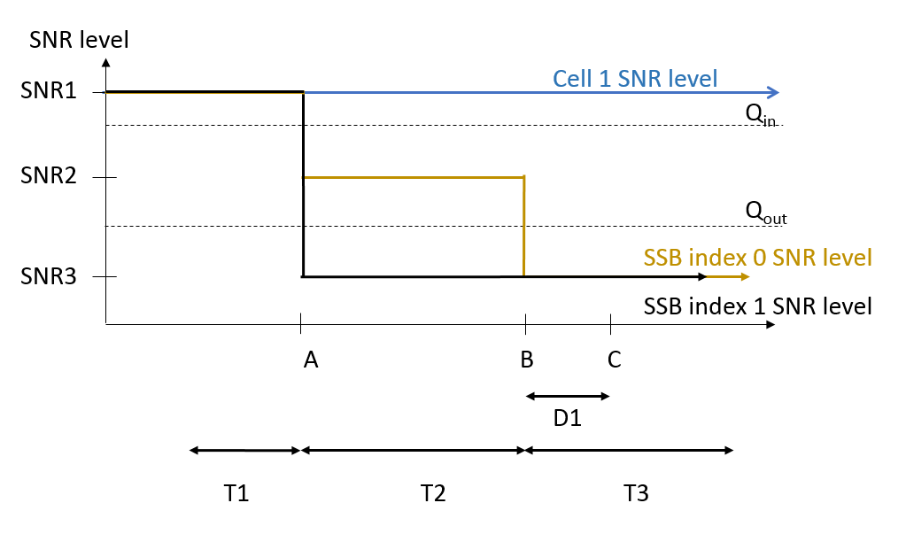
Figure A.5.5.1.1.1-1: SNR variation for out-of-sync testing

Figure A.5.5.1.1.1-2: Time multiplexed downlink transmissions
##### A.5.5.1.1.2 Test Requirements
The UE behavior in each test during time durations T1, T2 and T3 shall be as follows:
During the period from time point A to time point B the UE shall transmit uplink signal at least in all uplink slots configured for CSI transmission according to the configured periodic CSI reporting.
The UE shall stop transmitting uplink signal in Cell 2 no later than time point C (D1 second after the start of the time duration T3).
The rate of correct events observed during repeated tests shall be at least 90 %.
#### A.5.5.1.2 Radio Link Monitoring In-sync Test for FR2 PSCell configured with SSB-based RLM RS in non-DRX mode
##### A.5.5.1.2.1 Test Purpose and Environment
The purpose of this test is to verify that the UE properly detects the out of sync and in sync for the purpose of monitoring downlink radio link quality of the PSCell. This test will partly verify the FR2 radio link monitoring requirements in clause 8.1.
In the test, UE is configured to perform RLM on SSB, with detectionResource included in RadioLinkMonitoringRS set to SSB#0 and SSB#1, and purpose set to ‘rlf’. Supported test configurations are shown in table A.5.5.1.2.1-1. The test parameters are given in tables A.5.5.1.2.1-2, and A.5.5.1.2.1-3 below. There are two cells, Cell 1 is the E-UTRAN PCell, and Cell 2 is the PSCell, in the test. The E-UTRAN PCell setting refers to table A.3.7.2.1-2. The test consists of five successive time periods, with time duration of T1, T2, T3, T4 and T5 respectively. Figure A.5.5.1.2.1-1 shows the variation of the downlink SNR in the active cell to emulate out-of-sync and in-sync states, and Figure A.5.5.1.2.1-2 shows the Time multiplexed downlink transmissions from each Angle of Arrival. Prior to the start of the time duration T1, the UE shall be fully synchronized to Cell 1 and Cell 2. The UE shall be configured for periodic CSI reporting with a reporting periodicity of 5 ms.
Table A.5.5.1.2.1-1: Supported test configurations for FR2 PSCell
| Configuration | Description |
| --- | --- |
| 1 | FDD LTE PCell, NR 120 KHz SSB SCS, 100 MHz bandwidth, TDD duplex mode |
| 2 | TDD LTE PCell, NR 120 KHz SSB SCS, 100 MHz bandwidth, TDD duplex mode |
| NOTE: The UE is only required to pass in one of the supported test configurations in FR2 |  |

Table A.5.5.1.2.1-2: General test parameters for FR2 in-sync testing in non-DRX mode
| Parameter | Unit | Value |  |
| --- | --- | --- | --- |
|  |  | Test 1 |  |
| Active E-UTRA PCell |  | Cell 1 |  |
| E-UTRA RF Channel Number |  | 1 |  |
| Active PSCell |  | Cell 2 |  |
| RF Channel Number |  | 2 |  |
| Duplex mode | Config 1, 2 |  | TDD |
| BWchannel | Config 1, 2 |  | 100: NPRB,c = 66 |
| Data PRBs allocated | Config 1, 2 |  | 24 |
| DL initial BWP configuration | Config 1, 2 |  | DLBWP.0.1 |
| DL dedicated BWP configuration | Config 1, 2 |  | DLBWP.1.1 |
| UL initial BWP configuration | Config 1, 2 |  | ULBWP.0.1 |
| UL dedicated BWP configuration | Config 1, 2 |  | ULBWP.1.1 |
| TDD Configuration | Config 1, 2 |  | TDDConf.3.1 |
| RMSI CORESET Reference Channel | Config 1, 2 |  | CR.3.1 TDD |
| Dedicated CORESET Reference Channel | Config 1, 2 |  | CCR.3.1 TDD |
| SSB Configuration | Config 1, 2 |  | SSB.1 FR2 |
| SMTC Configuration | Config 1, 2 |  | SMTC.3 |
| PDSCH/PDCCH subcarrier spacing | Config 1, 2 |  | 120 KHz |
| PRACH Configuration | Config 1, 2 |  | Table A.3.8.3.1 |
| SSB index assigned as RLM RS | Config 1, 2 |  | 0,1 |
| OCNG parameters |  | OP.5 |  |
| CP length |  | Normal |  |
| In sync transmission parameters | DCI format |  | 1-0 |
|  | Number of Control OFDM symbols |  | 2 |
|  | Aggregation level | CCE | 4 |
|  | Ratio of hypothetical PDCCH RE energy to average SSS RE energy | dB | 0 |
|  | Ratio of hypothetical PDCCH DMRS energy to average SSS RE energy | dB | 0 |
|  | DMRS precoder granularity |  | REG bundle size |
|  | REG bundle size |  | 6 |
| Out of sync transmission parameters | DCI format |  | 1-0 |
|  | Number of Control OFDM symbols |  | 2 |
|  | Aggregation level | CCE | 8 |
|  | Ratio of hypothetical PDCCH RE energy to average SSS RE energy | dB | 4 |
|  | Ratio of hypothetical PDCCH DMRS energy to average SSS RE energy | dB | 4 |
|  | DMRS precoder granularity |  | REG bundle size |
|  | REG bundle size |  | 6 |
| DRX |  | OFF |  |
| Gap pattern ID |  | N.A. |  |
| Layer 3 filtering |  | Enabled |  |
| T310 timer | ms | 4000 |  |
| T311 timer | ms | 1000 |  |
| N310 |  | 1 |  |
| N311 |  | 1 |  |
| CSI-RS for CSI reporting | Config 1, 2 |  | CSI-RS.3.1 TDD |
| reportConfigType |  | periodic |  |
| reportQuantity |  | cri-RI-PMI-CQI |  |
| CSI reporting periodicity | slot | 40 |  |
| CSI reporting offset | slot | 4 |  |
| TCI states for PDCCH/PDSCH |  | TCI.State.2 |  |
| CSI-RS for tracking | Config 1, 2 |  | TRS.2.1 TDD |
| T1 | s | 0.2 |  |
| T2 | s | 0.2 |  |
| T3 | s | 1.88 |  |
| T4 | s | 0.2 |  |
| T5 | s | 3.84 |  |
| D1 | s | 3.8 |  |
| NOTE 1: All configurations are assigned to the UE prior to the start of time period T1. NOTE 2: UE-specific PDCCH is not transmitted after T1 starts. NOTE 3: E-UTRAN is in non-DRX mode under test. |  |  |  |

Table A.5.5.1.2.1-3: OTA related cell specific test parameters for FR2 (Cell 2) for in-sync radio link monitoring tests in non-DRX mode
| Parameter | Unit | Test 1 |  |  |  |  |  |  |  |  |  |
| --- | --- | --- | --- | --- | --- | --- | --- | --- | --- | --- | --- |
|  |  | T1 | T2 | T3 | T4 | T5 | T1 | T2 | T3 | T4 | T5 |
| AoA setup |  | Setup 3 defined in A.3.15 |  |  |  |  |  |  |  |  |  |
|  |  | AoA1 | AoA2 |  |  |  |  |  |  |  |  |
| Assumption for UE beamsNote 5 |  | Rough | Rough |  |  |  |  |  |  |  |  |
| EPRE ratio of PDCCH DMRS to SSS | dB | 0 |  |  |  |  |  |  |  |  |  |
| EPRE ratio of PDCCH to PDCCH DMRS | dB |  |  |  |  |  |  |  |  |  |  |
| EPRE ratio of PBCH DMRS to SSS | dB |  |  |  |  |  |  |  |  |  |  |
| EPRE ratio of PBCH to PBCH DMRS | dB |  |  |  |  |  |  |  |  |  |  |
| EPRE ratio of PSS to SSS | dB | 0 | Not sent |  |  |  |  |  |  |  |  |
| EPRE ratio of PDSCH DMRS to SSS | dB |  |  |  |  |  |  |  |  |  |  |
| EPRE ratio of PDSCH to PDSCH DMRS | dB |  |  |  |  |  |  |  |  |  |  |
| EPRE ratio of OCNG DMRS to SSS | dB |  |  |  |  |  |  |  |  |  |  |
| EPRE ratio of OCNG to OCNG DMRS | dB |  |  |  |  |  |  |  |  |  |  |
| ssb-Index 0 SNR | Config 1, 2 | dB | 2Note 6 | -6Note 6 | -15 | -15 | -15 |  |  |  |  |
| ssb-Index 1 SNR | Config 1, 2 |  | Not sent | 2Note 6 | -15 | -15 | -4.5 | 2Note 6 |  |  |  |
|  | Config 1, 2 | dBm/ 15KHz | -92.1 | -92.1 |  |  |  |  |  |  |  |
| Time multiplexing of the downlink transmissions from each AoA |  | Defined in figure A.5.5.1.2.1-2 |  |  |  |  |  |  |  |  |  |
| Propagation condition |  | TDL-A 30ns 75 Hz | TDL-A 30ns 75 Hz |  |  |  |  |  |  |  |  |
| NOTE 1: OCNG shall be used such that a constant total transmitted power spectral density is achieved for all OFDM symbols. NOTE 2: The signal contains PDCCH for UEs other than the device under test as part of OCNG. NOTE 3: SNR levels correspond to the signal to noise ratio over the SSS REs. NOTE 4: The SNR values are specified for testing a UE which supports 2RX on at least one band. For testing of a UE which supports 4RX on all bands, the SNR during T3 is A.3.6. NOTE 5: Information about types of UE beam is given in B.2.1.3, and does not limit UE implementation or test system implementation NOTE 6: This value allows up to 1 dB degradation from applied SNR to UE baseband |  |  |  |  |  |  |  |  |  |  |  |

Table A.5.5.1.2.1-4: Void
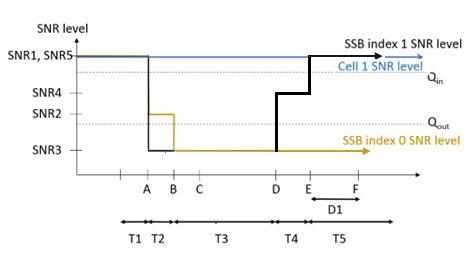
Figure A.5.5.1.2.1-1: SNR variation for in-sync testing

Figure A.5.5.1.2.1-2: Time multiplexed downlink transmissions
##### A.5.5.1.2.2 Test Requirements
The UE behaviour in each test during time durations T1, T2, T3, T4 and T5 shall be as follows:
During the period from time point A to time point F (D1 second after the start of time duration T5) the UE shall transmit uplink signal at least in all uplink slots configured for CSI transmission according to the configured periodic CSI reporting.
The rate of correct events observed during repeated tests shall be at least 90 %.
#### A.5.5.1.3 Radio Link Monitoring Out-of-sync Test for FR2 PSCell configured with SSB-based RLM RS in DRX mode
##### A.5.5.1.3.1 Test Purpose and Environment
The purpose of this test is to verify that the UE properly detects the out of sync and in sync for the purpose of monitoring downlink radio link quality of the PSCell when DRX is used. This test will partly verify the FR2 radio link monitoring requirements in clause 8.1.
In the test, UE is configured to perform RLM on SSB, with detectionResource included in RadioLinkMonitoringRS set to SSB#0 and SSB#1, and purpose set to ‘rlf’. Supported test configurations are shown in table A.5.5.1.3.1-1. The test parameters are given in tables A.5.5.1.3.1-2, and A.5.5.1.3.1-3. There are two cells, Cell 1 is the E-UTRAN PCell, and Cell 2 is the PSCell, in the test. The E-UTRAN PCell setting refers to table A.3.7.2.1-2. The test consists of three successive time periods, with time duration of T1, T2 and T3 respectively. Figure A.5.5.1.3.1-1 shows the variation of the downlink SNR in the active cell to emulate out-of-sync and in-sync states. Prior to the start of the time duration T1, the UE shall be fully synchronized to Cell 1 and Cell 2. The UE shall be configured for periodic CSI reporting with a reporting periodicity of 5 ms. In the test, DRX configuration is enabled and DRX inactivity timer has already been expired, i.e. UE tries to decode PDCCH and to send periodic CSI during the period when On-duration timer is running. Time alignment timers shall be set to “infinity” so that UL timing alignment is maintained during the test.
Table A.5.5.1.3.1-1: Supported test configurations for FR2 PSCell
| Configuration | Description |
| --- | --- |
| 1 | FDD LTE PCell, NR 120 KHz SSB SCS, 100 MHz bandwidth, TDD duplex mode |
| 2 | TDD LTE PCell, NR 120 KHz SSB SCS, 100 MHz bandwidth, TDD duplex mode |
| NOTE: The UE is only required to pass in one of the supported test configurations in FR2 |  |

Table A.5.5.1.3.1-2: General test parameters for FR2 out-of-sync testing in DRX mode
| Parameter | Unit | Value |  |
| --- | --- | --- | --- |
|  |  | Test 1 |  |
| Active E-UTRA PCell |  | Cell 1 |  |
| E-UTRA RF Channel Number |  | 1 |  |
| Active PSCell |  | Cell 2 |  |
| RF Channel Number |  | 2 |  |
| Duplex mode | Config 1, 2 |  | TDD |
| BWchannel | Config 1, 2 |  | 100: NPRB,c = 66 |
| Data PRBs allocated | Config 1, 2 |  | 66 |
| DL initial BWP configuration | Config 1, 2 |  | DLBWP.0.1 |
| DL dedicated BWP configuration | Config 1, 2 |  | DLBWP.1.1 |
| UL initial BWP configuration | Config 1, 2 |  | ULBWP.0.1 |
| UL dedicated BWP configuration | Config 1, 2 |  | ULBWP.1.1 |
| TDD Configuration | Config 1, 2 |  | TDDConf.3.1 |
| RMSI CORESET Reference Channel | Config 1, 2 |  | CR.3.1 TDD |
| Dedicated CORESET Reference Channel | Config 1, 2 |  | CCR.3.4 TDD |
| SSB Configuration | Config 1, 2 |  | SSB.1 FR2 |
| SMTC Configuration | Config 1, 2 |  | SMTC.1 |
| PDSCH/PDCCH subcarrier spacing | Config 1, 2 |  | 120 KHz |
| PRACH Configuration | Config 1, 2 |  | Table A.3.8.3.1 |
| SSB index assigned as RLM RS | Config 1, 2 |  | 0,1 |
| OCNG parameters |  | OP.1 |  |
| CP length |  | Normal |  |
| Out of sync transmission parameters | DCI format |  | 1-0 |
|  | Number of Control OFDM symbols |  | 2 |
|  | Aggregation level | CCE | 8 |
|  | Ratio of hypothetical PDCCH RE energy to average SSS RE energy | dB | 4 |
|  | Ratio of hypothetical PDCCH DMRS energy to average SSS RE energy | dB | 4 |
|  | DMRS precoder granularity |  | REG bundle size |
|  | REG bundle size |  | 6 |
| DRX Configuration |  | DRX.3 |  |
| Gap pattern ID |  | N.A. |  |
| Layer 3 filtering |  | Enabled |  |
| T310 timer | ms | 0 |  |
| T311 timer | ms | 1000 |  |
| N310 |  | 1 |  |
| N311 |  | 1 |  |
| CSI-RS for CSI reporting | Config 1, 2 |  | CSI-RS.3.1 TDD |
| reportConfigType |  | periodic |  |
| reportQuantity |  | cri-RI-PMI-CQI |  |
| CSI reporting periodicity | slot | 40 |  |
| CSI reporting offset | slot | 4 |  |
| TCI states for PDCCH/PDSCH |  | TCI.State.2 |  |
| CSI-RS for tracking | Config 1, 2 |  | TRS.2.1 TDD |
| T1 | s | 0.2 |  |
| T2 | s | 14.48 |  |
| T3 | s | 14.48 |  |
| D1 | s | 14.44 |  |
| NOTE 1: All configurations are assigned to the UE prior to the start of time period T1. NOTE 2: UE-specific PDCCH is not transmitted after T1 starts. NOTE 3: E-UTRAN is in non-DRX mode under test. |  |  |  |

Table A.5.5.1.3.1-3: OTA related cell specific test parameters for FR2 (Cell 2) for out-of-sync radio link monitoring tests in DRX mode
| Parameter | Unit | Test 1 |  |  |  |
| --- | --- | --- | --- | --- | --- |
|  |  | T1 | T2 | T3 |  |
| AoA setup |  | Setup 1 defined in A.3.15 |  |  |  |
| Assumption for UE beamsNote 5 |  | Rough |  |  |  |
| EPRE ratio of PDCCH DMRS to SSS | dB | 4 |  |  |  |
| EPRE ratio of PDCCH to PDCCH DMRS | dB | 0 |  |  |  |
| EPRE ratio of PBCH DMRS to SSS | dB |  |  |  |  |
| EPRE ratio of PBCH to PBCH DMRS | dB |  |  |  |  |
| EPRE ratio of PSS to SSS | dB |  |  |  |  |
| EPRE ratio of PDSCH DMRS to SSS | dB | 0 |  |  |  |
| EPRE ratio of PDSCH to PDSCH DMRS | dB |  |  |  |  |
| EPRE ratio of OCNG DMRS to SSS | dB |  |  |  |  |
| EPRE ratio of OCNG to OCNG DMRS | dB |  |  |  |  |
| ssb-Index 0 SNR | Config 1, 2 | dB | 2Note 6 | -6Note 6 | -15 |
| ssb-Index 1 SNR | Config 1, 2 |  | 2Note 6 | -15 | -15 |
|  | Config 1, 2 | dBm/15KHz | -104.7 dBm |  |  |
| Propagation condition |  | TDL-A 30ns 75 Hz |  |  |  |
| NOTE 1: OCNG shall be used such that the resources in Cell 2 are fully allocated and a constant total transmitted power spectral density is achieved for all OFDM symbols. NOTE 2: The signal contains PDCCH for UEs other than the device under test as part of OCNG. NOTE 3: SNR levels correspond to the signal to noise ratio over the SSS REs. NOTE 4: The SNR values are specified for testing a UE which supports 2RX on at least one band. For testing of a UE which supports 4RX on all bands, the SNR during T3 is A.3.6. NOTE 5: Information about types of UE beam is given in B.2.1.3, and does not limit UE implementation or test system implementation NOTE 6: This value allows up to 1 dB degradation from applied SNR to UE baseband |  |  |  |  |  |

Table A.5.5.1.3.1-4: Void
Table A.5.5.1.3.1-5: Void

Figure A.5.5.1.3.1-1: SNR variation for out-of-sync testing
##### A.5.5.1.3.2 Test Requirements
The UE behavior in each test during time durations T1, T2 and T3 shall be as follows:
During the period from time point A to time point B the UE shall transmit uplink signal at least in all uplink slots configured for CSI transmission according to the configured periodic CSI reporting.
The UE shall stop transmitting uplink signal in Cell 2 no later than time point C (D1 second after the start of the time duration T3).
The rate of correct events observed during repeated tests shall be at least 90 %.
#### A.5.5.1.4 Radio Link Monitoring In-sync Test for FR2 PSCell configured with SSB-based RLM RS in DRX mode
##### A.5.5.1.4.1 Test Purpose and Environment
The purpose of this test is to verify that the UE properly detects the out of sync and in sync for the purpose of monitoring downlink radio link quality of the PSCell when DRX is used. This test will partly verify the FR2 radio link monitoring requirements in clause 8.1.
In the test, UE is configured to perform RLM on SSB, with detectionResource included in RadioLinkMonitoringRS set to SSB#0 and SSB#1, and purpose set to ‘rlf’. Supported test configurations are shown in table A.5.5.1.4.1-1. The test parameters are given in tables A.5.5.1.4.1-2, and A.5.5.1.4.1-3. There are two cells, Cell 1 is the E-UTRAN PCell, and Cell 2 is the PSCell, in the test. The E-UTRAN PCell setting refers to table A.3.7.2.1-2. The test consists of five successive time periods, with time duration of T1, T2, T3, T4 and T5 respectively. Figure A.5.5.1.4.1-1 shows the variation of the downlink SNR in the active cell to emulate out-of-sync and in-sync states. Prior to the start of the time duration T1, the UE shall be fully synchronized to Cell 1 and Cell 2. The UE shall be configured for periodic CSI reporting with a reporting periodicity of 5 ms. In the test, DRX configuration is enabled and DRX inactivity timer has already been expired, i.e. UE tries to decode PDCCH and to send periodic CSI during the period when On-duration timer is running. Time alignment timers shall be set to “infinity” so that UL timing alignment is maintained during the test.
Table A.5.5.1.4.1-1: Supported test configurations for FR2 PSCell
| Configuration | Description |
| --- | --- |
| 1 | FDD LTE PCell, NR 120 KHz SSB SCS, 100 MHz bandwidth, TDD duplex mode |
| 2 | TDD LTE PCell, NR 120 KHz SSB SCS, 100 MHz bandwidth, TDD duplex mode |
| NOTE: The UE is only required to pass in one of the supported test configurations in FR2 |  |

Table A.5.5.1.4.1-2: General test parameters for FR2 in-sync testing in DRX mode
| Parameter | Unit | Value |  |
| --- | --- | --- | --- |
|  |  | Test 1 |  |
| Active E-UTRA PCell |  | Cell 1 |  |
| E-UTRA RF Channel Number |  | 1 |  |
| Active PSCell |  | Cell 2 |  |
| RF Channel Number |  | 2 |  |
| Duplex mode | Config 1, 2 |  | TDD |
| BWchannel | Config 1, 2 |  | 100: NPRB,c = 66 |
| Data PRBs allocated | Config 1, 2 |  | 66 |
| DL initial BWP configuration | Config 1, 2 |  | DLBWP.0.1 |
| DL dedicated BWP configuration | Config 1, 2 |  | DLBWP.1.1 |
| UL initial BWP configuration | Config 1, 2 |  | ULBWP.0.1 |
| UL dedicated BWP configuration | Config 1, 2 |  | ULBWP.1.1 |
| TDD Configuration | Config 1, 2 |  | TDDConf.3.1 |
| RMSI CORESET Reference Channel | Config 1, 2 |  | CR.3.1 TDD |
| Dedicated CORESET Reference Channel | Config 1, 2 |  | CCR.3.1 TDD |
| SSB Configuration | Config 1, 2 |  | SSB.1 FR2 |
| SMTC Configuration | Config 1, 2 |  | SMTC.3 |
| PDSCH/PDCCH subcarrier spacing | Config 1, 2 |  | 120 KHz |
| PRACH Configuration | Config 1, 2 |  | Table A.3.8.3.1 |
| SSB index assigned as RLM RS | Config 1, 2 |  | 0,1 |
| OCNG parameters |  | OP.1 |  |
| CP length |  | Normal |  |
| In sync transmission parameters | DCI format |  | 1-0 |
|  | Number of Control OFDM symbols |  | 2 |
|  | Aggregation level | CCE | 4 |
|  | Ratio of hypothetical PDCCH RE energy to average SSS RE energy | dB | 0 |
|  | Ratio of hypothetical PDCCH DMRS energy to average SSS RE energy | dB | 0 |
|  | DMRS precoder granularity |  | REG bundle size |
|  | REG bundle size |  | 6 |
| Out of sync transmission parameters | DCI format |  | 1-0 |
|  | Number of Control OFDM symbols |  | 2 |
|  | Aggregation level | CCE | 8 |
|  | Ratio of hypothetical PDCCH RE energy to average SSS RE energy | dB | 4 |
|  | Ratio of hypothetical PDCCH DMRS energy to average SSS RE energy | dB | 4 |
|  | DMRS precoder granularity |  | REG bundle size |
|  | REG bundle size |  | 6 |
| DRX Configuration |  | DRX.11 |  |
| Gap pattern ID |  | N.A. |  |
| Layer 3 filtering |  | Enabled |  |
| T310 timer | ms | 4000 |  |
| T311 timer | ms | 1000 |  |
| N310 |  | 1 |  |
| N311 |  | 1 |  |
| CSI-RS for CSI reporting | Config 1, 2 |  | CSI-RS.3.1 TDD |
| reportConfigType |  | periodic |  |
| reportQuantity |  | cri-RI-PMI-CQI |  |
| CSI reporting periodicity | slot | 40 |  |
| CSI reporting offset | slot | 4 |  |
| TCI states for PDCCH/PDSCH |  | TCI.State.2 |  |
| CSI-RS for tracking | Config 1, 2 |  | TRS.2.1 TDD |
| T1 | s | 0.2 |  |
| T2 | s | 0.2 |  |
| T3 | s | 2.8 |  |
| T4 | s | 0.2 |  |
| T5 | s | 3.88 |  |
| D1 | s | 3.84 |  |
| NOTE 1: All configurations are assigned to the UE prior to the start of time period T1. NOTE 2: UE-specific PDCCH is not transmitted after T1 starts. NOTE 3: E-UTRAN is in non-DRX mode under test. |  |  |  |

Table A.5.5.1.4.1-3: OTA related cell specific test parameters for FR2 (Cell 2) for in-sync radio link monitoring test in DRX mode
| Parameter | Unit | Test 1 |  |  |  |  |  |
| --- | --- | --- | --- | --- | --- | --- | --- |
|  |  | T1 | T2 | T3 | T4 | T5 |  |
| AoA setup |  | Setup 1 defined in A.3.15 |  |  |  |  |  |
| Assumption for UE beamsNote 5 |  | Rough |  |  |  |  |  |
| EPRE ratio of PDCCH DMRS to SSS | dB | 0 |  |  |  |  |  |
| EPRE ratio of PDCCH to PDCCH DMRS | dB | 0 |  |  |  |  |  |
| EPRE ratio of PBCH DMRS to SSS | dB |  |  |  |  |  |  |
| EPRE ratio of PBCH to PBCH DMRS | dB |  |  |  |  |  |  |
| EPRE ratio of PSS to SSS | dB |  |  |  |  |  |  |
| EPRE ratio of PDSCH DMRS to SSS | dB | 0 |  |  |  |  |  |
| EPRE ratio of PDSCH to PDSCH DMRS | dB |  |  |  |  |  |  |
| EPRE ratio of OCNG DMRS to SSS | dB |  |  |  |  |  |  |
| EPRE ratio of OCNG to OCNG DMRS | dB |  |  |  |  |  |  |
| ssb-Index 0 SNR | Config 1, 2 | dB | 2Note 6 | -6Note 6 | -15 | -4.5 | 2Note 6 |
| ssb-Index 1 SNR | Config 1, 2 |  | 2Note 6 | -15 | -15 | -15 | -15 |
|  | Config 1, 2 | dBm/15KHz | -104.7 dBm |  |  |  |  |
| Propagation condition |  | TDL-A 30ns 75 Hz |  |  |  |  |  |
| NOTE 1: OCNG shall be used such that the resources in Cell 2 are fully allocated and a constant total transmitted power spectral density is achieved for all OFDM symbols. NOTE 2: The signal contains PDCCH for UEs other than the device under test as part of OCNG.3 NOTE 3: SNR levels correspond to the signal to noise ratio over the SSS REs. NOTE 4: The SNR values are specified for testing a UE which supports 2RX on at least one band. For testing of a UE which supports 4RX on all bands, the SNR during T3 is A.3.6. NOTE 5: Information about types of UE beam is given in B.2.1.3, and does not limit UE implementation or test system implementation NOTE 6: This value allows up to 1 dB degradation from applied SNR to UE baseband |  |  |  |  |  |  |  |

Table A.5.5.1.4.1-4: Void
Table A.5.5.1.4.1-5: Void
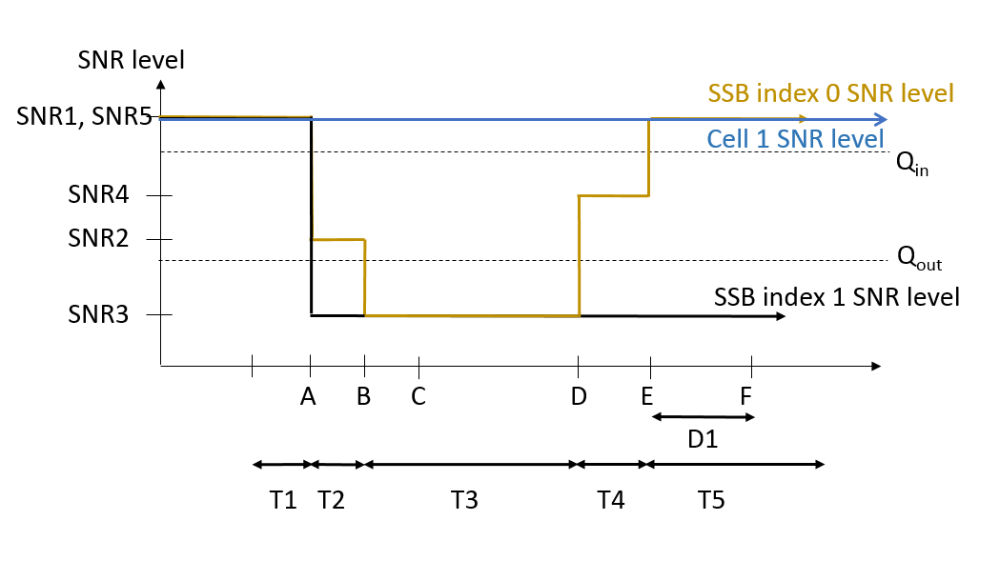
Figure A.5.5.1.4.1-1: SNR variation for in-sync testing.
##### A.5.5.1.4.2 Test Requirements
The UE behaviour in each test during time durations T1, T2, T3, T4 and T5 shall be as follows:
During the period from time point A to time point F (D1 second after the start of time duration T5) the UE shall transmit uplink signal at least in all uplink slots configured for CSI transmission according to the configured periodic CSI reporting.
The rate of correct events observed during repeated tests shall be at least 90 %.
#### A.5.5.1.5 EN-DC Radio Link Monitoring Out-of-sync Test for FR2 PSCell configured with CSI-RS-based RLM in non-DRX mode
A.5.5.1.5.1 Test Purpose and Environment
The purpose of this test is to verify that the UE properly detects the out of sync for the purpose of monitoring downlink CSI-RS based radio link quality of the PSCell when no DRX is used. This test will partly verify the FR2 TDD PSCell CSI-RS Out-of-sync radio link monitoring requirements in clause 8.1.
The test parameters are given in Tables A.5.5.1.5.1-1, A.5.5.1.5.1-2, A.5.5.1.5.1-3 and A.5.5.1.5.1-3A below. There are two cells, cell 1 is the E-UTRAN PCell, and cell 2 is the PSCell, in the test. The test consists of three successive time periods, with time duration of T1, T2 and T3 respectively. Figure A.5.5.1.5.1-1 shows the variation of the downlink SNR in the E-UTRAN PCell and the PSCell to emulate out-of-sync and in-sync states. Prior to the start of the time duration T1, the UE shall be fully synchronized to cell 1 and cell 2. The UE shall be configured for periodic CSI reporting with a reporting periodicity of 5ms. In the test, DRX configuration is not enabled. The UE is configured to perform inter-frequency measurements using GP ID #0 (40ms). In the test, SSB0 and SSB1 are configured as BFD-RS and are not same as RLM-RS to avoid triggering the beam failure during the RLM test.
Table A.5.5.1.5.1-1: Supported test configurations for FR2 PSCell
| Configuration | Description |
| --- | --- |
| 1 | LTE FDD, NR 120 kHz SSB SCS, 100 MHz bandwidth, TDD duplex mode |
| 2 | LTE TDD, NR 120 kHz SSB SCS, 100 MHz bandwidth, TDD duplex mode |
| NOTE: The UE is only required to pass in one of the supported test configurations in FR2 |  |

Table A.5.5.1.5.1-2: General test parameters for FR2 PSCell for CSI-RS out-of-sync testing in non-DRX mode
| Parameter | Unit | Value |  |
| --- | --- | --- | --- |
|  |  | Test 1 |  |
| Active E-UTRA PCell |  | Cell 1 |  |
| E-UTRA RF Channel Number |  | 1 |  |
| Active PSCell |  | Cell 2 |  |
| RF Channel Number |  | 2 |  |
| Duplex Mode |  | TDD |  |
| BWchannel | Config 1, 2 |  | 100: NRB,c = 66 |
| Data RBs allocated | Config 1, 2 |  | 24 |
| BWoccupied | Config 1, 2 |  | 24 |
| TDD Configuration | Config 1 |  | TDDConf.3.1 |
|  | Config 2 |  | TDDConf.3.1 |
| DL initial BWP configuration | Config 1, 2 |  | DLBWP.0.1 |
| DL dedicated BWP configuration | Config 1, 2 |  | DLBWP.1.4 |
| UL initial BWP configuration | Config 1, 2 |  | ULBWP.0.1 |
| UL dedicated BWP configuration | Config 1, 2 |  | ULBWP.1.4 |
| RMSI CORESET Reference Channel | Config 1 |  | CR.3.1 TDD |
|  | Config 2 |  | CR.3.1 TDD |
| Dedicated CORESET Reference Channel | Config 1 |  | CCR.3.4 TDD CCR.3.6 TDD |
|  | Config 2 |  | CCR.3.4 TDD CCR.3.6 TDD |
| SSB Configuration | Config 1 |  | SSB.1 FR2 |
|  | Config 2 |  | SSB.1 FR2 |
| SMTC Configuration | Config 1 |  | SMTC.1 |
|  | Config 2 |  | SMTC.1 |
| PDSCH/PDCCH subcarrier spacing | Config 1 |  | 120 KHz |
|  | Config 2 |  | 120 KHz |
| CSI-RS for RLM | Config 1, 2 |  | Resource #4 in TRS.2.1 TDD Resource #4 in TRS.2.2 TDD |
| SSB index for BFD-RS | Config 1, 2 |  | 0, 1 |
| TRS configuration |  | TRS.2.1 TDD TRS.2.2 TDD |  |
| TCI configuration for PDCCH#1/PDSCH |  | TCI.State.2 |  |
| TCI configuration for PDCCH#2 |  | TCI.State.3 |  |
| OCNG parameters |  | OP.5 |  |
| CP length |  | Normal |  |
| Out of sync transmission parameters | DCI format |  | 1-0 |
|  | Number of Control OFDM symbols |  | 2 |
|  | Aggregation level | CCE | 8 |
|  | Ratio of hypothetical PDCCH RE energy to average CSI-RS RE energy | dB | 4 |
|  | Ratio of hypothetical PDCCH DMRS energy to average CSI-RS RE energy | dB | 4 |
|  | DMRS precoder granularity |  | REG bundle size |
|  | REG bundle size |  | 6 |
| DRX |  | OFF |  |
| Gap pattern ID |  | gp0 |  |
| Layer 3 filtering |  | Enabled |  |
| T310 timer | ms | 0 |  |
| T311 timer | ms | 1000 |  |
| N310 |  | 1 |  |
| N311 |  | 1 |  |
| CSI-RS for CSI reporting | Config 1 |  | CSI-RS.3.1 TDD |
|  | Config 2 |  | CSI-RS.3.1 TDD |
| reportConfigType |  | periodic |  |
| reportQuantity |  | cri-RI-PMI-CQI |  |
| CSI reporting periodicity | slot | 40 |  |
| CSI reporting offset | slot | 4 |  |
| T1 | s | 0.2 |  |
| T2 | s | 0.35 |  |
| T3 | s | 0.35 |  |
| D1 | s | 0.31 |  |
| Note 1: UE-specific PDCCH is not transmitted after T1 starts. Note 2: E-UTRAN is in non-DRX mode under test. |  |  |  |

Table A.5.5.1.5.1-3: Cell specific test parameters for FR2 for CSI-RS out-of-sync radio link monitoring in non-DRX mode
| Parameter | Unit | Test 1 |  |  |  |  |  |
| --- | --- | --- | --- | --- | --- | --- | --- |
|  |  | T1 | T2 | T3 | T1 | T2 | T3 |
| AoA setup |  | Setup 3 defined in A.3.15 |  |  |  |  |  |
|  |  | AoA1 | AoA2 |  |  |  |  |
| Assumption for UE beamsNote 10 |  | Rough | Rough |  |  |  |  |
| EPRE ratio of PDCCH DMRS to SSS | dB | 4 |  |  |  |  |  |
| EPRE ratio of PDCCH to PDCCH DMRS | dB |  |  |  |  |  |  |
| EPRE ratio of PBCH DMRS to SSS | dB |  |  |  |  |  |  |
| EPRE ratio of PBCH to PBCH DMRS | dB |  |  |  |  |  |  |
| EPRE ratio of PSS to SSS | dB | 0 | Not sent |  |  |  |  |
| EPRE ratio of PDSCH DMRS to SSS | dB |  |  |  |  |  |  |
| EPRE ratio of PDSCH to PDSCH DMRS | dB |  |  |  |  |  |  |
| EPRE ratio of OCNG DMRS to SSS | dB |  |  |  |  |  |  |
| EPRE ratio of OCNG to OCNG DMRS | dB |  |  |  |  |  |  |
| SNR on RLM-RS1 | Config 1, 2 | dB | 2Note 11 | -6Note 11 | -15 |  |  |
| SNR on RLM-RS2 | Config 1, 2 | dB | Not sent | 2Note 11 | -15 | -15 |  |
|  | Config 1, 2 | dBm/ 15 kHz | -92.1 | -92.1 |  |  |  |
| Propagation condition |  | TDL-A 30ns 75 Hz | TDL-A 30ns 75 Hz |  |  |  |  |
| NOTE 1: OCNG shall be used such that the resources in Cell 2 are fully allocated and a constant total transmitted power spectral density is achieved for all OFDM symbols. NOTE 2: The uplink resources for CSI reporting are assigned to the UE prior to the start of time period T1. NOTE 3: NZP CSI-RS resource set configuration for CSI reporting are assigned to the UE prior to the start of time period T1. NOTE 4: Measurement gap configuration is assigned to the UE prior to the start of time period T1. NOTE 5: The timers and layer 3 filtering related parameters are configured prior to the start of time period T1. NOTE 6: The signal contains PDCCH for UEs other than the device under test as part of OCNG. NOTE 7: SNR levels correspond to the signal to noise ratio over the SSS REs. NOTE 8: The SNR in time periods T1, T2 and T3 is denoted as SNR1, SNR2 and SNR3 respectively in figure A.5.5.1.5.1-1. NOTE 9: The SNR values are specified for testing a UE which supports 2RX on at least one band. For testing of a UE which supports 4RX on all bands, the SNR during T3 is A.3.6. NOTE 10: Information about types of UE beam is given in B.2.1.3, and does not limit UE implementation or test system implementation NOTE 11: This value allows up to 1 dB degradation from applied SNR to UE baseband |  |  |  |  |  |  |  |

Table A.5.5.1.5.1-3A: Measurement gap configuration for FR2 CSI-RS out-of-sync radio link monitoring in non-DRX mode
| Field | Test 1 |
| --- | --- |
|  | Value |
| gapOffset | 0 |
| NOTE 1: E-UTRAN PCell and PSCell are SFN-synchronous and frame boundary aligned. (Ensure that RLM RS is partially overlapped with measurement gap) |  |

Table A.5.5.1.5.1-4: Void
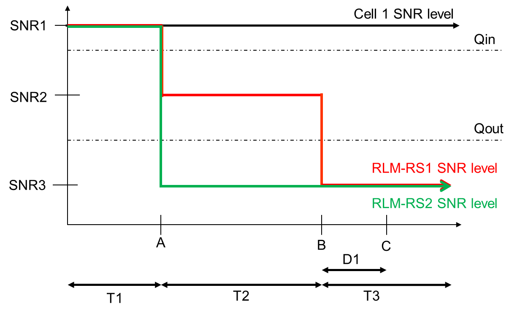
Figure A.5.5.1.5.1-1: SNR variation for CSI-RS out-of-sync testing
A.5.5.1.5.2 Test Requirements
The UE behaviour during time durations T1, T2, and T3 shall be as follows:
During the period from time point A to time point B the UE shall transmit uplink signal in Cell 2 (PSCell) at least in all uplink slots configured for CSI transmission according to the configured periodic CSI reporting for Cell 2.
The UE shall stop transmitting uplink signal in Cell 2 (PSCell) no later than time point C (D1 after the start of the time duration T3) on the PSCell.
The rate of correct events observed during repeated tests shall be at least 90 %.
#### A.5.5.1.6 EN-DC Radio Link Monitoring In-sync Test for FR2 PSCell configured with CSI-RS-based RLM in non-DRX mode
A.5.5.1.6.1 Test Purpose and Environment
The purpose of this test is to verify that the UE properly detects the in sync for the purpose of monitoring downlink CSI-RS based radio link quality of the PSCell when no DRX is used. This test will partly verify the FR2 TDD PSCell CSI-RS In-sync radio link monitoring requirements in clause 8.1.
The test parameters are given in Tables A.5.5.1.6.1-1, A.5.5.1.6.1-2, and A.5.5.1.6.1-3 below. There are two cells, cell 1which is the E-UTRAN PCell, and cell 2 is the PSCell, in the test. The test consists of five successive time periods, with time duration of T1, T2, T3, T4 and T5 respectively. Figure A.5.5.1.6.1-1 shows the variation of the downlink SNR in the PSCell to emulate out-of-sync and in-sync states. Prior to the start of the time duration T1, the UE shall be fully synchronized to cell 1 and cell 2. The UE shall be configured for periodic CSI reporting with a reporting periodicity of 5ms. In the test, DRX configuration is not enabled. In the test, SSB0 and SSB1 are configured as BFD-RS and are not same as RLM-RS to avoid triggering the beam failure during the RLM test.
Table A.5.5.1.6.1-1: Supported test configurations for FR2 PSCell
| Configuration | Description |
| --- | --- |
| 1 | LTE FDD, NR 120 kHz SSB SCS, 100 MHz bandwidth, TDD duplex mode |
| 2 | LTE TDD, NR 120 kHz SSB SCS, 100 MHz bandwidth, TDD duplex mode |
| NOTE: The UE is only required to pass in one of the supported test configurations in FR2 |  |

Table A.5.5.1.6.1-2: General test parameters for FR2 PSCell for CSI-RS in-sync testing in non-DRX mode
| Parameter | Unit | Value |  |
| --- | --- | --- | --- |
|  |  | Test 1 |  |
| Active E-UTRA PCell |  | Cell 1 |  |
| E-UTRA RF Channel Number |  | 1 |  |
| Active PSCell |  | Cell 2 |  |
| RF Channel Number |  | 2 |  |
| Duplex Mode |  | TDD |  |
| BWchannel | Config 1, 2 |  | 100: NRB,c = 66 |
| Data RBs allocated | Config 1, 2 |  | 24 |
| BWoccupied | Config 1, 2 |  | 24 |
| TDD Configuration | Config 1 |  | TDDConf.3.1 |
|  | Config 2 |  | TDDConf.3.1 |
| DL initial BWP configuration | Config 1, 2 |  | DLBWP.0.1 |
| DL dedicated BWP configuration | Config 1, 2 |  | DLBWP.1.4 |
| UL initial BWP configuration | Config 1, 2 |  | ULBWP.0.1 |
| UL dedicated BWP configuration | Config 1, 2 |  | ULBWP.1.4 |
| RMSI CORESET Reference Channel | Config 1 |  | CR.3.1 TDD |
|  | Config 2 |  | CR.3.1 TDD |
| Dedicated CORESET Reference Channel | Config 1 |  | CCR.3.1 TDD CCR.3.3 TDD |
|  | Config 2 |  | CCR.3.1 TDD CCR.3.3 TDD |
| SSB Configuration | Config 1 |  | SSB.1 FR2 |
|  | Config 2 |  | SSB.1 FR2 |
| SMTC Configuration | Config 1 |  | SMTC.1 |
|  | Config 2 |  | SMTC.1 |
| PDSCH/PDCCH subcarrier spacing | Config 1 |  | 120 KHz |
|  | Config 2 |  | 120 KHz |
| CSI-RS for RLM | Config 1, 2 |  | Resource #4 in TRS.2.1 TDD Resource #4 in TRS.2.2 TDD |
| SSB index for BFD-RS | Config 1, 2 |  | 0, 1 |
| OCNG parameters |  | OP.5 |  |
| TRS configuration |  | TRS.2.1 TDD TRS.2.2 TDD |  |
| TCI configuration for PDCCH#1/PDSCH |  | TCI.State.2 |  |
| TCI configuration for PDCCH#2 |  | TCI.State.3 |  |
| CP length |  | Normal |  |
| Out of sync transmission parameters | DCI format |  | 1-0 |
|  | Number of Control OFDM symbols |  | 2 |
|  | Aggregation level | CCE | 8 |
|  | Ratio of hypothetical PDCCH RE energy to average CSI-RS RE energy | dB | 4 |
|  | Ratio of hypothetical PDCCH DMRS energy to average CSI-RS RE energy | dB | 4 |
|  | DMRS precoder granularity |  | REG bundle size |
|  | REG bundle size |  | 6 |
| In sync transmission parameters | DCI format |  | 1-0 |
|  | Number of Control OFDM symbols |  | 2 |
|  | Aggregation level | CCE | 4 |
|  | Ratio of hypothetical PDCCH RE energy to average CSI-RS RE energy | dB | 0 |
|  | Ratio of hypothetical PDCCH DMRS energy to average CSI-RS RE energy | dB | 0 |
|  | DMRS precoder granularity |  | REG bundle size |
|  | REG bundle size |  | 6 |
| DRX |  | OFF |  |
| Gap pattern ID |  | N.A. |  |
| Layer 3 filtering |  | Enabled |  |
| T310 timer | ms | 1000 |  |
| T311 timer | ms | 1000 |  |
| N310 |  | 1 |  |
| N311 |  | 1 |  |
| CSI-RS for CSI reporting | Config 1 |  | CSI-RS.3.1 TDD |
|  | Config 2 |  | CSI-RS.3.1 TDD |
| reportConfigType |  | periodic |  |
| reportQuantity |  | cri-RI-PMI-CQI |  |
| CSI reporting periodicity | slot | 40 |  |
| CSI reporting offset | slot | 4 |  |
| T1 | s | 0.2 |  |
| T2 | s | 0.2 |  |
| T3 | s | 0.24 |  |
| T4 | s | 0.2 |  |
| T5 | s | 0.88 |  |
| D1 | s | 0.84 |  |
| Note 1: UE-specific PDCCH is not transmitted after T1 starts. Note 2: E-UTRAN is in non-DRX mode under test. |  |  |  |

Table A.5.5.1.6.1-3: Cell specific test parameters for FR2 for CSI-RS in-sync radio link monitoring in non-DRX mode
| Parameter | Unit | Test 1 |  |  |  |  |  |  |  |  |  |
| --- | --- | --- | --- | --- | --- | --- | --- | --- | --- | --- | --- |
|  |  | T1 | T2 | T3 | T4 | T5 | T1 | T2 | T3 | T4 | T5 |
| AoA setup |  | Setup 3 defined in A.3.15 |  |  |  |  |  |  |  |  |  |
|  |  | AoA1 | AoA2 |  |  |  |  |  |  |  |  |
| Assumption for UE beamsNote 10 |  | Rough | Rough |  |  |  |  |  |  |  |  |
| EPRE ratio of PDCCH DMRS to SSS | dB | 0 |  |  |  |  |  |  |  |  |  |
| EPRE ratio of PDCCH to PDCCH DMRS | dB |  |  |  |  |  |  |  |  |  |  |
| EPRE ratio of PBCH DMRS to SSS | dB |  |  |  |  |  |  |  |  |  |  |
| EPRE ratio of PBCH to PBCH DMRS | dB |  |  |  |  |  |  |  |  |  |  |
| EPRE ratio of PSS to SSS | dB | 0 | Not sent |  |  |  |  |  |  |  |  |
| EPRE ratio of PDSCH DMRS to SSS | dB |  |  |  |  |  |  |  |  |  |  |
| EPRE ratio of PDSCH to PDSCH DMRS | dB |  |  |  |  |  |  |  |  |  |  |
| EPRE ratio of OCNG DMRS to SSS | dB |  |  |  |  |  |  |  |  |  |  |
| EPRE ratio of OCNG to OCNG DMRS | dB |  |  |  |  |  |  |  |  |  |  |
| SNR on RLM-RS1 | Config 1, 2 | dB | 2Note 11 | -6Note 11 | -15 | -15 | -15 |  |  |  |  |
| SNR on RLM-RS2 | Config 1, 2 | dB | Not sent | 2Note 11 | -15 | -15 | -4.5 | 2Note 6 |  |  |  |
|  | Config 1, 2 | dBm/ 15KHz | -92.1 | -92.1 |  |  |  |  |  |  |  |
| Propagation condition |  | TDL-A 30ns 75 Hz | TDL-A 30ns 75 Hz |  |  |  |  |  |  |  |  |
| NOTE 1: OCNG shall be used such that the resources in Cell 2 are fully allocated and a constant total transmitted power spectral density is achieved for all OFDM symbols. NOTE 2: The uplink resources for CSI reporting are assigned to the UE prior to the start of time period T1. NOTE 3: NZP CSI-RS resource set configuration for CSI reporting are assigned to the UE prior to the start of time period T1. NOTE 4: Measurement gap configuration is assigned to the UE prior to the start of time period T1. NOTE 5: The timers and layer 3 filtering related parameters are configured prior to the start of time period T1. NOTE 6: The signal contains PDCCH for UEs other than the device under test as part of OCNG. NOTE 7: SNR levels correspond to the signal to noise ratio over the SSS REs. NOTE 8: The SNR in time periods T1, T2, T3, T4 and T5 is denoted as SNR1, SNR2, SNR3, SNR4 and SNR5 respectively in figure A.5.5.1.6.1-1. NOTE 9: The SNR values are specified for testing a UE which supports 2RX on at least one band. For testing of a UE which supports 4RX on all bands, the SNR during T3 is A.3.6. NOTE 10: Information about types of UE beam is given in B.2.1.3, and does not limit UE implementation or test system implementation. NOTE 11: This value allows up to 1 dB degradation from applied SNR to UE baseband |  |  |  |  |  |  |  |  |  |  |  |

Table A.5.5.1.6.1-3A: Void
Table A.5.5.1.6.1-4: Void
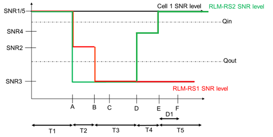
Figure A.5.5.1.6.1-1: SNR variation for CSI-RS in-sync testing
A.5.5.1.6.2 Test Requirements
The UE behaviour in each test during time durations T1, T2, T3, T4 and T5 shall be as follows:
During the period from time point A to time point F (D1 second after the start of time duration T5) the UE shall transmit uplink signal at least in all uplink slots configured for CSI transmission according to the configured periodic CSI reporting on the PSCell.
The rate of correct events observed during repeated tests shall be at least 90 %.
#### A.5.5.1.7 EN-DC Radio Link Monitoring Out-of-sync Test for FR2 PSCell configured with CSI-RS-based RLM in DRX mode
A.5.5.1.7.1 Test Purpose and Environment
The purpose of this test is to verify that the UE properly detects the out of sync for the purpose of monitoring downlink CSI-RS based radio link quality of the PSCell when DRX is used. This test will partly verify the FR2 TDD PSCell CSI-RS Out-of-sync radio link monitoring requirements in clause 8.1.
The test parameters are given in tables A.5.5.1.7.1-1, A.5.5.1.7.1-2, and A.5.5.1.7.1-3 below. There are two cells, Cell 1 is the E-UTRAN PCell, and Cell 2 is the PSCell, in the test. The test consists of three successive time periods, with time duration of T1, T2 and T3 respectively. Figure A.5.5.1.7.1-1 shows the variation of the downlink SNR in the E-UTRAN PCell and the PSCell to emulate out-of-sync and in-sync states. Prior to the start of the time duration T1, the UE shall be fully synchronized to Cell 1 and Cell 2. The UE shall be configured for periodic CSI reporting with a reporting periodicity of 5 ms. In the test, DRX configuration is enabled in PSCell and DRX inactivity timer has already been expired, i.e. UE tries to decode PDCCH and to send periodic CQI during the period when On-duration timer is running. Time alignment timers shall be set to “infinity” so that UL timing alignment is maintained during the test. In the test, SSB0 and SSB1 are configured as BFD-RS and are not same as RLM-RS to avoid triggering the beam failure during the RLM test.
Table A.5.5.1.7.1-1: Supported test configurations for FR2 PSCell
| Configuration | Description |
| --- | --- |
| 1 | LTE FDD, NR 120 kHz SSB SCS, 100 MHz bandwidth, TDD duplex mode |
| 2 | LTE TDD, NR 120 kHz SSB SCS, 100 MHz bandwidth, TDD duplex mode |
| NOTE: The UE is only required to pass in one of the supported test configurations in FR2 |  |

Table A.5.5.1.7.1-2: General test parameters for FR2 PSCell for CSI-RS out-of-sync testing in DRX mode
| Parameter | Unit | Value |  |
| --- | --- | --- | --- |
|  |  | Test 1 |  |
| Active E-UTRA PCell |  | Cell 1 |  |
| E-UTRA RF Channel Number |  | 1 |  |
| Active PSCell |  | Cell 2 |  |
| RF Channel Number |  | 2 |  |
| Duplex Mode |  | TDD |  |
| TDD Configuration | Config 1 |  | TDDConf.3.1 |
|  | Config 2 |  | TDDConf.3.1 |
| DL initial BWP configuration | Config 1, 2 |  | DLBWP.0.1 |
| DL dedicated BWP configuration | Config 1, 2 |  | DLBWP.1.1 |
| UL initial BWP configuration | Config 1, 2 |  | ULBWP.0.1 |
| UL dedicated BWP configuration | Config 1, 2 |  | ULBWP.1.1 |
| RMSI CORESET Reference Channel | Config 1 |  | CR. 3.1 TDD |
|  | Config 2 |  | CR. 3.1 TDD |
| Dedicated CORESET Reference Channel | Config 1 |  | CCR. 3.4 TDD CCR.3.6 TDD |
|  | Config 2 |  | CCR. 3.4 TDD CCR.3.6 TDD |
| SSB Configuration | Config 1 |  | SSB.1 FR2 |
|  | Config 2 |  | SSB.1 FR2 |
| SMTC Configuration | Config 1 |  | SMTC.1 |
|  | Config 2 |  | SMTC.1 |
| PDSCH/PDCCH subcarrier spacing | Config 1 |  | 120 KHz |
|  | Config 2 |  | 120 KHz |
| CSI-RS for RLM | Config 1, 2 |  | Resource #4 in TRS.2.1 TDD Resource #4 in TRS.2.2 TDD |
| SSB index for BFD-RS | Config 1, 2 |  | 0, 1 |
| TRS configuration |  | TRS.2.1 TDD TRS.2.2 TDD |  |
| TCI configuration for PDCCH#1/PDSCH |  | TCI.State.2 |  |
| TCI configuration for PDCCH#2 |  | TCI.State.3 |  |
| OCNG parameters |  | OP.1 |  |
| CP length |  | Normal |  |
| Out of sync transmission parameters | DCI format |  | 1-0 |
|  | Number of Control OFDM symbols |  | 2 |
|  | Aggregation level | CCE | 8 |
|  | Ratio of hypothetical PDCCH RE energy to average CSI-RS RE energy | dB | 4 |
|  | Ratio of hypothetical PDCCH DMRS energy to average CSI-RS RE energy | dB | 4 |
|  | DMRS precoder granularity |  | REG bundle size |
|  | REG bundle size |  | 6 |
| DRX |  | DRX.3 |  |
| Gap pattern ID |  | N.A. |  |
| Layer 3 filtering |  | Enabled |  |
| T310 timer | ms | 0 |  |
| T311 timer | ms | 1000 |  |
| N310 |  | 1 |  |
| N311 |  | 1 |  |
| CSI-RS for CSI reporting | Config 1 |  | CSI-RS.3.1 TDD |
|  | Config 2 |  | CSI-RS.3.1 TDD |
| reportConfigType |  | periodic |  |
| reportQuantity |  | cri-RI-PMI-CQI |  |
| CSI reporting periodicity | slot | 40 |  |
| CSI reporting offset | slot | 4 |  |
| T1 | s | 0.2 |  |
| T2 | s | 1.28 |  |
| T3 | s | 1.28 |  |
| D1 | s | 1.24 |  |
| NOTE 1: UE-specific PDCCH is not transmitted after T1 starts. NOTE 2: E-UTRAN is in non-DRX mode under test. |  |  |  |

Table A.5.5.1.7.1-3: Cell specific test parameters for FR2 for CSI-RS out-of-sync radio link monitoring in DRX mode
| Parameter | Unit | Test 1 |  |  |  |
| --- | --- | --- | --- | --- | --- |
|  |  | T1 | T2 | T3 |  |
| AoA setup |  | Setup 1 defined in A.3.15 |  |  |  |
| Assumption for UE beamsNote 10 |  | Rough |  |  |  |
| EPRE ratio of PDCCH DMRS to SSS | dB | 4 |  |  |  |
| EPRE ratio of PDCCH to PDCCH DMRS | dB |  |  |  |  |
| EPRE ratio of PBCH DMRS to SSS | dB |  |  |  |  |
| EPRE ratio of PBCH to PBCH DMRS | dB |  |  |  |  |
| EPRE ratio of PSS to SSS | dB | 0 |  |  |  |
| EPRE ratio of PDSCH DMRS to SSS | dB |  |  |  |  |
| EPRE ratio of PDSCH to PDSCH DMRS | dB |  |  |  |  |
| EPRE ratio of OCNG DMRS to SSS | dB |  |  |  |  |
| EPRE ratio of OCNG to OCNG DMRS | dB |  |  |  |  |
| SNR on RLM-RS1 | Config 1, 2 | dB | 2Note 11 | -6Note 11 | -15 |
| SNR on RLM-RS2 | Config 1, 2 |  | 2Note 11 | -15 | -15 |
|  | Config 1 | dBm/15KHz | -104.7 |  |  |
|  | Config 2 |  | -104.7 |  |  |
| Propagation condition |  | TDL-A 30ns 75 Hz |  |  |  |
| NOTE 1: OCNG shall be used such that the resources in Cell 2 are fully allocated and a constant total transmitted power spectral density is achieved for all OFDM symbols. NOTE 2: The uplink resources for CSI reporting are assigned to the UE prior to the start of time period T1. NOTE 3: NZP CSI-RS resource set configuration for CSI reporting are assigned to the UE prior to the start of time period T1. NOTE 4: Void NOTE 5: The timers and layer 3 filtering related parameters are configured prior to the start of time period T1. NOTE 6: The signal contains PDCCH for UEs other than the device under test as part of OCNG. NOTE 7: SNR levels correspond to the signal to noise ratio over the SSS REs. NOTE 8: The SNR in time periods T1, T2 and T3 is denoted as SNR1, SNR2 and SNR3 respectively in figure A.5.5.1.7.1-1. NOTE 9: The SNR values are specified for testing a UE which supports 2RX on at least one band. For testing of a UE which supports 4RX on all bands, the SNR during T3 is A.3.6. NOTE 10: Information about types of UE beam is given in B.2.1.3, and does not limit UE implementation or test system implementation. NOTE 11: This value allows up to 1 dB degradation from applied SNR to UE baseband. |  |  |  |  |  |

Table A.5.5.1.7.1-3A: Void
Table A.5.5.1.7.1-4: Void
Table A.5.5.1.7.1-5: Void
Table A.5.5.1.7.1-6: Void

Figure A.5.5.1.7.1-1: SNR variation for CSI-RS out-of-sync testing
A.5.5.1.7.2 Test Requirements
The UE behaviour during time durations T1, T2, and T3 shall be as follows:
During the period from time point A to time point B the UE shall transmit uplink signal in Cell 2 (PSCell) at least in all uplink slots configured for CSI transmission according to the configured periodic CSI reporting for Cell 2.
The UE shall stop transmitting uplink signal in Cell 2 (PSCell) no later than time point C (D1 after the start of the time duration T3) on the PSCell.
The rate of correct events observed during repeated tests shall be at least 90 %.
#### A.5.5.1.8 EN-DC Radio Link Monitoring In-sync Test for FR2 PSCell configured with CSI-RS-based RLM in DRX mode
A.5.5.1.8.1 Test Purpose and Environment
The purpose of this test is to verify that the UE properly detects the in sync for the purpose of monitoring downlink CSI-RS based radio link quality of the PSCell when DRX is used. This test will partly verify the FR2 TDD PSCell CSI-RS In-sync radio link monitoring requirements in clause 8.1.
The test parameters are given in tables A.5.5.1.8.1-1, A.5.5.1.8.1-2, A.5.5.1.8.1-3 and A.5.5.1.8.1-3A below. There are two cells, Cell 1which is the E-UTRAN PCell, and Cell 2 is the NR PSCell, in the test. The test consists of five successive time periods, with time duration of T1, T2, T3, T4 and T5 respectively. Figure A.5.5.1.8.1-1 shows the variation of the downlink SNR in the PSCell to emulate out-of-sync and in-sync states. Prior to the start of the time duration T1, the UE shall be fully synchronized to Cell 1 and Cell 2. The UE shall be configured for periodic CSI reporting with a reporting periodicity of 5 ms. In the test, DRX configuration is enabled. The UE is configured to perform inter-frequency measurements using GP ID #0 (40 ms). In the test, SSB0 and SSB1 are configured as BFD-RS and are not same as RLM-RS to avoid triggering the beam failure during the RLM test.
Table A.5.5.1.8.1-1: Supported test configurations for FR2 PSCell
| Configuration | Description |
| --- | --- |
| 1 | LTE FDD, NR 120 kHz SSB SCS, 100 MHz bandwidth, TDD duplex mode |
| 2 | LTE TDD, NR 120 kHz SSB SCS, 100 MHz bandwidth, TDD duplex mode |
| NOTE: The UE is only required to pass in one of the supported test configurations in FR2 |  |

Table A.5.5.1.8.1-2: General test parameters for FR2 PSCell for CSI-RS in-sync testing in non-DRX mode
| Parameter | Unit | Value |  |
| --- | --- | --- | --- |
|  |  | Test 1 |  |
| Active E-UTRA PCell |  | Cell 1 |  |
| E-UTRA RF Channel Number |  | 1 |  |
| Active PSCell |  | Cell 2 |  |
| RF Channel Number |  | 2 |  |
| Duplex Mode |  | TDD |  |
| TDD Configuration | Config 1 |  | TDDConf.3.1 |
|  | Config 2 |  | TDDConf.3.1 |
| DL initial BWP configuration | Config 1, 2 |  | DLBWP.0.1 |
| DL dedicated BWP configuration | Config 1, 2 |  | DLBWP.1.1 |
| UL initial BWP configuration | Config 1, 2 |  | ULBWP.0.1 |
| UL dedicated BWP configuration | Config 1, 2 |  | ULBWP.1.1 |
| RMSI CORESET Reference Channel | Config 1 |  | CR.3.1 TDD |
|  | Config 2 |  | CR.3.1 TDD |
| Dedicated CORESET Reference Channel | Config 1 |  | CCR.3.1 TDD CCR.3.3 TDD |
|  | Config 2 |  | CCR.3.1 TDD CCR.3.3 TDD |
| SSB Configuration | Config 1 |  | SSB.1 FR2 |
|  | Config 2 |  | SSB.1 FR2 |
| SMTC Configuration | Config 1 |  | SMTC.1 |
|  | Config 2 |  | SMTC.1 |
| PDSCH/PDCCH subcarrier spacing | Config 1 |  | 120 KHz |
|  | Config 2 |  | 120 KHz |
| CSI-RS for RLM | Config 1, 2 |  | Resource #4 in TRS.2.1 TDD Resource #4 in TRS.2.2 TDD |
| SSB index for BFD-RS | Config 1, 2 |  | 0, 1 |
| TRS configuration |  | TRS.2.1 TDD TRS.2.2 TDD |  |
| TCI configuration for PDCCH#1/PDSCH |  | TCI.State.2 |  |
| TCI configuration for PDCCH#2 |  | TCI.State.3 |  |
| OCNG parameters |  | OP.1 |  |
| CP length |  | Normal |  |
| Out of sync transmission parameters | DCI format |  | 1-0 |
|  | Number of Control OFDM symbols |  | 2 |
|  | Aggregation level | CCE | 8 |
|  | Ratio of hypothetical PDCCH RE energy to average CSI-RS RE energy | dB | 4 |
|  | Ratio of hypothetical PDCCH DMRS energy to average CSI-RS RE energy | dB | 4 |
|  | DMRS precoder granularity |  | REG bundle size |
|  | REG bundle size |  | 6 |
| In sync transmission parameters | DCI format |  | 1-0 |
|  | Number of Control OFDM symbols |  | 2 |
|  | Aggregation level | CCE | 4 |
|  | Ratio of hypothetical PDCCH RE energy to average CSI-RS RE energy | dB | 0 |
|  | Ratio of hypothetical PDCCH DMRS energy to average CSI-RS RE energy | dB | 0 |
|  | DMRS precoder granularity |  | REG bundle size |
|  | REG bundle size |  | 6 |
| DRX |  | DRX.3 |  |
| Gap pattern ID |  | gp0 |  |
| Layer 3 filtering |  | Enabled |  |
| T310 timer | ms | 2000 |  |
| T311 timer | ms | 1000 |  |
| N310 |  | 1 |  |
| N311 |  | 1 |  |
| CSI-RS for CSI reporting | Config 1 |  | CSI-RS.3.1 TDD |
|  | Config 2 |  | CSI-RS.3.1 TDD |
| reportConfigType |  | periodic |  |
| reportQuantity |  | cri-RI-PMI-CQI |  |
| CSI reporting periodicity | slot | 40 |  |
| CSI reporting offset | slot | 4 |  |
| T1 | s | 0.2 |  |
| T2 | s | 0.2 |  |
| T3 | s | 1.64 |  |
| T4 | s | 0.2 |  |
| T5 | s | 1.88 |  |
| D1 | s | 1.84 |  |
| NOTE 1: UE-specific PDCCH is not transmitted after T1 starts. NOTE 2: E-UTRAN is in non-DRX mode under test. |  |  |  |

Table A.5.5.1.8.1-3: Cell specific test parameters for FR2 for CSI-RS in-sync radio link monitoring in DRX mode
| Parameter | Unit | Test 1 |  |  |  |  |  |
| --- | --- | --- | --- | --- | --- | --- | --- |
|  |  | T1 | T2 | T3 | T4 | T5 |  |
| AoA setup |  | Setup 1 defined in A.3.15 |  |  |  |  |  |
| Assumption for UE beamsNote 10 |  | Rough |  |  |  |  |  |
| EPRE ratio of PDCCH DMRS to SSS | dB | 0 |  |  |  |  |  |
| EPRE ratio of PDCCH to PDCCH DMRS | dB |  |  |  |  |  |  |
| EPRE ratio of PBCH DMRS to SSS | dB |  |  |  |  |  |  |
| EPRE ratio of PBCH to PBCH DMRS | dB |  |  |  |  |  |  |
| EPRE ratio of PSS to SSS | dB | 0 |  |  |  |  |  |
| EPRE ratio of PDSCH DMRS to SSS | dB |  |  |  |  |  |  |
| EPRE ratio of PDSCH to PDSCH DMRS | dB |  |  |  |  |  |  |
| EPRE ratio of OCNG DMRS to SSS | dB |  |  |  |  |  |  |
| EPRE ratio of OCNG to OCNG DMRS | dB |  |  |  |  |  |  |
| SNR on RLM-RS1 | Config 1, 2 | dB | 2Note 11 | -6Note 11 | -15 | -4.5 | 2Note 11 |
| SNR on RLM-RS2 | Config 1, 2 | dB | 2Note 11 | -15 | -15 | -15 | -15 |
|  | Config 1, 2 | dBm/15KHz | -104.7 |  |  |  |  |
| Propagation condition |  | TDL-A 30ns 75 Hz |  |  |  |  |  |
| NOTE 1: OCNG shall be used such that the resources in Cell 2 are fully allocated and a constant total transmitted power spectral density is achieved for all OFDM symbols. NOTE 2: The uplink resources for CSI reporting are assigned to the UE prior to the start of time period T1. NOTE 3: NZP CSI-RS resource set configuration for CSI reporting are assigned to the UE prior to the start of time period T1. NOTE 4: Measurement gap configuration is assigned to the UE prior to the start of time period T1. NOTE 5: The timers and layer 3 filtering related parameters are configured prior to the start of time period T1. NOTE 6: The signal contains PDCCH for UEs other than the device under test as part of OCNG. NOTE 7: SNR levels correspond to the signal to noise ratio over the SSS REs. NOTE 8: The SNR in time periods T1, T2, T3, T4 and T5 is denoted as SNR1, SNR2, SNR3, SNR4 and SNR5 respectively in figure A.5.5.1.8.1-1. NOTE 9: The SNR values are specified for testing a UE which supports 2RX on at least one band. For testing of a UE which supports 4RX on all bands, the SNR during T3 is A.3.6. NOTE 10: Information about types of UE beam is given in B.2.1.3, and does not limit UE implementation or test system implementation. NOTE 11: This value allows up to 1 dB degradation from applied SNR to UE baseband |  |  |  |  |  |  |  |

Table A.5.5.1.8.1-3A: Measurement gap configuration for FR2 CSI-RS in-sync radio link monitoring in DRX mode
| Field | Test 1 |
| --- | --- |
|  | Value |
| gapOffset | 0 |
| NOTE 1: E-UTRAN PCell and PSCell are SFN-synchronous and frame boundary aligned. (Ensure that RLM RS is partially overlapped with measurement gap) |  |

Table A.5.5.1.8.1-4: Void
Table A.5.5.1.8.1-5: Void
Table A.5.5.1.8.1-6: Void
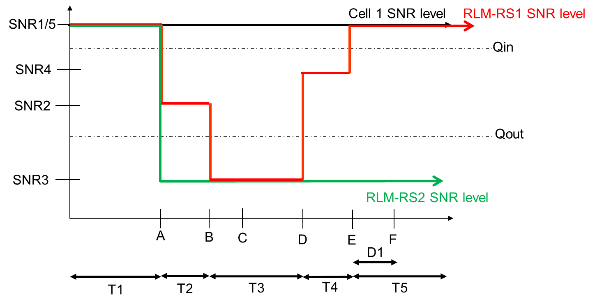
Figure A.5.5.1.8.1-1: SNR variation for CSI-RS in-sync testing
##### A.5.5.1.8.2 Test Requirements
The UE behaviour in each test during time durations T1, T2, T3, T4 and T5 shall be as follows:
During the period from time point A to time point F (D1 second after the start of time duration T5) the UE shall transmit uplink signal at least in all uplink slots configured for CSI transmission according to the configured periodic CSI reporting on the PSCell.
The rate of correct events observed during repeated tests shall be at least 90 %.
#### A.5.5.1.9 EN-DC Radio Link Monitoring UE Scheduling Restrictions on FR2
##### A.5.5.1.9.1 Test Purpose and Environment
The purpose is to verify that the NR UE correctly follows the RLM scheduling restrictions requirements defined in clause 8.1.7. This test verifies that the UE correctly receive the PDCCH scheduled on the symbols right before the RLM SSB symbols without overlap so that it sends ACK/NACK correctly. The test case is only applicable to UE which supports pdcch-MonitoringAnyOccasions or pdcch-MonitoringAnyOccasionsWithSpanGap.
Two cells are deployed in the test, which are E-UTRAN PCell (Cell 1) and NR FR2 PSCell (Cell 2). The test parameters for NR PSCell are given in table A.5.5.1.9.1-1, table A.5.5.1.9.1-2 and table A.5.5.1.9.1-3 below and the parameters and applicability for the E-UTRAN cell are defined in A.3.7.2. The UE is required during time period T1 to transmit ACK/NACK correctly upon scheduling of PDSCH.
Table A.5.5.1.9.1-1: Supported test configurations
| Configuration | Description |
| --- | --- |
| 1 | FDD LTE, 120 kHz SSB SCS, 120 kHz RMC SCS, 100 MHz bandwidth, TDD duplex mode |
| 2 | TDD LTE, 120 kHz SSB SCS, 120 kHz RMC SCS, 100 MHz bandwidth, TDD duplex mode |
| NOTE: The UE is only required to be tested in one of the supported test configurations. |  |

Table A.5.5.1.9.1-2: General test parameters for RLM scheduling restriction test case in FR2
| Parameter | Unit | Test configuration | Value | Comment |
| --- | --- | --- | --- | --- |
| RF Channel Number |  | 1, 2 | 1 and 2 | 1 for NR PSCell and 2 for LTE PCell |
| SSB configuration |  | 1, 2 | SSB.1 FR2 |  |
| SMTC configuration |  | 1, 2 | SMTC.3 |  |
| DRX cycle length | s | 1, 2 | OFF |  |
| T1 | s | 1, 2 | 5 | During T1 the UE is required to correctly transmit ACK/NACK |

Table A.5.5.1.9.1-3: Cell specific test parameters for RLM scheduling restriction test case in FR2
| Parameter | Unit | Test configuration | Cell 2 |  |
| --- | --- | --- | --- | --- |
|  |  |  |  |  |
| AoA setup |  | 1, 2 | Setup 3 defined in A.3.15.3 |  |
|  |  |  | AoA1 | AoA2 |
| Assumption for UE beamsNote 1 |  |  | Rough | Rough |
| TDD configuration |  | 1, 2 | TDDConf.3.1 |  |
| BWchannel | MHz | 1, 2 | 100: NPRB,c = 66 |  |
| Data PRBs allocated |  | 1, 2 | 24 |  |
| PDSCH Reference measurement channel |  | 1, 2 | SR.3.2 TDD | Not sent |
| RMSI CORESET RMC configuration |  | 1, 2 | CR.3.1 TDD | Not sent |
| Dedicated CORESET RMC configuration |  | 1, 2 | CCR.3.2 TDD | Not sent |
| TRS configuration |  | 1, 2 | TRS.2.1 TDD | TRS.2.2 TDD |
| PDCCH/PDSCH TCI state |  | 1, 2 | TCI.State.2 | Not sent |
| OCNG Pattern |  | 1, 2 | OP.5 defined in A.3.2.1 | Not sent |
| Initial DL BWP configuration |  | 1, 2 | DLBWP.0.1 |  |
| Initial UL BWP configuration |  | 1, 2 | ULBWP.0.1 |  |
| RLM-RS |  | 1, 2 | SSB with index 0 | SSB with index 1 |
|  | dBm/15 kHz | 1, 2 | -92.1 | -92.1 |
|  Note2 | dBm/SCS | 1, 2 | -84.9 | Not sent |
|  | dB | 1, 2 | 3 | N/A |
| BB Note 4 | dB | 1, 2 | 1 | 1 |
| SSB_RP Note3 | dBm/SCS | 1, 2 | -81.1 | -81.1 |
| Io | dBm/95.04 MHz | 1, 2 | -54.35 | -54.35 |
| Time multiplexing of the downlink transmissions from each AoA | 1, 2 | Defined in figure A.5.5.1.9.1-1 |  |  |
| Propagation Condition |  | 1, 2 | AWGN | AWGN |
| NOTE 1: Information about types of UE beam is given in B.2.1.3, and does not limit UE implementation or test system implementation NOTE 2: Interference from other cells and noise sources not specified in the test is assumed to be constant over subcarriers and time and shall be modelled as AWGN of appropriate power for  to be fulfilled. NOTE 3: Es/Iot, SSB_RP and Io levels have been derived from other parameters for information purposes. They are not settable parameters themselves. NOTE 4: Calculation of Es/IotBB includes the effect of UE internal noise up to the value assumed for the associated Refsens requirement in clause 7.3.2 of TS 38.101-2 [19], and an allowance of 1 dB for UE multi-band relaxation factor ΔMBS from TS 38.101-2 [19] Table 6.2.1.3-4. |  |  |  |  |

Figure A.5.5.1.9.1-1: Time multiplexed downlink transmissions
##### A.5.5.1.9.2 Test Requirements
The UE behaviour follows the requirements defined in clause 8.1.7.3.
The UE shall be continuously scheduled by PDCCH on the symbols right before each SSB which is not covered by SMTC during the entire length of T1. The UE shall transmit ACK/NACK for every scheduled PDCCH during the time duration T1.

#### A.5.5.1.10 Radio Link Monitoring Out-of-sync Test for FR2 PSCell configured with SSB-based RLM RS for UE fulfilling relaxed measurement criterion
##### A.5.5.1.10.1 Test Purpose and Environment
The purpose of this test is to verify that the UE properly detects the out of sync and in sync for the purpose of monitoring downlink radio link quality of the PSCell when DRX is used. This test will partly verify the FR2 radio link monitoring requirements in clause 8.1.2.4 for UE fulfilling good serving cell quality criterion.
In the test, UE is configured to perform RLM on SSB, with detectionResource included in RadioLinkMonitoringRS set to SSB#0 and SSB#1, and purpose set to ‘rlf’. Supported test configurations are shown in table A.5.5.1.10.1-1. The test parameters are given in tables A.5.5.1.10.1-2, and A.5.5.1.10.1-3. There are two cells, Cell 1 is the E-UTRAN PCell, and Cell 2 is the PSCell, in the test. The E-UTRAN PCell setting refers to table A.3.7.2.1-2. The test consists of three successive time periods, with time duration of T1, T2 and T3 respectively. Figure A.5.5.1.10.1-1 shows the variation of the downlink SNR in the active cell to emulate out-of-sync and in-sync states. Prior to the start of the time duration T1, the UE shall be fully synchronized to Cell 1 and Cell 2. The UE shall be configured for periodic CSI reporting with a reporting periodicity of 5 ms. In the test, DRX configuration is enabled and DRX inactivity timer has already been expired, i.e. UE tries to decode PDCCH and to send periodic CSI during the period when On-duration timer is running. Time alignment timers shall be set to “infinity” so that UL timing alignment is maintained during the test.
Table A.5.5.1.10.1-1: Supported test configurations for FR2 PSCell
| Configuration | Description |
| --- | --- |
| 1 | FDD LTE PCell, NR 120 KHz SSB SCS, 100 MHz bandwidth, TDD duplex mode |
| 2 | TDD LTE PCell, NR 120 KHz SSB SCS, 100 MHz bandwidth, TDD duplex mode |
| NOTE: The UE is only required to pass in one of the supported test configurations in FR2 |  |

Table A.5.5.1.10.1-2: General test parameters for FR2 out-of-sync testing for UE fulfilling relaxed measurement criterion
| Parameter | Unit | Value |  |
| --- | --- | --- | --- |
|  |  | Test 1 |  |
| Active E-UTRA PCell |  | Cell 1 |  |
| E-UTRA RF Channel Number |  | 1 |  |
| Active PSCell |  | Cell 2 |  |
| RF Channel Number |  | 2 |  |
| Duplex mode | Config 1, 2 |  | TDD |
| BWchannel | Config 1, 2 |  | 100: NPRB,c = 66 |
| Data PRBs allocated | Config 1, 2 |  | 66 |
| DL initial BWP configuration | Config 1, 2 |  | DLBWP.0.1 |
| DL dedicated BWP configuration | Config 1, 2 |  | DLBWP.1.1 |
| UL initial BWP configuration | Config 1, 2 |  | ULBWP.0.1 |
| UL dedicated BWP configuration | Config 1, 2 |  | ULBWP.1.1 |
| TDD Configuration | Config 1, 2 |  | TDDConf.3.1 |
| RMSI CORESET Reference Channel | Config 1, 2 |  | CR.3.1 TDD |
| Dedicated CORESET Reference Channel | Config 1, 2 |  | CCR.3.4 TDD |
| SSB Configuration | Config 1, 2 |  | SSB.1 FR2 |
| SMTC Configuration | Config 1, 2 |  | SMTC.1 |
| PDSCH/PDCCH subcarrier spacing | Config 1, 2 |  | 120 KHz |
| PRACH Configuration | Config 1, 2 |  | Table A.3.8.3.4 |
| SSB index assigned as RLM RS | Config 1, 2 |  | 0 |
| OCNG parameters |  | OP.1 |  |
| CP length |  | Normal |  |
| Out of sync transmission parameters | DCI format |  | 1-0 |
|  | Number of Control OFDM symbols |  | 2 |
|  | Aggregation level | CCE | 8 |
|  | Ratio of hypothetical PDCCH RE energy to average SSS RE energy | dB | 4 |
|  | Ratio of hypothetical PDCCH DMRS energy to average SSS RE energy | dB | 4 |
|  | DMRS precoder granularity |  | REG bundle size |
|  | REG bundle size |  | 6 |
| DRX Configuration |  | DRX.3 |  |
| Gap pattern ID |  | N.A. |  |
| Layer 3 filtering |  | Enabled |  |
| T310 timer | ms | 0 |  |
| T311 timer | ms | 1000 |  |
| N310 |  | 1 |  |
| N311 |  | 1 |  |
| CSI-RS for CSI reporting | Config 1, 2 |  | CSI-RS.3.1 TDD |
| reportConfigType |  | periodic |  |
| reportQuantity |  | cri-RI-PMI-CQI |  |
| CSI reporting periodicity | slot | 40 |  |
| CSI reporting offset | slot | 4 |  |
| TCI states for PDCCH/PDSCH |  | TCI.State.2 |  |
| CSI-RS for tracking | Config 1, 2 |  | TRS.2.1 TDD |
| T1 | s | 0.2 |  |
| T2 | s | 14.48 |  |
| T3 | s | 28.88 |  |
| D1 | s | 28.84 |  |
| NOTE 1: All configurations are assigned to the UE prior to the start of time period T1. NOTE 2: UE-specific PDCCH is not transmitted after T1 starts. NOTE 3: E-UTRAN is in non-DRX mode under test. |  |  |  |

Table A.5.5.1.10.1-3: OTA related cell specific test parameters for FR2 (Cell 2) for out-of-sync radio link monitoring tests for UE fulfilling relaxed measurement criterion
| Parameter | Unit | Test 1 |  |  |  |
| --- | --- | --- | --- | --- | --- |
|  |  | T1 | T2 | T3 |  |
| AoA setup |  | Setup 1 defined in A.3.15 |  |  |  |
| Assumption for UE beamsNote 5 |  | Rough |  |  |  |
| EPRE ratio of PDCCH DMRS to SSS | dB | 4 |  |  |  |
| EPRE ratio of PDCCH to PDCCH DMRS | dB | 0 |  |  |  |
| EPRE ratio of PBCH DMRS to SSS | dB |  |  |  |  |
| EPRE ratio of PBCH to PBCH DMRS | dB |  |  |  |  |
| EPRE ratio of PSS to SSS | dB |  |  |  |  |
| EPRE ratio of PDSCH DMRS to SSS | dB | 0 |  |  |  |
| EPRE ratio of PDSCH to PDSCH DMRS | dB |  |  |  |  |
| EPRE ratio of OCNG DMRS to SSS | dB |  |  |  |  |
| EPRE ratio of OCNG to OCNG DMRS | dB |  |  |  |  |
| ssb-Index 0 SNR | Config 1, 2 | dB | 2Note 6 | 2Note 6 | -15 |
|  | Config 1, 2 | dBm/15KHz | -104.7 dBm |  |  |
| goodServingCellEvaluationRLM |  | configured |  |  |  |
| offset in goodServingCellEvaluationRLM | dB | Not configured |  |  |  |
| Propagation condition |  | TDL-A 30ns 75 Hz |  |  |  |
| NOTE 1: OCNG shall be used such that the resources in Cell 2 are fully allocated and a constant total transmitted power spectral density is achieved for all OFDM symbols. NOTE 2: The signal contains PDCCH for UEs other than the device under test as part of OCNG. NOTE 3: SNR levels correspond to the signal to noise ratio over the SSS REs. NOTE 4: The SNR values are specified for testing a UE which supports 2RX on at least one band. For testing of a UE which supports 4RX on all bands, the SNR during T3 is A.3.6. NOTE 5: Information about types of UE beam is given in B.2.1.3, and does not limit UE implementation or test system implementation NOTE 6: This value allows up to 1 dB degradation from applied SNR to UE baseband |  |  |  |  |  |

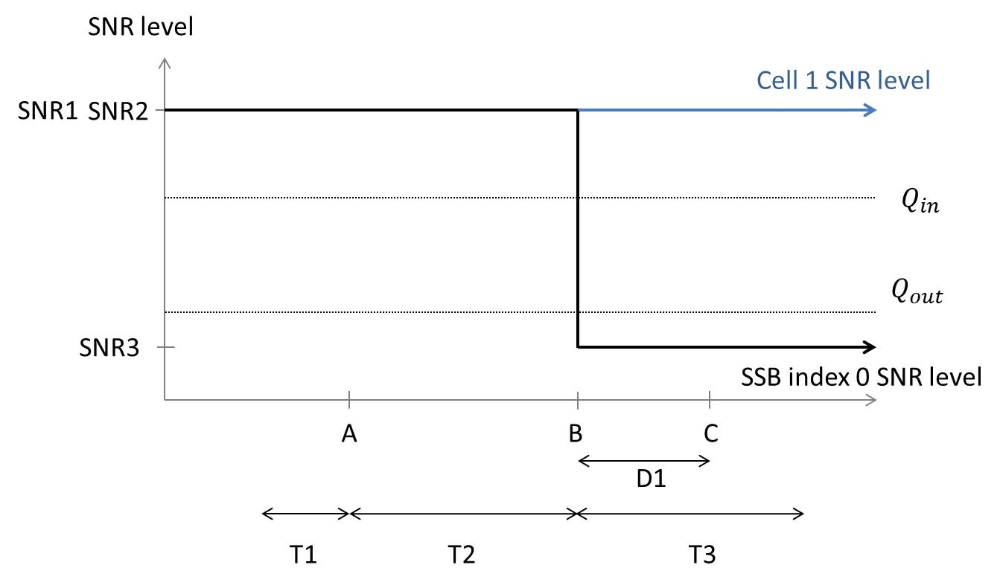
Figure A.5.5.1.10.1-1: SNR variation for out-of-sync testing
##### A.5.5.1.10.2 Test Requirements
The UE behavior in each test during time durations T1, T2 and T3 shall be as follows:
During the period from time point A to time point B the UE shall transmit uplink signal at least in all uplink slots configured for CSI transmission according to the configured periodic CSI reporting.
The UE shall stop transmitting uplink signal in Cell 2 no later than time point C (D1 second after the start of the time duration T3).
The rate of correct events observed during repeated tests shall be at least 90 %.
#### A.5.5.1.11 Radio Link Monitoring Out-of-sync Test for FR2 PSCell configured with SSB-based RLM RS in non-DRX mode for UE supporting fast beam sweeping in multi-Rx
##### A.5.5.1.11.1 Test Purpose and Environment
The purpose of this test is to verify that the UE properly detects the out of sync for the purpose of monitoring downlink radio link quality of the PSCell. This test will partly verify the FR2 radio link monitoring requirements in clause 8.1.
In the test, UE is configured to perform RLM on SSB, with detectionResource included in RadioLinkMonitoringRS set to SSB#0 and SSB#1, and purpose set to ‘rlf’. Supported test configurations are shown in table A.5.5.1.11.1-1. The test parameters are given in tables A.5.5.1.11.1-2, and A.5.5.1.11.1-3. There are two cells, Cell 1 is the E-UTRAN PCell, and Cell 2 is the PSCell, in the test. The E-UTRAN PCell setting refers to table A.3.7.2.1-2. The test consists of three successive time periods, with time duration of T1, T2 and T3 respectively. Figure A.5.5.1.11.1-1 shows the variation of the downlink SNR in the active cell to emulate out-of-sync and in-sync states, and Figure A.5.5.1.11.1-2 shows the Time multiplexed downlink transmissions from each Angle of Arrival. Prior to the start of the time duration T1, the UE shall be fully synchronized to Cell 1 and Cell 2 and configured with groupBasedBeamReporting-r17. The UE shall be configured for periodic CSI reporting with a reporting periodicity of 5 ms.
Table A.5.5.1.11.1-1: Supported test configurations for FR2 PSCell
| Configuration | Description |
| --- | --- |
| 1 | FDD LTE PCell, NR 120 KHz SSB SCS, 100 MHz bandwidth, TDD duplex mode |
| 2 | TDD LTE PCell, NR 120 KHz SSB SCS, 100 MHz bandwidth, TDD duplex mode |
| NOTE: The UE is only required to pass in one of the supported test configurations |  |

Table A.5.5.1.11.1-2: General test parameters for FR2 out-of-sync testing in non-DRX mode
| Parameter | Unit | Value |  |
| --- | --- | --- | --- |
|  |  | Test 1 |  |
| Active E-UTRA PCell |  | Cell 1 |  |
| E-UTRA RF Channel Number |  | 1 |  |
| Active PSCell |  | Cell 2 |  |
| RF Channel Number |  | 2 |  |
| Duplex mode | Config 1, 2 |  | TDD |
| BWchannel | Config 1, 2 |  | 100: NPRB,c = 66 |
| Data PRBs allocated | Config 1, 2 |  | 24 |
| DL initial BWP configuration | Config 1, 2 |  | DLBWP.0.1 |
| DL dedicated BWP configuration | Config 1, 2 |  | DLBWP.1.1 |
| UL initial BWP configuration | Config 1, 2 |  | ULBWP.0.1 |
| UL dedicated BWP configuration | Config 1, 2 |  | ULBWP.1.1 |
| TDD Configuration | Config 1, 2 |  | TDDConf.3.1 |
| RMSI CORESET Reference Channel | Config 1, 2 |  | CR.3.1 TDD |
| Dedicated CORESET Reference Channel | Config 1, 2 |  | CCR.3.4 TDD |
| SSB Configuration | Config 1, 2 |  | SSB.1 FR2 |
| SMTC Configuration | Config 1, 2 |  | SMTC.1 |
| PDSCH/PDCCH subcarrier spacing | Config 1, 2 |  | 120 KHz |
| PRACH Configuration | Config 1, 2 |  | Table A.3.8.3.1 |
| SSB index assigned as RLM RS | Config 1, 2 |  | 0,1 |
| OCNG parameters |  | OP.5 |  |
| CP length |  | Normal |  |
| Out of sync transmission parameters | DCI format |  | 1-0 |
|  | Number of Control OFDM symbols |  | 2 |
|  | Aggregation level | CCE | 8 |
|  | Ratio of hypothetical PDCCH RE energy to average SSS RE energy | dB | 4 |
|  | Ratio of hypothetical PDCCH DMRS energy to average SSS RE energy | dB | 4 |
|  | DMRS precoder granularity |  | REG bundle size |
|  | REG bundle size |  | 6 |
| DRX |  | OFF |  |
| Gap pattern ID |  | NA |  |
| Layer 3 filtering |  | Enabled |  |
| T310 timer | ms | 0 |  |
| T311 timer | ms | 1000 |  |
| N310 |  | 1 |  |
| N311 |  | 1 |  |
| CSI-RS for CSI reporting | Config 1, 2 |  | CSI-RS.3.1 TDD |
| reportConfigType |  | periodic |  |
| reportQuantity |  | cri-RI-PMI-CQI |  |
| CSI reporting periodicity | slot | 40 |  |
| CSI reporting offset | slot | 4 |  |
| TCI states for PDCCH/PDSCH |  | TCI.State.2 |  |
| CSI-RS for tracking | Config 1, 2 |  | TRS.2.1 TDD |
| T1 | s | 0.2 |  |
| T2 | s | 1.2*N +0.08 Note 4 |  |
| T3 | s | 1.2*N +0.08 Note 4 |  |
| D1 | s | 1.2*N +0.04 Note 4 |  |
| NOTE 1: All configurations are assigned to the UE prior to the start of time period T1. NOTE 2: UE-specific PDCCH is not transmitted after T1 starts. NOTE 3: E-UTRAN is in non-DRX mode under test. NOTE 4: N is the value indicated by UE for fastBeamSweepingMultiRx-r18. |  |  |  |

Table A.5.5.1.11.1-3: OTA related cell specific test parameters for FR2 (Cell 2) for out-of-sync radio link monitoring tests in non-DRX mode
| Parameter | Unit | Test 1 |  |  |  |  |  |
| --- | --- | --- | --- | --- | --- | --- | --- |
|  |  | T1 | T2 | T3 | T1 | T2 | T3 |
| AoA setup |  | Setup 5 defined in A.3.15 |  |  |  |  |  |
|  |  | AoA1 | AoA2 |  |  |  |  |
| Assumption for UE beamsNote 5 |  | Rough | Rough |  |  |  |  |
| EPRE ratio of PDCCH DMRS to SSS | dB | 4 |  |  |  |  |  |
| EPRE ratio of PDCCH to PDCCH DMRS | dB |  |  |  |  |  |  |
| EPRE ratio of PBCH DMRS to SSS | dB |  |  |  |  |  |  |
| EPRE ratio of PBCH to PBCH DMRS | dB |  |  |  |  |  |  |
| EPRE ratio of PSS to SSS | dB | 0 | Not sent |  |  |  |  |
| EPRE ratio of PDSCH DMRS to SSS | dB |  |  |  |  |  |  |
| EPRE ratio of PDSCH to PDSCH DMRS | dB |  |  |  |  |  |  |
| EPRE ratio of OCNG DMRS to SSS | dB |  |  |  |  |  |  |
| EPRE ratio of OCNG to OCNG DMRS | dB |  |  |  |  |  |  |
| ssb-Index 0 SNR | Config 1, 2 | dB | 2Note 6 | -6Note 6 | -15 |  |  |
| ssb-Index 1 SNR | Config 1, 2 |  | Not sent | 2Note 6 | -15 | -15 |  |
|  | Config 1, 2 | dBm/ 15 kHz | -92.1 | -92.1 |  |  |  |
| Time multiplexing of the downlink transmissions from each AoA |  | Defined in figure A.5.5.1.11.1-2 |  |  |  |  |  |
| Propagation condition |  | TDL-A 30ns 75 Hz | TDL-A 30ns 75 Hz |  |  |  |  |
| NOTE 1: OCNG shall be used such that a constant total transmitted power spectral density is achieved for all OFDM symbols. NOTE 2: The signal contains PDCCH for UEs other than the device under test as part of OCNG. NOTE 3: SNR levels correspond to the signal to noise ratio over the SSS REs. NOTE 4: The SNR values are specified for testing a UE which supports 2RX on at least one band. For testing of a UE which supports 4RX on all bands, the SNR during T3 is A.3.6. NOTE 5: Information about types of UE beam is given in B.2.1.3, and does not limit UE implementation or test system implementation NOTE 6: This value allows up to 1 dB degradation from applied SNR to UE baseband |  |  |  |  |  |  |  |

Figure A.5.5.1.11.1-1: SNR variation for out-of-sync testing

Figure A.5.5.1.11.1-2: Time multiplexed downlink transmissions
##### A.5.5.1.11.2 Test Requirements
The UE behavior in each test during time durations T1, T2 and T3 shall be as follows:
During the period from time point A to time point B the UE shall transmit uplink signal at least in all uplink slots configured for CSI transmission according to the configured periodic CSI reporting.
The UE shall stop transmitting uplink signal in Cell 2 no later than time point C (D1 second after the start of the time duration T3).
The rate of correct events observed during repeated tests shall be at least 90 %.
#### A.5.5.1.12 EN-DC Radio Link Monitoring Out-of-sync Test for FR2 PSCell configured with CSI-RS-based RLM in non-DRX mode when CD-SSB is outside active BWP
##### A.5.5.1.12.1 Test Purpose and Environment
The purpose of this test is to verify that the UE properly detects the out of sync for the purpose of monitoring downlink CSI-RS based radio link quality of the PSCell when no DRX is used and when CD-SSB is outside active BWP. This test will partly verify the FR2 TDD PSCell CSI-RS Out-of-sync radio link monitoring requirements in clause 8.1.
The test is for UE supporting rlm-BM-BFD-CSI-RS-OutsideActiveBWP-r18 and the UE is not required past legacy test in A.5.5.1.5.
The test environment is the same as in A.5.5.1.5.
NOTE: The starting PRB index of the SSB can be any possible PRB index of the RF channel BW occurring after the last PRB of the DL active BWP.
The test requirements are the same as in A.5.5.1.5.2.
#### A.5.5.1.13 Radio Link Monitoring Out-of-sync Test for FR2 PSCell configured with SSB-based RLM RS in non-DRX mode when CD-SSB is outside active BWP
##### A.5.5.1.13.1 Test Purpose and Environment
The purpose of this test is to verify that the UE supporting bwpOperationMeasWithoutInterrupt-r18 properly detects the out of sync and in sync for the purpose of monitoring downlink radio link quality of the PSCell when CD-SSB is outside active BWP. This test will partly verify the FR2 radio link monitoring requirements in clause 8.1.
The test environment is the same as in A.5.5.1.1 with following exceptions in table A.5.5.1.1.1-2.
| Parameter | Unit | Value |  |
| --- | --- | --- | --- |
|  |  | Test 1 |  |
| DL dedicated BWP configuration | Config 1, 2 |  | DLBWP.1.5 |
| UL dedicated BWP configuration | Config 1, 2 |  | ULBWP.1.5 |

##### A.5.5.1.13.2 Test Requirements
The test requirements are the same as in A.5.5.1.1.2.
#### A.5.5.1.14 EN-DC Radio Link Monitoring Out-of-sync Test for FR2 PSCell configured with SSB-based RLM RS in non-DRX mode for UE supporting NCD-SSB based measurement outside active BWP
##### A.5.5.1.14.1 Test Purpose and Environment
The purpose of this test is to verify that the UE properly detects the out of sync and in sync for the purpose of monitoring downlink radio link quality of the PSCell for UE supporting FG 53-3. This test will partly verify the FR2 radio link monitoring requirements in clause 8.1.
In the test, UE is configured to perform RLM on SSB, with detectionResource included in RadioLinkMonitoringRS set to SSB#0 and SSB#1, and purpose set to ‘rlf’. Supported test configurations are shown in table A.5.5.1.14.1-1. The test parameters are given in tables A.5.5.1.14.1-2, A.5.5.1.14.1-3, and A. 5.5.1.x.1-4 below. There are two cells, Cell 1 is the E-UTRAN PCell, and Cell 2 is the PSCell, in the test. The E-UTRAN PCell setting refers to table A.3.7.2.1-2. The test consists of three successive time periods, with time duration of T1, T2 and T3 respectively. Figure A.5.5.1.14.1-1 shows the variation of the downlink SNR in the active cell to emulate out-of-sync and in-sync states, and Figure A.5.5.1.14.1-2 shows the Time multiplexed downlink transmissions from each Angle of Arrival. Prior to the start of the time duration T1, the UE shall be fully synchronized to Cell 1 and Cell 2. The UE shall be configured for periodic CSI reporting with a reporting periodicity of 5 ms. UE is configured to perform inter-frequency measurements using Gap Pattern ID #0 (40 ms) in test 1.
Table A.5.5.1.14.1-1: Supported test configurations for FR2 PSCell for UE supporting NCD-SSB based measurement outside active BWP
| Configuration | Description |
| --- | --- |
| 1 | FDD LTE PCell, NR 120 KHz SSB SCS, 100 MHz bandwidth, TDD duplex mode |
| 2 | TDD LTE PCell, NR 120 KHz SSB SCS, 100 MHz bandwidth, TDD duplex mode |
| NOTE: The UE is only required to pass in one of the supported test configurations in FR2 |  |

Table A.5.5.1.14.1-2: General test parameters for FR2 out-of-sync testing in non-DRX mode
| Parameter | Unit | Value |  |
| --- | --- | --- | --- |
|  |  | Test 1 |  |
| Active E-UTRA PCell |  | Cell 1 |  |
| E-UTRA RF Channel Number |  | 1 |  |
| Active PSCell |  | Cell 2 |  |
| RF Channel Number |  | 2 |  |
| Duplex mode | Config 1, 2 |  | TDD |
| BWchannel | Config 1, 2 |  | 100: NPRB,c = 66 |
| Data PRBs allocated | Config 1, 2 |  | 24 |
| DL initial BWP configuration | Config 1, 2 |  | DLBWP.0.1 |
| DL dedicated BWP configuration | Config 1, 2 |  | DLBWP.1.1 |
| UL initial BWP configuration | Config 1, 2 |  | ULBWP.0.1 |
| UL dedicated BWP configuration | Config 1, 2 |  | ULBWP.1.1 |
| TDD Configuration | Config 1, 2 |  | TDDConf.3.1 |
| RMSI CORESET Reference Channel | Config 1, 2 |  | CR.3.1 TDD |
| Dedicated CORESET Reference Channel | Config 1, 2 |  | CCR.3.4 TDD |
| SSB Configuration | Config 1, 2 |  | SSB.1 FR2 |
| NCD-SSB Configuration | Config 1 |  | SSB.19 FR2 |
| SMTC Configuration | Config 1, 2 |  | SMTC pattern 1 for RedCap |
| PDSCH/PDCCH subcarrier spacing | Config 1, 2 |  | 120 KHz |
| PRACH Configuration | Config 1, 2 |  | Table A.3.8.3.1 |
| SSB index assigned as RLM RS | Config 1, 2 |  | 0,1 |
| OCNG parameters |  | OP.5 |  |
| CP length |  | Normal |  |
| Out of sync transmission parameters | DCI format |  | 1-0 |
|  | Number of Control OFDM symbols |  | 2 |
|  | Aggregation level | CCE | 8 |
|  | Ratio of hypothetical PDCCH RE energy to average SSS RE energy | dB | 4 |
|  | Ratio of hypothetical PDCCH DMRS energy to average SSS RE energy | dB | 4 |
|  | DMRS precoder granularity |  | REG bundle size |
|  | REG bundle size |  | 6 |
| DRX |  | OFF |  |
| Gap pattern ID |  | gp0 |  |
| Layer 3 filtering |  | Enabled |  |
| T310 timer | ms | 0 |  |
| T311 timer | ms | 1000 |  |
| N310 |  | 1 |  |
| N311 |  | 1 |  |
| CSI-RS for CSI reporting | Config 1, 2 |  | CSI-RS.3.1 TDD |
| reportConfigType |  | periodic |  |
| reportQuantity |  | cri-RI-PMI-CQI |  |
| CSI reporting periodicity | slot | 40 |  |
| CSI reporting offset | slot | 4 |  |
| TCI states for PDCCH/PDSCH |  | TCI.State.2 |  |
| CSI-RS for tracking | Config 1, 2 |  | TRS.2.1 TDD |
| T1 | s | 0.2 |  |
| T2 | s | 9.68 |  |
| T3 | s | 9.68 |  |
| D1 | s | 9.64 |  |
| NOTE 1: All configurations are assigned to the UE prior to the start of time period T1. NOTE 2: UE-specific PDCCH is not transmitted after T1 starts. NOTE 3: E-UTRAN is in non-DRX mode under test. |  |  |  |

Table A.5.5.1.14.1-3: OTA related cell specific test parameters for FR2 (Cell 2) for out-of-sync radio link monitoring tests in non-DRX mode
| Parameter | Unit | Test 1 |  |  |  |  |  |
| --- | --- | --- | --- | --- | --- | --- | --- |
|  |  | T1 | T2 | T3 | T1 | T2 | T3 |
| AoA setup |  | Setup 3 defined in A.3.15 |  |  |  |  |  |
|  |  | AoA1 | AoA2 |  |  |  |  |
| Assumption for UE beamsNote 5 |  | Rough | Rough |  |  |  |  |
| EPRE ratio of PDCCH DMRS to SSS | dB | 4 |  |  |  |  |  |
| EPRE ratio of PDCCH to PDCCH DMRS | dB |  |  |  |  |  |  |
| EPRE ratio of PBCH DMRS to SSS | dB |  |  |  |  |  |  |
| EPRE ratio of PBCH to PBCH DMRS | dB |  |  |  |  |  |  |
| EPRE ratio of PSS to SSS | dB | 0 | Not sent |  |  |  |  |
| EPRE ratio of PDSCH DMRS to SSS | dB |  |  |  |  |  |  |
| EPRE ratio of PDSCH to PDSCH DMRS | dB |  |  |  |  |  |  |
| EPRE ratio of OCNG DMRS to SSS | dB |  |  |  |  |  |  |
| EPRE ratio of OCNG to OCNG DMRS | dB |  |  |  |  |  |  |
| ssb-Index 0 SNR | Config 1, 2 | dB | 2Note 6 | -6Note 6 | -15 |  |  |
| ssb-Index 1 SNR | Config 1, 2 |  | Not sent | 2Note 6 | -15 | -15 |  |
|  | Config 1, 2 | dBm/ 15 kHz | -92.1 | -92.1 |  |  |  |
| Time multiplexing of the downlink transmissions from each AoA |  | Defined in figure A.5.5.1.1.1-2 |  |  |  |  |  |
| Propagation condition |  | TDL-A 30ns 75 Hz | TDL-A 30ns 75 Hz |  |  |  |  |
| NOTE 1: OCNG shall be used such that a constant total transmitted power spectral density is achieved for all OFDM symbols. NOTE 2: The signal contains PDCCH for UEs other than the device under test as part of OCNG. NOTE 3: SNR levels correspond to the signal to noise ratio over the SSS REs. NOTE 4: The SNR values are specified for testing a UE which supports 2RX on at least one band. For testing of a UE which supports 4RX on all bands, the SNR during T3 is A.3.6. NOTE 5: Information about types of UE beam is given in B.2.1.3, and does not limit UE implementation or test system implementation NOTE 6: This value allows up to 1 dB degradation from applied SNR to UE baseband |  |  |  |  |  |  |  |

Table A.5.5.1.14.1-4: Measurement gap configuration for out-of-sync tests in non-DRX mode
| Field | Test 1 |
| --- | --- |
|  | Value |
| gapOffset | 0 |
| NOTE 1: E-UTRAN PCell and PSCell are SFN-synchronous and frame boundary aligned. (Ensure that RLM RS is partially overlapped with measurement gap). |  |

Figure A.5.5.1.14.1-1: SNR variation for out-of-sync testing

Figure A.5.5.1.14.1-2: Time multiplexed downlink transmissions
##### A.5.5.1.14.2 Test Requirements
The UE behavior in each test during time durations T1, T2 and T3 shall be as follows:
During the period from time point A to time point B the UE shall transmit uplink signal at least in all uplink slots configured for CSI transmission according to the configured periodic CSI reporting.
The UE shall stop transmitting uplink signal in Cell 2 no later than time point C (D1 second after the start of the time duration T3).
The rate of correct events observed during repeated tests shall be at least 90 %.
### A.5.5.2 Interruption
#### A.5.5.2.1 E-UTRAN – NR FR2 interruptions at transitions between active and non-active during DRX in synchronous EN-DC
##### A.5.5.2.1.1 Test Purpose and Environment
The purpose of this test is to verify that when E-UTRA PCell is in DRX and NR PSCell is in non-DRX, NR PSCell interruptions due to transitions from active to non-active and from non-active to active during LTE PCell DRX the UE missed ACK/NACK does not exceed the limits. This test will verify the missed ACK/NACK rate for NR PSCell in EN-DC specified in clause 8. 2.1.2. Supported test configurations are shown in table A.5.5.2.1.1-1.
The general test parameters are given in table A.5.5.2.1.1-2, and NR cell specific test parameters are given in table A.5.5.2.1.1-3 and A.5.5.2.1.1-4. The E-UTRAN PCell DRX configuration parameters are given in table A.5.5.2.1.1-5 below. And the E-UTRAN cell specific test parameters can refer to table A.3.7.2.2-1. In the test there are two cells: Cell 1 and Cell2. Cell 1 is LTE PCell on  and Cell2 is NR FR2 PSCell. The test consists of one time period, with duration of T1. During T1, NR PSCell is continuously scheduled in DL while LTE PCell is not scheduled and has DRX configured. Prior to the start of the time duration T1, Cell 1 shall be configured as LTE PCell and Cell2 shall be configured as NR PSCell. Prior to start of T1 the DRX inactivity timer for the LTE PCell has already expired. During T1 the UE shall be continuously scheduled on NR PSCell while not scheduled on LTE PCell. PDCCH indicating a new transmission on PSCell shall be sent continuously during the entire time duration to ensure UE would not enter DRX state on PSCell.
Table A.5.5.2.1.1-1: Interruption at transitions between active and non-active during DRX supported test configurations
| Config | Description |
| --- | --- |
| 1 | LTE FDD, NR 120 kHz SSB SCS, 100 MHz bandwidth, TDD duplex mode |
| 2 | LTE TDD, NR 120 kHz SSB SCS, 100 MHz bandwidth, TDD duplex mode |
| NOTE: The UE is only required to be tested in one of the supported test configurations |  |

Table A.5.5.2.1.1-2: General test parameters for E-UTRAN – NR FR2 interruptions at transitions between active and non-active during DRX in synchronous EN-DC
| Parameter | Unit | Value | Comment |
| --- | --- | --- | --- |
| RF Channel Number |  | 1, 2 | One is E-UTRAN RF channel and the other is NR RF channel |
| Active PCell |  | Cell 1 | PCell on E-UTRAN RF channel number 1. |
| Configured PSCell |  | Cell2 | PSCell on NR RF channel number 2. |
| CP length |  | Normal | Applicable to Cell 1 and Cell 2 |
| DRX |  | DRX.4 | DRX related parameters are defined in table A.3.3.4-1 |
| Measurement gap pattern Id |  | OFF |  |
| T1 | s | 6.25 |  |

Table A.5.5.2.1.1-3: NR cell specific test parameters for E-UTRAN – NR FR2 interruptions at transitions between active and non-active during DRX in synchronous EN-DC
| Parameter | Unit | Cell 2 |  |
| --- | --- | --- | --- |
| Frequency Range |  | FR2 |  |
| Duplex mode | Config 1,2 |  | TDD |
| TDD configuration | Config 1,2 |  | TDDConf.3.1 |
| BWchannel | Config 1,2 | MHz | 100: NPRB,c = 66 |
| Data PRBs allocated | Config 1,2 |  | 66 |
| Downlink initial BWP Configuration | Config 1,2 |  | DLBWP.0.1 |
| Downlink dedicated BWP Configuration | Config 1,2 |  | DLBWP.1.1 |
| Uplink initial BWP configuration | Config 1,2 |  | ULBWP.0.1 |
| Uplink dedicated BWP configuration | Config 1,2 |  | ULBWP.1.1 |
| TRS configuration | Config 1,2 |  | TRS.2.1 TDD |
| TCI state | Config 1,2 |  | TCI.State.0 |
| PDSCH Reference measurement channel | Config 1,2 |  | SR.3.1 TDD |
| RMSI CORESET Reference Channel | Config 1,2 |  | CR.3.1 TDD |
| RMC CORESET Reference Channel | Config 1,2 |  | CCR.3.1 TDD |
| OCNG Patterns |  | OP.1 |  |
| SSB Configuration |  | SSB.3 FR2 |  |
| SMTC Configuration | Config 1,2 |  | SMTC.1 |
| EPRE ratio of PSS to SSS | dB | 0 |  |
| EPRE ratio of PBCH DMRS to SSS |  |  |  |
| EPRE ratio of PBCH to PBCH DMRS |  |  |  |
| EPRE ratio of PDCCH DMRS to SSS |  |  |  |
| EPRE ratio of PDCCH to PDCCH DMRS |  |  |  |
| EPRE ratio of PDSCH DMRS to SSS |  |  |  |
| EPRE ratio of PDSCH to PDSCH |  |  |  |
| EPRE ratio of OCNG DMRS to SSS(Note 1) |  |  |  |
| EPRE ratio of OCNG to OCNG DMRS (Note 1) |  |  |  |
| Ês/Noc | dB | 17 |  |
| Propagation Condition |  | AWGN |  |
| Time offset to Cell 1 Note 2 | s | 3 |  |
| NOTE 1: OCNG shall be used such that both cells are fully allocated and a constant total transmitted power spectral density is achieved for all OFDM symbols. NOTE 2: Receive time difference of signals received between subframe timing boundary of E-UTRA PCell and slot timing boundary of PSCell including time alignment error between the two cells |  |  |  |

Table A.5.5.2.1.1-4: NR cell specific OTA related test parameters for E-UTRAN – NR FR2 interruptions at transitions between active and non-active during DRX in synchronous EN-DC
| Parameter | Unit | Cell2 |
| --- | --- | --- |
| Angle of arrival configuration |  | Setup 1 according to clause A.3.15.1 |
| Assumption for UE beamsNote 6 |  | Fine |
| Note1 | dBm/15 kHzNote4 | -112 |
| Note1 | dBm/SCSNote3 | -102.97 |
|  | dB | 17 |
| SSB_RPNote2 | dBm/SCS Note4 | -85.97 |
|  | dB | 17 |
| IoNote2 | dBm/95.04 MHz Note4 | -56.90 |
| NOTE 1: Interference from other cells and noise sources not specified in the test is assumed to be constant over subcarriers and time and shall be modelled as AWGN of appropriate power for  to be fulfilled. NOTE 2: SS B_RP and Io levels have been derived from other parameters for information purposes. They are not settable parameters themselves. NOTE 3: SS-RSRP minimum requirements are specified assuming independent interference and noise at each receiver antenna port. NOTE 4: Equivalent power received by an antenna with 0 dBi gain at the centre of the quiet zone NOTE 5: As observed with 0 dBi gain antenna at the centre of the quiet zone NOTE 6: Information about types of UE beam is given in B.2.1.3, and does not limit UE implementation or test system implementation |  |  |

Table A.5.5.2.1.1-5: Void
##### A.5.5.2.1.2 Test Requirements
The UE shall be continuously scheduled in NR PSCell during the entire length of T1. UE shall not be scheduled in LTE PCell during T1. During the time duration T1 the UE shall transmit at least 99 % of ACK/NACK on NR PSCell.
Interruption on NR PSCell shall not exceed 0.625 ms (5 slots) as defined in clause 8. 2.1.
The rate of correct events observed during repeated tests shall be at least 90 %.
#### A.5.5.2.2 E-UTRAN – NR FR2 interruptions at transitions between active and non-active during DRX in asynchronous EN-DC
##### A.5.5.2.2.1 Test Purpose and Environment
The purpose of this test is to verify that when LTE PCell is in DRX and NR PSCell is in non-DRX, NR PSCell interruptions due to transitions from active to non-active and from non-active to active during LTE PCell DRX the UE missed ACK/NACK does not exceed the limits. This test will verify the missed ACK/NACK rate for NR PSCell in EN-DC specified in clause 8. 2.1.2. Supported test configurations are shown in table A.5.5.2.2.1-1.
The general test parameters are given in table A.5.5.2.2.1-2, and NR cell specific test parameters are given in table A.5.5.2.2.1-3 and A.5.5.2.2.1-4. The E-UTRAN PCell DRX configuration parameters are given in table A.5.5.2.2.1-5 below. And the E-UTRAN cell specific test parameters can refer to table A.3.7.2.2-1. In the test there are two cells: Cell 1 and Cell2. Cell 1 is LTE PCell and Cell2 is NR PSCell. The test consists of one time period, with duration of T1. During T1, NR PSCell is continuously scheduled in DL while LTE PCell is not scheduled and has DRX configured. Prior to the start of the time duration T1, Cell 1 shall be configured as LTE PCell and Cell2 shall be configured as NR PSCell. Prior to start of T1 the DRX inactivity timer for the LTE PCell has already expired. During T1 the UE shall be continuously scheduled on NR PSCell while not scheduled on LTE PCell. PDCCH indicating a new transmission on PSCell shall be sent continuously during the entire time duration to ensure UE would not enter DRX state on PSCell.
Table A.5.5.2.2.1-1: Interruption at transitions between active and non-active during DRX supported test configurations
| Config | Description |
| --- | --- |
| 1 | LTE FDD, NR 120 kHz SSB SCS, 100 MHz bandwidth, TDD duplex mode |
| 2 | LTE TDD, NR 120 kHz SSB SCS, 100 MHz bandwidth, TDD duplex mode |
| NOTE: The UE is only required to be tested in one of the supported test configurations |  |

Table A.5.5.2.2.1-2: General test parameters for E-UTRAN – NR FR2 interruptions at transitions between active and non-active during DRX in asynchronous EN-DC
| Parameter | Unit | Value | Comment |
| --- | --- | --- | --- |
| RF Channel Number |  | 1, 2 | One is E-UTRAN RF channel and the other is NR RF channel |
| Active PCell |  | Cell 1 | PCell on E-UTRAN RF channel number 1. |
| Configured PSCell |  | Cell2 | PSCell on NR RF channel number 2. |
| CP length |  | Normal | Applicable to Cell 1 and Cell 2 |
| DRX |  | DRX.6 | DRX related parameters are defined in table A.3.3.6-1 |
| Measurement gap pattern Id |  | OFF |  |
| T1 | s | 6.25 |  |

Table A.5.5.2.2.1-3: NR cell specific test parameters for E-UTRAN – NR FR2 interruptions at transitions between active and non-active during DRX in asynchronous EN-DC
| Parameter | Unit | Cell 2 |  |
| --- | --- | --- | --- |
| Frequency Range |  | FR2 |  |
| Duplex mode | Config 1,2 |  | TDD |
| TDD configuration | Config 1,2 |  | TDDConf.3.1 |
| BWchannel | Config 1,2 | MHz | 100: NPRB,c = 66 |
| Data PRBs allocated | Config 1,2 |  | 66 |
| Downlink initial BWP Configuration | Config 1,2 |  | DLBWP.0.1 |
| Downlink dedicated BWP Configuration | Config 1,2 |  | DLBWP.1.1 |
| Uplink initial BWP configuration | Config 1,2 |  | ULBWP.0.1 |
| Uplink dedicated BWP configuration | Config 1,2 |  | ULBWP.1.1 |
| TRS configuration | Config 1,2 |  | TRS.2.1 TDD |
| TCI state | Config 1,2 |  | TCI.State.0 |
| PDSCH Reference measurement channel | Config 1,2 |  | SR.3.1 TDD |
| RMSI CORESET Reference Channel | Config 1,2 |  | CR.3.1 TDD |
| RMC CORESET Reference Channel | Config 1,2 |  | CCR.3.1 TDD |
| OCNG Patterns |  | OP.1 |  |
| SSB Configuration |  | SSB.3 FR2 |  |
| SMTC Configuration | Config 1,2 |  | SMTC.1 |
| EPRE ratio of PSS to SSS | dB | 0 |  |
| EPRE ratio of PBCH DMRS to SSS |  |  |  |
| EPRE ratio of PBCH to PBCH DMRS |  |  |  |
| EPRE ratio of PDCCH DMRS to SSS |  |  |  |
| EPRE ratio of PDCCH to PDCCH DMRS |  |  |  |
| EPRE ratio of PDSCH DMRS to SSS |  |  |  |
| EPRE ratio of PDSCH to PDSCH |  |  |  |
| EPRE ratio of OCNG DMRS to SSS(Note 1) |  |  |  |
| EPRE ratio of OCNG to OCNG DMRS (Note 1) |  |  |  |
| Ês/Noc | dB | 17 |  |
| Propagation Condition |  | AWGN |  |
| Time offset to Cell 1 Note 2 | s | 62.5 |  |
| NOTE 1: OCNG shall be used such that both cells are fully allocated and a constant total transmitted power spectral density is achieved for all OFDM symbols. NOTE 2: Receive time difference of signals received between subframe timing boundary of E-UTRA PCell and slot timing boundary of PSCell including time alignment error between the two cells |  |  |  |

Table A.5.5.2.2.1-4: NR cell specific OTA related test parameters for E-UTRAN – NR FR2 interruptions at transitions between active and non-active during DRX in asynchronous EN-DC
| Parameter | Unit | Cell2 |
| --- | --- | --- |
| Angle of arrival configuration |  | Setup 1 according to clause A.3.15.1 |
| Assumption for UE beamsNote 6 |  | Fine |
| Note1 | dBm/15 kHzNote4 | -112 |
| Note1 | dBm/SCSNote3 | -102.97 |
|  | dB | 17 |
| SS B_RPNote2 | dBm/SCS Note4 | -85.97 |
|  | dB | 17 |
| IoNote2 | dBm/95.04 MHz Note4 | -56.90 |
| NOTE 1: Interference from other cells and noise sources not specified in the test is assumed to be constant over subcarriers and time and shall be modelled as AWGN of appropriate power for  to be fulfilled. NOTE 2: SS B_RP and Io levels have been derived from other parameters for information purposes. They are not settable parameters themselves. NOTE 3: SS-RSRP minimum requirements are specified assuming independent interference and noise at each receiver antenna port. NOTE 4: Equivalent power received by an antenna with 0 dBi gain at the centre of the quiet zone NOTE 5: As observed with 0 dBi gain antenna at the centre of the quiet zone NOTE 6: Information about types of UE beam is given in B.2.1.3, and does not limit UE implementation or test system implementation |  |  |

Table A.5.5.2.2.1-5: Void
##### A.5.5.2.2.2 Test Requirements
The UE shall be continuously scheduled in NR PSCell during the entire length of T1. UE shall not be scheduled in LTE PCell during T1. During the time duration T1 the UE shall transmit at least 99 % of ACK/NACK on NR PSCell.
Interruption on NR PSCell shall not exceed 0.625 ms (5 slots) as defined in clause 8. 2.1.
The rate of correct events observed during repeated tests shall be at least 90 %.
#### A.5.5.2.3 E-UTRAN – NR FR2 interruptions during measurements on deactivated NR SCC in synchronous EN-DC
##### A.5.5.2.3.1 Test Purpose and Environment
The purpose of this test is to verify that for NR PSCell interruptions during the measurement on the deactivated NR SCC, the UE missed ACK/NACK does not exceed the limits. This test will verify the missed ACK/NACK rate for and NR PSCell in EN-DC specified in clause 8. 2.1.2. Supported test configurations are shown in table A.5.5.2.3.1-1.
The general test parameters are given in table A.5.5.2.3.1-2, and NR cell specific test parameters are given in table A.5.5.2.3.1-3 and A.5.5.2.3.1-4 below. The E-UTRAN cell specific test parameters can be found in table A.3.7.2.1-2. In the test there are three cells: Cell 1, Cell2 and Cell3. Cell 1 is LTE PCell, Cell2 and Cell 3 are NR FR2 PSCell and NR FR2 deactivated SCell, respectively. Cell 1 shall be configured as LTE PCell and Cell2 shall be configured as NR PSCell. The test consists of one time period, with duration of T1. Prior to the start of the time duration T1, the UE is connected to Cell 1 and Cell2. The point in time at which the RRC message including measCycleSCell for the deactivated NR SCells is received by the UE, defines the start of time period T1. During T1, LTE PCell and NR PSCell are continuously scheduled in DL.
Table A.5.5.2.3.1-1: Interruption during measurements on deactivated NR SCC supported test configurations
| Config | Description |
| --- | --- |
| 1 | LTE FDD, NR 120 kHz SSB SCS, 100 MHz bandwidth, TDD duplex mode |
| 2 | LTE TDD, NR 120 kHz SSB SCS, 100 MHz bandwidth, TDD duplex mode |
| NOTE: The UE is only required to be tested in one of the supported test configurations |  |

Table A.5.5.2.3.1-2: General test parameters for E-UTRAN – NR FR2 interruptions during measurements on deactivated NR SCC in synchronous EN-DC
| Parameter | Unit | Value | Comment |
| --- | --- | --- | --- |
| RF Channel Number |  | 1, 2, 3 | One is E-UTRAN RF channel and the other two are NR RF channels |
| Active PCell |  | Cell 1 | PCell on E-UTRAN RF channel number 1. |
| Configured PSCell |  | Cell2 | PSCell on NR RF channel number 2. |
| Configured deactivated SCell |  | Cell3 | Deactivated SCell on NR RF channel number 3. |
| CP length |  | Normal | Applicable to Cell 1, Cell 2 and Cell 3 |
| DRX |  | OFF |  |
| Measurement gap pattern Id |  | OFF |  |
| SCell measurement cycle (measCycleSCell) | Ms | 640 |  |
| T1 | S | 10 |  |

Table A.5.5.2.3.1-3: NR cell specific test parameters for E-UTRAN – NR FR2 interruptions during measurements on deactivated NR SCC in synchronous EN-DC
| Parameter | Unit | Cell 2 | Cell 3 |  |
| --- | --- | --- | --- | --- |
| Frequency Range |  | FR2 | FR2 |  |
| Duplex mode | Config 1,2 |  | TDD | TDD |
| TDD configuration | Config 1,2 |  | TDDConf.3.1 | TDDConf.3.1 |
| BWchannel | Config 1,2 | MHz | 100: NPRB,c = 66 | 100: NPRB,c = 66 |
| Data PRBs allocated | Config 1,2 |  | 66 | 66 |
| Downlink initial BWP Configuration | Config 1,2 |  | DLBWP.0.1 | DLBWP.0.1 |
| Downlink dedicated BWP Configuration | Config 1,2 |  | DLBWP.1.1 | DLBWP.1.1 |
| Uplink initial BWP configuration | Config 1,2 |  | ULBWP.0.1 | ULBWP.0.1 |
| Uplink dedicated BWP configuration | Config 1,2 |  | ULBWP.1.1 | ULBWP.1.1 |
| PDSCH Reference measurement channel | Config 1,2 |  | SR.3.1 TDD | - |
| RMSI CORESET Reference Channel | Config 1,2 |  | CR.3.1 TDD | CR.3.1 TDD |
| PDCCH CORESET parameters | Config 1,2 |  | CCR 3.1 TDD | CCR 3.1 TDD |
| OCNG Patterns |  | OP.1 | OP.1 |  |
| SSB Configuration | Config 1,2 |  | SSB.1 FR2 | SSB.1 FR2 |
| SMTC Configuration | Config 1,2 |  | SMTC.1 | SMTC.1 |
| TRS configuration | Config 1,2 |  | TRS.2.1 TDD | TRS.2.1 TDD |
| TCI state | Config 1,2 |  | TCI.State.0 | TCI.State.0 |
| EPRE ratio of PSS to SSS | dB | 0 | 0 |  |
| EPRE ratio of PBCH DMRS to SSS |  |  |  |  |
| EPRE ratio of PBCH to PBCH DMRS |  |  |  |  |
| EPRE ratio of PDCCH DMRS to SSS |  |  |  |  |
| EPRE ratio of PDCCH to PDCCH DMRS |  |  |  |  |
| EPRE ratio of PDSCH DMRS to SSS |  |  |  |  |
| EPRE ratio of PDSCH to PDSCH |  |  |  |  |
| EPRE ratio of OCNG DMRS to SSS(Note 1) |  |  |  |  |
| EPRE ratio of OCNG to OCNG DMRS (Note 1) |  |  |  |  |
| Propagation Condition |  | AWGN | AWGN |  |
| Time offset to Cell 1 Note 2 | s | 3 | 3+ Time offset to Cell 2 |  |
| Time offset to Cell 2 Note 3 | s | - | 3 |  |
| NOTE 1: OCNG shall be used such that both cells are fully allocated and a constant total transmitted power spectral density is achieved for all OFDM symbols. NOTE 2: Receive time difference of signals received between subframe timing boundary of E-UTRA PCell and slot timing boundary of PSCell including time alignment error between the two cells NOTE 3: Receive time difference of signals received between slot timing boundary from two NR Cells including time alignment error between the two cells |  |  |  |  |

Table A.5.5.2.3.1-4: NR cell specific OTA related test parameters for E-UTRAN – NR FR2 interruptions during measurements on deactivated NR SCC in synchronous EN-DC
| Parameter | Unit | Cell 2 | Cell 3 |  |
| --- | --- | --- | --- | --- |
| Angle of arrival configuration |  | Setup 1 defined in clause A.3.15.1 |  |  |
| Assumption for UE beamsNote 6 |  | Fine | Rough |  |
| Note1 | NR_TDD_FR2_A | dBm/15 kHz | -111.7 | -104.7 |
|  | NR_TDD_FR2_B |  |  |  |
|  | NR_TDD_FR2_F |  |  |  |
|  | NR_TDD_FR2_G |  |  |  |
|  | NR_TDD_FR2_T |  |  |  |
|  | NR_TDD_FR2_Y |  |  |  |
| Note1 | NR_TDD_FR2_A | dBm/SCSNote3 | -102.7 | -95.7 |
|  | NR_TDD_FR2_B |  |  |  |
|  | NR_TDD_FR2_F |  |  |  |
|  | NR_TDD_FR2_G |  |  |  |
|  | NR_TDD_FR2_T |  |  |  |
|  | NR_TDD_FR2_Y |  |  |  |
| SSB_RPNote2 | NR_TDD_FR2_A | dBm/SCS Note4 | -90.7 | -90.7 |
|  | NR_TDD_FR2_B |  |  |  |
|  | NR_TDD_FR2_F |  |  |  |
|  | NR_TDD_FR2_G |  |  |  |
|  | NR_TDD_FR2_T |  |  |  |
|  | NR_TDD_FR2_Y |  |  |  |
|  | NR_TDD_FR2_A | dB | 12 | 5 |
|  | NR_TDD_FR2_B |  |  |  |
|  | NR_TDD_FR2_F |  |  |  |
|  | NR_TDD_FR2_G |  |  |  |
|  | NR_TDD_FR2_T |  |  |  |
|  | NR_TDD_FR2_Y |  |  |  |
| Ês/Noc | NR_TDD_FR2_A | dB | 12 | 5 |
|  | NR_TDD_FR2_B |  |  |  |
|  | NR_TDD_FR2_F |  |  |  |
|  | NR_TDD_FR2_G |  |  |  |
|  | NR_TDD_FR2_T |  |  |  |
|  | NR_TDD_FR2_Y |  |  |  |
| IoNote2 | NR_TDD_FR2_A | dBm/95.04 MHz Note4 | -61.45 | -60.52 |
|  | NR_TDD_FR2_B |  |  |  |
|  | NR_TDD_FR2_F |  |  |  |
|  | NR_TDD_FR2_G |  |  |  |
|  | NR_TDD_FR2_T |  |  |  |
|  | NR_TDD_FR2_Y |  |  |  |
| NOTE 1: Interference from other cells and noise sources not specified in the test is assumed to be constant over subcarriers and time and shall be modelled as AWGN of appropriate power for  to be fulfilled. NOTE 2: SSB_RP and Io levels have been derived from other parameters for information purposes. They are not settable parameters themselves. NOTE 3: SS-RSRP minimum requirements are specified assuming independent interference and noise at each receiver antenna port. NOTE 4: Equivalent power received by an antenna with 0 dBi gain at the centre of the quiet zone NOTE 5: As observed with 0 dBi gain antenna at the centre of the quiet zone NOTE 6: Information about types of UE beam is given in B.2.1.3, and does not limit UE implementation or test system implementation |  |  |  |  |

##### A.5.5.2.3.2 Test Requirements
The UE shall be continuously scheduled in LTE PCell and NR PSCell during the entire length of T1. During the time duration T1 the UE shall transmit at least 99.5 % of ACK/NACK on NR PSCell.
If the NR PSCell is not in the same band as the deactivated SCell, the UE is only allowed to cause interruptions on NR PSCell immediately before and immediately after an SMTC. Each interruption on NR PSCell shall not exceed the value defined in table A.5.5.2.3.2-1.
If the NR PSCell is in the same band as the deactivated SCell, the UE is only allowed to cause an interruption on PSCell no earlier than 4 slot before an SMTC and no later than 4 slot after the SMTC. the interruption on NR PSCell shall not exceed the value defined in table A.5.5.2.3.2-2.
Table A.5.5.2.3.2-1: Interruption duration if the NR PSCell is not in the same band as the deactivated SCell
|  | NR Slot length (ms) | Interruption length (slot) |
| --- | --- | --- |
| 3 | 0.125 | 4 |

Table A.5.5.2.3.2-2: Interruption duration if the NR PSCell is in the same band as the deactivated SCell
|  | NR Slot length (ms) | Interruption length (slot) |
| --- | --- | --- |
| 3 | 0.125 | 8 + SMTC duration |

The rate of correct events observed during repeated tests shall be at least 90 %.
#### A.5.5.2.4 E-UTRAN – NR FR2 interruptions during measurements on deactivated NR SCC in asynchronous EN-DC
##### A.5.5.2.4.1 Test Purpose and Environment
The purpose of this test is to verify that for NR PSCell interruptions during the measurement on the deactivated NR SCC, the UE missed ACK/NACK does not exceed the limits. This test will verify the missed ACK/NACK rate for NR PSCell in EN-DC specified in clause 8. 2.1.2. Supported test configurations are shown in table A.5.5.2.4.1-1.
The general test parameters are given in table A.5.5.2.4.1-2, and NR cell specific test parameters are given in table A.5.5.2.4.1-3 and A.5.5.2.4.1-4 below. The E-UTRAN cell specific test parameters can be found in table A.3.7.2.1-2. In the test there are three cells: Cell 1, Cell2 and Cell3. Cell 1 is LTE PCell, Cell2 and Cell 3 are NR FR2 PSCell and NR FR2 deactivated SCell, respectively. Cell 1 shall be configured as LTE PCell and Cell2 shall be configured as NR PSCell. The test consists of one time period, with duration of T1. Prior to the start of the time duration T1, the UE is connected to Cell 1 and Cell2. The point in time at which the RRC message including measCycleSCell for the deactivated NR SCells is received by the UE, defines the start of time period T1. During T1, LTE PCell and NR PSCell are continuously scheduled in DL.
Table A.5.5.2.4.1-1: Interruption during measurements on deactivated NR SCC supported test configurations
| Config | Description |
| --- | --- |
| 1 | LTE FDD, NR 120 kHz SSB SCS, 100 MHz bandwidth, TDD duplex mode |
| 2 | LTE TDD, NR 120 kHz SSB SCS, 100 MHz bandwidth, TDD duplex mode |
| NOTE: The UE is only required to be tested in one of the supported test configurations |  |

Table A.5.5.2.4.1-2: General test parameters for E-UTRAN – NR interruptions during measurements on deactivated NR SCC in asynchronous EN-DC
| Parameter | Unit | Value | Comment |
| --- | --- | --- | --- |
| RF Channel Number |  | 1, 2, 3 | One is E-UTRAN RF channel and the other two are NR RF channels |
| Active PCell |  | Cell 1 | PCell on E-UTRAN RF channel number 1. |
| Configured PSCell |  | Cell2 | PSCell on NR RF channel number 2. |
| Configured deactivated SCell |  | Cell3 | Deactivated SCell on NR RF channel number 3. |
| CP length |  | Normal | Applicable to Cell 1, Cell 2 and Cell 3 |
| AoA number |  | 1 | Applicable to Cell 2 and Cell 3 |
| DRX |  | OFF |  |
| Measurement gap pattern Id |  | OFF |  |
| SCell measurement cycle (measCycleSCell) | ms | 640 |  |
| T1 | s | 10 |  |

Table A.5.5.2.4.1-3: NR cell specific test parameters for E-UTRAN – NR interruptions during measurements on deactivated NR SCC in asynchronous EN-DC
| Parameter | Unit | Cell 2 | Cell 3 |  |
| --- | --- | --- | --- | --- |
| Frequency Range |  | FR2 | FR2 |  |
| Duplex mode | Config 1,2 |  | TDD | TDD |
| TDD configuration | Config 1,2 |  | TDDConf.3.1 | TDDConf.3.1 |
| BWchannel | Config 1,2 | MHz | 100: NPRB,c = 66 | 100: NPRB,c = 66 |
| Data PRBs allocated | Config 1,2 |  | 66 | 66 |
| Downlink initial BWP Configuration | Config 1,2 |  | DLBWP.0.1 |  |
| Downlink dedicated BWP Configuration | Config 1,2 |  | DLBWP.1.1 |  |
| Uplink initial BWP configuration | Config 1,2 |  | ULBWP.0.1 |  |
| Uplink dedicated BWP configuration | Config 1,2 |  | ULBWP.1.1 |  |
| PDSCH Reference measurement channel | Config 1,2 |  | SR.3.1 TDD | - |
| RMSI CORESET Reference Channel | Config 1,2 |  | CR.3.1 TDD | CR.3.1 TDD |
| PDCCH CORESET parameters | Config 1,2 |  | CCR.3.1 TDD | CCR.3.1 TDD |
| OCNG Patterns |  | OP.1 | OP.1 |  |
| SSB Configuration |  |  | SSB.1 FR2 | SSB.1 FR2 |
| SMTC Configuration | Config 1,2 |  | SMTC.1 | SMTC.1 |
| TRS configuration | Config 1,2 |  | TRS.2.1 TDD | TRS.2.1 TDD |
| TCI state | Config 1,2 |  | TCI.State.0 | TCI.State.0 |
| EPRE ratio of PSS to SSS | dB | 0 | 0 |  |
| EPRE ratio of PBCH DMRS to SSS |  |  |  |  |
| EPRE ratio of PBCH to PBCH DMRS |  |  |  |  |
| EPRE ratio of PDCCH DMRS to SSS |  |  |  |  |
| EPRE ratio of PDCCH to PDCCH DMRS |  |  |  |  |
| EPRE ratio of PDSCH DMRS to SSS |  |  |  |  |
| EPRE ratio of PDSCH to PDSCH |  |  |  |  |
| EPRE ratio of OCNG DMRS to SSS(Note 1) |  |  |  |  |
| EPRE ratio of OCNG to OCNG DMRS (Note 1) |  |  |  |  |
| Propagation Condition |  | AWGN | AWGN |  |
| Time offset to Cell 1 Note 2 | s | 62.5 | 62.5+ Time offset to Cell 2 |  |
| Time offset to Cell 2 Note 3 | s | - | 3 |  |
| NOTE 1: OCNG shall be used such that both cells are fully allocated and a constant total transmitted power spectral density is achieved for all OFDM symbols. NOTE 2: Receive time difference of signals received between subframe timing boundary of E-UTRA PCell and slot timing boundary of PSCell including time alignment error between the two cells NOTE 3: Receive time difference of signals received between slot timing boundary from two NR Cells including time alignment error between the two cells |  |  |  |  |

Table A.5.5.2.4.1-4: NR cell specific OTA related test parameters for E-UTRAN – NR FR2 interruptions during measurements on deactivated NR SCC in asynchronous EN-DC
| Parameter | Unit | Cell 2 | Cell 3 |  |
| --- | --- | --- | --- | --- |
| Angle of arrival configuration |  | Setup 1 defined in clause A.3.15.1 |  |  |
| Assumption for UE beamsNote 6 |  | Fine | Rough |  |
| Note1 | NR_TDD_FR2_A | dBm/15 kHz | -111.7 | -104.7 |
|  | NR_TDD_FR2_B |  |  |  |
|  | NR_TDD_FR2_F |  |  |  |
|  | NR_TDD_FR2_G |  |  |  |
|  | NR_TDD_FR2_T |  |  |  |
|  | NR_TDD_FR2_Y |  |  |  |
| Note1 | NR_TDD_FR2_A | dBm/SCSNote3 | -102.7 | -95.7 |
|  | NR_TDD_FR2_B |  |  |  |
|  | NR_TDD_FR2_F |  |  |  |
|  | NR_TDD_FR2_G |  |  |  |
|  | NR_TDD_FR2_T |  |  |  |
|  | NR_TDD_FR2_Y |  |  |  |
| SSB_RPNote2 | NR_TDD_FR2_A | dBm/SCS Note4 | -90.7 | -90.7 |
|  | NR_TDD_FR2_B |  |  |  |
|  | NR_TDD_FR2_F |  |  |  |
|  | NR_TDD_FR2_G |  |  |  |
|  | NR_TDD_FR2_T |  |  |  |
|  | NR_TDD_FR2_Y |  |  |  |
|  | dB | 12 | 5 |  |
| Ês/Noc | dB | 12 | 5 |  |
| IoNote2 | NR_TDD_FR2_A | dBm/95.04 MHz | -61.45 | -60.52 |
|  | NR_TDD_FR2_B | Note4 |  |  |
|  | NR_TDD_FR2_F |  |  |  |
|  | NR_TDD_FR2_G |  |  |  |
|  | NR_TDD_FR2_T |  |  |  |
|  | NR_TDD_FR2_Y |  |  |  |
| NOTE 1: Interference from other cells and noise sources not specified in the test is assumed to be constant over subcarriers and time and shall be modelled as AWGN of appropriate power for  to be fulfilled. NOTE 2: SSB_RP and Io levels have been derived from other parameters for information purposes. They are not settable parameters themselves. NOTE 3: SS-RSRP minimum requirements are specified assuming independent interference and noise at each receiver antenna port. NOTE 4: Equivalent power received by an antenna with 0 dBi gain at the centre of the quiet zone NOTE 5: As observed with 0 dBi gain antenna at the centre of the quiet zone NOTE 6: Information about types of UE beam is given in B.2.1.3, and does not limit UE implementation or test system implementation |  |  |  |  |

##### A.5.5.2.4.2 Test Requirements
The UE shall be continuously scheduled in LTE PCell and NR PSCell during the entire length of T1. During the time duration T1 the UE shall transmit at least 99.5 % of ACK/NACK on NR PSCell.
If the NR PSCell is not in the same band as the deactivated SCell, the UE is only allowed to cause interruptions on NR PSCell immediately before and immediately after an SMTC. Each interruption on NR PSCell shall not exceed the value defined in table A.5.5.2.4.2-1.
If the NR PSCell is in the same band as the deactivated SCell, the UE is only allowed to cause an interruption on PSCell no earlier than 4 slot before an SMTC and no later than 4 slot after the SMTC. the interruption on NR PSCell shall not exceed the value defined in table A.5.5.2.4.2-2.
Table A.5.5.2.4.2-1: Interruption duration if the NR PSCell is not in the same band as the deactivated SCell
|  | NR Slot length (ms) | Interruption length (slot) |
| --- | --- | --- |
| 3 | 0.125 | 4 |

Table A.5.5.2.4.2-2: Interruption duration if the NR PSCell is in the same band as the deactivated SCell
|  | NR Slot length (ms) | Interruption length (slot) |
| --- | --- | --- |
| 3 | 0.125 | 8 + SMTC duration |

The rate of correct events observed during repeated tests shall be at least 90 %.
#### A.5.5.2.5 E-UTRAN – NR FR2 interruptions during measurements on deactivated E-UTRAN SCC in synchronous EN-DC
##### A.5.5.2.5.1 Test Purpose and Environment
The purpose of this test is to verify that for NR PSCell interruptions during the measurement on the deactivated E-UTRAN SCC, the UE missed ACK/NACK does not exceed the limits. This test will verify the missed ACK/NACK rate NR PSCell in EN-DC specified in clause 8. 2.1.2. Supported test configurations are shown in table A.5.5.2.5.1-1.
The general test parameters are given in table A.5.5.2.5.1-2, and NR cell specific test parameters are given in table A.5.5.2.5.1-3 and A.5.5.2.5.1-4 below. The E-UTRAN cell specific test parameters can be found in table A.3.7.2.1-2. In the test there are three cells: Cell 1, Cell2 and Cell3. Cell 1 and Cell3 are LTE PCell and LTE deactivated SCell, respectively, and Cell2 is NR FR2 PSCell. Cell 1 shall be configured as LTE PCell and Cell2 shall be configured as NR PSCell. The test consists of one time period, with duration of T1. Prior to the start of the time duration T1, the UE is connected to Cell 1 and Cell2. The point in time at which the RRC message including measCycleSCell or allowInterruptions for the deactivated E-UTRA SCell is received by the UE, defines the start of time period T1. During T1, LTE PCell and NR PSCell are continuously scheduled in DL.
Table A.5.5.2.5.1-1: Interruption during measurements on deactivated E-UTRAN SCC supported test configurations
| Config | Description |
| --- | --- |
| 1 | LTE FDD, NR 120 kHz SSB SCS, 100 MHz bandwidth, TDD duplex mode |
| 2 | LTE TDD, NR 120 kHz SSB SCS, 100 MHz bandwidth, TDD duplex mode |
| NOTE: The UE is only required to be tested in one of the supported test configurations |  |

Table A.5.5.2.5.1-2: General test parameters for E-UTRAN – NR FR2 interruptions during measurements on deactivated E-UTRAN SCC in synchronous EN-DC
| Parameter | Unit | Value | Comment |
| --- | --- | --- | --- |
| RF Channel Number |  | 1, 2, 3 | One is NR RF channel and two are E-UTRAN RF channels |
| Active PCell |  | Cell 1 | PCell on E-UTRAN RF channel number 1. |
| Configured PSCell |  | Cell2 | PSCell on NR RF channel number 2. |
| Configured deactivated SCell |  | Cell3 | Deactivated SCell on E-UTRAN RF channel number 3. |
| CP length |  | Normal | Applicable to Cell 1, Cell 2 and Cell 3 |
| DRX |  | OFF |  |
| Measurement gap pattern Id |  | OFF |  |
| SCell measurement cycle (measCycleSCell) | ms | 640 |  |
| T1 | s | 10 |  |

Table A.5.5.2.5.1-3: NR cell specific test parameters for E-UTRAN – NR FR2 interruptions during measurements on deactivated E_UTRAN SCC in synchronous EN-DC
| Parameter | Unit | Cell 2 |  |
| --- | --- | --- | --- |
| Frequency Range |  | FR2 |  |
| Duplex mode | Config 1,2 |  | TDD |
| TDD configuration | Config 1,2 |  | TDDConf.3.1 |
| BWchannel | Config 1,2 | MHz | 100: NPRB,c = 66 |
| Data PRBs allocated | Config 1,2 |  | 66 |
| Downlink initial BWP Configuration | Config 1,2 |  | DLBWP.0.1 |
| Downlink dedicated BWP Configuration | Config 1,2 |  | DLBWP.1.1 |
| Uplink initial BWP configuration | Config 1,2 |  | ULBWP.0.1 |
| Uplink dedicated BWP configuration | Config 1,2 |  | ULBWP.1.1 |
| PDSCH Reference measurement channel | Config 1,2 |  | SR.3.1 TDD |
| RMSI CORESET Reference Channel | Config 1,2 |  | CR.3.1 TDD |
| PDCCH CORESET parameters | Config 1,2 |  | CCR.3.1 TDD |
| OCNG Patterns |  | OP.1 |  |
| SMTC Configuration | Config 1,2 |  | SMTC.1 |
| SSB Configuration | Config 1,2 |  | SSB.1 FR2 |
| TRS configuration | Config 1,2 |  | TRS.2.1 TDD |
| TCI state | Config 1,2 |  | TCI.State.0 |
| EPRE ratio of PSS to SSS | dB | 0 |  |
| EPRE ratio of PBCH DMRS to SSS |  |  |  |
| EPRE ratio of PBCH to PBCH DMRS |  |  |  |
| EPRE ratio of PDCCH DMRS to SSS |  |  |  |
| EPRE ratio of PDCCH to PDCCH DMRS |  |  |  |
| EPRE ratio of PDSCH DMRS to SSS |  |  |  |
| EPRE ratio of PDSCH to PDSCH |  |  |  |
| EPRE ratio of OCNG DMRS to SSS(Note 1) |  |  |  |
| EPRE ratio of OCNG to OCNG DMRS (Note 1) |  |  |  |
| Propagation Condition |  | AWGN |  |
| Time offset to Cell 1 Note 2 | s | 3 |  |
| NOTE 1: OCNG shall be used such that both cells are fully allocated and a constant total transmitted power spectral density is achieved for all OFDM symbols. NOTE 2: Receive time difference of signals received between subframe timing boundary of E-UTRA PCell and slot timing boundary of PSCell including time alignment error between the two cells |  |  |  |

Table A.5.5.2.5.1-4: NR cell specific OTA related test parameters for E-UTRAN – NR FR2 interruptions during measurements on deactivated E_UTRAN SCC in synchronous EN-DC
| Parameter | Unit | Cell2 |
| --- | --- | --- |
| Angle of arrival configuration |  | Setup 1 according to clause A.3.15.1 |
| Assumption for UE beamsNote 6 |  | Fine |
| Note1 | dBm/15 kHzNote4 | -112 |
| Note1 | dBm/SCSNote3 | -102.97 |
|  | dB | 17 |
| SSB_RPNote2 | dBm/SCS Note4 | -85.97 |
|  | dB | 17 |
| IoNote2 | dBm/95.04 MHz Note4 | -56.90 |
| NOTE 1: Interference from other cells and noise sources not specified in the test is assumed to be constant over subcarriers and time and shall be modelled as AWGN of appropriate power for  to be fulfilled. NOTE 2: SSB_RP and Io levels have been derived from other parameters for information purposes. They are not settable parameters themselves. NOTE 3: SS-RSRP minimum requirements are specified assuming independent interference and noise at each receiver antenna port. NOTE 4: Equivalent power received by an antenna with 0 dBi gain at the centre of the quiet zone NOTE 5: As observed with 0 dBi gain antenna at the centre of the quiet zone NOTE 6: Information about types of UE beam is given in B.2.1.3, and does not limit UE implementation or test system implementation |  |  |

##### A.5.5.2.5.2 Test Requirements
The UE shall be continuously scheduled in LTE PCell and NR PSCell during the entire length of T1. During the time duration T1 the UE shall transmit at least 99.5 % of ACK/NACK on NR PSCell. The UE is only allowed to cause interruptions immediately before and immediately after an SMTC. Each interruption on NR PSCell shall not exceed the value defined in table A.5.5.2.5.2-1.
Table A.5.5.2.5.2-1: Interruption duration if the NR PSCell is not in the same band as the deactivated SCell
|  | NR Slot length (ms) | Interruption length (slot) |
| --- | --- | --- |
| 3 | 0.125 | 5 |

Table A.5.5.2.5.2-2: Void
The rate of correct events observed during repeated tests shall be at least 90 %.
#### A.5.5.2.6 E-UTRAN – NR FR2 interruptions during measurements on deactivated E-UTRAN SCC in asynchronous EN-DC
##### A.5.5.2.6.1 Test Purpose and Environment
The purpose of this test is to verify that for NR PSCell interruptions during the measurement on the deactivated E-UTRAN SCC, the UE missed ACK/NACK does not exceed the limits. This test will verify the missed ACK/NACK rate for NR PSCell in EN-DC specified in clause 8. 2.1.2. Supported test configurations are shown in table A.5.5.2.6.1-1.
The general test parameters are given in table A.5.5.2.6.1-2, and NR cell specific test parameters are given in table A.5.5.2.6.1-3 and A.5.5.2.6.1-4 below. The E-UTRAN cell specific test parameters can be found in table A.3.7.2.1-2. In the test there are three cells: Cell 1, Cell2 and Cell3. Cell 1 and Cell3 are LTE PCell and LTE deactivated SCell, respectively, and Cell2 is NR FR2 PSCell. Cell 1 shall be configured as LTE PCell and Cell2 shall be configured as NR PSCell. The test consists of one time period, with duration of T1. Prior to the start of the time duration T1, the UE is connected to Cell 1 and Cell2. The point in time at which the RRC message including measCycleSCell or allowInterruptions for the deactivated E-UTRA SCell is received by the UE, defines the start of time period T1. During T1, LTE PCell and NR PSCell are continuously scheduled in DL.
Table A.5.5.2.6.1-1: Interruption during measurements on deactivated E-UTRAN SCC supported test configurations
| Config | Description |
| --- | --- |
| 1 | LTE FDD, NR 120 kHz SSB SCS, 100 MHz bandwidth, TDD duplex mode |
| 2 | LTE TDD, NR 120 kHz SSB SCS, 100 MHz bandwidth, TDD duplex mode |
| NOTE: The UE is only required to be tested in one of the supported test configurations |  |

Table A.5.5.2.6.1-2: General test parameters for E-UTRAN – NR FR2 interruptions during measurements on deactivated E_UTRAN SCC in asynchronous EN-DC
| Parameter | Unit | Value | Comment |
| --- | --- | --- | --- |
| RF Channel Number |  | 1, 2, 3 | One is NR RF channel and two are E-UTRAN RF channels |
| Active PCell |  | Cell 1 | PCell on E-UTRAN RF channel number 1. |
| Configured PSCell |  | Cell2 | PSCell on NR RF channel number 2. |
| Configured deactivated SCell |  | Cell3 | Deactivated SCell on E-UTRAN RF channel number 3. |
| CP length |  | Normal | Applicable to Cell 1, Cell 2 and Cell 3 |
| DRX |  | OFF |  |
| Measurement gap pattern Id |  | OFF |  |
| SCell measurement cycle (measCycleSCell) | ms | 640 |  |
| T1 | s | 10 |  |

Table A.5.5.2.6.1-3: NR cell specific test parameters for E-UTRAN – NR FR2 interruptions during measurements on deactivated E_UTRAN SCC in asynchronous EN-DC
| Parameter | Unit | Cell 2 |  |
| --- | --- | --- | --- |
| Frequency Range |  | FR2 |  |
| Duplex mode | Config 1,2 |  | TDD |
| TDD configuration | Config 1,2 |  | TDDConf.3.1 |
| BWchannel | Config 1,2 | MHz | 100: NPRB,c = 66 |
| Data PRBs allocated | Config 1,2 |  | 66 |
| Downlink initial BWP Configuration | Config 1,2 |  | DLBWP.0.1 |
| Downlink dedicated BWP Configuration | Config 1,2 |  | DLBWP.1.1 |
| Uplink initial BWP configuration | Config 1,2 |  | ULBWP.0.1 |
| Uplink dedicated BWP configuration | Config 1,2 |  | ULBWP.1.1 |
| PDSCH Reference measurement channel | Config 1,2 |  | SR.3.1 TDD |
| RMSI CORESET Reference Channel | Config 1,2 |  | CR.3.1 TDD |
| PDCCH CORESET parameters | Config 1,2 |  | CCR.3.1 TDD |
| OCNG Patterns |  | OP.1 |  |
| SMTC Configuration | Config 1,2 |  | SMTC.1 |
| SSB Configuration | Config 1,2 |  | SSB.1 FR2 |
| TRS configuration | Config 1,2 |  | TRS.2.1 TDD |
| TCI state | Config 1,2 |  | TCI.State.0 |
| EPRE ratio of PSS to SSS | dB | 0 |  |
| EPRE ratio of PBCH DMRS to SSS |  |  |  |
| EPRE ratio of PBCH to PBCH DMRS |  |  |  |
| EPRE ratio of PDCCH DMRS to SSS |  |  |  |
| EPRE ratio of PDCCH to PDCCH DMRS |  |  |  |
| EPRE ratio of PDSCH DMRS to SSS |  |  |  |
| EPRE ratio of PDSCH to PDSCH |  |  |  |
| EPRE ratio of OCNG DMRS to SSS(Note 1) |  |  |  |
| EPRE ratio of OCNG to OCNG DMRS (Note 1) |  |  |  |
| Propagation Condition |  | AWGN |  |
| Time offset to Cell 1 Note 2 | s | 62.5 |  |
| NOTE 1: OCNG shall be used such that both cells are fully allocated and a constant total transmitted power spectral density is achieved for all OFDM symbols. NOTE 2: Receive time difference of signals received between subframe timing boundary of E-UTRA PCell and slot timing boundary of PSCell including time alignment error between the two cells |  |  |  |

Table A.5.5.2.6.1-4: NR cell specific OTA related test parameters for E-UTRAN – NR FR2 interruptions during measurements on deactivated E_UTRAN SCC in asynchronous EN-DC
| Parameter | Unit | Cell2 |
| --- | --- | --- |
| Angle of arrival configuration |  | Setup 1 according to clause A.3.15.1 |
| Assumption for UE beamsNote 6 |  | Fine |
| Note1 | dBm/15 kHzNote4 | -112 |
| Note1 | dBm/SCSNote3 | -102.97 |
|  | dB | 17 |
| SSB_RPNote2 | dBm/SCS Note4 | -85.97 |
|  | dB | 17 |
| IoNote2 | dBm/95.04 MHz Note4 | -56.90 |
| NOTE 1: Interference from other cells and noise sources not specified in the test is assumed to be constant over subcarriers and time and shall be modelled as AWGN of appropriate power for  to be fulfilled. NOTE 2: SSB_RP and Io levels have been derived from other parameters for information purposes. They are not settable parameters themselves. NOTE 3: SS-RSRP minimum requirements are specified assuming independent interference and noise at each receiver antenna port. NOTE 4: Equivalent power received by an antenna with 0 dBi gain at the centre of the quiet zone NOTE 5: As observed with 0 dBi gain antenna at the centre of the quiet zone NOTE 6: Information about types of UE beam is given in B.2.1.3, and does not limit UE implementation or test system implementation |  |  |

##### A.5.5.2.6.2 Test Requirements
The UE shall be continuously scheduled in LTE PCell and NR PSCell during the entire length of T1. During the time duration T1 the UE shall transmit at least 99.5 % of ACK/NACK on NR PSCell. The UE is only allowed to cause interruptions immediately before and immediately after an SMTC. Each interruption on NR PSCell shall not exceed the value defined in table A.5.5.2.6.2-1.
Table A.5.5.2.6.2-1: Interruption duration if the NR PSCell is not in the same band as the deactivated SCell
|  | NR Slot length (ms) | Interruption length (slot) |
| --- | --- | --- |
| 3 | 0.125 | 5 |

Table A.5.5.2.6.2-2: Void
The rate of correct events observed during repeated tests shall be at least 90 %.
#### A.5.5.2.7 E-UTRAN – NR FR2 interruptions at E-UTRA SRS carrier based switching
##### A.5.5.2.7.1 Test Purpose and Environment
The purpose of this test is to verify that when a UE needs to transmit aperiodic SRS on a PUSCH-less carrier of SCell, the UE can perform carrier based switching to one PUSCH-less SCCs from a CC with PUSCH. The test will verify the interruption requirements on active serving cell in SCG in clause 8.2.1.2.13. Supported test configurations are shown in table A.5.5.2.7.1-1.
In the test there are three cells: Cell 1, Cell 2 and Cell 3. Cell 1 is E-UTRAN PCell on the primary component carrier. Cell3 is E-UTRAN SCell on the TDD secondary component carrier which operates in downlink without PUCCH/PUSCH. Cell2 is NR FR2 PSCell. The UE is configured with the SRS switching between E-UTRAN PCell and E-UTRAN SCell. The general test parameters and NR cell specific test parameters are given in table A.5.5.2.7.1-2, A.5.5.2.7.1-3. And the E-UTRAN cell specific test parameters (for Cell 1 and Cell 3) can refer to table A.3.7.2.2-1. The test consists of two successive time periods, with duration of T1 and T2, respectively. During T1 LTE PCell and NR PSCell are continuously scheduled in DL. Immediately at the beginning of T2, the UE is triggered for SRS switching by DCI 2_3 scheduling. After T2, the UE is expected to transmit aperiodic SRS on a special slot in the configured TDD UL/DL configuration, as scheduled by DCI 2_3.
Table A.5.5.2.7.1-1: E-UTRAN – NR FR2 interruptions at E-UTRA SRS carrier based switching supported test configurations
| Config | Description |
| --- | --- |
| 1 | LTE FDD(Cell 1), LTE TDD (Cell 3), NR 120 kHz SSB SCS, 100 MHz bandwidth,TDD duplex mode |
| 2 | LTE TDD(Cell 1), LTE TDD (Cell 3), NR 120 kHz SSB SCS, 100 MHz bandwidth,TDD duplex mode |
| NOTE: The UE is only required to be tested in one of the supported test configurations |  |

Table A.5.5.2.7.1-2: General test parameters for E-UTRAN – NR FR2 interruptions at E-UTRA SRS carrier based switching
| Parameter | Unit | Value | Comment |
| --- | --- | --- | --- |
| RF Channel Number |  | 1, 2, 3 | One is NR RF channel and the other two are E-UTRAN RF channels |
| Active PCell |  | Cell 1 | PCell on E-UTRAN RF channel number 1. |
| Active PSCell |  | Cell2 | PSCell on NR RF channel number 2. |
| Activated SCell |  | Cell3 | SCell on E-UTRAN RF channel number 3. |
| CP length |  | Normal | Applicable to Cell 1, Cell2 and Cell3 |
| DRX |  | OFF |  |
| Measurement gap pattern Id |  | OFF |  |
| T1 | s | 0.2 |  |
| T2 | s | 0.2 | UE shall perform SRS switching during T2 |

Table A.5.5.2.7.1-3: NR cell specific test parameters for E-UTRAN – NR FR2 interruptions at E-UTRA SRS carrier based switching
| Parameter | Unit | Cell 2 |  |
| --- | --- | --- | --- |
| Frequency Range |  | FR2 |  |
| Duplex mode | Config 1,2 |  | TDD |
| TDD configuration | Config 1,2 |  | TDDConf.3.1 |
| BWchannel | Config 1,2 | MHz | 100: NPRB,c = 66 |
| Downlink initial BWP Configuration | Config 1,2 |  | DLBWP.0.1 |
| Downlink dedicated BWP Configuration | Config 1,2 |  | DLBWP.1.1 |
| Uplink initial BWP configuration | Config 1,2 |  | ULBWP.0.1 |
| Uplink dedicated BWP configuration | Config 1,2 |  | ULBWP.1.1 |
| TRS configuration | Config 1,2 |  | TRS.2.1 TDD |
| TCI state | Config 1,2 |  | TCI.State.0 |
| PDSCH Reference measurement channel | Config 1,2 |  | SR.3.1 TDD |
| RMSI CORESET Reference Channel | Config 1,2 |  | CR.3.1 TDD |
| RMC CORESET Reference Channel | Config 1,2 |  | CCR.3.1 TDD |
| OCNG Patterns |  | OP.1 |  |
| SSB Configuration |  | SSB.1 FR2 |  |
| SMTC Configuration | Config 1,2 |  | SMTC.1 |
| EPRE ratio of PSS to SSS | dB | 0 |  |
| EPRE ratio of PBCH DMRS to SSS |  |  |  |
| EPRE ratio of PBCH to PBCH DMRS |  |  |  |
| EPRE ratio of PDCCH DMRS to SSS |  |  |  |
| EPRE ratio of PDCCH to PDCCH DMRS |  |  |  |
| EPRE ratio of PDSCH DMRS to SSS |  |  |  |
| EPRE ratio of PDSCH to PDSCH |  |  |  |
| EPRE ratio of OCNG DMRS to SSS(Note 1) |  |  |  |
| EPRE ratio of OCNG to OCNG DMRS (Note 1) |  |  |  |
| Ês/Noc | dB | 17 |  |
| Propagation Condition |  | AWGN |  |
| Time offset to Cell 1 Note 2 | ms | 3 |  |
| NOTE 1: OCNG shall be used such that both cells are fully allocated and a constant total transmitted power spectral density is achieved for all OFDM symbols. NOTE 2: Receive time difference of signals received between subframe timing boundary of E-UTRA PCell and slot timing boundary of PSCell including time alignment error between the two cells |  |  |  |

Table A.5.5.2.7.1-4: NR cell specific OTA related test parameters for E-UTRAN – NR FR2 interruptions at transitions between active and non-active during DRX in asynchronous EN-DC
| Parameter | Unit | Cell2 |
| --- | --- | --- |
| Angle of arrival configuration |  | Setup 1 according to clause A.3.15.1 |
| Assumption for UE beamsNote 6 |  | Fine |
| Note1 | dBm/15 kHzNote4 | -112 |
| Note1 | dBm/SCSNote3 | -102.97 |
|  | dB | 17 |
| SS-RSRPNote2 | dBm/SCS Note4 | -85.97 |
|  | dB | 17 |
| IoNote2 | dBm/95.04 MHz Note4 | -56.90 |
| NOTE 1: Interference from other cells and noise sources not specified in the test is assumed to be constant over subcarriers and time and shall be modelled as AWGN of appropriate power for  to be fulfilled. NOTE 2: SS-RSRP and Io levels have been derived from other parameters for information purposes. They are not settable parameters themselves. NOTE 3: SS-RSRP minimum requirements are specified assuming independent interference and noise at each receiver antenna port. NOTE 4: Equivalent power received by an antenna with 0 dBi gain at the centre of the quiet zone NOTE 5: As observed with 0 dBi gain antenna at the centre of the quiet zone NOTE 6: Information about types of UE beam is given in B.2.1.3, and does not limit UE implementation or test system implementation |  |  |

Table A.5.5.2.7.1-5: Sounding Reference Symbol Configuration for E-UTRAN – NR FR2 interruptions at E-UTRA SRS carrier based switching
| Field | Value | Comment |
| --- | --- | --- |
| srsBandwidthConfiguration | bw5 |  |
| srsSubframeConfiguration | Sc8 | Once every 5 subframes |
| ackNackSrsSimultaneousTransmission | FALSE |  |
| srsMaxUpPTS | N/A | Not applicable |
| srsBandwidth | 0 | No hopping |
| srsHoppingBandwidth | hbw0 |  |
| frequencyDomainPosition | 0 |  |
| Duration | TRUE | Indefinite duration |
| Srs-ConfigIndexAp | 17 | SRS periodicity of 10 ms. See Table 8.2-5 in TS 36.213 for aperiodic SRS transmission. |
| transmissionComb | 0 |  |
| cyclicShift | cs0 | No cyclic shift |
| SRS-AntennaPort | an1 | Number of antenna ports used for SRS transmission |
| NOTE: For further information see clause 6.3.2 in TS 36.331. |  |  |

##### A.5.5.2.7.2 Test Requirements
The UE shall be continuously scheduled in NR FR2 PSCell throughout the test. During T2 two interruption time periods are allowed on Cell2 and Cell 1, each interruption due to SRS carrier based switching on Cell2 shall not exceed X defined in table A.5.5.2.7.2-1.
Table A.5.5.2.7.2-1: Interruption length X (slot) E-UTRAN – NR at E-UTRA SRS carrier based switching
|  | NR Slot | Interruption length X |
| --- | --- | --- |
|  | length (ms) | (slots) |
| 2 | 0.25 | 5 |
| 3 | 0.125 | 9 |

The rate of correct events observed during repeated tests shall be at least 90 %.
#### A.5.5.2.8 E-UTRAN – NR FR2 interruptions at NR SRS carrier based switching
##### A.5.5.2.8.1 Test Purpose and Environment
The purpose of the test is to verify interruptions at NR SRS carrier based switching requirements defined in TS 38.133 [2] clause 8.2.1.2.12 and TS 36.133 [15] clause 7.32.2.13. The general test parameters are given in table A.5.5.2.8.1-2, and NR cell specific test parameters are given in table A.5.5.2.8.1-3. And the E-UTRAN cell specific test parameters can refer to table A.3.7.2.2-1.
In the test there are three cells: Cell 1, Cell2 and Cell3. Cell 1 is LTE PCell, Cell2 is NR FR2 PSCell and Cell3 is NR FR2 SCell. Cell3 is not configured with PUCCH/PUSCH transmission. The test consists of two time periods, with duration of T1 and T2, respectively. During T1 and T2, Cell 1, Cell2 and Cell3 are continuously scheduled in DL. Prior to the start of the time duration T1, Cell 1 shall be configured as LTE PCell, Cell2 shall be configured as NR PSCell and Cell3 shall be configured as NR SCell.
At the beginning of T2, the UE is triggered for SRS switching by DCI 2_3 scheduling. After T2, the UE is expected to transmit aperiodic SRS on a special slot in the configured TDD UL/DL configuration, as scheduled by DCI 2_3. TE shall trigger aperiodic SRS transmission on Cell3.
Table A.5.5.2.8.1-1: Interruption at transitions between active and non-active during DRX supported test configurations
| Config | Description |
| --- | --- |
| 1 | LTE FDD, NR 120 kHz SSB SCS, 100 MHz bandwidth, TDD duplex mode |
| 2 | LTE TDD, NR 120 kHz SSB SCS, 100 MHz bandwidth, TDD duplex mode |
| NOTE: The UE is only required to be tested in one of the supported test configurations |  |

Table A.5.5.2.8.1-2: General test parameters for E-UTRAN – NR FR2 interruptions at transitions between active and non-active during DRX in asynchronous EN-DC
| Parameter | Unit | Value | Comment |
| --- | --- | --- | --- |
| RF Channel Number |  | 1, 2 | One is E-UTRAN RF channel and the other is NR RF channel |
| Active PCell |  | Cell 1 | PCell on E-UTRAN RF channel number 1. |
| Configured PSCell |  | Cell2 | PSCell on NR RF channel number 2. |
| Configured SCell |  | Cell3 | SCell on NR RF channel number 3. |
| CP length |  | Normal | Applicable to Cell 1 and Cell 2 |
| DRX |  | OFF |  |
| Measurement gap pattern Id |  | OFF |  |
| T1 | s | 5 |  |
| T2 | s | 0.1 |  |

Table A.5.5.2.8.1-3: NR cell specific test parameters for E-UTRAN – NR FR2 interruptions at transitions between active and non-active during DRX in asynchronous EN-DC
| Parameter | Unit | Cell 2 | Cell 3 |
| --- | --- | --- | --- |
| Frequency Range |  | FR2 |  |
| Duplex mode | Config 1,2 |  | TDD |
| TDD configuration | Config 1,2 |  | TDDConf.3.1 |
| BWchannel | Config 1,2 | MHz | 100: NPRB,c = 66 |
| Downlink initial BWP Configuration | Config 1,2 |  | DLBWP.0.1 |
| Downlink dedicated BWP Configuration | Config 1,2 |  | DLBWP.1.1 |
| Uplink initial BWP configuration | Config 1,2 |  | ULBWP.0.1 |
| Uplink dedicated BWP configuration | Config 1,2 |  | ULBWP.1.1 |
| TRS configuration | Config 1,2 |  | TRS.2.1 TDD |
| SRS configuration | Config 1,2 |  | SRS.3 TDD |
| TCI state | Config 1,2 |  | TCI.State.0 |
| PDSCH Reference measurement channel | Config 1,2 |  | SR.3.1 TDD |
| RMSI CORESET Reference Channel | Config 1,2 |  | CR.3.1 TDD |
| RMC CORESET Reference Channel | Config 1,2 |  | CCR.3.1 TDD |
| OCNG Patterns |  | OP.1 |  |
| SSB Configuration |  | SSB.1 FR2 |  |
| SMTC Configuration | Config 1,2 |  | SMTC.1 |
| EPRE ratio of PSS to SSS | dB | 0 |  |
| EPRE ratio of PBCH DMRS to SSS |  |  |  |
| EPRE ratio of PBCH to PBCH DMRS |  |  |  |
| EPRE ratio of PDCCH DMRS to SSS |  |  |  |
| EPRE ratio of PDCCH to PDCCH DMRS |  |  |  |
| EPRE ratio of PDSCH DMRS to SSS |  |  |  |
| EPRE ratio of PDSCH to PDSCH |  |  |  |
| EPRE ratio of OCNG DMRS to SSS(Note 1) |  |  |  |
| EPRE ratio of OCNG to OCNG DMRS (Note 1) |  |  |  |
| Propagation Condition |  | AWGN |  |
| Time offset to Cell 1 Note 2 | s | 33 |  |
| NOTE 1: OCNG shall be used such that both cells are fully allocated and a constant total transmitted power spectral density is achieved for all OFDM symbols. NOTE 2: Receive time difference of signals received between subframe timing boundary of E-UTRA PCell and slot timing boundary of PSCell including time alignment error between the two cells |  |  |  |

Table A.5.5.2.8.1-3A: OTA related test parameters
| Parameter | Unit | Test 1 |  |
| --- | --- | --- | --- |
|  |  | T1 | T2 |
| Angle of arrival configuration |  | Setup 1 according to clause A.3.15.1 |  |
| Assumption for UE beamsNote 6 |  | Fine |  |
| Note1 | dBm/15 kHzNote4 | -112 |  |
| Note1 | dBm/SCSNote3 | -103 |  |
|  | dB | 4 |  |
| SS-RSRPNote2 | dBm/SCS Note4 | -99 |  |
|  | dB | 4 |  |
| IoNote2 | dBm/95.04 MHz Note4 | -68.5 |  |
| NOTE 1: Interference from other cells and noise sources not specified in the test is assumed to be constant over subcarriers and time and shall be modelled as AWGN of appropriate power for  to be fulfilled. NOTE 2: SS-RSRP and Io levels have been derived from other parameters for information purposes. They are not settable parameters themselves. NOTE 3: SS-RSRP minimum requirements are specified assuming independent interference and noise at each receiver antenna port. NOTE 4: Equivalent power received by an antenna with 0 dBi gain at the centre of the quiet zone NOTE 5: As observed with 0 dBi gain antenna at the centre of the quiet zone NOTE 6: Information about types of UE beam is given in B.2.1.3, and does not limit UE implementation or test system implementation |  |  |  |

Table A.5.5.2.8.1-4: Void
##### A.5.5.2.8.3 Test Requirements
In T2 UE shall transmit SRS on Cell3 as requested. During T2 interruption on Cell2 due to SRS carrier based switching from Cell2 to Cell3 shall not exceed the requirements defined in TS 38.133 [2] clause 8.2.1.2.12.
The rate of correct events observed during repeated tests shall be at least 90 %.
#### A.5.5.2.9 E-UTRAN – NR FR2 interruptions during measurements on deactivated NR PSCell
##### A.5.5.2.9.1 Test Purpose and Environment
The purpose of this test is to verify that for E-UTRAN PCell interruptions during the measurement on the deactivated NR PSCell, the UE missed ACK/NACK does not exceed the limits. This test will verify the missed ACK/NACK rate for LTE PCell in EN-DC specified in TS 36.133 [15] clause 7.32.2.20. Supported test configurations are shown in table A.5.5.2.9.1-1.
The general test parameters are given in table A.5.5.2.9.1-2, and NR cell specific test parameters are given in table A.5.5.2.9.1-3 and A.5.5.2.9.1-4 below. The E-UTRAN cell specific test parameters can be found in table A.3.7.2.1-2. In the test there are two cells: Cell 1 and Cell2. Cell 1 is LTE PCell, Cell2 is NR FR2 deactivated PSCell, respectively. The test consists of one time period, with duration of T1. Prior to the start of the time duration T1, the UE is connected to Cell 1 and Cell2. The point in time at which the RRC message including measCyclePSCell for the deactivated NR PSCell and NR PSCell deactivation command is received by the UE, defines the start of time period T1. During T1, LTE PCell is continuously scheduled in DL. UE is configured with RRM and bfd-and-RLM measurements on the deactivated Cell2.
Table A.5.5.2.9.1-1: Interruption during measurements on deactivated NR PSCell supported test configurations
| Config | Description |
| --- | --- |
| 1 | LTE FDD, NR 120 kHz SSB SCS, 100 MHz bandwidth, TDD duplex mode |
| 2 | LTE TDD, NR 120 kHz SSB SCS, 100 MHz bandwidth, TDD duplex mode |
| NOTE: The UE is only required to be tested in one of the supported test configurations |  |

Table A.5.5.2.9.1-2: General test parameters for E-UTRAN – NR FR2 interruptions during measurements on deactivated NR PSCell
| Parameter | Unit | Value | Comment |
| --- | --- | --- | --- |
| RF Channel Number |  | 1, 2 | One is E-UTRAN RF channel and the other two are NR RF channels |
| Active PCell |  | Cell 1 | PCell on E-UTRAN RF channel number 1. |
| Configured PSCell |  | Cell2 | PSCell on NR RF channel number 2. |
| CP length |  | Normal | Applicable to Cell 1 and Cell 2 |
| DRX |  | OFF |  |
| Measurement gap pattern Id |  | OFF |  |
| PSCell measurement cycle (measCyclePSCell) | Ms | 640 |  |
| T1 | S | 10 |  |

Table A.5.5.2.9.1-3: NR cell specific test parameters for E-UTRAN – NR FR2 interruptions during measurements on deactivated NR PSCell
| Parameter | Unit | Cell 2 |  |
| --- | --- | --- | --- |
| Frequency Range |  | FR2 |  |
| Duplex mode | Config 1,2 |  | TDD |
| TDD configuration | Config 1,2 |  | TDDConf.3.1 |
| BWchannel | Config 1,2 | MHz | 100: NPRB,c = 66 |
| Data PRBs allocated | Config 1,2 |  | 66 |
| Downlink initial BWP Configuration | Config 1,2 |  | DLBWP.0.1 |
| Downlink dedicated BWP Configuration | Config 1,2 |  | DLBWP.1.1 |
| Uplink initial BWP configuration | Config 1,2 |  | ULBWP.0.1 |
| Uplink dedicated BWP configuration | Config 1,2 |  | ULBWP.1.1 |
| PDSCH Reference measurement channel | Config 1,2 |  | SR.3.1 TDD |
| RMSI CORESET Reference Channel | Config 1,2 |  | CR.3.1 TDD |
| PDCCH CORESET parameters | Config 1,2 |  | CCR 3.1 TDD |
| OCNG Patterns |  | OP.1 |  |
| SSB Configuration | Config 1,2 |  | SSB.1 FR2 |
| SMTC Configuration | Config 1,2 |  | SMTC.1 |
| TRS configuration | Config 1,2 |  | TRS.2.1 TDD |
| TCI state | Config 1,2 |  | TCI.State.0 |
| EPRE ratio of PSS to SSS | dB | 0 |  |
| EPRE ratio of PBCH DMRS to SSS |  |  |  |
| EPRE ratio of PBCH to PBCH DMRS |  |  |  |
| EPRE ratio of PDCCH DMRS to SSS |  |  |  |
| EPRE ratio of PDCCH to PDCCH DMRS |  |  |  |
| EPRE ratio of PDSCH DMRS to SSS |  |  |  |
| EPRE ratio of PDSCH to PDSCH |  |  |  |
| EPRE ratio of OCNG DMRS to SSS(Note 1) |  |  |  |
| EPRE ratio of OCNG to OCNG DMRS (Note 1) |  |  |  |
| Propagation Condition |  | AWGN |  |
| Time offset to Cell 1 Note 2 | s | 3 |  |
| NOTE 1: OCNG shall be used such that both cells are fully allocated and a constant total transmitted power spectral density is achieved for all OFDM symbols. NOTE 2: Receive time difference of signals received between subframe timing boundary of E-UTRA PCell and slot timing boundary of PSCell including time alignment error between the two cells |  |  |  |

Table A.5.5.2.9.1-4: NR cell specific OTA related test parameters for E-UTRAN – NR FR2 interruptions during measurements on deactivated NR PSCell
| Parameter | Unit | Cell 2 |  |
| --- | --- | --- | --- |
| Angle of arrival configuration |  | Setup 1 defined in clause A.3.15.1 |  |
| Assumption for UE beamsNote 6 |  | Fine |  |
| Note1 | NR_TDD_FR2_A | dBm/15 kHz | -111.7 |
|  | NR_TDD_FR2_B |  |  |
|  | NR_TDD_FR2_F |  |  |
|  | NR_TDD_FR2_G |  |  |
|  | NR_TDD_FR2_T |  |  |
|  | NR_TDD_FR2_Y |  |  |
| Note1 | NR_TDD_FR2_A | dBm/SCSNote3 | -102.7 |
|  | NR_TDD_FR2_B |  |  |
|  | NR_TDD_FR2_F |  |  |
|  | NR_TDD_FR2_G |  |  |
|  | NR_TDD_FR2_T |  |  |
|  | NR_TDD_FR2_Y |  |  |
| SSB_RPNote2 | NR_TDD_FR2_A | dBm/SCS Note4 | -90.7 |
|  | NR_TDD_FR2_B |  |  |
|  | NR_TDD_FR2_F |  |  |
|  | NR_TDD_FR2_G |  |  |
|  | NR_TDD_FR2_T |  |  |
|  | NR_TDD_FR2_Y |  |  |
|  | NR_TDD_FR2_A | dB | 12 |
|  | NR_TDD_FR2_B |  |  |
|  | NR_TDD_FR2_F |  |  |
|  | NR_TDD_FR2_G |  |  |
|  | NR_TDD_FR2_T |  |  |
|  | NR_TDD_FR2_Y |  |  |
| Ês/Noc | NR_TDD_FR2_A | dB | 12 |
|  | NR_TDD_FR2_B |  |  |
|  | NR_TDD_FR2_F |  |  |
|  | NR_TDD_FR2_G |  |  |
|  | NR_TDD_FR2_T |  |  |
|  | NR_TDD_FR2_Y |  |  |
| IoNote2 | NR_TDD_FR2_A | dBm/95.04 MHz Note4 | -61.45 |
|  | NR_TDD_FR2_B |  |  |
|  | NR_TDD_FR2_F |  |  |
|  | NR_TDD_FR2_G |  |  |
|  | NR_TDD_FR2_T |  |  |
|  | NR_TDD_FR2_Y |  |  |
| NOTE 1: Interference from other cells and noise sources not specified in the test is assumed to be constant over subcarriers and time and shall be modelled as AWGN of appropriate power for  to be fulfilled. NOTE 2: SSB_RP and Io levels have been derived from other parameters for information purposes. They are not settable parameters themselves. NOTE 3: SS-RSRP minimum requirements are specified assuming independent interference and noise at each receiver antenna port. NOTE 4: Equivalent power received by an antenna with 0 dBi gain at the centre of the quiet zone NOTE 5: As observed with 0 dBi gain antenna at the centre of the quiet zone NOTE 6: Information about types of UE beam is given in B.2.1.3, and does not limit UE implementation or test system implementation |  |  |  |

##### A.5.5.2.9.2 Test Requirements
The UE shall be continuously scheduled in Cell 1 during the entire length of T1 and the UE is configured with RRM and RLM/BFD measurements on the deactivated Cell2. During the time duration T1 the UE shall transmit at least 99 % of ACK/NACK on E-UTRAN PCell. The UE is only allowed to cause interruptions immediately before and immediately after an SMTC. Each interruption shall not exceed 1 subframe for synchronous inter-band EN-DC.
The rate of correct events observed during repeated tests shall be at least 90 %.
### A.5.5.3 SCell Activation and Deactivation Delay
#### A.5.5.3.1 SCell Activation and deactivation of SCell in FR2 intra-band
##### A.5.5.3.1.1 Test Purpose and Environment
The purpose of this test case is the same as for the test defined in clause A.4.5.3.1.1 except the SCell is in FR2 intra-band.
The supported test configurations are shown in table A.5.5.3.1.1-1 below. The general and cell specific test parameters are the same except those described in the following clause. The listed parameter values in tables A.5.5.3.1.1-2 and A.5.5.3.1.1-3 will replace the values of corresponding parameters in tables A.4.5.3.1.1-2 and A.4.5.3.1.1-3. In this case, OTA related test parameters are shown in table A.5.5.3.1.1-4 below.
In this test it is assumed that the UE is receiving RRC messages pertaining to the SCell in SCG via signaling on SRB3.
Table A.5.5.3.1.1-1: Supported test configurations for FR2 SCell activation case with FR2 PSCell
| Configuration | Description |
| --- | --- |
| 1 | FDD LTE PCell, Cell 2&3 120 kHz SSB SCS, 100 MHz bandwidth, TDD duplex mode |
| 2 | TDD LTE PCell, Cell 2&3 120 kHz SSB SCS, 100 MHz bandwidth, TDD duplex mode |
| NOTE: The UE is only required to pass in one of the supported test configurations |  |

Table A.5.5.3.1.1-2: General test parameters for FR2 SCell activation case with FR2 PSCell
| Parameter | Unit | Value | Comment |
| --- | --- | --- | --- |
| Active PCell |  | Cell 1 | Primary cell on E-UTRAN RF channel number 1. As specified in clause A.3.7.2.2 |

Table A.5.5.3.1.1-3: Cell specific test parameters for FR2 SCell activation case with FR2 PSCell
| ParameterNote 5 | Unit | Cell 2 | Cell 3 |  |  |  |  |
| --- | --- | --- | --- | --- | --- | --- | --- |
|  |  | T1 | T2 | T3 | T1 | T2 | T3 |
| SSB ARFCN |  | freq1 | freq2 |  |  |  |  |
| Duplex mode |  | TDD | TDD |  |  |  |  |
| TDD configuration |  | TDDConf.3.1 | TDDConf.3.1 |  |  |  |  |
| BWchannel | MHz | 100: NPRB,c = 66 | 100: NPRB,c = 66 |  |  |  |  |
| Data PRBs allocated |  | 66 | 66 |  |  |  |  |
| PDSCH Reference measurement channel |  | SR.3.1 TDD | SR.3.1 TDD |  |  |  |  |
| RMSI CORESET Reference Channel |  | CR.3.1 TDD | CR.3.1 TDD |  |  |  |  |
| RMC CORESET Reference Channel |  | CCR.3.1 TDD | CCR.3.1 TDD |  |  |  |  |
| DL initial BWP configuration |  | DLBWP.0.1 |  |  |  |  |  |
| DL dedicated BWP configuration |  | DLBWP.1.1 |  |  |  |  |  |
| UL initial BWP configuration |  | ULBWP.0.1 |  |  |  |  |  |
| UL dedicated BWP configuration |  | ULBWP.1.1 |  |  |  |  |  |
| OCNG Patterns |  | OP.1 |  |  |  |  |  |
| SMTC configuration |  | SMTC.1 |  |  |  |  |  |
| SSB configuration |  | SSB.1 FR2 |  |  |  |  |  |
| TCI state |  | TCI.State.0 |  |  |  |  |  |
| TRS configuration |  | TRS.2.1 TDD |  |  |  |  |  |
| CSI-RS configuration for CSI reporting |  | CSI-RS.3.1 TDD |  |  |  |  |  |
| reportConfigType |  | periodic | N/A |  |  |  |  |
| reportQuantity |  | cri-RI-PMI-CQI | N/A |  |  |  |  |
| CSI reporting periodicity | slot | 40 | N/A |  |  |  |  |
| CSI reporting offset | slot | 4 | N/A |  |  |  |  |
| PDSCH/PDCCH subcarrier spacing | kHz | 120 |  |  |  |  |  |
| EPRE ratio of PSS to SSS | dB | 0 |  |  |  |  |  |
| EPRE ratio of PBCH_DMRS to SSS |  |  |  |  |  |  |  |
| EPRE ratio of PBCH to PBCH_DMRS |  |  |  |  |  |  |  |
| EPRE ratio of PDCCH_DMRS to SSS |  |  |  |  |  |  |  |
| EPRE ratio of PDCCH to PDCCH_DMRS |  |  |  |  |  |  |  |
| EPRE ratio of PDSCH_DMRS to SSS |  |  |  |  |  |  |  |
| EPRE ratio of PDSCH to PDSCH_DMRS |  |  |  |  |  |  |  |
| EPRE ratio of OCNG DMRS to SSSNote 1 |  |  |  |  |  |  |  |
| EPRE ratio of OCNG to OCNG DMRS Note 1 |  |  |  |  |  |  |  |
| Propagation conditions |  | AWGN |  |  |  |  |  |
| NOTE 1: OCNG shall be used such that both cells are fully allocated and a constant total transmitted power spectral density is achieved for all OFDM symbols. NOTE 2: Void NOTE 3: Void NOTE 4: Void NOTE 5: All parameters apply for configuration 1 and 2. |  |  |  |  |  |  |  |

Table A.5.5.3.1.1-4: OTA related test parameters for FR2 SCell activation case with FR2 PSCell
| ParameterNote 6 | Unit | Cell 2 | Cell 3 |  |  |  |  |
| --- | --- | --- | --- | --- | --- | --- | --- |
|  |  | T1 | T2 | T3 | T1 | T2 | T3 |
| Angle of arrival configuration |  | Setup 1 according to A.3.15.1 |  |  |  |  |  |
| Assumption for UE beamsNote 7 |  | Rough | Rough |  |  |  |  |
| Note1 | dBm/15 kHzNote4 | -104.7 | -104.7 |  |  |  |  |
| Note1 | dBm/SCSNote3 | -95.7 | -95.7 |  |  |  |  |
|  | dB | 7 | 7 |  |  |  |  |
| SSB_RPNote2 | dBm/SCS Note4 | -88.7 | -88.7 |  |  |  |  |
|  | dB | 7 | 7 |  |  |  |  |
| IoNote2 | dBm/95.04 MHz Note4 | -58.92 | -58.92 |  |  |  |  |
| NOTE 1: Interference from other cells and noise sources not specified in the test is assumed to be constant over subcarriers and time and shall be modelled as AWGN of appropriate power for  to be fulfilled. NOTE 2: Es/Iot, SSB_RP and Io levels have been derived from other parameters for information purposes. They are not settable parameters themselves. NOTE 3: Void NOTE 4: Equivalent power received by an antenna with 0 dBi gain at the centre of the quiet zone NOTE 5: Void NOTE 6: All parameters apply for configuration 1 and 2 NOTE 7: Information about types of UE beam is given in B.2.1.3, and does not limit UE implementation or test system implementation |  |  |  |  |  |  |  |

##### A.5.5.3.1.2 Test Requirements
The test requirements defined in clause A.4.5.3.1.2 shall apply to this test case, with the following exceptions:
- Placement of interruptions is only verified in NR PSCell.
#### A.5.5.3.2 SCell Activation and deactivation of known SCell in FR1 for 160 ms SCell measurement cycle
##### A.5.5.3.2.1 Test Purpose and Environment
The purpose of this test case is the same as for the test defined in clause A.4.5.3.1.1, except PSCell is in FR2.
The supported test configurations are shown in table A.5.5.3.2.1-1 below. The general test parameters are the same in tables A.4.5.3.1.1-2. The cell specific test parameters are given in tables A.5.5.3.2.1-2. In this case, OTA related test parameters are the same as in table A.5.5.3.2.1-3.
Table A.5.5.3.2.1-1: Supported test configurations for FR1 SCell activation case with PSCell is FR2
| Configuration | Description |
| --- | --- |
| 1 | FDD LTE PCell, Cell 2 NR 120 kHz SSB SCS, 100 MHz bandwidth, TDD duplex mode Cell 3 NR 15 kHz SSB SCS, 10 MHz bandwidth, FDD duplex mode |
| 2 | FDD LTE PCell, Cell 2 NR 120 kHz SSB SCS, 100 MHz bandwidth, TDD duplex mode Cell 3 NR 15 kHz SSB SCS, 10 MHz bandwidth, TDD duplex mode |
| 3 | FDD LTE PCell, Cell 2 NR 120 kHz SSB SCS, 100 MHz bandwidth, TDD duplex mode Cell 3 NR 30 kHz SSB SCS, 40 MHz bandwidth, TDD duplex mode |
| 4 | TDD LTE PCell, Cell 2 NR 120 kHz SSB SCS, 100 MHz bandwidth, TDD duplex mode Cell 3 NR 15 kHz SSB SCS, 10 MHz bandwidth, FDD duplex mode |
| 5 | TDD LTE PCell, Cell 2 NR 120 kHz SSB SCS, 100 MHz bandwidth, TDD duplex mode Cell 3 NR 15 kHz SSB SCS, 10 MHz bandwidth, TDD duplex mode |
| 6 | TDD LTE PCell, Cell 2 NR 120 kHz SSB SCS, 100 MHz bandwidth, TDD duplex mode Cell 3 NR 30 kHz SSB SCS, 40 MHz bandwidth, TDD duplex mode |
| NOTE: The UE is only required to pass in one of the supported test configurations |  |

Table A.5.5.3.2.1-2: Cell specific test parameters for FR1 SCell activation case with FR2 PSCell
| Parameter | Unit | Cell 2 | Cell 3 |  |  |  |  |
| --- | --- | --- | --- | --- | --- | --- | --- |
|  |  | T1 | T2 | T3 | T1 | T2 | T3 |
| SSB ARFCN |  | freq2 | freq1 |  |  |  |  |
| Duplex mode | Config 1,4 |  | TDD | FDD |  |  |  |
|  | Config 2,3,5,6 |  | TDD | TDD |  |  |  |
| TDD configuration | Config 1,4 |  | TDDConf.3.1 | Not Applicable |  |  |  |
|  | Config 2,5 |  |  | TDDConf.1.1 |  |  |  |
|  | Config 3,6 |  |  | TDDConf.2.1 |  |  |  |
| BWchannel | Config 1,4 | MHz | 100: NPRB,c = 66 | 10: NPRB,c = 52 |  |  |  |
|  | Config 2,5 |  |  | 10: NPRB,c = 52 |  |  |  |
|  | Config 3,6 |  |  | 40: NPRB,c = 106 |  |  |  |
| Data PRBs allocated | Config 1,4 |  | 66 | 52 |  |  |  |
|  | Config 2,5 |  |  | 52 |  |  |  |
|  | Config 3,6 |  |  | 106 |  |  |  |
| DL initial BWP configuration | Config 1,2,3,4,5,6 |  | DLBWP.0.1 |  |  |  |  |
| DL dedicated BWP configuration | Config 1,2,3,4,5,6 |  | DLBWP.1.1 |  |  |  |  |
| UL initial BWP configuration | Config 1,2,3,4,5,6 |  | ULBWP.0.1 |  |  |  |  |
| UL dedicated BWP configuration | Config 1,2,3,4,5,6 |  | ULBWP.1.1 |  |  |  |  |
| DRX Cycle | ms | Not Applicable |  |  |  |  |  |
| PDSCH Reference measurement channel | Config 1,4 |  | SR.3.1 TDD | SR.1.1 FDD |  |  |  |
|  | Config 2,5 |  |  | SR.1.1 TDD |  |  |  |
|  | Config 3,6 |  |  | SR.2.1 TDD |  |  |  |
| RMSI CORESET Reference Channel | Config 1,4 |  | CR.3.1 TDD | CR.1.1 FDD |  |  |  |
|  | Config 2,5 |  |  | CR.1.1 TDD |  |  |  |
|  | Config 3,6 |  |  | CR.2.1 TDD |  |  |  |
| RMC CORESET Reference Channel | Config 1,4 |  | CCR.3.1 TDD | CCR.1.1 FDD |  |  |  |
|  | Config 2,5 |  |  | CCR.1.1 TDD |  |  |  |
|  | Config 3,6 |  |  | CCR.2.1 TDD |  |  |  |
| OCNG Patterns |  | OP.1 |  |  |  |  |  |
| SMTC configuration |  | SMTC.1 |  |  |  |  |  |
| TCI state |  | TCI.State.0 | NA |  |  |  |  |
| TRS configuration | Config 1,4 |  | TRS.2.1 TDD | TRS.1.1 FDD |  |  |  |
|  | Config 2,5 |  |  | TRS.1.1 TDD |  |  |  |
|  | Config 3,6 |  |  | TRS.1.2 TDD |  |  |  |
| SSB configuration | Config 1,2,4,5 |  | SSB.1 FR2 | SSB.1 FR1 |  |  |  |
|  | Config 3,6 |  |  | SSB.2 FR1 |  |  |  |
| CSI-RS configuration for CSI reporting | Config 1,4 |  | CSI-RS.3.1 TDD | CSI-RS.1.1 FDD |  |  |  |
|  | Config 2,5 |  |  | CSI-RS.1.1 TDD |  |  |  |
|  | Config 3,6 |  |  | CSI-RS.2.1 TDD |  |  |  |
| PDSCH/PDCCH subcarrier spacing | Config 1,2,4,5 | kHz | 120 kHz | 15 kHz |  |  |  |
|  | Config 3,6 |  |  | 30 kHz |  |  |  |
| reportConfigType | Config 1-6 |  | periodic | N/A |  |  |  |
| reportQuantity | Config 1-6 |  | cri-RI-PMI-CQI | N/A |  |  |  |
| CSI reporting periodicity | Config 1,2,3,4,5,6 | slot | 40 | N/A |  |  |  |
| CSI reporting offset | Config 1,2,3,4,5,6 | slot | 4 | N/A |  |  |  |
| EPRE ratio of PSS to SSS | dB | 0 |  |  |  |  |  |
| EPRE ratio of PBCH DMRS to SSS |  |  |  |  |  |  |  |
| EPRE ratio of PBCH to PBCH DMRS |  |  |  |  |  |  |  |
| EPRE ratio of PDCCH DMRS to SSS |  |  |  |  |  |  |  |
| EPRE ratio of PDCCH to PDCCH DMRS |  |  |  |  |  |  |  |
| EPRE ratio of PDSCH DMRS to SSS |  |  |  |  |  |  |  |
| EPRE ratio of PDSCH to PDSCH DMRS |  |  |  |  |  |  |  |
| EPRE ratio of OCNG DMRS to SSS(Note 1) |  |  |  |  |  |  |  |
| EPRE ratio of OCNG to OCNG DMRS (Note 1) |  |  |  |  |  |  |  |
| Propagation condition |  | AWGN | NA Link only, see clause A.3.7A |  |  |  |  |
| NOTE 1: OCNG shall be used such that both cells are fully allocated and a constant total transmitted power spectral density is achieved for all OFDM symbols. NOTE 2: Void NOTE 3: Void NOTE 4: The uplink resources for CSI reporting are assigned to the UE prior to the start of time period T2. |  |  |  |  |  |  |  |

Table A.5.5.3.2.1-3: OTA related test parameters for FR1 SCell activation case with FR2 PSCell
| Parameter | Unit | Cell 2 | Cell 3 |  |  |  |  |
| --- | --- | --- | --- | --- | --- | --- | --- |
|  |  | T1 | T2 | T3 | T1 | T2 | T3 |
| Angle of arrival configuration |  | Setup 1 according to clause A.3.15.1 |  |  |  |  |  |
| Assumption for UE beamsNote 7 |  | Rough |  |  |  |  |  |
| Note1 | dBm/15 kHz | -104.7 |  |  |  |  |  |
| Note1 | Config 1,2,4,5 | dBm/SCS | -95.7 | NA Link only, see clause |  |  |  |
|  | Config 3,6 |  |  | A.3.7A |  |  |  |
| SSB_RPNote2 | Config 1,2,4,5 | dBm/SCS | -88.7 |  |  |  |  |
|  | Config 3,6 | Note3 |  |  |  |  |  |
|  |  |  |  |  |  |  |  |
|  | Config 1,2,3,4,5,6 | dB | 7 |  |  |  |  |
|  | dB | 7 |  |  |  |  |  |
| IoNote2 | Config 1,2,4,5 | dBm/ChBwNote4,Note6 | -58.92 |  |  |  |  |
|  | Config 3,6 |  |  |  |  |  |  |
| NOTE 1: Interference from other cells and noise sources not specified in the test is assumed to be constant over subcarriers and time and shall be modelled as AWGN of appropriate power for  to be fulfilled. NOTE 2: Es/Iot, SSB_RP and Io levels have been derived from other parameters for information purposes. They are not settable parameters themselves. NOTE 3: Void NOTE 4: Equivalent power received by an antenna with 0 dBi gain at the centre of the quiet zone NOTE 5: Void NOTE 6: ChBW is 94.04 MHz for Cell2, 9.36 MHz for Cell 3 in configurations 1,2,4,5, 38.1 MHz in configurations 3,6 NOTE 7: Information about types of UE beam is given in B.2.1.3, and does not limit UE implementation or test system implementation |  |  |  |  |  |  |  |

##### A.5.5.3.2.2 Test Requirements
The test requirements defined in clause A.4.5.3.1.2 shall apply to this test case.
#### A.5.5.3.3 Void
#### A.5.5.3.4 Void
#### A.5.5.3.5 SCell Activation and deactivation of SCell in FR2
##### A.5.5.3.5.1 Test Purpose and Environment
The purpose of this test is to verify that the SCell activation and deactivation times are within the requirements stated in clause 8.3, when the SCell is in FR2.
The supported test configurations are shown in table A.5.5.3.5.1-1 below. The test parameters are the same as in clause A.4.5.3.3.1 except those described in the following clause. The listed parameter values in tables A.5.5.3.5.1-2 will replace the values of corresponding parameters in tables A.4.5.3.3.1-2. The listed parameter values in tables A.5.5.3.5.1-3 will replace the values of corresponding parameters in tables A.4.5.3.3.1-3. In this case, OTA related test parameters are shown in table A.5.5.3.5.1-4 below.
The test consists of three successive time periods, with duration of T1, T2 and T3, respectively. There are three carriers, E-UTRA has one cell (Cell 1), NR has two cells, PSCell (Cell 2) in FR1 and SCell (Cell 3) in FR2. Cell 1 and Cell 2 have constant signal levels throughout the test. Before the test starts the UE is connected to Cell 1 (PCell) on E-UTRAN and Cell 2 (PSCell) on NR, but is not aware of Cell 3 (SCell) on NR. The UE is monitoring the PCell and PSCell. The UE shall be continuously scheduled in the PCell and PSCell throughout the whole test.
At the beginning of T1 the UE receives an RRC message by which the SCell (Cell 3) becomes configured on NR. During T1 the SCell is powered off and UE is not aware of SCell.
A MAC message for activation of SCell is sent by the test equipment 100 ms after the RRC message, in a slot # denoted m. The point in time at which the MAC message for activation of SCell is received at the UE antenna connector defines the start of time period T2.
During T2, the test equipment monitors the L1-RSRP measurement reporting for the SCell. The time when test equipment receives a valid L1-RSRP report is denoted as slot m+TL1-RSRP. In the next DL slot after slot m+TL1-RSRP, the test equipment sends a MAC message for the activation of the TCI state of the RMC CORESET of the SCell. In the same slot, the test equipment also sends an RRC message to configure the CSI-RS resources for SCell.
Time period T3 starts when a MAC message for deactivation of the SCell, sent from the test equipment to the UE in a slot # denoted n, is received at the UE antenna connector.
The test equipment verifies that potential interruption is carried out in the correct time span by monitoring ACK/NACK sent in PCell and PSCell during activation of SCell, respectively.
The test equipment verifies the activation time by counting the slots from the time when the SCell activation command is sent until a CSI report with other than CQI index 0 is received.
The test equipment verifies the deactivation time by counting the slots from the time when the SCell 1 deactivation command is sent until CSI reporting for SCell 1 is discontinued.
Table A.5.5.3.5.1-1: FR2 SCell activation in non-DRX test configurations with FR1 PSCell
| Configuration | Description |
| --- | --- |
| 1 | LTE FDD PCell, Cell 2 NR 15 kHz SSB SCS, 10 MHz bandwidth, FDD duplex mode Cell 3 NR 120 kHz SSB SCS, 100 MHz bandwidth, TDD duplex mode |
| 2 | LTE FDD PCell, Cell 2 NR 15 kHz SSB SCS, 10 MHz bandwidth, TDD duplex mode Cell 3 NR 120 kHz SSB SCS, 100 MHz bandwidth, TDD duplex mode |
| 3 | LTE FDD PCell, Cell 2 NR 30 kHz SSB SCS, 40 MHz bandwidth, TDD duplex mode Cell 3 NR 120 kHz SSB SCS, 100 MHz bandwidth, TDD duplex mode |
| 4 | LTE TDD PCell, Cell 2 NR 15 kHz SSB SCS, 10 MHz bandwidth, FDD duplex mode Cell 3 NR 120 kHz SSB SCS, 100 MHz bandwidth, TDD duplex mode |
| 5 | LTE TDD PCell, Cell 2 NR 15 kHz SSB SCS, 10 MHz bandwidth, TDD duplex mode Cell 3 NR 120 kHz SSB SCS, 100 MHz bandwidth, TDD duplex mode |
| 6 | LTE TDD PCell, Cell 2 NR 30 kHz SSB SCS, 40 MHz bandwidth, TDD duplex mode Cell 3 NR 120 kHz SSB SCS, 100 MHz bandwidth, TDD duplex mode |
| NOTE: The UE is only required to be tested in one of the supported test configurations |  |

Table A.5.5.3.5.1-2: General test parameters for FR2 SCell activation case with FR1 PSCell
| Parameter | Unit | Value | Comment |
| --- | --- | --- | --- |
| Active PCell |  | Cell 1 | Primary cell on E-UTRAN RF channel number 1. As specified in clause A.3.7.2.2 |
| T2 | s | 2 | During this time the UE shall activate the SCell. |

Table A.5.5.3.5.1-3: Cell specific test parameters for FR2 SCell activation case with FR1 PSCell
| Parameter | Unit | Cell 2 | Cell 3 |  |  |  |  |
| --- | --- | --- | --- | --- | --- | --- | --- |
|  |  | T1 | T2 | T3 | T1 | T2 | T3 |
| SSB ARFCN |  | freq1 | freq2 |  |  |  |  |
| Duplex mode | Config 1,4 |  | FDD | TDD |  |  |  |
|  | Config 2,3,5,6 |  | TDD | TDD |  |  |  |
| TDD configuration | Config 1,4 |  | Not Applicable | TDDConf.3.1 |  |  |  |
|  | Config 2,5 |  | TDDConf.1.1 |  |  |  |  |
|  | Config 3,6 |  | TDDConf.2.1 |  |  |  |  |
| BWchannel | Config 1,4 | MHz | 10: NPRB,c = 52 | 100: NPRB,c = 66 |  |  |  |
|  | Config 2,5 |  | 10: NPRB,c = 52 |  |  |  |  |
|  | Config 3,6 |  | 40: NPRB,c = 106 |  |  |  |  |
| Data PRBs allocated | Config 1,4 |  | 52 | 66 |  |  |  |
|  | Config 2,5 |  | 52 |  |  |  |  |
|  | Config 3,6 |  | 106 |  |  |  |  |
| BWP BW | Config 1,4 |  | 10: NPRB,c = 52 | 100: NPRB,c = 66 |  |  |  |
|  | Config 2,5 |  | 10: NPRB,c = 52 |  |  |  |  |
|  | Config 3,6 |  | 40: NPRB,c = 106 |  |  |  |  |
| DRX Cycle | ms | Not Applicable |  |  |  |  |  |
| PDSCH Reference measurement channel | Config 1,4 |  | SR.1.1 FDD | SR.3.1 TDD |  |  |  |
|  | Config 2,5 |  | SR.1.1 TDD |  |  |  |  |
|  | Config 3,6 |  | SR.2.1 TDD |  |  |  |  |
| RMSI CORESET Reference Channel | Config 1,4 |  | CR.1.1 FDD | CR.3.1 TDD |  |  |  |
|  | Config 2,5 |  | CR.1.1 TDD |  |  |  |  |
|  | Config 3,6 |  | CR.2.1 TDD |  |  |  |  |
| RMC CORESET Reference Channel | Config 1,4 |  | CCR.1.1 FDD | CCR.3.1 TDD |  |  |  |
|  | Config 2,5 |  | CCR.1.1 TDD |  |  |  |  |
|  | Config 3,6 |  | CCR.2.1 TDD |  |  |  |  |
| OCNG Patterns |  | OP.1 |  |  |  |  |  |
| SMTC configuration |  | SMTC.1 |  |  |  |  |  |
| TCI state |  | NA | TCI.State.0 |  |  |  |  |
| TRS configuration | Config 1,4 |  | TRS.2.1 TDD | TRS.2.1 TDD |  |  |  |
|  | Config 2,5 |  | TRS.1.1 TDD |  |  |  |  |
|  | Config 3,6 |  | TRS.1.2 TDD |  |  |  |  |
| SSB configuration | Config 1,2,4,5 |  | SSB.1 FR1 | SSB.1 FR2 |  |  |  |
|  | Config 3,6 |  | SSB.2 FR1 |  |  |  |  |
| PDSCH/PDCCH subcarrier spacing | Config 1,2,4,5 | kHz | 15 kHz | 120 kHz |  |  |  |
|  | Config 3,6 |  | 30 kHz |  |  |  |  |
| CSI-RS configuration | Config 1~6 |  | NA | NA | CSI-RS.3.1 TDD Note 5 |  |  |
| reportConfigType | Config 1~6 |  | periodic | NA |  |  |  |
| reportQuantity | Config 1~6 |  | cri-RI-PMI-CQI | NA |  |  |  |
| CSI reporting periodicity Note 6 | Config 1~6 | slot | 40 | NA |  |  |  |
| CSI reporting offset | Config 1~6 | slot | 4 | NA |  |  |  |
| EPRE ratio of PSS to SSS | dB | 0 |  |  |  |  |  |
| EPRE ratio of PBCH DMRS to SSS |  |  |  |  |  |  |  |
| EPRE ratio of PBCH to PBCH DMRS |  |  |  |  |  |  |  |
| EPRE ratio of PDCCH DMRS to SSS |  |  |  |  |  |  |  |
| EPRE ratio of PDCCH to PDCCH DMRS |  |  |  |  |  |  |  |
| EPRE ratio of PDSCH DMRS to SSS |  |  |  |  |  |  |  |
| EPRE ratio of PDSCH to PDSCH |  |  |  |  |  |  |  |
| EPRE ratio of OCNG DMRS to SSS(Note 1) |  |  |  |  |  |  |  |
| EPRE ratio of OCNG to OCNG DMRS (Note 1) |  |  |  |  |  |  |  |
| Propagation condition | - | N/A Link only, see clause A.3.7A | AWGN |  |  |  |  |
| NOTE 1: OCNG shall be used such that both cells are fully allocated and a constant total transmitted power spectral density is achieved for all OFDM symbols. NOTE 2: Void NOTE 3: Void NOTE 4: The uplink resources for CSI reporting are assigned to the UE prior to the start of time period T2. NOTE 5: CSI-RS for CSI measurement is (re)configured in the next DL slot after slot m+TL1-RSRP during T2. NOTE 6: L1-RSRP measurement and reporting are configured to the the UE prior to the start of time period T1. |  |  |  |  |  |  |  |

Table A.5.5.3.5.1-4: OTA related test parameters for FR2 SCell activation case with FR1 PSCell
| Parameter | Unit | Cell 2 | Cell 3 |  |  |  |  |
| --- | --- | --- | --- | --- | --- | --- | --- |
|  |  | T1 | T2 | T3 | T1 | T2 | T3 |
| Angle of arrival configuration |  | NA | Setup 1 according to clause A.3.15.1 |  |  |  |  |
| Assumption for UE beamsNote 7 |  | NA | Rough |  |  |  |  |
| Note1 | dBm/15 kHz |  | -104.7 |  |  |  |  |
| Note1 | Config 1,2,4,5 | dBm/SCS |  | -95.7 |  |  |  |
|  | Config 3,6 |  |  |  |  |  |  |
| SSB_RPNote2 | Config 1,2,4,5 | dBm/SCS Note3 | Link only, see clause | -∞ | -88.7 | -88.7 |  |
|  | Config 3,6 |  | A.3.7A |  |  |  |  |
|  | Config 1,2,3,4,5,6 | dB |  | -∞ | 7 | 7 |  |
|  | dB |  | -∞ | 7 | 7 |  |  |
| IoNote2, Note 4 | Config 1,2,4,5 | dBm/95.04 MHz |  | -66.68 | -58.92 | -58.92 |  |
|  | Config 3,6 |  |  |  |  |  |  |
| NOTE 1: Interference from other cells and noise sources not specified in the test is assumed to be constant over subcarriers and time and shall be modelled as AWGN of appropriate power for  to be fulfilled. NOTE 2: Es/Iot, SSB_RP and Io levels have been derived from other parameters for information purposes. They are not settable parameters themselves. NOTE 3: Void NOTE 4: Equivalent power received by an antenna with 0 dBi gain at the centre of the quiet zone NOTE 5: Void NOTE 6: Void NOTE 7: Information about types of UE beam is given in B.2.1.3, and does not limit UE implementation or test system implementation. |  |  |  |  |  |  |  |

##### A.5.5.3.5.2 Test Requirements
During T2 the UE shall send the first CSI report for SCell in the first available uplink resource after slot (m+k). UE is allowed to postpone CSI report to next available UL resource if an available uplink resource is subject to interruption. Whether CSI report in a slot was interrupted is checked by monitoring ACK/NACK sent in PSCell in the slot.
During T2 the UE shall start sending valid L1-RSRP report for the SCell in the configured slots for CSI reporting after slot (m+TL1-RSRP), where TL1-RSRP is no larger than
3 ms + TFirstSSB_MAX + 15*TSMTC_MAX + 8*Trs + TL1-RSRP, measure + TL1-RSRP, report
as defined in clause 8.3.2. For this test case, TFirstSSB_MAX=TSMTC_MAX=Trs=20 ms; TL1-RSRP, measure=480 ms and TL1-RSRP, report=5 ms, which allows TL1-RSRP 1000 ms.
During T2 the UE shall start sending CSI reports for the SCell with non-zero CQI index in the configured slots for CSI reporting no later than slot $m+\frac{T_{HARQ}+T_{activtion_time}+T_{CSI_Reporting}}{NR slot length}$, where
- THARQ is defined in table A.5.5.3.1.1-2
- Tactivation_time = 3 ms + TFirstSSB_MAX + 15*TSMTC_MAX + 8*Trs + TL1-RSRP, measure + TL1-RSRP, report + max {(THARQ + Tuncertainty_MAC + 5 ms + TFineTiming), (Tuncertainty_RRC + TRRC_delay)}, which allows 1030 ms
- TCSI_Reporting = 10 ms
- NR slot length is 0.125 ms for this test case.
During T3 the UE shall stop sending CSI reports for both SCells no later than slot $n+\frac{T_{HARQ}+3 ms}{NR slot length}$, as defined in clause 8.3.
During T2 interruption of PSCell during SCell activation shall not happen outside the slot $m+1+\frac{T_{HARQ}}{NR slot length}$  to $m+1+\frac{T_{HARQ}+3 ms+T_{X}}{NR slot length}$, and interruption of E-UTRA PCell during SCell activation shall not happen outside the subframe $m_{1}+1+\frac{T_{HARQ}}{EUTRA slot length}$ to subframe$m_{2}+1+\frac{T_{HARQ}+3 ms+T_{X}}{EUTRA slot length}$, as defined in clause 8.3, where TX =20 ms, and $m_{1}$ and $m_{2}$ are the index of the first and last subframe of E-UTRA PCell which overlaps with slot m.
During T3 the starting point of interruption of PSCell during SCell deactivation shall not happen outside the slot $n+1+\frac{T_{HARQ}}{NR slot length}$ to $n+1+\frac{T_{HARQ}+3 ms}{NR slot length}$, as defined in clause 8.3 and the starting point of interruption of E-UTRA PCell during SCell deactivation shall not happen outside the subframe $n_{1}+1+\frac{T_{HARQ}}{EUTRA subframe length}$ to subframe $n_{2}+1+\frac{T_{HARQ}+3 ms}{EUTRA subframe length}$, where $n_{1}$ and $n_{2}$ are the index of the first and last subframe of E-UTRA PCell which overlaps with slot n.
The interruption of PSCell due to activation of SCell 1 and SCell2 shall not be more than the values specified for EN-DC in clause 8.2.1.2.10.
The interruption of PCell due to activation of SCell 1 and SCell2 shall not be more than the values specified for EN-DC in clause 7.32.2.5 of TS 36.133 [15].
#### A.5.5.3.6 Multiple SCell Activation and deactivation of one unknown SCell and one known SCell in FR2
##### A.5.5.3.6.1 Test Purpose and Environment
The purpose of this test is to verify that the multiple SCell activation and deactivation delay and interruption are within the requirements stated in clause 8.3, when the two SCells to be activated are in FR2 and one SCell is known and the other SCell is unknown by the UE at the time of activation.
The supported test configurations are shown in table A.5.5.3.6.1-1 below. The general test parameters are given in table A.5.5.3.6.1-2 and cell-specific test parameters in table A.5.5.3.6.1-3 below. OTA related test parameters are shown in table A.5.5.3.6.1-4.
The test consists of three successive time periods, with duration of T1, T2 and T3, respectively. There are four carriers, one E-UTRA cell, and three NR cells. Before the test starts the UE is connected to Cell 1 (PCell) on the E-UTRA carrier and Cell 2 (PSCell) on the NR carrier in FR1, but is not aware of Cell 3 (SCell 1) or Cell 4 (SCell2) on the NR carriers both in FR2. Cell 1, Cell 2 and Cell 3 have constant signal levels throughout the test. The UE is monitoring the PCell and PSCell. The UE shall be continuously scheduled in the PCell and PSCell throughout the whole test.
At the beginning of T1 the UE receives an RRC message by which the Cell 3 (SCell 1) and Cell 4 (SCell2) are configured on NR. The test equipment sends a single MAC message for activation of both SCells within 3 s for UE power class 2/3/4 or 4 s for UE power class 1 after RRM reports is sent for SCell 1.
The point in time at which the MAC message is received at the UE antenna connector, in a slot # denoted m, defines the start of time period T2. In the same MAC PDU, the test equipment activates the TCI state of RMC CORESET. In slot #m, the test equipment also sends an RRC message to configure the CSI-RS resources for SCell 1 and SCell2.
Time period T3 starts when a MAC message for deactivation of SCell, sent from the test equipment to the UE in a slot # denoted n, is received at the UE antenna connector.
The test equipment verifies the activation time by counting the slots from the time when the SCell activation command is sent until a CSI report with other than CQI index 0 is received.
The test equipment verifies the deactivation time by counting the slots from the time when the SCell deactivation command is sent until CSI reporting for SCell is discontinued.
Table A.5.5.3.6.1-1: Supported test configurations
| Configuration | Description |
| --- | --- |
| 1 | LTE FDD, NR 120 kHz SSB SCS, 100 MHz bandwidth, TDD duplex mode |
| 2 | LTE TDD, NR 120 kHz SSB SCS, 100 MHz bandwidth, TDD duplex mode |
| NOTE: The UE is only required to be tested in one of the supported test configurations |  |

Table A.5.5.3.6.1-2: General test parameters
| Parameter | Unit | Value | Comment |
| --- | --- | --- | --- |
| RF Channel Number |  | 1,2,3,4 | One E-UTRAN radio channel (1) and three NR radio channels (2,3,4) are used for this test |
| Active PCell |  | Cell 1 | Primary cell on E-UTRAN RF channel number 1. As specified in clause A.3.7.2.2 |
| Active PSCell |  | Cell 2 | Primary secondary cell on NR RF channel number 2 in FR1. |
| Configured deactivated SCells |  | Cell 3, Cell 4 | Configured deactivated secondary cell on NR RF channel number 3 and RF channel number 4, both in FR2 |
| CP length |  | Normal |  |
| DRX |  | OFF | Continuous monitoring of primary cell |
| SCell measurement cycle (measCycleSCell) | ms | 160 | For both Cell 3 and Cell 4 |
| T1 | s | 7 | During this time the PSCell shall be known and the SCells configured, SCell 1 detected but SCell2 not detected. |
| T2 | s | 1 | During this time the UE shall activate the SCell. |
| T3 | s | 1 | During this time the UE shall deactivate the SCell. |
| THARQ | ms | k1$\times$NR slot length | k1 is a number of slots indicated by the PDSCH-to-HARQ_feedback timing indicator field in a corresponding DCI format or provided by dl-DataToUL-ACK if the PDSCH-to-HARQ feedback timing field is not present in the DCI format, the value is defined in 38.213 [3] |
| k | slot |  | As specified in clause 4.3 of TS 38.213 [3] |

Table A. 5.5.3.6.1-3: Cell specific test parameters
| Parameter | Unit | Cell 2 | Cell 3 | Cell 4 |  |  |  |  |  |  |
| --- | --- | --- | --- | --- | --- | --- | --- | --- | --- | --- |
|  |  | T1 | T2 | T3 | T1 | T2 | T3 | T1 | T2 | T3 |
| SSB ARFCN |  | freq1 | freq2 | freq3 |  |  |  |  |  |  |
| Duplex mode | Config 1,2 |  | TDD |  |  |  |  |  |  |  |
| TDD configuration | Config 1,2 |  | TDDConf.3.1 |  |  |  |  |  |  |  |
| BWchannel | Config 1,2 | MHz | 100: NPRB,c = 66 |  |  |  |  |  |  |  |
| DL initial BWP configuration | Config 1,2 |  | DLBWP.0.1 |  |  |  |  |  |  |  |
| DL dedicated BWP configuration | Config 1,2 |  | DLBWP.1.1 |  |  |  |  |  |  |  |
| UL initial BWP configuration | Config 1,2 |  | ULBWP.0.1 |  |  |  |  |  |  |  |
| UL dedicated BWP configuration | Config 1,2 |  | ULBWP.1.1 |  |  |  |  |  |  |  |
| Timing offset to Cell 2 | ms | Not Applicable | 0 | 0 |  |  |  |  |  |  |
| PDSCH Reference measurement channel | Config 1,2 |  | SR.3.1 TDD | SR.3.1 TDD | SR.3.1 TDD |  |  |  |  |  |
| RMSI CORESET Reference Channel | Config 1,2 |  | CR.3.1 TDD | CR.3.1 TDD | CR.3.1 TDD |  |  |  |  |  |
| RMC CORESET Reference Channel | Config 1,2 |  | CCR.3.1 TDD | CCR.3.1 TDD | CCR.3.1 TDD |  |  |  |  |  |
| TRS configuration | Config 1,2 |  | TRS.2.1 TDD | TRS.2.1 TDD | TRS.2.1 TDD |  |  |  |  |  |
| CSI-RS configuration | Config 1,2 |  | CSI-RS.3.1 TDD | N/A | CSI-RS.3.1 TDD | N/A | CSI-RS.3.1 TDD |  |  |  |
| CSI reporting periodicity | Config 1,2 | ms | 5 | 5 | 5 |  |  |  |  |  |
| OCNG Patterns |  | OP.1 |  |  |  |  |  |  |  |  |
| SMTC configuration |  | SMTC.1 |  |  |  |  |  |  |  |  |
| SSB configuration | Config 1,2 |  | SSB.1 FR2 | SSB.1 FR2 | N/A | SSB.1 FR2 |  |  |  |  |
| EPRE ratio of PSS to SSS | dB | 0 |  |  |  |  |  |  |  |  |
| EPRE ratio of PBCH DMRS to SSS |  |  |  |  |  |  |  |  |  |  |
| EPRE ratio of PBCH to PBCH DMRS |  |  |  |  |  |  |  |  |  |  |
| EPRE ratio of PDCCH DMRS to SSS |  |  |  |  |  |  |  |  |  |  |
| EPRE ratio of PDCCH to PDCCH DMRS |  |  |  |  |  |  |  |  |  |  |
| EPRE ratio of PDSCH DMRS to SSS |  |  |  |  |  |  |  |  |  |  |
| EPRE ratio of PDSCH to PDSCH |  |  |  |  |  |  |  |  |  |  |
| EPRE ratio of OCNG DMRS to SSS(Note 1) |  |  |  |  |  |  |  |  |  |  |
| EPRE ratio of OCNG to OCNG DMRS (Note 1) |  |  |  |  |  |  |  |  |  |  |
| Propagation condition | - | AWGN |  |  |  |  |  |  |  |  |
| NOTE 1: OCNG shall be used such that both cells are fully allocated and a constant total transmitted power spectral density is achieved for all OFDM symbols. |  |  |  |  |  |  |  |  |  |  |

Table A.5.5.3.6.1-4: OTA related test parameters
| ParameterNote 6 | Unit | Cell 3 | Cell 4 |  |  |  |  |
| --- | --- | --- | --- | --- | --- | --- | --- |
|  |  | T1 | T2 | T3 | T1 | T2 | T3 |
| Angle of arrival configuration |  | Setup 1 according to A.3.15.1 |  |  |  |  |  |
| Assumption for UE beamsNote 7 |  | Rough | Rough |  |  |  |  |
| Note1 | dBm/15 kHzNote4 | -112 | -112 |  |  |  |  |
| Note1 | dBm/SCSNote3 | -102.97 | -102.97 |  |  |  |  |
|  | dB | 14 | N/A | 14 | 14 |  |  |
| SS-RSRPNote2 | dBm/SCS Note4 | -88.97 | N/A | -88.97 | -88.97 |  |  |
|  | dB | 14 | N/A | 14 | 14 |  |  |
| IoNote2 | dBm/95.04 MHz Note4 | -59.81 | -73.98 | -59.81 | -59.81 |  |  |
| NOTE 1: Interference from other cells and noise sources not specified in the test is assumed to be constant over subcarriers and time and shall be modelled as AWGN of appropriate power for  to be fulfilled. NOTE 2: SS-RSRP and Io levels have been derived from other parameters for information purposes. They are not settable parameters themselves. NOTE 3: SS-RSRP minimum requirements are specified assuming independent interference and noise at each receiver antenna port. NOTE 4: Equivalent power received by an antenna with 0 dBi gain at the centre of the quiet zone NOTE 5: As observed with 0 dBi gain antenna at the centre of the quiet zone NOTE 6: All parameters apply for configuration 1 and 2 NOTE 7: Information about types of UE beam is given in B.2.1.3, and does not limit UE implementation or test system implementation |  |  |  |  |  |  |  |

##### A.5.5.3.6.2 Test Requirements
During T2 the UE shall send the first CSI report for SCell in the first available uplink resource after slot (m+k). UE is allowed to postpone CSI report to next available UL resource if an available uplink resource is subject to interruption.  Whether CSI report in a slot was interrupted is checked by monitoring ACK/NACK sent in PSCell in the slot.
During T2 the UE shall start sending CSI reports for SCell 1 and SCell2 with non-zero CQI index in the configured slots for CSI reporting no later than slot $m+\frac{T_{HARQ}+T_{activtion_time}+T_{CSI_Reporting}}{NR slot length}$, where
- THARQ is defined in table A.5.5.3.Y.1-2
- Tactivation_time = 5 ms + TFineTiming = 25 ms,
- TCSI_Reporting = 10 ms
- NR slot length is 0.125 ms.
During T3 the UE shall stop sending CSI reports for both SCells no later than slot $n+\frac{T_{HARQ}+3 ms}{NR slot length}$, as defined in clause 8.3.
All of the above test requirements shall be fulfilled in order for the observed SCell activation delay to be counted as correct. The rate of correct observed SCell activation delay and SCell deactivation delay during repeated tests shall be at least 90 %.
NOTE: During T2 if there are no uplink resources for reporting the valid CSI in a slot $m+\frac{T_{HARQ}+T_{activtion_time}+T_{CSI_Reporting}}{NR slot length}$ as defined in clause 8.3 then the UE shall use the next available uplink resource for reporting the corresponding valid CSI.
#### A.5.5.3.7 Direct SCell activation at SCell addition of known SCell in FR2
##### A.5.5.3.7.1 Test Purpose and Environment
The purpose of this test case is the same as for the test defined in clause A.4.5.3.5 except the SCell is in FR2 intra-band.
The supported test configurations are shown in table A.5.5.3.7.1-1 below. The general and cell specific test parameters are the same except those described in the following clause. The listed parameter values in tables A.5.5.3.7.1-2 and A.5.5.3.7.1-3 will replace the values of corresponding parameters in tables A.4.5.3.5.1-2 and A.4.5.3.5.1-3. In this case, OTA related test parameters are shown in table A.5.5.3.7.1-4 below.
The test consists of three successive time periods, with duration of T1, T2 and T3, respectively. There are three carriers, each with one cell. Cell 1 operates in either FDD or TDD duplex mode according to test configuration. Cell 2 and Cell 3 operate in TDD duplex mode. All cells have constant signal levels throughout the test. Before the test starts the UE is connected to Cell 1 (PCell) on radio channel 1 (PCC) and Cell 2 (PSCell) on radio channel 2 (PSCC), but is not aware of Cell 3 (SCell 1) on radio channel 3 (SCC). The UE is only monitoring the PCC/PSCC. The UE shall be continuously scheduled in the PCell/PSCell throughout the whole test.
At the beginning of T1, the UE is configured to measure radio channel 3 and starts detecting the Cell 3 (SCell) on radio channel 3 (SCC). During T1 Cell 3 is detected and measured and measurement report is sent by the UE to the test equipment.
Time period T2 starts when test equipment sends the RRCConnectionReconfiguration message for the activation of the SCell within time period specified in clause 8.3.2 for known cell definition to ensure the configured SCell is known.The NR shall be use an RRCConnectionReconfigurationComplete message with parameter sCellState set to activatedfor the SCell (Cell 3), which causes the SCell to become configured and activated on radio channel 3 (SCC). The message is sent from the test equipment to the UE and is received in a subframe # denoted m at the UE antenna connector. The UE shall accomplish the activation of the SCell no later than subframe (m+ Ndirect).
Time period T3 starts at (m+ Ndirect), at which point UE shall be reporting a valid CQI for PCell/PSCell and SCell.
During T3, the UE shall be continuously scheduled in the SCell.
The test equipment verifies the activation time by counting the subframes from the time when the direct SCell activation is sent and until a CSI report with other than CQI index 0 is received.
The test equipment verifies the CSI report from the direct activated SCell after the activation procedure is completed contains CQI index other than 0.
Table A.5.5.3.7.1-1: Supported test configurations for FR2 SCell activation case with FR2 PSCell
| Configuration | Description |
| --- | --- |
| 1 | FDD LTE PCell, Cell 2&3 120 kHz SSB SCS, 100 MHz bandwidth, TDD duplex mode |
| 2 | TDD LTE PCell, Cell 2&3 120 kHz SSB SCS, 100 MHz bandwidth, TDD duplex mode |
| NOTE: The UE is only required to pass in one of the supported test configurations |  |

Table A.5.5.3.7.1-2: General test parameters for FR2 SCell activation case with FR2 PSCell
| Parameter | Unit | Value | Comment |
| --- | --- | --- | --- |
| RF Channel Number |  | 1, 2, 3 | Two radio channels are used for this test. One for E-UTRA cell and two for NR Cell |
| Active PCell |  | Cell 1 | PCell on RF channel number 1. As specified in clause A.3.7.2.2 |
| Active PSCell |  | Cell2 | PSCell on RF channel number 2. |
| Deconfigured deactivated SCell |  | Cell3 | Deconfigured deactivated secondary cell on RF channel number 3 |
| DRX |  | OFF | Continuous monitoring of PCell/PSCell |
| PRACH configuration on Cell 2 |  | FR2 configuration 2 | Captured in A.3.8.3.2 |
| PSCell CQI/PMI periodicity and offset configuration index |  | slot5 | CQI reporting for PSCell every uplink slot |
| Cell-individual offset for cells on RF channel number 1 | dB | 0 | Individual offset for cells on carrier frequency of Cell 1. |
| Cell-individual offset for cells on RF channel number 2 | dB | 0 | Individual offset for cells on carrier frequency of Cell 2. |
| Cell-individual offset for cells on RF channel number 3 | dB | 0 | Individual offset for cells on carrier frequency of Cell 3. |
| T1 | s | 7 | During this time the PCell/PSCell shall be known and Cell 3 is detected, and UE shall report a valid CQI for PCell/PSCell. |
| T2 | s | Ndirect | During this time the UE shall be configured with directly activated SCell 1. |
| T3 | s | 1 | During this time the UE shall report a valid CQI for PCell/PSCell and SCell. |

Table A.5.5.3.7.1-3: Cell specific test parameters for FR2 SCell activation case with FR2 PSCell
| ParameterNote 5 | Unit | Cell 2 | Cell 3 |  |  |  |  |
| --- | --- | --- | --- | --- | --- | --- | --- |
|  |  | T1 | T2 | T3 | T1 | T2 | T3 |
| SSB ARFCN |  | freq1 | freq2 |  |  |  |  |
| Duplex mode |  | TDD | TDD |  |  |  |  |
| TDD configuration |  | TDDConf.3.1 | TDDConf.3.1 |  |  |  |  |
| BWchannel | MHz | 100: NPRB,c = 66 | 100: NPRB,c = 66 |  |  |  |  |
| PDSCH Reference measurement channel |  | SR.3.1 TDD | SR.3.1 TDD |  |  |  |  |
| RMSI CORESET Reference Channel |  | CR.3.1 TDD | CR.3.1 TDD |  |  |  |  |
| RMC CORESET Reference Channel |  | CCR.3.1 TDD | CCR.3.1 TDD |  |  |  |  |
| DL initial BWP configuration |  | DLBWP.0.1 |  |  |  |  |  |
| DL dedicated BWP configuration |  | DLBWP.1.1 |  |  |  |  |  |
| UL initial BWP configuration |  | ULBWP.0.1 |  |  |  |  |  |
| UL dedicated BWP configuration |  | ULBWP.1.1 |  |  |  |  |  |
| OCNG Patterns |  | OP.1 |  |  |  |  |  |
| SMTC configuration |  | SMTC.1 |  |  |  |  |  |
| SSB configuration |  | SSB.1 FR2 |  |  |  |  |  |
| TCI state |  | TCI.State.0 |  |  |  |  |  |
| TRS configuration |  | TRS.2.1 TDD |  |  |  |  |  |
| CSI-RS configuration for CSI reporting |  | CSI-RS.3.1 TDD |  |  |  |  |  |
| reportConfigType |  | periodic | N/A |  |  |  |  |
| reportQuantity |  | cri-RI-PMI-CQI | N/A |  |  |  |  |
| CSI reporting periodicity | slot | 40 | N/A |  |  |  |  |
| CSI reporting offset | slot | 4 | N/A |  |  |  |  |
| PDSCH/PDCCH subcarrier spacing | kHz | 120 |  |  |  |  |  |
| EPRE ratio of PSS to SSS | dB | 0 |  |  |  |  |  |
| EPRE ratio of PBCH_DMRS to SSS |  |  |  |  |  |  |  |
| EPRE ratio of PBCH to PBCH_DMRS |  |  |  |  |  |  |  |
| EPRE ratio of PDCCH_DMRS to SSS |  |  |  |  |  |  |  |
| EPRE ratio of PDCCH to PDCCH_DMRS |  |  |  |  |  |  |  |
| EPRE ratio of PDSCH_DMRS to SSS |  |  |  |  |  |  |  |
| EPRE ratio of PDSCH to PDSCH_DMRS |  |  |  |  |  |  |  |
| EPRE ratio of OCNG DMRS to SSSNote 1 |  |  |  |  |  |  |  |
| EPRE ratio of OCNG to OCNG DMRS Note 1 |  |  |  |  |  |  |  |
| Propagation conditions |  | AWGN |  |  |  |  |  |
| NOTE 1: OCNG shall be used such that both cells are fully allocated and a constant total transmitted power spectral density is achieved for all OFDM symbols. NOTE 2: Interference from other cells and noise sources not specified in the test is assumed to be constant over subcarriers and time and shall be modelled as AWGN of appropriate power for  to be fulfilled. NOTE 3: SS-RSRP and Io levels have been derived from other parameters for information purposes. They are not settable parameters themselves. NOTE 4: SS-RSRP minimum requirements are specified assuming independent interference and noise at each receiver antenna port. NOTE 5: All parameters apply for configuration 1 and 2. |  |  |  |  |  |  |  |

Table A.5.5.3.7.1-4: OTA related test parameters for FR2 SCell activation case with FR2 PSCell
| ParameterNote 6 | Unit | Cell 2 | Cell 3 |  |  |  |  |
| --- | --- | --- | --- | --- | --- | --- | --- |
|  |  | T1 | T2 | T3 | T1 | T2 | T3 |
| Angle of arrival configuration |  | Setup 1 according to A.3.15.1 |  |  |  |  |  |
| Assumption for UE beamsNote 7 |  | Rough | Rough |  |  |  |  |
| Note1 | dBm/15 kHzNote4 | -104.7 | -104.7 |  |  |  |  |
| Note1 | dBm/SCSNote3 | -95.7 | -95.7 |  |  |  |  |
|  | dB | 7 | 7 |  |  |  |  |
| SS-RSRPNote2 | dBm/SCS Note4 | -88.7 | -88.7 |  |  |  |  |
|  | dB | 7 | 7 |  |  |  |  |
| IoNote2 | dBm/95.04 MHz Note4 | -58.92 | -58.92 |  |  |  |  |
| NOTE 1: Interference from other cells and noise sources not specified in the test is assumed to be constant over subcarriers and time and shall be modelled as AWGN of appropriate power for  to be fulfilled. NOTE 2: SS-RSRP and Io levels have been derived from other parameters for information purposes. They are not settable parameters themselves. NOTE 3: SS-RSRP minimum requirements are specified assuming independent interference and noise at each receiver antenna port. NOTE 4: Equivalent power received by an antenna with 0 dBi gain at the centre of the quiet zone NOTE 5: As observed with 0 dBi gain antenna at the centre of the quiet zone NOTE 6: All parameters apply for configuration 1 and 2 NOTE 7: Information about types of UE beam is given in B.2.1.3, and does not limit UE implementation or test system implementation |  |  |  |  |  |  |  |

##### A.5.5.3.7.2 Test Requirements
The UE shall accomplish the activation of the SCell no later than subframe m+Ndirect as defined in clause 8.3.4.
Time period T3 starts at (m+ Ndirect), at which point UE shall be reporting a valid CQI for both PSCell and SCell.
During T3 the UE shall send CSI reports for SCell with non-zero CQI index and continue to send CSI reports for SCell 1 with non-zero CQI index until the end of T3. All of the above test requirements shall be fulfilled in order for the observed SCell 1 direct activation delay to be counted as correct. The rate of correct observed SCell 1 direct activation delay during repeated tests shall be at least 90 %.
#### A.5.5.3.8 Fast SCell Activation of SCell in FR2 intra-band
##### A.5.5.3.8.1 Test Purpose and Environment
The purpose of this test is to verify that the fast SCell activation and deactivation times are within the requirements stated in clause 8.3.16, when the SCell in FR2 is known by the UE at the time of activation.
The supported test configurations are shown in table A.5.5.3.8-1 below. The test parameters are given in tables A.5.5.3.8-2 and cell-specific parameters in A.5.5.3.8-3 below. The test consists of two successive time periods, with duration of T1 and T2, respectively. There are three carriers, E-UTRA has one cell, NR has two cells. All cells have constant signal levels throughout the test. Before the test starts the UE is connected to Cell 1 (PCell) on E-UTRA and Cell 2 (PSCell) on NR, but is not aware of Cell 3 (SCell) on NR. The UE is monitoring the PCell and PSCell. The UE shall be continuously scheduled in the PCell and PSCell throughout the whole test. In this case, OTA related test parameters are shown in table A.5.5.3.8.1-4 below.
At the beginning of T1 the UE receives an RRC message by which the SCell (Cell 3) becomes configured on NR. The UE now starts monitoring the SCell. The test equipment sends a MAC message for activation of the SCell and triggering the aperiodic CSI-RS for fast SCell activation.
The point in time at which the MAC message is received at the UE antenna connector, in a slot # denoted m (where m mode 20=1), defines the start of time period T2. The UE shall be able to report valid CSI in PSCell for the activated SCell at latest in slot $m+\frac{T_{HARQ}+T_{activation_time}+T_{CSI_Reporting}}{NR slot length}$, as defined in clause 8.3.16. The UE shall start reporting CSI in PSCell after at least one CSI-RS transmission occasion for channel measurement and reporting after slot (m+k) and shall report CQI index 0 (out-of-range) until the SCell activation has been completed. Any PSCell interruption due to activation of SCell shall occur in the slot $m+1+\frac{T_{HARQ}}{NR slot length}$ to slot $m+1+\frac{T_{HARQ}+3 ms+T_{X}}{NR slot length}+N_{interruption}$, as defined in clause 8.3, where $N_{interruption}$ is the interruption length given in clause 8.2.
The test equipment verifies that potential interruption is carried out in the correct time span by monitoring ACK/NACK sent in PSCell during activation and deactivation of SCell, respectively.
The test equipment verifies the activation time by counting the slots from the time when the SCell activation command is sent until a CSI report with other than CQI index 0 is received.
Table A.5.5.3.8.1-1: Supported test configurations for FR2 SCell activation case with FR2 PSCell
| Configuration | Description |
| --- | --- |
| 1 | FDD LTE PCell, Cell 2&3 120 kHz SSB SCS, 100 MHz bandwidth, TDD duplex mode |
| 2 | TDD LTE PCell, Cell 2&3 120 kHz SSB SCS, 100 MHz bandwidth, TDD duplex mode |
| NOTE: The UE is only required to pass in one of the supported test configurations |  |

Table A.5.5.3.8.1-2: General test parameters for FR2 SCell activation case with FR2 PSCell
| Parameter | Unit | Value | Comment |
| --- | --- | --- | --- |
| RF Channel Number |  | 1,2,3 | One E-UTRAN radio channel (1) and two NR radio channel (2,3) are used for this test |
| Active PCell |  | Cell 1 | Primary cell on E-UTRAN RF channel number 1. As specified in clause A.3.7.2.2 |
| Active PSCell |  | Cell 2 | Primary secondary cell on NR RF channel number 2. |
| Configured deactivated SCell |  | Cell 3 | Configured deactivated secondary cell on NR RF channel number 3 |
| CP length |  | Normal |  |
| DRX |  | OFF | Continuous monitoring of primary cell |
| Cell-individual offset for cells on E-UTRA RF channel number | dB | 0 | Individual offset for cells on primary component carrier. |
| Cell-individual offset for cells on NR channel number | dB | 0 | Individual offset for cells on secondary component carrier. |
| Cell3 timing offset to Cell 2 | s | 0 |  |
| Time alignment error between Cell 3 and Cell 2 | s | Time alignment error as specified in TS 38.104 [13] clause 6.5.3.1. | The value of time alignment error depends upon the type of carrier aggregation. |
| T1 | s | 7 | During this time the PSCell shall be known and the SCell configured and detected. |
| T2 | s | 1 | During this time the UE shall activate the SCell. |
| A3-offset | dB | -15 |  |
| THARQ | ms | k1NR slot length | k1 is a number of slots indicated by the PDSCH-to-HARQ_feedback timing indicator field in a corresponding DCI format or provided by dl-DataToUL-ACK if the PDSCH-to-HARQ feedback timing field is not present in the DCI format, the value is defined in 38.213 [3] |
| TCSI_Reporting | ms | 15 | the delay (in ms) including uncertainty in acquiring the first available downlink CSI reference resource, UE processing time for CSI reporting (clause 5.2.2.5 in TS 38.214) and uncertainty in acquiring the first available CSI reporting resources as specified in TS 38.331 [2] |
| k | slot |  | As specified in clause 4.3 of TS 38.213 [3] |

Table A.5.5.3.8.1-3: Cell specific test parameters for FR2 SCell activation case with FR2 PSCell
| ParameterNote 5 | Unit | Cell 2 | Cell 3 |  |  |
| --- | --- | --- | --- | --- | --- |
|  |  | T1 | T2 | T1 | T2 |
| SSB ARFCN |  | freq1 | freq2 |  |  |
| Duplex mode |  | TDD | TDD |  |  |
| TDD configuration |  | TDDConf.3.1 | TDDConf.3.1 |  |  |
| BWchannel | MHz | 100: NPRB,c = 66 | 100: NPRB,c = 66 |  |  |
| Data PRBs allocated |  | 66 | 66 |  |  |
| PDSCH Reference measurement channel |  | SR.3.1 TDD | SR.3.1 TDD |  |  |
| RMSI CORESET Reference Channel |  | CR.3.1 TDD | CR.3.1 TDD |  |  |
| RMC CORESET Reference Channel |  | CCR.3.1 TDD | CCR.3.1 TDD |  |  |
| DL initial BWP configuration |  | DLBWP.0.1 |  |  |  |
| DL dedicated BWP configuration |  | DLBWP.1.1 |  |  |  |
| UL initial BWP configuration |  | ULBWP.0.1 |  |  |  |
| UL dedicated BWP configuration |  | ULBWP.1.1 |  |  |  |
| OCNG Patterns |  | OP.1 |  |  |  |
| SMTC configuration |  | SMTC.1 |  |  |  |
| SSB configuration |  | SSB.1 FR2 |  |  |  |
| Aperiodic CSI-RS for Scell activation |  | - | TRS.2.3 |  |  |
| gapBetweenBursts | slots | N/A |  |  |  |
| TCI state |  | TCI.State.0 |  |  |  |
| TRS configuration |  | TRS.2.1 TDD |  |  |  |
| CSI-RS configuration for CSI reporting |  | CSI-RS.3.1 TDD |  |  |  |
| reportConfigType |  | periodic | N/A |  |  |
| reportQuantity |  | cri-RI-PMI-CQI | N/A |  |  |
| CSI reporting periodicity | slot | 40 | N/A |  |  |
| CSI reporting offset | slot | 4 | N/A |  |  |
| PDSCH/PDCCH subcarrier spacing | kHz | 120 |  |  |  |
| EPRE ratio of PSS to SSS | dB | 0 |  |  |  |
| EPRE ratio of PBCH_DMRS to SSS |  |  |  |  |  |
| EPRE ratio of PBCH to PBCH_DMRS |  |  |  |  |  |
| EPRE ratio of PDCCH_DMRS to SSS |  |  |  |  |  |
| EPRE ratio of PDCCH to PDCCH_DMRS |  |  |  |  |  |
| EPRE ratio of PDSCH_DMRS to SSS |  |  |  |  |  |
| EPRE ratio of PDSCH to PDSCH_DMRS |  |  |  |  |  |
| EPRE ratio of OCNG DMRS to SSSNote 1 |  |  |  |  |  |
| EPRE ratio of OCNG to OCNG DMRS Note 1 |  |  |  |  |  |
| Propagation conditions |  | AWGN |  |  |  |
| NOTE 1: OCNG shall be used such that both cells are fully allocated and a constant total transmitted power spectral density is achieved for all OFDM symbols. NOTE 2: Void NOTE 3: Void NOTE 4: Void NOTE 5: All parameters apply for configuration 1 and 2. |  |  |  |  |  |

Table A.5.5.3.8.1-4: OTA related test parameters for FR2 SCell activation case with FR2 PSCell
| ParameterNote 6 | Unit | Cell 2 | Cell 3 |  |  |
| --- | --- | --- | --- | --- | --- |
|  |  | T1 | T2 | T1 | T2 |
| Angle of arrival configuration |  | Setup 1 according to A.3.15.1 |  |  |  |
| Assumption for UE beamsNote 7 |  | Rough | Rough |  |  |
| Note1 | dBm/15 kHzNote4 | -104.7 | -104.7 |  |  |
| Note1 | dBm/SCSNote3 | -95.7 | -95.7 |  |  |
|  | dB | 7 | 7 |  |  |
| SS_RPNote2 | dBm/SCS Note4 | -88.7 | N/A |  |  |
| CSI-RS_RPNote2 | dBm/SCS Note4 | N/A | -88.7 |  |  |
|  | dB | 7 | 7 |  |  |
| IoNote2 | dBm/95.04 MHz Note4 | -58.92 | -58.92 |  |  |
| NOTE 1: Interference from other cells and noise sources not specified in the test is assumed to be constant over subcarriers and time and shall be modelled as AWGN of appropriate power for  to be fulfilled. NOTE 2: Es/Iot, SS_RP, CSI_RP and Io levels have been derived from other parameters for information purposes. They are not settable parameters themselves. NOTE 3: Void NOTE 4: Equivalent power received by an antenna with 0 dBi gain at the centre of the quiet zone NOTE 5: Void NOTE 6: All parameters apply for configuration 1 and 2 NOTE 7: Information about types of UE beam is given in B.2.1.3, and does not limit UE implementation or test system implementation |  |  |  |  |  |

##### A.5.5.3.8.2 Test Requirements
During T2 the UE shall send the first CSI report for SCell in the first available uplink resource after slot (m+k). UE is allowed to postpone CSI report to next available uplink resource if an available uplink resource is subject to interruption.  Whether CSI report in slot (m+k) was interrupted is checked by monitoring ACK/NACK sent in PCell in slot (m+k).
During T2 the UE shall start sending CSI reports for SCell with non-zero CQI index at latest in a slot $m+\frac{T_{HARQ}+T_{activtion_time}+T_{CSI_Reporting}}{NR slot length}$, Tactivation_time = TFirstATRS+ 5 ms, as defined in clause 8.3.
During T2 interruption of PSCell during SCell activation shall not happen outside the slot $m+1+\frac{T_{HARQ}}{NR slot length}$ to  $m+1+\frac{T_{HARQ}+3 ms+T_{X}}{NR slot length}+N_{interruption}$.
The interruption of PSCell shall not be more than the values specified for EN-DC in clause 8.2.1.2.4.
All of the above test requirements shall be fulfilled in order for the observed SCell activation delay and SCell deactivation delay to be counted as correct. The rate of correct observed SCell activation delay during repeated tests shall be at least 90 %.
NOTE: During T2 if there are no uplink resources for reporting the valid CSI in a slot $m+\frac{T_{HARQ}+T_{activtion_time}+T_{CSI_Reporting}}{NR slot length}$ as defined in clause 8.3 then the UE shall use the next available uplink resource for reporting the corresponding valid CSI.
#### A.5.5.3.9 PUCCH SCell Activation and deactivation of known SCell in FR2
##### A.5.5.3.9.1 Test Purpose and Environment
The purpose of this test is to verify that the PUCCH SCell activation and deactivation times are within the requirements stated in clause 8.3, when the PUCCH SCell is in FR2.
The supported test configurations are shown in table A.5.5.3.9.1-1 below. The test parameters are the same as in clause A.4.5.3.3.1 except those described in the following clause. The listed parameter values in tables A.5.5.3.9.1-2 will replace the values of corresponding parameters in tables A.4.5.3.3.1-2. The listed parameter values in tables A.5.5.3.9.1-3 will replace the values of corresponding parameters in tables A.4.5.3.3.1-3. In this case, OTA related test parameters are shown in table A.5.5.3.9.1-4 below.
The test consists of three successive time periods, with duration of T1, T2 and T3, respectively. There are three carriers, E-UTRA has one cell (Cell 1), and NR has two cells, PSCell (Cell 2) in FR1 and PUCCH SCell (Cell 3) in FR2. Cell 1 and Cell 2 have constant signal levels throughout the test. Cell 1, Cell2 and Cell 3 are in primary Timing Advance Group (pTAG). UE needs to be provided with new Timing Advance Command MAC control element at least once during each time alignment timer period to maintain uplink time alignment for sTAG.
Before the test starts the UE is connected to Cell 1 (PCell) on E-UTRAN and Cell 2 (PSCell) on NR, but is not aware of Cell 3 (PUCCH SCell) on NR. The UE is monitoring the PCell and PSCell. The UE shall be continuously scheduled in the PCell and PSCell throughout the whole test.
At the beginning of T1 the UE receives an RRC message by which the PUCCH SCell (Cell 3) becomes configured on NR. The UE now starts monitoring the SCC. The test equipment sends a MAC message for activation of the PUCCH SCell.
The point in time at which the MAC message is received at the UE antenna connector provided that the HARQ ACK of the MAC message is received by TE, in slot # denoted n, defines the start of time period T2. The UE shall be able to report valid CSI on for the activated PUCCH SCell on PUCCH SCell at latest in slot$n+\frac{T_{HARQ}+T_{activation_time}+ \left[ X \right] + T_{CSI_Reporting}}{NR slot length}$, as defined in clause 8.3.
Time period T3 starts when a MAC message for deactivation of PUCCH SCell, sent from the test equipment to the UEin a slot # denoted m, is received at the UE antenna connector provided that the HARQ ACK of the MAC message is received by TE. The UE shall carry out deactivation of the PUCCH SCell in a slot $m+\frac{T_{HARQ}+3ms}{NR slot length}$, as defined in clause 8.3.
The test equipment verifies that potential interruption is carried out in the correct time span by monitoring ACK/NACK sent in PCell and PSCell during activation of PUCCH SCell, respectively.
The test equipment verifies the activation time by counting the slots from the time when the PUCCH SCell activation command is sent until a CSI report with other than CQI index 0 is received.
The test equipment verifies the deactivation time by counting the slots from the time when the PUCCH SCell deactivation command is sent until CSI reporting for PUCCH SCell is discontinued.
Table A.5.5.3.9.1-1: FR2 SCell activation in non-DRX test configurations with FR1 PSCell
| Configuration | Description |
| --- | --- |
| 1 | LTE FDD PCell, Cell 2 NR 15 kHz SSB SCS, 10 MHz bandwidth, FDD duplex mode Cell 3 NR 120 kHz SSB SCS, 100 MHz bandwidth, TDD duplex mode |
| 2 | LTE FDD PCell, Cell 2 NR 15 kHz SSB SCS, 10 MHz bandwidth, TDD duplex mode Cell 3 NR 120 kHz SSB SCS, 100 MHz bandwidth, TDD duplex mode |
| 3 | LTE FDD PCell, Cell 2 NR 30 kHz SSB SCS, 40 MHz bandwidth, TDD duplex mode Cell 3 NR 120 kHz SSB SCS, 100 MHz bandwidth, TDD duplex mode |
| 4 | LTE TDD PCell, Cell 2 NR 15 kHz SSB SCS, 10 MHz bandwidth, FDD duplex mode Cell 3 NR 120 kHz SSB SCS, 100 MHz bandwidth, TDD duplex mode |
| 5 | LTE TDD PCell, Cell 2 NR 15 kHz SSB SCS, 10 MHz bandwidth, TDD duplex mode Cell 3 NR 120 kHz SSB SCS, 100 MHz bandwidth, TDD duplex mode |
| 6 | LTE TDD PCell, Cell 2 NR 30 kHz SSB SCS, 40 MHz bandwidth, TDD duplex mode Cell 3 NR 120 kHz SSB SCS, 100 MHz bandwidth, TDD duplex mode |
| NOTE: The UE is only required to be tested in one of the supported test configurations |  |

Table A.5.5.3.9.1-2: General test parameters for FR2 SCell activation case with FR1 PSCell
| Parameter | Unit | Value | Comment |
| --- | --- | --- | --- |
| Active PCell |  | Cell 1 | Primary cell on E-UTRAN RF channel number 1. As specified in clause A.3.7.2.2 |
| T2 | s | 2 | During this time the UE shall activate the SCell. |

Table A.5.5.3.9.1-3: Cell specific test parameters for FR2 SCell activation case with FR1 PSCell
| Parameter | Unit | Cell 2 | Cell 3 |  |  |  |  |
| --- | --- | --- | --- | --- | --- | --- | --- |
|  |  | T1 | T2 | T3 | T1 | T2 | T3 |
| SSB ARFCN |  | freq1 | freq2 |  |  |  |  |
| Duplex mode | Config 1,4 |  | FDD | TDD |  |  |  |
|  | Config 2,3,5,6 |  | TDD | TDD |  |  |  |
| TDD configuration | Config 1,4 |  | Not Applicable | TDDConf.3.1 |  |  |  |
|  | Config 2,5 |  | TDDConf.1.1 |  |  |  |  |
|  | Config 3,6 |  | TDDConf.2.1 |  |  |  |  |
| BWchannel | Config 1,4 | MHz | 10: NPRB,c = 52 | 100: NPRB,c = 66 |  |  |  |
|  | Config 2,5 |  | 10: NPRB,c = 52 |  |  |  |  |
|  | Config 3,6 |  | 40: NPRB,c = 106 |  |  |  |  |
| Data PRBs allocated | Config 1,4 |  | 52 | 66 |  |  |  |
|  | Config 2,5 |  | 52 |  |  |  |  |
|  | Config 3,6 |  | 106 |  |  |  |  |
| BWP BW | Config 1,4 |  | 10: NPRB,c = 52 | 100: NPRB,c = 66 |  |  |  |
|  | Config 2,5 |  | 10: NRB,c = 52 |  |  |  |  |
|  | Config 3,6 |  | 40: NRB,c = 106 |  |  |  |  |
| DRX Cycle | ms | Not Applicable |  |  |  |  |  |
| PDSCH Reference measurement channel | Config 1,4 |  | SR.1.1 FDD | SR.3.1 TDD |  |  |  |
|  | Config 2,5 |  | SR.1.1 TDD |  |  |  |  |
|  | Config 3,6 |  | SR.2.1 TDD |  |  |  |  |
| RMSI CORESET Reference Channel | Config 1,4 |  | CR.1.1 FDD | CR.3.1 TDD |  |  |  |
|  | Config 2,5 |  | CR.1.1 TDD |  |  |  |  |
|  | Config 3,6 |  | CR.2.1 TDD |  |  |  |  |
| RMC CORESET Reference Channel | Config 1,4 |  | CCR.1.1 FDD | CCR.3.1 TDD |  |  |  |
|  | Config 2,5 |  | CCR.1.1 TDD |  |  |  |  |
|  | Config 3,6 |  | CCR.2.1 TDD |  |  |  |  |
| OCNG Patterns |  | OP.1 |  |  |  |  |  |
| SMTC configuration |  | SMTC.1 |  |  |  |  |  |
| TCI state |  | NA | TCI.State.0 |  |  |  |  |
| TRS configuration | Config 1,4 |  | TRS.2.1 TDD | TRS.2.1 TDD |  |  |  |
|  | Config 2,5 |  | TRS.1.1 TDD |  |  |  |  |
|  | Config 3,6 |  | TRS.1.2 TDD |  |  |  |  |
| SSB configuration | Config 1,2,4,5 |  | SSB.1 FR1 | SSB.1 FR2 |  |  |  |
|  | Config 3,6 |  | SSB.2 FR1 |  |  |  |  |
| PDSCH/PDCCH subcarrier spacing | Config 1,2,4,5 | kHz | 15 kHz | 120 kHz |  |  |  |
|  | Config 3,6 |  | 30 kHz |  |  |  |  |
| CSI-RS configuration | Config 1~6 |  | NA | NA | CSI-RS.3.1 TDD Note 5 |  |  |
| reportConfigType | Config 1~6 |  | NA | periodic |  |  |  |
| reportQuantity | Config 1~6 |  | NA | cri-RI-PMI-CQI |  |  |  |
| CSI reporting periodicity Note 6 | Config 1~6 | slot | NA | 40 |  |  |  |
| CSI reporting offset | Config 1~6 | slot | NA | 4 |  |  |  |
| EPRE ratio of PSS to SSS | dB | 0 |  |  |  |  |  |
| EPRE ratio of PBCH DMRS to SSS |  |  |  |  |  |  |  |
| EPRE ratio of PBCH to PBCH DMRS |  |  |  |  |  |  |  |
| EPRE ratio of PDCCH DMRS to SSS |  |  |  |  |  |  |  |
| EPRE ratio of PDCCH to PDCCH DMRS |  |  |  |  |  |  |  |
| EPRE ratio of PDSCH DMRS to SSS |  |  |  |  |  |  |  |
| EPRE ratio of PDSCH to PDSCH |  |  |  |  |  |  |  |
| EPRE ratio of OCNG DMRS to SSS(Note 1) |  |  |  |  |  |  |  |
| EPRE ratio of OCNG to OCNG DMRS (Note 1) |  |  |  |  |  |  |  |
| Propagation condition | - | N/A Link only, see clause A.3.7A | AWGN |  |  |  |  |
| NOTE 1: OCNG shall be used such that both cells are fully allocated and a constant total transmitted power spectral density is achieved for all OFDM symbols. NOTE 2: Void NOTE 3: Void NOTE 4: The uplink resources for CSI reporting are assigned to the UE prior to the start of time period T2. NOTE 5: CSI-RS for CSI measurement is (re)configured in the next DL slot after slot m+TL1-RSRP during T2. NOTE 6: L1-RSRP measurement and reporting are configured to the the UE prior to the start of time period T1. |  |  |  |  |  |  |  |

Table A.5.5.3.9.1-4: OTA related test parameters for FR2 SCell activation case with FR1 PSCell
| Parameter | Unit | Cell 2 | Cell 3 |  |  |  |  |
| --- | --- | --- | --- | --- | --- | --- | --- |
|  |  | T1 | T2 | T3 | T1 | T2 | T3 |
| Angle of arrival configuration |  | NA | Setup 1 according to clause A.3.15.1 |  |  |  |  |
| Assumption for UE beamsNote 7 |  | NA | Rough |  |  |  |  |
| Note1 | dBm/15 kHz |  | -104.7 |  |  |  |  |
| Note1 | Config 1,2,4,5 | dBm/SCS |  | -95.7 |  |  |  |
|  | Config 3,6 |  |  |  |  |  |  |
| SSB_RPNote2 | Config 1,2,4,5 | dBm/SCS Note3 | Link only, see clause | -88.7 | -88.7 | -88.7 |  |
|  | Config 3,6 |  | A.3.7A |  |  |  |  |
|  | Config 1,2,3,4,5,6 | dB |  | 7 | 7 | 7 |  |
|  | dB |  | 7 | 7 | 7 |  |  |
| IoNote2, Note 4 | Config 1,2,4,5 | dBm/95.04 MHz |  | -58.92 | -58.92 | -58.92 |  |
|  | Config 3,6 |  |  |  |  |  |  |
| NOTE 1: Interference from other cells and noise sources not specified in the test is assumed to be constant over subcarriers and time and shall be modelled as AWGN of appropriate power for  to be fulfilled. NOTE 2: Es/Iot, SSB_RP and Io levels have been derived from other parameters for information purposes. They are not settable parameters themselves. NOTE 3: Void NOTE 4: Equivalent power received by an antenna with 0 dBi gain at the centre of the quiet zone NOTE 5: Void NOTE 6: Void NOTE 7: Information about types of UE beam is given in B.2.1.3, and does not limit UE implementation or test system implementation. |  |  |  |  |  |  |  |

##### A.5.5.3.9.2 Test Requirements
During T2 the UE shall start sending CSI reports for PUCCH SCell with non-zero CQI index at latest in a slot $n+\frac{T_{HARQ}+T_{activation_time}+ \left[ X \right] + T_{CSI_Reporting}}{NR slot length}$, Tactivation_time = TFirstSSB+ 5 ms, as defined in clause 8.3.
During T3 the UE shall stop sending CSI reports for PUCCH SCell at latest in a slot $m+\frac{T_{HARQ}+3 ms}{NR slot length}$, as defined in clause 8.3.
All of the above test requirements shall be fulfilled in order for the observed PUCCH SCell activation delay and PUCCH SCell deactivation delay to be counted as correct. The rate of correct observed PUCCH SCell activation delay and PUCCH SCell deactivation delay during repeated tests shall be at least 90 %.
NOTE: During T2 if there are no uplink resources for reporting the valid CSI in slot $n+\frac{T_{HARQ}+T_{activation_time}+ \left[ X \right] + T_{CSI_Reporting}}{NR slot length}$ then the UE shall use the next available uplink resource for reporting the corresponding valid CSI.
#### A.5.5.3.10 PUCCH SCell Activation and deactivation of unknown SCell in FR2
##### A.5.5.3.10.1 Test Purpose and Environment
The purpose of this test is to verify that the PUCCH SCell activation and deactivation times are within the requirements stated in clause 8.3, when the PUCCH SCell is in FR2.
The supported test configurations are shown in table A.5.5.3.10.1-1 below. The test parameters are the same as in clause A.4.5.3.3.1 except those described in the following clause. The listed parameter values in tables A.5.5.3.10.1-2 will replace the values of corresponding parameters in tables A.4.5.3.3.1-2. The listed parameter values in tables A.5.5.3.10.1-3 will replace the values of corresponding parameters in tables A.4.5.3.3.1-3. In this case, OTA related test parameters are shown in table A.5.5.3.10.1-4 below.
The test consists of three successive time periods, with duration of T1, T2 and T3, respectively. There are three carriers, E-UTRA has one cell (Cell 1), and NR has two cells, PSCell (Cell 2) in FR1 and PUCCH SCell (Cell 3) in FR2. Cell 1 and Cell 2 have constant signal levels throughout the test.
Cell 1, Cell2 are in primary Timing Advance Group (pTAG), and Cell3 is in secondary Timing Advance Group (sTAG). The TimeAlignmentTimer of sTAG expires before receiving the activation command.
Before the test starts the UE is connected to Cell 1 (PCell) on E-UTRAN and Cell 2 (PSCell) on NR, but is not aware of Cell 3 (PUCCH SCell) on NR. The UE is monitoring the PCell and PSCell. The UE shall be continuously scheduled in the PCell and PSCell throughout the whole test.
At the beginning of T1 the UE receives an RRC message by which the PUCCH SCell (Cell 3) becomes configured on NR.
The point in time at which the MAC message is received at the UE antenna connector provided that the HARQ ACK of the MAC message is received by TE, in slot # denoted n, defines the start of time period T2. The UE shall be able to report valid CSI on for the activated PUCCH SCell on PUCCH SCell at latest in slot$n+\frac{T_{HARQ}+T_{delay_PUCCH_SCell}}{NR slot length}$, as defined in clause 8.3.
Time period T3 starts when a MAC message for deactivation of PUCCH SCell, sent from the test equipment to the UEin a slot # denoted m, is received at the UE antenna connector provided that the HARQ ACK of the MAC message is received by TE. The UE shall carry out deactivation of the PUCCH SCell in a slot $m+\frac{T_{HARQ}+3ms}{NR slot length}$, as defined in clause 8.3.
The test equipment verifies that potential interruption is carried out in the correct time span by monitoring ACK/NACK sent in PCell and PSCell during activation of PUCCH SCell, respectively.
The test equipment verifies the activation time by counting the slots from the time when the PUCCH SCell activation command is sent until a CSI report with other than CQI index 0 is received.
The test equipment verifies the deactivation time by counting the slots from the time when the PUCCH SCell deactivation command is sent until CSI reporting for PUCCH SCell is discontinued.
Table A.5.5.3.10.1-1: FR2 SCell activation in non-DRX test configurations with FR1 PSCell
| Configuration | Description |
| --- | --- |
| 1 | LTE FDD PCell, Cell 2 NR 15 kHz SSB SCS, 10 MHz bandwidth, FDD duplex mode Cell 3 NR 120 kHz SSB SCS, 100 MHz bandwidth, TDD duplex mode |
| 2 | LTE FDD PCell, Cell 2 NR 15 kHz SSB SCS, 10 MHz bandwidth, TDD duplex mode Cell 3 NR 120 kHz SSB SCS, 100 MHz bandwidth, TDD duplex mode |
| 3 | LTE FDD PCell, Cell 2 NR 30 kHz SSB SCS, 40 MHz bandwidth, TDD duplex mode Cell 3 NR 120 kHz SSB SCS, 100 MHz bandwidth, TDD duplex mode |
| 4 | LTE TDD PCell, Cell 2 NR 15 kHz SSB SCS, 10 MHz bandwidth, FDD duplex mode Cell 3 NR 120 kHz SSB SCS, 100 MHz bandwidth, TDD duplex mode |
| 5 | LTE TDD PCell, Cell 2 NR 15 kHz SSB SCS, 10 MHz bandwidth, TDD duplex mode Cell 3 NR 120 kHz SSB SCS, 100 MHz bandwidth, TDD duplex mode |
| 6 | LTE TDD PCell, Cell 2 NR 30 kHz SSB SCS, 40 MHz bandwidth, TDD duplex mode Cell 3 NR 120 kHz SSB SCS, 100 MHz bandwidth, TDD duplex mode |
| NOTE: The UE is only required to be tested in one of the supported test configurations |  |

Table A.5.5.3.10.1-2: General test parameters for FR2 SCell activation case with FR1 PSCell
| Parameter | Unit | Value | Comment |
| --- | --- | --- | --- |
| Active PCell |  | Cell 1 | Primary cell on E-UTRAN RF channel number 1. As specified in clause A.3.7.2.2 |
| T2 | s | 2 | During this time the UE shall activate the SCell. |

Table A.5.5.3.10.1-3: Cell specific test parameters for FR2 SCell activation case with FR1 PSCell
| Parameter | Unit | Cell 2 | Cell 3 |  |  |  |  |
| --- | --- | --- | --- | --- | --- | --- | --- |
|  |  | T1 | T2 | T3 | T1 | T2 | T3 |
| SSB ARFCN |  | freq1 | freq2 |  |  |  |  |
| Duplex mode | Config 1,4 |  | FDD | TDD |  |  |  |
|  | Config 2,3,5,6 |  | TDD | TDD |  |  |  |
| TDD configuration | Config 1,4 |  | Not Applicable | TDDConf.3.1 |  |  |  |
|  | Config 2,5 |  | TDDConf.1.1 |  |  |  |  |
|  | Config 3,6 |  | TDDConf.2.1 |  |  |  |  |
| BWchannel | Config 1,4 | MHz | 10: NPRB,c = 52 | 100: NPRB,c = 66 |  |  |  |
|  | Config 2,5 |  | 10: NPRB,c = 52 |  |  |  |  |
|  | Config 3,6 |  | 40: NPRB,c = 106 |  |  |  |  |
| Data PRBs allocated | Config 1,4 |  | 52 | 66 |  |  |  |
|  | Config 2,5 |  | 52 |  |  |  |  |
|  | Config 3,6 |  | 106 |  |  |  |  |
| BWP BW | Config 1,4 |  | 10: NPRB,c = 52 | 100: NPRB,c = 66 |  |  |  |
|  | Config 2,5 |  | 10: NRB,c = 52 |  |  |  |  |
|  | Config 3,6 |  | 40: NRB,c = 106 |  |  |  |  |
| DRX Cycle | ms | Not Applicable |  |  |  |  |  |
| PDSCH Reference measurement channel | Config 1,4 |  | SR.1.1 FDD | SR.3.1 TDD |  |  |  |
|  | Config 2,5 |  | SR.1.1 TDD |  |  |  |  |
|  | Config 3,6 |  | SR.2.1 TDD |  |  |  |  |
| RMSI CORESET Reference Channel | Config 1,4 |  | CR.1.1 FDD | CR.3.1 TDD |  |  |  |
|  | Config 2,5 |  | CR.1.1 TDD |  |  |  |  |
|  | Config 3,6 |  | CR.2.1 TDD |  |  |  |  |
| RMC CORESET Reference Channel | Config 1,4 |  | CCR.1.1 FDD | CCR.3.1 TDD |  |  |  |
|  | Config 2,5 |  | CCR.1.1 TDD |  |  |  |  |
|  | Config 3,6 |  | CCR.2.1 TDD |  |  |  |  |
| OCNG Patterns |  | OP.1 |  |  |  |  |  |
| SMTC configuration |  | SMTC.1 |  |  |  |  |  |
| TCI state |  | NA | TCI.State.0 |  |  |  |  |
| TRS configuration | Config 1,4 |  | TRS.2.1 TDD | TRS.2.1 TDD |  |  |  |
|  | Config 2,5 |  | TRS.1.1 TDD |  |  |  |  |
|  | Config 3,6 |  | TRS.1.2 TDD |  |  |  |  |
| SSB configuration | Config 1,2,4,5 |  | SSB.1 FR1 | SSB.1 FR2 |  |  |  |
|  | Config 3,6 |  | SSB.2 FR1 |  |  |  |  |
| PDSCH/PDCCH subcarrier spacing | Config 1,2,4,5 | kHz | 15 kHz | 120 kHz |  |  |  |
|  | Config 3,6 |  | 30 kHz |  |  |  |  |
| CSI-RS configuration | Config 1~6 |  | NA | NA | CSI-RS.3.1 TDD Note 5 |  |  |
| reportConfigType | Config 1~6 |  | NA | periodic |  |  |  |
| reportQuantity | Config 1~6 |  | NA | cri-RI-PMI-CQI |  |  |  |
| CSI reporting periodicity Note 6 | Config 1~6 | slot | NA | 40 |  |  |  |
| CSI reporting offset | Config 1~6 | slot | NA | 4 |  |  |  |
| EPRE ratio of PSS to SSS | dB | 0 |  |  |  |  |  |
| EPRE ratio of PBCH DMRS to SSS |  |  |  |  |  |  |  |
| EPRE ratio of PBCH to PBCH DMRS |  |  |  |  |  |  |  |
| EPRE ratio of PDCCH DMRS to SSS |  |  |  |  |  |  |  |
| EPRE ratio of PDCCH to PDCCH DMRS |  |  |  |  |  |  |  |
| EPRE ratio of PDSCH DMRS to SSS |  |  |  |  |  |  |  |
| EPRE ratio of PDSCH to PDSCH |  |  |  |  |  |  |  |
| EPRE ratio of OCNG DMRS to SSS(Note 1) |  |  |  |  |  |  |  |
| EPRE ratio of OCNG to OCNG DMRS (Note 1) |  |  |  |  |  |  |  |
| Propagation condition | - | N/A Link only, see clause A.3.7A | AWGN |  |  |  |  |
| NOTE 1: OCNG shall be used such that both cells are fully allocated and a constant total transmitted power spectral density is achieved for all OFDM symbols. NOTE 2: Void NOTE 3: Void NOTE 4: The uplink resources for CSI reporting are assigned to the UE prior to the start of time period T2. NOTE 5: CSI-RS for CSI measurement is (re)configured in the next DL slot after slot m+TL1-RSRP during T2. NOTE 6: L1-RSRP measurement and reporting are configured to the the UE prior to the start of time period T1. |  |  |  |  |  |  |  |

Table A.5.5.3.10.1-4: OTA related test parameters for FR2 SCell activation case with FR1 PSCell
| Parameter | Unit | Cell 2 | Cell 3 |  |  |  |  |
| --- | --- | --- | --- | --- | --- | --- | --- |
|  |  | T1 | T2 | T3 | T1 | T2 | T3 |
| Angle of arrival configuration |  | NA | Setup 1 according to clause A.3.15.1 |  |  |  |  |
| Assumption for UE beamsNote 7 |  | NA | Rough |  |  |  |  |
| Note1 | dBm/15 kHz |  | -104.7 |  |  |  |  |
| Note1 | Config 1,2,4,5 | dBm/SCS |  | -95.7 |  |  |  |
|  | Config 3,6 |  |  |  |  |  |  |
| SSB_RPNote2 | Config 1,2,4,5 | dBm/SCS Note3 | Link only, see clause | -88.7 | -88.7 | -88.7 |  |
|  | Config 3,6 |  | A.3.7A |  |  |  |  |
|  | Config 1,2,3,4,5,6 | dB |  | 7 | 7 | 7 |  |
|  | dB |  | 7 | 7 | 7 |  |  |
| IoNote2, Note 4 | Config 1,2,4,5 | dBm/95.04 MHz |  | -58.92 | -58.92 | -58.92 |  |
|  | Config 3,6 |  |  |  |  |  |  |
| NOTE 1: Interference from other cells and noise sources not specified in the test is assumed to be constant over subcarriers and time and shall be modelled as AWGN of appropriate power for  to be fulfilled. NOTE 2: Es/Iot, SSB_RP and Io levels have been derived from other parameters for information purposes. They are not settable parameters themselves. NOTE 3: Void NOTE 4: Equivalent power received by an antenna with 0 dBi gain at the centre of the quiet zone NOTE 5: Void NOTE 6: Void NOTE 7: Information about types of UE beam is given in B.2.1.3, and does not limit UE implementation or test system implementation. |  |  |  |  |  |  |  |

##### A.5.5.3.10.2 Test Requirements
During T2 the UE shall start sending CSI reports for PUCCH SCell with non-zero CQI index at latest in a slot $n+\frac{T_{HARQ}+T_{delay_PUCCH_SCell}}{NR slot length}$, as defined in clause 8.3.
During T3 the UE shall stop sending CSI reports for PUCCH SCell at latest in a slot $m+\frac{T_{HARQ}+3 ms}{NR slot length}$, as defined in clause 8.3.
All of the above test requirements shall be fulfilled in order for the observed PUCCH SCell activation delay and PUCCH SCell deactivation delay to be counted as correct. The rate of correct observed PUCCH SCell activation delay and PUCCH SCell deactivation delay during repeated tests shall be at least 90 %.
NOTE: During T2 if there are no uplink resources for reporting the valid CSI in slot $n+\frac{T_{HARQ}+T_{delay_PUCCH_SCell}}{NR slot length}$ then the UE shall use the next available uplink resource for reporting the corresponding valid CSI.
#### A.5.5.3.11 Multiple SCell activation and deactivation of one known PUCCH SCell and one unknown SCell in FR2
##### A.5.5.3.11.1 Test Purpose and Environment
The purpose of this test is to verify that the PUCCH SCell with multiple SCell activation and deactivation delay requirement defined in clause 8.3, and interruption requirement defined in clause 8.2, when one known PUCCH SCell and one unknown SCell to be activated are in FR2.
The supported test configurations are shown in table A.5.5.3.11.1-1 below. The general test parameters are given in table A.5.5.3.11.1-2 and cell-specific test parameters in table A.5.5.3.11.1-3 below. OTA related test parameters are shown in table A.5.5.3.11.1-4.
The test consists of three successive time periods, with duration of T1, T2 and T3, respectively. There are four carriers, one E-UTRA cell, and three NR cells. Before the test starts the UE is connected to Cell 1 (PCell) on the E-UTRA carrier and Cell 2 (PSCell) on the NR carrier in FR2, but is not aware of Cell 3 (PUCCH SCell) or Cell 4 (SCell) on the NR carriers both in FR2. Cell 2 and Cell 4 are in the primary PUCCH group, and Cell 3 is in the secondary PUCCH group. In addition, Cell 2 and Cell 4 are in primary Timing Advance Group (pTAG), and Cell 3 is in the secondary Timing Advance Group (sTAG). Cell 1, Cell 2 and Cell 3 have constant signal levels throughout the test. The UE is monitoring the PCell and PSCell. The UE shall be continuously scheduled in the PCell and PSCell throughout the whole test.
There are two sub tests in this section.
- For Test 1 (valid TA case), UE is provided with new Timing Advance Command MAC control element at least once during each time alignment timer period to maintain uplink time alignment for sTAG.
- For Test 2 (invalid TA case), TimeAlignmentTimer of sTAG expires before UE receives the activation command
At the beginning of T1 the UE receives an RRC message by which the Cell 3 (PUCCH SCell) and Cell 4 (SCell) are configured on NR. The test equipment sends a single MAC message for activation of both Cell 3 and Cell 4 within 3 s for UE power class 2/3/4 or 4 s for UE power class 1 after RRM reports is sent for Cell 3.
The point in time at which the MAC message is received at the UE antenna connector, in a slot # denoted m, defines the start of time period T2. In the same MAC PDU, the test equipment activates the TCI state of RMC CORESET. In slot #m, the test equipment also sends an RRC message to configure the CSI-RS resources for both Cell 3 and Cell 4.
During T2, the UE shall be able to report valid CSI on PUCCH SCell for the activated PUCCH SCell at latest in
- slot m+ Tactivate_total_PUCCH_SCell as defined in clause 8.3.13.
During T2, the UE shall be able to report valid CSI on PCell for the activated SCell at latest in
- slot m+ Tactivate_total_other_SCell. as defined in clause 8.3.13.
Any PCell and PSCell interruption due to activation of PUCCH SCell shall occur in the slot $m+1+\frac{T_{HARQ}}{NR slot length}$ to $m+1+T_{activate_total_PUCCH_SCell}+N_{interruption}$, as defined in clause 8.3, where $N_{interruption}$ is the interruption length given in clause 8.2.
Any PCell and PSCell interruption due to activation of SCell shall occur in the slot $m+1+\frac{T_{HARQ}}{NR slot length}$ to $m+1+T_{activate_total_other_SCell}+N_{interruption}$, as defined in clause 8.3, where $N_{interruption}$ is the interruption length given in clause 8.2.
Time period T3 starts when a MAC message for deactivation of both Cell 3 and Cell 4, sent from the test equipment to the UE in a slot # denoted n, is received at the UE antenna connector. The UE shall carry out deactivation of the PUCCH SCell in a slot $m+\frac{T_{HARQ}+3ms}{NR slot length}$, as defined in clause 8.3, and the starting point of any PCell interruption due to the deactivation shall occur in the slot $m+1+\frac{T_{HARQ}}{NR slot length}$ to $m+1+\frac{T_{HARQ}+3 ms}{NR slot length}$, as defined in clause 8.3.
The test equipment verifies that potential interruption is carried out in the correct time span by monitoring ACK/NACK sent in PCell during activation and deactivation of PUCCH SCell, respectively.
The test equipment verifies the activation time by counting the slots from the time when the SCell activation command is sent until a CSI report with other than CQI index 0 is received.
The test equipment verifies the deactivation time by counting the slots from the time when the SCell deactivation command is sent until CSI reporting for SCell is discontinued.
Table A.5.5.3.11.1-1: Supported test configurations
| Configuration | Description |
| --- | --- |
| 1 | LTE FDD, NR 120 kHz SSB SCS, 100 MHz bandwidth, TDD duplex mode |
| 2 | LTE TDD, NR 120 kHz SSB SCS, 100 MHz bandwidth, TDD duplex mode |
| NOTE: The UE is only required to be tested in one of the supported test configurations |  |

Table A.5.5.3.11.1-2: General test parameters
| Parameter | Unit | Value | Comment |
| --- | --- | --- | --- |
| RF Channel Number |  | 1,2,3,4 | One E-UTRAN radio channel (1) and three NR radio channels (2,3,4) are used for this test |
| Active PCell |  | Cell 1 | Primary cell on E-UTRAN RF channel number 1. As specified in clause A.3.7.2.2 |
| Active PSCell |  | Cell 2 | Primary secondary cell on NR RF channel number 2 in FR1. |
| Configured deactivated PUCCH SCell |  | Cell 3 | Configured deactivated secondary cell with PUCCH on NR RF channel number 3 in FR2 |
| Configured deactivated SCells |  | Cell 4 | Configured deactivated secondary cell on NR RF channel number 4 in FR2 |
| CP length |  | Normal |  |
| DRX |  | OFF | Continuous monitoring of primary cell |
| SCell measurement cycle (measCycleSCell) | ms | 160 | For both Cell 3 and Cell 4 |
| T1 | s | 7 | During this time the PSCell shall be known and the SCells configured, PUCCH SCell detected but SCell not detected. |
| T2 | s | 1 | During this time the UE shall activate both the SCells. |
| T3 | s | 1 | During this time the UE shall deactivate the SCells. |
| THARQ | ms | k1$\times$NR slot length | k1 is a number of slots indicated by the PDSCH-to-HARQ_feedback timing indicator field in a corresponding DCI format or provided by dl-DataToUL-ACK if the PDSCH-to-HARQ feedback timing field is not present in the DCI format, the value is defined in 38.213 [3] |
| k | slot |  | As specified in clause 4.3 of TS 38.213 [3] |

Table A.5.5.3.11.1-3: Cell specific test parameters
| Parameter | Unit | Cell 2 | Cell 3 | Cell 4 |  |  |  |  |  |  |
| --- | --- | --- | --- | --- | --- | --- | --- | --- | --- | --- |
|  |  | T1 | T2 | T3 | T1 | T2 | T3 | T1 | T2 | T3 |
| SSB ARFCN |  | freq1 | freq2 | freq3 |  |  |  |  |  |  |
| Duplex mode | Config 1,2 |  | TDD |  |  |  |  |  |  |  |
| TDD configuration | Config 1,2 |  | TDDConf.3.1 |  |  |  |  |  |  |  |
| BWchannel | Config 1,2 | MHz | 100: NPRB,c = 66 |  |  |  |  |  |  |  |
| DL initial BWP configuration | Config 1,2 |  | DLBWP.0.1 |  |  |  |  |  |  |  |
| DL dedicated BWP configuration | Config 1,2 |  | DLBWP.1.1 |  |  |  |  |  |  |  |
| UL initial BWP configuration | Config 1,2 |  | ULBWP.0.1 |  |  |  |  |  |  |  |
| UL dedicated BWP configuration | Config 1,2 |  | ULBWP.1.1 |  |  |  |  |  |  |  |
| Timing offset to Cell 2 | ms | Not Applicable | 0 | 0 |  |  |  |  |  |  |
| PDSCH Reference measurement channel | Config 1,2 |  | SR.3.1 TDD | SR.3.1 TDD | SR.3.1 TDD |  |  |  |  |  |
| RMSI CORESET Reference Channel | Config 1,2 |  | CR.3.1 TDD | CR.3.1 TDD | CR.3.1 TDD |  |  |  |  |  |
| RMC CORESET Reference Channel | Config 1,2 |  | CCR.3.1 TDD | CCR.3.1 TDD | CCR.3.1 TDD |  |  |  |  |  |
| TRS configuration | Config 1,2 |  | TRS.2.1 TDD | TRS.2.1 TDD | TRS.2.1 TDD |  |  |  |  |  |
| CSI-RS configuration | Config 1,2 |  | CSI-RS.3.1 TDD | N/A | CSI-RS.3.1 TDD | N/A | CSI-RS.3.1 TDD |  |  |  |
| CSI reporting periodicity | Config 1,2 | slot | 40 | 40 | - |  |  |  |  |  |
| CSI reporting offset | Config 1,2 | slot | 4 | 4 | - |  |  |  |  |  |
| OCNG Patterns |  | OP.1 |  |  |  |  |  |  |  |  |
| SMTC configuration |  | SMTC.1 |  |  |  |  |  |  |  |  |
| SSB configuration | Config 1,2 |  | SSB.1 FR2 | SSB.1 FR2 | N/A | SSB.1 FR2 |  |  |  |  |
| EPRE ratio of PSS to SSS | dB | 0 |  |  |  |  |  |  |  |  |
| EPRE ratio of PBCH DMRS to SSS |  |  |  |  |  |  |  |  |  |  |
| EPRE ratio of PBCH to PBCH DMRS |  |  |  |  |  |  |  |  |  |  |
| EPRE ratio of PDCCH DMRS to SSS |  |  |  |  |  |  |  |  |  |  |
| EPRE ratio of PDCCH to PDCCH DMRS |  |  |  |  |  |  |  |  |  |  |
| EPRE ratio of PDSCH DMRS to SSS |  |  |  |  |  |  |  |  |  |  |
| EPRE ratio of PDSCH to PDSCH |  |  |  |  |  |  |  |  |  |  |
| EPRE ratio of OCNG DMRS to SSS(Note 1) |  |  |  |  |  |  |  |  |  |  |
| EPRE ratio of OCNG to OCNG DMRS (Note 1) |  |  |  |  |  |  |  |  |  |  |
| Propagation condition | - | AWGN |  |  |  |  |  |  |  |  |
| NOTE 1: OCNG shall be used such that both cells are fully allocated and a constant total transmitted power spectral density is achieved for all OFDM symbols. |  |  |  |  |  |  |  |  |  |  |

Table A.5.5.3.11.1-4: OTA related test parameters
| ParameterNote 6 | Unit | Cell 2 and 3 | Cell 4 |  |  |  |  |
| --- | --- | --- | --- | --- | --- | --- | --- |
|  |  | T1 | T2 | T3 | T1 | T2 | T3 |
| Angle of arrival configuration |  | Setup 1 according to A.3.15.1 |  |  |  |  |  |
| Assumption for UE beamsNote 7 |  | Rough | Rough |  |  |  |  |
| Note1 | dBm/15 kHzNote4 | -112 | -112 |  |  |  |  |
| Note1 | dBm/SCSNote3 | -102.97 | -102.97 |  |  |  |  |
|  | dB | 14 | N/A | 14 | 14 |  |  |
| SS-RSRPNote2 | dBm/SCS Note4 | -88.97 | N/A | -88.97 | -88.97 |  |  |
|  | dB | 14 | N/A | 14 | 14 |  |  |
| IoNote2 | dBm/95.04 MHz Note4 | -59.81 | -73.98 | -59.81 | -59.81 |  |  |
| NOTE 1: Interference from other cells and noise sources not specified in the test is assumed to be constant over subcarriers and time and shall be modelled as AWGN of appropriate power for  to be fulfilled. NOTE 2: SS-RSRP and Io levels have been derived from other parameters for information purposes. They are not settable parameters themselves. NOTE 3: SS-RSRP minimum requirements are specified assuming independent interference and noise at each receiver antenna port. NOTE 4: Equivalent power received by an antenna with 0 dBi gain at the centre of the quiet zone NOTE 5: As observed with 0 dBi gain antenna at the centre of the quiet zone NOTE 6: All parameters apply for configuration 1 and 2 NOTE 7: Information about types of UE beam is given in B.2.1.3, and does not limit UE implementation or test system implementation |  |  |  |  |  |  |  |

##### A.5.5.3.11.2 Test Requirements
During T2 the UE shall start sending CSI reports for Cell 3 with non-zero CQI index in the configured slots for CSI reporting no later than slot m+ Tactivate_total_PUCCH_SCell , as defined in clause 8.3.
During T2 the UE shall start sending CSI reports for Cell 4 with non-zero CQI index in the configured slots for CSI reporting no later than slot m+ Tactivate_total_other_SCell , as defined in clause 8.3.
During T3 the UE shall stop sending CSI reports for both SCells no later than slot $n+\frac{T_{HARQ}+3 ms}{NR slot length}$, as defined in clause 8.3.
During T2 interruption of PCell and PSCell during PUCCH SCell activation shall not happen outside the slot $m+1+\frac{T_{HARQ}}{NR slot length}$ to $m+1+T_{activate_total_PUCCH_SCell}+N_{interruption}$, as defined in clause 8.3.
During T2 interruption of PCell and PSCell during SCell activation shall not happen outside the slot $m+1+\frac{T_{HARQ}}{NR slot length}$ to $m+1+T_{activate_total_other_SCell}+N_{interruption}$, as defined in clause 8.3.
During T3 the starting point of interruption of PCell and PSCell during the deactivation of PUCCH SCell and SCell shall not happen outside the slot $n+1+\frac{T_{HARQ}}{NR slot length}$ to $n+1+\frac{T_{HARQ}+3 ms}{NR slot length}$, as defined in clause 8.3.
The interruption on any activated serving cell shall not be more than the summation of interruption length due to PUCCH SCell activation/ deactivation and interruption length due to SCell activation/ deactivation, the values of interruption length are specified for EN-DC in clause 8.2.
All of the above test requirements shall be fulfilled in order for the observed SCells activation delay to be counted as correct. The rate of correct observed SCells activation delay and SCells deactivation delay during repeated tests shall be at least 90 %.
NOTE: During T2 if there are no uplink resources for reporting the valid CSI for PUCCH SCell in a slot m+ Tactivate_total_PUCCH_SCell as defined in clause 8.3 then the UE shall use the next available uplink resource for reporting the corresponding valid CSI.
NOTE: During T2 if there are no uplink resources for reporting the valid CSI for SCell in a slot m+ Tactivate_total_other_SCell as defined in clause 8.3 then the UE shall use the next available uplink resource for reporting the corresponding valid CSI.
#### A.5.5.3.12 SCell Activation and deactivation of unknown PUCCH SCell and unknown DL SCell in FR2 in non-DRX
##### A.5.5.3.12.1 Test Purpose and Environment
The purpose of this test is to verify that the PUCCH SCell and DL SCell activation and deactivation times are within the requirements stated in clause 8.3.13, when the PUCCH SCell in FR2 and DL SCell in FR2 is unknown to the UE at the time of activation.
The supported test configurations are shown in table A.5.5.3.12.1-1 below. The test parameters are given in tables A.5.5.3.12.1-2 and cell-specific parameters in A.5.5.3.12.1-3 below. OTA related test parameters are shown in table A.5.5.3.12.1-4.
The test consists of three successive time periods, with duration of T1, T2 and T3, respectively. There are four carriers, each with one cell. Before the test starts the UE is connected to Cell 1(PCell) on the E-UTRA carrier and Cell 2 (PSCell) on the NR carrier in FR2, but is not aware of Cell3 (PUCCH SCell) and Cell4(DL SCell2) on the NR carriers both in FR2. The UE is monitoring the PCell and PSCell. The UE shall be continuously scheduled in the PCell and PSCell throughout the whole test. SCC of Cell 3 and SCC of Cell 4 are on a same band.
At the beginning of T1 the UE receives an RRC message by which the Cell 3 and Cell 4 becomes configured on NR. The test equipment sends a single MAC message for activation of both SCells.
The point in time at which the MAC message is received at the UE antenna connector, in a slot # denoted m, defines the start of time period T2. In the same MAC PDU, the test equipment activates the TCI state of RMC CORESET. In slot #m, the test equipment also sends an RRC message to configure the CSI-RS resources for Cell 3 and Cell 4.
Time period T3 starts when a MAC message for deactivation of SCell, sent from the test equipment to the UE in a slot # denoted n, is received at the UE antenna connector.
The test equipment verifies the activation time by counting the slots from the time when the SCell activation command is sent until a CSI report with other than CQI index 0 is received.
The test equipment verifies the deactivation time by counting the slots from the time when the SCell deactivation command is sent until CSI reporting for SCell is discontinued.
Table A.5.5.3.12.1-1: Supported test configurations
| Configuration | Description |
| --- | --- |
| 1 | LTE FDD, NR 120 kHz SSB SCS, 100 MHz bandwidth, TDD duplex mode |
| 2 | LTE TDD, NR 120 kHz SSB SCS, 100 MHz bandwidth, TDD duplex mode |
| NOTE: The UE is only required to be tested in one of the supported test configurations |  |

Table A.5.5.3.12.1-2: General test parameters
| Parameter | Unit | Value | Comment |
| --- | --- | --- | --- |
| RF Channel Number |  | 1,2,3,4 | One E-UTRAN radio channel (1) and three NR radio channels (2,3,4) are used for this test |
| Active PCell |  | Cell 1 | Primary cell on E-UTRAN RF channel number 1. As specified in clause A.3.7.2.2 |
| Active PSCell |  | Cell 2 | Primary secondary cell on NR RF channel number 2 in FR1. |
| Configured deactivated SCells |  | Cell 3 (PUCCH SCell 1), Cell 4(DL SCell 2) | Configured deactivated secondary cell on NR RF channel number 3 and RF channel number 4, both in FR2 |
| CP length |  | Normal |  |
| DRX |  | OFF | Continuous monitoring of primary cell |
| SCell measurement cycle (measCycleSCell) | ms | 160 | For both Cell 3 and Cell 4 |
| TimeAlignmentTimer | ms | 1280 | Cell 1 and Cell 2 in pTAG. |
| TimeAlignmentTimerSTAG | ms | 1280 | Cell 3 and Cell 4 in sTAG |
| T1 | s | 1 | During this time Cell 3 and Cell 4 is configured and undetected. |
| T2 | s | 2 | During this time the UE shall activate the SCell. |
| T3 | s | 1 | During this time the UE shall deactivate the SCell. |
| THARQ | ms | k1$\times$NR slot length | k1 is a number of slots indicated by the PDSCH-to-HARQ_feedback timing indicator field in a corresponding DCI format or provided by dl-DataToUL-ACK if the PDSCH-to-HARQ feedback timing field is not present in the DCI format, the value is defined in 38.213 [3] |
| k | slot |  | As specified in clause 4.3 of TS 38.213 [3] |

Table A.5.5.3.12.1-3: Cell specific test parameters
| Parameter | Unit | Cell 2 | Cell 3 | Cell 4 |  |  |  |  |  |  |
| --- | --- | --- | --- | --- | --- | --- | --- | --- | --- | --- |
|  |  | T1 | T2 | T3 | T1 | T2 | T3 | T1 | T2 | T3 |
| SSB ARFCN |  | freq1 | freq2 | freq3 |  |  |  |  |  |  |
| Duplex mode | Config 1,2 |  | TDD |  |  |  |  |  |  |  |
| TDD configuration | Config 1,2 |  | TDDConf.3.1 |  |  |  |  |  |  |  |
| BWchannel | Config 1,2 | MHz | 100: NPRB,c = 66 |  |  |  |  |  |  |  |
| DL initial BWP configuration | Config 1,2 |  | DLBWP.0.1 |  |  |  |  |  |  |  |
| DL dedicated BWP configuration | Config 1,2 |  | DLBWP.1.1 |  |  |  |  |  |  |  |
| UL initial BWP configuration | Config 1,2 |  | ULBWP.0.1 |  |  |  |  |  |  |  |
| UL dedicated BWP configuration | Config 1,2 |  | ULBWP.1.1 |  |  |  |  |  |  |  |
| Timing offset to Cell 2 | ms | Not Applicable | 0 | 0 |  |  |  |  |  |  |
| PDSCH Reference measurement channel | Config 1,2 |  | SR.3.1 TDD | SR.3.1 TDD | SR.3.1 TDD |  |  |  |  |  |
| RMSI CORESET Reference Channel | Config 1,2 |  | CR.3.1 TDD | CR.3.1 TDD | CR.3.1 TDD |  |  |  |  |  |
| RMC CORESET Reference Channel | Config 1,2 |  | CCR.3.1 TDD | CCR.3.1 TDD | CCR.3.1 TDD |  |  |  |  |  |
| TRS configuration | Config 1,2 |  | TRS.2.1 TDD | TRS.2.1 TDD | TRS.2.1 TDD |  |  |  |  |  |
| CSI-RS configuration | Config 1,2 |  | CSI-RS.3.1 TDD | N/A | CSI-RS.3.1 TDD | N/A | CSI-RS.3.1 TDD |  |  |  |
| CSI reporting periodicity | Config 1,2 | slot | 40 | 40 | - |  |  |  |  |  |
| CSI reporting offset | Config 1,2 | slot | 4 | 4 | - |  |  |  |  |  |
| OCNG Patterns |  | OP.1 |  |  |  |  |  |  |  |  |
| SMTC configuration |  | SMTC.1 |  |  |  |  |  |  |  |  |
| SSB configuration | Config 1,2 |  | SSB.1 FR2 | SSB.1 FR2 | N/A | SSB.1 FR2 |  |  |  |  |
| EPRE ratio of PSS to SSS | dB | 0 |  |  |  |  |  |  |  |  |
| EPRE ratio of PBCH DMRS to SSS |  |  |  |  |  |  |  |  |  |  |
| EPRE ratio of PBCH to PBCH DMRS |  |  |  |  |  |  |  |  |  |  |
| EPRE ratio of PDCCH DMRS to SSS |  |  |  |  |  |  |  |  |  |  |
| EPRE ratio of PDCCH to PDCCH DMRS |  |  |  |  |  |  |  |  |  |  |
| EPRE ratio of PDSCH DMRS to SSS |  |  |  |  |  |  |  |  |  |  |
| EPRE ratio of PDSCH to PDSCH |  |  |  |  |  |  |  |  |  |  |
| EPRE ratio of OCNG DMRS to SSS(Note 1) |  |  |  |  |  |  |  |  |  |  |
| EPRE ratio of OCNG to OCNG DMRS (Note 1) |  |  |  |  |  |  |  |  |  |  |
| Propagation condition | - | AWGN |  |  |  |  |  |  |  |  |
| NOTE 1: OCNG shall be used such that both cells are fully allocated and a constant total transmitted power spectral density is achieved for all OFDM symbols. |  |  |  |  |  |  |  |  |  |  |

Table A.5.5.3.12.1-4: OTA related test parameters
| ParameterNote 6 | Unit | Cell 2 | Cell 3 | Cell 4 |  |  |  |  |  |  |
| --- | --- | --- | --- | --- | --- | --- | --- | --- | --- | --- |
|  |  | T1 | T2 | T3 | T1 | T2 | T3 | T1 | T2 | T3 |
| Angle of arrival configuration |  | NA | Setup 1 according to A.3.15.1 |  |  |  |  |  |  |  |
| Assumption for UE beamsNote 7 |  | NA | Rough | Rough |  |  |  |  |  |  |
| Note1 | dBm/15 kHzNote4 | Link only, see clause A.3.7A | -112 | -112 |  |  |  |  |  |  |
| Note1 | dBm/SCSNote3 |  | -102.97 | -102.97 |  |  |  |  |  |  |
|  | dB |  | -$\infty$ | 14 | 14 | -$\infty$ | 14 | 14 |  |  |
| SS-RSRPNote2 | dBm/SCS Note4 |  | -$\infty$ | -88.97 | -88.97 | -$\infty$ | -88.97 | -88.97 |  |  |
|  | dB |  | -$\infty$ | 14 | 14 | -$\infty$ | 14 | 14 |  |  |
| IoNote2 | dBm/95.04 MHz Note4 |  | -73.98 | -59.81 | -59.81 | -73.98 | -59.81 | -59.81 |  |  |
| NOTE 1: Interference from other cells and noise sources not specified in the test is assumed to be constant over subcarriers and time and shall be modelled as AWGN of appropriate power for  to be fulfilled. NOTE 2: SS-RSRP and Io levels have been derived from other parameters for information purposes. They are not settable parameters themselves. NOTE 3: SS-RSRP minimum requirements are specified assuming independent interference and noise at each receiver antenna port. NOTE 4: Equivalent power received by an antenna with 0 dBi gain at the centre of the quiet zone NOTE 5: As observed with 0 dBi gain antenna at the centre of the quiet zone NOTE 6: All parameters apply for configuration 1 and 2 NOTE 7: Information about types of UE beam is given in B.2.1.3, and does not limit UE implementation or test system implementation |  |  |  |  |  |  |  |  |  |  |

##### A.5.5.3.12.2 Test Requirements
During T2 the UE shall send the first CSI report for SCell in the first available uplink resource after slot (m+k). UE is allowed to postpone CSI report to next available UL resource if an available uplink resource is subject to interruption.  Whether CSI report in a slot was interrupted is checked by monitoring ACK/NACK sent in PSCell in the slot.
During T2 the UE shall start sending CSI reports for SCell 1 with non-zero CQI index in the configured slots for CSI reporting no later than slot $m+\frac{T_{HARQ}+T_{delay_multiple_SCells_PUCCH_SCell}}{NR slot length}$, where
THARQ is defined in table A.5.5.3.12.1-2
Tdelay_multiple_SCells_PUCCH_SCell  is defined in section 8.13.13.1. In this test case, both valid TA and invalid TA cases shall be tested.
Test for case when UE has valid TA: the TimeAlignmentTimer [2] associated with the TAG containing the PUCCH SCell is running, and Tdelay_multiple_SCells_PUCCH_SCell = Tactivation_time_multiple_scells + max ((TFirst_available_CSI + TCSI_processing), 3*Ttarget_PL-RS) + TCSI_reporting_after.
Test for case when UE do not have valid TA: Tdelay_multiple_SCells_PUCCH_SCell = Tactivation_time_multiple_scells + max ((TFirst_available_CSI + TCSI_processing), (T1+T2+T3), 3*Ttarget_PL-RS) + TCSI_reporting_after
Tactivation_time_multiple_scells is the target SCell activation delay in millisecond in multiple SCell activation scenario as specified in section 8.3.7
TCSI_Reporting = 10 ms
NR slot length is 0.125 ms.
During T2 the UE shall start sending CSI reports for SCell2 with non-zero CQI index in the configured slots for CSI reporting no later than slot $m+\frac{T_{HARQ}+T_{delay_multiple_SCells_other_SCell}}{NR slot length}$where
THARQ is defined in table A.5.5.3.12.1-2
Tdelay_multiple_SCells_other_SCell   = Tactivation_time_multiple_scells +TCSI_Reporting.
- Tactivation_time_multiple_scells is the target SCell activation delay in millisecond in multiple SCell activation scenario as specified in section 8.3.7
TCSI_Reporting = 10 ms
NR slot length is 0.125 ms.
During T3 the UE shall stop sending CSI reports for both SCells no later than slot $n+\frac{T_{HARQ}+3 ms}{NR slot length}$, as defined in clause 8.3.14.
All of the above test requirements shall be fulfilled in order for the observed SCell activation delay to be counted as correct. The rate of correct observed SCell activation delay and SCell deactivation delay during repeated tests shall be at least 90 %.
NOTE: During T2 if there are no uplink resources for reporting the valid CSI in a slot $m+\frac{T_{HARQ}+T_{delay_multiple_SCells_PUCCH_SCell}}{NR slot length}$,  as defined in clause 8.3.13 then the UE shall use the next available uplink resource for reporting the corresponding valid CSI.
#### A.5.5.3.13 SCell Activation and deactivation of unknown SCell in FR2 for UE in DRX, capable of small beam sweeping factors and/or short measurement interval
##### A.5.5.3.13.1 Test Purpose and Environment
The purpose of this test is to verify that the SCell activation and deactivation times are within the requirements stated in clause 8.3, when the SCell is unknown in FR2 by the UE at the time of activation. The test will also verify that the SSB-based L1-RSRP measurement accuracy is within the specified limits as stated in clause 10.1.20.1.
The supported test configurations are shown in table A.5.5.3.13.1-1 below. The test parameters are the same as in clause A.4.5.3.3.1 except those described in the following clause. The general test parameters are given in table A.5.5.3.13.1-2 and cell-specific test parameters in table A.5.5.3.13.1-3 below. In this case, OTA related test parameters are shown in table A.5.5.3.13.1-4 below.
The test consists of three successive time periods, with duration of T1, T2 and T3, respectively. There are three carriers, E-UTRA has one cell (Cell 1), NR has two cells, PSCell (Cell 2) in FR1 and SCell (Cell 3) in FR2. Cell 1 and Cell 2 have constant signal levels throughout the test. Before the test starts the UE is connected to Cell 1 (PCell) on E-UTRAN and Cell 2 (PSCell) on NR but is not aware of Cell 3 (SCell) on NR. The UE is monitoring the PCell and PSCell. The UE shall be continuously scheduled within on-duration based on DRX configuration in the PCell and PSCell throughout the whole test.
At the beginning of T1 the UE receives an RRC message by which the SCell (Cell 3) becomes configured on NR. During T1 the SCell is powered off and UE is not aware of SCell.
A MAC message for activation of SCell is sent by the test equipment 100 ms after the RRC message, in a slot # denoted m. The point in time at which the MAC message for activation of SCell is received at the UE antenna connector defines the start of time period T2.
During T2, the test equipment monitors the L1-RSRP measurement reporting for the SCell. The time when test equipment receives a valid L1-RSRP report is denoted as slot m+TL1-RSRP. In the next DL slot after slot m+TL1-RSRP, the test equipment sends a MAC message for the activation of the TCI state of the RMC CORESET of the SCell. In the same slot, the test equipment also sends an RRC message to configure the CSI-RS resources for SCell.
Time period T3 starts when a MAC message for deactivation of the SCell, sent from the test equipment to the UE in a slot # denoted n, is received at the UE antenna connector.
The test equipment verifies the activation time by counting the slots from the time when the SCell activation command is sent until a CSI report with other than CQI index 0 is received. In this test the allowed time for SCell activation depends on the UE reported capabilities regarding small beam sweeping factors (i.e. X1/X2 as indicated in beamSweepingFactorReduction-r18) and short measurement intervals (shortMeasInterval-r18).
The test equipment verifies the deactivation time by counting the slots from the time when the SCell deactivation command is sent until CSI reporting for SCell is discontinued.
The test equipment verifies the absolute accuracy of SSB-based L1-RSRP measurements during T2 by using the parameters in table A.5.5.3.13.1-3 and table A.5.5.3.13.1-4.
Table A.5.5.3.13.1-1: Supported test configurations for FR2 SCell activation case with FR1 PSCell
| Configuration | Description |
| --- | --- |
| 1 | LTE FDD PCell, Cell 2 NR 15 kHz SSB SCS, 10 MHz bandwidth, FDD duplex mode Cell 3 NR 120 kHz SSB SCS, 100 MHz bandwidth, TDD duplex mode |
| 2 | LTE FDD PCell, Cell 2 NR 15 kHz SSB SCS, 10 MHz bandwidth, TDD duplex mode Cell 3 NR 120 kHz SSB SCS, 100 MHz bandwidth, TDD duplex mode |
| 3 | LTE FDD PCell, Cell 2 NR 30 kHz SSB SCS, 40 MHz bandwidth, TDD duplex mode Cell 3 NR 120 kHz SSB SCS, 100 MHz bandwidth, TDD duplex mode |
| 4 | LTE TDD PCell, Cell 2 NR 15 kHz SSB SCS, 10 MHz bandwidth, FDD duplex mode Cell 3 NR 120 kHz SSB SCS, 100 MHz bandwidth, TDD duplex mode |
| 5 | LTE TDD PCell, Cell 2 NR 15 kHz SSB SCS, 10 MHz bandwidth, TDD duplex mode Cell 3 NR 120 kHz SSB SCS, 100 MHz bandwidth, TDD duplex mode |
| 6 | LTE TDD PCell, Cell 2 NR 30 kHz SSB SCS, 40 MHz bandwidth, TDD duplex mode Cell 3 NR 120 kHz SSB SCS, 100 MHz bandwidth, TDD duplex mode |
| NOTE: The UE is only required to be tested in one of the supported test configurations |  |

Table A.5.5.3.13.1-2: General test parameters for FR2 SCell activation case with FR1 PSCell
| Parameter | Unit | Value | Comment |
| --- | --- | --- | --- |
| Active PCell |  | Cell 1 | Primary cell on E-UTRAN RF channel number 1. As specified in clause A.3.7.2.2 |
| T1 | ms | 100 | During this time the PSCell shall be known and the SCell configured, but not detected. |
| T2 | s | 2 or 12 | During this time the UE shall activate the SCell. Depends on the UE capability, 2 s for the case where DRX is not applicable and 12 s for the case where DRX is applicable. |
| T3 | s | 1 | During this time the UE shall deactivate the SCell. |
| X1 |  | 1,2,4,6 (Default 8) | Optionally signaled by the UE capabilities as part of beamSweepingFactorReduction-r18: reduceForCellDetection |
| X2 |  | 0,1,2,3,4,5,6,7 (Default 8) | Optionally signaled by the UE capabilities as part of beamSweepingFactorReduction-r18: reduceForSSB-L1-RSRP-Meas |

Table A.5.5.3.13.1-3: Cell specific test parameters for FR2 SCell activation case with FR1 active PSCell
| Parameter | Unit | Cell 2 | Cell 3 |  |  |  |  |
| --- | --- | --- | --- | --- | --- | --- | --- |
|  |  | T1 | T2 | T3 | T1 | T2 | T3 |
| SSB ARFCN |  | freq1 | freq2 |  |  |  |  |
| Duplex mode | Config 1,4 |  | FDD | TDD |  |  |  |
|  | Config 2,3,5,6 |  | TDD | TDD |  |  |  |
| TDD configuration | Config 1,4 |  | Not Applicable | TDDConf.3.1 |  |  |  |
|  | Config 2,5 |  | TDDConf.1.1 |  |  |  |  |
|  | Config 3,6 |  | TDDConf.2.1 |  |  |  |  |
| BWchannel | Config 1,4 | MHz | 10: NPRB,c = 52 | 100: NPRB,c = 66 |  |  |  |
|  | Config 2,5 |  | 10: NPRB,c = 52 |  |  |  |  |
|  | Config 3,6 |  | 40: NPRB,c = 106 |  |  |  |  |
| Data PRBs allocated | Config 1,4 |  | 52 | 66 |  |  |  |
|  | Config 2,5 |  | 52 |  |  |  |  |
|  | Config 3,6 |  | 106 |  |  |  |  |
| BWP BW | Config 1,4 |  | 10: NPRB,c = 52 | 100: NPRB,c = 66 |  |  |  |
|  | Config 2,5 |  | 10: NPRB,c = 52 |  |  |  |  |
|  | Config 3,6 |  | 40: NPRB,c = 106 |  |  |  |  |
| DRX Cycle | ms | DRX.8 |  |  |  |  |  |
| PDSCH Reference measurement channel | Config 1,4 |  | SR.1.1 FDD | SR.3.1 TDD |  |  |  |
|  | Config 2,5 |  | SR.1.1 TDD |  |  |  |  |
|  | Config 3,6 |  | SR.2.1 TDD |  |  |  |  |
| RMSI CORESET Reference Channel | Config 1,4 |  | CR.1.1 FDD | CR.3.1 TDD |  |  |  |
|  | Config 2,5 |  | CR.1.1 TDD |  |  |  |  |
|  | Config 3,6 |  | CR.2.1 TDD |  |  |  |  |
| RMC CORESET Reference Channel | Config 1,4 |  | CCR.1.1 FDD | CCR.3.1 TDD |  |  |  |
|  | Config 2,5 |  | CCR.1.1 TDD |  |  |  |  |
|  | Config 3,6 |  | CCR.2.1 TDD |  |  |  |  |
| OCNG Patterns |  | OP.1 |  |  |  |  |  |
| SMTC configuration |  | SMTC.3 |  |  |  |  |  |
| TCI state |  | NA | TCI.State.0 |  |  |  |  |
| TRS configuration | Config 1,4 |  | TRS.2.1 TDD | TRS.2.1 TDD |  |  |  |
|  | Config 2,5 |  | TRS.1.1 TDD |  |  |  |  |
|  | Config 3,6 |  | TRS.1.2 TDD |  |  |  |  |
| SSB configuration | Config 1,2,4,5 |  | SSB.1 FR1 | SSB.1 FR2 |  |  |  |
|  | Config 3,6 |  | SSB.2 FR1 |  |  |  |  |
| PDSCH/PDCCH subcarrier spacing | Config 1,2,4,5 | kHz | 15 kHz | 120 kHz |  |  |  |
|  | Config 3,6 |  | 30 kHz |  |  |  |  |
| CSI-RS configuration | Config 1~6 |  | NA | NA | CSI-RS.3.1 TDD Note 5 |  |  |
| reportConfigType | Config 1~6 |  | periodic | NA |  |  |  |
| reportQuantity | Config 1~6 |  | cri-RI-PMI-CQI | NA |  |  |  |
| CSI reporting periodicity Note 6 | Config 1~6 | slot | 40 | NA |  |  |  |
| CSI reporting offset | Config 1~6 | slot | 4 | NA |  |  |  |
| EPRE ratio of PSS to SSS | dB | 0 |  |  |  |  |  |
| EPRE ratio of PBCH DMRS to SSS |  |  |  |  |  |  |  |
| EPRE ratio of PBCH to PBCH DMRS |  |  |  |  |  |  |  |
| EPRE ratio of PDCCH DMRS to SSS |  |  |  |  |  |  |  |
| EPRE ratio of PDCCH to PDCCH DMRS |  |  |  |  |  |  |  |
| EPRE ratio of PDSCH DMRS to SSS |  |  |  |  |  |  |  |
| EPRE ratio of PDSCH to PDSCH |  |  |  |  |  |  |  |
| EPRE ratio of OCNG DMRS to SSS(Note 1) |  |  |  |  |  |  |  |
| EPRE ratio of OCNG to OCNG DMRS (Note 1) |  |  |  |  |  |  |  |
| Propagation condition | - | N/A Link only, see clause A.3.7A | AWGN |  |  |  |  |
| NOTE 1: OCNG shall be used such that both cells are fully allocated and a constant total transmitted power spectral density is achieved for all OFDM symbols. NOTE 2: Void NOTE 3: Void NOTE 4: The uplink resources for CSI reporting are assigned to the UE prior to the start of time period T2. NOTE 5: CSI-RS for CSI measurement is (re)configured in the next DL slot after slot m+TL1-RSRP during T2. NOTE 6: L1-RSRP measurement and reporting are configured to the the UE prior to the start of time period T1. |  |  |  |  |  |  |  |

Table A.5.5.3.13.1-4: OTA related test parameters for FR2 SCell activation case with FR1 PSCell
| Parameter | Unit | Cell 2 | Cell 3 |  |  |  |  |
| --- | --- | --- | --- | --- | --- | --- | --- |
|  |  | T1 | T2 | T3 | T1 | T2 | T3 |
| Angle of arrival configuration |  | NA | Setup 1 according to clause A.3.15.1 |  |  |  |  |
| Assumption for UE beamsNote 7 |  | NA | Rough |  |  |  |  |
| Note1 | dBm/15 kHz |  | -104.7 |  |  |  |  |
| Note1 | Config 1,2,4,5 | dBm/SCS |  | -95.7 |  |  |  |
|  | Config 3,6 |  |  |  |  |  |  |
| SSB_RPNote2 | Config 1,2,4,5 | dBm/SCS Note3 | Link only, see clause | -∞ | -88.7 | -88.7 |  |
|  | Config 3,6 |  | A.3.7A |  |  |  |  |
|  | Config 1,2,3,4,5,6 | dB |  | -∞ | 7 | 7 |  |
|  | dB |  | -∞ | 7 | 7 |  |  |
| IoNote2, Note 4 | Config 1,2,4,5 | dBm/95.04 MHz |  | -66.68 | -58.92 | -58.92 |  |
|  | Config 3,6 |  |  |  |  |  |  |
| NOTE 1: Interference from other cells and noise sources not specified in the test is assumed to be constant over subcarriers and time and shall be modelled as AWGN of appropriate power for  to be fulfilled. NOTE 2: Es/Iot, SSB_RP and Io levels have been derived from other parameters for information purposes. They are not settable parameters themselves. NOTE 3: Void NOTE 4: Equivalent power received by an antenna with 0 dBi gain at the centre of the quiet zone NOTE 5: Void NOTE 6: Void NOTE 7: Information about types of UE beam is given in B.2.1.3, and does not limit UE implementation or test system implementation. |  |  |  |  |  |  |  |

##### A.5.5.3.13.2 Test Requirements
During T2 the UE shall send the first CSI report for SCell in the first available uplink resource after slot (m+k). UE is allowed to postpone CSI report to next available UL resource if an available uplink resource is subject to interruption. Whether CSI report in a slot was interrupted is checked by monitoring ACK/NACK sent in PSCell in the slot.
For UE capable of beamSweepingFactorReduction-r18 and shortMeasInterval-r18 capabilities:
During T2 the UE shall start sending valid L1-RSRP report for the SCell in the configured slots for CSI reporting after slot (m+TL1-RSRP), where TL1-RSRP is no larger than
- 3 ms + TFirstSSB_MAX, enhanced + 15*TSMTC_MAX, enhanced + X1*Trs, enhanced + TL1-RSRP, enhanced_measure + TL1-RSRP, report as defined in clause 8.3.2.
- For this test case, TFirstSSB_MAX, enhanced =TSMTC_MAX, enhanced =Trs, enhanced = TSSB=20 ms; TL1-RSRP, enhanced_measure= (X2/8)*480 ms and TL1-RSRP,reprt=5 ms, which allows TL1-RSRP = 968 ms if X1 and X2 use the default value. Value of TL1-RSRP for various X1/X2 capabilities is obtained from table A.5.5.3.13.1-5.
During T2 the UE shall start sending CSI reports for the SCell with non-zero CQI index in the configured slots for CSI reporting no later than slot $m+\frac{T_{HARQ}+T_{activation_time}+T_{CSI_Reporting}}{NR slot length}$, where
- THARQ is defined in table A.4.5.3.1.1-2
- Tactivation_time = 3 ms + TFirstSSB_MAX, enhanced + 15*TSMTC_MAX, enhanced + X1*Trs, enhanced + TL1-RSRP, enhanced_measure + TL1-RSRP, report + max{(THARQ + Tuncertainty_MAC + 5 ms + TFineTiming), (Tuncertainty_RRC + TRRC_delay)} which allows 1000 ms in case of no X1/X2 capability and a minimum of 380 ms for the case with X1=1, X2=0 (for other values of X1/X2 capability corresponding value of TL1-RSRP shall be adopted from table A.5.5.3.13.1-5).
TL1-RSRP, enhanced_measure is
- SSB based L1-RSRP measurement delay TL1-RSRP_Measurement_Period_SSB ms based on applicability as defined in clause 9.5 assuming M=1 and TReport=0; N is equal to the value reported by the UE in reduceForSSB-L1-RSRP-Meas i.e. X2. Otherwise, if reduceForSSB-L1-RSRP-Meas is absent, N= 8.
- CSI-RS based L1-RSRP measurement delay TL1-RSRP_Measurement_Period_CSI-RS ms based on applicability as defined in clause 9.5 assuming M=1 and TReport=0.
In case UE has signalled X1/X2 to be lower than 8 the following values are allowed for TL1-RSRP:
Table A.5.5.3.13.2-1: TL1-RSRP for different X1/X2 capabilities (ms)
|  | X1=1 | X1=2 | X1=4 | X1=6 |
| --- | --- | --- | --- | --- |
| X2=0 | 348 | 368 | 408 | 448 |
| X2=1 | 408 | 428 | 468 | 508 |
| X2=2 | 468 | 488 | 528 | 568 |
| X2=3 | 528 | 548 | 588 | 628 |
| X2=4 | 588 | 608 | 648 | 688 |
| X2=5 | 648 | 668 | 708 | 748 |
| X2=6 | 708 | 728 | 768 | 808 |
| X2=7 | 768 | 788 | 828 | 868 |

For UE capable of beamSweepingFactorReduction-r18 but not shortMeasInterval-r18 capabilities, and the cell specific test parameters are described in table A.5.5.3.13.1-3 except that SMTC value is SMTC.1:
During T2 the UE shall start sending valid L1-RSRP report for the SCell in the configured slots for CSI reporting after slot (m+TL1-RSRP), where TL1-RSRP is no larger than:
- 3 ms + TFirstSSB_MAX, enhanced + 15*TSMTC_MAX, enhanced + X1*Trs, enhanced + TL1-RSRP, enhanced_measure + TL1-RSRP, report as defined in clause 8.3.2.
- For this test case, considering DRX,  TFirstSSB_MAX, enhanced =TSMTC_MAX, enhanced =Trs, enhanced =20 ms; from table 9.5.4.1-2 TL1-RSRP, enhanced_measure= (X2/8)*11520 ms and TL1-RSRP,report=5 ms, which allows TL1-RSRP = 12008 ms if X1 and X2 are absent. Value of TL1-RSRP for various X1/X2 capabilities is obtained from table A.5.5.3.13.1-6 assuming DRX cycle = 320 ms.
During T2 the UE shall start sending CSI reports for the SCell with non-zero CQI index in the configured slots for CSI reporting no later than slot $m+\frac{T_{HARQ}+T_{activation_time}+T_{CSI_Reporting}}{NR slot length}$, where
- THARQ is defined in table A.4.5.3.1.1-2
- Tactivation_time = 3 ms + TFirstSSB_MAX, enhanced + 15*TSMTC_MAX, enhanced + X1*Trs, enhanced + TL1-RSRP, enhanced_measure + TL1-RSRP, report + max{(THARQ + Tuncertainty_MAC + 5 ms + TFineTiming), (Tuncertainty_RRC + TRRC_delay)} which allows 12040 ms in case of no X1/X2 capability and a minimum of 380 ms for the case with X1=1, X2=0 (for other values of X1/X2 capability corresponding value of TL1-RSRP shall be adopted from table A.5.5.3.13.1-6).
Table A.5.5.3.13.1-6: TL1-RSRP for different X1/X2 capabilities with 320 ms DRX cycle (ms)
|  | X1=1 | X1=2 | X1=4 | X1=6 |
| --- | --- | --- | --- | --- |
| X2=0 | 348 | 368 | 408 | 448 |
| X2=1 | 1788 | 1808 | 1848 | 1888 |
| X2=2 | 3228 | 3248 | 3288 | 3328 |
| X2=3 | 4668 | 4688 | 4728 | 4768 |
| X2=4 | 6108 | 6128 | 6168 | 6208 |
| X2=5 | 7548 | 7568 | 7608 | 7648 |
| X2=6 | 8988 | 9008 | 9048 | 9088 |
| X2=7 | 10428 | 10448 | 10488 | 10528 |

For UE capable of shortMeasInterval-r18 but not beamSweepingFactorReduction-r18 capabilities, the general test parameters are described in table A.5.5.3.13.1-2 except that the default value for X1=X2=8 is chosen.
During T2 the UE shall start sending valid L1-RSRP report for the SCell in the configured slots for CSI reporting after slot (m+TL1-RSRP), where TL1-RSRP is no larger than:
- 3 ms + TFirstSSB_MAX, enhanced + 15*TSMTC_MAX, enhanced + 8*Trs, enhanced + TL1-RSRP, enhanced_measure + TL1-RSRP, report as defined in clause 8.3.2.
- For this test case, even with DRX, the UE treats the case as non-DRX, thus TFirstSSB_MAX, enhanced =TSMTC_MAX, enhanced =Trs, enhanced = TSSB=20 ms; TL1-RSRP, measure= 480 ms and TL1-RSRP,report=5 ms, which allows TL1-RSRP = 968 ms.
During T2 the UE shall start sending CSI reports for the SCell with non-zero CQI index in the configured slots for CSI reporting no later than slot $m+\frac{T_{HARQ}+T_{activation_time}+T_{CSI_Reporting}}{NR slot length}$, where
- THARQ is defined in table A.4.5.3.1.1-2
- Tactivation_time = 3 ms + TFirstSSB_MAX, enhanced + 15*TSMTC_MAX, enhanced + 8*Trs, enhanced + TL1-RSRP, measure + TL1-RSRP, report + max{(THARQ + Tuncertainty_MAC + 5 ms + TFineTiming), (Tuncertainty_RRC + TRRC_delay)} which allows 1000 ms.
- TCSI_Reporting = 10 ms
- NR slot length is 0.125 ms for this test case.
The L1-RSRP measurement accuracy for SSB resource reported by UE in L1-RSRP report (SSB#0 or SSB#1) of Cell 3 shall fulfil the accuracy requirements in clauses 10.1.20.1 provided the side condition is -2 dB as defined in clause 8.3.2.
During T3 the UE shall stop sending CSI reports for the SCell no later than slot $n+\frac{T_{HARQ}+3 ms}{NR slot length}$, as defined in clause 8.3.
#### A.5.5.3.14 PUCCH SCell activation and deactivation with FR1 PSCell based on L3 reporting after SCell activation command
##### A.5.5.3.14.1 Test Purpose and Environment
The purpose of this test is to verify that the PUCCH SCell activation and deactivation times are within the requirements stated in clause 8.3.12 for UE capable of l3-MeasUnknownSCellActivation-r18.
The supported test configurations are shown in table A.5.5.3.14.1-1 below. The test parameters are given in tables A.5.5.3.14.1-2 and cell-specific parameters in A.5.5.3.14.1-3 and A.5.5.3.14.1-4 below. The test consists of Three successive time periods, with duration of T1, T2 and T3 respectively. There are two NR carriers and one E-UTRA carrier, each with one cell. The E-UTRAN PCell setting refers to table A.3.7.2.1-1. Before the test starts the UE is connected to Cell 1 and Cell 2 but is not aware of Cell3, and UE is configured with MeasObjectNR on carriers of Cell2 and Cell3. The UE shall be continuously scheduled in the PCell throughout the whole test.
At the beginning of T1 the UE receives an RRC message by which the PUCCH SCell (Cell 3) becomes configured on radio channel 3, and one measID is associated with reportOnActivation. The UE now starts monitoring the Cell3. The test equipment sends a MAC message for activation of the PUCCH SCell.
The point in time at which the MAC message is received at the UE antenna connector, in slot # denoted n, defines the start of time period T2. The UE shall be able to report valid CSI for the activated PUCCH SCell at latest in slotn+ $\frac{T_{HARQ}+T_{delay_PUCCH_SCell}}{NR slot length}$, as defined in clause 8.3.12.
There are two sub-tests in the test. In sub-test 1, TE shall transmit DCI 0-1 to PSCell at slot $n+\frac{T_{HARQ}+7 ms}{NR slot length}$, and the UE shall be able to send L3 measurements report of the SCell at slot $n+\frac{T_{HARQ}+7 ms+k2}{NR slot length}$, where k2 =1. In sub-test 2, TE shall transmit DCI 0-1 to PSCell at slot $n+\frac{T_{HARQ}+7 ms+M-k2}{NR slot length}$, where k2=1 and M is defined in 8.3.12. The UE shall be able to send L3 measurements report of the SCell at$+\frac{T_{HARQ}+7 ms+M}{NR slot length}$.
Any PSCell interruption due to activation of PUCCH SCell shall occur in the slot $n+1+\frac{T_{HARQ}}{NR slot length}$ to $n+1+\frac{T_{HARQ}+3 ms+T_{X}}{NR slot length}+N_{interruption}$, as defined in clause 8.3, where $N_{interruption}$ is the interruption length given in clause 8.2
Time period T3 starts when a MAC message for deactivation of PUCCH SCell, sent from the test equipment to the UE in a slot # denoted m, is received at the UE antenna connector. The UE shall carry out deactivation of the SCell in a slot $m+\frac{T_{HARQ}+3ms}{NR slot length}$, as defined in clause 8.3.14and the starting point of any PCell interruption due to the deactivation shall occur in the slot $m+1+\frac{T_{HARQ}}{NR slot length}$ to $m+1+\frac{T_{HARQ}+3 ms}{NR slot length}$, as defined in clause 8.3.14.
The test equipment verifies that potential interruption is carried out in the correct time span by monitoring ACK/NACK sent in PSCell during activation and deactivation of PUCCH SCell, respectively.
The test equipment verifies the activation time by counting the slots from the time when the SCell activation command is sent until a CSI report is received.
The test equipment verifies the deactivation time by counting the slots from the time when the SCell deactivation command is sent until CQI reporting for SCell is discontinued.
Table A.5.5.3.14.1-1: Supported test configurations for FR2 SCell activation case
| Configuration | Description |
| --- | --- |
| 1 | LTE FDD PCell, Cell 2 NR 15 kHz SSB SCS, 10 MHz bandwidth, FDD duplex mode Cell 3 NR 120 kHz SSB SCS, 100 MHz bandwidth, TDD duplex mode |
| 2 | LTE FDD PCell, Cell 2 NR 15 kHz SSB SCS, 10 MHz bandwidth, TDD duplex mode Cell 3 NR 120 kHz SSB SCS, 100 MHz bandwidth, TDD duplex mode |
| 3 | LTE FDD PCell, Cell 2 NR 30 kHz SSB SCS, 40 MHz bandwidth, TDD duplex mode Cell 3 NR 120 kHz SSB SCS, 100 MHz bandwidth, TDD duplex mode |
| 4 | LTE TDD PCell, Cell 2 NR 15 kHz SSB SCS, 10 MHz bandwidth, FDD duplex mode Cell 3 NR 120 kHz SSB SCS, 100 MHz bandwidth, TDD duplex mode |
| 5 | LTE TDD PCell, Cell 2 NR 15 kHz SSB SCS, 10 MHz bandwidth, TDD duplex mode Cell 3 NR 120 kHz SSB SCS, 100 MHz bandwidth, TDD duplex mode |
| 6 | LTE TDD PCell, Cell 2 NR 30 kHz SSB SCS, 40 MHz bandwidth, TDD duplex mode Cell 3 NR 120 kHz SSB SCS, 100 MHz bandwidth, TDD duplex mode |
| NOTE 1: The UE is only required to be tested in one of the supported test configurations NOTE 2: A UE which passes test case A.5.5.3.14 can skip the test case A.5.5.3.15 |  |

Table A. A.5.5.3.14.1-2: General test parameters for FR2 SCell activation case
| Parameter | Unit | Value | Comment |
| --- | --- | --- | --- |
| RF Channel Number |  | 1,2,3 | One E-UTRA radio channel (1) and Two NR radio channel (2, 3) are used for this test |
| Active PCell |  | Cell 1 | Primary cell on E-UTRA RF channel number 1. |
| Active PSCell |  | Cell 2 | Active Secondary cell on NR RF channel number 2 |
| Configured deactivated SCell |  | Cell 3 | Configured deactivated secondary cell on NR RF channel number 3 |
| CP length |  | Normal |  |
| DRX |  | OFF | Continuous monitoring of primary cell |
| Cell-individual offset for cells on NR channel number | dB | 0 | Individual offset for cells on primary component carrier. |
| SCell measurement cycle (measCycleSCell) | ms | 160 |  |
| Cell2 timing offset to Cell 1 | s | 0 |  |
| Time alignment error between Cell 3 and Cell 1 | s | Time alignment error as specified in TS 38.104 [13] clause 6.5.3.1. | The value of time alignment error depends upon the type of carrier aggregation. |
| T1 | s | 26 | During this time the SCell configured and detected. |
| T2 | s | 1 | During this time the UE shall activate the SCell. PUSCH for L3 reporting is scheduled at the first UL slot after slot n + THARQ + 7 ms |
| T3 | s | 1 | During this time the UE shall deactivate the SCell. |
| A4-offset | dB | -15 |  |
| THARQ | ms | Config 1: 2 Config 2: 3 Config 3: 2.5 | k1$\times$NR slot length k1 is a number of slots and is indicated by the PDSCH-to-HARQ-timing-indicator field in the DCI format, if present, or provided by dl-DataToUL-ACK, the value of k should be the minimum value defined in TS 38.213 [3] that will meet the timing constraints of this test case. |
| TCSI_Reporting | ms | 15 | the delay (in ms) including uncertainty in acquiring the first available downlink CSI reference resource, UE processing time for CSI reporting (clause 5.2.2.5 in TS 38.214) and uncertainty in acquiring the first available CSI reporting resources as specified in TS 38.331 [2] |

Table A.5.5.3.14.1-3: Cell specific test parameters for FR2 SCell activation case: Cell2
| Parameter | Unit | Cell 2 |  |  |  |
| --- | --- | --- | --- | --- | --- |
|  |  | T1 | T2 | T3 |  |
| SSB ARFCN |  | Freq1 |  |  |  |
| Duplex mode | Config 1,4 |  | FDD |  |  |
|  | Config 2,3,5,6 |  | TDD |  |  |
| TDD configuration | Config 1,4 |  | Not Applicable |  |  |
|  | Config 2,5 |  | TDDConf.1.1 |  |  |
|  | Config 3,6 |  | TDDConf.2.1 |  |  |
| Downlink initial BWP Configuration | Config 1,2,3,4,5,6 |  | DLBWP.0.1 |  |  |
| Downlink dedicated BWP Configuration | Config 1,2,3,4,5,6 |  | DLBWP.1.1 |  |  |
| Uplink initial BWP configuration | Config 1,2,3,4,5,6 |  | ULBWP.0.1 |  |  |
| Uplink dedicated BWP configuration | Config 1,2,3,4,5,6 |  | ULBWP.1.1 |  |  |
| TRS configuration | Config 1,2,3,4,5,6 |  | N/A |  |  |
| TCI state | Config 1,2,3,4,5,6 |  | TCI.State.0 |  |  |
| BWchannel | Config 1,2,4,5 | MHz | 10: NPRB,c = 52 |  |  |
|  | Config 3,6 |  | 40: NPRB,c = 106 |  |  |
| Data PRBs allocated | Config 1,2,4,5 |  | 52 | 52 | 52 |
|  | Config 3,6 |  | 106 | 106 | 106 |
| PDSCH Reference measurement channel | Config 1,4 |  | SR.1.1 FDD |  |  |
|  | Config 2,5 |  | SR.1.1 TDD |  |  |
|  | Config 3,6 |  | SR.2.1 TDD |  |  |
| RMSI CORESET Parameters | Config 1,4 |  | CR.1.1 FDD |  |  |
|  | Config 2,5 |  | CR.1.1 TDD |  |  |
|  | Config 3,6 |  | CR.2.1 TDD |  |  |
| Dedicated CORESET Parameters | Config 1,4 |  | CCR.1.1 FDD |  |  |
|  | Config 2,5 |  | CCR.1.1 TDD |  |  |
|  | Config 3,6 |  | CCR.2.1 TDD |  |  |
| OCNG Patterns | Config 1,2,3,4,5,6 |  | OP.1 |  |  |
| SSB configuration | Config 1,2,4,5 |  | SSB.1 FR1 |  |  |
|  | Config 3,6 |  | SSB.2 FR1 |  |  |
| SMTC configuration |  | SMTC.1 |  |  |  |
| EPRE ratio of PSS to SSS | dB | 0 |  |  |  |
| EPRE ratio of PBCH_DMRS to SSS |  |  |  |  |  |
| EPRE ratio of PBCH to PBCH_DMRS |  |  |  |  |  |
| EPRE ratio of PDCCH_DMRS to SSS |  |  |  |  |  |
| EPRE ratio of PDCCH to PDCCH_DMRS |  |  |  |  |  |
| EPRE ratio of PDSCH_DMRS to SSS |  |  |  |  |  |
| EPRE ratio of PDSCH to PDSCH_DMRS |  |  |  |  |  |
| EPRE ratio of OCNG DMRS to SSSNote 1 |  |  |  |  |  |
| EPRE ratio of OCNG to OCNG DMRS Note 1 |  |  |  |  |  |
| Propagation conditions |  | N/A Link only, see clause A.3.7A |  |  |  |
| NOTE 1: OCNG shall be used such that both cells are fully allocated and a constant total transmitted power spectral density is achieved for all OFDM symbols. |  |  |  |  |  |

Table A.5.5.3.14.1-4: Cell specific test parameters for FR2 SCell activation case: Cell3
| Parameter Note 5 | Unit | Cell 3 |  |  |
| --- | --- | --- | --- | --- |
|  |  | T1 | T2 | T3 |
| SSB ARFCN |  | Freq3 |  |  |
| Duplex mode | Config 1,2,3,4,5,6 |  | TDD |  |
| TDD configuration | Config 1,2,3,4,5,6 |  | TDDConf.3.1 |  |
| Downlink initial BWP Configuration | Config 1,2,3,4,5,6 |  | DLBWP.0.1 |  |
| Downlink dedicated BWP Configuration | Config 1,2,3,4,5,6 |  | DLBWP.1.1 |  |
| Uplink initial BWP configuration | Config 1,2,3,4,5,6 |  | ULBWP.0.1 |  |
| Uplink dedicated BWP configuration | Config 1,2,3,4,5,6 |  | ULBWP.1.1 |  |
| TRS configuration | Config 1,2,3,4,5,6 |  | TRS.2.1 TDD |  |
| TCI state | Config 1,2,3,4,5,6 |  | TCI.State.0 |  |
| BWchannel | Config 1,2,3,4,5,6 | MHz | 100: NRB,c = 66 |  |
| Data PRBs allocated | Config 1,2,3,4,5,6 |  | 66 |  |
| PDSCH Reference measurement channel | Config 1,2,3,4,5,6 |  | SR.3.1 TDD |  |
| RMSI CORESET Parameters | Config 1,2,3,4,5,6 |  | CR.3.1 TDD |  |
| Dedicated CORESET Parameters | Config 1,2,3,4,5,6 |  | CCR.3.1 TDD |  |
| OCNG Patterns | Config 1,2,3,4,5,6 |  | OP.1 |  |
| SSB configuration | Config 1,2,3,4,5,6 |  | SSB.1 FR2 |  |
| CSI-RS configuration for CSI reporting | Config 1,2,3,4,5,6 |  | CSI-RS.3.1 TDD |  |
| reportConfigType for CSI reporting | Config 1,2,3,4,5,6 |  | periodic |  |
| reportQuantity for CSI reporting | Config 1,2,3,4,5,6 |  | cri-RI-PMI-CQI |  |
| CSI reporting periodicity | Config 1,2,3,4,5,6 | slot | 40 |  |
| CSI reporting offset | Config 1,2,3,4,5,6 | slot | 4 |  |
| SMTC configuration | Config 1,2,3,4,5,6 |  | SMTC.1 |  |
| EPRE ratio of PSS to SSS | dB | 0 |  |  |
| EPRE ratio of PBCH_DMRS to SSS |  |  |  |  |
| EPRE ratio of PBCH to PBCH_DMRS |  |  |  |  |
| EPRE ratio of PDCCH_DMRS to SSS |  |  |  |  |
| EPRE ratio of PDCCH to PDCCH_DMRS |  |  |  |  |
| EPRE ratio of PDSCH_DMRS to SSS |  |  |  |  |
| EPRE ratio of PDSCH to PDSCH_DMRS |  |  |  |  |
| EPRE ratio of OCNG DMRS to SSSNote 1 |  |  |  |  |
| EPRE ratio of OCNG to OCNG DMRS Note 1 |  |  |  |  |
| Propagation conditions |  | AWGN |  |  |
| NOTE 1: OCNG shall be used such that both cells are fully allocated and a constant total transmitted power spectral density is achieved for all OFDM symbols. |  |  |  |  |

Table A.5.5.3.14.1-4: OTA related test parameters for FR2 SCell with FR1 PCell
| Parameter | Unit | Cell 1 and Cell 2 | Cell 3 |  |  |  |  |
| --- | --- | --- | --- | --- | --- | --- | --- |
|  |  | T1 | T2 | T3 | T1 | T2 | T3 |
| Angle of arrival configuration |  | N/A | According to clause A.3.15.1 |  |  |  |  |
| Assumption for UE beams Note 7 |  | N/A | Rough |  |  |  |  |
| Note 1 | Config 1,2,3 | dBm/15 kHz | Link only, see clause A.3.7A | -104.7 |  |  |  |
| Note 1 | Config 1,2,3 | dBm/SCS |  | -95.7 |  |  |  |
|  | Config 1,2,3 | dB |  | -∞ | 7 | 7 |  |
|  | Config 1,2,3 | dB |  | -∞ | 7 | 7 |  |
| SSB_RPNote 2, Note 4 | Config 1,2,3 | dBm/SCS |  | -∞ | -88.7 | -88.7 |  |
| IoNote 2, Note 4 | Config 1,2,3 | dBm/95.04 MHz |  | -66.68 | -58.92 | -58.92 |  |
| NOTE 1: Interference from other cells and noise sources not specified in the test is assumed to be constant over subcarriers and time and shall be modelled as AWGN of appropriate power for  to be fulfilled. NOTE 2: Es/Iot, SSB_RP and Io levels have been derived from other parameters for information purposes. They are not settable parameters themselves. NOTE 3: Void NOTE 4: Equivalent power received by an antenna with 0 dBi gain at the centre of the quiet zone NOTE 5: Void NOTE 6: Void NOTE 7: Information about types of UE beam is given in B.2.1.3 and does not imit UE implementation or test system implementation. |  |  |  |  |  |  |  |

##### A.5.5.3.14.2 Test Requirements
By end of T2 the UE shall finish the DL activation for the PUCCH SCell. Assuming the periodic CSI reporting is used and assuming periodic CSI activation and TCI state is sent along with SCell activation MAC CE, UE shall finish the DL activation by slot n+ $\frac{T_{HARQ}+T_{activation_time}}{NR slot length}$ as defined in clause 8.3.12.
During T2 the UE shall start sending PRACH preamble to TE and shall obtain the TA command from TE and shall be ready to send valid CSI report to the TE. CSI report shall be transmitted within  Tactivation_time + Max((TFirst_available_CSI + TCSI_processing), (T1+T2+T3)) + TCSI_reporting_after from the transmission of HARQ feedback of SCell activation command as specified in the 8.3.12.
In sub-test 1, Tactivation_time = 7 ms + max(THARQ + Tuncertainty_MAC + 5 ms + TFineTiming, Tuncertainty_RRC + TRRC_delay) as defined in clause 8.3.12.
In sub-test 2, Tactivation_time = 7 ms + M+ max(THARQ + Tuncertainty_MAC + 5 ms + TFineTiming, Tuncertainty_RRC + TRRC_delay) as defined in clause 8.3.12.
During T3 the UE shall stop sending CSI reports for both SCells no later than slot $m+\frac{T_{HARQ}+3 ms}{NR slot length}$, as defined in clause 8.3.
During T2 interruption of PSCell during SCell activation shall not happen outside the slot $n+1+\frac{T_{HARQ}}{NR slot length}$  to $n+1+\frac{T_{HARQ}+3 ms+T_{X}}{NR slot length}$, as defined in clause 8.3, where TX =20 ms.
During T3 the starting point of interruption of PSCell during SCell deactivation shall not happen outside the slot $m+1+\frac{T_{HARQ}}{NR slot length}$ to $m+1+\frac{T_{HARQ}+3 ms}{NR slot length}$, as defined in clause 8.3.
The interruption of PSCell due to activation of SCell shall not be more than the values specified for SA in clause 8.2.2.2.7.
#### A.5.5.3.15 SCell Activation of unknown SCell in FR2 in non-DRX for 160 ms SCell measurement cycle with the L3 reporting during activation
##### A.5.5.3.15.1 Test Purpose and Environment
The purpose of this test is to verify that the SCell activation and deactivation times are within the requirements stated in clause 8.3.17, when the SCell in FR2 is unknown by the UE at the time of activation. In this test, UE shall perform two sub-tests where two different UL resource locations are configured.
The supported test configurations are shown in table A.5.5.3.15.1-1 below. The test parameters are given in tables A.5.5.3.15.1-2 and cell-specific parameters in A.5.5.3.15.1-3 and A.5.5.3.15.1-5 below. OTA related test parameters are shown in table A.5.5.3.15.1-4. The test consists of three successive time periods, with duration of T1, T2, and T3, respectively. There are three carriers and each with one cell. E-UTRA has one cell (Cell 1), NR has two cells, PSCell (Cell 2) in FR1 and SCell (Cell 3) in FR2. Cell 1 and Cell 2 have constant signal levels throughout the test. Before the test starts the UE is connected to Cell 1 (PCell) on E-UTRAN and Cell 2 (PSCell) on NR but is not aware of Cell 3 (SCell) on NR. The UE is only monitoring the PCell and PSCell. The UE shall be continuously scheduled in the PCell throughout the whole test.
At the beginning of T1 the UE receives an RRC message by which the SCell (Cell 3) becomes configured on radio channel 3. In the measurement control information for Cell 3, it is indicated to the UE that event-triggered reporting with Event A2 and reportOnActivation is used. The UE now starts monitoring the SCC. The test equipment sends a MAC message for activation of the SCell activation.
The point in time at which the MAC message is received at the UE antenna connector, in slot # denoted n (where n mode 20=1), defines the start of time period T2. The UE shall be able to report valid CSI in PSCell for the activated SCell at latest in slot $n+\frac{T_{HARQ}+T_{activation_time}+T_{CSI_Reporting}}{NR slot length}$, as defined in clause 8.3.
In sub-test1, TE shall transmit DCI 0-1 to PSCell at slot $n+\frac{T_{HARQ}+7 ms}{NR slot length}$.  The UE shall be able to send L3 measurements report of the SCell at slot $n+\frac{T_{HARQ}+7 ms+0.125 ms}{NR slot length}$ for sub-test 1. In sub-test2, TE shall transmit DCI 0-1 to PSCell at slot $n+\frac{T_{HARQ}+3 ms+M-0.125 ms}{NR slot length}$, The UE shall be able to send L3 measurements report of the SCell at slot $n+\frac{T_{HARQ}+7 ms+ M}{NR slot length}$ for sub-test 2. TE will send TCI activation command after receiving L3 measurement report of the SCell.
The UE shall start reporting CSI in PSCell after at least one CSI-RS transmission occasion for channel measurement and reporting after slot $n+\frac{T_{HARQ}+3 ms}{NR slot length}$ and shall report CQI index 0 (out-of-range) until the SCell activation has been completed. Any PCell interruption due to activation of SCell shall occur in the slot $n+1+\frac{T_{HARQ}}{NR slot length}$ to $n+1+\frac{T_{HARQ}+3 ms+T_{X}}{NR slot length}+N_{interruption}$, as defined in clause 8.3, where $N_{interruption}$ is the interruption length given in clause 8.2.
Time period T3 starts when a MAC message for deactivation of the SCell, sent from the test equipment to the UE in a slot # denoted m, is received at the UE antenna connector.
The test equipment verifies that potential interruption is carried out in the correct time span by monitoring ACK/NACK sent in PCell and PSCell during activation and deactivation of SCell, respectively.
The test equipment verifies the activation time by counting the slots from the time when the SCell activation command is sent until a CSI report with other than CQI index 0 is received.
The test equipment verifies the deactivation time by counting the slots from the time when the SCell deactivation command is sent until CSI reporting for SCell is discontinued.
Table A.5.5.3.15.1-1: Supported test configurations for FR2 SCell activation case
| Configuration | Description |
| --- | --- |
| 1 | LTE FDD PCell, Cell 2 NR 15 kHz SSB SCS, 10 MHz bandwidth, FDD duplex mode Cell 3 NR 120 kHz SSB SCS, 100 MHz bandwidth, TDD duplex mode |
| 2 | LTE FDD PCell, Cell 2 NR 15 kHz SSB SCS, 10 MHz bandwidth, TDD duplex mode Cell 3 NR 120 kHz SSB SCS, 100 MHz bandwidth, TDD duplex mode |
| 3 | LTE FDD PCell, Cell 2 NR 30 kHz SSB SCS, 40 MHz bandwidth, TDD duplex mode Cell 3 NR 120 kHz SSB SCS, 100 MHz bandwidth, TDD duplex mode |
| 4 | LTE TDD PCell, Cell 2 NR 15 kHz SSB SCS, 10 MHz bandwidth, FDD duplex mode Cell 3 NR 120 kHz SSB SCS, 100 MHz bandwidth, TDD duplex mode |
| 5 | LTE TDD PCell, Cell 2 NR 15 kHz SSB SCS, 10 MHz bandwidth, TDD duplex mode Cell 3 NR 120 kHz SSB SCS, 100 MHz bandwidth, TDD duplex mode |
| 6 | LTE TDD PCell, Cell 2 NR 30 kHz SSB SCS, 40 MHz bandwidth, TDD duplex mode Cell 3 NR 120 kHz SSB SCS, 100 MHz bandwidth, TDD duplex mode |
| NOTE: The UE is only required to be tested in one of the supported test configurations |  |

Table A.5.5.3.15.1-2: General test parameters for FR2 SCell activation case
| Parameter | Unit | Value | Comment |
| --- | --- | --- | --- |
| LTE RF Channel Number |  | 1 | Cell 1 use LTE RF channel 1 |
| NR RF Channel Number |  | 2,3 | Cell2 and Cell 3 use NR RF channel 2 and 3, respectively. |
| Active PCell |  | Cell 1 | Primary cell on LTE RF channel number 1. |
| Configured deactivated SCell |  | Cell 3 | Configured deactivated secondary cell on NR RF channel number 3 |
| CP length |  | Normal |  |
| DRX |  | OFF | Continuous monitoring of primary cell |
| Cell-individual offset for cells on NR channel number | dB | 0 | Individual offset for cells on primary component carrier. |
| SCell measurement cycle (measCycleSCell) | ms | 160 |  |
| Cell2 timing offset to Cell 1 | s | 0 |  |
| Time alignment error between Cell 2 and Cell 1 | s | Time alignment error as specified in TS 38.104 [13] clause 6.5.3.1. | The value of time alignment error depends upon the type of carrier aggregation. |
| T1 | s | 16 | During this time SCell is configured and detected. |
| T2 | s | 1 | During this time the UE shall activate the SCell. |
| T3 | s | 1 | During this time the UE shall deactivate the SCell. |
| Hysteresis | dB | 0 |  |
| a2-Threshold | dBm | -100 |  |
| THARQ | ms | k1$\times$NR slot length | k1 is a number of slots and is indicated by the PDSCH-to-HARQ-timing-indicator field in the DCI format, if present, or provided by dl-DataToUL-ACK, the value of k should be the minimum value defined in TS 38.213 [3] depends on UE’s capability |
| TCSI_Reporting | ms | 15 | the delay (in ms) including uncertainty in acquiring the first available downlink CSI reference resource, UE processing time for CSI reporting (clause 5.2.2.5 in TS 38.214) and uncertainty in acquiring the first available CSI reporting resources as specified in TS 38.331 [2] |

Table A.5.5.3.15.1-3: Cell specific test parameters for FR2 SCell activation case: Cell 3
| Parameter | Unit | Cell 3 |  |  |
| --- | --- | --- | --- | --- |
|  |  | T1 | T2 | T3 |
| SSB ARFCN |  | Freq3 |  |  |
| Duplex mode | Config 1~6 |  | TDD |  |
| TDD configuration | Config 1~6 |  | TDDConf.3.1 |  |
| Downlink initial BWP Configuration | Config 1~6 |  | DLBWP.0.1 |  |
| Downlink dedicated BWP Configuration | Config 1~6 |  | DLBWP.1.1 |  |
| Uplink initial BWP configuration | Config 1~6 |  | ULBWP.0.1 |  |
| Uplink dedicated BWP configuration | Config 1~6 |  | ULBWP.1.1 |  |
| TRS configuration | Config 1~6 |  | TRS.2.1 TDD |  |
| TCI state | Config 1~6 |  | TCI.State.0 |  |
| BWchannel | Config 1~6 | MHz | 100: NRB,c = 66 |  |
| Data PRBs allocated | Config 1~6 |  | 66 |  |
| PDSCH Reference measurement channel | Config 1~6 |  | SR.3.1 TDD |  |
| RMSI CORESET Parameters | Config 1~6 |  | CR.3.1 TDD |  |
| Dedicated CORESET Parameters | Config 1~6 |  | CCR.3.1 TDD |  |
| OCNG Patterns | Config 1~6 |  | OP.1 |  |
| SSB configuration | Config 1~6 |  | SSB.1 FR2 |  |
| CSI-RS configuration for CSI reporting | Config 1~6 |  | CSI-RS.3.1 TDD |  |
| reportConfigType for CSI reporting | Config 1~6 |  | periodic |  |
| reportQuantity for CSI reporting | Config 1~6 |  | cri-RI-PMI-CQI |  |
| CSI reporting periodicity | Config 1~6 | slot | 40 |  |
| CSI reporting offset | Config 1~6 | slot | 4 |  |
| SMTC configuration | Config 1~6 |  | SMTC.1 |  |
| EPRE ratio of PSS to SSS | dB | 0 |  |  |
| EPRE ratio of PBCH_DMRS to SSS |  |  |  |  |
| EPRE ratio of PBCH to PBCH_DMRS |  |  |  |  |
| EPRE ratio of PDCCH_DMRS to SSS |  |  |  |  |
| EPRE ratio of PDCCH to PDCCH_DMRS |  |  |  |  |
| EPRE ratio of PDSCH_DMRS to SSS |  |  |  |  |
| EPRE ratio of PDSCH to PDSCH_DMRS |  |  |  |  |
| EPRE ratio of OCNG DMRS to SSSNote 1 |  |  |  |  |
| EPRE ratio of OCNG to OCNG DMRS Note 1 |  |  |  |  |
| Propagation conditions |  | AWGN |  |  |
| NOTE 1: OCNG shall be used such that both cells are fully allocated and a constant total transmitted power spectral density is achieved for all OFDM symbols. |  |  |  |  |

Table A.5.5.3.15.1-4: OTA related test parameters for FR2 SCell activation case
| Parameter | Unit | Cell 1 and Cell 2 | Cell 3 |  |  |  |  |
| --- | --- | --- | --- | --- | --- | --- | --- |
|  |  | T1 | T2 | T3 | T1 | T2 | T3 |
| Angle of arrival configuration |  | N/A | Setup 1 according to table A.3.15.1 |  |  |  |  |
| Assumption for UE beams Note 7 |  | N/A | Rough |  |  |  |  |
| Note1 | dBm/15 kHzNote4 | Link only, see clause A.3.7A | -104.7 |  |  |  |  |
| Note1 | dBm/SCSNote3 |  | -95.7 |  |  |  |  |
|  | dB |  | 7 |  |  |  |  |
| SSB_RPNote2 | dBm/SCS Note4 |  | -88.7 |  |  |  |  |
|  | dB |  | 7 |  |  |  |  |
| IoNote2 | dBm/95.04 MHz Note4 |  | -58.92 |  |  |  |  |
| NOTE 1: Interference from other cells and noise sources not specified in the test is assumed to be constant over subcarriers and time and shall be modelled as AWGN of appropriate power for  to be fulfilled. NOTE 2: Es/Iot, SSB_RP and Io levels have been derived from other parameters for information purposes. They are not settable parameters themselves. NOTE 3: Void NOTE 4: Equivalent power received by an antenna with 0 dBi gain at the centre of the quiet zone NOTE 5: Void NOTE 6: Void NOTE 7: Information about types of UE beam is given in B.2.1.3 and does not limit UE implementation or test system implementation. |  |  |  |  |  |  |  |

Table A.5.5.3.15.1-5: Cell specific test parameters for FR2 SCell activation case: Cell 2
| Parameter | Unit | Cell 2 |  |  |  |
| --- | --- | --- | --- | --- | --- |
|  |  | T1 | T2 | T3 |  |
| SSB ARFCN |  | Freq1 |  |  |  |
| Duplex mode | Config 1,4 |  | FDD |  |  |
|  | Config 2,3,5,6 |  | TDD |  |  |
| TDD configuration | Config 1,4 |  | Not Applicable |  |  |
|  | Config 2,5 |  | TDDConf.1.1 |  |  |
|  | Config 3,6 |  | TDDConf.2.1 |  |  |
| Downlink initial BWP Configuration | Config 1,2,3,4,5,6 |  | DLBWP.0.1 |  |  |
| Downlink dedicated BWP Configuration | Config 1,2,3,4,5,6 |  | DLBWP.1.1 |  |  |
| Uplink initial BWP configuration | Config 1,2,3,4,5,6 |  | ULBWP.0.1 |  |  |
| Uplink dedicated BWP configuration | Config 1,2,3,4,5,6 |  | ULBWP.1.1 |  |  |
| TRS configuration | Config 1,2,3,4,5,6 |  | N/A |  |  |
| TCI state | Config 1,2,3,4,5,6 |  | TCI.State.0 |  |  |
| BWchannel | Config 1,2,4,5 | MHz | 10: NPRB,c = 52 |  |  |
|  | Config 3,6 |  | 40: NPRB,c = 106 |  |  |
| Data PRBs allocated | Config 1,2,4,5 |  | 52 | 52 | 52 |
|  | Config 3,6 |  | 106 | 106 | 106 |
| PDSCH Reference measurement channel | Config 1,4 |  | SR.1.1 FDD |  |  |
|  | Config 2,5 |  | SR.1.1 TDD |  |  |
|  | Config 3,6 |  | SR.2.1 TDD |  |  |
| RMSI CORESET Parameters | Config 1,4 |  | CR.1.1 FDD |  |  |
|  | Config 2,5 |  | CR.1.1 TDD |  |  |
|  | Config 3,6 |  | CR.2.1 TDD |  |  |
| Dedicated CORESET Parameters | Config 1,4 |  | CCR.1.1 FDD |  |  |
|  | Config 2,5 |  | CCR.1.1 TDD |  |  |
|  | Config 3,6 |  | CCR.2.1 TDD |  |  |
| OCNG Patterns | Config 1,2,3,4,5,6 |  | OP.1 |  |  |
| SSB configuration | Config 1,2,4,5 |  | SSB.1 FR1 |  |  |
|  | Config 3,6 |  | SSB.2 FR1 |  |  |
| SMTC configuration |  | SMTC.1 |  |  |  |
| EPRE ratio of PSS to SSS | dB | 0 |  |  |  |
| EPRE ratio of PBCH_DMRS to SSS |  |  |  |  |  |
| EPRE ratio of PBCH to PBCH_DMRS |  |  |  |  |  |
| EPRE ratio of PDCCH_DMRS to SSS |  |  |  |  |  |
| EPRE ratio of PDCCH to PDCCH_DMRS |  |  |  |  |  |
| EPRE ratio of PDSCH_DMRS to SSS |  |  |  |  |  |
| EPRE ratio of PDSCH to PDSCH_DMRS |  |  |  |  |  |
| EPRE ratio of OCNG DMRS to SSSNote 1 |  |  |  |  |  |
| EPRE ratio of OCNG to OCNG DMRS Note 1 |  |  |  |  |  |
| Propagation conditions |  | N/A Link only, see clause A.3.7A |  |  |  |
| NOTE 1: OCNG shall be used such that both cells are fully allocated and a constant total transmitted power spectral density is achieved for all OFDM symbols. |  |  |  |  |  |

##### A.5.5.3.15.2 Test Requirements
During T2, the UE shall be able to send a valid L3-RSRP report for the SCell in the configured slots for CSI reporting at slot $n+\frac{T_{HARQ}+7ms+0.125ms}{NR slot length}$ for sub-test 1. For sub-test2, the UE shall be able to send a valid L3-RSRP for the SCell at slot $n+\frac{T_{HARQ}+7ms+M}{NR slot length}$ . The UE is not required to send L3-RSRP report after slot $n+\frac{T_{HARQ}+3ms+M}{NR slot length}$, where M is defined in 8.3.17.
During T2, the UE shall start sending CSI reports for the SCell with non-zero CQI index in the configured slots for CSI reporting no later than slot $n+\frac{T_{HARQ}+T_{activtion_time}+T_{CSI_Reporting}}{NR slot length}$, where
-  THARQ and TCSI_Reporting are defined in table A.7.5.3.16.1-2.
-  In this case, TSSB=TSMTC = 20 ms and TL1-RSRP,report = 5 ms.
-  For sub-test1, Tactivation_time = 7 ms + 0.125 ms + max(THARQ + Tuncertainty_MAC + 5 ms + TFineTiming, Tuncertainty_RRC + TRRC_delay).
-  For sub-test2, Tactivation_time = 3 ms + M  + max (THARQ + Tuncertainty_MAC + 5 ms + TFineTiming, Tuncertainty_RRC + TRRC_delay)
-  NR slot length is 0.125 ms for this test case.
During T3 the UE shall stop sending CSI reports for SCell no later than slot $n+\frac{T_{HARQ}+3 ms}{NR slot length}$, as defined in clause 8.3.
During T2 interruption of PCell / PSCell during SCell activation shall not happen outside the slot $m+1+\frac{T_{HARQ}}{NR slot length}$  to $m+1+\frac{T_{HARQ}+3 ms+T_{X}}{NR slot length}$, as defined in clause 8.3, where TX =20 ms.
During T3 interruption of PCell / PSCell during SCell activation shall not happen outside the slot $n+1+\frac{T_{HARQ}}{NR slot length}$ to $n+1+\frac{T_{HARQ}+3 ms}{NR slot length}$, as defined in clause 8.3.
The interruption on any activated serving cell shall not be more than the values specified for SA in clause 8.2.2.2.2.
All of the above test requirements shall be fulfilled in order for the observed SCell activation delay and SCell deactivation delay to be counted as correct. The rate of correct observed SCell activation delay during repeated tests shall be at least 90 %.
NOTE: During T2 if there are no uplink resources for reporting the valid CSI in a slot $\frac{T_{HARQ}+T_{activtion_time}+T_{CSI_Reporting}}{NR slot length}$ as defined in clause 8.3 then the UE shall use the next available uplink resource for reporting the corresponding valid CSI.
### A.5.5.4 Void
### A.5.5.5 Beam Failure Detection and Link recovery procedures
#### A.5.5.5.1 EN-DC Beam Failure Detection and Link Recovery Test for FR2 PSCell configured with SSB-based BFD and LR in non-DRX mode
##### A.5.5.5.1.1 Test Purpose and Environment
The purpose of this test is to verify that the UE properly detects SSB-based beam failure in the set q0 configured for a serving PSCell and that the UE performs correct SSB-based link recovery based on beam candicate set q1. The purpose is to test the downlink monitoring for beam failure detection within the UEs active DL BWP of the PSCell, during the evaluation period, and link recovery, when no DRX is used. This test will partly verify the SSB based beam failure detection and link recovery for an FR2 serving cell requirements in clause 8.5.
The test parameters are given in tables A.5.5.5.1.1-1, A.5.5.5.1.1-2, A.5.5.5.1.1-3 and A.5.5.5.1.1-4 below. There are two cells, Cell 1 is the E-UTRAN PCell, and Cell 2 is the PSCell, in the test. The test consists of five successive time periods, with time duration of T1, T2, T3, T4 and T5 respectively. Figure A.5.5.5.1.1-1 shows the variation of the downlink SNR of the PCell and the SNR of the SSB in set q0 in the active PSCell to emulate SSB based beam failure. Figure A.5.5.5.1.1-2 shows the variation of the downlink L1-RSRP of the SSB in set q1 of the candidate beam used for link recovery. Prior to the start of the time duration T1, the UE shall be fully synchronized to Cell 1 and Cell 2. The UE shall be configured for periodic CSI reporting with a reporting periodicity of 5  ms. In the test, DRX configuration is not enabled. The UE is configured to perform inter-frequency measurements using GP ID #0 (40 ms) in test 1.
Table A.5.5.5.1.1-1: Supported test configurations for FR2 PSCell
| Configuration | Description |
| --- | --- |
| 1 | LTE FDD, TDD duplex mode, 120 kHz SSB SCS, 100 MHz bandwidth |
| 2 | LTE TDD, TDD duplex mode, 120 kHz SSB SCS, 100 MHz bandwidth |
| 3 | LTE FDD, TDD duplex mode, 240 kHz SSB SCS, 100 MHz bandwidth |
| 4 | LTE TDD, TDD duplex mode, 240 kHz SSB SCS, 100 MHz bandwidth |
| NOTE: The UE is only required to pass in one of the supported test configurations in FR2 |  |

Table A.5.5.5.1.1-2: General test parameters for FR2 PCell for SSB-based beam failure detection and link recovery testing in non-DRX mode
| Parameter | Test Config. | Unit | Value | Comment |  |
| --- | --- | --- | --- | --- | --- |
|  |  |  | Test 1 |  |  |
| Active E-UTRA PCell | 1-4 |  | Cell 1 |  |  |
| E-UTRA RF Channel Number | 1-4 |  | 1 |  |  |
| Active PCell | 1-4 |  | Cell 2 |  |  |
| RF Channel Number | 1-4 |  | 2 |  |  |
| Duplex mode | 1-4 |  | TDD |  |  |
| TDD Configuration | 1-4 |  | TDDConf.3.1 |  |  |
| BWchannel | 1-4 | MHz | 100: NPRB,c = 66 |  |  |
| Data PRBs allocated | 1-4 |  | 66 |  |  |
| PDSCH/PDCCH subcarrier spacing | 1-4 | kHz | 120 |  |  |
| DL initial BWP configuration | 1-4 |  | DLBWP.0.1 |  |  |
| DL dedicated BWP configuration | 1-4 |  | DLBWP.1.1 |  |  |
| UL initial BWP configuration | 1-4 |  | ULBWP.0.1 |  |  |
| UL dedicated BWP configuration | 1-4 |  | ULBWP.1.1 |  |  |
| PDSCH Reference Channel | 1-2 |  | SR.3.2 TDD |  |  |
|  | 3-4 |  | SR.3.3 TDD |  |  |
| RMSI CORESET Reference Channel | 1-2 |  | CR.3.1 TDD |  |  |
|  | 3-4 |  | CR.3.2 TDD |  |  |
| Dedicated CORESET Reference Channel | 1-2 |  | CCR.3.1 TDD |  |  |
|  | 3-4 |  | CCR.3.7 TDD |  |  |
| OCNG parameters | 1-4 |  | OP.1 |  |  |
| CP length | 1-4 |  | Normal |  |  |
| PDSCH/PDCCH TCI state | 1-4 |  | TCI.State.0 |  |  |
| CSI-RS for tracking | 1-4 |  | TRS.2.1 TDD |  |  |
| SSB Configuration | 1-2 |  | SSB.1 FR2 |  |  |
|  | 3-4 |  | SSB.2 FR2 |  |  |
| SMTC Configuration | 1-4 |  | SMTC.3 |  |  |
| PRACH Configuration | 1-4 |  | FR2 PRACH configuration 2 | A.3.8.3.2 |  |
| DRX configuration | 1-4 |  | OFF |  |  |
| SSB index assigned as BFD RS (q0) | 1-4 |  | 0 |  |  |
| SSB index assigned as CBD RS (q1) | 1-4 |  | 1 |  |  |
| SSB index assigned as RLM RS | 1-4 |  | 0,1 |  |  |
| Beam failure detection transmission parameters | DCI format | 1-4 |  | 1-0 |  |
|  | Number of Control OFDM symbols | 1-4 |  | 2 |  |
|  | Aggregation level | 1-4 | CCE | 8 |  |
|  | Ratio of hypothetical PDCCH RE energy to average SSS RE energy | 1-4 | dB | 0 |  |
|  | Ratio of hypothetical PDCCH DMRS energy to average SSS RE energy | 1-4 | dB | 0 |  |
|  | DMRS precoder granularity | 1-4 |  | REG bundle size |  |
|  | REG bundle size | 1-4 |  | 6 |  |
| Gap pattern ID | 1-4 |  | gp0 |  |  |
| gapOffset | 1-4 | ms | 0 |  |  |
| rlmInSyncOutOfSyncThreshold | 1-4 |  | absent | Value 0 is applied. (Table 8.1.1-1). |  |
| rsrp-ThresholdSSB | 1-2 | dBm/SCS | -95 | Threshold used for Qin_LR_SSB |  |
|  | 3-4 |  | -92 |  |  |
| powerControlOffsetSS | 1-4 |  | db0 | Used for deriving rsrp-ThresholdCSI-RS |  |
| beamFailureInstanceMaxCount | 1-4 |  | n1 | see TS 38.321 [7], clause 5.17 |  |
| beamFailureDetectionTimer | 1-4 |  | pbfd4 | see TS 38.321 [7], clause 5.17 |  |
| CSI-RS configuration for CSI reporting | 1-4 |  | CSI-RS.3.1 TDD |  |  |
| reportConfigType | 1-4 |  | periodic |  |  |
| reportQuantity | 1-4 |  | cri-RI-PMI-CQI |  |  |
| CSI reporting periodicity | 1-4 | slot | 40 |  |  |
| CSI reporting offset | 1-4 | slot | 4 |  |  |
| T310 | 1-4 | ms | 1000 |  |  |
| N310 | 1-4 |  | 2 |  |  |
| T1 | 1-4 | s | 1 | The UE shall be fully synchronized to Cell 1 during T1 |  |
| T2 | 1-4 | s | 2.61 |  |  |
| T3 | 1-4 | s | 1.64 |  |  |
| T4 | 1-4 | s | 0 |  |  |
| T5 | 1-4 | s | 1.01 |  |  |
| D1 | 1-4 | s | 0.97 |  |  |
| NOTE 1: All configurations are assigned to the UE prior to the start of time period T1. NOTE 2: UE-specific PDCCH is not transmitted after T1 starts. |  |  |  |  |  |

Table A.5.5.5.1.1-3: Cell specific test parameters for FR2 PSCell for SSB-based beam failure detection and link recovery testing in non-DRX mode
| Parameter | Unit | Test 1 |  |  |  |  |  |
| --- | --- | --- | --- | --- | --- | --- | --- |
|  |  | T1 | T2 | T3 | T4 | T5 |  |
| AoA setup |  | Setup 1 defined in A.3.15 |  |  |  |  |  |
| Assumption for UE beamsNote 10 |  | Rough |  |  |  |  |  |
| EPRE ratio of PDCCH DMRS to SSS | dB | 0 |  |  |  |  |  |
| EPRE ratio of PDCCH to PDCCH DMRS | dB |  |  |  |  |  |  |
| EPRE ratio of PBCH DMRS to SSS | dB |  |  |  |  |  |  |
| EPRE ratio of PBCH to PBCH DMRS | dB |  |  |  |  |  |  |
| EPRE ratio of PSS to SSS | dB |  |  |  |  |  |  |
| EPRE ratio of PDSCH DMRS to SSS | dB |  |  |  |  |  |  |
| EPRE ratio of PDSCH to PDSCH DMRS | dB |  |  |  |  |  |  |
| EPRE ratio of OCNG DMRS to SSS | dB |  |  |  |  |  |  |
| EPRE ratio of OCNG to OCNG DMRS | dB |  |  |  |  |  |  |
| SNR_SSB of set q0 | Config 1-4 | dB | 5Note 11 | -3Note 11 | -12 | -12 | -12 |
| SNR_SSB of set q1 | Config 1-4 | dB | 0.2 | 0.2 | 20.2 | 20.2 | 20.2 |
| SSB_RP of set q1 | Config 1-2 | dBm/SCS | -104.5 | -104.5 | -84.5 | -84.5 | -84.5 |
|  | Config 3-4 |  | -101.5 | -101.5 | -81.5 | -81.5 | -81.5 |
|  | Config 1-4 | dBm/120 KHz | -104.7 |  |  |  |  |
| Propagation condition |  | TDL-A 30ns 75 Hz |  |  |  |  |  |
| NOTE 1: OCNG shall be used such that the resources in Cell 1 are fully allocated and a constant total transmitted power spectral density is achieved for all OFDM symbols. NOTE 2: The uplink resources for CSI reporting are assigned to the UE prior to the start of time period T1. NOTE 3: NZP CSI-RS resource set configuration for CSI reporting are assigned to the UE prior to the start of time period T1. NOTE 4: Measurement gap configuration is assigned to the UE prior to the start of time period T1. NOTE 5: The timers and layer 3 filtering related parameters are configured prior to the start of time period T1. NOTE 6: The signal contains PDCCH for UEs other than the device under test as part of OCNG. NOTE 7: SNR levels correspond to the signal to noise ratio over the SSS REs. NOTE 8: The SNR in time periods T1, T2, T3, T4 and T5 is denoted as SNR1, SNR2 and SNR3 respectively in figure A.5.5.5.1.1-1. NOTE 9: The SNR values are specified for testing a UE which supports 2RX on at least one band. For testing of a UE which supports 4RX on all bands, the SNR during T3 is modified as specified in clause A.3.6. NOTE 10: Information about types of UE beam is given in B.2.1.3, and does not limit UE implementation or test system implementation NOTE 11: This value allows up to 1 dB degradation from applied SNR to UE baseband |  |  |  |  |  |  |  |

Table A.5.5.5.1.1-4: Void

Figure A.5.5.5.1.1-1: SNR variation for SSB-based beam failure detection and link recovery testing in non-DRX mode

Figure A.5.5.5.1.1-2: SSB_RP level variation for SSB-based beam failure detection and link recovery testing in non-DRX mode
##### A.5.5.5.1.2 Test Requirements
The UE behaviour during time durations T1, T2, T3, T4 and T5 shall be as follows:
During the time duration T1 and T2, the UE shall transmit uplink signal at least in all subframes configured for CSI transmission on Cell 1.
During the period from time point A to time point B the UE shall transmit uplink signal in Cell 1 in all uplink slots configured for CSI transmission according to the configured periodic CSI reporting for Cell 1.
During T3 the UE shall detect beam failure and initiate link recovery. During T4 and T5 the UE measures and evaluate beam candidate from beam candidate set q1.
No later than time point F occurring no later than D1 = 960+10 ms after the start of T5, the UE shall transmit preamble on a beam associated with the candidate beam set q1. The UE shall not transmit preamble on a beam associated with the candidate beam set q1 earlier than time point B.
Test is concluded once the test equipment has received the initial preamble transmission from the UE. The rate of correct events observed during repeated tests shall be at least 90 %.
#### A.5.5.5.2 EN-DC Beam Failure Detection and Link Recovery Test for FR2 PSCell configured with SSB-based BFD and LR in DRX mode
##### A.5.5.5.2.1 Test Purpose and Environment
The purpose of this test is to verify that the UE properly detects SSB-based beam failure in the set q0 configured for a serving PSCell and that the UE performs correct SSB-based link recovery based on beam candidate set q1. The purpose is to test the downlink monitoring for beam failure detection within the UEs active DL BWP of the PSCell, during the evaluation period, and link recovery, when DRX is used. This test will partly verify the SSB based beam failure detection and link recovery for an FR2 serving cell requirements in clause 8.5.
The test parameters are given in tables A.5.5.5.2.1-1, A.5.5.5.2.1-2, A.5.5.5.2.1-3, A.5.5.5.2.1-4 and A.5.5.5.2.1-5 below. There are two cells, Cell 1 is the E-UTRAN PCell, and Cell 2 is the PSCell, in the test. The test consists of five successive time periods, with time duration of T1, T2, T3, T4 and T5 respectively. Figure A.5.5.5.2.1-1 shows the variation of the downlink SNR of the PCell and the SNR of the SSB in set q0 in the active PSCell to emulate SSB based beam failure. Figure A.5.5.5.2.1-2 shows the variation of the downlink L1-RSRP of the SSB in set q1 of the candidate beam used for link recovery. Prior to the start of the time duration T1, the UE shall be fully synchronized to Cell 1 and Cell 2. The UE shall be configured for periodic CSI reporting with a reporting periodicity of 5  ms. In the test, DRX configuration is enabled in PCSell and DRX inactivity timer has already been expired, i.e. UE tries to decode PDCCH and to send periodic CQI during the period when On-duration timer is running. Time alignment timers shall be set to “infinity” so that UL timing alignment is maintained during the test.
Table A.5.5.5.2.1-1: Supported test configurations for FR2 PSCell
| Configuration | Description |
| --- | --- |
| 1 | LTE FDD, TDD duplex mode, 120 kHz SSB SCS, 100 MHz bandwidth |
| 2 | LTE TDD, TDD duplex mode, 120 kHz SSB SCS, 100 MHz bandwidth |
| 3 | LTE FDD, TDD duplex mode, 240 kHz SSB SCS, 100 MHz bandwidth |
| 4 | LTE TDD, TDD duplex mode, 240 kHz SSB SCS, 100 MHz bandwidth |
| NOTE: The UE is only required to pass in one of the supported test configurations in FR2 |  |

Table A.5.5.5.2.1-2: General test parameters for FR2 PSCell for SSB-based beam failure detection and link recovery testing in DRX mode
| Parameter | Test Config. | Unit | Value | Comment |  |
| --- | --- | --- | --- | --- | --- |
|  |  |  | Test 1 |  |  |
| Active E-UTRA PCell | 1-4 |  | Cell 1 |  |  |
| E-UTRA RF Channel Number | 1-4 |  | 1 |  |  |
| Active PCell | 1-4 |  | Cell 2 |  |  |
| RF Channel Number | 1-4 |  | 2 |  |  |
| Duplex mode | 1-4 |  | TDD |  |  |
| TDD Configuration | 1-4 |  | TDDConf.3.1 |  |  |
| BWchannel | 1-4 | MHz | 100: NPRB,c = 66 |  |  |
| Data PRBs allocated | 1-4 |  | 66 |  |  |
| PDSCH/PDCCH subcarrier spacing | 1-4 | kHz | 120 |  |  |
| DL initial BWP configuration | 1-4 |  | DLBWP.0.1 |  |  |
| DL dedicated BWP configuration | 1-4 |  | DLBWP.1.1 |  |  |
| UL initial BWP configuration | 1-4 |  | ULBWP.0.1 |  |  |
| UL dedicated BWP configuration | 1-4 |  | ULBWP.1.1 |  |  |
| PDSCH Reference Channel | 1-2 |  | SR.3.2 TDD |  |  |
|  | 3-4 |  | SR.3.3 TDD |  |  |
| RMSI CORESET Reference Channel | 1-2 |  | CR.3.1 TDD |  |  |
|  | 3-4 |  | CR.3.2 TDD |  |  |
| Dedicated CORESET Reference Channel | 1-2 |  | CCR.3.1 TDD |  |  |
|  | 3-4 |  | CCR.3.7 TDD |  |  |
| OCNG parameters | 1-4 |  | OP.1 |  |  |
| CP length | 1-4 |  | Normal |  |  |
| PDSCH/PDCCH TCI state | 1-4 |  | TCI.State.0 |  |  |
| CSI-RS for tracking | 1-4 |  | TRS.2.1 TDD |  |  |
| SSB Configuration | 1-2 |  | SSB.1 FR2 |  |  |
|  | 3-4 |  | SSB.2 FR2 |  |  |
| SMTC Configuration | 1-4 |  | SMTC.3 |  |  |
| PRACH Configuration | 1-4 |  | FR2 PRACH configuration 2 | A.3.8.3.2 |  |
| DRX configuration | 1-4 |  | DRX.3 | A.3.3.3 |  |
| SSB index assigned as BFD RS (q0) | 1-4 |  | 0 |  |  |
| SSB index assigned as CBD RS (q1) | 1-4 |  | 1 |  |  |
| SSB index assigned as RLM RS | 1-4 |  | 0,1 |  |  |
| Beam failure detection transmission parameters | DCI format | 1-4 |  | 1-0 |  |
|  | Number of Control OFDM symbols | 1-4 |  | 2 |  |
|  | Aggregation level | 1-4 | CCE | 8 |  |
|  | Ratio of hypothetical PDCCH RE energy to average SSS RE energy | 1-4 | dB | 0 |  |
|  | Ratio of hypothetical PDCCH DMRS energy to average SSS RE energy | 1-4 | dB | 0 |  |
|  | DMRS precoder granularity | 1-4 |  | REG bundle size |  |
|  | REG bundle size | 1-4 |  | 6 |  |
| Gap pattern ID | 1-4 |  | N/A |  |  |
| rlmInSyncOutOfSyncThreshold | 1-4 |  | absent | Value 0 is applied. (Table 8.1.1-1). |  |
| rsrp-ThresholdSSB | 1-2 | dBm/SCS | -95 | Threshold used for Qin_LR_SSB |  |
|  | 3-4 |  | -92 |  |  |
| powerControlOffsetSS | 1-4 |  | db0 | Used for deriving rsrp-ThresholdCSI-RS |  |
| beamFailureInstanceMaxCount | 1-4 |  | n1 | see TS 38.321 [7], clause 5.17 |  |
| beamFailureDetectionTimer | 1-4 |  | pbfd4 | see TS 38.321 [7], clause 5.17 |  |
| CSI-RS configuration for CSI reporting | 1-4 |  | CSI-RS.3.1 TDD |  |  |
| reportConfigType | 1-4 |  | periodic |  |  |
| reportQuantity | 1-4 |  | cri-RI-PMI-CQI |  |  |
| CSI reporting periodicity | 1-4 | slot | 40 |  |  |
| CSI reporting offset | 1-4 | slot | 4 |  |  |
| T310 | 1-4 | ms | 1000 |  |  |
| N310 | 1-4 |  | 2 |  |  |
| T1 | 1-4 | s | 1 | The UE shall be fully synchronized to Cell 1 during T1 |  |
| T2 | 1-4 | s | 3.37 |  |  |
| T3 | 1-4 | s | 2.8 |  |  |
| T4 | 1-4 | s | 0 |  |  |
| T5 | 1-4 | s | 0.61 |  |  |
| D1 | 1-4 | s | 0.57 |  |  |
| NOTE 1: UE-specific PDCCH is not transmitted after T1 starts. |  |  |  |  |  |

Table A.5.5.5.2.1-3: Cell specific test parameters for FR2 PSCell for SSB-based beam failure detection and link recovery testing in DRX mode
| Parameter | Unit | Test 1 |  |  |  |  |  |
| --- | --- | --- | --- | --- | --- | --- | --- |
|  |  | T1 | T2 | T3 | T4 | T5 |  |
| AoA setup |  | Setup 1 defined in A.3.15 |  |  |  |  |  |
| Assumption for UE beamsNote 10 |  | Rough |  |  |  |  |  |
| EPRE ratio of PDCCH DMRS to SSS | dB | 0 |  |  |  |  |  |
| EPRE ratio of PDCCH to PDCCH DMRS | dB |  |  |  |  |  |  |
| EPRE ratio of PBCH DMRS to SSS | dB |  |  |  |  |  |  |
| EPRE ratio of PBCH to PBCH DMRS | dB |  |  |  |  |  |  |
| EPRE ratio of PSS to SSS | dB |  |  |  |  |  |  |
| EPRE ratio of PDSCH DMRS to SSS | dB |  |  |  |  |  |  |
| EPRE ratio of PDSCH to PDSCH DMRS | dB |  |  |  |  |  |  |
| EPRE ratio of OCNG DMRS to SSS | dB |  |  |  |  |  |  |
| EPRE ratio of OCNG to OCNG DMRS | dB |  |  |  |  |  |  |
| SNR_SSB of set q0 | Config 1-4 | dB | 5Note 11 | -3Note 11 | -12 | -12 | -12 |
| SNR_SSB of set q1 | Config 1-4 | dB | 0.2 | 0.2 | 20.2 | 20.2 | 20.2 |
| SSB_RP of set q1 | Config 1-2 | dBm/ | -104.5 | -104.5 | -84.5 | -84.5 | -84.5 |
|  | Config 3-4 | SCS | -101.5 | -101.5 | -81.5 | -81.5 | -81.5 |
|  | Config 1-4 | dBm/120 KHz | -104.7 |  |  |  |  |
| Propagation condition |  | TDL-A 30ns 75 Hz |  |  |  |  |  |
| NOTE 1: OCNG shall be used such that the resources in Cell 1 are fully allocated and a constant total transmitted power spectral density is achieved for all OFDM symbols. NOTE 2: The uplink resources for CSI reporting are assigned to the UE prior to the start of time period T1. NOTE 3: NZP CSI-RS resource set configuration for CSI reporting are assigned to the UE prior to the start of time period T1. NOTE 4: Void NOTE 5: The timers and layer 3 filtering related parameters are configured prior to the start of time period T1. NOTE 6: The signal contains PDCCH for UEs other than the device under test as part of OCNG. NOTE 7: SNR levels correspond to the signal to noise ratio over the SSS REs. NOTE 8: The SNR in time periods T1, T2, T3, T4 and T5 is denoted as SNR1, SNR2 and SNR3 respectively in figure A.5.5.5.2.1-1. NOTE 9: The SNR values are specified for testing a UE which supports 2RX on at least one band. For testing of a UE which supports 4RX on all bands, the SNR during T3 is modified as specified in clause A.3.6. NOTE 10: Information about types of UE beam is given in B.2.1.3, and does not limit UE implementation or test system implementation NOTE 11: This value allows up to 1 dB degradation from applied SNR to UE baseband |  |  |  |  |  |  |  |

Table A.5.5.5.2.1-4: Void
Table A.5.5.5.2.1-5: Void
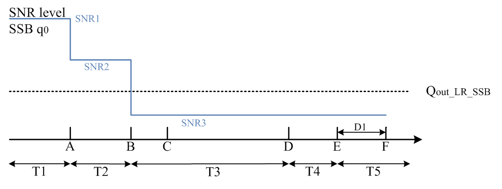
Figure A.5.5.5.2.1-1: SNR variation for SSB-based beam failure detection and link recovery testing in DRX mode

Figure A.5.5.5.2.1-2: SSB_RP level variation for SSB-based beam failure detection and link recovery testing in DRX mode
##### A.5.5.5.2.2 Test Requirements
The UE behaviour during time durations T1, T2, T3, T4 and T5 shall be as follows:
During the time duration T1 and T2, the UE shall transmit uplink signal at least in all subframes configured for CSI transmission on Cell 1.
During the period from time point A to time point B the UE shall transmit uplink signal in Cell 1 in all uplink slots configured for CSI transmission according to the configured periodic CSI reporting for Cell 1.
During T3 the UE shall detect beam failure and initiate link recovery. During T4 and T5 the UE measures and evaluate beam candidate from beam candidate set q1.
No later than time point F occurring no later than D1 = 560+10 ms after the start of T5, the UE shall transmit preamble on a beam associated with the candidate beam set q1. The UE shall not transmit preamble on a beam associated with the candidate beam set q1 earlier than time point B.
Test is concluded once the test equipment has received the initial preamble transmission from the UE. The rate of correct events observed during repeated tests shall be at least 90 %.
#### A.5.5.5.3 EN-DC Beam Failure Detection and Link Recovery Test for FR2 PSCell configured with CSI-RS-based BFD and LR in non-DRX mode
##### A.5.5.5.3.1 Test Purpose and Environment
The purpose of this test is to verify that the UE properly detects CSI-RS-based beam failure in the set q0 configured for a serving PSCell and that the UE performs correct CSI-RS-based link recovery based on beam candicate set q1. The purpose is to test the downlink monitoring for beam failure detection within the UEs active DL BWP of the PSCell, during the evaluation period, and link recovery, when no DRX is used. This test will partly verify the CSI-RS based beam failure detection and link recovery for an FR2 serving cell requirements in clause 8.5.
The test parameters are given in tables A.5.5.5.3.1-1, A.5.5.5.3.1-2, and A.5.5.5.3.1-3 below. There are two cells, Cell 1 is the E-UTRAN PCell, and Cell 2 is the PSCell, in the test. The test consists of five successive time periods, with time duration of T1, T2, T3, T4 and T5 respectively. Figure A.5.5.5.3.1-1 shows the variation of the downlink SNR of the PCell and the SNR of the CSI-RS in set q0 in the active PSCell to emulate CSI-RS based beam failure. Figure A.5.5.5.3.1-2 shows the variation of the downlink L1-RSRP of the CSI-RS in set q1 of the candidate beam used for link recovery. Prior to the start of the time duration T1, the UE shall be fully synchronized to Cell 1 and Cell 2. The UE shall be configured for periodic CSI reporting with a reporting periodicity of 5  ms. In the test, DRX configuration is not enabled.
Table A.5.5.5.3.1-1: Supported test configurations for FR2 PSCell
| Configuration | Description |
| --- | --- |
| 1 | LTE FDD, TDD duplex mode, 120 kHz SSB SCS, 100 MHz bandwidth |
| 2 | LTE TDD, TDD duplex mode, 120 kHz SSB SCS, 100 MHz bandwidth |

Table A.5.5.5.3.1-2: General test parameters for FR2 PSCell for CSI-RS-based beam failure detection and link recovery testing in non-DRX mode
| Parameter | Test Config. | Unit | Value | Comment |  |
| --- | --- | --- | --- | --- | --- |
|  |  |  | Test 1 |  |  |
| Active E-UTRA PCell | 1-2 |  | Cell 1 |  |  |
| E-UTRA RF Channel Number | 1-2 |  | 1 |  |  |
| Active PCell | 1-2 |  | Cell 2 |  |  |
| RF Channel Number | 1-2 |  | 2 |  |  |
| Duplex mode | 1-2 |  | TDD |  |  |
| TDD Configuration | 1-2 |  | TDDConf.3.1 |  |  |
| BWchannel | 1-2 |  | 100: NPRB,c = 66 |  |  |
| Data PRBs allocated | 1-2 |  | 66 |  |  |
| PDSCH/PDCCH subcarrier spacing | 1-2 | kHz | 120 |  |  |
| DL initial BWP configuration | 1-2 |  | DLBWP.0.1 |  |  |
| DL dedicated BWP configuration | 1-2 |  | DLBWP.1.1 |  |  |
| UL initial BWP configuration | 1-2 |  | ULBWP.0.1 |  |  |
| UL dedicated BWP configuration | 1-2 |  | ULBWP.1.1 |  |  |
| PDSCH Reference Channel | 1-2 |  | SR.3.2 TDD |  |  |
| RMSI CORESET Reference Channel | 1-2 |  | CR.3.1 TDD |  |  |
| Dedicated CORESET Reference Channel | 1-2 |  | CCR.3.1 TDD |  |  |
| OCNG parameters | 1-2 |  | OP.1 |  |  |
| CP length | 1-2 |  | Normal |  |  |
| PDSCH/PDCCH TCI state | 1-2 |  | TCI.State.0 |  |  |
| CSI-RS for tracking | 1-2 |  | TRS.2.1 TDD |  |  |
| SSB Configuration | 1-2 |  | SSB.1 FR2 |  |  |
| SMTC Configuration | 1-2 |  | SMTC.3 |  |  |
| PRACH Configuration | 1-2 |  | FR2 PRACH configuration 4 | A.3.8.3.4 |  |
| DRX configuration | 1-2 |  | OFF |  |  |
| CSI-RS configuration for BFD/CBD/RLM | 1-2 |  | CSI-RS.3.2 TDD | A.3.14.2 |  |
| CSI-RS index assigned as BFD RS (q0) | 1-2 |  | 0 |  |  |
| CSI-RS index assigned as CBD RS (q1) | 1-2 |  | 1 |  |  |
| CSI-RS index assigned as RLM RS | 1-2 |  | 0,1 |  |  |
| Beam failure detection transmission parameters | DCI format | 1-2 |  | 1-0 |  |
|  | Number of Control OFDM symbols | 1-2 |  | 2 |  |
|  | Aggregation level | 1-2 | CCE | 8 |  |
|  | Ratio of hypothetical PDCCH RE energy to average SSS RE energy | 1-2 | dB | 0 |  |
|  | Ratio of hypothetical PDCCH DMRS energy to average SSS RE energy | 1-2 | dB | 0 |  |
|  | DMRS precoder granularity | 1-2 |  | REG bundle size |  |
|  | REG bundle size | 1-2 |  | 6 |  |
| Gap pattern ID | 1-2 |  | N/A |  |  |
| rlmInSyncOutOfSyncThreshold | 1-2 |  | absent | Value 0 is applied. (Table 8.1.1-1). |  |
| rsrp-ThresholdSSB | 1-2 | dBm/SCS | -95 | Threshold used for Qin_LR_SSB |  |
| powerControlOffsetSS | 1-2 |  | db0 | Used for deriving rsrp-ThresholdCSI-RS |  |
| beamFailureInstanceMaxCount | 1-2 |  | n1 | see TS 38.321 [7], clause 5.17 |  |
| beamFailureDetectionTimer | 1-2 |  | pbfd4 | see TS 38.321 [7], clause 5.17 |  |
| CSI-RS configuration for CSI reporting | 1-2 |  | CSI-RS.3.1 TDD | A.3.14.2 |  |
| reportConfigType | 1-2 |  | periodic |  |  |
| reportQuantity | 1-2 |  | cri-RI-PMI-CQI |  |  |
| CSI reporting periodicity | 1-2 | slot | 40 |  |  |
| CSI reporting offset | 1-2 | slot | 4 |  |  |
| T310 | 1-2 | ms | 1000 |  |  |
| N310 | 1-2 |  | 2 |  |  |
| T1 | 1-2 | s | 1 | The UE shall be fully synchronized to Cell 1 during T1 |  |
| T2 | 1-2 | s | 1.17 |  |  |
| T3 | 1-2 | s | 0.9 |  |  |
| T4 | 1-2 | s | 0 |  |  |
| T5 | 1-2 | s | 0.31 |  |  |
| D1 | 1-2 | s | 0.27 |  |  |
| NOTE 1: UE-specific PDCCH is not transmitted after T1 starts. |  |  |  |  |  |

Table A.5.5.5.3.1-3: Cell specific test parameters for FR2 PSCell for CSI-RS-based beam failure detection and link recovery testing in non-DRX mode
| Parameter | Unit | Test 1 |  |  |  |  |  |
| --- | --- | --- | --- | --- | --- | --- | --- |
|  |  | T1 | T2 | T3 | T4 | T5 |  |
| AoA setup |  | Setup 1 defined in A.3.15 |  |  |  |  |  |
| Assumption for UE beamsNote 10 |  | Rough |  |  |  |  |  |
| EPRE ratio of PDCCH DMRS to SSS | dB |  |  |  |  |  |  |
| EPRE ratio of PDCCH to PDCCH DMRS | dB |  |  |  |  |  |  |
| EPRE ratio of PBCH DMRS to SSS | dB |  |  |  |  |  |  |
| EPRE ratio of PBCH to PBCH DMRS | dB |  |  |  |  |  |  |
| EPRE ratio of PSS to SSS | dB | 0 |  |  |  |  |  |
| EPRE ratio of PDSCH DMRS to SSS | dB |  |  |  |  |  |  |
| EPRE ratio of PDSCH to PDSCH DMRS | dB |  |  |  |  |  |  |
| EPRE ratio of OCNG DMRS to SSS | dB |  |  |  |  |  |  |
| EPRE ratio of OCNG to OCNG DMRS | dB |  |  |  |  |  |  |
| SNR_CSI-RS of set q0 | Config 1-2 | dB | 5 Note 11 | -3 Note 11 | -12 | -12 | -12 |
| SNR_CSI-RS of set q1 | Config 1-2 | dB | 0.2 | 0.2 | 20.2 | 20.2 | 20.2 |
| CSI-RS_RP of set q1 | Config 1-2 | dBm/SCS | -104.5 | -104.5 | -84.5 | -84.5 | -84.5 |
|  | Config 1-2 | dBm/120 KHz | -104.7 |  |  |  |  |
| Propagation condition |  | TDL-A 30ns 75 Hz |  |  |  |  |  |
| NOTE 1: OCNG shall be used such that the resources in Cell 1 are fully allocated and a constant total transmitted power spectral density is achieved for all OFDM symbols. NOTE 2: The uplink resources for CSI reporting are assigned to the UE prior to the start of time period T1. NOTE 3: NZP CSI-RS resource set configuration for CSI reporting are assigned to the UE prior to the start of time period T1. NOTE 4: Void NOTE 5: The timers and layer 3 filtering related parameters are configured prior to the start of time period T1. NOTE 6: The signal contains PDCCH for UEs other than the device under test as part of OCNG. NOTE 7: SNR levels correspond to the signal to noise ratio over the REs carrying CSI-RS. NOTE 8: The SNR in time periods T1, T2, T3, T4 and T5 is denoted as SNR1, SNR2 and SNR3 respectively in figure A.5.5.5.3.1-1. NOTE 9: The SNR values are specified for testing a UE which supports 2RX on at least one band. For testing of a UE which supports 4RX on all bands, the SNR during T3 is modified as specified in clause A.3.6. NOTE 10: Information about types of UE beam is given in B.2.1.3, and does not limit UE implementation or test system implementation NOTE 11: This value allows up to 1 dB degradation from applied SNR to UE baseband |  |  |  |  |  |  |  |

Table A.5.5.5.3.1-4: Void
Table A.5.5.5.3.1-5: Void
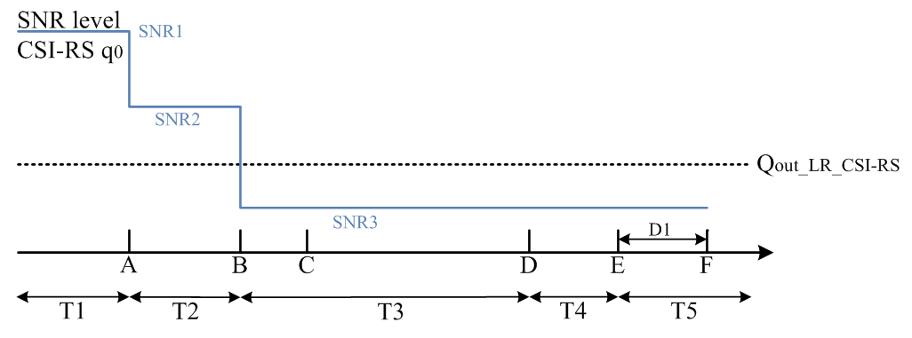
Figure A.5.5.5.3.1-1: SNR variation for CSI-RS based beam failure detection and link recovery testing in non-DRX mode

Figure A.5.5.5.3.1-2: CSI-RS_RP level variation for CSI-RS based beam failure detection and link recovery testing in non-DRX mode
##### A.5.5.5.3.2 Test Requirements
The UE behaviour during time durations T1, T2, T3, T4 and T5 shall be as follows:
During the time duration T1 and T2, the UE shall transmit uplink signal at least in all subframes configured for CSI transmission on Cell 1.
During the period from time point A to time point B the UE shall transmit uplink signal in Cell 1 in all uplink slots configured for CSI transmission according to the configured periodic CSI reporting for Cell 1.
During T3 the UE shall detect beam failure and initiat link recovery. During T4 and T5 the UE measures and evaluate beam candidate from beam candidate set q1.
No later than time point F occurring no later than D1 = 260+10 ms after the start of T5, the UE shall transmit preamble on a beam associated with the candidate beam set q1. The UE shall not transmit preamble on a beam associated with the candidate beam set q1 earlier than time point B.
Test is concluded once the test equipment has received the initial preamble transmission from the UE. The rate of correct events observed during repeated tests shall be at least 90 %.
#### A.5.5.5.4 EN-DC Beam Failure Detection and Link Recovery Test for FR2 PSCell configured with CSI-RS-based BFD and LR in DRX mode
##### A.5.5.5.4.1 Test Purpose and Environment
The purpose of this test is to verify that the UE properly detects CSI-RS-based beam failure in the set q0 configured for a serving PSCell and that the UE performs correct CSI-RS-based link recovery based on beam candicate set q1. The purpose is to test the downlink monitoring for beam failure detection within the UEs active DL BWP of the PSCell, during the evaluation period, and link recovery, when DRX is used. This test will partly verify the CSI-RS based beam failure detection and link recovery for an FR2 serving cell requirements in clause 8.5.
The test parameters are given in tables A.5.5.5.4.1-1, A.5.5.5.4.1-2, A.5.5.5.4.1-3, and A.5.5.5.4.1-4 below. There are two cells, Cell 1 is the E-UTRAN PCell, and Cell 2 is the PSCell, in the test. The test consists of five successive time periods, with time duration of T1, T2, T3, T4 and T5 respectively. Figure A.5.5.5.4.1-1 shows the variation of the downlink SNR of the PCell and the SNR of the CSI-RS in set q0 in the active PSCell to emulate CSI-RS based beam failure. Figure A.5.5.5.4.1-2 shows the variation of the downlink L1-RSRP of the CSI-RS in set q1 of the candidate beam used for link recovery. Prior to the start of the time duration T1, the UE shall be fully synchronized to Cell 1 and Cell 2. The UE shall be configured for periodic CSI reporting with a reporting periodicity of 5  ms. In the test, DRX configuration is enabled in PCell and DRX inactivity timer has already been expired, i.e. UE tries to decode PDCCH and to send periodic CQI during the period when On-duration timer is running. Time alignment timers shall be set to “infinity” so that UL timing alignment is maintained during the test.
Table A.5.5.5.4.1-1: Supported test configurations for FR2 PSCell
| Configuration | Description |
| --- | --- |
| 1 | LTE FDD, TDD duplex mode, 120 kHz SSB SCS, 100 MHz bandwidth |
| 2 | LTE TDD, FDD duplex mode, 120 kHz SSB SCS, 100 MHz bandwidth |

Table A.5.5.5.4.1-2: General test parameters for FR2 PSCell for CSI-RS-based beam failure detection and link recovery testing in DRX mode
| Parameter | Test Config. | Unit | Value | Comment |  |
| --- | --- | --- | --- | --- | --- |
|  |  |  | Test 1 |  |  |
| Active E-UTRA PCell | 1-2 |  | Cell 1 |  |  |
| E-UTRA RF Channel Number | 1-2 |  | 1 |  |  |
| Active PCell | 1-2 |  | Cell 2 |  |  |
| RF Channel Number | 1-2 |  | 2 |  |  |
| Duplex mode | 1-2 |  | TDD |  |  |
| TDD Configuration | 1-2 |  | TDDConf.3.1 |  |  |
| BWchannel | 1-2 |  | 100: NPRB,c = 66 |  |  |
| Data PRBs allocated | 1-2 |  | 66 |  |  |
| PDSCH/PDCCH subcarrier spacing | 1-2 | kHz | 120 |  |  |
| DL initial BWP configuration | 1-2 |  | DLBWP.0.1 |  |  |
| DL dedicated BWP configuration | 1-2 |  | DLBWP.1.1 |  |  |
| UL initial BWP configuration | 1-2 |  | ULBWP.0.1 |  |  |
| UL dedicated BWP configuration | 1-2 |  | ULBWP.1.1 |  |  |
| PDSCH Reference Channel | 1-2 |  | SR.3.2 TDD |  |  |
| RMSI CORESET Reference Channel | 1-2 |  | CR.3.1 TDD |  |  |
| Dedicated CORESET Reference Channel | 1-2 |  | CCR.3.1 TDD |  |  |
| OCNG parameters | 1-2 |  | OP.1 |  |  |
| CP length | 1-2 |  | Normal |  |  |
| PDSCH/PDCCH TCI state | 1-2 |  | TCI.State.0 |  |  |
| CSI-RS for tracking | 1-2 |  | TRS.2.1 TDD |  |  |
| SSB Configuration | 1-2 |  | SSB.1 FR2 |  |  |
| SMTC Configuration | 1-2 |  | SMTC.3 |  |  |
| PRACH Configuration | 1-2 |  | FR2 PRACH configuration 4 | A.3.8.3.4 |  |
| DRX configuration | 1-2 |  | DRX.3 | A.3.3.3 |  |
| CSI-RS configuration for BFD/CBD/RLM | 1-2 |  | CSI-RS.3.2 TDD | A.3.14.2 |  |
| CSI-RS index assigned as BFD RS (q0) | 1-2 |  | 0 |  |  |
| CSI-RS index assigned as CBD RS (q1) | 1-2 |  | 1 |  |  |
| CSI-RS index assigned as RLM RS | 1-2 |  | 0,1 |  |  |
| Beam failure detection transmission parameters | DCI format | 1-2 |  | 1-0 |  |
|  | Number of Control OFDM symbols | 1-2 |  | 2 |  |
|  | Aggregation level | 1-2 | CCE | 8 |  |
|  | Ratio of hypothetical PDCCH RE energy to average SSS RE energy | 1-2 | dB | 0 |  |
|  | Ratio of hypothetical PDCCH DMRS energy to average SSS RE energy | 1-2 | dB | 0 |  |
|  | DMRS precoder granularity | 1-2 |  | REG bundle size |  |
|  | REG bundle size | 1-2 |  | 6 |  |
| Gap pattern ID | 1-2 |  | N/A |  |  |
| rlmInSyncOutOfSyncThreshold | 1-2 |  | absent | Value 0 is applied. (Table 8.1.1-1). |  |
| rsrp-ThresholdSSB | 1-2 | dBm/SCS | -95 | Threshold used for Qin_LR_SSB |  |
| powerControlOffsetSS | 1-2 |  | db0 | Used for deriving rsrp-ThresholdCSI-RS |  |
| beamFailureInstanceMaxCount | 1-2 |  | n1 | see TS 38.321 [7], clause 5.17 |  |
| beamFailureDetectionTimer | 1-2 |  | pbfd4 | see TS 38.321 [7], clause 5.17 |  |
| CSI-RS configuration for CSI reporting | 1-2 |  | CSI-RS.3.1 TDD | A.3.14.2 |  |
| reportConfigType | 1-2 |  | periodic |  |  |
| reportQuantity | 1-2 |  | cri-RI-PMI-CQI |  |  |
| CSI reporting periodicity | 1-2 | slot | 40 |  |  |
| CSI reporting offset | 1-2 | slot | 4 |  |  |
| T310 | 1-2 | ms | 1000 |  |  |
| N310 | 1-2 |  | 2 |  |  |
| T1 | 1-2 | s | 1 | The UE shall be fully synchronized to Cell 1 during T1 |  |
| T2 | 1-2 | s | 5.43 |  |  |
| T3 | 1-2 | s | 5.16 |  |  |
| T4 | 1-2 | s | 0 |  |  |
| T5 | 1-2 | s | 0.31 |  |  |
| D1 | 1-2 | s | 0.27 |  |  |
| NOTE 1: UE-specific PDCCH is not transmitted after T1 starts. |  |  |  |  |  |

Table A.5.5.5.4.1-3: Cell specific test parameters for FR2 PSCell for CSI-RS-based beam failure detection and link recovery testing in DRX mode
| Parameter | Unit | Test 1 |  |  |  |  |  |
| --- | --- | --- | --- | --- | --- | --- | --- |
|  |  | T1 | T2 | T3 | T4 | T5 |  |
| AoA setup |  | Setup 1 defined in A.3.155 |  |  |  |  |  |
| Assumption for UE beamsNote 10 |  | Rough |  |  |  |  |  |
| EPRE ratio of PDCCH DMRS to SSS | dB |  |  |  |  |  |  |
| EPRE ratio of PDCCH to PDCCH DMRS | dB |  |  |  |  |  |  |
| EPRE ratio of PBCH DMRS to SSS | dB |  |  |  |  |  |  |
| EPRE ratio of PBCH to PBCH DMRS | dB |  |  |  |  |  |  |
| EPRE ratio of PSS to SSS | dB | 0 |  |  |  |  |  |
| EPRE ratio of PDSCH DMRS to SSS | dB |  |  |  |  |  |  |
| EPRE ratio of PDSCH to PDSCH DMRS | dB |  |  |  |  |  |  |
| EPRE ratio of OCNG DMRS to SSS | dB |  |  |  |  |  |  |
| EPRE ratio of OCNG to OCNG DMRS | dB |  |  |  |  |  |  |
| SNR_CSI-RS of set q0 | Config 1-2 | dB | 5 Note 11 | -3 Note 11 | -12 | -12 | -12 |
| SNR_CSI-RS of set q1 | Config 1-2 | dB | 0.2 | 0.2 | 20.2 | 20.2 | 20.2 |
| CSI-RS_RP of set q1 | Config 1-2 | dBm/SCS | -104.5 | -104.5 | -84.5 | -84.5 | -84.5 |
|  | Config 1-2 | dBm/120 KHz | -104.7 |  |  |  |  |
| Propagation condition |  | TDL-A 30ns 75 Hz |  |  |  |  |  |
| NOTE 1: OCNG shall be used such that the resources in Cell 1 are fully allocated and a constant total transmitted power spectral density is achieved for all OFDM symbols. NOTE 2: The uplink resources for CSI reporting are assigned to the UE prior to the start of time period T1. NOTE 3: NZP CSI-RS resource set configuration for CSI reporting are assigned to the UE prior to the start of time period T1. NOTE 4: Void NOTE 5: The timers and layer 3 filtering related parameters are configured prior to the start of time period T1. NOTE 6: The signal contains PDCCH for UEs other than the device under test as part of OCNG. NOTE 7: SNR levels correspond to the signal to noise ratio over the SSS REs. NOTE 8: The SNR in time periods T1, T2, T3, T4 and T5 is denoted as SNR1, SNR2 and SNR3 respectively in figure A.5.5.5.4.1-1. NOTE 9: The SNR values are specified for testing a UE which supports 2RX on at least one band. For testing of a UE which supports 4RX on all bands, the SNR during T3 is modified as specified in clause A.3.6. NOTE 10: Information about types of UE beam is given in B.2.1.3, and does not limit UE implementation or test system implementation NOTE 11: This value allows up to 1 dB degradation from applied SNR to UE baseband |  |  |  |  |  |  |  |

Table A.5.5.5.4.1-4: Void
Table A.5.5.5.4.1-5: Void
Table A.5.5.5.4.1-6: Void

Figure A.5.5.5.4.1-1: SNR and L1-RSRP variation for CSI-RS-based beam failure detection and link recovery testing in DRX mode

Figure A.5.5.5.4.1-2: CSI-RS_RP level variation for CSI-RS based beam failure detection and link recovery testing in DRX mode
##### A.5.5.5.4.2 Test Requirements
The UE behaviour during time durations T1, T2, T3, T4 and T5 shall be as follows:
During the time duration T1 and T2, the UE shall transmit uplink signal at least in all subframes configured for CSI transmission on Cell 1.
During the period from time point A to time point B the UE shall transmit uplink signal in Cell 1 in all uplink slots configured for CSI transmission according to the configured periodic CSI reporting for Cell 1.
During T3 the UE shall detect beam failure and initiat link recovery. During T4 and T5 the UE measures and evaluate beam candidate from beam candidate set q1.
No later than time point F occurring no later than D1 = 260+10 ms after the start of T5, the UE shall transmit preamble on a beam associated with the candidate beam set q1. The UE shall not transmit preamble on a beam associated with the candidate beam set q1 earlier than time point B.
Test is concluded once the test equipment has received the initial preamble transmission from the UE. The rate of correct events observed during repeated tests shall be at least 90 %.
#### A.5.5.5.5 EN-DC scheduling availability restriction during Beam Failure Detection and Link Recovery for FR2 PSCell configured with SSB-based BFD and LR in non-DRX mode
##### A.5.5.5.5.1 Test Purpose and Environment
The purpose is to test scheduling availability restrictions when the UE is performing beam failure detection or when the UE is performing L1-RSRP measurement for candidate beam detection, when no DRX is used. This test will verify the scheduling availability restriction requirements for SSB based beam failure detection and link recovery for an FR2 serving cell in clause 8.5.7 and 8.5.8.
The test parameters are given in tables A.5.5.5.5.1-1, A.5.5.5.5.1-2 and A.5.5.5.5.1-3 below. There are two cells, Cell 1 is the E-UTRAN PCell, and Cell 2 is the PSCell, in the test. The test consists of five successive time periods, with time duration of T1, T2, T3, T4 and T5 respectively. Figure A.5.5.5.5.1-1 shows the variation of the downlink SNR of the PCell and the SNR of the SSB index 0 in the active PSCell to emulate SSB based beam failure. Figure A.5.5.5.5.1-2 shows the variation of the downlink L1-RSRP of the SSB index 1 used for link recovery. Prior to the start of the time duration T1, the UE shall be fully synchronized to Cell 1 and Cell 2. The UE shall be configured for periodic CSI reporting with a reporting periodicity of 5 ms. This test will focus on the scheduling availability during beam failure detection and candidate beam detection. In the test, DRX configuration is not enabled. Test is to test the scheduling availability restriction of UE performing beam failure detection and candidate beam detection when SSB RS configured for Beam failure detection and candidate beam detection. During the test the UE is scheduled to transmit continuously in UL.
Table A.5.5.5.5.1-1: Supported test configurations for FR2 PSCell
| Configuration | Description |
| --- | --- |
| 1 | LTE FDD, NR 120 kHz SSB SCS, 100 MHz bandwidth, TDD duplex mode |
| 2 | LTE TDD, NR 120 kHz SSB SCS, 100 MHz bandwidth, TDD duplex mode |
| 3 | LTE FDD, NR 240 kHz SSB SCS, 100 MHz bandwidth, TDD duplex mode |
| 4 | LTE TDD, NR 240 kHz SSB SCS, 100 MHz bandwidth, TDD duplex mode |
| NOTE: The UE is only required to be tested in one of the supported test configurations |  |

Table A.5.5.5.5.1-2: General test parameters for FR2 PSCell for SSB-based beam failure detection and link recovery testing in non-DRX mode
| Parameter | Test Config. | Unit | Value | Comment |  |
| --- | --- | --- | --- | --- | --- |
|  |  |  | Test 1 |  |  |
| Active E-UTRA PCell | 1-4 |  | Cell 1 |  |  |
| E-UTRA RF Channel Number | 1-4 |  | 1 |  |  |
| Active PCell | 1-4 |  | Cell 2 |  |  |
| RF Channel Number | 1-4 |  | 2 |  |  |
| Duplex mode | 1-4 |  | TDD |  |  |
| TDD Configuration | 1-4 |  | TDDConf.3.1 |  |  |
| BWchannel | 1-4 |  | 100: NPRB,c = 66 |  |  |
| Data PRBs allocated | 1-4 |  | 66 |  |  |
| PDSCH/PDCCH subcarrier spacing | 1-4 | kHz | 120 |  |  |
| DL initial BWP configuration | 1-4 |  | DLBWP.0.1 |  |  |
| DL dedicated BWP configuration | 1-4 |  | DLBWP.1.1 |  |  |
| UL initial BWP configuration | 1-4 |  | ULBWP.0.1 |  |  |
| UL dedicated BWP configuration | 1-4 |  | ULBWP.1.1 |  |  |
| PDSCH Reference Channel | 1-2 |  | SR.3.2 TDD |  |  |
|  | 3-4 |  | SR.3.3 TDD |  |  |
| RMSI CORESET Reference Channel | 1-2 |  | CR.3.1 TDD |  |  |
|  | 3-4 |  | CR.3.2 TDD |  |  |
| Dedicated CORESET Reference Channel | 1-2 |  | CCR.3.1 TDD |  |  |
|  | 3-4 |  | CCR.3.7 TDD |  |  |
| OCNG parameters | 1-4 |  | OP.1 |  |  |
| CP length | 1-4 |  | Normal |  |  |
| PDSCH/PDCCH TCI state | 1-4 |  | TCI.State.0 |  |  |
| CSI-RS for tracking | 1-4 |  | TRS.2.1 TDD |  |  |
| SSB Configuration | 1-2 |  | SSB.1 FR2 |  |  |
|  | 3-4 |  | SSB.2 FR2 |  |  |
| SMTC Configuration | 1-4 |  | SMTC.1 |  |  |
| PRACH Configuration | 1-4 |  | FR2 PRACH configuration 2 | A.3.8.3.2 |  |
| DRX configuration | 1-4 |  | OFF |  |  |
| Beam failure detection transmission parameters | DCI format | 1-4 |  | 1-0 |  |
|  | Number of Control OFDM symbols | 1-4 |  | 2 |  |
|  | Aggregation level | 1-4 | CCE | 8 |  |
|  | Ratio of hypothetical PDCCH RE energy to average SSS RE energy | 1-4 | dB | 0 |  |
|  | Ratio of hypothetical PDCCH DMRS energy to average SSS RE energy | 1-4 | dB | 0 |  |
|  | DMRS precoder granularity | 1-4 |  | REG bundle size |  |
|  | REG bundle size | 1-4 |  | 6 |  |
| Gap pattern ID | 1-4 |  | N/A | No measurement gap is configured |  |
| rlmInSyncOutOfSyncThreshold | 1-4 |  | absent | Value 0 is applied. (Table 8.1.1-1). |  |
| rsrp-ThresholdSSB | 1-2 | dBm/SCS | -95 | Threshold used for Qin_LR_SSB |  |
|  | 3-4 |  | -92 |  |  |
| powerControlOffsetSS | 1-4 |  | db0 | Used for deriving rsrp-ThresholdCSI-RS |  |
| beamFailureInstanceMaxCount | 1-4 |  | n1 | see TS 38.321 [7], clause 5.17 |  |
| beamFailureDetectionTimer | 1-4 |  | pbfd4 | see TS 38.321 [7], clause 5.17 |  |
| CSI-RS configuration for CSI reporting | 1-4 |  | CSI-RS.3.1 TDD |  |  |
| reportConfigType | 1-4 |  | periodic |  |  |
| reportQuantity | 1-4 |  | cri-RI-PMI-CQI |  |  |
| CSI reporting periodicity | 1-4 | slot | 40 |  |  |
| CSI reporting offset | 1-4 | slot | 4 |  |  |
| T310 | 1-4 | ms | 1000 |  |  |
| N310 | 1-4 |  | 2 |  |  |
| T1 | 1-4 | s | 1 | The UE shall be fully synchronized to Cell 1 during T1 |  |
| T2 | 1-4 | s | 2.6 |  |  |
| T3 | 1-4 | s | 1.64 |  |  |
| T4 | 1-4 | s | 0 |  |  |
| T5 | 1-4 | s | 1.01 |  |  |
| D1 | 1-4 | s | 0.97 |  |  |
| NOTE 1: All configurations are assigned to the UE prior to the start of time period T1. NOTE 2: UE-specific PDCCH is not transmitted after T1 starts. |  |  |  |  |  |

Table A.5.5.5.5.1-3: Cell specific test parameters for FR2 PSCell for SSB-based beam failure detection and link recovery testing in non-DRX mode
| Parameter | Unit | Test 1 |  |  |  |  |  |
| --- | --- | --- | --- | --- | --- | --- | --- |
|  |  | T1 | T2 | T3 | T4 | T5 |  |
| AoA setup |  | Setup 1 defined in A.3.15 |  |  |  |  |  |
| Assumption for UE beamsNote 10 |  | Rough |  |  |  |  |  |
| EPRE ratio of PDCCH DMRS to SSS | dB | 0 |  |  |  |  |  |
| EPRE ratio of PDCCH to PDCCH DMRS | dB |  |  |  |  |  |  |
| EPRE ratio of PBCH DMRS to SSS | dB |  |  |  |  |  |  |
| EPRE ratio of PBCH to PBCH DMRS | dB |  |  |  |  |  |  |
| EPRE ratio of PSS to SSS | dB |  |  |  |  |  |  |
| EPRE ratio of PDSCH DMRS to SSS | dB |  |  |  |  |  |  |
| EPRE ratio of PDSCH to PDSCH DMRS | dB |  |  |  |  |  |  |
| EPRE ratio of OCNG DMRS to SSS | dB |  |  |  |  |  |  |
| EPRE ratio of OCNG to OCNG DMRS | dB |  |  |  |  |  |  |
| SSB index assigned as BFD RS (q0) | Config 1-4 |  | 0 | 0 | Note 12 |  |  |
| SSB index assigned as CBD RS (q1) | Config 1-4 |  | 1 | 1 | 1 | 1 | 1 |
| SNR of SSB index 0 | Config 1-4 | dB | 5Note 11 | -3Note 11 | -12 | -12 | -12 |
| SNR of SSB index 1 | Config 1-4 | dB | 0.2 | 0.2 | 20.2 | 20.2 | 20.2 |
| SSB_RP of SSB index 1 | Config 1-2 | dBm/ | -104.5 | -104.5 | -84.5 | -84.5 | -84.5 |
|  | Config 3-4 | SCS | -101.5 | -101.5 | -81.5 | -81.5 | -81.5 |
|  | Config 1-4 | dBm/120 kHz | -104.7 |  |  |  |  |
| Propagation condition |  | TDL-A 30ns 75 Hz |  |  |  |  |  |
| NOTE 1: OCNG shall be used such that the resources in Cell 1 are fully allocated and a constant total transmitted power spectral density is achieved for all OFDM symbols. NOTE 2: The uplink resources for CSI reporting are assigned to the UE prior to the start of time period T1. NOTE 3: NZP CSI-RS resource set configuration for CSI reporting are assigned to the UE prior to the start of time period T1. NOTE 4: Void NOTE 5: The timers and layer 3 filtering related parameters are configured prior to the start of time period T1. NOTE 6: The signal contains PDCCH for UEs other than the device under test as part of OCNG. NOTE 7: SNR levels correspond to the signal to noise ratio over the SSS REs. NOTE 8: The SNR in time periods T1, T2, T3, T4 and T5 is denoted as SNR1, SNR2 and SNR3 respectively in figure A.5.5.5.5.1-1. NOTE 9: The SNR values are specified for testing a UE which supports 2RX on at least one band. For testing of a UE which supports 4RX on all bands, the SNR during T3 is modified as specified in clause A.3.6. NOTE 10: Information about types of UE beam is given in B.2.1.3, and does not limit UE implementation or test system implementation NOTE 11: This value allows up to 1 dB degradation from applied SNR to UE baseband NOTE 12: BFD RS (q0) is configured as SSB index 0 at the start of T3, and it is reconfigured by RRC as SSB index 1 after the UE transmits the preamble on a beam associated with the candidate beam set q1. |  |  |  |  |  |  |  |

Figure A.5.5.5.5.1-1: SNR variation for SSB-based beam failure detection and link recovery testing in non-DRX mode
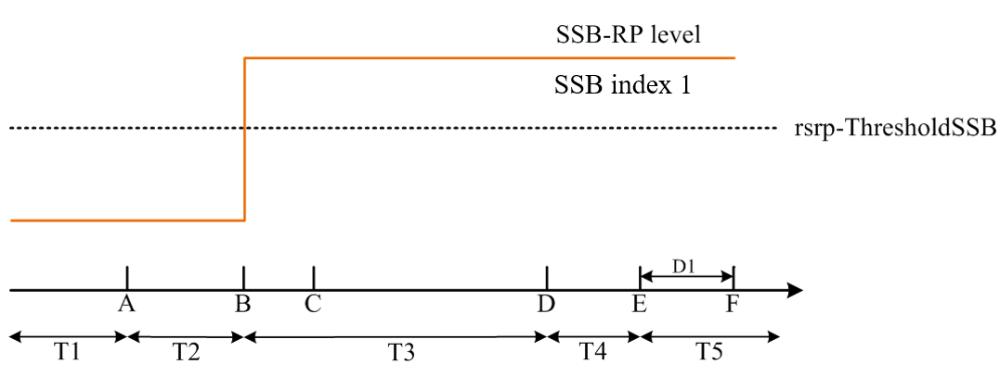
Figure A.5.5.5.5.1-2: SSB_RP level variation for SSB-based beam failure detection and link recovery testing in non-DRX mode
##### A.5.5.5.5.2 Test Requirements
The UE behaviour during time duration T3 follows the requirements defined in clause 8.5.7.3:
- The UE is not expected to transmit PUCCH/PUSCH/SRS or receive PDCCH/PDSCH/CSI-RS for tracking/CSI-RS for CQI on BFD-RS symbols to be measured for beam failure detection.
The UE behaviour during time durations T4 and T5 follows the requirements defined in clause 8.5.8.3:
- The UE is not expected to transmit PUCCH/PUSCH or receive PDCCH/PDSCH on reference symbols to be measured for candidate beam detection.
#### A.5.5.5.6 EN-DC Beam Failure Detection and Link Recovery Test for FR2 SCell configured with CSI-RS-based BFD and LR in non-DRX mode
##### A.5.5.5.6.1 Test Purpose and Environment
The purpose of this test is to verify that the UE properly detects CSI-RS-based beam failure in the set q0 configured for an active SCell and that the UE performs correct CSI-RS-based link recovery based on beam candidate set q1. The purpose is to test the downlink monitoring for beam failure detection within the UEs active DL BWP of the SCell with schedulingRequestID-BFR-SCell-r16 configuration, during the evaluation period, and link recovery, when no DRX is used. This test will partly verify the CSI-RS based beam failure detection and link recovery for an FR2 SCell requirements in clause 8.5.
The test parameters are given in tables A.5.5.5.6.1-1, A.5.5.5.6.1-2 and A.5.5.5.6.1-3. There are three cells, Cell 1 is the E-UTRAN PCell, Cell 2 is the PSCell, and Cell 3 is the SCell, in the test. The test consists of five successive time periods, with time duration of T1, T2, T3, T4 and T5 respectively. Figure A.5.5.5.6.1-1 shows the variation of the downlink SNR of the active SCell and the SNR of the CSI-RS in set q0 in the active SCell to emulate CSI-RS based beam failure. Figure A.5.5.5.6.1-2 shows the variation of the downlink L1-RSRP of the CSI-RS in set q1 of the candidate beam used for link recovery. Prior to the start of the time duration T1, the UE shall be fully synchronized to Cell 1, Cell 2, and Cell 3. The UE shall be configured for periodic CSI reporting with a reporting periodicity of 5 ms. In the test, DRX configuration is not enabled.
Table A.5.5.5.6.1-1: Supported test configurations for FR2 PSCell and SCell
| Configuration | Description |
| --- | --- |
| 1 | LTE FDD, TDD duplex mode, 120 kHz SSB SCS, 100 MHz bandwidth |
| 2 | LTE TDD, TDD duplex mode, 120 kHz SSB SCS, 100 MHz bandwidth |

Table A.5.5.5.6.1-2: General test parameters for FR2 SCell for beam failure detection and link recovery testing in non-DRX mode
| Parameter | Test Config. | Unit | Value | Comment |  |
| --- | --- | --- | --- | --- | --- |
|  |  |  | Test 1 |  |  |
| Active E-UTRA PCell | 1-2 |  | Cell 1 |  |  |
| E-UTRA RF Channel Number | 1-2 |  | 1 |  |  |
| Active PCell | 1-2 |  | Cell 2 |  |  |
| RF Channel Number for PSCell | 1-2 |  | 2 |  |  |
| Active SCell | 1-2 |  | Cell 3 |  |  |
| RF Channel Number for SCell | 1-2 |  | 3 |  |  |
| Duplex mode | 1-2 |  | TDD |  |  |
| TDD Configuration | 1-2 |  | TDDConf.3.1 |  |  |
| BWchannel | 1-2 | MHz | 100: NPRB,c = 66 |  |  |
| Data PRBs allocated | 1-2 |  | 66 |  |  |
| PDSCH/PDCCH subcarrier spacing | 1-2 | kHz | 120 |  |  |
| DL initial BWP configuration | 1-2 |  | DLBWP.0.1 |  |  |
| DL dedicated BWP configuration | 1-2 |  | DLBWP.1.1 |  |  |
| UL initial BWP configuration | 1-2 |  | ULBWP.0.1 |  |  |
| UL dedicated BWP configuration | 1-2 |  | ULBWP.1.1 |  |  |
| PDSCH Reference Channel | 1-2 |  | SR.3.2 TDD |  |  |
| RMSI CORESET Reference Channel | 1-2 |  | CR.3.1 TDD | A.3.1.2 |  |
| Dedicated CORESET Reference Channel | 1-2 |  | CCR.3.1 TDD |  |  |
| OCNG parameters | 1-2 |  | OP.1 | A.3.2.1 |  |
| CP length | 1-2 |  | Normal |  |  |
| PDSCH/PDCCH TCI state | 1-2 |  | TCI.State.0 |  |  |
| CSI-RS for tracking | 1-2 |  | TRS.2.1 TDD |  |  |
| SSB Configuration | 1-2 |  | SSB.3 FR2 | A.3.10 |  |
| SMTC Configuration | 1-2 |  | SMTC.3 | A.3.11 |  |
| PRACH Configuration | 1-2 |  | FR2 PRACH configuration 4 | Table A.3.8.3.4-1 |  |
| DRX configuration | 1-2 |  | OFF |  |  |
| CSI-RS configuration for BFD/CBD in activated SCell | 1-2 |  | CSI-RS.3.2 TDD | A.3.14.2 |  |
| CSI-RS index assigned as BFD RS (q0) in activated SCell | 1-2 |  | 0 |  |  |
| CSI-RS index assigned as CBD RS (q1) in activated SCell | 1-2 |  | 1 |  |  |
| CSI-RS configuration for RLM in PSCell | 1-2 |  | CSI-RS.3.2 TDD | A.3.14.2 |  |
| Beam failure detection transmission parameters | DCI format | 1-2 |  | 1-0 |  |
|  | Number of Control OFDM symbols | 1-2 |  | 2 |  |
|  | Aggregation level | 1-2 | CCE | 8 |  |
|  | Ratio of hypothetical PDCCH RE energy to average SSS RE energy | 1-2 | dB | 0 |  |
|  | Ratio of hypothetical PDCCH DMRS energy to average SSS RE energy | 1-2 | dB | 0 |  |
|  | DMRS precoder granularity | 1-2 |  | REG bundle size |  |
|  | REG bundle size | 1-2 |  | 6 |  |
| Gap pattern ID | 1-2 |  | N/A |  |  |
| schedulingRequestID-BFR-SCell-r16 | 1-2 |  | Configured |  |  |
| Periodicity of PUCCH for SR configuration for BFR on SCell | 1-2 | slot | 40 | 5 ms |  |
| Offset of PUCCH for SR configuration for BFR on SCell | 1-2 | slot | 4 |  |  |
| PUCCH parameters for SR configuration for BFR on SCell | 1-2 |  | Table 8.3.3.1.2-1 in [13] |  |  |
| rlmInSyncOutOfSyncThreshold | 1-2 |  | absent | Value 0 is applied. (Table 8.1.1-1). |  |
| rsrp-ThresholdSSB | 1-2 | dBm/SCS | -95 | Threshold used for Qin_LR_SSB |  |
| powerControlOffsetSS | 1-2 |  | db0 | Used for deriving rsrp-ThresholdCSI-RS |  |
| beamFailureInstanceMaxCount | 1-2 |  | n1 | see TS 38.321 [7], clause 5.17 |  |
| beamFailureDetectionTimer | 1-2 |  | pbfd4 | see TS 38.321 [7], clause 5.17 |  |
| CSI-RS configuration for CSI reporting | 1-2 |  | CSI-RS.3.1 TDD | A.3.14.2 |  |
| reportConfigType | 1-2 |  | periodic |  |  |
| reportQuantity | 1-2 |  | cri-RI-PMI-CQI |  |  |
| CSI reporting periodicity | 1-2 | slot | 40 |  |  |
| CSI reporting offset | 1-2 | slot | 4 |  |  |
| T310 | 1-2 | ms | 1000 |  |  |
| N310 | 1-2 |  | 2 |  |  |
| T1 | 1-2 | s | 1 | The UE shall be fully synchronized to Cell 1 during T1 |  |
| T2 | 1-2 | s | 1.17 |  |  |
| T3 | 1-2 | s | 0.9 |  |  |
| T4 | 1-2 | s | 0 |  |  |
| T5 | 1-2 | s | 0.31 |  |  |
| D1 | 1-2 | s | 0.27 |  |  |
| NOTE 1: UE-specific PDCCH is not transmitted after T1 starts. |  |  |  |  |  |

Table A.5.5.5.6.1-3: Cell specific test parameters for FR2 SCell for beam failure detection and link recovery testing in non-DRX mode
| Parameter | Unit | Cell2 | Cell3 Test 1 |  |  |  |  |  |
| --- | --- | --- | --- | --- | --- | --- | --- | --- |
|  |  | T1 to T5 | T1 | T2 | T3 | T4 | T5 |  |
| AoA setup |  | Setup 1 defined in A.3.15 | Setup 1 defined in A.3.15 |  |  |  |  |  |
| Assumption for UE beamsNote 10 |  | Rough | Rough |  |  |  |  |  |
| EPRE ratio of PDCCH DMRS to SSS | dB |  |  |  |  |  |  |  |
| EPRE ratio of PDCCH to PDCCH DMRS | dB |  |  |  |  |  |  |  |
| EPRE ratio of PBCH DMRS to SSS | dB |  |  |  |  |  |  |  |
| EPRE ratio of PBCH to PBCH DMRS | dB |  |  |  |  |  |  |  |
| EPRE ratio of PSS to SSS | dB | 0 | 0 |  |  |  |  |  |
| EPRE ratio of PDSCH DMRS to SSS | dB |  |  |  |  |  |  |  |
| EPRE ratio of PDSCH to PDSCH DMRS | dB |  |  |  |  |  |  |  |
| EPRE ratio of OCNG DMRS to SSS | dB |  |  |  |  |  |  |  |
| EPRE ratio of OCNG to OCNG DMRS | dB |  |  |  |  |  |  |  |
| SNR_CSI-RS of set q0 | Config 1,2 | dB | 5 | 5 | -3 | -12 | -12 | -12 |
| SNR_CSI-RS of set q1 | Config 1,2 | dB | 0.2 | 0.2 | 0.2 | 20.2 | 20.2 | 20.2 |
| CSI-RS_RP of set q1 | Config 1,2 | dBm/SCS kHz | -104.5 | -104.5 | -104.5 | -84.5 | -84.5 | -84.5 |
| Noc | Config 1,2 | Config 1 | dBm/120 kHz | -104.7 |  |  |  |  |
| Propagation condition |  | TDL-A 30ns 75 Hz | TDL-A 30ns 75 Hz |  |  |  |  |  |
| NOTE 1: OCNG shall be used such that the resources in Cell 1 are fully allocated and a constant total transmitted power spectral density is achieved for all OFDM symbols. NOTE 2: The uplink resources for CSI reporting are assigned to the UE prior to the start of time period T1. NOTE 3: NZP CSI-RS resource set configuration for CSI reporting are assigned to the UE prior to the start of time period T1. NOTE 4: Void NOTE 5: The timers and layer 3 filtering related parameters are configured prior to the start of time period T1. NOTE 6: The signal contains PDCCH for UEs other than the device under test as part of OCNG. NOTE 7: SNR levels correspond to the signal to noise ratio over the REs carrying CSI-RS. NOTE 8: The SNR in time periods T1, T2, T3, T4 and T5 is denoted as SNR1, SNR2 and SNR3 respectively in figure A.5.5.5.6.1-1. NOTE 9: The SNR values are specified for testing a UE which supports 2RX on at least one band. For testing of a UE which supports 4RX on all bands, the SNR during T3 is modified as specified in clause A.3.6. NOTE 10: Information about types of UE beam is given in B.2.1.3, and does not limit UE implementation or test system implementation |  |  |  |  |  |  |  |  |

Figure A.5.5.5.6.1-1: SNR variation for CSI-RS based beam failure detection and link recovery testing for SCell in non-DRX mode

Figure A.5.5.5.6.1-2: CSI-RS_RP level variation for CSI-RS based beam failure detection and link recovery testing for SCell in non-DRX mode
##### A.5.5.5.6.2 Test Requirements
The UE behaviour during time durations T1, T2, T3, T4 and T5 in A.5.5.5.6.1 shall be as follows:
During the time duration T1 and T2, the UE shall transmit uplink signal at least in all subframes configured for CSI transmission on Cell 2.
During the period from time point A to time point B the UE shall transmit uplink signal in Cell 2 in all uplink slots configured for CSI transmission according to the configured periodic CSI reporting for Cell 2.
During T3 the UE shall detect beam failure and initial link recovery. During T4 and T5 the UE measures and evaluates beam candidate from beam candidate set q1.
No later than time point F occurring no later than D1 = 260+10 ms after the start of T5, the UE shall transmit PUCCH with LRR, followed by BFR MAC CE containing a beam associated with the candidate beam set q1. The UE shall not transmit PUCCH with an LRR with the candidate beam set q1 earlier than time point B.
Test is concluded once the test equipment has received the initial preamble transmission from the UE. The rate of correct events observed during repeated tests shall be at least 90 %.
#### A.5.5.5.7 EN-DC Beam Failure Detection and Link Recovery Test for FR2 SCell configured with CSI-RS-based BFD and LR in DRX mode
##### A.5.5.5.7.1 Test Purpose and Environment
The purpose of this test is to verify that the UE properly detects CSI-RS-based beam failure in the set q0 configured for an active SCell and that the UE performs correct CSI-RS-based link recovery based on beam candidate set q1. The purpose is to test the downlink monitoring for beam failure detection within the UEs active DL BWP of the SCell with schedulingRequestID-BFR-SCell-r16 configuration, during the evaluation period, and link recovery, when DRX is used. This test will partly verify the CSI-RS based beam failure detection and link recovery for an FR2 SCell requirements in clause 8.5.
The test parameters are given in tables A.5.5.5.7.1-1, A.5.5.5.7.1-2 and A.5.5.5.7.1-3. There are three cells, Cell 1 is the E-UTRAN PCell, Cell 2 is the PSCell, and Cell 3 is the SCell, in the test. The test consists of five successive time periods, with time duration of T1, T2, T3, T4 and T5 respectively. Figure A.5.5.5.7.1-1 shows the variation of the downlink SNR of the active SCell and the SNR of the CSI-RS in set q0 in the active SCell to emulate CSI-RS based beam failure. Figure A.5.5.5.7.1-2 shows the variation of the downlink L1-RSRP of the CSI-RS in set q1 of the candidate beam used for link recovery. Prior to the start of the time duration T1, the UE shall be fully synchronized to Cell 1, Cell 2, and Cell 3. The UE shall be configured for periodic CSI reporting with a reporting periodicity of 5 ms. In the test, DRX configuration is enabled in PCell and DRX inactivity timer has already been expired, i.e. UE tries to decode PDCCH and to send periodic CQI during the period when On-duration timer is running. Time alignment timers shall be set to “infinity” so that UL timing alignment is maintained during the test.
Table A.5.5.5.7.1-1: Supported test configurations for FR2 PSCell and SCell
| Configuration | Description |
| --- | --- |
| 1 | LTE FDD, TDD duplex mode, 120 kHz SSB SCS, 100 MHz bandwidth |
| 2 | LTE TDD, TDD duplex mode, 120 kHz SSB SCS, 100 MHz bandwidth |

Table A.5.5.5.7.1-2: General test parameters for FR2 SCell for beam failure detection and link recovery testing in DRX mode
| Parameter | Test Config. | Unit | Value | Comment |  |
| --- | --- | --- | --- | --- | --- |
|  |  |  | Test 1 |  |  |
| Active E-UTRA PCell | 1-2 |  | Cell 1 |  |  |
| E-UTRA RF Channel Number | 1-2 |  | 1 |  |  |
| Active PCell | 1-2 |  | Cell 2 |  |  |
| RF Channel Number for PSCell | 1-2 |  | 2 |  |  |
| Active SCell | 1-2 |  | Cell 3 |  |  |
| RF Channel Number for SCell | 1-2 |  | 3 |  |  |
| Duplex mode | 1-2 |  | TDD |  |  |
| TDD Configuration | 1-2 |  | TDDConf.3.1 |  |  |
| BWchannel | 1-2 | MHz | 100: NPRB,c = 66 |  |  |
| Data PRBs allocated | 1-2 |  | 66 |  |  |
| PDSCH/PDCCH subcarrier spacing | 1-2 | kHz | 120 |  |  |
| DL initial BWP configuration | 1-2 |  | DLBWP.0.1 |  |  |
| DL dedicated BWP configuration | 1-2 |  | DLBWP.1.1 |  |  |
| UL initial BWP configuration | 1-2 |  | ULBWP.0.1 |  |  |
| UL dedicated BWP configuration | 1-2 |  | ULBWP.1.1 |  |  |
| PDSCH Reference Channel | 1-2 |  | SR.3.2 TDD |  |  |
| RMSI CORESET Reference Channel | 1-2 |  | CR.3.1 TDD | A.3.1.2 |  |
| Dedicated CORESET Reference Channel | 1-2 |  | CCR.3.1 TDD |  |  |
| OCNG parameters | 1-2 |  | OP.1 | A.3.2.1 |  |
| CP length | 1-2 |  | Normal |  |  |
| PDSCH/PDCCH TCI state | 1-2 |  | TCI.State.0 |  |  |
| CSI-RS for tracking | 1-2 |  | TRS.2.1 TDD |  |  |
| SSB Configuration | 1-2 |  | SSB.3 FR2 | A.3.10 |  |
| SMTC Configuration | 1-2 |  | SMTC.3 | A.3.11 |  |
| PRACH Configuration | 1-2 |  | FR2 PRACH configuration 4 | Table A.3.8.3.4-1 |  |
| DRX configuration | 1-2 |  | DRX.3 | A.3.3.3 |  |
| CSI-RS configuration for BFD/CBD in activated SCell | 1-2 |  | CSI-RS.3.2 TDD | A.3.14.2 |  |
| CSI-RS index assigned as BFD RS (q0) in activated SCell | 1-2 |  | 0 |  |  |
| CSI-RS index assigned as CBD RS (q1) in activated SCell | 1-2 |  | 1 |  |  |
| CSI-RS configuration for RLM in PSCell | 1-2 |  | CSI-RS.3.2 TDD | A.3.14.2 |  |
| Beam failure detection transmission parameters | DCI format | 1-2 |  | 1-0 |  |
|  | Number of Control OFDM symbols | 1-2 |  | 2 |  |
|  | Aggregation level | 1-2 | CCE | 8 |  |
|  | Ratio of hypothetical PDCCH RE energy to average SSS RE energy | 1-2 | dB | 0 |  |
|  | Ratio of hypothetical PDCCH DMRS energy to average SSS RE energy | 1-2 | dB | 0 |  |
|  | DMRS precoder granularity | 1-2 |  | REG bundle size |  |
|  | REG bundle size | 1-2 |  | 6 |  |
| Gap pattern ID | 1-2 |  | N/A |  |  |
| schedulingRequestID-BFR-SCell-r16 | 1-2 |  | Configured |  |  |
| Periodicity of PUCCH for SR configuration for BFR on SCell | 1-2 | slot | 40 | 5 ms |  |
| Offset of PUCCH for SR configuration for BFR on SCell | 1-2 | slot | 4 |  |  |
| PUCCH parameters for SR configuration for BFR on SCell | 1-2 |  | Table 8.3.3.1.2-1 in [13] |  |  |
| rlmInSyncOutOfSyncThreshold | 1-2 |  | absent | Value 0 is applied. (Table 8.1.1-1). |  |
| rsrp-ThresholdSSB | 1-2 | dBm/SCS | -95 | Threshold used for Qin_LR_SSB |  |
| powerControlOffsetSS | 1-2 |  | db0 | Used for deriving rsrp-ThresholdCSI-RS |  |
| beamFailureInstanceMaxCount | 1-2 |  | n1 | see TS 38.321 [7], clause 5.17 |  |
| beamFailureDetectionTimer | 1-2 |  | pbfd4 | see TS 38.321 [7], clause 5.17 |  |
| CSI-RS configuration for CSI reporting | 1-2 |  | CSI-RS.3.1 TDD | A.3.14.2 |  |
| reportConfigType | 1-2 |  | periodic |  |  |
| reportQuantity | 1-2 |  | cri-RI-PMI-CQI |  |  |
| CSI reporting periodicity | 1-2 | slot | 40 |  |  |
| CSI reporting offset | 1-2 | slot | 4 |  |  |
| T310 | 1-2 | ms | 1000 |  |  |
| N310 | 1-2 |  | 2 |  |  |
| T1 | 1-2 | s | 1 | The UE shall be fully synchronized to Cell 1 during T1 |  |
| T2 | 1-2 | s | 5.43 |  |  |
| T3 | 1-2 | s | 5.16 |  |  |
| T4 | 1-2 | s | 0 |  |  |
| T5 | 1-2 | s | 0.31 |  |  |
| D1 | 1-2 | s | 0.27 |  |  |
| NOTE 1: UE-specific PDCCH is not transmitted after T1 starts. |  |  |  |  |  |

Table A.5.5.5.7.1-3: Cell specific test parameters for FR2 SCell for beam failure detection and link recovery testing in DRX mode
| Parameter | Unit | Cell2 | Cell3 Test 1 |  |  |  |  |  |
| --- | --- | --- | --- | --- | --- | --- | --- | --- |
|  |  |  | T1 | T2 | T3 | T4 | T5 |  |
| AoA setup |  | Setup 1 defined in A.3.155 | Setup 1 defined in A.3.155 |  |  |  |  |  |
| Assumption for UE beamsNote 10 |  | Rough | Rough |  |  |  |  |  |
| EPRE ratio of PDCCH DMRS to SSS | dB |  |  |  |  |  |  |  |
| EPRE ratio of PDCCH to PDCCH DMRS | dB |  |  |  |  |  |  |  |
| EPRE ratio of PBCH DMRS to SSS | dB |  |  |  |  |  |  |  |
| EPRE ratio of PBCH to PBCH DMRS | dB |  |  |  |  |  |  |  |
| EPRE ratio of PSS to SSS | dB | 0 | 0 |  |  |  |  |  |
| EPRE ratio of PDSCH DMRS to SSS | dB |  |  |  |  |  |  |  |
| EPRE ratio of PDSCH to PDSCH DMRS | dB |  |  |  |  |  |  |  |
| EPRE ratio of OCNG DMRS to SSS | dB |  |  |  |  |  |  |  |
| EPRE ratio of OCNG to OCNG DMRS | dB |  |  |  |  |  |  |  |
| SNR_CSI-RS of set q0 | Config 1,2 | dB | 5 | 5 | -3 | -12 | -12 | -12 |
| SNR_CSI-RS of set q1 | Config 1,2 | dB | 0.2 | 0.2 | 0.2 | 20.2 | 20.2 | 20.2 |
| CSI-RS_RP of set q1 | Config 1,2 | dBm/ SCS kHz | -104.5 | -104.5 | -104.5 | -84.5 | -84.5 | -84.5 |
| Noc | Config 1,2 | dBm/120 kHz | -104.7 | -104.7 |  |  |  |  |
| Propagation condition |  | TDL-A 30ns 75 Hz | TDL-A 30ns 75 Hz |  |  |  |  |  |
| NOTE 1: OCNG shall be used such that the resources in Cell 1 are fully allocated and a constant total transmitted power spectral density is achieved for all OFDM symbols. NOTE 2: The uplink resources for CSI reporting are assigned to the UE prior to the start of time period T1. NOTE 3: NZP CSI-RS resource set configuration for CSI reporting are assigned to the UE prior to the start of time period T1. NOTE 4: Void NOTE 5: The timers and layer 3 filtering related parameters are configured prior to the start of time period T1. NOTE 6: The signal contains PDCCH for UEs other than the device under test as part of OCNG. NOTE 7: SNR levels correspond to the signal to noise ratio over the SSS REs. NOTE 8: The SNR in time periods T1, T2, T3, T4 and T5 is denoted as SNR1, SNR2 and SNR3 respectively in figure A.5.5.5.7.1-1. NOTE 9: The SNR values are specified for testing a UE which supports 2RX on at least one band. For testing of a UE which supports 4RX on all bands, the SNR during T3 is modified as specified in clause A.3.6. NOTE 10: Information about types of UE beam is given in B.2.1.3, and does not limit UE implementation or test system implementation |  |  |  |  |  |  |  |  |

Figure A.5.5.5.7.1-1: SNR variation for CSI-RS-based beam failure detection and link recovery testing for SCell in DRX mode

Figure A.5.5.5.7.1-2: CSI-RS_RP level variation for CSI-RS based beam failure detection and link recovery testing for SCell in DRX mode
##### A.5.5.5.7.2 Test Requirements
The UE behaviour during time durations T1, T2, T3, T4 and T5 in A.5.5.5.7.1 shall be as follows:
During the time duration T1 and T2, the UE shall transmit uplink signal at least in all subframes configured for CSI transmission on Cell 2.
During the period from time point A to time point B the UE shall transmit uplink signal in Cell 1 in all uplink slots configured for CSI transmission according to the configured periodic CSI reporting for Cell 2.
During T3 the UE shall detect beam failure and initial link recovery. During T4 and T5 the UE measures and evaluates beam candidate from beam candidate set q1.
No later than time point F occurring no later than D1 = 260+10 ms after the start of T5, the UE shall transmit PUCCH with LRR, followed by BFR MAC CE containing a beam associated with the candidate beam set q1. The UE shall not transmit PUCCH with an LRR with the candidate beam set q1 earlier than time point B.
Test is concluded once the test equipment has received the initial preamble transmission from the UE. The rate of correct events observed during repeated tests shall be at least 90 %.
#### A.5.5.5.8 EN-DC TRP specific Beam Failure Detection and Link Recovery Test for FR2 PSCell configured with CSI-RS-based BFD and LR in DRX mode
##### A.5.5.5.8.1 Test Purpose and Environment
The purpose of this test is to verify that the UE properly detects the TRP specific CSI-RS-based beam failure in the set (q0,0), (q0,1) configured for a serving PSCell and a cell with PCID different from the serving cell, and that the UE performs correct CSI-RS-based link recovery based on beam candidate set  (q1,0) and (q1,1). The purpose is to test the downlink monitoring for beam failure detection within the UEs active DL BWP of the PSCell with schedulingRequestID-BFR-r17 configured, during the evaluation period, and link recovery, when DRX is used. This test will partly verify the CSI-RS based beam failure detection and link recovery for an FR2 serving cell requirements in clause 8.5.
The test parameters are given in tables A.5.5.5.8.1-1, A.5.5.5.8.1-2, A.5.5.5.8.1-3, and A.5.5.5.8.1-4 below. There are three cells, Cell 1 is the E-UTRAN PCell, Cell 2 is the PSCell and Cell 3 is the cell with different PCID in the test. The test consists of five successive time periods, with time duration of T1, T2, T3, T4 and T5 respectively. Figure A.5.5.5.8.1-1 shows the variation of the downlink SNR of the PSCell and the SNR of the CSI-RS in set q0 in the active PSCell to emulate CSI-RS based beam failure. Figure A.5.5.5.8.1-1 additionally shows the variation of the downlink L1-RSRP of the CSI-RS in set q1 of the candidate beam used for link recovery. Prior to the start of the time duration T1, the UE shall be fully synchronized to Cell 1 and Cell 2. The UE shall be configured for periodic CSI reporting with a reporting periodicity of 5 ms. In the test, DRX configuration is enabled in PCell and DRX inactivity timer has already been expired, i.e. UE tries to decode PDCCH and to send periodic CQI during the period when On-duration timer is running. Time alignment timers shall be set to “infinity” so that UL timing alignment is maintained during the test.
Table A.5.5.5.8.1-1: Supported test configurations for FR2 PSCell
| Configuration | Description |
| --- | --- |
| 1 | LTE FDD, NR 120 kHz SCS, 100 MHz bandwidth, TDD duplex mode |
| 2 | LTE TDD, NR 120 kHz SCS, 100 MHz bandwidth, TDD duplex mode |

Table A.5.5.5.8.1-2: General test parameters for FR2 PSCell for CSI-RS-based beam failure detection and link recovery testing in DRX mode
| Parameter | Test Config. | Unit | Value | Comment |  |
| --- | --- | --- | --- | --- | --- |
|  |  |  | Test 1 |  |  |
| Active E-UTRA PCell | 1-2 |  | Cell 1 |  |  |
| E-UTRA RF Channel Number | 1-2 |  | 1 |  |  |
| Active PSCell | 1-2 |  | Cell 2 |  |  |
| RF Channel Number | 1-2 |  | 2 |  |  |
| Duplex mode | 1-2 |  | TDD |  |  |
| TDD Configuration | 1-2 |  | TDDConf.3.1 |  |  |
| BWchannel | 1-2 |  | 100: NPRB,c = 66 |  |  |
| Data PRBs allocated | 1-2 |  | 66 |  |  |
| PDSCH/PDCCH subcarrier spacing | 1-2 | kHz | 120 |  |  |
| DL initial BWP configuration | 1-2 |  | DLBWP.0.1 |  |  |
| DL dedicated BWP configuration | 1-2 |  | DLBWP.1.1 |  |  |
| UL initial BWP configuration | 1-2 |  | ULBWP.0.1 |  |  |
| UL dedicated BWP configuration | 1-2 |  | ULBWP.1.1 |  |  |
| PDSCH Reference Channel | 1-2 |  | SR.3.2 TDD |  |  |
| RMSI CORESET Reference Channel | 1-2 |  | CR.3.1 TDD |  |  |
| Dedicated CORESET Reference Channel | 1-2 |  | CCR.3.1 TDD |  |  |
| OCNG parameters | 1-2 |  | OP.1 |  |  |
| CP length | 1-2 |  | Normal |  |  |
| PDSCH/PDCCH TCI state | 1-2 |  | TCI.State.0 |  |  |
| CSI-RS for tracking | 1-2 |  | TRS.2.1 TDD |  |  |
| SSB Configuration | 1-2 |  | SSB.1 FR2 |  |  |
| SMTC Configuration | 1-2 |  | SMTC.3 |  |  |
| PRACH Configuration | 1-2 |  | FR2 PRACH configuration 4 | A.3.8.3.4 |  |
| DRX configuration | 1-2 |  | DRX.3 | A.3.3.3 |  |
| CSI-RS configuration for TRP0 | 1-2 |  | CSI-RS.3.2 TDD | A.3.14.2 |  |
| CSI-RS configuration for TRP1 |  |  | CSI-RS.3.6 TDD | A.3.14.2 |  |
| CSI-RS index assigned as BFD RS (q0,0) | 1-2 |  | CSI-RS#0 |  |  |
| CSI-RS index assigned as CBD RS (q1,0) | 1-2 |  | CSI-RS#1 |  |  |
| CSI-RS index assigned as BFD RS (q0,1) | 1-2 |  | CSI-RS#2 |  |  |
| CSI-RS index assigned as CBD RS (q1,1) | 1-2 |  | CSI-RS#3 |  |  |
| CSI-RS index assigned as RLM RS | 1-2 |  | 0,1,2,3 |  |  |
| Beam failure detection transmission parameters | DCI format | 1-2 |  | 1-0 |  |
|  | Number of Control OFDM symbols | 1-2 |  | 2 |  |
|  | Aggregation level | 1-2 | CCE | 8 |  |
|  | Ratio of hypothetical PDCCH RE energy to average SSS RE energy | 1-2 | dB | 0 |  |
|  | Ratio of hypothetical PDCCH DMRS energy to average SSS RE energy | 1-2 | dB | 0 |  |
|  | DMRS precoder granularity | 1-2 |  | REG bundle size |  |
|  | REG bundle size | 1-2 |  | 6 |  |
| Gap pattern ID | 1-2 |  | N/A |  |  |
| schedulingRequestID-BFR- r17 | 1-2 |  | Configured |  |  |
| Periodicity of PUCCH for SR configuration for BFR on PSCell | 1-2 | slot | 40 | 5 ms |  |
| rlmInSyncOutOfSyncThreshold | 1-2 |  | absent | Value 0 is applied. (Table 8.1.1-1). |  |
| rsrp-ThresholdCSI-RS | 1-2 | dBm/SCS | -95 | Threshold used for Qin_LR_CSI-RS |  |
| powerControlOffsetSS | 1-2 |  | db0 | Used for deriving rsrp-ThresholdCSI-RS |  |
| beamFailureInstanceMaxCount | 1-2 |  | n1 | see TS 38.321 [7], clause 5.17 |  |
| beamFailureDetectionTimer | 1-2 |  | pbfd4 | see TS 38.321 [7], clause 5.17 |  |
| CSI-RS configuration for CSI reporting | 1-2 |  | CSI-RS.3.1 TDD | A.3.14.2 |  |
| reportConfigType | 1-2 |  | periodic |  |  |
| reportQuantity | 1-2 |  | cri-RI-PMI-CQI |  |  |
| CSI reporting periodicity | 1-2 | slot | 40 |  |  |
| CSI reporting offset | 1-2 | slot | 4 |  |  |
| T310 | 1-2 | ms | 1000 |  |  |
| N310 | 1-2 |  | 2 |  |  |
| T1 | 1-2 | s | 1 | The UE shall be fully synchronized to Cell 1 during T1 |  |
| T2 | 1-2 | s | 10.81 |  |  |
| T3 | 1-2 | s | 10.28 |  |  |
| T4 | 1-2 | s | 0 |  |  |
| T5 | 1-2 | s | 0.57 |  |  |
| D1 | 1-2 | s | 0.53 |  |  |
| NOTE 1: UE-specific PDCCH is not transmitted after T1 starts. |  |  |  |  |  |

Table A.5.5.5.8.1-3: Cell specific test parameters for FR2 PSCell for CSI-RS-based beam failure detection and link recovery testing in DRX mode
| Parameter | Unit | Test 1 |  |  |  |  |  |
| --- | --- | --- | --- | --- | --- | --- | --- |
|  |  | T1 | T2 | T3 | T4 | T5 |  |
| AoA setup |  | Setup 3 defined in A.3.15 |  |  |  |  |  |
| Assumption for UE beamsNote 10 |  | Rough |  |  |  |  |  |
| EPRE ratio of PDCCH DMRS to SSS | dB |  |  |  |  |  |  |
| EPRE ratio of PDCCH to PDCCH DMRS | dB |  |  |  |  |  |  |
| EPRE ratio of PBCH DMRS to SSS | dB |  |  |  |  |  |  |
| EPRE ratio of PBCH to PBCH DMRS | dB |  |  |  |  |  |  |
| EPRE ratio of PSS to SSS | dB | 0 |  |  |  |  |  |
| EPRE ratio of PDSCH DMRS to SSS | dB |  |  |  |  |  |  |
| EPRE ratio of PDSCH to PDSCH DMRS | dB |  |  |  |  |  |  |
| EPRE ratio of OCNG DMRS to SSS | dB |  |  |  |  |  |  |
| EPRE ratio of OCNG to OCNG DMRS | dB |  |  |  |  |  |  |
| SNR_CSI-RS of set q0,0 | Config 1-2 | dB | 5 | -3 | -12 | -12 | -12 |
| SNR_CSI-RS of set q0,1 | Config 1-2 | dB | 5 | 5 | 5 | 5 | 5 |
| SNR_CSI-RS of set q1,0 | Config 1-2 | dB | 0.2 | 0.2 | 20.2 | 20.2 | 20.2 |
| SNR_CSI-RS of set q1,1 | Config 1-2 | dB | 0.2 | 0.2 | 20.2 | 20.2 | 20.2 |
| CSI-RS_RP of set q1,0 | Config 1-2 | dBm/SCS | -104.5 | -104.5 | -84.5 | -84.5 | -84.5 |
| CSI-RS_RP of set q1,1 | Config 1-2 | dBm/SCS | -104.5 | -104.5 | -84.5 | -84.5 | -84.5 |
|  | Config 1-2 | dBm/120 KHz | -104.7 |  |  |  |  |
| Propagation condition |  | TDL-A 30ns 75 Hz |  |  |  |  |  |
| NOTE 1: OCNG shall be used such that the resources in Cell 1 are fully allocated and a constant total transmitted power spectral density is achieved for all OFDM symbols. NOTE 2: The uplink resources for CSI reporting are assigned to the UE prior to the start of time period T1. NOTE 3: NZP CSI-RS resource set configuration for CSI reporting are assigned to the UE prior to the start of time period T1. NOTE 4: Void NOTE 5: The timers and layer 3 filtering related parameters are configured prior to the start of time period T1. NOTE 6: The signal contains PDCCH for UEs other than the device under test as part of OCNG. NOTE 7: SNR levels correspond to the signal to noise ratio over the SSS REs. NOTE 8: The SNR in time periods T1, T2, T3, T4 and T5 is denoted as SNR1, SNR2 and SNR3 respectively in figure A.5.5.5.4.1-1. NOTE 9: The SNR values are specified for testing a UE which supports 2RX on at least one band. For testing of a UE which supports 4RX on all bands, the SNR during T3 is modified as specified in clause A.3.6. NOTE 10: Information about types of UE beam is given in B.2.1.3, and does not limit UE implementation or test system implementation NOTE 11: This value allows up to 1 dB degradation from applied SNR to UE baseband |  |  |  |  |  |  |  |

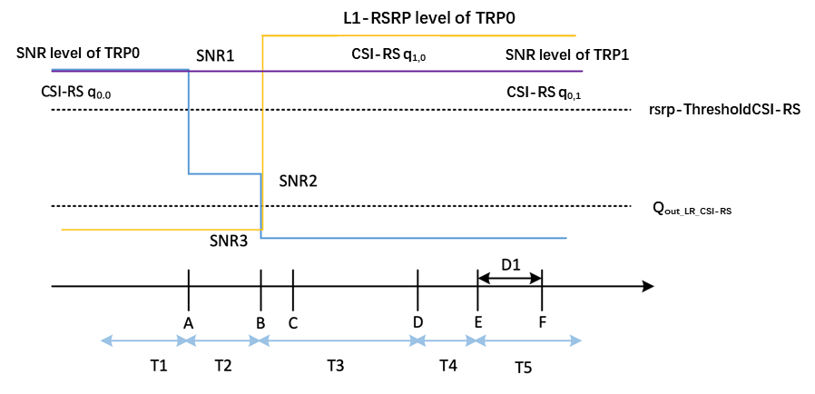
Figure A.5.5.5.8.1-1: SNR and L1-RSRP variation for CSI-RS-based beam failure detection and link recovery testing in DRX mode
##### A.5.5.5.8.2 Test Requirements
Test requirements are applied to TRP specific report respectively on (q0,0), (q0,1) for cell-2 and (q1,0), (q1,1)  for cell-3 repectively as Figure A.5.5.5.8.1-1.
The UE behaviour during time durations T1, T2, T3, T4 and T5 shall be as follows:
During the time duration T1 and T2, the UE shall transmit uplink signal at least in all subframes configured for CSI transmission on Cell 1.
During the period from time point A to time point B the UE shall transmit uplink signal in Cell 1 in all uplink slots configured for CSI transmission according to the configured periodic CSI reporting for Cell 1.
During T3 the UE shall detect beam failure and initiat link recovery. During T4 and T5 the UE measures and evaluate beam candidate from beam candidate set q1.
No later than time point F occurring no later than D1 = 260+10 ms after the start of T5, the UE shall transmit PUCCH with LRR, followed by BFR MAC CE containing a beam associated with the candidate beam set q1,0. The UE shall not transmit PUCCH with an LRR with the candidate beam set q1,0 earlier than time point B.
Test is concluded once the test equipment has received the initial preamble transmission from the UE. The rate of correct events observed during repeated tests shall be at least 90 %.
#### A.5.5.5.9 Beam Failure Detection and Link Recovery Test for FR2 PSCell configured with SSB-based BFD and LR in DRX mode for UE fulfilling relaxed measurement criterion
##### A.5.5.5.9.1 Test Purpose and Environment
The purpose of this test is to verify that the UE properly detects SSB-based beam failure in the set q0 configured for a serving PSCell and that the UE performs correct SSB-based link recovery based on beam candidate set q1. The purpose is to test the downlink monitoring for beam failure detection within the UEs active DL BWP of the PSCell, during the evaluation period, and link recovery, when DRX is used. This test will partly verify the SSB based beam failure detection and link recovery for an FR2 serving cell requirements in clause 8.5.2.4 for UE fulfilling good serving cell quality criterion, if configured. goodServingCellEvaluationBFD [2] criterion is configured according to the parameters listed in table A.5.5.5.9.1-2.
The test parameters are given in tables A.5.5.5.9.1-1, A.5.5.5.9.1-2 and A.5.5.5.9.1-3 below. There are two cells, Cell 1 is the E-UTRAN PCell, and Cell 2 is the PSCell, in the test. The test consists of five successive time periods, with time duration of T1, T2, T3, T4 and T5 respectively. Figure A.5.5.5.9.1-1 shows the variation of the downlink SNR of the PCell and the SNR of the SSBs in set q0 in the active PSCell to emulate SSB based beam failure. Figure A.5.5.5.9.1-1 additionally shows the variation of the downlink L1-RSRP of the SSB in set q1 of the candidate beam used for link recovery. Prior to the start of the time duration T1, the UE shall be fully synchronized to Cell 1 and Cell 2. The UE shall be configured for periodic CSI reporting with a reporting periodicity of 5 ms. In the test, DRX configuration is enabled in PSCell and DRX inactivity timer has already been expired, i.e. UE tries to decode PDCCH and to send periodic CQI during the period when On-duration timer is running. Time alignment timers shall be set to “infinity” so that UL timing alignment is maintained during the test.
Table A.5.5.5.9.1-1: Supported test configurations for FR2 PSCell
| Configuration | Description |
| --- | --- |
| 1 | LTE FDD, TDD duplex mode, 120 kHz SSB SCS, 100 MHz bandwidth |
| 2 | LTE TDD, TDD duplex mode, 120 kHz SSB SCS, 100 MHz bandwidth |
| 3 | LTE FDD, TDD duplex mode, 240 kHz SSB SCS, 100 MHz bandwidth |
| 4 | LTE TDD, TDD duplex mode, 240 kHz SSB SCS, 100 MHz bandwidth |
| NOTE: The UE is only required to pass in one of the supported test configurations in FR2 |  |

Table A.5.5.5.9.1-2: General test parameters for FR2 PSCell for SSB-based beam failure detection and link recovery testing in DRX mode
| Parameter | Test Config. | Unit | Value | Comment |  |
| --- | --- | --- | --- | --- | --- |
|  |  |  | Test 1 |  |  |
| Active E-UTRA PCell | 1-4 |  | Cell 1 |  |  |
| E-UTRA RF Channel Number | 1-4 |  | 1 |  |  |
| Active PCell | 1-4 |  | Cell 2 |  |  |
| RF Channel Number | 1-4 |  | 2 |  |  |
| Duplex mode | 1-4 |  | TDD |  |  |
| TDD Configuration | 1-4 |  | TDDConf.3.1 |  |  |
| BWchannel | 1-4 | MHz | 100: NPRB,c = 66 |  |  |
| Data PRBs allocated | 1-4 |  | 66 |  |  |
| PDSCH/PDCCH subcarrier spacing | 1-4 | kHz | 120 |  |  |
| DL initial BWP configuration | 1-4 |  | DLBWP.0.1 |  |  |
| DL dedicated BWP configuration | 1-4 |  | DLBWP.1.1 |  |  |
| UL initial BWP configuration | 1-4 |  | ULBWP.0.1 |  |  |
| UL dedicated BWP configuration | 1-4 |  | ULBWP.1.1 |  |  |
| PDSCH Reference Channel | 1-2 |  | SR.3.2 TDD |  |  |
|  | 3-4 |  | SR.3.3 TDD |  |  |
| RMSI CORESET Reference Channel | 1-2 |  | CR.3.1 TDD |  |  |
|  | 3-4 |  | CR.3.2 TDD |  |  |
| Dedicated CORESET Reference Channel | 1-2 |  | CCR.3.1 TDD |  |  |
|  | 3-4 |  | CCR.3.7 TDD |  |  |
| OCNG parameters | 1-4 |  | OP.1 |  |  |
| CP length | 1-4 |  | Normal |  |  |
| PDSCH/PDCCH TCI state | 1-4 |  | TCI.State.0 |  |  |
| CSI-RS for tracking | 1-4 |  | TRS.2.1 TDD |  |  |
| SSB Configuration | 1-2 |  | SSB.1 FR2 |  |  |
|  | 3-4 |  | SSB.2 FR2 |  |  |
| SMTC Configuration | 1-4 |  | SMTC.3 |  |  |
| PRACH Configuration | 1-4 |  | FR2 PRACH configuration 2 | A.3.8.3.2 |  |
| DRX configuration | 1-4 |  | DRX.3 | A.3.3.3 |  |
| SSB index assigned as BFD RS (q0) | 1-4 |  | 0,1 |  |  |
| SSB index assigned as CBD RS (q1) | 1-4 |  | 2 |  |  |
| SSB index assigned as RLM RS | 1-4 |  | 0,2 |  |  |
| Beam failure detection transmission parameters | DCI format | 1-4 |  | 1-0 |  |
|  | Number of Control OFDM symbols | 1-4 |  | 2 |  |
|  | Aggregation level | 1-4 | CCE | 8 |  |
|  | Ratio of hypothetical PDCCH RE energy to average SSS RE energy | 1-4 | dB | 0 |  |
|  | Ratio of hypothetical PDCCH DMRS energy to average SSS RE energy | 1-4 | dB | 0 |  |
|  | DMRS precoder granularity | 1-4 |  | REG bundle size |  |
|  | REG bundle size | 1-4 |  | 6 |  |
| Gap pattern ID | 1-4 |  | N/A |  |  |
| rlmInSyncOutOfSyncThreshold | 1-4 |  | absent | Value 0 is applied. (Table 8.1.1-1). |  |
| rsrp-ThresholdSSB | 1-2 | dBm/SCS | -95 | Threshold used for Qin_LR_SSB |  |
|  | 3-4 |  | -92 |  |  |
| powerControlOffsetSS | 1-4 |  | db0 | Used for deriving rsrp-ThresholdCSI-RS |  |
| beamFailureInstanceMaxCount | 1-4 |  | n1 | See TS 38.321 [7], clause 5.17 |  |
| beamFailureDetectionTimer | 1-4 |  | pbfd4 | See TS 38.321 [7], clause 5.17 |  |
| CSI-RS configuration for CSI reporting | 1-4 |  | CSI-RS.3.1 TDD |  |  |
| reportConfigType | 1-4 |  | periodic |  |  |
| reportQuantity | 1-4 |  | cri-RI-PMI-CQI |  |  |
| CSI reporting periodicity | 1-4 | slot | 40 |  |  |
| CSI reporting offset | 1-4 | slot | 4 |  |  |
| T310 | 1-4 | ms | 1000 |  |  |
| N310 | 1-4 |  | 1 |  |  |
| T1 | 1-4 | s | 1 | The UE shall be fully synchronized to Cell 1 during T1 |  |
| T2 | 1-4 | s | 3.37 |  |  |
| T3 | 1-4 | s | 5.56 |  |  |
| T4 | 1-4 | s | 0 |  |  |
| T5 | 1-4 | s | 0.61 |  |  |
| D1 | 1-4 | s | 0.57 |  |  |
| NOTE 1: UE-specific PDCCH is not transmitted after T1 starts. |  |  |  |  |  |

Table A.5.5.5.9.1-3: Cell specific test parameters for FR2 PSCell for SSB-based beam failure detection and link recovery testing in DRX mode
| Parameter | Unit | Test 1 |  |  |  |  |  |
| --- | --- | --- | --- | --- | --- | --- | --- |
|  |  | T1 | T2 | T3 | T4 | T5 |  |
| AoA setup |  | Setup 1 defined in A.3.15 |  |  |  |  |  |
| Assumption for UE beamsNote 10 |  | Rough |  |  |  |  |  |
| EPRE ratio of PDCCH DMRS to SSS | dB | 0 |  |  |  |  |  |
| EPRE ratio of PDCCH to PDCCH DMRS | dB |  |  |  |  |  |  |
| EPRE ratio of PBCH DMRS to SSS | dB |  |  |  |  |  |  |
| EPRE ratio of PBCH to PBCH DMRS | dB |  |  |  |  |  |  |
| EPRE ratio of PSS to SSS | dB |  |  |  |  |  |  |
| EPRE ratio of PDSCH DMRS to SSS | dB |  |  |  |  |  |  |
| EPRE ratio of PDSCH to PDSCH DMRS | dB |  |  |  |  |  |  |
| EPRE ratio of OCNG DMRS to SSS | dB |  |  |  |  |  |  |
| EPRE ratio of OCNG to OCNG DMRS | dB |  |  |  |  |  |  |
| SNR_SSB0 of set q0 | Config 1-4 | dB | 6Note 11 | 6Note 11 | -12 | -12 | -12 |
| SNR_SSB1 of set q0 | Config 1-4 | dB | -12 | -12 | -12 | -12 | -12 |
| SNR_SSB of set q1 | Config 1-4 | dB | 0.2 | 0.2 | 20.2 | 20.2 | 20.2 |
| SSB_RP of set q1 | Config 1-2 | dBm/ | -104.5 | -104.5 | -84.5 | -84.5 | -84.5 |
|  | Config 3-4 | SCS | -101.5 | -101.5 | -81.5 | -81.5 | -81.5 |
|  | Config 1-4 | dBm/120 KHz | -104.7 |  |  |  |  |
| goodServingCellEvaluation |  | dB | 4 |  |  |  |  |
| Propagation condition |  | TDL-A 30ns 75 Hz |  |  |  |  |  |
| NOTE 1: OCNG shall be used such that the resources in Cell 1 are fully allocated and a constant total transmitted power spectral density is achieved for all OFDM symbols. NOTE 2: The uplink resources for CSI reporting are assigned to the UE prior to the start of time period T1. NOTE 3: NZP CSI-RS resource set configuration for CSI reporting are assigned to the UE prior to the start of time period T1. NOTE 4: Void NOTE 5: The timers and layer 3 filtering related parameters are configured prior to the start of time period T1. NOTE 6: The signal contains PDCCH for UEs other than the device under test as part of OCNG. NOTE 7: SNR levels correspond to the signal to noise ratio over the SSS REs. NOTE 8: The SNR for SSB0 in time periods T1, T2, T3, T4 and T5 is denoted as SNR0_1, SNR0_2 and SNR0_3 respectively in figure A.5.5.5.9.1-1. The SNR for SSB1 in time periods T1, T2, T3, T4 and T5 is denoted as SNR1_1, SNR1_2 and SNR1_3 respectively in figure A.5.5.5.9.1-1. NOTE 9: The SNR values are specified for testing a UE which supports 2RX on at least one band. For testing of a UE which supports 4RX on all bands, the SNR during T3 is modified as specified in clause A.3.6. NOTE 10: Information about types of UE beam is given in B.2.1.3, and does not limit UE implementation or test system implementation NOTE 11: This value allows up to 1 dB degradation from applied SNR to UE baseband |  |  |  |  |  |  |  |

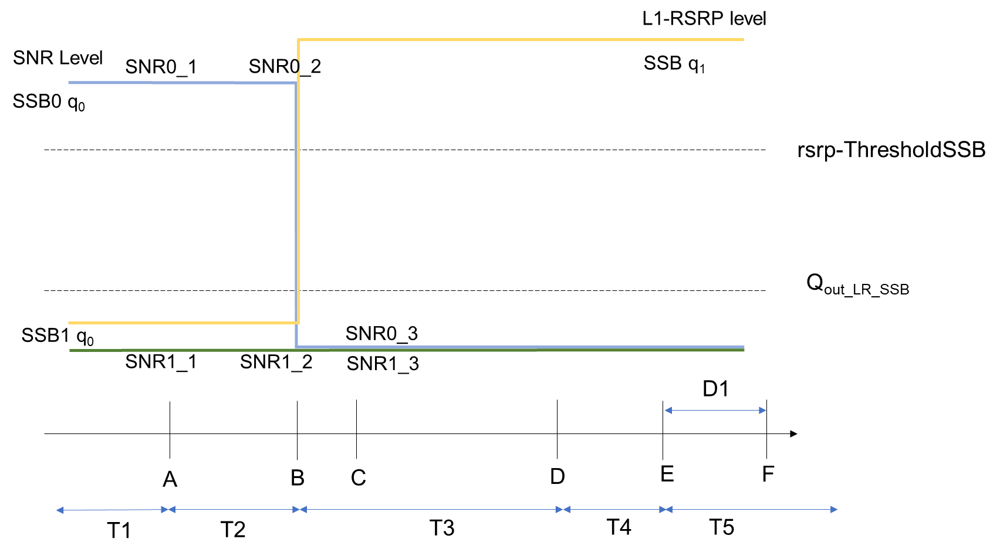
Figure A.5.5.5.9.1-1: SNR and L1-RSRP variation for SSB-based beam failure detection and link recovery testing in DRX mode for UE fulfilling relaxed measurement criterion
##### A.5.5.5.9.2 Test Requirements
The UE behaviour during time durations T1, T2, T3, T4 and T5 shall be as follows:
During the time duration T1 and T2, the UE shall transmit uplink signal at least in all subframes configured for CSI transmission on Cell 1.
During the period from time point A to time point B the UE shall transmit uplink signal in Cell 1 in all uplink slots configured for CSI transmission according to the configured periodic CSI reporting for Cell 1.
During T3 the UE shall detect beam failure and initiate link recovery. During T4 and T5 the UE measures and evaluate beam candidate from beam candidate set q1.
No later than time point F occurring no later than D1 = 560+10 ms after the start of T5, the UE shall transmit preamble on a beam associated with the candidate beam set q1. The UE shall not transmit preamble on a beam associated with the candidate beam set q1 earlier than time point B.
Test is concluded once the test equipment has received the initial preamble transmission from the UE. The rate of correct events observed during repeated tests shall be at least 90 %.
### A.5.5.6 Active BWP switch
#### A.5.5.6.1 DCI-based and Timer-based Active BWP Switch
##### A.5.5.6.1.1 E-UTRAN – NR PSCell FR2 DL active BWP switch with non-DRX in synchronous EN-DC
###### A.5.5.6.1.1.1 Test Purpose and Environment
The purpose of this test is to verify the DL BWP switch delay requirement defined in clause 8.6. Supported test configurations are shown in table A.5.5.6.1.1.1-1.
The test scenario comprises of one E-UTRA PCell (Cell 1), and one NR PSCell (Cell 2) as given in table A.5.5.6.1.1.1-2. Cell-specific parameters of E-UTRA PCell are specified in table A.3.7.2.1-1 and Cell-specific parameters of NR PSCell is specified in table A.5.5.6.1.1.1-3 below. The OTA related test parameters for FR2 is shown in table A.5.5.6.1.1.1-4.
PDCCHs indicating new transmissions shall be sent continuously on PCell (Cell 1) to ensure that the UE will have ACK/NACK sending.
PDCCHs indicating new transmissions shall be sent continuously on PSCell (Cell 2) to ensure that the UE would have ACK/NACK sending except for the time duration when BWP is switching on Cell 2 and the time duration of T2.
Before the test starts,
- UE is connected to Cell 1 (PCell) on radio channel 1 (PCC), and Cell 2 (PSCell) on radio channel 2 (PSCC).
- UE is configured with 2 different UE-specific downlink bandwidth parts for PSCell, BWP-1 and BWP-2, in Cell 2 before starting the test. BWP-1 and BWP-2 always include bandwidth of the initial DL BWP and SSB.
- UE is indicated in firstActiveDownlinkBWP-Id that the active DL BWP is BWP-1 in PSCell.
- UE is configured with a bwp-InactivityTimer timer value for PSCell.
All cells have constant signal levels throughout the test.
The test consists of 3 successive time periods, with durations of T1, T2, and T3, respectively.
During T1,
Time period T1 starts when a DCI format 1_1 command for PSCell DL BWP switch, sent from the test equipment to the UE, is received at the UE side in PSCell’s slot # denoted i. The UE should switch its bandwidth part from BWP-1 to BWP-2.
The UE shall be able to receive PDSCH at the beginning of the DL slot right after PSCell’s DL slot (i+TBWPswitchDelay) as defined in clause 8.6 and starts to report valid ACK/NACK for the PSCell no later than at the beginning of the DL slot right after slot (i+TBWPswitchDelay+k1). The UE shall be continuously scheduled on PSCell’s BWP-2 starting from the beginning of the DL slot right after slot (i+TBWPswitchDelay).
During T2, the test equipment won’t transmit DCI format for PDSCH reception on PSCell(Cell 2).
During T3,
The time period T3 starts from the slot #j, where j is the beginning slot of the DL subframe immediately after the slot wherein bwp-InactivityTimer timer expires. The UE should switch its bandwidth part from BWP-2 back to the default bandwidth part – BWP-1.
The UE shall be able to receive PDSCH at the beginning of the DL slot right after PSCell’s DL slot (j+TBWPswitchDelay) as defined in clause 8.6 and starts to report valid ACK/NACK for the PSCell at latest at the beginning of the DL slot right after slot (j+TBWPswitchDelay+k1). The UE shall be continuously scheduled on PSCell’s BWP-1 starting from the beginning of the DL slot right after slot (j+TBWPswitchDelay).
The test equipment verifies the DL BWP switch time in PSCell by counting the slots from the time when the BWP switch command is received or bwp-InactivityTimer timer expires till an ACK is received.
Table A.5.5.6.1.1.1-1: DL BWP switch supported test configurations
| Config | Description |
| --- | --- |
| 1 | LTE FDD, NR 120 kHz SSB SCS, 100 MHz bandwidth, TDD duplex mode |
| 2 | LTE TDD, NR 120 kHz SSB SCS, 100 MHz bandwidth, TDD duplex mode |
| NOTE 1: The UE is only required to be tested in one of the supported test configurations NOTE 2: A UE which fulfils the requirements in test case A.5.5.2.2 can skip the test cases in A.5.5.2.1. |  |

Table A.5.5.6.1.1.1-2: General test parameters for DL BWP switch in synchronous EN-DC
| Parameter | Unit | Value | Comment |
| --- | --- | --- | --- |
| E-UTRA RF Channel Number |  | 1 | One E-UTRA radio channel is used for this test |
| NR RF Channel Number |  | 2 | One NR radio channel is used for this test |
| Active PCell |  | Cell 1 | PCell on RF channel number 1. |
| Active PSCell |  | Cell 2 | PSCell on RF channel number 2. |
| CP length |  | Normal |  |
| DRX |  | OFF | For both PCell and PSCell |
| bwp-InactivityTimer | ms | 200 |  |
| PDCCH and PDSCH maximum number of HARQ transmission |  | 1 | For both PCell and PSCell |
| Cell-individual offset for cells on RF channel number 1 | dB | 0 | Individual offset for cells on PCC. |
| Cell-individual offset for cells on RF channel number 2 | dB | 0 | Individual offset for cells on PSCC. |
| Cell2 timing offset to Cell 1 | s | 3 | Synchronous EN-DC |
| T1 | s | 0.2 |  |
| T2 | s | 0.2 |  |
| T3 | s | 0.2 |  |

Table A.5.5.6.1.1.1-3: NR Cell specific test parameters for DL BWP switch in synchronous EN-DC
| Parameter | Unit | Cell 2 |
| --- | --- | --- |
| Frequency Range |  | FR2 |
| Duplex mode |  | TDD |
| TDD configuration |  | TDDConf.3.1 |
| BWchannel |  | 100 MHz: NPRB,c = 66 |
| Active BWP ID |  | 1, 2 |
| Initial DL BWP Configuration |  | DLBWP.0.2 Note 2 |
| Active DL BWP-1 Configuration |  | DLBWP.1.1 Note 2 |
| Active DL BWP-2 Configuration |  | DLBWP.1.3 Note 2 |
| Initial UL BWP Configuration |  | ULBWP.0.2 Note 2 |
| Active UL BWP-1 Configuration |  | ULBWP.1.1 Note 2 |
| Active UL BWP-2 Configuration |  | ULBWP.1.3 Note 2 |
| PDSCH Reference measurement channel |  | SR.3.1 TDD |
| RMSI CORESET parameters |  | CR.3.1 TDD |
| Dedicated CORESET parameters |  | CCR.3.1 TDD |
| OCNG Patterns |  | OP.1 |
| SSB Configuration |  | SSB.1 FR2 |
| SMTC Configuration |  | SMTC.1 |
| TCI State |  | TCI.State.0 |
| TRS Configuration |  | TRS.2.1 TDD |
| Correlation Matrix and Antenna Configuration |  | 1x2 Low |
| EPRE ratio of PSS to SSS | dB | 0 |
| EPRE ratio of PBCH DMRS to SSS |  |  |
| EPRE ratio of PBCH to PBCH DMRS |  |  |
| EPRE ratio of PDCCH DMRS to SSS |  |  |
| EPRE ratio of PDCCH to PDCCH DMRS |  |  |
| EPRE ratio of PDSCH DMRS to SSS |  |  |
| EPRE ratio of PDSCH to PDSCH |  |  |
| EPRE ratio of OCNG DMRS to SSS(Note 1) |  |  |
| EPRE ratio of OCNG to OCNG DMRS (Note 1) |  |  |
| Propagation Condition |  | AWGN |
| NOTE 1: OCNG shall be used such that both cells are fully allocated and a constant total transmitted power spectral density is achieved for all OFDM symbols. NOTE 2: For unpaired spectrum, a DL BWP is linked with an UL BWP. DLBWP.0.2 is linked with ULBWP.0.2; DLBWP.1.1 is linked with ULBWP.1.1; DLBWP.1.3 is linked with ULBWP.1.3 defined in clause 12 of TS 38.213 [3]. |  |  |

Table A.5.5.6.1.1.1-4: OTA related test parameters for DL BWP switch in synchronous EN-DC
| Parameter | Unit | Cell 2 |
| --- | --- | --- |
| Angle of arrival configuration |  | Setup 1 according to clause A.3.15.1 |
| Assumption for UE beamsNote 6 |  | Fine |
| NocNote 1 | dBm/15 kHz | -112 |
| NocNote 1 | dBm/SCS | -103 |
| SS-RSRP Note 2 | dBm/120 kHz Note3 | -85 |
| Ês/Iot | dB | 18 |
| IoNote2 | dBm/95.04 MHz Note4 | -56 |
| NOTE 1: Interference from other cells and noise sources not specified in the test is assumed to be constant over subcarriers and time and shall be modelled as AWGN of appropriate power for Noc to be fulfilled. NOTE 2: SS-RSRP and Io levels have been derived from other parameters for information purposes. They are not settable parameters themselves. NOTE 3: SS-RSRP minimum requirements are specified assuming independent interference and noise at each receiver antenna port. NOTE 4: Equivalent power received by an antenna with 0 dBi gain at the centre of the quiet zone NOTE 5: As observed with 0 dBi gain antenna at the centre of the quiet zone. NOTE 6: Information about types of UE beam is given in B.2.1.3, and does not limit UE implementation or test system implementation |  |  |

###### A.5.5.6.1.1.2 Test Requirements
During T1, the UE shall start to send the ACK for PSCell from the first UL slot that occurs after the beginning of DL slot (i+TBWPswitchDelay+k1).
During T3, the UE shall start to send the ACK for PSCell from the first UL slot that occurs after the beginning of DL slot (j+TBWPswitchDelay+k1).
Where, k1 is the timing between DL data receiving and acknowledgement as specified in [7].
Depending on UE capability bwp-SwitchingDelay [2], UE shall finish BWP switch within the time duration TBWPswitchDelay defined in table 8.6.2-1.
All of the above test requirements shall be fulfilled in order for the observed PSCell active BWP switch delay to be counted as correct.
The rate of correct events observed during repeated tests shall be at least 90 %.
NOTE: During T1, T3 if there are no uplink resources for reporting the ACK in the DL slot right after DL slot (i+Y1), (j+Y2), then the UE shall use the next available uplink resource for reporting the corresponding ACK.
##### A.5.5.6.1.2 E-UTRAN – NR PSCell FR2 with FR2 SCell DL active BWP switch in non-DRX in synchronous EN-DC
A.5.5.6.1.2.1 Test Purpose and Environment
The purpose of this test is to verify the DL BWP switch delay requirement defined in clause 8.6.2, and interruption requirements for NR victim cell defined in clause 8.2.1.2.7. Supported test configurations are shown in table A.5.5.6.1.2.1-1.
The test scenario comprises of one E-UTRA PCell (Cell 1), one NR PSCell (Cell 2) and one NR SCell (Cell 3) as given in table A.5.5.6.1.2.1-2. Cell-specific parameters of E-UTRA PCell are specified in table A.3.7.2.1-1 and Cell-specific parameters of NR PSCell and SCell are specified in table A.5.5.6.1.2.1-3 below.
PDCCHs indicating new transmissions shall be sent continuously on PCell (Cell 1) to ensure that the UE will have ACK/NACK sending.
PDCCHs indicating new transmissions shall be sent continuously on PSCell (Cell 2) and SCell (Cell 3) to ensure that the UE would have ACK/NACK sending except for the time duration when BWP is switching on Cell 3 and the time duration of T2.
Before the test starts,
- UE is connected to Cell 1 (PCell) on radio channel 1 (PCC), Cell 2 (PSCell) on radio channel 2 (PSCC) and Cell 3 (SCell) on radio channel 3 (SCC).
- UE is configured with 2 different UE-specific downlink bandwidth parts for SCell, BWP-1 and BWP-2, in Cell 3 before starting the test. BWP-1 and BWP-2 always include bandwidth of the initial DL BWP and SSB.
- UE is configured with 1 UE-specific downlink bandwidth parts the same as initial BWP for PSCell, BWP-0 in Cell 2 before starting the test.
- UE is indicated in firstActiveDownlinkBWP-Id that the active DL BWP is BWP-1 in SCell.
- UE is indicated in firstActiveDownlinkBWP-Id that the active DL BWP is BWP-0 in PSCell.
- UE is configured with a bwp-InactivityTimer timer value for SCell.
All cells have constant signal levels throughout the test.
The test consists of 3 successive time periods, with durations of T1, T2, and T3, respectively.
During T1,
Time period T1 starts when a DCI format 1_1 command for SCell DL BWP switch, sent from the test equipment to the UE, is received at the UE side in SCell’s slot # denoted i. The UE shall switch its bandwidth part from BWP-1 to BWP-2.
The UE shall be able to receive PDSCH at the beginning of the DL slot right after PSCell’s DL slot (i+TBWPswitchDelay) as defined in clause 8.6 and starts to report valid ACK/NACK for the PSCell no later than at the beginning of the DL slot right after slot (i+TBWPswitchDelay+k1). The UE shall be continuously scheduled on PSCell’s BWP-2 starting from the beginning of the DL slot right after slot (i+TBWPswitchDelay).
PCell(Cell 1) interruption due to BWP switch on PSCell shall occur within the BWP switch delay.
PSCell(Cell 2) interruption due to BWP switch on SCell shall occur within the BWP switch delay.
During T2, the test equipment won’t transmit DCI format for PDSCH reception on PSCell(Cell 2).
During T3,
The time period T3 starts from the slot #j, where j is the first slot of the subframe immediately after the slot wherein bwp-InactivityTimer timer expires. The UE shall switch its bandwidth part from BWP-2 back to the default bandwidth part – BWP-1.
The UE shall be able to receive PDSCH at the beginning of the DL slot right after SCell’s DL slot (j+TBWPswitchDelay) as defined in clause 8.6 and starts to report valid ACK/NACK for the SCell on PSCell at latest at the beginning of the DL slot right after slot (j+TBWPswitchDelay+k1). The UE shall be continuously scheduled on SCell’s BWP-1 starting from the beginning of the DL slot right after slot (j+TBWPswitchDelay).
PCell(Cell 1) interruption due to BWP switch of PSCell shall occur within the BWP switch delay.
PSCell(Cell 2) interruption due to BWP switch of SCell shall occur within the BWP switch delay.
The test equipment verifies the DL BWP switch time in SCell by counting the slots from the time when the BWP switch command is received or bwp-InactivityTimer timer expires till an ACK is received.
The test equipment verifies that potential interruption to NR PSCell is carried out in the correct time span by monitoring ACK/NACK sent in PSCell during BWP switch of SCell.
Table A.5.5.6.1.2.1-1: DL BWP switch supported test configurations
| Config | Description |
| --- | --- |
| 1 | LTE FDD, NR 120 kHz SSB SCS, 100 MHz bandwidth, TDD duplex mode |
| 2 | LTE TDD, NR 120 kHz SSB SCS, 100 MHz bandwidth, TDD duplex mode |
| NOTE 1: The UE is only required to be tested in one of the supported test configurations NOTE 2: A UE which fulfils the requirements in test case A.5.5.6.1.2 can skip the test cases in A.5.5.6.1.1. NOTE 3: NR configuration is the same for PSCell and SCells. |  |

Table A.5.5.6.1.2.1-2: General test parameters for DL BWP switch in synchronous EN-DC
| Parameter | Unit | Value | Comment |
| --- | --- | --- | --- |
| E-UTRA RF Channel Number |  | 1 | One E-UTRA radio channel is used for this test |
| NR RF Channel Number |  | 2, 3 | Two NR radio channel is used for this test |
| Active PCell |  | Cell 1 | PCell on RF channel number 1. |
| Active PSCell |  | Cell 2 | PSCell on RF channel number 2. |
| Active SCell |  | Cell 3 | SCell on RF channel number 3. |
| CP length |  | Normal |  |
| DRX |  | OFF |  |
| bwp-InactivityTimer | ms | 200 |  |
| PDCCH and PDSCH maximum number of HARQ transmission |  | 1 | For PCell, PSCell and SCell |
| Cell-individual offset for cells on RF channel number 1 | dB | 0 | Individual offset for cells on PCC. |
| Cell-individual offset for cells on RF channel number 2 | dB | 0 | Individual offset for cells on PSCC. |
| Cell-individual offset for cells on RF channel number 3 | dB | 0 | Individual offset for cells on SCC. |
| Cell2 timing offset to Cell 1 | s | 3 | Synchronous EN-DC |
| Cell3 timing offset to Cell 2 | s | 3 | Synchronous cells |
| T1 | s | 0.2 |  |
| T2 | s | 0.2 |  |
| T3 | s | 0.2 |  |

Table A.5.5.6.1.2.1-3: NR Cell specific test parameters for DL BWP switch in synchronous EN-DC
| Parameter | Unit | Cell 2 | Cell 3 |
| --- | --- | --- | --- |
| Frequency Range |  | FR2 |  |
| Duplex mode |  | TDD |  |
| TDD configuration |  | TDDConf.3.1 |  |
| BWchannel |  | 100 MHz: NPRB,c = 66 |  |
| Active BWP ID |  | 0 | 1,2 |
| Initial DL BWP Configuration |  | DLBWP.0.2 | DLBWP.0.2 |
| Active DL BWP-0 Configuration |  | DLBWP.0.2 | N.A. |
| Active DL BWP-1 Configuration |  | N.A. | DLBWP.1.3 |
| Active DL BWP-2 Configuration |  | N.A. | DLBWP.1.1 |
| Initial UL BWP Configuration |  | ULBWP.0.2 | N.A. |
| Active UL BWP-0 Configuration |  | ULBWP.0.2 | N.A. |
| Active UL BWP-1 Configuration |  | N.A. | N.A. |
| Active UL BWP-2 Configuration |  | N.A. | N.A. |
| PDSCH Reference measurement channel |  | SR.3.1 TDD |  |
| RMSI CORESET parameters |  | CR.3.1 TDD |  |
| Dedicated CORESET parameters |  | CCR.3.1 TDD |  |
| OCNG Patterns |  | OP.1 |  |
| SSB Configuration |  | SSB.1 FR2 |  |
| SMTC Configuration |  | SMTC.1 |  |
| TCI State |  | TRS.2.1 TDD |  |
| TRS Configuration |  | TCI.State.0 |  |
| Antenna Configuration |  | 1x2 |  |
| Propagation Condition |  | AWGN |  |
| EPRE ratio of PSS to SSS | dB | 0 | 0 |
| EPRE ratio of PBCH DMRS to SSS |  |  |  |
| EPRE ratio of PBCH to PBCH DMRS |  |  |  |
| EPRE ratio of PDCCH DMRS to SSS |  |  |  |
| EPRE ratio of PDCCH to PDCCH DMRS |  |  |  |
| EPRE ratio of PDSCH DMRS to SSS |  |  |  |
| EPRE ratio of PDSCH to PDSCH |  |  |  |
| EPRE ratio of OCNG DMRS to SSS(Note 1) |  |  |  |
| EPRE ratio of OCNG to OCNG DMRS (Note 1) |  |  |  |
| NOTE 1: OCNG shall be used such that both cells are fully allocated and a constant total transmitted power spectral density is achieved for all OFDM symbols. NOTE 2: Interference from other cells and noise sources not specified in the test is assumed to be constant over subcarriers and time and shall be modelled as AWGN of appropriate power for Noc to be fulfilled. NOTE 3: SS-RSRP and Io levels have been derived from other parameters for information purposes. They are not settable parameters themselves. NOTE 4: For unpaired spectrum, a DL BWP is linked with an UL BWP. DLBWP.0.2 is linked with ULBWP.0.2; DLBWP.1.1 is linked with ULBWP.1.1; DLBWP.1.3 is linked with ULBWP.1.3. |  |  |  |

Table A.5.5.6.1.2.1-4: OTA related test parameters for DL BWP switch in synchronous EN-DC
| Parameter | Unit | Cell 2 | Cell 3 |
| --- | --- | --- | --- |
| Angle of arrival configuration |  | Setup 1 according to clause A.3.15 |  |
| Assumption for UE beamsNote 6 |  | Fine | Fine |
| NocNote 1 | dBm/15 kHz | -112 | -112 |
| SS-RSRP Note 2 | dBm/120 kHz Note3 | -85 | -85 |
| Ês/Iot | dB | 18 | 18 |
| IoNote2 | dBm/95.04 MHz Note4 | -56 | -56 |
| NOTE 1: Interference from other cells and noise sources not specified in the test is assumed to be constant over subcarriers and time and shall be modelled as AWGN of appropriate power for Noc to be fulfilled. NOTE 2: SS-RSRP and Io levels have been derived from other parameters for information purposes. They are not settable parameters themselves. NOTE 3: SS-RSRP minimum requirements are specified assuming independent interference and noise at each receiver antenna port. NOTE 4: Equivalent power received by an antenna with 0 dBi gain at the centre of the quiet zone NOTE 5: As observed with 0 dBi gain antenna at the centre of the quiet zone. NOTE 6: Information about types of UE beam is given in B.2.1.3, and does not limit UE implementation or test system implementation |  |  |  |

A.5.5.6.1.2.2 Test Requirements
During T1, the UE shall start to send the ACK for SCell from the first UL slot that occurs after the beginning of DL slot (i+TBWPswitchDelay+k1).
During T3, the UE shall start to send the ACK for SCell from the first UL slot that occurs after the beginning of DL slot (j+TBWPswitchDelay+k1).
All of the above test requirements shall be fulfilled in order for the observed SCell active BWP switch delay to be counted as correct.
The rate of correct events observed during repeated tests shall be at least 90 %.
During T1, the start of the interruption of PCell during PSCell active BWP switch shall not happen outside the BWP switch delay.
During T3, the start of the interruption of PCell during PSCell active BWP switch shall not happen outside the BWP switch delay.
The interruption of PCell shall not be longer than the interruption duration specified for active BWP switch in TS 36.133 [15] clause 7.32.2.7.
During T1, the start of the interruption of PSCell during SCell active BWP switch shall not happen outside the BWP switch delay.
During T3, the start of the interruption of PSCell during SCell active BWP switch shall not happen outside the BWP switch delay.
The interruption of PSCell shall not be longer than the interruption duration specified for active BWP switch in clause 8.6.2.
All of the above test requirements shall be fulfilled in order for the observed PCell active BWP switch interruption to be counted as correct.
The rate of correct events observed during repeated tests shall be at least 90 %.
NOTE: During T1, T3 if there are no uplink resources for reporting the ACK in the DL slot right after slot (i+TBWPswitchDelay+k1), (j+TBWPswitchDelay+k1), then the UE shall use the next available uplink resource for reporting the corresponding ACK.
#### A.5.5.6.2 RRC-based Active BWP Switch
##### A.5.5.6.2.1 E-UTRAN – NR PSCell FR2 DL active BWP switch with non-DRX in synchronous EN-DC
A.5.5.6.2.1.1 Test Purpose and Environment
The purpose of this test is to verify the DL BWP switch delay requirement for RRC-based BWP switch defined in clause 8.6.3. Supported test configurations are shown in table A.5.5.6.2.1.1-1.
The test scenario comprises of one E-UTRA PCell (Cell 1) and one PSCell (Cell 2) as given in table A.5.5.6.2.1.1-2. Cell-specific parameters of E-UTRA PCell are specified in table A.3.7.2.1-1 and Cell-specific parameters of PSCell are specified in table A.5.5.6.2.1.1-3 below.
PDCCHs indicating new transmissions shall be sent continuously on E-UTRA PCell (Cell 1) to ensure that the UE will have ACK/NACK sending.
PDCCHs indicating new transmissions shall be sent continuously on PSCell (Cell 2) to ensure that the UE would have ACK/NACK sending except for the time duration when BWP is switching on Cell 2.
Before the test starts,
- UE is connected to Cell 1 (E-UTRA PCell) on radio channel 1 (PCC) and to Cell 2 (PSCell) on radio channel 2 (PSCC).
- UE has bandwidth part BWP-1 in its RRC-configuration for Cell 2 (PSCell).
- UE is indicated in firstActiveDownlinkBWP-Id that the active DL BWP is BWP-1 of initial condition in PSCell.
All cells have constant signal levels throughout the test.
The test consists of 1 time period, with duration of T1.
During T1,
If the RRCReconfiguration is embedded in E-UTRA RRC message, time period T1 starts when a E-UTRA RRC message RRCConnectionReconfiguration with updated bandwidth part configuration, sent from the test equipment to the UE, is completely received at the UE side from PCell in PSCell’s slot # denoted i. Otherwise, i.e., if the RRCReconfiguration is not embedded in E-UTRA RRC message, time period T1 starts when a RRCReconfiguration with updated bandwidth part configuration, sent from the test equipment to the UE, is completely received at the UE side in from PSCell in PSCell’s slot # denoted i. The UE shall reconfigure its bandwidth part with the updated bandwidth part BWP-1 of final condition.
The UE shall be able to completely receive PDSCH on PSCell from the first DL slot occurs right after the beginningof PSCell’s DL slot $i+\frac{T_{RRCprocessingDelay}+T_{BWPswitchDelayRRC}}{NR Slot length}$ as defined in clause 8.6.3 and starts to report valid ACK/NACK for the PSCell from the first UL slot that occurs after the beginning of DL slot$i+\frac{T_{RRCprocessingDelay}+T_{BWPswitchDelayRRC}}{NR Slot length}+k1$. The UE shall be continuously scheduled on PSCell’s BWP-1 starting the first DL slot that occurs right after the beginning of DL slot $i+\frac{T_{RRCprocessingDelay}+T_{BWPswitchDelayRRC}}{NR Slot length}$.
TRRCprocessingDelay and TBWPswitchDelayRRC are defined in clause 8.6.3.
The test equipment verifies the DL BWP switch time in PSCell by counting the time from the time when the RRC Reconfiguration message including updated BWP configurationis sent till the time when a vaild ACK/NACK is received.
Table A.5.5.6.2.1.1-1: DL BWP switch supported test configurations
| Config | Description |
| --- | --- |
| 1 | LTE FDD, NR 120 kHz SSB SCS, 100 MHz bandwidth, TDD duplex mode |
| 2 | LTE TDD, NR 120 kHz SSB SCS, 100 MHz bandwidth, TDD duplex mode |
| NOTE 1: The UE is only required to be tested in one of the supported test configurations |  |

Table A.5.5.6.2.1.1-2: General test parameters for DL BWP switch in synchronous EN-DC
| Parameter | Unit | Value | Comment |
| --- | --- | --- | --- |
| E-UTRA RF Channel Number |  | 1 | One E-UTRA radio channel is used for this test |
| NR RF Channel Number |  | 2 | One NR radio channel is used for this test |
| Active PCell |  | Cell 1 | PCell on RF channel number 1. |
| Active PSCell |  | Cell 2 | PSCell on RF channel number 2. |
| CP length |  | Normal |  |
| DRX |  | OFF |  |
| PDCCH and PDSCH maximum number of HARQ transmission |  | 1 | For both PCell and PSCell |
| Cell-individual offset for cells on RF channel number 1 | dB | 0 | Individual offset for cells on PCC. |
| Cell-individual offset for cells on RF channel number 2 | dB | 0 | Individual offset for cells on PSCC. |
| Cell2 timing offset to Cell 1 | s | 3 | Synchronous EN-DC |
| T1 | s | 0.2 |  |

Table A.5.5.6.2.1.1-3: NR Cell specific test parameters for DL BWP switch in synchronous EN-DC
| Parameter | Unit | Cell 2 |  |
| --- | --- | --- | --- |
| Frequency Range |  | FR2 |  |
| Duplex mode |  | TDD |  |
| TDD configuration |  | TDDConf.3.1 |  |
| BWchannel |  | 100 MHz: NPRB,c = 66 |  |
| Active BWP ID |  | 1 |  |
| Initial DL BWP Configuration |  | DLBWP.0.2 |  |
| Initial UL BWP Configuration |  | ULBWP.0.2 |  |
| Initial Condition | Active DL BWP-1 Configuration |  | DLBWP.1.3 |
|  | Active UL BWP-1 Configuration |  | ULBWP.1.3 |
| Final Condition | Active DL BWP-1 Configuration |  | DLBWP.1.1 |
|  | Active UL BWP-1 Configuration |  | ULBWP.1.1 |
| PDSCH Reference measurement channel |  | SR.3.1 TDD |  |
| RMSI CORESET parameters |  | CR.3.1 TDD |  |
| Dedicated CORESET parameters |  | CCR.3.1 TDD |  |
| OCNG Patterns |  | OP.1 |  |
| SSB Configuration |  | SSB.1 FR2 |  |
| SMTC Configuration |  | SMTC.1 |  |
| TCI State |  | TCI.State.0 |  |
| TRS Configuration |  | TRS.2.1 TDD |  |
| Antenna Configuration |  | 1x2 |  |
| Propagation Condition |  | AWGN |  |
| EPRE ratio of PSS to SSS | dB | 0 |  |
| EPRE ratio of PBCH DMRS to SSS |  |  |  |
| EPRE ratio of PBCH to PBCH DMRS |  |  |  |
| EPRE ratio of PDCCH DMRS to SSS |  |  |  |
| EPRE ratio of PDCCH to PDCCH DMRS |  |  |  |
| EPRE ratio of PDSCH DMRS to SSS |  |  |  |
| EPRE ratio of PDSCH to PDSCH |  |  |  |
| EPRE ratio of OCNG DMRS to SSS(Note 1) |  |  |  |
| EPRE ratio of OCNG to OCNG DMRS (Note 1) |  |  |  |
| NOTE 1: OCNG shall be used such that both cells are fully allocated and a constant total transmitted power spectral density is achieved for all OFDM symbols. NOTE 2: Interference from other cells and noise sources not specified in the test is assumed to be constant over subcarriers and time and shall be modelled as AWGN of appropriate power for Noc to be fulfilled. NOTE 3: SS-RSRP and Io levels have been derived from other parameters for information purposes. They are not settable parameters themselves. NOTE 4: For unpaired spectrum, a DL BWP is linked with an UL BWP. DLBWP.0.2 is linked with ULBWP.0.2; DLBWP.1.1 is linked with ULBWP.1.1; DLBWP.1.3 is linked with ULBWP.1.3 defined in clause 12 of TS 38.213 [3]. |  |  |  |

Table A.5.5.6.2.1.1-4: OTA related test parameters for BWP switching test case
| Parameter | Unit | Cell 2 |  |
| --- | --- | --- | --- |
| Angle of arrival configuration |  | Setup 1 according to table A.3.15 |  |
| Assumption for UE beamsNote 5 |  | Fine |  |
| Note1 | NR_TDD_FR2_A | dBm/15 kHz | -112 |
|  | NR_TDD_FR2_B |  |  |
|  | NR_TDD_FR2_F |  |  |
|  | NR_TDD_FR2_G |  |  |
|  | NR_TDD_FR2_T |  |  |
|  | NR_TDD_FR2_Y |  |  |
| Note1 | NR_TDD_FR2_A | dBm/SCS | -103 |
|  | NR_TDD_FR2_B |  |  |
|  | NR_TDD_FR2_F |  |  |
|  | NR_TDD_FR2_G |  |  |
|  | NR_TDD_FR2_T |  |  |
|  | NR_TDD_FR2_Y |  |  |
| SS-RSRPNote2 | NR_TDD_FR2_A | dBm/SCS Note3 | -85 |
|  | NR_TDD_FR2_B |  |  |
|  | NR_TDD_FR2_F |  |  |
|  | NR_TDD_FR2_G |  |  |
|  | NR_TDD_FR2_T |  |  |
|  | NR_TDD_FR2_Y |  |  |
|  | dB | 18 |  |
| IoNote2 | NR_TDD_FR2_A | dBm/95.04 MHz | -56 |
|  | NR_TDD_FR2_B | Note4 |  |
|  | NR_TDD_FR2_F |  |  |
|  | NR_TDD_FR2_G |  |  |
|  | NR_TDD_FR2_T |  |  |
|  | NR_TDD_FR2_Y |  |  |
| NOTE 1: Interference from other cells and noise sources not specified in the test is assumed to be constant over subcarriers and time and shall be modelled as AWGN of appropriate power for  to be fulfilled. NOTE 2: SS-RSRP and Io levels have been derived from other parameters for information purposes. They are not settable parameters themselves. NOTE 3: SS-RSRP minimum requirements are specified assuming independent interference and noise at each receiver antenna port. NOTE 4: Equivalent power received by an antenna with 0 dBi gain at the centre of the quiet zone NOTE 5: Information about types of UE beam is given in B.2.1.3, and does not limit UE implementation or test system implementation |  |  |  |

A.5.5.6.2.1.2 Test Requirements
During T1, the UE shall be ready for the reception of uplink grant for PSCell from the first DL slot that occurs right after the beginning of DL slot $i+\frac{T_{RRCprocessingDelay}+T_{BWPswitchDelayRRC}}{NR Slot length}$ and starts to report valid ACK/NACK for the PSCell from the first UL slot that occurs after the beginning of DL slot$i+\frac{T_{RRCprocessingDelay}+T_{BWPswitchDelayRRC}}{NR Slot length}+k1$.
Where, k1 is the timing between DL data receiving and acknowledgement as specified in [7].
All of the above test requirements shall be fulfilled in order for the observed PSCell active BWP switch delay to be counted as correct.
The rate of correct events observed during repeated tests shall be at least 90 %.
#### A.5.5.6.3 Simultaneous DCI-based and Timer-based Active BWP Switch on multiple CCs
##### A.5.5.6.3.1 E-UTRAN – NR PSCell FR2 and NR SCell FR2 DL active BWP switch on multiple CCs in synchronous EN-DC
A.5.5.6.3.1.1 Test Purpose and Environment
The purpose of this test is to verify the DL BWP switch on multiple CCs delay requirement defined in clause 8.6. Supported test configurations are shown in table A.5.5.6.3.1.1-1.
The test scenario comprises of one E-UTRA PCell (Cell 1), and one NR PSCell (Cell 2) and one NR SCell (Cell 3) as given in table A.5.5.6.3.1.1-2. Cell-specific parameters of E-UTRA PCell are specified in table A.3.7.2.1-1 and Cell-specific parameters of NR PSCell and NR SCell is specified in table A.5.5.6.3.1.1-3 below. The OTA related test parameters for FR2 is shown in table A.5.5.6.3.1.1-4.
PDCCHs indicating new transmissions shall be sent continuously on PCell (Cell 1) to ensure that the UE will have ACK/NACK sending.
PDCCHs indicating new transmissions shall be sent continuously on PSCell (Cell 2) and SCell (Cell 3) to ensure that the UE would have ACK/NACK sending except for the time duration when BWP is switching on Cell 2 and Cell 3 and the time duration of T2.
Before the test starts,
- UE is connected to Cell 1 (PCell) on radio channel 1 (PCC), Cell 2 (PSCell) on radio channel 2 (PSCC) and Cell 3 (SCell) on radio channel 3 (SCC).
- UE is configured with 2 different UE-specific downlink bandwidth parts for PSCell and SCell, BWP-1 and BWP-2, in Cell 2 and Cell 3 before starting the test. BWP-1 and BWP-2 always include bandwidth of the initial DL BWP and SSB.
- UE is indicated in firstActiveDownlinkBWP-Id that the active DL BWP is BWP-1 in PSCell and SCell.
- UE is configured with a bwp-InactivityTimer timer value for PSCell and SCell.
All cells have constant signal levels throughout the test.
The test consists of 3 successive time periods, with durations of T1, T2, and T3, respectively.
During T1,
Time period T1 starts when a DCI format 1_1 command for PSCell DL BWP switch and a DCI format 1_1 command for SCell DL BWP switch, sent from the test equipment to the UE simultaneously, are received at the UE side in PSCell and SCell slot # denoted i. The UE should switch its bandwidth part from BWP-1 to BWP-2 in PSCell and SCell.
The UE shall be able to receive PDSCH at the beginning of the DL slot right after PSCell’s DL slot (i+TMultipleBWPswitchDelay) as defined in clause 8.6 and starts to report valid ACK/NACK for the PSCell no later than at the beginning of the DL slot right after slot (i+TMultipleBWPswitchDelay+k1). The UE shall be continuously scheduled on PSCell’s BWP-2 starting from the beginning of the DL slot right after slot (i+TMultipleBWPswitchDelay).
The UE shall be able to receive PDSCH at the beginning of the DL slot right after SCell’s DL slot (i+TBWPswitchDelay) as defined in clause 8.6 and starts to report valid ACK/NACK for the PSCell no later than at the beginning of the DL slot right after slot (i+TMultipleBWPswitchDelay+k1). The UE shall be continuously scheduled on PSCell’s BWP-2 starting from the beginning of the DL slot right after slot (i+TMultipleBWPswitchDelay).
During T2, the test equipment won’t transmit DCI format for PDSCH reception on PSCell (Cell 2) and SCell (Cell 3).
During T3,
The time period T3 starts from the slot #j, where j is the beginning slot of the DL subframe immediately after the slot wherein bwp-InactivityTimer timer expires in PSCell and SCell. The UE should switch its bandwidth part from BWP-2 back to the default bandwidth part – BWP-1 in both PSCell and SCell.
The UE shall be able to receive PDSCH on PSCell at the beginning of the DL slot right after PSCell’s DL slot (j+ TMultipleBWPswitchDelay) as defined in clause 8.6 and starts to report valid ACK/NACK for the PSCell at latest at the beginning of the DL slot right after slot (j+ TMultipleBWPswitchDelay +k1). The UE shall be continuously scheduled on PSCell’s BWP-1 starting from the beginning of the DL slot right after slot (j+ TMultipleBWPswitchDelay).
The UE shall be able to receive PDSCH on SCell at the beginning of the DL slot right after SCell’s DL slot (j+ TMultipleBWPswitchDelay) as defined in clause 8.6 and starts to report valid ACK/NACK for the SCell at latest at the beginning of the DL slot right after slot (j+ TMultipleBWPswitchDelay +k1). The UE shall be continuously scheduled on SCell’s BWP-1 starting from the beginning of the DL slot right after slot (j+ TMultipleBWPswitchDelay).
The test equipment verifies the DL BWP switch time in PSCell and SCell by counting the slots from the time when the BWP switch command is received or bwp-InactivityTimer timer expires till an ACK is received.
Table A.5.5.6.3.1.1-1: DL BWP switch supported test configurations
| Config | Description |
| --- | --- |
| 1 | LTE FDD, NR 120 kHz SSB SCS, 100 MHz bandwidth, TDD duplex mode |
| 2 | LTE TDD, NR 120 kHz SSB SCS, 100 MHz bandwidth, TDD duplex mode |
| NOTE 1: The UE is only required to be tested in one of the supported test configurations |  |

Table A.5.5.6.3.1.1-2: General test parameters for DL BWP switch in synchronous EN-DC
| Parameter | Unit | Value | Comment |
| --- | --- | --- | --- |
| E-UTRA RF Channel Number |  | 1 | One E-UTRA radio channel is used for this test |
| NR RF Channel Number |  | 2, 3 | Two NR radio channel is used for this test for PSCell and SCell |
| Active PCell |  | Cell 1 | PCell on RF channel number 1. |
| Active PSCell |  | Cell 2 | PSCell on RF channel number 2. |
| Active SCell |  | Cell 3 | SCell on RF channel number 3. |
| CP length |  | Normal |  |
| DRX |  | OFF | For both PCell, PSCell and SCell |
| bwp-InactivityTimer | ms | 200 |  |
| Cell-individual offset for cells on RF channel number 1 | dB | 0 | Individual offset for cells on PCC. |
| Cell-individual offset for cells on RF channel number 2 | dB | 0 | Individual offset for cells on PSCC. |
| Cell-individual offset for cells on RF channel number 3 | dB | 0 | Individual offset for cells on SCC. |
| Cell2 timing offset to Cell 1 | s | 3 | Synchronous EN-DC |
| Cell3 timing offset to Cell 2 | s | 0 | Synchronous Cells |
| T1 | s | 0.2 |  |
| T2 | s | 0.2 |  |
| T3 | s | 0.2 |  |

Table A.5.5.6.3.1.1-3: NR Cell specific test parameters for DL BWP switch in synchronous EN-DC
| Parameter | Unit | Cell 2 | Cell 3 |
| --- | --- | --- | --- |
| Frequency Range |  | FR2 | FR2 |
| Duplex mode |  | TDD | TDD |
| TDD configuration |  | TDDConf.3.1 | TDDConf.3.1 |
| BWchannel |  | 100 MHz: NPRB,c = 66 | 100 MHz: NPRB,c = 66 |
| Active BWP ID |  | 1, 2 | 1, 2 |
| Initial DL BWP Configuration |  | DLBWP.0.2 Note 2 | DLBWP.0.2 Note 2 |
| Active DL BWP-1 Configuration |  | DLBWP.1.1 Note 2 | DLBWP.1.1 Note 2 |
| Active DL BWP-2 Configuration |  | DLBWP.1.3 Note 2 | DLBWP.1.3 Note 2 |
| Initial UL BWP Configuration |  | ULBWP.0.2 Note 2 | ULBWP.0.2 Note 2 |
| Active UL BWP-1 Configuration |  | ULBWP.1.1 Note 2 | ULBWP.1.1 Note 2 |
| Active UL BWP-2 Configuration |  | ULBWP.1.3 Note 2 | ULBWP.1.3 Note 2 |
| PDSCH Reference measurement channel |  | SR.3.1 TDD | SR.3.1 TDD |
| RMSI CORESET parameters |  | CR.3.1 TDD | CR.3.1 TDD |
| Dedicated CORESET parameters |  | CCR.3.1 TDD | CCR.3.1 TDD |
| OCNG Patterns |  | OP.1 | OP.1 |
| SSB Configuration |  | SSB.1 FR2 | SSB.1 FR2 |
| SMTC Configuration |  | SMTC.1 | SMTC.1 |
| TCI State |  | TCI.State.0 | TCI.State.0 |
| TRS Configuration |  | TRS.2.1 TDD | TRS.2.1 TDD |
| Correlation Matrix and Antenna Configuration |  | 1x2 Low | 1x2 Low |
| EPRE ratio of PSS to SSS | dB | 0 | 0 |
| EPRE ratio of PBCH DMRS to SSS |  |  |  |
| EPRE ratio of PBCH to PBCH DMRS |  |  |  |
| EPRE ratio of PDCCH DMRS to SSS |  |  |  |
| EPRE ratio of PDCCH to PDCCH DMRS |  |  |  |
| EPRE ratio of PDSCH DMRS to SSS |  |  |  |
| EPRE ratio of PDSCH to PDSCH |  |  |  |
| EPRE ratio of OCNG DMRS to SSS(Note 1) |  |  |  |
| EPRE ratio of OCNG to OCNG DMRS (Note 1) |  |  |  |
| Propagation Condition |  | AWGN | AWGN |
| NOTE 1: OCNG shall be used such that both cells are fully allocated and a constant total transmitted power spectral density is achieved for all OFDM symbols. NOTE 2: For unpaired spectrum, a DL BWP is linked with an UL BWP. DLBWP.0.2 is linked with ULBWP.0.2; DLBWP.1.1 is linked with ULBWP.1.1; DLBWP.1.3 is linked with ULBWP.1.3 defined in clause 12 of TS 38.213 [3]. |  |  |  |

Table A.5.5.6.3.1.1-4: OTA related test parameters for DL BWP switch in synchronous EN-DC
| Parameter | Unit | Cell 2 | Cell 3 |
| --- | --- | --- | --- |
| Angle of arrival configuration |  | Setup 1 according to clause A.3.15.1 | Setup 1 according to clause A.3.15.1 |
| Assumption for UE beamsNote 6 |  | Fine | Fine |
| NocNote 1 | dBm/15 kHz | -112 | -112 |
| NocNote 1 | dBm/SCS | -103 | -103 |
| SS-RSRP Note 2 | dBm/120 kHz Note3 | -85 | -85 |
| Ês/Iot | dB | 18 | 18 |
| IoNote2 | dBm/95.04 MHz Note4 | -56 | -56 |
| NOTE 1: Interference from other cells and noise sources not specified in the test is assumed to be constant over subcarriers and time and shall be modelled as AWGN of appropriate power for Noc to be fulfilled. NOTE 2: SS-RSRP and Io levels have been derived from other parameters for information purposes. They are not settable parameters themselves. NOTE 3: SS-RSRP minimum requirements are specified assuming independent interference and noise at each receiver antenna port. NOTE 4: Equivalent power received by an antenna with 0 dBi gain at the centre of the quiet zone NOTE 5: As observed with 0 dBi gain antenna at the centre of the quiet zone. NOTE 6: Information about types of UE beam is given in B.2.1.3, and does not limit UE implementation or test system implementation |  |  |  |

A.5.5.6.3.1.2 Test Requirements
During T1, the UE shall start to send the ACK for PSCell and SCell from the first UL slot that occurs after the beginning of DL slot (i+TMultipleBWPswitchDelay+k1).
During T3, the UE shall start to send the ACK for PSCell and SCell from the first UL slot that occurs after the beginning of DL slot (j+TMultipleBWPswitchDelay+k1).
Where, k1 is the timing between DL data receiving and acknowledgement as specified in [7].
Depending on UE capability bwp-SwitchingDelay and bwp-SwitchingMultiCCs-r16 [2], UE shall finish BWP switch within the time duration TMultipleBWPswitchDelay defined in TS 38.133 caluse 8.6.2A and 8.6.2B
All of the above test requirements shall be fulfilled in order for the observed PSCell and SCell active BWP switch delay to be counted as correct.
The rate of correct events observed during repeated tests shall be at least 90 %.
NOTE: During T1, T3 if there are no uplink resources for reporting the ACK in the DL slot right after DL slot (i+Y1), (j+Y2), then the UE shall use the next available uplink resource for reporting the corresponding ACK.
#### A.5.5.6.4 SCell dormancy switch
##### A.5.5.6.4.1 E-UTRAN – NR FR2 PSCell SCell dormancy switch of single FR2 SCell inside active time
###### A.5.5.6.4.1.1 Test Purpose and Environment
The purpose of this test is to verify
1) the interruption due to RRM and CSI measurement during SCell dormancy on spCell is within the limits 1) the interruption due to RRM and CSI measurement during SCell dormancy on spCell is within the limits specified in clause 8.2.1.2.15.2 and 8.2.1.2.15.3 for NR victim cell, and
2) the SCell dormancy switch delay is within the requirement defined in clause 8.6.2, and the SCell dormancy switch interruption is within the limits defined in clause 8.2.1.2.15.1 for NR victim cell.
Supported test configurations are shown in table A.5.5.6.4.1.1-1.
The test scenario comprises of one E-UTRA PCell (Cell 1), one NR PSCell (Cell 2) and one NR SCell (Cell 3) as given in table A.5.5.6.4.1.1-2. Cell-specific parameters of E-UTRA PCell are specified in table A.3.7.2.1-1 and Cell-specific parameters of NR PSCell and SCell are specified in table A.5.5.6.4.1.1-3 below.
The tests consist of three consecutive time periods T1, T2, and T3, respectively. All cells have constant signal levels throughout the test. The UE is continuously scheduled in PCell and PSCell throughout the test
Before the test starts,
- UE is connected to Cell 1 (PCell), Cell 2 (PSCell) and Cell 3 (SCell).
- UE is configured with a single UE-specific downlink bandwidth part, BWP-0, for Cell 2. BWP-0 includes the bandwidth of the initial DL BWP and SSB.
- UE is configured with one non-dormant and one dormant UE-specific downlink bandwidth part, BWP-0 and BWP-1, respectively, for Cell 3. BWP-0 includes the bandwidth of the initial DL BWP and SSB.
- UE is indicated in firstActiveDownlinkBWP-Id that the active DL BWP in Cell 3 is BWP-0.
- UE is indicated that firstOutsideActiveTimeBWP-Id that the active DL BWP after when switching from dormant BWP in Cell 3 is BWP-0
T1 starts at the point in time at which the UE receives a DCI with dormancy indication on PDCCH in PSCell at the antenna connector, in a slot # denoted m, pertaining to dormancy indication for switching SCell from non-dormancy to dormancy. The UE shall complete switching of the SCells to dormancy by the end of slot m + ceil(TBWPswitchDelay/NR slot length) + 1 in Test1, and slot m + ceil(TBWPswitchDelay/NR slot length) + 2 in Test2, as specified in clause 8.6.2. Any PSCell interruptions due to the switching between non-dormant and dormant BWPs shall fulfill requirements in clause 8.2.1.2.15.1 for NR victim cell. The test equipment verifies that interruptions due to switching from non-dormancy to dormancy are within the requirements by analysing HARQ feedback transmitted in PSCell for PSCell.
During T2, the UE is carrying out CSI and RRM measurements on dormant SCell. Any interruptions due to CSI and RRM measurements shall fulfill requirements in clause 8.2.1.2.15.2 and 8.2.1.2.15.3 for NR victim cell. The test equipment verifies that the interruptions are within the allowed percentages by counting ACK/NACKs in PSCell. At the end of T2, the test equipment transmits a DCI with dormancy indication on PDCCH in PSCell carrying a dormany indication for switching SCell from dormancy to non-dormancy.
T3 starts at the point in time at which the UE receives a DCI with dormancy indication on PDCCH in PSCell at the antenna connector, in a slot # denoted n, pertaining to dormancy indication for switching SCell from dormancy to non-dormancy. The UE shall complete switching of the SCell to non-dormancy by the end of slot n + ceil(TBWPswitchDelay/NR slot length) + 1 in Test1, and slot n + ceil(TBWPswitchDelay/NR slot length) + 2 in Test2, as specified in clause 8.6.2. Any PSCell interruptions due to the switching between non-dormant and dormant BWPs shall fulfill requirements in clause 8.2.1.2.15.1 for NR victim cell. The test equipment verifies that interruptions due to switching from dormancy to non-dormancy are within the requirements by analysing HARQ feedback transmitted in PSCell for PSCell. PDCCHs indicating new transmissions shall be sent continuously on SCell from the slot right after n + ceil(TBWPswitchDelay/NR slot length) + 1 in Test1, and slot n + ceil(TBWPswitchDelay/NR slot length) + 2 in Test2. The test equipment verifies the SCell dormancy switch delay by counting the slots from slot n till an ACK/NACK for SCell is received.
There are two subtests in this test. In Subtest 1 the DCI format 1_1 command for SCell dormancy switch is transmitted within the first 3 OFDM symbols in a slot, and in Subtest 2 the DCI format 1_1 command for SCell dormancy switch is transmitted after the first 3 OFDM symbols in a slot. A UE that only supports triggering during within the first three OFDM symbols of a slot shall only undergo Test1, whereas a UE that supports triggering also in remaining OFDM symbols of a slot shall undergo Test1 and Test2.
Table A.5.5.6.4.1.1-1: Dormancy switch supported test configurations
| Config | Description |
| --- | --- |
| 1 | LTE FDD, NR 120 kHz SSB SCS, 100 MHz bandwidth, TDD duplex mode |
| 2 | LTE TDD, NR 120 kHz SSB SCS, 100 MHz bandwidth, TDD duplex mode |
| NOTE 1: The UE is only required to be tested in one of the supported test configurations NOTE 2: A UE which fulfils the requirements in test case in clause A.5.5.6.4.2 can skip the test cases in current clause A.5.5.6.4.1. NOTE 3: NR configuration is the same for PSCell and SCells. |  |

Table A.5.5.6.4.1.1-2: General test parameters for Dormancy switch in synchronous EN-DC
| Parameter | Unit | Value | Comment |  |
| --- | --- | --- | --- | --- |
|  |  | Subtest 1 | Subtest 2 |  |
| E-UTRA RF Channel Number |  | 1 | One E-UTRA radio channel is used for this test |  |
| NR RF Channel Number |  | 2, 3 | Two NR radio channel is used for this test |  |
| Active PCell |  | Cell 1 | PCell on RF channel number 1. |  |
| Active PSCell |  | Cell 2 | PSCell on RF channel number 2. |  |
| Active SCell |  | Cell 3 | SCell on RF channel number 3. |  |
| CP length |  | Normal |  |  |
| DRX |  | OFF |  |  |
| Measurement gap pattern Id |  | OFF |  |  |
| bwp-InactivityTimer | ms | 500 |  |  |
| Cell-individual offset for cells on RF channel number 1 | dB | 0 | Individual offset for cells on PCC. |  |
| Cell-individual offset for cells on RF channel number 2 | dB | 0 | Individual offset for cells on PSCC. |  |
| Cell-individual offset for cells on RF channel number 3 | dB | 0 | Individual offset for cells on SCC. |  |
| Cell2 timing offset to Cell 1 | s | 3 | Synchronous EN-DC |  |
| Cell3 timing offset to Cell 2 | s | 0 | Synchronous cells |  |
| Triggering DCI format |  | DCI 1_1 | Triggering DCI format for triggering during active time |  |
| OFDM symbol range in slot for transmission of DCI with dormancy indication |  | 0 – 2 | 3 – 11 | Test1 is based on that triggering DCI is received within the first three OFDM symbols of a slot. Test2 is based on that the triggering DCI is received later than within the first three OFDM symbols of a slot. |
| T1 | s | 0.2 |  |  |
| T2 | s | 5 |  |  |
| T3 | s | 0.2 |  |  |

Table A.5.5.6.4.1.1-3: NR Cell specific test parameters for Dormancy switch in synchronous EN-DC
| Parameter | Unit | Subtest 1 | Subtest 2 |  |  |
| --- | --- | --- | --- | --- | --- |
|  |  | Cell 2 | Cell 3 | Cell 2 | Cell 3 |
| Frequency Range |  | FR2 | FR2 |  |  |
| Duplex mode |  | TDD | TDD |  |  |
| TDD configuration |  | TDDConf.3.1 | TDDConf.3.1 |  |  |
| BWchannel |  | 100 MHz: NPRB,c = 66 | 100 MHz: NPRB,c = 66 |  |  |
| Active BWP ID |  | 0 | 0 | 0 | 0 |
| Initial DL BWP Configuration |  | DLBWP.0.2 | DLBWP.0.2 | DLBWP.0.2 | DLBWP.0.2 |
| Active DL BWP-0 Configuration |  | DLBWP.1.1 | DLBWP.1.1 | DLBWP.1.1 | DLBWP.1.1 |
| Active DL BWP-1 Configuration |  | NA | DLBWP.1.2 | NA | DLBWP.1.2 |
| Initial UL BWP Configuration |  | ULBWP.0.2 | ULBWP.0.2 | ULBWP.0.2 | ULBWP.0.2 |
| Active UL BWP-0 Configuration |  | ULBWP.1.1 | ULBWP.1.1 | ULBWP.1.1 | ULBWP.1.1 |
| Active UL BWP-1 Configuration |  | NA | ULBWP.1.2 | NA | ULBWP.1.2 |
| PDSCH Reference measurement channel |  | SR.3.1 TDD | SR.3.1 TDD |  |  |
| RMSI CORESET parameters |  | CR.3.1 TDD | CR.3.1 TDD |  |  |
| Dedicated CORESET parameters |  | CCR.3.1 TDD | CCR.3.2 TDD | CCR.3.1 TDD |  |
| OCNG Patterns |  | OP.1 | OP.1 |  |  |
| SSB Configuration |  | SSB.1 FR2 | SSB.1 FR2 |  |  |
| SMTC Configuration |  | SMTC.1 | SMTC.1 |  |  |
| TCI State |  | TCI.State.0 | TCI.State.0 |  |  |
| TRS Configuration |  | TRS.2.1 TDD | TRS.2.1 TDD |  |  |
| CSI-RS for CSI reporting |  | CSI-RS.3.1 TDD | CSI-RS.3.1 TDD |  |  |
| CSI reporting periodicity | slots | 640 | 640 |  |  |
| SCell measurement cycle (measCycleSCell) | ms | 640 | 640 |  |  |
| Antenna Configuration |  | 1x2 | 1x2 |  |  |
| Propagation Condition |  | AWGN | AWGN |  |  |
| EPRE ratio of PSS to SSS | dB | 0 | 0 | 0 | 0 |
| EPRE ratio of PBCH DMRS to SSS |  |  |  |  |  |
| EPRE ratio of PBCH to PBCH DMRS |  |  |  |  |  |
| EPRE ratio of PDCCH DMRS to SSS |  |  |  |  |  |
| EPRE ratio of PDCCH to PDCCH DMRS |  |  |  |  |  |
| EPRE ratio of PDSCH DMRS to SSS |  |  |  |  |  |
| EPRE ratio of PDSCH to PDSCH |  |  |  |  |  |
| EPRE ratio of OCNG DMRS to SSS(Note 1) |  |  |  |  |  |
| EPRE ratio of OCNG to OCNG DMRS (Note 1) |  |  |  |  |  |
| NOTE 1: OCNG shall be used such that both cells are fully allocated and a constant total transmitted power spectral density is achieved for all OFDM symbols. NOTE 2: Interference from other cells and noise sources not specified in the test is assumed to be constant over subcarriers and time and shall be modelled as AWGN of appropriate power for Noc to be fulfilled. NOTE 3: SS-RSRP and Io levels have been derived from other parameters for information purposes. They are not settable parameters themselves. NOTE 4: For unpaired spectrum, a DL BWP is linked with an UL BWP. DLBWP.0.2 is linked with ULBWP.0.2; DLBWP.1.1 is linked with ULBWP.1.1; DLBWP.1.3 is linked with ULBWP.1.3. |  |  |  |  |  |

Table A.5.5.6.4.1.1-4: OTA related test parameters for Dormancy switch in synchronous EN-DC
| Parameter | Unit | Cell 2 | Cell 3 |
| --- | --- | --- | --- |
| Angle of arrival configuration |  | Setup 1 according to clause A.3.15 |  |
| NocNote 1 | dBm/15 kHz | -112 | -112 |
| SS-RSRP Note 2 | dBm/120 kHz Note3 | -85 | -85 |
| Ês/Iot | dB | 18 | 18 |
| IoNote2 | dBm/95.04 MHz Note4 | -56 | -56 |
| NOTE 1: Interference from other cells and noise sources not specified in the test is assumed to be constant over subcarriers and time and shall be modelled as AWGN of appropriate power for Noc to be fulfilled. NOTE 2: SS-RSRP and Io levels have been derived from other parameters for information purposes. They are not settable parameters themselves. NOTE 3: SS-RSRP minimum requirements are specified assuming independent interference and noise at each receiver antenna port. NOTE 4: Equivalent power received by an antenna with 0 dBi gain at the centre of the quiet zone NOTE 5: As observed with 0 dBi gain antenna at the centre of the quiet zone. |  |  |  |

###### A.5.5.6.4.1.2 Test Requirements
During T1, any interruption on PSCell due to dormancy switching of SCell shall be within the requirement specified in in clause 8.2.1.2.15.1 for NR victim cell.
During T2, interruptions on PSCell due to CSI and RRM measurements on dormant SCell shall be within the interruption rate requirements specified in 8.2.1.2.15.1 for NR victim cell.
During T3, any interruption on PSCell due to dormancy switching of SCell shall be within the requirement specified in in clause 8.2.1.2.15.1 for NR victim cell. Monitoring of PDCCH for SCell in PSCell shall be resumed within the dormancy switching time specified in clause 8.6.2A.
For an event to be considered to be correct, all requirements above have to be fulfilled.
The rate of correct events observed during repeated tests shall be at least 90 %.
##### A.5.5.6.4.2 E-UTRAN – NR FR1 PSCell SCell dormancy switch of two FR2 SCells outside active time
###### A.5.5.6.4.2.1 Test Purpose and Environment
The purpose of this test is to verify the NR SCell dormant BWP switch delay requirement defined in clause 8.6.2A.1, interruption requirements due to the NR SCell dormant BWP switch defined in clause 8.2.1.2.15.1 for NR victim cells and in clause 7.32.2.14.1 of TS 36.133 [15] for E-UTRA victim cell, respectively, and interruption requirements due to CSI and RRM measurements on the NR dormant SCells defined in clauses 8.2.1.2.15.2 and 8.2.1.2.15.3 for NR victim cells and in clause 7.32.2.14.2 of TS 36.133 [15] for E-UTRA victim cell, respectively. Supported test configurations are shown in table A.5.5.6.4.2.1-1.
The general test parameters are given in table A.5.5.6.4.2.1-2, and NR cell specific test parameters are given in table A.5.5.6.4.2.1-3 and table A.5.5.6.4.2.1-4 below. And the E-UTRAN cell specific test parameters can refer to table A.3.7.2.1-1.
The test scenario comprises of one E-UTRA PCell (Cell 1), one NR FR1 PSCell (Cell 2), and three NR FR2 SCells (Cell 3-5) as given in table A.5.5.6.4.2.1-2. Cell-specific parameters of E-UTRA PCell are specified in table A.3.7.2.1-1 and Cell-specific parameters of NR PSCell and SCell are specified in table A.5.5.6.4.2.1-3 and table A.5.5.6.4.2.1-4 below.
PDCCHs indicating new transmissions shall be sent continuously on PCell (Cell 1), PSCell (Cell 2), and SCell (Cell 5) to ensure that the UE will have ACK/NACK sending except the time before T1 and during T3. PDCCHs indicating new transmissions shall be sent continuously on SCells (Cell 3,4) to ensure that the UE would have ACK/NACK sending except for the time duration when BWP is switching on the cells and the time duration of when active BWP of the cell is dormant.
Before the test starts,
- UE is connected to Cell 1 (PCell) on radio channel 1 (PCC), Cell 2 (PSCell) on radio channel 2 (PSCC), and Cell 3-5 (SCells) on radio channels 3-5 (SCCs), respectively.
- UE is configured with 2 different UE-specific downlink BWPs for Cell 3 and Cell 4, BWP-1 and BWP-2. BWP-1 and BWP-2 always include bandwidth of the initial DL BWP and SSB. Here, BWP-2 on Cell 3 and Cell 4 is configured as dormant BWP.
- UE is configured with 1 UE-specific downlink BWP the same as initial BWP for Cell 3 and Cell 4.
- UE is indicated in firstActiveDownlinkBWP-Id that the active DL BWP is BWP-1 in Cell 3 and Cell 4.
- UE is configured with DRX.
- UE is configured to monitor PDCCH for DCI format 2_6 from Cell 2 at ps-Offset before the start of onDuration. ps-Offset is selected to correspond to the dormancy switching time specified in clause 8.6.2A.
All cells have constant signal levels throughout the test.
The test consists of 3 successive time periods, with durations of T1, T2, T3, and T4, respectively.
During T1,
Time period T1 starts when a DCI format 2_6 command for Cell 3 and Cell 4 DL BWP switch to BWP-2, sent from the test equipment to the UE, is received at the UE side in PSCell’s slot # denoted i. The UE shall switch its bandwidth part from BWP-1 to BWP-2.
The UE shall be able to receive PDSCH at the beginning of the DL slot right after PSCell’s DL slot (i+ TMultipleBWPswitchDelay+X) as defined in clause 8.6.2A.2. The UE shall be continuously scheduled on the cell starting from the beginning of the DL slot right after slot (i+ TMultipleBWPswitchDelay+X).
The UE shall be able to receive PDSCH at the beginning of the DL slot right after SCell(Cell 5)’s DL slot (i+ TMultipleBWPswitchDelay+X) as defined in clause 8.6.2A.2. The UE shall be continuously scheduled on the cell starting from the beginning of the DL slot right after slot (i+ TMultipleBWPswitchDelay+X).
PCell(Cell 1) interruption due to dormant BWP switch on PSCell shall occur within the dormant BWP switch delay.
SCell(Cell 5) interruption due to dormant BWP switch on SCell(Cell 5) shall occur within the dormant BWP switch delay.
During T2,
Time period T2 starts when dormant BWP switch latency requirement test is completed. The test equipement shall schedule PDSCH every slot.
The UE shall be able to report ACK/NACK corresponding to the scheduled PDSCH to PSCell except for the allowed times as defined in clauses 8.2.1.2.15.2 and 8.2.1.2.15.3.
The UE shall be able to report ACK/NACK corresponding to the scheduled PDSCH to PCell except for the allowed times as defined in clause 7.32.2.14.2 of TS 36.133 [15].
During T3,
Time period T3 starts when interruption due to SSB based RRM measurement and CSI measurement requirements test is completed. Test equipment shall not transmit PDCCH, hence, the UE doesn’t monitor PDCCH except DCI format 2_6 based PDCCH.
During T4,
Time period T4 starts when a DCI format 2_6 command for Cell 3 and Cell 4 DL BWP switch to BWP-1, sent from the test equipment to the UE, is received at the UE side in PSCell’s slot # denoted j. The UE shall switch its bandwidth part from BWP-2 to BWP-1.
The UE shall be able to receive PDSCH at the beginning of the DL slot right after PSCell’s DL slot (j+ TMultipleBWPswitchDelay+X) as defined in clause 8.6.2A.2. The UE shall be continuously scheduled on the cell starting from the beginning of the DL slot right after slot (j+ TMultipleBWPswitchDelay+X).
The UE shall be able to receive PDSCH at the beginning of the DL slot right after all SCell’s (Cell 3,4,5) DL slot (j+ TMultipleBWPswitchDelay+X) as defined in clause 8.6.2A.2. The UE shall be continuously scheduled on the cells starting from the beginning of the DL slot right after slot (j+ TMultipleBWPswitchDelay+X).
PCell(Cell 1) interruption due to dormant BWP switch on PSCell shall occur within the dormant BWP switch delay.
SCell(Cell 5) interruption due to dormant BWP switch on SCell(Cell 5) shall occur within the dormant BWP switch delay.
Table A.5.5.6.4.2.1-1: Supported test configurations for EN-DC DCI 2_6 based Domant BWP Switch on Multiple NR FR2 SCells
| Config | Cell 1 | Cell 2 | Cell 3, Cell 4, Cell 5 | DCI 2_6 of Cell 2 |
| --- | --- | --- | --- | --- |
| 1 | LTE FDD | 15 kHz SSB SCS, FDD | 120 kHz SSB SCS, TDD | within 3 OFDM symbols |
| 2 | LTE FDD | 15 kHz SSB SCS, TDD | 120 kHz SSB SCS, TDD | within 3 OFDM symbols |
| 3 | LTE FDD | 30 kHz SSB SCS, TDD | 120 kHz SSB SCS, TDD | within 3 OFDM symbols |
| 4 | LTE TDD | 15 kHz SSB SCS, FDD | 120 kHz SSB SCS, TDD | within 3 OFDM symbols |
| 5 | LTE TDD | 15 kHz SSB SCS, TDD | 120 kHz SSB SCS, TDD | within 3 OFDM symbols |
| 6 | LTE TDD | 30 kHz SSB SCS, TDD | 120 kHz SSB SCS, TDD | within 3 OFDM symbols |
| 7 | LTE FDD | 15 kHz SSB SCS, FDD | 120 kHz SSB SCS, TDD | after 3 OFDM symbols |
| 8 | LTE FDD | 15 kHz SSB SCS, TDD | 120 kHz SSB SCS, TDD | after 3 OFDM symbols |
| 9 | LTE FDD | 30 kHz SSB SCS, TDD | 120 kHz SSB SCS, TDD | after 3 OFDM symbols |
| 10 | LTE TDD | 15 kHz SSB SCS, FDD | 120 kHz SSB SCS, TDD | after 3 OFDM symbols |
| 11 | LTE TDD | 15 kHz SSB SCS, TDD | 120 kHz SSB SCS, TDD | after 3 OFDM symbols |
| 12 | LTE TDD | 30 kHz SSB SCS, TDD | 120 kHz SSB SCS, TDD | after 3 OFDM symbols |
| NOTE 1: 10 MHz bandwidth for Cell 2 with 15 kHz SSB SCS. NOTE 2: 40 MHz bandwidth for Cell 2 with 30 kHz SSB SCS. NOTE 3: 100 MHz bandwidth for Cell 3,4,5. NOTE 4: The UE is only required to be tested in one of the supported test configurations. |  |  |  |  |

Table A.5.5.6.4.2.1-2: General test parameters for EN-DC DCI 2_6 based Domant BWP Switch on Multiple NR FR2 SCells
| Parameter | Unit | Value | Comment |
| --- | --- | --- | --- |
| E-UTRA RF Channel Number |  | 1 | One E-UTRAN carrier frequenciy is used. |
| NR RF Channel Number |  | 2,3,4,5 | Four NR radio channels are used for this test. RF channel number 2 is in FR 1 and RF channel numbers 3,4,5 are in a band where intra-band FR2 CA is allowed. |
| Active PCell |  | Cell 1 | Primary cell on NR RF channel number 1. |
| Active PSCell |  | Cell 2 | Primary SCG cell on NR RF channel number 2. |
| Configured activated SCell |  | Cell 3,4,5 | Configured activated secondary cell on NR RF channel numbers 3,4,5. |
| CP length |  | Normal |  |
| DRX |  | DRX.3 | As specified in clause A.3.3 |
| ps-Offset |  | Depending on UE capability | Monitoring of DCI 2_6 ahead of start of drx-onDurationTimer. Value of ps-Offset shall correspond to SCell dormancy switching time for switching of two SCells, as specified in clause 8.6.2A. Actual value depends on reported UE capabilities. |
| ps-WakeUp |  | true | Wake up for onDuration in case DCI format 2_6 is not detected. |
| SCell measurement cycle (measCycleSCell) | ms | 160 |  |
| Cell2 timing offset to Cell 1 | s | 3 |  |
| Cell3,4,5 timing offset to Cell 1 | s | 3 |  |
| Timing offset among Cell 3,4,5 | s | 0 |  |
| T1 | s | 0.2 | During this time Cell 3,4 switch to dormancy from non-dormancy. |
| T2 | s | 10 | During this time Cell 3,4 are dormant. |
| T3 | S | 0.1 | During this time PDCCH is not transmitted from all cells. |
| T4 | s | 0.2 | During this time Cell 3,4 switch to non-dormancy from dormancy. |

Table A.5.5.6.4.2.1-3: Cell specific test parameters for EN-DC DCI 2_6 based Domant BWP Switch on Multiple NR FR2 SCells
| Parameter | Unit | Cell 2 | Cell 3,4 | Cell 5 |  |
| --- | --- | --- | --- | --- | --- |
| Frequency range |  |  | FR1 | FR2 | FR2 |
| Duplex mode |  |  | FDD | TDD | TDD |
| TDD configuration | Config 1,4,7,10 |  | NA | TDDConf.3.1 | TDDConf.3.1 |
|  | Config 2,5, 8,11 |  | TDDConf.1.1 | TDDConf.3.1 | TDDConf.3.1 |
|  | Config 3,6,9,12 |  | TDDConf.2.1 | TDDConf.3.1 | TDDConf.3.1 |
| BWchannel | Config 1,2,4,5,7,8,10,11 | MHz | 10: NPRB,c = 52 | 100: NPRB,c = 66 | 100: NPRB,c = 66 |
|  | Config 3,6,9,12 | MHz | 40: NPRB,c = 106 | 100: NPRB,c = 66 | 100: NPRB,c = 66 |
| SSB Configuration | Config 1,2,4,5,7,8,10,11 |  | SSB.1 FR1 | SSB.1 FR2 | SSB.1 FR2 |
|  | Config 3,6,9,12 |  | SSB.2 FR1 | SSB.1 FR2 | SSB.1 FR2 |
| Downlink initial BWP Configuration |  |  | DLBWP.0.2 | DLBWP.0.2 | DLBWP.0.2 |
| Active (non-dormant) DL BWP-1 Configuration |  |  | NA | DLBWP.1.1 | NA |
| Active (dormant) DL BWP-2 Configuration |  |  | NA | DLBWP.1.1 | NS |
| Uplink initial BWP Configuration |  |  | ULBWP.0.2 | ULBWP.0.2 | ULBWP.0.2 |
| Active Uplink BWP-1 Configuration |  |  | NA | ULBWP.1.1 | NA |
| Active Uplink BWP-2 Configuration |  |  | NA | ULBWP.1.1 | NA |
| SMTC Configuration |  |  | SMTC.1 | SMTC.1 | SMTC.1 |
| TRS configuration | Config 1,4,7,10 |  | TRS.1.1 FDD | TRS.2.1 TDD | TRS.2.1 TDD |
|  | Config 2,5, 8,11 |  | TRS.1.1 TDD | TRS.2.1 TDD | TRS.2.1 TDD |
|  | Config 3,6,9,12 |  | TRS.1.2 TDD | TRS.2.1 TDD | TRS.2.1 TDD |
| TCI state |  |  | TCI.State.0 | TCI.State.0 | TCI.State.0 |
| PDSCH Reference measurement channel | Config 1,4,7,10 |  | SR.1.1 FDD | SR.3.1 TDD | SR.3.1 TDD |
|  | Config 2,5, 8,11 |  | SR.1.1 TDD | SR.3.1 TDD | SR.3.1 TDD |
|  | Config 3,6,9,12 |  | SR.2.1 TDD | SR.3.1 TDD | SR.3.1 TDD |
| RMSI CORESET Parameters | Config 1,4,7,10 |  | CR.1.1 FDD | CR.3.1 TDD | CR.3.1 TDD |
|  | Config 2,5, 8,11 |  | CR.1.1 TDD | CR.3.1 TDD | CR.3.1 TDD |
|  | Config 3,6,9,12 |  | CR.2.1 TDD | CR.3.1 TDD | CR.3.1 TDD |
| Dedicated CORESET Parameters for scheduling PDCCH | Config 1,4 |  | CCR.1.1 FDD | CCR.3.1 TDD | CCR.3.1 TDD |
|  | Config 7,10 |  | CCR.1.5 FDD | CCR.3.1 TDD | CCR.3.1 TDD CCR.3.1 TDD |
|  | Config 2,5 |  | CCR.1.1 TDD | CCR.3.1 TDD | CCR.3.1 TDD |
|  | Config 8,11 |  | CCR.1.5 TDD | CCR.3.1 TDD | CCR.3.1 TDD |
|  | Config 3,6 |  | CCR.2.1 TDD | CCR.3.1 TDD | CCR.3.1 TDD |
|  | Config 9,12 |  | CCR.2.3 TDD | CCR.3.1 TDD | CCR.3.1 TDD |
| Dedicated CORESET Parameters for DCI 2_6 | Config 1,4 |  | CCR.1.1 FDD | NA | NA |
|  | Config 7,10 |  | CCR.1.5 FDD | NA | NA |
|  | Config 2,5 |  | CCR.1.1 TDD | NA | NA |
|  | Config 8,11 |  | CCR.1.5 TDD | NA | NA |
|  | Config 3,6 |  | CCR.2.1 TDD | NA | NA |
|  | Config 9,12 |  | CCR.2.3 TDD | NA | NA |
| CSI-RS configuration |  |  | NA | CSI-RS.3.1 TDD | NA |
| OCNG Patterns |  |  | OP.1 |  |  |
| EPRE ratio of PSS to SSS |  | dB | 0 | 0 | 0 |
| EPRE ratio of PBCH_DMRS to SSS |  |  |  |  |  |
| EPRE ratio of PBCH to PBCH_DMRS |  |  |  |  |  |
| EPRE ratio of PDCCH_DMRS to SSS |  |  |  |  |  |
| EPRE ratio of PDCCH to PDCCH_DMRS |  |  |  |  |  |
| EPRE ratio of PDSCH_DMRS to SSS |  |  |  |  |  |
| EPRE ratio of PDSCH to PDSCH_DMRS |  |  |  |  |  |
| EPRE ratio of OCNG DMRS to SSSNote 1 |  |  |  |  |  |
| EPRE ratio of OCNG to OCNG DMRS Note 1 |  |  |  |  |  |
| Propagation conditions |  |  | N/A Link only, see clause A.3.7A | AWGN |  |
| NOTE 1: OCNG shall be used such that both cells are fully allocated and a constant total transmitted power spectral density is achieved for all OFDM symbols. |  |  |  |  |  |

Table A.5.5.6.4.2.1-4: OTA related test parameters for EN-DC DCI 2_6 based Domant BWP Switch on Multiple NR FR2 SCells
| ParameterNote 6 | Unit | Cell 2 | Cell 3,4 | Cell 5 |
| --- | --- | --- | --- | --- |
| Angle of arrival configuration |  | N/A Link only, see clause A.3.7A | Setup 1 defined in clause A.3.15.1 |  |
| Assumption for UE beams Note 7 |  |  | Fine | Fine |
| Note1 | dBm/15 kHzNote4 |  | -111.7 | -111.7 |
| Note1 | dBm/SCSNote3 |  | -102.7 | -102.7 |
|  | dB |  | 7 | 7 |
| SS-RSRPNote2 | dBm/SCS Note4 |  | -95.7 | -95.7 |
|  | dB |  | 7 | 7 |
| IoNote2 | dBm/95.04 MHz Note4 |  | -65.9 | -65.9 |
| NOTE 1: Interference from other cells and noise sources not specified in the test is assumed to be constant over subcarriers and time and shall be modelled as AWGN of appropriate power for  to be fulfilled. NOTE 2: SS-RSRP and Io levels have been derived from other parameters for information purposes. They are not settable parameters themselves. NOTE 3: SS-RSRP minimum requirements are specified assuming independent interference and noise at each receiver antenna port. NOTE 4: Equivalent power received by an antenna with 0 dBi gain at the centre of the quiet zone NOTE 5: As observed with 0 dBi gain antenna at the centre of the quiet zone NOTE 6: All parameters apply for configuration 1 and 2 NOTE 7: Information about types of UE beam is given in B.2.1.3 and does not limit UE implementation or test system implementation. |  |  |  |  |

###### A.5.5.6.4.2.2 Test Requirements
During T1, the UE shall start to send the ACK for PSCell from the first UL slot that occurs after the beginning of PSCell’s DL slot (i+ TMultipleBWPswitchDelay+X) as defined in clause 8.6.2A.2.
During T2, the UE shall transmit at least 98.5 % of ACK/NACK on NR PCell.
During T4, the UE shall start to send the ACK for PSCell from the first UL slot that occurs after the beginning of PSCell’s DL slot (j+ TMultipleBWPswitchDelay+X) as defined in clause 8.6.2A.2.
The rate of correct events observed during repeated tests shall be at least 90 %.
During T1, the start of the interruption of PCell and SCell (Cell 5) during dormant BWP switch on SCells (Cell 3,4) shall not happen outside the dormant BWP switch delay.
During T1, the start of the interruption of PCell and SCells (Cell 3,4,5) during dormant BWP switch on SCells (Cell 3,4) shall not happen outside the dormant BWP switch delay.
#### A.5.5.6.5 Simultaneous RRC-based Active BWP Switch on multiple CCs
##### A.5.5.6.5.1 E-UTRAN – NR PSCell FR2  and NR SCell FR2 DL active BWP switch on multiple CCs with non-DRX in synchronous EN-DC
A.5.5.6.5.1.1 Test Purpose and Environment
The purpose of this test is to verify the DL BWP switch delay requirement for simultaneous RRC-based BWP switch on multiple CCs defined in clause 8.6.3A. Supported test configurations are shown in table A.5.5.6.5.1.1-1.
The test scenario comprises of one E-UTRA PCell (Cell 1) and one NR PSCell (Cell 2)  and one NR SCell (Cell 3) as given in table A.5.5.6.5.1.1-2. Cell-specific parameters of E-UTRA PCell are specified in table A.3.7.2.1-1 and Cell-specific parameters of NR PSCell and NR SCell are specified in table A.5.5.6.5.1.1-3 below.
PDCCHs indicating new transmissions shall be sent continuously on PCell (Cell 1) to ensure that the UE will have ACK/NACK sending.
Before the test starts,
- UE is connected to Cell 1 (PCell) on radio channel 1 (PCC), to Cell 2 (PSCell) on radio channel 2 (PSCC) and to Cell 3 (SCell) on radio channel 3.
- UE has bandwidth part BWP-1 in its RRC-configuration for Cell 2 (PSCell) and Cell 3 (SCell).
- UE is indicated in firstActiveDownlinkBWP-Id that the active DL BWP is BWP-1 of initial condition in Cell 2 (PSCell) and Cell 3 (SCell).
All cells have constant signal levels throughout the test.
The test consists of 1 time period, with duration of T1.
During T1,
Time period T1 starts when a RRCReconfiguration with updated bandwidth part configuration in Cell 2 and Cell3, sent from the test equipment to the UE, is received at the UE side in PSCell’s slot # denoted i. The UE shall reconfigure its bandwidth part with the updated bandwidth part BWP-1 of final condition in Cell 2 and Cell 3.
The UE shall be able to completely receive PDSCH on Cell 2 and Cell 3 at the beginning of the DL slot right after PSCell’s DL slot (i+$\frac{T_{RRCprocessingDelay}+T_{BWPswitchDelayRRC}+D_{RRC}}{NR slot length}$) as defined in clause 8.6.3A and be ready for the reception of uplink grant for the PSCell no later than at the beginning of the DL slot right after slot (i+$\frac{T_{RRCprocessingDelay}+T_{BWPswitchDelayRRC}+D_{RRC}}{NR slot length}$). The UE shall be continuously scheduled on Cell 2’s BWP-1and Cell 3’s BWP-1 starting from the beginning of the DL slot right after slot (i+$\frac{T_{RRCprocessingDelay}+T_{BWPswitchDelayRRC}+D_{RRC}}{NR slot length}$).
TRRCprocessingDelay , TBWPswitchDelayRRC and DRRC are defined in clause 8.6.3A.
The test equipment verifies the DL BWP switch time in Cell 2 and Cell 3 by counting the time from the time when the RRC Reconfiguration message including updated BWP configuration is sent till the time when RRC Reconfiguration Complete message is received.
Table A.5.5.6.5.1.1-1: DL BWP switch supported test configurations
| Config | Description |
| --- | --- |
| 1 | LTE FDD, NR 120 kHz SSB SCS, 100 MHz bandwidth, TDD duplex mode |
| 2 | LTE TDD, NR 120 kHz SSB SCS, 100 MHz bandwidth, TDD duplex mode |
| NOTE 1: The UE is only required to be tested in one of the supported test configurations |  |

Table A.5.5.6.5.1.1-2: General test parameters for DL BWP switch in synchronous EN-DC
| Parameter | Unit | Value | Comment |
| --- | --- | --- | --- |
| E-UTRA RF Channel Number |  | 1 | One E-UTRA radio channel is used for this test |
| NR RF Channel Number |  | 2, 3 | Two NR radio channel is used for this test |
| Active PCell |  | Cell 1 | PCell on RF channel number 1 |
| Active PSCell |  | Cell 2 | PSCell on RF channel number 2 |
| Active SCell |  | Cell 3 | SCell on RF channel number 3 |
| CP length |  | Normal |  |
| DRX |  | OFF |  |
| Cell-individual offset for cells on RF channel number 1 | dB | 0 | Individual offset for cells on PCC. |
| Cell-individual offset for cells on RF channel number 2 | dB | 0 | Individual offset for cells on PSCC. |
| Cell-individual offset for cells on RF channel number 3 | dB | 0 | Individual offset for cells on SCC. |
| Cell2 timing offset to Cell 1 | s | 3 | Synchronous EN-DC |
| Cell3 timing offset to Cell 2 | s | 0 | Synchronous Cells |
| T1 | s | 0.2 |  |

Table A.5.5.6.5.1.1-3: NR Cell specific test parameters for DL BWP switch in synchronous EN-DC
| Parameter | Unit | Cell 2 | Cell 3 |  |
| --- | --- | --- | --- | --- |
| Frequency Range |  | FR2 | FR2 |  |
| Duplex mode |  | TDD | TDD |  |
| TDD configuration |  | TDDConf.3.1 | TDDConf.3.1 |  |
| BWchannel |  | 100 MHz: NPRB,c = 66 | 100 MHz: NPRB,c = 66 |  |
| Active BWP ID |  | 1 | 1 |  |
| Initial DL BWP Configuration |  | DLBWP.0.2 | DLBWP.0.2 |  |
| Initial UL BWP Configuration |  | ULBWP.0.2 | ULBWP.0.2 |  |
| Initial Condition | Active DL BWP-1 Configuration |  | DLBWP.1.3 | DLBWP.1.3 |
|  | Active UL BWP-1 Configuration |  | ULBWP.1.3 | ULBWP.1.3 |
| Final Condition | Active DL BWP-1 Configuration |  | DLBWP.1.1 | DLBWP.1.1 |
|  | Active UL BWP-1 Configuration |  | ULBWP.1.1 | ULBWP.1.1 |
| PDSCH Reference measurement channel |  | SR.3.1 TDD | SR.3.1 TDD |  |
| RMSI CORESET parameters |  | CR.3.1 TDD | CR.3.1 TDD |  |
| Dedicated CORESET parameters |  | CCR.3.1 TDD | CCR.3.1 TDD |  |
| OCNG Patterns |  | OP.1 | OP.1 |  |
| SSB Configuration |  | SSB.1 FR2 | SSB.1 FR2 |  |
| SMTC Configuration |  | SMTC.1 | SMTC.1 |  |
| TCI State |  | TCI.State.0 | TCI.State.0 |  |
| TRS Configuration |  | TRS.2.1 TDD | TRS.2.1 TDD |  |
| Antenna Configuration |  | 1x2 | 1x2 |  |
| Propagation Condition |  | AWGN | AWGN |  |
| EPRE ratio of PSS to SSS | dB | 0 | 0 |  |
| EPRE ratio of PBCH DMRS to SSS |  |  |  |  |
| EPRE ratio of PBCH to PBCH DMRS |  |  |  |  |
| EPRE ratio of PDCCH DMRS to SSS |  |  |  |  |
| EPRE ratio of PDCCH to PDCCH DMRS |  |  |  |  |
| EPRE ratio of PDSCH DMRS to SSS |  |  |  |  |
| EPRE ratio of PDSCH to PDSCH |  |  |  |  |
| EPRE ratio of OCNG DMRS to SSS(Note 1) |  |  |  |  |
| EPRE ratio of OCNG to OCNG DMRS (Note 1) |  |  |  |  |
| NOTE 1: OCNG shall be used such that both cells are fully allocated and a constant total transmitted power spectral density is achieved for all OFDM symbols. NOTE 2: Interference from other cells and noise sources not specified in the test is assumed to be constant over subcarriers and time and shall be modelled as AWGN of appropriate power for Noc to be fulfilled. NOTE 3: SS-RSRP and Io levels have been derived from other parameters for information purposes. They are not settable parameters themselves. NOTE 4: For unpaired spectrum, a DL BWP is linked with an UL BWP. DLBWP.0.2 is linked with ULBWP.0.2; DLBWP.1.1 is linked with ULBWP.1.1; DLBWP.1.3 is linked with ULBWP.1.3 defined in clause 12 of TS 38.213 [3]. |  |  |  |  |

Table A.5.5.6.5.1.1-4: OTA related test parameters for BWP switching test case
| Parameter | Unit | Cell 2 | Cell 3 |
| --- | --- | --- | --- |
| Angle of arrival configuration |  | Setup 1 according to table A.3.15 | Setup 1 according to table A.3.15 |
| Assumption for UE beamsNote 5 |  | Fine | Fine |
| Note1 | dBm/15 kHz | -112 | -112 |
|  |  |  |  |
|  |  |  |  |
|  |  |  |  |
|  |  |  |  |
|  |  |  |  |
| Note1 | dBm/SCS | -103 | -103 |
|  |  |  |  |
|  |  |  |  |
|  |  |  |  |
|  |  |  |  |
|  |  |  |  |
| SS-RSRPNote2 | dBm/SCS Note3 | -85 | -85 |
|  |  |  |  |
|  |  |  |  |
|  |  |  |  |
|  |  |  |  |
|  |  |  |  |
|  | dB | 18 | 18 |
| IoNote2 | dBm/95.04 MHz | -56 | -56 |
|  | Note4 |  |  |
|  |  |  |  |
|  |  |  |  |
|  |  |  |  |
|  |  |  |  |
| NOTE 1: Interference from other cells and noise sources not specified in the test is assumed to be constant over subcarriers and time and shall be modelled as AWGN of appropriate power for  to be fulfilled. NOTE 2: SS-RSRP and Io levels have been derived from other parameters for information purposes. They are not settable parameters themselves. NOTE 3: SS-RSRP minimum requirements are specified assuming independent interference and noise at each receiver antenna port. NOTE 4: Equivalent power received by an antenna with 0 dBi gain at the centre of the quiet zone NOTE 5: Information about types of UE beam is given in B.2.1.3, and does not limit UE implementation or test system implementation |  |  |  |

A.5.5.6.5.1.2 Test Requirements
During T1, the UE shall be ready for the reception of uplink grant for PSCell and SCell in the beginning of the DL slot right after slot (i+$\frac{T_{RRCprocessingDelay}+T_{BWPswitchDelayRRC}+D_{RRC}}{NR slot length}$).
All of the above test requirements shall be fulfilled in order for the observed PSCell and SCell active BWP switch delay to be counted as correct.
The rate of correct events observed during repeated tests shall be at least 90 %.
### A.5.5.7 PSCell addition and release delay
#### A.5.5.7.1 Addition and Release Delay of NR PSCell
##### A.5.5.7.1.1 Test purpose and environment
The purpose of this test is to verify that the NR PSCell addition and release delays under EN-DC are within the requirements stated in clause 7.31.2 of TS 36.133 [15] for the case when the PSCell is unknown by the UE at the time of addition.
Supported test configurations are shown in A.5.5.7.1.1-1. The test parameters for the E-UTRA cell are given in table A.3.7.2.2-1. The E-UTRA cell once set up is not changed across time.
The test parameters for NR cell are given in tables A.5.5.7.1.1-2, cell-specific parameters in A.5.5.7.1.1-3 and OTA parameters in A.5.5.7.1.1-4   below. The test consists of four successive time periods with duration of T1, T2, T3 and T4. There are two carriers each with one cell. Before the test starts the UE is connected to Cell 1 (E-UTRA PCell) on radio channel 1 (PCC) but is not aware of Cell 2 (NR PSCell) on radio channel 2. The UE is only monitoring the PCC. During T1 only Cell 1 is known to the UE.
The test system shall send a RRC message to the UE to add PSCell (Cell 2) on radio channel 2. The RRC message (to add PSCell) also includes a request for the UE to start periodic CSI reporting for the PSCell after the PSCell has been successfully added. The RRC message to add PSCell shall be sent to the UE during period T1. The point in time at which the RRC message to add PSCell (Cell2) is received at the UE antenna connector defines the start of period T2.
The test system shall observe the periodic reporting of CSI for PSCell during T3. The point in time at which the UE has sent PRACH to the PSCell (Cell 2) defines the start of period T3.
The test system shall send a RRC message to the UE to release PSCell (Cell 2) on radio channel 2. The RRC message to release PSCell (Cell2) shall be sent to the UE during period T3, after the UE has sent at least one CQI report with non-zero CQI index for PSCell (Cell 2). The point in time at which the RRC message to release PSCell (Cell2) is received at the UE antenna connector defines the start of period T4.
Table A.5.5.7.1.1-1: Supported test configurations for FR2 PSCell
| Configuration | Description |
| --- | --- |
| 1 | LTE FDD, NR TDD, SSB SCS 240 kHz, data SCS 120 kHz, BW 100 MHz |
| 2 | LTE TDD, NR TDD, SSB SCS 240 kHz, data SCS 120 kHz, BW 100 MHz |
| NOTE: The UE is only required to be tested in one of the supported test configurations |  |

Table A.5.5.7.1.1-2: General Test Parameters for PSCell Addition and Release
| Parameter | Unit | Value | Comment |  |
| --- | --- | --- | --- | --- |
| RF Channel Number |  | 1, 2 | Two radio channels are used for this test. One for E-UTRA cell and second for NR Cell |  |
| Initial | Active PCell |  | Cell 1 | PCell on RF channel number 1. |
| Condition | Neighbour cell |  | Cell2 | Neighbour cell on RF channel number 2. |
| Final | Active PCell |  | Cell 1 | PCell on RF channel number 1. |
| Condition | Neighbour Cell |  | Cell2 | PSCell released on RF channel number 2. |
| B1 | Hysteresis | dB | 0 | Hysteresis for evaluation of event B1. |
|  | Threshold RSRP | dBm | -118 | Actual RSRP threshold for event B1. Needs to take absolute accuracy tolerance in clause 9.1.11.1 into account plus margin. |
|  | Time to Trigger | s | 0 |  |
| DRX |  | OFF | Continuous monitoring of primary cell |  |
| PRACH configuration on Cell 2 |  | FR2 configuration 2 | Captured in A.3.8.3.2 |  |
| Cell-individual offset for cells on RF channel number 1 | dB | 0 | Individual offset for cells on primary component carrier. |  |
| Cell-individual offset for cells on RF channel number 2 | dB | 0 | Individual offset for cells on carrier frequency of Cell 2. |  |
| T1 | s | 1 | During this time the PCell shall be known and Cell 2 shall be unknown. |  |
| T2 | s | 1 | During this time the UE adds the PSCell. |  |
| T3 | s | 1 | During this time the UE sends CSI reports for PSCell. |  |
| T4 | s | 1 | During this time the UE releases the PSCell. |  |

Table A.5.5.7.1.1-3: Cell Specific Parameters for PSCell Addition and Release
| Parameter | Unit | Config | Test |  |  |  |
| --- | --- | --- | --- | --- | --- | --- |
|  |  |  | T1 | T2 | T3 | T4 |
| E-UTRA Channel Number |  | 1,2 | 1 |  |  |  |
| NR Channel Number |  | 1,2 | 2 |  |  |  |
| Duplex Mode |  | 1,2 | TDD |  |  |  |
| TDD configuration |  | 1,2 | TDDConf.3.1 |  |  |  |
| BWchannel | MHz | 1,2 | 100: NRB,c = 66 |  |  |  |
| Data PRBs allocated |  | 1,2 | 48 |  |  |  |
| Initial BWP Configuration |  | 1,2 | DLBWP.0.1 ULBWP.0.1 |  |  |  |
| Dedicated BWP Configuration |  | 1,2 | DLBWP.1.1 ULBWP.1.1 |  |  |  |
| TRS Configuration |  | 1 | TRS.2.1 TDD |  |  |  |
| PDSCH/PDCCH TCI state |  | 1 | TCI.State.2 |  |  |  |
| PDSCH Reference measurement channel |  | 1,2 | SR.3.3 TDD |  |  |  |
| RMSI CORESET Reference Channel |  | 1,2 | CR.3.2 TDD |  |  |  |
| Dedicated CORESET Reference Channel |  | 1,2 | CCR.3.7 TDD |  |  |  |
| OCNG Patterns |  | 1,2 | OP.3 |  |  |  |
| SSB configuration |  | 1,2 | SSB.2 FR2 |  |  |  |
| SMTC configuration |  | 1,2 | SMTC.2 |  |  |  |
| PDSCH/PDCCH subcarrier spacing | kHz | 1,2 | 120 |  |  |  |
| TRS Configuration |  | 1,2 | TRS.2.1 TDD |  |  |  |
| CSI-RS configuration for CSI reporting |  | 1,2 | CSI-RS.3.1 TDD |  |  |  |
| reportConfigType |  | 1,2 | periodic |  |  |  |
| reportQuantity |  | 1,2 | cri-RI-PMI-CQI |  |  |  |
| CSI reporting periodicity | slot | 1,2 | 40 |  |  |  |
| CSI reporting offset | slot | 1,2 | 4 |  |  |  |
| EPRE ratio of PSS to SSS | dB | 1,2 | 0 |  |  |  |
| EPRE ratio of PBCH DMRS to SSS |  |  |  |  |  |  |
| EPRE ratio of PBCH to PBCH DMRS |  |  |  |  |  |  |
| EPRE ratio of PDCCH DMRS to SSS |  |  |  |  |  |  |
| EPRE ratio of PDCCH to PDCCH DMRS |  |  |  |  |  |  |
| EPRE ratio of PDSCH DMRS to SSS |  |  |  |  |  |  |
| EPRE ratio of PDSCH to PDSCH |  |  |  |  |  |  |
| EPRE ratio of OCNG DMRS to SSS(Note 1) |  |  |  |  |  |  |
| EPRE ratio of OCNG to OCNG DMRS (Note 1) |  |  |  |  |  |  |
| Propagation condition |  | 1,2 | No external noise (Note 1) |  |  |  |
| NOTE 1: The downlink connection between the System Simulator and the UE is without Additive White Gaussian Noise, and has no fading or multipath effects as specified in TS 38.521-2 B.0 [40] |  |  |  |  |  |  |

Table A.5.5.7.1.1-4: OTA related test parameters
| Parameter | Unit | Cell 2 |  |  |  |
| --- | --- | --- | --- | --- | --- |
|  |  | T1 | T2 | T3 | T4 |
| Angle of arrival configuration |  | Setup 2a according to clause A.3.15.2.1 |  |  |  |
| Assumption for UE beamsNote 6 |  | Rough |  |  |  |
|  Ês Note2 | dBm/SCS | -∞ | -81 |  |  |
| SSB_RPNote2, Note 4 | dBm/SCS | -∞ | -81 |  |  |
|  BB Note 2, Note 7 | dB | -∞ | 4.88 |  |  |
| IoNote 2, Note 4 | dBm/95.04 MHz | N/A | -56.41 |  |  |
| NOTE 1: Void NOTE 2: Es/Iot, SSB_RP and Io levels have been derived from other parameters for information purposes. They are not settable parameters themselves. NOTE 3: Void NOTE 4: Equivalent power received by an antenna with 0 dBi gain at the centre of the quiet zone NOTE 5: Void NOTE 6: Information about types of UE beam is given in B.2.1.3, and does not limit UE implementation or test system implementation NOTE 7: Calculation of Es/IotBB includes the effect of UE internal noise up to the value assumed for the associated Refsens requirement in clause 7.3.2 of TS 38.101-2 [19], and an allowance of 1 dB for UE multi-band relaxation factor ΔMBS from TS 38.101-2 [19] Table 6.2.1.3-4. |  |  |  |  |  |

##### A.5.5.7.1.2 Test Requirements
The UE shall transmit the PRACH to PSCell at latest 582 msNote1 into T2.
The UE shall send at least one CSI report for PSCell with non-zero CQI index during T3.
The UE shall periodically send CSI reports for PSCell after the UE has sent first CQI report with non-zero CQI index during T3
The UE shall stop sending CSI reports for PSCell in at latest 20 ms into T4.
All the above test requirements shall be fulfilled for the observed PSCell addition delay and PSCell release delay to be counted as correct. The rate of correct observed PSCell addition delay and PSCell release delay during repeated tests shall be at least 90 %.
NOTE 1: The PSCell addition delay can be expressed as follows as specified in clause 7.31.2 of TS 36.133 [15]:
Tconfig_PSCell = TRRC_delay + Tprocessing + Tsearch + T∆ + TPSCell_ DU + 2 ms
Where:
TRRC_delay = 20 ms
Tprocessing = 40 ms
Tsearch = 8*3*20 = 480 ms
T∆ = 20 ms
TPSCell_ DU = 1*10+10 = 20 ms
### A.5.5.8 Active TCI state switch delay
#### A.5.5.8.1 MAC-CE based active TCI state switch
##### A.5.5.8.1.1 E-UTRAN – NR PSCell FR2 active TCI state switch for a known TCI state
###### A.5.5.8.1.1.1 Test Purpose and Environment
The purpose of this test is to verify the active TCI state switch delay requirement defined in clause 8.10.3. Supported test configurations are shown in table A.5.5.8.1.1.1-1.
The test scenario comprises of one E-UTRA PCell (Cell 1), and one NR PSCell (Cell 2) as given in table A.5.5.8.1.1.1-2. Cell-specific parameters of E-UTRA PCell are specified in table A.3.7.2.1-1 and Cell-specific parameters of NR PSCell is specified in table A.5.5.8.1.1.1-3 below. The OTA related test parameters for FR2 is shown in table A.5.5.8.1.1.1-4.
PDCCHs indicating new transmissions shall be sent continuously on PSCell (Cell 2) to ensure that the UE would have ACK/NACK sending.
Before the test starts,
- UE is connected to Cell 1 (PCell) on radio channel 1 (PCC), and Cell 2 (PSCell) on radio channel 2 (PSCC).
- UE is configured with 2 different TCI states for PSCell, PDCCH TCI state 0 (QCL’d to SSB0) and TCIstate 1 (QCL’d to SSB1), in Cell 2 before starting the test.
- UE is indicated in TCI state 0 as the active PDCCH TCI state
The test consists of two time periods, T1 and T2. Figure A.5.5.8.1.1.1-1 and Figure A.5.5.8.1.1.1-2 show the Time multiplexed (allocation in Frequency is symbolic) downlink transmissions from each Angle of Arrival. During T1 only SSB to which PDCCH-TCI-state0 is QCL’d is transmitted. At the beginning of T2, the SSB corresponding to TCI state 1 starts transmitting. The UE is configured to provide periodic L1-RSRP reports. In slot n which is within 1280 ms of UE providing L1-RSRP report with results for both SSB0 and SSB1, UE receives a MAC-CE command indicating a switch to TCI state 1. tci-PresentInDCI is not configured in the PDSCH configuration, i.e. TCI state for the PDSCH is identical to the PDCCH TCI state.
The test equipment verifies that UE can be scheduled on PSCell on TCI state 0 till slot n+ THARQ +$3N_{slot}^{subframe,µ}$. The test equipment also verifies the TCI state switch time in PSCell by scheduling the UE on TCI state 1 after slot n+ THARQ +$3N_{slot}^{subframe,µ}$ + (Tfirst-SSB + TSSB-proc)/NR slot length .
Table A.5.5.8.1.1.1-1: Supported test configurations
| Config | Description |
| --- | --- |
| 1 | LTE FDD, NR 120 kHz SSB SCS, 100 MHz bandwidth, TDD duplex mode |
| 2 | LTE TDD, NR 120 kHz SSB SCS, 100 MHz bandwidth, TDD duplex mode |
| NOTE 1: The UE is only required to be tested in one of the supported test configurations |  |

Table A.5.5.8.1.1.1-2: General test parameters for TCI state switch
| Parameter | Unit | Value | Comment |
| --- | --- | --- | --- |
| E-UTRA RF Channel Number |  | 1 | One E-UTRA radio channel is used for this test |
| NR RF Channel Number |  | 2 | One NR radio channel is used for this test |
| Active PCell |  | Cell 1 | PCell on RF channel number 1. |
| Active PSCell |  | Cell 2 | PSCell on RF channel number 2. |
| CP length |  | Normal |  |
| DRX |  | OFF | For both PCell and PSCell |
| Cell-individual offset for cells on RF channel number 1 | dB | 0 | Individual offset for cells on PCC. |
| Cell-individual offset for cells on RF channel number 2 | dB | 0 | Individual offset for cells on PSCC. |
| Cell2 timing offset to Cell 1 | s | 3 | Synchronous EN-DC |
| T1 | s | 0.2 |  |
| T2 | s | 0.2 |  |

Table A.5.5.8.1.1.1-3: NR Cell specific test parameters for TCI state switch
| Parameter | Unit | Cell 2 |
| --- | --- | --- |
| Frequency Range |  | FR2 |
| Duplex mode |  | TDD |
| TDD configuration |  | TDDConf.3.1 |
| BWchannel |  | 100 MHz: NPRB,c = 66 |
| Data PRBs allocated |  | 24 |
| Initial DL BWP Configuration |  | DLBWP.0.2 |
| Dedicated DL BWP Configuration |  | DLBWP.1.1 |
| Initial UL BWP Configuration |  | ULBWP.0.2 |
| Dedicated UL BWP Configuration |  | ULBWP.1.1 |
| PDSCH Reference measurement channel |  | SR.3. 2 TDD |
| RMSI CORESET parameters |  | CR.3.1 TDD |
| Dedicated CORESET parameters |  | CCR.3.1 TDD |
| OCNG Patterns |  | OP. 5 |
| SSB Configuration |  | SSB.1 FR2 |
| SMTC Configuration |  | SMTC.1 |
| TCI State 0 |  | TCI.State.2 |
| TCI State 1 |  | TCI.State.3 |
| TRS Configuration |  | TRS.2.1 TDD TRS.2.2 TDD |
| Correlation Matrix and Antenna Configuration |  | 1x2 Low |
| EPRE ratio of PSS to SSS | dB | 0 |
| EPRE ratio of PBCH DMRS to SSS |  |  |
| EPRE ratio of PBCH to PBCH DMRS |  |  |
| EPRE ratio of PDCCH DMRS to SSS |  |  |
| EPRE ratio of PDCCH to PDCCH DMRS |  |  |
| EPRE ratio of PDSCH DMRS to SSS |  |  |
| EPRE ratio of PDSCH to PDSCH |  |  |
| EPRE ratio of OCNG DMRS to SSS(Note 1) |  |  |
| EPRE ratio of OCNG to OCNG DMRS (Note 1) |  |  |
| Propagation Condition |  | No external noise (Note 2) |
| NOTE 1: OCNG shall be used such that a constant total transmitted power spectral density is achieved for all OFDM symbols. NOTE 2: The downlink connection between the System Simulator and the UE is without Additive White Gaussian Noise, and has no fading or multipath effects as specified in TS 38.521-2 B.0 [40]. |  |  |

Table A.5.5.8.1.1.1-4: OTA related test parameters for TCI state switch
| Parameter | Unit | Cell 2 |  |  |  |
| --- | --- | --- | --- | --- | --- |
|  |  | SSB0 | SSB1 |  |  |
|  |  | T1 | T2 | T1 | T2 |
| Angle of arrival |  | Setup 3 according to clause A.3.15.3 |  |  |  |
| configuration |  | AoA1 | AoA2 |  |  |
| Ês | dBm/SCS | -80.6 | -80.6 | -Infinity | -80.6 |
| SS B_RP Note 2 | dBm/ SCS | -80.6 | -80.6 | - Infinity | -80.6 |
| BB Note 7 | dB | 8.3 | 8.3 | -Infinity | 8.3 |
| IoNote2 | dBm/95.04 MHz Note4 | -55.41 | -55.41 | - Infinity | -55.41 |
| NOTE 1: Void NOTE 2: SS B_RP and Io levels have been derived from other parameters for information purposes. They are not settable parameters themselves. NOTE 3: Void NOTE 4: Equivalent power received by an antenna with 0 dBi gain at the centre of the quiet zone NOTE 5: As observed with 0 dBi gain antenna at the center of the quiet zone. NOTE 6: Information about types of UE beam is given in B.2.1.3, and does not limit UE implementation or test system implementation NOTE 7: Calculation of Es/IotBB includes the effect of UE internal noise up to the value assumed for the associated Refsens requirement in clause 7.3.2 of TS 38.101-2 [19], and an allowance of 1 dB for UE multi-band relaxation factor ΔMBP from TS 38.101-2 [19] Table 6.2.1.3-4. |  |  |  |  |  |

Figure A.5.5.8.1.1.1-1: Time multiplexed downlink transmissions during T1

Figure A.5.5.8.1.1.1-2: Time multiplexed downlink transmissions during T2
###### A.5.5.8.1.1.2 Test Requirements
During T2, UE shall send L1-RSRP report with results for both SSB0 and SSB1.
After receiving MAC-CE command in slot n, UE shall:
- be able to continue to receive on TCI state 0 till slot n+ THARQ +$3N_{slot}^{subframe,µ}$
- be able to start receiving on TCI state 1 after slot n+ THARQ +$5N_{slot}^{subframe,µ}$ + Tfirst-SSB/NR slot length
The rate of correct events observed during repeated tests shall be at least 90 %.
#### A.5.5.8.2 RRC based active TCI state switch
##### A.5.5.8.2.1 E-UTRAN – NR PSCell FR2 active TCI state switch for a known TCI state
###### A.5.5.8.2.1.1 Test Purpose and Environment
The purpose of this test is to verify the active TCI state switch delay requirement defined in clause 8.10.3Supported test configurations are shown in table A.5.5.8.2.1.1-1.
The test scenario comprises of one E-UTRA PCell (Cell 1), and one NR PSCell (Cell 2) as given in table A.5.5.8.2.1.1-2. Cell-specific parameters of E-UTRA PCell are specified in table A.3.7.2.1-1 and Cell-specific parameters of NR PSCell is specified in table A.5.5.8.2.1.1-3 below. The OTA related test parameters for FR2 is shown in table A.5.5.8.2.1.1-4.
PDCCHs indicating new transmissions shall be sent continuously on PSCell (Cell 2) to ensure that the UE would have ACK/NACK sending.
Before the test starts,
- UE is connected to Cell 1 (PCell) on radio channel 1 (PCC), and Cell 2 (PSCell) on radio channel 2 (PSCC).
- UE is configured with 1 TCI state for PSCell, PDCCH-TCI-state0 (QCL’d to SSB0)
- UE is indicated in TCI state0 as the active TCI state
The test consists of two time periods, T1 and T2. Figure A.5.5.8.2.1.1-1 and Figure A.5.5.8.2.1.1-2 show the Time multiplexed (allocation in Frequency is symbolic) downlink transmissions from each Angle of Arrival. During T1 only SSB to which TCI-state0 is QCL’d is transmitted. At the beginning of T2, the SSB corresponding to TCI-state1 starts transmitting. The UE is configured to provide periodic L1-RSRP reports. In slot n which is within 1280 ms of UE providing L1-RSRP report with results for both SSB0 and SSB1, UE receives a RRC command indicating a switch to TCI-state1.
The test equipment verifies the TCI state switch time in PSCell by scheduling the UE on TCI state 1 after slot n+ (TRRC_processing  + Tfirst-SSB )/NR slot length + $2N_{slot}^{subframe,µ}$.
Table A.5.5.8.2.1.1-1: Supported test configurations
| Config | Description |
| --- | --- |
| 1 | LTE FDD, NR 120 kHz SSB SCS, 100 MHz bandwidth, TDD duplex mode |
| 2 | LTE TDD, NR 120 kHz SSB SCS, 100 MHz bandwidth, TDD duplex mode |
| NOTE 1: The UE is only required to be tested in one of the supported test configurations |  |

Table A.5.5.8.2.1.1-2: General test parameters for TCI state switch
| Parameter | Unit | Value | Comment |
| --- | --- | --- | --- |
| E-UTRA RF Channel Number |  | 1 | One E-UTRA radio channel is used for this test |
| NR RF Channel Number |  | 2 | One NR radio channel is used for this test |
| Active PCell |  | Cell 1 | PCell on RF channel number 1. |
| Active PSCell |  | Cell 2 | PSCell on RF channel number 2. |
| CP length |  | Normal |  |
| DRX |  | OFF | For both PCell and PSCell |
| Cell-individual offset for cells on RF channel number 1 | dB | 0 | Individual offset for cells on PCC. |
| Cell-individual offset for cells on RF channel number 2 | dB | 0 | Individual offset for cells on PSCC. |
| Cell2 timing offset to Cell 1 | s | 3 | Synchronous EN-DC |
| T1 | s | 0.2 |  |
| T2 | s | 0.2 |  |

Table A.5.5.8.2.1.1-3: NR Cell specific test parameters for TCI state switch
| Parameter | Unit | Cell 2 |
| --- | --- | --- |
| Frequency Range |  | FR2 |
| Duplex mode |  | TDD |
| TDD configuration |  | TDDConf.3.1 |
| BWchannel |  | 100 MHz: NPRB,c = 66 |
| Data PRBs allocated |  | 24 |
| Initial DL BWP Configuration |  | DLBWP.0.2 |
| Dedicated DL BWP Configuration |  | DLBWP.1.1 |
| Initial UL BWP Configuration |  | ULBWP.0.2 |
| Dedicated UL BWP Configuration |  | ULBWP.1.1 |
| PDSCH Reference measurement channel |  | SR.3.2 TDD |
| RMSI CORESET parameters |  | CR.3.1 TDD |
| Dedicated CORESET parameters |  | CCR.3.1 TDD |
| OCNG Patterns |  | OP.5 |
| SSB Configuration |  | SSB.1 FR2 |
| SMTC Configuration |  | SMTC.1 |
| TCI State 0 |  | TC. State.2 |
| TCI State 1 |  | TCI.State.3 |
| TRS Configuration |  | TRS.2.1 TDD TRS.2.2 TDD |
| reportConfigType |  | ssb-Index-RSRP |
| reportConfigType |  | periodic |
| Number of reported RS |  | 2 |
| L1-RSRP reporting period | slot | 640 |
| timeRestrictionForChannelMeasurements |  | configured |
| Correlation Matrix and Antenna Configuration |  | 1x2 Low |
| EPRE ratio of PSS to SSS | dB | 0 |
| EPRE ratio of PBCH DMRS to SSS |  |  |
| EPRE ratio of PBCH to PBCH DMRS |  |  |
| EPRE ratio of PDCCH DMRS to SSS |  |  |
| EPRE ratio of PDCCH to PDCCH DMRS |  |  |
| EPRE ratio of PDSCH DMRS to SSS |  |  |
| EPRE ratio of PDSCH to PDSCH |  |  |
| EPRE ratio of OCNG DMRS to SSS(Note 1) |  |  |
| EPRE ratio of OCNG to OCNG DMRS (Note 1) |  |  |
| Propagation Condition |  | No external noise (Note 2) |
| NOTE 1: OCNG shall be used such that a constant total transmitted power spectral density is achieved for all OFDM symbols. NOTE 2: The downlink connection between the System Simulator and the UE is without Additive White Gaussian Noise, and has no fading or multipath effects as specified in TS 38.521-2 B.0 [40]. |  |  |

Table A.5.5.8.2.1.1-4: OTA related test parameters for TCI state switch
| Parameter | Unit | Cell 2 |  |  |  |
| --- | --- | --- | --- | --- | --- |
|  |  | SSB0 | SSB1 |  |  |
|  |  | T1 | T2 | T1 | T2 |
| Angle of arrival |  | Setup 3 according to clause A.3.15.3 |  |  |  |
| configuration |  | AoA1 | AoA2 |  |  |
| Assumption for UE beamsNote 6 |  | Rough | Rough |  |  |
| Ês | dBm/SCS | -80.6 | -80.6 | -Infinity | -80.6 |
| SSB_RP Note 2 | dBm/ SCS | -80.6 | -80.6 | - Infinity | -80.6 |
| IoNote2 | dBm/95.04 MHz Note4 | -55.41 | -55.41 | - Infinity | -55.41 |
| NOTE 1: Void NOTE 2: SS B_RP and Io levels have been derived from other parameters for information purposes. They are not settable parameters themselves. NOTE 3: Void NOTE 4: Equivalent power received by an antenna with 0 dBi gain at the centre of the quiet zone NOTE 5: As observed with 0 dBi gain antenna at the center of the quiet zone. NOTE 6: Information about types of UE beam is given in B.2.1.3, and does not limit UE implementation or test system implementation NOTE 7: Calculation of Es/IotBB includes the effect of UE internal noise up to the value assumed for the associated Refsens requirement in clause 7.3.2 of TS 38.101-2 [19], and an allowance of 1 dB for UE multi-band relaxation factor ΔMBP from TS 38.101-2 [19] Table 6.2.1.3-4. |  |  |  |  |  |

Figure A.5.5.8.2.1.1-1: Time multiplexed downlink transmissions during T1

Figure A.5.5.8.2.1.1-2: Time multiplexed downlink transmissions during T2
###### A.5.5.8.2.1.2 Test Requirements
During T2, UE shall send L1-RSRP report with both SSB0 and SSB1.
After receiving RRC command in slot n, UE shall be able to start receiving on TCI state 1 after slot n+ (TRRC_processing  + Tfirst-SSB)/NR slot length + $2N_{slot}^{subframe,µ}$.
The rate of correct events observed during repeated tests shall be at least 90 %.
### A.5.5.9 Uplink spatial relation switch delay
#### A.5.5.9.1 MAC-CE based uplink spatial relation switch
##### A.5.5.9.1.1 E-UTRAN – NR PSCell FR2 uplink spatial relation switch for a known spatial relation
###### A.5.5.9.1.1.1 Test Purpose and Environment
The purpose of this test is to verify the uplink spatial relation switch delay requirement defined in clause 8.12.3 by a UE capable of beam correspondence without the need for UL beam sweeping. Supported test configurations are shown in table A.5.5.9.1.1.1-1.
The test scenario comprises of one E-UTRA PCell (Cell 1), and one NR PSCell (Cell 2) as given in table A.5.5.9.1.1.1-2. Cell-specific parameters of E-UTRA PCell are specified in table A.3.7.2.1-1 and Cell-specific parameters of NR PSCell is specified in table A.5.5.9.1.1.1-3 below. The OTA related test parameters for FR2 is shown in table A.5.5.9.1.1.1-4.
PDCCHs indicating new transmissions shall be sent continuously on PSCell (Cell 2) to ensure that the UE would have continuous ACK/NACK sending by PUCCH.
Before the test starts,
- UE is connected to Cell 1 (PCell) on radio channel 1 (PCC), and Cell 2 (PSCell) on radio channel 2 (PSCC).
- UE is configured with 2 different spatial relations for PSCell, PUCCH spatial relation 0 (QCL’d to SSB0) and spatial relation 1 (QCL’d to SSB1), in Cell 2 before starting the test.
- UE is indicated in spatial relation 0 as the active PUCCH spatial relation
The test consists of two time periods, T1 and T2. During T1 only SSB to which PUCCH spatial relation 0 QCLed is transmitted. At the beginning of T2, the SSB corresponding to spatial relation 1 starts transmitting. The UE is configured to provide periodic L1-RSRP reports. The test has higher layer parameter timeRestrictionForChannelMeasurements configured. In slot n which is within 1280 ms of UE providing L1-RSRP report with results for both SSB0 and SSB1, UE receives a MAC-CE command indicating a switch to transmit PUCCH with spatial relation 1.
The test equipment verifies that UE can be scheduled on PSCell on spatial relation 0 till n + THARQ/NR slot length + $3N_{slot}^{subframe,µ}$. The test equipment also verifies the spatial relation switch time in PSCell by scheduling the UE on spatial relation 1 from slot n + THARQ/NR slot length + $3N_{slot}^{subframe,µ}$ + 1 and onwards.
Table A.5.5.9.1.1.1-1: Supported test configurations
| Config | Description |
| --- | --- |
| 1 | LTE FDD, NR 120 kHz SSB SCS, 100 MHz bandwidth, TDD duplex mode |
| 2 | LTE TDD, NR 120 kHz SSB SCS, 100 MHz bandwidth, TDD duplex mode |
| NOTE 1: The UE is only required to be tested in one of the supported test configurations |  |

Table A.5.5.9.1.1.1-2: General test parameters for spatial relation switch
| Parameter | Unit | Value | Comment |
| --- | --- | --- | --- |
| E-UTRA RF Channel Number |  | 1 | One E-UTRA radio channel is used for this test |
| NR RF Channel Number |  | 2 | One NR radio channel is used for this test |
| Active PCell |  | Cell 1 | PCell on RF channel number 1. |
| Active PSCell |  | Cell 2 | PSCell on RF channel number 2. |
| CP length |  | Normal |  |
| DRX |  | OFF | For both PCell and PSCell |
| Cell-individual offset for cells on RF channel number 1 | dB | 0 | Individual offset for cells on PCC. |
| Cell-individual offset for cells on RF channel number 2 | dB | 0 | Individual offset for cells on PSCC. |
| Cell2 timing offset to Cell 1 | s | 3 | Synchronous EN-DC |
| L1-RSRP reporting period | slot | 160 | Periodic L1-RSRP reporting configured |
| L1-RSRP measured RS |  | SSB0, SSB1 | L1-RSRP measurements of SSB0 and SSB1. |
| Number of reported RS |  | 2 | L1-RSRP reporting of measurements on SSB0 and SSB1. |
| T1 | s | 0.2 |  |
| T2 | s | 2 |  |

Table A.5.5.9.1.1.1-3: NR Cell specific test parameters for spatial relation switch
| Parameter | Unit | Cell 2 |
| --- | --- | --- |
| Frequency Range |  | FR2 |
| Duplex mode |  | TDD |
| TDD configuration |  | TDDConf.3.1 |
| BWchannel |  | 100 MHz: NPRB,c = 66 |
| Initial DL BWP Configuration |  | DLBWP.0.2 |
| Dedicated DL BWP Configuration |  | DLBWP.1.1 |
| Initial UL BWP Configuration |  | ULBWP.0.2 |
| Dedicated UL BWP Configuration |  | ULBWP.1.1 |
| PDSCH Reference measurement channel |  | SR.3.1 TDD |
| RMSI CORESET parameters |  | CR.3.1 TDD |
| Dedicated CORESET parameters |  | CCR.3.1 TDD |
| OCNG Patterns |  | OP.1 |
| SSB Configuration |  | SSB.1 FR2 |
| SMTC Configuration |  | SMTC.1 |
| Spatial Relation 0 |  | PUCCH. SRI.0 |
| Spatial Relation 1 |  | PUCCH. SRI.1 |
| TRS Configuration |  | TRS.2.1 TDD |
| reportConfigType |  | ssb-Index-RSRP |
| reportConfigType |  | periodic |
| timeRestrictionForChannelMeasurements |  | configured |
| Correlation Matrix and Antenna Configuration |  | 1x2 Low |
| EPRE ratio of PSS to SSS | dB | 0 |
| EPRE ratio of PBCH DMRS to SSS |  |  |
| EPRE ratio of PBCH to PBCH DMRS |  |  |
| EPRE ratio of PDCCH DMRS to SSS |  |  |
| EPRE ratio of PDCCH to PDCCH DMRS |  |  |
| EPRE ratio of PDSCH DMRS to SSS |  |  |
| EPRE ratio of PDSCH to PDSCH |  |  |
| EPRE ratio of OCNG DMRS to SSS (Note 1) |  |  |
| EPRE ratio of OCNG to OCNG DMRS (Note 1) |  |  |
| Propagation Condition |  | AWGN |
| NOTE 1: OCNG shall be used such that both cells are fully allocated and a constant total transmitted power spectral density is achieved for all OFDM symbols. |  |  |

Table A.5.5.9.1.1.1-4: OTA related test parameters for uplink spatial relation switch
| Parameter | Unit | Cell 2 |  |  |  |
| --- | --- | --- | --- | --- | --- |
|  |  | SSB0 | SSB1 |  |  |
|  |  | T1 | T2 | T1 | T2 |
| Angle of arrival configuration |  | Setup 3 according to clause A.3.15.3 |  |  |  |
|  |  | AoA1 | AoA2 |  |  |
| Assumption for UE beams Note 6 |  | Rough |  |  |  |
| NocNote 1 | dBm/15 kHz | -92.1 |  |  |  |
| NocNote 1 | dBm/SCS | -83.1 |  |  |  |
| Ês/Noc | dB | 1 | 1 | -Infinity | 1 |
| SS-RSRP Note 2 | dBm/120 kHz Note3 | -82.1 | -82.1 | -Infinity | -82.1 |
| IoNote2,Note6 | dBm/95.04 MHz Note4 | -50.6 | -50.6 | -54.1 | -50.6 |
| NOTE 1: Interference from other cells and noise sources not specified in the test is assumed to be constant over subcarriers and time and shall be modelled as AWGN of appropriate power for Noc to be fulfilled. NOTE 2: SS-RSRP and Io levels have been derived from other parameters for information purposes. They are not settable parameters themselves. NOTE 3: SS-RSRP minimum requirements are specified assuming independent interference and noise at each receiver antenna port. NOTE 4: Equivalent power received by an antenna with 0 dBi gain at the centre of the quiet zone NOTE 5: As observed with 0 dBi gain antenna at the center of the quiet zone. NOTE 6: Information about types of UE beam is given in B.2.1.3 and does not limit UE implementation or test system implementation. |  |  |  |  |  |

###### A.5.5.9.1.1.2 Test Requirements
During T2, UE shall send L1-RSRP report with results for SSB1.
After receiving MAC-CE command in slot n, UE shall:
- be able to continue to transmit PUCCH on spatial relation 0 till n + THARQ/NR slot length + $3N_{slot}^{subframe,µ}$;
- be able to start transmitting PUCCH on spatial relation 1 from slot n + THARQ/NR slot length + $3N_{slot}^{subframe,µ}$ + 1.
The rate of correct events observed during repeated tests shall be at least 90 %.
#### A.5.5.9.2 RRC based spatial relation switch
##### A.5.5.9.2.1 E-UTRAN – NR PSCell FR2 spatial relation switch associated with a known DL-RS
###### A.5.5.9.2.1.1 Test Purpose and Environment
The purpose of this test is to verify the RRC based spatial relation switch delay requirement defined in clause 8.12.5 by a UE capable of beam correspondence without the need for UL beam sweeping. Supported test configurations are shown in table A.5.5.9.2.1.1-1.
The test scenario comprises of one E-UTRA PCell (Cell 1), and one NR PSCell (Cell 2) as given in table A.5.5.9.2.1.1-2. Cell-specific parameters of E-UTRA PCell are specified in table A.3.7.2.1-1 and Cell-specific parameters of NR PSCell is specified in table A.5.5.9.2.1.1-3 below. The OTA related test parameters for FR2 is shown in table A.5.5.9.2.1.1-4.
Periodic SRS is transmitted on NR PSCell (Cell2), and the SRS configuration is SRSConf.1 given in table A.5.4.1.1.1-3.
Before the test starts,
- UE is connected to Cell 1 (PCell) on radio channel 1 (PCC), and Cell 2 (PSCell) on radio channel 2 (PSCC).
- UE is configured with 1 SRS-SpatialRelation0 associated with SSB0.
- UE is indicated SRS-SpatialRelation0 as the active SRS spatial relation.
The test consists of two time periods, T1 and T2. During T1 only SSB0 to which SRS-SpatialRelation0 associated is transmitted. UE shall transmit periodic SRS with SRS-SpatialRelation0 of PSCell. At the beginning of T2, the SSB1 corresponding to SRS-SpatialRelation1 starts transmitting. The UE is configured to provide periodic L1-RSRP reports. The test has higher layer parameter timeRestrictionForChannelMeasurements configured. In slot n which is within 1280 ms of UE providing L1-RSRP report with results for both SSB0 and SSB1, UE receives a RRC command indicating a switch to transmit periodic SRS with target SRS-SpatialRelation1. The test equipment verifies that UE shall be able to transmit periodic SRS with target spatial relation (SRS-SpatialRelation1) on PSCell in the slot n + TRRC_processing/NR slot length + 1.
Table A.5.5.9.2.1.1-1: Supported test configurations
| Config | Description |
| --- | --- |
| 1 | LTE FDD, NR 120 kHz SSB SCS, 100 MHz bandwidth, TDD duplex mode |
| 2 | LTE TDD, NR 120 kHz SSB SCS, 100 MHz bandwidth, TDD duplex mode |
| NOTE 1: The UE is only required to be tested in one of the supported test configurations. |  |

Table A.5.5.9.2.1.1-2: General test parameters for spatial relation switch associated with a known DL-RS
| Parameter | Unit | Value | Comment |
| --- | --- | --- | --- |
| E-UTRA RF Channel Number |  | 1 | One E-UTRA radio channel is used for this test |
| NR RF Channel Number |  | 2 | One NR radio channel is used for this test |
| Active PCell |  | Cell 1 | PCell on RF channel number 1. |
| Active PSCell |  | Cell 2 | PSCell on RF channel number 2. |
| CP length |  | Normal |  |
| DRX |  | OFF | For both PCell and PSCell |
| Cell-individual offset for cells on RF channel number 1 | dB | 0 | Individual offset for cells on PCC. |
| Cell-individual offset for cells on RF channel number 2 | dB | 0 | Individual offset for cells on PSCC. |
| T1 | s | 0.2 |  |
| T2 | s | 2 |  |

Table A.5.5.9.2.1.1-3: NR Cell specific test parameters for spatial relation switch associated with a known DL-RS
| Parameter | Unit | Cell 2 |
| --- | --- | --- |
| Frequency Range |  | FR2 |
| Duplex mode |  | TDD |
| TDD configuration |  | TDDConf.3.1 |
| BWchannel |  | 100 MHz: NPRB,c = 66 |
| Initial DL BWP Configuration |  | DLBWP.0.2 |
| Dedicated DL BWP Configuration |  | DLBWP.1.1 |
| Initial UL BWP Configuration |  | ULBWP.0.2 |
| Dedicated UL BWP Configuration |  | ULBWP.1.1 |
| PDSCH Reference measurement channel |  | SR.3.1 TDD |
| RMSI CORESET parameters |  | CR.3.1 TDD |
| Dedicated CORESET parameters |  | CCR.3.1 TDD |
| OCNG Patterns |  | OP.1 |
| SSB Configuration |  | SSB.1 FR2 |
| SMTC Configuration |  | SMTC.1 |
| SRS-SpatialRelation0 |  | SRS.SRI0 |
| SRS-SpatialRelation1 |  | SRS.SRI1 |
| TRS Configuration |  | TRS.2.1 TDD |
| reportConfigType |  | ssb-Index-RSRP |
| reportConfigType |  | periodic |
| Number of reported RS |  | 2 |
| L1-RSRP reporting period | slot | 160 |
| timeRestrictionForChannelMeasurements |  | configured |
| Correlation Matrix and Antenna Configuration |  | 1x2 Low |
| EPRE ratio of PSS to SSS | dB | 0 |
| EPRE ratio of PBCH DMRS to SSS |  |  |
| EPRE ratio of PBCH to PBCH DMRS |  |  |
| EPRE ratio of PDCCH DMRS to SSS |  |  |
| EPRE ratio of PDCCH to PDCCH DMRS |  |  |
| EPRE ratio of PDSCH DMRS to SSS |  |  |
| EPRE ratio of PDSCH to PDSCH |  |  |
| EPRE ratio of OCNG DMRS to SSS (Note 1) |  |  |
| EPRE ratio of OCNG to OCNG DMRS (Note 1) |  |  |
| Propagation Condition |  | AWGN |
| NOTE 1: OCNG shall be used such that both cells are fully allocated and a constant total transmitted power spectral density is achieved for all OFDM symbols. |  |  |

Table A.5.5.9.2.1.1-4: OTA related test parameters for spatial relation switch associated with a known DL-RS
| Parameter | Unit | Cell 2 |  |  |  |
| --- | --- | --- | --- | --- | --- |
|  |  | SSB0 | SSB1 |  |  |
|  |  | T1 | T2 | T1 | T2 |
| Angle of arrival |  | Setup 3 according to clause A.3.15.3 |  |  |  |
| configuration |  | AoA1 | AoA2 |  |  |
| Assumption for UE beamsNote 6 |  | Rough | Rough |  |  |
| NocNote 1 | dBm/15 kHz | -92.1 |  |  |  |
| NocNote 1 | dBm/SCS | -83.1 |  |  |  |
| Ês/Noc | dB | 1 | 1 | -Infinity | 1 |
| SS-RSRP Note 2 | dBm/120 kHz Note3 | -82.1 | -82.1 | -Infinity | -82.1 |
| IoNote2,Note6 | dBm/95.04 MHz Note4 | -50.6 | -50.6 | -54.1 | -50.6 |
| NOTE 1: Interference from other cells and noise sources not specified in the test is assumed to be constant over subcarriers and time and shall be modelled as AWGN of appropriate power for Noc to be fulfilled. NOTE 2: SS-RSRP and Io levels have been derived from other parameters for information purposes. They are not settable parameters themselves. NOTE 3: SS-RSRP minimum requirements are specified assuming independent interference and noise at each receiver antenna port. NOTE 4: Equivalent power received by an antenna with 0 dBi gain at the centre of the quiet zone NOTE 5: As observed with 0 dBi gain antenna at the center of the quiet zone. NOTE 6: Information about types of UE beam is given in B.2.1.3, and does not limit UE implementation or test system implementation |  |  |  |  |  |

###### A.5.5.9.2.1.2 Test Requirements
During T2, UE shall send L1-RSRP report with SSB1 to which SRS-SpatialRelation1 is associated.
After receiving RRC command in slot n, UE shall be able to transmit target periodic SRS with SRS-SpatialRelation1 on PSCell in the slot n + TRRC_processing/NR slot length + 1.
The rate of correct events observed during repeated tests shall be at least 90 %.
### A.5.5.10 UE specific CBW change
#### A.5.5.10.1 UE specific CBW change on FR2 NR PSCell
##### A.5.5.10.1.1 Test Purpose and Environment
The purpose of this test is to verify the UE specific CBW change delay requirement defined in clause 8.13. Supported test configurations are shown in table A.5.5.10.1.1-1.
The test scenario comprises of one E-UTRA PCell (Cell 1) and one NR PSCell (Cell 2) as given in table A.5.5.10.1.1-2. Cell-specific parameters of E-UTRA PCell are specified in table A.3.7.2.1-1 and Cell-specific parameters of NR PSCell are specified in table A.5.5.10.1.1-3 below.
PDCCHs indicating new transmissions shall be sent continuously on PCell (Cell 1) to ensure that the UE will have ACK/NACK sending.
Before the test starts,
- UE is connected to Cell 1 (PCell) on radio channel 1 (PCC) and to Cell 2 (PSCell) on radio channel 2 (PSCC).
- UE has bandwidth part BWP-1 in its RRC-configuration for Cell 2 (PSCell).
- UE is indicated in firstActiveDownlinkBWP-Id that the active DL BWP is BWP-1 of initial condition in PSCell.
- UE is indicated in SCS-SpecificCarrier that the active CBW is CBW-1 of initial condition in PSCell.
All cells have constant signal levels throughout the test.
The test consists of 1 time period, with duration of T1.
During T1,
Time period T1 starts when a RRCReconfiguration which reconfigure the UE specific CBW parameter, sent from the test equipment to the UE, is received at the UE side in PSCell’s slot # denoted i. The UE shall reconfigure its UE specific CBW with the updated UE specific CBW of final condition.
The UE shall be able to completely receive PDSCH at the beginning of the DL slot right after PSCell’s DL slot (i+$\frac{T_{RRCprocessingDelay}+T_{CBWchangeDelayRRC}}{NR Slot length}$) as defined in clause 8.13 and be ready for the reception of uplink grant for the PSCell no later than at the beginning of the DL slot right after slot (i+$\frac{T_{RRCprocessingDelay}+T_{CBWchangeDelayRRC}}{NR Slot length}$). The UE shall be continuously scheduled on PSCell’s BWP-1 on CBW-2 starting from the beginning of the DL slot right after slot (i+$\frac{T_{RRCprocessingDelay}+T_{CBWchangeDelayRRC}}{NR Slot length}$).
TRRCprocessingDelay and TCBWchangeDelayRRC are defined in clause 8.13.
The test equipment verifies the UE specific CBW change switch time in PSCell by counting the time from the time when the RRC Reconfiguration message including updated UE specific CBW configuration is sent till the time when RRC Reconfiguration Complete message is received.
Table A.5.5.10.1.1-1: UE specific CBW change supported test configurations
| Config | Description |
| --- | --- |
| 1 | LTE FDD, NR 120 kHz SSB SCS, 100 MHz bandwidth, TDD duplex mode |
| 2 | LTE TDD, NR 120 kHz SSB SCS, 100 MHz bandwidth, TDD duplex mode |
| NOTE 1: The UE is only required to be tested in one of the supported test configurations |  |

Table A.5.5.10.1.1-2: General test parameters for UE specific CBW change in synchronous EN-DC
| Parameter | Unit | Value | Comment |
| --- | --- | --- | --- |
| E-UTRA RF Channel Number |  | 1 | One E-UTRA radio channel is used for this test |
| NR RF Channel Number |  | 2 | One NR radio channel is used for this test |
| Active PCell |  | Cell 1 | PCell on RF channel number 1. |
| Active PSCell |  | Cell 2 | PSCell on RF channel number 2. |
| CP length |  | Normal |  |
| DRX |  | OFF |  |
| Cell-individual offset for cells on RF channel number 1 | dB | 0 | Individual offset for cells on PCC. |
| Cell-individual offset for cells on RF channel number 2 | dB | 0 | Individual offset for cells on PSCC. |
| Cell2 timing offset to Cell 1 | s | 3 | Synchronous EN-DC |
| T1 | s | 0.2 |  |

Table A.5.5.10.1.1-3: NR Cell specific test parameters for UE specific CBW change in synchronous EN-DC
| Parameter | Unit | Cell 2 |  |
| --- | --- | --- | --- |
| Frequency Range |  | FR2 |  |
| Duplex mode |  | TDD |  |
| TDD configuration |  | TDDConf.3.1 |  |
| BWchannel |  | 100 MHz: NPRB,c = 66 |  |
| Active BWP ID |  | 1 |  |
| Initial DL BWP Configuration |  | DLBWP.0.2 |  |
| Initial UL BWP Configuration |  | ULBWP.0.2 |  |
| Active DL BWP Configuration |  | DLBWP.1.3 |  |
| Active UL BWP Configuration |  | DLBWP.1.3 |  |
| Initial Condition | Active DL CBW-1 Configuration |  | DLCBW.1.1 |
|  |  |  |  |
|  | Active UL |  | ULCBW.1.1 |
|  | CBW-1 |  |  |
|  | Configuration |  |  |
| Final Condition | Active DL CBW-1 Configuration |  | DLCBW.1.2 |
|  |  |  |  |
|  | Active UL |  | ULCBW.1.2 |
|  | CBW-1 |  |  |
|  | Configuration |  |  |
| PDSCH Reference measurement channel |  | SR.3.1 TDD |  |
| RMSI CORESET parameters |  | CR.3.1 TDD |  |
| Dedicated CORESET parameters |  | CCR.3.1 TDD |  |
| OCNG Patterns |  | OP.1 |  |
| SSB Configuration |  | SSB.1 FR2 |  |
| SMTC Configuration |  | SMTC.1 |  |
| TCI State |  | TCI.State.0 |  |
| TRS Configuration |  | TRS.2.1 TDD |  |
| Antenna Configuration |  | 1x2 |  |
| Propagation Condition |  | AWGN |  |
| EPRE ratio of PSS to SSS | dB | 0 |  |
| EPRE ratio of PBCH DMRS to SSS |  |  |  |
| EPRE ratio of PBCH to PBCH DMRS |  |  |  |
| EPRE ratio of PDCCH DMRS to SSS |  |  |  |
| EPRE ratio of PDCCH to PDCCH DMRS |  |  |  |
| EPRE ratio of PDSCH DMRS to SSS |  |  |  |
| EPRE ratio of PDSCH to PDSCH |  |  |  |
| EPRE ratio of OCNG DMRS to SSS(Note 1) |  |  |  |
| EPRE ratio of OCNG to OCNG DMRS (Note 1) |  |  |  |
| NOTE 1: OCNG shall be used such that both cells are fully allocated and a constant total transmitted power spectral density is achieved for all OFDM symbols. NOTE 2: Interference from other cells and noise sources not specified in the test is assumed to be constant over subcarriers and time and shall be modelled as AWGN of appropriate power for Noc to be fulfilled. NOTE 3: SS-RSRP and Io levels have been derived from other parameters for information purposes. They are not settable parameters themselves. NOTE 4: For unpaired spectrum, a DL BWP is linked with an UL BWP. DLBWP.0.2 is linked with ULBWP.0.2; DLBWP.1.1 is linked with ULBWP.1.1; DLBWP.1.3 is linked with ULBWP.1.3 defined in clause 12 of TS 38.213 [3]. |  |  |  |

Table A.5.5.10.1.1-4: OTA related test parameters for UE specific CBW change test case
| Parameter | Unit | Cell 2 |  |
| --- | --- | --- | --- |
| Angle of arrival configuration |  | Setup 1 according to table A.3.15 |  |
| Assumption for UE beamsNote 5 |  | Fine |  |
| Note1 | NR_TDD_FR2_A | dBm/15 kHz | -112 |
|  | NR_TDD_FR2_B |  |  |
|  | NR_TDD_FR2_F |  |  |
|  | NR_TDD_FR2_G |  |  |
|  | NR_TDD_FR2_T |  |  |
|  | NR_TDD_FR2_Y |  |  |
| Note1 | NR_TDD_FR2_A | dBm/SCS | -103 |
|  | NR_TDD_FR2_B |  |  |
|  | NR_TDD_FR2_F |  |  |
|  | NR_TDD_FR2_G |  |  |
|  | NR_TDD_FR2_T |  |  |
|  | NR_TDD_FR2_Y |  |  |
| SS-RSRPNote2 | NR_TDD_FR2_A | dBm/SCS Note3 | -85 |
|  | NR_TDD_FR2_B |  |  |
|  | NR_TDD_FR2_F |  |  |
|  | NR_TDD_FR2_G |  |  |
|  | NR_TDD_FR2_T |  |  |
|  | NR_TDD_FR2_Y |  |  |
|  | dB | 18 |  |
| IoNote2 | NR_TDD_FR2_A | dBm/95.04 MHz | -56 |
|  | NR_TDD_FR2_B | Note4 |  |
|  | NR_TDD_FR2_F |  |  |
|  | NR_TDD_FR2_G |  |  |
|  | NR_TDD_FR2_T |  |  |
|  | NR_TDD_FR2_Y |  |  |
| NOTE 1: Interference from other cells and noise sources not specified in the test is assumed to be constant over subcarriers and time and shall be modelled as AWGN of appropriate power for  to be fulfilled. NOTE 2: SS-RSRP and Io levels have been derived from other parameters for information purposes. They are not settable parameters themselves. NOTE 3: SS-RSRP minimum requirements are specified assuming independent interference and noise at each receiver antenna port. NOTE 4: Equivalent power received by an antenna with 0 dBi gain at the centre of the quiet zone NOTE 5: Information about types of UE beam is given in B.2.1.3, and does not limit UE implementation or test system implementation |  |  |  |

##### A.5.5.10.1.2 Test Requirements
During T1, the UE shall be ready for the reception of uplink grant for PSCell in the beginning of the DL slot right after slot (i+$\frac{T_{RRCprocessingDelay}+T_{CBWchangeDelayRRC}}{NR Slot length}$).
All of the above test requirements shall be fulfilled in order for the observed PSCell UE specific CBW change switch delay to be counted as correct.
The rate of correct events observed during repeated tests shall be at least 90 %.
### A.5.5.11 Unified TCI state switch delay
#### A.5.5.11.1 MAC-CE based active joint TCI state switch
##### A.5.5.11.1.1 E-UTRAN – NR PSCell FR2 active joint TCI state switch for a known TCI state
###### A.5.5.11.1.1.1 Test Purpose and Environment
The purpose of this test is to verify the MAC-CE based joint TCI state switch delay requirement defined in clause 8.15.3 and 8.16.3 by a UE capable of beam correspondence without the need for UL beam sweeping. Supported test configuration is shown in table A.5.5.11.1.1.1-1.
The test scenario comprises of one E-UTRA PCell (Cell 1), and one NR PSCell (Cell 2) as given in table A.5.5.11.1.1.1-2. Cell-specific parameters of E-UTRA PCell are specified in table A.3.7.2.2-1 and cell-specific parameters of NR PSCell is specified in table A.5.5.11.1.1.2-1 below. The OTA related test parameters for FR2 are shown in table A.5.5.11.1.1.2-2.
PDCCHs indicating new transmissions shall be sent continuously on PSCell to ensure that the UE would have ACK/NACK sending.
Table A.5.5.11.1.1.1-1: Supported test configurations
| Config | Description |
| --- | --- |
| 1 | LTE FDD, NR 120 kHz SSB SCS, 100 MHz bandwidth, TDD duplex mode |
| 2 | LTE TDD, NR 120 kHz SSB SCS, 100 MHz bandwidth, TDD duplex mode |
| NOTE 1: The UE is only required to be tested in one of the supported test configurations |  |

Table A.5.5.11.1.1.1-2: General test parameters for TCI state switch
| Parameter | Unit | Value | Comment |
| --- | --- | --- | --- |
| E-UTRA RF Channel No. |  | Channel 1 | One E-UTRA radio channel is used for this test |
| NR RF Channel No. |  | Channel 2 | One NR radio channel is used for this test |
| Active PCell |  | Cell 1 | PCell on RF channel number 1. |
| Active PSCell |  | Cell 2 | PSCell on RF channel number 2. |
| CP length |  | Normal |  |
| DRX |  | OFF | For both PCell and PSCell |
| Cell-individual offset for cells on RF channel number 1 | dB | 0 | Individual offset for cells on PCC. |
| Cell-individual offset for cells on RF channel number 2 | dB | 0 | Individual offset for cells on PSCC. |
| Cell2 timing offset to Cell 1 | s | 3 | Synchronous EN-DC |
| L1-RSRP reporting period |  | 160 | Periodic L1-RSRP reporting configured |
| L1-RSRP measured RS |  | SSB0, SSB1 | L1-RSRP measurements of SSB0 and SSB1. |
| Number of RS for L1-RSRP reporting |  | 2 | L1-RSRP reporting of measurements on SSB0 and SSB1. |
| T1 | s | 0.2 |  |
| T2 | s | 2 |  |

###### A.5.5.11.1.1.2 Test parameters
Before the test starts,
- UE is connected to Cell 1 (PCell) on radio channel 1 (PCC), and Cell 2 (PSCell) on radio channel 2 (PSCC).
- UE is provided with dl-OrJoint-TCIStateList-r17 and UE’s higher layer signalling unifiedTCI-StateType-r17 in IE MIMOParam-r17 is set to joint.
- UE is configured with 2 different DLorJoint States for PSCell, Joint TCI state 0 (QCL’d to SSB0) and Joint TCI state 1 (QCL’d to SSB1) before starting the test,
- UE is indicated in Joint TCI state 0 as the active joint TCI state.
The test consists of two time periods, T1 and T2. Figure A.5.5.11.3.1.1-1 and Figure A.5.5.11.3.1.1-2 show the Time multiplexed (allocation in Frequency is symbolic) downlink transmissions from each Angle of Arrival. During T1 only SSB0 to which Joint TCI state 0 is QCL’d is transmitted. At the beginning of T2, the SSB1 corresponding to Joint TCI state 1 starts transmitting. The UE is configured to provide periodic L1-RSRP reports. In slot n which is within 1280 ms of UE providing L1-RSRP report with results for both SSB0 and SSB1, UE receives a MAC-CE command indicating a switch to Joint TCI state 1.The test has higher layer parameter timeRestrictionForChannelMeasurements configured.
The test equipment verifies that UE shall be able to receive and transmit with Joint TCI state 0 until slot n+ THARQ +$3N_{slot}^{subframe,µ}$, and shall be able to receive and transmit with Joint TCI state 1 from slot n+ THARQ +$3N_{slot}^{subframe,µ}$ + (Tfirst_target-PL-RS + 4*Ttarget_PL-RS + 2 ms) / NR slot length.
Table A.5.5.11.1.1.2-1: NR Cell specific test parameters for TCI state switch
| Parameter | Unit | Cell 1 |
| --- | --- | --- |
| Frequency Range |  | FR2 |
| Duplex mode |  | TDD |
| TDD configuration |  | TDDConf.3.1 |
| BWchannel |  | 100 MHz: NPRB,c = 66 |
| Data PRBs allocated |  | 24 |
| Initial DL BWP Configuration |  | DLBWP.0.2 |
| Dedicated DL BWP Configuration |  | DLBWP.1.1 |
| Initial UL BWP Configuration |  | ULBWP.0.2 |
| Dedicated UL BWP Configuration |  | ULBWP.1.1 |
| PDSCH Reference measurement channel |  | SR.3. 2 TDD |
| RMSI CORESET parameters |  | CR.3.1 TDD |
| Dedicated CORESET parameters |  | CCR.3.1 TDD |
| OCNG Patterns |  | OP. 5 |
| SSB Configuration |  | SSB.1 FR2 |
| SMTC Configuration |  | SMTC.1 |
| Joint TCI State 0 |  | DLorJoint TCI.State.2 |
| Joint TCI State 1 |  | DLorJoint TCI.State.3 |
| TRS Configuration |  | TRS.2.1 TDD for DLorJoint TCI.State.2 TRS 2.2 TDD for DLorJoint TCI.State.3 |
| Pathloss RS Configuration |  | Resource #4 in TRS.2.1 TDD for DLorJoint TCI.State.2 and for DLorJoint TCI.State.3 |
| Correlation Matrix and Antenna Configuration |  | 1x2 Low |
| EPRE ratio of PSS to SSS | dB | 0 |
| EPRE ratio of PBCH DMRS to SSS |  |  |
| EPRE ratio of PBCH to PBCH DMRS |  |  |
| EPRE ratio of PDCCH DMRS to SSS |  |  |
| EPRE ratio of PDCCH to PDCCH DMRS |  |  |
| EPRE ratio of PDSCH DMRS to SSS |  |  |
| EPRE ratio of PDSCH to PDSCH |  |  |
| EPRE ratio of OCNG DMRS to SSS(Note 1) |  |  |
| EPRE ratio of OCNG to OCNG DMRS (Note 1) |  |  |
| Propagation Condition |  | AWGN |
| NOTE 1: OCNG shall be used such that a constant total transmitted power spectral density is achieved for all OFDM symbols. |  |  |

Table A.5.5.11.1.1.2-2: OTA related test parameters for TCI state switch
| Parameter | Unit | Cell 2 |  |  |  |
| --- | --- | --- | --- | --- | --- |
|  |  | SSB#0 | SSB#1 |  |  |
|  |  | T1 | T2 | T1 | T2 |
| Angle of arrival configuration |  | Setup 3 according to clause A.3.15.3 |  |  |  |
|  |  | AoA1 | AoA2 |  |  |
| Assumption for UE beams Note 6 |  | Rough for SSB reception |  |  |  |
| NocNote 1 | dBm/15 kHz | -92.1 |  |  |  |
| NocNote 1 | dBm/SCS | -83.1 |  |  |  |
| Ês/Noc | dB | 1 | 1 | -Infinity | 1 |
| SS-RSRP Note 2 | dBm/120 kHz Note3 | -82.1 | -82.1 | -Infinity | -82.1 |
| IoNote2,Note6 | dBm/95.04 MHz Note4 | -55.0 | -55.0 | -58.5 | -55.0 |
| NOTE 1: Interference from other cells and noise sources not specified in the test is assumed to be constant over subcarriers and time and shall be modelled as AWGN of appropriate power for Noc to be fulfilled. NOTE 2: SS-RSRP and Io levels have been derived from other parameters for information purposes. They are not settable parameters themselves. NOTE 3: SS-RSRP minimum requirements are specified assuming independent interference and noise at each receiver antenna port. NOTE 4: Equivalent power received by an antenna with 0 dBi gain at the centre of the quiet zone NOTE 5: As observed with 0 dBi gain antenna at the center of the quiet zone. NOTE 6: Information about types of UE beam is given in B.2.1.3 and does not limit UE implementation or test system implementation. |  |  |  |  |  |

###### A.5.5.11.1.1.3 Test Requirements
The test verifies that UE can be scheduled by PSCell on Joint TCI state 0 and Joint TCI state 1.
During T2, UE shall send L1-RSRP report with results for both SSB0 and SSB1.
After receiving MAC-CE command in slot n, UE shall:
- be able to receive and transmit with Joint TCI state 0 until  slot n+ THARQ + $3N_{slot}^{subframe,µ}$
- be able to start receiving and transmitting with Joint TCI state 1 after slot n+ THARQ +$3N_{slot}^{subframe,µ}$ + (Tfirst_target-PL-RS + 4*Ttarget_PL-RS + 2 ms) / NR slot length
The rate of correct events observed during repeated tests shall be at least 90 %.
#### A.5.5.11.2 MAC-CE based active uplink TCI state switch
##### A.5.5.11.2.1 E-UTRAN – NR PSCell FR2 active uplink TCI state switch for a known TCI state
###### A.5.5.11.2.1.1 Test Purpose and Environment
The purpose of this test is to verify the MAC-CE based uplink TCI state switch delay requirement defined in clause 8.16.3 by a UE capable of beam correspondence without the need for UL beam sweeping. Supported test configurations are shown in table A.5.5.11.2.1.1-1.
The test scenario comprises of one E-UTRA PCell (Cell 1), and one NR PSCell (Cell 2) as given in table A.5.5.11.2.1.1-2. Cell-specific parameters of E-UTRA PCell are specified in table A.3.7.2.2-1 and cell-specific parameters of NR PSCell is specified in table A.5.5.11.2.1.2-1 below. The OTA related test parameters for FR2 is shown in table A.5.5.11.2.1.2-2.
Table A.5.5.11.2.1.1-1: Supported test configurations
| Config | Description |
| --- | --- |
| 1 | LTE FDD, NR 120 kHz SSB SCS, 100 MHz bandwidth, TDD duplex mode |
| 2 | LTE TDD, NR 120 kHz SSB SCS, 100 MHz bandwidth, TDD duplex mode |
| NOTE 1: The UE is only required to be tested in one of the supported test configurations |  |

Table A.5.5.11.2.1.1-2: General test parameters for spatial relation switch
| Parameter | Unit | Value | Comment |
| --- | --- | --- | --- |
| E-UTRA RF Channel No. |  | Channel 1 | One E-UTRA radio channel is used for this test |
| NR RF Channel No. |  | Channel 2 | One NR radio channel is used for this test |
| Active PCell |  | Cell 1 | PCell on RF channel number 1. |
| Active PSCell |  | Cell 2 | PSCell on RF channel number 2. |
| CP length |  | Normal |  |
| DRX |  | OFF | For both PCell and PSCell |
| Cell-individual offset for cells on RF channel number 1 | dB | 0 | Individual offset for cells on PCC. |
| Cell-individual offset for cells on RF channel number 2 | dB | 0 | Individual offset for cells on PSCC. |
| Cell2 timing offset to Cell 1 | s | 3 | Synchronous EN-DC |
| L1-RSRP reporting period | slot | 160 | Periodic L1-RSRP reporting configured |
| L1-RSRP measured RS |  | SSB0, SSB1 | L1-RSRP measurements of SSB0 and SSB1. |
| Number of reported RS |  | 2 | L1-RSRP reporting of measurements on SSB0 and SSB1. |
| T1 | s | 0.2 |  |
| T2 | s | 2 |  |

###### A.5.5.11.2.1.2 Test parameters
Before the test starts,
- UE is connected to Cell 1 (PCell) on radio channel 1 (PCC), and Cell 2 (PSCell) on radio channel 2 (PSCC);
- PDCCHs indicating new transmissions shall be sent continuously on PSCell (Cell 2) to ensure that the UE would have continuous ACK/NACK sending by PUCCH;
- UE is provided with TCI-UL-State-r17 and UE’s higher layer signalling unifiedTCI-StateType-r17 in IE MIMOParam-r17 is set to separate;
- UE is configured with 2 different uplink TCI states for PSCell, uplink TCI state 0 (associated with SSB0) and uplink TCI state 1 (associated with SSB1), by using RRC signalling ul-TCI-StateList-r17 in IE BWP-UplinkDedicated, in Cell 2 before starting the test;
- UE is indicated uplink TCI state 0 as the active uplink TCI state.
The test consists of two time periods, T1 and T2. During T1 only SSB#0 with which uplink TCI state 0 is associated is transmitted. At the beginning of T2, the SSB#1 corresponding to uplink TCI state 1 starts transmitting. After the beginning of T2, in slot n which is within 1280 ms of UE providing L1-RSRP report with results for both SSB#0 and SSB#1, UE receives a MAC-CE command indicating a switch to transmit PUCCH with uplink TCI state 1. The test has higher layer parameter timeRestrictionForChannelMeasurements configured.
Index of CSI-RS#1 is configured for UE as PUSCH-PathlossReferenceRS-Id-r17 which is indicated in TCI-UL-State-r17 of uplink TCI state 1. CSI-RS#1 is QCLed typeD with SSB#1. UE does not maintain CSI-RS#1 as pathloss RS before the uplink TCI state switching.
Table A.5.5.11.2.1.2-1: NR Cell specific test parameters for uplink TCI state switch
| Parameter | Unit | Cell 2 |
| --- | --- | --- |
| Frequency Range |  | FR2 |
| Duplex mode |  | TDD |
| TDD configuration |  | TDDConf.3.1 |
| BWchannel |  | 100 MHz: NPRB,c = 66 |
| Data PRBs allocated |  | 24 |
| Initial DL BWP Configuration |  | DLBWP.0.2 |
| Dedicated DL BWP Configuration |  | DLBWP.1.1 |
| Initial UL BWP Configuration |  | ULBWP.0.2 |
| Dedicated UL BWP Configuration |  | ULBWP.1.1 |
| PDSCH Reference measurement channel |  | SR.3.1 TDD |
| RMSI CORESET parameters |  | CR.3.1 TDD |
| Dedicated CORESET parameters |  | CCR.3.1 TDD |
| OCNG Patterns |  | OP.5 |
| SSB Configuration |  | SSB.1 FR2 |
| SMTC Configuration |  | SMTC.1 |
| DL TCI State |  | DLorJoint TCI.State.0 |
| PL-RS Configuration (CSI-RS#1) |  | Resource #4 in TRS.2.1 TDD for UL TCI.State.2 Resource #4 in TRS.2.2 TDD for UL TCI.State.3 |
| Uplink TCI State 0 |  | UL TCI.State.2 |
| Uplink TCI State 1 |  | UL TCI.State.3 |
| TRS Configuration |  | TRS.2.1 TDD |
| reportQuantity for SSB |  | ssb-Index-RSRP-Index-r17 |
| reportConfigType for SSB |  | periodic |
| reportQuantity for CSI-RS |  | cri-RSRP-Index-r17 |
| reportConfigType for CSI-RS |  | periodic |
| timeRestrictionForChannelMeasurements |  | configured |
| Correlation Matrix and Antenna Configuration |  | 1x2 Low |
| EPRE ratio of PSS to SSS | dB | 0 |
| EPRE ratio of PBCH DMRS to SSS |  |  |
| EPRE ratio of PBCH to PBCH DMRS |  |  |
| EPRE ratio of PDCCH DMRS to SSS |  |  |
| EPRE ratio of PDCCH to PDCCH DMRS |  |  |
| EPRE ratio of PDSCH DMRS to SSS |  |  |
| EPRE ratio of PDSCH to PDSCH |  |  |
| EPRE ratio of OCNG DMRS to SSS (Note 1) |  |  |
| EPRE ratio of OCNG to OCNG DMRS (Note 1) |  |  |
| Propagation Condition |  | AWGN |
| NOTE 1: OCNG shall be used such that both cells are fully allocated and a constant total transmitted power spectral density is achieved for all OFDM symbols. |  |  |

Table A.5.5.11.2.1.2-2: OTA related test parameters for uplink spatial relation switch
| Parameter | Unit | Cell 2 |  |  |  |
| --- | --- | --- | --- | --- | --- |
|  |  | SSB#0 | SSB#1 |  |  |
|  |  | T1 | T2 | T1 | T2 |
| Angle of arrival configuration |  | Setup 3 according to clause A.3.15.3 |  |  |  |
|  |  | AoA1 | AoA2 |  |  |
| Assumption for UE beams Note 6 |  | Rough for SSB reception |  |  |  |
| NocNote 1 | dBm/15 kHz | -92.1 |  |  |  |
| NocNote 1 | dBm/SCS | -83.1 |  |  |  |
| Ês/Noc | dB | 1 | 1 | -Infinity | 1 |
| SS-RSRP Note 2 | dBm/120 kHz Note3 | -82.1 | -82.1 | -Infinity | -82.1 |
| IoNote2,Note6 | dBm/95.04 MHz Note4 | -55.0 | -55.0 | -58.5 | -55.0 |
| NOTE 1: Interference from other cells and noise sources not specified in the test is assumed to be constant over subcarriers and time and shall be modelled as AWGN of appropriate power for Noc to be fulfilled. NOTE 2: SS-RSRP and Io levels have been derived from other parameters for information purposes. They are not settable parameters themselves. NOTE 3: SS-RSRP minimum requirements are specified assuming independent interference and noise at each receiver antenna port. NOTE 4: Equivalent power received by an antenna with 0 dBi gain at the centre of the quiet zone NOTE 5: As observed with 0 dBi gain antenna at the center of the quiet zone. NOTE 6: Information about types of UE beam is given in B.2.1.3 and does not limit UE implementation or test system implementation. |  |  |  |  |  |

###### A.5.5.11.2.1.3 Test Requirements
The test verifies that UE can be scheduled by PSCell on uplink TCI state 0 and uplink TCI state 1. The test also verifies the active uplink TCI state switch time in PSCell meeting the requirement defined in 8.16.3. Specifically,
During T2, UE shall send L1-RSRP report with results for SSB#0 and SSB#1 before sending MAC-CE command.
After receiving MAC-CE command in slot n in T2, UE shall:
- be able to continue to transmit PUCCH on uplink TCI state 0 till slot n + THARQ + $3N_{slot}^{subframe,µ}$;
- be able to start transmitting PUCCH on uplink TCI state 1 from slot n + THARQ + $3N_{slot}^{subframe,µ}$ + (Tfirst_target-PL-RS + 4*Ttarget_PL-RS + 2 ms) / NR slot length and onwards.
The rate of correct events observed during repeated tests shall be at least 90 %.
#### A.5.5.11.3 MAC-CE based active downlink TCI state switch
##### A.5.5.11.3.1 E-UTRAN – NR PSCell FR2 downlink TCI state switch to cell with additional PCI for a known TCI state
###### A.5.5.11.3.1.1 Test Purpose and Environment
The purpose of this test is to verify the active DL TCI state switch delay requirement for unified TCI defined in clause 8.15.3. Supported test configurations are shown in table A.5.5.X.3.1.1-1.
Table A.5.5.11.3.1.1-1: Supported test configurations
| Config | Description |
| --- | --- |
| 1 | LTE FDD, NR 120 kHz SSB SCS, 100 MHz bandwidth, TDD duplex mode |
| 2 | LTE TDD, NR 120 kHz SSB SCS, 100 MHz bandwidth, TDD duplex mode |
| NOTE 1: The UE is only required to be tested in one of the supported test configurations |  |

###### A.5.5.11.3.1.2 Test Parameters
The test scenario comprises of one E-UTRA PCell (Cell 1), one NR PSCell (Cell 2), and one NR cell with additional PCI different from from serving cell (Cell 3) configured for intercell L1-RSRP measurement and report as given in table A.5.5.11.3.1.1-2. Cell-specific parameters of E-UTRA PCell are specified in table A.3.7.2.1-1 and Cell-specific parameters of NR PSCell and cell with additional PCI are specified in table A.5.5.11.3.1.1-3 below. The OTA related test parameters for FR2 is shown in table A.5.5.11.3.1.1-4.
PDCCHs indicating new transmissions shall be sent continuously on PSCell (Cell 2) and cell with additional PCI (Cell 3) to ensure that the UE would have ACK/NACK transmission.
Before the test starts,
- UE is connected to Cell 1 (PCell) on radio channel 1 (PCC), and Cell 2 (PSCell) on radio channel 2 (PSCC), Cell 3 (Cell with additional PCI) in radio channel 3.
- UE is provided with dl-OrJoint-TCIStateList-r17 and UE’s higher layer signalling unifiedTCI-StateType-r17 in IE MIMOParam-r17 is set to seperate;
- UE is configured with L1-RSRP measurements on cell with additional PCI (Cell 3)
- UE is configured with 2 different TCI states for PSCell, PDCCH TCI state 0 (QCL’d to TRS resource set 1, TCI state of which is QCLed to SSB0 of Cell2) and TCI state 1 (QCL’d to TRS resource set 3, TCI state of which is QCLed to SSB1 of Cell3), in Cell 2 before starting the test.
- UE is indicated in TCI state 0 as the active PDCCH TCI state
The test consists of two time periods, T1 and T2. Figure A.5.5.11.3.1.1-1 and Figure A.5.5.11.3.1.1-2 show the Time multiplexed (allocation in Frequency is symbolic) downlink transmissions from each Angle of Arrival. During T1 only SSB to which PDCCH-TCI-state0 is QCL’d is transmitted. At the beginning of T2, the SSB corresponding to TCI state 1 starts transmitting. The UE is configured to provide periodic L1-RSRP reports. In slot n which is within 1280 ms of UE providing L1-RSRP report with results for both SSB0 of Cell 2 and SSB1 of Cell 3, UE receives a MAC-CE command indicating a switch to TCI state 1. tci-PresentInDCI is not configured in the PDSCH configuration, i.e. TCI state for the PDSCH is identical to the PDCCH TCI state.
The test equipment verifies that UE can be scheduled on PSCell on TCI state 0 till slot n+ THARQ +3$N_{slot}^{subframe,µ}$. The test equipment also verifies the TCI state switch time in to cell with additional PCI by scheduling the UE on TCI state 1 after slot n+ THARQ +3$N_{slot}^{subframe,µ}$ + (Tfirst-SSB + TSSB-proc) /NR slot length .
Table A.5.5.11.3.1.1-2: General test parameters for TCI state switch
| Parameter | Unit | Value | Comment |
| --- | --- | --- | --- |
| E-UTRA RF Channel Number |  | 1 | One E-UTRA radio channel is used for this test |
| NR RF Channel Number |  | 2 | One NR radio channel is used for this test |
| Active PCell |  | Cell 1 | PCell on RF channel number 1. |
| Active PSCell |  | Cell 2 | PSCell on RF channel number 2. |
| Cell with addiitonal PCI |  | Cell 3 | Cell on RF channel number 2. |
| CP length |  | Normal |  |
| DRX |  | OFF | For both PCell and PSCell |
| Cell-individual offset for cells on RF channel number 1 | dB | 0 | Individual offset for cells on PCC. |
| Cell-individual offset for cells on RF channel number 2 | dB | 0 | Individual offset for cells on PSCC. |
| Cell2 timing offset to Cell 1 | s | 3 | Synchronous EN-DC |
| Cell3 timing offset to Cell 2 | s | 0 |  |
| T1 | s | 0.2 |  |
| T2 | s | 2 |  |

Table A.5.5.11.3.1.1-3: NR Cell specific test parameters for TCI state switch
| Parameter | Unit | Cell 2 |
| --- | --- | --- |
| Frequency Range |  | FR2 |
| Duplex mode |  | TDD |
| TDD configuration |  | TDDConf.3.1 |
| BWchannel |  | 100 MHz: NPRB,c = 66 |
| Data PRBs allocated |  | 24 |
| Initial DL BWP Configuration |  | DLBWP.0.2 |
| Dedicated DL BWP Configuration |  | DLBWP.1.1 |
| Initial UL BWP Configuration |  | ULBWP.0.2 |
| Dedicated UL BWP Configuration |  | ULBWP.1.1 |
| PDSCH Reference measurement channel |  | SR.3. 2 TDD |
| RMSI CORESET parameters |  | CR.3.1 TDD |
| Dedicated CORESET parameters |  | CCR.3.1 TDD |
| OCNG Patterns |  | OP. 5 |
| SSB Configuration |  | SSB.1 FR2 |
| SMTC Configuration |  | SMTC.1 |
| DL TCI State 0 |  | DLorJoint TCI.State.0 |
| DL TCI State 1 |  | DLorJoint TCI.State.1 |
| UL TCI State 0 |  | UL TCI.State.0 |
| UL TCI State 1 |  | UL TCI.State.1 |
| Pathloss RS Configuration |  | Resource #4 in TRS.2.1 TDD |
| TRS Configuration |  | TRS.2.1 TDD for DLorJoint TCI.State.0 TRS.2.2 TDD for DLorJoint TCI.State.1 |
| Correlation Matrix and Antenna Configuration |  | 1x2 Low |
| EPRE ratio of PSS to SSS | dB | 0 |
| EPRE ratio of PBCH DMRS to SSS |  |  |
| EPRE ratio of PBCH to PBCH DMRS |  |  |
| EPRE ratio of PDCCH DMRS to SSS |  |  |
| EPRE ratio of PDCCH to PDCCH DMRS |  |  |
| EPRE ratio of PDSCH DMRS to SSS |  |  |
| EPRE ratio of PDSCH to PDSCH |  |  |
| EPRE ratio of OCNG DMRS to SSS(Note 1) |  |  |
| EPRE ratio of OCNG to OCNG DMRS (Note 1) |  |  |
| Propagation Condition |  | No external noise (Note 2) |
| NOTE 1: OCNG shall be used such that a constant total transmitted power spectral density is achieved for all OFDM symbols. NOTE 2: The downlink connection between the System Simulator and the UE is without Additive White Gaussian Noise, and has no fading or multipath effects as specified in TS 38.521-2 B.0 [38] |  |  |

Table A.5.5.11.3.1.1-4: OTA related test parameters for TCI state switch
| Parameter | Unit | Cell 2 | Cell 3 |  |  |
| --- | --- | --- | --- | --- | --- |
|  |  | SSB0 | SSB1 |  |  |
|  |  | T1 | T2 | T1 | T2 |
| Angle of arrival |  | Setup 3 according to clause A.3.15.3 |  |  |  |
| configuration |  | AoA1 | AoA2 |  |  |
| Ês | dBm/SCS | -80.6 | -80.6 | -Infinity | -80.6 |
| SS B_RP Note 2 | dBm/ SCS | -80.6 | -80.6 | - Infinity | -80.6 |
| BB Note 7 | dB | 8.3 | 8.3 | -Infinity | 8.3 |
| IoNote2 | dBm/95.04 MHz Note4 | -56.0 | -56.0 | - Infinity | -56.0 |
| NOTE 1: Void NOTE 2: SS B_RP and Io levels have been derived from other parameters for information purposes. They are not settable parameters themselves. NOTE 3: Void NOTE 4: Equivalent power received by an antenna with 0 dBi gain at the centre of the quiet zone NOTE 5: As observed with 0 dBi gain antenna at the center of the quiet zone. NOTE 6: Information about types of UE beam is given in B.2.1.3, and does not limit UE implementation or test system implementation NOTE 7: Calculation of Es/IotBB includes the effect of UE internal noise up to the value assumed for the associated Refsens requirement in clause 7.3.2 of TS 38.101-2 [19], and an allowance of 1 dB for UE multi-band relaxation factor ΔMBP from TS 38.101-2 [19] Table 6.2.1.3-4. |  |  |  |  |  |

Figure A.5.5.11.3.1.1-1: Time multiplexed downlink transmissions during T1

Figure A.5.5.11.3.1.1-2: Time multiplexed downlink transmissions during T2
###### A.5.5.11.3.1.3 Test Requirements
During T2, UE shall send L1-RSRP report with results for both SSB0 and SSB1.
After receiving MAC-CE command in slot n, UE shall:
- be able to continue to receive on DL TCI state 0 till slot n+ THARQ +3$N_{slot}^{subframe,µ}$
- be able to start receiving on DL TCI state 1 after slot n+ THARQ +(5 ms + Tfirst-SSB) / NR slot length
The rate of correct events observed during repeated tests shall be at least 90 %.
### A.5.5.12 PSCell activation and deactivation delay
#### A.5.5.12.1 PSCell activation and deactivation delay
##### A.5.5.12.1.1 Test purpose and environment
The purpose of this test is to verify that the NR PSCell activation and deactivation delay under EN-DC are within the requirements stated in clause 7.38 in TS 36.133 [15] for the case when UE configured with one deactivated SCG and when PScell in one SCG is being activated where the PSCell is known by the UE at the time of activation.
Supported test configurations are shown in A.5.5.12.1.1-1. The test parameters for the E-UTRA cell are given in table A.3.7.2.2-1. The E-UTRA cell once set up is not changed across time.
The test parameters for NR cell are given in tables A.5.5.12.1.1-2, cell-specific parameters in A.5.5.12.1.1-3 and OTA parameters in A.5.5.12.1.1-4 below. The test consists of four successive time periods with duration of T1, T2, T3 and T4. There are two carriers each with one cell. The UE is connected to Cell 1 (E-UTRA PCell) on radio channel 1 (PCC) and PSCell (Cell2) is in deactivated state. During T1, both Cell 1 and Cell2 are known to UE and UE performs measurement on deactivated PCell. Before the test starts the UE is configured RLM and BFD on deactivated PSCell. During T1, UE performs RLM and BFD on the deactivated PSCell and TCI state is known.
The test system shall send a RRC message to the UE to activate PSCell (Cell 2) on radio channel 2, where no any PSCell parameter is modified in the RRC message. The RRC message (to activate PSCell) also includes a request for the UE to transmit scheduling request on PUCCH for the PSCell after the PSCell has been successfully activated. The RRC message to activate PSCell shall be sent to the UE during period T1. The point in time at which the RRC message to activate PSCell (Cell2) is received at the UE antenna connector defines the start of period T2.
The test system shall observe the periodic reporting of CSI for PSCell during T3. The point in time at which the UE has sent scheduling request on PUCCH for PSCell (Cell 2) defines the start of period T3.
The test system shall send a RRC message to the UE to deactivate PSCell (Cell 2) on radio channel 2. The RRC message to deactivate PSCell (Cell2) shall be sent to the UE during period T3, after the UE has sent at least one CQI report with non-zero CQI index for PSCell (Cell 2). The point in time at which the RRC message to deativate PSCell (Cell2) is received at the UE antenna connector defines the start of period T4.
Table A.5.5.12.1.1-1: Supported test configurations for FR2 PSCell
| Configuration | Description |
| --- | --- |
| 1 | LTE FDD, NR TDD, SSB SCS 240 kHz, data SCS 120 kHz, BW 100 MHz |
| 2 | LTE TDD, NR TDD, SSB SCS 240 kHz, data SCS 120 kHz, BW 100 MHz |
| NOTE: The UE is only required to be tested in one of the supported test configurations |  |

Table A.5.5.12.1.1-2: General Test Parameters for PSCell activation and deactivation
| Parameter | Unit | Value | Comment |  |
| --- | --- | --- | --- | --- |
| RF Channel Number |  | 1, 2 | Two radio channels are used for this test. One for E-UTRA cell and second for NR Cell |  |
| Initial | Active PCell |  | Cell 1 | PCell on RF channel number 1. |
| Condition | Deactivated cell |  | Cell2 | SCell on RF channel number 2. |
| Final | Active PCell |  | Cell 1 | PCell on RF channel number 1. |
| Condition | Deactivated cell |  | Cell2 | PSCell deactivated on RF channel number 2. |
| DRX |  | OFF | Continuous monitoring of primary cell |  |
| Scheduling request resource priodicity |  | 20 ms | At the starting of period T3, UE sends a SR on PUCCH for PSCell |  |
| T1 | s | 1 | During this time the PCell shall be known and Cell 2 shall be unknown. |  |
| T2 | s | 1 | During this time the UE adds the PSCell. |  |
| T3 | s | 1 | During this time the UE sends CSI reports for PSCell. |  |
| T4 | s | 1 | During this time the UE releases the PSCell. |  |

Table A.5.5.12.1.1-3: Cell Specific Parameters for PSCell activation and deactivation
| Parameter | Unit | Config | Test |  |  |  |
| --- | --- | --- | --- | --- | --- | --- |
|  |  |  | T1 | T2 | T3 | T4 |
| E-UTRA Channel Number |  | 1,2 | 1 |  |  |  |
| NR Channel Number |  | 1,2 | 2 |  |  |  |
| Duplex Mode |  | 1,2 | TDD |  |  |  |
| TDD configuration |  | 1,2 | TDDConf.3.1 |  |  |  |
| BWchannel | MHz | 1,2 | 100: NRB,c = 66 |  |  |  |
| Data PRBs allocated |  | 1,2 | 48 |  |  |  |
| Initial BWP Configuration |  | 1,2 | DLBWP.0.1 ULBWP.0.1 |  |  |  |
| Dedicated BWP Configuration |  | 1,2 | DLBWP.1.1 ULBWP.1.1 |  |  |  |
| TRS Configuration |  | 1 | TRS.2.1 TDD |  |  |  |
| PDSCH/PDCCH TCI state |  | 1 | TCI.State.2 |  |  |  |
| PDSCH Reference measurement channel |  | 1,2 | SR.3.3 TDD |  |  |  |
| RMSI CORESET Reference Channel |  | 1,2 | CR.3.2 TDD |  |  |  |
| Dedicated CORESET Reference Channel |  | 1,2 | CCR.3.7 TDD |  |  |  |
| OCNG Patterns |  | 1,2 | OP.3 |  |  |  |
| SSB configuration |  | 1,2 | SSB.2 FR2 |  |  |  |
| SMTC configuration |  | 1,2 | SMTC.2 |  |  |  |
| PDSCH/PDCCH subcarrier spacing | kHz | 1,2 | 120 |  |  |  |
| TRS Configuration |  | 1,2 | TRS.2.1 TDD |  |  |  |
| CSI-RS configuration for CSI reporting |  | 1,2 | CSI-RS.3.1 TDD |  |  |  |
| reportConfigType |  | 1,2 | periodic |  |  |  |
| reportQuantity |  | 1,2 | cri-RI-PMI-CQI |  |  |  |
| CSI reporting periodicity | slot | 1,2 | 40 |  |  |  |
| CSI reporting offset | slot | 1,2 | 4 |  |  |  |
| EPRE ratio of PSS to SSS | dB | 1,2 | 0 |  |  |  |
| EPRE ratio of PBCH DMRS to SSS |  |  |  |  |  |  |
| EPRE ratio of PBCH to PBCH DMRS |  |  |  |  |  |  |
| EPRE ratio of PDCCH DMRS to SSS |  |  |  |  |  |  |
| EPRE ratio of PDCCH to PDCCH DMRS |  |  |  |  |  |  |
| EPRE ratio of PDSCH DMRS to SSS |  |  |  |  |  |  |
| EPRE ratio of PDSCH to PDSCH |  |  |  |  |  |  |
| EPRE ratio of OCNG DMRS to SSS(Note 1) |  |  |  |  |  |  |
| EPRE ratio of OCNG to OCNG DMRS (Note 1) |  |  |  |  |  |  |
| Propagation condition |  | 1,2 | No external noise (Note 1) |  |  |  |
| NOTE 1: The downlink connection between the System Simulator and the UE is without Additive White Gaussian Noise, and has no fading or multipath effects as specified in TS 38.521-2 B.0 [38]. |  |  |  |  |  |  |

Table A.5.5.12.1.1-4: OTA related test parameters
| Parameter | Unit | Cell 2 |  |  |  |
| --- | --- | --- | --- | --- | --- |
|  |  | T1 | T2 | T3 | T4 |
| Angle of arrival configuration |  | Setup 2a according to clause A.3.15.2.1 |  |  |  |
| Assumption for UE beamsNote 6 |  | Rough |  |  |  |
| Ês | dBm/SCS | -81 |  |  |  |
| SSB_RPNote2, Note 4 | dBm/SCS | -81 |  |  |  |
|  BB Note 2, Note 7 | dB | 4.88 |  |  |  |
| IoNote 2, Note 4 | dBm/95.04 MHz | -56.41 |  |  |  |
| NOTE 1: Void NOTE 2: Es/Iot, SSB_RP and Io levels have been derived from other parameters for information purposes. They are not settable parameters themselves. NOTE 3: Void NOTE 4: Equivalent power received by an antenna with 0 dBi gain at the centre of the quiet zone NOTE 5: Void NOTE 6: Information about types of UE beam is given in B.2.1.3, and does not limit UE implementation or test system implementation NOTE 7: Calculation of Es/IotBB includes the effect of UE internal noise up to the value assumed for the associated Refsens requirement in clause 7.3.2 of TS 38.101-2 [19], and an allowance of 1 dB for UE multi-band relaxation factor ΔMBS from TS 38.101-2 [19] Table 6.2.1.3-4. |  |  |  |  |  |

##### A.5.5.12.1.2 Test Requirements
The UE performs RACH-less based PSCell activation. UE shall transmit the SR on PUCCH for PSCell at latest 65 msNote1 into T2.
The UE shall send at least one PUSCH on PSCell during T3.
The UE shall stop transmit PUSCH for PSCell in at latest 20 ms into T4.
All the above test requirements shall be fulfilled for the observed PSCell activation delay and PSCell deactivation delay to be counted as correct. The rate of correct observed PSCell addition delay and PSCell release delay during repeated tests shall be at least 90 %.
Note1: The PSCell addition delay can be expressed as follows as specified in clause 7.38 in TS 36.133 [15]:
Tactivation_time = TRRC_delay + Tprocessing + Tsearch + T∆ + TIU + 2 ms
Where:
TRRC_delay = 20 ms
Tprocessing = 5 ms
Tsearch = 0 ms
T∆ = 20 ms
TIU= max 20 ms
### A.5.5.13 Conditional PSCell addition and release delay
#### A.5.5.13.1 Addition and Release Delay of NR PSCell
##### A.5.5.13.1.1 Test purpose and environment
The purpose of this test is to verify that the conditional NR PSCell addition and release delays under EN-DC are within the requirements stated in clause 8.9A.2.
Supported test configurations are shown in A.5.5.13.1.1-1. The test parameters for the E-UTRA cell are given in table A.3.7.2.2-1. The E-UTRA cell once set up is not changed across time.
The test parameters for NR cell are given in tables A.5.5.13.1.1-2, cell-specific parameters in A.5.5.13.1.1-3 and OTA parameters in A.5.5.13.1.1-4 below. The test consists of four successive time periods with duration of T1, T2, T3 and T4. There are two carriers each with one cell. Before the test starts the UE is connected to Cell 1 (E-UTRA PCell) on radio channel 1 (PCC) but is not aware of Cell 2 (NR PSCell) on radio channel 2. The UE is only monitoring the PCC.
During T1 only Cell 1 is known to the UE. NR shall configure a condition implying PSCell addition (Cell 2) during T1, at a time earlier than TRRC_delay before the beginning of T2.
Starting T2, Cell 2 becomes detectable. The point in time at which the UE has sent PRACH to the PSCell (Cell 2) defines the start of period T3. The test system shall observe the periodic reporting of CSI for PSCell during T3.
The test system shall send a RRC message to the UE to release PSCell (Cell 2) on radio channel 2. The RRC message to release PSCell (Cell2) shall be sent to the UE during period T3, after the UE has sent at least one CQI report with non-zero CQI index for PSCell (Cell 2). The point in time at which the RRC message to release PSCell (Cell2) is received at the UE antenna connector defines the start of period T4.
Table A.5.5.13.1.1-1: Supported test configurations for FR2 PSCell
| Configuration | Description |
| --- | --- |
| 1 | LTE FDD, NR TDD, SSB SCS 240 kHz, data SCS 120 kHz, BW 100 MHz |
| 2 | LTE TDD, NR TDD, SSB SCS 240 kHz, data SCS 120 kHz, BW 100 MHz |
| NOTE: The UE is only required to be tested in one of the supported test configurations |  |

Table A.5.5.13.1.1-2: General Test Parameters for Conditional PSCell Addition and Release
| Parameter | Unit | Value | Comment |  |
| --- | --- | --- | --- | --- |
| RF Channel Number |  | 1, 2 | Two radio channels are used for this test. One for E-UTRA cell and second for NR Cell |  |
| Initial | Active PCell |  | Cell 1 | PCell on RF channel number 1. |
| Condition | Neighbour cell |  | Cell2 | Neighbour cell on RF channel number 2. |
| Final | Active PCell |  | Cell 1 | PCell on RF channel number 1. |
| Condition | Neighbour Cell |  | Cell2 | PSCell released on RF channel number 2. |
| B1 | Hysteresis | dB | 0 | Hysteresis for evaluation of event B1. |
|  | Threshold RSRP | dBm | -118 | Actual RSRP threshold for event B1. Needs to take absolute accuracy tolerance in clause 9.1.11.1 into account plus margin. |
|  | Time to Trigger | s | 0 |  |
| DRX |  | OFF | Continuous monitoring of primary cell |  |
| Gap pattern ID |  | gp0 |  |  |
| PRACH configuration on Cell 2 |  | FR2 configuration 2 | Captured in A.3.8.3.2 |  |
| Cell-individual offset for cells on RF channel number 1 | dB | 0 | Individual offset for cells on primary component carrier. |  |
| Cell-individual offset for cells on RF channel number 2 | dB | 0 | Individual offset for cells on carrier frequency of Cell 2. |  |
| T1 | s | 1 | During this time the PCell shall be known and Cell 2 shall be unknown. |  |
| T2 | s | <7 | During this time the UE adds the PSCell. |  |
| T3 | s | 1 | During this time the UE sends CSI reports for PSCell. |  |
| T4 | s | 1 | During this time the UE releases the PSCell. |  |

Table A.5.5.13.1.1-3: Cell Specific Parameters for Conditional PSCell Addition and Release
| Parameter | Unit | Config | Test |  |  |  |
| --- | --- | --- | --- | --- | --- | --- |
|  |  |  | T1 | T2 | T3 | T4 |
| E-UTRA Channel Number |  | 1,2 | 1 |  |  |  |
| NR Channel Number |  | 1,2 | 2 |  |  |  |
| Duplex Mode |  | 1,2 | TDD |  |  |  |
| TDD configuration |  | 1,2 | TDDConf.3.1 |  |  |  |
| BWchannel | MHz | 1,2 | 100: NPRB,c = 66 |  |  |  |
| Data PRBs allocated |  | 1,2 | 48 |  |  |  |
| Initial BWP Configuration |  | 1,2 | DLBWP.0.1 ULBWP.0.1 |  |  |  |
| Dedicated BWP Configuration |  | 1,2 | DLBWP.1.1 ULBWP.1.1 |  |  |  |
| TRS Configuration |  | 1 | TRS.2.1 TDD |  |  |  |
| PDSCH/PDCCH TCI state |  | 1 | TCI.State.2 |  |  |  |
| PDSCH Reference measurement channel |  | 1,2 | SR.3.3 TDD |  |  |  |
| RMSI CORESET Reference Channel |  | 1,2 | CR.3.2 TDD |  |  |  |
| Dedicated CORESET Reference Channel |  | 1,2 | CCR.3.7 TDD |  |  |  |
| OCNG Patterns |  | 1,2 | OP.3 |  |  |  |
| SSB configuration |  | 1,2 | SSB.2 FR2 |  |  |  |
| SMTC configuration |  | 1,2 | SMTC.2 |  |  |  |
| PDSCH/PDCCH subcarrier spacing | kHz | 1,2 | 120 |  |  |  |
| TRS Configuration |  | 1,2 | TRS.2.1 TDD |  |  |  |
| CSI-RS configuration for CSI reporting |  | 1,2 | CSI-RS.3.1 TDD |  |  |  |
| reportConfigType |  | 1,2 | periodic |  |  |  |
| reportQuantity |  | 1,2 | cri-RI-PMI-CQI |  |  |  |
| CSI reporting periodicity | slot | 1,2 | 40 |  |  |  |
| CSI reporting offset | slot | 1,2 | 4 |  |  |  |
| EPRE ratio of PSS to SSS | dB | 1,2 | 0 |  |  |  |
| EPRE ratio of PBCH DMRS to SSS |  |  |  |  |  |  |
| EPRE ratio of PBCH to PBCH DMRS |  |  |  |  |  |  |
| EPRE ratio of PDCCH DMRS to SSS |  |  |  |  |  |  |
| EPRE ratio of PDCCH to PDCCH DMRS |  |  |  |  |  |  |
| EPRE ratio of PDSCH DMRS to SSS |  |  |  |  |  |  |
| EPRE ratio of PDSCH to PDSCH |  |  |  |  |  |  |
| EPRE ratio of OCNG DMRS to SSS(Note 1) |  |  |  |  |  |  |
| EPRE ratio of OCNG to OCNG DMRS (Note 1) |  |  |  |  |  |  |
| Propagation condition |  | 1,2 | No external noise (Note 1) |  |  |  |
| NOTE 1: The downlink connection between the System Simulator and the UE is without Additive White Gaussian Noise, and has no fading or multipath effects as specified in TS 38.521-2 B.0 [38]. |  |  |  |  |  |  |

Table A.5.5.13.1.1-4: OTA related test parameters
| Parameter | Unit | Cell 2 |  |  |  |
| --- | --- | --- | --- | --- | --- |
|  |  | T1 | T2 | T3 | T4 |
| Angle of arrival configuration |  | Setup 2a according to clause A.3.15.2.1 |  |  |  |
| Assumption for UE beamsNote 6 |  | Rough |  |  |  |
| Ês | dBm/SCS | -∞ | -81 |  |  |
| SSB_RPNote2, Note 4 | dBm/SCS | -∞ | -81 |  |  |
|  BB Note 2, Note 7 | dB | -∞ | 4.88 |  |  |
| IoNote 2, Note 4 | dBm/95.04 MHz | N/A | -56.41 |  |  |
| NOTE 1: Void NOTE 2: Es/Iot, SSB_RP and Io levels have been derived from other parameters for information purposes. They are not settable parameters themselves. NOTE 3: Void NOTE 4: Equivalent power received by an antenna with 0 dBi gain at the centre of the quiet zone NOTE 5: Void NOTE 6: Information about types of UE beam is given in B.2.1.3, and does not limit UE implementation or test system implementation NOTE 7: Calculation of Es/IotBB includes the effect of UE internal noise up to the value assumed for the associated Refsens requirement in clause 7.3.2 of TS 38.101-2 [19], and an allowance of 1 dB for UE multi-band relaxation factor ΔMBS from TS 38.101-2 [19] Table 6.2.1.3-4. |  |  |  |  |  |

##### A.5.5.13.1.2 Test Requirements
TRRC_delay + TEvent_DU occurs during T1 as the PSCell addition condition becomes satisfied at the start of T2. The test shall verify that there are no interruptions during T1.
The UE shall transmit the PRACH to PSCell (Cell 2) less than Tconfig_PSCell_Addition_Conditional Note1 into T2.
The UE shall send at least one CSI report for PSCell with non-zero CQI index during T3.
The UE shall periodically send CSI reports for PSCell after the UE has sent first CQI report with non-zero CQI index during T3
The UE shall stop sending CSI reports for PSCell in at latest 20 ms into T4.
All the above test requirements shall be fulfilled for the observed PSCell addition delay and PSCell release delay to be counted as correct. The rate of correct observed PSCell addition delay and PSCell release delay during repeated tests shall be at least 90 %.
Note1: The PSCell addition delay during T2 can be expressed as follows:
Tconfig_PSCell_Addition_Conditional = Tmeasure + TUE_preparation + Tprocessing + T∆ + TPSCell_ DU + 2 ms
Where:
Tmeasure = 6720 ms for power class 1 or 4160 for power class 2/3/4
TUE_preparation = 10 ms
Tprocessing = 40 ms
T∆ = 20 ms
TPSCell_ DU = 1*10+10 = 20 ms
## A.5.6 Measurement procedure
### A.5.6.1 Intra-frequency Measurements
#### A.5.6.1.1 EN-DC event triggered reporting test without gap under non-DRX
##### A.5.6.1.1.1 Test purpose and Environment
The purpose of this test is to verify that the UE makes correct reporting of an event. This test will partly verify the TDD intra-frequency cell search requirements in clause 9.2.5.1 and 9.2.5.2. Supported test configurations are shown in table A.5.6.1.1.1-1.
Table A.5.6.1.1.1-1: supported test configurations
| Configuration | Description |
| --- | --- |
| 1 | LTE FDD, 120 kHz SSB SCS, 100 MHz bandwidth, TDD duplex mode |
| 2 | LTE TDD, 120 kHz SSB SCS, 100 MHz bandwidth, TDD duplex mode |
| 3 | LTE FDD, 240 kHz SSB SCS, 100 MHz bandwidth, TDD duplex mode |
| 4 | LTE TDD, 240 kHz SSB SCS, 100 MHz bandwidth, TDD duplex mode |
| NOTE: The UE is only required to be tested in one of the supported test configurations. |  |

There are three cells in the test, E-UTRAN PCell (Cell 1), FR2 PSCell (Cell 2) and a FR2 neighbour cell (Cell 3) on the same frequency as the PSCell. The test parameters and applicability for Cell 1 are defined in A.3.7.2. The test parameters for the Cell 2 and Cell 3 are given in table A.5.6.1.1.1-2, A.5.6.1.1.1-3 and A.5.6.1.1.1-4 below.
In the measurement control information, a measurement object is configured for the frequency of the PSCell, and it is indicated to the UE that event-triggered reporting with Event A3 is used.
The test consists of two successive time periods, with time duration of T1, and T2 respectively. During time duration T1, the UE shall not have any timing information of Cell 3.
Table A.5.6.1.1.1-2: General test parameters for intra-frequency event triggered reporting for EN-DC with TDD PSCell in FR2 without gap without DRX
| Parameter | Unit | Config | Value | Comment |
| --- | --- | --- | --- | --- |
| Active cell |  | 1~4 | E-UTRAN PCell (Cell 1) PSCell (Cell 2) |  |
| Neighbour cell |  | 1~4 | Cell 3 | Cell to be identified. |
| RF Channel Number |  | 1~4 | 1: Cell 1 2: Cell 2 and Cell 3 | One TDD carrier frequency is used for the NR cells and one TDD or FDD carrier frequency is used for E-UTRAN cell. |
| SMTC configuration |  | 1~4 | SMTC.1 |  |
| A3-Offset | dB | 1~4 | -11 |  |
| CP length |  | 1~4 | Normal |  |
| Hysteresis | dB | 1~4 | 0 |  |
| Time To Trigger | s | 1~4 | 0 |  |
| Filter coefficient |  | 1~4 | 0 | L3 filtering is not used |
| DRX |  | 1~4 | OFF |  |
| Time offset between Cell 1 and Cell 2 |  | 1~4 | 3 s | Synchronous EN-DC |
| Time offset between Cell 2 and Cell 3 |  | 1~4 | 3 s | Synchronous cells |
| T1 | s | 1~4 | 5 |  |
| T2 | s | 1~4 | 5 |  |

Table A.5.6.1.1.1-3: NR Cell specific test parameters for intra-frequency event triggered reporting for EN-DC with TDD PSCell in FR2 without gap without DRX
| Parameter | Unit | Config | Cell 2 | Cell 3 |  |  |
| --- | --- | --- | --- | --- | --- | --- |
|  |  |  | T1 | T2 | T1 | T2 |
| TDD configuration |  | 1~4 | TDDConf.3.1 | TDDConf.3.1 |  |  |
| BWchannel | MHz | 1~4 | 100: NPRB,c = 66 | 100: NPRB,c = 66 |  |  |
| Data PRBs allocated |  | 1,2 | 24 | 24 |  |  |
|  |  | 3,4 | 48 | 48 |  |  |
| Intial BWP configuration |  | 1~4 | DLBWP.0.1 ULBWP.0.1 | DLBWP.0.1 ULBWP.0.1 |  |  |
| Active DL BWP configuration |  | 1~4 | DLBWP.1.1 | DLBWP.1.1 |  |  |
| Active UL BWP configuration |  | 1~4 | ULBWP.1.1 | ULBWP.1.1 |  |  |
| RLM-RS |  | 1~4 | SSB | SSB |  |  |
| PDSCH RMC configuration |  | 1,2 | SR.3.2 TDD | N/A |  |  |
|  |  | 3,4 | SR.3.3 TDD |  |  |  |
| RMSI CORESET RMC configuration |  | 1,2 | CR.3.1 TDD | N/A |  |  |
|  |  | 3,4 | CR.3.2 TDD | N/A |  |  |
| Dedicated CORESET RMC configuration |  | 1,2 | CCR.3.1 TDD | N/A |  |  |
|  |  | 3,4 | CCR.3.7 TDD | N/A |  |  |
| PDSCH/PDCCH subcarrier spacing | kHz | 1~4 | 120 | 120 |  |  |
| OCNG Patterns |  | 1~4 | OP.5 | N/A |  |  |
| TRS configuration |  | 1~4 | TRS.2.1 TDD | N/A |  |  |
| PDSCH/PDCCH TCI state |  | 1~4 | TCI.State.2 | N/A |  |  |
| cellIndividualOffset | dB | 1~4 | N/A | 16 |  |  |
| SSB configuration |  | 1, 2 | SSB.3 FR2 | SSB.7 FR2 |  |  |
|  |  | 3, 4 | SSB.4 FR2 | SSB.8 FR2 |  |  |
| Propagation Condition |  | 1~4 | No external noise (Note 1) | No external noise (Note 1) |  |  |
| NOTE 1: The downlink connection between the System Simulator and the UE is without Additive White Gaussian Noise, and has no fading or multipath effects as specified in TS 38.521-2 B.0 [40]. |  |  |  |  |  |  |

Table A.5.6.1.1.1-4: NR OTA Cell specific test parameters for intra-frequency event triggered reporting for EN-DC with TDD PSCell in FR2 without gap without DRX
| Parameter | Unit | Config | Cell 2 | Cell 3 |  |  |
| --- | --- | --- | --- | --- | --- | --- |
|  |  |  | T1 | T2 | T1 | T2 |
| AoA setup |  | 1~4 | Setup 3 defined in A.3.15.3 |  |  |  |
|  |  |  | AoA1 | AoA2 |  |  |
| Assumption for UE beamsNote 4 |  | 1~4 | Rough | Rough |  |  |
|  | dBm/SCS | 1, 2 | -89 | -89 | -Infinity | -89 |
|  |  | 3, 4 | -86 | -86 | -Infinity | -86 |
|  BB Note 5 | dB | 1~4 | -0.12 | -0.12 | -Infinity | -0.12 |
| SSB_RP | dBm/SCS | 1, 2 | -89 | -89 | -Infinity | -89 |
|  |  | 3, 4 | -86 | -86 | -Infinity | -86 |
|  | dBm/95.04 MHz | 1,2 | -64.41 | -64.41 | -Infinity | -64.41 |
|  |  | 3,4 | -61.41 | -61.41 | -Infinity | -61.41 |
| Time multiplexing of the downlink transmissions from each AoA | 1~4 | Defined in figure A.5.6.1.1.1-1 |  |  |  |  |
| NOTE 1: The resources for uplink transmission are assigned to the UE prior to the start of time period T2. NOTE 2: Void NOTE 3: Es/Iot, SSB_RP and Io levels have been derived from other parameters for information purposes. They are not settable parameters themselves. NOTE 4: Information about types of UE beam is given in B.2.1.3, and does not limit UE implementation or test system implementation. NOTE 5: Calculation of Es/IotBB includes the effect of UE internal noise up to the value assumed for the associated Refsens requirement in clause 7.3.2 of TS 38.101-2 [19], and an allowance of 1 dB for UE multi-band relaxation factor ΔMBP from TS 38.101-2 [19] Table 6.2.1.3-4. |  |  |  |  |  |  |

Figure A.5.6.1.1.1-1: Time multiplexed downlink transmissions (Config 1,2 example)
##### A.5.6.1.1.2 Test Requirements
In the test, the UE shall send one Event A3 triggered measurement report, with a measurement reporting delay less than X ms from the beginning of time period T2, where X is
- 2.4 s for a UE supporting power class 1,
- 1.44 s for a UE supporting power class 2, 3 and 4
The UE is not required to read the neighbour cell SSB index in this test.
The UE shall not send event triggered measurement reports, as long as the reporting criteria are not fulfilled.
The rate of correct events observed during repeated tests shall be at least 90 %.
NOTE: The actual overall delays measured in the test may be up to 2xTTIDCCH higher than the measurement reporting delays above because of TTI insertion uncertainty of the measurement report in DCCH.
#### A.5.6.1.2 EN-DC event triggered reporting test without gap under DRX
##### A.5.6.1.2.1 Test purpose and Environment
The purpose of this test is to verify that the UE makes correct reporting of an event. This test will partly verify the TDD intra-frequency cell search requirements in clause 9.2.5.1 and 9.2.5.2. Supported test configurations are shown in table A.5.6.1.2.1-1.
Table A.5.6.1.2.1-1: supported test configurations
| Configuration | Description |
| --- | --- |
| 1 | LTE FDD, 120 kHz SSB SCS, 100 MHz bandwidth, TDD duplex mode |
| 2 | LTE TDD, 120 kHz SSB SCS, 100 MHz bandwidth, TDD duplex mode |
| 3 | LTE FDD, 240 kHz SSB SCS, 100 MHz bandwidth, TDD duplex mode |
| 4 | LTE TDD, 240 kHz SSB SCS, 100 MHz bandwidth, TDD duplex mode |
| NOTE: The UE is only required to be tested in one of the supported test configurations. |  |

There are three cells in the test, E-UTRAN PCell (Cell 1), FR2 PSCell (Cell 2) and a FR2 neighbour cell (Cell 3) on the same frequency as the PSCell. The test parameters and applicability for Cell 1 are defined in A.3.7.2. The test parameters for the Cell 2 and Cell 3 are given in table A.5.6.1.2.1-2 ~ table A.5.6.1.2.1-6 below.
In the measurement control information, a measurement object is configured for the frequency of the PSCell, and it is indicated to the UE that event-triggered reporting with Event A3 is used.
The test consists of two successive time periods, with time duration of T1, and T2 respectively. During time duration T1, the UE shall not have any timing information of Cell 3.
UE needs to be provided with new Timing Advance Command MAC control element at least once during each time alignment timer period to maintain uplink time alignment. Furhtermore UE is allocated with PUSCH resource at every DRX cycle.
Table A.5.6.1.2.1-2: General test parameters for intra-frequency event triggered reporting for EN-DC with TDD PSCell in FR2 without gap with DRX
| Parameter | Unit | Config | Value | Comment |  |
| --- | --- | --- | --- | --- | --- |
|  |  |  | Test 1 | Test 2 |  |
| Active cell |  | 1~4 | E-UTRAN PCell (Cell 1) PSCell (Cell 2) |  |  |
| Neighbour cell |  | 1~4 | Cell 3 | Cell to be identified. |  |
| RF Channel Number |  | 1~4 | 1: Cell 1 2: Cell 2 and Cell 3 | One TDD carrier frequency is used for the NR cells and one TDD or FDD carrier frequency is used for E-UTRAN cell. |  |
| SMTC configuration |  | 1~4 | SMTC.1 |  |  |
| A3-Offset | dB | 1~4 | -6 |  |  |
| CP length |  | 1~4 | Normal |  |  |
| Hysteresis | dB | 1~4 | 0 |  |  |
| Time To Trigger | s | 1~4 | 0 |  |  |
| Filter coefficient |  | 1~4 | 0 | L3 filtering is not used |  |
| DRX |  | 1~4 | DRX.1 | DRX.7 | DRX related parameters are defined in table A.5.6.1.2.1-4 |
| Time offset between Cell 1 and Cell 2 |  | 1~4 | 3 s | Synchronous EN-DC |  |
| Time offset between Cell 2 and Cell 3 |  | 1~4 | 3 s | Synchronous cells |  |
| T1 | s | 1~4 | 5 |  |  |
| T2 | s | 1~4 | 10 | 52 |  |

Table A.5.6.1.2.1-3: NR Cell specific test parameters for intra-frequency event triggered reporting for EN-DC with TDD PSCell in FR2 without gap with DRX
| Parameter | Unit | Config | Cell 2 | Cell 3 |  |  |
| --- | --- | --- | --- | --- | --- | --- |
|  |  |  | T1 | T2 | T1 | T2 |
| TDD configuration |  | 1~4 | TDDConf.3.1 | TDDConf.3.1 |  |  |
| BWchannel | MHz | 1~4 | 100: NPRB,c = 66 | 100: NPRB,c = 66 |  |  |
| Data PRBs allocated |  | 1~4 | 66 | 66 |  |  |
| Intial BWP configuration |  | 1~4 | DLBWP.0.1 ULBWP.0.1 | DLBWP.0.1 ULBWP.0.1 |  |  |
| Active DL BWP configuration |  | 1~4 | DLBWP.1.1 | DLBWP.1.1 |  |  |
| Active UL BWP configuration |  | 1~4 | ULBWP.1.1 | ULBWP.1.1 |  |  |
| RLM-RS |  | 1~4 | SSB | SSB |  |  |
| PDSCH RMC configuration |  | 1,2 | SR.3. 2 TDD | N/A |  |  |
|  |  | 3,4 | SR.3.3 TDD |  |  |  |
| RMSI CORESET RMC configuration |  | 1,2 | CR.3.1 TDD | N/A |  |  |
|  |  | 3,4 | CR.3.2 TDD | N/A |  |  |
| Dedicated CORESET RMC configuration |  | 1,2 | CCR.3.1 TDD | N/A |  |  |
|  |  | 3,4 | CCR.3.7 TDD | N/A |  |  |
| PDSCH/PDCCH subcarrier spacing | kHz | 1~4 | 120 | 120 |  |  |
| OCNG Patterns |  | 1~4 | OP.1 | OP.1 |  |  |
| PDSCH/PDCCH TCI state |  | 1~4 | TCI.State.2 | N/A |  |  |
| CSI-RS for tracking |  |  | TRS.2.1 TDD | N/A |  |  |
|  |  |  | TRS.2.1 TDD | N/A |  |  |
| SSB configuration |  | 1, 2 | SSB.3 FR2 | SSB.3 FR2 |  |  |
|  |  | 3, 4 | SSB.4 FR2 | SSB.4 FR2 |  |  |
| Propagation Condition |  | 1~4 | AWGN | AWGN |  |  |

Table A.5.6.1.2.1-4: NR OTA Cell specific test parameters for intra-frequency event triggered reporting for EN-DC with TDD PSCell in FR2 without gap with DRX
| Parameter | Unit | Config | Cell 2 | Cell 3 |  |  |
| --- | --- | --- | --- | --- | --- | --- |
|  |  |  | T1 | T2 | T1 | T2 |
| AoA setup |  | 1~4 | Setup 1 defined in A.3.15.1 |  |  |  |
| Assumption for UE beamsNote 4 |  | 1~4 | Rough | Rough |  |  |
|  BB Note 5 | dB | 1~4 | 4 | -1.46 | -Infinity | -1.46 |
|  Note 2 | dBm/15 KHz | 1~4 | -98 |  |  |  |
|  Note 2 | dBm/SCS | 1, 2 | -89 |  |  |  |
|  |  | 3, 4 | -86 |  |  |  |
| SSB_RP | dBm/SCS | 1, 2 | -85 | -85 | -Infinity | -85 |
|  |  | 3, 4 | -82 | -82 | -Infinity | -82 |
|  | dB | 1~4 | 4 | 4 | -Infinity | 4 |
|  | dBm/95.04 MHz | 1~4 | -54.53 | -52.18 | See Cell 2 columns |  |
| NOTE 1: The resources for uplink transmission are assigned to the UE prior to the start of time period T2. NOTE 2: Interference from other cells and noise sources not specified in the test is assumed to be constant over subcarriers and time and shall be modelled as AWGN of appropriate power for  to be fulfilled. NOTE 3: Es/Iot, SSB_RP and Io levels have been derived from other parameters for information purposes. They are not settable parameters themselves. NOTE 4: Information about types of UE beam is given in B.2.1.3, and does not limit UE implementation or test system implementation. NOTE 5: Calculation of Es/IotBB includes the effect of UE internal noise up to the value assumed for the associated Refsens requirement in clause 7.3.2 of TS 38.101-2 [19], and an allowance of 1 dB for UE multi-band relaxation factor ΔMBP from TS 38.101-2 [19] Table 6.2.1.3-4. |  |  |  |  |  |  |

##### A.5.6.1.2.2 Test Requirements
In test 1, the UE shall send one Event A3 triggered measurement report, with a measurement reporting delay less than X ms from the beginning of time period T2, where X is
- 7.2 s for a UE supporting power class 1,
- 4.32 s for a UE supporting power class 2, 3 and 4
In test 2, the UE shall send one Event A3 triggered measurement report, with a measurement reporting delay less than X ms from the beginning of time period T2, where X is
- 51.2 s for a UE supporting power class 1,
- 30.72 s for a UE supporting power class 2, 3 and 4
The UE is not required to read the neighbour cell SSB index in this test.
The UE shall not send event triggered measurement reports, as long as the reporting criteria are not fulfilled.
The rate of correct events observed during repeated tests shall be at least 90 %.
NOTE: The actual overall delays measured in the test may be up to 2xTTIDCCH higher than the measurement reporting delays above because of TTI insertion uncertainty of the measurement report in DCCH.
#### A.5.6.1.3 EN-DC event triggered reporting test with per-UE gaps under non-DRX
##### A.5.6.1.3.1 Test purpose and Environment
The purpose of this test is to verify that the UE makes correct reporting of an event. This test will partly verify the TDD intra-frequency cell search requirements in clause 9.2.6.2 and 9.2.6.3. Supported test configurations are shown in table A.5.6.1.3.1-1.
Table A.5.6.1.3.1-1: supported test configurations
| Configuration | Description |
| --- | --- |
| 1 | LTE FDD, 120 kHz SSB SCS, 100 MHz bandwidth, TDD duplex mode |
| 2 | LTE TDD, 120 kHz SSB SCS, 100 MHz bandwidth, TDD duplex mode |
| 3 | LTE FDD, 240 kHz SSB SCS, 100 MHz bandwidth, TDD duplex mode |
| 4 | LTE TDD, 240 kHz SSB SCS, 100 MHz bandwidth, TDD duplex mode |
| NOTE: The UE is only required to be tested in one of the supported test configurations. |  |

There are three cells in the test, E-UTRAN PCell (Cell 1), FR2 PSCell (Cell 2) and a FR2 neighbour cell (Cell 3) on the same frequency as the PSCell. The test parameters and applicability for Cell 1 are defined in A.3.7.2. The test parameters for the Cell 2 and Cell 3 are given in table A.5.6.1.3.1-2 ~ 4 below.
There are two BWPs configured in Cell 2, BWP1 which contains the cell defining SSB, and BWP2 which does not contain any SSB of Cell 2. During the whole test, BWP2 is always scheduled as the active BWP for the UE.
In the measurement control information, a measurement object is configured for the frequency of the PSCell, and it is indicated to the UE that event-triggered reporting with Event A3 is used.
The test consists of two successive time periods, with time duration of T1, and T2 respectively. During time duration T1, the UE shall not have any timing information of Cell 3.
Table A.5.6.1.3.1-2: General test parameters for intra-frequency event triggered reporting for EN-DC with TDD PSCell in FR2 with per-UE gaps without DRX
| Parameter | Unit | Config | Value | Comment |
| --- | --- | --- | --- | --- |
| Active cell |  | 1~4 | E-UTRAN PCell (Cell 1) PSCell (Cell 2) |  |
| Neighbour cell |  | 1~4 | Cell 3 | Cell to be identified. |
| RF Channel Number |  | 1~4 | 1: Cell 1 2: Cell 2 and Cell 3 | One TDD carrier frequency is used for the NR cells and one TDD or FDD carrier frequency is used for E-UTRAN cell. |
| Gap type |  | 1~4 | Per-UE gaps |  |
| Measurement gap repitition periodicity | ms | 1~4 | 40 |  |
| Measurement gap length | ms | 1~4 | 6 |  |
| Measurement gap offset | ms | 1~4 | 39 |  |
| SMTC configuration |  | 1~4 | SMTC.1 |  |
| CSI-RS parameters |  | 1~4 | CSI-RS.3.2 TDD resource #0 | Resource #1 is not used |
| A3-Offset | dB | 1~4 | -11 |  |
| CP length |  | 1~4 | Normal |  |
| Hysteresis | dB | 1~4 | 0 |  |
| Time To Trigger | s | 1~4 | 0 |  |
| Filter coefficient |  | 1~4 | 0 | L3 filtering is not used |
| DRX |  | 1~4 | OFF |  |
| Time offset between Cell 1 and Cell 2 |  | 1~4 | 3 s | Synchronous EN-DC |
| Time offset between Cell 2 and Cell 3 |  | 1~4 | 3 s | Synchronous cells |
| T1 | s | 1~4 | 5 |  |
| T2 | s | 1~4 | 5 |  |

Table A.5.6.1.3.1-3: NR Cell specific test parameters for intra-frequency event triggered reporting for EN-DC with TDD PSCell in FR2 with per-UE gaps without DRX
| Parameter | Unit | Config | Cell 2 | Cell 3 |  |  |
| --- | --- | --- | --- | --- | --- | --- |
|  |  |  | T1 | T2 | T1 | T2 |
| TDD configuration |  | 1~4 | TDDConf.3.1 | TDDConf.3.1 |  |  |
| BWchannel | MHz | 1~4 | 100: NPRB,c = 66 | 100: NPRB,c = 66 |  |  |
| Data PRBs allocated |  | 1,2 | 24 | 24 |  |  |
|  |  | 3,4 | 48 | 48 |  |  |
| Intial BWP configuration |  | 1~4 | DLBWP.0.1 ULBWP.0.1 | DLBWP.0.1 ULBWP.0.1 |  |  |
| Active DL BWP configuration |  | 1,2 | DLBWP.1.2 | DLBWP.1.1 |  |  |
|  |  | 3,4 | DLBWP.1.7 | DLBWP.1.1 |  |  |
| Active UL BWP configuration |  | 1,2 | ULBWP.1.2 | ULBWP.1.1 |  |  |
|  |  | 3,4 | ULBWP.1.7 | ULBWP.1.1 |  |  |
| RLM-RS |  | 1~4 | CSI-RS | SSB |  |  |
| PDSCH RMC configuration |  | 1,2 | SR.3.2 TDD | N/A |  |  |
|  |  | 3,4 | SR.3.3 TDD |  |  |  |
| RMSI CORESET RMC configuration |  | 1,2 | CR.3.1 TDD | N/A |  |  |
|  |  | 3,4 | CR.3.2 TDD | N/A |  |  |
| Dedicated CORESET RMC configuration |  | 1,2 | CCR.3.1 TDD | N/A |  |  |
|  |  | 3,4 | CCR.3.7 TDD | N/A |  |  |
| TRS configuration |  | 1~4 | TRS.2.1 TDD | N/A |  |  |
| PDSCH/PDCCH TCI state |  | 1~4 | TCI.State.2 | N/A |  |  |
| PDSCH/PDCCH subcarrier spacing | kHz | 1~4 | 120 | 120 |  |  |
| OCNG Patterns |  | 1~4 | OP.5 | N/A |  |  |
| cellIndividualOffset | dB | 1~4 | N/A | 16 |  |  |
| SSB |  | 1, 2 | SSB.3 FR2 | SSB.7 FR2 |  |  |
|  |  | 3, 4 | SSB.4 FR2 | SSB.8 FR2 |  |  |
| Propagation Condition |  | 1~4 | No external noise (Note 1) | No external noise (Note 1) |  |  |
| NOTE 1: The downlink connection between the System Simulator and the UE is without Additive White Gaussian Noise, and has no fading or multipath effects as specified in TS 38.521-2 B.0 [40]. |  |  |  |  |  |  |

Table A.5.6.1.3.1-4: NR OTA Cell specific test parameters for intra-frequency event triggered reporting for EN-DC with TDD PSCell in FR2 with per-UE gaps without DRX
| Parameter | Unit | Config | Cell 2 | Cell 3 |  |  |
| --- | --- | --- | --- | --- | --- | --- |
|  |  |  | T1 | T2 | T1 | T2 |
| AoA setup |  | 1~4 | Setup 3 defined in A.3.15.3 |  |  |  |
|  |  |  | AoA1 | AoA2 |  |  |
| Assumption for UE beamsNote 4 |  | 1~4 | Rough | Rough |  |  |
| Es | dBm/SCS | 1, 2 | -89 | -89 | -Infinity | -89 |
|  |  | 3, 4 | -86 | -86 | -Infinity | -86 |
|  BB Note 5 | dB | 1~4 | -0.12 | -0.12 | -Infinity | -0.12 |
| SSB_RP | dBm/SCS | 1, 2 | -89 | -89 | -Infinity | -89 |
|  |  | 3, 4 | -86 | -86 | -Infinity | -86 |
|  | dBm/95.04 MHz | 1,2 | -64.41 | -64.41 | -Infinity | -64.41 |
|  |  | 3,4 | -61.41 | -61.41 | -Infinity | -61.41 |
| Time multiplexing of the downlink transmissions from each AoA | 1~4 | Defined in figure A.5.6.1.3.1-1 |  |  |  |  |
| NOTE 1: The resources for uplink transmission are assigned to the UE prior to the start of time period T2. NOTE 2: Void NOTE 3: Es/Iot, SSB_RP and Io levels have been derived from other parameters for information purposes. They are not settable parameters themselves. NOTE 4: Information about types of UE beam is given in B.2.1.3, and does not limit UE implementation or test system implementation. NOTE 5: Calculation of Es/IotBB includes the effect of UE internal noise up to the value assumed for the associated Refsens requirement in clause 7.3.2 of TS 38.101-2 [19], and an allowance of 1 dB for UE multi-band relaxation factor ΔMBP from TS 38.101-2 [19] Table 6.2.1.3-4. |  |  |  |  |  |  |

Figure A.5.6.1.3.1-1: Time multiplexed downlink transmissions (Config 1,2 example)
##### A.5.6.1.3.2 Test Requirements
In the test, the UE shall send one Event A3 triggered measurement report, with a measurement reporting delay less than X ms from the beginning of time period T2, where X is
- 3.2 s for a UE supporting power class 1,
- 1.92 s for a UE supporting power class 2, 3 and 4
The UE is not required to read the neighbour cell SSB index in this test.
The UE shall not send event triggered measurement reports, as long as the reporting criteria are not fulfilled.
The rate of correct events observed during repeated tests shall be at least 90 %.
NOTE: The actual overall delays measured in the test may be up to 2xTTIDCCH higher than the measurement reporting delays above because of TTI insertion uncertainty of the measurement report in DCCH.
#### A.5.6.1.4 EN-DC event triggered reporting test with per-UE gaps under DRX
##### A.5.6.1.4.1 Test purpose and Environment
The purpose of this test is to verify that the UE makes correct reporting of an event. This test will partly verify the TDD intra-frequency cell search requirements in clause 9.2.6.2 and 9.2.6.3. Supported test configurations are shown in table A.5.6.1.4.1-1.
Table A.5.6.1.4.1-1: supported test configurations
| Configuration | Description |
| --- | --- |
| 1 | LTE FDD, 120 kHz SSB SCS, 100 MHz bandwidth, TDD duplex mode |
| 2 | LTE TDD, 120 kHz SSB SCS, 100 MHz bandwidth, TDD duplex mode |
| 3 | LTE FDD, 240 kHz SSB SCS, 100 MHz bandwidth, TDD duplex mode |
| 4 | LTE TDD, 240 kHz SSB SCS, 100 MHz bandwidth, TDD duplex mode |
| NOTE: The UE is only required to be tested in one of the supported test configurations. |  |

There are three cells in the test, E-UTRAN PCell (Cell 1), FR2 PSCell (Cell 2) and a FR2 neighbour cell (Cell 3) on the same frequency as the PSCell. The test parameters and applicability for Cell 1 are defined in A.3.7.2. The test parameters for the Cell 2 and Cell 3 are given in table A.5.6.1.4.1-2 ~ 6.
During the test, Cell 2 and Cell 3 are transmitted from the direction determined according to A3.8.
There are two BWPs configured in Cell 2, BWP1 which contains the cell defining SSB, and BWP2 which does not contain any SSB of Cell 2. During the whole test, BWP2 is always scheduled as the active BWP for the UE.
In the measurement control information, a measurement object is configured for the frequency of the PSCell, and it is indicated to the UE that event-triggered reporting with Event A3 is used.
The test consists of two successive time periods, with time duration of T1, and T2 respectively. During time duration T1, the UE shall not have any timing information of Cell 3.
UE needs to be provided with new Timing Advance Command MAC control element at least once during each time alignment timer period to maintain uplink time alignment. Furthermore, UE is allocated with PUSCH resource at every DRX cycle.
Table A.5.6.1.4.1-2: General test parameters for intra-frequency event triggered reporting for EN-DC with TDD PSCell in FR2 with per-UE gaps with DRX
| Parameter | Unit | Config | Value | Comment |  |
| --- | --- | --- | --- | --- | --- |
|  |  |  | Test 1 | Test 2 |  |
| Active cell |  | 1~4 | E-UTRAN PCell (Cell 1) PSCell (Cell 2) |  |  |
| Neighbour cell |  | 1~4 | Cell 3 | Cell to be identified. |  |
| RF Channel Number |  | 1~4 | 1: Cell 1 2: Cell 2 and Cell 3 | One TDD carrier frequency is used for the NR cells and one TDD or FDD carrier frequency is used for E-UTRAN cell. |  |
| Gap type |  | 1~4 | Per-UE gaps |  |  |
| Measurement gap repitition periodicity | ms | 1~4 | 40 |  |  |
| Measurement gap length | ms | 1~4 | 6 |  |  |
| Measurement gap offset | ms | 1~4 | 39 |  |  |
| SMTC configuration |  | 1~4 | SMTC.1 |  |  |
| CSI-RS parameters |  | 1~4 | CSI-RS.3.2 TDD resource #0 | Resource #1 is not used |  |
| A3-Offset | dB | 1~4 | -6 |  |  |
| CP length |  | 1~4 | Normal |  |  |
| Hysteresis | dB | 1~4 | 0 |  |  |
| Time To Trigger | s | 1~4 | 0 |  |  |
| Filter coefficient |  | 1~4 | 0 | L3 filtering is not used |  |
| DRX |  | 1~4 | DRX.1 | DRX.7 |  |
| Time offset between Cell 1 and Cell 2 |  | 1~4 | 3 s | Synchronous EN-DC |  |
| Time offset between Cell 2 and Cell 3 |  | 1~4 | 3 s | Synchronous cells |  |
| T1 | s | 1~4 | 5 |  |  |
| T2 | s | 1~4 | 10 | 52 |  |

Table A.5.6.1.4.1-3: NR Cell specific test parameters for intra-frequency event triggered reporting for EN-DC with TDD PSCell in FR2 with per-UE gaps with DRX
| Parameter | Unit | Config | Cell 2 | Cell 3 |  |  |
| --- | --- | --- | --- | --- | --- | --- |
|  |  |  | T1 | T2 | T1 | T2 |
| TDD configuration |  | 1~4 | TDDConf.3.1 | TDDConf.3.1 |  |  |
| BWchannel | MHz | 1~4 | 100: NPRB,c = 66 | 100: NPRB,c = 66 |  |  |
| Data PRBs allocated |  | 1~4 | 66 | 66 |  |  |
| Intial BWP configuration |  | 1~4 | DLBWP.0.1 ULBWP.0.1 | DLBWP.0.1 ULBWP.0.1 |  |  |
| Active DL BWP configuration |  | 1,2 | DLBWP.1.2 | DLBWP.1.1 |  |  |
|  |  | 3,4 | DLBWP.1.7 | DLBWP.1.1 |  |  |
| Active UL BWP configuration |  | 1,2 | ULBWP.1.2 | ULBWP.1.1 |  |  |
|  |  | 3,4 | ULBWP.1.7 | ULBWP.1.1 |  |  |
| RLM-RS |  | 1~4 | CSI-RS | SSB |  |  |
| PDSCH RMC configuration |  | 1,2 | SR.3.2 TDD | N/A |  |  |
|  |  | 3,4 | SR.3.3 TDD |  |  |  |
| RMSI CORESET RMC configuration |  | 1,2 | CR.3.1 TDD | N/A |  |  |
|  |  | 3,4 | CR.3.2 TDD | N/A |  |  |
| Dedicated CORESET RMC configuration |  | 1,2 | CCR.3.1 TDD | N/A |  |  |
|  |  | 3,4 | CCR.3.7 TDD | N/A |  |  |
| TRS configuration |  | 1~4 | TRS.2.1 TDD | N/A |  |  |
| PDSCH/PDCCH TCI state |  | 1~4 | TCI.State.2 | N/A |  |  |
| PDSCH/PDCCH subcarrier spacing | kHz | 1~4 | 120 | 120 |  |  |
| OCNG Patterns |  | 1~4 | OP.1 | OP.1 |  |  |
| SSB |  | 1, 2 | SSB.3 FR2 | SSB.3 FR2 |  |  |
|  |  | 3, 4 | SSB.4 FR2 | SSB.4 FR2 |  |  |
| Propagation Condition |  | 1~4 | AWGN | AWGN |  |  |

Table A.5.6.1.4.1-4: NR Cell specific test parameters for intra-frequency event triggered reporting for EN-DC with TDD PSCell in FR2 with per-UE gaps with DRX
| Parameter | Unit | Config | Cell 2 | Cell 3 |  |  |
| --- | --- | --- | --- | --- | --- | --- |
|  |  |  | T1 | T2 | T1 | T2 |
| AoA setup |  | 1~4 | Setup 1 defined in A.3.15.1 |  |  |  |
| Assumption for UE beamsNote 4 |  | 1~4 | Rough | Rough |  |  |
|  BB Note 5 | dB | 1~4 | 4 | -1.46 | -Infinity | -1.46 |
|  Note 2 | dBm/15 KHz | 1~4 | -98 |  |  |  |
|  Note 2 | dBm/SCS | 1, 2 | -89 |  |  |  |
|  |  | 3, 4 | -86 |  |  |  |
| SSB_RP | dBm/SCS | 1, 2 | -85 | -85 | -Infinity | -85 |
|  |  | 3, 4 | -82 | -82 | -Infinity | -82 |
|  | dB | 1~4 | 4 | 4 | -Infinity | 4 |
|  | dBm/95.04 MHz | 1~4 | -54.53 | -52.18 | See Cell 2 columns |  |
| NOTE 1: The resources for uplink transmission are assigned to the UE prior to the start of time period T2. NOTE 2: Interference from other cells and noise sources not specified in the test is assumed to be constant over subcarriers and time and shall be modelled as AWGN of appropriate power for  to be fulfilled. NOTE 3: Es/Iot, SSB_RP and Io levels have been derived from other parameters for information purposes. They are not settable parameters themselves. NOTE 4: Information about types of UE beam is given in B.2.1.3, and does not limit UE implementation or test system implementation. NOTE 5: Calculation of Es/IotBB includes the effect of UE internal noise up to the value assumed for the associated Refsens requirement in clause 7.3.2 of TS 38.101-2 [19], and an allowance of 1 dB for UE multi-band relaxation factor ΔMBP from TS 38.101-2 [19] Table 6.2.1.3-4. |  |  |  |  |  |  |

Table A.5.6.1.4.1-5: Void
Table A.5.6.1.4.1-6: Void
##### A.5.6.1.4.2 Test Requirements
In test 1, the UE shall send one Event A3 triggered measurement report, with a measurement reporting delay less than X  from the beginning of time period T2, where X is
- 4.8s for a UE supporting power class 1,
- 2.88s for a UE supporting power class 2, 3 and 4
In test 2, the UE shall send one Event A3 triggered measurement report, with a measurement reporting delay less than X from the beginning of time period T2, where X is
- 51.20 s for a UE supporting power class 1,
- 30.72 s for a UE supporting power class 2, 3 and 4
The UE is not required to read the neighbour cell SSB index in this test.
The UE shall not send event triggered measurement reports, as long as the reporting criteria are not fulfilled.
The rate of correct events observed during repeated tests shall be at least 90 %.
NOTE: The actual overall delays measured in the test may be up to 2xTTIDCCH higher than the measurement reporting delays above because of TTI insertion uncertainty of the measurement report in DCCH.
#### A.5.6.1.5 EN-DC event triggered reporting test without gap under non-DRX when CD-SSB is outside active BWP
##### A.5.6.1.5.1 Test purpose and Environment
The purpose of this test is to verify that the UE supporting bwpOperationMeasWithoutInterrupt-r18 makes correct reporting of an event when CD-SSB is outside active BWP. This test will partly verify the TDD intra-frequency cell search requirements in clause 9.2.5.1 and 9.2.5.2. Supported test configurations are shown in table A.5.6.1.1.1-1.
The test environment is the same as in A.5.6.1.1 with following exceptions in table A.5.6.1.1.1-3.
| Parameter | Unit | Config | Cell 2 | Cell 3 |  |  |
| --- | --- | --- | --- | --- | --- | --- |
|  |  |  | T1 | T2 | T1 | T2 |
| Intial BWP configuration |  | 1~4 | DLBWP.0.1 ULBWP.0.1 | - |  |  |
| Active DL BWP configuration |  | 1~4 | DLBWP.1.5 | - |  |  |
| Active UL BWP configuration |  | 1~4 | ULBWP.1.5 | - |  |  |

##### A.5.6.1.5.2 Test Requirements
The test requirements are the same as in A.5.6.1.1.2.
#### A.5.6.1.6 EN-DC event triggered reporting test without gap under non-DRX
##### A.5.6.1.6.1 Test purpose and Environment
The purpose of this test is to verify that the UE makes correct reporting of an event. This test will partly verify the TDD intra-frequency cell search requirements in clause 9.2.5.1 and 9.2.5.2. Supported test configurations are shown in table A.5.6.1.6.1-1.
Table A.5.6.1.6.1-1: supported test configurations
| Configuration | Description |
| --- | --- |
| 1 | LTE FDD, 120 kHz SSB SCS, 100 MHz bandwidth, TDD duplex mode |
| 2 | LTE TDD, 120 kHz SSB SCS, 100 MHz bandwidth, TDD duplex mode |
| 3 | LTE FDD, 240 kHz SSB SCS, 100 MHz bandwidth, TDD duplex mode |
| 4 | LTE TDD, 240 kHz SSB SCS, 100 MHz bandwidth, TDD duplex mode |
| NOTE: The UE is only required to be tested in one of the supported test configurations. |  |

There are three cells in the test, E-UTRAN PCell (Cell 1), FR2 PSCell (Cell 2) and a FR2 neighbour cell (Cell 3) on the same frequency as the PSCell. The test parameters and applicability for Cell 1 are defined in A.3.7.2. The test parameters for the Cell 2 and Cell 3 are given in table A.5.6.1.6.1-2, A.5.6.1.6.1-3 and A.5.6.1.6.1-4 below.
The CD-SSB is configured outside active DL BWP and NCD-SSB is configured fully within active DL BWP of FR2 PSCell. In the measurement control information, a measurement object is configured for the frequency of the PSCell, and it is indicated to the UE that event-triggered reporting with Event A3 is used.
The test consists of two successive time periods, with time duration of T1, and T2 respectively. During time duration T1, the UE shall not have any timing information of Cell 3.
Table A.5.6.1.6.1-2: General test parameters for intra-frequency event triggered reporting for EN-DC with TDD PSCell in FR2 without gap without DRX
| Parameter | Unit | Config | Value | Comment |
| --- | --- | --- | --- | --- |
| Active cell |  | 1~4 | E-UTRAN PCell (Cell 1) PSCell (Cell 2) |  |
| Neighbour cell |  | 1~4 | Cell 3 | Cell to be identified. |
| RF Channel Number |  | 1~4 | 1: Cell 1 2: Cell 2 and Cell 3 | One TDD carrier frequency is used for the NR cells and one TDD or FDD carrier frequency is used for E-UTRAN cell. |
| SMTC configuration |  | 1~4 | SMTC.10 |  |
| A3-Offset | dB | 1~4 | -11 |  |
| CP length |  | 1~4 | Normal |  |
| Hysteresis | dB | 1~4 | 0 |  |
| Time To Trigger | s | 1~4 | 0 |  |
| Filter coefficient |  | 1~4 | 0 | L3 filtering is not used |
| DRX |  | 1~4 | OFF |  |
| Time offset between Cell 1 and Cell 2 |  | 1~4 | 3 s | Synchronous EN-DC |
| Time offset between Cell 2 and Cell 3 |  | 1~4 | 3 s | Synchronous cells |
| T1 | s | 1~4 | 5 |  |
| T2 | s | 1~4 | 10 |  |

Table A.5.6.1.6.1-3: NR Cell specific test parameters for intra-frequency event triggered reporting for EN-DC with TDD PSCell in FR2 without gap without DRX
| Parameter | Unit | Config | Cell 2 | Cell 3 |  |  |
| --- | --- | --- | --- | --- | --- | --- |
|  |  |  | T1 | T2 | T1 | T2 |
| TDD configuration |  | 1~4 | TDDConf.3.1 | TDDConf.3.1 |  |  |
| BWchannel | MHz | 1~4 | 100: NPRB,c = 66 | 100: NPRB,c = 66 |  |  |
| Data PRBs allocated |  | 1,2 | 24 | 24 |  |  |
|  |  | 3,4 | 48 | 48 |  |  |
| Intial BWP configuration |  | 1~4 | DLBWP.0.1 ULBWP.0.1 | DLBWP.0.1 ULBWP.0.1 |  |  |
| Active DL BWP configuration |  | 1~4 | DLBWP.1.1 | DLBWP.1.1 |  |  |
| Active UL BWP configuration |  | 1~4 | ULBWP.1.1 | ULBWP.1.1 |  |  |
| RLM-RS |  | 1~4 | SSB | SSB |  |  |
| PDSCH RMC configuration |  | 1,2 | SR.3.2 TDD | N/A |  |  |
|  |  | 3,4 | SR.3.3 TDD |  |  |  |
| RMSI CORESET RMC configuration |  | 1,2 | CR.3.1 TDD | N/A |  |  |
|  |  | 3,4 | CR.3.2 TDD | N/A |  |  |
| Dedicated CORESET RMC configuration |  | 1,2 | CCR.3.1 TDD | N/A |  |  |
|  |  | 3,4 | CCR.3.7 TDD | N/A |  |  |
| PDSCH/PDCCH subcarrier spacing | kHz | 1~4 | 120 | 120 |  |  |
| OCNG Patterns |  | 1~4 | OP.5 | N/A |  |  |
| TRS configuration |  | 1~4 | TRS.2.1 TDD | N/A |  |  |
| PDSCH/PDCCH TCI state |  | 1~4 | TCI.State.2 | N/A |  |  |
| cellIndividualOffset | dB | 1~4 | N/A | 16 |  |  |
| CD-SSB configuration |  | 1, 2 | SSB.3 FR2 | SSB.7 FR2 |  |  |
|  |  | 3, 4 | SSB.4 FR2 | SSB.8 FR2 |  |  |
| NCD-SSB configuration |  | 1, 2 | SSB.26 FR2 | SSB.26 FR2 |  |  |
|  |  | 3, 4 | SSB.27 FR2 | SSB.27 FR2 |  |  |
| Propagation Condition |  | 1~4 | No external noise (Note 1) | No external noise (Note 1) |  |  |
| NOTE 1: The downlink connection between the System Simulator and the UE is without Additive White Gaussian Noise, and has no fading or multipath effects as specified in TS 38.521-2 B.0 [40]. |  |  |  |  |  |  |

Table A.5.6.1.6.1-4: NR OTA Cell specific test parameters for intra-frequency event triggered reporting for EN-DC with TDD PSCell in FR2 without gap without DRX
| Parameter | Unit | Config | Cell 2 | Cell 3 |  |  |
| --- | --- | --- | --- | --- | --- | --- |
|  |  |  | T1 | T2 | T1 | T2 |
| AoA setup |  | 1~4 | Setup 3 defined in A.3.15.3 |  |  |  |
|  |  |  | AoA1 | AoA2 |  |  |
| Assumption for UE beamsNote 4 |  | 1~4 | Rough | Rough |  |  |
|  | dBm/SCS | 1, 2 | -89 | -89 | -Infinity | -89 |
|  |  | 3, 4 | -86 | -86 | -Infinity | -86 |
|  BB Note 5 | dB | 1~4 | -0.12 | -0.12 | -Infinity | -0.12 |
| SSB_RP | dBm/SCS | 1, 2 | -89 | -89 | -Infinity | -89 |
|  |  | 3, 4 | -86 | -86 | -Infinity | -86 |
|  | dBm/95.04 MHz | 1,2 | -64.41 | -64.41 | -Infinity | -64.41 |
|  |  | 3,4 | -61.41 | -61.41 | -Infinity | -61.41 |
| Time multiplexing of the downlink transmissions from each AoA | 1~4 | Defined in figure A.5.6.1.1.1-1 |  |  |  |  |
| NOTE 1: The resources for uplink transmission are assigned to the UE prior to the start of time period T2. NOTE 2: Void NOTE 3: Es/Iot, SSB_RP and Io levels have been derived from other parameters for information purposes. They are not settable parameters themselves. NOTE 4: Information about types of UE beam is given in B.2.1.3, and does not limit UE implementation or test system implementation. NOTE 5: Calculation of Es/IotBB includes the effect of UE internal noise up to the value assumed for the associated Refsens requirement in clause 7.3.2 of TS 38.101-2 [19], and an allowance of 1 dB for UE multi-band relaxation factor ΔMBP from TS 38.101-2 [19] Table 6.2.1.3-4. |  |  |  |  |  |  |

Figure A.5.6.1.1.1-1: Time multiplexed downlink transmissions (Config 1,2 example)
##### A.5.6.1.6.2 Test Requirements
In the test, the UE shall send one Event A3 triggered measurement report, with a measurement reporting delay less than X from the beginning of time period T2, where X is
- 9.6s for a UE supporting power class 1,
- 5.76s for a UE supporting power class 2, 3 and 4
The UE is not required to read the neighbour cell SSB index in this test.
The UE shall not send event triggered measurement reports, as long as the reporting criteria are not fulfilled.
The rate of correct events observed during repeated tests shall be at least 90 %.
NOTE: The actual overall delays measured in the test may be up to 2xTTIDCCH higher than the measurement reporting delays above because of TTI insertion uncertainty of the measurement report in DCCH.
#### A.5.6.1.7 EN-DC event triggered reporting test without gap under non-DRX for UE configured with cssf-Config
##### A.5.6.1.7.1 Test purpose and Environment
The purpose of this test is to verify that the UE makes correct reporting of an event. This test will partly verify the TDD intra-frequency cell search requirements in clause 9.2.5.1 and 9.2.5.2 based on the enhanced CSSFoutside,gap by measuring one serving carrier per FR2 band. Supported test configurations are shown in table A.5.6.1.7.1-1.
Table A.5.6.1.7.1-1: supported test configurations
| Configuration | Description |
| --- | --- |
| 1 | LTE FDD, 120 kHz SSB SCS, 100 MHz bandwidth, TDD duplex mode |
| 2 | LTE TDD, 120 kHz SSB SCS, 100 MHz bandwidth, TDD duplex mode |
| 3 | LTE FDD, 240 kHz SSB SCS, 100 MHz bandwidth, TDD duplex mode |
| 4 | LTE TDD, 240 kHz SSB SCS, 100 MHz bandwidth, TDD duplex mode |
| NOTE: The UE is only required to be tested in one of the supported test configurations. |  |

There are four cells in the test, E-UTRAN PCell (Cell 1), FR2 PSCell (Cell 2), FR2 SCell (Cell 3) and a FR2 neighbour cell (Cell 4) on the same frequency as the PSCell. All the FR2 cells are on the same FR2 band. The test parameters and applicability for Cell 1 are defined in A.3.7.2. The test parameters for the Cell 2, Cell 3 and Cell 4 are given in table A.5.6.1.7.1-2, A.5.6.1.7.1-3 and A.5.6.1.7.1-4 below.
In the measurement control information, a measurement object is configured for the frequency of the PSCell and the frequency of the SCells respectively, and it is indicated to the UE that event-triggered reporting with Event A3 is used.
The test consists of two successive time periods, with time duration of T1, and T2 respectively. At the beginning of T1 the UE receives an RRC message by which the PSCell and SCells (Cell 2 and Cell 3) becomes configured on NR. UE is also indicated to perform enhanced measurement by measuring one serving CC per FR2 band. During time duration T1, the UE shall not have any timing information of Cell 4.
Table A.5.6.1.7.1-2: General test parameters for intra-frequency event triggered reporting for EN-DC with TDD PSCell in FR2 without gap without DRX
| Parameter | Unit | Config | Value | Comment |
| --- | --- | --- | --- | --- |
| Active cell |  | 1~4 | E-UTRAN PCell (Cell 1) PSCell (Cell 2) SCell (Cell 3) |  |
| Neighbour cell |  | 1~4 | Cell 4 | Cell to be identified. |
| RF Channel Number |  | 1~4 | 1: Cell 1 2: Cell 2 and Cell 4 3: Cell 3 | One TDD carrier frequency is used for the NR PSCell and neighbor cell. The other TDD carrier frequency is used for SCell on the same band with PSCell, One TDD or FDD carrier frequency is used for E-UTRAN cell. |
| SMTC configuration |  | 1~4 | SMTC.1 |  |
| A3-Offset | dB | 1~4 | -11 |  |
| CP length |  | 1~4 | Normal |  |
| Hysteresis | dB | 1~4 | 0 |  |
| Time To Trigger | s | 1~4 | 0 |  |
| Filter coefficient |  | 1~4 | 0 | L3 filtering is not used |
| DRX |  | 1~4 | OFF |  |
| Time offset between Cell 1 and Cell 2 |  | 1~4 | 3 s | Synchronous EN-DC |
| Time offset between Cell 2 and Cell 3 |  | 1~4 | 3 s | Synchronous cells |
| Time offset between Cell 2 and Cell 4 |  | 1~4 | 3 s | Synchronous cells |
| T1 | s | 1~4 | 5 |  |
| T2 | s | 1~4 | 5 |  |

Table A.5.6.1.7.1-3: NR Cell specific test parameters for intra-frequency event triggered reporting for EN-DC with TDD PSCell in FR2 without gap without DRX
| Parameter | Unit | Config | Cell 2/Cell 3 | Cell 4 |  |  |
| --- | --- | --- | --- | --- | --- | --- |
|  |  |  | T1 | T2 | T1 | T2 |
| TDD configuration |  | 1~4 | TDDConf.3.1 | TDDConf.3.1 |  |  |
| BWchannel | MHz | 1~4 | 100: NPRB,c = 66 | 100: NPRB,c = 66 |  |  |
| Data PRBs allocated |  | 1,2 | 24 | 24 |  |  |
|  |  | 3,4 | 48 | 48 |  |  |
| Intial BWP configuration |  | 1~4 | DLBWP.0.1 ULBWP.0.1 | DLBWP.0.1 ULBWP.0.1 |  |  |
| Active DL BWP configuration |  | 1~4 | DLBWP.1.1 | DLBWP.1.1 |  |  |
| Active UL BWP configuration |  | 1~4 | ULBWP.1.1 | ULBWP.1.1 |  |  |
| RLM-RS |  | 1~4 | SSB | SSB |  |  |
| PDSCH RMC configuration |  | 1,2 | SR.3.2 TDD | N/A |  |  |
|  |  | 3,4 | SR.3.3 TDD |  |  |  |
| RMSI CORESET RMC configuration |  | 1,2 | CR.3.1 TDD | N/A |  |  |
|  |  | 3,4 | CR.3.2 TDD | N/A |  |  |
| Dedicated CORESET RMC configuration |  | 1,2 | CCR.3.1 TDD | N/A |  |  |
|  |  | 3,4 | CCR.3.7 TDD | N/A |  |  |
| PDSCH/PDCCH subcarrier spacing | kHz | 1~4 | 120 | 120 |  |  |
| OCNG Patterns |  | 1~4 | OP.5 | N/A |  |  |
| TRS configuration |  | 1~4 | TRS.2.1 TDD | N/A |  |  |
| PDSCH/PDCCH TCI state |  | 1~4 | TCI.State.2 | N/A |  |  |
| cellIndividualOffset | dB | 1~4 | N/A | 16 |  |  |
| SSB configuration |  | 1, 2 | SSB.3 FR2 | SSB.7 FR2 |  |  |
|  |  | 3, 4 | SSB.4 FR2 | SSB.8 FR2 |  |  |
| Propagation Condition |  | 1~4 | No external noise (Note 1) | No external noise (Note 1) |  |  |
| NOTE 1: The downlink connection between the System Simulator and the UE is without Additive White Gaussian Noise, and has no fading or multipath effects as specified in TS 38.521-2 B.0 [40]. |  |  |  |  |  |  |

Table A.5.6.1.7.1-4: NR OTA Cell specific test parameters for intra-frequency event triggered reporting for EN-DC with TDD PSCell in FR2 without gap without DRX
| Parameter | Unit | Config | Cell 2/Cell 3 | Cell 4 |  |  |
| --- | --- | --- | --- | --- | --- | --- |
|  |  |  | T1 | T2 | T1 | T2 |
| AoA setup |  | 1~4 | Setup 3 defined in A.3.15.3 |  |  |  |
|  |  |  | AoA1 | AoA2 |  |  |
| Assumption for UE beamsNote 4 |  | 1~4 | Rough | Rough |  |  |
|  | dBm/SCS | 1, 2 | -89 | -89 | -Infinity | -89 |
|  |  | 3, 4 | -86 | -86 | -Infinity | -86 |
|  BB Note 5 | dB | 1~4 | -0.12 | -0.12 | -Infinity | -0.12 |
| SSB_RP | dBm/SCS | 1, 2 | -89 | -89 | -Infinity | -89 |
|  |  | 3, 4 | -86 | -86 | -Infinity | -86 |
|  | dBm/95.04 MHz | 1,2 | -64.41 | -64.41 | -Infinity | -64.41 |
|  |  | 3,4 | -61.41 | -61.41 | -Infinity | -61.41 |
| Time multiplexing of the downlink transmissions from each AoA | 1~4 | Defined in figure A.5.6.1.7.1-1 |  |  |  |  |
| NOTE 1: The resources for uplink transmission are assigned to the UE prior to the start of time period T2. NOTE 2: Void NOTE 3: Es/Iot, SSB_RP and Io levels have been derived from other parameters for information purposes. They are not settable parameters themselves. NOTE 4: Information about types of UE beam is given in B.2.1.3, and does not limit UE implementation or test system implementation. NOTE 5: Calculation of Es/IotBB includes the effect of UE internal noise up to the value assumed for the associated Refsens requirement in clause 7.3.2 of TS 38.101-2 [19], and an allowance of 1 dB for UE multi-band relaxation factor ΔMBP from TS 38.101-2 [19] Table 6.2.1.3-4. |  |  |  |  |  |  |

Figure A.5.6.1.7.1-1: Time multiplexed downlink transmissions (Config 1,2 example)
##### A.5.6.1.7.2 Test Requirements
In the test, the UE shall send one Event A3 triggered measurement report, with a measurement reporting delay less than X ms from the beginning of time period T2, where X is
- 2.4 s for a UE supporting power class 1,
- 1.44 s for a UE supporting power class 2, 3 and 4
The UE is not required to read the neighbour cell SSB index in this test.
The UE shall not send event triggered measurement reports, as long as the reporting criteria are not fulfilled.
The rate of correct events observed during repeated tests shall be at least 90 %.
NOTE: The actual overall delays measured in the test may be up to 2xTTIDCCH higher than the measurement reporting delays above because of TTI insertion uncertainty of the measurement report in DCCH.
### A.5.6.2 Inter-frequency Measurements
#### A.5.6.2.1 EN-DC event triggered reporting tests for FR2 cell without SSB time index detection when DRX is not used
##### A.5.6.2.1.1 Test Purpose and Environment
The purpose of this test is to verify that the UE makes correct reporting of an event. This test will partly verify the EN-DC inter-frequency NR cell search requirements in clause 9.3.4.
In this test, there are three cells: LTE Cell 1 as PCell on E-UTRA RF channel 1, NR Cell 2 as PSCell in FR2 on NR RF channel 1 and NR Cell 3 as neighbour cell in FR2 on NR RF channel 2.  The test parameters and configurations are given in tables A.5.6.2.1.1-1, A.5.6.2.1.1-2, and A.5.6.2.1.1-3.
In test 1 measurement gap pattern configuration # 0 as defined in Table A.5.6.2.1.1-2 is provided for UE that does not support per-FR gap and in test 2 measurement gap pattern configuration #13 as defined in Table A.5.6.2.1.1-2 is provided for UE that supports per-FR gap. If a UE supports per-FR gap and gap pattern configuration #13, it is only required to pass test 2. Otherwise it is only required to pass test 1.
In the measurement control information, it is indicated to the UE that event-triggered reporting with Event A3 is used. The test consists of two successive time periods, with time duration of T1, and T2 respectively. During time duration T1, the UE shall not have any timing information of NR Cell 3.
The configuration of LTE Cell 1 is defined in table A.3.7.2.2-1. Supported test configurations are shown in table A.5.6.2.1.1-1.
Table A.5.6.2.1.1-1 EN-DC event triggered reporting tests without SSB index reading for FR2-FR2
| Config | Description |
| --- | --- |
| 1 | LTE FDD, 120 kHz SSB SCS, 100 MHz bandwidth, TDD duplex mode |
| 2 | LTE TDD, 120 kHz SSB SCS, 100 MHz bandwidth, TDD duplex mode |
| NOTE 1: The UE is only required to be tested in one of the supported test configurations NOTE 2: target NR cell has the same SCS, BW and duplex mode as NR serving cell |  |

Table A.5.6.2.1.1-2: General test parameters for EN-DC inter-frequency event triggered reporting without SSB time index detection
| Parameter | Unit | Test configuration | Value | Comment |  |
| --- | --- | --- | --- | --- | --- |
|  |  |  | Test 1 | Test 2 |  |
| E-UTRA RF Channel Number |  | Config 1,2 | 1 | One E-UTRAN TDD carrier frequency is used. |  |
| NR RF Channel Number |  | Config 1,2 | 1, 2 | Two FR2 NR carrier frequencies are used. |  |
| Active cell |  | Config 1,2 | LTE Cell 1 (PCell) and NR Cell 2 (PScell) | LTE Cell 1 is on E-UTRA RF channel number 1. NR Cell 2 is on NR RF channel number 1. |  |
| Neighbour cell |  | Config 1,2 | NR Cell 3 | NR Cell 3 is on NR RF channel number 2. |  |
| Gap Pattern Id |  | Config 1,2 | 0 | 13 | As specified in clause 9.1.2-1. |
| Measurement gap offset |  | Config 1,2 | 39 | 39 |  |
| SMTC-SSB parameters |  | Config 1,2 | SSB.3 FR2 | As specified in clause A.3.10.2 |  |
| offsetMO | dB | Config 1,2 | 16 | Applied to NR Cell 3 measurement object |  |
| A3-Offset | dB | Config 1,2 | -11 |  |  |
| Hysteresis | dB | Config 1,2 | 0 |  |  |
| CP length |  | Config 1,2 | Normal |  |  |
| TimeToTrigger | s | Config 1,2 | 0 |  |  |
| Filter coefficient |  | Config 1,2 | 0 | L3 filtering is not used |  |
| DRX |  | Config 1,2 | OFF | DRX is not used |  |
| Time offset between PCell and PSCell |  | Config 1,2 | 3 s | Synchronous EN-DC |  |
| Time offset between serving and neighbour cells |  | Config 1,2 | 3s | Synchronous cells. |  |
| T1 | s | Config 1,2 | 5 |  |  |
| T2 | s | Config 1,2 | 5.2 for PC1; 3.5 for other PC | 5.2 for PC1; 3.5 for other PC |  |

Table A.5.6.2.1.1-3: Cell specific test parameters for EN-DC inter-frequency event triggered reporting without SSB time index detection
| Parameter | Unit | Test | Cell 2 | Cell 3 |  |  |
| --- | --- | --- | --- | --- | --- | --- |
|  |  | configuration | T1 | T2 | T1 | T2 |
| AoA setup |  | Config 1,2 | Setup 3 as specified in clause A.3.15 |  |  |  |
|  |  |  | AoA1 | AoA2 |  |  |
| Assumption for UE beamsNote 7 |  | Config 1,2 | Rough | Rough |  |  |
| NR RF Channel Number |  | Config 1,2 | 1 | 2 |  |  |
| Duplex mode |  | Config 1,2 | TDD | TDD |  |  |
| BWchannel | MHz | Config 1,2 | 100: NPRB,c = 66 | 100: NPRB,c = 66 |  |  |
| Data PRBs allocated |  | Config 1,2 | 66 | 66 |  |  |
| BWP BW | MHz | Config 1,2 | 100: NPRB,c = 66 | 100: NPRB,c = 66 |  |  |
| TDD configuration |  | Config 1,2 | TDDConf.3.1 | TDDConf.3.1 |  |  |
| Initial DL BWP |  | Config 1,2 | DLBWP.0.1 | NA |  |  |
| Initial UL BWP |  | Config 1,2 | ULBWP.0.1 | NA |  |  |
| Dedicated DL BWP |  | Config 1,2 | DLBWP.1.1 | NA |  |  |
| Dedicated UL BWP |  | Config 1,2 | ULBWP.1.1 | NA |  |  |
| OCNG Patterns defined in A.3.2.1.1 |  | Config 1,2 | OP.1 | OP.1 |  |  |
| TRS configuration |  | Config 1,2 | TRS.2.1 TDD | NA |  |  |
| PDSCH/PDCCH TCI state |  | Config 1,2 | TCI.State.2 | NA |  |  |
| PDSCH Reference measurement channel |  | Config 1,2 | SR.3.1 TDD | - |  |  |
| RMSI CORESET Reference Channel |  | Config 1,2 | CR.3.1 TDD | - |  |  |
| Dedicated CORESET Reference Channel |  | Config 1,2 | CCR.3.1 TDD | - |  |  |
| SMTC configuration defined in A.3.11 |  | Config 1,2 | SMTC.1 | SMTC.1 |  |  |
| PDSCH/PDCCH subcarrier spacing | kHz | Config 1,2 | 120 | 120 |  |  |
| EPRE ratio of PSS to SSS |  | Config 1,2 | 0 | 0 |  |  |
| EPRE ratio of PBCH DMRS to SSS |  |  |  |  |  |  |
| EPRE ratio of PBCH to PBCH DMRS |  |  |  |  |  |  |
| EPRE ratio of PDCCH DMRS to SSS |  |  |  |  |  |  |
| EPRE ratio of PDCCH to PDCCH DMRS |  |  |  |  |  |  |
| EPRE ratio of PDSCH DMRS to SSS |  |  |  |  |  |  |
| EPRE ratio of PDSCH to PDSCH DMRS |  |  |  |  |  |  |
| EPRE ratio of OCNG DMRS to SSS(Note 1) |  |  |  |  |  |  |
| EPRE ratio of OCNG to OCNG DMRS (Note 1) |  |  |  |  |  |  |
| Ês | dBm/SCS | Config 1,2 | -87 | -87 | -Infinity | -87 |
| SSBRP Note 3 | dBm/SCS Note5 | Config 1,2 | -87 | -87 | -Infinity | -87 |
|  BB Note 8 | dB | Config 1,2 | 1.89 | 1.89 | -Infinity | 1.89 |
| IoNote3 | dBm/95.04 MHz Note5 | Config 1,2 | -55.85 | -55.85 | -Infinity | -55.85 |
| Propagation Condition |  | Config 1,2 | No external noise (Note 9) | No external noise (Note 9) |  |  |
| NOTE 1: OCNG shall be used such that both cells are fully allocated and a constant total transmitted power spectral density is achieved for all OFDM symbols. NOTE 2: Void NOTE 3: SSBRP, Es/Iot and Io levels have been derived from other parameters for information purposes. They are not settable parameters themselves. NOTE 4: Void NOTE 5: Equivalent power received by an antenna with 0 dBi gain at the centre of the quiet zone NOTE 6: As observed with 0 dBi gain antenna at the centre of the quiet zone. NOTE 7: Information about types of UE beam is given in B.2.1.3, and does not limit UE implementation or test system implementation. NOTE 8: Calculation of Es/IotBB includes the effect of UE internal noise up to the value assumed for the associated Refsens requirement in clause 7.3.2 of TS 38.101-2 [19], and an allowance of 1 dB for UE multi-band relaxation factor ΔMBS from TS 38.101-2 [19] Table 6.2.1.3-4. NOTE 9: The downlink connection between the System Simulator and the UE is without Additive White Gaussian Noise, and has no fading or multipath effects as specified in TS 38.521-2 B.0 [40]. |  |  |  |  |  |  |

##### A.5.6.2.1.2 Test Requirements
In test 1 with per-UE gap and in test 2 with per-FR gap, the UE shall send one Event A3 triggered measurement report, with a measurement reporting delay less than X ms from the beginning of time period T2, where X is
5120 for UE supporting power class 1, or
3200 for UE supporting other power class.
In test 1 and 2 UE is not required to report SSB time index. The UE shall not send event triggered measurement reports, as long as the reporting criteria are not fulfilled. The rate of correct events observed during repeated tests shall be at least 90 %.
NOTE: The actual overall delays measured in the test may be up to 2xTTIDCCH higher than the measurement reporting delays above because of TTI insertion uncertainty of the measurement report in DCCH.
#### A.5.6.2.2  EN-DC event triggered reporting tests for FR2 cell without SSB time index detection when DRX is used
##### A.5.6.2.2.1 Test Purpose and Environment
The purpose of this test is to verify that the UE makes correct reporting of an event. This test will partly verify the EN-DC inter-frequency NR cell search requirements in clause 9.3.4.
In this test, there are three cells: LTE Cell 1 as PCell on E-UTRA RF channel 1, NR Cell 2 as PSCell in FR2 on NR RF channel 1 and NR Cell 3 as neighbour cell in FR2 on NR RF channel 2.  The test parameters and configurations are given in tables A.5.6.2.2.1-1, A.5.6.2.2.1-2, and A.5.6.2.2.1-3.
In test 1&2 measurement gap pattern configuration # 0 as defined in table A.5.6.2.2.1-2 is provided for UE that does not support per-FR gap and in test 3&4 measurement gap pattern configuration #13 as defined in table A.5.6.2.2.1-2 is provided for UE that supports per-FR gap. If a UE supports per-FR gap and gap pattern configuration #13, it is only required to pass test 3&4. Otherwise it is only required to pass test 1&2.
In the measurement control information, it is indicated to the UE that event-triggered reporting with Event A3 is used. The test consists of two successive time periods, with time duration of T1, and T2 respectively. During time duration T1, the UE shall not have any timing information of NR Cell 3.
The configuration of LTE Cell 1 is defined in table A.3.7.2.2-1. Supported test configurations are shown in table A.5.6.2.2.1-1.
UE needs to be provided with new Timing Advance Command MAC control element at least once during each time alignment timer period to maintain uplink time alignment. Furhtermore UE is allocated with PUSCH resource at every DRX cycle.
Table A.5.6.2.2.1-1 EN-DC event triggered reporting tests without SSB index reading for FR2-FR2
| Config | Description |
| --- | --- |
| 1 | LTE FDD, 120 kHz SSB SCS, 100 MHz bandwidth, TDD duplex mode |
| 2 | LTE TDD, 120 kHz SSB SCS, 100 MHz bandwidth, TDD duplex mode |
| NOTE 1: The UE is only required to be tested in one of the supported test configurations NOTE 2: target NR cell has the same SCS, BW and duplex mode as NR serving cell |  |

Table A.5.6.2.2.1-2: General test parameters for EN-DC inter-frequency event triggered reporting without SSB time index detection
| Parameter | Unit | Test | Value | Comment |  |  |  |
| --- | --- | --- | --- | --- | --- | --- | --- |
|  |  | configuration | Test 1 | Test 2 | Test 3 | Test 4 |  |
| E-UTRA RF Channel Number |  | Config 1,2 | 1 | One E-UTRAN TDD carrier frequenciy is used. |  |  |  |
| NR RF Channel Number |  | Config 1,2 | 1, 2 | Two FR2 NR carrier frequencies are used. |  |  |  |
| Active cell |  | Config 1,2 | LTE Cell 1 (PCell) and NR Cell 2 (PScell) | LTE Cell 1 is on E-UTRA RF channel number 1. NR Cell 2 is on NR RF channel number 1. |  |  |  |
| Neighbour cell |  | Config 1,2 | NR Cell 3 | NR Cell 3 is on NR RF channel number 2. |  |  |  |
| Gap Pattern Id |  | Config 1,2 | 0 | 13 | As specified in clause 9.1.2-1. |  |  |
| Measurement gap offset |  | Config 1,2 | 39 | 39 |  |  |  |
| SMTC-SSB parameters |  | Config 1,2 | SSB.3 FR2 | As specified in clause A.3.10.2 |  |  |  |
| A3-Offset | dB | Config 1,2 | -6 |  |  |  |  |
| Hysteresis | dB | Config 1,2 | 0 |  |  |  |  |
| CP length |  | Config 1,2 | Normal |  |  |  |  |
| TimeToTrigger | s | Config 1,2 | 0 |  |  |  |  |
| Filter coefficient |  | Config 1,2 | 0 | L3 filtering is not used |  |  |  |
| DRX |  | Config 1,2 | DRX.1 | DRX.7 | DRX.1 | DRX.7 | As specified in clause A.3.3 |
| Time offset between PCell and PSCell |  | Config 1,2 | 3 s | Synchronous EN-DC |  |  |  |
| Time offset between serving and neighbour cells |  | Config 1,2 | 3s | Synchronous cells. |  |  |  |
| T1 | s | Config 1,2 | 5 |  |  |  |  |
| T2 | s | Config 1,2 | 8 for PC1; 5 for other PC | 82 for PC1; 52 for other PC | 8 for PC1; 5 for other PC | 82 for PC1; 52 for other PC |  |

Table A.5.6.2.2.1-3: Cell specific test parameters for EN-DC inter-frequency event triggered reporting without SSB time index detection
| Parameter | Unit | Test | Cell 2 | Cell 3 |  |  |
| --- | --- | --- | --- | --- | --- | --- |
|  |  | configuration | T1 | T2 | T1 | T2 |
| AoA setup |  | Config 1,2 | Setup 1 as specified in clause A.3.15 |  |  |  |
| Assumption for UE beamsNote 7 |  | Config 1,2 | Rough | Rough |  |  |
| NR RF Channel Number |  | Config 1,2 | 1 | 2 |  |  |
| Duplex mode |  | Config 1,2 | TDD | TDD |  |  |
| BWchannel | MHz | Config 1,2 | 100: NPRB,c = 66 | 100: NPRB,c = 66 |  |  |
| Data PRBs allocated |  | Config 1,2 | 66 | 66 |  |  |
| BWP BW | MHz | Config 1,2 | 100: NPRB,c = 66 | 100: NPRB,c = 66 |  |  |
| TDD configuration |  | Config 1,2 | TDDConf.3.1 | TDDConf.3.1 |  |  |
| Initial DL BWP |  | Config 1,2 | DLBWP.0.1 | NA |  |  |
| Initial UL BWP |  | Config 1,2 | ULBWP.0.1 |  |  |  |
| Dedicated DL BWP |  | Config 1,2 | DLBWP.1.1 | NA |  |  |
| Dedicated UL BWP |  | Config 1,2 | ULBWP.1.1 | NA |  |  |
| OCNG Patterns defined in A.3.2.1.1 |  | Config 1,2 | OP.1 | OP.1 |  |  |
| TRS configuration |  | Config 1,2 | TRS.2.1 TDD | NA |  |  |
| PDSCH/PDCCH TCI state |  | Config 1,2 | TCI.State.2 | NA |  |  |
| PDSCH Reference measurement channel |  | Config 1,2 | SR.3.1 TDD | - |  |  |
| RMSI CORESET Reference Channel |  | Config 1,2 | CR.3.1 TDD | - |  |  |
| Dedicated CORESET Reference Channel |  | Config 1,2 | CCR.3.1 TDD | - |  |  |
| SMTC configuration defined in A.3.11 |  | Config 1,2 | SMTC.1 | SMTC.1 |  |  |
| PDSCH/PDCCH subcarrier spacing | kHz | Config 1,2 | 120 | 120 |  |  |
| EPRE ratio of PSS to SSS |  | Config 1,2 | 0 | 0 |  |  |
| EPRE ratio of PBCH DMRS to SSS |  |  |  |  |  |  |
| EPRE ratio of PBCH to PBCH DMRS |  |  |  |  |  |  |
| EPRE ratio of PDCCH DMRS to SSS |  |  |  |  |  |  |
| EPRE ratio of PDCCH to PDCCH DMRS |  |  |  |  |  |  |
| EPRE ratio of PDSCH DMRS to SSS |  |  |  |  |  |  |
| EPRE ratio of PDSCH to PDSCH |  |  |  |  |  |  |
| EPRE ratio of OCNG DMRS to SSS(Note 1) |  |  |  |  |  |  |
| EPRE ratio of OCNG to OCNG DMRS (Note 1) |  |  |  |  |  |  |
| Note2 | dBm/15 kHz Note5 |  | -104.7 | -104.7 |  |  |
| Note2 | dBm/SCS Note4 | Config 1,2 | -95.7 | -95.7 |  |  |
| SS-RSRP Note 3 | dBm/SCS Note5 | Config 1,2 | -89.7 | -89.7 | -Infinity | -86.7 |
|  | dB | Config 1,2 | 6 | 6 | -Infinity | 9 |
|  | dB | Config 1,2 | 6 | 6 | -Infinity | 9 |
| IoNote3 | dBm/95.04 MHz Note5 | Config 1,2 | -59.7 | -59.7 | -66.7 | -57.2 |
| Propagation Condition |  | Config 1,2 | AWGN | AWGN |  |  |
| NOTE 1: OCNG shall be used such that both cells are fully allocated and a constant total transmitted power spectral density is achieved for all OFDM symbols. NOTE 2: Interference from other cells and noise sources not specified in the test is assumed to be constant over subcarriers and time and shall be modelled as AWGN of appropriate power for  to be fulfilled. NOTE 3: SSB_RP and Io levels have been derived from other parameters for information purposes. They are not settable parameters themselves. NOTE 4: Void NOTE 5: Equivalent power received by an antenna with 0 dBi gain at the centre of the quiet zone NOTE 6: As observed with 0 dBi gain antenna at the centre of the quiet zone NOTE 7: Information about types of UE beam is given in B.2.1.3, and does not limit UE implementation or test system implementation |  |  |  |  |  |  |

##### A.5.6.2.2.2 Test Requirements
In test 1 with per-UE gap and in test 3 with per-FR gap, the UE shall send one Event A3 triggered measurement report, with a measurement reporting delay less than X1 ms from the beginning of time period T2, where X1 is
7680 for UE supporting power class 1, or
4800 for UE supporting other power class.
In test 2 with per-UE gap and in test 4 with per-FR gap, the UE shall send one Event A3 triggered measurement report, with a measurement reporting delay less than X2 ms from the beginning of time period T2, where X2 is
81920 for UE supporting power class 1, or
51200 for UE supporting other power class.
In test 1, 2, 3 and 4 UE is not required to report SSB time index. The UE shall not send event triggered measurement reports, as long as the reporting criteria are not fulfilled. The rate of correct events observed during repeated tests shall be at least 90 %.
NOTE: The actual overall delays measured in the test may be up to 2xTTIDCCH higher than the measurement reporting delays above because of TTI insertion uncertainty of the measurement report in DCCH.
#### A.5.6.2.3  EN-DC event triggered reporting tests for FR2 cell with SSB time index detection when DRX is not used
##### A.5.6.2.3.1 Test Purpose and Environment
The purpose of this test is to verify that the UE makes correct reporting of an event. This test will partly verify the EN-DC inter-frequency NR cell search requirements in clause 9.3.4.
In this test, there are three cells: LTE Cell 1 as PCell on E-UTRA RF channel 1, NR Cell 2 as PSCell in FR2 on NR RF channel 1 and NR Cell 3 as neighbour cell in FR2 on NR RF channel 2.  The test parameters and configurations are given in tables A.5.6.2.3.1-1, A.5.6.2.3.1-2, and A.5.6.2.3.1-3.
In test 1 measurement gap pattern configuration # 0 as defined in table A.5.6.2.3.1-1 is provided for UE that does not support per-FR gap and in test 2 measurement gap pattern configuration #13 as defined in table A.5.6.2.3.1-1 is provided for UE that supports per-FR gap. If a UE supports per-FR gap and gap pattern configuration #13, it is only required to pass test 2. Otherwise it is only required to pass test 1.
In the measurement control information, it is indicated to the UE that event-triggered reporting with Event A3 is used. The test consists of two successive time periods, with time duration of T1, and T2 respectively. During time duration T1, the UE shall not have any timing information of NR Cell 3.
The configuration of LTE Cell 1 is defined in table A.3.7.2.2-1. Supported test configurations are shown in table A.5.6.2.3.1-1.
Table A.5.6.2.3.1-1 EN-DC event triggered reporting tests with SSB index reading for FR2-FR2
| Config | Description |
| --- | --- |
| 1 | LTE FDD, 120 kHz SSB SCS, 100 MHz bandwidth, TDD duplex mode |
| 2 | LTE TDD, 120 kHz SSB SCS, 100 MHz bandwidth, TDD duplex mode |
| NOTE 1: The UE is only required to be tested in one of the supported test configurations NOTE 2: target NR cell has the same SCS, BW and duplex mode as NR serving cell |  |

Table A.5.6.2.3.1-2: General test parameters for EN-DC inter-frequency event triggered reporting with SSB time index detection
| Parameter | Unit | Test | Value | Comment |  |
| --- | --- | --- | --- | --- | --- |
|  |  | configuration | Test 1 | Test 2 |  |
| E-UTRA RF Channel Number |  | Config 1,2 | 1 | One E-UTRAN TDD carrier frequency is used. |  |
| NR RF Channel Number |  | Config 1,2 | 1, 2 | Two FR2 NR carrier frequencies are used. |  |
| Active cell |  | Config 1,2 | LTE Cell 1 (PCell) and NR Cell 2 (PScell) | LTE Cell 1 is on E-UTRA RF channel number 1. NR Cell 2 is on NR RF channel number 1. |  |
| Neighbour cell |  | Config 1,2 | NR Cell 3 | NR Cell 3 is on NR RF channel number 2. |  |
| Gap Pattern Id |  | Config 1,2 | 0 | 13 | As specified in clause 9.1.2-1. |
| Measurement gap offset |  | Config 1,2 | 39 | 39 |  |
| SMTC-SSB parameters |  | Config 1,2 | SSB.3 FR2 | As specified in clause A.3.10.2 |  |
| offsetMO | dB | Config 1,2 | 16 | Applied to NR Cell 3 measurement object |  |
| A3-Offset | dB | Config 1,2 | -11 |  |  |
| Hysteresis | dB | Config 1,2 | 0 |  |  |
| CP length |  | Config 1,2 | Normal |  |  |
| TimeToTrigger | s | Config 1,2 | 0 |  |  |
| Filter coefficient |  | Config 1,2 | 0 | L3 filtering is not used |  |
| DRX |  | Config 1,2 | OFF | DRX is not used |  |
| Time offset between PCell and PSCell |  | Config 1,2 | 3 s | Synchronous EN-DC |  |
| Time offset between serving and neighbour cells |  | Config 1,2 | 3s | Synchronous cells. |  |
| T1 | s | Config 1,2 | 5 |  |  |
| T2 | s | Config 1,2 | 7 for PC1; 4.5 for other PC | 7 for PC1; 4.5 for other PC |  |

Table A.5.6.2.3.1-3: Cell specific test parameters for EN-DC inter-frequency event triggered reporting with SSB time index detection
| Parameter | Unit | Test | Cell 2 | Cell 3 |  |  |
| --- | --- | --- | --- | --- | --- | --- |
|  |  | configuration | T1 | T2 | T1 | T2 |
| AoA setup |  | Config 1,2 | Setup 3 as specified in clause A.3.15 |  |  |  |
|  |  |  | AoA1 | AoA2 |  |  |
| Assumption for UE beamsNote 7 |  | Config 1,2 | Rough | Rough |  |  |
| NR RF Channel Number |  | Config 1,2 | 1 | 2 |  |  |
| Duplex mode |  | Config 1,2 | TDD | TDD |  |  |
| BWchannel | MHz | Config 1,2 | 100: NPRB,c = 66 | 100: NPRB,c = 66 |  |  |
| Data PRBs allocated |  | Config 1,2 | 66 | 66 |  |  |
| BWP BW | MHz | Config 1,2 | 100: NPRB,c = 66 | 100: NPRB,c = 66 |  |  |
| TDD configuration |  | Config 1,2 | TDDConf.3.1 | TDDConf.3.1 |  |  |
| Initial DL BWP |  | Config 1,2 | DLBWP.0.1 | NA |  |  |
| Initial UL BWP |  | Config 1,2 | DLBWP.0.1 | N/A |  |  |
| Dedicated DL BWP |  | Config 1,2 | DLBWP.1.1 | NA |  |  |
| Dedicated UL BWP |  | Config 1,2 | ULBWP.1.1 | NA |  |  |
| OCNG Patterns defined in A.3.2.1.1 |  | Config 1,2 | OP.1 | OP.1 |  |  |
| PDSCH Reference measurement channel |  | Config 1,2 | SR.3.1 TDD | - |  |  |
| RMSI CORESET Reference Channel |  | Config 1,2 | CR.3.1 TDD | - |  |  |
| Dedicated CORESET Reference Channel |  | Config 1,2 | CCR.3.1 TDD | - |  |  |
| TRS configuration |  | Config 1,2 | TRS.2.1 TDD | NA |  |  |
| PDSCH/PDCCH TCI state |  | Config 1,2 | TCI.State.2 | NA |  |  |
| SMTC configuration defined in A.3.11 |  | Config 1,2 | SMTC.1 | SMTC.1 |  |  |
| PDSCH/PDCCH subcarrier spacing | kHz | Config 1,2 | 120 | 120 |  |  |
| EPRE ratio of PSS to SSS |  | Config 1,2 | 0 | 0 |  |  |
| EPRE ratio of PBCH DMRS to SSS |  |  |  |  |  |  |
| EPRE ratio of PBCH to PBCH DMRS |  |  |  |  |  |  |
| EPRE ratio of PDCCH DMRS to SSS |  |  |  |  |  |  |
| EPRE ratio of PDCCH to PDCCH DMRS |  |  |  |  |  |  |
| EPRE ratio of PDSCH DMRS to SSS |  |  |  |  |  |  |
| EPRE ratio of PDSCH to PDSCH DMRS |  |  |  |  |  |  |
| EPRE ratio of OCNG DMRS to SSS(Note 1) |  |  |  |  |  |  |
| EPRE ratio of OCNG to OCNG DMRS (Note 1) |  |  |  |  |  |  |
| Ês | dBm/SCS | Config 1 | -87 | -87 | -Infinity | -87 |
| SSBRP Note 3 | dBm/SCS Note5 | Config 1,2 | -87 | -87 | -Infinity | -87 |
|  BB Note 8 | dB | Config 1,2 | 1.89 | 1.89 | -Infinity | 1.89 |
| Io Note3 | dBm/95.04 MHz Note5 | Config 1,2 | -55.85 | -55.85 | -Infinity | -55.85 |
| Propagation Condition |  | Config 1,2 | No external noise (Note 9) | No external noise (Note 9) |  |  |
| NOTE 1: OCNG shall be used such that both cells are fully allocated and a constant total transmitted power spectral density is achieved for all OFDM symbols. NOTE 2: Void NOTE 3: SSBRP, Es/Iot and Io levels have been derived from other parameters for information purposes. They are not settable parameters themselves. NOTE 4: Void NOTE 5: Equivalent power received by an antenna with 0 dBi gain at the centre of the quiet zone NOTE 6: As observed with 0 dBi gain antenna at the centre of the quiet zone NOTE 7: Information about types of UE beam is given in B.2.1.3, and does not limit UE implementation or test system implementation NOTE 8: Calculation of Es/IotBB includes the effect of UE internal noise up to the value assumed for the associated Refsens requirement in clause 7.3.2 of TS 38.101-2 [19], and an allowance of 1 dB for UE multi-band relaxation factor ΔMBS from TS 38.101-2 [19] Table 6.2.1.3-4. NOTE 9: The downlink connection between the System Simulator and the UE is without Additive White Gaussian Noise, and has no fading or multipath effects as specified in TS 38.521-2 B.0 [40] |  |  |  |  |  |  |

##### A.5.6.2.3.2 Test Requirements
In test 1 with per-UE gap and in test 2 with per-FR gap, the UE shall send one Event A3 triggered measurement report, with a measurement reporting delay less than X ms from the beginning of time period T2, where X is
6720 for UE supporting power class 1, or
4160 for UE supporting other power class.
In test 1 and 2 UE is required to report SSB time index. The UE shall not send event triggered measurement reports, as long as the reporting criteria are not fulfilled. The rate of correct events observed during repeated tests shall be at least 90 %.
NOTE: The actual overall delays measured in the test may be up to 2xTTIDCCH higher than the measurement reporting delays above because of TTI insertion uncertainty of the measurement report in DCCH.
#### A.5.6.2.4 EN-DC event triggered reporting tests for FR2 cell with SSB time index detection when DRX is used
##### A.5.6.2.4.1 Test Purpose and Environment
The purpose of this test is to verify that the UE makes correct reporting of an event. This test will partly verify the EN-DC inter-frequency NR cell search requirements in clause 9.3.4.
In this test, there are three cells: LTE Cell 1 as PCell on E-UTRA RF channel 1, NR Cell 2 as PSCell in FR2 on NR RF channel 1 and NR Cell 3 as neighbour cell in FR2 on NR RF channel 2.  The test parameters and configurations are given in tables A.5.6.2.4.1-1, A.5.6.2.4.1-2, and A.5.6.2.4.1-3.
In test 1&2 measurement gap pattern configuration # 0 as defined in table A.5.6.2.4.1-2 is provided for UE that does not support per-FR gap and in test 3&4 measurement gap pattern configuration #13 as defined in table A.5.6.2.4.1-2 is provided for UE that supports per-FR gap. If a UE supports per-FR gap and gap pattern configuration #13, it is only required to pass test 3&4. Otherwise it is only required to pass test 1&2.
In the measurement control information, it is indicated to the UE that event-triggered reporting with Event A3 is used. The test consists of two successive time periods, with time duration of T1, and T2 respectively. During time duration T1, the UE shall not have any timing information of NR Cell 3.
The configuration of LTE Cell 1 is defined in table A.3.7.2.2-1. Supported test configurations are shown in table A.5.6.2.4.1-1.
UE needs to be provided with new Timing Advance Command MAC control element at least once during each time alignment timer period to maintain uplink time alignment. Furhtermore UE is allocated with PUSCH resource at every DRX cycle.
Table A.5.6.2.4.1-1: EN-DC event triggered reporting tests with SSB index reading for FR2-FR2
| Config | Description |
| --- | --- |
| 1 | LTE FDD, 120 kHz SSB SCS, 100 MHz bandwidth, TDD duplex mode |
| 2 | LTE TDD, 120 kHz SSB SCS, 100 MHz bandwidth, TDD duplex mode |
| NOTE 1: The UE is only required to be tested in one of the supported test configurations NOTE 2: target NR cell has the same SCS, BW and duplex mode as NR serving cell |  |

Table A.5.6.2.4.1-2: General test parameters for EN-DC inter-frequency event triggered reporting with SSB time index detection
| Parameter | Unit | Test | Value | Comment |  |  |  |
| --- | --- | --- | --- | --- | --- | --- | --- |
|  |  | configuration | Test 1 | Test 2 | Test 3 | Test 4 |  |
| E-UTRA RF Channel Number |  | Config 1,2 | 1 | One E-UTRAN TDD carrier frequency is used. |  |  |  |
| NR RF Channel Number |  | Config 1,2 | 1, 2 | Two FR2 NR carrier frequencies are used. |  |  |  |
| Active cell |  | Config 1,2 | LTE Cell 1 (PCell) and NR Cell 2 (PScell) | LTE Cell 1 is on E-UTRA RF channel number 1. NR Cell 2 is on NR RF channel number 1. |  |  |  |
| Neighbour cell |  | Config 1,2 | NR Cell 3 | NR Cell 3 is on NR RF channel number 2. |  |  |  |
| Gap Pattern Id |  | Config 1,2 | 0 | 13 | As specified in clause 9.1.2-1. |  |  |
| Measurement gap offset |  | Config 1,2 | 39 | 39 |  |  |  |
| SMTC-SSB parameters |  | Config 1,2 | SSB.3 FR2 | As specified in clause A.3.10.2 |  |  |  |
| A3-Offset | dB | Config 1,2 | -6 |  |  |  |  |
| Hysteresis | dB | Config 1,2 | 0 |  |  |  |  |
| CP length |  | Config 1,2 | Normal |  |  |  |  |
| TimeToTrigger | s | Config 1,2 | 0 |  |  |  |  |
| Filter coefficient |  | Config 1,2 | 0 | L3 filtering is not used |  |  |  |
| DRX |  | Config 1,2 | DRX.1 | DRX.7 | DRX.1 | DRX.7 | As specified in clause A.3.3 |
| Time offset between PCell and PSCell |  | Config 1,2 | 3 s | Synchronous EN-DC |  |  |  |
| Time offset between serving and neighbour cells |  | Config 1,2 | 3s | Synchronous cells. |  |  |  |
| T1 | s | Config 1,2 | 5 |  |  |  |  |
| T2 | s | Config 1,2 | 11 for PC1; 6.5 for other PC | 108 for PC1; 67 for other PC | 11 for PC1; 6.5 for other PC | 108 for PC1; 67 for other PC |  |

Table A.5.6.2.4.1-3: Cell specific test parameters for EN-DC inter-frequency event triggered reporting with SSB time index detection
| Parameter | Unit | Test | Cell 2 | Cell 3 |  |  |
| --- | --- | --- | --- | --- | --- | --- |
|  |  | configuration | T1 | T2 | T1 | T2 |
| AoA setup |  | Config 1,2 | Setup 1 as specified in clause A.3.15 |  |  |  |
| Assumption for UE beamsNote 7 |  | Config 1,2 | Rough | Rough |  |  |
| NR RF Channel Number |  | Config 1,2 | 1 | 2 |  |  |
| Duplex mode |  | Config 1,2 | TDD | TDD |  |  |
| BWchannel | MHz | Config 1,2 | 100: NPRB,c = 66 | 100: NPRB,c = 66 |  |  |
| Data PRBs allocated |  | Config 1,2 | 66 | 66 |  |  |
| BWP BW | MHz | Config 1,2 | 100: NPRB,c = 66 | 100: NPRB,c = 66 |  |  |
| TDD configuration |  | Config 1,2 | TDDConf.3.1 | TDDConf.3.1 |  |  |
| Initial DL BWP |  | Config 1,2 | DLBWP.0.1 | NA |  |  |
| Initial UL BWP |  | Config 1,2 | ULBWP.0.1 |  |  |  |
| Dedicated DL BWP |  | Config 1,2 | DLBWP.1.1 | NA |  |  |
| Dedicated UL BWP |  | Config 1,2 | ULBWP.1.1 | NA |  |  |
| OCNG Patterns defined in A.3.2.1.1 |  | Config 1,2 | OP.1 | OP.1 |  |  |
| PDSCH Reference measurement channel |  | Config 1,2 | SR.3.1 TDD | - |  |  |
| RMSI CORESET Reference Channel |  | Config 1,2 | CR.3.1 TDD | - |  |  |
| Dedicated CORESET Reference Channel |  | Config 1,2 | CCR.3.1 TDD | - |  |  |
| TRS configuration |  | Config 1,2 | TRS.2.1 TDD | NA |  |  |
| PDSCH/PDCCH TCI state |  | Config 1,2 | TCI.State.2 | NA |  |  |
| SMTC configuration defined in A.3.11 |  | Config 1,2 | SMTC.1 | SMTC.1 |  |  |
| PDSCH/PDCCH subcarrier spacing | kHz | Config 1,2 | 120 | 120 |  |  |
| EPRE ratio of PSS to SSS |  | Config 1,2 | 0 | 0 |  |  |
| EPRE ratio of PBCH DMRS to SSS |  |  |  |  |  |  |
| EPRE ratio of PBCH to PBCH DMRS |  |  |  |  |  |  |
| EPRE ratio of PDCCH DMRS to SSS |  |  |  |  |  |  |
| EPRE ratio of PDCCH to PDCCH DMRS |  |  |  |  |  |  |
| EPRE ratio of PDSCH DMRS to SSS |  |  |  |  |  |  |
| EPRE ratio of PDSCH to PDSCH |  |  |  |  |  |  |
| EPRE ratio of OCNG DMRS to SSS(Note 1) |  |  |  |  |  |  |
| EPRE ratio of OCNG to OCNG DMRS (Note 1) |  |  |  |  |  |  |
| Note2 | dBm/15 kHz Note5 |  | -104.7 | -104.7 |  |  |
| Note2 | dBm/SCS Note4 | Config 1,2 | -95.7 | -95.7 |  |  |
| SSB_RP Note 3 | dBm/SCS Note5 | Config 1,2 | -89.7 | -89.7 | -Infinity | -86.7 |
|  | dB | Config 1,2 | 6 | 6 | -Infinity | 9 |
|  | dB | Config 1,2 | 6 | 6 | -Infinity | 9 |
| IoNote3 | dBm/95.04 MHz Note5 | Config 1,2 | -59.7 | -59.7 | -66.7 | -57.2 |
| Propagation Condition |  | Config 1,2 | AWGN | AWGN |  |  |
| NOTE 1: OCNG shall be used such that both cells are fully allocated and a constant total transmitted power spectral density is achieved for all OFDM symbols. NOTE 2: Interference from other cells and noise sources not specified in the test is assumed to be constant over subcarriers and time and shall be modelled as AWGN of appropriate power for  to be fulfilled. NOTE 3: SSB_RP and Io levels have been derived from other parameters for information purposes. They are not settable parameters themselves. NOTE 4: Void NOTE 5: Equivalent power received by an antenna with 0 dBi gain at the centre of the quiet zone NOTE 6: As observed with 0 dBi gain antenna at the centre of the quiet zone NOTE 7: Information about types of UE beam is given in B.2.1.3, and does not limit UE implementation or test system implementation |  |  |  |  |  |  |

##### A.5.6.2.4.2 Test Requirements
In test 1 with per-UE gap and in test 3 with per-FR gap, the UE shall send one Event A3 triggered measurement report, with a measurement reporting delay less than X1 ms from the beginning of time period T2, where X1 is
10080 for UE supporting power class 1, or
6240 for UE supporting other power class.
In test 2 with per-UE gap and in test 4 with per-FR gap, the UE shall send one Event A3 triggered measurement report, with a measurement reporting delay less than X2 ms from the beginning of time period T2, where X2 is
107520 for UE supporting power class 1, or
66560 for UE supporting other power class.
In test 1, 2, 3 and 4 UE is required to report SSB time index. The UE shall not send event triggered measurement reports, as long as the reporting criteria are not fulfilled. The rate of correct events observed during repeated tests shall be at least 90 %.
NOTE: The actual overall delays measured in the test may be up to 2xTTIDCCH higher than the measurement reporting delays above because of TTI insertion uncertainty of the measurement report in DCCH.
#### A.5.6.2.5 EN-DC event triggered reporting tests for FR2 cell without SSB time index detection when DRX is not used
##### A.5.6.2.5.1 Test Purpose and Environment
The purpose of this test is to verify that the UE makes correct reporting of an event. This test will partly verify the EN-DC inter-frequency NR cell search requirements in clause 9.3.4.
In this test, there are three cells: LTE Cell 1 as PCell on E-UTRA RF channel 1, NR Cell 2 as PSCell in FR1 on NR RF channel 1 and NR Cell 3 as neighbour cell in FR2 on NR RF channel 2.  The test parameters and configurations are given in tables A.5.6.2.5.1-1, A.5.6.2.5.1-2, and A.5.6.2.5.1-3.
In test 1 measurement gap pattern configuration # 0 as defined in table A.5.6.2.5.1-2 is provided for a UE that does not support per-FR gap and in test 2 measurement gap pattern configuration #13 as defined in table A.5.6.2.5.1-2 is provided for UE that support per-FR gap. If a UE supports per-FR gap and gap pattern configuration #13, it is only required to pass test 2. Otherwise it is only required to pass test 1.
In the measurement control information, it is indicated to the UE that event-triggered reporting with Event A4 is used. The test consists of two successive time periods, with time duration of T1, and T2 respectively. During time duration T1, the UE shall not have any timing information of NR Cell 3.
The configuration of LTE Cell 1 is defined in table A.3.7.2.1-1. Supported test configurations are shown in table A.5.6.2.5.1-1.
Table A.5.6.2.5.1-1: EN-DC event triggered reporting tests without SSB index reading for FR1-FR2
| Config | Description of serving cell | Description of target cell |
| --- | --- | --- |
| 1 | LTE FDD, NR 15 kHz SSB SCS, 10 MHz bandwidth, FDD duplex mode | 120 kHz SSB SCS, 100 MHz bandwidth, TDD duplex mode |
| 2 | LTE FDD, NR 15 kHz SSB SCS, 10 MHz bandwidth, TDD duplex mode |  |
| 3 | LTE FDD, NR 30 kHz SSB SCS, 40 MHz bandwidth, TDD duplex mode |  |
| 4 | LTE TDD, NR 15 kHz SSB SCS, 10 MHz bandwidth, FDD duplex mode |  |
| 5 | LTE TDD, NR 15 kHz SSB SCS, 10 MHz bandwidth, TDD duplex mode |  |
| 6 | LTE TDD, NR 30 kHz SSB SCS, 40 MHz bandwidth, TDD duplex mode |  |
| NOTE: The UE is only required to be tested in one of the supported test configurations |  |  |

Table A.5.6.2.5.1-2: General test parameters for EN-DC inter-frequency event triggered reporting without SSB time index detection
| Parameter | Unit | Test | Value | Comment |  |
| --- | --- | --- | --- | --- | --- |
|  |  | configuration | Test 1 | Test 2 |  |
| E-UTRA RF Channel Number |  | Config 1,2,3,4,5,6 | 1 | One E-UTRAN TDD carrier frequency is used. |  |
| NR RF Channel Number |  | Config 1,2,3,4,5,6 | 1, 2 | One FR1 and one FR2 NR carrier frequency is used. |  |
| Active cell |  | Config 1,2,3,4,5,6 | LTE Cell 1 (PCell) and NR Cell 2 (PScell) | LTE Cell 1 is on E-UTRA RF channel number 1. NR Cell 2 is on NR RF channel number 1. |  |
| Neighbour cell |  | Config 1,2,3,4,5,6 | NR Cell 3 | NR Cell 3 is on NR RF channel number 2. |  |
| Gap Pattern Id |  | Config 1,2,3,4,5,6 | 0 | 13 | As specified in clause 9.1.2-1. |
| Measurement gap offset |  | Config 1,2,3,4,5,6 | 39 | 39 |  |
| SMTC-SSB |  | Config 1,4 | SSB.1 FR1 | As specified in clause A.3.10.1 |  |
| parameters on NR RF |  | Config 2,5 | SSB.1 FR1 | As specified in clause A.3.10.1 |  |
| Channel 1 |  | Config 3,6 | SSB.2 FR1 | As specified in clause A.3.10.1 |  |
| SMTC-SSB parameters on NR RF Channel 2 |  | Config 1,2,3,4,5,6 | SSB.3 FR2 | As specified in clause A.3.10.2 |  |
| CSI-RS for tracking |  | Config 1,4 | TRS.1.1 FDD |  |  |
|  |  | Config 2,5 | TRS.1.1 TDD |  |  |
|  |  | Config 3,6 | TRS.1.2 TDD |  |  |
| offsetMO | dB | Config 1,2,3,4,5,6 | 6 |  |  |
| Hysteresis | dB | Config 1,2,3,4,5,6 | 0 |  |  |
| a4-Threshold | dBm | Config 1,2,3,4,5,6 | -105 |  |  |
| CP length |  | Config 1,2,3,4,5,6 | Normal |  |  |
| TimeToTrigger | s | Config 1,2,3,4,5,6 | 0 |  |  |
| Filter coefficient |  | Config 1,2,3,4,5,6 | 0 | L3 filtering is not used |  |
| DRX |  | Config 1,2,3,4,5,6 | OFF | DRX is not used |  |
| Time offset between PCell and PSCell |  | Config 1,2,3,4,5,6 | 3 s | Synchronous EN-DC |  |
| Time offset between serving and neighbour cells |  | Config 1,4 | 3 ms | Asynchronous cells. The timing of Cell 3 is 3 ms later than the timing of Cell 2. |  |
|  |  | Config 2,3,5,6 | 3s | Synchronous cells. |  |
| T1 | s | Config 1,2,3,4,5,6 | 5 |  |  |
| T2 | s | Config 1,2,3,4,5,6 | 5.2 for PC1; 3.5 for other PC | 5.2 for PC1; 3.5 for other PC |  |

Table A.5.6.2.5.1-3: Cell specific test parameters for EN-DC inter-frequency event triggered reporting without SSB time index detection
| Parameter | Unit | Test | Cell 2 | Cell 3 |  |  |
| --- | --- | --- | --- | --- | --- | --- |
|  |  | configuration | T1 | T2 | T1 | T2 |
| AoA setup |  | Config 1,2,3,4,5,6 | NA | Setup 1 as specified in clause A.3.15 |  |  |
| Assumption for UE beamsNote 7 |  | Config 1,2,3,4,5,6 | N/A | Rough |  |  |
| NR RF Channel Number |  | Config 1,2,3,4,5,6 | 1 | 2 |  |  |
| Duplex mode |  | Config 1,4 | FDD | TDD |  |  |
|  |  | Config 2,3,5,6 | TDD | TDD |  |  |
| BWchannel | MHz | Config 1,4 | 10: NPRB,c = 52 | 100: NPRB,c = 66 |  |  |
|  |  | Config 2,5 | 10: NPRB,c = 52 | 100: NPRB,c = 66 |  |  |
|  |  | Config 3,6 | 40: NPRB,c = 106 | 100: NPRB,c = 66 |  |  |
| BWP BW | MHz | Config 1,4 | 10: NPRB,c = 52 | 100: NPRB,c = 66 |  |  |
|  |  | Config 2,5 | 10: NPRB,c = 52 | 100: NPRB,c = 66 |  |  |
|  |  | Config 3,6 | 40: NPRB,c = 106 | 100: NPRB,c = 66 |  |  |
| Data PRBs allocated |  | Config 1,4 | 52 | 66 |  |  |
|  |  | Config 2,5 | 52 | 66 |  |  |
|  |  | Config 3,6 | 106 | 66 |  |  |
| TDD configuration |  | Config 2,5 | TDDConf.1.1 | TDDConf.3.1 |  |  |
|  |  | Config 3,6 | TDDConf.2.1 | TDDConf.3.1 |  |  |
| Initial DL BWP |  | Config 1,2,3,4,5,6 | DLBWP.0.1 | NA |  |  |
| Initial UL BWP |  | Config 1,2,3,4,5,6 | ULBWP.0.1 | NA |  |  |
| Dedicated DL BWP |  | Config 1,2,3,4,5,6 | DLBWP.1.1 | NA |  |  |
| Dedicated UL BWP |  | Config 1,2,3,4,5,6 | ULBWP.1.1 | NA |  |  |
| OCNG Patterns defined in A.3.2.1.1 (OP.1) |  | Config 1,2,3,4,5,6 | OP.1 | OP.1 |  |  |
| PDSCH Reference |  | Config 1,4 | SR.1.1 FDD | - |  |  |
| measurement channel |  | Config 2,5 | SR.1.1 TDD |  |  |  |
|  |  | Config 3,6 | SR.2.1 TDD |  |  |  |
| RMSI CORESET Reference |  | Config 1,4 | CR.1.1 FDD | - |  |  |
| Channel |  | Config 2,5 | CR.1.1 TDD |  |  |  |
|  |  | Config 3,6 | CR.2.1 TDD |  |  |  |
| Dedicated CORESET Reference Channel |  | Config 1,4 | CCR.1.1 FDD | - |  |  |
|  |  | Config 2,5 | CCR.1.1 TDD |  |  |  |
|  |  | Config 3,6 | CCR.2.1 TDD |  |  |  |
| SMTC configuration defined |  | Config 1,4 | SMTC.2 | SMTC.2 |  |  |
| in A.3.11 |  | Config 2,3,5,6 | SMTC.1 | SMTC.1 |  |  |
| PDSCH/PDCCH subcarrier spacing | kHz | Config 1,2,4,5 | 15 | 120 |  |  |
|  |  | Config 3,6 | 30 | 120 |  |  |
| EPRE ratio of PSS to SSS |  | Config | 0 | 0 |  |  |
| EPRE ratio of PBCH DMRS to SSS |  | 1,2,3,4,5,6 |  |  |  |  |
| EPRE ratio of PBCH to PBCH DMRS |  |  |  |  |  |  |
| EPRE ratio of PDCCH DMRS to SSS |  |  |  |  |  |  |
| EPRE ratio of PDCCH to PDCCH DMRS |  |  |  |  |  |  |
| EPRE ratio of PDSCH DMRS to SSS |  |  |  |  |  |  |
| EPRE ratio of PDSCH to PDSCH |  |  |  |  |  |  |
| EPRE ratio of OCNG DMRS to SSS(Note 1) |  |  |  |  |  |  |
| EPRE ratio of OCNG to OCNG DMRS (Note 1) |  |  |  |  |  |  |
| Ês | dBm/SCS | Config 1,2,3,4,5,6 |  | -Infinity | -87 |  |
| SSB_RP Note 3 | dBm/SCS Note5 | Config 1,2,3,4,5,6 |  | -Infinity | -87 |  |
| BB Note 8 | dB | Config 1,2,3,4,5,6 | Link only, see clause A.3.7A | -Infinity | 14.69 |  |
| IoNote3 | dBm/95.04 MHz Note5 | Config 1,2,3,4,5,6 |  | -Infinity | -58.01 |  |
| Propagation Condition |  | Config 1,2,3,4,5,6 |  | No external noise (Note 9) |  |  |
| NOTE 1: OCNG shall be used such that both cells are fully allocated and a constant total transmitted power spectral density is achieved for all OFDM symbols. NOTE 2: Void NOTE 3: SSB_RP, Es/Iot and Io levels have been derived from other parameters for information purposes. They are not settable parameters themselves. NOTE 4: Void NOTE 5: Equivalent power received by an antenna with 0 dBi gain at the centre of the quiet zone NOTE 6: As observed with 0 dBi gain antenna at the centre of the quiet zone NOTE 7: Information about types of UE beam is given in B.2.1.3, and does not limit UE implementation or test system implementation NOTE 8: Calculation of Es/IotBB includes the effect of UE internal noise up to the value assumed for the associated Refsens requirement in clause 7.3.2 of TS 38.101-2 [19], and an allowance of 1 dB for UE multi-band relaxation factor ΔMBS from TS 38.101-2 [19] Table 6.2.1.3-4. NOTE 9: The downlink connection between the System Simulator and the UE is without Additive White Gaussian Noise, and has no fading or multipath effects as specified in TS 38.521-2 B.0 [40]. |  |  |  |  |  |  |

##### A.5.6.2.5.2 Test Requirements
In test 1 with per-UE gap and in test 2 with per-FR gap, the UE shall send one Event A4 triggered measurement report, with a measurement reporting delay less than X ms from the beginning of time period T2, where X is
5120 for UE supporting power class 1, or
3200 for UE supporting other power class.
In test 1 and 2 UE is not required to report SSB time index. The UE shall not send event triggered measurement reports, as long as the reporting criteria are not fulfilled. The rate of correct events observed during repeated tests shall be at least 90 %.
NOTE: The actual overall delays measured in the test may be up to 2xTTIDCCH higher than the measurement reporting delays above because of TTI insertion uncertainty of the measurement report in DCCH.
#### A.5.6.2.6 EN-DC event triggered reporting tests for FR2 cell without SSB time index detection when DRX is used
##### A.5.6.2.6.1 Test Purpose and Environment
The purpose of this test is to verify that the UE makes correct reporting of an event. This test will partly verify the EN-DC inter-frequency NR cell search requirements in clause 9.3.4.
In this test, there are three cells: LTE Cell 1 as PCell on E-UTRA RF channel 1, NR Cell 2 as PSCell in FR1 on NR RF channel 1 and NR Cell 3 as neighbour cell in FR2 on NR RF channel 2.  The test parameters and configurations are given in tables A.5.6.2.6.1-1, A.5.6.2.6.1-2, and A.5.6.2.6.1-3.
In test 1&2 measurement gap pattern configuration # 0 as defined in table A.5.6.2.6.1-2 is provided for a UE that does not support per-FR gap and in test 3&4 measurement gap pattern configuration #13 as defined in table A.5.6.2.6.1-2 is provided for UE that support per-FR gap. If a UE supports per-FR gap and gap pattern configuration #13, it is only required to pass test 3&4. Otherwise it is only required to pass test 1&2.
In the measurement control information, it is indicated to the UE that event-triggered reporting with Event A4 is used. The test consists of two successive time periods, with time duration of T1, and T2 respectively. During time duration T1, the UE shall not have any timing information of NR Cell 3.
The configuration of LTE Cell 1 is defined in table A.3.7.2.1-1. Supported test configurations are shown in table A.5.6.2.6.1-1.
UE needs to be provided with new Timing Advance Command MAC control element at least once during each time alignment timer period to maintain uplink time alignment. Furhtermore UE is allocated with PUSCH resource at every DRX cycle.
Table A.5.6.2.6.1-1: EN-DC event triggered reporting tests without SSB index reading for FR1-FR2
| Config | Description of serving cell | Description of target cell |
| --- | --- | --- |
| 1 | LTE FDD, NR 15 kHz SSB SCS, 10 MHz bandwidth, FDD duplex mode | 120 kHz SSB SCS, 100 MHz bandwidth, TDD duplex mode |
| 2 | LTE FDD, NR 15 kHz SSB SCS, 10 MHz bandwidth, TDD duplex mode |  |
| 3 | LTE FDD, NR 30 kHz SSB SCS, 40 MHz bandwidth, TDD duplex mode |  |
| 4 | LTE TDD, NR 15 kHz SSB SCS, 10 MHz bandwidth, FDD duplex mode |  |
| 5 | LTE TDD, NR 15 kHz SSB SCS, 10 MHz bandwidth, TDD duplex mode |  |
| 6 | LTE TDD, NR 30 kHz SSB SCS, 40 MHz bandwidth, TDD duplex mode |  |
| NOTE: The UE is only required to be tested in one of the supported test configurations |  |  |

Table A.5.6.2.6.1-2: General test parameters for EN-DC inter-frequency event triggered reporting without SSB time index detection
| Parameter | Unit | Test | Value | Comment |  |  |  |
| --- | --- | --- | --- | --- | --- | --- | --- |
|  |  | configuration | Test 1 | Test 2 | Test 3 | Test 4 |  |
| E-UTRA RF Channel Number |  | Config 1,2,3,4,5,6 | 1 | One E-UTRAN TDD carrier frequency is used. |  |  |  |
| NR RF Channel Number |  | Config 1,2,3,4,5,6 | 1, 2 | One FR1 and one Fr2 NR carrier frequency is used. |  |  |  |
| Active cell |  | Config 1,2,3,4,5,6 | LTE Cell 1 (PCell) and NR Cell 2 (PScell) | LTE Cell 1 is on E-UTRA RF channel number 1. NR Cell 2 is on NR RF channel number 1. |  |  |  |
| Neighbour cell |  | Config 1,2,3,4,5,6 | NR Cell 3 | NR Cell 3 is on NR RF channel number 2. |  |  |  |
| Gap Pattern Id |  | Config 1,2,3,4,5,6 | 0 | 13 | As specified in clause 9.1.2-1. |  |  |
| Measurement gap offset |  | Config 1,2,3,4,5,6 | 39 | 39 |  |  |  |
| SMTC-SSB |  | Config 1,4 | SSB.1 FR1 | As specified in clause A.3.10.1 |  |  |  |
| parameters on NR RF |  | Config 2,5 | SSB.1 FR1 | As specified in clause A.3.10.1 |  |  |  |
| Channel 1 |  | Config 3,6 | SSB.2 FR1 | As specified in clause A.3.10.1 |  |  |  |
| SMTC-SSB parameters on NR RF Channel 2 |  | Config 1,2,3,4,5,6 | SSB.3 FR2 | As specified in clause A.3.10.2 |  |  |  |
| CSI-RS for tracking |  | Config 1,4 | TRS.1.1 FDD |  |  |  |  |
|  |  | Config 2,5 | TRS.1.1 TDD |  |  |  |  |
|  |  | Config 3,6 | TRS.1.2 TDD |  |  |  |  |
| offsetMO | dB | Config 1,2,3,4,5,6 | 6 |  |  |  |  |
| Hysteresis | dB | Config 1,2,3,4,5,6 | 0 |  |  |  |  |
| a4-Threshold | dBm | Config 1,2,3,4,5,6 | -105 |  |  |  |  |
| CP length |  | Config 1,2,3,4,5,6 | Normal |  |  |  |  |
| TimeToTrigger | s | Config 1,2,3,4,5,6 | 0 |  |  |  |  |
| Filter coefficient |  | Config 1,2,3,4,5,6 | 0 | L3 filtering is not used |  |  |  |
| DRX |  | Config 1,2,3,4,5,6 | DRX.1 | DRX.7 | DRX.1 | DRX.7 | As specified in clause A.3.3 |
| Time offset between PCell and PSCell |  | Config 1,2,3,4,5,6 | 3 s | Synchronous EN-DC |  |  |  |
| Time offset between serving and neighbour cells |  | Config 1,4 | 3 ms | Asynchronous cells. The timing of Cell 3 is 3 ms later than the timing of Cell 2. |  |  |  |
|  |  | Config 2,3,5,6 | 3s | Synchronous cells. |  |  |  |
| T1 | s | Config 1,2,3,4,5,6 | 5 |  |  |  |  |
| T2 | s | Config 1,2,3,4,5,6 | 8 for PC1; 5 for other PC | 82 for PC1; 52 for other PC | 8 for PC1; 5 for other PC | 82 for PC1; 52 for other PC |  |

Table A.5.6.2.6.1-3: Cell specific test parameters for EN-DC inter-frequency event triggered reporting without SSB time index detection
| Parameter | Unit | Test | Cell 2 | Cell 3 |  |  |
| --- | --- | --- | --- | --- | --- | --- |
|  |  | configuration | T1 | T2 | T1 | T2 |
| AoA setup |  | Config 1,2,3,4,5,6 | NA | Setup 1 as specified in clause A.3.15 |  |  |
| Assumption for UE beamsNote 7 |  | Config 1,2,3,4,5,6 | N/A | Rough |  |  |
| NR RF Channel Number |  | Config 1,2,3,4,5,6 | 1 | 2 |  |  |
| Duplex mode |  | Config 1,4 | FDD | TDD |  |  |
|  |  | Config 2,3,5,6 | TDD | TDD |  |  |
| BWchannel | MHz | Config 1,4 | 10: NPRB,c = 52 | 100: NPRB,c = 66 |  |  |
|  |  | Config 2,5 | 10: NPRB,c = 52 | 100: NPRB,c = 66 |  |  |
|  |  | Config 3,6 | 40: NPRB,c = 106 | 100: NPRB,c = 66 |  |  |
| BWP BW | MHz | Config 1,4 | 10: NPRB,c = 52 | 100: NPRB,c = 66 |  |  |
|  |  | Config 2,5 | 10: NPRB,c = 52 | 100: NPRB,c = 66 |  |  |
|  |  | Config 3,6 | 40: NPRB,c = 106 | 100: NPRB,c = 66 |  |  |
| Data PRBs allocated |  | Config 1,4 | 52 | 66 |  |  |
|  |  | Config 2,5 | 52 | 66 |  |  |
|  |  | Config 3,6 | 106 | 66 |  |  |
| TDD configuration |  | Config 2,5 | TDDConf.1.1 | TDDConf.3.1 |  |  |
|  |  | Config 3,6 | TDDConf.2.1 | TDDConf.3.1 |  |  |
| Initial DL BWP |  | Config 1,2,3,4,5,6 | DLBWP.0.1 | NA |  |  |
| Initial UL BWP |  | Config 1,2,3,4,5,6 | ULBWP.0.1 | NA |  |  |
| Dedicated DL BWP |  | Config 1,2,3,4,5,6 | DLBWP.1.1 | NA |  |  |
| Dedicated UL BWP |  | Config 1,2,3,4,5,6 | ULBWP.1.1 | NA |  |  |
| OCNG Patterns defined in A.3.2.1.1 (OP.1) |  | Config 1,2,3,4,5,6 | OP.1 | OP.1 |  |  |
| PDSCH Reference |  | Config 1,4 | SR.1.1 FDD | - |  |  |
| measurement channel |  | Config 2,5 | SR.1.1 TDD |  |  |  |
|  |  | Config 3,6 | SR2.1 TDD |  |  |  |
| RMSI CORESET Reference |  | Config 1,4 | CR.1.1 FDD | - |  |  |
| Channel |  | Config 2,5 | CR.1.1 TDD |  |  |  |
|  |  | Config 3,6 | CR.2.1 TDD |  |  |  |
| Dedicated CORESET Reference Channel |  | Config 1,4 | CCR.1.1 FDD | - |  |  |
|  |  | Config 2,5 | CCR.1.1 TDD |  |  |  |
|  |  | Config 3,6 | CCR.2.1 TDD |  |  |  |
| SMTC configuration defined |  | Config 1,4 | SMTC.2 | SMTC.2 |  |  |
| in A.3.11 |  | Config 2,3,5,6 | SMTC.1 | SMTC.1 |  |  |
| PDSCH/PDCCH subcarrier spacing | kHz | Config 1,2,4,5 | 15 | 120 |  |  |
|  |  | Config 3,6 | 30 | 120 |  |  |
| EPRE ratio of PSS to SSS |  | Config | 0 | 0 |  |  |
| EPRE ratio of PBCH DMRS to SSS |  | 1,2,3,4,5,6 |  |  |  |  |
| EPRE ratio of PBCH to PBCH DMRS |  |  |  |  |  |  |
| EPRE ratio of PDCCH DMRS to SSS |  |  |  |  |  |  |
| EPRE ratio of PDCCH to PDCCH DMRS |  |  |  |  |  |  |
| EPRE ratio of PDSCH DMRS to SSS |  |  |  |  |  |  |
| EPRE ratio of PDSCH to PDSCH |  |  |  |  |  |  |
| EPRE ratio of OCNG DMRS to SSS(Note 1) |  |  |  |  |  |  |
| EPRE ratio of OCNG to OCNG DMRS (Note 1) |  |  |  |  |  |  |
| Note2 | dBm/15 kHz Note5 |  |  | -104.7 |  |  |
| Note2 | dBm/SCS | Config 1,2,4,5 |  | -95.7 |  |  |
|  | Note4 | Config 3,6 |  | -95.7 |  |  |
| SSB_RP Note 3 | dBm/SCS | Config 1,2,4,5 |  | -Infinity | -86.7 |  |
|  | Note5 | Config 3,6 | NA | -Infinity | -86.7 |  |
|  | dB | Config 1,2,3,4,5,6 | Link only, see clause A.3.7A | -Infinity | 9 |  |
|  | dB | Config 1,2,3,4,5,6 |  | -Infinity | 9 |  |
| IoNote3 | dBm/9.36 MHz | Config 1,2,4,5 |  | - | - |  |
|  | dBm/38.16 MHz | Config 3,6 |  | - | - |  |
|  | dBm/95.04 MHz Note5 | Config 1,2,3,4,5,6 |  | -66.7 | -57.2 |  |
| Propagation Condition |  | Config 1,2,3,4,5,6 |  | AWGN |  |  |
| NOTE 1: OCNG shall be used such that both cells are fully allocated and a constant total transmitted power spectral density is achieved for all OFDM symbols. NOTE 2: Interference from other cells and noise sources not specified in the test is assumed to be constant over subcarriers and time and shall be modelled as AWGN of appropriate power for  to be fulfilled. NOTE 3: SSB_RP and Io levels have been derived from other parameters for information purposes. They are not settable parameters themselves. NOTE 4: SSB_RP minimum requirements are specified assuming independent interference and noise at each receiver antenna port. NOTE 5: Equivalent power received by an antenna with 0 dBi gain at the centre of the quiet zone NOTE 6: As observed with 0 dBi gain antenna at the centre of the quiet zone NOTE 7: Information about types of UE beam is given in B.2.1.3, and does not limit UE implementation or test system implementation |  |  |  |  |  |  |

##### A.5.6.2.6.2 Test Requirements
In test 1 with per-UE gap and in test 3 with per-FR gap, the UE shall send one Event A4 triggered measurement report, with a measurement reporting delay less than X1 ms from the beginning of time period T2, where X1 is
7680 for UE supporting power class 1, or
4800 for UE supporting other power class.
In test 2 with per-UE gap and in test 4 with per-FR gap, the UE shall send one Event A4 triggered measurement report, with a measurement reporting delay less than X2 ms from the beginning of time period T2, where X2 is
81920 for UE supporting power class 1, or
51200 for UE supporting other power class.
In test 1, 2, 3 and 4 UE is not required to report SSB time index. The UE shall not send event triggered measurement reports, as long as the reporting criteria are not fulfilled. The rate of correct events observed during repeated tests shall be at least 90 %.
NOTE: The actual overall delays measured in the test may be up to 2xTTIDCCH higher than the measurement reporting delays above because of TTI insertion uncertainty of the measurement report in DCCH.
#### A.5.6.2.7 EN-DC event triggered reporting tests for FR2 cell with SSB time index detection when DRX is not used
##### A.5.6.2.7.1 Test Purpose and Environment
The purpose of this test is to verify that the UE makes correct reporting of an event. This test will partly verify the EN-DC inter-frequency NR cell search requirements in clause 9.3.4.
In this test, there are three cells: LTE Cell 1 as PCell on E-UTRA RF channel 1, NR Cell 2 as PSCell in FR1 on NR RF channel 1 and NR Cell 3 as neighbour cell in FR2 on NR RF channel 2.  The test parameters and configurations are given in tables A.5.6.2.7.1-1, A.5.6.2.7.1-2, and A.5.6.2.7.1-3.
In test 1 measurement gap pattern configuration # 0 as defined in table A.5.6.2.7.1-2 is provided for a UE that does not support per-FR gap and in test 2 measurement gap pattern configuration #13 as defined in table A.5.6.2.7.1-2 is provided for UE that support per-FR gap. If a UE supports per-FR gap and gap pattern configuration #13, it is only required to pass test 2. Otherwise it is only required to pass test 1.
In the measurement control information, it is indicated to the UE that event-triggered reporting with Event A4 is used. The test consists of two successive time periods, with time duration of T1, and T2 respectively. During time duration T1, the UE shall not have any timing information of NR Cell 3.
The configuration of LTE Cell 1 is defined in table A.3.7.2.1-1. Supported test configurations are shown in table A.5.6.2.7.1-1.
Table A.5.6.2.7.1-1: EN-DC event triggered reporting tests with SSB index reading for FR1-FR2
| Config | Description of serving cell | Description of target cell |
| --- | --- | --- |
| 1 | LTE FDD, NR 15 kHz SSB SCS, 10 MHz bandwidth, FDD duplex mode | 120 kHz SSB SCS, 100 MHz bandwidth, TDD duplex mode |
| 2 | LTE FDD, NR 15 kHz SSB SCS, 10 MHz bandwidth, TDD duplex mode |  |
| 3 | LTE FDD, NR 30 kHz SSB SCS, 40 MHz bandwidth, TDD duplex mode |  |
| 4 | LTE TDD, NR 15 kHz SSB SCS, 10 MHz bandwidth, FDD duplex mode |  |
| 5 | LTE TDD, NR 15 kHz SSB SCS, 10 MHz bandwidth, TDD duplex mode |  |
| 6 | LTE TDD, NR 30 kHz SSB SCS, 40 MHz bandwidth, TDD duplex mode |  |
| NOTE: The UE is only required to be tested in one of the supported test configurations |  |  |

Table A.5.6.2.7.1-2: General test parameters for EN-DC inter-frequency event triggered reporting with SSB time index detection
| Parameter | Unit | Test | Value | Comment |  |
| --- | --- | --- | --- | --- | --- |
|  |  | configuration | Test 1 | Test 2 |  |
| E-UTRA RF Channel Number |  | Config 1,2,3,4,5,6 | 1 | One E-UTRAN TDD carrier frequency is used. |  |
| NR RF Channel Number |  | Config 1,2,3,4,5,6 | 1, 2 | One FR1 and one FR2 NR carrier frequency is used. |  |
| Active cell |  | Config 1,2,3,4,5,6 | LTE Cell 1 (PCell) and NR Cell 2 (PScell) | LTE Cell 1 is on E-UTRA RF channel number 1. NR Cell 2 is on NR RF channel number 1. |  |
| Neighbour cell |  | Config 1,2,3,4,5,6 | NR Cell 3 | NR Cell 3 is on NR RF channel number 2. |  |
| Gap Pattern Id |  | Config 1,2,3,4,5,6 | 0 | 13 | As specified in clause 9.1.2-1. |
| Measurement gap offset |  | Config 1,2,3,4,5,6 | 39 | 39 |  |
| SMTC-SSB |  | Config 1,4 | SSB.1 FR1 | As specified in clause A.3.10.1 |  |
| parameters on NR RF |  | Config 2,5 | SSB.1 FR1 | As specified in clause A.3.10.1 |  |
| Channel 1 |  | Config 3,6 | SSB.2 FR1 | As specified in clause A.3.10.1 |  |
| SMTC-SSB parameters on NR RF Channel 2 |  | Config 1,2,3,4,5,6 | SSB.3 FR2 | As specified in clause A.3.10.2 |  |
| CSI-RS for tracking |  | Config 1,4 | TRS.1.1 FDD |  |  |
|  |  | Config 2,5 | TRS.1.1 TDD |  |  |
|  |  | Config 3,6 | TRS.1.2 TDD |  |  |
| offsetMO | dB | Config 1,2,3,4,5,6 | 6 |  |  |
| Hysteresis | dB | Config 1,2,3,4,5,6 | 0 |  |  |
| a4-Threshold | dBm | Config 1,2,3,4,5,6 | -105 |  |  |
| CP length |  | Config 1,2,3,4,5,6 | Normal |  |  |
| TimeToTrigger | s | Config 1,2,3,4,5,6 | 0 |  |  |
| Filter coefficient |  | Config 1,2,3,4,5,6 | 0 | L3 filtering is not used |  |
| DRX |  | Config 1,2,3,4,5,6 | OFF | DRX is not used |  |
| Time offset between PCell and PSCell |  | Config 1,2,3,4,5,6 | 3 s | Synchronous EN-DC |  |
| Time offset between serving and neighbour cells |  | Config 1,4 | 3 ms | Asynchronous cells. The timing of Cell 3 is 3 ms later than the timing of Cell 2. |  |
|  |  | Config 2,3,5,6 | 3s | Synchronous cells. |  |
| T1 | s | Config 1,2,3,4,5,6 | 5 |  |  |
| T2 | s | Config 1,2,3,4,5,6 | 7 for PC1; 4.5 for other PC | 7 for PC1; 4.5 for other PC |  |

Table A.5.6.2.7.1-3: Cell specific test parameters for EN-DC inter-frequency event triggered reporting with SSB time index detection
| Parameter | Unit | Test | Cell 2 | Cell 3 |  |  |
| --- | --- | --- | --- | --- | --- | --- |
|  |  | configuration | T1 | T2 | T1 | T2 |
| AoA setup |  | Config 1,2,3,4,5,6 | NA | Setup 1 as specified in clause A.3.15 |  |  |
| Assumption for UE beamsNote 7 |  | Config 1,2,3,4,5,6 | N/A | Rough |  |  |
| NR RF Channel Number |  | Config 1,2,3,4,5,6 | 1 | 2 |  |  |
| Duplex mode |  | Config 1,4 | FDD | TDD |  |  |
|  |  | Config 2,3,5,6 | TDD | TDD |  |  |
| BWchannel | MHz | Config 1,4 | 10: NPRB,c = 52 | 100: NPRB,c = 66 |  |  |
|  |  | Config 2,5 | 10: NPRB,c = 52 | 100: NPRB,c = 66 |  |  |
|  |  | Config 3,6 | 40: NPRB,c = 106 | 100: NPRB,c = 66 |  |  |
| BWP BW | MHz | Config 1,4 | 10: NPRB,c = 52 | 100: NPRB,c = 66 |  |  |
|  |  | Config 2,5 | 10: NPRB,c = 52 | 100: NPRB,c = 66 |  |  |
|  |  | Config 3,6 | 40: NPRB,c = 106 | 100: NPRB,c = 66 |  |  |
| Data PRBs allocated |  | Config 1,4 | 52 | 66 |  |  |
|  |  | Config 2,5 | 52 | 66 |  |  |
|  |  | Config 3,6 | 106 | 66 |  |  |
| OCNG Patterns defined in A.3.2.1.1 (OP.1) |  | Config 1,2,3,4,5,6 | OP.1 | OP.1 |  |  |
| PDSCH Reference |  | Config 1,4 | SR.1.1 FDD | - |  |  |
| measurement channel |  | Config 2,5 | SR.1.1 TDD |  |  |  |
|  |  | Config 3,6 | SR.2.1 TDD |  |  |  |
| RMSI CORESET Reference |  | Config 1,4 | CR.1.1 FDD | - |  |  |
| Channel |  | Config 2,5 | CR.1.1 TDD |  |  |  |
|  |  | Config 3,6 | CR.2.1 TDD |  |  |  |
| Dedicated CORESET Reference Channel |  | Config 1,4 | CCR.1.1 FDD | - |  |  |
|  |  | Config 2,5 | CCR.1.1 TDD |  |  |  |
|  |  | Config 3,6 | CCR.2.1 TDD |  |  |  |
| TDD configuration |  | Config 2,5 | TDDConf.1.1 | TDDConf.3.1 |  |  |
|  |  | Config 3,6 | TDDConf.2.1 | TDDConf.3.1 |  |  |
| Initial DL BWP |  | Config 1,2,3,4,5,6 | DLBWP.0.1 | NA |  |  |
| Initial UL BWP |  | Config 1,2,3,4,5,6 | ULBWP.0.1 | NA |  |  |
| Dedicated DL BWP |  | Config 1,2,3,4,5,6 | DLBWP.1.1 | NA |  |  |
| Dedicated UL BWP |  | Config 1,2,3,4,5,6 | ULBWP.1.1 | NA |  |  |
| SMTC configuration defined in A.3.11 |  | Config 1,4 | SMTC.2 | SMTC.2 |  |  |
|  |  | Config 2,3,5,6 | SMTC.1 | SMTC.1 |  |  |
| PDSCH/PDCCH subcarrier spacing | kHz | Config 1,2,4,5 | 15 | 120 |  |  |
|  |  | Config 3,6 | 30 | 120 |  |  |
| EPRE ratio of PSS to SSS |  | Config | 0 | 0 |  |  |
| EPRE ratio of PBCH DMRS to SSS |  | 1,2,3,4,5,6 |  |  |  |  |
| EPRE ratio of PBCH to PBCH DMRS |  |  |  |  |  |  |
| EPRE ratio of PDCCH DMRS to SSS |  |  |  |  |  |  |
| EPRE ratio of PDCCH to PDCCH DMRS |  |  |  |  |  |  |
| EPRE ratio of PDSCH DMRS to SSS |  |  |  |  |  |  |
| EPRE ratio of PDSCH to PDSCH |  |  |  |  |  |  |
| EPRE ratio of OCNG DMRS to SSS(Note 1) |  |  |  |  |  |  |
| EPRE ratio of OCNG to OCNG DMRS (Note 1) |  |  |  |  |  |  |
| Ês | dBm/SCS | Config 1,2,3,4,5,6 |  | -Infinity | -87 |  |
| SSB_RP Note 3 | dBm/SCS Note5 | Config 1,2,3,4,5,6 |  | -Infinity | -87 |  |
| BB Note 8 | dB | Config 1,2,3,4,5,6 | Link only, see clause A.3.7A | -Infinity | 14.69 |  |
| IoNote3 | dBm/95.04 MHz Note5 | Config 1,2,3,4,5,6 |  | -Infinity | -58.01 |  |
| Propagation Condition |  | Config 1,2,3,4,5,6 |  | No external noise (Note 9) |  |  |
| NOTE 1: OCNG shall be used such that both cells are fully allocated and a constant total transmitted power spectral density is achieved for all OFDM symbols. NOTE 2: Void NOTE 3: SS-B_RP, Es/Iot and Io levels have been derived from other parameters for information purposes. They are not settable parameters themselves. NOTE 4: Void NOTE 5: Equivalent power received by an antenna with 0 dBi gain at the centre of the quiet zone NOTE 6: As observed with 0 dBi gain antenna at the centre of the quiet zone NOTE 7: Information about types of UE beam is given in B.2.1.3, and does not limit UE implementation or test system implementation NOTE 8: Calculation of Es/IotBB includes the effect of UE internal noise up to the value assumed for the associated Refsens requirement in clause 7.3.2 of TS 38.101-2 [19], and an allowance of 1 dB for UE multi-band relaxation factor ΔMBS from TS 38.101-2 [19] Table 6.2.1.3-4. NOTE 9: The downlink connection between the System Simulator and the UE is without Additive White Gaussian Noise, and has no fading or multipath effects as specified in TS 38.521-2 B.0 [40]. |  |  |  |  |  |  |

##### A.5.6.2.7.2 Test Requirements
In test 1 with per-UE gap and in test 2 with per-FR gap, the UE shall send one Event A4 triggered measurement report, with a measurement reporting delay less than X ms from the beginning of time period T2, where X is
6720 for UE supporting power class 1, or
4160 for UE supporting other power class.
In test 1 and 2 UE is required to report SSB time index. The UE shall not send event triggered measurement reports, as long as the reporting criteria are not fulfilled. The rate of correct events observed during repeated tests shall be at least 90 %.
NOTE: The actual overall delays measured in the test may be up to 2xTTIDCCH higher than the measurement reporting delays above because of TTI insertion uncertainty of the measurement report in DCCH.
#### A.5.6.2.8 EN-DC event triggered reporting tests for FR2 cell with SSB time index detection when DRX is used
##### A.5.6.2.8.1 Test Purpose and Environment
The purpose of this test is to verify that the UE makes correct reporting of an event. This test will partly verify the EN-DC inter-frequency NR cell search requirements in clause 9.3.4.
In this test, there are three cells: LTE Cell 1 as PCell on E-UTRA RF channel 1, NR Cell 2 as PSCell in FR1 on NR RF channel 1 and NR Cell 3 as neighbour cell in FR2 on NR RF channel 2.  The test parameters and configurations are given in tables A.5.6.2.8.1-1, A.5.6.2.8.1-2, and A.5.6.2.8.1-3.
In test 1&2 measurement gap pattern configuration # 0 as defined in table A.5.6.2.8.1-2 is provided for a UE that does not support per-FR gap and in test 3&4 measurement gap pattern configuration #13 as defined in table A.5.6.2.8.1-2 is provided for UE that support per-FR gap. If a UE supports per-FR gap and gap pattern configuration #13, it is only required to pass test 3&4. Otherwise it is only required to pass test 1&2.
In the measurement control information, it is indicated to the UE that event-triggered reporting with Event A4 is used. The test consists of two successive time periods, with time duration of T1, and T2 respectively. During time duration T1, the UE shall not have any timing information of NR Cell 3.
The configuration of LTE Cell 1 is defined in table A.3.7.2.1-1. Supported test configurations are shown in table A.5.6.2.8.1-1.
UE needs to be provided with new Timing Advance Command MAC control element at least once during each time alignment timer period to maintain uplink time alignment. Furhtermore UE is allocated with PUSCH resource at every DRX cycle.
Table A.5.6.2.8.1-1: EN-DC event triggered reporting tests without SSB index reading for FR1-FR2
| Config | Description of serving cell | Description of target cell |
| --- | --- | --- |
| 1 | LTE FDD, NR 15 kHz SSB SCS, 10 MHz bandwidth, FDD duplex mode | 120 kHz SSB SCS, 100 MHz bandwidth, TDD duplex mode |
| 2 | LTE FDD, NR 15 kHz SSB SCS, 10 MHz bandwidth, TDD duplex mode |  |
| 3 | LTE FDD, NR 30 kHz SSB SCS, 40 MHz bandwidth, TDD duplex mode |  |
| 4 | LTE TDD, NR 15 kHz SSB SCS, 10 MHz bandwidth, FDD duplex mode |  |
| 5 | LTE TDD, NR 15 kHz SSB SCS, 10 MHz bandwidth, TDD duplex mode |  |
| 6 | LTE TDD, NR 30 kHz SSB SCS, 40 MHz bandwidth, TDD duplex mode |  |
| NOTE: The UE is only required to be tested in one of the supported test configurations |  |  |

Table A.5.6.2.8.1-2: General test parameters for EN-DC inter-frequency event triggered reporting with SSB time index detection
| Parameter | Unit | Test configuration | Value | Comment |  |  |  |
| --- | --- | --- | --- | --- | --- | --- | --- |
|  |  |  | Test 1 | Test 2 | Test 3 | Test 4 |  |
| E-UTRA RF Channel Number |  | Config 1,2,3,4,5,6 | 1 | One E-UTRAN TDD carrier frequenciy is used. |  |  |  |
| NR RF Channel Number |  | Config 1,2,3,4,5,6 | 1, 2 | One FR1 and one FR2 NR carrier frequency is used. |  |  |  |
| Active cell |  | Config 1,2,3,4,5,6 | LTE Cell 1 (PCell) and NR Cell 2 (PScell) | LTE Cell 1 is on E-UTRA RF channel number 1. NR Cell 2 is on NR RF channel number 1. |  |  |  |
| Neighbour cell |  | Config 1,2,3,4,5,6 | NR Cell 3 | NR Cell 3 is on NR RF channel number 2. |  |  |  |
| Gap Pattern Id |  | Config 1,2,3,4,5,6 | 0 | 13 | As specified in clause 9.1.2-1. |  |  |
| Measurement gap offset |  | Config 1,2,3,4,5,6 | 39 | 39 |  |  |  |
| SMTC-SSB parameters on NR RF Channel 1 |  | Config 1,4 | SSB.1 FR1 | As specified in clause A.3.10.1 |  |  |  |
|  |  | Config 2,5 | SSB.1 FR1 | As specified in clause A.3.10.1 |  |  |  |
|  |  | Config 3,6 | SSB.2 FR1 | As specified in clause A.3.10.1 |  |  |  |
| SMTC-SSB parameters on NR RF Channel 2 |  | Config 1,2,3,4,5,6 | SSB.3 FR2 | As specified in clause A.3.10.2 |  |  |  |
| CSI-RS for tracking |  | Config 1,4 | TRS.1.1 FDD |  |  |  |  |
|  |  | Config 2,5 | TRS.1.1 TDD |  |  |  |  |
|  |  | Config 3,6 | TRS.1.2 TDD |  |  |  |  |
| offsetMO | dB | Config 1,2,3,4,5,6 | 6 |  |  |  |  |
| Hysteresis | dB | Config 1,2,3,4,5,6 | 0 |  |  |  |  |
| a4-Threshold | dBm | Config 1,2,3,4,5,6 | -105 |  |  |  |  |
| CP length |  | Config 1,2,3,4,5,6 | Normal |  |  |  |  |
| TimeToTrigger | s | Config 1,2,3,4,5,6 | 0 |  |  |  |  |
| Filter coefficient |  | Config 1,2,3,4,5,6 | 0 | L3 filtering is not used |  |  |  |
| DRX |  | Config 1,2,3,4,5,6 | DRX.1 | DRX.7 | DRX.1 | DRX.7 | As specified in clause A.3.3 |
| Time offset between PCell and PSCell |  | Config 1,2,3,4,5,6 | 3 s | Synchronous EN-DC |  |  |  |
| Time offset between serving and neighbour cells |  | Config 1,4 | 3 ms | Asynchronous cells. The timing of Cell 3 is 3 ms later than the timing of Cell 2. |  |  |  |
|  |  | Config 2,3,5,6 | 3s | Synchronous cells. |  |  |  |
| T1 | s | Config 1,2,3,4,5,6 | 5 |  |  |  |  |
| T2 | s | Config 1,2,3,4,5,6 | 11 for PC1; 6.5 for other PC | 108 for PC1; 67 for other PC | 11 for PC1; 6.5 for other PC | 108 for PC1; 67 for other PC |  |

Table A.5.6.2.8.1-3: Cell specific test parameters for EN-DC inter-frequency event triggered reporting with SSB time index detection
| Parameter | Unit | Test configuration | Cell 2 | Cell 3 |  |  |
| --- | --- | --- | --- | --- | --- | --- |
|  |  |  | T1 | T2 | T1 | T2 |
| AoA setup |  | Config 1,2,3,4,5,6 | NA | Setup 1 as specified in clause A.3.15 |  |  |
| Assumption for UE beamsNote 7 |  | Config 1,2,3,4,5,6 | N/A | Rough |  |  |
| NR RF Channel Number |  | Config 1,2,3,4,5,6 | 1 | 2 |  |  |
| Duplex mode |  | Config 1,4 | FDD | TDD |  |  |
|  |  | Config 2,3,5,6 | TDD | TDD |  |  |
| BWchannel | MHz | Config 1,4 | 10: NPRB,c = 52 | 100: NPRB,c = 66 |  |  |
|  |  | Config 2,5 | 10: NPRB,c = 52 | 100: NPRB,c = 66 |  |  |
|  |  | Config 3,6 | 40: NPRB,c = 106 | 100: NPRB,c = 66 |  |  |
| BWP BW | MHz | Config 1,4 | 10: NPRB,c = 52 | 100: NPRB,c = 66 |  |  |
|  |  | Config 2,5 | 10: NPRB,c = 52 | 100: NPRB,c = 66 |  |  |
|  |  | Config 3,6 | 40: NPRB,c = 106 | 100: NPRB,c = 66 |  |  |
| Data PRBs allocated |  | Config 1,4 | 52 | 66 |  |  |
|  |  | Config 2,5 | 52 | 66 |  |  |
|  |  | Config 3,6 | 106 | 66 |  |  |
| OCNG Patterns defined in A.3.2.1.1 (OP.1) |  | Config 1,2,3,4,5,6 | OP.1 | OP.1 |  |  |
| PDSCH Reference measurement channel |  | Config 1,4 | SR.1.1 FDD | - |  |  |
|  |  | Config 2,5 | SR.1.1 TDD |  |  |  |
|  |  | Config 3,6 | SR.2.1 TDD |  |  |  |
| RMSI CORESET Reference Channel |  | Config 1,4 | CR.1.1 FDD | - |  |  |
|  |  | Config 2,5 | CR.1.1 TDD |  |  |  |
|  |  | Config 3,6 | CR.2.1 TDD |  |  |  |
| Dedicated CORESET Reference Channel |  | Config 1,4 | CCR.1.1 FDD | - |  |  |
|  |  | Config 2,5 | CCR.1.1 TDD |  |  |  |
|  |  | Config 3,6 | CCR.2.1 TDD |  |  |  |
| TDD configuration |  | Config 2,5 | TDDConf.1.1 | TDDConf.3.1 |  |  |
|  |  | Config 3,6 | TDDConf.2.1 | TDDConf.3.1 |  |  |
| Initial DL BWP |  | Config 1,2,3,4,5,6 | DLBWP.0.1 | NA |  |  |
| Initial UL BWP |  | Config 1,2,3,4,5,6 | ULBWP.0.1 | NA |  |  |
| Dedicated DL BWP |  | Config 1,2,3,4,5,6 | DLBWP.1.1 | NA |  |  |
| Dedicated UL BWP |  | Config 1,2,3,4,5,6 | ULBWP.1.1 | NA |  |  |
| SMTC configuration defined in A.3.11 |  | Config 1,4 | SMTC.2 | SMTC.2 |  |  |
|  |  | Config 2,3,5,6 | SMTC.1 | SMTC.1 |  |  |
| PDSCH/PDCCH subcarrier spacing | kHz | Config 1,2,4,5 | 15 | 120 |  |  |
|  |  | Config 3,6 | 30 | 120 |  |  |
| EPRE ratio of PSS to SSS |  | Config 1,2,3,4,5,6 | 0 | 0 |  |  |
| EPRE ratio of PBCH DMRS to SSS |  |  |  |  |  |  |
| EPRE ratio of PBCH to PBCH DMRS |  |  |  |  |  |  |
| EPRE ratio of PDCCH DMRS to SSS |  |  |  |  |  |  |
| EPRE ratio of PDCCH to PDCCH DMRS |  |  |  |  |  |  |
| EPRE ratio of PDSCH DMRS to SSS |  |  |  |  |  |  |
| EPRE ratio of PDSCH to PDSCH |  |  |  |  |  |  |
| EPRE ratio of OCNG DMRS to SSS(Note 1) |  |  |  |  |  |  |
| EPRE ratio of OCNG to OCNG DMRS (Note 1) |  |  |  |  |  |  |
| Note2 | dBm/15 kHz Note5 |  | NA Link only, see clause A.3.7A | -104.7 |  |  |
| Note2 | dBm/SCS Note4 | Config 1,2,4,5 |  | -95.7 |  |  |
|  |  | Config 3,6 |  | -95.7 |  |  |
| SSB_RP Note 3 | dBm/SCS Note5 | Config 1,2,4,5 |  | -Infinity | -86.7 |  |
|  |  | Config 3,6 |  | -Infinity | -86.7 |  |
|  | dB | Config 1,2,3,4,5,6 |  | -Infinity | 9 |  |
|  | dB | Config 1,2,3,4,5,6 |  | -Infinity | 9 |  |
| IoNote3 | dBm/9.36 MHz | Config 1,2,4,5 |  | - | - |  |
|  | dBm/38.16 MHz | Config 3,6 |  | - | - |  |
|  | dBm/95.04 MHz Note5 | Config 1,2,3,4,5,6 |  | -66.7 | -57.2 |  |
| Propagation Condition |  | Config 1,2,3,4,5,6 |  | AWGN |  |  |
| NOTE 1: OCNG shall be used such that both cells are fully allocated and a constant total transmitted power spectral density is achieved for all OFDM symbols. NOTE 2: Interference from other cells and noise sources not specified in the test is assumed to be constant over subcarriers and time and shall be modelled as AWGN of appropriate power for  to be fulfilled. NOTE 3: SSB_RP and Io levels have been derived from other parameters for information purposes. They are not settable parameters themselves. NOTE 4: SSB_RP minimum requirements are specified assuming independent interference and noise at each receiver antenna port. NOTE 5: Equivalent power received by an antenna with 0 dBi gain at the centre of the quiet zone NOTE 6: As observed with 0 dBi gain antenna at the centre of the quiet zone NOTE 7: Information about types of UE beam is given in B.2.1.3, and does not limit UE implementation or test system implementation |  |  |  |  |  |  |

##### A.5.6.2.8.2 Test Requirements
In test 1 with per-UE gap and in test 3 with per-FR gap, the UE shall send one Event A4 triggered measurement report, with a measurement reporting delay less than X1 ms from the beginning of time period T2, where X1 is
10080 for UE supporting power class 1, or
6240 for UE supporting other power class.
In test 2 with per-UE gap and in test 4 with per-FR gap, the UE shall send one Event A4 triggered measurement report, with a measurement reporting delay less than X2 ms from the beginning of time period T2, where X2 is
107520 for UE supporting power class 1, or
66560 for UE supporting other power class.
In test 1, 2, 3 and 4 UE is required to report SSB time index. The UE shall not send event triggered measurement reports, as long as the reporting criteria are not fulfilled. The rate of correct events observed during repeated tests shall be at least 90 %.
NOTE: The actual overall delays measured in the test may be up to 2xTTIDCCH higher than the measurement reporting delays above because of TTI insertion uncertainty of the measurement report in DCCH.
#### A.5.6.2.9 EN-DC event triggered reporting tests without gap under non-DRX in FR for UE supporting [FR1 only EN-DC 3-searcher capability]
##### A.5.6.2.9.1 Test purpose and Environment
The purpose of this test is to partly verify the intra-frequency cell search requirements in clause 9.1.5.1, clauses 9.2.5.1 and 9.2.5.2 for UE supporting [FR1 only EN-DC 3-searcher capability] makes correct reporting of an event.
##### A.5.6.2.9.2 Test parameters
In this test, LTE cell 1 as PCell in FR1 on LTE RF channel 1, NR cell 1 as PSCell in FR1 on NR RF channel 2, NR cell 2 as SCell in FR1 on NR RF channel 3 and NR cell 3 as SCell in FR1 on NR RF channel 4, where NR RF channel 2, NR RF channel 3 and NR RF channel 4 are in different bands, furthermore, NR cell 4 as neighbour cell in FR1 on NR RF channel 2 same as NR cell 2.
In the measurement control information, SCells with only SSB based L3 measurement are configured, and a measurement object is configured for the frequency of the neigbor cell, and it is indicated to the UE that event-triggered reporting with Event A3 is used.
The test consists of two successive time periods, with time duration of T1, and T2 respectively. During time duration T1, the UE shall not have any timing information of Cell 4.
Supported test configurations of tess are shown in table A.5.6.2.9.2-1.
Table A.5.6.2.9.2-1: Supported test configurations
| Configuration | Description |
| --- | --- |
| 1 | FR1 cell: NR 15 kHz SSB SCS, 10 MHz bandwidth, FDD duplex mode FR2 cell: 120 kHz SSB SCS, 100 MHz bandwidth, TDD duplex mode |
| 2 | LTE cell: LTE FDD FR2 cell: 120 kHz SSB SCS, 100 MHz bandwidth, TDD duplex mode |
| 3 | FR2 cell: 120 kHz SSB SCS, 100 MHz bandwidth, TDD duplex mode |

The test parameters of tests are shown in table A.5.6.2.9.2-2 and A.5.6.2.9.2-3 below.
Table A.5.6.2.9.2-2: General test parameters for intra-frequency event triggered reporting for FR2 without SSB time index detection
| Parameter | Unit | Test configuration | Value | Comment |
| --- | --- | --- | --- | --- |
| NR RF Channel Number |  | Config 2 | 3 |  |
| E-UTRA RF Channel Number |  | Config 2 | 1 | One E-UTRAN FDD carrier frequency is used. |
| Active cell |  | Config 2 | LTE cell 1 (PCell), NR cell 1(PSCell), NR cell 2(SCell) , NR cell 3(SCell) |  |
| Neighbour cell |  | Config 2 | NR cell 4 |  |
| SMTC-SSB parameters on NR RF Channels |  | Config 2 | SSB.1 FR1 | As specified in clause A.3.10.2 |
| offsetMO | dB | Config 2 | 16 |  |
| Hysteresis | dB | Config 2 | 0 |  |
| A3-Threshold | dBm | Config 2 | -11 |  |
| CP length |  | Config 2 | Normal |  |
| TimeToTrigger | s | Config 2 | 0 |  |
| Filter coefficient |  | Config 2 | 0 | L3 filtering is not used |
| DRX |  | Config 2 | OFF | DRX is not used |
| Time offset between serving and neighbour cells |  | Config 2 | 3 s | Synchronous NR CA Synchronous EN-DC |
|  |  | Config 2 | 3s | Synchronous cells |
| T1 | s | Config 2 | 5 |  |
| T2 | s | Config 2 | 5.2 for PC1; 3.5 for other PC |  |

Table A.5.6.2.9.2-3: Cell specific test parameters for inter-frequency event triggered reporting for FR2 without SSB time index detection, for test case 2
| Parameter | Unit | Test configuration | Serving cell 1 | Serving cell 2,3 | Neighbour Cell 4 |  |  |  |
| --- | --- | --- | --- | --- | --- | --- | --- | --- |
|  |  |  | T1 | T2 | T1 | T2 | T1 | T2 |
| TDD configuration |  | Config 2 | Not Applicable | Not Applicable | Not Applicable |  |  |  |
|  |  |  |  |  |  |  |  |  |
|  |  |  |  |  |  |  |  |  |
| BWchannel | MHz | Config 2 |  | 10: NPRB,c = 52 | 10: NPRB,c = 52 |  |  |  |
|  |  |  |  |  |  |  |  |  |
|  |  |  |  |  |  |  |  |  |
| Data PRBs allocated |  | Config 2 |  | 52 | 52 |  |  |  |
|  |  |  |  |  |  |  |  |  |
|  |  |  |  |  |  |  |  |  |
| BWP BW | MHz | Config 2 |  | 52 | 52 |  |  |  |
|  |  |  |  |  |  |  |  |  |
|  |  |  |  |  |  |  |  |  |
| BWP configuration | Initial DL BWP |  | Config 2 |  | DLBWP.0.1 | N/A |  |  |
|  | Initial UL BWP |  |  |  | ULBWP.0.1 | N/A |  |  |
|  | Dedicated DL BWP |  |  |  | DLBWP.1.1 | N/A |  |  |
|  | Dedicated UL BWP |  |  |  | ULBWP.1.1 | N/A |  |  |
| OCNG Patterns defined in A.3.2.1.1 (OP.1) |  | Config 2 |  | OP.1 | OP.1 |  |  |  |
| PDSCH Reference |  | Config 2 |  | SR.1.1 TDD | - |  |  |  |
| measurement channel |  |  |  |  |  |  |  |  |
|  |  |  |  |  |  |  |  |  |
| RMSI CORESET Reference |  | Config 2 |  | CR.1.1 TDD | - |  |  |  |
| Channel |  |  |  |  |  |  |  |  |
|  |  |  |  |  |  |  |  |  |
| Dedicated CORESET RMC configuration |  | Config 2 |  | CCR.1.1 TDD | - |  |  |  |
|  |  |  |  |  |  |  |  |  |
|  |  |  |  |  |  |  |  |  |
| SMTC configuration defined |  | Config 2 |  | SMTC.1 | SMTC.1 |  |  |  |
| in A.3.11.1 and A.3.11.2 |  |  |  |  |  |  |  |  |
| PDSCH/PDCCH subcarrier spacing | kHz | Config 2 |  | 15 | 15 |  |  |  |
|  |  |  |  |  |  |  |  |  |
| EPRE ratio of PSS to SSS |  |  |  |  |  |  |  |  |
| EPRE ratio of PBCH DMRS to SSS |  |  |  |  |  |  |  |  |
| EPRE ratio of PBCH to PBCH DMRS |  |  |  |  |  |  |  |  |
| EPRE ratio of PDCCH DMRS to SSS |  |  |  |  |  |  |  |  |
| EPRE ratio of PDCCH to PDCCH DMRS |  | Config 2 |  | 0 | 0 |  |  |  |
| EPRE ratio of PDSCH DMRS to SSS |  |  |  |  |  |  |  |  |
| EPRE ratio of PDSCH to PDSCH |  |  |  |  |  |  |  |  |
| EPRE ratio of OCNG DMRS to SSS(Note 1) |  |  |  |  |  |  |  |  |
| EPRE ratio of OCNG to OCNG DMRS (Note 1) |  |  |  |  |  |  |  |  |
| Ês | dBm/SCS | Config 2 |  | -87 | -Infinity | -87 |  |  |
| SSB_RP Note 3 | dBm/SCS |  |  |  |  |  |  |  |
|  | Note 5 |  |  |  |  |  |  |  |
| BB Note 8 | dB | Config 2 |  | 14.69 | -Infinity | 14.69 |  |  |
| Io | dBm/9.36 MHz dBm/95.04 MHz Note 5 | Config 2 |  | -58.01 | -Infinity | -58.01 |  |  |
| Propagation Condition |  | Config 2 |  | No external noise (Note 9) | No external noise (Note 9) |  |  |  |
| NOTE 1: OCNG shall be used such that both cells are fully allocated and a constant total transmitted power spectral density is achieved for all OFDM symbols. NOTE 2: Void NOTE 3: SS B_RP, Es/Iot and Io levels have been derived from other parameters for information purposes. They are not settable parameters themselves. NOTE 4: Void NOTE 5: Equivalent power received by an antenna with 0 dBi gain at the centre of the quiet zone NOTE 6: As observed with 0 dBi gain antenna at the centre of the quiet zone NOTE 7: Information about types of UE beam is given in clause B.2.1.3, and does not limit UE implementation or test system implementation NOTE 8: Calculation of Es/IotBB includes the effect of UE internal noise up to the value assumed for the associated Refsens requirement in clause 7.3.2 of TS 38.101-2 [19], and an allowance of 1 dB for UE multi-band relaxation factor ΔMBS from TS 38.101-2 [19] Table 6.2.1.3-4. NOTE 9: The downlink connection between the System Simulator and the UE is without Additive White Gaussian Noise, and has no fading or multipath effects as specified in TS 38.521-2 B.0 [40]. |  |  |  |  |  |  |  |  |

##### A.5.6.2.9.3 Test Requirements
In this test , the UE shall send one Event A3 triggered measurement report, with a measurement reporting delay less than X ms from the beginning of time period T2, where X is
1600 for UE supporting power class 1, or
960 for UE supporting other power class.
In this test, UE is not required to report SSB time index. The UE shall not send event triggered measurement reports, as long as the reporting criteria are not fulfilled. The rate of correct events observed during repeated tests shall be at least 90 %.
NOTE: The actual overall delays measured in the test may be up to 2xTTIDCCH higher than the measurement reporting delays above because of TTI insertion uncertainty of the measurement report in DCCH.
### A.5.6.3 L1-RSRP measurement for beam reporting
#### A.5.6.3.1 SSB based L1-RSRP measurement when DRX is not used
##### A.5.6.3.1.1 Test Purpose and Environment
The purpose of this test is to verify that the UE makes correct reporting of L1-RSRP measurement. This test will partly verify the L1-RSRP measurement requirements in clause 9.5.4.1, with the testing configurations for NR cells in table A.5.6.3.1.1-1.
The AoA setup for this test is Setup 1 as defined in clause A.3.15
Table A.5.6.3.1.1-1: Applicable NR configurations for FR2 SSB based L1-RSRP test
| Config | Description |
| --- | --- |
| 1 | LTE FDD, NR 120 kHz SSB SCS, 100 MHz bandwidth, TDD duplex mode |
| 2 | LTE TDD, NR 120 kHz SSB SCS, 100 MHz bandwidth, TDD duplex mode |
| 3 | LTE FDD, NR 240 kHz SSB SCS, 100 MHz bandwidth, TDD duplex mode |
| 4 | LTE TDD, NR 240 kHz SSB SCS, 100 MHz bandwidth, TDD duplex mode |
| NOTE: The UE is only required to be tested in one of the supported test configurations |  |

##### A.5.6.3.1.2 Test parameters
There are two cells in the test, E-UTRAN PCell (Cell 1) and FR1 PSCell (Cell 2). The test parameters and applicability for Cell 1 are defined in A.3.7.2. The test parameters for the Cell 2 are given in table A.5.6.3.1.2-1 and table A.5.6.3.1.2-2 below.
In CSI measurement configuration, UE is indicated to perform L1-RSRP measurement on the SSBs and report periodically. The test consists of two successive time periods, with time duration of T1 and T2 respectively. The test has higher layer parameter timeRestrictionForChannelMeasurements configured.
There is no measurement gap configured in the test. Before the test, UE is configured to perform RLM, BFD and L1-RSRP measurement based on the SSBs.
Table A.5.6.3.1.2-1: General test parameters
| Parameter | Config | Unit | Value |
| --- | --- | --- | --- |
| SSB ARFCN | 1~4 |  | freq1 |
| Duplex mode | 1~4 |  | TDD |
| TDD Configuration | 1~4 |  | TDDConf.3.1 |
| BWchannel | 1~4 | MHz | 100: NPRB,c = 66 |
| Data PRBs allocated | 1~4 |  | 66 |
| PDSCH Reference measurement channel | 1,2 |  | SR.3.2 TDD |
|  | 3,4 |  | SR.3.3 TDD |
| RMSI CORESET Reference Channel | 1,2 |  | CR.3.1 TDD |
|  | 3,4 |  | CR.3.2 TDD |
| Dedicated CORESET Reference Channel | 1,2 |  | CCR.3.1 TDD |
|  | 3,4 |  | CCR.3.7 TDD |
| SSB configuration | 1,2 |  | SSB.1 FR2 |
|  | 3,4 |  | SSB.2 FR2 |
| OCNG Patterns | 1~4 |  | OP.1 |
| Initial BWP Configuration | 1~4 |  | DLBWP.0.1 ULBWP.0.1 |
| Dedicated BWP configuration | 1~4 |  | DLBWP.1.3 ULBWP.1.3 |
| SMTC configuration | 1~4 |  | SMTC.1 |
| TRS Configuration | 1~4 |  | TRS.2.1 TDD |
| PDCCH/PDSCH TCI Configuration | 1~4 |  | TCI.State.2 |
| DRX configuration | 1~4 |  | Off |
| reportConfigType | 1~4 |  | periodic |
| reportQuantity | 1~4 |  | ssb-Index-RSRP |
| Number of reported RS | 1~4 |  | 2 |
| L1-RSRP reporting period | 1~4 | slot | 320 |
| T1 | 1~4 | s | 5 |
| T2 | 1~4 | s | 2 |
| EPRE ratio of PSS to SSS | 1~4 | dB | 0 |
| EPRE ratio of PBCH DMRS to SSS |  |  |  |
| EPRE ratio of PBCH to PBCH DMRS |  |  |  |
| EPRE ratio of PDCCH DMRS to SSS |  |  |  |
| EPRE ratio of PDCCH to PDCCH DMRS |  |  |  |
| EPRE ratio of PDSCH DMRS to SSS |  |  |  |
| EPRE ratio of PDSCH to PDSCH DMRS |  |  |  |
| EPRE ratio of OCNG DMRS to SSSNote 1 |  |  |  |
| EPRE ratio of OCNG to OCNG DMRS Note 1 |  |  |  |
| Propagation condition | 1~4 |  | AWGN |
| NOTE 1: OCNG shall be used such that both cells are fully allocated and a constant total transmitted power spectral density is achieved for all OFDM symbols. |  |  |  |

Table A.5.6.3.1.2-2: SSB specific test parameters
| Parameter | Config | Unit | SSB#0 | SSB#1 |  |  |
| --- | --- | --- | --- | --- | --- | --- |
|  |  |  | T1 | T2 | T1 | T2 |
| Angle of arrival configuration |  |  | Setup 1 according to A.3.15.1 |  |  |  |
| Assumption for UE beamsNote 4 | 1~4 |  | Rough |  |  |  |
| Note2 | 1~4 | dBm/15 kHz | -105 |  |  |  |
| Note2 | 1,2 | dBm/SSB SCS | -96 |  |  |  |
|  | 3,4 |  | -93 |  |  |  |
|  | 1~4 | dB | 0 | 0 | -Infinity | 9 |
| SSB_RP Note3 | 1,2 | dBm/SSB SCS | -96 | -96 | -Infinity | -87 |
|  | 3,4 |  | -93 | -93 | -Infinity | -84 |
| Io Note3 | 1,2 | dBm/95.04 MHz | -63.97 | -63.97 | -66.98 | -57.47 |
|  | 3,4 |  | -63.97 | -63.97 | -66.98 | -57.47 |
|  | 1~4 | dB | 0 | 0 | -Infinity | 9 |
| NOTE 1: The resources for uplink transmission are assigned to the UE prior to the start of time period T2. NOTE 2: Interference from other cells and noise sources not specified in the test is assumed to be constant over subcarriers and time and shall be modelled as AWGN of appropriate power for  to be fulfilled. NOTE 3: SSB_RP and Io levels have been derived from other parameters for information purposes. They are not settable parameters themselves. NOTE 4: Information about types of UE beam is given in B.2.1.3, and does not limit UE implementation or test system implementation |  |  |  |  |  |  |

##### A.5.6.3.1.3 Test Requirements
The UE shall send L1-RSRP report every 320 slots. No later than X ms plus 320 slots from the beginning of time period T2, UE shall send L1-RSRP report including the results for both SSB#0 and SSB#1 while meeting the accuracy requirements defined in clause 10.1.20.1, where X is
- 1680 for UE supporting power class 1
- 1200 for UE supporting power class 2,3 or 4.
The reported L1-RSRP value shall include the Rx antenna gain in the range of -10 to +20 dB.
The rate of correct events observed during repeated tests shall be at least 90 %.
#### A.5.6.3.2 SSB based L1-RSRP measurement when DRX is used
##### A.5.6.3.2.1 Test Purpose and Environment
The purpose of this test is to verify that the UE makes correct reporting of L1-RSRP measurement. This test will partly verify the L1-RSRP measurement requirements in clause 9.5.4.1, with the testing configurations for NR cells in table A.5.6.3.2.1-1.
The AoA setup for this test is Setup 1 as defined in clause A.3.15
Table A.5.6.3.2.1-1: Applicable NR configurations for FR2 SSB based L1-RSRP test
| Config | Description |
| --- | --- |
| 1 | LTE FDD, NR 120 kHz SSB SCS, 100 MHz bandwidth, TDD duplex mode |
| 2 | LTE TDD, NR 120 kHz SSB SCS, 100 MHz bandwidth, TDD duplex mode |
| 3 | LTE FDD, NR 240 kHz SSB SCS, 100 MHz bandwidth, TDD duplex mode |
| 4 | LTE TDD, NR 240 kHz SSB SCS, 100 MHz bandwidth, TDD duplex mode |
| NOTE: The UE is only required to be tested in one of the supported test configurations |  |

##### A.5.6.3.2.2 Test parameters
There are two cells in the test, E-UTRAN PCell (Cell 1) and FR1 PSCell (Cell 2). The test parameters and applicability for Cell 1 are defined in A.3.7.2. The test parameters for the Cell 2 are given in table A.5.6.3.2.2-1 and table A.5.6.3.2.2-2 below.
In CSI measurement configuration, UE is indicated to perform L1-RSRP measurement on the SSBs and report periodically. The test consists of two successive time periods, with time duration of T1 and T2 respectively. The test has higher layer parameter timeRestrictionForChannelMeasurements configured.
There is no measurement gap configured in the test. Before the test, UE is configured to perform RLM, BFD and L1-RSRP measurement based on the SSBs.
Table A.5.6.3.2.2-1: General test parameters
| Parameter | Config | Unit | Value |
| --- | --- | --- | --- |
| SSB ARFCN | 1~4 |  | freq1 |
| Duplex mode | 1~4 |  | TDD |
| TDD Configuration | 1~4 |  | TDDConf.3.1 |
| BWchannel | 1~4 | MHz | 100: NPRB,c = 66 |
| Data PRBs allocated | 1~4 |  | 66 |
| PDSCH Reference measurement channel | 1,2 |  | SR.3.2 TDD |
|  | 3,4 |  | SR.3.3 TDD |
| RMSI CORESET Reference Channel | 1,2 |  | CR.3.1 TDD |
|  | 3,4 |  | CR.3.2 TDD |
| Dedicated CORESET Reference Channel | 1,2 |  | CCR.3.1 TDD |
|  | 3,4 |  | CCR.3.7 TDD |
| SSB configuration | 1,2 |  | SSB.1 FR2 |
|  | 3,4 |  | SSB.2 FR2 |
| OCNG Patterns | 1~4 |  | OP.1 |
| Initial BWP Configuration | 1~4 |  | DLBWP.0.1 ULBWP.0.1 |
| Dedicated BWP configuration | 1~4 |  | DLBWP.1.3 ULBWP.1.3 |
| SMTC configuration | 1~4 |  | SMTC.1 |
| TRS Configuration | 1~4 |  | TRS.2.1 TDD |
| PDCCH/PDSCH TCI Configuration | 1~4 |  | TCI.State.2 |
| DRX configuration | 1~4 |  | DRX.3 |
| reportConfigType | 1~4 |  | periodic |
| reportQuantity | 1~4 |  | ssb-Index-RSRP |
| Number of reported RS | 1~4 |  | 2 |
| L1-RSRP reporting period | 1~4 | slot | 320 |
| T1 | 1~4 | s | 5 |
| T2 | 1~4 | s | 3 |
| EPRE ratio of PSS to SSS | 1~4 | dB | 0 |
| EPRE ratio of PBCH DMRS to SSS |  |  |  |
| EPRE ratio of PBCH to PBCH DMRS |  |  |  |
| EPRE ratio of PDCCH DMRS to SSS |  |  |  |
| EPRE ratio of PDCCH to PDCCH DMRS |  |  |  |
| EPRE ratio of PDSCH DMRS to SSS |  |  |  |
| EPRE ratio of PDSCH to PDSCH DMRS |  |  |  |
| EPRE ratio of OCNG DMRS to SSSNote 1 |  |  |  |
| EPRE ratio of OCNG to OCNG DMRS Note 1 |  |  |  |
| Propagation condition | 1~4 |  | AWGN |
| NOTE 1: OCNG shall be used such that both cells are fully allocated and a constant total transmitted power spectral density is achieved for all OFDM symbols. |  |  |  |

Table A.5.6.3.2.2-2: SSB specific test parameters
| Parameter | Config | Unit | SSB#0 | SSB#1 |  |  |
| --- | --- | --- | --- | --- | --- | --- |
|  |  |  | T1 | T2 | T1 | T2 |
| Angle of arrival configuration |  |  | Setup 1 according to A.3.15.1 |  |  |  |
| Assumption for UE beamsNote 4 | 1~4 |  | Rough |  |  |  |
| Note2 | 1~4 | dBm/15 kHz | -105 |  |  |  |
| Note2 | 1,2 | dBm/SSB SCS | -96 |  |  |  |
|  | 3,4 |  | -93 |  |  |  |
|  | 1~4 | dB | 0 | 0 | -Infinity | 9 |
| SSB_RP Note3 | 1,2 | dBm/SSB SCS | -96 | -96 | -Infinity | -87 |
|  | 3,4 |  | -93 | -93 | -Infinity | -84 |
| Io Note3 | 1,2 | dBm/95.04 MHz | -63.97 | -63.97 | -66.98 | -57.47 |
|  | 3,4 |  | -63.97 | -63.97 | -66.98 | -57.47 |
|  | 1~4 | dB | 0 | 0 | -Infinity | 9 |
| NOTE 1: The resources for uplink transmission are assigned to the UE prior to the start of time period T2. NOTE 2: Interference from other cells and noise sources not specified in the test is assumed to be constant over subcarriers and time and shall be modelled as AWGN of appropriate power for  to be fulfilled. NOTE 3: SSB_RP and Io levels have been derived from other parameters for information purposes. They are not settable parameters themselves. NOTE 4: Information about types of UE beam is given in B.2.1.3, and does not limit UE implementation or test system implementation. |  |  |  |  |  |  |

##### A.5.6.3.2.3 Test Requirements
The UE shall send L1-RSRP report every 320 slots. No later than X ms plus 320 slots from the beginning of time period T2, UE shall send L1-RSRP report including the results for both SSB#0 and SSB#1 while meeting the accuracy requirements defined in clause 10.1.20.1, where X is
- 2880 for UE supporting power class 1
- 1920 for UE supporting power class 2,3 or 4.
The reported L1-RSRP value shall include the Rx antenna gain in the range of -10 to +20 dB.
The rate of correct events observed during repeated tests shall be at least 90 %.
#### A.5.6.3.3 CSI-RS based L1-RSRP measurement when DRX is not used
##### A.5.6.3.3.1 Test Purpose and Environment
The purpose of this test is to verify that the UE makes correct reporting of L1-RSRP measurement. This test will partly verify the L1-RSRP measurement requirements in clause 9.5.4.2, with the testing configurations for NR cells in table A.5.6.3.3.1-1.
Table A.5.6.3.3.1-1: Applicable NR configurations for FR2 CSI-RS based L1-RSRP test
| Config | Description |
| --- | --- |
| 1 | LTE FDD, NR 120 kHz SSB SCS, 100 MHz bandwidth, TDD duplex mode |
| 2 | LTE TDD, NR 120 kHz SSB SCS, 100 MHz bandwidth, TDD duplex mode |
| NOTE: The UE is only required to be tested in one of the supported test configurations |  |

##### A.5.6.3.3.2 Test parameters
There are two cells in the test, E-UTRAN PCell (Cell 1) and FR1 PSCell (Cell 2). The test parameters and applicability for Cell 1 are defined in A.3.7.2. The test parameters for the Cell 2 are given in table A.5.6.3.3.2-1 and table A.5.6.3.3.2-2 below.
In CSI measurement configuration, UE is indicated to perform L1-RSRP measurement on the CSI-RS and report aperiodically. The test consists of a single time period T1, during which the UE is triggered via DCI to report L1-RSRP on aperiodic CSI-RS resources. UE is also configured to measure L1-RSRP based on SSB. After 480 ms from the beginning of the test, the DCI trigger comes in slot 1  of a frame and UE provides the report back based on the reporting configuration as defined in table A.5.6.3.3.2-1.
There is no measurement gap configured in the test. Before the test, UE is configured to perform RLM and BFD based on the SSBs.
Table A.5.6.3.3.2-1: General test parameters
| Parameter | Config | Unit | Value |
| --- | --- | --- | --- |
| SSB ARFCN | 1~2 |  | freq1 |
| Duplex mode | 1~2 |  | TDD |
| TDD Configuration | 1~2 |  | TDDConf.3.1 |
| BWchannel | 1~2 | MHz | 100: NPRB,c = 66 |
| Data PRBs allocated | 1~2 |  | 66 |
| PDSCH Reference measurement channel | 1~2 |  | SR.3.3 TDD |
| RMSI CORESET Reference Channel | 1~2 |  | CR.3.2 TDD |
| Dedicated CORESET Reference Channel | 1~2 |  | CCR.3.7 TDD |
| SSB configuration | 1~2 |  | SSB.1 FR2 |
| CSI-RS configuration | 1~2 |  | CSI-RS.3.3 TDD |
| OCNG Patterns | 1~2 |  | OP.1 |
| Initial BWP Configuration | 1~2 |  | DLBWP.0.1 ULBWP.0.1 |
| Dedicated BWP configuration | 1~2 |  | DLBWP.1.1 ULBWP.1.1 |
| SMTC configuration | 1~2 |  | SMTC.1 |
| TRS Configuration | 1~2 |  | TRS.2.1 TDD |
| PDCCH/PDSCH TCI Configuration | 1~2 |  | TCI.State.2 |
| DRX configuration | 1~2 |  | Off |
| reportConfigType | 1~2 |  | aperiodic |
| reportQuantity | 1~2 |  | cri-RSRP |
| Number of reported RS | 1~2 |  | 2 |
| qcl-Info | 1~2 |  | SSB#0 for resource#0 |
|  |  |  | SSB#1 for resource#1 |
| reportSlotOffsetList | 1~2 |  | 8 |
| Propagation condition | 1~2 |  | AWGN |
| T1 | 1~2 | s | 5 |
| EPRE ratio of PSS to SSS | 1~2 | dB | 0 |
| EPRE ratio of PBCH DMRS to SSS |  |  |  |
| EPRE ratio of PBCH to PBCH DMRS |  |  |  |
| EPRE ratio of PDCCH DMRS to SSS |  |  |  |
| EPRE ratio of PDCCH to PDCCH DMRS |  |  |  |
| EPRE ratio of PDSCH DMRS to SSS |  |  |  |
| EPRE ratio of PDSCH to PDSCH DMRS |  |  |  |
| EPRE ratio of OCNG DMRS to SSSNote 1 |  |  |  |
| EPRE ratio of OCNG to OCNG DMRS Note 1 |  |  |  |
| NOTE 1: OCNG shall be used such that both cells are fully allocated and a constant total transmitted power spectral density is achieved for all OFDM symbols. |  |  |  |

Table A.5.6.3.3.2-2: CSI-RS specific test parameters
| Parameter | Config | Unit | CSI-RS#0 | CSI-RS#1 |
| --- | --- | --- | --- | --- |
| Angle of arrival configuration | 1~2 |  | Setup 1 according to A.3.15.1 |  |
| Assumption for UE beamsNote 3 | 1~2 |  | Rough |  |
| Note1 | 1~2 | dBm/15 kHz | -105 |  |
| Note1 | 1~2 | dBm/SSB SCS | -95.97 |  |
|  | 1~2 | dB | 0 | 9 |
| CSI-RS RSRP Note2 | 1~2 | dBm/SSB SCS | -95.97 | -86.97 |
| Io Note2 | 1~2 | dBm/95.04 MHz | -63.97 | -57.47 |
|  | 1~2 | dB | 0 | 9 |
| NOTE 1: Interference from other cells and noise sources not specified in the test is assumed to be constant over subcarriers and time and shall be modelled as AWGN of appropriate power for  to be fulfilled. NOTE 2: CSI-RS RSRP and Io levels have been derived from other parameters for information purposes. They are not settable parameters themselves. NOTE 3: Information about types of UE beam is given in B.2.1.3, and does not limit UE implementation or test system implementation |  |  |  |  |

##### A.5.6.3.3.3 Test Requirements
After 480 ms from the beginning of the test, the UE shall send L1-RSRP report at slot 8  from the reception of DCI triggering the L1-RSRP measurement. The L1-RSRP report shall include the results for both CSI-RS#0 and CSI-RS#1 while meeting the accuracy requirements defined in clause 10.1.20.1. The reported L1-RSRP value shall include the Rx antenna gain in the range of -10 to +20 dB.
For absolute accuracy of CSI-RS0 and absolute accuracy of CSI-RS1, the UE is deemed to meet the requirement if the reported L1-RSRP is in the range shown in table A.5.6.3.3.3-1.
For relative accuracy of CSI-RS0 compared with CSI-RS1, the UE is deemed to meet the requirement if the difference in reported L1-RSRP meets the requirements in table 10.1.20.2.2-1.
Table A.5.6.3.3.3-1: L1-RSRP absolute accuracy test requirement
|  | Test requirement Notes1,2,3 |
| --- | --- |
| CSI-RS0 | CSI-RS _RP0 -δ + Gmin ≤ Reported RSRP(dBm) ≤CSI-RS _RP0 +δ + Gmax |
| CSI-RS1 | CSI-RS _RP1 -δ + Gmin ≤ Reported RSRP(dBm) ≤CSI-RS _RP1 +δ + Gmax |
| NOTE 1: CSI-RS_RPn is the equivalent power received by an antenna with 0 dBi gain at the centre of the quiet zone configured in the test for the CSI-RS n under consideration NOTE 2: δ is the RSRP absolute accuracy requirement from Table 10.1.20.2.1-1, selected according to the Io used in the test NOTE 3: Gmin and Gmax are the minimum and maximum UE gain values from Table B.2.1.5.1-1, selected according to the UE power class |  |

#### A.5.6.3.4 CSI-RS based L1-RSRP measurement when DRX is used
##### A.5.6.3.4.1 Test Purpose and Environment
The purpose of this test is to verify that the UE makes correct reporting of L1-RSRP measurement. This test will partly verify the L1-RSRP measurement requirements in clause 9.5.4.2, with the testing configurations for NR cells in table A.5.6.3.4.1-1.
Table A.5.6.3.4.1-1: Applicable NR configurations for FR2 CSI-RS based L1-RSRP test
| Config | Description |
| --- | --- |
| 1 | LTE FDD, NR 120 kHz SSB SCS, 100 MHz bandwidth, TDD duplex mode |
| 2 | LTE TDD, NR 120 kHz SSB SCS, 100 MHz bandwidth, TDD duplex mode |
| NOTE: The UE is only required to be tested in one of the supported test configurations |  |

##### A.5.6.3.4.2 Test parameters
There are two cells in the test, E-UTRAN PCell (Cell 1) and FR1 PSCell (Cell 2). The test parameters and applicability for Cell 1 are defined in A.3.7.2. The test parameters for the Cell 2 are given in table A.5.6.3.4.2-1 and table A.5.6.3.4.2-2 below.
In CSI measurement configuration, UE is indicated to perform L1-RSRP measurement on the CSI-RS and report aperiodically. The test consists of a single time period T1, during which the UE is triggered via DCI to report L1-RSRP on aperiodic CSI-RS resources. UE is also configured to measure L1-RSRP based on SSB. After 1440 ms from the beginning of the test, the DCI trigger comes in slot 1  of a frame and UE provides the report back based on the reporting configuration as defined in table A.5.6.3.4.2-1.
There is no measurement gap configured in the test. Before the test, UE is configured to perform RLM and BFD based on the SSBs.
Table A.5.6.3.4.2-1: General test parameters
| Parameter | Config | Unit | Value |
| --- | --- | --- | --- |
| SSB ARFCN | 1~2 |  | freq1 |
| Duplex mode | 1~2 |  | TDD |
| TDD Configuration | 1~2 |  | TDDConf.3.1 |
| BWchannel | 1~2 | MHz | 100: NPRB,c = 66 |
| Data PRBs allocated | 1~2 |  | 66 |
| PDSCH Reference measurement channel | 1~2 |  | SR.3.3 TDD |
| RMSI CORESET Reference Channel | 1~2 |  | CR.3.2 TDD |
| Dedicated CORESET Reference Channel | 1~2 |  | CCR.3.7 TDD |
| SSB configuration | 1~2 |  | SSB.1 FR2 |
| CSI-RS configuration | 1~2 |  | CSI-RS.3.3 TDD |
| OCNG Patterns | 1~2 |  | OP.1 |
| Initial BWP Configuration | 1~2 |  | DLBWP.0.1 ULBWP.0.1 |
| Dedicated BWP configuration | 1~2 |  | DLBWP.1.1 ULBWP.1.1 |
| SMTC configuration | 1~2 |  | SMTC.1 |
| TRS Configuration | 1~2 |  | TRS.2.1 TDD |
| PDCCH/PDSCH TCI Configuration | 1~2 |  | TCI.State.2 |
| DRX configuration | 1~2 |  | DRX.3 |
| reportConfigType | 1~2 |  | aperiodic |
| reportQuantity | 1~2 |  | cri-RSRP |
| Number of reported RS | 1~2 |  | 2 |
| qcl-Info | 1~2 |  | SSB#0 for resource#0 |
|  |  |  | SSB#1 for resource#1 |
| reportSlotOffsetList | 1~2 |  | 8 |
| Propagation condition | 1~2 |  | AWGN |
| T1 | 1~2 | s | 5 |
| EPRE ratio of PSS to SSS | 1~2 | dB | 0 |
| EPRE ratio of PBCH DMRS to SSS |  |  |  |
| EPRE ratio of PBCH to PBCH DMRS |  |  |  |
| EPRE ratio of PDCCH DMRS to SSS |  |  |  |
| EPRE ratio of PDCCH to PDCCH DMRS |  |  |  |
| EPRE ratio of PDSCH DMRS to SSS |  |  |  |
| EPRE ratio of PDSCH to PDSCH DMRS |  |  |  |
| EPRE ratio of OCNG DMRS to SSSNote 1 |  |  |  |
| EPRE ratio of OCNG to OCNG DMRS Note 1 |  |  |  |
| NOTE 1: OCNG shall be used such that both cells are fully allocated and a constant total transmitted power spectral density is achieved for all OFDM symbols. |  |  |  |

Table A.5.6.3.4.2-1: CSI-RS specific test parameters
| Parameter | Config | Unit | CSI-RS#0 | CSI-RS#1 |
| --- | --- | --- | --- | --- |
| Angle of arrival configuration | 1~2 |  | Setup 1 according to A.3.15.1 |  |
| Assumption for UE beamsNote 4 | 1~2 |  | Rough |  |
| Note1 | 1~2 | dBm/15 kHz | -105 |  |
| Note1 | 1~2 | dBm/SSB SCS | -95.97 |  |
|  | 1~2 | dB | 0 | 9 |
| CSI-RS RSRP Note2 | 1~2 | dBm/SSB SCS | -95.97 | -86.97 |
| Io Note2 | 1~2 | dBm/95.04 MHz | -63.97 | -57.47 |
|  | 1~2 | dB | 0 | 9 |
| NOTE 2: Interference from other cells and noise sources not specified in the test is assumed to be constant over subcarriers and time and shall be modelled as AWGN of appropriate power for  to be fulfilled. NOTE 3: CSI-RS RSRP and Io levels have been derived from other parameters for information purposes. They are not settable parameters themselves. NOTE 4: Information about types of UE beam is given in B.2.1.3, and does not limit UE implementation or test system implementation |  |  |  |  |

##### A.5.6.3.4.3 Test Requirements
After 1440 ms from the beginning of the test, the UE shall send L1-RSRP report at slot 8  from the reception of DCI triggering the L1-RSRP measurement. The L1-RSRP report shall include the results for both CSI-RS#0 and CSI-RS#1 while meeting the accuracy requirements defined in clause 10.1.20.1. The reported L1-RSRP value shall include the Rx antenna gain in the range from -10 to +20 dB which is referred to Table B.2.1.5.1-1 when calculated.
For absolute accuracy of CSI-RS0 and absolute accuracy of CSI-RS1, the UE is deemed to meet the requirement if the reported L1-RSRP is in the range shown in table A.5.6.3.4.3-1.
For relative accuracy of CSI-RS0 compared with CSI-RS1, the UE is deemed to meet the requirement if the difference in reported L1-RSRP meets the requirements in table 10.1.20.2.2-1.
Table A.5.6.3.4.3-1: L1-RSRP absolute accuracy test requirement
|  | Test requirement Notes1,2,3 |
| --- | --- |
| CSI-RS0 | CSI-RS _RP0 -δ + Gmin ≤ Reported RSRP(dBm) ≤CSI-RS _RP0 +δ + Gmax |
| CSI-RS1 | CSI-RS _RP1 -δ + Gmin ≤ Reported RSRP(dBm) ≤CSI-RS _RP1 +δ + Gmax |
| NOTE 1: CSI-RS_RPn is the equivalent power received by an antenna with 0 dBi gain at the centre of the quiet zone configured in the test for the CSI-RS n under consideration NOTE 2: δ is the RSRP absolute accuracy requirement from Table 10.1.20.2.1-1, selected according to the Io used in the test NOTE 3: Gmin and Gmax are the minimum and maximum UE gain values from Table B.2.1.5.1-1, selected according to the UE power class |  |

#### A.5.6.3.5 CSI-RS based L1-RSRP measurement when DRX is not used and when CD-SSB is outside active BWP
##### A.5.6.3.5.1 Test Purpose and Environment
The purpose of this test is to verify that the UE makes correct reporting of L1-RSRP measurement when CD-SSB is outside active BWP. This test will partly verify the L1-RSRP measurement requirements in clause 9.5.4.2, with the testing configurations for NR cells in table A.5.6.3.3.1-1.
The test is for UE supporting rlm-BM-BFD-CSI-RS-OutsideActiveBWP-r18 and the UE is not required past legacy test in A.5.6.3.3.
The test environment is the same as in A.5.6.3.3 with following exceptions in table A.5.6.3.3.2-1.
The value of parameter “Dedicated BWP configuration” is DLBWP.1.2 and ULBWP.1.2.
NOTE: The starting PRB index of the SSB can be any possible PRB index of the RF channel BW occurring after the last PRB of the DL active BWP.
The test requirements are the same as in A.5.6.3.3.3.
#### A.5.6.3.6 SSB based L1-RSRP measurement when DRX is not used when CD-SSB is outside active BWP
##### A.5.6.3.6.1 Test Purpose and Environment
The purpose of this test is to verify that the UE supporting bwpOperationMeasWithoutInterrupt-r18 makes correct reporting of L1-RSRP measurement when CD-SSB is outside active BWP. This test will partly verify the L1-RSRP measurement requirements in clause 9.5.4.1, with the testing configurations for NR cells in table A.5.6.3.1.1-1.
The test environment is the same as in A.5.6.3.1 with following exceptions in table A.5.6.3.1.2-1.
| Parameter | Config | Unit | Value |
| --- | --- | --- | --- |
| Dedicated BWP configuration | 1~4 |  | DLBWP.1.5 ULBWP.1.5 |

##### A.5.6.3.6.2 Test Requirements
The test requirements are the same as in A.5.6.3.1.3.

#### A.5.6.3.7 SSB based L1-RSRP measurement for UE supporting NCD-SSB based L1 measurement outside active BWP when DRX is not used
##### A.5.6.3.7.1 Test Purpose and Environment
The purpose of this test is to verify that the UE makes correct reporting of L1-RSRP measurement. This test will partly verify the L1-RSRP measurement requirements in clause 9.5.4.1, with the testing configurations for NR cells in table A.5.6.3.7.1.1-1.
The AoA setup for this test is Setup 1 as defined in clause A.3.15
Table A.5.6.3.7.1-1: Applicable NR configurations for FR2 SSB based L1-RSRP test
| Config | Description |
| --- | --- |
| 1 | LTE FDD, NR 120 kHz SSB SCS, 100 MHz bandwidth, TDD duplex mode |
| 2 | LTE TDD, NR 120 kHz SSB SCS, 100 MHz bandwidth, TDD duplex mode |
| 3 | LTE FDD, NR 240 kHz SSB SCS, 100 MHz bandwidth, TDD duplex mode |
| 4 | LTE TDD, NR 240 kHz SSB SCS, 100 MHz bandwidth, TDD duplex mode |
| NOTE: The UE is only required to be tested in one of the supported test configurations |  |

##### A.5.6.3.7.2 Test parameters
There are two cells in the test, E-UTRAN PCell (Cell 1) and FR1 PSCell (Cell 2). The test parameters and applicability for Cell 1 are defined in A.3.7.2. The test parameters for the Cell 2 are given in table A.5.6.3.7.2-1 and table A.5.6.3.7.2-2 below.
In CSI measurement configuration, UE is indicated to perform L1-RSRP measurement on the SSBs and report periodically. The test consists of two successive time periods, with time duration of T1 and T2 respectively. The test has higher layer parameter timeRestrictionForChannelMeasurements configured. During time duration T1, the UE shall not have any timing information of NR Cell 2.
There is no measurement gap configured in the test. Before the test, UE is configured to perform RLM, BFD and L1-RSRP measurement based on the SSBs.
Table A.5.6.3.7.2-1: General test parameters
| Parameter | Config | Unit | Value |
| --- | --- | --- | --- |
| SSB ARFCN | 1~4 |  | freq1 |
| Duplex mode | 1~4 |  | TDD |
| TDD Configuration | 1~4 |  | TDDConf.3.1 |
| BWchannel | 1~4 | MHz | 100: NPRB,c = 66 |
| Data PRBs allocated | 1~4 |  | 66 |
| PDSCH Reference measurement channel | 1,2 |  | SR.3.2 TDD |
|  | 3,4 |  | SR.3.3 TDD |
| RMSI CORESET Reference Channel | 1,2 |  | CR.3.1 TDD |
|  | 3,4 |  | CR.3.2 TDD |
| Dedicated CORESET Reference Channel | 1,2 |  | CCR.3.1 TDD |
|  | 3,4 |  | CCR.3.7 TDD |
| CD-SSB configuration | 1,2 |  | SSB.1 FR2 |
|  | 3,4 |  | SSB.2 FR2 |
| NCD-SSB configuration | 1,2 |  | SSB.x FR2 |
|  | 3,4 |  | SSB.y FR2 |
| OCNG Patterns | 1~4 |  | OP.1 |
| Initial BWP Configuration | 1~4 |  | DLBWP.0.1 ULBWP.0.1 |
| Dedicated BWP configuration | 1~4 |  | [DLBWP.1.1 RedCap] [ULBWP.1.1 RedCap] |
| SMTC configuration | 1~4 |  | [SMTC.2 RedCap] |
| TRS Configuration | 1~4 |  | TRS.2.1 TDD |
| PDCCH/PDSCH TCI Configuration | 1~4 |  | TCI.State.2 |
| DRX configuration | 1~4 |  | Off |
| reportConfigType | 1~4 |  | periodic |
| reportQuantity | 1~4 |  | ssb-Index-RSRP |
| Number of reported RS | 1~4 |  | 2 |
| L1-RSRP reporting period | 1~4 | slot | 320 |
| T1 | 1~4 | s | 5 |
| T2 | 1~4 | s | 2 |
| EPRE ratio of PSS to SSS | 1~4 | dB | 0 |
| EPRE ratio of PBCH DMRS to SSS |  |  |  |
| EPRE ratio of PBCH to PBCH DMRS |  |  |  |
| EPRE ratio of PDCCH DMRS to SSS |  |  |  |
| EPRE ratio of PDCCH to PDCCH DMRS |  |  |  |
| EPRE ratio of PDSCH DMRS to SSS |  |  |  |
| EPRE ratio of PDSCH to PDSCH DMRS |  |  |  |
| EPRE ratio of OCNG DMRS to SSSNote 1 |  |  |  |
| EPRE ratio of OCNG to OCNG DMRS Note 1 |  |  |  |
| Propagation condition | 1~4 |  | AWGN |
| NOTE 1: OCNG shall be used such that both cells are fully allocated and a constant total transmitted power spectral density is achieved for all OFDM symbols. |  |  |  |

Table A.5.6.3.7.2-2: SSB specific test parameters
| Parameter | Config | Unit | SSB#0 | SSB#1 |  |  |
| --- | --- | --- | --- | --- | --- | --- |
|  |  |  | T1 | T2 | T1 | T2 |
| Angle of arrival configuration |  |  | Setup 1 according to A.3.15.1 |  |  |  |
| Assumption for UE beamsNote 4 | 1~4 |  | Rough |  |  |  |
| Note2 | 1~4 | dBm/15 kHz | -105 |  |  |  |
| Note2 | 1,2 | dBm/SSB SCS | -96 |  |  |  |
|  | 3,4 |  | -93 |  |  |  |
|  | 1~4 | dB | 0 | 0 | -Infinity | 9 |
| SSB_RP Note3 | 1,2 | dBm/SSB SCS | -96 | -96 | -Infinity | -87 |
|  | 3,4 |  | -93 | -93 | -Infinity | -84 |
| Io Note3 | 1,2 | dBm/95.04 MHz | -63.97 | -63.97 | -66.98 | -57.47 |
|  | 3,4 |  | -63.97 | -63.97 | -66.98 | -57.47 |
|  | 1~4 | dB | 0 | 0 | -Infinity | 9 |
| NOTE 1: The resources for uplink transmission are assigned to the UE prior to the start of time period T2. NOTE 2: Interference from other cells and noise sources not specified in the test is assumed to be constant over subcarriers and time and shall be modelled as AWGN of appropriate power for  to be fulfilled. NOTE 3: SSB_RP and Io levels have been derived from other parameters for information purposes. They are not settable parameters themselves. NOTE 4: Information about types of UE beam is given in B.2.1.3, and does not limit UE implementation or test system implementation |  |  |  |  |  |  |

##### A.5.6.3.7.3 Test Requirements
The UE shall send L1-RSRP report every 320 slots. No later than X ms plus 320 slots from the beginning of time period T2, UE shall send L1-RSRP report including the results for both SSB#0 and SSB#1 while meeting the accuracy requirements defined in clause 10.1.20.1, where X is
- [3360] for UE supporting power class 1
- [2080] for UE supporting power class 2,3 or 4.
The reported L1-RSRP value shall include the Rx antenna gain in the range of -10 to +20 dB.
The rate of correct events observed during repeated tests shall be at least 90 %.
### A.5.6.4 CLI measurements
#### A.5.6.4.1 SRS-RSRP measurement with DRX
##### A.5.6.4.1.1 Test Purpose and Environment
The purpose of this test is to verify that the UE makes correct reporting of SRS-RSRP measurement. This test will verify the SRS-RSRP measurement requirements in clause 9.7.2.5 with the testing configurations for NR cells in table A.5.6.4.1.1-1.
Table A.5.6.4.1.1-1: Applicable NR configurations for FR2 SRS-RSRP test
| Configuration | Description |
| --- | --- |
| 1 | NR 120 kHz SRS SCS, 100 MHz bandwidth, TDD duplex mode |

##### A.5.6.4.1.2 Test Parameters
Two cells are deployed in the test, which are E-UTRAN PCell (Cell 1) and FR2 PSCell (Cell 2). The test parameters for PSCell is given in table A.5.6.4.1.2-1 ~ A.5.6.4.1.2-3 below and applicability for the E-UTRAN cell are defined in A.3.7.2. In the measurement control information, a measurement object is configured for the frequency of the PSCell, and it is indicated to the UE that event-triggered reporting with Event I1 is used. The test consists of two successive time periods, with time duration of T1 and T2, respectively.
During the test, the test system transmits SRS resource for measurement in the DL slot according to the SRS configuration in table A.5.6.4.1.2-4 and the test parameters for the (virtual) neighbour cell UE in table A.5.6.4.1.2-3. During the test, the test system does not transmit PDCCH/PDSCH/OCNG on SRS symbol to be transmitted and on 2 data symbols before SRS to be transmitted.
Table A.5.6.4.1.2-1: General test parameters for SRS-RSRP event triggered reporting for PSCell in FR2
| Parameter | Unit | Test configuration | Value | Comment |
| --- | --- | --- | --- | --- |
| Active cell |  | 1 | E-UTRAN Cell 1 and NR Cell 2 |  |
| RF Channel Number |  | 1 | 1: Cell 1 2: Cell 2 |  |
| SSB configuration |  | 1 | SSB.1 FR2 |  |
| SMTC configuration |  | 1 | SMTC.1 |  |
| SRS configuration |  | 1 | SRSConf.1 | Table A.5.6.4.1.2-4 |
| CP length |  | 1 | Normal |  |
| i1-Threshold | dBm | 1 | -103 |  |
| Hysteresis | dB | 1 | 0 |  |
| Time To Trigger | s | 1 | 0 |  |
| Filter coefficient |  | 1 | 0 | L3 filtering is not used |
| DRX | ms | 1 | DRX.11 |  |
| Time offset between DL from serving cell and SRS from test system | s | 1,2 | 10.67 |  |
| T1 | s | 1 | 5 |  |
| T2 | s | 1 | 1 |  |

Table A.5.6.4.1.2-2: NR Cell specific test parameters for SRS-RSRP event triggered reporting for PSCell in FR2
| Parameter | Unit | Test configuration | Cell 2 |  |
| --- | --- | --- | --- | --- |
|  |  |  | T1 | T2 |
| TDD configuration |  | 1 | TDDConf.3.1 |  |
| PDSCH RMC configuration |  | 1 | SR.3.1 TDD |  |
| RMSI CORESET RMC configuration |  | 1 | CR.3.1 TDD |  |
| Dedicated CORESET RMC configuration |  | 1 | CCR.3.1 TDD |  |
| OCNG Patterns |  | 1 | OP.1 |  |
| TRS configuration |  |  | TRS.2.1. TDD |  |
| PDSCH/PDCCH TCI state |  | 1 | TCI.State.2 |  |
| Initial BWP configuration |  | 1 | DLBWP.0.1 ULBWP.0.1 |  |
| Active DL BWP configuration |  | 1 | DLBWP.1.1 |  |
| Active UL BWP configuration |  | 1 | ULBWP.1.1 |  |
| Propagation Condition |  | 1 | AWGN |  |

Table A.5.6.4.1.2-3: NR OTA Cell specific test parameters for SRS-RSRP event triggered reporting for PSCell and Neighbour cell UE in FR2
| Parameter | Unit | Test configuration | Cell 2 | Neighbour cell UE |  |  |
| --- | --- | --- | --- | --- | --- | --- |
|  |  |  | T1 | T2 | T1 | T2 |
| AoA setup |  | 1 | Setup 1 defined A.3.15.1 |  |  |  |
| Beam assumption Note 4 |  | 1 | Fine |  |  |  |
|  Note 2 | dBm/15 kHz | 1 | -98 | -98 |  |  |
|  Note 2 | dBm/SCS | 1 | -89 | -89 |  |  |
|  | dB | 1 | - | - | -infinity | 4 |
|  | dB | 1 | 4 | 4 | -infinity | 4 |
| SRS-RSRP Note 3 | dBm/SCS kHz | 1 | - | - | -infinity | -94 |
| Io | dBm/95.04 MHz | 1 | -61.36 | -55.91 | -70.01 | -68.82 |
| NOTE 1: The resources for uplink transmission are assigned to the UE prior to the start of time period T2. NOTE 2: Interference from other cells and noise sources not specified in the test is assumed to be constant over subcarriers and time and shall be modelled as AWGN of appropriate power for  to be fulfilled. NOTE 3: SRS-RSRP levels have been derived from other parameters for information purposes. They are not settable parameters themselves. NOTE 4: Information about types of UE beam is given in B.2.1.3, and does not limit UE implementation or test system implementation NOTE 5: Cell 2 doesn’t transmit during the SRS and the 2 previous symbols. Es/NoC is not applied to those symbols. |  |  |  |  |  |  |

Table A.5.6.4.1.2-4: SRS configuration for measurement reporting
|  | Field | SRSConf.1 | Comments |
| --- | --- | --- | --- |
| SRS-ResourceSet | srs-ResourceSetId | 0 |  |
|  | srs-ResourceIdList | 0 |  |
|  | resourceType | Periodic |  |
|  | Usage | Codebook |  |
| SRS-Resource | SRS-ResourceId | 0 |  |
|  | nrofSRS-Ports | Port1 |  |
|  | transmissionComb | n2 |  |
|  | combOffset-n2 | 0 |  |
|  | cyclicShift-n2 | 0 |  |
|  | resourceMapping startPosition | 0 |  |
|  | resourceMapping nrofSymbols | n1 |  |
|  | resourceMapping repetitionFactor | n1 |  |
|  | freqDomainPosition | 0 |  |
|  | freqDomainShift | 0 |  |
|  | freqHopping c-SRS | 12 |  |
|  | freqHopping b-SRS | 0 |  |
|  | freqHopping b-hop | 0 |  |
|  | groupOrSequenceHopping | Neither |  |
|  | resourceType | Periodic |  |
|  | periodicityAndOffset | sl160, 25 |  |
|  | sequenceId | 0 | Any 10 bit number |

##### A.5.6.4.1.3 Test Requirements
The UE shall send one Event I1 triggered measurement report, with a measurement reporting delay less than 100 ms from the beginning of time period T2.
The UE shall not send event triggered measurement reports, as long as the reporting criteria are not fulfilled.
The rate of correct events observed during repeated tests shall be at least 90 %.
NOTE: The actual overall delays measured in the test may be up to 2xTTIDCCH higher than the measurement reporting delays above because of TTI insertion uncertainty of the measurement report in DCCH.
#### A.5.6.4.2 CLI-RSSI measurement with DRX
##### A.5.6.4.2.1 Test Purpose and Environment
The purpose of this test is to verify that the UE makes correct reporting of CLI-RSSI measurement. This test will verify the CLI-RSSI measurement requirements in clause 9.7.3.5 with the testing configurations for NR cells in table A.5.6.4.2.1-1.
Table A.5.6.4.2.1-1: Applicable NR configurations for FR2 CLI-RSSI test
| Configuration | Description |
| --- | --- |
| 1 | NR 120 kHz SCS, 100 MHz bandwidth, TDD duplex mode |

##### A.5.6.4.2.2 Test Parameters
Two cells are deployed in the test, which are E-UTRAN PCell (Cell 1) and FR2 PSCell (Cell 2). The test parameters for PSCell is given in table A.5.6.4.2.2-1 ~ A.5.6.4.2.2-3 below and applicability for the E-UTRAN cell are defined in A.3.7.2. In the measurement control information, a measurement object is configured for the frequency of the PSCell, and it is indicated to the UE that event-triggered reporting with Event I1 is used. The test consists of two successive time periods, with time duration of T1 and T2, respectively.
During the test, the test system does not transmit PDCCH/PDSCH/OCNG on symbols for CLI-RSSI measurement resource and on 2 data symbols before. The CLI-RSSI measurement resource configuration is in table A.5.6.4.2.2-4.
Table A.5.6.4.2.2-1: General test parameters for CLI-RSSI event triggered reporting for PSCell in FR2
| Parameter | Unit | Test configuration | Value | Comment |
| --- | --- | --- | --- | --- |
| Active cell |  | 1 | E-UTRAN Cell 1 and NR Cell 2 |  |
| RF Channel Number |  | 1 | 1: Cell 1 2: Cell 2 |  |
| SSB configuration |  | 1 | SSB.1 FR2 |  |
| SMTC configuration |  | 1 | SMTC.1 |  |
| CLI-RSSI configuration |  | 1 | CLI-RSSIConf.1 | Table A.5.6.4.2.2-4 |
| CP length |  | 1 | Normal |  |
| i1-Threshold | dBm | 1 | -94.5 |  |
| Hysteresis | dB | 1 | 0 |  |
| Time To Trigger | s | 1 | 0 |  |
| Filter coefficient |  | 1 | 0 | L3 filtering is not used |
| DRX |  | 1 | DRX.11 |  |
| Time offset between DL from serving cell and OCNG from test system | s | 1 | 10.67 |  |
| T1 | s | 1 | 5 |  |
| T2 | s | 1 | 1 |  |

Table A.5.6.4.2.2-2: NR Cell specific test parameters for CLI-RSSI event triggered reporting for PSCell in FR2
| Parameter | Unit | Test configuration | Cell 2 |  |
| --- | --- | --- | --- | --- |
|  |  |  | T1 | T2 |
| TDD configuration |  | 1 | TDDConf.3.1 |  |
| PDSCH RMC configuration |  | 1 | SR.3.1 TDD |  |
| PUSCH parameters |  | 1 | N/A |  |
| RMSI CORESET RMC configuration |  | 1 | CR.3.1 TDD |  |
| Dedicated CORESET RMC configuration |  | 1 | CCR.3.1 TDD |  |
| OCNG Patterns Note 1 |  | 1 | OP.1 |  |
| TRS configuration |  |  | TRS.2.1. TDD |  |
| PDSCH/PDCCH TCI state |  | 1 | TCI.State.2 |  |
| Initial BWP configuration |  | 1 | DLBWP.0.1 ULBWP.0.1 |  |
| Active DL BWP configuration |  | 1 | DLBWP.1.1 |  |
| Active UL BWP configuration |  | 1 | ULBWP.1.1 |  |
| Propagation Condition |  | 1 | AWGN |  |
| NOTE 1: OCNG is not transmitted in the CLI-RSSI measurement resources. |  |  |  |  |

Table A.5.6.4.2.2-3: NR OTA Cell specific test parameters for CLI-RSSI event triggered reporting for PSCell in FR2
| Parameter | Unit | Test configuration | Cell 2 |  |
| --- | --- | --- | --- | --- |
|  |  |  | T1 | T2 |
| AoA setup |  | 1 | Setup 1 defined in A.3.15.1 |  |
| Beam assumption Note 3 |  | 1 | Fine |  |
|  on CLI-RSSI measurement resource Note 2 | dBm/15 kHz | 1 | -119 | -108 |
|  on CLI-RSSI measurement resource Note 2 | dBm/SCS | 1 | -110 | -99 |
| Io on CLI-RSSI measurement resource | dBm/95.04 MHz | 1 | -81.01 | -70.01 |
| Io on CLI-RSSI measurement resource | dBm/1.08 MHz | 1 | -100.46 | -89.46 |
| NOTE 1: The resources for uplink transmission are assigned to the UE prior to the start of time period T2. NOTE 2: Interference from other cells and noise sources not specified in the test is assumed to be constant over subcarriers and time and shall be modelled as AWGN of appropriate power for  to be fulfilled. NOTE 3: Information about types of UE beam is given in B.2.1.3, and does not limit UE implementation or test system implementation. |  |  |  |  |

Table A.5.6.4.2.2-4: CLI-RSSI measurement resource configuration for measurement reporting
|  | Field | CLI-RSSIConf.1 |
| --- | --- | --- |
| RSSI-Resource | rssi-ResourceId | 0 |
|  | rssi-SCS | 120 |
|  | startPRB | 0 |
|  | nrofPRBs | 66 |
|  | startPosition | 3 |
|  | nrofSymbols | 11 |
|  | rssi-PeriodicityAndOffset | sl160, 25 |

##### A.5.6.4.2.3 Test Requirements
The UE shall send one Event I1 triggered measurement report, with a measurement reporting delay less than 20 ms from the beginning of time period T2. The nominal RSSI used to evaluate the requirement shall be based on Io.
The UE shall not send event triggered measurement reports, as long as the reporting criteria are not fulfilled.
The rate of correct events observed during repeated tests shall be at least 90 %.
NOTE: The actual overall delays measured in the test may be up to 2xTTIDCCH higher than the measurement reporting delays above because of TTI insertion uncertainty of the measurement report in DCCH.
### A.5.6.5 Measurements with autonomous gaps
#### A.5.6.5.1  EN-DC inter-frequency CGI identification of NR neighbor cell in FR2
##### A.5.6.5.1.1 Test Purpose and Environment
This test is to verify the requirement for identification of a new CGI of NR cell with autonomous gaps in clause 9.11.
In this test, there are three cells: LTE Cell 1 as PCell on E-UTRA RF channel 1, NR Cell 2 as PSCell in FR2 on NR RF channel 1 and NR Cell 3 as neighbour cell in FR2 on NR RF channel 2. The test parameters and configurations are given in tables A.5.6.5.1.1-1, A.5.6.5.1.1-2, and A.5.6.5.1.1-3.
The test consists of three successive time periods, with time durations of T1, T2 and T3 respectively. At the start of time duration T1, the UE does not have any timing information of Cell 3 Starting T2, Cell 3 becomes detectable and the UE is expected to detect and send a measurement report with SSB index. In the measurement control information, it is indicated to the UE that event-triggered reporting with Event A3 is used. Gap pattern configuration with id #0 is configured before T2 begins to enable inter-frequency monitoring.
A RRC message implying SI reading with autonomous gap shall be sent to the UE during period T2, within 3 s after the UE has reported Event A3. The RRC message shall create a measurement report configuration with reportCGI and useAutonomousGaps-r16 setup. The start of T3 is the instant when the last TTI containing the RRC message implying SI reading is sent to the UE. Measurement gaps shall be deconfigured before the start of T3.
PDCCHs indicating new transmissions shall be sent continuously to ensure that the UE would have ACK/NACK sending during identifying a new CGI of NR cell.
The configuration of LTE Cell 1 is defined in table A.3.7.2.2-1. Supported test configurations are shown in table A.5.6.5.1.1-1.
Table A.5.6.5.1.1-1 Supported test configurations for EN-DC inter-frequency CGI identification of NR neighbor cell in FR2
| Config | Description |
| --- | --- |
| 1 | LTE FDD, 120 kHz SSB SCS, 100 MHz bandwidth, TDD duplex mode |
| 2 | LTE TDD, 120 kHz SSB SCS, 100 MHz bandwidth, TDD duplex mode |
| NOTE 1: The UE is only required to be tested in one of the supported test configurations NOTE 2: target NR cell has the same SCS, BW and duplex mode as NR serving cell |  |

Table A.5.6.5.1.1-2: General test parameters for EN-DC inter-frequency CGI identification of NR neighbor cell in FR2
| Parameter | Unit | Test | Value | Comment |
| --- | --- | --- | --- | --- |
|  |  | configuration |  |  |
| E-UTRA RF Channel Number |  | Config 1,2 | 1 | One E-UTRAN TDD carrier frequencies is used. |
| NR RF Channel Number |  | Config 1,2 | 1, 2 | Two FR1 NR carrier frequencies is used. |
| Active cell |  | Config 1,2 | LTE Cell 1 (PCell) and NR Cell 2 (PScell) | LTE Cell 1 is on E-UTRA RF channel number 1. NR Cell 2 is on NR RF channel number 1. |
| Neighbour cell |  | Config 1,2 | NR Cell 3 | NR Cell 3 is on NR RF channel number 2. |
| Gap Pattern Id |  | Config 1,2 | 0 | As specified in clause 9.1.2-1. |
| Measurement gap offset |  | Config 1,2 | 39 |  |
| SMTC-SSB parameters |  | Config 1,2 | SSB.3 FR2 | As specified in clause A.3.10.2 |
| A3-Offset | dB | Config 1,2 | -15 |  |
| Hysteresis | dB | Config 1,2 | 0 |  |
| CP length |  | Config 1,2 | Normal |  |
| TimeToTrigger | s | Config 1,2 | 0 |  |
| Filter coefficient |  | Config 1,2 | 0 | L3 filtering is not used |
| DRX |  | Config 1,2 | OFF | DRX is not used |
| Time offset between PCell and PSCell |  | Config 1,2 | 3 s | Synchronous EN-DC |
| Time offset between serving and neighbour cells |  | Config 1,2 | 3s | Synchronous cells. |
| T1 | s | Config 1,2 | 5 |  |
| T2 | s | Config 1,2 | 7 for PC1; 4.5 for other PC |  |
| T3 | s | Config 1,2 | 5 |  |

Table A.5.6.5.1.1-3: Cell specific test parameters for EN-DC inter-frequency CGI identification of NR neighbor cell in FR2
| Parameter | Unit | Test | Cell 2 | Cell 3 |  |  |
| --- | --- | --- | --- | --- | --- | --- |
|  |  | configuration | T1 | T2, T3 | T1 | T2, T3 |
| NR RF Channel Number |  | Config 1,2 | 1 | 2 |  |  |
| Duplex mode |  | Config 1,2 | TDD | TDD |  |  |
| BWchannel | MHz | Config 1,2 | 100: NPRB,c = 66 | 100: NPRB,c = 66 |  |  |
| BWP BW | MHz | Config 1,2 | 100: NPRB,c = 66 | 100: NPRB,c = 66 |  |  |
| TDD configuration |  | Config 1,2 | TDDConf.3.1 | TDDConf.3.1 |  |  |
| Initial DL BWP |  | Config 1,2 | DLBWP.0.1 | NA |  |  |
| Initial UL BWP |  | Config 1,2 | DLBWP.0.1 |  |  |  |
| Dedicated DL BWP |  | Config 1,2 | DLBWP.1.1 | NA |  |  |
| Dedicated UL BWP |  | Config 1,2 | ULBWP.1.1 | NA |  |  |
| OCNG Patterns defined in A.3.2.1.1 (OP.1) |  | Config 1,2 | OP.1 | OP.1 |  |  |
| PDSCH Reference measurement channel |  | Config 1,2 | SR.3.1 TDD | - |  |  |
| CORESET Reference Channel |  | Config 1,2 | CR.3.1 TDD | - |  |  |
| RMSI scheduling periodicity | ms | Config 1,2 | NA | 20 |  |  |
| TRS configuration |  | Config 1,2 | TRS.2.1 TDD | NA |  |  |
| TCI configuration |  | Config 1,2 | CSI-RS.Config.0 | NA |  |  |
| SMTC configuration defined in A.3.11 |  | Config 1,2 | SMTC.1 | SMTC.1 |  |  |
| PDSCH/PDCCH subcarrier spacing | kHz | Config 1,2 | 120 | 120 |  |  |
| EPRE ratio of PSS to SSS |  | Config 1,2 | 0 | 0 |  |  |
| EPRE ratio of PBCH DMRS to SSS |  |  |  |  |  |  |
| EPRE ratio of PBCH to PBCH DMRS |  |  |  |  |  |  |
| EPRE ratio of PDCCH DMRS to SSS |  |  |  |  |  |  |
| EPRE ratio of PDCCH to PDCCH DMRS |  |  |  |  |  |  |
| EPRE ratio of PDSCH DMRS to SSS |  |  |  |  |  |  |
| EPRE ratio of PDSCH to PDSCH |  |  |  |  |  |  |
| EPRE ratio of OCNG DMRS to SSS (Note 1) |  |  |  |  |  |  |
| EPRE ratio of OCNG to OCNG DMRS (Note 1) |  |  |  |  |  |  |
| Propagation Condition |  | Config 1,2 | AWGN |  |  |  |
| NOTE 1: OCNG shall be used such that both cells are fully allocated and a constant total transmitted power spectral density is achieved for all OFDM symbols. |  |  |  |  |  |  |

Table A.5.6.5.1.1-4: OTA cell specific test parameters for EN-DC inter-frequency CGI identification of NR neighbor cell in FR2
| Parameter | Unit | Config | Cell 2 | Cell 3 |  |  |
| --- | --- | --- | --- | --- | --- | --- |
|  |  |  | T1 | T2, T3 | T1 | T2, T3 |
| AoA setup |  | Config 1,2 | Setup 1 defined in A.3.15.1 |  |  |  |
| Assumption for UE beamsNote 4 |  | Config 1,2 | Rough | Rough |  |  |
|  | dB | Config 1,2 | 4 | 4 | -Infinity | -3 |
|  Note 2 | dBm/15 KHz | Config 1,2 | -102 |  |  |  |
|  Note 2 | dBm/SCS | Config 1, 2 | -93 |  |  |  |
|  |  |  |  |  |  |  |
| SS-RSRP | dBm/SCS | Config 1, 2 | -89 | -89 | -Infinity | -96 |
|  |  |  |  |  |  |  |
|  | dB | Config 1,2 | 4 | 4 | -Infinity | -3 |
|  | dBm/95.04 MHz | Config 1,2 | -58.56 | -62.25 |  |  |
| NOTE 1: The resources for uplink transmission are assigned to the UE prior to the start of time period T2. NOTE 2: Interference from other cells and noise sources not specified in the test is assumed to be constant over subcarriers and time and shall be modelled as AWGN of appropriate power for  to be fulfilled. NOTE 3: SS-RSRP levels have been derived from other parameters for information purposes. They are not settable parameters themselves. NOTE 4: Information about types of UE beam is given in B.2.1.3, and does not limit UE implementation or test system implementation. NOTE 5: As observed with 0 dBi gain antenna at the centre of the quiet zone |  |  |  |  |  |  |

##### A.5.6.5.1.2 Test Requirements
The UE shall transmit a measurement report containing the cell global identifier of Cell 3 within 660 milliseconds from the start of T3.
Test requirement = RRC Procedure delay + Tidentify_CGI + additional margin for FR2 + TTI insertion uncertainty
= 15 + (25*20 + 6*20) + 20 + 2 ms from the start of T3
= 657 ms, allow 660 ms.
The UE shall be scheduled continuously throughout the test, and from the start of T3 until 660 ms the number of interrupted slots shall not exceed the allowed number as defined in clause 8.2.1.2.16.
The maximum number of interrupted slots allowed is 25*48 + 6*49 = 1494.
The rate of correct events observed during repeated tests shall be at least 90 %.
NOTE: The actual overall delays measured in the test may be up to 2xTTIDCCH higher than the measurement reporting delays above because of TTI insertion uncertainty of the measurement report in DCCH.
### A.5.6.6 L1-SINR measurement for beam reporting
A.5.6.6.1 L1-SINR measurement with CSI-RS based CMR and no dedicated IMR configured when DRX is used
A.5.6.6.1.1 Test Purpose and Environment
The purpose of this test is to verify that the UE makes correct reporting of L1-SINR measurement. This test will partly verify the L1-SINR measurement requirements in clause 9.8.4.1, with the testing configurations for NR cells in table A.5.6.6.1.1-1.
Table A.5.6.6.1.1-1: Applicable NR configurations for FR2 CSI-RS based L1-SINR test
| Config | Description |
| --- | --- |
| 1 | LTE FDD, NR 120 kHz CSI-RS SCS, 100 MHz bandwidth, TDD duplex mode |
| 2 | LTE TDD, NR 120 kHz CSI-RS SCS, 100 MHz bandwidth, TDD duplex mode |
| NOTE: The UE is only required to be tested in one of the supported test configurations |  |

A.5.6.6.1.2 Test parameters
There are two cells in the test, E-UTRAN PCell (Cell 1) and FR1 PSCell (Cell 2). The test parameters and applicability for Cell 1 are defined in A.3.7.2. The test parameters for the Cell 2 are given in table A.5.6.6.1.2-1 and table A.5.6.6.1.2-2 below.
In CSI measurement configuration, UE is indicated to perform L1-SINR measurement on the CSI-RS and report aperiodically. The test consists of a single time period T1, during which the UE is triggered via DCI to report L1- SINR on aperiodic CSI-RS resources. After 480 ms from the beginning of the test, the DCI trigger comes in slot 8 of a frame and UE provides the report back based on the reporting configuration as defined in table A.5.6.6.1.2-1.
There is no measurement gap configured in the test. Before the test, UE is configured to perform RLM and BFD based on the SSBs.
Table A.5.6.6.1.2-1: General test parameters
| Parameter | Config | Unit | Value |
| --- | --- | --- | --- |
| SSB ARFCN | 1~2 |  | freq1 |
| Duplex mode | 1~2 |  | TDD |
| TDD Configuration | 1~2 |  | TDDConf.3.1 |
| BWchannel | 1~2 | MHz | 100: NPRB,c = 66 |
| PDSCH Reference measurement channel | 1~2 |  | SR.3.1 TDD |
| RMSI CORESET Reference Channel | 1~2 |  | CR.3.1 TDD |
| Dedicated CORESET Reference Channel | 1~2 |  | CCR.3.1 TDD |
| SSB configuration | 1~2 |  | SSB.1 FR2 |
| CSI-RS configuration | 1~2 |  | CSI-RS.3.3 TDD |
| OCNG Patterns | 1~2 |  | OP.1 |
| Initial BWP Configuration | 1~2 |  | DLBWP.0.1 ULBWP.0.1 |
| Dedicated BWP configuration | 1~2 |  | DLBWP.1.3 ULBWP.1.3 |
| SMTC configuration | 1~2 |  | SMTC.1 |
| TRS Configuration | 1~2 |  | TRS.2.1 TDD |
| PDCCH/PDSCH TCI Configuration | 1~2 |  | TCI.State.2 |
| DRX configuration | 1~2 |  | DRX.3 |
| reportConfigType | 1~2 |  | aperiodic |
| reportQuantity-r16 | 1~2 |  | cri-SINR-r16 |
| Number of reported RS | 1~2 |  | 2 |
| qcl-Info | 1~2 |  | SSB#0 for resource#0 |
|  |  |  | SSB#1 for resource#1 |
| reportSlotOffsetList | 1~2 |  | 26 |
| Propagation condition | 1~2 |  | AWGN |
| T1 | 1~2 | s | 5 |
| EPRE ratio of PSS to SSS | 1~2 | dB | 0 |
| EPRE ratio of PBCH DMRS to SSS |  |  |  |
| EPRE ratio of PBCH to PBCH DMRS |  |  |  |
| EPRE ratio of PDCCH DMRS to SSS |  |  |  |
| EPRE ratio of PDCCH to PDCCH DMRS |  |  |  |
| EPRE ratio of PDSCH DMRS to SSS |  |  |  |
| EPRE ratio of PDSCH to PDSCH DMRS |  |  |  |
| EPRE ratio of OCNG DMRS to SSSNote 1 |  |  |  |
| EPRE ratio of OCNG to OCNG DMRS Note 1 |  |  |  |
| NOTE 1: OCNG shall be used such that both cells are fully allocated and a constant total transmitted power spectral density is achieved for all OFDM symbols. |  |  |  |

Table A.5.6.6.1.2-2: CSI-RS specific test parameters
| Parameter | Config | Unit | CSI-RS#0 | CSI-RS#1 |
| --- | --- | --- | --- | --- |
| Angle of arrival configuration | 1~2 |  | Setup 1 according to A.3.15.1 |  |
| Beam assumptionNote 4 | 1~2 |  | Rough |  |
| Note1 | 1~2 | dBm/15 kHz | -105 |  |
| Note1 | 1~2 | dBm/SSB SCS | -95.97 |  |
|  | 1~2 | dB | 0 | 9 |
| CSI-RS RSRP Note2 | 1~2 | dBm/SSB SCS | -95.97 | -86.97 |
| Io Note2 | 1~2 | dBm/95.04 MHz | -63.97 | -57.47 |
|  | 1~2 | dB | 0 | 9 |
| NOTE 1: Interference from other cells and noise sources not specified in the test is assumed to be constant over subcarriers and time and shall be modelled as AWGN of appropriate power for  to be fulfilled. NOTE 2: CSI-RS RSRP and Io levels have been derived from other parameters for information purposes. They are not settable parameters themselves. NOTE 3: Information about types of UE beam is given in B.2.1.3, and does not limit UE implementation or test system implementation |  |  |  |  |

A.5.6.6.1.3 Test Requirements
After 480 ms from the beginning of the test, the UE shall send L1-SINR report at slot 26 from the reception of DCI triggering the L1-SINR measurement. The L1-SINR report shall include the results for both CSI-RS#0 and CSI-RS#1 while meeting the accuracy requirements defined in clause 10.1.28.1.
The rate of correct events observed during repeated tests shall be at least 90 %.
NOTE: The actual overall delays measured in the test may be up to 2xTTIDCCH higher than the measurement reporting delays above because of TTI insertion uncertainty of the measurement report in DCCH.
#### A.5.6.6.2 L1-SINR measurement with SSB based CMR and dedicated IMR when DRX is not used
##### A.5.6.6.2.1 Test Purpose and Environment
The purpose of this test is to verify that the UE makes correct reporting of L1-SINR measurement. This test will partly verify the L1-SINR measurement requirements in clause 9.8.4.2, with the testing configurations for NR cells in table A.5.6.6.2.1-1.
The AoA setup for this test is Setup 1 as defined in clause A.3.15
Table A.5.6.6.2.1-1: Applicable NR configurations for FR2 L1-SINR measurement test with SSB based CMR and CSI-RS based IMR
| Config | Description |
| --- | --- |
| 1 | LTE FDD, NR 120 kHz SSB SCS, 100 MHz bandwidth, TDD duplex mode |
| 2 | LTE TDD, NR 120 kHz SSB SCS, 100 MHz bandwidth, TDD duplex mode |
| 3 | LTE FDD, NR 240 kHz SSB SCS, 100 MHz bandwidth, TDD duplex mode |
| 4 | LTE TDD, NR 240 kHz SSB SCS, 100 MHz bandwidth, TDD duplex mode |
| NOTE: The UE is only required to be tested in one of the supported test configurations |  |

##### A.5.6.6.2.2 Test parameters
There are two cells in the test, E-UTRAN PCell (Cell 1) and FR1 PSCell (Cell 2). The test parameters and applicability for Cell 1 are defined in A.3.7.2. The test parameters for the Cell 2 are given in table A.5.6.6.2.2-1 and table A.5.6.6.2.2-2 below.
In CSI measurement configuration, UE is indicated to perform L1-SINR measurement on the SSBs and the associated CSI-RS resources, and report periodically. The test consists of two successive time periods, with time duration of T1 and T2 respectively. The test has higher layer parameter timeRestrictionForChannelMeasurements configured.
There is no measurement gap configured in the test. Before the test, UE is configured to perform RLM and BFD measurements based on the SSBs, and UE is configured to perform L1-SINR measurement based on the SSBs as CMR and the CSI-RS resources as IMR.
Table A.5.6.6.2.2-1: General test parameters
| Parameter | Config | Unit | Value |
| --- | --- | --- | --- |
| SSB ARFCN | 1~4 |  | freq1 |
| Duplex mode | 1~4 |  | TDD |
| TDD Configuration | 1~4 |  | TDDConf.3.1 |
| BWchannel | 1~4 | MHz | 100: NPRB,c = 66 |
| PDSCH Reference measurement channel | 1~4 |  | SR.3.1 TDD |
| RMSI CORESET Reference Channel | 1~4 |  | CR.3.1 TDD |
| Dedicated CORESET Reference Channel | 1~4 |  | CCR.3.1 TDD |
| SSB configuration | 1,2 |  | SSB.1 FR2 |
|  | 3,4 |  | SSB.2 FR2 |
| CSI-RS configuration | 1~4 |  | CSI-RS.3.1A TDD |
| OCNG Patterns | 1~4 |  | OP.1 |
| Initial BWP Configuration | 1~4 |  | DLBWP.0.1 ULBWP.0.1 |
| Dedicated BWP configuration | 1~4 |  | DLBWP.1.3 ULBWP.1.3 |
| SMTC configuration | 1~4 |  | SMTC.1 |
| TRS Configuration | 1~4 |  | TRS.2.1 TDD |
| PDCCH/PDSCH TCI Configuration | 1~4 |  | TCI.State.2 |
| DRX configuration | 1~4 |  | off |
| reportConfigType | 1~4 |  | periodic |
| reportQuantity-r16 | 1~4 |  | ssb-Index-SINR-r16 |
| Number of reported RS | 1~4 |  | 2 |
| L1-SINR reporting period | 1~4 | slot | 640 |
| T1 | 1~4 | s | 5 |
| T2 | 1~4 | s | 3 |
| EPRE ratio of PSS to SSS | 1~4 | dB | 0 |
| EPRE ratio of PBCH DMRS to SSS |  |  |  |
| EPRE ratio of PBCH to PBCH DMRS |  |  |  |
| EPRE ratio of PDCCH DMRS to SSS |  |  |  |
| EPRE ratio of PDCCH to PDCCH DMRS |  |  |  |
| EPRE ratio of PDSCH DMRS to SSS |  |  |  |
| EPRE ratio of PDSCH to PDSCH DMRS |  |  |  |
| EPRE ratio of OCNG DMRS to SSSNote 1 |  |  |  |
| EPRE ratio of OCNG to OCNG DMRS Note 1 |  |  |  |
| Propagation condition | 1~4 |  | AWGN |
| NOTE 1: OCNG shall be used such that both cells are fully allocated and a constant total transmitted power spectral density is achieved for all OFDM symbols. |  |  |  |

Table A.5.6.6.2.2-2: SSB specific test parameters
| Parameter | Config | Unit | SSB#0 | SSB#1 |  |  |
| --- | --- | --- | --- | --- | --- | --- |
|  |  |  | T1 | T2 | T1 | T2 |
| Angle of arrival configuration |  |  | Setup 1 according to A.3.15.1 |  |  |  |
| Beam assumptionNote 4 |  |  | Rough |  |  |  |
| Note2 | 1~4 | dBm/15 kHz | -105 |  |  |  |
| Note2 | 1,2 | dBm/SSB SCS | -96 |  |  |  |
|  | 3,4 |  | -93 |  |  |  |
|  | 1~4 | dB | 0 | 0 | -Infinity | 9 |
| SSB RSRP Note3 | 1,2 | dBm/SSB SCS | -96 | -96 | -Infinity | -87 |
|  | 3,4 |  | -93 | -93 | -Infinity | -84 |
| Io Note3 | 1,2 | dBm/95.04 MHz | -63.97 | -63.97 | -67 | -57.5 |
|  | 3,4 |  | -63.97 | -63.97 | -67 | -57.5 |
|  | 1~4 | dB | 0 | 0 | -Infinity | 9 |
| NOTE 1: The resources for uplink transmission are assigned to the UE prior to the start of time period T2. NOTE 2: Interference from other cells and noise sources not specified in the test is assumed to be constant over subcarriers and time and shall be modelled as AWGN of appropriate power for  to be fulfilled. NOTE 3: SSB RSRP and Io levels have been derived from other parameters for information purposes. They are not settable parameters themselves. NOTE 4: Information about types of UE beam is given in B.2.1.3, and does not limit UE implementation or test system implementation |  |  |  |  |  |  |

Table A.5.6.6.2.2-3: CSI-RS specific test parameters
| Parameter | Config | Unit | CSI-RS#0 | CSI-RS#1 |  |  |
| --- | --- | --- | --- | --- | --- | --- |
|  |  |  | T1 | T2 | T1 | T2 |
| Angle of arrival configuration |  |  | Setup 1 according to A.3.15.1 |  |  |  |
| Beam assumptionNote 4 |  |  | Rough |  |  |  |
| Note2 | 1~4 | dBm/15 kHz | -105 |  |  |  |
| Note2 | 1~4 | dBm/CSI-RS SCS | -96 |  |  |  |
|  | 1~4 | dB | 0 | 0 | -Infinity | 9 |
|  | 1~4 | dB | 0 | 0 | -Infinity | 9 |
| CSI-RS RSRP Note3 | 1~4 | dBm/ CSI-RS SCS | -96 | -96 | -Infinity | -87 |
| Io Note3 | 1~4 | dBm/95.04 MHz | -63.97 | -63.97 | -67 | -57.5 |
| NOTE 1: The resources for uplink transmission are assigned to the UE prior to the start of time period T2. NOTE 2: Interference from other cells and noise sources not specified in the test is assumed to be constant over subcarriers and time and shall be modelled as AWGN of appropriate power for  to be fulfilled. NOTE 3: CSI-RS RSRP and Io levels have been derived from other parameters for information purposes. They are not settable parameters themselves. NOTE 4: Information about types of UE beam is given in B.2.1.3, and does not limit UE implementation or test system implementation |  |  |  |  |  |  |

##### A.5.6.6.2.3 Test Requirements
The UE shall send L1-SINR report every 640 slots. No later than X ms plus 640 slots from the beginning of time period T2, UE shall send L1-SINR report including the results for both SSB#0+CSI-RS#0 and SSB#1+CSI-RS#1 while meeting the accuracy requirements defined in clause 10.1.28.2, where X is
- 2880 for UE supporting power class 1
- 1920 for UE supporting power class 2, 3 or 4.
The rate of correct events observed during repeated tests shall be at least 90 %.
NOTE: The actual overall delays measured in the test may be up to 2xTTIDCCH higher than the measurement reporting delays above because of TTI insertion uncertainty of the measurement report in DCCH.
#### A.5.6.6.3 L1-SINR measurement with CSI-RS based CMR and dedicated IMR configured when DRX is not used
##### A.5.6.6.3.1 Test Purpose and Environment
The purpose of this test is to verify that the UE makes correct reporting of L1-SINR measurement. This test will partly verify the L1-SINR measurement requirements with CSI-RS based CMR and dedicated IMR cofigured in clause 9.8.4.3, with the testing configurations for NR cells in table A.5.6.6.3.1-1.
Table A.5.6.6.3.1-1: Applicable NR configurations for FR2 L1-SINR test with CMR and dedicated IMR
| Config | Description |
| --- | --- |
| 1 | LTE FDD, NR 120 kHz SSB SCS, 100 MHz bandwidth, TDD duplex mode |
| 2 | LTE TDD, NR 120 kHz SSB SCS, 100 MHz bandwidth, TDD duplex mode |
| NOTE: The UE is only required to be tested in one of the supported test configurations |  |

##### A.5.6.6.3.2 Test parameters
There are two cells in the test, E-UTRAN PCell (Cell 1) and FR2 PSCell (Cell 2). The test parameters and applicability for Cell 1 are defined in A.3.7.2. The test parameters for the Cell 2 are given in table A.5.6.6.3.2-1 and table A.5.6.6.3.2-2 below.
In CSI measurement configuration, UE is indicated to perform L1-SINR measurement on the configured CSI-RS as CMR and an associated CSI-IM as IMR, and report aperiodically. The test consists of a single time period T1, during which the UE is triggered via DCI to report L1-SINR on aperiodic CSI-RS resources and the associated IMR. UE is also configured to measure L1-SINR based on SSB. After 480 ms from the beginning of the test, the DCI trigger comes in slot 8 of a frame and UE provides the report back based on the reporting configuration as defined in table A.5.6.6.3.2-1.
There is no measurement gap configured in the test. Before the test, UE is configured to perform RLM and BFD based on the SSBs, and UE is configured to perform L1-SINR measurement based on the CSI-RS as CMR and the CSI-IM as IMR.
Table A.5.6.6.3.2-1: General test parameters
| Parameter | Config | Unit | Value |
| --- | --- | --- | --- |
| SSB ARFCN | 1~2 |  | freq1 |
| Duplex mode | 1~2 |  | TDD |
| TDD Configuration | 1~2 |  | TDDConf.3.1 |
| BWchannel | 1~2 | MHz | 100: NPRB,c = 66 |
| PDSCH Reference measurement channel | 1~2 |  | SR.3.1 TDD |
| RMSI CORESET Reference Channel | 1~2 |  | CR.3.1 TDD |
| Dedicated CORESET Reference Channel | 1~2 |  | CCR.3.1 TDD |
| SSB configuration | 1~2 |  | SSB.1 FR2 |
| CSI-RS configuration | 1~2 |  | CSI-RS.3.3 TDD |
| CSI-IM configuration | 1~2 |  | CSI-IM.3.2 TDD |
| OCNG Patterns | 1~2 |  | OP.1 |
| Initial BWP Configuration | 1~2 |  | DLBWP.0.1 ULBWP.0.1 |
| Dedicated BWP configuration | 1~2 |  | DLBWP.1.3 ULBWP.1.3 |
| SMTC configuration | 1~2 |  | SMTC.1 |
| TRS Configuration | 1~2 |  | TRS.2.1 TDD |
| PDCCH/PDSCH TCI Configuration | 1~2 |  | TCI.State.2 |
| DRX configuration | 1~2 |  | Off |
| reportConfigType | 1~2 |  | aperiodic |
| reportQuantity-r16 | 1~2 |  | cri-SINR-r16 |
| Number of reported RS | 1~2 |  | 2 |
| qcl-Info | 1~2 |  | SSB#0 for resource#0 |
|  |  |  | SSB#1 for resource#1 |
| reportSlotOffsetList | 1~2 |  | 26 |
| T1 | 1~2 | s | 5 |
| EPRE ratio of PSS to SSS | 1~2 | dB | 0 |
| EPRE ratio of PBCH DMRS to SSS |  |  |  |
| EPRE ratio of PBCH to PBCH DMRS |  |  |  |
| EPRE ratio of PDCCH DMRS to SSS |  |  |  |
| EPRE ratio of PDCCH to PDCCH DMRS |  |  |  |
| EPRE ratio of PDSCH DMRS to SSS |  |  |  |
| EPRE ratio of PDSCH to PDSCH DMRS |  |  |  |
| EPRE ratio of OCNG DMRS to SSSNote 1 |  |  |  |
| EPRE ratio of OCNG to OCNG DMRS Note 1 |  |  |  |
| Propagation condition | 1~2 |  | AWGN |
| NOTE 1: OCNG shall be used such that both cells are fully allocated and a constant total transmitted power spectral density is achieved for all OFDM symbols. |  |  |  |

Table A.5.6.6.3.2-2: CSI-RS specific test parameters
| Parameter | Config | Unit | CSI-RS#0 | CSI-RS#1 |
| --- | --- | --- | --- | --- |
| Angle of arrival configuration | 1~2 |  | Setup 1 according to A.3.15.1 |  |
| Assumption for UE beamsNote 3 | 1~2 |  | Rough |  |
| Note1 | 1~2 | dBm/15 kHz | -105 |  |
| Note1 | 1~2 | dBm/SSB SCS | -95.97 |  |
|  | 1~2 | dB | 0 | 9 |
| CSI-RS RSRP Note2 | 1~2 | dBm/SSB SCS | -95.97 | -86.97 |
| Io Note2 | 1~2 | dBm/95.04 MHz | -63.97 | -57.47 |
|  | 1~2 | dB | 0 | 9 |
| NOTE 1: Interference from other cells and noise sources not specified in the test is assumed to be constant over subcarriers and time and shall be modelled as AWGN of appropriate power for  to be fulfilled. NOTE 2: CSI-RS RSRP and Io levels have been derived from other parameters for information purposes. They are not settable parameters themselves. NOTE 3: Information about types of UE beam is given in B.2.1.3, and does not limit UE implementation or test system implementation |  |  |  |  |

##### A.5.6.6.3.3 Test Requirements
After 480 ms from the beginning of the test, the UE shall send L1-SINR report at slot 26 from the reception of DCI triggering the L1-SINR measurement. The L1-SINR report shall include the results for both CSI-RS#0 as CMR + CSI-IM#0 as IMR and CSI-RS#1 as CMR + CSI-IM#1 as IMR while meeting the accuracy requirements defined in clause 10.1.28.3. The reported L1-SINR value shall consider the Rx antenna gain in the range from -10 to +20 dB which is referred to Table B.2.1.5.1-1 when calculated.
The rate of correct events observed during repeated tests shall be at least 90 %.
NOTE: The actual overall delays measured in the test may be up to 2xTTIDCCH higher than the measurement reporting delays above because of TTI insertion uncertainty of the measurement report in DCCH.
### A.5.6.7 CSI-RS based Intra-frequency Measurements
#### A.5.6.7.1 EN-DC event triggered reporting test without gap under non-DRX
##### A.5.6.7.1.1 Test purpose and Environment
The purpose of this test is to verify that the UE makes correct reporting of an event. This test will partly verify the intra-frequency cell identification requirements in clause 9.10.2. Supported test configurations are shown in table A.5.6.7.1.1-1.
Table A.5.6.7.1.1-1: supported test configurations
| Configuration | Description |
| --- | --- |
| 1 | LTE FDD, 120 kHz SSB SCS, 120Khz CSI-RS SCS, 100 MHz bandwidth, TDD duplex mode |
| 2 | LTE TDD, 120 kHz SSB SCS, 120Khz CSI-RS SCS, 100 MHz bandwidth, TDD duplex mode |
| NOTE: The UE is only required to be tested in one of the supported test configurations. |  |

There are three cells in the test, E-UTRAN PCell (Cell 1), FR2 PSCell (Cell 2) and a FR2 neighbour cell (Cell 3) on the same frequency as the PSCell. The test parameters and applicability for Cell 1 are defined in A.3.7.2. The test parameters for the Cell 2 and Cell 3 are given in table A.5.6.7.1.1-2, A.5.6.7.1.1-3 and A.5.6.7.1.1-4 below.
In the measurement control information, a measurement object is configured for the frequency of the PSCell, and it is indicated to the UE that event-triggered reporting with Event A3 is used.
The test consists of two successive time periods, with time duration of T1, and T2 respectively. During time duration T1, the UE shall not have any timing information of Cell 3.
Table A.5.6.7.1.1-2: General test parameters for intra-frequency event triggered reporting for EN-DC with PSCell in FR2 without gap without DRX
| Parameter | Unit | Config | Value | Comment |
| --- | --- | --- | --- | --- |
| Active cell |  | 1,2 | E-UTRAN PCell (Cell 1) PSCell (Cell 2) |  |
| Neighbour cell |  | 1,2 | Cell 3 | Cell to be identified. |
| RF Channel Number |  | 1,2 | 1: Cell 1 2: Cell 2 and Cell 3 | One TDD carrier frequency is used for the NR cells and one TDD or FDD carrier frequency is used for E-UTRAN cell. |
| SMTC configuration |  | 1,2 | SMTC.1 |  |
| A3-Offset | dB | 1,2 | -6 |  |
| CP length |  | 1,2 | Normal |  |
| Hysteresis | dB | 1,2 | 0 |  |
| Time To Trigger | s | 1,2 | 0 |  |
| Filter coefficient |  | 1,2 | 0 | L3 filtering is not used |
| DRX |  | 1,2 | OFF |  |
| Time offset between Cell 1 and Cell 2 | s | 1,2 | 3 | Synchronous EN-DC |
| Time offset between Cell 2 and Cell 3 | s | 1,2 | 0.58 | The timing of Cell 3 is CP later than the timing of Cell 2. |
| T1 | s | 1,2 | 5 |  |
| T2 | s | 1,2 | 5 |  |

Table A.5.6.7.1.1-3: NR Cell specific test parameters for intra-frequency event triggered reporting for EN-DC with PSCell in FR2 without gap without DRX
| Parameter | Unit | Config | Cell 2 | Cell 3 |  |  |
| --- | --- | --- | --- | --- | --- | --- |
|  |  |  | T1 | T2 | T1 | T2 |
| TDD configuration |  | 1,2 | TDDConf.3.1 | TDDConf.3.1 |  |  |
| BWchannel | MHz | 1,2 | 100: NPRB,c = 66 | 100: NPRB,c = 66 |  |  |
| Intial BWP configuration |  | 1,2 | DLBWP.0.1 ULBWP.0.1 | DLBWP.0.1 ULBWP.0.1 |  |  |
| Active DL BWP configuration |  | 1,2 | DLBWP.1.1 | DLBWP.1.1 |  |  |
| Active UL BWP configuration |  | 1,2 | ULBWP.1.1 | ULBWP.1.1 |  |  |
| RLM-RS |  | 1,2 | SSB | SSB |  |  |
| PDSCH RMC configuration |  | 1,2 | SR.3.1 TDD | N/A |  |  |
| RMSI CORESET RMC configuration |  | 1,2 | CR.3.1 TDD | CR.3.1 TDD |  |  |
| Dedicated CORESET RMC configuration |  | 1,2 | CCR.3.1 TDD | CCR.3.1 TDD |  |  |
| OCNG Patterns |  | 1,2 | OP.1 | OP.1 |  |  |
| TRS configuration |  | 1,2 | TRS.2.1 TDD | N/A |  |  |
| PDSCH/PDCCH TCI state |  | 1,2 | TCI.State.2 | N/A |  |  |
| SMTC configuration |  | 1, 2 | SMTC.1 | SMTC.1 |  |  |
| SSB configuration |  | 1,2 | SSB.3 FR2 | SSB.7 FR2 |  |  |
| CSI-RS RRM configuration |  | 1,2 | CSI-RS.RRM.FR2.1 TDD | CSI-RS.RRM.FR2.1 TDD except Associated SSB index = 1; slotConfig = ms20 (slot 2) |  |  |
| Propagation Condition |  | 1,2 | AWGN |  |  |  |

Table A.5.6.7.1.1-4: NR OTA Cell specific test parameters for intra-frequency event triggered reporting for EN-DC with PSCell in FR2 without gap without DRX
| Parameter | Unit | Config | Cell 2 | Cell 3 |  |  |
| --- | --- | --- | --- | --- | --- | --- |
|  |  |  | T1 | T2 | T1 | T2 |
| AoA setup |  | 1,2 | Setup 3 defined in A.3.15.3 |  |  |  |
|  |  |  | AoA1 | AoA2 |  |  |
| Assumption for UE beamsNote 4 |  | 1,2 | Rough | Rough |  |  |
| for SSB | dB | 1,2 | 4 | -4.64 | -Infinity | 2.54 |
| for CSI-RS | dB | 1,2 | 4 | -4.64 | -Infinity | 2.54 |
|  Note 2 | dBm/15 KHz | 1,2 | -102 |  |  |  |
|  Note 2 | dBm/SCS | 1,2 | -93 |  |  |  |
| SS-RSRP | dBm/SCS | 1,2 | -89 | -89 | -Infinity | -85 |
| CSI-RSRP | dBm/SCS | 1,2 | -89 | -89 | -Infinity | -85 |
|  for SSB | dB | 1,2 | 4 | 4 | -Infinity | 8 |
|  for CSI-RS | dB | 1,2 | 4 | 4 | -Infinity | 8 |
|  | dBm/95.04 MHz | 1,2 | -58.56 | -54.09 | -58.56 | -54.09 |
| NOTE 1: The resources for uplink transmission are assigned to the UE prior to the start of time period T2. NOTE 2: Interference from other cells and noise sources not specified in the test is assumed to be constant over subcarriers and time and shall be modelled as AWGN of appropriate power for  to be fulfilled. NOTE 3: SS-RSRP levels have been derived from other parameters for information purposes. They are not settable parameters themselves. NOTE 4: Information about types of UE beam is given in B.2.1.3, and does not limit UE implementation or test system implementation. |  |  |  |  |  |  |

##### A.5.6.7.1.2 Test Requirements
In the test, the UE shall send one Event A3 triggered measurement report, with a measurement reporting delay less than X ms from the beginning of time period T2, where X is
- 3.2 s for a UE supporting power class 1,
- 2.4 s for a UE supporting power class 2, 3 and 4
The UE is not required to read the neighbour cell SSB index in this test in order to detect associated SSB for the CSI-RS resource of Cell 3.
The UE shall not send event triggered measurement reports, as long as the reporting criteria are not fulfilled.
The rate of correct events observed during repeated tests shall be at least 90 %.
NOTE: The actual overall delays measured in the test may be up to 2xTTIDCCH higher than the measurement reporting delays above because of TTI insertion uncertainty of the measurement report in DCCH.
### A.5.6.8 CSI-RS based Inter-frequency Measurements
#### A.5.6.8.1  EN-DC event triggered reporting tests for NR FR2 cell when DRX is used
##### A.5.6.8.1.1 Test Purpose and Environment
The purpose of this test is to verify that the UE makes correct reporting of an event. This test will partly verify the EN-DC inter-frequency NR cell search requirements in clause 9.10.3.
In this test, there are three cells: LTE Cell 1 as PCell on E-UTRA RF channel 1, NR Cell 2 as PSCell in FR2 on NR RF channel 1 and NR Cell 3 as neighbour cell in FR2 on NR RF channel 2.  The test parameters and configurations are given in tables A.5.6.8.1.1-1, A.5.6.8.1.1-2, and A.5.6.8.1.1-3.
In test 1 measurement gap pattern configuration # 0 as defined in table A.5.6.8.1.1-2 is provided for UE that does not support per-FR gap and in test 2 measurement gap pattern configuration #13 as defined in table A. 5.6.5.1.1-2 is provided for UE that supports per-FR gap. If a UE supports per-FR gap and gap pattern configuration #13, it is only required to pass test2. Otherwise it is only required to pass test 1.
In the measurement control information, it is indicated to the UE that event-triggered reporting with Event A3 is used. The test consists of two successive time periods, with time duration of T1, and T2 respectively. During time duration T1, the UE shall not have any timing information of NR Cell 3.
The configuration of LTE Cell 1 is defined in table A.3.7.2.2-1. Supported test configurations are shown in table A.5.6.8.1.1-1.
Table A.5.6.8.1.1-1 EN-DC event triggered reporting tests for FR2-FR2
| Config | Description |
| --- | --- |
| 1 | LTE FDD, 120 kHz SSB SCS, 120 kHz CSI-RS SCS,100 MHz bandwidth, TDD duplex mode |
| 2 | LTE TDD, 120 kHz SSB SCS, 120 kHz CSI-RS SCS, 100 MHz bandwidth, TDD duplex mode |
| NOTE 1: The UE is only required to be tested in one of the supported test configurations NOTE 2: target NR cell has the same SCS, BW and duplex mode as NR serving cell |  |

UE needs to be provided at least once every 500 ms with new Timing Advance Command MAC control element to restart the Time alignment timer to keep UE uplink time alignment. Furhtermore UE is allocated with PUSCH resource at every DRX cycle.
Table A.5.6.8.1.1-2: General test parameters for EN-DC inter-frequency event triggered reporting with SSB time index detection with DRX
| Parameter | Unit | Test | Value | Comment |  |
| --- | --- | --- | --- | --- | --- |
|  |  | configuration | Test 1 | Test 2 |  |
| E-UTRA RF Channel Number |  | Config 1,2 | 1 | One E-UTRAN TDD carrier frequencies is used. |  |
| NR RF Channel Number |  | Config 1,2 | 1, 2 | Two FR2 NR carrier frequencies is used. |  |
| Active cell |  | Config 1,2 | LTE Cell 1 (PCell) and NR Cell 2 (PScell) | LTE Cell 1 is on E-UTRA RF channel number 1. NR Cell 2 is on NR RF channel number 1. |  |
| Neighbour cell |  | Config 1,2 | NR Cell 3 | NR Cell 3 is on NR RF channel number 2. |  |
| Gap Pattern Id |  | Config 1,2 | 0 | 13 | As specified in clause 9.1.2-1. |
| Measurement gap offset |  | Config 1,2 | 39 | 39 |  |
| SMTC-SSB parameters |  | Config 1,2 | SSB.3 FR2 | As specified in clause A.3.10.2 |  |
| A3-Offset | dB | Config 1,2 | -6 |  |  |
| Hysteresis | dB | Config 1,2 | 0 |  |  |
| CP length |  | Config 1,2 | Normal |  |  |
| TimeToTrigger | s | Config 1,2 | 0 |  |  |
| Filter coefficient |  | Config 1,2 | 0 | L3 filtering is not used |  |
| DRX |  | Config 1,2 | DRX.1 | As specified in clause A.3.3.3 |  |
| Time offset between PCell and PSCell | s | Config 1,2 | 3 | Synchronous EN-DC |  |
| Time offset between serving and neighbour cells | s | Config 1,2 | 0.58 | The timing of Cell 3 is CP later than the timing of Cell 2. |  |
| T1 | s | Config 1,2 | 5 |  |  |
| T2 | s | Config 1,2 | 21 for PC1; 13 for other PC | 21 for PC1; 13 for other PC |  |

Table A.5.6.8.1.1-3: Cell specific test parameters for EN-DC inter-frequency event triggered reporting with SSB time index detection
| Parameter | Unit | Test | Cell 2 | Cell 3 |  |  |
| --- | --- | --- | --- | --- | --- | --- |
|  |  | configuration | T1 | T2 | T1 | T2 |
| AoA setup |  | Config 1,2 | Setup 1 as specified in clause A.3.15 |  |  |  |
| Assumption for UE beamsNote 7 |  | Config 1,2 | Rough | Rough |  |  |
| NR RF Channel Number |  | Config 1,2 | 1 | 2 |  |  |
| Duplex mode |  | Config 1,2 | TDD | TDD |  |  |
| BWchannel | MHz | Config 1,2 | 10: NPRB,c = 66 | 100: NPRB,c = 66 |  |  |
| BWP BW | MHz | Config 1,2 | 10: NPRB,c = 66 | 100: NPRB,c = 66 |  |  |
| TDD configuration |  | Config 1,2 | TDDConf.3.1 | TDDConf.3.1 |  |  |
| Initial DL BWP |  | Config 1,2 | DLBWP.0.1 | NA |  |  |
| Initial UL BWP |  | Config 1,2 | ULBWP.0.1 |  |  |  |
| Dedicated DL BWP |  | Config 1,2 | DLBWP.1.1 | NA |  |  |
| Dedicated UL BWP |  | Config 1,2 | ULBWP.1.1 | NA |  |  |
| OCNG Patterns defined in A.3.2.1.1 (OP.1) |  | Config 1,2 | OP.1 | OP.1 |  |  |
| PDSCH Reference measurement channel |  | Config 1,2 | SR.3.1 TDD | - |  |  |
| PDSCH/PDCCH subcarrier spacing | kHz | Config 1,2 | 120 | 120 |  |  |
| CORESET Reference Channel |  | Config 1,2 | CR.3.1 TDD | - |  |  |
| TRS configuration |  | Config 1,2 | TRS.2.1 TDD | NA |  |  |
| TCI configuration |  | Config 1,2 | CSI-RS.Config.0 | NA |  |  |
| SMTC configuration defined in A.3.11 |  | Config 1,2 | SMTC.1 | SMTC.1 |  |  |
| CSI-RS RRM configuration |  | Config 1,2 | CSI-RS.RRM.FR2.1 TDD | CSI-RS.RRM.FR2.1 TDD |  |  |
| firstOFDMSymbolInTimeDomain |  | Config 1,2 | 7 | 12 |  |  |
| Note2 | dBm/15 kHz Note5 |  | -104.7 | -104.7 |  |  |
| Note2 | dBm/SCS Note4 | Config 1,2 | -95.7 | -95.7 |  |  |
| CSI-RSRP Note 3 | dBm/SCS Note5 | Config 1,2 | -89.7 | -89.7 | -Infinity | -86.7 |
| SS-RSRP Note 3 | dBm/SCS Note5 | Config 1,2 | -89.7 | -89.7 | -Infinity | -86.7 |
|  for SSB | dB | Config 1,2 | 6 | 6 | -Infinity | 9 |
|  for CSI-RS | dB | Config 1,2 | 6 | 6 | -Infinity | 9 |
| for SSB | dB | Config 1,2 | 6 | 6 | -Infinity | 9 |
| for CSI-RS | dB | Config 1,2 | 6 | 6 | -Infinity | 9 |
| IoNote3 | dBm/95.04 MHz Note5 | Config 1,2 | -59.7 | -59.7 | -66.7 | -57.2 |
| Propagation Condition |  | Config 1,2,3,4,5,6 | AWGN |  |  |  |
| NOTE 1: OCNG shall be used such that both cells are fully allocated and a constant total transmitted power spectral density is achieved for all OFDM symbols. NOTE 2: Interference from other cells and noise sources not specified in the test is assumed to be constant over subcarriers and time and shall be modelled as AWGN of appropriate power for  to be fulfilled. NOTE 3: SS-RSRP, CSI-RSRP and Io levels have been derived from other parameters for information purposes. They are not settable parameters themselves. NOTE 4: SS-RSRP and CSI-RSRP minimum requirements are specified assuming independent interference and noise at each receiver antenna port. NOTE 5: Equivalent power received by an antenna with 0 dBi gain at the centre of the quiet zone NOTE 6: As observed with 0 dBi gain antenna at the centre of the quiet zone NOTE 7: Information about types of UE beam is given in B.2.1.3, and does not limit UE implementation or test system implementation |  |  |  |  |  |  |

##### A.5.6.8.1.2 Test Requirements
In test 1 with per-UE gap and in test 2 with per-FR gap, the UE shall send one Event A3 triggered measurement report, with a measurement reporting delay less than X1 ms from the beginning of time period T2, where X1 is
20160 ms for UE supporting power class 1, or
12480 ms for UE supporting other power class.
The UE is required to read the neighbour cell SSB index in this test in order to detect associated SSB for the CSI-RS resource of Cell 3.
The UE shall not send event triggered measurement reports, as long as the reporting criteria are not fulfilled. The rate of correct events observed during repeated tests shall be at least 90 %.
NOTE: The actual overall delays measured in the test may be up to 2xTTIDCCH higher than the measurement reporting delays above because of TTI insertion uncertainty of the measurement report in DCCH.
## A.5.7 Measurement Performance requirements
Unless explicitly stated otherwise:
- Reported measurements shall be within defined range of accuracy limits defined in clause 10 for at least 90 % of the reported cases. If multiple measurement performance requirements are verified in the same test, the reported measurements for each requirement shall be within defined range of accuracy limits of the corresponding requirement defined in clause 10 for at least 90 % of the reported cases.
- Measurements are performed in RRC_CONNECTED state.
- The reference channels assume transmission of PDSCH with a maximum number of 5 HARQ transmissions unless otherwise specified.
### A.5.7.1 SS-RSRP
#### A.5.7.1.1 EN-DC intra-frequency case measurement accuracy with FR2 serving cell and FR2 target cell
##### A.5.7.1.1.1 Test Purpose and Environment
The purpose of this test is to verify that the SS-RSRP measurement accuracy is within the specified limits. This test will verify the requirements in clauses 10.1.3.1.1 and 10.1.3.1.2 for intra-frequency measurements.
##### A.5.7.1.1.2 Test parameters
In this set of test cases, all NR cells are on the same carrier frequency. Supported test configurations are shown in table A.5.7.1.1.2-1. Both absolute and relative accuracy of SS-RSRP intra-frequency measurements are tested by using the parameters in table A.5.7.1.1.2-2 and A.5.7.1.1.2-3. The E-UTRA PCell is configured as specified in clause A.3.7.2.2. In all test cases, Cell 1 is the PCell, Cell 2 is the PSCell and Cell 3 is the target cell. The test consists of two time phases T1 and T2.
Table A.5.7.1.1.2-1: SS-RSRP Intra frequency SS-RSRP supported test configurations
| Configuration | Description |
| --- | --- |
| 1 | FDD LTE PCell, Cell 2&3 120 kHz SSB SCS, 100 MHz bandwidth, TDD duplex mode |
| 2 | TDD LTE PCell, Cell 2&3 120 kHz SSB SCS, 100 MHz bandwidth, TDD duplex mode |
| NOTE: The UE is only required to pass in one of the supported test configurations |  |

Table A.5.7.1.1.2-2: SS-RSRP Intra frequency general test parameters
| ParameterNote 5 | Unit | T1 | T2 |  |  |
| --- | --- | --- | --- | --- | --- |
|  |  | Cell 2 | Cell 3 | Cell 2 | Cell 3 |
| Physical cell ID |  | 489 | 0 | 489 | 0 |
| SSB ARFCN |  | freq1 | freq1 |  |  |
| Duplex mode |  | TDD | TDD |  |  |
| TDD configuration |  | TDDConf.3.1 | TDDConf.3.1 |  |  |
| BWchannel | MHz | 100: NPRB,c = 66 | 100: NPRB,c = 66 |  |  |
| Data PRBs allocated |  | 24 | 24 |  |  |
| BWP configuration | Initial DL BWP Dedicated DL BWP |  | DLBWP.0.1 |  |  |
|  |  |  | DLBWP.1.1 |  |  |
|  | Initial UL BWP Dedicated UL BWP |  | ULBWP.0.1 |  |  |
|  |  |  | ULBWP.1.1 |  |  |
| TRS configuration |  | TRS.2.1 TDD | - | TRS.2.1 TDD | - |
| TCI state |  | TCI.State.0 | - | TCI.State.0 | - |
| PDSCH Reference measurement channel |  | SR.3. 2 TDD | - | SR.3. 2 TDD | - |
| RMSI CORESET Reference Channel |  | CR.3.1 TDD | - | CR.3.1 TDD | - |
| Dedicated CORESET Reference Channel |  | CCR.3.1 TDD | - | CCR.3.1 TDD | - |
| OCNG Patterns |  | OP.3 | OP.3 | OP.3 | OP.3 |
| SSB configuration |  | SSB.3 FR2 | SSB.3 FR2 | SSB.3 FR2 | SSB.3 FR2 |
| SMTC configuration |  | SMTC.1 | SMTC.1 | SMTC.1 | SMTC.1 |
| Time offset with Cell 2 | s | - | 3 | - | 3 |
| PDSCH/PDCCH subcarrier spacing | kHz | 120 | 120 | 120 | 120 |
| EPRE ratio of PSS to SSS | dB | 0 | 0 | 0 | 0 |
| EPRE ratio of PBCH_DMRS to SSS |  |  |  |  |  |
| EPRE ratio of PBCH to PBCH_DMRS |  |  |  |  |  |
| EPRE ratio of PDCCH_DMRS to SSS |  |  |  |  |  |
| EPRE ratio of PDCCH to PDCCH_DMRS |  |  |  |  |  |
| EPRE ratio of PDSCH_DMRS to SSS |  |  |  |  |  |
| EPRE ratio of PDSCH to PDSCH_DMRS |  |  |  |  |  |
| EPRE ratio of OCNG DMRS to SSSNote 1 |  |  |  |  |  |
| EPRE ratio of OCNG to OCNG DMRS Note 1 |  |  |  |  |  |
| Propagation conditions |  | AWGN | AWGN |  |  |
| Antenna configuration |  | 1x2 | 1x2 | 1x2 | 1x2 |
| NOTE 1: OCNG shall be used such that both cells are fully allocated and a constant total transmitted power spectral density is achieved for all OFDM symbols. NOTE 2: Void NOTE 3: Void NOTE 4: Void NOTE 5: All parameters apply for configuration 1 and 2 NOTE 6: Void |  |  |  |  |  |

Table A.5.7.1.1.2-3: SS-RSRP Intra frequency OTA related test parameters
| Parameter | Unit | T1 | T2 |  |  |
| --- | --- | --- | --- | --- | --- |
|  |  | Cell 2 | Cell 3 | Cell 2 | Cell 3 |
| Angle of arrival configuration |  | Setup 1 according to clause A.3.15.1 |  |  |  |
| Assumption for UE beamsNote 8 |  | Rough |  |  |  |
| Note1 | dBm/15 kHzNote4 | -91.6 | N/A |  |  |
| Note1 | dBm/SCSNote4 | -82.6 | N/A |  |  |
|  | dB | 6.0 | 1.0 | N/A | N/A |
| Es | dBm/SCSNote4 |  |  | (Table B.2.2-2 Rx Beam Peak +2.1 dB) | (Table B.2.2-2 Rx Beam Peak +2.1 dB) |
| SSB_RPNote2 | dBm/SCS | -76.6 | -81.6 | (Table B.2.2-2 Rx Beam Peak +2.1 dB) | (Table B.2.2-2 Rx Beam Peak +2.1 dB) |
| BB Note6 | dB | 2.44 | -5.98 | -5.98 | -5.98 |
| IoNote2 | dBm/95.04 MHz Note4 | -50.05 | (Table B.2.2-2 Rx Beam Peak +29.70 dB) |  |  |
| NOTE 1: Where used, interference from other cells and noise sources not specified in the test is assumed to be constant over subcarriers and time and shall be modelled as AWGN of appropriate power for  to be fulfilled. NOTE 2: SSB_RP, Es/Iot, Es in test 1 and Io levels have been derived from other parameters for information purposes. They are not settable parameters themselves. NOTE 3: Void NOTE 4: Equivalent power received by an antenna with 0 dBi gain at the centre of the quiet zone NOTE 5: Void NOTE 6: Calculation of Es/IotBB includes the effect of UE internal noise up to the value assumed for the associated Refsens requirement in clause 7.3.2 of TS 38.101-2 [19], and an allowance of 1 dB for UE multi-band relaxation factor ΔMBP from TS 38.101-2 [19] Table 6.2.1.3-4. NOTE 7: All parameters apply for configurations 1 and 2 NOTE 8: Information about types of UE beam is given in B.2.1.3, and does not limit UE implementation or test system implementation |  |  |  |  |  |

##### A.5.7.1.1.3 Test Requirements
The SS-RSRP measurement accuracy shall fulfil the absolute accuracy requirements in clauses 10.1.3.1.1 and relative accuracy requirements in clause 10.1.3.1.2. The following requirements are to be verified:
During T1:
Absolute accuracy of Cell 2 and absolute accuracy of Cell 3. The UE is deemed to meet the requirement if the reported SS-RSRP is in the range shown in table A.5.7.1.1.3-1.
Relative accuracy of Cell 3 compared with Cell 2. The UE is deemed to meet the requirement if the difference in reported SS-RSRP meets the requirements in table 10.1.3.1.2-1.
During T2:
Absolute accuracy of Cell 2 and absolute accuracy of Cell 3. The UE is deemed to meet the requirement if the reported SS-RSRP is in the range shown in table A.5.7.1.1.3-1.
Relative accuracy of Cell 3 compared with Cell 2. The UE is deemed to meet the requirement if the difference in reported SS-RSRP meets the requirements in table 10.1.3.1.2-1.
During T1 and T2:
Relative accuracy of Cell 2 during T2 compared with Cell 2 during T1. The UE is deemed to meet the requirement if the difference in reported SS-RSRP meets the requirements in table 10.1.3.1.2-1
Relative accuracy of Cell 3 during T2 compared with Cell 3 during T1. The UE is deemed to meet the requirement if the difference in reported SS-RSRP meets the requirements in table 10.1.3.1.2-1.
Table A.5.7.1.1.3-1: SS-RSRP absolute accuracy test requirement
|  | Test requirement Notes1,2,3 |
| --- | --- |
| Cell 2 | SSB_RP2 -δ +Gmin ≤ Reported RSRP(dBm) ≤ SSB_RP2 +δ +Gmax |
| Cell 3 | SSB_RP3 -δ +Gmin ≤ Reported RSRP(dBm) ≤ SSB_RP3 +δ +Gmax |
| NOTE 1: SSB_RPn is the equivalent power received by an antenna with 0 dBi gain at the centre of the quiet zone configured in the test for the cell n under consideration NOTE 2: δ is the RSRP absolute accuracy requirement from Table 10.1.3.1.1-1, selected according to the Io used in the test NOTE 3: Gmin and Gmax are the minimum and maximum UE gain values from Table B.2.1.5.1-1, selected according to the UE power class |  |

#### A.5.7.1.2 EN-DC inter-frequency case measurement accuracy with FR2 serving cell and FR2 target cell
##### A.5.7.1.2.1 Test Purpose and Environment
The purpose of this test is to verify that the SS-RSRP measurement accuracy is within the specified limits. This test will verify the requirements in clauses 10.1.5.1.1 and 10.1.5.1.2 for inter-frequency measurements with the testing configurations for NR cells in table A.5.7.1.2.1-1.
Table A.5.7.1.2.1-1: Applicable NR configurations for FR2 inter-frequency SS-RSRP accuracy test
| Configuration | Description |
| --- | --- |
| 1 | FDD LTE PCell, cells 2&3 120 kHz SSB SCS, 100 MHz bandwidth, TDD duplex mode |
| 2 | TDD LTE PCell, cells 2&3 120 kHz SSB SCS, 100 MHz bandwidth, TDD duplex mode |
| 3 | FDD LTE PCell, cells 2&3 240 kHz SSB SCS, 100 MHz bandwidth, TDD duplex mode |
| 4 | TDD LTE PCell, cells 2&3 240 kHz SSB SCS, 100 MHz bandwidth, TDD duplex mode |

##### A.5.7.1.2.2 Test parameters
In this set of test cases, there are three cells in the test, E-UTRAN PCell (Cell 1), FR2 PSCell (Cell 2) and a FR2 neighbour cell (Cell 3) on a different frequency than the PSCell. The test parameters and applicability for Cell 1 are defined in A.3.7.2. The test parameters for the Cell 2 and Cell 3 are given in table A.5.7.1.2.2-1 and table A.5.7.1.2.2-2 below. Both absolute and relative accuracy of RSRP intrer-frequency measurements are tested by using the parameters in table A.5.7.1.2.2-1 and table A.5.7.1.2.2-2. The inter-frequency measurements are supported by a measurement gap.
Table A.5.7.1.2.2-1: SS-RSRP inter-frequency test parameters
| Parameter | Config | Unit | Test 1 | Test 2 |  |  |
| --- | --- | --- | --- | --- | --- | --- |
|  |  |  | Cell 2 | Cell 3 | Cell 2 | Cell 3 |
| SSB ARFCN | 1~4 |  | freq1 | freq2 | freq1 | freq2 |
| BWchannel | 1~4 |  | 100: NPRB,c = 66 | 100: NPRB,c = 66 |  |  |
| Data PRBs allocated | 1,2 |  | 24 | 24 |  |  |
|  | 3,4 |  | 48 | 48 |  |  |
| Duplex mode | 1~4 |  | TDD | TDD |  |  |
| TDD configuration | 1~4 |  | TDDConf.3.1 | TDDConf.3.1 |  |  |
| PDSCH Reference measurement channel | 1,2 |  | SR.3. 2 TDD | - | SR.3. 2 TDD | - |
|  | 3,4 |  | SR.3.3 TDD |  | SR.3.3 TDD |  |
| RMSI CORESET Reference Channel | 1,2 |  | CR.3.1 TDD | - | CR.3.1 TDD | - |
|  | 3,4 |  | CR.3.2 TDD |  | CR.3.2 TDD |  |
| Dedicated CORESET Reference Channel | 1,2 |  | CCR.3.1 TDD | - | CCR.3.1 TDD | - |
|  | 3,4 |  | CCR.3.7 TDD |  | CCR.3.7 TDD |  |
| SSB configuration | 1,2 |  | SSB.3 FR2 | SSB.3 FR2 |  |  |
|  | 3,4 |  | SSB.4 FR2 | SSB.4 FR2 |  |  |
| PDSCH/PDCCH subcarrier spacing | 1~4 | kHz | 120 | 120 |  |  |
| OCNG Patterns | 1~4 |  | OP.3 | OP.3 |  |  |
| Initial BWP Configuration | 1~4 |  | DLBWP.0.1 ULBWP.0.1 | DLBWP.0.1 ULBWP.0.1 |  |  |
| Dedicated BWP configuration | 1~4 |  | DLBWP.1.3 ULBWP.1.3 | DLBWP.1.3 ULBWP.1.3 |  |  |
| TRS Configuration | 1~4 |  | TRS.2.1 TDD | TRS.2.1 TDD |  |  |
| PDCCH/PDSCH TCI Configuration | 1~4 |  | TCI.State.2 | TCI.State.2 |  |  |
| SMTC configuration | 1~4 |  | SMTC.1 | SMTC.1 |  |  |
| Time offset between Cell 2 and Cell 3 | 1~4 | s | 3 | 3 |  |  |
| EPRE ratio of PSS to SSS | 1~4 | dB | 0 | 0 | 0 | 0 |
| EPRE ratio of PBCH DMRS to SSS |  |  |  |  |  |  |
| EPRE ratio of PBCH to PBCH DMRS |  |  |  |  |  |  |
| EPRE ratio of PDCCH DMRS to SSS |  |  |  |  |  |  |
| EPRE ratio of PDCCH to PDCCH DMRS |  |  |  |  |  |  |
| EPRE ratio of PDSCH DMRS to SSS |  |  |  |  |  |  |
| EPRE ratio of PDSCH to PDSCH DMRS |  |  |  |  |  |  |
| EPRE ratio of OCNG DMRS to SSSNote 1 |  |  |  |  |  |  |
| EPRE ratio of OCNG to OCNG DMRS Note 1 |  |  |  |  |  |  |
| Propagation condition | 1~4 | - | AWGN | AWGN | AWGN | AWGN |
| Antenna configuration | 1~4 | - | 1x2 | 1x2 | 1x2 | 1x2 |
| NOTE 1: OCNG shall be used such that a constant total transmitted power spectral density is achieved for all OFDM symbols. NOTE 2: Void |  |  |  |  |  |  |

Table A.5.7.1.2.2-2: SS-RSRP inter frequency OTA related test parameters
| Parameter | Config | Unit | Test 1 | Test 2 |  |  |
| --- | --- | --- | --- | --- | --- | --- |
|  |  |  | Cell 2 | Cell 3 | Cell 2 | Cell 3 |
| Angle of arrival configuration | 1~4 |  | Setup 4b according to clause A.3.15.4.2 | Setup 4b according to clause A.3.15.4.2 |  |  |
|  |  |  | AoA1 Spherical coverage | AoA2 Rx Beam Peak | AoA1 Spherical coverage | AoA2 Rx Beam Peak |
| Assumption for UE beamsNote 7 | 1~4 |  | Rough | Rough |  |  |
| Note1 | 1, 2 | dBm/15 kHzNote4 | -90.6 | -90.6 | (Table B.2.3-2 Rx Beam PeakNote 8 +1.97 dB) | (Table B.2.3-2 Rx Beam PeakNote 8 -3.03 dB) |
|  | 3, 4 |  | -93.7 | -93.7 |  |  |
| Note1 | 1, 2 | dBm/SCSNote4 | -81.6 | -81.6 | (Table B.2.3-2 Rx Beam PeakNote 8 +11.0 dB) | (Table B.2.3-2 Rx Beam PeakNote 8 +6.0 dB) |
|  | 3, 4 |  | -81.7 | -81.7 | (Table B.2.3-2 Rx Beam PeakNote 8 +14.0 dB) | (Table B.2.3-2 Rx Beam PeakNote 8 +9.0 dB) |
|  | 1~4 | dB | 6.0 | 6.0 | 17.0 | -1.0 |
| SSB_RPNote2 | 1, 2 | dBm/SCS | -75.6 | -75.6 | (Table B.2.3-2 Rx Beam PeakNote 8 +28.0 dB) | (Table B.2. 3-2 Rx Beam PeakNote 8 +5.0 dB) |
|  | 3, 4 |  | -75.7 | -75.7 | (Table B.2.3-2 Rx Beam PeakNote 8 +31.0 dB) | (Table B.2. 3-2 Rx Beam PeakNote 8 +8.0 dB) |
| (SSB_RPCell 2 – SSB_RPCell 3) | 1~4 | dB | 0 | 23.00 |  |  |
| BBNote6 | 1, 2 | dB | 5.26 | 5.96 | 9.53 | -3.46 |
|  | 3, 4 |  | 4. 61 | 5.91 |  |  |
| IoNote2 | 1, 2 | dBm/95.04 MHz Note4 | -50.00 | -50.00 | (Table B.2.3-2 Rx Beam PeakNote 8 +52.68 dB) | (Table B.2.3-2 Rx Beam PeakNote 8 +33.13 dB) |
|  | 3, 4 |  | -50.09 | -50.09 | (Table B.2.3-2 Rx Beam PeakNote 8 +55.69 dB) | (Table B.2.3-2 Rx Beam PeakNote 8 +36.14 dB) |
| (Iofreq 1 – Io freq 2) | 1~4 | dB | 0 | 19.55 |  |  |
| NOTE 1: Where used, interference from other cells and noise sources not specified in the test is assumed to be constant over subcarriers and time and shall be modelled as AWGN of appropriate power for  to be fulfilled. NOTE 2: SSB_RP, Es/Iot, Io, (SSB_RPCell 3 – SSB_RPCell 2) and (Iofreq 2 – Io freq 1) levels have been derived from other parameters for information purposes. They are not settable parameters themselves. NOTE 3: Void NOTE 4: Equivalent power received by an antenna with 0 dBi gain at the centre of the quiet zone NOTE 5: Void NOTE 6: Calculation of Es/IotBB includes the effect of UE internal noise up to the value assumed for the associated Refsens requirement in clause 7.3.2 of TS 38.101-2 [19], and an allowance of 1 dB for UE multi-band relaxation factor ΔMBP or ΔMBS from TS 38.101-2 [19] Table 6.2.1.3-4. NOTE 7: Information about types of UE beam is given in B.2.1.3, and does not limit UE implementation or test system implementation NOTE 8: The value in table B.2.3-2 is the Minimum SSB_RP for SCSSSB = 120 kHz, selected according to the operating band of Cell 3 and UE power class, without ∆MBP,n adjustment. |  |  |  |  |  |  |

##### A.5.7.1.2.3 Test Requirements
The SS-RSRP measurement accuracy for Cell 2 and Cell 3 shall fulfil the absolute requirements in clause 10.1.5.1.1 and the relative requirements in clause 10.1.5.1.2.
Test 1:
Absolute accuracy of Cell 2 and absolute accuracy of Cell 3. The UE is deemed to meet the requirement if the reported SS-RSRP is in the range shown in table A.5.7.1.2.3-1.
Relative accuracy of Cell 3 compared with Cell 2. The UE is deemed to meet the requirement if the difference in reported SS-RSRP meets the requirements in A.5.7.1.2.3-2.
Test 2:
Absolute accuracy of Cell 2 and absolute accuracy of Cell 3. The UE is deemed to meet the requirement if the reported SS-RSRP is in the range shown in table A.5.7.1.2.3-1.
Relative accuracy of Cell 3 compared with Cell 2. The UE is deemed to meet the requirement if the difference in reported SS-RSRP meets the requirements in A.5.7.1.2.3-2.
Table A.5.7.1.2.3-1: SS-RSRP absolute accuracy test requirement
|  | Test requirement Notes1,2,3,4 |
| --- | --- |
| Cell 2 | SSB_RP2 -δ +Gmin +X ≤ Reported RSRP(dBm) ≤ SSB_RP2 +δ +Gmax |
| Cell 3 | SSB_RP3 -δ +Gmin ≤ Reported RSRP(dBm) ≤ SSB_RP3 +δ +Gmax |
| NOTE 1: SSB_RPn is the equivalent power received by an antenna with 0 dBi gain at the centre of the quiet zone configured in the test for the cell n under consideration NOTE 2: δ is the RSRP absolute accuracy requirement from Table 10.1.5.1.1-1, selected according to the Io used in the test NOTE 3: Gmin and Gmax are the minimum and maximum UE gain values from Table B.2.1.5.1-1, selected according to the UE power class NOTE 4: X is the Spherical coverage gain difference in dB, derived as (UE Refsens - UE Spherical coverage) from TS 38.101-2 [19] clauses 7.3.2 and 7.3.4, selected according to the UE power class and operating band. X is always a negative value. |  |

Table A.5.7.1.2.3-2: SS-RSRP relative accuracy test requirement
|  | Test requirement Notes1,2,3,4, 5, 6, 7 |
| --- | --- |
| Cell 3 – Cell 2 | SSB_RP3 - SSB_RP2 -δ - D - Ginter ≤ Reported RSRP(dB) ≤ SSB_RP3 - SSB_RP2 +δ + Ginter –(X) + E |
| NOTE 1: SSB_RPn is the equivalent power received by an antenna with 0 dBi gain at the centre of the quiet zone configured in the test for the cell n under consideration NOTE 2: δ is the RSRP relative accuracy requirement from Table 10.1.5.1.2-1 NOTE 3: Void NOTE 4: X is the Spherical coverage gain difference in dB, derived as (UE Refsens - UE Spherical coverage) from TS 38.101-2 [19] clauses 7.3.2 and 7.3.4, selected according to the UE power class and operating band. X is always a negative value. NOTE 5: D is the margin due to mis-alignment between fine beam and rough beam. D is the Rough Beam gain reduction in Rx beam peak direction from Table B.2.1.5.3-1, selected according to the UE power class. D is always a positive value. NOTE 6: Ginter is the margin due to different antenna gain caused by frequency separation. Ginter is from Table B.2.1.5.2-1, selected according to the UE power class, and is always a positive value. NOTE 7: E = 3 (dB) is an additional margin to account for the actual gain difference between peak direction and spherical coverage using rough beams. |  |

#### A.5.7.1.3 EN-DC inter-frequency measurement accuracy with FR1 serving cell and FR2 target cell
##### A.5.7.1.3.1 Test Purpose and Environment
The purpose of this test is to verify that the SS-RSRP measurement accuracy is within the specified limits. This test will verify the requirements in clauses 10.1.5.1.1 for inter-frequency measurements with the testing configurations in table A.5.7.1.3.1-1.
Table A.5.7.1.3.1-1: Applicable NR configurations for FR2 inter-frequency SS-RSRP accuracy test
| Config | Description of serving cell | Description of target cell |
| --- | --- | --- |
| 1 | LTE FDD, NR 15 kHz SSB SCS, 10 MHz bandwidth, FDD duplex mode | 120 kHz SSB SCS, 100 MHz bandwidth, TDD duplex mode |
| 2 | LTE FDD, NR 15 kHz SSB SCS, 10 MHz bandwidth, TDD duplex mode |  |
| 3 | LTE FDD, NR 30 kHz SSB SCS, 40 MHz bandwidth, TDD duplex mode |  |
| 4 | LTE TDD, NR 15 kHz SSB SCS, 10 MHz bandwidth, FDD duplex mode |  |
| 5 | LTE TDD, NR 15 kHz SSB SCS, 10 MHz bandwidth, TDD duplex mode |  |
| 6 | LTE TDD, NR 30 kHz SSB SCS, 40 MHz bandwidth, TDD duplex mode |  |
| NOTE: The UE is only required to be tested in one of the supported test configurations |  |  |

##### A.5.7.1.3.2 Test parameters
In this set of test cases there are three cells in the test, E-UTRAN PCell (Cell 1), FR1 PSCell (Cell 2) and a FR2 neighbour cell (Cell 3) on a different frequency than the PSCell. The test parameters and applicability for Cell 1 are defined in A.3.7.2. The test parameters for the Cell 2 and Cell 3 are given in table A.5.7.1.3.2-1 and table A.5.7.1.3.2-2 below. Absolute accuracy of RSRP inter-frequency measurements are tested by using the parameters in table A.5.7.1.3.2-1 and table A.5.7.1.3.2-2. The inter-frequency measurements are supported by a measurement gap.
Table A.5.7.1.3.2-1: SS-RSRP inter-frequency test parameters
| Parameter | Config | Unit | Test 1 | Test 2 |  |  |
| --- | --- | --- | --- | --- | --- | --- |
|  |  |  | Cell 2 | Cell 3 | Cell 2 | Cell 3 |
| SSB ARFCN | 1~6 |  | freq1 | freq2 | freq1 | freq2 |
| BWchannel | 1,4 | MHz | 10: NPRB,c = 52 | 100: NPRB,c = 66 | 10: NPRB,c = 52 | 100: NPRB,c = 66 |
|  | 2,5 |  | 10: NPRB,c = 52 |  | 10: NPRB,c = 52 |  |
|  | 3,6 |  | 40: NPRB,c = 106 |  | 40: NPRB,c = 106 |  |
| Data PRBs allocated | 1,2,4,5 |  | 52 | 24 | 52 | 66 |
|  | 3,6 |  | 106 |  | 106 |  |
| Gap pattern ID |  |  | 0 | 0 |  |  |
| Duplex mode | 1,4 |  | FDD | TDD | FDD | TDD |
|  | 2,5 |  | TDD |  | TDD |  |
|  | 3,6 |  | TDD |  | TDD |  |
| TDD configuration | 1,4 |  | N/A | TDDConf.3.1 | N/A | TDDConf.3.1 |
|  | 2,5 |  | TDDConf.1.1 |  | TDDConf.1.1 |  |
|  | 3,6 |  | TDDConf.2.1 |  | TDDConf.2.1 |  |
| PDSCH Reference measurement channel | 1,4 |  | SR.1.1 FDD | - | SR.1.1 FDD | - |
|  | 2,5 |  | SR.1.1 TDD |  | SR.1.1 TDD |  |
|  | 3,6 |  | SR.2.1 FDD |  | SR.2.1 FDD |  |
| RMSI CORESET Reference Channel | 1,4 |  | CR.1.1 FDD | - | CR.1.1 FDD | - |
|  | 2,5 |  | CR.1.1 TDD | - | CR.1.1 TDD | - |
|  | 3,6 |  | CR.2.1 FDD | - | CR.2.1 FDD | - |
| Dedicated CORESET Reference Channel | 1,4 |  | CCR.1.1 FDD | - | CCR.1.1 FDD | - |
|  | 2,5 |  | CCR.1.1 TDD | - | CCR.1.1 TDD | - |
|  | 3,6 |  | CCR.2.1 TDD | - | CCR.2.1 TDD | - |
| SSB configuration | 1,4 |  | SSB.1 FR1 | SSB.3 FR2 | SSB.1 FR1 | SSB.3 FR2 |
|  | 2,5 |  | SSB.1 FR1 |  | SSB.1 FR1 |  |
|  | 3,6 |  | SSB.2 FR1 |  | SSB.2 FR1 |  |
| OCNG Patterns | 1~6 |  | OP.1 | OP.3 | OP.1 | OP.1 |
| Initial BWP Configuration | 1~6 |  | DLBWP.0.1 ULBWP.0.1 | DLBWP.0.1 ULBWP.0.1 |  |  |
| Dedicated BWP configuration | 1~6 |  | DLBWP.1.3 ULBWP.1.3 | DLBWP.1.3 ULBWP.1.3 |  |  |
| TRS Configuration | 1~6 |  | TRS.2.1 TDD | TRS.2.1 TDD |  |  |
| PDCCH/PDSCH TCI Configuration | 1~6 |  | TCI.State.2 | TCI.State.2 |  |  |
| SMTC configuration | 1~6 |  | SMTC.1 | SMTC.1 |  |  |
| Time offset between Cell 2 and Cell 3 | 1~6 | s | 3 | 3 |  |  |
| EPRE ratio of PSS to SSS | 1~6 | dB | 0 | 0 | 0 | 0 |
| EPRE ratio of PBCH DMRS to SSS |  |  |  |  |  |  |
| EPRE ratio of PBCH to PBCH DMRS |  |  |  |  |  |  |
| EPRE ratio of PDCCH DMRS to SSS |  |  |  |  |  |  |
| EPRE ratio of PDCCH to PDCCH DMRS |  |  |  |  |  |  |
| EPRE ratio of PDSCH DMRS to SSS |  |  |  |  |  |  |
| EPRE ratio of PDSCH to PDSCH DMRS |  |  |  |  |  |  |
| EPRE ratio of OCNG DMRS to SSSNote 1 |  |  |  |  |  |  |
| EPRE ratio of OCNG to OCNG DMRS Note 1 |  |  |  |  |  |  |
| Propagation condition | 1~6 | - | NA Link only, see clause A.3.7A | AWGN | NA Link only, see clause A.3.7A | AWGN |
| Antenna configuration | 1~6 | - |  | 1x2 |  | 1x2 |
| NOTE 1: OCNG shall be used such that both cells are fully allocated and a constant total transmitted power spectral density is achieved for all OFDM symbols. NOTE 2: Void |  |  |  |  |  |  |

Table A.5.7.1.3.2-2: SS-RSRP inter-frequency OTA related test parameters
| Parameter | Config | Unit | Test 1 | Test 2 NOTE 3 |  |  |
| --- | --- | --- | --- | --- | --- | --- |
|  |  |  | Cell 2 | Cell 3 | Cell 2 | Cell 3 |
| Angle of arrival configuration according to clause A.3.15 |  |  | NA | Setup 2b | NA | Setup 2b |
| Assumption for UE beamsNote 4 |  |  | N/A | Rough | N/A | Rough |
|  | 1~6 | dBm/15 kHz | Link only, see clause A.3.7A | -90 | Link only, see clause A.3.7A | NA |
|  | 1~6 | dBm/SSB SCS |  | -80.97 |  | NA |
|  |  |  |  |  |  |  |
|  | 1~6 | dB |  | 5 |  | NA |
| Es | 1~6 | dBm/SCS |  |  |  | (Table B.2.3-2 Spherical coverage +1 dB) |
| SSB_RPNote1 | 1~6 | dBm/SCS |  | -76.0 |  | (Table B.2.3-2 Spherical coverage +1 dB) |
|  |  |  |  |  |  |  |
| BBNote6 | 1~6 | dB |  | 4.35 |  | -3.81 |
| IoNote1 | 1~6 | dBm/ 95.04 MHz |  | -50.18 |  | SSB_RP+28.98 |
| NOTE 1: Es/Iot, SSB_RP and Io levels have been derived from other parameters for information purposes. They are not settable parameters themselves. NOTE 2: Void NOTE 3: No additional noise is added by the test system in Test 2. NOTE 4: Information about types of UE beam is given in B.2.1.3, and does not limit UE implementation or test system implementation NOTE 5: Where used, interference from other cells and noise sources not specified in the test is assumed to be constant over subcarriers and time and shall be modelled as AWGN of appropriate power for  to be fulfilled. NOTE 6: Calculation of Es/IotBB includes the effect of UE internal noise up to the value assumed for the associated Refsens requirement in clause 7.3.2 of TS 38.101-2 [19], and an allowance of 1 dB for UE multi-band relaxation factor ΔMBS from TS 38.101-2 [19] Table 6.2.1.3-4. |  |  |  |  |  |  |

##### A.5.7.1.3.3 Test Requirements
The SS-RSRP measurement accuracy for Cell 3 shall fulfil the Absolute requirement in clause 10.1.5.1.1.
Test 1:
Absolute accuracy of Cell 3. The UE is deemed to meet the requirement if the reported SS-RSRP is in the range shown in table A.5.7.1.3.3.
Test 2:
Absolute accuracy of Cell 3. The UE is deemed to meet the requirement if the reported SS-RSRP is in the range shown in table A.5.7.1.3.3.
Table A.5.7.1.3.3: SS-RSRP absolute accuracy test requirement
|  | Test requirement Notes1,2,3,4 |
| --- | --- |
| Cell 3 | SSB_RP2 -δ +Gmin +X ≤ Reported RSRP(dBm) ≤ SSB_RP2 +δ +Gmax |
| NOTE 1: SSB_RPn is the equivalent power received by an antenna with 0 dBi gain at the centre of the quiet zone configured in the test for the cell n under consideration NOTE 2: δ is the RSRP absolute accuracy requirement from Table 10.1.5.1.1-1, selected according to the Io used in the test NOTE 3: Gmin and Gmax are the minimum and maximum UE gain values from Table B.2.1.5.1-1, selected according to the UE power class NOTE 4: X is the Spherical coverage gain difference in dB, derived as (UE Refsens - UE Spherical coverage) from TS 38.101-2 [19] clauses 7.3.2 and 7.3.4, selected according to the UE power class and operating band. X is always a negative value. |  |

### A.5.7.2 SS-RSRQ
#### A.5.7.2.1 EN-DC Intra-frequency measurement accuracy with FR2 serving cell and FR2 TDD target cell
##### A.5.7.2.1.1 Test Purpose and Environment
The purpose of this test is to verify that the SS-RSRQ measurement accuracy is within the specified limits. This test will verify the requirements in clause 10.1.8.1.1.
##### A.5.7.2.1.2 Test Parameters
In this test case all cells are on the same carrier frequency. Supported test configurations are shown in table A.5.7.2.1.2-1. The absolute accuracy of SS-RSRQ intra-frequency measurement is test by using the parameters in table A.5.7.2.1.2-2 and table A.5.7.2.1.2-3. The configuration of Cell 1 (E-UTRA PCell) is specified in clause A.3.7.2.1. In all test cases, Cell 2 is the PSCell and Cell 3 is the target cell.
Table A.5.7.2.1.2-1: SS-RSRQ Intra frequency SS-RSRQ supported test configurations
| Configuration | Description |
| --- | --- |
| 1 | FDD LTE PCell, Cell 2&3 120 kHz SSB SCS, 100 MHz bandwidth, TDD duplex mode |
| 2 | TDD LTE PCell, Cell 2&3 120 kHz SSB SCS, 100 MHz bandwidth, TDD duplex mode |
| NOTE: The UE is only required to pass in one of the supported test configurations |  |

Table A.5.7.2.1.2-2: SS-RSRQ Intra frequency test parameters
| Parameter | Unit | Test 1 | Test 2 |  |  |
| --- | --- | --- | --- | --- | --- |
|  |  | Cell 2 | Cell 3 | Cell 2 | Cell 3 |
| Cell ID |  | 489 | 0 | 489 | 0 |
| SSB ARFCN |  | Freq1 | Freq1 |  |  |
| Duplex mode |  | TDD | TDD |  |  |
| TDD configuration |  | TDDConf.3.1 | TDDConf.3.1 |  |  |
| BWchannel | MHz | 100: NPRB,c = 66 | 100: NPRB,c = 66 |  |  |
| Data PRBs allocated |  | 66 | 66 |  |  |
| BWP configuration | Initial DL BWP |  | DLBWP.0.1 |  |  |
|  | Dedicated DL BWP |  | DLBWP.1.1 |  |  |
|  | Initial UL BWP |  | ULBWP.0.1 |  |  |
|  | Dedicated UL BWP |  | ULBWP.1.1 |  |  |
| TRS configuration |  | TRS.2.1 TDD |  | TRS.2.1 TDD |  |
| TCI state |  | TCI.State.0 |  | TCI.State.0 |  |
| PDSCH Reference measurement channel |  | SR.3.1 TDD |  | SR.3.1 TDD |  |
| RMSI CORESET Reference Channel |  | CR.3.1 TDD | - | CR.3.1 TDD | - |
| Control channel RMC |  | CCR.3.1 TDD | - | CCR.3.1 TDD | - |
| OCNG Patterns |  | OP.1 | OP.1 | OP.1 | OP.1 |
| SMTC configuration |  | SMTC.1 |  |  |  |
| SSB configuration |  | SSB.3 FR2 | SSB.3 FR2 | SSB.3 FR2 | SSB.3 FR2 |
| PDSCH/PDCCH subcarrier spacing | kHz | 120 | 120 | 120 | 120 |
| SS-RSSI-Measurement |  | Not Applicable |  |  |  |
| EPRE ratio of PSS to SSS | dB | 0 | 0 | 0 | 0 |
| EPRE ratio of PBCH_DMRS to SSS |  |  |  |  |  |
| EPRE ratio of PBCH to PBCH_DMRS |  |  |  |  |  |
| EPRE ratio of PDCCH_DMRS to SSS |  |  |  |  |  |
| EPRE ratio of PDCCH to PDCCH_DMRS |  |  |  |  |  |
| EPRE ratio of PDSCH_DMRS to SSS |  |  |  |  |  |
| EPRE ratio of PDSCH to PDSCH_DMRS |  |  |  |  |  |
| EPRE ratio of OCNG DMRS to SSSNote 1 |  |  |  |  |  |
| EPRE ratio of OCNG to OCNG DMRS Note 1 |  |  |  |  |  |
| Propagation condition |  | AWGN | AWGN |  |  |
| Antenna Configuration |  | 1x2 | 1x2 | 1x2 | 1x2 |
| NOTE 1: OCNG shall be used such that both cells are fully allocated and a constant total transmitted power spectral density is achieved for all OFDM symbols. NOTE 2: Void NOTE 3: Void NOTE 4: Void NOTE 5: Void |  |  |  |  |  |

Table A.5.7.2.1.2-3: SS-RSRQ Intra frequency OTA related test parameters
| Parameter | Unit | Test 1 | Test 2 |  |  |
| --- | --- | --- | --- | --- | --- |
|  |  | Cell 2 | Cell 3 | Cell 2 | Cell 3 |
| Angle of arrival configuration |  | Setup 1 according to clause A.3.15.1 | Setup 1 according to clause A.3.15.1 |  |  |
| Assumption for UE beamsNote 9 |  | Rough |  |  |  |
| Note1 | dBm/15 kHzNote4 | -95 | -95 |  |  |
| Note1 | dBm/SCSNote3 | -86 | -86 |  |  |
|  | dB | 3 | 3 |  |  |
| SSB_RPNote2 | dBm/SCS Note4 | -83 | -83 | -89 | -89 |
| SS-RSRQ Note2 | dB | -14.77 | -14.77 | -16.81 | -16.81 |
|  | dB | -1.76 | -1.76 | -4.76 | -4.76 |
| IoNote2 | dBm/95.04 MHz Note4 | -50 | -54 | IoNote2 |  |
| NOTE 1: Interference from other cells and noise sources not specified in the test is assumed to be constant over subcarriers and time and shall be modelled as AWGN of appropriate power for  to be fulfilled. NOTE 2: SS-RSRQ, SSB_RP, and Io levels have been derived from other parameters for information purposes. They are not settable parameters themselves. NOTE 3: SS-RSRQ and SS-RSRP minimum requirements are specified assuming independent interference and noise at each receiver antenna port. NOTE 4: Equivalent power received by an antenna with 0 dBi gain at the centre of the quiet zone NOTE 5: As observed with 0 dBi gain antenna at the centre of the quiet zone NOTE 6: Void NOTE 7: Void NOTE 8: Void NOTE 9: Information about types of UE beam is given in B.2.1.3, and does not limit UE implementation or test system implementation |  |  |  |  |  |

##### A.5.7.2.1.3 Test Requirements
The SS-RSRQ absolute measurement accuracy in test 1 shall be within the range Nominal SS-RSRQ+2.5 dB to Nominal SS-RSRQ -2.5 dB and the SS-RSRQ measurement accuracy in test 2 shall be within the range Nominal SS-RSRQ +3.5 dB to Nominal SS-RSRQ -3.5 dB  according to the requirements in clause 10.1.8.1.1. Nominal SS-RSRQ is the value shown in table A.5.7.2.1.2-3.
#### A.5.7.2.2 EN-DC Inter-frequency measurement accuracy with FR2 serving cell and FR2 TDD target cell
##### A.5.7.2.2.1 Test Purpose and Environment
The purpose of this test is to verify that the SS-RSRQ measurement accuracy is within the specified limits. This test will verify the requirements in clause 10.1.9.1.1 and 10.1.9.1.2 for inter-frequency measurement.
##### A.5.7.2.2.2 Test Parameters
In this test case the two NR cells (i.e., Cell 2 and Cell 3) are on different carrier frequencies and measurement gaps are provided. Supported test configurations are shown in table A.5.7.2.2.2-1. Both absolute accuracy and relative accuracy requirements of SS-RSRQ inter-frequency measurement are tested by using test setup in table A.5.7.2.2.2-2 and table A.5.7.2.2.2-3. In all test cases, Cell 2 is the PSCell and Cell 3 is target cell. Cell 1 is the E-UTRA cell which specific test parameters for this test case are specified in table A.3.7.2.1-1.
Table A.5.7.2.2.2-1: SS-RSRQ Inter frequency SS-RSRQ supported test configurations
| Configuration | Description |
| --- | --- |
| 1 | LTE FDD, NR 120 kHz SSB SCS, 100 MHz bandwidth, TDD duplex mode |
| 2 | LTE TDD, NR 120 kHz SSB SCS, 100 MHz bandwidth, TDD duplex mode |

Table A.5.7.2.2.2-2: SS-RSRQ Inter frequency general test parameters
| Parameter | Unit | Test 1 | Test 2 |  |  |
| --- | --- | --- | --- | --- | --- |
|  |  | Cell 2 | Cell 3 | Cell 2 | Cell 3 |
| SSB ARFCN |  | Freq1 | Freq2 | Freq1 | Freq2 |
| Duplex mode |  | TDD | TDD |  |  |
| TDD configuration |  | TDDConf.3.1 | TDDConf.3.1 |  |  |
| BWchannel | MHz | 100: NPRB,c = 66 | 100: NPRB,c = 66 |  |  |
| BWP configuration | Initial DL BWP Dedicated DL BWP |  | DLBWP.0.1 |  |  |
|  |  |  | DLBWP.1.1 |  |  |
|  | Initial UL BWP Dedicated UL BWP |  | ULBWP.0.1 |  |  |
|  |  |  | ULBWP.1.1 |  |  |
| TRS configuration |  | TRS.2.1 TDD | - | TRS.2.1 TDD | - |
| TCI state |  | TCI.State.0 | - | TCI.State.0 | - |
| Data PRBs allocated |  | 66 | 66 |  |  |
| PDSCH Reference measurement channel |  | SR.3.1 TDD | - | SR.3.1 TDD | - |
| RMSI CORESET Reference Channel |  | CR.3.1 TDD | - | CR.3.1 TDD | - |
| OCNG Patterns |  | OP.1 | OP.1 | OP.1 | OP.1 |
| SSB configuration |  | SSB.3 FR2 | SSB.3 FR2 | SSB.3 FR2 | SSB.3 FR2 |
| SMTC configuration |  | SMTC.1 | SMTC.1 | SMTC.1 | SMTC.1 |
| PDSCH/PDCCH subcarrier spacing | kHz | 120 | 120 | 120 | 120 |
| EPRE ratio of PSS to SSS | dB | 0 | 0 | 0 | 0 |
| EPRE ratio of PBCH_DMRS to SSS |  |  |  |  |  |
| EPRE ratio of PBCH to PBCH_DMRS |  |  |  |  |  |
| EPRE ratio of PDCCH_DMRS to SSS |  |  |  |  |  |
| EPRE ratio of PDCCH to PDCCH_DMRS |  |  |  |  |  |
| EPRE ratio of PDSCH_DMRS to SSS |  |  |  |  |  |
| EPRE ratio of PDSCH to PDSCH_DMRS |  |  |  |  |  |
| EPRE ratio of OCNG DMRS to SSSNote 1 |  |  |  |  |  |
| EPRE ratio of OCNG to OCNG DMRS Note 1 |  |  |  |  |  |
| Propagation conditions |  | AWGN | AWGN | AWGN | AWGN |
| Antenna configuration |  | 1x2 | 1x2 | 1x2 | 1x2 |
| NOTE 1: OCNG shall be used such that both cells are fully allocated and a constant total transmitted power spectral density is achieved for all OFDM symbols. NOTE 2: Void NOTE 3: Void NOTE 4: Void |  |  |  |  |  |

Table A.5.7.2.2.2-3: SS-RSRQ Inter frequency OTA related test parameters
| Parameter | Unit | Test 1 | Test 2 |  |  |
| --- | --- | --- | --- | --- | --- |
|  |  | Cell 2 | Cell 3 | Cell 2 | Cell 3 |
| AoA setup |  | Setup 1 in clause A.3.15 | Setup 1 in clause A.3.15 |  |  |
| Assumption for UE beamsNote 8 |  | Rough | Rough |  |  |
| Note1 | dBm/15 kHzNote4 | -94.03 | -94.03 |  |  |
| Note1 | dBm/SCSNote3 | -85.0 | -85.0 |  |  |
|  | dB | -1.75 | -1.75 |  |  |
| SSB_RPNote2 | dBm/SCS Note4 | -86.75 | -86.75 | -88 | -88 |
| SS-RSRQNote2 | dB | -14.75 | -14.75 | -15.56 | -15.56 |
|  | dB | -1.75 | -1.75 | -3 | -3 |
| IoNote2 | dBm/95.04 MHz Note4 | -53.8 | -53.8 | -54.25 | -54.25 |
| NOTE 1: Interference from other cells and noise sources not specified in the test is assumed to be constant over subcarriers and time and shall be modelled as AWGN of appropriate power for  to be fulfilled. NOTE 2: SS-RSRQ, SSB_RP, and Io levels have been derived from other parameters for information purposes. They are not settable parameters themselves. NOTE 3: SS-RSRQ and SS-RSRP minimum requirements are specified assuming independent interference and noise at each receiver antenna port. NOTE 4: Equivalent power received by an antenna with 0 dBi gain at the centre of the quiet zone NOTE 5: As observed with 0 dBi gain antenna at the centre of the quiet zone NOTE 6: Void NOTE 7: Void NOTE 8: Information about types of UE beam is given in B.2.1.3, and does not limit UE implementation or test system implementation |  |  |  |  |  |

##### A.5.7.2.2.3 Test Requirements
The SS-RSRQ absolute measurement accuracy in test 1 shall be within the range Nominal SS-RSRQ+2.5 dB to Nominal SSRQ-2.5 dB and the SS-RSRQ measurement accuracy in test 2 shall be within the range Nominal SS-RSRQ+3.5 dB to Nominal SS-RSRQ-3.5 dB  according to the requirements in clause 10.1.10.1.1.
The SS-RSRQ relative measurement accuracy shall fulfil the requirements in clause 10.1.10.1.2.
### A.5.7.3 SS-SINR
#### A.5.7.3.1 EN-DC Intra-frequency measurement accuracy with FR2 serving cell and FR2 TDD target cell
##### A.5.7.3.1.1 Test Purpose and Environment
The purpose of this test is to verify that the SS-SINR measurement accuracy is within the specified limits. This test will verify the requirements in clause 10.1.13.1.1.
##### A.5.7.3.1.2 Test Parameters
In this test case all cells are on the same carrier frequency. Supported test configurations are shown in table A.5.7.3.1.2-1. The absolute accuracy of SS-SINR intra-frequency measurement is test by using the parameters in table A.5.7.3.1.2-2 and table A.5.7.3.1.2-3. The configuration of Cell 1 (E-UTRA PCell) is specified in clause A.3.7.2.1. In all test cases, Cell 2 is the PSCell and Cell 3 is the target cell.
Table A.5.7.3.1.2-1: SS-SINR Intra frequency SS-SINR supported test configurations
| Configuration | Description |
| --- | --- |
| 1 | FDD LTE PCell, Cell 2&3 120 kHz SSB SCS, 100 MHz bandwidth, TDD duplex mode |
| 2 | TDD LTE PCell, Cell 2&3 120 kHz SSB SCS, 100 MHz bandwidth, TDD duplex mode |
| NOTE: The UE is only required to pass in one of the supported test configurations |  |

Table A.5.7.3.1.2-2: SS-SINR Intra frequency test parameters
| Parameter | Unit | Test 1 | Test 2 |  |  |
| --- | --- | --- | --- | --- | --- |
|  |  | Cell 2 | Cell 3 | Cell 2 | Cell 3 |
| Cell ID |  | 489 | 0 | 489 | 0 |
| SSB ARFCN |  | Freq2 | Freq2 |  |  |
| Duplex mode |  | TDD | TDD |  |  |
| TDD configuration |  | TDDConf.3.1 | TDDConf.3.1 |  |  |
| BWchannel | MHz | 100: NPRB,c = 66 | 100: NPRB,c = 66 |  |  |
| Data PRBs allocated |  | 66 | 66 |  |  |
| Downlink initial BWP configuration |  | DLBWP.0.1 |  |  |  |
| Downlink dedicated BWP configuration |  | DLBWP.1.1 |  |  |  |
| Uplink initial BWP configuration |  | ULBWP.0.1 |  |  |  |
| Uplink dedicated BWP configuration |  | ULBWP.1.1 |  |  |  |
| DRX cycle configuration | ms | Not applicable |  |  |  |
| TRS configuration |  | TRS.2.1 TDD |  |  |  |
| TCI state |  | TCI.State.0 |  |  |  |
| PDSCH Reference measurement channel |  | SR.3.1 TDD |  | SR.3.1 TDD |  |
| RMSI CORESET Reference Channel |  | CR.3.1 TDD | - | CR.3.1 TDD | - |
| Dedicated RMSI CORESET Reference Channel |  | CCR.3.1 TDD | - | CCR.3.1 TDD | - |
| OCNG Patterns |  | OP.1 | OP.1 | OP.1 | OP.1 |
| SMTC configuration |  | SMTC.1 |  |  |  |
| SSB configuration |  | SSB.1 FR2 | SSB.1 FR2 | SSB.1 FR2 | SSB.1 FR2 |
| PDSCH/PDCCH subcarrier spacing | kHz | 120 | 120 | 120 | 120 |
| SS-RSSI-Measurement |  | Not Applicable |  |  |  |
| EPRE ratio of PSS to SSS | dB | 0 | 0 | 0 | 0 |
| EPRE ratio of PBCH_DMRS to SSS |  |  |  |  |  |
| EPRE ratio of PBCH to PBCH_DMRS |  |  |  |  |  |
| EPRE ratio of PDCCH_DMRS to SSS |  |  |  |  |  |
| EPRE ratio of PDCCH to PDCCH_DMRS |  |  |  |  |  |
| EPRE ratio of PDSCH_DMRS to SSS |  |  |  |  |  |
| EPRE ratio of PDSCH to PDSCH_DMRS |  |  |  |  |  |
| EPRE ratio of OCNG DMRS to SSSNote 1 |  |  |  |  |  |
| EPRE ratio of OCNG to OCNG DMRS Note 1 |  |  |  |  |  |
| Propagation conditions |  | AWGN | AWGN |  |  |
| Antenna configuration |  | 1x2 | 1x2 | 1x2 | 1x2 |
| NOTE 1: OCNG shall be used such that both cells are fully allocated and a constant total transmitted power spectral density is achieved for all OFDM symbols. NOTE 2: Void NOTE 3: Void NOTE 4: Void |  |  |  |  |  |

Table A.5.7.3.1.2-3: SS-SINR Intra frequency OTA related test parameters
| Parameter | Unit | Test 1 | Test 2 |  |  |
| --- | --- | --- | --- | --- | --- |
|  |  | Cell 2 | Cell 3 | Cell 2 | Cell 3 |
| Angle of arrival configuration |  | Setup 1 according to clause A.3.15.1 | Setup 1 according to clause A.3.15.1 |  |  |
| Assumption for UE beamsNote 9 |  | Rough | Rough |  |  |
| Note1 | dBm/15 kHz Note4 | -105 | -105 |  |  |
| Note1 | dBm/SCS Note3 | -96 | -96 |  |  |
|  | dB | 4.54 | 2.66 |  |  |
| SS-RSRPNote2 | dBm/SCS Note4 | -91.46 | -93.34 | -99 | -99 |
| SS-SINR Note2 | dB | 0 | -3.2 | -4.76 | -4.76 |
|  | dB | 0 | -3.2 | -4.76 | -4.76 |
| IoNote2 | dBm/95.04 MHz Note4 | -59.43 | -64 |  |  |
| NOTE 1: Interference from other cells and noise sources not specified in the test is assumed to be constant over subcarriers and time and shall be modelled as AWGN of appropriate power for  to be fulfilled. NOTE 2: SS-SINR, SSB_RP, and Io levels have been derived from other parameters for information purposes. They are not settable parameters themselves. NOTE 3: SS-SINR and SS-RSRP minimum requirements are specified assuming independent interference and noise at each receiver antenna port. NOTE 4: Equivalent power received by an antenna with 0 dBi gain at the centre of the quiet zone NOTE 5: As observed with 0 dBi gain antenna at the centre of the quiet zone NOTE 6: Void NOTE 7: Void NOTE 8: Void NOTE 9: Information about types of UE beam is given in B.2.1.3, and does not limit UE implementation or test system implementation |  |  |  |  |  |

##### A.5.7.3.1.3 Test Requirements
The SS-SINR absolute measurement accuracy in test 1 shall be within the range Nominal SS-SINR+3B to Nominal SS-SINR -3 dB and the SS-SINR measurement accuracy in test 2 shall be within the range Nominal SS-SINR +3.5 dB to Nominal SS-SINR -3.5 dB  according to the requirements in clause 10.1.10.13.1. Nominal SS-SINR is the value shown in table A.5.7.3.1.2-3.
#### A.5.7.3.2 EN-DC Inter-frequency measurement accuracy with FR2 serving cell and FR2 TDD target cell
##### A.5.7.3.2.1 Test Purpose and Environment
The purpose of this test is to verify that the SS-SINR measurement accuracy is within the specified limits. This test will verify the requirements in clause 10.1.15.1.1 and 10.1.15.1.2 for inter-frequency measurement.
##### A.5.7.3.2.2 Test Parameters
In this test case the two NR cells (i.e., Cell 2 and Cell 3) are on different carrier frequencies and measurement gaps are provided. Supported test configurations are shown in table A.5.7.3.2.2-1. Both absolute accuracy and relative accuracy requirements of SS-SINR inter-frequency measurement are tested by using test setup in table A.5.7.3.2.2-2 and table A.5.7.3.2.2-3. In all test cases, Cell 2 is the PSCell and Cell 3 is target cell. Cell 1 is the E-UTRA cell which specific test parameters for this test case are specified in table A.3.7.2.1-1. The TCI status for Cell 1 is defined in table A.3.16.2-1 and TRS configuration for Cell 1 is defined in table A.3.17.2.1-1.
Table A.5.7.3.2.2-1: SS-SINR Inter frequency SS-SINR supported test configurations
| Configuration | Description |
| --- | --- |
| 1 | LTE FDD, NR 120 kHz SSB SCS, 100 MHz bandwidth, TDD duplex mode |
| 2 | LTE TDD, NR 120 kHz SSB SCS, 100 MHz bandwidth, TDD duplex mode |

Table A.5.7.3.2.2-2: SS-SINR Inter frequency general test parameters
| Parameter | Unit | Test 1 | Test 2 | Test 3 |  |  |  |
| --- | --- | --- | --- | --- | --- | --- | --- |
|  |  | Cell 2 | Cell 3 | Cell 2 | Cell 3 | Cell 2 | Cell 3 |
| SSB ARFCN |  | Freq1 | Freq2 | Freq1 | Freq2 | Freq1 | Freq2 |
| Duplex mode |  | TDD | TDD | TDD |  |  |  |
| TDD configuration |  | TDDConf.3.1 | TDDConf.3.1 | TDDConf.3.1 |  |  |  |
| BWchannel | MHz | 100: NPRB,c = 66 | 100: NPRB,c = 66 | 100: NPRB,c = 66 |  |  |  |
| Data PRBs allocated |  | 66 | 66 | 66 |  |  |  |
| Downlink initial BWP configuration |  | DLBWP.0.1 |  |  |  |  |  |
| Downlink dedicated BWP configuration |  | DLBWP.1.1 |  |  |  |  |  |
| Uplink initial BWP configuration |  | ULBWP.0.1 |  |  |  |  |  |
| Uplink dedicated BWP configuration |  | ULBWP.1.1 |  |  |  |  |  |
| DRX cycle configuration | ms | Not applicable |  |  |  |  |  |
| TRS configuration |  | TRS.2.1 TDD |  |  |  |  |  |
| TCI state |  | TCI.State.0 |  |  |  |  |  |
| PDSCH Reference measurement channel |  | SR.3.1 TDD | - | SR.3.1 TDD | - | SR.3.1 TDD | - |
| RMSI CORESET Reference Channel |  | CR.3.1 TDD | - | CR.3.1 TDD | - | CR.3.1 TDD | - |
| OCNG Patterns |  | OP.1 | OP.1 | OP.1 | OP.1 | OP.1 | OP.1 |
| SMTC configuration |  | SMTC.1 | SMTC.1 | SMTC.1 | SMTC.1 | SMTC.1 | SMTC.1 |
| SSB configuration |  | SSB.3 FR2 | SSB.3 FR2 | SSB.3 FR2 | SSB.3 FR2 | SSB.3 FR2 | SSB.3 FR2 |
| PDSCH/PDCCH subcarrier spacing | kHz | 120 | 120 | 120 | 120 | 120 | 120 |
| EPRE ratio of PSS to SSS | dB | 0 | 0 | 0 | 0 | 0 | 0 |
| EPRE ratio of PBCH_DMRS to SSS |  |  |  |  |  |  |  |
| EPRE ratio of PBCH to PBCH_DMRS |  |  |  |  |  |  |  |
| EPRE ratio of PDCCH_DMRS to SSS |  |  |  |  |  |  |  |
| EPRE ratio of PDCCH to PDCCH_DMRS |  |  |  |  |  |  |  |
| EPRE ratio of PDSCH_DMRS to SSS |  |  |  |  |  |  |  |
| EPRE ratio of PDSCH to PDSCH_DMRS |  |  |  |  |  |  |  |
| EPRE ratio of OCNG DMRS to SSSNote 1 |  |  |  |  |  |  |  |
| EPRE ratio of OCNG to OCNG DMRS Note 1 |  |  |  |  |  |  |  |
| Propagation conditions |  | AWGN | AWGN | AWGN | AWGN | AWGN | AWGN |
| Antenna configuration |  | 1x2 | 1x2 | 1x2 | 1x2 | 1x2 | 1x2 |
| NOTE 1: OCNG shall be used such that both cells are fully allocated and a constant total transmitted power spectral density is achieved for all OFDM symbols. NOTE 2: Void NOTE 3: Void NOTE 4: Void |  |  |  |  |  |  |  |

Table A.5.7.3.2.2-3: SS-SINR Inter frequency OTA related test parameters
| Parameter | Unit | Test 1 | Test 2 | Test 3 |  |  |  |
| --- | --- | --- | --- | --- | --- | --- | --- |
|  |  | Cell 2 | Cell 3 | Cell 2 | Cell 3 | Cell 2 | Cell 3 |
| Angle of arrival configuration | degrees | Setup 1 according to A.3.15.1 | Setup 1 according to A.3.15.1 | Setup 1 according to A.3.15.1 |  |  |  |
| Assumption for UE beamsNote 10 |  | Rough | Rough | Rough |  |  |  |
| Note1 | dBm/15 kHz Note4 | -105 | -105 | -105 | -105 | -105 | -105 |
| Note1 | dBm/SCS Note3 | -96 | -96 | -96 | -96 | -96 | -96 |
|  | dB | -0.5 | -0.5 | 11 |  |  |  |
| SS-RSRPNote2 | dBm/SCS Note4 | -96.5 | -96.5 | -85 | -85 | -99 | -99 |
| SS-SINRNote2 | dB | -0.5 | -0.5 | 11 | 11 | -3.0 | -3.0 |
|  | dB | -0.5 | -0.5 | 11 | 11 | -3.0 | -3.0 |
| IoNote2 | dBm/95.04 MHz Note4 | -69.3 | -55.4 | -65.24 |  |  |  |
| NOTE 1: Interference from other cells and noise sources not specified in the test is assumed to be constant over subcarriers and time and shall be modelled as AWGN of appropriate power for  to be fulfilled. NOTE 2: SS-SINR, SSB_RP, and Io levels have been derived from other parameters for information purposes. They are not settable parameters themselves. NOTE 3: SS-SINR and SS-RSRP minimum requirements are specified assuming independent interference and noise at each receiver antenna port. NOTE 4: Equivalent power received by an antenna with 0 dBi gain at the centre of the quiet zone NOTE 5: As observed with 0 dBi gain antenna at the centre of the quiet zone NOTE 6: Void NOTE 7: Void NOTE 8: Void NOTE 9: Void NOTE 10: Information about types of UE beam is given in B.2.1.3, and does not limit UE implementation or test system implementation |  |  |  |  |  |  |  |

##### A.5.7.3.2.3 Test Requirements
The SS-SINR absolute measurement accuracy in test 1 shall be within the range Nominal SS-SINR+3 dB to Nominal SS-SINR -3 dB and the SS-SINR measurement accuracy in test 2 shall be within the range Nominal SS-SINR+3.5 dB to Nominal SS-SINR -3.5 dB  according to the requirements in clause 10.1.15.1.1. Nominal SS-SINR is the value shown in table A.5.7.2.2.2-3
The SS-SINR relative measurement accuracy shall fulfil the requirements in clause 10.1.15.1.2.
### A.5.7.4 L1-RSRP measurement for beam reporting
#### A.5.7.4.1 SSB based L1-RSRP measurement
##### A.5.7.4.1.1 Test Purpose and Environment
The purpose of this test is to verify that the L1-RSRP measurement accuracy is within the specified limits. This test will verify the requirements in clauses 9.5.2 and clause 10.1.20.1 for L1-RSRP measurements based on SSB with the testing configurations for NR cells in table A.5.7.4.1.1-1.
The AoA setup for this test is Setup 1 as defined in clause A.3.15.
Table A.5.7.4.1.1-1: Applicable NR configurations for FR2 SSB based L1-RSRP test
| Config | Description |
| --- | --- |
| 1 | LTE FDD, NR 120 kHz SSB SCS, 100 MHz bandwidth, TDD duplex mode |
| 2 | LTE TDD, NR 120 kHz SSB SCS, 100 MHz bandwidth, TDD duplex mode |
| 3 | LTE FDD, NR 240 kHz SSB SCS, 100 MHz bandwidth, TDD duplex mode |
| 4 | LTE TDD, NR 240 kHz SSB SCS, 100 MHz bandwidth, TDD duplex mode |
| NOTE: The UE is only required to be tested in one of the supported test configurations in each supported band |  |

##### A.5.7.4.1.2 Test parameters
In this set of test cases there are two cells in the test, E-UTRAN PCell (Cell 1), FR2 PSCell (Cell 2). The test parameters and applicability for Cell 1 are defined in A.3.7.2. The test parameters for the Cell 2 are given in table A.5.7.4.1.2-1 and table A.5.7.4.1.2-2 below. The absolute and relative accuracy of L1-RSRP measurements are tested by using the parameters in table A.5.7.4.1.2-1 and table A.5.7.4.1.2-2.
There is no measurement gap configured in the test. Before the test, UE is configured one SSB resource set with two SSB resources. UE is configured to perform RLM, BFD and L1-RSRP measurement based on the SSB resources 0 and 1.
Table A.5.7.4.1.2-1: FR2 SSB based L1-RSRP general test parameters
| Parameter | Config | Unit | Test 1 | Test 2 |
| --- | --- | --- | --- | --- |
| SSB ARFCN | 1~4 |  | freq1 | freq1 |
| Duplex mode | 1~4 |  | TDD | TDD |
| TDD Configuration | 1~4 |  | TDDConf.3.1 | TDDConf.3.1 |
| BWchannel | 1~4 | MHz | 100: NPRB,c = 66 | 100: NPRB,c = 66 |
| Data PRBs allocated | 1~4 |  | 66 | 66 |
| PDSCH Reference measurement channel | 1.2 |  | SR.3.2 TDD | SR.3.2 TDD |
|  | 3,4 |  | SR.3.3 TDD | SR.3.3 TDD |
| RMSI CORESET Reference Channel | 1,2 |  | CR.3.1 TDD | CR.3.1 TDD |
|  | 3,4 |  | CR.3.2 TDD | CR.3.2 TDD |
| Dedicated CORESET Reference Channel | 1,2 |  | CCR.3.1 TDD | CCR.3.1 TDD |
|  | 3,4 |  | CCR.3.7 TDD | CCR.3.7 TDD |
| SSB configuration | 1,2 |  | SSB.1 FR2 | SSB.1 FR2 |
|  | 3,4 |  | SSB.2 FR2 | SSB.2 FR2 |
| OCNG Patterns | 1~4 |  | OP.1 | OP.1 |
| Initial BWP Configuration | 1~4 |  | DLBWP.0.1 ULBWP.0.1 | DLBWP.0.1 ULBWP.0.1 |
| Dedicated BWP configuration | 1~4 |  | DLBWP.1.3 ULBWP.1.3 | DLBWP.1.3 ULBWP.1.3 |
| TRS Configuration | 1~4 |  | TRS.2.1 TDD | TRS.2.1 TDD |
| PDCCH/PDSCH TCI Configuration | 1~4 |  | TCI.State.2 | TCI.State.2 |
| SMTC configuration | 1~4 |  | SMTC.1 | SMTC.1 |
| reportConfigType | 1~4 |  | periodic | periodic |
| reportQuantity | 1~4 |  | ssb-Index-RSRP | ssb-Index-RSRP |
| Number of reported RS | 1~4 |  | 2 | 2 |
| L1-RSRP reporting period | 1~4 |  | slot320 | slot320 |
| Propagation condition | 1~4 |  | AWGN | AWGN |
| Antenna configuration |  |  | 1x2 | 1x2 |
| EPRE ratio of PSS to SSS | 1~4 | dB | 0 | 0 |
| EPRE ratio of PBCH DMRS to SSS |  |  |  |  |
| EPRE ratio of PBCH to PBCH DMRS |  |  |  |  |
| EPRE ratio of PDCCH DMRS to SSS |  |  |  |  |
| EPRE ratio of PDCCH to PDCCH DMRS |  |  |  |  |
| EPRE ratio of PDSCH DMRS to SSS |  |  |  |  |
| EPRE ratio of PDSCH to PDSCH DMRS |  |  |  |  |
| EPRE ratio of OCNG DMRS to SSSNote 1 |  |  |  |  |
| EPRE ratio of OCNG to OCNG DMRS Note 1 |  |  |  |  |
| NOTE 1: OCNG shall be used such that both cells are fully allocated and a constant total transmitted power spectral density is achieved for all OFDM symbols. NOTE 2: Interference from other cells and noise sources not specified in the test is assumed to be constant over subcarriers and time and shall be modelled as AWGN of appropriate power for  to be fulfilled. |  |  |  |  |

Table A.5.7.4.1.2-2: FR2 SSB based L1-RSRP OTA related test parameters
| Parameter | Config | Unit | Test 1 | Test 2 NOTE 3 |  |  |
| --- | --- | --- | --- | --- | --- | --- |
|  |  |  | SSB0 | SSB1 | SSB0 | SSB1 |
| Angle of arrival configuration |  |  | Setup 1 according to A.3.15.1 | Setup 1 according to A.3.15.1 |  |  |
| Assumption for UE beamsNote 4 |  |  | Rough | Rough |  |  |
|  | 1~4 | dBm/15 kHz | -100 | n.a. |  |  |
|  | 1,2 | dBm/SSB SCS | -91 | n.a. |  |  |
|  | 3,4 |  | -88 | n.a. |  |  |
|  | 1~4 | dB | 10 | -2 | n.a. |  |
| SSB_RPNote1 | 1,2 | dBm/SCS | -81 | -93 | As in table B.2.4-2 |  |
|  | 3,4 |  | -78 | -90 | As in table B.2.4-2 |  |
| IoNote1 | 1~4 | dBm/ 95.04 MHz | -51.57 | SSB_RP+28.98 |  |  |
|  | 1~4 | dB | 10 | -2 | n.a. |  |
| NOTE 1: SSB_RP and Io levels have been derived from other parameters for information purposes. They are not settable parameters themselves. NOTE 2: Void NOTE 3: No additional noise is added by the test system in Test 2. NOTE 4: Information about types of UE beam is given in B.2.1.3, and does not limit UE implementation or test system implementation |  |  |  |  |  |  |

##### A.5.7.4.1.3 Test Requirements
After 320 ms from the beginning of the test, the L1-RSRP measurement accuracy for SSB#0 and SSB#1 of Cell 2 shall fulfil the requirements in clauses 10.1.20.1. The following requirements are to be verified:
For Test 1:
Absolute accuracy of SSB0. The UE is deemed to meet the requirement if the reported L1-RSRP is in the range shown in table A.5.7.4.1.3-1.
Relative accuracy of SSB0 compared with SSB1. The UE is deemed to meet the requirement if the difference in reported L1-RSRP meets the requirements in table 10.1.20.1.2-1.
For Test 2:
Absolute accuracy of SSB resource reported by UE in L1-RSRP report (SSB0 or SSB1). The UE is deemed to meet the requirement if the reported L1-RSRP is in the range shown in table A.5.7.4.1.3-1.
Relative accuracy of SSB0 compared with SSB1. The UE is deemed to meet the requirement if the difference in reported L1-RSRP meets the requirements in table 10.1.20.1.2-1.
Table A.5.7.4.1.3-1: L1-RSRP absolute accuracy test requirement
|  | Test requirement Notes1,2,3 |
| --- | --- |
| SSB0 | SSB_RP0 -δ + Gmin ≤ Reported RSRP(dBm) ≤ SSB_RP0 +δ + Gmax |
| SSB1 | SSB_RP1 -δ + Gmin ≤ Reported RSRP(dBm) ≤ SSB_RP1 +δ + Gmax |
| NOTE 1: SSB_RPn is the equivalent power received by an antenna with 0 dBi gain at the centre of the quiet zone configured in the test for the SSB n under consideration NOTE 2: δ is the RSRP absolute accuracy requirement from Table 10.1.20.1.1-1, selected according to the Io used in the test NOTE 3: Gmin and Gmax are the minimum and maximum UE gain values from Table B.2.1.5.1-1, selected according to the UE power class |  |

#### A.5.7.4.2 CSI-RS based L1-RSRP measurement on resource set with repetition off
##### A.5.7.4.2.1 Test Purpose and Environment
The purpose of this test is to verify that the L1-RSRP measurement accuracy is within the specified limits. This test will verify the requirements in clauses 9.5.3 and clause 10.1.20.2 for L1-RSRP measurements based on CSI-RS with the testing configurations for NR cells in table A.5.7.4.2.1-1.
The AoA setup for this test is Setup 1 as defined in clause A.3.15.
Table A.5.7.4.2.1-1: Applicable NR configurations for FR2 CSI-RS based L1-RSRP test
| Config | Description |
| --- | --- |
| 1 | LTE FDD, NR 120 kHz CSI-RS SCS, 100 MHz bandwidth, TDD duplex mode |
| 2 | LTE TDD, NR 120 kHz CSI-RS SCS, 100 MHz bandwidth, TDD duplex mode |
| NOTE: The UE is only required to be tested in one of the supported test configurations in each supported band |  |

##### A.5.7.4.2.2 Test parameters
In this set of test cases there are two cells in the test, E-UTRAN PCell (Cell 1), FR1 PSCell (Cell 2). The test parameters and applicability for Cell 1 are defined in A.3.7.2. The test parameters for the Cell 2 are given in table A.5.7.4.2.2-1 and table A.5.7.4.2.2-2 below. The absolute and relative accuracy of L1-RSRP measurements are tested by using the parameters in table A.5.7.4.2.2-1 and table A.5.7.4.2.2-2.
There is no measurement gap configured in the test. Before the test, UE is configured one CSI-RS resource set with two CSI-RS resources. UE is configured to perform RLM and BFD based on SSB 0 and 1. CSI-RS is not transmitted in the same OFDM symbols as SSB.
Table A.5.7.4.2.2-1: FR2 CSI-RS based L1-RSRP general test parameters
| Parameter | Config | Unit | Test 1 | Test 2 |
| --- | --- | --- | --- | --- |
| SSB ARFCN | 1~2 |  | freq1 | freq1 |
| Duplex mode | 1~2 |  | TDD | TDD |
| TDD Configuration | 1~2 |  | TDDConf.3.1 | TDDConf.3.1 |
| BWchannel | 1~2 | MHz | 100: NPRB,c = 66 | 100: NPRB,c = 66 |
| PDSCH Reference measurement channel | 1~2 |  | SR.3.1 TDD | SR.3.1 TDD |
| RMSI CORESET Reference Channel | 1~2 |  | CR.3.1 TDD | CR.3.1 TDD |
| Dedicated CORESET Reference Channel | 1~2 |  | CCR.3.1 TDD | CCR.3.1 TDD |
| SSB configuration | 1~2 |  | SSB.1 FR2 | SSB.1 FR2 |
| OCNG Patterns | 1~2 |  | OP.1 | OP.1 |
| Initial BWP Configuration | 1~2 |  | DLBWP.0.1 ULBWP.0.1 | DLBWP.0.1 ULBWP.0.1 |
| Dedicated BWP configuration | 1~2 |  | DLBWP.1.1 ULBWP.1.1 | DLBWP.1.1 ULBWP.1.1 |
| TRS Configuration | 1~2 |  | TRS.2.1 TDD | TRS.2.1 TDD |
| PDCCH/PDSCH TCI Configuration | 1~2 |  | TCI.State.2 | TCI.State.2 |
| SMTC configuration | 1~2 |  | SMTC.1 | SMTC.1 |
| CSI-RS | 1~2 |  | CSI-RS.3.2 TDD | CSI-RS.3.2 TDD |
| reportConfigType | 1~2 |  | periodic | periodic |
| reportQuantity | 1~2 |  | cri-RSRP | cri-RSRP |
| Number of reported RS | 1~2 |  | 2 | 2 |
| L1-RSRP reporting period | 1~2 |  | slot320 | slot320 |
| Propagation condition | 1~2 |  | AWGN | AWGN |
| Antenna configutaion | 1~2 |  | 1x2 | 1x2 |
| EPRE ratio of PSS to SSS | 1~2 | dB | 0 | 0 |
| EPRE ratio of PBCH DMRS to SSS |  |  |  |  |
| EPRE ratio of PBCH to PBCH DMRS |  |  |  |  |
| EPRE ratio of PDCCH DMRS to SSS |  |  |  |  |
| EPRE ratio of PDCCH to PDCCH DMRS |  |  |  |  |
| EPRE ratio of PDSCH DMRS to SSS |  |  |  |  |
| EPRE ratio of PDSCH to PDSCH DMRS |  |  |  |  |
| EPRE ratio of OCNG DMRS to SSSNote 1 |  |  |  |  |
| EPRE ratio of OCNG to OCNG DMRS Note 1 |  |  |  |  |
| NOTE 1: OCNG shall be used such that both cells are fully allocated and a constant total transmitted power spectral density is achieved for all OFDM symbols. NOTE 2: Interference from other cells and noise sources not specified in the test is assumed to be constant over subcarriers and time and shall be modelled as AWGN of appropriate power for  to be fulfilled. |  |  |  |  |

Table A.5.7.4.2.2-2: FR2 CSI-RS based L1-RSRP OTA related test parameters
| Parameter | Config | Unit | Test 1 | Test 2 NOTE 3 |  |  |
| --- | --- | --- | --- | --- | --- | --- |
|  |  |  | CSI-RS0 | CSI-RS1 | CSI-RS0 | CSI-RS1 |
| Angle of arrival configuration |  |  | Setup 1 according to A.3.15.1 | Setup 1 according to A.3.15.1 |  |  |
| Assumption for UE beamsNote 4 |  |  | Rough | Rough |  |  |
|  | 1~2 | dBm/15 kHz | -100 | n.a. |  |  |
|  | 1~2 | dBm/SSB SCS | -91 | n.a. n.a. |  |  |
|  | 1~2 | dB | 10 | -2 | n.a. |  |
| CSI-RS-RSRPNote1 | 1~2 | dBm/SCS | -81 | -93 | As in table B.2.4-2 |  |
| IoNote1 | 1~2 | dBm/ 95.04 MHz | -59.86 | SS-RSRP+28.98 |  |  |
|  | 1~2 | dB | -51.57 | -2 | n.a. |  |
| NOTE 1: RSRP and Io levels have been derived from other parameters for information purposes. They are not settable parameters themselves. NOTE 2: RSRP minimum requirements are specified assuming independent interference and noise at each receiver antenna port. NOTE 3: No additional noise is added by the test system in Test 2. NOTE 4: Information about types of UE beam is given in B.2.1.3, and does not limit UE implementation or test system implementation |  |  |  |  |  |  |

##### A.5.7.4.2.3 Test Requirements
After 320 ms from the beginning of the test, the L1-RSRP measurement accuracy for CSI-RS#0 and CSI-RS#1 of Cell 2 shall fulfil the requirements in clauses 10.1.20.2. The following requirements are to be verified:
For Test 1:
Absolute accuracy of CSI-RS0. The UE is deemed to meet the requirement if the reported L1-RSRP is in the range shown in table A.5.7.4.2.3-1.
Relative accuracy of CSI-RS0 compared with CSI-RS1. The UE is deemed to meet the requirement if the difference in reported L1-RSRP meets the requirements in table 10.1.20.2.2-1.
For Test 2:
Absolute accuracy of CSI-RS resource reported by UE in L1-RSRP report (CSI-RS0 or CSI-RS1). The UE is deemed to meet the requirement if the reported L1-RSRP is in the range shown in table A.5.7.4.2.3-1.
Relative accuracy of CSI-RS0 compared with CSI-RS1. The UE is deemed to meet the requirement if the difference in reported L1-RSRP meets the requirements in table 10.1.20.2.2-1.
Table A.5.7.4.2.3-1: L1-RSRP absolute accuracy test requirement
|  | Test requirement Notes1,2,3 |
| --- | --- |
| CSI-RS0 | CSI-RS _RP0 -δ + Gmin ≤ Reported RSRP(dBm) ≤CSI-RS _RP0 +δ + Gmax |
| CSI-RS1 | CSI-RS _RP1 -δ + Gmin ≤ Reported RSRP(dBm) ≤CSI-RS _RP1 +δ + Gmax |
| NOTE 1: CSI-RS_RPn is the equivalent power received by an antenna with 0 dBi gain at the centre of the quiet zone configured in the test for the CSI-RS n under consideration NOTE 2: δ is the RSRP absolute accuracy requirement from Table 10.1.20.2.1-1, selected according to the Io used in the test NOTE 3: Gmin and Gmax are the minimum and maximum UE gain values from Table B.2.1.5.1-1, selected according to the UE power class |  |

### A.5.7.5 CLI measurements
#### A.5.7.5.1 EN-DC SRS-RSRP measurement accuracy with FR2 serving cell
##### A.5.7.5.1.1 Test Purpose and Environment
The purpose of this test is to verify that the SRS-RSRP measurement accuracy is within the specified limits. This test will verify the requirements in clauses 10.1.22.1.1 with the testing configurations for NR cells in table A.5.7.5.1.1-1.
Table A.5.7.5.1.1-1: Applicable NR configurations for FR2 SRS-RSRP accuracy test
| Config | Description |
| --- | --- |
| 1 | LTE FDD, NR 120 kHz SRS SCS, 100 MHz bandwidth, TDD duplex mode |
| 2 | LTE TDD, NR 120 kHz SRS SCS, 100 MHz bandwidth, TDD duplex mode |
| NOTE: The UE is only required to be tested in one of the supported test configurations in each supported band |  |

##### A.5.7.5.1.2 Test parameters
In this set of test cases there are two cells in the test, E-UTRAN PCell (Cell 1), FR2 PSCell (Cell 2). The test parameters and applicability for Cell 1 are defined in A.3.7.2. The test parameters for the Cell 2 are given in table A.5.7.5.1.2-1 and A.5.7.5.1.2-2 below. The test parameter for the (virtual) neighbor cell UE transmitting SRS are given in table A.5.7.5.1.2-2.
Before the test UE is configured to perform SRS-RSRP measurement. During the test, the test system transmits SRS resources for measurement in the DL slots according to the SRS configuration in table A.5.7.5.1.2-3. There is no measurement gap configured in the test. During the test, the test system does not transmit PDCCH/PDSCH/OCNG on SRS symbol to be transmitted and on 2 data symbols before SRS to be transmitted.
Table A.5.7.5.1.2-1: FR2 test parameters for SRS-RSRP accuracy
| Parameter | Config | Unit | Test 1 | Test 2 |
| --- | --- | --- | --- | --- |
| SSB ARFCN | 1~2 |  | freq1 | freq1 |
| Duplex mode | 1~2 |  | TDD | TDD |
| TDD configuration | 1~2 |  | TDDConf.3.1 | TDDConf.3.1 |
| BWchannel | 1~2 | MHz | 100: NPRB,c = 66 | 100: NPRB,c = 66 |
| PDSCH Reference measurement channel | 1~2 |  | SR.3.1 TDD | SR.3.1 TDD |
| RMSI CORESET Reference Channel | 1~2 |  | CR.3.1 TDD | CR.3.1 TDD |
| Dedicated CORESET Reference Channel | 1~2 |  | CCR.3.1 TDD | CCR.3.1 TDD |
| SSB configuration | 1~2 |  | SSB.3 FR2 | SSB.3 FR2 |
| OCNG Patterns | 1~2 |  | OP.1 | OP.1 |
| TRS configuration | 1~2 |  | TRS.2.1 TDD | TRS.2.1 TDD |
| Initial BWP Configuration | 1~2 |  | DLBWP.0.1 ULBWP.0.1 | DLBWP.0.1 ULBWP.0.1 |
| Dedicated BWP configuration | 1~2 |  | DLBWP.1.3 ULBWP.1.3 | DLBWP.1.3 ULBWP.1.3 |
| SMTC configuration | 1~2 |  | SMTC.1 | SMTC.1 |
| Time offset between DL from serving cell and SRS from test system | 1~2 | s | 10.76 | 10.67 |
| EPRE ratio of PSS to SSS | 1~2 | dB | 0 | 0 |
| EPRE ratio of PBCH DMRS to SSS |  |  |  |  |
| EPRE ratio of PBCH to PBCH DMRS |  |  |  |  |
| EPRE ratio of PDCCH DMRS to SSS |  |  |  |  |
| EPRE ratio of PDCCH to PDCCH DMRS |  |  |  |  |
| EPRE ratio of PDSCH DMRS to SSS |  |  |  |  |
| EPRE ratio of PDSCH to PDSCH DMRS |  |  |  |  |
| EPRE ratio of OCNG DMRS to SSSNote 1 |  |  |  |  |
| EPRE ratio of OCNG to OCNG DMRS Note 1 |  |  |  |  |
| Propagation condition | 1~2 |  | AWGN | AWGN |
| Antenna configuration | 1~2 |  | 1x2 | 1x2 |
| SRS configuration | 1~2 |  | SRSConf.1 | SRSConf.1 |
| NOTE 1: OCNG shall be used such that a constant total transmitted power spectral density is achieved for all OFDM symbols. |  |  |  |  |

Table A.5.7.5.1.2-2: SRS-RSRP accuracy OTA related test parameters for PSCell and Neighbour cell UE in FR2
| Parameter | Unit | Test 1 | Test 2 |
| --- | --- | --- | --- |
| Angle of arrival configuration |  | Setup 1 defined A.3.15.1 | Setup 1 defined A.3.15.1 |
| Beam assumption Note 5 |  | Fine | Fine |
| Note1 | dBm/15 kHzNote3 | -100 | N/A |
| Note1 | dBm/SCSNote3 | -91 | N/A |
|  | dB | 2 | N/A |
| Es | dBm/SCSNote3 |  | (Table B.2.7-2 Rx Beam Peak) |
| SRS_RPNote2 | dBm/SCS | -89 | (Table B.2.7-2 Rx Beam Peak) |
| BB Note4 | dB | >1 | 1 |
| IoNote2 | dBm/95.04 MHz Note3 | -57.89 | (Table B.2.7-2 Rx Beam Peak +50.79 dB) |
| NOTE 1: Where used, interference from other cells and noise sources not specified in the test is assumed to be constant over subcarriers and time and shall be modelled as AWGN of appropriate power for  to be fulfilled. NOTE 2: SRS_RP, Es/Iot and Io levels have been derived from other parameters for information purposes. They are not settable parameters themselves. NOTE 3: Equivalent power received by an antenna with 0 dBi gain at the centre of the quiet zone NOTE 4: Calculation of Es/IotBB includes the effect of UE internal noise up to the value assumed for the associated Refsens requirement in clause 7.3.2 of TS 36.101-2 [19], and an allowance of 2 dB for UE multi-band relaxation factor ∑MBP from TS 38.101-2 [19] Table 6.2.1.3-4. NOTE 5: Information about types of UE beam is given in B.2.1.3, and does not limit UE implementation or test system implementation. |  |  |  |

Table A.5.7.5.1.2-3: SRS configuration parameters for FR2 SRS-RSRP accuracy
|  | Field | SRSConf.1 |
| --- | --- | --- |
| SRS-ResourceSet | srs-ResourceSetId | 0 |
|  | srs-ResourceIdList | 0 |
|  | resourceType | Periodic |
|  | Usage | Codebook |
| SRS-Resource | SRS-ResourceId | 0 |
|  | nrofSRS-Ports | Port1 |
|  | transmissionComb | n2 |
|  | combOffset-n2 | 0 |
|  | cyclicShift-n2 | 0 |
|  | resourceMapping startPosition | 0 |
|  | resourceMapping nrofSymbols | n1 |
|  | resourceMapping repetitionFactor | n1 |
|  | freqDomainPosition | 0 |
|  | freqDomainShift | 0 |
|  | freqHopping c-SRS | 12 |
|  | freqHopping b-SRS | 0 |
|  | freqHopping b-hop | 0 |
|  | groupOrSequenceHopping | Neither |
|  | resourceType | Periodic |
|  | periodicityAndOffset-p | sl160,25 |
|  | sequenceId | 0 |

##### A.5.7.5.1.3 Test Requirements
The SRS-RSRP measurement accuracy shall fulfil the absolute accuracy requirements in clauses 10.1.22.1.1. The following requirements are to be verified:
During Test 1:
The UE is deemed to meet the requirement if the reported SRS-RSRP is in the range shown in table A.5.7.5.1.3-1.
During Test 2:
The UE is deemed to meet the requirement if the reported SRS-RSRP is in the range shown in table A.5.7.5.1.3-1.
Table A.5.7.5.1.3-1: SRS-RSRP absolute accuracy test requirement
|  | Test requirement Notes1,2,3 |
| --- | --- |
| SRS | SRS_RP -δ +Gmin ≤ Reported SRS-RSRP(dBm) ≤SRS_RP +δ +Gmax |
| NOTE 1: SRS_RP is the equivalent power received by an antenna with 0 dBi gain at the centre of the quiet zone configured in the test NOTE 2: δ is the RSRP absolute accuracy requirement from Table 10.1.22.1.1-2, selected according to the Io used in the test NOTE 3: Gmin and Gmax are the minimum and maximum UE gain values from Table B.2.1.5.1-1, selected according to the UE power class |  |

#### A.5.7.5.2 EN-DC CLI-RSSI measurement accuracy with FR2 serving cell
##### A.5.7.5.2.1 Test Purpose and Environment
The purpose of this test is to verify that the CLI-RSSI measurement accuracy is within the specified limits. This test will verify the requirements in clauses 10.1.22.2.1 with the testing configurations for NR cells in table A.5.7.5.2.1-1.
Table A.5.7.5.2.1-1: Applicable NR configurations for FR2 CLI-RSSI accuracy test
| Config | Description |
| --- | --- |
| 1 | LTE FDD, NR 120 kHz SRS SCS, 100 MHz bandwidth, TDD duplex mode |
| 2 | LTE TDD, NR 120 kHz SRS SCS, 100 MHz bandwidth, TDD duplex mode |
| NOTE: The UE is only required to be tested in one of the supported test configurations in each supported band |  |

##### A.5.7.5.2.2 Test parameters
In this set of test cases there are two cells in the test, E-UTRAN PCell (Cell 1), FR2 PSCell (Cell 2). The test parameters and applicability for Cell 1 are defined in A.3.7.2. The test parameters for the Cell 2 are given in table A.5.7.5.2.2-1 and A.5.7.5.2.2-2 below.
Before the test UE is configured to perform CLI-RSSI measurement. There is no measurement gap configured in the test. During the test, the test system does not transmit PDCCH/PDSCH/OCNG on symbols for CLI-RSSI resource and on 2 data symbol before. The CLI-RSSI measurement resource configuration is in table A.5.7.5.2.2-3.
Table A.5.7.5.2.2-1: FR2 test parameters for CLI-RSSI accuracy
| Parameter | Config | Unit | Test 1 | Test 2 |
| --- | --- | --- | --- | --- |
| SSB ARFCN | 1~2 |  | freq1 | freq1 |
| Duplex mode | 1~2 |  | TDD | TDD |
| TDD configuration | 1~2 |  | TDDConf.3.1 | TDDConf.3.1 |
| BWchannel | 1~2 | MHz | 100: NPRB,c = 66 | 100: NPRB,c = 66 |
| PDSCH Reference measurement channel | 1~2 |  | SR.3.1 TDD | SR.3.1 TDD |
| RMSI CORESET Reference Channel | 1~2 |  | CR.3.1 TDD | CR.3.1 TDD |
| Dedicated CORESET Reference Channel | 1~2 |  | CCR.3.1 TDD | CCR.3.1 TDD |
| SSB configuration | 1~2 |  | SSB.3 FR2 | SSB.3 FR2 |
| OCNG Patterns Note2 | 1~2 |  | OP.1 | OP.1 |
| TRS configuration | 1~2 |  | TRS.2.1 TDD | TRS.2.1 TDD |
| Initial BWP Configuration | 1~2 |  | DLBWP.0.1 ULBWP.0.1 | DLBWP.0.1 ULBWP.0.1 |
| Dedicated BWP configuration | 1~2 |  | DLBWP.1.3 ULBWP.1.3 | DLBWP.1.3 ULBWP.1.3 |
| SMTC configuration | 1~2 |  | SMTC.1 | SMTC.1 |
| Time offset between DL from serving cell and OCNG from test system | 1~2 | s | 10.67 | 10.67 |
| EPRE ratio of PSS to SSS | 1~2 | dB | 0 | 0 |
| EPRE ratio of PBCH DMRS to SSS |  |  |  |  |
| EPRE ratio of PBCH to PBCH DMRS |  |  |  |  |
| EPRE ratio of PDCCH DMRS to SSS |  |  |  |  |
| EPRE ratio of PDCCH to PDCCH DMRS |  |  |  |  |
| EPRE ratio of PDSCH DMRS to SSS |  |  |  |  |
| EPRE ratio of PDSCH to PDSCH DMRS |  |  |  |  |
| EPRE ratio of OCNG DMRS to SSSNote 1 |  |  |  |  |
| EPRE ratio of OCNG to OCNG DMRS Note 1 |  |  |  |  |
| Propagation condition | 1~2 |  | AWGN | AWGN |
| Antenna configuration | 1~2 |  | 1x2 | 1x2 |
| NOTE 1: OCNG shall be used such that a constant total transmitted power spectral density is achieved for all OFDM symbols. NOTE 2: OCNG is not transmitted in the CLI-RSSI measurement resources. |  |  |  |  |

Table A.5.7.5.2.2-2: CLI-RSSI accuracy OTA related test parameters
| Parameter | Unit | Test 1 | Test 2 |
| --- | --- | --- | --- |
| Angle of arrival configuration |  | Setup 1 defined A.3.15.1 |  |
| Beam assumption Note 5 |  | Fine |  |
|  on CLI-RSSI measurement resource Note1 | dBm/15 kHzNote3 | -100 |  |
|  on CLI-RSSI measurement resource Note1 | dBm/SCSNote3 | -91 |  |
|  on CLI-RSSI measurement resource | dB | -Infinity |  |
| RSRP on CLI-RSSI measurement resource Note2 | dBm/SCS | -Infinity |  |
| BB on CLI-RSSI measurement resource Note4 | dB | -Infinity |  |
| Io on CLI-RSSI measurement resource Note2 | dBm/95.04 MHz Note3 | -62.01 |  |
| Io on CLI-RSSI measurement resource Note2 | dBm/1.08 MHz | -81.46 |  |
| NOTE 1: Where used, interference from other cells and noise sources not specified in the test is assumed to be constant over subcarriers and time and shall be modelled as AWGN of appropriate power for  to be fulfilled. NOTE 2: SRS_RP, Es/Iot and Io levels have been derived from other parameters for information purposes. They are not settable parameters themselves. NOTE 3: Equivalent power received by an antenna with 0 dBi gain at the centre of the quiet zone NOTE 4: Calculation of Es/IotBB includes the effect of UE internal noise up to the value assumed for the associated Refsens requirement in clause 7.3.2 of TS 36.101-2 [19], and an allowance of 2 dB for UE multi-band relaxation factor ∑MBP from TS 38.101-2 [19] Table 6.2.1.3-4. NOTE 5: Information about types of UE beam is given in B.2.1.3, and does not limit UE implementation or test system implementation. |  |  |  |

Table A.5.7.5.2.2-3: CLI-RSSI measurement resource configuration for FR2 CLI-RSSI accuracy
|  | Field | SRSConf.1 |
| --- | --- | --- |
| CLI-RSSI measurement resource | rssi-ResourceId | 0 |
|  | rssi-SCS | 120 kHz |
|  | startPRB | 0 |
|  | nrofPRBs | 66 |
|  | startPosition | 3 |
|  | nrofSymbols | 11 |
|  | rssi-PeriodicityAndOffset | sl160, 25 |

##### A.5.7.5.2.3 Test Requirements
The CLI-RSSI measurement accuracy shall fulfil the absolute accuracy requirements in clauses 10.1.22.2.1. The following requirements are to be verified:
During Test 1:
The UE is deemed to meet the requirement if the reported CLI-RSSI is in the range shown in table A.5.7.5.2.3-1.
During Test 2:
The UE is deemed to meet the requirement if the reported CLI-RSSI is in the range shown in table A.5.7.5.2.3-1.
Table A.5.7.5.2.3-1: CLI-RSSI absolute accuracy test requirement
|  | Test requirement Notes1,2,3 |
| --- | --- |
|  | Io -δ +Gmin ≤ Reported CLI-RSSI(dBm) ≤Io +δ +Gmax |
| NOTE 1: Io is the equivalent power received by an antenna with 0 dBi gain at the centre of the quiet zone configured in the test for 1.08 MHz NOTE 2: δ is the RSRP absolute accuracy requirement from Table 10.1.22.1.1-2, selected according to the Io used in the test NOTE 3: Gmin and Gmax are the minimum and maximum UE gain values from Table B.2.1.5.1-1, selected according to the UE power class |  |

### A.5.7.6 L1-SINR measurement for beam reporting
A.5.7.6.1 L1-SINR measurement with CSI-RS based CMR and no dedicated IMR configured and CSI-RS resource set with repetition off
A.5.7.6.1.1 Test Purpose and Environment
The purpose of this test is to verify that the L1-SINR measurement accuracy is within the specified limits. This test will verify the requirements in clauses 9.8.4.1 and clause 10.1.28.1 for FR2 L1-SINR measurements based on CSI-RS with the testing configurations for NR cells in table A.5.7.6.1.1-1, which configures the measurement resources for the CSI-RS based CMR and no dedicated IMR.
The AoA setup for this test is Setup 1 as defined in clause A.3.15.
Table A.5.7.6.1.1-1: Applicable NR configurations for FR2 L1-SINR test with CSI-RS based CMR and no dedicated IMR configured
| Config | Description |
| --- | --- |
| 1 | LTE FDD, NR 120 kHz CSI-RS SCS, 100 MHz bandwidth, TDD duplex mode |
| 2 | LTE TDD, NR 120 kHz CSI-RS SCS, 100 MHz bandwidth, TDD duplex mode |
| NOTE: The UE is only required to be tested in one of the supported test configurations in each supported band |  |

A.5.7.6.1.2 Test parameters
In this set of test cases there are two cells in the test, E-UTRAN PCell (Cell 1), FR2 PSCell (Cell 2). The test parameters and applicability for Cell 1 are defined in A.3.7.2. The test parameters for the Cell 2 are given in table A.5.7.6.1.2-1 and table A.5.7.6.1.2-2 below. The absolute and relative accuracy of L1-SINR measurements are tested by using the parameters in table A.5.7.6.1.2-1 and table A.5.7.6.1.2-2.
There is no measurement gap configured in the test. Before the test, UE is configured one CSI-RS resource set with two CSI-RS resources. UE is configured to perform RLM and BFD based on SSB 0 and 1. CSI-RS is not transmitted in the same OFDM symbols as SSB.
Table A.5.7.6.1.2-1: FR2 CSI-RS based L1-SINR general test parameters
| Parameter | Config | Unit | Test 1 |
| --- | --- | --- | --- |
| SSB ARFCN | 1~2 |  | freq1 |
| Duplex mode | 1~2 |  | TDD |
| TDD Configuration | 1~2 |  | TDDConf.3.1 |
| BWchannel | 1~2 | MHz | 100: NPRB,c = 66 |
| PDSCH Reference measurement channel | 1~2 |  | SR.3.1 TDD |
| RMSI CORESET Reference Channel | 1~2 |  | CR.3.1 TDD |
| Dedicated CORESET Reference Channel | 1~2 |  | CCR.3.1 TDD |
| SSB configuration | 1~2 |  | SSB.1 FR2 |
| OCNG Patterns | 1~2 |  | OP.1 |
| Initial BWP Configuration | 1~2 |  | DLBWP.0.1 ULBWP.0.1 |
| Dedicated BWP configuration | 1~2 |  | DLBWP.1.1 ULBWP.1.1 |
| TRS Configuration | 1~2 |  | TRS.2.1 TDD |
| PDCCH/PDSCH TCI Configuration | 1~2 |  | TCI.State.2 |
| SMTC configuration | 1~2 |  | SMTC.1 |
| CSI-RS | 1~2 |  | CSI-RS.3.2 TDD |
| reportConfigType | 1~2 |  | periodic |
| reportQuantity-r16 | 1~2 |  | cri-SINR-r16 |
| nrofReportedRS | 1~2 |  | 2 |
| L1-SINR reporting period | 1~2 |  | slot640 |
| Propagation condition | 1~2 |  | AWGN |
| Antenna configuration | 1~2 |  | 1x2 |
| EPRE ratio of PSS to SSS | 1~2 | dB | 0 |
| EPRE ratio of PBCH DMRS to SSS |  |  |  |
| EPRE ratio of PBCH to PBCH DMRS |  |  |  |
| EPRE ratio of PDCCH DMRS to SSS |  |  |  |
| EPRE ratio of PDCCH to PDCCH DMRS |  |  |  |
| EPRE ratio of PDSCH DMRS to SSS |  |  |  |
| EPRE ratio of PDSCH to PDSCH DMRS |  |  |  |
| EPRE ratio of OCNG DMRS to SSSNote 1 |  |  |  |
| EPRE ratio of OCNG to OCNG DMRS Note 1 |  |  |  |
| NOTE 1: OCNG shall be used such that both cells are fully allocated and a constant total transmitted power spectral density is achieved for all OFDM symbols. NOTE 2: Interference from other cells and noise sources not specified in the test is assumed to be constant over subcarriers and time and shall be modelled as AWGN of appropriate power for  to be fulfilled. |  |  |  |

Table A.5.7.6.1.2-2: FR2 CSI-RS based L1-SINR OTA related test parameters
| Parameter | Config | Unit | Test 1 |  |
| --- | --- | --- | --- | --- |
|  |  |  | CSI-RS0 | CSI-RS1 |
| Angle of arrival configuration |  |  | Setup 1 according to A.3.15.1 |  |
| Assumption for UE beamsNote 4 |  |  | Rough |  |
|  | 1~2 | dBm/15 kHz | -100 |  |
|  | 1~2 | dBm/SSB SCS | -91 |  |
|  | 1~2 | dB | 10 | -2 |
| CSI-RS-RSRPNote1 | 1~2 | dBm/SCS | -81 | -93 |
| IoNote1 | 1~2 | dBm/ 95.04 MHz | -51.57 | -59.86 |
|  | 1~2 | dB | 10 | -2 |
| NOTE 1: RSRP and Io levels have been derived from other parameters for information purposes. They are not settable parameters themselves. NOTE 2: RSRP minimum requirements are specified assuming independent interference and noise at each receiver antenna port. NOTE 3: Void. NOTE 4: Information about types of UE beam is given in B.2.1.3, and does not limit UE implementation or test system implementation |  |  |  |  |

A.5.7.6.1.3 Test Requirements
After 640 ms from the beginning of the test, the L1-SINR measurement accuracy for CSI-RS#0 and CSI-RS#1 of Cell 2 shall fulfil the requirements in clauses 10.1.28.1. The following requirements are to be verified:
For Test 1:
Absolute accuracy of CSI-RS0. The UE is deemed to meet the requirement if the reported L1-SINR is in the range shown in table A.5.7.6.1.3-1.
Relative accuracy of CSI-RS0 compared with CSI-RS1. The UE is deemed to meet the requirement if the reported differential L1-SINR meets is in the range shown in table A.5.7.6.1.3-2.
Table A.5.7.6.1.3-1: L1-SINR absolute accuracy test requirement
|  | Test requirement Notes1,2 |
| --- | --- |
| CSI-RS0 | L1-SINR0-δ≤ Reported SINR(dB) ≤L1-SINR0+δ |
| NOTE 1: L1-SINR0 is the equivalent SINR received by an antenna with 0 dBi gain at the centre of the quiet zone configured in the test for the CSI-RS 0 under consideration NOTE 2: δ is the SINR absolute accuracy requirement from Table 10.1.28.1.1-1, selected according to the Io used in the test |  |

Table A.5.7.6.1.3-2: L1-SINR relative accuracy test requirement
|  | Test requirement Notes1,2 |
| --- | --- |
| CSI-RS0 - CSI-RS1 | L1-SINR0 - L1-SINR1 - σ ≤ Reported DIFFSINR (dB) ≤ L1-SINR0 - L1-SINR1 + σ |
| NOTE 1: L1-SINRn is the equivalent SINR received by an antenna with 0 dBi gain at the centre of the quiet zone configured in the test for the CSI-RS n under consideration NOTE 2: σ is the SINR relative requirement from Table 10.1.28.1.2-1, selected according to the Io used in the test |  |

#### A.5.7.6.2 L1-SINR measurement with SSB based CMR and dedicated IMR
##### A.5.7.6.2.1 Test Purpose and Environment
The purpose of this test is to verify that the L1-SINR measurement accuracy is within the specified limits. This test will verify the requirements in clauses 9.8.4.2 and clause 10.1.28.2 for L1-SINR measurements with SSB based CMR and dedicated CSI-RS based IMR, with the testing configurations for NR cells in table A.5.7.6.2.1-1.
The AoA setup for this test is Setup 1 as defined in clause A.3.15.
Table A.5.7.6.2.1-1: Applicable NR configurations for FR2 L1-SINR measurement test with SSB based CMR and CSI-RS based IMR
| Config | Description |
| --- | --- |
| 1 | LTE FDD, NR 120 kHz SSB SCS, 100 MHz bandwidth, TDD duplex mode |
| 2 | LTE TDD, NR 120 kHz SSB SCS, 100 MHz bandwidth, TDD duplex mode |
| 3 | LTE FDD, NR 240 kHz SSB SCS, 100 MHz bandwidth, TDD duplex mode |
| 4 | LTE TDD, NR 240 kHz SSB SCS, 100 MHz bandwidth, TDD duplex mode |
| NOTE: The UE is only required to be tested in one of the supported test configurations in each supported band |  |

##### A.5.7.6.2.2 Test parameters
In this set of test cases there are two cells in the test, E-UTRAN PCell (Cell 1), FR1 PSCell (Cell 2). The test parameters and applicability for Cell 1 are defined in A.3.7.2. The test parameters for the Cell 2 are given in table A.5.7.6.2.2-1 and table A.5.7.6.2.2-2 below. The absolute accuracy of L1-SINR measurements are tested by using the parameters in table A.5.7.6.2.2-1 and table A.5.7.6.2.2-2.
There is no measurement gap configured in the test. Before the test, UE is configured one SSB resource set with two SSB resources and one CSI-RS resource set with two CSI-RS resource. UE is configured to perform RLM and BFD measurement based on the SSB resources 0 and 1. UE is configured to perform L1-SINR measurement based on the SSBs as CMR and the CSI-RS resources as IMR.
Table A.5.7.6.2.2-1: FR2 L1-SINR measurement test parameters with SSB based CMR and CSI-RS based IMR
| Parameter | Config | Unit | Test 1 |
| --- | --- | --- | --- |
| SSB ARFCN | 1~4 |  | freq1 |
| Duplex mode | 1~4 |  | TDD |
| TDD Configuration | 1~4 |  | TDDConf.3.1 |
| BWchannel | 1~4 | MHz | 100: NPRB,c = 66 |
| PDSCH Reference measurement channel | 1~4 |  | SR.3.1 TDD |
| RMSI CORESET Reference Channel | 1~4 |  | CR.3.1 TDD |
| Dedicated CORESET Reference Channel | 1~4 |  | CCR.3.1 TDD |
| SSB configuration | 1,2 |  | SSB.1 FR2 |
|  | 3,4 |  | SSB.2 FR2 |
| CSI-RS configuration | 1~4 |  | CSI-RS 3.1A TDD |
| OCNG Patterns | 1~4 |  | OP.1 |
| Initial BWP Configuration | 1~4 |  | DLBWP.0.1 ULBWP.0.1 |
| Dedicated BWP configuration | 1~4 |  | DLBWP.1.3 ULBWP.1.3 |
| TRS Configuration | 1~4 |  | TRS.2.1 TDD |
| PDCCH/PDSCH TCI Configuration | 1~4 |  | TCI.State.2 |
| SMTC configuration | 1~4 |  | SMTC.1 |
| reportConfigType | 1~4 |  | periodic |
| reportQuantity-r16 | 1~4 |  | ssb-Index-SINR-r16 |
| Number of reported RS | 1~4 |  | 2 |
| L1-SINR reporting period | 1~4 |  | slot640 |
| Propagation condition | 1~4 |  | AWGN |
| Antenna configuration | 1~4 |  | 1x2 |
| EPRE ratio of PSS to SSS | 1~4 | dB | 0 |
| EPRE ratio of PBCH DMRS to SSS |  |  |  |
| EPRE ratio of PBCH to PBCH DMRS |  |  |  |
| EPRE ratio of PDCCH DMRS to SSS |  |  |  |
| EPRE ratio of PDCCH to PDCCH DMRS |  |  |  |
| EPRE ratio of PDSCH DMRS to SSS |  |  |  |
| EPRE ratio of PDSCH to PDSCH DMRS |  |  |  |
| EPRE ratio of OCNG DMRS to SSSNote 1 |  |  |  |
| EPRE ratio of OCNG to OCNG DMRS Note 1 |  |  |  |
| NOTE 1: OCNG shall be used such that both cells are fully allocated and a constant total transmitted power spectral density is achieved for all OFDM symbols. NOTE 2: Interference from other cells and noise sources not specified in the test is assumed to be constant over subcarriers and time and shall be modelled as AWGN of appropriate power for  to be fulfilled. |  |  |  |

Table A.5.7.6.2.2-2: FR2 SSB specific test parameters
| Parameter | Config | Unit | Test 1 |  |
| --- | --- | --- | --- | --- |
|  |  |  | SSB#0 | SSB#1 |
| Angle of arrival configuration |  |  | Setup 1 according to A.3.15.1 |  |
| Assumption for UE beamsNote 4 |  |  | Rough |  |
|  | 1~4 | dBm/15 kHz | -100 |  |
|  | 1,2 | dBm/SSB SCS | -91 |  |
|  | 3,4 |  | -88 |  |
|  | 1~4 | dB | 10 | 0 |
| SSB RSRPNote1 | 1,2 | dBm/SCS | -81 | -91 |
|  | 3,4 |  | -78 | -88 |
| IoNote1 | 1~4 | dBm/ 95.04 MHz | -51.57 | -58.97 |
|  | 1~4 | dB | 10 | 0 |
| NOTE 1: RSRP and Io levels have been derived from other parameters for information purposes. They are not settable parameters themselves. NOTE 2: RSRP minimum requirements are specified assuming independent interference and noise at each receiver antenna port. NOTE 3: Information about types of UE beam is given in B.2.1.3, and does not limit UE implementation or test system implementation |  |  |  |  |

Table A.5.7.6.2.2-3: FR2 CSI-RS specific test parameters
| Parameter | Config | Unit | Test 1 |  |
| --- | --- | --- | --- | --- |
|  |  |  | CSI-RS#0 | CSI-RS#1 |
| Angle of arrival configuration |  |  | Setup 1 according to A.3.15.1 |  |
| Assumption for UE beamsNote 4 |  |  | Rough |  |
|  | 1~4 | dBm/15 kHz | -100 |  |
|  | 1~4 | dBm/CSI-RS SCS | -91 |  |
|  | 1~4 | dB | 10 | 0 |
| CSI-RS RSRPNote1 | 1~4 | dBm/SCS | -81 | -91 |
| IoNote1 | 1~4 | dBm/ 95.04 MHz | -51.57 | -58.97 |
|  | 1~4 | dB | 10 | 0 |
| NOTE 1: RSRP and Io levels have been derived from other parameters for information purposes. They are not settable parameters themselves. NOTE 2: RSRP minimum requirements are specified assuming independent interference and noise at each receiver antenna port. NOTE 3: Information about types of UE beam is given in B.2.1.3, and does not limit UE implementation or test system implementation |  |  |  |  |

##### A.5.7.6.2.3 Test Requirements
After 640 ms from the beginning of the test, the L1-SINR measurement accuracy for SSB#0+CSI-RS#0 and SSB#1+CSI-RS#1 of Cell 2 shall fulfil the requirements in clauses 10.1.28.2. The following requirements are to be verified:
For Test 1:
Absolute accuracy of SSB#0+CSI-RS#0. The UE is deemed to meet the requirement if the reported L1-SINR is in the range shown in table A.5.7.6.2.3-1.
Relative accuracy of SSB#0+CSI-RS#0 compared with SSB#1+CSI-RS#1. The UE is deemed to meet the requirement if the reported differential L1-SINR is in the range shown in table A.5.7.6.2.3-2.
Table A.5.7.6.2.3-1: L1-SINR absolute accuracy test requirement
|  | Test requirement Notes1,2 |
| --- | --- |
| SSB#0+CSI-RS#0 | L1_SINR0 -δ + ≤ Reported SINR (dB) ≤ L1_SINR 0 +δ |
| NOTE 1: L1_SINR0 is the equivalent SINR received by an antenna with 0 dBi gain at the centre of the quiet zone configured in the test for the SSB#0+CSI-RS#0 under consideration NOTE 2: δ is the SINR absolute accuracy requirement from Table 10.1.28.2.1-1, selected according to the Io used in the test |  |

Table A.5.7.6.2.3-2: L1-SINR relative accuracy test requirement
|  | Test requirement Notes1,2 |
| --- | --- |
| SSB#0+CSI-RS#0 - SSB#1+CSI-RS#1 | L1-SINR0 - L1-SINR1 - σ ≤ Reported DIFFSINR (dB) ≤ L1-SINR0 - L1-SINR1 + σ |
| NOTE 1: L1-SINRn is the equivalent SINR received by an antenna with 0 dBi gain at the centre of the quiet zone configured in the test for the SSB#n+CSI-RS#n under consideration NOTE 2: σ is the SINR relative requirement from Table 10.1.28.2.2-1, selected according to the Io used in the test |  |

#### A.5.7.6.3 L1-SINR measurement with CSI-RS based CMR and dedicated IMR
##### A.5.7.6.3.1 Test Purpose and Environment
The purpose of this test is to verify that the L1-SINR measurement accuracy is within the specified limits. This test will partly verify the requirements in clauses 9.8.4.3 and clause 10.1.28.3 for L1-SINR measurements based on CSI-RS as CMR and CSI-IM as IMR with the testing configurations for NR cells in table A.5.7.6.3.1-1.
The AoA setup for this test is Setup 1 as defined in clause A.3.15.
Table A.5.7.6.3.1-1: Applicable NR configurations for FR2 L1-SINR measurement test with CSI-RS based CMR and CSI-IM based IMR
| Config | Description |
| --- | --- |
| 1 | LTE FDD, NR 120 kHz CSI-RS SCS, 100 MHz bandwidth, TDD duplex mode |
| 2 | LTE TDD, NR 120 kHz CSI-RS SCS, 100 MHz bandwidth, TDD duplex mode |
| NOTE: The UE is only required to be tested in one of the supported test configurations in each supported band |  |

##### A.5.7.6.3.2 Test parameters
In this set of test cases there are two cells in the test, E-UTRAN PCell (Cell 1), FR1 PSCell (Cell 2). The test parameters and applicability for Cell 1 are defined in A.3.7.2. The test parameters for the Cell 2 are given in table A.5.7.6.3.2-1 and A.5.7.6.3.2-2 below. The absolute and relative accuracy of L1-SINR measurements are tested by using the parameters in table A.5.7.6.3.2-1 and A.5.7.6.3.2-2.
There is no measurement gap configured in the test. Before the test, UE is configured one CSI-RS resource set with two CSI-RS resources and one CSI-IM resource set with two CSI-IM resources. UE is configured to perform RLM and BFD based on SSB 0 and 1. CSI-RS is not transmitted in the same OFDM symbols as SSB. UE is configured to perform L1-SINR measurement based on the configured CSI-RS as CMR and CSI-IM as IMR.
Table A.5.7.6.3.2-1: FR2 L1-SINR measurement test with CSI-RS based CMR and CSI-IM based IMR
| Parameter | Config | Unit | Test 1 |
| --- | --- | --- | --- |
| SSB ARFCN | 1~2 |  | freq1 |
| Duplex mode | 1~2 |  | TDD |
| TDD Configuration | 1~2 |  | TDDConf.3.1 |
| BWchannel | 1~2 | MHz | 100: NPRB,c = 66 |
| PDSCH Reference measurement channel | 1~2 |  | SR.3.1 TDD |
| RMSI CORESET Reference Channel | 1~2 |  | CR.3.1 TDD |
| Dedicated CORESET Reference Channel | 1~2 |  | CCR.3.1 TDD |
| SSB configuration | 1~2 |  | SSB.1 FR2 |
| OCNG Patterns | 1~2 |  | OP.1 |
| Initial BWP Configuration | 1~2 |  | DLBWP.0.1 ULBWP.0.1 |
| Dedicated BWP configuration | 1~2 |  | DLBWP.1.1 ULBWP.1.1 |
| TRS Configuration | 1~2 |  | TRS.2.1 TDD |
| PDCCH/PDSCH TCI Configuration | 1~2 |  | TCI.State.2 |
| SMTC configuration | 1~2 |  | SMTC.1 |
| CSI-RS configuration as CMR | 1~2 |  | CSI-RS.3.2 TDD |
| CSI-IM configuration as IMR | 1~2 |  | CSI-IM.3.3 TDD |
| reportConfigType | 1~2 |  | periodic |
| reportQuantity-r16 | 1~2 |  | cri-SINR-r16 |
| nrofReportedRS | 1~2 |  | 2 |
| L1-SINR reporting period | 1~2 |  | slot640 |
| Propagation condition | 1~2 |  | AWGN |
| Antenna configutaion | 1~2 |  | 1x2 |
| EPRE ratio of PSS to SSS | 1~2 | dB | 0 |
| EPRE ratio of PBCH DMRS to SSS |  |  |  |
| EPRE ratio of PBCH to PBCH DMRS |  |  |  |
| EPRE ratio of PDCCH DMRS to SSS |  |  |  |
| EPRE ratio of PDCCH to PDCCH DMRS |  |  |  |
| EPRE ratio of PDSCH DMRS to SSS |  |  |  |
| EPRE ratio of PDSCH to PDSCH DMRS |  |  |  |
| EPRE ratio of OCNG DMRS to SSSNote 1 |  |  |  |
| EPRE ratio of OCNG to OCNG DMRS Note 1 |  |  |  |
| NOTE 1: OCNG shall be used such that both cells are fully allocated and a constant total transmitted power spectral density is achieved for all OFDM symbols. NOTE 2: Interference from other cells and noise sources not specified in the test is assumed to be constant over subcarriers and time and shall be modelled as AWGN of appropriate power for  to be fulfilled. |  |  |  |

Table A.5.7.6.3.2-2: FR2 CSI-RS based L1-SINR measurement OTA related test parameters
| Parameter | Config | Unit | Test 1 |  |
| --- | --- | --- | --- | --- |
|  |  |  | CSI-RS0 | CSI-RS1 |
| Angle of arrival configuration |  |  | Setup 1 according to A.3.15.1 |  |
| Assumption for UE beamsNote 4 |  |  | Rough |  |
|  | 1~2 | dBm/15 kHz | -100 |  |
|  | 1~2 | dBm/SSB SCS | -91 |  |
|  | 1~2 | dB | 10 | -2 |
| CSI-RS-RSRPNote1 | 1~2 | dBm/SCS | -81 | -93 |
| IoNote1 | 1~2 | dBm/ 95.04 MHz | -51.57 | -59.86 |
|  | 1~2 | dB | 10 | -2 |
| NOTE 1: RSRP and Io levels have been derived from other parameters for information purposes. They are not settable parameters themselves. NOTE 2: RSRP minimum requirements are specified assuming independent interference and noise at each receiver antenna port. NOTE 3: No additional noise is added by the test system in Test 2. NOTE 4: Information about types of UE beam is given in B.2.1.3, and does not limit UE implementation or test system implementation |  |  |  |  |

##### A.5.7.6.3.3 Test Requirements
After 640 ms from the beginning of the test, the L1-SINR measurement accuracy for CSI-RS#0+CSI-IM#0 and CSI-RS#1+CSI-IM#1 of Cell 2 shall fulfil the requirements in clauses 10.1.28.3. The following requirements are to be verified:
Absolute accuracy of CSI-RS#0+CSI-IM#0. The UE is deemed to meet the requirement if the reported L1-SINR is in the range shown in table A.5.7.6.3.3-1.
Relative accuracy of CSI-RS#0+CSI-IM#0 compared with CSI-RS#1+CSI-IM#1. The UE is deemed to meet the requirement if the reported differential L1-SINR is in the range shown in table A.5.7.6.3.3-2.
Table A.5.7.6.3.3-1: L1-SINR absolute accuracy test requirement
|  | Test requirement Notes1,2 |
| --- | --- |
| CSI-RS#0+CSI-IM#0 | L1-SINR0 -δ≤ Reported SINR(dBm) ≤L1-SINR 0 +δ |
| NOTE 1: L1-SINR0 is the equivalent SINR received by an antenna with 0 dBi gain at the centre of the quiet zone configured in the test for the CSI-RS#0 under consideration NOTE 2: δ is the SINR absolute accuracy requirement from Table 10.1.28.3.1-2. |  |

Table A.5.7.6.3.3-2: L1-SINR relative accuracy test requirement
|  | Test requirement Notes1,2 |
| --- | --- |
| CSI-RS#0+CSI-IM#0 - CSI-RS#1+CSI-IM#1 | L1-SINR0 - L1-SINR1 - σ≤ Reported DIFFSINR (dB) ≤ L1-SINR0 - L1-SINR1 + σ |
| NOTE 1: L1-SINRn is the equivalent SINR received by an antenna with 0 dBi gain at the centre of the quiet zone configured in the test for the CSI-RS#n+CSI-IM#n under consideration NOTE 2: σ is the SINR relative requirement from Table 10.1.28.3.2-2, selected according to the Io used in the test |  |

### A.5.7.7 CSI-RSRP
#### A.5.7.7.1 EN-DC intra-frequency case measurement accuracy with FR2 serving cell and FR2 target cell
##### A.5.7.7.1.1 Test Purpose and Environment
The purpose of this test is to verify that the CSI-RS based RSRP measurement accuracy is within the specified limits. This test will verify the requirements in clauses 10.1.3.1.1 and 10.1.3.1.2 for intra-frequency measurements.
##### A.5.7.7.1.2 Test parameters
In this set of test cases, all NR cells are on the same carrier frequency. Supported test configurations are shown in table A.5.7.7.1.2-1. Both absolute and relative accuracy of SS-RSRP intra-frequency measurements are tested by using the parameters in table A.5.7.7.1.2-2 and A.5.7.7.1.2-3. The E-UTRA PCell is configured as specified in clause A.3.7.2.2. In all test cases, Cell 1 is the PCell, Cell 2 is the PSCell and Cell 3 is the target cell. The test consists of two time phases T1 and T2.
Table A.5.7.7.1.2-1: SS-RSRP Intra frequency SS-RSRP supported test configurations
| Configuration | Description |
| --- | --- |
| 1 | FDD LTE PCell, Cell 2&3 120 kHz SSB SCS, 120KHz CSI-RS SCS, 100 MHz bandwidth, TDD duplex mode |
| 2 | TDD LTE PCell, Cell 2&3 120 kHz SSB SCS, 120KHz CSI-RS SCS, 100 MHz bandwidth, TDD duplex mode |
| NOTE: The UE is only required to pass in one of the supported test configurations |  |

Table A.5.7.7.1.2-2: CSI-RSRP Intra frequency general test parameters
| ParameterNote 5 | Unit | T1 | T2 |  |  |
| --- | --- | --- | --- | --- | --- |
|  |  | Cell 2 | Cell 3 | Cell 2 | Cell 3 |
| Physical cell ID |  | 489 | 0 | 489 | 0 |
| SSB ARFCN |  | freq1 | freq1 |  |  |
| Duplex mode |  | TDD | TDD |  |  |
| TDD configuration |  | TDDConf.3.1 | TDDConf.3.1 |  |  |
| BWchannel | MHz | 100: NPRB,c = 66 | 100: NPRB,c = 66 |  |  |
| PDSCH Reference measurement channel |  | SR.3.1 TDD | - | SR.3.1 TDD | - |
| RMSI CORESET Reference Channel |  | CR.3.1 TDD | - | CR.3.1 TDD | - |
| Dedicated CORESET Reference Channel |  | CCR.3.1 TDD | - | CCR.3.1 TDD | - |
| OCNG Patterns |  | OP.3 | OP.3 | OP.3 | OP.3 |
| SSB configuration |  | SSB.3 FR2 | SSB.3 FR2 | SSB.3 FR2 | SSB.3 FR2 |
| SMTC configuration |  | SMTC.1 | SMTC.1 | SMTC.1 | SMTC.1 |
| CSI-RS configuration for RRM |  | CSI-RS.RRM.FR2.1 TDD | CSI-RS.RRM.FR2.1 TDD | CSI-RS.RRM.FR2.1 TDD | CSI-RS.RRM.FR2.1 TDD |
| Time offset with Cell 2 | s | - | 0.58 | - | 0.58 |
| PDSCH/PDCCH subcarrier spacing | kHz | 120 | 120 | 120 | 120 |
| EPRE ratio of PSS to SSS | dB | 0 | 0 | 0 | 0 |
| EPRE ratio of PBCH_DMRS to SSS |  |  |  |  |  |
| EPRE ratio of PBCH to PBCH_DMRS |  |  |  |  |  |
| EPRE ratio of PDCCH_DMRS to SSS |  |  |  |  |  |
| EPRE ratio of PDCCH to PDCCH_DMRS |  |  |  |  |  |
| EPRE ratio of PDSCH_DMRS to SSS |  |  |  |  |  |
| EPRE ratio of PDSCH to PDSCH_DMRS |  |  |  |  |  |
| EPRE ratio of OCNG DMRS to SSSNote 1 |  |  |  |  |  |
| EPRE ratio of OCNG to OCNG DMRS Note 1 |  |  |  |  |  |
| Propagation conditions |  | AWGN | AWGN | AWGN | AWGN |
| Antenna configuration |  | 1x2 | 1x2 | 1x2 | 1x2 |
| NOTE 1: OCNG shall be used such that both cells are fully allocated and a constant total transmitted power spectral density is achieved for all OFDM symbols. NOTE 2: Void NOTE 3: Void NOTE 4: Void NOTE 5: All parameters apply for configuration 1 and 2 NOTE 6: Void |  |  |  |  |  |

Table A.5.7.7.1.2-3: CSI-RSRP Intra frequency OTA related test parameters
| Parameter | Unit | T1 | T2 |  |  |
| --- | --- | --- | --- | --- | --- |
|  |  | Cell 2 | Cell 3 | Cell 2 | Cell 3 |
| Angle of arrival configuration |  | Setup 1 according to clause A.3.15.1 |  |  |  |
| Assumption for UE beamsNote 8 |  | Rough |  |  |  |
| Note1 | dBm/15 kHzNote4 | -91.6 | N/A |  |  |
| Note1 | dBm/SCSNote4 | -82.6 | N/A |  |  |
|  for SSB | dB | 6.0 | 1.0 | N/A | N/A |
|  for CSI-RS | dB | 6.0 | 1.0 | N/A | N/A |
| Es for SSB | dBm/SCSNote4 |  |  | (Table B.2.2-2 Rx Beam Peak +2.1 dB) | (Table B.2.2-2 Rx Beam Peak +2.1 dB) |
| Es for CSI-RS | dBm/SCSNote4 |  |  | (Table B.2.2-2 Rx Beam Peak +2.1 dB) | (Table B.2.2-2 Rx Beam Peak +2.1 dB) |
| SSB_RPNote2 | dBm/SCS | -76.6 | -81.6 | (Table B.2.2-2 Rx Beam Peak +2.1 dB) | (Table B.2.2-2 Rx Beam Peak +2.1 dB) |
| BB Note6 for SSB | dB | 2.44 | -5.98 | -5.98 | -5.98 |
| BB Note6 for CSI-RS | dB | 2.44 | -5.98 | -5.98 | -5.98 |
| CSI_RP | dBm/SCS | -76.6 | -81.6 | (Table B.2.2-2 Rx Beam Peak +2.1 dB) | (Table B.2.2-2 Rx Beam Peak +2.1 dB) |
| IoNote2 | dBm/95.04 MHz Note4 | -50.05 | (Table B.2.2-2 Rx Beam Peak +29.70 dB) |  |  |
| NOTE 1: Where used, interference from other cells and noise sources not specified in the test is assumed to be constant over subcarriers and time and shall be modelled as AWGN of appropriate power for  to be fulfilled. NOTE 2: SSB_RP, Es/Iot and Io levels have been derived from other parameters for information purposes. They are not settable parameters themselves. NOTE 3: Void NOTE 4: Equivalent power received by an antenna with 0 dBi gain at the centre of the quiet zone NOTE 5: Void NOTE 6: Calculation of Es/IotBB includes the effect of UE internal noise up to the value assumed for the associated Refsens requirement in clause 7.3.2 of TS 36.101-2 [19], and an allowance of 1 dB for UE multi-band relaxation factor ΔMBP from TS 38.101-2 [19] Table 6.2.1.3-4. NOTE 7: All parameters apply for configurations 1 and 2 NOTE 8: Information about types of UE beam is given in B.2.1.3, and does not limit UE implementation or test system implementation |  |  |  |  |  |

##### A.5.7.7.1.3 Test Requirements
The CSI-RSRP measurement accuracy shall fulfil the absolute accuracy requirements in clauses 10.1.3.1.1 and relative accuracy requirements in clause 10.1.3.1.2. The following requirements are to be verified:
During T1:
- Absolute accuracy of Cell 2 and absolute accuracy of Cell 3. The UE is deemed to meet the requirement if the reported CSI-RSRP is in the range shown in table A.5.7.6.1.3-1.
- Relative accuracy of Cell 3 compared with Cell 2. The UE is deemed to meet the requirement if the difference in reported CSI-RSRP meets the requirements in table 10.1.3.1.2-1.
During T2:
- Absolute accuracy of Cell 2 and absolute accuracy of Cell 3. The UE is deemed to meet the requirement if the reported CSI-RSRP is in the range shown in table A.5.7.6.1.3-1.
- Relative accuracy of Cell 3 compared with Cell 2. The UE is deemed to meet the requirement if the difference in reported CSI-RSRP meets the requirements in table 10.1.3.1.2-1.
During T1 and T2:
- Relative accuracy of Cell 2 during T2 compared with Cell 2 during T1. The UE is deemed to meet the requirement if the difference in reported CSI-RSRP meets the requirements in table 10.1.3.1.2-1
- Relative accuracy of Cell 3 during T2 compared with Cell 3 during T1. The UE is deemed to meet the requirement if the difference in reported CSI -RSRP meets the requirements in table 10.1.3.1.2-1.
Table A.5.7.7.1.3-1: CSI-RSRP absolute accuracy test requirement
|  | Test requirement Notes1,2,3 |
| --- | --- |
| Cell 2 | CSI_RP2 -δ +Gmin ≤ Reported RSRP(dBm) ≤ CSI_RP2 +δ +Gmax |
| Cell 3 | CSI_RP3 -δ +Gmin ≤ Reported RSRP(dBm) ≤ CSI_RP3 +δ +Gmax |
| NOTE 1: CSI_RPn is the equivalent power received by an antenna with 0 dBi gain at the centre of the quiet zone configured in the test for the cell n under consideration NOTE 2: δ is the RSRP absolute accuracy requirement from Table 10.1.3.1.1-1, selected according to the Io used in the test NOTE 3: Gmin and Gmax are the minimum and maximum UE gain values from Table B.2.1.5.1-1, selected according to the UE power class |  |

#### A.5.7.7.2 EN-DC inter-frequency case measurement accuracy with FR2 serving cell and FR2 target cell
##### A.5.7.7.2.1 Test Purpose and Environment
The purpose of this test is to verify that the CSI-RS based RSRP measurement accuracy is within the specified limits. This test will verify the requirements in clauses 10.1.5.3.1 and 10.1.5.3.2 for inter-frequency measurements with the testing configurations for NR cells in table A.5.7.7.2.1-1.
Table A.5.7.7.2.1-1: Applicable NR configurations for FR2 inter-frequency CSI-RSRP accuracy test
| Configuration | Description |
| --- | --- |
| 1 | FDD LTE PCell, cells 2&3 120 kHz SSB SCS, 120KHz CSI-RS SCS, 100 MHz bandwidth, TDD duplex mode |
| 2 | TDD LTE PCell, cells 2&3 120 kHz SSB SCS, 120KHz CSI-RS SCS, 100 MHz bandwidth, TDD duplex mode |

##### A.5.7.7.2.2 Test parameters
In this set of test cases, there are three cells in the test, E-UTRAN PCell (Cell 1), FR2 PSCell (Cell 2) and a FR2 neighbour cell (Cell 3) on a different frequency than the PSCell. The test parameters and applicability for Cell 1 are defined in A.3.7.2. The test parameters for the Cell 2 and Cell 3 are given in table A.5.7.7.2.2-1 and table A.5.7.7.2.2-2 below. Both absolute and relative accuracy of RSRP intrer-frequency measurements are tested by using the parameters in table A.5.7.7.2.2-1 and table A.5.7.7.2.2-2. The inter-frequency measurements are supported by a measurement gap.
Table A.5.7.7.2.2-1: CSI-RSRP inter-frequency general test parameters
| Parameter | Config | Unit | Test 1 | Test 2 |  |  |
| --- | --- | --- | --- | --- | --- | --- |
|  |  |  | Cell 2 | Cell 3 | Cell 2 | Cell 3 |
| Physical cell ID |  |  | 489 | 0 | 489 | 0 |
| SSB ARFCN | 1,2 |  | freq1 | freq2 | freq1 | freq2 |
| BWchannel | 1,2 |  | 100: NPRB,c = 66 | 100: NPRB,c = 66 |  |  |
| Gap pattern ID |  |  | 0 | 0 |  |  |
| Duplex mode | 1,2 |  | TDD | TDD | TDD | TDD |
| TDD configuration | 1,2 |  | TDDConf.3.1 | TDDConf.3.1 |  |  |
| PDSCH Reference measurement channel | 1,2 |  | SR.3.1 TDD | - | SR.3.1 TDD | - |
| RMSI CORESET Reference Channel | 1,2 |  | CR.3.1 TDD | - | CR.3.1 TDD | - |
| Dedicated CORESET Reference Channel | 1,2 |  | CCR.3.1 TDD | - | CCR.3.1 TDD | - |
| SSB configuration | 1,2 |  | SSB.3 FR2 | SSB.3 FR2 |  |  |
| OCNG Patterns | 1,2 |  | OP.3 | OP.3 |  |  |
| Initial BWP Configuration | 1,2 |  | DLBWP.0.1 ULBWP.0.1 | DLBWP.0.1 ULBWP.0.1 |  |  |
| Dedicated BWP configuration | 1,2 |  | DLBWP.1.3 ULBWP.1.3 | DLBWP.1.3 ULBWP.1.3 |  |  |
| TRS Configuration | 1,2 |  | TRS.2.1 TDD | TRS.2.1 TDD |  |  |
| PDCCH/PDSCH TCI Configuration | 1,2 |  | TCI.State.2 | TCI.State.2 |  |  |
| SMTC configuration | 1,2 |  | SMTC.1 | SMTC.1 |  |  |
| CSI-RS configuration for RRM | 1,2 |  | CSI-RS.RRM.3.1 TDD | CSI-RS.RRM.3.2 TDD | CSI-RS.RRM.3.1 TDD | CSI-RS.RRM.3.2 TDD |
| Time offset between Cell 2 and Cell 3 | 1,2 | s | 0.58 | 0.58 |  |  |
| EPRE ratio of PSS to SSS | 1,2 | dB | 0 | 0 | 0 | 0 |
| EPRE ratio of PBCH DMRS to SSS |  |  |  |  |  |  |
| EPRE ratio of PBCH to PBCH DMRS |  |  |  |  |  |  |
| EPRE ratio of PDCCH DMRS to SSS |  |  |  |  |  |  |
| EPRE ratio of PDCCH to PDCCH DMRS |  |  |  |  |  |  |
| EPRE ratio of PDSCH DMRS to SSS |  |  |  |  |  |  |
| EPRE ratio of PDSCH to PDSCH DMRS |  |  |  |  |  |  |
| EPRE ratio of OCNG DMRS to SSSNote 1 |  |  |  |  |  |  |
| EPRE ratio of OCNG to OCNG DMRS Note 1 |  |  |  |  |  |  |
| Propagation condition | 1,2 | - | AWGN | AWGN | AWGN | AWGN |
| Antenna configuration | 1,2 | - | 1x2 | 1x2 | 1x2 | 1x2 |
| NOTE 1: OCNG shall be used such that both cells are fully allocated and a constant total transmitted power spectral density is achieved for all OFDM symbols. NOTE 2: Void |  |  |  |  |  |  |

Table A.5.7.7.2.2-2: CSI-RSRP inter-frequency OTA related test parameters
| Parameter | Unit | Test 1 | Test 2 |  |  |
| --- | --- | --- | --- | --- | --- |
|  |  | Cell 2 | Cell 3 | Cell 2 | Cell 3 |
| Angle of arrival configuration |  | Setup 4b according to clause A.3.15.4.2 | Setup 4b according to clause A.3.15.4.2 |  |  |
|  |  | AoA1 Spherical coverage | AoA2 Rx Beam Peak | AoA1 Spherical coverage | AoA2 Rx Beam Peak |
| Assumption for UE beamsNote 7 |  | Rough | Rough | Assumption for UE beamsNote 7 |  |
| Note1 | dBm/15 kHzNote4 | -90.6 | -90.6 | (Table B.2.3-2 Rx Beam Peak +1.97 dB) | (Table B.2.3-2 Rx Beam Peak -3.03 dB) |
| Note1 | dBm/SCSNote4 | -81.6 | -81.6 | (Table B.2.3-2 Rx Beam Peak +11.0 dB) | (Table B.2.3-2 Rx Beam Peak +6.0 dB) |
| for SSB | dB | 6.0 | 6.0 | 17.0 | -1.0 |
|  for CSI-RS | dB | 6.0 | 6.0 | 17.0 | -1.0 |
| SSB_RPNote2 | dBm/SCS | -75.60 | -75.60 | (Table B.2.3-2 Rx Beam Peak +28.0 dB) | (Table B.2. 3-2 Rx Beam Peak +5.0 dB) |
| (SSB_RPCell 1 – SSB_RPCell 2) | dB | 0 | 23.00 |  |  |
| BB Note6 for SSB | dB | 5.29 | 5.96 | 8.86 | -3.92 |
| BB Note6 for CSI-RS | dB | 5.29 | 5.96 | 8.86 | -3.92 |
| CSI_RP | dBm/SCS | -75.60 | -75.60 | (Table B.2.2-2 Rx Beam Peak +2.1 dB) | (Table B.2.2-2 Rx Beam Peak +2.1 dB) |
| IoNote2 | dBm/95.04 MHz Note4 | -50.03 | -50.03 | (Table B.2.3-2 Rx Beam Peak +52.68 dB) | (Table B.2.3-2 Rx Beam Peak +33.13 dB) |
| (Iofreq 1 – Io freq 2) | dB | 0 | 19.55 |  |  |
| NOTE 1: Where used, interference from other cells and noise sources not specified in the test is assumed to be constant over subcarriers and time and shall be modelled as AWGN of appropriate power for  to be fulfilled. NOTE 2: SSB_RP, Es/Iot, Io, (SSB_RPCell 2 – SSB_RPCell 1) and (Iofreq 2 – Io freq 1) levels have been derived from other parameters for information purposes. They are not settable parameters themselves. NOTE 3: Void NOTE 4: Equivalent power received by an antenna with 0 dBi gain at the centre of the quiet zone NOTE 5: Void NOTE 6: Calculation of Es/IotBB includes the effect of UE internal noise up to the value assumed for the associated Refsens requirement in clause 7.3.2 of TS 36.101-2 [19], and an allowance of 1 dB for UE multi-band relaxation factor ΔMBP or ΔMBS from TS 38.101-2 [19] Table 6.2.1.3-4. NOTE 7: Information about types of UE beam is given in B.2.1.3, and does not limit UE implementation or test system implementation |  |  |  |  |  |

##### A.5.7.7.2.3 Test Requirements
The CSI-RSRP measurement accuracy for Cell 2 and Cell 3 shall fulfil the absolute requirements in clause 10.1.5.3.1 and the relative requirements in clause 10.1.5.3.2.
Test 1:
- Absolute accuracy of Cell 2 and absolute accuracy of Cell 3. The UE is deemed to meet the requirement if the reported CSI-RSRP is in the range shown in table A.5.7.7.2.3-1.
- Relative accuracy of Cell 3 compared with Cell 2. The UE is deemed to meet the requirement if the difference in reported CSI -RSRP meets the requirements in table A.5.7.7.2.3-2.
Test 2:
- Absolute accuracy of Cell 2 and absolute accuracy of Cell 3. The UE is deemed to meet the requirement if the reported CSI -RSRP is in the range shown in table A.5.7.7.2.3-1.
- Relative accuracy of Cell 3 compared with Cell 2. The UE is deemed to meet the requirement if the difference in reported CSI -RSRP meets the requirements in table A.5.7.7.2.3-2.
Table A.5.7.7.2.3-1: CSI-RSRP absolute accuracy test requirement
|  | Test requirement Notes1,2,3,4 |
| --- | --- |
| Cell 2 | CSI _RP2 -δ +Gmin +X ≤ Reported RSRP(dBm) ≤ CSI _RP2 +δ +Gmax |
| Cell 3 | CSI _RP3 -δ +Gmin ≤ Reported RSRP(dBm) ≤ CSI _RP3 +δ +Gmax |
| NOTE 1: CSI_RPn is the equivalent power received by an antenna with 0 dBi gain at the centre of the quiet zone configured in the test for the cell n under consideration NOTE 2: δ is the RSRP absolute accuracy requirement from Table 10.1.5.1.1-1, selected according to the Io used in the test NOTE 3: Gmin and Gmax are the minimum and maximum UE gain values from Table B.2.1.5.1-1, selected according to the UE power class NOTE 4: X is the Spherical coverage gain difference in dB, derived as (UE Refsens - UE Spherical coverage) from TS 38.101-2 [19] clauses 7.3.2 and 7.3.4, selected according to the UE power class and operating band. X is always a negative value. |  |

Table A.5.7.7.2.3-2: CSI-RSRP relative accuracy test requirement
|  | Test requirement Notes1,2,3,4 |
| --- | --- |
| Cell 3 – Cell 2 | CSI _RP3 - CSI _RP2 – δ – D – Ginter ≤ Reported RSRP(dB) ≤ CSI_RP3 - CSI_RP2 + δ + Ginter – (X) + E |
| NOTE 1: CSI_RPn is the equivalent power received by an antenna with 0 dBi gain at the centre of the quiet zone configured in the test for the cell n under consideration NOTE 2: δ is the RSRP relative accuracy requirement from Table 10.1.5.1.2-1 NOTE 3: Void NOTE 4: X is the Spherical coverage gain difference in dB, derived as (UE Refsens - UE Spherical coverage) from TS 38.101-2 [19] clauses 7.3.2 and 7.3.4, selected according to the UE power class and operating band. X is always a negative value. NOTE 5: D is the margin due to mis-alignment between fine beam and rough beam. D is the Rough Beam gain reduction in Rx beam peak direction from Table B.2.1.5.3-1, selected according to the UE power class. D is always a positive value. NOTE 6: Ginter is the margin due to different antenna gain caused by frequency separation. Ginter is from Table B.2.1.5.2-1, selected according to the UE power class, and is always a positive value. NOTE 7: E = 3 (dB) is an additional margin to account for the actual gain difference between peak direction and spherical coverage using rough beams. |  |

### A.5.7.8 CSI-RSRQ
#### A.5.7.8.1 EN-DC Intra-frequency measurement accuracy with FR2 serving cell and FR2 target cell
##### A.5.7.8.1.1 Test Purpose and Environment
The purpose of this test is to verify that the CSI-RSRQ measurement accuracy is within the specified limits. This test will verify the requirements in clause 10.1.8 for inter-frequency measurement.
##### A.5.7.8.1.2 Test Parameters
In this test case all cells are on the same carrier frequency. Supported test configuration are shown in table A.5.7.8.1.2-1. The absolute accuracy of CSI-RSRQ intra-frequency measurement is test by using the parameters in table A.5.7.8.1.2-2. In all test cases, Cell 2 is the PSCell and Cell 3 is the target cell. The configuration of Cell 1 (E-UTRA PCell) is specified in clause A.3.7.2.1.
Table A.5.7.8.1.2-1: CSI-RSRQ Intra frequency CSI-RSRQ supported test configurations
| Config | Description |
| --- | --- |
| 1 | FDD LTE PCell, Cell 2&3 120 kHz SSB&CSI-RS SCS, 100 MHz bandwidth, TDD duplex mode |
| 2 | TDD LTE PCell, Cell 2&3 120 kHz SSB&CSI-RS SCS, 100 MHz bandwidth, TDD duplex mode |
| NOTE: The UE is only required to be tested in one of the supported test configurations in each supported band |  |

Table A.5.7.8.1.2-2: CSI-RSRQ Intra frequency test parameters
| Parameter | Unit | Test 1 | Test 2 |  |  |
| --- | --- | --- | --- | --- | --- |
|  |  | Cell 2 | Cell 3 | Cell 2 | Cell 3 |
| SSB ARFCN |  | Freq1 | Freq1 |  |  |
| Duplex mode |  | TDD | TDD |  |  |
| TDD configuration |  | TDDConf.3.1 | TDDConf.3.1 |  |  |
| BWchannel | MHz | 100: NPRB,c = 66 | 100: NPRB,c = 66 |  |  |
| BWP configuration | Initial DL BWP |  | DLBWP.0.1 |  |  |
|  | Dedicated DL BWP |  | DLBWP.1.1 |  |  |
|  | Initial UL BWP |  | ULBWP.0.1 |  |  |
|  | Dedicated UL BWP |  | ULBWP.1.1 |  |  |
| TRS configuration |  | TRS.2.1 TDD |  | TRS.2.1 TDD |  |
| CSI-RS configuration for RRM |  | CSI-RS.RRM.FR2.1 TDD |  |  |  |
| TCI state |  | TCI.State.0 |  | TCI.State.0 |  |
| PDSCH Reference measurement channel |  | SR.3.1 TDD |  | SR.3.1 TDD |  |
| RMSI CORESET Reference Channel |  | CR.3.1 TDD | - | CR.3.1 TDD | - |
| Control channel RMC |  | CCR.3.1 TDD | - | CCR.3.1 TDD | - |
| OCNG Patterns |  | OP.1 | OP.1 | OP.1 | OP.1 |
| SMTC configuration |  | SMTC.1 |  |  |  |
| SSB configuration |  | SSB.1 FR2 | SSB.1 FR2 | SSB.1 FR2 | SSB.1 FR2 |
| Time offset with Cell 2 | s | - | 0.58 | - | 0.58 |
|  |  |  |  |  |  |
| PDSCH/PDCCH subcarrier spacing | kHz | 120 | 120 | 120 | 120 |
| SS-RSSI-Measurement |  | Not Applicable |  |  |  |
| EPRE ratio of PSS to SSS | dB | 0 | 0 | 0 | 0 |
| EPRE ratio of PBCH_DMRS to SSS |  |  |  |  |  |
| EPRE ratio of PBCH to PBCH_DMRS |  |  |  |  |  |
| EPRE ratio of PDCCH_DMRS to SSS |  |  |  |  |  |
| EPRE ratio of PDCCH to PDCCH_DMRS |  |  |  |  |  |
| EPRE ratio of PDSCH_DMRS to SSS |  |  |  |  |  |
| EPRE ratio of PDSCH to PDSCH_DMRS |  |  |  |  |  |
| EPRE ratio of OCNG DMRS to SSSNote 1 |  |  |  |  |  |
| EPRE ratio of OCNG to OCNG DMRS Note 1 |  |  |  |  |  |
| NOTE 1: OCNG shall be used such that both cells are fully allocated and a constant total transmitted power spectral density is achieved for all OFDM symbols. NOTE 2: Interference from other cells and noise sources not specified in the test is assumed to be constant over subcarriers and time and shall be modelled as AWGN of appropriate power for  to be fulfilled. NOTE 3: CSI-RSRQ, CSI-RSRP, and Io levels have been derived from other parameters for information purposes. They are not settable parameters themselves. NOTE 4: CSI-RSRQ and CSI-RSRP minimum requirements are specified assuming independent interference and noise at each receiver antenna port. NOTE 5: Void |  |  |  |  |  |

Table A.5.7.8.1.2-3: CSI-RSRQ Intra frequency OTA related test parameters
| Parameter | Unit | Test 1 | Test 2 |  |  |
| --- | --- | --- | --- | --- | --- |
|  |  | Cell 2 | Cell 3 | Cell 2 | Cell 3 |
| Angle of arrival configuration |  | Setup 1 according to clause A.3.15.1 |  |  |  |
| Assumption for UE beamsNote 9 |  | Rough |  |  |  |
| Note1 | dBm/15 kHzNote4 | -95 | -95 |  |  |
| Note1 | dBm/SCSNote3 | -86 | -86 |  |  |
|  for SSB | dB | 3 | 3 | -3 | -3 |
|  for CSI-RS | dB | 3 | 3 | -3 | -3 |
| CSI-RSRPNote2 | dBm/SCS Note4 | -83 | -83 | -89 | -89 |
| CSI-RSRQ Note2 | dB | -14.77 | -14.77 | -16.81 | -16.81 |
|  for SSB | dB | -1.76 | -1.76 | -4.76 | -4.76 |
|  for CSI-RS | dB | -1.76 | -1.76 | -4.76 | -4.76 |
| IoNote2 | dBm/95.04 MHz Note4 | -50 | -54 | -54 |  |
| NOTE 1: Interference from other cells and noise sources not specified in the test is assumed to be constant over subcarriers and time and shall be modelled as AWGN of appropriate power for  to be fulfilled. NOTE 2: CSI-RSRQ, CSI-RSRP, and Io levels have been derived from other parameters for information purposes. They are not settable parameters themselves. NOTE 3: CSI-RSRQ and CSI-RSRP minimum requirements are specified assuming independent interference and noise at each receiver antenna port. NOTE 4: Equivalent power received by an antenna with 0 dBi gain at the centre of the quiet zone NOTE 5: As observed with 0 dBi gain antenna at the centre of the quiet zone NOTE 6: NR operating band groups are as defined in clause 3.5.2. NOTE 7: Void NOTE 8: Void NOTE 9: Information about types of UE beam is given in B.2.1.3, and does not limit UE implementation or test system implementation |  |  |  |  |  |

##### A.5.7.8.1.3 Test Requirements
The CSI-RSRQ absolute measurement accuracy in test 1 shall be within the range Nominal CSI-RSRQ +2.5 dB to Nominal CSI-RSRQ –3.5 dB and the CSI-RSRQ measurement accuracy in test 2 shall be within the range Nominal CSI-RSRQ +3.5 dB to Nominal CSI-RSRQ –4.5 dB  according to the requirements in clause 10.1.8 with an additional -1 dB margin reflecting the possible impact of UE self-noise in the test. Nominal CSI-RSRQ is the value shown in table A.5.7.8.1.2-3.
#### A.5.7.8.2 EN-DC Inter-frequency measurement accuracy with FR2 serving cell and FR2 TDD target cell
##### A.5.7.8.2.1 Test Purpose and Environment
The purpose of this test is to verify that the CSI-RSRQ measurement accuracy is within the specified limits. This test will verify the requirements in clause 10.1.10 for inter-frequency measurement.
##### A.5.7.8.2.2 Test Parameters
In this test case the two NR cells (i.e., Cell 2 and Cell 3) are on different carrier frequencies and measurement gaps are provided. Supported test configurations are shown in table A.5.7.8.2.2-1. Both absolute accuracy and relative accuracy requirements of CSI-RSRQ inter-frequency measurement are tested by using test setup in table A.5.7.8.2.2-2 and table A.5.7.8.2.2-3. In all test cases, Cell 2 is the PSCell and Cell 3 is target cell. Cell 1 is the E-UTRA cell which specific test parameters for this test case are specified in table A.3.7.2.1-1.
Table A.5.7.8.2.2-1: CSI-RSRQ Inter frequency CSI-RSRQ supported test configurations
| Configuration | Description |
| --- | --- |
| 1 | LTE FDD, NR 120 kHz SSB&CSI-RS SCS, 100 MHz bandwidth, TDD duplex mode |
| 2 | LTE TDD, NR 120 kHz SSB&CSI-RS SCS, 100 MHz bandwidth, TDD duplex mode |

Table A.5.7.8.2.2-2: CSI-RSRQ Inter frequency general test parameters
| Parameter | Unit | Test 1 | Test 2 |  |  |
| --- | --- | --- | --- | --- | --- |
|  |  | Cell 2 | Cell 3 | Cell 2 | Cell 3 |
| SSB ARFCN |  | Freq1 | freq2 | freq1 | Freq2 |
| Duplex mode |  | TDD | TDD |  |  |
| TDD configuration |  | TDDConf.3.1 | TDDConf.3.1 |  |  |
| BWchannel | MHz | 100: NPRB,c = 66 | 100: NPRB,c = 66 |  |  |
| PDSCH Reference measurement channel |  | SR.3.1 TDD | - | SR.3.1 TDD | - |
| RMSI CORESET Reference Channel |  | CR.3.1 TDD | - | CR.3.1 TDD | - |
| OCNG Patterns |  | OP.1 | OP.1 | OP.1 | OP.1 |
| SMTC configuration |  | SMTC.1 | SMTC.1 | SMTC.1 | SMTC.1 |
| CSI-RS configuration for RRM |  | CSI-RS.RRM.FR2.1 TDD |  |  |  |
| PDSCH/PDCCH subcarrier spacing | kHz | 120 | 120 | 120 | 120 |
| Time offset with Cell 2 | s | - | 0.58 | - | 0.58 |
| EPRE ratio of PSS to SSS | dB | 0 | 0 | 0 | 0 |
| EPRE ratio of PBCH_DMRS to SSS |  |  |  |  |  |
| EPRE ratio of PBCH to PBCH_DMRS |  |  |  |  |  |
| EPRE ratio of PDCCH_DMRS to SSS |  |  |  |  |  |
| EPRE ratio of PDCCH to PDCCH_DMRS |  |  |  |  |  |
| EPRE ratio of PDSCH_DMRS to SSS |  |  |  |  |  |
| EPRE ratio of PDSCH to PDSCH_DMRS |  |  |  |  |  |
| EPRE ratio of OCNG DMRS to SSSNote 1 |  |  |  |  |  |
|  |  |  |  |  |  |
| NOTE 1: OCNG shall be used such that both cells are fully allocated and a constant total transmitted power spectral density is achieved for all OFDM symbols. NOTE 2: Interference from other cells and noise sources not specified in the test is assumed to be constant over subcarriers and time and shall be modelled as AWGN of appropriate power for  to be fulfilled. NOTE 3: CSI-RSRQ, CSI-RSRP and Io levels have been derived from other parameters for information purposes. They are not settable parameters themselves. NOTE 4: CSI-RSRQ and CSI-RSRP minimum requirements are specified assuming independent interference and noise at each receiver antenna port. |  |  |  |  |  |

Table A.5.7.8.2.2-3: CSI-RSRQ Inter frequency OTA related test parameters
| Parameter | Unit | Test 1 | Test 2 |  |  |
| --- | --- | --- | --- | --- | --- |
|  |  | Cell 2 | Cell 3 | Cell 2 | Cell 3 |
| AoA setup |  | Setup 1 in clause A.3.15 | Setup 1 in clause A.3.15 |  |  |
| Assumption for UE beamsNote 8 |  | Rough | Rough |  |  |
| Note1 | dBm/15 kHzNote4 | -94.03 | -94.03 |  |  |
| Note1 | dBm/SCSNote3 | -85.0 | -85.0 |  |  |
|  for SSB | dB | -1.75 | -1.75 | -3 | -3 |
|  for CSI-RS | dB | -1.75 | -1.75 | -3 | -3 |
| CSI-RPNote2 | dBm/SCS Note4 | -86.75 | -86.75 | -88 | -88 |
| CSI-RSRQNote2 | dB | -14.75 | -14.75 | -15.56 | -15.56 |
|  for SSB | dB | -1.75 | -1.75 | -3 | -3 |
|  for CSI-RS | dB | -1.75 | -1.75 | -3 | -3 |
| IoNote2 | dBm/95.04 MHz Note4 | -53.8 | -53.8 | -54.25 | -54.25 |
| NOTE 1: Interference from other cells and noise sources not specified in the test is assumed to be constant over subcarriers and time and shall be modelled as AWGN of appropriate power for  to be fulfilled. NOTE 2: CSI-RSRQ, CSI-RP, and Io levels have been derived from other parameters for information purposes. They are not settable parameters themselves. NOTE 3: CSI-RSRQ and CSI-RP minimum requirements are specified assuming independent interference and noise at each receiver antenna port. NOTE 4: Equivalent power received by an antenna with 0 dBi gain at the centre of the quiet zone NOTE 5: As observed with 0 dBi gain antenna at the centre of the quiet zone NOTE 6: Void NOTE 7: Void NOTE 8: Information about types of UE beam is given in B.2.1.3, and does not limit UE implementation or test system implementation |  |  |  |  |  |

##### A.5.7.8.2.3 Test Requirements
The CSI-RSRQ absolute measurement accuracy in test 1 shall be within the range Nominal CSI-RSRQ +2.5 dB to Nominal CSI-RSRQ -3.5 dB and the CSI-RSRQ measurement accuracy in test 2 shall be within the range Nominal CSI-RSRQ +3.5 dB to Nominal CSI-RSRQ -4.5 dB  according to the requirements in clause 10.1.10 with an additional -1 dB margin reflecting the possible impact of UE self-noise in the test.
The CSI-RSRQ relative measurement accuracy shall fulfil the requirements in clause 10.1.10.
### A.5.7.9 CSI-SINR
#### A.5.7.9.1 EN-DC Intra-frequency measurement accuracy with FR2 serving cell and FR2 TDD target cell
##### A.5.7.9.1.1 Test Purpose and Environment
The purpose of this test is to verify that the CSI-SINR measurement accuracy is within the specified limits. This test will verify the requirements in clause 10.1.13.2.1.
##### A.5.7.9.1.2 Test Parameters
In this test case all cells are on the same carrier frequency. Supported test configurations are shown in table A.5.7.9.1.2-1. The absolute accuracy of CSI-SINR intra-frequency measurement is test by using the parameters in table A.5.7.9.1.2-2 and table A.5.7.9.1.2-3. The configuration of Cell 1 (E-UTRA PCell) is specified in clause A.3.7.2.1. In all test cases, Cell 2 is the PSCell and Cell 3 is the target cell.
Table A.5.7.9.1.2-1: CSI-SINR Intra frequency CSI-SINR supported test configurations
| Configuration | Description |
| --- | --- |
| 1 | FDD LTE PCell, Cell 2&3 120 kHz SSB and CSI-RS SCS, 100 MHz bandwidth, TDD duplex mode |
| 2 | TDD LTE PCell, Cell 2&3 120 kHz SSB and CSI-RS SCS, 100 MHz bandwidth, TDD duplex mode |
| NOTE: The UE is only required to pass in one of the supported test configurations |  |

Table A.5.7.9.1.2-2: CSI-SINR Intra frequency test parameters
| Parameter | Unit | Test 1 | Test 2 |  |  |
| --- | --- | --- | --- | --- | --- |
|  |  | Cell 2 | Cell 3 | Cell 2 | Cell 3 |
| SSB ARFCN |  | Freq2 | Freq2 |  |  |
| Duplex mode |  | TDD | TDD |  |  |
| TDD configuration |  | TDDConf.3.1 | TDDConf.3.1 |  |  |
| BWchannel | MHz | 100: NPRB,c = 66 | 100: NPRB,c = 66 |  |  |
| Downlink initial BWP configuration |  | DLBWP.0.1 |  |  |  |
| Downlink dedicated BWP configuration |  | DLBWP.1.1 |  |  |  |
| Uplink initial BWP configuration |  | ULBWP.0.1 |  |  |  |
| Uplink dedicated BWP configuration |  | ULBWP.1.1 |  |  |  |
| DRX cycle configuration | ms | Not applicable |  |  |  |
| TRS configuration |  | TRS.2.1 TDD |  |  |  |
| TCI state |  | TCI.State.0 |  |  |  |
| PDSCH Reference measurement channel |  | SR.3.1 TDD |  | SR.3.1 TDD |  |
| RMSI CORESET Reference Channel |  | CR.3.1 TDD | - | CR.3.1 TDD | - |
| Dedicated RMSI CORESET Reference Channel |  | CCR.3.1 TDD | - | CCR.3.1 TDD | - |
| OCNG Patterns |  | OP.1 | OP.1 | OP.1 | OP.1 |
| SMTC configuration |  | SMTC.1 |  |  |  |
| SSB configuration |  | SSB.1 FR2 | SSB.1 FR2 | SSB.1 FR2 | SSB.1 FR2 |
| CSI-RS for mobility |  | - | CSI-RS.RRM.FR2.1 TDD | - | CSI-RS.RRM.FR2.1 TDD |
| PDSCH/PDCCH subcarrier spacing | kHz | 120 | 120 | 120 | 120 |
| Time offset with Cell 2 | s | - | 0.29 | - | 0.29 |
| CSI-RSSI-Measurement |  | Not Applicable |  |  |  |
| EPRE ratio of PSS to SSS | dB | 0 | 0 | 0 | 0 |
| EPRE ratio of PBCH_DMRS to SSS |  |  |  |  |  |
| EPRE ratio of PBCH to PBCH_DMRS |  |  |  |  |  |
| EPRE ratio of PDCCH_DMRS to SSS |  |  |  |  |  |
| EPRE ratio of PDCCH to PDCCH_DMRS |  |  |  |  |  |
| EPRE ratio of PDSCH_DMRS to SSS |  |  |  |  |  |
| EPRE ratio of PDSCH to PDSCH_DMRS |  |  |  |  |  |
| EPRE ratio of OCNG DMRS to SSSNote 1 |  |  |  |  |  |
| EPRE ratio of OCNG to OCNG DMRS Note 1 |  |  |  |  |  |
| NOTE 1: OCNG shall be used such that both cells are fully allocated and a constant total transmitted power spectral density is achieved for all OFDM symbols. NOTE 2: Interference from other cells and noise sources not specified in the test is assumed to be constant over subcarriers and time and shall be modelled as AWGN of appropriate power for  to be fulfilled. NOTE 3: CSI-SINR, CSI-RSRP, and Io levels have been derived from other parameters for information purposes. They are not settable parameters themselves. NOTE 4: CSI-SINR and CSI-RSRP minimum requirements are specified assuming independent interference and noise at each receiver antenna port. |  |  |  |  |  |

Table A.5.7.9.1.2-3: CSI-SINR Intra frequency OTA related test parameters
| Parameter | Unit | Test 1 | Test 2 |  |  |
| --- | --- | --- | --- | --- | --- |
|  |  | Cell 2 | Cell 3 | Cell 2 | Cell 3 |
| Angle of arrival configuration |  | Setup 1 according to clause A.3.15.1 | Setup 1 according to clause A.3.15.1 |  |  |
| Assumption for UE beamsNote 7 |  | Rough | Rough |  |  |
| Note1 | dBm/15 kHz Note4 | -105 | N/A |  |  |
| Note1 | dBm/SCS Note3 | -96 | N/A |  |  |
|  for SSB | dB | 4.54 | 2.66 | -3 | -3 |
|  for CSI-RS | dB | 4.54 | 2.66 | -3 | -3 |
| CSI-RSRPNote2 | dBm/SCS Note4 | -91.46 | -93.34 | -99 | -99 |
| CSI-SINR Note2 | dB | 0 | -3.2 | -4.76 | -4.76 |
|  for SSB | dB | 0 | -3.2 | -4.76 | -4.76 |
|  for CSI-RS | dB | 0 | -3.2 | -4.76 | -4.76 |
| IoNote2 | dBm/95.04 MHz Note4 | -59.2 | -64 |  |  |
| NOTE 1: Interference from other cells and noise sources not specified in the test is assumed to be constant over subcarriers and time and shall be modelled as AWGN of appropriate power for  to be fulfilled. NOTE 2: CSI-SINR, CSI-RSRP, and Io levels have been derived from other parameters for information purposes. They are not settable parameters themselves. NOTE 3: CSI-SINR and CSI-RSRP minimum requirements are specified assuming independent interference and noise at each receiver antenna port. NOTE 4: Equivalent power received by an antenna with 0 dBi gain at the centre of the quiet zone NOTE 5: As observed with 0 dBi gain antenna at the centre of the quiet zone NOTE 6: NR operating band groups are as defined in clause 3.5.2. NOTE 7: Information about types of UE beam is given in B.2.1.3, and does not limit UE implementation or test system implementation |  |  |  |  |  |

##### A.5.7.9.1.3 Test Requirements
The CSI-SINR absolute measurement accuracy in test 1 shall be within the range Nominal CSI-SINR+3 dB to Nominal CSI-SINR -4 dB and the CSI-SINR measurement accuracy in test 2 shall be within the range Nominal CSI-SINR +3.5 dB to Nominal CSI-SINR -4.5 dB  according to the requirements in clause 10.13.2 with an additional -1 dB margin reflecting the possible impact of UE self noise in the test. Nominal CSI-SINR is the value shown in table A.5.7.9.1.2-3.
#### A.5.7.9.2 EN-DC Inter-frequency measurement accuracy with FR2 serving cell and FR2 TDD target cell
##### A.5.7.9.2.1 Test Purpose and Environment
The purpose of this test is to verify that the CSI-SINR measurement accuracy is within the specified limits. This test will verify the requirements in clause 10.1.15.2.1 and 10.1.15.2.2 for inter-frequency measurement.
##### A.5.7.9.2.2 Test Parameters
In this test case the two NR cells (i.e., Cell 2 and Cell 3) are on different carrier frequencies and measurement gaps are provided. Supported test configurations are shown in table A.5.7.9.2.2-1. Both absolute accuracy and relative accuracy requirements of CSI-SINR inter-frequency measurement are tested by using test setup in table A.5.7.9.2.2-2 and table A.5.7.9.2.2-3. In all test cases, Cell 2 is the PSCell and Cell 3 is target cell. Cell 1 is the E-UTRA cell which specific test parameters for this test case are specified in table A.3.7.2.1-1. The TCI status for Cell 1 is defined in table A.3.16.2-1 and TRS configuration for Cell 1 is defined in table A.3.17.2.1-1.
Table A.5.7.9.2.2-1: CSI-SINR Inter frequency CSI-SINR supported test configurations
| Configuration | Description |
| --- | --- |
| 1 | LTE FDD, NR 120 kHz SSB and CSI-RS SCS, 100 MHz bandwidth, TDD duplex mode |
| 2 | LTE TDD, NR 120 kHz SSB and CSI-RS SCS, 100 MHz bandwidth, TDD duplex mode |

Table A.5.7.9.2.2-2: CSI-SINR Inter frequency general test parameters
| Parameter | Unit | Test 1 | Test 2 | Test 3 |  |  |  |
| --- | --- | --- | --- | --- | --- | --- | --- |
|  |  | Cell 2 | Cell 3 | Cell 2 | Cell 3 | Cell 2 | Cell 3 |
| SSB ARFCN |  | Freq1 | freq2 | freq1 | Freq2 | freq1 | Freq2 |
| Duplex mode |  | TDD | TDD | TDD |  |  |  |
| TDD configuration |  | TDDConf.3.1 | TDDConf.3.1 | TDDConf.3.1 |  |  |  |
| BWchannel | MHz | 100: NPRB,c = 66 | 100: NPRB,c = 66 | 100: NPRB,c = 66 |  |  |  |
| Downlink initial BWP configuration |  | DLBWP.0.1 |  |  |  |  |  |
| Downlink dedicated BWP configuration |  | DLBWP.1.1 |  |  |  |  |  |
| Uplink initial BWP configuration |  | ULBWP.0.1 |  |  |  |  |  |
| Uplink dedicated BWP configuration |  | ULBWP.1.1 |  |  |  |  |  |
| DRX cycle configuration | ms | Not applicable |  |  |  |  |  |
| TRS configuration |  | TRS.2.1 TDD |  |  |  |  |  |
| TCI state |  | TCI.State.0 |  |  |  |  |  |
| PDSCH Reference measurement channel |  | SR.3.1 TDD | - | SR.3.1 TDD | - | SR.3.1 TDD | - |
| RMSI CORESET Reference Channel |  | CR.3.1 TDD | - | CR.3.1 TDD | - | CR.3.1 TDD | - |
| OCNG Patterns |  | OP.1 | OP.1 | OP.1 | OP.1 | OP.1 | OP.1 |
| Time offset with Cell 2 | s | - | 0.29 | - | 0.29 | - | 0.29 |
| SMTC configuration |  | SMTC.1 | SMTC.1 | SMTC.1 | SMTC.1 | SMTC.1 | SMTC.1 |
| CSI-RS for mobility |  | - | CSI-RS.RRM.FR2.1 TDD | - | CSI-RS.RRM.FR2.1 TDD | - | CSI-RS.RRM.FR2.1 TDD |
| PDSCH/PDCCH subcarrier spacing | kHz | 120 | 120 | 120 | 120 | 120 | 120 |
| EPRE ratio of PSS to SSS | dB | 0 | 0 | 0 | 0 | 0 | 0 |
| EPRE ratio of PBCH_DMRS to SSS |  |  |  |  |  |  |  |
| EPRE ratio of PBCH to PBCH_DMRS |  |  |  |  |  |  |  |
| EPRE ratio of PDCCH_DMRS to SSS |  |  |  |  |  |  |  |
| EPRE ratio of PDCCH to PDCCH_DMRS |  |  |  |  |  |  |  |
| EPRE ratio of PDSCH_DMRS to SSS |  |  |  |  |  |  |  |
| EPRE ratio of PDSCH to PDSCH_DMRS |  |  |  |  |  |  |  |
| EPRE ratio of OCNG DMRS to SSSNote 1 |  |  |  |  |  |  |  |
| NOTE 1: OCNG shall be used such that both cells are fully allocated and a constant total transmitted power spectral density is achieved for all OFDM symbols. NOTE 2: Interference from other cells and noise sources not specified in the test is assumed to be constant over subcarriers and time and shall be modelled as AWGN of appropriate power for  to be fulfilled. NOTE 3: CSI-SINR, CSI-RSRP and Io levels have been derived from other parameters for information purposes. They are not settable parameters themselves. NOTE 4: CSI-SINR and CSI-RSRP minimum requirements are specified assuming independent interference and noise at each receiver antenna port. |  |  |  |  |  |  |  |

Table A.5.7.9.2.2-3: CSI-SINR Inter frequency OTA related test parameters
| Parameter | Unit | Test 1 | Test 2 | Test 3 |  |  |  |
| --- | --- | --- | --- | --- | --- | --- | --- |
|  |  | Cell 2 | Cell 3 | Cell 2 | Cell 3 | Cell 2 | Cell 3 |
| Angle of arrival configuration | degrees | Setup 1 according to A.3.15.1 | Setup 1 according to A.3.15.1 | Setup 1 according to A.3.15.1 |  |  |  |
| Assumption for UE beamsNote 7 |  | Rough | Rough | Rough |  |  |  |
| Note1 | dBm/15 kHz Note4 | -105 | -105 | -105 |  |  |  |
| Note1 | dBm/SCS Note3 | -96 | -96 | -96 |  |  |  |
|  for SSB | dB | -0.5 | -0.5 | 11.0 | 11.0 | -3.0 | -3.0 |
|  for CSI-RS | dB | -0.5 | -0.5 | 11.0 | 11.0 | -3.0 | -3.0 |
| CSI-RSRPNote2 | dBm/SCS Note4 | -96.5 | -96.5 | -85 | -85 | -99 | -99 |
| CSI-SINRNote2 | dB | -0.5 | -0.5 | 11 | 11 | -3.0 | -3.0 |
|  for SSB | dB | -0.5 | -0.5 | 11 | 11 | -3.0 | -3.0 |
|  for CSI-RS | dB | -0.5 | -0.5 | 11 | 11 | -3.0 | -3.0 |
| IoNote2 | dBm/95.04 MHz Note4 | -69.3 | -55.4 | -65.24 |  |  |  |
| NOTE 1: Interference from other cells and noise sources not specified in the test is assumed to be constant over subcarriers and time and shall be modelled as AWGN of appropriate power for  to be fulfilled. NOTE 2: CSI-SINR, CSI-RSRP, and Io levels have been derived from other parameters for information purposes. They are not settable parameters themselves. NOTE 3: CSI-SINR and CSI-RSRP minimum requirements are specified assuming independent interference and noise at each receiver antenna port. NOTE 4: Equivalent power received by an antenna with 0 dBi gain at the centre of the quiet zone NOTE 5: As observed with 0 dBi gain antenna at the centre of the quiet zone NOTE 6: NR operating band groups are as defined in clause 3.5.2. NOTE 7: Information about types of UE beam is given in B.2.1.3, and does not limit UE implementation or test system implementation |  |  |  |  |  |  |  |

##### A.5.7.9.2.3 Test Requirements
The CSI-SINR absolute measurement accuracy in test 1 shall be within the range Nominal CSI-SINR+3 dB to Nominal CSI-SINR -4 dB and the CSI-SINR measurement accuracy in test 2 shall be within the range Nominal CSI-SINR+3.5 dB to Nominal CSI-SINR -4.5 dB according to the requirements in clause 10.1.15.2.1 with an additional -1 dB margin reflecting the possible impact of UE self noise in the test. Nominal CSI-SINR is the value shown in table A.5.7.2.2.2-3
The CSI-SINR relative measurement accuracy shall fulfil the requirements in clause 10.1.15.2.2.
## A.5.8 Void

---

