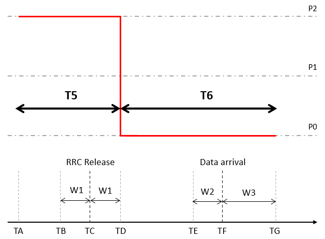
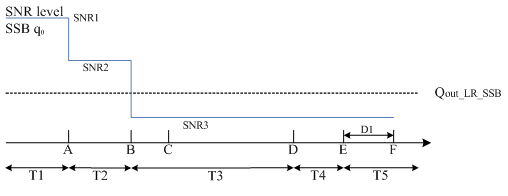
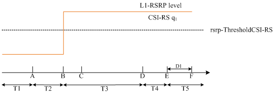
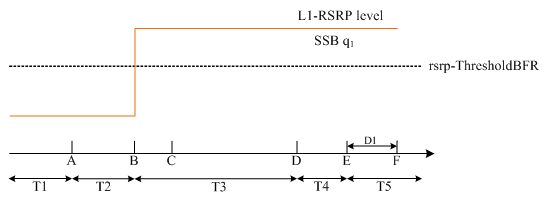
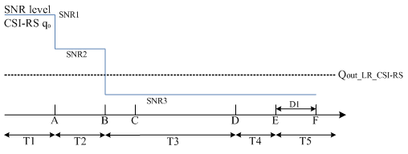
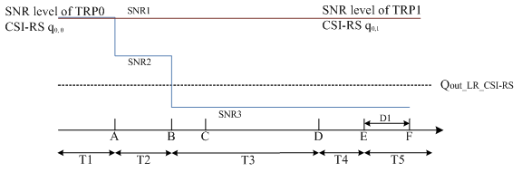
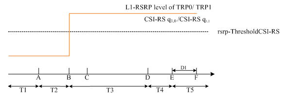

# A.6 NR standalone tests with all NR cells in FR1
## A.6.1 SA: RRC_IDLE state mobility
### A.6.1.1 Cell re-selection to NR
#### A.6.1.1.1 Cell reselection to FR1 intra-frequency NR case
##### A.6.1.1.1.1 Test Purpose and Environment
This test is to verify the requirement for the intra-frequency NR cell reselection requirements specified in clause 4.2.2.3.
##### A.6.1.1.1.2 Test Parameters
The test scenario comprises of 1 NR carrier and 2 cells as given in tables A.6.1.1.1.2-1, A.6.1.1.1.2-2 and A.6.1.1.1.2-3. The test consists of three successive time periods, with time duration of T1, T2, and T3 respectively. Only Cell 1 is already identified by the UE prior to the start of the test. Cell 1 and Cell 2 belong to different tracking areas. Furthermore, UE has not registered with network for the tracking area containing Cell 2.
Table A.6.1.1.1.2-1: Supported test configurations
| Configuration | Description |
| --- | --- |
| 1 | 15 kHz SSB SCS, 10 MHz bandwidth, FDD duplex mode |
| 2 | 15 kHz SSB SCS, 10 MHz bandwidth, TDD duplex mode |
| 3 | 30 kHz SSB SCS, 40 MHz bandwidth, TDD duplex mode |
| NOTE: The UE is only required to be tested in one of the supported test configurations. |  |

Table A.6.1.1.1.2-2: General test parameters for intra-frequency NR cell re-selection test case
| Parameter | Unit | Test configuration | Value | Comment |  |
| --- | --- | --- | --- | --- | --- |
|  |  |  |  |  |  |
| Initial condition | Active cell |  | 1, 2, 3 | Cell 1 |  |
| T2 end condition | Active cell |  | 1, 2, 3 | Cell 2 |  |
|  | Neighbour cells |  | 1, 2, 3 | Cell 1 |  |
| Final condition | Active cell |  | 1, 2, 3 | Cell 1 |  |
|  | Neighbour cells |  | 1, 2, 3 | Cell 2 |  |
| RF Channel Number |  | 1, 2, 3 | 1 |  |  |
| Time offset between cells |  | 1 | 3 ms | Asynchronous cells |  |
|  |  | 2 | 3 s | Synchronous cells |  |
|  |  | 3 | 3 s | Synchronous cells |  |
| Access Barring Information | - | 1, 2, 3 | Not Sent | No additional delays in random access procedure. |  |
| SSB configuration |  | 1 | SSB.1 FR1 |  |  |
|  |  | 2 | SSB.1 FR1 |  |  |
|  |  | 3 | SSB.2 FR1 |  |  |
| SMTC configuration |  | 1 | SMTC.2 | Configured in SIB2 of Cell 1 |  |
|  |  |  | SMTC.6 | Configured in SIB2 of Cell 2 |  |
|  |  | 2 | SMTC.1 |  |  |
|  |  | 3 | SMTC.1 |  |  |
| DRX cycle length | s | 1, 2, 3 | 1.28 | The value shall be used for all cells in the test. |  |
| PRACH configuration index |  | 1, 2, 3 | 102 | The detailed configuration is specified in TS 38.211 clause 6.3.3.2 |  |
| rangeToBestCell |  | 1, 2, 3 | Not configured |  |  |
| T1 | s | 1, 2, 3 | >7 | During T1, Cell 2 shall be powered off, and during the off time the physical cell identity shall be changed, The intention is to ensure that Cell 2 has not been detected by the UE prior to the start of period T2 |  |
| T2 | s | 1, 2, 3 | 40 | T2 needs to be defined so that cell re-selection reaction time is taken into account. |  |
| T3 | s | 1, 2, 3 | 15 | T3 needs to be defined so that cell re-selection reaction time is taken into account. |  |

Table A.6.1.1.1.2-3: Cell specific test parameters for intra-frequency NR cell re-selection test case in AWGN
| Parameter | Unit | Test configuration | Cell 1 | Cell 2 |  |  |  |  |
| --- | --- | --- | --- | --- | --- | --- | --- | --- |
|  |  |  | T1 | T2 | T3 | T1 | T2 | T3 |
| TDD configuration |  | 1 | N/A | N/A |  |  |  |  |
|  |  | 2 | TDDConf.1.1 | TDDConf.1.1 |  |  |  |  |
|  |  | 3 | TDDConf.2.1 | TDDConf.2.1 |  |  |  |  |
| PDSCH RMC |  | 1 | SR.1.1 FDD | SR.1.1 FDD |  |  |  |  |
| configuration |  | 2 | SR.1.1 TDD | SR.1.1 TDD |  |  |  |  |
|  |  | 3 | SR.2.1 TDD | SR.2.1 TDD |  |  |  |  |
| RMSI CORESET |  | 1 | CR.1.1 FDD | CR.1.1 FDD |  |  |  |  |
| RMC configuration |  | 2 | CR.1.1 TDD | CR.1.1 TDD |  |  |  |  |
|  |  | 3 | CR.2.1 TDD | CR.2.1 TDD |  |  |  |  |
| Dedicated CORESET |  | 1 | CCR.1.1 FDD | CCR.1.1 FDD |  |  |  |  |
| RMC configuration |  | 2 | CCR.1.1 TDD | CCR.1.1 TDD |  |  |  |  |
|  |  | 3 | CCR.2.1 TDD | CCR.2.1 TDD |  |  |  |  |
| OCNG Pattern |  | 1, 2, 3 | OP.1 defined in clause A.3.2.1 | OP.1 defined in clause A.3.2.1 |  |  |  |  |
| Initial DL BWP configuration |  | 1, 2, 3 | DLBWP.0.1 | DLBWP.0.1 |  |  |  |  |
| Initial UL BWP configuration |  | 1, 2, 3 | ULBWP.0.1 | ULBWP.0.1 |  |  |  |  |
| RLM-RS |  | 1, 2, 3 | SSB | SSB |  |  |  |  |
| Qrxlevmin | dBm/SCS | 1, 2 | -130 | -130 |  |  |  |  |
|  |  | 3 | -127 | -127 |  |  |  |  |
| Pcompensation | dB | 1, 2, 3 | 0 | 0 |  |  |  |  |
| Qhysts | dB | 1, 2, 3 | 0 | 0 |  |  |  |  |
| Qoffsets, n | dB | 1, 2, 3 | 0 | 0 |  |  |  |  |
| Cell_selection_and_ reselection_quality_measurement |  | 1, 2, 3 | SS-RSRP | SS-RSRP |  |  |  |  |
|  | dB | 1 | 16 | -3.11 | 2.79 | -infinity | 2.79 | -3.11 |
|  |  | 2 |  |  |  |  |  |  |
|  |  | 3 |  |  |  |  |  |  |
|  Note2 | dBm/SCS | 1 | -98 |  |  |  |  |  |
|  |  | 2 | -98 |  |  |  |  |  |
|  |  | 3 | -95 |  |  |  |  |  |
|  Note2 | dBm/15 kHz | 1 | -98 |  |  |  |  |  |
|  |  | 2 |  |  |  |  |  |  |
|  |  | 3 |  |  |  |  |  |  |
|  | dB | 1 | 16 | 13 | 16 | -infinity | 16 | 13 |
|  |  | 2 |  |  |  |  |  |  |
|  |  | 3 |  |  |  |  |  |  |
| SS-RSRP Note3 | dBm/SCS | 1 | -82 | -85 | -82 | -infinity | -82 | -85 |
|  |  | 2 | -82 | -85 | -82 | -infinity | -82 | -85 |
|  |  | 3 | -79 | -82 | -79 | -infinity | -79 | -82 |
| Io | dBm/9.36 MHz | 1 | -53.94 | -52.21 | -52.21 | Same as parameters specified in Cell 1 columns- |  |  |
|  | dBm/9.36 MHz | 2 | -53.94 | -52.21 | -52.21 |  |  |  |
|  | dBm/38.16 MHz | 3 | -47.85 | -46.12 | -46.12 |  |  |  |
| Treselection | s | 1, 2, 3 | 0 | 0 | 0 | 0 | 0 | 0 |
| SintrasearchP | dB | 1, 2, 3 | 60 | 60 |  |  |  |  |
| Propagation Condition |  | 1, 2, 3 | AWGN |  |  |  |  |  |
| NOTE 1: OCNG shall be used such that both cells are fully allocated and a constant total transmitted power spectral density is achieved for all OFDM symbols. NOTE 2: Interference from other cells and noise sources not specified in the test is assumed to be constant over subcarriers and time and shall be modelled as AWGN of appropriate power for  to be fulfilled. NOTE 3: SS-RSRP levels have been derived from other parameters for information purposes. They are not settable parameters themselves. |  |  |  |  |  |  |  |  |

##### A.6.1.1.1.3 Test Requirements
The cell reselection delay to a newly detectable cell is defined as the time from the beginning of time period T2, to the moment when the UE camps on Cell 2, and starts to send preambles on the PRACH for sending the RRCSetupRequest message to perform a registration procedure for mobility and periodic registration update on Cell 2.
The cell re-selection delay to a newly detectable cell shall be less than 34 s.
The cell reselection delay to an already detected cell is defined as the time from the beginning of time period T3, to the moment when the UE camps on Cell 1, and starts to send preambles on the PRACH for sending the RRCSetupRequest message to perform a registration procedure for mobility and periodic registration update on Cell 1.
The cell re-selection delay to an already detected cell shall be less than 8 s.
The rate of correct cell reselections observed during repeated tests shall be at least 90 %.
NOTE: The cell re-selection delay to a newly detectable cell can be expressed as: Tdetect, NR_Intra + TSI-NR, and to an already detected cell can be expressed as: Tevaluate, NR_ intra + TSI-NR,
Where:
Tdetect, NR_Intra See table 4.2.2.3-1 in clause 4.2.2.3
Tevaluate, NR_ intra See table 4.2.2.3-1 in clause 4.2.2.3
TSI-NR Maximum repetition period of relevant system info blocks that needs to be received by the UE to camp on a cell; 1280 ms is assumed in this test case.
This gives a total of 33.28 s, allow 34 s for the cell re-selection delay to a newly detectable cell and 7.68 s for the cell re-selection delay to an already detected cell in the test case, which we allow 8 s.
#### A.6.1.1.2 Cell reselection to FR1 inter-frequency NR case
##### A.6.1.1.2.1 Test Purpose and Environment
This test is to verify the requirement for the inter-frequency NR cell reselection requirements specified in clause 4.2.2.4.
##### A.6.1.1.2.2 Test Parameters
The test scenario comprises of 2 cells on 2 different NR carriers respectively as given in tables A.6.1.1.2.2-1, A.6.1.1.2.2-2 and A.6.1.1.2.2-3. The test consists of three successive time periods, with time duration of T1, T2, and T3 respectively. Both Cell 1 and Cell 2 are already identified by the UE prior to the start of the test. Cell 1 and Cell 2 belong to different tracking areas and Cell 2 is of higher priority than Cell 1.
Table A.6.1.1.2.2-1: Supported test configurations
| Configuration | Description of serving cell | Description of target cell |
| --- | --- | --- |
| 1 | 15 kHz SSB SCS, 10 MHz bandwidth, FDD duplex mode | 15 kHz SSB SCS, 10 MHz bandwidth, FDD duplex mode |
| 2 | 15 kHz SSB SCS, 10 MHz bandwidth, TDD duplex mode | 15 kHz SSB SCS, 10 MHz bandwidth, TDD duplex mode |
| 3 | 30 kHz SSB SCS, 40 MHz bandwidth, TDD duplex mode | 30 kHz SSB SCS, 40 MHz bandwidth, TDD duplex mode |
| NOTE: The UE is only required to be tested in one of the supported test configurations. |  |  |

Table A.6.1.1.2.2-2: General test parameters for FR1 inter-frequency NR cell re-selection test case
| Parameter | Unit | Test configuration | Value | Comment |  |
| --- | --- | --- | --- | --- | --- |
| Initial condition | Active cell |  | 1, 2, 3 | Cell 2 | The UE camps on Cell 2 in the initial phase and during T1 period the UE reselects to Cell 1 |
|  | Neighbour cell |  | 1, 2, 3 | Cell 1 |  |
| T1 end condition | Active cell |  | 1, 2, 3 | Cell 1 | The UE shall perform reselection to Cell 1 during T1 |
|  | Neighbour cells |  | 1, 2, 3 | Cell 2 |  |
| T3 end condition | Active cell |  | 1, 2, 3 | Cell 2 | The UE shall perform reselection to Cell 2 with higher priority during T3 |
|  | Neighbour cell |  | 1, 2, 3 | Cell 1 |  |
| RF Channel Number |  | 1, 2, 3 | 1, 2 |  |  |
| Time offset between cells |  | 1 | 3 ms | Asynchronous cells |  |
|  |  | 2 | 3 s | Synchronous cells |  |
|  |  | 3 | 3 s | Synchronous cells |  |
| Access Barring Information | - | 1, 2, 3 | Not Sent | No additional delays in random access procedure. |  |
| SSB configuration |  | 1 | SSB.1 FR1 |  |  |
|  |  | 2 | SSB.1 FR1 |  |  |
|  |  | 3 | SSB.2 FR1 |  |  |
| SMTC configuration |  | 1 | SMTC.2 | Configured in SIB4 of Cell 1 |  |
|  |  |  | SMTC.6 | Configured in SIB4 of Cell 2 |  |
|  |  | 2 | SMTC.1 |  |  |
|  |  | 3 | SMTC.1 |  |  |
| DRX cycle length | s | 1, 2, 3 | 1.28 | The value shall be used for all cells in the test. |  |
| PRACH configuration index |  | 1, 2, 3 | 102 | The detailed configuration is specified in TS 38.211 clause 6.3.3.2 |  |
| rangeToBestCell |  | 1, 2, 3 | Not configured |  |  |
| T1 | s | 1, 2, 3 | 15 | T1 needs to be defined so that cell re-selection reaction time is taken into account. |  |
| T2 | s | 1, 2, 3 | >7 | During T2, Cell 2 shall be powered off, and during the off time the physical cell identity shall be changed. The intention is to ensure that Cell 2 has not been detected by the UE prior to the start of period T3. |  |
| T3 | s | 1, 2, 3 | 75 | T3 needs to be defined so that cell re-selection reaction time is taken into account. |  |

Table A.6.1.1.2.2-3: Cell specific test parameters for FR1 inter-frequency NR cell re-selection test case in AWGN
| Parameter | Unit | Test configuration | Cell 1 | Cell 2 |  |  |  |  |
| --- | --- | --- | --- | --- | --- | --- | --- | --- |
|  |  |  | T1 | T2 | T3 | T1 | T2 | T3 |
| TDD configuration |  | 1 | N/A | N/A |  |  |  |  |
|  |  | 2 | TDDConf.1.1 | TDDConf.1.1 |  |  |  |  |
|  |  | 3 | TDDConf.2.1 | TDDConf.2.1 |  |  |  |  |
| PDSCH RMC |  | 1 | SR.1.1 FDD | SR.1.1 FDD |  |  |  |  |
| configuration |  | 2 | SR.1.1 TDD | SR.1.1 TDD |  |  |  |  |
|  |  | 3 | SR.2.1 TDD | SR.2.1 TDD |  |  |  |  |
| RMSI CORESET |  | 1 | CR.1.1 FDD | CR.1.1 FDD |  |  |  |  |
| RMC configuration |  | 2 | CR.1.1 TDD | CR.1.1 TDD |  |  |  |  |
|  |  | 3 | CR.2.1 TDD | CR.2.1 TDD |  |  |  |  |
| Dedicated CORESET |  | 1 | CCR.1.1 FDD | CCR.1.1 FDD |  |  |  |  |
| RMC configuration |  | 2 | CCR.1.1 TDD | CCR.1.1 TDD |  |  |  |  |
|  |  | 3 | CCR.2.1 TDD | CCR.2.1 TDD |  |  |  |  |
| OCNG Pattern |  | 1, 2, 3 | OP.1 defined in clause A.3.2.1 | OP.1 defined in clause A.3.2.1 |  |  |  |  |
| Initial DL BWP configuration |  | 1, 2, 3 | DLBWP.0.1 | DLBWP.0.1 |  |  |  |  |
| Initial UL BWP configuration |  | 1, 2, 3 | ULBWP.0.1 | ULBWP.0.1 |  |  |  |  |
| RLM-RS |  | 1, 2, 3 | SSB | SSB |  |  |  |  |
| Qrxlevmin | dBm/SCS | 1, 2 | -140 | -140 |  |  |  |  |
|  |  | 3 | -137 | -137 |  |  |  |  |
| Pcompensation | dB | 1, 2, 3 | 0 | 0 |  |  |  |  |
| Cell_selection_and_ reselection_quality_measurement |  | 1, 2, 3 | SS-RSRP | SS-RSRP |  |  |  |  |
|  | dB | 1 | 14 | 14 | 14 | -4 | -infinity | 12 |
|  |  | 2 |  |  |  |  |  |  |
|  |  | 3 |  |  |  |  |  |  |
|  Note2 | dBm/SCS | 1 | -98 |  |  |  |  |  |
|  |  | 2 | -98 |  |  |  |  |  |
|  |  | 3 | -95 |  |  |  |  |  |
|  Note2 | dBm/15 kHz | 1 | -98 |  |  |  |  |  |
|  |  | 2 |  |  |  |  |  |  |
|  |  | 3 |  |  |  |  |  |  |
|  | dB | 1 | 14 | 14 | 14 | -4 | -infinity | 12 |
|  |  | 2 |  |  |  |  |  |  |
|  |  | 3 |  |  |  |  |  |  |
| SS-RSRP Note3 | dBm/SCS | 1 | -84 | -84 | -84 | -102 | -infinity | -86 |
|  |  | 2 | -84 | -84 | -84 | -102 | -infinity | -86 |
|  |  | 3 | -81 | -81 | -81 | -99 | -infinity | -83 |
| Io | dBm/9.36 MHz | 1 | -55.88 | -55.88 | -55.88 | -68.60 | -70.05 | -57.78 |
|  | dBm/9.36 MHz | 2 | -55.88 | -55.88 | -55.88 | -68.60 | -70.05 | -57.78 |
|  | dBm/38.16 MHz | 3 | -49.79 | -49.79 | -49.79 | -62.50 | -63.96 | -51.69 |
| Treselection | s | 1, 2, 3 | 0 | 0 | 0 | 0 | 0 | 0 |
| SnonintrasearchP | dB | 1, 2, 3 | 50 | 50 |  |  |  |  |
| Threshx, highP | dB | 1, 2, 3 | 48 | 48 |  |  |  |  |
| Threshserving, lowP | dB | 1, 2, 3 | 44 | 44 |  |  |  |  |
| Threshx, lowP | dB | 1, 2, 3 | 50 | 50 |  |  |  |  |
| Propagation Condition |  | 1, 2, 3 | AWGN |  |  |  |  |  |
| NOTE 1: OCNG shall be used such that both cells are fully allocated and a constant total transmitted power spectral density is achieved for all OFDM symbols. NOTE 2: Interference from other cells and noise sources not specified in the test is assumed to be constant over subcarriers and time and shall be modelled as AWGN of appropriate power for  to be fulfilled. NOTE 3: SS-RSRP levels have been derived from other parameters for information purposes. They are not settable parameters themselves. |  |  |  |  |  |  |  |  |

##### A.6.1.1.2.3 Test Requirements
The cell reselection delay to a higher priority cell is defined as the time from the beginning of time period T3, to the moment when the UE camps again on Cell 2, and starts to send preambles on the PRACH for sending the RRCSetupRequest message to perform a registration procedure for mobility and periodic registration update on Cell 2.
The cell re-selection delay to a higher priority cell shall be less than 68 s.
The cell reselection delay to a lower priority cell is defined as the time from the beginning of time period T1, to the moment when the UE camps on Cell 1, and starts to send preambles on the PRACH for sending the RRCSetupRequest message to perform a registration procedure for mobility and periodic registration update on Cell 1.
The cell re-selection delay to a lower priority cell shall be less than 8 s.
The rate of correct cell reselections observed during repeated tests shall be at least 90 %.
NOTE: The cell re-selection delay to a higher priority cell can be expressed as: Thigher_priority_search + Tevaluate, NR_ inter + TSI-NR, and to a lower priority cell can be expressed as: Tevaluate, NR_ inter + TSI-NR,
Where:
Thigher_priority_search See clause 4.2.2.7
Tevaluate, NR_ inter See table 4.2.2.4-1 in clause 4.2.2.4
TSI-NR Maximum repetition period of relevant system info blocks that needs to be received by the UE to camp on a cell; 1280 ms is assumed in this test case.
This gives a total of 67.68 s, allow 68 s for the cell re-selection delay to a higher priority cell and 7.68 s for the cell re-selection delay to a lower priority cell in the test case, which we allow 8 s.
#### A.6.1.1.3 Cell reselection to FR1 intra-frequency NR case for UE fulfilling low mobility relaxed measurement criterion
##### A.6.1.1.3.1 Test Purpose and Environment
This test is to verify the requirement for the intra-frequency NR cell reselection requirements for UE fulfilling low mobility criterion specified in clause 4.2.2.9.2
##### A.6.1.1.3.2 Test Parameters
The test scenario comprises of 1 NR carrier and 2 cells as given in tables A.6.1.1.3.2-1, A.6.1.1.3.2-2 and A.6.1.1.3.2-3. The test consists of two successive time periods, with time duration of T1 and T2 respectively. Both Cell 1 and Cell 2 are already identified by the UE prior to the start of the test. Cell 1 and Cell 2 belong to different tracking areas. Furthermore, UE has not registered with network for the tracking area containing Cell 2.
Table A.6.1.1.3.2-1: Supported test configurations
| Configuration | Description |
| --- | --- |
| 1 | 15 kHz SSB SCS, 10 MHz bandwidth, FDD duplex mode |
| 2 | 15 kHz SSB SCS, 10 MHz bandwidth, TDD duplex mode |
| 3 | 30 kHz SSB SCS, 40 MHz bandwidth, TDD duplex mode |
| NOTE: The UE is only required to be tested in one of the supported test configurations. |  |

Table A.6.1.1.3.2-2: General test parameters for FR1 intra-frequency NR cell re-selection test case for UE fulfilling low mobility criterion
| Parameter | Unit | Test configuration | Value | Comment |  |
| --- | --- | --- | --- | --- | --- |
| Initial condition | Active cell |  | 1, 2, 3 | Cell 1 | The UE camps on Cell 1 in the initial phase |
|  | Neighbour cells |  | 1, 2, 3 | Cell 2 |  |
| T1 end condition | Active cell |  | 1, 2, 3 | Cell 2 | The UE reselects to Cell 2 during T1 period |
|  | Neighbour cells |  | 1, 2, 3 | Cell 1 |  |
| Final condition | Active cell |  | 1, 2, 3 | Cell 1 | The UE reselects to Cell 1 during T2 period |
|  | Neighbour cells |  | 1, 2, 3 | Cell 2 |  |
| RF Channel Number |  | 1, 2, 3 | 1 |  |  |
| Time offset between cells |  | 1 | 3 ms | Asynchronous cells |  |
|  |  | 2 | 3 s | Synchronous cells |  |
|  |  | 3 | 3 s | Synchronous cells |  |
| Access Barring Information | - | 1, 2, 3 | Not Sent | No additional delays in random access procedure. |  |
| SSB configuration |  | 1 | SSB.1 FR1 |  |  |
|  |  | 2 | SSB.1 FR1 |  |  |
|  |  | 3 | SSB.2 FR1 |  |  |
| SMTC configuration |  | 1 | SMTC pattern 2 | Configured in SIB2 of Cell 1 |  |
|  |  |  | SMTC pattern 6 | Configured in SIB2 of Cell 2 |  |
|  |  | 2 | SMTC pattern 1 |  |  |
|  |  | 3 | SMTC pattern 1 |  |  |
| DRX cycle length | s | 1, 2, 3 | 0.64 | The value shall be used for all cells in the test. |  |
| PRACH configuration index |  | 1, 2, 3 | 102 | The detailed configuration is specified in TS 38.211 clause 6.3.3.2 |  |
| rangeToBestCell |  | 1, 2, 3 | Not configured |  |  |
| T1 | s | 1, 2, 3 | 25 | T1 needs to be defined so that cell re-selection reaction time is taken into account. |  |
| T2 | s | 1, 2, 3 | 25 | T2 needs to be defined so that cell re-selection reaction time is taken into account. |  |

Table A.6.1.1.3.2-3: Cell specific test parameters for FR1 intra-frequency NR cell re-selection test case in AWGN for UE fulfilling low mobility criterion
| Parameter | Unit | Test configuration | Cell 1 | Cell 2 |  |  |
| --- | --- | --- | --- | --- | --- | --- |
|  |  |  | T1 | T2 | T1 | T2 |
| TDD configuration |  | 1 | N/A | N/A |  |  |
|  |  | 2 | TDDConf.1.1 | TDDConf.1.1 |  |  |
|  |  | 3 | TDDConf.2.1 | TDDConf.2.1 |  |  |
| PDSCH RMC configuration |  | 1 | SR.1.1 FDD | N/A |  |  |
|  |  | 2 | SR.1.1 TDD |  |  |  |
|  |  | 3 | SR.2.1 TDD |  |  |  |
| RMSI CORESET RMC configuration |  | 1 | CR.1.1 FDD | CR.1.1 FDD |  |  |
|  |  | 2 | CR.1.1 TDD | CR.1.1 TDD |  |  |
|  |  | 3 | CR.2.1 TDD | CR.2.1 TDD |  |  |
| Dedicated CORESET RMC configuration |  | 1 | CCR.1.1 FDD | CCR.1.1 FDD |  |  |
|  |  | 2 | CCR.1.1 TDD | CCR.1.1 TDD |  |  |
|  |  | 3 | CCR.2.1 TDD | CCR.2.1 TDD |  |  |
| OCNG Pattern |  | 1, 2, 3 | OP.1 defined in clause A.3.2.1 | OP.1 defined in clause A.3.2.1 |  |  |
| Initial DL BWP configuration |  | 1, 2, 3 | DLBWP.0.1 | DLBWP.0.1 |  |  |
| Initial UL BWP configuration |  | 1, 2, 3 | ULBWP.0.1 | ULBWP.0.1 |  |  |
| RLM-RS |  | 1, 2, 3 | SSB | SSB |  |  |
| Qrxlevmin | dBm/SCS | 1, 2 | -140 | -140 |  |  |
|  |  | 3 | -137 | -137 |  |  |
| Pcompensation | dB | 1, 2, 3 | 0 | 0 |  |  |
| Qhysts | dB | 1, 2, 3 | 0 | 0 |  |  |
| Qoffsets, n | dB | 1, 2, 3 | 0 | 0 |  |  |
| SSearchDeltaP | dB | 1, 2, 3 | 3 | 3 |  |  |
| TSearchDeltaP | s | 1, 2, 3 | 5 | 5 |  |  |
| Cell_selection_and_ reselection_quality_ measurement |  | 1, 2, 3 | SS-RSRP | SS-RSRP |  |  |
|  | dB | 1, 2, 3 | -3.11 | 2.79 | 2.79 | -3.11 |
|  Note2 | dBm/SCS | 1 | -98 |  |  |  |
|  |  | 2 | -98 |  |  |  |
|  |  | 3 | -95 |  |  |  |
|  Note2 | dBm/15 kHz | 1, 2, 3 | -98 |  |  |  |
|  | dB | 1, 2, 3 | 13 | 16 | 16 | 13 |
| SS-RSRP Note3 | dBm/SCS | 1 | -85 | -82 | -82 | -85 |
|  |  | 2 | -85 | -82 | -82 | -85 |
|  |  | 3 | -82 | -79 | -79 | -82 |
| Io | dBm/9.36 MHz | 1 | -52.21 | -52.21 | specified in Cell 1 columns- |  |
|  | dBm/9.36 MHz | 2 | -52.21 | -52.21 |  |  |
|  | dBm/38.16 MHz | 3 | -46.12 | -46.12 |  |  |
| Treselection | s | 1, 2, 3 | 0 | 0 | 0 | 0 |
| SintrasearchP | dB | 1, 2, 3 | 60 | 60 |  |  |
| Propagation Condition |  | 1, 2, 3 | AWGN |  |  |  |
| NOTE 1: OCNG shall be used such that both cells are fully allocated and a constant total transmitted power spectral density is achieved for all OFDM symbols. NOTE 2: Interference from other cells and noise sources not specified in the test is assumed to be constant over subcarriers and time and shall be modelled as AWGN of appropriate power for  to be fulfilled. NOTE 3: SS-RSRP levels have been derived from other parameters for information purposes. They are not settable parameters themselves. |  |  |  |  |  |  |

##### A.6.1.1.3.3 Test Requirements
The cell reselection delay to an already detected cell is defined as the time from the beginning of time period T1, to the moment when the UE camps on Cell 2, and starts to send preambles on the PRACH for sending the RRCSetupRequest message to perform a Tracking Area Update procedure on Cell 2.
The cell re-selection delay to an already detected cell shall be less than 17 s.
The cell reselection delay to an already detected cell is defined as the time from the beginning of time period T2, to the moment when the UE camps on Cell 1, and starts to send preambles on the PRACH for sending the RRCSetupRequest message to perform a Tracking Area Update procedure on Cell 1.
The cell re-selection delay to an already detected cell shall be less than 17 s.
The rate of correct cell reselections observed during repeated tests shall be at least 90 %.
NOTE: The cell re-selection delay to an already detected cell can be expressed as: Tevaluate,NR_Intra + TSI-NR,
Where:
Tevaluate,NR_Intra See table 4.2.2.9.2-1 in clause 4.2.2.9.2 for reselection to Cell 2 during T1 with UE fulfilling low mobility criterion. 15.36 s.
TSI-NR Maximum repetition period of relevant system info blocks that needs to be received by the UE to camp on a cell; 1280 ms is assumed in this test case.
This gives a total of 16.64 s, allow 17 s for the cell re-selection delay to an already detected cell for UE fulfilling low mobility criterion in the test case.
#### A.6.1.1.4 Cell reselection to FR1 intra-frequency NR case for UE fulfilling not-at-cell edge relaxed measurement criterion
##### A.6.1.1.4.1 Test Purpose and Environment
This test is to verify the relaxed cell re-selection requirement for UEs configured with not-at-cell edge criterion specified in clause 4.2.2.9.3.
##### A.6.1.1.4.2 Test Parameters
The test scenario comprises of 1 NR carrier and 2 cells as given in tables A.6.1.1.4.2-1, A.6.1.1.4.2-2 and A.6.1.1.4.2-3. The test consists of two successive time periods, with time duration of T1 and T2 respectively. Both Cell 1 and Cell 2 are already identified by the UE prior to the start of the test. Cell 1 and Cell 2 belong to different tracking areas.
Table A.6.1.1.4.2-1: Supported test configurations
| Configuration | Description |
| --- | --- |
| 1 | 15 kHz SSB SCS, 10 MHz bandwidth, FDD duplex mode |
| 2 | 15 kHz SSB SCS, 10 MHz bandwidth, TDD duplex mode |
| 3 | 30 kHz SSB SCS, 40 MHz bandwidth, TDD duplex mode |
| NOTE: The UE is only required to be tested in one of the supported test configurations. |  |

Table A.6.1.1.4.2-2: General test parameters for FR1 intra-frequency NR cell re-selection test case for UE fulfilling not-at-cell edge criterion
| Parameter | Unit | Test configuration | Value | Comment |  |
| --- | --- | --- | --- | --- | --- |
| Initial condition | Active Cell |  | 1, 2, 3 | Cell 1 | The UE camps on Cell 1 in the initial phase |
|  | Neighbour Cells |  | 1, 2, 3 | Cell 2 |  |
| T1 end condition | Active Cell |  | 1, 2, 3 | Cell 2 | The UE shall fulfil the not-at-cell edge criterion and reselect to Cell 2 during T1 period during T1. |
|  | Neighbour Cells |  | 1, 2, 3 | Cell 1 |  |
| T2 end condition | Active Cell |  | 1, 2, 3 | Cell 1 | The UE shall perform reselection to Cell 1 during T2 |
|  | Neighbour Cells |  | 1, 2, 3 | Cell 2 |  |
| RF Channel Number |  | 1, 2, 3 | 1 |  |  |
| Time offset between Cells |  | 1 | 3 ms | Asynchronous Cells |  |
|  |  | 2 | 3 s | Synchronous Cells |  |
|  |  | 3 | 3 s | Synchronous Cells |  |
| Access Barring Information | - | 1, 2, 3 | Not Sent | No additional delays in random access procedure. |  |
| SSB configuration |  | 1 | SSB.1 FR1 |  |  |
|  |  | 2 | SSB.1 FR1 |  |  |
|  |  | 3 | SSB.2 FR1 |  |  |
| SMTC configuration |  | 1 | SMTC pattern 2 | Configured in SIB2 of Cell 1 |  |
|  |  |  | SMTC pattern 6 | Configured in SIB2 of Cell 2 |  |
|  |  | 2 | SMTC pattern 1 |  |  |
|  |  | 3 | SMTC pattern 1 |  |  |
| DRX cycle length | s | 1, 2, 3 | 0.64 | The value shall be used for all Cells in the test. |  |
| PRACH configuration index |  | 1, 2, 3 | 102 | The detailed configuration is specified in TS 38.211 clause 6.3.3.2 |  |
| rangeToBestCell |  | 1, 2, 3 | Not configured |  |  |
| T1 | s | 1, 2, 3 | 20 | T1 needs to be defined so that Cell re-selection reaction time is taken into account. |  |
| T2 | s | 1, 2, 3 | 20 | T2 needs to be defined so that Cell re-selection reaction time is taken into account. |  |

Table A.6.1.1.4.2-3: Cell specific test parameters for FR1 intra-frequency NR cell re-selection test case in AWGN for UE fulfilling not-at-cell edge criterion
| Parameter | Unit | Test configuration | Cell 1 | Cell 2 |  |  |
| --- | --- | --- | --- | --- | --- | --- |
|  |  |  | T1 | T2 | T1 | T2 |
| TDD configuration |  | 1 | N/A | N/A |  |  |
|  |  | 2 | TDDConf.1.1 | TDDConf.1.1 |  |  |
|  |  | 3 | TDDConf.2.1 | TDDConf.2.1 |  |  |
| PDSCH RMC configuration |  | 1 | SR.1.1 FDD | N/A |  |  |
|  |  | 2 | SR.1.1 TDD |  |  |  |
|  |  | 3 | SR.2.1 TDD |  |  |  |
| RMSI CORESET RMC configuration |  | 1 | CR.1.1 FDD | CR.1.1 FDD |  |  |
|  |  | 2 | CR.1.1 TDD | CR.1.1 TDD |  |  |
|  |  | 3 | CR.2.1 TDD | CR.2.1 TDD |  |  |
| Dedicated CORESET RMC configuration |  | 1 | CCR.1.1 FDD | CCR.1.1 FDD |  |  |
|  |  | 2 | CCR.1.1 TDD | CCR.1.1 TDD |  |  |
|  |  | 3 | CCR.2.1 TDD | CCR.2.1 TDD |  |  |
| OCNG Pattern |  | 1, 2, 3 | OP.1 defined in clause A.3.2.1 | OP.1 defined in clause A.3.2.1 |  |  |
| Initial DL BWP configuration |  | 1, 2, 3 | DLBWP.0.1 | DLBWP.0.1 |  |  |
| Initial UL BWP configuration |  | 1, 2, 3 | ULBWP.0.1 | ULBWP.0.1 |  |  |
| RLM-RS |  | 1, 2, 3 | SSB | SSB |  |  |
| Qrxlevmin | dBm/SCS | 1, 2 | -140 | -140 |  |  |
|  |  | 3 | -137 | -137 |  |  |
| Pcompensation | dB | 1, 2, 3 | 0 | 0 |  |  |
| Qhysts | dB | 1, 2, 3 | 0 | 0 |  |  |
| Qoffsets, n | dB | 1, 2, 3 | 0 | 0 |  |  |
| Cell_selection_and_ reselection_quality_measurement |  | 1, 2, 3 | SS-RSRP | SS-RSRP |  |  |
|  | dB | 1 | -3.11 | 2.79 | 2.79 | -3.11 |
|  |  | 2 |  |  |  |  |
|  |  | 3 |  |  |  |  |
|  Note2 | dBm/SCS | 1 | -98 |  |  |  |
|  |  | 2 | -98 |  |  |  |
|  |  | 3 | -95 |  |  |  |
|  Note2 | dBm/15 kHz | 1 | -98 |  |  |  |
|  |  | 2 |  |  |  |  |
|  |  | 3 |  |  |  |  |
|  | dB | 1 | 13 | 16 | 16 | 13 |
|  |  | 2 |  |  |  |  |
|  |  | 3 |  |  |  |  |
| SS-RSRP Note3 | dBm/SCS | 1 | -85 | -82 | -82 | -85 |
|  |  | 2 | -85 | -82 | -82 | -85 |
|  |  | 3 | -82 | -79 | -79 | -82 |
| Io | dBm/9.36 MHz | 1 | -52.21 | -52.21 | -52.21 | -52.21 |
|  | dBm/9.36 MHz | 2 | -52.21 | -52.21 | -52.21 | -52.21 |
|  | dBm/38.16 MHz | 3 | -46.12 | -46.12 | -46.12 | -46.12 |
| Treselection | s | 1, 2, 3 | 0 | 0 | 0 | 0 |
| SintrasearchP | dB | 1, 2, 3 | 60 | 60 |  |  |
| SsearchThresholdP | dB | 1, 2, 3 | 50 | 50 |  |  |
| Propagation Condition |  | 1, 2, 3 | AWGN |  |  |  |
| NOTE 1: OCNG shall be used such that both Cells are fully allocated and a constant total transmitted power spectral density is achieved for all OFDM symbols. NOTE 2: Interference from other Cells and noise sources not specified in the test is assumed to be constant over subcarriers and time and shall be modelled as AWGN of appropriate power for  to be fulfilled. NOTE 3: SS-RSRP levels have been derived from other parameters for information purposes. They are not settable parameters themselves. |  |  |  |  |  |  |

##### A.6.1.1.4.3 Test Requirements
The cell re-selection delay to an already detected cell for UE configured with cellEdgeEvaluation criterion is defined as the time from the beginning of time period T1, to the moment when the UE camps on Cell 2, and starts to send preambles on the PRACH for sending the RRCSetupRequest message to perform a Tracking Area Update procedure on Cell 2.
The cell re-selection delay to an already detected cell for UE configured with cellEdgeEvaluation criterion shall be less than 17 s.
The rate of correct cell reselections observed during repeated tests shall be at least 90 %.
NOTE: The cell re-selection delay to an already detected cell for UE configured with relaxed measurement criterion can be expressed as: Tevaluate,NR_Intra + TSI-NR,
Where:
Tevaluate,NR_Intra See table 4.2.2.9.3-1 for UE fulfilling not-at-cell edge criterion in clause 4.2.2.9.3.
TSI-NR Maximum repetition period of relevant system info blocks that needs to be received by the UE to camp on a Cell; 1280 ms is assumed in this test case.
This gives a total of 16.64 s, allow 17 s for the cell re-selection delay to an already detected cell for UE fulfilling not-at-cell edge criterion in the test case.
#### A.6.1.1.5 Cell reselection to FR1 inter-frequency NR case for UE fulfilling low mobility relaxed measurement criterion
##### A.6.1.1.5.1 Test Purpose and Environment
This test is to verify the requirement for the inter-frequency NR cell reselection requirements specified in clause 4.2.2.10.2, for UE fulfilling low mobility relaxed measurement criterion.
##### A.6.1.1.5.2 Test Parameters
The test scenario comprises of 2 cells on 2 different NR carriers respectively as given in tables A.6.1.1.5.2-1, A.6.1.1.5.2-2 and A.6.1.1.5.2-3. The test consists of two successive time periods, with time duration of T1 and T2 respectively. Both Cell 1 and Cell 2 are already identified by the UE prior to the start of the test. Cell 1 and Cell 2 belong to different tracking areas and Cell 2 is of higher priority than Cell 1.
As specified in the Test Purpose, the UE is configured with the relaxed measurement criterion for UE with low mobility defined in clause 5.2.4.9.1 in [1]. So, Cell 2 and Cell 1 configure the UE as follows:
lowMobilityEvalutation [2] criterion is configured according to the parameters listed in table A.6.1.1.5.2-3;
cellEdgeEvaluation [2] criterion is not configured;
combineRelaxedMeasCondition [2] is not configured;
Table A.6.1.1.5.2-1: Supported test configurations
| Configuration | Description of serving cell | Description of target cell |
| --- | --- | --- |
| 1 | 15 kHz SSB SCS, 10 MHz bandwidth, FDD duplex mode | 15 kHz SSB SCS, 10 MHz bandwidth, FDD duplex mode |
| 2 | 15 kHz SSB SCS, 10 MHz bandwidth, TDD duplex mode | 15 kHz SSB SCS, 10 MHz bandwidth, TDD duplex mode |
| 3 | 30 kHz SSB SCS, 40 MHz bandwidth, TDD duplex mode | 30 kHz SSB SCS, 40 MHz bandwidth, TDD duplex mode |
| NOTE: The UE is only required to be tested in one of the supported test configurations. |  |  |

Table A.6.1.1.5.2-2: General test parameters for FR1 inter-frequency NR cell re-selection test case for UE fulfilling low mobility criterion
| Parameter | Unit | Test configuration | Value | Comment |  |
| --- | --- | --- | --- | --- | --- |
| Initial condition | Active cell |  | 1, 2, 3 | Cell 2 | The UE camps on Cell 2 in the initial phase, it fulfills Low Mobility relaxation measurements criterion, and during T1 period the UE reselects to Cell 1 |
|  | Neighbour cells |  | 1, 2, 3 | Cell 1 |  |
| T1 end condition | Active cell |  | 1, 2, 3 | Cell 1 | The UE shall perform reselection to Cell 1 during T1 |
|  | Neighbour cells |  | 1, 2, 3 | Cell 2 |  |
| T2 end condition | Active cell |  | 1, 2, 3 | Cell 2 | The UE shall perform reselection to Cell 2 with higher priority during T2 |
|  | Neighbour cells |  | 1, 2, 3 | Cell 1 |  |
| RF Channel Number |  | 1, 2, 3 | 1, 2 |  |  |
| Time offset between cells |  | 1 | 3 ms | Asynchronous cells |  |
|  |  | 2 | 3 s | Synchronous cells |  |
|  |  | 3 | 3 s | Synchronous cells |  |
| Access Barring Information | - | 1, 2, 3 | Not Sent | No additional delays in random access procedure. |  |
| SSB Configuration |  | 1 | SSB.1 FR1 |  |  |
|  |  | 2 | SSB.1 FR1 |  |  |
|  |  | 3 | SSB.2 FR1 |  |  |
| SMTC configuration |  | 1 | SMTC pattern 2 | Configured in SIB4 of Cell 1 |  |
|  |  |  | SMTC pattern 6 | Configured in SIB4 of Cell 2 |  |
|  |  | 2 | SMTC pattern 1 |  |  |
|  |  | 3 | SMTC pattern 1 |  |  |
| DRX cycle length | s | 1, 2, 3 | 0.64 | The value shall be used for all cells in the test. |  |
| PRACH configuration index |  | 1, 2, 3 | 102 | The detailed configuration is specified in TS 38.211 clause 6.3.3.2 |  |
| rangeToBestCell |  | 1, 2, 3 | Not configured |  |  |
| T1 | s | 1, 2, 3 | 25 s | T1 is defined so that cell re-selection reaction time is taken into account. |  |
| T2 | s | 1, 2, 3 | 25 s | T2 is defined so that cell re-selection reaction time is taken into account. |  |

Table A.6.1.1.5.2-3: Cell specific test parameters for FR1 inter-frequency NR cell re-selection test case in AWGN for UE fulfilling low mobility criterion
| Parameter | Unit | Test configuration | Cell 1 | Cell 2 |  |  |
| --- | --- | --- | --- | --- | --- | --- |
|  |  |  | T1 | T2 | T1 | T2 |
| TDD configuration |  | 1 | N/A | N/A |  |  |
|  |  | 2 | TDDConf.1.1 | TDDConf.1.1 |  |  |
|  |  | 3 | TDDConf.2.1 | TDDConf.2.1 |  |  |
| PDSCH RMC |  | 1 | SR.1.1 FDD | SR.1.1 FDD |  |  |
| configuration |  | 2 | SR.1.1 TDD | SR.1.1 TDD |  |  |
|  |  | 3 | SR.2.1 TDD | SR.2.1 TDD |  |  |
| RMSI CORESET |  | 1 | CR.1.1 FDD | CR.1.1 FDD |  |  |
| RMC configuration |  | 2 | CR.1.1 TDD | CR.1.1 TDD |  |  |
|  |  | 3 | CR.2.1 TDD | CR.2.1 TDD |  |  |
| Dedicated CORESET |  | 1 | CCR.1.1 FDD | CCR.1.1 FDD |  |  |
| RMC configuration |  | 2 | CCR.1.1 TDD | CCR.1.1 TDD |  |  |
|  |  | 3 | CCR.2.1 TDD | CCR.2.1 TDD |  |  |
| OCNG Pattern |  | 1, 2, 3 | OP.1 defined in clause A.3.2.1 | OP.1 defined in clause A.3.2.1 |  |  |
| Initial DL BWP configuration |  | 1, 2, 3 | DLBWP.0.1 | DLBWP.0.1 |  |  |
| Initial UL BWP configuration |  | 1, 2, 3 | ULBWP.0.1 | ULBWP.0.1 |  |  |
| RLM-RS |  | 1, 2, 3 | SSB | SSB |  |  |
| Qrxlevmin | dBm/SCS | 1, 2 | -140 | -140 |  |  |
|  |  | 3 | -137 | -137 |  |  |
| Pcompensation | dB | 1, 2, 3 | 0 | 0 |  |  |
| Qhysts | dB | 1, 2, 3 | 0 | 0 |  |  |
| Qoffsets, n | dB | 1, 2, 3 | 0 | 0 |  |  |
| Cell_selection_and_ reselection_quality_measurement |  | 1, 2, 3 | SS-RSRP | SS-RSRP |  |  |
|  | dB | 1 | 14 | 14 | -4 | 12 |
|  |  | 2 |  |  |  |  |
|  |  | 3 |  |  |  |  |
|  Note2 | dBm/SCS | 1 | -98 |  |  |  |
|  |  | 2 | -98 |  |  |  |
|  |  | 3 | -95 |  |  |  |
|  Note2 | dBm/15 kHz | 1 | -98 |  |  |  |
|  |  | 2 |  |  |  |  |
|  |  | 3 |  |  |  |  |
|  | dB | 1 | 14 | 14 | -4 | 12 |
|  |  | 2 |  |  |  |  |
|  |  | 3 |  |  |  |  |
| SS-RSRP Note3 | dBm/SCS | 1 | -84 | -84 | -102 | -86 |
|  |  | 2 | -84 | -84 | -102 | -86 |
|  |  | 3 | -81 | -81 | -99 | -83 |
| Io | dBm/9.36 MHz | 1 | -55.88 | -55.88 | -68.60 | -57.78 |
|  | dBm/9.36 MHz | 2 | -55.88 | -55.88 | -68.60 | -57.78 |
|  | dBm/38.16 MHz | 3 | -49.79 | -49.79 | -62.50 | -51.69 |
| Treselection | s | 1, 2, 3 | 0 | 0 | 0 | 0 |
| SnonintrasearchP | dB | 1, 2, 3 | Not sent | Not sent |  |  |
| Threshx, highP | dB | 1, 2, 3 | 48 | 48 |  |  |
| Threshserving, lowP | dB | 1, 2, 3 | 44 | 44 |  |  |
| Threshx, lowP | dB | 1, 2, 3 | 50 | 50 |  |  |
| SSearchDeltaP | dB | 1, 2, 3 | 3 | 3 |  |  |
| TSearchDeltaP | s | 1, 2, 3 | 5 | 5 |  |  |
| Propagation Condition |  | 1, 2, 3 | AWGN |  |  |  |
| NOTE 1: OCNG shall be used such that both cells are fully allocated and a constant total transmitted power spectral density is achieved for all OFDM symbols. NOTE 2: Interference from other cells and noise sources not specified in the test is assumed to be constant over subcarriers and time and shall be modelled as AWGN of appropriate power for  to be fulfilled. NOTE 3: SS-RSRP levels have been derived from other parameters for information purposes. They are not settable parameters themselves. |  |  |  |  |  |  |

##### A.6.1.1.5.3 Test Requirements
The cell reselection delay to an already detected lower priority cell for UE fulfilling low mobility relaxed measurements is defined as the time from the beginning of time period T1, to the moment when the UE camps on Cell 1, and starts to send preambles on the PRACH for sending the RRCSetupRequest message to perform a Tracking Area Update procedure on Cell 1.
The cell re-selection delay to a lower priority cell for UE fulfilling low mobility relaxed measurements shall be less than 17 s.
The cell reselection delay to an already detected higher priority cell for UE fulfilling low mobility relaxed measurements is defined as the time from the beginning of time period T2, to the moment when the UE camps on Cell 2, and starts to send preambles on the PRACH for sending the RRCSetupRequest message to perform a Tracking Area Update procedure on Cell 2.
The cell re-selection delay to an already detected higher priority cell for UE fulfilling low mobility relaxed measurements shall be less than 17 s.
The rate of correct cell reselections observed during repeated tests shall be at least 90 %.
NOTE: The cell re-selection delay to a known lower priority cell can be expressed as: Tevaluate, NR_ inter + TSI-NR,
Where:
Tevaluate, NR_ inter See table 4.2.2.10.2-1 in clause 4.2.2.10.2
TSI-NR Maximum repetition period of relevant system info blocks that needs to be received by the UE to camp on a cell; 1280 ms is assumed in this test case.
This gives a total of 16.64 s, allow 17 s  for the cell re-selection delay to an already detected lower priority cell and 16.64 s for the cell re-selection delay to an already detected higher priority cell, which we allow 17 s for UE fulfilling low mobility relaxed measurements in the test case.
#### A.6.1.1.6 Cell reselection to FR1 inter-frequency NR case for UE fulfilling not-at-cell edge relaxed measurement criterion
##### A.6.1.1.6.1 Test Purpose and Environment
This test is to verify the requirement for the inter-frequency NR cell reselection requirements specified in clause 4.2.2.10.3, for UE fulfilling not-at-cell edge relaxed measurement criterion.
##### A.6.1.1.6.2 Test Parameters
The test scenario comprises of 2 cells on 2 different NR carriers respectively as given in tables A.6.1.1.6.2-1, A.6.1.1.6.2-2 and A.6.1.1.6.2-3. The test consists of two successive time periods, with time duration of T1 and T2 respectively. Both Cell 1 and Cell 2 are already identified by the UE prior to the start of the test. Cell 1 and Cell 2 belong to different tracking areas and Cell 2 is of higher priority than Cell 1.
As specified in the Test Purpose, the UE is configured with the relaxed measurement criterion for UE not-at-cell edge as defined in clause 5.2.4.9.2 in TS 38.304 [1]. So, Cell 2 and Cell 1configures the UE as follows:
cellEdgeEvaluation [2] criterion is configured according to the parameters listed in table A.6.1.1.5.2-3;
lowMobilityEvalutation [2] criterion is not configured;
combineRelaxedMeasCondition [2] is not configured;
Table A.6.1.1.6.2-1: Supported test configurations
| Configuration | Description of serving cell | Description of target cell |
| --- | --- | --- |
| 1 | 15 kHz SSB SCS, 10 MHz bandwidth, FDD duplex mode | 15 kHz SSB SCS, 10 MHz bandwidth, FDD duplex mode |
| 2 | 15 kHz SSB SCS, 10 MHz bandwidth, TDD duplex mode | 15 kHz SSB SCS, 10 MHz bandwidth, TDD duplex mode |
| 3 | 30 kHz SSB SCS, 40 MHz bandwidth, TDD duplex mode | 30 kHz SSB SCS, 40 MHz bandwidth, TDD duplex mode |
| NOTE: The UE is only required to be tested in one of the supported test configurations. |  |  |

Table A.6.1.1.6.2-2: General test parameters for FR1 inter-frequency NR cell re-selection test case for UE fulfilling not-at-cell edge criterion
| Parameter | Unit | Test configuration | Value | Comment |  |
| --- | --- | --- | --- | --- | --- |
| Initial condition | Active cell |  | 1, 2, 3 | Cell 2 | The UE camps on Cell 2 in the initial phase, it fulfills Not-at-cell edge relaxation measurements criterion, and during T1 period the UE reselects to Cell 1 |
|  | Neighbour cells |  | 1, 2, 3 | Cell 1 |  |
| T1 end condition | Active cell |  | 1, 2, 3 | Cell 1 | The UE shall perform reselection to Cell 1 during T1 |
|  | Neighbour cells |  | 1, 2, 3 | Cell 2 |  |
| T2 end condition | Active cell |  | 1, 2, 3 | Cell 2 | The UE shall perform reselection to Cell 2 with higher priority during T2 |
|  | Neighbour cells |  | 1, 2, 3 | Cell 1 |  |
| RF Channel Number |  | 1, 2, 3 | 1, 2 |  |  |
| Time offset between cells |  | 1 | 3 ms | Asynchronous cells |  |
|  |  | 2 | 3 s | Synchronous cells |  |
|  |  | 3 | 3 s | Synchronous cells |  |
| Access Barring Information | - | 1, 2, 3 | Not Sent | No additional delays in random access procedure. |  |
|  |  | 1 | SSB.1 FR1 |  |  |
| SSB Configuration |  | 2 | SSB.1 FR1 |  |  |
|  |  | 3 | SSB.2 FR1 |  |  |
| SMTC configuration |  | 1 | SMTC pattern 2 | Configured in SIB4 of Cell 1 |  |
|  |  |  | SMTC pattern 6 | Configured in SIB4 of Cell 2 |  |
|  |  | 2 | SMTC pattern 1 |  |  |
|  |  | 3 | SMTC pattern 1 |  |  |
| DRX cycle length | s | 1, 2, 3 | 0.64 | The value shall be used for all cells in the test. |  |
| PRACH configuration index |  | 1, 2, 3 | 102 | The detailed configuration is specified in TS 38.211 [6] clause 6.3.3.2 |  |
| rangeToBestCell |  | 1, 2, 3 | Not configured |  |  |
| T1 | s | 1, 2, 3 | 20 s | T1 is defined so that cell re-selection reaction time is taken into account. |  |
| T2 | s | 1, 2, 3 | 20 s | T2 is defined so that cell re-selection reaction time is taken into account. |  |

Table A.6.1.1.6.2-3: Cell specific test parameters for FR1 inter-frequency NR cell re-selection test case in AWGN for UE fulfilling not-at-cell edge criterion
| Parameter | Unit | Test configuration | Cell 1 | Cell 2 |  |  |
| --- | --- | --- | --- | --- | --- | --- |
|  |  |  | T1 | T2 | T1 | T2 |
| TDD configuration |  | 1 | N/A | N/A |  |  |
|  |  | 2 | TDDConf.1.1 | TDDConf.1.1 |  |  |
|  |  | 3 | TDDConf.2.1 | TDDConf.2.1 |  |  |
| PDSCH RMC |  | 1 | SR.1.1 FDD | SR.1.1 FDD |  |  |
| configuration |  | 2 | SR.1.1 TDD | SR.1.1 TDD |  |  |
|  |  | 3 | SR.2.1 TDD | SR.2.1 TDD |  |  |
| RMSI CORESET |  | 1 | CR.1.1 FDD | CR.1.1 FDD |  |  |
| RMC configuration |  | 2 | CR.1.1 TDD | CR.1.1 TDD |  |  |
|  |  | 3 | CR.2.1 TDD | CR.2.1 TDD |  |  |
| Dedicated CORESET |  | 1 | CCR.1.1 FDD | CCR.1.1 FDD |  |  |
| RMC configuration |  | 2 | CCR.1.1 TDD | CCR.1.1 TDD |  |  |
|  |  | 3 | CCR.2.1 TDD | CCR.2.1 TDD |  |  |
| OCNG Pattern |  | 1, 2, 3 | OP.1 defined in clause A.3.2.1 | OP.1 defined in clause A.3.2.1 |  |  |
| Initial DL BWP configuration |  | 1, 2, 3 | DLBWP.0.1 | DLBWP.0.1 |  |  |
| Initial UL BWP configuration |  | 1, 2, 3 | ULBWP.0.1 | ULBWP.0.1 |  |  |
| RLM-RS |  | 1, 2, 3 | SSB | SSB |  |  |
| Qrxlevmin | dBm/SCS | 1, 2 | -140 | -140 |  |  |
|  |  | 3 | -137 | -137 |  |  |
| Pcompensation | dB | 1, 2, 3 | 0 | 0 |  |  |
| Qhysts | dB | 1, 2, 3 | 0 | 0 |  |  |
| Qoffsets, n | dB | 1, 2, 3 | 0 | 0 |  |  |
| Cell_selection_and_ reselection_quality_measurement |  | 1, 2, 3 | SS-RSRP | SS-RSRP |  |  |
|  | dB | 1 | 14 | 14 | -4 | 12 |
|  |  | 2 |  |  |  |  |
|  |  | 3 |  |  |  |  |
|  Note2 | dBm/SCS | 1 | -98 |  |  |  |
|  |  | 2 | -98 |  |  |  |
|  |  | 3 | -95 |  |  |  |
|  Note2 | dBm/15 kHz | 1 | -98 |  |  |  |
|  |  | 2 |  |  |  |  |
|  |  | 3 |  |  |  |  |
|  | dB | 1 | 14 | 14 | -4 | 12 |
|  |  | 2 |  |  |  |  |
|  |  | 3 |  |  |  |  |
| SS-RSRP Note3 | dBm/SCS | 1 | -84 | -84 | -102 | -86 |
|  |  | 2 | -84 | -84 | -102 | -86 |
|  |  | 3 | -81 | -81 | -99 | -83 |
| Io | dBm/9.36 MHz | 1 | -55.88 | -55.88 | -68.60 | -57.78 |
|  | dBm/9.36 MHz | 2 | -55.88 | -55.88 | -68.60 | -57.78 |
|  | dBm/38.16 MHz | 3 | -49.79 | -49.79 | -62.50 | -51.69 |
| Treselection | s | 1, 2, 3 | 0 | 0 | 0 | 0 |
| SnonintrasearchP | dB | 1, 2, 3 | Not sent | Not sent |  |  |
| Threshx, highP | dB | 1, 2, 3 | 48 | 48 |  |  |
| Threshserving, lowP | dB | 1, 2, 3 | 44 | 44 |  |  |
| Threshx, lowP | dB | 1, 2, 3 | 50 | 50 |  |  |
| SSearchThresholdP | dB | 1, 2, 3 | 50 | 50 |  |  |
| SSearchThresholdQ | s | 1, 2, 3 | Not Configured |  |  |  |
| Propagation Condition |  | 1, 2, 3 | AWGN |  |  |  |
| NOTE 1: OCNG shall be used such that both cells are fully allocated and a constant total transmitted power spectral density is achieved for all OFDM symbols. NOTE 2: Interference from other cells and noise sources not specified in the test is assumed to be constant over subcarriers and time and shall be modelled as AWGN of appropriate power for  to be fulfilled. NOTE 3: SS-RSRP levels have been derived from other parameters for information purposes. They are not settable parameters themselves. |  |  |  |  |  |  |

##### A.6.1.1.6.3 Test Requirements
The cell reselection delay to an already detected lower priority cell for UE fulfilling not-at-cell edge relaxed measurements is defined as the time from the beginning of time period T1, to the moment when the UE camps on Cell 1, and starts to send preambles on the PRACH for sending the RRCSetupRequest message to perform a Tracking Area Update procedure on Cell 1.
The cell re-selection delay to an already detected lower priority cell for UE fulfilling not-at-cell edge relaxed measurements shall be less than 17 s.
The cell reselection delay to an already detected higher priority cell for UE fulfilling not-at-cell-edge relaxed measurements is defined as the time from the beginning of time period T2, to the moment when the UE camps on Cell 2, and starts to send preambles on the PRACH for sending the RRCSetupRequest message to perform a Tracking Area Update procedure on Cell 2.
The cell re-selection delay to an already detected higher priority cell for UE fulfilling not-at-cell-edge  relaxed measurements shall be less than 17 s.
The rate of correct cell reselections observed during repeated tests shall be at least 90 %.
NOTE: The cell re-selection delay to a lower priority cell can be expressed as: Tevaluate, NR_ inter + TSI-NR,
Where:
Tevaluate, NR_ inter See table 4.2.2.10.3-1 in clause 4.2.2.10
TSI-NR Maximum repetition period of relevant system info blocks that needs to be received by the UE to camp on a cell; 1280 ms is assumed in this test case.
This gives a total of 16.64 s , allow 17 s for the cell re-selection delay to an already detected lower priority cell and 16.64 s for the cell re-selection delay to an already higher priority cell, which we allow 17 s  for UE fulfilling not-at-cell edge relaxed measurements in the test case.
#### A.6.1.1.7 Cell reselection to FR1 intra-frequency NR case for UE configured with highSpeedMeasFlag-r16
##### A.6.1.1.7.1 Test Purpose and Environment
This test is to verify the requirement for the intra-frequency NR cell reselection requirements for UE configured with highSpeedMeasFlag-r16 specified in clause 4.2.2.3.
##### A.6.1.1.7.2 Test Parameters
The test scenario comprises of 1 NR carrier and 2 cells as given in tables A.6.1.1.7.2-1, A.6.1.1.7.2-2 and A.6.1.1.7.2-3. The test consists of three successive time periods, with time duration of T1, T2, and T3 respectively. Only Cell 1 is already identified by the UE prior to the start of the test. Cell 1 and Cell 2 belong to different tracking areas. Furthermore, UE has not registered with network for the tracking area containing Cell 2. highSpeedMeasFlag-r16 is broadcasted to UE.
Table A.6.1.1.7.2-1: Supported test configurations
| Configuration | Description |
| --- | --- |
| 1 | 15 kHz SSB SCS, 10 MHz bandwidth, FDD duplex mode |
| 2 | 15 kHz SSB SCS, 10 MHz bandwidth, TDD duplex mode |
| 3 | 30 kHz SSB SCS, 40 MHz bandwidth, TDD duplex mode |
| NOTE: The UE is only required to be tested in one of the supported test configurations. |  |

Table A.6.1.1.7.2-2: General test parameters for intra-frequency NR cell re-selection test case for UE configured with highSpeedMeasFlag-r16
| Parameter | Unit | Test configuration | Value | Comment |  |
| --- | --- | --- | --- | --- | --- |
| Initial | Active cell |  | 1, 2, 3 | Cell 1 |  |
| condition | Neighbour cells |  | 1, 2, 3 | Cell 2 |  |
| T2 end condition | Active cell |  | 1, 2, 3 | Cell 2 |  |
|  | Neighbour cells |  | 1, 2, 3 | Cell 1 |  |
| Final condition | Active cell |  | 1, 2, 3 | Cell 1 |  |
|  | Neighbour cells |  | 1, 2, 3 | Cell 2 |  |
| RF Channel Number |  | 1, 2, 3 | 1 |  |  |
| Time offset between cells |  | 1 | 3 ms | Asynchronous cells |  |
|  |  | 2 | 3 s | Synchronous cells |  |
|  |  | 3 | 3 s | Synchronous cells |  |
| Access Barring Information | - | 1, 2, 3 | Not Sent | No additional delays in random access procedure. |  |
| SSB configuration |  | 1 | SSB.1 FR1 |  |  |
|  |  | 2 | SSB.1 FR1 |  |  |
|  |  | 3 | SSB.2 FR1 |  |  |
| SMTC configuration |  | 1 | SMTC pattern 2 | Configured in SIB2 of Cell 1 |  |
|  |  |  | SMTC pattern 6 | Configured in SIB2 of Cell 2 |  |
|  |  | 2 | SMTC pattern 1 |  |  |
|  |  | 3 | SMTC pattern 1 |  |  |
| DRX cycle length | s | 1, 2, 3 | 0.32 | The value shall be used for all cells in the test. |  |
| PRACH configuration index |  | 1, 2, 3 | 102 | The detailed configuration is specified in TS 38.211 [6] clause 6.3.3.2 |  |
| rangeToBestCell |  | 1, 2, 3 | Not configured |  |  |
| T1 | s | 1, 2, 3 | >7 | During T1, Cell 2 shall be powered off, and during the off time the physical cell identity shall be changed, The intention is to ensure that Cell 2 has not been detected by the UE prior to the start of period T2 |  |
| T2 | s | 1, 2, 3 | 10 | T2 needs to be defined so that cell re-selection reaction time is taken into account. NOTE: This value includes 6 sec to allow Tracking Area Update procedure to be completed. |  |
| T3 | s | 1, 2, 3 | 9 | T3 needs to be defined so that cell re-selection reaction time is taken into account. NOTE:This value includes 6 sec to allow Tracking Area Update procedure to be completed. |  |

Table A.6.1.1.7.2-3: Cell specific test parameters for intra-frequency NR cell re-selection test case for UE configured with highSpeedMeasFlag-r16
| Parameter | Unit | Test configuration | Cell 1 | Cell 2 |  |  |  |  |
| --- | --- | --- | --- | --- | --- | --- | --- | --- |
|  |  |  | T1 | T2 | T3 | T1 | T2 | T3 |
| TDD configuration |  | 1 | N/A | N/A |  |  |  |  |
|  |  | 2 | TDDConf.1.1 | TDDConf.1.1 |  |  |  |  |
|  |  | 3 | TDDConf.2.1 | TDDConf.2.1 |  |  |  |  |
| PDSCH RMC |  | 1 | SR.1.1 FDD | SR.1.1 FDD |  |  |  |  |
| configuration |  | 2 | SR.1.1 TDD | SR.1.1 TDD |  |  |  |  |
|  |  | 3 | SR.2.1 TDD | SR.2.1 TDD |  |  |  |  |
| RMSI CORESET |  | 1 | CR.1.1 FDD | CR.1.1 FDD |  |  |  |  |
| RMC configuration |  | 2 | CR.1.1 TDD | CR.1.1 TDD |  |  |  |  |
|  |  | 3 | CR.2.1 TDD | CR.2.1 TDD |  |  |  |  |
| Dedicated CORESET |  | 1 | CCR.1.1 FDD | CCR.1.1 FDD |  |  |  |  |
| RMC configuration |  | 2 | CCR.1.1 TDD | CCR.1.1 TDD |  |  |  |  |
|  |  | 3 | CCR.2.1 TDD | CCR.2.1 TDD |  |  |  |  |
| OCNG Pattern |  | 1, 2, 3 | OP.1 defined in clause A.3.2.1 | OP.1 defined in clause A.3.2.1 |  |  |  |  |
| Initial DL BWP configuration |  | 1, 2, 3 | DLBWP.0.1 | DLBWP.0.1 |  |  |  |  |
| Initial UL BWP configuration |  | 1, 2, 3 | ULBWP.0.1 | ULBWP.0.1 |  |  |  |  |
| RLM-RS |  | 1, 2, 3 | SSB | SSB |  |  |  |  |
| Qrxlevmin | dBm/SCS | 1, 2 | -140 | -140 |  |  |  |  |
|  |  | 3 | -137 | -137 |  |  |  |  |
| Pcompensation | dB | 1, 2, 3 | 0 | 0 |  |  |  |  |
| Qhysts | dB | 1, 2, 3 | 0 | 0 |  |  |  |  |
| Qoffsets, n | dB | 1, 2, 3 | 0 | 0 |  |  |  |  |
| Cell_selection_and_ reselection_quality_measurement |  | 1, 2, 3 | SS-RSRP | SS-RSRP |  |  |  |  |
|  | dB | 1 | 16 | -3.11 | 2.79 | -infinity | 2.79 | -3.11 |
|  |  | 2 |  |  |  |  |  |  |
|  |  | 3 |  |  |  |  |  |  |
|  Note2 | dBm/SCS | 1 | -98 |  |  |  |  |  |
|  |  | 2 | -98 |  |  |  |  |  |
|  |  | 3 | -95 |  |  |  |  |  |
|  Note2 | dBm/15 kHz | 1 | -98 |  |  |  |  |  |
|  |  | 2 |  |  |  |  |  |  |
|  |  | 3 |  |  |  |  |  |  |
|  | dB | 1 | 16 | 13 | 16 | -infinity | 16 | 13 |
|  |  | 2 |  |  |  |  |  |  |
|  |  | 3 |  |  |  |  |  |  |
| SS-RSRP Note3 | dBm/SCS | 1 | -82 | -85 | -82 | -infinity | -82 | -85 |
|  |  | 2 | -82 | -85 | -82 | -infinity | -82 | -85 |
|  |  | 3 | -79 | -82 | -79 | -infinity | -79 | -82 |
| Io | dBm/9.36 MHz | 1 | -53.94 | -52.21 | -52.21 | Same as parameters specified in Cell 1 columns- |  |  |
|  | dBm/9.36 MHz | 2 | -53.94 | -52.21 | -52.21 |  |  |  |
|  | dBm/38.16 MHz | 3 | -47.85 | -46.12 | -46.12 |  |  |  |
| Treselection | s | 1, 2, 3 | 0 | 0 | 0 | 0 | 0 | 0 |
| SintrasearchP | dB | 1, 2, 3 | 60 | 60 |  |  |  |  |
| Propagation Condition |  | 1, 2 | AWGN | AWGN 1944 Hz Note4 |  |  |  |  |
| Propagation Condition |  | 3 | AWGN | AWGN 3334 Hz Note5 |  |  |  |  |
| NOTE 1: OCNG shall be used such that both cells are fully allocated and a constant total transmitted power spectral density is achieved for all OFDM symbols. NOTE 2: Interference from other cells and noise sources not specified in the test is assumed to be constant over subcarriers and time and shall be modelled as AWGN of appropriate power for  to be fulfilled. NOTE 3: SS-RSRP levels have been derived from other parameters for information purposes. They are not settable parameters themselves. NOTE 4: The AWGN 1944 Hz condition is a non fading propagation channel with one tap. Doppler shift is a constant 1944 Hz. NOTE 5: The AWGN 3334 Hz condition is a non fading propagation channel with one tap. Doppler shift is a constant 3334 Hz. |  |  |  |  |  |  |  |  |

##### A.6.1.1.7.3 Test Requirements
The cell reselection delay to a newly detectable cell is defined as the time from the beginning of time period T2, to the moment when the UE camps on Cell 2, and starts to send preambles on the PRACH for sending the RRCSetupRequest message to perform a Tracking Area Update procedure on Cell 2.
The cell re-selection delay to a newly detectable cell shall be less than 4 s.
The cell reselection delay to an already detected cell is defined as the time from the beginning of time period T3, to the moment when the UE camps on Cell 1, and starts to send preambles on the PRACH for sending the RRCSetupRequest message to perform a Tracking Area Update procedure on Cell 1.
The cell re-selection delay to an already detected cell shall be less than 3 s.
The rate of correct cell reselections observed during repeated tests shall be at least 90 %.
NOTE: The cell re-selection delay to a newly detectable cell can be expressed as: Tdetect, NR_Intra + TSI-NR, and to an already detected cell can be expressed as: Tevaluate, NR_ intra + TSI-NR,
Where:
Tdetect, NR_Intra See table 4.2.2.3-2 in clause 4.2.2.3
Tevaluate, NR_ intra See table 4.2.2.3-2 in clause 4.2.2.3
TSI-NR Maximum repetition period of relevant system info blocks that needs to be received by the UE to camp on a cell; 1280 ms is assumed in this test case.
This gives a total of 3.84 s, allow 4 s for the cell re-selection delay to a newly detectable cell and 2.24 s for the cell re-selection delay to an already detected cell in the test case, which we allow 3 s.
#### A.6.1.1.8 Cell reselection to FR1 inter-frequency NR case for UE configured with highSpeedMeasInterFreq-r17
##### A.6.1.1.8.1 Test Purpose and Environment
This test is to verify the requirement for the inter-frequency NR cell reselection requirements for UE configured with highSpeedMeasInterFreq-r17 specified in clause 4.2.2.4.
##### A.6.1.1.8.2 Test Parameters
The test scenario comprises of 2 cells on 2 different NR carriers respectively as given in tables A.6.1.1.8.2-1, A.6.1.1.8.2-2 and A.6.1.1.8.2-3. The test consists of three successive time periods, with time duration of T1, T2, and T3 respectively. Both Cell 1 and Cell 2 are already identified by the UE prior to the start of the test. Cell 1 and Cell 2 belong to different tracking areas and Cell 2 is of higher priority than Cell 1.
Table A.6.1.1.8.2-1: Supported test configurations
| Configuration | Description of serving cell | Description of target cell |
| --- | --- | --- |
| 1 | 15 kHz SSB SCS, 10 MHz bandwidth, FDD duplex mode | 15 kHz SSB SCS, 10 MHz bandwidth, FDD duplex mode |
| 2 | 15 kHz SSB SCS, 10 MHz bandwidth, TDD duplex mode | 15 kHz SSB SCS, 10 MHz bandwidth, TDD duplex mode |
| 3 | 30 kHz SSB SCS, 40 MHz bandwidth, TDD duplex mode | 30 kHz SSB SCS, 40 MHz bandwidth, TDD duplex mode |
| NOTE: The UE is only required to be tested in one of the supported test configurations. |  |  |

Table A.6.1.1.8.2-2: General test parameters for FR1 inter-frequency NR cell re-selection test case
| Parameter | Unit | Test configuration | Value | Comment |  |
| --- | --- | --- | --- | --- | --- |
| Initial condition | Active cell |  | 1, 2, 3 | Cell 2 | The UE camps on Cell 2 in the initial phase and during T1 period the UE reselects to Cell 1 |
|  | Neighbour cell |  | 1, 2, 3 | Cell 1 |  |
| T1 end condition | Active cell |  | 1, 2, 3 | Cell 1 | The UE shall perform reselection to Cell 1 during T1 |
|  | Neighbour cells |  | 1, 2, 3 | Cell 2 |  |
| T3 end condition | Active cell |  | 1, 2, 3 | Cell 2 | The UE shall perform reselection to Cell 2 during T3 |
|  | Neighbour cell |  | 1, 2, 3 | Cell 1 |  |
| RF Channel Number |  | 1, 2, 3 | 1, 2 |  |  |
| Time offset between cells |  | 1 | 3 ms | Asynchronous cells |  |
|  |  | 2 | 3 s | Synchronous cells |  |
|  |  | 3 | 3 s | Synchronous cells |  |
| Access Barring Information | - | 1, 2, 3 | Not Sent | No additional delays in random access procedure. |  |
| SSB configuration |  | 1 | SSB.1 FR1 |  |  |
|  |  | 2 | SSB.1 FR1 |  |  |
|  |  | 3 | SSB.2 FR1 |  |  |
| SMTC configuration |  | 1 | SMTC.2 |  |  |
|  |  | 2 | SMTC.1 |  |  |
|  |  | 3 | SMTC.1 |  |  |
| DRX cycle length | s | 1, 2, 3 | 0.32 | The value shall be used for all cells in the test. |  |
| PRACH configuration index |  | 1, 2, 3 | 102 | The detailed configuration is specified in TS 38.211 clause 6.3.3.2 |  |
| rangeToBestCell |  | 1, 2, 3 | Not configured |  |  |
| T1 | s | 1, 2, 3 | 10 | T1 needs to be defined so that cell re-selection reaction time is taken into account. |  |
| T2 | s | 1, 2, 3 | >7 | During T2, Cell 2 shall be powered off, and during the off time the physical cell identity shall be changed. The intention is to ensure that Cell 2 has not been detected by the UE prior to the start of period T3. |  |
| T3 | s | 1, 2, 3 | 12 | T3 needs to be defined so that cell re-selection reaction time is taken into account. |  |

Table A.6.1.1.8.2-3: Cell specific test parameters for FR1 inter-frequency NR cell re-selection test case in AWGN
| Parameter | Unit | Test configuration | Cell 1 | Cell 2 |  |  |  |  |
| --- | --- | --- | --- | --- | --- | --- | --- | --- |
|  |  |  | T1 | T2 | T3 | T1 | T2 | T3 |
| TDD configuration |  | 1 | N/A | N/A |  |  |  |  |
|  |  | 2 | TDDConf.1.1 | TDDConf.1.1 |  |  |  |  |
|  |  | 3 | TDDConf.2.1 | TDDConf.2.1 |  |  |  |  |
| PDSCH RMC |  | 1 | SR.1.1 FDD | SR.1.1 FDD |  |  |  |  |
| configuration |  | 2 | SR.1.1 TDD | SR.1.1 TDD |  |  |  |  |
|  |  | 3 | SR.2.1 TDD | SR.2.1 TDD |  |  |  |  |
| RMSI CORESET |  | 1 | CR.1.1 FDD | CR.1.1 FDD |  |  |  |  |
| RMC configuration |  | 2 | CR.1.1 TDD | CR.1.1 TDD |  |  |  |  |
|  |  | 3 | CR.2.1 TDD | CR.2.1 TDD |  |  |  |  |
| Dedicated CORESET |  | 1 | CCR.1.1 FDD | CCR.1.1 FDD |  |  |  |  |
| RMC configuration |  | 2 | CCR.1.1 TDD | CCR.1.1 TDD |  |  |  |  |
|  |  | 3 | CCR.2.1 TDD | CCR.2.1 TDD |  |  |  |  |
| OCNG Pattern |  | 1, 2, 3 | OP.1 defined in clause A.3.2.1 | OP.1 defined in clause A.3.2.1 |  |  |  |  |
| Initial DL BWP configuration |  | 1, 2, 3 | DLBWP.0.1 | DLBWP.0.1 |  |  |  |  |
| Initial UL BWP configuration |  | 1, 2, 3 | ULBWP.0.1 | ULBWP.0.1 |  |  |  |  |
| RLM-RS |  | 1, 2, 3 | SSB | SSB |  |  |  |  |
| Qrxlevmin | dBm/SCS | 1, 2 | -140 | -140 |  |  |  |  |
|  |  | 3 | -137 | -137 |  |  |  |  |
| Pcompensation | dB | 1, 2, 3 | 0 | 0 |  |  |  |  |
| Cell_selection_and_ reselection_quality_measurement |  | 1, 2, 3 | SS-RSRP | SS-RSRP |  |  |  |  |
|  | dB | 1 | 14 | 14 | 14 | -4 | -infinity | 12 |
|  |  | 2 |  |  |  |  |  |  |
|  |  | 3 |  |  |  |  |  |  |
|  Note2 | dBm/SCS | 1 | -98 |  |  |  |  |  |
|  |  | 2 | -98 |  |  |  |  |  |
|  |  | 3 | -95 |  |  |  |  |  |
|  Note2 | dBm/15 kHz | 1 | -98 |  |  |  |  |  |
|  |  | 2 |  |  |  |  |  |  |
|  |  | 3 |  |  |  |  |  |  |
|  | dB | 1 | 14 | 14 | 14 | -4 | -infinity | 12 |
|  |  | 2 |  |  |  |  |  |  |
|  |  | 3 |  |  |  |  |  |  |
| SSB_RP Note3 | dBm/SCS | 1 | -84 | -84 | -84 | -102 | -infinity | -86 |
|  |  | 2 | -84 | -84 | -84 | -102 | -infinity | -86 |
|  |  | 3 | -81 | -81 | -81 | -99 | -infinity | -83 |
| Io | dBm/9.36 MHz | 1 | -55.88 | -55.88 | -55.88 | -68.60 | -70.05 | -57.78 |
|  | dBm/9.36 MHz | 2 | -55.88 | -55.88 | -55.88 | -68.60 | -70.05 | -57.78 |
|  | dBm/38.16 MHz | 3 | -49.79 | -49.79 | -49.79 | -62.50 | -63.96 | -51.69 |
| Treselection | s | 1, 2, 3 | 0 | 0 | 0 | 0 | 0 | 0 |
| SnonintrasearchP | dB | 1, 2, 3 | 50 | 50 |  |  |  |  |
| Threshx, highP | dB | 1, 2, 3 | 48 | 48 |  |  |  |  |
| Threshserving, lowP | dB | 1, 2, 3 | 44 | 44 |  |  |  |  |
| Threshx, lowP | dB | 1, 2, 3 | 50 | 50 |  |  |  |  |
| Propagation Condition |  | 1, 2 | AWGN | AWGN 1944HzNote4 |  |  |  |  |
| Propagation Condition |  | 3 | AWGN | AWGN 3334HzNote5 |  |  |  |  |
| NOTE 1: OCNG shall be used such that both cells are fully allocated and a constant total transmitted power spectral density is achieved for all OFDM symbols. NOTE 2: Interference from other cells and noise sources not specified in the test is assumed to be constant over subcarriers and time and shall be modelled as AWGN of appropriate power for  to be fulfilled. NOTE 3: SS-RSRP levels have been derived from other parameters for information purposes. They are not settable parameters themselves. NOTE 4: The AWGN 1944 Hz condition is a non fading propagation channel with one tap. Doppler shift is a constant 1944 Hz. NOTE 5: The AWGN 3334 Hz condition is a non fading propagation channel with one tap. Doppler shift is a constant 3334 Hz. |  |  |  |  |  |  |  |  |

##### A.6.1.1.8.3 Test Requirements
The cell reselection delay to a newly detectable cell is defined as the time from the beginning of time period T3, to the moment when the UE camps on Cell 2, and starts to send preambles on the PRACH for sending the RRCSetupRequest message to perform a Tracking Area Update procedure on Cell 2.
The cell re-selection delay to a newly detectable cell shall be less than 5 s.
The cell reselection delay to an already detected cell is defined as the time from the beginning of time period T1, to the moment when the UE camps on Cell 1, and starts to send preambles on the PRACH for sending the RRCSetupRequest message to perform a Tracking Area Update procedure on Cell 1.
The cell re-selection delay to an already detected cell shall be less than 3 s.
The rate of correct cell reselections observed during repeated tests shall be at least 90 %.
NOTE: The cell re-selection delay to a newly detectable cell can be expressed as: Tdetect,NR_Inter_HST + TSI-NR, and to an already detected cell can be expressed as: Tevaluate,NR_Inter_HST + TSI-NR,
Where:
Tdetect,NR_Inter_HST See table 4.2.2.4-2 in clause 4.2.2.4
Tevaluate,NR_Inter_HST  See table 4.2.2.4-2 in clause 4.2.2.4
TSI-NR Maximum repetition period of relevant system info blocks that needs to be received by the UE to camp on a cell; 1280 ms is assumed in this test case.
This gives a total of 4.48 s, allow 5 s for the cell re-selection delay to a newly detectable cell and 2.24 s for the cell re-selection delay to an already detected cell in the test case, which we allow 3 s.
#### A.6.1.1.9 Cell reselection to FR1 intra-frequency NR case for UE operating on a cell with less than 5 MHz BW
##### A.6.1.1.9.1 Test Purpose and Environment
This test is to verify the requirement for the intra-frequency NR cell reselection requirements specified in clause 4.2.2.3. for UE capable of operating on a cell with less than 5 MHz BW.
##### A.6.1.1.9.2 Test Parameters
Supported test configurations are specified in table A.6.1.1.9.2-1. General test parameters as specified in table A.6.1.1.1.2-2 with config 1 apply except those specified in table A.6.1.1.9.2-2. Cell specific test parameters as specified in table A.6.1.1.1.2-3 with config 1 apply except those specified in table A.6.1.1.9.2-3. The test procedure specified in clause A.6.1.1.1.2 applies to this test.
Table A.6.1.1.9.2-1: Supported test configurations
| Configuration | Description |
| --- | --- |
| 1 | FDD duplex mode, 15 kHz SSB SCS, 3 MHz bandwidth |

Table A.6.1.1.9.2-2: General test parameters for intra-frequency NR cell re-selection test case
| Parameter | Unit | Test configuration | Value | Comment |
| --- | --- | --- | --- | --- |
|  |  |  | Test 1 |  |
| BWchannel | MHz | Config 1 | 3: NPRB,c = 15 |  |
| SSB Configuration |  | Config 1 | SSB.13 |  |

Table A.6.1.1.9.2-3: Cell specific test parameters for intra-frequency NR cell re-selection test case
| Parameter | Unit | Test configuration | Cell 1 | Cell 2 |  |  |  |  |
| --- | --- | --- | --- | --- | --- | --- | --- | --- |
|  |  |  | T1 | T2 | T3 | T1 | T2 | T3 |
| PDSCH RMC |  | 1 | SR.1.3 FDD | SR.1.3 FDD |  |  |  |  |
| RMSI CORESET |  | 1 | CR.1.2 FDD | CR.1.2 FDD |  |  |  |  |
| Dedicated CORESET |  | 1 | CCR.1.6 FDD | CCR.1.6 FDD |  |  |  |  |
| Io | dBm/2.7 MHz | 1 | -59.34 | -57.61 | -57.61 | Same as parameters specified in Cell 1 columns- |  |  |

##### A.6.1.1.9.3 Test Requirements
The cell reselection delay to a newly detectable cell is defined as the time from the beginning of time period T2, to the moment when the UE camps on Cell 2, and starts to send preambles on the PRACH for sending the RRCSetupRequest message to perform a registration procedure for mobility and periodic registration update on Cell 2.
The cell re-selection delay to a newly detectable cell shall be less than 34 s for UE operating on a cell with less than 5 MHz BW.
The cell reselection delay to an already detected cell is defined as the time from the beginning of time period T3, to the moment when the UE camps on Cell 1, and starts to send preambles on the PRACH for sending the RRCSetupRequest message to perform a registration procedure for mobility and periodic registration update on Cell 1.
The cell re-selection delay to an already detected cell shall be less than 8 s for UE operating on a cell with less than 5 MHz BW.
The rate of correct cell reselections observed during repeated tests shall be at least 90 %.
NOTE: The cell re-selection delay to a newly detectable cell can be expressed as: Tdetect, NR_Intra + TSI-NR, and to an already detected cell can be expressed as: Tevaluate, NR_ intra + TSI-NR,
Where:
Tdetect, NR_Intra  + 40 ms See table 4.2.2.3-1 in clause 4.2.2.3
Tevaluate, NR_ intra See table 4.2.2.3-1 in clause 4.2.2.3
TSI-NR Maximum repetition period of relevant system info blocks that needs to be received by the UE to camp on a cell; 1320 ms is assumed in this test case.
This gives a total of 33.32 s, allow 34 s for the cell re-selection delay to a newly detectable cell and 7.72 s for the cell re-selection delay to an already detected cell in the test case, which we allow 8 s.
#### A.6.1.1.10 Cell reselection to FR1 intra-frequency NR cell supporting OD-SIB1
##### A.6.1.1.10.1 Test Purpose and Environment
This test is to verify the requirement for the intra-frequency NR cell reselection requirements specified in clause 4.2.2.3.
##### A.6.1.1.10.2 Test Parameters
The test scenario comprises of 1 NR carrier and 2 cells as given in tables A.6.1.1.10.2-1, A.6.1.1.10.2-2 and A.6.1.1.10.2-3. The test consists of one time period with time duration of T1. Both Cell 1 and Cell 2 are already identified by the UE prior to the start of the test. Cell 1 and Cell 2 belong to different tracking areas. Furthermore, UE has not registered with network for the tracking area containing Cell 2. Cell2 is an NES Cell with OD-SIB1, and OD-SIB1-Config of Cell2 is provided in SIB26 of Cell1.
Table A.6.1.1.10.2-1: Supported test configurations
| Configuration | Description |
| --- | --- |
| 1 | 15 kHz SSB SCS, 10 MHz bandwidth, FDD duplex mode |
| 2 | 15 kHz SSB SCS, 10 MHz bandwidth, TDD duplex mode |
| 3 | 30 kHz SSB SCS, 40 MHz bandwidth, TDD duplex mode |
| NOTE: The UE is only required to be tested in one of the supported test configurations. |  |

Table A.6.1.1.10.2-2: General test parameters for intra-frequency NR cell re-selection test case
| Parameter | Unit | Test configuration | Value | Comment |  |
| --- | --- | --- | --- | --- | --- |
|  |  |  |  |  |  |
| Initial condition | Active cell |  | 1, 2, 3 | Cell 1 |  |
| T1 end condition | Active cell |  | 1, 2, 3 | Cell 2 |  |
|  | Neighbour cells |  | 1, 2, 3 | Cell 1 |  |
| RF Channel Number |  | 1, 2, 3 | 1 |  |  |
| Time offset between cells |  | 1 | 3 ms | Asynchronous cells |  |
|  |  | 2 | 3 s | Synchronous cells |  |
|  |  | 3 | 3 s | Synchronous cells |  |
| Access Barring Information | - | 1, 2, 3 | Not Sent | No additional delays in random access procedure. |  |
| SSB configuration |  | 1 | SSB.1 FR1 |  |  |
|  |  | 2 | SSB.1 FR1 |  |  |
|  |  | 3 | SSB.2 FR1 |  |  |
| SMTC configuration |  | 1 | SMTC.2 | Configured in SIB2 of Cell 1 |  |
|  |  |  | SMTC.6 | Configured in SIB2 of Cell 2 |  |
|  |  | 2 | SMTC.1 |  |  |
|  |  | 3 | SMTC.1 |  |  |
| DRX cycle length | s | 1, 2, 3 | 1.28 | The value shall be used for all cells in the test. |  |
| PRACH configuration index |  | 1, 2, 3 | 102 | The detailed configuration is specified in TS 38.211 clause 6.3.3.2 |  |
| rangeToBestCell |  | 1, 2, 3 | Not configured |  |  |
| T1 | s | 1, 2, 3 | 9 | T1 needs to be defined so that cell re-selection reaction time is taken into account. |  |

Table A.6.1.1.10.2-3: Cell specific test parameters for intra-frequency NR cell re-selection test case in AWGN
| Parameter | Unit | Test configuration | Cell 1 | Cell 2 |
| --- | --- | --- | --- | --- |
|  |  |  | T1 | T1 |
| TDD configuration |  | 1 | N/A | N/A |
|  |  | 2 | TDDConf.1.1 | TDDConf.1.1 |
|  |  | 3 | TDDConf.2.1 | TDDConf.2.1 |
| PDSCH RMC |  | 1 | SR.1.1 FDD | SR.1.1 FDD |
| configuration |  | 2 | SR.1.1 TDD | SR.1.1 TDD |
|  |  | 3 | SR.2.1 TDD | SR.2.1 TDD |
| RMSI CORESET |  | 1 | CR.1.1 FDD | CR.1.1 FDD |
| RMC configuration |  | 2 | CR.1.1 TDD | CR.1.1 TDD |
|  |  | 3 | CR.2.1 TDD | CR.2.1 TDD |
| Dedicated CORESET |  | 1 | CCR.1.1 FDD | CCR.1.1 FDD |
| RMC configuration |  | 2 | CCR.1.1 TDD | CCR.1.1 TDD |
|  |  | 3 | CCR.2.1 TDD | CCR.2.1 TDD |
| OCNG Pattern |  | 1, 2, 3 | OP.1 defined in clause A.3.2.1 | OP.1 defined in clause A.3.2.1 |
| Initial DL BWP configuration |  | 1, 2, 3 | DLBWP.0.1 | DLBWP.0.1 |
| Initial UL BWP configuration |  | 1, 2, 3 | ULBWP.0.1 | ULBWP.0.1 |
| Qrxlevmin | dBm/SCS | 1, 2 | -130 | -130 |
|  |  | 3 | -127 | -127 |
| Pcompensation | dB | 1, 2, 3 | 0 | 0 |
| Qhysts | dB | 1, 2, 3 | 0 | 0 |
| Qoffsets, n | dB | 1, 2, 3 | 0 | 0 |
| Cell_selection_and_ reselection_quality_measurement |  | 1, 2, 3 | SS-RSRP | SS-RSRP |
|  | dB | 1 | -3.11 | 2.79 |
|  |  | 2 |  |  |
|  |  | 3 |  |  |
|  Note2 | dBm/SCS | 1 | -98 |  |
|  |  | 2 | -98 |  |
|  |  | 3 | -95 |  |
|  Note2 | dBm/15 kHz | 1 | -98 |  |
|  |  | 2 |  |  |
|  |  | 3 |  |  |
|  | dB | 1 | 13 | 16 |
|  |  | 2 |  |  |
|  |  | 3 |  |  |
| SS-RSRP Note3 | dBm/SCS | 1 | -85 | -82 |
|  |  | 2 | -85 | -82 |
|  |  | 3 | -82 | -79 |
| Io | dBm/9.36 MHz | 1 | -52.21 | -52.21 |
|  | dBm/9.36 MHz | 2 | -52.21 | -52.21 |
|  | dBm/38.16 MHz | 3 | -46.12 | -46.12 |
| Treselection | s | 1, 2, 3 | 0 | 0 |
| SintrasearchP | dB | 1, 2, 3 | 60 | 60 |
| Propagation Condition |  | 1, 2, 3 | AWGN |  |
| NOTE 1: OCNG shall be used such that both cells are fully allocated and a constant total transmitted power spectral density is achieved for all OFDM symbols. NOTE 2: Interference from other cells and noise sources not specified in the test is assumed to be constant over subcarriers and time and shall be modelled as AWGN of appropriate power for  to be fulfilled. NOTE 3: SS-RSRP levels have been derived from other parameters for information purposes. They are not settable parameters themselves. |  |  |  |  |

##### A.6.1.1.10.3 Test Requirements
The cell reselection delay to an already detected cell is defined as the time from the beginning of time period T1, to the moment when the UE camps on Cell 2, and starts to send PRACH for sending the RRCSetupRequest message to perform a Tracking Area Update procedure on cell 2.
The cell re-selection delay to an already detected cell shall be less than Tevaluate, NR_Intra + TSI-NR + TOD-SIB1.
Tevaluate, NR_Intra See table 4.2.2.3-1 in clause 4.2.2.3
TSI-NR Maximum repetition period of relevant system info blocks that needs to be received by the UE to camp on a cell; 1280 ms is assumed in this test case.
TOD-SIB1 is the time for OD-SIB1 acuqisition, whichi is assumed to be [1] second in the test case.
This gives a total of 8.68 s for the cell re-selection delay to an already detected cell in the test case.
The rate of correct cell reselections observed during repeated tests shall be at least 90 %.
#### A.6.1.1.11 Cell reselection to FR1 inter-frequency NR cell supporting OD-SIB1
##### A.6.1.1.11.1 Test Purpose and Environment
This test is to verify the requirement for the inter-frequency NR cell reselection requirements specified in clause 4.2.2.3.
##### A.6.1.1.11.2 Test Parameters
The test scenario comprises of 1 NR carrier and 2 cells as given in tables A.6.1.1.11.2-1, A.6.1.1.11.2-2 and A.6.1.1.11.2-3. The test consists of one time period with time duration of T1. Both Cell 1 and Cell 2 are already identified by the UE prior to the start of the test. Cell 1 and Cell 2 belong to different tracking areas. Furthermore, UE has not registered with network for the tracking area containing Cell 2. Cell2 is an NES Cell with OD-SIB1, and OD-SIB1-Config of Cell2 is provided in SIB26 of Cell1.
Table A.6.1.1.11.2-1: Supported test configurations
| Configuration | Description |
| --- | --- |
| 1 | 15 kHz SSB SCS, 10 MHz bandwidth, FDD duplex mode |
| 2 | 15 kHz SSB SCS, 10 MHz bandwidth, TDD duplex mode |
| 3 | 30 kHz SSB SCS, 40 MHz bandwidth, TDD duplex mode |
| NOTE: The UE is only required to be tested in one of the supported test configurations. |  |

Table A.6.1.1.11.2-2: General test parameters for inter-frequency NR cell re-selection test case
| Parameter | Unit | Test configuration | Value | Comment |  |
| --- | --- | --- | --- | --- | --- |
|  |  |  |  |  |  |
| Initial condition | Active cell |  | 1, 2, 3 | Cell 1 |  |
| T1 end condition | Active cell |  | 1, 2, 3 | Cell 2 |  |
|  | Neighbour cells |  | 1, 2, 3 | Cell 1 |  |
| RF Channel Number |  | 1, 2, 3 | 2 |  |  |
| Time offset between cells |  | 1 | 3 ms | Asynchronous cells |  |
|  |  | 2 | 3 s | Synchronous cells |  |
|  |  | 3 | 3 s | Synchronous cells |  |
| Access Barring Information | - | 1, 2, 3 | Not Sent | No additional delays in random access procedure. |  |
| SSB configuration |  | 1 | SSB.1 FR1 |  |  |
|  |  | 2 | SSB.1 FR1 |  |  |
|  |  | 3 | SSB.2 FR1 |  |  |
| SMTC configuration |  | 1 | SMTC.2 | Configured in SIB2 of Cell 1 |  |
|  |  |  | SMTC.6 | Configured in SIB2 of Cell 2 |  |
|  |  | 2 | SMTC.1 |  |  |
|  |  | 3 | SMTC.1 |  |  |
| DRX cycle length | s | 1, 2, 3 | 1.28 | The value shall be used for all cells in the test. |  |
| PRACH configuration index |  | 1, 2, 3 | 102 | The detailed configuration is specified in TS 38.211 clause 6.3.3.2 |  |
| rangeToBestCell |  | 1, 2, 3 | Not configured |  |  |
| T1 | s | 1, 2, 3 | 9 | T1 needs to be defined so that cell re-selection reaction time is taken into account. |  |

Table A.6.1.1.11.2-3: Cell specific test parameters for inter-frequency NR cell re-selection test case in AWGN
| Parameter | Unit | Test configuration | Cell 1 | Cell 2 |
| --- | --- | --- | --- | --- |
|  |  |  | T1 | T1 |
| TDD configuration |  | 1 | N/A | N/A |
|  |  | 2 | TDDConf.1.1 | TDDConf.1.1 |
|  |  | 3 | TDDConf.2.1 | TDDConf.2.1 |
| PDSCH RMC |  | 1 | SR.1.1 FDD | SR.1.1 FDD |
| configuration |  | 2 | SR.1.1 TDD | SR.1.1 TDD |
|  |  | 3 | SR.2.1 TDD | SR.2.1 TDD |
| RMSI CORESET |  | 1 | CR.1.1 FDD | CR.1.1 FDD |
| RMC configuration |  | 2 | CR.1.1 TDD | CR.1.1 TDD |
|  |  | 3 | CR.2.1 TDD | CR.2.1 TDD |
| Dedicated CORESET |  | 1 | CCR.1.1 FDD | CCR.1.1 FDD |
| RMC configuration |  | 2 | CCR.1.1 TDD | CCR.1.1 TDD |
|  |  | 3 | CCR.2.1 TDD | CCR.2.1 TDD |
| OCNG Pattern |  | 1, 2, 3 | OP.1 defined in clause A.3.2.1 | OP.1 defined in clause A.3.2.1 |
| Initial DL BWP configuration |  | 1, 2, 3 | DLBWP.0.1 | DLBWP.0.1 |
| Initial UL BWP configuration |  | 1, 2, 3 | ULBWP.0.1 | ULBWP.0.1 |
| Qrxlevmin | dBm/SCS | 1, 2 | -130 | -130 |
|  |  | 3 | -127 | -127 |
| Pcompensation | dB | 1, 2, 3 | 0 | 0 |
| Qhysts | dB | 1, 2, 3 | 0 | 0 |
| Qoffsets, n | dB | 1, 2, 3 | 0 | 0 |
| Cell_selection_and_ reselection_quality_measurement |  | 1, 2, 3 | SS-RSRP | SS-RSRP |
|  | dB | 1 | 14 | 12 |
|  |  | 2 |  |  |
|  |  | 3 |  |  |
|  Note2 | dBm/SCS | 1 | -98 |  |
|  |  | 2 | -98 |  |
|  |  | 3 | -95 |  |
|  Note2 | dBm/15 kHz | 1 | -98 |  |
|  |  | 2 |  |  |
|  |  | 3 |  |  |
|  | dB | 1 | 14 | 12 |
|  |  | 2 |  |  |
|  |  | 3 |  |  |
| SS-RSRP Note3 | dBm/SCS | 1 | -84 | -86 |
|  |  | 2 | -84 | -86 |
|  |  | 3 | -81 | -83 |
| Io | dBm/9.36 MHz | 1 | -55.88 | -57.78 |
|  | dBm/9.36 MHz | 2 | -55.88 | -57.78 |
|  | dBm/38.16 MHz | 3 | -49.79 | -51.69 |
| Treselection | s | 1, 2, 3 | 0 | 0 |
| SintrasearchP | dB | 1, 2, 3 | 60 | 60 |
| SnonintrasearchP | dB | 1, 2, 3 | 50 | 50 |
| Threshx, highP | dB | 1, 2, 3 | 48 | 48 |
| Threshserving, lowP | dB | 1, 2, 3 | 44 | 44 |
| Propagation Condition |  | 1, 2, 3 | AWGN |  |
| NOTE 1: OCNG shall be used such that both cells are fully allocated and a constant total transmitted power spectral density is achieved for all OFDM symbols. NOTE 2: Interference from other cells and noise sources not specified in the test is assumed to be constant over subcarriers and time and shall be modelled as AWGN of appropriate power for  to be fulfilled. NOTE 3: SS-RSRP levels have been derived from other parameters for information purposes. They are not settable parameters themselves. |  |  |  |  |

##### A.6.1.1.11.3 Test Requirements
The cell reselection delay to an already detected cell is defined as the time from the beginning of time period T1, to the moment when the UE camps on Cell 2, and starts to send PRACH for sending the RRCSetupRequest message to perform a Tracking Area Update procedure on cell 2.
The cell re-selection delay to an already detected cell shall be less than Tevaluate, NR_Inter + TSI-NR + TOD-SIB1.
Tevaluate, NR_Inter See table 4.2.2.4-1 in clause 4.2.2.4
TSI-NR Maximum repetition period of relevant system info blocks that needs to be received by the UE to camp on a cell; 1280 ms is assumed in this test case.
TOD-SIB1 is the time for OD-SIB1 acuqisition, whichi is assumed to be [1] second in the test case.
This gives a total of 8.68 s for the cell re-selection delay to an already detected cell in the test case.
The rate of correct cell reselections observed during repeated tests shall be at least 90 %.
### A.6.1.2 Inter-RAT E-UTRAN cell re-selection
#### A.6.1.2.1 Cell reselection to higher priority E-UTRAN
##### A.6.1.2.1.1 Test Purpose and Environment
This test is to verify the requirement for the NR to E-UTRAN inter-RAT cell reselection requirements specified in clause 4.2.2.5 when the E-UTRAN cell is of higher priority.
##### A.6.1.2.1.2 Test Parameters
The test scenario comprises of one NR cell and one E-UTRAN cell as given in tables A.6.1.2.1.2-1, A.6.1.2.1.2-2, A.6.1.2.1.2-3 and A.6.1.2.1.2-4. The test consists of three successive time periods, with time duration of T1, T2, and T3 respectively. NR Cell 1 is already identified by the UE prior to the start of the test. E-UTRAN Cell 2 is of higher priority than Cell 1.
Table A.6.1.2.1.2-1: Supported test configurations
| Configuration | Description of serving cell | Description of target cell |
| --- | --- | --- |
| 1 | NR 15 kHz SSB SCS, 10 MHz bandwidth, FDD duplex mode | LTE 10 MHz bandwidth, TDD duplex mode |
| 2 | NR 15 kHz SSB SCS, 10 MHz bandwidth, TDD duplex mode | LTE 10 MHz bandwidth, TDD duplex mode |
| 3 | NR 30 kHz SSB SCS, 40 MHz bandwidth, TDD duplex mode | LTE 10 MHz bandwidth, TDD duplex mode |
| 4 | NR 15 kHz SSB SCS, 10 MHz bandwidth, FDD duplex mode | LTE 10 MHz bandwidth, FDD duplex mode |
| 5 | NR 15 kHz SSB SCS, 10 MHz bandwidth, TDD duplex mode | LTE 10 MHz bandwidth, FDD duplex mode |
| 6 | NR 30 kHz SSB SCS, 40 MHz bandwidth, TDD duplex mode | LTE 10 MHz bandwidth, FDD duplex mode |
| NOTE: The UE is only required to be tested in one of the supported test configurations. |  |  |

Table A.6.1.2.1.2-2: General test parameters for NR to E-UTRAN cell re-selection test case
| Parameter | Unit | Test configuration | Value | Comment |  |
| --- | --- | --- | --- | --- | --- |
| Initial condition | Active cell |  | 1, 2, 3, 4, 5, 6 | Cell 1 | The UE camps on Cell 1 in the initial phase and during T2 period the UE reselects to Cell 2. |
| T2 end | Active cell |  | 1, 2, 3, 4, 5, 6 | Cell 2 | The UE shall perform reselection to cell |
| condition | Neighbour cell |  | 1, 2, 3, 4, 5, 6 | Cell 1 | 2 during T2. |
| T3 end | Active cell |  | 1, 2, 3, 4, 5, 6 | Cell 1 | The UE shall perform reselection to cell |
| condition | Neighbour cell |  | 1, 2, 3, 4, 5, 6 | Cell 2 | 1 during T3 for iteration of the tests. |
| Access Barring Information | - | 1, 2, 3, 4, 5, 6 | Not Sent | No additional delays in random access procedure. |  |
| DRX cycle length | s | 1, 2, 3, 4, 5, 6 | 1.28 | The value shall be used for all cells in the test. |  |
| NR PRACH configuration index |  | 1, 2, 3, 4, 5, 6 | 102 | The detailed configuration is specified in TS 38.211 [6] clause 6.3.3.2 |  |
| E-UTRAN PRACH configuration index |  | 1, 2, 3 | 53 | As specified in table 5.7.1-2 in TS 36.211 [23] |  |
|  |  | 4, 5, 6 | 4 |  |  |
| E-UTRAN PRACH |  | 1, 2, 3 | 53 | As specified in table 5.7.1-2 in |  |
| configuration index |  | 4, 5, 6 | 4 | TS 36.211 [23] |  |
| T1 | s | 1, 2, 3, 4, 5, 6 | >7 | During T1, Cell 2 shall be powered off, and during the off time the physical cell identity shall be changed. The intention is to ensure that Cell 2 has not been detected by the UE prior to the start of period T2. |  |
| T2 | s | 1, 2, 3, 4, 5, 6 | 75 | T2 needs to be defined so that cell re-selection reaction time is taken into account. |  |
| T3 | s | 1, 2, 3, 4, 5, 6 | 15 | T3 needs to be defined so that cell re-selection reaction time is taken into account. |  |

Table A.6.1.2.1.2-3: Cell specific test parameters for NR Cell 1
| Parameter | Unit | Test configuration | Cell 1 |  |  |
| --- | --- | --- | --- | --- | --- |
|  |  |  | T1 | T2 | T3 |
| TDD configuration |  | 1, 4 | N/A |  |  |
|  |  | 2, 5 | TDDConf.1.1 |  |  |
|  |  | 3, 6 | TDDConf.2.1 |  |  |
| PDSCH parameters |  | 1, 4 | SR.1.1 FDD |  |  |
|  |  | 2, 5 | SR.1.1 TDD |  |  |
|  |  | 3, 6 | SR.2.1 TDD |  |  |
| RMSI CORESET parameters |  | 1, 4 | CR.1.1 FDD |  |  |
|  |  | 2, 5 | CR.1.1 TDD |  |  |
|  |  | 3, 6 | CR.2.1 TDD |  |  |
| Dedicated CORESET parameters |  | 1, 4 | CCR.1.1 FDD |  |  |
|  |  | 2, 5 | CCR.1.1 TDD |  |  |
|  |  | 3, 6 | CCR.2.1 TDD |  |  |
| SSB parameters |  | 1, 4 | SSB.1 FR1 |  |  |
|  |  | 2, 5 | SSB.1 FR1 |  |  |
|  |  | 3, 6 | SSB.2 FR1 |  |  |
| NR SMTC parameters |  | 1, 4 | SMTC.2 |  |  |
|  |  | 2, 5 | SMTC.1 |  |  |
|  |  | 3, 6 | SMTC.1 |  |  |
| OCNG Pattern |  | 1, 2, 3, 4, 5, 6 | OP.1 defined in clause A.3.2.1 |  |  |
| Initial DL BWP configuration |  | 1, 2, 3, 4, 5, 6 | DLBWP.0.1 |  |  |
| Initial UL BWP configuration |  | 1, 2, 3, 4, 5, 6 | ULBWP.0.1 |  |  |
| RLM-RS |  | 1, 2, 3, 4, 5, 6 | SSB |  |  |
| Qrxlevmin | dBm/SCS | 1, 2, 4, 5 | -140 |  |  |
|  |  | 3, 6 | -137 |  |  |
|  | dBm/SCS | 1, 4 | -98 |  |  |
|  |  | 2, 5 | -98 |  |  |
|  |  | 3, 6 | -95 |  |  |
|  | dBm/15 kHz | 1, 2, 3, 4, 5, 6 | -98 |  |  |
| SS-RSRP | dBm/SCS | 1, 4 | -84 | -84 | -84 |
|  |  | 2, 5 | -84 | -84 | -84 |
|  |  | 3, 6 | -81 | -81 | -81 |
|  | dB | 1, 4 | 14 | 14 | 14 |
|  |  | 2, 5 |  |  |  |
|  |  | 3, 6 |  |  |  |
|  | dB | 1, 4 | 14 | 14 | 14 |
|  |  | 2, 5 |  |  |  |
|  |  | 3, 6 |  |  |  |
| Io | dBm/9.36 MHz | 1, 4 | -55.88 | -55.88 | -55.88 |
|  | dBm/9.36 MHz | 2, 5 | -55.88 | -55.88 | -55.88 |
|  | dBm/38.16 MHz | 3, 6 | -49.79 | -49.79 | -49.79 |
| Treselection | s | 1, 2, 3, 4, 5, 6 | 0 |  |  |
| SnonintrasearchP | dB | 1, 2, 3, 4, 5, 6 | 50 |  |  |
| Threshx, highP (Note 2) | dB | 1, 2, 3, 4, 5, 6 | 48 |  |  |
| Threshserving, lowP | dB | 1, 2, 3, 4, 5, 6 | 44 |  |  |
| Threshx, lowP | dB | 1, 2, 3, 4, 5, 6 | 50 |  |  |
| Propagation Condition |  | 1, 2, 3, 4, 5, 6 | AWGN |  |  |
| NOTE 1: OCNG shall be used such that both cells are fully allocated and a constant total transmitted power spectral density is achieved for all OFDM symbols. NOTE 2: This refers to the value of Threshx, high which is included in NR system information, and is a threshold for the E-UTRA target cell |  |  |  |  |  |

Table A.6.1.2.1.2-4: Cell specific test parameters for E-UTRA Cell 2
| Parameter | Unit | Cell 2 |  |  |
| --- | --- | --- | --- | --- |
|  |  | T1 | T2 | T3 |
| E-UTRA RF Channel number |  | 1 |  |  |
| BWchannel | MHz | 10 |  |  |
| OCNG Patterns defined in TS 36.133 [15] clause A.3.2 |  | OP.2 TDD for test configuration 1, 2, 3; OP.2 FDD for test configuration 4, 5, 6 |  |  |
| PBCH_RA | dB | 0 |  |  |
| PBCH_RB | dB |  |  |  |
| PSS_RA | dB |  |  |  |
| SSS_RA | dB |  |  |  |
| PCFICH_RB | dB |  |  |  |
| PHICH_RA | dB |  |  |  |
| PHICH_RB | dB |  |  |  |
| PDCCH_RA | dB |  |  |  |
| PDCCH_RB | dB |  |  |  |
| PDSCH_RA | dB |  |  |  |
| PDSCH_RB | dB |  |  |  |
| OCNG_RANote 1 | dB |  |  |  |
| OCNG_RBNote 1 | dB |  |  |  |
| Qrxlevmin | dBm | -140 |  |  |
|  | dBm/15 kHz | -98 |  |  |
| RSRP | dBm/15 kHz | -infinity | -86 | -102 |
|  | dB | -infinity | 12 | -4 |
|  | dB | -infinity | 12 | -4 |
| TreselectionEUTRAN | s | 0 |  |  |
| SnonintrasearchP | dB | Not sent |  |  |
| Threshx, highP | dB | 48 |  |  |
| Threshserving, lowP | dB | 44 |  |  |
| Threshx, lowP (Note 2) | dB | 50 |  |  |
| Propagation Condition |  | AWGN |  |  |
| NOTE 1: OCNG shall be used such that both cells are fully allocated and a constant total transmitted power spectral density is achieved for all OFDM symbols. NOTE 2: This refers to the value of Threshx, Low which is included in E-UTRA system information, and is a threshold for the NR target cell |  |  |  |  |

##### A.6.1.2.1.3 Test Requirements
The cell reselection delay to a higher priority E-UTRAN cell is defined as the time from the beginning of time period T2, to the moment when the UE camps on Cell 2, and starts to send preambles on the PRACH for sending the RRCSetupRequest message to perform a Tracking Area Update procedure on Cell 2.
The cell re-selection delay to a higher priority cell shall be less than 68 s.
The rate of correct cell reselections observed during repeated tests shall be at least 90 %.
NOTE: The cell re-selection delay to a higher priority cell can be expressed as: Thigher_priority_search + Tevaluate, E-UTRAN + TSI-E-UTRA,
Where:
Thigher_priority_search See clause 4.2.2.7
Tevaluate, E-UTRAN See table 4.2.2.5-1 in clause 4.2.2.5
TSI-E-UTRA Maximum repetition period of relevant system info blocks that needs to be received by the UE to camp on a cell; 1280 ms is assumed in this test case.
This gives a total of 67.68 s, allow 68 s for the cell re-selection delay to a higher priority E-UTRAN cell.
#### A.6.1.2.2 Cell reselection to lower priority E-UTRAN
##### A.6.1.2.2.1 Test Purpose and Environment
This test is to verify the requirement for the NR to E-UTRAN inter-RAT cell reselection requirements specified in clause 4.2.2.5 when the E-UTRAN cell is of lower priority.
##### A.6.1.2.2.2 Test Parameters
The test scenario comprises of one NR cell and one E-UTRAN cell as given in tables A.6.1.2.2.2-1, A.6.1.2.2.2-2, A.6.1.2.2.2-3 and A.6.1.2.2.2-4. The test consists of two successive time periods, with time duration of T1 and T2 respectively. Both NR Cell 1 and E-UTRAN Cell 2 are already identified by the UE prior to the start of the test. E-UTRAN Cell 2 is of lower priority than Cell 1.
Table A.6.1.2.2.2-1: Supported test configurations
| Configuration | Description of serving cell | Description of target cell |
| --- | --- | --- |
| 1 | NR 15 kHz SSB SCS, 10 MHz bandwidth, FDD duplex mode | LTE 10 MHz bandwidth, TDD duplex mode |
| 2 | NR 15 kHz SSB SCS, 10 MHz bandwidth, TDD duplex mode | LTE 10 MHz bandwidth, TDD duplex mode |
| 3 | NR 30 kHz SSB SCS, 40 MHz bandwidth, TDD duplex mode | LTE 10 MHz bandwidth, TDD duplex mode |
| 4 | NR 15 kHz SSB SCS, 10 MHz bandwidth, FDD duplex mode | LTE 10 MHz bandwidth, FDD duplex mode |
| 5 | NR 15 kHz SSB SCS, 10 MHz bandwidth, TDD duplex mode | LTE 10 MHz bandwidth, FDD duplex mode |
| 6 | NR 30 kHz SSB SCS, 40 MHz bandwidth, TDD duplex mode | LTE 10 MHz bandwidth, FDD duplex mode |
| NOTE: The UE is only required to be tested in one of the supported test configurations. |  |  |

Table A.6.1.2.2.2-2: General test parameters for NR to E-UTRAN cell re-selection test case
| Parameter | Unit | Test configuration | Value | Comment |  |
| --- | --- | --- | --- | --- | --- |
| Initial condition | Active cell |  | 1, 2, 3, 4, 5, 6 | Cell 1 | The UE camps on Cell 1 in the initial phase. |
|  | Neighbour cell |  | 1, 2, 3, 4, 5, 6 | Cell 2 |  |
| T1 end condition | Active cell |  | 1, 2, 3, 4, 5, 6 | Cell 2 | The UE shall perform reselection to Cell 2 during T1. |
|  | Neighbour cell |  | 1, 2, 3, 4, 5, 6 | Cell 1 |  |
| T2 end condition | Active cell |  | 1, 2, 3, 4, 5, 6 | Cell 1 | The UE shall perform reselection to Cell 1 during T2 for iteration of the tests. |
|  | Neighbour cell |  | 1, 2, 3, 4, 5, 6 | Cell 2 |  |
| Access Barring Information | - | 1, 2, 3, 4, 5, 6 | Not Sent | No additional delays in random access procedure. |  |
| DRX cycle length | s | 1, 2, 3, 4, 5, 6 | 1.28 | The value shall be used for all cells in the test. |  |
| NR PRACH configuration index |  | 1, 2, 3, 4, 5, 6 | 102 | The detailed configuration is specified in TS 38.211 [6] clause 6.3.3.2 |  |
| E-UTRAN PRACH configuration index |  | 1, 2, 3 | 534 | As specified in table 5.7.1-2 in TS 36.211 [23] |  |
|  |  | 4, 5, 6 |  |  |  |
| T1 | s | 1, 2, 3, 4, 5, 6 | 15 | T1 needs to be defined so that cell re-selection reaction time is taken into account. |  |
| T2 | s | 1, 2, 3, 4, 5, 6 | 75 | T2 needs to be defined so that cell re-selection reaction time is taken into account. |  |

Table A.6.1.2.2.2-3: Cell specific test parameters for NR Cell 1
| Parameter | Unit | Test configuration | Cell 1 |  |
| --- | --- | --- | --- | --- |
|  |  |  | T1 | T2 |
| TDD configuration |  | 1, 4 | N/A |  |
|  |  | 2, 5 | TDDConf.1.1 |  |
|  |  | 3, 6 | TDDConf.2.1 |  |
| PDSCH RMC configuration |  | 1, 4 | SR.1.1 FDD |  |
|  |  | 2, 5 | SR.1.1 TDD |  |
|  |  | 3, 6 | SR.2.1 TDD |  |
| RMSI CORESET RMC |  | 1, 4 | CR.1.1 FDD |  |
| configuration |  | 2, 5 | CR.1.1 TDD |  |
|  |  | 3, 6 | CR.2.1 TDD |  |
| Dedicated CORESET RMC |  | 1, 4 | CCR.1.1 FDD |  |
| configuration |  | 2, 5 | CCR.1.1 TDD |  |
|  |  | 3, 6 | CCR.2.1 TDD |  |
| SSB configuration |  | 1, 4 | SSB.1 FR1 |  |
|  |  | 2, 5 | SSB.1 FR1 |  |
|  |  | 3, 6 | SSB.2 FR1 |  |
| SMTC configuration |  | 1, 4 | SMTC.2 |  |
|  |  | 2, 5 | SMTC.1 |  |
|  |  | 3, 6 | SMTC.1 |  |
| OCNG Pattern |  | 1, 2, 3, 4, 5, 6 | OP.1 defined in clause A.3.2.1 |  |
| Initial DL BWP configuration |  | 1, 2, 3, 4, 5, 6 | DLBWP.0.1 |  |
| Initial UL BWP configuration |  | 1, 2, 3, 4, 5, 6 | ULBWP.0.1 |  |
| RLM-RS |  | 1, 2, 3, 4, 5, 6 | SSB |  |
| Qrxlevmin | dBm/SCS | 1, 2, 4, 5 | -140 |  |
|  |  | 3, 6 | -137 |  |
|  | dBm/SCS | 1, 4 | -98 |  |
|  |  | 2, 5 | -98 |  |
|  |  | 3, 6 | -95 |  |
|  | dBm/15 kHz | 1, 2, 3, 4, 5, 6 | -98 |  |
| SS-RSRP | dBm/SCS | 1, 4 | -102 | -86 |
|  |  | 2, 5 | -102 | -86 |
|  |  | 3, 6 | -99 | -83 |
|  | dB | 1, 4 | -4 | 12 |
|  |  | 2, 5 |  |  |
|  |  | 3, 6 |  |  |
|  | dB | 1, 4 | -4 | 12 |
|  |  | 2, 5 |  |  |
|  |  | 3, 6 |  |  |
| Io | dBm/9.36 MHz | 1, 4 | -68.60 | -57.78 |
|  | dBm/9.36 MHz | 2, 5 | -68.60 | -57.78 |
|  | dBm/38.16 MHz | 3, 6 | -62.50 | -51.69 |
| Treselection | s | 1, 2, 3, 4, 5, 6 | 0 |  |
| SnonintrasearchP | dB | 1, 2, 3, 4, 5, 6 | Not sent |  |
| Threshx, highP | dB | 1, 2, 3, 4, 5, 6 | 48 |  |
| Threshserving, lowP | dB | 1, 2, 3, 4, 5, 6 | 44 |  |
| Threshx, lowP (Note 2) | dB | 1, 2, 3, 4, 5, 6 | 50 |  |
| Propagation Condition |  | 1, 2, 3, 4, 5, 6 | AWGN |  |
| NOTE 1: OCNG shall be used such that both cells are fully allocated and a constant total transmitted power spectral density is achieved for all OFDM symbols. NOTE 2: This refers to the value of Threshx, high which is included in NR system information, and is a threshold for the E-UTRA target cell |  |  |  |  |

Table A.6.1.2.2.2-4: Cell specific test parameters for E-UTRA Cell 2
| Parameter | Unit | Cell 2 |  |
| --- | --- | --- | --- |
|  |  | T1 | T2 |
| E-UTRA RF Channel number |  | 1 |  |
| BWchannel | MHz | 10 |  |
| OCNG Patterns defined in TS 36.133 [15] clause A.3.2 |  | OP.2 TDD for test configuration 1, 2, 3; OP.2 FDD for test configuration 4, 5, 6 |  |
| PBCH_RA | dB | 0 |  |
| PBCH_RB | dB |  |  |
| PSS_RA | dB |  |  |
| SSS_RA | dB |  |  |
| PCFICH_RB | dB |  |  |
| PHICH_RA | dB |  |  |
| PHICH_RB | dB |  |  |
| PDCCH_RA | dB |  |  |
| PDCCH_RB | dB |  |  |
| PDSCH_RA | dB |  |  |
| PDSCH_RB | dB |  |  |
| OCNG_RANote 1 | dB |  |  |
| OCNG_RBNote 1 | dB |  |  |
| Qrxlevmin | dBm | -140 |  |
|  | dBm/15 kHz | -98 |  |
| RSRP | dBm/15 kHz | -84 | -84 |
|  | dB | 14 | 14 |
|  | dB | 14 | 14 |
| TreselectionEUTRAN | s | 0 |  |
| SnonintrasearchP | dB | Not sent |  |
| Threshx, highP (Note 2) | dB | 48 |  |
| Threshserving, lowP | dB | 44 |  |
| Threshx, lowP | dB | 50 |  |
| Propagation Condition |  | AWGN |  |
| NOTE 1: OCNG shall be used such that both cells are fully allocated and a constant total transmitted power spectral density is achieved for all OFDM symbols. NOTE 2: This refers to the value of Threshx, high which is included in E-UTRA system information, and is a threshold for the NR target cell |  |  |  |

##### A.6.1.2.2.3 Test Requirements
The cell reselection delay to a lower priority E-UTRAN cell is defined as the time from the beginning of time period T1, to the moment when the UE camps on Cell 2, and starts to send preambles on the PRACH for sending the RRCSetupRequest message to perform a Tracking Area Update procedure on Cell 2.
The cell re-selection delay to a lower priority cell shall be less than 8 s.
The rate of correct cell reselections observed during repeated tests shall be at least 90 %.
NOTE: The cell re-selection delay to a lower priority cell can be expressed as: Tevaluate, E-UTRAN + TSI-E-UTRA,
Where:
Tevaluate, E-UTRAN See table 4.2.2.5-1 in clause 4.2.2.5
TSI-E-UTRA Maximum repetition period of relevant system info blocks that needs to be received by the UE to camp on a cell; 1280 ms is assumed in this test case.
This gives a total of 7.68 s, allow 8 s for the cell re-selection delay to a lower priority E-UTRAN cell.
#### A.6.1.2.3 Cell reselection to lower priority E-UTRAN for UE fulfilling low mobility relaxed measurement criterion
##### A.6.1.2.3.1 Test Purpose and Environment
This test is to verify the requirement for the NR to E-UTRAN inter-RAT cell reselection when UE fulfills the low mobility criterion specified in clause 4.2.2.11.2 and the E-UTRAN cell is of lower priority.
##### A.6.1.2.3.2 Test Parameters
The test scenario comprises of one NR cell and one E-UTRAN cell as given in tables A.6.1.2.3.2-1, A.6.1.2.3.2-2, A.6.1.2.3.2-3 and A.6.1.2.3.2-4. The test consists of two successive time periods, with time duration of T1 and T2, respectively. Both NR Cell 1 and E-UTRAN Cell 2 are already identified by the UE prior to the start of the test. E-UTRAN Cell 2 is of lower priority than Cell 1.
As specified in the test purpose, the UE is configured with the relaxed measurement criterion for UE with low mobility defined in clause 5.2.4.9.1 in TS 38.304 [1]. So, Cell 1 configures the UE as follows:
- lowMobilityEvalutation [2] criterion is configured according to the parameters listed in table A.6.1.2.3.2-3;
- cellEdgeEvaluation [2] criterion is not configured;
- combineRelaxedMeasCondition [2] is not configured
Table A.6.1.2.3.2-1: Supported test configurations
| Configuration | Description of serving cell | Description of target cell |
| --- | --- | --- |
| 1 | NR 15 kHz SSB SCS, 10 MHz bandwidth, FDD duplex mode | LTE 10 MHz bandwidth, TDD duplex mode |
| 2 | NR 15 kHz SSB SCS, 10 MHz bandwidth, TDD duplex mode | LTE 10 MHz bandwidth, TDD duplex mode |
| 3 | NR 30 kHz SSB SCS, 40 MHz bandwidth, TDD duplex mode | LTE 10 MHz bandwidth, TDD duplex mode |
| 4 | NR 15 kHz SSB SCS, 10 MHz bandwidth, FDD duplex mode | LTE 10 MHz bandwidth, FDD duplex mode |
| 5 | NR 15 kHz SSB SCS, 10 MHz bandwidth, TDD duplex mode | LTE 10 MHz bandwidth, FDD duplex mode |
| 6 | NR 30 kHz SSB SCS, 40 MHz bandwidth, TDD duplex mode | LTE 10 MHz bandwidth, FDD duplex mode |
| NOTE: The UE is only required to be tested in one of the supported test configurations. |  |  |

Table A.6.1.2.3.2-2: General test parameters for NR to E-UTRAN cell re-selection test case for UE fulfilling low mobility criterion
| Parameter | Unit | Test configuration | Value | Comment |  |
| --- | --- | --- | --- | --- | --- |
| Initial condition | Active cell |  | 1, 2, 3, 4, 5, 6 | Cell 1 | The UE camps on Cell 1 in the initial phase, it fulfills Low Mobility relaxation measurements criterion, and during T1 period the UE reselects to Cell 2 |
|  | Neighbour cells |  | 1, 2, 3, 4, 5, 6 | Cell 2 |  |
| T1 end condition | Active cell |  | 1, 2, 3, 4, 5, 6 | Cell 2 | The UE shall perform reselection to Cell 2 during T1 |
|  | Neighbour cells |  | 1, 2, 3, 4, 5, 6 | Cell 1 |  |
| T2 end condition | Active cell |  | 1, 2, 3, 4, 5, 6 | Cell 1 | The UE shall perform reselection to Cell 1 with higher priority during T2 for iteration of the tests. |
|  | Neighbour cells |  | 1, 2, 3, 4, 5, 6 | Cell 2 |  |
| Access Barring Information | - | 1, 2, 3, 4, 5, 6 | Not Sent | No additional delays in random access procedure. |  |
| DRX cycle length | s | 1, 2, 3, 4, 5, 6 | 0.64 | The value shall be used for all cells in the test. |  |
| NR PRACH configuration index |  | 1, 2, 3, 4, 5, 6 | 102 | The detailed configuration is specified in TS 38.211 [6] clause 6.3.3.2 |  |
| E-UTRAN PRACH configuration index |  | 1, 2, 3 | 53 | As specified in table 5.7.1-2 in TS 36.211 [23] |  |
|  |  | 4, 5, 6 | 4 |  |  |
| T1 | s | 1, 2, 3, 4, 5, 6 | 24 | T1 needs to be defined so that cell re-selection reaction time is taken into account. |  |
| T2 | s | 1, 2, 3, 4, 5, 6 | 24 | T2 needs to be defined so that cell re-selection reaction time is taken into account. |  |

Table A.6.1.2.3.2-3: Cell specific test parameters for NR Cell 1
| Parameter | Unit | Test configuration | Cell 1 |  |
| --- | --- | --- | --- | --- |
|  |  |  | T1 | T2 |
| TDD configuration |  | 1, 4 | N/A |  |
|  |  | 2, 5 | TDDConf.1.1 |  |
|  |  | 3, 6 | TDDConf.2.1 |  |
| PDSCH RMC configuration |  | 1, 4 | SR.1.1 FDD |  |
|  |  | 2, 5 | SR.1.1 TDD |  |
|  |  | 3, 6 | SR.2.1 TDD |  |
| RMSI CORESET RMC |  | 1, 4 | CR.1.1 FDD |  |
| configuration |  | 2, 5 | CR.1.1 TDD |  |
|  |  | 3, 6 | CR.2.1 TDD |  |
| Dedicated CORESET RMC |  | 1, 4 | CCR.1.1 FDD |  |
| configuration |  | 2, 5 | CCR.1.1 TDD |  |
|  |  | 3, 6 | CCR.2.1 TDD |  |
| SSB configuration |  | 1, 4 | SSB.1 FR1 |  |
|  |  | 2, 5 | SSB.1 FR1 |  |
|  |  | 3, 6 | SSB.2 FR1 |  |
| SMTC configuration |  | 1, 4 | SMTC pattern 2 |  |
|  |  | 2, 5 | SMTC pattern 1 |  |
|  |  | 3, 6 | SMTC pattern 1 |  |
| OCNG Pattern |  | 1, 2, 3, 4, 5, 6 | OP.1 defined in clause A.3.2.1 |  |
| Initial DL BWP configuration |  | 1, 2, 3, 4, 5, 6 | DLBWP.0.1 |  |
| Initial UL BWP configuration |  | 1, 2, 3, 4, 5, 6 | ULBWP.0.1 |  |
| RLM-RS |  | 1, 2, 3, 4, 5, 6 | SSB |  |
| Qrxlevmin | dBm/SCS | 1, 2, 4, 5 | -140 |  |
|  |  | 3, 6 | -137 |  |
|  | dBm/SCS | 1, 4 | -98 |  |
|  |  | 2, 5 | -98 |  |
|  |  | 3, 6 | -95 |  |
|  | dBm/15 kHz | 1, 2, 3, 4, 5, 6 | -98 |  |
| SS-RSRP | dBm/SCS | 1, 4 | -102 | -86 |
|  |  | 2, 5 | -102 | -86 |
|  |  | 3, 6 | -99 | -83 |
|  | dB | 1, 4 | -4 | 12 |
|  |  | 2, 5 |  |  |
|  |  | 3, 6 |  |  |
|  | dB | 1, 4 | -4 | 12 |
|  |  | 2, 5 |  |  |
|  |  | 3, 6 |  |  |
| Io | dBm/9.36 MHz | 1, 4 | -68.60 | -57.78 |
|  | dBm/9.36 MHz | 2, 5 | -68.60 | -57.78 |
|  | dBm/38.16 MHz | 3, 6 | -62.50 | -51.69 |
| TreselectionP | s | 1, 2, 3, 4, 5, 6 | 0 |  |
| Snonintrasearch | dB | 1, 2, 3, 4, 5, 6 | 50 |  |
| Threshx, highP | dB | 1, 2, 3, 4, 5, 6 | 48 |  |
| Threshserving, lowP | dB | 1, 2, 3, 4, 5, 6 | 44 |  |
| Threshx, lowP (Note 2) | dB | 1, 2, 3, 4, 5, 6 | 50 |  |
| SSearchDeltaP | dB | 1, 2, 3, 4, 5, 6 | 3 |  |
| TSearchDeltaP | s | 1, 2, 3, 4, 5, 6 | 5 |  |
| Propagation Condition |  | 1, 2, 3, 4, 5, 6 | AWGN |  |
| NOTE 1: OCNG shall be used such that both cells are fully allocated and a constant total transmitted power spectral density is achieved for all OFDM symbols. NOTE 2: This refers to the value of Threshx, low which is included in NR system information, and is a threshold for the E-UTRA target cell |  |  |  |  |

Table A.6.1.2.3.2-4: Cell specific test parameters for E-UTRA Cell 2
| Parameter | Unit | Cell 2 |  |
| --- | --- | --- | --- |
|  |  | T1 | T2 |
| E-UTRA RF Channel number |  | 1 |  |
| BWchannel | MHz | 10 |  |
| OCNG Patterns defined in TS 36.133 [15] clause A.3.2 |  | OP.2 TDD for test configuration 1, 2, 3; OP.2 FDD for test configuration 4, 5, 6 |  |
| PBCH_RA | dB | 0 |  |
| PBCH_RB | dB |  |  |
| PSS_RA | dB |  |  |
| SSS_RA | dB |  |  |
| PCFICH_RB | dB |  |  |
| PHICH_RA | dB |  |  |
| PHICH_RB | dB |  |  |
| PDCCH_RA | dB |  |  |
| PDCCH_RB | dB |  |  |
| PDSCH_RA | dB |  |  |
| PDSCH_RB | dB |  |  |
| OCNG_RANote 1 | dB |  |  |
| OCNG_RBNote 1 | dB |  |  |
| Qrxlevmin | dBm | -140 |  |
|  | dBm/15 kHz | -98 |  |
| RSRP | dBm/15 kHz | -84 | -84 |
|  | dB | 14 | 14 |
|  | dB | 14 | 14 |
| TreselectionEUTRAN | s | 0 |  |
| Snonintrasearch | dB | Not sent |  |
| Threshx, high (Note 2) | dB | 48 |  |
| Threshserving, low | dB | 44 |  |
| Threshx, low | dB | 50 |  |
| Propagation Condition |  | AWGN |  |
| NOTE 1: OCNG shall be used such that both cells are fully allocated and a constant total transmitted power spectral density is achieved for all OFDM symbols. NOTE 2: This refers to the value of Threshx, high which is included in E-UTRA system information, and is a threshold for the NR target cell. |  |  |  |

##### A.6.1.2.3.3 Test Requirements
The cell reselection delay to a lower priority E-UTRAN cell with UE fulfilling low mobility criterion is defined as the time from the beginning of time period T1, to the moment when the UE camps on Cell 2, and starts to send preambles on the PRACH for sending the RRCConnectionRequest message to perform a Tracking Area Update procedure on Cell 2.
The cell re-selection delay to a lower priority cell shall be less than 17  s.
The rate of correct cell reselections observed during repeated tests shall be at least 90 %.
NOTE: The cell re-selection delay to a lower priority cell can be expressed as: Tevaluate, E-UTRAN + TSI-E-UTRA,
Where:
Tevaluate, E-UTRAN See table 4.2.2.11.2-1 in clause 4.2.2.11.2
TSI-E-UTRA Maximum repetition period of relevant system info blocks that needs to be received by the UE to camp on a cell; 1280 ms is assumed in this test case.
This gives a total of 15.36 (Tevaluate, E-UTRAN) + 1.28 (TSI-E-UTRA) = 16.64 s, allow 17 s for the cell re-selection delay to a lower priority E-UTRAN cell for UE fulfilling low mobility criterion.
#### A.6.1.2.4 Cell reselection to lower priority E-UTRAN for UE fulfilling not-at-cell edge relaxed measurement criterion
##### A.6.1.2.4.1 Test Purpose and Environment
This test is to verify the requirement for the NR to E-UTRAN inter-RAT cell reselection requirements when UE fulfills  not-at-cell edge criterion specified in clause 4.2.2.11.3 when the E-UTRAN cell is of lower priority.
##### A.6.1.2.4.2 Test Parameters
The test scenario comprises of one NR cell and one E-UTRAN cell as given in tables A.6.1.2.4.2-1, A.6.1.2.4.2-2, A.6.1.2.4.2-3 and A.6.1.2.4.2-4. The test consists of two successive time periods, with time duration of T1 and T2 respectively. Both NR Cell 1 and E-UTRAN Cell 2 are already identified by the UE prior to the start of the test. E-UTRAN Cell 2 is of lower priority than Cell 1.
As specified in the Test Purpose, the UE is configured with the relaxed measurement criterion for UE with not-at-cell edge defined in clause 5.2.4.9.2 in [1]. So, Cell 1 configures the UE as follows:
- lowMobilityEvalutation [2] criterion is not configured;
- cellEdgeEvaluation [2] criterion is configured according to the parameters listed in table A.6.1.2.4.2-3;
- combineRelaxedMeasCondition [2] is not configured
Table A.6.1.2.4.2-1: Supported test configurations
| Configuration | Description of serving cell | Description of target cell |
| --- | --- | --- |
| 1 | NR 15 kHz SSB SCS, 10 MHz bandwidth, FDD duplex mode | LTE 10 MHz bandwidth, TDD duplex mode |
| 2 | NR 15 kHz SSB SCS, 10 MHz bandwidth, TDD duplex mode | LTE 10 MHz bandwidth, TDD duplex mode |
| 3 | NR 30 kHz SSB SCS, 40 MHz bandwidth, TDD duplex mode | LTE 10 MHz bandwidth, TDD duplex mode |
| 4 | NR 15 kHz SSB SCS, 10 MHz bandwidth, FDD duplex mode | LTE 10 MHz bandwidth, FDD duplex mode |
| 5 | NR 15 kHz SSB SCS, 10 MHz bandwidth, TDD duplex mode | LTE 10 MHz bandwidth, FDD duplex mode |
| 6 | NR 30 kHz SSB SCS, 40 MHz bandwidth, TDD duplex mode | LTE 10 MHz bandwidth, FDD duplex mode |
| NOTE: The UE is only required to be tested in one of the supported test configurations. |  |  |

Table A.6.1.2.4.2-2: General test parameters for NR to E-UTRAN cell re-selection test case for UE fulfilling not-at-cell edge criterion
| Parameter | Unit | Test configuration | Value | Comment |  |
| --- | --- | --- | --- | --- | --- |
| Initial condition | Active cell |  | 1, 2, 3, 4, 5, 6 | Cell 1 | The UE camps on Cell 1 in the initial phase and fulfill the not at the cell edge criteria. |
|  | Neighbour cells |  | 1, 2, 3, 4, 5, 6 | Cell 2 |  |
| T1 end condition | Active cell |  | 1, 2, 3, 4, 5, 6 | Cell 2 | The UE shall perform reselection to Cell 2 during T1. |
|  | Neighbour cells |  | 1, 2, 3, 4, 5, 6 | Cell 1 |  |
| T2 end condition | Active cell |  | 1, 2, 3, 4, 5, 6 | Cell 1 | The UE shall perform reselection to Cell 1 during T2 for iteration of the tests. |
|  | Neighbour cells |  | 1, 2, 3, 4, 5, 6 | Cell 2 |  |
| Access Barring Information | - | 1, 2, 3, 4, 5, 6 | Not Sent | No additional delays in random access procedure. |  |
| DRX cycle length | s | 1, 2, 3, 4, 5, 6 | 0.64 | The value shall be used for all cells in the test. |  |
| NR PRACH configuration index |  | 1, 2, 3, 4, 5, 6 | 102 | The detailed configuration is specified in TS 38.211 clause 6.3.3.2 |  |
| E-UTRAN PRACH configuration index |  | 1, 2, 3 | 53 | As specified in table 5.7.1-2 in TS 36.211 [23] |  |
|  |  | 4, 5, 6 | 4 |  |  |
| T1 | s | 1, 2, 3, 4, 5, 6 | 24 | T1 needs to be defined so that cell re-selection reaction time is taken into account. |  |
| T2 | s | 1, 2, 3, 4, 5, 6 | 24 | T2 needs to be defined so that cell re-selection reaction time is taken into account. |  |

Table A.6.1.2.4.2-3: Cell specific test parameters for NR Cell 1
| Parameter | Unit | Test configuration | Cell 1 |  |
| --- | --- | --- | --- | --- |
|  |  |  | T1 | T2 |
| TDD configuration |  | 1, 4 | N/A |  |
|  |  | 2, 5 | TDDConf.1.1 |  |
|  |  | 3, 6 | TDDConf.2.1 |  |
| PDSCH RMC configuration |  | 1, 4 | SR.1.1 FDD |  |
|  |  | 2, 5 | SR.1.1 TDD |  |
|  |  | 3, 6 | SR.2.1 TDD |  |
| RMSI CORESET RMC |  | 1, 4 | CR.1.1 FDD |  |
| configuration |  | 2, 5 | CR.1.1 TDD |  |
|  |  | 3, 6 | CR.2.1 TDD |  |
| Dedicated CORESET RMC |  | 1, 4 | CCR.1.1 FDD |  |
| configuration |  | 2, 5 | CCR.1.1 TDD |  |
|  |  | 3, 6 | CCR.2.1 TDD |  |
| SSB configuration |  | 1, 4 | SSB.1 FR1 |  |
|  |  | 2, 5 | SSB.1 FR1 |  |
|  |  | 3, 6 | SSB.2 FR1 |  |
| SMTC configuration |  | 1, 4 | SMTC pattern 2 |  |
|  |  | 2, 5 | SMTC pattern 1 |  |
|  |  | 3, 6 | SMTC pattern 1 |  |
| OCNG Pattern |  | 1, 2, 3, 4, 5, 6 | OP.1 defined in clause A.3.2.1 |  |
| Initial DL BWP configuration |  | 1, 2, 3, 4, 5, 6 | DLBWP.0.1 |  |
| Initial UL BWP configuration |  | 1, 2, 3, 4, 5, 6 | ULBWP.0.1 |  |
| RLM-RS |  | 1, 2, 3, 4, 5, 6 | SSB |  |
| Qrxlevmin | dBm/SCS | 1, 2, 4, 5 | -140 |  |
|  |  | 3, 6 | -137 |  |
|  | dBm/SCS | 1, 4 | -98 |  |
|  |  | 2, 5 | -98 |  |
|  |  | 3, 6 | -95 |  |
|  | dBm/15 kHz | 1, 2, 3, 4, 5, 6 | -98 |  |
| SS-RSRP | dBm/SCS | 1, 4 | -102 | -86 |
|  |  | 2, 5 | -102 | -86 |
|  |  | 3, 6 | -99 | -83 |
|  | dB | 1, 4 | -4 | 12 |
|  |  | 2, 5 |  |  |
|  |  | 3, 6 |  |  |
|  | dB | 1, 4 | -4 | 12 |
|  |  | 2, 5 |  |  |
|  |  | 3, 6 |  |  |
| SSearchThresholdP | dB | 1, 2, 3, 4, 5, 6 | 32 | 32 |
| Io | dBm/9.36 MHz | 1, 4 | -68.60 | -57.78 |
|  | dBm/9.36 MHz | 2, 5 | -68.60 | -57.78 |
|  | dBm/38.16 MHz | 3, 6 | -62.50 | -51.69 |
| Treselection | s | 1, 2, 3, 4, 5, 6 | 0 |  |
| SnonintrasearchP | dB | 1, 2, 3, 4, 5, 6 | 60 |  |
| Threshx, highP | dB | 1, 2, 3, 4, 5, 6 | 48 |  |
| Threshserving, lowP | dB | 1, 2, 3, 4, 5, 6 | 44 |  |
| Threshx, lowP (Note 2) | dB | 1, 2, 3, 4, 5, 6 | 50 |  |
| Propagation Condition |  | 1, 2, 3, 4, 5, 6 | AWGN |  |
| NOTE 1: OCNG shall be used such that both cells are fully allocated and a constant total transmitted power spectral density is achieved for all OFDM symbols. NOTE 2: This refers to the value of Threshx, low which is included in NR system information, and is a threshold for the E-UTRA target cell |  |  |  |  |

Table A.6.1.2.4.2-4: Cell specific test parameters for E-UTRA Cell 2
| Parameter | Unit | Cell 2 |  |
| --- | --- | --- | --- |
|  |  | T1 | T2 |
| E-UTRA RF Channel number |  | 1 |  |
| BWchannel | MHz | 10 |  |
| OCNG Patterns defined in TS 36.133 [15] clause A.3.2 |  | OP.2 TDD for test configuration 1, 2, 3; OP.2 FDD for test configuration 4, 5, 6 |  |
| PBCH_RA | dB | 0 |  |
| PBCH_RB | dB |  |  |
| PSS_RA | dB |  |  |
| SSS_RA | dB |  |  |
| PCFICH_RB | dB |  |  |
| PHICH_RA | dB |  |  |
| PHICH_RB | dB |  |  |
| PDCCH_RA | dB |  |  |
| PDCCH_RB | dB |  |  |
| PDSCH_RA | dB |  |  |
| PDSCH_RB | dB |  |  |
| OCNG_RANote 1 | dB |  |  |
| OCNG_RBNote 1 | dB |  |  |
| Qrxlevmin | dBm | -140 |  |
|  | dBm/15 kHz | -98 |  |
| RSRP | dBm/15 kHz | -84 | -84 |
|  | dB | 14 | 14 |
|  | dB | 14 | 14 |
| TreselectionEUTRAN | s | 0 |  |
| Snonintrasearch | dB | Not sent |  |
| Threshx, high (Note 2) | dB | 48 |  |
| Threshserving, low | dB | 44 |  |
| Threshx, low | dB | 50 |  |
| Propagation Condition |  | AWGN |  |
| NOTE 1: OCNG shall be used such that both cells are fully allocated and a constant total transmitted power spectral density is achieved for all OFDM symbols. NOTE 2: This refers to the value of Threshx, high which is included in E-UTRA system information, and is a threshold for the NR target cell |  |  |  |

##### A.6.1.2.4.3 Test Requirements
The cell reselection delay to a lower priority E-UTRAN cell is defined as the time from the beginning of time period T1, to the moment when the UE camps on Cell 2, and starts to send preambles on the PRACH for sending the RRCConnectionRequest message to perform a Tracking Area Update procedure on Cell 2.
The cell re-selection delay to a lower priority cell shall be less than 17 s.
The rate of correct cell reselections observed during repeated tests shall be at least 90 %.
NOTE: The cell re-selection delay to a lower priority cell can be expressed as: Tevaluate, E-UTRAN + TSI-E-UTRA,
Where:
Tevaluate, E-UTRAN See table 4.2.2.11.3-1 in clause 4.2.2.11.3
TSI-E-UTRA Maximum repetition period of relevant system info blocks that needs to be received by the UE to camp on a cell; 1280 ms is assumed in this test case.
This gives a total of 16.64 s, allow 17 s for the cell re-selection delay to a lower priority E-UTRAN cell for UE fulfilling not-at-cell edge criterion.
#### A.6.1.2.5 Cell reselection to lower priority E-UTRAN cell for UE configured with highSpeedMeasFlag-r16
##### A.6.1.2.5.1 Test Purpose and Environment
This test is to verify the requirement for the NR to E-UTRAN inter-RAT cell reselection requirements for UE configured with highSpeedMeasFlag-r16 specified in clause 4.2.2.5 when the E-UTRAN cell is of lower priority.
##### A.6.1.2.5.2 Test Parameters
The test scenario comprises of one NR cell and one E-UTRAN cell as given in tables A.6.1.2.5.2-1, A.6.1.2.5.2-2, A.6.1.2.5.2-3 and A.6.1.2.5.2-4. The test consists of two successive time periods, with time duration of T1 and T2 respectively. Both NR Cell 1 and E-UTRAN Cell 2 are already identified by the UE prior to the start of the test. E-UTRAN Cell 2 is of lower priority than Cell 1. The E-UTRAN Cell 2 is indicated by NR Cell 1 as an HST cell.
Table A.6.1.2.5.2-1: Supported test configurations
| Configuration | Description of serving cell | Description of target cell |
| --- | --- | --- |
| 1 | NR 15 kHz SSB SCS, 10 MHz bandwidth, FDD duplex mode | LTE 10 MHz bandwidth, TDD duplex mode |
| 2 | NR 15 kHz SSB SCS, 10 MHz bandwidth, TDD duplex mode | LTE 10 MHz bandwidth, TDD duplex mode |
| 3 | NR 30 kHz SSB SCS, 40 MHz bandwidth, TDD duplex mode | LTE 10 MHz bandwidth, TDD duplex mode |
| 4 | NR 15 kHz SSB SCS, 10 MHz bandwidth, FDD duplex mode | LTE 10 MHz bandwidth, FDD duplex mode |
| 5 | NR 15 kHz SSB SCS, 10 MHz bandwidth, TDD duplex mode | LTE 10 MHz bandwidth, FDD duplex mode |
| 6 | NR 30 kHz SSB SCS, 40 MHz bandwidth, TDD duplex mode | LTE 10 MHz bandwidth, FDD duplex mode |
| NOTE: The UE is only required to be tested in one of the supported test configurations. |  |  |

Table A.6.1.2.5.2-2: General test parameters for NR to E-UTRAN cell re-selection test case
| Parameter | Unit | Test configuration | Value | Comment |  |
| --- | --- | --- | --- | --- | --- |
| Initial condition | Active cell |  | 1, 2, 3, 4, 5, 6 | Cell 1 | The UE camps on Cell 1 in the initial phase. |
| T1 end condition | Active cell |  | 1, 2, 3, 4, 5, 6 | Cell 2 | The UE shall perform reselection to Cell 2 during T1. |
|  | Neighbour cells |  | 1, 2, 3, 4, 5, 6 | Cell 1 |  |
| T2 end condition | Active cell |  | 1, 2, 3, 4, 5, 6 | Cell 1 | The UE shall perform reselection to Cell 1 during T2 for iteration of the tests. |
|  | Neighbour cells |  | 1, 2, 3, 4, 5, 6 | Cell 2 |  |
| Access Barring Information | - | 1, 2, 3, 4, 5, 6 | Not Sent | No additional delays in random access procedure. |  |
| DRX cycle length | s | 1, 2, 3, 4, 5, 6 | 0.32 | The value shall be used for all cells in the test. |  |
| NR PRACH configuration index |  | 1, 2, 3, 4, 5, 6 | 102 | The detailed configuration is specified in TS 38.211 clause 6.3.3.2 |  |
| E-UTRAN PRACH configuration index |  | 1, 2, 3 | 53 | As specified in table 5.7.1-2 in TS 36.211 [23] |  |
|  |  | 4, 5, 6 | 4 |  |  |
| T1 | s | 1, 2, 3, 4, 5, 6 | 15 | T1 needs to be defined so that cell re-selection reaction time is taken into account. |  |
| T2 | s | 1, 2, 3, 4, 5, 6 | 75 | T2 needs to be defined so that cell re-selection reaction time is taken into account. |  |

Table A.6.1.2.5.2-3: Cell specific test parameters for NR Cell 1
| Parameter | Unit | Test configuration | Cell 1 |  |
| --- | --- | --- | --- | --- |
|  |  |  | T1 | T2 |
| TDD configuration |  | 1, 4 | N/A |  |
|  |  | 2, 5 | TDDConf.1.1 |  |
|  |  | 3, 6 | TDDConf.2.1 |  |
| PDSCH RMC configuration |  | 1, 4 | SR.1.1 FDD |  |
|  |  | 2, 5 | SR.1.1 TDD |  |
|  |  | 3, 6 | SR.2.1 TDD |  |
| RMSI CORESET RMC configuration |  | 1, 4 | CR.1.1 FDD |  |
|  |  | 2, 5 | CR.1.1 TDD |  |
|  |  | 3, 6 | CR.2.1 TDD |  |
| Dedicated CORESET RMC configuration |  | 1, 4 | CCR.1.1 FDD |  |
|  |  | 2, 5 | CCR.1.1 TDD |  |
|  |  | 3, 6 | CCR.2.1 TDD |  |
| SSB configuration |  | 1, 4 | SSB.1 FR1 |  |
|  |  | 2, 5 | SSB.1 FR1 |  |
|  |  | 3, 6 | SSB.2 FR1 |  |
| SMTC configuration |  | 1, 4 | SMTC pattern 2 |  |
|  |  | 2, 5 | SMTC pattern 1 |  |
|  |  | 3, 6 | SMTC pattern 1 |  |
| OCNG Pattern |  | 1, 2, 3, 4, 5, 6 | OP.1 defined in clause A.3.2.1 |  |
| Initial DL BWP configuration |  | 1, 2, 3, 4, 5, 6 | DLBWP.0.1 |  |
| Initial UL BWP configuration |  | 1, 2, 3, 4, 5, 6 | ULBWP.0.1 |  |
| RLM-RS |  | 1, 2, 3, 4, 5, 6 | SSB |  |
| Qrxlevmin | dBm/SCS | 1, 2, 4, 5 | -140 |  |
|  |  | 3, 6 | -137 |  |
|  | dBm/SCS | 1, 4 | -98 |  |
|  |  | 2, 5 | -98 |  |
|  |  | 3, 6 | -95 |  |
|  | dBm/15 kHz | 1, 2, 3, 4, 5, 6 | -98 |  |
| SS-RSRP | dBm/SCS | 1, 4 | -102 | -86 |
|  |  | 2, 5 | -102 | -86 |
|  |  | 3, 6 | -99 | -83 |
|  | dB | 1, 4 | -4 | 12 |
|  |  | 2, 5 |  |  |
|  |  | 3, 6 |  |  |
|  | dB | 1, 4 | -4 | 12 |
|  |  | 2, 5 |  |  |
|  |  | 3, 6 |  |  |
| Io | dBm/9.36 MHz | 1, 4 | -68.60 | -57.78 |
|  | dBm/9.36 MHz | 2, 5 | -68.60 | -57.78 |
|  | dBm/38.16 MHz | 3, 6 | -62.50 | -51.69 |
| Treselection | s | 1, 2, 3, 4, 5, 6 | 0 |  |
| SnonintrasearchP | dB | 1, 2, 3, 4, 5, 6 | 50 |  |
| Threshx, highP (Note 2) | dB | 1, 2, 3, 4, 5, 6 | 48 |  |
| Threshserving, lowP | dB | 1, 2, 3, 4, 5, 6 | 44 |  |
| Threshx, lowP | dB | 1, 2, 3, 4, 5, 6 | 50 |  |
| Propagation Condition |  | 1, 2, 3, 4, 5, 6 | AWGN |  |
| NOTE 1: OCNG shall be used such that both cells are fully allocated and a constant total transmitted power spectral density is achieved for all OFDM symbols. NOTE 2: This refers to the value of Threshx, highP which is included in NR system information, and is a threshold for the E-UTRA target cell. NOTE 3: Void. |  |  |  |  |

Table A.6.1.2.5.2-4: Cell specific test parameters for E-UTRA Cell 2
| Parameter | Unit | Cell 2 |  |
| --- | --- | --- | --- |
|  |  | T1 | T2 |
| E-UTRA RF Channel number |  | 1 |  |
| BWchannel | MHz | 10 |  |
| OCNG Patterns defined in TS 36.133 [15] clause A.3.2 |  | OP.2 TDD for test configuration 1, 2, 3; OP.2 FDD for test configuration 4, 5, 6 |  |
| PBCH_RA | dB | 0 |  |
| PBCH_RB | dB |  |  |
| PSS_RA | dB |  |  |
| SSS_RA | dB |  |  |
| PCFICH_RB | dB |  |  |
| PHICH_RA | dB |  |  |
| PHICH_RB | dB |  |  |
| PDCCH_RA | dB |  |  |
| PDCCH_RB | dB |  |  |
| PDSCH_RA | dB |  |  |
| PDSCH_RB | dB |  |  |
| OCNG_RANote 1 | dB |  |  |
| OCNG_RBNote 1 | dB |  |  |
| Qrxlevmin | dBm | -140 |  |
|  | dBm/15 kHz | -98 |  |
| RSRP | dBm/15 kHz | -84 | -84 |
|  | dB | 14 | 14 |
|  | dB | 14 | 14 |
| TreselectionEUTRAN | s | 0 |  |
| SnonintrasearchP | dB | Not sent |  |
| Threshx, highP (Note 2) | dB | 48 |  |
| Threshserving, lowP | dB | 44 |  |
| Threshx, lowP | dB | 50 |  |
| Propagation Condition |  | AWGN 1944 Hz Note3 |  |
| NOTE 1: OCNG shall be used such that both cells are fully allocated and a constant total transmitted power spectral density is achieved for all OFDM symbols. NOTE 2: This refers to the value of Threshx, highP which is included in E-UTRA system information, and is a threshold for the NR target cell NOTE 3: The AWGN 1944 Hz condition is a non fading propagation channel with one tap. Doppler shift is a constant 1944 Hz. |  |  |  |

##### A.6.1.2.5.3 Test Requirements
The cell reselection delay to a lower priority E-UTRAN cell is defined as the time from the beginning of time period T1, to the moment when the UE camps on Cell 2, and starts to send preambles on the PRACH for sending the RRCSetupRequest message to perform a Tracking Area Update procedure on Cell 2.
The cell re-selection delay to a lower priority cell shall be less than 3 s.
The rate of correct cell reselections observed during repeated tests shall be at least 90 %.
NOTE: The cell re-selection delay to a lower priority cell can be expressed as: Tevaluate, E-UTRAN_HST + TSI-E-UTRA,
Where:
Tevaluate, E-UTRAN_HST See table 4.2.2.5-2 in clause 4.2.2.5
TSI-E-UTRA Maximum repetition period of relevant system info blocks that needs to be received by the UE to camp on a cell; 1280 ms is assumed in this test case.
This gives a total of 2.24 s, allow 3 s for the cell re-selection delay to a lower priority E-UTRAN cell.
#### A.6.1.1.7 Void
## A.6.2 SA: RRC_INACTIVE state mobility
### A.6.2.1 Configured Grant based Small Data Transmissions (CG-SDT)
#### A.6.2.1.1 Test purpose and Environment
The purpose of this test is to partly verify that the UE properly perform TA validation for CG-SDT transmission in clause 5.5.3. The test includes two sub-tests, Sub-test#1 for testing valid TA where UE can initiat CG-SDT transmission, and Sub-test#2 for testing invalid TA where UE does not initiate CG-SDT transmission. Subtest#2 is only tested if Sub-test#1 is passed. For each sub-test, UE is configured with CG-SDT configurations when entering RRC Inactive state. Sub-test#1 consists of four successive time periods, with time duration of T1, T2, T3 and T4 repectively. Sub-test#2 consists of two successive time periods, with time duration of T5 and T6 repectively. There is one cell, which is the active NR cell in FR1. Figure A.6.2.1.1-1 shows the variation of the RSRP over the duration of Sub-test#1, and figure A.6.2.1.1-2 shows the variation of the RSRP over the duration of Sub-test#2.
In Sub-test#1:
- Prior to the time point TA, the UE shall be fully synchronized to PCell (Cell 1), be registered to the cell and have entered RRC connected mode.
- At time point TB, RSRP is changed from P0 to P1.
- At time point TC, which is W1 after time point TB, UE expect to receive RRC release with CG SDT configuration and RRC status is changed to INACTIVE status.
- At time point TD, RSRP is changed from P1 to P0.
- At time point TE, RSRP is changed from P0 to P2. TE must be W2 before TF.
- Test equipment triggers UL data arrival at UE lower layer at time point TF. After time point TF, test equipment observes whether UE transmits with CG-SDT no later than TG which is W3 after TF.
- After time point TG, RRC status is changed from RRC INACTIVE to RRC CONNECTED.
In Sub-test#2:
- Prior to the time point TA, the UE shall pass Sub-test#1 and have entered RRC connected mode. Otherwise, Sub-test#2 shall not be executed.
- From time point TA to time point TD, RSRP is set to P2.
- At time point TC, which is W1 after time point TB, UE expect to receive RRC release with CG SDT configuration and RRC status is changed to INACTIVE status.
- At time point TD, RSRP is changed from P2 to P0.
- Test equipment triggers UL data arrival at UE lower layer at time point TF. TF is 3360 ms after TD. After time point TF, test equipment observes whether UE transmits with CG-SDT no later than TG which is W3 after TF.
W1 equals to 640 ms and W2 equals to 640 ms based on requirements in clause 5.5.3. W3 is 860 ms.

Figure A.6.2.1.1-1: RSRP variation model for CG-SDT Sub-test#1.

Figure A.6.2.1.1-2: RSRP variation model for CG-SDT Sub-test#2.
#### A.6.2.1.2 Test Parameters
There is one cells in the test, the FR1 PCell. The test parameters for the PCell are given in table A.6.2.1.2-1, table A.6.2.1.2-2, and table A.6.2.1.2-3.
Table A.6.2.1.2-1: NR configuration for FR1 SSB
| Config | Description |
| --- | --- |
| 1 | 15 kHz SSB SCS, 10 MHz bandwidth, FDD duplex mode |
| 2 | 15 kHz SSB SCS, 10 MHz bandwidth, TDD duplex mode |
| 3 | 30 kHz SSB SCS, 40 MHz bandwidth, TDD duplex mode |
| NOTE: The UE is only required to be tested in one of the supported test configurations |  |

Table A.6.2.1.2-2 : General test parameters
| Parameter | Unit | Test configuration | Value | Comment |
| --- | --- | --- | --- | --- |
| TDD Configuration |  | 1 | N/A |  |
|  |  | 2 | TDDConf.1.1 |  |
|  |  | 3 | TDDConf.2.1 |  |
| BWchannel | MHz | 1,2 | 10: NPRB,c = 52 |  |
|  |  | 3 | 40: NPRB,c = 106 |  |
| PDSCH Reference measurement channel |  | 1 | SR.1.1 FDD |  |
|  |  | 2 | SR.1.1 TDD |  |
|  |  | 3 | SR.2.1 TDD |  |
| RMSI CORESET Reference Channel |  | 1 | CR.1.1 FDD |  |
|  |  | 2 | CR.1.1 TDD |  |
|  |  | 3 | CR.2.1 TDD |  |
| Dedicated CORESET Reference Channel |  | 1 | CCR.1.1 FDD |  |
|  |  | 2 | CCR.1.1 TDD |  |
|  |  | 3 | CCR.2.1 TDD |  |
| SSB configuration |  | 1,2 | SSB.1 FR1 |  |
|  |  | 3 | SSB.2 FR1 |  |
| OCNG Patterns |  | 1,2,3 | OP.1 |  |
| Initial BWP Configuration |  | 1,2,3 | DLBWP.0.1 ULBWP.0.1 |  |
| Dedicated BWP configuration |  | 1,2,3 | DLBWP.1.1 ULBWP.1.1 |  |
| SMTC configuration |  | 1,2,3 | SMTC.1 |  |
| DRX configuration | ms | 1,2,3 | 640 |  |
| T1 | s | 1,2,3 | 0.4 |  |
| T2 | s | 1,2,3 | 1.28 |  |
| T3 | s | 1,2,3 | 2.72 |  |
| T4 | s | 1,2,3 | 1.5 |  |
| T5 | s | 1,2,3 | 1.68 |  |
| T6 | s | 1,2,3 | 4.22 |  |
| cg-SDT-RSRP-ChangeThreshold | dB | 1,2,3 | 8 |  |
| cg-SDT-RSRP-ThresholdSSB | dBm | 1,2,3 | -110 dB |  |
| cg-SDT-TimeAlignmentTime |  | 1,2,3 | infinity |  |
| CG-SDT resource period | ms |  | 320 | configuredGrantConfig Peridocity at 38.331 Config 1,2 : sym320x14, config 3 : sym640x14 |
| Propagation condition |  | 1,2,3 | AWGN |  |

Table A.6.2.1.2-3: SSB specific test parameters
| Parameter | Config | Unit | SSB#0 |  |  |  |  |  |
| --- | --- | --- | --- | --- | --- | --- | --- | --- |
|  |  |  | T1 | T2 | T3 | T4 | T5 | T6 |
|  | 1,2,3 | dBm/15kHz | -100 |  |  |  |  |  |
|  | 1,2 | dBm/SSB SCS | -100 |  |  |  |  |  |
|  | 3 | dBm/SSB SCS | -97 |  |  |  |  |  |
|  | 1,2,3 | dB | 0 | 12 | 0 | 14 | 14 | 0 |
| SS RSRP | 1,2 | dBm/SSB SCS | -100 | -88 | -100 | -86 | -86 | -100 |
|  | 3 |  | -97 | -85 | -97 | -83 | -83 | -97 |
| Io | 1,2 | dBm/9.36 MHz | -69.04 | -59.78 | -69.04 | -57.88 | -57.88 | -69.04 |
|  | 3 | dBm/38.16 MHz | -62.93 | -53.68 | -62.93 | -51.78 | -51.78 | -62.93 |
|  | 1,2,3 | dB | 0 | 12 | 0 | 14 | 14 | 0 |

#### A.6.2.1.3 Test requirements
The UE behaviour in each test during time durations shall be as follows:
During Sub-test#1, UE shall transmit PUSCH at CG-SDT resource within 860 ms after time point TF.
During Sub-test#2, after passing Sub-test#1, UE shall not transmit PUSCH at CG-SDT resources after TF until the end of the test at time point TG.
The rate of correct events observed during repeated tests shall be at least 90 %.

### A.6.2.2 Cell reselection for positioning
#### A.6.2.2.1 Cell reselection to FR1 intra-frequency NR case with RRC_ INACTIVE eDRX and positioning SRS
##### A.6.2.2.1.1 Test Purpose and Environment
This test is to verify the requirement for the intra-frequency NR cell reselection requirements specified in clause 5.6.1A.2, when UE is in RRC_INACTIVE and configured with eDRX and to transmit SRS for positioning.
##### A.6.2.2.1.2 Test Parameters
The test scenario comprises of 1 NR carrier and 2 cells as given in tables A.6.2.2.1.2-1, A.6.2.2.1.2-2 and A.6.2.2.1.2-3. The test consists of two successive time periods, with time duration of T1 and T2 respectively. Only Cell 1 is already identified by the UE prior to the start of the test. Cell 1 and Cell 2 belong to different tracking areas. Furthermore, UE has not registered with network for the tracking area containing Cell 2. UE is configured with transmit SRS for positioning in Cell 1.
Table A.6.2.2.1.2-1: Supported test configurations
| Configuration | Description |
| --- | --- |
| 1 | 15 kHz SSB SCS, 10 MHz bandwidth, FDD duplex mode |
| 2 | 15 kHz SSB SCS, 10 MHz bandwidth, TDD duplex mode |
| 3 | 30 kHz SSB SCS, 40 MHz bandwidth, TDD duplex mode |
| NOTE: The UE is only required to be tested in one of the supported test configurations. |  |

Table A.6.2.2.1.2-2: General test parameters for intra frequency NR cell re-selection test case
| Parameter | Unit | Test configuration | Value | Comment |  |
| --- | --- | --- | --- | --- | --- |
|  |  |  |  |  |  |
| Initial condition | Active cell |  | 1, 2, 3 | Cell1 |  |
| T2 end condition | Active cell |  | 1, 2, 3 | Cell2 |  |
|  | Neighbour cells |  | 1, 2, 3 | Cell1 |  |
| RF Channel Number |  | 1, 2, 3 | 1 |  |  |
| Time offset between cells |  | 1 | 3 ms | Asynchronous cells |  |
|  |  | 2 | 3 s | Synchronous cells |  |
|  |  | 3 | 3 s | Synchronous cells |  |
| Access Barring Information | - | 1, 2, 3 | Not Sent | No additional delays in random access procedure. |  |
| SSB configuration |  | 1 | SSB.1 FR1 |  |  |
|  |  | 2 | SSB.1 FR1 |  |  |
|  |  | 3 | SSB.2 FR1 |  |  |
| SMTC configuration |  | 1 | SMTC.2 | Configured in SIB2 of Cell 1 |  |
|  |  |  | SMTC.6 | Configured in SIB2 of Cell 2 |  |
|  |  | 2 | SMTC.1 |  |  |
|  |  | 3 | SMTC.1 |  |  |
| DRX cycle length | s | 1, 2, 3 | 1.28 | The value shall be used for all cells in the test. |  |
| CN and RAN eDRX configuration |  | Config 1 | eDRX cycle = 40.96s PTW length = 1.28s |  |  |
| PRACH configuration index |  | 1, 2, 3 | 102 | The detailed configuration is specified in TS 38.211 clause 6.3.3.2 |  |
| rangeToBestCell |  | 1, 2, 3 | Not configured |  |  |
| T1 | s | 1, 2, 3 | >7 | During T1, Cell 2 shall be powered off, and during the off time the physical cell identity shall be changed, The intention is to ensure that Cell 2 has not been detected by the UE prior to the start of period T2 |  |
| T2 | s | 1, 2, 3 | 120 | T2 needs to be defined so that cell re-selection reaction time is taken into account. |  |

Table A.6.2.2.1.2-3: Cell specific test parameters for intra frequency NR cell re-selection test case in AWGN
| Parameter | Unit | Test configuration | Cell 1 | Cell 2 |  |  |
| --- | --- | --- | --- | --- | --- | --- |
|  |  |  | T1 | T2 | T1 | T2 |
| TDD configuration |  | 1 | N/A | N/A |  |  |
|  |  | 2 | TDDConf.1.1 | TDDConf.1.1 |  |  |
|  |  | 3 | TDDConf.2.1 | TDDConf.2.1 |  |  |
| PDSCH RMC |  | 1 | SR.1.1 FDD | SR.1.1 FDD |  |  |
| configuration |  | 2 | SR.1.1 TDD | SR.1.1 TDD |  |  |
|  |  | 3 | SR.2.1 TDD | SR.2.1 TDD |  |  |
| RMSI CORESET |  | 1 | CR.1.1 FDD | CR.1.1 FDD |  |  |
| RMC configuration |  | 2 | CR.1.1 TDD | CR.1.1 TDD |  |  |
|  |  | 3 | CR.2.1 TDD | CR.2.1 TDD |  |  |
| Dedicated CORESET |  | 1 | CCR.1.1 FDD | CCR.1.1 FDD |  |  |
| RMC configuration |  | 2 | CCR.1.1 TDD | CCR.1.1 TDD |  |  |
|  |  | 3 | CCR.2.1 TDD | CCR.2.1 TDD |  |  |
| OCNG Pattern |  | 1, 2, 3 | OP.1 defined in A.3.2.1 | OP.1 defined in A.3.2.1 |  |  |
| Initial DL BWP configuration |  | 1, 2, 3 | DLBWP.0.1 | DLBWP.0.1 |  |  |
| Initial UL BWP configuration |  | 1, 2, 3 | ULBWP.0.1 | ULBWP.0.1 |  |  |
| RLM-RS |  | 1, 2, 3 | SSB | SSB |  |  |
| Periodicity of SRS for positioning | s | 1, 2, 3 | 5.12 | N/A |  |  |
| Qrxlevmin | dBm/SCS | 1, 2 | -130 | -130 |  |  |
|  |  | 3 | -127 | -127 |  |  |
| Pcompensation | dB | 1, 2, 3 | 0 | 0 |  |  |
| Qhysts | dB | 1, 2, 3 | 0 | 0 |  |  |
| Qoffsets, n | dB | 1, 2, 3 | 0 | 0 |  |  |
| Cell_selection_and_ reselection_quality_measurement |  | 1, 2, 3 | SS-RSRP | SS-RSRP |  |  |
|  | dB | 1 | 16 | -3.11 | -infinity | 2.79 |
|  |  | 2 |  |  |  |  |
|  |  | 3 |  |  |  |  |
|  Note2 | dBm/SCS | 1 | -98 |  |  |  |
|  |  | 2 | -98 |  |  |  |
|  |  | 3 | -95 |  |  |  |
|  Note2 | dBm/15 kHz | 1 | -98 |  |  |  |
|  |  | 2 |  |  |  |  |
|  |  | 3 |  |  |  |  |
|  | dB | 1 | 16 | 13 | -infinity | 16 |
|  |  | 2 |  |  |  |  |
|  |  | 3 |  |  |  |  |
| SS-RSRP Note3 | dBm/SCS | 1 | -82 | -85 | -infinity | -82 |
|  |  | 2 | -82 | -85 | -infinity | -82 |
|  |  | 3 | -79 | -82 | -infinity | -79 |
| Io | dBm/9.36 MHz | 1 | -53.94 | -52.21 | Same as parameters specified in Cell 1 columns- |  |
|  | dBm/9.36 MHz | 2 | -53.94 | -52.21 |  |  |
|  | dBm/38.16 MHz | 3 | -47.85 | -46.12 |  |  |
| Treselection | s | 1, 2, 3 | 0 | 0 | 0 | 0 |
| SintrasearchP | dB | 1, 2, 3 | 60 | 60 |  |  |
| Propagation Condition |  | 1, 2, 3 | AWGN |  |  |  |
| NOTE 1: OCNG shall be used such that both cells are fully allocated and a constant total transmitted power spectral density is achieved for all OFDM symbols. NOTE 2: Interference from other cells and noise sources not specified in the test is assumed to be constant over subcarriers and time and shall be modelled as AWGN of appropriate power for  to be fulfilled. NOTE 3: SS-RSRP levels have been derived from other parameters for information purposes. They are not settable parameters themselves. |  |  |  |  |  |  |

##### A.6.2.2.1.3 Test Requirements
The cell reselection delay to a newly detectable cell is defined as the time from the beginning of time period T2, to the moment when the UE camps on Cell 2, and starts to send preambles on the PRACH for sending the RRCSetupRequest message to perform a Registration procedure for mobility and periodic registration update on Cell 2.
The cell re-selection delay to a newly detectable cell shall be less than 119 s.
The rate of correct cell reselections observed during repeated tests shall be at least 90%.
NOTE: The cell re-selection delay to a newly detectable cell can be expressed as: Tdetect, NR_Intra + TSI-NR,
Where:
Tdetect, NR_Intra See table 5.6.1A.2-1 in clause 5.6.1A.2
TSI-NR Maximum repetition period of relevant system info blocks that needs to be received by the UE to camp on a cell; 1280ms is assumed in this test case.
This gives a total of 119.04 s, allow 120 s for the cell re-selection delay to a newly detectable cell.

## A.6.3 RRC_CONNECTED state mobility
### A.6.3.1 Handover
#### A.6.3.1.1 Intra-frequency handover from FR1 to FR1; known target cell
##### A.6.3.1.1.1 Test Purpose and Environment
This test is to verify the requirement for the NR FR1-NR FR1 intra-frequency handover requirements specified in clause 6.1.1.2.
##### A.6.3.1.1.2 Test Parameters
Supported test configurations are shown in table A.6.3.1.1.2-1. Both handover delay and interruption length are tested by using the parameters in table A.6.3.1.1.2-2, and A.6.3.1.1.2-3.
The test consists of three successive time periods, with time durations of T1, T2 and T3 respectively. At the start of time duration T1, the UE may not have any timing information of Cell 2.
NR shall send a RRC message implying handover to Cell 2. The RRC message implying handover shall be sent to the UE during period T2, after the UE has reported Event A3. T3 is defined as the end of the last TTI containing the RRC message implying handover.
Table A.6.3.1.1.2-1: Intra-frequency handover from FR1 to FR1 test configurations
| Config | Description |
| --- | --- |
| 1 | Source cell: NR 15 kHz SSB SCS, 10 MHz bandwidth, FDD duplex mode Target cell: NR 15 kHz SSB SCS, 10 MHz bandwidth, FDD duplex mode |
| 2 | Source cell: NR 15 kHz SSB SCS, 10 MHz bandwidth, TDD duplex mode Target cell: NR 15 kHz SSB SCS, 10 MHz bandwidth, TDD duplex mode |
| 3 | Source cell: NR 30 kHz SSB SCS, 40 MHz bandwidth, TDD duplex mode Target cell: NR 30 kHz SSB SCS, 40 MHz bandwidth, TDD duplex mode |
| NOTE: The UE is only required to be tested in one of the supported test configurations |  |

Table A.6.3.1.1.2-2: General test parameters Intra-frequency handover from FR1 to FR1
| Parameter | Unit | Value | Comment |  |
| --- | --- | --- | --- | --- |
| Initial conditions | Active cell |  | Cell 1 |  |
|  | Neighbouring cell |  | Cell 2 |  |
| Final condition | Active cell |  | Cell 2 |  |
| A3-Offset | dB | 0 |  |  |
| Hysteresis | dB | 0 |  |  |
| Time To Trigger | s | 0 |  |  |
| Filter coefficient |  | 0 | L3 filtering is not used |  |
| Access Barring Information | - | Not Sent | No additional delays in random access procedure. |  |
| Time offset between cells |  | 3 s | Synchronous cells |  |
| T1 | s | 5 |  |  |
| T2 | s | 5 |  |  |
| T3 | s | 1 |  |  |

Table A.6.3.1.1.2-3: Cell specific test parameters for NR FR1-FR1 Intra-frequency handover test case
| Parameter | Unit | Cell 1 | Cell 2 |  |  |  |  |  |
| --- | --- | --- | --- | --- | --- | --- | --- | --- |
|  |  | T1 | T2 | T3 | T1 | T2 | T3 |  |
| NR RF Channel Number |  | 1 | 1 |  |  |  |  |  |
| Duplex mode | Config 1 |  | FDD |  |  |  |  |  |
|  | Config 2,3 |  | TDD |  |  |  |  |  |
| TDD configuration | Config 1 |  | Not Applicable |  |  |  |  |  |
|  | Config 2 |  | TDDConf.1.1 |  |  |  |  |  |
|  | Config 3 |  | TDDConf.2.1 |  |  |  |  |  |
| BWchannel | Config 1 | MHz | 10: NPRB,c = 52 |  |  |  |  |  |
|  | Config 2 |  | 10: NPRB,c = 52 |  |  |  |  |  |
|  | Config 3 |  | 40: NPRB,c = 106 |  |  |  |  |  |
| BWP BW | Config 1 | MHz | 10: NPRB,c = 52 |  |  |  |  |  |
|  | Config 2 |  | 10: NPRB,c = 52 |  |  |  |  |  |
|  | Config 3 |  | 40: NPRB,c = 106 |  |  |  |  |  |
| DRX Cycle | ms | Not Applicable |  |  |  |  |  |  |
| PDSCH Reference | Config 1 |  | SR.1.1 FDD |  |  |  |  |  |
| measurement channel | Config 2 |  | SR.1.1 TDD |  |  |  |  |  |
|  | Config 3 |  | SR2.1 TDD |  |  |  |  |  |
| CORESET Reference Channel | Config 1 |  | CR.1.1 FDD |  |  |  |  |  |
|  | Config 2 |  | CR.1.1 TDD |  |  |  |  |  |
|  | Config 3 |  | CR2.1 TDD |  |  |  |  |  |
| TRS configuration | Config 1 |  | TRS.1.1 FDD |  |  |  |  |  |
|  | Config 2 |  | TRS.1.1 TDD |  |  |  |  |  |
|  | Config 3 |  | TRS.1.2 TDD |  |  |  |  |  |
| OCNG Patterns |  | OP.1 |  |  |  |  |  |  |
| SMTC Configuration |  | SMTC.1 |  |  |  |  |  |  |
| SSB Configuration | Config 1,2 |  | SSB.1 FR1 |  |  |  |  |  |
|  | Config 3 |  | SSB.2 FR1 |  |  |  |  |  |
| PDSCH/PDCCH subcarrier spacing | Config 1,2 | kHz | 15 kHz |  |  |  |  |  |
|  | Config 3 |  | 30 kHz |  |  |  |  |  |
| PUCCH/PUSCH subcarrier spacing | Config 1,2 | kHz | 15 kHz |  |  |  |  |  |
|  | Config 3 |  | 30 kHz |  |  |  |  |  |
| PRACH configuration |  | FR1 PRACH configuration 1 |  |  |  |  |  |  |
| BWP configuration | Initial DL BWP |  | DLBWP.0.1 |  |  |  |  |  |
|  | Dedicated DL BWP |  | DLBWP.1.1 |  |  |  |  |  |
|  | Initial UL BWP |  | ULBWP.0.1 |  |  |  |  |  |
|  | Dedicated UL BWP |  | ULBWP.1.1 |  |  |  |  |  |
| EPRE ratio of PSS to SSS | dB | 0 |  |  |  |  |  |  |
| EPRE ratio of PBCH DMRS to SSS |  |  |  |  |  |  |  |  |
| EPRE ratio of PBCH to PBCH DMRS |  |  |  |  |  |  |  |  |
| EPRE ratio of PDCCH DMRS to SSS |  |  |  |  |  |  |  |  |
| EPRE ratio of PDCCH to PDCCH DMRS |  |  |  |  |  |  |  |  |
| EPRE ratio of PDSCH DMRS to SSS |  |  |  |  |  |  |  |  |
| EPRE ratio of PDSCH to PDSCH DMRS |  |  |  |  |  |  |  |  |
| EPRE ratio of OCNG DMRS to SSS(Note 1) |  |  |  |  |  |  |  |  |
| EPRE ratio of OCNG to OCNG DMRS (Note 1) |  |  |  |  |  |  |  |  |
| Note2 | dBm/15kHz | -98 |  |  |  |  |  |  |
| Note2 | Config 1,2 | dBm/SCS | -98 |  |  |  |  |  |
|  | Config 3 |  | -95 |  |  |  |  |  |
|  | dB | 8 | -3.3 | -3.3 | -Infinity | 2.36 | 2.36 |  |
|  | dB | 8 | 8 | 8 | -Infinity | 11 | 11 |  |
| SSB_RP | Config 1,2 | dBm/SCS | -90 | -90 | -90 | -Infinity | -87 | -87 |
|  | Config 3 | dBm/SCS | -87 | -87 | -87 | -Infinity | -84 | -84 |
| IoNote3 | Config 1,2 | dBm/ 9.36 MHz | -61.41 | -57.06 | -57.06 | -61.41 | -57.06 | -57.06 |
|  | Config 3 | dBm/ 38.16 MHz | -55.31 | -50.96 | -50.96 | -55.31 | -50.96 | -50.96 |
| Propagation condition | - | AWGN | AWGN |  |  |  |  |  |
| NOTE 1: OCNG shall be used such that both cells are fully allocated and a constant total transmitted power spectral density is achieved for all OFDM symbols. NOTE 2: Interference from other cells and noise sources not specified in the test is assumed to be constant over subcarriers and time and shall be modelled as AWGN of appropriate power for  to be fulfilled. NOTE 3: Io levels have been derived from other parameters for information purposes. They are not settable parameters themselves. |  |  |  |  |  |  |  |  |

##### A.6.3.1.1.3 Test Requirements
The UE shall start to transmit the PRACH to Cell 2 less than 72 ms from the beginning of time period T3.
The rate of correct handovers observed during repeated tests shall be at least 90 %.
NOTE: The handover delay can be expressed as: RRC procedure delay + Tinterrupt, where:
RRC procedure delay = 10 ms and is specified in clause 12 in TS 38.331 [2].
Tinterrupt = 62 ms in the test. Tinterrupt is defined in clause 6.1.1.2.2.
This gives a total of 72 ms.
#### A.6.3.1.2 Intra-frequency handover from FR1 to FR1; unknown target cell
##### A.6.3.1.2.1 Test Purpose and Environment
This test is to verify the requirement for the NR FR1-NR FR1 intra-frequency handover requirements specified in clause 6.1.1.2.
##### A.6.3.1.2.2 Test Parameters
Supported test configurations are shown in table A.6.3.1.2.2-1. Both handover delay and interruption length are tested by using the parameters in table A.6.3.1.2.2-2, and A.6.3.1.2.2-3.
The test scenario comprises of two carriers and one cell on each carrier. No gap patterns are configured in the test case. The test consists of two successive time periods, with time durations of T1, T2, respectively. At the start of time duration T1, the UE does not have any timing information of Cell 2. Starting T2, Cell 2 becomes detectable and the UE receives a RRC handover command from the network. The start of T2 is the instant when the last TTI containing the RRC message implying handover is sent to the UE.
Table A.6.3.1.2.2-1: Intra-frequency handover from FR1 to FR1 test configurations
| Config | Description |
| --- | --- |
| 1 | Source cell: NR 15 kHz SSB SCS, 10 MHz bandwidth, FDD duplex mode Target cell: NR 15 kHz SSB SCS, 10 MHz bandwidth, FDD duplex mode |
| 2 | Source cell: NR 15 kHz SSB SCS, 10 MHz bandwidth, TDD duplex mode Target cell: NR 15 kHz SSB SCS, 10 MHz bandwidth, TDD duplex mode |
| 3 | Source cell: NR 30 kHz SSB SCS, 40 MHz bandwidth, TDD duplex mode Target cell: NR 30 kHz SSB SCS, 40 MHz bandwidth, TDD duplex mode |
| NOTE: The UE is only required to be tested in one of the supported test configurations |  |

Table A.6.3.1.2.2-2: General test parameters Intra-frequency handover from FR1 to FR1
| Parameter | Unit | Value | Comment |  |
| --- | --- | --- | --- | --- |
| Initial conditions | Active cell |  | Cell 1 |  |
|  | Neighbouring cell |  | Cell 2 |  |
| Final condition | Active cell |  | Cell 2 |  |
| Access Barring Information | - | Not Sent | No additional delays in random access procedure. |  |
| Time offset between cells |  | 3 s | Synchronous cells |  |
| T1 | s | 5 |  |  |
| T2 | s | 5 |  |  |

Table A.6.3.1.2.2-3: Cell specific test parameters for NR FR1-FR1 Intra-frequency handover test case
| Parameter | Unit | Cell 1 | Cell 2 |  |  |  |
| --- | --- | --- | --- | --- | --- | --- |
|  |  | T1 | T2 | T1 | T2 |  |
| NR RF Channel Number |  | 1 | 1 |  |  |  |
| Duplex mode | Config 1 |  | FDD |  |  |  |
|  | Config 2,3 |  | TDD |  |  |  |
| TDD configuration | Config 1 |  | Not Applicable |  |  |  |
|  | Config 2 |  | TDDConf.1.1 |  |  |  |
|  | Config 3 |  | TDDConf. 2.1 |  |  |  |
| BWchannel | Config 1 | MHz | 10: NPRB,c = 52 |  |  |  |
|  | Config 2 |  | 10: NPRB,c = 52 |  |  |  |
|  | Config 3 |  | 40: NPRB,c = 106 |  |  |  |
| BWP BW | Config 1 | MHz | 10: NPRB,c = 52 |  |  |  |
|  | Config 2 |  | 10: NPRB,c = 52 |  |  |  |
|  | Config 3 |  | 40: NPRB,c = 106 |  |  |  |
| DRX Cycle | ms | Not Applicable |  |  |  |  |
| PDSCH Reference measurement channel | Config 1 |  | SR.1.1 FDD |  |  |  |
|  | Config 2 |  | SR.1.1 TDD |  |  |  |
|  | Config 3 |  | SR2.1 TDD |  |  |  |
| CORESET Reference Channel | Config 1 |  | CR.1.1 FDD |  |  |  |
|  | Config 2 |  | CR.1.1 TDD |  |  |  |
|  | Config 3 |  | CR2.1 TDD |  |  |  |
| TRS configuration | Config 1 |  | TRS.1.1 FDD |  |  |  |
|  | Config 2 |  | TRS.1.1 TDD |  |  |  |
|  | Config 3 |  | TRS.1.2 TDD |  |  |  |
| OCNG Patterns |  | OP.1 |  |  |  |  |
| SMTC Configuration |  | SMTC.1 |  |  |  |  |
| SSB Configuration | Config 1,2 |  | SSB.1 FR1 |  |  |  |
|  | Config 3 |  | SSB.2 FR1 |  |  |  |
| PDSCH/PDCCH subcarrier spacing | Config 1,2 | kHz | 15 kHz |  |  |  |
|  | Config 3 |  | 30 kHz |  |  |  |
| PUCCH/PUSCH subcarrier spacing | Config 1,2 | kHz | 15 kHz |  |  |  |
|  | Config 3 |  | 30 kHz |  |  |  |
| PRACH configuration |  | FR1 PRACH configuration 1 |  |  |  |  |
| BWP configuration | Initial DL BWP |  | DLBWP.0.1 |  |  |  |
|  | Dedicated DL BWP |  | DLBWP.1.1 |  |  |  |
|  | Initial UL BWP |  | ULBWP.0.1 |  |  |  |
|  | Dedicated UL BWP |  | ULBWP.1.1 |  |  |  |
| EPRE ratio of PSS to SSS | dB | 0 |  |  |  |  |
| EPRE ratio of PBCH DMRS to SSS |  |  |  |  |  |  |
| EPRE ratio of PBCH to PBCH DMRS |  |  |  |  |  |  |
| EPRE ratio of PDCCH DMRS to SSS |  |  |  |  |  |  |
| EPRE ratio of PDCCH to PDCCH DMRS |  |  |  |  |  |  |
| EPRE ratio of PDSCH DMRS to SSS |  |  |  |  |  |  |
| EPRE ratio of PDSCH to PDSCH DMRS |  |  |  |  |  |  |
| EPRE ratio of OCNG DMRS to SSS(Note 1) |  |  |  |  |  |  |
| EPRE ratio of OCNG to OCNG DMRS (Note 1) |  |  |  |  |  |  |
| Note2 | dBm/15kHz | -98 |  |  |  |  |
| Note2 | Config 1,2 | dBm/SCS | -98 |  |  |  |
|  | Config 3 |  | -95 |  |  |  |
|  | dB | 8 | -0.64 | -Infinity | -0.64 |  |
|  | dB | 8 | 8 | -Infinity | 8 |  |
| SSB_RP | Config 1,2 | dBm/SCS | -90 | -90 | -Infinity | -90 |
|  | Config 3 | dBm/SCS | -87 | -87 | -Infinity | -87 |
| IoNote3 | Config 1,2 | dBm/ 9.36 MHz | -61.41 | -58.71 | -61.41 | -58.71 |
|  | Config 3 | dBm/ 38.16 MHz | -55.31 | -52.60 | -55.31 | -52.60 |
| Propagation condition | - | AWGN | AWGN |  |  |  |
| NOTE 1: OCNG shall be used such that both cells are fully allocated and a constant total transmitted power spectral density is achieved for all OFDM symbols. NOTE 2: Interference from other cells and noise sources not specified in the test is assumed to be constant over subcarriers and time and shall be modelled as AWGN of appropriate power for  to be fulfilled. NOTE 3: Io levels have been derived from other parameters for information purposes. They are not settable parameters themselves. |  |  |  |  |  |  |

##### A.6.3.1.2.3 Test Requirements
The UE shall start to transmit the PRACH to Cell 2 less than 92 ms from the beginning of time period T2.
The rate of correct handovers observed during repeated tests shall be at least 90 %.
NOTE: The handover delay can be expressed as: RRC procedure delay + Tinterrupt, where:
RRC procedure delay = 10 ms and is specified in clause 12 in TS 38.331 [2].
Tinterrupt = 82 ms in the test. Tinterrupt is defined in clause 6.1.1.2.2.
This gives a total of 92 ms.
#### A.6.3.1.3 Inter-frequency handover from FR1 to FR1; unknown target cell
##### A.6.3.1.3.1 Test Purpose and Environment
This test is to verify the requirement for the NR FR1-NR FR1 inter-frequency handover requirements specified in clause 6.1.1.2.
##### A.6.3.1.3.2 Test Parameters
Supported test configurations are shown in table A.6.3.1.3.2-1. Both handover delay and interruption length are tested by using the parameters in table A.6.3.1.3.2-2, and A.6.3.1.3.2-3.
The test scenario comprises of two carriers and one cell on each carrier. No gap patterns are configured in the test case. The test consists of two successive time periods, with time durations of T1, T2 respectively. At the start of time duration T1, the UE does not have any timing information of Cell 2. Starting T2, Cell 2 becomes detectable and the UE receives a RRC handover command from the network. The start of T2 is the instant when the last TTI containing the RRC message implying handover is sent to the UE.
Table A.6.3.1.3.2-1: Inter-frequency handover from FR1 to FR1 test configurations
| Config | Description |
| --- | --- |
| 1 | Source cell: NR 15 kHz SSB SCS, 10 MHz bandwidth, FDD duplex mode Target cell: NR 15 kHz SSB SCS, 10 MHz bandwidth, FDD duplex mode |
| 2 | Source cell: NR 15 kHz SSB SCS, 10 MHz bandwidth, TDD duplex mode Target cell: NR 15 kHz SSB SCS, 10 MHz bandwidth, TDD duplex mode |
| 3 | Source cell: NR 30 kHz SSB SCS, 40 MHz bandwidth, TDD duplex mode Target cell: NR 30 kHz SSB SCS, 40 MHz bandwidth, TDD duplex mode |
| NOTE: The UE is only required to be tested in one of the supported test configurations |  |

Table A.6.3.1.3.2-2: General test parameters Inter-frequency handover from FR1 to FR1
| Parameter | Unit | Value | Comment |  |
| --- | --- | --- | --- | --- |
| Initial conditions | Active cell |  | Cell 1 |  |
|  | Neighbouring cell |  | Cell 2 |  |
| Final condition | Active cell |  | Cell 2 |  |
| Access Barring Information | - | Not Sent | No additional delays in random access procedure. |  |
| T1 | s | 5 |  |  |
| T2 | s | 5 |  |  |

Table A.6.3.1.3.2-3: Cell specific test parameters for NR FR1-FR1 Inter-frequency handover test case
| Parameter | Unit | Cell 1 | Cell 2 |  |  |  |
| --- | --- | --- | --- | --- | --- | --- |
|  |  | T1 | T2 | T1 | T2 |  |
| NR RF Channel Number |  | 1 | 2 |  |  |  |
| Duplex mode | Config 1 |  | FDD |  |  |  |
|  | Config 2,3 |  | TDD |  |  |  |
| TDD configuration | Config 1 |  | Not Applicable |  |  |  |
|  | Config 2 |  | TDDConf.1.1 |  |  |  |
|  | Config 3 |  | TDDConf.2.1 |  |  |  |
| BWchannel | Config 1 | MHz | 10: NPRB,c = 52 |  |  |  |
|  | Config 2 |  | 10: NPRB,c = 52 |  |  |  |
|  | Config 3 |  | 40: NPRB,c = 106 |  |  |  |
| BWP BW | Config 1 | MHz | 10: NPRB,c = 52 |  |  |  |
|  | Config 2 |  | 10: NPRB,c = 52 |  |  |  |
|  | Config 3 |  | 40: NPRB,c = 106 |  |  |  |
| TRS configuration | Config 1 |  | TRS.1.1 FDD |  |  |  |
|  | Config 2 |  | TRS.1.1 TDD |  |  |  |
|  | Config 3 |  | TRS.1.2 TDD |  |  |  |
| DRX Cycle | ms | Not Applicable |  |  |  |  |
| PDSCH Reference measurement channel | Config 1 |  | SR.1.1 FDD |  |  |  |
|  | Config 2 |  | SR.1.1 TDD |  |  |  |
|  | Config 3 |  | SR2.1 TDD |  |  |  |
| CORESET Reference Channel | Config 1 |  | CR.1.1 FDD |  |  |  |
|  | Config 2 |  | CR.1.1 TDD |  |  |  |
|  | Config 3 |  | CR2.1 TDD |  |  |  |
| OCNG Patterns |  | OP.1 |  |  |  |  |
| SMTC Configuration |  | SMTC.1 |  |  |  |  |
| SSB Configuration | Config 1,2 |  | SSB.1 FR1 |  |  |  |
|  | Config 3 |  | SSB.2 FR1 |  |  |  |
| PDSCH/PDCCH subcarrier spacing | Config 1,2 | kHz | 15 kHz |  |  |  |
|  | Config 3 |  | 30 kHz |  |  |  |
| PUCCH/PUSCH subcarrier spacing | Config 1,2 | kHz | 15 kHz |  |  |  |
|  | Config 3 |  | 30 kHz |  |  |  |
| PRACH configuration |  | FR1 PRACH configuration 1 |  |  |  |  |
| BWP | Initial DL BWP |  | DLBWP.0.1 |  |  |  |
|  | Dedicated DL BWP |  | DLBWP.1.1 |  |  |  |
|  | Initial UL BWP |  | ULBWP.0.1 |  |  |  |
|  | Dedicated UL BWP |  | ULBWP.1.1 |  |  |  |
| EPRE ratio of PSS to SSS | dB | 0 |  |  |  |  |
| EPRE ratio of PBCH DMRS to SSS |  |  |  |  |  |  |
| EPRE ratio of PBCH to PBCH DMRS |  |  |  |  |  |  |
| EPRE ratio of PDCCH DMRS to SSS |  |  |  |  |  |  |
| EPRE ratio of PDCCH to PDCCH DMRS |  |  |  |  |  |  |
| EPRE ratio of PDSCH DMRS to SSS |  |  |  |  |  |  |
| EPRE ratio of PDSCH to PDSCH DMRS |  |  |  |  |  |  |
| EPRE ratio of OCNG DMRS to SSS(Note 1) |  |  |  |  |  |  |
| EPRE ratio of OCNG to OCNG DMRS (Note 1) |  |  |  |  |  |  |
| Note2 | dBm/15kHz | -98 | -98 |  |  |  |
| Note2 | Config 1,2 | dBm/SCS | -98 | -98 |  |  |
|  | Config 3 |  | -95 | -95 |  |  |
|  | dB | 4 | 4 | -Infinity | 5 |  |
|  | dB | 4 | 4 | -Infinity | 5 |  |
| SSB_RP | Config 1,2 | dBm/SCS | -94 | -94 | -Infinity | -93 |
|  | Config 3 | dBm/SCS | -91 | -91 | -Infinity | -90 |
| IoNote3 | Config 1,2 | dBm/ 9.36 MHz | -64.59 | -64.59 | -70.05 | -63.85 |
|  | Config 3 | dBm/ 38.16 MHz | -58.49 | -58.49 | -63.94 | -57.75 |
| Propagation condition | - | AWGN | AWGN |  |  |  |
| NOTE 1: OCNG shall be used such that both cells are fully allocated and a constant total transmitted power spectral density is achieved for all OFDM symbols. NOTE 2: Interference from other cells and noise sources not specified in the test is assumed to be constant over subcarriers and time and shall be modelled as AWGN of appropriate power for  to be fulfilled. NOTE 3: Io levels have been derived from other parameters for information purposes. They are not settable parameters themselves. |  |  |  |  |  |  |

##### A.6.3.1.3.3 Test Requirements
The UE shall start to transmit the PRACH to Cell 2 less than 132 ms from the beginning of time period T2.
The rate of correct handovers observed during repeated tests shall be at least 90 %.
NOTE: The handover delay can be expressed as: RRC procedure delay + Tinterrupt, where:
RRC procedure delay = 10 ms and is specified in clause 12 in TS 38.331 [2].
Tinterrupt = 122 ms in the test. Tinterrupt is defined in clause 6.1.1.2.2.
This gives a total of 132 ms.
#### A.6.3.1.4 SA NR - E-UTRAN handover
##### A.6.3.1.4.1 Test Purpose and Environment
The purpose of this set of tests is to verify that the UE can make correct inter-RAT E-UTRAN handover when operating in standalone (SA) operation with PCell in FR1. This test shall verify the NR to E-UTRAN handover requirements as specified in clause 6.1.2.1.
The test comprises of one NR carrier and one E-UTRA carrier. There are two cells and one cell on each carrier. Cell 1 is the NR PCell and Cell 2 is an inter-RAT E-UTRAN neighbour cell. The test consists of three successive time periods, with time durations of T1, T2 and T3 respectively. At the start of time duration T1, the UE does not have any timing information of Cell 2. Starting T2, Cell 2 becomes detectable and the UE is expected to detect and send a measurement report. Gap pattern configuration with id #0 as specified in table 9.1.2-1 is configured before T2 begins to enable inter-RAT frequency monitoring.
A RRC message implying handover shall be sent to the UE during period T2 after the UE has reported Event B2. The start of T3 is the next instant after the last TTI containing the RRC message implying handover is sent to the UE. The handover message shall contain Cell 2 as the target cell.
Supported test configurations are shown in table A.6.3.1.4-1. General test parameters are provided in table A.6.3.1.4-2. Cell specific test parameters for Cell 1 and Cell 2 are provided in tables A.6.3.1.4-3 and A.6.3.1.4-4 respectively.
Table A.6.3.1.4-1: Supported test configurations for SA inter-RAT E-UTRAN handover tests
| Configuration | Description |
| --- | --- |
| 1 | NR 15 kHz SSB SCS, 10 MHz bandwidth, FDD duplex mode, LTE FDD |
| 2 | NR 15 kHz SSB SCS, 10 MHz bandwidth, TDD duplex mode, LTE FDD |
| 3 | NR 30 kHz SSB SCS, 40 MHz bandwidth, TDD duplex mode, LTE FDD |
| 4 | NR 15 kHz SSB SCS, 10 MHz bandwidth, FDD duplex mode, LTE TDD |
| 5 | NR 15 kHz SSB SCS, 10 MHz bandwidth, TDD duplex mode, LTE TDD |
| 6 | NR 30 kHz SSB SCS, 40 MHz bandwidth, TDD duplex mode, LTE TDD |
| NOTE: The UE is only required to be tested in one of the supported test configurations |  |

Table A.6.3.1.4-2: General test parameters for SA inter-RAT E-UTRAN handover
| Parameter | Unit | Value | Comment |  |
| --- | --- | --- | --- | --- |
| NR RF Channel Number |  | 1 | 1 NR carrier frequency is used in the test |  |
| LTE RF Channel Number |  | 2 | 1 E-UTRAN carrier frequency is used in the test |  |
| Initial conditions | Active cell |  | Cell 1 | NR cell |
|  | Neighbouring cell |  | Cell 2 | E-UTRAN cell |
| Final condition | Active cell |  | Cell 2 |  |
| NR measurement quantity |  | SS-RSRP |  |  |
| E-UTRAN measurement quantity |  | RSRP |  |  |
| b2-Threshold1 | dBm | As specified in Table A.6.3.1.4-3 | Absolute E-UTRAN RSRP threshold for event B2 (b2-Threshold2EUTRA) |  |
| b2-Threshold2EUTRAN | dBm | -98 | Absolute E-UTRAN RSRP threshold for event B2 |  |
| Hysteresis | dB | 0 |  |  |
| TimeToTrigger | s | 0 |  |  |
| Filter coefficient |  | 0 | L3 filtering is not used |  |
| DRX |  | OFF | Non-DRX test |  |
| Access Barring Information | - | Not sent | No additional delays in random access procedure |  |
| Time offset between cells |  | 3 ms | Asynchronous cells |  |
| Gap pattern configuration Id |  | 0 | As specified in Table 9.1.2-1 started before T2 starts |  |
| T1 | s | 5 |  |  |
| T2 | s | 5 |  |  |
| T3 | s | 1 |  |  |

Table A.6.3.1.4-3: Cell specific test parameters for SA inter-RAT E-UTRA handover (Cell 1)
| Parameter | Unit | Configuration | Cell 1 |  |  |
| --- | --- | --- | --- | --- | --- |
|  |  |  | T1 | T2 | T3 |
| RF channel number |  | 1, 2, 3, 4, 5, 6 | 1 |  |  |
| Duplex mode |  | 1, 4 | FDD |  |  |
|  |  | 2, 3, 5, 6 | TDD |  |  |
| TDD Configuration |  | 2, 5 | TDDConf.1.1 |  |  |
|  |  | 3, 6 | TDDConf.2.1 |  |  |
| BWchannel | MHz | 1, 4 | 10: NPRB,c = 52 (FDD) |  |  |
|  |  | 2, 5 | 10: NPRB,c = 52 (TDD) |  |  |
|  |  | 3, 6 | 40: NPRB,c = 106 (TDD) |  |  |
| PDSCH reference measurement channel |  | 1, 4 | SR.1.1 FDD |  |  |
|  |  | 2, 5 | SR.1.1 TDD |  |  |
|  |  | 3, 6 | SR.2.1 TDD |  |  |
| CORSET reference channel |  | 1, 4 | CR.1.1 FDD |  |  |
|  |  | 2, 5 | CR.1.1 TDD |  |  |
|  |  | 3, 6 | CR.2.1 TDD |  |  |
| TRS configuration |  | 1, 4 | TRS.1.1 FDD |  |  |
|  |  | 2, 5 | TRS.1.1 TDD |  |  |
|  |  | 3, 6 | TRS.1.2 TDD |  |  |
| OCNG patternNote1 |  | 1, 2, 3, 4, 5, 6 | OP.1 |  |  |
| BWP | Initial DL BWP |  | 1, 2, 3, 4, 5, 6 | DLBWP.0.1 |  |
|  | Dedicated DL BWP |  |  | DLBWP.1.1 |  |
|  | Initial UL BWP |  |  | ULBWP.0.1 |  |
|  | Dedicated UL BWP |  |  | ULBWP.1.1 |  |
| SMTC configuration |  | 1, 2, 3, 4, 5, 6 | SMTC.1 |  |  |
| SSB configuration |  | 1, 2, 4, 5 | SSB.1 FR1 |  |  |
|  |  | 3, 6 | SSB.2 FR1 |  |  |
| b2-Threshold1 | dBm | 1, 2, 4, 5 | -96 |  |  |
|  |  | 3, 6 | -93 |  |  |
| EPRE ratio of PSS to SSS | dB | 1, 2, 3, 4, 5, 6 | 0 |  |  |
| EPRE ratio of PBCH DMRS to SSS |  |  |  |  |  |
| EPRE ratio of PBCH to PBCH DMRS |  |  |  |  |  |
| EPRE ratio of PDCCH DMRS to SSS |  |  |  |  |  |
| EPRE ratio of PDCCH to PDCCH DMRS |  |  |  |  |  |
| EPRE ratio of PDSCH DMRS to SSS |  |  |  |  |  |
| EPRE ratio of PDSCH to PDSCH DMRS |  |  |  |  |  |
| EPRE ratio of OCNG DMRS to SSS |  |  |  |  |  |
| EPRE ratio of OCNG to OCNG DMRS |  |  |  |  |  |
| NocNote2 | dBm/15 kHz | 1, 2, 3, 4, 5, 6 | -100 | -104 | -100 |
| NocNote2 | dBm/SCS | 1, 2, 4, 5 | -100 | -104 | -100 |
|  |  | 3, 6 | -97 | -101 | -97 |
| Ês/Noc | dB | 1, 2, 3, 4, 5, 6 | 12 | 0 | 0 |
| Ês/IotNote3 | dB | 1, 2, 3, 4, 5, 6 | 12 | 0 | 0 |
| SS-RSRPNote3 | dBm/SCS | 1, 2, 4, 5 | -88 | -104 | -104 |
|  |  | 3, 6 | -85 | -101 | -101 |
| IoNote3 | dBm/9.36 MHz | 1, 2, 4, 5 | -59.78 | -73.04 | -69.04 |
|  | dBm/38.16 MHz | 3, 6 | -53.68 | -66.9448 | -64.19 |
| Propagation condition |  | 1, 2, 3, 4, 5, 6 | AWGN |  |  |
| Antenna Configuration and Correlation Matrix |  | 1, 2, 3, 4, 5, 6 | 1x2 Low |  |  |
| NOTE 1: OCNG shall be used such that both cells are fully allocated and a constant total transmitted power spectral density is achieved for all OFDM symbols. NOTE 2: Interference from other cells and noise sources not specified in the test is assumed to be constant over subcarriers and time and shall be modelled as AWGN of appropriate power for Noc to be fulfilled. NOTE 3: Ês/Iot, SS-RSRP, and Io levels have been derived from other parameters for information purposes. They are not settable parameters themselves. |  |  |  |  |  |

Table A.6.3.1.4-4: Cell specific test parameters for SA inter-RAT E-UTRA handover (Cell 2)
| Parameter | Unit | Configuration | Cell 2 |  |  |
| --- | --- | --- | --- | --- | --- |
|  |  |  | T1 | T2 | T3 |
| RF channel number |  | 1, 2, 3, 4, 5, 6 | 2 |  |  |
| Duplex mode |  | 1, 2, 3 | FDD |  |  |
|  |  | 4, 5, 6 | TDD |  |  |
| TDD special subframe configurationNote1 |  | 4, 5, 6 | 6 |  |  |
| TDD uplink-downlink configurationNote1 |  | 4, 5, 6 | 1 |  |  |
| BWchannel | MHz | 1, 2, 3, 4, 5, 6 | 5 MHz: NPRB,c = 25 10 MHz: NPRB,c = 50 20 MHz: NPRB,c = 100 |  |  |
| PRACH ConfigurationNote2 |  | 1, 2, 3 | 4 |  |  |
|  |  | 4, 5, 6 | 53 |  |  |
| PDSCH parameters: DL Reference Measurement ChannelNote3 |  | 1, 2, 3 | 5 MHz: R.7 FDD 10 MHz: R.3 FDD 20 MHz: R.6 FDD |  |  |
|  |  | 4, 5, 6 | 5 MHz: R.4 TDD 10 MHz: R.0 TDD 20 MHz: R.3 TDD |  |  |
| PCFICH/PDCCH/PHICH parameters: DL Reference Measurement ChannelNote3 |  | 1, 2, 3 | 5 MHz: R.11 FDD 10 MHz: R.6 FDD 20 MHz: R.10 FDD |  |  |
|  |  | 4, 5, 6 | 5 MHz: R.11 TDD 10 MHz: R.6 TDD 20 MHz: R.10 TDD |  |  |
| OCNG PatternsNote3 |  | 1, 2, 3 | 5 MHz: OP.20 FDD 10 MHz: OP.10 FDD 20 MHz: OP.17 FDD |  |  |
|  |  | 4, 5, 6 | 5 MHz: OP.9 TDD 10 MHz: OP.1 TDD 20 MHz: OP.7 TDD |  |  |
| PBCH_RA | dB | 1, 2, 3, 4, 5, 6 | 0 |  |  |
| PBCH_RB |  |  |  |  |  |
| PSS_RA |  |  |  |  |  |
| SSS_RA |  |  |  |  |  |
| PCFICH_RB |  |  |  |  |  |
| PHICH_RA |  |  |  |  |  |
| PHICH_RB |  |  |  |  |  |
| PDCCH_RA |  |  |  |  |  |
| PDCCH_RB |  |  |  |  |  |
| PDSCH_RA |  |  |  |  |  |
| PDSCH_RB |  |  |  |  |  |
| OCNG_RANote4 |  |  |  |  |  |
| OCNG_RBNote4 |  |  |  |  |  |
| NocNote5 | dBm/15kHz | 1, 2, 3, 4, 5, 6 | -98 |  |  |
| Ês/Noc | dB | 1, 2, 3, 4, 5, 6 | -Infinity | 8 | 78 |
| Ês/IotNote6 | dB | 1, 2, 3, 4, 5, 6 | -Infinity | 78 | 78 |
| RSRPNote6 | dBm/15kHz | 1, 2, 3, 4, 5, 6 | -Infinity | -90 | -90 |
| SCH_RPNote6 | dBm/15kHz | 1, 2, 3, 4, 5, 6 | -Infinity | -90 | -90 |
| IoNote6 | dBm/9 MHz | 1, 2, 3, 4, 5, 6 | -67.21 +10log(NPRB,c/100) | -58.57 +10log(NPRB,c/100) | -58.57 +10log(NPRB,c/100) |
| Propagation Condition |  | 1, 2, 3, 4, 5, 6 | AWGN |  |  |
| Antenna Configuration and Correlation Matrix Note7 |  | 1, 2, 3, 4, 5, 6 | 1x2 Low |  |  |
| NOTE 1: Special subframe and uplink-downlink configurations are specified in table 4.2-1 in TS 36.211 [23]. NOTE 2: PRACH configurations are specified in table 5.7.1-2 and table 5.7.1-3 in TS 36.211 [23]. NOTE 3: DL RMCs and OCNG patterns are specified in clauses A 3.1 and A 3.2 of TS 36.133 [15] respectively. NOTE 4: OCNG shall be used such that all cells are fully allocated and a constant total transmitted power spectral density is achieved for all OFDM symbols. NOTE 5: Interference from other cells and noise sources not specified in the test is assumed to be constant over subcarriers and time and shall be modelled as AWGN of appropriate power for Noc to be fulfilled. NOTE 6: Ês/Iot, RSRP, SCH_RP and Io levels have been derived from other parameters for information purposes. They are not settable parameters themselves. NOTE 7: Propagation condition and correlation matrix are defined in clause B.2 in TS 36.101 [25]. |  |  |  |  |  |

##### A.6.3.1.4.2 Test Requirements
The UE shall start to transmit the PRACH to Cell 2 less than 85 ms from the beginning of time period T3.
The rate of correct handovers observed during repeated tests shall be at least 90 %.
NOTE: The handover delay can be expressed as: RRC procedure delay + Tinterrupt, where:
RRC procedure delay = 50 ms and is specified in clause 6.1.2.1.
Tinterrupt = 35 ms in the test; Tinterrupt is defined in clause 6.1.2.1.
This gives a total of 85 ms.
#### A.6.3.1.5 SA NR - E-UTRAN handover with unknown target cell
##### A.6.3.1.5.1 Test Purpose and Environment
The purpose of this set of tests is to verify that the UE can make correct inter-RAT E-UTRAN handover when operating in standalone (SA) operation with PCell in FR1. This test shall verify the NR to E-UTRAN handover requirements for the case when the target E-UTRAN cell is unknown as specified in clause 6.1.2.1.
The test comprises of one NR carrier and one E-UTRA carrier. There are two cells and one cell on each carrier. Cell 1 is the NR PCell and Cell 2 is an inter-RAT E-UTRAN neighbour cell. The test consists of two successive time periods, with time durations of T1 and T2 respectively. At the start of time duration T1, the UE does not have any timing information of Cell 2. Starting T2, Cell 2 becomes detectable. No gap pattern shall be configured.
A RRC message implying handover shall be sent to the UE during period T1. The start of T2 is the instant when the last TTI containing the RRC message implying handover is sent to the UE. The handover message shall contain Cell 2 as the target cell.
Supported test configurations are shown in table A.6.3.1.5-1. General test parameters are provided in table A.6.3.1.5-2. Cell specific test parameters for Cell 1 and Cell 2 are provided in tables A.6.3.1.5-3 and A.6.3.1.5-4 respectively.
Table A.6.3.1.5-1: Supported test configurations for SA inter-RAT E-UTRAN handover tests
| Configuration | Description |
| --- | --- |
| 1 | NR 15 kHz SSB SCS, 10 MHz bandwidth, FDD duplex mode, LTE FDD |
| 2 | NR 15 kHz SSB SCS, 10 MHz bandwidth, TDD duplex mode, LTE FDD |
| 3 | NR 30 kHz SSB SCS, 40 MHz bandwidth, TDD duplex mode, LTE FDD |
| 4 | NR 15 kHz SSB SCS, 10 MHz bandwidth, FDD duplex mode, LTE TDD |
| 5 | NR 15 kHz SSB SCS, 10 MHz bandwidth, TDD duplex mode, LTE TDD |
| 6 | NR 30kHz SSB SCS, 40 MHz bandwidth, TDD duplex mode, LTE TDD |
| NOTE: The UE is only required to be tested in one of the supported test configurations |  |

Table A.6.3.1.5-2: General test parameters for SA inter-RAT E-UTRAN handover
| Parameter | Unit | Value | Comment |  |
| --- | --- | --- | --- | --- |
| NR RF Channel Number |  | 1 | 1 NR carrier frequency is used in the test |  |
| LTE RF Channel Number |  | 2 | 1 E-UTRAN carrier frequency is used in the test |  |
| Initial conditions | Active cell |  | Cell 1 | NR cell |
|  | Neighbouring cell |  | Cell 2 | E-UTRAN cell |
| Final condition | Active cell |  | Cell 2 |  |
| NR measurement quantity |  | SS-RSRP |  |  |
| DRX |  | OFF | Non-DRX test |  |
| Access Barring Information | - | Not sent | No additional delays in random access procedure |  |
| Time offset between cells |  | 3 ms | Asynchronous cells |  |
| T1 | s | 5 |  |  |
| T2 | s | 1 |  |  |

Table A.6.3.1.5-3: Cell specific test parameters for SA inter-RAT E-UTRA handover (Cell 1)
| Parameter | Unit | Configuration | Cell 1 |  |
| --- | --- | --- | --- | --- |
|  |  |  | T1 | T2 |
| RF channel number |  | 1, 2, 3, 4, 5, 6 | 1 |  |
| Duplex mode |  | 1, 4 | FDD |  |
|  |  | 2, 3, 5, 6 | TDD |  |
| TDD Configuration |  | 2, 5 | TDDConf.1.1 |  |
|  |  | 3, 6 | TDDConf.2.1 |  |
| BWchannel | MHz | 1, 4 | 10: NPRB,c = 52 (FDD) |  |
|  |  | 2, 5 | 10: NPRB,c = 52 (TDD) |  |
|  |  | 3, 6 | 40: NPRB,c = 106 (TDD) |  |
| PDSCH reference measurement channel |  | 1, 4 | SR.1.1 FDD |  |
|  |  | 2, 5 | SR.1.1 TDD |  |
|  |  | 3, 6 | SR.2.1 TDD |  |
| CORSET reference channel |  | 1, 4 | CR.1.1 FDD |  |
|  |  | 2, 5 | CR.1.1 TDD |  |
|  |  | 3, 6 | CR.2.1 TDD |  |
| TRS configuration |  | 1, 4 | TRS.1.1 FDD |  |
|  |  | 2, 5 | TRS.1.1 TDD |  |
|  |  | 3, 6 | TRS.1.2 TDD |  |
| OCNG patternNote1 |  | 1, 2, 3, 4, 5, 6 | OP.1 |  |
| BWP | Initial DL BWP |  | 1, 2, 3, 4, 5, 6 | DLBWP.0.1 |
|  | Dedicated DL BWP |  |  | DLBWP.1.1 |
|  | Initial UL BWP |  |  | ULBWP.0.1 |
|  | Dedicated UL BWP |  |  | ULBWP.1.1 |
| SMTC configuration |  | 1, 2, 3, 4, 5, 6 | SMTC.1 |  |
| SSB configuration |  | 1, 2, 4, 5 | SSB.1 FR1 |  |
|  |  | 3, 6 | SSB.2 FR1 |  |
| EPRE ratio of PSS to SSS | dB | 1, 2, 3, 4, 5, 6 | 0 |  |
| EPRE ratio of PBCH DMRS to SSS |  |  |  |  |
| EPRE ratio of PBCH to PBCH DMRS |  |  |  |  |
| EPRE ratio of PDCCH DMRS to SSS |  |  |  |  |
| EPRE ratio of PDCCH to PDCCH DMRS |  |  |  |  |
| EPRE ratio of PDSCH DMRS to SSS |  |  |  |  |
| EPRE ratio of PDSCH to PDSCH DMRS |  |  |  |  |
| EPRE ratio of OCNG DMRS to SSS |  |  |  |  |
| EPRE ratio of OCNG to OCNG DMRS |  |  |  |  |
| NocNote2 | dBm/15 kHz | 1, 2, 3, 4, 5, 6 | -98 |  |
| NocNote2 | dBm/SCS | 1, 2, 4, 5 | -98 |  |
|  |  | 3, 6 | -95 |  |
| Ês/Noc | dB | 1, 2, 3, 4, 5, 6 | 0 | 0 |
| Ês/IotNote3 | dB | 1, 2, 3, 4, 5, 6 | 0 | 0 |
| SS-RSRPNote3 | dBm/SCS | 1, 2, 4, 5 | -98 | -98 |
|  |  | 3, 6 | -95 | -95 |
| IoNote3 | dBm/9.36 MHz | 1, 2, 4, 5 | -67.04 | -67.04 |
|  | dBm/38.16 MHz | 3, 6 | -60.94 | -60.94 |
| Propagation condition |  | 1, 2, 3, 4, 5, 6 | AWGN |  |
| Antenna Configuration and Correlation Matrix |  | 1, 2, 3, 4, 5, 6 | 1x2 Low |  |
| NOTE 1: OCNG shall be used such that both cells are fully allocated and a constant total transmitted power spectral density is achieved for all OFDM symbols. NOTE 2: Interference from other cells and noise sources not specified in the test is assumed to be constant over subcarriers and time and shall be modelled as AWGN of appropriate power for Noc to be fulfilled. NOTE 3: Ês/Iot, SS-RSRP, and Io levels have been derived from other parameters for information purposes. They are not settable parameters themselves. |  |  |  |  |

Table A.6.3.1.5-4: Cell specific test parameters for SA inter-RAT E-UTRA handover (Cell 2)
| Parameter | Unit | Configuration | Cell 2 |  |
| --- | --- | --- | --- | --- |
|  |  |  | T1 | T2 |
| RF channel number |  | 1, 2, 3, 4, 5, 6 | 2 |  |
| Duplex mode |  | 1, 2, 3 | FDD |  |
|  |  | 4, 5, 6 | TDD |  |
| TDD special subframe configurationNote1 |  | 4, 5, 6 | 6 |  |
| TDD uplink-downlink configurationNote1 |  | 4, 5, 6 | 1 |  |
| BWchannel | MHz | 1, 2, 3, 4, 5, 6 | 5 MHz: NPRB,c = 25 10 MHz: NPRB,c = 50 20 MHz: NPRB,c = 100 |  |
| PRACH ConfigurationNote2 |  | 1, 2, 3 | 4 |  |
|  |  | 4, 5, 6 | 53 |  |
| PDSCH parameters: DL Reference Measurement ChannelNote3 |  | 1, 2, 3 | 5 MHz: R.7 FDD 10 MHz: R.3 FDD 20 MHz: R.6 FDD |  |
|  |  | 4, 5, 6 | 5 MHz: R.4 TDD 10 MHz: R.0 TDD 20 MHz: R.3 TDD |  |
| PCFICH/PDCCH/PHICH parameters: DL Reference Measurement ChannelNote3 |  | 1, 2, 3 | 5 MHz: R.11 FDD 10 MHz: R.6 FDD 20 MHz: R.10 FDD |  |
|  |  | 4, 5, 6 | 5 MHz: R.11 TDD 10 MHz: R.6 TDD 20 MHz: R.10 TDD |  |
| OCNG PatternsNote3 |  | 1, 2, 3 | 5 MHz: OP.20 FDD 10 MHz: OP.10 FDD 20 MHz: OP.17 FDD |  |
|  |  | 4, 5, 6 | 5 MHz: OP.9 TDD 10 MHz: OP.1 TDD 20 MHz: OP.7 TDD |  |
| PBCH_RA | dB | 1, 2, 3, 4, 5, 6 | 0 |  |
| PBCH_RB |  |  |  |  |
| PSS_RA |  |  |  |  |
| SSS_RA |  |  |  |  |
| PCFICH_RB |  |  |  |  |
| PHICH_RA |  |  |  |  |
| PHICH_RB |  |  |  |  |
| PDCCH_RA |  |  |  |  |
| PDCCH_RB |  |  |  |  |
| PDSCH_RA |  |  |  |  |
| PDSCH_RB |  |  |  |  |
| OCNG_RANote4 |  |  |  |  |
| OCNG_RBNote4 |  |  |  |  |
| NocNote5 | dBm/15kHz | 1, 2, 3, 4, 5, 6 | -98 |  |
| Ês/Noc | dB | 1, 2, 3, 4, 5, 6 | -Infinity | 7 |
| Ês/IotNote6 | dB | 1, 2, 3, 4, 5, 6 | -Infinity | 7 |
| RSRPNote6 | dBm/15kHz | 1, 2, 3, 4, 5, 6 | -Infinity | -91 |
| SCH_RPNote6 | dBm/15kHz | 1, 2, 3, 4, 5, 6 | -Infinity | -91 |
| IoNote6 | dBm/9 MHz | 1, 2, 3, 4, 5, 6 | -70.22 | -62.43 |
| Propagation Condition |  | 1, 2, 3, 4, 5, 6 | AWGN |  |
| Antenna Configuration and Correlation Matrix Note7 |  | 1, 2, 3, 4, 5, 6 | 1x2 Low |  |
| NOTE 1: Special subframe and uplink-downlink configurations are specified in table 4.2-1 in TS 36.211 [23]. NOTE 2: PRACH configurations are specified in table 5.7.1-2 and table 5.7.1-3 in TS 36.211 [23]. NOTE 3: DL RMCs and OCNG patterns are specified in clauses A 3.1 and A 3.2 of TS 36.133 [15] respectively. NOTE 4: OCNG shall be used such that all cells are fully allocated and a constant total transmitted power spectral density is achieved for all OFDM symbols. NOTE 5: Interference from other cells and noise sources not specified in the test is assumed to be constant over subcarriers and time and shall be modelled as AWGN of appropriate power for Noc to be fulfilled. NOTE 6: Ês/Iot, RSRP, SCH_RP and Io levels have been derived from other parameters for information purposes. They are not settable parameters themselves. NOTE 7: Propagation condition and correlation matrix are defined in clause B.2 in TS 36.101 [25]. |  |  |  |  |

##### A.6.3.1.5.2 Test Requirements
The UE shall start to transmit the PRACH to Cell 2 less than 165 ms from the beginning of time period T2.
The rate of correct handovers observed during repeated tests shall be at least 90 %.
NOTE: The handover delay can be expressed as: RRC procedure delay + Tinterrupt, where:
RRC procedure delay = 50 ms and is specified in clause 6.1.2.1.
Tinterrupt = 115 ms in the test; Tinterrupt is defined in clause 6.1.2.1.
This gives a total of 165 ms.
#### A.6.3.1.6  SA NR - UTRAN FDD handover
##### A.6.3.1.6.1 Test Purpose and Environment
The purpose of this set of tests is to verify that the UE can make correct inter-RAT UTRAN FDD handover when operating in standalone (SA) operation with PCell in FR1. This test shall verify the NR to UTRAN FDD handover requirements as specified in clause 6.1.2.2.1.
The test comprises of one NR carrier and one UTRA FDD carrier. There are two cells and one cell on each carrier. Cell 1 is the NR PCell and Cell 2 is an inter-RAT UTRAN FDD neighbour cell. The test consists of three successive time periods, with time durations of T1, T2 and T3 respectively. At the start of time duration T1, the UE does not have any timing information of Cell 2. Starting T2, Cell 2 becomes detectable and the UE is expected to detect and send a measurement report. Gap pattern configuration with id #0 as specified in table 9.1.2-1 is configured before T2 begins to enable inter-RAT frequency monitoring.
A RRC message implying handover shall be sent to the UE during period T2 after the UE has reported Event B2. The start of T3 is the instant when the last TTI containing the RRC message implying handover is sent to the UE. The handover message shall contain Cell 2 as the target cell.
Supported test configurations are shown in table A.6.3.1.6-1. General test parameters are provided in table A.6.3.1.6-2. Cell specific test parameters for Cell 1 and Cell 2 are provided in tables A.6.3.1.6-3 and A.6.3.1.6-4 respectively.
Table A.6.3.1.6-1: Supported test configurations for SA inter-RAT UTRAN FDD handover tests
| Configuration | Description |
| --- | --- |
| 1 | NR 15 kHz SSB SCS, 10 MHz bandwidth, FDD duplex mode, UTRAN FDD |
| 2 | NR 15 kHz SSB SCS, 10 MHz bandwidth, TDD duplex mode, UTRAN FDD |
| 3 | NR 30 kHz SSB SCS, 40 MHz bandwidth, TDD duplex mode, UTRAN FDD |
| NOTE: The UE is only required to be tested in one of the supported test configurations |  |

Table A.6.3.1.6-2: General test parameters for SA inter-RAT UTRAN FDD handover
| Parameter | Unit | Value | Comment |  |
| --- | --- | --- | --- | --- |
| NR RF Channel Number |  | 1 | 1 NR carrier frequency is used in the test |  |
| UTRA RF Channel Number |  | 2 | 1 UTRAN carrier frequency is used in the test |  |
| Initial conditions | Active cell |  | Cell 1 | NR cell |
|  | Neighbouring cell |  | Cell 2 | UTRAN cell |
| Final condition | Active cell |  | Cell 2 |  |
| NR measurement quantity |  | SS-RSRP |  |  |
| Inter-RAT (UTRAN FDD) measurement quantity |  | CPICH Ec/N0 |  |  |
| b2-Threshold1 | dBm | As specified in Table A.6.3.1.6-3 | Absolute NR SS-RSRP threshold for event B2 |  |
| b2-Threshold2UTRA-FDD | dB | -18 | Absolute UTRAN CPICH Ec/Io threshold for event B2 |  |
| Hysteresis | dB | 0 |  |  |
| TimeToTrigger | s | 0 |  |  |
| Filter coefficient |  | 0 | L3 filtering is not used |  |
| DRX |  | OFF | Non-DRX test |  |
| Access Barring Information | - | Not sent | No additional delays in random access procedure |  |
| Time offset between cells |  | 3 ms | Asynchronous cells |  |
| Gap pattern configuration Id |  | 0 | As specified in Table 9.1.2-1 started before T2 starts |  |
| T1 | s | 5 |  |  |
| T2 | s | 5 |  |  |
| T3 | s | 1 |  |  |

Table A.6.3.1.6-3: Cell specific test parameters for SA inter-RAT UTRAN FDD handover (Cell 1)
| Parameter | Unit | Configuration | Cell 1 |  |  |
| --- | --- | --- | --- | --- | --- |
|  |  |  | T1 | T2 | T3 |
| RF channel number |  | 1, 2, 3 | 1 |  |  |
| Duplex mode |  | 1 | FDD |  |  |
|  |  | 2, 3 | TDD |  |  |
| TDD Configuration |  | 2 | TDDConf.1.1 |  |  |
|  |  | 3 | TDDConf.2.1 |  |  |
| BWchannel | MHz | 1 | 10: NPRB,c = 52 (FDD) |  |  |
|  |  | 2 | 10: NPRB,c = 52 (TDD) |  |  |
|  |  | 3 | 40: NPRB,c = 106 (TDD) |  |  |
| PDSCH reference measurement channel |  | 1 | SR.1.1 FDD |  |  |
|  |  | 2 | SR.1.1 TDD |  |  |
|  |  | 3 | SR.2.1 TDD |  |  |
| CORSET reference channel |  | 1 | CR.1.1 FDD |  |  |
|  |  | 2 | CR.1.1 TDD |  |  |
|  |  | 3 | CR.2.1 TDD |  |  |
| TRS configuration |  | 1 | TRS.1.1 FDD |  |  |
|  |  | 2 | TRS.1.1 TDD |  |  |
|  |  | 3 | TRS.1.2 TDD |  |  |
| OCNG patternNote1 |  | 1, 2, 3 | OP.1 |  |  |
| BWP | Initial DL BWP |  | 1, 2, 3 | DLBWP.0.1 |  |
|  | Dedicated DL BWP |  |  | DLBWP.1.1 |  |
|  | Initial UL BWP |  |  | ULBWP.0.1 |  |
|  | Dedicated UL BWP |  |  | ULBWP.1.1 |  |
| SMTC configuration |  | 1, 2, 3 | SMTC.1 |  |  |
| SSB configuration |  | 1, 2 | SSB.1 FR1 |  |  |
|  |  | 3 | SSB.2 FR1 |  |  |
| b2-Threshold1 | dBm | 1, 2 | -96 |  |  |
|  |  | 3 | -93 |  |  |
| EPRE ratio of PSS to SSS | dB | 1, 2, 3 | 0 |  |  |
| EPRE ratio of PBCH DMRS to SSS |  |  |  |  |  |
| EPRE ratio of PBCH to PBCH DMRS |  |  |  |  |  |
| EPRE ratio of PDCCH DMRS to SSS |  |  |  |  |  |
| EPRE ratio of PDCCH to PDCCH DMRS |  |  |  |  |  |
| EPRE ratio of PDSCH DMRS to SSS |  |  |  |  |  |
| EPRE ratio of PDSCH to PDSCH DMRS |  |  |  |  |  |
| EPRE ratio of OCNG DMRS to SSS |  |  |  |  |  |
| EPRE ratio of OCNG to OCNG DMRS |  |  |  |  |  |
| NocNote2 | dBm/15 kHz | 1, 2, 3 | -100 |  |  |
| NocNote2 | dBm/SCS | 1, 2, | -100 |  |  |
|  |  | 3 | -97 |  |  |
| Ês/Noc | dB | 1, 2, 3 | 12 | -4 | -4 |
| Ês/IotNote3 | dB | 1, 2, 3 | 12 | -4 | -4 |
| SS-RSRPNote3 | dBm/SCS | 1, 2 | -88 | -104 | -104 |
|  |  | 3 | -85 | -101 | -101 |
| IoNote3 | dBm/9.36 MHz | 1, 2 | -59.78 | -70.59 | -70.59 |
|  | dBm/38.16 MHz | 3 | -53.68 | -64.49 | -64.49 |
| Propagation condition |  | 1, 2, 3 | AWGN |  |  |
| Antenna Configuration and Correlation Matrix |  | 1, 2, 3 | 1x2 Low |  |  |
| NOTE 1: OCNG shall be used such that both cells are fully allocated and a constant total transmitted power spectral density is achieved for all OFDM symbols. NOTE 2: Interference from other cells and noise sources not specified in the test is assumed to be constant over subcarriers and time and shall be modelled as AWGN of appropriate power for Noc to be fulfilled. NOTE 3: Ês/Iot, SS-RSRP, and Io levels have been derived from other parameters for information purposes. They are not settable parameters themselves. |  |  |  |  |  |

Table A.6.3.1.6-4: Cell specific test parameters for SA inter-RAT UTRAN FDD handover (Cell 2)
| Parameter | Unit | Cell 2 (UTRA) |  |  |
| --- | --- | --- | --- | --- |
|  |  | T1 | T2 | T3 |
| UTRA RF Channel Number |  | 2 |  |  |
| CPICH_Ec/Ior | dB | -10 |  |  |
| PCCPCH_Ec/Ior | dB | -12 |  |  |
| SCH_Ec/Ior | dB | -12 |  |  |
| PICH_Ec/Ior | dB | -15 |  |  |
| DCH_Ec/Ior | dB | N/A | N/A | Note 1 |
| OCNS_Ec/Ior | dB | -0.941 | 0.941 | Note 2 |
|  | dB | infinity | -1.8 | -1.8 |
|  | dBm/3,84 MHz | 70 | -70 | -70 |
| CPICH_Ec/Io | dB | infinity | -14 | -14 |
| Propagation Condition |  | AWGN |  |  |
| NOTE 1: The DPCH level is controlled by the power control loop NOTE 2: The power of the OCNS channel that is added shall make the total power from the cell to be equal to Ior . |  |  |  |  |

##### A.6.3.1.6.2 Test Requirements
The UE shall start to transmit the UL DPCCH to Cell 2 less than 190 ms from the beginning of time period T3.
The rate of correct handovers observed during repeated tests shall be at least 90 %.
NOTE: The handover delay can be expressed as: RRC procedure delay + Tinterrupt, where:
RRC procedure delay = 50 ms, which is specified in clause 5.3.1.1.1.
Tinterrupt = 140 ms in the test; Tinterrupt is defined in clause 5.3.1.1.2.  This gives a total of 190 ms.
#### A.6.3.1.7 Intra-frequency synchronous DAPS handover in FR1
##### A.6.3.1.7.1 Test Purpose and Environment
This test is to verify the requirement for the NR FR1-NR FR1 intra-frequency DAPS handover requirements in synchronous scenario specified in clause 6.1.3.2.
##### A.6.3.1.7.2 Test Parameters
Supported test configurations are shown in table A.6.3.1.7.2-1. Both handover delay and interruption length are tested by using the parameters in table A.6.3.1.7.2-2, and A.6.3.1.7.2-3.The test consists of five successive time periods, with time durations of T1, T2, T3, T4, and T5 respectively.
Before the start of T1, the UE is connected to the cell1 and not aware of the cell2. The UE shall be configured with periodic CSI reporting for cell1. During T1, the UE does not have any timing information of the cell2.
Starting T2, the cell2 becomes detectable. During T2, the UE performs cell detection and measurements on the cell2 and shall send event report to the network. After receiving the event report A3, the network sends a RRC message implying DAPS handover to the UE.
The start of T3 is the instant when the last TTI containing DAPS handover command is sent to the UE. During T3, UE shall be able to perform random access, DL reception or UL transmission in the cell2 while the DL scheduling and UL feedback in the cell1 shall be avoided. After successful RACH procedure of the cell2, UE is scheduled with PDSCH from cell1 and cell2 in alternative TTIs where both cell1 and cell2 belong to the same TAG. In the end the network sends a RRC message implying cell1 release to the UE. During T3, the handover delay Dhandover1 for target cell addition need to be verified.
The start of T4 is the instant when the last TTI containing cell1 release command is sent to the UE. During T4, the UE shall accomplish the release actions within Dhandover2.
Starting T5, the UE stops sending the periodical CSI report to the cell1.
Table A.6.3.1.7.2-1: Intra-frequency DAPS handover in FR1 test configurations
| Config | Description |
| --- | --- |
| 1 | Source cell: NR 15 kHz SSB SCS, 10 MHz bandwidth, FDD duplex mode Target cell: NR 15 kHz SSB SCS, 10 MHz bandwidth, FDD duplex mode |
| 2 | Source cell: NR 15 kHz SSB SCS, 10 MHz bandwidth, TDD duplex mode Target cell: NR 15 kHz SSB SCS, 10 MHz bandwidth, TDD duplex mode |
| 3 | Source cell: NR 30 kHz SSB SCS, 40 MHz bandwidth, TDD duplex mode Target cell: NR 30 kHz SSB SCS, 40 MHz bandwidth, TDD duplex mode |
| NOTE: The UE is only required to be tested in one of the supported test configurations |  |

Table A.6.3.1.7.2-2: General test parameters synchronous Intra-frequency DAPS handover in FR1
| Parameter | Unit | Value | Comment |  |
| --- | --- | --- | --- | --- |
| Initial conditions | Active cell |  | Cell 1 |  |
|  | Neighbouring cell |  | Cell 2 |  |
| Final condition | Active cell |  | Cell 2 |  |
| A3-Offset | dB | 0 |  |  |
| Hysteresis | dB | 0 |  |  |
| Time To Trigger | s | 0 |  |  |
| Filter coefficient |  | 0 | L3 filtering is not used |  |
| Access Barring Information | - | Not Sent | No additional delays in random access procedure. |  |
| Time offset between cells |  | 3 s | Synchronous cells |  |
| T1 | s | 5 |  |  |
| T2 | s | 5 |  |  |
| T3 | s | 1 |  |  |
| T4 | ms | Dhandover2 | DHandover2 is defined in clause 6.1.3.2.1 |  |
| T5 | ms | 100 |  |  |

Table A.6.3.1.7.2-3: Cell specific test parameters for NR FR1-FR1 Intra-frequency DAPS handover test case
| Parameter | Unit | Cell 1 | Cell 2 |  |  |  |
| --- | --- | --- | --- | --- | --- | --- |
|  |  | T1 | T2 - T5 | T1 | T2 - T5 |  |
| NR RF Channel Number |  | 1 | 1 |  |  |  |
| Duplex mode | Config 1 |  | FDD |  |  |  |
|  | Config 2,3 |  | TDD |  |  |  |
| TDD configuration | Config 1 |  | Not Applicable |  |  |  |
|  | Config 2 |  | TDDConf.1.1 |  |  |  |
|  | Config 3 |  | TDDConf.2.1 |  |  |  |
| BWchannel | Config 1 | MHz | 10: NPRB,c = 52 |  |  |  |
|  | Config 2 |  | 10: NPRB,c = 52 |  |  |  |
|  | Config 3 |  | 40: NPRB,c = 106 |  |  |  |
| BWP BW | Config 1 | MHz | 10: NPRB,c = 52 |  |  |  |
|  | Config 2 |  | 10: NPRB,c = 52 |  |  |  |
|  | Config 3 |  | 40: NPRB,c = 106 |  |  |  |
| DRX Cycle | ms | Not Applicable |  |  |  |  |
| PDSCH Reference measurement channel | Config 1 |  | SR.1.1 FDD |  |  |  |
|  | Config 2 |  | SR.1.1 TDD |  |  |  |
|  | Config 3 |  | SR.2.1 TDD |  |  |  |
| CORESET Reference Channel | Config 1 |  | CR.1.1 FDD |  |  |  |
|  | Config 2 |  | CR.1.1 TDD |  |  |  |
|  | Config 3 |  | CR.2.1 TDD |  |  |  |
| TRS configuration | Config 1 |  | TRS.1.1 FDD |  |  |  |
|  | Config 2 |  | TRS.1.1 TDD |  |  |  |
|  | Config 3 |  | TRS.1.2 TDD |  |  |  |
| OCNG Patterns |  | OP.1 |  |  |  |  |
| CSI-RS configuration for CSI reporting | Config 1 |  | CSI-RS.1.1 FDD |  |  |  |
|  | Config 2 |  | CSI-RS.1.1 TDD |  |  |  |
|  | Config 3 |  | CSI-RS.2.1 TDD |  |  |  |
| reportConfigType |  | periodic | N/A |  |  |  |
| reportQuantity |  | cri-RI-PMI-CQI | N/A |  |  |  |
| CSI reporting periodicity | Config 1,2 | slot | 5 | N/A |  |  |
|  | Config 3 |  | 10 | N/A |  |  |
| CSI reporting offset | Config 1,2 | slot | 3 | N/A |  |  |
|  | Config 3 |  | 5 | N/A |  |  |
| SMTC Configuration |  | SMTC.1 |  |  |  |  |
| SSB Configuration | Config 1,2 |  | SSB.1 FR1 |  |  |  |
|  | Config 3 |  | SSB.2 FR1 |  |  |  |
| PDSCH/PDCCH subcarrier spacing | Config 1,2 | kHz | 15 kHz |  |  |  |
|  | Config 3 |  | 30 kHz |  |  |  |
| PUCCH/PUSCH subcarrier spacing | Config 1,2 | kHz | 15 kHz |  |  |  |
|  | Config 3 |  | 30 kHz |  |  |  |
| PRACH configuration |  | FR1 PRACH configuration 1 |  |  |  |  |
| BWP configuration | Initial DL BWP |  | DLBWP.0.1 |  |  |  |
|  | Dedicated DL BWP |  | DLBWP.1.1 |  |  |  |
|  | Initial UL BWP |  | ULBWP.0.1 |  |  |  |
|  | Dedicated UL BWP |  | ULBWP.1.1 |  |  |  |
| EPRE ratio of PSS to SSS | dB | 0 |  |  |  |  |
| EPRE ratio of PBCH DMRS to SSS |  |  |  |  |  |  |
| EPRE ratio of PBCH to PBCH DMRS |  |  |  |  |  |  |
| EPRE ratio of PDCCH DMRS to SSS |  |  |  |  |  |  |
| EPRE ratio of PDCCH to PDCCH DMRS |  |  |  |  |  |  |
| EPRE ratio of PDSCH DMRS to SSS |  |  |  |  |  |  |
| EPRE ratio of PDSCH to PDSCH DMRS |  |  |  |  |  |  |
| EPRE ratio of OCNG DMRS to SSS(Note 1) |  |  |  |  |  |  |
| EPRE ratio of OCNG to OCNG DMRS (Note 1) |  |  |  |  |  |  |
| Note2 | dBm/15kHz | -98 |  |  |  |  |
| Note2 | Config 1,2 | dBm/SCS | -98 |  |  |  |
|  | Config 3 |  | -95 |  |  |  |
|  | dB | 8 | -1.5 | -Infinity | 0.36 |  |
|  | dB | 8 | 8 | -Infinity | 9 |  |
| SSB_RP | Config 1,2 | dBm/SCS | -90 | -90 | -Infinity | -89 |
|  | Config 3 | dBm/SCS | -87 | -87 | -Infinity | -86 |
| IoNote3 | Config 1,2 | dBm/ 9.36 MHz | -61.41 | -58.21 | -61.41 | -58.21 |
|  | Config 3 | dBm/ 38.16 MHz | -55.31 | -52.11 | -55.31 | -52.11 |
| Propagation condition |  | AWGN |  |  |  |  |
| NOTE 1: OCNG shall be used such that both cells are fully allocated and a constant total transmitted power spectral density is achieved for all OFDM symbols. NOTE 2: Interference from other cells and noise sources not specified in the test is assumed to be constant over subcarriers and time and shall be modelled as AWGN of appropriate power for  to be fulfilled. NOTE 3: Io levels have been derived from other parameters for information purposes. They are not settable parameters themselves. |  |  |  |  |  |  |

##### A.6.3.1.7.3 Test Requirements
The UE shall start to transmit the PRACH to Cell 2 less than 72 ms from the beginning of time period T3.
The rate of correct handovers observed during repeated tests shall be at least 90 %.
NOTE: The target cell add delay Dhandover1 can be expressed as: TRRC_procedure + Tsearch + TIU + Tprocessing + T∆ + Tmargin, where:
TRRC_procedure  = 10 ms and is specified in clause 12 in TS 38.331 [2].
Tsearch, TIU, Tprocessing, T∆ and Tmargin are defined in clause 6.1.1.2.2.
If the target cell is known, then Tsearch = 0 ms
TIU = 20 ms in the test. TIU is defined in clause 6.1.1.2.2.
T∆ = 20 ms in the test. T∆ is defined in clause 6.1.1.2.2.
Tprocessing = 20 ms in the test. Tprocessing is defined in clause 6.1.1.2.2.
Tmargin = 2 ms in the test. Tmargin is defined in clause 6.1.1.2.2.
This gives a total of 72 ms.
After successful RACH to Cell 2 and until the start of time period T4, UE shall be able to receive PDSCH alternatively from Cell 1 and Cell 2. UE is not expected to transmit UL to both Cell 1 and Cell 2 in the same TTI.
The UE shall release Cell 1 less than Dhandover2 = (TRRC_procedure + Tinterrupt2) from the beginning of time period T4.
NOTE: Dhandover2 is defined in clause 6.1.3.2.1.
TRRC_procedure  = 10 ms and is specified in clause 12 in TS 38.331 [2].
Tinterrupt2 is defined in clause 6.1.3.2.2.
UE shall not report CSI to Cell 1 during T5.
#### A.6.3.1.8 Intra-frequency asynchronous DAPS handover in FR1
##### A.6.3.1.8.1 Test Purpose and Environment
This test is to verify the requirement for the NR FR1-NR FR1 intra-frequency DAPS handover requirements in asynchronous scenario specified in clause 6.1.3.2.
##### A.6.3.1.8.2 Test Parameters
Supported test configurations are shown in table A.6.3.1.8.2-1. Both handover delay and interruption length are tested by using the parameters in table A.6.3.1.8.2-2, and A.6.3.1.8.2-3.
The test consists of five successive time periods, with time durations of T1, T2, T3, T4, and T5 respectively.
Before the start of T1, the UE is connected to the cell1 and not aware of the cell2. The UE shall be configured with periodic CSI reporting for cell1. During T1, the UE does not have any timing information of the cell2.
Starting T2, the cell2 becomes detectable. During T2, the UE performs cell detection and measurements on the cell2 and shall send event report to the network. After receiving the event report A3, the network sends a RRC message implying DAPS handover to the UE.
The start of T3 is the instant when the last TTI containing DAPS handover command is sent to the UE. During T3, UE shall be able to perform random access, DL reception or UL transmission in the cell2 while the DL scheduling and UL feedback in the cell1 shall be avoided. After successful RACH procedure of the cell2, UE is scheduled with PDSCH from cell1 and cell2 in alternative TTIs where both cell1 and cell2 belong to the same TAG. In the end the network sends a RRC message implying cell1 release to the UE. During T3, the handover delay Dhandover1 for target cell addition needs to be verified.
The start of T4 is the instant when the last TTI containing cell1 release command is sent to the UE by cell2. During T4, the UE shall accomplish the release actions within Dhandover2.
Starting T5, the UE stops sending the periodical CSI report to the cell1.
Table A.6.3.1.8.2-1: Intra-frequency DAPS handover in FR1 test configurations
| Config | Description |
| --- | --- |
| 1 | Source cell: NR 15 kHz SSB SCS, 10 MHz bandwidth, FDD duplex mode Target cell: NR 15 kHz SSB SCS, 10 MHz bandwidth, FDD duplex mode |
| 2 | Source cell: NR 15 kHz SSB SCS, 10 MHz bandwidth, TDD duplex mode Target cell: NR 15 kHz SSB SCS, 10 MHz bandwidth, TDD duplex mode |
| 3 | Source cell: NR 30 kHz SSB SCS, 40 MHz bandwidth, TDD duplex mode Target cell: NR 30 kHz SSB SCS, 40 MHz bandwidth, TDD duplex mode |
| NOTE: The UE is only required to be tested in one of the supported test configurations |  |

Table A.6.3.1.8.2-2: General test parameters Intra-frequency asynchronous DAPS handover in FR1
| Parameter | Unit | Value | Comment |  |
| --- | --- | --- | --- | --- |
| Initial conditions | Active cell |  | Cell 1 |  |
|  | Neighbouring cell |  | Cell 2 |  |
| Final condition | Active cell |  | Cell 2 |  |
| A3-Offset | dB | 0 |  |  |
| Hysteresis | dB | 0 |  |  |
| Time To Trigger | s | 0 |  |  |
| Filter coefficient |  | 0 | L3 filtering is not used |  |
| Access Barring Information | - | Not Sent | No additional delays in random access procedure. |  |
| Time offset between cells |  | 7 s | Asynchronous cells |  |
| T1 | s | 5 |  |  |
| T2 | s | 5 |  |  |
| T3 | s | 1 |  |  |
| T4 | ms | Dhandover2 | DHandover2 is defined in clause 6.1.3.2.1 |  |
| T5 | ms | 100 |  |  |

Table A.6.3.1.8.2-3: Cell specific test parameters for NR FR1-FR1 Intra-frequency DAPS handover test case
| Parameter | Unit | Cell 1 | Cell 2 |  |  |  |
| --- | --- | --- | --- | --- | --- | --- |
|  |  | T1 | T2 - T5 | T1 | T2 - T5 |  |
| NR RF Channel Number |  | 1 | 1 |  |  |  |
| Duplex mode | Config 1 |  | FDD |  |  |  |
|  | Config 2,3 |  | TDD |  |  |  |
| TDD configuration | Config 1 |  | Not Applicable |  |  |  |
|  | Config 2 |  | TDDConf.1.1 |  |  |  |
|  | Config 3 |  | TDDConf.2.1 |  |  |  |
| BWchannel | Config 1,2 | MHz | 10: NPRB,c = 52 |  |  |  |
|  | Config 3 |  | 40: NPRB,c = 106 |  |  |  |
| BWP BW | Config 1,2 | MHz | 10: NPRB,c = 52 |  |  |  |
|  | Config 3 |  | 40: NPRB,c = 106 |  |  |  |
| DRX Cycle | ms | Not Applicable |  |  |  |  |
| PDSCH Reference | Config 1 |  | SR.1.1 FDD |  |  |  |
| measurement channel | Config 2 |  | SR.1.1 TDD |  |  |  |
|  | Config 3 |  | SR.2.1 TDD |  |  |  |
| CORESET Reference | Config 1 |  | CR.1.1 FDD |  |  |  |
| Channel | Config 2 |  | CR.1.1 TDD |  |  |  |
|  | Config 3 |  | CR.2.1 FDD |  |  |  |
| TRS configuration | Config 1 |  | TRS.1.1 FDD |  |  |  |
|  | Config 2 |  | TRS.1.1 TDD |  |  |  |
|  | Config 3 |  | TRS.1.2 TDD |  |  |  |
| OCNG Patterns |  | OP.1 |  |  |  |  |
| CSI-RS configuration for | Config 1 |  | CSI-RS.1.1 FDD |  |  |  |
| CSI reporting | Config 2 |  | CSI-RS.1.1 TDD |  |  |  |
|  | Config 3 |  | CSI-RS.2.1 TDD |  |  |  |
| reportConfigType |  | periodic | N/A |  |  |  |
| reportQuantity |  | cri-RI-PMI-CQI | N/A |  |  |  |
| CSI reporting periodicity | Config 1,2 | slot | 5 | N/A |  |  |
|  | Config 3 |  | 10 | N/A |  |  |
| CSI reporting offset | Config 1,2 | slot | 3 | N/A |  |  |
|  | Config 3 |  | 5 | N/A |  |  |
| SMTC Configuration |  | SMTC.1 |  |  |  |  |
| SSB Configuration | Config 1,2 |  | SSB.1 FR1 |  |  |  |
|  | Config 3 |  | SSB.2 FR1 |  |  |  |
| PDSCH/PDCCH subcarrier | Config 1,2 | kHz | 15 |  |  |  |
| spacing | Config 3 |  | 30 |  |  |  |
| PUCCH/PUSCH subcarrier | Config 1,2 | kHz | 15 |  |  |  |
| spacing | Config 3 |  | 30 |  |  |  |
| PRACH configuration |  | FR1 PRACH configuration 1 |  |  |  |  |
| BWP configuration | Initial DL BWP |  | DLBWP.0.1 |  |  |  |
|  | Dedicated DL BWP |  | DLBWP.1.1 |  |  |  |
|  | Initial UL BWP |  | ULBWP.0.1 |  |  |  |
|  | Dedicated UL BWP |  | ULBWP.1.1 |  |  |  |
| EPRE ratio of PSS to SSS | dB | 0 |  |  |  |  |
| EPRE ratio of PBCH DMRS to SSS |  |  |  |  |  |  |
| EPRE ratio of PBCH to PBCH DMRS |  |  |  |  |  |  |
| EPRE ratio of PDCCH DMRS to SSS |  |  |  |  |  |  |
| EPRE ratio of PDCCH to PDCCH DMRS |  |  |  |  |  |  |
| EPRE ratio of PDSCH DMRS to SSS |  |  |  |  |  |  |
| EPRE ratio of PDSCH to PDSCH DMRS |  |  |  |  |  |  |
| EPRE ratio of OCNG DMRS to SSS(Note 1) |  |  |  |  |  |  |
| EPRE ratio of OCNG to OCNG DMRS (Note 1) |  |  |  |  |  |  |
| Note2 | dBm/15kHz | -98 |  |  |  |  |
| Note2 | Config 1,2 | dBm/SCS | -98 |  |  |  |
|  | Config 3 |  | -95 |  |  |  |
|  | dB | 8 | -1.5 | -Infinity | 0.36 |  |
|  | dB | 8 | 8 | -Infinity | 9 |  |
| SSB_RP | Config 1,2 | dBm/SCS | -90 | -90 | -Infinity | -89 |
|  | Config 3 |  | -87 | -87 | -Infinity | -86 |
| IoNote3 | Config 1,2 | dBm/ 9.36 MHz | -61.41 | -58.21 | -61.41 | -58.21 |
|  | Config 3 | dBm/ 38.16 MHz | -55.31 | -52.11 | -55.31 | -52.11 |
| Propagation condition |  | AWGN |  |  |  |  |
| NOTE 1: OCNG shall be used such that both cells are fully allocated and a constant total transmitted power spectral density is achieved for all OFDM symbols. NOTE 2: Interference from other cells and noise sources not specified in the test is assumed to be constant over subcarriers and time and shall be modelled as AWGN of appropriate power for  to be fulfilled. NOTE 3: Io levels have been derived from other parameters for information purposes. They are not settable parameters themselves. |  |  |  |  |  |  |

##### A.6.3.1.8.3 Test Requirements
The UE shall start to transmit the PRACH to Cell 2 less than 72 ms from the beginning of time period T3.
The rate of correct handovers observed during repeated tests shall be at least 90 %.
NOTE: The target cell add delay Dhandover1 can be expressed as: TRRC_procedure + Tsearch + TIU + Tprocessing + T∆ + Tmargin, where:
TRRC_procedure  = 10 ms and is specified in clause 12 in TS 38.331 [2].
Tsearch, TIU, Tprocessing, T∆ and Tmargin are defined in clause 6.1.1.2.2.
If the target cell is known, then Tsearch = 0 ms
TIU = 20 ms in the test. TIU is defined in clause 6.1.1.2.2.
T∆ = 20 ms in the test. T∆ is defined in clause 6.1.1.2.2.
Tprocessing = 20 ms in the test. Tprocessing is defined in clause 6.1.1.2.2.
Tmargin = 2 ms in the test. Tmargin is defined in clause 6.1.1.2.2.
This gives a total of 72 ms.
After successful RACH to Cell 2 and until the start of time period T4, UE shall be able to receive PDSCH alternatively from Cell 1 and Cell 2. UE is not expected to transmit UL to both Cell 1 and Cell 2 in the same TTI.
The UE shall release Cell 1 less than Dhandover2 = (TRRC_procedure + Tinterrupt2) from the beginning of time period T4.
NOTE: Dhandover2 is defined in clause 6.1.3.2.1.
TRRC_procedure  = 10 ms and is specified in clause 12 in TS 38.331 [2].
Tinterrupt2 is defined in clause 6.1.3.2.2.
UE shall not report CSI to Cell 1 during T5.
#### A.6.3.1.9 Intra-band inter-frequency synchronous DAPS handover test in SA for FR1
##### A.6.3.1.9.1 Test Purpose and Environment
This test is to verify the requirement for the NR FR1-NR FR1 intra-band inter-frequency synchronous DAPS handover requirements specified in clause 6.1.3.2.
##### A.6.3.1.9.2 Test Parameters
Supported test configurations are shown in table A.6.3.1.9.2-1. Both handover delay and interruption length are tested by using the parameters in table A.6.3.1.9.2-2, and A.6.3.1.9.2-3.
The test consists of five successive time periods, with time durations of T1, T2, T3, T4 and T5 respectively. At the start of time duration T1, the UE may not have any timing information of Cell 2. The UE shall be configured with periodic CSI reporting for cell1. The test scenario comprises of two carriers and one cell on each carrier. Gap pattern with ID 0 as specified in table 9.1.2-1 is configured before T2 in the test case.
Starting T2, Cell 2 becomes known to the UE. During T2, the UE shall report Event A3. After receiving the Event A3, the test system shall send a RRC message implying DAPS handover to the UE.
T3 is defined as the end of the last TTI containing the RRC message implying DAPS handover. During T3 UE shall be able to perform random access to Cell 2. Cell 1 is continuously scheduled in DL during T3. DL schedule and UL feedback to Cell 1 shall be avoided when UE is required to perform DL reception or UL transmission in PRACH procedure in Cell 2, except preamble transmission. At the end of T3 Cell 2 shall send an RRC message implying Cell 1 release command.
T4 is defined as the end of the last TTI containing the RRC message implying DAPS handover. Cell 2 is continuously scheduled in DL during T4. During T4, the UE shall perform source cell release.
Starting T5, the UE shall stop sending CSI report to the source cell. And the test system shall observe the periodic reporting of CSI for Cell 1 during T5.
Table A.6.3.1.9.2-1: Intra-band inter-frequency synchronous DAPS handover in SA for FR1 test configurations
| Config | Description |
| --- | --- |
| 1 | Source cell: NR 15 kHz SSB SCS, 10 MHz bandwidth, FDD duplex mode Target cell: NR 15 kHz SSB SCS, 10 MHz bandwidth, FDD duplex mode |
| 2 | Source cell: NR 15 kHz SSB SCS, 10 MHz bandwidth, TDD duplex mode Target cell: NR 15 kHz SSB SCS, 10 MHz bandwidth, TDD duplex mode |
| 3 | Source cell: NR 30 kHz SSB SCS, 40 MHz bandwidth, TDD duplex mode Target cell: NR 30 kHz SSB SCS, 40 MHz bandwidth, TDD duplex mode |
| NOTE: The UE is only required to be tested in one of the supported test configurations |  |

Table A.6.3.1.9.2-2: General test parameters for intra-band inter-frequency synchronous DAPS  handover test in SA for FR1
| Parameter | Unit | Value | Comment |  |
| --- | --- | --- | --- | --- |
| Initial conditions | Active cell |  | Cell 1 |  |
|  | Neighbouring cell |  | Cell 2 |  |
| Final condition | Active cell |  | Cell 2 |  |
| A3-Offset | dB | 0 |  |  |
| Hysteresis | dB | 0 |  |  |
| Time To Trigger | s | 0 |  |  |
| Filter coefficient |  | 0 | L3 filtering is not used |  |
| Access Barring Information | - | Not Sent | No additional delays in random access procedure. |  |
| Time offset between cells |  | 0 s | Synchronous cells |  |
| T1 | s | 5 |  |  |
| T2 | s | 5 |  |  |
| T3 | s | 1 |  |  |
| T4 | ms | 10 + Tinterrupt2 | Tinterrupt2 is defined in clause 6.1.3.2.2 Table 6.1.3.2.2-6 |  |
| T5 | ms | 100 |  |  |

Table A.6.3.1.9.2-3: Cell specific test parameters for intra-band inter-frequency synchronous DAPS handover test in SA for FR1
| Parameter | Unit | Cell 1 | Cell 2 |  |  |  |
| --- | --- | --- | --- | --- | --- | --- |
|  |  | T1 | T2 - T5 | T1 | T2 - T5 |  |
| NR RF Channel Number |  | 1 | 2 |  |  |  |
| Duplex mode | Config 1 |  | FDD |  |  |  |
|  | Config 2,3 |  | TDD |  |  |  |
| TDD configuration | Config 1 |  | Not Applicable |  |  |  |
|  | Config 2 |  | TDDConf.1.1 |  |  |  |
|  | Config 3 |  | TDDConf.2.1 |  |  |  |
| BWchannel | Config 1 | MHz | 10: NPRB,c = 52 |  |  |  |
|  | Config 2 |  | 10: NPRB,c = 52 |  |  |  |
|  | Config 3 |  | 40: NPRB,c = 106 |  |  |  |
| BWP BW | Config 1 | MHz | 10: NPRB,c = 52 |  |  |  |
|  | Config 2 |  | 10: NPRB,c = 52 |  |  |  |
|  | Config 3 |  | 40: NPRB,c = 106 |  |  |  |
| DRX Cycle | ms | Not Applicable |  |  |  |  |
| PDSCH Reference measurement channel | Config 1 |  | SR.1.1 FDD |  |  |  |
|  | Config 2 |  | SR.1.1 TDD |  |  |  |
|  | Config 3 |  | SR.2.1 TDD |  |  |  |
| CORESET Reference Channel | Config 1 |  | CR.1.1 FDD |  |  |  |
|  | Config 2 |  | CR.1.1 TDD |  |  |  |
|  | Config 3 |  | CR.2.1 TDD |  |  |  |
| TRS configuration | Config 1 |  | TRS.1.1 FDD |  |  |  |
|  | Config 2 |  | TRS.1.1 TDD |  |  |  |
|  | Config 3 |  | TRS.1.2 TDD |  |  |  |
| OCNG Patterns |  | OP.1 |  |  |  |  |
| CSI-RS configuration for CSI reporting | Config 1 |  | CSI-RS.1.1 FDD |  |  |  |
|  | Config 2 |  | CSI-RS.1.1 TDD |  |  |  |
|  | Config 3 |  | CSI-RS.2.1 TDD |  |  |  |
| reportConfigType |  | periodic | N/A |  |  |  |
| reportQuantity |  | cri-RI-PMI-CQI | N/A |  |  |  |
| CSI reporting periodicity | Config 1,2 | slot | 5 | N/A |  |  |
|  | Config 3 |  | 10 | N/A |  |  |
| CSI reporting offset | Config 1,2 | slot | 3 | N/A |  |  |
|  | Config 3 |  | 5 | N/A |  |  |
| SMTC Configuration |  | SMTC.1 |  |  |  |  |
| SSB Configuration | Config 1,2 |  | SSB.1 FR1 |  |  |  |
|  | Config 3 |  | SSB.2 FR1 |  |  |  |
| PDSCH/PDCCH subcarrier spacing | Config 1,2 | kHz | 15 kHz |  |  |  |
|  | Config 3 |  | 30 kHz |  |  |  |
| PUCCH/PUSCH subcarrier spacing | Config 1,2 | kHz | 15 kHz |  |  |  |
|  | Config 3 |  | 30 kHz |  |  |  |
| PRACH configuration |  | FR1 PRACH configuration 1 |  |  |  |  |
| BWP configuration | Initial DL BWP |  | DLBWP.0.1 |  |  |  |
|  | Dedicated DL BWP |  | DLBWP.1.1 |  |  |  |
|  | Initial UL BWP |  | ULBWP.0.1 |  |  |  |
|  | Dedicated UL BWP |  | ULBWP.1.1 |  |  |  |
| EPRE ratio of PSS to SSS | dB | 0 |  |  |  |  |
| EPRE ratio of PBCH DMRS to SSS |  |  |  |  |  |  |
| EPRE ratio of PBCH to PBCH DMRS |  |  |  |  |  |  |
| EPRE ratio of PDCCH DMRS to SSS |  |  |  |  |  |  |
| EPRE ratio of PDCCH to PDCCH DMRS |  |  |  |  |  |  |
| EPRE ratio of PDSCH DMRS to SSS |  |  |  |  |  |  |
| EPRE ratio of PDSCH to PDSCH DMRS |  |  |  |  |  |  |
| EPRE ratio of OCNG DMRS to SSS(Note 1) |  |  |  |  |  |  |
| EPRE ratio of OCNG to OCNG DMRS (Note 1) |  |  |  |  |  |  |
| Note2 | dBm/15kHz | -98 |  |  |  |  |
| Note2 | Config 1,2 | dBm/SCS | -98 |  |  |  |
|  | Config 3 |  | -95 |  |  |  |
|  | dB | 8 | 8 | -Infinity | 8 |  |
|  | dB | 8 | 8 | -Infinity | 8 |  |
| SSB_RP | Config 1,2 | dBm/SCS | -90 | -90 | -Infinity | -90 |
|  | Config 3 | dBm/SCS | -87 | -87 | -Infinity | -87 |
| IoNote3 | Config 1,2 | dBm/ 9.36 MHz | -61.41 | -61.41 | -70.05 | -61.41 |
|  | Config 3 | dBm/ 38.16 MHz | -55.31 | -55.31 | -63.94 | -55.31 |
| Propagation condition |  | AWGN |  |  |  |  |
| NOTE 1: OCNG shall be used such that both cells are fully allocated and a constant total transmitted power spectral density is achieved for all OFDM symbols. NOTE 2: Interference from other cells and noise sources not specified in the test is assumed to be constant over subcarriers and time and shall be modelled as AWGN of appropriate power for  to be fulfilled. NOTE 3: Io levels have been derived from other parameters for information purposes. They are not settable parameters themselves. |  |  |  |  |  |  |

##### A.6.3.1.9.3 Test Requirements
The UE shall start to transmit the PRACH to Cell 2 less than 72 ms from the beginning of time period T3.
During T3 UE is allowed to cause Tinterrupt1 interruption to Cell 1. Tinterrupt1 is defined in clause 6.1.3.2.2 table 6.1.3.2.2-2. When UE is transmitting PRACH preamble to Cell 2, interruption to Cell 1 is allowed.
During T4 UE is allowed to cause Tinterrupt2 interruption to Cell 1. Tinterrupt2 is defined in clause 6.1.3.2.2 table 6.1.3.2.2-5.
UE shall finish Cell 1 release in T4 and shall not send any CSI reports to Cell 1 during T5.
The rate of correct handovers observed during repeated tests shall be at least 90 %.
#### A.6.3.1.10 Intra-band inter-frequency asynchronous DAPS handover test in SA for FR1
##### A.6.3.1.10.1 Test Purpose and Environment
This test is to verify the requirement for the NR FR1-NR FR1 intra-band inter-frequency asynchronous DAPS handover requirements specified in clause 6.1.3.2.
##### A.6.3.1.10.2 Test Parameters
Supported test configurations are shown in table A.6.3.1.10.2-1. Both handover delay and interruption length are tested by using the parameters in table A.6.3.1.10.2-2, and A.6.3.1.10.2-3.
The test consists of five successive time periods, with time durations of T1, T2, T3, T4 and T5 respectively. At the start of time duration T1, the UE may not have any timing information of Cell 2. The UE shall be configured with periodic CSI reporting for cell1. The test scenario comprises of two carriers and one cell on each carrier. Gap pattern ID gp0 as specified in table 9.1.2-1 is configured before T2 in the test case.
Starting T2, Cell 2 becomes known to the UE. During T2, the UE shall report Event A3. After receiving the Event A3, the test system shall send a RRC message implying DAPS handover to the UE.
T3 is defined as the end of the last TTI containing the RRC message implying DAPS handover.During T3 UE shall be able to perform random access to Cell 2. Cell 1 is continuously scheduled in DL during T3. DL schedule and UL feedback to Cell 1 shall be avoided when UE is required to perfrom DL reception or UL transmission in PRACH procedure in Cell 2, except preamble transmission. At the end of T3 Cell 2 shall send an RRC message implying Cell 1 release command.
T4 is defined as the end of the last TTI containing the RRC message implying DAPS handover. Cell 2 is continuously scheduled in DL during T4. During T4, the UE shall perform source cell release.
Starting T5, the UE shall stop sending CSI report to the source cell. And the test system shall observe the periodic reporting of CSI for Cell 1 during T5.
Table A.6.3.1.10.2-1: Intra-band inter-frequency asynchronous DAPS handover in SA for FR1 test configurations
| Config | Description |
| --- | --- |
| 1 | Source cell: NR 15 kHz SSB SCS, 10 MHz bandwidth, FDD duplex mode Target cell: NR 15 kHz SSB SCS, 10 MHz bandwidth, FDD duplex mode |
| NOTE: The UE is only required to be tested in one of the supported test configurations |  |

Table A.6.3.1.10.2-2: General test parameters for intra-band inter-frequency asynchronous DAPS  handover test in SA for FR1
| Parameter | Unit | Value | Comment |  |
| --- | --- | --- | --- | --- |
| Initial conditions | Active cell |  | Cell 1 |  |
|  | Neighbouring cell |  | Cell 2 |  |
| Final condition | Active cell |  | Cell 2 |  |
| A3-Offset | dB | 0 |  |  |
| Hysteresis | dB | 0 |  |  |
| Time To Trigger | s | 0 |  |  |
| Filter coefficient |  | 0 | L3 filtering is not used |  |
| Access Barring Information | - | Not Sent | No additional delays in random access procedure. |  |
| Time offset between cells |  | 10 s | Asynchronous cells |  |
| T1 | s | 5 |  |  |
| T2 | s | 5 |  |  |
| T3 | s | 1 |  |  |
| T4 | ms | 10 + Tinterrupt2 | Tinterrupt2 is defined in clause 6.1.3.2.2 Table 6.1.3.2.2-5 |  |
| T5 | ms | 100 |  |  |

Table A.6.3.1.10.2-3: Cell specific test parameters for intra-band inter-frequency asynchronous DAPS  handover test in SA for FR1
| Parameter | Unit | Cell 1 | Cell 2 |  |  |  |
| --- | --- | --- | --- | --- | --- | --- |
|  |  | T1 | T2 - T5 | T1 | T2 - T5 |  |
| NR RF Channel Number |  | 1 | 2 |  |  |  |
| Duplex mode | Config 1 |  | FDD |  |  |  |
| TDD configuration | Config 1 |  | Not Applicable |  |  |  |
| BWchannel | Config 1 | MHz | 10: NPRB,c = 52 |  |  |  |
| BWP BW | Config 1 | MHz | 10: NPRB,c = 52 |  |  |  |
| DRX Cycle | ms | Not Applicable |  |  |  |  |
| PDSCH Reference measurement channel | Config 1 |  | SR.1.1 FDD |  |  |  |
| CORESET Reference Channel | Config 1 |  | CR.1.1 FDD |  |  |  |
| TRS configuration | Config 1 |  | TRS.1.1 FDD |  |  |  |
| OCNG Patterns |  | OP.1 |  |  |  |  |
| CSI-RS configuration for CSI reporting | Config 1 |  | CSI-RS.1.1 FDD |  |  |  |
| reportConfigType |  | periodic | N/A |  |  |  |
| reportQuantity |  | cri-RI-PMI-CQI | N/A |  |  |  |
| CSI reporting periodicity | Config 1 | slot | 5 | N/A |  |  |
| CSI reporting offset | Config 1 | slot | 3 | N/A |  |  |
| SMTC Configuration |  | SMTC.1 |  |  |  |  |
| SSB Configuration | Config 1 |  | SSB.1 FR1 |  |  |  |
| PDSCH/PDCCH subcarrier spacing | Config 1 | kHz | 15 kHz |  |  |  |
| PUCCH/PUSCH subcarrier spacing | Config 1 | kHz | 15 kHz |  |  |  |
| PRACH configuration |  | FR1 PRACH configuration 1 |  |  |  |  |
| BWP configuration | Initial DL BWP |  | DLBWP.0.1 |  |  |  |
|  | Dedicated DL BWP |  | DLBWP.1.1 |  |  |  |
|  | Initial UL BWP |  | ULBWP.0.1 |  |  |  |
|  | Dedicated UL BWP |  | ULBWP.1.1 |  |  |  |
| EPRE ratio of PSS to SSS | dB | 0 |  |  |  |  |
| EPRE ratio of PBCH DMRS to SSS |  |  |  |  |  |  |
| EPRE ratio of PBCH to PBCH DMRS |  |  |  |  |  |  |
| EPRE ratio of PDCCH DMRS to SSS |  |  |  |  |  |  |
| EPRE ratio of PDCCH to PDCCH DMRS |  |  |  |  |  |  |
| EPRE ratio of PDSCH DMRS to SSS |  |  |  |  |  |  |
| EPRE ratio of PDSCH to PDSCH DMRS |  |  |  |  |  |  |
| EPRE ratio of OCNG DMRS to SSS(Note 1) |  |  |  |  |  |  |
| EPRE ratio of OCNG to OCNG DMRS (Note 1) |  |  |  |  |  |  |
| Note2 | dBm/15kHz | -98 |  |  |  |  |
| Note2 | Config 1 | dBm/SCS | -98 |  |  |  |
|  | dB | 8 | 8 | -Infinity | 8 |  |
|  | dB | 8 | 8 | -Infinity | 8 |  |
| SSB_RP | Config 1 | dBm/SCS | -90 | -90 | -Infinity | -90 |
| IoNote3 | Config 1 | dBm/ 9.36 MHz | -61.41 | -61.41 | -70.05 | -61.41 |
| Propagation condition |  | AWGN |  |  |  |  |
| NOTE 1: OCNG shall be used such that both cells are fully allocated and a constant total transmitted power spectral density is achieved for all OFDM symbols. NOTE 2: Interference from other cells and noise sources not specified in the test is assumed to be constant over subcarriers and time and shall be modelled as AWGN of appropriate power for  to be fulfilled. NOTE 3: Io levels have been derived from other parameters for information purposes. They are not settable parameters themselves. |  |  |  |  |  |  |

##### A.6.3.1.10.3 Test Requirements
The UE shall start to transmit the PRACH to Cell 2 less than 72 ms from the beginning of time period T3.
During T3 UE is allowed to cause Tinterrupt1 interruption to Cell 1. Tinterrupt1 is defined in clause 6.1.3.2.2 table 6.1.3.2.2-2. When UE is transmitting PRACH preamble to Cell 2, interruption to Cell 1 is allowed.
During T4 UE is allowed to cause Tinterrupt2 interruption to Cell 1. Tinterrupt2 is defined in clause 6.1.3.2.2 table 6.1.3.2.2-6.
UE shall finish Cell 1 release in T4 and shall not send any CSI reports to Cell 1 during T5.
The rate of correct handovers observed during repeated tests shall be at least 90 %.
#### A.6.3.1.11 Inter-band inter-frequency synchronous DAPS handover from FR1 to FR1
##### A.6.3.1.11.1 Test Purpose and Environment
This test is to verify the requirement for the FR1-to-FR1 inter-band inter-frequency synchronous DAPS handover requirements specified in clause 6.1.3.2.
##### A.6.3.1.11.2 Test Parameters
Supported test configurations are shown in table A.6.3.1.11.2-1. Both handover delay and interruption length are tested by using the parameters in table A.6.3.1.11.2-2, A.6.3.1.11.2-3 and A.6.3.1.11.2-4.
The test scenario comprises of two bands each with one cell. The test consists of five successive time periods, with time durations of T1, T2, T3, T4 and T5 respectively.
Before the start of T1, the UE is connected to Cell 1 (source PCell) on radio channel 1 but is not aware of Cell 2 (neighbour cell) on radio channel 2. The UE shall be configured with periodic CSI reporting for cell1. During T1, the UE shall not have any timing information of Cell 2.
Before the start of T2, the UE in the measurement control information that event-triggered reporting with Event A3 is configured for neighbour cell (Cell 2), and the UE is configured with the measurement gaps (gap pattern ID # 0). Starting T2, Cell 2 becomes known to the UE. During T2, the UE shall report Event A3. After receiving the Event A3, the test system shall send a RRC m`essage implying DAPS handover to the UE.
The start of T3 is the instant when the last TTI containing the RRC message implying DAPS handover to Cell 2 (target PCell) is sent to the UE. During T3, the UE shall be able to perform random access to Cell 2. DL schedule and UL feedback to Cell 1 shall be avoided when UE is required to perform DL reception or UL transmission in PRACH procedure in Cell 2, except preamble transmission. After the RACH procedure is completed, the test system shall send a RRC message to the UE to release Cell 1 (source cell) on radio channel 1.
The start of T4 is the instant when the last TTI containing the RRC message implying source cell release is sent to the UE. During T4, the UE shall perform source cell release.
Starting T5, the UE shall stop sending CSI report to the source cell.
Table A.6.3.1.11.2-1: Inter-band inter-frequency synchronous DAPS handover from FR1 to FR1 test configurations
| Config | Description |
| --- | --- |
| 1 | Source cell: NR 15 kHz SSB SCS, 10 MHz bandwidth, FDD duplex mode Target cell: NR 15 kHz SSB SCS, 10 MHz bandwidth, FDD duplex mode |
| 2 | Source cell: NR 15 kHz SSB SCS, 10 MHz bandwidth, TDD duplex mode Target cell: NR 15 kHz SSB SCS, 10 MHz bandwidth, FDD duplex mode |
| 3 | Source cell: NR 30 kHz SSB SCS, 40 MHz bandwidth, TDD duplex mode Target cell: NR 15 kHz SSB SCS, 10 MHz bandwidth, FDD duplex mode |
| 4 | Source cell: NR 15 kHz SSB SCS, 10 MHz bandwidth, FDD duplex mode Target cell: NR 15 kHz SSB SCS, 10 MHz bandwidth, TDD duplex mode |
| 5 | Source cell: NR 15 kHz SSB SCS, 10 MHz bandwidth, TDD duplex mode Target cell: NR 15 kHz SSB SCS, 10 MHz bandwidth, TDD duplex mode |
| 6 | Source cell: NR 30 kHz SSB SCS, 40 MHz bandwidth, TDD duplex mode Target cell: NR 15 kHz SSB SCS, 10 MHz bandwidth, TDD duplex mode |
| 7 | Source cell: NR 15 kHz SSB SCS, 10 MHz bandwidth, FDD duplex mode Target cell: NR 30 kHz SSB SCS, 40 MHz bandwidth, TDD duplex mode |
| 8 | Source cell: NR 15 kHz SSB SCS, 10 MHz bandwidth, TDD duplex mode Target cell: NR 30 kHz SSB SCS, 40 MHz bandwidth, TDD duplex mode |
| 9 | Source cell: NR 30 kHz SSB SCS, 40 MHz bandwidth, TDD duplex mode Target cell: NR 30 kHz SSB SCS, 40 MHz bandwidth, TDD duplex mode |
| NOTE: The UE is only required to be tested in one of the supported test configurations |  |

Table A.6.3.1.11.2-2: General test parameters for inter-band inter-frequency synchronous DAPS handover from FR1 to FR1
| Parameter | Unit | Value | Comment |  |
| --- | --- | --- | --- | --- |
| Initial conditions | Active cell |  | Cell 1 | PCell on RF channel number 1 |
|  | Neighbouring cell |  | Cell 2 | Neighbour cell on RF channel number 2 |
| Final condition | Active cell |  | Cell 2 | PCell on RF channel number 2 |
|  | Neighbouring cell |  | Cell 1 | Neighbour cell on RF channel number 1 |
| A3-Offset | dB | -6 |  |  |
| Hysteresis | dB | 0 |  |  |
| Time To Trigger | s | 0 |  |  |
| Filter coefficient |  | 0 | L3 filtering is not used |  |
| Access Barring Information | - | Not Sent | No additional delays in random access procedure. |  |
| Time offset between cells | s | 33 | Synchronous cells |  |
| DRX |  | OFF |  |  |
| Measurement gap pattern Id |  | #0 | Gaps are configured before T2. |  |
| T1 | s | 5 |  |  |
| T2 | s | <5 |  |  |
| T3 | s | <0.5 |  |  |
| T4 | ms | 10+Tinterrupt2 | Tinterrupt2 as defined in Table 6.1.3.2.2-7 for synchronous DAPS HO |  |
| T5 | ms | 100 |  |  |

Table A.6.3.1.11.2-3: Cell specific test parameters for inter-band inter-frequency synchronous DAPS handover from FR1 to FR1 (Cell 1)
| Parameter | Unit | Cell 1 |  |  |
| --- | --- | --- | --- | --- |
|  |  | T1 | T2 – T5 |  |
| NR RF Channel Number |  | 1 |  |  |
| Duplex mode | Config 1,4,7 |  | FDD |  |
|  | Config 2,3,5,6,8,9 |  | TDD |  |
| TDD configuration | Config 1,4,7 |  | Not Applicable |  |
|  | Config 2,5,8 |  | TDDConf.1.1 |  |
|  | Config 3,6,9 |  | TDDConf.2.1 |  |
| BWchannel | Config 1,4,7 | MHz | 10: NPRB,c = 52 |  |
|  | Config 2,5,8 |  | 10: NPRB,c = 52 |  |
|  | Config 3,6,9 |  | 40: NPRB,c = 106 |  |
| BWP BW | Config 1,4,7 | MHz | 10: NPRB,c = 52 |  |
|  | Config 2,5,8 |  | 10: NPRB,c = 52 |  |
|  | Config 3,6,9 |  | 40: NPRB,c = 106 |  |
| TRS configuration | Config 1,4,7 |  | TRS.1.1 FDD |  |
|  | Config 2,5,8 |  | TRS.1.1 TDD |  |
|  | Config 3,6,9 |  | TRS.1.2 TDD |  |
| DRX Cycle | ms | Not Applicable |  |  |
| PDSCH Reference measurement channel | Config 1,4,7 |  | SR.1.1 FDD |  |
|  | Config 2,5,8 |  | SR.1.1 TDD |  |
|  | Config 3,6,9 |  | SR.2.1 TDD |  |
| CORESET Reference Channel | Config 1,4,7 |  | CR.1.1 FDD |  |
|  | Config 2,5,8 |  | CR.1.1 TDD |  |
|  | Config 3,6,9 |  | CR.2.1 TDD |  |
| OCNG Patterns |  | OP.1 |  |  |
| CSI-RS configuration for CSI reporting | Config 1,4,7 |  | CSI-RS.1.1 FDD |  |
|  | Config 2,5,8 |  | CSI-RS.1.1 TDD |  |
|  | Config 3,6,9 |  | CSI-RS.2.1 TDD |  |
| reportConfigType |  | periodic |  |  |
| reportQuantity |  | cri-RI-PMI-CQI |  |  |
| CSI reporting periodicity | Config 1,2,4,5,7,8 | slot | 5 |  |
|  | Config 3,6,9 |  | 10 |  |
| CSI reporting offset | Config 1,2,4,5,7,8 | slot | 3 |  |
|  | Config 3,6,9 |  | 5 |  |
| SMTC Configuration |  | SMTC.1 |  |  |
| SSB Configuration | Config 1,2,4,5,7,8 |  | SSB.1 FR1 |  |
|  | Config 3,6,9 |  | SSB.2 FR1 |  |
| PDSCH/PDCCH subcarrier spacing | Config 1,2,4,5,7,8 | kHz | 15 kHz |  |
|  | Config 3,6,9 |  | 30 kHz |  |
| PUCCH/PUSCH subcarrier spacing | Config 1,2,4,5,7,8 | kHz | 15 kHz |  |
|  | Config 3,6,9 |  | 30 kHz |  |
| PRACH configuration |  | FR1 PRACH configuration 2 |  |  |
| BWP | Initial DL BWP |  | DLBWP.0.1 |  |
|  | Dedicated DL BWP |  | DLBWP.1.3 |  |
|  | Initial UL BWP |  | ULBWP.0.1 |  |
|  | Dedicated UL BWP |  | ULBWP.1.3 |  |
| EPRE ratio of PSS to SSS | dB | 0 |  |  |
| EPRE ratio of PBCH DMRS to SSS |  |  |  |  |
| EPRE ratio of PBCH to PBCH DMRS |  |  |  |  |
| EPRE ratio of PDCCH DMRS to SSS |  |  |  |  |
| EPRE ratio of PDCCH to PDCCH DMRS |  |  |  |  |
| EPRE ratio of PDSCH DMRS to SSS |  |  |  |  |
| EPRE ratio of PDSCH to PDSCH DMRS |  |  |  |  |
| EPRE ratio of OCNG DMRS to SSS(Note 1) |  |  |  |  |
| EPRE ratio of OCNG to OCNG DMRS (Note 1) |  |  |  |  |
| Note2 | dBm/15kHz | -98 | -98 |  |
| Note2 | Config 1,2,4,5,7,8 | dBm/SCS | -98 | -98 |
|  | Config 3,6,9 |  | -95 | -95 |
|  | dB | 4 | 4 |  |
|  | dB | 4 | 4 |  |
| SSB_RP | Config 1,2,4,5,7,8 | dBm/SCS | -94 | -94 |
|  | Config 3,6,9 | dBm/SCS | -91 | -91 |
| IoNote3 | Config 1,2,4,5,7,8 | dBm/ 9.36 MHz | -64.59 | -64.59 |
|  | Config 3,6,9 | dBm/ 38.16 MHz | -58.49 | -58.49 |
| Propagation condition | - | AWGN |  |  |
| NOTE 1: OCNG shall be used such that the cell is fully allocated and a constant total transmitted power spectral density is achieved for all OFDM symbols. NOTE 2: Interference from other cells and noise sources not specified in the test is assumed to be constant over subcarriers and time and shall be modelled as AWGN of appropriate power for  to be fulfilled. NOTE 3: Io levels have been derived from other parameters for information purposes. They are not settable parameters themselves. |  |  |  |  |

Table A.6.3.1.11.2-4: Cell specific test parameters for inter-band inter-frequency synchronous DAPS handover from FR1 to FR1 (Cell 2)
| Parameter | Unit | Cell 2 |  |  |
| --- | --- | --- | --- | --- |
|  |  | T1 | T2-T5 |  |
| NR RF Channel Number |  | 2 |  |  |
| Duplex mode | Config 1,2,3 |  | FDD |  |
|  | Config 4,5,6,7,8,9 |  | TDD |  |
| TDD configuration | Config 1,2,3 |  | Not Applicable |  |
|  | Config 4,5,6 |  | TDDConf.1.1 |  |
|  | Config 7,8,9 |  | TDDConf.2.1 |  |
| BWchannel | Config 1,2,3 | MHz | 10: NPRB,c = 52 |  |
|  | Config 4,5,6 |  | 10: NPRB,c = 52 |  |
|  | Config 7,8,9 |  | 40: NPRB,c = 106 |  |
| BWP BW | Config 1,2,3 | MHz | 10: NPRB,c = 52 |  |
|  | Config 4,5,6 |  | 10: NPRB,c = 52 |  |
|  | Config 7,8,9 |  | 40: NPRB,c = 106 |  |
| TRS configuration | Config 1,2,3 |  | TRS.1.1 FDD |  |
|  | Config 4,5,6 |  | TRS.1.1 TDD |  |
|  | Config 7,8,9 |  | TRS.1.2 TDD |  |
| DRX Cycle | ms | Not Applicable |  |  |
| PDSCH Reference measurement channel | Config 1,2,3 |  | SR.1.1 FDD |  |
|  | Config 4,5,6 |  | SR.1.1 TDD |  |
|  | Config 7,8,9 |  | SR2.1 TDD |  |
| CORESET Reference Channel | Config 1,2,3 |  | CR.1.1 FDD |  |
|  | Config 4,5,6 |  | CR.1.1 TDD |  |
|  | Config 7,8,9 |  | CR2.1 TDD |  |
| OCNG Patterns |  | OCNG pattern OP.1 |  |  |
| CSI-RS configuration for CSI reporting | Config 1,2,3 |  | CSI-RS.1.1 FDD |  |
|  | Config 4,5,6 |  | CSI-RS.1.1 TDD |  |
|  | Config 7,8,9 |  | CSI-RS.2.1 TDD |  |
| SMTC Configuration |  | SMTC pattern 1 |  |  |
| SSB Configuration | Config 1,2,3,4,5,6 |  | SSB.1 FR1 |  |
|  | Config 7,8,9 |  | SSB.2 FR1 |  |
| PDSCH/PDCCH subcarrier spacing | Config 1,2,3,4,5,6 | kHz | 15 kHz |  |
|  | Config 7,8,9 |  | 30 kHz |  |
| PUCCH/PUSCH subcarrier spacing | Config 1,2,3,4,5,6 | kHz | 15 kHz |  |
|  | Config 7,8,9 |  | 30 kHz |  |
| PRACH configuration |  | FR1 PRACH configuration 2 |  |  |
| BWP | Initial DL BWP |  | DLBWP.0.1 |  |
|  | Dedicated DL BWP |  | DLBWP.1.3 |  |
|  | Initial UL BWP |  | ULBWP.0.1 |  |
|  | Dedicated UL BWP |  | ULBWP.1.3 |  |
| EPRE ratio of PSS to SSS | dB | 0 |  |  |
| EPRE ratio of PBCH DMRS to SSS |  |  |  |  |
| EPRE ratio of PBCH to PBCH DMRS |  |  |  |  |
| EPRE ratio of PDCCH DMRS to SSS |  |  |  |  |
| EPRE ratio of PDCCH to PDCCH DMRS |  |  |  |  |
| EPRE ratio of PDSCH DMRS to SSS |  |  |  |  |
| EPRE ratio of PDSCH to PDSCH DMRS |  |  |  |  |
| EPRE ratio of OCNG DMRS to SSS(Note 1) |  |  |  |  |
| EPRE ratio of OCNG to OCNG DMRS (Note 1) |  |  |  |  |
| Note2 | dBm/15kHz | -98 | -98 |  |
| Note2 | Config 1,2,3,4,5,6 | dBm/SCS | -98 | -98 |
|  | Config 7,8,9 |  | -95 | -95 |
|  | dB | -Infinity | 4 |  |
|  | dB | -Infinity | 4 |  |
| SSB_RP | Config 1,2,3,4,5,6 | dBm/SCS | -Infinity | -94 |
|  | Config 7,8,9 | dBm/SCS | -Infinity | -91 |
| IoNote3 | Config 1,2,3,4,5,6 | dBm/ 9.36 MHz | -70.05 | -64.59 |
|  | Config 7,8,9 | dBm/ 38.16 MHz | -63.94 | -58.49 |
| Propagation condition | - | AWGN |  |  |
| NOTE 1: OCNG shall be used such that the cell is fully allocated and a constant total transmitted power spectral density is achieved for all OFDM symbols. NOTE 2: Interference from other cells and noise sources not specified in the test is assumed to be constant over subcarriers and time and shall be modelled as AWGN of appropriate power for  to be fulfilled. NOTE 3: Io levels have been derived from other parameters for information purposes. They are not settable parameters themselves. |  |  |  |  |

##### A.6.3.1.11.3 Test Requirements
The UE shall start to transmit the PRACH to Cell 2 less than 72 ms from the beginning of time period T3. During Dhandover1, the interruption on Cell 1 shall not exceed Tinterrupt1 as defined in table 6.1.3.2.2-3 for synchronous DAPS HO.
The rate of correct handovers observed during repeated tests shall be at least 90 %.
NOTE: The handover delay Dhandover1 can be expressed as: TRRC_procedure + TIU + Tprocessing + T∆ + Tmargin, where:
TRRC_procedure = 10 ms and is specified in clause 12 in TS 38.331 [2].
TIU = 20 ms in the test. TIU is defined in clause 6.1.1.2.2.
T∆ = 20 ms in the test. T∆ is defined in clause 6.1.1.2.2.
Tprocessing = 20 ms in the test. Tprocessing is defined in clause 6.1.1.2.2.
Tmargin = 2 ms in the test. Tmargin is defined in clause 6.1.1.2.2.
This gives a total of 72 ms.
The UE shall complete to release Cell 1 less than (10 ms + Tinterrupt2) from the beginning of time period T4. During Dhandover2, the interruption on Cell 2 shall not exceed Tinterrupt2 as defined in table 6.1.3.2.2-7 for synchronous DAPS HO.
The rate of correct handovers observed during repeated tests shall be at least 90 %.
NOTE: The handover delay Dhandover2 can be expressed as: TRRC_procedure + Tinterrupt2, where:
TRRC_procedure = 10 ms and is specified in clause 12 in TS 38.331 [2].
#### A.6.3.1.12 Inter-band inter-frequency asynchronous DAPS handover from FR1 to FR1
##### A.6.3.1.12.1 Test Purpose and Environment
This test is to verify the requirement for the FR1-to-FR1 inter-band inter-frequency asynchronous DAPS handover requirements specified in clause 6.1.3.2.
##### A.6.3.1.12.2 Test Parameters
Supported test configurations are shown in table A.6.3.1.12.2-1. Both handover delay and interruption length are tested by using the parameters in table A.6.3.1.12.2-2, A.6.3.1.12.2-3 and A.6.3.1.12.2-4.
The test scenario comprises of two bands each with one cell. The test consists of five successive time periods, with time durations of T1, T2, T3, T4 and T5 respectively.
Before the start of T1, the UE is connected to Cell 1 (source PCell) on radio channel 1 but is not aware of Cell 2 (neighbour cell) on radio channel 2. The UE shall be configured with periodic CSI reporting for cell1. During T1, the UE shall not have any timing information of Cell 2.
Before the start of T2, the UE in the measurement control information that event-triggered reporting with Event A3 is configured for neighbour cell (Cell 2), and the UE is configured with the measurement gaps (gap pattern ID # 0). Starting T2, Cell 2 becomes known to the UE. During T2, the UE shall report Event A3. After receiving the Event A3, the test system shall send a RRC message implying DAPS handover to the UE.
The start of T3 is the instant when the last TTI containing the RRC message implying DAPS handover to Cell 2 (target PCell) is sent to the UE. During T3, the UE shall be able to perform random access to Cell 2. DL schedule and UL feedback to Cell 1 shall be avoided when UE is required to perform DL reception or UL transmission in PRACH procedure in Cell 2, except preamble transmission. After the RACH procedure is completed, the test system shall send a RRC message to the UE to release Cell 1 (source cell) on radio channel 1.
The start of T4 is the instant when the last TTI containing the RRC message implying source cell release is sent to the UE. During T4, the UE shall perform source cell release.
Starting T5, the UE shall stop sending CSI report to the source cell.
Table A.6.3.1.12.2-1: Inter-band inter-frequency asynchronous DAPS handover from FR1 to FR1 test configurations
| Config | Description |
| --- | --- |
| 1 | Source cell: NR 15 kHz SSB SCS, 10 MHz bandwidth, FDD duplex mode Target cell: NR 15 kHz SSB SCS, 10 MHz bandwidth, FDD duplex mode |
| 2 | Source cell: NR 15 kHz SSB SCS, 10 MHz bandwidth, TDD duplex mode Target cell: NR 15 kHz SSB SCS, 10 MHz bandwidth, FDD duplex mode |
| 3 | Source cell: NR 30 kHz SSB SCS, 40 MHz bandwidth, TDD duplex mode Target cell: NR 15 kHz SSB SCS, 10 MHz bandwidth, FDD duplex mode |
| 4 | Source cell: NR 15 kHz SSB SCS, 10 MHz bandwidth, FDD duplex mode Target cell: NR 15 kHz SSB SCS, 10 MHz bandwidth, TDD duplex mode |
| 5 | Source cell: NR 15 kHz SSB SCS, 10 MHz bandwidth, TDD duplex mode Target cell: NR 15 kHz SSB SCS, 10 MHz bandwidth, TDD duplex mode |
| 6 | Source cell: NR 30 kHz SSB SCS, 40 MHz bandwidth, TDD duplex mode Target cell: NR 15 kHz SSB SCS, 10 MHz bandwidth, TDD duplex mode |
| 7 | Source cell: NR 15 kHz SSB SCS, 10 MHz bandwidth, FDD duplex mode Target cell: NR 30 kHz SSB SCS, 40 MHz bandwidth, TDD duplex mode |
| 8 | Source cell: NR 15 kHz SSB SCS, 10 MHz bandwidth, TDD duplex mode Target cell: NR 30 kHz SSB SCS, 40 MHz bandwidth, TDD duplex mode |
| 9 | Source cell: NR 30 kHz SSB SCS, 40 MHz bandwidth, TDD duplex mode Target cell: NR 30 kHz SSB SCS, 40 MHz bandwidth, TDD duplex mode |
| NOTE: The UE is only required to be tested in one of the supported test configurations |  |

Table A.6.3.1.12.2-2: General test parameters for inter-band inter-frequency asynchronous DAPS handover from FR1 to FR1
| Parameter | Unit | Value | Comment |  |
| --- | --- | --- | --- | --- |
| Initial conditions | Active cell |  | Cell 1 |  |
|  | Neighbouring cell |  | Cell 2 |  |
| Final condition | Active cell |  | Cell 2 |  |
| A3-Offset | dB | -4 |  |  |
| Hysteresis | dB | 0 |  |  |
| Time To Trigger | s | 0 |  |  |
| Filter coefficient |  | 0 | L3 filtering is not used |  |
| Access Barring Information | - | Not Sent | No additional delays in random access procedure. |  |
| Time offset between cells | Config 1,2,4,5 | ms | 0.5 | Asynchronous cells |
|  | Config3,6,7,8,9 | ms | 0.25 |  |
| DRX |  | OFF |  |  |
| Measurement gap pattern Id |  | #0 | Gaps are configured before T2. |  |
| T1 | s | 5 |  |  |
| T2 | s | <5 |  |  |
| T3 | s | <0.5 |  |  |
| T4 | ms | 10+Tinterrupt2 | Tinterrupt2 as defined in Table 6.1.3.2.2-7 for asynchronous DAPS HO. |  |
| T5 | ms | 100 |  |  |

Table A.6.3.1.12.2-3: Cell specific test parameters for inter-band inter-frequency asynchronous DAPS handover from FR1 to FR1 (Cell 1)
| Parameter | Unit | Cell 1 |  |  |
| --- | --- | --- | --- | --- |
|  |  | T1 | T2 – T5 |  |
| NR RF Channel Number |  | 1 |  |  |
| Duplex mode | Config 1,4,7 |  | FDD |  |
|  | Config 2,3,5,6,8,9 |  | TDD |  |
| TDD configuration | Config 1,4,7 |  | Not Applicable |  |
|  | Config 2,5,8 |  | TDDConf.1.1 |  |
|  | Config 3,6,9 |  | TDDConf.2.1 |  |
| BWchannel | Config 1,4,7 | MHz | 10: NPRB,c = 52 |  |
|  | Config 2,5,8 |  | 10: NPRB,c = 52 |  |
|  | Config 3,6,9 |  | 40: NPRB,c = 106 |  |
| BWP BW | Config 1,4,7 | MHz | 10: NPRB,c = 52 |  |
|  | Config 2,5,8 |  | 10: NPRB,c = 52 |  |
|  | Config 3,6,9 |  | 40: NPRB,c = 106 |  |
| TRS configuration | Config 1,4,7 |  | TRS.1.1 FDD |  |
|  | Config 2,5,8 |  | TRS.1.1 TDD |  |
|  | Config 3,6,9 |  | TRS.1.2 TDD |  |
| DRX Cycle | ms | Not Applicable |  |  |
| PDSCH Reference measurement channel | Config 1,4,7 |  | SR.1.1 FDD |  |
|  | Config 2,5,8 |  | SR.1.1 TDD |  |
|  | Config 3,6,9 |  | SR.2.1 TDD |  |
| CORESET Reference Channel | Config 1,4,7 |  | CR.1.1 FDD |  |
|  | Config 2,5,8 |  | CR.1.1 TDD |  |
|  | Config 3,6,9 |  | CR.2.1 TDD |  |
| OCNG Patterns |  | OP.1 |  |  |
| CSI-RS configuration for CSI reporting | Config 1,4,7 |  | CSI-RS.1.1 FDD |  |
|  | Config 2,5,8 |  | CSI-RS.1.1 TDD |  |
|  | Config 3,6,9 |  | CSI-RS.2.1 TDD |  |
| reportConfigType |  | periodic |  |  |
| reportQuantity |  | cri-RI-PMI-CQI |  |  |
| CSI reporting periodicity | Config 1,2,4,5,7,8 | slot | 5 |  |
|  | Config 3,6,9 |  | 10 |  |
| CSI reporting offset | Config 1,2,4,5,7,8 | slot | 3 |  |
|  | Config 3,6,9 |  | 5 |  |
| SMTC Configuration |  | SMTC.1 |  |  |
| SSB Configuration | Config 1,2,4,5,7,8 |  | SSB.1 FR1 |  |
|  | Config 3,6,9 |  | SSB.2 FR1 |  |
| PDSCH/PDCCH subcarrier spacing | Config 1,2,4,5,7,8 | kHz | 15 kHz |  |
|  | Config 3,6,9 |  | 30 kHz |  |
| PUCCH/PUSCH subcarrier spacing | Config 1,2,4,5,7,8 | kHz | 15 kHz |  |
|  | Config 3,6,9 |  | 30 kHz |  |
| PRACH configuration |  | FR1 PRACH configuration 2 |  |  |
| BWP | Initial DL BWP |  | DLBWP.0.1 |  |
|  | Dedicated DL BWP |  | DLBWP.1.3 |  |
|  | Initial UL BWP |  | ULBWP.0.1 |  |
|  | Dedicated UL BWP |  | ULBWP.1.3 |  |
| EPRE ratio of PSS to SSS | dB | 0 |  |  |
| EPRE ratio of PBCH DMRS to SSS |  |  |  |  |
| EPRE ratio of PBCH to PBCH DMRS |  |  |  |  |
| EPRE ratio of PDCCH DMRS to SSS |  |  |  |  |
| EPRE ratio of PDCCH to PDCCH DMRS |  |  |  |  |
| EPRE ratio of PDSCH DMRS to SSS |  |  |  |  |
| EPRE ratio of PDSCH to PDSCH DMRS |  |  |  |  |
| EPRE ratio of OCNG DMRS to SSS(Note 1) |  |  |  |  |
| EPRE ratio of OCNG to OCNG DMRS (Note 1) |  |  |  |  |
| Note2 | dBm/15kHz | -98 | -98 |  |
| Note2 | Config 1,2,4,5,7,8 | dBm/SCS | -98 | -98 |
|  | Config 3,6,9 |  | -95 | -95 |
|  | dB | 4 | 4 |  |
|  | dB | 4 | 4 |  |
| SSB_RP | Config 1,2,4,5,7,8 | dBm/SCS | -94 | -94 |
|  | Config 3,6,9 | dBm/SCS | -91 | -91 |
| IoNote3 | Config 1,2,4,5,7,8 | dBm/ 9.36 MHz | -64.59 | -64.59 |
|  | Config 3,6,9 | dBm/ 38.16 MHz | -58.49 | -58.49 |
| Propagation condition | - | AWGN |  |  |
| NOTE 1: OCNG shall be used such that the cell is fully allocated and a constant total transmitted power spectral density is achieved for all OFDM symbols. NOTE 2: Interference from other cells and noise sources not specified in the test is assumed to be constant over subcarriers and time and shall be modelled as AWGN of appropriate power for  to be fulfilled. NOTE 3: Io levels have been derived from other parameters for information purposes. They are not settable parameters themselves. |  |  |  |  |

Table A.6.3.1.12.2-4: Cell specific test parameters for inter-band inter-frequency asynchronous DAPS handover from FR1 to FR1 (Cell 2)
| Parameter | Unit | Cell 2 |  |  |
| --- | --- | --- | --- | --- |
|  |  | T1 | T2-T5 |  |
| NR RF Channel Number |  | 2 |  |  |
| Duplex mode | Config 1,2,3 |  | FDD |  |
|  | Config 4,5,6,7,8,9 |  | TDD |  |
| TDD configuration | Config 1,2,3 |  | Not Applicable |  |
|  | Config 4,5,6 |  | TDDConf.1.1 |  |
|  | Config 7,8,9 |  | TDDConf.2.1 |  |
| BWchannel | Config 1,2,3 | MHz | 10: NPRB,c = 52 |  |
|  | Config 4,5,6 |  | 10: NPRB,c = 52 |  |
|  | Config 7,8,9 |  | 40: NPRB,c = 106 |  |
| BWP BW | Config 1,2,3 | MHz | 10: NPRB,c = 52 |  |
|  | Config 4,5,6 |  | 10: NPRB,c = 52 |  |
|  | Config 7,8,9 |  | 40: NPRB,c = 106 |  |
| TRS configuration | Config 1,2,3 |  | TRS.1.1 FDD |  |
|  | Config 4,5,6 |  | TRS.1.1 TDD |  |
|  | Config 7,8,9 |  | TRS.1.2 TDD |  |
| DRX Cycle | ms | Not Applicable |  |  |
| PDSCH Reference measurement channel | Config 1,2,3 |  | SR.1.1 FDD |  |
|  | Config 4,5,6 |  | SR.1.1 TDD |  |
|  | Config 7,8,9 |  | SR2.1 TDD |  |
| CORESET Reference Channel | Config 1,2,3 |  | CR.1.1 FDD |  |
|  | Config 4,5,6 |  | CR.1.1 TDD |  |
|  | Config 7,8,9 |  | CR2.1 TDD |  |
| OCNG Patterns |  | OCNG pattern OP.1 |  |  |
| CSI-RS configuration for CSI reporting | Config 1,2,3 |  | CSI-RS.1.1 FDD |  |
|  | Config 4,5,6 |  | CSI-RS.1.1 TDD |  |
|  | Config 7,8,9 |  | CSI-RS.2.1 TDD |  |
| SMTC Configuration |  | SMTC pattern 1 |  |  |
| SSB Configuration | Config 1,2,3,4,5,6 |  | SSB.1 FR1 |  |
|  | Config 7,8,9 |  | SSB.2 FR1 |  |
| PDSCH/PDCCH subcarrier spacing | Config 1,2,3,4,5,6 | kHz | 15 kHz |  |
|  | Config 7,8,9 |  | 30 kHz |  |
| PUCCH/PUSCH subcarrier spacing | Config 1,2,3,4,5,6 | kHz | 15 kHz |  |
|  | Config 7,8,9 |  | 30 kHz |  |
| PRACH configuration |  | FR1 PRACH configuration 2 |  |  |
| BWP | Initial DL BWP |  | DLBWP.0.1 |  |
|  | Dedicated DL BWP |  | DLBWP.1.3 |  |
|  | Initial UL BWP |  | ULBWP.0.1 |  |
|  | Dedicated UL BWP |  | ULBWP.1.3 |  |
| EPRE ratio of PSS to SSS | dB | 0 |  |  |
| EPRE ratio of PBCH DMRS to SSS |  |  |  |  |
| EPRE ratio of PBCH to PBCH DMRS |  |  |  |  |
| EPRE ratio of PDCCH DMRS to SSS |  |  |  |  |
| EPRE ratio of PDCCH to PDCCH DMRS |  |  |  |  |
| EPRE ratio of PDSCH DMRS to SSS |  |  |  |  |
| EPRE ratio of PDSCH to PDSCH DMRS |  |  |  |  |
| EPRE ratio of OCNG DMRS to SSS(Note 1) |  |  |  |  |
| EPRE ratio of OCNG to OCNG DMRS (Note 1) |  |  |  |  |
| Note2 | dBm/15kHz | -98 | -98 |  |
| Note2 | Config 1,2,3,4,5,6 | dBm/SCS | -98 | -98 |
|  | Config 7,8,9 |  | -95 | -95 |
|  | dB | -Infinity | 4 |  |
|  | dB | -Infinity | 4 |  |
| SSB_RP | Config 1,2,3,4,5,6 | dBm/SCS | -Infinity | -94 |
|  | Config 7,8,9 | dBm/SCS | -Infinity | -91 |
| IoNote3 | Config 1,2,3,4,5,6 | dBm/ 9.36 MHz | -70.05 | -64.59 |
|  | Config 7,8,9 | dBm/ 38.16 MHz | -63.94 | -58.49 |
| Propagation condition | - | AWGN |  |  |
| NOTE 1: OCNG shall be used such that the cell is fully allocated and a constant total transmitted power spectral density is achieved for all OFDM symbols. NOTE 2: Interference from other cells and noise sources not specified in the test is assumed to be constant over subcarriers and time and shall be modelled as AWGN of appropriate power for  to be fulfilled. NOTE 3: Io levels have been derived from other parameters for information purposes. They are not settable parameters themselves. |  |  |  |  |

##### A.6.3.1.12.3 Test Requirements
The UE shall start to transmit the PRACH to Cell 2 less than 72 ms from the beginning of time period T3. During Dhandover1, the interruption on Cell 1 shall not exceed Tinterrupt1 as defined in table 6.1.3.2.2-3 for asynchronous DAPS HO.
The rate of correct handovers observed during repeated tests shall be at least 90 %.
NOTE: The handover delay Dhandover1 can be expressed as: TRRC_procedure + TIU + Tprocessing + T∆ + Tmargin, where:
TRRC_procedure = 10 ms and is specified in clause 12 in TS 38.331 [2].
TIU = 20 ms in the test. TIU is defined in clause 6.1.1.2.2.
T∆ = 20 ms in the test. T∆ is defined in clause 6.1.1.2.2.
Tprocessing = 20 ms in the test. Tprocessing is defined in clause 6.1.1.2.2.
Tmargin = 2 ms in the test. Tmargin is defined in clause 6.1.1.2.2.
This gives a total of 72 ms.
The UE shall complete to release Cell 1 less than (10 ms + Tinterrupt2) from the beginning of time period T4. During Dhandover2, the interruption on Cell 2 shall not exceed Tinterrupt2 as defined in table 6.1.3.2.2-7 for asynchronous DAPS HO.
The rate of correct handovers observed during repeated tests shall be at least 90 %.
NOTE: The handover delay Dhandover2 can be expressed as: TRRC_procedure + Tinterrupt2, where:
TRRC_procedure = 10 ms and is specified in clause 12 in TS 38.331 [2].
#### A.6.3.1.13 SA NR - E-UTRAN with NR PSCell addition in FR1
##### A.6.3.1.13.1 Test Purpose and Environment
The purpose of this set of tests is to verify that the UE can make correct inter-RAT E-UTRAN handover with PSCell addition when operating in standalone (SA) operation with PCell in FR1 where target PCell and target PSCell are unknown. This test shall verify the Handover with PSCell from NR SA to EN-DC requirements as specified in clause 6.1.5.2.
The test comprises of two NR carrier and one E-UTRA carrier. There are three cells and one cell on each carrier. Cell 1 is the NR PCell, Cell 2 is an inter-RAT E-UTRAN neighbour cell and Cell 3 is an NR neighbour cell. The test consists of two successive time periods, with time durations of T1 and T2 respectively. At the start of time duration T1, the UE does not have any timing information of Cell 2 and Cell 3. Starting T2, Cell 2 and Cell 3 becomes detectable
A RRC message implying handover with PSCell shall be sent to the UE during period T1. The start of T2 is the instant when the last TTI containing the RRC message implying handover with PSCell is sent to the UE.Before T2, the UE does not have any information of Cell 3. The handover with PSCell message shall contain Cell 2 and Cell 3 as the target cells and the SMTC for Cell 3 is configured in RRCConnectionReconfiguration.
Supported test configurations are shown in table A.6.3.1.13.1-1. General test parameters are provided in table A.6.3.1.13.1-2. Cell specific test parameters for Cell 1, Cell 2 and Cell 3 are provided in tables A.6.3.1.13.1-3, A.6.3.1.13.1-4 and A.6.3.1.13.1-5 respectively.
Table A.6.3.1.13.1-1: Supported test configurations for SA inter-RAT E-UTRAN handover tests
| Configuration | Description |
| --- | --- |
| 1 | NR 15 kHz SSB SCS, 10 MHz bandwidth, FDD duplex mode, LTE FDD |
| 2 | NR 15 kHz SSB SCS, 10 MHz bandwidth, TDD duplex mode, LTE FDD |
| 3 | NR 30 kHz SSB SCS, 40 MHz bandwidth, TDD duplex mode, LTE FDD |
| 4 | NR 15 kHz SSB SCS, 10 MHz bandwidth, FDD duplex mode, LTE TDD |
| 5 | NR 15 kHz SSB SCS, 10 MHz bandwidth, TDD duplex mode, LTE TDD |
| 6 | NR 30 kHz SSB SCS, 40 MHz bandwidth, TDD duplex mode, LTE TDD |
| NOTE: The UE is only required to be tested in one of the supported test configurations |  |

Table A.6.3.1.13.1-2: General test parameters for Handover with PSCell from NR SA to EN-DC
| Parameter | Unit | Value | Comment |  |
| --- | --- | --- | --- | --- |
| NR RF Channel Number |  | 1, 2 | 2 NR carrier frequency is used in the test |  |
| LTE RF Channel Number |  | 3 | 1 E-UTRAN carrier frequency is used in the test |  |
| Initial conditions | Active cell |  | Cell 1 | NR cell |
|  | Neighbouring cell |  | Cell 2, Cell 3 | E-UTRAN cell and NR Cell |
| Final condition | Active cell |  | Cell 2 and Cell 3 |  |
| DRX |  | OFF | Non-DRX test |  |
| Access Barring Information | - | Not sent | No additional delays in random access procedure |  |
| Time offset between Cell 1 and Cell 2 |  | 3 ms | Asynchronous cells |  |
| T1 | s | 5 |  |  |
| T2 | s | 5 |  |  |

Table A.6.3.1.13.1-3: Cell specific test parameters for Handover with PSCell from NR SA to EN-DC (Cell 1)
| Parameter | Unit | Configuration | Cell 1 |  |
| --- | --- | --- | --- | --- |
|  |  |  | T1 | T2 |
| RF channel number |  | 1, 2, 3, 4, 5, 6 | 1 |  |
| Duplex mode |  | 1, 4 | FDD |  |
|  |  | 2, 3, 5, 6 | TDD |  |
| TDD Configuration |  | 2, 5 | TDDConf.1.1 |  |
|  |  | 3, 6 | TDDConf.2.1 |  |
| BWchannel | MHz | 1, 4 | 10: NPRB,c = 52 (FDD) |  |
|  |  | 2, 5 | 10: NPRB,c = 52 (TDD) |  |
|  |  | 3, 6 | 40: NPRB,c = 106 (TDD) |  |
| PDSCH reference measurement channel |  | 1, 4 | SR.1.1 FDD |  |
|  |  | 2, 5 | SR.1.1 TDD |  |
|  |  | 3, 6 | SR.2.1 TDD |  |
| CORSET reference channel |  | 1, 4 | CR.1.1 FDD |  |
|  |  | 2, 5 | CR.1.1 TDD |  |
|  |  | 3, 6 | CR.2.1 TDD |  |
| TRS configuration |  | 1, 4 | TRS.1.1 FDD |  |
|  |  | 2, 5 | TRS.1.1 TDD |  |
|  |  | 3, 6 | TRS.1.2 TDD |  |
| OCNG patternNote1 |  | 1, 2, 3, 4, 5, 6 | OP.1 |  |
| BWP | Initial DL BWP |  | 1, 2, 3, 4, 5, 6 | DLBWP.0.1 |
|  | Dedicated DL BWP |  |  | DLBWP.1.1 |
|  | Initial UL BWP |  |  | ULBWP.0.1 |
|  | Dedicated UL BWP |  |  | ULBWP.1.1 |
| SMTC configuration |  | 1, 2, 3, 4, 5, 6 | SMTC.1 |  |
| SSB configuration |  | 1, 2, 4, 5 | SSB.1 FR1 |  |
|  |  | 3, 6 | SSB.2 FR1 |  |
| EPRE ratio of PSS to SSS | dB | 1, 2, 3, 4, 5, 6 | 0 |  |
| EPRE ratio of PBCH DMRS to SSS |  |  |  |  |
| EPRE ratio of PBCH to PBCH DMRS |  |  |  |  |
| EPRE ratio of PDCCH DMRS to SSS |  |  |  |  |
| EPRE ratio of PDCCH to PDCCH DMRS |  |  |  |  |
| EPRE ratio of PDSCH DMRS to SSS |  |  |  |  |
| EPRE ratio of PDSCH to PDSCH DMRS |  |  |  |  |
| EPRE ratio of OCNG DMRS to SSS |  |  |  |  |
| EPRE ratio of OCNG to OCNG DMRS |  |  |  |  |
| NocNote2 | dBm/15 kHz | 1, 2, 3, 4, 5, 6 | -100 | -100 |
| NocNote2 | dBm/SCS | 1, 2, 4, 5 | -100 | -100 |
|  |  | 3, 6 | -97 | -97 |
| Ês/Noc | dB | 1, 2, 3, 4, 5, 6 | 12 | -4 |
| Ês/IotNote3 | dB | 1, 2, 3, 4, 5, 6 | 12 | -4 |
| SS-RSRPNote3 | dBm/SCS | 1, 2, 4, 5 | -88 | -104 |
|  |  | 3, 6 | -85 | -101 |
| IoNote3 | dBm/9.36 MHz | 1, 2, 4, 5 | -59.78 | -70.59 |
|  | dBm/38.16 MHz | 3, 6 | -53.68 | -64.49 |
| Propagation condition |  | 1, 2, 3, 4, 5, 6 | AWGN |  |
| Antenna Configuration and Correlation Matrix |  | 1, 2, 3, 4, 5, 6 | 1x2 Low |  |
| NOTE 1: OCNG shall be used such that both cells are fully allocated and a constant total transmitted power spectral density is achieved for all OFDM symbols. NOTE 2: Interference from other cells and noise sources not specified in the test is assumed to be constant over subcarriers and time and shall be modelled as AWGN of appropriate power for Noc to be fulfilled. NOTE 3: Ês/Iot, SS-RSRP, and Io levels have been derived from other parameters for information purposes. They are not settable parameters themselves. |  |  |  |  |

Table A.6.3.1.13.1-4: Cell specific test parameters for Handover with PSCell from NR SA to EN-DC (Cell 2)
| Parameter | Unit | Configuration | Cell 2 |  |
| --- | --- | --- | --- | --- |
|  |  |  | T1 | T2 |
| RF channel number |  | 1, 2, 3, 4, 5, 6 | 3 |  |
| Duplex mode |  | 1, 2, 3 | FDD |  |
|  |  | 4, 5, 6 | TDD |  |
| TDD special subframe configurationNote1 |  | 4, 5, 6 | 6 |  |
| TDD uplink-downlink configurationNote1 |  | 4, 5, 6 | 1 |  |
| BWchannel | MHz | 1, 2, 3, 4, 5, 6 | 5 MHz: NPRB,c = 25 10 MHz: NPRB,c = 50 20 MHz: NPRB,c = 100 |  |
| PRACH ConfigurationNote2 |  | 1, 2, 3 | 4 |  |
|  |  | 4, 5, 6 | 53 |  |
| PDSCH parameters: DL Reference Measurement ChannelNote3 |  | 1, 2, 3 | 5 MHz: R.7 FDD 10 MHz: R.3 FDD 20 MHz: R.6 FDD |  |
|  |  | 4, 5, 6 | 5 MHz: R.4 TDD 10 MHz: R.0 TDD 20 MHz: R.3 TDD |  |
| PCFICH/PDCCH/PHICH parameters: DL Reference Measurement ChannelNote3 |  | 1, 2, 3 | 5 MHz: R.11 FDD 10 MHz: R.6 FDD 20 MHz: R.10 FDD |  |
|  |  | 4, 5, 6 | 5 MHz: R.11 TDD 10 MHz: R.6 TDD 20 MHz: R.10 TDD |  |
| OCNG PatternsNote3 |  | 1, 2, 3 | 5 MHz: OP.20 FDD 10 MHz: OP.10 FDD 20 MHz: OP.17 FDD |  |
|  |  | 4, 5, 6 | 5 MHz: OP.9 TDD 10 MHz: OP.1 TDD 20 MHz: OP.7 TDD |  |
| PBCH_RA | dB | 1, 2, 3, 4, 5, 6 | 0 |  |
| PBCH_RB |  |  |  |  |
| PSS_RA |  |  |  |  |
| SSS_RA |  |  |  |  |
| PCFICH_RB |  |  |  |  |
| PHICH_RA |  |  |  |  |
| PHICH_RB |  |  |  |  |
| PDCCH_RA |  |  |  |  |
| PDCCH_RB |  |  |  |  |
| PDSCH_RA |  |  |  |  |
| PDSCH_RB |  |  |  |  |
| OCNG_RANote4 |  |  |  |  |
| OCNG_RBNote4 |  |  |  |  |
| NocNote5 | dBm/15kHz | 1, 2, 3, 4, 5, 6 | -98 |  |
| Ês/Noc | dB | 1, 2, 3, 4, 5, 6 | -Infinity | 78 |
| Ês/IotNote6 | dB | 1, 2, 3, 4, 5, 6 | -Infinity | 78 |
| RSRPNote6 | dBm/15kHz | 1, 2, 3, 4, 5, 6 | -Infinity | -90 |
| SCH_RPNote6 | dBm/15kHz | 1, 2, 3, 4, 5, 6 | -Infinity | -90 |
| IoNote6 | dBm/9 MHz | 1, 2, 3, 4, 5, 6 | -67.21 +10log(NPRB,c/100) | -58.57 +10log(NPRB,c/100) |
| Propagation Condition |  | 1, 2, 3, 4, 5, 6 | AWGN |  |
| Antenna Configuration and Correlation Matrix Note7 |  | 1, 2, 3, 4, 5, 6 | 1x2 Low |  |
| NOTE 1: Special subframe and uplink-downlink configurations are specified in table 4.2-1 in TS 36.211 [23]. NOTE 2: PRACH configurations are specified in table 5.7.1-2 and table 5.7.1-3 in TS 36.211 [23]. NOTE 3: DL RMCs and OCNG patterns are specified in clauses A 3.1 and A 3.2 of TS 36.133 [15] respectively. NOTE 4: OCNG shall be used such that all cells are fully allocated and a constant total transmitted power spectral density is achieved for all OFDM symbols. NOTE 5: Interference from other cells and noise sources not specified in the test is assumed to be constant over subcarriers and time and shall be modelled as AWGN of appropriate power for Noc to be fulfilled. NOTE 6: Ês/Iot, RSRP, SCH_RP and Io levels have been derived from other parameters for information purposes. They are not settable parameters themselves. NOTE 7: Propagation condition and correlation matrix are defined in clause B.2 in TS 36.101 [25]. |  |  |  |  |

Table A.6.3.1.13.1-5: Cell specific test parameters for Handover with PSCell from NR SA to EN-DC (Cell 3)
| Parameter | Unit | Configuration | Cell 3 |  |
| --- | --- | --- | --- | --- |
|  |  |  | T1 | T2 |
| RF channel number |  | 1, 2, 3, 4, 5, 6 | 2 |  |
| Duplex mode |  | 1, 4 | FDD |  |
|  |  | 2, 3, 5, 6 | TDD |  |
| TDD Configuration |  | 2, 5 | TDDConf.1.1 |  |
|  |  | 3, 6 | TDDConf.2.1 |  |
| BWchannel | MHz | 1, 4 | 10: NPRB,c = 52 (FDD) |  |
|  |  | 2, 5 | 10: NPRB,c = 52 (TDD) |  |
|  |  | 3, 6 | 40: NPRB,c = 106 (TDD) |  |
| PDSCH reference measurement channel |  | 1, 4 | SR.1.1 FDD |  |
|  |  | 2, 5 | SR.1.1 TDD |  |
|  |  | 3, 6 | SR.2.1 TDD |  |
| CORSET reference channel |  | 1, 4 | CR.1.1 FDD |  |
|  |  | 2, 5 | CR.1.1 TDD |  |
|  |  | 3, 6 | CR.2.1 TDD |  |
| TRS configuration |  | 1, 4 | TRS.1.1 FDD |  |
|  |  | 2, 5 | TRS.1.1 TDD |  |
|  |  | 3, 6 | TRS.1.2 TDD |  |
| PRACH configuration |  | 1, 2, 3, 4, 5, 6 | FR1 PRACH configuration 1 |  |
| OCNG patternNote1 |  | 1, 2, 3, 4, 5, 6 | OP.1 |  |
| BWP | Initial DL BWP |  | 1, 2, 3, 4, 5, 6 | DLBWP.0.1 |
|  | Dedicated DL BWP |  |  | DLBWP.1.1 |
|  | Initial UL BWP |  |  | ULBWP.0.1 |
|  | Dedicated UL BWP |  |  | ULBWP.1.1 |
| SMTC configuration |  | 1, 2, 3, 4, 5, 6 | SMTC.1 |  |
| SSB configuration |  | 1, 2, 4, 5 | SSB.1 FR1 |  |
|  |  | 3, 6 | SSB.2 FR1 |  |
| EPRE ratio of PSS to SSS | dB | 1, 2, 3, 4, 5, 6 | 0 |  |
| EPRE ratio of PBCH DMRS to SSS |  |  |  |  |
| EPRE ratio of PBCH to PBCH DMRS |  |  |  |  |
| EPRE ratio of PDCCH DMRS to SSS |  |  |  |  |
| EPRE ratio of PDCCH to PDCCH DMRS |  |  |  |  |
| EPRE ratio of PDSCH DMRS to SSS |  |  |  |  |
| EPRE ratio of PDSCH to PDSCH DMRS |  |  |  |  |
| EPRE ratio of OCNG DMRS to SSS |  |  |  |  |
| EPRE ratio of OCNG to OCNG DMRS |  |  |  |  |
| NocNote2 | dBm/15 kHz | 1, 2, 3, 4, 5, 6 | -100 | -85 |
| NocNote2 | dBm/SCS | 1, 2, 4, 5 | -100 | -85 |
|  |  | 3, 6 | -100 | -82 |
| Ês/Noc | dB | 1, 2, 3, 4, 5, 6 | -Infinity | 0 |
| Ês/IotNote3 | dB | 1, 2, 3, 4, 5, 6 | -Infinity | 0 |
| SS-RSRPNote3 | dBm/SCS | 1, 2, 4, 5 | -Infinity | -85 |
|  |  | 3, 6 | -Infinity | -82 |
| IoNote3 | dBm/9.36 MHz | 1, 2, 4, 5 | -72.05 | -57 |
|  | dBm/38.16 MHz | 3, 6 | -68.96 | -51 |
| Propagation condition |  | 1, 2, 3, 4, 5, 6 | AWGN |  |
| Antenna Configuration and Correlation Matrix |  | 1, 2, 3, 4, 5, 6 | 1x2 Low |  |
| NOTE 1: OCNG shall be used such that both cells are fully allocated and a constant total transmitted power spectral density is achieved for all OFDM symbols. NOTE 2: Interference from other cells and noise sources not specified in the test is assumed to be constant over subcarriers and time and shall be modelled as AWGN of appropriate power for Noc to be fulfilled. NOTE 3: Ês/Iot, SS-RSRP, and Io levels have been derived from other parameters for information purposes. They are not settable parameters themselves. |  |  |  |  |

##### A.6.3.1.13.2 Test Requirements
The UE shall start to transmit the PRACH to Cell 2 less than 175 ms from the beginning of time period T2.
The UE shall start to transmit the PRACH to Cell 3 less than 270 ms from the beginning of time period T2.
NOTE: The handover delay can be expressed as: RRC procedure delay + Tinterrupt, where:
RRC procedure delay = 50 ms and is specified in clause 6.1.5.2.
Tinterrupt = 125 ms in the test; Tinterrupt is defined in clause 6.1.5.2.
The PSCell addition time can be expressed as: TRRC_delay + Tprocessing + Tsearch_HO + Tsearch_PSCell + T∆ + TPSCell_ DU + 2 ms which is defined in clause 6.1.5.2.
The rate of correct handovers observed during repeated tests shall be at least 90%.
#### A.6.3.1.14 SA NR - E-UTRAN handover with NR FR1 PSCell addition
##### A.6.3.1.14.1 Test Purpose and Environment
The purpose of this set of tests is to verify that the UE can make correct SA inter-RAT handover from NR to E-UTRAN with FR1 PSCell addition when operating in standalone (SA) operation with PCell in FR1, for the case where the PSCell is known to the UE at the time of addition and SMTC of target known PSCell is not present in RRCConnectionReconfiguration. This test shall verify delay requirements of inter-RAT handover from NR to E-UTRAN and FR1 PSCell addition as specified in clause 6.1.5.
The test comprises of two NR cells and one E-UTRA cell. Cell 1 is the NR PCell, Cell 2 is an inter-RAT E-UTRAN neighbour cell and Cell 3 is the target NR PSCell, on radio channel 1 in FR1, radio channel 2 in E-UTRAN and radio channel 3 in FR1, respectively.
In this test, inter-RAT handover from NR to E-UTRAN and FR1 PSCell addition are performed in parallel processing. The test consists of successive time periods for inter-RAT handover and FR1 PSCell addition with time durations of T1, T2 and T3 respectively.
At the start of time duration T1, the UE does not have any timing information of Cell 2 and Cell 3, and the UE is only monitoring Cell 1. During T1, only Cell 1 is known to the UE.
Before the start of T2, the test system shall send measurement control information including measurement gap configuration and event-triggered reporting configuration with event B2 for neighbour Cell 2 and event A3 for Cell 3. Gap pattern configuration with id #0 as specified in Table 9.1.2-1 is configured before T2 begins.
Starting T2, Cell 2 becomes detectable and the UE is expected to detect and send a measurement report, and the Cell 3 (PSCell-to-be) on radio channel 3 becomes known to the UE at the time of addition. The RRC message implying handover with PSCell shall be sent to the UE during period T2 after the UE has reported Event B2 and Event A3. After receiving both Event B2 and Event A3 the test system shall send a RRC message to the UE to release the measurement gaps.
The point in time at which the RRC message implying handover with PSCell is received at the UE antenna connector defines the start of period T3 and T3’. The handover with PSCell message shall contain Cell 2 as the target cell and Cell 3 as PSCell-to-be added. The RRC message (to add PSCell) also includes a request for the UE to start periodic CSI reporting for the PSCell after the PSCell has been successfully added.
During T3, the UE shall carry out random access (i.e., transmit the PRACH) towards the Cell 2. Reception by the test system of the PRACH preamble defines the end of T3.
During T3’, the UE shall carry out random access (i.e., transmit the PRACH) towards the Cell 3. Reception by the test system of the PRACH preamble defines the start of period T4’.
During T4’, the UE shall send periodic CSI reports in PSCell and the test system shall observe the periodic reporting of CSI for PSCell.
Supported test configurations are shown in table A.6.3.1.14.1-1. General test parameters are provided in table A.6.3.1.14.1-2. Cell specific test parameters for NR Cell 1, E-UTRAN PCell Cell 2 and NR PSCell Cell 3 are provided in tables A.6.3.1.14.1-3, A.6.3.1.14.1-4 and A.6.3.1.14.1-5 respectively.
Table A.6.3.1.14.1-1: Supported test configurations for SA inter-RAT E-UTRAN handover with FR1 PSCell addition tests
| Configuration | Description |
| --- | --- |
| 1 | NR 15 kHz SSB SCS, 10 MHz bandwidth, FDD, LTE FDD |
| 2 | NR 15 kHz SSB SCS, 10 MHz bandwidth, TDD, LTE FDD |
| 3 | NR 30 kHz SSB SCS, 40 MHz bandwidth, TDD, LTE FDD |
| 4 | NR 15 kHz SSB SCS, 10 MHz bandwidth, FDD, LTE TDD |
| 5 | NR 15 kHz SSB SCS, 10 MHz bandwidth, TDD, LTE TDD |
| 6 | NR 30 kHz SSB SCS, 40 MHz bandwidth, TDD, LTE TDD |
| NOTE: The UE is only required to be tested in one of the supported test configurations |  |

Table A.6.3.1.14.1-2: General test parameters for SA inter-RAT E-UTRAN handover with FR1 PSCell addition
| Parameter | Unit | Value | Comment |  |
| --- | --- | --- | --- | --- |
| NR RF Channel Number |  | 1, 3 | 2 NR carrier frequency is used in the test |  |
| LTE RF Channel Number |  | 2 | 1 E-UTRAN carrier frequency is used in the test |  |
| Initial conditions | Active cell |  | Cell 1 | NR cell |
|  | Neighbouring cell |  | Cell 2, 3 | E-UTRAN cell and NR cell in FR1 |
| Final condition | Active Pcell |  | Cell 2 | E-UTRAN cell |
|  | Active PSCell |  | Cell 3 | NR cell in FR1 |
| NR measurement quantity |  | SS-RSRP |  |  |
| E-UTRAN measurement quantity |  | RSRP |  |  |
| Event A3 | Hysteresis | dB | 0 | Hysteresis for evaluation of event B1. |
|  | A3-Offset | dB | 0 | . |
|  | Time to Trigger | S | 0 |  |
| Event B2 | Threshold1 | dBm | As specified in Table A.6.3.1.14-3 | Absolute NR SS-RSRP threshold for event B2 |
|  | Threshold2EUTRAN | dBm | -98 | Absolute E-UTRAN RSRP threshold for event B2 |
|  | Hysteresis | dB | 0 |  |
|  | TimeToTrigger | s | 0 |  |
| Filter coefficient |  | 0 | L3 filtering is not used |  |
| DRX |  | OFF | Non-DRX test |  |
| Access Barring Information | - | Not sent | No additional delays in random access procedure |  |
| Time offset between cell 1 and cell 2 |  | 3 ms | Asynchronous cells |  |
| Measurement Gap pattern ID |  | 0 | As specified in Table 9.1.2-1 |  |
| T1 | s | 1 | During this time only Cell 1 is known to UE. |  |
| T2 | s | 5 | During this time the UE shall identify Cell 2 and report event B2, and identify Cell 3 and report event B1. |  |
| T3 | s | 1 | During this time the UE handovers to Cell 2. |  |
| T3’ | s | 0.5 | During this time the UE adds the PSCell (Cell 3). |  |
| T4’ | s | 0.5 | During this time the UE sends CSI reports for PSCell (Cell 3). |  |

Table A.6.3.1.14.1-3: Cell specific test parameters for SA inter-RAT E-UTRA handover with FR1 PSCell addition (NR Cell 1)
| Parameter | Unit | Configuration | Cell 1 |  |  |
| --- | --- | --- | --- | --- | --- |
|  |  |  | T1 | T2 | T3 |
| RF channel number |  | 1, 2, 3, 4, 5, 6 | 1 |  |  |
| Duplex mode |  | 1, 4 | FDD |  |  |
|  |  | 2, 3, 5, 6 | TDD |  |  |
| TDD Configuration |  | 2, 5 | TDDConf.1.1 |  |  |
|  |  | 3, 6 | TDDConf.2.1 |  |  |
| BWchannel | MHz | 1, 4 | 10: NPRB,c = 52 (FDD) |  |  |
|  |  | 2, 5 | 10: NPRB,c = 52 (TDD) |  |  |
|  |  | 3, 6 | 40: NPRB,c = 106 (TDD) |  |  |
| PDSCH reference measurement channel |  | 1, 4 | SR.1.1 FDD |  |  |
|  |  | 2, 5 | SR.1.1 TDD |  |  |
|  |  | 3, 6 | SR.2.1 TDD |  |  |
| CORSET reference channel |  | 1, 4 | CR.1.1 FDD |  |  |
|  |  | 2, 5 | CR.1.1 TDD |  |  |
|  |  | 3, 6 | CR.2.1 TDD |  |  |
| TRS configuration |  | 1, 4 | TRS.1.1 FDD |  |  |
|  |  | 2, 5 | TRS.1.1 TDD |  |  |
|  |  | 3, 6 | TRS.1.2 TDD |  |  |
| OCNG patternNote1 |  | 1, 2, 3, 4, 5, 6 | OP.1 |  |  |
| BWP | Initial DL BWP |  | 1, 2, 3, 4, 5, 6 | DLBWP.0.1 |  |
|  | Dedicated DL BWP |  |  | DLBWP.1.1 |  |
|  | Initial UL BWP |  |  | ULBWP.0.1 |  |
|  | Dedicated UL BWP |  |  | ULBWP.1.1 |  |
| SMTC configuration |  | 1, 2, 3, 4, 5, 6 | SMTC.1 |  |  |
| SSB configuration |  | 1, 2, 4, 5 | SSB.1 FR1 |  |  |
|  |  | 3, 6 | SSB.2 FR1 |  |  |
| b2-Threshold1 | dBm | 1, 2, 4, 5 | -96 |  |  |
|  |  | 3, 6 | -93 |  |  |
| EPRE ratio of PSS to SSS | dB | 1, 2, 3, 4, 5, 6 | 0 |  |  |
| EPRE ratio of PBCH DMRS to SSS |  |  |  |  |  |
| EPRE ratio of PBCH to PBCH DMRS |  |  |  |  |  |
| EPRE ratio of PDCCH DMRS to SSS |  |  |  |  |  |
| EPRE ratio of PDCCH to PDCCH DMRS |  |  |  |  |  |
| EPRE ratio of PDSCH DMRS to SSS |  |  |  |  |  |
| EPRE ratio of PDSCH to PDSCH DMRS |  |  |  |  |  |
| EPRE ratio of OCNG DMRS to SSS |  |  |  |  |  |
| EPRE ratio of OCNG to OCNG DMRS |  |  |  |  |  |
| NocNote2 | dBm/15 kHz | 1, 2, 3, 4, 5, 6 | -100 | -104 | -100 |
| NocNote2 | dBm/SCS | 1, 2, 4, 5 | -100 | -104 | -100 |
|  |  | 3, 6 | -97 | -101 | -97 |
| Ês/Noc | dB | 1, 2, 3, 4, 5, 6 | 12 | 0 | -4 |
| Ês/IotNote3 | dB | 1, 2, 3, 4, 5, 6 | 12 | 0 | -4 |
| SS-RSRPNote3 | dBm/SCS | 1, 2, 4, 5 | -88 | -104 | -104 |
|  |  | 3, 6 | -85 | -101 | -101 |
| IoNote3 | dBm/9.36 MHz | 1, 2, 4, 5 | -59.78 | -73.04 | -70.59 |
|  | dBm/38.16 MHz | 3, 6 | -53.68 | -66.9448 | -64.49 |
| Propagation condition |  | 1, 2, 3, 4, 5, 6 | AWGN |  |  |
| Antenna Configuration and Correlation Matrix |  | 1, 2, 3, 4, 5, 6 | 1x2 Low |  |  |
| NOTE 1: OCNG shall be used such that both cells are fully allocated and a constant total transmitted power spectral density is achieved for all OFDM symbols. NOTE 2: Interference from other cells and noise sources not specified in the test is assumed to be constant over subcarriers and time and shall be modelled as AWGN of appropriate power for Noc to be fulfilled. NOTE 3: Ês/Iot, SS-RSRP, and Io levels have been derived from other parameters for information purposes. They are not settable parameters themselves. |  |  |  |  |  |

Table A.6.3.1.14.1-4: Cell specific test parameters for SA inter-RAT E-UTRA handover with FR1 PSCell addition (E-UTRA Cell 2)
| Parameter | Unit | Configuration | Cell 2 |  |  |
| --- | --- | --- | --- | --- | --- |
|  |  |  | T1 | T2 | T3 |
| RF channel number |  | 1, 2, 3, 4, 5, 6 | 2 |  |  |
| Duplex mode |  | 1, 2, 3 | FDD |  |  |
|  |  | 4, 5, 6 | TDD |  |  |
| TDD special subframe configurationNote1 |  | 4, 5, 6 | 6 |  |  |
| TDD uplink-downlink configurationNote1 |  | 4, 5, 6 | 1 |  |  |
| BWchannel | MHz | 1, 2, 3, 4, 5, 6 | 5 MHz: NPRB,c = 25 10 MHz: NPRB,c = 50 20 MHz: NPRB,c = 100 |  |  |
| PRACH ConfigurationNote2 |  | 1, 2, 3 | 4 |  |  |
|  |  | 4, 5, 6 | 53 |  |  |
| PDSCH parameters: DL Reference Measurement ChannelNote3 |  | 1, 2, 3 | 5 MHz: R.7 FDD 10 MHz: R.3 FDD 20 MHz: R.6 FDD |  |  |
|  |  | 4, 5, 6 | 5 MHz: R.4 TDD 10 MHz: R.0 TDD 20 MHz: R.3 TDD |  |  |
| PCFICH/PDCCH/PHICH parameters: DL Reference Measurement ChannelNote3 |  | 1, 2, 3 | 5 MHz: R.11 FDD 10 MHz: R.6 FDD 20 MHz: R.10 FDD |  |  |
|  |  | 4, 5, 6 | 5 MHz: R.11 TDD 10 MHz: R.6 TDD 20 MHz: R.10 TDD |  |  |
| OCNG PatternsNote3 |  | 1, 2, 3 | 5 MHz: OP.20 FDD 10 MHz: OP.10 FDD 20 MHz: OP.17 FDD |  |  |
|  |  | 4, 5, 6 | 5 MHz: OP.9 TDD 10 MHz: OP.1 TDD 20 MHz: OP.7 TDD |  |  |
| PBCH_RA | dB | 1, 2, 3, 4, 5, 6 | 0 |  |  |
| PBCH_RB |  |  |  |  |  |
| PSS_RA |  |  |  |  |  |
| SSS_RA |  |  |  |  |  |
| PCFICH_RB |  |  |  |  |  |
| PHICH_RA |  |  |  |  |  |
| PHICH_RB |  |  |  |  |  |
| PDCCH_RA |  |  |  |  |  |
| PDCCH_RB |  |  |  |  |  |
| PDSCH_RA |  |  |  |  |  |
| PDSCH_RB |  |  |  |  |  |
| OCNG_RANote4 |  |  |  |  |  |
| OCNG_RBNote4 |  |  |  |  |  |
| NocNote5 | dBm/15kHz | 1, 2, 3, 4, 5, 6 | -98 |  |  |
| Ês/Noc | dB | 1, 2, 3, 4, 5, 6 | -Infinity | 8 | 78 |
| Ês/IotNote6 | dB | 1, 2, 3, 4, 5, 6 | -Infinity | 78 | 78 |
| RSRPNote6 | dBm/15kHz | 1, 2, 3, 4, 5, 6 | -Infinity | -90 | -90 |
| SCH_RPNote6 | dBm/15kHz | 1, 2, 3, 4, 5, 6 | -Infinity | -90 | -90 |
| IoNote6 | dBm/9 MHz | 1, 2, 3, 4, 5, 6 | -67.21 +10log(NPRB,c/100) | -58.57 +10log(NPRB,c/100) | -58.57 +10log(NPRB,c/100) |
| Propagation Condition |  | 1, 2, 3, 4, 5, 6 | AWGN |  |  |
| Antenna Configuration and Correlation Matrix Note7 |  | 1, 2, 3, 4, 5, 6 | 1x2 Low |  |  |
| NOTE 1: Special subframe and uplink-downlink configurations are specified in table 4.2-1 in TS 36.211 [23]. NOTE 2: PRACH configurations are specified in table 5.7.1-2 and table 5.7.1-3 in TS 36.211 [23]. NOTE 3: DL RMCs and OCNG patterns are specified in clauses A 3.1 and A 3.2 of TS 36.133 [15] respectively. NOTE 4: OCNG shall be used such that all cells are fully allocated and a constant total transmitted power spectral density is achieved for all OFDM symbols. NOTE 5: Interference from other cells and noise sources not specified in the test is assumed to be constant over subcarriers and time and shall be modelled as AWGN of appropriate power for Noc to be fulfilled. NOTE 6: Ês/Iot, RSRP, SCH_RP and Io levels have been derived from other parameters for information purposes. They are not settable parameters themselves. NOTE 7: Propagation condition and correlation matrix are defined in clause B.2 in TS 36.101 [25]. |  |  |  |  |  |

Table A.6.3.1.14.1-5: Cell specific test parameters for SA inter-RAT E-UTRA handover with FR1 PSCell addition (NR Cell 3)
| Parameter | Unit | Config | Test |  |  |  |
| --- | --- | --- | --- | --- | --- | --- |
|  |  |  | T1 | T2 | T3’ | T4’ |
| NR RF Channel Number |  | 1,2,3,4,5,6 | 2 |  |  |  |
| TDD |  | 1,4 | Not Applicable |  |  |  |
| configuration |  | 2,5 | TDDConf.1.1 |  |  |  |
|  |  | 3,6 | TDDConf.2.1 |  |  |  |
| BWchannel | MHz | 1,4 | 10: NRB,c = 52 |  |  |  |
|  |  | 2,5 | 10: NRB,c = 52 |  |  |  |
|  |  | 3,6 | 40: NRB,c = 106 |  |  |  |
| Initial BWP Configuration |  | 1,2,3 | DLBWP.0.1 ULBWP.0.1 |  |  |  |
| Dedicated BWP Configuration |  | 1,2,3 | DLBWP.1.1 ULBWP.1.1 |  |  |  |
| PDSCH Reference |  | 1,4 | SR.1.1 FDD |  |  |  |
| measurement |  | 2,5 | SR.1.1 TDD |  |  |  |
| channel |  | 3,6 | SR.2.1 TDD |  |  |  |
| RMSI CORESET Reference |  | 1,4 | CR.1.1 FDD |  |  |  |
| Channel |  | 2,5 | CR.1.1 TDD |  |  |  |
|  |  | 3,6 | CR.2.1 TDD |  |  |  |
| Dedicated CORESET Reference |  | 1,4 | CCR.1.1 FDD |  |  |  |
| Channel |  | 2,5 | CCR.1.1 TDD |  |  |  |
|  |  | 3,6 | CCR.2.1 TDD |  |  |  |
| OCNG Patterns |  | 1,2,3,4,5,6 | OP.1 |  |  |  |
| SSB configuration |  | 1,2,4,5 | SSB.1 FR1 |  |  |  |
|  |  | 3,6 | SSB.2 FR1 |  |  |  |
| SMTC configuration |  | 1,2,4,5 | SMTC.1 |  |  |  |
|  |  | 3,6 | SMTC.1 |  |  |  |
| TRS Configuration |  | 1,4 | TRS.1.1 FDD |  |  |  |
|  |  | 2,5 | TRS.1.1 TDD |  |  |  |
|  |  | 3,6 | TRS.1.2 TDD |  |  |  |
| PRACH configuration on cell2 |  | FR1 PRACH configuration 1 | Captured in A.3.8.2.1 |  |  |  |
| CSI-RS configuration for CSI reporting |  | 1,4 | CSI-RS.1.1 FDD |  |  |  |
|  |  | 2,5 | CSI-RS.1.1 TDD |  |  |  |
|  |  | 3,6 | CSI-RS.2.1 TDD |  |  |  |
| reportConfigType |  | 1,2,3,4,5,6 | periodic |  |  |  |
| reportQuantity |  | 1,2,3,4,5,6 | cri-RI-PMI-CQI |  |  |  |
| CSI reporting periodicity | slot | 1,2,4,5 | 5 |  |  |  |
|  |  | 3,6 | 10 |  |  |  |
| CSI reporting offset | slot | 1,2,4,5 | 2 |  |  |  |
|  |  | 3,6 | 4 |  |  |  |
| EPRE ratio of PSS to SSS |  |  |  |  |  |  |
| EPRE ratio of PBCH DMRS to SSS |  |  |  |  |  |  |
| EPRE ratio of PBCH to PBCH DMRS |  |  |  |  |  |  |
| EPRE ratio of PDCCH DMRS to SSS |  |  |  |  |  |  |
| EPRE ratio of PDCCH to PDCCH DMRS | dB | 1,2,3,4,5,6 | 0 |  |  |  |
| EPRE ratio of PDSCH DMRS to SSS |  |  |  |  |  |  |
| EPRE ratio of PDSCH to PDSCH |  |  |  |  |  |  |
| EPRE ratio of OCNG DMRS to SSS(Note 1) |  |  |  |  |  |  |
| EPRE ratio of OCNG to OCNG DMRS (Note 1) |  |  |  |  |  |  |
| Note2 | dBm/15 kHz | 1,2,3,4,5,6 | N/A | -85 |  |  |
| Note2 | dBm/SCS | 1,2,4,5 | N/A | -85 |  |  |
|  |  | 3,6 | N/A | -82 |  |  |
|  |  | 1,2,3,4,5,6 | -infinity | 0 |  |  |
|  |  | 1,2,3,4,5,6 | -infinity | 0 |  |  |
| SS-RSRPNote3 | dBm/SCS | 1,2,4,5 | -infinity | -85 |  |  |
|  |  | 3,6 | -infinity | -82 |  |  |
| IoNote3 | dBm/9.36MHz | 1,2,4,5 | N/A | -57 |  |  |
|  | dBm/38.1MHz | 3,6 | N/A | -51 |  |  |
| Propagation condition |  | 1,2,3,4,5,6 | AWGN |  |  |  |
| Note 1: OCNG shall be used such that both cells are fully allocated and a constant total transmitted power spectral density is achieved for all OFDM symbols. Note 2: Interference from other cells and noise sources not specified in the test is assumed to be constant over subcarriers and time and shall be modelled as AWGN of appropriate power for  to be fulfilled. Note 3: SS-RSRP and Io levels have been derived from other parameters for information purposes. They are not settable parameters themselves. Note 4: SS-RSRP minimum requirements are specified assuming independent interference and noise at each receiver antenna port. |  |  |  |  |  |  |

##### A.6.3.1.14.2 Test Requirements
In this test, the UE shall start to transmit the PRACH to E-UTRA Cell 2 less than 85 ms Note1 from the beginning of time period T3.
The UE shall transmit the PRACH to PSCell no later than 117 ms Note2 from the start of T3’. The UE shall send at least one CSI report for PSCell with non-zero CQI index during T4’. The UE shall periodically send CSI reports for PSCell after the UE has sent first CQI report with non-zero CQI index during T4’.
The above test requirements shall be fulfilled in order of T1, T2, T3 for the observed inter-RAT handover delay from NR to E-UTRAN to be counted as correct, and in order of T1, T2, T3‘, T4‘ for the observed PSCell addition delay to be counted as correct.
The rate of correct handovers and correct PSCell addition delay during repeated tests shall be at least 90 %.
NOTE1: The handover delay can be expressed as specified in clause 6.1.5.2:
DHOwithPSCell_PCell = RRC procedure delay + Tinterrupt,
Where RRC procedure delay = 50 ms, Tinterrupt = Tsearch_HO + TIU + Tprocessing is defined in clause 6.1.5.2.1, where
Tsearch = 0 ms
TIU = 10 ms,
Tprocessing = 25 ms
Note2: The PSCell addition delay can be expressed as follows as specified in clause 6.1.5.2.2:
DHOwithPSCell_PSCell = TRRC_delay + Tprocessing + Tsearch_HO + Tsearch_PSCell + T∆ + TPSCell_ DU + 2 ms
Where:
TRRC_delay = 50 ms
Tprocessing = 25 ms
Tsearch_HO  = 0
Tsearch_PSCell = 0
T∆ = 20 ms
TPSCell_ DU = 1*10+10 = 20 ms
#### A.6.3.1.15 Intra-frequency handover from FR1 to FR1; known target cell configured with NCD-SSB
##### A.6.3.1.15.1 Test Purpose and Environment
This test is to verify the requirement for the NR FR1-NR FR1 intra-frequency handover requirements specified in clause 6.1.1.2, when the target cell is configured with NCD-SSB.
##### A.6.3.1.15.2 Test Parameters
Supported test configurations are shown in table A.6.3.1.15.2-1. Both handover delay and interruption length are tested by using the parameters in table A.6.3.1.15.2-2, and A.6.3.1.15.2-3.
The test consists of three successive time periods, with time durations of T1, T2 and T3 respectively. At the start of time duration T1, the UE may not have any timing information of Cell 2.
Before the test starts,
- UE is connected to Cell 1 with active DL BWP and active UL BWP;
- UE is configured with nonCellDefiningSSB-r17 under BWP-DownlinkDedicated, and NCD-SSB serves as the reference SSB for the serving cell, and is contained in the active DL BWP.
During T2, Cell 2 is switched ON, and transmits two SSBs, i.e. CD-SSB at SSB frequency 1 and NCD-SSB at SSB frequency 2. Before the test, UE is configured to measure SSB frequency 2. The test equipment shall send an RRC message implying handover to Cell 2. The RRC message implying handover shall be sent to the UE during period T2, after the UE has reported Event A3.
The start of T3 is defined as the end of the last TTI containing the RRC message implying handover. The handover command indicates the UE to handover to Cell 2 with firstActiveDownlinkBWP-Id configured to BWP-1. The UE then performs handover from Cell 1’s active DL-BWP associated with the NCD-SSB of Cell 1 to Cell 2’s BWP-1 which is associated with NCD-SSB of Cell 2.
Table A.6.3.1.15.2-1: Intra-frequency handover from FR1 to FR1 test configurations
| Config | Description |
| --- | --- |
| 1 | Source cell: NR 15 kHz SSB SCS, 10 MHz bandwidth, FDD duplex mode Target cell: NR 15 kHz SSB SCS, 10 MHz bandwidth, FDD duplex mode |
| 2 | Source cell: NR 15 kHz SSB SCS, 10 MHz bandwidth, TDD duplex mode Target cell: NR 15 kHz SSB SCS, 10 MHz bandwidth, TDD duplex mode |
| 3 | Source cell: NR 30 kHz SSB SCS, 40 MHz bandwidth, TDD duplex mode Target cell: NR 30 kHz SSB SCS, 40 MHz bandwidth, TDD duplex mode |
| NOTE: The UE is only required to be tested in one of the supported test configurations |  |

Table A.6.3.1.15.2-2: General test parameters Intra-frequency handover from FR1 to FR1
| Parameter | Unit | Value | Comment |  |
| --- | --- | --- | --- | --- |
| Initial conditions | Active cell |  | Cell 1 |  |
|  | Neighbouring cell |  | Cell 2 |  |
| Final condition | Active cell |  | Cell 2 |  |
| A3-Offset | dB | 0 |  |  |
| Hysteresis | dB | 0 |  |  |
| SMTC configuration |  | SMTC.11 | For SSB frequency 2. |  |
| Measurement gap configuration |  | MG pattern #0, offset = 39 |  |  |
| Time To Trigger | s | 0 |  |  |
| Filter coefficient |  | 0 | L3 filtering is not used |  |
| Access Barring Information | - | Not Sent | No additional delays in random access procedure. |  |
| Time offset between cells |  | 3 s | Synchronous cells |  |
| T1 | s | 5 |  |  |
| T2 | s | 5 |  |  |
| T3 | s | 1 |  |  |

Table A.6.3.1.15.2-3: Cell specific test parameters for NR FR1-FR1 Intra-frequency handover test case
| Parameter | Unit | Cell 1 | Cell 2 |  |  |  |  |  |
| --- | --- | --- | --- | --- | --- | --- | --- | --- |
|  |  | T1 | T2 | T3 | T1 | T2 | T3 |  |
| NR RF Channel Number |  | 1 | 1 |  |  |  |  |  |
| Duplex mode | Config 1 |  | FDD |  |  |  |  |  |
|  | Config 2,3 |  | TDD |  |  |  |  |  |
| TDD configuration | Config 1 |  | Not Applicable |  |  |  |  |  |
|  | Config 2 |  | TDDConf.1.1 |  |  |  |  |  |
|  | Config 3 |  | TDDConf.2.1 |  |  |  |  |  |
| BWchannel | Config 1 | MHz | 10: NPRB,c = 52 |  |  |  |  |  |
|  | Config 2 |  | 10: NPRB,c = 52 |  |  |  |  |  |
|  | Config 3 |  | 40: NPRB,c = 106 |  |  |  |  |  |
| BWP BW | Config 1 | MHz | 10: NPRB,c = 52 |  |  |  |  |  |
|  | Config 2 |  | 10: NPRB,c = 52 |  |  |  |  |  |
|  | Config 3 |  | 40: NPRB,c = 106 |  |  |  |  |  |
| DRX Cycle | ms | Not Applicable |  |  |  |  |  |  |
| PDSCH Reference | Config 1 |  | SR.1.1 FDD |  |  |  |  |  |
| measurement channel | Config 2 |  | SR.1.1 TDD |  |  |  |  |  |
|  | Config 3 |  | SR2.1 TDD |  |  |  |  |  |
| CORESET Reference Channel | Config 1 |  | CR.1.1 FDD |  |  |  |  |  |
|  | Config 2 |  | CR.1.1 TDD |  |  |  |  |  |
|  | Config 3 |  | CR2.1 TDD |  |  |  |  |  |
| TRS configuration | Config 1 |  | TRS.1.1 FDD |  |  |  |  |  |
|  | Config 2 |  | TRS.1.1 TDD |  |  |  |  |  |
|  | Config 3 |  | TRS.1.2 TDD |  |  |  |  |  |
| OCNG Patterns |  | OP.1 |  |  |  |  |  |  |
| CD-SSB Configuration | Config 1 |  | SSB.1 FR1 | SSB.1 FR1 |  |  |  |  |
|  | Config 2 |  | SSB.1 FR1 | SSB.1 FR1 |  |  |  |  |
|  | Config 3 |  | SSB.2 FR1 | SSB.2 FR1 |  |  |  |  |
| NCD-SSB Configuration | Config 1 |  | SSB.9 FR1 | SSB.9 FR1 |  |  |  |  |
|  | Config 2 |  | SSB.9 FR1 | SSB.9 FR1 |  |  |  |  |
|  | Config 3 |  | SSB.10 FR1 | SSB.10 FR1 |  |  |  |  |
| PDSCH/PDCCH subcarrier spacing | Config 1,2 | kHz | 15 kHz |  |  |  |  |  |
|  | Config 3 |  | 30 kHz |  |  |  |  |  |
| PUCCH/PUSCH subcarrier spacing | Config 1,2 | kHz | 15 kHz |  |  |  |  |  |
|  | Config 3 |  | 30 kHz |  |  |  |  |  |
| PRACH configuration |  | FR1 PRACH configuration 1 |  |  |  |  |  |  |
| BWP configuration | Initial DL BWP |  | DLBWP.0.1 |  |  |  |  |  |
|  | Dedicated DL BWP |  | DLBWP.1.2 Note 4 | DLBWP.1.2 Note 4 |  |  |  |  |
|  | Initial UL BWP |  | ULBWP.0.1 |  |  |  |  |  |
|  | Dedicated UL BWP |  | ULBWP.1.2 | ULBWP.1.2 |  |  |  |  |
| EPRE ratio of PSS to SSS | dB | 0 |  |  |  |  |  |  |
| EPRE ratio of PBCH DMRS to SSS |  |  |  |  |  |  |  |  |
| EPRE ratio of PBCH to PBCH DMRS |  |  |  |  |  |  |  |  |
| EPRE ratio of PDCCH DMRS to SSS |  |  |  |  |  |  |  |  |
| EPRE ratio of PDCCH to PDCCH DMRS |  |  |  |  |  |  |  |  |
| EPRE ratio of PDSCH DMRS to SSS |  |  |  |  |  |  |  |  |
| EPRE ratio of PDSCH to PDSCH DMRS |  |  |  |  |  |  |  |  |
| EPRE ratio of OCNG DMRS to SSS(Note 1) |  |  |  |  |  |  |  |  |
| EPRE ratio of OCNG to OCNG DMRS (Note 1) |  |  |  |  |  |  |  |  |
| Note2 | dBm/15kHz | -98 |  |  |  |  |  |  |
| Note2 | Config 1,2 | dBm/SCS | -98 |  |  |  |  |  |
|  | Config 3 |  | -95 |  |  |  |  |  |
|  | dB | 8 | -3.3 | -3.3 | -Infinity | 2.36 | 2.36 |  |
|  | dB | 8 | 8 | 8 | -Infinity | 11 | 11 |  |
| SSB_RP | Config 1,2 | dBm/SCS | -90 | -90 | -90 | -Infinity | -87 | -87 |
|  | Config 3 | dBm/SCS | -87 | -87 | -87 | -Infinity | -84 | -84 |
| IoNote3 | Config 1,2 | dBm/ 9.36 MHz | -61.41 | -57.06 | -57.06 | -61.41 | -57.06 | -57.06 |
|  | Config 3 | dBm/ 38.16 MHz | -55.31 | -50.96 | -50.96 | -55.31 | -50.96 | -50.96 |
| Propagation condition | - | AWGN | AWGN |  |  |  |  |  |
| NOTE 1: OCNG shall be used such that both cells are fully allocated and a constant total transmitted power spectral density is achieved for all OFDM symbols. NOTE 2: Interference from other cells and noise sources not specified in the test is assumed to be constant over subcarriers and time and shall be modelled as AWGN of appropriate power for  to be fulfilled. NOTE 3: Io levels have been derived from other parameters for information purposes. They are not settable parameters themselves. NOTE 4: The starting PRB index for dedicated DL BWP is selected such that NCD-SSB is within the BWP BW. |  |  |  |  |  |  |  |  |

##### A.6.3.1.15.3 Test Requirements
The UE shall start to transmit the PRACH to Cell 2 less than 132  ms from the beginning of time period T3.
The rate of correct handovers observed during repeated tests shall be at least 90 %.
NOTE: The handover delay can be expressed as: RRC procedure delay + Tinterrupt, where:
RRC procedure delay = 10 ms and is specified in clause 12 in TS 38.331 [2].
Tinterrupt = 122 ms in the test. Tinterrupt is defined in clause 6.1.1.2.2.
This gives a total of 132 ms.
#### A.6.3.1.16 Inter-frequency handover from FR1 to FR1; known target cell configured with NCD-SSB
##### A.6.3.1.16.1 Test Purpose and Environment
This test is to verify the requirement for the NR FR1-NR FR1 inter-frequency handover requirements specified in clause 6.1.1.2, when the target cell is configured with NCD-SSB.
##### A.6.3.1.16.2 Test Parameters
Supported test configurations are shown in table A.6.3.1.16.2-1. Both handover delay and interruption length are tested by using the parameters in table A.6.3.1.16.2-2 and A.6.3.1.16.2-3.
The test consists of three successive time periods, with time durations of T1, T2 and T3 respectively. At the start of time duration T1, the UE may not have any timing information of Cell 2.
Before the test starts,
- UE is connected to Cell 1 with active DL BWP and active UL BWP;
- UE is not configured with nonCellDefiningSSB-r17 under BWP-DownlinkDedicated, and CD-SSB serves as the reference SSB for the serving cell, and is contained in the active DL BWP.
During T2, Cell 2 is switched ON, and transmits two SSBs, i.e. CD-SSB at SSB frequency 1 and NCD-SSB at SSB frequency 2. Before the test, UE is configured to measure SSB frequency 1. The test equipment shall send an RRC message implying handover to Cell 2. The RRC message implying handover shall be sent to the UE during period T2, after the UE has reported Event A3.
The start of T3 is defined as the end of the last TTI containing the RRC message implying handover. The handover command indicates the UE to handover to Cell 2 with firstActiveDownlinkBWP-Id configured to BWP-1. The UE then performs handover from Cell 1’s active DL-BWP associated with the CD-SSB of Cell 1 to Cell 2’s BWP-1 which is associated with NCD-SSB of Cell 2.
Table A.6.3.1.16.2-1: Inter-frequency handover from FR1 to FR1 test configurations
| Config | Description |
| --- | --- |
| 1 | Source cell: NR 15 kHz SSB SCS, 10 MHz bandwidth, FDD duplex mode Target cell: NR 15 kHz SSB SCS, 10 MHz bandwidth, FDD duplex mode |
| 2 | Source cell: NR 15 kHz SSB SCS, 10 MHz bandwidth, TDD duplex mode Target cell: NR 15 kHz SSB SCS, 10 MHz bandwidth, TDD duplex mode |
| 3 | Source cell: NR 30 kHz SSB SCS, 40 MHz bandwidth, TDD duplex mode Target cell: NR 30 kHz SSB SCS, 40 MHz bandwidth, TDD duplex mode |
| NOTE: The UE is only required to be tested in one of the supported test configurations |  |

Table A.6.3.1.16.2-2: General test parameters Inter-frequency handover from FR1 to FR1
| Parameter | Unit | Value | Comment |  |
| --- | --- | --- | --- | --- |
| Initial conditions | Active cell |  | Cell 1 |  |
|  | Neighbouring cell |  | Cell 2 |  |
| Final condition | Active cell |  | Cell 2 |  |
| A3-Offset | dB | 0 |  |  |
| Hysteresis | dB | 0 |  |  |
| SMTC configuration |  | SMTC.1 | For SSB frequency 1. |  |
|  |  | SMTC.11 | For SSB frequency 2. |  |
| Measurement gap configuration |  | MG pattern #0, offset = 39 |  |  |
| Time To Trigger | s | 0 |  |  |
| Filter coefficient |  | 0 | L3 filtering is not used |  |
| Access Barring Information | - | Not Sent | No additional delays in random access procedure. |  |
| Time offset between cells |  | 3 s | Synchronous cells |  |
| T1 | s | 5 |  |  |
| T2 | s | 5 |  |  |
| T3 | s | 1 |  |  |

Table A.6.3.1.16.2-3: Cell specific test parameters for NR FR1-FR1 Inter-frequency handover test case
| Parameter | Unit | Cell 1 | Cell 2 |  |  |  |  |  |
| --- | --- | --- | --- | --- | --- | --- | --- | --- |
|  |  | T1 | T2 | T3 | T1 | T2 | T3 |  |
| NR RF Channel Number |  | 1 | 2 |  |  |  |  |  |
| Duplex mode | Config 1 |  | FDD |  |  |  |  |  |
|  | Config 2,3 |  | TDD |  |  |  |  |  |
| TDD configuration | Config 1 |  | Not Applicable |  |  |  |  |  |
|  | Config 2 |  | TDDConf.1.1 |  |  |  |  |  |
|  | Config 3 |  | TDDConf.2.1 |  |  |  |  |  |
| BWchannel | Config 1 | MHz | 10: NPRB,c = 52 |  |  |  |  |  |
|  | Config 2 |  | 10: NPRB,c = 52 |  |  |  |  |  |
|  | Config 3 |  | 40: NPRB,c = 106 |  |  |  |  |  |
| BWP BW | Config 1 | MHz | 10: NPRB,c = 52 |  |  |  |  |  |
|  | Config 2 |  | 10: NPRB,c = 52 |  |  |  |  |  |
|  | Config 3 |  | 40: NPRB,c = 106 |  |  |  |  |  |
| DRX Cycle | ms | Not Applicable |  |  |  |  |  |  |
| PDSCH Reference | Config 1 |  | SR.1.1 FDD |  |  |  |  |  |
| measurement channel | Config 2 |  | SR.1.1 TDD |  |  |  |  |  |
|  | Config 3 |  | SR2.1 TDD |  |  |  |  |  |
| CORESET Reference Channel | Config 1 |  | CR.1.1 FDD |  |  |  |  |  |
|  | Config 2 |  | CR.1.1 TDD |  |  |  |  |  |
|  | Config 3 |  | CR2.1 TDD |  |  |  |  |  |
| TRS configuration | Config 1 |  | TRS.1.1 FDD |  |  |  |  |  |
|  | Config 2 |  | TRS.1.1 TDD |  |  |  |  |  |
|  | Config 3 |  | TRS.1.2 TDD |  |  |  |  |  |
| OCNG Patterns |  | OP.1 |  |  |  |  |  |  |
| CD-SSB Configuration | Config 1 |  | SSB.1 FR1 | SSB.1 FR1 |  |  |  |  |
|  | Config 2 |  | SSB.1 FR1 | SSB.1 FR1 |  |  |  |  |
|  | Config 3 |  | SSB.2 FR2 | SSB.2 FR1 |  |  |  |  |
| NCD-SSB Configuration | Config 1 |  | N/A | SSB.9 FR1 |  |  |  |  |
|  | Config 2 |  | N/A | SSB.9 FR1 |  |  |  |  |
|  | Config 3 |  | N/A | SSB.10 FR2 |  |  |  |  |
| PDSCH/PDCCH subcarrier spacing | Config 1,2 | kHz | 15 kHz |  |  |  |  |  |
|  | Config 3 |  | 30 kHz |  |  |  |  |  |
| PUCCH/PUSCH subcarrier spacing | Config 1,2 | kHz | 15 kHz |  |  |  |  |  |
|  | Config 3 |  | 30 kHz |  |  |  |  |  |
| PRACH configuration |  | FR1 PRACH configuration 1 |  |  |  |  |  |  |
| BWP configuration | Initial DL BWP |  | DLBWP.0.1 |  |  |  |  |  |
|  | Dedicated DL BWP |  | DLBWP.1.3 | DLBWP.1.2 Note 4 |  |  |  |  |
|  | Initial UL BWP |  | ULBWP.0.1 |  |  |  |  |  |
|  | Dedicated UL BWP |  | ULBWP.1.3 | ULBWP.1.2 |  |  |  |  |
| EPRE ratio of PSS to SSS | dB | 0 |  |  |  |  |  |  |
| EPRE ratio of PBCH DMRS to SSS |  |  |  |  |  |  |  |  |
| EPRE ratio of PBCH to PBCH DMRS |  |  |  |  |  |  |  |  |
| EPRE ratio of PDCCH DMRS to SSS |  |  |  |  |  |  |  |  |
| EPRE ratio of PDCCH to PDCCH DMRS |  |  |  |  |  |  |  |  |
| EPRE ratio of PDSCH DMRS to SSS |  |  |  |  |  |  |  |  |
| EPRE ratio of PDSCH to PDSCH DMRS |  |  |  |  |  |  |  |  |
| EPRE ratio of OCNG DMRS to SSS(Note 1) |  |  |  |  |  |  |  |  |
| EPRE ratio of OCNG to OCNG DMRS (Note 1) |  |  |  |  |  |  |  |  |
| Note2 | dBm/15kHz | -98 |  |  |  |  |  |  |
| Note2 | Config 1,2 | dBm/SCS | -98 |  |  |  |  |  |
|  | Config 3 |  | -95 |  |  |  |  |  |
|  | dB | 4 | 4 | 4 | -Infinity | 5 | 5 |  |
|  | dB | 4 | 4 | 4 | -Infinity | 5 | 5 |  |
| SSB_RP | Config 1,2 | dBm/SCS | -94 | -94 | -94 | -Infinity | -93 | -93 |
|  | Config 3 | dBm/SCS | -91 | -91 | -91 | -Infinity | -90 | -90 |
| IoNote3 | Config 1,2 | dBm/ 9.36 MHz | -64.59 | -64.59 | -64.59 | -70.05 | -63.85 | -63.85 |
|  | Config 3 | dBm/ 38.16 MHz | -58.49 | -58.49 | -58.49 | -63.94 | -57.75 | -57.75 |
| Propagation condition | - | AWGN | AWGN |  |  |  |  |  |
| NOTE 1: OCNG shall be used such that both cells are fully allocated and a constant total transmitted power spectral density is achieved for all OFDM symbols. NOTE 2: Interference from other cells and noise sources not specified in the test is assumed to be constant over subcarriers and time and shall be modelled as AWGN of appropriate power for  to be fulfilled. NOTE 3: Io levels have been derived from other parameters for information purposes. They are not settable parameters themselves. NOTE 4: The starting PRB index for dedicated DL BWP is selected such that NCD-SSB is within the BWP BW. |  |  |  |  |  |  |  |  |

##### A.6.3.1.16.3 Test Requirements
The UE shall start to transmit the PRACH to Cell 2 less than 212 ms from the beginning of time period T3.
The rate of correct handovers observed during repeated tests shall be at least 90 %.
NOTE: The handover delay can be expressed as: RRC procedure delay + Tinterrupt, where:
RRC procedure delay = 10 ms and is specified in clause 12 in TS 38.331 [2].
Tinterrupt = 202 ms in the test. Tinterrupt is defined in clause 6.1.1.2.2.
This gives a total of 212 ms.
#### A.6.3.1.17 Handover with PSCell change delay from NR-DC (FR1-FR1) to NR-DC (FR1-FR1)
##### A.6.3.1.17.1 Test Purpose and Environment
The purpose of this test is to verify the handover delay requirements and PSCell change delay requirements in HO with PSCell from NR-DC (FR1-FR1) to NR-DC (FR1-FR1) defined in clauses 6.1.5.4. The requirements are applicable to NR FR1-FR1 intra-frequency PCell handover and NR FR1-FR1 intra-frequency PSCell change.
The supported test configurations are given in table A.6.3.1.17.1-1. The test scenario comprises four NR cells, source PCell(Cell 1) and source PSCell(Cell 2), target PCell(Cell 3), target PSCell(Cell 4).
Cell 1 and Cell 3 are on radio channel 1 in FR1. Cell 2 and Cell 4 are on radio channel 2 in FR1. Test parameters are given in Tables A.6.3.1.17.1-2, A.6.3.1.17.1-3, A.6.3.1.17.1-4 and A.6.3.1.17.1-5 below. The test consists of two successive time periods, with time durations of T1, T2 respectively. At the start of T1, the UE shall be connected to Cell 1 on radio channel 1 and Cell 2 on radio channel 2. UE is not aware of Cell 3 and Cell 4. Starting T2, Cell 3 and Cell 4 becomes detectable and the UE receives a RRC handover command from the network. The start of T2 is the instant when the last TTI containing the RRC message implying handover is sent to the UE.
Table A.6.3.1.17.1-1: Supported test configurations for HO with PSCell from NR-DC to NR-DC
| Config | Description |
| --- | --- |
| 1 | Source PCell: FR1 NR 15 kHz SSB SCS, 10 MHz bandwidth, FDD duplex mode Target PCell: FR1 NR 15 kHz SSB SCS, 10 MHz bandwidth, FDD duplex mode Source PSCell: FR1 NR 15 kHz SSB SCS, 10 MHz bandwidth, FDD duplex mode Target PSCell: FR1 NR 15 kHz SSB SCS, 10 MHz bandwidth, FDD duplex mode |
| 2 | Source PCell: FR1 NR 15 kHz SSB SCS, 10 MHz bandwidth, TDD duplex mode Target PCell: FR1 NR 15 kHz SSB SCS, 10 MHz bandwidth, TDD duplex mode Source PSCell: FR1 NR 15 kHz SSB SCS, 10 MHz bandwidth, TDD duplex mode Target PSCell: FR1 NR 15 kHz SSB SCS, 10 MHz bandwidth, TDD duplex mode |
| 3 | Source PCell: FR1 NR 30 kHz SSB SCS, 40 MHz bandwidth, TDD duplex mode Target PCell: FR1 NR 30 kHz SSB SCS, 40 MHz bandwidth, TDD duplex mode Source PSCell: FR1 NR 30 kHz SSB SCS, 40 MHz bandwidth, TDD duplex mode Target PSCell: FR1 NR 30 kHz SSB SCS, 40 MHz bandwidth, TDD duplex mode |
| NOTE: The UE is only required to be tested in one of the supported test configurations |  |

Table A.6.3.1.17.1-2: General test parameters for PCell FR1-FR1 Intra-frequency handover
| Parameter | Unit | Value | Comment |  |
| --- | --- | --- | --- | --- |
| Initial conditions | Active cell |  | Cell 1 |  |
|  | Neighbouring cell |  | Cell 3 |  |
| Final condition | Active cell |  | Cell 3 |  |
| Access Barring Information | - | Not Sent | No additional delays in random access procedure. |  |
| T1 | s | 5 |  |  |
| T2 | s | 5 |  |  |

Table A.6.3.1.17.1-3: Cell specific test parameters for PCell FR1-FR1 Inter-frequency handover
| Parameter | Unit | Cell 1 | Cell 3 |  |  |  |
| --- | --- | --- | --- | --- | --- | --- |
|  |  | T1 | T2 | T1 | T2 |  |
| NR RF Channel Number |  | 1 | 2 |  |  |  |
| Duplex mode | Config 1 |  | FDD |  |  |  |
|  | Config 2,3 |  | TDD |  |  |  |
| TDD configuration | Config 1 |  | Not Applicable |  |  |  |
|  | Config 2 |  | TDDConf.1.1 |  |  |  |
|  | Config 3 |  | TDDConf.2.1 |  |  |  |
| BWchannel | Config 1 | MHz | 10: NPRB,c = 52 |  |  |  |
|  | Config 2 |  | 10: NPRB,c = 52 |  |  |  |
|  | Config 3 |  | 40: NPRB,c = 106 |  |  |  |
| BWP BW | Config 1 | MHz | 10: NPRB,c = 52 |  |  |  |
|  | Config 2 |  | 10: NPRB,c = 52 |  |  |  |
|  | Config 3 |  | 40: NPRB,c = 106 |  |  |  |
| TRS configuration | Config 1 |  | TRS.1.1 FDD |  |  |  |
|  | Config 2 |  | TRS.1.1 TDD |  |  |  |
|  | Config 3 |  | TRS.1.2 TDD |  |  |  |
| DRX Cycle | ms | Not Applicable |  |  |  |  |
| PDSCH Reference measurement channel | Config 1 |  | SR.1.1 FDD |  |  |  |
|  | Config 2 |  | SR.1.1 TDD |  |  |  |
|  | Config 3 |  | SR2.1 TDD |  |  |  |
| CORESET Reference Channel | Config 1 |  | CR.1.1 FDD |  |  |  |
|  | Config 2 |  | CR.1.1 TDD |  |  |  |
|  | Config 3 |  | CR2.1 TDD |  |  |  |
| OCNG Patterns |  | OP.1 |  |  |  |  |
| SMTC Configuration |  | SMTC.1 |  |  |  |  |
| SSB Configuration | Config 1,2 |  | SSB.1 FR1 |  |  |  |
|  | Config 3 |  | SSB.2 FR1 |  |  |  |
| PDSCH/PDCCH subcarrier spacing | Config 1,2 | kHz | 15 kHz |  |  |  |
|  | Config 3 |  | 30 kHz |  |  |  |
| PUCCH/PUSCH subcarrier spacing | Config 1,2 | kHz | 15 kHz |  |  |  |
|  | Config 3 |  | 30 kHz |  |  |  |
| PRACH configuration |  | FR1 PRACH configuration 1 |  |  |  |  |
| BWP | Initial DL BWP |  | DLBWP.0.1 |  |  |  |
|  | Dedicated DL BWP |  | DLBWP.1.1 |  |  |  |
|  | Initial UL BWP |  | ULBWP.0.1 |  |  |  |
|  | Dedicated UL BWP |  | ULBWP.1.1 |  |  |  |
| EPRE ratio of PSS to SSS | dB | 0 |  |  |  |  |
| EPRE ratio of PBCH DMRS to SSS |  |  |  |  |  |  |
| EPRE ratio of PBCH to PBCH DMRS |  |  |  |  |  |  |
| EPRE ratio of PDCCH DMRS to SSS |  |  |  |  |  |  |
| EPRE ratio of PDCCH to PDCCH DMRS |  |  |  |  |  |  |
| EPRE ratio of PDSCH DMRS to SSS |  |  |  |  |  |  |
| EPRE ratio of PDSCH to PDSCH DMRS |  |  |  |  |  |  |
| EPRE ratio of OCNG DMRS to SSS(Note 1) |  |  |  |  |  |  |
| EPRE ratio of OCNG to OCNG DMRS (Note 1) |  |  |  |  |  |  |
| Note2 | dBm/15kHz | -98 |  |  |  |  |
| Note2 | Config 1,2 | dBm/SCS | -98 |  |  |  |
|  | Config 3 |  | -95 |  |  |  |
|  | dB | 8 | 8 | -Infinity | 12 |  |
|  | dB | 8 | 8 | -Infinity | 12 |  |
| SSB_RP | Config 1,2 | dBm/SCS | -90 | -90 | - Infinity | -93 |
|  | Config 3 | dBm/SCS | -87 | -87 | - Infinity | -90 |
| IoNote3 | Config 1,2 | dBm/ 9.36 MHz | -61.41 | -61.41 | - Infinity | -57.78 |
|  | Config 3 | dBm/ 38.16 MHz | -55.31 | -55.31 | - Infinity | -51.68 |
| Propagation condition | - | AWGN | AWGN |  |  |  |
| NOTE 1: OCNG shall be used such that both cells are fully allocated and a constant total transmitted power spectral density is achieved for all OFDM symbols. NOTE 2: Interference from other cells and noise sources not specified in the test is assumed to be constant over subcarriers and time and shall be modelled as AWGN of appropriate power for  to be fulfilled. NOTE 3: Io levels have been derived from other parameters for information purposes. They are not settable parameters themselves. |  |  |  |  |  |  |

Table A.6.3.1.17.1-4: General test parameters Intra-frequency FR1-FR1 PSCell change
| Parameter | Unit | Value | Comment |  |
| --- | --- | --- | --- | --- |
| Initial conditions | Active cell |  | Cell 2 |  |
|  | Neighbouring cell |  | Cell 4 |  |
| Final condition | Active cell |  | Cell 4 |  |
| Access Barring Information | - | Not Sent | No additional delays in random access procedure. |  |
| T1 | s | 5 |  |  |
| T2 | s | 5 |  |  |

Table A.6.3.1.17.1-5: Cell specific test parameters for Intra-frequency FR1-FR1 PSCell change
| Parameter | Unit | Cell 2 | Cell 4 |  |  |  |
| --- | --- | --- | --- | --- | --- | --- |
|  |  | T1 | T2 | T1 | T2 |  |
| NR RF Channel Number |  | 1 | 2 |  |  |  |
| Duplex mode | Config 1 |  | FDD |  |  |  |
|  | Config 2,3 |  | TDD |  |  |  |
| TDD configuration | Config 1 |  | Not Applicable |  |  |  |
|  | Config 2 |  | TDDConf.1.1 |  |  |  |
|  | Config 3 |  | TDDConf.2.1 |  |  |  |
| BWchannel | Config 1 | MHz | 10: NPRB,c = 52 |  |  |  |
|  | Config 2 |  | 10: NPRB,c = 52 |  |  |  |
|  | Config 3 |  | 40: NPRB,c = 106 |  |  |  |
| BWP BW | Config 1 | MHz | 10: NPRB,c = 52 |  |  |  |
|  | Config 2 |  | 10: NPRB,c = 52 |  |  |  |
|  | Config 3 |  | 40: NPRB,c = 106 |  |  |  |
| TRS configuration | Config 1 |  | TRS.1.1 FDD |  |  |  |
|  | Config 2 |  | TRS.1.1 TDD |  |  |  |
|  | Config 3 |  | TRS.1.2 TDD |  |  |  |
| DRX Cycle | ms | Not Applicable |  |  |  |  |
| PDSCH Reference measurement channel | Config 1 |  | SR.1.1 FDD |  |  |  |
|  | Config 2 |  | SR.1.1 TDD |  |  |  |
|  | Config 3 |  | SR2.1 TDD |  |  |  |
| CORESET Reference Channel | Config 1 |  | CR.1.1 FDD |  |  |  |
|  | Config 2 |  | CR.1.1 TDD |  |  |  |
|  | Config 3 |  | CR2.1 TDD |  |  |  |
| OCNG Patterns |  | OP.1 |  |  |  |  |
| SMTC Configuration |  | SMTC.1 |  |  |  |  |
| SSB Configuration | Config 1,2 |  | SSB.1 FR1 |  |  |  |
|  | Config 3 |  | SSB.2 FR1 |  |  |  |
| PDSCH/PDCCH subcarrier spacing | Config 1,2 | kHz | 15 kHz |  |  |  |
|  | Config 3 |  | 30 kHz |  |  |  |
| PUCCH/PUSCH subcarrier spacing | Config 1,2 | kHz | 15 kHz |  |  |  |
|  | Config 3 |  | 30 kHz |  |  |  |
| PRACH configuration |  | FR1 PRACH configuration 1 |  |  |  |  |
| BWP | Initial DL BWP |  | DLBWP.0.1 |  |  |  |
|  | Dedicated DL BWP |  | DLBWP.1.1 |  |  |  |
|  | Initial UL BWP |  | ULBWP.0.1 |  |  |  |
|  | Dedicated UL BWP |  | ULBWP.1.1 |  |  |  |
| EPRE ratio of PSS to SSS | dB | 0 |  |  |  |  |
| EPRE ratio of PBCH DMRS to SSS |  |  |  |  |  |  |
| EPRE ratio of PBCH to PBCH DMRS |  |  |  |  |  |  |
| EPRE ratio of PDCCH DMRS to SSS |  |  |  |  |  |  |
| EPRE ratio of PDCCH to PDCCH DMRS |  |  |  |  |  |  |
| EPRE ratio of PDSCH DMRS to SSS |  |  |  |  |  |  |
| EPRE ratio of PDSCH to PDSCH DMRS |  |  |  |  |  |  |
| EPRE ratio of OCNG DMRS to SSS(Note 1) |  |  |  |  |  |  |
| EPRE ratio of OCNG to OCNG DMRS (Note 1) |  |  |  |  |  |  |
| Note2 | dBm/15kHz | -98 |  |  |  |  |
| Note2 | Config 1,2 | dBm/SCS | -98 |  |  |  |
|  | Config 3 |  | -95 |  |  |  |
|  | dB | 8 | 8 | -Infinity | 12 |  |
|  | dB | 8 | 8 | -Infinity | 12 |  |
| SSB_RP | Config 1,2 | dBm/SCS | -90 | -90 | - Infinity | -93 |
|  | Config 3 | dBm/SCS | -87 | -87 | - Infinity | -90 |
| IoNote3 | Config 1,2 | dBm/ 9.36 MHz | -61.41 | -61.41 | - Infinity | -57.78 |
|  | Config 3 | dBm/ 38.16 MHz | -55.31 | -55.31 | - Infinity | -51.68 |
| Propagation condition | - | AWGN | AWGN |  |  |  |
| NOTE 1: OCNG shall be used such that both cells are fully allocated and a constant total transmitted power spectral density is achieved for all OFDM symbols. NOTE 2: Interference from other cells and noise sources not specified in the test is assumed to be constant over subcarriers and time and shall be modelled as AWGN of appropriate power for  to be fulfilled. NOTE 3: Io levels have been derived from other parameters for information purposes. They are not settable parameters themselves. |  |  |  |  |  |  |

##### A.6.3.1.17.2 Test Requirements
In this test, the UE shall start to transmit the PRACH to target PCell (Cell 3) less than 93 ms from the beginning of time period T2.
The UE shall transmit the PRACH to target PSCell (Cell 4) no later than 103 ms from the beginning of time period T2.
The rate of correct handovers and correct PSCell change delay during repeated tests shall be at least 90 %.
NOTE: The handover with PSCell change delay is defined in clause 6.1.5.4.1 as
DHOwithPSCell_PCell = RRC procedure delay + Tinterrupt, where  Tinterrupt = Tsearch + TIU + Tprocessing  + T∆ + Tmargin
PSCell change delay during handover is defined in clause 6.1.5.4.2 as
DHOwithPSCell_PSCell = TRRC_delay + Tprocessing + Tsearch_HO + Tsearch_PSCell + T∆ + TPSCell_ DU + 2 ms.
In this test the definition of each components are specified as followings :
TRRC_delay = 16 ms and is specified in clause 12 in TS 38.331 [2],
Tprocessing = 25 ms,
Tsearch = 20 ms,
Tsearch_HO  = 0,
Tsearch_PSCell = 20 ms,
TIU = 10 ms,
T∆ = 20 ms,
Tmargin = 2 ms,
TPSCell_ DU = 1*10+10 = 20 ms
#### A.6.3.1.18 Intra-frequency handover from FR1 to FR1; unknown target cell operating with 12 PRB SSB bandwidth
A.6.3.1.18.1 Test Purpose and Environment
This test is to verify the requirement for the NR FR1-NR FR1 intra-frequency handover requirements for unknown target cell operating with 12 PRB SSB bandwidth specified in clause 6.1.1.2.
##### A.6.3.1.18.2 Test Parameters
Supported test configurations are shown in table A.6.3.1.18.2-1. General test parameters as specified in table A.6.3.1.2.2-2 with config 1 apply except those specified in table A.6.3.1.18.2-2. Cell specific test parameters as specified in table A.6.3.1.2.2-3 with config 1 apply except those specified in table A.6.3.1.18.2-3.
The test procedure specified in clause A.6.3.1.2.2 applies to this test. The Cell 2 is the unknown target cell operating with 12 PRB SSB bandwidth.
Table A.6.3.1.18.2-1: Intra-frequency handover from FR1 to FR1 test configurations
| Config | Description |
| --- | --- |
| 1 | Source cell: NR 15 kHz SSB SCS, 3 MHz bandwidth with 15PRB CBW, FDD duplex mode Target cell: NR 15 kHz SSB SCS, 3 MHz bandwidth with 15PRB CBW, FDD duplex mode |
| 2 | Source cell: NR 15 kHz SSB SCS, 3 MHz bandwidth with 12PRB CBW, FDD duplex mode Target cell: NR 15 kHz SSB SCS, 3 MHz bandwidth with 12PRB CBW, FDD duplex mode |
| Note1: The UE is only required to be tested in one of the supported test configurations Note2: Configuration 2 is only applied for the testing on band n100 |  |

Table A.6.3.1.18.2-2: General test parameters Intra-frequency handover from FR1 to FR1
| Parameter | Unit | Value | Comment |  |
| --- | --- | --- | --- | --- |
| Initial conditions | Active cell |  | Cell 1 |  |
|  | Neighbouring cell |  | Cell 2 | unknown target cell operating with 12 PRB SSB bandwidth |
| Final condition | Active cell |  | Cell 2 | unknown target cell operating with 12 PRB SSB bandwidth |

Table A.6.3.1.18.2-3: Cell specific test parameters for NR FR1-FR1 Intra-frequency handover test case
| Parameter | Unit | Cell 1 | Cell 2 |  |  |  |
| --- | --- | --- | --- | --- | --- | --- |
|  |  | T1 | T2 | T1 | T2 |  |
| BWchannel | Config 1 | MHz | 3: NPRB,c = 15 |  |  |  |
|  | Config 2 |  | 3: NPRB,c = 12 |  |  |  |
| BWP BW | Config 1 | MHz | 3: NPRB,c = 15 |  |  |  |
|  | Config 2 |  | 3: NPRB,c = 12 |  |  |  |
| PDSCH Reference measurement channel | Config 1 |  | SR.1.2 FDD |  |  |  |
|  | Config 2 |  | SR.1.3 FDD |  |  |  |
| CORESET Reference Channel | Config 1 |  | CR.1.3 FDD |  |  |  |
|  | Config 2 |  | CR.1.2 FDD |  |  |  |
| SSB Configuration | Config 1,2 |  | SSB.13 FR1 |  |  |  |
| IoNote1 | Config 1 | dBm/ 2.7 MHz | -66.81 | -64.11 | -66.81 | -64.11 |
|  | Config 2 | dBm/ 2.16 MHz | -67.78 | -65.07 | -67.78 | -65.07 |
| Propagation condition | - | AWGN | AWGN |  |  |  |
| NOTE 1: Io levels have been derived from other parameters for information purposes. They are not settable parameters themselves. |  |  |  |  |  |  |

##### A.6.3.1.18.3 Test Requirements
The UE shall start to transmit the PRACH to Cell 2 less than 132 ms from the beginning of time period T2.
The rate of correct handovers observed during repeated tests shall be at least 90 %.
NOTE: The handover delay can be expressed as: RRC procedure delay + Tinterrupt, where:
RRC procedure delay = 10 ms and is specified in clause 12 in TS 38.331 [2].
Tinterrupt = 122 ms in the test. Tinterrupt is defined in clause 6.1.1.2.2.
This gives a total of 132 ms.

#### A.6.3.1.19 Handover with PSCell change delay where target PSCell is with 12PRB SSB bandwidth
##### A.6.3.1.19.1 Test Purpose and Environment
The purpose of this test is to verify the handover delay requirements and PSCell change/addition delay requirements in HO with PSCell from NR-DC (FR1-FR1) to NR-DC (FR1-FR1) defined in clauses 6.1.5.4. The requirements are applicable to NR FR1-FR1 intra-frequency PCell handover and NR FR1-FR1 intra-frequency PSCell change/addition. The requirements are only applicable when the target PSCell is configured with 12PRB SSB bandwidth.
##### A.6.3.1.19.2 Test Parameters
The supported test configurations are given in table A.6.3.1.19.2-1. Only 15kHz FDD cases are considered. The test scenario comprises 3 NR cells, source PCell(Cell 1), target PCell(Cell 2), target PSCell(Cell 3).
Cell 1 and Cell 2 are on radio channel 1 in FR1. Cell 3 is on radio channel 2 in FR1. Test parameters are given in Tables A.6.3.1.19.2-2, A.6.3.1.19.2-3, and A.6.3.1.19.2-4 below. Note that for Cell 3 the SSB configuration refers to SSB pattern 13 in FR1: SSB allocation for SSB SCS=15kHz in 3 MHz. In the test, the SSB is configured with 12PRB bandwidth.
The test consists of two successive time periods, with time durations of T1, T2 respectively. At the start of T1, the UE shall be connected to Cell 1 on radio channel 1. UE is not aware of Cell 2 and Cell 3. Starting T2, Cell 2 and Cell 3 becomes detectable to the UE and the UE receives a RRC handover command from the network. The start of T2 is the instant when the last TTI containing the RRC message implying handover is sent to the UE.
The UE is required to successfully handover from Cell 1 to Cell 2 and at the same time in time period T2 add Cell 3 as PSCell attached to Cell 2. This test case verifies the delay starting from the start of T2 to time points where the UE finishes handover to Cell 2 and where the UE finishes addition of Cell 3. Test cases delay requirements are specified.
Table A.6.3.1.19.2-1: Supported test configurations for HO with PSCell with 12PRB SSB bandwidth
| Config | Description |
| --- | --- |
| 1 | Source PCell: FR1 NR 15 kHz SSB SCS, 10 MHz bandwidth, FDD duplex mode Target PCell: FR1 NR 15 kHz SSB SCS, 10 MHz bandwidth, FDD duplex mode Target PSCell: FR1 NR 15 kHz SSB SCS, 3 MHz bandwidth, FDD duplex mode |

Table A.6.3.1.19.2-2: General test parameters for HO with PSCell with 12PRB SSB bandwidth
| Parameter | Unit | Value | Comment |  |
| --- | --- | --- | --- | --- |
| Initial conditions | Active PCell |  | Cell 1 |  |
|  | Neighbouring cell |  | Cell 2, Cell 3 |  |
| Final condition | Active PCell |  | Cell 2 |  |
|  | Active PSCell |  | Cell 3 |  |
|  | Neighbouring cell |  | Cell 1 |  |
| Access Barring Information | - | Not Sent | No additional delays in random access procedure. |  |
| T1 | s | 5 |  |  |
| T2 | s | 5 |  |  |

Table A.6.3.1.19.2-3: Cell specific test parameters for Intra-frequency handover
| Parameter | Unit | Cell 1 | Cell 2 |  |  |  |
| --- | --- | --- | --- | --- | --- | --- |
|  |  | T1 | T2 | T1 | T2 |  |
| NR RF Channel Number |  | 1 |  |  |  |  |
| Duplex mode | Config 1 |  | FDD |  |  |  |
| TDD configuration | Config 1 |  | Not Applicable |  |  |  |
| BWchannel | Config 1 | MHz | 10: NPRB,c = 52 |  |  |  |
| BWP BW | Config 1 | MHz | 10: NPRB,c = 52 |  |  |  |
| TRS configuration | Config 1 |  | TRS.1.1 FDD |  |  |  |
| DRX Cycle | ms | Not Applicable |  |  |  |  |
| PDSCH Reference measurement channel | Config 1 |  | SR.1.1 FDD |  |  |  |
| CORESET Reference Channel | Config 1 |  | CR.1.1 FDD |  |  |  |
| OCNG Patterns |  | OP.1 |  |  |  |  |
| SMTC Configuration |  | SMTC.1 |  |  |  |  |
| SSB Configuration | Config 1 |  | SSB.1 FR1 |  |  |  |
| PDSCH/PDCCH subcarrier spacing | Config 1 | kHz | 15 kHz |  |  |  |
| PUCCH/PUSCH subcarrier spacing | Config 1 | kHz | 15 kHz |  |  |  |
| PRACH configuration |  | FR1 PRACH configuration 1 |  |  |  |  |
| BWP | Initial DL BWP |  | DLBWP.0.1 |  |  |  |
|  | Dedicated DL BWP |  | DLBWP.1.1 |  |  |  |
|  | Initial UL BWP |  | ULBWP.0.1 |  |  |  |
|  | Dedicated UL BWP |  | ULBWP.1.1 |  |  |  |
| EPRE ratio of PSS to SSS | dB | 0 |  |  |  |  |
| EPRE ratio of PBCH DMRS to SSS |  |  |  |  |  |  |
| EPRE ratio of PBCH to PBCH DMRS |  |  |  |  |  |  |
| EPRE ratio of PDCCH DMRS to SSS |  |  |  |  |  |  |
| EPRE ratio of PDCCH to PDCCH DMRS |  |  |  |  |  |  |
| EPRE ratio of PDSCH DMRS to SSS |  |  |  |  |  |  |
| EPRE ratio of PDSCH to PDSCH DMRS |  |  |  |  |  |  |
| EPRE ratio of OCNG DMRS to SSS(Note 1) |  |  |  |  |  |  |
| EPRE ratio of OCNG to OCNG DMRS (Note 1) |  |  |  |  |  |  |
| Note2 | dBm/15kHz | -98 |  |  |  |  |
| Note2 | Config 1 | dBm/SCS | -98 |  |  |  |
|  | dB | 8 | 8 | -Infinity | 12 |  |
|  | dB | 8 | 8 | -Infinity | 12 |  |
| SSB_RP | Config 1 | dBm/SCS | -90 | -90 | - Infinity | -93 |
| IoNote3 | Config 1 | dBm/ 9.36 MHz | -61.41 | -61.41 | - Infinity | -57.78 |
| Propagation condition | - | AWGN | AWGN |  |  |  |
| NOTE 1: OCNG shall be used such that both cells are fully allocated and a constant total transmitted power spectral density is achieved for all OFDM symbols. NOTE 2: Interference from other cells and noise sources not specified in the test is assumed to be constant over subcarriers and time and shall be modelled as AWGN of appropriate power for  to be fulfilled. NOTE 3: Io levels have been derived from other parameters for information purposes. They are not settable parameters themselves. |  |  |  |  |  |  |

Table A.6.3.1.19.2-4: Cell specific test parameters for Intra-frequency FR1-FR1 PSCell change/addition
| Parameter | Unit | Cell 3 |  |  |
| --- | --- | --- | --- | --- |
|  |  | T1 | T2 |  |
| NR RF Channel Number |  | 2 |  |  |
| Duplex mode | Config 1 |  | FDD |  |
| TDD configuration | Config 1 |  | Not Applicable |  |
| BWchannel | Config 1 | MHz | 3: NPRB,c = 15 |  |
| BWP BW | Config 1 | MHz | 3: NPRB,c = 15 |  |
| TRS configuration | Config 1 |  | TRS.1.1 FDD |  |
| DRX Cycle | ms | Not Applicable |  |  |
| PDSCH Reference measurement channel | Config 1 |  | SR.1.2 FDD |  |
| CORESET Reference Channel | Config 1 |  | CR.1.2 FDD |  |
| OCNG Patterns |  | OP.1 |  |  |
| SMTC Configuration |  | SMTC.1 |  |  |
| SSB Configuration | Config 1 |  | SSB.13 FR1 |  |
| PDSCH/PDCCH subcarrier spacing | Config 1 | kHz | 15 kHz |  |
| PUCCH/PUSCH subcarrier spacing | Config 1 | kHz | 15 kHz |  |
| PRACH configuration |  | FR1 PRACH configuration 1 |  |  |
| BWP | Initial DL BWP |  | DLBWP.0.1 |  |
|  | Dedicated DL BWP |  | DLBWP.1.1 |  |
|  | Initial UL BWP |  | ULBWP.0.1 |  |
|  | Dedicated UL BWP |  | ULBWP.1.1 |  |
| EPRE ratio of PSS to SSS | dB | 0 |  |  |
| EPRE ratio of PBCH DMRS to SSS |  |  |  |  |
| EPRE ratio of PBCH to PBCH DMRS |  |  |  |  |
| EPRE ratio of PDCCH DMRS to SSS |  |  |  |  |
| EPRE ratio of PDCCH to PDCCH DMRS |  |  |  |  |
| EPRE ratio of PDSCH DMRS to SSS |  |  |  |  |
| EPRE ratio of PDSCH to PDSCH DMRS |  |  |  |  |
| EPRE ratio of OCNG DMRS to SSS(Note 1) |  |  |  |  |
| EPRE ratio of OCNG to OCNG DMRS (Note 1) |  |  |  |  |
| Note2 | dBm/15kHz | -98 |  |  |
| Note2 | Config 1 | dBm/SCS | -98 |  |
|  | dB | -Infinity | 12 |  |
|  | dB | -Infinity | 12 |  |
| SSB_RP | Config 1 | dBm/SCS | -Infinity | -86 |
| IoNote3 | Config 1 | dBm/ SCS MHz | -Infinity | -85.7 |
| Propagation condition | - | AWGN | AWGN |  |
| NOTE 1: OCNG shall be used such that both cells are fully allocated and a constant total transmitted power spectral density is achieved for all OFDM symbols. NOTE 2: Interference from other cells and noise sources not specified in the test is assumed to be constant over subcarriers and time and shall be modelled as AWGN of appropriate power for  to be fulfilled. NOTE 3: Io levels have been derived from other parameters for information purposes. They are not settable parameters themselves. |  |  |  |  |

##### A.6.3.1.19.3 Test Requirements
Handover to PCell delay requirements
In this test, the UE shall start to transmit the PRACH to target PCell (Cell 2) less than [98] ms from the beginning of time period T2.
The handover delay is defined as
DHOwithPSCell_PCell = RRC procedure delay + Tinterrupt, where
Tinterrupt = Tsearch + TIU + Tprocessing + T∆ + Tmargin
The UE is required to follow the below parameters according to derivation from the test setup specified:
- RRC procedure delay = 16 ms,
- Tsearch = 20 ms,
- TIU = 20 ms where PRACH association period should be configured as 1,
- Tprocessing = 20 ms,
- T∆ = 20 ms,
- Tmargin = 2ms.
That sums up to 98ms exactly.
PSCell change/addition delay requirements
The UE shall transmit the PRACH to target PSCell (Cell 3) no later than [178] ms from the beginning of time period T2.
PSCell change delay during handover is defined as
DHOwithPSCell_PSCell = TRRC_delay + Tprocessing + Tsearch_PCell + Tsearch_PSCell + T∆ + TPSCell_ DU + 2 ms.
In this test the UE is required to follow the below parameters according to derivation from the test setup specified:
- TRRC_delay = 16ms,
- Tprocessing = 20 ms,
- Tsearch_PCell = 0,
- Tsearch_PSCell = 60 ms,
- T∆ = 60 ms,
- TPSCell_ DU = 1*10+10 = 20 ms where PRACH association period should be configured as 1.
That sums up to 178ms exactly.
The test is considered successful only when both requirements are correctly verified, and the success rate during repeated tests shall be at least 90 %.

### A.6.3.2 RRC Connection Mobility Control
#### A.6.3.2.1 SA: RRC Re-establishment
##### A.6.3.2.1.1 Intra-frequency RRC Re-establishment in FR1
A.6.3.2.1.1.1 Test Purpose and Environment
The purpose of this test is to verify that the NR intra-frequency RRC re-establishment delay in FR1 with known target cell is within the specified limits. These tests will verify the requirements in clause 6.2.1.
The test parameters are given in table A.6.3.2.1.1.1-1, table A.6.3.2.1.1.1-2 and table A.6.3.2.1.1.1-3 below. The test consists of 3 successive time periods, with time duration of T1, T2 and T3 respectively. At the start of time period T2, Cell 1, which is the active cell, is deactivated. The time period T3 starts after the occurrence of the radio link failure.
Table A.6.3.2.1.1.1-1: Supported test configurations
| Configuration | Description |
| --- | --- |
| 1 | 15 kHz SSB SCS, 10 MHz bandwidth, FDD duplex mode |
| 2 | 15 kHz SSB SCS, 10 MHz bandwidth, TDD duplex mode |
| 3 | 30 kHz SSB SCS, 40 MHz bandwidth, TDD duplex mode |
| NOTE: The UE is only required to be tested in one of the supported test configurations. |  |

Table A.6.3.2.1.1.1-2: General test parameters for NR intra-frequency RRC Re-establishment test case in FR1
| Parameter | Unit | Test configuration | Value | Comment |  |
| --- | --- | --- | --- | --- | --- |
| Initial condition | Active cell |  | 1, 2, 3 | Cell 1 |  |
|  | Neighbour cells |  | 1, 2, 3 | Cell 2 |  |
| Final condition | Active cell |  | 1, 2, 3 | Cell 2 |  |
| RF Channel Number |  | 1, 2, 3 | 1 |  |  |
| Time offset between cells |  | 1 | 3 ms | Asynchronous cells |  |
|  |  | 2 | 3 s | Synchronous cells |  |
|  |  | 3 | 3 s | Synchronous cells |  |
| N310 | - | 1, 2, 3 | 1 | Maximum consecutive out-of-sync indications from lower layers |  |
| N311 | - | 1, 2, 3 | 1 | Minimum consecutive in-sync indications from lower layers |  |
| T310 | ms | 1, 2, 3 | 0 | Radio link failure timer; |  |
| T311 | ms | 1, 2, 3 | 3000 | RRC re-establishment timer |  |
| Access Barring Information | - | 1, 2, 3 | Not Sent | No additional delays in random access procedure. |  |
| SSB configuration |  | 1 | SSB.1 FR1 |  |  |
|  |  | 2 | SSB.1 FR1 |  |  |
|  |  | 3 | SSB.2 FR1 |  |  |
| SMTC configuration |  | 1 | SMTC.2 |  |  |
|  |  | 2 | SMTC.1 |  |  |
|  |  | 3 | SMTC.1 |  |  |
| DRX cycle length | s | 1, 2, 3 | OFF |  |  |
| PRACH configuration |  | 1, 2, 3 | FR1 PRACH configuration 1 | Table A.3.8.2.1-1 |  |
| T1 | s | 1, 2, 3 | 5 |  |  |
| T2 | ms | 1, 2, 3 | 240 | Time for the UE to detect RLF (Summation of TEvaluate_out_SSB defined in clause 8.1 in TS 38.133, T310 and the period for UE turns off transmitter defined in clause 8.1.5 in TS 38.133 ) |  |
| T3 | s | 1, 2, 3 | 2 |  |  |

Table A.6.3.2.1.1.1-3: Cell specific test parameters for NR intra-frequency RRC Re-establishment test case in FR1
| Parameter | Unit | Test configuration | Cell 1 | Cell 2 |  |  |  |  |
| --- | --- | --- | --- | --- | --- | --- | --- | --- |
|  |  |  | T1 | T2 | T3 | T1 | T2 | T3 |
| TDD configuration |  | 1 | N/A | N/A |  |  |  |  |
|  |  | 2 | TDDConf.1.1 | TDDConf.1.1 |  |  |  |  |
|  |  | 3 | TDDConf.2.1 | TDDConf.2.1 |  |  |  |  |
| PDSCH RMC configuration |  | 1 | SR.1.1 FDD | SR.1.1 FDD |  |  |  |  |
|  |  | 2 | SR.1.1 TDD | SR.1.1 TDD |  |  |  |  |
|  |  | 3 | SR.2.1 TDD | SR.2.1 TDD |  |  |  |  |
| RMSI CORESET RMC configuration |  | 1 | CR.1.1 FDD | CR.1.1 FDD |  |  |  |  |
|  |  | 2 | CR.1.1 TDD | CR.1.1 TDD |  |  |  |  |
|  |  | 3 | CR.2.1 TDD | CR.2.1 TDD |  |  |  |  |
| Dedicated CORESET RMC configuration |  | 1 | CCR.1.1 FDD | CCR.1.1 FDD |  |  |  |  |
|  |  | 2 | CCR.1.1 TDD | CCR.1.1 TDD |  |  |  |  |
|  |  | 3 | CCR.2.1 TDD | CCR.2.1 TDD |  |  |  |  |
| OCNG Pattern |  | 1, 2, 3 | OP.1 defined in clause A.3.2.1 | OP.1 defined in clause A.3.2.1 |  |  |  |  |
| TRS configuration |  | 1 | TRS.1.1 FDD | TRS.1.1 FDD |  |  |  |  |
|  |  | 2 | TRS.1.1 TDD | TRS.1.1 TDD |  |  |  |  |
|  |  | 3 | TRS.1.2 TDD | TRS.1.2 TDD |  |  |  |  |
| Initial DL BWP configuration |  | 1, 2, 3 | DLBWP.0.1 | DLBWP.0.1 |  |  |  |  |
| Initial UL BWP configuration |  | 1, 2, 3 | ULBWP.0.1 | ULBWP.0.1 |  |  |  |  |
| Active DL BWP configuration |  | 1, 2, 3 | DLBWP.1.1 | N/A | N/A | N/A | N/A | DLBWP.1.1 |
| Active UL BWP configuration |  | 1, 2, 3 | ULBWP.1.1 | N/A | N/A | N/A | N/A | ULBWP.1.1 |
| RLM-RS |  | 1, 2, 3 | SSB | SSB |  |  |  |  |
|  | dB | 1 | 1.54 | -infinity | -infinity | -3.79 | 4 | 4 |
|  |  | 2 |  |  |  |  |  |  |
|  |  | 3 |  |  |  |  |  |  |
|  Note2 | dBm/SCS | 1 | -98 |  |  |  |  |  |
|  |  | 2 | -98 |  |  |  |  |  |
|  |  | 3 | -95 |  |  |  |  |  |
|  Note2 | dBm/15 kHz | 1 | -98 |  |  |  |  |  |
|  |  | 2 |  |  |  |  |  |  |
|  |  | 3 |  |  |  |  |  |  |
|  | dB | 1 | 7 | -infinity | -infinity | 4 | 4 | 4 |
|  |  | 2 |  |  |  |  |  |  |
|  |  | 3 |  |  |  |  |  |  |
| SS-RSRP Note3 | dBm/SCS | 1 | -91 | -infinity | -infinity | -94 | -94 | -94 |
|  |  | 2 | -91 | -infinity | -infinity | -94 | -94 | -94 |
|  |  | 3 | -88 | -infinity | -infinity | -91 | -91 | -91 |
| Io | dBm/9.36 MHz | 1 | -60.74 | -64.59 | -64.59 | -60.74 | -64.59 | -64.59 |
|  | dBm/9.36 MHz | 2 | -60.74 | -64.59 | -64.59 | -60.74 | -64.59 | -64.59 |
|  | dBm/38.16 MHz | 3 | -54.65 | -58.50 | -58.50 | -54.65 | -58.50 | -58.50 |
| Propagation Condition |  | 1, 2, 3 | AWGN |  |  |  |  |  |
| NOTE 1: OCNG shall be used such that both cells are fully allocated and a constant total transmitted power spectral density is achieved for all OFDM symbols. NOTE 2: Interference from other cells and noise sources not specified in the test is assumed to be constant over subcarriers and time and shall be modelled as AWGN of appropriate power for NOC to be fulfilled. NOTE 3: SS-RSRP levels have been derived from other parameters for information purposes. They are not settable parameters themselves. |  |  |  |  |  |  |  |  |

A.6.3.2.1.1.2 Test Requirements
The RRC re-establishment delay is defined as the time from the moment UE declares RLF, to the moment when the UE starts to send PRACH preambles to Cell 2 for sending the RRCReestablishmentRequest message to Cell 2.
The RRC re-establishment delay to a known NR intra-frequency cell shall be less than 1.6 s.
The rate of correct RRC re-establishments observed during repeated tests shall be at least 90 %.
NOTE: The RRC re-establishment delay in the test is derived from the following expression:
Tre-establish_delay= TUL_grant + TUE_re-establish_delay.
Where:
TUL_grant  is the time required to acquire and process uplink grant from the target cell. The PRACH reception at the system simulator is used as a trigger for the completion of the test; hence TUL_grant is not used.
$$T_{UE_re-establish_delay}=50 ms+T_{identify_intra_NR}+\sum_{i=1}^{Nfreq-1} T_{identify_inter_NR,i}+T_{SI-NR}+T_{PRACH}$$
Nfreq = 1
Tidentify_intra_NR = 200 ms
TSI = 1280 ms; it is the time required for receiving all the relevant system information as defined in TS 38.331 [2] for the target intra-frequency NR cell.
TPRACH = 15 ms; it is the additional delay caused by the random access procedure.
This gives a total of 1545 ms for RRC re-establishment delay, allow 1840 ms (240 ms + 1.6 s) from the beginning of T2 in the test case.
##### A.6.3.2.1.2 Inter-frequency RRC Re-establishment in FR1
A.6.3.2.1.2.1 Test Purpose and Environment
The purpose of this test is to verify that the NR inter-frequency RRC re-establishment delay in FR1 without known target cell is within the specified limits. These tests will verify the requirements in clause 6.2.1.
The test parameters are given in table A.6.3.2.1.2.1-1, table A.6.3.2.1.2.1-2 and table A.6.3.2.1.2.1-3 below. The test consists of 3 successive time periods, with time duration of T1, T2 and T3 respectively. At the start of time period T2, Cell 1, which is the active cell, becomes inactive. The time period T3 starts after the occurrence of the radio link failure. During T1, the UE shall be configured with the carrier frequency of Cell 2 (with RF Channel Number #2) to ensure that the UE has the context of the carrier frequency of Cell 2 by the end of T1.
Table A.6.3.2.1.2.1-1: Supported test configurations
| Configuration | Description of serving cell | Description of target cell |
| --- | --- | --- |
| 1 | 15 kHz SSB SCS, 10 MHz bandwidth, FDD duplex mode | 15 kHz SSB SCS, 10 MHz bandwidth, FDD duplex mode |
| 2 | 15 kHz SSB SCS, 10 MHz bandwidth, TDD duplex mode | 15 kHz SSB SCS, 10 MHz bandwidth, TDD duplex mode |
| 3 | 30 kHz SSB SCS, 40 MHz bandwidth, TDD duplex mode | 30 kHz SSB SCS, 40 MHz bandwidth, TDD duplex mode |
| NOTE: The UE is only required to be tested in one of the supported test configurations. |  |  |

Table A.6.3.2.1.2.1-2: General test parameters for NR inter-frequency RRC Re-establishment test case in FR1
| Parameter | Unit | Test configuration | Value | Comment |  |
| --- | --- | --- | --- | --- | --- |
| Initial condition | Active cell |  | 1, 2, 3 | Cell 1 |  |
|  | Neighbour cells |  | 1, 2, 3 | Cell 2 |  |
| Final condition | Active cell |  | 1, 2, 3 | Cell 2 |  |
| RF Channel Number |  | 1, 2, 3 | 1, 2 |  |  |
| Time offset between cells |  | 1 | 3 ms | Asynchronous cells |  |
|  |  | 2 | 3 s | Synchronous cells |  |
|  |  | 3 | 3 s | Synchronous cells |  |
| N310 | - | 1, 2, 3 | 1 | Maximum consecutive out-of-sync indications from lower layers |  |
| N311 | - | 1, 2, 3 | 1 | Minimum consecutive in-sync indications from lower layers |  |
| T310 | ms | 1, 2, 3 | 0 | Radio link failure timer; |  |
| T311 | ms | 1, 2, 3 | 5000 | RRC re-establishment timer |  |
| Access Barring Information | - | 1, 2, 3 | Not Sent | No additional delays in random access procedure. |  |
| SSB configuration |  | 1 | SSB.1 FR1 |  |  |
|  |  | 2 | SSB.1 FR1 |  |  |
|  |  | 3 | SSB.2 FR1 |  |  |
| SMTC configuration |  | 1 | SMTC.2 |  |  |
|  |  | 2 | SMTC.1 |  |  |
|  |  | 3 | SMTC.1 |  |  |
| DRX cycle length | s | 1, 2, 3 | OFF |  |  |
| PRACH configuration |  | 1, 2, 3 | FR1 PRACH configuration 1 | Table A.3.8.2.1-1 |  |
| T1 | s | 1, 2, 3 | 5 |  |  |
| T2 | ms | 1, 2, 3 | 240 | Time for the UE to detect RLF (Summation of TEvaluate_out_SSB defined in clause 8.1 in TS 38.133, T310 and the period for UE turns off transmitter defined in clause 8.1.5 in TS 38.133 ) |  |
| T3 | s | 1, 2, 3 | 5 |  |  |

Table A.6.3.2.1.2.1-3: Cell specific test parameters for NR inter-frequency RRC Re-establishment test case in FR1
| Parameter | Unit | Test configuration | Cell 1 | Cell 2 |  |  |  |  |
| --- | --- | --- | --- | --- | --- | --- | --- | --- |
|  |  |  | T1 | T2 | T3 | T1 | T2 | T3 |
| RF Channel Number |  | 1, 2, 3 | 1 | 2 |  |  |  |  |
| TDD configuration |  | 1 | N/A | N/A |  |  |  |  |
|  |  | 2 | TDDConf.1.1 | TDDConf.1.1 |  |  |  |  |
|  |  | 3 | TDDConf.2.1 | TDDConf.2.1 |  |  |  |  |
| PDSCH RMC configuration |  | 1 | SR.1.1 FDD | SR.1.1 FDD |  |  |  |  |
|  |  | 2 | SR.1.1 TDD | SR.1.1 TDD |  |  |  |  |
|  |  | 3 | SR.2.1 TDD | SR.2.1 TDD |  |  |  |  |
| RMSI CORESET RMC configuration |  | 1 | CR.1.1 FDD | CR.1.1 FDD |  |  |  |  |
|  |  | 2 | CR.1.1 TDD | CR.1.1 TDD |  |  |  |  |
|  |  | 3 | CR.2.1 TDD | CR.2.1 TDD |  |  |  |  |
| Dedicated CORESET RMC configuration |  | 1 | CCR.1.1 FDD | CCR.1.1 FDD |  |  |  |  |
|  |  | 2 | CCR.1.1 TDD | CCR.1.1 TDD |  |  |  |  |
|  |  | 3 | CCR.2.1 TDD | CCR.2.1 TDD |  |  |  |  |
| OCNG Pattern |  | 1, 2, 3 | OP.1 defined in clause A.3.2.1 | OP.1 defined in clause A.3.2.1 |  |  |  |  |
| TRS configuration |  | 1 | TRS.1.1 FDD | TRS.1.1 FDD |  |  |  |  |
|  |  | 2 | TRS.1.1 TDD | TRS.1.1 TDD |  |  |  |  |
|  |  | 3 | TRS.1.2 TDD | TRS.1.2 TDD |  |  |  |  |
| Initial DL BWP configuration |  | 1, 2, 3 | DLBWP.0.1 | DLBWP.0.1 |  |  |  |  |
| Initial UL BWP configuration |  | 1, 2, 3 | ULBWP.0.1 | ULBWP.0.1 |  |  |  |  |
| Active DL BWP configuration |  | 1, 2, 3 | DLBWP.1.1 | N/A | N/A | N/A | N/A | DLBWP.1.1 |
| Active UL BWP configuration |  | 1, 2, 3 | ULBWP.1.1 | N/A | N/A | N/A | N/A | ULBWP.1.1 |
| RLM-RS |  | 1, 2, 3 | SSB | SSB |  |  |  |  |
|  | dB | 1 | 4 | -infinity | -infinity | -infinity | -infinity | 7 |
|  |  | 2 |  |  |  |  |  |  |
|  |  | 3 |  |  |  |  |  |  |
|  Note2 | dBm/SCS | 1 | -98 |  |  |  |  |  |
|  |  | 2 | -98 |  |  |  |  |  |
|  |  | 3 | -95 |  |  |  |  |  |
|  Note2 | dBm/15 kHz | 1 | -98 |  |  |  |  |  |
|  |  | 2 |  |  |  |  |  |  |
|  |  | 3 |  |  |  |  |  |  |
|  | dB | 1 | 4 | -infinity | -infinity | -infinity | -infinity | 7 |
|  |  | 2 |  |  |  |  |  |  |
|  |  | 3 |  |  |  |  |  |  |
| SS-RSRP Note3 | dBm/SCS | 1 | -94 | -infinity | -infinity | -infinity | -infinity | -91 |
|  |  | 2 | -94 | -infinity | -infinity | -infinity | -infinity | -91 |
|  |  | 3 | -91 | -infinity | -infinity | -infinity | -infinity | -88 |
| Io | dBm/9.36 MHz | 1 | -64.59 | -70. 05 | -70. 05 | -70. 05 | -70. 05 | -62.26 |
|  | dBm/9.36 MHz | 2 | -64.59 | -70. 05 | -70. 05 | -70. 05 | -70.05 | -62.26 |
|  | dBm/38.16 MHz | 3 | -58.50 | -63.94 | -63.94 | -63.94 | -63.94 | -56.15 |
| Propagation Condition |  | 1, 2, 3 | AWGN |  |  |  |  |  |
| NOTE 1: OCNG shall be used such that both cells are fully allocated and a constant total transmitted power spectral density is achieved for all OFDM symbols. NOTE 2: Interference from other cells and noise sources not specified in the test is assumed to be constant over subcarriers and time and shall be modelled as AWGN of appropriate power for NOC to be fulfilled. NOTE 3: SS-RSRP levels have been derived from other parameters for information purposes. They are not settable parameters themselves. |  |  |  |  |  |  |  |  |

A.6.3.2.1.2.2 Test Requirements
The RRC re-establishment delay is defined as the time from the start of time period T3, to the moment when the UE starts to send PRACH preambles to Cell 2 for sending the RRCReestablishmentRequest message to Cell 2.
The RRC re-establishment delay to an unknown NR inter-frequency cell shall be less than 3 s.
The rate of correct RRC re-establishments observed during repeated tests shall be at least 90 %.
NOTE: The RRC re-establishment delay in the test is derived from the following expression:
Tre-establish_delay= TUL_grant + TUE_re-establish_delay.
Where:
TUL_grant  is the time required to acquire and process uplink grant from the target cell. The PRACH reception at the system simulator is used as a trigger for the completion of the test; hence TUL_grant is not used.
$$T_{UE_re-establish_delay}=50 ms+T_{identify_intra_NR}+\sum_{i=1}^{Nfreq-1} T_{identify_inter_NR,i}+T_{SI-NR}+T_{PRACH}$$
Nfreq = 2.
Tidentify_intra_NR = 800 ms.
Tidentify_inter_NR = 800 ms.
TSI = 1280 ms; it is the time required for receiving all the relevant system information as defined in TS 38.331 [2] for the target inter-frequency NR cell.
TPRACH = 15 ms; it is the additional delay caused by the random access procedure.
This gives a total of 2945 ms, allow 3 s in the test case.
##### A.6.3.2.1.3 Intra-frequency RRC Re-establishment in FR1 without serving cell timing
A.6.3.2.1.3.1 Test Purpose and Environment
The purpose of this test is to verify that the NR intra-frequency RRC re-establishment delay in FR1 without serving cell timing is within the specified limits. These tests will verify the requirements in clause 6.2.1.
The test parameters are given in table A.6.3.2.1.3.1-1, table A.6.3.2.1.3.1-2 and table A.6.3.2.1.3.1-3 below. The test consists of 3 successive time periods, with time duration of T1, T2 and T3 respectively. At the start of time period T2, Cell 1, which is the active cell, is deactivated. The time period T3 starts after the occurrence of the radio link failure.
Table A.6.3.2.1.3.1-1: Supported test configurations
| Configuration | Description |
| --- | --- |
| 1 | 15 kHz SSB SCS, 10 MHz bandwidth, FDD duplex mode |
| 2 | 15 kHz SSB SCS, 10 MHz bandwidth, TDD duplex mode |
| 3 | 30 kHz SSB SCS, 40 MHz bandwidth, TDD duplex mode |
| NOTE: The UE is only required to be tested in one of the supported test configurations. |  |

Table A.6.3.2.1.3.1-2: General test parameters for NR intra-frequency RRC Re-establishment test case in FR1
| Parameter | Unit | Test configuration | Value | Comment |  |
| --- | --- | --- | --- | --- | --- |
| Initial condition | Active cell |  | 1, 2, 3 | Cell 1 |  |
|  | Neighbour cells |  | 1, 2, 3 | Cell 2 |  |
| Final condition | Active cell |  | 1, 2, 3 | Cell 2 |  |
| RF Channel Number |  | 1, 2, 3 | 1 |  |  |
| Time offset between cells |  | 1 | 3 ms | Asynchronous cells |  |
|  |  | 2 | 3 s | Synchronous cells |  |
|  |  | 3 | 3 s | Synchronous cells |  |
| N310 | - | 1, 2, 3 | 1 | Maximum consecutive out-of-sync indications from lower layers |  |
| N311 | - | 1, 2, 3 | 1 | Minimum consecutive in-sync indications from lower layers |  |
| T310 | ms | 1, 2, 3 | 6000 | Radio link failure timer configured by RLF-TimersAndConstants |  |
| T311 | ms | 1, 2, 3 | 3000 | RRC re-establishment timer |  |
| Access Barring Information | - | 1, 2, 3 | Not Sent | No additional delays in random access procedure. |  |
| SSB configuration |  | 1 | SSB.1 FR1 |  |  |
|  |  | 2 | SSB.1 FR1 |  |  |
|  |  | 3 | SSB.2 FR1 |  |  |
| SMTC configuration |  | 1 | SMTC.2 |  |  |
|  |  | 2 | SMTC.1 |  |  |
|  |  | 3 | SMTC.1 |  |  |
| DRX cycle length | s | 1, 2, 3 | OFF |  |  |
| PRACH configuration |  | 1, 2, 3 | FR1 PRACH configuration 1 | Table A.3.8.2.1-1 |  |
| T1 | s | 1, 2, 3 | 5 |  |  |
| T2 | s | 1, 2, 3 | 6.24 | Time for the UE to detect RLF (Summation of TEvaluate_out_SSB defined in clause 8.1 in TS 38.133, T310 and the period for UE turns off transmitter defined in clause 8.1.5 in TS 38.133 ) |  |
| T3 | s | 1, 2, 3 | 3 |  |  |

Table A.6.3.2.1.3.1-3: Cell specific test parameters for NR intra-frequency RRC Re-establishment test case in FR1
| Parameter | Unit | Test configuration | Cell 1 | Cell 2 |  |  |  |  |
| --- | --- | --- | --- | --- | --- | --- | --- | --- |
|  |  |  | T1 | T2 | T3 | T1 | T2 | T3 |
| TDD configuration |  | 1 | N/A | N/A |  |  |  |  |
|  |  | 2 | TDDConf.1.1 | TDDConf.1.1 |  |  |  |  |
|  |  | 3 | TDDConf.2.1 | TDDConf.2.1 |  |  |  |  |
| PDSCH RMC configuration |  | 1 | SR.1.1 FDD | SR.1.1 FDD |  |  |  |  |
|  |  | 2 | SR.1.1 TDD | SR.1.1 TDD |  |  |  |  |
|  |  | 3 | SR.2.1 TDD | SR.2.1 TDD |  |  |  |  |
| RMSI CORESET RMC configuration |  | 1 | CR.1.1 FDD | CR.1.1 FDD |  |  |  |  |
|  |  | 2 | CR.1.1 TDD | CR.1.1 TDD |  |  |  |  |
|  |  | 3 | CR.2.1 TDD | CR.2.1 TDD |  |  |  |  |
| Dedicated CORESET RMC configuration |  | 1 | CCR.1.1 FDD | CCR.1.1 FDD |  |  |  |  |
|  |  | 2 | CCR.1.1 TDD | CCR.1.1 TDD |  |  |  |  |
|  |  | 3 | CCR.2.1 TDD | CCR.2.1 TDD |  |  |  |  |
| OCNG Pattern |  | 1, 2, 3 | OP.1 defined in clause A.3.2.1 | OP.1 defined in clause A.3.2.1 |  |  |  |  |
| Initial DL BWP configuration |  | 1, 2, 3 | DLBWP.0.1 | DLBWP.0.1 |  |  |  |  |
| TRS Configuration |  | 1 | TRS.1.1 FDD | TRS.1.1 FDD |  |  |  |  |
|  |  | 2 | TRS.1.1 TDD | TRS.1.1 TDD |  |  |  |  |
|  |  | 3 | TRS.1.2 TDD | TRS.1.2 TDD |  |  |  |  |
| Initial UL BWP configuration |  | 1, 2, 3 | ULBWP.0.1 | ULBWP.0.1 |  |  |  |  |
| RLM-RS |  | 1, 2, 3 | SSB | SSB |  |  |  |  |
|  | dB | 1 | 4 | -infinity | -infinity | -infinity | -infinity | 4 |
|  |  | 2 |  |  |  |  |  |  |
|  |  | 3 |  |  |  |  |  |  |
|  Note2 | dBm/SCS | 1 | -98 |  |  |  |  |  |
|  |  | 2 | -98 |  |  |  |  |  |
|  |  | 3 | -95 |  |  |  |  |  |
|  Note2 | dBm/15 kHz | 1 | -98 |  |  |  |  |  |
|  |  | 2 |  |  |  |  |  |  |
|  |  | 3 |  |  |  |  |  |  |
|  | dB | 1 | 4 | -infinity | -infinity | -infinity | -infinity | 4 |
|  |  | 2 |  |  |  |  |  |  |
|  |  | 3 |  |  |  |  |  |  |
| SS-RSRP Note3 | dBm/SCS | 1 | -94 | -infinity | -infinity | -infinity | -infinity | -94 |
|  |  | 2 | -94 | -infinity | -infinity | -infinity | -infinity | -94 |
|  |  | 3 | -91 | -infinity | -infinity | -infinity | -infinity | -91 |
| Io | dBm/9.36 MHz | 1 | -64.59 | -infinity | -infinity | -infinity | -infinity | -64.59 |
|  | dBm/9.36 MHz | 2 | -64.59 | -infinity | -infinity | -infinity | -infinity | -64.59 |
|  | dBm/38.16 MHz | 3 | -58.50 | -infinity | -infinity | -infinity | -infinity | -58.50 |
| Propagation Condition |  | 1, 2, 3 | AWGN |  |  |  |  |  |
| NOTE 1: OCNG shall be used such that both cells are fully allocated and a constant total transmitted power spectral density is achieved for all OFDM symbols. NOTE 2: Interference from other cells and noise sources not specified in the test is assumed to be constant over subcarriers and time and shall be modelled as AWGN of appropriate power for NOC to be fulfilled. NOTE 3: SS-RSRP levels have been derived from other parameters for information purposes. They are not settable parameters themselves. |  |  |  |  |  |  |  |  |

A.6.3.2.1.3.2 Test Requirements
The RRC re-establishment delay is defined as the time from the start of time period T3, to the moment when the UE starts to send PRACH preambles to Cell 2 for sending the RRCReestablishmentRequest message to Cell 2.
The RRC re-establishment delay to an unknown NR intra-frequency cell without serving cell timing shall be less than 2.2 s.
The rate of correct RRC re-establishments observed during repeated tests shall be at least 90 %.
NOTE: The RRC re-establishment delay in the test is derived from the following expression:
Tre-establish_delay= TUL_grant + TUE_re-establish_delay.
Where:
TUL_grant  is the time required to acquire and process uplink grant from the target cell. The PRACH reception at the system simulator is used as a trigger for the completion of the test; hence TUL_grant is not used.
$T_{UE_re-establish_delay}=50 ms+T_{identify_intra_NR}+\sum_{i=1}^{Nfreq-1} T_{identify_inter_NR,i}+T_{SI-NR}+T_{PRACH}$.
Nfreq = 1.
Tidentify_intra_NR = 800 ms.
TSI = 1280 ms; it is the time required for receiving all the relevant system information as defined in TS 38.331 [2] for the target intra-frequency NR cell.
TPRACH = 15 ms; it is the additional delay caused by the random access procedure.
This gives a total of 2145 ms, allow 2.2 s in the test case.
#### A.6.3.2.2 Random Access
##### A.6.3.2.2.1 4-step RA type contention based random access test in FR1 for NR standalone
A.6.3.2.2.1.1 Test Purpose and Environment
The purpose of this test is to verify that the behavior of the random access procedure is according to the requirements and that the PRACH power settings and timing are within specified limits. This test will verify the requirements in clause 6.2.2.2 and clause 7.1.2 in an AWGN model.
For this test one cell is used and configured as PCell in FR1. Supported test parameters are shown in table A.6.3.2.2.1.1-1. UE capable of SA with PCell in FR1 needs to be tested by using the parameters in table A.6.3.2.2.1.1-2.
Table A.6.3.2.2.1.1-1: Supported test configurations for contention based random access test in FR1 for NR standalone
| Config | Description |
| --- | --- |
| 1 | NR 15 kHz SSB SCS, 10 MHz bandwidth, FDD duplex mode |
| 2 | NR 30 kHz SSB SCS, 40 MHz bandwidth, TDD duplex mode |
| NOTE: The UE is only required to be tested in one of the supported test configurations depending on UE capability |  |

Table A.6.3.2.2.1.1-2: General test parameters for contention based random access test in FR1 for NR Standalone
| Parameter | Unit | Test-1 | Comments |  |  |
| --- | --- | --- | --- | --- | --- |
| SSB Configuration | Config 1 |  | SSB pattern 1 in FR1 | As defined in clause A.3.10, except for number of SSBs per SS-burst and SS/PBCH block index as below |  |
|  | Config 2 |  | SSB pattern 2 in FR1 |  |  |
| Number of SSBs per SS-burst |  | 2 | Different from the definition in clause A.3.10 |  |  |
| SS/PBCH block index |  | 0,1 | Different from the definition in clause A.3.10 |  |  |
| Duplex Mode for Cell 1 | Config 1 |  | FDD |  |  |
|  | Config 2 |  | TDD |  |  |
| TDD Configuration | Config 2 |  | TDDConf.2.1 |  |  |
| CSI-RS for tracking | Config 1 |  | TRS.1.1 FDD |  |  |
|  | Config 2 |  | TRS.1.2 TDD |  |  |
| OCNG Pattern Note 1 |  | OP.1 | As defined in clause A.3.2.1. |  |  |
| PDSCH parameters Note 4 | Config 1 |  | SR.1.1 FDD | As defined in clause A.3.1.1. |  |
|  | Config 2 |  | SR.2.1 TDD |  |  |
| RMSI CORESET Reference Channel | Config 1 |  | CR.1.1 FDD |  |  |
|  | Config 2 |  | CR.2.1 TDD |  |  |
| Dedicated CORESET Reference Channel | Config 1 |  | CCR.1.1 FDD |  |  |
|  | Config 2 |  | CCR.2.1 TDD |  |  |
| NR RF Channel Number |  | 1 |  |  |  |
| EPRE ratio of PSS to SSS | dB | 0 |  |  |  |
| EPRE ratio of PBCH DMRS to SSS | dB |  |  |  |  |
| EPRE ratio of PBCH to PBCH DMRS | dB |  |  |  |  |
| EPRE ratio of PDCCH DMRS to SSS | dB |  |  |  |  |
| EPRE ratio of PDCCH to PDCCH DMRS | dB |  |  |  |  |
| EPRE ratio of PDSCH DMRS to SSS | dB |  |  |  |  |
| EPRE ratio of PDSCH to PDSCH DMRS | dB |  |  |  |  |
| SSB with index 0 |  | dB | 3 | Power of SSB with index 0 is set to be above configured rsrp-ThresholdSSB |  |
|  |  | Config 1 | dBm/15kHz | -98 |  |
|  |  | Config 2 |  | -101 |  |
|  |  | dB | 3 |  |  |
|  | SS-RSRP Note 3 | dBm/ SCS | -95 |  |  |
| SSB with index 1 |  | dB | -17 | Power of SSB with index 1 is set to be below configured rsrp-ThresholdSSB |  |
|  |  | Config 1 | dBm/15kHz | -98 |  |
|  |  | Config 2 |  | -101 |  |
|  |  | dB | -17 |  |  |
|  | SS-RSRP Note 3 | dBm/ SCS | -115 |  |  |
| Io Note 2 | Config 1 | dBm | -65.3/9.36 MHz | For symbols without SSB index 1 |  |
|  | Config 2 |  | -62.2/38.16 MHz |  |  |
| ss-PBCH-BlockPower | dBm/ SCS | -5 | As defined in clause 6.3.2 in TS 38.331 [2]. |  |  |
| Configured UE transmitted power () | dBm | 23 | As defined in clause 6.2.4 in TS 38.101-1 [18]. |  |  |
| PRACH Configuration |  | FR1 PRACH configuration 1 | As defined in clause A.3.8. |  |  |
| Propagation Condition | - | AWGN |  |  |  |
| NOTE 1: OCNG shall be used such that the cell is fully allocated and a constant total transmitted power spectral density is achieved for all OFDM symbols. The OCNG pattern is chosen during the test according to the presence of a DL reference measurement channel. NOTE 2: SS-RSRP, Es/Iot and Io levels have been derived from other parameters for information purpose. They are not settable parameters. NOTE 3: Void NOTE 4: The DL PDSCH reference measurement channel is used in the test only when a downlink transmission dedicated to the UE under test is required. |  |  |  |  |  |

A.6.3.2.2.1.2 Test Requirements
Contention based random access is triggered by not explicitly assigning a random access preamble via dedicated signalling in the downlink.
A.6.3.2.2.1.2.1 Random Access Preamble Transmission
To test the UE behavior specified in clause 6.2.2.2.1.1 the System Simulator shall receive the Random Access Preamble which belongs to one of the Random Access Preambles associated with the SSB with index 0, which has SS-RSRP above the configured rsrp-ThresholdSSB.
In addition, the power applied to all preambles shall be in accordance with what is specified in clause 6.2.2.2. The power of the first preamble shall be 22  dBm with an accuracy specified in clause 6.3.4.2 of TS 38.101-1 [18]. The relative power applied to additional preambles shall have an accuracy specified in clause 6.3.4.3 of TS 38.101-1 [18].
The transmit timing of all PRACH transmissions shall be within the accuracy specified in clause 7.1.2.
A.6.3.2.2.1.2.2 Random Access Response Reception
To test the UE behavior specified in clause 6.2.2.2.1.2 the System Simulator shall transmit a Random Access Response containing a Random Access Preamble identifier corresponding to the transmitted Random Access Preamble after 5 preambles have been received by the System Simulator. In response to the first 4 preambles, the System Simulator shall transmit a Random Access Response not corresponding to the transmitted Random Access Preamble.
The UE may stop monitoring for Random Access Response(s) and shall transmit the msg3 if the Random Access Response contains a Random Access Preamble identifier corresponding to the transmitted Random Access Preamble.
The UE shall again perform the Random Access Resource selection procedure specified in clause 5.1.2 in TS 38.321 [7], and transmit with the calculated PRACH transmission power when the backoff time expires if all received Random Access Responses contain Random Access Preamble identifiers that do not match the transmitted Random Access Preamble.
In addition, the power applied to all preambles shall be in accordance with what is specified in clause 6.2.2.2. The power of the first preamble shall be 22  dBm with an accuracy specified in clause 6.3.4.2 of TS 38.101-1 [18]. The relative power applied to additional preambles shall have an accuracy specified in clause 6.3.4.3 of TS 38.101-1 [18].
The transmit timing of all PRACH transmissions shall be within the accuracy specified in clause 7.1.2.
A.6.3.2.2.1.2.3 No Random Access Response Reception
To test the UE behavior specified in clause 6.2.2.2.1.3 the System Simulator shall transmit a Random Access Response containing a Random Access Preamble identifier corresponding to the transmitted Random Access Preamble after 5 preambles have been received by the System Simulator. The System Simulator shall not respond to the first 4 preambles.
The UE shall again perform the Random Access Resource selection procedure specified in clause 5.1.2 in TS 38.321 [7], and transmit with the calculated PRACH transmission power when the backoff time expires if no Random Access Response is received within the RA Response window.
In addition, the power applied to all preambles shall be in accordance with what is specified in clause 6.2.2.2. The power of the first preamble shall be 22  dBm with an accuracy specified in clause 6.3.4.2 of TS 38.101-1 [18]. The relative power applied to additional preambles shall have an accuracy specified in clause 6.3.4.3 of TS 38.101-1 [18].
The transmit timing of all PRACH transmissions shall be within the accuracy specified in clause 7.1.2.
A.6.3.2.2.1.2.4 Receiving an UL grant for msg3 retransmission
To test the UE behavior specified in clause 6.2.2.2.1.4 the System Simulator shall provide an UL grant for msg3 retransmission following a successful Random Access Response.
The UE shall re-transmit the msg3 upon the reception of an UL grant for msg3 retransmission.
A.6.3.2.2.1.2.5 Reception of an Incorrect Message over Temporary C-RNTI
To test the UE behavior specified in clause 6.2.2.2.1.5 the System Simulator shall send a message addressed to the temporary C-RNTI with a UE Contention Resolution Identity included in the MAC control element not matching the CCCH SDU transmitted in msg3 uplink message.
The UE shall again perform the Random Access Resource selection procedure specified in clause 5.1.2 in TS 38.321 [7], and transmit with the calculated PRACH transmission power when the backoff time expires unless the received message includes a UE Contention Resolution Identity MAC control element and the UE Contention Resolution Identity included in the MAC control element matches the CCCH SDU transmitted in the uplink message.
A. 6.3.2.2.1.2.6 Reception of a Correct Message over Temporary C-RNTI
To test the UE behavior specified in clause 6.2.2.2.1.5 the System Simulator shall send a message addressed to the temporary C-RNTI with a UE Contention Resolution Identity included in the MAC control element matching the CCCH SDU transmitted in the msg3 uplink message.
The UE shall send ACK if the Contention Resolution is successful.
A.6.3.2.2.1.2.7 Contention Resolution Timer expiry
To test the UE behavior specified in clause 6.2.2.2.1.6 the System Simulator shall not send a response to a msg3.
The UE shall again perform the Random Access Resource selection procedure specified in clause 5.1.2 in TS 38.321 [7], and transmit with the calculated PRACH transmission power when the backoff time expires if the Contention Resolution Timer expires.
##### A.6.3.2.2.2 4-step RA type non-contention based random access test in FR1 for NR standalone
A.6.3.2.2.2.1 Test Purpose and Environment
The purpose of this test is to verify that the behavior of the random access procedure is according to the requirements and that the PRACH power settings and timing are within specified limits. This test will verify the requirements in clause 6.2.2.2 and clause 7.1.2 in an AWGN model.
For this test one cell is used and configured as PCell in FR1. Supported test parameters are shown in table A.6.3.2.2.2.1-1. UE capable of SA with PCell in FR1 needs to be tested by using the parameters in table A.6.3.2.2.2.1-2 for SSB-based non-contention based random access test (Test 1) and CSI-RS-based non-contention based random access test (Test 2). Test 2 is only applicable to UE which supports csi-RSRP-AndRSRQ-MeasWithSSB or csi-RSRP-AndRSRQ-MeasWithoutSSB.
Table A.6.3.2.2.2.1-1: Supported test configurations for non-contention based random access test in FR1 for NR standalone
| Config | Description |
| --- | --- |
| 1 | NR 15 kHz SSB SCS, 10 MHz bandwidth, FDD duplex mode |
| 2 | NR 30 kHz SSB SCS, 40 MHz bandwidth, TDD duplex mode |
| NOTE: The UE is only required to be tested in one of the supported test configurations depending on UE capability |  |

Table A.6.3.2.2.2.1-2: General test parameters for non-contention based random access test in FR1 for NR Standalone
| Parameter | Unit | Test-1 | Test-2 | Comments |  |  |
| --- | --- | --- | --- | --- | --- | --- |
| SSB Configuration | Config 1 |  | SSB pattern 1 in FR1 | SSB pattern 1 in FR1 | As defined in clause A.3.10, except for number of SSBs per SS-burst and SS/PBCH block index as below |  |
|  | Config 2 |  | SSB pattern 2 in FR1 | SSB pattern 2 in FR1 |  |  |
| Number of SSBs per SS-burst |  | 2 | 2 | Different from the definition in clause A.3.10 |  |  |
| SS/PBCH block index |  | 0,1 | 0,1 | Different from the definition in clause A.3.10 |  |  |
| CSI-RS Configuration | Config 1 |  | N/A | CSI-RS.1.1 FDD | As defined in clause A.3.1.4 |  |
|  | Config 2 |  |  | CSI-RS.2.1 TDD |  |  |
| Duplex Mode for Cell 1 | Config 1 |  | FDD | FDD |  |  |
|  | Config 2 |  | TDD | TDD |  |  |
| TDD Configuration | Config 2 |  | TDDConf.2.1 | TDDConf.2.1 |  |  |
| CSI-RS for tracking | Config 1 |  | TRS.1.1 FDD | TRS.1.1 FDD |  |  |
|  | Config 2 |  | TRS.1.2 TDD | TRS.1.2 TDD |  |  |
| OCNG Pattern Note 1 |  | OP.1 | OP.1 | As defined in clause A.3.2.1. |  |  |
| PDSCH parameters Note 4 | Config 1 |  | SR.1.1 FDD | SR.1.1 FDD | As defined in clause A.3.1.1. |  |
|  | Config 2 |  | SR.2.1 TDD | SR.2.1 TDD |  |  |
| RMSI CORESET Reference Channel | Config 1 |  | CR.1.1 TDD | CR.1.1 TDD |  |  |
|  | Config 2 |  | CR.2.1 TDD | CR.2.1 TDD |  |  |
| Dedicated CORESET Reference Channel | Config 1 |  | CCR.1.1 TDD | CCR.1.1 TDD |  |  |
|  | Config 2 |  | CCR.2.1 TDD | CCR.2.1 TDD |  |  |
| NR RF Channel Number |  | 1 | 1 |  |  |  |
| EPRE ratio of PSS to SSS | dB | 0 | 0 |  |  |  |
| EPRE ratio of PBCH DMRS to SSS | dB |  |  |  |  |  |
| EPRE ratio of PBCH to PBCH DMRS | dB |  |  |  |  |  |
| EPRE ratio of PDCCH DMRS to SSS | dB |  |  |  |  |  |
| EPRE ratio of PDCCH to PDCCH DMRS | dB |  |  |  |  |  |
| EPRE ratio of PDSCH DMRS to SSS | dB |  |  |  |  |  |
| EPRE ratio of PDSCH to PDSCH DMRS | dB |  |  |  |  |  |
| SSB with index 0 |  | dB | 3 | 3 | Power of SSB with index 0 is set to be above configured rsrp-ThresholdSSB |  |
|  |  | Config 1 | dBm/15kHz | -98 | -98 |  |
|  |  | Config 2 |  | -101 | -101 |  |
|  |  | dB | 3 | 3 |  |  |
|  | SS-RSRP Note 3 | dBm/ SCS | -95 | -95 |  |  |
| SSB with index 1 |  | dB | -17 | -17 | Power of SSB with index 1 is set to be below configured rsrp-ThresholdSSB |  |
|  |  | Config 1 | dBm/15kHz | -98 | -98 |  |
|  |  | Config 2 |  | -101 | -101 |  |
|  |  | dB | -17 | -17 |  |  |
|  | SS-RSRP Note 3 | dBm/ SCS | -115 | -115 |  |  |
| Io Note 2 | Config 1 | dBm | -65.3/9.36 MHz | -65.3/9.36 MHz | For symbols without SSB index 1 |  |
|  | Config 2 |  | -62.2/38.16 MHz | -62.2/38.16 MHz |  |  |
| ss-PBCH-BlockPower | dBm/ SCS | -5 | -5 | As defined in clause 6.3.2 in TS 38.331 [2]. |  |  |
| Configured UE transmitted power () | dBm | 23 | 23 | As defined in clause 6.2.4 in TS 38.101-1. |  |  |
| PRACH Configuration |  | FR1 PRACH configuration 2 | FR1 PRACH configuration 3 | As defined in clause A.3.8.2. |  |  |
| Propagation Condition | - | AWGN | AWGN |  |  |  |
| NOTE 1: OCNG shall be used such that the cell is fully allocated and a constant total transmitted power spectral density is achieved for all OFDM symbols. The OCNG pattern is chosen during the test according to the presence of a DL reference measurement channel. NOTE 2: SS-RSRP, Es/Iot and Io levels have been derived from other parameters for information purpose. They are not settable parameters. NOTE 3: Void NOTE 4: The DL PDSCH reference measurement channel is used in the test only when a downlink transmission dedicated to the UE under test is required. |  |  |  |  |  |  |

A.6.3.2.2.2.2 Test Requirements
Non-Contention based random access is triggered by explicitly assigning a random access preamble via dedicated signalling in the downlink. In the test, the non-contention based random access procedure is not initialized for Other SI requested from UE or beam failure recovery.
A.6.3.2.2.2.2.1 SSB-based Random Access Preamble Transmission
In Test-1, to test the UE behavior specified in clause 6.2.2.2.2.1 for SSB-based Random Access Preamble transmsission, with the contention-free Random Access Resources and the contention-free PRACH occasions associated with SSBs configured, the System Simulator shall receive the Random Access Preamble which has the Preamble Index associated with the SSB with index 0.
In addition, the System Simulator shall receive the Random Access Preamble on the PRACH occasion which belongs to the PRACH occasions corresponding to the SSB with index 0, and the selected PRACH occasion shall belongs to the PRACH occasions permitted by the restrictions given by the ra-ssb-OccasionMaskIndex.
In addition, the power applied to all preambles shall be in accordance with what is specified in clause 6.2.2.2. The power of the first preamble shall be 22  dBm with an accuracy specified in clause 6.3.4.2 of TS 38.101-1 [18]. The relative power applied to additional preambles shall have an accuracy specified in clause 6.3.4.3 of TS 38.101-1 [18].
The transmit timing of all PRACH transmissions shall be within the accuracy specified in clause 7.1.2.
A.6.3.2.2.2.2.2 CSI-RS-based Random Access Preamble Transmission
In Test-2, to test the UE behavior specified in clause 6.2.2.2.2.1 for CSI-RS-based Random Access Preamble tranmsision, with the contention-free Random Access Resources and the contention-free PRACH occasions associated with CSI-RSs configured, the System Simulator shall receive the Random Access Preamble which has the Preamble Index associated with the CSI-RS configured.
In addition, the System Simulator shall receive the Random Access Preamble on the PRACH occasion which belongs to the PRACH occasions corresponding to the CSI-RS configured, and the selected PRACH occasion shall belongs to the PRACH occasions permitted by the restrictions given by the ra-OccasionList.
In addition, the power applied to all preambles shall be in accordance with what is specified in clause 6.2.2.2. The power of the first preamble shall be 22  dBm with an accuracy specified in clause 6.3.4.2 of TS 38.101-1 [18]. The relative power applied to additional preambles shall have an accuracy specified in clause 6.3.4.3 of TS 38.101-1 [18].
The transmit timing of all PRACH transmissions shall be within the accuracy specified in clause 7.1.2.
A.6.3.2.2.2.2.3 Random Access Response Reception
To test the UE behavior specified in clause 6.2.2.2.2.2 the System Simulator shall transmit a Random Access Response containing a Random Access Preamble identifier corresponding to the transmitted Random Access Preamble after 5 preambles have been received by the System Simulator. In response to the first 4 preambles, the System Simulator shall transmit a Random Access Response not corresponding to the transmitted Random Access Preamble.
The UE may stop monitoring for Random Access Response(s) if the Random Access Response contains a Random Access Preamble identifier corresponding to the transmitted Random Access Preamble.
The UE shall again perform the Random Access Resource selection procedure specified in clause 5.1.2 in TS 38.321 [7], and transmit with the calculated PRACH transmission power if all received Random Access Responses contain Random Access Preamble identifiers that do not match the transmitted Random Access Preamble.
In addition, the power applied to all preambles shall be in accordance with what is specified in clause 6.2.2.2. The power of the first preamble shall be 22  dBm with an accuracy specified in clause 6.3.4.2 of TS 38.101-1 [18]. The relative power applied to additional preambles shall have an accuracy specified in clause 6.3.4.3 of TS 38.101-1 [18].
The transmit timing of all PRACH transmissions shall be within the accuracy specified in clause 7.1.2.
A.6.3.2.2.2.2.4 No Random Access Response Reception
To test the UE behavior specified in clause 6.2.2.2.2.3 the System Simulator shall transmit a Random Access Response containing a Random Access Preamble identifier corresponding to the transmitted Random Access Preamble after 5 preambles have been received by the System Simulator. The System Simulator shall not respond to the first 4 preambles.
The UE shall again perform the Random Access Resource selection procedure specified in clause 5.1.2 in TS 38.321 [7], and transmit with the calculated PRACH transmission power when the backoff time expires if no Random Access Response is received within the RA Response window configured in RACH-ConfigCommon.
In addition, the power applied to all preambles shall be in accordance with what is specified in clause 6.2.2.2. The power of the first preamble shall be 22  dBm with an accuracy specified in clause 6.3.4.2 of TS 38.101-1 [18]. The relative power applied to additional preambles shall have an accuracy specified in clause 6.3.4.3 of TS 38.101-1 [18].
The transmit timing of all PRACH transmissions shall be within the accuracy specified in clause 7.1.2.
##### A.6.3.2.2.3 2-step RA type contention based random access test in FR1 for NR standalone
A.6.3.2.2.3.1 Test Purpose and Environment
The purpose of this test is to verify that the behavior of the 2-step RA type random access procedure is according to the requirements and that the MsgA PRACH, MsgA PUSCH power settings and timing are within specified limits. This test will verify the requirements in clause 6.2.2.3 and clause 7.1.2 in an AWGN model.
For this test one cell is used and configured as PCell in FR1. Supported test parameters are shown in table A.6.3.2.2.3.1-1. UE capable of SA with PCell in FR1 needs to be tested by using the parameters in table A.6.3.2.2.3.1-2.
Table A.6.3.2.2.3.1-1: Supported test configurations for 2-step RA type contention based random access with successRAR test in FR1 for NR standalone
| Config | Description |
| --- | --- |
| 1 | NR 15 kHz SSB SCS, 10 MHz bandwidth, FDD duplex mode |
| 2 | NR 30 kHz SSB SCS, 40 MHz bandwidth, TDD duplex mode |
| NOTE: The UE is only required to be tested in one of the supported test configurations depending on UE capability |  |

Table A.6.3.2.2.3.1-2: General test parameters for 2-step RA type contention based random access with successRAR test in FR1 for NR standalone
| Parameter | Unit | Test-1 | Comments |  |  |
| --- | --- | --- | --- | --- | --- |
| SSB Configuration | Config 1 |  | SSB pattern 1 in FR1 | As defined in clause A.3.10, except for number of SSBs per SS-burst and SS/PBCH block index as below |  |
|  | Config 2 |  | SSB pattern 2 in FR1 |  |  |
| Number of SSBs per SS-burst |  | 2 | Different from the definition in clause A.3.10 |  |  |
| SS/PBCH block index |  | 0,1 | Different from the definition in clause A.3.10 |  |  |
| Duplex Mode for Cell 2 | Config 1 |  | FDD |  |  |
|  | Config 2 |  | TDD |  |  |
| TDD Configuration | Config 2 |  | TDDConf.2.1 |  |  |
| OCNG Pattern Note 1 |  | OP.1 | As defined in A.3.2.1. |  |  |
| PDSCH parameters Note 3 | Config 1 |  | SR.1.1 FDD | As defined in A.3.1.1. |  |
|  | Config 2 |  | SR.2.1 TDD |  |  |
| NR RF Channel Number |  | 1 |  |  |  |
| EPRE ratio of PSS to SSS | dB | 0 |  |  |  |
| EPRE ratio of PBCH DMRS to SSS | dB |  |  |  |  |
| EPRE ratio of PBCH to PBCH DMRS | dB |  |  |  |  |
| EPRE ratio of PDCCH DMRS to SSS | dB |  |  |  |  |
| EPRE ratio of PDCCH to PDCCH DMRS | dB |  |  |  |  |
| EPRE ratio of PDSCH DMRS to SSS | dB |  |  |  |  |
| EPRE ratio of PDSCH to PDSCH DMRS | dB |  |  |  |  |
| SSB with index 0 |  | dB | 3 | Power of SSB with index 0 is set to be above configured msgA-RSRP-ThresholdSSB |  |
|  |  | Config 1 | dBm/15kHz | -98 |  |
|  |  | Config 2 |  | -101 |  |
|  |  | dB | 3 |  |  |
|  | SS-RSRP | dBm/ SCS | -95 |  |  |
| SSB with index 1 |  | dB | -17 | Power of SSB with index 1 is set to be below configured msgA-RSRP-ThresholdSSB |  |
|  |  | Config 1 | dBm/15kHz | -98 |  |
|  |  | Config 2 |  | -101 |  |
|  |  | dB | -17 |  |  |
|  | SS-RSRP | dBm/ SCS | -115 |  |  |
| Io Note 2 | Config 1 | dBm | -65.3/9.36 MHz | For symbols without SSB index 1 |  |
|  | Config 2 |  | -62.2/38.16 MHz |  |  |
| ss-PBCH-BlockPower | dBm/ SCS | -5 | As defined in clause 6.3.2 in TS 38.331 [2]. |  |  |
| Configured UE transmitted power () | dBm | 23 | As defined in clause 6.2.4 in TS 38.101-1 [18]. |  |  |
| MsgA Configuration |  | FR1 MsgA configuration 1 | As defined in clause A.3.20.2.1. |  |  |
| msgA-RSRP-ThresholdSSB | dBm | RSRP_51 | The actual value of the threshold is -105 dBm, as defined in TS 38.331 [2]. |  |  |
| Propagation Condition | - | AWGN |  |  |  |
| NOTE 1: OCNG shall be used such that the cell is fully allocated and a constant total transmitted power spectral density is achieved for all OFDM symbols. The OCNG pattern is chosen during the test according to the presence of a DL reference measurement channel. NOTE 2: SS-RSRP, Es/Iot and Io levels have been derived from other parameters for information purpose. They are not settable parameters. NOTE 3: The DL PDSCH reference measurement channel is used in the test only when a downlink transmission dedicated to the UE under test is required. |  |  |  |  |  |

A.6.3.2.2.3.2 Test Requirements
Contention based random access is triggered by not explicitly assigning a random access preamble via dedicated signalling in the downlink.
A.6.3.2.2.3.2.1 MsgA Transmission
To test the UE behavior specified in clause 6.2.2.3.1.1 the System Simulator shall receive the MsgA with a preamble which belongs to one of the Random Access Preambles associated with the SSB with index 0, which has SS-RSRP above the configured msgA-RSRP-ThresholdSSB.
In addition, the power applied to all MsgA transmissions shall be in accordance with what is specified in clause 6.2.2.3. The power of the first MsgA preamble transmission shall be -22 dBm with an accuracy specified in clause 6.3.4.2 of TS 38.101-1 [18]. The power of the first MsgA PUSCH transmission shall be 3dB lower than the first MsgA PRACH power for test configuration 1 and equal to the first MsgA PRACH power for test configuration 2 & 3 with an accuracy specified in clause 6.3.4.2 of TS 38.101-1 [18]. The relative power applied to additional MsgA transmissions shall have an accuracy specified in clause 6.3.4.3 of TS 38.101-1 [18].
The transmit timing of all MsgA transmissions shall be within the accuracy specified in clause 7.1.2.
A.6.3.2.2.3.2.2 MsgB Reception
To test the UE behavior specified in clause 6.2.2.3.1.2 the System Simulator shall transmit a MsgB containing a Random Access Preamble identifier corresponding to the transmitted Random Access Preamble after 5 preambles have been received by the System Simulator. In response to the first 4 preambles, the System Simulator shall transmit a MsgB not corresponding to the transmitted Random Access Preamble.
The UE may stop monitoring for MsgB(s) and shall transmit an ACK if the MsgB with a successRAR contains a Random Access Preamble identifier corresponding to the transmitted Random Access Preamble and if the Contention Resolution is successful.
The UE may stop monitoring for MsgB(s) and shall transmit the msg3 if the MsgB with a fallbackRAR contains a Random Access Preamble identifier corresponding to the transmitted Random Access Preamble.
The UE shall again perform the Random Access Resource selection procedure specified in clause 5.1.2a in TS 38.321 [7], and transmit with the calculated MsgA PRACH and MsgA PUSCH transmission power when the backoff time expires if all received MsgB(s) contain Random Access Preamble identifiers that do not match the transmitted Random Access Preamble.
In addition, the power applied to all MsgA transmissions shall be in accordance with what is specified in clause 6.2.2.3. The power of the first preamble shall be -22 dBm with an accuracy specified in clause 6.3.4.2 of TS 38.101-1 [18]. The power of the first MsgA PUSCH transmission shall be 3dB lower than the first MsgA PRACH power for test configuration 1 and equal to the first MsgA PRACH power for test configuration 2 & 3 with an accuracy specified in clause 6.3.4.2 of TS 38.101-1 [18]. The relative power applied to additional MsgA transmissions shall have an accuracy specified in clause 6.3.4.3 of TS 38.101-1 [18].
The transmit timing of all MsgA transmissions shall be within the accuracy specified in clause 7.1.2.
A.6.3.2.2.3.2.3 No MsgB Reception
To test the UE behavior specified in clause 6.2.2.3.1.3 the System Simulator shall transmit a MsgB containing a successRAR message and a Random Access Preamble identifier corresponding to the transmitted Random Access Preamble after 5 preambles have been received by the System Simulator. The System Simulator shall not respond to the first 4 preambles.
The UE shall again perform the Random Access Resource selection procedure specified in clause 5.1.2a in TS 38.321 [7], and transmit with the calculated MsgA PRACH and MsgA PUSCH transmission power when the backoff time expires if no MsgB  is received within the MsgB Response window.
In addition, the power applied to all MsgA transmissions shall be in accordance with what is specified in clause 6.2.2.3. The power of the first preamble shall be -22 dBm with an accuracy specified in clause 6.3.4.2 of TS 38.101-1 [18]. The power of the first MsgA PUSCH transmission shall be 3dB lower than the first MsgA PRACH power for test configuration 1 and equal to the first MsgA PRACH power for test configuration 2 & 3 with an accuracy specified in clause 6.3.4.2 of TS 38.101-1 [18]. The relative power applied to additional MsgA transmissions shall have an accuracy specified in clause 6.3.4.3 of TS 38.101-1 [18].
The transmit timing of all MsgA transmissions shall be within the accuracy specified in clause 7.1.2.
##### A.6.3.2.2.4 2-step RA type non-contention based test in FR1 for NR standalone
A.6.3.2.2.4.1 Test Purpose and Environment
The purpose of this test is to verify that the behavior of the random access procedure is according to the requirements and that the MsgA PRACH, MsgA PUSCH power settings and timing are within specified limits. This test will verify the requirements in clause 6.2.2.3 and clause 7.1.2 in an AWGN model.
For this test one cell is used and configured as PCell in FR1. Supported test parameters are shown in table A.6.3.2.2.4.1-1. UE capable of SA with PCell in FR1 needs to be tested by using the parameters in table A.6.3.2.2.4.1-2.
Table A.6.3.2.2.4.1-1: Supported test configurations for non-contention based random access test in FR1 for NR standalone
| Config | Description |
| --- | --- |
| 1 | NR 30 kHz SSB SCS, 40 MHz bandwidth, TDD duplex mode |
| NOTE: The UE is only required to be tested in one of the supported test configurations depending on UE capability |  |

Table A.6.3.2.2.4.1-2: General test parameters for non-contention based random access test in FR1 for NR Standalone
| Parameter | Unit | Test-1 | Comments |  |  |
| --- | --- | --- | --- | --- | --- |
| SSB Configuration | Config 1 |  | SSB pattern 2 in FR1 | As defined in clause A.3.10, except for number of SSBs per SS-burst and SS/PBCH block index as below |  |
| Number of SSBs per SS-burst |  | 2 | Different from the definition in clause A.3.10 |  |  |
| SS/PBCH block index |  | 0,1 | Different from the definition in clause A.3.10 |  |  |
| Duplex Mode for Cell 1 | Config 1 |  | TDD |  |  |
| TDD Configuration | Config 1 |  | TDDConf.2.1 |  |  |
| OCNG Pattern Note 1 |  | OP.1 | As defined in clause A.3.2.1. |  |  |
| PDSCH parameters Note 4 | Config 1 |  | SR.2.1 TDD | As defined in clause A.3.1.1. |  |
| NR RF Channel Number |  | 1 |  |  |  |
| EPRE ratio of PSS to SSS | dB | 0 |  |  |  |
| EPRE ratio of PBCH_DMRS to SSS | dB |  |  |  |  |
| EPRE ratio of PBCH to PBCH_DMRS | dB |  |  |  |  |
| EPRE ratio of PDCCH_DMRS to SSS | dB |  |  |  |  |
| EPRE ratio of PDCCH to PDCCH_DMRS | dB |  |  |  |  |
| EPRE ratio of PDSCH_DMRS to SSS | dB |  |  |  |  |
| EPRE ratio of PDSCH to PDSCH_DMRS | dB |  |  |  |  |
| msgA-RSRP-ThresholdSSB | dBm | RSRP_51 | The actual value of the threshold is -105 dBm, as defined in TS 38.331 [2]. |  |  |
| SSB with index 0 |  | dB | 3 | Power of SSB with index 0 is set to be above configured msgA-RSRP-ThresholdSSB |  |
|  |  | Config 1 | dBm/15kHz | -101 |  |
|  |  | dB | 3 |  |  |
|  | SS-RSRP Note 3 | dBm/ SCS | -95 |  |  |
| SSB with index 1 |  | dB | -17 | Power of SSB with index 1 is set to be below configured msgA-RSRP-ThresholdSSB |  |
|  |  | Config 1 | dBm/15kHz | -101 |  |
|  |  | dB | -17 |  |  |
|  | SS-RSRP Note 3 | dBm/ SCS | -115 |  |  |
| Io Note 2 | Config 1 | dBm | -62.2/38.16 MHz | For symbols without SSB index 1 |  |
| ss-PBCH-BlockPower | dBm/ SCS | -5 | As defined in clause 6.3.2 in TS 38.331 [2]. |  |  |
| Configured UE transmitted power () | dBm | 23 | As defined in clause 6.2.4 in TS 38.101-1 [18]. |  |  |
| MsgA Configuration |  | FR1 MsgA configuration 2 | As defined in clause A.3.20.2.2. |  |  |
| Propagation Condition | - | AWGN |  |  |  |
| NOTE 1: OCNG shall be used such that the cell is fully allocated and a constant total transmitted power spectral density is achieved for all OFDM symbols. The OCNG pattern is chosen during the test according to the presence of a DL reference measurement channel. NOTE 2: SS-RSRP, Es/Iot and Io levels have been derived from other parameters for information purpose. They are not settable parameters. NOTE 3: The DL PDSCH reference measurement channel is used in the test only when a downlink transmission dedicated to the UE under test is required. |  |  |  |  |  |

A.6.3.2.2.4.2 Test Requirements
Non-Contention based random access is triggered by explicitly assigning a random access preamble via dedicated signalling in the downlink. In the test, the non-contention based random access procedure is not initialized for Other SI requested from UE or beam failure recovery.
A.6.3.2.2.4.2.1 MsgA Transmission
To test the UE behavior specified in clause 6.2.2.3.2.1, with the contention-free Random Access Resources and the contention-free PRACH occasions associated with SSBs configured, the System Simulator shall receive the MsgA with a preamble which belongs to one of the Random Access Preambles associated with the SSB with index 0.
In addition, the System Simulator shall receive the MsgA PRACH on the PRACH occasion which belongs to the PRACH occasions corresponding to the SSB with index 0, and the selected PRACH occasion shall belongs to the PRACH occasions permitted by the restrictions given first by the msgA-SSB-SharedRO-MaskIndex if configured, or next by the ra-ssb-OccasionMaskIndex if configured.
In addition, the power applied to all preambles shall be in accordance with what is specified in clause 6.2.2.3. The power of the first preamble shall be -22 dBm with an accuracy specified in clause 6.3.4.2 of TS 38.101-1 [18]. The power of the first MsgA PUSCH transmission shall be same as the first MsgA PRACH power with an accuracy specified in clause 6.3.4.2 of TS 38.101-1 [18]. The relative power applied to additional MsgA transmissions shall have an accuracy specified in clause 6.3.4.3 of TS 38.101-1 [18].
The transmit timing of all MsgA transmissions shall be within the accuracy specified in clause 7.1.2.
A.6.3.2.2.4.2.2 MsgB Reception
To test the UE behavior specified in clause 6.2.2.3.2.2 the System Simulator shall transmit a MsgB containing a fallbackRAR containing a Random Access Preamble identifier corresponding to the transmitted Random Access Preamble after 5 preambles have been received by the System Simulator. In response to the first 4 preambles, the System Simulator shall transmit a MsgB not corresponding to the transmitted Random Access Preamble.
The UE may stop monitoring for MsgB(s) and shall transmit the msg3 containing the payload of MsgA PUSCH if the MsgB with a fallbackRAR contains a Random Access Preamble identifier corresponding to the transmitted Random Access Preamble. The UE shall monitor contention resolution as described in clause 8.2A in TS 38.213 [3].
The UE shall again perform the Random Access Resource selection procedure specified in clause 5.1.2a in TS 38.321 [7], and transmit with the calculated MsgA PRACH and MsgA PUSCH transmission power when the backoff time expires if all received MsgB’s contain Random Access Preamble identifiers that do not match the transmitted Random Access Preamble.
In addition, the power applied to all preambles shall be in accordance with what is specified in clause 6.2.2.3. The power of the first preamble shall be -22 dBm with an accuracy specified in clause 6.3.4.2 of TS 38.101-1 [18]. The power of the first MsgA PUSCH transmission shall be same as the first MsgA PRACH power with an accuracy specified in clause 6.3.4.2 of TS 38.101-1 [18]. The relative power applied to additional preambles shall have an accuracy specified in clause 6.3.4.3 of TS 38.101-1 [18].
The transmit timing of all MsgA and msg3 transmissions shall be within the accuracy specified in clause 7.1.2.
A.6.3.2.2.4.2.3 No MsgB Reception
To test the UE behavior specified in clause 6.2.2.3.2.3 the System Simulator shall transmit a MsgB containing a successRAR message and a Random Access Preamble identifier corresponding to the transmitted Random Access Preamble after 5 preambles have been received by the System Simulator. The System Simulator shall not respond to the first 4 preambles.
The UE shall again perform the Random Access Resource selection procedure specified in clause 5.1.2a in TS 38.321 [7], and transmit with the calculated MsgA transmission power when the backoff time expires if no MsgB  is received within the MsgB Response window.
In addition, the power applied to all MsgA transmissions shall be in accordance with what is specified in clause 6.2.2.3. The power of the first preamble shall be -22 dBm with an accuracy specified in clause 6.3.4.2 of TS 38.101-1 [18]. The power of the first MsgA PUSCH transmission shall be same as the first MsgA PRACH power with an accuracy specified in clause 6.3.4.2 of TS 38.101-1 [18]. The relative power applied to additional MsgA transmissions shall have an accuracy specified in clause 6.3.4.3 of TS 38.101-1 [18].
The transmit timing of all MsgA transmissions shall be within the accuracy specified in clause 7.1.2.
#### A.6.3.2.3 SA: RRC Connection Release with Redirection
##### A.6.3.2.3.1 Redirection from NR in FR1 to NR in FR1
A.6.3.2.3.1.1 Test Purpose and Environment
This test is to verify RRC connection release with redirection from NR to NR requirements specified in clause 6.2.3.2.1.
A.6.3.2.3.1.2 Test Parameters
Supported test configurations are shown in table A.6.3.2.3.1.2-1. The time delay is tested by using the parameters in table A.6.3.2.3.1.2-2, and A.6.3.2.3.1.2-3.
The test consists of two successive time periods, with time duration of T1, and T2 respectively. The RRCRelease message shall be sent to the UE during period T1 and the start of T2 is the instant when the last TTI containing the RRC message is sent to the UE. Prior to time duration T2, the UE shall not have any timing information of Cell 2. Cell 2 is powered up at the beginning of the T2. Cell 1 and Cell 2 belong to different tracking areas.
Table A.6.3.2.3.1.2-1: Redirection from NR to NR test configurations
| Config | Description |
| --- | --- |
| 1 | Source cell: NR 15 kHz SSB SCS, 10 MHz bandwidth, FDD duplex mode Target cell: NR 15 kHz SSB SCS, 10 MHz bandwidth, FDD duplex mode |
| 2 | Source cell: NR 15 kHz SSB SCS, 10 MHz bandwidth, TDD duplex mode Target cell: NR 15 kHz SSB SCS, 10 MHz bandwidth, TDD duplex mode |
| 3 | Source cell: NR 30 kHz SSB SCS, 40 MHz bandwidth, TDD duplex mode Target cell: NR 30 kHz SSB SCS, 40 MHz bandwidth, TDD duplex mode |
| NOTE: The UE is only required to be tested in one of the supported test configurations |  |

Table A.6.3.2.3.1.2-2: General test parameters for Redirection from NR to NR test case
| Parameter | Unit | Value | Comment |  |
| --- | --- | --- | --- | --- |
| Initial conditions | Active cell |  | Cell 1 |  |
|  | Neighbouring cell |  | Cell 2 |  |
| Final condition | Active cell |  | Cell 2 |  |
| Filter coefficient |  | 0 | L3 filtering is not used |  |
| Access Barring Information | - | Not Sent | No additional delays in random access procedure. |  |
| Time offset between cells |  | 3 s | Synchronous cells |  |
| T1 | s | 5 |  |  |
| T2 | s | 2.3 |  |  |

Table A.6.3.2.3.1.2-3: Cell specific test parameters for Redirection from NR to NR test case
| Parameter | Unit | Cell 1 | Cell 2 |  |  |  |
| --- | --- | --- | --- | --- | --- | --- |
|  |  | T1 | T2 | T1 | T2 |  |
| NR RF Channel Number |  | 1 | 2 |  |  |  |
| Duplex mode | Config 1 |  | FDD |  |  |  |
|  | Config 2,3 |  | TDD |  |  |  |
| SSB Configuration | Config 1 |  | SSB.1 FR1 |  |  |  |
|  | Config 2 |  | SSB.1 FR1 |  |  |  |
|  | Config 3 |  | SSB.2 FR1 |  |  |  |
| CSI-RS for tracking | Config 1 |  | TRS.1.1 FDD |  |  |  |
|  | Config 2 |  | TRS.1.1 TDD |  |  |  |
|  | Config 3 |  | TRS.1.2 TDD |  |  |  |
| TDD configuration | Config 1 |  | Not Applicable |  |  |  |
|  | Config 2 |  | TDDConf.1.1 |  |  |  |
|  | Config 3 |  | TDDConf.2.1 |  |  |  |
| BWchannel | Config 1 | MHz | 10: NPRB,c = 52 |  |  |  |
|  | Config 2 |  | 10: NPRB,c = 52 |  |  |  |
|  | Config 3 |  | 40: NPRB,c = 106 |  |  |  |
| BWP BW | Config 1 | MHz | 10: NPRB,c = 52 |  |  |  |
|  | Config 2 |  | 10: NPRB,c = 52 |  |  |  |
|  | Config 3 |  | 40: NPRB,c = 106 |  |  |  |
| DRX Cycle | ms | Not Applicable |  |  |  |  |
| PDSCH Reference measurement channel | Config 1 |  | SR.1.1 FDD |  |  |  |
|  | Config 2 |  | SR.1.1 TDD |  |  |  |
|  | Config 3 |  | SR2.1 TDD |  |  |  |
| CORESET Reference Channel | Config 1 |  | CR.1.1 FDD |  |  |  |
|  | Config 2 |  | CR.1.1 TDD |  |  |  |
|  | Config 3 |  | CR2.1 TDD |  |  |  |
| OCNG Patterns |  | OCNG pattern OP.1 |  |  |  |  |
| SMTC configuration | Config 1,2 |  | SMTC.1 FR1 |  |  |  |
|  | Config 3 |  | SMTC.2 FR1 |  |  |  |
| PDSCH/PDCCH subcarrier spacing | Config 1,2 | kHz | 15 kHz |  |  |  |
|  | Config 3 |  | 30 kHz |  |  |  |
| PUCCH/PUSCH subcarrier spacing | Config 1,2 | kHz | 15 kHz |  |  |  |
|  | Config 3 |  | 30 kHz |  |  |  |
| PRACH configuration |  | FR1 PRACH configuration 1 |  |  |  |  |
| BWP configuration | Initial DL BWP |  | DLBWP.0.1 |  |  |  |
|  | Dedicated DL BWP |  | DLBWP.1.1 |  |  |  |
|  | Initial UL BWP |  | ULBWP.0.1 |  |  |  |
|  | Dedicated UL BWP |  | ULBWP.1.1 |  |  |  |
| EPRE ratio of PSS to SSS | dB | 0 |  |  |  |  |
| EPRE ratio of PBCH DMRS to SSS |  |  |  |  |  |  |
| EPRE ratio of PBCH to PBCH DMRS |  |  |  |  |  |  |
| EPRE ratio of PDCCH DMRS to SSS |  |  |  |  |  |  |
| EPRE ratio of PDCCH to PDCCH DMRS |  |  |  |  |  |  |
| EPRE ratio of PDSCH DMRS to SSS |  |  |  |  |  |  |
| EPRE ratio of PDSCH to PDSCH DMRS |  |  |  |  |  |  |
| EPRE ratio of OCNG DMRS to SSS(Note 1) |  |  |  |  |  |  |
| EPRE ratio of OCNG to OCNG DMRS (Note 1) |  |  |  |  |  |  |
| Note2 | dBm/15kHz | -98 |  |  |  |  |
| Note2 | Config 1,2 | dBm/SCS | -98 |  |  |  |
|  | Config 3 |  | -95 |  |  |  |
|  | dB | 4 | 4 | -infinity | 4 |  |
|  | dB | 4 | 4 | -infinity | 4 |  |
| IoNote3 | Config 1,2 | dBm/ 9.36 MHz | -64.59 | -64.59 | -70.05 | -64.59 |
|  | Config 3 | dBm/ 38.16 MHz | -58.49 | -58.49 | -63.94 | -58.49 |
| Propagation condition | - | AWGN |  |  |  |  |
| NOTE 1: OCNG shall be used such that both cells are fully allocated and a constant total transmitted power spectral density is achieved for all OFDM symbols. NOTE 2: Interference from other cells and noise sources not specified in the test is assumed to be constant over subcarriers and time and shall be modelled as AWGN of appropriate power for  to be fulfilled. NOTE 3: Io levels have been derived from other parameters for information purposes. They are not settable parameters themselves. |  |  |  |  |  |  |

A.6.3.2.3.1.3 Test Requirements
The UE shall start to transmit the PRACH to Cell 2 less than 2240 ms from the beginning of time period T2.
The rate of correct RRC connection release redirection to NR observed during repeated tests shall be at least 90 %.
NOTE: The redirection delay can be expressed as:
Tconnection_release_redirect_NR = TRRC_procedure_delay + Tidentify-NR + TSI-NR + TRACH,
where:
TRRC_procedure_delay = 110 msin the test.
Tidentify-NR = 680 ms in the test.
TSI-NR = 1280 ms, it is the time required for receiving all the relevant system information as defined in TS 38.331[2] for the target NR cell.
TRACH = 170 ms in the test.
This gives a total of 2240 ms.
##### A.6.3.2.3.2 Redirection from NR in FR1 to E-UTRAN
A.6.3.2.3.2.1 Test Purpose and Environment
This test is to verify RRC connection release with redirection from NR to E-UTRAN requirements specified in clause 6.2.3.2.2.
A.6.3.2.3.2.2 Test Parameters
Supported test configurations are shown in table A.6.3.2.3.2.2-1. The time delay is tested by using the parameters in table A.6.3.2.3.2.2-2, A.6.3.2.3.2.2-3 and A.6.3.2.3.2.2-4.
The test consists of two successive time periods, with time duration of T1, and T2 respectively. The RRCRelease message shall be sent to the UE during period T1 and the start of T2 is the instant when the last TTI containing the RRC message is sent to the UE. Prior to time duration T2, the UE shall not have any timing information of Cell 2. Cell 2 is powered up at the beginning of the T2.
Table A.6.3.2.3.2.2-1: Redirection from NR to E-UTRAN test configurations
| Configuration | Description |
| --- | --- |
| 1 | NR 15 kHz SSB SCS, 10 MHz bandwidth, FDD duplex mode, LTE FDD |
| 2 | NR 15 kHz SSB SCS, 10 MHz bandwidth, TDD duplex mode, LTE FDD |
| 3 | NR 30 kHz SSB SCS, 40 MHz bandwidth, TDD duplex mode, LTE FDD |
| 4 | NR 15 kHz SSB SCS, 10 MHz bandwidth, FDD duplex mode, LTE TDD |
| 5 | NR 15 kHz SSB SCS, 10 MHz bandwidth, TDD duplex mode, LTE TDD |
| 6 | NR 30kHz SSB SCS, 40 MHz bandwidth, TDD duplex mode, LTE TDD |
| NOTE: The UE is only required to be tested in one of the supported test configurations |  |

Table A.6.3.2.3.2.2-2: General test parameters for Redirection from NR to E-UTRAN test case
| Parameter | Unit | Value | Comment |  |
| --- | --- | --- | --- | --- |
| Initial conditions | Active cell |  | Cell 1 |  |
|  | Neighbouring cell |  | Cell 2 |  |
| Final condition | Active cell |  | Cell 2 |  |
| Filter coefficient |  | 0 | L3 filtering is not used |  |
| Access Barring Information | - | Not Sent | No additional delays in random access procedure. |  |
| Time offset between cells |  | 3 s | Synchronous cells |  |
| T1 | s | 5 |  |  |
| T2 | s | 2.3 |  |  |

Table A.6.3.2.3.2.2-3: Cell specific test parameters for Redirection from NR to E-UTRAN (Cell 1)
| Parameter | Unit | Cell 1 |  |  |
| --- | --- | --- | --- | --- |
|  |  | T1 | T2 |  |
| RF Channel Number |  | 1 |  |  |
| Duplex mode | Config 1,4 |  | FDD |  |
|  | Config 2,3,5,6 |  | TDD |  |
| SSB Configuration | Config 1,4 |  | SSB.1 FR1 |  |
|  | Config 2,5 |  | SSB.1 FR1 |  |
|  | Config 3,6 |  | SSB.2 FR1 |  |
| CSI-RS for tracking | Config 1,4 |  | TRS.1.1 FDD |  |
|  | Config 2,5 |  | TRS.1.1 TDD |  |
|  | Config 3,6 |  | TRS.1.2 TDD |  |
| TDD configuration | Config 1,4 |  | Not Applicable |  |
|  | Config 2,5 |  | TDDConf.1.1 |  |
|  | Config 3,6 |  | TDDConf.2.1 |  |
| BWchannel | Config 1,4 | MHz | 10: NPRB,c = 52 |  |
|  | Config 2,5 |  | 10: NPRB,c = 52 |  |
|  | Config 3,6 |  | 40: NPRB,c = 106 |  |
| BWP BW | Config 1,4 | MHz | 10: NPRB,c = 52 |  |
|  | Config 2,5 |  | 10: NPRB,c = 52 |  |
|  | Config 3,6 |  | 40: NPRB,c = 106 |  |
| DRX Cycle | ms | Not Applicable |  |  |
| PDSCH Reference measurement channel | Config 1,4 |  | SR.1.1 FDD |  |
|  | Config 2,5 |  | SR.1.1 TDD |  |
|  | Config 3,6 |  | SR2.1 TDD |  |
| CORESET Reference Channel | Config 1,4 |  | CR.1.1 FDD |  |
|  | Config 2,5 |  | CR.1.1 TDD |  |
|  | Config 3,6 |  | CR2.1 TDD |  |
| OCNG Patterns |  | OCNG pattern OP.1 |  |  |
| SMTC configuration | Config 1,2,4,5 |  | SMTC.1 FR1 |  |
|  | Config 3,6 |  | SMTC.2 FR1 |  |
| PDSCH/PDCCH subcarrier spacing | Config 1,2,4,5 | kHz | 15 kHz |  |
|  | Config 3,6 |  | 30 kHz |  |
| PUCCH/PUSCH subcarrier spacing | Config 1,2,4,5 | kHz | 15 kHz |  |
|  | Config 3,6 |  | 30 kHz |  |
| PRACH configuration |  | FR1 PRACH configuration 1 |  |  |
| BWP configuration | Initial DL BWP |  | DLBWP.0.1 |  |
|  | Dedicated DL BWP |  | DLBWP.1.1 |  |
|  | Initial UL BWP |  | ULBWP.0.1 |  |
|  | Dedicated UL BWP |  | ULBWP.1.1 |  |
| EPRE ratio of PSS to SSS | dB | 0 |  |  |
| EPRE ratio of PBCH DMRS to SSS |  |  |  |  |
| EPRE ratio of PBCH to PBCH DMRS |  |  |  |  |
| EPRE ratio of PDCCH DMRS to SSS |  |  |  |  |
| EPRE ratio of PDCCH to PDCCH DMRS |  |  |  |  |
| EPRE ratio of PDSCH DMRS to SSS |  |  |  |  |
| EPRE ratio of PDSCH to PDSCH DMRS |  |  |  |  |
| EPRE ratio of OCNG DMRS to SSS(Note 1) |  |  |  |  |
| EPRE ratio of OCNG to OCNG DMRS (Note 1) |  |  |  |  |
| Note2 | dBm/15kHz | -98 |  |  |
| Note2 | Config 1,2,4,5 | dBm/SCS | -98 |  |
|  | Config 3,6 |  | -95 |  |
|  | dB | 4 | 4 |  |
|  | dB | 4 | 4 |  |
| IoNote3 | Config 1,2,4,5 | dBm/ 9.36 MHz | -64.59 | -64.59 |
|  | Config 3,6 | dBm/ 38.16 MHz | -58.49 | -58.49 |
| Propagation condition | - | AWGN |  |  |
| NOTE 1: OCNG shall be used such that both cells are fully allocated and a constant total transmitted power spectral density is achieved for all OFDM symbols. NOTE 2: Interference from other cells and noise sources not specified in the test is assumed to be constant over subcarriers and time and shall be modelled as AWGN of appropriate power for  to be fulfilled. NOTE 3: Io levels have been derived from other parameters for information purposes. They are not settable parameters themselves. |  |  |  |  |

Table A.6.3.2.3.2.2-4: Cell specific test parameters for Redirection from NR to E-UTRAN (Cell 2)
| Parameter | Unit | Configuration | Cell 2 |  |
| --- | --- | --- | --- | --- |
|  |  |  | T1 | T2 |
| RF channel number |  | 1, 2, 3, 4, 5, 6 | 2 |  |
| Duplex mode |  | 1, 2, 3 | FDD |  |
|  |  | 4, 5, 6 | TDD |  |
| TDD special subframe configurationNote1 |  | 4, 5, 6 | 6 |  |
| TDD uplink-downlink configurationNote1 |  | 4, 5, 6 | 1 |  |
| BWchannel | MHz | 1, 2, 3, 4, 5, 6 | 5 MHz: NPRB,c = 25 10 MHz: NPRB,c = 50 20 MHz: NPRB,c = 100 |  |
| PRACH ConfigurationNote2 |  | 1, 2, 3 | 4 |  |
|  |  | 4, 5, 6 | 53 |  |
| PDSCH parameters: DL Reference Measurement ChannelNote3 |  | 1, 2, 3 | 5 MHz: R.7 FDD 10 MHz: R.3 FDD 20 MHz: R.6 FDD |  |
|  |  | 4, 5, 6 | 5 MHz: R.4 TDD 10 MHz: R.0 TDD 20 MHz: R.3 TDD |  |
| PCFICH/PDCCH/PHICH parameters: DL Reference Measurement ChannelNote3 |  | 1, 2, 3 | 5 MHz: R.11 FDD 10 MHz: R.6 FDD 20 MHz: R.10 FDD |  |
|  |  | 4, 5, 6 | 5 MHz: R.11 TDD 10 MHz: R.6 TDD 20 MHz: R.10 TDD |  |
| OCNG PatternsNote3 |  | 1, 2, 3 | 5 MHz: OP.20 FDD 10 MHz: OP.10 FDD 20 MHz: OP.17 FDD |  |
|  |  | 4, 5, 6 | 5 MHz: OP.9 TDD 10 MHz: OP.1 TDD 20 MHz: OP.7 TDD |  |
| PBCH_RA | dB | 1, 2, 3, 4, 5, 6 | 0 |  |
| PBCH_RB |  |  |  |  |
| PSS_RA |  |  |  |  |
| SSS_RA |  |  |  |  |
| PCFICH_RB |  |  |  |  |
| PHICH_RA |  |  |  |  |
| PHICH_RB |  |  |  |  |
| PDCCH_RA |  |  |  |  |
| PDCCH_RB |  |  |  |  |
| PDSCH_RA |  |  |  |  |
| PDSCH_RB |  |  |  |  |
| OCNG_RANote4 |  |  |  |  |
| OCNG_RBNote4 |  |  |  |  |
| NocNote5 | dBm/15kHz | 1, 2, 3, 4, 5, 6 | -98 |  |
| Ês/Noc | dB | 1, 2, 3, 4, 5, 6 | -Infinity | 4 |
| Ês/IotNote6 | dB | 1, 2, 3, 4, 5, 6 | -Infinity | 4 |
| RSRPNote6 | dBm/15kHz | 1, 2, 3, 4, 5, 6 | -Infinity | -94 |
| SCH_RPNote6 | dBm/15kHz | 1, 2, 3, 4, 5, 6 | -Infinity | -94 |
| IoNote6 | dBm/9 MHz | 1, 2, 3, 4, 5, 6 | -70.22 | -64.76 |
| Propagation Condition |  | 1, 2, 3, 4, 5, 6 | AWGN |  |
| NOTE 1: Special subframe and uplink-downlink configurations are specified in table 4.2-1 in TS 36.211 [23]. NOTE 2: PRACH configurations are specified in table 5.7.1-2 and table 5.7.1-3 in TS 36.211 [23]. NOTE 3: DL RMCs and OCNG patterns are specified in clauses A 3.1 and A 3.2 of TS 36.133 [15] respectively. NOTE 4: OCNG shall be used such that all cells are fully allocated and a constant total transmitted power spectral density is achieved for all OFDM symbols. NOTE 5: Interference from other cells and noise sources not specified in the test is assumed to be constant over subcarriers and time and shall be modelled as AWGN of appropriate power for Noc to be fulfilled. NOTE 6: Ês/Iot, RSRP, SCH_RP and Io levels have been derived from other parameters for information purposes. They are not settable parameters themselves. NOTE 7: Propagation condition and correlation matrix are defined in clause B.2 in TS 36.101 [25]. |  |  |  |  |

A.6.3.2.3.2.3 Test Requirements
The UE shall start to transmit the PRACH to Cell 2 less than 2205 ms from the beginning of time period T2.
The rate of correct RRC connection release redirection to E-UTRAN observed during repeated tests shall be at least 90 %.
NOTE: The redirection delay can be expressed as:
Tconnection_release_redirect_E-UTRA = TRRC_procedure_delay + Tidentify-E-UTRA + TSI-E-UTRA + TRACH,
where:
TRRC_procedure_delay = 110 ms  in the test.
Tidentify-E-UTRA = 800 ms in the test.
TSI-E-UTRA = 1280 ms, it is the time required for receiving all the relevant system information as defined in TS 36.331 [2] for the target E-UTRA cell.
TRACH = 15 ms in the test.
This gives a total of 2205 ms.
#### A.6.3.2.4 LTM PDCCH-order Random Access
##### A.6.3.2.4.1 PDCCH-order RACH on neighbor cell in FR1 when RACH BW is within active UL BWP
A.6.3.2.4.1.1 Test Purpose and Environment
This test is to verify the requirement for PDCCH-order RACH on neighbour cell in FR1 when RACH BW is within active UL BWP specified in clause 8.1 in TS 38.213 [3] and UE transmit timing in clause 7.1 for UE supporting rach-EarlyTA-Measurement-r18.
A.6.3.2.4.1.2 Test Parameters
Two cells are deployed in the test, which are FR1 PCell (Cell 1) and a FR1 neighbour cell (Cell 2) on the same frequency as the PCell. Test configurations are given in table A.6.3.2.4.1.2-1. Both PDCCH order RACH delay, transmit timing requirement and the interruption requirements are tested by using the parameters in table A.6.3.2.4.1.2-2 and A.6.3.2.4.1.2-3.
This test contains 2 tests (test 1, and 2) and UE may have to pass one of the tests based on the conditions defined in this clause.
In test 1, joint TCI state configuration as defined in table A.6.3.2.4.1.2-2 is provided.
In test 2, no candidate TCI state configurations are configured as in table A.6.3.2.4.1.2-2.
If a UE supports ltm-MAC-CE-JointTCI-r18, it is only required to pass test 1. If a UE does not support ltm-MAC-CE-JointTCI-r18, it is only required to pass test 2.
The test consists of two successive time periods, with time durations of T1 and T2 respectively. No gap patterns are configured in the test case.
Prior to the start of the time duration T1,
- UE is connected to Cell 1 (PCell) on radio channel 1 (PCC).
- UE is provided with LTM-Candidate-r18 for Cell 2.
- A measurement object is configured for the frequency of the PCell, and it is indicated to the UE that event-triggered reporting with Event A3 is used.
- UE is configured with SSB-based L1-RSRP measurements and periodic L1-RSRP measurement reports on candidate cell (Cell 2) in PUCCH format 2.
- For tests 1, 2, the UE has reported L3 measurement results and performed SSB based L1-RSRP measurement on Cell 2.
In test 1 and 2, T1 starts from UE transmitting a valid L1 report on Cell 2.
In test 1, after receiving the first L1 report on Cell 2 during T1, the test equipment sends TCI state activation MAC CE to active TCI state of Cell 2 no later than 100 ms after receiving the L1 report.
- In test 1, CandidateTCI-State#1 is activated.
- In test 2, test equipment shall not send TCI state activation MAC CE to active TCI state of Cell 2.
The start of T2 is the instant when PDCCH order to trigger PRACH transmission on Cell 2 is sent to the UE.
Table A.6.3.2.4.1.2-1: PDCCH order RACH on neighbor cell in FR1 test configurations
| Config | Description |
| --- | --- |
| 1 | Source cell: NR 15 kHz SSB SCS, 10 MHz bandwidth, FDD duplex mode Candidate cell: NR 15 kHz SSB SCS, 10 MHz bandwidth, FDD duplex mode |
| 2 | Source cell: NR 15 kHz SSB SCS, 10 MHz bandwidth, TDD duplex mode Candidate cell: NR 15 kHz SSB SCS, 10 MHz bandwidth, TDD duplex mode |
| 3 | Source cell: NR 30 kHz SSB SCS, 40 MHz bandwidth, TDD duplex mode Candidate: NR 30 kHz SSB SCS, 40 MHz bandwidth, TDD duplex mode |
| NOTE: The UE is only required to be tested in one of the supported test configurations |  |

Table A.6.3.2.4.1.2-2: General test parameters for PDCCH order RACH in FR1
| Parameter | Unit | Value | Comment |  |  |  |
| --- | --- | --- | --- | --- | --- | --- |
|  |  | Test 1 | Void | Test 2 |  |  |
| Initial conditions | Active cell |  | Cell 1 |  |  |  |
|  | Neighbouring cell |  | Cell 2 | Cell 2 is the candidate cell |  |  |
| Final condition | Active cell |  | Cell 1 | After transmitting PRACH on Cell 2, UE shall be back to Cell 1. |  |  |
| A3-Offset | dB | -6 |  |  |  |  |
| Hysteresis | dB | 0 |  |  |  |  |
| Time To Trigger | ms | 0 |  |  |  |  |
| Filter coefficient |  | 0 | L3 filtering is not used |  |  |  |
| DRX |  | OFF | DRX is not used |  |  |  |
| Time offset between cells |  | 2 s | RTD between cells is less than CP |  |  |  |
| deriveSSB-IndexFromCell |  | Enabled |  |  |  |  |
| EarlyUL-SyncConfig | frequencyInfoUL |  | NR RF Channel Number 1 | Same as Cell 1 |  |  |
|  | PRACH configuration |  | FR1 PRACH configuration 5 | RACH bandwidth is within active UL BWP of Cell 1 |  |  |
|  | bwp-GenericParameters |  | ULBWP.0.1 |  |  |  |
|  | n-TimingAdvanceOffset | Tc | 25600 |  |  |  |
| LTM-CSI-ReportConfig | L1-RSRP reporting period | slot | 80 | Periodic L1-RSRP reporting configured |  |  |
|  | nrOfReportedCells |  | n1 | Report candidate cell’s (Cell 2) L1-RSRP measurement results. |  |  |
|  | nrOfReportedRS-PerCell |  | n1 |  |  |  |
|  | spCellInclusion |  | N/A |  |  |  |
| ltm-DL-OrJointTCI-StateToAddModList | CandidateTCI-State #1 |  | DlorJoint TCI.State.0 |  | N/A | As specified in clause A.3.16B. Configured for early TCI state activation for test 1. |
| Ltm-ConfigComplete |  | True | Candidate cell’s configuration is complete configuration |  |  |  |
| T1 | s | 0.3 |  |  |  |  |
| T2 | s | 0.5 |  |  |  |  |

Table A.6.3.2.4.1.2-3: Cell specific test parameters for PDCCH order RACH test case
| Parameter | Unit | Cell 1 | Cell 2 |  |  |  |
| --- | --- | --- | --- | --- | --- | --- |
|  |  | T1 | T2 | T1 | T2 |  |
| NR RF Channel Number |  | 1 | 1 |  |  |  |
| Duplex mode | Config 1 |  | FDD |  |  |  |
|  | Config 2,3 |  | TDD |  |  |  |
| TDD configuration | Config 1 |  | Not Applicable |  |  |  |
|  | Config 2 |  | TDDConf.1.1 |  |  |  |
|  | Config 3 |  | TDDConf.2.1 |  |  |  |
| BWchannel | Config 1 | MHz | 10: NPRB,c = 52 |  |  |  |
|  | Config 2 |  | 10: NPRB,c = 52 |  |  |  |
|  | Config 3 |  | 40: NPRB,c = 106 |  |  |  |
| BWP BW | Config 1 | MHz | 10: NPRB,c = 52 |  |  |  |
|  | Config 2 |  | 10: NPRB,c = 52 |  |  |  |
|  | Config 3 |  | 40: NPRB,c = 106 |  |  |  |
| PDSCH Reference | Config 1 |  | SR.1.1 FDD | N/A |  |  |
| measurement channel | Config 2 |  | SR.1.1 TDD | N/A |  |  |
|  | Config 3 |  | SR.2.1 TDD | N/A |  |  |
| CORESET Reference Channel | Config 1 |  | CR.1.1 FDD | N/A |  |  |
|  | Config 2 |  | CR.1.1 TDD | N/A |  |  |
|  | Config 3 |  | CR.2.1 TDD | N/A |  |  |
| CP length |  |  | Normal |  |  |  |
| TRS configuration | Config 1 |  | TRS.1.1 FDD |  |  |  |
|  | Config 2 |  | TRS.1.1 TDD |  |  |  |
|  | Config 3 |  | TRS.1.2 TDD |  |  |  |
| OCNG Patterns |  | OP.1 |  |  |  |  |
| SMTC Configuration |  | SMTC.1 |  |  |  |  |
| SSB Configuration | Config 1,2 |  | SSB.1 FR1 |  |  |  |
|  | Config 3 |  | SSB.2 FR1 |  |  |  |
| PDSCH/PDCCH subcarrier spacing | Config 1,2 | kHz | 15 |  |  |  |
|  | Config 3 |  | 30 |  |  |  |
| PUCCH/PUSCH subcarrier spacing | Config 1,2 | kHz | 15 |  |  |  |
|  | Config 3 |  | 30 |  |  |  |
| BWP configuration | Initial DL BWP |  | DLBWP.0.1 |  |  |  |
|  | Dedicated DL BWP |  | DLBWP.1.1 |  |  |  |
|  | Initial UL BWP |  | ULBWP.0.1 |  |  |  |
|  | Dedicated UL BWP |  | ULBWP.1.1 |  |  |  |
| EPRE ratio of PSS to SSS | dB | 0 |  |  |  |  |
| EPRE ratio of PBCH DMRS to SSS |  |  |  |  |  |  |
| EPRE ratio of PBCH to PBCH DMRS |  |  |  |  |  |  |
| EPRE ratio of PDCCH DMRS to SSS |  |  |  |  |  |  |
| EPRE ratio of PDCCH to PDCCH DMRS |  |  |  |  |  |  |
| EPRE ratio of PDSCH DMRS to SSS |  |  |  |  |  |  |
| EPRE ratio of PDSCH to PDSCH DMRS |  |  |  |  |  |  |
| EPRE ratio of OCNG DMRS to SSS(Note 1) |  |  |  |  |  |  |
| EPRE ratio of OCNG to OCNG DMRS (Note 1) |  |  |  |  |  |  |
| Note2 | dBm/15kHz | -98 |  |  |  |  |
| Note2 | Config 1,2 | dBm/SCS | -98 |  |  |  |
|  | Config 3 |  | -95 |  |  |  |
|  | dB | -0.64 | -0.64 | -0.64 | -0.64 |  |
|  | dB | 8 | 8 | 8 | 8 |  |
| SSB_RP | Config 1,2 | dBm/SCS | -90 | -90 | -90 | -90 |
|  | Config 3 | dBm/SCS | -87 | -87 | -87 | -87 |
| IoNote3 | Config 1,2 | dBm/ 9.36 MHz | -58.7 | -58.7 | -58.7 | -58.7 |
|  | Config 3 | dBm/ 38.16 MHz | -52.6 | -52.6 | -52.6 | -52.6 |
| Propagation condition | - | AWGN | AWGN |  |  |  |
| NOTE 1: OCNG shall be used such that both cells are fully allocated and a constant total transmitted power spectral density is achieved for all OFDM symbols. NOTE 2: Interference from other cells and noise sources not specified in the test is assumed to be constant over subcarriers and time and shall be modelled as AWGN of appropriate power for  to be fulfilled. NOTE 3: Io levels have been derived from other parameters for information purposes. They are not settable parameters themselves. |  |  |  |  |  |  |

A.6.3.2.4.1.3 Test Requirements
The UE shall transmit the PRACH preamble to Cell 2 in the first available PRACH occasion after  $N_{T,2}$+ 0.5 ms + $T_{SSB}$ from the beginning of time period T2. After transmitting PRACH on Cell 2, UE shall retune back to Cell 1.
NOTE: The PDCCH order RACH delay can be expressed as: $N_{T,2}+T_{BWPswitchDelay}+∆_{Delay}+T_{switch}+T_{SSB}+∆_{RF/BB preparation}$, where:
- $N_{T,2}$ is a time duration of $N_{2}$ symbols corresponding to a PUSCH preparation time for UE processing capability 1 assuming $\mu$ corresponds to the smallest SCS configuration between the SCS configuration of the PDCCH order and the SCS configuration of the corresponding PRACH transmission and is specified in table 6.4-1 in TS 38.214 [26].
- $T_{BWPswitchDelay}$= 0, $T_{switch}$= 0, $∆_{RF/BB preparation}$= 0
- $∆_{Delay}$= 0.5 ms
- $T_{SSB}$= 0 for UE supporting ltm-MAC-CE-JointTCI-r18 and/or ltm-MAC-CE-SeparateTCI-r18, otherwise $T_{SSB}= T_{first-SSB_RACH} + T_{SSB-proc}$, where $T_{first-SSB_RACH}$ is the time to first SSB after 1 slot from the end of the slot that UE receives PDCCH-order, and $T_{SSB-proc}$ = 2 ms, which is the time for SSB processing.
During T2, interruption on Cell 1 UL shall not happen outside the overlapped slot to transmit PRACH and $N$ symbols before and after the PRACH occasion as defined in clause 8.1 in 38.213 [3], where N=2. During T2, interruption on Cell 1 DL shall not occur outside the overlapped slot to transmit PRACH.
The test equipment will verify that the timing of PRACH transmission on Cell 2 is within (NTA + NTA_offset) ×Tc ± Te of the first detected path of DL SSB of Cell 2.
- The NTA_offset value (in Tc units) is 25600
- The Te values depend on the DL and UL SCS for which the test is being run and are given in table 7.1.2-1.
The rate of correct events observed during repeated tests shall be at least 90 %.
##### A.6.3.2.4.2 PDCCH-ordered RACH to an inter-frequency candidate cell in FR1 for LTM
A.6.3.2.4.2.1 Test Purpose and Environment
This test is to verify the requirement for the NR FR1-NR FR1 PDCCH-ordered RACH to an inter-frequency candidate cell in FR1 for LTM. The Te requirements are specified in 7.1. The interruption requirements specified in clause 8.2.2.2.20. This test is for UE supporting PDCCH-ordered RACH to an inter-frequency candidate cell, whose SSB is outside active BWPs of the UE.
A.6.3.2.4.2.2 Test Parameters
Two cells are deployed in the test, which are FR1 PCell (Cell 1) and a FR1 neighbour cell (Cell 2) on a different frequency from the PCell. Test configurations are given in table A.6.3.2.4.2.2-1. Both interruption length and Te requirements for the first uplink transmission are tested by using the parameters in table A.6.3.2.4.2.2-2 and A.6.3.2.4.2.2-3.
The test consists of 2 tests, and UE is required to pass one among Test 1, Test 2.
- Test 1: for a UE supporting ltm-MAC-CE-JointTCI-r18
- Test 2: for a UE not supporting ltm-MAC-CE-JointTCI-r18
The test consists of two successive time periods, with time durations of T1 and T2, respectively. Measurement gap patterns are configured in the test case and the SSB of Cell 2 is outside the active BWP of Cell 1. The PCell is continuously scheduled during the whole test.
Before T1, for Test 1, 2:
- Cell 1 and Cell 2 on radio channel 1 are powered on.
- UE establishes a connection with the Cell 1.
- A measurement object is configured for the frequency of the Cell 2, and it is indicated to the UE that event-triggered reporting with Event A3 is used. UE has reported an L3 measurement result of Cell 2 to Cell 1.
- UE is provided with LTM-Candidate-r18 for Cell 2
- Joint TCI state configuration as defined in table A.6.3.2.4.2.2-2 for Test 1 is provided.
- UE is configured with SSB-based L1-RSRP measurements and periodic L1-RSRP measurement reports on candidate cell (Cell 2) in PUCCH format 2, and UE has already reported a valid L1-RSRP result of Cell 2.
During T1, for Test 1:
- At the start of T1, UE receives candidate cell TCI state activation MAC CE for Cell 2.
- In Test 1, CandidateTCI-State#1 is activated.
- T1 ends 100 ms after the candidate cell TCI state activation MAC CE transmission.
- In Test 2, T1 is skipped.
During T2, for Test 1, 2:
- At the start of T2, UE receives PDCCH order to trigger PRACH transmission on Cell 2.
Note: PDCCH order is not expected on the frame with SFN mod 8 =3.
- T2 ends with UE back to Cell 1 after transmitting PRACH to Cell 2.
- The test equipment verifies that potential interruption is carried out in the correct time span by monitoring ACK/NACK sent in PCell during the transmission of PDCCH ordered RACH.
- The test equipment will verify that the timing of the NR cell is within (NTA + NTA_offset) ×Tc ± Te of the first detected path of DL SSB.
- The NTA offset value (in Tc units) is 25600
- The Te values depend on the DL and UL SCS for which the test is being run and are given in table 7.1.2-1
Table A.6.3.2.4.2.2-1: Inter-frequency PDCCH-ordered RACH from FR1 to FR1 test configurations
| Config | Description |
| --- | --- |
| 1 | Source cell: NR 15 kHz SSB SCS, 10 MHz bandwidth, FDD duplex mode Target cell: NR 15 kHz SSB SCS, 10 MHz bandwidth, FDD duplex mode |
| 2 | Source cell: NR 15 kHz SSB SCS, 10 MHz bandwidth, TDD duplex mode Target cell: NR 15 kHz SSB SCS, 10 MHz bandwidth, TDD duplex mode |
| 3 | Source cell: NR 30 kHz SSB SCS, 40 MHz bandwidth, TDD duplex mode Target cell: NR 30 kHz SSB SCS, 40 MHz bandwidth, TDD duplex mode |
| NOTE: The UE is only required to be tested in one of the supported test configurations |  |

Table A.6.3.2.4.2.2-2: General test parameters for Inter-frequency PDCCH-ordered RACH test from FR1 to FR1 from FR1 to FR1
| Parameter | Unit | Value | Comment |  |  |
| --- | --- | --- | --- | --- | --- |
|  |  | Test 1 | Test 2 |  |  |
| Initial conditions | Active cell |  | Cell 1 |  |  |
|  | Neighbouring cell |  | Cell 2 | Cell 2 is the candidate cell |  |
| Final condition | Active cell |  | Cell 1 |  |  |
| A3-Offset | dB | -6 |  |  |  |
| Hysteresis | dB | 0 |  |  |  |
| Time To Trigger | s | 0 |  |  |  |
| Filter coefficient |  | 0 | L3 filtering is not used |  |  |
| Measurement gap periodicity | ms | 80 |  |  |  |
| DRX |  | OFF | DRX is not used |  |  |
| Access Barring Information | - | Not Sent | No additional delays in random access procedure. |  |  |
| Time offset between cells |  | 2 s | RTD between cells is less than CP |  |  |
| reportQuantityRS-Indexes |  | Rsrp |  |  |  |
| maxNrofRS-IndexesToReport |  | 1 |  |  |  |
| includeBeamMeasurements |  | True |  |  |  |
| LTM-CSI-ReportConfig | L1-RSRP reporting period | slot | 80 | Periodic L1-RSRP reporting configured |  |
|  | nrOfReportedCells |  | n1 | Report candidate cell’s (Cell 2) L1-RSRP measurement results. |  |
|  | nrOfReportedRS-PerCell |  | n1 |  |  |
|  | spCellInclusion |  | N/A |  |  |
| EarlyUL-SyncConfig | frequencyInfoUL |  | NR RF Channel Number 2 | Cell 2 |  |
|  | PRACH configuration |  | FR1 PRACH configuration 6 |  |  |
|  | bwp-GenericParameters |  | ULBWP.0.1 |  |  |
|  | n-TimingAdvanceOffset | Tc | 25600 |  |  |
| ltm-DL-OrJointTCI-StateToAddModList | CandidateTCI-State#1 |  | DLorJoint TCI.State.0 | N/A | As specified in clause A.3.16B. In test 1, CandidateTCI-State#1 is configured for early TCI state activation. In test 2, CandidateTCI-State#1 is configured for TCI state indication in cell switch command. |
| ltm-ConfigComplete |  | True | Candidate cell’s configuration is complete configuration |  |  |
| T1 | s | 0.1 |  |  |  |
| T2 | s | 0.2 |  |  |  |

Table A.6.3.2.4.2.2-3: Cell specific test parameters for NR FR1-FR1 Inter-frequency PDCCH-ordered RACH test
| Parameter | Unit | Cell 1 | Cell 2 |  |
| --- | --- | --- | --- | --- |
|  |  | T1-T2 | T1-T2 |  |
| NR RF Channel Number |  | 1 | 2 |  |
| Duplex mode | Config 1 |  | FDD |  |
|  | Config 2,3 |  | TDD |  |
| TDD configuration | Config 1 |  | Not Applicable |  |
|  | Config 2 |  | TDDConf.1.1 |  |
|  | Config 3 |  | TDDConf.2.1 |  |
| BWchannel | Config 1 | MHz | 10: NPRB,c = 52 |  |
|  | Config 2 |  | 10: NPRB,c = 52 |  |
|  | Config 3 |  | 40: NPRB,c = 106 |  |
| BWP BW | Config 1 | MHz | 10: NPRB,c = 52 |  |
|  | Config 2 |  | 10: NPRB,c = 52 |  |
|  | Config 3 |  | 40: NPRB,c = 106 |  |
| DRX Cycle | ms | Not Applicable |  |  |
| PDSCH Reference | Config 1 |  | SR.1.1 FDD |  |
| measurement channel | Config 2 |  | SR.1.1 TDD |  |
|  | Config 3 |  | SR2.1 TDD |  |
| CORESET Reference Channel | Config 1 |  | CR.1.1 FDD |  |
|  | Config 2 |  | CR.1.1 TDD |  |
|  | Config 3 |  | CR2.1 TDD |  |
| TRS configuration for serving cell | Config 1 |  | TRS.1.1 FDD |  |
|  | Config 2 |  | TRS.1.1 TDD |  |
|  | Config 3 |  | TRS.1.2 TDD |  |
| OCNG Patterns |  | OP.1 |  |  |
| SMTC Configuration |  | SMTC.1 |  |  |
| SSB Configuration | Config 1,2 |  | SSB.1 FR1 |  |
|  | Config 3 |  | SSB.2 FR1 |  |
| PDSCH/PDCCH subcarrier spacing | Config 1,2 | kHz | 15 |  |
|  | Config 3 |  | 30 |  |
| PUCCH/PUSCH subcarrier spacing | Config 1,2 | kHz | 15 |  |
|  | Config 3 |  | 30 |  |
| PRACH configuration |  | FR1 PRACH configuration 6 |  |  |
| BWP configuration | Initial DL BWP |  | DLBWP.0.1 |  |
|  | Dedicated DL BWP |  | DLBWP.1.1 |  |
|  | Initial UL BWP |  | ULBWP.0.1 |  |
|  | Dedicated UL BWP |  | ULBWP.1.1 |  |
| EPRE ratio of PSS to SSS | dB | 0 |  |  |
| EPRE ratio of PBCH DMRS to SSS |  |  |  |  |
| EPRE ratio of PBCH to PBCH DMRS |  |  |  |  |
| EPRE ratio of PDCCH DMRS to SSS |  |  |  |  |
| EPRE ratio of PDCCH to PDCCH DMRS |  |  |  |  |
| EPRE ratio of PDSCH DMRS to SSS |  |  |  |  |
| EPRE ratio of PDSCH to PDSCH DMRS |  |  |  |  |
| EPRE ratio of OCNG DMRS to SSS(Note 1) |  |  |  |  |
| EPRE ratio of OCNG to OCNG DMRS (Note 1) |  |  |  |  |
| Note2 | dBm/15kHz | -98 |  |  |
| Note2 | Config 1,2 | dBm/SCS | -98 |  |
|  | Config 3 |  | -95 |  |
|  | dB | 8 | 4 |  |
|  | dB | 8 | 4 |  |
| SSB_RP | Config 1,2 | dBm/SCS | -90 | -94 |
|  | Config 3 | dBm/SCS | -87 | -91 |
| IoNote3 | Config 1,2 | dBm/ 9.36MHz | -61.41 | -64.59 |
|  | Config 3 | dBm/ 38.16 MHz | -55.31 | -58.49 |
| Propagation condition | - | AWGN | AWGN |  |
| NOTE 1: OCNG shall be used such that both cells are fully allocated and a constant total transmitted power spectral density is achieved for all OFDM symbols. NOTE 2: Interference from other cells and noise sources not specified in the test is assumed to be constant over subcarriers and time and shall be modelled as AWGN of appropriate power for  to be fulfilled. NOTE 3: Io levels have been derived from other parameters for information purposes. They are not settable parameters themselves. |  |  |  |  |

A.6.3.2.4.2.3 Test Requirements
The UE shall transmit the PRACH preamble to Cell 2 in the first available PRACH occasion after  $N_{T,2}$+ 0.5 ms + $T_{SSB}$ from the beginning of time period T2. After transmitting PRACH on Cell 2, UE shall retune back to Cell 1.
NOTE: The PDCCH order RACH delay can be expressed as: $N_{T,2}+T_{BWPswitchDelay}+∆_{Delay}+T_{switch}+T_{SSB}+∆_{RF/BB preparation}$, where:
- $N_{T,2}$ is a time duration of $N_{2}$ symbols corresponding to a PUSCH preparation time for UE processing capability 1 assuming $\mu$ corresponds to the smallest SCS configuration between the SCS configuration of the PDCCH order and the SCS configuration of the corresponding PRACH transmission and is specified in table 6.4-1 in TS 38.214 [26].
- $T_{BWPswitchDelay}$= 0, $T_{switch}$= 0
- $∆_{Delay}$= 0.5 ms
- $∆_{RF/BB preparation}$is defined in clause 6.2.2C
- $T_{SSB}$= 0 for UE supporting ltm-MAC-CE-JointTCI-r18 and/or ltm-MAC-CE-SeparateTCI-r18, otherwise $T_{SSB}= T_{first-SSB_RACH} + T_{SSB-proc}$, where $T_{first-SSB_RACH}$ is the time to first SSB occasion overlapped with MGL after 2ms and 1 slot from the end of the slot that UE receives PDCCH-order, and $T_{SSB-proc}$ = 2 ms, which is the time for SSB processing.
During T2, interruption on Cell 1 UL shall not happen outside ceil (Y/NR Slot length) +1 slots before and after PRACH transmission and the same slot of PRACH, where Y as reported in pdcch-RACH-Switching-TargetBandTimeList-r18.
The test equipment will verify that the timing of PRACH transmission on Cell 2 is within (NTA + NTA_offset) ×Tc ± Te of the first detected path of DL SSB of Cell 2.
- The NTA_offset value (in Tc units) is 25600
- The Te values depend on the DL and UL SCS for which the test is being run and are given in table 7.1.2-1.
The rate of correct events observed during repeated tests shall be at least 90 %.
##### A.6.3.2.4.3 PDCCH-order RACH on neighbor cell without L1-RSRP measurement in FR1 when RACH BW is within active UL BWP
A.6.3.2.4.3.1 Test Purpose and Environment
This test is to verify the requirement for PDCCH-order RACH on neighbour cell without L1-RSRP measurement in FR1 when RACH BW is within active UL BWP specified in clause 8.1 in 38.213 [3] and UE transmit timing in clause 7.1 for UE supporting rach-EarlyTA-Measurement-r18.
A.6.3.2.4.3.2 Test Parameters
Two cells are deployed in the test, which are FR1 PCell (Cell 1) and a FR1 neighbour cell (Cell 2) on the same frequency as the PCell. Test configurations are given in table A.6.3.2.4.3.2-1. Both PDCCH order RACH delay, transmit timing requirement and the interruption requirements are tested by using the parameters in table A.6.3.2.4.3.2-2 and A.6.3.2.4.3.2-3.
This test contains 2 tests (test 1 and 2) and UE may have to pass one of the tests based on the conditions defined in this clause.
- In test 1, joint TCI state configuration as defined in table A.6.3.2.4.3.2-2 is provided.
- In test 2, no candidate TCI state configurations are configured as in table A.6.3.2.4.3.2-2.
If a UE supports ltm-MAC-CE-JointTCI-r18, it is only required to pass test 1. If a UE does not support ltm-MAC-CE-JointTCI-r18, it is only required to pass test 2. The test consists of two successive time periods, with time durations of T1 and T2 respectively. No gap patterns are configured in the test case.
Prior to the start of the time duration T1,
- UE is connected to Cell 1 (PCell) on radio channel 1 (PCC).
- UE is provided with LTM-Candidate-r18 for Cell 2.
- A measurement object is configured for the frequency of the PCell, and it is indicated to the UE that event-triggered reporting with Event A3 is used.
In test 1 and 2, T1 starts from UE transmitting a L3 report on Cell 2. In test 1, after receiving the L3 report on Cell 2 during T1, the test equipment sends TCI state activation MAC CE to active TCI state of Cell 2 no later than 100 ms after receiving the L3 report.
- In test 1, CandidateTCI-State#1 is activated.
- In test 2, test equipment shall not send TCI state activation MAC CE to active TCI state of Cell 2.
The start of T2 is the instant when PDCCH order to trigger PRACH transmission on Cell 2 is sent to the UE.
Table A.6.3.2.4.3.2-1: PDCCH order RACH on neighbor cell in FR1 test configurations
| Config | Description |
| --- | --- |
| 1 | Source cell: NR 15 kHz SSB SCS, 10 MHz bandwidth, FDD duplex mode Candidate cell: NR 15 kHz SSB SCS, 10 MHz bandwidth, FDD duplex mode |
| 2 | Source cell: NR 15 kHz SSB SCS, 10 MHz bandwidth, TDD duplex mode Candidate cell: NR 15 kHz SSB SCS, 10 MHz bandwidth, TDD duplex mode |
| 3 | Source cell: NR 30 kHz SSB SCS, 40 MHz bandwidth, TDD duplex mode Candidate: NR 30 kHz SSB SCS, 40 MHz bandwidth, TDD duplex mode |
| NOTE: The UE is only required to be tested in one of the supported test configurations |  |

Table A.6.3.2.4.3.2-2: General test parameters for PDCCH order RACH in FR1
| Parameter | Unit | Value | Comment |  |  |  |
| --- | --- | --- | --- | --- | --- | --- |
|  |  | Test 1 | Void | Test 2 |  |  |
| Initial conditions | Active cell |  | Cell 1 |  |  |  |
|  | Neighbouring cell |  | Cell 2 | Cell 2 is the candidate cell |  |  |
| Final condition | Active cell |  | Cell 1 | After transmitting PRACH on Cell 2, UE shall be back to Cell 1. |  |  |
| A3-Offset | dB | -6 |  |  |  |  |
| Hysteresis | dB | 0 |  |  |  |  |
| Time To Trigger | ms | 0 |  |  |  |  |
| Filter coefficient |  | 0 | L3 filtering is not used |  |  |  |
| DRX |  | OFF | DRX is not used |  |  |  |
| Time offset between cells |  | 2 s | RTD between cells is less than CP |  |  |  |
| deriveSSB-IndexFromCell |  | Enabled |  |  |  |  |
| EarlyUL-SyncConfig | frequencyInfoUL |  | NR RF Channel Number 1 | Same as Cell 1 |  |  |
|  | PRACH configuration |  | FR1 PRACH configuration 5 | RACH bandwidth is within active UL BWP of Cell 1 |  |  |
|  | bwp-GenericParameters |  | ULBWP.0.1 |  |  |  |
|  | n-TimingAdvanceOffset | Tc | 25600 |  |  |  |
| ltm-DL-OrJointTCI-StateToAddModList | CandidateTCI-State#1 |  | DlorJoint TCI.State.0 |  | N/A | As specified in clause A.3.16B. Configured for early TCI state activation for test 1. |
| Ltm-ConfigComplete |  | True | Candidate cell’s configuration is complete configuration |  |  |  |
| T1 | s | 0.3 |  |  |  |  |
| T2 | s | 0.5 |  |  |  |  |

Table A.6.3.2.4.3.2-3: Cell specific test parameters for PDCCH order RACH test case
| Parameter | Unit | Cell 1 | Cell 2 |  |  |  |
| --- | --- | --- | --- | --- | --- | --- |
|  |  | T1 | T2 | T1 | T2 |  |
| NR RF Channel Number |  | 1 | 1 |  |  |  |
| Duplex mode | Config 1 |  | FDD |  |  |  |
|  | Config 2,3 |  | TDD |  |  |  |
| TDD configuration | Config 1 |  | Not Applicable |  |  |  |
|  | Config 2 |  | TDDConf.1.1 |  |  |  |
|  | Config 3 |  | TDDConf.2.1 |  |  |  |
| BWchannel | Config 1 | MHz | 10: NPRB,c = 52 |  |  |  |
|  | Config 2 |  | 10: NPRB,c = 52 |  |  |  |
|  | Config 3 |  | 40: NPRB,c = 106 |  |  |  |
| BWP BW | Config 1 | MHz | 10: NPRB,c = 52 |  |  |  |
|  | Config 2 |  | 10: NPRB,c = 52 |  |  |  |
|  | Config 3 |  | 40: NPRB,c = 106 |  |  |  |
| PDSCH Reference | Config 1 |  | SR.1.1 FDD | N/A |  |  |
| measurement channel | Config 2 |  | SR.1.1 TDD | N/A |  |  |
|  | Config 3 |  | SR.2.1 TDD | N/A |  |  |
| CORESET Reference Channel | Config 1 |  | CR.1.1 FDD | N/A |  |  |
|  | Config 2 |  | CR.1.1 TDD | N/A |  |  |
|  | Config 3 |  | CR.2.1 TDD | N/A |  |  |
| CP length |  |  | Normal |  |  |  |
| TRS configuration | Config 1 |  | TRS.1.1 FDD |  |  |  |
|  | Config 2 |  | TRS.1.1 TDD |  |  |  |
|  | Config 3 |  | TRS.1.2 TDD |  |  |  |
| OCNG Patterns |  | OP.1 |  |  |  |  |
| SMTC Configuration |  | SMTC.1 |  |  |  |  |
| SSB Configuration | Config 1,2 |  | SSB.1 FR1 |  |  |  |
|  | Config 3 |  | SSB.2 FR1 |  |  |  |
| PDSCH/PDCCH subcarrier spacing | Config 1,2 | kHz | 15 |  |  |  |
|  | Config 3 |  | 30 |  |  |  |
| PUCCH/PUSCH subcarrier spacing | Config 1,2 | kHz | 15 |  |  |  |
|  | Config 3 |  | 30 |  |  |  |
| BWP configuration | Initial DL BWP |  | DLBWP.0.1 |  |  |  |
|  | Dedicated DL BWP |  | DLBWP.1.1 |  |  |  |
|  | Initial UL BWP |  | ULBWP.0.1 |  |  |  |
|  | Dedicated UL BWP |  | ULBWP.1.1 |  |  |  |
| EPRE ratio of PSS to SSS | dB | 0 |  |  |  |  |
| EPRE ratio of PBCH DMRS to SSS |  |  |  |  |  |  |
| EPRE ratio of PBCH to PBCH DMRS |  |  |  |  |  |  |
| EPRE ratio of PDCCH DMRS to SSS |  |  |  |  |  |  |
| EPRE ratio of PDCCH to PDCCH DMRS |  |  |  |  |  |  |
| EPRE ratio of PDSCH DMRS to SSS |  |  |  |  |  |  |
| EPRE ratio of PDSCH to PDSCH DMRS |  |  |  |  |  |  |
| EPRE ratio of OCNG DMRS to SSS(Note 1) |  |  |  |  |  |  |
| EPRE ratio of OCNG to OCNG DMRS (Note 1) |  |  |  |  |  |  |
| Note2 | dBm/15kHz | -98 |  |  |  |  |
| Note2 | Config 1,2 | dBm/SCS | -98 |  |  |  |
|  | Config 3 |  | -95 |  |  |  |
|  | dB | -0.64 | -0.64 | -0.64 | -0.64 |  |
|  | dB | 8 | 8 | 8 | 8 |  |
| SSB_RP | Config 1,2 | dBm/SCS | -90 | -90 | -90 | -90 |
|  | Config 3 | dBm/SCS | -87 | -87 | -87 | -87 |
| IoNote3 | Config 1,2 | dBm/ 9.36 MHz | -58.7 | -58.7 | -58.7 | -58.7 |
|  | Config 3 | dBm/ 38.16 MHz | -52.6 | -52.6 | -52.6 | -52.6 |
| Propagation condition | - | AWGN | AWGN |  |  |  |
| NOTE 1: OCNG shall be used such that both cells are fully allocated and a constant total transmitted power spectral density is achieved for all OFDM symbols. NOTE 2: Interference from other cells and noise sources not specified in the test is assumed to be constant over subcarriers and time and shall be modelled as AWGN of appropriate power for  to be fulfilled. NOTE 3: Io levels have been derived from other parameters for information purposes. They are not settable parameters themselves. |  |  |  |  |  |  |

A.6.3.2.4.3.3 Test Requirements
The UE shall transmit the PRACH preamble to Cell 2 in the first available PRACH occasion after  $N_{T,2}$+ 0.5 ms + $T_{SSB}$ from the beginning of time period T2. After transmitting PRACH on Cell 2, UE shall retune back to Cell 1.
NOTE: The PDCCH order RACH delay can be expressed as: $N_{T,2}+T_{BWPswitchDelay}+∆_{Delay}+T_{switch}+T_{SSB}+∆_{RF/BB preparation}$, where:
- $N_{T,2}$ is a time duration of $N_{2}$ symbols corresponding to a PUSCH preparation time for UE processing capability 1 assuming $\mu$ corresponds to the smallest SCS configuration between the SCS configuration of the PDCCH order and the SCS configuration of the corresponding PRACH transmission and is specified in table 6.4-1 in TS 38.214 [26].
- $T_{BWPswitchDelay}$= 0, $T_{switch}$= 0, $∆_{RF/BB preparation}$= 0
- $∆_{Delay}$= 0.5 ms
- $T_{SSB}$ is the time to first SSB occasion, after 1 slot from the end of the slot of the PDCCH plus 2 ms (SSB processing time) .
During T2, interruption on Cell 1 UL shall not happen outside the overlapped slot to transmit PRACH and $N$ symbols before and after the PRACH occasion as defined in clause 8.1 in TS 38.213 [3], where N=2. During T2, interruption on Cell 1 DL shall not occur outside the overlapped slot to transmit PRACH.
The test equipment will verify that the timing of PRACH transmission on Cell 2 is within (NTA + NTA_offset) ×Tc ± Te of the first detected path of DL SSB of Cell 2.
- The NTA_offset value (in Tc units) is 25600
- The Te values depend on the DL and UL SCS for which the test is being run and are given in table 7.1.2-1.
The rate of correct events observed during repeated tests shall be at least 90 %.
### A.6.3.3 Conditional handover
#### A.6.3.3.1 Intra-frequency conditional handover from FR1 to FR1
##### A.6.3.3.1.1 Test Purpose and Environment
This test is to verify the requirement for the NR FR1-NR FR1 intra-frequency conditional handover requirements specified in clause 6.1.4.2.
##### A.6.3.3.1.2 Test Parameters
Supported test configurations are shown in table A.6.3.3.1.2-1. Both conditional handover delay and interruption length are tested by using the parameters in table A.6.3.3.1.2-2 and A.6.3.3.1.2-3.
The test consists of two successive time periods, with time durations of T1 and  T2 respectively. At the start of time duration T1, the UE may not have any timing information of Cell 2.
NR shall configure a condition implying handover to Cell 2 during T1, at a time earlier than TRRC before the beginning of T2.
Table A.6.3.3.1.2-1: Intra-frequency conditional handover from FR1 to FR1 test configurations
| Config | Description |
| --- | --- |
| 1 | Source cell: NR 15 kHz SSB SCS, 10 MHz bandwidth, FDD duplex mode Target cell: NR 15 kHz SSB SCS, 10 MHz bandwidth, FDD duplex mode |
| 2 | Source cell: NR 15 kHz SSB SCS, 10 MHz bandwidth, TDD duplex mode Target cell: NR 15 kHz SSB SCS, 10 MHz bandwidth, TDD duplex mode |
| 3 | Source cell: NR 30 kHz SSB SCS, 40 MHz bandwidth, TDD duplex mode Target cell: NR 30 kHz SSB SCS, 40 MHz bandwidth, TDD duplex mode |
| NOTE: The UE is only required to be tested in one of the supported test configurations |  |

Table A.6.3.3.1.2-2: General test parameters Intra-frequency conditional handover from FR1 to FR1
| Parameter | Unit | Value | Comment |  |
| --- | --- | --- | --- | --- |
| Initial conditions | Active cell |  | Cell 1 |  |
|  | Neighbouring cell |  | Cell 2 |  |
| Final condition | Active cell |  | Cell 2 |  |
| A3-Offset in condition | dB | 0 |  |  |
| Hysteresis | dB | 0 |  |  |
| Time To Trigger | s | 0 |  |  |
| Filter coefficient |  | 0 | L3 filtering is not used |  |
| Access Barring Information | - | Not Sent | No additional delays in random access procedure. |  |
| PRACH configuration index |  | FR1 PRACH configuration 1 | As specified in table 6.3.3.2-3 in TS 38.211 [6] |  |
| Time offset between cells |  | 3 s | Synchronous cells |  |
| T1 | s | 5 |  |  |
| T2 | s | 2 |  |  |

Table A.6.3.3.1.2-3: Cell specific test parameters for NR FR1-FR1 Intra-frequency conditional handover test case
| Parameter | Unit | Cell 1 | Cell 2 |  |  |  |
| --- | --- | --- | --- | --- | --- | --- |
|  |  | T1 | T2 | T1 | T2 |  |
| NR RF Channel Number |  | 1 | 1 |  |  |  |
| Duplex mode | Config 1 |  | FDD |  |  |  |
|  | Config 2,3 |  | TDD |  |  |  |
| TDD configuration | Config 1 |  | Not Applicable |  |  |  |
|  | Config 2 |  | TDDConf.1.1 |  |  |  |
|  | Config 3 |  | TDDConf.2.1 |  |  |  |
| BWchannel | Config 1 | MHz | 10: NPRB,c = 52 |  |  |  |
|  | Config 2 |  | 10: NPRB,c = 52 |  |  |  |
|  | Config 3 |  | 40: NPRB,c = 106 |  |  |  |
| BWP BW | Config 1 | MHz | 10: NPRB,c = 52 |  |  |  |
|  | Config 2 |  | 10: NPRB,c = 52 |  |  |  |
|  | Config 3 |  | 40: NPRB,c = 106 |  |  |  |
| DRX Cycle | ms | Not Applicable |  |  |  |  |
| PDSCH Reference measurement channel | Config 1 |  | SR.1.1 FDD |  |  |  |
|  | Config 2 |  | SR.1.1 TDD |  |  |  |
|  | Config 3 |  | SR2.1 TDD |  |  |  |
| CORESET Reference Channel | Config 1 |  | CR.1.1 FDD |  |  |  |
|  | Config 2 |  | CR.1.1 TDD |  |  |  |
|  | Config 3 |  | CR2.1 TDD |  |  |  |
| TRS configuration | Config 1 |  | TRS.1.1 FDD |  |  |  |
|  | Config 2 |  | TRS.1.1 TDD |  |  |  |
|  | Config 3 |  | TRS.1.2 TDD |  |  |  |
| OCNG Patterns |  | OCNG pattern OP.1 |  |  |  |  |
| SMTC Configuration |  | SMTC pattern SMTC.1 |  |  |  |  |
| SSB Configuration | Config 1,2 |  | SSB.1 FR1 |  |  |  |
|  | Config 3 |  | SSB.2 FR1 |  |  |  |
| PDSCH/PDCCH subcarrier spacing | Config 1,2 | kHz | 15 kHz |  |  |  |
|  | Config 3 |  | 30 kHz |  |  |  |
| PUCCH/PUSCH subcarrier spacing | Config 1,2 | kHz | 15 kHz |  |  |  |
|  | Config 3 |  | 30 kHz |  |  |  |
| PRACH configuration |  | FR1 PRACH configuration 1 |  |  |  |  |
| BWP configuration | Initial DL BWP |  | DLBWP.0.1 |  |  |  |
|  | Dedicated DL BWP |  | DLBWP.1.1 |  |  |  |
|  | Initial UL BWP |  | ULBWP.0.1 |  |  |  |
|  | Dedicated UL BWP |  | ULBWP.1.1 |  |  |  |
| EPRE ratio of PSS to SSS | dB | 0 |  |  |  |  |
| EPRE ratio of PBCH DMRS to SSS |  |  |  |  |  |  |
| EPRE ratio of PBCH to PBCH DMRS |  |  |  |  |  |  |
| EPRE ratio of PDCCH DMRS to SSS |  |  |  |  |  |  |
| EPRE ratio of PDCCH to PDCCH DMRS |  |  |  |  |  |  |
| EPRE ratio of PDSCH DMRS to SSS |  |  |  |  |  |  |
| EPRE ratio of PDSCH to PDSCH DMRS |  |  |  |  |  |  |
| EPRE ratio of OCNG DMRS to SSS(Note 1) |  |  |  |  |  |  |
| EPRE ratio of OCNG to OCNG DMRS (Note 1) |  |  |  |  |  |  |
| Note2 | dBm/15kHz | -98 |  |  |  |  |
| Note2 | Config 1,2 | dBm/SCS | -98 |  |  |  |
|  | Config 3 |  | -95 |  |  |  |
|  | dB | 8 | -3.3 | -Infinity | 2.36 |  |
|  | dB | 8 | 8 | -Infinity | 11 |  |
| SSB_RP | Config 1,2 | dBm/SCS | -90 | -90 | -Infinity | -87 |
|  | Config 3 | dBm/SCS | -87 | -87 | -Infinity | -84 |
| IoNote3 | Config 1,2 | dBm/ 9.36 MHz | -61.41 | -57.06 | -61.41 | -57.06 |
|  | Config 3 | dBm/ 38.16 MHz | -55.31 | -50.96 | -55.31 | -50.96 |
| Propagation condition | - | AWGN | AWGN |  |  |  |
| NOTE 1: OCNG shall be used such that both cells are fully allocated and a constant total transmitted power spectral density is achieved for all OFDM symbols. NOTE 2: Interference from other cells and noise sources not specified in the test is assumed to be constant over subcarriers and time and shall be modelled as AWGN of appropriate power for  to be fulfilled. NOTE 3: Io levels have been derived from other parameters for information purposes. They are not settable parameters themselves. |  |  |  |  |  |  |

##### A.6.3.3.1.3 Test Requirements
TRRC + TEvent_DU occurs during T1 as the handover condition becomes satisfied at the start of T2. The test shall verify that there are no interruptions during T1.
The UE shall start to transmit the PRACH to Cell 2 less than Tmeasure + Tinterrupt + TCHO_execution = 800 +62 +10=872 ms from the start of T2 and the interruption during T2 shall not exceeed Tinterrupt=Tprocessing + TIU + T∆ + Tmargin =40+20+2 = 62 ms
#### A.6.3.3.2 Inter-frequency conditional handover from FR1 to FR1
##### A.6.3.3.2.1 Test Purpose and Environment
This test is to verify the requirement for the NR conditional FR1-NR FR1 inter-frequency conditional handover requirements specified in clause 6.1.4.2.
##### A.6.3.3.2.2 Test Parameters
Supported test configurations are shown in table A.6.3.3.2.2-1. Both conditional handover delay and interruption length are tested by using the parameters in table A.6.3.3.2.2-2 and A.6.3.3.2.2-3.
The test scenario comprises of two carriers and one cell on each carrier Gap pattern ID gp0 is configured in the test case. The test consists of two successive time periods, with time durations of T1, T2 respectively. At the start of time duration T1, the UE does not have any timing information of Cell 2. NR shall configure a condition implying handover to Cell 2 during T1, at a time earlier than TRRC before the beginning of T2.  At the start of T2, Cell 2 becomes detectable and meets the handover condition.
Table A.6.3.3.2.2-1: Inter-frequency handover from FR1 to FR1 test configurations
| Config | Description |
| --- | --- |
| 1 | Source cell: NR 15 kHz SSB SCS, 10 MHz bandwidth, FDD duplex mode Target cell: NR 15 kHz SSB SCS, 10 MHz bandwidth, FDD duplex mode |
| 2 | Source cell: NR 15 kHz SSB SCS, 10 MHz bandwidth, TDD duplex mode Target cell: NR 15 kHz SSB SCS, 10 MHz bandwidth, TDD duplex mode |
| 3 | Source cell: NR 30 kHz SSB SCS, 40 MHz bandwidth, TDD duplex mode Target cell: NR 30 kHz SSB SCS, 40 MHz bandwidth, TDD duplex mode |
| NOTE: The UE is only required to be tested in one of the supported test configurations |  |

Table A.6.3.3.2.2-2: General test parameters Inter-frequency handover from FR1 to FR1
| Parameter | Unit | Value | Comment |  |
| --- | --- | --- | --- | --- |
| Initial conditions | Active cell |  | Cell 1 |  |
|  | Neighbouring cell |  | Cell 2 |  |
| Final condition | Active cell |  | Cell 2 |  |
| A3-Offset in handover condition | dB | -4 |  |  |
| Hysteresis | dB | 0 |  |  |
| Time To Trigger | s | 0 |  |  |
| Filter coefficient |  | 0 | L3 filtering is not used |  |
| Access Barring Information | - | Not Sent | No additional delays in random access procedure. |  |
| T1 | s | 5 |  |  |
| T2 | s | 2 |  |  |

Table A.6.3.3.2.2-3: Cell specific test parameters for NR FR1-FR1 Inter-frequency handover test case
| Parameter | Unit | Cell 1 | Cell 2 |  |  |  |
| --- | --- | --- | --- | --- | --- | --- |
|  |  | T1 | T2 | T1 | T2 |  |
| NR RF Channel Number |  | 1 | 2 |  |  |  |
| Duplex mode | Config 1 |  | FDD |  |  |  |
|  | Config 2,3 |  | TDD |  |  |  |
| TDD configuration | Config 1 |  | Not Applicable |  |  |  |
|  | Config 2 |  | TDDConf.1.1 |  |  |  |
|  | Config 3 |  | TDDConf.2.1 |  |  |  |
| BWchannel | Config 1 | MHz | 10: NPRB,c = 52 |  |  |  |
|  | Config 2 |  | 10: NPRB,c = 52 |  |  |  |
|  | Config 3 |  | 40: NPRB,c = 106 |  |  |  |
| BWP BW | Config 1 | MHz | 10: NPRB,c = 52 |  |  |  |
|  | Config 2 |  | 10: NPRB,c = 52 |  |  |  |
|  | Config 3 |  | 40: NPRB,c = 106 |  |  |  |
| TRS configuration | Config 1 |  | TRS.1.1 FDD |  |  |  |
|  | Config 2 |  | TRS.1.1 TDD |  |  |  |
|  | Config 3 |  | TRS.1.2 TDD |  |  |  |
| DRX Cycle | ms | Not Applicable |  |  |  |  |
| Gap pattern ID |  | gp0 |  |  |  |  |
| PDSCH Reference measurement channel | Config 1 |  | SR.1.1 FDD |  |  |  |
|  | Config 2 |  | SR.1.1 TDD |  |  |  |
|  | Config 3 |  | SR2.1 TDD |  |  |  |
| CORESET Reference Channel | Config 1 |  | CR.1.1 FDD |  |  |  |
|  | Config 2 |  | CR.1.1 TDD |  |  |  |
|  | Config 3 |  | CR2.1 TDD |  |  |  |
| OCNG Patterns |  | OCNG pattern 1 |  |  |  |  |
| SMTC Configuration |  | SMTC pattern 1 |  |  |  |  |
| SSB Configuration | Config 1,2 |  | SSB.1 FR1 |  |  |  |
|  | Config 3 |  | SSB.2 FR1 |  |  |  |
| PDSCH/PDCCH subcarrier spacing | Config 1,2 | kHz | 15 kHz |  |  |  |
|  | Config 3 |  | 30 kHz |  |  |  |
| PUCCH/PUSCH subcarrier spacing | Config 1,2 | kHz | 15 kHz |  |  |  |
|  | Config 3 |  | 30 kHz |  |  |  |
| PRACH configuration |  | FR1 PRACH configuration 1 |  |  |  |  |
| BWP | Initial DL BWP |  | DLBWP.0.1 |  |  |  |
|  | Dedicated DL BWP |  | DLBWP.1.1 |  |  |  |
|  | Initial UL BWP |  | ULBWP.0.1 |  |  |  |
|  | Dedicated UL BWP |  | ULBWP.1.1 |  |  |  |
| EPRE ratio of PSS to SSS | dB | 0 |  |  |  |  |
| EPRE ratio of PBCH DMRS to SSS |  |  |  |  |  |  |
| EPRE ratio of PBCH to PBCH DMRS |  |  |  |  |  |  |
| EPRE ratio of PDCCH DMRS to SSS |  |  |  |  |  |  |
| EPRE ratio of PDCCH to PDCCH DMRS |  |  |  |  |  |  |
| EPRE ratio of PDSCH DMRS to SSS |  |  |  |  |  |  |
| EPRE ratio of PDSCH to PDSCH |  |  |  |  |  |  |
| EPRE ratio of OCNG DMRS to SSS(Note 1) |  |  |  |  |  |  |
| EPRE ratio of OCNG to OCNG DMRS (Note 1) |  |  |  |  |  |  |
| Note2 | dBm/15kHz | -98 | -98 |  |  |  |
| Note2 | Config 1,2 | dBm/SCS | -98 | -98 |  |  |
|  | Config 3 |  | -95 | -95 |  |  |
|  | dB | 4 | 4 | -Infinity | 5 |  |
|  | dB | 4 | 4 | -Infinity | 5 |  |
| SSB_RP | Config 1,2 | dBm/SCS | -94 | -94 | -Infinity | -93 |
|  | Config 3 | dBm/SCS | -91 | -91 | -Infinity | -90 |
| IoNote3 | Config 1,2 | dBm/ 9.36 MHz | -64.59 | -64.59 | -70.05 | -63.85 |
|  | Config 3 | dBm/ 38.16 MHz | -58.49 | -58.49 | -63.94 | -57.75 |
| Propagation condition | - | AWGN | AWGN |  |  |  |
| NOTE 1: OCNG shall be used such that both cells are fully allocated and a constant total transmitted power spectral density is achieved for all OFDM symbols. NOTE 2: Interference from other cells and noise sources not specified in the test is assumed to be constant over subcarriers and time and shall be modelled as AWGN of appropriate power for  to be fulfilled. NOTE 3: Io levels have been derived from other parameters for information purposes. They are not settable parameters themselves. |  |  |  |  |  |  |

##### A.6.3.3.2.3 Test Requirements
TRRC + TEvent_DU occurs during T1 as the handover condition becomes satisfied at the start of T2. The test shall verify that there are no interruptions during T1.
The UE shall start to transmit the PRACH to Cell 2 less than Tmeasure + Tinterrupt + TCHO_execution =920 +62 +10=992 ms from the start of T2 and the interruption during T2 shall not exceeed Tinterrupt=Tprocessing + TIU + T∆ + Tmargin =40+20+2 = 62 ms excluding any transmissions which do not occur due to measurement gaps.
#### A.6.3.3.3 NR conditional handover including target MCG and target SCG from FR1-FR1 NR-DC to FR1-FR1 NR-DC
##### A.6.3.3.3.1 Test Purpose and Environment
The purpose of this test is to verify that UE can make correct NR-RC to NR-DC conditional handover including target MCG in FR1 and target SCG in FR1 as specified in clauses 6.1.6.1.
The supported test configurations are given in table A.6.3.3.3.1-1. The test scenario comprises four NR cells, source PCell (Cell 1) and source PSCell (Cell 2), target PCell (Cell 3), and target PSCell (Cell 4). Cell 1 and Cell 3 are on radio channel 1 in FR1. Cell 2 and Cell 4 are on radio channel 2 in FR1.
Test parameters are given in tables A.6.3.3.3.1-2, A.6.3.3.3.1-3, A.6.3.3.3.1-4 and A.6.3.3.3.1-5 below.
The test consists of two successive time periods, with time durations of T1, T2 respectively.
At the start of T1, the UE shall be connected to Cell 1 on radio channel 1 and Cell 2 on radio channel 2. UE is not aware of Cell 3 and Cell 4.  NR shall configure a condition implying handover to Cell 3 and Cell 4 during T1, at a time earlier than TRRC before the beginning of T2.
At the start of T2, Cell 3 and Cell 4 become detectable. The condition for conditional PCell handover is met during T2.
Table A.6.3.3.3.1-1: Supported test configurations for NR conditional handover including target MCG and target SCG from FR1-FR1 NR-DC to FR1-FR1 NR-DC
| Config | Description |
| --- | --- |
| 1 | Source PCell: FR1 NR 15 kHz SSB SCS, 10 MHz bandwidth, FDD duplex mode Target PCell: FR1 NR 15 kHz SSB SCS, 10 MHz bandwidth, FDD duplex mode Source PSCell: NR 15 kHz SSB SCS, 10 MHz bandwidth, FDD duplex mode Target PSCell: NR 15 kHz SSB SCS, 10 MHz bandwidth, FDD duplex mode |
| 2 | Source PCell: FR1 NR 15 kHz SSB SCS, 10 MHz bandwidth, TDD duplex mode Target PCell: FR1 NR 15 kHz SSB SCS, 10 MHz bandwidth, TDD duplex mode Source PSCell: FR1 NR 15 kHz SSB SCS, 10 MHz bandwidth, TDD duplex mode Target PSCell: FR1 NR 15 kHz SSB SCS, 10 MHz bandwidth, TDD duplex mode |
| 3 | Source PCell: FR1 NR 30 kHz SSB SCS, 40 MHz bandwidth, TDD duplex mode Target PCell: FR1 NR 30 kHz SSB SCS, 40 MHz bandwidth, TDD duplex mode Source PSCell: FR1 NR 30 kHz SSB SCS, 40 MHz bandwidth, TDD duplex mode Target PSCell: FR1 NR 30 kHz SSB SCS, 40 MHz bandwidth, TDD duplex mode |
| NOTE: The UE is only required to be tested in one of the supported test configurations |  |

Table A.6.3.3.3.1-2: General test parameters for PCell handover at conditional handover including target MCG and target SCG from FR1-FR1 NR-DC to FR1-FR1 NR-DC
| Parameter | Unit | Value | Comment |  |
| --- | --- | --- | --- | --- |
| Initial conditions | Active cell |  | Cell 1 |  |
|  | Neighbouring cell |  | Cell 3 |  |
| Final condition | Active cell |  | Cell 3 |  |
| A3-Offset in handover condition | dB | -4 |  |  |
| Hysteresis | dB | 0 |  |  |
| Time To Trigger | s | 0 |  |  |
| Filter coefficient |  | 0 | L3 filtering is not used |  |
| Access Barring Information | - | Not Sent | No additional delays in random access procedure. |  |
| Time offset between cells |  | 3 s | Cell 1 and Cell 3 are synchronous cells |  |
| T1 | s | 5 |  |  |
| T2 | s | 2 |  |  |

Table A.6.3.3.3.1-3: Cell specific test parameters for PCell handover at conditional handover including target MCG and target SCG from FR1-FR1 NR-DC to FR1-FR1 NR-DC
| Parameter | Unit | Cell 1 | Cell 3 |  |  |  |
| --- | --- | --- | --- | --- | --- | --- |
|  |  | T1 | T2 | T1 | T2 |  |
| NR RF Channel Number |  | 1 | 1 |  |  |  |
| Duplex mode | Config 1 |  | FDD |  |  |  |
|  | Config 2,3 |  | TDD |  |  |  |
| TDD configuration | Config 1 |  | Not Applicable |  |  |  |
|  | Config 2 |  | TDDConf.1.1 |  |  |  |
|  | Config 3 |  | TDDConf.2.1 |  |  |  |
| BWchannel | Config 1 | MHz | 10: NPRB,c = 52 |  |  |  |
|  | Config 2 |  | 10: NPRB,c = 52 |  |  |  |
|  | Config 3 |  | 40: NPRB,c = 106 |  |  |  |
| BWP BW | Config 1 | MHz | 10: NPRB,c = 52 |  |  |  |
|  | Config 2 |  | 10: NPRB,c = 52 |  |  |  |
|  | Config 3 |  | 40: NPRB,c = 106 |  |  |  |
| TRS configuration | Config 1 |  | TRS.1.1 FDD |  |  |  |
|  | Config 2 |  | TRS.1.1 TDD |  |  |  |
|  | Config 3 |  | TRS.1.2 TDD |  |  |  |
| DRX Cycle | ms | Not Applicable |  |  |  |  |
| PDSCH Reference measurement channel | Config 1 |  | SR.1.1 FDD |  |  |  |
|  | Config 2 |  | SR.1.1 TDD |  |  |  |
|  | Config 3 |  | SR2.1 TDD |  |  |  |
| CORESET Reference Channel | Config 1 |  | CR.1.1 FDD |  |  |  |
|  | Config 2 |  | CR.1.1 TDD |  |  |  |
|  | Config 3 |  | CR2.1 TDD |  |  |  |
| OCNG Patterns |  | OP.1 |  |  |  |  |
| SMTC Configuration |  | SMTC.1 |  |  |  |  |
| SSB Configuration | Config 1,2 |  | SSB.1 FR1 |  |  |  |
|  | Config 3 |  | SSB.2 FR1 |  |  |  |
| PDSCH/PDCCH subcarrier spacing | Config 1,2 | kHz | 15 |  |  |  |
|  | Config 3 |  | 30 |  |  |  |
| PUCCH/PUSCH subcarrier spacing | Config 1,2 | kHz | 15 |  |  |  |
|  | Config 3 |  | 30 |  |  |  |
| PRACH configuration |  | FR1 PRACH configuration 1 |  |  |  |  |
| BWP | Initial DL BWP |  | DLBWP.0.1 |  |  |  |
|  | Dedicated DL BWP |  | DLBWP.1.1 |  |  |  |
|  | Initial UL BWP |  | ULBWP.0.1 |  |  |  |
|  | Dedicated UL BWP |  | ULBWP.1.1 |  |  |  |
| EPRE ratio of PSS to SSS | dB | 0 |  |  |  |  |
| EPRE ratio of PBCH DMRS to SSS |  |  |  |  |  |  |
| EPRE ratio of PBCH to PBCH DMRS |  |  |  |  |  |  |
| EPRE ratio of PDCCH DMRS to SSS |  |  |  |  |  |  |
| EPRE ratio of PDCCH to PDCCH DMRS |  |  |  |  |  |  |
| EPRE ratio of PDSCH DMRS to SSS |  |  |  |  |  |  |
| EPRE ratio of PDSCH to PDSCH DMRS |  |  |  |  |  |  |
| EPRE ratio of OCNG DMRS to SSS(Note 1) |  |  |  |  |  |  |
| EPRE ratio of OCNG to OCNG DMRS (Note 1) |  |  |  |  |  |  |
| Note2 | dBm/15kHz | -98 | -98 |  |  |  |
| Note2 | Config 1,2 | dBm/SCS | -98 | -98 |  |  |
|  | Config 3 |  | -95 | -95 |  |  |
|  | dB | 4 | 4 | -Infinity | 5 |  |
|  | dB | 4 | 4 | -Infinity | 5 |  |
| SSB_RP | Config 1,2 | dBm/SCS | -94 | -94 | -Infinity | -93 |
|  | Config 3 | dBm/SCS | -91 | -91 | -Infinity | -90 |
| IoNote3 | Config 1,2 | dBm/ 9.36 MHz | -64.59 | -64.59 | -70.05 | -63.85 |
|  | Config 3 | dBm/ 38.16 MHz | -58.49 | -58.49 | -63.94 | -57.75 |
| Propagation condition | - | AWGN | AWGN |  |  |  |
| NOTE 1: OCNG shall be used such that both cells are fully allocated and a constant total transmitted power spectral density is achieved for all OFDM symbols. NOTE 2: Interference from other cells and noise sources not specified in the test is assumed to be constant over subcarriers and time and shall be modelled as AWGN of appropriate power for  to be fulfilled. NOTE 3: Io levels have been derived from other parameters for information purposes. They are not settable parameters themselves. |  |  |  |  |  |  |

Table A.6.3.3.3.1-4: General test parameters for PSCell change at conditional handover including target MCG and target SCG from FR1-FR1 NR-DC to FR1-FR1 NR-DC
| Parameter | Unit | Value | Comment |  |
| --- | --- | --- | --- | --- |
| Initial conditions | Active cell |  | Cell 2 |  |
|  | Neighbouring cell |  | Cell 4 |  |
| Final condition | Active cell |  | Cell 4 |  |
| Access Barring Information | - | Not Sent | No additional delays in random access procedure. |  |
| Time offset between cells |  | 3 s | Cell 2 and Cell 4 are Synchronous cells |  |
| T1 | s | 5 |  |  |
| T2 | s | 10 |  |  |

Table A.6.3.3.3.1-5: Cell specific test parameters for PSCell change at conditional handover including target MCG and target SCG from FR1-FR1 NR-DC to FR1-FR1 NR-DC
| Parameter | Unit | Cell 2 | Cell 4 |  |  |  |
| --- | --- | --- | --- | --- | --- | --- |
|  |  | T1 | T2 | T1 | T2 |  |
| NR RF Channel Number |  | 2 | 2 |  |  |  |
| Duplex mode | Config 1 |  | FDD |  |  |  |
|  | Config 2,3 |  | TDD |  |  |  |
| TDD configuration | Config 1 |  | Not Applicable |  |  |  |
|  | Config 2 |  | TDDConf.1.1 |  |  |  |
|  | Config 3 |  | TDDConf.2.1 |  |  |  |
| BWchannel | Config 1 | MHz | 10: NPRB,c = 52 |  |  |  |
|  | Config 2 |  | 10: NPRB,c = 52 |  |  |  |
|  | Config 3 |  | 40: NPRB,c = 106 |  |  |  |
| BWP BW | Config 1 | MHz | 10: NPRB,c = 52 |  |  |  |
|  | Config 2 |  | 10: NPRB,c = 52 |  |  |  |
|  | Config 3 |  | 40: NPRB,c = 106 |  |  |  |
| TRS configuration | Config 1 |  | TRS.1.1 FDD |  |  |  |
|  | Config 2 |  | TRS.1.1 TDD |  |  |  |
|  | Config 3 |  | TRS.1.2 TDD |  |  |  |
| DRX Cycle | ms | Not Applicable |  |  |  |  |
| PDSCH Reference measurement channel | Config 1 |  | SR.1.1 FDD |  |  |  |
|  | Config 2 |  | SR.1.1 TDD |  |  |  |
|  | Config 3 |  | SR2.1 TDD |  |  |  |
| CORESET Reference Channel | Config 1 |  | CR.1.1 FDD |  |  |  |
|  | Config 2 |  | CR.1.1 TDD |  |  |  |
|  | Config 3 |  | CR2.1 TDD |  |  |  |
| OCNG Patterns |  | OP.1 |  |  |  |  |
| SMTC Configuration |  | SMTC.1 |  |  |  |  |
| SSB Configuration | Config 1,2 |  | SSB.1 FR1 |  |  |  |
|  | Config 3 |  | SSB.2 FR1 |  |  |  |
| PDSCH/PDCCH subcarrier spacing | Config 1,2 | kHz | 15 kHz |  |  |  |
|  | Config 3 |  | 30 kHz |  |  |  |
| PUCCH/PUSCH subcarrier spacing | Config 1,2 | kHz | 15 kHz |  |  |  |
|  | Config 3 |  | 30 kHz |  |  |  |
| PRACH configuration |  | FR1 PRACH configuration 1 |  |  |  |  |
| BWP | Initial DL BWP |  | DLBWP.0.1 |  |  |  |
|  | Dedicated DL BWP |  | DLBWP.1.1 |  |  |  |
|  | Initial UL BWP |  | ULBWP.0.1 |  |  |  |
|  | Dedicated UL BWP |  | ULBWP.1.1 |  |  |  |
| EPRE ratio of PSS to SSS | dB | 0 |  |  |  |  |
| EPRE ratio of PBCH DMRS to SSS |  |  |  |  |  |  |
| EPRE ratio of PBCH to PBCH DMRS |  |  |  |  |  |  |
| EPRE ratio of PDCCH DMRS to SSS |  |  |  |  |  |  |
| EPRE ratio of PDCCH to PDCCH DMRS |  |  |  |  |  |  |
| EPRE ratio of PDSCH DMRS to SSS |  |  |  |  |  |  |
| EPRE ratio of PDSCH to PDSCH DMRS |  |  |  |  |  |  |
| EPRE ratio of OCNG DMRS to SSS(Note 1) |  |  |  |  |  |  |
| EPRE ratio of OCNG to OCNG DMRS (Note 1) |  |  |  |  |  |  |
| Note2 | dBm/15kHz | -98 | -98 |  |  |  |
| Note2 | Config 1,2 | dBm/SCS | -98 | -98 |  |  |
|  | Config 3 |  | -95 | -95 |  |  |
|  | dB | 4 | 4 | -Infinity | 5 |  |
|  | dB | 4 | 4 | -Infinity | 5 |  |
| SSB_RP | Config 1,2 | dBm/SCS | -94 | -94 | -Infinity | -93 |
|  | Config 3 | dBm/SCS | -91 | -91 | -Infinity | -90 |
| IoNote3 | Config 1,2 | dBm/ 9.36 MHz | -64.59 | -64.59 | -70.05 | -63.85 |
|  | Config 3 | dBm/ 38.16 MHz | -58.49 | -58.49 | -63.94 | -57.75 |
| Propagation condition | - | AWGN | AWGN |  |  |  |
| NOTE 1: OCNG shall be used such that both cells are fully allocated and a constant total transmitted power spectral density is achieved for all OFDM symbols. NOTE 2: Interference from other cells and noise sources not specified in the test is assumed to be constant over subcarriers and time and shall be modelled as AWGN of appropriate power for  to be fulfilled. NOTE 3: Io levels have been derived from other parameters for information purposes. They are not settable parameters themselves. |  |  |  |  |  |  |

##### A.6.3.3.3.2 Test Requirements
TRRC + TEvent_DU occurs during T1 as the handover condition becomes satisfied at the start of T2. The test shall verify that there are no interruptions during T1.
The UE shall start to transmit the PRACH to Cell 3 less than Tmeasure + Tinterrupt + TCHO_execution =920 +57 +10=987 ms from the start of T2, and the interruption during T2 shall not exceeed TIU + Tprocessing  + T∆ + Tmargin=10+25+20+2=57 ms.
The UE shall start to transmit the PRACH to Cell 4 less than Tmeasure + TCHO_execution + Tprocessing + Tsearch_PCell_Conditional + Tsearch_PSCell + T∆_PSCell + TPSCell_ DU + 2 ms =920+10+25+0+ (3*20)+ 20+2=1037 ms from the start of T2, excluding any transmissions which do not occur due to measurement gaps.
The rate of correct conditional handovers observed during repeated tests shall be at least 90 %.
Note1: The PCell conditional handover delay can be expressed as specified in clause 6.1.6.1:
DCHOwithPSCell_PCell = TRRC + TEvent_DU + Tmeasure + Tinterrupt + TCHO_execution
The interruption time is the time between when the UE starts to execute the conditional handover to the target cell and the time the UE starts transmission of the new PRACH as specified in clause 6.1.6.1.1
Tinterrupt = TIU + Tprocessing  + T∆ + Tmargin ms
The PSCell conditional handover delay can be expressed as specified in clause 6.1.6.1.2:
DCHOwithPSCell_PSCell = TRRC + TEvent_DU + Tmeasure + TCHO_execution + Tprocessing + Tsearch_PCell_Conditional + Tsearch_PSCell + T∆_PSCell + TPSCell_DU + 2 ms
#### A.6.3.3.4 NR conditional handover including target MCG and candidate SCG from FR1-FR1 NR-DC to FR1-FR1 NR-DC
##### A.6.3.3.4.1 Test Purpose and Environment
This test is to verify the requirement for conditional handover including target MCG and candidate SCG for CPC in FR1 NR-DC specified in clause 6.1.7.1. This test verifies the requirements for PCell conditional handover delay in section 6.1.7.1.1 and PSCell conditional change delay in section 6.1.7.1.2 for FR1-FR1 NR-DC to FR1-FR1 NR-DC CHO with CPC.
##### A.6.3.3.4.2 Test Parameters
Supported test configurations are shown in table A.6.3.3.4.2-1. Conditional handover delay and interruption length are tested by using the parameters in table A.6.3.3.4.2-2 and A.6.3.3.4.2-3. Conditional PSCell change delay and interruption length are tested by using the parameters in tables A.6.3.3.4.2-2 and A.6.3.3.4.2-4.
The test consists of three successive time periods, with time durations of T1, T2, and T3, respectively.
At the start of time duration T1, the UE is connected to Cell 1 (source PCell) and Cell 2 (source PSCell). The UE may not have any timing information of Cell 3 (target PCell) and Cell 4 (target PSCell).
TE shall configure a condition implying conditional handover to Cell 3 with a condition implying conditional PSCell change to Cell 4 during T1, at a time earlier than TRRC before the beginning of T2.
At the start of T2, Cell 3 becomes detectable. At the start of T3, Cell 4 becomes detectable. UE meets the handover condition and meets the PSCell change condition during T3.
Table A.6.3.3.4.2-1: Supported test configurations for NR conditional handover including target MCG and candidate SCG from FR1-FR1 NR-DC to FR1-FR1 NR-DC
| Config | Description |
| --- | --- |
| 1 | Source cells (PCell and PSCell): NR 15 kHz SSB SCS, 10 MHz bandwidth, FDD duplex mode Target cells (PCell and PSCell): NR 15 kHz SSB SCS, 10 MHz bandwidth, FDD duplex mode |
| 2 | Source cells (PCell and PSCell): NR 15 kHz SSB SCS, 10 MHz bandwidth, TDD duplex mode Target cells (PCell and PSCell): NR 15 kHz SSB SCS, 10 MHz bandwidth, TDD duplex mode |
| 3 | Source cells (PCell and PSCell): NR 30 kHz SSB SCS, 40 MHz bandwidth, TDD duplex mode Target cells (PCell and PSCell): NR 30 kHz SSB SCS, 40 MHz bandwidth, TDD duplex mode |
| NOTE: The UE is only required to be tested in one of the supported test configurations |  |

Table A.6.3.3.4.2-2: General test parameters for NR conditional handover including target MCG and candidate SCG from FR1-FR1 NR-DC to FR1-FR1 NR-DC
| Parameter | Unit | Value | Comment |  |
| --- | --- | --- | --- | --- |
| Initial conditions | Active cells |  | PCell: Cell 1 PSCell: Cell 2 |  |
|  | Neighbouring cells |  | Cell 3, Cell 4 |  |
| Final condition | Active cells |  | PCell: Cell 3 PSCell: Cell 4 |  |
| A3-Offset in condition for PCell | dBm | 0 |  |  |
| A4-Offset in condition for PSCell | dBm | -120 |  |  |
| Hysteresis | dB | 0 |  |  |
| Time To Trigger | s | 0 |  |  |
| Filter coefficient |  | 0 | L3 filtering is not used |  |
| Access Barring Information | - | Not Sent | No additional delays in random access procedure. |  |
| PRACH configuration index |  | FR1 PRACH configuration 1 | As specified in table 6.3.3.2-3 in TS 38.211 [6] |  |
| Time offset between cells |  | 3 s | Synchronous cells |  |
| T1 | s | 5 |  |  |
| T2 | s | 1 |  |  |
| T3 | s | 2 |  |  |

Table A.6.3.3.4.2-3: Cell specific test parameters for NR conditional handover including target MCG and candidate SCG from FR1-FR1 NR-DC to FR1-FR1 NR-DC (Cell 1 and Cell 3)
| Parameter | Unit | Cell 1 | Cell 3 |  |  |  |  |  |
| --- | --- | --- | --- | --- | --- | --- | --- | --- |
|  |  | T1 | T2 | T3 | T1 | T2 | T3 |  |
| NR RF Channel Number |  | 1 | 1 |  |  |  |  |  |
| Duplex mode | Config 1 |  | FDD |  |  |  |  |  |
|  | Config 2,3 |  | TDD |  |  |  |  |  |
| TDD configuration | Config 1 |  | Not Applicable |  |  |  |  |  |
|  | Config 2 |  | TDDConf.1.1 |  |  |  |  |  |
|  | Config 3 |  | TDDConf.2.1 |  |  |  |  |  |
| BWchannel | Config 1 | MHz | 10: NPRB,c = 52 |  |  |  |  |  |
|  | Config 2 |  | 10: NPRB,c = 52 |  |  |  |  |  |
|  | Config 3 |  | 40: NPRB,c = 106 |  |  |  |  |  |
| BWP BW | Config 1 | MHz | 10: NPRB,c = 52 |  |  |  |  |  |
|  | Config 2 |  | 10: NPRB,c = 52 |  |  |  |  |  |
|  | Config 3 |  | 40: NPRB,c = 106 |  |  |  |  |  |
| DRX Cycle | ms | Not Applicable |  |  |  |  |  |  |
| PDSCH Reference measurement channel | Config 1 |  | SR.1.1 FDD |  |  |  |  |  |
|  | Config 2 |  | SR.1.1 TDD |  |  |  |  |  |
|  | Config 3 |  | SR2.1 TDD |  |  |  |  |  |
| CORESET Reference Channel | Config 1 |  | CR.1.1 FDD |  |  |  |  |  |
|  | Config 2 |  | CR.1.1 TDD |  |  |  |  |  |
|  | Config 3 |  | CR2.1 TDD |  |  |  |  |  |
| TRS configuration | Config 1 |  | TRS.1.1 FDD |  |  |  |  |  |
|  | Config 2 |  | TRS.1.1 TDD |  |  |  |  |  |
|  | Config 3 |  | TRS.1.2 TDD |  |  |  |  |  |
| OCNG Patterns |  | OP.1 |  |  |  |  |  |  |
| SMTC Configuration |  | SMTC.1 |  |  |  |  |  |  |
| SSB Configuration | Config 1,2 |  | SSB.1 FR1 |  |  |  |  |  |
|  | Config 3 |  | SSB.2 FR1 |  |  |  |  |  |
| PDSCH/PDCCH subcarrier spacing | Config 1,2 | kHz | 15 kHz |  |  |  |  |  |
|  | Config 3 |  | 30 kHz |  |  |  |  |  |
| PUCCH/PUSCH subcarrier spacing | Config 1,2 | kHz | 15 kHz |  |  |  |  |  |
|  | Config 3 |  | 30 kHz |  |  |  |  |  |
| PRACH configuration |  | FR1 PRACH configuration 1 |  |  |  |  |  |  |
| BWP configuration | Initial DL BWP |  | DLBWP.0.1 |  |  |  |  |  |
|  | Dedicated DL BWP |  | DLBWP.1.1 |  |  |  |  |  |
|  | Initial UL BWP |  | ULBWP.0.1 |  |  |  |  |  |
|  | Dedicated UL BWP |  | ULBWP.1.1 |  |  |  |  |  |
| EPRE ratio of PSS to SSS | dB | 0 |  |  |  |  |  |  |
| EPRE ratio of PBCH DMRS to SSS |  |  |  |  |  |  |  |  |
| EPRE ratio of PBCH to PBCH DMRS |  |  |  |  |  |  |  |  |
| EPRE ratio of PDCCH DMRS to SSS |  |  |  |  |  |  |  |  |
| EPRE ratio of PDCCH to PDCCH DMRS |  |  |  |  |  |  |  |  |
| EPRE ratio of PDSCH DMRS to SSS |  |  |  |  |  |  |  |  |
| EPRE ratio of PDSCH to PDSCH DMRS |  |  |  |  |  |  |  |  |
| EPRE ratio of OCNG DMRS to SSS(Note 1) |  |  |  |  |  |  |  |  |
| EPRE ratio of OCNG to OCNG DMRS (Note 1) |  |  |  |  |  |  |  |  |
| Note2 | dBm/15kHz | -98 |  |  |  |  |  |  |
| Note2 | Config 1,2 | dBm/SCS | -98 |  |  |  |  |  |
|  | Config 3 |  | -95 |  |  |  |  |  |
|  | dB | 4 | 4 | 4 | -Infinity | 5 | 5 |  |
|  | dB | 4 | 4 | 4 | -Infinity | 5 | 5 |  |
| SSB_RP | Config 1,2 | dBm/SCS | -94 | -94 | -94 | -Infinity | -93 | -93 |
|  | Config 3 | dBm/SCS | -91 | -91 | -91 | -Infinity | -90 | -90 |
| IoNote3 | Config 1,2 | dBm/ 9.36 MHz | -64.59 | -64.59 | -64.59 | -70.05 | -63.85 | -63.85 |
|  | Config 3 | dBm/ 38.16 MHz | -58.49 | -58.49 | -58.49 | -63.94 | -57.75 | -57.75 |
| Propagation condition | - | AWGN |  |  |  |  |  |  |
| NOTE 1: OCNG shall be used such that both cells are fully allocated and a constant total transmitted power spectral density is achieved for all OFDM symbols. NOTE 2: Interference from other cells and noise sources not specified in the test is assumed to be constant over subcarriers and time and shall be modelled as AWGN of appropriate power for  to be fulfilled. NOTE 3: Io levels have been derived from other parameters for information purposes. They are not settable parameters themselves. |  |  |  |  |  |  |  |  |

Table A.6.3.3.4.2-4: Cell specific test parameters for NR conditional handover including target MCG and candidate SCG from FR1-FR1 NR-DC to FR1-FR1 NR-DC (Cell 2 and Cell 4)
| Parameter | Unit | Cell 2 | Cell 4 |  |  |  |  |  |
| --- | --- | --- | --- | --- | --- | --- | --- | --- |
|  |  | T1 | T2 | T3 | T1 | T2 | T3 |  |
| NR RF Channel Number |  | 2 | 2 |  |  |  |  |  |
| Duplex mode | Config 1 |  | FDD |  |  |  |  |  |
|  | Config 2,3 |  | TDD |  |  |  |  |  |
| TDD configuration | Config 1 |  | Not Applicable |  |  |  |  |  |
|  | Config 2 |  | TDDConf.1.1 |  |  |  |  |  |
|  | Config 3 |  | TDDConf.2.1 |  |  |  |  |  |
| BWchannel | Config 1 | MHz | 10: NPRB,c = 52 |  |  |  |  |  |
|  | Config 2 |  | 10: NPRB,c = 52 |  |  |  |  |  |
|  | Config 3 |  | 40: NPRB,c = 106 |  |  |  |  |  |
| BWP BW | Config 1 | MHz | 10: NPRB,c = 52 |  |  |  |  |  |
|  | Config 2 |  | 10: NPRB,c = 52 |  |  |  |  |  |
|  | Config 3 |  | 40: NPRB,c = 106 |  |  |  |  |  |
| DRX Cycle | ms | Not Applicable |  |  |  |  |  |  |
| PDSCH Reference measurement channel | Config 1 |  | SR.1.1 FDD |  |  |  |  |  |
|  | Config 2 |  | SR.1.1 TDD |  |  |  |  |  |
|  | Config 3 |  | SR2.1 TDD |  |  |  |  |  |
| CORESET Reference Channel | Config 1 |  | CR.1.1 FDD |  |  |  |  |  |
|  | Config 2 |  | CR.1.1 TDD |  |  |  |  |  |
|  | Config 3 |  | CR2.1 TDD |  |  |  |  |  |
| TRS configuration | Config 1 |  | TRS.1.1 FDD |  |  |  |  |  |
|  | Config 2 |  | TRS.1.1 TDD |  |  |  |  |  |
|  | Config 3 |  | TRS.1.2 TDD |  |  |  |  |  |
| OCNG Patterns |  | OP.1 |  |  |  |  |  |  |
| SMTC Configuration |  | SMTC.1 |  |  |  |  |  |  |
| SSB Configuration | Config 1,2 |  | SSB.1 FR1 |  |  |  |  |  |
|  | Config 3 |  | SSB.2 FR1 |  |  |  |  |  |
| PDSCH/PDCCH subcarrier spacing | Config 1,2 | kHz | 15 kHz |  |  |  |  |  |
|  | Config 3 |  | 30 kHz |  |  |  |  |  |
| PUCCH/PUSCH subcarrier spacing | Config 1,2 | kHz | 15 kHz |  |  |  |  |  |
|  | Config 3 |  | 30 kHz |  |  |  |  |  |
| PRACH configuration |  | FR1 PRACH configuration 1 |  |  |  |  |  |  |
| BWP configuration | Initial DL BWP |  | DLBWP.0.1 |  |  |  |  |  |
|  | Dedicated DL BWP |  | DLBWP.1.1 |  |  |  |  |  |
|  | Initial UL BWP |  | ULBWP.0.1 |  |  |  |  |  |
|  | Dedicated UL BWP |  | ULBWP.1.1 |  |  |  |  |  |
| EPRE ratio of PSS to SSS | dB | 0 |  |  |  |  |  |  |
| EPRE ratio of PBCH DMRS to SSS |  |  |  |  |  |  |  |  |
| EPRE ratio of PBCH to PBCH DMRS |  |  |  |  |  |  |  |  |
| EPRE ratio of PDCCH DMRS to SSS |  |  |  |  |  |  |  |  |
| EPRE ratio of PDCCH to PDCCH DMRS |  |  |  |  |  |  |  |  |
| EPRE ratio of PDSCH DMRS to SSS |  |  |  |  |  |  |  |  |
| EPRE ratio of PDSCH to PDSCH DMRS |  |  |  |  |  |  |  |  |
| EPRE ratio of OCNG DMRS to SSS(Note 1) |  |  |  |  |  |  |  |  |
| EPRE ratio of OCNG to OCNG DMRS (Note 1) |  |  |  |  |  |  |  |  |
| Note2 | dBm/15kHz | -98 |  |  |  |  |  |  |
| Note2 | Config 1,2 | dBm/SCS | -98 |  |  |  |  |  |
|  | Config 3 |  | -95 |  |  |  |  |  |
|  | dB | 4 | 4 | 4 | -Infinity | -Infinity | 5 |  |
|  | dB | 4 | 4 | 4 | -Infinity | -Infinity | 5 |  |
| SSB_RP | Config 1,2 | dBm/SCS | -94 | -94 | -94 | -Infinity | -Infinity | -93 |
|  | Config 3 | dBm/SCS | -91 | -91 | -91 | -Infinity | -Infinity | -90 |
| IoNote3 | Config 1,2 | dBm/ 9.36 MHz | -64.59 | -64.59 | -64.59 | -70.05 | -70.05 | -63.85 |
|  | Config 3 | dBm/ 38.16 MHz | -58.49 | -58.49 | -58.49 | -63.94 | -63.94 | -57.75 |
| Propagation condition | - | AWGN |  |  |  |  |  |  |
| NOTE 1: OCNG shall be used such that both cells are fully allocated and a constant total transmitted power spectral density is achieved for all OFDM symbols. NOTE 2: Interference from other cells and noise sources not specified in the test is assumed to be constant over subcarriers and time and shall be modelled as AWGN of appropriate power for  to be fulfilled. NOTE 3: Io levels have been derived from other parameters for information purposes. They are not settable parameters themselves. |  |  |  |  |  |  |  |  |

##### A.6.3.3.4.3 Test Requirements
TRRC + TEvent_DU occurs during T1 and T2, as the conditional handover condition for Cell 3 becomes satisfied at the start of T2, and the conditional PSCell change condition for Cell 4 becomes satisfied at the start of T3. The test shall verify that there are no interruptions during T1 and T2. The UE shall not send PRACH to Cell 3 before the end of T3. The UE shall not send PRACH to Cell 4 before the end of T3.
The UE shall start to transmit PRACH to Cell 3 less than max (Tmeasure_PCell, Tmeasure_PSCell) + TUE_preparation + Tprocessing + T∆_PCell + TPCell_DU + 2 ms = (800 + 10 + 25 + 20 + 20 + 2) ms = 877 ms from the start of T3 and the interruption during T3 shall not exceeed Tprocessing + T∆_PCell + TPCell_DU + 2 ms = (25 + 20 + 20 + 2) ms = 67 ms.
The UE shall start to transmit PRACH to Cell 4 less than max (Tmeasure_PCell, Tmeasure_PSCell) + TUE_preparation + Tprocessing + T∆_PSCell + TPSCell_DU + 2 ms = (800 + 10 + 25 + 20 + 20 + 2) ms = 877 ms from the start of T3. The interruption during T3 shall not exceed Tprocessing + T∆_PSCell + TPSCell_DU + 2 ms = 25 ms + 20 + 20 ms + 2 ms = 67 ms.
#### A.6.3.3.5 NR conditional handover including target MCG and candidate SCG from FR1-FR1 NR-DC to FR1-FR1 NR-DC with complementary conditional handover configuration
##### A.6.3.3.5.1 Test Purpose and Environment
This test verifies the requirement for conditional handover when the UE is configured with target MCG and candidate SCG for CPC in FR1 NR-DC and additionally configured with a complementary CHO only configuration in FR1. The test verifies that the UE makes the correct decision to proceed with CHO without CPC in case CHO condition is met without CPC condition being met, meanwhile verifying the conditional handover delay requirement in section 6.1.4.2.
For UE which can pass test case defined in clause A.6.3.3.5, test case defined in clause A.6.3.3.1 can be skipped and corresponding test requirements are deemed to be fulfilled.
##### A.6.3.3.5.2 Test Parameters
Supported test configurations are shown in table A.6.3.3.5.2-1. Both conditional handover delay and interruption length are tested by using the parameters in table A.6.3.3.5.2-2 and A.6.3.3.5.2-3.
The test consists of two successive time periods, with time durations of T1 and T2 respectively.
At the start of time duration T1, the UE is connected to Cell 1 (source PCell) and Cell 2 (source PSCell). The UE may not have any timing information of Cell 3 (target PCell) and Cell 4 (target PSCell).
TE shall configure a condition implying conditional handover to Cell 3 with a condition implying conditional PSCell change to Cell 4 during T1, at a time earlier than TRRC before the beginning of T2. Additionally, the TE shall configure a complementary condition only implying conditional handover to Cell 3.
At the start of T2, Cell 3 becomes detectable. UE meets the handover condition during T2.
Table A.6.3.3.5.2-1: Supported test configurations for NR conditional handover including target MCG and candidate SCG from FR1-FR1 NR-DC to FR1-FR1 NR-DC with complementary conditional handover configuration
| Config | Description |
| --- | --- |
| 1 | Source cells (PCell and PSCell): NR 15 kHz SSB SCS, 10 MHz bandwidth, FDD duplex mode Target cells (PCell and PSCell): NR 15 kHz SSB SCS, 10 MHz bandwidth, FDD duplex mode |
| 2 | Source cells (PCell and PSCell): NR 15 kHz SSB SCS, 10 MHz bandwidth, TDD duplex mode Target cells (PCell and PSCell): NR 15 kHz SSB SCS, 10 MHz bandwidth, TDD duplex mode |
| 3 | Source cells (PCell and PSCell): NR 30 kHz SSB SCS, 40 MHz bandwidth, TDD duplex mode Target cells (PCell and PSCell): NR 30 kHz SSB SCS, 40 MHz bandwidth, TDD duplex mode |
| NOTE: The UE is only required to be tested in one of the supported test configurations |  |

Table A.6.3.3.5.2-2: General test parameters NR conditional handover including target MCG and candidate SCG from FR1-FR1 NR-DC to FR1-FR1 NR-DC with complementary conditional handover configuration
| Parameter | Unit | Value | Comment |  |
| --- | --- | --- | --- | --- |
| Initial conditions | Active cells |  | PCell: Cell 1 PSCell: Cell 2 |  |
|  | Neighbouring cells |  | Cell 3, Cell 4 |  |
| Final condition | Active cells |  | PCell: Cell 3 PSCell: Cell 4 |  |
| A3-Offset in condition for PCell | dB | -10 |  |  |
| A4-Offset in condition for PSCell | dB | -120 |  |  |
| Hysteresis | dB | 0 |  |  |
| Time To Trigger | s | 0 |  |  |
| Filter coefficient |  | 0 | L3 filtering is not used |  |
| Access Barring Information | - | Not Sent | No additional delays in random access procedure. |  |
| PRACH configuration index |  | FR1 PRACH configuration 1 | As specified in table 6.3.3.2-3 in TS 38.211 [6] |  |
| Time offset between cells |  | 3 s | Synchronous cells |  |
| T1 | s | 5 |  |  |
| T2 | s | 2 |  |  |

Table A.6.3.3.5.2-3: Cell specific test parameters for NR conditional handover including target MCG and candidate SCG from FR1-FR1 NR-DC to FR1-FR1 NR-DC with complementary conditional handover configuration (Cell 1 and Cell 3)
| Parameter | Unit | Cell 1 | Cell 3 |  |  |  |
| --- | --- | --- | --- | --- | --- | --- |
|  |  | T1 | T2 | T1 | T2 |  |
| NR RF Channel Number |  | 1 | 1 |  |  |  |
| Duplex mode | Config 1 |  | FDD |  |  |  |
|  | Config 2,3 |  | TDD |  |  |  |
| TDD configuration | Config 1 |  | Not Applicable |  |  |  |
|  | Config 2 |  | TDDConf.1.1 |  |  |  |
|  | Config 3 |  | TDDConf.2.1 |  |  |  |
| BWchannel | Config 1 | MHz | 10: NPRB,c = 52 |  |  |  |
|  | Config 2 |  | 10: NPRB,c = 52 |  |  |  |
|  | Config 3 |  | 40: NPRB,c = 106 |  |  |  |
| BWP BW | Config 1 | MHz | 10: NPRB,c = 52 |  |  |  |
|  | Config 2 |  | 10: NPRB,c = 52 |  |  |  |
|  | Config 3 |  | 40: NPRB,c = 106 |  |  |  |
| DRX Cycle | ms | Not Applicable |  |  |  |  |
| PDSCH Reference measurement channel | Config 1 |  | SR.1.1 FDD |  |  |  |
|  | Config 2 |  | SR.1.1 TDD |  |  |  |
|  | Config 3 |  | SR2.1 TDD |  |  |  |
| CORESET Reference Channel | Config 1 |  | CR.1.1 FDD |  |  |  |
|  | Config 2 |  | CR.1.1 TDD |  |  |  |
|  | Config 3 |  | CR2.1 TDD |  |  |  |
| TRS configuration | Config 1 |  | TRS.1.1 FDD |  |  |  |
|  | Config 2 |  | TRS.1.1 TDD |  |  |  |
|  | Config 3 |  | TRS.1.2 TDD |  |  |  |
| OCNG Patterns |  | OP.1 |  |  |  |  |
| SMTC Configuration |  | SMTC.1 |  |  |  |  |
| SSB Configuration | Config 1,2 |  | SSB.1 FR1 |  |  |  |
|  | Config 3 |  | SSB.2 FR1 |  |  |  |
| PDSCH/PDCCH subcarrier spacing | Config 1,2 | kHz | 15 kHz |  |  |  |
|  | Config 3 |  | 30 kHz |  |  |  |
| PUCCH/PUSCH subcarrier spacing | Config 1,2 | kHz | 15 kHz |  |  |  |
|  | Config 3 |  | 30 kHz |  |  |  |
| PRACH configuration |  | FR1 PRACH configuration 1 |  |  |  |  |
| BWP configuration | Initial DL BWP |  | DLBWP.0.1 |  |  |  |
|  | Dedicated DL BWP |  | DLBWP.1.1 |  |  |  |
|  | Initial UL BWP |  | ULBWP.0.1 |  |  |  |
|  | Dedicated UL BWP |  | ULBWP.1.1 |  |  |  |
| EPRE ratio of PSS to SSS | dB | 0 |  |  |  |  |
| EPRE ratio of PBCH DMRS to SSS |  |  |  |  |  |  |
| EPRE ratio of PBCH to PBCH DMRS |  |  |  |  |  |  |
| EPRE ratio of PDCCH DMRS to SSS |  |  |  |  |  |  |
| EPRE ratio of PDCCH to PDCCH DMRS |  |  |  |  |  |  |
| EPRE ratio of PDSCH DMRS to SSS |  |  |  |  |  |  |
| EPRE ratio of PDSCH to PDSCH DMRS |  |  |  |  |  |  |
| EPRE ratio of OCNG DMRS to SSS(Note 1) |  |  |  |  |  |  |
| EPRE ratio of OCNG to OCNG DMRS (Note 1) |  |  |  |  |  |  |
| Note2 | dBm/15kHz | -98 |  |  |  |  |
| Note2 | Config 1,2 | dBm/SCS | -98 |  |  |  |
|  | Config 3 |  | -95 |  |  |  |
|  | dB | 4 | 4 | -Infinity | 5 |  |
|  | dB | 4 | 4 | -Infinity | 5 |  |
| SSB_RP | Config 1,2 | dBm/SCS | -94 | -94 | -Infinity | -93 |
|  | Config 3 | dBm/SCS | -91 | -91 | -Infinity | -90 |
| IoNote3 | Config 1,2 | dBm/ 9.36 MHz | -64.59 | -64.59 | -70.05 | -63.85 |
|  | Config 3 | dBm/ 38.16 MHz | -58.49 | -58.49 | -63.94 | -57.75 |
| Propagation condition | - | AWGN |  |  |  |  |
| NOTE 1: OCNG shall be used such that both cells are fully allocated and a constant total transmitted power spectral density is achieved for all OFDM symbols. NOTE 2: Interference from other cells and noise sources not specified in the test is assumed to be constant over subcarriers and time and shall be modelled as AWGN of appropriate power for  to be fulfilled. NOTE 3: Io levels have been derived from other parameters for information purposes. They are not settable parameters themselves. |  |  |  |  |  |  |

Table A.6.3.3.5.2-4: Cell specific test parameters for NR conditional handover including target MCG and candidate SCG from FR1-FR1 NR-DC to FR1-FR1 NR-DC with complementary conditional handover configuration (Cell 2 and Cell 4)
| Parameter | Unit | Cell 2 | Cell 4 |  |  |  |
| --- | --- | --- | --- | --- | --- | --- |
|  |  | T1 | T2 | T1 | T2 |  |
| NR RF Channel Number |  | 2 | 2 |  |  |  |
| Duplex mode | Config 1 |  | FDD |  |  |  |
|  | Config 2,3 |  | TDD |  |  |  |
| TDD configuration | Config 1 |  | Not Applicable |  |  |  |
|  | Config 2 |  | TDDConf.1.1 |  |  |  |
|  | Config 3 |  | TDDConf.2.1 |  |  |  |
| BWchannel | Config 1 | MHz | 10: NPRB,c = 52 |  |  |  |
|  | Config 2 |  | 10: NPRB,c = 52 |  |  |  |
|  | Config 3 |  | 40: NPRB,c = 106 |  |  |  |
| BWP BW | Config 1 | MHz | 10: NPRB,c = 52 |  |  |  |
|  | Config 2 |  | 10: NPRB,c = 52 |  |  |  |
|  | Config 3 |  | 40: NPRB,c = 106 |  |  |  |
| DRX Cycle | ms | Not Applicable |  |  |  |  |
| PDSCH Reference measurement channel | Config 1 |  | SR.1.1 FDD |  |  |  |
|  | Config 2 |  | SR.1.1 TDD |  |  |  |
|  | Config 3 |  | SR2.1 TDD |  |  |  |
| CORESET Reference Channel | Config 1 |  | CR.1.1 FDD |  |  |  |
|  | Config 2 |  | CR.1.1 TDD |  |  |  |
|  | Config 3 |  | CR2.1 TDD |  |  |  |
| TRS configuration | Config 1 |  | TRS.1.1 FDD |  |  |  |
|  | Config 2 |  | TRS.1.1 TDD |  |  |  |
|  | Config 3 |  | TRS.1.2 TDD |  |  |  |
| OCNG Patterns |  | OP.1 |  |  |  |  |
| SMTC Configuration |  | SMTC.1 |  |  |  |  |
| SSB Configuration | Config 1,2 |  | SSB.1 FR1 |  |  |  |
|  | Config 3 |  | SSB.2 FR1 |  |  |  |
| PDSCH/PDCCH subcarrier spacing | Config 1,2 | kHz | 15 kHz |  |  |  |
|  | Config 3 |  | 30 kHz |  |  |  |
| PUCCH/PUSCH subcarrier spacing | Config 1,2 | kHz | 15 kHz |  |  |  |
|  | Config 3 |  | 30 kHz |  |  |  |
| PRACH configuration |  | FR1 PRACH configuration 1 |  |  |  |  |
| BWP configuration | Initial DL BWP |  | DLBWP.0.1 |  |  |  |
|  | Dedicated DL BWP |  | DLBWP.1.1 |  |  |  |
|  | Initial UL BWP |  | ULBWP.0.1 |  |  |  |
|  | Dedicated UL BWP |  | ULBWP.1.1 |  |  |  |
| EPRE ratio of PSS to SSS | dB | 0 |  |  |  |  |
| EPRE ratio of PBCH DMRS to SSS |  |  |  |  |  |  |
| EPRE ratio of PBCH to PBCH DMRS |  |  |  |  |  |  |
| EPRE ratio of PDCCH DMRS to SSS |  |  |  |  |  |  |
| EPRE ratio of PDCCH to PDCCH DMRS |  |  |  |  |  |  |
| EPRE ratio of PDSCH DMRS to SSS |  |  |  |  |  |  |
| EPRE ratio of PDSCH to PDSCH DMRS |  |  |  |  |  |  |
| EPRE ratio of OCNG DMRS to SSS(Note 1) |  |  |  |  |  |  |
| EPRE ratio of OCNG to OCNG DMRS (Note 1) |  |  |  |  |  |  |
| Note2 | dBm/15kHz | -98 |  |  |  |  |
| Note2 | Config 1,2 | dBm/SCS | -98 |  |  |  |
|  | Config 3 |  | -95 |  |  |  |
|  | dB | 4 | 4 | -Infinity | 5 |  |
|  | dB | 4 | 4 | -Infinity | 5 |  |
| SSB_RP | Config 1,2 | dBm/SCS | -94 | -94 | -Infinity | -93 |
|  | Config 3 | dBm/SCS | -91 | -91 | -Infinity | -90 |
| IoNote3 | Config 1,2 | dBm/ 9.36 MHz | -64.59 | -64.59 | -70.05 | -63.85 |
|  | Config 3 | dBm/ 38.16 MHz | -58.49 | -58.49 | -63.94 | -57.75 |
| Propagation condition | - | AWGN |  |  |  |  |
| NOTE 1: OCNG shall be used such that both cells are fully allocated and a constant total transmitted power spectral density is achieved for all OFDM symbols. NOTE 2: Interference from other cells and noise sources not specified in the test is assumed to be constant over subcarriers and time and shall be modelled as AWGN of appropriate power for  to be fulfilled. NOTE 3: Io levels have been derived from other parameters for information purposes. They are not settable parameters themselves. |  |  |  |  |  |  |

##### A.6.3.3.5.3 Test Requirements
TRRC + TEvent_DU occurs during T1 as the conditional handover condition for cell becomes satisfied at the start of T2. The test shall verify that there are no interruptions during T1.
The UE shall start to transmit the PRACH to Cell 3 less than Tmeasure + Tinterrupt + TCHO_execution = 800 +62 +10=872 ms from the start of T2 and the interruption during T2 shall not exceeed Tinterrupt=Tprocessing + TIU + T∆ + Tmargin =40+20+2 = 62 ms.
The UE shall not send PRACH to Cell 4.
#### A.6.3.3.6 NES triggering intra-frequency conditional handover from FR1 to FR1
##### A.6.3.3.6.1 Test Purpose and Environment
This test is to verify the requirement for the NR FR1-NR FR1 intra-frequency NES-based conditional handover requirements specified in clause 6.1.4.2.
##### A.6.3.3.6.2 Test Parameters
Supported test configurations are shown in table A.6.3.3.6.2-1. Both NES-based conditional handover delay and interruption length are tested by using the parameters in table A.6.3.3.6.2-2 and A.6.3.3.6.2-3.
The test consists of two successive time periods, with time durations of T1 and T2 respectively. At the start of time duration T1, the UE may not have any timing information of Cell 2.
NR shall configure the NES-based condition implying handover to Cell 2 firstly, and then configure DCI 2-9 with NES-mode indication during T1, at a time earlier than TRRC before the beginning of T2. In the RRC signaling, one conditional execution condition with condEventA3 should be configured, that nesEvent set as true and A3-offset set as 0 dB.
Starting T2, Cell 2 becomes detectable and offset better than Cell 1 and NES-based event is fulfilled.
Table A.6.3.3.6.2-1: NES triggering Intra-frequency conditional handover from FR1 to FR1 test configurations
| Config | Description |
| --- | --- |
| 1 | Source cell: NR 15 kHz SSB SCS, 10 MHz bandwidth, FDD duplex mode Target cell: NR 15 kHz SSB SCS, 10 MHz bandwidth, FDD duplex mode |
| 2 | Source cell: NR 15 kHz SSB SCS, 10 MHz bandwidth, TDD duplex mode Target cell: NR 15 kHz SSB SCS, 10 MHz bandwidth, TDD duplex mode |
| 3 | Source cell: NR 30 kHz SSB SCS, 40 MHz bandwidth, TDD duplex mode Target cell: NR 30 kHz SSB SCS, 40 MHz bandwidth, TDD duplex mode |
| NOTE: The UE is only required to be tested in one of the supported test configurations |  |

Table A.6.3.3.6.2-2: General test parameters for NES triggering Intra-frequency conditional handover from FR1 to FR1
| Parameter | Unit | Value | Comment |  |
| --- | --- | --- | --- | --- |
| Initial conditions | Active cell |  | Cell 1 |  |
|  | Neighbouring cell |  | Cell 2 |  |
| Final condition | Active cell |  | Cell 2 |  |
| A3-Offset in condition | dB | 0 |  |  |
| Hysteresis | dB | 0 |  |  |
| Time To Trigger | s | 0 |  |  |
| Filter coefficient |  | 0 | L3 filtering is not used |  |
| nesEvent |  | true |  |  |
| Access Barring Information | - | Not Sent | No additional delays in random access procedure. |  |
| PRACH configuration index |  | FR1 PRACH configuration 1 | As specified in table 6.3.3.2-3 in TS 38.211 [6] |  |
| Time offset between cells |  | 3 s | Synchronous cells |  |
| T1 | s | 5 |  |  |
| T2 | s | 2 |  |  |

Table A.6.3.3.6.2-3: Cell specific test parameters for NR FR1-FR1 NES triggering Intra-frequency conditional handover test case
| Parameter | Unit | Cell 1 | Cell 2 |  |  |  |
| --- | --- | --- | --- | --- | --- | --- |
|  |  | T1 | T2 | T1 | T2 |  |
| NR RF Channel Number |  | 1 | 1 |  |  |  |
| Duplex mode | Config 1 |  | FDD |  |  |  |
|  | Config 2,3 |  | TDD |  |  |  |
| TDD configuration | Config 1 |  | Not Applicable |  |  |  |
|  | Config 2 |  | TDDConf.1.1 |  |  |  |
|  | Config 3 |  | TDDConf.2.1 |  |  |  |
| BWchannel | Config 1 | MHz | 10: NPRB,c = 52 |  |  |  |
|  | Config 2 |  | 10: NPRB,c = 52 |  |  |  |
|  | Config 3 |  | 40: NPRB,c = 106 |  |  |  |
| BWP BW | Config 1 | MHz | 10: NPRB,c = 52 |  |  |  |
|  | Config 2 |  | 10: NPRB,c = 52 |  |  |  |
|  | Config 3 |  | 40: NPRB,c = 106 |  |  |  |
| DRX Cycle | ms | Not Applicable |  |  |  |  |
| PDSCH Reference measurement channel | Config 1 |  | SR.1.1 FDD |  |  |  |
|  | Config 2 |  | SR.1.1 TDD |  |  |  |
|  | Config 3 |  | SR.2.1 TDD |  |  |  |
| CORESET Reference Channel | Config 1 |  | CR.1.1 FDD |  |  |  |
|  | Config 2 |  | CR.1.1 TDD |  |  |  |
|  | Config 3 |  | CR.2.1 TDD |  |  |  |
| TRS configuration | Config 1 |  | TRS.1.1 FDD |  |  |  |
|  | Config 2 |  | TRS.1.1 TDD |  |  |  |
|  | Config 3 |  | TRS.1.2 TDD |  |  |  |
| OCNG Patterns |  | OCNG pattern OP.1 |  |  |  |  |
| SMTC Configuration |  | SMTC pattern SMTC.1 |  |  |  |  |
| SSB Configuration | Config 1,2 |  | SSB.1 FR1 |  |  |  |
|  | Config 3 |  | SSB.2 FR1 |  |  |  |
| PDSCH/PDCCH subcarrier spacing | Config 1,2 | kHz | 15 kHz |  |  |  |
|  | Config 3 |  | 30 kHz |  |  |  |
| PUCCH/PUSCH subcarrier spacing | Config 1,2 | kHz | 15 kHz |  |  |  |
|  | Config 3 |  | 30 kHz |  |  |  |
| PRACH configuration |  | FR1 PRACH configuration 1 |  |  |  |  |
| BWP configuration | Initial DL BWP |  | DLBWP.0.1 |  |  |  |
|  | Dedicated DL BWP |  | DLBWP.1.1 |  |  |  |
|  | Initial UL BWP |  | ULBWP.0.1 |  |  |  |
|  | Dedicated UL BWP |  | ULBWP.1.1 |  |  |  |
| EPRE ratio of PSS to SSS | dB | 0 |  |  |  |  |
| EPRE ratio of PBCH DMRS to SSS |  |  |  |  |  |  |
| EPRE ratio of PBCH to PBCH DMRS |  |  |  |  |  |  |
| EPRE ratio of PDCCH DMRS to SSS |  |  |  |  |  |  |
| EPRE ratio of PDCCH to PDCCH DMRS |  |  |  |  |  |  |
| EPRE ratio of PDSCH DMRS to SSS |  |  |  |  |  |  |
| EPRE ratio of PDSCH to PDSCH DMRS |  |  |  |  |  |  |
| EPRE ratio of OCNG DMRS to SSS(Note 1) |  |  |  |  |  |  |
| EPRE ratio of OCNG to OCNG DMRS (Note 1) |  |  |  |  |  |  |
| Note2 | dBm/15kHz | -98 |  |  |  |  |
| Note2 | Config 1,2 | dBm/SCS | -98 |  |  |  |
|  | Config 3 |  | -95 |  |  |  |
|  | dB | 8 | -3.3 | -Infinity | 2.36 |  |
|  | dB | 8 | 8 | -Infinity | 11 |  |
| SSB_RP | Config 1,2 | dBm/SCS | -90 | -90 | -Infinity | -87 |
|  | Config 3 | dBm/SCS | -87 | -87 | -Infinity | -84 |
| IoNote3 | Config 1,2 | dBm/ 9.36 MHz | -61.41 | -57.06 | -61.41 | -57.06 |
|  | Config 3 | dBm/ 38.16 MHz | -55.31 | -50.96 | -55.31 | -50.96 |
| Propagation condition | - | AWGN |  |  |  |  |
| NOTE 1: OCNG shall be used such that both cells are fully allocated and a constant total transmitted power spectral density is achieved for all OFDM symbols. NOTE 2: Interference from other cells and noise sources not specified in the test is assumed to be constant over subcarriers and time and shall be modelled as AWGN of appropriate power for  to be fulfilled. NOTE 3: Io levels have been derived from other parameters for information purposes. They are not settable parameters themselves. |  |  |  |  |  |  |

##### A.6.3.3.6.3 Test Requirements
TRRC + TEvent_DU occurs during T1 as the NES-based handover condition becomes satisfied at the start of T2. The test shall verify that there are no interruptions during T1.
The UE shall start to transmit the PRACH to Cell 2 less than Tmeasure + Tinterrupt + TCHO_execution = 800 +62 +10=872ms from the start of T2 and the interruption during T2 shall not exceed Tinterrupt=Tprocessing + TIU + T∆ + Tmargin =40+20+2 = 62ms.
#### A.6.3.3.7 NES-based Inter-frequency conditional handover from FR1 to FR1
##### A.6.3.3.7.1 Test Purpose and Environment
This test is to verify the requirement for the NES-based NR FR1-NR FR1 inter-frequency conditional handover requirements specified in clause 6.1.4.2.
##### A.6.3.3.7.2 Test Parameters
Supported test configurations are shown in table A.6.3.3.7.2-1. Both conditional handover delay and interruption length are tested by using the parameters in table A.6.3.3.7.2-2 and A.6.3.3.7.2-3.
The test scenario comprises of two carriers and one cell on each carrier. Gap pattern ID gp0 is configured in the test case. The test consists of two successive time periods, with time durations of T1, T2 respectively. At the start of time duration T1, the UE does not have any timing information of Cell 2. NR shall configure a condition implying handover to Cell 2 during T1, at a time earlier than TRRC before the beginning of T2.  At the start of T2, Cell 2 becomes detectable and meets the NES-based handover condition. In this test, UE is not indicated to report SSB based RRM measurement result with the associated SSB index for carrier of Cell 2, and DCI 2-9 command of ‘1’ value for indicating NES-specific CHO execution condition is transmitted to UE at 950 ms from the start of T2, i.e., UE receives DCI 2-9 command later than the time at the end of TEvent_DU + Tidentify_inter_without_index.
Table A.6.3.3.7.2-1: NES-based inter-frequency conditional handover from FR1 to FR1 test configurations
| Config | Description |
| --- | --- |
| 1 | Source cell: NR 15 kHz SSB SCS, 10 MHz bandwidth, FDD duplex mode Target cell: NR 15 kHz SSB SCS, 10 MHz bandwidth, FDD duplex mode |
| 2 | Source cell: NR 15 kHz SSB SCS, 10 MHz bandwidth, TDD duplex mode Target cell: NR 15 kHz SSB SCS, 10 MHz bandwidth, TDD duplex mode |
| 3 | Source cell: NR 30 kHz SSB SCS, 40 MHz bandwidth, TDD duplex mode Target cell: NR 30 kHz SSB SCS, 40 MHz bandwidth, TDD duplex mode |
| NOTE: The UE is only required to be tested in one of the supported test configurations |  |

Table A.6.3.3.7.2-2: General test parameters for NES-based inter-frequency conditional handover from FR1 to FR1
| Parameter | Unit | Value | Comment |  |
| --- | --- | --- | --- | --- |
| Initial conditions | Active cell |  | Cell 1 |  |
|  | Neighbouring cell |  | Cell 2 |  |
| Final condition | Active cell |  | Cell 2 |  |
| A3-Offset in handover condition without nesEvent-r18 | dB | 6 |  |  |
| A3-Offset in handover condition with nesEvent-r18 = true | dB | -4 |  |  |
| Hysteresis | dB | 0 |  |  |
| Time To Trigger | s | 0 |  |  |
| Filter coefficient |  | 0 | L3 filtering is not used |  |
| Access Barring Information | - | Not Sent | No additional delays in random access procedure. |  |
| T1 | s | 5 |  |  |
| T2 | s | 2 |  |  |

Table A.6.3.3.7.2-3: Cell specific test parameters for NES-based NR FR1-FR1 inter-frequency conditional handover test case
| Parameter | Unit | Cell 1 | Cell 2 |  |  |  |
| --- | --- | --- | --- | --- | --- | --- |
|  |  | T1 | T2 | T1 | T2 |  |
| NR RF Channel Number |  | 1 | 2 |  |  |  |
| Duplex mode | Config 1 |  | FDD |  |  |  |
|  | Config 2,3 |  | TDD |  |  |  |
| TDD configuration | Config 1 |  | Not Applicable |  |  |  |
|  | Config 2 |  | TDDConf.1.1 |  |  |  |
|  | Config 3 |  | TDDConf.2.1 |  |  |  |
| BWchannel | Config 1 | MHz | 10: NPRB,c = 52 |  |  |  |
|  | Config 2 |  | 10: NPRB,c = 52 |  |  |  |
|  | Config 3 |  | 40: NPRB,c = 106 |  |  |  |
| BWP BW | Config 1 | MHz | 10: NPRB,c = 52 |  |  |  |
|  | Config 2 |  | 10: NPRB,c = 52 |  |  |  |
|  | Config 3 |  | 40: NPRB,c = 106 |  |  |  |
| TRS configuration | Config 1 |  | TRS.1.1 FDD |  |  |  |
|  | Config 2 |  | TRS.1.1 TDD |  |  |  |
|  | Config 3 |  | TRS.1.2 TDD |  |  |  |
| DRX Cycle | ms | Not Applicable |  |  |  |  |
| Gap pattern ID |  | gp0 |  |  |  |  |
| PDSCH Reference measurement channel | Config 1 |  | SR.1.1 FDD |  |  |  |
|  | Config 2 |  | SR.1.1 TDD |  |  |  |
|  | Config 3 |  | SR2.1 TDD |  |  |  |
| CORESET Reference Channel | Config 1 |  | CR.1.1 FDD |  |  |  |
|  | Config 2 |  | CR.1.1 TDD |  |  |  |
|  | Config 3 |  | CR2.1 TDD |  |  |  |
| OCNG Patterns |  | OCNG pattern OP.1 |  |  |  |  |
| SMTC Configuration |  | SMTC pattern SMTC.1 |  |  |  |  |
| SSB Configuration | Config 1,2 |  | SSB.1 FR1 |  |  |  |
|  | Config 3 |  | SSB.2 FR1 |  |  |  |
| PDSCH/PDCCH subcarrier spacing | Config 1,2 | kHz | 15 kHz |  |  |  |
|  | Config 3 |  | 30 kHz |  |  |  |
| PUCCH/PUSCH subcarrier spacing | Config 1,2 | kHz | 15 kHz |  |  |  |
|  | Config 3 |  | 30 kHz |  |  |  |
| PRACH configuration |  | FR1 PRACH configuration 1 |  |  |  |  |
| BWP | Initial DL BWP |  | DLBWP.0.1 |  |  |  |
|  | Dedicated DL BWP |  | DLBWP.1.1 |  |  |  |
|  | Initial UL BWP |  | ULBWP.0.1 |  |  |  |
|  | Dedicated UL BWP |  | ULBWP.1.1 |  |  |  |
| EPRE ratio of PSS to SSS | dB | 0 |  |  |  |  |
| EPRE ratio of PBCH DMRS to SSS |  |  |  |  |  |  |
| EPRE ratio of PBCH to PBCH DMRS |  |  |  |  |  |  |
| EPRE ratio of PDCCH DMRS to SSS |  |  |  |  |  |  |
| EPRE ratio of PDCCH to PDCCH DMRS |  |  |  |  |  |  |
| EPRE ratio of PDSCH DMRS to SSS |  |  |  |  |  |  |
| EPRE ratio of PDSCH to PDSCH DMRS |  |  |  |  |  |  |
| EPRE ratio of OCNG DMRS to SSS(Note 1) |  |  |  |  |  |  |
| EPRE ratio of OCNG to OCNG DMRS (Note 1) |  |  |  |  |  |  |
| Note2 | dBm/15kHz | -98 | -98 |  |  |  |
| Note2 | Config 1,2 | dBm/SCS | -98 | -98 |  |  |
|  | Config 3 |  | -95 | -95 |  |  |
|  | dB | 4 | 4 | -Infinity | 5 |  |
|  | dB | 4 | 4 | -Infinity | 5 |  |
| SSB_RP | Config 1,2 | dBm/SCS | -94 | -94 | -Infinity | -93 |
|  | Config 3 | dBm/SCS | -91 | -91 | -Infinity | -90 |
| IoNote3 | Config 1,2 | dBm/ 9.36 MHz | -64.59 | -64.59 | -70.05 | -63.85 |
|  | Config 3 | dBm/ 38.16 MHz | -58.49 | -58.49 | -63.94 | -57.75 |
| Propagation condition | - | AWGN | AWGN |  |  |  |
| NOTE 1: OCNG shall be used such that both cells are fully allocated and a constant total transmitted power spectral density is achieved for all OFDM symbols. NOTE 2: Interference from other cells and noise sources not specified in the test is assumed to be constant over subcarriers and time and shall be modelled as AWGN of appropriate power for  to be fulfilled. NOTE 3: Io levels have been derived from other parameters for information purposes. They are not settable parameters themselves. |  |  |  |  |  |  |

##### A.6.3.3.7.3 Test Requirements
TRRC + TEvent_DU occurs during T1 as the handover condition becomes satisfied at the start of T2. The test shall verify that there are no interruptions during T1.
The UE shall start to transmit the PRACH to Cell 2 less than Tmeasure + Tinterrupt + TCHO_execution =950 +62 +10=1022 ms from the start of T2 and the interruption during T2 shall not exceeed Tinterrupt=Tprocessing + TIU + T∆ + Tmargin =40+20+2 = 62 ms excluding any transmissions which do not occur due to measurement gaps.
### A.6.3.4 LTM PCell Switch
#### A.6.3.4.1 RACH-based Intra-frequency PCell switch from FR1 to FR1
##### A.6.3.4.1.1 Test Purpose and Environment
This test is to verify the requirement for the NR FR1-NR FR1 RACH-based intra-frequency PCell switch specified in clause 6.3.1 for both with and without early TCI state activation.
##### A.6.3.4.1.2 Test Parameters
Two cells are deployed in the test, which are FR1 PCell (Cell 1) and a FR1 neighbour cell (Cell 2) on the same frequency as the PCell. Test configurations are given in table A.6.3.4.1.2-1. Both cell switch delay and interruption length are tested by using the parameters in table A.6.3.4.1.2-2 and A.6.3.4.1.2-3.
The test consists of 2 tests, and UE is required to pass one among Test 1, Test 2.
- Test 1: for a UE supporting ltm-MAC-CE-JointTCI-r18
- Test 2: for a UE not supporting ltm-MAC-CE-JointTCI-r18
The test consists of four successive time periods, with time durations of T1 to T4 respectively. No gap patterns are configured in the test case.
During T1, for Test 1 and 2:
- A measurement object is configured for the frequency of the Cell 2, and it is indicated to the UE that event-triggered reporting with Event A3 is used.
- T1 ends with UE reporting an L3 measurement result of Cell 2 to Cell 1.
During T2, for Test 1 and 2:
- At the start of T2, UE is provided with LTM-Candidate-r18 for Cell 2
- In Test 1 and Test 2, joint TCI state configurations as defined in table A.6.3.4.1.2-2 are provided.
- UE is configured with SSB-based L1-RSRP measurements and periodic L1-RSRP measurement reports on candidate cell (Cell 2) in PUCCH format 2.
- T2 ends with UE reporting a valid L1-RSRP result of Cell 2.
During T3, for Test 1:
- At the start of T3, UE receives candidate cell TCI state activation MAC CE for Cell 2.
- In Test 1, CandidateTCI-State#1 is activated.
- T3 ends 50 ms after the candidate cell TCI state activation MAC CE transmission.
- In Test 2, T3 is skipped.
During T4, for Test 1 and 2:
- The start of T4 is the last TTI containing LTM cell switch command MAC CE is sent by Cell 1 to the UE.
- In the cell switch command, Cell 2 is the target cell. Contention-Free Random-Access Resources are indicated and the field of Timing Advance Command is set to FFF.
- In test 1, CandidateTCI-State#2 is indicated.
- In test 2, CandidateTCI-State#1 is indicated.
- T4 ends upon the reception of PRACH at Cell 2.
Table A.6.3.4.1.2-1: Intra-frequency cell switch from FR1 to FR1 test configurations
| Config | Description |
| --- | --- |
| 1 | Source cell: NR 15 kHz SSB SCS, 10 MHz bandwidth, FDD duplex mode Target cell: NR 15 kHz SSB SCS, 10 MHz bandwidth, FDD duplex mode |
| 2 | Source cell: NR 15 kHz SSB SCS, 10 MHz bandwidth, TDD duplex mode Target cell: NR 15 kHz SSB SCS, 10 MHz bandwidth, TDD duplex mode |
| 3 | Source cell: NR 30 kHz SSB SCS, 40 MHz bandwidth, TDD duplex mode Target cell: NR 30 kHz SSB SCS, 40 MHz bandwidth, TDD duplex mode |
| NOTE: The UE is only required to be tested in one of the supported test configurations |  |

Table A.6.3.4.1.2-2: General test parameters for Intra-frequency cell switch from FR1 to FR1
| Parameter | Unit | Value | Comment |  |  |  |  |
| --- | --- | --- | --- | --- | --- | --- | --- |
|  |  | Test 1 | Void | Test 2 | Void |  |  |
| Initial conditions | Active cell |  | Cell 1 |  |  |  |  |
|  | Neighbouring cell |  | Cell 2 | Cell 2 is the candidate cell |  |  |  |
| Final condition | Active cell |  | Cell 2 |  |  |  |  |
| A3-Offset | dB | -6 |  |  |  |  |  |
| Hysteresis | dB | 0 |  |  |  |  |  |
| Time To Trigger | s | 0 |  |  |  |  |  |
| Filter coefficient |  | 0 | L3 filtering is not used |  |  |  |  |
| includeBeamMeasurements |  | TURE |  |  |  |  |  |
| DRX |  | OFF | DRX is not used |  |  |  |  |
| Access Barring Information | - | Not Sent | No additional delays in random access procedure. |  |  |  |  |
| Time offset between cells |  | 2 s | RTD between cells is less than CP |  |  |  |  |
| deriveSSB-IndexFromCell |  | Enabled |  |  |  |  |  |
| LTM-CSI-ReportConfig | L1-RSRP reporting period | slot | 80 | Periodic L1-RSRP reporting configured |  |  |  |
|  | nrOfReportedCells |  | n1 | Report candidate cell’s (Cell 2) L1-RSRP measurement results. |  |  |  |
|  | nrOfReportedRS-PerCell |  | n1 |  |  |  |  |
|  | spCellInclusion |  | N/A |  |  |  |  |
| ltm-DL-OrJointTCI-StateToAddModList | CandidateTCI-State#1 |  | DLorJoint TCI.State.0 |  | DLorJoint TCI.State.1 |  | As specified in clause A.3.16B. In test 1, CandidateTCI-State#1is configured for early TCI state activation. CandidateTCI-State#2 is configured for TCI state indication in cell switch command. In test 2, CandidateTCI-State#1 is configured for TCI state indication in cell switch command. |
|  | #2 CandidateTCI-State#2 |  | DLorJoint TCI.State.1 |  | N/A | DLorJoint TCI.State.0 |  |
|  |  |  |  |  |  | DLorJoint TCI.State.1 |  |
| ltm-ConfigComplete |  | True | Candidate cell’s configuration is complete configuration |  |  |  |  |
| T1 | s | <3 |  |  |  |  |  |
| T2 | s | 0.2 |  |  |  |  |  |
| T3 | s | 0.1 |  |  |  |  |  |
| T4 | s | 0.1 |  |  |  |  |  |

Table A.6.3.4.1.2-3: Cell specific test parameters for NR FR1-FR1 Intra-frequency cell switch test case
| Parameter | Unit | Cell 1 | Cell 2 |  |  |  |
| --- | --- | --- | --- | --- | --- | --- |
|  |  | T1~T4 | T1~T4 |  |  |  |
| NR RF Channel Number |  | 1 | 1 |  |  |  |
| Duplex mode | Config 1 |  | FDD |  |  |  |
|  | Config 2,3 |  | TDD |  |  |  |
| TDD configuration | Config 1 |  | Not Applicable |  |  |  |
|  | Config 2 |  | TDDConf.1.1 |  |  |  |
|  | Config 3 |  | TDDConf.2.1 |  |  |  |
| BWchannel | Config 1 | MHz | 10: NPRB,c = 52 |  |  |  |
|  | Config 2 |  | 10: NPRB,c = 52 |  |  |  |
|  | Config 3 |  | 40: NPRB,c = 106 |  |  |  |
| BWP BW | Config 1 | MHz | 10: NPRB,c = 52 |  |  |  |
|  | Config 2 |  | 10: NPRB,c = 52 |  |  |  |
|  | Config 3 |  | 40: NPRB,c = 106 |  |  |  |
| PDSCH Reference | Config 1 |  | SR.1.1 FDD |  |  |  |
| measurement channel | Config 2 |  | SR.1.1 TDD |  |  |  |
|  | Config 3 |  | SR.2.1 TDD |  |  |  |
| CORESET Reference Channel | Config 1 |  | CR.1.1 FDD |  |  |  |
|  | Config 2 |  | CR.1.1 TDD |  |  |  |
|  | Config 3 |  | CR.2.1 TDD |  |  |  |
| CP length |  |  | Normal |  |  |  |
| TRS configuration | Config 1 |  | TRS.1.1 FDD |  |  |  |
|  | Config 2 |  | TRS.1.1 TDD |  |  |  |
|  | Config 3 |  | TRS.1.2 TDD |  |  |  |
| OCNG Patterns |  | OP.1 |  |  |  |  |
| SMTC Configuration |  | SMTC.1 |  |  |  |  |
| SSB Configuration | Config 1,2 |  | SSB.1 FR1 |  |  |  |
|  | Config 3 |  | SSB.2 FR1 |  |  |  |
| PDSCH/PDCCH subcarrier spacing | Config 1,2 | kHz | 15 |  |  |  |
|  | Config 3 |  | 30 |  |  |  |
| PUCCH/PUSCH subcarrier spacing | Config 1,2 | kHz | 15 |  |  |  |
|  | Config 3 |  | 30 |  |  |  |
| PRACH configuration |  | FR1 PRACH configuration 6 |  |  |  |  |
| BWP configuration | Initial DL BWP |  | DLBWP.0.1 |  |  |  |
|  | Dedicated DL BWP |  | DLBWP.1.1 |  |  |  |
|  | Initial UL BWP |  | ULBWP.0.1 |  |  |  |
|  | Dedicated UL BWP |  | ULBWP.1.1 |  |  |  |
| EPRE ratio of PSS to SSS | dB | 0 |  |  |  |  |
| EPRE ratio of PBCH DMRS to SSS |  |  |  |  |  |  |
| EPRE ratio of PBCH to PBCH DMRS |  |  |  |  |  |  |
| EPRE ratio of PDCCH DMRS to SSS |  |  |  |  |  |  |
| EPRE ratio of PDCCH to PDCCH DMRS |  |  |  |  |  |  |
| EPRE ratio of PDSCH DMRS to SSS |  |  |  |  |  |  |
| EPRE ratio of PDSCH to PDSCH DMRS |  |  |  |  |  |  |
| EPRE ratio of OCNG DMRS to SSS(Note 1) |  |  |  |  |  |  |
| EPRE ratio of OCNG to OCNG DMRS (Note 1) |  |  |  |  |  |  |
| Note2 | dBm/15kHz | -98 |  |  |  |  |
| Note2 | Config 1,2 | dBm/SCS | -98 |  |  |  |
|  | Config 3 |  | -95 |  |  |  |
|  | dB | -0.64 | -0.64 | -0.64 | -0.64 |  |
|  | dB | 8 | 8 | 8 | 8 |  |
| SSB_RP | Config 1,2 | dBm/SCS | -90 | -90 | -90 | -90 |
|  | Config 3 | dBm/SCS | -87 | -87 | -87 | -87 |
| IoNote3 | Config 1,2 | dBm/ 9.36 MHz | -58.7 | -58.7 | -58.7 | -58.7 |
|  | Config 3 | dBm/ 38.16 MHz | -52.6 | -52.6 | -52.6 | -52.6 |
| Propagation condition | - | AWGN | AWGN |  |  |  |
| NOTE 1: OCNG shall be used such that both cells are fully allocated and a constant total transmitted power spectral density is achieved for all OFDM symbols. NOTE 2: Interference from other cells and noise sources not specified in the test is assumed to be constant over subcarriers and time and shall be modelled as AWGN of appropriate power for  to be fulfilled. NOTE 3: Io levels have been derived from other parameters for information purposes. They are not settable parameters themselves. |  |  |  |  |  |  |

##### A.6.3.4.1.3 Test Requirements
The UE shall start to transmit the PRACH to Cell 2 in no later than DLTM from the beginning of time period T4. The rate of correct cell switches observed during repeated tests shall be at least 90 %.
NOTE: The cell switch delay can be expressed as DLTM (= Tcmd + TLTM-interrupt), where:
Tcmd = THARQ + 3 ms and is specified in clause 6.3.1.2. TLTM-interrupt = TLTM-RRC-processing + TLTM-processing + Tfirst-RS + TRS-proc + TLTM-IU ms and is specified in clause 6.3.1.2.1
- Tfirst-RS + TRS-proc= 0 ms for Test 1, Tfirst-RS + TRS-proc= 22 ms for Test 2
- TLTM-IU_=20 ms
- TLTM-RRC-processing =10 ms if UE does not support ltm-FastProcessingConfig-r18, otherwise TLTM-RRC-processing =0 ms
- TLTM-processing =10 ms if the UE supports ltm-FastUE-Processing-r18 capability and UE reports 10 ms for FR1-to-FR1 cell switch in the capability
- TLTM-processing =15 ms if the UE supports ltm-FastUE-Processing-r18 capability and UE reports 15 ms for FR1-to-FR1 cell switch in the capability
- TLTM-processing =20 ms if the UE does not support ltm-FastUE-Processing-r18 capability.
#### A.6.3.4.2 RACH based Inter-frequency LTM PCell switch from FR1 to FR1
##### A.6.3.4.2.1 Test Purpose and Environment
This test is to verify the requirement for the NR FR1-NR FR1 inter-frequency LTM RACH based cell switch delay requirements specified in clause 6.3.1 for both with and without early TCI state activation.
##### A.6.3.4.2.2 Test Parameters
Two cells are deployed in the test, which are FR1 PCell (Cell 1) and a FR1 neighbour cell (Cell 2) on a different frequency from the PCell. Test configurations are given in table A.6.3.4.2.2-1. Both cell switch delay and interruption length are tested by using the parameters in table A.6.3.4.2.2-2 and A.6.3.4.2.2-3.
The test consists of 2 tests, and UE is required to pass one among Test 1, Test 2.
- Test 1: for a UE supporting ltm-MAC-CE-JointTCI-r18
- Test 2: for a UE not supporting ltm-MAC-CE-JointTCI-r18
The test consists of four successive time periods, with time durations of T1, T2, T3 and T4, respectively.
During T1, for Test 1, 2:
- A measurement object is configured for the frequency of the Cell 2, and it is indicated to the UE that event-triggered reporting with Event A3 is used.
- T1 ends with UE reporting an L3 measurement result of Cell 2 to Cell 1.
During T2, for Test 1, 2:
- At the start of T2, UE is provided with LTM-Candidate-r18 for Cell 2
- In Test 1 and Test 2 joint TCI state configurations as defined in table A.6.3.4.2.2-2 are provided.
- UE is configured with SSB-based L1-RSRP measurements and periodic L1-RSRP measurement reports on candidate cell (Cell 2) in PUCCH format 2.
- T2 ends with UE reporting a valid L1-RSRP result of Cell 2.
During T3, for Test 1:
- At the start of T3, UE receives candidate cell TCI state activation MAC CE for Cell 2.
- In Test 1, CandidateTCI-State#1 is activated.
- T3 ends 100 ms after the candidate cell TCI state activation MAC CE transmission.
- In Test 2, T3 is skipped.
During T4, for Test 1 and 2:
- The start of T4 is the instant when the last TTI containing LTM cell switch command MAC CE is sent by Cell 2 to the UE.
- In the cell switch command, Cell 2 is the target cell for PCell switch. Contention-Free Random-Access Resources are indicated and the field of Timing Advance Command is set to FFF.
- In test 1, CandidateTCI-State#2 is indicated.
- In test 2, CandidateTCI-State#1 is indicated.
- T4 ends upon the reception of PRACH at Cell 2.
Table A.6.3.4.2.2-1: Inter-frequency RACH based cell switch from FR1 to FR1 test configurations
| Config | Description |
| --- | --- |
| 1 | Source cell: NR 15 kHz SSB SCS, 10 MHz bandwidth, FDD duplex mode Target cell: NR 15 kHz SSB SCS, 10 MHz bandwidth, FDD duplex mode |
| 2 | Source cell: NR 15 kHz SSB SCS, 10 MHz bandwidth, TDD duplex mode Target cell: NR 15 kHz SSB SCS, 10 MHz bandwidth, TDD duplex mode |
| 3 | Source cell: NR 30 kHz SSB SCS, 40 MHz bandwidth, TDD duplex mode Target cell: NR 30 kHz SSB SCS, 40 MHz bandwidth, TDD duplex mode |
| NOTE: The UE is only required to be tested in one of the supported test configurations |  |

Table A.6.3.4.2.2-2: General test parameters Inter-frequency RACH based cell switch from FR1 to FR1
| Parameter | Unit | Value | Comment |  |  |  |  |
| --- | --- | --- | --- | --- | --- | --- | --- |
|  |  | Test 1 | Void | Test 2 | Void |  |  |
| Initial conditions | Active cell |  | Cell 1 |  |  |  |  |
|  | Neighbouring cell |  | Cell 2 | Cell 2 is the candidate cell |  |  |  |
| Final condition | Active cell |  | Cell 2 |  |  |  |  |
| A3-Offset | dB | -6 |  |  |  |  |  |
| Hysteresis | dB | 0 |  |  |  |  |  |
| Time To Trigger | s | 0 |  |  |  |  |  |
| Filter coefficient |  | 0 | L3 filtering is not used |  |  |  |  |
| maxNrofRS-IndexesToReport |  | 1 |  |  |  |  |  |
| includeBeamMeasurements |  | True |  |  |  |  |  |
| DRX |  | OFF | DRX is not used |  |  |  |  |
| Measurement gap pattern ID |  | gp0 | As specified in Table 9.1.2-1 |  |  |  |  |
| Measurement gap offset |  | 39 |  |  |  |  |  |
| Access Barring Information | - | Not Sent | No additional delays in random access procedure. |  |  |  |  |
| Time offset between cells |  | 2 s |  |  |  |  |  |
| LTM-CSI-ReportConfig | L1-RSRP reporting period | slot | 80 | Periodic L1-RSRP reporting configured |  |  |  |
|  | nrOfReportedCells |  | n1 | Report candidate cell’s (Cell 2) L1-RSRP measurement results. |  |  |  |
|  | nrOfReportedRS-PerCell |  | n1 |  |  |  |  |
|  | spCellInclusion |  | N/A |  |  |  |  |
| ltm-DL-OrJointTCI-StateToAddModList | CandidateTCI-State#1 |  | DLorJoint TCI.State.0 |  | DLorJoint TCI.State.1 |  | As specified in clause A.3.16B. In test 1, CandidateTCI-State#1 is configured for early TCI state activation. CandidateTCI-State#2 is configured for TCI state indication in cell switch command. In test 2, CandidateTCI-State#1 is configured for TCI state indication in cell switch command. |
|  | CandidateTCI-State#2 |  | DLorJoint TCI.State.1 |  | N/A |  |  |
| ltm-ConfigComplete |  | True | Candidate cell’s configuration is complete configuration |  |  |  |  |
| T1 | s | <3 |  |  |  |  |  |
| T2 | s | 0.2 |  |  |  |  |  |
| T3 | s | 0.2 |  |  |  |  |  |
| T4 | s | 0.1 |  |  |  |  |  |

Table A.6.3.4.2.2-3: Cell specific test parameters for NR FR1-FR1 Inter-frequency RACH-based cell switch test case
| Parameter | Unit | Cell 1 | Cell 2 |  |
| --- | --- | --- | --- | --- |
|  |  | T1-T4 | T1-T4 |  |
| NR RF Channel Number |  | 1 | 2 |  |
| Duplex mode | Config 1 |  | FDD |  |
|  | Config 2,3 |  | TDD |  |
| TDD configuration | Config 1 |  | Not Applicable |  |
|  | Config 2 |  | TDDConf.1.1 |  |
|  | Config 3 |  | TDDConf.2.1 |  |
| BWchannel | Config 1 | MHz | 10: NPRB,c = 52 |  |
|  | Config 2 |  | 10: NPRB,c = 52 |  |
|  | Config 3 |  | 40: NPRB,c = 106 |  |
| BWP BW | Config 1 | MHz | 10: NPRB,c = 52 |  |
|  | Config 2 |  | 10: NPRB,c = 52 |  |
|  | Config 3 |  | 40: NPRB,c = 106 |  |
| DRX Cycle | ms | Not Applicable |  |  |
| PDSCH Reference | Config 1 |  | SR.1.1 FDD |  |
| measurement channel | Config 2 |  | SR.1.1 TDD |  |
|  | Config 3 |  | SR.2.1 TDD |  |
| CORESET Reference Channel | Config 1 |  | CR.1.1 FDD |  |
|  | Config 2 |  | CR.1.1 TDD |  |
|  | Config 3 |  | CR.2.1 TDD |  |
| TRS configuration for serving cell | Config 1 |  | TRS.1.1 FDD |  |
|  | Config 2 |  | TRS.1.1 TDD |  |
|  | Config 3 |  | TRS.1.2 TDD |  |
| OCNG Patterns |  | OP.1 |  |  |
| SMTC Configuration |  | SMTC.1 |  |  |
| SSB Configuration | Config 1,2 |  | SSB.1 FR1 |  |
|  | Config 3 |  | SSB.2 FR1 |  |
| PDSCH/PDCCH subcarrier spacing | Config 1,2 | kHz | 15 |  |
|  | Config 3 |  | 30 |  |
| PUCCH/PUSCH subcarrier spacing | Config 1,2 | kHz | 15 |  |
|  | Config 3 |  | 30 |  |
| PRACH configuration |  | FR1 PRACH configuration 6 |  |  |
| BWP configuration | Initial DL BWP |  | DLBWP.0.1 |  |
|  | Dedicated DL BWP |  | DLBWP.1.1 |  |
|  | Initial UL BWP |  | ULBWP.0.1 |  |
|  | Dedicated UL BWP |  | ULBWP.1.1 |  |
| EPRE ratio of PSS to SSS | dB | 0 |  |  |
| EPRE ratio of PBCH DMRS to SSS |  |  |  |  |
| EPRE ratio of PBCH to PBCH DMRS |  |  |  |  |
| EPRE ratio of PDCCH DMRS to SSS |  |  |  |  |
| EPRE ratio of PDCCH to PDCCH DMRS |  |  |  |  |
| EPRE ratio of PDSCH DMRS to SSS |  |  |  |  |
| EPRE ratio of PDSCH to PDSCH DMRS |  |  |  |  |
| EPRE ratio of OCNG DMRS to SSS(Note 1) |  |  |  |  |
| EPRE ratio of OCNG to OCNG DMRS (Note 1) |  |  |  |  |
| Note2 | dBm/15kHz | -98 |  |  |
| Note2 | Config 1,2 | dBm/SCS | -98 |  |
|  | Config 3 |  | -95 |  |
|  | dB | 8 | 8 |  |
|  | dB | 8 | 8 |  |
| SSB_RP | Config 1,2 | dBm/SCS | -90 | -90 |
|  | Config 3 | dBm/SCS | -87 | -87 |
| IoNote3 | Config 1,2 | dBm/ 9.36 MHz | -61.41 | -61.41 |
|  | Config 3 | dBm/ 38.16 MHz | -55.31 | -55.31 |
| Propagation condition | - | AWGN | AWGN |  |
| NOTE 1: OCNG shall be used such that both cells are fully allocated and a constant total transmitted power spectral density is achieved for all OFDM symbols. NOTE 2: Interference from other cells and noise sources not specified in the test is assumed to be constant over subcarriers and time and shall be modelled as AWGN of appropriate power for  to be fulfilled. NOTE 3: Io levels have been derived from other parameters for information purposes. They are not settable parameters themselves. |  |  |  |  |

##### A.6.3.4.2.3 Test Requirements
The UE shall start to transmit PRACH to Cell 2 in no later than DLTM from the beginning of time period T4.
The rate of correct cell switches observed during repeated tests shall be at least 90 %.
NOTE: The cell switch delay can be expressed as DLTM (= Tcmd + TLTM-interrupt), where:
Tcmd = THARQ + 3 ms and is specified in clause 6.3.1.2, TLTM-interrupt is defined in clause 6.3.1.3 as TLTM-RRC-processing + TLTM-processing + Tfirst-RS + TRS-proc + TLTM-IU,
- Tfirst-RS + TRS-proc= 0 ms for Test 1, Tfirst-RS + TRS-proc= 22 ms for Test 2,
- TLTM-IU_= 20 ms.
- TLTM-RRC-processing =10 ms if UE does not support ltm-FastProcessingConfig-r18, otherwise TLTM-RRC-processing = 0 ms
- TLTM-processing = 10 ms if the UE supports ltm-FastUE-Processing-r18 capability and UE reports 10 ms for FR1-to-FR1 cell switch in the capability
- TLTM-processing = 15 ms if the UE supports ltm-FastUE-Processing-r18 capability and UE reports 15 ms for FR1-to-FR1 cell switch in the capability
- TLTM-processing = 20 ms if the UE does not support ltm-FastUE-Processing-r18 capability.
#### A.6.3.4.3 RACH-less Intra-frequency PCell switch from FR1 to FR1
##### A.6.3.4.3.1 Test Purpose and Environment
This test is to verify the requirement for the NR FR1-NR FR1 RACH-less intra-frequency PCell switch specified in clause 6.3.1 for both with and without early TCI state activation.
##### A.6.3.4.3.2 Test Parameters
Two cells are deployed in the test, which are FR1 PCell (Cell 1) and a FR1 neighbour cell (Cell 2) on the same frequency as the PCell. Supported test configurations are shown in table A.6.3.4.3.2-1. Both cell switch delay and interruption length are tested by using the parameters in table A.6.3.4.3.2-2 and A.6.3.4.3.2-3.
The test consists of 2 tests, and UE is required to pass one among Test 1, Test 2.
- Test 1: for a UE supporting ltm-MAC-CE-JointTCI-r18
- Test 2: for a UE not supporting ltm-MAC-CE-JointTCI-r18 8
The test consists of five successive time periods, with time durations of T1, T2, T3, T4 and T5, respectively. No gap patterns are configured in the test case.
During T1, for Test 1, 2:
- A measurement object is configured for the frequency of the Cell 2, and it is indicated to the UE that event-triggered reporting with Event A3 is used.
- T1 ends with UE reporting an L3 measurement result of Cell 2 to Cell 1.
During T2, for Test 1, 2:
- At the start of T2, UE is provided with LTM-Candidate-r18 for Cell 2
- Joint TCI state configuration as defined in table A.6.3.4.3.2-2 for Test 1 are provided.
- Separate TCI state configuration as defined in table A.6.3.4.3.2-2 for Test 1 are provided.
- UE is configured with SSB-based L1-RSRP measurements and periodic L1-RSRP measurement reports on candidate cell (Cell 2) in PUCCH format 2.
- T2 ends with UE reporting a valid L1-RSRP result of Cell 2.
During T3, for Test 1:
- At the start of T3, UE receives candidate cell TCI state activation MAC CE for Cell 2.
- In Test 1, CandidateTCI-State#1 is activated.
- T3 ends 50 ms after the candidate cell TCI state activation MAC CE transmission.
- In Test 2, T3 is skipped.
During T4, for Test 1, 2:
- At the start of T4, UE receives PDCCH order to trigger PRACH transmission on Cell 2.
- T4 ends 5 ms after the UE transmits the PRACH to Cell 2.
- For UE incapable of rach-EarlyTA-Measurement-r18, T4 is skipped.
During T5, for Test 1, 2:
- The start of T5 is the last TTI containing LTM cell switch command MAC CE is sent by Cell 1 to the UE.
- In the cell switch command, Cell 2 is the target cell and the field of Timing Advance Command is set to 0.
- In test 1, CandidateTCI-State#2 is indicated.
- In test 2, CandidateTCI-State#1 is indicated.
- Cell 2 continuously schedules PUSCH for the UE.
- T5 ends either at the UL slot of PUSCH scheduled by Cell 2 at the first DL slot not earlier than (Tcmd + TLTM-RRC-processing + TLTM-processing + Tfirst-RS + TRS-proc) after the beginning of T5 or upon the reception of PUSCH at Cell 2, whichever is earlier.
- The values of Tcmd, TLTM-RRC-processing TLTM-processing,Tfirst-RS and TRS-proc are specified in clause A.6.3.4.3.3.
Table A.6.3.4.3.2-1: Intra-frequency cell switch from FR1 to FR1 test configurations
| Config | Description |
| --- | --- |
| 1 | Source cell: NR 15 kHz SSB SCS, 10 MHz bandwidth, FDD duplex mode Target cell: NR 15 kHz SSB SCS, 10 MHz bandwidth, FDD duplex mode |
| 2 | Source cell: NR 15 kHz SSB SCS, 10 MHz bandwidth, TDD duplex mode Target cell: NR 15 kHz SSB SCS, 10 MHz bandwidth, TDD duplex mode |
| 3 | Source cell: NR 30 kHz SSB SCS, 40 MHz bandwidth, TDD duplex mode Target cell: NR 30 kHz SSB SCS, 40 MHz bandwidth, TDD duplex mode |
| NOTE: The UE is only required to be tested in one of the supported test configurations |  |

Table A.6.3.4.3.2-2: General test parameters Intra-frequency cell switch from FR1 to FR1
| Parameter | Unit | Value | Comment |  |  |  |  |
| --- | --- | --- | --- | --- | --- | --- | --- |
|  |  | Test 1 | Void | Test 2 | Void |  |  |
| Initial conditions | Active cell |  | Cell 1 |  |  |  |  |
|  | Neighbouring cell |  | Cell 2 | Cell 2 is the candidate cell |  |  |  |
| Final condition | Active cell |  | Cell 2 |  |  |  |  |
| A3-Offset | dB | -6 |  |  |  |  |  |
| Hysteresis | dB | 0 |  |  |  |  |  |
| Time To Trigger | s | 0 |  |  |  |  |  |
| Filter coefficient |  | 0 | L3 filtering is not used |  |  |  |  |
| includeBeamMeasurements |  | TURE |  |  |  |  |  |
| DRX |  | OFF | DRX is not used |  |  |  |  |
| Access Barring Information | - | Not Sent | No additional delays in random access procedure. |  |  |  |  |
| Time offset between cells |  | 2 s | RTD between cells is less than CP |  |  |  |  |
| deriveSSB-IndexFromCell |  | Enabled |  |  |  |  |  |
| EarlyUL-SyncConfig | frequencyInfoUL |  | NR RF Channel Number 1 | Same as Cell 1 |  |  |  |
|  | PRACH configuration |  | FR1 PRACH configuration 5 | RACH bandwidth is within active UL BWP of Cell 1 |  |  |  |
|  | bwp-GenericParameters |  | ULBWP.0.1 |  |  |  |  |
|  | n-TimingAdvanceOffset | Tc | 25600 |  |  |  |  |
| ltm-CSI-SSB-ResourceList |  | SSB 0 of Cell 2 |  |  |  |  |  |
| LTM-CSI-ReportConfig | L1-RSRP reporting period | slot | 80 | Periodic L1-RSRP reporting configured |  |  |  |
|  | nrOfReportedCells |  | n1 | Report candidate cell’s (Cell 2) L1-RSRP measurement results. |  |  |  |
|  | nrOfReportedRS-PerCell |  | n1 |  |  |  |  |
|  | spCellInclusion |  | N/A |  |  |  |  |
| ltm-DL-OrJointTCI-StateToAddModList | CandidateTCI-State#1 |  | DLorJoint TCI.State.0 |  | DLorJoint TCI.State.1 |  | As specified in clause A.3.16B. In test 1, CandidateTCI-State#1 is configured for early TCI state activation. CandidateTCI-State#2 is configured for TCI state indication in cell switch command. In test 2, CandidateTCI-State#1 is configured for TCI state indication in cell switch command. |
|  | CandidateTCI-State#2 |  | DLorJoint TCI.State.1 |  | N/A |  |  |
| ltm-ConfigComplete |  | True | Candidate cell’s configuration is complete configuration |  |  |  |  |
| T1 | s | <3 |  |  |  |  |  |
| T2 | s | 0.2 |  |  |  |  |  |
| T3 | s | 0.1 |  |  |  |  |  |
| T4 | s | 0.2 |  |  |  |  |  |
| T5 | s | 0.1 |  |  |  |  |  |

Table A.6.3.4.3.2-3: Cell specific test parameters for NR FR1-FR1 Intra-frequency cell switch test case
| Parameter | Unit | Cell 1 | Cell 2 |  |
| --- | --- | --- | --- | --- |
|  |  | T1~T5 | T1~T5 |  |
| NR RF Channel Number |  | 1 | 1 |  |
| Duplex mode | Config 1 |  | FDD |  |
|  | Config 2,3 |  | TDD |  |
| TDD configuration | Config 1 |  | Not Applicable |  |
|  | Config 2 |  | TDDConf.1.1 |  |
|  | Config 3 |  | TDDConf.2.1 |  |
| BWchannel | Config 1 | MHz | 10: NPRB,c = 52 |  |
|  | Config 2 |  | 10: NPRB,c = 52 |  |
|  | Config 3 |  | 40: NPRB,c = 106 |  |
| BWP BW | Config 1 | MHz | 10: NPRB,c = 52 |  |
|  | Config 2 |  | 10: NPRB,c = 52 |  |
|  | Config 3 |  | 40: NPRB,c = 106 |  |
| DRX Cycle | Ms | Not Applicable |  |  |
| PDSCH Reference | Config 1 |  | SR.1.1 FDD |  |
| measurement channel | Config 2 |  | SR.1.1 TDD |  |
|  | Config 3 |  | SR.2.1 TDD |  |
| CORESET Reference Channel | Config 1 |  | CR.1.1 FDD |  |
|  | Config 2 |  | CR.1.1 TDD |  |
|  | Config 3 |  | CR2.1 TDD |  |
| TRS configuration | Config 1 |  | TRS.1.1 FDD |  |
|  | Config 2 |  | TRS.1.1 TDD |  |
|  | Config 3 |  | TRS.1.2 TDD |  |
| OCNG Patterns |  | OP.1 |  |  |
| SMTC Configuration |  | SMTC.1 |  |  |
| SSB Configuration | Config 1,2 |  | SSB.1 FR1 |  |
|  | Config 3 |  | SSB.2 FR1 |  |
| PDSCH/PDCCH subcarrier spacing | Config 1,2 | kHz | 15 |  |
|  | Config 3 |  | 30 |  |
| PUCCH/PUSCH subcarrier spacing | Config 1,2 | kHz | 15 |  |
|  | Config 3 |  | 30 |  |
| PRACH configuration |  | FR1 PRACH configuration 6 |  |  |
| BWP configuration | Initial DL BWP |  | DLBWP.0.1 |  |
|  | Dedicated DL BWP |  | DLBWP.1.1 |  |
|  | Initial UL BWP |  | ULBWP.0.1 |  |
|  | Dedicated UL BWP |  | ULBWP.1.1 |  |
| EPRE ratio of PSS to SSS | dB | 0 |  |  |
| EPRE ratio of PBCH DMRS to SSS |  |  |  |  |
| EPRE ratio of PBCH to PBCH DMRS |  |  |  |  |
| EPRE ratio of PDCCH DMRS to SSS |  |  |  |  |
| EPRE ratio of PDCCH to PDCCH DMRS |  |  |  |  |
| EPRE ratio of PDSCH DMRS to SSS |  |  |  |  |
| EPRE ratio of PDSCH to PDSCH DMRS |  |  |  |  |
| EPRE ratio of OCNG DMRS to SSS(Note 1) |  |  |  |  |
| EPRE ratio of OCNG to OCNG DMRS (Note 1) |  |  |  |  |
| Note2 | dBm/15kHz | -98 |  |  |
| Note2 | Config 1,2 | dBm/SCS | -98 |  |
|  | Config 3 |  | -95 |  |
|  | dB | -0.64 | -0.64 |  |
|  | dB | 8 | 8 |  |
| SSB_RP | Config 1,2 | dBm/SCS | -90 | -90 |
|  | Config 3 | dBm/SCS | -87 | -87 |
| IoNote3 | Config 1,2 | dBm/ 9.36 MHz | -58.7 | -58.7 |
|  | Config 3 | dBm/ 38.16 MHz | -52.6 | -52.6 |
| Propagation condition | - | AWGN | AWGN |  |
| NOTE 1: OCNG shall be used such that both cells are fully allocated and a constant total transmitted power spectral density is achieved for all OFDM symbols. NOTE 2: Interference from other cells and noise sources not specified in the test is assumed to be constant over subcarriers and time and shall be modelled as AWGN of appropriate power for  to be fulfilled. NOTE 3: Io levels have been derived from other parameters for information purposes. They are not settable parameters themselves. |  |  |  |  |

##### A.6.3.4.3.3 Test Requirements
The UE shall start to transmit PUSCH to Cell 2 in no later than DLTM from the beginning of time period T5.
The rate of correct cell switches observed during repeated tests shall be at least 90 %.
NOTE: The cell switch delay can be expressed as DLTM (= Tcmd + TLTM-interrupt), where:
Tcmd = THARQ + 3 ms and is specified in clause 6.3.1.2.
TLTM-interrupt is defined in clause 6.3.1.3 as TLTM-RRC-processing + TLTM-processing + Tfirst-RS + TRS-proc + TLTM-IU. Tfirst-RS + TRS-proc=0 for Test 1, Tfirst-RS + TRS-proc=22 ms for Test 2, and TLTM-IU_is the uncertainty on transmitting the first uplink transmission on Cell 2.
- TLTM-RRC-processing = 10 ms if UE does not support ltm-FastProcessingConfig-r18, otherwise TLTM-RRC-processing =0 ms
- TLTM-processing = 10 ms if the UE supports ltm-FastUE-Processing-r18 capability and UE reports 10 ms for FR1-to-FR1 cell switch in the capability
- TLTM-processing = 15 ms if the UE supports ltm-FastUE-Processing-r18 capability and UE reports 15 ms for FR1-to-FR1 cell switch in the capability
- TLTM-processing = 20 ms if the UE does not support ltm-FastUE-Processing-r18 capability.
#### A.6.3.4.4 RACH-less Intra-frequency PCell switch from FR1 to FR1 without L1-RSRP measurement
##### A.6.3.4.4.1 Test Purpose and Environment
This test is to verify the requirement for the NR FR1-NR FR1 RACH-less intra-frequency PCell switch specified in clause 6.3.1 without L1-RSRP measurement and measurement reporting.
##### A.6.3.4.4.2 Test Parameters
Two cells are deployed in the test, which are FR1 PCell (Cell 1) and a FR1 neighbour cell (Cell 2) on the same frequency as the PCell. Supported test configurations are shown in table A.6.3.4.4.2-1. Both cell switch delay and interruption length are tested by using the parameters in table A.6.3.4.4.2-2 and A.6.3.4.4.2-3.
The test consists of 2 tests, and UE is required to pass one among Test 1, Test 2.
- Test 1: for a UE supporting ltm-MAC-CE-JointTCI-r18
- Test 2: for a UE not supporting ltm-MAC-CE-JointTCI-r18
The test consists of five successive time periods, with time durations of T1, T2, T3, T4 and T5, respectively. No gap patterns are configured in the test case.
During T1, for Test 1, 2
- A measurement object is configured for the frequency of the Cell 2, and it is indicated to the UE that event-triggered reporting with Event A3 is used.
- T1 ends with UE reporting an L3 measurement result of Cell 2 to Cell 1.
During T2, for Test 1, 2:
- At the start of T2, UE is provided with LTM-Candidate-r18 for Cell 2
- Joint TCI state configuration as defined in table A.6.3.4.4.2-2 for Test 1 are provided.
During T3, for Test 1:
- At the start of T3, UE receives candidate cell TCI state activation MAC CE for Cell 2.
- In Test 1, CandidateTCI-State#1 is activated.
- T3 ends 50 ms after the candidate cell TCI state activation MAC CE transmission.
- In Test 2, T3 is skipped.
During T4, for Test 1, 2:
- At the start of T4, UE receives PDCCH order to trigger PRACH transmission on Cell 2.
- T4 ends 5 ms after the UE transmits the PRACH to Cell 2.
- For UE incapable of rach-EarlyTA-Measurement-r18, T4 is skipped.
During T5, for Test 1, 2:
- The start of T5 is the last TTI containing LTM cell switch command MAC CE is sent by Cell 1 to the UE.
- In the cell switch command, Cell 2 is the target cell and the field of Timing Advance Command is set to 0.
- In test 1, CandidateTCI-State#2 is indicated.
- In test 2, CandidateTCI-State#1 is indicated.
- Cell 2 continuously schedules PUSCH for the UE.
- T5 ends either at the UL slot of PUSCH scheduled by Cell 2 at the first DL slot not earlier than (Tcmd + TLTM-RRC-processing + TLTM-processing + Tfirst-RS + TRS-proc) after the beginning of T5 or upon the reception of PUSCH at Cell 2, whichever is earlier.
- The values of Tcmd, TLTM-RRC-processing TLTM-processing,Tfirst-RS and TRS-proc are specified in clause A.6.3.4.3.3.
Table A.6.3.4.4.2-1: Intra-frequency cell switch from FR1 to FR1 test configurations
| Config | Description |
| --- | --- |
| 1 | Source cell: NR 15 kHz SSB SCS, 10 MHz bandwidth, FDD duplex mode Target cell: NR 15 kHz SSB SCS, 10 MHz bandwidth, FDD duplex mode |
| 2 | Source cell: NR 15 kHz SSB SCS, 10 MHz bandwidth, TDD duplex mode Target cell: NR 15 kHz SSB SCS, 10 MHz bandwidth, TDD duplex mode |
| 3 | Source cell: NR 30 kHz SSB SCS, 40 MHz bandwidth, TDD duplex mode Target cell: NR 30 kHz SSB SCS, 40 MHz bandwidth, TDD duplex mode |
| NOTE: The UE is only required to be tested in one of the supported test configurations |  |

Table A.6.3.4.4.2-2: General test parameters Intra-frequency cell switch from FR1 to FR1
| Parameter | Unit | Value | Comment |  |  |  |  |
| --- | --- | --- | --- | --- | --- | --- | --- |
|  |  | Test 1 | Void | Test 2 | Void |  |  |
| Initial conditions | Active cell |  | Cell 1 |  |  |  |  |
|  | Neighbouring cell |  | Cell 2 | Cell 2 is the candidate cell |  |  |  |
| Final condition | Active cell |  | Cell 2 |  |  |  |  |
| A3-Offset | dB | -6 |  |  |  |  |  |
| Hysteresis | dB | 0 |  |  |  |  |  |
| Time To Trigger | s | 0 |  |  |  |  |  |
| Filter coefficient |  | 0 | L3 filtering is not used |  |  |  |  |
| includeBeamMeasurements |  | TURE |  |  |  |  |  |
| DRX |  | OFF | DRX is not used |  |  |  |  |
| Access Barring Information | - | Not Sent | No additional delays in random access procedure. |  |  |  |  |
| Time offset between cells |  | 2 s | RTD between cells is less than CP |  |  |  |  |
| deriveSSB-IndexFromCell |  | Enabled |  |  |  |  |  |
| EarlyUL-SyncConfig | frequencyInfoUL |  | NR RF Channel Number 1 | Same as Cell 1 |  |  |  |
|  | PRACH configuration |  | FR1 PRACH configuration 5 | RACH bandwidth is within active UL BWP of Cell 1 |  |  |  |
|  | bwp-GenericParameters |  | ULBWP.0.1 |  |  |  |  |
|  | n-TimingAdvanceOffset | Tc | 25600 |  |  |  |  |
| ltm-CSI-SSB-ResourceList |  | SSB 0 of Cell 2 |  |  |  |  |  |
| ltm-DL-OrJointTCI-StateToAddModList | CandidateTCI-State#1 |  | DLorJoint TCI.State.0 |  | DLorJoint TCI.State.1 |  | As specified in clause A.3.16B. In test 1, CandidateTCI-State#1 is configured for early TCI state activation. CandidateTCI-State#2 is configured for TCI state indication in cell switch command. In test 2, CandidateTCI-State#1 configured for TCI state indication in cell switch command. |
|  | CandidateTCI-State#2 |  | DLorJoint TCI.State.1 |  | N/A |  |  |
| ltm-ConfigComplete |  | True | Candidate cell’s configuration is complete configuration |  |  |  |  |
| T1 | s | <3 |  |  |  |  |  |
| T2 | s | 0.2 |  |  |  |  |  |
| T3 | s | 0.1 |  |  |  |  |  |
| T4 | s | 0.2 |  |  |  |  |  |
| T5 | s | 0.1 |  |  |  |  |  |

Table A.6.3.4.4.2-3: Cell specific test parameters for NR FR1-FR1 Intra-frequency cell switch test case
| Parameter | Unit | Cell 1 | Cell 2 |  |
| --- | --- | --- | --- | --- |
|  |  | T1~T5 | T1~T5 |  |
| NR RF Channel Number |  | 1 | 1 |  |
| Duplex mode | Config 1 |  | FDD |  |
|  | Config 2,3 |  | TDD |  |
| TDD configuration | Config 1 |  | Not Applicable |  |
|  | Config 2 |  | TDDConf.1.1 |  |
|  | Config 3 |  | TDDConf.2.1 |  |
| BWchannel | Config 1 | MHz | 10: NPRB,c = 52 |  |
|  | Config 2 |  | 10: NPRB,c = 52 |  |
|  | Config 3 |  | 40: NPRB,c = 106 |  |
| BWP BW | Config 1 | MHz | 10: NPRB,c = 52 |  |
|  | Config 2 |  | 10: NPRB,c = 52 |  |
|  | Config 3 |  | 40: NPRB,c = 106 |  |
| DRX Cycle | ms | Not Applicable |  |  |
| PDSCH Reference | Config 1 |  | SR.1.1 FDD |  |
| measurement channel | Config 2 |  | SR.1.1 TDD |  |
|  | Config 3 |  | SR.2.1 TDD |  |
| CORESET Reference Channel | Config 1 |  | CR.1.1 FDD |  |
|  | Config 2 |  | CR.1.1 TDD |  |
|  | Config 3 |  | CR2.1 TDD |  |
| TRS configuration | Config 1 |  | TRS.1.1 FDD |  |
|  | Config 2 |  | TRS.1.1 TDD |  |
|  | Config 3 |  | TRS.1.2 TDD |  |
| OCNG Patterns |  | OP.1 |  |  |
| SMTC Configuration |  | SMTC.1 |  |  |
| SSB Configuration | Config 1,2 |  | SSB.1 FR1 |  |
|  | Config 3 |  | SSB.2 FR1 |  |
| PDSCH/PDCCH subcarrier spacing | Config 1,2 | kHz | 15 |  |
|  | Config 3 |  | 30 |  |
| PUCCH/PUSCH subcarrier spacing | Config 1,2 | kHz | 15 |  |
|  | Config 3 |  | 30 |  |
| PRACH configuration |  | FR1 PRACH configuration 6 |  |  |
| BWP configuration | Initial DL BWP |  | DLBWP.0.1 |  |
|  | Dedicated DL BWP |  | DLBWP.1.1 |  |
|  | Initial UL BWP |  | ULBWP.0.1 |  |
|  | Dedicated UL BWP |  | ULBWP.1.1 |  |
| EPRE ratio of PSS to SSS | dB | 0 |  |  |
| EPRE ratio of PBCH DMRS to SSS |  |  |  |  |
| EPRE ratio of PBCH to PBCH DMRS |  |  |  |  |
| EPRE ratio of PDCCH DMRS to SSS |  |  |  |  |
| EPRE ratio of PDCCH to PDCCH DMRS |  |  |  |  |
| EPRE ratio of PDSCH DMRS to SSS |  |  |  |  |
| EPRE ratio of PDSCH to PDSCH DMRS |  |  |  |  |
| EPRE ratio of OCNG DMRS to SSS(Note 1) |  |  |  |  |
| EPRE ratio of OCNG to OCNG DMRS (Note 1) |  |  |  |  |
| Note2 | dBm/15kHz | -98 |  |  |
| Note2 | Config 1,2 | dBm/SCS | -98 |  |
|  | Config 3 |  | -95 |  |
|  | dB | -0.64 | -0.64 |  |
|  | dB | 8 | 8 |  |
| SSB_RP | Config 1,2 | dBm/SCS | -90 | -90 |
|  | Config 3 | dBm/SCS | -87 | -87 |
| IoNote3 | Config 1,2 | dBm/ 9.36 MHz | -58.7 | -58.7 |
|  | Config 3 | dBm/ 38.16 MHz | -52.6 | -52.6 |
| Propagation condition | - | AWGN | AWGN |  |
| NOTE 1: OCNG shall be used such that both cells are fully allocated and a constant total transmitted power spectral density is achieved for all OFDM symbols. NOTE 2: Interference from other cells and noise sources not specified in the test is assumed to be constant over subcarriers and time and shall be modelled as AWGN of appropriate power for  to be fulfilled. NOTE 3: Io levels have been derived from other parameters for information purposes. They are not settable parameters themselves. |  |  |  |  |

##### A.6.3.4.4.3 Test Requirements
The UE shall start to transmit PUSCH to Cell 2 in no later than DLTM from the beginning of time period T5.
The rate of correct cell switches observed during repeated tests shall be at least 90 %.
NOTE: The cell switch delay can be expressed as DLTM (= Tcmd + TLTM-interrupt), where:
Tcmd = THARQ + 3 ms and is specified in clause 6.3.1.2.
TLTM-interrupt is defined in clause 6.3.1.3 as TLTM-RRC-processing + TLTM-processing + Tfirst-RS + TRS-proc + TLTM-IU. Tfirst-RS + TRS-proc=0 for Test 1, Tfirst-RS + TRS-proc=22 ms for Test 2, and TLTM-IU_is the uncertainty on transmitting the first uplink transmission on Cell 2.
- TLTM-RRC-processing = 10 ms if UE does not support ltm-FastProcessingConfig-r18, otherwise TLTM-RRC-processing =0 ms
- TLTM-processing = 10 ms if the UE supports ltm-FastUE-Processing-r18 capability and UE reports 10 ms for FR1-to-FR1 cell switch in the capability
- TLTM-processing = 15 ms if the UE supports ltm-FastUE-Processing-r18 capability and UE reports 15 ms for FR1-to-FR1 cell switch in the capability
- TLTM-processing = 20 ms if the UE does not support ltm-FastUE-Processing-r18 capability.
### A.6.3.5 LTM PSCell Switch
#### A.6.3.5.1 RACH-based intra-frequency LTM PSCell switch from FR1 to FR1
##### A.6.3.5.1.1 Test Purpose and Environment
This test is to verify the intra-frequency RACH based LTM PSCell switch requirements from NR FR1 to NR FR1 specified in clause 8.20 for both with and without early TCI state activation.
##### A.6.3.5.1.2 Test Parameters
Three cells are deployed in the test, which are FR1 PCell (Cell 1), FR1 PSCell (Cell 2) and a FR1 neighbour cell (Cell 3) on the same frequency as the PSCell. The test configurations of PCell and PSCell are given in table A.6.3.5.1.2-1 and table A.6.3.5.1.2-1A. Both cell switch delay and interruption length are tested by using the parameters in table A.6.3.5.1.2-2 and table A.6.3.5.1.2-3.
The test consists of 2 tests, and UE is required to pass one among Test 1, Test 2.
- Test 1: for a UE supporting ltm-MAC-CE-JointTCI-r18
- Test 2: for a UE not supporting ltm-MAC-CE-JointTCI-r18
The test consists of four successive time periods, with time durations of T1, T2, T3 and T4, respectively.
During T1, for Test 1 and 2:
- A measurement object is configured for the frequency of the Cell 3, and it is indicated to the UE that event-triggered reporting with Event A3 is used.
- T1 ends with UE reporting an L3 measurement result of Cell 3 to Cell 2.
During T2, for Test 1 and 2:
- At the start of T2, UE is provided with LTM-Candidate-r18 for Cell 3
- Joint TCI state configuration as defined in table A.6.3.5.1.2-2 for Test 1 are provided.
- UE is configured with SSB-based L1-RSRP measurements and periodic L1-RSRP measurement reports for candidate cell (Cell 3) in PUCCH format 2.
- T2 ends with UE reporting a valid L1-RSRP result of Cell 3.
During T3, for Test 1:
- At the start of T3, UE receives candidate cell TCI state activation MAC CE for Cell 3.
- In Test 1, CandidateTCI-State#1 is activated.
- T3 ends 50 ms after the candidate cell TCI state activation MAC CE transmission.
- In Test 2, T3 is skipped.
During T4, for Test 1 and 2:
- The start of T4 is the instant when the last TTI containing LTM cell switch command MAC CE is sent by Cell 2 to the UE.
- In the cell switch command, Cell 3 is the target cell for PSCell switch. Contention-Free Random-Access Resources are indicated and the field of Timing Advance Command is set to FFF.
- In test 1, CandidateTCI-State#2 is indicated.
- In test 2, CandidateTCI-State#1 is indicated.
- T4 ends upon the reception of PRACH at Cell 3.
Table A.6.3.5.1.2-1: Supported PCell test configurations for intra-frequency PSCell cell switch from FR1 to FR1
| Config | Description |
| --- | --- |
| 1 | NR 15 kHz SSB SCS, 10 MHz bandwidth, FDD duplex mode |
| 2 | NR 15 kHz SSB SCS, 10 MHz bandwidth, TDD duplex mode |
| 3 | NR 30 kHz SSB SCS, 40 MHz bandwidth, TDD duplex mode |
| NOTE: The UE is only required to be tested in one of the supported test configurations |  |

Table A.6.3.5.1.2-1A: Supported PSCell test configurations for intra-frequency PSCell cell switch from FR1 to FR1
| Config | Description |
| --- | --- |
| 1A | Source cell: NR 15 kHz SSB SCS, 10 MHz bandwidth, FDD duplex mode Target cell: NR 15 kHz SSB SCS, 10 MHz bandwidth, FDD duplex mode |
| 2A | Source cell: NR 15 kHz SSB SCS, 10 MHz bandwidth, TDD duplex mode Target cell: NR 15 kHz SSB SCS, 10 MHz bandwidth, TDD duplex mode |
| 3A | Source cell: NR 30 kHz SSB SCS, 40 MHz bandwidth, TDD duplex mode Target cell: NR 30 kHz SSB SCS, 40 MHz bandwidth, TDD duplex mode |
| NOTE: The UE is only required to be tested in one of the supported test configurations |  |

Table A.6.3.5.1.2-2: General test parameters for Intra-frequency cell switch from FR1 to FR1
| Parameter | Unit | Value | Comment |  |  |  |  |
| --- | --- | --- | --- | --- | --- | --- | --- |
|  |  | Test 1 | Void | Test 2 | Void |  |  |
| Initial conditions | Active cells |  | Cell 1 (PCell), Cell 2 (PSCell) |  |  |  |  |
|  | Neighbouring cell |  | Cell 3 | Cell 3 is the candidate cell |  |  |  |
| Final condition | Active cells |  | Cell 1 (PCell), Cell 3 (PSCell) |  |  |  |  |
| A3-Offset | dB | -6 |  |  |  |  |  |
| Hysteresis | dB | 0 |  |  |  |  |  |
| Time To Trigger | s | 0 |  |  |  |  |  |
| Filter coefficient |  | 0 | L3 filtering is not used |  |  |  |  |
| DRX |  | OFF | DRX is not used |  |  |  |  |
| Access Barring Information | - | Not Sent | No additional delays in random access procedure. |  |  |  |  |
| Time offset between Cell 2 and Cell 3 |  | 2 s | RTD between Cell 2 and Cell 3 is less than CP |  |  |  |  |
| deriveSSB-IndexFromCell |  | Enabled |  |  |  |  |  |
| LTM-CSI-ReportConfig | L1-RSRP reporting period | slot | 80 | Periodic L1-RSRP reporting configured |  |  |  |
|  | nrOfReportedCells |  | n1 | Report candidate cell’s (Cell 3) L1-RSRP measurement results. |  |  |  |
|  | nrOfReportedRS-PerCell |  | n1 |  |  |  |  |
|  | spCellInclusion |  | N/A |  |  |  |  |
| ltm-DL-OrJointTCI-StateToAddModList | CandidateTCI-State#1 |  | DLorJoint TCI.State.0 |  | DLorJoint TCI.State.1 |  | As specified in clause A.3.16B. In test 1, CandidateTCI-State#1 is configured for early TCI state activation. CandidateTCI-State#2 is configured for TCI state indication in cell switch command. In test 2, CandidateTCI-State#1 is configured for TCI state indication in cell switch command. |
|  | CandidateTCI-State#2 |  | DLorJoint TCI.State.1 |  | N/A |  |  |
| ltm-ConfigComplete |  | True | Candidate cell’s configuration is complete configuration |  |  |  |  |
| T1 | s | <3 |  |  |  |  |  |
| T2 | s | 0.2 |  |  |  |  |  |
| T3 | s | 0.1 |  |  |  |  |  |
| T4 | s | 0.1 |  |  |  |  |  |

Table A.6.3.5.1.2-3: Cell specific test parameters for NR FR1-FR1 Intra-frequency cell switch test case
| Parameter | Unit | Cell 1 | Cell 2 | Cell 3 |  |
| --- | --- | --- | --- | --- | --- |
|  |  | T1 ~ T4 | T1 ~ T4 | T1 ~ T4 |  |
| NR RF Channel Number |  |  | 1 | 2 | 2 |
| Duplex mode | Config 1, 1A |  | FDD |  |  |
|  | Config 2, 3, 2A, 3A |  | TDD |  |  |
| TDD configuration | Config 1, 1A |  | Not Applicable |  |  |
|  | Config 2, 2A |  | TDDConf.1.1 |  |  |
|  | Config 3, 3A |  | TDDConf.2.1 |  |  |
| BWchannel | Config 1, 1A | MHz | 10: NPRB,c = 52 |  |  |
|  | Config 2, 2A | MHz | 10: NPRB,c = 52 |  |  |
|  | Config 3, 3A | MHz | 40: NPRB,c = 106 |  |  |
| BWP BW | Config 1, 1A | MHz | 10: NPRB,c = 52 |  |  |
|  | Config 2, 2A | MHz | 10: NPRB,c = 52 |  |  |
|  | Config 3, 3A | MHz | 40: NPRB,c = 106 |  |  |
| PDSCH Reference | Config 1, 1A |  | SR.1.1 FDD |  |  |
|  | Config 2, 2A |  | SR.1.1 TDD |  |  |
|  | Config 3, 3A |  | SR.2.1 TDD |  |  |
| CORESET Reference Channel | Config 1, 1A |  | CR.1.1 FDD |  |  |
|  | Config 2, 2A |  | CR.1.1 TDD |  |  |
|  | Config 3, 3A |  | CR.2.1 TDD |  |  |
| CP length | Config 1, 2, 3, 1A, 2A, 3A |  | Normal |  |  |
| TRS configuration | Config 1, 1A |  | TRS.1.1 FDD |  |  |
|  | Config 2, 2A |  | TRS.1.1 TDD |  |  |
|  | Config 3, 3A |  | TRS.1.2 TDD |  |  |
| OCNG Patterns | Config 1, 2, 3, 1A, 2A, 3A |  | OP.1 |  |  |
| SMTC Configuration | Config 1, 2, 3, 1A, 2A, 3A |  | SMTC.1 |  |  |
| SSB Configuration | Config 1,2, 1A, 2A |  | SSB.1 FR1 |  |  |
|  | Config 3, 3A |  | SSB.2 FR1 |  |  |
| PDSCH/PDCCH subcarrier spacing | Config 1,2, 1A, 2A | kHz | 15 |  |  |
|  | Config 3, 3A | kHz | 30 |  |  |
| PUCCH/PUSCH subcarrier spacing | Config 1,2, 1A, 2A | kHz | 15 |  |  |
|  | Config 3, 3A | kHz | 30 |  |  |
| PRACH configuration | Config 1, 2, 3, 1A, 2A, 3A |  | FR1 PRACH configuration 6 |  |  |
| BWP configuration | Initial DL BWP | Config 1, 2, 3, 1A, 2A, 3A |  | DLBWP.0.1 |  |
|  | Dedicated DL BWP | Config 1, 2, 3, 1A, 2A, 3A |  | DLBWP.1.1 |  |
|  | Initial UL BWP | Config 1, 2, 3, 1A, 2A, 3A |  | ULBWP.0.1 |  |
|  | Dedicated UL BWP | Config 1, 2, 3, 1A, 2A, 3A |  | ULBWP.1.1 |  |
| EPRE ratio of PSS to SSS | Config 1, 2, 3, 1A, 2A, 3A | dB | 0 |  |  |
| EPRE ratio of PBCH DMRS to SSS | Config 1, 2, 3, 1A, 2A, 3A |  |  |  |  |
| EPRE ratio of PBCH to PBCH DMRS | Config 1, 2, 3, 1A, 2A, 3A |  |  |  |  |
| EPRE ratio of PDCCH DMRS to SSS | Config 1, 2, 3, 1A, 2A, 3A |  |  |  |  |
| EPRE ratio of PDCCH to PDCCH DMRS | Config 1, 2, 3, 1A, 2A, 3A |  |  |  |  |
| EPRE ratio of PDSCH DMRS to SSS | Config 1, 2, 3, 1A, 2A, 3A |  |  |  |  |
| EPRE ratio of PDSCH to PDSCH DMRS | Config 1, 2, 3, 1A, 2A, 3A |  |  |  |  |
| EPRE ratio of OCNG DMRS to SSS(Note 1) | Config 1, 2, 3, 1A, 2A, 3A |  |  |  |  |
| EPRE ratio of OCNG to OCNG DMRS (Note 1) | Config 1, 2, 3, 1A, 2A, 3A |  |  |  |  |
| Note2 | Config 1, 2, 3, 1A, 2A, 3A | dBm/15kHz | -98 |  |  |
| Note2 | Config 1,2, 1A, 2A | dBm/SCS | -98 |  |  |
|  | Config 3, 3A |  | -95 |  |  |
|  | Config 1, 2, 3, 1A, 2A, 3A | dB | 11 | -0.64 | -0.64 |
|  | Config 1, 2, 3, 1A, 2A, 3A | dB | 11 | 8 | 8 |
| SSB_RP | Config 1,2, 1A, 2A | dBm/SCS | -87 | -90 | -90 |
|  | Config 3, 3A | dBm/SCS | -84 | -87 | -87 |
| IoNote3 | Config 1,2, 1A, 2A | dBm/ 9.36 MHz | -58.7 | -58.7 | -58.7 |
|  | Config 3, 3A | dBm/ 38.16 MHz | -52.62 | -52.6 | -52.6 |
| Propagation condition | Config 1, 2, 3, 1A, 2A, 3A | - | AWGN | AWGN | AWGN |
| NOTE 1: OCNG shall be used such that both cells are fully allocated and a constant total transmitted power spectral density is achieved for all OFDM symbols. NOTE 2: Interference from other cells and noise sources not specified in the test is assumed to be constant over subcarriers and time and shall be modelled as AWGN of appropriate power for  to be fulfilled. NOTE 3: Io levels have been derived from other parameters for information purposes. They are not settable parameters themselves. |  |  |  |  |  |

##### A.6.3.5.1.3 Test Requirements
The UE shall start to transmit the PRACH to Cell 3 in no later than DLTM from the beginning of time period T4.
The rate of correct cell switches observed during repeated tests shall be at least 90 %.
NOTE: The cell switch delay can be expressed as DLTM (= Tcmd + TLTM-RRC-processing + TLTM-processing + Tfirst-RS + TRS-proc + TLTM-IU), where:
Tcmd = THARQ + 3 ms and is specified in clause 6.3.1.2
- Tfirst-RS + TRS-proc= 0 ms for Test 1, Tfirst-RS + TRS-proc= 22 ms for Test 2
- TLTM-IU = 20 ms
- TLTM-RRC-processing = 10 ms if UE does not support ltm-FastProcessingConfig-r18, otherwise TLTM-RRC-processing =0 ms
- TLTM-processing = 10 ms if the UE supports ltm-FastUE-Processing-r18 capability and UE reports 10 ms for FR1-to-FR1 cell switch in the capability
- TLTM-processing = 15 ms if the UE supports ltm-FastUE-Processing-r18 capability and UE reports 15 ms for FR1-to-FR1 cell switch in the capability
- TLTM-processing = 20 ms if the UE does not support ltm-FastUE-Processing-r18 capability.
### A.6.3.6 CLTM PCell Switch
#### A.6.3.6.1 RACH-based intra-frequency CLTM PCell switch from FR1 to FR1 triggered by SSB based L1-RSRP measurement
##### A.6.3.6.1.1 Test Purpose and Environment
This test is to verify the requirement for the NR FR1-NR FR1 RACH-based intra-frequency CLTM PCell switch triggered by SSB-based L1-RSRP measurement specified in clause 6.3.2 for both with and without early TCI state activation, for UE supporting intraFreqL1-MeasConfig-r18 and not supporting cltm-EarlyTA-Indication-r19 and ltm-InterFreqMeasGap-r18.
##### A.6.3.6.1.2 Test Parameters
Two cells are deployed in the test, which are FR1 PCell (Cell 1) and a FR1 neighbour cell (Cell 2) on the same frequency as the PCell. Test configurations are given in table A.6.3.6.1.2-1. Both cell switch delay and interruption length are tested by using the parameters in table A.6.3.6.1.2-2 and A.6.3.6.1.2-3.
The test consists of 2 tests, and UE is required to pass one among Test 1, Test 2.
- Test 1: for a UE supporting ltm-MAC-CE-JointTCI-r18
- Test 2: for a UE not supporting ltm-MAC-CE-JointTCI-r18
The test consists of four successive time periods, with time durations of T1 to T4 respectively. No gap patterns are configured in the test case.
During T1, for Test 1 and 2:
- A measurement object is configured for the frequency of the Cell 2, and it is indicated to the UE that event-triggered reporting with Event A3 is used.
- T1 ends with UE reporting an L3 measurement result of Cell 2 to Cell 1.
During T2, for Test 1 and 2:
- At the start of T2, UE is provided with LTM-Candidate-r18 for Cell 2
- In Test 1 and Test 2, joint TCI state configurations as defined in table A.6.3.6.1.2-2 are provided.
- LTM-Candidate-r18 includes the L1 condition implying cell switch to Cell 2 in ltm-ExecutionCondition-r19.
- Event LTM3 is used in the CLTM execution condition as defined in table A.6.3.6.1.2-2.
- UE is configured with SSB-based L1-RSRP measurements.
During T3, for Test 1:
- At the start of T3, UE receives candidate cell TCI state activation MAC CE for Cell 2.
- In Test 1, CandidateTCI-State#1 is activated.
- T3 ends 50 ms after the candidate cell TCI state activation MAC CE transmission.
- In Test 2, T3 is skipped.
During T4, for Test 1 and 2:
- The start of T4 is the condition in ltm-ExecutionCondition-r19 becomes satisfied, Cell 2 is the target cell.
- T4 ends upon the reception of PRACH at Cell 2.
Table A.6.3.6.1.2-1: Intra-frequency cell switch from FR1 to FR1 test configurations
| Config | Description |
| --- | --- |
| 1 | Source cell: NR 15 kHz SSB SCS, 10 MHz bandwidth, FDD duplex mode Target cell: NR 15 kHz SSB SCS, 10 MHz bandwidth, FDD duplex mode |
| 2 | Source cell: NR 15 kHz SSB SCS, 10 MHz bandwidth, TDD duplex mode Target cell: NR 15 kHz SSB SCS, 10 MHz bandwidth, TDD duplex mode |
| 3 | Source cell: NR 30 kHz SSB SCS, 40 MHz bandwidth, TDD duplex mode Target cell: NR 30 kHz SSB SCS, 40 MHz bandwidth, TDD duplex mode |
| NOTE: The UE is only required to be tested in one of the supported test configurations |  |

Table A.6.3.6.1.2-2: General test parameters for Intra-frequency cell switch from FR1 to FR1
| Parameter | Unit | Value | Comment |  |  |  |  |
| --- | --- | --- | --- | --- | --- | --- | --- |
|  |  | Test 1 | Void | Test 2 | Void |  |  |
| Initial conditions | Active cell |  | Cell 1 |  |  |  |  |
|  | Neighbouring cell |  | Cell 2 | Cell 2 is the candidate cell |  |  |  |
| Final condition | Active cell |  | Cell 2 |  |  |  |  |
| A3-Offset | dB | -6 |  |  |  |  |  |
| Hysteresis | dB | 0 |  |  |  |  |  |
| Time To Trigger | s | 0 |  |  |  |  |  |
| Filter coefficient |  | 0 | L1 and L3 filtering is not used |  |  |  |  |
| ltm3-Offset-r19 | dB | -6 |  |  |  |  |  |
| hysteresis-r19 | dB | 0 |  |  |  |  |  |
| timeToTrigger-r19 | s | 0 |  |  |  |  |  |
| includeBeamMeasurements |  | TURE |  |  |  |  |  |
| DRX |  | OFF | DRX is not used |  |  |  |  |
| Access Barring Information | - | Not Sent | No additional delays in random access procedure. |  |  |  |  |
| Time offset between cells |  | 2 s | RTD between cells is less than CP |  |  |  |  |
| deriveSSB-IndexFromCell |  | Enabled |  |  |  |  |  |
| ltm-DL-OrJointTCI-StateToAddModList | CandidateTCI-State#1 |  | DLorJoint TCI.State.0 |  | DLorJoint TCI.State.1 |  | As specified in clause A.3.16B. In Test 1, CandidateTCI-State#1 is configured for early TCI state activation. CandidateTCI-State#2 is selected by the UE. In Test 2, CandidateTCI-State#1 is selected by the UE. |
|  | #2 CandidateTCI-State#2 |  | DLorJoint TCI.State.1 |  | N/A |  |  |
| ltm-ConfigComplete |  | True | Candidate cell’s configuration is complete configuration |  |  |  |  |
| T1 | s | <3 |  |  |  |  |  |
| T2 | s | 0.2 |  |  |  |  |  |
| T3 | s | 0.1 |  |  |  |  |  |
| T4 | s | 0.1 |  |  |  |  |  |

Table A.6.3.6.1.2-3: Cell specific test parameters for NR FR1-FR1 Intra-frequency cell switch test case
| Parameter | Unit | Cell 1 | Cell 2 |  |  |  |
| --- | --- | --- | --- | --- | --- | --- |
|  |  | T1~T3 | T4 | T1~T3 | T4 |  |
| NR RF Channel Number |  | 1 | 1 |  |  |  |
| Duplex mode | Config 1 |  | FDD |  |  |  |
|  | Config 2,3 |  | TDD |  |  |  |
| TDD configuration | Config 1 |  | Not Applicable |  |  |  |
|  | Config 2 |  | TDDConf.1.1 |  |  |  |
|  | Config 3 |  | TDDConf.2.1 |  |  |  |
| BWchannel | Config 1 | MHz | 10: NPRB,c = 52 |  |  |  |
|  | Config 2 |  | 10: NPRB,c = 52 |  |  |  |
|  | Config 3 |  | 40: NPRB,c = 106 |  |  |  |
| BWP BW | Config 1 | MHz | 10: NPRB,c = 52 |  |  |  |
|  | Config 2 |  | 10: NPRB,c = 52 |  |  |  |
|  | Config 3 |  | 40: NPRB,c = 106 |  |  |  |
| PDSCH Reference | Config 1 |  | SR.1.1 FDD |  |  |  |
| measurement channel | Config 2 |  | SR.1.1 TDD |  |  |  |
|  | Config 3 |  | SR.2.1 TDD |  |  |  |
| CORESET Reference Channel | Config 1 |  | CR.1.1 FDD |  |  |  |
|  | Config 2 |  | CR.1.1 TDD |  |  |  |
|  | Config 3 |  | CR.2.1 TDD |  |  |  |
| CP length |  |  | Normal |  |  |  |
| TRS configuration | Config 1 |  | TRS.1.1 FDD |  |  |  |
|  | Config 2 |  | TRS.1.1 TDD |  |  |  |
|  | Config 3 |  | TRS.1.2 TDD |  |  |  |
| OCNG Patterns |  | OP.1 |  |  |  |  |
| SMTC Configuration |  | SMTC.1 |  |  |  |  |
| SSB Configuration | Config 1,2 |  | SSB.1 FR1 |  |  |  |
|  | Config 3 |  | SSB.2 FR1 |  |  |  |
| PDSCH/PDCCH subcarrier spacing | Config 1,2 | kHz | 15 |  |  |  |
|  | Config 3 |  | 30 |  |  |  |
| PUCCH/PUSCH subcarrier spacing | Config 1,2 | kHz | 15 |  |  |  |
|  | Config 3 |  | 30 |  |  |  |
| PRACH configuration |  | FR1 PRACH configuration 6 |  |  |  |  |
| BWP configuration | Initial DL BWP |  | DLBWP.0.1 |  |  |  |
|  | Dedicated DL BWP |  | DLBWP.1.1 |  |  |  |
|  | Initial UL BWP |  | ULBWP.0.1 |  |  |  |
|  | Dedicated UL BWP |  | ULBWP.1.1 |  |  |  |
| EPRE ratio of PSS to SSS | dB | 0 |  |  |  |  |
| EPRE ratio of PBCH DMRS to SSS |  |  |  |  |  |  |
| EPRE ratio of PBCH to PBCH DMRS |  |  |  |  |  |  |
| EPRE ratio of PDCCH DMRS to SSS |  |  |  |  |  |  |
| EPRE ratio of PDCCH to PDCCH DMRS |  |  |  |  |  |  |
| EPRE ratio of PDSCH DMRS to SSS |  |  |  |  |  |  |
| EPRE ratio of PDSCH to PDSCH DMRS |  |  |  |  |  |  |
| EPRE ratio of OCNG DMRS to SSS(Note 1) |  |  |  |  |  |  |
| EPRE ratio of OCNG to OCNG DMRS (Note 1) |  |  |  |  |  |  |
| Note2 | dBm/15kHz | -98 |  |  |  |  |
| Note2 | Config 1,2 | dBm/SCS | -98 |  |  |  |
|  | Config 3 |  | -95 |  |  |  |
|  | dB | 8 | -3.3 | -2 | 2.36 |  |
|  | dB | 8 | 8 | -2 | 11 |  |
| SSB_RP | Config 1,2 | dBm/SCS | -90 | -90 | -100 | -87 |
|  | Config 3 | dBm/SCS | -87 | -87 | -97 | -84 |
| IoNote3 | Config 1,2 | dBm/ 9.36 MHz | -61.41 | -57.06 | -61.41 | -57.06 |
|  | Config 3 | dBm/ 38.16 MHz | -55.31 | -50.96 | -55.31 | -50.96 |
| Propagation condition | - | AWGN | AWGN |  |  |  |
| NOTE 1: OCNG shall be used such that both cells are fully allocated and a constant total transmitted power spectral density is achieved for all OFDM symbols. NOTE 2: Interference from other cells and noise sources not specified in the test is assumed to be constant over subcarriers and time and shall be modelled as AWGN of appropriate power for  to be fulfilled. NOTE 3: Io levels have been derived from other parameters for information purposes. They are not settable parameters themselves. |  |  |  |  |  |  |

##### A.6.3.6.1.3 Test Requirements
TRRC + TEvent_DU occurs during T2 and T3 as the cell switch condition becomes satisfied at the start of T4.
The UE shall start to transmit the PRACH to Cell 2 in no later than Tmeasure + TCLTM-RRC-processing + TCLTM-interrupt from the beginning of time period T4 and the interruption during T4 shall not exceed TCLTM-interrupt. The rate of correct cell switches observed during repeated tests shall be at least 90 %.
NOTE: The cell switch delay can be expressed as DCLTM = TRRC + TEvent_DU + Tmeasure + TCLTM-RRC-processing + TCLTM-interrupt and is specified in clause 6.3.2.2, where:
- Tmeasure = 20ms.
- TCLTM-RRC-processing =10 ms if UE does not support ltm-FastProcessingConfig-r18, otherwise TCLTM-RRC-processing =0 ms.
NOTE: TCLTM-interrupt = TLTM-processing + Tfirst-RS + TRS-proc + TCLTM-IU and is specified in clause 6.3.2.2.3, where:
- Tfirst-RS + TRS-proc= 0 ms for Test 1, Tfirst-RS + TRS-proc= 22 ms for Test 2
- TCLTM-IU_=20 ms
- TLTM-processing =10 ms if the UE supports ltm-FastUE-Processing-r18 capability and UE reports 10 ms for FR1-to-FR1 cell switch in the capability
- TLTM-processing =15 ms if the UE supports ltm-FastUE-Processing-r18 capability and UE reports 15 ms for FR1-to-FR1 cell switch in the capability
- TLTM-processing =20 ms if the UE does not support ltm-FastUE-Processing-r18 capability.
#### A.6.3.6.2 RACH-based inter-frequency CLTM PCell switch from FR1 to FR1 triggered by SSB based L1-RSRP measurement
##### A.6.3.6.2.1 Test Purpose and Environment
This test is to verify the requirement for the NR conditional FR1-NR FR1 inter-frequency conditional LTM cell switch requirements specified in clause 6.3.2.2 for both with and without early TCI state activation, for UE not supporting cltm-EarlyTA-Indication-r19 and supporting ltm-InterFreqMeasGap-r18.
##### A.6.3.6.2.2 Test Parameters
Two cells are deployed in the test, which are FR1 PCell (Cell 1) and a FR1 neighbour cell (Cell 2) on a different frequency from the PCell. Test configurations are given in table A.6.3.6.2.2-1. Both cell switch delay and interruption length are tested by using the parameters in table A.6.3.6.2.2-2 and A.6.3.6.2.2-3.
The test consists of 2 tests, and UE is required to pass one among Test 1, Test 2.
- Test 1: for a UE supporting ltm-MAC-CE-JointTCI-r18
- Test 2: for a UE not supporting ltm-MAC-CE-JointTCI-r18
The test consists of four successive time periods, with time durations of T1, T2, T3 and T4, respectively.
During T1, for Test 1, 2:
- A measurement object is configured for the frequency of the Cell 2, and it is indicated to the UE that event-triggered reporting with Event A3 is used.
- T1 ends with UE reporting an L3 measurement result of Cell 2 to Cell 1.
During T2, for Test 1, 2:
- At the start of T2, UE is provided with LTM-Candidate-r18 for Cell 2
- In Test 1 and Test 2 joint TCI state configurations as defined in table A.6.3.6.2.2-2 are provided.
- LTM-Candidate-r18 includes the L1 condition implying cell switch to Cell 2 in ltm-ExecutionCondition-r19.
- Event LTM3 is used in the CLTM execution condition as defined in table A.6.3.6.2.2-2.
- UE is configured with SSB-based L1-RSRP measurements.
During T3, for Test 1:
- At the start of T3, UE receives candidate cell TCI state activation MAC CE for Cell 2.
- In Test 1, CandidateTCI-State#1 is activated.
- T3 ends 100 ms after the candidate cell TCI state activation MAC CE transmission.
- In Test 2, T3 is skipped.
During T4, for Test 1 and 2:
- The start of T4 is the condition in ltm-ExecutionCondition-r19 becomes satisfied, Cell 2 is the target cell.
- T4 ends upon the reception of PRACH at Cell 2.
Table A.6.3.6.2.2-1: Inter-frequency RACH based CLTM cell switch from FR1 to FR1 test configurations
| Config | Description |
| --- | --- |
| 1 | Source cell: NR 15 kHz SSB SCS, 10 MHz bandwidth, FDD duplex mode Target cell: NR 15 kHz SSB SCS, 10 MHz bandwidth, FDD duplex mode |
| 2 | Source cell: NR 15 kHz SSB SCS, 10 MHz bandwidth, TDD duplex mode Target cell: NR 15 kHz SSB SCS, 10 MHz bandwidth, TDD duplex mode |
| 3 | Source cell: NR 30 kHz SSB SCS, 40 MHz bandwidth, TDD duplex mode Target cell: NR 30 kHz SSB SCS, 40 MHz bandwidth, TDD duplex mode |
| NOTE: The UE is only required to be tested in one of the supported test configurations |  |

Table A.6.3.6.2.2-2: General test parameters Inter-frequency RACH based CLTM cell switch from FR1 to FR1
| Parameter | Unit | Value | Comment |  |  |  |  |
| --- | --- | --- | --- | --- | --- | --- | --- |
|  |  | Test 1 | Void | Test 2 | Void |  |  |
| Initial conditions | Active cell |  | Cell 1 |  |  |  |  |
|  | Neighbouring cell |  | Cell 2 | Cell 2 is the candidate cell |  |  |  |
| Final condition | Active cell |  | Cell 2 |  |  |  |  |
| A3-Offset | dB | -6 |  |  |  |  |  |
| Hysteresis | dB | 0 |  |  |  |  |  |
| Time To Trigger | s | 0 |  |  |  |  |  |
| Filter coefficient |  | 0 | L3 filtering is not used |  |  |  |  |
| ltm3-Offset-r19 | dB | -6 |  |  |  |  |  |
| hysteresis-r19 | dB | 0 |  |  |  |  |  |
| timeToTrigger-r19 | s | 0 |  |  |  |  |  |
| maxNrofRS-IndexesToReport |  | 1 |  |  |  |  |  |
| includeBeamMeasurements |  | True |  |  |  |  |  |
| DRX |  | OFF | DRX is not used |  |  |  |  |
| Measurement gap pattern ID |  | gp0 | As specified in Table 9.1.2-1 |  |  |  |  |
| Measurement gap offset |  | 39 |  |  |  |  |  |
| Access Barring Information | - | Not Sent | No additional delays in random access procedure. |  |  |  |  |
| Time offset between cells |  | 2 s |  |  |  |  |  |
| ltm-DL-OrJointTCI-StateToAddModList | CandidateTCI-State#1 |  | DLorJoint TCI.State.0 |  | DLorJoint TCI.State.1 |  | As specified in clause A.3.16B. As specified in clause A.3.16B. In Test 1, CandidateTCI-State#1 is configured for early TCI state activation. CandidateTCI-State#2 is selected by the UE. In Test 2, CandidateTCI-State#1 is selected by the UE. |
|  | CandidateTCI-State#2 |  | DLorJoint TCI.State.1 |  | N/A |  |  |
| ltm-ConfigComplete |  | True | Candidate cell’s configuration is complete configuration |  |  |  |  |
| T1 | s | <3 |  |  |  |  |  |
| T2 | s | 0.2 |  |  |  |  |  |
| T3 | s | 0.2 |  |  |  |  |  |
| T4 | s | 0.1 |  |  |  |  |  |

Table A.6.3.6.2.2-3: Cell specific test parameters for NR FR1-FR1 Inter-frequency CLTM RACH-based cell switch test case
| Parameter | Unit | Cell 1 | Cell 2 |  |  |  |
| --- | --- | --- | --- | --- | --- | --- |
|  |  | T1-T3 | T4 | T1-T3 | T4 |  |
| NR RF Channel Number |  | 1 | 2 |  |  |  |
| Duplex mode | Config 1 |  | FDD |  |  |  |
|  | Config 2,3 |  | TDD |  |  |  |
| TDD configuration | Config 1 |  | Not Applicable |  |  |  |
|  | Config 2 |  | TDDConf.1.1 |  |  |  |
|  | Config 3 |  | TDDConf.2.1 |  |  |  |
| BWchannel | Config 1 | MHz | 10: NPRB,c = 52 |  |  |  |
|  | Config 2 |  | 10: NPRB,c = 52 |  |  |  |
|  | Config 3 |  | 40: NPRB,c = 106 |  |  |  |
| BWP BW | Config 1 | MHz | 10: NPRB,c = 52 |  |  |  |
|  | Config 2 |  | 10: NPRB,c = 52 |  |  |  |
|  | Config 3 |  | 40: NPRB,c = 106 |  |  |  |
| DRX Cycle | ms | Not Applicable |  |  |  |  |
| PDSCH Reference | Config 1 |  | SR.1.1 FDD |  |  |  |
| measurement channel | Config 2 |  | SR.1.1 TDD |  |  |  |
|  | Config 3 |  | SR.2.1 TDD |  |  |  |
| CORESET Reference Channel | Config 1 |  | CR.1.1 FDD |  |  |  |
|  | Config 2 |  | CR.1.1 TDD |  |  |  |
|  | Config 3 |  | CR.2.1 TDD |  |  |  |
| TRS configuration for serving cell | Config 1 |  | TRS.1.1 FDD |  |  |  |
|  | Config 2 |  | TRS.1.1 TDD |  |  |  |
|  | Config 3 |  | TRS.1.2 TDD |  |  |  |
| OCNG Patterns |  | OP.1 |  |  |  |  |
| SMTC Configuration |  | SMTC.1 |  |  |  |  |
| SSB Configuration | Config 1,2 |  | SSB.1 FR1 |  |  |  |
|  | Config 3 |  | SSB.2 FR1 |  |  |  |
| PDSCH/PDCCH subcarrier spacing | Config 1,2 | kHz | 15 |  |  |  |
|  | Config 3 |  | 30 |  |  |  |
| PUCCH/PUSCH subcarrier spacing | Config 1,2 | kHz | 15 |  |  |  |
|  | Config 3 |  | 30 |  |  |  |
| PRACH configuration |  | FR1 PRACH configuration 6 |  |  |  |  |
| BWP configuration | Initial DL BWP |  | DLBWP.0.1 |  |  |  |
|  | Dedicated DL BWP |  | DLBWP.1.1 |  |  |  |
|  | Initial UL BWP |  | ULBWP.0.1 |  |  |  |
|  | Dedicated UL BWP |  | ULBWP.1.1 |  |  |  |
| EPRE ratio of PSS to SSS | dB | 0 |  |  |  |  |
| EPRE ratio of PBCH DMRS to SSS |  |  |  |  |  |  |
| EPRE ratio of PBCH to PBCH DMRS |  |  |  |  |  |  |
| EPRE ratio of PDCCH DMRS to SSS |  |  |  |  |  |  |
| EPRE ratio of PDCCH to PDCCH DMRS |  |  |  |  |  |  |
| EPRE ratio of PDSCH DMRS to SSS |  |  |  |  |  |  |
| EPRE ratio of PDSCH to PDSCH DMRS |  |  |  |  |  |  |
| EPRE ratio of OCNG DMRS to SSS(Note 1) |  |  |  |  |  |  |
| EPRE ratio of OCNG to OCNG DMRS (Note 1) |  |  |  |  |  |  |
| Note2 | dBm/15kHz | -98 |  |  |  |  |
| Note2 | Config 1,2 | dBm/SCS | -98 |  |  |  |
|  | Config 3 |  | -95 |  |  |  |
|  | dB | 8 | 8 | -2 | 8 |  |
|  | dB | 8 | 8 | -2 | 8 |  |
| SSB_RP | Config 1,2 | dBm/SCS | -90 | -90 | -100 | -90 |
|  | Config 3 | dBm/SCS | -87 | -87 | -97 | -87 |
| IoNote3 | Config 1,2 | dBm/ 9.36 MHz | -61.41 | -61.41 | -67.9 | -61.41 |
|  | Config 3 | dBm/ 38.16 MHz | -55.31 | -55.31 | -63.42 | -55.31 |
| Propagation condition | - | AWGN | AWGN |  |  |  |
| NOTE 1: OCNG shall be used such that both cells are fully allocated and a constant total transmitted power spectral density is achieved for all OFDM symbols. NOTE 2: Interference from other cells and noise sources not specified in the test is assumed to be constant over subcarriers and time and shall be modelled as AWGN of appropriate power for  to be fulfilled. NOTE 3: Io levels have been derived from other parameters for information purposes. They are not settable parameters themselves. |  |  |  |  |  |  |

##### A.6.3.6.2.3 Test Requirements
TRRC + TEvent_DU occurs during T3 as the CLTM condition becomes satisfied at the start of T4.
The UE shall start to transmit the PRACH to Cell 2 less than Tmeasure + TCLTM-RRC-processing + TCLTM-interrupt from the start of T4 and the interruption during T4 shall not exceeed TCLTM-interrupt =TLTM-processing + Tfirst-RS + TRS-proc + TCLTM-IU excluding any transmissions which do not occur due to measurement gaps, where:
- Tmeasure= TL1-RSRP_Measurement_Period_SSB_inter =20ms in the test,
- TCLTM-RRC-processing=10 ms if UE does not support ltm-FastProcessingConfig-r18, otherwise TLTM-RRC-processing = 0 ms
- TCLTM-interrupt =TLTM-processing + Tfirst-RS + TRS-proc + TCLTM-IU, where
- TLTM-RRC-processing =10 ms if UE does not support ltm-FastProcessingConfig-r18, otherwise TLTM-RRC-processing = 0 ms
- TLTM-processing = 10 ms if the UE supports ltm-FastUE-Processing-r18 capability and UE reports 10 ms for FR1-to-FR1 cell switch in the capability
- TLTM-processing = 15 ms if the UE supports ltm-FastUE-Processing-r18 capability and UE reports 15 ms for FR1-to-FR1 cell switch in the capability
- TLTM-processing = 20 ms if the UE does not support ltm-FastUE-Processing-r18 capability.
- Tfirst-RS + TRS-proc= 0 ms for Test 1, Tfirst-RS + TRS-proc= 22 ms for Test 2,
- TCLTM-IU_= 20 ms.
The rate of correct cell switches observed during repeated tests shall be at least 90 %.
#### A.6.3.6.3 RACH-less intra-frequency CLTM PCell switch from FR1 to FR1 triggered by SSB-based L1-RSRP measurement
##### A.6.3.6.3.1 Test Purpose and Environment
This test is to verify the requirement for the NR FR1-NR FR1 RACH-less intra-frequency CLTM PCell switch triggered by SSB-based L1-RSRP measurement specified in clause 6.3.2 for both with and without early TCI state activation, for UE supporting cltm-EarlyTA-Indication-r19 and intraFreqL1-MeasConfig-r18.
##### A.6.3.6.3.2 Test Parameters
Two cells are deployed in the test, which are FR1 PCell (Cell 1) and a FR1 neighbour cell (Cell 2) on the same frequency as the PCell. Supported test configurations are shown in table A.6.3.6.3.2-1. Both cell switch delay and interruption length are tested by using the parameters in tables A.6.3.6.3.2-2 and A.6.3.6.3.2-3.
The test consists of 2 tests, and UE is required to pass one among Test 1, Test 2.
- Test 1: for a UE supporting ltm-MAC-CE-JointTCI-r18
- Test 2: for a UE not supporting ltm-MAC-CE-JointTCI-r18
The test consists of five successive time periods, with time durations of T1, T2, T3, T4, and T5 respectively. No gap patterns are configured in the test case.
During T1, for Test 1, 2:
- A measurement object is configured for the frequency of the Cell 2, and it is indicated to the UE that event-triggered reporting with Event A3 is used.
- T1 ends with UE reporting L3 measurement results of Cell 2 to Cell 1.
During T2, for Test 1, 2:
- At the start of T2, UE is provided with LTM-Candidate-r18 for Cell 2.
- In Test 1 and Test 2, joint TCI state configurations as defined in table A.6.3.6.3.2-1 are provided.
- LTM-Candidate-r18 includes the L1 condition implying cell switch to Cell 2 in ltm-ExecutionCondition-r19.
- Event LTM3 is used in the CLTM execution condition as defined in table A.6.3.6.3.2-1.
- UE is configured with SSB-based L1-RSRP measurements.
During T3, for Test 1:
- At the start of T3, UE receives candidate cell TCI state activation MAC CE for Cell 2.
- In Test 1, CandidateTCI-State#1 is activated.
T3 ends 50 ms after the candidate cell TCI state activation MAC CE transmission.
- In Test 2, T3 is skipped.
During T4, for Test 1, 2:
- At the start of T4, UE receives PDCCH order to trigger PRACH transmission on Cell 2.
- T4 ends 5 ms after the UE transmits the PRACH to Cell 2.
During T5, for Test 1, 2:
- At the start of T5, Cell 2 meets the CLTM execution condition in ltm-ExecutionCondition-r19.
- Cell 2 continuously schedules PUSCH for the UE.
- T5 ends at the reception of PUSCH at Cell 2.
Table A.6.3.6.3.2-1: Intra-frequency cell switch from FR1 to FR1 test configurations
| Config | Description |
| --- | --- |
| 1 | Source cell: NR 15 kHz SSB SCS, 10 MHz bandwidth, FDD duplex mode Target cell: NR 15 kHz SSB SCS, 10 MHz bandwidth, FDD duplex mode |
| 2 | Source cell: NR 15 kHz SSB SCS, 10 MHz bandwidth, TDD duplex mode Target cell: NR 15 kHz SSB SCS, 10 MHz bandwidth, TDD duplex mode |
| 3 | Source cell: NR 30 kHz SSB SCS, 40 MHz bandwidth, TDD duplex mode Target cell: NR 30 kHz SSB SCS, 40 MHz bandwidth, TDD duplex mode |
| NOTE: The UE is only required to be tested in one of the supported test configurations |  |

Table A.6.3.6.3.2-2: General test parameters for intra-frequency CLTM cell switch from FR1 to FR1
| Parameter | Unit | Value | Comment |  |  |  |  |
| --- | --- | --- | --- | --- | --- | --- | --- |
|  |  | Test 1 | Void | Test 2 | Void |  |  |
| Initial conditions | Active cell |  | Cell 1 |  |  |  |  |
|  | Neighbouring cell |  | Cell 2 | Cell 2 is the candidate cell |  |  |  |
| Final condition | Active cell |  | Cell 2 |  |  |  |  |
| a3-Offset | dB | -6 |  |  |  |  |  |
| hysteresis | dB | 0 |  |  |  |  |  |
| timeToTrigger | s | 0 |  |  |  |  |  |
| Filter coefficient |  | 0 | L1 and L3 filtering are not used |  |  |  |  |
| ltm3-Offset-r19 | dB | -6 |  |  |  |  |  |
| hysteresis-r19 | dB | 0 |  |  |  |  |  |
| timeToTrigger-r19 | s | 0 |  |  |  |  |  |
| includeBeamMeasurements |  | True |  |  |  |  |  |
| DRX |  | OFF | DRX is not used |  |  |  |  |
| Access Barring Information | - | Not Sent | No additional delays in random access procedure. |  |  |  |  |
| Time offset between cells |  | 2 s | RTD between cells is less than CP |  |  |  |  |
| deriveSSB-IndexFromCell |  | Enabled |  |  |  |  |  |
| EarlyUL-SyncConfig | frequencyInfoUL |  | NR RF Channel Number 1 |  |  |  |  |
|  | PRACH configuration |  | FR1 PRACH configuration 5 | RACH bandwidth is within active UL BWP of PCell |  |  |  |
|  | bwp-GenericParameters |  | ULBWP.0.1 |  |  |  |  |
|  | n-TimingAdvanceOffset | Tc | 25600 |  |  |  |  |
| ltm-CSI-SSB-ResourceList |  | SSB 0 of candidate cell |  |  |  |  |  |
| ltm-DL-OrJointTCI-StateToAddModList | CandidateTCI-State#1 |  | DLorJoint TCI.State.0 |  | DLorJoint TCI.State.1 |  | As specified in clause A.3.16B. In Test 1, CandidateTCI-State#1 is configured for early TCI state activation. CandidateTCI-State#2 is selected by the UE. In Test 2, CandidateTCI-State#1 is selected by the UE. |
|  | CandidateTCI-State#2 |  | DLorJoint TCI.State.1 |  | N/A |  |  |
| ltm-ConfigComplete |  | True | Candidate cell’s configuration is complete configuration |  |  |  |  |
| T1 | s | <3 |  |  |  |  |  |
| T2 | s | 0.2 |  |  |  |  |  |
| T3 | s | 0.1 |  |  |  |  |  |
| T4 | s | 0.2 |  |  |  |  |  |
| T5 | s | 0.1 |  |  |  |  |  |

Table A.6.3.6.3.2-3: Cell specific test parameters for intra-frequency CLTM cell switch from FR1 to FR1
| Parameter | Unit | Cell 1 | Cell 2 |  |  |  |
| --- | --- | --- | --- | --- | --- | --- |
|  |  | T1~T4 | T5 | T1~T4 | T5 |  |
| NR RF Channel Number |  | 1 | 1 |  |  |  |
| Duplex mode | Config 1 |  | FDD |  |  |  |
|  | Config 2,3 |  | TDD |  |  |  |
| TDD configuration | Config 1 |  | Not Applicable |  |  |  |
|  | Config 2 |  | TDDConf.1.1 |  |  |  |
|  | Config 3 |  | TDDConf.2.1 |  |  |  |
| BWchannel | Config 1 | MHz | 10: NPRB,c = 52 |  |  |  |
|  | Config 2 |  | 10: NPRB,c = 52 |  |  |  |
|  | Config 3 |  | 40: NPRB,c = 106 |  |  |  |
| BWP BW | Config 1 | MHz | 10: NPRB,c = 52 |  |  |  |
|  | Config 2 |  | 10: NPRB,c = 52 |  |  |  |
|  | Config 3 |  | 40: NPRB,c = 106 |  |  |  |
| DRX Cycle | Ms | Not Applicable |  |  |  |  |
| PDSCH Reference | Config 1 |  | SR.1.1 FDD |  |  |  |
| measurement channel | Config 2 |  | SR.1.1 TDD |  |  |  |
|  | Config 3 |  | SR.2.1 TDD |  |  |  |
| CORESET Reference Channel | Config 1 |  | CR.1.1 FDD |  |  |  |
|  | Config 2 |  | CR.1.1 TDD |  |  |  |
|  | Config 3 |  | CR2.1 TDD |  |  |  |
| TRS configuration | Config 1 |  | TRS.1.1 FDD |  |  |  |
|  | Config 2 |  | TRS.1.1 TDD |  |  |  |
|  | Config 3 |  | TRS.1.2 TDD |  |  |  |
| OCNG Patterns |  | OP.1 |  |  |  |  |
| SMTC Configuration |  | SMTC.1 |  |  |  |  |
| SSB Configuration | Config 1,2 |  | SSB.1 FR1 |  |  |  |
|  | Config 3 |  | SSB.2 FR1 |  |  |  |
| PDSCH/PDCCH subcarrier spacing | Config 1,2 | kHz | 15 |  |  |  |
|  | Config 3 |  | 30 |  |  |  |
| PUCCH/PUSCH subcarrier spacing | Config 1,2 | kHz | 15 |  |  |  |
|  | Config 3 |  | 30 |  |  |  |
| PRACH configuration |  | FR1 PRACH configuration 6 |  |  |  |  |
| BWP configuration | Initial DL BWP |  | DLBWP.0.1 |  |  |  |
|  | Dedicated DL BWP |  | DLBWP.1.1 |  |  |  |
|  | Initial UL BWP |  | ULBWP.0.1 |  |  |  |
|  | Dedicated UL BWP |  | ULBWP.1.1 |  |  |  |
| EPRE ratio of PSS to SSS | dB | 0 |  |  |  |  |
| EPRE ratio of PBCH DMRS to SSS |  |  |  |  |  |  |
| EPRE ratio of PBCH to PBCH DMRS |  |  |  |  |  |  |
| EPRE ratio of PDCCH DMRS to SSS |  |  |  |  |  |  |
| EPRE ratio of PDCCH to PDCCH DMRS |  |  |  |  |  |  |
| EPRE ratio of PDSCH DMRS to SSS |  |  |  |  |  |  |
| EPRE ratio of PDSCH to PDSCH DMRS |  |  |  |  |  |  |
| EPRE ratio of OCNG DMRS to SSS (Note 1) |  |  |  |  |  |  |
| EPRE ratio of OCNG to OCNG DMRS (Note 1) |  |  |  |  |  |  |
| Note2 | dBm/15kHz | -98 |  |  |  |  |
| Note2 | Config 1,2 | dBm/SCS | -98 |  |  |  |
|  | Config 3 |  | -95 |  |  |  |
|  | dB | 8 | -3.3 | -2 | 2.36 |  |
|  | dB | 8 | 8 | -2 | 11 |  |
| SSB_RP | Config 1,2 | dBm/SCS | -90 | -90 | -100 | -87 |
|  | Config 3 | dBm/SCS | -87 | -87 | -97 | -84 |
| IoNote3 | Config 1,2 | dBm/ 9.36 MHz | -61.41 | -57.06 | -61.41 | -57.06 |
|  | Config 3 | dBm/ 38.16 MHz | -55.31 | -50.96 | -55.31 | -50.96 |
| Propagation condition | - | AWGN | AWGN |  |  |  |
| NOTE 1: OCNG shall be used such that both cells are fully allocated and a constant total transmitted power spectral density is achieved for all OFDM symbols. NOTE 2: Interference from other cells and noise sources not specified in the test is assumed to be constant over subcarriers and time and shall be modelled as AWGN of appropriate power for  to be fulfilled. NOTE 3: Io levels have been derived from other parameters for information purposes. They are not settable parameters themselves. |  |  |  |  |  |  |

##### A.6.3.6.3.3 Test Requirements
The UE shall start to transmit PUSCH to Cell 2 in no later than Tmeasure + TCLTM-RRC-processing + TCLTM-interrupt from the start of T5 and the interruption during T5 shall not exceed TCLTM-interrupt= TLTM-processing + Tfirst-RS + TRS-proc + TCLTM-IU, where:
- Tmeasure = 20 ms.
- TCLTM-RRC-processing = 10 ms if UE does not support ltm-FastProcessingConfig-r18, otherwise TCLTM-RRC-processing = 0 ms.
- TLTM-processing = 10 ms if the UE supports ltm-FastUE-Processing-r18 capability and UE reports 10 ms for FR1-to-FR1 cell switch in the capability.
- TLTM-processing = 15 ms if the UE supports ltm-FastUE-Processing-r18 capability and UE reports 15 ms for FR1-to-FR1 cell switch in the capability.
- TLTM-processing = 20 ms if the UE does not support ltm-FastUE-Processing-r18 capability.
- Tfirst-RS + TRS-proc = 0 ms for Test 1, Tfirst-RS + TRS-proc = 22 ms for Test 2.
- TCLTM-IU is the uncertainty on transmitting the new uplink transmission on Cell 2.
The rate of correct cell switches observed during repeated tests shall be at least 90 %.
#### A.6.3.6.4 RACH-less intra-frequency CLTM Pcell switch from FR1 to FR1 triggered by SSB-based L3-RSRP measurement
##### A.6.3.6.4.1 Test Purpose and Environment
This test is to verify the requirement for the NR FR1-NR FR1 intra-frequency conditional LTM Pcell switch requirements specified in clause 6.3.2 for both with and without early TCI state activation. For UE supporting cltm-EarlyTA-Indication-r19 and not supporting intraFreqL1-MeasConfig-r18.
##### A.6.3.6.4.2 Test Parameters
Two cells are deployed in the test, which are FR1 PCell (Cell 1) and two FR1 neighbour cells (Cell 2 and Cell 3) on the same frequency as the PCell. Supported test configurations are shown in table A.6.3.6.4.2-1. Both cell switch delay and interruption length are tested by using the parameters in table A.6.3.6.4.2-2 and A.6.3.6.4.2-3.
The test consists of 2 tests, and UE is required to pass one among Test 1, Test 2.
- Test 1: for a UE supporting ltm-MAC-CE-JointTCI-r18
- Test 2: for a UE not supporting ltm-MAC-CE-JointTCI-r18
No gap patterns are configured in the test case.
The test consists of six successive time periods, with time durations of T1, T2, T3, T4, T5, and T6 respectively. During T3, the UE peforms initial CLTM cell switch from Cell 1 to Cell 2, while subsequent CLTM cell switch from Cell 2 to Cell 3 is performed during T6.
During T1, for Test 1, 2:
A measurement object is configured for the frequency of the Cell 2 and Cell 3, and it is indicated to the UE that event-triggered reporting with Event A3 is used.
- UE is configured with SSB-based L3 measurement reports on candidate cell (Cell 2) in PUCCH format 2.
- T1 ends with UE reporting L3 measurement results of Cell 2 and Cell 3 to Cell 1.
During T2, for Test 1, 2:
- At the start of T2,  UE is provided with LTM-Candidate-r18 for Cell 2 and Cell 3.
In Test 1 and Test 2, joint TCI state configurations as defined in table A.6.3.6.4.2-1 are provided.
LTM-Candidate-r18 includes the L3 conditions implying cell switches to Cell 2 and Cell 3.
Event LTM3 is used in the CLTM execution conditions as defined in table A.6.3.6.4.2-1.
- UE is configured with SSB-based L1-RSRP measurements.
During T3, for Test 1 and 2:
- At the start of T3, Cell 2 meets the CLTM condition.
- T3 ends at the reception of RRCReconfigurationComplete message at Cell 2.
During T4, for Test 1, 2:
- At the start of T4, UE receives candidate cell TCI state activation MAC CE for Cell 3.
- In Test 1, CandidateTCI-State#1 is activated.
- T4 ends 50 ms after the candidate cell TCI state activation MAC CE transmission.
- In Test 2, T4 is skipped.
During T5, for Test 1, 2:
- At the start of T5, UE receives PDCCH order to trigger PRACH transmission on Cell 3.
- T5 ends 5 ms after the UE transmits the PRACH to Cell 3.
During T6, for Test 1, 2:
- At the start of T6, Cell 3 meets the CLTM condition.
- Cell 3 continuously schedules PUSCH for the UE.
- T6 ends at the reception of PUSCH at Cell 3.
Table A.6.3.6.4.2-1: Intra-frequency conditional handover from FR1 to FR1 test configurations
| Config | Description |
| --- | --- |
| 1 | Source cell: NR 15 kHz SSB SCS, 10 MHz bandwidth, FDD duplex mode Target cell: NR 15 kHz SSB SCS, 10 MHz bandwidth, FDD duplex mode |
| 2 | Source cell: NR 15 kHz SSB SCS, 10 MHz bandwidth, TDD duplex mode Target cell: NR 15 kHz SSB SCS, 10 MHz bandwidth, TDD duplex mode |
| 3 | Source cell: NR 30 kHz SSB SCS, 40 MHz bandwidth, TDD duplex mode Target cell: NR 30 kHz SSB SCS, 40 MHz bandwidth, TDD duplex mode |
| NOTE: The UE is only required to be tested in one of the supported test configurations |  |

Table A.6.3.6.4.2-2: General test parameters Intra-frequency CLTM switch from FR1 to FR1
| Parameter | Unit | Value | Comment |  |  |  |  |
| --- | --- | --- | --- | --- | --- | --- | --- |
|  |  | Test 1 | Void | Test 2 | Void |  |  |
| Initial L3 conditions | Active cell |  | Cell 1 |  |  |  |  |
|  | Neighbouring cell |  | Cell 2, Cell 3 |  |  |  |  |
| Final L3 condition | Active cell |  | Cell 2, Cell 3 |  |  |  |  |
| a3-Offset | dB | -6 |  |  |  |  |  |
| hysteresis | dB | 0 |  |  |  |  |  |
| timeToTrigger | s | 0 |  |  |  |  |  |
| Filter coefficient |  | 0 | L3 filtering is not used |  |  |  |  |
| Initial L1 conditions | Active cell |  | Cell 1 (T1~T3), Cell 2 (T4~T6) | Cell 1 is PCell for initial CLTM cell switch and Cell 2 is PCell for subsequent CLTM cell switch |  |  |  |
|  | Neighbouring cell |  | Cell 2, Cell 3 | Cell 2 is target cell for initial CLTM cell switch and Cell 3 is target cell for subsequent CLTM cell switch |  |  |  |
| Final L1 condition | Active cell |  | Cell 2, Cell 3 |  |  |  |  |
| ltm3-Offset-r19 | dB | -6 |  |  |  |  |  |
| hysteresis-r19 | dB | 0 |  |  |  |  |  |
| timeToTrigger-r19 | s | 0 |  |  |  |  |  |
| Filter coefficient |  | 0 | L1 filtering is not used |  |  |  |  |
| includeBeamMeasurements |  | True |  |  |  |  |  |
| DRX |  | OFF | DRX is not used |  |  |  |  |
| Access Barring Information | - | Not Sent | No additional delays in random access procedure. |  |  |  |  |
| Time offset between cells |  | 2 s | RTD between cells is less than CP |  |  |  |  |
| deriveSSB-IndexFromCell |  | Enabled |  |  |  |  |  |
| EarlyUL-SyncConfig | frequencyInfoUL |  | NR RF Channel Number 1 |  |  |  |  |
|  | PRACH configuration |  | FR1 PRACH configuration 5 | RACH bandwidth is within active UL BWP of PCell |  |  |  |
|  | bwp-GenericParameters |  | ULBWP.0.1 |  |  |  |  |
|  | n-TimingAdvanceOffset | Tc | 25600 |  |  |  |  |
| ltm-CSI-SSB-ResourceList |  | SSB 0 of candidate cell |  |  |  |  |  |
| ltm-DL-OrJointTCI-StateToAddModList | CandidateTCI-State#1 |  | DLorJoint TCI.State.0 |  | DLorJoint TCI.State.1 |  | As specified in clause A.3.16B. In Test 1, CandidateTCI-State#1 is configured for early TCI state activation. CandidateTCI-State#2 is selected by the UE. In Test 2, CandidateTCI-State#1 is selected by the UE. |
|  | CandidateTCI-State#2 |  | DLorJoint TCI.State.1 |  | N/A |  |  |
| ltm-ConfigComplete |  | True | Candidate cell’s configuration is complete configuration |  |  |  |  |
| T1 | s | <3 |  |  |  |  |  |
| T2 | s | 0.2 |  |  |  |  |  |
| T3 | s | 0.1 |  |  |  |  |  |
| T4 | s | 0.1 |  |  |  |  |  |
| T5 | s | 0.2 |  |  |  |  |  |
| T6 | s | 0.1 |  |  |  |  |  |

Table A.6.3.6.4.2-3: Cell specific test parameters for NR FR1-FR1 Intra-frequency CLTM test case
| Parameter | Unit | Cell 1 | Cell 2 | Cell 3 |  |  |  |  |  |  |  |
| --- | --- | --- | --- | --- | --- | --- | --- | --- | --- | --- | --- |
|  |  | T1~T2 | T3~T5 | T6 | T1~T2 | T3~T5 | T6 | T1~T2 | T3~T5 | T6 |  |
| NR RF Channel Number |  | 1 | 1 | 1 |  |  |  |  |  |  |  |
| Duplex mode | Config 1 |  | FDD |  |  |  |  |  |  |  |  |
|  | Config 2,3 |  | TDD |  |  |  |  |  |  |  |  |
| TDD configuration | Config 1 |  | Not Applicable |  |  |  |  |  |  |  |  |
|  | Config 2 |  | TDDConf.1.1 |  |  |  |  |  |  |  |  |
|  | Config 3 |  | TDDConf.2.1 |  |  |  |  |  |  |  |  |
| BWchannel | Config 1 | MHz | 10: NPRB,c = 52 |  |  |  |  |  |  |  |  |
|  | Config 2 |  | 10: NPRB,c = 52 |  |  |  |  |  |  |  |  |
|  | Config 3 |  | 40: NPRB,c = 106 |  |  |  |  |  |  |  |  |
| BWP BW | Config 1 | MHz | 10: NPRB,c = 52 |  |  |  |  |  |  |  |  |
|  | Config 2 |  | 10: NPRB,c = 52 |  |  |  |  |  |  |  |  |
|  | Config 3 |  | 40: NPRB,c = 106 |  |  |  |  |  |  |  |  |
| DRX Cycle | Ms | Not Applicable |  |  |  |  |  |  |  |  |  |
| PDSCH Reference | Config 1 |  | SR.1.1 FDD |  |  |  |  |  |  |  |  |
| measurement channel | Config 2 |  | SR.1.1 TDD |  |  |  |  |  |  |  |  |
|  | Config 3 |  | SR.2.1 TDD |  |  |  |  |  |  |  |  |
| CORESET Reference Channel | Config 1 |  | CR.1.1 FDD |  |  |  |  |  |  |  |  |
|  | Config 2 |  | CR.1.1 TDD |  |  |  |  |  |  |  |  |
|  | Config 3 |  | CR2.1 TDD |  |  |  |  |  |  |  |  |
| TRS configuration | Config 1 |  | TRS.1.1 FDD |  |  |  |  |  |  |  |  |
|  | Config 2 |  | TRS.1.1 TDD |  |  |  |  |  |  |  |  |
|  | Config 3 |  | TRS.1.2 TDD |  |  |  |  |  |  |  |  |
| OCNG Patterns |  | OP.1 |  |  |  |  |  |  |  |  |  |
| SMTC Configuration |  | SMTC.1 |  |  |  |  |  |  |  |  |  |
| SSB Configuration | Config 1,2 |  | SSB.1 FR1 |  |  |  |  |  |  |  |  |
|  | Config 3 |  | SSB.2 FR1 |  |  |  |  |  |  |  |  |
| PDSCH/PDCCH subcarrier spacing | Config 1,2 | kHz | 15 |  |  |  |  |  |  |  |  |
|  | Config 3 |  | 30 |  |  |  |  |  |  |  |  |
| PUCCH/PUSCH subcarrier spacing | Config 1,2 | kHz | 15 |  |  |  |  |  |  |  |  |
|  | Config 3 |  | 30 |  |  |  |  |  |  |  |  |
| PRACH configuration |  | FR1 PRACH configuration 6 |  |  |  |  |  |  |  |  |  |
| BWP configuration | Initial DL BWP |  | DLBWP.0.1 |  |  |  |  |  |  |  |  |
|  | Dedicated DL BWP |  | DLBWP.1.1 |  |  |  |  |  |  |  |  |
|  | Initial UL BWP |  | ULBWP.0.1 |  |  |  |  |  |  |  |  |
|  | Dedicated UL BWP |  | ULBWP.1.1 |  |  |  |  |  |  |  |  |
| EPRE ratio of PSS to SSS | dB | 0 |  |  |  |  |  |  |  |  |  |
| EPRE ratio of PBCH DMRS to SSS |  |  |  |  |  |  |  |  |  |  |  |
| EPRE ratio of PBCH to PBCH DMRS |  |  |  |  |  |  |  |  |  |  |  |
| EPRE ratio of PDCCH DMRS to SSS |  |  |  |  |  |  |  |  |  |  |  |
| EPRE ratio of PDCCH to PDCCH DMRS |  |  |  |  |  |  |  |  |  |  |  |
| EPRE ratio of PDSCH DMRS to SSS |  |  |  |  |  |  |  |  |  |  |  |
| EPRE ratio of PDSCH to PDSCH DMRS |  |  |  |  |  |  |  |  |  |  |  |
| EPRE ratio of OCNG DMRS to SSS (Note 1) |  |  |  |  |  |  |  |  |  |  |  |
| EPRE ratio of OCNG to OCNG DMRS (Note 1) |  |  |  |  |  |  |  |  |  |  |  |
| Note2 | dBm/15kHz | -98 |  |  |  |  |  |  |  |  |  |
| Note2 | Config 1,2 | dBm/SCS | -98 |  |  |  |  |  |  |  |  |
|  | Config 3 |  | -95 |  |  |  |  |  |  |  |  |
|  | dB | 8 | -3.3 | -3.3 | -Infinity | 2.36 | 2.36 | -Infinity | -Infinity | >2.36 |  |
|  | dB | 8 | 8 | 8 | -Infinity | 11 | 11 | -Infinity | -Infinity | >11 |  |
| SSB_RP | Config 1,2 | dBm/SCS | -90 | -90 | -90 | -Infinity | -87 | -87 | -Infinity | -Infinity | >-87 |
|  | Config 3 | dBm/SCS | -87 | -87 | -87 | -Infinity | -84 | -84 | -Infinity | -Infinity | >-84 |
| IoNote3 | Config 1,2 | dBm/ 9.36 MHz | -61.41 | -57.06 | -57.06 | -61.41 | -57.06 | -57.06 | -61.41 | -61.41 | -57.06 |
|  | Config 3 | dBm/ 38.16 MHz | -55.31 | -50.96 | -50.96 | -55.31 | -50.96 | -50.96 | -55.31 | -55.31 | -50.96 |
| Propagation condition | - | AWGN | AWGN | AWGN |  |  |  |  |  |  |  |
| NOTE 1: OCNG shall be used such that cells are fully allocated, and a constant total transmitted power spectral density is achieved for all OFDM symbols. NOTE 2: Interference from other cells and noise sources not specified in the test is assumed to be constant over subcarriers and time and shall be modelled as AWGN of appropriate power for  to be fulfilled. NOTE 3: Io levels have been derived from other parameters for information purposes. They are not settable parameters themselves. |  |  |  |  |  |  |  |  |  |  |  |

##### A.6.3.6.4.3 Test Requirements
The UE shall start to transmit PUSCH to Cell 3 in no later than Tmeasure + TCLTM-RRC-processing + TCLTM-interrupt from the start of T6 and the interruption during T6 shall not exceeed TCLTM-interrupt= TLTM-processing + Tfirst-RS + TRS-proc + TCLTM-IU, where:
- Tmeasure = 20 ms.
- TCLTM-RRC-processing = 10 ms if UE does not support ltm-FastProcessingConfig-r18, otherwise TCLTM-RRC-processing =0 ms.
- TLTM-processing = 10 ms if the UE supports ltm-FastUE-Processing-r18 capability and UE reports 10 ms for FR1-to-FR1 cell switch in the capability.
- TLTM-processing = 15 ms if the UE supports ltm-FastUE-Processing-r18 capability and UE reports 15 ms for FR1-to-FR1 cell switch in the capability.
- TLTM-processing = 20 ms if the UE does not support ltm-FastUE-Processing-r18 capability.
- Tfirst-RS + TRS-proc = 0 ms for Test 1, Tfirst-RS + TRS-proc = 22 ms for Test 2.
- TCLTM-IUis the uncertainty on transmitting the new uplink transmission on Cell 3.
The rate of correct cell switches observed during repeated tests shall be at least 90 %.
## A.6.4 Timing
### A.6.4.1 UE transmit timing
#### A.6.4.1.1 NR UE Transmit Timing Test for FR1
##### A.6.4.1.1.1 Test Purpose and environment
The purpose of this test is to verify that the UE can follow frame timing change of the connected gNB and that the UE initial transmit timing accuracy, maximum amount of timing change in one adjustment, minimum and maximum adjustment rate are within the specified limits. This test will verify the requirements in clause 7.1.2.
Supported test configurations are shown in table A.6.4.1.1.1-1.
Table A.6.4.1.1.1-1: Supported test configurations for FR1 PCell
| Configuration | Description |
| --- | --- |
| 1 | NR FDD, SSB SCS 15 kHz, data SCS 15 kHz, BW 10 MHz |
| 2 | NR TDD, SSB SCS 15 kHz, data SCS 15 kHz, BW 10 MHz |
| 3 | NR TDD, SSB SCS 30 kHz, data SCS 30 kHz, BW 40 MHz |
| NOTE: The UE is only required to be tested in one of the supported test configurations |  |

For this test a single NR cell is used. Table A.6.4.1.1.1-2 defines the parameters to be configured and strength of the transmitted signals. The transmit timing is verified by the UE transmitting SRS using the configuration defined in table A.6.4.1.1.1-3.
Table A.6.4.1.1.1-2: Cell Specific Test Parameters for UL Transmit Timing test
| Parameter | Unit | Config | Test1 | Test2 |
| --- | --- | --- | --- | --- |
| SSB ARFCN |  | 1,2,3 | 1 | 1 |
| TDD configuration |  | 1 | Not Applicable |  |
|  |  | 2 | TDDConf.1.1 |  |
|  |  | 3 | TDDConf.2.1 |  |
| BWchannel | MHz | 1 | 10: NPRB,c = 52 |  |
|  |  | 2 | 10: NPRB,c = 52 |  |
|  |  | 3 | 40: NPRB,c = 106 |  |
| Initial BWP Configuration |  | 1,2,3 | DLBWP.0.1 ULBWP.0.1 |  |
| Dedicated BWP Configuration |  | 1,2,3 | DLBWP.1.1 ULBWP.1.1 |  |
| DRX Cycle | ms | 1,2,3 | N/A | DRX.8Note5 |
| PDSCH Reference measurement channel |  | 1 | SR.1.1 FDD |  |
|  |  | 2 | SR.1.1 TDD |  |
|  |  | 3 | SR.2.1 TDD |  |
| RMSI CORESET Reference Channel |  | 1 | CR.1.1 FDD |  |
|  |  | 2 | CR.1.1 TDD |  |
|  |  | 3 | CR.2.1 TDD |  |
| Dedicated CORESET Reference Channel |  | 1 | CCR.1.1 FDD |  |
|  |  | 2 | CCR.1.1 TDD |  |
|  |  | 3 | CCR.2.1 TDD |  |
| OCNG Patterns |  | 1,2,3 | OP.1 |  |
|  |  |  |  |  |
| SSB configuration |  | 1,2 | SSB.1 FR1 |  |
|  |  | 3 | SSB.2 FR1 |  |
| SMTC Configuration |  | 1,2 | SMTC.1 |  |
|  |  | 3 | SMTC.2 |  |
| TRS configuration |  | 1 | TRS.1.1 FDD |  |
|  |  | 2 | TRS.1.1 TDD |  |
|  |  | 3 | TRS.1.2 TDD |  |
| EPRE ratio of PSS to SSS | dB | 1,2,3 | 0 | 0 |
| EPRE ratio of PBCH DMRS to SSS |  |  |  |  |
| EPRE ratio of PBCH to PBCH DMRS |  |  |  |  |
| EPRE ratio of PDCCH DMRS to SSS |  |  |  |  |
| EPRE ratio of PDCCH to PDCCH DMRS |  |  |  |  |
| EPRE ratio of PDSCH DMRS to SSS |  |  |  |  |
| EPRE ratio of PDSCH to PDSCH DMRS |  |  |  |  |
| EPRE ratio of OCNG DMRS to SSS(Note 1) |  |  |  |  |
| EPRE ratio of OCNG to OCNG DMRS (Note 1) |  |  |  |  |
| Note2 | dBm/15 kHz | 1,2,3 | -98 | -98 |
| Note2 | dBm/SCS | 1,2 | -98 | -98 |
|  |  | 3 | -95 | -95 |
|  |  | 1,2,3 | 3 | 3 |
|  |  | 1,2,3 | 3 | 3 |
| SS-RSRPNote3 | dBm/SCS | 1,2 | -95 | -95 |
|  |  | 3 | -92 | -92 |
| IoNote3 | dBm/9.36 MHz | 1,2 | -65.2 | -65.2 |
|  | dBm/38.1 MHz | 3 | -59.2 | -59.2 |
| Propagation condition |  | 1,2,3 | AWGN |  |
| SRS Config |  | 1,2 | SRSConf.1Note6 | SRSConf.3Note6 |
|  |  | 3 | SRSConf.1Note6 | SRSConf.2Note6 |
| NOTE 1: OCNG shall be used such that both cells are fully allocated and a constant total transmitted power spectral density is achieved for all OFDM symbols. NOTE 2: Interference from other cells and noise sources not specified in the test is assumed to be constant over subcarriers and time and shall be modelled as AWGN of appropriate power for  to be fulfilled. NOTE 3: SS-RSRP and Io levels have been derived from other parameters for information purposes. They are not settable parameters themselves. NOTE 4: SS-RSRP minimum requirements are specified assuming independent interference and noise at each receiver antenna port. NOTE 5: DRX related parameters are given in table A.3.3.8-1 NOTE 6: SRS configs are given in table A.6.4.1.1.1-3 |  |  |  |  |

Table A.6.4.1.1.1-3: SRS Configuration for Timing Accuracy Test
|  | Field | SRSConf.1 | SRSConf.2 | SRSConf.3 | Comments |
| --- | --- | --- | --- | --- | --- |
| SRS-ResourceSet | srs-ResourceSetId | 0 | 0 | 0 |  |
|  | srs-ResourceIdList | 0 | 0 | 0 |  |
|  | resourceType | Periodic | Periodic | Periodic |  |
|  | Usage | Codebook | Codebook | Codebook |  |
| SRS-Resource | SRS-ResourceId | 0 | 0 | 0 |  |
|  | nrofSRS-Ports | Port1 | Port1 | Port1 |  |
|  | transmissionComb | n2 | n2 | n2 |  |
|  | combOffset-n2 | 0 | 0 | 0 |  |
|  | cyclicShift-n2 | 0 | 0 | 0 |  |
|  | resourceMapping startPosition | 0 | 0 | 0 |  |
|  | resourceMapping nrofSymbols | n1 | n1 | n1 |  |
|  | resourceMapping repetitionFactor | n1 | n1 | n1 |  |
|  | freqDomainPosition | 0 | 0 | 0 |  |
|  | freqDomainShift | 0 | 0 | 0 |  |
|  | freqHopping c-SRS | 14 for test configuration 1,2 25 for test configuration 3 | 25 | 14 | Matches NPRB,c |
|  | freqHopping b-SRS | 0 | 0 | 0 |  |
|  | freqHopping b-hop | 0 | 0 | 0 |  |
|  | groupOrSequenceHopping | Neither | Neither | Neither |  |
|  | resourceType | Periodic | Periodic | Periodic |  |
|  | periodicityAndOffset-p | sl1, 0 | sl640, 0 | sl320, 0 | Offset to align with DRX periodicity |
|  | sequenceId | 0 | 0 | 0 | Any 10 bit number |

Table A.6.4.1.1.1-4: Void
##### A.6.4.1.1.2 Test requirements
The test sequence shall be carried out in RRC_CONNECTED for every test case.
Following will be the test sequence for this test
1) Setup NR PCell according to parameters given in table A.6.4.1.1.1-1.
2) After connection set up with the cell, the test equipment will verify that the timing of the NR cell is within (NTA + NTA_offset) ×Tc ± Te of the first detected path of DL SSB.
a. The NTA offset value (in Tc units) is 25600
b. The Te values depend on the DL and UL SCS for which the test is being run and are given in table 7.1.2-1
3) The test system shall adjust the timing of the DL path by values given in table A.6.4.1.1.2-1
Table A.6.4.1.1.2-1: Adjustment Value for DL Timing
| SCS of SSB signals (kHz) | Adjustment Value |  |
| --- | --- | --- |
|  | Test1 | Test2 |
| 15 | +64*64Tc | +32*64Tc |
| 30 | +32*64Tc | +16*64Tc |

4) The test system shall verify that the adjustment step size and the adjustment rate shall be according to requirements specified in clause 7.1.2 Table 7.1.2.1-1 until the UE transmit timing offset is within (NTA + NTA_offset) ×Tc ± Te respective to the first path (in time) of DL SSB used by the UE to determine downlink timing is received from the reference cell at the UE antenna.  Skip this step for test 2 with DRX configured.
5) The test system shall verify that the UE transmit timing offset stays within (NTA + NTA_offset) ×Tc ± Te of the first path (in time) of DL SSB used by the UE to determine downlink timing is received from the reference cell at the UE antenna. For Test 2 the UE transmit timing offset shall be verified for the first transmission in the DRX cycle immediately after DL timing adjustment
#### A.6.4.1.2 NR UE Transmit Timing Test for two TRPs in FR1
##### A.6.4.1.2.1 Test Purpose and environment
The purpose of this test is to verify that the UE can follow frame timing change of the connected gNB and that the UE initial transmit timing accuracy, maximum amount of timing change in one adjustment, minimum and maximum adjustment rate are within the specified limits for both TRPs. The test is configured with two TRPs in NR PCell. This test will verify the requirements in clause 7.1.2.
Supported test configurations are shown in table A.6.4.1.1.1-1.
Table A.6.4.1.2.1-1: Supported test configurations for FR1 PCell
| Configuration | Description |
| --- | --- |
| 1 | NR FDD, SSB SCS 15 kHz, data SCS 15 kHz, BW 10 MHz |
| 2 | NR TDD, SSB SCS 15 kHz, data SCS 15 kHz, BW 10 MHz |
| 3 | NR TDD, SSB SCS 30 kHz, data SCS 30 kHz, BW 40 MHz |
| NOTE: The UE is only required to be tested in one of the supported test configurations |  |

For this test a single NR cell is used. Table A.6.4.1.2.1-2 defines the parameters to be configured and strength of the transmitted signals. The transmit timing is verified by the UE transmitting SRS using the configuration defined in table A.6.4.1.2.1-3.
For UE not supporting the capability of “rxTimingDiff-r18”, the UE is only required to be tested in Test1 and Test3.
For UE supports the capability of “rxTimingDiff-r18”, the UE is only required to be tested in Test2 and Test4.
Table A.6.4.1.2.1-2: Cell Specific Test Parameters for UL Transmit Timing test
| Parameter | Unit | Config | Test1 | Test2 | Test3 | Test4 |  |  |  |  |
| --- | --- | --- | --- | --- | --- | --- | --- | --- | --- | --- |
|  |  |  | TRP#1 | TRP#2 | TRP#1 | TRP#2 | TRP#1 | TRP#2 | TRP#1 | TRP#2 |
| SSB ARFCN |  | 1,2,3 | 1 |  |  |  |  |  |  |  |
| TDD configuration |  | 1 | Not Applicable |  |  |  |  |  |  |  |
|  |  | 2 | TDDConf.1.1 |  |  |  |  |  |  |  |
|  |  | 3 | TDDConf.2.1 |  |  |  |  |  |  |  |
| BWchannel | MHz | 1 | 10: NPRB,c = 52 |  |  |  |  |  |  |  |
|  |  | 2 | 10: NPRB,c = 52 |  |  |  |  |  |  |  |
|  |  | 3 | 40: NPRB,c = 106 |  |  |  |  |  |  |  |
| Initial BWP Configuration |  | 1,2,3 | DLBWP.0.1 ULBWP.0.1 |  |  |  |  |  |  |  |
| Dedicated BWP Configuration |  | 1,2,3 | DLBWP.1.1 ULBWP.1.1 |  |  |  |  |  |  |  |
| DRX Cycle | ms | 1,2,3 | N/A | DRX.8Note5 |  |  |  |  |  |  |
| PDSCH Reference measurement channel |  | 1 | SR.1.1 FDD |  |  |  |  |  |  |  |
|  |  | 2 | SR.1.1 TDD |  |  |  |  |  |  |  |
|  |  | 3 | SR.2.1 TDD |  |  |  |  |  |  |  |
| RMSI CORESET Reference Channel |  | 1 | CR.1.1 FDD |  |  |  |  |  |  |  |
|  |  | 2 | CR.1.1 TDD |  |  |  |  |  |  |  |
|  |  | 3 | CR.2.1 TDD |  |  |  |  |  |  |  |
| Dedicated CORESET Reference Channel |  | 1 | CCR.1.1 FDD |  |  |  |  |  |  |  |
|  |  | 2 | CCR.1.1 TDD |  |  |  |  |  |  |  |
|  |  | 3 | CCR.2.1 TDD |  |  |  |  |  |  |  |
| coresetPoolIndex for dedicated CORESET Reference Channel |  | 1,2,3 | 0 | 1 | 0 | 1 | 0 | 1 | 0 | 1 |
| Timing difference compared to TRP#1 | s | 1, 2 | 0 | 3 | 0 | 30 | 0 | 3 | 0 | 30 |
|  |  | 3 |  | 1.5 |  |  |  | 1.5 |  |  |
| OCNG Patterns |  | 1,2,3 | OP.1 |  |  |  |  |  |  |  |
|  |  |  |  |  |  |  |  |  |  |  |
| SSB configuration |  | 1,2 | SSB.3 FR1 |  |  |  |  |  |  |  |
|  |  | 3 | SSB.4 FR1 |  |  |  |  |  |  |  |
| SSB index |  | 1,2,3 | 0 | 1 | 0 | 1 | 0 | 1 | 0 | 1 |
| SMTC Configuration |  | 1,2 | SMTC.1 |  |  |  |  |  |  |  |
|  |  | 3 | SMTC.2 |  |  |  |  |  |  |  |
| TRS configuration |  | 1 | TRS.1.1 FDD for DLorJoint TCI.State.1.3 & DLorJoint TCI.State.1.4 |  |  |  |  |  |  |  |
|  |  | 2 | TRS.1.1 TDD for DLorJoint TCI.State.1.3 & DLorJoint TCI.State.1.4 |  |  |  |  |  |  |  |
|  |  | 3 | TRS.1.2 TDD for DLorJoint TCI.State.1.3 & DLorJoint TCI.State.1.4 |  |  |  |  |  |  |  |
| EPRE ratio of PSS to SSS | dB | 1,2,3 | 0 | 0 |  |  |  |  |  |  |
| EPRE ratio of PBCH DMRS to SSS |  |  |  |  |  |  |  |  |  |  |
| EPRE ratio of PBCH to PBCH DMRS |  |  |  |  |  |  |  |  |  |  |
| EPRE ratio of PDCCH DMRS to SSS |  |  |  |  |  |  |  |  |  |  |
| EPRE ratio of PDCCH to PDCCH DMRS |  |  |  |  |  |  |  |  |  |  |
| EPRE ratio of PDSCH DMRS to SSS |  |  |  |  |  |  |  |  |  |  |
| EPRE ratio of PDSCH to PDSCH DMRS |  |  |  |  |  |  |  |  |  |  |
| EPRE ratio of OCNG DMRS to SSS(Note 1) |  |  |  |  |  |  |  |  |  |  |
| EPRE ratio of OCNG to OCNG DMRS (Note 1) |  |  |  |  |  |  |  |  |  |  |
| Note2 | dBm/15 kHz | 1,2,3 | -98 | -98 |  |  |  |  |  |  |
| Note2 | dBm/SCS | 1,2 | -98 | -98 |  |  |  |  |  |  |
|  |  | 3 | -95 | -95 |  |  |  |  |  |  |
|  |  | 1,2,3 | 3 | 3 |  |  |  |  |  |  |
|  |  | 1,2,3 | 3 | 3 |  |  |  |  |  |  |
| SS-RSRPNote3 | dBm/SCS | 1,2 | -95 | -95 |  |  |  |  |  |  |
|  |  | 3 | -92 | -92 |  |  |  |  |  |  |
| IoNote3 | dBm/9.36 MHz | 1,2 | -65.2 | -65.2 |  |  |  |  |  |  |
|  | dBm/38.1 MHz | 3 | -59.2 | -59.2 |  |  |  |  |  |  |
| Propagation condition |  | 1,2,3 | AWGN |  |  |  |  |  |  |  |
| SRS Config |  | 1,2 | SRSConf.1Note6 | SRSConf.3Note6 |  |  |  |  |  |  |
|  |  | 3 | SRSConf.1Note6 | SRSConf.2Note6 |  |  |  |  |  |  |
| NOTE 1: OCNG shall be used such that both cells are fully allocated and a constant total transmitted power spectral density is achieved for all OFDM symbols. NOTE 2: Interference from other cells and noise sources not specified in the test is assumed to be constant over subcarriers and time and shall be modelled as AWGN of appropriate power for  to be fulfilled. NOTE 3: SS-RSRP and Io levels have been derived from other parameters for information purposes. They are not settable parameters themselves. NOTE 4: SS-RSRP minimum requirements are specified assuming independent interference and noise at each receiver antenna port. NOTE 5: DRX related parameters are given in Table A.3.3.8-1 NOTE 6: SRS configs are given in Table A.6.4.1.2.1-3 |  |  |  |  |  |  |  |  |  |  |

Table A.6.4.1.2.1-3: SRS Configuration for Timing Accuracy Test
|  | Field | SRSConf.1 | SRSConf.2 | SRSConf.3 | Comments |
| --- | --- | --- | --- | --- | --- |
| SRS-ResourceSet | srs-ResourceSetId | 0 | 0 | 0 |  |
|  | srs-ResourceIdList | 0 | 0 | 0 |  |
|  | resourceType | Periodic | Periodic | Periodic |  |
|  | Usage | Codebook | Codebook | Codebook |  |
| SRS-Resource | SRS-ResourceId | 0 | 0 | 0 |  |
|  | nrofSRS-Ports | Port1 | Port1 | Port1 |  |
|  | transmissionComb | n2 | n2 | n2 |  |
|  | combOffset-n2 | 0 | 0 | 0 |  |
|  | cyclicShift-n2 | 0 | 0 | 0 |  |
|  | resourceMapping startPosition | 0 | 0 | 0 |  |
|  | resourceMapping nrofSymbols | n1 | n1 | n1 |  |
|  | resourceMapping repetitionFactor | n1 | n1 | n1 |  |
|  | freqDomainPosition | 0 | 0 | 0 |  |
|  | freqDomainShift | 0 | 0 | 0 |  |
|  | freqHopping c-SRS | 14 for test configuration 1,2 25 for test configuration 3 | 25 | 14 | Matches NPRB,c |
|  | freqHopping b-SRS | 0 | 0 | 0 |  |
|  | freqHopping b-hop | 0 | 0 | 0 |  |
|  | groupOrSequenceHopping | Neither | Neither | Neither |  |
|  | resourceType | Periodic | Periodic | Periodic |  |
|  | periodicityAndOffset-p | sl1, 0 | sl640, 0 | sl320, 0 | Offset to align with DRX periodicity |
|  | sequenceId | 0 | 0 | 0 | Any 10 bit number |

##### A.6.4.1.2.2 Test requirements
The test sequence shall be carried out in RRC_CONNECTED for every test case.
Following will be the test sequence for this test
1) Setup NR PCell according to parameters given in table A.6.4.1.1.1-1.
2) After connection set up with the cell, the test equipment will verify that the timing of the NR cell is within (NTA + NTA_offset) ×Tc ± Te of the first detected path of DL SSB of TRP#1 and TRP#2.
a. The NTA offset value (in Tc units) is 25600
b. The Te values depend on the DL and UL SCS for which the test is being run and are given in table 7.1.2-1
3) The test system shall adjust the timing of the DL path by values given in table A.6.4.1.2.2-1 for only TRP#1. The timing of the DL path of TRP#2 is not changed.
Table A.6.4.1.2.2-1: Adjustment Value for DL Timing
| SCS of SSB signals (kHz) | Adjustment Value |  |
| --- | --- | --- |
|  | Test1&Test2 | Test3&Test4 |
| 15 | +64*64Tc | +32*64Tc |
| 30 | +32*64Tc | +16*64Tc |

4) The test system shall verify that the adjustment step size and the adjustment rate shall be according to requirements specified in clause 7.1.2 Table 7.1.2.1-1 until the UE transmit timing offset is within (NTA + NTA_offset) ×Tc ± Te respective to the first path (in time) of DL SSB used by the UE to determine downlink timing is received from the reference cell at the UE antenna for TRP#1. For TRP#2, the test system shall verify there is no adjustment. Skip this step for test 3&4 with DRX configured.
5) The test system shall verify that the UE transmit timing offset stays within (NTA + NTA_offset) ×Tc ± Te of the first path (in time) of DL SSB used by the UE to determine downlink timing is received from the reference cell at the UE antenna of TRP#1. For Test 3&4 the UE transmit timing offset shall be verified for the first transmission in the DRX cycle immediately after DL timing adjustment.
#### A.6.4.1.3 NR UE Transmit Timing Test with 2-TA and two TRPs for FR1 UE supporting single DCI
##### A.6.4.1.3.1 Test Purpose and environment
The purpose of this test is to verify that the UE can follow frame timing change of the connected gNB and that the UE initial transmit timing accuracy, maximum amount of timing change in one adjustment, minimum and maximum adjustment rate are within the specified limits for UE not configured PL offset and is configured with 2 TAGs for
single-DCI multi-TRP operation. The test is configured with two TRPs in NR PCell. This test will verify the requirements in clause 7.1.2.
Supported test configurations are shown in table A.6.4.1.1.1-1.
Table A.6.4.1.3.1-1: Supported test configurations for FR1 PCell
| Configuration | Description |
| --- | --- |
| 1 | NR FDD, SSB SCS 15 kHz, data SCS 15 kHz, BW 10 MHz |
| 2 | NR TDD, SSB SCS 15 kHz, data SCS 15 kHz, BW 10 MHz |
| 3 | NR TDD, SSB SCS 30 kHz, data SCS 30 kHz, BW 40 MHz |
| NOTE: The UE is only required to be tested in one of the supported test configurations |  |

For this test a single NR cell is used. Table A.6.4.1.3.1-2 defines the parameters to be configured and strength of the transmitted signals. The transmit timing is verified by the UE transmitting SRS using the configuration defined in table A.6.4.1.3.1-3.
Table A.6.4.1.3.1-2: Cell Specific Test Parameters for UL Transmit Timing test
| Parameter | Unit | Config | Test1 | Test2 | Band Group |  |  |
| --- | --- | --- | --- | --- | --- | --- | --- |
|  |  |  | TRP#1 | TRP#2 | TRP#1 | TRP#2 |  |
| SSB ARFCN |  | 1,2,3,4,5,6 | Freq1 |  |  |  |  |
| Duplex Mode |  | 1,4 | FDD |  |  |  |  |
|  |  | 2,3,5,6 | TDD |  |  |  |  |
| TDD configuration |  | 1,4 | Not Applicable |  |  |  |  |
|  |  | 2,5 | TDDConf.1.1 |  |  |  |  |
|  |  | 3,6 | TDDConf.2.1 |  |  |  |  |
| BWchannel | MHz | 1,4 | 10: NRB,c = 52 |  |  |  |  |
|  |  | 2,5 | 10: NRB,c = 52 |  |  |  |  |
|  |  | 3,6 | 40: NRB,c = 106 |  |  |  |  |
| Initial BWP Configuration |  | 1,2,3,4,5,6 | DLBWP.0.1 ULBWP.0.1 |  |  |  |  |
| Dedicated BWP Configuration |  | 1,2,3,4,5,6 | DLBWP.1.1 ULBWP.1.1 |  |  |  |  |
| DRX Cycle | ms | 1,2,3,4,5,6 | N/A | DRX.8Note5 |  |  |  |
| PDSCH Reference |  | 1,4 | SR.1.1 FDD |  |  |  |  |
| measurement channel |  | 2,5 | SR.1.1 TDD |  |  |  |  |
|  |  | 3,6 | SR.2.1 TDD |  |  |  |  |
| RMSI CORESET Reference |  | 1,4 | CR.1.1 FDD |  |  |  |  |
| Channel |  | 2,5 | CR.1.1 TDD |  |  |  |  |
|  |  | 3,6 | CR.2.1 TDD |  |  |  |  |
| Dedicated CORESET Reference Channel |  | 1,4 | CCR.1.1 FDD |  |  |  |  |
|  |  | 2,5 | CCR.1.1 TDD |  |  |  |  |
|  |  | 3,6 | CCR.2.1 TDD |  |  |  |  |
| coresetPoolIndex for dedicated CORESET Reference Channel |  | 1,2,3,4,5,6 | 0 | 1 | 0 | 1 |  |
| Timing difference compared to TRP#1 | us | 1,2,4,5 | 0 | 3 | 0 | 3 |  |
|  |  | 3,6 |  | 1.5 |  | 1.5 |  |
| OCNG Patterns |  | 1,2,3,4,5,6 | OP.1 |  |  |  |  |
| SSB configuration |  | 1,4 | SSB.3 FR1 |  |  |  |  |
|  |  | 2,5 | SSB.3 FR1 |  |  |  |  |
|  |  | 3,6 | SSB.4 FR1 |  |  |  |  |
| SSB index |  | 1,4 | 0 | 1 | 0 | 1 |  |
|  |  | 2,5 | 0 | 1 | 0 | 1 |  |
|  |  | 3,6 | 0 | 1 | 0 | 1 |  |
| TRS configuration |  | 1,4 | TRS.1.1 FDD for DLorJoint TCI.State.1.3 & DLorJoint TCI.State.1.4 |  |  |  |  |
|  |  | 2,5 | TRS.1.1 TDD for DLorJoint TCI.State.1.3 & DLorJoint TCI.State.1.4 |  |  |  |  |
|  |  | 3,6 | TRS.1.2 TDD for DLorJoint TCI.State.1.3 & DLorJoint TCI.State.1.4 |  |  |  |  |
| PDSCH/PDCCH | kHz | 1,2,4,5 | 15 |  |  |  |  |
| subcarrier spacing |  | 3,6 | 30 |  |  |  |  |
| EPRE ratio of PSS to SSS |  |  |  |  |  |  |  |
| EPRE ratio of PBCH DMRS to SSS |  |  |  |  |  |  |  |
| EPRE ratio of PBCH to PBCH DMRS |  |  |  |  |  |  |  |
| EPRE ratio of PDCCH DMRS to SSS |  |  |  |  |  |  |  |
| EPRE ratio of PDCCH to PDCCH DMRS | dB | 1,2,3,4,5,6 | 0 |  |  |  |  |
| EPRE ratio of PDSCH DMRS to SSS |  |  |  |  |  |  |  |
| EPRE ratio of PDSCH to PDSCH |  |  |  |  |  |  |  |
| EPRE ratio of OCNG DMRS to SSS(Note 1) |  |  |  |  |  |  |  |
| EPRE ratio of OCNG to OCNG DMRS (Note 1) |  |  |  |  |  |  |  |
| Note2 | dBm/15 kHz | 1,2,3,4,5,6 | -98 |  |  |  |  |
| Note2 | dBm/SCS | 1,2,4,5 | -98 |  |  |  |  |
|  |  | 3,6 | -95 |  |  |  |  |
|  |  | 1,2,3,4,5,6 | 3 |  |  |  |  |
|  |  | 1,2,3,4,5,6 | 3 |  |  |  |  |
| SS-RSRPNote3 | dBm/SCS | 1,2,4,5 | -95 |  |  |  |  |
|  |  | 3,6 | -92 |  |  |  |  |
| IoNote3 | dBm/9.36 MHz | 1,2,4,5 | -65.2 |  |  |  |  |
|  | dBm/38.1 MHz | 3,6 | -59.2 |  |  |  |  |
| Propagation condition |  | 1,2,3,4,5,6 | AWGN |  |  |  |  |
| SRS Config |  | 1,2,4,5 | SRSConf.1Note6 | SRSConf.3Note6 |  |  |  |
|  |  | 3, 6 | SRSConf.1Note6 | SRSConf.2Note6 |  |  |  |
| NOTE 1: OCNG shall be used such that both cells are fully allocated and a constant total transmitted power spectral density is achieved for all OFDM symbols. NOTE 2: Interference from other cells and noise sources not specified in the test is assumed to be constant over subcarriers and time and shall be modelled as AWGN of appropriate power for  to be fulfilled. NOTE 3: SS-RSRP and Io levels have been derived from other parameters for information purposes. They are not settable parameters themselves. NOTE 4: SS-RSRP minimum requirements are specified assuming independent interference and noise at each receiver antenna port. NOTE 5: DRX related parameters are given in Table A.3.3.8-1 NOTE 6: SRS configs are given in Table A.4.4.1.3.1-3 |  |  |  |  |  |  |  |

Table A.6.4.1.3.1-3: SRS Configuration for Timing Accuracy Test
|  | Field | SRSConf.1 | SRSConf.2 | SRSConf.3 | Comments |
| --- | --- | --- | --- | --- | --- |
| SRS-ResourceSet | srs-ResourceSetId | 0 | 0 | 0 |  |
|  | srs-ResourceIdList | 0 | 0 | 0 |  |
|  | resourceType | Periodic | Periodic | Periodic |  |
|  | Usage | Codebook | Codebook | Codebook |  |
| SRS-Resource | SRS-ResourceId | 0 | 0 | 0 |  |
|  | nrofSRS-Ports | Port1 | Port1 | Port1 |  |
|  | transmissionComb | n2 | n2 | n2 |  |
|  | combOffset-n2 | 0 | 0 | 0 |  |
|  | cyclicShift-n2 | 0 | 0 | 0 |  |
|  | resourceMapping startPosition | 0 | 0 | 0 |  |
|  | resourceMapping nrofSymbols | n1 | n1 | n1 |  |
|  | resourceMapping repetitionFactor | n1 | n1 | n1 |  |
|  | freqDomainPosition | 0 | 0 | 0 |  |
|  | freqDomainShift | 0 | 0 | 0 |  |
|  | freqHopping c-SRS | 14 for test configuration 1,2 25 for test configuration 3 | 25 | 14 | Matches NPRB,c |
|  | freqHopping b-SRS | 0 | 0 | 0 |  |
|  | freqHopping b-hop | 0 | 0 | 0 |  |
|  | groupOrSequenceHopping | Neither | Neither | Neither |  |
|  | resourceType | Periodic | Periodic | Periodic |  |
|  | periodicityAndOffset-p | sl1, 0 | sl640, 0 | sl320, 0 | Offset to align with DRX periodicity |
|  | sequenceId | 0 | 0 | 0 | Any 10 bit number |

##### A.6.4.1.3.2 Test requirements
The test sequence shall be carried out in RRC_CONNECTED for every test case.
Following will be the test sequence for this test
1) Setup NR PCell according to parameters given in table A.6.4.1.1.1-1.
2) After connection set up with the cell, the test equipment will verify that the timing of the NR cell is within (NTA + NTA_offset) ×Tc ± Te of the first detected corresponding path of DL SSB (index 0) for each TAG and detected another path of DL SSB (index 1).
a. The NTA offset value (in Tc units) is 25600
b. The Te values depend on the DL and UL SCS for which the test is being run and are given in table 7.1.2-1
3) The test system shall adjust the timing of the DL path by values given in table A.6.4.1.3.2-1 for only TRP#1. The timing of the DL path of TRP#2 is not changed.
Table A.6.4.1.3.2-1: Adjustment Value for DL Timing
| SCS of SSB signals (kHz) | Adjustment Value |  |
| --- | --- | --- |
|  | Test1 | Test2 |
| 15 | +64*64Tc | +32*64Tc |
| 30 | +32*64Tc | +16*64Tc |

4) The test system shall verify that the adjustment step size and the adjustment rate shall be according to requirements specified in clause 7.1.2 Table 7.1.2.1-1 until the UE transmit timing offset is within (NTA + NTA_offset) ×Tc ± Te respective to the first path (in time) of corresponding DL SSB (TRP#1) of each TAG used by the UE to determine downlink timing is received from the reference cell at UE antenna. For TRP#2, the test system shall verify there is adjusted as well. Skip this step for test 2 with DRX configured.
5) The test system shall verify that the UE transmit timing offset stays within (NTA + NTA_offset) ×Tc ± Te of the first path (in time) of corresponding DL SSB used by the UE to determine downlink timing is received from the reference cell at the UE antenna of TRP#1 for each TAG. For Test 2 the UE transmit timing offset shall be verified for the first transmission in the DRX cycle immediately after DL timing adjustment.
### A.6.4.2 UE timer accuracy
### A.6.4.3 Timing advance
#### A.6.4.3.1 SA FR1 timing advance adjustment accuracy
##### A.6.4.3.1.1 Test Purpose and Environment
The purpose of the test is to verify UE Timing Advance adjustment delay and accuracy requirement defined in clause 7.3.
##### A.6.4.3.1.2 Test Parameters
Supported test configurations are shown in table A.6.4.3.1.2-1. Both timing advance adjustment delay and accuracy are tested by using the parameters in table A.6.4.3.1.2-2, A.6.4.3.1.2-3 and A.6.4.3.1.2-4.
In all test cases, single cell is used. Each test consists of two successive time periods, with time duration of T1 and T2 respectively. In each time period, timing advance commands are sent to the UE and Sounding Reference Signals (SRS), as specified in table A.6.4.3.1.2-3, are sent from the UE and received by the test equipment. By measuring the reception of the SRS, the transmit timing, and hence the timing advance adjustment accuracy, can be measured.
During time period T1, the test equipment shall send one message with a Timing Advance Command MAC Control Element, as specified in clause 6.1.3.4 in TS 38.321 [7]. The Timing Advance Command value shall be set to 31, which according to and clause 4.2 in TS 38.213 [3] results in zero adjustment of the Timing Advance. In this way, a reference value for the timing advance used by the UE is established.
During time period T2, the test equipment shall send a sequence of messages with Timing Advance Command MAC Control Elements, with Timing Advance Command value specified in table A.6.4.3.1.2-2. This value shall result in changes of the timing advance used by the UE, and the accuracy of the change shall then be measured, using the SRS sent from the UE.
As specified in clause 7.3.2.1, the UE adjusts its uplink timing at slot n+k+1 for a timing advance command received in slot n. This delay must be taken into account when measuring the timing advance adjustment accuracy, via the SRS sent from the UE.
The UE Time Alignment Timer, described in clause 5.2 in TS 38.321 [7], shall be configured so that it does not expire in the duration of the test.
Table A.6.4.3.1.2-1: Timing advance supported test configurations
| Config | Description |
| --- | --- |
| 1 | NR 15 kHz SSB SCS, 10 MHz bandwidth, FDD duplex mode |
| 2 | NR 15 kHz SSB SCS, 10 MHz bandwidth, TDD duplex mode |
| 3 | NR 30 kHz SSB SCS, 40 MHz bandwidth, TDD duplex mode |
| NOTE: The UE is only required to be tested in one of the supported test configurations |  |

Table A.6.4.3.1.2-2: General test parameters for timing advance
| Parameter | Unit | Value | Comment |
| --- | --- | --- | --- |
| RF channel number |  | 1 |  |
| Initial DL BWP |  | DLBWP.0.1 | As specified in Table A.3.9.2.1-1 |
| Dedicated DL BWP |  | DLBWP.1.1 | As specified in Table A.3.9.2.2-1 |
| Initial UL BWP |  | ULBWP.0.1 | As specified in Table A.3.9.3.1-1 |
| Dedicated UL BWP |  | ULBWP.1.1 | As specified in Table A.3.9.3.2-1 |
| Timing Advance Command (TA) value during T1 |  | 31 | NTA_new = NTA_old for the purpose of establishing a reference value from which the timing advance adjustment accuracy can be measured during T2 |
| Timing Advance Command (TA) value during T2 |  | 39 | For 15 kHz SCS NTA_new = NTA_old + 8192*Tc For 30 kHz SCS NTA_new = NTA_old + 4096*Tc (based on equation in clause 4.2 of TS 38.213 [3]) |
| T1 | s | 5 |  |
| T2 | s | 5 |  |

Table A.6.4.3.1.2-3: Cell specific test parameters for timing advance
| Parameter | Unit | Test1 |  |
| --- | --- | --- | --- |
|  |  | T1 | T2 |
| Duplex mode | Config 1 |  | FDD |
|  | Config 2,3 |  | TDD |
| TDD configuration | Config 1 |  | Not Applicable |
|  | Config 2 |  | TDDConf.1.1 |
|  | Config 3 |  | TDDConf.2.1 |
| BWchannel | Config 1 | MHz | 10: NPRB,c = 52 |
|  | Config 2 |  | 10: NPRB,c = 52 |
|  | Config 3 |  | 40: NPRB,c = 106 |
| BWP BW | Config 1 | MHz | 10: NPRB,c = 52 |
|  | Config 2 |  | 10: NPRB,c = 52 |
|  | Config 3 |  | 40: NPRB,c = 106 |
| DRX Cycle | ms | Not Applicable |  |
| PDSCH Reference measurement channel | Config 1 |  | SR.1.1 FDD |
|  | Config 2 |  | SR.1.1 TDD |
|  | Config 3 |  | SR.2.1 TDD |
| RMSI CORESET Reference Channel | Config 1 |  | CR.1.1 FDD |
|  | Config 2 |  | CR.1.1 TDD |
|  | Config 3 |  | CR.2.1 TDD |
| Dedicated CORESET Reference Channel | Config 1 |  | CCR.1.1 FDD |
|  | Config 2 |  | CCR.1.1 TDD |
|  | Config 3 |  | CCR.2.1 TDD |
| TRS configuration | Config 1 |  | TRS.1.1 FDD |
|  | Config 2 |  | TRS.1.1 TDD |
|  | Config 3 |  | TRS.1.2 TDD |
| OCNG Patterns |  | OCNG pattern OP.1 |  |
| SMTC configuration | Config 1,2 |  | SMTC.1 FR1 |
|  | Config 3 |  | SMTC.2 FR1 |
| SSB configuration | Config 1,2 |  | SSB.1 FR1 |
|  | Config 3 |  | SSB.2 FR1 |
| PDSCH/PDCCH subcarrier spacing | Config 1,2 | kHz | 15 kHz |
|  | Config 3 |  | 30 kHz |
| PUCCH/PUSCH subcarrier spacing | Config 1,2 | kHz | 15 kHz |
|  | Config 3 |  | 30 kHz |
| EPRE ratio of PSS to SSS | dB | 0 |  |
| EPRE ratio of PBCH DMRS to SSS |  |  |  |
| EPRE ratio of PBCH to PBCH DMRS |  |  |  |
| EPRE ratio of PDCCH DMRS to SSS |  |  |  |
| EPRE ratio of PDCCH to PDCCH DMRS |  |  |  |
| EPRE ratio of PDSCH DMRS to SSS |  |  |  |
| EPRE ratio of PDSCH to PDSCH DMRS |  |  |  |
| EPRE ratio of OCNG DMRS to SSS(Note 1) |  |  |  |
| EPRE ratio of OCNG to OCNG DMRS (Note 1) |  |  |  |
| Note2 | dBm/15kHz | -98 |  |
| Note2 | Config 1,2 | dBm/SCS | -98 |
|  | Config 3 |  | -95 |
|  | dB | 3 |  |
|  | dB | 3 |  |
| IoNote3 | Config 1,2 | dBm/ 9.36 MHz | -67.57 |
|  | Config 3 | dBm/ 38.16 MHz | -62.58 |
| Propagation condition | - | AWGN |  |
| NOTE 1: OCNG shall be used such that both cells are fully allocated and a constant total transmitted power spectral density is achieved for all OFDM symbols. NOTE 2: Interference from other cells and noise sources not specified in the test is assumed to be constant over subcarriers and time and shall be modelled as AWGN of appropriate power for  to be fulfilled. NOTE 3: Io levels have been derived from other parameters for information purposes. They are not settable parameters themselves. |  |  |  |

Table A.6.4.3.1.2-4: Sounding Reference Symbol Configuration for timing advance
| Field | Value | Comment |  |
| --- | --- | --- | --- |
| c-SRS | Config 1,2 | 12 | Frequency hopping is disabled |
|  | Config 3 | 24 |  |
| b-SRS | 0 |  |  |
| b-hop | 0 |  |  |
| freqDomainPosition | 0 | Frequency domain position of SRS |  |
| freqDomainShift | 0 |  |  |
| groupOrSequenceHopping | neither | No group or sequence hopping |  |
| SRS-PeriodicityAndOffset | sl5=2 for SCS 15kHz sl5=4 for SCS 30kHz | Once every 5 slots |  |
| pathlossReferenceRS | ssb-Index=0 | SSB #0 is used for SRS path loss estimation |  |
| usage | Codebook | Codebook based UL transmission |  |
| startPosition | 0 | resourceMapping setting. SRS on last symbol of slot, and 1 symbols for SRS without repetition. |  |
| nrofSymbols | n1 |  |  |
| repetitionFactor | n1 |  |  |
| combOffset-n2 | 0 | transmissionComb setting |  |
| cyclicShift-n2 | 0 |  |  |
| nrofSRS-Ports | port1 | Number of antenna ports used for SRS transmission |  |
| NOTE: For further information see clause 6.3.2 in TS 38.331 [2]. |  |  |  |

##### A.6.4.3.1.3 Test Requirements
The UE shall apply the signalled Timing Advance value to the transmission timing at the designated activation time i.e. k+1 slots after the reception of the timing advance command, where k=5.
The Timing Advance adjustment accuracy shall be within the limits specified in clause 7.3.2.2.
The rate of correct Timing Advance adjustments observed during repeated tests shall be at least 90 %.
#### A.6.4.3.2 SA FR1 timing advance adjustment accuracy for asymmetric DL sTRP/UL mTRP deployment with two TAs
##### A.6.4.3.2.1 Test Purpose and Environment
The purpose of the test is to verify UE Timing Advance adjustment delay and accuracy requirement defined in clause 7.3 for asymmetric DL sTRP/UL mTRP deployment with two TAs when PL-offset is configured joint/UL TCI state(s).
##### A.6.4.3.2.2 Test Parameters
Supported test configurations are shown in table A.6.4.3.2.2-1. Both timing advance adjustment delay and accuracy are tested by using the parameters in table A.6.4.3.2.2-2, A.6.4.3.2.2-3 and A.6.4.3.2.2-4.
In all test cases, single cell is used. The cell is configured with two TRPs in the test. UE is also configured with tag2 in ServingCellConfig. Two SRS resource sets are configured and associated to different TAGs via TCI state configuration. Each test consists of two successive time periods, with time duration of T1 and T2 respectively. In each time period, timing advance commands for two TRP are sent to the UE and Sounding Reference Signals (SRS), as specified in table A.6.4.3.2.2-3, are sent from the UE and received by the test equipment. By measuring the reception of the SRS, the transmit timing, and hence the timing advance adjustment accuracy, can be measured for each TRP.
During time period T1, the test equipment shall send one message with a Timing Advance Command MAC Control Element, as specified in clause 6.1.3.4 in TS 38.321 [7]. The Timing Advance Command value shall be set to 31 and 16 respectively for TRP1 and TRP2, which according to and clause 4.2 in TS 38.213 [3] results in zero adjustment of the Timing Advance. In this way, a reference value for the timing advance for TRP1 and TRP2 used by the UE is established.
During time period T2, the test equipment shall send a sequence of messages with Timing Advance Command MAC Control Elements for both TRPs, with Timing Advance Command value specified in table A.6.4.3.2.2-2. This value shall result in changes of the timing advance for TRP1 and TRP2 used by the UE, and the accuracy of the change shall then be measured, using the SRS sent from the UE for both TRPs.
As specified in clause 7.3.2.1, the UE adjusts its uplink timing at slot n+k+1 for a timing advance command received in slot n. This delay must be taken into account when measuring the timing advance adjustment accuracy, via the SRS sent from the UE.
The UE Time Alignment Timer, described in clause 5.2 in TS 38.321 [7], shall be configured so that it does not expire in the duration of the test.
Table A.6.4.3.2.2-1: Timing advance supported test configurations
| Config | Description |
| --- | --- |
| 1 | NR 15 kHz SSB SCS, 10 MHz bandwidth, FDD duplex mode |
| 2 | NR 15 kHz SSB SCS, 10 MHz bandwidth, TDD duplex mode |
| 3 | NR 30 kHz SSB SCS, 40 MHz bandwidth, TDD duplex mode |
| NOTE: The UE is only required to be tested in one of the supported test configurations |  |

Table A.6.4.3.2.2-2: General test parameters for timing advance
| Parameter | Unit | Value | Comment |  |
| --- | --- | --- | --- | --- |
|  |  | TRP#1 | TRP#2 |  |
| RF channel number |  | 1 |  |  |
| Initial DL BWP |  | DLBWP.0.1 | As specified in Table A.3.9.2.1-1 |  |
| Dedicated DL BWP |  | DLBWP.1.1 | As specified in Table A.3.9.2.2-1 |  |
| Initial UL BWP |  | ULBWP.0.1 | As specified in Table A.3.9.3.1-1 |  |
| Dedicated UL BWP |  | ULBWP.1.1 | As specified in Table A.3.9.3.2-1 |  |
| Timing Advance Command (TA) value during T1 |  | 31 | 16 | NTA_new = NTA_old for the purpose of establishing a reference value from which the timing advance adjustment accuracy can be measured during T2 |
| Timing Advance Command (TA) value during T2 |  | 39 | 8 | For 15 kHz SCS NTA_new = NTA_old + 8192*Tc For 30 kHz SCS NTA_new = NTA_old + 4096*Tc (based on equation in clause 4.2 of TS 38.213 [3]) |
| T1 | s | 5 |  |  |
| T2 | s | 5 |  |  |

Table A.6.4.3.2.2-3: Cell specific test parameters for timing advance
| Parameter | Unit | Config | Test1 | Test2 |  |  |
| --- | --- | --- | --- | --- | --- | --- |
|  |  |  | TRP#1 | TRP#2 | TRP#1 | TRP#2 |
| SSB ARFCN |  | 1,2,3,4,5,6 | Freq1 |  |  |  |
| Duplex Mode |  | 1,4 | FDD |  |  |  |
|  |  | 2,3,5,6 | TDD |  |  |  |
| TDD configuration |  | 1,4 | Not Applicable |  |  |  |
|  |  | 2,5 | TDDConf.1.1 |  |  |  |
|  |  | 3,6 | TDDConf.2.1 |  |  |  |
| BWchannel | MHz | 1,4 | 10: NRB,c = 52 |  |  |  |
|  |  | 2,5 | 10: NRB,c = 52 |  |  |  |
|  |  | 3,6 | 40: NRB,c = 106 |  |  |  |
| Initial BWP Configuration |  | 1,2,3,4,5,6 | DLBWP.0.1 ULBWP.0.1 |  |  |  |
| Dedicated BWP Configuration |  | 1,2,3,4,5,6 | DLBWP.1.1 ULBWP.1.1 |  |  |  |
| DRX Cycle | ms | 1,2,3,4,5,6 | N/A | DRX.8Note5 |  |  |
| PDSCH Reference |  | 1,4 | SR.1.1 FDD |  |  |  |
| measurement channel |  | 2,5 | SR.1.1 TDD |  |  |  |
|  |  | 3,6 | SR.2.1 TDD |  |  |  |
| RMSI CORESET Reference |  | 1,4 | CR.1.1 FDD |  |  |  |
| Channel |  | 2,5 | CR.1.1 TDD |  |  |  |
|  |  | 3,6 | CR.2.1 TDD |  |  |  |
| Dedicated CORESET Reference Channel |  | 1,4 | CCR.1.1 FDD |  |  |  |
|  |  | 2,5 | CCR.1.1 TDD |  |  |  |
|  |  | 3,6 | CCR.2.1 TDD |  |  |  |
| coresetPoolIndex for dedicated CORESET Reference Channel |  | 1,2,3,4,5,6 | 0 | 1 | 0 | 1 |
| Timing difference compared to TRP#1 | us | 1,2,4,5 | 0 | 3 | 0 | 3 |
|  |  | 3,6 |  | 1.5 |  | 1.5 |
| OCNG Patterns |  | 1,2,3,4,5,6 | OP.1 |  |  |  |
| SSB configuration |  | 1,4 | SSB.3 FR1 |  |  |  |
|  |  | 2,5 | SSB.3 FR1 |  |  |  |
|  |  | 3,6 | SSB.4 FR1 |  |  |  |
| SSB index |  | 1,4 | 0 | 1 | 0 | 1 |
|  |  | 2,5 | 0 | 1 | 0 | 1 |
|  |  | 3,6 | 0 | 1 | 0 | 1 |
| TRS configuration |  | 1,4 | TRS.1.1 FDD for DLorJoint TCI.State.1.3 & DLorJoint TCI.State.1.4 |  |  |  |
|  |  | 2,5 | TRS.1.1 TDD for DLorJoint TCI.State.1.3 & DLorJoint TCI.State.1.4 |  |  |  |
|  |  | 3,6 | TRS.1.2 TDD for DLorJoint TCI.State.1.3 & DLorJoint TCI.State.1.4 |  |  |  |
| PDSCH/PDCCH | kHz | 1,2,4,5 | 15 |  |  |  |
| subcarrier spacing |  | 3,6 | 30 |  |  |  |
| EPRE ratio of PSS to SSS |  |  |  |  |  |  |
| EPRE ratio of PBCH DMRS to SSS |  |  |  |  |  |  |
| EPRE ratio of PBCH to PBCH DMRS |  |  |  |  |  |  |
| EPRE ratio of PDCCH DMRS to SSS |  |  |  |  |  |  |
| EPRE ratio of PDCCH to PDCCH DMRS | dB | 1,2,3,4,5,6 | 0 |  |  |  |
| EPRE ratio of PDSCH DMRS to SSS |  |  |  |  |  |  |
| EPRE ratio of PDSCH to PDSCH |  |  |  |  |  |  |
| EPRE ratio of OCNG DMRS to SSS(Note 1) |  |  |  |  |  |  |
| EPRE ratio of OCNG to OCNG DMRS (Note 1) |  |  |  |  |  |  |
| Note2 | dBm/15 kHz | 1,2,3,4,5,6 | -98 |  |  |  |
| Note2 | dBm/SCS | 1,2,4,5 | -98 |  |  |  |
|  |  | 3,6 | -95 |  |  |  |
|  |  | 1,2,3,4,5,6 | 3 |  |  |  |
|  |  | 1,2,3,4,5,6 | 3 |  |  |  |
| SS-RSRPNote3 | dBm/SCS | 1,2,4,5 | -95 |  |  |  |
|  |  | 3,6 | -92 |  |  |  |
| IoNote3 | dBm/9.36 MHz | 1,2,4,5 | -65.2 |  |  |  |
|  | dBm/38.1 MHz | 3,6 | -59.2 |  |  |  |
| Propagation condition |  | 1,2,3,4,5,6 | AWGN |  |  |  |
| SRS Config |  | 1,2,4,5 | SRSConf.1Note6 | SRSConf.3Note6 |  |  |
|  |  | 3, 6 | SRSConf.1Note6 | SRSConf.2Note6 |  |  |
| NOTE 1: OCNG shall be used such that both cells are fully allocated and a constant total transmitted power spectral density is achieved for all OFDM symbols. NOTE 2: Interference from other cells and noise sources not specified in the test is assumed to be constant over subcarriers and time and shall be modelled as AWGN of appropriate power for  to be fulfilled. NOTE 3: SS-RSRP and Io levels have been derived from other parameters for information purposes. They are not settable parameters themselves. NOTE 4: SS-RSRP minimum requirements are specified assuming independent interference and noise at each receiver antenna port. NOTE 5: DRX related parameters are given in Table A.3.3.8-1 NOTE 6: SRS configs are given in Table A.4.4.1.3.1-3 |  |  |  |  |  |  |

Table A.6.4.3.2.2-4: Sounding Reference Symbol Configuration for timing advance
| Field | Value | Comment |  |
| --- | --- | --- | --- |
| c-SRS | Config 1,2 | 12 | Frequency hopping is disabled |
|  | Config 3 | 24 |  |
| b-SRS | 0 |  |  |
| b-hop | 0 |  |  |
| freqDomainPosition | 0 | Frequency domain position of SRS |  |
| freqDomainShift | 0 |  |  |
| groupOrSequenceHopping | neither | No group or sequence hopping |  |
| SRS-PeriodicityAndOffset | sl5=2 for SCS 15kHz sl5=4 for SCS 30kHz | Once every 5 slots |  |
| pathlossReferenceRS | ssb-Index=0 | SSB #0 is used for SRS path loss estimation |  |
| usage | Codebook | Codebook based UL transmission |  |
| startPosition | 0 | resourceMapping setting. SRS on last symbol of slot, and 1 symbols for SRS without repetition. |  |
| nrofSymbols | n1 |  |  |
| repetitionFactor | n1 |  |  |
| combOffset-n2 | 0 | transmissionComb setting |  |
| cyclicShift-n2 | 0 |  |  |
| nrofSRS-Ports | port1 | Number of antenna ports used for SRS transmission |  |
| NOTE: For further information see clause 6.3.2 in TS 38.331 [2]. |  |  |  |

##### A.6.4.3.2.3 Test Requirements
The UE shall apply the signalled Timing Advance value for TRP1 and TRP2 to the transmission timing at the designated activation time i.e. k+1 slots after the reception of the timing advance command, where k=5.
The Timing Advance adjustment accuracy for TRP1 and TRP2 shall be within the limits specified in clause 7.3.2.2.
The rate of correct Timing Advance adjustments observed during repeated tests shall be at least 90 %.
## A.6.5 Signalling characteristics
### A.6.5.1 Radio link Monitoring
In the following clause, any uplink signal transmitted by the UE is used for detecting the In-/Out-of-Sync state of the UE. In terms of measurement, the uplink signal is verified on the basis of the UE output power:
For intra-band contiguous carrier aggregation, transmit OFF power is measured as the mean power per component carrier.
For UE with multiple transmit antennas, transmit OFF power is measured as the mean power at each transmit connector.
- UE output power higher than Transmit OFF power -50 dBm (as defined in TS 38.101-1 [18]) means uplink signal
- UE output power equal to or less than Transmit OFF power -50 dBm (as defined in TS 38.101-1 [18]) means no uplink signal.
#### A.6.5.1.1 Radio Link Monitoring Out-of-sync Test for FR1 PCell configured with SSB-based RLM RS in non-DRX mode
##### A.6.5.1.1.1 Test Purpose and Environment
The purpose of this test is to verify that the UE properly detects the out of sync and in sync for the purpose of monitoring downlink radio link quality of the PCell. This test will partly verify the FR1 radio link monitoring requirements in clause 8.1.
In the test, UE is configured to perform RLM on SSB, with detectionResource included in RadioLinkMonitoringRS set to SSB#0, and purpose set to ‘rlf’. Supported test configurations are shown in table A.6.5.1.1.1-1. The test parameters are given in tables A.6.5.1.1.1-2, A.6.5.1.1.1-3, and A.6.5.1.1.1-4 below. There is one cell (Cell 1), which is the active NR cell, in the test. The test consists of three successive time periods, with time duration of T1, T2 and T3 respectively. Figure A.6.5.1.1.1-1 shows the variation of the downlink SNR in the active cell to emulate out-of-sync and in-sync states. Prior to the start of the time duration T1, the UE shall be fully synchronized to Cell 1. The UE shall be configured for periodic CSI reporting with a reporting periodicity of 5 ms. The UE is configured to perform inter-frequency measurements using Gap Pattern ID #0 (40 ms) in test 1.
Table A.6.5.1.1.1-1: Supported test configurations for FR1 PCell
| Configuration | Description |
| --- | --- |
| 1 | FDD, SSB SCS 15 kHz, data SCS 15 kHz, BW 10 MHz |
| 2 | TDD, SSB SCS 15 kHz, data SCS 15 kHz, BW 10 MHz |
| 3 | TDD, SSB SCS 30 kHz, data SCS 30 kHz, BW 40 MHz |
| NOTE: The UE is only required to pass in one of the supported test configurations in FR1 |  |

Table A.6.5.1.1.1-2: General test parameters for FR1 out-of-sync testing in non-DRX mode
| Parameter | Unit | Value |  |
| --- | --- | --- | --- |
|  |  | Test 1 |  |
| Active PCell |  | Cell 1 |  |
| RF Channel Number |  | 1 |  |
| Duplex mode | Config 1 |  | FDD |
|  | Config 2, 3 |  | TDD |
| BWchannel | Config 1 | MHz | 10: NPRB,c = 52 |
|  | Config 2 |  | 10: NPRB,c = 52 |
|  | Config 3 |  | 40: NPRB,c = 106 |
| DL initial BWP configuration | Config 1, 2, 3 |  | DLBWP.0.1 |
| DL dedicated BWP configuration | Config 1, 2, 3 |  | DLBWP.1.1 |
| UL initial BWP configuration | Config 1, 2, 3 |  | ULBWP.0.1 |
| UL dedicated BWP configuration | Config 1, 2, 3 |  | ULBWP.1.1 |
| TDD Configuration | Config 1 |  | Not Applicable |
|  | Config 2 |  | TDDConf.1.1 |
|  | Config 3 |  | TDDConf.2.1 |
| RMSI CORESET Reference Channel | Config 1 |  | CR.1.1 FDD |
|  | Config 2 |  | CR.1.1 TDD |
|  | Config 3 |  | CR.2.1 TDD |
| Dedicated CORESET Reference Channel | Config 1 |  | CCR.1.3 FDD |
|  | Config 2 |  | CCR.1.3 TDD |
|  | Config 3 |  | CCR.2.2 TDD |
| SSB Configuration | Config 1 |  | SSB.1 FR1 |
|  | Config 2 |  | SSB.1 FR1 |
|  | Config 3 |  | SSB.2 FR1 |
| SMTC Configuration | Config 1, 2 |  | SMTC.1 |
|  | Config 3 |  | SMTC.1 |
| PDSCH/PDCCH subcarrier spacing | Config 1, 2 |  | 15 kHz |
|  | Config 3 |  | 30 kHz |
| PRACH Configuration | Config 1, 2 |  | Table A.3.8.2.1-1 |
|  | Config 3 |  | Table A.3.8.2.1-1 |
| SSB index assigned as RLM RS |  | 0 |  |
| OCNG parameters |  | OP.1 |  |
| CP length |  | Normal |  |
| Correlation Matrix and Antenna Configuration |  | 2x2 Low |  |
| Out of sync transmission parameters | DCI format |  | 1-0 |
|  | Number of Control OFDM symbols |  | 2 |
|  | Aggregation level | CCE | 8 |
|  | Ratio of hypothetical PDCCH RE energy to average SSS RE energy | dB | 4 |
|  | Ratio of hypothetical PDCCH DMRS energy to average SSS RE energy | dB | 4 |
|  | DMRS precoder granularity |  | REG bundle size |
|  | REG bundle size |  | 6 |
| DRX |  | OFF |  |
| Gap pattern ID |  | gp0 |  |
| Layer 3 filtering |  | Enabled |  |
| T310 timer | ms | 0 |  |
| T311 timer | ms | 1000 |  |
| N310 |  | 1 |  |
| N311 |  | 1 |  |
| CSI-RS configuration for CSI reporting | Config 1 |  | CSI-RS.1.1 FDD |
|  | Config 2 |  | CSI-RS.1.1 TDD |
|  | Config 3 |  | CSI-RS.2.1 TDD |
| CSI-RS for tracking | Config 1 |  | TRS.1.1 FDD |
|  | Config 2 |  | TRS.1.1 TDD |
|  | Config 3 |  | TRS.1.2 TDD |
| T1 | s | 0.2 |  |
| T2 | s | 0.48 |  |
| T3 | s | 0.48 |  |
| D1 | s | 0.44 |  |
| NOTE 1: All configurations are assigned to the UE prior to the start of time period T1. NOTE 2: UE-specific PDCCH is not transmitted after T1 starts. |  |  |  |

Table A.6.5.1.1.1-3: Cell specific test parameters for FR1 (Cell 1) for out-of-sync radio link monitoring tests in non-DRX mode
| Parameter | Unit | Test 1 |  |  |  |
| --- | --- | --- | --- | --- | --- |
|  |  | T1 | T2 | T3 |  |
| EPRE ratio of PDCCH DMRS to SSS | dB | 4 |  |  |  |
| EPRE ratio of PDCCH to PDCCH DMRS | dB | 0 |  |  |  |
| EPRE ratio of PBCH DMRS to SSS | dB | 0 |  |  |  |
| EPRE ratio of PBCH to PBCH DMRS | dB |  |  |  |  |
| EPRE ratio of PSS to SSS | dB |  |  |  |  |
| EPRE ratio of PDSCH DMRS to SSS | dB |  |  |  |  |
| EPRE ratio of PDSCH to PDSCH DMRS | dB |  |  |  |  |
| EPRE ratio of OCNG DMRS to SSS | dB |  |  |  |  |
| EPRE ratio of OCNG to OCNG DMRS | dB |  |  |  |  |
| SNR on RLM-RS | Config 1 | dB | 1 | -7 | -15 |
|  | Config 2 |  | 1 | -7 | -15 |
|  | Config 3 |  | 1 | -7 | -15 |
|  | Config 1 | dBm/15kHz | -98 |  |  |
|  | Config 2 |  | -98 |  |  |
|  | Config 3 |  | -98 |  |  |
|  | Config 1 | dBm/SCS | -98 |  |  |
|  | Config 2 |  | -98 |  |  |
|  | Config 3 |  | -95 |  |  |
| Propagation condition |  | TDL-C 300 ns 100 Hz |  |  |  |
| NOTE 1: OCNG shall be used such that the resources in Cell 1 are fully allocated and a constant total transmitted power spectral density is achieved for all OFDM symbols. NOTE 2: The signal contains PDCCH for UEs other than the device under test as part of OCNG. NOTE 3: SNR levels correspond to the signal to noise ratio over the SSS REs. NOTE 4: The SNR in time periods T1, T2 and T3 is denoted as SNR1, SNR2 and SNR3 respectively in Figure A.6.5.1.1.1-1. NOTE 5: The SNR values are specified for testing a UE which supports 2RX on at least one band. For testing of a UE which supports 4RX on all bands, the SNR during T3 is A.3.6. |  |  |  |  |  |

Table A.6.5.1.1.1-4: Measurement gap configuration for out-of-sync tests in non-DRX mode
| Field | Test 1 |
| --- | --- |
|  | Value |
| gapOffset | 0 |
| NOTE: Ensure that RLM RS is partially overlapped with measurement gap |  |

Figure A.6.5.1.1.1-1: SNR variation for out-of-sync testing
##### A.6.5.1.1.2 Test Requirements
The UE behaviour in each test during time durations T1, T2 and T3 shall be as follows:
During the period from time point A to time point B the UE shall transmit uplink signal at least in all uplink slots configured for CSI transmission according to the configured periodic CSI reporting.
The UE shall stop transmitting uplink signal no later than time point C (D1 second after the start of the time duration T3).
The rate of correct events observed during repeated tests shall be at least 90 %.
#### A.6.5.1.2 Radio Link Monitoring In-sync Test for FR1 PCell configured with SSB-based RLM RS in non-DRX mode
##### A.6.5.1.2.1 Test Purpose and Environment
The purpose of this test is to verify that the UE properly detects the out of sync and in sync for the purpose of monitoring downlink radio link quality of the PCell. This test will partly verify the FR1 radio link monitoring requirements in clause 8.1.
In the test, UE is configured to perform RLM on SSB, with detectionResource included in RadioLinkMonitoringRS set to SSB#0, and purpose set to ‘rlf’. Supported test configurations are shown in table A.6.5.1.2.1-1. The test parameters are given in tables A.6.5.1.2.1-2, and A.6.5.1.2.1-3 below. There is one cell (Cell 1), which is the active cell, in the test. The test consists of five successive time periods, with time duration of T1, T2, T3, T4 and T5 respectively. Figure A.6.5.1.2.1-1 shows the variation of the downlink SNR in the active cell to emulate out-of-sync and in-sync states. Prior to the start of the time duration T1, the UE shall be fully synchronized to Cell 1. Prior to the start of the time duration T1, the UE shall be fully synchronized to Cell 1. The UE shall be configured for periodic CSI reporting with a reporting periodicity of 5 ms.
Table A.6.5.1.2.1-1: Supported test configurations for FR1 PCell
| Configuration | Description |
| --- | --- |
| 1 | FDD, SSB SCS 15 kHz, data SCS 15 kHz, BW 10 MHz |
| 2 | TDD, SSB SCS 15 kHz, data SCS 15 kHz, BW 10 MHz |
| 3 | TDD, SSB SCS 30 kHz, data SCS 30 kHz, BW 40 MHz |
| NOTE: The UE is only required to pass in one of the supported test configurations in FR1 |  |

Table A.6.5.1.2.1-2: General test parameters for FR1 in-sync testing in non-DRX mode
| Parameter | Unit | Value |  |
| --- | --- | --- | --- |
|  |  | Test 1 |  |
| Active PCell |  | Cell 1 |  |
| RF Channel Number |  | 1 |  |
| Duplex mode | Config 1 |  | FDD |
|  | Config 2, 3 |  | TDD |
| BWchannel | Config 1 | MHz | 10: NPRB,c = 52 |
|  | Config 2 |  | 10: NPRB,c = 52 |
|  | Config 3 |  | 40: NPRB,c = 106 |
| DL initial BWP configuration | Config 1, 2, 3 |  | DLBWP.0.1 |
| DL dedicated BWP configuration | Config 1, 2, 3 |  | DLBWP.1.1 |
| UL initial BWP configuration | Config 1, 2, 3 |  | ULBWP.0.1 |
| UL dedicated BWP configuration | Config 1, 2, 3 |  | ULBWP.1.1 |
| TDD Configuration | Config 1 |  | Not Applicable |
|  | Config 2 |  | TDDConf.1.1 |
|  | Config 3 |  | TDDConf.2.1 |
| RMSI CORESET Reference Channel | Config 1 |  | CR.1.1 FDD |
|  | Config 2 |  | CR.1.1 TDD |
|  | Config 3 |  | CR.2.1 TDD |
| Dedicated CORESET Reference Channel | Config 1 |  | CCR.1.1 FDD |
|  | Config 2 |  | CCR.1.1 TDD |
|  | Config 3 |  | CCR.2.1 TDD |
| SSB Configuration | Config 1 |  | SSB.1 FR1 |
|  | Config 2 |  | SSB.1 FR1 |
|  | Config 3 |  | SSB.2 FR1 |
| SMTC Configuration | Config 1, 2 |  | SMTC.1 |
|  | Config 3 |  | SMTC.1 |
| PDSCH/PDCCH subcarrier spacing | Config 1, 2 |  | 15 kHz |
|  | Config 3 |  | 30 kHz |
| PRACH Configuration | Config 1, 2 |  | Table A.3.8.2.1-1 |
|  | Config 3 |  | Table A.3.8.2.1-1 |
| SSB index assigned as RLM RS |  | 0 |  |
| OCNG parameters |  | OP.1 |  |
| CP length |  | Normal |  |
| Correlation Matrix and Antenna Configuration |  | 2x2 Low |  |
| In sync transmission parameters | DCI format |  | 1-0 |
|  | Number of Control OFDM symbols |  | 2 |
|  | Aggregation level | CCE | 4 |
|  | Ratio of hypothetical PDCCH RE energy to average SSS RE energy | dB | 0 |
|  | Ratio of hypothetical PDCCH DMRS energy to average SSS RE energy | dB | 0 |
|  | DMRS precoder granularity |  | REG bundle size |
|  | REG bundle size |  | 6 |
| Out of sync transmission parameters | DCI format |  | 1-0 |
|  | Number of Control OFDM symbols |  | 2 |
|  | Aggregation level | CCE | 8 |
|  | Ratio of hypothetical PDCCH RE energy to average SSS RE energy | dB | 4 |
|  | Ratio of hypothetical PDCCH DMRS energy to average SSS RE energy | dB | 4 |
|  | DMRS precoder granularity |  | REG bundle size |
|  | REG bundle size |  | 6 |
| DRX |  | OFF |  |
| Gap pattern ID |  | N.A. |  |
| Layer 3 filtering |  | Enabled |  |
| T310 timer | ms | 1000 |  |
| T311 timer | ms | 1000 |  |
| N310 |  | 1 |  |
| N311 |  | 1 |  |
| CSI-RS configuration for CSI reporting | Config 1 |  | CSI-RS.1.1 FDD |
|  | Config 2 |  | CSI-RS.1.1 TDD |
|  | Config 3 |  | CSI-RS.2.1 TDD |
| CSI-RS for tracking | Config 1, 4 |  | TRS.1.1 FDD |
|  | Config 2, 5 |  | TRS.1.1 TDD |
|  | Config 3, 6 |  | TRS.1.2 TDD |
| T1 | s | 0.2 |  |
| T2 | s | 0.2 |  |
| T3 | s | 0.24 |  |
| T4 | s | 0.2 |  |
| T5 | s | 0.88 |  |
| D1 | s | 0.84 |  |
| NOTE 1: All configurations are assigned to the UE prior to the start of time period T1. NOTE 2: UE-specific PDCCH is not transmitted after T1 starts. |  |  |  |

Table A.6.5.1.2.1-3: Cell specific test parameters for FR1 (Cell 1) for in-sync radio link monitoring tests in non-DRX mode
| Parameter | Unit | Test 1 |  |  |  |  |  |
| --- | --- | --- | --- | --- | --- | --- | --- |
|  |  | T1 | T2 | T3 | T4 | T5 |  |
| EPRE ratio of PDCCH DMRS to SSS | dB | 0 |  |  |  |  |  |
| EPRE ratio of PDCCH to PDCCH DMRS | dB | 0 |  |  |  |  |  |
| EPRE ratio of PBCH DMRS to SSS | dB | 0 |  |  |  |  |  |
| EPRE ratio of PBCH to PBCH DMRS | dB |  |  |  |  |  |  |
| EPRE ratio of PSS to SSS | dB |  |  |  |  |  |  |
| EPRE ratio of PDSCH DMRS to SSS | dB |  |  |  |  |  |  |
| EPRE ratio of PDSCH to PDSCH DMRS | dB |  |  |  |  |  |  |
| EPRE ratio of OCNG DMRS to SSS | dB |  |  |  |  |  |  |
| EPRE ratio of OCNG to OCNG DMRS | dB |  |  |  |  |  |  |
| SNR on RLM-RS | Config 1 | dB | 1 | -7 | -15 | -4.5 | 1 |
|  | Config 2 |  | 1 | -7 | -15 | -4.5 | 1 |
|  | Config 3 |  | 1 | -7 | -15 | -4.5 | 1 |
|  | Config 1 | dBm/15 kHz | -98 |  |  |  |  |
|  | Config 2 |  | -98 |  |  |  |  |
|  | Config 3 |  | -98 |  |  |  |  |
|  | Config 1 | dBm/SCS | -98 |  |  |  |  |
|  | Config 2 |  | -98 |  |  |  |  |
|  | Config 3 |  | -95 |  |  |  |  |
| Propagation condition |  | TDL-C 300 ns 100 Hz |  |  |  |  |  |
| NOTE 1: OCNG shall be used such that the resources in Cell 1 are fully allocated and a constant total transmitted power spectral density is achieved for all OFDM symbols. NOTE 2: The signal contains PDCCH for UEs other than the device under test as part of OCNG. NOTE 3: SNR levels correspond to the signal to noise ratio over the SSS REs. NOTE 4: The SNR in time periods T1, T2, T3, T4 and T5 is denoted as SNR1, SNR2, SNR3, SNR4 and SNR5 respectively in Figure A.6.5.1.2.1-1. NOTE 5: The SNR values are specified for testing a UE which supports 2RX on at least one band. For testing of a UE which supports 4RX on all bands, the SNR during T3 and T4 is modified as specified in clause A.3.6. |  |  |  |  |  |  |  |

Table A.6.5.1.2.1-4: Void

Figure A.6.5.1.2.1-1: SNR variation for in-sync testing
##### A.6.5.1.2.2 Test Requirements
The UE behaviour in each test during time durations T1, T2, T3, T4 and T5 shall be as follows:
During the period from time point A to time point F (D1 second after the start of time duration T5) the UE shall transmit uplink signal at least in all uplink slots configured for CSI transmission according to the configured periodic CSI reporting.
The rate of correct events observed during repeated tests shall be at least 90 %.
#### A.6.5.1.3 Radio Link Monitoring Out-of-sync Test for FR1 PCell configured with SSB-based RLM RS in DRX mode
##### A.6.5.1.3.1 Test Purpose and Environment
The purpose of this test is to verify that the UE properly detects the out of sync and in sync for the purpose of monitoring downlink radio link quality of the PCell when DRX is used. This test will partly verify the FR1 radio link monitoring requirements in clause 8.1.
In the test, UE is configured to perform RLM on SSB, with detectionResource included in RadioLinkMonitoringRS set to SSB#0, and purpose set to ‘rlf’. Supported test configurations are shown in table A.6.5.1.3.1-1. The test parameters are given in tables A.6.5.1.3.1-2, and A.6.5.1.3.1-3. There is one cell (Cell 1), which is the active NR cell, in the test. The test consists of three successive time periods, with time duration of T1, T2 and T3 respectively. Figure A.6.5.1.3.1-1 shows the variation of the downlink SNR in the active cell to emulate out-of-sync and in-sync states. Prior to the start of the time duration T1, the UE shall be fully synchronized to Cell 1. The UE shall be configured for periodic CSI reporting with a reporting periodicity of 5 ms. In the test, DRX configuration is enabled and DRX inactivity timer has already been expired, i.e. UE tries to decode PDCCH and to send periodic CSI during the period when On-duration timer is running. Time alignment timers shall be set to “infinity” so that UL timing alignment is maintained during the test.
Table A.6.5.1.3.1-1: Supported test configurations for FR1 PCell
| Configuration | Description |
| --- | --- |
| 1 | FDD, SSB SCS 15 kHz, data SCS 15 kHz, BW 10 MHz |
| 2 | TDD, SSB SCS 15 kHz, data SCS 15 kHz, BW 10 MHz |
| 3 | TDD, SSB SCS 30 kHz, data SCS 30 kHz, BW 40 MHz |
| NOTE: The UE is only required to pass in one of the supported test configurations in FR1 |  |

Table A.6.5.1.3.1-2: General test parameters for FR1 out-of-sync testing in DRX mode
| Parameter | Unit | Value |  |
| --- | --- | --- | --- |
|  |  | Test 1 |  |
| Active PCell |  | Cell 1 |  |
| RF Channel Number |  | 1 |  |
| Duplex mode | Config 1 |  | FDD |
|  | Config 2, 3 |  | TDD |
| BWchannel | Config 1 | MHz | 10: NPRB,c = 52 |
|  | Config 2 |  | 10: NPRB,c = 52 |
|  | Config 3 |  | 40: NPRB,c = 106 |
| DL initial BWP configuration | Config 1, 2, 3 |  | DLBWP.0.1 |
| DL dedicated BWP configuration | Config 1, 2, 3 |  | DLBWP.1.1 |
| UL initial BWP configuration | Config 1, 2, 3 |  | ULBWP.0.1 |
| UL dedicated BWP configuration | Config 1, 2, 3 |  | ULBWP.1.1 |
| TDD Configuration | Config 1 |  | Not Applicable |
|  | Config 2 |  | TDDConf.1.1 |
|  | Config 3 |  | TDDConf.2.1 |
| RMSI CORESET Reference Channel | Config 1 |  | CR.1.1 FDD |
|  | Config 2 |  | CR.1.1 TDD |
|  | Config 3 |  | CR.2.1 TDD |
| Dedicated CORESET Reference Channel | Config 1 |  | CCR.1.3 FDD |
|  | Config 2 |  | CCR.1.3 TDD |
|  | Config 3 |  | CCR.2.2 TDD |
| SSB Configuration | Config 1 |  | SSB.1 FR1 |
|  | Config 2 |  | SSB.1 FR1 |
|  | Config 3 |  | SSB.2 FR1 |
| SMTC Configuration | Config 1, 2 |  | SMTC.1 |
|  | Config 3 |  | SMTC.1 |
| PDSCH/PDCCH subcarrier spacing | Config 1, 2 |  | 15 kHz |
|  | Config 3 |  | 30 kHz |
| PRACH Configuration | Config 1, 2 |  | Table A.3.8.2.1-1 |
|  | Config 3 |  | Table A.3.8.2.1-1 |
| SSB index assigned as RLM RS |  | 0 |  |
| OCNG parameters |  | OP.1 |  |
| CP length |  | Normal |  |
| Correlation Matrix and Antenna Configuration |  | 2x2 Low |  |
| Out of sync transmission parameters | DCI format |  | 1-0 |
|  | Number of Control OFDM symbols |  | 2 |
|  | Aggregation level | CCE | 8 |
|  | Ratio of hypothetical PDCCH RE energy to average SSS RE energy | dB | 4 |
|  | Ratio of hypothetical PDCCH DMRS energy to average SSS RE energy | dB | 4 |
|  | DMRS precoder granularity |  | REG bundle size |
|  | REG bundle size |  | 6 |
| DRX Configuration |  | DRX.3 |  |
| Gap pattern ID |  | N.A. |  |
| Layer 3 filtering |  | Enabled |  |
| T310 timer | ms | 0 |  |
| T311 timer | ms | 1000 |  |
| N310 |  | 1 |  |
| N311 |  | 1 |  |
| CSI-RS configuration for CSI reporting | Config 1 |  | CSI-RS.1.1 FDD |
|  | Config 2 |  | CSI-RS.1.1 TDD |
|  | Config 3 |  | CSI-RS.2.1 TDD |
| CSI-RS for tracking | Config 1 |  | TRS.1.1 FDD |
|  | Config 2 |  | TRS.1.1 TDD |
|  | Config 3 |  | TRS.1.2 TDD |
| T1 | s | 0.2 |  |
| T2 | s | 0.68 |  |
| T3 | s | 0.68 |  |
| D1 | s | 0.64 |  |
| NOTE 1: All configurations are assigned to the UE prior to the start of time period T1. NOTE 2: UE-specific PDCCH is not transmitted after T1 starts. |  |  |  |

Table A.6.5.1.3.1-3: Cell specific test parameters for FR1 (Cell 1) for out-of-sync radio link monitoring tests in DRX mode
| Parameter | Unit | Test 1 |  |  |  |
| --- | --- | --- | --- | --- | --- |
|  |  | T1 | T2 | T3 |  |
| EPRE ratio of PDCCH DMRS to SSS | dB | 4 |  |  |  |
| EPRE ratio of PDCCH to PDCCH DMRS | dB | 0 |  |  |  |
| EPRE ratio of PBCH DMRS to SSS | dB | 0 |  |  |  |
| EPRE ratio of PBCH to PBCH DMRS | dB |  |  |  |  |
| EPRE ratio of PSS to SSS | dB |  |  |  |  |
| EPRE ratio of PDSCH DMRS to SSS | dB |  |  |  |  |
| EPRE ratio of PDSCH to PDSCH DMRS | dB |  |  |  |  |
| EPRE ratio of OCNG DMRS to SSS | dB |  |  |  |  |
| EPRE ratio of OCNG to OCNG DMRS | dB |  |  |  |  |
| SNR on RLM-RS | Config 1 | dB | 1 | -7 | -15 |
|  | Config 2 |  | 1 | -7 | -15 |
|  | Config 3 |  | 1 | -7 | -15 |
|  | Config 1 | dBm/15kHz | -98 |  |  |
|  | Config 2 |  | -98 |  |  |
|  | Config 3 |  | -98 |  |  |
|  | Config 1 | dBm/SCS | -98 |  |  |
|  | Config 2 |  | -98 |  |  |
|  | Config 3 |  | -95 |  |  |
| Propagation condition |  | TDL-C 300 ns 100 Hz |  |  |  |
| NOTE 1: OCNG shall be used such that the resources in Cell 1 are fully allocated and a constant total transmitted power spectral density is achieved for all OFDM symbols. NOTE 2: The signal contains PDCCH for UEs other than the device under test as part of OCNG. NOTE 3: SNR levels correspond to the signal to noise ratio over the SSS REs. NOTE 4: The SNR in time periods T1, T2 and T3 is denoted as SNR1, SNR2 and SNR3 respectively in Figure A.6.5.1.3.1-1. NOTE 5: The SNR values are specified for testing a UE which supports 2RX on at least one band. For testing of a UE which supports 4RX on all bands, the SNR during T3 is A.3.6. |  |  |  |  |  |

Table A.6.5.1.3.1-4: Void
Table A.6.5.1.3.1-5: Void
Table A.6.5.1.3.1-6: Void

Figure A.6.5.1.3.1-1: SNR variation for out-of-sync testing
##### A.6.5.1.3.2 Test Requirements
The UE behaviour in each test during time durations T1, T2 and T3 shall be as follows:
During the period from time point A to time point B the UE shall transmit uplink signal at least in all uplink slots configured for CSI transmission according to the configured periodic CSI reporting.
The UE shall stop transmitting uplink signal no later than time point C (D1 second after the start of the time duration T3).
The rate of correct events observed during repeated tests shall be at least 90 %.
#### A.6.5.1.4 Radio Link Monitoring In-sync Test for FR1 PCell configured with SSB-based RLM RS in DRX mode
##### A.6.5.1.4.1 Test Purpose and Environment
The purpose of this test is to verify that the UE properly detects the out of sync and in sync for the purpose of monitoring downlink radio link quality of the PCell when DRX is used. This test will partly verify the FR1 radio link monitoring requirements in clause 8.1.
In the test, UE is configured to perform RLM on SSB, with detectionResource included in RadioLinkMonitoringRS set to SSB#0, and purpose set to ‘rlf’. Supported test configurations are shown in table A.6.5.1.4.1-1. The test parameters are given in tables A.6.5.1.4.1-2, and A.6.5.1.4.1-3. There is one cell (Cell 1), which is the active NR cell, in the test. The test consists of five successive time periods, with time duration of T1, T2, T3, T4 and T5 respectively. Figure A.6.5.1.4.1-1 shows the variation of the downlink SNR in the active cell to emulate out-of-sync and in-sync states. Prior to the start of the time duration T1, the UE shall be fully synchronized to Cell 1. The UE shall be configured for periodic CSI reporting with a reporting periodicity of 5 ms. In the test, DRX configuration is enabled and DRX inactivity timer has already been expired, i.e. UE tries to decode PDCCH and to send periodic CSI during the period when On-duration timer is running. Time alignment timers shall be set to “infinity” so that UL timing alignment is maintained during the test.
Table A.6.5.1.4.1-1: Supported test configurations for FR1 PCell
| Configuration | Description |
| --- | --- |
| 1 | FDD, SSB SCS 15 kHz, data SCS 15 kHz, BW 10 MHz |
| 2 | TDD, SSB SCS 15 kHz, data SCS 15 kHz, BW 10 MHz |
| 3 | TDD, SSB SCS 30 kHz, data SCS 30 kHz, BW 40 MHz |
| NOTE: The UE is only required to pass in one of the supported test configurations in FR1 |  |

Table A.6.5.1.4.1-2: General test parameters for FR1 in-sync testing in DRX mode
| Parameter | Unit | Value |  |
| --- | --- | --- | --- |
|  |  | Test 1 |  |
| Active PCell |  | Cell 1 |  |
| RF Channel Number |  | 1 |  |
| Duplex mode | Config 1 |  | FDD |
|  | Config 2, 3 |  | TDD |
| BWchannel | Config 1 | MHz | 10: NPRB,c = 52 |
|  | Config 2 |  | 10: NPRB,c = 52 |
|  | Config 3 |  | 40: NPRB,c = 106 |
| DL initial BWP configuration | Config 1, 2, 3 |  | DLBWP.0.1 |
| DL dedicated BWP configuration | Config 1, 2, 3 |  | DLBWP.1.1 |
| UL initial BWP configuration | Config 1, 2, 3 |  | ULBWP.0.1 |
| UL dedicated BWP configuration | Config 1, 2, 3 |  | ULBWP.1.1 |
| TDD Configuration | Config 1 |  | Not Applicable |
|  | Config 2 |  | TDDConf.1.1 |
|  | Config 3 |  | TDDConf.2.1 |
| RMSI CORESET Reference Channel | Config 1 |  | CR.1.1 FDD |
|  | Config 2 |  | CR.1.1 TDD |
|  | Config 3 |  | CR.2.1 TDD |
| Dedicated CORESET Reference Channel | Config 1 |  | CCR.1.1 FDD |
|  | Config 2 |  | CCR.1.1 TDD |
|  | Config 3 |  | CCR.2.1 TDD |
| SSB Configuration | Config 1 |  | SSB.1 FR1 |
|  | Config 2 |  | SSB.1 FR1 |
|  | Config 3 |  | SSB.2 FR1 |
| SMTC Configuration | Config 1, 2 |  | SMTC.1 |
|  | Config 3 |  | SMTC.1 |
| PDSCH/PDCCH subcarrier spacing | Config 1, 2 |  | 15 kHz |
|  | Config 3 |  | 30 kHz |
| PRACH Configuration | Config 1, 2 |  | Table A.3.8.2.1-1 |
|  | Config 3 |  | Table A.3.8.2.1-1 |
| SSB index assigned as RLM RS |  | 0 |  |
| OCNG parameters |  | OP.1 |  |
| CP length |  | Normal |  |
| Correlation Matrix and Antenna Configuration |  | 2x2 Low |  |
| In sync transmission parameters | DCI format |  | 1-0 |
|  | Number of Control OFDM symbols |  | 2 |
|  | Aggregation level | CCE | 4 |
|  | Ratio of hypothetical PDCCH RE energy to average SSS RE energy | dB | 0 |
|  | Ratio of hypothetical PDCCH DMRS energy to average SSS RE energy | dB | 0 |
|  | DMRS precoder granularity |  | REG bundle size |
|  | REG bundle size |  | 6 |
| Out of sync transmission parameters | DCI format |  | 1-0 |
|  | Number of Control OFDM symbols |  | 2 |
|  | Aggregation level | CCE | 8 |
|  | Ratio of hypothetical PDCCH RE energy to average SSS RE energy | dB | 4 |
|  | Ratio of hypothetical PDCCH DMRS energy to average SSS RE energy | dB | 4 |
|  | DMRS precoder granularity |  | REG bundle size |
|  | REG bundle size |  | 6 |
| DRX Configuration |  | DRX.3 |  |
| Gap pattern ID |  | N.A. |  |
| Layer 3 filtering |  | Enabled |  |
| T310 timer | ms | 2000 |  |
| T311 timer | ms | 1000 |  |
| N310 |  | 1 |  |
| N311 |  | 1 |  |
| CSI-RS configuration for CSI reporting | Config 1 |  | CSI-RS.1.1 FDD |
|  | Config 2 |  | CSI-RS.1.1 TDD |
|  | Config 3 |  | CSI-RS.2.1 TDD |
| CSI-RS for tracking | Config 1 |  | TRS.1.1 FDD |
|  | Config 2 |  | TRS.1.1 TDD |
|  | Config 3 |  | TRS.1.2 TDD |
| T1 | s | 0.2 |  |
| T2 | s | 0.2 |  |
| T3 | s | 0.64 |  |
| T4 | s | 0.2 |  |
| T5 | s | 0.88 |  |
| D1 | s | 0.84 |  |
| NOTE 1: All configurations are assigned to the UE prior to the start of time period T1. NOTE 2: UE-specific PDCCH is not transmitted after T1 starts. |  |  |  |

Table A.6.5.1.4.1-3: Cell specific test parameters for FR1 (Cell 1) for in-sync radio link monitoring tests in DRX mode
| Parameter | Unit | Test 1 |  |  |  |  |  |
| --- | --- | --- | --- | --- | --- | --- | --- |
|  |  | T1 | T2 | T3 | T4 | T5 |  |
| EPRE ratio of PDCCH DMRS to SSS | dB | 0 |  |  |  |  |  |
| EPRE ratio of PDCCH to PDCCH DMRS | dB | 0 |  |  |  |  |  |
| EPRE ratio of PBCH DMRS to SSS | dB | 0 |  |  |  |  |  |
| EPRE ratio of PBCH to PBCH DMRS | dB |  |  |  |  |  |  |
| EPRE ratio of PSS to SSS | dB |  |  |  |  |  |  |
| EPRE ratio of PDSCH DMRS to SSS | dB |  |  |  |  |  |  |
| EPRE ratio of PDSCH to PDSCH DMRS | dB |  |  |  |  |  |  |
| EPRE ratio of OCNG DMRS to SSS | dB |  |  |  |  |  |  |
| EPRE ratio of OCNG to OCNG DMRS | dB |  |  |  |  |  |  |
| SNR on RLM-RS | Config 1 | dB | 1 | -7 | -15 | -4.5 | 1 |
|  | Config 2 |  | 1 | -7 | -15 | -4.5 | 1 |
|  | Config 3 |  | 1 | -7 | -15 | -4.5 | 1 |
|  | Config 1 | dBm/15 kHz | -98 |  |  |  |  |
|  | Config 2 |  | -98 |  |  |  |  |
|  | Config 3 |  | -98 |  |  |  |  |
|  | Config 1 | dBm/SCS | -98 |  |  |  |  |
|  | Config 2 |  | -98 |  |  |  |  |
|  | Config 3 |  | -95 |  |  |  |  |
| Propagation condition |  | TDL-C 300 ns 100 Hz |  |  |  |  |  |
| NOTE 1: OCNG shall be used such that the resources in Cell 1 are fully allocated and a constant total transmitted power spectral density is achieved for all OFDM symbols. NOTE 2: The signal contains PDCCH for UEs other than the device under test as part of OCNG. NOTE 3: SNR levels correspond to the signal to noise ratio over the SSS REs. NOTE 4: The SNR in time periods T1, T2, T3, T4 and T5 is denoted as SNR1, SNR2, SNR3, SNR4 and SNR5 respectively in Figure A.6.5.1.4.1-1. NOTE 5: The SNR values are specified for testing a UE which supports 2RX on at least one band. For testing of a UE which supports 4RX on all bands, the SNR during T3 and T4 is modified as specified in clause A.3.6. |  |  |  |  |  |  |  |

Table A.6.5.1.4.1-4: Void
Table A.6.5.1.4.1-5: Void

Figure A.6.5.1.4.1-1: SNR variation for in-sync testing.
##### A.6.5.1.4.2 Test Requirements
The UE behaviour in each test during time durations T1, T2, T3, T4 and T5 shall be as follows:
During the period from time point A to time point F (D1 second after the start of time duration T5) the UE shall transmit uplink signal at least in all uplink slots configured for CSI transmission according to the configured periodic CSI reporting.
The rate of correct events observed during repeated tests shall be at least 90 %.
#### A.6.5.1.5 Radio Link Monitoring Out-of-sync Test for FR1 PCell configured with CSI-RS-based RLM in non-DRX mode
##### A.6.5.1.5.1 Test Purpose and Environment
The purpose of this test is to verify that the UE properly detects the out of sync for the purpose of monitoring downlink CSI-RS based radio link quality of the PCell when no DRX is used. This test will partly verify the FR1 PCell CSI-RS Out-of-sync radio link monitoring requirements in clause 8.1.
The test parameters are given in tables A.6.5.1.5.1-1, A.6.5.1.5.1-2, A.6.5.1.5.1-3, and A.6.5.1.5.1-3A below. There is one cell, Cell 1 which is the PCell, in the test. The test consists of three successive time periods, with time duration of T1, T2 and T3 respectively. Figure A.6.5.1.5.1-1 shows the variation of the downlink SNR in the PCell to emulate out-of-sync and in-sync states. Prior to the start of the time duration T1, the UE shall be fully synchronized to Cell 1. The UE shall be configured for periodic CSI reporting of 5 ms. In the test, DRX configuration is not enabled. The UE is configured to perform inter-frequency measurements using GP ID #0 (40 ms) in test. In the test, SSB0 is configured as the BFD-RS.
Table A.6.5.1.5.1-1: Supported test configurations for FR1 PCell
| Configuration | Description |
| --- | --- |
| 1 | FDD duplex mode, 15 kHz SSB SCS, 10 MHz bandwidth |
| 2 | TDD duplex mode, 15 kHz SSB SCS, 10 MHz bandwidth |
| 3 | TDD duplex mode, 30 kHz SSB SCS, 40 MHz bandwidth |
| NOTE: The UE is only required to pass in one of the supported test configurations in FR1 |  |

Table A.6.5.1.5.1-2: General test parameters for FR1 PCell for CSI-RS out-of-sync testing in non-DRX mode
| Parameter | Unit | Value |  |
| --- | --- | --- | --- |
|  |  | Test 1 |  |
| Active PCell |  | Cell 1 |  |
| RF Channel Number |  | 1 |  |
| Duplex mode | Config 1 |  | FDD |
|  | Config 2, 3 |  | TDD |
| TDD Configuration | Config 1 |  | Not Applicable |
|  | Config 2 |  | TDDConf.1.1 |
|  | Config 3 |  | TDDConf.2.1 |
| DL initial BWP configuration | Config 1, 2, 3 |  | DLBWP.0.1 |
| DL dedicated BWP configuration | Config 1, 2, 3 |  | DLBWP.1.1 |
| UL initial BWP configuration | Config 1, 2, 3 |  | ULBWP.0.1 |
| UL dedicated BWP configuration | Config 1, 2, 3 |  | ULBWP.1.1 |
| RMSI CORESET Reference Channel | Config 1 |  | CR.1.1 FDD |
|  | Config 2 |  | CR.1.1 TDD |
|  | Config 3 |  | CR.2.1 TDD |
| Dedicated CORESET Reference Channel | Config 1 |  | CCR.1.3 FDD |
|  | Config 2 |  | CCR.1.3 TDD |
|  | Config 3 |  | CCR.2.2 TDD |
| SSB Configuration | Config 1 |  | SSB.1 FR1 |
|  | Config 2 |  | SSB.1 FR1 |
|  | Config 3 |  | SSB.2 FR1 |
| SMTC Configuration | Config 1, 2 |  | SMTC.1 |
|  | Config 3 |  | SMTC.1 |
| PDSCH/PDCCH subcarrier spacing | Config 1, 2 |  | 15 kHz |
|  | Config 3 |  | 30 kHz |
| TRS configuration | Config 1 |  | TRS.1.1 FDD |
|  | Config 2 |  | TRS.1.1 TDD |
|  | Config 3 |  | TRS.1.2 TDD |
| CSI-RS for RLM | Config 1 |  | Resource #4 in TRS.1.1 FDD |
|  | Config 2 |  | Resource #4 in TRS.1.1 TDD |
|  | Config 3 |  | Resource #4 in TRS.1.2 TDD |
| TCI configuration for PDCCH/PDSCH |  | TCI.State. 2 |  |
| OCNG parameters |  | OP.1 |  |
| CP length |  | Normal |  |
| Correlation Matrix and Antenna Configuration |  | 2x2 Low |  |
| Out of sync transmission parameters | DCI format |  | 1-0 |
|  | Number of Control OFDM symbols |  | 2 |
|  | Aggregation level | CCE | 8 |
|  | Ratio of hypothetical PDCCH RE energy to average CSI-RS RE energy | dB | 4 |
|  | Ratio of hypothetical PDCCH DMRS energy to average CSI-RS RE energy | dB | 4 |
|  | DMRS precoder granularity |  | REG bundle size |
|  | REG bundle size |  | 6 |
| DRX |  | OFF |  |
| Gap pattern ID |  | gp0 |  |
| Layer 3 filtering |  | Enabled |  |
| T310 timer | ms | 0 |  |
| T311 timer | ms | 1000 |  |
| N310 |  | 1 |  |
| N311 |  | 1 |  |
| CSI-RS configuration for CSI reporting | Config 1 |  | CSI-RS.1.1 FDD |
|  | Config 2 |  | CSI-RS.1.1 TDD |
|  | Config 3 |  | CSI-RS.2.1 TDD |
| T1 | s | 0.2 |  |
| T2 | s | 0.48 |  |
| T3 | s | 0.48 |  |
| D1 | s | 0.44 |  |
| NOTE 1: UE-specific PDCCH is not transmitted after T1 starts. |  |  |  |

Table A.6.5.1.5.1-3: Cell specific test parameters for FR1 for CSI-RS out-of-sync radio link monitoring in non-DRX mode
| Parameter | Unit | Test 1 |  |  |  |
| --- | --- | --- | --- | --- | --- |
|  |  | T1 | T2 | T3 |  |
| EPRE ratio of PDCCH DMRS to SSSPDCCH_beta | dB | 4 |  |  |  |
| EPRE ratio of PDCCH to PDCCH DMRSPDCCH_DMRS_beta | dB |  |  |  |  |
| EPRE ratio of PBCH DMRS to SSSPBCH_beta | dB | 0 |  |  |  |
| EPRE ratio of PBCH to PBCH DMRSPSS_beta | dB |  |  |  |  |
| EPRE ratio of PSS to SSSSSS_beta | dB |  |  |  |  |
| EPRE ratio of PDSCH DMRS to SSS PDSCH_beta | dB |  |  |  |  |
| EPRE ratio of PDSCH to PDSCH DMRS | dB |  |  |  |  |
| EPRE ratio of OCNG DMRS to SSS | dB |  |  |  |  |
| EPRE ratio of OCNG to OCNG DMRS | dB |  |  |  |  |
| SNR on RLM-RS | Config 1 | dB | 1 | -7 | -15 |
|  | Config 2 |  | 1 | -7 | -15 |
|  | Config 3 |  | 1 | -7 | -15 |
|  | Config 1 | dBm/15kHz | -98 |  |  |
|  | Config 2 |  | -98 |  |  |
|  | Config 3 |  | -98 |  |  |
| Propagation condition |  | TDL-C 300 ns 100 Hz |  |  |  |
| NOTE 1: OCNG shall be used such that the resources in Cell 1 are fully allocated and a constant total transmitted power spectral density is achieved for all OFDM symbols. NOTE 2: The uplink resources for CSI reporting are assigned to the UE prior to the start of time period T1. NOTE 3: NZP CSI-RS resource set configuration for CSI reporting are assigned to the UE prior to the start of time period T1. NOTE 4: Measurement gap configuration is assigned to the UE prior to the start of time period T1. NOTE 5: The timers and layer 3 filtering related parameters are configured prior to the start of time period T1. NOTE 6: The signal contains PDCCH for UEs other than the device under test as part of OCNG. NOTE 7: SNR levels correspond to the signal to noise ratio over the SSS REs. NOTE 8: The SNR in time periods T1, T2 and T3 is denoted as SNR1, SNR2 and SNR3 respectively in figure A.6.5.1.5.1-1. NOTE 9: The SNR values are specified for testing a UE which supports 2RX on at least one band. For testing of a UE which supports 4RX on all bands, the SNR during defined in clause A.3.6. |  |  |  |  |  |

Table A.6.5.1.5.1-3A: Measurement gap configuration for FR1 CSI-RS out-of-sync radio link monitoring in non-DRX mode
| Field | Test 1 |
| --- | --- |
|  | Value |
| gapOffset | 0 |
| NOTE 1: Void |  |

Table A.6.5.1.5.1-4: Void

Figure A.6.5.1.5.1-1: SNR variation for CSI-RS out-of-sync testing
##### A.6.5.1.5.2 Test Requirements
The UE behaviour during time durations T1, T2, and T3 shall be as follows:
During the period from time point A to time point B the UE shall transmit uplink signal in Cell 1 at least in all uplink slots configured for CSI transmission according to the configured periodic CSI reporting for Cell 1.
The UE shall stop transmitting uplink signal in Cell 1 no later than time point C (D1 ms after the start of the time duration T3) on the PCell.
The rate of correct events observed during repeated tests shall be at least 90 %.
#### A.6.5.1.6 Radio Link Monitoring In-sync Test for FR1 PCell configured with CSI-RS-based RLM in non-DRX mode
##### A.6.5.1.6.1 Test Purpose and Environment
The purpose of this test is to verify that the UE properly detects the in sync for the purpose of monitoring downlink CSI-RS based radio link quality of the PCell when no DRX is used. This test will partly verify the FR1 PCell CSI-RS In-sync radio link monitoring requirements in clause 8.1.
The test parameters are given in tables A.6.5.1.6.1-1, A.6.5.1.6.1-2, and A.6.5.1.6.1-3 below. There is one cells, Cell 1which is the PCell, in the test. The test consists of five successive time periods, with time duration of T1, T2, T3, T4 and T5 respectively. Figure A.6.5.1.6.1-1 shows the variation of the downlink SNR in the PCell to emulate out-of-sync and in-sync states. Prior to the start of the time duration T1, the UE shall be fully synchronized to Cell 1. The UE shall be configured for periodic CSI reporting with a reporting periodicity of 5 ms. In the test, DRX configuration is not enabled. In the test, SSB0 is configured as the BFD-RS.
Table A.6.5.1.6.1-1: Supported test configurations for FR1 PCell
| Configuration | Description |
| --- | --- |
| 1 | FDD duplex mode, 15 kHz SSB SCS, 10 MHz bandwidth |
| 2 | TDD duplex mode, 15 kHz SSB SCS, 10 MHz bandwidth |
| 3 | TDD duplex mode, 30kHz SSB SCS, 40 MHz bandwidth |
| NOTE: The UE is only required to pass in one of the supported test configurations in FR1 |  |

Table A.6.5.1.6.1-2: General test parameters for FR1 PCell for CSI-RS in-sync testing in non-DRX mode
| Parameter | Unit | Value |  |
| --- | --- | --- | --- |
|  |  | Test 1 |  |
| Active PCell |  | Cell 1 |  |
| RF Channel Number |  | 1 |  |
| Duplex mode | Config 1 |  | FDD |
|  | Config 2, 3 |  | TDD |
| TDD Configuration | Config 1 |  | Not Applicable |
|  | Config 2 |  | TDDConf.1.1 |
|  | Config 3 |  | TDDConf.2.1 |
| DL initial BWP configuration | Config 1, 2, 3 |  | DLBWP.0.1 |
| DL dedicated BWP configuration | Config 1, 2, 3 |  | DLBWP.1.1 |
| UL initial BWP configuration | Config 1, 2, 3 |  | ULBWP.0.1 |
| UL dedicated BWP configuration | Config 1, 2, 3 |  | ULBWP.1.1 |
| RMSI CORESET Reference Channel | Config 1 |  | CR.1.1 FDD |
|  | Config 2 |  | CR.1.1 TDD |
|  | Config 3 |  | CR.2.1 TDD |
| Dedicated CORESET Reference Channel | Config 1 |  | CCR.1.1 FDD |
|  | Config 2 |  | CCR.1.1 TDD |
|  | Config 3 |  | CCR.2.1 TDD |
| SSB Configuration | Config 1 |  | SSB.1 FR1 |
|  | Config 2 |  | SSB.1 FR1 |
|  | Config 3 |  | SSB.2 FR1 |
| SMTC Configuration | Config 1, 2 |  | SMTC.1 |
|  | Config 3 |  | SMTC.1 |
| PDSCH/PDCCH subcarrier spacing | Config 1, 2 |  | 15 kHz |
|  | Config 3 |  | 30 kHz |
| TRS configuration | Config 1 |  | TRS.1.1 FDD |
|  | Config 2 |  | TRS.1.1 TDD |
|  | Config 3 |  | TRS.1.2 TDD |
| CSI-RS for RLM | Config 1 |  | Resource #4 in TRS.1.1 FDD |
|  | Config 2 |  | Resource #4 in TRS.1.1 TDD |
|  | Config 3 |  | Resource #4 in TRS.1.2 TDD |
| TCI configuration for PDCCH/PDSCH |  | TCI.State. 2 |  |
| OCNG parameters |  | OP.1 |  |
| CP length |  | Normal |  |
| Correlation Matrix and Antenna Configuration |  | 2x2 Low |  |
| Out of sync transmission parameters | DCI format |  | 1-0 |
|  | Number of Control OFDM symbols |  | 2 |
|  | Aggregation level | CCE | 8 |
|  | Ratio of hypothetical PDCCH RE energy to average CSI-RS RE energy | dB | 4 |
|  | Ratio of hypothetical PDCCH DMRS energy to average CSI-RS RE energy | dB | 4 |
|  | DMRS precoder granularity |  | REG bundle size |
|  | REG bundle size |  | 6 |
| In sync transmission parameters | DCI format |  | 1-0 |
|  | Number of Control OFDM symbols |  | 2 |
|  | Aggregation level | CCE | 4 |
|  | Ratio of hypothetical PDCCH RE energy to average CSI-RS RE energy | dB | 0 |
|  | Ratio of hypothetical PDCCH DMRS energy to average CSI-RS RE energy | dB | 0 |
|  | DMRS precoder granularity |  | REG bundle size |
|  | REG bundle size |  | 6 |
| DRX |  | OFF |  |
| Gap pattern ID |  | N.A. |  |
| Layer 3 filtering |  | Enabled |  |
| T310 timer | ms | 1000 |  |
| T311 timer | ms | 1000 |  |
| N310 |  | 1 |  |
| N311 |  | 1 |  |
| CSI-RS configuration for CSI reporting | Config 1 |  | CSI-RS.1.1 FDD |
|  | Config 2 |  | CSI-RS.1.1 TDD |
|  | Config 3 |  | CSI-RS.2.1 TDD |
| T1 | s | 0.2 |  |
| T2 | s | 0.2 |  |
| T3 | s | 0.44 |  |
| T4 | s | 0.2 |  |
| T5 | s | 0.88 |  |
| T6 | s | 0.84 |  |
| NOTE 1: UE-specific PDCCH is not transmitted after T1 starts. |  |  |  |

Table A.6.5.1.6.1-3: Cell specific test parameters for FR1 for CSI-RS in-sync radio link monitoring in non-DRX mode
| Parameter | Unit | Test 1 |  |  |  |  |  |
| --- | --- | --- | --- | --- | --- | --- | --- |
|  |  | T1 | T2 | T3 | T4 | T5 |  |
| EPRE ratio of PDCCH DMRS to SSSPDCCH_beta | dB | 4 |  |  |  |  |  |
| EPRE ratio of PDCCH to PDCCH DMRSPDCCH_DMRS_beta | dB |  |  |  |  |  |  |
| EPRE ratio of PBCH DMRS to SSSPBCH_beta | dB | 0 |  |  |  |  |  |
| EPRE ratio of PBCH to PBCH DMRSPSS_beta | dB |  |  |  |  |  |  |
| EPRE ratio of PSS to SSSSSS_beta | dB |  |  |  |  |  |  |
| EPRE ratio of PDSCH DMRS to SSS PDSCH_beta | dB |  |  |  |  |  |  |
| EPRE ratio of PDSCH to PDSCH DMRS | dB |  |  |  |  |  |  |
| EPRE ratio of OCNG DMRS to SSS | dB |  |  |  |  |  |  |
| EPRE ratio of OCNG to OCNG DMRS | dB |  |  |  |  |  |  |
| SNR on RLM-RS | Config 1 | dB | 1 | -7 | -15 | -4.5 | 1 |
|  | Config 2 |  | 1 | -7 | -15 | -4.5 | 1 |
|  | Config 3 |  | 1 | -7 | -15 | -4.5 | 1 |
|  | Config 1 | dBm/15kHz | -98 |  |  |  |  |
|  | Config 2 |  | -98 |  |  |  |  |
|  | Config 3 |  | -98 |  |  |  |  |
| Propagation condition |  | TDL-C 300 ns 100 Hz |  |  |  |  |  |
| NOTE 1: OCNG shall be used such that the resources in Cell 1 are fully allocated and a constant total transmitted power spectral density is achieved for all OFDM symbols. NOTE 2: The uplink resources for CSI reporting are assigned to the UE prior to the start of time period T1. NOTE 3: NZP CSI-RS resource set configuration for CSI reporting are assigned to the UE prior to the start of time period T1. NOTE 4: Measurement gap configuration is assigned to the UE prior to the start of time period T1. NOTE 5: The timers and layer 3 filtering related parameters are configured prior to the start of time period T1. NOTE 6: The signal contains PDCCH for UEs other than the device under test as part of OCNG. NOTE 7: SNR levels correspond to the signal to noise ratio over the SSS REs. NOTE 8: The SNR in time periods T1, T2, T3, T4 and T5 is denoted as SNR1, SNR2, SNR3, SNR4 and SNR5 respectively in figure A.6.5.1.6.1-1. NOTE 9: The SNR values are specified for testing a UE which supports 2RX on at least one band. For testing of a UE which supports 4RX on all bands, the SNR during T3 is specified in clause A.3.6.1.1. |  |  |  |  |  |  |  |

Table A.6.5.1.6.1-4: Void

Figure A.6.5.1.6.1-1: SNR variation for CSI-RS in-sync testing
##### A.6.5.1.6.2 Test Requirements
The UE behaviour in each test during time durations T1, T2, T3, T4 and T5 shall be as follows:
During the period from time point A to time point F (T6 second after the start of time duration T5) the UE shall transmit uplink signal at least in all uplink slots configured for CSI transmission according to the configured periodic CSI reporting on the PCell.
The rate of correct events observed during repeated tests shall be at least 90 %.
#### A.6.5.1.7 Radio Link Monitoring Out-of-sync Test for FR1 PCell configured with CSI-RS-based RLM in DRX mode
##### A.6.5.1.7.1 Test Purpose and Environment
The purpose of this test is to verify that the UE properly detects the out of sync for the purpose of monitoring downlink CSI-RS based radio link quality of the PCell when DRX is used. This test will partly verify the FR1 PCell CSI-RS Out-of-sync radio link monitoring requirements in clause 8.1.
The test parameters are given in tables A.6.5.1.7.1-1, A.6.5.1.7.1-2, and A.6.5.1.7.1-3 below. There is one cell, Cell 1 is the PCell, in the test. The test consists of three successive time periods, with time duration of T1, T2 and T3 respectively. Figure A.6.5.1.7.1-1 shows the variation of the downlink SNR in the PCell to emulate out-of-sync and in-sync states. Prior to the start of the time duration T1, the UE shall be fully synchronized to Cell 1. The UE shall be configured for periodic CSI reporting with a reporting periodicity of 5 ms. In the test, DRX configuration is enabled in PCell and DRX inactivity timer has already been expired, i.e. UE tries to decode PDCCH and to send periodic CQI during the period when On-duration timer is running. Time alignment timers shall be set to “infinity” so that UL timing alignment is maintained during the test. In the test, SSB0 is configured as the BFD-RS.
Table A.6.5.1.7.1-1: Supported test configurations for FR1 PCell
| Configuration | Description |
| --- | --- |
| 1 | FDD duplex mode, 15 kHz SSB SCS, 10 MHz bandwidth |
| 2 | TDD duplex mode, 15 kHz SSB SCS, 10 MHz bandwidth |
| 3 | TDD duplex mode, 30 kHz SSB SCS, 40 MHz bandwidth |
| NOTE: The UE is only required to pass in one of the supported test configurations in FR1 |  |

Table A.6.5.1.7.1-2: General test parameters for FR1 PCell for CSI-RS out-of-sync testing in DRX mode
| Parameter | Unit | Value |  |
| --- | --- | --- | --- |
|  |  | Test 1 |  |
| Active PCell |  | Cell 1 |  |
| RF Channel Number |  | 1 |  |
| Duplex mode | Config 1 |  | FDD |
|  | Config 2, 3 |  | TDD |
| TDD Configuration | Config 1 |  | Not Applicable |
|  | Config 2 |  | TDDConf.1.1 |
|  | Config 3 |  | TDDConf.2.1 |
| DL initial BWP configuration | Config 1, 2, 3 |  | DLBWP.0.1 |
| DL dedicated BWP configuration | Config 1, 2, 3 |  | DLBWP.1.1 |
| UL initial BWP configuration | Config 1, 2, 3 |  | ULBWP.0.1 |
| UL dedicated BWP configuration | Config 1, 2, 3 |  | ULBWP.1.1 |
| RMSI CORESET Reference Channel | Config 1 |  | CR.1.1 FDD |
|  | Config 2 |  | CR.1.1 TDD |
|  | Config 3 |  | CR.2.1 TDD |
| Dedicated CORESET Reference Channel | Config 1 |  | CCR.1.3 FDD |
|  | Config 2 |  | CCR.1.3 TDD |
|  | Config 3 |  | CCR.2.2 TDD |
| SSB Configuration | Config 1 |  | SSB.1 FR1 |
|  | Config 2 |  | SSB.1 FR1 |
|  | Config 3 |  | SSB.2 FR1 |
| SMTC Configuration | Config 1, 2 |  | SMTC.1 |
|  | Config 3 |  | SMTC.1 |
| PDSCH/PDCCH subcarrier spacing | Config 1, 2 |  | 15 kHz |
|  | Config 3 |  | 30 kHz |
| TRS configuration | Config 1 |  | TRS.1.1 FDD |
|  | Config 2 |  | TRS.1.1 TDD |
|  | Config 3 |  | TRS.1.2 TDD |
| CSI-RS for RLM | Config 1 |  | Resource #4 in TRS.1.1 FDD |
|  | Config 2 |  | Resource #4 in TRS.1.1 TDD |
|  | Config 3 |  | Resource #4 in TRS.1.2 TDD |
| TCI configuration for PDCCH/PDSCH |  | TCI.State. 2 |  |
| OCNG parameters |  | OP.1 |  |
| CP length |  | Normal |  |
| Correlation Matrix and Antenna Configuration |  | 2x2 Low |  |
| Out of sync transmission parameters | DCI format |  | 1-0 |
|  | Number of Control OFDM symbols |  | 2 |
|  | Aggregation level | CCE | 8 |
|  | Ratio of hypothetical PDCCH RE energy to average CSI-RS RE energy | dB | 4 |
|  | Ratio of hypothetical PDCCH DMRS energy to average CSI-RS RE energy | dB | 4 |
|  | DMRS precoder granularity |  | REG bundle size |
|  | REG bundle size |  | 6 |
| DRX |  | DRX.3 |  |
| Gap pattern ID |  | N.A. |  |
| Layer 3 filtering |  | Enabled |  |
| T310 timer | ms | 0 |  |
| T311 timer | ms | 1000 |  |
| N310 |  | 1 |  |
| N311 |  | 1 |  |
| CSI-RS configuration for CSI reporting | Config 1 |  | CSI-RS.1.1 FDD |
|  | Config 2 |  | CSI-RS.1.1 TDD |
|  | Config 3 |  | CSI-RS.2.1 TDD |
| T1 | s | 0.2 |  |
| T2 | s | 1.28 |  |
| T3 | s | 1.28 |  |
| D1 | s | 1.24 |  |
| NOTE 1: UE-specific PDCCH is not transmitted after T1 starts. |  |  |  |

Table A.6.5.1.7.1-3: Cell specific test parameters for FR1 for CSI-RS out-of-sync radio link monitoring in DRX mode
| Parameter | Unit | Test 1 |  |  |  |
| --- | --- | --- | --- | --- | --- |
|  |  | T1 | T2 | T3 |  |
| EPRE ratio of PDCCH DMRS to SSSPDCCH_beta | dB | 4 |  |  |  |
| EPRE ratio of PDCCH to PDCCH DMRSPDCCH_DMRS_beta | dB | 0 |  |  |  |
| EPRE ratio of PBCH DMRS to SSSPBCH_beta | dB |  |  |  |  |
| EPRE ratio of PBCH to PBCH DMRSPSS_beta | dB |  |  |  |  |
| EPRE ratio of PSS to SSSSSS_beta | dB |  |  |  |  |
| EPRE ratio of PDSCH DMRS to SSS PDSCH_beta | dB |  |  |  |  |
| EPRE ratio of PDSCH to PDSCH DMRS | dB |  |  |  |  |
| EPRE ratio of OCNG DMRS to SSS | dB |  |  |  |  |
| EPRE ratio of OCNG to OCNG DMRS | dB |  |  |  |  |
| SNR on RLM-RS | Config 1 | dB | 1 | -7 | -15 |
|  | Config 2 |  | 1 | -7 | -15 |
|  | Config 3 |  | 1 | -7 | -15 |
|  | Config 1 | dBm/15kHz | -98 |  |  |
|  | Config 2 |  | -98 |  |  |
|  | Config 3 |  | -98 |  |  |
| Propagation condition |  | TDL-C 300 ns 100 Hz |  |  |  |
| NOTE 1: OCNG shall be used such that the resources in Cell 1 are fully allocated and a constant total transmitted power spectral density is achieved for all OFDM symbols. NOTE 2: The uplink resources for CSI reporting are assigned to the UE prior to the start of time period T1. NOTE 3: NZP CSI-RS resource set configuration for CSI reporting are assigned to the UE prior to the start of time period T1. NOTE 4: Measurement gap configuration is assigned to the UE prior to the start of time period T1. NOTE 5: The timers and layer 3 filtering related parameters are configured prior to the start of time period T1. NOTE 6: The signal contains PDCCH for UEs other than the device under test as part of OCNG. NOTE 7: SNR levels correspond to the signal to noise ratio over the SSS REs. NOTE 8: The SNR in time periods T1, T2 and T3 is denoted as SNR1, SNR2 and SNR3 respectively in figure A.6.5.1.7.1-1. NOTE 9: The SNR values are specified for testing a UE which supports 2RX on at least one band. For testing of a UE which supports 4RX on all bands, the SNR during T3 is specified in clause A.3.6.1.1. |  |  |  |  |  |

Table A.6.5.1.7.1-4: Void
Table A.6.5.1.7.1-5: Void
Table A.6.5.1.7.1-6: Void

Figure A.6.5.1.7.1-1: SNR variation for CSI-RS out-of-sync testing
##### A.6.5.1.7.2 Test Requirements
The UE behaviour during time durations T1, T2, and T3 shall be as follows:
During the period from time point A to time point B the UE shall transmit uplink signal in Cell 1 (PCell) at least in all uplink slots configured for CSI transmission according to the configured periodic CSI reporting for Cell 1.
The UE shall stop transmitting uplink signal in Cell 1 (PCell) no later than time point C (D1 ms after the start of the time duration T3) on the PCell.
The rate of correct events observed during repeated tests shall be at least 90 %.
#### A.6.5.1.8 Radio Link Monitoring In-sync Test for FR1 PCell configured with CSI-RS-based RLM in DRX mode
##### A.6.5.1.8.1 Test Purpose and Environment
The purpose of this test is to verify that the UE properly detects the in sync for the purpose of monitoring downlink CSI-RS based radio link quality of the PCell when DRX is used. This test will partly verify the FR1 PCell CSI-RS In-sync radio link monitoring requirements in clause 8.1.
The test parameters are given in tables A.6.5.1.8.1-1, A.6.5.1.81-2, A.6.5.1.8.1-3 and A.6.5.1.8.1-3A below. There is one cells, Cell 1which is the PCell, in the test. The test consists of five successive time periods, with time duration of T1, T2, T3, T4 and T5 respectively. Figure A.6.5.1.8.1-1 shows the variation of the downlink SNR in the PCell to emulate out-of-sync and in-sync states. Prior to the start of the time duration T1, the UE shall be fully synchronized to Cell 1. The UE shall be configured for periodic CSI reporting with a reporting periodicity of 5 ms. The UE is configured to perform inter-frequency measurements using GP ID #0 (40 ms) in test. In the test, SSB0 is configured as the BFD-RS.
Table A.6.5.1.8.1-1: Supported test configurations for FR1 PSCell
| Configuration | Description |
| --- | --- |
| 1 | FDD duplex mode, 15 kHz SSB SCS, 10 MHz bandwidth |
| 2 | TDD duplex mode, 15 kHz SSB SCS, 10 MHz bandwidth |
| 3 | TDD duplex mode, 30kHz SSB SCS, 40 MHz bandwidth |
| NOTE: The UE is only required to pass in one of the supported test configurations in FR1 |  |

Table A.6.5.1.8.1-2: General test parameters for FR1 PCell for CSI-RS in-sync testing in non-DRX mode
| Parameter | Unit | Value |  |
| --- | --- | --- | --- |
|  |  | Test 1 |  |
| Active PCell |  | Cell 1 |  |
| RF Channel Number |  | 1 |  |
| Duplex mode | Config 1 |  | FDD |
|  | Config 2, 3 |  | TDD |
| TDD Configuration | Config 1 |  | Not Applicable |
|  | Config 2 |  | TDDConf.1.1 |
|  | Config 3 |  | TDDConf.2.1 |
| DL initial BWP configuration | Config 1, 2, 3 |  | DLBWP.0.1 |
| DL dedicated BWP configuration | Config 1, 2, 3 |  | DLBWP.1.1 |
| UL initial BWP configuration | Config 1, 2, 3 |  | ULBWP.0.1 |
| UL dedicated BWP configuration | Config 1, 2, 3 |  | ULBWP.1.1 |
| RMSI CORESET Reference Channel | Config 1 |  | CR.1.1 FDD |
|  | Config 2 |  | CR.1.1 TDD |
|  | Config 3 |  | CR.2.1 TDD |
| Dedicated CORESET Reference Channel | Config 1 |  | CCR.1.1 FDD |
|  | Config 2 |  | CCR.1.1 TDD |
|  | Config 3 |  | CCR.2.1 TDD |
| SSB Configuration | Config 1 |  | SSB.1 FR1 |
|  | Config 2 |  | SSB.1 FR1 |
|  | Config 3 |  | SSB.2 FR1 |
| SMTC Configuration | Config 1, 2 |  | SMTC.1 |
|  | Config 3 |  | SMTC.1 |
| PDSCH/PDCCH subcarrier spacing | Config 1, 2 |  | 15 kHz |
|  | Config 3 |  | 30 kHz |
| TRS configuration | Config 1 |  | TRS.1.1 FDD |
|  | Config 2 |  | TRS.1.1 TDD |
|  | Config 3 |  | TRS.1.2 TDD |
| CSI-RS for RLM | Config 1 |  | Resource #4 in TRS.1.1 FDD |
|  | Config 2 |  | Resource #4 in TRS.1.1 TDD |
|  | Config 3 |  | Resource #4 in TRS.1.2 TDD |
| TCI configuration for PDCCH/PDSCH |  | TCI.State. 2 |  |
| OCNG parameters |  | OP.1 |  |
| CP length |  | Normal |  |
| Correlation Matrix and Antenna Configuration |  | 2x2 Low |  |
| Out of sync transmission parameters | DCI format |  | 1-0 |
|  | Number of Control OFDM symbols |  | 2 |
|  | Aggregation level | CCE | 8 |
|  | Ratio of hypothetical PDCCH RE energy to average CSI-RS RE energy | dB | 4 |
|  | Ratio of hypothetical PDCCH DMRS energy to average CSI-RS RE energy | dB | 4 |
|  | DMRS precoder granularity |  | REG bundle size |
|  | REG bundle size |  | 6 |
| In sync transmission parameters | DCI format |  | 1-0 |
|  | Number of Control OFDM symbols |  | 2 |
|  | Aggregation level | CCE | 4 |
|  | Ratio of hypothetical PDCCH RE energy to average CSI-RS RE energy | dB | 0 |
|  | Ratio of hypothetical PDCCH DMRS energy to average CSI-RS RE energy | dB | 0 |
|  | DMRS precoder granularity |  | REG bundle size |
|  | REG bundle size |  | 6 |
| DRX |  | DRX.3 |  |
| Gap pattern ID |  | gp0 |  |
| Layer 3 filtering |  | Enabled |  |
| T310 timer | ms | 4000 |  |
| T311 timer | ms | 1000 |  |
| N310 |  | 1 |  |
| N311 |  | 1 |  |
| CSI-RS configuration for CSI reporting | Config 1 |  | CSI-RS.1.1 FDD |
|  | Config 2 |  | CSI-RS.1.1 TDD |
|  | Config 3 |  | CSI-RS.2.1 TDD |
| T1 | s | 0.2 |  |
| T2 | s | 0.2 |  |
| T3 | s | 1.24 |  |
| T4 | s | 0.2 |  |
| T5 | s | 4 |  |
| T6 | s | 3.88 |  |
| NOTE 1: UE-specific PDCCH is not transmitted after T1 starts. |  |  |  |

Table A.6.5.1.8.1-3: Cell specific test parameters for FR1 for CSI-RS in-sync radio link monitoring in non-DRX mode
| Parameter | Unit | Test 1 |  |  |  |  |  |
| --- | --- | --- | --- | --- | --- | --- | --- |
|  |  | T1 | T2 | T3 | T4 | T5 |  |
| EPRE ratio of PDCCH DMRS to SSSPDCCH_beta | dB | 0 |  |  |  |  |  |
| EPRE ratio of PDCCH to PDCCH DMRSPDCCH_DMRS_beta | dB |  |  |  |  |  |  |
| EPRE ratio of PBCH DMRS to SSSPBCH_beta | dB |  |  |  |  |  |  |
| EPRE ratio of PBCH to PBCH DMRSPSS_beta | dB |  |  |  |  |  |  |
| EPRE ratio of PSS to SSSSSS_beta | dB |  |  |  |  |  |  |
| EPRE ratio of PDSCH DMRS to SSS PDSCH_beta | dB |  |  |  |  |  |  |
| EPRE ratio of PDSCH to PDSCH DMRS | dB |  |  |  |  |  |  |
| EPRE ratio of OCNG DMRS to SSS | dB |  |  |  |  |  |  |
| EPRE ratio of OCNG to OCNG DMRS | dB |  |  |  |  |  |  |
| SNR on RLM-RS | Config 1 | dB | 1 | -7 | -15 | -4.5 | 1 |
|  | Config 2 |  | 1 | -7 | -15 | -4.5 | 1 |
|  | Config 3 |  | 1 | -7 | -15 | -4.5 | 1 |
|  | Config 1 | dBm/15kHz | -98 |  |  |  |  |
|  | Config 2 |  | -98 |  |  |  |  |
|  | Config 3 |  | -98 |  |  |  |  |
| Propagation condition |  | TDL-C 300 ns 100 Hz |  |  |  |  |  |
| NOTE 1: OCNG shall be used such that the resources in Cell 1 are fully allocated and a constant total transmitted power spectral density is achieved for all OFDM symbols. NOTE 2: The uplink resources for CSI reporting are assigned to the UE prior to the start of time period T1. NOTE 3: NZP CSI-RS resource set configuration for CSI reporting are assigned to the UE prior to the start of time period T1. NOTE 4: Measurement gap configuration is assigned to the UE prior to the start of time period T1. NOTE 5: The timers and layer 3 filtering related parameters are configured prior to the start of time period T1. NOTE 6: The signal contains PDCCH for UEs other than the device under test as part of OCNG. NOTE 7: SNR levels correspond to the signal to noise ratio over the SSS REs. NOTE 8: The SNR in time periods T1, T2, T3, T4 and T5 is denoted as SNR1, SNR2, SNR3, SNR4 and SNR5 respectively in figure A.6.5.1.8.1-1. NOTE 9: The SNR values are specified for testing a UE which supports 2RX on at least one band. For testing of a UE which supports 4RX on all bands, the SNR during T3 is specified in clause A.3.6.1.1. |  |  |  |  |  |  |  |

Table A.6.5.1.8.1-3A: Measurement gap configuration for FR1 CSI-RS in-sync radio link monitoring in non-DRX mode
| Field | Test 1 |
| --- | --- |
|  | Value |
| gapOffset | 0 |
| NOTE 1: Void |  |

Table A.6.5.1.8.1-4: Void
Table A.6.5.1.8.1-5: Void
Table A.6.5.1.8.1-6: Void

Figure A.6.5.1.8.1-1: SNR variation for CSI-RS in-sync testing
##### A.6.5.1.8.2 Test Requirements
The UE behaviour in each test during time durations T1, T2, T3, T4 and T5 shall be as follows:
During the period from time point A to time point F (T6 second after the start of time duration T5) the UE shall transmit uplink signal at least in all uplink slots configured for CSI transmission according to the configured periodic CSI reporting on the PCell.
The rate of correct events observed during repeated tests shall be at least 90 %.
#### A.6.5.1.9 Radio Link Monitoring Out-of-sync Test for FR1 PCell configured with CSI-RS-based RLM for UE fulfilling relaxed measurement criterion
##### A.6.5.1.9.1 Test Purpose and Environment
The purpose of this test is to verify that the UE properly detects the out of sync for the purpose of monitoring downlink CSI-RS based radio link quality of the PCell when DRX is used. This test will partly verify the FR1 PCell CSI-RS Out-of-sync radio link monitoring requirements in clause 8.1.3.4 for UE fulfilling good serving cell quality criterion.
The test parameters are given in tables A.6.5.1.9.1-1, A.6.5.1.9.1-2, and A.6.5.1.9.1-3 below. There is one cell, Cell 1 is the PCell, in the test. The test consists of three successive time periods, with time duration of T1, T2 and T3 respectively. Figure A.6.5.1.9.1-1 shows the variation of the downlink SNR in the PCell to emulate out-of-sync and in-sync states. Prior to the start of the time duration T1, the UE shall be fully synchronized to Cell 1. The UE shall be configured for periodic CSI reporting with a reporting periodicity of 5 ms. In the test, DRX configuration is enabled in PCell and DRX inactivity timer has already been expired, i.e. UE tries to decode PDCCH and to send periodic CQI during the period when On-duration timer is running. Time alignment timers shall be set to “infinity” so that UL timing alignment is maintained during the test. In the test, SSB0 is configured as the BFD-RS.
Table A.6.5.1.9.1-1: Supported test configurations for FR1 PCell
| Configuration | Description |
| --- | --- |
| 1 | FDD duplex mode, 15 kHz SSB SCS, 10 MHz bandwidth |
| 2 | TDD duplex mode, 15 kHz SSB SCS, 10 MHz bandwidth |
| 3 | TDD duplex mode, 30 kHz SSB SCS, 40 MHz bandwidth |
| NOTE: The UE is only required to pass in one of the supported test configurations in FR1 |  |

Table A.6.5.1.9.1-2: General test parameters for FR1 PCell for CSI-RS out-of-sync testing in DRX mode
| Parameter | Unit | Value |  |
| --- | --- | --- | --- |
|  |  | Test 1 |  |
| Active PCell |  | Cell 1 |  |
| RF Channel Number |  | 1 |  |
| Duplex mode | Config 1 |  | FDD |
|  | Config 2, 3 |  | TDD |
| TDD Configuration | Config 1 |  | Not Applicable |
|  | Config 2 |  | TDDConf.1.1 |
|  | Config 3 |  | TDDConf.2.1 |
| DL initial BWP configuration | Config 1, 2, 3 |  | DLBWP.0.1 |
| DL dedicated BWP configuration | Config 1, 2, 3 |  | DLBWP.1.1 |
| UL initial BWP configuration | Config 1, 2, 3 |  | ULBWP.0.1 |
| UL dedicated BWP configuration | Config 1, 2, 3 |  | ULBWP.1.1 |
| RMSI CORESET Reference Channel | Config 1 |  | CR.1.1 FDD |
|  | Config 2 |  | CR.1.1 TDD |
|  | Config 3 |  | CR.2.1 TDD |
| Dedicated CORESET Reference Channel | Config 1 |  | CCR.1.3 FDD |
|  | Config 2 |  | CCR.1.3 TDD |
|  | Config 3 |  | CCR.2.2 TDD |
| SSB Configuration | Config 1 |  | SSB.1 FR1 |
|  | Config 2 |  | SSB.1 FR1 |
|  | Config 3 |  | SSB.2 FR1 |
| SMTC Configuration | Config 1, 2 |  | SMTC.1 |
|  | Config 3 |  | SMTC.1 |
| PDSCH/PDCCH subcarrier spacing | Config 1, 2 |  | 15 kHz |
|  | Config 3 |  | 30 kHz |
| TRS configuration | Config 1 |  | TRS.1.1 FDD |
|  | Config 2 |  | TRS.1.1 TDD |
|  | Config 3 |  | TRS.1.2 TDD |
| CSI-RS for RLM | Config 1 |  | Resource #4 in TRS.1.1 FDD |
|  | Config 2 |  | Resource #4 in TRS.1.1 TDD |
|  | Config 3 |  | Resource #4 in TRS.1.2 TDD |
| TCI configuration for PDCCH/PDSCH |  | TCI.State. 2 |  |
| OCNG parameters |  | OP.1 |  |
| CP length |  | Normal |  |
| Correlation Matrix and Antenna Configuration |  | 2x2 Low |  |
| Out of sync transmission parameters | DCI format |  | 1-0 |
|  | Number of Control OFDM symbols |  | 2 |
|  | Aggregation level | CCE | 8 |
|  | Ratio of hypothetical PDCCH RE energy to average CSI-RS RE energy | dB | 4 |
|  | Ratio of hypothetical PDCCH DMRS energy to average CSI-RS RE energy | dB | 4 |
|  | DMRS precoder granularity |  | REG bundle size |
|  | REG bundle size |  | 6 |
| DRX |  | DRX.X1 |  |
| Gap pattern ID |  | N.A. |  |
| Layer 3 filtering |  | Enabled |  |
| T310 timer | ms | 0 |  |
| T311 timer | ms | 1000 |  |
| N310 |  | 1 |  |
| N311 |  | 1 |  |
| CSI-RS configuration for CSI reporting | Config 1 |  | CSI-RS.1.1 FDD |
|  | Config 2 |  | CSI-RS.1.1 TDD |
|  | Config 3 |  | CSI-RS.2.1 TDD |
| T1 | s | 0.2 |  |
| T2 | s | 2.48 |  |
| T3 | s | 4.88 |  |
| D1 | s | 4.84 |  |
| NOTE 1: UE-specific PDCCH is not transmitted after T1 starts. |  |  |  |

Table A.6.5.1.9.1-3: Cell specific test parameters for FR1 for CSI-RS out-of-sync radio link monitoring in DRX mode
| Parameter | Unit | Test 1 |  |  |  |
| --- | --- | --- | --- | --- | --- |
|  |  | T1 | T2 | T3 |  |
| EPRE ratio of PDCCH DMRS to SSSPDCCH_beta | dB | 4 |  |  |  |
| EPRE ratio of PDCCH to PDCCH DMRSPDCCH_DMRS_beta | dB | 0 |  |  |  |
| EPRE ratio of PBCH DMRS to SSSPBCH_beta | dB |  |  |  |  |
| EPRE ratio of PBCH to PBCH DMRSPSS_beta | dB |  |  |  |  |
| EPRE ratio of PSS to SSSSSS_beta | dB |  |  |  |  |
| EPRE ratio of PDSCH DMRS to SSS PDSCH_beta | dB |  |  |  |  |
| EPRE ratio of PDSCH to PDSCH DMRS | dB |  |  |  |  |
| EPRE ratio of OCNG DMRS to SSS | dB |  |  |  |  |
| EPRE ratio of OCNG to OCNG DMRS | dB |  |  |  |  |
| SNR on RLM-RS | Config 1 | dB | 1 | 1 | -15 |
|  | Config 2 |  | 1 | 1 | -15 |
|  | Config 3 |  | 1 | 1 | -15 |
|  | Config 1 | dBm/15kHz | -98 |  |  |
|  | Config 2 |  | -98 |  |  |
|  | Config 3 |  | -98 |  |  |
| goodServingCellEvaluationRLM |  | configured |  |  |  |
| offset in goodServingCellEvaluationRLM | dB | Not configured |  |  |  |
| Propagation condition |  | TDL-C 300 ns 100 Hz |  |  |  |
| NOTE 1: OCNG shall be used such that the resources in Cell 1 are fully allocated and a constant total transmitted power spectral density is achieved for all OFDM symbols. NOTE 2: The uplink resources for CSI reporting are assigned to the UE prior to the start of time period T1. NOTE 3: NZP CSI-RS resource set configuration for CSI reporting are assigned to the UE prior to the start of time period T1. NOTE 4: Measurement gap configuration is assigned to the UE prior to the start of time period T1. NOTE 5: The timers and layer 3 filtering related parameters are configured prior to the start of time period T1. NOTE 6: The signal contains PDCCH for UEs other than the device under test as part of OCNG. NOTE 7: SNR levels correspond to the signal to noise ratio over the SSS REs. NOTE 8: The SNR in time periods T1, T2 and T3 is denoted as SNR1, SNR2 and SNR3 respectively in figure A.6.5.1.9.1-1. NOTE 9: The SNR values are specified for testing a UE which supports 2RX on at least one band. For testing of a UE which supports 4RX on all bands, the SNR during T3 is specified in clause A.3.6.1.1. |  |  |  |  |  |

Figure A.6.5.1.9.1-1: SNR variation for CSI-RS out-of-sync testing
##### A.6.5.1.9.2 Test Requirements
The UE behaviour during time durations T1, T2, and T3 shall be as follows:
During the period from time point A to time point B the UE shall transmit uplink signal in Cell 1 (PCell) at least in all uplink slots configured for CSI transmission according to the configured periodic CSI reporting for Cell 1.
The UE shall stop transmitting uplink signal in Cell 1 (PCell) no later than time point C (D1 ms after the start of the time duration T3) on the PCell.
The rate of correct events observed during repeated tests shall be at least 90 %.
#### A.6.5.1.10 Radio Link Monitoring Out-of-sync Test for FR1 PCell configured with CSI-RS-based RLM in non-DRX mode when CD-SSB is outside active BWP
##### A.6.5.1.10.1 Test Purpose and Environment
The purpose of this test is to verify that the UE properly detects the out of sync for the purpose of monitoring downlink CSI-RS based radio link quality of the PCell when no DRX is used and when CD-SSB is outside active BWP. This test will partly verify the FR1 PCell CSI-RS Out-of-sync radio link monitoring requirements in clause 8.1.
The test is for UE supporting rlm-BM-BFD-CSI-RS-OutsideActiveBWP-r18 and the UE is not required past legacy test in clause A.6.5.1.5.
The test environment is the same as in clause A.6.5.1.5 with following exceptions in Table A.6.5.1.5.1-2.
The value of parameter “DL dedicated BWP configuration” is DLBWP.1.2. The value of parameter “UL dedicated BWP configuration” is ULBWP.1.2.
NOTE: The starting PRB index of the SSB can be any possible PRB index of the RF channel BW occurring after the last PRB of the DL active BWP.
The test requirements are the same as for A.6.5.1.5.2.
#### A.6.5.1.11 Radio Link Monitoring Out-of-sync Test for FR1 PCell configured with SSB-based RLM RS in non-DRX mode when CD-SSB is outside active BWP
##### A.6.5.1.11.1 Test Purpose and Environment
The purpose of this test is to verify that the UE supporting bwpOperationMeasWithoutInterrupt-r18 properly detects the out of sync and in sync for the purpose of monitoring downlink radio link quality of the PCell when CD-SSB is outside active BWP. This test will partly verify the FR1 radio link monitoring requirements in clause 8.1.
The test environment is the same as in clause A.6.5.1.1 with following exceptions in table A.6.5.1.1.1-2.
| Parameter | Unit | Value |  |
| --- | --- | --- | --- |
|  |  | Test 1 |  |
| DL dedicated BWP configuration | Config 1, 2, 3 |  | DLBWP.1.2 |
| UL dedicated BWP configuration | Config 1, 2, 3 |  | ULBWP.1.2 |

##### A.6.5.1.11.2 Test Requirements
The test requirements are the same as in clause A.6.5.1.1.2.
#### A.6.5.1.12 Radio Link Monitoring Out-of-sync Test for FR1 PCell configured with SSB-based RLM RS in non-DRX mode for UE supporting NCD-SSB based measurement outside active BWP
##### A.6.5.1.12.1 Test Purpose and Environment
The purpose of this test is to verify that the UE properly detects the out of sync and in sync for the purpose of monitoring downlink radio link quality of the PCell for UE supporting FG 53-3. This test will partly verify the FR1 radio link monitoring requirements in clause 8.1.
In the test, UE is configured to perform RLM on SSB, with detectionResource included in RadioLinkMonitoringRS set to SSB#0, and purpose set to ‘rlf’. Supported test configurations are shown in table A.6.5.1.12.1-1. The test parameters are given in tables A.6.5.1.12.1-2, A.6.5.1.12.1-3, and A.6.5.1.12.1-4 below. There is one cell (Cell 1), which is the active NR cell, in the test. The test consists of three successive time periods, with time duration of T1, T2 and T3 respectively. Figure A.6.5.1.12.1-1 shows the variation of the downlink SNR in the active cell to emulate out-of-sync and in-sync states. Prior to the start of the time duration T1, the UE shall be fully synchronized to Cell 1. The UE shall be configured for periodic CSI reporting with a reporting periodicity of 5 ms. The UE is configured to perform inter-frequency measurements using Gap Pattern ID #0 (40 ms) in test 1.
Table A.6.5.1.12.1-1: Supported test configurations for FR1 PCell for UE supporting FG NCD-SSB based measurement outside active BWP
| Configuration | Description |
| --- | --- |
| 1 | FDD, SSB SCS 15 kHz, data SCS 15 kHz, BW 10 MHz |
| 2 | TDD, SSB SCS 15 kHz, data SCS 15 kHz, BW 10 MHz |
| 3 | TDD, SSB SCS 30 kHz, data SCS 30 kHz, BW 20 MHz |
| NOTE: The UE is only required to pass in one of the supported test configurations in FR1 |  |

Table A.6.5.1.12.1-2: General test parameters for FR1 out-of-sync testing in non-DRX mode for UE supporting NCD-SSB based measurement outside active BWP
| Parameter | Unit | Value |  |
| --- | --- | --- | --- |
|  |  | Test 1 |  |
| Active PCell |  | Cell 1 |  |
| RF Channel Number |  | 1 |  |
| Duplex mode | Config 1 |  | FDD |
|  | Config 2, 3 |  | TDD |
| BWchannel | Config 1 | MHz | 10: NPRB,c = 52 |
|  | Config 2 |  | 10: NPRB,c = 52 |
|  | Config 3 |  | 20: NPRB,c = 51 |
| DL initial BWP configuration | Config 1, 2, 3 |  | DLBWP.0.1 |
| DL dedicated BWP configuration | Config 1, 2, 3 |  | DLBWP.1.1 |
| UL initial BWP configuration | Config 1, 2, 3 |  | ULBWP.0.1 |
| UL dedicated BWP configuration | Config 1, 2, 3 |  | ULBWP.1.1 |
| TDD Configuration | Config 1 |  | Not Applicable |
|  | Config 2 |  | TDDConf.1.1 |
|  | Config 3 |  | TDDConf.2.1 |
| RMSI CORESET Reference Channel | Config 1 |  | CR.1.1 FDD |
|  | Config 2 |  | CR.1.1 TDD |
|  | Config 3 |  | CR.2.1 TDD |
| Dedicated CORESET Reference Channel | Config 1 |  | CCR.1.3 FDD |
|  | Config 2 |  | CCR.1.3 TDD |
|  | Config 3 |  | CCR.2.2 TDD |
| CD-SSB Configuration | Config 1 |  | SSB.1 FR1 |
|  | Config 2 |  | SSB.1 FR1 |
|  | Config 3 |  | SSB.2 FR1 |
| NCD-SSB Configuration | Config 1 |  | SSB.9 FR1 |
|  | Config 2 |  | SSB.9 FR1 |
|  | Config 3 |  | SSB.10 FR1 |
| SMTC Configuration | Config 1, 2 |  | SMTC.10 |
|  | Config 3 |  | SMTC.10 |
| PDSCH/PDCCH subcarrier spacing | Config 1, 2 |  | 15 kHz |
|  | Config 3 |  | 30 kHz |
| PRACH Configuration | Config 1, 2 |  | Table A.3.8.2.1-1 |
|  | Config 3 |  | Table A.3.8.2.1-1 |
| SSB index assigned as RLM RS |  | 0 |  |
| OCNG parameters |  | OP.1 |  |
| CP length |  | Normal |  |
| Correlation Matrix and Antenna Configuration |  | 2x2 Low |  |
| Out of sync transmission parameters | DCI format |  | 1-0 |
|  | Number of Control OFDM symbols |  | 2 |
|  | Aggregation level | CCE | 8 |
|  | Ratio of hypothetical PDCCH RE energy to average SSS RE energy | dB | 4 |
|  | Ratio of hypothetical PDCCH DMRS energy to average SSS RE energy | dB | 4 |
|  | DMRS precoder granularity |  | REG bundle size |
|  | REG bundle size |  | 6 |
| DRX |  | OFF |  |
| Gap pattern ID |  | gp0 |  |
| Layer 3 filtering |  | Enabled |  |
| T310 timer | ms | 0 |  |
| T311 timer | ms | 1000 |  |
| N310 |  | 1 |  |
| N311 |  | 1 |  |
| CSI-RS configuration for CSI reporting | Config 1 |  | CSI-RS.1.1 FDD |
|  | Config 2 |  | CSI-RS.1.1 TDD |
|  | Config 3 |  | CSI-RS.2.1 TDD |
| CSI-RS for tracking | Config 1 |  | TRS.1.1 FDD |
|  | Config 2 |  | TRS.1.1 TDD |
|  | Config 3 |  | TRS.1.2 TDD |
| T1 | s | 0.2 |  |
| T2 | s | 0.48 |  |
| T3 | s | 0.48 |  |
| D1 | s | 0.44 |  |
| NOTE 1: All configurations are assigned to the UE prior to the start of time period T1. NOTE 2: UE-specific PDCCH is not transmitted after T1 starts. |  |  |  |

Table A.6.5.1.12.1-3: Cell specific test parameters for FR1 (Cell 1) for out-of-sync radio link monitoring tests in non-DRX mode for UE supporting NCD-SSB based measurement outside active BWP
| Parameter | Unit | Test 1 |  |  |  |
| --- | --- | --- | --- | --- | --- |
|  |  | T1 | T2 | T3 |  |
| EPRE ratio of PDCCH DMRS to SSS | dB | 4 |  |  |  |
| EPRE ratio of PDCCH to PDCCH DMRS | dB | 0 |  |  |  |
| EPRE ratio of PBCH DMRS to SSS | dB | 0 |  |  |  |
| EPRE ratio of PBCH to PBCH DMRS | dB |  |  |  |  |
| EPRE ratio of PSS to SSS | dB |  |  |  |  |
| EPRE ratio of PDSCH DMRS to SSS | dB |  |  |  |  |
| EPRE ratio of PDSCH to PDSCH DMRS | dB |  |  |  |  |
| EPRE ratio of OCNG DMRS to SSS | dB |  |  |  |  |
| EPRE ratio of OCNG to OCNG DMRS | dB |  |  |  |  |
| SNR on RLM-RS | Config 1 | dB | 1 | -7 | -15 |
|  | Config 2 |  | 1 | -7 | -15 |
|  | Config 3 |  | 1 | -7 | -15 |
|  | Config 1 | dBm/15kHz | -98 |  |  |
|  | Config 2 |  | -98 |  |  |
|  | Config 3 |  | -98 |  |  |
|  | Config 1 | dBm/SCS | -98 |  |  |
|  | Config 2 |  | -98 |  |  |
|  | Config 3 |  | -95 |  |  |
| Propagation condition |  | TDL-C 300 ns 100 Hz |  |  |  |
| NOTE 1: OCNG shall be used such that the resources in Cell 1 are fully allocated and a constant total transmitted power spectral density is achieved for all OFDM symbols. NOTE 2: The signal contains PDCCH for UEs other than the device under test as part of OCNG. NOTE 3: SNR levels correspond to the signal to noise ratio over the SSS REs. NOTE 4: The SNR in time periods T1, T2 and T3 is denoted as SNR1, SNR2 and SNR3 respectively in Figure A.6.5.1.12.1-1. NOTE 5: The SNR values are specified for testing a UE which supports 2RX on at least one band. |  |  |  |  |  |

Table A.6.5.1.12.1-4: Measurement gap configuration for out-of-sync tests in non-DRX mode
| Field | Test 1 |
| --- | --- |
|  | Value |
| gapOffset | 0 |
| NOTE: Ensure that RLM RS is partially overlapped with measurement gap |  |

Figure A.6.5.1.12.1-1: SNR variation for out-of-sync testing
##### A.6.5.1.12.2 Test Requirements
The UE behaviour in each test during time durations T1, T2 and T3 shall be as follows:
During the period from time point A to time point B the UE shall transmit uplink signal at least in all uplink slots configured for CSI transmission according to the configured periodic CSI reporting.
The UE shall stop transmitting uplink signal no later than time point C (D1 second after the start of the time duration T3).
The rate of correct events observed during repeated tests shall be at least 90 %.
#### A.6.5.1.13 Radio Link Monitoring Out-of-sync Test for FR1 PCell configured with SSB-based RLM RS in DRX mode for UE operating on a cell with less than 5 MHz BW
##### A.6.5.1.13.1 Test Purpose and Environment
The purpose of this test is to verify that the UE supporting support3MHz-ChannelBW-Symmetric-r18 properly detects the out of sync and in sync for the purpose of monitoring downlink radio link quality of the PCell operating on a 3 MHz channel bandwidth. This test will partly verify the FR1 radio link monitoring requirements in clause 8.1.
Supported test configurations are specified in table A.6.5.1.13.1-1. General test parameters as specified in table A.6.5.1.3.1-2 with config 1 apply except those specified in table A.6.5.1.13.1-2. Cell specific test parameters as specified in table A.6.5.1.3.1-3 apply except those specified in table A.6.5.1.13.1-3.
The test procedure specified in clause A.6.5.1.3.1 applies to this test.
Table A.6.5.1.13.1-1: Supported test configurations for FR1 PCell
| Configuration | Description |
| --- | --- |
| 1 | FDD duplex mode, 15 kHz SSB SCS, 3 MHz bandwidth |

Table A.6.5.1.13.1-2: General test parameters for FR1 OOS 12 PRB in DRX mode
| Parameter | Unit | Value |  |
| --- | --- | --- | --- |
|  |  | Test 1 |  |
| BWchannel | Config 1 | MHz | 3: NPRB,c = 12 |
| RMSI CORESET Reference Channel | Config 1 |  | CR.1.2 FDD |
| Dedicated CORESET Reference Channel | Config 1 |  | CCR.1.6 FDD |
| SSB Configuration | Config 1 |  | SSB.13 FR1 |
|  | DCI format |  | 1-0 |
|  | Number of Control OFDM symbols |  | 2 |
|  | Aggregation level | CCE | 2 |
| In sync transmission parameters | Ratio of hypothetical PDCCH RE energy to average SSS RE energy | dB | 0 |
|  | Ratio of hypothetical PDCCH DMRS energy to average SSS RE energy | dB | 0 |
|  | Number of Control OFDM symbols |  | 2 |
|  | Aggregation level | CCE | 4 |
| Out of sync transmission parameters | Ratio of hypothetical PDCCH RE energy to average SSS RE energy | dB | 4 |
|  | Ratio of hypothetical PDCCH DMRS energy to average SSS RE energy | dB | 4 |
|  | REG bundle size |  | 6 |
|  | CP length |  | Normal |
|  | Mapping from REG to CCE |  | Distributed |

Table A.6.5.1.13.1-3: Cell specific test parameters for FR1 OOS 12 PRB in DRX mode
| Parameter | Unit | Test 1 |  |  |  |
| --- | --- | --- | --- | --- | --- |
|  |  | T1 | T2 | T3 |  |
| SNR on RLM-RS | Config 1 | dB | 4 | -4 | -12 |

##### A.6.5.1.13.2 Test Requirements
Test requirements specified in clause A.6.5.1.3.2 apply to this test.
#### A.6.5.1.14 Radio Link Monitoring Out-of-sync Test for FR1 PCell configured with SSB-based RLM RS in non-DRX mode for UE operating on a cell with less than 5 MHz BW
##### A.6.5.1.14.1 Test Purpose and Environment
The purpose of this test is to verify that the UE supporting support3MHz-ChannelBW-Symmetric-r18 properly detects the out of sync and in sync for the purpose of monitoring downlink radio link quality of the PCell operating on a 3 MHz channel bandwidth. This test will partly verify the FR1 radio link monitoring requirements in clause 8.1.
Supported test configurations are specified in table A.6.5.1.14.1-1. General test parameters as specified in table A.6.5.1.1.1-2 with config 1 apply except those specified in table A.6.5.1.14.1-2. Cell specific test parameters as specified in table A.6.5.1.1.1-3 apply except those specified in table A.6.5.1.14.1-3.
The test procedure specified in clause A.6.5.1.1.1 applies to this test.
Table A.6.5.1.14.1-1: Supported test configurations for FR1 PCell
| Configuration | Description |
| --- | --- |
| 1 | FDD duplex mode, 15 kHz SSB SCS, 3 MHz bandwidth |

Table A.6.5.1.14.1-2: General test parameters for FR1 OOS 15 PRB in DRX mode
| Parameter | Unit | Value |  |
| --- | --- | --- | --- |
|  |  | Test 1 |  |
| BWchannel | Config 1 | MHz | 3: NPRB,c = 15 |
| RMSI CORESET Reference Channel | Config 1 |  | CR.1.3 FDD |
| Dedicated CORESET Reference Channel | Config 1 |  | CCR.1.7 FDD |
| SSB Configuration | Config 1 |  | SSB.13 FR1 |
|  | DCI format |  | 1-0 |
|  | Number of Control OFDM symbols |  | 3 |
|  | Aggregation level | CCE | 4 |
| In sync transmission parameters | Ratio of hypothetical PDCCH RE energy to average SSS RE energy | dB | 0 |
|  | Ratio of hypothetical PDCCH DMRS energy to average SSS RE energy | dB | 0 |
|  | Number of Control OFDM symbols |  | 3 |
|  | Aggregation level | CCE | 8 |
| Out of sync transmission parameters | Ratio of hypothetical PDCCH RE energy to average SSS RE energy | dB | 4 |
|  | Ratio of hypothetical PDCCH DMRS energy to average SSS RE energy | dB | 4 |
|  | REG bundle size |  | 6 |
|  | CP length |  | Normal |
|  | Mapping from REG to CCE |  | Non-Distributed |

Table A.6.5.1.14.1-3: Cell specific test parameters for FR1 PCell
| Parameter | Unit | Test 1 |  |  |  |
| --- | --- | --- | --- | --- | --- |
|  |  | T1 | T2 | T3 |  |
| SNR_SSB of set q0 | Config 1 | dB | 2 | -6 | -14 |

##### A.6.5.1.14.2 Test Requirements
Test requirements specified in clause A.6.5.1.1.2 apply to this test.
#### A.6.5.1.15 Radio Link Monitoring In-sync Test for FR1 PCell with 3 MHz Channel Bandwidth configured with SSB-based RLM RS in non-DRX mode
##### A.6.5.1.15.1 Test Purpose and Environment
The purpose of this test is to verify that the UE supporting support3MHz-ChannelBW-Symmetric-r18 properly detects the out of sync and in sync for the purpose of monitoring downlink radio link quality of the PCell operating on a 3 MHz channel bandwidth. This test will partly verify the FR1 radio link monitoring requirements in clause 8.1.
Supported test configurations are specified in table A.6.5.1.15.1-1. General test parameters as specified in table A.6.5.1.2.1-2 with config 1 apply to this test for both config 1 and 2, except those specified in table A.6.5.1.15.1-2. Cell specific test parameters as specified in table A.6.5.1.2.1-3 apply except those specified in table A.6.5.1.15.1-3.
The test procedure specified in clause A.6.5.1.2.1 applies to this test.
Table A.6.5.1.15.1-1: Supported test configurations for FR1 PCell
| Configuration | Description |
| --- | --- |
| 1 | FDD, SSB SCS 15 kHz, data SCS 15 kHz, BW 3 MHz (15PRB) |
| NOTE: The UE is required to pass the test with configuration 1 for every supported 3 MHz band in FR1. |  |

Table A.6.5.1.15.1-2: General test parameters for FR1 in-sync testing in non-DRX mode
| Parameter | Unit | Value |  |
| --- | --- | --- | --- |
| Parameter | Unit | Value |  |
|  |  | Test 1 |  |
| BWchannel | Config 1 | MHz | 3: NRB,c = 15 |
| RMSI CORESET Reference Channel | Config 1 |  | CR.1.3 FDD |
| Dedicated CORESET Reference Channel | Config 1 |  | CCR.1.7 FDD |
| SSB Configuration | Config 1 |  | SSB.13 FR1 |
| In sync transmission parameters | Number of Control OFDM symbols, Config 1 |  | 3 |
|  | Aggregation level, Config 1 | CCE | 4 |
|  | Mapping from REG to CCE, Config 1 | Config 1 | Non-Distributed |
| Out of sync transmission parameters | Number of Control OFDM symbols, Config 1 |  | 3 |
|  | Aggregation level, Config 1 | CCE | 8 |
|  | Mapping from REG to CCE, Config 1 | Config 1 | Non-Distributed |

Table A.6.5.1.15.1-3: Cell specific test parameters for FR1 (Cell 1) for in-sync radio link monitoring tests in non-DRX mode
| Parameter | Unit | Test 1 |  |  |  |  |  |
| --- | --- | --- | --- | --- | --- | --- | --- |
|  |  | T1 | T2 | T3 | T4 | T5 |  |
| SNR on RLM-RS | Config 1 | dB | 2 | -6 | -14 | -2.5 | 3 |

##### A.6.5.1.15.2 Test Requirements
Test requirements specified in clause A.6.5.1.2.2 apply to this test.
#### A.6.5.1.16 Radio Link Monitoring In-sync Test for FR1 PCell with 3MHz Channel Bandwidth configured with SSB-based RLM RS in DRX mode
##### A.6.5.1.16.1 Test Purpose and Environment
The purpose of this test is to verify that the UE supporting support3MHz-ChannelBW-Symmetric-r18 properly detects the out of sync and in sync for the purpose of monitoring downlink radio link quality of the PCell operating on a 3MHz channel bandwidth. This test will partly verify the FR1 radio link monitoring requirements in clause 8.1.
Supported test configurations are specified in Table A.6.5.1.16.1-1. General test parameters as specified in Table A.6.5.1.4.1- with config 1 apply to this test, except those specified in Table A.6.5.1.16.1-2. Cell specific test parameters as specified in Table A.6.5.1.4.1-3 apply except those specified in Table A.6.5.1.16.1-3.
The test procedure specified in A.6.5.1.4.1 applies to this test.
Table A.6.5.1.16.1-1: Supported test configurations for FR1 PCell
| Configuration | Description |
| --- | --- |
| 1 | FDD, SSB SCS 15 kHz, data SCS 15 kHz, BW 3 MHz (12 PRB) |
| Note: If the UE indicates the support for band n100, the UE is also required to pass the test with 12 PRB configuration. |  |

Table A.6.5.1.16.1-2: General test parameters for FR1 in-sync testing in non-DRX mode
| Parameter | Unit | Value |  |
| --- | --- | --- | --- |
|  |  | Test 1 |  |
| BWchannel | Config 1 | MHz | 3: NRB,c = 12 |
|  |  |  |  |
| RMSI CORESET Reference Channel | Config 1 |  | CR.1.2 FDD |
|  |  |  |  |
| Dedicated CORESET Reference Channel | Config 1 |  | CCR.1.6 FDD |
|  | Config 1 |  | SSB.13 FR1 |
| SSB Configuration |  |  |  |
| In sync transmission parameters | Number of Control OFDM symbols, Config 1 |  | 2 |
|  |  |  |  |
|  | Aggregation level, Config 1 |  | 2 |
|  |  |  |  |
|  | Mapping from REG to CCE, Config 1 |  | Distributed |
|  |  |  |  |
| Out of sync transmission parameters |  |  |  |
|  | Number of Control OFDM symbols, Config 1 |  | 2 |
|  |  |  |  |
|  | Aggregation level, Config 1 |  | 4 |
|  |  |  |  |
|  | Mapping from REG to CCE, Config 1 |  | Distributed |

Table A.6.5.1.16.1-3: Cell specific test parameters for FR1 (Cell 1) for in-sync radio link monitoring tests in non-DRX mode
| Parameter | Unit | Test 1 |  |  |  |  |  |
| --- | --- | --- | --- | --- | --- | --- | --- |
|  |  | T1 | T2 | T3 | T4 | T5 |  |
| SNR on RLM-RS | Config 1 | dB | 4 | -4 | -12 | 0 | 5.5 |

##### A.6.5.1.16.2 Test Requirements
#### Test requirements specified in Clause A.6.5.1.4.2 apply to this test.A.6.5.1.17 Radio Link Monitoring Out-of-sync Test for FR1 PCell with LowBandCA-Switching-r19 configured with SSB-based RLM RS in non-DRX mode
##### A.6.5.1.17.1 Test Purpose and Environment
The purpose of this test is to verify that the UE supporting featureSetCombinationLowBandSwitching-r19 properly detects the out of sync and in sync for the purpose of monitoring downlink radio link quality of the PCell. This test will partly verify the FR1 radio link monitoring requirements in clause 8.1.
In the test, UE is configured to perform RLM on SSB, with detectionResource included in RadioLinkMonitoringRS set to SSB#0, and purpose set to ‘rlf’. Supported test configurations are shown in table A.6.5.1.17.1-1. The test parameters are given in tables A.6.5.1.17.1-2 and A.6.5.1.17.1-3 below. There are two cells, Cell 1 is the FDD PCell and Cell 2 is the SDL SCell, in the test. The PCell and SCell are co-located deployed and synchronized with 3us MRTD. The frequencies of PCell and SCell are lower than 1GHz. The test consists of three successive time periods, with time duration of T1, T2 and T3 respectively. Figure A.6.5.1.17.1-1 shows the variation of the downlink SNR in the active cell to emulate out-of-sync and in-sync states. Prior to the start of the time duration T1, the UE shall be fully synchronized to Cell 1. The UE shall be configured for periodic CSI reporting with a reporting periodicity of 5 ms.
Table A.6.5.1.17.1-1: Supported test configurations for FR1 PCell and SCell
| Configuration | Description |
| --- | --- |
| 1 | FDD for PCell, SSB SCS 15 kHz, data SCS 15 kHz, BW 10 MHz SDL for SCell, SSB SCS 15 kHz, data SCS 15 kHz, BW 10 MHz |

Table A.6.5.1.17.1-2: General test parameters for FR1 out-of-sync testing in non-DRX mode
| Parameter | Unit | Value |  |
| --- | --- | --- | --- |
|  |  | Test 1 |  |
| BWchannel | Config 1 | MHz | 10: NPRB,c = 52 |
| DL initial BWP configuration | Config 1 |  | DLBWP.0.1 |
| DL dedicated BWP configuration | Config 1 |  | DLBWP.1.1 |
| TDD Configuration | Config 1 |  | Not Applicable |
| RMSI CORESET Reference Channel | Config 1 |  | CR.1.1 FDD |
| Dedicated CORESET Reference Channel | Config 1 |  | CCR.1.3 FDD |
| SSB Configuration | Config 1 |  | SSB.23 FR1 |
| SMTC Configuration | Config 1 |  | SMTC.14 |
| PDSCH/PDCCH subcarrier spacing | Config 1 |  | 15 kHz |
| OCNG parameters |  | OP.1 |  |
| CP length |  | Normal |  |
| Correlation Matrix and Antenna Configuration |  | 2x2 Low |  |
| Out of sync transmission parameters | DCI format |  | 1-0 |
|  | Number of Control OFDM symbols |  | 2 |
|  | Aggregation level | CCE | 8 |
|  | Ratio of hypothetical PDCCH RE energy to average SSS RE energy | dB | 4 |
|  | Ratio of hypothetical PDCCH DMRS energy to average SSS RE energy | dB | 4 |
|  | DMRS precoder granularity |  | REG bundle size |
|  | REG bundle size |  | 6 |
| DRX |  | OFF |  |
| Time offset between Cell 1 and Cell 2 | us | 3us |  |
| Switching pattern |  | 00000000000000000111 11111110000000000000 |  |
| gapDurationPCelltoSCell |  | 3 |  |
| gapDurationSCelltoPCell |  | 4 |  |
| Layer 3 filtering |  | Enabled |  |
| T310 timer | ms | 0 |  |
| T311 timer | ms | 1000 |  |
| N310 |  | 1 |  |
| N311 |  | 1 |  |
| CSI-RS configuration for CSI reporting | Config 1 |  | CSI-RS.1.1 FDD |
| CSI-RS for tracking | Config 1 |  | TRS.1.1 FDD |
| T1 | s | 0.2 |  |
| T2 | s | 0.48 |  |
| T3 | s | 0.48 |  |
| D1 | s | 0.44 |  |
| NOTE 1: All configurations are assigned to the UE prior to the start of time period T1. NOTE 2: UE-specific PDCCH is not transmitted after T1 starts. |  |  |  |

Table A.6.5.1.17.1-3: Cell specific test parameters for FR1 (Cell 1 and Cell 2) for out-of-sync radio link monitoring tests in non-DRX mode
| Parameter | Unit | Cell 1 | Cell 2 |  |  |  |  |
| --- | --- | --- | --- | --- | --- | --- | --- |
|  |  | T1 | T2 | T3 | T1 | T2 | T3 |
| RF Channel Number |  | 1 | 2 |  |  |  |  |
| Duplex mode |  | FDD | SDL |  |  |  |  |
| UL initial BWP configuration |  | ULBWP.0.1 | N/A |  |  |  |  |
| UL dedicated BWP configuration |  | ULBWP.1.1 | N/A |  |  |  |  |
| PRACH Configuration |  | Table A.3.8.2.1-1 | N/A |  |  |  |  |
| SSB index assigned as RLM RS |  | 0 | N/A |  |  |  |  |
| EPRE ratio of PDCCH DMRS to SSS | dB | 4 | 4 |  |  |  |  |
| EPRE ratio of PDCCH to PDCCH DMRS | dB | 0 | 0 |  |  |  |  |
| EPRE ratio of PBCH DMRS to SSS | dB | 0 | 0 |  |  |  |  |
| EPRE ratio of PBCH to PBCH DMRS | dB |  |  |  |  |  |  |
| EPRE ratio of PSS to SSS | dB |  |  |  |  |  |  |
| EPRE ratio of PDSCH DMRS to SSS | dB |  |  |  |  |  |  |
| EPRE ratio of PDSCH to PDSCH DMRS | dB |  |  |  |  |  |  |
| EPRE ratio of OCNG DMRS to SSS | dB |  |  |  |  |  |  |
| EPRE ratio of OCNG to OCNG DMRS | dB |  |  |  |  |  |  |
| SNR on RLM-RS | dB | 1 | -7 | -15 | N/A |  |  |
|  | dBm/15kHz | -98 | -98 |  |  |  |  |
|  | dBm/SCS | -98 | -98 |  |  |  |  |
| Propagation condition |  | TDL-C 300 ns 100 Hz | TDL-C 300 ns 100 Hz |  |  |  |  |
| NOTE 1: OCNG shall be used such that the resources in Cell 1 are fully allocated and a constant total transmitted power spectral density is achieved for all OFDM symbols. NOTE 2: The signal contains PDCCH for UEs other than the device under test as part of OCNG. NOTE 3: SNR levels correspond to the signal to noise ratio over the SSS REs. NOTE 4: The SNR in time periods T1, T2 and T3 is denoted as SNR1, SNR2 and SNR3 respectively in Figure A.6.5.1.17.1-1. NOTE 5: The SNR values are specified for testing a UE which supports 2RX on at least one band. For testing of a UE which supports 4RX on all bands, the SNR during T3 is A.3.6. |  |  |  |  |  |  |  |

Figure A.6.5.1.17.1-1: SNR variation for out-of-sync testing
##### A.6.5.1.17.2 Test Requirements
The UE behaviour in each test during time durations T1, T2 and T3 shall be as follows:
During the period from time point A to time point B the UE shall transmit uplink signal at least in all uplink slots configured for CSI transmission according to the configured periodic CSI reporting and overlapped with FDD PCell ON duration corresponding to the LB CA switching pattern.
The UE shall stop transmitting uplink signal no later than time point C (D1 second after the start of the time duration T3).
The rate of correct events observed during repeated tests shall be at least 90 %.
#### A.6.5.1.18 Radio Link Monitoring In-sync Test for FR1 PCell with LowBandCA-Switching-r19 configured with SSB-based RLM RS in non-DRX mode
##### A.6.5.1.18.1 Test Purpose and Environment
The purpose of this test is to verify that the UE supporting featureSetCombinationLowBandSwitching-r19 properly detects the out of sync and in sync for the purpose of monitoring downlink radio link quality of the PCell. This test will partly verify the FR1 radio link monitoring requirements in clause 8.1.
In the test, UE is configured to perform RLM on SSB, with detectionResource included in RadioLinkMonitoringRS set to SSB#0, and purpose set to ‘rlf’. Supported test configurations are shown in table A.6.5.1.18.1-1. The test parameters are given in tables A.6.5.1.18.1-2, and A.6.5.1.18.1-3 below. There are two cells, Cell 1 is the FDD PCell and Cell 2 is the SDL SCell, in the test. The PCell and SCell are co-located deployed and synchronized with 3us MRTD. The frequencies of PCell and SCell are lower than 1GHz. The test consists of five successive time periods, with time duration of T1, T2, T3, T4 and T5 respectively. Figure A.6.5.1.18.1-1 shows the variation of the downlink SNR in the active cell to emulate out-of-sync and in-sync states. Prior to the start of the time duration T1, the UE shall be fully synchronized to Cell 1. The UE shall be configured for periodic CSI reporting with a reporting periodicity of 5 ms.
Table A.6.5.1.18.1-1: Supported test configurations for FR1 PCell
| Configuration | Description |
| --- | --- |
| 1 | FDD for PCell, SSB SCS 15 kHz, data SCS 15 kHz, BW 10 MHz SDL for SCell, SSB SCS 15 kHz, data SCS 15 kHz, BW 10 MHz |

Table A.6.5.1.18.1-2: General test parameters for FR1 in-sync testing in non-DRX mode
| Parameter | Unit | Value |  |
| --- | --- | --- | --- |
|  |  | Test 1 |  |
| BWchannel | Config 1 | MHz | 10: NPRB,c = 52 |
| DL initial BWP configuration | Config 1 |  | DLBWP.0.1 |
| DL dedicated BWP configuration | Config 1 |  | DLBWP.1.1 |
| TDD Configuration | Config 1 |  | Not Applicable |
| RMSI CORESET Reference Channel | Config 1 |  | CR.1.1 FDD |
| Dedicated CORESET Reference Channel | Config 1 |  | CCR.1.1 FDD |
| SSB Configuration | Config 1 |  | SSB.23 FR1 |
| SMTC Configuration | Config 1 |  | SMTC.14 |
| PDSCH/PDCCH subcarrier spacing | Config 1 |  | 15 kHz |
| OCNG parameters |  | OP.1 |  |
| CP length |  | Normal |  |
| Correlation Matrix and Antenna Configuration |  | 2x2 Low |  |
| In sync transmission parameters | DCI format |  | 1-0 |
|  | Number of Control OFDM symbols |  | 2 |
|  | Aggregation level | CCE | 4 |
|  | Ratio of hypothetical PDCCH RE energy to average SSS RE energy | dB | 0 |
|  | Ratio of hypothetical PDCCH DMRS energy to average SSS RE energy | dB | 0 |
|  | DMRS precoder granularity |  | REG bundle size |
|  | REG bundle size |  | 6 |
| Out of sync transmission parameters | DCI format |  | 1-0 |
|  | Number of Control OFDM symbols |  | 2 |
|  | Aggregation level | CCE | 8 |
|  | Ratio of hypothetical PDCCH RE energy to average SSS RE energy | dB | 4 |
|  | Ratio of hypothetical PDCCH DMRS energy to average SSS RE energy | dB | 4 |
|  | DMRS precoder granularity |  | REG bundle size |
|  | REG bundle size |  | 6 |
| DRX |  | OFF |  |
| Time offset between Cell 1 and Cell 2 | us | 3us |  |
| Switching pattern |  | 00000000000000000111 11111110000000000000 |  |
| gapDurationPCelltoSCell |  | 3 |  |
| gapDurationSCelltoPCell |  | 4 |  |
| Layer 3 filtering |  | Enabled |  |
| T310 timer | ms | 1000 |  |
| T311 timer | ms | 1000 |  |
| N310 |  | 1 |  |
| N311 |  | 1 |  |
| CSI-RS configuration for CSI reporting | Config 1 |  | CSI-RS.1.1 FDD |
| CSI-RS for tracking | Config 1 |  | TRS.1.1 FDD |
| T1 | s | 0.2 |  |
| T2 | s | 0.2 |  |
| T3 | s | 0.24 |  |
| T4 | s | 0.2 |  |
| T5 | s | 0.88 |  |
| D1 | s | 0.84 |  |
| NOTE 1: All configurations are assigned to the UE prior to the start of time period T1. NOTE 2: UE-specific PDCCH is not transmitted after T1 starts. |  |  |  |

Table A.6.5.1.18.1-3: Cell specific test parameters for FR1 (Cell 1 and Cell 2) for in-sync radio link monitoring tests in non-DRX mode
| Parameter | Unit | Cell 1 | Cell 2 |  |  |  |  |  |
| --- | --- | --- | --- | --- | --- | --- | --- | --- |
|  |  | T1 | T2 | T3 | T4 | T5 | T1 – T5 |  |
| RF Channel Number |  | 1 | 2 |  |  |  |  |  |
| Duplex mode |  | FDD | SDL |  |  |  |  |  |
| UL initial BWP configuration |  | ULBWP.0.1 | N/A |  |  |  |  |  |
| UL dedicated BWP configuration |  | ULBWP.1.1 | N/A |  |  |  |  |  |
| PRACH Configuration |  | Table A.3.8.2.1-1 | N/A |  |  |  |  |  |
| SSB index assigned as RLM RS |  | 0 | N/A |  |  |  |  |  |
| EPRE ratio of PDCCH DMRS to SSS | dB | 0 | 0 |  |  |  |  |  |
| EPRE ratio of PDCCH to PDCCH DMRS | dB | 0 | 0 |  |  |  |  |  |
| EPRE ratio of PBCH DMRS to SSS | dB | 0 | 0 |  |  |  |  |  |
| EPRE ratio of PBCH to PBCH DMRS | dB |  |  |  |  |  |  |  |
| EPRE ratio of PSS to SSS | dB |  |  |  |  |  |  |  |
| EPRE ratio of PDSCH DMRS to SSS | dB |  |  |  |  |  |  |  |
| EPRE ratio of PDSCH to PDSCH DMRS | dB |  |  |  |  |  |  |  |
| EPRE ratio of OCNG DMRS to SSS | dB |  |  |  |  |  |  |  |
| EPRE ratio of OCNG to OCNG DMRS | dB |  |  |  |  |  |  |  |
| SNR on RLM-RS | Config 1 | dB | 1 | -7 | -15 | -4.5 | 1 | N/A |
|  | Config 1 | dBm/15 kHz | -98 | -98 |  |  |  |  |
|  | Config 1 | dBm/SCS | -98 | -98 |  |  |  |  |
| Propagation condition |  | TDL-C 300 ns 100 Hz | TDL-C 300 ns 100 Hz |  |  |  |  |  |
| NOTE 1: OCNG shall be used such that the resources in Cell 1 are fully allocated and a constant total transmitted power spectral density is achieved for all OFDM symbols. NOTE 2: The signal contains PDCCH for UEs other than the device under test as part of OCNG. NOTE 3: SNR levels correspond to the signal to noise ratio over the SSS REs. NOTE 4: The SNR in time periods T1, T2, T3, T4 and T5 is denoted as SNR1, SNR2, SNR3, SNR4 and SNR5 respectively in Figure A.6.5.1.18.1-1. NOTE 5: The SNR values are specified for testing a UE which supports 2RX on at least one band. For testing of a UE which supports 4RX on all bands, the SNR during T3 and T4 is modified as specified in clause A.3.6. |  |  |  |  |  |  |  |  |

Figure A.6.5.1.18.1-1: SNR variation for in-sync testing
##### A.6.5.1.18.2 Test Requirements
The UE behaviour in each test during time durations T1, T2, T3, T4 and T5 shall be as follows:
During the period from time point A to time point F (D1 second after the start of time duration T5) the UE shall transmit uplink signal at least in all uplink slots configured for CSI transmission according to the configured periodic CSI reporting and overlapped with FDD PCell ON duration corresponding to the LB CA switching pattern.
The rate of correct events observed during repeated tests shall be at least 90 %.
#### A.6.5.1.19 Radio Link Monitoring In-sync Test for FR1 PCell configured with CSI-RS-based RLM in DRX mode for a UE operating with SBFD
##### A.6.5.1.19.1 Test Purpose and Environment
The purpose of this test is to verify that when the UE supports supportSBFD and SBFD is configured by the network, the UE properly detects the in sync for the purpose of monitoring downlink CSI-RS based radio link quality of the PCell when there are overlapping between occasions of the CSI-RS resource for RLM and dynamic UL transmission on SBFD symbols. This test will partly verify the FR1 PCell CSI-RS In-sync radio link monitoring requirements in clause 8.1.
The test parameters are given in tables A.6.5.1.19.1-1, A.6.5.1.19.1-2, A.6.5.1.19.1-3 and A.6.5.1.19.1-4 below. There is one cells, Cell 1which is the PCell, in the test. The test consists of five successive time periods, with time duration of T1, T2, T3, T4 and T5 respectively. Figure A.6.5.1.19.1-1 shows the variation of the downlink SNR in the PCell to emulate out-of-sync and in-sync states. Prior to the start of the time duration T1, the UE shall be fully synchronized to Cell 1. The UE shall be configured for periodic CSI reporting with a reporting periodicity of 5 ms. The UE is configured to perform inter-frequency measurements using GP ID #0 (40 ms) in test. In the test, SSB0 is configured as the BFD-RS.
CSI-RS resource for RLM are on SBFD symbols. During T5, there is overlapping between occasions of the CSI-RS resource for RLM and dynamic UL transmission on SBFD symbols, as specified in A.3.
Table A.6.5.1.19.1-1: Supported test configurations for FR1 PSCell
| Configuration | Description |
| --- | --- |
| 1 | TDD duplex mode, 30kHz SSB SCS,100 MHz bandwidth |

Table A.6.5.1.19.1-2: General test parameters for FR1 PCell for CSI-RS in-sync testing in DRX mode
| Parameter | Unit | Value |  |
| --- | --- | --- | --- |
|  |  | Test 1 |  |
| Active PCell |  | Cell 1 |  |
| RF Channel Number |  | 1 |  |
| Duplex mode | Config 1 |  | TDD |
|  |  |  |  |
| TDD Configuration | Config 1 |  | TDDConf.2.4 |
| SBFD configuration | Config 1 |  | SBFD.1 FR1 |
| DL initial BWP configuration | Config 1 |  | DLBWP.0.1 |
| DL dedicated BWP configuration | Config 1 |  | DLBWP.1.1 |
| UL initial BWP configuration | Config 1 |  | ULBWP.0.1 |
| UL dedicated BWP configuration | Config 1 |  | ULBWP.1.1 |
| RMSI CORESET Reference Channel | Config 1 |  | CR.2.1 TDD |
| Dedicated CORESET Reference Channel | Config 1 |  | CCR.2.1 TDD |
| SSB Configuration | Config 1 |  | SSB.24 FR1 |
| SMTC Configuration | Config 1 |  | SMTC.1 |
| PDSCH/PDCCH subcarrier spacing | Config 1 |  | 30 kHz |
|  |  |  |  |
| TRS configuration | Config 1 |  | TRS.1.2 TDD |
| CSI-RS for RLM | Config 1 |  | Resource #4 in TRS.1.2 TDD |
| TCI configuration for PDCCH/PDSCH |  | TCI.State. 2 |  |
| OCNG parameters |  | OP.1 |  |
| CP length |  | Normal |  |
| Correlation Matrix and Antenna Configuration |  | 2x2 Low |  |
| Out of sync transmission parameters | DCI format |  | 1-0 |
|  | Number of Control OFDM symbols |  | 2 |
|  | Aggregation level | CCE | 8 |
|  | Ratio of hypothetical PDCCH RE energy to average CSI-RS RE energy | dB | 4 |
|  | Ratio of hypothetical PDCCH DMRS energy to average CSI-RS RE energy | dB | 4 |
|  | DMRS precoder granularity |  | REG bundle size |
|  | REG bundle size |  | 6 |
| In sync transmission parameters | DCI format |  | 1-0 |
|  | Number of Control OFDM symbols |  | 2 |
|  | Aggregation level | CCE | 4 |
|  | Ratio of hypothetical PDCCH RE energy to average CSI-RS RE energy | dB | 0 |
|  | Ratio of hypothetical PDCCH DMRS energy to average CSI-RS RE energy | dB | 0 |
|  | DMRS precoder granularity |  | REG bundle size |
|  | REG bundle size |  | 6 |
| DRX |  | DRX.3 |  |
| Gap pattern ID |  | gp0 |  |
| Layer 3 filtering |  | Enabled |  |
| T310 timer | ms | 4000 |  |
| T311 timer | ms | 1000 |  |
| N310 |  | 1 |  |
| N311 |  | 1 |  |
| CSI-RS configuration for CSI reporting | Config 1 |  | CSI-RS.2.1 TDD |
| T1 | s | 0.2 |  |
| T2 | s | 0.2 |  |
| T3 | s | 1.24 |  |
| T4 | s | 0.2 |  |
| T5 | s | 4 |  |
| T6 | s | 3.88 |  |
| NOTE 1: UE-specific PDCCH is not transmitted after T1 starts. |  |  |  |

Table A.6.5.1.19.1-3: Cell specific test parameters for FR1 for CSI-RS in-sync radio link monitoring in DRX mode
| Parameter | Unit | Test 1 |  |  |  |  |  |
| --- | --- | --- | --- | --- | --- | --- | --- |
|  |  | T1 | T2 | T3 | T4 | T5 |  |
| EPRE ratio of PDCCH DMRS to SSSPDCCH_beta | dB | 0 |  |  |  |  |  |
| EPRE ratio of PDCCH to PDCCH DMRSPDCCH_DMRS_beta | dB |  |  |  |  |  |  |
| EPRE ratio of PBCH DMRS to SSSPBCH_beta | dB |  |  |  |  |  |  |
| EPRE ratio of PBCH to PBCH DMRSPSS_beta | dB |  |  |  |  |  |  |
| EPRE ratio of PSS to SSSSSS_beta | dB |  |  |  |  |  |  |
| EPRE ratio of PDSCH DMRS to SSS PDSCH_beta | dB |  |  |  |  |  |  |
| EPRE ratio of PDSCH to PDSCH DMRS | dB |  |  |  |  |  |  |
| EPRE ratio of OCNG DMRS to SSS | dB |  |  |  |  |  |  |
| EPRE ratio of OCNG to OCNG DMRS | dB |  |  |  |  |  |  |
| SNR on RLM-RS | Config 1 | dB | 1 | -7 | -15 | -4.5 | 1 |
|  | Config 1 | dBm/15kHz | -98 |  |  |  |  |
| Propagation condition |  | TDL-C 300 ns 100 Hz |  |  |  |  |  |
| NOTE 1: OCNG shall be used such that the resources in Cell 1 are fully allocated and a constant total transmitted power spectral density is achieved for all OFDM symbols. NOTE 2: The uplink resources for CSI reporting are assigned to the UE prior to the start of time period T1. NOTE 3: NZP CSI-RS resource set configuration for CSI reporting are assigned to the UE prior to the start of time period T1. NOTE 4: Measurement gap configuration is assigned to the UE prior to the start of time period T1. NOTE 5: The timers and layer 3 filtering related parameters are configured prior to the start of time period T1. NOTE 6: The signal contains PDCCH for UEs other than the device under test as part of OCNG. NOTE 7: SNR levels correspond to the signal to noise ratio over the SSS REs. NOTE 8: The SNR in time periods T1, T2, T3, T4 and T5 is denoted as SNR1, SNR2, SNR3, SNR4 and SNR5 respectively in figure A.6.5.1.8.1-1. NOTE 9: The SNR values are specified for testing a UE which supports 2RX on at least one band. For testing of a UE which supports 4RX on all bands, the SNR during T3 is specified in clause A.3.6.1.1. |  |  |  |  |  |  |  |

Table A.6.5.1.19.1-4: Measurement gap configuration for FR1 CSI-RS in-sync radio link monitoring in DRX mode
| Field | Test 1 |
| --- | --- |
|  | Value |
| gapOffset | 0 |
| NOTE 1: Void |  |

Figure A.6.5.1.19.1-1: SNR variation for CSI-RS in-sync testing
##### A.6.5.1.19.2 Test Requirements
The UE behaviour in each test during time durations T1, T2, T3, T4 and T5 shall be as follows:
During the period from time point A to time point F (T6 second after the start of time duration T5) the UE shall transmit uplink signal at least in all uplink slots configured for CSI transmission according to the configured periodic CSI reporting on the PCell.
The rate of correct events observed during repeated tests shall be at least 90 %.
### A.6.5.2 Interruption
#### A.6.5.2.1 Interruptions during measurements on deactivated NR SCC in FR1
##### A.6.5.2.1.1 Test Purpose and Environment
The purpose of this test is to verify that the UE missed ACK/NACK rate does not exceed the limits at NR PCell interruptions during the measurement on the deactivated NR SCC. This test will verify the missed ACK/NACK rate for PCell in standalone NR specified in clause 8.2.2.2.3. Supported test configurations for NR PCell are shown in table A.6.5.2.1.1-1. Supported test configurations for NR SCell are shown in table A.6.5.2.1.1-1A. Test configuration for NR PCell and test configuration for NR SCell are chosen independently.
The general test parameters and NR cell specific test parameters are given in Table A.6.5.2.1.1-2, A.6.5.2.1.1-3 and A.6.5.2.1.1-4 below. In the test there are two cells: Cell1 and Cell2. Cell1 is PCell, Cell2 is an NR deactivated SCell. Cell1 shall be configured as PCell and Cell2 shall be configured as SCell.
The test consists of one time period, with duration of T1. Prior to the start of the time duration T1, the UE is connected to Cell1 and Cell2 and the RRC message including measCycleSCell or allowInterruptions for the deactivated NR SCell is received at the UE antenna connector. During T1, PCell is continuously scheduled in DL.
Table A.6.5.2.1.1-1: Interruptions during measurements on deactivated NR SCC supported test configurations for NR PCell
| Config | Description |
| --- | --- |
| 1 | NR 15 kHz SSB SCS, ≥10 MHz bandwidth, FDD duplex mode |
| 2 | NR 15 kHz SSB SCS, ≥10 MHz bandwidth, TDD duplex mode |
| 3 | NR 30 kHz SSB SCS, ≥40 MHz bandwidth, TDD duplex mode |
| NOTE 1: The UE is only required to be tested in one of the supported test configurations NOTE 2: The UE is only required to be tested in one with smallest aggregated channel bandwidth from supported band combinations which is composed of CCs ≥ the bandwidth (BWchannel) defined in each test configuration, |  |

Table A.6.5.2.1.1-1A: Interruptions during measurements on deactivated NR SCC supported test configurations for NR SCell
| ConfigSCell | Description |
| --- | --- |
| 1 | NR 15 kHz SSB SCS, ≥10 MHz bandwidth, FDD duplex mode |
| 2 | NR 15 kHz SSB SCS, ≥10 MHz bandwidth, TDD duplex mode |
| 3 | NR 30 kHz SSB SCS, ≥40 MHz bandwidth, TDD duplex mode |
| NOTE 1: The UE is only required to be tested in one of the supported test configurations NOTE 2: The UE is only required to be tested in one with smallest aggregated channel bandwidth from supported band combinations which is composed of CCs ≥ the bandwidth (BWchannel) defined in each test configuration, |  |

Table A.6.5.2.1.1-2: General test parameters for interruptions during measurements on deactivated NR SCC in standalone NR
| Parameter | Unit | Value | Comment |
| --- | --- | --- | --- |
| RF Channel Number |  | 1, 2 | Two NR RF channels |
| Active PCell |  | Cell 1 | PCell on NR RF channel number 1. |
| Configured deactivated SCell |  | Cell 2 | Deactivated SCell on NR RF channel number 2. |
| CP length |  | Normal | Applicable to Cell 1 and Cell 2 |
| DRX |  | OFF |  |
| Measurement gap pattern Id |  | OFF |  |
| SCell measurement cycle (measCycleSCell) | ms | 640 |  |
| T1 | s | 10 |  |

Table A.6.5.2.1.1-3: NR cell specific test parameters for NR PCell for interruptions during measurements on deactivated NR SCC in standalone NR
| Parameter | Unit | Cell 1 |  |
| --- | --- | --- | --- |
| Frequency Range |  | FR1 |  |
| Duplex mode | Config 1 |  | FDD |
|  | Config 2,3 |  | TDD |
| TDD configuration | Config 1 |  | Not Applicable |
|  | Config 2 |  | TDDConf.1.1 |
|  | Confiq 3 |  | TDDConf.2.1 |
| BWchannel | Config 1,2 |  | Note 9 |
|  | Config 3 |  | Note 9 |
| BWoccupied | Config 1,2 | RB | 52 Note 7 |
|  | Config 3 |  | 106 Note 8 |
| Initial DL BWP Configuration | Config 1,2,3 |  | DLBWP.0.1 |
| Dedicated DL BWP Configuration | Config 1,2,3 |  | DLBWP.1.1 |
| Initial UL BWP Configuration | Config 1,2,3 |  | ULBWP.0.1 |
| Dedicated UL BWP Configuration | Config 1,2,3 |  | ULBWP.1.1 |
| PDSCH Reference measurement channel | Config 1 |  | SR.1.1 FDD |
|  | Config 2 |  | SR.1.2 TDD |
|  | Config 3 |  | SR.2.1 TDD |
| CSI-RS for tracking | Config 1 |  | TRS.1.1 FDD |
|  | Config 2 |  | TRS.1.1 TDD |
|  | Config 3 |  | TRS.1.2 TDD |
| RMSI CORESET parameters | Config 1 |  | CR.1.1 FDD |
|  | Config 2 |  | CR.1.1 TDD |
|  | Config 3 |  | CR.2.1 TDD |
| Dedicated CORESET parameters | Config 1 |  | CCR.1.1 FDD |
|  | Config 2 |  | CCR.1.1 TDD |
|  | Config 3 |  | CCR.2.1 TDD |
| OCNG Patterns | Config 1,2 |  | OP.1Note 7 |
|  | Config 3 |  | OP.1 Note 8 |
| SMTC Configuration |  | SMTC.1 |  |
| SSB Configuration | Config 1,2 |  | SSB.1 FR1 |
|  | Config 3 |  | SSB.2 FR1 |
| Correlation Matrix and Antenna Configuration |  | 1x2 Low |  |
| EPRE ratio of PSS to SSS | dB | 0 |  |
| EPRE ratio of PBCH DMRS to SSS |  |  |  |
| EPRE ratio of PBCH to PBCH DMRS |  |  |  |
| EPRE ratio of PDCCH DMRS to SSS |  |  |  |
| EPRE ratio of PDCCH to PDCCH DMRS |  |  |  |
| EPRE ratio of PDSCH DMRS to SSS |  |  |  |
| EPRE ratio of PDSCH to PDSCH DMRS |  |  |  |
| EPRE ratio of OCNG DMRS to SSS Note 1 |  |  |  |
| EPRE ratio of OCNG to OCNG DMRS Note 1 |  |  |  |
| NocNote 2 | dBm/15 kHz | -104 |  |
| SS-RSRP Note 3 | dBm/15 kHz | -87 |  |
| Ês/Iot | dB | 17 |  |
| Ês/Noc | dB | 17 |  |
| NocNote 2 | Config 1,2 | dBm/SCS | -104 |
|  | Config 3 |  | -101 |
| IoNote3 | Config 1,2 | dBm/9.36 MHz | -58.96 |
|  | Config 3 | dBm/38.16 MHz | -52.86 |
| Time offset to Cell 1 Note 5 | s | - |  |
| Propagation Condition |  | AWGN |  |
| NOTE 1: OCNG shall be used such that both cells are fully allocated and a constant total transmitted power spectral density is achieved for all OFDM symbols. NOTE 2: Interference from other cells and noise sources not specified in the test is assumed to be constant over subcarriers and time and shall be modeled as AWGN of appropriate power for Noc to be fulfilled within BWoccupied. NOTE 3: SS-RSRP and Io levels have been derived from other parameters for information purposes. They are not settable parameters themselvess. NOTE 4: Void NOTE 5: Receive time difference between slot boundaries of signals received from the two cells at the UE antenna connector including time alignment error between the two cells. NOTE 6: For unpaired spectrum, a DL BWP is linked with an UL BWP. DLBWP.0.2 is linked with ULBWP.0.2 defined in clause 12 of TS 38.213 [3]. NOTE 7: All UL/DL transmission shall be confined within BWoccupied (i.e. 10 MHz, 52 PRBs) from FC,low, and Io is independent of the BWchannel configured. NOTE 8: All UL/DL transmission shall be confined within BWoccupied (i.e. 40 MHz, 106 PRBs) from FC,low, and Io is independent of the BWchannel configured. NOTE 9: NPRB,c. is derived from Table 5.3.2-1 in TS38.101-1[18] with configured BWchannel. |  |  |  |

Table A.6.5.2.1.1-4: NR cell specific test parameters for NR SCell for interruptions during measurements on deactivated NR SCC in standalone NR
| Parameter | Unit | Cell 2 |  |
| --- | --- | --- | --- |
| Frequency Range |  | FR1 |  |
| Duplex mode | ConfigSCell 1 |  | FDD |
|  | ConfigSCell 2,3 |  | TDD |
| TDD configuration | ConfigSCell 1 |  | Not Applicable |
|  | ConfigSCell 2 |  | TDDConf.1.1 |
|  | ConfiqSCell 3 |  | TDDConf.2.1 |
| BWchannel | ConfigSCell 1,2 |  | Note 9 |
|  | ConfigSCell 3 |  | Note 9 |
| BWoccupied | ConfigSCell 1,2 | RB | 52 Note 7 |
|  | ConfigSCell 3 |  | 106 Note 8 |
| Initial DL BWP Configuration | ConfigSCell 1,2,3 |  | DLBWP.0.1 |
| Dedicated DL BWP Configuration | ConfigSCell 1,2,3 |  | DLBWP.1.1 |
| Initial UL BWP Configuration | ConfigSCell 1,2,3 |  | N/A |
| Dedicated UL BWP Configuration | Config 1,2,3 |  | N/A |
| PDSCH Reference measurement channel | ConfigSCell 1 |  | SR.1.1 FDD |
|  | ConfigSCell 2 |  | SR.1.2 TDD |
|  | ConfigSCell 3 |  | SR.2.1 TDD |
| CSI-RS for tracking | ConfigSCell 1 |  | TRS.1.1 FDD |
|  | ConfigSCell 2 |  | TRS.1.1 TDD |
|  | ConfigSCell 3 |  | TRS.1.2 TDD |
| RMSI CORESET parameters | ConfigSCell 1 |  | CR.1.1 FDD |
|  | ConfigSCell 2 |  | CR.1.1 TDD |
|  | ConfigSCell 3 |  | CR.2.1 TDD |
| Dedicated CORESET parameters | ConfigSCell 1 |  | CCR.1.1 FDD |
|  | ConfigSCell 2 |  | CCR.1.1 TDD |
|  | ConfigSCell 3 |  | CCR.2.1 TDD |
| OCNG Patterns | ConfigSCell 1,2 |  | OP.1 Note 7 |
|  | ConfigSCell 3 |  | OP.1 Note 8 |
| SMTC Configuration |  | SMTC.4 |  |
| SSB Configuration | ConfigSCell 1,2 |  | SSB.5 FR1 |
|  | ConfigSCell 3 |  | SSB.6 FR1 |
| Correlation Matrix and Antenna Configuration |  | 1x2 Low |  |
| EPRE ratio of PSS to SSS | dB | 0 |  |
| EPRE ratio of PBCH DMRS to SSS |  |  |  |
| EPRE ratio of PBCH to PBCH DMRS |  |  |  |
| EPRE ratio of PDCCH DMRS to SSS |  |  |  |
| EPRE ratio of PDCCH to PDCCH DMRS |  |  |  |
| EPRE ratio of PDSCH DMRS to SSS |  |  |  |
| EPRE ratio of PDSCH to PDSCH DMRS |  |  |  |
| EPRE ratio of OCNG DMRS to SSS Note 1 |  |  |  |
| EPRE ratio of OCNG to OCNG DMRS Note 1 |  |  |  |
| NocNote 2 | dBm/15 kHz | -104 |  |
| SS-RSRP Note 3 | dBm/15 kHz | -87 |  |
| Ês/Iot | dB | 17 |  |
| Ês/Noc | dB | 17 |  |
| NocNote 2 | ConfigSCell 1,2 | dBm/SCS | -104 |
|  | ConfigSCell 3 |  | -101 |
| IoNote3 | ConfigSCell 1,2 | dBm/9.36 MHz | -58.96 |
|  | ConfigSCell 3 | dBm/38.16 MHz | -52.86 |
| Time offset to Cell 1 Note 5 | s | 3 |  |
| Propagation Condition |  | AWGN |  |
| NOTE 1: OCNG shall be used such that both cells are fully allocated and a constant total transmitted power spectral density is achieved for all OFDM symbols. NOTE 2: Interference from other cells and noise sources not specified in the test is assumed to be constant over subcarriers and time and shall be modeled as AWGN of appropriate power for Noc to be fulfilled within BWoccupied. NOTE 3: SS-RSRP and Io levels have been derived from other parameters for information purposes. They are not settable parameters themselvess. NOTE 4: Void NOTE 5: Receive time difference between slot boundaries of signals received from the two cells at the UE antenna connector including time alignment error between the two cells. NOTE 6: For unpaired spectrum, a DL BWP is linked with an UL BWP. DLBWP.0.2 is linked with ULBWP.0.2 defined in clause 12 of TS 38.213 [3]. NOTE 7: All UL/DL transmission shall be confined within BWoccupied (i.e. 10 MHz, 52 PRBs) from FC,low, and Io is independent of the BWchannel configured. NOTE 8: All UL/DL transmission shall be confined within BWoccupied (i.e. 40 MHz, 106 PRBs) from FC,low, and Io is independent of the BWchannel configured. NOTE 9: NPRB,c. is derived from Table 5.3.2-1 in TS38.101-1[18] with configured BWchannel. |  |  |  |

##### A.6.5.2.1.2 Test Requirements
The UE shall be continuously scheduled on PCell during the entire length of T1. During the time duration T1 the UE shall transmit at least 99.5 % of ACK/NACK on PCell.
If the NR PCell is not in the same band as the deactivated SCell, the UE is only allowed to cause interruptions on NR PCell immediately before and immediately after an SMTC. Each interruption on NR PCell shall not exceed the value defined in table A.6.5.2.1.2-1.
If the NR PCell is non-contiguous to the deactivated SCell in the same band and UE is capable of intraBandNRCA-NonCollocated-r18 on this FR1 bnad and nonCollocatedTypeNR-CA-r18 is not provided, the UE is only allowed to cause interruptions on NR PCell immediately before and immediately after an SMTC. Each interruption on NR PCell shall not exceed the value defined in table A.6.5.2.1.2-1.
If the NR PCell is non-contiguous to the deactivated SCell in the same band, when UE is not capable of intraBandNRCA-NonCollocated-r18 or when UE is capable ofintraBandNRCA-NonCollocated-r18 and provided with nonCollocatedTypeNR-CA-r18, the UE is only allowed to cause an interruption on PCell no earlier than 1 slot before an SMTC and no later than 1 slot after the SMTC. The interruption on NR PCell shall not exceed the value defined in table A.6.5.2.1.2-2.
If the NR PCell is contiguous to the deactivated SCell in the same band, the UE is only allowed to cause an interruption on PCell no earlier than 1 slot before an SMTC and no later than 1 slot after the SMTC. The interruption on NR PCell shall not exceed the value defined in table A.6.5.2.1.2-2.
Table A.6.5.2.1.2-1: Interruption duration if the PCell is not in the same band as the deactivated SCell
|  | NR Slot length (ms) | Interruption length (slots) |
| --- | --- | --- |
| 0 | 1 | 1 |
| 1 | 0.5 | 1 |

Table A.6.5.2.1.2-2: Interruption duration if the PCell is in the same band as the deactivated SCell
|  | NR Slot length (ms) | Interruption length (slots) |
| --- | --- | --- |
| 0 | 1 | 2 + SMTC duration |
| 1 | 0.5 | 2 + SMTC duration |

The rate of correct events observed during repeated tests shall be at least 90 %.
#### A.6.5.2.1A Interruptions during measurements on deactivated NR SCC in FR1 for UE supporting intraBandNR-CA-non-collocated-r19
##### A.6.5.2.1A.1 Test Purpose and Environment
The purpose of this test is to verify that the UE missed ACK/NACK rate does not exceed the limits at NR PSCell interruptions during the measurement on the deactivated NR SCC for UE supporting intraBandNR-CA-non-collocated-r19. This test will verify the missed ACK/NACK rate for PCell in standalone NR specified in clause 8.2.2.2. Supported test configurations for NR PCell are shown in table A.6.5.2.1A.1-1. Supported test configurations for NR SCell are shown in table A.6.5.2.1A.1-1A. Test configuration for NR PCell and test configuration for NR SCell are chosen independently.
The general test parameters and NR cell specific test parameters are given in table A.6.5.2.1A.1-2, A.6.5.2.1A.1-3 and A.6.5.2.1A.1-4 below. In the test there are two cells: Cell 1 and Cell 2. Cell 1 is PCell, Cell 2 is an NR deactivated SCell. Cell 1 shall be configured as PCell and Cell 2 shall be configured as SCell.
There are four sub tests in this section.
In test 1, the UE is configured with maxMIMO-Layers with value equal to 4, and nonCollocatedTypeNR-CA-v1900 is presented with “type 4”.
In test 2, the UE is configured with maxMIMO-Layers with value equal to 4, and nonCollocatedTypeNR-CA-v1900 is presented with “type 1”.
In test 3, the UE is configured with maxMIMO-Layers with value equal to 4, and nonCollocatedTypeNR-CA-v1900 is not provided.
In test 4, the UE is configured with maxMIMO-Layers with value equal to 2.
The test consists of one time period, with duration of T1. Prior to the start of the time duration T1, the UE is connected to Cell 1 and Cell 2 and the RRC message including measCycleSCell or allowInterruptions for the deactivated NR SCells is received at the UE antenna connector. During T1, PCell is continuously scheduled in DL.
Table A.6.5.2.1A.1-1: Interruptions during measurements on deactivated NR SCC supported test configurations for NR PCell
| Config | Description |
| --- | --- |
| 1 | NR 15 kHz SSB SCS, ≥10 MHz bandwidth, FDD duplex mode |
| 2 | NR 15 kHz SSB SCS, ≥10 MHz bandwidth, TDD duplex mode |
| 3 | NR 30 kHz SSB SCS, ≥40 MHz bandwidth, TDD duplex mode |
| NOTE 1: The UE is only required to be tested in one of the supported test configurations NOTE 2: The UE is only required to be tested in one with smallest aggregated channel bandwidth from supported band combinations which is composed of CCs ≥ the bandwidth (BWchannel) defined in each test configuration, |  |

Table A.6.5.2.1A.1-1A: Interruptions during measurements on deactivated NR SCC supported test configurations for NR SCell
| ConfigSCell | Description |
| --- | --- |
| 1 | NR 15 kHz SSB SCS, ≥10 MHz bandwidth, FDD duplex mode |
| 2 | NR 15 kHz SSB SCS, ≥10 MHz bandwidth, TDD duplex mode |
| 3 | NR 30 kHz SSB SCS, ≥40 MHz bandwidth, TDD duplex mode |
| NOTE 1: The UE is only required to be tested in one of the supported test configurations NOTE 2: The UE is only required to be tested in one with smallest aggregated channel bandwidth from supported band combinations which is composed of CCs ≥ the bandwidth (BWchannel) defined in each test configuration, |  |

Table A.6.5.2.1A.1-2: General test parameters for interruptions during measurements on deactivated NR SCC in standalone NR
| Parameter | Unit | Value | Comment |
| --- | --- | --- | --- |
| RF Channel Number |  | 1, 2 | Two NR RF channels |
| Active PCell |  | Cell 1 | PCell on NR RF channel number 1. |
| Configured deactivated SCell |  | Cell 2 | Deactivated SCell on NR RF channel number 2. |
| CP length |  | Normal | Applicable to Cell 1 and Cell 2 |
| DRX |  | OFF |  |
| Measurement gap pattern Id |  | OFF |  |
| SCell measurement cycle (measCycleSCell) | ms | 640 |  |
| maxMIMO-Layers |  | 4, 2 | Test 1 and Test 2：4 Test 4：2 |
| nonCollocatedTypeNR-CA-v1900 |  | type 4, type1, absent | Test 1: type 4 Test 2: type 1 Test 3: absent |
| T1 | s | 10 |  |

Table A.6.5.2.1A.1-3: NR cell specific test parameters for NR PCell for interruptions during measurements on deactivated NR SCC in standalone NR
| Parameter | Unit | Cell 1 |  |
| --- | --- | --- | --- |
| Frequency Range |  | FR1 |  |
| Duplex mode | Config 1 |  | FDD |
|  | Config 2,3 |  | TDD |
| TDD configuration | Config 1 |  | Not Applicable |
|  | Config 2 |  | TDDConf.1.1 |
|  | Confiq 3 |  | TDDConf.2.1 |
| BWchannel | Config 1,2 |  | Note 9 |
|  | Config 3 |  | Note 9 |
| BWoccupied | Config 1,2 | RB | 52 Note 7 |
|  | Config 3 |  | 106 Note 8 |
| Initial DL BWP Configuration | Config 1,2,3 |  | DLBWP.0.1 |
| Dedicated DL BWP Configuration | Config 1,2,3 |  | DLBWP.1.1 |
| Initial UL BWP Configuration | Config 1,2,3 |  | ULBWP.0.1 |
| Dedicated UL BWP Configuration | Config 1,2,3 |  | ULBWP.1.1 |
| PDSCH Reference measurement channel | Config 1 |  | SR.1.1 FDD |
|  | Config 2 |  | SR.1.2 TDD |
|  | Config 3 |  | SR.2.1 TDD |
| CSI-RS for tracking | Config 1 |  | TRS.1.1 FDD |
|  | Config 2 |  | TRS.1.1 TDD |
|  | Config 3 |  | TRS.1.2 TDD |
| RMSI CORESET parameters | Config 1 |  | CR.1.1 FDD |
|  | Config 2 |  | CR.1.1 TDD |
|  | Config 3 |  | CR.2.1 TDD |
| Dedicated CORESET parameters | Config 1 |  | CCR.1.1 FDD |
|  | Config 2 |  | CCR.1.1 TDD |
|  | Config 3 |  | CCR.2.1 TDD |
| OCNG Patterns | Config 1,2 |  | OP.1Note 7 |
|  | Config 3 |  | OP.1 Note 8 |
| SMTC Configuration |  | SMTC.1 |  |
| SSB Configuration | Config 1,2 |  | SSB.1 FR1 |
|  | Config 3 |  | SSB.2 FR1 |
| Correlation Matrix and Antenna Configuration |  | 1x2 Low |  |
| EPRE ratio of PSS to SSS | dB | 0 |  |
| EPRE ratio of PBCH DMRS to SSS |  |  |  |
| EPRE ratio of PBCH to PBCH DMRS |  |  |  |
| EPRE ratio of PDCCH DMRS to SSS |  |  |  |
| EPRE ratio of PDCCH to PDCCH DMRS |  |  |  |
| EPRE ratio of PDSCH DMRS to SSS |  |  |  |
| EPRE ratio of PDSCH to PDSCH DMRS |  |  |  |
| EPRE ratio of OCNG DMRS to SSS Note 1 |  |  |  |
| EPRE ratio of OCNG to OCNG DMRS Note 1 |  |  |  |
| NocNote 2 | dBm/15 kHz | -104 |  |
| SS-RSRP Note 3 | dBm/15 kHz | -87 |  |
| Ês/Iot | dB | 17 |  |
| Ês/Noc | dB | 17 |  |
| NocNote 2 | Config 1,2 | dBm/SCS | -104 |
|  | Config 3 |  | -101 |
| IoNote3 | Config 1,2 | dBm/9.36 MHz | -58.96 |
|  | Config 3 | dBm/38.16 MHz | -52.86 |
| Time offset to Cell 1 Note 5 | s | - |  |
| Propagation Condition |  | AWGN |  |
| NOTE 1: OCNG shall be used such that both cells are fully allocated and a constant total transmitted power spectral density is achieved for all OFDM symbols. NOTE 2: Interference from other cells and noise sources not specified in the test is assumed to be constant over subcarriers and time and shall be modeled as AWGN of appropriate power for Noc to be fulfilled within BWoccupied. NOTE 3: SS-RSRP and Io levels have been derived from other parameters for information purposes. They are not settable parameters themselvess. NOTE 4: Void NOTE 5: Receive time difference between slot boundaries of signals received from the two cells at the UE antenna connector including time alignment error between the two cells. NOTE 6: For unpaired spectrum, a DL BWP is linked with an UL BWP. DLBWP.0.2 is linked with ULBWP.0.2 defined in clause 12 of TS 38.213 [3]. NOTE 7: All UL/DL transmission shall be confined within BWoccupied (i.e. 10 MHz, 52 PRBs) from FC,low, and Io is independent of the BWchannel configured. NOTE 8: All UL/DL transmission shall be confined within BWoccupied (i.e. 40 MHz, 106 PRBs) from FC,low, and Io is independent of the BWchannel configured. NOTE 9: NPRB,c. is derived from Table 5.3.2-1 in TS38.101-1[18] with configured BWchannel. |  |  |  |

Table A.6.5.2.1A.1-4: NR cell specific test parameters for NR SCell for interruptions during measurements on deactivated NR SCC in standalone NR
| Parameter | Unit | Cell 2 |  |
| --- | --- | --- | --- |
| Frequency Range |  | FR1 |  |
| Duplex mode | ConfigSCell 1 |  | FDD |
|  | ConfigSCell 2,3 |  | TDD |
| TDD configuration | ConfigSCell 1 |  | Not Applicable |
|  | ConfigSCell 2 |  | TDDConf.1.1 |
|  | ConfiqSCell 3 |  | TDDConf.2.1 |
| BWchannel | ConfigSCell 1,2 |  | Note 9 |
|  | ConfigSCell 3 |  | Note 9 |
| BWoccupied | ConfigSCell 1,2 | RB | 52 Note 7 |
|  | ConfigSCell 3 |  | 106 Note 8 |
| Initial DL BWP Configuration | ConfigSCell 1,2,3 |  | DLBWP.0.1 |
| Dedicated DL BWP Configuration | ConfigSCell 1,2,3 |  | DLBWP.1.1 |
| Initial UL BWP Configuration | ConfigSCell 1,2,3 |  | N/A |
| Dedicated UL BWP Configuration | Config 1,2,3 |  | N/A |
| PDSCH Reference measurement channel | ConfigSCell 1 |  | SR.1.1 FDD |
|  | ConfigSCell 2 |  | SR.1.2 TDD |
|  | ConfigSCell 3 |  | SR.2.1 TDD |
| CSI-RS for tracking | ConfigSCell 1 |  | TRS.1.1 FDD |
|  | ConfigSCell 2 |  | TRS.1.1 TDD |
|  | ConfigSCell 3 |  | TRS.1.2 TDD |
| RMSI CORESET parameters | ConfigSCell 1 |  | CR.1.1 FDD |
|  | ConfigSCell 2 |  | CR.1.1 TDD |
|  | ConfigSCell 3 |  | CR.2.1 TDD |
| Dedicated CORESET parameters | ConfigSCell 1 |  | CCR.1.1 FDD |
|  | ConfigSCell 2 |  | CCR.1.1 TDD |
|  | ConfigSCell 3 |  | CCR.2.1 TDD |
| OCNG Patterns | ConfigSCell 1,2 |  | OP.1 Note 7 |
|  | ConfigSCell 3 |  | OP.1 Note 8 |
| SMTC Configuration |  | SMTC.4 |  |
| SSB Configuration | ConfigSCell 1,2 |  | SSB.5 FR1 |
|  | ConfigSCell 3 |  | SSB.6 FR1 |
| Correlation Matrix and Antenna Configuration |  | 1x2 Low |  |
| EPRE ratio of PSS to SSS | dB | 0 |  |
| EPRE ratio of PBCH DMRS to SSS |  |  |  |
| EPRE ratio of PBCH to PBCH DMRS |  |  |  |
| EPRE ratio of PDCCH DMRS to SSS |  |  |  |
| EPRE ratio of PDCCH to PDCCH DMRS |  |  |  |
| EPRE ratio of PDSCH DMRS to SSS |  |  |  |
| EPRE ratio of PDSCH to PDSCH DMRS |  |  |  |
| EPRE ratio of OCNG DMRS to SSS Note 1 |  |  |  |
| EPRE ratio of OCNG to OCNG DMRS Note 1 |  |  |  |
| NocNote 2 | dBm/15 kHz | -104 |  |
| SS-RSRP Note 3 | dBm/15 kHz | -87 |  |
| Ês/Iot | dB | 17 |  |
| Ês/Noc | dB | 17 |  |
| NocNote 2 | ConfigSCell 1,2 | dBm/SCS | -104 |
|  | ConfigSCell 3 |  | -101 |
| IoNote3 | ConfigSCell 1,2 | dBm/9.36 MHz | -58.96 |
|  | ConfigSCell 3 | dBm/38.16 MHz | -52.86 |
| Time offset to Cell 1 Note 5 | s | 3 |  |
| Propagation Condition |  | AWGN |  |
| NOTE 1: OCNG shall be used such that both cells are fully allocated and a constant total transmitted power spectral density is achieved for all OFDM symbols. NOTE 2: Interference from other cells and noise sources not specified in the test is assumed to be constant over subcarriers and time and shall be modeled as AWGN of appropriate power for Noc to be fulfilled within BWoccupied. NOTE 3: SS-RSRP and Io levels have been derived from other parameters for information purposes. They are not settable parameters themselvess. NOTE 4: Void NOTE 5: Receive time difference between slot boundaries of signals received from the two cells at the UE antenna connector including time alignment error between the two cells. NOTE 6: For unpaired spectrum, a DL BWP is linked with an UL BWP. DLBWP.0.2 is linked with ULBWP.0.2 defined in clause 12 of TS 38.213 [3]. NOTE 7: All UL/DL transmission shall be confined within BWoccupied (i.e. 10 MHz, 52 PRBs) from FC,low, and Io is independent of the BWchannel configured. NOTE 8: All UL/DL transmission shall be confined within BWoccupied (i.e. 40 MHz, 106 PRBs) from FC,low, and Io is independent of the BWchannel configured. NOTE 9: NPRB,c. is derived from Table 5.3.2-1 in TS38.101-1[18] with configured BWchannel. |  |  |  |

##### A.6.5.2.1A.2 Test Requirements
The NR PCell is non-contiguous to the deactivated SCell in the same band, and the UE is capable of intraBandNR-CA-non-collocated-r19. The UE shall be continuously scheduled on PCell during the entire length of T1. During the time duration T1 the UE shall transmit at least 99.5 % of ACK/NACK on PCell.
For test 1, the UE is only allowed to cause interruptions on NR PCell immediately before and immediately after an SMTC. Each interruption on NR PCell shall not exceed the value defined in table A.6.5.2.1.2-1.
For test 2 and test 3, the UE is only allowed to cause an interruption on PCell no earlier than 1 slot before an SMTC and no later than 1 slot after the SMTC. The interruption on NR PCell shall not exceed the value defined in table A.6.5.2.1.2-2.
For test 4, if nonCollocatedTypeNR-CA-r18 is not provided, the UE is only allowed to cause interruptions on NR PCell immediately before and immediately after an SMTC. Each interruption on NR PCell shall not exceed the value defined in table A.6.5.2.1.2-1. If nonCollocatedTypeNR-CA-r18 is provided, the UE is only allowed to cause an interruption on PCell no earlier than 1 slot before an SMTC and no later than 1 slot after the SMTC. The interruption on NR PCell shall not exceed the value defined in table A.6.5.2.1.2-2.
The rate of correct events observed during repeated tests shall be at least 90 %.
#### A.6.5.2.2 SA interruptions at NR SRS carrier based switching
##### A.6.5.2.2.1 Test Purpose and Environment
The purpose of this test is to verify that when a UE needs to transmit aperiodic SRS, the UE can perform carrier based switching to one carrier not configured for PUCCH/PUSCH transmission from a carrier with PUCCH/PUSCH transmission. The test will partly verify the UE missed ACK/NACK does not exceed the interruption requirements on PCell in clause 8.2.2.2.9.
##### A.6.5.2.2.2 Test Parameters
which operates in downlink without PUCCH/PUSCH. The UE is configured with the SRS switching between PCell and SCell. The test parameters for PCell and SCell are given in table A.6.5.2.2.2-2 and A.6.5.2.2.2-3 below. The test consists of two successive time periods, with duration of T1 and T2, respectively. Immediately at the beginning of T2, the UE is triggered for SRS switching by DCI 2_3 scheduling. After T2, the UE is expected to transmit aperiodic SRS on a special slot in the configured TDD UL/DL configuration, as scheduled by DCI 2_3.
The test equipment verifies that potential interruption is carried out correctly by monitoring ACK/NACK sent in PCell.
Table A.6.5.2.2.2-1: Supported test configurations
| Configuration | Description |
| --- | --- |
| 1 | 15 kHz SSB SCS, 10 MHz bandwidth, FDD – TDD duplex mode |
| 2 | 15 kHz SSB SCS, 10 MHz bandwidth, TDD – TDD duplex mode |
| 3 | 30 kHz SSB SCS, 40 MHz bandwidth, TDD – TDD duplex mode |
| NOTE: The UE is only required to be tested in one of the supported test configurations. |  |

Table A.6.5.2.2.2-2: General test parameters for SA interruptions at NR SRS carrier based switching
| Parameter | Unit | Value | Comment |
| --- | --- | --- | --- |
| RF Channel Number |  | 1,2 | Two NR radio channel (1, 2) are used for this test |
| Active PCell |  | Cell 1 | Primary cell on NR RF channel number 1 |
| Configured SCell |  | Cell 2 | Activated secondary cell on NR RF channel number 2 |
| CP length |  | Normal |  |
| DRX |  | OFF | Continuous monitoring of primary cell |
| Cell 2 timing offset to cell1 | s | 0 |  |
| Time alignment error between cell2 and cell1 | s | Time alignment error as specified in TS 38.104 [13] clause 6.5.3.1. | The value of time alignment error depends upon the type of carrier aggregation. |
| T1 | s | 5 |  |
| T2 | ms | 40 | UE shall perform SRS switching during T2 |

Table A.6.5.2.2.2-3: Cell specific test parameters for SA interruptions at NR SRS carrier based switching
| Parameter | Unit | T1 | T2 |  |  |  |
| --- | --- | --- | --- | --- | --- | --- |
|  |  | Cell 1 | Cell 2 | Cell 1 | Cell 2 |  |
| Duplex mode | Config 1 |  | FDD | TDD | FDD | TDD |
|  | Config 2,3 |  | TDD |  |  |  |
| TDD configuration | Config 1 |  | N/A | TDDConf.1.1 | N/A | TDDConf.1.1 |
|  | Config 2 |  | TDDConf.1.1 |  |  |  |
|  | Config 3 |  | TDDConf.2.1 |  |  |  |
| BWchannel | Config 1,2 | MHz | 10: NPRB,c = 52 |  |  |  |
|  | Config 3 |  | 40: NPRB,c = 106 |  |  |  |
| Downlink initial BWP Configuration |  | DLBWP.0.1 |  |  |  |  |
| Downlink dedicated BWP Configuration |  | DLBWP.1.1 |  |  |  |  |
| Uplink initial BWP configuration |  | ULBWP.0.1 |  |  |  |  |
| Uplink dedicated BWP configuration |  | ULBWP.1.1 |  |  |  |  |
| TCI state |  | TCI.State.0 |  |  |  |  |
| TRS Configuration |  | TRS.1.1 TDD |  |  |  |  |
| PDSCH Reference measurement channel | Config 1 |  | SR.1.1 FDD | SR.1.1 TDD | SR.1.1 FDD | SR.1.1 TDD |
|  | Config 2 |  | SR.1.1 TDD | SR.1.1 TDD | SR.1.1 TDD | SR.1.1 TDD |
|  | Config 3 |  | SR2.1 TDD | SR2.1 TDD | SR2.1 TDD | SR2.1 TDD |
| Dedicated CORESET parameters | Config 1 |  | CCR.1.1 FDD | CCR.1.1 TDD | CCR.1.1 FDD | CCR.1.1 TDD |
|  | Config 2 |  | CCR.1.1 TDD | CCR.1.1 TDD | CCR.1.1 TDD | CCR.1.1 TDD |
|  | Config 3 |  | CCR.2.1 TDD | CCR.2.1 TDD | CCR.2.1 TDD | CCR.2.1 TDD |
| RMSI CORESET parameters | Config 1 |  | CR.1.1 FDD | CR.1.1 TDD | CR.1.1 FDD | CR.1.1 TDD |
|  | Config 2 |  | CR.1.1 TDD | CR.1.1 TDD | CR.1.1 TDD | CR.1.1 TDD |
|  | Config 3 |  | CR2.1 TDD | CR2.1 TDD | CR2.1 TDD | CR2.1 TDD |
| OCNG Patterns |  | OP.1 |  |  |  |  |
| SRS Configuration | Config 1,2 |  | SRS.4 TDD |  |  |  |
|  | Config 3 |  | SRS.5 TDD |  |  |  |
| SSB Configuration | Config 1,2 |  | SSB.1 FR1 |  |  |  |
|  | Config 3 |  | SSB.2 FR1 |  |  |  |
| SMTC configuration |  | SMTC.1 |  |  |  |  |
| EPRE ratio of PSS to SSS | dB | 0 |  |  |  |  |
| EPRE ratio of PBCH DMRS to SSS |  |  |  |  |  |  |
| EPRE ratio of PBCH to PBCH DMRS |  |  |  |  |  |  |
| EPRE ratio of PDCCH DMRS to SSS |  |  |  |  |  |  |
| EPRE ratio of PDCCH to PDCCH DMRS |  |  |  |  |  |  |
| EPRE ratio of PDSCH DMRS to SSS |  |  |  |  |  |  |
| EPRE ratio of PDSCH to PDSCH DMRS |  |  |  |  |  |  |
| EPRE ratio of OCNG DMRS to SSS(Note 1) |  |  |  |  |  |  |
| EPRE ratio of OCNG to OCNG DMRS (Note 1) |  |  |  |  |  |  |
| Note2 | Config 1,2,4,5 | dBm/SCS | -104 |  |  |  |
|  | Config 3,6 |  | -101 |  |  |  |
|  | dB | 17 |  |  |  |  |
|  | dB | 17 |  |  |  |  |
| SS-RSRPNote3 | Config 1,2 | dBm/SCS | -87 |  |  |  |
|  | Config 3 |  | -84 |  |  |  |
| SCH_RP Note 3 | dBm/15 kHz | -87 |  |  |  |  |
| Propagation condition | - | AWGN |  |  |  |  |
| NOTE 1: OCNG shall be used such that both cells are fully allocated and a constant total transmitted power spectral density is achieved for all OFDM symbols. NOTE 2: Interference from other cells and noise sources not specified in the test is assumed to be constant over subcarriers and time and shall be modelled as AWGN of appropriate power for  to be fulfilled. NOTE 3: SS-RSRP and SCH_RP levels have been derived from other parameters for information purposes. They are not settable parameters themselves. NOTE 4: The uplink resources for CSI reporting are assigned to the UE prior to the start of time period T2. |  |  |  |  |  |  |

Table A.6.5.2.2.2-4: Void
##### A.6.5.2.2.3 Test Requirements
The UE shall be scheduled on PCell continuously throughout the test. During the time duration T2, the missed ACK/NACK interruption on PCell shall not be more than the values specified for SA in clause 8.2.2.2.9.
The rate of correct events observed during repeated tests shall be at least 90 %.
#### A.6.5.2.3 SA interruptions at NR SRS antenna port switching with 1 SRS symbol in a slot in NR-CA
##### A.6.5.2.3.1 Test Purpose and Environment
The purpose of this test is to verify that when a UE performs SRS antenna port switching, i.e. transmits SRS on the antenna port(s) not used for PUCCH/PUSCH transmission and on the antenna port(s) used for PUCCH/PUSCH transmission at different SRS transmission occasions. The test will partly verify the interruption requirements on PCell and SCell in clause 8.2.2.2.16. The interruption requirement is defined based on the band combination capability reported by UE, i.e., based on txSwitchImpactToRx or txSwitchWithAnotherBand as specified in requirement applicability in clause 8.2.2.2.16.
##### A.6.5.2.3.2 Test Parameters
In each test there are two cells: Cell 1 and Cell 2. Cell 1 is the FR1 PCell and Cell 2 is activated SCell. Only PCC may be configured with more than 1 SRS resources in each SRS resource set with usage set to ‘antennaSwitching’. The test parameters for PCell and SCell are given in Table A.6.5.2.3.2-2 and A.6.5.2.3.2-3 below. The test consists of two successive time periods, with duration of T1 and T2, respectively. Immediately at the beginning of T2, the UE is configured with periodic SRS for antenna port switching via RRC reconfiguration. Note that the RRC reconfiguration message should be sent to UE at the time 50ms before the beginning of T2.
The test equipment verifies that potential interruption is carried out correctly by monitoring ACK/NACK sent in SCell.
Table A.6.5.2.3.2-1: Supported test configurations
| Configuration | Description |
| --- | --- |
| 1 | 15 kHz SSB SCS, 10 MHz bandwidth, TDD duplex mode for NR PCell and FDD duplex mode for NR SCell |
| 2 | 15 kHz SSB SCS, 10 MHz bandwidth, TDD duplex mode for NR PCell and TDD duplex mode for NR SCell |
| 3 | 30 kHz SSB SCS, 40 MHz bandwidth, TDD duplex mode for NR PCell and TDD duplex mode for NR SCell |
| Note1: The UE is only required to be tested in one of the supported test configurations. |  |

Table A.6.5.2.3.2-2: General test parameters for SA interruptions at NR SRS antenna switching
| Parameter | Unit | Value | Comment |
| --- | --- | --- | --- |
| RF Channel Number |  | 1,2 | Two NR radio channel (1, 2) are used for this test |
| Active PCell |  | Cell 1 | Primary cell on NR RF channel number 1 |
| Configured SCell |  | Cell 2 | Activated secondary cell on NR RF channel number 2 |
| CP length |  | Normal |  |
| DRX |  | OFF | Continuous monitoring of primary cell |
| Cell2 timing offset to cell1 | s | 0 |  |
| Time alignment error between cell2 and cell1 | s | Time alignment error as specified in TS 38.104 [13] clause 6.5.3.1. | The value of time alignment error depends upon the type of carrier aggregation. |
| T1 | s | 5 |  |
| T2 | ms | 40 | UE shall perform SRS antenna switching during T2 |

Table A.6.5.2.3.2-3: Cell specific test parameters for SA interruptions at NR SRS antenna switching
| Parameter | Unit | T1 | T2 |  |  |  |
| --- | --- | --- | --- | --- | --- | --- |
|  |  | Cell 1 | Cell 2 | Cell 1 | Cell 2 |  |
| Duplex mode | Config 1 |  | TDD | FDD | TDD | FDD |
|  | Config 2,3 |  | TDD |  |  |  |
| TDD configuration | Config 1 |  | TDDConf.1.2 | N/A | TDDConf.1.2 | N/A |
|  | Config 2 |  | TDDConf.1.2 |  |  |  |
|  | Config 3 |  | TDDConf.2.3 |  |  |  |
| BWchannel | Config 1,2 | MHz | 10: NRB,c = 52 |  |  |  |
|  | Config 3 |  | 40: NRB,c = 106 |  |  |  |
| Downlink initial BWP Configuration |  | DLBWP.0.1 |  |  |  |  |
| Downlink dedicated BWP Configuration |  | DLBWP.1.1 |  |  |  |  |
| Uplink initial BWP configuration |  | ULBWP.0.1 |  |  |  |  |
| Uplink dedicated BWP configuration |  | ULBWP.1.1 |  |  |  |  |
| TCI state |  | TCI.State.0 |  |  |  |  |
| TRS Configuration | Config 1 |  | TRS.1.1 TDD | TRS.1.1 FDD | TRS.1.1 TDD | TRS.1.1 FDD |
|  | Config 2 |  | TRS.1.1 TDD | TRS.1.1 TDD | TRS.1.1 TDD | TRS.1.1 TDD |
|  | Config 3 |  | TRS.1.2 TDD | TRS.1.2 TDD | TRS.1.2 TDD | TRS.1.2 TDD |
| PDSCH Reference measurement channel | Config 1 |  | SR.1.1 TDD | SR.1.1 FDD | SR.1.1 TDD | SR.1.1 FDD |
|  | Config 2 |  | SR.1.1 TDD | SR.1.1 TDD | SR.1.1 TDD | SR.1.1 TDD |
|  | Config 3 |  | SR.2.1 TDD | SR.2.1 TDD | SR.2.1 TDD | SR.2.1 TDD |
| Dedicated CORESET parameters | Config 1 |  | CCR.1.1 TDD | CCR.1.1 FDD | CCR.1.1 TDD | CCR.1.1 FDD |
|  | Config 2 |  | CCR.1.1 TDD | CCR.1.1 TDD | CCR.1.1 TDD | CCR.1.1 TDD |
|  | Config 3 |  | CCR.2.1 TDD | CCR.2.1 TDD | CCR.2.1 TDD | CCR.2.1 TDD |
| RMSI CORESET parameters | Config 1 |  | CR.1.1 TDD | CR.1.1 FDD | CR.1.1 TDD | CR.1.1 FDD |
|  | Config 2 |  | CR.1.1 TDD | CR.1.1 TDD | CR.1.1 TDD | CR.1.1 TDD |
|  | Config 3 |  | CR.2.1 TDD | CR.2.1 TDD | CR.2.1 TDD | CR.2.1 TDD |
| OCNG Patterns |  | OP.1 |  |  |  |  |
| SRS Configuration | Config 1,2 |  | SRSConf.1 |  |  |  |
|  | Config 3 |  | SRSConf.2 |  |  |  |
| SSB Configuration | Config 1,2 |  | SSB.1 FR1 |  |  |  |
|  | Config 3 |  | SSB.2 FR1 |  |  |  |
| SMTC configuration |  | SMTC.1 |  |  |  |  |
| EPRE ratio of PSS to SSS | dB | 0 |  |  |  |  |
| EPRE ratio of PBCH DMRS to SSS |  |  |  |  |  |  |
| EPRE ratio of PBCH to PBCH DMRS |  |  |  |  |  |  |
| EPRE ratio of PDCCH DMRS to SSS |  |  |  |  |  |  |
| EPRE ratio of PDCCH to PDCCH DMRS |  |  |  |  |  |  |
| EPRE ratio of PDSCH DMRS to SSS |  |  |  |  |  |  |
| EPRE ratio of PDSCH to PDSCH |  |  |  |  |  |  |
| EPRE ratio of OCNG DMRS to SSS(Note 1) |  |  |  |  |  |  |
| EPRE ratio of OCNG to OCNG DMRS (Note 2) |  |  |  |  |  |  |
| Note3 | Config 1,2 | dBm/SCS | -104 |  |  |  |
|  | Config 3 |  | -101 |  |  |  |
|  | dB | 17 |  |  |  |  |
|  | dB | 17 |  |  |  |  |
| SS-RSRPNote4 | Config 1,2 | dBm/SCS | -87 |  |  |  |
|  | Config 3 |  | -84 |  |  |  |
| SCH_RP Note 4 | dBm/15 kHz | -87 |  |  |  |  |
| Propagation condition | - | AWGN |  |  |  |  |
| Note 1: OCNG shall be used such that both cells are fully allocated and a constant total transmitted power spectral density is achieved for all OFDM symbols. Note 2: Interference from other cells and noise sources not specified in the test is assumed to be constant over subcarriers and time and shall be modelled as AWGN of appropriate power for  to be fulfilled. Note 3: SS-RSRP and SCH_RP levels have been derived from other parameters for information purposes. They are not settable parameters themselves. Note 4: The uplink resources for CSI reporting are assigned to the UE prior to the start of time period T2. Note 5: Test configuration for NR PCell and NR SCell are chosen independently. |  |  |  |  |  |  |

Table A.6.5.2.3.2-4: SRSConf.1 Specific Sounding Reference Symbol Configuration for xTyR configuration
| SRSConf.1 | 1T2R | 2T4R | 1T4R |  |  |  |  |  |
| --- | --- | --- | --- | --- | --- | --- | --- | --- |
| srs-ResourceId | 0 | 1 | 0 | 1 | 0 | 1 | 2 | 3 |
| startPosition | 3 | 3 | 3 | 3 | 3 | 3 | 3 | 3 |
| nrofSymbols | 1 | 1 | 1 | 1 | 1 | 1 | 1 | 1 |
| nrofSRS-Ports | port1 | port1 | port2 | port2 | port1 | port1 | port1 | port1 |
| periodicityAndOffset-p | sl40, 1 | sl40, 6 | sl40, 1 | sl40, 6 | sl40, 1 | sl40, 6 | sl40, 11 | sl40, 16 |
| Note 1: ‘TxRy’ depends on indicated UE capability for SRS antenna port switching Note 2: SRS configurations follow (the dedicated configuration table) if the entries are included in Table A.6.5.2.3.2-4, otherwise following corresponding common configuration SRS.1 TDD in A.3.24 |  |  |  |  |  |  |  |  |

Table A.6.5.2.3.2-5: SRSConf.2 Specific Sounding Reference Symbol Configuration for xTyR configuration
| SRSConf.2 | 1T2R | 2T4R | 1T4R |  |  |  |  |  |
| --- | --- | --- | --- | --- | --- | --- | --- | --- |
| srs-ResourceId | 0 | 1 | 0 | 1 | 0 | 1 | 2 | 3 |
| startPosition | 3 | 3 | 3 | 3 | 3 | 3 | 3 | 3 |
| nrofSymbols | 1 | 1 | 1 | 1 | 1 | 1 | 1 | 1 |
| nrofSRS-Ports | port1 | port1 | port2 | port2 | port1 | port1 | port1 | port1 |
| periodicityAndOffset-p | sl80, 3 | sl80, 13 | sl80, 3 | sl80, 13 | sl80, 3 | sl80, 13 | sl80, 23 | sl80, 33 |
| Note 1: ‘TxRy’ depends on indicated UE capability for SRS antenna port switching Note 2: SRS configurations follow (the dedicated configuration table) if the entries are included in Table A.6.5.2.3.2-5, otherwise following corresponding common configuration SRS.2 TDD in A.3.24 |  |  |  |  |  |  |  |  |

##### A.6.5.2.3.3 Test Requirements
The UE shall be scheduled on SCell continuously throughout the test.
During the time duration T2, the DL interruption on NR SCell during the SRS antenna switching in each SRS transmission slot on NR PCell shall not exceed 1 slot if SCell is indicated in txSwitchImpactToRx.
During the time duration T2, the UL interruption on NR SCell during the SRS antenna switching in each SRS transmission slot on NR PCell shall not exceed 1 slot if SCell is indicated in txSwitchWithAnotherBand.
The rate of correct events observed during repeated tests shall be at least 90 %.
#### A.6.5.2.4 SA interruptions at NR SRS antenna port switching
##### A.6.5.2.4.1 Test Purpose and Environment
The purpose of this test is to verify the interruption requirement on victim CC during SRS antenna port switching with more than 1 SRS symbols on aggressor CC defined in clause 8.2.2.2.16. The interruption requirement is defined based on the band combination capability reported by UE, i.e., based on txSwitchImpactToRx or txSwitchWithAnotherBand as specified in requirement applicability in clause 8.2.2.2.16.
##### A.6.5.2.4.2 Test Parameters
In each test there are two cells: Cell 1 and Cell 2. Cell 1 is the FR1 PCell and Cell 2 is FR1 SCell. The UE is configured with the SRS antenna port in FR1 PCell. The test parameters for PCell and SCell are given in table A.6.5.2.4.2-2 and A.6.5.2.4.2-3 below. Common SRS configuration is given in clause A.3.24. Dedicated SRS configuration which is dependent on reported SRS capability supportedSRS-TxPortSwitch, is given in table A.6.5.2.4.2-4. The test consists of two successive time periods, with duration of T1 and T2, respectively. Immediately at the beginning of T2, the UE is triggered for SRS antenna port switching.
The test equipment verifies that potential interruption is carried out correctly by monitoring ACK/NACK sent in PCell.
Table A.6.5.2.4.2-1: Supported test configurations
| Configuration | Description |
| --- | --- |
| 1 | 15 kHz SSB SCS, 10 MHz bandwidth, TDD duplex mode for NR PCell and FDD duplex mode for NR SCell |
| 2 | 15 kHz SSB SCS, 10 MHz bandwidth, TDD duplex mode for NR PCell and TDD duplex mode for NR SCell |
| 3 | 30 kHz SSB SCS, 40 MHz bandwidth, TDD duplex mode for NR PCell and TDD duplex mode for NR SCell |
| Note1: The UE is only required to be tested in one of the supported test configurations. |  |

Table A.6.5.2.4.2-2: General test parameters for SA interruptions at NR SRS antenna port switching
| Parameter | Unit | Value | Comment |
| --- | --- | --- | --- |
| RF Channel Number |  | 1,2 | Two NR radio channel (1, 2) are used for this test |
| Active PCell |  | Cell 1 | Primary cell on NR RF channel number 1 |
| Configured SCell |  | Cell 2 | Activated secondary cell on NR RF channel number 2 |
| CP length |  | Normal |  |
| DRX |  | OFF | Continuous monitoring of primary cell |
| Cell2 timing offset to cell1 | s | 0 |  |
| Time alignment error between cell2 and cell1 | s | Time alignment error as specified in TS 38.104 [13] clause 6.5.3.1. | The value of time alignment error depends upon the type of carrier aggregation. |
| T1 | s | 5 |  |
| T2 | ms | 40 | UE shall perform SRS antenna port switching during T2 |

Table A.6.5.2.4.2-3: Cell specific test parameters for SA interruptions at NR SRS antenna port switching
| Parameter | Unit | T1 | T2 |  |  |  |
| --- | --- | --- | --- | --- | --- | --- |
|  |  | Cell 1 | Cell 2 | Cell 1 | Cell 2 |  |
| Duplex mode | Config 1 |  | TDD | FDD | TDD | TDD |
|  | Config 2,3 |  | TDD |  |  |  |
| TDD configuration | Config 1 |  | TDDConf.1.2 | N/A | TDDConf.1.2 | N/A |
|  | Config 2 |  | TDDConf.1.2 |  |  |  |
|  | Config 3 |  | TDDConf.2.3 |  |  |  |
| BWchannel | Config 1,2 | MHz | 10: NRB,c = 52 |  |  |  |
|  | Config 3 |  | 40: NRB,c = 106 |  |  |  |
| Downlink initial BWP Configuration |  | DLBWP.0.1 |  |  |  |  |
| Downlink dedicated BWP Configuration |  | DLBWP.1.1 |  |  |  |  |
| Uplink initial BWP configuration |  | ULBWP.0.1 |  |  |  |  |
| Uplink dedicated BWP configuration |  | ULBWP.1.1 |  |  |  |  |
| TCI state |  | TCI.State.0 |  |  |  |  |
| TRS Configuration |  | TRS.1.1 TDD |  |  |  |  |
| TRS Configuration | Config 1 |  | TRS.1.1 TDD | TRS.1.1 FDD | TRS.1.1 TDD | TRS.1.1 FDD |
|  | Config 2 |  | TRS.1.1 TDD | TRS.1.1 TDD | TRS.1.1 TDD | TRS.1.1 TDD |
|  | Config 3 |  | TRS.1.2 TDD | TRS.1.2 TDD | TRS.1.2 TDD | TRS.1.2 TDD |
| PDSCH Reference measurement channel | Config 1 |  | SR.1.1 TDD | SR.1.1 FDD | SR.1.1 TDD | SR.1.1 FDD |
|  | Config 2 |  | SR.1.1 TDD | SR.1.1 TDD | SR.1.1 TDD | SR.1.1 TDD |
|  | Config 3 |  | SR.2.1 TDD | SR.2.1 TDD | SR.2.1 TDD | SR.2.1 TDD |
| Dedicated CORESET parameters | Config 1 |  | CCR.1.1 TDD | CCR.1.1 FDD | CCR.1.1 TDD | CCR.1.1 FDD |
|  | Config 2 |  | CCR.1.1 TDD | CCR.1.1 TDD | CCR.1.1 TDD | CCR.1.1 TDD |
|  | Config 3 |  | CCR.2.1 TDD | CCR.2.1 TDD | CCR.2.1 TDD | CCR.2.1 TDD |
| RMSI CORESET parameters | Config 1 |  | CR.1.1 TDD | CR.1.1 FDD | CR.1.1 TDD | CR.1.1 FDD |
|  | Config 2 |  | CR.1.1 TDD | CR.1.1 TDD | CR.1.1 TDD | CR.1.1 TDD |
|  | Config 3 |  | CR.2.1 TDD | CR.2.1 TDD | CR.2.1 TDD | CR.2.1 TDD |
| ptrs-portindex |  | NA. | n0 | NA. | n1 |  |
| OCNG Patterns |  | OP.1 |  |  |  |  |
| SSB Configuration | Config 1,2 |  | SSB.1 FR1 |  |  |  |
|  | Config 3 |  | SSB.2 FR1 |  |  |  |
| SRS configuration | Config 1,2 |  | SRSConf.1 | - | SRSConf.1 | - |
|  | Config 3 |  | SRSConf.2 | - | SRSConf.2 | - |
| SMTC configuration |  | SMTC.1 |  |  |  |  |
| EPRE ratio of PSS to SSS | dB | 0 |  |  |  |  |
| EPRE ratio of PBCH DMRS to SSS |  |  |  |  |  |  |
| EPRE ratio of PBCH to PBCH DMRS |  |  |  |  |  |  |
| EPRE ratio of PDCCH DMRS to SSS |  |  |  |  |  |  |
| EPRE ratio of PDCCH to PDCCH DMRS |  |  |  |  |  |  |
| EPRE ratio of PDSCH DMRS to SSS |  |  |  |  |  |  |
| EPRE ratio of PDSCH to PDSCH |  |  |  |  |  |  |
| EPRE ratio of OCNG DMRS to SSS(Note 1) |  |  |  |  |  |  |
| EPRE ratio of OCNG to OCNG DMRS (Note 1) |  |  |  |  |  |  |
| Note2 | Config 1,2 | dBm/SCS | -104 |  |  |  |
|  | Config 3 |  | -101 |  |  |  |
|  | dB | 17 |  |  |  |  |
|  | dB | 17 |  |  |  |  |
| SS-RSRPNote3 | Config 1,2 | dBm/SCS | -87 |  |  |  |
|  | Config 3 |  | -84 |  |  |  |
| SCH_RP Note 3 | dBm/15 kHz | -87 |  |  |  |  |
| Propagation condition | - | AWGN |  |  |  |  |
| Note 1: OCNG shall be used such that both cells are fully allocated and a constant total transmitted power spectral density is achieved for all OFDM symbols. Note 2: Interference from other cells and noise sources not specified in the test is assumed to be constant over subcarriers and time and shall be modelled as AWGN of appropriate power for  to be fulfilled. Note 3: SS-RSRP and SCH_RP levels have been derived from other parameters for information purposes. They are not settable parameters themselves. |  |  |  |  |  |  |

Table A.6.5.2.4.2-4: SRSConf.1 Dedicated Sounding Reference Symbol Configuration for xTyR configuration
| SRSConf.1 | 1T2R | 2T4R | 1T4R |  |  |  |  |  |
| --- | --- | --- | --- | --- | --- | --- | --- | --- |
| srs-ResourceId | 0 | 1 | 0 | 1 | 0 | 1 | 2 | 3 |
| startPosition | 5 | 3 | 5 | 3 | 5 | 3 | 5 | 3 |
| nrofSymbols | 1 | 1 | 1 | 1 | 1 | 1 | 1 | 1 |
| nrofSRS-Ports | port1 | port1 | port2 | port2 | port1 | port1 | port1 | port1 |
| periodicityAndOffset-p | sl40, 1 | sl40, 1 | sl40, 1 | sl40, 1 | sl40, 1 | sl40, 1 | sl40, 6 | sl40, 6 |
| Note 1: ‘TxRy’ depends on indicated UE capability for SRS antenna port switching Note 2: SRS configurations follow (the dedicated configuration table) if the entries are included, otherwise following corresponding common configuration SRS.1 TDD in A.3.24 |  |  |  |  |  |  |  |  |

Table A.6.5.2.4.2-5: SRSConf.2 Dedicated Sounding Reference Symbol Configuration for xTyR configuration
| SRSConf.2 | 1T2R | 2T4R | 1T4R |  |  |  |  |  |
| --- | --- | --- | --- | --- | --- | --- | --- | --- |
| srs-ResourceId | 0 | 1 | 0 | 1 | 0 | 1 | 2 | 3 |
| startPosition | 5 | 3 | 5 | 3 | 5 | 3 | 5 | 3 |
| nrofSRS-Ports | port1 | port1 | port2 | port2 | port1 | port1 | port1 | port1 |
| nrofSymbols | 1 | 1 | 1 | 1 | 1 | 1 | 1 | 1 |
| periodicityAndOffset-p | sl80, 3 | sl80, 3 | sl80, 3 | sl80, 3 | sl80, 3 | sl80, 3 | sl80, 13 | sl80, 13 |
| Note 1: TxRy’ depends on indicated UE capability for SRS antenna port switching Note 2: SRS configurations follow (the dedicated configuration table) if the entries are included, otherwise following corresponding common configuration SRS.2 TDD in A.3.24 |  |  |  |  |  |  |  |  |

##### A.6.5.2.4.3 Test Requirements
The UE shall be scheduled on PCell continuously throughout the test. During the time duration T2, the interruption on SCell shall not be more than the values specified in table 8.2.1.2.18-3 in clause 8.2.1.2.18 for each SRS transmission slot.
The rate of correct events observed during repeated tests shall be at least 90 %.
#### A.6.5.2.5 Interruptions during measurements on deactivated NR SCC in FR1
##### A.6.5.2.5.1 Test Purpose and Environment
The purpose of this test is to verify that a UE supporting LBCA-SwitchingPattern performs correct interruption requirements on PCell, where the UE missed ACK/NACK rate does not exceed the limits at NR PSCell interruptions during the measurement on the deactivated NR SCC. This test will verify the missed ACK/NACK rate for PCell in standalone NR specified in clause 8.2.2.2. Supported test configurations for NR PCell are shown in table A.6.5.2.5.1-1. Supported test configurations for NR SCell are shown in table A.6.5.2.5.1-1A. Test configuration for NR PCell and test configuration for NR SCell are chosen independently.
The general test parameters and NR cell specific test parameters are given in table A.6.5.2.5.1-2, A.6.5.2.5.1-3 and A.6.5.2.5.1-4 below. In the test there are two cells: Cell 1 and Cell 2. Cell 1 is PCell, Cell 2 is an NR deactivated SCell. Cell 1 shall be configured as PCell and Cell 2 shall be configured as SCell.
The test consists of one time period, with duration of T1. Prior to the start of the time duration T1, the UE is connected to Cell 1 and Cell 2 and the RRC message including measCycleSCell or allowInterruptions for the deactivated NR SCells is received at the UE antenna connector. During T1, PCell is continuously scheduled in DL.
Table A.6.5.2.5.1-1: Interruptions during measurements on deactivated NR SCC supported test configurations for NR PCell
| Config | Description |
| --- | --- |
| 1 | PCell: NR 15 kHz SSB SCS, ≥10 MHz bandwidth, FDD duplex mode SCell: NR 15 kHz SSB SCS, ≥10 MHz bandwidth, SDL mode |

Table A.6.5.2.5.1-2: General test parameters for interruptions during measurements on deactivated NR SCC in standalone NR
| Parameter | Unit | Value | Comment |
| --- | --- | --- | --- |
| RF Channel Number |  | 1 | One NR RF channels used in LB-CA |
| Active PCell |  | Cell 1 | PCell on NR RF channel number 1. |
| Configured deactivated SCell |  | Cell 2 | Deactivated SCell on NR RF channel number 1. |
| CP length |  | Normal | Applicable to Cell 1 and Cell 2 |
| DRX |  | OFF |  |
| Measurement gap pattern Id |  | OFF |  |
| SCell measurement cycle (measCycleSCell) | ms | 640 |  |
| T1 | s | 10 |  |

Table A.6.5.2.5.1-3: NR cell specific test parameters for NR PCell for interruptions during measurements on deactivated NR SCC in standalone NR
| Parameter | Unit | Cell 1 |  |
| --- | --- | --- | --- |
| Frequency Range |  | FR1 |  |
| Duplex mode | Config 1 |  | FDD |
| BWchannel | Config 1 |  | NOTE 8 |
| BWoccupied | Config 1 | RB | 52 NOTE 6 |
| Initial DL BWP Configuration | Config 1 |  | DLBWP.0.1 |
| Dedicated DL BWP Configuration | Config 1 |  | DLBWP.1.1 |
| Initial UL BWP Configuration | Config 1 |  | ULBWP.0.1 |
| Dedicated UL BWP Configuration | Config 1 |  | ULBWP.1.1 |
| PDSCH Reference measurement channel | Config 1 |  | SR.1.1 FDD |
| CSI-RS for tracking | Config 1 |  | TRS.1.1 FDD |
| RMSI CORESET parameters | Config 1 |  | CR.1.1 FDD |
| Dedicated CORESET parameters | Config 1 |  | CCR.1.1 FDD |
| OCNG Patterns | Config 1 |  | OP.1NOTE 6 |
| SMTC Configuration |  | SMTC.1 |  |
| SSB Configuration | Config 1 |  | SSB.1 FR1 |
| Correlation Matrix and Antenna Configuration |  | 1x2 Low |  |
| EPRE ratio of PSS to SSS | dB | 0 |  |
| EPRE ratio of PBCH DMRS to SSS |  |  |  |
| EPRE ratio of PBCH to PBCH DMRS |  |  |  |
| EPRE ratio of PDCCH DMRS to SSS |  |  |  |
| EPRE ratio of PDCCH to PDCCH DMRS |  |  |  |
| EPRE ratio of PDSCH DMRS to SSS |  |  |  |
| EPRE ratio of PDSCH to PDSCH DMRS |  |  |  |
| EPRE ratio of OCNG DMRS to SSS Note 1 |  |  |  |
| EPRE ratio of OCNG to OCNG DMRS Note 1 |  |  |  |
| NocNote 2 | dBm/15 kHz | -104 |  |
| SS-RSRP Note 3 | dBm/15 kHz | -87 |  |
| Ês/Iot | dB | 17 |  |
| Ês/Noc | dB | 17 |  |
| NocNote 2 | Config 1 | dBm/SCS | -104 |
| IoNote3 | Config 1 | dBm/9.36 MHz | -58.96 |
| Time offset to Cell 1 NOTE 4 | s | - |  |
| Propagation Condition |  | AWGN |  |
| NOTE 1: OCNG shall be used such that both cells are fully allocated and a constant total transmitted power spectral density is achieved for all OFDM symbols. NOTE 2: Interference from other cells and noise sources not specified in the test is assumed to be constant over subcarriers and time and shall be modeled as AWGN of appropriate power for Noc to be fulfilled within BWoccupied. NOTE 3: SS-RSRP and Io levels have been derived from other parameters for information purposes. They are not settable parameters themselvess. NOTE 4: Receive time difference between slot boundaries of signals received from the two cells at the UE antenna connector including time alignment error between the two cells. NOTE 5: For unpaired spectrum, a DL BWP is linked with an UL BWP. DLBWP.0.2 is linked with ULBWP.0.2 defined in clause 12 of TS 38.213 [3]. NOTE 6: All UL/DL transmission shall be confined within BWoccupied (i.e. 10 MHz, 52 PRBs) from FC,low, and Io is independent of the BWchannel configured. NOTE 7: All UL/DL transmission shall be confined within BWoccupied (i.e. 40 MHz, 106 PRBs) from FC,low, and Io is independent of the BWchannel configured. NOTE 8: NPRB,c. is derived from Table 5.3.2-1 in TS38.101-1[18] with configured BWchannel. |  |  |  |

Table A.6.5.2.5.1-4: NR cell specific test parameters for NR SCell for interruptions during measurements on deactivated NR SCC in standalone NR
| Parameter | Unit | Cell 2 |  |
| --- | --- | --- | --- |
| Frequency Range |  | FR1 |  |
| Duplex mode | ConfigSCell 1 |  | FDD |
| BWchannel | ConfigSCell 1 |  | NOTE 8 |
| BWoccupied | ConfigSCell 1 | RB | 52 NOTE 6 |
| Initial DL BWP Configuration | ConfigSCell 1 |  | DLBWP.0.1 |
| Dedicated DL BWP Configuration | ConfigSCell 1 |  | DLBWP.1.1 |
| Initial UL BWP Configuration | ConfigSCell 1 |  | N/A |
| Dedicated UL BWP Configuration | Config 1,2,3 |  | N/A |
| PDSCH Reference measurement channel | ConfigSCell 1 |  | SR.1.1 FDD |
| CSI-RS for tracking | ConfigSCell 1 |  | TRS.1.1 FDD |
| RMSI CORESET parameters | ConfigSCell 1 |  | CR.1.1 FDD |
| Dedicated CORESET parameters | ConfigSCell 1 |  | CCR.1.1 FDD |
| OCNG Patterns | ConfigSCell 1 |  | OP.1 NOTE 6 |
| SMTC Configuration |  | SMTC.4 |  |
| SSB Configuration | ConfigSCell 1 |  | SSB.5 FR1 |
| Correlation Matrix and Antenna Configuration |  | 1x2 Low |  |
| EPRE ratio of PSS to SSS | dB | 0 |  |
| EPRE ratio of PBCH DMRS to SSS |  |  |  |
| EPRE ratio of PBCH to PBCH DMRS |  |  |  |
| EPRE ratio of PDCCH DMRS to SSS |  |  |  |
| EPRE ratio of PDCCH to PDCCH DMRS |  |  |  |
| EPRE ratio of PDSCH DMRS to SSS |  |  |  |
| EPRE ratio of PDSCH to PDSCH DMRS |  |  |  |
| EPRE ratio of OCNG DMRS to SSS Note 1 |  |  |  |
| EPRE ratio of OCNG to OCNG DMRS Note 1 |  |  |  |
| NocNote 2 | dBm/15 kHz | -104 |  |
| SS-RSRP Note 3 | dBm/15 kHz | -87 |  |
| Ês/Iot | dB | 17 |  |
| Ês/Noc | dB | 17 |  |
| NocNote 2 | ConfigSCell 1 | dBm/SCS | -104 |
| IoNote3 | ConfigSCell 1 | dBm/9.36 MHz | -58.96 |
| Time offset to Cell 1 NOTE 4 | s | 3 |  |
| Propagation Condition |  | AWGN |  |
| NOTE 1: OCNG shall be used such that both cells are fully allocated and a constant total transmitted power spectral density is achieved for all OFDM symbols. NOTE 2: Interference from other cells and noise sources not specified in the test is assumed to be constant over subcarriers and time and shall be modeled as AWGN of appropriate power for Noc to be fulfilled within BWoccupied. NOTE 3: SS-RSRP and Io levels have been derived from other parameters for information purposes. They are not settable parameters themselvess. NOTE 4: Receive time difference between slot boundaries of signals received from the two cells at the UE antenna connector including time alignment error between the two cells. NOTE 5: For unpaired spectrum, a DL BWP is linked with an UL BWP. DLBWP.0.2 is linked with ULBWP.0.2 defined in clause 12 of TS 38.213 [3]. NOTE 6: All UL/DL transmission shall be confined within BWoccupied (i.e. 10 MHz, 52 PRBs) from FC,low, and Io is independent of the BWchannel configured. NOTE 7: All UL/DL transmission shall be confined within BWoccupied (i.e. 40 MHz, 106 PRBs) from FC,low, and Io is independent of the BWchannel configured. NOTE 8: NPRB,c. is derived from Table 5.3.2-1 in TS38.101-1[18] with configured BWchannel. |  |  |  |

##### A.6.5.2.5.2 Test Requirements
The UE shall be continuously scheduled on PCell during the entire length of T1. During the time duration T1 the UE shall transmit at least 99.5 % of ACK/NACK on PCell.
The UE is only allowed to cause interruptions on NR PCell immediately before and immediately after an SMTC. Each interruption on NR PCell shall not exceed the value defined in table A.6.5.2.5.2-1.
Table A.6.5.2.5.2-1: Interruption duration if the PCell is in the same band as the deactivated SCell
|  | NR Slot length (ms) | Interruption length (slots) |
| --- | --- | --- |
| 0 | 1 | 2 + SMTC duration |
| 1 | 0.5 | 2 + SMTC duration |

The rate of correct events observed during repeated tests shall be at least 90 %.
### A.6.5.3 SCell Activation and Deactivation Delay
#### A.6.5.3.1 SCell Activation and deactivation of known SCell in FR1 in non-DRX for 160 ms SCell measurement cycle
##### A.6.5.3.1.1 Test Purpose and Environment
The purpose of this test is to verify that the SCell activation and deactivation times are within the requirements stated in clause 8.3, when the SCell in FR1 is known by the UE at the time of activation.
The supported test configurations for NR PCell are shown in table A.6.5.3.1.1-1 below. Supported test configurations for NR SCell are shown in table A.6.5.3.1.1-1A. Test configuration for NR PCell and test configuration for NR SCell are chosen independently. The test parameters are given in tables A.6.5.3.1.1-2 and cell-specific parameters in tables A.6.5.3.1.1-3 and A.6.5.3.1.1-4 below. The test consists of three successive time periods, with duration of T1, T2 and T3, respectively. There are two NR carriers, each with one cell. Both cells have constant signal levels throughout the test. Before the test starts the UE is connected to Cell 1, but is not aware of Cell 2. The UE is only monitoring the PCC. The UE shall be continuously scheduled in the PCell throughout the whole test.
At the beginning of T1 the UE receives an RRC message by which the SCell (Cell 2) becomes configured on radio channel 2. The UE now starts monitoring the SCC. The test equipment sends a MAC message for activation of the SCell.
The point in time at which the MAC message is received at the UE antenna connector, in slot # denoted n, defines the start of time period T2. The UE shall be able to report valid CSI in PCell for the activated SCell at latest in slot $n+\frac{T_{HARQ}+T_{activation_time}+T_{CSI_Reporting}}{NR slot length}$, as defined in clause 8.3. The UE shall start reporting CSI in PCell after at least one CSI-RS transmission occasion for channel measurement plus nCSI_ref  slots, as defined in 5.2.2.5 in [26], and reporting after slot $n+\frac{T_{HARQ}+3 ms}{NR slot length}$ and shall report CQI index 0 (out-of-range) until the SCell activation has been completed. Any PCell interruption due to activation of SCell shall occur in the slot $n+1+\frac{T_{HARQ}}{NR slot length}$ to $n+1+\frac{T_{HARQ}+3 ms+T_{X}}{NR slot length}+N_{interruption}$, as defined in clause 8.3, where $N_{interruption}$ is the interruption length given in clause 8.2.
Time period T3 starts when a MAC message for deactivation of SCell, sent from the test equipment to the UE in a slot # denoted m, is received at the UE antenna connector. The UE shall carry out deactivation of the SCell in a slot $m+\frac{T_{HARQ}+3ms}{NR slot length}$, as defined in clause 8.3, and The starting point of any PCell interruption due to the deactivation shall occur in the slot $m+1+\frac{T_{HARQ}}{NR slot length}$ to $m+1+\frac{T_{HARQ}+3 ms}{NR slot length}$, as defined in clause 8.3.
The test equipment verifies that potential interruption is carried out in the correct time span by monitoring ACK/NACK sent in PCell during activation and deactivation of SCell, respectively.
The test equipment verifies the activation time by counting the slots from the time when the SCell activation command is sent until a CSI report with other than CQI index 0 is received.
The test equipment verifies the deactivation time by counting the slots from the time when the SCell deactivation command is sent until CQI reporting for SCell is discontinued.
Table A.6.5.3.1.1-1: known FR1 SCell activation in non-DRX for 160 ms SCell measurement cycle supported test configurations for NR PCell
| Config | Description |
| --- | --- |
| 1 | NR 15 kHz SSB SCS, ≥10 MHz bandwidth, FDD duplex mode |
| 2 | NR 15 kHz SSB SCS, ≥10 MHz bandwidth, TDD duplex mode |
| 3 | NR 30 kHz SSB SCS, ≥40 MHz bandwidth, TDD duplex mode |
| NOTE 1: The UE is only required to be tested in one of the supported test configurations NOTE 2: The UE is only required to be tested in one with smallest aggregated channel bandwidth from supported band combinations which is composed of CCs ≥ the bandwidth (BWchannel) defined in each test configuration, |  |

Table A.6.5.3.1.1-1A: known FR1 SCell activation in non-DRX for 160 ms SCell measurement cycle supported test configurations for NR SCell
| ConfigSCell | Description |
| --- | --- |
| 1 | NR 15 kHz SSB SCS, ≥10 MHz bandwidth, FDD duplex mode |
| 2 | NR 15 kHz SSB SCS, ≥10 MHz bandwidth, TDD duplex mode |
| 3 | NR 30kHz SSB SCS, ≥40 MHz bandwidth, TDD duplex mode |
| NOTE 1: The UE is only required to be tested in one of the supported test configurations NOTE 2: The UE is only required to be tested in one with smallest aggregated channel bandwidth from supported band combinations which is composed of CCs ≥ the bandwidth (BWchannel) defined in each test configuration, |  |

Table A.6.5.3.1.1-2: General test parameters for known FR1 SCell activation case, 160 ms SCell measurement cycle
| Parameter | Unit | Value | Comment |
| --- | --- | --- | --- |
| RF Channel Number |  | 1,2 | Two NR radio channel (1, 2) are used for this test |
| Active PCell |  | Cell 1 | Primary cell on NR RF channel number 1. |
| Configured deactivated SCell |  | Cell 2 | Configured deactivated secondary cell on NR RF channel number 2 |
| CP length |  | Normal |  |
| DRX |  | OFF | Continuous monitoring of primary cell |
| Cell-individual offset for cells on NR channel number | dB | 0 | Individual offset for cells on primary component carrier. |
| SCell measurement cycle (measCycleSCell) | ms | 160 |  |
| Cell 2 timing offset to cell1 | s | 0 |  |
| Time alignment error between cell2 and cell1 | s | Time alignment error as specified in TS 38.104 [13] clause 6.5.3.1. | The value of time alignment error depends upon the type of carrier aggregation. |
| T1 | s | 7 | During this time the PCell shall be known and the SCell configured and detected. |
| T2 | s | 1 | During this time the UE shall activate the SCell. |
| T3 | s | 1 | During this time the UE shall deactivate the SCell. |
| A3-offset | dB | -15 |  |
| THARQ | ms | Config 1: 2 Config 2: 3 Config 3: 2.5 | k1$\times$NR slot length k1 is a number of slots and is indicated by the PDSCH-to-HARQ-timing-indicator field in the DCI format, if present, or provided by dl-DataToUL-ACK, the value of k should be the minimum value defined in TS 38.213 [3] that will meet the timing constraints of this test case. |
| TCSI_Reporting | ms | 15 | the delay (in ms) including uncertainty in acquiring the first available downlink CSI reference resource, UE processing time for CSI reporting (clause 5.2.2.5 in TS 38.214 [26]) and uncertainty in acquiring the first available CSI reporting resources as specified in TS 38.331 [2] |

Table A.6.5.3.1.1-3: Cell specific test parameters for NR PCell for known FR1 SCell activation case, 160 ms SCell measurement cycle
| Parameter | Unit | Cell 1 |  |  |
| --- | --- | --- | --- | --- |
|  |  | T1 | T2 | T3 |
| Duplex mode | Config 1 |  | FDD |  |
|  | Config 2,3 |  | TDD |  |
| TDD configuration | Config 1 |  | Not applicable |  |
|  | Config 2 |  | TDDConf.1.1 |  |
|  | Config 3 |  | TDDConf.2.1 |  |
| BWchannel | Config 1,2 | MHz | Note 7 |  |
|  | Config 3 |  | Note 7 |  |
| BWoccupied | Config 1,2 | RB | 52 Note 5 |  |
|  | Config 3 |  | 106 Note 6 |  |
| Initial BWP configuration |  | DLBWP.0.1 |  |  |
| TCI state |  | TCI.State.0 |  |  |
| TRS Configuration | Config 1 |  | TRS.1.1 FDD |  |
|  | Config 2 |  | TRS.1.1 TDD |  |
|  | Config 3 |  | TRS.1.2 TDD |  |
| PDSCH Reference measurement channel | Config 1 |  | SR.1.1 FDD |  |
|  | Config 2 |  | SR.1.1 TDD |  |
|  | Config 3 |  | SR.2.1 TDD |  |
| Dedicated CORESET parameters | Config 1 |  | CCR.1.1 FDD |  |
|  | Config 2 |  | CCR.1.1 TDD |  |
|  | Config 3 |  | CCR.2.1 TDD |  |
| RMSI CORESET parameters | Config 1 |  | CR.1.1 FDD |  |
|  | Config 2 |  | CR.1.1 TDD |  |
|  | Config 3 |  | CR.2.1 TDD |  |
| OCNG Patterns | Config 1,2 |  | OP.1Note 5 |  |
|  | Config 3, |  | OP.1 Note 6 |  |
| SSB Configuration | Config 1,2 |  | SSB.1 FR1 |  |
|  | Config 3 |  | SSB.2 FR1 |  |
| CSI-RS configuration for CSI reporting (Note 8) | Config 1 |  | CSI-RS.1.1 FDD |  |
|  | Config 2 |  | CSI-RS.1.1 TDD |  |
|  | Config 3 |  | CSI-RS.2.1 TDD |  |
| SMTC configuration |  | SMTC.1 |  |  |
| reportConfigType |  | periodic |  |  |
| reportQuantity |  | cri-RI-PMI-CQI |  |  |
| CSI reporting periodicity | Config 1,2 | slot | 5 |  |
|  | Config 3 |  | 10 |  |
| CSI reporting offset | Config 1,2 | slot | 3 |  |
|  | Config 3 |  | 5 |  |
| EPRE ratio of PSS to SSS | dB | 0 |  |  |
| EPRE ratio of PBCH DMRS to SSS |  |  |  |  |
| EPRE ratio of PBCH to PBCH DMRS |  |  |  |  |
| EPRE ratio of PDCCH DMRS to SSS |  |  |  |  |
| EPRE ratio of PDCCH to PDCCH DMRS |  |  |  |  |
| EPRE ratio of PDSCH DMRS to SSS |  |  |  |  |
| EPRE ratio of PDSCH to PDSCH DMRS |  |  |  |  |
| EPRE ratio of OCNG DMRS to SSS Note 1 |  |  |  |  |
| EPRE ratio of OCNG to OCNG DMRS Note 1 |  |  |  |  |
| Note2 | Config 1,2 | dBm/SCS | -104 |  |
|  | Config 3 |  | -101 |  |
|  | dB | 17 |  |  |
|  | dB | 17 |  |  |
| SS-RSRPNote3 | Config 1,2 | dBm/SCS | -87 |  |
|  | Config 3 |  | -84 |  |
| SCH_RP Note 3 | dBm/15 kHz | -87 |  |  |
| Io Note3 | Config 1,2 | dBm/ 9.36 MHz | -58.96 |  |
|  | Config 3 | dBm/ 38.16 MHz | -52.87 |  |
| Propagation condition | - | AWGN |  |  |
| Correlation Matrix and Antenna Configuration | - | 2x2 Low |  |  |
| NOTE 1: OCNG shall be used such that both cells are fully allocated and a constant total transmitted power spectral density is achieved for all OFDM symbols. NOTE 2: Interference from other cells and noise sources not specified in the test is assumed to be constant over subcarriers and time and shall be modelled as AWGN of appropriate power for  to be fulfilled within BWoccupied. NOTE 3: SS-RSRP and SCH_RP levels have been derived from other parameters for information purposes. They are not settable parameters themselves. NOTE 4: The uplink resources for CSI reporting are assigned to the UE prior to the start of time period T2. NOTE 5: All UL/DL transmission shall be confined within BWoccupied (i.e. 10 MHz, 52 PRBs) from FC,low, and Io is independent of the BWchannel configured. NOTE 6: All UL/DL transmission shall be confined within BWoccupied (i.e. 40 MHz, 106 PRBs) from FC,low, and Io is independent of the BWchannel configured. NOTE 7: NPRB,c. is derived from Table 5.3.2-1 in TS38.101-1[2] with configured BWchannel. NOTE 8: On top of the reference configurations, CSI-RS offset should be set to meet the CSI reference resource timing definition in TS 38.214 [26] clause 5.2.2.5. |  |  |  |  |

Table A.6.5.3.1.1-4: Cell specific test parameters for NR SCell for known FR1 SCell activation case, 160 ms SCell measurement cycle
| Parameter | Unit | Cell 2 |  |  |
| --- | --- | --- | --- | --- |
|  |  | T1 | T2 | T3 |
| Duplex mode | ConfigSCell 1 |  | FDD |  |
|  | ConfigSCell 2,3 |  | TDD |  |
| TDD configuration | ConfigSCell 1 |  | Not applicable |  |
|  | ConfigSCell 2 |  | TDDConf.1.1 |  |
|  | ConfigSCell 3 |  | TDDConf.2.1 |  |
| BWchannel | ConfigSCell 1,2 | MHz | Note 7 |  |
|  | ConfigSCell 3 |  | Note 7 |  |
| BWoccupied | ConfigSCell 1,2 | RB | 52 Note 5 |  |
|  | ConfigSCell 3 |  | 106 Note 6 |  |
| Initial BWP configuration |  | DLBWP.0.1 |  |  |
| TCI state |  | TCI.State.0 |  |  |
| TRS Configuration | ConfigSCell 1 |  | TRS.1.1 FDD |  |
|  | ConfigSCell 2 |  | TRS.1.1 TDD |  |
|  | ConfigSCell 3 |  | TRS.1.2 TDD |  |
| PDSCH Reference measurement channel | ConfigSCell 1 |  | N/A |  |
|  | ConfigSCell 2 |  | N/A |  |
|  | ConfigSCell 3 |  | N/A |  |
| Dedicated CORESET parameters | ConfigSCell 1 |  | N/A |  |
|  | ConfigSCell 2 |  | N/A |  |
|  | ConfigSCell 3 |  | N/A |  |
| RMSI CORESET parameters | ConfigSCell 1 |  | N/A |  |
|  | ConfigSCell 2 |  | N/A |  |
|  | ConfigSCell 3 |  | N/A |  |
| OCNG Patterns | ConfigSCell 1,2 |  | OP.1Note 5 |  |
|  | ConfigSCell 3, |  | OP.1 Note 6 |  |
| SSB Configuration | ConfigSCell 1,2 |  | SSB.1 FR1 |  |
|  | ConfigSCell 3 |  | SSB.2 FR1 |  |
| CSI-RS configuration for CSI reporting Note 8 | ConfigSCell 1 |  | CSI-RS.1.1 FDD |  |
|  | ConfigSCell 2 |  | CSI-RS.1.1 TDD |  |
|  | ConfigSCell 3 |  | CSI-RS.2.1 TDD |  |
| SMTC configuration |  | SMTC.1 |  |  |
| reportConfigType |  | N/A |  |  |
| reportQuantity |  | N/A |  |  |
| CSI reporting periodicity | ConfigSCell 1,2 | slot | N/A |  |
|  | ConfigSCell 3 |  | N/A |  |
| CSI reporting offset | ConfigSCell 1,2 | slot | N/A |  |
|  | ConfigSCell 3 |  | N/A |  |
| EPRE ratio of PSS to SSS | dB | 0 |  |  |
| EPRE ratio of PBCH DMRS to SSS |  |  |  |  |
| EPRE ratio of PBCH to PBCH DMRS |  |  |  |  |
| EPRE ratio of PDCCH DMRS to SSS |  |  |  |  |
| EPRE ratio of PDCCH to PDCCH DMRS |  |  |  |  |
| EPRE ratio of PDSCH DMRS to SSS |  |  |  |  |
| EPRE ratio of PDSCH to PDSCH DMRS |  |  |  |  |
| EPRE ratio of OCNG DMRS to SSS Note 1 |  |  |  |  |
| EPRE ratio of OCNG to OCNG DMRS Note 1 |  |  |  |  |
| Note2 | ConfigSCell 1,2 | dBm/SCS | -104 |  |
|  | ConfigSCell 3 |  | -101 |  |
|  | dB | 17 |  |  |
|  | dB | 17 |  |  |
| SS-RSRPNote3 | ConfigSCell 1,2 | dBm/SCS | -87 |  |
|  | ConfigSCell 3 |  | -84 |  |
| SCH_RP Note 3 | dBm/15 kHz | -87 |  |  |
| Io Note3 | ConfigSCell 1,2 | dBm/ 9.36 MHz | -58.96 |  |
|  | ConfigSCell 3 | dBm/ 38.16 MHz | -52.87 |  |
| Propagation condition | - | AWGN |  |  |
| Correlation Matrix and Antenna Configuration |  | 2x2 Low |  |  |
| NOTE 1: OCNG shall be used such that both cells are fully allocated and a constant total transmitted power spectral density is achieved for all OFDM symbols. NOTE 2: Interference from other cells and noise sources not specified in the test is assumed to be constant over subcarriers and time and shall be modelled as AWGN of appropriate power for  to be fulfilled within BWoccupied. NOTE 3: SS-RSRP and SCH_RP levels have been derived from other parameters for information purposes. They are not settable parameters themselves. NOTE 4: The uplink resources for CSI reporting are assigned to the UE prior to the start of time period T2. NOTE 5: All UL/DL transmission shall be confined within BWoccupied (i.e. 10 MHz, 52 PRBs) from FC,low, and Io is independent of the BWchannel configured. NOTE 6: All UL/DL transmission shall be confined within BWoccupied (i.e. 40 MHz, 106 PRBs) from FC,low, and Io is independent of the BWchannel configured. NOTE 7: NPRB,c. is derived from Table 5.3.2-1 in TS38.101-1[18] with configured BWchannel. NOTE 8: On top of the reference configurations, CSI-RS offset should be set to meet the CSI reference resource timing definition in clause 5.2.2.5 in TS 38.214 [26]. |  |  |  |  |

##### A.6.5.3.1.2 Test Requirements
During T2 the UE shall send the first CSI report for SCell in the first available uplink resource after at least one CSI-RS transmission occasion for channel measurement plus nCSI_ref  slots, as defined in clause 5.2.2.5 in TS 38.214 [26], and reporting after slot ($n+1+\frac{T_{HARQ}+3 ms}{NR slot length}$). UE is allowed to postpone CSI report to next available UL resource if an available uplink resource is subject to interruption.
During T2 the UE shall start sending CSI reports for SCell with non-zero CQI index at latest in a slot $n+\frac{T_{HARQ}+T_{activtion_time}+T_{CSI_Reporting}}{NR slot length}$, Tactivation_time = TFirstSSB+ 5ms, as defined in clause 8.3.
During T3 the UE shall stop sending CSI reports for SCell at latest in a slot $m+\frac{T_{HARQ}+3 ms}{NR slot length}$, as defined in clause 8.3.
During T2 interruption of PCell during SCell activation shall not happen outside the slot $n+1+\frac{T_{HARQ}}{NR slot length}$ to $n+1+\frac{T_{HARQ}+3 ms+T_{X}}{NR slot length}+N_{interruption}$, as defined in clause 8.3.
During T3 the starting point of interruption of PCell during SCell deactivation shall not happen outside the slot $m+1+\frac{T_{HARQ}}{NR slot length}$ to $m+1+\frac{T_{HARQ}+3 ms}{NR slot length}$, as defined in clause 8.3.
The interruption on any activated serving cell shall not be more than the values specified for SA in clause 8.2.2.2.2.
All of the above test requirements shall be fulfilled in order for the observed SCell activation delay and SCell deactivation delay to be counted as correct. The rate of correct observed SCell activation delay and SCell deactivation delay during repeated tests shall be at least 90 %.
NOTE: During T2 if there are no uplink resources for reporting the valid CSI in a slot $\frac{T_{HARQ}+T_{activtion_time}+T_{CSI_Reporting}}{NR slot length}$ as defined in clause 8.3 then the UE shall use the next available uplink resource for reporting the corresponding valid CSI.
#### A.6.5.3.2 SCell Activation and deactivation of known SCell in FR1 in non-DRX for 640 ms SCell measurement cycle
##### A.6.5.3.2.1 Test Purpose and Environment
The purpose of this test case is the same as for the test defined in clause A.6.5.3.1.1. The supported test configurations are the same as defined in clause A.6.5.3.1.1. The test parameters are the same except those described in the following clause. The listed parameter values in tables A.6.5.3.2.1-1 will replace the values of corresponding parameters in tables A.6.5.3.1.1-1.
Table A.6.5.3.2.1-1: General test parameters for known FR1 SCell activation case, 640 ms SCell measurement cycle
| Parameter | Unit | Value | Comment |
| --- | --- | --- | --- |
| SCell measurement cycle (measCycleSCell) | ms | 640 |  |

##### A.6.5.3.2.2 Test Requirements
The test requirements defined in clause A.6.5.3.1.2 shall apply to this test case, except Tactivation_time will be replaced with the value TFirstSSB_MAX + Trs + 5 ms.
#### A.6.5.3.3 SCell Activation and deactivation of unknown SCell in FR1 in non-DRX
##### A.6.5.3.3.1 Test Purpose and Environment
The purpose of this test is to verify that the SCell activation and deactivation times are within the requirements stated in clause 8.3, when the SCell in FR1 is known by the UE at the time of activation.
The supported test configurations are shown in table A.6.5.3.1.1-1 and table A.6.5.3.1.1-1A. The test parameters are given in table A.6.5.3.1.1-2 and cell-specific parameters in table A.6.5.3.1.1-3. The listed parameter values in table A.6.5.3.3.1-1 will replace the values of corresponding parameters in table A.6.5.3.1.1-2. The test consists of three successive time periods, with duration of T1, T2 and T3, respectively. There are two NR carriers, each with one cell. Both cells have constant signal levels throughout the test. Before the test starts the UE is connected to Cell 1, but is not aware of Cell 2. The UE is only monitoring the PCC. The UE shall be continuously scheduled in the PCell throughout the whole test.
At the beginning of T1 the UE receives an RRC message by which the SCell (Cell 2) becomes configured on radio channel 2. The UE now starts monitoring the SCC. The test equipment sends a MAC message for activation of the SCell.
The point in time at which the MAC message is received at the UE antenna connector, in slot # denoted n, defines the start of time period T2. The UE shall be able to report valid CSI in PCell for the activated SCell at latest in slot $n+\frac{T_{HARQ}+T_{activation_time}+T_{CSI_Reporting}}{NR slot length}$, as defined in clause 8.3. The UE shall start reporting CSI in PCell after at least one CSI-RS transmission occasion for channel measurement plus nCSI_ref  slots, as defined in 5.2.2.5 in [26], and reporting after slot $n+\frac{T_{HARQ}+3 ms}{NR slot length}$ and shall report CQI index 0 (out-of-range) until the SCell activation has been completed. Any PCell interruption due to activation of SCell shall occur in the slot $n+1+\frac{T_{HARQ}}{NR slot length}$ to $n+1+\frac{T_{HARQ}+3 ms+T_{X}}{NR slot length}+N_{interruption}$, as defined in clause 8.3, where $N_{interruption}$ is the interruption length given in clause 8.2.
Time period T3 starts when a MAC message for deactivation of SCell, sent from the test equipment to the UE in a slot # denoted m, is received at the UE antenna connector. The UE shall carry out deactivation of the SCell in a slot $m+\frac{T_{HARQ}+3ms}{NR slot length}$, as defined in clause 8.3, and The starting point of any PCell interruption due to the deactivation shall occur in the slot $m+1+\frac{T_{HARQ}}{NR slot length}$ to $m+1+\frac{T_{HARQ}+3 ms}{NR slot length}$, as defined in clause 8.3.
The test equipment verifies that potential interruption is carried out in the correct time span by monitoring ACK/NACK sent in PCell during activation and deactivation of SCell, respectively.
The test equipment verifies the activation time by counting the slots from the time when the SCell activation command is sent until a CSI report with other than CQI index 0 is received.
The test equipment verifies the deactivation time by counting the slots from the time when the SCell deactivation command is sent until CQI reporting for SCell is discontinued.
Table A.6.5.3.3.1-1: General test parameters for unknown FR1 SCell activation case, 160 ms SCell measurement cycle
| Parameter | Unit | Value | Comment |
| --- | --- | --- | --- |
| T1 | ms | 100 | During this time the PCell shall be known and the SCell configured, but not detected. |

##### A.6.5.3.3.2 Test Requirements
The test requirements defined in clause A.6.5.3.1.2 shall apply to this test case, except Tactivation_time will be replaced with the value TFirstSSB_MAX + TSMTC_MAX + 2*Trs + 5 ms as defined in clause 8.3.
#### A.6.5.3.4 Direct SCell activation at SCell addition of known SCell in FR1
##### A.6.5.3.4.1 Test Purpose and Environment
The purpose of this test is to verify fulfillment of direct SCell activation delay and interruption requirements at SCell addition as defined in clause 8.3.4 and 8.2.2, respectively. The supported test configurations for NR PCell are shown in table A.6.5.3.4.1-1. The supported test configurations for NR SCell are shown in table A.6.5.3.4.1-1A. Test configuration for NR PCell and test configuration for NR SCell are chosen independently.
The test scenario comprises one PCell (Cell 1) and one SCell (Cell 2) as outlined in table A.6.5.3.4.1-2. Cell-specific parameters are provided in table A.6.5.3.4.1-3 and table A.6.5.3.4.1-4.
The test consists of two successive time periods with duration T1 and T2, respectively. There are two carriers, each with one cell. Cell 1 (PCell) is on RF channel 1 (PCC), and Cell 2 (SCell) is on RF channel 2 (SCC). Cell 1 and Cell 2 both operate according to one of the configurations in table A.6.5.3.4.1-1 and table A.6.5.3.4.1-1A respectively.
Before the test starts the UE is connected to Cell 1 on RF channel 1. The UE is only monitoring RF channel 1 and is not aware of Cell 2 on RF channel 2.
The UE is continuously scheduled in PCell throughout the test.
At the beginning of T1 the UE is configured to measure RF channel 2 in measurement gaps. During T1, the UE detects and measures Cell 2 on RF channel 2, and sends a measurement report containing Cell 2 to the test equipment. After having received a measurement report containing Cell 2, the test equipment deconfigures the measurement gaps and thereafter sends a RRC connection reconfiguration message to the UE by which it configures the SCell (Cell 2) in activated state (sCellState is set to activated). The time between reception of the last measurement report carrying SCell and transmission of the RRC connection reconfiguration message directly activating SCell is kept short enough to allow the SCell to remain known to the UE.
Time period T2 starts when the UE receives the RRC connection reconfiguration message at the UE antenna connector. The corresponding slot at which the message is received at the UE antenna connector is denoted n. The UE shall complete activation of the SCell no later than in slot n + $\frac{N_{direct}}{NR slot length}$, as specified in clause 8.3.4. From slot n+ $\frac{N_{direct}}{NR slot length}$ and onwards the UE shall report valid CSI both for PCell and SCell.
The test equipment verifies the activation time by counting the slots between the RRC connection reconfiguration message is sent and until CSI report with non-zero CQI for both PCell and SCell is received.
The test equipment verifies that interruptions on other serving cells are within the requirements by counting ACK/NACKs transmitted in PCell.
Table A.6.5.3.4.1-1: Supported test configurations
| Config | Description |
| --- | --- |
| 1 | NR 15 kHz SSB SCS, 10 MHz bandwidth, FDD duplex mode |
| 2 | NR 15 kHz SSB SCS, 10 MHz bandwidth, TDD duplex mode |
| 3 | NR 30kHz SSB SCS, 40 MHz bandwidth, TDD duplex mode |
| NOTE 1: The UE is only required to be tested in one of the supported test configurations NOTE 2: The UE is only required to be tested in one with smallest aggregated channel bandwidth from supported band combinations which is composed of CCs ≥ the bandwidth (BWchannel) defined in each test configuration, |  |

Table A.6.5.3.4.1-1A: Supported test configurations for NR SCell
| ConfigSCell | Description |
| --- | --- |
| 1 | NR 15 kHz SSB SCS, ≥10 MHz bandwidth, FDD duplex mode |
| 2 | NR 15 kHz SSB SCS, ≥10 MHz bandwidth, TDD duplex mode |
| 3 | NR 30 kHz SSB SCS, ≥40 MHz bandwidth, TDD duplex mode |
| NOTE 1: The UE is only required to be tested in one of the supported test configurations NOTE 2: The UE is only required to be tested in one with smallest aggregated channel bandwidth from supported band combinations which is composed of CCs ≥ the bandwidth (BWchannel) defined in each test configuration. |  |

Table A.6.5.3.4.1-2: General test parameters
| Parameter | Unit | Value | Comment |
| --- | --- | --- | --- |
| NR RF Channel Number |  | 1, 2 | Two NR radio channels are used for this test |
| Active PCell |  | Cell 1 | Primary cell on NR RF channel number 1. |
| Inter-frequency neighbor cell (SCell to-be) |  | Cell 2 | Inter-frequency neighbor cell on NR RF channel number 2 |
| CP length |  | Normal |  |
| DRX |  | OFF | Continuous monitoring of primary cell |
| Measurement gap pattern |  | gp0 | Measurement gap is used during parts of time period T1 for detection of Cell 2. |
| CSI reporting periodicity | ms | 2 | CSI reporting periodicity for periodic reporting of CQI for PCell and, when added, SCell. |
| SCell measurement cycle (measCycleSCell) | ms | 160 | Measurement cycle for SCell does not come into effect in direct activation at SCell addition. |
| Timing offset between Cell 1 and Cell 2 | s | MRTD | The value of maximum timing offset depends upon the carrier aggregation scenario. |
| T1 | s | 7 | During this time period the PCell shall be known and Cell 2 shall be detected as an inter-frequency neighbor cell. |
| T2 | s | 1 | During this time period Cell 2 shall be configured and directly activated as SCell. |
| A3-offset | dB | -15 |  |
| THARQ | ms | k1×NR slot length | k1 is a number of slots indicated by the PDSCH-to-HARQ_feedback timing indicator field in a corresponding DCI format or provided by dl-DataToUL-ACK if the PDSCH-to-HARQ feedback timing field is not present in the DCI format, the value is defined in 38.213 [3] |
| TCSI_Reporting | ms | 2 | the delay uncertainty in acquiring the first available CSI reporting resources as specified in TS 38.331 [2] |
| k | ms |  | As specified in clause 4.3 of TS 38.213 [3] |

Table A.6.5.3.4.1-3: NR Cell specific test parameters
| Parameter | Unit | Cell 1 |  |
| --- | --- | --- | --- |
|  |  | T1 | T2 |
| Duplex mode | Config 1 |  | FDD |
|  | Config 2,3 |  | TDD |
| TDD configuration | Config 2 |  | TDDConf.1.1 |
|  | Config 3 |  | TDDConf.2.1 |
| BWchannel | Config 1,2 | MHz | 10: NPRB,c = 52 |
|  | Config 3 |  | 40: NPRB,c = 106 |
| BWP configuration | Initial DL |  | DLBWP.0.1 |
|  | Initial UL |  | ULBWP.0.1 |
|  | Dedicated DL |  | DLBWP.1.1 |
|  | Dedicated UL |  | ULBWP.1.1 |
| TCI state |  | TCI.State.0 |  |
| CSI-RS configuration for CSI reporting | Config 1 |  | CSI-RS.1.1 FDD |
|  | Config 2 |  | CSI-RS.1.1 TDD |
|  | Config 3 |  | CSI-RS.2.1 TDD |
| TRS Configuration | Config 1 |  | TRS.1.1 FDD |
|  | Config 2 |  | TRS.1.1 TDD |
|  | Config 3 |  | TRS.1.2 TDD |
| PDSCH Reference measurement channel | Config 1 |  | SR.1.1 FDD |
|  | Config 2 |  | SR.1.1 TDD |
|  | Config 3 |  | SR.2.1 TDD |
| Dedicated CORESET parameters | Config 1 |  | CCR.1.1 FDD |
|  | Config 2 |  | CCR.1.1 TDD |
|  | Config 3 |  | CCR.2.1 TDD |
| RMSI CORESET parameters | Config 1 |  | CR.1.1 FDD |
|  | Config 2 |  | CR.1.1 TDD |
|  | Config 3 |  | CR.2.1 TDD |
| OCNG Pattern |  | OP.1 |  |
| SSB Configuration | Config 1,2 |  | SSB.1 FR1 |
|  | Config 3 |  | SSB.2 FR1 |
| SMTC configuration |  | SMTC.1 |  |
| reportConfigType |  | periodic |  |
| reportQuantity |  | cri-RI-PMI-CQI |  |
| CSI reporting periodicity | Config 1,2 | slot | 5 |
|  | Config 3 |  | 10 |
| CSI reporting offset | Config 1,2 | slot | 3 |
|  | Config 3 |  | 5 |
| EPRE ratio of PSS to SSS | dB | 0 |  |
| EPRE ratio of PBCH DMRS to SSS |  |  |  |
| EPRE ratio of PBCH to PBCH DMRS |  |  |  |
| EPRE ratio of PDCCH DMRS to SSS |  |  |  |
| EPRE ratio of PDCCH to PDCCH DMRS |  |  |  |
| EPRE ratio of PDSCH DMRS to SSS |  |  |  |
| EPRE ratio of PDSCH to PDSCH DMRS |  |  |  |
| EPRE ratio of OCNG DMRS to SSS Note1 |  |  |  |
| EPRE ratio of OCNG to OCNG DMRS Note1 |  |  |  |
| Noc Note2 | Config 1,2 | dBm/SCS | -104 |
|  | Config 3 |  | -101 |
| Ês/Iot | dB | 17 |  |
| Ês/Noc | dB | 17 |  |
| SS-RSRP Note3 | Config 1,2 | dBm/SCS | -87 |
|  | Config 3 |  | -84 |
| Io Note3 | Config 1,2 | dBm/9.36 MHz | -59.0 |
|  | Config 3 | dBm/38.16 MHz | -52.9 |
| Propagation condition |  | AWGN |  |
| Correlation Matrix and Antenna Configuration |  | 1x2 Low |  |
| NOTE 1: OCNG shall be used such that both cells are fully allocated and a constant total transmitted power spectral density is achieved for all OFDM symbols. NOTE 2: Interference from other cells and noise sources not specified in the test is assumed to be constant over subcarriers and time and shall be modelled as AWGN of appropriate power for Noc to be fulfilled. NOTE 3: SS-RSRP, SCH_RP, and Io levels have been derived from other parameters for information purpose. They are not settable parameters themselves. |  |  |  |

Table A.6.5.3.4.1-4: NR Cell specific test parameters for NR Scell
| Parameter | Unit | Cell 2 |  |  |
| --- | --- | --- | --- | --- |
|  |  | T1 | T2 |  |
| Duplex mode | ConfigSCell 1 |  | FDD |  |
|  | ConfigSCell 2,3 |  | TDD |  |
| TDD configuration | ConfigSCell 2 |  | TDDConf.1.1 |  |
|  | ConfigSCell 3 |  | TDDConf.2.1 |  |
| BWchannel | ConfigSCell 1,2 | MHz | 10: NPRB,c = 52 |  |
|  | ConfigSCell 3 |  | 40: NPRB,c = 106 |  |
| BWP configuration | Initial DL |  | N/A | DLBWP.0.1 |
|  | Initial UL |  |  | N/A |
|  | Dedicated DL |  |  | DLBWP.1.1 |
|  | Dedicated UL |  |  | N/A |
| TCI state |  | N/A | TCI.State.0 |  |
| CSI-RS configuration for CSI reporting | ConfigSCell 1 |  | N/A | CSI-RS.1.1 FDD |
|  | ConfigSCell 2 |  |  | CSI-RS.1.1 TDD |
|  | ConfigSCell 3 |  |  | CSI-RS.2.1 TDD |
| TRS Configuration | ConfigSCell 1 |  | N/A | TRS.1.1 FDD |
|  | ConfigSCell 2 |  |  | TRS.1.1 TDD |
|  | ConfigSCell 3 |  |  | TRS.1.2 TDD |
| PDSCH Reference measurement channel | ConfigSCell 1 |  | N/A | SR.1.1 FDD |
|  | ConfigSCell 2 |  |  | SR.1.1 TDD |
|  | ConfigSCell 3 |  |  | SR.2.1 TDD |
| Dedicated CORESET parameters | ConfigSCell 1 |  | N/A | CCR.1.1 FDD |
|  | ConfigSCell 2 |  |  | CCR.1.1 TDD |
|  | ConfigSCell 3 |  |  | CCR.2.1 TDD |
| RMSI CORESET parameters | ConfigSCell 1 |  | N/A |  |
|  | ConfigSCell 2 |  |  |  |
|  | ConfigSCell 3 |  |  |  |
| OCNG Pattern |  | OP.1 |  |  |
| SSB Configuration | ConfigSCell 1,2 |  | SSB.1 FR1 |  |
|  | ConfigSCell 3 |  | SSB.2 FR1 |  |
| SMTC configuration |  | SMTC.1 |  |  |
| reportConfigType |  | N/A |  |  |
| reportQuantity |  | N/A |  |  |
| CSI reporting periodicity | ConfigSCell 1,2 | slot | N/A |  |
|  | ConfigSCell 3 |  | N/A |  |
| CSI reporting offset | ConfigSCell 1,2 | slot | N/A |  |
|  | ConfigSCell 3 |  | N/A |  |
| EPRE ratio of PSS to SSS | dB | 0 |  |  |
| EPRE ratio of PBCH DMRS to SSS |  |  |  |  |
| EPRE ratio of PBCH to PBCH DMRS |  |  |  |  |
| EPRE ratio of PDCCH DMRS to SSS |  |  |  |  |
| EPRE ratio of PDCCH to PDCCH DMRS |  |  |  |  |
| EPRE ratio of PDSCH DMRS to SSS |  |  |  |  |
| EPRE ratio of PDSCH to PDSCH DMRS |  |  |  |  |
| EPRE ratio of OCNG DMRS to SSS Note1 |  |  |  |  |
| EPRE ratio of OCNG to OCNG DMRS Note1 |  |  |  |  |
| Noc Note2 | ConfigSCell 1,2 | dBm/SCS | -104 |  |
|  | ConfigSCell 3 |  | -101 |  |
| Ês/Iot | dB | 17 |  |  |
| Ês/Noc | dB | 17 |  |  |
| SS-RSRP Note3 | ConfigSCell 1,2 | dBm/SCS | -87 |  |
|  | ConfigSCell 3 |  | -84 |  |
| Io Note3 | ConfigSCell 1,2 | dBm/9.36 MHz | -59.0 |  |
|  | ConfigSCell 3 | dBm/38.16 MHz | -52.9 |  |
| Propagation condition |  | AWGN |  |  |
| Correlation Matrix and Antenna Configuration |  | 1x2 Low |  |  |
| NOTE 1: OCNG shall be used such that both cells are fully allocated and a constant total transmitted power spectral density is achieved for all OFDM symbols. NOTE 2: Interference from other cells and noise sources not specified in the test is assumed to be constant over subcarriers and time and shall be modelled as AWGN of appropriate power for Noc to be fulfilled. NOTE 3: SS-RSRP, SCH_RP, and Io levels have been derived from other parameters for information purpose. They are not settable parameters themselves. |  |  |  |  |

##### A.6.5.3.4.2 Test Requirements
The UE shall complete the direct activation of the SCell no later than at slot n + $\frac{N_{direct}}{NR slot length}$.
The UE shall report non-zero CQI for SCell from slot n + $\frac{N_{direct}}{NR slot length}$ and onwards throughout time period T2.
The interruption on PCell during direct activation of the SCell shall occur within the interruption window specified in clause 8.3.4 and shall not exceed the length specified in clause 8.2.2.2.11.
The rate of correct events observed during repeated tests shall be at least 90 %.
#### A.6.5.3.5 Direct SCell activation at handover with known SCell in FR1
##### A.6.5.3.5.1 Test Purpose and Environment
This test is to verify the requirement for the FDD-FDD and TDD-TDD intra-frequency handover with direct SCell activation requirements specified in subclause 8.3.5.
Supported test configurations for NR PCell are shown in table A.6.5.3.5.1-1. Supported test configurations for NR SCell are shown in table A.6.5.3.5.1-1A. Test configuration for NR PCell and test configuration for NR SCell are chosen independently. Both handover with direct SCell activation requirements are tested by using the parameters in table A.6.5.3.5.1-2, A.6.5.3.5.1-3 and A.6.5.3.5.1-4.
The test scenario comprises of two NR carriers and 3 cells as given in tables A.6.5.3.5.1-1 and A.6.5.3.5.1-2. The test consists of three successive time periods, with time durations of T1, T2, and T3 respectively.
At the start of time duration T1, the UE is in connected mode with PCell and SCell 1 (Cell 2) is in activated state and UE is reporting CQI for both PCell and SCell 1.
Time period T2 starts when UE receives a handover command to Cell 3 that also activates SCell 1 (Cell 2). This is done using an RRCReconfiguration message with parameter sCellState set to activated for the SCell 1 (Cell 2). The message is sent from the test equipment to the UE and is received in a subframe # denoted n at the UE antenna connector. The UE shall accomplish the activation of the SCell no later than subframe (n + Ndirect).
Time period T3 starts at (n + Ndirect), at which point UE shall be reporting a valid CQI for both PCell and SCell 1.
Table A.6.5.3.5.1-1: Intra-frequency handover with direct SCell activation from FR1 to FR1 test configurations for NR PCell
| Config | Description |
| --- | --- |
| 1 | Source PCell: NR 15 kHz SSB SCS, ≥10 MHz bandwidth, FDD duplex mode Target PCell: NR 15 kHz SSB SCS, ≥10 MHz bandwidth, FDD duplex mode |
| 2 | Source PCell: NR 15 kHz SSB SCS, ≥10 MHz bandwidth, TDD duplex mode Target PCell: NR 15 kHz SSB SCS, ≥10 MHz bandwidth, TDD duplex mode |
| 3 | Source PCell: NR 30 kHz SSB SCS, ≥40 MHz bandwidth, TDD duplex mode Target PCell: NR 30 kHz SSB SCS, ≥40 MHz bandwidth, TDD duplex mode |
| NOTE 1: The UE is only required to be tested in one of the supported test configurations NOTE 2: The UE is only required to be tested in one with smallest aggregated channel bandwidth from supported band combinations which is composed of CCs ≥ the bandwidth (BWchannel) defined in each test configuration, |  |

Table A.6.5.3.5.1-1A: Intra-frequency handover with direct SCell activation from FR1 to FR1 test configurations for NR SCell
| ConfigSCell | Description |
| --- | --- |
| 1 | NR 15 kHz SSB SCS, ≥10 MHz bandwidth, FDD duplex mode |
| 2 | NR 15 kHz SSB SCS, ≥10 MHz bandwidth, TDD duplex mode |
| 3 | NR 30 kHz SSB SCS, ≥40 MHz bandwidth, TDD duplex mode |
| NOTE 1: The UE is only required to be tested in one of the supported test configurations NOTE 2: The UE is only required to be tested in one with smallest aggregated channel bandwidth from supported band combinations which is composed of CCs ≥ the bandwidth (BWchannel) defined in each test configuration. |  |

Table A.6.5.3.5.1-2: General test parameters Intra-frequency handover with direct SCell activation from FR1 to FR1
| Parameter | Unit | Value | Comment |  |
| --- | --- | --- | --- | --- |
| Initial conditions | PCell |  | Cell 1 |  |
|  | SCell |  | Cell 2 |  |
|  | Target cell |  | Cell 3 |  |
| Final condition | PCell |  | Cell 3 |  |
|  | SCell |  | Cell 2 |  |
|  | neighbour cell |  | Cell 1 |  |
| Access Barring Information | - | Not Sent | No additional delays in random access procedure. |  |
| PRACH configuration index |  | FR1 PRACH configuration 1 | As specified in table 6.3.3.2-3 in TS 38.211 [6] |  |
| Time offset between cells |  | 3 s | Synchronous cells |  |
| T1 | s | 5 | UE is in connected mode with PCell and SCell 1 (Cell 2) is in activated state. UE receives a handover command |  |
| T2 | s | Ndirect | UE shall accomplish the activation of the SCell |  |
| T3 | s | 1 |  |  |
| A3-offset | dB | -15 |  |  |
| THARQ | slot | k | k is a number of slots indicated by the PDSCH-to-HARQ_feedback timing indicator field in a corresponding DCI format or provided by dl-DataToUL-ACK if the PDSCH-to-HARQ feedback timing field is not present in the DCI format, the value is defined in 38.213 [3] |  |
| TCSI_Reporting | ms | 2 | the delay uncertainty in acquiring the first available CSI reporting resources as specified in TS 38.331 [2] |  |
| k | ms |  | As specified in clause 4.3 of TS 38.213 [3] |  |

Table A.6.5.3.5.1-3: Cell specific test parameters for NR PCell for NR FR1-FR1 Intra-frequency handover with direct SCell activation test case
| Parameter | Unit | Cell 1 | Cell 3 |  |  |  |  |  |
| --- | --- | --- | --- | --- | --- | --- | --- | --- |
|  |  | T1 | T2 | T3 | T1 | T2 | T3 |  |
| NR RF Channel Number |  | 1 | 1 |  |  |  |  |  |
| Duplex mode | Config 1 |  | FDD |  |  |  |  |  |
|  | Config 2,3 |  | TDD |  |  |  |  |  |
| TDD configuration | Config 1 |  | Not Applicable |  |  |  |  |  |
|  | Config 2 |  | TDDConf.1.1 |  |  |  |  |  |
|  | Config 3 |  | TDDConf.2.1 |  |  |  |  |  |
| BWchannel | Config 1 | MHz | 10: NPRB,c = 52 |  |  |  |  |  |
|  | Config 2 |  | 10: NPRB,c = 52 |  |  |  |  |  |
|  | Config 3 |  | 40: NPRB,c = 106 |  |  |  |  |  |
| BWP BW | Config 1 | MHz | 10: NPRB,c = 52 |  |  |  |  |  |
|  | Config 2 |  | 10: NPRB,c = 52 |  |  |  |  |  |
|  | Config 3 |  | 40: NPRB,c = 106 |  |  |  |  |  |
| DRX Cycle | ms | Not Applicable |  |  |  |  |  |  |
| PDSCH Reference measurement channel | Config 1 |  | SR.1.1 FDD |  |  |  |  |  |
|  | Config 2 |  | SR.1.1 TDD |  |  |  |  |  |
|  | Config 3 |  | SR.2.1 TDD |  |  |  |  |  |
| CORESET Reference Channel | Config 1 |  | CR.1.1 FDD |  |  |  |  |  |
|  | Config 2 |  | CR.1.1 TDD |  |  |  |  |  |
|  | Config 3 |  | CR.2.1 TDD |  |  |  |  |  |
| TRS configuration | Config 1 |  | TRS.1.1 FDD |  |  |  |  |  |
|  | Config 2 |  | TRS.1.1 TDD |  |  |  |  |  |
|  | Config 3 |  | TRS.1.2 TDD |  |  |  |  |  |
| OCNG Patterns |  | OCNG pattern OP.1 |  |  |  |  |  |  |
| SMTC Configuration |  | SMTC pattern SMTC.1 |  |  |  |  |  |  |
| SSB Configuration | Config 1,2 |  | SSB.1 FR1 |  |  |  |  |  |
|  | Config 3 |  | SSB.2 FR1 |  |  |  |  |  |
| PDSCH/PDCCH subcarrier spacing | Config 1,2 | kHz | 15 kHz |  |  |  |  |  |
|  | Config 3 |  | 30 kHz |  |  |  |  |  |
| PUCCH/PUSCH subcarrier spacing | Config 1,2 | kHz | 15 kHz |  |  |  |  |  |
|  | Config 3 |  | 30 kHz |  |  |  |  |  |
| PRACH configuration |  | FR1 PRACH configuration 1 |  |  |  |  |  |  |
| BWP configuraiton | Initial DL BWP |  | DLBWP.0.1 |  |  |  |  |  |
|  | Dedicated DL BWP |  | DLBWP.1.1 |  |  |  |  |  |
|  | Initial UL BWP |  | ULBWP.0.1 |  |  |  |  |  |
|  | Dedicated UL BWP |  | ULBWP.1.1 |  |  |  |  |  |
| CSI-RS configuration for CSI reporting | Config 1 |  | CSI-RS.1.1 FDD |  |  |  |  |  |
|  | Config 2 |  | CSI-RS.1.1 TDD |  |  |  |  |  |
|  | Config 3 |  | CSI-RS.2.1 TDD |  |  |  |  |  |
| reportConfigType |  | periodic |  |  |  |  |  |  |
| reportQuantity |  | cri-RI-PMI-CQI |  |  |  |  |  |  |
| CSI reporting periodicity | Config 1,2 | slot | 5 |  |  |  |  |  |
|  | Config 3 |  | 10 |  |  |  |  |  |
| CSI reporting offset | Config 1,2 | slot | 3 |  |  |  |  |  |
|  | Config 3 |  | 5 |  |  |  |  |  |
| EPRE ratio of PSS to SSS | dB | 0 |  |  |  |  |  |  |
| EPRE ratio of PBCH DMRS to SSS |  |  |  |  |  |  |  |  |
| EPRE ratio of PBCH to PBCH DMRS |  |  |  |  |  |  |  |  |
| EPRE ratio of PDCCH DMRS to SSS |  |  |  |  |  |  |  |  |
| EPRE ratio of PDCCH to PDCCH DMRS |  |  |  |  |  |  |  |  |
| EPRE ratio of PDSCH DMRS to SSS |  |  |  |  |  |  |  |  |
| EPRE ratio of PDSCH to PDSCH DMRS |  |  |  |  |  |  |  |  |
| EPRE ratio of OCNG DMRS to SSS(Note 1) |  |  |  |  |  |  |  |  |
| EPRE ratio of OCNG to OCNG DMRS (Note 1) |  |  |  |  |  |  |  |  |
| Note2 | dBm/15kHz | -98 |  |  |  |  |  |  |
| Note2 | Config 1,2 | dBm/SCS | -98 |  |  |  |  |  |
|  | Config 3 |  | -95 |  |  |  |  |  |
|  | dB | 8 | 8 | 8 | 8 | 8 | 8 |  |
|  | dB | 8 | 8 | 8 | 8 | 8 | 8 |  |
| SSB_RP | Config 1,2 | dBm/SCS | -90 | -90 | -90 | -90 | -90 | -90 |
|  | Config 3 | dBm/SCS | -87 | -87 | -87 | -87 | -87 | -87 |
| IoNote3 | Config 1,2 | dBm/ 9.36 MHz | -58.71 | -58.71 | -58.71 | -58.71 | -58.71 | -58.71 |
|  | Config 3 | dBm/ 38.16 MHz | -52.60 | -52.60 | -52.60 | -52.60 | -52.60 | -52.60 |
| Propagation condition | - | AWGN | AWGN |  |  |  |  |  |
| NOTE 1: OCNG shall be used such that both cells are fully allocated and a constant total transmitted power spectral density is achieved for all OFDM symbols. NOTE 2: Interference from other cells and noise sources not specified in the test is assumed to be constant over subcarriers and time and shall be modelled as AWGN of appropriate power for  to be fulfilled. NOTE 3: Io levels have been derived from other parameters for information purposes. They are not settable parameters themselves. |  |  |  |  |  |  |  |  |

Table A.6.5.3.5.1-4: Cell specific test parameters for NR SCell for NR FR1-FR1 Intra-frequency handover with direct SCell activation test case
| Parameter | Unit | Cell 2 |  |  |  |
| --- | --- | --- | --- | --- | --- |
|  |  | T1 | T2 | T3 |  |
| NR RF Channel Number |  | 2 |  |  |  |
| Duplex mode | ConfigSCell 1 |  | FDD |  |  |
|  | ConfigSCell 2,3 |  | TDD |  |  |
| TDD configuration | ConfigSCell 1 |  | Not Applicable |  |  |
|  | ConfigSCell 2 |  | TDDConf.1.1 |  |  |
|  | ConfigSCell 3 |  | TDDConf.2.1 |  |  |
| BWchannel | ConfigSCell 1 | MHz | 10: NPRB,c = 52 |  |  |
|  | ConfigSCell 2 |  | 10: NPRB,c = 52 |  |  |
|  | ConfigSCell 3 |  | 40: NPRB,c = 106 |  |  |
| BWP BW | ConfigSCell 1 | MHz | 10: NPRB,c = 52 |  |  |
|  | ConfigSCell 2 |  | 10: NPRB,c = 52 |  |  |
|  | ConfigSCell 3 |  | 40: NPRB,c = 106 |  |  |
| DRX Cycle | ms | Not Applicable |  |  |  |
| PDSCH Reference measurement channel | ConfigSCell 1 |  | SR.1.1 FDD |  |  |
|  | ConfigSCell 2 |  | SR.1.1 TDD |  |  |
|  | ConfigSCell 3 |  | SR.2.1 TDD |  |  |
| CORESET Reference Channel | ConfigSCell 1 |  | CR.1.1 FDD |  |  |
|  | ConfigSCell 2 |  | CR.1.1 TDD |  |  |
|  | ConfigSCell 3 |  | CR.2.1 TDD |  |  |
| TRS configuration | ConfigSCell 1 |  | TRS.1.1 FDD |  |  |
|  | ConfigSCell 2 |  | TRS.1.1 TDD |  |  |
|  | ConfigSCell 3 |  | TRS.1.2 TDD |  |  |
| OCNG Patterns |  | OCNG pattern OP.1 |  |  |  |
| SMTC Configuration |  | SMTC pattern SMTC.1 |  |  |  |
| SSB Configuration | ConfigSCell 1,2 |  | SSB.1 FR1 |  |  |
|  | ConfigSCell 3 |  | SSB.2 FR1 |  |  |
| PDSCH/PDCCH subcarrier spacing | ConfigSCell 1,2 | kHz | 15 kHz |  |  |
|  | ConfigSCell 3 |  | 30 kHz |  |  |
| PUCCH/PUSCH subcarrier spacing | ConfigSCell 1,2 | kHz | 15 kHz |  |  |
|  | ConfigSCell 3 |  | 30 kHz |  |  |
| PRACH configuration |  | FR1 PRACH configuration 1 |  |  |  |
| BWP configuraiton | Initial DL BWP |  | DLBWP.0.1 |  |  |
|  | Dedicated DL BWP |  | DLBWP.1.1 |  |  |
|  | Initial UL BWP |  | ULBWP.0.1 |  |  |
|  | Dedicated UL BWP |  | ULBWP.1.1 |  |  |
| EPRE ratio of PSS to SSS | dB | 0 |  |  |  |
| EPRE ratio of PBCH DMRS to SSS |  |  |  |  |  |
| EPRE ratio of PBCH to PBCH DMRS |  |  |  |  |  |
| EPRE ratio of PDCCH DMRS to SSS |  |  |  |  |  |
| EPRE ratio of PDCCH to PDCCH DMRS |  |  |  |  |  |
| EPRE ratio of PDSCH DMRS to SSS |  |  |  |  |  |
| EPRE ratio of PDSCH to PDSCH DMRS |  |  |  |  |  |
| EPRE ratio of OCNG DMRS to SSS(Note 1) |  |  |  |  |  |
| EPRE ratio of OCNG to OCNG DMRS (Note 1) |  |  |  |  |  |
| Note2 | dBm/15kHz | -98 |  |  |  |
| Note2 | ConfigSCell 1,2 | dBm/SCS | -98 |  |  |
|  | ConfigSCell 3 |  | -95 |  |  |
|  | dB | 8 | 8 | 8 |  |
|  | dB | 8 | 8 | 8 |  |
| SSB_RP | ConfigSCell 1,2 | dBm/SCS | -90 | -90 | -90 |
|  | ConfigSCell 3 | dBm/SCS | -87 | -87 | -87 |
| IoNote3 | ConfigSCell 1,2 | dBm/ 9.36 MHz | -61.41 | -61.41 | -61.41 |
|  | ConfigSCell 3 | dBm/ 38.16 MHz | -55.31 | -55.31 | -55.31 |
| Propagation condition | - | AWGN |  |  |  |
| NOTE 1: OCNG shall be used such that both cells are fully allocated and a constant total transmitted power spectral density is achieved for all OFDM symbols. NOTE 2: Interference from other cells and noise sources not specified in the test is assumed to be constant over subcarriers and time and shall be modelled as AWGN of appropriate power for  to be fulfilled. NOTE 3: Io levels have been derived from other parameters for information purposes. They are not settable parameters themselves. |  |  |  |  |  |

##### A.6.5.3.5.2 Test Requirements
The UE shall be capable to transmit valid CSI report for the directly activated SCell 1 no later than in subframe n+Ndirect.
The rate of correct observed SCell 1 direct activation delay during repeated tests shall be at least 90 %.
NOTE: The SCell activation delay, Ndirect, can be expressed as: Ndirect = TRRC_process + Tinterrupt + T2 + T3 + Tactivation_time + TCSI_Reporting - 3 ms, where:
TRRC_Process: RRC procedure delay defined in clause 12 of TS 38.331 [2],
Tinterrupt: Interruption time during handover as specified in clause 6.1.1,
T2: Delay from slot $n+\frac{TRRC_Process+Tinterrupt}{NR slot length}$ until UE has obtained a valid TA command for the target PCell,
T3: Delay for applying the received TA for uplink transmission in the target PCell, and greater than or equal to k+1 slot, where k is defined in clause 4.2 in TS 38.213,
Tactivation_time and TCSI_Reporting are specified in clause 8.3.2, where the following definitions of TFirstSSB and TFirstSSB_MAX as defined in section 8.3.5 shall apply:
- TFirstSSB: the time to the end of the first complete SSB burst indicated by the SMTC after slot n + (𝑇𝑅𝑅𝐶_𝑃𝑟𝑜𝑐𝑒𝑠𝑠+𝑇𝑖𝑛𝑡𝑒𝑟𝑟𝑢𝑝𝑡+𝑇2+𝑇3)/(N𝑅 𝑠𝑙𝑜𝑡 𝑙𝑒𝑛𝑔𝑡ℎ)
- TFirstSSB_MAX: the time to the end of the first complete SSB burst indicated by the SMTC after slot n + (𝑇𝑅𝑅𝐶𝑃𝑟𝑜𝑐𝑒𝑠𝑠+𝑇𝑖𝑛𝑡𝑒𝑟𝑟𝑢𝑝𝑡+𝑇2+𝑇3)/(N𝑅 𝑠𝑙𝑜𝑡 𝑙𝑒𝑛𝑔𝑡ℎ)
This gives a total of Ndirect = 10 + 52 + TIU + T2 + T3 + Tactivation_time + TCSI_Reporting - 3 ms = 62 + 10 + 13 + 6 + 20 + 2 - 3 = 94 ms for test configurations 1 and 2.
This gives a total of Ndirect = 10 + 52 + TIU + T2 + T3 + Tactivation_time + TCSI_Reporting - 3 ms = 62 + 10 + 13 + 6 + 20 + 2 - 3 = 94 ms for test configuration 3.
During T3 the UE shall send valid CSI reports for PCell and SCell 1 with non-zero CQI index and continue to send CSI reports for PCell and SCell 1 (Cell 2) with non-zero CQI index until the end of T3.
All of the above test requirements shall be fulfilled in order for the observed SCell 1 direct activation delay to be counted as correct.
#### A.6.5.3.6 PUCCH SCell Activation and deactivation of known SCell in FR1
##### A.6.5.3.6.1 Test Purpose and Environment
The purpose of this test is to verify that the PUCCH SCell activation and deactivation times are within the requirements stated in clause 8.3, when the PUCCH SCell in FR1 is known by the UE at the time of activation.
The supported test configurations are shown in table A.6.5.3.6.1-1 below. The test parameters are given in tables A.6.5.3.6.1-2 and cell-specific parameters in table A.6.5.3.6.1-3 below. The test consists of three successive time periods, with duration of T1, T2 and T3, respectively. There are two NR carriers, each with one cell. Both cells have constant signal levels throughout the test. Cell 1 is the PCell in primary Timing Advance Group (pTAG) and Cell 2 is the PUCCH SCell in the secondary Timing Advance Group (sTAG). Before the test starts the UE is connected to Cell 1, but is not aware of Cell 2. The UE is only monitoring the PCC. The UE shall be continuously scheduled in the PCell throughout the whole test.
The test consists of two sub tests. In Test 1, UE needs to be provided with new Timing Advance Command MAC control element at least once during each time alignment timer period to maintain uplink time alignment for sTAG. In Test 2, the TimeAlignmentTimer of sTAG expires before receiving the activation command.
At the beginning of T1 the UE receives an RRC message by which the PUCCH SCell (Cell 2) becomes configured on radio channel 2. The UE now starts monitoring the SCC. The test equipment sends a MAC message for activation of the PUCCH SCell.
The point in time at which the MAC message is received at the UE antenna connector, in slot # denoted n, defines the start of time period T2. In Test 1, the UE shall be able to report valid CSI on for the activated PUCCH SCell on PUCCH SCell at latest in slot n+$\frac{T_{HARQ}+T_{activation_time}+max ((T_{First_available_CSI} +T_{CSI_processing}), 3*T_{target_PL-RS})+T_{CSI_Reporting_after}}{NR slot length}$, as defined in clause 8.3. In Test 2, the UE shall be able to report valid CSI for the activated PUCCH SCell on PUCCH SCell at latest in slot $n+\frac{T_{HARQ}+T_{delay_PUCCH_SCell}}{NR slot length}$, as defined in clause 8.3.
Any PCell interruption due to activation of PUCCH SCell shall occur in the slot $n+1+\frac{T_{HARQ}}{NR slot length}$ to $n+1+\frac{T_{HARQ}+3 ms+T_{X}}{NR slot length}+N_{interruption}$, as defined in clause 8.3, where $N_{interruption}$ is the interruption length given in clause 8.2.
Time period T3 starts when a MAC message for deactivation of PUCCH SCell, sent from the test equipment to the UE in a slot # denoted m, is received at the UE antenna connector. The UE shall carry out deactivation of the PUCCH SCell in a slot $m+\frac{T_{HARQ}+3ms}{NR slot length}$, as defined in clause 8.3, and The starting point of any PCell interruption due to the deactivation shall occur in the slot $m+1+\frac{T_{HARQ}}{NR slot length}$ to $m+1+\frac{T_{HARQ}+3 ms}{NR slot length}$, as defined in clause 8.3.
The test equipment verifies that potential interruption is carried out in the correct time span by monitoring ACK/NACK sent in PCell during activation and deactivation of PUCCH SCell, respectively.
The test equipment verifies the activation time by counting the slots from the time when the PUCCH SCell activation command is sent until a CSI report with other than CQI index 0 is received.
The test equipment verifies the deactivation time by counting the slots from the time when the PUCCH SCell deactivation command is sent until CQI reporting for PUCCH SCell is discontinued.
Table A.6.5.3.6.1-1: known FR1 SCell activation test configurations
| Config | Description |
| --- | --- |
| 1 | NR 15 kHz SSB SCS, ≥10 MHz bandwidth, FDD duplex mode |
| 2 | NR 15 kHz SSB SCS, ≥10 MHz bandwidth, TDD duplex mode |
| 3 | NR 30 kHz SSB SCS, ≥40 MHz bandwidth, TDD duplex mode |
| NOTE 1: The UE is only required to be tested in one of the supported test configurations NOTE 2: The UE is only required to be tested in one with smallest aggregated channel bandwidth from supported band combinations which is composed of CCs ≥ the bandwidth (BWchannel) defined in each test configuration, |  |

Table A.6.5.3.6.1-2: General test parameters for known FR1 SCell activation case
| Parameter | Unit | Value | Comment |
| --- | --- | --- | --- |
| RF Channel Number |  | 1,2 | Two NR radio channel (1, 2) are used for this test |
| Active PCell |  | Cell 1 | Primary cell on NR RF channel number 1. |
| Configured deactivated SCell |  | Cell 2 | Configured deactivated secondary cell on NR RF channel number 2 |
| CP length |  | Normal |  |
| DRX |  | OFF | Continuous monitoring of primary cell |
| Cell-individual offset for cells on NR channel number | dB | 0 | Individual offset for cells on primary component carrier. |
| SCell measurement cycle (measCycleSCell) | ms | 160 |  |
| Cell 2 timing offset to cell1 | s | 0 |  |
| Time alignment error between cell2 and cell1 | s | Time alignment error as specified in TS 38.104 [13] clause 6.5.3.1. | The value of time alignment error depends upon the type of carrier aggregation. |
| TimeAlignmentTimer | ms | 500 | Test 1 and Test 2 |
| T1 | s | 7 | During this time the PCell shall be known and the SCell configured and detected. |
| T2 | s | 1 | During this time the UE shall activate the SCell. |
| T3 | s | 1 | During this time the UE shall deactivate the SCell. |
| THARQ | ms | Config 1: 2 Config 2: 3 Config 3: 2.5 | k1$\times$NR slot length k1 is a number of slots and is indicated by the PDSCH-to-HARQ-timing-indicator field in the DCI format, if present, or provided by dl-DataToUL-ACK, the value of k should be the minimum value defined in TS 38.213 [3] that will meet the timing constraints of this test case. |
| TCSI_Reporting | ms | 15 | the delay (in ms) including uncertainty in acquiring the first available downlink CSI reference resource, UE processing time for CSI reporting (clause 5.2.2.5 in TS 38.214 [26]) and uncertainty in acquiring the first available CSI reporting resources as specified in TS 38.331 [2] |

Table A.6.5.3.6.1-3: Cell specific test parameters for known FR1 SCell activation case
| Parameter | Unit | Cell 1 | Cell 2 |  |  |  |  |
| --- | --- | --- | --- | --- | --- | --- | --- |
|  |  | T1 | T2 | T3 | T1 | T2 | T3 |
| Duplex mode | Config 1 |  | FDD |  |  |  |  |
|  | Config 2,3 |  | TDD |  |  |  |  |
| TDD configuration | Config 1 |  | Not applicable |  |  |  |  |
|  | Config 2 |  | TDDConf.1.1 |  |  |  |  |
|  | Config 3 |  | TDDConf.2.1 |  |  |  |  |
| BWchannel | Config 1,2 | MHz | Note 7 |  |  |  |  |
|  | Config 3 |  | Note 7 |  |  |  |  |
| BWoccupied | Config 1,2 | RB | 52 Note 5 |  |  |  |  |
|  | Config 3 |  | 106 Note 6 |  |  |  |  |
| Initial BWP configuration |  | DLBWP.0.2 |  |  |  |  |  |
| TCI state |  | TCI.State.0 |  |  |  |  |  |
| TRS Configuration | Config 1 |  | TRS.1.1 FDD |  |  |  |  |
|  | Config 2 |  | TRS.1.1 TDD |  |  |  |  |
|  | Config 3 |  | TRS.1.2 TDD |  |  |  |  |
| PDSCH Reference measurement channel | Config 1 |  | SR.1.1 FDD | - |  |  |  |
|  | Config 2 |  | SR.1.1 TDD | - |  |  |  |
|  | Config 3 |  | SR.2.1 TDD | - |  |  |  |
| Dedicated CORESET parameters | Config 1 |  | CCR.1.1 FDD | - |  |  |  |
|  | Config 2 |  | CCR.1.1 TDD | - |  |  |  |
|  | Config 3 |  | CCR.2.1 TDD | - |  |  |  |
| RMSI CORESET parameters | Config 1 |  | CR.1.1 FDD | - |  |  |  |
|  | Config 2 |  | CR.1.1 TDD | - |  |  |  |
|  | Config 3 |  | CR.2.1 TDD | - |  |  |  |
| OCNG Patterns | Config 1,2 |  | OP.1 Note 5 |  |  |  |  |
|  | Config 3, |  | OP.1 Note 6 |  |  |  |  |
| SSB Configuration | Config 1,2 |  | SSB.1 FR1 |  |  |  |  |
|  | Config 3 |  | SSB.2 FR1 |  |  |  |  |
| CSI-RS configuration for CSI reporting (Note 8) | Config 1 |  | CSI-RS.1.1 FDD |  |  |  |  |
|  | Config 2 |  | CSI-RS.1.1 TDD |  |  |  |  |
|  | Config 3 |  | CSI-RS.2.1 TDD |  |  |  |  |
| SMTC configuration |  | SMTC.1 |  |  |  |  |  |
| reportConfigType |  | periodic |  |  |  |  |  |
| reportQuantity |  | cri-RI-PMI-CQI |  |  |  |  |  |
| CSI reporting periodicity for PCell | Config 1,2 | slot | 5 | - |  |  |  |
|  | Config 3 |  | 10 | - |  |  |  |
| CSI reporting offset for PCell | Config 1,2 | slot | 3 | - |  |  |  |
|  | Config 3 |  | 5 | - |  |  |  |
| CSI reporting periodicity for SCell | Config 1,2 | slot | - | 5 |  |  |  |
|  | Config 3 |  | - | 10 |  |  |  |
| CSI reporting offset for SCell | Config 1,2 | slot | - | 2 |  |  |  |
|  | Config 3 |  | - | 4 |  |  |  |
| EPRE ratio of PSS to SSS | dB | 0 |  |  |  |  |  |
| EPRE ratio of PBCH DMRS to SSS |  |  |  |  |  |  |  |
| EPRE ratio of PBCH to PBCH DMRS |  |  |  |  |  |  |  |
| EPRE ratio of PDCCH DMRS to SSS |  |  |  |  |  |  |  |
| EPRE ratio of PDCCH to PDCCH DMRS |  |  |  |  |  |  |  |
| EPRE ratio of PDSCH DMRS to SSS |  |  |  |  |  |  |  |
| EPRE ratio of PDSCH to PDSCH DMRS |  |  |  |  |  |  |  |
| EPRE ratio of OCNG DMRS to SSS(Note 1) |  |  |  |  |  |  |  |
| EPRE ratio of OCNG to OCNG DMRS (Note 1) |  |  |  |  |  |  |  |
| Note2 | Config 1,2 | dBm/SCS | -104 |  |  |  |  |
|  | Config 3 |  | -101 |  |  |  |  |
|  | dB | 17 |  |  |  |  |  |
|  | dB | 17 |  |  |  |  |  |
| SS-RSRPNote3 | Config 1,2 | dBm/SCS | -87 |  |  |  |  |
|  | Config 3 |  | -84 |  |  |  |  |
| SCH_RP Note 3 | dBm/15 kHz | -87 |  |  |  |  |  |
| Io Note3 | Config 1,2 | dBm/ 9.36 MHz | -58.96 |  |  |  |  |
|  | Config 3 | dBm/ 38.16 MHz | -52.87 |  |  |  |  |
| Propagation condition | - | AWGN |  |  |  |  |  |
| NOTE 1: OCNG shall be used such that both cells are fully allocated and a constant total transmitted power spectral density is achieved for all OFDM symbols. NOTE 2: Interference from other cells and noise sources not specified in the test is assumed to be constant over subcarriers and time and shall be modelled as AWGN of appropriate power for  to be fulfilled within BWoccupied. NOTE 3: SS-RSRP, Io and SCH_RP levels have been derived from other parameters for information purposes. They are not settable parameters themselves. NOTE 4: The uplink resources for CSI reporting are assigned to the UE prior to the start of time period T2. NOTE 5: All UL/DL transmission shall be confined within BWoccupied (i.e. 10 MHz, 52 PRBs) from FC,low, and Io is independent of the BWchannel configured. NOTE 6: All UL/DL transmission shall be confined within BWoccupied (i.e. 40 MHz, 106 PRBs) from FC,low, and Io is independent of the BWchannel configured. NOTE 7: NPRB,c. is derived from Table 5.3.2-1 in TS38.101-1[18] with configured BWchannel. NOTE 8: On top of the reference configurations, CSI-RS offset should be set to meet the CSI reference resource timing definition in clause 5.2.2.5 in TS 38.214 [26]. |  |  |  |  |  |  |  |

##### A.6.5.3.6.2 Test Requirements
In Test1，during T2 the UE shall start sending CSI reports for PUCCH SCell with non-zero CQI index at latest in a slot n+$\frac{T_{HARQ}+T_{activation_time}+max ((T_{First_available_CSI} +T_{CSI_processing}), 3*T_{target_PL-RS})+T_{CSI_Reporting_after}}{NR slot length}$, Tactivation_time = TFirstSSB+ 5ms, as defined in clause 8.3. In Test2，during T2 the UE shall start sending CSI reports for PUCCH SCell with non-zero CQI index at latest in a slot $n+\frac{T_{HARQ}+T_{delay_PUCCH_SCell}}{NR slot length}$, Tactivation_time = TFirstSSB+ 5ms, as defined in clause 8.3.
During T3 the UE shall stop sending CSI reports for PUCCH SCell at latest in a slot $m+\frac{T_{HARQ}+3 ms}{NR slot length}$, as defined in clause 8.3.
During T2 interruption of PCell / PSCell during PUCCH SCell activation shall not happen outside the slot $n+1+\frac{T_{HARQ}}{NR slot length}$ to $n+1+\frac{T_{HARQ}+3 ms+T_{X}}{NR slot length}+N_{interruption}$, as defined in clause 8.3.
During T3 the starting point of interruption of PCell during PUCCH SCell deactivation shall not happen outside the slot $m+1+\frac{T_{HARQ}}{NR slot length}$ to $m+1+\frac{T_{HARQ}+3 ms}{NR slot length}$, as defined in clause 8.3.
The interruption on any activated serving cell shall not be more than the values specified for SA in clause 8.2.2.2.18.
All of the above test requirements shall be fulfilled in order for the observed PUCCH SCell activation delay and PUCCH SCell deactivation delay to be counted as correct. The rate of correct observed PUCCH SCell activation delay and PUCCH SCell deactivation delay during repeated tests shall be at least 90 %.
NOTE: During T2 if there are no uplink resources for reporting the valid CSI in slot n+$\frac{T_{HARQ}+T_{activation_time}+max ((T_{First_available_CSI} +T_{CSI_processing}), 3*T_{target_PL-RS})+T_{CSI_Reporting_after}}{NR slot length}$ in Test 1 or in slot $n+\frac{T_{HARQ}+T_{delay_PUCCH_SCell}}{NR slot length}$ in Test 2 as defined in clause 8.3 then the UE shall use the next available uplink resource for reporting the corresponding valid CSI.
#### A.6.5.3.7 SCell Activation and deactivation of unknown SCell in FR1 in non-DRX
##### A.6.5.3.7.1 Test Purpose and Environment
The purpose of this test is to verify that the PUCCH SCell activation and deactivation times are within the requirements stated in clause 8.3, when the PUCCH SCell in FR1 is unknown by the UE at the time of activation. In this test, UE shall support cross PUCCH group CSI reporting capability csi-ReportingCrossPUCCH-Grp-r16.
The supported test configurations are shown in table A.6.5.3.7.1-1 below. The test parameters are given in table A.6.5.3.7.1-2 and cell-specific parameters in table A.6.5.3.7.1-3 below. The test consists of three successive time periods, with duration of T1, T2 and T3, respectively. There are two NR carriers, each with one cell. Cell 1 is the PCell in primary Timing Advance Group (pTAG) and Cell 2 is the PUCCH SCell in the secondary Timing Advance Group (sTAG). Both cells have constant signal levels throughout the test.
There are two sub tests in this section.
For Test 1 (valid TA case), UE is provided with new Timing Advance Command MAC control element at least once during each time alignment timer period to maintain uplink time alignment for sTAG.
For Test 2 (invalid TA case), TimeAlignmentTimer of sTAG expires before UE receives the activation command
Before the test starts the UE is connected to PCell, but is not aware of PUCCH SCell. The UE is only monitoring the PCC. The UE shall be continuously scheduled in the PCell throughout the whole test.
At the beginning of T1 the UE receives an RRC message by which the PUCCH SCell becomes configured on NR. During T1 the PUCCH SCell is powered off and UE is not aware of PUCCH SCell.
The point in time at which the MAC message is received at the UE antenna connector, in slot # denoted n, defines the start of time period T2. The UE shall be able to report valid CSI on PUCCH SCell for the activated PUCCH SCell at latest in
slot n+$\frac{T_{HARQ}+T_{activation_time}+max ((T_{First_available_CSI} +T_{CSI_processing}), 3*T_{target_PL-RS})+T_{CSI_Reporting_after}}{NR slot length}$ for Test 1, or
slot $n+\frac{T_{HARQ}+T_{delay_PUCCH_SCell}}{NR slot length}$  for Test 2
Note: Tdelay_PUCCH_SCell = Tactivation_time + max ((TFirst_available_CSI + TCSI_processing), (T1+T2+T3), 3*Ttarget_PL-RS) + TCSI_reporting_after, as defined in clause 8.3,
Any PCell interruption due to activation of PUCCH SCell shall occur in the slot $n+1+\frac{T_{HARQ}}{NR slot length}$ to $n+1+\frac{T_{HARQ}+3ms+T_{X}}{NR slot length}+N_{interruption}$, as defined in clause 8.3, where $N_{interruption}$ is the interruption length given in clause 8.2.
Time period T3 starts when a MAC message for deactivation of PUCCH SCell, sent from the test equipment to the UE in a slot # denoted m, is received at the UE antenna connector. The UE shall carry out deactivation of the PUCCH SCell in a slot $m+\frac{T_{HARQ}+3ms}{NR slot length}$, as defined in clause 8.3, and the starting point of any PCell interruption due to the deactivation shall occur in the slot $m+1+\frac{T_{HARQ}}{NR slot length}$ to $m+1+\frac{T_{HARQ}+3 ms}{NR slot length}$, as defined in clause 8.3.
The test equipment verifies that potential interruption is carried out in the correct time span by monitoring ACK/NACK sent in PCell during activation and deactivation of PUCCH SCell, respectively.
The test equipment verifies the activation time by counting the slots from the time when the PUCCH SCell activation command is sent until a CSI report with other than CQI index 0 is received.
The test equipment verifies the deactivation time by counting the slots from the time when the PUCCH SCell deactivation command is sent until CQI reporting for PUCCH SCell is discontinued.
Table A.6.5.3.7.1-1: unknown FR1 PUCCH SCell activation in non-DRX for 160 ms SCell measurement cycle supported test configurations
| Config | Description |
| --- | --- |
| 1 | NR 15 kHz SSB SCS, ≥10 MHz bandwidth, FDD duplex mode |
| 2 | NR 15 kHz SSB SCS, ≥10 MHz bandwidth, TDD duplex mode |
| 3 | NR 30 kHz SSB SCS, ≥40 MHz bandwidth, TDD duplex mode |
| NOTE 1: The UE is only required to be tested in one of the supported test configurations NOTE 2: The UE is only required to be tested in one with smallest aggregated channel bandwidth from supported band combinations which is composed of CCs ≥ the bandwidth (BWchannel) defined in each test configuration, |  |

Table A.6.5.3.7.1-2: General test parameters for unknown FR1 PUCCH SCell activation case, 160 ms SCell measurement cycle
| Parameter | Unit | Value | Comment |
| --- | --- | --- | --- |
| RF Channel Number |  | 1,2 | Two NR radio channel (1, 2) are used for this test |
| Active PCell |  | Cell 1 | Primary cell on NR RF channel number 1. |
| Configured deactivated SCell |  | Cell 2 | Configured deactivated PUCCH secondary cell on NR RF channel number 2 |
| CP length |  | Normal |  |
| DRX |  | OFF | Continuous monitoring of primary cell |
| Cell-individual offset for cells on NR channel number | dB | 0 | Individual offset for cells on primary component carrier. |
| SCell measurement cycle (measCycleSCell) | ms | 160 |  |
| Cell 2 timing offset to cell1 | s | 0 |  |
| Time alignment error between cell2 and cell1 | s | Time alignment error as specified in TS 38.104 [13] clause 6.5.3.1. | The value of time alignment error depends upon the type of carrier aggregation. |
| TimeAlighmentTimer | ms | 500 | Identify the whether TA information is valie or not |
| T1 | s | [7] | During this time the PCell shall be known and the PUCCH SCell configured and detected. |
| T2 | s | [1] | During this time the UE shall activate the PUCCH SCell. |
| T3 | s | [1] | During this time the UE shall deactivate the PUCCH SCell. |
| THARQ | ms | Config 1: 2 Config 2: 3 Config 3: 2.5 | k1$\times$NR slot length k1 is a number of slots and is indicated by the PDSCH-to-HARQ-timing-indicator field in the DCI format, if present, or provided by dl-DataToUL-ACK, the value of k should be the minimum value defined in TS 38.213 [3] that will meet the timing constraints of this test case. |
| TCSI_Reporting | ms | 15 | the delay (in ms) including uncertainty in acquiring the first available downlink CSI reference resource, UE processing time for CSI reporting (clause 5.2.2.5 in TS 38.214 [26]) and uncertainty in acquiring the first available CSI reporting resources as specified in TS 38.331 [2] |

Table A.6.5.3.7.1-3: Cell specific test parameters for unknown FR1 PUCCH SCell activation case, 160 ms SCell measurement cycle
| Parameter | Unit | Cell 1 | Cell 2 |  |  |  |  |
| --- | --- | --- | --- | --- | --- | --- | --- |
|  |  | T1 | T2 | T3 | T1 | T2 | T3 |
| Duplex mode | Config 1 |  | FDD |  |  |  |  |
|  | Config 2,3 |  | TDD |  |  |  |  |
| TDD configuration | Config 1 |  | Not applicable |  |  |  |  |
|  | Config 2 |  | TDDConf.1.1 |  |  |  |  |
|  | Config 3 |  | TDDConf.2.1 |  |  |  |  |
| BWchannel | Config 1,2 | MHz | Note 7 |  |  |  |  |
|  | Config 3 |  | Note 7 |  |  |  |  |
| BWoccupied | Config 1,2 | RB | 52 Note 5 |  |  |  |  |
|  | Config 3 |  | 106 Note 6 |  |  |  |  |
| Initial BWP configuration |  | DLBWP.0.2 |  |  |  |  |  |
| TCI state |  | TCI.State.0 |  |  |  |  |  |
| TRS Configuration | Config 1 |  | TRS.1.1 FDD |  |  |  |  |
|  | Config 2 |  | TRS.1.1 TDD |  |  |  |  |
|  | Config 3 |  | TRS.1.2 TDD |  |  |  |  |
| PDSCH Reference measurement channel | Config 1 |  | SR.1.1 FDD | SR.1.1 FDD |  |  |  |
|  | Config 2 |  | SR.1.1 TDD | SR.1.1 TDD |  |  |  |
|  | Config 3 |  | SR.2.1 TDD | SR.2.1 TDD |  |  |  |
| Dedicated CORESET parameters | Config 1 |  | CCR.1.1 FDD | CCR.1.1 FDD |  |  |  |
|  | Config 2 |  | CCR.1.1 TDD | CCR.1.1 TDD |  |  |  |
|  | Config 3 |  | CCR.2.1 TDD | CCR.2.1 TDD |  |  |  |
| RMSI CORESET parameters | Config 1 |  | CR.1.1 FDD | N/A |  |  |  |
|  | Config 2 |  | CR.1.1 TDD | N/A |  |  |  |
|  | Config 3 |  | CR.2.1 TDD | N/A |  |  |  |
| OCNG Patterns | Config 1,2 |  | OP.1 Note 5 |  |  |  |  |
|  | Config 3, |  | OP.1 Note 6 |  |  |  |  |
| SSB Configuration | Config 1,2 |  | SSB.1 FR1 |  |  |  |  |
|  | Config 3 |  | SSB.2 FR1 |  |  |  |  |
| CSI-RS configuration for CSI reporting (Note 8) | Config 1 |  | CSI-RS.1.1 FDD |  |  |  |  |
|  | Config 2 |  | CSI-RS.1.1 TDD |  |  |  |  |
|  | Config 3 |  | CSI-RS.2.1 TDD |  |  |  |  |
| SMTC configuration |  | SMTC.1 |  |  |  |  |  |
| reportConfigType |  | periodic |  |  |  |  |  |
| reportQuantity |  | cri-RI-PMI-CQI |  |  |  |  |  |
| CSI reporting (CQI index non 0) periodicity for PUCCH SCell | Config 1,2 | slot | N/A | 5 |  |  |  |
|  | Config 3 |  | N/A | 10 |  |  |  |
| CSI reporting (CQI index non 0) offset for PUCCH SCell | Config 1,2 | slot | N/A | 4 |  |  |  |
|  | Config 3 |  | N/A | 6 |  |  |  |
| EPRE ratio of PSS to SSS | dB | 0 |  |  |  |  |  |
| EPRE ratio of PBCH DMRS to SSS |  |  |  |  |  |  |  |
| EPRE ratio of PBCH to PBCH DMRS |  |  |  |  |  |  |  |
| EPRE ratio of PDCCH DMRS to SSS |  |  |  |  |  |  |  |
| EPRE ratio of PDCCH to PDCCH DMRS |  |  |  |  |  |  |  |
| EPRE ratio of PDSCH DMRS to SSS |  |  |  |  |  |  |  |
| EPRE ratio of PDSCH to PDSCH DMRS |  |  |  |  |  |  |  |
| EPRE ratio of OCNG DMRS to SSS(Note 1) |  |  |  |  |  |  |  |
| EPRE ratio of OCNG to OCNG DMRS (Note 1) |  |  |  |  |  |  |  |
| Note2 | Config 1,2 | dBm/SCS | -104 | N/A | -104 | -104 |  |
|  | Config 3 |  | -101 | N/A | -101 | -101 |  |
|  | dB | 17 | -infinity | 17 | 17 |  |  |
|  | dB | 17 | -infinity | 17 | 17 |  |  |
| SS-RSRPNote3 | Config 1,2 | dBm/SCS | -87 | -infinity | -87 | -87 |  |
|  | Config 3 |  | -84 | -infinity | -84 | -84 |  |
| SCH_RP Note 3 | dBm/15 kHz | -87 | N/A | -87 | -87 |  |  |
| Io Note3 | Config 1,2 | dBm/ 9.36 MHz | -58.96 | N/A | -58.96 | -58.96 |  |
|  | Config 3 | dBm/ 38.16 MHz | -52.87 | N/A | -52.87 | -52.87 |  |
| Propagation condition | - | AWGN | N/A | AWGN | AWGN |  |  |
| NOTE 1: OCNG shall be used such that both cells are fully allocated and a constant total transmitted power spectral density is achieved for all OFDM symbols. NOTE 2: Interference from other cells and noise sources not specified in the test is assumed to be constant over subcarriers and time and shall be modelled as AWGN of appropriate power for  to be fulfilled within BWoccupied. NOTE 3: SS-RSRP, Io and SCH_RP levels have been derived from other parameters for information purposes. They are not settable parameters themselves. NOTE 4: The uplink resources for CSI reporting are assigned to the UE prior to the start of time period T2. NOTE 5: All UL/DL transmission shall be confined within BWoccupied (i.e. 10 MHz, 52 PRBs) from FC,low, and Io is independent of the BWchannel configured. NOTE 6: All UL/DL transmission shall be confined within BWoccupied (i.e. 40 MHz, 106 PRBs) from FC,low, and Io is independent of the BWchannel configured. NOTE 7: NPRB,c. is derived from Table 5.3.2-1 in TS38.101-1[18] with configured BWchannel. NOTE 8: On top of the reference configurations, CSI-RS offset should be set to meet the CSI reference resource timing definition in clause 5.2.2.5 in TS 38.214 [26]. |  |  |  |  |  |  |  |

##### A.6.5.3.7.2 Test Requirements
During T2, as defined in clause 8.3, the UE shall start sending CSI reports for PUCCH SCell on PUCCH SCell with non-zero CQI index at latest in
a slot n+$\frac{T_{HARQ}+T_{activation_time}+max ((T_{First_available_CSI} +T_{CSI_processing}), 3*T_{target_PL-RS})+T_{CSI_Reporting_after}}{NR slot length}$ for Test 1. Tactivation_time = TFirstSSB_MAX + TSMTC_MAX + 2*Trs + 5ms.
a slot $n+\frac{T_{HARQ}+T_{delay_PUCCH_SCell}}{NR slot length}$  for Test 2.
During T3 the UE shall stop sending CSI reports for PUCCH SCell at latest in a slot $m+\frac{T_{HARQ}+3 ms}{NR slot length}$, as defined in clause 8.3.
During T2 interruption of PCell during PUCCH SCell activation shall not happen outside the slot $n+1+\frac{T_{HARQ}}{NR slot length}$ to $n+1+\frac{T_{HARQ}+3 ms+T_{X}}{NR slot length}+N_{interruption}$, as defined in clause 8.3.
During T3 the starting point of interruption of PCell during PUCCH SCell deactivation shall not happen outside the slot $m+1+\frac{T_{HARQ}}{NR slot length}$ to $m+1+\frac{T_{HARQ}+3 ms}{NR slot length}$, as defined in clause 8.3.
The interruption on any activated serving cell shall not be more than the values specified for SA in clause 8.2.2.2.18.
All of the above test requirements shall be fulfilled in order for the observed PUCCH SCell activation delay and PUCCH SCell deactivation delay to be counted as correct. The rate of correct observed PUCCH SCell activation delay and PUCCH SCell deactivation delay during repeated tests shall be at least 90 %.
NOTE: During T2 if there are no uplink resources for reporting the valid CSI in a slot  n+$\frac{T_{HARQ}+T_{activation_time}+max ((T_{First_available_CSI} +T_{CSI_processing}), 3*T_{target_PL-RS})+T_{CSI_Reporting_after}}{NR slot length}$  and in a slot $n+\frac{T_{HARQ}+T_{delay_PUCCH_SCell}}{NR slot length}$for Test 1 and Test 2, respectively, as defined in clause 8.3 then the UE shall use the next available uplink resource for reporting the corresponding valid CSI.

#### A.6.5.3.8 SCell Activation and Deactivation of one FR1 known PUCCH SCell and one FR1 unknown SCell with single activation/deactivation command
##### A.6.5.3.8.1 Test Purpose and Environment
The purpose of this test is to verify the SCell activation and deactivation delay requirements for PUCCH SCell with multiple SCells specified in clause 8.3.13 and 8.3.15, when one configured deactivated known PUCCH SCells in FR1 and one configured unknown SCell in FR1 by the UE at the time of activation.
The supported test configurations are defined in table A.6.5.3.8.1-1 below. The test parameters are given in table A.6.5.3.8.1-2 and cell-specific parameters in table A.6.5.3.8.1-3 below.
The test consists of three successive time periods, with duration of T1, T2 and T3, respectively. There are three NR carriers. All Cells has constant signal levels throughout the test. Before the test starts the UE is connected to Cell 1 (PCC), but is not aware of Cell 2 (PUCCH SCell) and Cell 3(SCell). The UE is monitoring the Cell 1 (PCC). The UE shall be continuously scheduled in the Cell 1 throughout the whole test. PCC, SCC of Cell 2 and SCC of Cell 3 are on different FR1 bands.
At the beginning of T1 the UE receives an RRC message by which the PUCCH SCell (Cell 2) and SCell (Cell 3) become configured on radio channel 2 and 3 respectively.
A MAC message for activation of PUCCH SCell (Cell 2) and SCell (Cell 3) is sent by the test equipment 100 ms after the RRC message, in a slot # denoted m. The point in time at which the MAC message for activation of PUCCH SCell (Cell 2) and SCell (Cell 3) is received at the UE antenna connector defines the start of time period T2. Immediately at beginning of T2 the transmission power of Cell 2 and Cell 3 are increased to same level as for Cell 1. The UE shall be able to report valid CSI on PCell for the activated PUCCH SCell (Cell 2) at latest in slot $m+\frac{T_{HARQ}+T_{delay_multiple_SCells_PUCCH_SCell}}{NR slot length}$  and be able to report valid CSI on PCell for the activated SCell  (Cell 3) at latest in slot $m+\frac{T_{HARQ}+T_{delay_multiple_SCells_other_SCell}}{NR slot length}$ as defined in clause 8.3.13 provided the PUCCH SCell can be successfully detected on the first attempt.
For Cell 2 activtion, the UE shall start reporting CSI in PCell in slot $n+\frac{T_{HARQ}+3 ms}{NR slot length}$ and shall report CQI index 0 (out-of-range) until the PUCCH SCell activation has been completed. For Cell 3 activtion, the UE shall start reporting CSI in PCell in slot $n+\frac{T_{HARQ}+3 ms}{NR slot length}$ and shall report CQI index 0 (out-of-range) until the DL SCell activation has been completed.
Any PCell interruption due to activation of SCells (including one SCell configured with PUCCH) shall occur in the slot $m+1+\frac{T_{HARQ}}{NR slot length}$ to slot$m+1+\frac{T_{HARQ}+3 ms+T_{X}}{NR slot length}+N_{interruption}$, as defined in clause 8.3, where  $N_{interruption}$is the interruption length given in section 8.2.
Time period T3 starts when a MAC message for deactivation of the SCells (Cell 2 and Cell 3), sent from the test equipment to the UE in a slot # denoted n, is received at the UE antenna connector. The UE shall carry out deactivation of the SCells (Cell 2 and Cell 3) at latest in slot $n+\frac{T_{HARQ}+3ms}{NR slot length}$  as defined in clause 8.3. The starting point of PCell interruption due to the deactivation shall occur in the slot $n+1+\frac{T_{HARQ}}{NR slot length}$ to $n+1+\frac{T_{HARQ}+3 ms}{NR slot length}$, as defined in clause 8.3.
The test equipment verifies that potential interruption is carried out in the correct time span by monitoring ACK/NACK sent in PCell during activation and deactivation of PUCCH SCell and DL SCell, respectively.
The test equipment verifies the PUCCH SCell activation time by counting the slots from the time when the PUCCH SCell activation command is sent until a CSI report with other than CQI index 0 is received. The test equipment verifies the DL SCell activation time by counting the slots from the time when the DL SCell activation command is sent until a CSI report with other than CQI index 0 is received.
The test equipment verifies the PUCCH SCell deactivation time by counting the slots from the time when the SCell deactivation command is sent until CQI reporting for PUCCH SCell is discontinued. The test equipment verifies the DL SCell deactivation time by counting the slots from the time when the SCell deactivation command is sent until CQI reporting for DL SCell is discontinued.
Table A.6.5.3.8.1-1: Supported test configurations
| Configuration | Description |
| --- | --- |
| 1 | NR 15 kHz SSB SCS, ≥10 MHz bandwidth, FDD duplex mode |
| 2 | NR 15 kHz SSB SCS, ≥10 MHz bandwidth, TDD duplex mode |
| 3 | NR 30 kHz SSB SCS, ≥40 MHz bandwidth, TDD duplex mode |
| NOTE 1: The UE is only required to be tested in one of the supported test configurations NOTE 2: The UE is only required to be tested in one with smallest aggregated channel bandwidth from supported band combinations which is composed of CCs ≥ the bandwidth (BWchannel) defined in each test configuration, |  |

Table A.6.5.3.8.1-2: General test parameters for unknown FR1 SCell activation case with 2 deactivated SCells, 160 ms SCell measurement cycle
| Parameter | Unit | Value | Comment |
| --- | --- | --- | --- |
| RF Channel Number |  | 1,2,3 | Three NR radio channel (1, 2, 3) are used for this test |
| Active Cell |  | Cell 1 | Primary cell on NR RF channel number 1. |
| Configured deactivated PUCCH SCell |  | Cell 2 | Configured deactivated PUCCH SCell on NR RF channel number 2 which is an inter-band CC to PCC of Cell 1; |
| Configured deactivated SCell |  | Cell 3 | Configured deactivated SCell on NR RF channel number 3 which is an inter-band CC to PCC of Cell 1 and SCC of Cell 2 |
| CP length |  | Normal |  |
| DRX |  | OFF | Continuous monitoring of primary cell |
| Cell 2 timing offset to cell1 | s | 0 |  |
| Cell 3 timing offset to cell1 | s | 0 |  |
| Time alignment error between cell2 and cell1 | s | Time alignment error as specified in TS 38.104 [13] clause 6.5.3.1. | The value of time alignment error depends upon the type of carrier aggregation. |
| Time alignment error between cell3 and cell1 | s | Time alignment error as specified in TS 38.104 [13] clause 6.5.3.1. | The value of time alignment error depends upon the type of carrier aggregation. |
| SCell measurement cycle (measCycleSCell) | ms | 160 |  |
|  |  |  |  |
| T1 | ms | 100 | During this time the PSCell shall be known and the SCell configured, but not detected. |
| T2 | s | 1 | During this time the UE shall activate the SCell. |
| T3 | s | 1 | During this time the UE shall deactivate the SCell. |
| THARQ | ms | k1NR slot length | k1 is a number of slots indicated by the PDSCH-to-HARQ_feedback timing indicator field in a corresponding DCI format or provided by dl-DataToUL-ACK if the PDSCH-to-HARQ feedback timing field is not present in the DCI format, the value is defined in 38.213 [3] |
| TCSI_Reporting | ms | 15 | the delay (in ms) including uncertainty in acquiring the first available downlink CSI reference resource, UE processing time for CSI reporting (clause 5.2.2.5 in TS 38.214 [26]) TS 38.214 [26] and uncertainty in acquiring the first available CSI reporting resources as specified in TS 38.331 [2] |
| k | slot |  | As specified in clause 4.3 of TS 38.213 [3] |

Table A.6.5.3.8.1-3: Cell specific test parameters for known FR1 SCell activation case, 160 ms SCell measurement cycle
| Parameter | Unit | Cell 3 | Cell 4 |  |  |
| --- | --- | --- | --- | --- | --- |
|  |  | T2 | T3 | T2 | T3 |
| SSB ARFCN |  | Freq2 | Freq3 |  |  |
| Duplex mode | Config 1,4 |  | FDD |  |  |
|  | Config 2,3,5,6 |  | TDD |  |  |
| TDD configuration | Config 1,4 |  | Not Applicable |  |  |
|  | Config 2,5 |  | TDDConf.1.1 |  |  |
|  | Config 3,6 |  | TDDConf.2.1 |  |  |
| BWchannel | Config 1,4 | MHz | 10: NPRB,c = 52 |  |  |
|  | Config 2,5 |  | 10: NPRB,c = 52 |  |  |
|  | Config 3,6 |  | 40: NPRB,c = 106 |  |  |
| DL initial BWP configuration | Config 1, 2, 3, 4, 5, 6 |  | DLBWP.0.1 |  |  |
| DL dedicated BWP configuration | Config 1, 2, 3, 4, 5, 6 |  | DLBWP.1.1 |  |  |
| UL initial BWP configuration | Config 1, 2, 3, 4, 5, 6 |  | ULBWP.0.1 |  |  |
| UL dedicated BWP configuration | Config 1, 2, 3, 4, 5, 6 |  | ULBWP.1.1 |  |  |
| DRX Cycle | ms | Not Applicable |  |  |  |
| PDSCH Reference measurement channel | Config 1,4 |  | SR.1.1 FDD | SR.1.1 FDD |  |
|  | Config 2,5 |  | SR.1.1 TDD | SR.1.1 TDD |  |
|  | Config 3,6 |  | SR.2.1 TDD | SR.2.1 TDD |  |
| RMSI CORESET Reference Channel | Config 1,4 |  | CR.1.1 FDD | CR.1.1 FDD |  |
|  | Config 2,5 |  | CR.1.1 TDD | CR.1.1 TDD |  |
|  | Config 3,6 |  | CR.2.1 TDD | CR.2.1 TDD |  |
| RMC CORESET Reference Channel | Config 1,4 |  | CCR.1.1 FDD | CCR.1.1 FDD |  |
|  | Config 2,5 |  | CCR.1.1 TDD | CCR.1.1 TDD |  |
|  | Config 3,6 |  | CCR.2.1 TDD | CCR.2.1 TDD |  |
| TRS configuration | Config 1,4 |  | TRS.1.1 FDD | TRS.1.1 FDD |  |
|  | Config 2,5 |  | TRS.1.1 TDD | TRS.1.1 TDD |  |
|  | Config 3,6 |  | TRS.1.2 TDD | TRS.1.2 TDD |  |
| OCNG Patterns |  | OP.1 |  |  |  |
| SMTC configuration |  | SMTC.1 |  |  |  |
| SSB configuration | Config 1,2,4,5 |  | SSB.1 FR1 |  |  |
|  | Config 3,6 |  | SSB.2 FR1 |  |  |
| PDSCH/PDCCH subcarrier spacing | Config 1,2,4,5 | kHz | 15 kHz |  |  |
|  | Config 3,6 |  | 30kHz |  |  |
| CSI-RS configuration for CSI reporting | Config 1,4 |  | CSI-RS.1.1 FDD |  |  |
|  | Config 2,5 |  | CSI-RS.1.1 TDD |  |  |
|  | Config 3,6 |  | CSI-RS.2.1 TDD |  |  |
| reportConfigType | Config 1-6 |  | periodic |  |  |
| reportQuantity | Config 1-6 |  | cri-RI-PMI-CQI |  |  |
| CSI reporting periodicity | Config 1,2,4,5 | slot | 5 | N/A |  |
| CSI reporting offset | Config 3,6 | slot | 10 | N/A |  |
|  | Config 1,2,4,5 |  | 2 | N/A |  |
|  | Config 3,6 |  | 4 | N/A |  |
| EPRE ratio of PSS to SSS | dB | 0 |  |  |  |
| EPRE ratio of PBCH DMRS to SSS |  |  |  |  |  |
| EPRE ratio of PBCH to PBCH DMRS |  |  |  |  |  |
| EPRE ratio of PDCCH DMRS to SSS |  |  |  |  |  |
| EPRE ratio of PDCCH to PDCCH DMRS |  |  |  |  |  |
| EPRE ratio of PDSCH DMRS to SSS |  |  |  |  |  |
| EPRE ratio of PDSCH to PDSCH DMRS |  |  |  |  |  |
| EPRE ratio of OCNG DMRS to SSS(Note 1) |  |  |  |  |  |
| EPRE ratio of OCNG to OCNG DMRS (Note 1) |  |  |  |  |  |
| Note2 | dBm/15kHz | -104 |  |  |  |
| Note2 | Config 1,2,4,5 | dBm/SCS | -104 |  |  |
|  | Config 3,6 |  | -101 |  |  |
|  | dB | 17 |  |  |  |
|  | dB | 17 |  |  |  |
| SS-RSRPNote3 | Config 1,2,4,5 | dBm/SCS | -87 |  |  |
|  | Config 3,6 |  | -84 |  |  |
| SCH_RP Note 3 | dBm/15 kHz | -87 |  |  |  |
| Propagation condition | - | AWGN |  |  |  |
| IoNote3 | Config 1,2,4,5 | dBm/ 9.36 MHz | -58.96 |  |  |
|  | Config 3,6 | dBm/ 38.16 MHz | -52.87 |  |  |
| NOTE 1: OCNG shall be used such that both cells are fully allocated and a constant total transmitted power spectral density is achieved for all OFDM symbols. NOTE 2: Interference from other cells and noise sources not specified in the test is assumed to be constant over subcarriers and time and shall be modelled as AWGN of appropriate power for  to be fulfilled within BWoccupied. NOTE 3: SS-RSRP, Io and SCH_RP levels have been derived from other parameters for information purposes. They are not settable parameters themselves. NOTE 4: The uplink resources for CSI reporting are assigned to the UE prior to the start of time period T2.] NOTE 5: All UL/DL transmission shall be confined within BWoccupied (i.e. 10 MHz, 52 PRBs) from FC,low, and Io is independent of the BWchannel configured. NOTE 6: All UL/DL transmission shall be confined within BWoccupied (i.e. 40 MHz, 106 PRBs) from FC,low, and Io is independent of the BWchannel configured. NOTE 7: NPRB,c. is derived from Table 5.3.2-1 in TS38.101-1[18] with configured BWchannel. |  |  |  |  |  |

##### A.6.5.3.8.2 Test Requirements
During T2, the UE shall send the first CSI report for SCell in the first available uplink resource after slot (m+k). UE is allowed to postpone CSI report to next available uplink resource if an available uplink resource is subject to interruption.  Whether CSI report in slot (m+k) was interrupted is checked by monitoring ACK/NACK sent in PCell in slot (m+k). And the UE shall be able to report valid CSI for the activated PUCCH SCell (Cell 2) at latest in slot $m+\frac{T_{HARQ}+T_{delay_multiple_SCells_PUCCH_SCell}}{NR slot length}$ and report valid CSI for the activated SCell (Cell 3) at latest in slot $m+\frac{T_{HARQ}+T_{delay_multiple_SCells_other_SCell}}{NR slot length}$ as defined in clause 8.3.13. And the PCell interruption due to activation of SCells (including one SCell configured with PUCCH) shall occur in the slot $m+1+\frac{T_{HARQ}}{NR slot length}$ to slot$m+1+\frac{T_{HARQ}+3ms+T_{X}}{NR slot length}+N_{interruption}$, as defined in clause 8.3, where $N_{interruption}$is the interruption length given in section 8.2.
During T3, the UE shall carry out deactivation of the the SCells (including one SCell configured with PUCCH) at latest in slot $n+\frac{T_{HARQ}+3ms}{NR slot length}$  as defined in clause 8.3. And the starting point of PCell interruption due to the deactivation shall occur in the slot $n+1+\frac{T_{HARQ}}{NR slot length}$ to $n+1+\frac{T_{HARQ}+3ms}{NR slot length}$, as defined in clause 8.3.
All of the above test requirements shall be fulfilled in order for the observed SCell activation delay and SCell deactivation delay to be counted as correct. The rate of correct observed SCell activation delay and SCell deactivation delay during repeated tests shall be at least 90 %.
#### A.6.5.3.9 SCell Activation and deactivation of unknown PUCCH SCell and unknown DL SCell in FR1 in non-DRX
##### A.6.5.3.9.1 Test Purpose and Environment
The purpose of this test is to verify that the PUCCH SCell and DL SCell activation and deactivation times are within the requirements stated in clause 8.3.13 and clause 8.3.15, when the PUCCH SCell in FR1 and DL SCell in FR1 is unknown to the UE at the time of activation.
The supported test configurations are shown in table A.6.5.3.9.1-1 below. The test parameters are given in table A.6.5.3.9.1-2 and cell-specific parameters in table A.6.5.3.9.1-3 below. The test consists of three successive time periods, with duration of T1, T2 and T3, respectively. There are three NR carriers, each with one cell. All cells have constant signal levels throughout the test. Before the test starts the UE is connected to Cell 1, but is not aware of Cell 2 (PUCCH SCell) and Cell 3(DL SCell). The UE is only monitoring the PCC. The UE shall be continuously scheduled in the PCell throughout the whole test. PCC, SCC of Cell 2 and SCC of Cell 3 are on different bands. The primary PUCCH group contain Cell 1 and the secondary PUCCH group contains Cell 2 and Cell 3.
At the beginning of T1 the UE receives an RRC message by which the PUCCH SCell (Cell 2) and DL SCell (Cell 3) becomes configured on radio channel 2 and 3 respectively. The UE starts monitoring the SCC1(Cell 2 CC) and SCC2(Cell 3 CC). The test equipment sends a MAC message for activation of the PUCCH SCell and DL SCell simultaneously.
The point in time at which the MAC message is received at the UE antenna connector, in slot # denoted n, defines the start of time period T2. The UE shall be able to report valid CSI in PCell for the activated PUCCH SCell at latest in slotn+ $\frac{T_{HARQ}+T_{delay_multiple_SCells_PUCCH_SCell}}{NR slot length}$, and report valid CSI in PCell for the activated DL SCell at latest in slotn+$\frac{T_{HARQ}+T_{delay_multiple_SCells_other_SCell}}{NR slot length}$, as defined in clause 8.3.13. In this test case, both valid TA and invalid TA cases shall be tested.
Test for case when UE has valid TA: the TimeAlignmentTimer [2] associated with the TAG containing the PUCCH SCell is running, and Tdelay_multiple_SCells_PUCCH_SCell = Tdelay_multiple_SCells_PUCCH_SCell = Tactivation_time_multiple_scells + max ((TFirst_available_CSI + TCSI_processing), 3*Ttarget_PL-RS) + TCSI_reporting_after.
Test for case when UE do not have valid TA: Tdelay_multiple_SCells_PUCCH_SCell = Tactivation_time_multiple_scells + max ((TFirst_available_CSI + TCSI_processing), (T1+T2+T3), 3*Ttarget_PL-RS) + TCSI_reporting_after.
Tdelay_multiple_SCells_other_SCell   = Tactivation_time_multiple_scells +TCSI_Reporting.
Tactivation_time_multiple_scells is the target SCell activation delay in millisecond in multiple SCell activation scenario as specified in section 8.3.7
For Cell 2 activtion, the UE shall start reporting CSI in PCell in slot $n+\frac{T_{HARQ}+3 ms}{NR slot length}$ and shall report CQI index 0 (out-of-range) until the PUCCH SCell activation has been completed. For Cell 3 activtion, the UE shall start reporting CSI in PCell in slot $n+\frac{T_{HARQ}+3 ms}{NR slot length}$ and shall report CQI index 0 (out-of-range) until the DL SCell activation has been completed.
Any PCell interruption due to activation of PUCCH SCell or DL SCell shall occur in the slot $n+1+\frac{T_{HARQ}}{NR slot length}$ to $n+1+\frac{T_{HARQ}+3 ms+T_{X}}{NR slot length}+N_{interruption}$, as defined in clause 8.3.13, where $N_{interruption}$ is the interruption length given in clause 8.2.2.2.7.
Time period T3 starts when a MAC message for deactivation of PUCCH SCell abd DL SCell, sent from the test equipment to the UE in a slot # denoted m, is received at the UE antenna connector. The UE shall carry out deactivation of the SCell in a slot $m+\frac{T_{HARQ}+3ms}{NR slot length}$, as defined in clause 8.3.15, and the starting point of any PCell interruption due to the deactivation shall occur in the slot $m+1+\frac{T_{HARQ}}{NR slot length}$ to $m+1+\frac{T_{HARQ}+3 ms}{NR slot length}$, as defined in clause 8.3.15.
The test equipment verifies that potential interruption is carried out in the correct time span by monitoring ACK/NACK sent in PCell during activation and deactivation of PUCCH SCell and DL SCell, respectively.
The test equipment verifies the PUCCH SCell activation time by counting the slots from the time when the PUCCH SCell activation command is sent until a CSI report with other than CQI index 0 is received. The test equipment verifies the DL SCell activation time by counting the slots from the time when the DL SCell activation command is sent until a CSI report with other than CQI index 0 is received.
The test equipment verifies the PUCCH SCell deactivation time by counting the slots from the time when the SCell deactivation command is sent until CQI reporting for PUCCH SCell is discontinued. The test equipment verifies the DL SCell deactivation time by counting the slots from the time when the SCell deactivation command is sent until CQI reporting for DL SCell is discontinued.
Table A.6.5.3.9.1-1: unknown FR1 PUCCH SCell and DL SCell activation test configurations
| Config | Description |
| --- | --- |
| 1 | NR 15 kHz SSB SCS, ≥10 MHz bandwidth, FDD duplex mode, for both PUCCH SCell and DL SCell |
| 2 | NR 15 kHz SSB SCS, ≥10 MHz bandwidth, TDD duplex mode, for both PUCCH SCell and DL SCell |
| 3 | NR 30 kHz SSB SCS, ≥40 MHz bandwidth, TDD duplex mode, for both PUCCH SCell and DL SCell |
| NOTE 1: The UE is only required to be tested in one of the supported test configurations NOTE 2: The UE is only required to be tested in one with smallest aggregated channel bandwidth from supported band combinations which is composed of CCs ≥ the bandwidth (BWchannel) defined in each test configuration |  |

Table A.6.5.3.9.1-2: General test parameters for unknown FR1 PUCCH SCell and DL SCell activation case
| Parameter | Unit | Value | Comment |
| --- | --- | --- | --- |
| RF Channel Number |  | 1,2,3 | Three NR radio channel (1, 2, 3) are used for this test |
| Active PCell |  | Cell 1 | Primary cell on NR RF channel number 1. |
| Configured deactivated PUCCH SCell |  | Cell 2 | Configured deactivated PUCCH secondary cell on NR RF channel number 2 |
| Configured deactivated DL SCell |  | Cell 3 | Configured deactivated DL secondary cell on NR RF channel number 3 |
| CP length |  | Normal |  |
| DRX |  | OFF | Continuous monitoring of primary cell |
| Cell-individual offset for cells on NR channel number | dB | 0 | Individual offset for cells on primary component carrier. |
| SCell measurement cycle (measCycleSCell) | ms | 160 | For both Cell 2 and Cell 3 |
| Cell 2/Cell 3 timing offset to cell1 | s | 0 |  |
| Time alignment error between cell2 and cell1; cell3 and cell1; cell3 and cell2 | s | Time alignment error as specified in TS 38.104 [13] clause 6.5.3.1. | The value of time alignment error depends upon the type of carrier aggregation. |
| T1 | s | 0.1 | During this time the PCell shall be known and the SCell configured and detected. |
| T2 | s | 1 | During this time the UE shall activate the SCell. |
| T3 | s | 1 | During this time the UE shall deactivate the SCell. |
| THARQ | ms | Config 1: 2 Config 2: 3 Config 3: 2.5 | k1$\times$NR slot length k1 is a number of slots and is indicated by the PDSCH-to-HARQ-timing-indicator field in the DCI format, if present, or provided by dl-DataToUL-ACK, the value of k should be the minimum value defined in TS 38.213 [3] that will meet the timing constraints of this test case. |
| TCSI_Reporting | ms | 15 | the delay (in ms) including uncertainty in acquiring the first available downlink CSI reference resource, UE processing time for CSI reporting (clause 5.2.2.5 in TS 38.214 [26]) and uncertainty in acquiring the first available CSI reporting resources as specified in TS 38.331 [2] |

Table A.6.5.3.9.1-3: Cell specific test parameters for unknown FR1 PUCCH SCell and DL SCell activation case
| Parameter | Unit | Cell 1 | Cell 2 and Cell 3 |  |  |  |  |
| --- | --- | --- | --- | --- | --- | --- | --- |
|  |  | T1 | T2 | T3 | T1 | T2 | T3 |
| Duplex mode | Config 1 |  | FDD |  |  |  |  |
|  | Config 2,3 |  | TDD |  |  |  |  |
| TDD configuration | Config 1 |  | Not applicable |  |  |  |  |
|  | Config 2 |  | TDDConf.1.1 |  |  |  |  |
|  | Config 3 |  | TDDConf.2.1 |  |  |  |  |
| BWchannel | Config 1,2 | MHz | Note 7 |  |  |  |  |
|  | Config 3 |  | Note 7 |  |  |  |  |
| BWoccupied | Config 1,2 | RB | 52 Note 5 |  |  |  |  |
|  | Config 3 |  | 106 Note 6 |  |  |  |  |
| Initial BWP configuration |  | DLBWP.0.2 |  |  |  |  |  |
| TCI state |  | TCI.State.0 |  |  |  |  |  |
| TRS Configuration | Config 1 |  | TRS.1.1 FDD |  |  |  |  |
|  | Config 2 |  | TRS.1.1 TDD |  |  |  |  |
|  | Config 3 |  | TRS.1.2 TDD |  |  |  |  |
| PDSCH Reference measurement channel | Config 1 |  | SR.1.1 FDD | - |  |  |  |
|  | Config 2 |  | SR.1.1 TDD | - |  |  |  |
|  | Config 3 |  | SR.2.1 TDD | - |  |  |  |
| Dedicated CORESET parameters | Config 1 |  | CCR.1.1 FDD | - |  |  |  |
|  | Config 2 |  | CCR.1.1 TDD | - |  |  |  |
|  | Config 3 |  | CCR.2.1 TDD | - |  |  |  |
| RMSI CORESET parameters | Config 1 |  | CR.1.1 FDD | - |  |  |  |
|  | Config 2 |  | CR.1.1 TDD | - |  |  |  |
|  | Config 3 |  | CR.2.1 TDD | - |  |  |  |
| OCNG Patterns | Config 1,2 |  | OP.1 Note 5 |  |  |  |  |
|  | Config 3, |  | OP.1 Note 6 |  |  |  |  |
| SSB Configuration | Config 1,2 |  | SSB.1 FR1 |  |  |  |  |
|  | Config 3 |  | SSB.2 FR1 |  |  |  |  |
| CSI-RS configuration for CSI reporting (Note 8) | Config 1 |  | CSI-RS.1.1 FDD |  |  |  |  |
|  | Config 2 |  | CSI-RS.1.1 TDD |  |  |  |  |
|  | Config 3 |  | CSI-RS.2.1 TDD |  |  |  |  |
| SMTC configuration |  | SMTC.1 |  |  |  |  |  |
| reportConfigType |  | periodic |  |  |  |  |  |
| reportQuantity |  | cri-RI-PMI-CQI |  |  |  |  |  |
| CSI reporting periodicity for PCell | Config 1,2 | slot | 5 | - |  |  |  |
|  | Config 3 |  | 10 | - |  |  |  |
| CSI reporting offset for PCell | Config 1,2 | slot | 3 | - |  |  |  |
|  | Config 3 |  | 5 | - |  |  |  |
| CSI reporting periodicity for SCell | Config 1,2 | slot | - | 5 |  |  |  |
|  | Config 3 |  | - | 10 |  |  |  |
| CSI reporting offset for SCell | Config 1,2 | slot | - | 2 |  |  |  |
|  | Config 3 |  | - | 4 |  |  |  |
| EPRE ratio of PSS to SSS | dB | 0 |  |  |  |  |  |
| EPRE ratio of PBCH DMRS to SSS |  |  |  |  |  |  |  |
| EPRE ratio of PBCH to PBCH DMRS |  |  |  |  |  |  |  |
| EPRE ratio of PDCCH DMRS to SSS |  |  |  |  |  |  |  |
| EPRE ratio of PDCCH to PDCCH DMRS |  |  |  |  |  |  |  |
| EPRE ratio of PDSCH DMRS to SSS |  |  |  |  |  |  |  |
| EPRE ratio of PDSCH to PDSCH DMRS |  |  |  |  |  |  |  |
| EPRE ratio of OCNG DMRS to SSS(Note 1) |  |  |  |  |  |  |  |
| EPRE ratio of OCNG to OCNG DMRS (Note 1) |  |  |  |  |  |  |  |
| Note2 | Config 1,2 | dBm/SCS | -104 |  |  |  |  |
|  | Config 3 |  | -101 |  |  |  |  |
|  | dB | 17 |  |  |  |  |  |
|  | dB | 17 |  |  |  |  |  |
| SS-RSRPNote3 | Config 1,2 | dBm/SCS | -87 |  |  |  |  |
|  | Config 3 |  | -84 |  |  |  |  |
| SCH_RP Note 3 | dBm/15 kHz | -87 |  |  |  |  |  |
| Io Note3 | Config 1,2 | dBm/ 9.36 MHz | -58.96 |  |  |  |  |
|  | Config 3 | dBm/ 38.16 MHz | -52.87 |  |  |  |  |
| Propagation condition | - | AWGN |  |  |  |  |  |
| NOTE 1: OCNG shall be used such that both cells are fully allocated and a constant total transmitted power spectral density is achieved for all OFDM symbols. NOTE 2: Interference from other cells and noise sources not specified in the test is assumed to be constant over subcarriers and time and shall be modelled as AWGN of appropriate power for  to be fulfilled within BWoccupied. NOTE 3: SS-RSRP, Io and SCH_RP levels have been derived from other parameters for information purposes. They are not settable parameters themselves. NOTE 4: The uplink resources for CSI reporting are assigned to the UE prior to the start of time period T2. NOTE 5: All UL/DL transmission shall be confined within BWoccupied (i.e. 10 MHz, 52 PRBs) from FC,low, and Io is independent of the BWchannel configured. NOTE 6: All UL/DL transmission shall be confined within BWoccupied (i.e. 40 MHz, 106 PRBs) from FC,low, and Io is independent of the BWchannel configured. NOTE 7: NPRB,c. is derived from Table 5.3.2-1 in TS38.101-1[18] with configured BWchannel. NOTE 8: On top of the reference configurations, CSI-RS offset should be set to meet the CSI reference resource timing definition in TS 38.214 [26] clause 5.2.2.5. |  |  |  |  |  |  |  |

##### A.6.5.3.9.2 Test Requirements
The test requirements defined in clause A.6.5.3.8.2 shall apply to this test case.

#### A.6.5.3.10 Fast SCell Activation of known SCell in FR1 in non-DRX for 160 ms SCell measurement cycle
##### A.6.5.3.10.1 Test Purpose and Environment
The purpose of this test is to verify that the fast SCell activation and deactivation times are within the requirements stated in clause 8.3.16, when the SCell in FR1 is known by the UE at the time of activation.
The supported test configurations are shown in table A.6.5.3.10.1-1 below. The test parameters are given in tables A.6.5.3.10.1-2 and cell-specific parameters in table A.6.5.3.10.1-3 below. The test consists of two successive time periods, with duration of T1and T2, respectively. There are two NR carriers, each with one cell. Both cells have constant signal levels throughout the test. Before the test starts the UE is connected to Cell 1, but is not aware of Cell 2. The UE is only monitoring the PCC. The UE shall be continuously scheduled in the PCell throughout the whole test.
At the beginning of T1 the UE receives an RRC message by which the SCell (Cell 2) becomes configured on radio channel 2. The UE now starts monitoring the SCC. The test equipment sends a MAC message for activation of the SCell and triggering the aperiodic CSI-RS for fast SCell activation.
The point in time at which the MAC message is received at the UE antenna connector, in slot # denoted n (where n mode 20=1), defines the start of time period T2. The UE shall be able to report valid CSI in PCell for the activated SCell at latest in slot $n+\frac{T_{HARQ}+T_{activation_time}+T_{CSI_Reporting}}{NR slot length}$, as defined in clause 8.3. The UE shall start reporting CSI in PCell after at least one CSI-RS transmission occasion for channel measurement and reporting after slot $n+\frac{T_{HARQ}+3 ms}{NR slot length}$ and shall report CQI index 0 (out-of-range) until the SCell activation has been completed. Any PCell interruption due to activation of SCell shall occur in the slot $n+1+\frac{T_{HARQ}}{NR slot length}$ to $n+1+\frac{T_{HARQ}+3 ms+T_{X}}{NR slot length}+N_{interruption}$, as defined in clause 8.3, where $N_{interruption}$ is the interruption length given in clause 8.2.
The test equipment verifies that potential interruption is carried out in the correct time span by monitoring ACK/NACK sent in PCell during activation and deactivation of SCell, respectively.
The test equipment verifies the activation time by counting the slots from the time when the SCell activation command is sent until a CSI report with other than CQI index 0 is received.
Table A.6.5.3.10.1-1: known FR1 SCell activation in non-DRX for 160 ms SCell measurement cycle supported test configurations
| Config | Description |
| --- | --- |
| 1 | NR 15 kHz SSB SCS, ≥10 MHz bandwidth, FDD duplex mode |
| 2 | NR 15 kHz SSB SCS, ≥10 MHz bandwidth, TDD duplex mode |
| 3 | NR 30 kHz SSB SCS, ≥40 MHz bandwidth, TDD duplex mode |
| NOTE 1: The UE is only required to be tested in one of the supported test configurations NOTE 2: The UE is only required to be tested in one with smallest aggregated channel bandwidth from supported band combinations which is composed of CCs ≥ the bandwidth (BWchannel) defined in each test configuration, |  |

Table A.6.5.3.10.1-2: General test parameters for known FR1 SCell activation case, 160 ms SCell measurement cycle
| Parameter | Unit | Value | Comment |
| --- | --- | --- | --- |
| RF Channel Number |  | 1,2 | Two NR radio channel (1, 2) are used for this test |
| Active PCell |  | Cell 1 | Primary cell on NR RF channel number 1. |
| Configured deactivated SCell |  | Cell 2 | Configured deactivated secondary cell on NR RF channel number 2 |
| CP length |  | Normal |  |
| DRX |  | OFF | Continuous monitoring of primary cell |
| Cell-individual offset for cells on NR channel number | dB | 0 | Individual offset for cells on primary component carrier. |
| SCell measurement cycle (measCycleSCell) | ms | 160 |  |
| Cell 2 timing offset to cell1 | s | 0 |  |
| Time alignment error between cell2 and cell1 | s | Time alignment error as specified in TS 38.104 [13] clause 6.5.3.1. | The value of time alignment error depends upon the type of carrier aggregation. |
| T1 | s | 7 | During this time the PSCell shall be known and the SCell configured and detected. |
| T2 | s | 1 | During this time the UE shall activate the SCell. |
| A3-offset | dB | -15 |  |
| THARQ | ms | Config 1: 2 Config 2: 3 Config 3: 2.5 | k1$\times$NR slot length k1 is a number of slots and is indicated by the PDSCH-to-HARQ-timing-indicator field in the DCI format, if present, or provided by dl-DataToUL-ACK, the value of k should be the minimum value defined in TS 38.213 [3] that will meet the timing constraints of this test case. |
| TCSI_Reporting | ms | 15 | the delay (in ms) including uncertainty in acquiring the first available downlink CSI reference resource, UE processing time for CSI reporting (clause 5.2.2.5 in TS 38.214 [26]) and uncertainty in acquiring the first available CSI reporting resources as specified in TS 38.331 [2] |

Table A.6.5.3.10.1-3: Cell specific test parameters for known FR1 SCell activation case, 160 ms SCell measurement cycle
| Parameter | Unit | Cell 1 | Cell 2 |  |  |
| --- | --- | --- | --- | --- | --- |
|  |  | T1 | T2 | T1 | T2 |
| Duplex mode | Config 1 |  | FDD |  |  |
|  | Config 2,3 |  | TDD |  |  |
| TDD configuration | Config 1 |  | Not applicable |  |  |
|  | Config 2 |  | TDDConf.1.1 |  |  |
|  | Config 3 |  | TDDConf.2.1 |  |  |
| BWchannel | Config 1,2 | MHz | Note 7 |  |  |
|  | Config 3 |  | Note 7 |  |  |
| BWoccupied | Config 1,2 | RB | 52 Note 5 |  |  |
|  | Config 3 |  | 106 Note 6 |  |  |
| Initial BWP configuration |  | DLBWP.0.2 |  |  |  |
| TCI state |  | TCI.State.0 |  |  |  |
| TRS Configuration | Config 1 |  | TRS.1.1 FDD |  |  |
|  | Config 2 |  | TRS.1.1 TDD |  |  |
|  | Config 3 |  | TRS.1.2 TDD |  |  |
| PDSCH Reference measurement channel | Config 1 |  | SR.1.1 FDD | - |  |
|  | Config 2 |  | SR.1.1 TDD | - |  |
|  | Config 3 |  | SR.2.1 TDD | - |  |
| Dedicated CORESET parameters | Config 1 |  | CCR.1.1 FDD | - |  |
|  | Config 2 |  | CCR.1.1 TDD | - |  |
|  | Config 3 |  | CCR.2.1 TDD | - |  |
| RMSI CORESET parameters | Config 1 |  | CR.1.1 FDD | - |  |
|  | Config 2 |  | CR.1.1 TDD | - |  |
|  | Config 3 |  | CR.2.1 TDD | - |  |
| OCNG Patterns | Config 1,2 |  | OP.1 Note 5 |  |  |
|  | Config 3, |  | OP.1 Note 6 |  |  |
| SSB Configuration | Config 1,2 |  | SSB.1 FR1 |  |  |
|  | Config 3 |  | SSB.2 FR1 |  |  |
| Aperiodic CSI-RS for Scell activation | Config 1 |  | N/A | TRS.1.3 FDD |  |
|  | Config 2 |  | N/A | TRS.1.3 TDD |  |
|  | Config 3 |  | N/A | TRS.1.4 TDD |  |
| gapBetweenBursts |  | slots | N/A |  |  |
| CSI-RS configuration for CSI reporting (Note 8) | Config 1 |  | CSI-RS.1.1 FDD |  |  |
|  | Config 2 |  | CSI-RS.1.1 TDD |  |  |
|  | Config 3 |  | CSI-RS.2.1 TDD |  |  |
| SMTC configuration |  | SMTC.1 |  |  |  |
| reportConfigType |  | periodic |  |  |  |
| reportQuantity |  | cri-RI-PMI-CQI |  |  |  |
| CSI reporting periodicity for PCell | Config 1,2 | slot | 5 | - |  |
|  | Config 3 |  | 10 | - |  |
| CSI reporting offset for PCell | Config 1,2 | slot | 3 | - |  |
|  | Config 3 |  | 5 | - |  |
| CSI reporting periodicity for SCell | Config 1,2 | slot | - | 5 |  |
|  | Config 3 |  | - | 10 |  |
| CSI reporting offset for SCell | Config 1,2 | slot | - | 2 |  |
|  | Config 3 |  | - | 4 |  |
| EPRE ratio of PSS to SSS | dB | 0 |  |  |  |
| EPRE ratio of PBCH DMRS to SSS |  |  |  |  |  |
| EPRE ratio of PBCH to PBCH DMRS |  |  |  |  |  |
| EPRE ratio of PDCCH DMRS to SSS |  |  |  |  |  |
| EPRE ratio of PDCCH to PDCCH DMRS |  |  |  |  |  |
| EPRE ratio of PDSCH DMRS to SSS |  |  |  |  |  |
| EPRE ratio of PDSCH to PDSCH DMRS |  |  |  |  |  |
| EPRE ratio of OCNG DMRS to SSS(Note 1) |  |  |  |  |  |
| EPRE ratio of OCNG to OCNG DMRS (Note 1) |  |  |  |  |  |
| Note2 | Config 1,2 | dBm/SCS | -104 |  |  |
|  | Config 3 |  | -101 |  |  |
|  | dB | 17 |  |  |  |
|  | dB | 17 |  |  |  |
| SS-RSRPNote3 | Config 1,2 | dBm/SCS | -87 |  |  |
|  | Config 3 |  | -84 |  |  |
| CSI-RSRPNote3 | Config 1,2 | dBm/SCS |  | -87 |  |
|  | Config 3 |  |  | -84 |  |
| SCH_RP Note 3 | dBm/15 kHz | -87 |  |  |  |
| Io Note3 | Config 1,2 | dBm/ 9.36 MHz | -58.96 |  |  |
|  | Config 3 | dBm/ 38.16 MHz | -52.87 |  |  |
| Propagation condition | - | AWGN |  |  |  |
| NOTE 1: OCNG shall be used such that both cells are fully allocated and a constant total transmitted power spectral density is achieved for all OFDM symbols. NOTE 2: Interference from other cells and noise sources not specified in the test is assumed to be constant over subcarriers and time and shall be modelled as AWGN of appropriate power for  to be fulfilled within BWoccupied. NOTE 3: SS-RSRP, CSI-RSRP, Io and SCH_RP levels have been derived from other parameters for information purposes. They are not settable parameters themselves. NOTE 4: The uplink resources for CSI reporting are assigned to the UE prior to the start of time period T2. NOTE 5: All UL/DL transmission shall be confined within BWoccupied (i.e. 10 MHz, 52 PRBs) from FC,low, and Io is independent of the BWchannel configured. NOTE 6: All UL/DL transmission shall be confined within BWoccupied (i.e. 40 MHz, 106 PRBs) from FC,low, and Io is independent of the BWchannel configured. NOTE 7: NPRB,c. is derived from Table 5.3.2-1 in TS38.101-1[18] with configured BWchannel. NOTE 8: On top of the reference configurations, CSI-RS offset should be set to meet the CSI reference resource timing definition in TS 38.214 [26] clause 5.2.2.5. |  |  |  |  |  |

##### A.6.5.3.10.2 Test Requirements
During T2 the UE shall send the first CSI report for SCell in the first available uplink resource after at least one CSI-RS transmission occasion for channel measurement and reporting after slot ($n+1+\frac{T_{HARQ}+3 ms}{NR slot length}$). UE is allowed to postpone CSI report to next available UL resource if an available uplink resource is subject to interruption.During T2 the UE shall start sending CSI reports for SCell with non-zero CQI index at latest in a slot $n+\frac{T_{HARQ}+T_{activtion_time}+T_{CSI_Reporting}}{NR slot length}$, Tactivation_time = TFirstATRS + 5 ms, as defined in clause 8.3.16.
During T2 interruption of PCell / PSCell during SCell activation shall not happen outside the slot $n+1+\frac{T_{HARQ}}{NR slot length}$ to $n+1+\frac{T_{HARQ}+3 ms+T_{X}}{NR slot length}+N_{interruption}$, as defined in clause 8.3.16.
The interruption on any activated serving cell shall not be more than the values specified for SA in clause 8.2.2.2.2.
All of the above test requirements shall be fulfilled in order for the observed SCell activation delay and SCell deactivation delay to be counted as correct. The rate of correct observed SCell activation delay during repeated tests shall be at least 90 %.
NOTE: During T2 if there are no uplink resources for reporting the valid CSI in a slot $\frac{T_{HARQ}+T_{activtion_time}+T_{CSI_Reporting}}{NR slot length}$ as defined in clause 8.3 then the UE shall use the next available uplink resource for reporting the corresponding valid CSI.
#### A.6.5.3.11 SCell Activation of known SCell in FR1 in non-DRX for 640 ms SCell measurement cycle
##### A.6.5.3.11.1 Test Purpose and Environment
The purpose of this test case is the same as for the test defined in clause A.6.5.3.10.1. The supported test configurations are the same as defined in clause A.6.5.3.10.1. The test parameters are the same except those described in the following clause. The listed parameter values in table A.6.5.3.11.1-1 will replace the values of corresponding parameters in tables A.6.5.3.10.1-2 and the listed parameter values in table A.6.5.3.11.1-2 will replace the values of corresponding parameters in tables A.6.5.3.10.1-3.
Table A.6.5.3.11.1-1: General test parameters for known FR1 SCell activation case, 640 ms SCell measurement cycle
| Parameter | Unit | Value | Comment |
| --- | --- | --- | --- |
| SCell measurement cycle (measCycleSCell) | ms | 640 |  |

Table A.6.5.3.11.1-2: Cell specific test parameters for known FR1 SCell activation case, 640 ms SCell measurement cycle
| Parameter | Unit | Cell 1 | Cell 2 |  |  |
| --- | --- | --- | --- | --- | --- |
|  |  | T1 | T2 | T1 | T2 |
| gapBetweenBursts |  | slots | 2 |  |  |

##### A.6.5.3.11.2 Test Requirements
The test requirements defined in clause A.6.5.3.10.2 shall apply to this test case, except Tactivation_time will be replaced with the value TFirstATRS + Tgap + TATRS + 5 ms.

#### A.6.5.3.12 SCell Activation and deactivation of unknown SCell in FR1 in DRX for UE capable of short measurement interval
##### A.6.5.3.12.1 Test Purpose and Environment
The purpose of this test is to verify that the SCell activation and deactivation times are within the requirements stated in clauses 8.3.2 and 8.3.3, respectively, when the SCell in FR1 is unknown by the UE at the time of activation and when UE supports shortMeasInterval-r18 capability.
The supported test configurations are shown in table A.6.5.3.12.1-1 below. The test parameters are given in table A.6.5.3.12.1-2 and cell-specific parameters in table A.6.5.3.12.1-3 below. The test consists of three successive time periods, with duration of T1, T2 and T3, respectively. There are two NR carriers, each with one cell. Both cells have constant signal levels throughout the test. Before the test starts the UE is connected to Cell 1, but is not aware of Cell 2. The UE is only monitoring the PCC. The UE shall be continuously scheduled in the PCell throughout the whole test.
At the beginning of T1 the UE receives an RRC message by which the SCell (Cell 2) becomes configured on radio channel 2. The UE now starts monitoring the SCC. The test equipment sends a MAC message for activation of the SCell.
The point in time at which the MAC message is received at the UE antenna connector, in slot # denoted n, defines the start of time period T2. The UE shall be able to report valid CSI in PCell for the activated SCell at latest in slot $n+\frac{T_{HARQ}+T_{activation_time}+T_{CSI_Reporting}}{NR slot length}$, as defined in clause 8.3.2. The UE shall start reporting CSI in PCell after at least one CSI-RS transmission occasion for channel measurement and reporting after slot $n+\frac{T_{HARQ}+3 ms}{NR slot length}$ and shall report CQI index 0 (out-of-range) until the SCell activation has been completed. Any PCell interruption due to activation of SCell shall occur in the slot $n+1+\frac{T_{HARQ}}{NR slot length}$ to $n+1+\frac{T_{HARQ}+3 ms+T_{X}}{NR slot length}+N_{interruption}$, as defined in clause 8.3, where $N_{interruption}$ is the interruption length given in clause 8.2.
Time period T3 starts when a MAC message for deactivation of SCell, sent from the test equipment to the UE in a slot # denoted m, is received at the UE antenna connector. The UE shall carry out deactivation of the SCell in a slot $m+\frac{T_{HARQ}+3ms}{NR slot length}$, as defined in clause 8.3, and The starting point of any PCell interruption due to the deactivation shall occur in the slot $m+1+\frac{T_{HARQ}}{NR slot length}$ to $m+1+\frac{T_{HARQ}+3 ms}{NR slot length}$, as defined in clause 8.3.
The test equipment verifies that potential interruption is carried out in the correct time span by monitoring ACK/NACK sent in PCell during activation and deactivation of SCell, respectively.
The test equipment verifies the activation time by counting the slots from the time when the SCell activation command is sent until a CSI report with other than CQI index 0 is received.
The test equipment verifies the deactivation time by counting the slots from the time when the SCell deactivation command is sent until CQI reporting for SCell is discontinued.
Table A.6.5.3.12.1-1: unknown FR1 SCell activation in DRX for 160 ms SCell measurement cycle supported test configurations
| Config | Description |
| --- | --- |
| 1 | NR 15 kHz SSB SCS, ≥10 MHz bandwidth, FDD duplex mode |
| 2 | NR 15 kHz SSB SCS, ≥10 MHz bandwidth, TDD duplex mode |
| 3 | NR 30 kHz SSB SCS, ≥40 MHz bandwidth, TDD duplex mode |
| NOTE 1: The UE is only required to be tested in one of the supported test configurations NOTE 2: The UE is only required to be tested in one with smallest aggregated channel bandwidth from supported band combinations which is composed of CCs ≥ the bandwidth (BWchannel) defined in each test configuration, |  |

Table A.6.5.3.12.1-2: General test parameters for unknown FR1 SCell activation case, 160 ms SCell measurement cycle
| Parameter | Unit | Value | Comment |
| --- | --- | --- | --- |
| RF Channel Number |  | 1,2 | Two NR radio channel (1, 2) are used for this test |
| Active PCell |  | Cell 1 | Primary cell on NR RF channel number 1. |
| Configured deactivated SCell |  | Cell 2 | Configured deactivated secondary cell on NR RF channel number 2 |
| CP length |  | Normal |  |
| DRX |  | DRX.8 | DRX cycle = 320 ms and TAT = Infinity |
| Cell-individual offset for cells on NR channel number | dB | 0 | Individual offset for cells on primary component carrier. |
| SCell measurement cycle (measCycleSCell) | ms | 160 |  |
| Cell 2 timing offset to cell1 | s | 0 |  |
| Time alignment error between cell2 and cell1 | s | Time alignment error as specified in TS 38.104 [13] clause 6.5.3.1. | The value of time alignment error depends upon the type of carrier aggregation. |
| T1 | ms | 100 | During this time the PCell shall be known and the SCell configured, but not detected. |
| T2 | s | [1] | During this time the UE shall activate the SCell. |
| T3 | s | 1 | During this time the UE shall deactivate the SCell. |
| THARQ | ms | Config 1: 2 Config 2: 3 Config 3: 2.5 | k1$\times$NR slot length k1 is a number of slots and is indicated by the PDSCH-to-HARQ-timing-indicator field in the DCI format, if present, or provided by dl-DataToUL-ACK, the value of k should be the minimum value defined in TS 38.213 [3] that will meet the timing constraints of this test case. |
| TCSI_Reporting | ms | 15 | the delay (in ms) including uncertainty in acquiring the first available downlink CSI reference resource, UE processing time for CSI reporting (clause 5.2.2.5 in TS 38.214 [26]) and uncertainty in acquiring the first available CSI reporting resources as specified in TS 38.331 [2] |

Table A.6.5.3.12.1-3: Cell specific test parameters for unknown FR1 SCell activation case, 160 ms SCell measurement cycle
| Parameter | Unit | Cell 1 | Cell 2 |  |  |  |  |
| --- | --- | --- | --- | --- | --- | --- | --- |
|  |  | T1 | T2 | T3 | T1 | T2 | T3 |
| Duplex mode | Config 1 |  | FDD |  |  |  |  |
|  | Config 2,3 |  | TDD |  |  |  |  |
| TDD configuration | Config 1 |  | Not applicable |  |  |  |  |
|  | Config 2 |  | TDDConf.1.1 |  |  |  |  |
|  | Config 3 |  | TDDConf.2.1 |  |  |  |  |
| BWchannel | Config 1,2 | MHz | Note 7 |  |  |  |  |
|  | Config 3 |  | Note 7 |  |  |  |  |
| BWoccupied | Config 1,2 | RB | 52 Note 5 |  |  |  |  |
|  | Config 3 |  | 106 Note 6 |  |  |  |  |
| Initial BWP configuration |  | DLBWP.0.2 |  |  |  |  |  |
| TCI state |  | TCI.State.0 |  |  |  |  |  |
| TRS Configuration | Config 1 |  | TRS.1.1 FDD |  |  |  |  |
|  | Config 2 |  | TRS.1.1 TDD |  |  |  |  |
|  | Config 3 |  | TRS.1.2 TDD |  |  |  |  |
| PDSCH Reference measurement channel | Config 1 |  | SR.1.1 FDD | SR.1.1 FDD |  |  |  |
|  | Config 2 |  | SR.1.1 TDD | SR.1.1 TDD |  |  |  |
|  | Config 3 |  | SR.2.1 TDD | SR.2.1 TDD |  |  |  |
| Dedicated CORESET parameters | Config 1 |  | CCR.1.1 FDD | CCR.1.1 FDD |  |  |  |
|  | Config 2 |  | CCR.1.1 TDD | CCR.1.1 TDD |  |  |  |
|  | Config 3 |  | CCR.2.1 TDD | CCR.2.1 TDD |  |  |  |
| RMSI CORESET parameters | Config 1 |  | CR.1.1 FDD | N/A |  |  |  |
|  | Config 2 |  | CR.1.1 TDD | N/A |  |  |  |
|  | Config 3 |  | CR.2.1 TDD | N/A |  |  |  |
| OCNG Patterns | Config 1,2 |  | OP.1 Note 5 |  |  |  |  |
|  | Config 3, |  | OP.1 Note 6 |  |  |  |  |
| SSB Configuration | Config 1,2 |  | SSB.1 FR1 |  |  |  |  |
|  | Config 3 |  | SSB.2 FR1 |  |  |  |  |
| CSI-RS configuration for CSI reporting (Note 8) | Config 1 |  | CSI-RS.1.1 FDD |  |  |  |  |
|  | Config 2 |  | CSI-RS.1.1 TDD |  |  |  |  |
|  | Config 3 |  | CSI-RS.2.1 TDD |  |  |  |  |
| SMTC configuration |  | SMTC.3 |  |  |  |  |  |
| reportConfigType |  | periodic |  |  |  |  |  |
| reportQuantity |  | cri-RI-PMI-CQI |  |  |  |  |  |
| CSI reporting (CQI index non 0) periodicity for SCell | Config 1,2 | slot | 5 | N/A |  |  |  |
|  | Config 3 |  | 10 | N/A |  |  |  |
| CSI reporting (CQI index non 0) offset for SCell | Config 1,2 | slot | 4 | N/A |  |  |  |
|  | Config 3 |  | 6 | N/A |  |  |  |
| EPRE ratio of PSS to SSS | dB | 0 |  |  |  |  |  |
| EPRE ratio of PBCH DMRS to SSS |  |  |  |  |  |  |  |
| EPRE ratio of PBCH to PBCH DMRS |  |  |  |  |  |  |  |
| EPRE ratio of PDCCH DMRS to SSS |  |  |  |  |  |  |  |
| EPRE ratio of PDCCH to PDCCH DMRS |  |  |  |  |  |  |  |
| EPRE ratio of PDSCH DMRS to SSS |  |  |  |  |  |  |  |
| EPRE ratio of PDSCH to PDSCH DMRS |  |  |  |  |  |  |  |
| EPRE ratio of OCNG DMRS to SSS(Note 1) |  |  |  |  |  |  |  |
| EPRE ratio of OCNG to OCNG DMRS (Note 1) |  |  |  |  |  |  |  |
| Note2 | Config 1,2 | dBm/SCS | -104 | N/A | -104 | -104 |  |
|  | Config 3 |  | -101 | N/A | -101 | -101 |  |
|  | dB | 17 | -infinity | 17 | 17 |  |  |
|  | dB | 17 | -infinity | 17 | 17 |  |  |
| SS-RSRPNote3 | Config 1,2 | dBm/SCS | -87 | -infinity | -87 | -87 |  |
|  | Config 3 |  | -84 | -infinity | -84 | -84 |  |
| SCH_RP Note 3 | dBm/15 kHz | -87 | N/A | -87 | -87 |  |  |
| Io Note3 | Config 1,2 | dBm/ 9.36 MHz | -58.96 | N/A | -58.96 | -58.96 |  |
|  | Config 3 | dBm/ 38.16 MHz | -52.87 | N/A | -52.87 | -52.87 |  |
| Propagation condition | - | AWGN | N/A | AWGN | AWGN |  |  |
| NOTE 1: OCNG shall be used such that both cells are fully allocated and a constant total transmitted power spectral density is achieved for all OFDM symbols. NOTE 2: Interference from other cells and noise sources not specified in the test is assumed to be constant over subcarriers and time and shall be modelled as AWGN of appropriate power for  to be fulfilled within BWoccupied. NOTE 3: SS-RSRP, Io and SCH_RP levels have been derived from other parameters for information purposes. They are not settable parameters themselves. NOTE 4: The uplink resources for CSI reporting are assigned to the UE prior to the start of time period T2. NOTE 5: All UL/DL transmission shall be confined within BWoccupied (i.e. 10 MHz, 52 PRBs) from FC,low, and Io is independent of the BWchannel configured. NOTE 6: All UL/DL transmission shall be confined within BWoccupied (i.e. 40 MHz, 106 PRBs) from FC,low, and Io is independent of the BWchannel configured. NOTE 7: NPRB,c. is derived from Table 5.3.2-1 in TS38.101-118] with configured BWchannel. NOTE 8: On top of the reference configurations, CSI-RS offset should be set to meet the CSI reference resource timing definition in TS 38.214 [26] clause 5.2.2.5. |  |  |  |  |  |  |  |

##### A.6.5.3.12.2 Test Requirements
The test requirements defined in clause A.6.5.3.1.2 shall apply to this test case, except Tactivation_time will be replaced with the value below as defined in clause 8.3.2 when UE supports shortMeasInterval-r18 capability:
Tactivation_time = 3 ms + TFirstSSB_MAX, enhanced + TSMTC_MAX, enhanced + Trs, enhanced + TL1-RSRP, enhanced_measure + TL1-RSRP ,report + max(THARQ + Tuncertainty_MAC + 5 ms + TFineTiming, Tuncertainty_RRC + TRRC_delay), for which TFirstSSB_MAX, enhanced = TSMTC_MAX, enhanced = Trs, enhanced =20 ms; TL1-RSRP, enhanced_measure = 60 ms and TL1-RSRP, report=5 ms.
#### A.6.5.3.13 SCell Activation of multiple unknown SCells in FR1 with L3 reporting with single activation/deactivation commandin non-DRX
##### A.6.5.3.13.1 Test Purpose and Environment
The purpose of this test is to verify that the multiple SCells activation times are within the requirements stated in clause 8.3.18, when all the multiple SCells in the same FR1 band are unknown to the UE at the time of activation.
The supported test configurations are shown in table A.6.5.3.13.1-1 below. The test parameters are given in tables A.6.5.3.13.1-2. The cell-specific parameters for NR PCell and NR SCell are given in tables A.6.5.3.13.1-3 and A.6.5.3.13.1-4 below. The test consists of two successive time periods, with duration of T1 and T2, respectively. There are three NR carriers, each with one cell. All cells have constant signal levels throughout the test. Before the test starts the UE is connected to Cell 1(PCell), but is not aware of Cell 2 (DL SCell) and Cell 3(DL SCell). The UE is only monitoring the PCC. TE continuously schedules the downlink data to UE on PCell throughout the whole test. PCC and SCC of Cell 2, Cell 3 are on different bands. SCC of Cell 2 and SCC of Cell 3 are on same band.
The test consists of two sub tests. The slot at which the MAC message is received at the UE antenna connector, is denoted slot #n.
At the beginning of T1 the UE receives an RRC message by which the Cell 2 and Cell 3 becomes configured on radio channel 2 and 3 respectively. The UE starts monitoring the SCC1(Cell 2 CC) and SCC2(Cell 3 CC). The test equipment sends a MAC message for activation of the Cell 2 and Cell 3 simultaneously.
The point in time at which the MAC message is received at the UE antenna connector, in slot # denoted n, defines the start of time period T2.
In sub test 1, TE shall transmit DCI 0-1 on PCell to schedule the PUSCH at slot $n+\frac{T_{HARQ}+7 ms}{NR slot length}$, and the UE shall be able to transmit L3 measurement report of SCells at slot $n+\frac{T_{HARQ}+7 ms+k2}{NR slot length}$, where k2 = 1.
In sub test 2, TE shall transmit DCI 0-1 on PCell to schedule the PUSCH at slot $n+\frac{T_{HARQ}+3ms+M-k2}{NR slot length}$, where M is defined in clause 8.3.17 and k2 = 1, and the UE shall be able to transmit L3 measurement report of SCells at slot $n+\frac{T_{HARQ}+3ms+M}{NR slot length}$. For sub test 2, TE will send TCI activation command after receiving L3 measurement report of the SCell.
The UE shall be able to report valid CSI in PCell for the activated DL SCells at latest in slot$n+\frac{T_{HARQ}+T_{activation_time_multiple_scells}+T_{CSI_Reporting}}{NR slot length},$ as defined in clause 8.3.18.
The UE shall start reporting CSI in PCell for the activated SCells(Cell 2 and Cell 3) after at least one CSI-RS transmission occasion for channel measurement and reporting after slot $n+\frac{T_{HARQ}+3 ms}{NR slot length}$ and shall report CQI index 0 (out-of-range) until the multiple DL SCell activation has been completed.
Any PCell interruption due to activation DL SCell shall occur in the slot $n+1+\frac{T_{HARQ}}{NR slot length}$ to $n+1+\frac{T_{HARQ}+3 ms+T_{X}}{NR slot length}+N_{interruption}$, as defined in clause 8.3.18, where $N_{interruption}$ is the interruption length given in clause 8.2.2.2.2.
The test equipment verifies the activation time for Cell 2 by counting the slots from the time when the SCell activation command is sent until CSI report of acticated Cell 2 with other than CQI index 0 is received.
The test equipment verifies the activation time for Cell 3 by counting the slots from the time when the SCell activation command is sent until CSI report of acticated Cell 3 with other than CQI index 0 is received.
The test equipment verifies that potential interruption is carried out in the correct time span by monitoring ACK/NACK sent in PCell during activation of multiple DL SCells.
The test equipment verifies the multiple DL SCell activation time by counting the slots from the time when the multiple DL SCell activation command is sent until a CSI report with other than CQI index 0 is received.
Table A.6.5.3.13.1-1: Supported test configurations
| Config | Description |
| --- | --- |
| 1 | NR 15 kHz SSB SCS, ≥10 MHz bandwidth, FDD duplex mode, for all Cells |
| 2 | NR 15 kHz SSB SCS, ≥10 MHz bandwidth, TDD duplex mode, for all Cells |
| 3 | NR 30 kHz SSB SCS, ≥40 MHz bandwidth, TDD duplex mode, for all Cells |
| NOTE 1: The UE is only required to be tested in one of the supported test configurations NOTE 2: The UE is only required to be tested in one with smallest aggregated channel bandwidth from supported band combinations which is composed of CCs ≥ the bandwidth (BWchannel) defined in each test configuration |  |

Table A.6.5.3.13.1-2: General test parameters for multiple unknown FR1 DL SCell activation case
| Parameter | Unit | Value | Comment |
| --- | --- | --- | --- |
| RF Channel Number |  | 1,2,3 | Three NR radio channel (1, 2, 3) are used for this test |
| Active PCell |  | Cell 1 | Primary cell on NR RF channel number 1. |
| Configured deactivated DL SCell 1 |  | Cell 2 | Configured deactivated DL secondary cell on NR RF channel number 2 |
| Configured deactivated DL SCell 2 |  | Cell 3 | Configured deactivated DL secondary cell on NR RF channel number 3 |
| CP length |  | Normal |  |
| DRX |  | OFF | Continuous monitoring of primary cell |
| Cell-individual offset for cells on NR channel number | dB | 0 | Individual offset for cells on primary component carrier. |
| SCell measurement cycle (measCycleSCell) | ms | 160 | For both Cell 2 and Cell 3 |
| Cell 2/Cell 3 timing offset to cell1 | s | 0 |  |
| Time alignment error between cell2 and cell1; cell3 and cell1; cell3 and cell2 | s | Time alignment error as specified in TS 38.104 [13] clause 6.5.3.1. | The value of time alignment error depends upon the type of carrier aggregation. |
| T1 | s | 0.1 | During this time the PCell shall be known and the SCell configured but not detected. |
| T2 | s | 1 | During this time the UE shall activate the SCell 1 and SCell 2. |
| A2-threshold | dBm | -130 |  |
| ReportConfig |  | reportConfigId = 0: A2-event-triggered reportConfig = 1: reportOnScellActivation-r18 |  |
| THARQ | ms | Config 1: 2 Config 2: 3 Config 3: 2.5 | k1$\times$NR slot length k1 is a number of slots and is indicated by the PDSCH-to-HARQ-timing-indicator field in the DCI format, if present, or provided by dl-DataToUL-ACK, the value of k should be the minimum value defined in TS 38.213 [3] that will meet the timing constraints of this test case. |
| TCSI_Reporting | ms | 15 | the delay (in ms) including uncertainty in acquiring the first available downlink CSI reference resource, UE processing time for CSI reporting (clause 5.2.2.5 in TS 38.214 [26]) and uncertainty in acquiring the first available CSI reporting resources as specified in TS 38.331 [2] |
| Tuncertainty_RRC | ms | 0 | The CSI reporting for SCell being activated is provided during SCell addition. |

Table A.6.5.3.13.1-3: Cell specific test parameters for NR PCell for multiple unknown FR1 SCell activation case
| Parameter | Unit | Cell 1 |  |
| --- | --- | --- | --- |
|  |  | T1 | T2 |
| Duplex mode | Config 1 |  | FDD |
|  | Config 2,3 |  | TDD |
| TDD configuration | Config 1 |  | Not applicable |
|  | Config 2 |  | TDDConf.1.1 |
|  | Config 3 |  | TDDConf.2.1 |
| BWchannel | Config 1,2 | MHz | Note 7 |
|  | Config 3 |  | Note 7 |
| BWoccupied | Config 1,2 | RB | 52 Note 5 |
|  | Config 3 |  | 106 Note 6 |
| Initial BWP configuration |  | DLBWP.0.1 |  |
| TCI state |  | TCI.State.0 |  |
| TRS Configuration | Config 1 |  | TRS.1.1 FDD |
|  | Config 2 |  | TRS.1.1 TDD |
|  | Config 3 |  | TRS.1.2 TDD |
| PDSCH Reference measurement channel | Config 1 |  | SR.1.1 FDD |
|  | Config 2 |  | SR.1.1 TDD |
|  | Config 3 |  | SR.2.1 TDD |
| Dedicated CORESET parameters | Config 1 |  | CCR.1.1 FDD |
|  | Config 2 |  | CCR.1.1 TDD |
|  | Config 3 |  | CCR.2.1 TDD |
| RMSI CORESET parameters | Config 1 |  | CR.1.1 FDD |
|  | Config 2 |  | CR.1.1 TDD |
|  | Config 3 |  | CR.2.1 TDD |
| OCNG Patterns | Config 1,2 |  | OP.1Note 5 |
|  | Config 3, |  | OP.1 Note 6 |
| SSB Configuration | Config 1,2 |  | SSB.1 FR1 |
|  | Config 3 |  | SSB.2 FR1 |
| CSI-RS configuration for CSI reporting (Note 8) | Config 1 |  | CSI-RS.1.1 FDD |
|  | Config 2 |  | CSI-RS.1.1 TDD |
|  | Config 3 |  | CSI-RS.2.1 TDD |
| SMTC configuration |  | SMTC.1 |  |
| reportConfigType |  | periodic |  |
| reportQuantity |  | cri-RI-PMI-CQI |  |
| CSI reporting periodicity | Config 1,2 | slot | 5 |
|  | Config 3 |  | 10 |
| CSI reporting offset | Config 1,2 | slot | 3 |
|  | Config 3 |  | 5 |
| EPRE ratio of PSS to SSS | dB | 0 |  |
| EPRE ratio of PBCH DMRS to SSS |  |  |  |
| EPRE ratio of PBCH to PBCH DMRS |  |  |  |
| EPRE ratio of PDCCH DMRS to SSS |  |  |  |
| EPRE ratio of PDCCH to PDCCH DMRS |  |  |  |
| EPRE ratio of PDSCH DMRS to SSS |  |  |  |
| EPRE ratio of PDSCH to PDSCH DMRS |  |  |  |
| EPRE ratio of OCNG DMRS to SSS Note 1 |  |  |  |
| EPRE ratio of OCNG to OCNG DMRS Note 1 |  |  |  |
| Note2 | Config 1,2 | dBm/SCS | -104 |
|  | Config 3 |  | -101 |
|  | dB | 17 |  |
|  | dB | 17 |  |
| SS-RSRPNote3 | Config 1,2 | dBm/SCS | -87 |
|  | Config 3 |  | -84 |
| SCH_RP Note 3 | dBm/15 kHz | -87 |  |
| Io Note3 | Config 1,2 | dBm/ 9.36 MHz | -58.96 |
|  | Config 3 | dBm/ 38.16 MHz | -52.87 |
| Propagation condition | - | AWGN |  |
| Correlation Matrix and Antenna Configuration | - | 2x2 Low |  |
| NOTE 1: OCNG shall be used such that both cells are fully allocated and a constant total transmitted power spectral density is achieved for all OFDM symbols. NOTE 2: Interference from other cells and noise sources not specified in the test is assumed to be constant over subcarriers and time and shall be modelled as AWGN of appropriate power for  to be fulfilled within BWoccupied. NOTE 3: SS-RSRP and SCH_RP levels have been derived from other parameters for information purposes. They are not settable parameters themselves. NOTE 4: The uplink resources for CSI reporting are assigned to the UE prior to the start of time period T2. NOTE 5: All UL/DL transmission shall be confined within BWoccupied (i.e. 10 MHz, 52 PRBs) from FC,low, and Io is independent of the BWchannel configured. NOTE 6: All UL/DL transmission shall be confined within BWoccupied (i.e. 40 MHz, 106 PRBs) from FC,low, and Io is independent of the BWchannel configured. NOTE 7: NPRB,c. is derived from Table 5.3.2-1 in TS38.101-1[2] with configured BWchannel. NOTE 8: On top of the reference configurations, CSI-RS offset should be set to meet the CSI reference resource timing definition in clause 5.2.2.5 in TS 38.214 [26]. |  |  |  |

Table A.6.5.3.13.1-4: Cell specific test parameters for NR SCell for multiple unknown FR1 SCell activation case
| Parameter | Unit | Cell 1 | Cell 2 and Cell 3 |  |  |
| --- | --- | --- | --- | --- | --- |
|  |  | T1 | T2 | T1 | T2 |
| Duplex mode | Config 1 |  | FDD |  |  |
|  | Config 2,3 |  | TDD |  |  |
| TDD configuration | Config 1 |  | Not applicable |  |  |
|  | Config 2 |  | TDDConf.1.1 |  |  |
|  | Config 3 |  | TDDConf.2.1 |  |  |
| BWchannel | Config 1,2 | MHz | Note 7 |  |  |
|  | Config 3 |  | Note 7 |  |  |
| BWoccupied | Config 1,2 | RB | 52 Note 5 |  |  |
|  | Config 3 |  | 106 Note 6 |  |  |
| Initial BWP configuration |  | DLBWP.0.1 |  |  |  |
| TCI state |  | TCI.State.0 |  |  |  |
| TRS Configuration | Config 1 |  | TRS.1.1 FDD |  |  |
|  | Config 2 |  | TRS.1.1 TDD |  |  |
|  | Config 3 |  | TRS.1.2 TDD |  |  |
| PDSCH Reference measurement channel | Config 1 |  | SR.1.1 FDD | - |  |
|  | Config 2 |  | SR.1.1 TDD | - |  |
|  | Config 3 |  | SR.2.1 TDD | - |  |
| Dedicated CORESET parameters | Config 1 |  | CCR.1.1 FDD | - |  |
|  | Config 2 |  | CCR.1.1 TDD | - |  |
|  | Config 3 |  | CCR.2.1 TDD | - |  |
| RMSI CORESET parameters | Config 1 |  | CR.1.1 FDD | - |  |
|  | Config 2 |  | CR.1.1 TDD | - |  |
|  | Config 3 |  | CR.2.1 TDD | - |  |
| OCNG Patterns | Config 1,2 |  | OP.1 Note 5 |  |  |
|  | Config 3, |  | OP.1 Note 6 |  |  |
| SSB Configuration | Config 1,2 |  | SSB.3 FR1 |  |  |
|  | Config 3 |  | SSB.4 FR1 |  |  |
| CSI-RS configuration for CSI reporting (Note 8) | Config 1 |  | CSI-RS.1.1 FDD |  |  |
|  | Config 2 |  | CSI-RS.1.1 TDD |  |  |
|  | Config 3 |  | CSI-RS.2.1 TDD |  |  |
| SMTC configuration |  | SMTC.1 |  |  |  |
| reportConfigType |  | periodic |  |  |  |
| reportQuantity |  | cri-RI-PMI-CQI |  |  |  |
| CSI reporting periodicity for PCell | Config 1,2 | slot | 5 | - |  |
|  | Config 3 |  | 10 | - |  |
| CSI reporting offset for PCell | Config 1,2 | slot | 3 | - |  |
|  | Config 3 |  | 5 | - |  |
| CSI reporting periodicity for SCell | Config 1,2 | slot | 5 | 5 (on Cell 2) |  |
|  | Config 3 |  | 10 | 10 (on Cell 2) |  |
| CSI reporting offset for SCell | Config 1,2 | slot | 2 | 2 (on Cell 2) |  |
|  | Config 3 |  | 4 | 4 (on Cell 2) |  |
| EPRE ratio of PSS to SSS | dB | 0 |  |  |  |
| EPRE ratio of PBCH DMRS to SSS |  |  |  |  |  |
| EPRE ratio of PBCH to PBCH DMRS |  |  |  |  |  |
| EPRE ratio of PDCCH DMRS to SSS |  |  |  |  |  |
| EPRE ratio of PDCCH to PDCCH DMRS |  |  |  |  |  |
| EPRE ratio of PDSCH DMRS to SSS |  |  |  |  |  |
| EPRE ratio of PDSCH to PDSCH DMRS |  |  |  |  |  |
| EPRE ratio of OCNG DMRS to SSS(Note 1) |  |  |  |  |  |
| EPRE ratio of OCNG to OCNG DMRS (Note 1) |  |  |  |  |  |
| Note2 | Config 1,2 | dBm/SCS | -104 |  |  |
|  | Config 3 |  | -101 |  |  |
|  | dB | 17 |  |  |  |
|  | dB | 17 |  |  |  |
| SS-RSRPNote3 | Config 1,2 | dBm/SCS | -87 |  |  |
|  | Config 3 |  | -84 |  |  |
| SCH_RP Note 3 | dBm/15 kHz | -87 |  |  |  |
| Io Note3 | Config 1,2 | dBm/ 9.36 MHz | -58.96 |  |  |
|  | Config 3 | dBm/ 38.16 MHz | -52.87 |  |  |
| Propagation condition | - | AWGN |  |  |  |
| NOTE 1: OCNG shall be used such that both cells are fully allocated and a constant total transmitted power spectral density is achieved for all OFDM symbols. NOTE 2: Interference from other cells and noise sources not specified in the test is assumed to be constant over subcarriers and time and shall be modelled as AWGN of appropriate power for  to be fulfilled within BWoccupied. NOTE 3: SS-RSRP, Io and SCH_RP levels have been derived from other parameters for information purposes. They are not settable parameters themselves. NOTE 4: The uplink resources for CSI reporting are assigned to the UE prior to the start of time period T2. NOTE 5: All UL/DL transmission shall be confined within BWoccupied (i.e. 10 MHz, 52 PRBs) from FC,low, and Io is independent of the BWchannel configured. NOTE 6: All UL/DL transmission shall be confined within BWoccupied (i.e. 40 MHz, 106 PRBs) from FC,low, and Io is independent of the BWchannel configured. NOTE 7: NPRB,c. is derived from Table 5.3.2-1 in TS38.101-1[18] with configured BWchannel. NOTE 8: On top of the reference configurations, CSI-RS offset should be set to meet the CSI reference resource timing definition in Clause 5.2.2.5 in TS 38.214 [26]. |  |  |  |  |  |

##### A.6.5.3.13.2 Test Requirements
During T2, the UE shall start sending CSI reports for the SCell with non-zero CQI index in the configured slots for CSI reporting no later than slot $n+\frac{T_{HARQ}+Tactivation_time_multiple_scells+T_{CSI_Reporting}}{NR slot length}$, where as defined in clause 8.3.18, in sub test 1,    Tactivation_time_multiple_scells = 7 ms  + $\frac{k2}{NR slot length}$ + max (THARQ + Tuncertainty_MAC + 5 ms + TFineTiming, Tuncertainty_RRC + TRRC_delay), where $\frac{k2}{NR slot length}$= 1 ms for Config 1 and 2, and 0.5 ms for config 3.
In sub test 2, Tactivation_time_multiple_scells = 3 ms + M  + max (THARQ + Tuncertainty_MAC + 5 ms + TFineTiming, Tuncertainty_RRC + TRRC_delay).
#### A.6.5.3.14 SCell Activation of unknown SCell with valid L3 measurement results in FR1 in non-DRX for 160 ms SCell measurement cycle
##### A.6.5.3.14.1 Test Purpose and Environment
The purpose of this test is to verify that the SCell activation time are within the requirements stated in clause 8.3.17, when the SCell in FR1 is unknown by the UE at the time of activation, but UE has valid L3 measurement results of the SCell.
The supported test configurations for NR PCell are shown in table A.6.5.3.14.1-1 below. Supported test configurations for NR SCell are shown in table A.6.5.3.14.1-1A. Test configuration for NR PCell and test configuration for NR SCell are chosen independently. The test parameters are given in Tables A.6.5.3.14.1-2 and cell-specific parameters in tables A.6.5.3.14.1-3 and A.6.5.3.14.1-4 below. The test consists of three successive time periods, with duration of T1, T2 and T3 respectively. There are two NR carriers, each with one cell. Both cells have constant signal levels throughout the test. Before the test starts the UE is connected to Cell 1, but is not aware of Cell 2. The UE is only monitoring the PCC.
The test consists of three sub tests. The slot at which the MAC message is received at the UE antenna connector, is denoted slot #n. TE continuously schedules the downlink data to UE on PCell. In Sub-test 1, TE shall schedule DCI format 0_1 at slot n + $\frac{T_{HARQ}+7ms}{NR slot length}$. In Sub-test 2, TE shall schedule DCI format 0_1 at slot n + $\frac{T_{HARQ}+3ms+M-k2}{NR slot length}$, where M is defined in clause 8.3.17 and k2 = 1. In Sub-test 3, UE shall tranmsit scheduling request on the first SR resource by 7ms+ THARQ + TSR_Periodicity to obtain the UL grant for L3 report transmission.
At the beginning of T1 the UE receives an RRC message by which the SCell (Cell 2) becomes configured on radio channel 2. The UE now starts monitoring the SCC. T1 is sufficiently long enough so that UE is able to complete the L3 detection and measurements on the SCell to be activated. The test equipment sends a MAC message for activation of the SCell.
The point in time at which the MAC message is received at the UE antenna connector, in slot # denoted n, defines the start of time period T2. UE is expected to report L3 measurement result at the first PUSCH scheduled by TE.
The UE shall be able to report valid CSI in PCell for the activated SCell at latest in slot $n+\frac{T_{HARQ}+T_{activation_time}+T_{CSI_Reporting}}{NR slot length}$, as defined in clause 8.3.17. TE also indicates the TCI, based on L3 report of the UE. The UE shall start reporting CSI in PCell after at least one CSI-RS transmission occasion for channel measurement and reporting after the slot that UE sends the L3 reports and shall report CQI index 0 (out-of-range) until the SCell activation has been completed.
During T2, any PCell interruption due to activation of SCell shall occur in the slot $n+1+\frac{T_{HARQ}}{NR slot length}$ to $n+1+\frac{T_{HARQ}+3 ms+T_{X}}{NR slot length}+N_{interruption}$, as defined in clause 8.3.17, where $N_{interruption}$ is the interruption length given in clause 8.2.
At the beginning of T3, the SCell de-activation command is sent. T3 shall be long enough to ensure UE completes the SCell de-activation.
The test equipment verifies that potential interruption is carried out in the correct time span by monitoring ACK/NACK sent in PCell during activation of SCell.
The test equipment verifies the activation time by counting the slots from the time when the SCell activation command is sent until a CSI report with other than CQI index 0 is received.
Table A.6.5.3.14.1-1: known FR1 SCell activation in non-DRX for 160 ms SCell measurement cycle supported test configurations for NR PCell
| Config | Description |
| --- | --- |
| 1 | NR 15 kHz SSB SCS, ≥10 MHz bandwidth, FDD duplex mode |
| 2 | NR 15 kHz SSB SCS, ≥10 MHz bandwidth, TDD duplex mode |
| 3 | NR 30 kHz SSB SCS, ≥40 MHz bandwidth, TDD duplex mode |
| NOTE 1: The UE is only required to be tested in one of the supported test configurations NOTE 2: The UE is only required to be tested in one with smallest aggregated channel bandwidth from supported band combinations which is composed of CCs ≥ the bandwidth (BWchannel) defined in each test configuration, |  |

Table A.6.5.3.14.1-1A: known FR1 SCell activation in non-DRX for 160 ms SCell measurement cycle supported test configurations for NR SCell
| ConfigSCell | Description |
| --- | --- |
| 1 | NR 15 kHz SSB SCS, ≥10 MHz bandwidth, FDD duplex mode |
| 2 | NR 15 kHz SSB SCS, ≥10 MHz bandwidth, TDD duplex mode |
| 3 | NR 30kHz SSB SCS, ≥40 MHz bandwidth, TDD duplex mode |
| NOTE 1: The UE is only required to be tested in one of the supported test configurations NOTE 2: The UE is only required to be tested in one with smallest aggregated channel bandwidth from supported band combinations which is composed of CCs ≥ the bandwidth (BWchannel) defined in each test configuration, |  |

Table A.6.5.3.14.1-2: General test parameters for known FR1 SCell activation case, 160 ms SCell measurement cycle
| Parameter | Unit | Value | Comment |
| --- | --- | --- | --- |
| RF Channel Number |  | 1,2 | Two NR radio channel (1, 2) are used for this test |
| Active PCell |  | Cell 1 | Primary cell on NR RF channel number 1. |
| Configured deactivated SCell |  | Cell 2 | Configured deactivated secondary cell on NR RF channel number 2 |
| CP length |  | Normal |  |
| DRX |  | OFF | Continuous monitoring of primary cell |
| Cell-individual offset for cells on NR channel number | dB | 0 | Individual offset for cells on primary component carrier. |
| SCell measurement cycle (measCycleSCell) | ms | [160] |  |
| Cell 2 timing offset to cell1 | s | 0 |  |
| Time alignment error between cell2 and cell1 | s | Time alignment error as specified in TS 38.104 [13] clause 6.5.3.1. | The value of time alignment error depends upon the type of carrier aggregation. |
| T1 | s | 7 | During this time the PCell shall be known and the SCell configured and detected. |
| T2 | ms | < 200 ms | During this time the UE shall activate the SCell. |
| T3 | ms | 200 ms |  |
| A2-threshold | dBm | -130 |  |
| ReportCofing |  | reportConfigId = 0: A2-event-triggered reportConfig = 1: reportOnScellActivation-r18 |  |
| THARQ | ms | Config 1: 2 Config 2: 3 Config 3: 2.5 | k1$\times$NR slot length k1 is a number of slots and is indicated by the PDSCH-to-HARQ-timing-indicator field in the DCI format, if present, or provided by dl-DataToUL-ACK, the value of k should be the minimum value defined in TS 38.213 [3] that will meet the timing constraints of this test case. |
| TCSI_Reporting | ms | 15 | the delay (in ms) including uncertainty in acquiring the first available downlink CSI reference resource, UE processing time for CSI reporting (clause 5.2.2.5 in TS 38.214 [26]) and uncertainty in acquiring the first available CSI reporting resources as specified in TS 38.331 [2] |
| Tuncertainty_RRC | ms | 0 | The CSI reporting for SCell being activated is provided during SCell addition. |

Table A.6.5.3.14.1-3: Cell specific test parameters for NR PCell for known FR1 SCell activation case, 160 ms SCell measurement cycle
| Parameter | Unit | Cell 1 |  |
| --- | --- | --- | --- |
|  |  | T1-T3 | T4 |
| Duplex mode | Config 1 |  | FDD |
|  | Config 2,3 |  | TDD |
| TDD configuration | Config 1 |  | Not applicable |
|  | Config 2 |  | TDDConf.1.1 |
|  | Config 3 |  | TDDConf.2.1 |
| BWchannel | Config 1,2 | MHz | Note 7 |
|  | Config 3 |  | Note 7 |
| BWoccupied | Config 1,2 | RB | 52 Note 5 |
|  | Config 3 |  | 106 Note 6 |
| Initial BWP configuration |  | DLBWP.0.1 |  |
| TCI state |  | TCI.State.0 |  |
| TRS Configuration | Config 1 |  | TRS.1.1 FDD |
|  | Config 2 |  | TRS.1.1 TDD |
|  | Config 3 |  | TRS.1.2 TDD |
| PDSCH Reference measurement channel | Config 1 |  | SR.1.1 FDD |
|  | Config 2 |  | SR.1.1 TDD |
|  | Config 3 |  | SR.2.1 TDD |
| Dedicated CORESET parameters | Config 1 |  | CCR.1.1 FDD |
|  | Config 2 |  | CCR.1.1 TDD |
|  | Config 3 |  | CCR.2.1 TDD |
| RMSI CORESET parameters | Config 1 |  | CR.1.1 FDD |
|  | Config 2 |  | CR.1.1 TDD |
|  | Config 3 |  | CR.2.1 TDD |
| OCNG Patterns | Config 1,2 |  | OP.1Note 5 |
|  | Config 3, |  | OP.1 Note 6 |
| SSB Configuration | Config 1,2 |  | SSB.1 FR1 |
|  | Config 3 |  | SSB.2 FR1 |
| CSI-RS configuration for CSI reporting (Note 8) | Config 1 |  | CSI-RS.1.1 FDD |
|  | Config 2 |  | CSI-RS.1.1 TDD |
|  | Config 3 |  | CSI-RS.2.1 TDD |
| SMTC configuration |  | SMTC.1 |  |
| reportConfigType |  | periodic |  |
| reportQuantity |  | cri-RI-PMI-CQI |  |
| CSI reporting periodicity | Config 1,2 | slot | 5 |
|  | Config 3 |  | 10 |
| CSI reporting offset | Config 1,2 | slot | 3 |
|  | Config 3 |  | 5 |
| EPRE ratio of PSS to SSS | dB | 0 |  |
| EPRE ratio of PBCH DMRS to SSS |  |  |  |
| EPRE ratio of PBCH to PBCH DMRS |  |  |  |
| EPRE ratio of PDCCH DMRS to SSS |  |  |  |
| EPRE ratio of PDCCH to PDCCH DMRS |  |  |  |
| EPRE ratio of PDSCH DMRS to SSS |  |  |  |
| EPRE ratio of PDSCH to PDSCH DMRS |  |  |  |
| EPRE ratio of OCNG DMRS to SSS Note 1 |  |  |  |
| EPRE ratio of OCNG to OCNG DMRS Note 1 |  |  |  |
| Note2 | Config 1,2 | dBm/SCS | -104 |
|  | Config 3 |  | -101 |
|  | dB | 17 |  |
|  | dB | 17 |  |
| SS-RSRPNote3 | Config 1,2 | dBm/SCS | -87 |
|  | Config 3 |  | -84 |
| SCH_RP Note 3 | dBm/15 kHz | -87 |  |
| Io Note3 | Config 1,2 | dBm/ 9.36 MHz | -58.96 |
|  | Config 3 | dBm/ 38.16 MHz | -52.87 |
| Propagation condition | - | AWGN |  |
| Correlation Matrix and Antenna Configuration | - | 2x2 Low |  |
| NOTE 1: OCNG shall be used such that both cells are fully allocated and a constant total transmitted power spectral density is achieved for all OFDM symbols. NOTE 2: Interference from other cells and noise sources not specified in the test is assumed to be constant over subcarriers and time and shall be modelled as AWGN of appropriate power for  to be fulfilled within BWoccupied. NOTE 3: SS-RSRP and SCH_RP levels have been derived from other parameters for information purposes. They are not settable parameters themselves. NOTE 4: The uplink resources for CSI reporting are assigned to the UE prior to the start of time period T2. NOTE 5: All UL/DL transmission shall be confined within BWoccupied (i.e. 10 MHz, 52 PRBs) from FC,low, and Io is independent of the BWchannel configured. NOTE 6: All UL/DL transmission shall be confined within BWoccupied (i.e. 40 MHz, 106 PRBs) from FC,low, and Io is independent of the BWchannel configured. NOTE 7: NPRB,c. is derived from Table 5.3.2-1 in TS38.101-1[2] with configured BWchannel. NOTE 8: On top of the reference configurations, CSI-RS offset should be set to meet the CSI reference resource timing definition in Clause 5.2.2.5 in TS 38.214 [26]. |  |  |  |

Table A.6.5.3.14.1-4: Cell specific test parameters for NR SCell for known FR1 SCell activation case, 160 ms SCell measurement cycle
| Parameter | Unit | Cell 2 |  |
| --- | --- | --- | --- |
|  |  | T1-T3 | T4 |
| Duplex mode | ConfigSCell 1 |  | FDD |
|  | ConfigSCell 2,3 |  | TDD |
| TDD configuration | ConfigSCell 1 |  | Not applicable |
|  | ConfigSCell 2 |  | TDDConf.1.1 |
|  | ConfigSCell 3 |  | TDDConf.2.1 |
| BWchannel | ConfigSCell 1,2 | MHz | Note 7 |
|  | ConfigSCell 3 |  | Note 7 |
| BWoccupied | ConfigSCell 1,2 | RB | 52 Note 5 |
|  | ConfigSCell 3 |  | 106 Note 6 |
| Initial BWP configuration |  | DLBWP.0.1 |  |
| TCI state |  | TCI.State.0 |  |
| TRS Configuration | ConfigSCell 1 |  | TRS.1.1 FDD |
|  | ConfigSCell 2 |  | TRS.1.1 TDD |
|  | ConfigSCell 3 |  | TRS.1.2 TDD |
| PDSCH Reference measurement channel | ConfigSCell 1 |  | N/A |
|  | ConfigSCell 2 |  | N/A |
|  | ConfigSCell 3 |  | N/A |
| Dedicated CORESET parameters | ConfigSCell 1 |  | N/A |
|  | ConfigSCell 2 |  | N/A |
|  | ConfigSCell 3 |  | N/A |
| RMSI CORESET parameters | ConfigSCell 1 |  | N/A |
|  | ConfigSCell 2 |  | N/A |
|  | ConfigSCell 3 |  | N/A |
| OCNG Patterns | ConfigSCell 1,2 |  | OP.1Note 5 |
|  | ConfigSCell 3, |  | OP.1 Note 6 |
| SSB Configuration | ConfigSCell 1,2 |  | SSB.3 FR1 |
|  | ConfigSCell 3 |  | SSB.4 FR1 |
| CSI-RS configuration for CSI reporting Note 8 | ConfigSCell 1 |  | CSI-RS.1.1 FDD |
|  | ConfigSCell 2 |  | CSI-RS.1.1 TDD |
|  | ConfigSCell 3 |  | CSI-RS.2.1 TDD |
| SMTC configuration |  | SMTC.1 |  |
| reportConfigType |  | N/A |  |
| reportQuantity |  | N/A |  |
| CSI reporting periodicity | ConfigSCell 1,2 | slot | N/A |
|  | ConfigSCell 3 |  | N/A |
| CSI reporting offset | ConfigSCell 1,2 | slot | N/A |
|  | ConfigSCell 3 |  | N/A |
| EPRE ratio of PSS to SSS | dB | 0 |  |
| EPRE ratio of PBCH DMRS to SSS |  |  |  |
| EPRE ratio of PBCH to PBCH DMRS |  |  |  |
| EPRE ratio of PDCCH DMRS to SSS |  |  |  |
| EPRE ratio of PDCCH to PDCCH DMRS |  |  |  |
| EPRE ratio of PDSCH DMRS to SSS |  |  |  |
| EPRE ratio of PDSCH to PDSCH DMRS |  |  |  |
| EPRE ratio of OCNG DMRS to SSS Note 1 |  |  |  |
| EPRE ratio of OCNG to OCNG DMRS Note 1 |  |  |  |
| Note2 | ConfigSCell 1,2 | dBm/SCS | -104 |
|  | ConfigSCell 3 |  | -101 |
|  | dB | 17 |  |
|  | dB | 17 |  |
| SS-RSRPNote3 | ConfigSCell 1,2 | dBm/SCS | -87 |
|  | ConfigSCell 3 |  | -84 |
| SCH_RP Note 3 | dBm/15 kHz | -87 |  |
| Io Note3 | ConfigSCell 1,2 | dBm/ 9.36 MHz | -58.96 |
|  | ConfigSCell 3 | dBm/ 38.16 MHz | -52.87 |
| Propagation condition | - | AWGN |  |
| Correlation Matrix and Antenna Configuration |  | 2x2 Low |  |
| NOTE 1: OCNG shall be used such that both cells are fully allocated and a constant total transmitted power spectral density is achieved for all OFDM symbols. NOTE 2: Interference from other cells and noise sources not specified in the test is assumed to be constant over subcarriers and time and shall be modelled as AWGN of appropriate power for  to be fulfilled within BWoccupied. NOTE 3: SS-RSRP and SCH_RP levels have been derived from other parameters for information purposes. They are not settable parameters themselves. NOTE 4: The uplink resources for CSI reporting are assigned to the UE prior to the start of time period T2. NOTE 5: All UL/DL transmission shall be confined within BWoccupied (i.e. 10 MHz, 52 PRBs) from FC,low, and Io is independent of the BWchannel configured. NOTE 6: All UL/DL transmission shall be confined within BWoccupied (i.e. 40 MHz, 106 PRBs) from FC,low, and Io is independent of the BWchannel configured. NOTE 7: NPRB,c. is derived from Table 5.3.2-1 in TS38.101-1[2] with configured BWchannel. NOTE 8: On top of the reference configurations, CSI-RS offset should be set to meet the CSI reference resource timing definition in Clause 5.2.2.5 in TS 38.214 [26]. |  |  |  |

Table A.6.5.3.14.1-5: Scheduling request parameters
| Parameter | Value |  |
| --- | --- | --- |
| schedulingRequestId | 0 |  |
| sr-ProhibitTimer | 16ms |  |
| sr-TransMax | n4 |  |
| periodicityAndOffset | Sl2 |  |
| PUCCH resource ID | 0 |  |
| PUCCH resource | Starting PRB | To be determined by RAN5 |
|  | intraSlotFrequencyHopping | disabled |
|  | Format | format 2 |
|  | nrofPRBs | 2 |
|  | nrofSymbols | 1 |
|  | startingSymbolIndex | 0 |

##### A.6.5.3.14.2 Test Requirements
During T2, the UE shall send the first CSI report for SCell in the first available uplink resource after at least one CSI-RS transmission occasion for channel measurement and reporting after slot ($n+1+\frac{T_{HARQ}+3 ms}{NR slot length}$). UE is allowed to postpone CSI report to next available UL resource if an available uplink resource is subject to interruption. During T2 the UE shall start sending CSI reports for SCell with non-zero CQI index at latest in a slot $n+\frac{T_{HARQ}+T_{activtion_time}+T_{CSI_Reporting}}{NR slot length}$.
For Sub-test 1, Tactivation_time = 7 ms + k2/SCS + max(THARQ + Tuncertainty_MAC + 5 ms + TFineTiming, Tuncertainty_RRC + TRRC_delay) as defined in clause 8.3.17, where k2/SCS is 1 ms for config 1,2 and 0.5 ms for config 3.
For Sub-test 2, Tactivation_time = 3 ms + M + max(THARQ + Tuncertainty_MAC + 5 ms + TFineTiming, Tuncertainty_RRC + TRRC_delay) as defined in clause 8.3.17.
For Sub-test 3, Tactivation_time = 7ms + Tuncertainity_ULgrant + max (THARQ + Tuncertainty_MAC + 5ms + TFineTiming, Tuncertainty_RRC + TRRC_delay) as defined in clause 8.3.17. Where, Tuncertainity_ULgrant is uncertainty in acquiring UL grant after sending scheduling request.
During T2, interruption of PCell during SCell activation shall not happen outside the slot $n+1+\frac{T_{HARQ}}{NR slot length}$ to $n+1+\frac{T_{HARQ}+3 ms+T_{X}}{NR slot length}+N_{interruption}$, as defined in clause 8.3.17.
All of the above test requirements shall be fulfilled in order for the observed SCell activation delay and L3 measurement reporting to be counted as correct. The rate of correct observed SCell activation delay and L3 measurement reporting during repeated tests shall be at least 90 %.
NOTE: During T2, if there are no uplink resources for reporting the valid CSI in a slot $\frac{T_{HARQ}+T_{activtion_time}+T_{CSI_Reporting}}{NR slot length}$ as defined in clause 8.3 then the UE shall use the next available uplink resource for reporting the corresponding valid CSI.
#### A.6.5.3.15 TRS based SCell Activation of SSB-less SCell in FR1 inter-band CA in non-DRX
##### A.6.5.3.15.1 Test Purpose and Environment
The purpose of this test is to verify that the SSB-less SCell activation delay is within the requirements stated in clause 8.3.2, when the to be activated SCell in FR1 is provided with periodic CSI-RS for tracking instead of SSB. SCell does not provide neighther SSB configuration (absoluteFrequencySSB) nor SMTC configuration.
The supported test configurations are shown in table A.6.5.3.15.1-1A and A.6.5.3.15.1-1B below. The test parameters are given in Tables A.6.5.3.15.1-2 and cell-specific parameters in tables A.6.5.3.15.1-3 and A.6.5.3.15.1-4 below. The test consists of two successive time periods, with duration of T1 and T2, respectively. There are two NR carriers, each with one cell. Both cells have constant signal levels throughout the test. Before the test starts the UE is connected to Cell 1(PCell), but is not aware of Cell 2(SCell). Cell 1 and Cell 2 are in different bands. The UE is only monitoring the PCC. The UE shall be continuously scheduled in the PCell throughout the whole test.
At the beginning of T1 the UE receives an RRC message by which the SCell (Cell 2) becomes configured on radio channel 2. At the same time, UE also receives the indication of reference serving cell in the same RRC message. The Cell 1 is indicated as the reference cell of Cell 2. The test equipment sends a MAC message for activation of the SCell.
The point in time at which the MAC message is received at the UE antenna connector, in slot # denoted n (where n mod 20=1), defines the start of time period T2. The UE shall be able to report valid CSI in PCell for the activated SCell at latest in slot $n+\frac{T_{HARQ}+T_{activation_time}+T_{CSI_Reporting}}{NR slot length}$, as defined in clause 8.3. The UE shall start reporting CSI in PCell after at least one CSI-RS transmission occasion for channel measurement and reporting after slot $n+\frac{T_{HARQ}+3 ms}{NR slot length}$ and shall report CQI index 0 (out-of-range) until the SCell activation has been completed. Any PCell interruption due to activation of SCell shall occur in the slot $n+1+\frac{T_{HARQ}}{NR slot length}$ to $n+1+\frac{T_{HARQ}+3 ms+T_{X}}{NR slot length}+N_{interruption}$, as defined in clause 8.3, where $N_{interruption}$ is the interruption length given in clause 8.2.
The test equipment verifies that potential interruption is carried out in the correct time span by monitoring ACK/NACK sent in PCell during activation and deactivation of SCell, respectively.
The test equipment verifies the activation time by counting the slots from the time when the SCell activation command is sent until a CSI report with other than CQI index 0 is received.
Table A.6.5.3.15.1-1A: FR1 inter-band SSB-less SCell activation based on TRS for NR PCell in non-DRX for 160 ms SCell measurement cycle supported test configurations
| Config | Description |
| --- | --- |
| 1 | NR 15 kHz SSB SCS, ≥10 MHz bandwidth, FDD duplex mode |
| 2 | NR 15 kHz SSB SCS, ≥10 MHz bandwidth, TDD duplex mode |
| 3 | NR 30 kHz SSB SCS, ≥40 MHz bandwidth, TDD duplex mode |
| NOTE 1: The UE is only required to be tested in one of the supported test configurations NOTE 2: The UE is only required to be tested in one with smallest aggregated channel bandwidth from supported band combinations which is composed of CCs ≥ the bandwidth (BWchannel) defined in each test configuration, |  |

Table A.6.5.3.15.1-1B: FR1 inter-band SSB-less SCell activation based on TRS for NR SCell in non-DRX for 160 ms SCell measurement cycle supported test configurations
| Config | Description |
| --- | --- |
| 1 | NR 15 kHz SCS, ≥10 MHz bandwidth, FDD duplex mode |
| 2 | NR 15 kHz SCS, ≥10 MHz bandwidth, TDD duplex mode |
| 3 | NR 30 kHz SCS, ≥40 MHz bandwidth, TDD duplex mode |
| NOTE 1: The UE is only required to be tested in one of the supported test configurations NOTE 2: The UE is only required to be tested in one with smallest aggregated channel bandwidth from supported band combinations which is composed of CCs ≥ the bandwidth (BWchannel) defined in each test configuration, |  |

Table A.6.5.3.15.1-2: General test parameters for TRS based SCell activation of SSB-less SCell in FR1 inter-band CA in non-DRX for 160 ms SCell measurement cycle
| Parameter | Unit | Value | Comment |
| --- | --- | --- | --- |
| RF Channel Number |  | 1,2 | Two NR radio channel (1, 2) are used for this test, where NR radio chanel 1 and 2 are in different NR bands. |
| Active PCell |  | Cell 1 | Primary cell on NR RF channel number 1. |
| Configured deactivated SCell |  | Cell 2 | Configured deactivated secondary cell on NR RF channel number 2 |
| CP length |  | Normal |  |
| DRX |  | OFF | Continuous monitoring of primary cell |
| Cell-individual offset for cells on NR channel number | dB | 0 | Individual offset for cells on primary component carrier. |
| Cell 2 timing offset to cell1 | s | Length of CP of Cell 2 |  |
| T1 | s | 7 | During this time the PSCell shall be known and the SCell configured and detected. |
| T2 | s | 1 | During this time the UE shall activate the SCell. |
| THARQ | ms | Config 1: 2 Config 2: 3 Config 3: 2.5 | k1$\times$NR slot length k1 is a number of slots and is indicated by the PDSCH-to-HARQ-timing-indicator field in the DCI format, if present, or provided by dl-DataToUL-ACK, the value of k should be the minimum value defined in TS 38.213 [3] that will meet the timing constraints of this test case. |
| TCSI_Reporting | ms | 15 | the delay (in ms) including uncertainty in acquiring the first available downlink CSI reference resource, UE processing time for CSI reporting (clause 5.2.2.5 in TS 38.214 [26]) and uncertainty in acquiring the first available CSI reporting resources as specified in TS 38.331 [2] |

Table A.6.5.3.15.1-3: PCell test configuration parameters for TRS based SCell activation of SSB-less SCell in FR1 inter-band CA in non-DRX for 160 ms measurement cycle
| Parameter | Unit | Cell 1 |  |
| --- | --- | --- | --- |
|  |  | T1 | T2 |
| Duplex mode | Config 1 |  | FDD |
|  | Config 2,3 |  | TDD |
| TDD configuration | Config 1 |  | Not applicable |
|  | Config 2 |  | TDDConf.1.1 |
|  | Config 3 |  | TDDConf.2.1 |
| BWchannel | Config 1,2 | MHz | Note 7 |
|  | Config 3 |  | Note 7 |
| BWoccupied | Config 1,2 | RB | 52 Note 5 |
|  | Config 3 |  | 106 Note 6 |
| Initial BWP configuration |  | DLBWP.0.1 |  |
| TCI state |  | TCI.State.0 |  |
| TRS Configuration | Config 1 |  | TRS.1.1 FDD |
|  | Config 2 |  | TRS.1.1 TDD |
|  | Config 3 |  | TRS.1.2 TDD |
| PDSCH Reference measurement channel | Config 1 |  | SR.1.1 FDD |
|  | Config 2 |  | SR.1.1 TDD |
|  | Config 3 |  | SR.2.1 TDD |
| Dedicated CORESET parameters | Config 1 |  | CCR.1.1 FDD |
|  | Config 2 |  | CCR.1.1 TDD |
|  | Config 3 |  | CCR.2.1 TDD |
| RMSI CORESET parameters | Config 1 |  | CR.1.1 FDD |
|  | Config 2 |  | CR.1.1 TDD |
|  | Config 3 |  | CR.2.1 TDD |
| OCNG Patterns | Config 1,2 |  | OP.1Note 5 |
|  | Config 3, |  | OP.1 Note 6 |
| SSB Configuration | Config 1,2 |  | SSB.1 FR1 |
|  | Config 3 |  | SSB.2 FR1 |
| Periodic CSI-RS configuration for CSI reporting (Note 8) | Config 1 |  | CSI-RS.1.1 FDD |
|  | Config 2 |  | CSI-RS.1.1 TDD |
|  | Config 3 |  | CSI-RS.2.1 TDD |
| SMTC configuration |  | SMTC.1 |  |
| reportConfigType |  | periodic |  |
| reportQuantity |  | cri-RI-PMI-CQI |  |
| CSI reporting periodicity | Config 1,2 | slot | 5 |
|  | Config 3 |  | 10 |
| CSI reporting offset | Config 1,2 | slot | 3 |
|  | Config 3 |  | 5 |
| EPRE ratio of PSS to SSS | dB | 0 |  |
| EPRE ratio of PBCH DMRS to SSS |  |  |  |
| EPRE ratio of PBCH to PBCH DMRS |  |  |  |
| EPRE ratio of PDCCH DMRS to SSS |  |  |  |
| EPRE ratio of PDCCH to PDCCH DMRS |  |  |  |
| EPRE ratio of PDSCH DMRS to SSS |  |  |  |
| EPRE ratio of PDSCH to PDSCH DMRS |  |  |  |
| EPRE ratio of OCNG DMRS to SSS Note 1 |  |  |  |
| EPRE ratio of OCNG to OCNG DMRS Note 1 |  |  |  |
| Note2 | Config 1,2 | dBm/SCS | -104 |
|  | Config 3 |  | -101 |
|  | dB | 19 |  |
|  | dB | 19 |  |
| SS-RSRPNote3 | Config 1,2 | dBm/SCS | -85 |
|  | Config 3 |  | -82 |
| SCH_RP Note 3 | dBm/15 kHz | -85 |  |
| Io Note3 | Config 1,2 | dBm/ 9.36 MHz | -56.99 |
|  | Config 3 | dBm/ 38.16 MHz | -50.90 |
| Propagation condition | - | AWGN |  |
| NOTE 1: OCNG shall be used such that both cells are fully allocated and a constant total transmitted power spectral density is achieved for all OFDM symbols. NOTE 2: Interference from other cells and noise sources not specified in the test is assumed to be constant over subcarriers and time and shall be modelled as AWGN of appropriate power for  to be fulfilled within BWoccupied. NOTE 3: Io, SS-RSRP and SCH_RP levels have been derived from other parameters for information purposes. They are not settable parameters themselves. NOTE 4: The uplink resources for CSI reporting are assigned to the UE prior to the start of time period T2. NOTE 5: All UL/DL transmission shall be confined within BWoccupied (i.e. 10 MHz, 52 PRBs) from FC,low, and Io is independent of the BWchannel configured. NOTE 6: All UL/DL transmission shall be confined within BWoccupied (i.e. 40 MHz, 106 PRBs) from FC,low, and Io is independent of the BWchannel configured. NOTE 7: NPRB,c. is derived from Table 5.3.2-1 in TS38.101-1[18] with configured BWchannel. NOTE 8: On top of the reference configurations, CSI-RS offset should be set to meet the CSI reference resource timing definition in Clause 5.2.2.5 in TS 38.214 [26]. |  |  |  |

Table A.6.5.3.15.1-4: SCell test configuration parameters for TRS based SCell activation of SSB-less SCell in FR1 inter-band CA in non-DRX for 160 ms measurement cycle
| Parameter | Unit | Cell 2 |  |
| --- | --- | --- | --- |
|  |  | T1 | T2 |
| Duplex mode | ConfigSCell 1 |  | FDD |
|  | ConfigSCell 2,3 |  | TDD |
| TDD configuration | ConfigSCell 1 |  | Not applicable |
|  | ConfigSCell 2 |  | TDDConf.1.1 |
|  | ConfigSCell 3 |  | TDDConf.2.1 |
| referenceCell | ConfigSCell 1,2,3 |  | Cell 1 |
| BWchannel | ConfigSCell 1,2 | MHz | Note 7 |
|  | ConfigSCell 3 |  | Note 7 |
| BWoccupied | ConfigSCell 1,2 | RB | 52 Note 5 |
|  | ConfigSCell 3 |  | 106 Note 6 |
| Initial BWP configuration |  | DLBWP.0.1 |  |
| TCI state |  | TCI.State.0 Note 9 |  |
| TRS Configuration | ConfigSCell 1 |  | TRS.1.1 FDD |
|  | ConfigSCell 2 |  | TRS.1.1 TDD |
|  | ConfigSCell 3 |  | TRS.1.2 TDD |
| PDSCH Reference measurement channel | ConfigSCell 1 |  | - |
|  | ConfigSCell 2 |  | - |
|  | ConfigSCell 3 |  | - |
| Dedicated CORESET parameters | ConfigSCell 1 |  | - |
|  | ConfigSCell 2 |  | - |
|  | ConfigSCell 3 |  | - |
| RMSI CORESET parameters | ConfigSCell 1 |  | - |
|  | ConfigSCell 2 |  | - |
|  | ConfigSCell 3 |  | - |
| OCNG Patterns | ConfigSCell 1,2 |  | OP.1Note 5 |
|  | ConfigSCell 3 |  | OP.1 Note 6 |
| SSB Configuration | ConfigSCell 1,2,3 |  | Not provided |
| Periodic CSI-RS configuration for CSI reporting (Note 8) | ConfigSCell 1 |  | CSI-RS.1.1 FDD |
|  | ConfigSCell 2 |  | CSI-RS.1.1 TDD |
|  | ConfigSCell 3 |  | CSI-RS.2.1 TDD |
| SMTC configuration |  | Not provided |  |
| reportConfigType |  | periodic |  |
| reportQuantity |  | cri-RI-PMI-CQI |  |
| CSI reporting periodicity | ConfigSCell 1,2 | slot | - |
|  | ConfigSCell 3 |  | - |
| CSI reporting offset | ConfigSCell 1,2 | slot | - |
|  | ConfigSCell 3 |  | - |
| EPRE ratio of PSS to SSS | dB | N/A |  |
| EPRE ratio of PBCH DMRS to SSS |  |  |  |
| EPRE ratio of PBCH to PBCH DMRS |  |  |  |
| EPRE ratio of PDCCH DMRS to SSS |  |  |  |
| EPRE ratio of PDCCH to PDCCH DMRS |  |  |  |
| EPRE ratio of PDSCH DMRS to SSS |  |  |  |
| EPRE ratio of PDSCH to PDSCH DMRS |  |  |  |
| EPRE ratio of OCNG DMRS to SSS Note 1 |  |  |  |
| EPRE ratio of OCNG to OCNG DMRS Note 1 |  |  |  |
| Note2 | Config 1,2 | dBm/SCS | -120 |
|  | Config 3 |  | -117 |
|  | dB | 35 - ΔEPRENote 10 |  |
|  | dB | 35 - ΔEPRENote 10 |  |
| SS-RSRPNote3 | Config 1,2 | dBm/SCS | - |
|  | Config 3 |  | - |
| SCH_RP Note 3 | dBm/15 kHz | N/A |  |
| Io Note3 | Config 1,2 | dBm/ 9.36 MHz | -69.03 (ΔEPRE = 12dB) -85.85 (ΔEPRE = 30dB) |
|  | Config 3 | dBm/ 38.16 MHz | -62.92 (ΔEPRE = 12dB) -79.75 (ΔEPRE = 30dB) |
| Propagation condition | - | AWGN |  |
| NOTE 1: OCNG shall be used such that both cells are fully allocated and a constant total transmitted power spectral density is achieved for all OFDM symbols. NOTE 2: Interference from other cells and noise sources not specified in the test is assumed to be constant over subcarriers and time and shall be modelled as AWGN of appropriate power for  to be fulfilled within BWoccupied. NOTE 3: Io, SS-RSRP and SCH_RP levels have been derived from other parameters for information purposes. They are not settable parameters themselves. NOTE 4: The uplink resources for CSI reporting are assigned to the UE prior to the start of time period T2. NOTE 5: All UL/DL transmission shall be confined within BWoccupied (i.e. 10 MHz, 52 PRBs) from FC,low, and Io is independent of the BWchannel configured. NOTE 6: All UL/DL transmission shall be confined within BWoccupied (i.e. 40 MHz, 106 PRBs) from FC,low, and Io is independent of the BWchannel configured. NOTE 7: NPRB,c. is derived from Table 5.3.2-1 in TS38.101-1[18] with configured BWchannel. NOTE 8: On top of the reference configurations, CSI-RS offset should be set to meet the CSI reference resource timing definition in Clause 5.2.2.5 in TS 38.214 [26]. NOTE 9: The SSB in referenceSignal in the TCI state is configured as the SSB in Cell 1. NOTE 10: ΔEPRE is configured as different values to verify different requirements defined in clause A.6.5.3.15.2. |  |  |  |

##### A.6.5.3.15.2 Test Requirements
During T2 the UE shall send the first CSI report for SCell in the first available uplink resource after at least one CSI-RS transmission occasion for channel measurement and reporting after slot ($n+1+\frac{T_{HARQ}+3 ms}{NR slot length}$). UE is allowed to postpone CSI report to next available UL resource if an available uplink resource is subject to interruption. During T2 the UE shall start sending CSI reports for SCell with non-zero CQI index at latest in a slot $n+\frac{T_{HARQ}+T_{activtion_time}+T_{CSI_Reporting}}{NR slot length}$, Tactivation_time  is
- Tfirst_TRS + TTRS + 5 ms, when the the EPRE difference (ΔEPRE) is 12 dB
- Tfirst_TRS + 2*TTRS +5 ms, when the EPRE difference (ΔEPRE) is 30 dB
During T2 interruption of PCell / PSCell during SCell activation shall not happen outside the slot $n+1+\frac{T_{HARQ}}{NR slot length}$ to $n+1+\frac{T_{HARQ}+3 ms+T_{X}}{NR slot length}+N_{interruption}$, as defined in clause 8.3.2.
The interruption on any activated serving cell shall not be more than the values specified for SA in clause 8.2.2.2.2.
All of the above test requirements shall be fulfilled in order for the observed SCell activation delay and SCell deactivation delay to be counted as correct. The rate of correct observed SCell activation delay during repeated tests shall be at least 90 %.
NOTE: During T2 if there are no uplink resources for reporting the valid CSI in a slot $\frac{T_{HARQ}+T_{activtion_time}+T_{CSI_Reporting}}{NR slot length}$ as defined in clause 8.3 then the UE shall use the next available uplink resource for reporting the corresponding valid CSI.
#### A.6.5.3.16 Inter-band SSB-less SCell Activation based on A-TRS
##### A.6.5.3.16.1 Test Purpose and Environment
The purpose of this test is to verify that the inter-band SSB-less SCell activation times are within the requirements stated in clause 8.3.2.
The supported test configurations are shown in table A.6.5.3.16.1-1A and A.6.5.3.16.1-1B below. The test parameters are given in Tables A.6.5.3.16.1-2 and cell-specific parameters in tables A.6.5.3.16.1-3 below. The test consists of two successive time periods, with duration of T1and T2, respectively. There are two NR carriers, each with one cell. Both cells have constant signal levels throughout the test. Before the test starts the UE is connected to PCell Cell 1, but is not aware of Cell 2. The UE is only monitoring the PCC. The UE shall be continuously scheduled in the PCell throughout the whole test.
At the beginning of T1 the UE receives an RRC message by which the SCell (Cell 2) becomes configured on radio channel 2. The test equipment sends a MAC message for activation of the SCell and triggering the aperiodic CSI-RS for SCell activation.
The point in time at which the MAC message is received at the UE antenna connector, in slot # denoted n (where n mod 20=1), defines the start of time period T2. The UE shall be able to report valid CSI in PCell for the activated SCell at latest in slot $n+\frac{T_{HARQ}+T_{activation_time}+T_{CSI_Reporting}}{NR slot length}$, as defined in clause 8.3. The UE shall start reporting CSI in PCell after at least one CSI-RS transmission occasion for channel measurement and reporting after slot $n+\frac{T_{HARQ}+3 ms}{NR slot length}$ and shall report CQI index 0 (out-of-range) until the SCell activation has been completed. Any PCell interruption due to activation of SCell shall occur in the slot $n+1+\frac{T_{HARQ}}{NR slot length}$ to $n+1+\frac{T_{HARQ}+3 ms+T_{X}}{NR slot length}+N_{interruption}$, as defined in clause 8.3, where $N_{interruption}$ is the interruption length given in clause 8.2.
The test equipment verifies that potential interruption is carried out in the correct time span by monitoring ACK/NACK sent in PCell during activation and deactivation of SCell, respectively.
The test equipment verifies the activation time by counting the slots from the time when the SCell activation command is sent until a CSI report with other than CQI index 0 is received.
Table A.6.5.3.16.1-1A: Inter-band SSB-less SCell Activation based on A-TRS for NR PCell
| Config | Description |
| --- | --- |
| 1 | NR 15 kHz SSB SCS, ≥10 MHz bandwidth, FDD duplex mode |
| 2 | NR 15 kHz SSB SCS, ≥10 MHz bandwidth, TDD duplex mode |
| 3 | NR 30 kHz SSB SCS, ≥40 MHz bandwidth, TDD duplex mode |
| NOTE 1: The UE is only required to be tested in one of the supported test configurations NOTE 2: The UE is only required to be tested in one with smallest aggregated channel bandwidth from supported band combinations which is composed of CCs ≥ the bandwidth (BWchannel) defined in each test configuration, |  |

Table A.6.5.3.16.1-1B: Inter-band SSB-less SCell Activation based on A-TRS for NR SCell
| ConfigSCell | Description |
| --- | --- |
| 1 | NR 15 kHz SCS, ≥10 MHz bandwidth, FDD duplex mode |
| 2 | NR 15 kHz SCS, ≥10 MHz bandwidth, TDD duplex mode |
| 3 | NR 30 kHz SCS, ≥40 MHz bandwidth, TDD duplex mode |
| NOTE 1: The UE is only required to be tested in one of the supported test configurations NOTE 2: The UE is only required to be tested in one with smallest aggregated channel bandwidth from supported band combinations which is composed of CCs ≥ the bandwidth (BWchannel) defined in each test configuration, |  |

Table A.6.5.3.16.1-2: General test parameters for Inter-band SSB-less SCell Activation based on A-TRS
| Parameter | Unit | Value | Comment |
| --- | --- | --- | --- |
| RF Channel Number |  | 1,2 | Two NR radio channel (1, 2) are used for this test, where NR radio chanel 1 and 2 are in different NR bands. |
| Active PCell |  | Cell 1 | Primary cell on NR RF channel number 1. |
| Configured deactivated SCell |  | Cell 2 | Configured deactivated secondary cell on NR RF channel number 2 |
| CP length |  | Normal |  |
| DRX |  | OFF | Continuous monitoring of primary cell |
| Cell 2 timing offset to cell1 | s | Length of CP of Cell 2 |  |
| T1 | s | 7 | During this time the PCell shall be known and the SCell configured |
| T2 | s | 1 | During this time the UE shall activate the SCell. |
| THARQ | ms | Config 1: 2 Config 2: 3 Config 3: 2.5 | k1$\times$NR slot length k1 is a number of slots and is indicated by the PDSCH-to-HARQ-timing-indicator field in the DCI format, if present, or provided by dl-DataToUL-ACK, the value of k should be the minimum value defined in TS 38.213 [3] that will meet the timing constraints of this test case. |
| TCSI_Reporting | ms | 15 | the delay (in ms) including uncertainty in acquiring the first available downlink CSI reference resource, UE processing time for CSI reporting (clause 5.2.2.5 in TS 38.214 [26]) and uncertainty in acquiring the first available CSI reporting resources as specified in TS 38.331 [2] |

Table A.6.5.3.16.1-3: PCell test parameters for Inter-band SSB-less SCell Activation based on A-TRS
| Parameter | Unit | Cell 1 |  |
| --- | --- | --- | --- |
|  |  | T1 | T2 |
| Duplex mode | Config 1 |  | FDD |
|  | Config 2,3 |  | TDD |
| TDD configuration | Config 1 |  | Not applicable |
|  | Config 2 |  | TDDConf.1.1 |
|  | Config 3 |  | TDDConf.2.1 |
| BWchannel | Config 1,2 | MHz | Note 7 |
|  | Config 3 |  | Note 7 |
| BWoccupied | Config 1,2 | RB | 52 Note 5 |
|  | Config 3 |  | 106 Note 6 |
| Initial BWP configuration |  | DLBWP.0.1 |  |
| TCI state |  | TCI.State.0 |  |
| TRS Configuration | Config 1 |  | TRS.1.1 FDD |
|  | Config 2 |  | TRS.1.1 TDD |
|  | Config 3 |  | TRS.1.2 TDD |
| PDSCH Reference measurement channel | Config 1 |  | SR.1.1 FDD |
|  | Config 2 |  | SR.1.1 TDD |
|  | Config 3 |  | SR.2.1 TDD |
| Dedicated CORESET parameters | Config 1 |  | CCR.1.1 FDD |
|  | Config 2 |  | CCR.1.1 TDD |
|  | Config 3 |  | CCR.2.1 TDD |
| RMSI CORESET parameters | Config 1 |  | CR.1.1 FDD |
|  | Config 2 |  | CR.1.1 TDD |
|  | Config 3 |  | CR.2.1 TDD |
| OCNG Patterns | Config 1,2 |  | OP.1Note 5 |
|  | Config 3, |  | OP.1 Note 6 |
| SSB Configuration | Config 1,2 |  | SSB.1 FR1 |
|  | Config 3 |  | SSB.2 FR1 |
| CSI-RS configuration for CSI reporting (Note 8) | Config 1 |  | CSI-RS.1.1 FDD |
|  | Config 2 |  | CSI-RS.1.1 TDD |
|  | Config 3 |  | CSI-RS.2.1 TDD |
| SMTC configuration |  | SMTC.1 |  |
| reportConfigType |  | periodic |  |
| reportQuantity |  | cri-RI-PMI-CQI |  |
| CSI reporting periodicity | Config 1,2 | slot | 5 |
|  | Config 3 |  | 10 |
| CSI reporting offset | Config 1,2 | slot | 3 |
|  | Config 3 |  | 5 |
| EPRE ratio of PSS to SSS | dB | 0 |  |
| EPRE ratio of PBCH DMRS to SSS |  |  |  |
| EPRE ratio of PBCH to PBCH DMRS |  |  |  |
| EPRE ratio of PDCCH DMRS to SSS |  |  |  |
| EPRE ratio of PDCCH to PDCCH DMRS |  |  |  |
| EPRE ratio of PDSCH DMRS to SSS |  |  |  |
| EPRE ratio of PDSCH to PDSCH DMRS |  |  |  |
| EPRE ratio of OCNG DMRS to SSS Note 1 |  |  |  |
| EPRE ratio of OCNG to OCNG DMRS Note 1 |  |  |  |
| Note2 | Config 1,2 | dBm/SCS | -107 |
|  | Config 3 |  | -104 |
|  | dB | 10 |  |
|  | dB | 10 |  |
| SS-RSRPNote3 | Config 1,2 | dBm/SCS | -97 |
|  | Config 3 |  | -94 |
| SCH_RP Note 3 | dBm/15 kHz | -93 |  |
| Io Note3 | Config 1,2 | dBm/ 9.36 MHz | -68.63 |
|  | Config 3 | dBm/ 38.16 MHz | -62.54 |
| Propagation condition | - | AWGN |  |
| NOTE 1: OCNG shall be used such that both cells are fully allocated and a constant total transmitted power spectral density is achieved for all OFDM symbols. NOTE 2: Interference from other cells and noise sources not specified in the test is assumed to be constant over subcarriers and time and shall be modelled as AWGN of appropriate power for  to be fulfilled within BWoccupied. NOTE 3: Io, SS-RSRP and SCH_RP levels have been derived from other parameters for information purposes. They are not settable parameters themselves. NOTE 4: The uplink resources for CSI reporting are assigned to the UE prior to the start of time period T2. NOTE 5: All UL/DL transmission shall be confined within BWoccupied (i.e. 10 MHz, 52 PRBs) from FC,low, and Io is independent of the BWchannel configured. NOTE 6: All UL/DL transmission shall be confined within BWoccupied (i.e. 40 MHz, 106 PRBs) from FC,low, and Io is independent of the BWchannel configured. NOTE 7: NPRB,c. is derived from Table 5.3.2-1 in TS38.101-1[18] with configured BWchannel. NOTE 8: On top of the reference configurations, CSI-RS offset should be set to meet the CSI reference resource timing definition in Clause 5.2.2.5 in TS 38.214 [26]. |  |  |  |

Table A.6.5.3.16.1-4: SCell parameters for Inter-band SSB-less SCell Activation based on A-TRS
| Parameter | Unit | Cell 2 |  |
| --- | --- | --- | --- |
|  |  | T1 | T2 |
| Duplex mode | ConfigSCell 1 |  | FDD |
|  | ConfigSCell 2,3 |  | TDD |
| TDD configuration | ConfigSCell 1 |  | Not applicable |
|  | ConfigSCell 2 |  | TDDConf.1.1 |
|  | ConfigSCell 3 |  | TDDConf.2.1 |
| referenceCell | ConfigSCell 1,2,3 |  | Cell 1 |
| BWchannel | ConfigSCell 1,2 | MHz | Note 7 |
|  | ConfigSCell 3 |  | Note 7 |
| BWoccupied | ConfigSCell 1,2 | RB | 52 Note 5 |
|  | ConfigSCell 3 |  | 106 Note 6 |
| Initial BWP configuration |  | DLBWP.0.1 |  |
| TCI state |  | TCI.State.0 Note 9 |  |
| TRS Configuration | ConfigSCell 1 |  | TRS.1.1 FDD |
|  | ConfigSCell 2 |  | TRS.1.1 TDD |
|  | ConfigSCell 3 |  | TRS.1.2 TDD |
| PDSCH Reference measurement channel | ConfigSCell 1 |  | - |
|  | ConfigSCell 2 |  | - |
|  | ConfigSCell 3 |  | - |
| Dedicated CORESET parameters | ConfigSCell 1 |  | - |
|  | ConfigSCell 2 |  | - |
|  | ConfigSCell 3 |  | - |
| RMSI CORESET parameters | ConfigSCell 1 |  | - |
|  | ConfigSCell 2 |  | - |
|  | ConfigSCell 3 |  | - |
| OCNG Patterns | ConfigSCell 1,2 |  | OP.1Note 5 |
|  | ConfigSCell 3 |  | OP.1 Note 6 |
| SSB Configuration | ConfigSCell 1,2,3 |  | Not provided |
| Aperiodic CSI-RS for Scell activation | ConfigSCell 1 |  | TRS.1.3 FDD |
|  | ConfigSCell 2 |  | TRS.1.3 TDD |
|  | ConfigSCell 3 |  | TRS.1.4 TDD |
| gapBetweenBursts | ConfigSCell 1,2 | slot | 2 |
|  | ConfigSCell 3 | slot | 3 |
| CSI-RS configuration for CSI reporting (Note 8) | ConfigSCell 1 |  | CSI-RS.1.1 FDD |
|  | ConfigSCell 2 |  | CSI-RS.1.1 TDD |
|  | ConfigSCell 3 |  | CSI-RS.2.1 TDD |
| SMTC configuration |  | Not provided |  |
| reportConfigType |  | periodic |  |
| reportQuantity |  | cri-RI-PMI-CQI |  |
| CSI reporting periodicity | ConfigSCell 1,2 | slot | - |
|  | ConfigSCell 3 |  | - |
| CSI reporting offset | ConfigSCell 1,2 | slot | - |
|  | ConfigSCell 3 |  | - |
| EPRE ratio of PSS to SSS | dB | N/A |  |
| EPRE ratio of PBCH DMRS to SSS |  |  |  |
| EPRE ratio of PBCH to PBCH DMRS |  |  |  |
| EPRE ratio of PDCCH DMRS to SSS |  |  |  |
| EPRE ratio of PDCCH to PDCCH DMRS |  |  |  |
| EPRE ratio of PDSCH DMRS to SSS |  |  |  |
| EPRE ratio of PDSCH to PDSCH DMRS |  |  |  |
| EPRE ratio of OCNG DMRS to SSS Note 1 |  |  |  |
| EPRE ratio of OCNG to OCNG DMRS Note 1 |  |  |  |
| Note2 | Config 1,2 | dBm/SCS | -107 |
|  | Config 3 |  | -104 |
|  | dB | 22 |  |
|  | dB | 22 |  |
| SS-RSRPNote3 | Config 1,2 | dBm/SCS | - |
|  | Config 3 |  | - |
| SCH_RP Note 3 | dBm/15 kHz | N/A |  |
| Io Note3 | Config 1,2 | dBm/ 9.36 MHz | -57.02 |
|  | Config 3 | dBm/ 38.16 MHz | -50.92 |
| Propagation condition | - | AWGN |  |
| NOTE 1: OCNG shall be used such that both cells are fully allocated and a constant total transmitted power spectral density is achieved for all OFDM symbols. NOTE 2: Interference from other cells and noise sources not specified in the test is assumed to be constant over subcarriers and time and shall be modelled as AWGN of appropriate power for  to be fulfilled within BWoccupied. NOTE 3: Io, SS-RSRP and SCH_RP levels have been derived from other parameters for information purposes. They are not settable parameters themselves. NOTE 4: The uplink resources for CSI reporting are assigned to the UE prior to the start of time period T2. NOTE 5: All UL/DL transmission shall be confined within BWoccupied (i.e. 10 MHz, 52 PRBs) from FC,low, and Io is independent of the BWchannel configured. NOTE 6: All UL/DL transmission shall be confined within BWoccupied (i.e. 40 MHz, 106 PRBs) from FC,low, and Io is independent of the BWchannel configured. NOTE 7: NPRB,c. is derived from Table 5.3.2-1 in TS38.101-1[18] with configured BWchannel. NOTE 8: On top of the reference configurations, CSI-RS offset should be set to meet the CSI reference resource timing definition in Clause 5.2.2.5 in TS 38.214 [26]. NOTE 9: The SSB in referenceSignal in the TCI state is configured as the SSB in Cell 1. |  |  |  |

##### A.6.5.3.16.2 Test Requirements
During T2 the UE shall send the first CSI report for SCell in the first available uplink resource after at least one CSI-RS transmission occasion for channel measurement and reporting after slot ($n+1+\frac{T_{HARQ}+3 ms}{NR slot length}$). UE is allowed to postpone CSI report to next available UL resource if an available uplink resource is subject to interruption.
During T2 the UE shall start sending CSI reports for SCell with non-zero CQI index at latest in a slot $n+\frac{T_{HARQ}+T_{activtion_time}+T_{CSI_Reporting}}{NR slot length}$, Tactivation_time = Tfirst_ATRS + Tgap + TATRS + 5 ms, as defined in clause 8.3.2.
During T2 interruption of PCell during SCell activation shall not happen outside the slot $n+1+\frac{T_{HARQ}}{NR slot length}$ to $n+1+\frac{T_{HARQ}+3 ms+T_{X}}{NR slot length}+N_{interruption}$, as defined in clause 8.3.2.
The interruption on any activated serving cell shall not be more than the values specified for SA in clause 8.2.2.2.2.
All of the above test requirements shall be fulfilled in order for the observed SCell activation delay. The rate of correct observed SCell activation delay during repeated tests shall be at least 90 %.
NOTE: During T2 if there are no uplink resources for reporting the valid CSI in a slot $\frac{T_{HARQ}+T_{activtion_time}+T_{CSI_Reporting}}{NR slot length}$ as defined in clause 8.3 then the UE shall use the next available uplink resource for reporting the corresponding valid CSI.

A.6.5.3.17 SCell Activation and deactivation of known SCell in FR1 in non-DRX for 160 ms SCell measurement cycle with less than 5MHz BW
##### A.6.5.3.17.1 Test Purpose and Environment
The purpose of this test is to verify that the SCell activation and deactivation times are within the requirements stated in clause 8.3, when the SCell in FR1 is known by the UE at the time of activation, and the SCell operate with a bandwidth of less than 5 MHz. Supported test configurations are specified in Table A.6.5.3.17.1-1 below. General test parameters for known Scell activation case are specified in Table A.6.5.3.1.1-2. Supported Cell specific test parameters for NR PCell specified in Table A.6.5.3.1.1-3. Supported Cell specific test parameters for NR SCell specified in Table A.6.5.3.1.1-4 apply except those specified in Table A.6.5.3.17.1-2.
The test procedure specified in A.6.5.3.1 applies to this test.
Table A.6.5.3.17.1-1: Supported test configurations
| Config | Description |
| --- | --- |
| 1 | PCell: NR 15 kHz SSB SCS, 10 MHz bandwidth, FDD duplex mode SCell: NR 15 kHz SSB SCS, 3 MHz bandwidth, FDD duplex mode |

Table A.6.5.3.17.1-2: Cell specific test parameters for NR SCell
| Parameter | Unit | Cell 2 |  |  |  |
| --- | --- | --- | --- | --- | --- |
|  |  | T1 | T2 | T3 |  |
| BWchannel | ConfigSCell 1 | MHz | 3 MHz |  |  |
| BWoccupied | ConfigSCell 1 | RB | 12 |  |  |
| PDSCH Reference measurement channel | ConfigSCell 1 |  | SR.1.3 FDD |  |  |
| SSB Configuration | ConfigSCell 1 |  | SSB.13 FR1 |  |  |
| Io Note3 | ConfigSCell 1 | dBm/ 2.7 MHz | -65.33 | -62.36 | -62.366 |
| NOTE : Io levels have been derived from other parameters for information purposes. They are not settable parameters themeselves. |  |  |  |  |  |

##### A.6.5.3.17.2 Test Requirements
Test requirements specified in Clause A.6.5.3.1.2 apply to this test except Tactivation_time will be replaced with TFirstSSB+ T∆ + 5ms.
#### A.6.5.3.18 OD-SSB based SCell Activation and deactivation of unknown SCell in FR1 in DRX (OD-SSB Case 1)
##### A.6.5.3.18.1 Test Purpose and Environment
The purpose of this test is to verify that the OD-SSB based SCell activation and deactivation times are within the requirements stated in clause 8.3, when the SCell in FR1 is unknown by the UE at the time of activation.
The supported test configurations for NR PCell are shown in table A.6.5.3.18.1-1 below. Supported test configurations for unknown NR SCell are shown in table A.6.5.3.18.1-1A. Test configuration for NR PCell and test configuration for NR SCell are chosen independently. The test parameters are given in tables A.6.5.3.18.1-2 and cell-specific parameters in tables A.6.5.3.18.1-3 and A.6.5.3.18.1-4 below. The test consists of three successive time periods, with duration of T1, T2 and T3, respectively. There are two NR carriers, each with one cell. Both cells have constant signal levels throughout the test. Before the test starts the UE is connected to Cell 1, but is not aware of Cell 2. The UE is only monitoring the PCC. The UE shall be continuously scheduled in the PCell throughout the whole test.
At the beginning of T1 the UE receives an RRC message by which the SCell (Cell 2) becomes configured on radio channel 2. The UE now starts monitoring the SCC. The test equipment sends a MAC message for activation of the SCell and the related OD-SSB transmission on the SCell. The point in time at which the MAC message which includes both OD-SSB activation and SCell activation commands is received at the UE antenna connector, in slot # denoted n, defines the start of time period T2. The UE shall be able to report valid CSI in PCell for the activated SCell at latest in slot $n+\frac{T_{HARQ}+T_{activation_time}+T_{CSI_Reporting}}{NR slot length}$, as defined in clause 8.3. The UE shall start reporting CSI in PCell after at least one CSI-RS transmission occasion for channel measurement plus nCSI_ref  slots, as defined in 5.2.2.5 in [26], and reporting after slot $n+\frac{T_{HARQ}+3 ms}{NR slot length}$ and shall report CQI index 0 (out-of-range) until the SCell activation has been completed. Any PCell interruption due to activation of SCell shall occur in the slot $n+1+\frac{T_{HARQ}}{NR slot length}$ to $n+1+\frac{T_{HARQ}+3 ms+T_{X}}{NR slot length}+N_{interruption}$, as defined in clause 8.3, where $N_{interruption}$ is the interruption length given in clause 8.2.
Time period T3 starts when a MAC message for deactivation of SCell and deactivation of OD-SSB transmission, sent from the test equipment to the UE in a slot # denoted m, is received at the UE antenna connector. The UE shall carry out deactivation of the SCell and deactivation of OD-SSB transmission in a slot $m+\frac{T_{HARQ}+3ms}{NR slot length}$, as defined in clause 8.3, and The starting point of any PCell interruption due to the deactivation shall occur in the slot $m+1+\frac{T_{HARQ}}{NR slot length}$ to $m+1+\frac{T_{HARQ}+3 ms}{NR slot length}$, as defined in clause 8.3.
The test equipment verifies that potential interruption is carried out in the correct time span by monitoring ACK/NACK sent in PCell during activation and deactivation of SCell, respectively.
The test equipment verifies the activation time by counting the slots from the time when the SCell activation command is sent until a CSI report with other than CQI index 0 is received.
The test equipment verifies the deactivation time by counting the slots from the time when the SCell deactivation command is sent until CQI reporting for SCell is discontinued.
Table A.6.5.3.18.1-1: unknown FR1 SCell activation in DRX for 160 ms SCell measurement cycle supported test configurations for NR PCell
| Config | Description |
| --- | --- |
| 1 | NR 15 kHz SSB SCS, ≥10 MHz bandwidth, FDD duplex mode |
| 2 | NR 15 kHz SSB SCS, ≥10 MHz bandwidth, TDD duplex mode |
| 3 | NR 30 kHz SSB SCS, ≥40 MHz bandwidth, TDD duplex mode |
| NOTE 1: The UE is only required to be tested in one of the supported test configurations NOTE 2: The UE is only required to be tested in one with smallest aggregated channel bandwidth from supported band combinations which is composed of CCs ≥ the bandwidth (BWchannel) defined in each test configuration, |  |

Table A.6.5.3.18.1-1A: unknown FR1 SCell activation in DRX for 160 ms SCell measurement cycle supported test configurations for NR SCell
| ConfigSCell | Description |
| --- | --- |
| 1 | NR 15 kHz SSB SCS, ≥10 MHz bandwidth, FDD duplex mode |
| 2 | NR 15 kHz SSB SCS, ≥10 MHz bandwidth, TDD duplex mode |
| 3 | NR 30kHz SSB SCS, ≥40 MHz bandwidth, TDD duplex mode |
| NOTE 1: The UE is only required to be tested in one of the supported test configurations NOTE 2: The UE is only required to be tested in one with smallest aggregated channel bandwidth from supported band combinations which is composed of CCs ≥ the bandwidth (BWchannel) defined in each test configuration, |  |

Table A.6.5.3.18.1-2: General test parameters for unknown FR1 SCell activation case, 160 ms SCell measurement cycle
| Parameter | Unit | Value | Comment |
| --- | --- | --- | --- |
| RF Channel Number |  | 1,2 | Two NR radio channel (1, 2) are used for this test |
| Active PCell |  | Cell 1 | Primary cell on NR RF channel number 1. |
| Configured deactivated SCell |  | Cell 2 | Configured deactivated secondary cell on NR RF channel number 2 |
| CP length |  | Normal |  |
| DRX |  | DRX.8 | DRX cycle = 320 ms and TAT = Infinity |
| Cell-individual offset for cells on NR channel number | dB | 0 | Individual offset for cells on primary component carrier. |
| SCell measurement cycle (measCycleSCell) | ms | 160 |  |
| Cell 2 timing offset to cell1 | s | 0 |  |
| Time alignment error between cell2 and cell1 | s | Time alignment error as specified in TS 38.104 [13] clause 6.5.3.1. | The value of time alignment error depends upon the type of carrier aggregation. |
| T1 | ms | 100 | During this time the PCell shall be known and the SCell configured, but OD-SSB is not activated. |
| T2 | s | 1 | During this time the UE shall activate the SCell. |
| T3 | s | 1 | During this time the UE shall deactivate the SCell. |
| A3-offset | dB | -15 |  |
| THARQ | ms | Config 1: 2 Config 2: 3 Config 3: 2.5 | k1$\times$NR slot length k1 is a number of slots and is indicated by the PDSCH-to-HARQ-timing-indicator field in the DCI format, if present, or provided by dl-DataToUL-ACK, the value of k should be the minimum value defined in TS 38.213 [3] that will meet the timing constraints of this test case. |
| TCSI_Reporting | ms | 15 | the delay (in ms) including uncertainty in acquiring the first available downlink CSI reference resource, UE processing time for CSI reporting (clause 5.2.2.5 in TS 38.214 [26]) and uncertainty in acquiring the first available CSI reporting resources as specified in TS 38.331 [2] |

Table A.6.5.3.18.1-3: Cell specific test parameters for NR PCell for unknown FR1 SCell activation case, 160 ms SCell measurement cycle
| Parameter | Unit | Cell 1 |  |  |
| --- | --- | --- | --- | --- |
|  |  | T1 | T2 | T3 |
| Duplex mode | Config 1 |  | FDD |  |
|  | Config 2,3 |  | TDD |  |
| TDD configuration | Config 1 |  | Not applicable |  |
|  | Config 2 |  | TDDConf.1.1 |  |
|  | Config 3 |  | TDDConf.2.1 |  |
| BWchannel | Config 1,2 | MHz | Note 7 |  |
|  | Config 3 |  | Note 7 |  |
| BWoccupied | Config 1,2 | RB | 52 Note 5 |  |
|  | Config 3 |  | 106 Note 6 |  |
| Initial BWP configuration |  | DLBWP.0.1 |  |  |
| TCI state |  | TCI.State.0 |  |  |
| TRS Configuration | Config 1 |  | TRS.1.1 FDD |  |
|  | Config 2 |  | TRS.1.1 TDD |  |
|  | Config 3 |  | TRS.1.2 TDD |  |
| PDSCH Reference measurement channel | Config 1 |  | SR.1.1 FDD |  |
|  | Config 2 |  | SR.1.1 TDD |  |
|  | Config 3 |  | SR.2.1 TDD |  |
| Dedicated CORESET parameters | Config 1 |  | CCR.1.1 FDD |  |
|  | Config 2 |  | CCR.1.1 TDD |  |
|  | Config 3 |  | CCR.2.1 TDD |  |
| RMSI CORESET parameters | Config 1 |  | CR.1.1 FDD |  |
|  | Config 2 |  | CR.1.1 TDD |  |
|  | Config 3 |  | CR.2.1 TDD |  |
| OCNG Patterns | Config 1,2 |  | OP.1Note 5 |  |
|  | Config 3, |  | OP.1 Note 6 |  |
| SSB Configuration | Config 1,2 |  | SSB.1 FR1 |  |
|  | Config 3 |  | SSB.2 FR1 |  |
| CSI-RS configuration for CSI reporting (Note 8) | Config 1 |  | CSI-RS.1.1 FDD |  |
|  | Config 2 |  | CSI-RS.1.1 TDD |  |
|  | Config 3 |  | CSI-RS.2.1 TDD |  |
| SMTC configuration |  | SMTC.1 |  |  |
| reportConfigType |  | periodic |  |  |
| reportQuantity |  | cri-RI-PMI-CQI |  |  |
| CSI reporting periodicity | Config 1,2 | slot | 5 |  |
|  | Config 3 |  | 10 |  |
| CSI reporting offset | Config 1,2 | slot | 3 |  |
|  | Config 3 |  | 5 |  |
| EPRE ratio of PSS to SSS | dB | 0 |  |  |
| EPRE ratio of PBCH DMRS to SSS |  |  |  |  |
| EPRE ratio of PBCH to PBCH DMRS |  |  |  |  |
| EPRE ratio of PDCCH DMRS to SSS |  |  |  |  |
| EPRE ratio of PDCCH to PDCCH DMRS |  |  |  |  |
| EPRE ratio of PDSCH DMRS to SSS |  |  |  |  |
| EPRE ratio of PDSCH to PDSCH DMRS |  |  |  |  |
| EPRE ratio of OCNG DMRS to SSS Note 1 |  |  |  |  |
| EPRE ratio of OCNG to OCNG DMRS Note 1 |  |  |  |  |
| Note2 | Config 1,2 | dBm/SCS | -104 |  |
|  | Config 3 |  | -101 |  |
|  | dB | 17 |  |  |
|  | dB | 17 |  |  |
| SS-RSRPNote3 | Config 1,2 | dBm/SCS | -87 |  |
|  | Config 3 |  | -84 |  |
| SCH_RP Note 3 | dBm/15 kHz | -87 |  |  |
| Io Note3 | Config 1,2 | dBm/ 9.36 MHz | -58.96 |  |
|  | Config 3 | dBm/ 38.16 MHz | -52.87 |  |
| Propagation condition | - | AWGN |  |  |
| Correlation Matrix and Antenna Configuration | - | 2x2 Low |  |  |
| NOTE 1: OCNG shall be used such that both cells are fully allocated and a constant total transmitted power spectral density is achieved for all OFDM symbols. NOTE 2: Interference from other cells and noise sources not specified in the test is assumed to be constant over subcarriers and time and shall be modelled as AWGN of appropriate power for  to be fulfilled within BWoccupied. NOTE 3: SS-RSRP and SCH_RP levels have been derived from other parameters for information purposes. They are not settable parameters themselves. NOTE 4: The uplink resources for CSI reporting are assigned to the UE prior to the start of time period T2. NOTE 5: All UL/DL transmission shall be confined within BWoccupied (i.e. 10 MHz, 52 PRBs) from FC,low, and Io is independent of the BWchannel configured. NOTE 6: All UL/DL transmission shall be confined within BWoccupied (i.e. 40 MHz, 106 PRBs) from FC,low, and Io is independent of the BWchannel configured. NOTE 7: NPRB,c. is derived from Table 5.3.2-1 in TS38.101-1[2] with configured BWchannel. NOTE 8: On top of the reference configurations, CSI-RS offset should be set to meet the CSI reference resource timing definition in TS 38.214 [26] clause 5.2.2.5. |  |  |  |  |

Table A.6.5.3.18.1-4: Cell specific test parameters for NR SCell for unknown FR1 SCell activation case, 160 ms SCell measurement cycle
| Parameter | Unit | Cell 2 |  |  |
| --- | --- | --- | --- | --- |
|  |  | T1 | T2 | T3 |
| Duplex mode | ConfigSCell 1 |  | FDD |  |
|  | ConfigSCell 2,3 |  | TDD |  |
| TDD configuration | ConfigSCell 1 |  | Not applicable |  |
|  | ConfigSCell 2 |  | TDDConf.1.1 |  |
|  | ConfigSCell 3 |  | TDDConf.2.1 |  |
| BWchannel | ConfigSCell 1,2 | MHz | Note 7 |  |
|  | ConfigSCell 3 |  | Note 7 |  |
| BWoccupied | ConfigSCell 1,2 | RB | 52 Note 5 |  |
|  | ConfigSCell 3 |  | 106 Note 6 |  |
| Initial BWP configuration |  | DLBWP.0.1 |  |  |
| TCI state |  | TCI.State.0 |  |  |
| TRS Configuration | ConfigSCell 1 |  | TRS.1.1 FDD |  |
|  | ConfigSCell 2 |  | TRS.1.1 TDD |  |
|  | ConfigSCell 3 |  | TRS.1.2 TDD |  |
| PDSCH Reference measurement channel | ConfigSCell 1 |  | N/A |  |
|  | ConfigSCell 2 |  | N/A |  |
|  | ConfigSCell 3 |  | N/A |  |
| Dedicated CORESET parameters | ConfigSCell 1 |  | N/A |  |
|  | ConfigSCell 2 |  | N/A |  |
|  | ConfigSCell 3 |  | N/A |  |
| RMSI CORESET parameters | ConfigSCell 1 |  | N/A |  |
|  | ConfigSCell 2 |  | N/A |  |
|  | ConfigSCell 3 |  | N/A |  |
| OCNG Patterns | ConfigSCell 1,2 |  | OP.1Note 5 |  |
|  | ConfigSCell 3, |  | OP.1 Note 6 |  |
| SSB Configuration | ConfigSCell 1,2 |  | N/A |  |
|  | ConfigSCell 3 |  | N/A |  |
| OD-SSB Configuration | ConfigSCell 1,2 |  | SSB.15 FR1 |  |
|  | ConfigSCell 3 |  | SSB.18 FR1 |  |
| CSI-RS configuration for CSI reporting Note 8 | ConfigSCell 1 |  | CSI-RS.1.1 FDD |  |
|  | ConfigSCell 2 |  | CSI-RS.1.1 TDD |  |
|  | ConfigSCell 3 |  | CSI-RS.2.1 TDD |  |
| SMTC configuration |  | SMTC.1 |  |  |
| reportConfigType |  | N/A |  |  |
| reportQuantity |  | N/A |  |  |
| CSI reporting periodicity | ConfigSCell 1,2 | slot | N/A |  |
|  | ConfigSCell 3 |  | N/A |  |
| CSI reporting offset | ConfigSCell 1,2 | slot | N/A |  |
|  | ConfigSCell 3 |  | N/A |  |
| EPRE ratio of PSS to SSS | dB | 0 |  |  |
| EPRE ratio of PBCH DMRS to SSS |  |  |  |  |
| EPRE ratio of PBCH to PBCH DMRS |  |  |  |  |
| EPRE ratio of PDCCH DMRS to SSS |  |  |  |  |
| EPRE ratio of PDCCH to PDCCH DMRS |  |  |  |  |
| EPRE ratio of PDSCH DMRS to SSS |  |  |  |  |
| EPRE ratio of PDSCH to PDSCH DMRS |  |  |  |  |
| EPRE ratio of OCNG DMRS to SSS Note 1 |  |  |  |  |
| EPRE ratio of OCNG to OCNG DMRS Note 1 |  |  |  |  |
| Note2 | ConfigSCell 1,2 | dBm/SCS | -104 |  |
|  | ConfigSCell 3 |  | -101 |  |
|  | dB | 17 |  |  |
|  | dB | 17 |  |  |
| SS-RSRPNote3 | ConfigSCell 1,2 | dBm/SCS | -87 |  |
|  | ConfigSCell 3 |  | -84 |  |
| SCH_RP Note 3 | dBm/15 kHz | -87 |  |  |
| Io Note3 | ConfigSCell 1,2 | dBm/ 9.36 MHz | -58.96 |  |
|  | ConfigSCell 3 | dBm/ 38.16 MHz | -52.87 |  |
| Propagation condition | - | AWGN |  |  |
| Correlation Matrix and Antenna Configuration |  | 2x2 Low |  |  |
| NOTE 1: OCNG shall be used such that both cells are fully allocated and a constant total transmitted power spectral density is achieved for all OFDM symbols. NOTE 2: Interference from other cells and noise sources not specified in the test is assumed to be constant over subcarriers and time and shall be modelled as AWGN of appropriate power for  to be fulfilled within BWoccupied. NOTE 3: SS-RSRP and SCH_RP levels have been derived from other parameters for information purposes. They are not settable parameters themselves. NOTE 4: The uplink resources for CSI reporting are assigned to the UE prior to the start of time period T2. NOTE 5: All UL/DL transmission shall be confined within BWoccupied (i.e. 10 MHz, 52 PRBs) from FC,low, and Io is independent of the BWchannel configured. NOTE 6: All UL/DL transmission shall be confined within BWoccupied (i.e. 40 MHz, 106 PRBs) from FC,low, and Io is independent of the BWchannel configured. NOTE 7: NPRB,c. is derived from Table 5.3.2-1 in TS38.101-1[18] with configured BWchannel. NOTE 8: On top of the reference configurations, CSI-RS offset should be set to meet the CSI reference resource timing definition in clause 5.2.2.5 in TS 38.214 [26]. |  |  |  |  |

##### A.6.5.3.18.2 Test Requirements
During T2 the UE shall send the first CSI report for SCell in the first available uplink resource after at least one CSI-RS transmission occasion for channel measurement plus nCSI_ref  slots, as defined in clause 5.2.2.5 in TS 38.214 [26], and reporting after slot ($n+1+\frac{T_{HARQ}+3 ms}{NR slot length}$). UE is allowed to postpone CSI report to next available UL resource if an available uplink resource is subject to interruption.
During T2 the UE shall start sending CSI reports for SCell with non-zero CQI index at latest in a slot $n+\frac{T_{HARQ}+T_{activtion_time}+T_{CSI_Reporting}}{NR slot length}$, Tactivation_time = TFirst, OD-SSB + 3*Trs, OD-SSB + 5 ms, as defined in clause 8.3.
During T3 the UE shall stop sending CSI reports for SCell at latest in a slot $m+\frac{T_{HARQ}+3 ms}{NR slot length}$, as defined in clause 8.3.
During T2 interruption of PCell during SCell activation shall not happen outside the slot $n+1+\frac{T_{HARQ}}{NR slot length}$ to $n+1+\frac{T_{HARQ}+3 ms+T_{X}}{NR slot length}+N_{interruption}$, as defined in clause 8.3.
During T3 the starting point of interruption of PCell during SCell deactivation shall not happen outside the slot $m+1+\frac{T_{HARQ}}{NR slot length}$ to $m+1+\frac{T_{HARQ}+3 ms}{NR slot length}$, as defined in clause 8.3.
The interruption on any activated serving cell shall not be more than the values specified for SA in clause 8.2.2.2.2.
All of the above test requirements shall be fulfilled in order for the observed SCell activation delay and SCell deactivation delay to be counted as correct. The rate of correct observed SCell activation delay and SCell deactivation delay during repeated tests shall be at least 90 %.
NOTE: During T2 if there are no uplink resources for reporting the valid CSI in a slot $\frac{T_{HARQ}+T_{activtion_time}+T_{CSI_Reporting}}{NR slot length}$ as defined in clause 8.3 then the UE shall use the next available uplink resource for reporting the corresponding valid CSI.
#### A.6.5.3.19 OD-SSB based SCell Activation and deactivation of unknown SCell in FR1 DRX mode(OD-SSB Case 2, Alt Time-C1)
##### A.6.5.3.19.1 Test Purpose and Environment
The purpose of this test is to verify that the OD-SSB based SCell activation and deactivation times are within the requirements stated in clause 8.3, when the SCell in FR1 is unknown by the UE at the time of activation.
The supported test configurations are shown in table A.6.5.3.19.1-1 below. The test parameters are given in table A.6.5.3.19.1-2 and cell-specific parameters in table A.6.5.3.19.1-3 below.
The test consists of three successive time periods, with duration of T1, T2 and T3, respectively. There are two NR carriers, each with one cell. Both cells have constant signal levels throughout the test. Before the test starts the UE is connected to Cell 1, but is not aware of Cell 2. The UE is only monitoring the PCC. The UE shall be continuously scheduled in the PCell throughout the whole test.
At the beginning of T1 the UE receives an RRC message by which the SCell (Cell 2) becomes configured on radio channel 2. The UE now starts monitoring the SCC. The test equipment sends a MAC message for activation of the SCell and the related OD-SSB transmission in the SCell.
The point in time at which the MAC message is received at the UE antenna connector, in slot # denoted n, defines the start of time period T2. The UE shall be able to report valid CSI in PCell for the activated SCell at latest in slot $n+\frac{T_{HARQ}+T_{activation_time}+T_{CSI_Reporting}}{NR slot length}$, as defined in clause 8.3. The UE shall start reporting CSI in PCell after at least one CSI-RS transmission occasion for channel measurement plus nCSI_ref  slots, as defined in 5.2.2.5 in [26], and reporting after slot $n+\frac{T_{HARQ}+3 ms}{NR slot length}$ and shall report CQI index 0 (out-of-range) until the SCell activation has been completed. Any PCell interruption due to activation of SCell shall occur in the slot $n+1+\frac{T_{HARQ}}{NR slot length}$ to $n+1+\frac{T_{HARQ}+3 ms+T_{X}}{NR slot length}+N_{interruption}$, as defined in clause 8.3, where $N_{interruption}$ is the interruption length given in clause 8.2.
Time period T3 starts when a MAC message for deactivation of SCell, sent from the test equipment to the UE in a slot # denoted m, is received at the UE antenna connector. The UE shall carry out deactivation of the SCell in a slot $m+\frac{T_{HARQ}+3ms}{NR slot length}$, as defined in clause 8.3, and The starting point of any PCell interruption due to the deactivation shall occur in the slot $m+1+\frac{T_{HARQ}}{NR slot length}$ to $m+1+\frac{T_{HARQ}+3 ms}{NR slot length}$, as defined in clause 8.3.
The test equipment verifies that potential interruption is carried out in the correct time span by monitoring ACK/NACK sent in PCell during activation and deactivation of SCell, respectively.
The test equipment verifies the activation time by counting the slots from the time when the SCell activation command is sent until a CSI report with other than CQI index 0 is received.
The test equipment verifies the deactivation time by counting the slots from the time when the SCell deactivation command is sent until CQI reporting for SCell is discontinued.
Table A.6.5.3.19.1-1: unknown FR1 SCell activation in DRX for 160 ms SCell measurement cycle supported test configurations for NR PCell
| Config | Description |
| --- | --- |
| 1 | NR 15 kHz SSB SCS, ≥10 MHz bandwidth, FDD duplex mode |
| 2 | NR 15 kHz SSB SCS, ≥10 MHz bandwidth, TDD duplex mode |
| 3 | NR 30 kHz SSB SCS, ≥40 MHz bandwidth, TDD duplex mode |
| NOTE 1: The UE is only required to be tested in one of the supported test configurations NOTE 2: The UE is only required to be tested in one with smallest aggregated channel bandwidth from supported band combinations which is composed of CCs ≥ the bandwidth (BWchannel) defined in each test configuration, |  |

Table A.6.5.3.19.1-1A: unknown FR1 SCell activation in DRX for 160 ms SCell measurement cycle supported test configurations for NR SCell
| ConfigSCell | Description |
| --- | --- |
| 1 | NR 15 kHz SSB SCS, ≥10 MHz bandwidth, FDD duplex mode |
| 2 | NR 15 kHz SSB SCS, ≥10 MHz bandwidth, TDD duplex mode |
| 3 | NR 30kHz SSB SCS, ≥40 MHz bandwidth, TDD duplex mode |
| NOTE 1: The UE is only required to be tested in one of the supported test configurations NOTE 2: The UE is only required to be tested in one with smallest aggregated channel bandwidth from supported band combinations which is composed of CCs ≥ the bandwidth (BWchannel) defined in each test configuration, |  |

Table A.6.5.3.19.1-2: General test parameters for unknown FR1 SCell activation case, 160 ms SCell measurement cycle
| Parameter | Unit | Value | Comment |
| --- | --- | --- | --- |
| RF Channel Number |  | 1,2 | Two NR radio channel (1, 2) are used for this test |
| Active PCell |  | Cell 1 | Primary cell on NR RF channel number 1. |
| Configured deactivated SCell |  | Cell 2 | Configured deactivated secondary cell on NR RF channel number 2 |
| CP length |  | Normal |  |
| DRX |  | DRX.8 | DRX cycle = 320 ms and TAT = Infinity |
| Cell-individual offset for cells on NR channel number | dB | 0 | Individual offset for cells on primary component carrier. |
| SCell measurement cycle (measCycleSCell) | ms | 160 |  |
| Cell 2 timing offset to cell1 | s | 0 |  |
| Time alignment error between cell2 and cell1 | s | Time alignment error as specified in TS 38.104 [13] clause 6.5.3.1. | The value of time alignment error depends upon the type of carrier aggregation. |
| T1 | s | 7 | During this time the PCell shall be known and the SCell configured and detected. |
| T2 | s | 1 | During this time the UE shall activate the SCell. |
| T3 | s | 1 | During this time the UE shall deactivate the SCell. |
| A3-offset | dB | -15 |  |
| THARQ | ms | Config 1: 2 Config 2: 3 Config 3: 2.5 | k1$\times$NR slot length k1 is a number of slots and is indicated by the PDSCH-to-HARQ-timing-indicator field in the DCI format, if present, or provided by dl-DataToUL-ACK, the value of k should be the minimum value defined in TS 38.213 [3] that will meet the timing constraints of this test case. |
| TCSI_Reporting | ms | 15 | the delay (in ms) including uncertainty in acquiring the first available downlink CSI reference resource, UE processing time for CSI reporting (clause 5.2.2.5 in TS 38.214 [26]) and uncertainty in acquiring the first available CSI reporting resources as specified in TS 38.331 [2] |

Table A.6.5.3.19.1-3: Cell specific test parameters for NR PCell for unknown FR1 SCell activation case, 160 ms SCell measurement cycle
| Parameter | Unit | Cell 1 |  |  |
| --- | --- | --- | --- | --- |
|  |  | T1 | T2 | T3 |
| Duplex mode | Config 1 |  | FDD |  |
|  | Config 2,3 |  | TDD |  |
| TDD configuration | Config 1 |  | Not applicable |  |
|  | Config 2 |  | TDDConf.1.1 |  |
|  | Config 3 |  | TDDConf.2.1 |  |
| BWchannel | Config 1,2 | MHz | Note 7 |  |
|  | Config 3 |  | Note 7 |  |
| BWoccupied | Config 1,2 | RB | 52 Note 5 |  |
|  | Config 3 |  | 106 Note 6 |  |
| Initial BWP configuration |  | DLBWP.0.1 |  |  |
| TCI state |  | TCI.State.0 |  |  |
| TRS Configuration | Config 1 |  | TRS.1.1 FDD |  |
|  | Config 2 |  | TRS.1.1 TDD |  |
|  | Config 3 |  | TRS.1.2 TDD |  |
| PDSCH Reference measurement channel | Config 1 |  | SR.1.1 FDD |  |
|  | Config 2 |  | SR.1.1 TDD |  |
|  | Config 3 |  | SR.2.1 TDD |  |
| Dedicated CORESET parameters | Config 1 |  | CCR.1.1 FDD |  |
|  | Config 2 |  | CCR.1.1 TDD |  |
|  | Config 3 |  | CCR.2.1 TDD |  |
| RMSI CORESET parameters | Config 1 |  | CR.1.1 FDD |  |
|  | Config 2 |  | CR.1.1 TDD |  |
|  | Config 3 |  | CR.2.1 TDD |  |
| OCNG Patterns | Config 1,2 |  | OP.1Note 5 |  |
|  | Config 3, |  | OP.1 Note 6 |  |
| SSB Configuration | Config 1,2 |  | SSB.1 FR1 |  |
|  | Config 3 |  | SSB.2 FR1 |  |
| CSI-RS configuration for CSI reporting (Note 8) | Config 1 |  | CSI-RS.1.1 FDD |  |
|  | Config 2 |  | CSI-RS.1.1 TDD |  |
|  | Config 3 |  | CSI-RS.2.1 TDD |  |
| SMTC configuration |  | SMTC.1 |  |  |
| reportConfigType |  | periodic |  |  |
| reportQuantity |  | cri-RI-PMI-CQI |  |  |
| CSI reporting periodicity | Config 1,2 | slot | 5 |  |
|  | Config 3 |  | 10 |  |
| CSI reporting offset | Config 1,2 | slot | 3 |  |
|  | Config 3 |  | 5 |  |
| EPRE ratio of PSS to SSS | dB | 0 |  |  |
| EPRE ratio of PBCH DMRS to SSS |  |  |  |  |
| EPRE ratio of PBCH to PBCH DMRS |  |  |  |  |
| EPRE ratio of PDCCH DMRS to SSS |  |  |  |  |
| EPRE ratio of PDCCH to PDCCH DMRS |  |  |  |  |
| EPRE ratio of PDSCH DMRS to SSS |  |  |  |  |
| EPRE ratio of PDSCH to PDSCH DMRS |  |  |  |  |
| EPRE ratio of OCNG DMRS to SSS Note 1 |  |  |  |  |
| EPRE ratio of OCNG to OCNG DMRS Note 1 |  |  |  |  |
| Note2 | Config 1,2 | dBm/SCS | -104 |  |
|  | Config 3 |  | -101 |  |
|  | dB | 17 |  |  |
|  | dB | 17 |  |  |
| SS-RSRPNote3 | Config 1,2 | dBm/SCS | -87 |  |
|  | Config 3 |  | -84 |  |
| SCH_RP Note 3 | dBm/15 kHz | -87 |  |  |
| Io Note3 | Config 1,2 | dBm/ 9.36 MHz | -58.96 |  |
|  | Config 3 | dBm/ 38.16 MHz | -52.87 |  |
| Propagation condition | - | AWGN |  |  |
| Correlation Matrix and Antenna Configuration | - | 2x2 Low |  |  |
| NOTE 1: OCNG shall be used such that both cells are fully allocated and a constant total transmitted power spectral density is achieved for all OFDM symbols. NOTE 2: Interference from other cells and noise sources not specified in the test is assumed to be constant over subcarriers and time and shall be modelled as AWGN of appropriate power for  to be fulfilled within BWoccupied. NOTE 3: SS-RSRP and SCH_RP levels have been derived from other parameters for information purposes. They are not settable parameters themselves. NOTE 4: The uplink resources for CSI reporting are assigned to the UE prior to the start of time period T2. NOTE 5: All UL/DL transmission shall be confined within BWoccupied (i.e. 10 MHz, 52 PRBs) from FC,low, and Io is independent of the BWchannel configured. NOTE 6: All UL/DL transmission shall be confined within BWoccupied (i.e. 40 MHz, 106 PRBs) from FC,low, and Io is independent of the BWchannel configured. NOTE 7: NPRB,c. is derived from Table 5.3.2-1 in TS38.101-1[2] with configured BWchannel. NOTE 8: On top of the reference configurations, CSI-RS offset should be set to meet the CSI reference resource timing definition in TS 38.214 [26] clause 5.2.2.5. |  |  |  |  |

Table A.6.5.3.19.1-4: Cell specific test parameters for NR SCell for unknown FR1 SCell activation case, 160 ms SCell measurement cycle
| Parameter | Unit | Cell 2 |  |  |
| --- | --- | --- | --- | --- |
|  |  | T1 | T2 | T3 |
| Duplex mode | ConfigSCell 1 |  | FDD |  |
|  | ConfigSCell 2,3 |  | TDD |  |
| TDD configuration | ConfigSCell 1 |  | Not applicable |  |
|  | ConfigSCell 2 |  | TDDConf.1.1 |  |
|  | ConfigSCell 3 |  | TDDConf.2.1 |  |
| BWchannel | ConfigSCell 1,2 | MHz | Note 7 |  |
|  | ConfigSCell 3 |  | Note 7 |  |
| BWoccupied | ConfigSCell 1,2 | RB | 52 Note 5 |  |
|  | ConfigSCell 3 |  | 106 Note 6 |  |
| Initial BWP configuration |  | DLBWP.0.1 |  |  |
| TCI state |  | TCI.State.0 |  |  |
| TRS Configuration | ConfigSCell 1 |  | TRS.1.1 FDD |  |
|  | ConfigSCell 2 |  | TRS.1.1 TDD |  |
|  | ConfigSCell 3 |  | TRS.1.2 TDD |  |
| PDSCH Reference measurement channel | ConfigSCell 1 |  | N/A |  |
|  | ConfigSCell 2 |  | N/A |  |
|  | ConfigSCell 3 |  | N/A |  |
| Dedicated CORESET parameters | ConfigSCell 1 |  | N/A |  |
|  | ConfigSCell 2 |  | N/A |  |
|  | ConfigSCell 3 |  | N/A |  |
| RMSI CORESET parameters | ConfigSCell 1 |  | N/A |  |
|  | ConfigSCell 2 |  | N/A |  |
|  | ConfigSCell 3 |  | N/A |  |
| OCNG Patterns | ConfigSCell 1,2 |  | OP.1Note 5 |  |
|  | ConfigSCell 3, |  | OP.1 Note 6 |  |
| SSB Configuration | ConfigSCell 1,2 |  | SSB.1 FR1 |  |
|  | ConfigSCell 3 |  | SSB.2 FR1 |  |
| OD-SSB Configuration | ConfigSCell 1,2 |  | SSB.15 FR1 |  |
|  | ConfigSCell 3 |  | SSB.18 FR1 |  |
| CSI-RS configuration for CSI reporting Note 8 | ConfigSCell 1 |  | CSI-RS.1.1 FDD |  |
|  | ConfigSCell 2 |  | CSI-RS.1.1 TDD |  |
|  | ConfigSCell 3 |  | CSI-RS.2.1 TDD |  |
| SMTC configuration |  | SMTC.1 |  |  |
| reportConfigType |  | N/A |  |  |
| reportQuantity |  | N/A |  |  |
| CSI reporting periodicity | ConfigSCell 1,2 | slot | N/A |  |
|  | ConfigSCell 3 |  | N/A |  |
| CSI reporting offset | ConfigSCell 1,2 | slot | N/A |  |
|  | ConfigSCell 3 |  | N/A |  |
| EPRE ratio of PSS to SSS | dB | 0 |  |  |
| EPRE ratio of PBCH DMRS to SSS |  |  |  |  |
| EPRE ratio of PBCH to PBCH DMRS |  |  |  |  |
| EPRE ratio of PDCCH DMRS to SSS |  |  |  |  |
| EPRE ratio of PDCCH to PDCCH DMRS |  |  |  |  |
| EPRE ratio of PDSCH DMRS to SSS |  |  |  |  |
| EPRE ratio of PDSCH to PDSCH DMRS |  |  |  |  |
| EPRE ratio of OCNG DMRS to SSS Note 1 |  |  |  |  |
| EPRE ratio of OCNG to OCNG DMRS Note 1 |  |  |  |  |
| Note2 | ConfigSCell 1,2 | dBm/SCS | -104 |  |
|  | ConfigSCell 3 |  | -101 |  |
|  | dB | 17 |  |  |
|  | dB | 17 |  |  |
| SS-RSRPNote3 | ConfigSCell 1,2 | dBm/SCS | -87 |  |
|  | ConfigSCell 3 |  | -84 |  |
| SCH_RP Note 3 | dBm/15 kHz | -87 |  |  |
| Io Note3 | ConfigSCell 1,2 | dBm/ 9.36 MHz | -58.96 |  |
|  | ConfigSCell 3 | dBm/ 38.16 MHz | -52.87 |  |
| Propagation condition | - | AWGN |  |  |
| Correlation Matrix and Antenna Configuration |  | 2x2 Low |  |  |
| NOTE 1: OCNG shall be used such that both cells are fully allocated and a constant total transmitted power spectral density is achieved for all OFDM symbols. NOTE 2: Interference from other cells and noise sources not specified in the test is assumed to be constant over subcarriers and time and shall be modelled as AWGN of appropriate power for  to be fulfilled within BWoccupied. NOTE 3: SS-RSRP and SCH_RP levels have been derived from other parameters for information purposes. They are not settable parameters themselves. NOTE 4: The uplink resources for CSI reporting are assigned to the UE prior to the start of time period T2. NOTE 5: All UL/DL transmission shall be confined within BWoccupied (i.e. 10 MHz, 52 PRBs) from FC,low, and Io is independent of the BWchannel configured. NOTE 6: All UL/DL transmission shall be confined within BWoccupied (i.e. 40 MHz, 106 PRBs) from FC,low, and Io is independent of the BWchannel configured. NOTE 7: NPRB,c. is derived from Table 5.3.2-1 in TS38.101-1[18] with configured BWchannel. NOTE 8: On top of the reference configurations, CSI-RS offset should be set to meet the CSI reference resource timing definition in clause 5.2.2.5 in TS 38.214 [26]. |  |  |  |  |

##### A.6.5.3.19.2 Test Requirements
During T2 the UE shall send the first CSI report for SCell in the first available uplink resource after at least one CSI-RS transmission occasion for channel measurement plus nCSI_ref  slots, as defined in clause 5.2.2.5 in TS 38.214 [26], and reporting after slot ($n+1+\frac{T_{HARQ}+3 ms}{NR slot length}$). UE is allowed to postpone CSI report to next available UL resource if an available uplink resource is subject to interruption.
During T3 the UE shall stop sending CSI reports for SCell at latest in a slot $m+\frac{T_{HARQ}+3 ms}{NR slot length}$, as defined in clause 8.3.
During T2 interruption of PCell during SCell activation shall not happen outside the slot $n+1+\frac{T_{HARQ}}{NR slot length}$ to $n+1+\frac{T_{HARQ}+3 ms+T_{X}}{NR slot length}+N_{interruption}$, as defined in clause 8.3.
During T3 the starting point of interruption of PCell during SCell deactivation shall not happen outside the slot $m+1+\frac{T_{HARQ}}{NR slot length}$ to $m+1+\frac{T_{HARQ}+3 ms}{NR slot length}$, as defined in clause 8.3.
The interruption on any activated serving cell shall not be more than the values specified for SA in clause 8.2.2.2.2.
All of the above test requirements shall be fulfilled in order for the observed SCell activation delay and SCell deactivation delay to be counted as correct. The rate of correct observed SCell activation delay and SCell deactivation delay during repeated tests shall be at least 90 %.
NOTE: During T2 if there are no uplink resources for reporting the valid CSI in a slot $\frac{T_{HARQ}+T_{activtion_time}+T_{CSI_Reporting}}{NR slot length}$ as defined in clause 8.3 then the UE shall use the next available uplink resource for reporting the corresponding valid CSI.
#### A.6.5.3.20 OD-SSB based SCell Activation and deactivation of known SCell in FR1 non-DRX mode(OD-SSB Case 2, Alt Time-C1)
##### A.6.5.3.20.1 Test Purpose and Environment
The purpose of this test is to verify that the OD-SSB based SCell activation and deactivation times are within the requirements stated in clause 8.3, when the SCell in FR1 is known by the UE at the time of activation.
The supported test configurations for NR PCell are shown in table A.6.5.3.20.1-1 below. Supported test configurations for NR SCell are shown in table A.6.5.3.20.1-1A. Test configuration for NR PCell and test configuration for NR SCell are chosen independently. The test parameters are given in tables A.6.5.3.20.1-2 and cell-specific parameters in tables A.6.5.3.20.1-3 and A.6.5.3.20.1-4 below. The test consists of three successive time periods, with duration of T1 and T2, respectively. There are two NR carriers, each with one cell. Both cells have constant signal levels throughout the test. Before the test starts the UE is connected to Cell 1, but is not aware of Cell 2. The UE is only monitoring the PCC. The UE shall be continuously scheduled in the PCell throughout the whole test.
At the beginning of T1 the UE receives an RRC message by which the SCell (Cell 2) becomes configured on radio channel 2. The UE now starts monitoring the SCC. The test equipment sends a MAC message for activation of the SCell and the related OD-SSB transmission in the SCell.
The point in time at which the MAC message is received at the UE antenna connector, in slot # denoted n, defines the start of time period T2. The UE shall be able to report valid CSI in PCell for the activated SCell at latest in slot $n+\frac{T_{HARQ}+T_{activation_time}+T_{CSI_Reporting}}{NR slot length}$, as defined in clause 8.3. The UE shall start reporting CSI in PCell after at least one CSI-RS transmission occasion for channel measurement plus nCSI_ref  slots, as defined in 5.2.2.5 in [26], and reporting after slot $n+\frac{T_{HARQ}+3 ms}{NR slot length}$ and shall report CQI index 0 (out-of-range) until the SCell activation has been completed. Any PCell interruption due to activation of SCell shall occur in the slot $n+1+\frac{T_{HARQ}}{NR slot length}$ to $n+1+\frac{T_{HARQ}+3 ms+T_{X}}{NR slot length}+N_{interruption}$, as defined in clause 8.3, where $N_{interruption}$ is the interruption length given in clause 8.2.
The test equipment verifies that potential interruption is carried out in the correct time span by monitoring ACK/NACK sent in PCell during activation and deactivation of SCell, respectively.
The test equipment verifies the activation time by counting the slots from the time when the SCell activation command is sent until a CSI report with other than CQI index 0 is received.
The test equipment verifies the deactivation time by counting the slots from the time when the SCell deactivation command is sent until CQI reporting for SCell is discontinued.
Table A.6.5.3.20.1-1: known FR1 SCell activation in non-DRX for 160 ms SCell measurement cycle supported test configurations for NR PCell
| Config | Description |
| --- | --- |
| 1 | NR 15 kHz SSB SCS, ≥10 MHz bandwidth, FDD duplex mode |
| 2 | NR 15 kHz SSB SCS, ≥10 MHz bandwidth, TDD duplex mode |
| 3 | NR 30 kHz SSB SCS, ≥40 MHz bandwidth, TDD duplex mode |
| NOTE 1: The UE is only required to be tested in one of the supported test configurations NOTE 2: The UE is only required to be tested in one with smallest aggregated channel bandwidth from supported band combinations which is composed of CCs ≥ the bandwidth (BWchannel) defined in each test configuration, |  |

Table A.6.5.3.20.1-1A: known FR1 SCell activation in non-DRX for 160 ms SCell measurement cycle supported test configurations for NR SCell
| ConfigSCell | Description |
| --- | --- |
| 1 | NR 15 kHz SSB SCS, ≥10 MHz bandwidth, FDD duplex mode |
| 2 | NR 15 kHz SSB SCS, ≥10 MHz bandwidth, TDD duplex mode |
| 3 | NR 30kHz SSB SCS, ≥40 MHz bandwidth, TDD duplex mode |
| NOTE 1: The UE is only required to be tested in one of the supported test configurations NOTE 2: The UE is only required to be tested in one with smallest aggregated channel bandwidth from supported band combinations which is composed of CCs ≥ the bandwidth (BWchannel) defined in each test configuration, |  |

Table A.6.5.3.20.1-2: General test parameters for known FR1 SCell activation case, 160 ms SCell measurement cycle
| Parameter | Unit | Value | Comment |
| --- | --- | --- | --- |
| RF Channel Number |  | 1,2 | Two NR radio channel (1, 2) are used for this test |
| Active PCell |  | Cell 1 | Primary cell on NR RF channel number 1. |
| Configured deactivated SCell |  | Cell 2 | Configured deactivated secondary cell on NR RF channel number 2 |
| CP length |  | Normal |  |
| DRX |  | OFF | Continuous monitoring of primary cell |
| Cell-individual offset for cells on NR channel number | dB | 0 | Individual offset for cells on primary component carrier. |
| SCell measurement cycle (measCycleSCell) | ms | 160 |  |
| Cell 2 timing offset to cell1 | s | 0 |  |
| Time alignment error between cell2 and cell1 | s | Time alignment error as specified in TS 38.104 [13] clause 6.5.3.1. | The value of time alignment error depends upon the type of carrier aggregation. |
| T1 | s | 7 | During this time the PCell shall be known and the SCell configured and detected. |
| T2 | s | 1 | During this time the UE shall activate the SCell. |
| A3-offset | dB | -15 |  |
| THARQ | ms | Config 1: 2 Config 2: 3 Config 3: 2.5 | k1$\times$NR slot length k1 is a number of slots and is indicated by the PDSCH-to-HARQ-timing-indicator field in the DCI format, if present, or provided by dl-DataToUL-ACK, the value of k should be the minimum value defined in TS 38.213 [3] that will meet the timing constraints of this test case. |
| TCSI_Reporting | ms | 15 | the delay (in ms) including uncertainty in acquiring the first available downlink CSI reference resource, UE processing time for CSI reporting (clause 5.2.2.5 in TS 38.214 [26]) and uncertainty in acquiring the first available CSI reporting resources as specified in TS 38.331 [2] |

Table A.6.5.3.20.1-3: Cell specific test parameters for NR PCell for known FR1 SCell activation case, 160 ms SCell measurement cycle
| Parameter | Unit | Cell 1 |  |
| --- | --- | --- | --- |
|  |  | T1 | T2 |
| Duplex mode | Config 1 |  | FDD |
|  | Config 2,3 |  | TDD |
| TDD configuration | Config 1 |  | Not applicable |
|  | Config 2 |  | TDDConf.1.1 |
|  | Config 3 |  | TDDConf.2.1 |
| BWchannel | Config 1,2 | MHz | Note 7 |
|  | Config 3 |  | Note 7 |
| BWoccupied | Config 1,2 | RB | 52 Note 5 |
|  | Config 3 |  | 106 Note 6 |
| Initial BWP configuration |  | DLBWP.0.1 |  |
| TCI state |  | TCI.State.0 |  |
| TRS Configuration | Config 1 |  | TRS.1.1 FDD |
|  | Config 2 |  | TRS.1.1 TDD |
|  | Config 3 |  | TRS.1.2 TDD |
| PDSCH Reference measurement channel | Config 1 |  | SR.1.1 FDD |
|  | Config 2 |  | SR.1.1 TDD |
|  | Config 3 |  | SR.2.1 TDD |
| Dedicated CORESET parameters | Config 1 |  | CCR.1.1 FDD |
|  | Config 2 |  | CCR.1.1 TDD |
|  | Config 3 |  | CCR.2.1 TDD |
| RMSI CORESET parameters | Config 1 |  | CR.1.1 FDD |
|  | Config 2 |  | CR.1.1 TDD |
|  | Config 3 |  | CR.2.1 TDD |
| OCNG Patterns | Config 1,2 |  | OP.1Note 5 |
|  | Config 3, |  | OP.1 Note 6 |
| SSB Configuration | Config 1,2 |  | SSB.1 FR1 |
|  | Config 3 |  | SSB.2 FR1 |
| CSI-RS configuration for CSI reporting (Note 8) | Config 1 |  | CSI-RS.1.1 FDD |
|  | Config 2 |  | CSI-RS.1.1 TDD |
|  | Config 3 |  | CSI-RS.2.1 TDD |
| SMTC configuration |  | SMTC.1 |  |
| reportConfigType |  | periodic |  |
| reportQuantity |  | cri-RI-PMI-CQI |  |
| CSI reporting periodicity | Config 1,2 | slot | 5 |
|  | Config 3 |  | 10 |
| CSI reporting offset | Config 1,2 | slot | 3 |
|  | Config 3 |  | 5 |
| EPRE ratio of PSS to SSS | dB | 0 |  |
| EPRE ratio of PBCH DMRS to SSS |  |  |  |
| EPRE ratio of PBCH to PBCH DMRS |  |  |  |
| EPRE ratio of PDCCH DMRS to SSS |  |  |  |
| EPRE ratio of PDCCH to PDCCH DMRS |  |  |  |
| EPRE ratio of PDSCH DMRS to SSS |  |  |  |
| EPRE ratio of PDSCH to PDSCH DMRS |  |  |  |
| EPRE ratio of OCNG DMRS to SSS Note 1 |  |  |  |
| EPRE ratio of OCNG to OCNG DMRS Note 1 |  |  |  |
| Note2 | Config 1,2 | dBm/SCS | -104 |
|  | Config 3 |  | -101 |
|  | dB | 17 |  |
|  | dB | 17 |  |
| SS-RSRPNote3 | Config 1,2 | dBm/SCS | -87 |
|  | Config 3 |  | -84 |
| SCH_RP Note 3 | dBm/15 kHz | -87 |  |
| Io Note3 | Config 1,2 | dBm/ 9.36 MHz | -58.96 |
|  | Config 3 | dBm/ 38.16 MHz | -52.87 |
| Propagation condition | - | AWGN |  |
| Correlation Matrix and Antenna Configuration | - | 2x2 Low |  |
| NOTE 1: OCNG shall be used such that both cells are fully allocated and a constant total transmitted power spectral density is achieved for all OFDM symbols. NOTE 2: Interference from other cells and noise sources not specified in the test is assumed to be constant over subcarriers and time and shall be modelled as AWGN of appropriate power for  to be fulfilled within BWoccupied. NOTE 3: SS-RSRP and SCH_RP levels have been derived from other parameters for information purposes. They are not settable parameters themselves. NOTE 4: The uplink resources for CSI reporting are assigned to the UE prior to the start of time period T2. NOTE 5: All UL/DL transmission shall be confined within BWoccupied (i.e. 10 MHz, 52 PRBs) from FC,low, and Io is independent of the BWchannel configured. NOTE 6: All UL/DL transmission shall be confined within BWoccupied (i.e. 40 MHz, 106 PRBs) from FC,low, and Io is independent of the BWchannel configured. NOTE 7: NPRB,c. is derived from Table 5.3.2-1 in TS38.101-1[2] with configured BWchannel. NOTE 8: On top of the reference configurations, CSI-RS offset should be set to meet the CSI reference resource timing definition in TS 38.214 [26] clause 5.2.2.5. |  |  |  |

Table A.6.5.3.20.1-4: Cell specific test parameters for NR SCell for known FR1 SCell activation case, 160 ms SCell measurement cycle
| Parameter | Unit | Cell 2 |  |
| --- | --- | --- | --- |
|  |  | T1 | T2 |
| Duplex mode | ConfigSCell 1 |  | FDD |
|  | ConfigSCell 2,3 |  | TDD |
| TDD configuration | ConfigSCell 1 |  | Not applicable |
|  | ConfigSCell 2 |  | TDDConf.1.1 |
|  | ConfigSCell 3 |  | TDDConf.2.1 |
| BWchannel | ConfigSCell 1,2 | MHz | Note 7 |
|  | ConfigSCell 3 |  | Note 7 |
| BWoccupied | ConfigSCell 1,2 | RB | 52 Note 5 |
|  | ConfigSCell 3 |  | 106 Note 6 |
| Initial BWP configuration |  | DLBWP.0.1 |  |
| TCI state |  | TCI.State.0 |  |
| TRS Configuration | ConfigSCell 1 |  | TRS.1.1 FDD |
|  | ConfigSCell 2 |  | TRS.1.1 TDD |
|  | ConfigSCell 3 |  | TRS.1.2 TDD |
| PDSCH Reference measurement channel | ConfigSCell 1 |  | N/A |
|  | ConfigSCell 2 |  | N/A |
|  | ConfigSCell 3 |  | N/A |
| Dedicated CORESET parameters | ConfigSCell 1 |  | N/A |
|  | ConfigSCell 2 |  | N/A |
|  | ConfigSCell 3 |  | N/A |
| RMSI CORESET parameters | ConfigSCell 1 |  | N/A |
|  | ConfigSCell 2 |  | N/A |
|  | ConfigSCell 3 |  | N/A |
| OCNG Patterns | ConfigSCell 1,2 |  | OP.1Note 5 |
|  | ConfigSCell 3, |  | OP.1 Note 6 |
| SSB Configuration | ConfigSCell 1,2 |  | SSB.1 FR1 |
|  | ConfigSCell 3 |  | SSB.2 FR1 |
| OD-SSB Configuration | ConfigSCell 1,2 |  | SSB.15 FR1 |
|  | ConfigSCell 3 |  | SSB.18 FR1 |
| CSI-RS configuration for CSI reporting Note 8 | ConfigSCell 1 |  | CSI-RS.1.1 FDD |
|  | ConfigSCell 2 |  | CSI-RS.1.1 TDD |
|  | ConfigSCell 3 |  | CSI-RS.2.1 TDD |
| SMTC configuration |  | SMTC.1 |  |
| reportConfigType |  | N/A |  |
| reportQuantity |  | N/A |  |
| CSI reporting periodicity | ConfigSCell 1,2 | slot | N/A |
|  | ConfigSCell 3 |  | N/A |
| CSI reporting offset | ConfigSCell 1,2 | slot | N/A |
|  | ConfigSCell 3 |  | N/A |
| EPRE ratio of PSS to SSS | dB | 0 |  |
| EPRE ratio of PBCH DMRS to SSS |  |  |  |
| EPRE ratio of PBCH to PBCH DMRS |  |  |  |
| EPRE ratio of PDCCH DMRS to SSS |  |  |  |
| EPRE ratio of PDCCH to PDCCH DMRS |  |  |  |
| EPRE ratio of PDSCH DMRS to SSS |  |  |  |
| EPRE ratio of PDSCH to PDSCH DMRS |  |  |  |
| EPRE ratio of OCNG DMRS to SSS Note 1 |  |  |  |
| EPRE ratio of OCNG to OCNG DMRS Note 1 |  |  |  |
| Note2 | ConfigSCell 1,2 | dBm/SCS | -104 |
|  | ConfigSCell 3 |  | -101 |
|  | dB | 17 |  |
|  | dB | 17 |  |
| SS-RSRPNote3 | ConfigSCell 1,2 | dBm/SCS | -87 |
|  | ConfigSCell 3 |  | -84 |
| SCH_RP Note 3 | dBm/15 kHz | -87 |  |
| Io Note3 | ConfigSCell 1,2 | dBm/ 9.36 MHz | -58.96 |
|  | ConfigSCell 3 | dBm/ 38.16 MHz | -52.87 |
| Propagation condition | - | AWGN |  |
| Correlation Matrix and Antenna Configuration |  | 2x2 Low |  |
| NOTE 1: OCNG shall be used such that both cells are fully allocated and a constant total transmitted power spectral density is achieved for all OFDM symbols. NOTE 2: Interference from other cells and noise sources not specified in the test is assumed to be constant over subcarriers and time and shall be modelled as AWGN of appropriate power for  to be fulfilled within BWoccupied. NOTE 3: SS-RSRP and SCH_RP levels have been derived from other parameters for information purposes. They are not settable parameters themselves. NOTE 4: The uplink resources for CSI reporting are assigned to the UE prior to the start of time period T2. NOTE 5: All UL/DL transmission shall be confined within BWoccupied (i.e. 10 MHz, 52 PRBs) from FC,low, and Io is independent of the BWchannel configured. NOTE 6: All UL/DL transmission shall be confined within BWoccupied (i.e. 40 MHz, 106 PRBs) from FC,low, and Io is independent of the BWchannel configured. NOTE 7: NPRB,c. is derived from Table 5.3.2-1 in TS38.101-1[18] with configured BWchannel. NOTE 8: On top of the reference configurations, CSI-RS offset should be set to meet the CSI reference resource timing definition in clause 5.2.2.5 in TS 38.214 [26]. |  |  |  |

##### A.6.5.3.20.2 Test Requirements
During T2 the UE shall send the first CSI report for SCell in the first available uplink resource after at least one CSI-RS transmission occasion for channel measurement plus nCSI_ref  slots, as defined in clause 5.2.2.5 in TS 38.214 [26], and reporting after slot ($n+1+\frac{T_{HARQ}+3 ms}{NR slot length}$). UE is allowed to postpone CSI report to next available UL resource if an available uplink resource is subject to interruption.
During T2 interruption of PCell during SCell activation shall not happen outside the slot $n+1+\frac{T_{HARQ}}{NR slot length}$ to $n+1+\frac{T_{HARQ}+3 ms+T_{X}}{NR slot length}+N_{interruption}$, as defined in clause 8.3.
The interruption on any activated serving cell shall not be more than the values specified for SA in clause 8.2.2.2.2.
All of the above test requirements shall be fulfilled in order for the observed SCell activation delay and SCell deactivation delay to be counted as correct. The rate of correct observed SCell activation delay and SCell deactivation delay during repeated tests shall be at least 90 %.
NOTE: During T2 if there are no uplink resources for reporting the valid CSI in a slot $\frac{T_{HARQ}+T_{activtion_time}+T_{CSI_Reporting}}{NR slot length}$ as defined in clause 8.3 then the UE shall use the next available uplink resource for reporting the corresponding valid CSI.
#### A.6.5.3.21 OD-SSB based Direct SCell activation at SCell addition in FR1(OD-SSB Case 2)
##### A.6.5.3.21.1 Test Purpose and Environment
The purpose of this test is to verify fulfillment of OD-SSB based direct SCell activation delay and interruption requirements at SCell addition as defined in clause 8.3.21 and 8.2.2, respectively. The supported test configurations for NR PCell are shown in table A.6.5.3.18.1-1. The supported test configurations for NR SCell are shown in table A.6.5.3.18.1-1A. Test configuration for NR PCell and test configuration for NR SCell are chosen independently.
The test scenario comprises one PCell (Cell 1) and one SCell (Cell 2) as outlined in table A.6.5.3.21.1-1. Cell-specific parameters are provided in table A.6.5.3.21.1-2 and table A.6.5.3.21.1-3.
The test consists of two successive time periods with duration T1 and T2, respectively. There are two carriers, each with one cell. Cell 1 (PCell) is on RF channel 1 (PCC), and Cell 2 (SCell) is on RF channel 2 (SCC). Cell 1 and Cell 2 both operate according to one of the configurations in table A.6.5.3.18.1-1 and table A.6.5.3.18.1-1A respectively.
Before the test starts the UE is connected to Cell 1 on RF channel 1. The UE is only monitoring RF channel 1 and is not aware of Cell 2 on RF channel 2.
The UE is continuously scheduled in PCell throughout the test.
At the beginning of T1 the UE is configured to measure RF channel 2 in measurement gaps. During T1, the UE detects and measures Cell 2 on RF channel 2, and sends a measurement report containing Cell 2 to the test equipment. After having received a measurement report containing Cell 2, the test equipment deconfigures the measurement gaps and thereafter sends a RRC connection reconfiguration message to the UE by which it configures the SCell (Cell 2) in activated state (sCellState is set to activated) and OD-SSB configurations. The time between reception of the last measurement report carrying SCell and transmission of the RRC connection reconfiguration message directly activating SCell is kept short enough to allow the SCell to remain known to the UE.
Time period T2 starts when the UE receives the RRC connection reconfiguration message at the UE antenna connector. The corresponding slot at which the message is received at the UE antenna connector is denoted n. The UE shall complete activation of the SCell no later than in slot n + $\frac{N_{direct}}{NR slot length}$, as specified in clause 8.3.21. From slot n+ $\frac{N_{direct}}{NR slot length}$ and onwards the UE shall report valid CSI both for PCell and SCell.
The test equipment verifies the activation time by counting the slots between the RRC connection reconfiguration message is sent and until CSI report with non-zero CQI for both PCell and SCell is received.
The test equipment verifies that interruptions on other serving cells are within the requirements by counting ACK/NACKs transmitted in PCell.
Table A.6.5.3.21.1-1: General test parameters
| Parameter | Unit | Value | Comment |
| --- | --- | --- | --- |
| NR RF Channel Number |  | 1, 2 | Two NR radio channels are used for this test |
| Active PCell |  | Cell 1 | Primary cell on NR RF channel number 1. |
| Inter-frequency neighbor cell (SCell to-be) |  | Cell 2 | Inter-frequency neighbor cell on NR RF channel number 2 |
| CP length |  | Normal |  |
| DRX |  | OFF | Continuous monitoring of primary cell |
| Measurement gap pattern |  | gp1 | Measurement gap is used during parts of time period T1 for detection of Cell 2. |
| CSI reporting periodicity | ms | 2 | CSI reporting periodicity for periodic reporting of CQI for PCell and, when added, SCell. |
| SCell measurement cycle (measCycleSCell) | ms | 160 | Measurement cycle for SCell does not come into effect in direct activation at SCell addition. |
| Timing offset between Cell 1 and Cell 2 | s | MRTD | The value of maximum timing offset depends upon the carrier aggregation scenario. |
| T1 | s | 7 | During this time period the PCell shall be known and Cell 2 shall be detected as an inter-frequency neighbor cell. |
| T2 | s | 1 | During this time period Cell 2 shall be configured and directly activated as SCell. |
| A3-offset | dB | -15 |  |
| THARQ | ms | k1×NR slot length | k1 is a number of slots indicated by the PDSCH-to-HARQ_feedback timing indicator field in a corresponding DCI format or provided by dl-DataToUL-ACK if the PDSCH-to-HARQ feedback timing field is not present in the DCI format, the value is defined in 38.213 [3] |
| TCSI_Reporting | ms | 2 | the delay uncertainty in acquiring the first available CSI reporting resources as specified in TS 38.331 [2] |
| k | ms |  | As specified in clause 4.3 of TS 38.213 [3] |

Table A.6.5.3.21.1-2: Cell specific test parameters for NR PCell
| Parameter | Unit | Cell 1 |  |
| --- | --- | --- | --- |
|  |  | T1 | T2 |
| Duplex mode | Config 1 |  | FDD |
|  | Config 2,3 |  | TDD |
| TDD configuration | Config 2 |  | TDDConf.1.1 |
|  | Config 3 |  | TDDConf.2.1 |
| BWchannel | Config 1,2 | MHz | 10: NPRB,c = 52 |
|  | Config 3 |  | 40: NPRB,c = 106 |
| BWP configuration | Initial DL |  | DLBWP.0.1 |
|  | Initial UL |  | ULBWP.0.1 |
|  | Dedicated DL |  | DLBWP.1.1 |
|  | Dedicated UL |  | ULBWP.1.1 |
| TCI state |  | TCI.State.0 |  |
| CSI-RS configuration for CSI reporting | Config 1 |  | CSI-RS.1.1 FDD |
|  | Config 2 |  | CSI-RS.1.1 TDD |
|  | Config 3 |  | CSI-RS.2.1 TDD |
| TRS Configuration | Config 1 |  | TRS.1.1 FDD |
|  | Config 2 |  | TRS.1.1 TDD |
|  | Config 3 |  | TRS.1.2 TDD |
| PDSCH Reference measurement channel | Config 1 |  | SR.1.1 FDD |
|  | Config 2 |  | SR.1.1 TDD |
|  | Config 3 |  | SR.2.1 TDD |
| Dedicated CORESET parameters | Config 1 |  | CCR.1.1 FDD |
|  | Config 2 |  | CCR.1.1 TDD |
|  | Config 3 |  | CCR.2.1 TDD |
| RMSI CORESET parameters | Config 1 |  | CR.1.1 FDD |
|  | Config 2 |  | CR.1.1 TDD |
|  | Config 3 |  | CR.2.1 TDD |
| OCNG Pattern |  | OP.1 |  |
| SSB Configuration | Config 1,2 |  | SSB.1 FR1 |
|  | Config 3 |  | SSB.2 FR1 |
| SMTC configuration |  | SMTC.1 |  |
| reportConfigType |  | periodic |  |
| reportQuantity |  | cri-RI-PMI-CQI |  |
| CSI reporting periodicity | Config 1,2 | slot | 5 |
|  | Config 3 |  | 10 |
| CSI reporting offset | Config 1,2 | slot | 3 |
|  | Config 3 |  | 5 |
| EPRE ratio of PSS to SSS | dB | 0 |  |
| EPRE ratio of PBCH DMRS to SSS |  |  |  |
| EPRE ratio of PBCH to PBCH DMRS |  |  |  |
| EPRE ratio of PDCCH DMRS to SSS |  |  |  |
| EPRE ratio of PDCCH to PDCCH DMRS |  |  |  |
| EPRE ratio of PDSCH DMRS to SSS |  |  |  |
| EPRE ratio of PDSCH to PDSCH DMRS |  |  |  |
| EPRE ratio of OCNG DMRS to SSS Note1 |  |  |  |
| EPRE ratio of OCNG to OCNG DMRS Note1 |  |  |  |
| Noc Note2 | Config 1,2 | dBm/SCS | -104 |
|  | Config 3 |  | -101 |
| Ês/Iot | dB | 17 |  |
| Ês/Noc | dB | 17 |  |
| SS-RSRP Note3 | Config 1,2 | dBm/SCS | -87 |
|  | Config 3 |  | -84 |
| Io Note3 | Config 1,2 | dBm/9.36 MHz | -59.0 |
|  | Config 3 | dBm/38.16 MHz | -52.9 |
| Propagation condition |  | AWGN |  |
| Correlation Matrix and Antenna Configuration |  | 1x2 Low |  |
| NOTE 1: OCNG shall be used such that both cells are fully allocated and a constant total transmitted power spectral density is achieved for all OFDM symbols. NOTE 2: Interference from other cells and noise sources not specified in the test is assumed to be constant over subcarriers and time and shall be modelled as AWGN of appropriate power for Noc to be fulfilled. NOTE 3: SS-RSRP, SCH_RP, and Io levels have been derived from other parameters for information purpose. They are not settable parameters themselves. |  |  |  |

Table A.6.5.3.21.1-3: Cell specific test parameters for NR SCell
| Parameter | Unit | Cell 2 |  |  |
| --- | --- | --- | --- | --- |
|  |  | T1 | T2 |  |
| Duplex mode | ConfigSCell 1 |  | FDD |  |
|  | ConfigSCell 2,3 |  | TDD |  |
| TDD configuration | ConfigSCell 2 |  | TDDConf.1.1 |  |
|  | ConfigSCell 3 |  | TDDConf.2.1 |  |
| BWchannel | ConfigSCell 1,2 | MHz | 10: NPRB,c = 52 |  |
|  | ConfigSCell 3 |  | 40: NPRB,c = 106 |  |
| BWP configuration | Initial DL |  | N/A | DLBWP.0.1 |
|  | Initial UL |  |  | N/A |
|  | Dedicated DL |  |  | DLBWP.1.1 |
|  | Dedicated UL |  |  | N/A |
| TCI state |  | N/A | TCI.State.0 |  |
| CSI-RS configuration for CSI reporting | ConfigSCell 1 |  | N/A | CSI-RS.1.1 FDD |
|  | ConfigSCell 2 |  |  | CSI-RS.1.1 TDD |
|  | ConfigSCell 3 |  |  | CSI-RS.2.1 TDD |
| TRS Configuration | ConfigSCell 1 |  | N/A | TRS.1.1 FDD |
|  | ConfigSCell 2 |  |  | TRS.1.1 TDD |
|  | ConfigSCell 3 |  |  | TRS.1.2 TDD |
| PDSCH Reference measurement channel | ConfigSCell 1 |  | N/A | SR.1.1 FDD |
|  | ConfigSCell 2 |  |  | SR.1.1 TDD |
|  | ConfigSCell 3 |  |  | SR.2.1 TDD |
| Dedicated CORESET parameters | ConfigSCell 1 |  | N/A | CCR.1.1 FDD |
|  | ConfigSCell 2 |  |  | CCR.1.1 TDD |
|  | ConfigSCell 3 |  |  | CCR.2.1 TDD |
| RMSI CORESET parameters | ConfigSCell 1 |  | N/A |  |
|  | ConfigSCell 2 |  |  |  |
|  | ConfigSCell 3 |  |  |  |
| OCNG Pattern |  | OP.1 |  |  |
| SSB Configuration | ConfigSCell 1,2 |  | SSB.21 FR1 |  |
|  | ConfigSCell 3 |  | SSB.22 FR1 |  |
| OD-SSB Configuration | ConfigSCell 1,2 |  | SSB.16 FR1 |  |
|  | ConfigSCell 3 |  | SSB.18 FR1 |  |
| SMTC configuration |  | SMTC.10 |  |  |
| reportConfigType |  | N/A |  |  |
| reportQuantity |  | N/A |  |  |
| CSI reporting periodicity | ConfigSCell 1,2 | slot | N/A |  |
|  | ConfigSCell 3 |  | N/A |  |
| CSI reporting offset | ConfigSCell 1,2 | slot | N/A |  |
|  | ConfigSCell 3 |  | N/A |  |
| EPRE ratio of PSS to SSS | dB | 0 |  |  |
| EPRE ratio of PBCH DMRS to SSS |  |  |  |  |
| EPRE ratio of PBCH to PBCH DMRS |  |  |  |  |
| EPRE ratio of PDCCH DMRS to SSS |  |  |  |  |
| EPRE ratio of PDCCH to PDCCH DMRS |  |  |  |  |
| EPRE ratio of PDSCH DMRS to SSS |  |  |  |  |
| EPRE ratio of PDSCH to PDSCH DMRS |  |  |  |  |
| EPRE ratio of OCNG DMRS to SSS Note1 |  |  |  |  |
| EPRE ratio of OCNG to OCNG DMRS Note1 |  |  |  |  |
| Noc Note2 | ConfigSCell 1,2 | dBm/SCS | -104 |  |
|  | ConfigSCell 3 |  | -101 |  |
| Ês/Iot | dB | 17 |  |  |
| Ês/Noc | dB | 17 |  |  |
| SS-RSRP Note3 | ConfigSCell 1,2 | dBm/SCS | -87 |  |
|  | ConfigSCell 3 |  | -84 |  |
| Io Note3 | ConfigSCell 1,2 | dBm/9.36 MHz | -59.0 |  |
|  | ConfigSCell 3 | dBm/38.16 MHz | -52.9 |  |
| Propagation condition |  | AWGN |  |  |
| Correlation Matrix and Antenna Configuration |  | 1x2 Low |  |  |
| NOTE 1: OCNG shall be used such that both cells are fully allocated and a constant total transmitted power spectral density is achieved for all OFDM symbols. NOTE 2: Interference from other cells and noise sources not specified in the test is assumed to be constant over subcarriers and time and shall be modelled as AWGN of appropriate power for Noc to be fulfilled. NOTE 3: SS-RSRP, SCH_RP, and Io levels have been derived from other parameters for information purpose. They are not settable parameters themselves. |  |  |  |  |

##### A.6.5.3.21.2 Test Requirements
The UE shall complete the direct activation of the SCell no later than at slot n + $\frac{N_{direct}}{NR slot length}$.
Ndirect = TRRC_Process + T1 + THARQ + Tactivation_time + TCSI_Reporting
TRRC_Process and T1 are defined in Clause 8.3.21.
Tactivation_time = TFirst, OD-SSB+ 5 ms
The UE shall report non-zero CQI for SCell from slot n + $\frac{N_{direct}}{NR slot length}$ and onwards throughout time period T2.
The interruption on PCell during direct activation of the SCell shall occur within the interruption window specified in clause 8.3.21 and shall not exceed the length specified in clause 8.2.2.2.11.
The rate of correct events observed during repeated tests shall be at least 90%.
#### A.6.5.3.22 OD-SSB based Direct SCell activation at SCell addition in FR1 without first SSB transmission
##### A.6.5.3.22.1 Test Purpose and Environment
The purpose of this test is to verify fulfillment of OD-SSB based direct SCell activation delay and interruption requirements at SCell addition as defined in clause 8.3.21 and 8.2.2, respectively. The supported test configurations for NR PCell are shown in table A.6.5.3.22.1-1. The supported test configurations for NR SCell are shown in table A.6.5.3.22.1-1A. Test configuration for NR PCell and test configuration for NR SCell are chosen independently.
The test scenario comprises one PCell (Cell 1) and one SCell (Cell 2) as outlined in table A.6.5.3.22.1-1. Cell-specific parameters are provided in table A.6.5.3.22.1-2 and table A.6.5.3.22.1-3.
The test consists one time period with duration T1. There are two carriers, each with one cell. Cell 1 (PCell) is on RF channel 1 (PCC), and Cell 2 (SCell) is on RF channel 2 (SCC). Cell 1 and Cell 2 both operate according to one of the configurations in table A.6.5.3.22.1-1 and table A.6.5.3.22.1-1A respectively.
Before the test starts the UE is connected to Cell 1 on RF channel 1. The UE is only monitoring RF channel 1 and is not aware of Cell 2 on RF channel 2.
The UE is continuously scheduled in PCell throughout the test.
Time period T1 starts when the UE receives the RRC connection reconfiguration message at the UE antenna connector, by which it configures the SCell (Cell 2) in activated state (sCellState is set to activated) and OD-SSB configuration in activated state. The corresponding slot at which the message is received at the UE antenna connector is denoted n. The UE shall complete activation of the SCell no later than in slot n + $\frac{N_{direct}}{NR slot length}$, as specified in clause 8.3.21. From slot n+ $\frac{N_{direct}}{NR slot length}$ and onwards the UE shall report valid CSI both for PCell and SCell.
The test equipment verifies the activation time by counting the slots between the RRC connection reconfiguration message is sent and until CSI report with non-zero CQI for both PCell and SCell is received.
The test equipment verifies that interruptions on other serving cells are within the requirements by counting ACK/NACKs transmitted in PCell.
Table A.6.5.3.22.1-1: General test parameters
| Parameter | Unit | Value | Comment |
| --- | --- | --- | --- |
| NR RF Channel Number |  | 1, 2 | Two NR radio channels are used for this test |
| Active PCell |  | Cell 1 | Primary cell on NR RF channel number 1. |
| Inter-frequency neighbor cell (SCell to-be) |  | Cell 2 | Inter-frequency neighbor cell on NR RF channel number 2 |
| CP length |  | Normal |  |
| DRX |  | OFF | Continuous monitoring of primary cell |
| CSI reporting periodicity | ms | 2 | CSI reporting periodicity for periodic reporting of CQI for PCell and, when added, SCell. |
| Timing offset between Cell 1 and Cell 2 | s | MRTD | The value of maximum timing offset depends upon the carrier aggregation scenario. |
| T1 | s | 1 | During this time period the PCell shall be known and Cell 2 shall be detected as an inter-frequency neighbor cell. |
| A3-offset | dB | -15 |  |
| THARQ | ms | k1×NR slot length | k1 is a number of slots indicated by the PDSCH-to-HARQ_feedback timing indicator field in a corresponding DCI format or provided by dl-DataToUL-ACK if the PDSCH-to-HARQ feedback timing field is not present in the DCI format, the value is defined in 38.213 [3] |
| TCSI_Reporting | ms | 2 | the delay uncertainty in acquiring the first available CSI reporting resources as specified in TS 38.331 [2] |
| k | ms |  | As specified in clause 4.3 of TS 38.213 [3] |

Table A.6.5.3.22.1-2: Cell specific test parameters for NR PCell
| Parameter | Unit | Cell 1 |  |
| --- | --- | --- | --- |
|  |  | T1 | T2 |
| Duplex mode | Config 1 |  | FDD |
|  | Config 2,3 |  | TDD |
| TDD configuration | Config 2 |  | TDDConf.1.1 |
|  | Config 3 |  | TDDConf.2.1 |
| BWchannel | Config 1,2 | MHz | 10: NPRB,c = 52 |
|  | Config 3 |  | 40: NPRB,c = 106 |
| BWP configuration | Initial DL |  | DLBWP.0.1 |
|  | Initial UL |  | ULBWP.0.1 |
|  | Dedicated DL |  | DLBWP.1.1 |
|  | Dedicated UL |  | ULBWP.1.1 |
| TCI state |  | TCI.State.0 |  |
| CSI-RS configuration for CSI reporting | Config 1 |  | CSI-RS.1.1 FDD |
|  | Config 2 |  | CSI-RS.1.1 TDD |
|  | Config 3 |  | CSI-RS.2.1 TDD |
| TRS Configuration | Config 1 |  | TRS.1.1 FDD |
|  | Config 2 |  | TRS.1.1 TDD |
|  | Config 3 |  | TRS.1.2 TDD |
| PDSCH Reference measurement channel | Config 1 |  | SR.1.1 FDD |
|  | Config 2 |  | SR.1.1 TDD |
|  | Config 3 |  | SR.2.1 TDD |
| Dedicated CORESET parameters | Config 1 |  | CCR.1.1 FDD |
|  | Config 2 |  | CCR.1.1 TDD |
|  | Config 3 |  | CCR.2.1 TDD |
| RMSI CORESET parameters | Config 1 |  | CR.1.1 FDD |
|  | Config 2 |  | CR.1.1 TDD |
|  | Config 3 |  | CR.2.1 TDD |
| OCNG Pattern |  | OP.1 |  |
| SSB Configuration | Config 1,2 |  | SSB.1 FR1 |
|  | Config 3 |  | SSB.2 FR1 |
| SMTC configuration |  | SMTC.1 |  |
| reportConfigType |  | periodic |  |
| reportQuantity |  | cri-RI-PMI-CQI |  |
| CSI reporting periodicity | Config 1,2 | slot | 5 |
|  | Config 3 |  | 10 |
| CSI reporting offset | Config 1,2 | slot | 3 |
|  | Config 3 |  | 5 |
| EPRE ratio of PSS to SSS | dB | 0 |  |
| EPRE ratio of PBCH DMRS to SSS |  |  |  |
| EPRE ratio of PBCH to PBCH DMRS |  |  |  |
| EPRE ratio of PDCCH DMRS to SSS |  |  |  |
| EPRE ratio of PDCCH to PDCCH DMRS |  |  |  |
| EPRE ratio of PDSCH DMRS to SSS |  |  |  |
| EPRE ratio of PDSCH to PDSCH DMRS |  |  |  |
| EPRE ratio of OCNG DMRS to SSS Note1 |  |  |  |
| EPRE ratio of OCNG to OCNG DMRS Note1 |  |  |  |
| Noc Note2 | Config 1,2 | dBm/SCS | -104 |
|  | Config 3 |  | -101 |
| Ês/Iot | dB | 17 |  |
| Ês/Noc | dB | 17 |  |
| SS-RSRP Note3 | Config 1,2 | dBm/SCS | -87 |
|  | Config 3 |  | -84 |
| Io Note3 | Config 1,2 | dBm/9.36 MHz | -59.0 |
|  | Config 3 | dBm/38.16 MHz | -52.9 |
| Propagation condition |  | AWGN |  |
| Correlation Matrix and Antenna Configuration |  | 1x2 Low |  |
| NOTE 1: OCNG shall be used such that both cells are fully allocated and a constant total transmitted power spectral density is achieved for all OFDM symbols. NOTE 2: Interference from other cells and noise sources not specified in the test is assumed to be constant over subcarriers and time and shall be modelled as AWGN of appropriate power for Noc to be fulfilled. NOTE 3: SS-RSRP, SCH_RP, and Io levels have been derived from other parameters for information purpose. They are not settable parameters themselves. |  |  |  |

Table A.6.5.3.22.1-3: Cell specific test parameters for NR SCell
| Parameter | Unit | Cell 2 |  |  |
| --- | --- | --- | --- | --- |
|  |  | T1 | T2 |  |
| Duplex mode | ConfigSCell 1 |  | FDD |  |
|  | ConfigSCell 2,3 |  | TDD |  |
| TDD configuration | ConfigSCell 2 |  | TDDConf.1.1 |  |
|  | ConfigSCell 3 |  | TDDConf.2.1 |  |
| BWchannel | ConfigSCell 1,2 | MHz | 10: NPRB,c = 52 |  |
|  | ConfigSCell 3 |  | 40: NPRB,c = 106 |  |
| BWP configuration | Initial DL |  | N/A | DLBWP.0.1 |
|  | Initial UL |  |  | N/A |
|  | Dedicated DL |  |  | DLBWP.1.1 |
|  | Dedicated UL |  |  | N/A |
| TCI state |  | N/A | TCI.State.0 |  |
| CSI-RS configuration for CSI reporting | ConfigSCell 1 |  | N/A | CSI-RS.1.1 FDD |
|  | ConfigSCell 2 |  |  | CSI-RS.1.1 TDD |
|  | ConfigSCell 3 |  |  | CSI-RS.2.1 TDD |
| TRS Configuration | ConfigSCell 1 |  | N/A | TRS.1.1 FDD |
|  | ConfigSCell 2 |  |  | TRS.1.1 TDD |
|  | ConfigSCell 3 |  |  | TRS.1.2 TDD |
| PDSCH Reference measurement channel | ConfigSCell 1 |  | N/A | SR.1.1 FDD |
|  | ConfigSCell 2 |  |  | SR.1.1 TDD |
|  | ConfigSCell 3 |  |  | SR.2.1 TDD |
| Dedicated CORESET parameters | ConfigSCell 1 |  | N/A | CCR.1.1 FDD |
|  | ConfigSCell 2 |  |  | CCR.1.1 TDD |
|  | ConfigSCell 3 |  |  | CCR.2.1 TDD |
| RMSI CORESET parameters | ConfigSCell 1 |  | N/A |  |
|  | ConfigSCell 2 |  |  |  |
|  | ConfigSCell 3 |  |  |  |
| OCNG Pattern |  | OP.1 |  |  |
| OD-SSB Configuration | ConfigSCell 1,2 |  | SSB.16 FR1 |  |
|  | ConfigSCell 3 |  | SSB.18 FR1 |  |
| SMTC configuration |  | SMTC.10 |  |  |
| reportConfigType |  | N/A |  |  |
| reportQuantity |  | N/A |  |  |
| CSI reporting periodicity | ConfigSCell 1,2 | slot | N/A |  |
|  | ConfigSCell 3 |  | N/A |  |
| CSI reporting offset | ConfigSCell 1,2 | slot | N/A |  |
|  | ConfigSCell 3 |  | N/A |  |
| EPRE ratio of PSS to SSS | dB | 0 |  |  |
| EPRE ratio of PBCH DMRS to SSS |  |  |  |  |
| EPRE ratio of PBCH to PBCH DMRS |  |  |  |  |
| EPRE ratio of PDCCH DMRS to SSS |  |  |  |  |
| EPRE ratio of PDCCH to PDCCH DMRS |  |  |  |  |
| EPRE ratio of PDSCH DMRS to SSS |  |  |  |  |
| EPRE ratio of PDSCH to PDSCH DMRS |  |  |  |  |
| EPRE ratio of OCNG DMRS to SSS Note1 |  |  |  |  |
| EPRE ratio of OCNG to OCNG DMRS Note1 |  |  |  |  |
| Noc Note2 | ConfigSCell 1,2 | dBm/SCS | -104 |  |
|  | ConfigSCell 3 |  | -101 |  |
| Ês/Iot | dB | 17 |  |  |
| Ês/Noc | dB | 17 |  |  |
| SS-RSRP Note3 | ConfigSCell 1,2 | dBm/SCS | -87 |  |
|  | ConfigSCell 3 |  | -84 |  |
| Io Note3 | ConfigSCell 1,2 | dBm/9.36 MHz | -59.0 |  |
|  | ConfigSCell 3 | dBm/38.16 MHz | -52.9 |  |
| Propagation condition |  | AWGN |  |  |
| Correlation Matrix and Antenna Configuration |  | 1x2 Low |  |  |
| NOTE 1: OCNG shall be used such that both cells are fully allocated and a constant total transmitted power spectral density is achieved for all OFDM symbols. NOTE 2: Interference from other cells and noise sources not specified in the test is assumed to be constant over subcarriers and time and shall be modelled as AWGN of appropriate power for Noc to be fulfilled. NOTE 3: SS-RSRP, SCH_RP, and Io levels have been derived from other parameters for information purpose. They are not settable parameters themselves. |  |  |  |  |

##### A.6.5.3.22.2 Test Requirements
The UE shall complete the direct activation of the SCell no later than at slot n + $\frac{N_{direct}}{NR slot length}$.
Ndirect = TRRC_Process + T1 + THARQ + Tactivation_time + TCSI_Reporting
TRRC_Process and T1 are defined in Clause 8.3.21
Tactivation_time = TFirst, OD-SSB + Trs, OD-SSB + 5 ms
The UE shall report non-zero CQI for SCell from slot n + $\frac{N_{direct}}{NR slot length}$ and onwards throughout time period T1.
The interruption on PCell during direct activation of the SCell shall occur within the interruption window specified in clause 8.3.21 and shall not exceed the length specified in clause 8.2.2.2.11.
The rate of correct events observed during repeated tests shall be at least 90%.
#### A.6.5.3.23 SDL SCell Activation and deactivation of unknown SCell in FR1 for LBCA
##### A.6.5.3.23.1 Test Purpose and Environment
The purpose of this test is to verify that the SDL SCell activation and deactivation times are within the requirements stated in clause 8.3.2, when the SDL SCell in FR1 is unknown by the UE at the time of activation, and the UE supporting LB-CA via switching is configured with switchingPattern-r19. The test verifies SCell activation delay when SDL SCell reference signals are partially overlapped with SCell active periods according to the switching pattern.
The supported test configuration for PCell and SCell is Config 1 as shown in table A.6.5.3.23.1-1. The test parameters are given in table A.6.5.3.1.1-2, except for the parameters specific for this test case, which are given in table A.6.5.3.23.1-2 below. Cell-specific parameters are given in table A.6.5.3.1.1-3 and A.6.5.3.1.1-4.
The test consists of three successive time periods, with duration of T1, T2 and T3, respectively. There are two NR carriers, each with one cell. Both radio channels in this test are at frequency lower than 1GHz. Both cells have constant signal levels throughout the test. Before the test starts the UE is connected to Cell 1, but is not aware of Cell 2. The UE is only monitoring the PCC. The UE shall be continuously scheduled in the PCell throughout the whole test.
At the beginning of T1 the UE receives an RRC message by which the SCell (Cell 2) becomes configured on radio channel 2. Also the LBCA switching pattern is configured in this RRC message. The UE now starts monitoring the SCC. The test equipment sends a MAC message for activation of the SCell.
The point in time at which the MAC message is received at the UE antenna connector, in slot # denoted n, defines the start of time period T2. The UE shall be able to report valid CSI in PCell for the activated SCell at latest in slot $n+\frac{T_{HARQ}+T_{LBCA}+T_{activation_time}+T_{CSI_Reporting}}{NR slot length}$, as defined in clause 8.3. The UE shall start reporting CSI in PCell after at least one CSI-RS transmission occasion for channel measurement plus nCSI_ref  slots, as defined in 5.2.2.5 in [26], and reporting after slot $n+\frac{T_{HARQ}+3 ms+T_{LBCA}}{NR slot length}$ and shall report CQI index 0 (out-of-range) until the SCell activation has been completed.
Time period T3 starts when a MAC message for deactivation of SCell, sent from the test equipment to the UE in a slot # denoted m, is received at the UE antenna connector. The UE shall carry out deactivation of the SCell in a slot $m+\frac{T_{HARQ}+3ms+T_{LBCA}}{NR slot length}$, as defined in clause 8.3.2.
The test equipment verifies the activation time by counting the slots from the time when the SCell activation command is sent until a CSI report with other than CQI index 0 is received.
The test equipment verifies the deactivation time by counting the slots from the time when the SCell deactivation command is sent until CQI reporting for SCell is discontinued.
Table A.6.5.3.23.1-1: Supported test configuration for SDL SCell activation
| Config | Description |
| --- | --- |
| 1 | PCell: NR 15 kHz SSB SCS, ≥10 MHz bandwidth, FDD duplex mode SCell: NR 15 kHz SSB SCS, ≥10 MHz bandwidth, SDL mode |

Table A.6.5.3.23.1-2: General test parameters for unknown FR1 SDL SCell activation case for LBCA
| Parameter | Unit | Value | Comment |
| --- | --- | --- | --- |
| RF Channel Number |  | 1 | One NR radio channel is used for this test for PCell and SDL SCell |
| SCell measurement cycle (measCycleSCell) | ms | 20 |  |
| switchingPattern-r19 |  | 00000 00000 00000 00111 11111 11000 00000 00000 | Pattern duration is 40 ms. SCell SSB is transmitted every 20 ms so that 50 % of the SSBs overlap with SCell active periods. |
| gapDurationPCelltoSCell-r19 | symbols | 3 |  |
| gapDurationSCelltoPCell-r19 | symbols | 4 |  |
| SSB configuration |  | SSB.23 FR1 |  |
| SMTC configuration |  | SMTC.14 |  |

##### A.6.5.3.23.2 Test Requirements
The test requirements defined in clause A.6.5.3.1.2 shall apply to this test case, except Tactivation_time will be replaced with the value TFirstSSB_MAX + TSMTC_MAX + 2*Trs + 5 ms as defined in clause 8.3.2 for the case when LowBandCA-Switching-r19 is configured.
#### A.6.5.3.24 Direct SCell activation at SCell addition of known SCell in FR1 for LBCA
##### A.6.5.3.24.1 Test Purpose and Environment
The purpose of this test is to verify fulfillment of direct SCell activation delay and interruption requirements at SCell addition as defined in clause 8.3.4 and 8.2.2, respectively, when the UE supporting LB-CA via switching and directSCellActivation-r19 is configured with switchingPattern-r19. The test verifies SCell activation delay when SDL SCell reference signals are partially overlapped with SCell active periods according to the switching pattern.
The supported test configuration for PCell and SCell is Config 1 as shown in table A.6.5.3.24.1-1.
The test parameters are given in tables A.6.5.3.4.1-2, except for the parameters specific for this test case, which are given in table A.6.5.3.24.1-2 below.
The test scenario comprises one PCell (Cell 1) and one SCell (Cell 2) as outlined in table A.6.5.3.4.1-2. Cell-specific parameters are provided in table A.6.5.3.4.1-3 and table A.6.5.3.4.1-4.
The test consists of two successive time periods with duration T1 and T2, respectively. There are two carriers, each with one cell. Cell 1 (PCell) is on RF channel 1 (PCC), and Cell 2 (SCell) is on RF channel 2 (SCC).
Before the test starts the UE is connected to Cell 1 on RF channel 1. The UE is only monitoring RF channel 1 and is not aware of Cell 2 on RF channel 2.
The UE is continuously scheduled in PCell throughout the test.
At the beginning of T1, the UE is configured to measure RF channel 2 in measurement gaps. During T1, the UE detects and measures Cell 2 on RF channel 2 and sends a measurement report containing Cell 2 to the test equipment. After having received a measurement report containing Cell 2, the test equipment deconfigures the measurement gaps and thereafter sends a RRC connection reconfiguration message to the UE by which it configures the SCell (Cell 2) in activated state (sCellState is set to activated). The time between reception of the last measurement report carrying SCell and transmission of the RRC connection reconfiguration message directly activating SCell is kept short enough to allow the SCell to remain known to the UE.
Time period T2 starts when the UE receives the RRC connection reconfiguration message at the UE antenna connector. The corresponding slot at which the message is received at the UE antenna connector is denoted n. The UE shall complete activation of the SCell no later than in slot n + $\frac{N_{direct}}{NR slot length}$, as specified in clause 8.3.4. From slot n+ $\frac{N_{direct}}{NR slot length}$ and onwards the UE shall report valid CSI both for PCell and SCell.
The test equipment verifies the activation time by counting the slots between the RRC connection reconfiguration message is sent and until CSI report with non-zero CQI for both PCell and SCell is received.
The test equipment verifies that interruptions on other serving cells are within the requirements by counting ACK/NACKs transmitted in PCell.
Table A.6.5.3.24.1-1: Supported test configuration for direct SDL SCell activation
| Config | Description |
| --- | --- |
| 1 | PCell: NR 15 kHz SSB SCS, ≥10 MHz bandwidth, FDD duplex mode SCell: NR 15 kHz SSB SCS, ≥10 MHz bandwidth, SDL mode |

Table A.6.5.3.24.1-2: General test parameters for unknown FR1 SDL SCell activation case for LBCA
| Parameter | Unit | Value | Comment |
| --- | --- | --- | --- |
| RF Channel Number |  | 1 | One NR radio channel is used for this test for PCell and SDL SCell |
| T1 | ms | 100 | During this time the PCell shall be known and the SCell configured, but not detected. |
| switchingPattern-r19 |  | 00000 00000 00000 00111 11111 11000 00000 00000 | Pattern duration is 40 ms. SCell SSB is transmitted every 20 ms so that 50 % of the SSBs overlap with SCell active periods. |
| gapDurationPCelltoSCell-r19 | symbols | 3 |  |
| gapDurationSCelltoPCell-r19 | symbols | 4 |  |
| SSB configuration |  | SSB.23 FR1 |  |
| SMTC configuration |  | SMTC.14 |  |

##### A.6.5.3.24.2 Test Requirements
The UE shall complete the direct activation of the SCell no later than at slot n + $\frac{N_{direct}}{NR slot length}$.
The UE shall report non-zero CQI for SCell from slot n + $\frac{N_{direct}}{NR slot length}$ and onwards throughout time period T2.
The interruption on PCell during direct activation of the SCell shall occur within the interruption window specified in clause 8.3.4 and shall not exceed the length specified in clause 8.2.2.2.11.
The rate of correct events observed during repeated tests shall be at least 90 %.
#### A.6.5.3.25 PUCCH SCell Activation and deactivation for UE supporting EMR in FR1
##### A.6.5.3.25.1 Test Purpose and Environment
The purpose of this test is to verify that EMR (early measurement reporting) based SCell activationis done within the required time period defined in clause 8.3.12, when PUCCH for a being activated SCell is configured on the NR FR1 SCell. The PCell and SCell are in different FR1 bands. The SCell is unknown by the UE and the UE does not have valid TA for a sTAG which the SCell belongs to at the time of activation. Supported test configurations are shown in table A.6.5.3.25.1-1.
The general test parameters and NR cell specific test parameters are given in Table A.6.5.3.25.1-2 and A.6.5.3.25.1-3 below.
In the test there are two cells: Cell 1 and Cell 2. Cell 1 is PCell, Cell 2 is the PUCCH SCell being activated. The test consists of six successive time periods with duration of T1, T2, T3, T4, T5 and T6, respectively. The UE shall be continuously scheduled in Cell 1 (PCell) throughout the test.
During T1, the UE is connected to the PCell (Cell 1) on NR radio channel 1 (PCC), but is not aware of SCell (Cell 2) on NR radio channel 2 (SCC). The PCell is in the pTAGs and the SCell is in a sTAG. The UE is only monitoring the PCC and configured with inter-frequency measurement reporting for Cell 2 in:
measIdleCarrierListNR-r16 for UE supporting measValidationReportEMR-r18
or idleInactiveNR-MeasReport-r16 only,
or measReselectionCarrierListNR-r18 for UE supporting measValidationReportReselectionMeasurements.
Beam level reporting for early measurements is configured when UE receives RRC_Release message from the TE defines the starting point of T2.
At the beginning of T2, Cell 2 becomes detectable however cell reselection shall not be performed. During T2, UE will perform the inter-frequency measurement with the configuration with SCC. Signal level of Cell 2 is set to the value given in table A.6.5.3.25.1-3.
At the beginning of T3, the signal level of the neighbour cell is set to turned off.  The duration of the T3 equals to measIdleValidityDuration-r18 or measReselectionValidityDuration-r18.
During the T2 and T3 the UE is in the RRC_IDLE mode.
The time when TE sends the paging message is defined as the starting point of T4. DuringT4, the UE shall send a valid measurement report with SSB index of Cell2 to the PCell. UE needs to send a valid early measurement report. The time when TE receives the EMR report denote as the end of the T4.
At the beginning of T5 the UE receives an RRC message by which the SCell(Cell2) becomes configured on radio channel 2. UE is only monitoring the PCC and shall be continuously scheduled in the PCell when UE is connected to PCell. Then the test equipment sends a MAC message for activation of the SCell.
The TE will send an MAC CE message to activate the PUCCH SCell (SCC).The point in time at which the MAC message is received at the UE antenna connector, in slot # denoted n, defines the start of time period T6.
During T6, the test equipment should send a PDCCH order to the UE to initiate RA procedure on the PUCCH SCell at slot n+$\frac{T_{HARQ}+T_{activation_time}+max ((T_{First_available_CSI} +T_{CSI_processing}), 3*T_{target_PL-RS})+T_{CSI_Reporting_after}}{NR slot length}$ as defined in clause 8.3.12 after UE reports on PCell.
The test equipment verifies the activation time by counting the slots from the time when the PUCCH SCell activation command is sent until a CSI report with other than CQI index 0 is received.
Table A.6.5.3.25.1-1: unknown FR1 PCell and SCell activation test configurations
| Config | Description |
| --- | --- |
| 1 | NR 15 kHz SSB SCS, ≥10 MHz bandwidth, FDD duplex mode |
| 2 | NR 15 kHz SSB SCS, ≥10 MHz bandwidth, TDD duplex mode |
| 3 | NR 30 kHz SSB SCS, ≥40 MHz bandwidth, TDD duplex mode |
| NOTE 1: The UE is only required to be tested in one of the supported test configurations NOTE 2: The UE is only required to be tested in one with smallest aggregated channel bandwidth from supported band combinations which is composed of CCs ≥ the bandwidth (BWchannel) defined in each test configuration, |  |

Table A.6.5.3.25.1-2: General test parameters for unknown FR1 PCell and SCell activation case
| Parameter | Unit | Value | Comment |
| --- | --- | --- | --- |
| RF Channel Number |  | 1,2 | Two NR radio channel (1, 2) are used for this test |
| Active PCell |  | Cell 1 | Primary cell on NR RF channel number 1. |
| Configured deactivated SCell |  | Cell 2 | Configured deactivated secondary cell on NR RF channel number 2 |
| CP length |  | Normal |  |
| DRX |  | OFF | Continuous monitoring of primary cell |
| Cell-individual offset for cells on NR channel number | dB | 0 | Individual offset for cells on primary component carrier. |
| SCell measurement cycle (measCycleSCell) | ms | 160 |  |
| Cell 2 timing offset to cell1 | s | 0 |  |
| Time alignment error between cell2 and cell1 | s | Time alignment error as specified in TS 38.104 [13] clause 6.5.3.1. | The value of time alignment error depends upon the type of carrier aggregation. |
| TimeAlignmentTimer | ms | 500 | Test 1 and Test 2 |
| T1 | s | 10 | During this time the PCell is connected to the UE |
| T2 | s | 11.25 | During this time the UE shall perform early measurement. |
| T3 | s | 10 | During this time the UE shall send a valid measurement report |
| T4 | s | 2 | During this time the UE shall activate a PUCCH Scell |
| T5 | s | 1 | During this time the UE shall deactivate the PUCCH Scell |
| measIdleValidityDuration-r18 | s | 5 | Applicable and configured when UE supporting measValidationReportEMR-r18 is tested in this test. |
| measReselectionValidityDuration-r18 | s | 5 | Applicable and configured when UE supporting measValidationReportReselectionMeasurements is tested in this test. |
| measIdleDuration-r16 | s | 60 | Value for timer T331 for UE performing idle/inactive measurements while in RRC_IDLE or RRC_INACTIVE. |
| THARQ | ms | Config 1: 2 Config 2: 3 Config 3: 2.5 | k1$\times$NR slot length k1 is a number of slots and is indicated by the PDSCH-to-HARQ-timing-indicator field in the DCI format, if present, or provided by dl-DataToUL-ACK, the value of k should be the minimum value defined in TS 38.213 [3] that will meet the timing constraints of this test case. |
| TCSI_Reporting | ms | 15 | the delay (in ms) including uncertainty in acquiring the first available downlink CSI reference resource, UE processing time for CSI reporting (clause 5.2.2.5 in TS 38.214 [26]) and uncertainty in acquiring the first available CSI reporting resources as specified in TS 38.331 [2] |

Table A.6.5.3.25.1-3: Cell specific test parameters for known FR1 PCell and SCell activation case
| Parameter | Unit | Cell 1 | Cell 2 |  |  |  |  |
| --- | --- | --- | --- | --- | --- | --- | --- |
|  |  | T1 | T2 | T3 | T1 | T2 | T3 |
| Duplex mode | Config 1 |  | FDD |  |  |  |  |
|  | Config 2,3 |  | TDD |  |  |  |  |
| TDD configuration | Config 1 |  | Not applicable |  |  |  |  |
|  | Config 2 |  | TDDConf.1.1 |  |  |  |  |
|  | Config 3 |  | TDDConf.2.1 |  |  |  |  |
| BWchannel | Config 1,2 | MHz | Note 7 |  |  |  |  |
|  | Config 3 |  | Note 7 |  |  |  |  |
| BWoccupied | Config 1,2 | RB | 52 Note 5 |  |  |  |  |
|  | Config 3 |  | 106 Note 6 |  |  |  |  |
| Initial BWP configuration |  | DLBWP.0.2 |  |  |  |  |  |
| TCI state |  | TCI.State.0 |  |  |  |  |  |
| TRS Configuration | Config 1 |  | TRS.1.1 FDD |  |  |  |  |
|  | Config 2 |  | TRS.1.1 TDD |  |  |  |  |
|  | Config 3 |  | TRS.1.2 TDD |  |  |  |  |
| PDSCH Reference measurement channel | Config 1 |  | SR.1.1 FDD | - |  |  |  |
|  | Config 2 |  | SR.1.1 TDD | - |  |  |  |
|  | Config 3 |  | SR.2.1 TDD | - |  |  |  |
| Dedicated CORESET parameters | Config 1 |  | CCR.1.1 FDD | - |  |  |  |
|  | Config 2 |  | CCR.1.1 TDD | - |  |  |  |
|  | Config 3 |  | CCR.2.1 TDD | - |  |  |  |
| RMSI CORESET parameters | Config 1 |  | CR.1.1 FDD | - |  |  |  |
|  | Config 2 |  | CR.1.1 TDD | - |  |  |  |
|  | Config 3 |  | CR.2.1 TDD | - |  |  |  |
| OCNG Patterns | Config 1,2 |  | OP.1 Note 5 |  |  |  |  |
|  | Config 3, |  | OP.1 Note 6 |  |  |  |  |
| SSB Configuration | Config 1,2 |  | SSB.1 FR1 |  |  |  |  |
|  | Config 3 |  | SSB.2 FR1 |  |  |  |  |
| CSI-RS configuration for CSI reporting (Note 8) | Config 1 |  | CSI-RS.1.1 FDD |  |  |  |  |
|  | Config 2 |  | CSI-RS.1.1 TDD |  |  |  |  |
|  | Config 3 |  | CSI-RS.2.1 TDD |  |  |  |  |
| SMTC configuration |  | SMTC.1 |  |  |  |  |  |
| reportConfigType |  | periodic |  |  |  |  |  |
| reportQuantity |  | cri-RI-PMI-CQI |  |  |  |  |  |
| CSI reporting periodicity for PCell | Config 1,2 | slot | 5 | - |  |  |  |
|  | Config 3 |  | 10 | - |  |  |  |
| CSI reporting offset for PCell | Config 1,2 | slot | 3 | - |  |  |  |
|  | Config 3 |  | 5 | - |  |  |  |
| CSI reporting periodicity for SCell | Config 1,2 | slot | - | 5 |  |  |  |
|  | Config 3 |  | - | 10 |  |  |  |
| CSI reporting offset for SCell | Config 1,2 | slot | - | 2 |  |  |  |
|  | Config 3 |  | - | 4 |  |  |  |
| EPRE ratio of PSS to SSS | dB | 0 |  |  |  |  |  |
| EPRE ratio of PBCH DMRS to SSS |  |  |  |  |  |  |  |
| EPRE ratio of PBCH to PBCH DMRS |  |  |  |  |  |  |  |
| EPRE ratio of PDCCH DMRS to SSS |  |  |  |  |  |  |  |
| EPRE ratio of PDCCH to PDCCH DMRS |  |  |  |  |  |  |  |
| EPRE ratio of PDSCH DMRS to SSS |  |  |  |  |  |  |  |
| EPRE ratio of PDSCH to PDSCH DMRS |  |  |  |  |  |  |  |
| EPRE ratio of OCNG DMRS to SSS(Note 1) |  |  |  |  |  |  |  |
| EPRE ratio of OCNG to OCNG DMRS (Note 1) |  |  |  |  |  |  |  |
| Note2 | Config 1,2 | dBm/SCS | -104 |  |  |  |  |
|  | Config 3 |  | -101 |  |  |  |  |
|  | dB | 17 |  |  |  |  |  |
|  | dB | 17 |  |  |  |  |  |
| SS-RSRPNote3 | Config 1,2 | dBm/SCS | -87 |  |  |  |  |
|  | Config 3 |  | -84 |  |  |  |  |
| SCH_RP Note 3 | dBm/15 kHz | -87 |  |  |  |  |  |
| Io Note3 | Config 1,2 | dBm/ 9.36 MHz | -58.96 |  |  |  |  |
|  | Config 3 | dBm/ 38.16 MHz | -52.87 |  |  |  |  |
| Propagation condition | - | AWGN |  |  |  |  |  |
| NOTE 1: OCNG shall be used such that both cells are fully allocated and a constant total transmitted power spectral density is achieved for all OFDM symbols. NOTE 2: Interference from other cells and noise sources not specified in the test is assumed to be constant over subcarriers and time and shall be modelled as AWGN of appropriate power for  to be fulfilled within BWoccupied. NOTE 3: SS-RSRP, Io and SCH_RP levels have been derived from other parameters for information purposes. They are not settable parameters themselves. NOTE 4: The uplink resources for CSI reporting are assigned to the UE prior to the start of time period T2. NOTE 5: All UL/DL transmission shall be confined within BWoccupied (i.e. 10 MHz, 52 PRBs) from FC,low, and Io is independent of the BWchannel configured. NOTE 6: All UL/DL transmission shall be confined within BWoccupied (i.e. 40 MHz, 106 PRBs) from FC,low, and Io is independent of the BWchannel configured. NOTE 7: NPRB,c. is derived from Table 5.3.2-1 in TS38.101-1[18] with configured BWchannel. NOTE 8: On top of the reference configurations, CSI-RS offset should be set to meet the CSI reference resource timing definition in clause 5.2.2.5 in TS 38.214 [26]. |  |  |  |  |  |  |  |

##### A.6.5.3.25.2 Test Requirements
During the time period T3 the UE is in Idle mode and the signal level of Cell 2 is changed. The UE shall not perform reselection. The UE shall perform Idle Mode CA measurement according to section 4.4.
At the end of T4, UE is requested to transmit early measurement report for Cell 2 to the PCell.
After receiving the requested early measurement report, the test equipment verifies the slot n+$\frac{T_{HARQ}+T_{activation_time}+max ((T_{First_available_CSI} +T_{CSI_processing}), 3*T_{target_PL-RS})+T_{CSI_Reporting_after}}{NR slot length}$. The $T_{activation_time}$is defined in clause 8.3.2A.
The rate of correct events observed during repeated tests shall be at least 90%. UE needs to report SSB index.
#### A.6.5.3.26 EMR based SCell activation of unknown SCell in FR1
##### A.6.5.3.26.1 Test Purpose and Environment
The purpose of this test is to verify that the EMR (early measurement reporting) based SCell activation delay is within the requirements stated in clause 8.3.2A, when the SCell in FR1 is unknown by the UE at the time of activation.
In the test, there are two cells: NR Cell 1 as PCell in FR1 on NR RF channel 1 and NR Cell 2 as SCell in FR1 on NR RF channel 2. The supported test configurations for PCell and SCell are provided in table A.6.5.3.26.1-1 and table A.6.5.3.26.1-1A respectively. The general test parameters are given in table A.6.5.3.26.1-2 and cell-specific parameters for PCell and SCell are given in table A.6.5.3.26.1-3 and table A.6.5.3.26.1-4 respectively.
Table A.6.5.3.26.1-1: supported test configurations for NR PCell
| Config | Description |
| --- | --- |
| 1 | NR 15 kHz SSB SCS, ≥10 MHz bandwidth, FDD duplex mode |
| 2 | NR 15 kHz SSB SCS, ≥10 MHz bandwidth, TDD duplex mode |
| 3 | NR 30 kHz SSB SCS, ≥40 MHz bandwidth, TDD duplex mode |
| NOTE 1: The UE is only required to be tested in one of the supported test configurations NOTE 2: The UE is only required to be tested in one with smallest aggregated channel bandwidth from supported band combinations which is composed of CCs ≥ the bandwidth (BWchannel) defined in each test configuration, |  |

Table A.6.5.3.26.1-1A: supported test configurations for NR SCell
| ConfigSCell | Description |
| --- | --- |
| 1 | NR 15 kHz SSB SCS, ≥10 MHz bandwidth, FDD duplex mode |
| 2 | NR 15 kHz SSB SCS, ≥10 MHz bandwidth, TDD duplex mode |
| 3 | NR 30 kHz SSB SCS, ≥40 MHz bandwidth, TDD duplex mode |
| NOTE 1: The UE is only required to be tested in one of the supported test configurations NOTE 2: The UE is only required to be tested in one with smallest aggregated channel bandwidth from supported band combinations which is composed of CCs ≥ the bandwidth (BWchannel) defined in each test configuration, |  |

The test consists of 6 successive time periods, with time duration of T1, T2, T3, T4, T5 and T6 respectively.
During T1, the UE is connected to Cell 1 (PCell) only and shall not have any timing information of Cell 2. UE is configured with inter-frequency measurement reporting for Cell 2 in:
measIdleCarrierListNR-r16 for UE supporting measValidationReportEMR-r18 or idleInactiveNR-MeasReport-r16 only, or
measReselectionCarrierListNR-r18 for UE supporting measValidationReportReselectionMeasurements.
Beam level reporting for early measurements is configured. The time point when UE receives RRC_Release message from the TE defines the starting point of T2.
At the beginning of T2, Cell 2 becomes detectable however cell reselection shall not be performed. Signal level of Cell 2 is set to the value given in table A.6.5.3.26.1-4. The duration of T2 is set to a fixed value according to the table A.6.5.3.26.1-2.
At the beginning of T3, the signal level of the Cell 2 is set to another value according to the table A.6.5.3.26.1-4. The duration of the T3 equals to measIdleValidityDuration-r18 or measReselectionValidityDuration-r18 depending on the UE capabilities of the UE under test.
During T2 and T3, UE is in RRC_IDLE mode.
The time when TE sends the paging message is defined as the starting point of T4. During T4, the UE shall send a valid measurement report with SSB index of Cell 2 to the PCell.
At the beginning of T5 the UE receives an RRC message by which the SCell (Cell 2) becomes configured on radio channel 2. UE is only monitoring the PCC and shall be continuously scheduled in the PCell when UE is connected to PCell. Then the test equipment sends a MAC message for activation of the SCell.
The point in time at which the MAC message is received at the UE antenna connector, in slot # denoted n, defines the start of time period T6. The UE shall be able to report valid CSI in PCell for the activated SCell at latest in slot$n+\frac{T_{HARQ}+T_{activation_time}+T_{CSI_Reporting}}{NR slot length}$, as defined in clause 8.3.2A. The UE shall start reporting CSI in PCell after at least one CSI-RS transmission occasion for channel measurement plus nCSI_ref  slots, as defined in 5.2.2.5 in [26], and reporting after slot $n+\frac{T_{HARQ}+3 ms}{NR slot length}$ and shall report CQI index 0 (out-of-range) until the SCell activation has been completed.
The test equipment verifies the activation time by counting the slots from the time when the SCell activation command is sent until a CSI report with other than CQI index 0 is received.
Table A.6.5.3.26.1-2: General test parameters
| Parameter | Unit | Value | Comment |
| --- | --- | --- | --- |
| RF Channel Number |  | 1, 2 | Two FR1 NR radio channel (1, 2) are used for this test |
| Active PCell |  | Cell 1 | Primary cell on NR RF channel number 1. |
| SCell |  | Cell 2 | Secondary cell on NR RF channel number 2 configured by RRC during the test. |
| CP length |  | Normal |  |
| DRX |  | OFF | Continuous monitoring of primary cell |
| Cell-individual offset for cells on NR channel number | dB | 0 | Individual offset for cells on primary component carrier. |
| SCell measurement cycle (measCycleSCell) | ms | 160 |  |
| Cell 2 timing offset to cell1 | s | 0 |  |
| Time alignment error between cell2 and cell1 | s | Time alignment error as specified in TS 38.104 [13] clause 6.5.3.1. | The value of time alignment error depends upon the type of carrier aggregation. |
| T1 | s | 10 | During this time UE connects to PCell and early measurement report on the carrier frequency of Cell 2 is configured. |
| T2 | s | 30 | During this time UE is in RRC_IDLE state and Cell 2 becomes detectable. |
| T3 | s | 5 | During this time UE determines the validity of reported idle/inactive and reselection measurements. |
| T4 | s | 1 | During this time UE shall send a valid measurement report with SSB index of Cell 2 to the PCell. |
| T5 | s | 4 | During this time SCell (Cell 2) is configured via RRC signalling. |
| T6 | s | 1 | During this time UE completes the activation of SCell (Cell 2). |
| Filter coefficient |  | 0 | L3 filtering is not used |
| measIdleValidityDuration-r18 | s | 5 | Applicable and configured when UE supporting measValidationReportEMR-r18 is tested in this test. |
| measReselectionValidityDuration-r18 | s | 5 | Applicable and configured when UE supporting measValidationReportReselectionMeasurements is tested in this test. |
| measIdleDuration-r16 | s | 60 | Value for timer T331 for UE performing idle/inactive measurements while in RRC_IDLE or RRC_INACTIVE. |
| PRACH configuration index |  | 102 | The detailed configuration is specified in TS 38.211 clause 6.3.3.2. |
| THARQ | ms | Config 1: 2 Config 2: 3 Config 3: 2.5 | k1$\times$NR slot length, where k1 is a number of slots and is indicated by the PDSCH-to-HARQ-timing-indicator field in the DCI format, if present, or provided by dl-DataToUL-ACK, the value of k1 should be the minimum value defined in TS 38.213 [3] that will meet the timing constraints of this test case. |
| TCSI_Reporting | ms | 15 | The delay (in ms) including uncertainty in acquiring the first available downlink CSI reference resource, UE processing time for CSI reporting (clause 5.2.2.5 in TS 38.214 [26]) and uncertainty in acquiring the first available CSI reporting resources as specified in TS 38.331 [2] |

Table A.6.5.3.26.1-3: Cell specific test parameters for NR PCell
| Parameter | Unit | Cell 1 |  |  |  |  |  |
| --- | --- | --- | --- | --- | --- | --- | --- |
|  |  | T1 | T2 | T3 | T4 | T5 | T6 |
| Duplex mode | Config 1 |  | FDD |  |  |  |  |
|  | Config 2,3 |  | TDD |  |  |  |  |
| TDD configuration | Config 1 |  | Not applicable |  |  |  |  |
|  | Config 2 |  | TDDConf.1.1 |  |  |  |  |
|  | Config 3 |  | TDDConf.2.1 |  |  |  |  |
| BWchannel | Config 1,2 | MHz | Note 7 |  |  |  |  |
|  | Config 3 |  | Note 7 |  |  |  |  |
| BWoccupied | Config 1,2 | RB | 52 Note 5 |  |  |  |  |
|  | Config 3 |  | 106 Note 6 |  |  |  |  |
| Initial BWP configuration |  | DLBWP.0.1 |  |  |  |  |  |
| TCI state |  | TCI.State.0 |  |  |  |  |  |
| TRS Configuration | Config 1 |  | TRS.1.1 FDD |  |  |  |  |
|  | Config 2 |  | TRS.1.1 TDD |  |  |  |  |
|  | Config 3 |  | TRS.1.2 TDD |  |  |  |  |
| PDSCH Reference measurement channel | Config 1 |  | SR.1.1 FDD |  |  |  |  |
|  | Config 2 |  | SR.1.1 TDD |  |  |  |  |
|  | Config 3 |  | SR.2.1 TDD |  |  |  |  |
| Dedicated CORESET parameters | Config 1 |  | CCR.1.1 FDD |  |  |  |  |
|  | Config 2 |  | CCR.1.1 TDD |  |  |  |  |
|  | Config 3 |  | CCR.2.1 TDD |  |  |  |  |
| RMSI CORESET parameters | Config 1 |  | CR.1.1 FDD |  |  |  |  |
|  | Config 2 |  | CR.1.1 TDD |  |  |  |  |
|  | Config 3 |  | CR.2.1 TDD |  |  |  |  |
| OCNG Patterns | Config 1,2 |  | OP.1 Note 5 |  |  |  |  |
|  | Config 3, |  | OP.1 Note 6 |  |  |  |  |
| SSB Configuration | Config 1,2 |  | SSB.1 FR1 |  |  |  |  |
|  | Config 3 |  | SSB.2 FR1 |  |  |  |  |
| CSI-RS configuration for CSI reporting (Note 8) | Config 1 |  | CSI-RS.1.1 FDD |  |  |  |  |
|  | Config 2 |  | CSI-RS.1.1 TDD |  |  |  |  |
|  | Config 3 |  | CSI-RS.2.1 TDD |  |  |  |  |
| SMTC configuration |  | SMTC.1 |  |  |  |  |  |
| reportConfigType |  | periodic |  |  |  |  |  |
| reportQuantity |  | cri-RI-PMI-CQI |  |  |  |  |  |
| CSI reporting periodicity | Config 1,2 | slot | 5 |  |  |  |  |
|  | Config 3 |  | 10 |  |  |  |  |
| CSI reporting offset | Config 1,2 | slot | 3 |  |  |  |  |
|  | Config 3 |  | 5 |  |  |  |  |
| EPRE ratio of PSS to SSS | dB | 0 |  |  |  |  |  |
| EPRE ratio of PBCH DMRS to SSS |  |  |  |  |  |  |  |
| EPRE ratio of PBCH to PBCH DMRS |  |  |  |  |  |  |  |
| EPRE ratio of PDCCH DMRS to SSS |  |  |  |  |  |  |  |
| EPRE ratio of PDCCH to PDCCH DMRS |  |  |  |  |  |  |  |
| EPRE ratio of PDSCH DMRS to SSS |  |  |  |  |  |  |  |
| EPRE ratio of PDSCH to PDSCH DMRS |  |  |  |  |  |  |  |
| EPRE ratio of OCNG DMRS to SSS Note 1 |  |  |  |  |  |  |  |
| EPRE ratio of OCNG to OCNG DMRS Note 1 |  |  |  |  |  |  |  |
| Note2 | Config 1,2 | dBm/SCS | -104 |  |  |  |  |
|  | Config 3 |  | -101 |  |  |  |  |
|  | dB | 17 |  |  |  |  |  |
|  | dB | 17 |  |  |  |  |  |
| SS-RSRPNote3 | Config 1,2 | dBm/SCS | -87 |  |  |  |  |
|  | Config 3 |  | -84 |  |  |  |  |
| SCH_RP Note 3 | dBm/15 kHz | -87 |  |  |  |  |  |
| Io Note3 | Config 1,2 | dBm/ 9.36 MHz | -58.96 |  |  |  |  |
|  | Config 3 | dBm/ 19.08 MHz | -52.87 |  |  |  |  |
| Propagation condition | - | AWGN |  |  |  |  |  |
| Correlation Matrix and Antenna Configuration | - | 2x2 Low |  |  |  |  |  |
| NOTE 1: OCNG shall be used such that both cells are fully allocated and a constant total transmitted power spectral density is achieved for all OFDM symbols. NOTE 2: Interference from other cells and noise sources not specified in the test is assumed to be constant over subcarriers and time and shall be modelled as AWGN of appropriate power for  to be fulfilled within BWoccupied. NOTE 3: SS-RSRP and SCH_RP levels have been derived from other parameters for information purposes. They are not settable parameters themselves. NOTE 4: The uplink resources for CSI reporting are assigned to the UE prior to the start of time period T2. NOTE 5: All UL/DL transmission shall be confined within BWoccupied (i.e. 10 MHz, 52 PRBs) from FC,low, and Io is independent of the BWchannel configured. NOTE 6: All UL/DL transmission shall be confined within BWoccupied (i.e. 40 MHz, 106 PRBs) from FC,low, and Io is independent of the BWchannel configured. NOTE 7: NPRB,c. is derived from Table 5.3.2-1 in TS38.101-1[2] with configured BWchannel. NOTE 8: On top of the reference configurations, CSI-RS offset should be set to meet the CSI reference resource timing definition in TS 38.214 [26] clause 5.2.2.5. |  |  |  |  |  |  |  |

Table A.6.5.3.26.1-4: Cell specific test parameters for NR SCell
| Parameter | Unit | Cell 2 |  |  |  |  |  |
| --- | --- | --- | --- | --- | --- | --- | --- |
|  |  | T1 | T2 | T3 | T4 | T5 | T6 |
| Duplex mode | ConfigSCell 1 |  | FDD |  |  |  |  |
|  | ConfigSCell 2,3 |  | TDD |  |  |  |  |
| TDD configuration | ConfigSCell 1 |  | Not applicable |  |  |  |  |
|  | ConfigSCell 2 |  | TDDConf.1.1 |  |  |  |  |
|  | ConfigSCell 3 |  | TDDConf.2.1 |  |  |  |  |
| BWchannel | ConfigSCell 1,2 | MHz | Note 7 |  |  |  |  |
|  | ConfigSCell 3 |  | Note 7 |  |  |  |  |
| BWoccupied | ConfigSCell 1,2 | RB | 52 Note 5 |  |  |  |  |
|  | ConfigSCell 3 |  | 106 Note 6 |  |  |  |  |
| Initial BWP configuration |  | DLBWP.0.1 |  |  |  |  |  |
| TCI state |  | TCI.State.0 |  |  |  |  |  |
| TRS Configuration | ConfigSCell 1 |  | TRS.1.1 FDD |  |  |  |  |
|  | ConfigSCell 2 |  | TRS.1.1 TDD |  |  |  |  |
|  | ConfigSCell 3 |  | TRS.1.2 TDD |  |  |  |  |
| PDSCH Reference measurement channel | ConfigSCell 1 |  | N/A |  |  |  |  |
|  | ConfigSCell 2 |  | N/A |  |  |  |  |
|  | ConfigSCell 3 |  | N/A |  |  |  |  |
| Dedicated CORESET parameters | ConfigSCell 1 |  | N/A |  |  |  |  |
|  | ConfigSCell 2 |  | N/A |  |  |  |  |
|  | ConfigSCell 3 |  | N/A |  |  |  |  |
| RMSI CORESET parameters | ConfigSCell 1 |  | N/A |  |  |  |  |
|  | ConfigSCell 2 |  | N/A |  |  |  |  |
|  | ConfigSCell 3 |  | N/A |  |  |  |  |
| OCNG Patterns | ConfigSCell 1,2 |  | OP.1 Note 5 |  |  |  |  |
|  | ConfigSCell 3, |  | OP.1 Note 6 |  |  |  |  |
| SSB Configuration | ConfigSCell 1,2 |  | SSB.1 FR1 |  |  |  |  |
|  | ConfigSCell 3 |  | SSB.2 FR1 |  |  |  |  |
| CSI-RS configuration for CSI reporting Note 8 | ConfigSCell 1 |  | CSI-RS.1.1 FDD |  |  |  |  |
|  | ConfigSCell 2 |  | CSI-RS.1.1 TDD |  |  |  |  |
|  | ConfigSCell 3 |  | CSI-RS.2.1 TDD |  |  |  |  |
| SMTC configuration |  | SMTC.1 |  |  |  |  |  |
| reportConfigType |  | N/A |  |  |  |  |  |
| reportQuantity |  | N/A |  |  |  |  |  |
| CSI reporting periodicity | ConfigSCell 1,2 | slot | N/A |  |  |  |  |
|  | ConfigSCell 3 |  | N/A |  |  |  |  |
| CSI reporting offset | ConfigSCell 1,2 | slot | N/A |  |  |  |  |
|  | ConfigSCell 3 |  | N/A |  |  |  |  |
| EPRE ratio of PSS to SSS | dB | 0 |  |  |  |  |  |
| EPRE ratio of PBCH DMRS to SSS |  |  |  |  |  |  |  |
| EPRE ratio of PBCH to PBCH DMRS |  |  |  |  |  |  |  |
| EPRE ratio of PDCCH DMRS to SSS |  |  |  |  |  |  |  |
| EPRE ratio of PDCCH to PDCCH DMRS |  |  |  |  |  |  |  |
| EPRE ratio of PDSCH DMRS to SSS |  |  |  |  |  |  |  |
| EPRE ratio of PDSCH to PDSCH DMRS |  |  |  |  |  |  |  |
| EPRE ratio of OCNG DMRS to SSS Note 1 |  |  |  |  |  |  |  |
| EPRE ratio of OCNG to OCNG DMRS Note 1 |  |  |  |  |  |  |  |
| Note2 | ConfigSCell 1,2 | dBm/SCS | -104 |  |  |  |  |
|  | ConfigSCell 3 |  | -101 |  |  |  |  |
|  | dB | -infinity | 17 | 7 |  |  |  |
|  | dB | -infinity | 17 | 7 |  |  |  |
| SS-RSRPNote3 | ConfigSCell 1,2 | dBm/SCS | -infinity | -87 | -97 |  |  |
|  | ConfigSCell 3 |  | -infinity | -84 | -94 |  |  |
| SCH_RP Note 3 | dBm/15 kHz | -infinity | -87 | -97 |  |  |  |
| Io Note3 | ConfigSCell 1,2 | dBm/ 9.36 MHz | -76.05 | -58.96 | -68.26 |  |  |
|  | ConfigSCell 3 | dBm/ 19.08 MHz | -69.96 | -52.87 | -62.17 |  |  |
| Propagation condition | - | AWGN |  |  |  |  |  |
| Correlation Matrix and Antenna Configuration |  | 2x2 Low |  |  |  |  |  |
| NOTE 1: OCNG shall be used such that both cells are fully allocated and a constant total transmitted power spectral density is achieved for all OFDM symbols. NOTE 2: Interference from other cells and noise sources not specified in the test is assumed to be constant over subcarriers and time and shall be modelled as AWGN of appropriate power for  to be fulfilled within BWoccupied. NOTE 3: SS-RSRP and SCH_RP levels have been derived from other parameters for information purposes. They are not settable parameters themselves. NOTE 4: The uplink resources for CSI reporting are assigned to the UE prior to the start of time period T2. NOTE 5: All UL/DL transmission shall be confined within BWoccupied (i.e. 10 MHz, 52 PRBs) from FC,low, and Io is independent of the BWchannel configured. NOTE 6: All UL/DL transmission shall be confined within BWoccupied (i.e. 40 MHz, 106 PRBs) from FC,low, and Io is independent of the BWchannel configured. NOTE 7: NPRB,c. is derived from Table 5.3.2-1 in TS38.101-1[18] with configured BWchannel. NOTE 8: On top of the reference configurations, CSI-RS offset should be set to meet the CSI reference resource timing definition in clause 5.2.2.5 in TS 38.214 [26]. |  |  |  |  |  |  |  |

##### A.6.5.3.26.2 Test Requirements
The UE shall complete the SCell activation no later than at slot$n+\frac{T_{HARQ}+T_{activation_time}+T_{CSI_Reporting}}{NR slot length}$.
The UE shall report non-zero CQI for SCell from slot n + $\frac{T_{HARQ}+T_{activation_time}+T_{CSI_Reporting}}{NR slot length}$ and onwards throughout time period T6.
$T_{activation_time }$is defined in clause 8.3.2A in TS 38.133 for FR1 SCell as Tactivation_time is TFirstSSB_MAX + Trs + 5ms.
The observed SCell activation delay fulfilling the SCell activation delay requirements specified in clause 8.3.2A in TS 38.133 is counted as correct. The rate of correct observed SCell activation delay during repeated tests shall be at least 90 %.
#### A.6.5.3.27 EMR based Direct SCell activation at SCell addition of unknown SCell in FR1
##### A.6.5.3.27.1 Test Purpose and Environment
The purpose of this test is to verify that the EMR (early measurement reporting) based direct SCell activation delay as defined in clause 8.3.4, when the SCell in FR1 is unknown by the UE at the time of activation.
The supported test configurations for NR PCell are shown in table A.6.5.3.27.1-1. The supported test configurations for NR SCell are shown in table A.6.5.3.27.1-1A. Test configurations for NR PCell and test configurations for NR SCell are chosen independently.
The test scenario comprises one PCell (Cell 1) and one SCell (Cell 2) as outlined in table A.6.5.3.27.1-2. Cell-specific parameters for PCell and SCell are provided in table A.6.5.3.27.1-3 and table A.6.5.3.27.1-4, respectively.
There are two carriers, each with one cell. Cell 1 (PCell) is on RF channel 1 (PCC), and Cell 2 (SCell) is on RF channel 2 (SCC). Cell 1 and Cell 2 both operate according to one of the configurations in table A.6.5.3.27.1-1 and table A.6.5.3.27.1-1A respectively.
Before the test starts the UE is connected to Cell 1 on RF channel 1. The UE is only monitoring RF channel 1 and is not aware of Cell 2 on RF channel 2.
The test consists of 5 successive time periods, with time duration of T1, T2, T3, T4, and T5 respectively.
During T1, the UE is connected to Cell 1 only and shall not have any timing information of Cell 2. UE is configured with early measurement reporting for Cell 2 in
measIdleCarrierListNR-r16 for UE supporting measValidationReportEMR-r18 or
idleInactiveNR-MeasReport-r16 only, or
measReselectionCarrierListNR-r18 for UE supporting measValidationReportReselectionMeasurements-r18.
Beam level reporting for early measurements is configured. The time point when UE receives RRC_Release message from the TE defines the starting point of T2.
During T2 and T3 the UE is in idle mode.
At the beginning of T2, Cell 2 becomes detectable however cell reselection shall not be performed. Signal level of Cell 2 is set to the value given in table A.6.5.3.27.1-4. The time when T331 timer expires defines the ending point of T2.
At the beginning of T3, the signal level of the neighbour cell is set to turned off. The duration of the T3 equals to measIdleValidityDuration-r18 or measReselectionValidityDuration-r18 depending on the UE capabilities of the UE under test.
The time when TE sends the paging message is defined as the starting point of T4. During T4, in this test the UE shall send measurement report with SSB index of Cell 2 to the PCell.
At the beginning of T5 the UE receives the RRC connection reconfiguration message at the UE antenna connector. The corresponding slot at which the message is received at the UE antenna connector is denoted n. The UE shall complete activation of the SCell no later than in slot $n+\frac{N_{direct}}{NR slot length}$, as specified in clause 8.3.4 and $T_{activation_time }$in $N_{direct}$ is defined in clause 8.3.2A. From slot $n+\frac{N_{direct}}{NR slot length}$ and onwards the UE shall report valid CSI both for PCell and SCell.
The test equipment verifies the activation time by counting the slots between the RRC connection reconfiguration message is sent and until CSI report with non-zero CQI for both PCell and SCell is received.
Table A.6.5.3.27.1-1: Supported test configurations for NR PCell
| Config | Description |
| --- | --- |
| 1 | NR 15 kHz SSB SCS, 10 MHz bandwidth, FDD duplex mode |
| 2 | NR 15 kHz SSB SCS, 10 MHz bandwidth, TDD duplex mode |
| 3 | NR 30 kHz SSB SCS, 40 MHz bandwidth, TDD duplex mode |
| NOTE 1: The UE is only required to be tested in one of the supported test configurations NOTE 2: The UE is only required to be tested in one with smallest aggregated channel bandwidth from supported band combinations which is composed of CCs ≥ the bandwidth (BWchannel) defined in each test configuration, |  |

Table A.6.5.3.27.1-1A: Supported test configurations for NR SCell
| ConfigSCell | Description |
| --- | --- |
| 1 | NR 15 kHz SSB SCS, ≥10 MHz bandwidth, FDD duplex mode |
| 2 | NR 15 kHz SSB SCS, ≥10 MHz bandwidth, TDD duplex mode |
| 3 | NR 30 kHz SSB SCS, ≥40 MHz bandwidth, TDD duplex mode |
| NOTE 1: The UE is only required to be tested in one of the supported test configurations NOTE 2: The UE is only required to be tested in one with smallest aggregated channel bandwidth from supported band combinations which is composed of CCs ≥ the bandwidth (BWchannel) defined in each test configuration. |  |

Table A.6.5.3.27.1-2: General test parameters
| Parameter | Unit | Value | Comment |
| --- | --- | --- | --- |
| NR RF Channel Number |  | 1, 2 | Two NR radio channels are used for this test |
| Active PCell |  | Cell 1 | Primary cell on NR RF channel number 1. |
| Inter-frequency neighbor cell (SCell to-be) |  | Cell 2 | Inter-frequency neighbor cell on NR RF channel number 2 |
| CP length |  | Normal |  |
| DRX |  | OFF | Continuous monitoring of primary cell |
| Measurement gap pattern |  | gp0 | Measurement gap is used during parts of time period T5 for detection of Cell 2. |
| SCell measurement cycle (measCycleSCell) | ms | 160 | Measurement cycle for SCell does not come into effect in direct activation at SCell addition. |
| Timing offset between Cell 1 and Cell 2 | s | MRTD | The value of maximum timing offset depends upon the carrier aggregation scenario. |
| T1 | s | 10 | During this time UE connects to PCell and early measurement report on the carrier frequency of Cell 2 is configured. |
| T2 | s | 30 | During this time UE is in RRC_IDLE state and Cell 2 becomes detectable. |
| T3 | s | 5 | During this time UE determines the validity of reported idle/inactive and reselection measurements. |
| T4 | s | 1 | During this time UE shall send a measurement report with SSB index of Cell 2 to the PCell. |
| T5 | s | 5 | During this time SCell (Cell 2) is configured via RRC signalling and the UE completes the activation of SCell (Cell 2) |
| measIdleValidityDuration-r18 | s | 5 | Applicable and configured when UE supporting measValidationReportEMR-r18 is tested in this test. |
| measReselectionValidityDuration-r18 | s | 5 | Applicable and configured when UE supporting measValidationReportReselectionMeasurements is tested in this test. |
| measIdleDuration-r16 | s | 60 | Value for timer T331 for UE performing idle/inactive measurements while in RRC_IDLE or RRC_INACTIVE. |
| A3-offset | dB | -15 |  |
| THARQ | ms | k1×NR slot length | k1 is a number of slots indicated by the PDSCH-to-HARQ_feedback timing indicator field in a corresponding DCI format or provided by dl-DataToUL-ACK if the PDSCH-to-HARQ feedback timing field is not present in the DCI format, the value is defined in 38.213 [3] |
| TCSI_Reporting | ms | 2 | the delay uncertainty in acquiring the first available CSI reporting resources as specified in TS 38.331 [2] |
| k | ms |  | As specified in clause 4.3 of TS 38.213 [3] |

Table A.6.5.3.27.1-3: NR Cell specific test parameters for NR PCell
| Parameter | Unit | Cell 1 |  |  |  |  |
| --- | --- | --- | --- | --- | --- | --- |
|  |  | T1 | T2 | T3 | T4 | T5 |
| Duplex mode | Config 1 |  | FDD |  |  |  |
|  | Config 2,3 |  | TDD |  |  |  |
| TDD configuration | Config 2 |  | TDDConf.1.1 |  |  |  |
|  | Config 3 |  | TDDConf.2.1 |  |  |  |
| BWchannel | Config 1,2 | MHz | 10: NPRB,c = 52 |  |  |  |
|  | Config 3 |  | 40: NPRB,c = 106 |  |  |  |
| BWP configuration | Initial DL |  | DLBWP.0.1 |  |  |  |
|  | Initial UL |  | ULBWP.0.1 |  |  |  |
|  | Dedicated DL |  | DLBWP.1.1 |  |  |  |
|  | Dedicated UL |  | ULBWP.1.1 |  |  |  |
| TCI state |  | TCI.State.0 |  |  |  |  |
| CSI-RS configuration for CSI reporting | Config 1 |  | CSI-RS.1.1 FDD |  |  |  |
|  | Config 2 |  | CSI-RS.1.1 TDD |  |  |  |
|  | Config 3 |  | CSI-RS.2.1 TDD |  |  |  |
| TRS Configuration | Config 1 |  | TRS.1.1 FDD |  |  |  |
|  | Config 2 |  | TRS.1.1 TDD |  |  |  |
|  | Config 3 |  | TRS.1.2 TDD |  |  |  |
| PDSCH Reference measurement channel | Config 1 |  | SR.1.1 FDD |  |  |  |
|  | Config 2 |  | SR.1.1 TDD |  |  |  |
|  | Config 3 |  | SR.2.1 TDD |  |  |  |
| Dedicated CORESET parameters | Config 1 |  | CCR.1.1 FDD |  |  |  |
|  | Config 2 |  | CCR.1.1 TDD |  |  |  |
|  | Config 3 |  | CCR.2.1 TDD |  |  |  |
| RMSI CORESET parameters | Config 1 |  | CR.1.1 FDD |  |  |  |
|  | Config 2 |  | CR.1.1 TDD |  |  |  |
|  | Config 3 |  | CR.2.1 TDD |  |  |  |
| OCNG Pattern |  | OP.1 |  |  |  |  |
| SSB Configuration | Config 1,2 |  | SSB.1 FR1 |  |  |  |
|  | Config 3 |  | SSB.2 FR1 |  |  |  |
| SMTC configuration |  | SMTC.1 |  |  |  |  |
| reportConfigType |  | periodic |  |  |  |  |
| reportQuantity |  | cri-RI-PMI-CQI |  |  |  |  |
| CSI reporting periodicity | Config 1,2 | slot | 5 |  |  |  |
|  | Config 3 |  | 10 |  |  |  |
| CSI reporting offset | Config 1,2 | slot | 3 |  |  |  |
|  | Config 3 |  | 5 |  |  |  |
| EPRE ratio of PSS to SSS | dB | 0 |  |  |  |  |
| EPRE ratio of PBCH DMRS to SSS |  |  |  |  |  |  |
| EPRE ratio of PBCH to PBCH DMRS |  |  |  |  |  |  |
| EPRE ratio of PDCCH DMRS to SSS |  |  |  |  |  |  |
| EPRE ratio of PDCCH to PDCCH DMRS |  |  |  |  |  |  |
| EPRE ratio of PDSCH DMRS to SSS |  |  |  |  |  |  |
| EPRE ratio of PDSCH to PDSCH DMRS |  |  |  |  |  |  |
| EPRE ratio of OCNG DMRS to SSS Note1 |  |  |  |  |  |  |
| EPRE ratio of OCNG to OCNG DMRS Note1 |  |  |  |  |  |  |
| Noc Note2 | Config 1,2 | dBm/SCS | -104 |  |  |  |
|  | Config 3 |  | -101 |  |  |  |
| Ês/Iot | dB | 17 |  |  |  |  |
| Ês/Noc | dB | 17 |  |  |  |  |
| SS-RSRP Note3 | Config 1,2 | dBm/SCS | -87 |  |  |  |
|  | Config 3 |  | -84 |  |  |  |
| Io Note3 | Config 1,2 | dBm/9.36 MHz | -59.0 |  |  |  |
|  | Config 3 | dBm/38.16 MHz | -52.9 |  |  |  |
| Propagation condition |  | AWGN |  |  |  |  |
| Correlation Matrix and Antenna Configuration |  | 1x2 Low |  |  |  |  |
| NOTE 1: OCNG shall be used such that both cells are fully allocated and a constant total transmitted power spectral density is achieved for all OFDM symbols. NOTE 2: Interference from other cells and noise sources not specified in the test is assumed to be constant over subcarriers and time and shall be modelled as AWGN of appropriate power for Noc to be fulfilled. NOTE 3: SS-RSRP, SCH_RP, and Io levels have been derived from other parameters for information purpose. They are not settable parameters themselves. |  |  |  |  |  |  |

Table A.6.5.3.27.1-4: NR Cell specific test parameters for NR SCell
| Parameter | Unit | Cell 2 |  |  |  |  |
| --- | --- | --- | --- | --- | --- | --- |
|  |  | T1 | T2 | T3 | T4 | T5 |
| Duplex mode | ConfigSCell 1 |  | FDD |  |  |  |
|  | ConfigSCell 2,3 |  | TDD |  |  |  |
| TDD configuration | ConfigSCell 2 |  | TDDConf.1.1 |  |  |  |
|  | ConfigSCell 3 |  | TDDConf.2.1 |  |  |  |
| BWchannel | ConfigSCell 1,2 | MHz | 10: NPRB,c = 52 |  |  |  |
|  | ConfigSCell 3 |  | 40: NPRB,c = 106 |  |  |  |
| BWP configuration | Initial DL |  | DLBWP.0.1 |  |  |  |
|  | Initial UL |  | N/A |  |  |  |
|  | Dedicated DL |  | DLBWP.1.1 |  |  |  |
|  | Dedicated UL |  | N/A |  |  |  |
| TCI state |  | TCI.State.0 |  |  |  |  |
| CSI-RS configuration for CSI reporting | ConfigSCell 1 |  | CSI-RS.1.1 FDD |  |  |  |
|  | ConfigSCell 2 |  | CSI-RS.1.1 TDD |  |  |  |
|  | ConfigSCell 3 |  | CSI-RS.2.1 TDD |  |  |  |
| TRS Configuration | ConfigSCell 1 |  | TRS.1.1 FDD |  |  |  |
|  | ConfigSCell 2 |  | TRS.1.1 TDD |  |  |  |
|  | ConfigSCell 3 |  | TRS.1.2 TDD |  |  |  |
| PDSCH Reference measurement channel | ConfigSCell 1 |  | SR.1.1 FDD |  |  |  |
|  | ConfigSCell 2 |  | SR.1.1 TDD |  |  |  |
|  | ConfigSCell 3 |  | SR.2.1 TDD |  |  |  |
| Dedicated CORESET parameters | ConfigSCell 1 |  | CCR.1.1 FDD |  |  |  |
|  | ConfigSCell 2 |  | CCR.1.1 TDD |  |  |  |
|  | ConfigSCell 3 |  | CCR.2.1 TDD |  |  |  |
| RMSI CORESET parameters | ConfigSCell 1 |  | N/A |  |  |  |
|  | ConfigSCell 2 |  |  |  |  |  |
|  | ConfigSCell 3 |  |  |  |  |  |
| OCNG Pattern |  | OP.1 |  |  |  |  |
| SSB Configuration | ConfigSCell 1,2 |  | SSB.1 FR1 |  |  |  |
|  | ConfigSCell 3 |  | SSB.2 FR1 |  |  |  |
| SMTC configuration |  | SMTC.1 |  |  |  |  |
| reportConfigType |  | N/A |  |  |  |  |
| reportQuantity |  | N/A |  |  |  |  |
| CSI reporting periodicity | ConfigSCell 1,2 | slot | N/A |  |  |  |
|  | ConfigSCell 3 |  | N/A |  |  |  |
| CSI reporting offset | ConfigSCell 1,2 | slot | N/A |  |  |  |
|  | ConfigSCell 3 |  | N/A |  |  |  |
| EPRE ratio of PSS to SSS | dB | 0 |  |  |  |  |
| EPRE ratio of PBCH DMRS to SSS |  |  |  |  |  |  |
| EPRE ratio of PBCH to PBCH DMRS |  |  |  |  |  |  |
| EPRE ratio of PDCCH DMRS to SSS |  |  |  |  |  |  |
| EPRE ratio of PDCCH to PDCCH DMRS |  |  |  |  |  |  |
| EPRE ratio of PDSCH DMRS to SSS |  |  |  |  |  |  |
| EPRE ratio of PDSCH to PDSCH DMRS |  |  |  |  |  |  |
| EPRE ratio of OCNG DMRS to SSS Note1 |  |  |  |  |  |  |
| EPRE ratio of OCNG to OCNG DMRS Note1 |  |  |  |  |  |  |
| Noc Note2 | ConfigSCell 1,2 | dBm/SCS | -104 |  |  |  |
|  | ConfigSCell 3 |  | -101 |  |  |  |
| Ês/Iot | dB | -infinity | 17 | 7 |  |  |
| Ês/Noc | dB | - infinity | 17 | 7 |  |  |
| SS-RSRP Note3 | ConfigSCell 1,2 | dBm/SCS | -infinity | -87 | -97 |  |
|  | ConfigSCell 3 |  | -infinity | -84 | -94 |  |
| Io Note3 | ConfigSCell 1,2 | dBm/9.36 MHz | -76.05 | -58.96 | -68.26 |  |
|  | ConfigSCell 3 | dBm/38.16 MHz | -69.96 | -52.87 | -62.17 |  |
| Propagation condition |  | AWGN |  |  |  |  |
| Correlation Matrix and Antenna Configuration |  | 1x2 Low |  |  |  |  |
| NOTE 1: OCNG shall be used such that both cells are fully allocated and a constant total transmitted power spectral density is achieved for all OFDM symbols. NOTE 2: Interference from other cells and noise sources not specified in the test is assumed to be constant over subcarriers and time and shall be modelled as AWGN of appropriate power for Noc to be fulfilled. NOTE 3: SS-RSRP, SCH_RP, and Io levels have been derived from other parameters for information purpose. They are not settable parameters themselves. |  |  |  |  |  |  |

##### A.6.5.3.27.2 Test Requirements
The UE shall complete the SCell activation no later than at slot $n+\frac{N_{direct}}{NR slot length}$.
The UE shall report non-zero CQI for SCell from slot $n+\frac{N_{direct}}{NR slot length}$ and onwards throughout time period T5.
$T_{activation_time }$in $N_{direct}$ is defined in clause 8.3.2A in TS 38.133 for FR1 SCell as $T_{activation_time }$ is TFirstSSB_MAX + Trs + 5ms.
The observed SCell activation delay fulfilling the SCell activation delay requirements specified in clause 8.3.4 in TS 38.133 is counted as correct. The rate of correct observed SCell activation delay during repeated tests shall be at least 90%.
### A.6.5.4 UE UL carrier RRC reconfiguration Delay
#### A.6.5.4.1 UE UL carrier RRC reconfiguration Delay
Table A.6.5.4.1-1 - Table A.6.5.4.1-4 : Void
##### A.6.5.4.1.1 Test Purpose and Environment
The purpose of this test is to verify that when the UE receives a RRC message implying NR UL or Supplementary UL carrier configuration, the UE shall be ready to start transmission on the newly configured carrier within the time limits specified in clause 8.4.2 and 8.4.3 for configuring and deconfiguring, respectively.
There is one cell with two UL carriers: FR1 PCell and FR1 SUL. Both NR uplink and supplementary uplink are broadcast by ServingCellConfigCommonSIB. The test parameters for PCell and SUL are given in Table A. 6.5.4.1.1-1, Table A.6.5.4.1.1-2, Table A.6.5.4.1.1-3 and Table A.6.5.4.1.1-4 below.  The test consists of three time periods, with duration of T1, T2 and T3 respectively. During time duration T1, only NR uplink of PCell is configured to UE. At the start of T2, a supplementary uplink is configured to UE through RRCReconfiguration, then UE shall start transmission on the supplementary uplink. At the start of T3, the supplementary uplink is released through RRCReconfiguration.

Table A.6.5.4.1.1-1: Supported test configurations
| Configuration | PCell | SUL |
| --- | --- | --- |
| 1 | 15 kHz SSB SCS, 10 MHz bandwidth, FDD duplex mode | SUL: 15 kHz SCS, 10 MHz bandwidth, SUL duplex mode |
| 2 | 15 kHz SSB SCS, 10 MHz bandwidth, FDD duplex mode | SUL: 30kHz SCS, 40 MHz bandwidth, SUL duplex mode |
| 3 | 15 kHz SSB SCS, 10 MHz bandwidth, TDD duplex mode | SUL: 15 kHz SCS, 10 MHz bandwidth, SUL duplex mode |
| 4 | 15 kHz SSB SCS, 10 MHz bandwidth, TDD duplex mode | SUL: 30kHz SCS, 40 MHz bandwidth, SUL duplex mode |
| 5 | 30 kHz SSB SCS, 40 MHz bandwidth, TDD duplex mode | SUL: 15 kHz SCS, 10 MHz bandwidth, SUL duplex mode |
| 6 | 30 kHz SSB SCS, 40 MHz bandwidth, TDD duplex mode | SUL: 30kHz SCS, 40 MHz bandwidth, SUL duplex mode |
| Note 1: The UE is only required to be tested in one of the supported test configurations Note 2: Void |  |  |

Table A.6.5.4.1.1-2: General test parameters for NR standalone UE UL carrier RRC reconfiguration Delay on Pcell
| Parameter | Unit | Test configuration | Value | Comment |
| --- | --- | --- | --- | --- |
| RF Channel Number |  | Config 1,2,3, 4, 5, 6 | 1, 2 | Two UL radio channels are used for this test. |
| Active cell |  | Config 1,2,3, 4, 5, 6 | FR1 PCell FR1 SUL | PCell on RF channel number 1 FR1 SUL on RF channel number 2 |
| CP length |  | Config 1,2,3, 4, 5, 6 | Normal |  |
| DRX |  | Config 1,2,3, 4, 5, 6 | OFF |  |
| Measurement gap pattern Id |  | Config 1,2,3, 4, 5, 6 | OFF |  |
| Filter coefficient |  | Config 1,2,3, 4, 5, 6 | 0 | L3 filtering is not used |
| T1 | s | Config 1,2,3, 4, 5, 6 | 5 |  |
| T2 | s | Config 1,2,3, 4, 5, 6 | 5 |  |
| T3 | s | Config 1,2,3, 4, 5, 6 | 5 |  |

Table A.6.5.4.1.1-3: NR Cell specific test parameters for NR standalone UE UL carrier RRC reconfiguration Delay on PCell
| Parameter | Unit | Test Configuration | Test 1 |  |  |
| --- | --- | --- | --- | --- | --- |
|  |  |  | T1 | T2 | T3 |
| Channel number for NR UL carrier |  | Conf 1, 2, 3, 4, 5, 6 | 1 |  |  |
| Channel number for supplementary UL |  | Conf 1, 2, 3, 4, 5, 6 | 2 |  |  |
| TDD configuration |  | Conf 1, 2 | N/A |  |  |
|  |  | Conf 3, 4 | TDD Conf.1.1 |  |  |
|  |  | Conf 5, 6 | TDD Conf.2.1 |  |  |
| BWchannel | MHz | Conf 1, 2, 3, 4 | 10: NRB,c = 52 |  |  |
|  |  | Conf 5, 6 | 40: NRB,c = 10 |  |  |
| BWchannel for supplementary UL | MHz | Conf 1, 3, 5 | 10: NRB,c = 52 |  |  |
|  |  | Conf 2, 4, 6 | 40: NRB,c = 106 |  |  |
| PUSCH parameters for NR UL carrier |  | Conf 1, 2, 3, 4 | G-FR1-A3-9 in [13] | G-FR1-A3-9 in [13] | G-FR1-A3-9 in [13] |
|  |  | Conf 5, 6 | G-FR1-A3-13 in [13] | G-FR1-A3-13 in [13] | G-FR1-A3-13 in [13] |
| PUCCH parameters For NR UL carrier |  | Conf 1, 2, 3, 4 | Table 8.3.3.1.2-1 in [13] | Table 8.3.3.1.2-1 in [13] | Table 8.3.3.1.2-1 in [13] |
|  |  | Conf 5, 6 | Table 8.3.3.1.2-2 in [13] | Table 8.3.3.1.2-2 in [13] | Table 8.3.3.1.2-2 in [13] |
| PUSCH parameters for supplementary UL |  | Conf 1, 3, 5 | N/A | G-FR1-A3-9 in [13] | N/A |
|  |  | Conf 2, 4, 6 | N/A | G-FR1-A3-13 in [13] | N/A |
| PUCCH parameters for supplementary UL |  | Conf 1, 3, 5 | N/A | N/A | N/A |
|  |  | Conf 2, 4, 6 | N/A | N/A | N/A |
| PDSCH reference measurement channel as defined in clause A.3.1.1 |  | Conf 1, 2 | SR.1.1 FDD |  |  |
|  |  | Conf 3, 4 | SR.1.1 TDD |  |  |
|  |  | Conf 5, 6 | SR 2.1 TDD |  |  |
| RMSI CORESET reference measurement channel as defined in clause A.3.1.2 |  | Conf 1, 2 | CR.1.1 FDD |  |  |
|  |  | Conf 3, 4 | CR.1.1 TDD |  |  |
|  |  | Conf 5, 6 | CR.2.1 TDD |  |  |
| RMC CORESET reference measurement channel as defined in clause A.3.1.3 |  | Conf 1, 2 | CCR.1.1 FDD |  |  |
|  |  | Conf 3, 4 | CCR.1.1 TDD |  |  |
|  |  | Conf 5, 6 | CCR.2.1 TDD |  |  |
| OCNG Pattern Note 1 |  | Conf 1, 2, 3, 4, 5, 6 | OP.1 |  |  |
| SSB configuration |  | Conf 1, 2, 3, 4 | SSB.1 FR1 |  |  |
|  |  | Conf 5, 6 | SSB.2 FR1 |  |  |
| SMTC configuration |  | Conf 1, 2, 3, 4, 5, 6 | SMTC.1 |  |  |
| CSI-RS for tracking |  | Conf 1, 2 | TRS.1.1 FDD |  |  |
|  |  | Conf 3, 4 | TRS.1.1 TDD |  |  |
|  |  | Conf 5, 6 | TRS.1.2 TDD |  |  |
| DL initial BWP configuration |  | Conf 1, 2, 3, 4, 5, 6 | DLBWP.0.1 |  |  |
| DL dedicated BWP configuration |  | Conf 1, 2, 3, 4, 5, 6 | DLBWP.1.1 |  |  |
| UL dedicated BWP configuration |  | Conf 1, 2, 3, 4, 5, 6 | ULBWP.1.1 |  |  |
| EPRE ratio of PSS to SSS | dB | Conf 1, 2, 3, 4, 5, 6 | 0 |  |  |
| EPRE ratio of PBCH DMRS to SSS |  |  |  |  |  |
| EPRE ratio of PBCH to PBCH DMRS |  |  |  |  |  |
| EPRE ratio of PDCCH DMRS to SSS |  |  |  |  |  |
| EPRE ratio of PDCCH to PDCCH DMRS |  |  |  |  |  |
| EPRE ratio of PDSCH DMRS to SSS |  |  |  |  |  |
| EPRE ratio of PDSCH to PDSCH DMRS |  |  |  |  |  |
| EPRE ratio of OCNG DMRS to SSS |  |  |  |  |  |
| EPRE ratio of OCNG to OCNG DMRS |  |  |  |  |  |
|  Note 2 | dBm / 15kHz | Conf 1, 2, 3, 4 | -102 |  |  |
|  | dBm/ SCS | Conf 1,2,3,4 | -102 |  |  |
|  |  | Conf 5, 6 | -99 |  |  |
|  | dB | Conf 1, 2, 3, 4, 5, 6 | 16 | 16 | 16 |
|  Note 3 | dB | Conf 1, 2, 3, 4, 5, 6 | 16 | 16 | 16 |
| SS-RSRP Note 3 | dBm/ SCS | Conf 1,2,3,4 | -86 | -86 | -86 |
|  |  | Conf 5, 6 | -83 | -83 | -83 |
| Io Note 3 | dBm/ 9.36 MHz | Conf 1,2,3,4 | -57.9 | -57.9 | -57.9 |
|  | dBm/ 38.16 MHz | Conf 5, 6 | -51.8 | -51.8 | -51.8 |
| Propagation Condition |  | Conf 1, 2, 3, 4, 5, 6 | AWGN |  |  |
| Antenna configuration |  | Conf 1, 2, 3, 4, 5, 6 | 1 x 2 |  |  |
| SUL RSRP threshold (rsrp-ThresholdSSB-SUL) | dBm | Conf 1,2,3,4 | -75 |  |  |
|  |  | Conf 5, 6 | -72 |  |  |
| NOTE 1: OCNG shall be used such that both cells are fully allocated, and a constant total transmitted power spectral density is achieved for all OFDM symbols. NOTE 2: Interference from other cells and noise sources not specified in the test is assumed to be constant over subcarriers and time and shall be modelled as AWGN of appropriate power for  to be fulfilled within BWoccupied. NOTE 3: , Io, and SS-RSRP levels have been derived from other parameters for information purposes. They are not settable parameters themselves. NOTE 4: Void. NOTE 5: Void. NOTE 6: NPRB,c. is derived from Table 5.3.2-1 in TS38.101-1[18] with configured BWchannel. |  |  |  |  |  |

##### A.6.5.4.1.2 Test Requirements
The UE shall be ready to start transmission on the supplementary uplink carrier on SUL within 20ms from the start of T2.
The UE shall stop the transmission on the supplementary uplink carrier on SUL within 20ms from the start of T3.
All of the above test requirements shall be fulfilled in order for the observed UE UL carrier configuration delay and UE UL carrier release delay to be counted as correct. The rate of correct observed UE UL carrier configuration delay and UE UL carrier release delay during repeated tests shall be at least 90%.
#### A.6.5.4.2 Void
### A.6.5.5 Beam Failure Detection and Link recovery procedures
#### A.6.5.5.1 Beam Failure Detection and Link Recovery Test for FR1 PCell configured with SSB-based BFD and LR in non-DRX mode
##### A.6.5.5.1.1 Test Purpose and Environment
The purpose of this test is to verify that the UE properly detects SSB-based beam failure in the set q0 configured for a serving cell and that the UE performs correct SSB-based link recovery based on beam candidate set q1. The purpose is to test the downlink monitoring for beam failure detection within the UEs active DL BWP, during the evaluation period, and link recovery, when no DRX is used. This test will partly verify the SSB based beam failure detection and link recovery for an FR1 serving cell requirements in clause 8.5.
The test parameters are given in tables A.6.5.5.1.1-1, A.6.5.5.1.1-2, A.6.5.5.1.1-3 and A.6.5.5.1.1-4 below. There is one cell, Cell 1 which is the active cell, in the test. The test consists of five successive time periods, with time duration of T1, T2, T3, T4 and T5 respectively. Figure A.6.5.5.1.1-1 shows the variation of the downlink SNR of the SSB in set q0 in the active cell to emulate SSB based beam failure. Figure A.6.5.5.1.1-2 shows the variation of the downlink L1-RSRP of the SSB in set q1 of the candidate beam used for link recovery. Prior to the start of the time duration T1, the UE shall be fully synchronized to Cell 1. The UE shall be configured for periodic CSI reporting with a reporting periodicity of 5  ms. In the test, DRX configuration is not enabled. The UE is configured to perform inter-frequency measurements using GP ID #0 (40 ms) in test 1.
Table A.6.5.5.1.1-1: Supported test configurations for FR1 PCell
| Configuration | Description |
| --- | --- |
| 1 | FDD duplex mode, 15 kHz SSB SCS, 10 MHz bandwidth |
| 2 | TDD duplex mode, 15 kHz SSB SCS, 10 MHz bandwidth |
| 3 | TDD duplex mode, 30 kHz SSB SCS, 40 MHz bandwidth |
| NOTE: The UE is only required to pass in one of the supported test configurations in FR1 |  |

Table A.6.5.5.1.1-2: General test parameters for FR1 PCell for SSB-based beam failure detection and link recovery testing in non-DRX mode
| Parameter | Unit | Value | Comment |  |
| --- | --- | --- | --- | --- |
|  |  | Test 1 |  |  |
| Active PSCell |  | Cell 1 |  |  |
| RF Channel Number |  | 1 |  |  |
| Duplex mode | Config 1 |  | FDD |  |
|  | Config 2, 3 |  | TDD |  |
| BWchannel | Config 1 | MHz | 10: NRB,c = 52 |  |
|  | Config 2 |  | 10: NRB,c = 52 |  |
|  | Config 3 |  | 40: NRB,c = 106 |  |
| DL initial BWP configuration | Config 1, 2, 3 |  | DLBWP.0.1 |  |
| DL dedicated BWP configuration | Config 1, 2, 3 |  | DLBWP.1.1 |  |
| UL initial BWP configuration | Config 1, 2, 3 |  | ULBWP.0.1 |  |
| UL dedicated BWP configuration | Config 1, 2, 3 |  | ULBWP.1.1 |  |
| TDD Configuration | Config 1 |  | Not Applicable |  |
|  | Config 2 |  | TDDConf.1.1 |  |
|  | Config 3 |  | TDDConf.2.1 |  |
| RMSI CORESET Reference Channel | Config 1 |  | CR.1.1 FDD |  |
|  | Config 2 |  | CR.1.1 TDD |  |
|  | Config 3 |  | CR.2.1 TDD |  |
| Dedicated CORESET Reference Channel | Config 1 |  | CCR.1.1 FDD |  |
|  | Config 2 |  | CCR.1.1 TDD |  |
|  | Config 3 |  | CCR.2.1 TDD |  |
| SSB Configuration | Config 1 |  | SSB.3 FR1 |  |
|  | Config 2 |  | SSB.3 FR1 |  |
|  | Config 3 |  | SSB.4 FR1 |  |
| SMTC Configuration | Config 1, 2 |  | SMTC.1 |  |
|  | Config 3 |  | SMTC.1 |  |
| PDSCH/PDCCH subcarrier spacing | Config 1, 2 |  | 15 kHz |  |
|  | Config 3 |  | 30 kHz |  |
| PRACH Configuration | Config 1, 2 |  | Table A.3.8.2.2-1 |  |
|  | Config 3 |  | Table A.3.8.2.2-1 |  |
| SSB Index assigned as BFD RS (q0) |  | 0 |  |  |
| SSB Index assigned as CBD RS (q1) |  | 1 |  |  |
| OCNG parameters |  | OP.1 |  |  |
| CP length |  | Normal |  |  |
| Correlation Matrix and Antenna Configuration |  | 2x2 Low |  |  |
| Beam failure detection transmission parameters | DCI format |  | 1-0 |  |
|  | Number of Control OFDM symbols |  | 2 |  |
|  | Aggregation level | CCE | 8 |  |
|  | Ratio of hypothetical PDCCH RE energy to average SSS RE energy | dB | 0 |  |
|  | Ratio of hypothetical PDCCH DMRS energy to average SSS RE energy | dB | 0 |  |
|  | DMRS precoder granularity |  | REG bundle size |  |
|  | REG bundle size |  | 6 |  |
| DRX |  | OFF |  |  |
| Gap pattern ID |  | gp0 |  |  |
| gapOffset |  | 0 |  |  |
| rlmInSyncOutOfSyncThreshold |  | absent | When the field is absent, the UE applies the value 0. (Table 8.1.1-1). |  |
| rsrp-ThresholdSSB | Config 1, 2 | dBm/SCS kHz | -98 | Threshold used for Qin_LR_SSB |
|  | Config 3 |  | -95 |  |
| powerControlOffsetSS |  | db0 | Used for deriving rsrp-ThresholdCSI-RS |  |
| beamFailureInstanceMaxCount |  | n1 | see clause 5.17 of TS 38.321 [7] |  |
| beamFailureDetectionTimer |  | pbfd4 | see clause 5.17 of TS 38.321 [7] |  |
| CSI-RS configuration for CSI reporting | Config 1 |  | CSI-RS.1.1 FDD |  |
|  | Config 2 |  | CSI-RS.1.1 TDD |  |
|  | Config 3 |  | CSI-RS.2.1 TDD |  |
| CSI-RS for tracking | Config 1 |  | TRS.1.1 FDD |  |
|  | Config 2 |  | TRS.1.1 TDD |  |
|  | Config 3 |  | TRS.1.2 TDD |  |
| SSB Index assigned as RLM RS |  |  | 0, 1 |  |
| T310 Timer |  | ms | 1000 |  |
| N310 |  |  | 2 |  |
| T1 | s | 0.2 | During this time the the UE shall be fully synchronized to Cell 1 |  |
| T2 | s | 0.37 |  |  |
| T3 | s | 0.24 |  |  |
| T4 | s | 0 |  |  |
| T5 | s | 0.17 |  |  |
| D1 | s | 0.14 |  |  |
| NOTE 1: All configurations are assigned to the UE prior to the start of time period T1. NOTE 2: UE-specific PDCCH is not transmitted after T1 starts. |  |  |  |  |

Table A.6.5.5.1.1-3: Cell specific test parameters for FR1 PCell for SSB-based beam failure detection and link recovery testing in non-DRX mode
| Parameter | Unit | Test 1 |  |  |  |  |  |
| --- | --- | --- | --- | --- | --- | --- | --- |
|  |  | T1 | T2 | T3 | T4 | T5 |  |
| EPRE ratio of PDCCH DMRS to SSS | dB | 0 |  |  |  |  |  |
| EPRE ratio of PDCCH to PDCCH DMRS | dB |  |  |  |  |  |  |
| EPRE ratio of PBCH DMRS to SSS | dB |  |  |  |  |  |  |
| EPRE ratio of PBCH to PBCH DMRS | dB |  |  |  |  |  |  |
| EPRE ratio of PSS to SSS | dB |  |  |  |  |  |  |
| EPRE ratio of PDSCH DMRS to SSS | dB |  |  |  |  |  |  |
| EPRE ratio of PDSCH to PDSCH DMRS | dB |  |  |  |  |  |  |
| EPRE ratio of OCNG DMRS to SSS | dB |  |  |  |  |  |  |
| EPRE ratio of OCNG to OCNG DMRS | dB |  |  |  |  |  |  |
| SNR_SSB of set q0 | Config 1 | dB | 5 | -3 | -12 | -12 | -12 |
|  | Config 2 |  | 5 | -3 | -12 | -12 | -12 |
|  | Config 3 |  | 5 | -3 | -12 | -12 | -12 |
| SNR_SSB of set q1 | Config 1 | dB | -10 | -10 | 10 | 10 | 10 |
|  | Config 2 |  | -10 | -10 | 10 | 10 | 10 |
|  | Config 3 |  | -10 | -10 | 10 | 10 | 10 |
| SSB_RP of set q1 | Config 1 | dBm/SCS kHz | -108 | -108 | -88 | -88 | -88 |
|  | Config 2 |  | -108 | -108 | -88 | -88 | -88 |
|  | Config 3 |  | -105 | -105 | -85 | -85 | -85 |
|  | Config 1 | dBm/15 kHz | -98 |  |  |  |  |
|  | Config 2 |  | -98 |  |  |  |  |
|  | Config 3 |  | -98 |  |  |  |  |
| Propagation condition |  | TDL-C 300 ns 100 Hz |  |  |  |  |  |
| NOTE 1: OCNG shall be used such that the resources in Cell 1 are fully allocated and a constant total transmitted power spectral density is achieved for all OFDM symbols. NOTE 2: The uplink resources for CSI reporting are assigned to the UE prior to the start of time period T1. NOTE 3: NZP CSI-RS resource set configuration for CSI reporting are assigned to the UE prior to the start of time period T1. NOTE 4: Measurement gap configuration is assigned to the UE prior to the start of time period T1. NOTE 5: The timers and layer 3 filtering related parameters are configured prior to the start of time period T1. NOTE 6: The signal contains PDCCH for UEs other than the device under test as part of OCNG. NOTE 7: SNR levels correspond to the signal to noise ratio over the SSS REs. NOTE 8: The SNR in time periods T1, T2, T3, T4 and T5 is denoted as SNR1, SNR2 and SNR3 respectively in figure A.4.5.5.1.1-1. NOTE 9: The SNR values are specified for testing a UE which supports 2RX on at least one band. For testing of a UE which supports 4RX on all bands, the SNR during T3 is modified as specified in clause A.3.6. |  |  |  |  |  |  |  |

Table A.6.5.5.1.1-4: Void

Figure A.6.5.5.1.1-1: SNR variation for SSB-based beam failure detection and link recovery testing in non-DRX mode

Figure A.6.5.5.1.1-2: L1-RSRP level variation for SSB-based beam failure detection and link recovery testing in non-DRX mode
##### A.6.5.5.1.2 Test Requirements
The UE behaviour during time durations T1, T2, T3, T4 and T5 shall be as follows:
During the time duration T1 and T2, the UE shall transmit uplink signal at least in all subframes configured for CSI transmission on Cell 1.
During the period from time point A to time point B the UE shall transmit uplink signal in Cell 1 in all uplink slots configured for CSI transmission according to the configured periodic CSI reporting for Cell 1.
During T3 the UE shall detect beam failure and initiate link recovery. During T4 and T5 the UE measures and evaluate beam candidate from beam candidate set q1.
No later than time point F occurring no later than D1 = 120+20 ms after the start of T5, the UE shall transmit preamble on a beam associated with the candidate beam set q1. The UE shall not transmit preamble on a beam associated with the candidate beam set q1 earlier than time point B.
Test is concluded once the test equipment has received the initial preamble transmission from the UE. The rate of correct events observed during repeated tests shall be at least 90 %.
#### A.6.5.5.2 Beam Failure Detection and Link Recovery Test for FR1 PCell configured with SSB-based BFD and LR in DRX mode
##### A.6.5.5.2.1 Test Purpose and Environment
The purpose of this test is to verify that the UE properly detects SSB-based beam failure in the set q0 configured for a serving cell and that the UE performs correct SSB-based link recovery based on beam candidate set q1. The purpose is to test the downlink monitoring for beam failure detection within the UEs active DL BWP, during the evaluation period, and link recovery, when DRX is used. This test will partly verify the SSB based beam failure detection and link recovery for an FR1 serving cell requirements in clause 8.5.
The test parameters are given in tables A.6.5.5.2.1-1, A.6.5.5.2.1-2, A.6.5.5.2.1-3, A.6.5.5.2.1-4 and A.6.5.5.2.1-5 below. There is one cell, Cell 1 which is the active cell, in the test. The test consists of five successive time periods, with time duration of T1, T2, T3, T4 and T5 respectively. Figure A.6.5.5.2.1-1 shows the variation of the downlink SNR of the SSB in set q0 in the active cell to emulate SSB based beam failure. Figure A.6.5.5.2.1-2 shows the variation of the downlink L1-RSRP of the SSB in set q1 of the candidate beam used for link recovery. Prior to the start of the time duration T1, the UE shall be fully synchronized to Cell 1. The UE shall be configured for periodic CSI reporting with a reporting periodicity of 5  ms. In the test, DRX configuration is enabled in PCell and DRX inactivity timer has already been expired, i.e. UE tries to decode PDCCH and to send periodic CQI during the period when On-duration timer is running. Time alignment timers shall be set to “infinity” so that UL timing alignment is maintained during the test.
Table A.6.5.5.2.1-1: Supported test configurations for FR1 PCell
| Configuration | Description |
| --- | --- |
| 1 | FDD duplex mode, 15 kHz SSB SCS, 10 MHz bandwidth |
| 2 | TDD duplex mode, 15 kHz SSB SCS, 10 MHz bandwidth |
| 3 | TDD duplex mode, 30 kHz SSB SCS, 40 MHz bandwidth |
| NOTE: The UE is only required to pass in one of the supported test configurations in FR1 |  |

Table A.6.5.5.2.1-2: General test parameters for FR1 PCell for SSB-based beam failure detection and link recovery testing in DRX mode
| Parameter | Unit | Value | Comment |  |
| --- | --- | --- | --- | --- |
|  |  | Test 1 |  |  |
| Active PSCell |  | Cell 1 |  |  |
| RF Channel Number |  | 1 |  |  |
| Duplex mode | Config 1 |  | FDD |  |
|  | Config 2, 3 |  | TDD |  |
| BWchannel | Config 1 | MHz | 10: NRB,c = 52 |  |
|  | Config 2 |  | 10: NRB,c = 52 |  |
|  | Config 3 |  | 40: NRB,c = 106 |  |
| DL initial BWP configuration | Config 1, 2, 3 |  | DLBWP.0.1 |  |
| DL dedicated BWP configuration | Config 1, 2, 3 |  | DLBWP.1.1 |  |
| UL initial BWP configuration | Config 1, 2, 3 |  | ULBWP.0.1 |  |
| UL dedicated BWP configuration | Config 1, 2, 3 |  | ULBWP.1.1 |  |
| TDD Configuration | Config 1 |  | Not Applicable |  |
|  | Config 2 |  | TDDConf.1.1 |  |
|  | Config 3 |  | TDDConf.2.1 |  |
| RMSI CORESET Reference Channel | Config 1 |  | CR.1.1 FDD |  |
|  | Config 2 |  | CR.1.1 TDD |  |
|  | Config 3 |  | CR.2.1 TDD |  |
| Dedicated CORESET Reference Channel | Config 1 |  | CCR.1.1 FDD |  |
|  | Config 2 |  | CCR.1.1 TDD |  |
|  | Config 3 |  | CCR.2.1 TDD |  |
| SSB Configuration | Config 1 |  | SSB.3 FR1 |  |
|  | Config 2 |  | SSB.3 FR1 |  |
|  | Config 3 |  | SSB.4 FR1 |  |
| SMTC Configuration | Config 1, 2 |  | SMTC.1 |  |
|  | Config 3 |  | SMTC.1 |  |
| PDSCH/PDCCH subcarrier spacing | Config 1, 2 |  | 15 kHz |  |
|  | Config 3 |  | 30 kHz |  |
| PRACH Configuration | Config 1, 2 |  | Table A.3.8.2.2-1 |  |
|  | Config 3 |  | Table A.3.8.2.2-1 |  |
| SSB Index assigned as BFD RS (q0) |  | 0 |  |  |
| SSB Index assigned as CBD RS (q1) |  | 1 |  |  |
| OCNG parameters |  | OP.1 |  |  |
| CP length |  | Normal |  |  |
| Correlation Matrix and Antenna Configuration |  | 2x2 Low |  |  |
| Beam failure detection transmission parameters | DCI format |  | 1-0 |  |
|  | Number of Control OFDM symbols |  | 2 |  |
|  | Aggregation level | CCE | 8 |  |
|  | Ratio of hypothetical PDCCH RE energy to average SSS RE energy | dB | 0 |  |
|  | Ratio of hypothetical PDCCH DMRS energy to average SSS RE energy | dB | 0 |  |
|  | DMRS precoder granularity |  | REG bundle size |  |
|  | REG bundle size |  | 6 |  |
| DRX |  | DRX.7 | A.3.3.7 |  |
| Gap pattern ID |  | N.A. |  |  |
| rlmInSyncOutOfSyncThreshold |  | Absent | When the field is absent, the UE applies the value 0. (Table 8.1.1-1). |  |
| rsrp-ThresholdSSB | Config 1, 2 | dBm/SCS kHz | -98 | Threshold used for Qin_LR_SSB |
|  | Config 3 |  | -95 |  |
| powerControlOffsetSS |  | db0 | Used for deriving rsrp-ThresholdCSI-RS |  |
| beamFailureInstanceMaxCount |  | n1 | see clause 5.17 of TS 38.321 [7] |  |
| beamFailureDetectionTimer |  | pbfd4 | see clause 5.17 of TS 38.321 [7] |  |
| CSI-RS configuration for CSI reporting | Config 1 |  | CSI-RS.1.1 FDD |  |
|  | Config 2 |  | CSI-RS.1.1 TDD |  |
|  | Config 3 |  | CSI-RS.2.1 TDD |  |
| CSI-RS for tracking | Config 1 |  | TRS.1.1 FDD |  |
|  | Config 2 |  | TRS.1.1 TDD |  |
|  | Config 3 |  | TRS.1.2 TDD |  |
| SSB Index assigned as RLM RS |  |  | 0, 1 |  |
| T310 Timer |  | ms | 1000 |  |
| N310 |  |  | 2 |  |
| T1 | s | 1 | During this time the the UE shall be fully synchronized to Cell 1 |  |
| T2 | s | 5.17 |  |  |
| T3 | s | 3.24 |  |  |
| T4 | s | 0 |  |  |
| T5 | s | 1.97 |  |  |
| D1 | s | 1.94 |  |  |
| NOTE 1: All configurations are assigned to the UE prior to the start of time period T1. NOTE 2: UE-specific PDCCH is not transmitted after T1 starts. |  |  |  |  |

Table A.6.5.5.2.1-3: Cell specific test parameters for FR1 PCell for SSB-based beam failure detection and link recovery testing in DRX mode
| Parameter | Unit | Test 1 |  |  |  |  |  |
| --- | --- | --- | --- | --- | --- | --- | --- |
|  |  | T1 | T2 | T3 | T4 | T5 |  |
| EPRE ratio of PDCCH DMRS to SSS | dB | 0 |  |  |  |  |  |
| EPRE ratio of PDCCH to PDCCH DMRS | dB |  |  |  |  |  |  |
| EPRE ratio of PBCH DMRS to SSS | dB |  |  |  |  |  |  |
| EPRE ratio of PBCH to PBCH DMRS | dB |  |  |  |  |  |  |
| EPRE ratio of PSS to SSS | dB |  |  |  |  |  |  |
| EPRE ratio of PDSCH DMRS to SSS | dB |  |  |  |  |  |  |
| EPRE ratio of PDSCH to PDSCH DMRS | dB |  |  |  |  |  |  |
| EPRE ratio of OCNG DMRS to SSS | dB |  |  |  |  |  |  |
| EPRE ratio of OCNG to OCNG DMRS | dB |  |  |  |  |  |  |
| SNR_SSB of set q0 | Config 1 | dB | 5 | -3 | -12 | -12 | -12 |
|  | Config 2 |  | 5 | -3 | -12 | -12 | -12 |
|  | Config 3 |  | 5 | -3 | -12 | -12 | -12 |
| SNR_SSB of set q1 | Config 1 | dB | -10 | -10 | 10 | 10 | 10 |
|  | Config 2 |  | -10 | -10 | 10 | 10 | 10 |
|  | Config 3 |  | -10 | -10 | 10 | 10 | 10 |
| SSB_RP of set q1 | Config 1 | dBm/SCS kHz | -108 | -108 | -88 | -88 | -88 |
|  | Config 2 |  | -108 | -108 | -88 | -88 | -88 |
|  | Config 3 |  | -105 | -105 | -85 | -85 | -85 |
|  | Config 1 | dBm/15 kHz | -98 |  |  |  |  |
|  | Config 2 |  | -98 |  |  |  |  |
|  | Config 3 |  | -98 |  |  |  |  |
| Propagation condition |  | TDL-C 300 ns 100 Hz |  |  |  |  |  |
| NOTE 1: OCNG shall be used such that the resources in Cell 1 are fully allocated and a constant total transmitted power spectral density is achieved for all OFDM symbols. NOTE 2: The uplink resources for CSI reporting are assigned to the UE prior to the start of time period T1. NOTE 3: NZP CSI-RS resource set configuration for CSI reporting are assigned to the UE prior to the start of time period T1. NOTE 4: Void NOTE 5: The timers and layer 3 filtering related parameters are configured prior to the start of time period T1. NOTE 6: The signal contains PDCCH for UEs other than the device under test as part of OCNG. NOTE 7: SNR levels correspond to the signal to noise ratio over the SSS REs. NOTE 8: The SNR in time periods T1, T2, T3, T4 and T5 is denoted as SNR1, SNR2 and SNR3 respectively in figure A.4.5.5.1.1-1. NOTE 9: The SNR values are specified for testing a UE which supports 2RX on at least one band. For testing of a UE which supports 4RX on all bands, the SNR during T3 is modified as specified in clause A.3.6. |  |  |  |  |  |  |  |

Table A.6.5.5.2.1-4: Void
Table A.6.5.5.2.1-5: Void

Figure A.6.5.5.2.1-1: SNR variation for SSB-based beam failure detection and link recovery testing in DRX mode

Figure A.6.5.5.2.1-2: L1-RSRP level variation for SSB-based beam failure detection and link recovery testing in DRX mode
##### A.6.5.5.2.2 Test Requirements
The UE behaviour during time durations T1, T2, T3, T4 and T5 shall be as follows:
During the time duration T1 and T2, the UE shall transmit uplink signal at least in all subframes configured for CSI transmission on Cell 1.
During the period from time point A to time point B the UE shall transmit uplink signal in Cell 1 in all uplink slots configured for CSI transmission according to the configured periodic CSI reporting for Cell 1.
During T3 the UE shall detect beam failure and initiate link recovery. During T4 and T5 the UE measures and evaluate beam candidate from beam candidate set q1.
No later than time point F occurring no later than D1 = 1920+20 ms after the start of T5, the UE shall transmit preamble on a beam associated with the candidate beam set q1. The UE shall not transmit preamble on a beam associated with the candidate beam set q1 earlier than time point B.
Test is concluded once the test equipment has received the initial preamble transmission from the UE. The rate of correct events observed during repeated tests shall be at least 90 %.
#### A.6.5.5.3 Beam Failure Detection and Link Recovery Test for FR1 PCell configured with CSI-RS-based BFD and LR in non-DRX mode
##### A.6.5.5.3.1 Test Purpose and Environment
The purpose of this test is to verify that the UE properly detects CSI-RS-based beam failure in the set q0 configured for a serving cell and that the UE performs correct CSI-RS-based link recovery based on beam candicate set q1. The purpose is to test the downlink monitoring for beam failure detection within the UEs active DL BWP, during the evaluation period, and link recovery, when no DRX is used. This test will partly verify the CSI-RS based beam failure detection and link recovery for an FR1 serving cell requirements in clause 8.5.
The test parameters are given in tables A.6.5.5.3.1-1, A.6.5.5.3.1-2, and below. There is one cell, Cell 1 which is the active cell, in the test. The test consists of five successive time periods, with time duration of T1, T2, T3, T4 and T5 respectively. Figure A.6.5.5.3.1-1 shows the variation of the downlink SNR of the CSI-RS in set q0 in the active cell to emulate CSI-RS based beam failure. Figure A.6.5.5.3.1-2 shows the variation of the downlink L1-RSRP of the CSI-RS in set q1 of the candidate beam used for link recovery. Prior to the start of the time duration T1, the UE shall be fully synchronized to Cell 1. The UE shall be configured for periodic CSI reporting with a reporting periodicity of 5 ms. In the test, DRX configuration is not enabled.
Table A.6.5.5.3.1-1: Supported test configurations for FR1 PCell
| Configuration | Description |
| --- | --- |
| 1 | FDD duplex mode, 15 kHz SSB SCS, 10 MHz bandwidth |
| 2 | TDD duplex mode, 15 kHz SSB SCS, 10 MHz bandwidth |
| 3 | TDD duplex mode, 30 kHz SSB SCS, 40 MHz bandwidth |
| NOTE: The UE is only required to pass in one of the supported test configurations in FR1 |  |

Table A.6.5.5.3.1-2: General test parameters for FR1 PCell for CSI-RS-based beam failure detection and link recovery testing in non-DRX mode
| Parameter | Unit | Value | Comment |  |
| --- | --- | --- | --- | --- |
|  |  | Test 1 |  |  |
| Active PCell |  | Cell 1 |  |  |
| RF Channel Number |  | 1 |  |  |
| Duplex mode | Config 1 |  | FDD |  |
|  | Config 2, 3 |  | TDD |  |
| TDD Configuration | Config 1 |  | Not Applicable |  |
|  | Config 2 |  | TDDConf.1.1 |  |
|  | Config 3 |  | TDDConf.2.1 |  |
| RMSI CORESET Reference Channel | Config 1 |  | CR.1.1 FDD | A.3.1.2 |
|  | Config 2 |  | CR.1.1 TDD |  |
|  | Config 3 |  | CR.2.1 TDD |  |
| Dedicated CORESET Reference Channel | Config 1 |  | CCR.1.1 FDD | A.3.1.3 |
|  | Config 2 |  | CCR.1.1 TDD |  |
|  | Config 3 |  | CCR.2.1 TDD |  |
| SSB Configuration | Config 1 |  | SSB.3 FR1 | A.3.10 |
|  | Config 2 |  | SSB.3 FR1 |  |
|  | Config 3 |  | SSB.4 FR1 |  |
| SSB Configuration | Config 1 |  | SSB. 3 FR1 | A.3.10 |
|  | Config 2 |  | SSB. 3 FR1 |  |
|  | Config 3 |  | SSB. 4 FR1 |  |
| SMTC Configuration | Config 1, 2 |  | SMTC.1 | A.3.11 |
|  | Config 3 |  | SMTC.1 |  |
| PDSCH/PDCCH subcarrier spacing | Config 1, 2 |  | 15 kHz |  |
|  | Config 3 |  | 30 kHz |  |
| PRACH Configuration | Config 1, 2 |  | FR1 PRACH configuration 4 | A.3.8.2 |
|  | Config 3 |  | FR1 PRACH configuration 4 | A.3.8.2 |
| csi-RS-Index assigned as beam failure detection RS in set q0 |  | 0 |  |  |
| OCNG parameters |  | OP.1 | A.3.2.1 |  |
| CP length |  | Normal |  |  |
| Correlation Matrix and Antenna Configuration |  | 2x2 Low |  |  |
| Beam failure detection transmission parameters | DCI format |  | 1-0 |  |
|  | Number of Control OFDM symbols |  | 2 |  |
|  | Aggregation level | CCE | 8 |  |
|  | Ratio of hypothetical PDCCH RE energy to average CSI-RS RE energy | dB | 0 |  |
|  | Ratio of hypothetical PDCCH DMRS energy to average CSI-RS RE energy | dB | 0 |  |
|  | DMRS precoder granularity |  | REG bundle size |  |
|  | REG bundle size |  | 6 |  |
| DRX |  | OFF |  |  |
| Gap pattern ID |  | N.A. |  |  |
| csi-RS-Index assigned as candidate beam detection RS in set q1 |  | 1 | N |  |
| rlmInSyncOutOfSyncThreshold |  | absent | When the field is absent, the UE applies the value 0. (Table 8.1.1-1). |  |
| rsrp-ThresholdCSI-RS | Config 1, 2 | dBm/SCS kHz | -98 | Threshold used for Qin_LR_CSI-RS |
|  | Config 3 |  | -95 |  |
| powerControlOffsetSS |  | db0 | Used for deriving rsrp-ThresholdCSI-RS |  |
| beamFailureInstanceMaxCount |  | n1 | see clause 5.17 of TS 38.321 [7] |  |
| beamFailureDetectionTimer |  | pbfd4 | see clause 5.17 of TS 38.321 [7] |  |
| CSI-RS configuration for q0 and q1 | Config 1 |  | CSI-RS.1.2 FDD | A.3.14 |
|  | Config 2 |  | CSI-RS.1.2 TDD |  |
|  | Config 3 |  | CSI-RS.2.2 TDD |  |
| CSI-RS configuration for CSI reporting | Config 1 |  | CSI-RS.1.1 FDD | A.3.14 |
|  | Config 2 |  | CSI-RS.1.1 TDD |  |
|  | Config 3 |  | CSI-RS.2.1 TDD |  |
| TRS configuration | Config 1 |  | TRS.1.1 FDD |  |
|  | Config 2 |  | TRS.1.1 TDD |  |
|  | Config 3 |  | TRS.1.2 TDD |  |
| CSI-RS-Index assigned as RLM RS | Config 1 |  | CSI-RS.1.2 FDD | A.3.14 |
|  | Config 2 |  | CSI-RS.1.2 TDD |  |
|  | Config 3 |  | CSI-RS.2.2 TDD |  |
| T310 Timer | ms | 1000 |  |  |
| N310 |  | 2 |  |  |
| T1 | s | 0.2 | During this time the the UE shall be fully synchronized to Cell 1 |  |
| T2 | s | 0.18 |  |  |
| T3 | s | 0.14 |  |  |
| T4 | s | 0 |  |  |
| T5 | s | 0.08 |  |  |
| D1 | s | 0.05 |  |  |
| NOTE 1: UE-specific PDCCH is not transmitted after T1 starts. |  |  |  |  |

Table A.6.5.5.3.1-3: Cell specific test parameters for FR1 PCell for CSI-RS-based beam failure detection and link recovery testing in non-DRX mode
| Parameter | Unit | Test 1 |  |  |  |  |  |
| --- | --- | --- | --- | --- | --- | --- | --- |
|  |  | T1 | T2 | T3 | T4 | T5 |  |
| EPRE ratio of PDCCH DMRS to SSS | dB | 0 |  |  |  |  |  |
| EPRE ratio of PDCCH to PDCCH DMRS | dB |  |  |  |  |  |  |
| EPRE ratio of PBCH DMRS to SSS | dB |  |  |  |  |  |  |
| EPRE ratio of PBCH to PBCH DMRS | dB |  |  |  |  |  |  |
| EPRE ratio of PSS to SSS | dB |  |  |  |  |  |  |
| EPRE ratio of PDSCH DMRS to SSS | dB |  |  |  |  |  |  |
| EPRE ratio of PDSCH to PDSCH DMRS | dB |  |  |  |  |  |  |
| EPRE ratio of OCNG DMRS to SSS | dB |  |  |  |  |  |  |
| EPRE ratio of OCNG to OCNG DMRS | dB |  |  |  |  |  |  |
| SNR_CSI-RS of set q0 | Config 1 | dB | 5 | -3 | -12 | -12 | -12 |
|  | Config 2 |  | 5 | -3 | -12 | -12 | -12 |
|  | Config 3 |  | 5 | -3 | -12 | -12 | -12 |
| SNR_CSI-RS of set q1 | Config 1 | dB | -10 | -10 | 10 | 10 | 10 |
|  | Config 2 |  | -10 | -10 | 10 | 10 | 10 |
|  | Config 3 |  | -10 | -10 | 10 | 10 | 10 |
| CSI-RS_RP of set q1 | Config 1 | dBm/SCS kHz | -108 | -108 | -88 | -88 | -88 |
|  | Config 2 |  | -108 | -108 | -88 | -88 | -88 |
|  | Config 3 |  | -105 | -105 | -85 | -85 | -85 |
|  | Config 1 | dBm/15 kHz | -98 |  |  |  |  |
|  | Config 2 |  | -98 |  |  |  |  |
|  | Config 3 |  | -98 |  |  |  |  |
| Propagation condition |  | TDL-C 300 ns 100 Hz |  |  |  |  |  |
| NOTE 1: OCNG shall be used such that the resources in Cell 1 are fully allocated and a constant total transmitted power spectral density is achieved for all OFDM symbols. NOTE 2: The uplink resources for CSI reporting are assigned to the UE prior to the start of time period T1. NOTE 3: NZP CSI-RS resource set configuration for CSI reporting are assigned to the UE prior to the start of time period T1. NOTE 4: Void NOTE 5: The timers and layer 3 filtering related parameters are configured prior to the start of time period T1. NOTE 6: The signal contains PDCCH for UEs other than the device under test as part of OCNG. NOTE 7: SNR levels correspond to the signal to noise ratio over the REs carrying CSI-RS. NOTE 8: The SNR in time periods T1, T2, T3, T4 and T5 is denoted as SNR1, SNR2 and SNR3 respectively in figure A.6.5.5.3.1-1. NOTE 9: The SNR values are specified for testing a UE which supports 2RX on at least one band. For testing of a UE which supports 4RX on all bands, the SNR during T3 is modified as specified in clause A.3.6. |  |  |  |  |  |  |  |

Table A.6.5.5.3.1-4: Void
Table A.6.5.5.3.1-5: Void

Figure A.6.5.5.3.1-1: SNR variation for CSI-RS-based beam failure detection and link recovery testing in non-DRX mode

Figure A.6.5.5.3.1-2: L1-RSRP level variation for CSI-RS based beam failure detection and link recovery testing in non-DRX mode
##### A.6.5.5.3.2 Test Requirements
The UE behaviour during time durations T1, T2, T3, T4 and T5 shall be as follows:
During the time duration T1 and T2, the UE shall transmit uplink signal at least in all subframes configured for CSI transmission on Cell 1.
During the period from time point A to time point B the UE shall transmit uplink signal in Cell 1 in all uplink slots configured for CSI transmission according to the configured periodic CSI reporting for Cell 1.
During T3 the shall detect beam failure and initiat link recovery. During T4 and T5 the UE measures and evaluate beam candidate from beam candidate set q1.
No later than time point F occurring no later than D1 = 30+20 ms after the start of T5, the UE shall transmit preamble on a beam associated with the candidate beam set q1. The UE shall not transmit preamble on a beam associated with the candidate beam set q1 earlier than time point B.
Test is concluded once the test equipment has received the initial preamble transmission from the UE. The rate of correct events observed during repeated tests shall be at least 90 %.
#### A.6.5.5.4 Beam Failure Detection and Link Recovery Test for FR1 PCell configured with CSI-RS-based BFD and LR in DRX mode
##### A.6.5.5.4.1 Test Purpose and Environment
The purpose of this test is to verify that the UE properly detects CSI-RS-based beam failure in the set q0 configured for a serving cell and that the UE performs correct CSI-RS-based link recovery based on beam candicate set q1. The purpose is to test the downlink monitoring for beam failure detection within the UEs active DL BWP, during the evaluation period, and link recovery, when DRX is used. This test will partly verify the CSI-RS based beam failure detection and link recovery for an FR1 serving cell requirements in clause 8.5.
The test parameters are given in tables A.6.5.5.4.1-1, A.6.5.5.4.1-2, A.6.5.5.4.1-3, and A.6.5.5.4.1-4 below. There is one cell, Cell 1 which is the active cell, in the test. The test consists of five successive time periods, with time duration of T1, T2, T3, T4 and T5 respectively. Figure A.6.5.5.4.1-1 shows the variation of the downlink SNR of the CSI-RS in set q0 in the active cell to emulate CSI-RS based beam failure. Figure A.6.5.5.4.1-2 shows the variation of the downlink L1-RSRP of the CSI-RS in set q1 of the candidate beam used for link recovery. Prior to the start of the time duration T1, the UE shall be fully synchronized to Cell 1. The UE shall be configured for periodic CSI reporting with a reporting periodicity of 5  ms. In the test, DRX configuration is enabled in PCell and DRX inactivity timer has already been expired, i.e. UE tries to decode PDCCH and to send periodic CQI during the period when On-duration timer is running. Time alignment timers shall be set to “infinity” so that UL timing alignment is maintained during the test.
Table A.6.5.5.4.1-1: Supported test configurations for FR1 PCell
| Configuration | Description |
| --- | --- |
| 1 | FDD duplex mode, 15 kHz SSB SCS, 10 MHz bandwidth |
| 2 | TDD duplex mode, 15 kHz SSB SCS, 10 MHz bandwidth |
| 3 | TDD duplex mode, 30 kHz SSB SCS, 40 MHz bandwidth |
| NOTE: The UE is only required to pass in one of the supported test configurations in FR1 |  |

Table A.6.5.5.4.1-2: General test parameters for FR1 PCell for CSI-RS-based beam failure detection and link recovery testing in DRX mode
| Parameter | Unit | Value | Comment |  |
| --- | --- | --- | --- | --- |
|  |  | Test 1 |  |  |
| Active PCell |  | Cell 1 |  |  |
| RF Channel Number |  | 1 |  |  |
| Duplex mode | Config 1 |  | FDD |  |
|  | Config 2, 3 |  | TDD |  |
| TDD Configuration | Config 1 |  | Not Applicable |  |
|  | Config 2 |  | TDDConf.1.1 |  |
|  | Config 3 |  | TDDConf..21 |  |
| RMSI CORESET Reference Channel | Config 1 |  | CR.1.1 FDD | A.3.1.2 |
|  | Config 2 |  | CR.1.1 TDD |  |
|  | Config 3 |  | CR.2.1 TDD |  |
| Dedicated CORESET Reference Channel | Config 1 |  | CCR.1.1 FDD | A.3.1.3 |
|  | Config 2 |  | CCR.1.1 TDD |  |
|  | Config 3 |  | CCR.2.1 TDD |  |
| SSB Configuration | Config 1 |  | SSB. 3 FR1 | A.3.10 |
|  | Config 2 |  | SSB. 3 FR1 |  |
|  | Config 3 |  | SSB. 4 FR1 |  |
| SMTC Configuration | Config 1, 2 |  | SMTC.1 | A.3.11 |
|  | Config 3 |  | SMTC.1 |  |
| PDSCH/PDCCH subcarrier spacing | Config 1, 2 |  | 15 kHz |  |
|  | Config 3 |  | 30 kHz |  |
| PRACH Configuration | Config 1, 2 |  | FR1 PRACH configuration 4 | A.3.8.2 |
|  | Config 3 |  | FR1 PRACH configuration 4 | A.3.8.2 |
| csi-RS-Index assigned as beam failure detection RS in set q0 |  | 0 |  |  |
| OCNG parameters |  | OP.1 | A.3.2.1 |  |
| CP length |  | Normal |  |  |
| Correlation Matrix and Antenna Configuration |  | 2x2 Low |  |  |
| Beam failure detection transmission parameters | DCI format |  | 1-0 |  |
|  | Number of Control OFDM symbols |  | 2 |  |
|  | Aggregation level | CCE | 8 |  |
|  | Ratio of hypothetical PDCCH RE energy to average CSI-RS RE energy | dB | 0 |  |
|  | Ratio of hypothetical PDCCH DMRS energy to average CSI-RS RE energy | dB | 0 |  |
|  | DMRS precoder granularity |  | REG bundle size |  |
|  | REG bundle size |  | 6 |  |
| DRX |  | DRX.7 | A.3.3.7 |  |
| Gap pattern ID |  | N.A. |  |  |
| csi-RS-Index assigned as candidate beam detection RS in set q1 |  | 1 |  |  |
| rlmInSyncOutOfSyncThreshold |  | absent | When the field is absent, the UE applies the value 0. (Table 8.1.1-1). |  |
| rsrp-ThresholdCSI-RS | Config 1, 2 | dBm/SCS kHz | -98 | Threshold used for Qin_LR_CSI-RS |
|  | Config 3 |  | -95 |  |
| powerControlOffsetSS |  | db0 | Used for deriving rsrp-ThresholdCSI-RS |  |
| beamFailureInstanceMaxCount |  | n1 | see clause 5.17 of TS 38.321 [7] |  |
| beamFailureDetectionTimer |  | pbfd4 | see clause 5.17 of TS 38.321 [7] |  |
| CSI-RS configuration for q0 and q1 | Config 1 |  | CSI-RS.1.2 FDD | A.3.14 .1 |
|  | Config 2 |  | CSI-RS.1.2 TDD |  |
|  | Config 3 |  | CSI-RS.2.2 TDD |  |
| CSI-RS configuration for CSI reporting | Config 1 |  | CSI-RS.1.1 FDD | A.3.14.1 |
|  | Config 2 |  | CSI-RS.1.1 TDD |  |
|  | Config 3 |  | CSI-RS.2.1 TDD |  |
| TRS configuration | Config 1 |  | TRS.1.1 FDD |  |
|  | Config 2 |  | TRS.1.1 TDD |  |
|  | Config 3 |  | TRS.1.2 TDD |  |
| CSI-RS-Index assigned as RLM RS | Config 1 |  | CSI-RS.1.2 FDD |  |
|  | Config 2 |  | CSI-RS.1.2 TDD |  |
|  | Config 3 |  | CSI-RS.2.2 TDD |  |
| T310 Timer | ms | 1000 |  |  |
| N310 |  | 2 |  |  |
| T1 | s | 1 | During this time the the UE shall be fully synchronized to Cell 1 |  |
| T2 | s | 8.37 |  |  |
| T3 | s | 6.44 |  |  |
| T4 | s | 0 |  |  |
| T5 | s | 1.97 |  |  |
| D1 | s | 1.94 |  |  |
| NOTE 1: UE-specific PDCCH is not transmitted after T1 starts. |  |  |  |  |

Table A.6.5.5.4.1-3: Cell specific test parameters for FR1 PCell for CSI-RS-based beam failure detection and link recovery testing in DRX mode
| Parameter | Unit | Test 1 |  |  |  |  |  |
| --- | --- | --- | --- | --- | --- | --- | --- |
|  |  | T1 | T2 | T3 | T4 | T5 |  |
| EPRE ratio of PDCCH DMRS to SSS | dB | 0 |  |  |  |  |  |
| EPRE ratio of PDCCH to PDCCH DMRS | dB |  |  |  |  |  |  |
| EPRE ratio of PBCH DMRS to SSS | dB |  |  |  |  |  |  |
| EPRE ratio of PBCH to PBCH DMRS | dB |  |  |  |  |  |  |
| EPRE ratio of PSS to SSS | dB |  |  |  |  |  |  |
| EPRE ratio of PDSCH DMRS to SSS | dB |  |  |  |  |  |  |
| EPRE ratio of PDSCH to PDSCH DMRS | dB |  |  |  |  |  |  |
| EPRE ratio of OCNG DMRS to SSS | dB |  |  |  |  |  |  |
| EPRE ratio of OCNG to OCNG DMRS | dB |  |  |  |  |  |  |
| SNR_CSI-RS of set q0 | Config 1 | dB | 5 | -3 | -12 | -12 | -12 |
|  | Config 2 |  | 5 | -3 | -12 | -12 | -12 |
|  | Config 3 |  | 5 | -3 | -12 | -12 | -12 |
| SNR_CSI-RS of set q1 | Config 1 | dB | -10 | -10 | 10 | 10 | 10 |
|  | Config 2 |  | -10 | -10 | 10 | 10 | 10 |
|  | Config 3 |  | -10 | -10 | 10 | 10 | 10 |
| CSI-RS_RP of set q1 | Config 1 | dB/SCS kHz | -108 | -108 | -88 | -88 | -88 |
|  | Config 2 |  | -108 | -108 | -88 | -88 | -88 |
|  | Config 3 |  | -105 | -105 | -85 | -85 | -85 |
|  | Config 1 | dBm/15 kHz | -98 |  |  |  |  |
|  | Config 2 |  | -98 |  |  |  |  |
|  | Config 3 |  | -98 |  |  |  |  |
| Propagation condition |  | TDL-C 300 ns 100 Hz |  |  |  |  |  |
| NOTE 1: OCNG shall be used such that the resources in Cell 1 are fully allocated and a constant total transmitted power spectral density is achieved for all OFDM symbols. NOTE 2: The uplink resources for CSI reporting are assigned to the UE prior to the start of time period T1. NOTE 3: NZP CSI-RS resource set configuration for CSI reporting are assigned to the UE prior to the start of time period T1. NOTE 4: Void NOTE 5: The timers and layer 3 filtering related parameters are configured prior to the start of time period T1. NOTE 6: The signal contains PDCCH for UEs other than the device under test as part of OCNG. NOTE 7: SNR levels correspond to the signal to noise ratio over the REs carrying CSI-RS. NOTE 8: The SNR in time periods T1, T2, T3, T4 and T5 is denoted as SNR1, SNR2 and SNR3 respectively in figure A.6.5.5.4.1-1. NOTE 9: The SNR values are specified for testing a UE which supports 2RX on at least one band. For testing of a UE which supports 4RX on all bands, the SNR during T3 is modified as specified in clause A.3.6. |  |  |  |  |  |  |  |

Table A.6.5.5.4.1-4: Void
Table A.6.5.5.4.1-5: Void
Table A.6.5.5.4.1-6: Void

Figure A.6.5.5.4.1-1: SNR variation for CSI-RS-based beam failure detection and link recovery testing in DRX mode

Figure A.6.5.5.4.1-2: L1-RSRP level variation for CSI-RS based beam failure detection and link recovery testing in DRX mode
##### A.6.5.5.4.2 Test Requirements
The UE behaviour during time durations T1, T2, T3, T4 and T5 shall be as follows:
During the time duration T1 and T2, the UE shall transmit uplink signal at least in all subframes configured for CSI transmission on Cell 1.
During the period from time point A to time point B the UE shall transmit uplink signal in Cell 1 in all uplink slots configured for CSI transmission according to the configured periodic CSI reporting for Cell 1.
During T3 the shall detect beam failure and initiat link recovery. During T4 and T5 the UE measures and evaluate beam candidate from beam candidate set q1.
No later than time point F occurring no later than D1 = 1920+20 ms after the start of T5, the UE shall transmit preamble on a beam associated with the candidate beam set q1. The UE shall not transmit preamble on a beam associated with the candidate beam set q1 earlier than time point B.
Test is concluded once the test equipment has received the initial preamble transmission from the UE. The rate of correct events observed during repeated tests shall be at least 90 %.
#### A.6.5.5.5 Beam Failure Detection and Link Recovery Test for FR1 SCell configured with CSI-RS-based BFD and SSB-based LR in non-DRX mode
##### A.6.5.5.5.1 Test Purpose and Environment
The purpose of this test is to verify that the UE properly detects CSI-RS-based beam failure in the set q0 configured for a serving cell and that the UE performs correct SSB-based link recovery based on beam candicate set q1. The purpose is to test the downlink monitoring for beam failure detection within the UEs active DL BWP without schedulingRequestID-BFR-SCell-r16 configuration, during the evaluation period, and link recovery, when no DRX is used. This test will partly verify the beam failure detection and link recovery for an FR1 serving cell requirements in clause 8.5.
The test parameters are given in tables A.6.5.5.5.1-1, A.6.5.5.5.1-2, and below. There are two cells, Cell 1 is the PCell and Cell 2 is the SCell, in the test. UE is not provided by schedulingRequestID-BFR-SCell-r16, i.e., no configuration for PUCCH transmission resources, and UE shall perform the random access procedure to recover the beam failure. The test consists of five successive time periods, with time duration of T1, T2, T3, T4 and T5 respectively. Figure A.6.5.5.5.1-1 shows the SNR of the CSI-RS in set q0 in the active SCell to emulate beam failure. Figure A.6.5.5.5.1-2 shows the variation of the downlink L1-RSRP of the SSB in set q1 of the candidate beam used for link recovery.  Prior to the start of the time duration T1, the UE shall be fully synchronized to Cell 1 and Cell 2. The UE shall be configured for periodic CSI reporting with a reporting periodicity of 5 ms. In the test, DRX configuration is not enabled.
Table A.6.5.5.5.1-1: Supported test configurations for FR1 PCell and SCell
| Configuration | Description |
| --- | --- |
| 1 | FDD duplex mode, 15 kHz SSB SCS, 10 MHz bandwidth |
| 2 | TDD duplex mode, 15 kHz SSB SCS, 10 MHz bandwidth |
| 3 | TDD duplex mode, 30 kHz SSB SCS, 40 MHz bandwidth |
| NOTE: The UE is only required to pass in one of the supported test configurations in FR1 |  |

Table A.6.5.5.5.1-2: General test parameters for FR1 SCell for beam failure detection and link recovery testing in non-DRX mode
| Parameter | Unit | Value | Comment |  |
| --- | --- | --- | --- | --- |
|  |  | Test 1 |  |  |
| Active PCell |  | Cell 1 |  |  |
| RF Channel Number for PCell |  | 1 |  |  |
| Active SCell |  | Cell 2 |  |  |
| RF Channel Number for SCell |  | 2 |  |  |
| Duplex mode | Config 1 |  | FDD |  |
|  | Config 2, 3 |  | TDD |  |
| BW channel | Config 1 |  | 10: NRB,c = 52 |  |
|  | Config 2 | MHz | 10: NRB,c = 52 |  |
|  | Config 3 |  | 40: NRB,c = 106 |  |
| TDD Configuration | Config 1 |  | Not Applicable |  |
|  | Config 2 |  | TDDConf.1.1 |  |
|  | Config 3 |  | TDDConf.2.1 |  |
| CORESET Reference Channel | Config 1 |  | CR.1.1 FDD | A.3.1.2 |
|  | Config 2 |  | CR.1.1 TDD |  |
|  | Config 3 |  | CR.2.1 TDD |  |
| SSB Configuration | Config 1 |  | SSB.1 FR1 | A.3.10 |
|  | Config 2 |  | SSB.1 FR1 |  |
|  | Config 3 |  | SSB.2 FR1 |  |
| SMTC Configuration | Config 1, 2 |  | SMTC.1 | A.3.11 |
|  | Config 3 |  | SMTC.1 |  |
| PDSCH/PDCCH subcarrier spacing | Config 1, 2 | kHz | 15 |  |
|  | Config 3 |  | 30 |  |
| PRACH Configuration | Config 1, 2, 4, 5 |  | Table A.3.8.2.2-1 |  |
|  | Config 3, 6 |  | Table A.3.8.2.2-1 |  |
| csi-RS-Index assigned as beam failure detection RS in set q0 in activated SCell |  | 0 |  |  |
| OCNG parameters |  | OP.1 | A.3.2.1 |  |
| CP length |  | Normal |  |  |
| Correlation Matrix and Antenna Configuration |  | 2x2 Low |  |  |
| Beam failure detection transmission parameters | DCI format |  | 1-0 |  |
|  | Number of Control OFDM symbols |  | 2 |  |
|  | Aggregation level | CCE | 8 |  |
|  | Ratio of hypothetical PDCCH RE energy to average CSI-RS RE energy | dB | 0 |  |
|  | Ratio of hypothetical PDCCH DMRS energy to average CSI-RS RE energy | dB | 0 |  |
|  | DMRS precoder granularity |  | REG bundle size |  |
|  | REG bundle size |  | 6 |  |
| DRX |  | OFF |  |  |
| Gap pattern ID |  | N.A. |  |  |
| schedulingRequestID-BFR-SCell-r16 |  | absent | When the field is absent, the random access procedure will be triggered for SCell BFR |  |
| SSB Index assigned as CBD RS (q1) in activated SCell |  | 0 |  |  |
| rlmInSyncOutOfSyncThreshold |  | absent | When the field is absent, the UE applies the value 0. (Table 8.1.1-1). |  |
| rsrp-ThresholdBFR | Config 1, 2 | dBm/SCS kHz | -98 | Threshold used for Qin_LR_SSB |
|  | Config 3 |  | -95 |  |
| powerControlOffsetSS |  | db0 | Used for deriving rsrp-ThresholdCSI-RS |  |
| beamFailureInstanceMaxCount |  | n1 | see clause 5.17 of TS 38.321 [7] |  |
| beamFailureDetectionTimer |  | pbfd4 | see clause 5.17 of TS 38.321 [7] |  |
| CSI-RS configuration for q0 in activated SCell | Config 1 |  | CSI-RS.1.2 FDD | A.3.14 |
|  | Config 2 |  | CSI-RS.1.2 TDD |  |
|  | Config 3 |  | CSI-RS.2.2 TDD |  |
| CSI-RS configuration for CSI reporting | Config 1 |  | CSI-RS.1.1 FDD | A.3.14 |
|  | Config 2 |  | CSI-RS.1.1 TDD |  |
|  | Config 3 |  | CSI-RS.2.1 TDD |  |
| TRS configuration | Config 1 |  | TRS.1.1 FDD |  |
|  | Config 2 |  | TRS.1.1 TDD |  |
|  | Config 3 |  | TRS.1.2 TDD |  |
| CSI-RS-Index assigned as RLM RS in PCell | Config 1 |  | CSI-RS.1.2 FDD | A.3.14 |
|  | Config 2 |  | CSI-RS.1.2 TDD |  |
|  | Config 3 |  | CSI-RS.2.2 TDD |  |
| T310 Timer | ms | 1000 |  |  |
| N310 |  | 2 |  |  |
| T1 | s | 0.2 | During this time the the UE shall be fully synchronized to Cell 1 |  |
| T2 | s | 0.18 |  |  |
| T3 | s | 0.14 |  |  |
| T4 | s | 0 |  |  |
| T5 | s | 0.17 |  |  |
| D1 | s | 0.13 |  |  |
| NOTE 1: UE-specific PDCCH is not transmitted after T1 starts. |  |  |  |  |

Table A.6.5.5.5.1-3: Cell specific test parameters for FR1 SCell for CSI-RS-based beam failure detection and link recovery testing in non-DRX mode
| Parameter | Unit | Cell 1 | Test 1 Cell 2 |  |  |  |  |  |
| --- | --- | --- | --- | --- | --- | --- | --- | --- |
|  |  | T1 to T5 | T1 | T2 | T3 | T4 | T5 |  |
| EPRE ratio of PDCCH DMRS to SSS | dB |  | 0 |  |  |  |  |  |
| EPRE ratio of PDCCH to PDCCH DMRS | dB |  |  |  |  |  |  |  |
| EPRE ratio of PBCH DMRS to SSS | dB |  |  |  |  |  |  |  |
| EPRE ratio of PBCH to PBCH DMRS | dB |  |  |  |  |  |  |  |
| EPRE ratio of PSS to SSS | dB | 0 |  |  |  |  |  |  |
| EPRE ratio of PDSCH DMRS to SSS | dB |  |  |  |  |  |  |  |
| EPRE ratio of PDSCH to PDSCH DMRS | dB |  |  |  |  |  |  |  |
| EPRE ratio of OCNG DMRS to SSS | dB |  |  |  |  |  |  |  |
| EPRE ratio of OCNG to OCNG DMRS | dB |  |  |  |  |  |  |  |
| SNR_CSI-RS of set q0 | Config 1 | dB | 5 | 5 | -3 | -12 | -12 | -12 |
|  | Config 2 |  | 5 | 5 | -3 | -12 | -12 | -12 |
|  | Config 3 |  | 5 | 5 | -3 | -12 | -12 | -12 |
| SNR_SSB of set q1 | Config 1 | dB | -10 | -10 | -10 | 10 | 10 | 10 |
|  | Config 2 |  | -10 | -10 | -10 | 10 | 10 | 10 |
|  | Config 3 |  | -10 | -10 | -10 | 10 | 10 | 10 |
| SSB_RP of set q1 | Config 1 | dBm/ | -108 | -108 | -108 | -88 | -88 | -88 |
|  | Config 2 | SCS kHz | -108 | -108 | -108 | -88 | -88 | -88 |
|  | Config 3 |  | -105 | -105 | -105 | -85 | -85 | -85 |
|  | Config 1 | dBm/ | -98 | -98 |  |  |  |  |
|  | Config 2 | 15kHz | -98 | -98 |  |  |  |  |
|  | Config 3 |  | -98 | -98 |  |  |  |  |
| Propagation condition |  | TDL-C 300 ns 100 Hz | TDL-C 300 ns 100 Hz |  |  |  |  |  |
| NOTE 1: OCNG shall be used such that the resources in Cell 1 are fully allocated and a constant total transmitted power spectral density is achieved for all OFDM symbols. NOTE 2: The uplink resources for CSI reporting are assigned to the UE prior to the start of time period T1. NOTE 3: NZP CSI-RS resource set configuration for CSI reporting are assigned to the UE prior to the start of time period T1. NOTE 4: Void NOTE 5: The timers and layer 3 filtering related parameters are configured prior to the start of time period T1. NOTE 6: The signal contains PDCCH for UEs other than the device under test as part of OCNG. NOTE 7: SNR levels correspond to the signal to noise ratio over the REs carrying CSI-RS. NOTE 8: The SNR in time periods T1, T2, T3, T4 and T5 is denoted as SNR1, SNR2 and SNR3 respectively in figure A.6.5.5.5.1-1. NOTE 9: The SNR values are specified for testing a UE which supports 2RX on at least one band. For testing of a UE which supports 4RX on all bands, the SNR during T3 is modified as specified in clause A.3.6. |  |  |  |  |  |  |  |  |

Figure A.6.5.5.5.1-1: SNR variation for beam failure detection and link recovery testing in for SCell non-DRX mode

Figure A.6.5.5.5.1-2: L1-RSRP level variation for beam failure detection and link recovery testing for SCell in non-DRX mode
##### A.6.5.5.5.2 Test Requirements
The UE behaviour during time durations T1, T2, T3, T4 and T5 shall be as follows:
During the time duration T1 and T2, the UE shall transmit uplink signal at least in all subframes configured for CSI transmission on Cell 1.
During the period from time point A to time point B the UE shall transmit uplink signal in Cell 1 in all uplink slots configured for CSI transmission according to the configured periodic CSI reporting for Cell 1.
During T3 the shall detect beam failure and initiat link recovery. During T4 and T5 the UE measures and evaluate beam candidate from beam candidate set q1.
No later than time point F occurring no later than D1 = 120+10 ms after the start of T5, the UE shall transmit preamble for UL-SCH resource application, followed by MAC-CE on the assigned uplink resources containing  a beam associated with the candidate beam set q1. The UE shall not transmit preamble earlier than time point B.
During T5, the System Simulator shall transmit a Random Access Response to UE after the System Simulator receives the preamble from UE. The UE shall transmit the msg.3 containing candidate beam set q1 for SCell BFR if UE receives the Random Access Response.
Test is concluded once the test equipment has received the initial preamble transmission from the UE. The rate of correct events observed during repeated tests shall be at least 90 %.
#### A.6.5.5.6 Beam Failure Detection and Link Recovery Test for FR1 SCell configured with CSI-RS-based BFD and SSB-based LR in DRX mode
##### A.6.5.5.6.1 Test Purpose and Environment
The purpose of this test is to verify that the UE properly detects CSI-RS-based  beam failure in the set q0 configured for a serving cell and that the UE performs correct SSB-based link recovery based on beam candicate set q1. The purpose is to test the downlink monitoring for beam failure detection within the UEs active DL BWP without schedulingRequestID-BFR-SCell-r16 configuration, during the evaluation period, and link recovery, when DRX is used. This test will partly verify the beam failure detection and link recovery for an FR1 serving cell requirements in clause 8.5.
The test parameters are given in Tables A.6.5.5.6.1-1, A.6.5.5.6.1-2, and A.6.5.5.6.1-3 below. There are two cells, Cell 1 is the PCell and Cell 2 is the SCell, in the test. UE is not provided by schedulingRequestID-BFR-SCell-r16, i.e., no configuration for PUCCH transmission resources, and UE shall perform the random access procedure to recover the beam failure. The test consists of five successive time periods, with time duration of T1, T2, T3, T4 and T5 respectively. Figure A.6.5.5.6.1-1 shows the SNR of the CSI-RS in set q0 in the active SCell to emulate beam failure. Figure A.6.5.5.6.1-2 shows the variation of the downlink L1-RSRP of the SSB in set q1 of the candidate beam used for link recovery. Prior to the start of the time duration T1, the UE shall be fully synchronized to Cell 1 and Cell 2. The UE shall be configured for periodic CSI reporting with a reporting periodicity of 5 ms. In the test, DRX configuration is enabled in SCell and DRX inactivity timer has already been expired, i.e. UE tries to decode PDCCH and to send periodic CQI during the period when On-duration timer is running. Time alignment timers shall be set to “infinity” so that UL timing alignment is maintained during the test.
Table A.6.5.5.6.1-1: Supported test configurations for FR1 PCell and SCell
| Configuration | Description |
| --- | --- |
| 1 | FDD duplex mode, 15 kHz SSB SCS, 10 MHz bandwidth |
| 2 | TDD duplex mode, 15 kHz SSB SCS, 10 MHz bandwidth |
| 3 | TDD duplex mode, 30 kHz SSB SCS, 40 MHz bandwidth |
| NOTE: The UE is only required to pass in one of the supported test configurations in FR1 |  |

Table A.6.5.5.6.1-2: General test parameters for FR1 SCell for beam failure detection and link recovery testing in DRX mode
| Parameter | Unit | Value | Comment |  |
| --- | --- | --- | --- | --- |
|  |  | Test 1 |  |  |
| Active PCell |  | Cell 1 |  |  |
| RF Channel Number for PCell |  | 1 |  |  |
| Active SCell |  | Cell 2 |  |  |
| RF Channel Number for SCell |  | 2 |  |  |
| Duplex mode | Config 1 |  | FDD |  |
|  | Config 2, 3 |  | TDD |  |
| BW channel | Config 1 |  | 10: NRB,c = 52 |  |
|  | Config 2 | MHz | 10: NRB,c = 52 |  |
|  | Config 3 |  | 40: NRB,c = 106 |  |
| TDD Configuration | Config 1 |  | Not Applicable |  |
|  | Config 2 |  | TDDConf.1.1 |  |
|  | Config 3 |  | TDDConf..21 |  |
| CORESET Reference Channel | Config 1 |  | CR.1.1 FDD | A.3.1.2 |
|  | Config 2 |  | CR.1.1 TDD |  |
|  | Config 3 |  | CR.2.1 TDD |  |
| SSB Configuration | Config 1 |  | SSB.1 FR1 | A.3.10 |
|  | Config 2 |  | SSB.1 FR1 |  |
|  | Config 3 |  | SSB.2 FR1 |  |
| SMTC Configuration | Config 1, 2 |  | SMTC.1 | A.3.11 |
|  | Config 3 |  | SMTC.1 |  |
| PDSCH/PDCCH subcarrier spacing | Config 1, 2 |  | 15 kHz |  |
|  | Config 3 |  | 30 kHz |  |
| PRACH Configuration | Config 1, 2, 4, 5 |  | Table A.3.8.2.1-1 |  |
|  | Config 3, 6 |  | Table A.3.8.2.1-1 |  |
| csi-RS-Index assigned as beam failure detection RS in set q0 in activated SCell |  | 0 |  |  |
| OCNG parameters |  | OP.1 | A.3.2.1 |  |
| CP length |  | Normal |  |  |
| Correlation Matrix and Antenna Configuration |  | 2x2 Low |  |  |
| Beam failure detection transmission parameters | DCI format |  | 1-0 |  |
|  | Number of Control OFDM symbols |  | 2 |  |
|  | Aggregation level | CCE | 8 |  |
|  | Ratio of hypothetical PDCCH RE energy to average CSI-RS RE energy | dB | 0 |  |
|  | Ratio of hypothetical PDCCH DMRS energy to average CSI-RS RE energy | dB | 0 |  |
|  | DMRS precoder granularity |  | REG bundle size |  |
|  | REG bundle size |  | 6 |  |
| DRX |  | DRX.7 | A.3.3.7 |  |
| Gap pattern ID |  | N.A. |  |  |
| schedulingRequestID-BFR-SCell-r16 |  | absent | When the field is absent, the random access procedure will be triggered for SCell BFR |  |
| SSB Index assigned as CBD RS (q1) in activated SCell |  | 0 |  |  |
| rlmInSyncOutOfSyncThreshold |  | absent | When the field is absent, the UE applies the value 0. (Table 8.1.1-1). |  |
| rsrp-ThresholdBFR | Config 1, 2 | dBm/SCS kHz | -98 | Threshold used for Qin_LR_SSB |
|  | Config 3 |  | -95 |  |
| powerControlOffsetSS |  | db0 | Used for deriving rsrp-ThresholdCSI-RS |  |
| beamFailureInstanceMaxCount |  | n1 | see clause 5.17 of TS 38.321 [7] |  |
| beamFailureDetectionTimer |  | pbfd4 | see clause 5.17 of TS 38.321 [7] |  |
| CSI-RS configuration for q0in activated SCell | Config 1 |  | CSI-RS.1.2 FDD | A.3.14.1 |
|  | Config 2 |  | CSI-RS.1.2 TDD |  |
|  | Config 3 |  | CSI-RS.2.2 TDD |  |
| CSI-RS configuration for CSI reporting | Config 1 |  | CSI-RS.1.1 FDD | A.3.14.1 |
|  | Config 2 |  | CSI-RS.1.1 TDD |  |
|  | Config 3 |  | CSI-RS.2.1 TDD |  |
| TRS configuration | Config 1 |  | TRS.1.1 FDD |  |
|  | Config 2 |  | TRS.1.1 TDD |  |
|  | Config 3 |  | TRS.1.2 TDD |  |
| CSI-RS-Index assigned as RLM RS in PCell | Config 1 |  | CSI-RS.1.2 FDD |  |
|  | Config 2 |  | CSI-RS.1.2 TDD |  |
|  | Config 3 |  | CSI-RS.2.2 TDD |  |
| T310 Timer | ms | 1000 |  |  |
| N310 |  | 2 |  |  |
| T1 | s | 1 | During this time the the UE shall be fully synchronized to Cell 1 |  |
| T2 | s | 8.37 |  |  |
| T3 | s | 6.44 |  |  |
| T4 | s | 0 |  |  |
| T5 | s | 1.97 |  |  |
| D1 | s | 1.93 |  |  |
| NOTE 1: UE-specific PDCCH is not transmitted after T1 starts. |  |  |  |  |

Table A.6.5.5.6.1-3: Cell specific test parameters for FR1 SCell for beam failure detection and link recovery testing in DRX mode
| Parameter | Unit | Cell 1 | Test 1 Cell 2 |  |  |  |  |  |
| --- | --- | --- | --- | --- | --- | --- | --- | --- |
|  |  | T1 to T5 | T1 | T2 | T3 | T4 | T5 |  |
| EPRE ratio of PDCCH DMRS to SSS | dB |  | 0 |  |  |  |  |  |
| EPRE ratio of PDCCH to PDCCH DMRS | dB |  |  |  |  |  |  |  |
| EPRE ratio of PBCH DMRS to SSS | dB |  |  |  |  |  |  |  |
| EPRE ratio of PBCH to PBCH DMRS | dB |  |  |  |  |  |  |  |
| EPRE ratio of PSS to SSS | dB | 0 |  |  |  |  |  |  |
| EPRE ratio of PDSCH DMRS to SSS | dB |  |  |  |  |  |  |  |
| EPRE ratio of PDSCH to PDSCH DMRS | dB |  |  |  |  |  |  |  |
| EPRE ratio of OCNG DMRS to SSS | dB |  |  |  |  |  |  |  |
| EPRE ratio of OCNG to OCNG DMRS | dB |  |  |  |  |  |  |  |
| SNR_CSI-RS of set q0 | Config 1 | dB | 5 | 5 | -3 | -12 | -12 | -12 |
|  | Config 2 | dB | 5 | 5 | -3 | -12 | -12 | -12 |
|  | Config 3 | dB | 5 | 5 | -3 | -12 | -12 | -12 |
| SNR_SSB of set q1 | Config 1 | dB | -10 | -10 | -10 | 10 | 10 | 10 |
|  | Config 2 | dB | -10 | -10 | -10 | 10 | 10 | 10 |
|  | Config 3 | dB | -10 | -10 | -10 | 10 | 10 | 10 |
| SSB_RP of set q1 | Config 1 | dBm/ | -108 | -108 | -108 | -88 | -88 | -88 |
|  | Config 2 | SCS kHz | -108 | -108 | -108 | -88 | -88 | -88 |
|  | Config 3 |  | -105 | -105 | -105 | -85 | -85 | -85 |
|  | Config 1 | dBm/15 | -98 | -98 |  |  |  |  |
|  | Config 2 | kHz | -98 | -98 |  |  |  |  |
|  | Config 3 |  | -98 | -98 |  |  |  |  |
| Propagation condition |  | TDL-C 300 ns 100 Hz | TDL-C 300 ns 100 Hz |  |  |  |  |  |
| NOTE 1: OCNG shall be used such that the resources in Cell 1 are fully allocated and a constant total transmitted power spectral density is achieved for all OFDM symbols. NOTE 2: The uplink resources for CSI reporting are assigned to the UE prior to the start of time period T1. NOTE 3: NZP CSI-RS resource set configuration for CSI reporting are assigned to the UE prior to the start of time period T1. NOTE 4: Void NOTE 5: The timers and layer 3 filtering related parameters are configured prior to the start of time period T1. NOTE 6: The signal contains PDCCH for UEs other than the device under test as part of OCNG. NOTE 7: SNR levels correspond to the signal to noise ratio over the REs carrying CSI-RS. NOTE 8: The SNR in time periods T1, T2, T3, T4 and T5 is denoted as SNR1, SNR2 and SNR3 respectively in figure A.6.5.5.6.1-1. NOTE 9: The SNR values are specified for testing a UE which supports 2RX on at least one band. For testing of a UE which supports 4RX on all bands, the SNR during T3 is modified as specified in clause A.3.6. |  |  |  |  |  |  |  |  |

Figure A.6.5.5.6.1-1: SNR variation for beam failure detection and link recovery testing for SCell in DRX mode

Figure A.6.5.5.6.1-2: L1-RSRP level variation for beam failure detection and link recovery testing for SCell in DRX mode
##### A.6.5.5.6.2 Test Requirements
The UE behaviour during time durations T1, T2, T3, T4 and T5 shall be as follows:
During the time duration T1 and T2, the UE shall transmit uplink signal at least in all subframes configured for CSI transmission on Cell 1.
During the period from time point A to time point B the UE shall transmit uplink signal in Cell 1 in all uplink slots configured for CSI transmission according to the configured periodic CSI reporting for Cell 1.
During T3 the shall detect beam failure and initiat link recovery. During T4 and T5 the UE measures and evaluate beam candidate from beam candidate set q1.
No later than time point F occurring no later than D1 = 120+10 ms after the start of T5, the UE shall transmit preamble for UL-SCH resource application, followed by MAC-CE on the assigned uplink resources containing  a beam associated with the candidate beam set q1. The UE shall not transmit preamble earlier than time point B.
During T5, the System Simulator shall transmit a Random Access Response to UE after the System Simulator receives the preamble from UE. The UE shall transmit the msg.3 containing candidate beam set q1 for SCell BFR if UE receives the Random Access Response.
Test is concluded once the test equipment has received the initial preamble transmission from the UE. The rate of correct events observed during repeated tests shall be at least 90 %.
#### A.6.5.5.7 TRP Specific Beam Failure Detection and Link Recovery Test for FR1 PCell configured with CSI-RS-based BFD and LR in DRX mode
##### A.6.5.5.7.1 Test Purpose and Environment
The test scenario is NR configured in the test contains two TRPs (i.e., TRP0 and TRP1). Each TRP is configured with different CSI-RS for beam failure detection and candidate beam detection. CSI-RS is configured as BFD-RS and CBD-RS.
The purpose of this test is to verify that the UE properly detects TRP specific CSI-RS-based beam failure in the sets q0,0  for TRP0  configured for a serving cell and that the UE performs correct CSI-RS-based link recovery based on beam candidate set q1,0. The purpose is to test the downlink monitoring for beam failure detection on TRP0 within the UEs active DL BWP, during the evaluation period, and link recovery, when DRX is used. This test will partly verify the CSI-RS based TRP specific beam failure detection and link recovery for an FR1 serving cell requirements in clause 8.18 with schedulingRequestID-BFR-r17 configured.
The test parameters are given in Tables A.6.5.5.7.1-1, A.6.5.5.7.1-2, and A.6.5.5.7.1-3 below. There is one cell, Cell 1 which is the active cell, in the test. The test consists of five successive time periods, with time duration of T1, T2, T3, T4 and T5 respectively. Figure A.6.5.5.7.1-1 shows the variation of the downlink SNR of the CSI-RS in set q0,0  and q0,1  for TRP0 and TRP1 respectively to emulate CSI-RS based beam failure on TRP0. Figure A.6.5.5.7.1-2 shows the variation of the downlink L1-RSRP of the CSI-RS in set q1,0 and q1,1 of the candidate beam used for link recovery. Prior to the start of the time duration T1, the UE shall be fully synchronized to Cell 1. The UE shall be configured for periodic CSI reporting with a reporting periodicity of 5  ms. In the test, DRX configuration is enabled in PCell and DRX inactivity timer has already been expired, i.e. UE tries to decode PDCCH and to send periodic CQI during the period when On-duration timer is running. Time alignment timers shall be set to “infinity” so that UL timing alignment is maintained during the test.
Table A.6.5.5.7.1-1: Supported test configurations for FR1 PCell
| Configuration | Description |
| --- | --- |
| 1 | FDD duplex mode, 15 kHz SSB SCS, 10 MHz bandwidth |
| 2 | TDD duplex mode, 15 kHz SSB SCS, 10 MHz bandwidth |
| 3 | TDD duplex mode, 30 kHz SSB SCS, 40 MHz bandwidth |
| NOTE: The UE is only required to pass in one of the supported test configurations in FR1 |  |

Table A.6.5.5.7.1-2: General test parameters for FR1 PCell for CSI-RS-based TRP specific beam failure detection and link recovery testing in DRX mode
| Parameter | Unit | Value | Comment |  |
| --- | --- | --- | --- | --- |
|  |  | Test1 |  |  |
| Active PCell |  | Cell 1 |  |  |
| RF Channel Number |  | 1 |  |  |
| Duplex mode | Config 1 |  | FDD |  |
|  | Config 2, 3 |  | TDD |  |
| TDD Configuration | Config 1 |  | Not Applicable |  |
|  | Config 2 |  | TDDConf.1.1 |  |
|  | Config 3 |  | TDDConf.2.1 |  |
| RMSI CORESET Reference Channel | Config 1 |  | CR.1.1 FDD | A.3.1.2 |
|  | Config 2 |  | CR.1.1 TDD |  |
|  | Config 3 |  | CR.2.1 TDD |  |
| Dedicated CORESET Reference Channel | Config 1 |  | CCR.1.1 FDD | A.3.1.3 |
|  | Config 2 |  | CCR.1.1 TDD |  |
|  | Config 3 |  | CCR.2.1 TDD |  |
| SSB Configuration | Config 1 |  | SSB.3 FR1 | A.3.10 |
|  | Config 2 |  | SSB.3 FR1 |  |
|  | Config 3 |  | SSB.4 FR1 |  |
| SMTC Configuration | Config 1, 2 |  | SMTC.1 | A.3.11 |
|  | Config 3 |  | SMTC.1 |  |
| PDSCH/PDCCH subcarrier spacing | Config 1, 2 |  | 15 kHz |  |
|  | Config 3 |  | 30 kHz |  |
| PRACH Configuration | Config 1, 2,3 |  | FR1 PRACH configuration 4 | A.3.8.2 |
| OCNG parameters |  | OP.1 | A.3.2.1 |  |
| CP length |  | Normal |  |  |
| Correlation Matrix and Antenna Configuration |  | 2x2 Low |  |  |
| Beam failure detection transmission parameters | DCI format |  | 1-0 |  |
|  | Number of Control OFDM symbols |  | 2 |  |
|  | Aggregation level | CCE | 8 |  |
|  | Ratio of hypothetical PDCCH RE energy to average CSI-RS RE energy | dB | 0 |  |
|  | Ratio of hypothetical PDCCH DMRS energy to average CSI-RS RE energy | dB | 0 |  |
|  | DMRS precoder granularity |  | REG bundle size |  |
|  | REG bundle size |  | 6 |  |
| DRX |  | DRX.7 | A.3.3.7 |  |
| Gap pattern ID |  | N.A. |  |  |
| schedulingRequestID-BFR- r17 |  | Configured |  |  |
| Periodicity of PUCCH for SR configuration for BFR on PCell | Config 1 | slot | 5 | 5 ms |
|  | Config 2, 3 |  | 10 |  |
| rlmInSyncOutOfSyncThreshold |  | absent | When the field is absent, the UE applies the value 0. (Table 8.1.1-1). |  |
| rsrp-ThresholdCSI-RS | Config 1, 2 | dBm/SCS kHz | -98 | Threshold used for Qin_LR_CSI-RS |
|  | Config 3 |  | -95 |  |
| powerControlOffsetSS |  | db0 | Used for deriving rsrp-ThresholdCSI-RS |  |
| beamFailureInstanceMaxCount |  | n1 | see clause 5.17 of TS 38.321 [7] |  |
| beamFailureDetectionTimer |  | pbfd4 | see clause 5.17 of TS 38.321 [7] |  |
| CSI-RS configuration for TRP0 | Config 1 |  | CSI-RS.1.2 FDD | A.3.14.1 |
|  | Config 2 |  | CSI-RS.1.2 TDD |  |
|  | Config 3 |  | CSI-RS.2.2 TDD |  |
| CSI-RS configuration for TRP1 | Config 1 |  | CSI-RS.1.7 FDD |  |
|  | Config 2 |  | CSI-RS.1.6 TDD |  |
|  | Config 3 |  | CSI-RS.2.7 TDD |  |
| CSI-RS Index assigned as BFD RS (q0,0) |  | 0 |  |  |
| CSI-RS Index assigned as CBD RS (q1,0) |  | 1 |  |  |
| CSI-RS Index assigned as BFD RS (q0,1) |  | 2 |  |  |
| CSI-RS Index assigned as CBD RS (q1,1) |  | 3 |  |  |
| CSI-RS index assigned as RLM RS |  | 0,1,2,3 |  |  |
| CSI-RS configuration for CSI reporting | Config 1 |  | CSI-RS.1.1 FDD | A.3.14.1 |
|  | Config 2 |  | CSI-RS.1.1 TDD |  |
|  | Config 3 |  | CSI-RS.2.1 TDD |  |
| TRS configuration | Config 1 |  | TRS.1.1 FDD |  |
|  | Config 2 |  | TRS.1.1 TDD |  |
|  | Config 3 |  | TRS.1.2 TDD |  |
| T310 Timer | ms | 1000 |  |  |
| N310 |  | 2 |  |  |
| T1 | s | 1 | During this time the the UE shall be fully synchronized to Cell 1 |  |
| T2 | s | 8.37 |  |  |
| T3 | s | 6.44 |  |  |
| T4 | s | 0 |  |  |
| T5 | s | 1.97 |  |  |
| D1 | s | 1.93 |  |  |
| NOTE 1: UE-specific PDCCH is not transmitted after T1 starts. |  |  |  |  |

Table A.6.5.5.7.1-3: Cell specific test parameters for FR1 PCell for CSI-RS-based beam failure detection and link recovery testing in DRX mode
| Parameter | Unit | Test 1 |  |  |  |  |  |
| --- | --- | --- | --- | --- | --- | --- | --- |
|  |  | T1 | T2 | T3 | T4 | T5 |  |
| EPRE ratio of PDCCH DMRS to SSS | dB | 0 |  |  |  |  |  |
| EPRE ratio of PDCCH to PDCCH DMRS | dB |  |  |  |  |  |  |
| EPRE ratio of PBCH DMRS to SSS | dB |  |  |  |  |  |  |
| EPRE ratio of PBCH to PBCH DMRS | dB |  |  |  |  |  |  |
| EPRE ratio of PSS to SSS | dB |  |  |  |  |  |  |
| EPRE ratio of PDSCH DMRS to SSS | dB |  |  |  |  |  |  |
| EPRE ratio of PDSCH to PDSCH DMRS | dB |  |  |  |  |  |  |
| EPRE ratio of OCNG DMRS to SSS | dB |  |  |  |  |  |  |
| EPRE ratio of OCNG to OCNG DMRS | dB |  |  |  |  |  |  |
| SNR_CSI-RS of set q0,0 | Config 1 | dB | 5 | -3 | -12 | -12 | -12 |
|  | Config 2 |  | 5 | -3 | -12 | -12 | -12 |
|  | Config 3 |  | 5 | -3 | -12 | -12 | -12 |
| SNR_CSI-RS of set q0,1 | Config 1 | dB | 5 | 5 | 5 | 5 | 5 |
|  | Config 2 |  | 5 | 5 | 5 | 5 | 5 |
|  | Config 3 |  | 5 | 5 | 5 | 5 | 5 |
| SNR_CSI-RS of set q1,0 | Config 1 | dB | -10 | -10 | 10 | 10 | 10 |
|  | Config 2 |  | -10 | -10 | 10 | 10 | 10 |
|  | Config 3 |  | -10 | -10 | 10 | 10 | 10 |
| SNR_CSI-RS of set q1,1 | Config 1 | dB | -10 | -10 | 10 | 10 | 10 |
|  | Config 2 |  | -10 | -10 | 10 | 10 | 10 |
|  | Config 3 |  | -10 | -10 | 10 | 10 | 10 |
| CSI-RS_RP of set q1,0 | Config 1 | dB/SCS kHz | -108 | -108 | -88 | -88 | -88 |
|  | Config 2 |  | -108 | -108 | -88 | -88 | -88 |
|  | Config 3 |  | -105 | -105 | -85 | -85 | -85 |
| CSI-RS_RP of set q1,1 | Config 1 | dB/SCS kHz | -108 | -108 | -88 | -88 | -88 |
|  | Config 2 |  | -108 | -108 | -88 | -88 | -88 |
|  | Config 3 |  | -105 | -105 | -85 | -85 | -85 |
|  | Config 1 | dBm/15 kHz | -98 |  |  |  |  |
|  | Config 2 |  | -98 |  |  |  |  |
|  | Config 3 |  | -98 |  |  |  |  |
| Propagation condition |  | TDL-C 300 ns 100 Hz |  |  |  |  |  |
| NOTE 1: OCNG shall be used such that the resources in Cell 1 are fully allocated and a constant total transmitted power spectral density is achieved for all OFDM symbols. NOTE 2: The uplink resources for CSI reporting are assigned to the UE prior to the start of time period T1. NOTE 3: NZP CSI-RS resource set configuration for CSI reporting are assigned to the UE prior to the start of time period T1. NOTE 4: Void NOTE 5: The timers and layer 3 filtering related parameters are configured prior to the start of time period T1. NOTE 6: The signal contains PDCCH for UEs other than the device under test as part of OCNG. NOTE 7: SNR levels correspond to the signal to noise ratio over the REs carrying CSI-RS. NOTE 8: The SNR in time periods T1, T2, T3, T4 and T5 is denoted as SNR1, SNR2 and SNR3 respectively in figure A.6.5.5.7.1-1. NOTE 9: The SNR values are specified for testing a UE which supports 2RX on at least one band. For testing of a UE which supports 4RX on all bands, the SNR during T3 is modified as specified in clause A.3.6. |  |  |  |  |  |  |  |

Figure A.6.5.5.7.1-1: SNR variation for CSI-RS-based beam failure detection and link recovery testing in DRX mode

Figure A.6.5.5.7.1-2: L1-RSRP level variation for CSI-RS-based beam failure detection and link recovery testing in DRX mode
##### A.6.5.5.7.2 Test Requirements
The UE behaviour during time durations T1, T2, T3, T4 and T5 shall be as follows:
During the time duration T1 and T2, the UE shall transmit uplink signal at least in all subframes configured for CSI transmission on Cell 1.
During the period from time point A to time point B the UE shall transmit uplink signal in Cell 1 in all uplink slots configured for CSI transmission according to the configured periodic CSI reporting for Cell 1.
During T3 the UE shall detect beam failure and initiate link recovery. During T4 and T5 the UE measures and evaluate beam candidate from beam candidate set q1,0.
No later than time point F occurring no later than D1 = 1920+10 ms after the start of T5, the UE shall transmit PUCCH with LRR, followed by BFR MAC CE containing a beam associated with the candidate beam set q1,0. The UE shall not transmit PUCCH with an LRR with the candidate beam set q1,0 earlier than time point B.
Test is concluded once the test equipment has received the initial preamble transmission from the UE. The rate of correct events observed during repeated tests shall be at least 90 %.
#### A.6.5.5.8 Beam Failure Detection and Link Recovery Test for FR1 PCell configured with SSB-based BFD and LR in non-DRX mode for a UE operating on a cell with less than 5 MHz BW
##### A.6.5.5.8.1 Test Purpose and Environment
The purpose of this test is to verify that the UE supporting support3MHz-ChannelBW-Symmetric-r18 properly detects SSB-based beam failure in the set q0 configured for a serving cell operating on a less than 5 MHz bandwidth, and that the UE performs correct SSB-based link recovery based on beam candidate set q1. The purpose is to test the downlink monitoring for beam failure detection within the UEs active DL BWP, during the evaluation period, and link recovery, when no DRX is used. This test will partly verify the SSB based beam failure detection and link recovery for an FR1 serving cell requirements in clause 8.5.
Supported test configurations are specified in table A.6.5.5.8.1-1. General test parameters as specified in table A.6.5.5.1.1-2 with config 1 apply except those specified in table A.6.5.5.8.1-2. Cell specific test parameters as specified in table A.6.5.5.1.1-3 apply except those specified in table A.6.5.5.8.1-3.
The test procedure specified in clause A.6.5.5.1.1 applies to this test.
Table A.6.5.5.8.1-1: Supported test configurations for FR1 PCell
| Configuration | Description |
| --- | --- |
| 1 | FDD duplex mode, 15 kHz SSB SCS, 3 MHz bandwidth |

Table A.6.5.5.8.1-2: General test parameters for FR1 PCell
| Parameter | Unit | Value | Comment |  |
| --- | --- | --- | --- | --- |
|  |  | Test 1 |  |  |
| BWchannel | Config 1 | MHz | 3: NPRB,c = 15 |  |
| SSB Configuration | Config 1 |  | SSB.13 FR1 |  |
| PRACH Configuration | Config 1 |  | 1 |  |
| Beam failure detection transmission parameters | Number of Control OFDM symbols |  | 3 |  |
|  | Aggregation level | CCE | 8 |  |
|  | Mapping from REG to CCE |  | Non-Distributed |  |
| T1 | s | 1 | During this time the the UE shall be fully synchronized to Cell 1 |  |
| T2 | s | 5.17 |  |  |
| T3 | s | 3.24 |  |  |
| T4 | s | 0 |  |  |
| T5 | s | 1.97 |  |  |
| D1 | s | 1.94 |  |  |
| NOTE 1: All configurations are assigned to the UE prior to the start of time period T1. NOTE 2: UE-specific PDCCH is not transmitted after T1 starts. |  |  |  |  |

Table A.6.5.5.8.1-3: Cell specific test parameters for FR1 PCell
| Parameter | Unit | Test 1 |  |  |  |  |  |
| --- | --- | --- | --- | --- | --- | --- | --- |
|  |  | T1 | T2 | T3 | T4 | T5 |  |
| SNR_SSB of set q0 | Config 1 | dB | 6 | -2 | -11 | -11 | -11 |

##### A.6.5.5.8.2 Test Requirements
Test requirements specified in clause A.6.5.5.1.2 apply to this test.
#### A.6.5.5.9 Beam Failure Detection and Link Recovery Test for FR1 PCell configured with CSI-RS-based BFD and LR in non-DRX mode for a UE operating with SBFD
##### A.6.5.5.9.1 Test Purpose and Environment
The purpose of this test is to verify that the UE supporting supportSBFD properly detects CSI-RS-based beam failure in the set q0 configured for a serving cell operating on SBFD, and that the UE performs correct CSI-RS-based link recovery based on beam candicate set q1. The purpose is to test the downlink monitoring for beam failure detection within the DL subband of UEs active DL BWP, during the evaluation period, and link recovery, when no DRX is used. This test will partly verify the CSI-RS based beam failure detection and link recovery for an FR1 serving cell requirements in clause 8.5.
Supported test configurations are specified in Table A.6.5.5.9.1-1. General test parameters as specified in Table A.6.5.5.3.1-2 with config 3 apply except those specified in Table A.6.5.5.9.1-2. Cell specific test parameters as specified in Table A.6.5.5.3.1-3 apply except those specified in Table A.6.5.5.9.1-3.
The test procedure specified in clause A.6.5.5.3.1 applies to this test. In addition, during T3 and T5, there is overlapping between occasions of the CSI-RS resource for BFD (q0) and dynamic UL transmission on SBFD symbols, as specified in A.3.
Table A.6.5.5.9.1-1: Supported test configurations for FR1 PCell
| Configuration | Description |
| --- | --- |
| 1 | TDD duplex mode, 30 kHz SSB SCS, 100 MHz bandwidth |

Table A.6.5.5.9.1-2: General test parameters for FR1 PCell for CSI-RS-based beam failure detection and link recovery testing in non-DRX mode
| Parameter | Unit | Value | Comment |
| --- | --- | --- | --- |
|  |  | Test 1 |  |
| TDD Configuration |  | TDDConf.2.4 | A.3.1.4 |
| SBFD configuration |  | SBFD.2 FR1 | A.3.41 |
| RMSI CORESET Reference Channel |  | CR.2.1 TDD | A.3.1.2 |
| Dedicated CORESET Reference Channel |  | CCR.2.1 TDD | A.3.1.3 |
| SSB Configuration |  | SSB.24 FR1 | A.3.10.1 |
| CSI-RS configuration for q0 and q1 |  | CSI-RS.2.2 TDD | A.3.14 |
| CSI-RS configuration for CSI reporting |  | CSI-RS.2.1 TDD | A.3.14 |
| TRS configuration |  | TRS.1.2 TDD | A.3.17.1 |
| CSI-RS-Index assigned as RLM RS |  | CSI-RS.2.2 TDD | A.3.14 |
| T1 | s | 0.2 | During this time the the UE shall be fully synchronized to Cell 1 |
| T2 | s | 0.18 |  |
| T3 | s | 0.15 |  |
| T4 | s | 0 |  |
| T5 | s | 0.09 |  |
| D1 | s | 0.06 |  |
| NOTE 1: UE-specific PDCCH is not transmitted after T1 starts. |  |  |  |

Table A.6.5.5.9.1-3: Cell specific test parameters for FR1 PCell for CSI-RS-based beam failure detection and link recovery testing in non-DRX mode
| Parameter | Unit | Test 1 |  |  |  |  |
| --- | --- | --- | --- | --- | --- | --- |
|  |  | T1 | T2 | T3 | T4 | T5 |
| SNR_CSI-RS of set q0 | dB | 5 | -3 | -12 | -12 | -12 |
| SNR_CSI-RS of set q1 | dB | -10 | -10 | 10 | 10 | 10 |
| CSI-RS_RP of set q1 | dBm/SCS kHz | -105 | -105 | -85 | -85 | -85 |
|  | dBm/15 kHz | -98 |  |  |  |  |
| NOTE 1: OCNG shall be used such that the resources in Cell 1 are fully allocated and a constant total transmitted power spectral density is achieved for all OFDM symbols. NOTE 2: The uplink resources for CSI reporting are assigned to the UE prior to the start of time period T1. NOTE 3: NZP CSI-RS resource set configuration for CSI reporting are assigned to the UE prior to the start of time period T1. NOTE 4: Void NOTE 5: The timers and layer 3 filtering related parameters are configured prior to the start of time period T1. NOTE 6: The signal contains PDCCH for Ues other than the device under test as part of OCNG. NOTE 7: SNR levels correspond to the signal to noise ratio over the Res carrying CSI-RS. NOTE 8: The SNR in time periods T1, T2, T3, T4 and T5 is denoted as SNR1, SNR2 and SNR3 respectively in figure A.6.5.5.3.1-1. NOTE 9: The SNR values are specified for testing a UE which supports 2RX on at least one band. For testing of a UE which supports 4RX on all bands, the SNR during T3 is modified as specified in clause A.3.6. |  |  |  |  |  |  |

##### A.6.5.5.9.2 Test Requirements
The UE behaviour during time durations T1, T2, T3, T4 and T5 shall be as follows:
During the time duration T1 and T2, the UE shall transmit uplink signal at least in all subframes configured for CSI transmission on Cell 1.
During the period from time point A to time point B the UE shall transmit uplink signal in Cell 1 in all uplink slots configured for CSI transmission according to the configured periodic CSI reporting for Cell 1.
During T3 the shall detect beam failure and initiat link recovery. During T4 and T5 the UE measures and evaluate beam candidate from beam candidate set q1.
No later than time point F occurring no later than D1 = 30+20+10 ms after the start of T5, the UE shall transmit preamble on a beam associated with the candidate beam set q1. The UE shall not transmit preamble on a beam associated with the candidate beam set q1 earlier than time point B.
Test is concluded once the test equipment has received the initial preamble transmission from the UE. The rate of correct events observed during repeated tests shall be at least 90 %.
### A.6.5.6 Active BWP switch
#### A.6.5.6.1 DCI-based and Timer-based Active BWP Switch
##### A.6.5.6.1.1 NR FR1- NR FR1 DL active BWP switch of SCell with non-DRX in SA
A.6.5.6.1.1.1 Test Purpose and Environment
The purpose of this test is to verify the DL BWP switch delay requirement defined in clause 8.6, and interruption requirement on other active serving cell defined in clause 8.2.2.2.5.
The supported test configurations for PCell are shown in table A.6.5.6.1.1.1-1 below. Supported test configurations for NR SCell are shown in table A.6.5.6.1.1.1-1A below. Test configuration for NR PCell and test configuration for NR SCell are chosen independently. The test scenario comprises of one NR PCell (Cell 1) and one SCell (Cell 2) as given in table A.6.5.6.1.1.1-2. NR Cell-specific parameters are specified in table A.6.5.6.1.1.1-3 and table A.6.5.6.1.1.1-4 below.
PDCCHs indicating new transmissions shall be sent continuously on SCell (Cell 2) to ensure that the UE would have ACK/NACK sending except for the time duration when BWP is switching on Cell 2 and the time duration of T2.
PDCCHs indicating new transmissions shall be sent continuously on PCell (Cell 1) to ensure that the UE will have ACK/NACK sending.
Before the test starts,
- UE is connected to Cell 1 (PCell) on radio channel 1 (PCC), and Cell 2 (SCell) on radio channel 2 (SCC).
- UE is configured with 2 different UE-specific downlink bandwidth parts for SCell, BWP-1 and BWP-2, in Cell 2 before starting the test. BWP-1 and BWP-2 always include bandwidth of the initial DL BWP and SSB.
- UE is configured with 1 UE-specific downlink bandwidth parts the same as initial BWP for PCell, BWP-0 in Cell 1 before starting the test.
- UE is indicated in firstActiveDownlinkBWP-Id that the active DL BWP is BWP-1 in SCell.
- UE is indicated in firstActiveDownlinkBWP-Id that the active DL BWP is BWP-0 in PCell.
- UE is configured with a bwp-InactivityTimer timer value for SCell.
All cells have constant signal levels throughout the test.
The test consists of 3 successive time periods, with durations of T1, T2, and T3, respectively.
During T1,
Time period T1 starts when a DCI format 1_1 command for SCell DL BWP switch, sent from the test equipment to the UE, is received at the UE side in SCell’s slot # denoted i. The UE shall switch its bandwidth part from BWP-1 to BWP-2.
The UE shall be able to receive PDSCH no later than the first DL slot that occurs after the beginning of SCell’s DL slot (i+TBWPswitchDelay) as defined in clause 8.6 and starts to report valid ACK/NACK for the SCell on PCell no later than the first UL slot that occurs after the beginning of slot (i+TBWPswitchDelay+k1). The UE shall be continuously scheduled on SCell’s BWP-2 no later than the first DL slot that occurs after the beginning of slot (i+TBWPswitchDelay).
The starting time of PCell (Cell 1) interruption due to BWP switch on SCell shall occur within the BWP switch delay.
During T2, the test equipment will not transmit DCI format for PDSCH reception on SCell (Cell 2).
During T3,
The time period T3 starts from the slot #j, where j is the first  slot of the subframe immediately after bwp-InactivityTimer timer expires. The UE should switch its bandwidth part from BWP-2 back to the default bandwidth part – BWP-1.
The UE shall be able to receive PDSCH no later than the first DL slot that occurs after the beginning of SCell’s slot (j+TBWPswitchDelay) as defined in clause 8.6 and starts to report valid ACK/NACK for the SCell on PCell at latest on the first UL slot that occurs after the beginning of slot (j+TBWPswitchDelay+k1). The UE shall be continuously scheduled on SCell’s BWP-1 no later than the first DL slot that occurs after the beginning of slot (j+TBWPswitchDelay).
The starting time of PCell (Cell 1) interruption due to BWP switch of SCell shall occur within the BWP switch delay.
The test equipment verifies the DL BWP switch time in SCell by counting the slots from the time when the BWP switch command is received or bwp-InactivityTimer timer expires till an ACK/NACK is received.
The test equipment verifies that potential interruption to PCell is carried out in the correct time span by monitoring ACK/NACK sent in PCell during BWP switch of SCell, respectively.
Table A.6.5.6.1.1.1-1: DL BWP switch supported test configurations for NR PCell
| Config | Description |
| --- | --- |
| 1 | NR 15 kHz SSB SCS, ≥10 MHz bandwidth, FDD duplex mode |
| 2 | NR 15 kHz SSB SCS, ≥10 MHz bandwidth, TDD duplex mode |
| 3 | NR 30 kHz SSB SCS, ≥40 MHz bandwidth, TDD duplex mode |
| NOTE 1: The UE is only required to be tested in one of the supported test configurations NOTE 2: The UE is only required to be tested in one with smallest aggregated channel bandwidth from supported band combinations which is composed of CCs ≥ the bandwidth (BWchannel) defined in each test configuration, |  |

Table A.6.5.6.1.1.1-1A: DL BWP switch supported test configurations for NR SCell
| ConfigSCell | Description |
| --- | --- |
| 1 | NR 15 kHz SSB SCS, ≥10 MHz bandwidth, FDD duplex mode |
| 2 | NR 15 kHz SSB SCS, ≥10 MHz bandwidth, TDD duplex mode |
| 3 | NR 30 kHz SSB SCS, ≥40 MHz bandwidth, TDD duplex mode |
| NOTE 1: The UE is only required to be tested in one of the supported test configurations NOTE 2: The UE is only required to be tested in one with smallest aggregated channel bandwidth from supported band combinations which is composed of CCs ≥ the bandwidth (BWchannel) defined in each test configuration, |  |

Table A.6.5.6.1.1.1-2: General test parameters for DL BWP switch in SA
| Parameter | Unit | Value | Comment |
| --- | --- | --- | --- |
| NR RF Channel Number |  | 1, 2 | Two NR radio channels are used for this test |
| Active PCell |  | Cell 1 | PCell on RF channel number 1. |
| Active SCell |  | Cell 2 | SCell on RF channel number 2. |
| CP length |  | Normal |  |
| DRX |  | OFF | For both PCell and SCell |
| bwp-InactivityTimer | ms | 200 |  |
| PDCCH and PDSCH maximum number of HARQ transmission |  | 1 | For both PCell and SCell |
| Cell-individual offset for cells on RF channel number 1 | dB | 0 | Individual offset for cells on PCC. |
| Cell-individual offset for cells on RF channel number 2 | dB | 0 | Individual offset for cells on SCC. |
| Cell 2 timing offset to cell1 | s | 3 | Time alignment error as specified in TS 38.104 [13] clause 6.5.3.1. |
| T1 | s | 0.2 |  |
| T2 | s | 0.2 |  |
| T3 | s | 0.2 |  |

Table A.6.5.6.1.1.1-3: NR Cell specific test parameters for NR PCell for DL BWP switch in SA
| Parameter | Unit | Cell 1 |  |
| --- | --- | --- | --- |
| Frequency Range |  | FR1 |  |
| Duplex mode | Config 1 |  | FDD |
|  | Config 2,3 |  | TDD |
| TDD configuration | Config 1 |  | Not Applicable |
|  | Config 2 |  | TDDConf.1.1 |
|  | Config 3 |  | TDDConf.1.2 |
| BWchannel | Config 1,2 |  | Note 7 |
|  | Config 3 |  | Note 7 |
| BWoccupied | Config 1,2 | RB | 52 Note 5 |
|  | Config 3 |  | 106 Note 6 |
| Active BWP ID |  | 0 |  |
| Initial DL BWP Configuration |  | DLBWP.0.2Note4 |  |
| Initial UL BWP Configuration |  | ULBWP.0.2Note4 |  |
| Active DL BWP-0 Configuration |  | DLBWP.0.2Note4 |  |
| Active DL BWP-1 Configuration |  | N.A. |  |
| Active DL BWP-2 Configuration |  | N.A. |  |
| Active UL BWP-0 Configuration |  | ULBWP.0.2Note4 |  |
| Active UL BWP-1 Configuration |  | N.A. |  |
| Active UL BWP-2 Configuration |  | N.A. |  |
| PDSCH Reference | Config 1 |  | SR.1.1 FDD |
| measurement channel | Config 2 |  | SR.1.1 TDD |
|  | Config 3 |  | SR.2.1 TDD |
| RMSI CORESET | Config 1 |  | CR.1.1 FDD |
| parameters | Config 2 |  | CR.1.1 TDD |
|  | Config 3 |  | CR.2.1 TDD |
| Dedicated CORESET | Config 1 |  | CCR.1.2 FDD |
| parameters | Config 2 |  | CCR.1.2 TDD |
|  | Config 3 |  | CCR.2.4 TDD |
| TRS Configuration | Config 1 |  | TRS.1.1 FDD |
|  | Config 2 |  | TRS.1.1 TDD |
|  | Config 3 |  | TRS.1.2 TDD |
| OCNG Patterns | Config 1,2 |  | OP.1 Note 5 |
|  | Config 3 |  | OP.1 Note 6 |
| SSB Configuration | Config 1,2 |  | SSB.1 FR1 |
|  | Config 3 |  | SSB.2 FR1 |
| SMTC Configuration |  | SMTC.1 |  |
| Correlation Matrix and Antenna Configuration |  | 1x2 Low |  |
| EPRE ratio of PSS to SSS | dB | 0 |  |
| EPRE ratio of PBCH DMRS to SSS |  |  |  |
| EPRE ratio of PBCH to PBCH DMRS |  |  |  |
| EPRE ratio of PDCCH DMRS to SSS |  |  |  |
| EPRE ratio of PDCCH to PDCCH DMRS |  |  |  |
| EPRE ratio of PDSCH DMRS to SSS |  |  |  |
| EPRE ratio of PDSCH to PDSCH DMRS |  |  |  |
| EPRE ratio of OCNG DMRS to SSS(Note 1) |  |  |  |
| EPRE ratio of OCNG to OCNG DMRS (Note 1) |  |  |  |
| NocNote 2 | Config 1,2 | dBm/SCS | -104 |
|  | Config 3 |  | -101 |
| NocNote 2 | dBm/15kHz | -104 |  |
| SS-RSRP Note 3 | Config 1,2 | dBm/SCS | -87 |
|  | Config 3 |  | -84 |
| Ês/Iot | dB | 17 |  |
| Ês/Noc | dB | 17 |  |
| IoNote3 | Config 1,2 | dBm/ 9.36 MHz | -58.96 |
|  | Config 3 | dBm/ 38.16 MHz | -52.86 |
| Propagation Condition |  | AWGN |  |
| NOTE 1: OCNG shall be used such that both cells are fully allocated and a constant total transmitted power spectral density is achieved for all OFDM symbols. NOTE 2: Interference from other cells and noise sources not specified in the test is assumed to be constant over subcarriers and time and shall be modelled as AWGN of appropriate power for Noc to be fulfilled within BWoccupied. NOTE 3: SS-RSRP and Io levels have been derived from other parameters for information purposes. They are not settable parameters themselves. NOTE 4: For unpaired spectrum, a DL BWP is linked with an UL BWP. DLBWP.0.2 is linked with ULBWP.0.2; DLBWP.1.1 is linked with ULBWP.1.1; DLBWP.1.3 is linked with ULBWP.1.3 defined in clause 12 of TS 38.213 [3]. NOTE 5: All UL/DL transmission shall be confined within BWoccupied (i.e. 10 MHz, 52 PRBs) from FC,low, and Io is independent of the BWchannel configured. NOTE 6: All UL/DL transmission shall be confined within BWoccupied (i.e. 40 MHz, 106 PRBs) from FC,low, and Io is independent of the BWchannel configured. NOTE 7: NPRB,c. is derived from Table 5.3.2-1 in TS38.101-1[18] with configured BWchannel. |  |  |  |

Table A.6.5.6.1.1.1-4: NR Cell specific test parameters for NR SCell for DL BWP switch in SA
| Parameter | Unit | Cell 2 |  |
| --- | --- | --- | --- |
| Frequency Range |  | FR1 |  |
| Duplex mode | ConfigSCell 1 |  | FDD |
|  | ConfigSCell 2,3 |  | TDD |
| TDD configuration | ConfigSCell 1 |  | Not Applicable |
|  | ConfigSCell 2 |  | TDDConf.1.1 |
|  | ConfigSCell 3 |  | TDDConf.1.2 |
| BWchannel | ConfigSCell 1,2 |  | Note 7 |
|  | ConfigSCell 3 |  | Note 7 |
| BWoccupied | ConfigSCell 1,2 | RB | 52 Note 5 |
|  | ConfigSCell 3 |  | 106 Note 6 |
| Active BWP ID |  | 1, 2 |  |
| Initial DL BWP Configuration |  | DLBWP.0.2Note4 |  |
| Initial UL BWP Configuration |  | N.A. |  |
| Active DL BWP-0 Configuration |  | N.A. |  |
| Active DL BWP-1 Configuration |  | DLBWP.1.1Note4 |  |
| Active DL BWP-2 Configuration |  | DLBWP.1.3Note4 |  |
| Active UL BWP-0 Configuration |  | N.A. |  |
| Active UL BWP-1 Configuration |  | N.A. |  |
| Active UL BWP-2 Configuration |  | N.A. |  |
| PDSCH Reference | ConfigSCell 1 |  | SR.1.1 FDD |
| measurement channel | ConfigSCell 2 |  | SR.1.1 TDD |
|  | ConfigSCell 3 |  | SR.2.1 TDD |
| RMSI CORESET | ConfigSCell 1 |  | CR.1.1 FDD |
| parameters | ConfigSCell 2 |  | CR.1.1 TDD |
|  | ConfigSCell 3 |  | CR.2.1 TDD |
| Dedicated CORESET | ConfigSCell 1 |  | CCR.1.2 FDD |
| parameters | ConfigSCell 2 |  | CCR.1.2 TDD |
|  | ConfigSCell 3 |  | CCR.2.4 TDD |
| TRS Configuration | ConfigSCell 1 |  | TRS.1.1 FDD |
|  | ConfigSCell 2 |  | TRS.1.1 TDD |
|  | ConfigSCell 3 |  | TRS.1.2 TDD |
| OCNG Patterns | ConfigSCell 1,2 |  | OP.1 Note 5 |
|  | ConfigSCell 3 |  | OP.1 Note 6 |
| SSB Configuration | ConfigSCell 1,2 |  | SSB.1 FR1 |
|  | ConfigSCell 3 |  | SSB.2 FR1 |
| SMTC Configuration |  | SMTC.1 |  |
| Correlation Matrix and Antenna Configuration |  | 1x2 Low |  |
| EPRE ratio of PSS to SSS | dB | 0 |  |
| EPRE ratio of PBCH DMRS to SSS |  |  |  |
| EPRE ratio of PBCH to PBCH DMRS |  |  |  |
| EPRE ratio of PDCCH DMRS to SSS |  |  |  |
| EPRE ratio of PDCCH to PDCCH DMRS |  |  |  |
| EPRE ratio of PDSCH DMRS to SSS |  |  |  |
| EPRE ratio of PDSCH to PDSCH DMRS |  |  |  |
| EPRE ratio of OCNG DMRS to SSS Note 1 |  |  |  |
| EPRE ratio of OCNG to OCNG DMRS Note 1 |  |  |  |
| NocNote 2 | ConfigSCell 1,2 | dBm/SCS | -104 |
|  | ConfigSCell 3 |  | -101 |
| NocNote 2 | dBm/15kHz | -104 |  |
| SS-RSRP Note 3 | ConfigSCell 1,2 | dBm/SCS | -87 |
|  | ConfigSCell 3 |  | -84 |
| Ês/Iot | dB | 17 |  |
| Ês/Noc | dB | 17 |  |
| IoNote3 | ConfigSCell 1,2 | dBm/ 9.36 MHz | -58.96 |
|  | ConfigSCell 3 | dBm/ 38.16 MHz | -52.86 |
| Propagation Condition |  | AWGN |  |
| NOTE 1: OCNG shall be used such that both cells are fully allocated and a constant total transmitted power spectral density is achieved for all OFDM symbols. NOTE 2: Interference from other cells and noise sources not specified in the test is assumed to be constant over subcarriers and time and shall be modelled as AWGN of appropriate power for Noc to be fulfilled within BWoccupied. NOTE 3: SS-RSRP and Io levels have been derived from other parameters for information purposes. They are not settable parameters themselves. NOTE 4: For unpaired spectrum, a DL BWP is linked with an UL BWP. DLBWP.0.2 is linked with ULBWP.0.2; DLBWP.1.1 is linked with ULBWP.1.1; DLBWP.1.3 is linked with ULBWP.1.3 defined in clause 12 of TS 38.213 [3]. NOTE 5: All UL/DL transmission shall be confined within BWoccupied (i.e. 10 MHz, 52 PRBs) from FC,low, and Io is independent of the BWchannel configured. NOTE 6: All UL/DL transmission shall be confined within BWoccupied (i.e. 40 MHz, 106 PRBs) from FC,low, and Io is independent of the BWchannel configured. NOTE 7: NPRB,c. is derived from Table 5.3.2-1 in TS38.101-1[18] with configured BWchannel. |  |  |  |

A.6.5.6.1.1.2 Test Requirements
During T1, the UE shall start to send the ACK/NACK for SCell on PCell from the first UL slot that occurs after the beginning of DL slot (i+TBWPswitchDelay+k1).
During T3, the UE shall start to send the ACK/NACK for SCell on PCell from the first UL slot that occurs after the beginning of DL slot (j+TBWPswitchDelay+k1).
Where, k1 is the timing between DL data receiving and acknowledgement as specified in TS 38.321 [7].
Depending on UE capability bwp-SwitchingDelay [2], UE shall finish BWP switch within the time duration TBWPswitchDelay defined in table 8.6.2-1.
All of the above test requirements shall be fulfilled in order for the observed SCell active BWP switch delay to be counted as correct.
The rate of correct events observed during repeated tests shall be at least 90 %.
During T1 and T3, the start time of PCell interruption during SCell active BWP switch shall not happen outside the BWP switch delay.
The interruption of PCell shall not be longer than the interruption duration specified for active BWP switch in clause 8.2.2.2.5.
All of the above test requirements shall be fulfilled in order for the observed SCell active BWP switch interruption to be counted as correct.
The rate of correct events observed during repeated tests shall be at least 90 %.
NOTE: During T1, T3 if there are no uplink resources for reporting the ACK/NACK in the first DL slot that occurs after the beginning of DL slot (i+ TBWPswitchDelay+k1), (j+ TBWPswitchDelay+k1), then the UE shall use the next available uplink resource for reporting the corresponding ACK/NACK.
##### A.6.5.6.1.2 NR FR1 DL active BWP switch with non-DRX in SA
A.6.5.6.1.2.1 Test Purpose and Environment
The purpose of this test is to verify the DL BWP switch delay requirement defined in clause 8.6.
The supported test configurations are shown in table A.6.5.6.1.2.1-1. The test scenario comprises of one cell (Cell 1) as given in table A.6.5.6.1.2.1-2. Cell-specific parameters of the cell are specified in table A.6.5.6.1.2.1-3 below.
PDCCHs indicating new transmissions shall be sent continuously on Cell 1 to ensure that the UE will have ACK/NACK sending.
Before the test starts,
- UE is connected to Cell 1 on radio channel 1.
- UE is configured with 2 different UE-specific downlink bandwidth parts, BWP-1 and BWP-2 before starting the test. BWP-1 and BWP-2 always include bandwidth of the initial DL BWP and SSB.
- UE is indicated in firstActiveDownlinkBWP-Id that the active DL BWP is BWP-1.
- UE is configured with a bwp-InactivityTimer timer value for Cell 1.
The cell has constant signal levels throughout the test.
The test consists of 3 successive time periods, with durations of T1, T2, and T3, respectively.
During T1,
Time period T1 starts when a DCI format 1_1 command for DL BWP switch, sent from the test equipment to the UE, is received at the UE side in Cell 1’s slot # denoted i. The UE shall switch its bandwidth part from BWP-1 to BWP-2.
The UE shall be able to receive PDSCH on the first DL slot that occurs after the beginning of Cell 1’s DL slot (i+TBWPswitchDelay) as defined in clause 8.6 and starts to report valid ACK/NACK for the Cell 1 no later than the first UL slot that occurs after the beginning of slot (i+TBWPswitchDelay+k1). The UE shall be continuously scheduled on Cell 1’s BWP-2 starting from the first DL slot that occurs after the beginning of slot (i+TBWPswitchDelay).
During T2, the test equipment will not transmit DCI format for PDSCH reception on Cell 1.
During T3,
The time period T3 starts from the slot #j, where j is the first slot of the subframe immediately after bwp-InactivityTimer timer expires. The UE shall switch its bandwidth part from BWP-2 back to the default bandwidth part – BWP-1.
The UE shall be able to receive PDSCH on the first DL slot that occurs after the beginning of Cell 1’s slot (j+TBWPswitchDelay) as defined in clause 8.6 and starts to report valid ACK/NACK for the Cell 1 at latest on the first UL slot that occurs after the beginning of slot (j+TBWPswitchDelay+k1). The UE shall be continuously scheduled on Cell 1’s BWP-1 starting from the first DL slot that occurs after the beginning of slot (j+TBWPswitchDelay).
The test equipment verifies the DL BWP switch time by counting the slots from the time when the BWP switch command is received or bwp-InactivityTimer timer expires till an ACK/NACK is received.
Table A.6.5.6.1.2.1-1: DL BWP switch supported test configurations
| Config | Description |
| --- | --- |
| 1 | NR 15 kHz SSB SCS, 10 MHz bandwidth, FDD duplex mode |
| 2 | NR 15 kHz SSB SCS, 10 MHz bandwidth, TDD duplex mode |
| 3 | NR 30 kHz SSB SCS, 40 MHz bandwidth, TDD duplex mode |
| NOTE 1: The UE is only required to be tested in one of the supported test configurations. NOTE 2: A UE which fulfils the requirements in test case A.6.5.6.1.1 can skip the test cases in A.6.5.6.1.2. |  |

Table A.6.5.6.1.2.1-2: General test parameters for DL BWP switch in SA
| Parameter | Unit | Value | Comment |
| --- | --- | --- | --- |
| NR RF Channel Number |  | 1 | One NR radio channel is used for this test |
| Active Cell |  | Cell 1 | Cell 1 on RF channel number 1. |
| CP length |  | Normal |  |
| DRX |  | OFF |  |
| bwp-InactivityTimer | ms | 200 |  |
| PDCCH and PDSCH maximum number of HARQ transmission |  | 1 |  |
| T1 | s | 0.2 |  |
| T2 | s | 0.2 |  |
| T3 | s | 0.2 |  |

Table A.6.5.6.1.2.1-3: NR Cell specific test parameters for DL BWP switch in SA
| Parameter | Unit | Cell 1 |  |
| --- | --- | --- | --- |
| Frequency Range |  | FR1 |  |
| Duplex mode | Config 1 |  | FDD |
|  | Config 2,3 |  | TDD |
| TDD configuration | Config 1 |  | Not Applicable |
|  | Config 2 |  | TDDConf.1.1 |
|  | Config 3 |  | TDDConf.2.1 |
| BWchannel | Config 1 |  | 10 MHz: NPRB,c = 52 |
|  | Config 2 |  | 10 MHz: NPRB,c = 52 |
|  | Config 3 |  | 40 MHz: NPRB,c = 106 |
| Active BWP ID |  | 1, 2 |  |
| Initial DL BWP Configuration | Config 1,2,3 |  | DLBWP.0.2 Note 4 |
| Active DL BWP-1 Configuration | Config 1,2,3 |  | DLBWP.1.1 Note 4 |
| Active DL BWP-2 Configuration | Config 1,2,3 |  | DLBWP.1.3 Note 4 |
| Initial UL BWP Configuration | Config 1,2,3 |  | ULBWP.0.2 Note 4 |
| Active UL BWP-1 Configuration | Config 1,2,3 |  | ULBWP.1.1 Note 4 |
| Active UL BWP-2 Configuration | Config 1 |  | N/A |
|  | Config 2,3 |  | ULBWP.1.3 Note 4 |
| PDSCH Reference measurement channel | Config 1 |  | SR.1.1 FDD |
|  | Config 2 |  | SR.1.1 TDD |
|  | Config 3 |  | SR.2.1 TDD |
| RMSI CORESET parameters | Config 1 |  | CR.1.1 FDD |
|  | Config 2 |  | CR.1.1 TDD |
|  | Config 3 |  | CR.2.1 TDD |
| Dedicated CORESET parameters | Config 1 |  | CCR.1.2 FDD |
|  | Config 2 |  | CCR.1.2 TDD |
|  | Config 3 |  | CCR.2.4 TDD |
| OCNG Patterns |  | OP.1 |  |
| SSB Configuration | Config 1,2 |  | SSB.1 FR1 |
|  | Config 3 |  | SSB.2 FR1 |
| SMTC Configuration |  |  | SMTC.1 |
| Correlation Matrix and Antenna Configuration |  | 1x2 Low |  |
| TRS Configuration | Config 1,4 |  | TRS.1.1 FDD |
|  | Config 2,5 |  | TRS.1.1 TDD |
|  | Config 3,6 |  | TRS.1.2 TDD |
| EPRE ratio of PSS to SSS | dB | 0 |  |
| EPRE ratio of PBCH DMRS to SSS |  |  |  |
| EPRE ratio of PBCH to PBCH DMRS |  |  |  |
| EPRE ratio of PDCCH DMRS to SSS |  |  |  |
| EPRE ratio of PDCCH to PDCCH DMRS |  |  |  |
| EPRE ratio of PDSCH DMRS to SSS |  |  |  |
| EPRE ratio of PDSCH to PDSCH DMRS |  |  |  |
| EPRE ratio of OCNG DMRS to SSS(Note 1) |  |  |  |
| EPRE ratio of OCNG to OCNG DMRS (Note 1) |  |  |  |
| NocNote 2 | Config 1,2 | dBm/SCS | -104 |
|  | Config 3 |  | -101 |
| NocNote 2 | dBm/15kHz | -104 |  |
| SS-RSRP Note 3 | Config 1,2 | dBm/SCS | -87 |
|  | Config 3 |  | -84 |
| Ês/Iot | dB | 17 |  |
| Ês/Noc | dB | 17 |  |
| IoNote3 | Config 1,2 | dBm/ 9.36 MHz | -58.96 |
|  | Config 3 | dBm/ 38.16 MHz | -52.86 |
| Propagation Condition |  | AWGN |  |
| NOTE 1: OCNG shall be used such that the resources in Cell 1 are fully allocated and a constant total transmitted power spectral density is achieved for all OFDM symbols. NOTE 2: Interference from other cells and noise sources not specified in the test is assumed to be constant over subcarriers and time and shall be modelled as AWGN of appropriate power for Noc to be fulfilled. NOTE 3: SS-RSRP and Io levels have been derived from other parameters for information purposes. They are not settable parameters themselves. NOTE 4: For unpaired spectrum, a DL BWP is linked with an UL BWP. DLBWP.0.2 is linked with ULBWP.0.2; DLBWP.1.1 is linked with ULBWP.1.1; DLBWP.1.3 is linked with ULBWP.1.3 defined in clause 12 of TS 38.213 [3]. |  |  |  |

A.6.5.6.1.2.2 Test Requirements
During T1, the UE shall start to send the ACK/NACK for PCell from the first UL slot that occurs after the beginning of DL slot (i+TBWPswitchDelay+k1).
During T3, the UE shall start to send the ACK/NACK for PCell from the first UL slot that occurs after the beginning of DL slot (j+TBWPswitchDelay+k1).
Where, k1 is the timing between DL data receiving and acknowledgement as specified in TS 38.321 [7].
Depending on UE capability bwp-SwitchingDelay [2], UE shall finish BWP switch within the time duration TBWPswitchDelay defined in table 8.6.2-1.
All of the above test requirements shall be fulfilled in order for the observed Cell 1 active BWP switch delay to be counted as correct.
The rate of correct events observed during repeated tests shall be at least 90 %.
NOTE: During T1, T3 if there are no uplink resources for reporting the ACK/NACK in the first UL slot that occurs after beginning of DL slot (i+TBWPswitchDelay+k1), (j+TBWPswitchDelay+k1), then the UE shall use the next available uplink resource for reporting the corresponding ACK/NACK.
#### A.6.5.6.2 RRC-based Active BWP Switch
##### A.6.5.6.2.1 NR FR1 DL active BWP switch of Cell with non-DRX in SA
A.6.5.6.2.1.1 Test Purpose and Environment
The purpose of this test is to verify the DL BWP switch delay requirement for RRC-based BWP switch defined in clause 8.6.
The supported test configurations are shown in table A.6.5.6.2.1.1-1. The test scenario comprises of one Cell (Cell 1) as given in table A.6.5.6.2.1.1-2. Cell-specific parameters of Cell are specified in table A.6.5.6.2.1.1-3 below.
PDCCHs indicating new transmissions shall be sent continuously on Cell 1 to ensure that the UE will have ACK/NACK sending.
Before the test starts,
- UE is connected to Cell 1 on radio channel 1.
- UE has bandwidth part BWP-1 in its RRC-configuration for Cell 1.
- UE is indicated in firstActiveDownlinkBWP-Id that the active DL BWP is BWP-1 of initial condition in Cell 1.
All cells have constant signal levels throughout the test.
The test consists of 1 time period, with duration of T1.
During T1,
Time period T1 starts when a RRCReconfiguration with updated bandwidth part configuration, sent from the test equipment to the UE, is completely received at the UE side in PCell’s slot # denoted i. The UE shall reconfigure its bandwidth part with the updated bandwidth part BWP-1 of final condition.
The UE shall be able to receive PDSCH on PCell from the first DL slot that occurs after the beginning of DL slot$i+\frac{T_{RRCprocessingDelay}+T_{BWPswitchDelayRRC}}{NR Slot length}$ as defined in clause 8.6.3 and starts to report valid ACK/NACK for the PCell from the first UL slot that occurs after the beginning of DL slot$i+\frac{T_{RRCprocessingDelay}+T_{BWPswitchDelayRRC}}{NR Slot length}+k1$ on BWP-1 of final condition. The UE shall be continuously scheduled on PCell’s BWP-1 of final condition starting from the first DL slot right after slot $i+\frac{T_{RRCprocessingDelay}+T_{BWPswitchDelayRRC}}{NR Slot length}$.
TRRCprocessingDelay and TBWPswitchDelayRRC are defined in clause 8.6.3.
The test equipment verifies the DL BWP switch time in Cell by counting the time from the time when the RRC Reconfiguration message including updated BWP configuration is sent till the time when a vaild ACK/NACK is received is received.
Table A.6.5.6.2.1.1-1: DL BWP switch supported test configurations in SA scenario
| Config | Description |
| --- | --- |
| 1 | NR 15 kHz SSB SCS, 10 MHz bandwidth, FDD duplex mode |
| 2 | NR 15 kHz SSB SCS, 10 MHz bandwidth, TDD duplex mode |
| 3 | NR 30kHz SSB SCS, 40 MHz bandwidth, TDD duplex mode |
| NOTE 1: The UE is only required to be tested in one of the supported test configurations |  |

Table A.6.5.6.2.1.1-2: General test parameters for DL BWP switch in SA scenario
| Parameter | Unit | Value | Comment |
| --- | --- | --- | --- |
| NR RF Channel Number |  | 1 | One NR radio channel is used for this test |
| Active Cell |  | Cell 1 | Cell on RF channel number 1. |
| CP length |  | Normal |  |
| DRX |  | OFF |  |
| PDCCH and PDSCH maximum number of HARQ transmission |  | 1 |  |
| T1 | s | 0.2 |  |

Table A.6.5.6.2.1.1-3: NR Cell specific test parameters for DL BWP switch in SA scenario
| Parameter | Unit | Cell 1 |  |  |
| --- | --- | --- | --- | --- |
| Frequency Range |  | FR1 |  |  |
| Duplex mode | Config 1 |  | FDD |  |
|  | Config 2,3 |  | TDD |  |
| TDD configuration | Config 1 |  | Not Applicable |  |
|  | Config 2 |  | TDDConf.1.1 |  |
|  | Config 3 |  | TDDConf.2.1 |  |
| BWchannel | Config 1 |  | 10 MHz: NPRB,c = 52 |  |
|  | Config 2 |  | 10 MHz: NPRB,c = 52 |  |
|  | Config 3 |  | 40 MHz: NPRB,c = 106 |  |
| Active BWP ID |  | 1 |  |  |
| Initial DL BWP Configuration | Config 1,2, 3 |  | DLBWP.0.2 |  |
| Initial UL BWP Configuration | Config 1,2, 3 |  | ULBWP.0.2 |  |
| Initial Condition | Active DL BWP-1 Configuration | Config 1, 2, 3 |  | DLBWP.1.3 |
|  | Active UL BWP-1 Configuration | Config 1, 2, 3 |  | ULBWP.1.3 |
| Final Condition | Active DL BWP-1 Configuration | Config 1, 2, 3 |  | DLBWP.1.1 |
|  | Active UL BWP-1 Configuration | Config 1, 2, 3 |  | ULBWP.1.1 |
| PDSCH Reference measurement channel | Config 1 |  | SR.1.1 FDD |  |
|  | Config 2 |  | SR.1.1 TDD |  |
|  | Config 3 |  | SR2.1 TDD |  |
| RMSI CORESET parameters | Config 1 |  | CR.1.1 FDD |  |
|  | Config 2 |  | CR.1.1 TDD |  |
|  | Config 3 |  | CR2.1 TDD |  |
| Dedicated CORESET parameters | Config 1 |  | CCR.1.2 FDD |  |
|  | Config 2 |  | CCR.1.2 TDD |  |
|  | Config 3 |  | CCR.2.4 TDD |  |
| OCNG Patterns |  | OP.1 |  |  |
| SSB Configuration | Config 1,2 |  | SSB.1 FR1 |  |
|  | Config 3 |  | SSB.2 FR1 |  |
| SMTC Configuration |  | SMTC.1 |  |  |
| TRS Configuration | Config 1 |  | TRS.1.1 FDD |  |
|  | Config 2 |  | TRS.1.1 TDD |  |
|  | Config 3 |  | TRS.1.2 TDD |  |
| Antenna Configuration |  | 1x2 Low |  |  |
| Propagation Condition |  | AWGN |  |  |
| EPRE ratio of PSS to SSS | dB | 0 |  |  |
| EPRE ratio of PBCH DMRS to SSS |  |  |  |  |
| EPRE ratio of PBCH to PBCH DMRS |  |  |  |  |
| EPRE ratio of PDCCH DMRS to SSS |  |  |  |  |
| EPRE ratio of PDCCH to PDCCH DMRS |  |  |  |  |
| EPRE ratio of PDSCH DMRS to SSS |  |  |  |  |
| EPRE ratio of PDSCH to PDSCH DMRS |  |  |  |  |
| EPRE ratio of OCNG DMRS to SSS(Note 1) |  |  |  |  |
| EPRE ratio of OCNG to OCNG DMRS(Note 1) |  |  |  |  |
| NocNote 2 | Config 1,2 | dBm/SCS | -104 |  |
|  | Config 3 |  | -101 |  |
| SS-RSRP Note 3 | Config 1,2 | dBm/SCS | -87 |  |
|  | Config 3 |  | -84 |  |
| Ês/Iot | dB | 17 |  |  |
| Ês/Noc | dB | 17 |  |  |
| IoNote3 | Config 1,2 | dBm/ 9.36 MHz | -58.96 |  |
|  | Config 3 | dBm/ 38.16 MHz | -52.86 |  |
| NOTE 1: OCNG shall be used such that both cells are fully allocated and a constant total transmitted power spectral density is achieved for all OFDM symbols. NOTE 2: Interference from other cells and noise sources not specified in the test is assumed to be constant over subcarriers and time and shall be modelled as AWGN of appropriate power for Noc to be fulfilled. NOTE 3: SS-RSRP and Io levels have been derived from other parameters for information purposes. They are not settable parameters themselves. NOTE 4: For unpaired spectrum, a DL BWP is linked with an UL BWP. DLBWP.0.2 is linked with ULBWP.0.2; DLBWP.1.1 is linked with ULBWP.1.1; DLBWP.1.3 is linked with ULBWP.1.3 defined in clause 12 of TS 38.213 [3]. |  |  |  |  |

A.6.5.6.2.1.2 Test Requirements
During T1, the UE shall be ready for the reception of uplink grant for the Cell from the first DL slot that occurs right after the begining of slot $i+\frac{T_{RRCprocessingDelay}+T_{BWPswitchDelayRRC}}{NR Slot length}$ and starts to report valid ACK/NACK for PCell from the first UL slot that occurs after the beginning of DL slot$i+\frac{T_{RRCprocessingDelay}+T_{BWPswitchDelayRRC}}{NR Slot length}+k1$.
Where, k1 is the timing between DL data receiving and acknowledgement as specified in TS 38.321 [7].
All of the above test requirements shall be fulfilled in order for the observed Cell active BWP switch delay to be counted as correct.
The rate of correct events observed during repeated tests shall be at least 90 %.
#### A.6.5.6.3 Simultaneous DCI-based and Timer-based Active BWP Switch on multiple CCs
##### A.6.5.6.3.1 NR FR1- NR FR1 DL active BWP switch on multiple CCs with non-DRX in SA
A.6.5.6.3.1.1 Test Purpose and Environment
The purpose of this test is to verify requirements on the DL BWP switch delay on multiple CCs and interruption requirement for NR victim cell, both defined in clause 8.6.
The supported test configurations for NR PCell are shown in table A.6.5.6.3.1.1-1 below. The supported test configurations for NR SCells are shown in table A.6.5.6.3.1.1-1A below. Test configuration for NR PCell and test configuration for NR SCells are chosen independently. Test configuration for two NR SCells are chosen independently. The test scenario comprises of one NR PCell (Cell 1) and two NR SCells (Cell 2 and Cell 3) as given in table A.6.5.6.3.1.1-2. NR Cell-specific parameters are specified in table A.6.5.6.3.1.1-3, table A.6.5.6.3.1.1-4 and table A.6.5.6.3.1.1-5 below.
PDCCHs indicating new transmissions shall be sent continuously on SCell (Cell 2) and SCell (Cell 3) to ensure that the UE would have ACK/NACK sending except for the time duration when BWP is switching on Cell 2 and Cell 3 and the time duration of T2.
PDCCHs indicating new transmissions shall be sent continuously on SCell (Cell 3) to ensure that the UE will have ACK/NACK sending.Before the test starts,
- UE is connected to PCell (Cell 1) on radio channel 1 (PCC), and SCell (Cell 2) on radio channel 2 (SCC) and SCell (Cell 3) on radio channel 3(SCC).
- UE is configured with 2 different UE-specific downlink bandwidth parts for SCell (Cell 2) and SCell (Cell 3), BWP-1 and BWP-2, in Cell 2 and Cell 3 before starting the test. BWP-1 and BWP-2 always include bandwidth of the initial DL BWP and SSB.
- UE is configured with a single UE-specific downlink bandwidth part, BWP-0, for PCell (Cell 1). BWP-0 includes the bandwidth of the initial DL BWP and SSB.
- UE is indicated in firstActiveDownlinkBWP-Id that the active DL BWP is BWP-1 in SCell (Cell 2) and SCell (Cell 3).
- UE is indicated in firstActiveDownlinkBWP-Id that the active DL BWP is BWP-0 in PCell (Cell 1).
- UE is configured with a bwp-InactivityTimer timer value for SCell (Cell 2) and SCell (Cell 3).
All cells have constant signal levels throughout the test.
The test consists of 3 successive time periods, with durations of T1, T2, and T3, respectively.
During T1,
Time period T1 starts when a DCI format 1_1 command for both SCell (Cell 2) and SCell (Cell 3) DL BWP switch, sent from the test equipment to the UE, is received at the UE side in both SCell (Cell 2)’s and SCell (Cell 3)’s slot # denoted i. The UE shall switch its bandwidth part from BWP-1 to BWP-2 at both SCell (Cell 2) and SCell (Cell 3).
The UE shall be able to receive PDSCH no later than the first DL slot that occurs after the beginning of SCell (Cell 2)’s and SCell (Cell 3)’s DL slot (i+ TMultipleBWPswitchDelay) as defined in clause 8.6.2A.1 and starts to report valid ACK/NACK for the both SCell (Cell 2) and SCell (Cell 3) no later than the first UL slot that occurs after the beginning of slot (i+ TMultipleBWPswitchDelay +k1). The UE shall be continuously scheduled on both SCell (Cell 2)’s and SCell (Cell 3)’s BWP-2 no later than the first DL slot that occurs after the beginning of slot (i+ TMultipleBWPswitchDelay).
The starting time of PCell interruption due to BWP switch on SCell (Cell 2) and SCell (Cell 3) shall occur within the BWP switch delay.
During T2, the test equipment will not transmit DCI format for PDSCH reception on SCell (Cell 2) and SCell (Cell 3).
During T3,
The time period T3 starts from the slot #j, where j is the first slot of the subframe immediately after bwp-InactivityTimer timer expires. The UE should switch its bandwidth part from BWP-2 back to the default bandwidth part – BWP-1 on both SCell (Cell 2) and SCell (Cell 3).
The UE shall be able to receive PDSCH no later than the first DL slot that occurs after the beginning of SCell (Cell 2)’s an SCell (Cell 3)’s slot (j+ TMultipleBWPswitchDelay) as defined in clause 8.6.2A.1 and starts to report valid ACK/NACK for the SCell (Cell 2) and SCell (Cell 3) no later than the first UL slot that occurs after the beginning of slot (j+ TMultipleBWPswitchDelay +k1). The UE shall be continuously scheduled on SCell (Cell 2)’s and SCell (Cell 3)’s BWP-1 no later than the first DL slot that occurs after the beginning of slot (j+ TMultipleBWPswitchDelay).
The starting time of PCell interruption due to BWP switch of SCell (Cell 2) and SCell (Cell 3) shall occur within the BWP switch delay.
The test equipment verifies the DL BWP switch time in SCells by counting the slots from the time when the BWP switch command is received or bwp-InactivityTimer timer expires till an ACK/NACK is received.
The test equipment verifies that potential interruption to PCell is carried out in the correct time span by monitoring ACK/NACK sent in PCell during BWP switch of SCells, respectively.
Table A.6.5.6.3.1.1-1: DL BWP switch supported test configurations for NR PCell
| Config | Description |
| --- | --- |
| 1 | NR 15 kHz SSB SCS, ≥10 MHz bandwidth, FDD duplex mode |
| 2 | NR 15 kHz SSB SCS, ≥10 MHz bandwidth, TDD duplex mode |
| 3 | NR 30 kHz SSB SCS, ≥40 MHz bandwidth, TDD duplex mode |
| NOTE 1: The UE is only required to be tested in one of the supported test configurations NOTE 2: The UE is only required to be tested in one with smallest aggregated channel bandwidth from supported band combinations which is composed of CCs ≥ the bandwidth (BWchannel) defined in each test configuration |  |

Table A.6.5.6.3.1.1-1A: DL BWP switch supported test configurations for NR SCells
| ConfigSCell | Description |
| --- | --- |
| 1 | NR 15 kHz SSB SCS, ≥10 MHz bandwidth, FDD duplex mode |
| 2 | NR 15 kHz SSB SCS, ≥10 MHz bandwidth, TDD duplex mode |
| 3 | NR 30 kHz SSB SCS, ≥40 MHz bandwidth, TDD duplex mode |
| NOTE 1: The UE is only required to be tested in one of the supported test configurations NOTE 2: The UE is only required to be tested in one with smallest aggregated channel bandwidth from supported band combinations which is composed of CCs ≥ the bandwidth (BWchannel) defined in each test configuration NOTE 3: Test configurations of two NR SCells are selected independently. |  |

Table A.6.5.6.3.1.1-2: General test parameters for DL BWP switch in SA
| Parameter | Unit | Value | Comment |
| --- | --- | --- | --- |
| NR RF Channel Number |  | 1, 2 | Two NR radio channels are used for this test |
| Active PCell |  | Cell 1 | PCell on RF channel number 1. |
| Active SCell |  | Cell 2; Cell 3 | SCell on RF channel number 2 and number 3. |
| CP length |  | Normal |  |
| DRX |  | OFF | For both PCell and SCells (Cell 2 and Cell 3) |
| bwp-InactivityTimer | ms | 200 |  |
| Cell-individual offset for cells on RF channel number 1 | dB | 0 | Individual offset for cells on PCC. |
| Cell-individual offset for cells on RF channel number 2 | dB | 0 | Individual offset for Cell 1 on SCC. |
| Cell-individual offset for cells on RF channel number 3 | dB | 0 | Individual offset for Cell 2 on SCC. |
| Cell 2 and Cell 3 timing offset to cell1 | s | 3 | Time alignment error as specified in TS 38.104 [13] clause 6.5.3.1. |
| T1 | s | 0.2 |  |
| T2 | s | 0.2 |  |
| T3 | s | 0.2 |  |

Table A.6.5.6.3.1.1-3: NR Cell specific test parameters for NR PCell for DL BWP switch in SA
| Parameter | Unit | Cell 1 |  |
| --- | --- | --- | --- |
| Frequency Range |  | FR1 |  |
| Duplex mode | Config 1 |  | FDD |
|  | Config 2,3 |  | TDD |
| TDD configuration | Config 1 |  | Not Applicable |
|  | Config 2 |  | TDDConf.1.1 |
|  | Config 3 |  | TDDConf.2.1 |
| BWchannel | Config 1,2 |  | 10 MHz: NPRB,c = 52 |
|  | Config 3 |  | 40 MHz: NPRB,c = 106 |
| Active BWP ID |  | 0 |  |
| Initial DL BWP Configuration |  | DLBWP.0.2Note4 |  |
| Initial UL BWP Configuration |  | ULBWP.0.2Note4 |  |
| Active DL BWP-0 Configuration |  | DLBWP.0.2Note4 |  |
| Active DL BWP-1 Configuration |  | N.A. |  |
| Active DL BWP-2 Configuration |  | N.A. |  |
| Active UL BWP-0 Configuration |  | ULBWP.0.2Note4 |  |
| Active UL BWP-1 Configuration |  | N.A. |  |
| Active UL BWP-2 Configuration |  | N.A. |  |
| PDSCH Reference measurement channel | Config 1 |  | SR.1.1 FDD |
|  | Config 2 |  | SR.1.1 TDD |
|  | Config 3 |  | SR.2.1 TDD |
| RMSI CORESET parameters | Config 1 |  | CR.1.1 FDD |
|  | Config 2 |  | CR.1.1 TDD |
|  | Config 3 |  | CR.2.1 TDD |
| Dedicated CORESET parameters | Config 1 |  | CCR.1.1 FDD |
|  | Config 2 |  | CCR.1.1 TDD |
|  | Config 3 |  | CCR.2.1 TDD |
| OCNG Patterns |  | OP.1 |  |
| SSB Configuration | Config 1,2 |  | SSB.1 FR1 |
|  | Config 3 |  | SSB.2 FR1 |
| SMTC Configuration |  | SMTC.1 |  |
| Correlation Matrix and Antenna Configuration |  | 1x2 Low |  |
| EPRE ratio of PSS to SSS | dB | 0 |  |
| EPRE ratio of PBCH DMRS to SSS |  |  |  |
| EPRE ratio of PBCH to PBCH DMRS |  |  |  |
| EPRE ratio of PDCCH DMRS to SSS |  |  |  |
| EPRE ratio of PDCCH to PDCCH DMRS |  |  |  |
| EPRE ratio of PDSCH DMRS to SSS |  |  |  |
| EPRE ratio of PDSCH to PDSCH DMRS |  |  |  |
| EPRE ratio of OCNG DMRS to SSS(Note 1) |  |  |  |
| EPRE ratio of OCNG to OCNG DMRS (Note 1) |  |  |  |
| NocNote 2 | Config 1,2 | dBm/SCS | -104 |
|  | Config 3 |  | -101 |
| NocNote 2 | dBm/15kHz | -104 |  |
| SS-RSRP Note 3 | Config 1,2 | dBm/SCS | -87 |
|  | Config 3 |  | -84 |
| Ês/Iot | dB | 17 |  |
| Ês/Noc | dB | 17 |  |
| IoNote3 | Config 1,2 | dBm/ 9.36 MHz | -58.96 |
|  | Config 3 | dBm/ 38.16 MHz | -52.86 |
| Propagation Condition |  | AWGN |  |
| NOTE 1: OCNG shall be used such that both cells are fully allocated and a constant total transmitted power spectral density is achieved for all OFDM symbols. NOTE 2: Interference from other cells and noise sources not specified in the test is assumed to be constant over subcarriers and time and shall be modelled as AWGN of appropriate power for Noc to be fulfilled. NOTE 3: SS-RSRP and Io levels have been derived from other parameters for information purposes. They are not settable parameters themselves. NOTE 4: For unpaired spectrum, a DL BWP is linked with an UL BWP. DLBWP.0.2 is linked with ULBWP.0.2; DLBWP.1.1 is linked with ULBWP.1.1; DLBWP.1.3 is linked with ULBWP.1.3 defined in clause 12 of TS 38.213 [3]. |  |  |  |

Table A.6.5.6.3.1.1-4: NR Cell specific test parameters for SCell (NR Cell 2) for DL BWP switch in SA
| Parameter | Unit | Cell 2 |  |
| --- | --- | --- | --- |
| Frequency Range |  | FR1 |  |
| Duplex mode | ConfigSCell 1 1 |  | FDD |
|  | ConfigSCell 1 2,3 |  | TDD |
| TDD configuration | ConfigSCell 1 1 |  | Not Applicable |
|  | ConfigSCell 1 2 |  | TDDConf.1.1 |
|  | ConfigSCell 1 3 |  | TDDConf.2.1 |
| BWchannel | ConfigSCell 1 1,2 |  | 10 MHz: NPRB,c = 52 |
|  | ConfigSCell 1 3 |  | 40 MHz: NPRB,c = 106 |
| Active BWP ID |  | 1, 2 |  |
| Initial DL BWP Configuration |  | DLBWP.0.2Note4 |  |
| Initial UL BWP Configuration |  | ULBWP.0.2Note4 |  |
| Active DL BWP-0 Configuration |  | N.A. |  |
| Active DL BWP-1 Configuration |  | DLBWP.1.1Note4 |  |
| Active DL BWP-2 Configuration |  | DLBWP.1.3Note4 |  |
| Active UL BWP-0 Configuration |  | N.A. |  |
| Active UL BWP-1 Configuration |  | ULBWP.1.1Note4 |  |
| Active UL BWP-2 Configuration |  | ULBWP.1.3Note4 |  |
| PDSCH Reference measurement channel | ConfigSCell 1 1 |  | SR.1.1 FDD |
|  | ConfigSCell 1 2 |  | SR.1.1 TDD |
|  | ConfigSCell 1 3 |  | SR.2.1 TDD |
| RMSI CORESET parameters | ConfigSCell 1 1 |  | CR.1.1 FDD |
|  | ConfigSCell 1 2 |  | CR.1.1 TDD |
|  | ConfigSCell 1 3 |  | CR.2.1 TDD |
| Dedicated CORESET parameters | ConfigSCell 1 1 |  | CCR.1.1 FDD |
|  | ConfigSCell 1 2 |  | CCR.1.1 TDD |
|  | ConfigSCell 1 3 |  | CCR.2.1 TDD |
| OCNG Patterns |  | OP.1 |  |
| SSB Configuration | ConfigSCell 1 1,2 |  | SSB.1 FR1 |
|  | ConfigSCell 1 3 |  | SSB.2 FR1 |
| SMTC Configuration |  | SMTC.1 |  |
| Correlation Matrix and Antenna Configuration |  | 1x2 Low |  |
| EPRE ratio of PSS to SSS | dB | 0 |  |
| EPRE ratio of PBCH DMRS to SSS |  |  |  |
| EPRE ratio of PBCH to PBCH DMRS |  |  |  |
| EPRE ratio of PDCCH DMRS to SSS |  |  |  |
| EPRE ratio of PDCCH to PDCCH DMRS |  |  |  |
| EPRE ratio of PDSCH DMRS to SSS |  |  |  |
| EPRE ratio of PDSCH to PDSCH DMRS |  |  |  |
| EPRE ratio of OCNG DMRS to SSS(Note 1) |  |  |  |
| EPRE ratio of OCNG to OCNG DMRS (Note 1) |  |  |  |
| NocNote 2 | ConfigSCell 1 1,2 | dBm/SCS | -104 |
|  | ConfigSCell 1 3 |  | -101 |
| NocNote 2 | dBm/15kHz | -104 |  |
| SS-RSRP Note 3 | ConfigSCell 1 1,2 | dBm/SCS | -87 |
|  | ConfigSCell 1 3 |  | -84 |
| Ês/Iot | dB | 17 |  |
| Ês/Noc | dB | 17 |  |
| IoNote3 | ConfigSCell 1 1,2 | dBm/ 9.36 MHz | -58.96 |
|  | ConfigSCell 1 3 | dBm/ 38.16 MHz | -52.86 |
| Propagation Condition |  | AWGN |  |
| NOTE 1: OCNG shall be used such that both cells are fully allocated and a constant total transmitted power spectral density is achieved for all OFDM symbols. NOTE 2: Interference from other cells and noise sources not specified in the test is assumed to be constant over subcarriers and time and shall be modelled as AWGN of appropriate power for Noc to be fulfilled. NOTE 3: SS-RSRP and Io levels have been derived from other parameters for information purposes. They are not settable parameters themselves. NOTE 4: For unpaired spectrum, a DL BWP is linked with an UL BWP. DLBWP.0.2 is linked with ULBWP.0.2; DLBWP.1.1 is linked with ULBWP.1.1; DLBWP.1.3 is linked with ULBWP.1.3 defined in clause 12 of TS 38.213 [3]. |  |  |  |

Table A.6.5.6.3.1.1-5: NR Cell specific test parameters for SCell (NR Cell 3) for DL BWP switch in SA
| Parameter | Unit | Cell 3 |  |
| --- | --- | --- | --- |
| Frequency Range |  | FR1 |  |
| Duplex mode | ConfigSCell2 1 |  | FDD |
|  | ConfigSCell2 2,3 |  | TDD |
| TDD configuration | ConfigSCell2 1 |  | Not Applicable |
|  | ConfigSCell2 2 |  | TDDConf.1.1 |
|  | ConfigSCell2 3 |  | TDDConf.2.1 |
| BWchannel | ConfigSCell2 1,2 |  | 10 MHz: NPRB,c = 52 |
|  | ConfigSCell2 3 |  | 40 MHz: NPRB,c = 106 |
| Active BWP ID |  | 1,2 |  |
| Initial DL BWP Configuration |  | DLBWP.0.2Note4 |  |
| Initial UL BWP Configuration |  | ULBWP.0.2Note4 |  |
| Active DL BWP-0 Configuration |  | N.A. |  |
| Active DL BWP-1 Configuration |  | DLBWP.1.1Note4 |  |
| Active DL BWP-2 Configuration |  | DLBWP.1.3Note4 |  |
| Active UL BWP-0 Configuration |  | N.A. |  |
| Active UL BWP-1 Configuration |  | ULBWP.1.1Note4 |  |
| Active UL BWP-2 Configuration |  | ULBWP.1.3Note4 |  |
| PDSCH Reference measurement channel | ConfigSCell2 1 |  | SR.1.1 FDD |
|  | ConfigSCell2 2 |  | SR.1.1 TDD |
|  | ConfigSCell2 3 |  | SR.2.1 TDD |
| RMSI CORESET parameters | ConfigSCell2 1 |  | CR.1.1 FDD |
|  | ConfigSCell2 2 |  | CR.1.1 TDD |
|  | ConfigSCell2 3 |  | CR.2.1 TDD |
| Dedicated CORESET parameters | ConfigSCell2 1 |  | CCR.1.1 FDD |
|  | ConfigSCell2 2 |  | CCR.1.1 TDD |
|  | ConfigSCell2 3 |  | CCR.2.1 TDD |
| OCNG Patterns |  | OP.1 |  |
| SSB Configuration | ConfigSCell2 1,2 |  | SSB.1 FR1 |
|  | ConfigSCell2 3 |  | SSB.2 FR1 |
| SMTC Configuration |  | SMTC.1 |  |
| Correlation Matrix and Antenna Configuration |  | 1x2 Low |  |
| EPRE ratio of PSS to SSS | dB | 0 |  |
| EPRE ratio of PBCH DMRS to SSS |  |  |  |
| EPRE ratio of PBCH to PBCH DMRS |  |  |  |
| EPRE ratio of PDCCH DMRS to SSS |  |  |  |
| EPRE ratio of PDCCH to PDCCH DMRS |  |  |  |
| EPRE ratio of PDSCH DMRS to SSS |  |  |  |
| EPRE ratio of PDSCH to PDSCH DMRS |  |  |  |
| EPRE ratio of OCNG DMRS to SSS(Note 1) |  |  |  |
| EPRE ratio of OCNG to OCNG DMRS (Note 1) |  |  |  |
| NocNote 2 | ConfigSCell2 1,2 | dBm/SCS | -104 |
|  | ConfigSCell2 3 |  | -101 |
| NocNote 2 | dBm/15kHz | -104 |  |
| SS-RSRP Note 3 | ConfigSCell2 1,2 | dBm/SCS | -87 |
|  | ConfigSCell2 3 |  | -84 |
| Ês/Iot | dB | 17 |  |
| Ês/Noc | dB | 17 |  |
| IoNote3 | ConfigSCell2 1,2 | dBm/ 9.36 MHz | -58.96 |
|  | ConfigSCell2 3 | dBm/ 38.16 MHz | -52.86 |
| Propagation Condition |  | AWGN |  |
| NOTE 1: OCNG shall be used such that both cells are fully allocated and a constant total transmitted power spectral density is achieved for all OFDM symbols. NOTE 2: Interference from other cells and noise sources not specified in the test is assumed to be constant over subcarriers and time and shall be modelled as AWGN of appropriate power for Noc to be fulfilled. NOTE 3: SS-RSRP and Io levels have been derived from other parameters for information purposes. They are not settable parameters themselves. NOTE 4: For unpaired spectrum, a DL BWP is linked with an UL BWP. DLBWP.0.2 is linked with ULBWP.0.2; DLBWP.1.1 is linked with ULBWP.1.1; DLBWP.1.3 is linked with ULBWP.1.3 defined in clause 12 of TS 38.213 [3]. |  |  |  |

A.6.5.6.3.1.2 Test Requirements
During T1, the UE shall start to send the ACK/NACK for both SCell (Cell 2) and SCell (Cell 3) from the first UL slot that occurs after the beginning of DL slot (i+ TMultipleBWPswitchDelay +k1).
During T3, the UE shall start to send the ACK/NACK for both SCell (Cell 2) and SCell (Cell 3) from the first UL slot that occurs after the beginning of DL slot (j+ TMultipleBWPswitchDelay +k1).
Where, k1 is the timing between DL data receiving and acknowledgement as specified in TS 38.321 [7].
Depending on UE capability bwp-SwitchingDelay [2], UE shall finish BWP switch within the time duration TMultipleBWPswitchDelay defined in 8.6.2A.1.
All of the above test requirements shall be fulfilled in order for the observed Cell 2 and Cell 3 active BWP switch delay to be counted as correct.
The rate of correct events observed during repeated tests shall be at least 90 %.
During T1 and T3, the start time of PCell interruption during SCell (Cell 2) and SCell (Cell 3) active BWP switch shall not happen outside the BWP switch delay.
The interruption of PCell shall not be longer than the interruption duration specified for active BWP switch in clause 8.2.2.2.5.
All of the above test requirements shall be fulfilled in order for the observed SCell (Cell 2) and SCell (Cell 3) active BWP switch interruption to be counted as correct.
The rate of correct events observed during repeated tests shall be at least 90 %.
NOTE: During T1, T3 if there are no uplink resources for reporting the ACK/NACK in the first UL slot that occurs after beginning of DL slot (i+ TMultipleBWPswitchDelay +k1), (j+ TMultipleBWPswitchDelay +k1), then the UE shall use the next available uplink resource for reporting the corresponding ACK/NACK.
#### A.6.5.6.4 SCell dormancy switch
##### A.6.5.6.4.1 NR FR1 PCell SCell dormancy switch of single FR1 SCell outside active time
###### A.6.5.6.4.1.1 Test Purpose and Environment
The purpose of this test is to verify the SCell dormancy switch delay requirements defined in clause 8.6 when the UE is triggered to switch between dormancy to non-dormancy and non-dormancy to dormancy outside the DRX active time. Further the test purpose is to verify the interruption rate on other serving cells when the UE performing CSI and RRM measurements on dormant SCell(s) as defined in clause 8.2.2.2.12 and also to verify the interruption requirement on other active serving cell defined in clause 8.2.2.2.5.
In the test scenario UE is connected to one PCell (Cell 1) in FR1 and one SCell in FR1. In the test the SCell is switched from non-dormancy to dormancy, and vice versa, at a point in time before start of onDuration. The UE is configured to monitor PDCCH for DCI format 2_6 at ps-Offset before the start of onDuration. Two tests are specified, where a UE that only supports triggering within the first three OFDM symbols of a slot shall undergo Test1 only, and a UE that supports triggering also in remaining OFDM symbols of a slot shall undergo both Test1 and Test2. In the tested scenario, ps-Offset is selected to correspond to the dormancy switching time specified in clause 8.6.
The supported test configurations for NR PCell are shown in table A.6.5.6.4.1.1-1, The supported test configurations for NR SCell are shown in table A.6.5.6.4.1.1-1A. Test configuration for NR PCell and test configuration for NR SCell are chosen independently. The general test parameters are given in table A.6.5.6.4.1.1-2. NR Cell-specific parameters are specified in table A.6.5.6.4.1.1-3 and table A.6.5.6.4.1.1-4.
Before the test starts,
- UE is connected to Cell 1 (PCell) on radio channel 1 (PCC), and Cell 2 (SCell) on radio channel 2 (SCC).
- UE is configured with 1 UE-specific downlink bandwidth parts the same as initial BWP for PCell, BWP-0 in Cell 1 before starting the test.
- UE is configured with 2 different UE-specific downlink bandwidth parts for SCell, BWP-1 and BWP-2, in Cell 2 before starting the test. BWP-1 and BWP-2 always include bandwidth of the initial DL BWP and SSB.
- UE is indicated in firstActiveDownlinkBWP-Id that the active DL BWP is BWP-0 in PCell.
- UE is indicated in firstActiveDownlinkBWP-Id that the active DL BWP is BWP-1 in SCell.
- UE is indicated in dormantBWP -Id that the active DL BWP is BWP-2 in the SCell.
- UE is configured with DRX.
- UE is configured to monitor DCI format 2_6, and to be active during onDuration even when no DCI format 2_6 is detected (ps-WakeUp).
All cells have constant signal levels throughout the test.
The test consists of 4 successive time periods, with durations of T1, T2, T3 and T4, respectively.
During T1,
Time period T1 starts when a DCI format 2_6 command intended for dormant BWP switch in a SCell from non-dormancy to dormancy, sent from the test equipment to the UE, is received at the UE side in PCell’s slot # denoted i (at ps-Offset before onDuration). Upon reception of the PDCCH indicating entering dormant BWP in PCell (i.e. through cross-carrier scheduling), UE shall switch the DL BWP-1 to DL BWP-2 in SCell, i.e., switching from non-dormant BWP to dormant BWP and the UE shall complete the switching before the start of onDuration.
The UE shall be able to receive PDCCH on PCell no later than the first DL slot that occurs after the beginning of PCell’s DL slot (i+ TdormantBWPswitchDelay) as defined in clause 8.6 and starts to report valid ACK/NACK on the PCell no later than the first UL slot that occurs after the beginning of slot (i+N) as defined in clause 10.3 in TS38.213. The UE shall be continuously scheduled on PCell’s BWP-0 no later than the first DL slot that occurs after the beginning of slot (i+ TdormantBWPswitchDelay).
The starting time of PCell (Cell 1) interruption due to dormancy switching on SCell shall occur within the dormant BWP switch delay, i.e. before start of onDuration.
The UE shall not transmit signals on SCell after the beginning of PCell’s DL slot (i+ TdormantBWPswitchDelay) as defined in clause 8.6. The UE shall not be scheduled on SCells BWP-1 no later than the first DL slot that occurs after the beginning of slot (i+ TdormantBWPswitchDelay).
Time period T2 starts when T1 is completed. During T2, the test equipment continues to schedule the UE continuously in PCell. The UE shall carry out CSI and RRM measurements on the dormant SCells. The UE shall report ACK/NACK in PCell in response to scheduled PDSCH, with the maximum loss of transmitted ACK/NACKs fulfilling the requirement in clause 8.2.2.2.12. The test equipment verifies that the loss of ACK/NACKs is no larger than 1.5 %.
Time period T3 starts when T2 is completed. During T3, the test equipment does not schedule the UE, by which the inactivity timer expires and the UE stops monitoring PDCCH except for signalling using DCI format 2_6 at wake-up signalling occasions.
During T4,
Time period T4 starts when a DCI format 2_6 command for leaving dormant BWP in SCell, sent from the test equipment to the UE, is received at the UE side in PCell’s slot # denoted j (at ps-Offset before onDuration). Upon reception of the PDCCH indicating leaving dormant BWP in PCell (i.e. through cross-carrier scheduling), UE shall switch the DL BWP-2 to DL BWP-1 in SCell, i.e., switching from dormant BWP to non-dormant BWP.
The UE shall be able to receive PDSCH on PCell and SCell no later than the first DL slot that occurs after the beginning of PCell’s DL slot (j+ TdormantBWPswitchDelay) as defined in clause 8.6 and starts to report valid ACK/NACK on the PCell (for both PCell and SCell) no later than the first UL slot that occurs after the beginning of slot (j+N) as defined in clause 10.3 in TS 38.213. The UE shall be continuously scheduled on PCell’s BWP-0 no later than the first DL slot that occurs after the beginning of slot (j+ TdormantBWPswitchDelay).
The starting time of PCell (Cell 1) interruption due to dormancy switching on SCell shall occur within the dormant BWP switch delay.
The UE shall be ready to transmit signals on SCell no later than the first DL slot that occurs after the beginning of PCell’s DL slot (j+ TdormantBWPswitchDelay) as defined in clause 8.6. The UE shall be ready to continuously scheduled on SCell’s BWP-1 no later than the first DL slot that occurs after the beginning of slot (j+ TdormantBWPswitchDelay).
The test equipment verifies the DL dormant BWP switch time in SCell by counting the slots from the time when the dormant BWP switch command is received till an ACK/NACK on PCell is received.
The test equipment verifies that potential interruption to PCell is carried out in the correct time span by monitoring ACK/NACK sent in PCell during dormant BWP switch of SCell (i.e. before start of onDuration), respectively.
| Config | Description |
| --- | --- |
| 1 | NR 15 kHz SSB SCS, ≥10 MHz bandwidth, FDD duplex mode |
| 2 | NR 15 kHz SSB SCS, ≥10 MHz bandwidth, TDD duplex mode |
| 3 | NR 30 kHz SSB SCS, ≥40 MHz bandwidth, TDD duplex mode |
| NOTE 1: The UE is only required to be tested in one of the supported test configurations NOTE 2: The UE is only required to be tested in one with smallest aggregated channel bandwidth from supported band combinations which is composed of CCs ≥ the bandwidth (BWchannel) defined in each test configuration |  |

Table A.6.5.6.4.1.1-1A: SCell dormancy switch supported test configurations for NR SCell
| ConfigSCell | Description |
| --- | --- |
| 1 | NR 15 kHz SSB SCS, ≥10 MHz bandwidth, FDD duplex mode |
| 2 | NR 15 kHz SSB SCS, ≥10 MHz bandwidth, TDD duplex mode |
| 3 | NR 30 kHz SSB SCS, ≥40 MHz bandwidth, TDD duplex mode |
| NOTE 1: The UE is only required to be tested in one of the supported test configurations NOTE 2: The UE is only required to be tested in one with smallest aggregated channel bandwidth from supported band combinations which is composed of CCs ≥ the bandwidth (BWchannel) defined in each test configuration |  |

Table A.6.5.6.4.1.1-2: General test parameters for SCell dormancy switch in SA
| Parameter | Unit | Value | Comment |  |
| --- | --- | --- | --- | --- |
|  |  | Test 1 | Test 2 |  |
| NR RF Channel Number |  | 1, 2 | Two NR radio channels are used for this test |  |
| Active PCell |  | Cell 1 | PCell on RF channel number 1. |  |
| Active SCell |  | Cell 2 | SCell on RF channel number 2. |  |
| CP length |  | Normal |  |  |
| DRX |  | ON | For both PCell and SCell |  |
| Cell-individual offset for cells on RF channel number 1 | dB | 0 | Individual offset for cells on PCC. |  |
| Cell-individual offset for cells on RF channel number 2 | dB | 0 | Individual offset for cells on SCC. |  |
| Cell2 timing offset to cell1 | s | 3 | Time alignment error as specified in TS 38.104 [13] clause 6.5.3.1. |  |
| OFDM symbol range in slot for transmission of DCI with dormancy indication |  | 0 – 2 | 3 – 11 |  |
| T1 | s | 0.2 |  |  |
| T2 | s | 0.2 |  |  |

Table A.6.5.6.4.1.1-3: NR Cell specific test parameters for NR PCell for SCell dormancy switch in SA
| Parameter | Unit | Cell 1 |  |
| --- | --- | --- | --- |
| Frequency Range |  | FR1 |  |
| Duplex mode | Config 1 |  | FDD |
|  | Config 2,3 |  | TDD |
| TDD configuration | Config 1 |  | Not Applicable |
|  | Config 2 |  | TDDConf.1.1 |
|  | Config 3 |  | TDDConf.2.1 |
| BWchannel | Config 1,2 |  | 10 MHz: NPRB,c = 52 |
|  | Config 3 |  | 40 MHz: NPRB,c = 106 |
| Active BWP ID |  | 0 |  |
| Initial DL BWP Configuration |  | DLBWP.0.2Note4 |  |
| Initial UL BWP Configuration |  | ULBWP.0.2Note4 |  |
| Active DL BWP-0 Configuration |  | DLBWP.0.2Note4 |  |
| Active DL BWP-1 Configuration |  | N.A. |  |
| Active DL BWP-2 Configuration |  | N.A. |  |
| Active UL BWP-0 Configuration |  | ULBWP.0.2Note4 |  |
| Active UL BWP-1 Configuration |  | N.A. |  |
| Active UL BWP-2 Configuration |  | N.A. |  |
| PDSCH Reference measurement channel | Config 1 |  | SR.1.1 FDD |
|  | Config 2 |  | SR.1.1 TDD |
|  | Config 3 |  | SR.2.1 TDD |
| RMSI CORESET parameters | Config 1 |  | CR.1.1 FDD |
|  | Config 2 |  | CR.1.1 TDD |
|  | Config 3 |  | CR.2.1 TDD |
| Dedicated CORESET parameters, Test 1 | Config 1 |  | CCR.1.1 FDD |
|  | Config 2 |  | CCR.1.1 TDD |
|  | Config 3 |  | CCR.2.1 TDD |
| Dedicated CORESET parameters, Test 2 | Config 1 |  | CCR.1.5 FDD |
|  | Config 2 |  | CCR.1.5 TDD |
|  | Config 3 |  | CCR.2.3 TDD |
| OCNG Patterns |  | OP.1 |  |
| SSB Configuration | Config 1,2 |  | SSB.1 FR1 |
|  | Config 3 |  | SSB.2 FR1 |
| SMTC Configuration |  | SMTC.1 |  |
| Correlation Matrix and Antenna Configuration |  | 1x2 Low |  |
| EPRE ratio of PSS to SSS | dB | 0 |  |
| EPRE ratio of PBCH DMRS to SSS |  |  |  |
| EPRE ratio of PBCH to PBCH DMRS |  |  |  |
| EPRE ratio of PDCCH DMRS to SSS |  |  |  |
| EPRE ratio of PDCCH to PDCCH DMRS |  |  |  |
| EPRE ratio of PDSCH DMRS to SSS |  |  |  |
| EPRE ratio of PDSCH to PDSCH DMRS |  |  |  |
| EPRE ratio of OCNG DMRS to SSS(Note 1) |  |  |  |
| EPRE ratio of OCNG to OCNG DMRS (Note 1) |  |  |  |
| NocNote 2 | Config 1,2 | dBm/SCS | -104 |
|  | Config 3 |  | -101 |
| NocNote 2 | dBm/15kHz | -104 |  |
| SS-RSRP Note 3 | Config 1,2 | dBm/SCS | -87 |
|  | Config 3 |  | -84 |
| Ês/Iot | dB | 17 |  |
| Ês/Noc | dB | 17 |  |
| IoNote3 | Config 1,2 | dBm/ 9.36 MHz | -58.96 |
|  | Config 3 | dBm/ 38.16 MHz | -52.86 |
| Propagation Condition |  | AWGN |  |
| NOTE 1: OCNG shall be used such that both cells are fully allocated and a constant total transmitted power spectral density is achieved for all OFDM symbols. NOTE 2: Interference from other cells and noise sources not specified in the test is assumed to be constant over subcarriers and time and shall be modelled as AWGN of appropriate power for Noc to be fulfilled. NOTE 3: SS-RSRP and Io levels have been derived from other parameters for information purposes. They are not settable parameters themselves. NOTE 4: For unpaired spectrum, a DL BWP is linked with an UL BWP. DLBWP.0.2 is linked with ULBWP.0.2; DLBWP.1.1 is linked with ULBWP.1.1; DLBWP.1.3 is linked with ULBWP.1.3 defined in clause 12 of TS 38.213 [3]. |  |  |  |

Table A.6.5.6.4.1.1-4: NR Cell specific test parameters for NR SCell for SCell dormancy switch in SA
| Parameter | Unit | Cell2 |  |
| --- | --- | --- | --- |
| Frequency Range |  | FR1 |  |
| Duplex mode | ConfigSCell 1 |  | FDD |
|  | ConfigSCell 2,3 |  | TDD |
| TDD configuration | ConfigSCell 1 |  | Not Applicable |
|  | ConfigSCell 2 |  | TDDConf.1.1 |
|  | ConfigSCell 3 |  | TDDConf.2.1 |
| BWchannel | ConfigSCell 1,2 |  | 10 MHz: NPRB,c = 52 |
|  | ConfigSCell 3 |  | 40 MHz: NPRB,c = 106 |
| Active BWP ID |  | 1 |  |
| Initial DL BWP Configuration |  | DLBWP.0.2Note4 |  |
| Initial UL BWP Configuration |  | ULBWP.0.2Note4 |  |
| Active DL BWP-0 Configuration |  | N.A. |  |
| Active DL BWP-1 Configuration |  | DLBWP.1.1Note4 |  |
| Active DL BWP-2 Configuration |  | DLBWP.1.3Note4 |  |
| Active UL BWP-0 Configuration |  | N.A. |  |
| Active UL BWP-1 Configuration |  | ULBWP.1.1Note4 |  |
| Active UL BWP-2 Configuration |  | ULBWP.1.3Note4 |  |
| PDSCH Reference measurement channel | ConfigSCell 1 |  | SR.1.1 FDD |
|  | ConfigSCell 2 |  | SR.1.1 TDD |
|  | ConfigSCell 3 |  | SR.2.1 TDD |
| RMSI CORESET parameters | ConfigSCell 1 |  | CR.1.1 FDD |
|  | ConfigSCell 2 |  | CR.1.1 TDD |
|  | ConfigSCell 3 |  | CR.2.1 TDD |
| Dedicated CORESET parameters, Test 1 | ConfigSCell 1 |  | CCR.1.1 FDD |
|  | ConfigSCell 2 |  | CCR.1.1 TDD |
|  | ConfigSCell 3 |  | CCR.2.1 TDD |
| Dedicated CORESET parameters, Test 2 | ConfigSCell 1 |  | CCR.1.1 FDD |
|  | ConfigSCell 2 |  | CCR.1.1 TDD |
|  | ConfigSCell 3 |  | CCR.2.3 TDD |
| OCNG Patterns |  | OP.1 |  |
| SSB Configuration | ConfigSCell 1,2 |  | SSB.1 FR1 |
|  | ConfigSCell 3 |  | SSB.2 FR1 |
| SMTC Configuration |  | SMTC.1 |  |
| Correlation Matrix and Antenna Configuration |  | 1x2 Low |  |
| EPRE ratio of PSS to SSS | dB | 0 |  |
| EPRE ratio of PBCH DMRS to SSS |  |  |  |
| EPRE ratio of PBCH to PBCH DMRS |  |  |  |
| EPRE ratio of PDCCH DMRS to SSS |  |  |  |
| EPRE ratio of PDCCH to PDCCH DMRS |  |  |  |
| EPRE ratio of PDSCH DMRS to SSS |  |  |  |
| EPRE ratio of PDSCH to PDSCH DMRS |  |  |  |
| EPRE ratio of OCNG DMRS to SSS(Note 1) |  |  |  |
| EPRE ratio of OCNG to OCNG DMRS (Note 1) |  |  |  |
| NocNote 2 | ConfigSCell 1,2 | dBm/SCS | -104 |
|  | ConfigSCell 3 |  | -101 |
| NocNote 2 | dBm/15kHz | -104 |  |
| SS-RSRP Note 3 | ConfigSCell 1,2 | dBm/SCS | -87 |
|  | ConfigSCell 3 |  | -84 |
| Ês/Iot | dB | 17 |  |
| Ês/Noc | dB | 17 |  |
| IoNote3 | ConfigSCell 1,2 | dBm/ 9.36 MHz | -58.96 |
|  | ConfigSCell 3 | dBm/ 38.16 MHz | -52.86 |
| Propagation Condition |  | AWGN |  |
| NOTE 1: OCNG shall be used such that both cells are fully allocated and a constant total transmitted power spectral density is achieved for all OFDM symbols. NOTE 2: Interference from other cells and noise sources not specified in the test is assumed to be constant over subcarriers and time and shall be modelled as AWGN of appropriate power for Noc to be fulfilled. NOTE 3: SS-RSRP and Io levels have been derived from other parameters for information purposes. They are not settable parameters themselves. NOTE 4: For unpaired spectrum, a DL BWP is linked with an UL BWP. DLBWP.0.2 is linked with ULBWP.0.2; DLBWP.1.1 is linked with ULBWP.1.1; DLBWP.1.3 is linked with ULBWP.1.3 defined in clause 12 of TS 38.213 [3]. |  |  |  |

###### A.6.5.6.4.1.2 Test Requirements
During T1, the UE shall start to send the ACK/NACK for PCell from the first UL slot that occurs after the beginning of DL slot (i+N) (i.e. from the start of onDuration).
During time period T2, the UE shall transmit ACK/NACKs in response to scheduling in PCell and the rate of missed ACK/NACKs shall be no more than 1.5 %.
During T4, the UE shall start to send the ACK/NACK for PCell and SCell from the first UL slot that occurs after the beginning of DL slot (j+N) (i.e. from the start of onDuration).
Where, N is the timing that UE provide HARQ-ACK information in response to a detection of a DCI format 2_6 indicating SCell dormancy as specified in [3].
All of the above test requirements shall be fulfilled in order for the observed SCell dormant BWP switch delay to be counted as correct.
The rate of correct events observed during repeated tests shall be at least 90 %.
During T1 and T4, the start time of PCell interruption during SCell dormant BWP switch shall not happen outside the dormant BWP switch delay.
The interruption of PCell shall not be longer than the interruption duration specified for dormant BWP switch in clause 8.6.
NOTE: During T1, T4 if there are no uplink resources for reporting the ACK/NACK in the first DL slot that occurs after the beginning of DL slot (i+ N), (j+ N), then the UE shall use the next available uplink resource for reporting the corresponding ACK/NACK.
##### A.6.5.6.4.2 NR FR1 PCell SCell dormancy switch of two FR1 SCells inside active time
###### A.6.5.6.4.2.1  Test Purpose and Environment
The purpose of this test is to verify fulfillment of SCell dormancy switching delay requirements in clause 8.6.2A, requirements on interruptions due to SCell dormancy switching in clause 8.2.2.2.12.1, and requirements on interruptions due to CSI and RRM measurements on dormant SCells in clauses 8.2.2.2.12.2 and 8.2.2.2.12.3, respectively. In the tested scenario, the UE is connected to PCell and two SCells in FR1, and the SCells are switched from non-dormancy to dormancy, and back, during active time. Depending on UE capability on whether DCI for dormancy switching can be received also later than within the initial three OFDM symbols of a slot, the UE may have to undergo one or two sets of tests. A UE that only supports triggering during within the first three OFDM symbols of a slot shall only undergo Test1 and Test2, whereas a UE that supports triggering also in remaining OFDM symbols of a slot shall undergo Test1 through Test4.
The supported test configurations for NR PCell are provided in table A.6.5.6.4.2.1-1 below. The supported test configurations for NR SCells are provided in table A.6.5.6.4.2.1-1A below. Test configuration for NR PCell and test configuration for NR SCells are chosen independently. Test configurations for two NR SCells are chosen independently. General test parameters are provided in table A.6.5.6.4.2.1-2, and cell-specific parameters are provided in table A.6.5.6.4.2.1-3, table A.6.5.6.4.2.1-4 and table A.6.5.6.4.2.1-5 below.
The tests consist of three consecutive time periods T1, T2, and T3, respectively.
Three carriers are used in the test, each within FR1 and each with one cell. Cell 1 (PCell) is on RF channel 1 (PCC), Cell 2 (SCell 1) is on RF channel 2 (SCC1), and Cell 3 (SCell2) is on RF channel 3 (SCC2). All three cells have constant signal levels throughout the test. The UE is continuously scheduled in PCell throughout the test.
Before the test starts,
- UE is connected to Cell 1 (PCell), Cell 2 (SCell 1) and Cell 3 (SCell2).
- UE is configured with a single UE-specific downlink bandwidth part, BWP-0, for Cell 1. BWP-0 includes the bandwidth of the initial DL BWP and SSB.
- UE is configured with one non-dormant and one dormant UE-specific downlink bandwidth part, BWP-0 and BWP-1, respectively, for Cell 2 and Cell 3. BWP-0 includes the bandwidth of the initial DL BWP and SSB.
- UE is indicated in firstActiveDownlinkBWP-Id that the active DL BWP in Cell 1 is BWP-0.
- UE is indicated in firstActiveDownlinkBWP-Id that the active DL BWP in Cell 2 is BWP-0.
- UE is indicated in firstActiveDownlinkBWP-Id that the active DL BWP in Cell 3 is BWP-0.
- UE is continuously scheduled in PCell, SCell 1 and SCell2.
T1 starts at the point in time at which the UE receives a DCI with dormancy indication on PDCCH in PCell at the antenna connector, in a slot # denoted m, pertaining to dormancy indication for switching SCell 1 and SCell2 from non-dormancy to dormancy. The UE shall complete switching of the SCells to dormancy by the end of slot m + ceil(TMultipleBWPswitchDelay/NR slot length) + 1 in Test1 and Test2, and slot m + ceil(TMultipleBWPswitchDelay/NR slot length) + 2 in Test3 and Test4, as specified in clause 8.6.2A. Any PCell interruptions due to the switching between non-dormant and dormant BWPs shall fulfill requirements in clause 8.2.2.2.12.1. The test equipment verifies that interruptions due to switching from non-dormancy to dormancy are within the requirements by analysing HARQ feedback transmitted in PCell for PCell.
During T2, the UE is carrying out CSI and RRM measurements on dormant SCell 1 and SCell2. Any PCell interruptions due to CSI and RRM measurements shall fulfill requirements in clauses 8.2.2.2.12.2 and 8.2.2.2.12.3, respectively. The test equipment verifies that the interruptions are within the allowed percentages by counting ACK/NACKs in PCell. At the end of T2, the test equipment transmits a DCI with dormancy indication on PDCCH in PCell carrying a dormany indication for switching SCell 1 and SCell2 from dormancy to non-dormancy.
T3 starts at the point in time at which the UE receives a DCI with dormancy indication on PDCCH in PCell at the antenna connector, in a slot # denoted n, pertaining to dormancy indication for switching SCell 1 and SCell2 from dormancy to non-dormancy. The UE shall complete switching of the SCells to non-dormancy by the end of slot n + ceil(TMultipleBWPswitchDelay/NR slot length) + 1 in Test1 and Test2, and slot n + ceil(TMultipleBWPswitchDelay/NR slot length) + 2 in Test3 and test4, as specified in clause 8.6.2A. Any PCell interruptions due to the switching between dormant and non-dormant BWPs shall fulfill requirements in clause 8.2.2.2.12.1. The test equipment verifies that interruptions due to switching from dormancy to non-dormancy are within the requirements by analysing HARQ feedback transmitted in PCell for PCell. The test equipment verifies the switching delay by analysing HARQ feedback transmitted in PCell for SCells.
Table A.6.5.6.4.2.1-1: Supported test configurations for NR PCell
| Config | Description |
| --- | --- |
| 1 | NR 15 kHz SSB SCS, ≥10 MHz bandwidth, FDD duplex mode |
| 2 | NR 15 kHz SSB SCS, ≥10 MHz bandwidth, TDD duplex mode |
| 3 | NR 30 kHz SSB SCS, ≥40 MHz bandwidth, TDD duplex mode |
| NOTE 1: The UE is only required to be tested in one of the supported test configurations NOTE 2: The UE is only required to be tested in one with smallest aggregated channel bandwidth from supported band combinations which is composed of CCs ≥ the bandwidth (BWchannel) defined in each test configuration. |  |

Table A.6.5.6.4.2.1-1A: Supported test configurations for NR SCells
| ConfigSCell | Description |
| --- | --- |
| 1 | NR 15 kHz SSB SCS, ≥10 MHz bandwidth, FDD duplex mode |
| 2 | NR 15 kHz SSB SCS, ≥10 MHz bandwidth, TDD duplex mode |
| 3 | NR 30 kHz SSB SCS, ≥40 MHz bandwidth, TDD duplex mode |
| NOTE 1: The UE is only required to be tested in one of the supported test configurations NOTE 2: The UE is only required to be tested in one with smallest aggregated channel bandwidth from supported band combinations which is composed of CCs ≥ the bandwidth (BWchannel) defined in each test configuration. NOTE 3: Test configurations for two NR SCells are selected independently. |  |

Table A.6.5.6.4.2.1-2: General test parameters
| Parameter | Unit | Value | Comment |  |  |  |
| --- | --- | --- | --- | --- | --- | --- |
|  |  | Test1 | Test2 | Test3 | Test4 |  |
| NR RF Channel Number |  | 1, 2, 3 | Three NR radio channels are used for this test |  |  |  |
| Active PCell |  | Cell 1 | Primary cell on NR RF channel number 1 in FR1 |  |  |  |
| SCell 1 |  | Cell 2 | SCell 1 on NR RF channel number 2 in FR1 |  |  |  |
| SCell2 |  | Cell 3 | SCell2 on NR RF channel number 3 in FR1 |  |  |  |
| CP length |  | Normal |  |  |  |  |
| DRX |  | OFF | Continuous monitoring of primary cell |  |  |  |
| CSI reporting periodicity, Non-dormant BWP | ms | 2 | CSI reporting periodicity for periodic reporting of CQI for PCell and non-dormant SCells |  |  |  |
| CSI reporting periodicity, Dormant BWP | ms | 40 | CSI reporting periodicity for periodic reporting of CQI for dormant SCells |  |  |  |
| Timing offset between Cell 1 and Cell 2 | ns | 0 |  |  |  |  |
| Timing offset between Cell 1 and Cell 3 | ns | 0 |  |  |  |  |
| Triggering DCI format |  | 1_1 | 0_1 | 1_1 | 0_1 | Triggering DCI format for triggering during active time |
| OFDM symbol range in slot for transmission of DCI with dormancy indication |  | 0 – 2 | 3 – 11 | Test1 and Test3 are based on that triggering DCI is received within the first three OFDM symbols of a slot.Test2 and Test4 are based on that the triggering DCI is received later than within the first three OFDM symbols of a slot. |  |  |
| T1 | s | 0.2 |  |  |  |  |
| T2 | s | 5 |  |  |  |  |
| T3 | s | 0.2 |  |  |  |  |

Table A.6.5.6.4.2.1-3: NR Cell specific test parameters for NR Pcell
| Parameter | Unit | Cell 1 |  |
| --- | --- | --- | --- |
| Frequency range |  | FR1 |  |
| NR RF channel |  | 1 |  |
| Duplex mode | Config 1 |  | FDD |
|  | Config 2,3 |  | TDD |
| TDD configuration | Config 2 |  | TDDConf.1.1 |
|  | Config 3 |  | TDDConf.2.1 |
| BWchannel | Config 1,2 | MHz | 10: NPRB,c = 52 |
|  | Config 3 |  | 40: NPRB,c = 106 |
| Downlink initial BWP configuration |  | DLBWP.0.1 |  |
| Uplink initial BWP configuration |  | ULBWP.0.1 |  |
| Downlink active non-dormant BWP-0 configuration |  | DLBWP.1.1 |  |
| Downlink active dormant BWP-1 configuration |  | --- |  |
| Uplink active BWP-0 configuration |  | ULBWP.1.1 |  |
| TCI state |  | TCI.State.0 |  |
| CSI-RS configuration for CSI reporting, Non-dormant BWP | Config 1 |  | CSI-RS.1.1 FDD |
|  | Config 2 |  | CSI-RS.1.1 TDD |
|  | Config 3 |  | CSI-RS.2.1 TDD |
| CSI-RS configuration for CSI reporting, Dormant BWP | Config 1 |  | --- |
|  | Config 2 |  |  |
|  | Config 3 |  |  |
| TRS Configuration | Config 1 |  | TRS.1.1 FDD |
|  | Config 2 |  | TRS.1.1 TDD |
|  | Config 3 |  | TRS.1.2 TDD |
| PDSCH Reference measurement channel | Config 1 |  | SR.1.1 FDD |
|  | Config 2 |  | SR.1.1 TDD |
|  | Config 3 |  | SR.2.1 TDD |
| Dedicated CORESET parameters, Test 1,2 | Config 1 |  | CCR.1.1 FDD |
|  | Config 2 |  | CCR.1.1 TDD |
|  | Config 3 |  | CCR.2.1 TDD |
| Dedicated CORESET parameters, Test 3,4 | Config 1 |  | CCR.1.5 FDD |
|  | Config 2 |  | CCR.1.5 TDD |
|  | Config 3 |  | CCR.2.3 TDD |
| RMSI CORESET parameters | Config 1 |  | CR.1.1 FDD |
|  | Config 2 |  | CR.1.1 TDD |
|  | Config 3 |  | CR.2.1 TDD |
| OCNG Pattern |  | OP.1 |  |
| SSB Configuration | Config 1,2 |  | SSB.1 FR1 |
|  | Config 3 |  | SSB.2 FR1 |
| SMTC configuration |  | SMTC.1 |  |
| EPRE ratio of PSS to SSS | dB | 0 |  |
| EPRE ratio of PBCH DMRS to SSS |  |  |  |
| EPRE ratio of PBCH to PBCH DMRS |  |  |  |
| EPRE ratio of PDCCH DMRS to SSS |  |  |  |
| EPRE ratio of PDCCH to PDCCH DMRS |  |  |  |
| EPRE ratio of PDSCH DMRS to SSS |  |  |  |
| EPRE ratio of PDSCH to PDSCH DMRS |  |  |  |
| EPRE ratio of OCNG DMRS to SSS Note1 |  |  |  |
| EPRE ratio of OCNG to OCNG DMRS Note1 |  |  |  |
| Noc Note2 | Config 1,2 | dBm/15kHz | -104 |
|  | Config 3 |  | -101 |
| Ês/Iot | dB | 17 |  |
| Ês/Noc | dB | 17 |  |
| SS-RSRP Note3 | Config 1,2 | dBm/SCS | -87 |
|  | Config 3 |  | -84 |
| Io Note3 | Config 1,2 | dBm/9.36 MHz | -59.0 |
|  | Config 3 | dBm/38.16 MHz | -52.9 |
| Propagation condition |  | AWGN |  |
| Correlation Matrix and Antenna Configuration |  | 1x2 Low |  |
| NOTE 1: OCNG shall be used such that the cells are fully allocated and a constant total transmitted power spectral density is achieved for all OFDM symbols. NOTE 2: Interference from other cells and noise sources not specified in the test is assumed to be constant over subcarriers and time and shall be modelled as AWGN of appropriate power for Noc to be fulfilled. NOTE 3: SS-RSRP, SCH_RP, and Io levels have been derived from other parameters for information purpose. They are not settable parameters themselves. |  |  |  |

Table A.6.5.6.4.2.1-4: NR Cell specific test parameters for NR SCell (Cell 2)
| Parameter | Unit | Cell 2 |  |
| --- | --- | --- | --- |
| Frequency range |  | FR1 |  |
| NR RF channel |  | 2 |  |
| Duplex mode | ConfigSCell 1 1 |  | FDD |
|  | ConfigSCell 1 2,3 |  | TDD |
| TDD configuration | ConfigSCell 1 2 |  | TDDConf.1.1 |
|  | ConfigSCell 1 3 |  | TDDConf.2.1 |
| BWchannel | ConfigSCell 1 1,2 | MHz | 10: NPRB,c = 52 |
|  | ConfigSCell 1 3 |  | 40: NPRB,c = 106 |
| Downlink initial BWP configuration |  | DLBWP.0.1 |  |
| Uplink initial BWP configuration |  | N/A |  |
| Downlink active non-dormant BWP-0 configuration |  | DLBWP.1.1 |  |
| Downlink active dormant BWP-1 configuration |  | DLBWP.1.1 |  |
| Uplink active BWP-0 configuration |  | N/A |  |
| TCI state |  | TCI.State.0 |  |
| CSI-RS configuration for CSI reporting, Non-dormant BWP | ConfigSCell 1 1 |  | CSI-RS.1.1 FDD |
|  | ConfigSCell 1 2 |  | CSI-RS.1.1 TDD |
|  | ConfigSCell 1 3 |  | CSI-RS.2.1 TDD |
| CSI-RS configuration for CSI reporting, Dormant BWP | ConfigSCell 1 1 |  | CSI-RS.1.6 FDD |
|  | ConfigSCell 1 2 |  | CSI-RS.1.5 TDD |
|  | ConfigSCell 1 3 |  | CSI-RS.2.6 TDD |
| TRS Configuration | ConfigSCell 1 1 |  | TRS.1.1 FDD |
|  | ConfigSCell 1 2 |  | TRS.1.1 TDD |
|  | ConfigSCell 1 3 |  | TRS.1.2 TDD |
| PDSCH Reference measurement channel | ConfigSCell 1 1 |  | SR.1.1 FDD |
|  | ConfigSCell 1 2 |  | SR.1.1 TDD |
|  | ConfigSCell 1 3 |  | SR.2.1 TDD |
| Dedicated CORESET parameters, Test 1,2 | ConfigSCell 1 1 |  | CCR.1.1 FDD |
|  | ConfigSCell 1 2 |  | CCR.1.1 TDD |
|  | ConfigSCell 1 3 |  | CCR.2.1 TDD |
| Dedicated CORESET parameters, Test 3,4 | ConfigSCell 1 1 |  | CCR.1.1 FDD |
|  | ConfigSCell 1 2 |  | CCR.1.1 TDD |
|  | ConfigSCell 1 3 |  | CCR.2.1 TDD |
| RMSI CORESET parameters | ConfigSCell 1 1 |  | N/A |
|  | ConfigSCell 1 2 |  |  |
|  | ConfigSCell 1 3 |  |  |
| OCNG Pattern |  | OP.1 |  |
| SSB Configuration | ConfigSCell 1 1,2 |  | SSB.1 FR1 |
|  | ConfigSCell 1 3 |  | SSB.2 FR1 |
| SMTC configuration |  | SMTC.1 |  |
| EPRE ratio of PSS to SSS | dB | 0 |  |
| EPRE ratio of PBCH DMRS to SSS |  |  |  |
| EPRE ratio of PBCH to PBCH DMRS |  |  |  |
| EPRE ratio of PDCCH DMRS to SSS |  |  |  |
| EPRE ratio of PDCCH to PDCCH DMRS |  |  |  |
| EPRE ratio of PDSCH DMRS to SSS |  |  |  |
| EPRE ratio of PDSCH to PDSCH DMRS |  |  |  |
| EPRE ratio of OCNG DMRS to SSS Note1 |  |  |  |
| EPRE ratio of OCNG to OCNG DMRS Note1 |  |  |  |
| Noc Note2 | ConfigSCell 1 1,2 | dBm/15kHz | -104 |
|  | ConfigSCell 1 3 |  | -101 |
| Ês/Iot | dB | 17 |  |
| Ês/Noc | dB | 17 |  |
| SS-RSRP Note3 | ConfigSCell 1 1,2 | dBm/SCS | -87 |
|  | ConfigSCell 1 3 |  | -84 |
| Io Note3 | ConfigSCell 1 1,2 | dBm/9.36 MHz | -59.0 |
|  | ConfigSCell 1 3 | dBm/38.16 MHz | -52.9 |
| Propagation condition |  | AWGN |  |
| Correlation Matrix and Antenna Configuration |  | 1x2 Low |  |
| NOTE 1: OCNG shall be used such that the cells are fully allocated and a constant total transmitted power spectral density is achieved for all OFDM symbols. NOTE 2: Interference from other cells and noise sources not specified in the test is assumed to be constant over subcarriers and time and shall be modelled as AWGN of appropriate power for Noc to be fulfilled. NOTE 3: SS-RSRP, SCH_RP, and Io levels have been derived from other parameters for information purpose. They are not settable parameters themselves. |  |  |  |

Table A.6.5.6.4.2.1-5: NR Cell specific test parameters for NR SCell (Cell 3)
| Parameter | Unit | Cell 3 |  |
| --- | --- | --- | --- |
| Frequency range |  | FR1 |  |
| NR RF channel |  | 3 |  |
| Duplex mode | ConfigSCell2 1 |  | FDD |
|  | ConfigSCell2 2,3 |  | TDD |
| TDD configuration | ConfigSCell2 2 |  | TDDConf.1.1 |
|  | ConfigSCell2 3 |  | TDDConf.2.1 |
| BWchannel | ConfigSCell2 1,2 | MHz | 10: NPRB,c = 52 |
|  | ConfigSCell2 3 |  | 40: NPRB,c = 106 |
| Downlink initial BWP configuration |  | DLBWP.0.1 |  |
| Uplink initial BWP configuration |  | N/A |  |
| Downlink active non-dormant BWP-0 configuration |  | DLBWP.1.1 |  |
| Downlink active dormant BWP-1 configuration |  | DLBWP.1.1 |  |
| Uplink active BWP-0 configuration |  | N/A |  |
| TCI state |  | TCI.State.0 |  |
| CSI-RS configuration for CSI reporting, Non-dormant BWP | ConfigSCell2 1 |  | CSI-RS.1.1 FDD |
|  | ConfigSCell2 2 |  | CSI-RS.1.1 TDD |
|  | ConfigSCell2 3 |  | CSI-RS.2.1 TDD |
| CSI-RS configuration for CSI reporting, Dormant BWP | ConfigSCell2 1 |  | CSI-RS.1.6 FDD |
|  | ConfigSCell2 2 |  | CSI-RS.1.5 TDD |
|  | ConfigSCell2 3 |  | CSI-RS.2.6 TDD |
| TRS Configuration | ConfigSCell2 1 |  | TRS.1.1 FDD |
|  | ConfigSCell2 2 |  | TRS.1.1 TDD |
|  | ConfigSCell2 3 |  | TRS.1.2 TDD |
| PDSCH Reference measurement channel | ConfigSCell2 1 |  | SR.1.1 FDD |
|  | ConfigSCell2 2 |  | SR.1.1 TDD |
|  | ConfigSCell2 3 |  | SR.2.1 TDD |
| Dedicated CORESET parameters, Test 1,2 | ConfigSCell2 1 |  | CCR.1.1 FDD |
|  | ConfigSCell2 2 |  | CCR.1.1 TDD |
|  | ConfigSCell2 3 |  | CCR.2.1 TDD |
| Dedicated CORESET parameters, Test 3,4 | ConfigSCell2 1 |  | CCR.1.1 FDD |
|  | ConfigSCell2 2 |  | CCR.1.1 TDD |
|  | ConfigSCell2 3 |  | CCR.2.1 TDD |
| RMSI CORESET parameters | ConfigSCell2 1 |  | N/A |
|  | ConfigSCell2 2 |  |  |
|  | ConfigSCell2 3 |  |  |
| OCNG Pattern |  | OP.1 |  |
| SSB Configuration | ConfigSCell2 1,2 |  | SSB.1 FR1 |
|  | ConfigSCell2 3 |  | SSB.2 FR1 |
| SMTC configuration |  | SMTC.1 |  |
| EPRE ratio of PSS to SSS | dB | 0 |  |
| EPRE ratio of PBCH DMRS to SSS |  |  |  |
| EPRE ratio of PBCH to PBCH DMRS |  |  |  |
| EPRE ratio of PDCCH DMRS to SSS |  |  |  |
| EPRE ratio of PDCCH to PDCCH DMRS |  |  |  |
| EPRE ratio of PDSCH DMRS to SSS |  |  |  |
| EPRE ratio of PDSCH to PDSCH DMRS |  |  |  |
| EPRE ratio of OCNG DMRS to SSS Note1 |  |  |  |
| EPRE ratio of OCNG to OCNG DMRS Note1 |  |  |  |
| Noc Note2 | ConfigSCell2 1,2 | dBm/15kHz | -104 |
|  | ConfigSCell2 3 |  | -101 |
| Ês/Iot | dB | 17 |  |
| Ês/Noc | dB | 17 |  |
| SS-RSRP Note3 | ConfigSCell2 1,2 | dBm/SCS | -87 |
|  | ConfigSCell2 3 |  | -84 |
| Io Note3 | ConfigSCell2 1,2 | dBm/9.36 MHz | -59.0 |
|  | ConfigSCell2 3 | dBm/38.16 MHz | -52.9 |
| Propagation condition |  | AWGN |  |
| Correlation Matrix and Antenna Configuration |  | 1x2 Low |  |
| NOTE 1: OCNG shall be used such that the cells are fully allocated and a constant total transmitted power spectral density is achieved for all OFDM symbols. NOTE 2: Interference from other cells and noise sources not specified in the test is assumed to be constant over subcarriers and time and shall be modelled as AWGN of appropriate power for Noc to be fulfilled. NOTE 3: SS-RSRP, SCH_RP, and Io levels have been derived from other parameters for information purpose. They are not settable parameters themselves. |  |  |  |

###### A.6.5.6.4.2.2 Test Requirements
During T1, any interruption on PCell due to dormancy switching of SCells shall be within the requirement specified in clause 8.2.2.2.12.1.
During T2, interruptions on PCell due to CSI and RRM measurements on dormant SCells shall be within the interruption rate requirements specified in clauses 8.2.2.2.12.2 and 8.2.2.2.12.3, respectively.
During T3, any interruption on PCell due to dormancy switching of SCells shall be within the requirement specified in clause 8.2.2.2.12.1. Monitoring of PDCCH for SCell in SCell shall be resumed within the dormancy switching time specified in clause 8.6.2A.
For an event to be considered to be correct, all requirements above have to be fulfilled.
The rate of correct events observed during repeated tests shall be at least 90 %.
#### A.6.5.6.5 Simultaneous RRC-based Active BWP Switch on multiple CCs
##### A.6.5.6.5.1 NR FR1- NR FR1 DL active BWP switch on multiple CCs with non-DRX in SA
A.6.5.6.5.1.1 Test Purpose and Environment
The purpose of this test is to verify requirements on the RRC-based DL BWP switch delay on multiple CCs defined in clause 8.6.
The supported test configurations for NR PCell are shown in table A.6.5.6.5.1.1-1 below. The supported test configurations for NR SCell are shown in table A.6.5.6.5.1.1-1A below. Test configuration for NR PCell and test configuration for NR SCell are chosen independently. The test scenario comprises of one NR PCell (Cell 1) and one NR SCell (Cell 2) as given in table A.6.5.6.5.1.1-2. NR Cell-specific parameters are specified in table A.6.5.6.5.1.1-3 and A.6.5.6.5.1.1-4 below.
PDCCHs indicating new transmissions shall be sent continuously on PCell (Cell 1) and SCell (Cell 2) to ensure that the UE would have ACK/NACK sending.
Before the test starts,
- UE is connected to Cell 1 (PCell) on radio channel 1 (PCC), Cell 2 (SCell) on radio channel 2 (SCC).
- UE has bandwidth part BWP-1 in its RRC-configuration for PCell and SCell (Cell 2).
- UE is indicated in firstActiveDownlinkBWP-Id that the active DL BWP is BWP-1 of initial condition in PCell and SCell (Cell 2).
All cells have constant signal levels throughout the test.
The test consists of 1 time period, with duration of T1.
During T1,
Time period T1 starts when a RRCReconfiguration with updated bandwidth part configuration for both PCell and SCell (Cell 2), sent from the test equipment to the UE, is completely received at the UE side in PCell’s and SCell’s slot # denoted i. The UE shall reconfigure its bandwidth part with the updated bandwidth part BWP-1 of final condition for both PCell and SCell (Cell 2).
The UE shall be able to receive PDSCH on PCell and SCell (Cell 2) from the first DL slot that occurs after the beginning of DL slot$i+\frac{T_{RRCprocessingDelay}+T_{BWPswitchDelayRRC}+D_{RRC}}{NR slot length}$ as defined in clause 8.6.3A.1 and starts to report valid ACK/NACK for the PCell and SCell (Cell 2) from the first UL slot that occurs after the beginning of DL slot$i+\frac{T_{RRCprocessingDelay}+T_{BWPswitchDelayRRC}+D_{RRC}}{NR slot length}+k1$ on BWP-1 of final condition. The UE shall be continuously scheduled on PCell’s and SCell (Cell 2)’s BWP-1 of final condition starting from the first DL slot right after slot $i+\frac{T_{RRCprocessingDelay}+T_{BWPswitchDelayRRC}+D_{RRC}}{NR slot length}$.
TRRCprocessingDelay, TBWPswitchDelayRRC and DRRC are defined in clause 8.6.3A.1, N=2 in this test case.
The test equipment verifies the DL BWP switch time in PCell and SCell by counting the slots from the time when the RRC Reconfiguration message including updated BWP configuration is sent till the time when a vaild ACK/NACK is received.
Table A.6.5.6.5.1.1-1: DL BWP switch supported test configurations for NR PCell
| Config | Description |
| --- | --- |
| 1 | NR 15 kHz SSB SCS, ≥10 MHz bandwidth, FDD duplex mode |
| 2 | NR 15 kHz SSB SCS, ≥10 MHz bandwidth, TDD duplex mode |
| 3 | NR 30 kHz SSB SCS, ≥40 MHz bandwidth, TDD duplex mode |
| NOTE 1: The UE is only required to be tested in one of the supported test configurations NOTE 2: The UE is only required to be tested in one with smallest aggregated channel bandwidth from supported band combinations which is composed of CCs ≥ the bandwidth (BWchannel) defined in each test configuration |  |

Table A.6.5.6.5.1.1-1A: DL BWP switch supported test configurations for NR SCell
| ConfigSCell | Description |
| --- | --- |
| 1 | NR 15 kHz SSB SCS, ≥10 MHz bandwidth, FDD duplex mode |
| 2 | NR 15 kHz SSB SCS, ≥10 MHz bandwidth, TDD duplex mode |
| 3 | NR 30 kHz SSB SCS, ≥40 MHz bandwidth, TDD duplex mode |
| NOTE 1: The UE is only required to be tested in one of the supported test configurations NOTE 2: The UE is only required to be tested in one with smallest aggregated channel bandwidth from supported band combinations which is composed of CCs ≥ the bandwidth (BWchannel) defined in each test configuration |  |

Table A.6.5.6.5.1.1-2: General test parameters for DL BWP switch in SA
| Parameter | Unit | Value | Comment |
| --- | --- | --- | --- |
| NR RF Channel Number |  | 1, 2 | Two NR radio channels are used for this test |
| Active PCell |  | Cell 1 | PCell on RF channel number 1. |
| Active SCell |  | Cell 2 | SCell on RF channel number 2. |
| CP length |  | Normal |  |
| DRX |  | OFF | For both PCell and SCell (Cell 2) |
| Cell-individual offset for cells on RF channel number 1 | dB | 0 | Individual offset for cell on PCC. |
| Cell-individual offset for cells on RF channel number 2 | dB | 0 | Individual offset for cell on SCC. |
| Cell 2 timing offset to Cell 1 | s | 3 | Time alignment error as specified in TS 38.104 [13] clause 6.5.3.1. |
| T1 | s | 0.2 |  |

Table A.6.5.6.5.1.1-3: NR Cell specific test parameters for NR PCell for DL BWP switch in SA
| Parameter | Unit | Cell 1 |  |  |
| --- | --- | --- | --- | --- |
| Frequency Range |  | FR1 |  |  |
| Duplex mode | Config 1 |  | FDD |  |
|  | Config 2,3 |  | TDD |  |
| TDD configuration | Config 1 |  | Not Applicable |  |
|  | Config 2 |  | TDDConf.1.1 |  |
|  | Config 3 |  | TDDConf.2.1 |  |
| BWchannel | Config 1,2 |  | 10 MHz: NPRB,c = 52 |  |
|  | Config 3 |  | 40 MHz: NPRB,c = 106 |  |
| Active BWP ID |  | 1 |  |  |
| Initial DL BWP Configuration |  | DLBWP.0.2Note4 |  |  |
| Initial UL BWP Configuration |  | ULBWP.0.2Note4 |  |  |
| Initial Condition | Active DL BWP-1 Configuration |  |  | DLBWP.1.3 Note4 |
|  | Active UL BWP-1 Configuration |  |  | ULBWP.1.3 Note4 |
| Final Condition | Active DL BWP-1 Configuration |  |  | DLBWP.1.1 Note4 |
|  | Active UL BWP-1 Configuration |  |  | ULBWP.1.1 Note4 |
| PDSCH Reference measurement channel | Config 1 |  | SR.1.1 FDD |  |
|  | Config 2 |  | SR.1.1 TDD |  |
|  | Config 3 |  | SR.2.1 TDD |  |
| RMSI CORESET parameters | Config 1 |  | CR.1.1 FDD |  |
|  | Config 2 |  | CR.1.1 TDD |  |
|  | Config 3 |  | CR.2.1 TDD |  |
| Dedicated CORESET parameters | Config 1 |  | CCR.1.1 FDD |  |
|  | Config 2 |  | CCR.1.1 TDD |  |
|  | Config 3 |  | CCR.2.1 TDD |  |
| OCNG Patterns |  | OP.1 |  |  |
| SSB Configuration | Config 1,2 |  | SSB.1 FR1 |  |
|  | Config 3 |  | SSB.2 FR1 |  |
| SMTC Configuration |  | SMTC.1 |  |  |
| TRS Configuration | Config 1 |  | TRS.1.1 FDD |  |
|  | Config 2 |  | TRS.1.1 TDD |  |
|  | Config 3 |  | TRS.1.2 TDD |  |
| Correlation Matrix and Antenna Configuration |  | 1x2 Low |  |  |
| Propagation Condition |  | AWGN |  |  |
| EPRE ratio of PSS to SSS | dB | 0 |  |  |
| EPRE ratio of PBCH DMRS to SSS |  |  |  |  |
| EPRE ratio of PBCH to PBCH DMRS |  |  |  |  |
| EPRE ratio of PDCCH DMRS to SSS |  |  |  |  |
| EPRE ratio of PDCCH to PDCCH DMRS |  |  |  |  |
| EPRE ratio of PDSCH DMRS to SSS |  |  |  |  |
| EPRE ratio of PDSCH to PDSCH DMRS |  |  |  |  |
| EPRE ratio of OCNG DMRS to SSS(Note 1) |  |  |  |  |
| EPRE ratio of OCNG to OCNG DMRS (Note 1) |  |  |  |  |
| NocNote 2 | Config 1,2 | dBm/SCS | -104 |  |
|  | Config 3 |  | -101 |  |
| SS-RSRP Note 3 | Config 1,2 | dBm/SCS | -87 |  |
|  | Config 3 |  | -84 |  |
| Ês/Iot | dB | 17 |  |  |
| Ês/Noc | dB | 17 |  |  |
| IoNote3 | Config 1,2 | dBm/ 9.36 MHz | -58.96 |  |
|  | Config 3 | dBm/ 38.16 MHz | -52.86 |  |
| NOTE 1: OCNG shall be used such that both cells are fully allocated and a constant total transmitted power spectral density is achieved for all OFDM symbols. NOTE 2: Interference from other cells and noise sources not specified in the test is assumed to be constant over subcarriers and time and shall be modelled as AWGN of appropriate power for Noc to be fulfilled. NOTE 3: SS-RSRP and Io levels have been derived from other parameters for information purposes. They are not settable parameters themselves. NOTE 4: For unpaired spectrum, a DL BWP is linked with an UL BWP. DLBWP.0.2 is linked with ULBWP.0.2; DLBWP.1.1 is linked with ULBWP.1.1; DLBWP.1.3 is linked with ULBWP.1.3 defined in clause 12 of TS 38.213 [3]. |  |  |  |  |

Table A.6.5.6.5.1.1-4: NR Cell specific test parameters for NR SCell for DL BWP switch in SA
| Parameter | Unit | Cell 2 |  |  |
| --- | --- | --- | --- | --- |
| Frequency Range |  | FR1 |  |  |
| Duplex mode | ConfigSCell 1 |  | FDD |  |
|  | ConfigSCell 2,3 |  | TDD |  |
| TDD configuration | ConfigSCell 1 |  | Not Applicable |  |
|  | ConfigSCell 2 |  | TDDConf.1.1 |  |
|  | ConfigSCell 3 |  | TDDConf.2.1 |  |
| BWchannel | ConfigSCell 1,2 |  | 10 MHz: NPRB,c = 52 |  |
|  | ConfigSCell 3 |  | 40 MHz: NPRB,c = 106 |  |
| Active BWP ID |  | 1 |  |  |
| Initial DL BWP Configuration |  | DLBWP.0.2Note4 |  |  |
| Initial UL BWP Configuration |  | ULBWP.0.2Note4 |  |  |
| Initial Condition | Active DL BWP-1 Configuration |  |  | DLBWP.1.3 Note4 |
|  | Active UL BWP-1 Configuration |  |  | ULBWP.1.3 Note4 |
| Final Condition | Active DL BWP-1 Configuration |  |  | DLBWP.1.1 Note4 |
|  | Active UL BWP-1 Configuration |  |  | ULBWP.1.1 Note4 |
| PDSCH Reference measurement channel | ConfigSCell 1 |  | SR.1.1 FDD |  |
|  | ConfigSCell 2 |  | SR.1.1 TDD |  |
|  | ConfigSCell 3 |  | SR.2.1 TDD |  |
| RMSI CORESET parameters | ConfigSCell 1 |  | CR.1.1 FDD |  |
|  | ConfigSCell 2 |  | CR.1.1 TDD |  |
|  | ConfigSCell 3 |  | CR.2.1 TDD |  |
| Dedicated CORESET parameters | ConfigSCell 1 |  | CCR.1.1 FDD |  |
|  | ConfigSCell 2 |  | CCR.1.1 TDD |  |
|  | ConfigSCell 3 |  | CCR.2.1 TDD |  |
| OCNG Patterns |  | OP.1 |  |  |
| SSB Configuration | ConfigSCell 1,2 |  | SSB.1 FR1 |  |
|  | ConfigSCell 3 |  | SSB.2 FR1 |  |
| SMTC Configuration |  | SMTC.1 |  |  |
| TRS Configuration | ConfigSCell 1 |  | TRS.1.1 FDD |  |
|  | ConfigSCell 2 |  | TRS.1.1 TDD |  |
|  | ConfigSCell 3 |  | TRS.1.2 TDD |  |
| Correlation Matrix and Antenna Configuration |  | 1x2 Low |  |  |
| Propagation Condition |  | AWGN |  |  |
| EPRE ratio of PSS to SSS | dB | 0 |  |  |
| EPRE ratio of PBCH DMRS to SSS |  |  |  |  |
| EPRE ratio of PBCH to PBCH DMRS |  |  |  |  |
| EPRE ratio of PDCCH DMRS to SSS |  |  |  |  |
| EPRE ratio of PDCCH to PDCCH DMRS |  |  |  |  |
| EPRE ratio of PDSCH DMRS to SSS |  |  |  |  |
| EPRE ratio of PDSCH to PDSCH DMRS |  |  |  |  |
| EPRE ratio of OCNG DMRS to SSS(Note 1) |  |  |  |  |
| EPRE ratio of OCNG to OCNG DMRS (Note 1) |  |  |  |  |
| NocNote 2 | ConfigSCell 1,2 | dBm/SCS | -104 |  |
|  | ConfigSCell 3 |  | -101 |  |
| SS-RSRP Note 3 | ConfigSCell 1,2 | dBm/SCS | -87 |  |
|  | ConfigSCell 3 |  | -84 |  |
| Ês/Iot | dB | 17 |  |  |
| Ês/Noc | dB | 17 |  |  |
| IoNote3 | ConfigSCell 1,2 | dBm/ 9.36 MHz | -58.96 |  |
|  | ConfigSCell 3 | dBm/ 38.16 MHz | -52.86 |  |
| NOTE 1: OCNG shall be used such that both cells are fully allocated and a constant total transmitted power spectral density is achieved for all OFDM symbols. NOTE 2: Interference from other cells and noise sources not specified in the test is assumed to be constant over subcarriers and time and shall be modelled as AWGN of appropriate power for Noc to be fulfilled. NOTE 3: SS-RSRP and Io levels have been derived from other parameters for information purposes. They are not settable parameters themselves. NOTE 4: For unpaired spectrum, a DL BWP is linked with an UL BWP. DLBWP.0.2 is linked with ULBWP.0.2; DLBWP.1.1 is linked with ULBWP.1.1; DLBWP.1.3 is linked with ULBWP.1.3 defined in clause 12 of TS 38.213 [3]. |  |  |  |  |

A.6.5.6.5.1.2 Test Requirements
During T1, the UE shall be ready for the reception of uplink grant for both PCell and SCell (Cell 2) from the first DL slot that occurs right after the begining of slot $(i+\frac{T_{RRCprocessingDelay}+T_{BWPswitchDelayRRC}+D_{RRC}}{NR slot length})$ and starts to report valid ACK/NACK for both PCell and SCell (Cell 2) from the first UL slot that occurs after the beginning of DL slot$(i+ \frac{T_{RRCprocessingDelay}+T_{BWPswitchDelayRRC}+D_{RRC}}{NR slot length}+k1)$.
Where, k1 is the timing between DL data receiving and acknowledgement as specified in [7].
Depending on UE capability bwp-SwitchingDelay [2], UE shall finish BWP switch on PCell and SCell (Cell 2) within the time duration $T_{RRCprocessingDelay}+T_{BWPswitchDelayRRC}+D_{RRC}$ defined in 8.6.3A.1.
All of the above test requirements shall be fulfilled in order for the observed PCell and SCell (Cell 2) active BWP switch delay to be counted as correct.
The rate of correct events observed during repeated tests shall be at least 90 %.
NOTE: During T1 if there are no uplink resources for reporting the ACK/NACK in the first UL slot that occurs after beginning of DL slot (i+ $\frac{T_{RRCprocessingDelay}+T_{BWPswitchDelayRRC}+D_{RRC}}{NR slot length}$+k1), then the UE shall use the next available uplink resource for reporting the corresponding ACK/NACK.
### A.6.5.7 DL interruptions at switching between two uplink carriers
#### A.6.5.7.1 DL interruptions at switching between two uplink carriers in FDD-TDD CA
##### A.6.5.7.1.1 Test Purpose and Environment
The purpose of this test is to verify DL interruption requirements during UE dynamic switching between two uplink carriers defined in clause 8.2.2.2.10. The test case is applicable for an uplink band pair of an inter-band FDD-TDD CA configuration when the capability uplinkTxSwitchingPeriod is present.
There are two cells: FR1 FDD PCell (Cell 1), FR1 TDD SCell (Cell 2). The test parameters for the two cells are given in table A.6.5.7.1.1-1, table A.6.5.7.1.1-2 and table A.6.5.7.1.1-3 below.
For NR FDD carrier (Cell 1), aperiodic CSI-RS for L1-RSRP reporting is triggered with power boosting 6 dB on the following symbol in the slot overlapping with the 1 st special slot of every radio frame of the NR TDD carrier (Cell 2):
symbol#12 if UE does not report uplinkTxSwitching-DL-Interruption-r16;
otherwise,
symbol #8 if UE capability uplinkTxSwitchingPeriod is 210 us or
symbol #9 if UE capability uplinkTxSwitchingPeriod is 140 us or
symbol #10 if UE capability uplinkTxSwitchingPeriod is 35 us.
For NR TDD carrier (Cell 2), aperiodic CSI-RS for L1-RSRP reporting is configured with power boosting 6 dB on the following symbol in the 2nd special slot of every radio frame:
symbol#9 if UE does not report uplinkTxSwitching-DL-Interruption-r16;
otherwise,
symbol #2 if UE capability uplinkTxSwitchingPeriod is 210 us or
symbol #3 if UE capability uplinkTxSwitchingPeriod is 140 us or
symbol #6 if UE capability uplinkTxSwitchingPeriod is 35 us.
This test verifies that the UE correctly report the L1-RSRP reporting. The test consists of one time period, with duration of T1. Prior to the start of the time duration T1, uplinkTxSwitching is indicated to UE.
Table A.6.5.7.1.1-1: Supported test configurations
| Configuration | Description |
| --- | --- |
| 1 | NR Cell 1: 15 kHz SSB SCS, 10 MHz bandwidth, FDD duplex mode NR Cell 2: 30 kHz SSB SCS, 40 MHz bandwidth, TDD duplex mode |

Table A.6.5.7.1.1-2: General test parameters for DL interruptions at switching between two uplink carriers in FDD-TDD CA
| Parameter | Unit | Test configuration | Value | Comment |
| --- | --- | --- | --- | --- |
| RF Channel Number |  | Config 1 | 1, 2 | Two radio channels are used for this test. |
| Active cell |  | Config 1 | Cell 1: FR1 PCell Cell 2: FR1 SCell | FR1 PCell on RF channel number 1 FR1 SCell on RF channel number 2 |
| CP length |  | Config 1 | Normal |  |
| DRX |  | Config 1 | OFF |  |
| Measurement gap pattern Id |  | Config 1 | OFF |  |
| Filter coefficient |  | Config 1 | 0 | L3 filtering is not used |
| CSI-RS configuration for L1-RSRP reporting |  | Config 1 | Cell 1: CSI-RS.1.5 FDD Cell 2: CSI-RS.2.5 TDD |  |
| T1 | s | Config 1 | 5 |  |

Table A.6.5.7.1.1-3: Cell specific test parameters for DL interruptions at switching between two uplink carriers in FDD-TDD CA
| Parameter | Unit | Cell1 | Cell2 |  |
| --- | --- | --- | --- | --- |
| Frequency Range |  | FR1 | FR1 |  |
| Duplex mode | Config 1 |  | FDD | TDD |
| TDD configuration | Config 1 |  | N/A | TDDConf.2.1 except that: S=’11DL:1GP:2UL’; nrofDownlinkSymbols:11 nrofUplinkSymbols: 2 |
| BWchannel | Config 1 |  | 10 MHz: NRB,c = 52 | 40 MHz: NRB,c = 106 |
| Initial BWP Configuration | Config 1 |  | DLBWP.0.1 | DLBWP.0.1 |
| DL dedicated BWP configuration | Config 1 |  | DLBWP.1.1 | DLBWP.1.1 |
| UL dedicated BWP configuration | Config 1 |  | ULBWP.1.1 | ULBWP.1.1 |
| SRS configuration | Config 1 |  | SRS configuration in Table A.4.4.1.1.1-3 is applied except that: resourceMappingstartPosition: 1 resourceMappingnrofSymbols: n2 periodicityAndOffset-p: sl10,6 | SRS configuration in Table A.4.4.1.1.1-3 is applied except that: resourceMappingstartPosition: 1 resourceMappingnrofSymbols: n2 periodicityAndOffset-p: sl20,3 nrofSRS-Ports: ports2 |
| PDSCH Reference measurement channel | Config 1 |  | SR.1.1 FDD | SR.2.1 TDD |
| RMSI CORESET parameters | Config 1 |  | CR.1.1 FDD | CR.2.1 TDD |
| Dedicated CORESET parameters | Config 1 |  | CCR.1.1 FDD | CCR.2.1 TDD |
| OCNG Patterns |  | OP.1 | OP.1 |  |
| SMTC Configuration |  | SMTC.1 | SMTC.1 |  |
| SSB Configuration | Config 1 |  | SSB.1 FR1 | SSB.2 FR1 |
| Correlation Matrix and Antenna Configuration |  | 1x2 Low | 2x2 Low |  |
| EPRE ratio of PSS to SSS | dB | 0 | 0 |  |
| EPRE ratio of PBCH DMRS to SSS |  |  |  |  |
| EPRE ratio of PBCH to PBCH DMRS |  |  |  |  |
| EPRE ratio of PDCCH DMRS to SSS |  |  |  |  |
| EPRE ratio of PDCCH to PDCCH DMRS |  |  |  |  |
| EPRE ratio of PDSCH DMRS to SSS |  |  |  |  |
| EPRE ratio of PDSCH to PDSCH |  |  |  |  |
| EPRE ratio of OCNG DMRS to SSS(Note 1) |  |  |  |  |
| EPRE ratio of OCNG to OCNG DMRS (Note 1) |  |  |  |  |
| powerControlOffsetSS | dB | 6 | 6 |  |
| NocNote 2 | dBm/15 kHz | -104 | -104 |  |
| SS-RSRP Note 3 | dBm/SSB SCS | -87 | -87 |  |
| CSI-RS RSRP Note6 | dBm/SCS | -81 | -81 |  |
| Ês/Iot | dB | 17 | 14 |  |
| Ês/Noc | dB | 17 | 14 |  |
| NocNote 2 | Config 1 | dBm/SCS | -104 | -101 |
| IoNote3 on symbols without CSI-RS | Config 1 | dBm/9.36 MHz | -58.96 | - |
|  |  | dBm/ 38.16MHz | - | -55.78 |
| IoNote6 on symbols with CSI-RS | Config 1 | dBm/9.36 MHz | -56.58 | - |
|  |  | dBm/ 38.16MHz | - | -53.43 |
| Time offset to Cell1 Note 5 | s | - | 0 |  |
| Propagation Condition |  | AWGN | AWGN |  |
| Note 1: OCNG shall be used such that both cells are fully allocated and a constant total transmitted power spectral density is achieved for all OFDM symbols. Note 2: Interference from other cells and noise sources not specified in the test is assumed to be constant over subcarriers and time and shall be modelled as AWGN of appropriate power for Noc to be fulfilled. Note 3: SS-RSRP and Io levels have been derived from other parameters for information purposes. They are not settable parameters themselves. Note 4: Void Note 5: Receive time difference between slot boundaries of signals received from the two cells at the UE antenna connector including time alignment error between the two cells. Note 6: CSI-RS RSRP and Io levels have been derived from other parameters for information purposes. They are not settable parameters themselves. |  |  |  |  |

##### A.6.5.7.1.2 Test Requirements
The UE behaviour follows the requirements defined in clause 8.2.2.2.10.
UE shall send L1-RSRP report while meeting the accuracy requirements defined in clause 10.1.19.2.
The rate of correct events observed during repeated tests shall be at least 90 %.
#### A.6.5.7.2 DL interruptions at switching between two uplink carriers in TDD-TDD CA
##### A.6.5.7.2.1 Test Purpose and Environment
The purpose of this test is to verify DL interruption requirements during UE dynamic switching between two uplink carriers defined in clause 8.2.2.2.10. The test case is applicable for an uplink band pair of an inter-band TDD-TDD CA configuration when the capability uplinkTxSwitchingPeriod is present.
There are two cells: FR1 TDD PCell (Cell 1), FR1 TDD SCell (Cell 2). The test parameters for the two cells are given in table A.6.5.7.2.1-1, table A.6.5.7.2.1-2 and table A.6.5.7.2.1-3 below.
For NR TDD PCell (Cell 1), aperiodic CSI-RS for L1-RSRP reporting is triggered with power boosting 6 dB on the following symbol in the 1 st special slot of every even radio frame:
symbol#10 if UE does not report uplinkTxSwitching-DL-Interruption-r16;
otherwise,
symbol #4 if UE capability uplinkTxSwitchingPeriod is 210 us or
symbol #5 if UE capability uplinkTxSwitchingPeriod is 140 us or
symbol #8 if UE capability uplinkTxSwitchingPeriod is 35 us.
For NR TDD SCell (Cell 2), aperiodic CSI-RS for L1-RSRP reporting is configured with power boosting 6 dB on the following symbol on the 2nd special slot of every even radio frame:
symbol#10 if UE does not report uplinkTxSwitching-DL-Interruption-r16;
otherwise,
symbol #4 if UE capability uplinkTxSwitchingPeriod is 210 us or
symbol #5 if UE capability uplinkTxSwitchingPeriod is 140 us or
symbol #8 if UE capability uplinkTxSwitchingPeriod is 35 us.
This test verifies that the UE correctly report the L1-RSRP reporting. The test case is only applicable to UE which supports simultaneousRxTxInterBandCA.
The test consists of one time period, with duration of T1. Prior to the start of the time duration T1, uplinkTxSwitching is indicated to UE.
Table A.6.5.7.2.1-1: Supported test configurations
| Configuration | Description |
| --- | --- |
| 1 | NR Cell 1: 30 kHz SSB SCS, 40 MHz bandwidth, TDD duplex mode NR Cell 2: 30 kHz SSB SCS, 40 MHz bandwidth, TDD duplex mode |

Table A.6.5.7.2.1-2: General test parameters for DL interruptions at switching between two uplink carriers in TDD-TDD CA
| Parameter | Unit | Test configuration | Value | Comment |
| --- | --- | --- | --- | --- |
| RF Channel Number |  | Config 1 | 1, 2 | Two radio channels are used for this test. |
| Active cell |  | Config 1 | Cell 1: FR1 PCell Cell 2: FR1 SCell | FR1 PCell on RF channel number 1 FR1 SCell on RF channel number 2 |
| CP length |  | Config 1 | Normal |  |
| DRX |  | Config 1 | OFF |  |
| Measurement gap pattern Id |  | Config 1 | OFF |  |
| Filter coefficient |  | Config 1 | 0 | L3 filtering is not used |
| CSI-RS configuration for L1-RSRP reporting |  | Config 1 | Cell 1: CSI-RS.2.5 TDD Cell 2: CSI-RS.2.5 TDD |  |
| T1 | s | Config 1 | 5 |  |

Table A.6.5.7.2.1-3: Cell specific test parameters for DL interruptions at switching between two uplink carriers in TDD-TDD CA
| Parameter | Unit | Cell1 | Cell2 |  |
| --- | --- | --- | --- | --- |
| Frequency Range |  | FR1 | FR1 |  |
| Duplex mode | Config 1 |  | TDD | TDD |
| TDD configuration | Config 1 |  | TDDConf.2.1 except that S=’11DL:1GP:2UL’; nrofDownlinkSymbols:11 nrofUplinkSymbols: 2 | TDDConf.2.2 |
| BWchannel | Config 1 |  | 40 MHz: NRB,c = 106 | 40 MHz: NRB,c = 106 |
| Initial BWP Configuration | Config 1 |  | DLBWP.0.1 | DLBWP.0.1 |
| DL dedicated BWP configuration | Config 1 |  | DLBWP.1.1 | DLBWP.1.1 |
| UL dedicated BWP configuration | Config 1 |  | ULBWP.1.1 | ULBWP.1.1 |
| SRS configuration | Config 1 |  | SRS configuration in Table A.4.4.1.1.1-3 is applied except that: resourceMappingstartPosition: 1 resourceMappingnrofSymbols: n2 periodicityAndOffset-p: sl20,5 | SRS configuration in Table A.4.4.1.1.1-3 is applied except that: resourceMappingstartPosition: 1 resourceMappingnrofSymbols: n2 periodicityAndOffset-p: sl20,3 nrofSRS-Ports: ports2 |
| PDSCH Reference measurement channel | Config 1 |  | SR.2.1 TDD | SR.2.1 TDD |
| RMSI CORESET parameters | Config 1 |  | CR.2.1 TDD | CR.2.1 TDD |
| Dedicated CORESET parameters | Config 1 |  | CCR.2.1 TDD | CCR.2.1 TDD |
| OCNG Patterns |  | OP.1 | OP.1 |  |
| SMTC Configuration |  | SMTC.1 | SMTC.1 |  |
| SSB Configuration | Config 1 |  | SSB.2 FR1 | SSB.2 FR1 |
| Correlation Matrix and Antenna Configuration |  | 1x2 Low | 2x2 Low |  |
| EPRE ratio of PSS to SSS | dB | 0 | 0 |  |
| EPRE ratio of PBCH DMRS to SSS |  |  |  |  |
| EPRE ratio of PBCH to PBCH DMRS |  |  |  |  |
| EPRE ratio of PDCCH DMRS to SSS |  |  |  |  |
| EPRE ratio of PDCCH to PDCCH DMRS |  |  |  |  |
| EPRE ratio of PDSCH DMRS to SSS |  |  |  |  |
| EPRE ratio of PDSCH to PDSCH |  |  |  |  |
| EPRE ratio of OCNG DMRS to SSS(Note 1) |  |  |  |  |
| EPRE ratio of OCNG to OCNG DMRS (Note 1) |  |  |  |  |
| powerControlOffsetSS | dB | 6 | 6 |  |
| NocNote 2 | dBm/15 kHz | -104 | -104 |  |
| SS-RSRP Note 3 | dBm/SSB SCS | -87 | -87 |  |
| CSI-RS RSRP Note6 | dBm/SCS | -81 | -81 |  |
| Ês/Iot | dB | 14 | 14 |  |
| Ês/Noc | dB | 14 | 14 |  |
| NocNote 2 | Config 1 | dBm/SCS | -101 | -101 |
| IoNote3 on symbols without CSI-RS | Config 1 | dBm/ 38.16MHz | -55.78 | -55.78 |
| IoNote6 on symbols with CSI-RS | Config 1 | dBm/ 38.16MHz | -53.43 | -53.43 |
| Time offset to Cell1 Note 5 | s | - | 0 |  |
| Propagation Condition |  | AWGN | AWGN |  |
| Note 1: OCNG shall be used such that both cells are fully allocated and a constant total transmitted power spectral density is achieved for all OFDM symbols. Note 2: Interference from other cells and noise sources not specified in the test is assumed to be constant over subcarriers and time and shall be modelled as AWGN of appropriate power for Noc to be fulfilled. Note 3: SS-RSRP and Io levels have been derived from other parameters for information purposes. They are not settable parameters themselves. Note 4: Void Note 5: Receive time difference between slot boundaries of signals received from the two cells at the UE antenna connector including time alignment error between the two cells. Note 6: CSI-RS RSRP and Io levels have been derived from other parameters for information purposes. They are not settable parameters themselves. |  |  |  |  |

##### A.6.5.7.2.2 Test Requirements
The UE behaviour follows the requirements defined in clause 8.2.2.2.10.
UE shall send L1-RSRP report while meeting the accuracy requirements defined in clause 10.1.19.2.
The rate of correct events observed during repeated tests shall be at least 90 %.
### A.6.5.7A DL interruptions at switching between two uplink carriers with two transmit antenna connectors
#### A.6.5.7A.1 DL interruptions at switching between two uplink carriers in FDD-TDD CA
##### A.6.5.7A.1.1 Test Purpose and Environment
The purpose of this test is to verify DL interruption requirements during UE dynamic switching between two uplink carriers defined in clause 8.2.2.2.10A. The test case is applicable for an uplink band pair of an inter-band FDD-TDD CA configuration when the capability uplinkTxSwitchingPeriod2T2T is present, where NR UL carrier 1 is capable of two transmit antenna connectors and NR UL carrier 2 is capable of two transmit antenna connectors, and the two uplink carriers are in different bands with different carrier frequencies.
There are two cells: FR1 FDD PCell (Cell 1), FR1 TDD SCell (Cell 2). The test parameters for the two cells are given in table A.6.5.7A.1.1-1, table A.6.5.7A.1.1-2 and table A.6.5.7A.1.1-3 below.
For NR FDD carrier (Cell 1), aperiodic CSI-RS for L1-RSRP reporting is triggered with power boosting 6dB on the following symbol in the slot overlapping with the 1st special slot of every radio frame of the NR TDD carrier (Cell 2):
- symbol#12 if UE does not report uplinkTxSwitching-DL-Interruption-r16;
- otherwise,
- symbol #8 if UE capability uplinkTxSwitchingPeriod2T2T is 210 us or
- symbol #9 if UE capability uplinkTxSwitchingPeriod2T2T is 140 us or
- symbol #10 if UE capability uplinkTxSwitchingPeriod2T2T is 35 us.
For NR TDD carrier (Cell 2), aperiodic CSI-RS for L1-RSRP reporting is configured with power boosting 6dB on the following symbol in the 2nd special slot of every radio frame:
- symbol#9 if UE does not report uplinkTxSwitching-DL-Interruption-r16;
- otherwise,
- symbol #2 if UE capability uplinkTxSwitchingPeriod2T2T is 210 us or
- symbol #3 if UE capability uplinkTxSwitchingPeriod2T2T is 140 us or
- symbol #6 if UE capability uplinkTxSwitchingPeriod2T2T is 35 us.
This test verifies that the UE correctly report the L1-RSRP reporting. The test consists of one time period, with duration of T1. Prior to the start of the time duration T1, uplinkTxSwitching is indicated to UE.
Table A.6.5.7A.1.1-1: Supported test configurations
| Configuration | Description |
| --- | --- |
| 1 | NR Cell 1: 15 kHz SSB SCS, 10 MHz bandwidth, FDD duplex mode NR Cell 2: 30 kHz SSB SCS, 40 MHz bandwidth, TDD duplex mode |

Table A.6.5.7A.1.1-2: General test parameters for DL interruptions at switching between two uplink carriers in FDD-TDD CA
| Parameter | Unit | Test configuration | Value | Comment |
| --- | --- | --- | --- | --- |
| RF Channel Number |  | Config 1 | 1, 2 | Two radio channels are used for this test. |
| Active cell |  | Config 1 | Cell 1: FR1 PCell Cell 2: FR1 SCell | FR1 PCell on RF channel number 1 FR1 SCell on RF channel number 2 |
| CP length |  | Config 1 | Normal |  |
| DRX |  | Config 1 | OFF |  |
| Measurement gap pattern Id |  | Config 1 | OFF |  |
| Filter coefficient |  | Config 1 | 0 | L3 filtering is not used |
| CSI-RS configuration for L1-RSRP reporting |  | Config 1 | Cell 1: CSI-RS.1.5 FDD Cell 2: CSI-RS.2.5 TDD |  |
| T1 | s | Config 1 | 5 |  |

Table A.6.5.7A.1.1-3: Cell specific test parameters for DL interruptions at switching between two uplink carriers in FDD-TDD CA
| Parameter | Unit | Cell1 | Cell2 |  |
| --- | --- | --- | --- | --- |
| Frequency Range |  | FR1 | FR1 |  |
| Duplex mode | Config 1 |  | FDD | TDD |
| TDD configuration | Config 1 |  | N/A | TDDConf.2.1 except that: S=’11DL: 1GP:2UL’; nrofDownlinkSymbols: 11 nrofUplinkSymbols: 2 |
| BWchannel | Config 1 |  | 10 MHz: NRB,c = 52 | 40 MHz: NRB,c = 106 |
| Initial BWP Configuration | Config 1 |  | DLBWP.0.1 | DLBWP.0.1 |
| DL dedicated BWP configuration | Config 1 |  | DLBWP.1.1 | DLBWP.1.1 |
| UL dedicated BWP configuration | Config 1 |  | ULBWP.1.1 | ULBWP.1.1 |
| SRS configuration | Config 1 |  | SRSConf.1 in Table A.4.4.1.1.1-3 is applied except that: resourceMappingstartPosition: 0 resourceMappingnrofSymbols: n2 periodicityAndOffset-p: sl10,6 nrofSRS-Ports: ports2 | SRSConf.1 in Table A.4.4.1.1.1-3 is applied except that: resourceMappingstartPosition: 0 resourceMappingnrofSymbols: n2 periodicityAndOffset-p: sl20,3 nrofSRS-Ports: ports2 |
| PDSCH Reference measurement channel | Config 1 |  | SR.1.1 FDD | SR.2.1 TDD |
| RMSI CORESET parameters | Config 1 |  | CR.1.1 FDD | CR.2.1 TDD |
| Dedicated CORESET parameters | Config 1 |  | CCR.1.1 FDD | CCR.2.1 TDD |
| OCNG Patterns |  | OP.1 | OP.1 |  |
| SMTC Configuration |  | SMTC.1 | SMTC.1 |  |
| SSB Configuration | Config 1 |  | SSB.1 FR1 | SSB.2 FR1 |
| Correlation Matrix and Antenna Configuration |  | 2x2 Low | 2x2 Low |  |
| EPRE ratio of PSS to SSS | dB | 0 | 0 |  |
| EPRE ratio of PBCH DMRS to SSS |  |  |  |  |
| EPRE ratio of PBCH to PBCH DMRS |  |  |  |  |
| EPRE ratio of PDCCH DMRS to SSS |  |  |  |  |
| EPRE ratio of PDCCH to PDCCH DMRS |  |  |  |  |
| EPRE ratio of PDSCH DMRS to SSS |  |  |  |  |
| EPRE ratio of PDSCH to PDSCH |  |  |  |  |
| EPRE ratio of OCNG DMRS to SSS(Note 1) |  |  |  |  |
| EPRE ratio of OCNG to OCNG DMRS (Note 1) |  |  |  |  |
| powerControlOffsetSS | dB | 6 | 6 |  |
| NocNote 2 | dBm/15 kHz | -104 | -104 |  |
| SS-RSRP Note 3 | dBm/SCS | -87 | -87 |  |
| Ês/Iot | dB | 17 | 14 |  |
| Ês/Noc | dB | 17 | 14 |  |
| NocNote 2 | Config 1 | dBm/SCS | -104 | -101 |
| IoNote3 | Config 1 | dBm/9.36 MHz | -58.96 | - |
|  |  | dBm/ 38.16MHz | - | -55.78 |
| Time offset to Cell1 Note 5 | s | - | 0 |  |
| Propagation Condition |  | AWGN | AWGN |  |
| Note 1: OCNG shall be used such that both cells are fully allocated and a constant total transmitted power spectral density is achieved for all OFDM symbols. Note 2: Interference from other cells and noise sources not specified in the test is assumed to be constant over subcarriers and time and shall be modelled as AWGN of appropriate power for Noc to be fulfilled. Note 3: SS-RSRP and Io levels have been derived from other parameters for information purposes. They are not settable parameters themselves. Note 4: Void Note 5: Receive time difference between slot boundaries of signals received from the two cells at the UE antenna connector including time alignment error between the two cells. |  |  |  |  |

##### A.6.5.7A.1.2 Test Requirements
The UE behaviour follows the requirements defined in clause 8.2.2.2.10A.
UE shall send L1-RSRP report while meeting the accuracy requirements defined in clause 10.1.19.2.
The rate of correct events observed during repeated tests shall be at least 90 %.
#### A.6.5.7A.2 DL interruptions at switching between two uplink carriers in TDD-TDD CA
##### A.6.5.7A.2.1 Test Purpose and Environment
The purpose of this test is to verify DL interruption requirements during UE dynamic switching between two uplink carriers defined in clause 8.2.2.2.10A. The test case is applicable for an uplink band pair of an inter-band TDD-TDD CA configuration when the capability uplinkTxSwitchingPeriod2T2T is present, where NR UL carrier 1 is capable of two transmit antenna connectors and NR UL carrier 2 is capable of two transmit antenna connectors, and the two uplink carriers are in different bands with different carrier frequencies.
There are two cells: FR1 TDD PCell (Cell 1), FR1 TDD SCell (Cell 2). The test parameters for the two cells are given in table A.6.5.7A.2.1-1, table A.6.5.7A.2.1-2 and table A.6.5.7A.2.1-3 below.
For NR TDD PCell (Cell 1), aperiodic CSI-RS for L1-RSRP reporting is triggered with power boosting 6dB on the following symbol in the 1st special slot of every even radio frame:
- symbol#10 if UE does not report uplinkTxSwitching-DL-Interruption-r16;
- otherwise,
- symbol #4 if UE capability uplinkTxSwitchingPeriod2T2T is 210 us or
-s ymbol #5 if UE capability uplinkTxSwitchingPeriod2T2T is 140 us or
- symbol #8 if UE capability uplinkTxSwitchingPeriod2T2T is 35 us.
For NR TDD SCell (Cell 2), aperiodic CSI-RS for L1-RSRP reporting is configured with power boosting 6dB on the following symbol on the 2nd special slot of every even radio frame:
- symbol#10 if UE does not report uplinkTxSwitching-DL-Interruption-r16;
- otherwise,
- symbol #4 if UE capability uplinkTxSwitchingPeriod2T2T is 210 us or
- symbol #5 if UE capability uplinkTxSwitchingPeriod2T2T is 140 us or
- symbol #8 if UE capability uplinkTxSwitchingPeriod2T2T is 35 us.
This test verifies that the UE correctly report the L1-RSRP reporting. The test case is only applicable to UE which supports simultaneousRxTxInterBandCA.
The test consists of one time period, with duration of T1. Prior to the start of the time duration T1, uplinkTxSwitching is indicated to UE.
Table A.6.5.7A.2.1-1: Supported test configurations
| Configuration | Description |
| --- | --- |
| 1 | NR Cell 1: 30 kHz SSB SCS, 40 MHz bandwidth, TDD duplex mode NR Cell 2: 30 kHz SSB SCS, 40 MHz bandwidth, TDD duplex mode |

Table A.6.5.7A.2.1-2: General test parameters for DL interruptions at switching between two uplink carriers in TDD-TDD CA
| Parameter | Unit | Test configuration | Value | Comment |
| --- | --- | --- | --- | --- |
| RF Channel Number |  | Config 1 | 1, 2 | Two radio channels are used for this test. |
| Active cell |  | Config 1 | Cell 1: FR1 PCell Cell 2: FR1 SCell | FR1 PCell on RF channel number 1 FR1 SCell on RF channel number 2 |
| CP length |  | Config 1 | Normal |  |
| DRX |  | Config 1 | OFF |  |
| Measurement gap pattern Id |  | Config 1 | OFF |  |
| Filter coefficient |  | Config 1 | 0 | L3 filtering is not used |
| CSI-RS configuration for L1-RSRP reporting |  | Config 1 | Cell 1: CSI-RS.2.5 TDD Cell 2: CSI-RS.2.5 TDD |  |
| T1 | s | Config 1 | 5 |  |

Table A.6.5.7A.2.1-3: Cell specific test parameters for DL interruptions at switching between two uplink carriers in TDD-TDD CA
| Parameter | Unit | Cell1 | Cell2 |  |
| --- | --- | --- | --- | --- |
| Frequency Range |  | FR1 | FR1 |  |
| Duplex mode | Config 1 |  | TDD | TDD |
| TDD configuration | Config 1 |  | TDDConf.2.1 except that S=’1 1DL: :2UL’; nrofDownlinkSymbols: 11 nrofUplinkSymbols: 2 | TDDConf.2.2 |
| BWchannel | Config 1 |  | 40 MHz: NRB,c = 106 | 40 MHz: NRB,c = 106 |
| Initial BWP Configuration | Config 1 |  | DLBWP.0.1 | DLBWP.0.1 |
| DL dedicated BWP configuration | Config 1 |  | DLBWP.1.1 | DLBWP.1.1 |
| UL dedicated BWP configuration | Config 1 |  | ULBWP.1.1 | ULBWP.1.1 |
| SRS configuration | Config 1 |  | SRSConf.1 in Table A.4.4.1.1.1-3 is applied except that: resourceMappingstartPosition: 0 resourceMappingnrofSymbols: n2 periodicityAndOffset-p: sl20,5 nrofSRS-Ports: ports2 | SRSConf.1 in Table A.4.4.1.1.1-3 is applied except that: resourceMappingstartPosition: 0 resourceMappingnrofSymbols: n2 periodicityAndOffset-p: sl20,3 nrofSRS-Ports: ports2 |
| PDSCH Reference measurement channel | Config 1 |  | SR.2.1 TDD | SR.2.1 TDD |
| RMSI CORESET parameters | Config 1 |  | CR.2.1 TDD | CR.2.1 TDD |
| Dedicated CORESET parameters | Config 1 |  | CCR.2.1 TDD | CCR.2.1 TDD |
| OCNG Patterns |  | OP.1 | OP.1 |  |
| SMTC Configuration |  | SMTC.1 | SMTC.1 |  |
| SSB Configuration | Config 1 |  | SSB.2 FR1 | SSB.2 FR1 |
| Correlation Matrix and Antenna Configuration |  | 2x2 Low | 2x2 Low |  |
| EPRE ratio of PSS to SSS | dB | 0 | 0 |  |
| EPRE ratio of PBCH DMRS to SSS |  |  |  |  |
| EPRE ratio of PBCH to PBCH DMRS |  |  |  |  |
| EPRE ratio of PDCCH DMRS to SSS |  |  |  |  |
| EPRE ratio of PDCCH to PDCCH DMRS |  |  |  |  |
| EPRE ratio of PDSCH DMRS to SSS |  |  |  |  |
| EPRE ratio of PDSCH to PDSCH |  |  |  |  |
| EPRE ratio of OCNG DMRS to SSS(Note 1) |  |  |  |  |
| EPRE ratio of OCNG to OCNG DMRS (Note 1) |  |  |  |  |
| powerControlOffsetSS | dB | 6 | 6 |  |
| NocNote 2 | dBm/15 kHz | -104 | -104 |  |
| SS-RSRP Note 3 | dBm/SCS | -87 | -87 |  |
| Ês/Iot | dB | 14 | 14 |  |
| Ês/Noc | dB | 14 | 14 |  |
| NocNote 2 | Config 1 | dBm/SCS | -101 | -101 |
| IoNote3 | Config 1 | dBm/ 38.16MHz | -55.78 | -55.78 |
| Time offset to Cell1 Note 5 | s | - | 0 |  |
| Propagation Condition |  | AWGN | AWGN |  |
| Note 1: OCNG shall be used such that both cells are fully allocated and a constant total transmitted power spectral density is achieved for all OFDM symbols. Note 2: Interference from other cells and noise sources not specified in the test is assumed to be constant over subcarriers and time and shall be modelled as AWGN of appropriate power for Noc to be fulfilled. Note 3: SS-RSRP and Io levels have been derived from other parameters for information purposes. They are not settable parameters themselves. Note 4: Void Note 5: Receive time difference between slot boundaries of signals received from the two cells at the UE antenna connector including time alignment error between the two cells. |  |  |  |  |

##### A.6.5.7A.2.2 Test Requirements
The UE behaviour follows the requirements defined in clause 8.2.2.2.10A.
UE shall send L1-RSRP report while meeting the accuracy requirements defined in clause 10.1.19.2.
The rate of correct events observed during repeated tests shall be at least 90 %.
### A.6.5.7B DL interruptions at switching between one uplink band with one transmit antenna connector and one uplink band with two transmit antenna connectors
#### A.6.5.7B.1 DL interruptions at switching between two uplink bands in FDD-TDD CA
##### A.6.5.7B.1.1 Test Purpose and Environment
The purpose of this test is to verify DL interruption requirements during UE dynamic switching between two uplink bands defined in clause 8.2.2.2.10B. The test case is applicable for an uplink band pair of an inter-band UL CA configuration when the capability uplinkTxSwitchingPeriod is present, where NR UL carrier 1 in band A is capable of one transmit antenna connector, NR UL carrier 2 and carrier 3 in band B are capable of two transmit antenna connectors. NR UL carrier 2 and carrier 3 are two contiguous aggregated carriers, and band A and band B are different bands with different carrier frequencies.
There are three cells: FR1 FDD PCell (Cell 1), FR1 TDD SCell (Cell 2) and FR1 TDD SCell (Cell 3) where Cell 1 in band A is with 1TX, cell2 and Cell 3 in band B with 2Tx, cell2 and cell3 are two contiguous aggregated carriers. The test parameters for the three cells are given in table A.6.5.7B.1.1-1, table A.6.5.7B.1.1-2 and table A.6.5.7B.1.1-3 below.
For NR FDD carrier (Cell 1), aperiodic CSI-RS for L1-RSRP reporting is triggered with power boosting 6 dB on the following symbol in the slot overlapping with the 1 st special slot of every radio frame of the NR TDD carrier (Cell 2):
- symbol#12 if UE does not report uplinkTxSwitching-DL-Interruption-r16;
- otherwise,
- symbol #8 if UE capability uplinkTxSwitchingPeriod is 210 us or
- symbol #9 if UE capability uplinkTxSwitchingPeriod is 140 us or
- symbol #10 if UE capability uplinkTxSwitchingPeriod is 35 us.
For NR TDD Cell 2 and NR TDD Cell 3, aperiodic CSI-RS for L1-RSRP reporting is configured with power boosting 6 dB on the following symbol in the 2nd special slot of every radio frame:
- symbol#9 if UE does not report uplinkTxSwitching-DL-Interruption-r16;
- otherwise,
- symbol #2 if UE capability uplinkTxSwitchingPeriod is 210 us or
- symbol #3 if UE capability uplinkTxSwitchingPeriod is 140 us or
- symbol #6 if UE capability uplinkTxSwitchingPeriod is 35 us.
This test verifies that the UE correctly report the L1-RSRP reporting. The test consists of one time period, with duration of T1. Prior to the start of the time duration T1, uplinkTxSwitching is indicated to UE.
Table A.6.5.7B.1.1-1: Supported test configurations
| Configuration | Description |
| --- | --- |
| 1 | NR Cell 1: 15 kHz SSB SCS, 10 MHz bandwidth, FDD duplex mode NR Cell 2: 30 kHz SSB SCS, 40 MHz bandwidth, TDD duplex mode NR Cell 3: 30 kHz SSB SCS, 40 MHz bandwidth, TDD duplex mode |

Table A.6.5.7B.1.1-2: General test parameters for DL interruptions at switching between two uplink bands in FDD-TDD CA
| Parameter | Unit | Test configuration | Value | Comment |
| --- | --- | --- | --- | --- |
| RF Channel Number |  | Config 1 | 1, 2, 3 | Three radio channels are used for this test. |
| Active cell |  | Config 1 | Cell 1: FR1 PCell Cell 2: FR1 SCell Cell 3: FR1 SCell | Cell 1: FR1 PCell on RF channel number 1 in band A Cell 2: FR1 SCell on RF channel number 2 in band B Cell 3: FR1 SCell on RF channel number 3 in band B NOTE: Cell 2 and Cell 3 are two contiguous aggregated carriers |
| CP length |  | Config 1 | Normal |  |
| DRX |  | Config 1 | OFF |  |
| Measurement gap pattern Id |  | Config 1 | OFF |  |
| Filter coefficient |  | Config 1 | 0 | L3 filtering is not used |
| CSI-RS configuration for L1-RSRP reporting |  | Config 1 | Cell 1: CSI-RS.1.5 FDD Cell 2: CSI-RS.2.5 TDD Cell 3: CSI-RS.2.5 TDD |  |
| T1 | s | Config 1 | 5 |  |

Table A.6.5.7B.1.1-3: Cell specific test parameters for DL interruptions at switching between two uplink bands in FDD-TDD CA
| Parameter | Unit | Cell 1 | Cell2 | Cell 3 |  |
| --- | --- | --- | --- | --- | --- |
| Frequency Range |  | FR1 | FR1 | FR1 |  |
| Duplex mode | Config 1 |  | FDD | TDD | TDD |
| TDD configuration | Config 1 |  | N/A | TDDConf.2.1 except that: S=’11DL: 1GP:2UL’; nrofDownlinkSymbols: 11 nrofUplinkSymbols: 2 | TDDConf.2.1 except that: S=’11DL: 1GP:2UL’; nrofDownlinkSymbols: 11 nrofUplinkSymbols: 2 |
| BWchannel | Config 1 |  | 10 MHz: NPRB,c = 52 | 40 MHz: NPRB,c = 106 | 40 MHz: NPRB,c = 106 |
| Initial BWP Configuration | Config 1 |  | DLBWP.0.1 | DLBWP.0.1 | DLBWP.0.1 |
| DL dedicated BWP configuration | Config 1 |  | DLBWP.1.1 | DLBWP.1.1 | DLBWP.1.1 |
| UL dedicated BWP configuration | Config 1 |  | ULBWP.1.1 | ULBWP.1.1 | ULBWP.1.1 |
| SRS configuration | Config 1 |  | SRSConf.1 in Table A.4.4.1.1.1-3 is applied except that: resourceMappingstartPosition: 0 resourceMappingnrofSymbols: n2 periodicityAndOffset-p: sl10,6 | SRSConf.1 in Table A.4.4.1.1.1-3 is applied except that: resourceMappingstartPosition: 0 resourceMappingnrofSymbols: n2 periodicityAndOffset-p: sl20,3 nrofSRS-Ports: ports2 | SRSConf.1 in Table A.4.4.1.1.1-3 is applied except that: resourceMappingstartPosition: 0 resourceMappingnrofSymbols: n2 periodicityAndOffset-p: sl20,3 nrofSRS-Ports: ports2 |
| PDSCH Reference measurement channel | Config 1 |  | SR.1.1 FDD | SR.2.1 TDD | SR.2.1 TDD |
| RMSI CORESET parameters | Config 1 |  | CR.1.1 FDD | CR.2.1 TDD | CR.2.1 TDD |
| Dedicated CORESET parameters | Config 1 |  | CCR.1.1 FDD | CCR.2.1 TDD | CCR.2.1 TDD |
| OCNG Patterns |  | OP.1 | OP.1 | OP.1 |  |
| SMTC Configuration |  | SMTC.1 | SMTC.1 | SMTC.1 |  |
| SSB Configuration | Config 1 |  | SSB.1 FR1 | SSB.2 FR1 | SSB.2 FR1 |
| Correlation Matrix and Antenna Configuration |  | 1x2 Low | 2x2 Low | 2x2 Low |  |
| EPRE ratio of PSS to SSS | dB | 0 | 0 | 0 |  |
| EPRE ratio of PBCH DMRS to SSS |  |  |  |  |  |
| EPRE ratio of PBCH to PBCH DMRS |  |  |  |  |  |
| EPRE ratio of PDCCH DMRS to SSS |  |  |  |  |  |
| EPRE ratio of PDCCH to PDCCH DMRS |  |  |  |  |  |
| EPRE ratio of PDSCH DMRS to SSS |  |  |  |  |  |
| EPRE ratio of PDSCH to PDSCH DMRS |  |  |  |  |  |
| EPRE ratio of OCNG DMRS to SSS(Note 1) |  |  |  |  |  |
| EPRE ratio of OCNG to OCNG DMRS (Note 1) |  |  |  |  |  |
| NocNote 2 | dBm/15 kHz | -104 | -104 | -104 |  |
| SS-RSRP Note 3 | dBm/SCS | -87 | -87 | -87 |  |
| Ês/Iot | dB | 17 | 14 | 14 |  |
| Ês/Noc | dB | 17 | 14 | 14 |  |
| NocNote 2 | Config 1 | dBm/SCS | -104 | -101 | -101 |
| IoNote3 | Config 1 | dBm/9.36 MHz | -58.96 | - | - |
|  |  | dBm/ 38.16 MHz | - | -55.79 | -55.79 |
| Time offset to Cell 1 Note 5 | s | - | 0 | 0 |  |
| Propagation Condition |  | AWGN | AWGN | AWGN |  |
| NOTE 1: OCNG shall be used such that both cells are fully allocated and a constant total transmitted power spectral density is achieved for all OFDM symbols. NOTE 2: Interference from other cells and noise sources not specified in the test is assumed to be constant over subcarriers and time and shall be modelled as AWGN of appropriate power for Noc to be fulfilled. NOTE 3: SS-RSRP and Io levels have been derived from other parameters for information purposes. They are not settable parameters themselves. NOTE 4: Void NOTE 5: Receive time difference between slot boundaries of signals received from the two cells at the UE antenna connector including time alignment error between the two cells. |  |  |  |  |  |

##### A.6.5.7B.1.2 Test Requirements
The UE behaviour follows the requirements defined in clause 8.2.2.2.10B.
UE shall send L1-RSRP report while meeting the accuracy requirements defined in clause 10.1.19.2.
The rate of correct events observed during repeated tests shall be at least 90 %.
#### A.6.5.7B.2 DL interruptions at switching between two uplink bands in TDD-TDD CA
##### A.6.5.7B.2.1 Test Purpose and Environment
The purpose of this test is to verify DL interruption requirements during UE dynamic switching between two uplink bands defined in clause 8.2.2.2.10B. The test case is applicable for an uplink band pair of an inter-band UL CA configuration when the capability uplinkTxSwitchingPeriod is present, where NR UL carrier 1 in band A is capable of one transmit antenna connector, NR UL carrier 2 and carrier 3 in band B are capable of two transmit antenna connectors. NR UL carrier 2 and carrier 3 are two contiguous aggregated carriers, and band A and band B are different bands with different carrier frequencies.
There are three cells: FR1 TDD PCell (Cell 1), FR1 TDD SCell (Cell 2) and FR1 TDD SCell (Cell 3) where Cell 1 in band A is with 1TX, cell2 and Cell 3 in band B with 2Tx, cell2 and cell3 are two contiguous aggregated carriers.The test parameters for the three cells are given in table A.6.5.7B.2.1-1, table A.6.5.7B.2.1-2 and table A.6.5.7B.2.1-3 below.
For NR TDD PCell (Cell 1), aperiodic CSI-RS for L1-RSRP reporting is triggered with power boosting 6 dB on the following symbol in the 1 st special slot of every even radio frame:
- symbol#10 if UE does not report uplinkTxSwitching-DL-Interruption-r16;
- otherwise,
- symbol #4 if UE capability uplinkTxSwitchingPeriod is 210 us or
- symbol #5 if UE capability uplinkTxSwitchingPeriod is 140 us or
- symbol #8 if UE capability uplinkTxSwitchingPeriod is 35 us.
For NR TDD Cell 2 and NR TDD Cell 3, aperiodic CSI-RS for L1-RSRP reporting is configured with power boosting 6 dB on the following symbol on the 2nd special slot of every even radio frame:
- symbol#10 if UE does not report uplinkTxSwitching-DL-Interruption-r16;
- otherwise,
- symbol #4 if UE capability uplinkTxSwitchingPeriod is 210 us or
- symbol #5 if UE capability uplinkTxSwitchingPeriod is 140 us or
- symbol #8 if UE capability uplinkTxSwitchingPeriod is 35 us.
This test verifies that the UE correctly report the L1-RSRP reporting. The test case is only applicable to UE which supports simultaneousRxTxInterBandCA.
The test consists of one time period, with duration of T1. Prior to the start of the time duration T1, uplinkTxSwitching is indicated to UE.
Table A.6.5.7B.2.1-1: Supported test configurations
| Configuration | Description |
| --- | --- |
| 1 | NR Cell 1: 30 kHz SSB SCS, 40 MHz bandwidth, TDD duplex mode NR Cell 2: 30 kHz SSB SCS, 40 MHz bandwidth, TDD duplex mode NR Cell 3: 30 kHz SSB SCS, 40 MHz bandwidth, TDD duplex mode |

Table A.6.5.7B.2.1-2: General test parameters for DL interruptions at switching between two uplink bands in TDD-TDD CA
| Parameter | Unit | Test configuration | Value | Comment |
| --- | --- | --- | --- | --- |
| RF Channel Number |  | Config 1 | 1, 2, 3 | Two radio channels are used for this test. |
| Active cell |  | Config 1 | Cell 1: FR1 PCell Cell 2: FR1 SCell Cell 3: FR1 SCell | Cell 1: FR1 PCell on RF channel number 1 in band A Cell 2: FR1 SCell on RF channel number 2 in band B Cell 3: FR1 SCell on RF channel number 3 in band B NOTE: Cell 2 and Cell 3 are two contiguous aggregated carriers |
| CP length |  | Config 1 | Normal |  |
| DRX |  | Config 1 | OFF |  |
| Measurement gap pattern Id |  | Config 1 | OFF |  |
| Filter coefficient |  | Config 1 | 0 | L3 filtering is not used |
| CSI-RS configuration for L1-RSRP reporting |  | Config 1 | Cell 1: CSI-RS.2.5 TDD Cell 2: CSI-RS.2.5 TDD Cell 3: CSI-RS.2.5 TDD |  |
| T1 | s | Config 1 | 5 |  |

Table A.6.5.7B.2.1-3: Cell specific test parameters for DL interruptions at switching between two uplink bands in TDD-TDD CA
| Parameter | Unit | Cell1 | Cell2 | Cell3 |  |
| --- | --- | --- | --- | --- | --- |
| Frequency Range |  | FR1 | FR1 | FR1 |  |
| Duplex mode | Config 1 |  | TDD | TDD | TDD |
| TDD configuration | Config 1 |  | TDDConf.2.1 except that S=’1 1DL: :2UL’; nrofDownlinkSymbols: 11 nrofUplinkSymbols: 2 | TDDConf.2.2 | TDDConf.2.2 |
| BWchannel | Config 1 |  | 40 MHz: NRB,c = 106 | 40 MHz: NRB,c = 106 | 40 MHz: NRB,c = 106 |
| Initial BWP Configuration | Config 1 |  | DLBWP.0.1 | DLBWP.0.1 | DLBWP.0.1 |
| DL dedicated BWP configuration | Config 1 |  | DLBWP.1.1 | DLBWP.1.1 | DLBWP.1.1 |
| UL dedicated BWP configuration | Config 1 |  | ULBWP.1.1 | ULBWP.1.1 | ULBWP.1.1 |
| SRS configuration | Config 1 |  | SRSConf.1 in Table A.4.4.1.1.1-3 is applied except that: resourceMappingstartPosition: 0 resourceMappingnrofSymbols: n2 periodicityAndOffset-p: sl20,5 | SRSConf.1 in Table A.4.4.1.1.1-3 is applied except that: resourceMappingstartPosition: 0 resourceMappingnrofSymbols: n2 periodicityAndOffset-p: sl20,3 nrofSRS-Ports: ports2 | SRSConf.1 in Table A.4.4.1.1.1-3 is applied except that: resourceMappingstartPosition: 0 resourceMappingnrofSymbols: n2 periodicityAndOffset-p: sl20,3 nrofSRS-Ports: ports2 |
| PDSCH Reference measurement channel | Config 1 |  | SR.2.1 TDD | SR.2.1 TDD | SR.2.1 TDD |
| RMSI CORESET parameters | Config 1 |  | CR.2.1 TDD | CR.2.1 TDD | CR.2.1 TDD |
| Dedicated CORESET parameters | Config 1 |  | CCR.2.1 TDD | CCR.2.1 TDD | CCR.2.1 TDD |
| OCNG Patterns |  | OP.1 | OP.1 | OP.1 |  |
| SMTC Configuration |  | SMTC.1 | SMTC.1 | SMTC.1 |  |
| SSB Configuration | Config 1 |  | SSB.2 FR1 | SSB.2 FR1 | SSB.2 FR1 |
| Correlation Matrix and Antenna Configuration |  | 1x2 Low | 2x2 Low | 2x2 Low |  |
| EPRE ratio of PSS to SSS | dB | 0 | 0 | 0 |  |
| EPRE ratio of PBCH DMRS to SSS |  |  |  |  |  |
| EPRE ratio of PBCH to PBCH DMRS |  |  |  |  |  |
| EPRE ratio of PDCCH DMRS to SSS |  |  |  |  |  |
| EPRE ratio of PDCCH to PDCCH DMRS |  |  |  |  |  |
| EPRE ratio of PDSCH DMRS to SSS |  |  |  |  |  |
| EPRE ratio of PDSCH to PDSCH |  |  |  |  |  |
| EPRE ratio of OCNG DMRS to SSS(Note 1) |  |  |  |  |  |
| EPRE ratio of OCNG to OCNG DMRS (Note 1) |  |  |  |  |  |
| powerControlOffsetSS | dB | 6 | 6 | 6 |  |
| NocNote 2 | dBm/15 kHz | -104 | -104 | -104 |  |
| SS-RSRP Note 3 | dBm/SCS | -87 | -87 | -87 |  |
| Ês/Iot | dB | 14 | 14 | 14 |  |
| Ês/Noc | dB | 14 | 14 | 14 |  |
| NocNote 2 | Config 1 | dBm/SCS | -101 | -101 | -101 |
| IoNote3 | Config 1 |  |  | - | - |
|  |  | dBm/ 38.16MHz | - 55.79 | -55.79 | -55.79 |
| Time offset to Cell1 Note 5 | s | - | 0 | 0 |  |
| Propagation Condition |  | AWGN | AWGN | AWGN |  |
| Note 1: OCNG shall be used such that both cells are fully allocated and a constant total transmitted power spectral density is achieved for all OFDM symbols. Note 2: Interference from other cells and noise sources not specified in the test is assumed to be constant over subcarriers and time and shall be modelled as AWGN of appropriate power for Noc to be fulfilled. Note 3: SS-RSRP and Io levels have been derived from other parameters for information purposes. They are not settable parameters themselves. Note 4: Void Note 5: Receive time difference between slot boundaries of signals received from the two cells at the UE antenna connector including time alignment error between the two cells. |  |  |  |  |  |

##### A.6.5.7B.2.2 Test Requirements
The UE behaviour follows the requirements defined in clause 8.2.2.2.10B.
UE shall send L1-RSRP report while meeting the accuracy requirements defined in clause 10.1.19.2.
The rate of correct events observed during repeated tests shall be at least 90 %.
### A.6.5.7C DL interruptions at switching between two uplink bands with two transmit antenna connectors
#### A.6.5.7C.1 DL interruptions at switching between two uplink bands with two transmit antenna connectors in FDD-TDD CA
##### A.6.5.7C.1.1 Test Purpose and Environment
The purpose of this test is to verify DL interruption requirements during UE dynamic switching between two uplink bands with two transmit antenna connectors defined in clause 8.2.2.2.10C. The test case is applicable for an uplink band pair of an inter-band FDD-TDD CA configuration when the capability uplinkTxSwitchingPeriod2T2T is present, where NR UL carrier 1 in band A is capable of two transmit antenna connector, NR UL carrier 2 and carrier 3 in band B are capable of two transmit antenna connectors. NR UL carrier 2 and carrier 3 are two contiguous aggregated carriers, and band A and band B are different bands with different carrier frequencies.
There are three cells: FR1 FDD PCell (Cell 1), FR1 TDD SCell (Cell 2) and FR1 TDD SCell (Cell 3) where Cell 1 in band A is with 2Tx, cell2 and Cell 3 in band B with 2Tx, cell2 and cell3 are two contiguous aggregated carriers. The test parameters for the three cells are given in table A.6.5.7C.1.1-1, table A.6.5.7C.1.1-2 and table A.6.5.7C.1.1-3 below.
For NR FDD carrier (Cell 1), aperiodic CSI-RS for L1-RSRP reporting is triggered with power boosting 6dB on the following symbol in the slot overlapping with the 1st special slot of every radio frame of the NR TDD carrier (Cell 2) and NR TDD carrier (Cell 3):
- symbol#12 if UE does not report uplinkTxSwitching-DL-Interruption;
- otherwise,
- symbol #8 if UE capability uplinkTxSwitchingPeriod2T2T  is 210us or
- symbol #9 if UE capability uplinkTxSwitchingPeriod2T2T is 140us or
- symbol #10 if UE capability uplinkTxSwitchingPeriod2T2T is 35us.
For NR TDD carrier (Cell 2) and NR TDD carrier (Cell 3), aperiodic CSI-RS for L1-RSRP reporting is configured with power boosting 6dB on the following symbol in the 2nd special slot of every radio frame:
- symbol#9 if UE does not report [uplinkTxSwitching-DL-Interruption];
- otherwise,
- symbol #2 if UE capability uplinkTxSwitchingPeriod2T2T is 210us or
- symbol #3 if UE capability uplinkTxSwitchingPeriod2T2T is 140us or
- symbol #6 if UE capability uplinkTxSwitchingPeriod2T2T is 35us.
This test verifies that the UE correctly report the L1-RSRP reporting. The test consists of one time period, with duration of T1. Prior to the start of the time duration T1, uplinkTxSwitchingPeriod2T2T is indicated to UE.
Table A.6.5.7C.1.1-1: Supported test configurations
| Configuration | Description |
| --- | --- |
| 1 | NR Cell 1: 15 kHz SSB SCS, 10 MHz bandwidth, FDD duplex mode NR Cell 2: 30 kHz SSB SCS, 40 MHz bandwidth, TDD duplex mode NR Cell 3: 30 kHz SSB SCS, 40 MHz bandwidth, TDD duplex mode |

Table A.6.5.7C.1.1-2: General test parameters for DL interruptions at switching between two uplink bands with two transmit antenna connectors in FDD-TDD CA
| Parameter | Unit | Test configuration | Value | Comment |
| --- | --- | --- | --- | --- |
| RF Channel Number |  | Config 1 | 1, 2, 3 | Three radio channels are used for this test. |
| Active cell |  | Config 1 | Cell 1: FR1 PCell Cell 2: FR1 SCell Cell 3: FR1 SCell | FR1 PCell on RF channel number 1 FR1 SCell on RF channel number 2 FR1 SCell on RF channel number 3 |
| CP length |  | Config 1 | Normal |  |
| DRX |  | Config 1 | OFF |  |
| Measurement gap pattern Id |  | Config 1 | OFF |  |
| Filter coefficient |  | Config 1 | 0 | L3 filtering is not used |
| CSI-RS configuration for L1-RSRP reporting |  | Config 1 | Cell 1: CSI-RS.1.5 FDD Cell 2: CSI-RS.2.5 TDD Cell 3: CSI-RS.2.5 TDD |  |
| T1 | s | Config 1 | 5 |  |

Table A.6.5.7C.1.1-3: Cell specific test parameters for DL interruptions at switching between two uplink bands with two transmit antenna connectors in FDD-TDD CA
| Parameter | Unit | Cell1 | Cell2 | Cell3 |  |
| --- | --- | --- | --- | --- | --- |
| Frequency Range |  | FR1 | FR1 | FR1 |  |
| Duplex mode | Config 1 |  | FDD | TDD | TDD |
| TDD configuration | Config 1 |  | N/A | TDDConf.2.1 except that: S=’11DL: 1GP:2UL’; nrofDownlinkSymbols: 11 nrofUplinkSymbols: 2 | TDDConf.2.1 except that: S=’11DL: 1GP:2UL’; nrofDownlinkSymbols: 11 nrofUplinkSymbols: 2 |
| BWchannel | Config 1 |  | 10 MHz: NRB,c = 52 | 40 MHz: NRB,c = 106 | 40 MHz: NRB,c = 106 |
| Initial BWP Configuration | Config 1 |  | DLBWP.0.1 | DLBWP.0.1 | DLBWP.0.1 |
| DL dedicated BWP configuration | Config 1 |  | DLBWP.1.1 | DLBWP.1.1 | DLBWP.1.1 |
| UL dedicated BWP configuration | Config 1 |  | ULBWP.1.1 | ULBWP.1.1 | ULBWP.1.1 |
| SRS configuration | Config 1 |  | SRSConf.1 in Table A.4.4.1.1.1-3 is applied except that: resourceMappingstartPosition: 0resourceMappingnrofSymbols: n2 periodicityAndOffset-p: sl10,6 nrofSRS-Ports: ports2 | SRSConf.1 in Table A.4.4.1.1.1-3 is applied except that: resourceMappingstartPosition: 0 resourceMappingnrofSymbols: n2 periodicityAndOffset-p: sl20,3 nrofSRS-Ports: ports2 | SRSConf.1 in Table A.4.4.1.1.1-3 is applied except that: resourceMappingstartPosition: 0 resourceMappingnrofSymbols: n2 periodicityAndOffset-p: sl20,3 nrofSRS-Ports: ports2 |
| PDSCH Reference measurement channel | Config 1 |  | SR.1.1 FDD | SR.2.1 TDD | SR.2.1 TDD |
| RMSI CORESET parameters | Config 1 |  | CR.1.1 FDD | CR.2.1 TDD | CR.2.1 TDD |
| Dedicated CORESET parameters | Config 1 |  | CCR.1.1 FDD | CCR.2.1 TDD | CCR.2.1 TDD |
| OCNG Patterns |  | OP.1 | OP.1 | OP.1 |  |
| SMTC Configuration |  | SMTC.1 | SMTC.1 | SMTC.1 |  |
| SSB Configuration | Config 1 |  | SSB.1 FR1 | SSB.2 FR1 | SSB.2 FR1 |
| Correlation Matrix and Antenna Configuration |  | 2x2 Low | 2x2 Low | 2x2 Low |  |
| EPRE ratio of PSS to SSS | dB | 0 | 0 | 0 |  |
| EPRE ratio of PBCH DMRS to SSS |  |  |  |  |  |
| EPRE ratio of PBCH to PBCH DMRS |  |  |  |  |  |
| EPRE ratio of PDCCH DMRS to SSS |  |  |  |  |  |
| EPRE ratio of PDCCH to PDCCH DMRS |  |  |  |  |  |
| EPRE ratio of PDSCH DMRS to SSS |  |  |  |  |  |
| EPRE ratio of PDSCH to PDSCH |  |  |  |  |  |
| EPRE ratio of OCNG DMRS to SSS(Note 1) |  |  |  |  |  |
| EPRE ratio of OCNG to OCNG DMRS (Note 1) |  |  |  |  |  |
| powerControlOffsetSS | dB | 6 | 6 | 6 |  |
| NocNote 2 | dBm/15 kHz | -104 | -104 | -104 |  |
| SS-RSRP Note 3 | dBm/SCS | -87 | -87 | -87 |  |
| Ês/Iot | dB | 17 | 14 | 14 |  |
| Ês/Noc | dB | 17 | 14 | 14 |  |
| NocNote 2 | Config 1 | dBm/SCS | -104 | -101 | -101 |
| IoNote3 | Config 1 | dBm/9.36 MHz | -58.96 | - | - |
|  |  | dBm/ 38.16MHz | - | -55.79 | -55.79 |
| Time offset to Cell1 Note 5 | s | - | 0 | 0 |  |
| Propagation Condition |  | AWGN | AWGN | AWGN |  |
| Note 1: OCNG shall be used such that both cells are fully allocated and a constant total transmitted power spectral density is achieved for all OFDM symbols. Note 2: Interference from other cells and noise sources not specified in the test is assumed to be constant over subcarriers and time and shall be modelled as AWGN of appropriate power for Noc to be fulfilled. Note 3: SS-RSRP and Io levels have been derived from other parameters for information purposes. They are not settable parameters themselves. Note 4: Void Note 5: Receive time difference between slot boundaries of signals received from the two cells at the UE antenna connector including time alignment error between the two cells. |  |  |  |  |  |

##### A.6.5.7C.1.2 Test Requirements
The UE behaviour follows the requirements defined in clause 8.2.2.2.10C.
UE shall send L1-RSRP report while meeting the accuracy requirements defined in clause 10.1.19.2.
The rate of correct events observed during repeated tests shall be at least 90 %.
#### A.6.5.7C.2 DL interruptions at switching between two uplink bands with two transmit antenna connectors in TDD-TDD CA
##### A.6.5.7C.2.1 Test Purpose and Environment
The purpose of this test is to verify DL interruption requirements during UE dynamic switching between two uplink carriers defined in clause 8.2.2.2.10C. The test case is applicable for an uplink band pair of an inter-band TDD-TDD CA configuration when the capability uplinkTxSwitchingPeriod2T2T is present, , where NR UL carrier 1 in band A is capable of two transmit antenna connector, NR UL carrier 2 and carrier 3 in band B are capable of two transmit antenna connectors. NR UL carrier 2 and carrier 3 are two contiguous aggregated carriers, and band A and band B are different bands with different carrier frequencies.
There are three cells: FR1 TDD PCell (Cell 1), FR1 TDD SCell (Cell 2) and FR1 TDD SCell (Cell 3) where cell 1 in band A is with 2Tx, cell2 and cell 3 in band B with 2Tx, cell2 and cell3 are two contiguous aggregated carriers. The test parameters for the three cells are given in Table A.6.5.7C.2.1-1, Table A.6.5.7C.2.1-2 and Table A.6.5.7C.2.1-3 below.
For NR TDD PCell (Cell 1), aperiodic CSI-RS for L1-RSRP reporting is triggered with power boosting 6dB on the following symbol in the 1st special slot of every even radio frame:
- symbol#10 if UE does not report uplinkTxSwitching-DL-Interruption;
- otherwise,
- symbol #4 if UE capability uplinkTxSwitchingPeriod2T2T is 210us or
- symbol #5 if UE capability uplinkTxSwitchingPeriod2T2T is 140us or
- symbol #8 if UE capability uplinkTxSwitchingPeriod2T2T is 35us.
For NR TDD SCell (Cell 2) and NR TDD SCell (Cell 3), aperiodic CSI-RS for L1-RSRP reporting is configured with power boosting 6dB on the following symbol on the 2nd special slot of every even radio frame:
- symbol#10 if UE does not report uplinkTxSwitching-DL-Interruption;
- otherwise,
- symbol #4 if UE capability uplinkTxSwitchingPeriod2T2T is 210us or
- symbol #5 if UE capability uplinkTxSwitchingPeriod2T2T is 140us or
- symbol #8 if UE capability uplinkTxSwitchingPeriod2T2T is 35us.
This test verifies that the UE correctly report the L1-RSRP reporting. The test case is only applicable to UE which supports simultaneousRxTxInterBandCA.
The test consists of one time period, with duration of T1. Prior to the start of the time duration T1, uplinkTxSwitchingPeriod2T2T is indicated to UE.
Table A.6.5.7C.2.1-1: Supported test configurations
| Configuration | Description |
| --- | --- |
| 1 | NR Cell 1: 30 kHz SSB SCS, 40 MHz bandwidth, TDD duplex mode NR Cell 2: 30 kHz SSB SCS, 40 MHz bandwidth, TDD duplex mode NR Cell 3: 30 kHz SSB SCS, 40 MHz bandwidth, TDD duplex mode |

Table A.6.5.7C.2.1-2: General test parameters for DL interruptions at switching between two uplink bands with two transmit antenna connectors in TDD-TDD CA
| Parameter | Unit | Test configuration | Value | Comment |
| --- | --- | --- | --- | --- |
| RF Channel Number |  | Config 1 | 1, 2, 3 | Three radio channels are used for this test. |
| Active cell |  | Config 1 | Cell 1: FR1 PCell Cell 2: FR1 SCell Cell 3: FR1 SCell | FR1 PCell on RF channel number 1 FR1 SCell on RF channel number 2 FR1 SCell on RF channel number 3 |
| CP length |  | Config 1 | Normal |  |
| DRX |  | Config 1 | OFF |  |
| Measurement gap pattern Id |  | Config 1 | OFF |  |
| Filter coefficient |  | Config 1 | 0 | L3 filtering is not used |
| CSI-RS configuration for L1-RSRP reporting |  | Config 1 | Cell 1: CSI-RS.2.5 TDD Cell 2: CSI-RS.2.5 TDD Cell 3: CSI-RS.2.5 TDD |  |
| T1 | s | Config 1 | 5 |  |

Table A.6.5.7C.2.1-3: Cell specific test parameters for DL interruptions at switching between two uplink bands with two transmit antenna connectors in TDD-TDD CA
| Parameter | Unit | Cell1 | Cell2 | Cell3 |  |
| --- | --- | --- | --- | --- | --- |
| Frequency Range |  | FR1 | FR1 | FR1 |  |
| Duplex mode | Config 1 |  | TDD | TDD | TDD |
| TDD configuration | Config 1 |  | TDDConf.2.1 except that S=’1 1DL: :2UL’; nrofDownlinkSymbols: 11 nrofUplinkSymbols: 2 | TDDConf.2.2 | TDDConf.2.2 |
| BWchannel | Config 1 |  | 40 MHz: NRB,c = 106 | 40 MHz: NRB,c = 106 | 40 MHz: NRB,c = 106 |
| Initial BWP Configuration | Config 1 |  | DLBWP.0.1 | DLBWP.0.1 | DLBWP.0.1 |
| DL dedicated BWP configuration | Config 1 |  | DLBWP.1.1 | DLBWP.1.1 | DLBWP.1.1 |
| UL dedicated BWP configuration | Config 1 |  | ULBWP.1.1 | ULBWP.1.1 | ULBWP.1.1 |
| SRS configuration | Config 1 |  | SRSConf.1 in Table A.4.4.1.1.1-3 is applied except that: resourceMappingstartPosition: 0 resourceMappingnrofSymbols: n2 periodicityAndOffset-p: sl20,5 nrofSRS-Ports: ports2 | SRSConf.1 in Table A.4.4.1.1.1-3 is applied except that: resourceMappingstartPosition: 0 resourceMappingnrofSymbols: n2 periodicityAndOffset-p: sl20,3 nrofSRS-Ports: ports2 | SRSConf.1 in Table A.4.4.1.1.1-3 is applied except that: resourceMappingstartPosition: 0 resourceMappingnrofSymbols: n2 periodicityAndOffset-p: sl20,3 nrofSRS-Ports: ports2 |
| PDSCH Reference measurement channel | Config 1 |  | SR.2.1 TDD | SR.2.1 TDD | SR.2.1 TDD |
| RMSI CORESET parameters | Config 1 |  | CR.2.1 TDD | CR.2.1 TDD | CR.2.1 TDD |
| Dedicated CORESET parameters | Config 1 |  | CCR.2.1 TDD | CCR.2.1 TDD | CCR.2.1 TDD |
| OCNG Patterns |  | OP.1 | OP.1 | OP.1 |  |
| SMTC Configuration |  | SMTC.1 | SMTC.1 | SMTC.1 |  |
| SSB Configuration | Config 1 |  | SSB.2 FR1 | SSB.2 FR1 | SSB.2 FR1 |
| Correlation Matrix and Antenna Configuration |  | 2x2 Low | 2x2 Low | 2x2 Low |  |
| EPRE ratio of PSS to SSS | dB | 0 | 0 | 0 |  |
| EPRE ratio of PBCH DMRS to SSS |  |  |  |  |  |
| EPRE ratio of PBCH to PBCH DMRS |  |  |  |  |  |
| EPRE ratio of PDCCH DMRS to SSS |  |  |  |  |  |
| EPRE ratio of PDCCH to PDCCH DMRS |  |  |  |  |  |
| EPRE ratio of PDSCH DMRS to SSS |  |  |  |  |  |
| EPRE ratio of PDSCH to PDSCH |  |  |  |  |  |
| EPRE ratio of OCNG DMRS to SSS(Note 1) |  |  |  |  |  |
| EPRE ratio of OCNG to OCNG DMRS (Note 1) |  |  |  |  |  |
| powerControlOffsetSS | dB | 6 | 6 | 6 |  |
| NocNote 2 | dBm/15 kHz | -104 | -104 | -104 |  |
| SS-RSRP Note 3 | dBm/SCS | -87 | -87 | -87 |  |
| Ês/Iot | dB | 14 | 14 | 14 |  |
| Ês/Noc | dB | 14 | 14 | 14 |  |
| NocNote 2 | Config 1 | dBm/SCS | -101 | -101 | -101 |
| IoNote3 | Config 1 |  |  | - | - |
|  |  | dBm/ 38.16MHz | -55.79 | -55.79 | -55.79 |
| Time offset to Cell1 Note 5 | s | - | 0 | 0 |  |
| Propagation Condition |  | AWGN | AWGN | AWGN |  |
| Note 1: OCNG shall be used such that both cells are fully allocated and a constant total transmitted power spectral density is achieved for all OFDM symbols. Note 2: Interference from other cells and noise sources not specified in the test is assumed to be constant over subcarriers and time and shall be modelled as AWGN of appropriate power for Noc to be fulfilled. Note 3: SS-RSRP and Io levels have been derived from other parameters for information purposes. They are not settable parameters themselves. Note 4: Void Note 5: Receive time difference between slot boundaries of signals received from the two cells at the UE antenna connector including time alignment error between the two cells. |  |  |  |  |  |

##### A.6.5.7C.2.2 Test Requirements
The UE behaviour follows the requirements defined in clause 8.2.2.2.10C.
UE shall send L1-RSRP report while meeting the accuracy requirements defined in clause 10.1.19.2.
The rate of correct events observed during repeated tests shall be at least 90 %.
### A.6.5.7D DL interruptions at UE switching across three or four uplink bands
#### A.6.5.7D.1 DL interruptions at switching across three uplink bands in TDD-TDD CA for single TAG
##### A.6.5.7D.1.1 Test Purpose and Environment
The purpose of this test is to verify DL interruption requirements during UE dynamic switching across three uplink bands for single TAG defined in clause 8.2.2.2.10D. The test case is applicable for an inter-band TDD-TDD CA configuration when the capability BandCombination-UplinkTxSwitch-v1800 is present, where NR UL carrier 1 in band A is capable of one transmit antenna connector, NR UL carrier 2 in band B is capable of one transmit antenna connector and NR UL carrier 3 in band C is capable of two transmit antenna connectors. NR UL carrier 1, carrier 2 and carrier 3 in band A, band B and band C, respectively, are different bands with different carrier frequencies. All cells belong to the same TAG.
There are three cells: FR1 TDD PCell (Cell 1), FR1 TDD SCell (Cell 2) and FR1 TDD SCell (Cell 3) where Cell 1 with 1TX is on band A, Cell 2 with 1TX is on band B, and Cell 3 with 2TX is on band C. The test parameters for the three cells are given in table A.6.5.7D.1.1-1, table A.6.5.7D.1.1-2 and table A.6.5.7D.1.1-3 below. TX switching is from band A and band B to band C.
For NR TDD PCell (Cell 1) and NR TDD SCell (Cell 2), aperiodic CSI-RS for L1-RSRP reporting is triggered with power boosting 6 dB on the following symbol in the 1 st special slot of every even radio frame:
- symbol#10 if UE does not report uplinkTxSwitching-DL-Interruption-r18;
- otherwise,
- symbol #4 if UE capability uplink Tx switching period is 210 s or
- symbol #5 if UE capability uplink Tx switching period is 140 s or
- symbol #8 if UE capability uplink Tx switching period is 35 s.
For NR TDD SCell (Cell 3), aperiodic CSI-RS for L1-RSRP reporting is configured with power boosting 6dB on the following symbol on the 2nd special slot of every even radio frame:
- symbol#10 if UE does not report uplinkTxSwitching-DL-Interruption-r18;
- otherwise,
- symbol #4 if UE capability uplink Tx switching period is 210 s  or
- symbol #5 if UE capability uplink Tx switching period is 140 s  or
- symbol #8 if UE capability uplink Tx switching period is 35 s .
This test verifies that the UE correctly report the L1-RSRP reporting. The test case is only applicable to UE which supports simultaneousRxTxInterBandCA.
The test consists of one time period, with duration of T1. Prior to the start of the time duration T1, UplinkTxSwitchingMoreBands-r18 is indicated to UE.
Table A.6.5.7D.1.1-1: Supported test configurations
| Configuration | Description |
| --- | --- |
| 1 | NR Cell 1: 30 kHz SSB SCS, 40 MHz bandwidth, TDD duplex mode NR Cell 2: 30 kHz SSB SCS, 40 MHz bandwidth, TDD duplex mode NR Cell 3: 30 kHz SSB SCS, 40 MHz bandwidth, TDD duplex mode |

Table A.6.5.7D.1.1-2: General test parameters for DL interruptions at switching across three uplink bands in TDD-TDD CA
| Parameter | Unit | Test configuration | Value | Comment |
| --- | --- | --- | --- | --- |
| RF Channel Number |  | Config 1 | 1, 2, 3 | Three radio channels are used for this test. |
| Active cell |  | Config 1 | Cell 1: FR1 PCell Cell 2: FR1 SCell Cell 3: FR1 SCell | FR1 PCell on RF channel number 1 FR1 SCell on RF channel number 2 FR1 SCell on RF channel number 3 |
| CP length |  | Config 1 | Normal |  |
| DRX |  | Config 1 | OFF |  |
| Measurement gap pattern Id |  | Config 1 | OFF |  |
| Filter coefficient |  | Config 1 | 0 | L3 filtering is not used |
| CSI-RS configuration for L1-RSRP reporting |  | Config 1 | Cell 1: CSI-RS.2.5 TDD Cell 2: CSI-RS.2.5 TDD Cell 3: CSI-RS.2.5 TDD |  |
| T1 | s | Config 1 | 5 |  |

Table A.6.5.7D.1.1-3: Cell specific test parameters for DL interruptions at switching across three uplink bands in TDD-TDD CA
| Parameter | Unit | Cell 1 | Cell2 | Cell 3 |  |
| --- | --- | --- | --- | --- | --- |
| Frequency Range |  | FR1 | FR1 | FR1 |  |
| Duplex mode | Config 1 |  | TDD | TDD | TDD |
| TDD configuration | Config 1 |  | TDDConf.2.1 except that S=’11DL: 1GP :2UL’; nrofDownlinkSymbols: 11 nrofUplinkSymbols: 2 | TDDConf.2.1 except that S=’11DL: 1GP :2UL’; nrofDownlinkSymbols: 11 nrofUplinkSymbols: 2 | TDDConf.2.2 |
| BWchannel | Config 1 | MHz | 40: NPRB,c = 106 | 40: NPRB,c = 106 | 40: NPRB,c = 106 |
| Initial BWP Configuration | Config 1 |  | DLBWP.0.1 | DLBWP.0.1 | DLBWP.0.1 |
| DL dedicated BWP configuration | Config 1 |  | DLBWP.1.1 | DLBWP.1.1 | DLBWP.1.1 |
| UL dedicated BWP configuration | Config 1 |  | ULBWP.1.1 | ULBWP.1.1 | ULBWP.1.1 |
| SRS configuration | Config 1 |  | SRSConf.1 in Table A.4.4.1.1.1-3 is applied except that: resourceMappingstartPosition: 0 resourceMappingnrofSymbols: n2 periodicityAndOffset-p: sl20,5 | SRSConf.1 in Table A.4.4.1.1.1-3 is applied except that: resourceMappingstartPosition: 0 resourceMappingnrofSymbols: n2 periodicityAndOffset-p: sl20,5 | SRSConf.1 in Table A.4.4.1.1.1-3 is applied except that: resourceMappingstartPosition: 0 resourceMappingnrofSymbols: n2 periodicityAndOffset-p: sl20,3 nrofSRS-Ports: ports2 |
| PDSCH Reference measurement channel | Config 1 |  | SR.2.1 TDD | SR.2.1 TDD | SR.2.1 TDD |
| RMSI CORESET parameters | Config 1 |  | CR.2.1 TDD | CR.2.1 TDD | CR.2.1 TDD |
| Dedicated CORESET parameters | Config 1 |  | CCR.2.1 TDD | CCR.2.1 TDD | CCR.2.1 TDD |
| OCNG Patterns |  | OP.1 | OP.1 | OP.1 |  |
| SMTC Configuration |  | SMTC.1 | SMTC.1 | SMTC.1 |  |
| SSB Configuration | Config 1 |  | SSB.2 FR1 | SSB.2 FR1 | SSB.2 FR1 |
| Correlation Matrix and Antenna Configuration |  | 1x2 Low | 1x2 Low | 2x2 Low |  |
| EPRE ratio of PSS to SSS | dB | 0 | 0 | 0 |  |
| EPRE ratio of PBCH DMRS to SSS |  |  |  |  |  |
| EPRE ratio of PBCH to PBCH DMRS |  |  |  |  |  |
| EPRE ratio of PDCCH DMRS to SSS |  |  |  |  |  |
| EPRE ratio of PDCCH to PDCCH DMRS |  |  |  |  |  |
| EPRE ratio of PDSCH DMRS to SSS |  |  |  |  |  |
| EPRE ratio of PDSCH to PDSCH DMRS |  |  |  |  |  |
| EPRE ratio of OCNG DMRS to SSS(Note 1) |  |  |  |  |  |
| EPRE ratio of OCNG to OCNG DMRS (Note 1) |  |  |  |  |  |
| powerControlOffsetSS | dB | 6 | 6 | 6 |  |
| NocNote 2 | dBm/15 kHz | -104 | -104 | -104 |  |
| SS-RSRP Note 3 | dBm/SCS | -87 | -87 | -87 |  |
| Ês/Iot | dB | 14 | 14 | 14 |  |
| Ês/Noc | dB | 14 | 14 | 14 |  |
| NocNote 2 | Config 1 | dBm/SCS | -101 | -101 | -101 |
| IoNote3 | Config 1 | dBm/ 38.16 MHz | -55.79 | -55.79 | -55.79 |
| Time offset to Cell 1 Note 5 | s | - | 0 | 0 |  |
| Propagation Condition |  | AWGN | AWGN | AWGN |  |
| NOTE 1: OCNG shall be used such that both cells are fully allocated and a constant total transmitted power spectral density is achieved for all OFDM symbols. NOTE 2: Interference from other cells and noise sources not specified in the test is assumed to be constant over subcarriers and time and shall be modelled as AWGN of appropriate power for Noc to be fulfilled. NOTE 3: SS-RSRP and Io levels have been derived from other parameters for information purposes. They are not settable parameters themselves. NOTE 4: Void NOTE 5: Receive time difference between slot boundaries of signals received from the three cells at the UE antenna connector including time alignment error between the three cells. |  |  |  |  |  |

##### A.6.5.7D.1.2 Test Requirements
The UE behaviour follows the requirements defined in clause 8.2.2.2.10D.
UE shall send L1-RSRP report while meeting the accuracy requirements defined in clause 10.1.19.2.
The rate of correct events observed during repeated tests shall be at least 90 %.
#### A.6.5.7D.2 DL interruptions at switching across four uplink bands in FDD-TDD CA for single TAG
##### A.6.5.7D.2.1 Test Purpose and Environment
The purpose of this test is to verify DL interruption requirements during UE dynamic switching across four uplink bands for single TAG defined in clause 8.2.2.2.10D. The test case is applicable an NR inter-band CA configuration when the capability BandCombination-UplinkTxSwitch-v1800 is present, where NR UL carrier 1 in band A, NR UL carrier 2 in band B, NR UL carrier 3 in band C and NR UL carrier 4 in band D are capable of one transmit antenna connector respectively. All cells belong to the same TAG.
There are four cells: FR1 FDD PCell (Cell 1), FR1 FDD SCell (Cell 2), FR1 TDD SCell (Cell 3) and FR1 TDD SCell (Cell 4) where Cell 1 in band A is with 1TX, Cell 2 in band B is with 1TX, Cell 3 in band C is with 1TX and Cell 4 in band D is with 1TX. The test parameters for the four cells are given in table A.6.5.7D.2.1-1, table A.6.5.7D.2.1-2 and table A.6.5.7D.2.1-3 below. TX switching is from band A and band B to band C and band D.
For NR FDD carrier Cell 1 and NR FDD carrier Cell2, aperiodic CSI-RS for L1-RSRP reporting is triggered with power boosting 6 dB on the following symbol in the slot overlapping with the 1 st special slot of every radio frame of the NR TDD carrier (Cell 3):
- symbol#12 if UE does not report uplinkTxSwitching-DL-Interruption-r18;
- otherwise,
- symbol #8 if UE indicated uplink Tx switching period is 210 s or
- symbol #9 if UE indicated uplink Tx switching period is 140 s or
- symbol #10 if UE indicated uplink Tx switching period is 35 s.
For NR TDD Cell 3 and NR TDD Cell 4, aperiodic CSI-RS for L1-RSRP reporting is configured with power boosting 6 dB on the following symbol in the 2nd special slot of every radio frame:
- symbol#9 if UE does not report uplinkTxSwitching-DL-Interruption-r18;
- otherwise,
- symbol #2 if UE indicated uplink Tx switching period is 210 s or
- symbol #3 if UE indicated uplink Tx switching period is 140 s or
- symbol #6 if UE indicated uplink Tx switching period is 35 s.
This test verifies that the UE correctly report the L1-RSRP reporting. The test consists of one time period, with duration of T1. Prior to the start of the time duration T1, UplinkTxSwitchingMoreBands-r18 is indicated to UE.
Table A.6.5.7D.2.1-1: Supported test configurations
| Configuration | Description |
| --- | --- |
| 1 | NR Cell 1: 15 kHz SSB SCS, 10 MHz bandwidth, FDD duplex mode NR Cell 2: 15 kHz SSB SCS, 10 MHz bandwidth, FDD duplex mode NR Cell 3: 30 kHz SSB SCS, 40 MHz bandwidth, TDD duplex mode NR Cell 4: 30 kHz SSB SCS, 40 MHz bandwidth, TDD duplex mode |

Table A.6.5.7D.2.1-2: General test parameters for DL interruptions at switching across four uplink bands in FDD-TDD CA
| Parameter | Unit | Test configuration | Value | Comment |
| --- | --- | --- | --- | --- |
| RF Channel Number |  | Config 1 | 1, 2, 3, 4 | Four radio channels are used for this test. |
| Active cell |  | Config 1 | Cell 1: FR1 PCell Cell 2: FR1 SCell Cell 3: FR1 SCell Cell 4: FR1 SCell | Cell 1: FR1 PCell on RF channel number 1 in band A Cell 2: FR1 SCell on RF channel number 2 in band B Cell 3: FR1 SCell on RF channel number 3 in band C Cell 4: FR1 SCell on RF channel number 4 in band D |
| CP length |  | Config 1 | Normal |  |
| DRX |  | Config 1 | OFF |  |
| Measurement gap pattern Id |  | Config 1 | OFF |  |
| Filter coefficient |  | Config 1 | 0 | L3 filtering is not used |
| CSI-RS configuration for L1-RSRP reporting |  | Config 1 | Cell 1: CSI-RS.1.5 FDD Cell 2: CSI-RS.1.5 FDD Cell 3: CSI-RS.2.5 TDD Cell 4: CSI-RS.2.5 TDD |  |
| T1 | s | Config 1 | 5 |  |

Table A.6.5.7D.2.1-3: Cell specific test parameters for DL interruptions at switching across four uplink bands in FDD-TDD CA
| Parameter | Unit | Cell 1 | Cell 2 | Cell 3 | Cell4 |  |
| --- | --- | --- | --- | --- | --- | --- |
| Frequency Range |  | FR1 | FR1 | FR1 | FR1 |  |
| Duplex mode | Config 1 |  | FDD | FDD | TDD | TDD |
| TDD configuration | Config 1 |  | N/A | N/A | TDDConf.2.1 except that: S=’11DL: 1GP:2UL’; nrofDownlinkSymbols: 11 nrofUplinkSymbols: 2 | TDDConf.2.1 except that: S=’11DL: 1GP:2UL’; nrofDownlinkSymbols: 11 nrofUplinkSymbols: 2 |
| BWchannel | Config 1 | MHz | 10: NPRB,c = 52 | 10: NPRB,c = 52 | 40: NPRB,c = 106 | 40: NPRB,c = 106 |
| Initial BWP Configuration | Config 1 |  | DLBWP.0.1 | DLBWP.0.1 | DLBWP.0.1 | DLBWP.0.1 |
| DL dedicated BWP configuration | Config 1 |  | DLBWP.1.1 | DLBWP.1.1 | DLBWP.1.1 | DLBWP.1.1 |
| UL dedicated BWP configuration | Config 1 |  | ULBWP.1.1 | ULBWP.1.1 | ULBWP.1.1 | ULBWP.1.1 |
| SRS configuration | Config 1 |  | SRSConf.1 in Table A.4.4.1.1.1-3 is applied except that: resourceMappingstartPosition: 0resourceMappingnrofSymbols: n2 periodicityAndOffset-p: sl10,6 | SRSConf.1 in Table A.4.4.1.1.1-3 is applied except that: resourceMappingstartPosition: 0resourceMappingnrofSymbols: n2 periodicityAndOffset-p: sl10,6 | SRSConf.1 in Table A.4.4.1.1.1-3 is applied except that: resourceMappingstartPosition: 0 resourceMappingnrofSymbols: n2 periodicityAndOffset-p: sl20,3 | SRSConf.1 in Table A.4.4.1.1.1-3 is applied except that: resourceMappingstartPosition: 0 resourceMappingnrofSymbols: n2 periodicityAndOffset-p: sl20,3 |
| PDSCH Reference measurement channel | Config 1 |  | SR.1.1 FDD | SR.1.1 FDD | SR.2.1 TDD | SR.2.1 TDD |
| RMSI CORESET parameters | Config 1 |  | CR.1.1 FDD | CR.1.1 FDD | CR.2.1 TDD | CR.2.1 TDD |
| Dedicated CORESET parameters | Config 1 |  | CCR.1.1 FDD | CCR.1.1 FDD | CCR.2.1 TDD | CCR.2.1 TDD |
| OCNG Patterns |  | OP.1 | OP.1 | OP.1 | OP.1 |  |
| SMTC Configuration |  | SMTC.1 | SMTC.1 | SMTC.1 | SMTC.1 |  |
| SSB Configuration | Config 1 |  | SSB.1 FR1 | SSB.1 FR1 | SSB.2 FR1 | SSB.2 FR1 |
| Correlation Matrix and Antenna Configuration |  | 1x2 Low | 1x2 Low | 1x2 Low | 1x2 Low |  |
| EPRE ratio of PSS to SSS | dB | 0 | 0 | 0 | 0 |  |
| EPRE ratio of PBCH DMRS to SSS |  |  |  |  |  |  |
| EPRE ratio of PBCH to PBCH DMRS |  |  |  |  |  |  |
| EPRE ratio of PDCCH DMRS to SSS |  |  |  |  |  |  |
| EPRE ratio of PDCCH to PDCCH DMRS |  |  |  |  |  |  |
| EPRE ratio of PDSCH DMRS to SSS |  |  |  |  |  |  |
| EPRE ratio of PDSCH to PDSCH DMRS |  |  |  |  |  |  |
| EPRE ratio of OCNG DMRS to SSS(Note 1) |  |  |  |  |  |  |
| EPRE ratio of OCNG to OCNG DMRS (Note 1) |  |  |  |  |  |  |
| powerControlOffsetSS | dB | 6 | 6 | 6 | 6 |  |
| NocNote 2 | dBm/15 kHz | -104 | -104 | -104 | -104 |  |
| SS-RSRP Note 3 | dBm/SCS | -87 | -87 | -87 | -87 |  |
| Ês/Iot | dB | 17 | 17 | 14 | 14 |  |
| Ês/Noc | dB | 17 | 17 | 14 | 14 |  |
| NocNote 2 | Config 1 | dBm/SCS | -104 | -104 | -101 | -101 |
| IoNote3 | Config 1 | dBm/9.36 MHz | -58.96 | -58.96 | - | - |
|  |  | dBm/ 38.16 MHz | - | - | -55.79 | -55.79 |
| Time offset to Cell 1 Note 5 | s | - | 0 | 0 | 0 |  |
| Propagation Condition |  | AWGN | AWGN | AWGN | AWGN |  |
| NOTE 1: OCNG shall be used such that both cells are fully allocated and a constant total transmitted power spectral density is achieved for all OFDM symbols. NOTE 2: Interference from other cells and noise sources not specified in the test is assumed to be constant over subcarriers and time and shall be modelled as AWGN of appropriate power for Noc to be fulfilled. NOTE 3: SS-RSRP and Io levels have been derived from other parameters for information purposes. They are not settable parameters themselves. NOTE 4: Void NOTE 5: Receive time difference between slot boundaries of signals received from the two cells at the UE antenna connector including time alignment error between the two cells. |  |  |  |  |  |  |

##### A.6.5.7D.2.2 Test Requirements
The UE behaviour follows the requirements defined in clause 8.2.2.2.10D.
UE shall send L1-RSRP report while meeting the accuracy requirements defined in clause 10.1.19.2.
The rate of correct events observed during repeated tests shall be at least 90 %.
#### A.6.5.7D.3 DL interruptions at switching across three uplink bands in FDD-TDD CA for two TAGs
##### A.6.5.7D.3.1 Test Purpose and Environment
The purpose of this test is to verify DL interruption requirements during UE dynamic switching across 3 bands with one or two transmit antenna connectors defined in clause 8.2.2.2.10D for two TAGs. The test case is applicable for an NR inter-band CA configuration when the capability BandCombination-UplinkTxSwitch-v1800 is present, where in NR inter-band CA configuration, the number of NR uplink bands with different carrier frequencies is three. NR UL carrier(s) in each of the three uplink bands are capable of one or two transmit antenna connector(s), according to the UE capability. Cell 1 and Cell 2 belong to one TAG, and Cell 3 belongs to the other TAG.
There are three cells: FR1 FDD PCell (Cell 1), FR1 FDD SCell (Cell 2) and FR1 TDD SCell (Cell 3) where Cell 1 with 1TX is on band A, Cell 2 with 1TX is on band B, and Cell 3 with 2TX is on band C. The test parameters for the three cells are given in table A.6.5.7D.3.1-1, table A.6.5.7D.3.1-2 and table A.6.5.7D.3.1-3 below. TX switching is from band A and band B to band C.
For NR FDD carrier Cell 1 and NR FDD carrier Cell2, aperiodic CSI-RS for L1-RSRP reporting is triggered with power boosting 6 dB on the following symbol in slot overlapping with the 1 st special slot of every radio frame of the NR TDD carrier (Cell 3):
- symbol#12 if UE does not report uplinkTxSwitching-DL-Interruption-r18;
- otherwise,
- symbol #8 if UE indicated uplink Tx switching period is 210 s  or
- symbol #9 if UE indicated uplink Tx switching period is 140 s  or
- symbol #10 indicated uplink Tx switching period is 35 s .
For NR TDD carrier (Cell 3), aperiodic CSI-RS for L1-RSRP reporting is configured with power boosting 6 dB on the following symbol in the 2nd special slot of every radio frame:
- symbol#9 if UE does not report uplinkTxSwitching-DL-Interruption-r18;
- otherwise,
- symbol #1 if UE indicated uplink Tx switching period is 210 s or
- symbol #3 if UE indicated uplink Tx switching period is 140 s or
- symbol #6 if UE indicated uplink Tx switching period is 35 s.
This test verifies that the UE correctly report the L1-RSRP reporting. The test case is only applicable to UE which supports simultaneousRxTxInterBandCA.
The test consists of one time period, with duration of T1. Prior to the start of the time duration T1, UplinkTxSwitchingMoreBands-r18 is indicated to UE.
Table A.6.5.7D.3.1-1: Supported test configurations
| Configuration | Description |
| --- | --- |
| 1 | NR Cell 1: 15 kHz SSB SCS, 10 MHz bandwidth, FDD duplex mode NR Cell 2: 15 kHz SSB SCS, 10 MHz bandwidth, FDD duplex mode NR Cell 3: 30 kHz SSB SCS, 40 MHz bandwidth, TDD duplex mode |

Table A.6.5.7D.3.1-2: General test parameters for DL interruptions at switching across 3 bands with one or two transmit antenna connectors in FDD-TDD CA
| Parameter | Unit | Test configuration | Value | Comment |
| --- | --- | --- | --- | --- |
| RF Channel Number |  | Config 1 | 1, 2, 3 | Three radio channels are used for this test. |
| Active cell |  | Config 1 | Cell 1: FR1 PCell Cell 2: FR1 SCell Cell 3: FR1 SCell | FR1 PCell on RF channel number 1 FR1 SCell on RF channel number 2 FR1 SCell on RF channel number 3 |
| CP length |  | Config 1 | Normal |  |
| DRX |  | Config 1 | OFF |  |
| Measurement gap pattern Id |  | Config 1 | OFF |  |
| Filter coefficient |  | Config 1 | 0 | L3 filtering is not used |
| CSI-RS configuration for L1-RSRP reporting |  | Config 1 | Cell 1: CSI-RS.1.5 FDD Cell 2: CSI-RS.1.5 FDD Cell 3: CSI-RS.2.5 TDD |  |
| T1 | s | Config 1 | 5 |  |

Table A.6.5.7D.3.1-3: Cell specific test parameters for DL interruptions at switching across 3 bands with one or two transmit antenna connectors in FDD-TDD CA
| Parameter | Unit | Cell 1 | Cell2 | Cell 3 |  |
| --- | --- | --- | --- | --- | --- |
| Frequency Range |  | FR1 | FR1 | FR1 |  |
| Duplex mode | Config 1 |  | FDD | FDD | TDD |
| TDD configuration | Config 1 |  | N/A | N/A | TDDConf.2.1 except that: S=’11DL: 1GP:2UL’; nrofDownlinkSymbols: 11 nrofUplinkSymbols: 2 |
| BWchannel | Config 1 | MHz | 10: NPRB,c = 52 | 10: NPRB,c = 52 | 40: NPRB,c = 106 |
| Initial BWP Configuration | Config 1 |  | DLBWP.0.1 | DLBWP.0.1 | DLBWP.0.1 |
| DL dedicated BWP configuration | Config 1 |  | DLBWP.1.1 | DLBWP.1.1 | DLBWP.1.1 |
| UL dedicated BWP configuration | Config 1 |  | ULBWP.1.1 | ULBWP.1.1 | ULBWP.1.1 |
| SRS configuration | Config 1 |  | SRSConf.1 in Table A.4.4.1.1.1-3 is applied except that: resourceMappingstartPosition: 0resourceMappingnrofSymbols: n2 periodicityAndOffset-p: sl10,6 | SRSConf.1 in Table A.4.4.1.1.1-3 is applied except that: resourceMappingstartPosition: 0resourceMappingnrofSymbols: n2 periodicityAndOffset-p: sl10,6 | SRSConf.1 in Table A.4.4.1.1.1-3 is applied except that: resourceMappingstartPosition: 0 resourceMappingnrofSymbols: n2 periodicityAndOffset-p: sl20,3 nrofSRS-Ports: ports2 |
| PDSCH Reference measurement channel | Config 1 |  | SR.1.1 FDD | SR.1.1 FDD | SR.2.1 TDD |
| RMSI CORESET parameters | Config 1 |  | CR.1.1 FDD | CR.1.1 FDD | CR.2.1 TDD |
| Dedicated CORESET parameters | Config 1 |  | CCR.1.1 FDD | CCR.1.1 FDD | CCR.2.1 TDD except that duration of CORESET is 1 |
| OCNG Patterns |  | OP.1 | OP.1 | OP.1 |  |
| SMTC Configuration |  | SMTC.1 | SMTC.1 | SMTC.1 |  |
| SSB Configuration | Config 1 |  | SSB.1 FR1 | SSB.1 FR1 | SSB.2 FR1 |
| Correlation Matrix and Antenna Configuration |  | 1x2 Low | 1x2 Low | 2x2 Low |  |
| EPRE ratio of PSS to SSS | dB | 0 | 0 | 0 |  |
| EPRE ratio of PBCH DMRS to SSS |  |  |  |  |  |
| EPRE ratio of PBCH to PBCH DMRS |  |  |  |  |  |
| EPRE ratio of PDCCH DMRS to SSS |  |  |  |  |  |
| EPRE ratio of PDCCH to PDCCH DMRS |  |  |  |  |  |
| EPRE ratio of PDSCH DMRS to SSS |  |  |  |  |  |
| EPRE ratio of PDSCH to PDSCH DMRS |  |  |  |  |  |
| EPRE ratio of OCNG DMRS to SSS(Note 1) |  |  |  |  |  |
| EPRE ratio of OCNG to OCNG DMRS (Note 1) |  |  |  |  |  |
| powerControlOffsetSS | dB | 6 | 6 | 6 |  |
| NocNote 2 | dBm/15 kHz | -104 | -104 | -104 |  |
| SS-RSRP Note 3 | dBm/SCS | -87 | -87 | -87 |  |
| Ês/Iot | dB | 17 | 17 | 14 |  |
| Ês/Noc | dB | 17 | 17 | 14 |  |
| NocNote 2 | Config 1 | dBm/SCS | -104 | -104 | -101 |
| IoNote3 | Config 1 | dBm/9.36 MHz | -58.96 | -58.96 | - |
|  |  | dBm/ 38.16 MHz | - | - | -55.79 |
| Time offset to Cell 1 Note 5 | s | - | 0 | 9 |  |
| Propagation Condition |  | AWGN | AWGN | AWGN |  |
| NOTE 1: OCNG shall be used such that both cells are fully allocated and a constant total transmitted power spectral density is achieved for all OFDM symbols. NOTE 2: Interference from other cells and noise sources not specified in the test is assumed to be constant over subcarriers and time and shall be modelled as AWGN of appropriate power for Noc to be fulfilled. NOTE 3: SS-RSRP and Io levels have been derived from other parameters for information purposes. They are not settable parameters themselves. NOTE 4: Void NOTE 5: Receive time difference between slot boundaries of signals received from the two cells at the UE antenna connector including time alignment error between the two cells. |  |  |  |  |  |

##### A.6.5.7D.3.2 Test Requirements
The UE behaviour follows the requirements defined in clause 8.2.2.2.10D for two TAGs case and provided in table 8.2.2.2.10D-2.
UE shall send L1-RSRP report while meeting the accuracy requirements defined in clause 10.1.19.2.
The rate of correct events observed during repeated tests shall be at least 90 %.
#### A.6.5.7D.4 DL interruptions at switching across four uplink bands in TDD-TDD CA for two TAGs
##### A.6.5.7D.4.1 Test Purpose and Environment
The purpose of this test is to verify DL interruption requirements during UE dynamic across four bands with one or two transmit antenna connectors defined in clause 8.2.2.2.10D for two TAGs. The test cases are applicable for an NR inter-band CA configuration when the capability BandCombination-UplinkTxSwitch-v1800 is present, where in NR inter-band CA configuration, the number of NR uplink bands with different carrier frequencies is four. NR UL carrier(s) in each of the four uplink bands are capable of one transmit antenna connector(s), according to the UE capability. Cell 1 and Cell 2 belong to one TAG, and Cell 3 and Cell 4 belong to the other TAG.
There are four cells: FR1 TDD PCell (Cell 1), FR1 TDD SCell (Cell 2), FR1 TDD SCell (Cell 3) and FR1 TDD SCell (Cell 4) where Cell 1 in band A is with 1TX, Cell 2 in band B is with 1TX, Cell 3 in band C is with 1TX and Cell 4 in band D is with 1TX. The test parameters for the four cells are given in table A.6.5.7D.4.1-1, table A.6.5.7D.4.1-2 and table A.6.5.7D.4.1-3 below. TX switching is from band A and band B to band C and band D.
For NR TDD PCell (Cell 1) and NR TDD SCell (Cell 2), aperiodic CSI-RS for L1-RSRP reporting is triggered with power boosting 6 dB on the following symbol in the 1 st special slot of every even radio frame:
- symbol#10 if UE does not report uplinkTxSwitching-DL-Interruption-r18;
- otherwise,
- symbol #3 if UE capability uplink Tx switching period is 210 s  or
- symbol #5 if UE capability uplink Tx switching period is 140 s  or
- symbol #8 if UE capability uplink Tx switching period is 35 s .
For NR TDD SCell (Cell 3) and NR TDD SCell (Cell 4), aperiodic CSI-RS for L1-RSRP reporting is configured with power boosting 6dB on the following symbol on the 2nd special slot of every even radio frame:
- symbol#10 if UE does not report uplinkTxSwitching-DL-Interruption-r18;
- otherwise,
- symbol #3 if UE capability uplink Tx switching period is 210 s  or
- symbol #5 if UE capability uplink Tx switching period is 140 s  or
- symbol #8 if UE capability uplink Tx switching period is 35 s .
This test verifies that the UE correctly report the L1-RSRP reporting. The test case is only applicable to UE which supports simultaneousRxTxInterBandCA.
The test consists of one time period, with duration of T1. Prior to the start of the time duration T1, UplinkTxSwitchingMoreBands-r18 is indicated to UE.
Table A.6.5.7D.4.1-1: Supported test configurations
| Configuration | Description |
| --- | --- |
| 1 | NR Cell 1: 30 kHz SSB SCS, 40 MHz bandwidth, TDD duplex mode NR Cell 2: 30 kHz SSB SCS, 40 MHz bandwidth, TDD duplex mode NR Cell 3: 30 kHz SSB SCS, 40 MHz bandwidth, TDD duplex mode NR Cell 4: 30 kHz SSB SCS, 40 MHz bandwidth, TDD duplex mode |

Table A.6.5.7D.4.1-2: General test parameters for DL interruptions at switching across 4 bands with one or two transmit antenna connectors in TDD-TDD CA
| Parameter | Unit | Test configuration | Value | Comment |
| --- | --- | --- | --- | --- |
| RF Channel Number |  | Config 1 | 1, 2, 3, 4 | Four radio channels are used for this test. |
| Active cell |  | Config 1 | Cell 1: FR1 PCell Cell 2: FR1 SCell Cell 3: FR1 SCell Cell 4: FR1 SCell | FR1 PCell on RF channel number 1 FR1 SCell on RF channel number 2 FR1 SCell on RF channel number 3 FR1 SCell on RF channel number 4 |
| CP length |  | Config 1 | Normal |  |
| DRX |  | Config 1 | OFF |  |
| Measurement gap pattern Id |  | Config 1 | OFF |  |
| Filter coefficient |  | Config 1 | 0 | L3 filtering is not used |
| CSI-RS configuration for L1-RSRP reporting |  | Config 1 | Cell 1: CSI-RS.2.5 TDD Cell 2: CSI-RS.2.5 TDD Cell 3: CSI-RS.2.5 TDD Cell 4: CSI-RS.2.5 TDD |  |
| T1 | s | Config 1 | 5 |  |

Table A.6.5.7D.7.1-3: Cell specific test parameters for DL interruptions at switching across 4 bands with one or two transmit antenna connectors in TDD-TDD CA
| Parameter | Unit | Cell 1 | Cell2 | Cell 3 | Cell4 |  |
| --- | --- | --- | --- | --- | --- | --- |
| Frequency Range |  | FR1 | FR1 | FR1 | FR1 |  |
| Duplex mode | Config 1 |  | TDD | TDD | TDD | TDD |
| TDD configuration | Config 1 |  | TDDConf.2.1 except that S=’1 1DL: :2UL’; nrofDownlinkSymbols: 11 nrofUplinkSymbols: 2 | TDDConf.2.1 except that S=’1 1DL: :2UL’; nrofDownlinkSymbols: 11 nrofUplinkSymbols: 2 | TDDConf.2.2 | TDDConf.2.2 |
| BWchannel | Config 1 | MHz | 40: NPRB,c = 106 | 40: NPRB,c = 106 | 40: NPRB,c = 106 | 40: NPRB,c = 106 |
| Initial BWP Configuration | Config 1 |  | DLBWP.0.1 | DLBWP.0.1 | DLBWP.0.1 | DLBWP.0.1 |
| DL dedicated BWP configuration | Config 1 |  | DLBWP.1.1 | DLBWP.1.1 | DLBWP.1.1 | DLBWP.1.1 |
| UL dedicated BWP configuration | Config 1 |  | ULBWP.1.1 | ULBWP.1.1 | ULBWP.1.1 | ULBWP.1.1 |
| SRS configuration | Config 1 |  | SRSConf.1 in Table A.4.4.1.1.1-3 is applied except that: resourceMappingstartPosition: 0 resourceMappingnrofSymbols: n2 periodicityAndOffset-p: sl20,5 | SRSConf.1 in Table A.4.4.1.1.1-3 is applied except that: resourceMappingstartPosition: 0 resourceMappingnrofSymbols: n2 periodicityAndOffset-p: sl20,5 | SRSConf.1 in Table A.4.4.1.1.1-3 is applied except that: resourceMappingstartPosition: 0 resourceMappingnrofSymbols: n2 periodicityAndOffset-p: sl20,3 | SRSConf.1 in Table A.4.4.1.1.1-3 is applied except that: resourceMappingstartPosition: 0 resourceMappingnrofSymbols: n2 periodicityAndOffset-p: sl20,3 |
| PDSCH Reference measurement channel | Config 1 |  | SR.2.1 TDD | SR.2.1 TDD | SR.2.1 TDD | SR.2.1 TDD |
| RMSI CORESET parameters | Config 1 |  | CR.2.1 TDD | CR.2.1 TDD | CR.2.1 TDD | CR.2.1 TDD |
| Dedicated CORESET parameters | Config 1 |  | CCR.2.1 TDD | CCR.2.1 TDD | CCR.2.1 TDD | CCR.2.1 TDD |
| OCNG Patterns |  | OP.1 | OP.1 | OP.1 | OP.1 |  |
| SMTC Configuration |  | SMTC.1 | SMTC.1 | SMTC.1 | SMTC.1 |  |
| SSB Configuration | Config 1 |  | SSB.2 FR1 | SSB.2 FR1 | SSB.2 FR1 | SSB.2 FR1 |
| Correlation Matrix and Antenna Configuration |  | 1x2 Low | 1x2 Low | 1x2 Low | 1x2 Low |  |
| EPRE ratio of PSS to SSS | dB | 0 | 0 | 0 | 0 |  |
| EPRE ratio of PBCH DMRS to SSS |  |  |  |  |  |  |
| EPRE ratio of PBCH to PBCH DMRS |  |  |  |  |  |  |
| EPRE ratio of PDCCH DMRS to SSS |  |  |  |  |  |  |
| EPRE ratio of PDCCH to PDCCH DMRS |  |  |  |  |  |  |
| EPRE ratio of PDSCH DMRS to SSS |  |  |  |  |  |  |
| EPRE ratio of PDSCH to PDSCH DMRS |  |  |  |  |  |  |
| EPRE ratio of OCNG DMRS to SSS(Note 1) |  |  |  |  |  |  |
| EPRE ratio of OCNG to OCNG DMRS (Note 1) |  |  |  |  |  |  |
| powerControlOffsetSS | dB | 6 | 6 | 6 | 6 |  |
| NocNote 2 | dBm/15 kHz | -104 | -104 | -104 | -104 |  |
| SS-RSRP Note 3 | dBm/SCS | -87 | -87 | -87 | -87 |  |
| Ês/Iot | dB | 14 | 14 | 14 | 14 |  |
| Ês/Noc | dB | 14 | 14 | 14 | 14 |  |
| NocNote 2 | Config 1 | dBm/SCS | -101 | -101 | -101 | -101 |
| IoNote3 | Config 1 | dBm/ 38.16 MHz | -55.79 | -55.79 | -55.79 | -55.79 |
| Time offset to Cell 1 Note 5 | s | - | 0 | 9 | 9 |  |
| Propagation Condition |  | AWGN | AWGN | AWGN | AWGN |  |
| NOTE 1: OCNG shall be used such that both cells are fully allocated and a constant total transmitted power spectral density is achieved for all OFDM symbols. NOTE 2: Interference from other cells and noise sources not specified in the test is assumed to be constant over subcarriers and time and shall be modelled as AWGN of appropriate power for Noc to be fulfilled. NOTE 3: SS-RSRP and Io levels have been derived from other parameters for information purposes. They are not settable parameters themselves. NOTE 4: Void NOTE 5: Receive time difference between slot boundaries of signals received from the two cells at the UE antenna connector including time alignment error between the two cells. |  |  |  |  |  |  |

##### A.6.5.7D.7.2 Test Requirements
The UE behaviour follows the requirements defined in clause 8.2.2.2.10D for two TAGs case and provided in table 8.2.2.2.10D-2.
UE shall send L1-RSRP report while meeting the accuracy requirements defined in clause 10.1.19.2.
The rate of correct events observed during repeated tests shall be at least 90 %.
### A.6.5.8 UE specific CBW change
#### A.6.5.8.1 UE specific CBW change on PCell in FR1 in non-DRX
##### A.6.5.8.1.1 Test Purpose and Environment
The purpose of this test is to verify the UE specific CBW change delay requirement defined in clause 8.13.
The supported test configurations are shown in table A.6.5.8.1.1-1. The test scenario comprises of one Cell (Cell 1), which is PCell as given in table A.6.5.8.1.1-2. Cell-specific parameters are specified in table A.6.5.8.1.1-3.
PDCCHs indicating new transmissions shall be sent continuously on Cell 1 to ensure that the UE sends ACK/NACK during the test.
Before the test starts:
- UE is connected to Cell 1 (PCell) on radio channel 1.
- UE has bandwidth part BWP-1 in its RRC-configuration for Cell 1 (PCell).
- UE is indicated in firstActiveDownlinkBWP-Id that the active DL BWP is BWP-1 of initial condition in PCell.
- UE has been configured with UE specific CBW (CBW-1).
- UE is indicated in SCS-SpecificCarrier [2] that the UE specific CBW is CBW-1 as the initial condition in Cell 1 (PCell).
Cell 1 (PCell) has constant signal levels throughout the test.
The test consists of 1 time period, with duration of T1.
During T1,
Time period T1 starts when a RRCReconfiguration containing SCS-SpecificCarrier with updated UE specific CBW, sent from the test equipment to the UE, is completely received at the UE side in PCell’s slot # denoted i. The UE shall reconfigure its UE specific CBW with the updated CBW-2 for the final condition.
The UE shall be able to receive PDSCH on PCell from the first DL slot that occurs after the beginning of DL slot$i+\frac{T_{RRCprocessingDelay}+T_{CBWchangeDelayRRC}}{NR Slot length}$ as defined in clause 8.13 and starts to report valid ACK/NACK for PCell from the first UL slot that occurs after the beginning of DL slot$i+\frac{T_{RRCprocessingDelay}+T_{CBWchangeDelayRRC}}{NR Slot length}+k1$ on the PCell’s BWP-1 on CBW-2 for the final condition. The UE shall be continuously scheduled on the PCell’s BWP-1 on CBW-2  for the final condition starting from the first DL slot right after slot $i+\frac{T_{RRCprocessingDelay}+T_{CBWchangeDelayRRC}}{NR Slot length}$.
$T_{RRCprocessingDelay}$ and $T_{CBWchangeDelayRRC}$ are defined in clause 8.13.
The test equipment verifies the UE specific CBW switching delay in PCell by estimating the time from the moment the RRC Reconfiguration message including updated UE specific CBW configuration is sent until the moment a vaild ACK/NACK is received.
Table A.6.5.8.1.1-1: Supported test configurations for UE specific CBW change in SA scenario
| Configuration | Description |
| --- | --- |
| 1 | NR 15 kHz SSB SCS, 10 MHz bandwidth, FDD duplex mode |
| 2 | NR 15 kHz SSB SCS, 10 MHz bandwidth, TDD duplex mode |
| 3 | NR 30kHz SSB SCS, 40 MHz bandwidth, TDD duplex mode |
| NOTE 1: The UE is only required to be tested in one of the supported test configurations |  |

Table A.6.5.8.1.1-2: General test parameters for UE specific CBW change in SA scenario
| Parameter | Unit | Value | Comment |
| --- | --- | --- | --- |
| NR RF Channel Number |  | 1 | One NR radio channel is used for this test |
| Active Cell |  | Cell 1 | Cell on RF channel number 1. |
| CP length |  | Normal |  |
| DRX |  | OFF |  |
| T1 | s | 0.2 |  |

Table A.6.5.8.1.1-3: NR Cell specific test parameters for UE specific CBW change in SA scenario
| Parameter | Unit | Cell 1 |  |  |
| --- | --- | --- | --- | --- |
| Frequency Range |  | FR1 |  |  |
| Duplex mode | Config 1 |  | FDD |  |
|  | Config 2,3 |  | TDD |  |
| TDD configuration | Config 1 |  | Not Applicable |  |
|  | Config 2 |  | TDDConf.1.1 |  |
|  | Config 3 |  | TDDConf.2.1 |  |
| BWchannel | Config 1 |  | 10 MHz: NPRB,c = 52 |  |
|  | Config 2 |  | 10 MHz: NPRB,c = 52 |  |
|  | Config 3 |  | 40 MHz: NPRB,c = 106 |  |
| Active DL BWP ID | Config 1,2, 3 |  | 1 |  |
| Initial DL BWP Configuration (BWP-1) | Config 1,2, 3 |  | DLBWP.0.2 |  |
| Initial UL BWP Configuration | Config 1,2, 3 |  | ULBWP.0.2 |  |
| Initial Condition | Active DL CBW-1 Configureation | Config 1, 2, 3 |  | DLCBW.1.1 |
|  | Active UL CBW-1 Configuration | Config 1, 2, 3 |  | ULCBW.1.1 |
| Final Condition | Active DL CBW-2 Configureation | Config 1, 2, 3 |  | DLCBW.1.2 |
|  | Active UL CBW-2 Configuration | Config 1, 2, 3 |  | ULCBW.1.2 |
| PDSCH Reference measurement channel | Config 1 |  | SR.1.1 FDD |  |
|  | Config 2 |  | SR.1.1 TDD |  |
|  | Config 3 |  | SR2.1 TDD |  |
| RMSI CORESET parameters | Config 1 |  | CR.1.1 FDD |  |
|  | Config 2 |  | CR.1.1 TDD |  |
|  | Config 3 |  | CR2.1 TDD |  |
| Dedicated CORESET parameters | Config 1 |  | CCR.1.1 FDD |  |
|  | Config 2 |  | CCR.1.1 TDD |  |
|  | Config 3 |  | CCR.2.1 TDD |  |
| OCNG Patterns |  | OP.1 |  |  |
| SSB Configuration | Config 1,2 |  | SSB.1 FR1 |  |
|  | Config 3 |  | SSB.2 FR1 |  |
| SMTC Configuration |  | SMTC.1 |  |  |
| TRS Configuration | Config 1 |  | TRS.1.1 FDD |  |
|  | Config 2 |  | TRS.1.1 TDD |  |
|  | Config 3 |  | TRS.1.2 TDD |  |
| Antenna Configuration |  | 1x2 Low |  |  |
| Propagation Condition |  | AWGN |  |  |
| EPRE ratio of PSS to SSS | dB | 0 |  |  |
| EPRE ratio of PBCH DMRS to SSS |  |  |  |  |
| EPRE ratio of PBCH to PBCH DMRS |  |  |  |  |
| EPRE ratio of PDCCH DMRS to SSS |  |  |  |  |
| EPRE ratio of PDCCH to PDCCH DMRS |  |  |  |  |
| EPRE ratio of PDSCH DMRS to SSS |  |  |  |  |
| EPRE ratio of PDSCH to PDSCH DMRS |  |  |  |  |
| EPRE ratio of OCNG DMRS to SSS(Note 1) |  |  |  |  |
| EPRE ratio of OCNG to OCNG DMRS(Note 1) |  |  |  |  |
| NocNote 2 | Config 1,2 | dBm/SCS | -104 |  |
|  | Config 3 |  | -101 |  |
| SS-RSRP Note 3 | Config 1,2 | dBm/SCS | -87 |  |
|  | Config 3 |  | -84 |  |
| Ês/Iot | dB | 17 |  |  |
| Ês/Noc | dB | 17 |  |  |
| IoNote3 | Config 1,2 | dBm/ 9.36 MHz | -58.96 |  |
|  | Config 3 | dBm/ 38.16 MHz | -52.86 |  |
| NOTE 1: OCNG shall be used such that both cells are fully allocated and a constant total transmitted power spectral density is achieved for all OFDM symbols. NOTE 2: Interference from other cells and noise sources not specified in the test is assumed to be constant over subcarriers and time and shall be modelled as AWGN of appropriate power for Noc to be fulfilled. NOTE 3: SS-RSRP and Io levels have been derived from other parameters for information purposes. They are not settable parameters themselves. NOTE 4: For unpaired spectrum, a DL BWP is linked with an UL BWP. DLBWP.0.1 is linked with ULBWP.0.1; DLBWP.1.1 is linked with ULBWP.1.1; as defined in clause 12 of TS 38.213 [3]. |  |  |  |  |

##### A.6.5.8.1.2 Test Requirements
During T1, the UE shall be ready for the reception of uplink grant for the PCell from the first DL slot that occurs right after the begining of slot $i+\frac{T_{RRCprocessingDelay}+T_{CBWchangeDelayRRC}}{NR Slot length}$ and starts to report valid ACK/NACK for PCell from the first UL slot that occurs after the beginning of DL slot$i+\frac{T_{RRCprocessingDelay}+T_{CBWchangeDelayRRC}}{NR Slot length}+k1$.
Where, k1 is the timing between DL data receiving and acknowledgement as specified in TS 38.321 [7].
All of the above test requirements shall be fulfilled in order for the observed UE specific CBW change delay on the PCell to be counted as correct.
The rate of correct events observed during repeated tests shall be at least 90 %.
### A.6.5.9 Pathloss reference signal switching delay
#### A.6.5.9.1 MAC-CE based pathloss reference signal switch delay
##### A.6.5.9.1.1 Test Purpose and Environment
The purpose of this test is to verify the MAC-CE based pathloss reference signal switch delay requirement defined in clause 8.14.
The supported test configurations are shown in table A.6.5.9.1.1-1. The test scenario comprises of one cell (Cell 1) as given in table A.6.5.9.1.1-2. Cell-specific parameters of the cell are specified in table A.6.5.9.1.1-3 below.
The test consists of 3 successive time periods, with duration of T1, T2 and T3, respectively.
Prior to the start of the time duration T1,
- UE is connected to Cell 1 on radio channel 1.
- UE shall be fully synchronized to SSB #0.
During T1,
- The UE shall track SSB #1 so that SSB #1 as a pathloss reference signal is known to the UE.
Time period T2 starts when the UE is configured of the power headroom reporting functionality by upper layers by the test equipment and the UE shall transmit a PHR during T2.
During T2,
- UE is configured with a phr-ProhibitTimer timer value for Cell 1.
- UE is configured with a phr-Tx-PowerFactorChange value for Cell 1.
During T3,
Time period T3 starts when a PDSCH carrying MAC-CE activation for pathloss reference signal switch, sent from the test equipment to the UE to swicth the pathloss reference signal from SSB 0 to SSB 1, is received at the UE side in Cell 1’s slot # denoted i. The UE shall switch its pathloss reference signal to the target one and send PHR.
The UE shall be able to apply the target pathloss reference signal of the serving cell on which pathloss reference signal switch occurs no later than the slot i + $T_{HARQ}$+ $\left⌈ \frac{3 ms + 5*T_{target_PL-RS} + 2 ms}{NR slot length} \right⌉$ as defined in clause 8.14.  The UE shall be able to apply old pathloss reference signals until the slot i + $T_{HARQ}$+ $3N_{slot}^{subframe,µ}$ as defined in clause 8.14.
The test equipment verifies the pathloss RS switch time by counting the slots from the time when the pathloss RS switch command is transmitted till a PHR is received during T3.
Table A.6.5.9.1.1-1: MAC-CE based pathloss reference signal switch supported test configurations
| Config | Description |
| --- | --- |
| 1 | NR 15 kHz SSB SCS, 10 MHz bandwidth, FDD duplex mode |
| 2 | NR 15 kHz SSB SCS, 10 MHz bandwidth, TDD duplex mode |
| 3 | NR 30 kHz SSB SCS, 40 MHz bandwidth, TDD duplex mode |
| NOTE 1: The UE is only required to be tested in one of the supported test configurations. |  |

Table A.6.5.9.1.1-2: General test parameters for MAC-CE based pathloss reference signal switch in SA
| Parameter | Unit | Value | Comment |  |
| --- | --- | --- | --- | --- |
| Active PCell |  | Cell 1 |  |  |
| RF Channel Number |  | 1 |  |  |
| Duplex mode | Config 1 |  | FDD |  |
|  | Config 2, 3 |  | TDD |  |
| DL initial BWP configuration | Config 1, 2, 3 |  | DLBWP.0.1 |  |
| DL dedicated BWP configuration | Config 1, 2, 3 |  | DLBWP.1.1 |  |
| UL initial BWP configuration | Config 1, 2, 3 |  | ULBWP.0.1 |  |
| UL dedicated BWP configuration | Config 1, 2, 3 |  | ULBWP.1.1 |  |
| TDD Configuration | Config 1 |  | Not Applicable |  |
|  | Config 2 |  | TDDConf.1.1 |  |
|  | Config 3 |  | TDDConf.2.1 |  |
| CORESET Reference Channel | Config 1 |  | CR.1.1 FDD |  |
|  | Config 2 |  | CR.1.1 TDD |  |
|  | Config 3 |  | CR.2.1 TDD |  |
| SSB Configuration | Config 1 |  | SSB.1 FR1 |  |
|  | Config 2 |  | SSB.1 FR1 |  |
|  | Config 3 |  | SSB.2 FR1 |  |
| SMTC Configuration | Config 1, 2 |  | SMTC.1 |  |
|  | Config 3 |  | SMTC.1 |  |
| PDSCH/PDCCH subcarrier spacing | Config 1, 2 |  | 15 kHz |  |
|  | Config 3 |  | 30 kHz |  |
| SSB index assigned as pathloss RS |  | 0 in T1, 0 in T2, 1 in T3 |  |  |
| OCNG parameters |  | OP.1 |  |  |
| CP length |  | Normal |  |  |
| Correlation Matrix and Antenna Configuration |  | 1x2 Low |  |  |
| DRX |  | OFF |  |  |
| Gap pattern ID |  | gp0 |  |  |
| phr-ProhibitTimer | sub frame | 0 |  |  |
| phr-Tx-PowerFactorChange | dB | 5 |  |  |
| phr-PeriodicTimer | sub frame | infinity |  |  |
| Filter coefficient |  | 0 | L3 filtering is not used |  |
| T1 | s | [2] |  |  |
| T2 | s | [2] |  |  |
| T3 | s | 0.2 |  |  |

Table A.6.5.9.1.1-3: NR Cell specific test parameters for MAC-CE based pathloss reference signal switch in SA
| Parameter | Unit | Test 1 |  |  |
| --- | --- | --- | --- | --- |
|  |  | T1 | T2 | T3 |
| EPRE ratio of PDCCH DMRS to SSS | dB | 4 |  |  |
| EPRE ratio of PDCCH to PDCCH DMRS | dB | 0 |  |  |
| EPRE ratio of PBCH DMRS to SSS | dB | 0 |  |  |
| EPRE ratio of PBCH to PBCH DMRS | dB |  |  |  |
| EPRE ratio of PSS to SSS | dB |  |  |  |
| EPRE ratio of PDSCH DMRS to SSS | dB |  |  |  |
| EPRE ratio of PDSCH to PDSCH DMRSDMRS | dB |  |  |  |
| EPRE ratio of OCNG DMRS to SSS | dB |  |  |  |
| EPRE ratio of OCNG to OCNG DMRS | dB |  |  |  |
| SSB with index 0 |  | dB | [7] |  |
|  |  | Config 1, 2, 3 | dBm/15kHz | [-101] |
|  |  | dB | [7] |  |
|  | SS-RSRP Note 4 | Config 1, 2 | dBm/ SCS | [-94] |
|  |  | Config 3 |  | [-91] |
| SSB with index 1 |  | dB | [-3] |  |
|  |  | Config 1, 2, 3 | dBm/15kHz | [-101] |
|  |  | dB | [-3] |  |
|  | SS-RSRP Note 4 | Config 1, 2 | dBm/ SCS | [-104] |
|  |  | Config 3 |  | [-101] |
| Io Note 5 | Config 1, 2 | dBm | -65.3/9.36 MHz |  |
|  | Config 3 |  | -59.2/38.16 MHz |  |
| Propagation condition |  | AWGN |  |  |
| NOTE 1: OCNG shall be used such that the resources in Cell 1 are fully allocated and a constant total transmitted power spectral density is achieved for all OFDM symbols. NOTE 2: The signal contains PDCCH for UEs other than the device under test as part of OCNG. NOTE 3: SNR levels correspond to the signal to noise ratio over the SSS REs. NOTE 4: The DL PDSCH reference measurement channel is used in the test only when a downlink transmission dedicated to the UE under test is required. NOTE 5: SS-RSRP, Es/Iot and Io levels have been derived from other parameters for information purpose. They are not settable parameters. |  |  |  |  |

##### A.6.5.9.1.2 Test Requirements
During T3, the UE shall start to send the PHR for PCell no later than the slot i + $T_{HARQ}$+ $\left⌈ \frac{3 ms + 5*T_{target_PL-RS} + 2 ms}{NR slot length} \right⌉$.
During T3, the UE shall start to send the PHR for PCell no earlier than the slot i + $T_{HARQ}$+ $3N_{slot}^{subframe,µ}$.
Where, $T_{HARQ}$ is the timing between pathloss reference MAC-CE activation command and acknowledgement as specified in TS 38.321 [7], $T_{target_PL-RS}$ is the periodicity of the target pathloss reference signal which is SSB in this test.
During T3, UE shall send L1-RSRP report with measurement results for both SSB0 and SSB1.
All of the above test requirements shall be fulfilled in order for the observed pathloss RS switch delay to be counted as correct.
The rate of correct events observed during repeated tests shall be at least 90 %.
NOTE: The UE shall be given proper uplink transmission grant during T2 and T3.
#### A.6.5.9.2 MAC-CE based pathloss reference signal switch delay  for LB CA
##### A.6.5.9.2.1 Test Purpose and Environment
The purpose of this test is to verify the MAC-CE based pathloss reference signal switch delay requirement defined in clause 8.14 for the UE supporting featureSetCombinationLowBandSwitching-r19 and switchingPeriodForFDD-SDL-r19 is configured with switchingPattern-r19. The test verifies pathloss reference signal switch delay in PCell when PCell reference signals are partially overlapped with PCell active periods according to the switching pattern.
The supported test configurations are shown in table A.6.5.9.1.1-1. The test scenario comprises of one cell (Cell 1) as given in table A.6.5.9.1.1-2. Cell-specific parameters of the cell are specified in table A.6.5.9.1.1-3, except for the parameters specific for this test case, which are defined in table A.6.5.9.2.1-1.
Table A.6.5.9.2.1-1: General test parameters for known pathloss reference signal switch case in PCell for LBCA
| Parameter | Unit | Value | Comment |
| --- | --- | --- | --- |
| switchingPattern-r19 |  | 00000000000000000111 11111110000000000000 | Pattern duration is 40 ms. PCell pathloss reference signal(SSB) is transmitted every 20 ms so that 50 % of the pathloss reference signals overlap with PCell active periods. |
| gapDurationPCelltoSCell-r19 |  | {35us, 70us, 140us} | Depending on UE capability |
| gapDurationSCelltoPCell-r19 |  | {35us, 70us, 140us} | Depending on UE capability |
| SSB configuration |  | SSB.23 FR1 |  |

The test consists of 3 successive time periods, with duration of T1, T2 and T3, respectively.
Prior to the start of the time duration T1,
- UE is connected to Cell 1 on radio channel 1.
- UE shall be fully synchronized to SSB #0.
During T1,
- The UE shall track SSB #1 so that SSB #1 as a pathloss reference signal is known to the UE.
Time period T2 starts when the UE is configured of the power headroom reporting functionality by upper layers by the test equipment and the UE shall transmit a PHR during T2.
During T2,
- UE is configured with a phr-ProhibitTimer timer value for Cell 1.
- UE is configured with a phr-Tx-PowerFactorChange value for Cell 1.
During T3,
Time period T3 starts when a PDSCH carrying MAC-CE activation for pathloss reference signal switch, sent from the test equipment to the UE to swicth the pathloss reference signal from SSB 0 to SSB 1, is received at the UE side in Cell 1’s slot # denoted i. The UE shall switch its pathloss reference signal to the target one and send PHR.
The UE shall be able to apply the target pathloss reference signal of the serving cell on which pathloss reference signal switch occurs no later than the slot i + $T_{HARQ}$+ $\left⌈ \frac{3 ms + 5*Kp*T_{target_PL-RS} + 2 ms}{NR slot length} \right⌉$ as defined in clause 8.14.  The UE shall be able to apply old pathloss reference signals until the slot i + $T_{HARQ}$+ $3N_{slot}^{subframe,µ}$ as defined in clause 8.14.
The test equipment verifies the pathloss RS switch time by counting the slots from the time when the pathloss RS switch command is transmitted till a PHR is received during T3.
##### A.6.5.9.2.2 Test Requirements
During T3, the UE shall start to send the PHR for PCell no later than the slot i + $T_{HARQ}$+ $\left⌈ \frac{3 ms + 5*Kp*T_{target_PL-RS} + 2 ms}{NR slot length} \right⌉$.
During T3, the UE shall start to send the PHR for PCell no earlier than the slot i + $T_{HARQ}$+ $3N_{slot}^{subframe,µ}$.
Where, $T_{HARQ}$ is the timing between pathloss reference MAC-CE activation command and acknowledgement as specified in TS 38.321 [7], $T_{target_PL-RS}$ is the periodicity of the target pathloss reference signal which is SSB in this test. Kp is the scaling factor for the pathloss reference signal of PCell to be measured for LB_CA via switching.
During T3, UE shall send L1-RSRP report with measurement results for both SSB0 and SSB1.
All of the above test requirements shall be fulfilled in order for the observed pathloss RS switch delay to be counted as correct.
The rate of correct events observed during repeated tests shall be at least 90 %.
NOTE: The UE shall be given proper uplink transmission grant during T2 and T3.
### A.6.5.10 Conditional PSCell addition and release delay (FR1 NR-DC)
#### A.6.5.10.1 Conditional PSCell Addition and Release Delay
##### A.6.5.10.1.1 Test purpose and environment
The purpose of this test is to verify that the NR conditional PSCell addition and release delay under NR-DC is within the requirements stated in clause 8.9A.2.
##### A.6.5.10.1.2 Test Parameters
Supported test configurations are shown in clause A.6.5.10.1.2-1. The test scenario comprises two NR cells, Cell 1 and Cell 2, on radio channel 1 in FR1 and radio channel 2 in FR1, respectively. Test parameters are given in Tables A.6.5.10.1.2-2 below.
The test parameters for NR cell are given in Tables A.6.5.10.1.2-2 and cell-specific parameters in table A.6.5.10.1.2-3 below. The test consists of four successive time periods with duration of T1, T2, T3 and T4 respectively. There are two carriers each with one cell. Before the test starts the UE is connected to Cell 1 (NR PCell) on radio channel 1 (PCC) but is not aware of Cell 2 (NR PSCell) on radio channel 2. The UE is only monitoring the PCC. During T1 only Cell1 is known to the UE.
At the start of time duration T1, the UE does not have any timing information of Cell 2. The network shall configure a condition and the target PSCell configuration implying addition to Cell 2 during T1, at a time earlier than TRRC_delay before the beginning of T2.
At the start of T2, Cell 2 becomes detectable and meets the addition condition. UE shall be able to measure and detect that the condition is fulfilled during time Tmeasure. After which it will transmit the PRACH preamble. Reception by the test system of the PRACH preamble defines the start of T3.
During T3, the UE shall send periodic CSI reports in PSCell. After having received at least one such report, the test system shall send an RRC message instructing the UE to release the PSCell. Reception by the UE of the RRC message defines the start of T4.
During T4, the UE shall release the PSCell.
Table A.6.5.10.1.2-1: Supported test configurations for FR1 PSCell
| Configuration | Description |
| --- | --- |
| 1 | FR1 FDD, NR SCS 15 kHz, BW 10 MHz, FDD |
| 2 | FR1 FDD, NR SCS 15 kHz, BW 10 MHz, TDD |
| 3 | FR1 FDD, NR SCS 30 kHz, BW 40 MHz, TDD |
| 4 | FR1 TDD, NR SCS 15 kHz, BW 10 MHz, FDD |
| 5 | FR1 TDD, NR SCS 15 kHz, BW 10 MHz, TDD |
| 6 | FR1 TDD, NR SCS 30 kHz, BW 40 MHz, TDD |
| NOTE: The UE is only required to pass in one of the supported test configurations in FR1 |  |

Table A.6.5.10.1.2-2: General Test Parameters for Conditional PSCell Addition and Release
| Parameter | Unit | Value | Comment |  |
| --- | --- | --- | --- | --- |
| RF Channel Number |  | 1, 2 | Two radio channels are used for this test. One for PCell and second for NR PSCell |  |
| Initial | Active PCell |  | Cell 1 | PCell on RF channel number 1. |
|  | Neighbour cell |  | Cell2 | Neighbour cell on RF channel number 1. |
| Final | Active PCell |  | Cell 1 | PCell on RF channel number 1. |
| Condition | Neighbour Cell |  | Cell2 | PSCell released on RF channel number 1. |
| A4 | Hysteresis | dB | 0 | Hysteresis for event A4 |
|  | Threshold RSRP | dBm | -118 | Threshold for event A4 |
|  | Time to Trigger | s | 0 | Time to trigger for event A4 |
| DRX |  | OFF | Continuous monitoring of primary cell |  |
| Measurement gap pattern Id |  | 0 | Gaps are configured before T2 and released before T3. |  |
| PRACH configuration on cell2 |  | FR1 PRACH configuration 1 | Captured in clause A.3.8.2.1 |  |
| Cell-individual offset for cells on RF channel number 1 | dB | 0 | Individual offset for cells on primary component carrier. |  |
| Cell-individual offset for cells on RF channel number 2 | dB | 0 | Individual offset for cells on carrier frequency of cell2. |  |
| T1 | s | 5 | During this time the PCell is known and Cell 2 is unknown. |  |
| T2 | s | 7 | During this time Cell 2 meets the addition condition and UE adds this PSCell. |  |
| T3 | s | 1 | During this time the UE sends CSI reports for Cell 2. And the test system shall send an RRC message instructing the UE to release the PSCell. |  |
| T4 | s | 1 | During this time the UE releases the Cell 2. |  |

Table A.6.5.10.1.2-3: Cell Specific Parameters for Conditional PSCell Addition and Release
| Parameter | Unit | Config | Test |  |  |  |
| --- | --- | --- | --- | --- | --- | --- |
|  |  |  | T1 | T2 | T3 | T4 |
| NR RF Channel Number |  | 1,2,3,4,5,6 | 1 |  |  |  |
| NR RF Channel Number |  | 1,2,3,4,5,6 | 1 |  |  |  |
| TDD |  | 1,4 | Not Applicable |  |  |  |
| configuration |  | 2,5 | TDDConf.1.1 |  |  |  |
|  |  | 3,6 | TDDConf.2.1 |  |  |  |
| BWchannel | MHz | 1,4 | 10: NPRB,c = 52 |  |  |  |
|  |  | 2,5 | 10: NPRB,c = 52 |  |  |  |
|  |  | 3,6 | 40: NPRB,c = 106 |  |  |  |
| Initial BWP Configuration |  | 1,2,3 | DLBWP.0.1 ULBWP.0.1 |  |  |  |
| Dedicated BWP Configuration |  | 1,2,3 | DLBWP.1.1 ULBWP.1.1 |  |  |  |
| PDSCH Reference |  | 1,4 | SR.1.1 FDD |  |  |  |
| measurement |  | 2,5 | SR.1.1 TDD |  |  |  |
| channel |  | 3,6 | SR.2.1 TDD |  |  |  |
| RMSI CORESET Reference |  | 1,4 | CR.1.1 FDD |  |  |  |
| Channel |  | 2,5 | CR.1.1 TDD |  |  |  |
|  |  | 3,6 | CR.2.1 TDD |  |  |  |
| Dedicated CORESET Reference |  | 1,4 | CCR.1.1 FDD |  |  |  |
| Channel |  | 2,5 | CCR.1.1 TDD |  |  |  |
|  |  | 3,6 | CCR.2.1 TDD |  |  |  |
| OCNG Patterns |  | 1,2,3,4,5,6 | OP.1 |  |  |  |
| SSB configuration |  | 1,2,4,5 | SSB.1 FR1 |  |  |  |
|  |  | 3,6 | SSB.2 FR1 |  |  |  |
| SMTC configuration |  | 1,2,4,5 | SMTC.1 |  |  |  |
|  |  | 3,6 | SMTC.1 |  |  |  |
| TRS Configuration |  | 1,4 | TRS.1.1 FDD |  |  |  |
|  |  | 2,5 | TRS.1.1 TDD |  |  |  |
|  |  | 3,6 | TRS.1.2 TDD |  |  |  |
| CSI-RS configuration for CSI reporting |  | 1,4 | CSI-RS.1.1 FDD |  |  |  |
|  |  | 2,5 | CSI-RS.1.1 TDD |  |  |  |
|  |  | 3,6 | CSI-RS.2.1 TDD |  |  |  |
| reportConfigType |  | 1,2,3,4,5,6 | periodic |  |  |  |
| reportQuantity |  | 1,2,3,4,5,6 | cri-RI-PMI-CQI |  |  |  |
| CSI reporting periodicity | slot | 1,2,4,5 | 5 |  |  |  |
|  |  | 3,6 | 10 |  |  |  |
| CSI reporting offset | slot | 1,2,4,5 | 2 |  |  |  |
|  |  | 3,6 | 4 |  |  |  |
| EPRE ratio of PSS to SSS |  |  |  |  |  |  |
| EPRE ratio of PBCH DMRS to SSS |  |  |  |  |  |  |
| EPRE ratio of PBCH to PBCH DMRS |  |  |  |  |  |  |
| EPRE ratio of PDCCH DMRS to SSS |  |  |  |  |  |  |
| EPRE ratio of PDCCH to PDCCH DMRS | dB | 1,2,3,4,5,6 | 0 |  |  |  |
| EPRE ratio of PDSCH DMRS to SSS |  |  |  |  |  |  |
| EPRE ratio of PDSCH to PDSCH DMRS |  |  |  |  |  |  |
| EPRE ratio of OCNG DMRS to SSS(Note 1) |  |  |  |  |  |  |
| EPRE ratio of OCNG to OCNG DMRS (Note 1) |  |  |  |  |  |  |
| Note2 | dBm/15 kHz | 1,2,3,4,5,6 | N/A | -85 |  |  |
| Note2 | dBm/SCS | 1,2,4,5 | N/A | -85 |  |  |
|  |  | 3,6 | N/A | -82 |  |  |
|  |  | 1,2,3,4,5,6 | -infinity | 0 |  |  |
|  |  | 1,2,3,4,5,6 | -infinity | 0 |  |  |
| SS-RSRPNote3 | dBm/SCS | 1,2,4,5 | -infinity | -85 |  |  |
|  |  | 3,6 | -infinity | -82 |  |  |
| IoNote3 | dBm/9.36 MHz | 1,2,4,5 | N/A | -57 |  |  |
|  | dBm/38.1 MHz | 3,6 | N/A | -51 |  |  |
| Propagation condition |  | 1,2,3,4,5,6 | AWGN |  |  |  |
| NOTE 1: OCNG shall be used such that both cells are fully allocated and a constant total transmitted power spectral density is achieved for all OFDM symbols. NOTE 2: Interference from other cells and noise sources not specified in the test is assumed to be constant over subcarriers and time and shall be modelled as AWGN of appropriate power for  to be fulfilled. NOTE 3: SS-RSRP and Io levels have been derived from other parameters for information purposes. They are not settable parameters themselves. NOTE 4: SS-RSRP minimum requirements are specified assuming independent interference and noise at each receiver antenna port. |  |  |  |  |  |  |

##### A.6.5.10.1.3 Test Requirements
TRRC_delay + TEvent_DU occurs during T1 as the addition condition becomes satisfied at the start of T2. The test shall verify that there are no interruptions during T1.
The UE shall start to transmit the PRACH to Cell 2 less than Tmeasure + TUE_preparation + Tprocessing + T∆ + TPSCell_ DU + 2 ms = 920+10+20+20+20+2 ms=992 ms from the start of T2.
The UE shall transmit at least one periodic CSI report for PSCell during T3.
The UE shall stop transmitting CSI reports for PSCell at latest 20 ms into T4.
All of the above test requirements shall be fulfilled in order for the observed conditional PSCell addition and release delay to be counted as correct. The rate of correct events observed during repeated tests shall be at least 90 %.
### A.6.5.11 PSCell addition and release delay
#### A.6.5.11.1 Addition and Release Delay of unknown NR FR1 PSCell
##### A.6.5.11.1.1 Test purpose and environment
The purpose of this test is to verify that the NR PSCell addition and release delay requirements under NR-DC defined in clauses 8.9.2 and 8.9.3 respectively, for the case where the PSCell is unknown to the UE at the time of addition.
The supported test configurations are shown in table A.6.5.11.1.1-1. The test scenario comprises two NR cells, Cell 1 and Cell 2, on radio channel 1 and radio channel 2 in FR1, respectively. Test parameters are given in Tables A.6.5.11.1.1-2 and A.6.5.11.1.1-3 below. The test consists of six successive time periods with duration of T1, T2, T3 and T4 respectively. Cell 1 is the NR PCell, Cell 2 is an NR neighbour cell. The Cell 1 once set up is not changed across time.
At the start of T1, the UE shall be connected to Cell 1 (PCell) on radio channel 1 (PCC) and shall only monitor PCC and hence be unaware of Cell 2 (PSCell-to-be) on radio channel 2. the UE does not have any timing information of Cell 2. At the end of T1, the test system shall send a RRC message instructing the UE to add PSCell (Cell 2), and further instructing the UE to report CSI periodically in the PSCell once it has been added. Reception by the UE of this RRC message defines the start of T2.
During T2, the UE shall identify PSCell (Cell 2) and carry out random access towards the PSCell (Cell 2). Reception by the test system of the PRACH preamble defines the start of T3.
During T3, the UE shall send periodic CSI reports in PSCell (Cell 2). After having received at least one such report, the test system shall send a RRC message instructing the UE to release the PSCell (Cell 2). Reception by the UE of the RRC message defines the start of T4.
During T4, the UE shall release the PSCell (Cell 2).
Table A.6.5.11.1.1-1: Supported test configurations for FR1 PSCell Addition and Release
| Configuration | Description |
| --- | --- |
| 1 | NR SCS 15 kHz, BW 10 MHz, FDD |
| 2 | NR SCS 15 kHz, BW 10 MHz, TDD |
| 3 | NR SCS 30 kHz, BW 40 MHz, TDD |
| NOTE: The UE is only required to pass in one of the supported test configurations in FR1 |  |

Table A.6.5.11.1.1-2: General Test Parameters for FR1 PSCell Addition and Release
| Parameter | Unit | Value | Comment |  |
| --- | --- | --- | --- | --- |
| RF Channel Number |  | 1, 2 | Two NR FR1 radio channels are used in this test. |  |
| Initial Condition | Active PCell |  | Cell 1 | PCell on RF channel number 1. |
|  | Neighbour cell |  | Cell 2 | Neighbour cell on RF channel number 2. |
| Final Condition | Active PCell |  | Cell 1 | PCell on RF channel number 1. |
|  | Neighbour Cell |  | Cell 2 | PSCell released on RF channel number 2. |
| DRX |  | OFF | Continuous monitoring of primary cell |  |
| PRACH configuration on Cell 2 |  | FR1 PRACH configuration 1 | Captured in clause A.3.8.2.1 |  |
| CSI reporting periodicity and offset configuration for Cell 2 | ms | 2 |  |  |
| T1 | s | 5 | During this time the PCell shall be known and Cell 2 shall be unknown. |  |
| T2 | s | 0.5 | During this time the UE adds the PSCell. |  |
| T3 | s | 0.5 | During this time the UE sends CSI reports for PSCell. |  |
| T4 | s | 0.5 | During this time the UE releases the PSCell. |  |

Table A.6.5.11.1.1-3: Cell Specific Parameters for FR1 PSCell Addition and Release
| Parameter | Unit | Config | Cell 1 | Cell 2 |  |  |  |
| --- | --- | --- | --- | --- | --- | --- | --- |
|  |  |  |  | T1 | T2 | T3 | T4 |
| Frequency Range |  | 1,2,3 | FR1 |  |  |  |  |
| Duplex mode |  | 1 | FDD |  |  |  |  |
|  |  | 2,3 | TDD |  |  |  |  |
| TDD configuration |  | 1 | Not Applicable |  |  |  |  |
|  |  | 2 | TDDConf.1.1 |  |  |  |  |
|  |  | 3 | TDDConf.2.1 |  |  |  |  |
| BWchannel | MHz | 1,2 | 10: NPRB,c = 52 |  |  |  |  |
|  |  | 3 | 40: NPRB,c = 106 |  |  |  |  |
| Data PRBs allocated |  | 1,2 | 52 |  |  |  |  |
|  |  | 3 | 106 |  |  |  |  |
| Initial Downlink BWP configuration |  | 1,2,3 | DLBWP.0.1 |  |  |  |  |
| Initial Uplink BWP configuration |  | 1,2,3 | ULBWP.0.1 |  |  |  |  |
| Dedicated Downlink BWP configuration |  | 1,2,3 | DLBWP.1.1 |  |  |  |  |
| Dedicated Uplink BWP configuration |  | 1,2,3 | ULBWP.1.1 |  |  |  |  |
| PDSCH Reference Measurement Channel |  | 1 | SR.1.1 FDD |  |  |  |  |
|  |  | 2 | SR.1.1 TDD |  |  |  |  |
|  |  | 3 | SR.2.1 TDD |  |  |  |  |
| RMSI CORESET parameters |  | 1 | CR.1.1 FDD |  |  |  |  |
|  |  | 2 | CR.1.1 TDD |  |  |  |  |
|  |  | 3 | CR.2.1 TDD |  |  |  |  |
| Dedicated CORESET parameters |  | 1 | CCR.1.1 FDD |  |  |  |  |
|  |  | 2 | CCR.1.1 TDD |  |  |  |  |
|  |  | 3 | CCR.2.1 TDD |  |  |  |  |
| OCNG PatternsNote1 |  | 1,2,3 | OP.1 |  |  |  |  |
| PDSCH/PDCCH subcarrier spacing | kHz | 1,2 | 15 |  |  |  |  |
|  |  | 3 | 30 |  |  |  |  |
| SSB configuration |  | 1,2 | SSB.1 FR1 |  |  |  |  |
|  |  | 3 | SSB.2 FR1 |  |  |  |  |
| SMTC configuration |  | 1,2,3 | SMTC.1 |  |  |  |  |
| TRS Configuration |  | 1 | TRS.1.1 FDD |  |  |  |  |
|  |  | 2 | TRS.1.1 TDD |  |  |  |  |
|  |  | 3 | TRS.1.2 TDD |  |  |  |  |
| CSI-RS configuration for CSI reporting |  | 1 | CSI-RS.1.1 FDD |  |  |  |  |
|  |  | 2 | CSI-RS.1.1 TDD |  |  |  |  |
|  |  | 3 | CSI-RS.2.1 TDD |  |  |  |  |
| reportConfigType |  | 1,2,3 | periodic |  |  |  |  |
| reportQuantity |  | 1,2,3 | cri-RI-PMI-CQI |  |  |  |  |
| CSI reporting periodicity | slot | 1,2 | 5 |  |  |  |  |
|  |  | 3 | 10 |  |  |  |  |
| CSI reporting offset | slot | 1,2 | 2 |  |  |  |  |
|  |  | 3 | 4 |  |  |  |  |
| EPRE ratio of PSS to SSS | dB | 1,2,3 | 0 |  |  |  |  |
| EPRE ratio of PBCH DMRS to SSS |  |  |  |  |  |  |  |
| EPRE ratio of PBCH to PBCH DMRS |  |  |  |  |  |  |  |
| EPRE ratio of PDCCH DMRS to SSS |  |  |  |  |  |  |  |
| EPRE ratio of PDCCH to PDCCH DMRS |  |  |  |  |  |  |  |
| EPRE ratio of PDSCH DMRS to SSS |  |  |  |  |  |  |  |
| EPRE ratio of PDSCH to PDSCH DMRS |  |  |  |  |  |  |  |
| EPRE ratio of OCNG DMRS to SSS |  |  |  |  |  |  |  |
| EPRE ratio of OCNG to OCNG DMRS |  |  |  |  |  |  |  |
| Note2 | dBm/15 kHz | 1,2,3 | -100 | N/A | -85 |  |  |
| Note2 | dBm/SCS | 1,2 | -100 | N/A | -85 |  |  |
|  |  | 3 | -97 | N/A | -82 |  |  |
|  |  | 1,2,3 | 12 | -infinity | 0 |  |  |
|  |  | 1,2,3 | 12 | -infinity | 0 |  |  |
| SS-RSRPNote3 | dBm/SCS | 1,2 | -88 | -infinity | -85 |  |  |
|  |  | 3 | -85 | -infinity | -82 |  |  |
| IoNote3 | dBm/9.36 MHz | 1,2 | -59.78 | N/A | -57 |  |  |
|  | dBm/38.1 MHz | 3 | -53.68 | N/A | -51 |  |  |
| Propagation Condition |  | 1,2,3 | AWGN |  |  |  |  |
| NOTE 1: OCNG shall be used such that both cells are fully allocated and a constant total transmitted power spectral density is achieved for all OFDM symbols. NOTE 2: Interference from other cells and noise sources not specified in the test is assumed to be constant over subcarriers and time and shall be modelled as AWGN of appropriate power for  to be fulfilled. NOTE 3: SS-RSRP and Io levels have been derived from other parameters for information purposes. They are not settable parameters themselves. NOTE 4: SS-RSRP minimum requirements are specified assuming independent interference and noise at each receiver antenna port. |  |  |  |  |  |  |  |

##### A.6.5.11.1.2 Test Requirements
The UE shall transmit the PRACH preamble to PSCell no later than 172 msNote1 from the start of T2.
The UE shall send at least one CSI report for PSCell with non-zero CQI index during T3.
The UE shall periodically send CSI reports for PSCell after the UE has sent first CQI report with non-zero CQI index during T3.
The UE shall stop sending CSI reports for PSCell no later than 20 ms from the start of T4.
All the above test requirements shall be fulfilled in order for the observed PSCell addition delay and PSCell release delay to be counted as correct. The rate of correct observed PSCell addition delay and PSCell release delay during repeated tests shall be at least 90 %.
Note1: The PSCell addition delay can be expressed as follows as specified in clause 8.9.2:
Tconfig_PSCell = TRRC_delay + Tprocessing + Tsearch + T∆ + TPSCell_ DU + 2 ms
Where:
TRRC_delay = 50 ms
Tprocessing = 20 ms
Tsearch  = 60 ms
T∆ = 20 ms
TPSCell_ DU = 1*10+10 = 20 ms
#### A.6.5.11.2 Addition and Release Delay of unknown NR FR1 PSCell with less than 5 MHz
##### A.6.5.11.2.1 Test purpose and environment
The purpose of this test is to verify that the NR PSCell addition and release delay under NR-DC with a bandwidth of less than 5 MHz meets the requirements defined in Clauses 8.9.2 and 8.9.3, where the PSCell is unknown to the UE at the time of addition.
Supported test configurations are shown in Table A.6.5.11.2.1-1. The test scenario comprises two NR cells, Cell 1 and Cell 2, on radio channel 1 and radio channel 2 in FR1, respectively. Test parameters are given in Table A.6.5.11.1.1-2. The cell-specific parameters as specified in Table A.6.5.11.1.1-3 with config 1 apply except those specified in Table A.6.5.11.2.1-2.
The test procedure specified in A.6.5.11.1 applies to this test.
Table A.6.5.11.2.1-1: Supported test configurations for FR1 PSCell Addition and Release with less than 5 MHz
| Configuration | Description |
| --- | --- |
| 1 | NR SCS 15 kHz, BW 3 MHz (12 PRB SSB), FDD |

Table A.6.5.11.2.1-2: Cell Specific Parameters for FR1 PSCell Addition and Release with less than 5 MHz
| Parameter | Unit | Config | Cell 1 | Cell 2 |  |  |  |
| --- | --- | --- | --- | --- | --- | --- | --- |
|  |  |  |  | T1 | T2 | T3 | T4 |
| BWchannel | MHz | 1 |  | 3: NPRB,c = 15 |  |  |  |
| Data PRBs allocated |  | 1 |  | 12 |  |  |  |
| PDSCH Reference Measurement Channel |  | 1 |  | SR.1.3 FDD |  |  |  |
| RMSI CORESET parameters |  | 1 |  | CR.1.2 FDD |  |  |  |
| Dedicated CORESET parameters |  | 1 |  | CCR.1.6 FDD |  |  |  |
| PDSCH/PDCCH subcarrier spacing | kHz | 1 |  | 15 |  |  |  |
| SSB configuration |  | 1 |  | SSB.13 FR1 |  |  |  |
| IoNote | dBm/2.7MHz | 1 |  | N/A | –59.4 dBm |  |  |
| NOTE : Io levels have been derived from other parameters for information purposes. They are not settable parameters themselves. |  |  |  |  |  |  |  |

##### A.6.5.11.2.2 Test Requirements
The UE shall transmit the PRACH preamble to PSCell no later than 212msNote1 with 12 PRB SSB bandwidth from the start of T2.
The UE shall send at least one CSI report for PSCell with non-zero CQI index during T3.
The UE shall periodically send CSI reports for PSCell after the UE has sent first CQI report with non-zero CQI index during T3.
The UE shall stop sending CSI reports for PSCell no later than 20 ms from the start of T4.
All the above test requirements shall be fulfilled in order for the observed PSCell addition delay and PSCell release delay to be counted as correct. The rate of correct observed PSCell addition delay and PSCell release delay during repeated tests shall be at least 90 %.
Note1: The PSCell addition delay can be expressed as follows as specified in clause 8.9.2:
Tconfig_PSCell = TRRC_delay + Tprocessing + Tsearch + T∆ + TPSCell_ DU + 2 ms with 12 PRB SSB bandwidth.
Where:
TRRC_delay = 50 ms
Tprocessing = 20 ms
Tsearch  = 60 ms
T∆ = 60 ms
TPSCell_ DU = 1*10+10 = 20 ms
### A.6.5.12 Subsequent conditional PSCell addition/change
#### A.6.5.12.1 Intra-frequency subsequent CPC from FR1-FR1 NR-DC to FR1-FR1 NR-DC
##### A.6.5.12.1.1 Test purpose and environment
The purpose of this test is to verify that the subsequent conditional NR PSCell change under NR-DC is within the requirements stated in clause 8.11E.2.
For UE supporting subsequent conditional PSCell addition/change, UE only needs to pass either intra-frequency CPC from FR1-FR1 NR-DC to FR1-FR1 NR-DC defined in clause A.6.5.12.1 or intra-frequency CPC from FR1-FR2 NR-DC to FR1-FR2 NR-DC defined in clause A.7.5.18.1.
For UE which can pass this test, test of conditional PSCell addition and release delay defined in clauseA.6.5.10 can be skipped.
##### A.6.5.12.1.2 Test Parameters
Supported test configurations are shown in table A.6.5.12.1.2-1. The test scenario comprises three NR cells, Cell 1, Cell 2 and Cell 3. Cell1 is on radio channel 1 in FR1. Cell 2 and 3 are on radio channel 2 in FR1. Test parameters are given in Tables A.6.5.12.1.2-2 and A.6.5.12.1.2-3 below.
The test consists of three successive time periods with duration of T1, T2, and T3 respectively. Before the test starts the UE is connected to Cell 1 (NR PCell) on radio channel 1 (PCC) but is not aware of Cell 2 (NR PSCell) on radio channel 2. The UE is only monitoring the PCC. During T1 only Cell 1 is known to the UE.
At the start of time duration T1, the UE does not have any timing information of Cell 2. The TE shall configure subsequent conditional PSCell addition/change with Cell 2 and Cell 3 as target PSCells during T1, at a time earlier than TRRC_delay before the beginning of T2.
At the start of T2, Cell 2 becomes detectable and meets the PSCell addition condition. UE shall be able to measure and detect that the condition is fulfilled, after which it will transmit the PRACH preamble to Cell 2. Upon PSCell addition complete (UE transmits SN RRCReconfigurationcomplete message), T3 starts.
At the start of T3, Cell 3 becomes detectable and meets the PSCell change condition. UE shall be able to measure and detect that the condition is fulfilled, after which it will transmit the PRACH preamble to Cell 3.
Table A.6.5.12.1.2-1: Supported test configurations for Intra-frequency CPC from FR1-FR1 NR-DC to FR1-FR1 NR-DC
| Configuration | Description |
| --- | --- |
| 1 | PCell: 15 kHz SSB SCS, 10 MHz bandwidth, FDD duplex mode. PSCell: FDD |
| 2 | PCell: 15 kHz SSB SCS, 10 MHz bandwidth, TDD duplex mode. PSCell: FDD |
| 3 | PCell: 30 kHz SSB SCS, 40 MHz bandwidth, TDD duplex mode. PSCell: FDD |
| 4 | PCell: 15 kHz SSB SCS, 10 MHz bandwidth, FDD duplex mode. PSCell: TDD |
| 5 | PCell: 15 kHz SSB SCS, 10 MHz bandwidth, TDD duplex mode. PSCell: TDD |
| 6 | PCell: 30 kHz SSB SCS, 40 MHz bandwidth, TDD duplex mode. PSCell: TDD |
| NOTE: The UE is only required to be tested in one of the supported test configurations |  |

Table A.6.5.12.1.2-2: General Test Parameters for Intra-frequency CPC from FR1-FR1 NR-DC to FR1-FR1 NR-DC
| Parameter | Unit | Value | Comment |  |
| --- | --- | --- | --- | --- |
| RF Channel Number |  | 1, 2 | Two radio channels are used for this test. One for PCell and second for NR PSCell |  |
| Initial | Active PCell |  | Cell 1 | PCell on RF channel number 1. |
|  | Neighbour cell |  | Cell2, Cell 3 | Neighbour cells on RF channel number 2. |
| Final | Active PCell |  | Cell 1 | PCell on RF channel number 1. |
| Condition | active PSCell |  | Cell 3 | PSCell on RF channel number 2. |
| A4 | Hysteresis | dB | 0 | Used to trigger conditional PSCell addition of Cell 2 |
|  | Threshold RSRP | dBm | -118 |  |
|  | Time to Trigger | s | 0 |  |
| A3 | dB | 0 | Used to trigger conditional PSCell change from Cell 2 to Cell 3 |  |
| DRX |  | OFF | Continuous monitoring of primary cell |  |
| Measurement gap pattern Id |  | 0 | Gaps are configured during T1, T2 and released upon T3 starts. |  |
| PRACH configuration on cell2 and cell3 |  | FR1 PRACH configuration 1 | Captured in clause A.3.8.2.1 |  |
| Cell-individual offset for cells on RF channel number 1 | dB | 0 | Individual offset for cells on primary component carrier. |  |
| Cell-individual offset for cells on RF channel number 2 | dB | 0 | Individual offset for cells on carrier frequency of cell2. |  |
| T1 | s | 1 | During this time the PCell is known and Cell 2 is unknown. |  |
| T2 | s | 5 | During this time Cell 2 meets the PSCell addition condition and UE adds this PSCell. |  |
| T3 | s | 5 | During this time Cell 3 meets the PSCell change condition and UE sends PRACH to Cell 3. |  |

Table A.6.5.12.1.2-3: Cell Specific Parameters for Intra-frequency CPC from FR1-FR1 NR-DC to FR1-FR1 NR-DC
| Parameter | Unit | Config | Cell 2 | Cell 3 |  |  |  |  |
| --- | --- | --- | --- | --- | --- | --- | --- | --- |
|  |  |  | T1 | T2 | T3 | T1 | T2 | T3 |
| NR RF Channel Number |  | 1,2,3,4,5,6 | 1 | 1 |  |  |  |  |
| NR RF Channel Number |  | 1,2,3,4,5,6 | 1 | 1 |  |  |  |  |
| TDD |  | 1,4 | Not Applicable | Not Applicable |  |  |  |  |
| configuration |  | 2,5 | TDDConf.1.1 | TDDConf.1.1 |  |  |  |  |
|  |  | 3,6 | TDDConf.2.1 | TDDConf.2.1 |  |  |  |  |
| BWchannel | MHz | 1,4 | 10: NPRB,c = 52 | 10: NPRB,c = 52 |  |  |  |  |
|  |  | 2,5 | 10: NPRB,c = 52 | 10: NPRB,c = 52 |  |  |  |  |
|  |  | 3,6 | 40: NPRB,c = 106 | 40: NPRB,c = 106 |  |  |  |  |
| Initial BWP Configuration |  | 1,2,3 | DLBWP.0.1 ULBWP.0.1 | DLBWP.0.1 ULBWP.0.1 |  |  |  |  |
| Dedicated BWP Configuration |  | 1,2,3 | DLBWP.1.1 ULBWP.1.1 | DLBWP.1.1 ULBWP.1.1 |  |  |  |  |
| PDSCH Reference |  | 1,4 | SR.1.1 FDD | SR.1.1 FDD |  |  |  |  |
| measurement |  | 2,5 | SR.1.1 TDD | SR.1.1 TDD |  |  |  |  |
| channel |  | 3,6 | SR.2.1 TDD | SR.2.1 TDD |  |  |  |  |
| RMSI CORESET Reference |  | 1,4 | CR.1.1 FDD | CR.1.1 FDD |  |  |  |  |
| Channel |  | 2,5 | CR.1.1 TDD | CR.1.1 TDD |  |  |  |  |
|  |  | 3,6 | CR.2.1 TDD | CR.2.1 TDD |  |  |  |  |
| Dedicated CORESET Reference |  | 1,4 | CCR.1.1 FDD | CCR.1.1 FDD |  |  |  |  |
| Channel |  | 2,5 | CCR.1.1 TDD | CCR.1.1 TDD |  |  |  |  |
|  |  | 3,6 | CCR.2.1 TDD | CCR.2.1 TDD |  |  |  |  |
| OCNG Patterns |  | 1,2,3,4,5,6 | OP.1 | OP.1 |  |  |  |  |
| SSB configuration |  | 1,2,4,5 | SSB.1 FR1 | SSB.1 FR1 |  |  |  |  |
|  |  | 3,6 | SSB.2 FR1 | SSB.2 FR1 |  |  |  |  |
| SMTC configuration |  | 1,2,4,5 | SMTC.1 | SMTC.1 |  |  |  |  |
|  |  | 3,6 | SMTC.1 | SMTC.1 |  |  |  |  |
| TRS Configuration |  | 1,4 | TRS.1.1 FDD | TRS.1.1 FDD |  |  |  |  |
|  |  | 2,5 | TRS.1.1 TDD | TRS.1.1 TDD |  |  |  |  |
|  |  | 3,6 | TRS.1.2 TDD | TRS.1.2 TDD |  |  |  |  |
| CSI-RS configuration for CSI reporting |  | 1,4 | CSI-RS.1.1 FDD | CSI-RS.1.1 FDD |  |  |  |  |
|  |  | 2,5 | CSI-RS.1.1 TDD | CSI-RS.1.1 TDD |  |  |  |  |
|  |  | 3,6 | CSI-RS.2.1 TDD | CSI-RS.2.1 TDD |  |  |  |  |
| reportConfigType |  | 1,2,3,4,5,6 | Periodic | periodic |  |  |  |  |
| reportQuantity |  | 1,2,3,4,5,6 | cri-RI-PMI-CQI | cri-RI-PMI-CQI |  |  |  |  |
| CSI reporting periodicity | slot | 1,2,4,5 | 5 | 5 |  |  |  |  |
|  |  | 3,6 | 10 | 10 |  |  |  |  |
| CSI reporting offset | slot | 1,2,4,5 | 2 | 2 |  |  |  |  |
|  |  | 3,6 | 4 | 4 |  |  |  |  |
| EPRE ratio of PSS to SSS |  |  |  |  |  |  |  |  |
| EPRE ratio of PBCH DMRS to SSS |  |  |  |  |  |  |  |  |
| EPRE ratio of PBCH to PBCH DMRS |  |  |  |  |  |  |  |  |
| EPRE ratio of PDCCH DMRS to SSS |  |  |  |  |  |  |  |  |
| EPRE ratio of PDCCH to PDCCH DMRS | dB | 1,2,3,4,5,6 | 0 | 0 |  |  |  |  |
| EPRE ratio of PDSCH DMRS to SSS |  |  |  |  |  |  |  |  |
| EPRE ratio of PDSCH to PDSCH DMRS |  |  |  |  |  |  |  |  |
| EPRE ratio of OCNG DMRS to SSS(Note 1) |  |  |  |  |  |  |  |  |
| EPRE ratio of OCNG to OCNG DMRS (Note 1) |  |  |  |  |  |  |  |  |
| Note2 | dBm/15 kHz | 1,2,3,4,5,6 | -98 |  |  |  |  |  |
| Note2 | dBm/SCS | 1,2,4,5 | -98 |  |  |  |  |  |
|  |  | 3,6 | -95 |  |  |  |  |  |
|  |  | 1,2,3,4,5,6 | -infinity | 8 | -3.3 | -infinity | -infinity | 2.36 |
|  |  | 1,2,3,4,5,6 | -infinity | 8 | 8 | -infinity | -infinity | 11 |
| SS-RSRPNote3 | dBm/SCS | 1,2,4,5 | -infinity | -90 | -90 | -infinity | -infinity | -87 |
|  |  | 3,6 | -infinity | -87 | -87 | -infinity | -infinity | -84 |
| IoNote3 | dBm/9.36 MHz | 1,2,4,5 | -70.05 | -61.41 | -57.06 | -70.05 | -61.41 | -57.06 |
|  | dBm/38.1 MHz | 3,6 | -63.94 | -55.31 | -50.96 | -63.94 | -55.31 | -50.96 |
| Propagation condition |  | 1,2,3,4,5,6 | AWGN | AWGN |  |  |  |  |
| NOTE 1: OCNG shall be used such that both cells are fully allocated and a constant total transmitted power spectral density is achieved for all OFDM symbols. NOTE 2: Interference from other cells and noise sources not specified in the test is assumed to be constant over subcarriers and time and shall be modelled as AWGN of appropriate power for  to be fulfilled. NOTE 3: SS-RSRP and Io levels have been derived from other parameters for information purposes. They are not settable parameters themselves. NOTE 4: SS-RSRP minimum requirements are specified assuming independent interference and noise at each receiver antenna port. |  |  |  |  |  |  |  |  |

##### A.6.5.12.1.3 Test Requirements
TRRC_delay + TEvent_DU for PSCell addition (Cell 2) occurs during T1 as the addition condition becomes satisfied at the start of T2. The test shall verify that there are no interruptions during T1.
The UE shall start to transmit the PRACH to Cell 2 less than Tmeasure + TUE_preparation + Tprocessing + T∆ + TPSCell_ DU + 2 ms = 920+10+62 ms=992 ms from the start of T2.
The UE shall start to transmit the PRACH to Cell 3 less than TEvent_DU + Tmeasure + TUE_preparation + Tprocessing + T∆ + TPSCell_ DU + 2 ms = 0+920+10+62 ms=992 ms from the start of T3.
All of the above test requirements shall be fulfilled in order for the observed conditional PSCell addition and release delay to be counted as correct. The rate of correct events observed during repeated tests shall be at least 90 %.
#### A.6.5.12.2 Inter-frequency subsequent CPA from FR1-FR1 NR-DC to FR1-FR1 NR-DC
##### A.6.5.12.2.1 Test purpose and environment
The purpose of this test is to verify that the subsequent conditional NR PSCell addition under NR-DC is within the requirements stated in clause 8.9C.2.
For UE supporting subsequent conditional PSCell addition/change, UE only needs to pass either inter-frequency CPA from FR1-FR1 NR-DC to FR1-FR1 NR-DC defined in clause A.6.5.12.2 or inter-frequency CPA from FR1-FR2 NR-DC to FR1-FR2 NR-DC defined in clause A.7.5.18.2.
For UE which can pass this test, test of conditional PSCell addition and release delay defined in clause A.6.5.10 can be skipped.
##### A.6.5.12.2.2 Test Parameters
Supported test configurations are shown in table A.6.5.12.2.2-1. The test scenario comprises three NR cells, Cell 1, Cell 2 and Cell 3. Cell 1 is on radio channel 1 in FR1. Cell 2 is on radio channel 2 in FR1. Cell 3 is on radio channel 3 in FR1.
The test parameters for NR Cell 2 and Cell 3 are given in Tables A.6.5.12.2.2-2 and cell-specific parameters in table A.6.5.12.2.2-3 below.
The test consists of four successive time periods with duration of T1, T2, T3 and T4 respectively. Before the test starts the UE is connected to Cell 1 (NR PCell) on radio channel 1 (PCC) but is not aware of Cell 2 (NR PSCell) on radio channel 2. The UE is only monitoring the PCC. During T1 only Cell 1 is known to the UE.
At the start of time duration T1, the UE does not have any timing information of Cell 2. The TE shall configure subsequent conditional PSCell addition with Cell 2 and Cell 3 as target PSCells during T1, at a time earlier than TRRC_delay before the beginning of T2.
At the start of T2, Cell 2 becomes detectable and meets the PSCell addition condition. UE shall be able to measure and detect that the condition is fulfilled, after which it will transmit the PRACH preamble to Cell 2. Upon PSCell addition complete (UE transmits SN RRCReconfigurationcomplete message), T3 starts.
At the start of T3, the test system shall send a RRCRconfiguration message to the UE to release PSCell (Cell 2) on radio channel 2. Upon PSCell release complete (UE transmits SN RRCReconfigurationcomplete message), T4 starts.
At the start of T4, Cell 3 becomes detectable and meets the subsequent PSCell addition condition. UE shall be able to measure and detect that the condition is fulfilled during time Tmeasure, after which it will transmit the PRACH preamble to Cell 3.
Table A.6.5.12.2.2-1: Supported test configurations for Inter-frequency Subsequent CPA from FR1-FR1 NR-DC to FR1-FR1 NR-DC
| Configuration | Description |
| --- | --- |
| 1 | PCell: 15 kHz SSB SCS, 10 MHz bandwidth, FDD duplex mode. PSCell: FDD |
| 2 | PCell: 15 kHz SSB SCS, 10 MHz bandwidth, TDD duplex mode. PSCell: FDD |
| 3 | PCell: 30 kHz SSB SCS, 40 MHz bandwidth, TDD duplex mode. PSCell: FDD |
| 4 | PCell: 15 kHz SSB SCS, 10 MHz bandwidth, FDD duplex mode. PSCell: TDD |
| 5 | PCell: 15 kHz SSB SCS, 10 MHz bandwidth, TDD duplex mode. PSCell: TDD |
| 6 | PCell: 30 kHz SSB SCS, 40 MHz bandwidth, TDD duplex mode. PSCell: TDD |
| NOTE: The UE is only required to pass in one of the supported test configurations in FR1 |  |

Table A.6.5.12.2.2-2: General Test Parameters for Subsequent Conditional PSCell Addition and Release
| Parameter | Unit | Value | Comment |  |
| --- | --- | --- | --- | --- |
| RF Channel Number |  | 1, 2, 3 | Three radio channels are used for NR Cells for this test. |  |
| Initial | Active PCell |  | Cell 1 | PCell on RF channel number 1. |
|  | Neighbour cell |  | Cell 2 | Neighbour cell on RF channel number 2. |
|  |  |  | Cell 3 | Neighbour cell on RF channel number 3. |
| Final | Active PCell |  | Cell 1 | PCell on RF channel number 1. |
| Condition | Active PSCell |  | Cell 3 | PSCell on RF channel number 3 |
|  | Neighbour Cell |  | Cell 2 | Neighbour cell on RF channel number 2 |
| A4 | Hysteresis | dB | 0 | Hysteresis for evaluation of event A1. |
|  | Threshold RSRP | dBm | -118 | A4 event is used to trigger conditional PSCell addition of Cell 2. |
|  | Time to Trigger | s | 0 |  |
| DRX |  | OFF | Continuous monitoring of primary cell |  |
| Measurement gap pattern Id |  | 0 | Gaps are configured during T1, T2, T3 and T4. |  |
| PRACH configuration on cell2 |  | FR1 PRACH configuration 1 | Captured in clause A.3.8.2.1 |  |
| Cell-individual offset for cells on RF channel number 1 | dB | 0 | Individual offset for cells on primary component carrier. |  |
| Cell-individual offset for cells on RF channel number 2 | dB | 0 | Individual offset for cells on carrier frequency of Cell 2. |  |
| Cell-individual offset for cells on RF channel number 3 | dB | 0 | Individual offset for cells on carrier frequency of Cell 3. |  |
| T1 | s | 1 | During this time the PCell is known, PSCell 1 and PSCell 2 are unknown. |  |
| T2 | s | 7 | During this time PSCell 1 meets the PSCell addition condition and UE adds this PSCell. |  |
| T3 | s | 1 | During this time the UE releases the PSCell 1. |  |
| T4 | s | 7 | During this time PSCell 2 meets the addition condition and UE adds this PSCell. |  |

Table A.6.5.12.2.2-3: Cell Specific Parameters for Subsequent Conditional PSCell Addition and Release
| Parameter | Unit | Config | Cell 2 | Cell 3 |  |  |  |  |  |  |
| --- | --- | --- | --- | --- | --- | --- | --- | --- | --- | --- |
|  |  |  | T1 | T2 | T3 | T4 | T1 | T2 | T3 | T4 |
| NR RF Channel Number |  | 1,2,3,4,5,6 | 2 | 3 |  |  |  |  |  |  |
| TDD |  | 1,4 | Not Applicable | Not Applicable |  |  |  |  |  |  |
| configuration |  | 2,5 | TDDConf.1.1 | TDDConf.1.1 |  |  |  |  |  |  |
|  |  | 3,6 | TDDConf.2.1 | TDDConf.2.1 |  |  |  |  |  |  |
| BWchannel | MHz | 1,4 | 10: NPRB,c = 52 | 10: NPRB,c = 52 |  |  |  |  |  |  |
|  |  | 2,5 | 10: NPRB,c = 52 | 10: NPRB,c = 52 |  |  |  |  |  |  |
|  |  | 3,6 | 40: NPRB,c = 106 | 40: NPRB,c = 106 |  |  |  |  |  |  |
| Initial BWP Configuration |  | 1,2,3 | DLBWP.0.1 ULBWP.0.1 | DLBWP.0.1 ULBWP.0.1 |  |  |  |  |  |  |
| Dedicated BWP Configuration |  | 1,2,3 | DLBWP.1.1 ULBWP.1.1 | DLBWP.1.1 ULBWP.1.1 |  |  |  |  |  |  |
| PDSCH Reference |  | 1,4 | SR.1.1 FDD | SR.1.1 FDD |  |  |  |  |  |  |
| measurement |  | 2,5 | SR.1.1 TDD | SR.1.1 TDD |  |  |  |  |  |  |
| channel |  | 3,6 | SR.2.1 TDD | SR.2.1 TDD |  |  |  |  |  |  |
| RMSI CORESET Reference |  | 1,4 | CR.1.1 FDD | CR.1.1 FDD |  |  |  |  |  |  |
| Channel |  | 2,5 | CR.1.1 TDD | CR.1.1 TDD |  |  |  |  |  |  |
|  |  | 3,6 | CR.2.1 TDD | CR.2.1 TDD |  |  |  |  |  |  |
| Dedicated CORESET Reference |  | 1,4 | CCR.1.1 FDD | CCR.1.1 FDD |  |  |  |  |  |  |
| Channel |  | 2,5 | CCR.1.1 TDD | CCR.1.1 TDD |  |  |  |  |  |  |
|  |  | 3,6 | CCR.2.1 TDD | CCR.2.1 TDD |  |  |  |  |  |  |
| OCNG Patterns |  | 1,2,3,4,5,6 | OP.1 | OP.1 |  |  |  |  |  |  |
| SSB configuration |  | 1,2,4,5 | SSB.1 FR1 | SSB.1 FR1 |  |  |  |  |  |  |
|  |  | 3,6 | SSB.2 FR1 | SSB.2 FR1 |  |  |  |  |  |  |
| SMTC configuration |  | 1,2,4,5 | SMTC.1 | SMTC.1 |  |  |  |  |  |  |
|  |  | 3,6 | SMTC.1 | SMTC.1 |  |  |  |  |  |  |
| TRS Configuration |  | 1,4 | TRS.1.1 FDD | TRS.1.1 FDD |  |  |  |  |  |  |
|  |  | 2,5 | TRS.1.1 TDD | TRS.1.1 TDD |  |  |  |  |  |  |
|  |  | 3,6 | TRS.1.2 TDD | TRS.1.2 TDD |  |  |  |  |  |  |
| CSI-RS configuration for CSI reporting |  | 1,4 | CSI-RS.1.1 FDD | CSI-RS.1.1 FDD |  |  |  |  |  |  |
|  |  | 2,5 | CSI-RS.1.1 TDD | CSI-RS.1.1 TDD |  |  |  |  |  |  |
|  |  | 3,6 | CSI-RS.2.1 TDD | CSI-RS.2.1 TDD |  |  |  |  |  |  |
| reportConfigType |  | 1,2,3,4,5,6 | Periodic | periodic |  |  |  |  |  |  |
| reportQuantity |  | 1,2,3,4,5,6 | cri-RI-PMI-CQI | cri-RI-PMI-CQI |  |  |  |  |  |  |
| CSI reporting periodicity | slot | 1,2,4,5 | 5 | 5 |  |  |  |  |  |  |
|  |  | 3,6 | 10 | 10 |  |  |  |  |  |  |
| CSI reporting offset | slot | 1,2,4,5 | 2 | 2 |  |  |  |  |  |  |
|  |  | 3,6 | 4 | 4 |  |  |  |  |  |  |
| EPRE ratio of PSS to SSS |  |  |  |  |  |  |  |  |  |  |
| EPRE ratio of PBCH DMRS to SSS |  |  |  |  |  |  |  |  |  |  |
| EPRE ratio of PBCH to PBCH DMRS |  |  |  |  |  |  |  |  |  |  |
| EPRE ratio of PDCCH DMRS to SSS |  |  |  |  |  |  |  |  |  |  |
| EPRE ratio of PDCCH to PDCCH DMRS | dB | 1,2,3,4,5,6 | 0 | 0 |  |  |  |  |  |  |
| EPRE ratio of PDSCH DMRS to SSS |  |  |  |  |  |  |  |  |  |  |
| EPRE ratio of PDSCH to PDSCH DMRS |  |  |  |  |  |  |  |  |  |  |
| EPRE ratio of OCNG DMRS to SSS(Note 1) |  |  |  |  |  |  |  |  |  |  |
| EPRE ratio of OCNG to OCNG DMRS (Note 1) |  |  |  |  |  |  |  |  |  |  |
| Note2 | dBm/15 kHz | 1,2,3,4,5,6 | -85 |  |  |  |  |  |  |  |
| Note2 | dBm/SCS | 1,2,4,5 | -85 |  |  |  |  |  |  |  |
|  |  | 3,6 | -82 |  |  |  |  |  |  |  |
|  |  | 1,2,3,4,5,6 | -infinity | 0 | -infinity | -infinity | -infinity | -infinity | -infinity | 0 |
|  |  | 1,2,3,4,5,6 | -infinity | 0 | -infinity | -infinity | -infinity | -infinity | -infinity | 0 |
| SS-RSRPNote3 | dBm/SCS | 1,2,4,5 | -infinity | -85 | -infinity | -infinity | -infinity | -infinity | -infinity | -85 |
|  |  | 3,6 | -infinity | -82 | -infinity | -infinity | -infinity | -infinity | -infinity | -82 |
| IoNote3 | dBm/9.36 MHz | 1,2,4,5 | -57 | -54 | -57 | -57 | -57 | -57 | -57 | -54 |
|  | dBm/38.1 MHz | 3,6 | -57 | -48 | -57 | -57 | -57 | -57 | -57 | -48 |
| Propagation condition |  | 1,2,3,4,5,6 | AWGN | AWGN |  |  |  |  |  |  |
| NOTE 1: OCNG shall be used such that both cells are fully allocated and a constant total transmitted power spectral density is achieved for all OFDM symbols. NOTE 2: Interference from other cells and noise sources not specified in the test is assumed to be constant over subcarriers and time and shall be modelled as AWGN of appropriate power for  to be fulfilled. NOTE 3: SS-RSRP and Io levels have been derived from other parameters for information purposes. They are not settable parameters themselves. NOTE 4: SS-RSRP minimum requirements are specified assuming independent interference and noise at each receiver antenna port. |  |  |  |  |  |  |  |  |  |  |

##### A.6.5.12.2.3 Test Requirements
TRRC_delay + TEvent_DU for PSCell addition (Cell 2) occurs during T1 as the addition condition becomes satisfied at the start of T2. The test shall verify that there are no interruptions during T1.
The UE shall start to transmit the PRACH to Cell 2 less than Tmeasure + TUE_preparation + Tprocessing + T∆ + TPSCell_ DU + 2 ms = 1040+10+62 ms=1112 ms from the start of T2.
The UE shall start to transmit the PRACH to Cell 3 less than TEvent_DU + Tmeasure + TUE_preparation + Tprocessing + T∆ + TPSCell_ DU + 2 ms = 0+1040+10+62 ms=1112 ms from the start of T4.
All of the above test requirements shall be fulfilled in order for the observed conditional PSCell addition and release delay to be counted as correct. The rate of correct events observed during repeated tests shall be at least 90 %.
#### A.6.5.12.3 Intra-frequency subsequent CPC from FR1-FR1 NR-DC to FR1-FR1 NR-DC with 12 PRB SSB bandwidth
##### A.6.5.12.3.1 Test purpose and environment
The purpose of this test is to verify that the subsequent conditional NR PSCell change with 12 PRB SSB bandwidth under NR-DC is within the requirements stated in clause 8.11E.2.
For UE supporting subsequent conditional PSCell addition/change, UE only needs to pass one of addition and release delay of PSCell with 12 PRB SSB bandwidth defined in clause A.6.5.11.2 and  intra-frequency subsequent CPC from FR1-FR1 NR-DC to FR1-FR1 NR-DC with 12 PRB SSB bandwidth defined in clause A.6.5.12.3 and inter-frequency subsequent CPA from FR1-FR1 NR-DC to FR1-FR1 NR-DC with 12 PRB SSB bandwidth defined in clause A.6.5.12.4 and handover with PSCell delay defined in clause A.6.3.1.19.
##### A.6.5.12.3.2 Test Parameters
Supported test configurations are shown in table A.6.5.12.3.2-1. The test scenario comprises three NR cells, Cell 1, Cell 2 and Cell 3. Cell1 is on radio channel 1 in FR1. Cell 2 and 3 are on radio channel 2 in FR1. General test parameters as specified in table A.6.5.12.1.2-2 with config 1 apply except those specified in table A.6.5.12.3.2-2. Cell specific test parameters as specified in table A.6.5.12.1.2-3 with config 1 apply except those specified in table A.6.5.12.3.2-3.
The test procedure specified in clause A.6.5.12.1.2 applies to this test. The Cell 3 is the target cell operating with 12 PRB SSB bandwidth.
Table A.6.5.12.3.2-1: Supported test configurations for Intra-frequency CPC from FR1-FR1 NR-DC to FR1-FR1 NR-DC
| Configuration | Description |
| --- | --- |
| 1 | PCell: 15 kHz SSB SCS, 10 MHz bandwidth, FDD duplex mode. PSCell: 15 kHz SSB SCS, 3 MHz bandwidth, FDD duplex mode. |

Table A.6.5.12.3.2-2: General Test Parameters for Intra-frequency CPC from FR1-FR1 NR-DC to FR1-FR1 NR-DC
| Parameter | Unit | Value | Comment |  |
| --- | --- | --- | --- | --- |
| Initial | Active PCell |  | Cell 1 | PCell on RF channel number 1. |
|  | Neighbour cell |  | Cell2, Cell 3 | Neighbour cells with 12 PRB SSB bandwidth on RF channel number 2. |
| Final | Active PCell |  | Cell 1 | PCell on RF channel number 1. |
| Condition | active PSCell |  | Cell 3 | PSCell with 12 PRB SSB bandwidth on RF channel number 2. |
|  | Neighbour cell |  | Cell2 | Neighbour cell with 12 PRB SSB bandwidth on RF channel number 2. |

Table A.6.5.12.3.2-3: Cell Specific Parameters for Intra-frequency CPC from FR1-FR1 NR-DC to FR1-FR1 NR-DC
| Parameter | Unit | Test configuration | Cell 2 | Cell 3 |  |  |  |  |
| --- | --- | --- | --- | --- | --- | --- | --- | --- |
|  |  |  | T1 | T2 | T3 | T1 | T2 | T3 |
| Duplex mode |  | Config 1 | FDD |  |  |  |  |  |
| BWchannel | MHz | Config 1 | 3: NPRB,c = 15 |  |  |  |  |  |
| BWP BW | MHz | Config 1 | 3: NPRB,c = 15 |  |  |  |  |  |
| PDSCH Reference measurement channel |  | Config 1 | SR.1.2 FDD |  |  |  |  |  |
| RMSI CORESET Reference Channel |  | Config 1 | CR.1.2 FDD |  |  |  |  |  |
| Dedicated CORESET Reference Channel |  | Config 1 | CCR.1.6 FDD |  |  |  |  |  |
| SSB parameters |  | Config 1 | SSB.13 FR1 |  |  |  |  |  |
| IoNote1 | dBm/2.7 MHz | Config 1 | -75.45 | -66.81 | -62.46 | -75.45 | -66.81 | -62.46 |
| Propagation Condition |  | Config 1 | AWGN | AWGN |  |  |  |  |
| NOTE 1: Io levels have been derived from other parameters for information purposes. They are not settable parameters themselves. |  |  |  |  |  |  |  |  |

##### A.6.5.12.3.3 Test Requirements
TRRC_delay + TEvent_DU for PSCell addition (Cell 2) occurs during T1 as the addition condition becomes satisfied at the start of T2. The test shall verify that there are no interruptions during T1.
The UE shall start to transmit the PRACH to Cell 2 less than Tmeasure + TUE_preparation + Tprocessing + T∆ + TPSCell_ DU + 2 ms = 920+10+102 ms=1032 ms from the start of T2.
The UE shall start to transmit the PRACH to Cell 3 less than TEvent_DU + Tmeasure + TUE_preparation + Tprocessing + T∆ + TPSCell_ DU + 2 ms = 0+920+10+102 ms=1032 ms from the start of T3.
All of the above test requirements shall be fulfilled in order for the observed conditional PSCell addition and release delay to be counted as correct. The rate of correct events observed during repeated tests shall be at least 90 %.
#### A.6.5.12.4 Inter-frequency subsequent CPA from FR1-FR1 NR-DC to FR1-FR1 NR-DC with 12 PRB SSB bandwidth
##### A.6.5.12.4.1 Test purpose and environment
The purpose of this test is to verify that the subsequent conditional NR PSCell addition with 12 PRB SSB bandwidth under NR-DC is within the requirements stated in clause 8.9C.2.
For UE supporting subsequent conditional PSCell addition/change, UE only needs to pass one of addition and release delay of PSCell with 12 PRB SSB bandwidth defined in clause A.6.5.11.2 and intra-frequency subsequent CPC from FR1-FR1 NR-DC to FR1-FR1 NR-DC with 12 PRB SSB bandwidth in clause A.6.5.12.3 and inter-frequency subsequent CPA from FR1-FR1 NR-DC to FR1-FR1 NR-DC with 12 PRB SSB bandwidth defined in clause A.6.5.12.4 and handover with PSCell delay defined in clause A.6.3.1.19.
##### A.6.5.12.4.2 Test Parameters
Supported test configurations are shown in table A.6.5.12.4.2-1. The test scenario comprises three NR cells, Cell 1, Cell 2 and Cell 3. Cell 1 is on radio channel 1 in FR1. Cell 2 is on radio channel 2 in FR1. Cell 3 is on radio channel 3 in FR1.
General test parameters as specified in table A.6.5.12.2.2-2 with config 1 apply except those specified in table A.6.5.12.4.2-2. Cell specific test parameters as specified in table A.6.5.12.2.2-3 with config 1 apply except those specified in table A.6.5.12.4.2-3.
The test procedure specified in clause A.6.5.12.2.2 applies to this test. The Cell 3 is the target cell operating with 12 PRB SSB bandwidth.
Table A.6.5.12.4.2-1: Supported test configurations for Inter-frequency Subsequent CPA from FR1-FR1 NR-DC to FR1-FR1 NR-DC
| Configuration | Description |
| --- | --- |
| 1 | PCell: 15 kHz SSB SCS, 10 MHz bandwidth, FDD duplex mode. PSCell: 15 kHz SSB SCS, 3 MHz bandwidth, FDD duplex mode. |

Table A.6.5.12.4.2-2: General Test Parameters for Subsequent Conditional PSCell Addition and Release
| Parameter | Unit | Value | Comment |  |
| --- | --- | --- | --- | --- |
| Initial | Active PCell |  | Cell 1 | PCell on RF channel number 1. |
|  | Neighbour cell |  | Cell2 | Neighbour cell with 12 PRB SSB bandwidth on RF channel number 2. |
|  |  |  | Cell 3 | Neighbour cell with 12 PRB SSB bandwidth on RF channel number 3. |
| Final | Active PCell |  | Cell 1 | PCell on RF channel number 1. |
| Condition | active PSCell |  | Cell 3 | PSCell with 12 PRB SSB bandwidth on RF channel number 3. |
|  | Neighbour Cell |  | Cell 2 | Neighbour cell with 12 PRB SSB bandwidth on RF channel number 2 |

Table A.6.5.12.4.2-3: Cell Specific Parameters for Subsequent Conditional PSCell Addition and Release
| Parameter | Unit | Test configuration | Cell 2 | Cell 3 |  |  |  |  |  |  |
| --- | --- | --- | --- | --- | --- | --- | --- | --- | --- | --- |
|  |  |  | T1 | T2 | T3 | T4 | T1 | T2 | T3 | T4 |
| Duplex mode |  | Config 1 | FDD |  |  |  |  |  |  |  |
| BWchannel | MHz | Config 1 | 3: NPRB,c = 15 |  |  |  |  |  |  |  |
| BWP BW | MHz | Config 1 | 3: NPRB,c = 15 |  |  |  |  |  |  |  |
| PDSCH Reference measurement channel |  | Config 1 | SR.1.2 FDD |  |  |  |  |  |  |  |
| RMSI CORESET Reference Channel |  | Config 1 | CR.1.2 FDD |  |  |  |  |  |  |  |
| Dedicated CORESET Reference Channel |  | Config 1 | CCR.1.6 FDD |  |  |  |  |  |  |  |
| SSB parameters |  | Config 1 | SSB.13 FR1 |  |  |  |  |  |  |  |
| IoNote1 | dBm/2.7 MHz | Config 1 | -62.4 | -59.4 | -62.4 | -62.4 | -62.4 | -62.4 | -62.4 | -59.4 |
| Propagation Condition |  | Config 1 | AWGN | AWGN |  |  |  |  |  |  |
| NOTE 1: Io levels have been derived from other parameters for information purposes. They are not settable parameters themselves. |  |  |  |  |  |  |  |  |  |  |

##### A.6.5.12.4.3 Test Requirements
TRRC_delay + TEvent_DU for PSCell addition (Cell 2) occurs during T1 as the addition condition becomes satisfied at the start of T2. The test shall verify that there are no interruptions during T1.
The UE shall start to transmit the PRACH to Cell 2 less than Tmeasure + TUE_preparation + Tprocessing + T∆ + TPSCell_ DU + 2 ms = 1040+10+102 ms=1152 ms from the start of T2.
The UE shall start to transmit the PRACH to Cell 3 less than TEvent_DU + Tmeasure + TUE_preparation + Tprocessing + T∆ + TPSCell_ DU + 2 ms = 0+1040+10+102 ms=1152 ms from the start of T4.
All of the above test requirements shall be fulfilled in order for the observed conditional PSCell addition and release delay to be counted as correct. The rate of correct events observed during repeated tests shall be at least 90 %.

### A.6.5.13 Active TCI state switch delay
#### A.6.5.13.1 MAC-CE based joint TCI state switch for mDCI with two TA when RTD is larger than CP
##### A.6.5.13.1.1 Test Purpose and Environment
The purpose of this test is to verify the active TCI state switch delay requirement defined in clause 8.22.3. Supported test configuration is shown in table A.6.5.13.1.1-1.
The test scenario comprises of one NR PCell (Cell 1) containing two TRPs (i.e., TRP 0 and TRP 1) belonging to two TAGs as given in table A.6.5.13.1.1-2. Cell-specific parameters of NR PCell are specified in table A.6.5.13.1.1-3 below.
PDCCHs associated with corsetPoolIndex 0 and 1 indicating new transmissions shall be sent continuously on PCell to ensure that the UE would have ACK/NACK sending on PUCCH associated with TRP 0.
Before the test starts,
- UE is connected to Cell 1 (PCell) on radio channel 1 (PCC).
- UE is configured with 1 TCI stats associated with coresetPoolIndex 0 for PCell, PDCCH TCI state 0 (QCL’d to SSB0), in Cell 1 before starting the test. UE is configured with 2 TCI states associated with coresetPoolIndex 1 for PCell, PDCCH TCI state 0 (QCL’d to SSB2) and TCIstate 1 (QCL’d to SSB3),.
- UE is indicated in TCI state 0 as the active PDCCH TCI state for PDCCH associated with coresetPoolIndex 0, and UE is indicated in TCI state 0 as the active PDCCH TCI state for PDCCH associated with coresetPoolIndex 1.
- Target TCI state is not in the active TCI state list.
The test consists of two time periods, T1 and T2. During T1 only SSB0 and SSB2 are transmitted. At the beginning of T2, the SSB3 corresponding to TCI state 1 starts transmitting. The UE is configured to provide periodic L1-RSRP reports. In slot n which is within 1280 ms of UE providing L1-RSRP report with results for both SSB2 and SSB3, UE receives a MAC-CE command indicating a switch to TCI state 1 for PDCCH associated with coresetPoolIndex 1. tci-PresentInDCI is not configured in the PDSCH configuration, i.e. TCI state for the PDSCH is identical to the PDCCH TCI state.
The test equipment verifies that UE can be scheduled on PCell on TCI state 0 associated with coresetPoolIndex 1  till n+ THARQ +3 ms. The test equipment also verifies the TCI state switch time in PCell by scheduling the UE on TCI state 1 associated with coresetPoolIndex 1  after n+ THARQ +3 ms + (Tfirst-SSB + TSSB-proc).
Table A.6.5.13.1.1-1: Supported test configurations
| Configuration | Description |
| --- | --- |
| 1 | FDD duplex mode, 15 kHz SSB SCS, 10 MHz bandwidth |
| 2 | TDD duplex mode, 15 kHz SSB SCS, 10 MHz bandwidth |
| 3 | TDD duplex mode, 30 kHz SSB SCS, 40 MHz bandwidth |
| NOTE: The UE is only required to pass in one of the supported test configurations in FR1 |  |

Table A.6.5.13.1.1-2: General test parameters for TCI state switch
| Parameter | Unit | Value | Comment |
| --- | --- | --- | --- |
| NR RF Channel Number |  | 1 | One NR radio channel is used for this test |
| Active PCell |  | Cell 1 | PCell on RF channel number 1. |
| CP length |  | Normal |  |
| Timing offset between SSB 0 and SSB1 | s | 25 |  |
| Timing offset between SSB0 and SSB2 | s | 33 |  |
| DRX |  | OFF |  |
| T1 | s | 0.2 |  |
| T2 | s | 0.2 |  |

Table A.6.5.13.1.1-3: NR Cell specific test parameters for TCI state switch
| Parameter | Unit | Cell 1 |  |
| --- | --- | --- | --- |
| Frequency Range |  | FR1 |  |
| Duplex mode | Config 1 |  | FDD |
|  | Config 2,3 |  | TDD |
| TDD configuration | Config 1 |  | Not Applicable |
|  | Config 2 |  | TDDConf.1.1 |
|  | Config 3 |  | TDDConf.1.2 |
| BWchannel | Config 1,2 |  | 10: NPRB,c = 52 |
|  | Config 3 |  | 40: NPRB,c = 106 |
| DL initial BWP configuration | Config 1, 2, 3 |  | DLBWP.0.1 |
| DL dedicated BWP configuration | Config 1, 2, 3 |  | DLBWP.1.1 |
| UL initial BWP configuration | Config 1, 2, 3 |  | ULBWP.0.1 |
| UL dedicated BWP configuration | Config 1, 2, 3 |  | ULBWP.1.1 |
| PDSCH Reference | Config 1 |  | SR.1.1 FDD |
| measurement channel Note 4 | Config 2 |  | SR.1.1 TDD |
|  | Config 3 |  | SR.2.1 TDD |
| RMSI CORESET | Config 1 |  | CR.1.1 FDD |
| parameters | Config 2 |  | CR.1.1 TDD |
|  | Config 3 |  | CR.2.1 TDD |
| Dedicated CORESET | Config 1 |  | CCR.1.2 FDD |
| parameters | Config 2 |  | CCR.1.2 TDD |
|  | Config 3 |  | CCR.2.4 TDD |
| TRS Configuration for TRP 0 | Config 1 |  | TRS.1.1 FDD |
|  | Config 2 |  | TRS.1.1 TDD |
|  | Config 3 |  | TRS.1.2 TDD |
| TRS Configuration for TRP 1 Set 1 | Config 1 |  | TRS.1.5 FDD |
|  | Config 2 |  | TRS.1.5 TDD |
|  | Config 3 |  | TRS.1.7 TDD |
| TRS Configuration for TRP 1 Set 2 | Config 1 |  | TRS.1.6 FDD |
|  | Config 2 |  | TRS.1.6 TDD |
|  | Config 3 |  | TRS.1.8 TDD |
| OCNG Patterns | Config 1,2 |  | OP.1 |
|  | Config 3 |  | OP.1 |
| SSB Configuration for TRP 0 | Config 1,2 |  | SSB.1 FR1 |
|  | Config 3 |  | SSB.2 FR1 |
| SSB Configuration for TRP 1 | Config 1,2 |  | SSB.7 FR1 |
|  | Config 3 |  | SSB.8 FR1 |
| TCI state 0 associated with coresetPoolIndex 0 |  |  | DLorJoint TCI.State.0 |
| TCI state 0 associated with coresetPoolIndex 1 |  |  | DLorJoint TCI.State.1.1 |
| TCI state 1 associated with coresetPoolIndex 1 |  |  | DLorJoint TCI.State.1.2 |
| Correlation Matrix and Antenna Configuration |  | 1x2 Low |  |
| EPRE ratio of PSS to SSS | dB | 0 |  |
| EPRE ratio of PBCH DMRS to SSS |  |  |  |
| EPRE ratio of PBCH to PBCH DMRS |  |  |  |
| EPRE ratio of PDCCH DMRS to SSS |  |  |  |
| EPRE ratio of PDCCH to PDCCH DMRS |  |  |  |
| EPRE ratio of PDSCH DMRS to SSS |  |  |  |
| EPRE ratio of PDSCH to PDSCH DMRS |  |  |  |
| EPRE ratio of OCNG DMRS to SSS(Note 1) |  |  |  |
| EPRE ratio of OCNG to OCNG DMRS (Note 1) |  |  |  |
| NocNote 2 | Config 1,2 | dBm/SCS | -104 |
|  | Config 3 |  | -101 |
| NocNote 2 | dBm/15kHz | -104 |  |
| SS-RSRP Note 3 | Config 1,2 | dBm/SCS | -87 |
|  | Config 3 |  | -84 |
| Ês/Iot | dB | 17 |  |
| Ês/Noc | dB | 17 |  |
| IoNote3 | Config 1,2 | dBm/ 9.36 MHz | -58.96 |
|  | Config 3 | dBm/ 38.16 MHz | -52.86 |
| Propagation Condition |  | AWGN |  |
| NOTE 1: OCNG shall be used such that both cells are fully allocated and a constant total transmitted power spectral density is achieved for all OFDM symbols. NOTE 2: Interference from other cells and noise sources not specified in the test is assumed to be constant over subcarriers and time and shall be modelled as AWGN of appropriate power for Noc to be fulfilled within BWoccupied. NOTE 3: SS-RSRP and Io levels have been derived from other parameters for information purposes. They are not settable parameters themselves. NOTE 4: PDSCH RMC for TRP0 and TRP1 are scheduled in non-overlapping PRBs |  |  |  |

##### A.6.5.13.1.2 Test Requirements
During T2, UE shall send L1-RSRP report with results for both SSB0 and SSB1.
After receiving MAC-CE command in slot n, UE shall be able to continue receive on TRP 0, and for TRP 1, UE shall:
- be able to continue to receive on TCI state 0 till   n+ THARQ +3 ms
- be able to start receiving on TCI state 1 after n+ THARQ +5 ms + Tfirst-SSB
The rate of correct events observed during repeated tests shall be at least 90 %.

---

