# A.7 NR standalone tests with one or more NR cells in FR2
## A.7.1 SA: RRC_IDLE state mobility
### A.7.1.1 Cell re-selection to NR
#### A.7.1.1.1 Cell reselection to FR2 intra-frequency NR case
##### A.7.1.1.1.1 Test Purpose and Environment
This test is to verify the requirement for the intra frequency NR cell reselection requirements specified in clause 4.2.2.3.
##### A.7.1.1.1.2 Test Parameters
The test scenario comprises of 1 NR carrier and 2 cells as given in tables A.7.1.1.1.2-1, A.7.1.1.1.2-2 and A.7.1.1.1.2-3. The test consists of three successive time periods, with time duration of T1, T2, and T3 respectively. Only cell 1 is already identified by the UE prior to the start of the test. Cell 1 and cell 2 belong to different tracking areas. Furthermore, UE has not registered with network for the tracking area containing cell 2.
Table A.7.1.1.1.2-1: Supported test configurations
| Configuration | Description |
| --- | --- |
| 1 | 120 kHz SSB SCS, 100 MHz bandwidth, TDD duplex mode |
| 2 | 240 kHz SSB SCS, 100 MHz bandwidth, TDD duplex mode |
| NOTE: The UE is only required to be tested in one of the supported test configurations. |  |

Table A.7.1.1.1.2-2: General test parameters for intra frequency NR cell re-selection test case
| Parameter | Unit | Test configuration | Value | Comment |  |
| --- | --- | --- | --- | --- | --- |
| Initial condition | Active cell |  | 1, 2 | Cell 1 |  |
| T2 end condition | Active cell |  | 1, 2 | Cell 2 |  |
|  | Neighbour cell |  | 1, 2 | Cell 1 |  |
| Final condition | Active cell |  | 1, 2 | Cell 1 |  |
|  | Neighbour cell |  | 1, 2 | Cell 2 |  |
| RF Channel Number |  | 1, 2 | 1 |  |  |
| Time offset between cells |  | 1, 2 | 3 s | Synchronous cells |  |
| Access Barring Information | - | 1, 2 | Not Sent | No additional delays in random access procedure. |  |
| SMTC configuration |  | 1, 2 | SMTC.1 |  |  |
| DRX cycle length | s | 1, 2 | 1.28 | The value shall be used for all cells in the test. |  |
| PRACH configuration index |  | 1, 2 | 190 | The detailed configuration is specified in TS 38.211 clause 6.3.3.2 |  |
| rangeToBestCell |  | 1, 2 | Not configured |  |  |
| T1 | s | 1, 2 | >7 | During T1, Cell 2 shall be powered off, and during the off time the physical cell identity shall be changed, The intention is to ensure that Cell 2 has not been detected by the UE prior to the start of period T2 |  |
| T2 | PC2/3/4 | s | 1, 2 | 135 | T2 needs to be defined so that cell re-selection reaction time is taken into account. |
|  | PC1 |  |  | 265 |  |
| T3 | PC2/3/4 | s | 1, 2 | 35 | T3 needs to be defined so that cell re-selection reaction time is taken into account. |
|  | PC1 |  |  | 65 |  |

Table A.7.1.1.1.2-3: Cell specific test parameters for intra frequency NR cell re-selection test case in AWGN
| Parameter | Unit | Test configuration | Cell 1 | Cell 2 |  |  |  |  |
| --- | --- | --- | --- | --- | --- | --- | --- | --- |
|  |  |  | T1 | T2 | T3 | T1 | T2 | T3 |
| TDD configuration |  | 1, 2 | TDDConf.3.1 | TDDConf.3.1 |  |  |  |  |
| PDSCH RMC |  | 1 | SR.3.1 TDD | SR.3.1 TDD |  |  |  |  |
| configuration |  | 2 | SR.3.1 TDD | SR.3.1 TDD |  |  |  |  |
| RMSI CORESET |  | 1 | CR.3.1 TDD | CR.3.1 TDD |  |  |  |  |
| RMC configuration |  | 2 | CR.3.1 TDD | CR.3.1 TDD |  |  |  |  |
| Dedicated CORESET |  | 1 | CCR.3.1 TDD | CCR.3.1 TDD |  |  |  |  |
| RMC configuration |  | 2 | CCR.3.1 TDD | CCR.3.1 TDD |  |  |  |  |
| SSB configuration |  | 1 | SSB.3 FR2 | SSB.7 FR2 |  |  |  |  |
|  |  | 2 | SSB.4 FR2 | SSB.8 FR2 |  |  |  |  |
| OCNG Pattern |  | 1, 2 | OP.4 | OP.4 |  |  |  |  |
| BWchannel | MHz | 1, 2 | 100: NPRB,c = 66 | 100: NPRB,c = 66 |  |  |  |  |
| Data PRBs allocated |  | 1, 2 | 66 | 66 |  |  |  |  |
| Initial DL BWP configuration |  | 1, 2 | DLBWP.0.1 | DLBWP.0.1 |  |  |  |  |
| Initial UL BWP configuration |  | 1, 2 | ULBWP.0.1 | ULBWP.0.1 |  |  |  |  |
| RLM-RS |  | 1, 2 | SSB | SSB |  |  |  |  |
| Qrxlevmin | dBm/SCS | 1 | -138 | -138 |  |  |  |  |
|  |  | 2 | -135 | -135 |  |  |  |  |
| Pcompensation | dB | 1, 2 | 0 | 0 |  |  |  |  |
| Qhysts | dB | 1, 2 | 0 | 0 |  |  |  |  |
| Qoffsets, n | dB | 1, 2 | 0 | 0 |  |  |  |  |
| Cell_selection_and_ reselection_quality_measurement |  | 1, 2 | SS-RSRP | SS-RSRP |  |  |  |  |
| AoA setup |  | 1, 2 | Setup 1 defined in A.3.15.1 | Setup 1 defined in A.3.15.1 |  |  |  |  |
| Beam assumptionNote 4 |  | 1,2 | Rough | Rough |  |  |  |  |
| $\hat{E}_{s}/I_{ot BB}$ Note 5 | dB | 1 | 7.45 | -3.55 | 0.95 | -infinity | 0.95 | -3.55 |
|  |  | 2 |  |  |  |  |  |  |
|  Note2 | dBm/SCS | 1 | -93 |  |  |  |  |  |
|  |  | 2 | -90 |  |  |  |  |  |
|  Note2 | dBm/15 kHz | 1 | -102 |  |  |  |  |  |
|  |  | 2 |  |  |  |  |  |  |
|  | dB | 1 | 8 | -3 | 1.5 | -infinity | 1.5 | -3 |
|  |  | 2 |  |  |  |  |  |  |
| SS-RSRP Note3 | dBm/SCS | 1 | -85 | -96 | -91.5 | -infinity | -91.5 | -96 |
|  |  | 2 | -82 | -93 | -88.5 | -infinity | -88.5 | -93 |
| Io on SSB symbols of each cell | dBm/95.04 MHz | 1 | -60.53 | -67.40 | -65.34 | -69.17 | -65.34 | -67.40 |
|  |  | 2 | -57.52 | -64.39 | -62.33 | -66.16 | -62.33 | -64.39 |
| Treselection | s | 1, 2 | 0 | 0 | 0 | 0 | 0 | 0 |
| SintrasearchP | dB | 1, 2 | 50 | 50 |  |  |  |  |
| Propagation Condition |  | 1, 2 | AWGN |  |  |  |  |  |
| NOTE 1: OCNG shall be used such that both cells are fully allocated and a constant total transmitted power spectral density is achieved for all OFDM symbols. NOTE 2: Interference from other cells and noise sources not specified in the test is assumed to be constant over subcarriers and time and shall be modelled as AWGN of appropriate power for  to be fulfilled. NOTE 3: SS-RSRP levels have been derived from other parameters for information purposes. They are not settable parameters themselves. NOTE 4: Information about types of UE beam is given in clause B.2.1.3, and does not limit UE implementation or test system implementation NOTE 5: Calculation of Es/IotBB includes the effect of UE internal noise up to the value assumed for the associated Refsens requirement in clause 7.3.2 of TS 38.101-2 [19], and an allowance of 1 dB for UE multi-band relaxation factor ΔMBP from TS 38.101-2 [19] Table 6.2.1.3-4. |  |  |  |  |  |  |  |  |

##### A.7.1.1.1.3 Test Requirements
The cell reselection delay to a newly detectable cell is defined as the time from the beginning of time period T2, to the moment when the UE camps on Cell 2, and starts to send preambles on the PRACH for sending the RRCSetupRequest message to perform a Registration procedure for mobility and periodic registration updateon Cell 2.
The cell re-selection delay to a newly detectable cell shall be less than 130 s for PC2/3/4 devices and less than 258 s for PC1 devices.
The cell reselection delay to an already detected cell is defined as the time from the beginning of time period T3, to the moment when the UE camps on cell 1, and starts to send preambles on the PRACH for sending the RRCSetupRequest message to perform a Registration procedure for mobility and periodic registration updateon cell 1.
The cell re-selection delay to an already detected cell shall be less than 27 s for PC2/3/4 devices and less than 53 s for PC1 devices.
The cell re-selection delay to an already detected cell shall be less than 27 s.
The rate of correct cell reselections observed during repeated tests shall be at least 90 %.
NOTE: The cell re-selection delay to a newly detectable cell can be expressed as: Tdetect, NR_Intra + TSI-NR, and to an already detected cell can be expressed as: Tevaluate, NR_ intra + TSI-NR,
Where:
Tdetect, NR_Intra See table 4.2.2.3-1 in clause 4.2.2.3
Tevaluate, NR_ intra See table 4.2.2.3-1 in clause 4.2.2.3
TSI-NR Maximum repetition period of relevant system info blocks that needs to be received by the UE to camp on a cell; 1280 ms is assumed in this test case.
For the cell re-selection delay to a newly detectable in this test case, this gives:
- 129.28 s, allow 130 s, for PC2/3/4 devices
- 257.28 s, allow 258 s, for PC1 devices
For the cell re-selection delay to an already detected cell in this test case, this gives
- 26.88 s, allow 27 s, for PC2/3/4 devices
- 52.48 s, allow 53 s, for PC1 devices

#### A.7.1.1.2 Cell reselection to FR2 inter-frequency NR case
##### A.7.1.1.2.1 Test Purpose and Environment
This test is to verify the requirement for the inter frequency NR cell reselection requirements specified in clause 4.2.2.4.
##### A.7.1.1.2.2 Test Parameters
The test scenario comprises of 2 cells on 2 different NR carriers respectively as given in tables A.7.1.1.2.2-1, A.7.1.1.2.2-2 and A.7.1.1.2.2-3. The test consists of three successive time periods, with time duration of T1, T2, and T3 respectively. Both cell 1 and cell 2 are already identified by the UE prior to the start of the test. Cell 1 and cell 2 belong to different tracking areas and cell 2 is of higher priority than cell 1. Furthermore, UE has not registered with network for the tracking area containing cell 2.
Table A.7.1.1.2.2-1: Supported test configurations
| Configuration | Description for serving cell | Description for target cell |
| --- | --- | --- |
| 1 | 120 kHz SSB SCS, 100 MHz bandwidth, TDD duplex mode | 120 kHz SSB SCS, 100 MHz bandwidth, TDD duplex mode |
| 2 | 240 kHz SSB SCS, 100 MHz bandwidth, TDD duplex mode | 240 kHz SSB SCS, 100 MHz bandwidth, TDD duplex mode |
| NOTE: The UE is only required to be tested in one of the supported test configurations. |  |  |

Table A.7.1.1.2.2-2: General test parameters for FR2 inter frequency NR cell re-selection test case
| Parameter | Unit | Test configuration | Value | Comment |  |
| --- | --- | --- | --- | --- | --- |
| Initial condition | Active cell |  | 1, 2 | Cell 2 | The UE camps on cell 2 in the initial phase and during T1 period the UE reselects to cell 1 |
|  | Neighbour cell |  | 1, 2 | Cell 1 |  |
| T1 end condition | Active cell |  | 1, 2 | Cell 1 | The UE shall perform reselection to cell 1 during T1 |
|  | Neighbour cells |  | 1, 2 | Cell 2 |  |
| T3 end condition | Active cell |  | 1, 2 | Cell 2 | The UE shall perform reselection to cell 2 with higher priority during T3 |
|  | Neighbour cell |  | 1, 2 | Cell 1 |  |
| RF Channel Number |  | 1, 2 | 1, 2 |  |  |
| Time offset between cells |  | 1, 2 | 3 s | Synchronous cells |  |
| Access Barring Information | - | 1, 2 | Not Sent | No additional delays in random access procedure. |  |
| SSB configuration |  | 1 | SSB.1 FR2 |  |  |
|  |  | 2 | SSB.2 FR2 |  |  |
| SMTC configuration |  | 1, 2 | SMTC.1 |  |  |
| DRX cycle length | s | 1, 2 | 1.28 | The value shall be used for all cells in the test. |  |
| PRACH configuration index |  | 1, 2 | 190 | The detailed configuration is specified in TS 38.211 clause 6.3.3.2 |  |
| rangeToBestCell |  | 1, 2 | Not configured |  |  |
| T1 | PC2/3/4 | s | 1, 2 | 35 | T1 needs to be defined so that cell re-selection reaction time is taken into account. |
|  | PC1 |  |  | 65 |  |
| T2 | s | 1, 2 | >7 | During T2, cell 2 shall be powered off, and during the off time the physical cell identity shall be changed. The intention is to ensure that cell 2 has not been detected by the UE prior to the start of period T3. |  |
| T3 | PC2/3/4 | s | 1, 2 | 95 | T3 needs to be defined so that cell re-selection reaction time is taken into account. |
|  | PC1 |  |  | 125 |  |

Table A.7.1.1.2.2-3: Cell specific test parameters for FR2 inter frequency NR cell re-selection test case in AWGN
| Parameter | Unit | Test configuration | Cell 1 | Cell 2 |  |  |  |  |
| --- | --- | --- | --- | --- | --- | --- | --- | --- |
|  |  |  | T1 | T2 | T3 | T1 | T2 | T3 |
| TDD configuration |  | 1, 2 | TDDConf.3.1 | TDDConf.3.1 |  |  |  |  |
| PDSCH RMC configuration |  | 1, 2 | SR.3.1 TDD | SR.3.1 TDD |  |  |  |  |
| RMSI CORESET parameters |  | 1, 2 | CR.3.1 TDD | CR.3.1 TDD |  |  |  |  |
| RMSI CORESET RMC configuration |  | 1, 2 | CCR.3.1 TDD | CCR.3.1 TDD |  |  |  |  |
| OCNG Pattern |  | 1, 2 | OP.1 defined in A.3.2.1 | OP.1 defined in A.3.2.1 |  |  |  |  |
| Initial DL BWP configuration |  | 1, 2 | DLBWP.0.1 | DLBWP.0.1 |  |  |  |  |
| Initial UL BWP configuration |  | 1, 2 | ULBWP.0.1 | ULBWP.0.1 |  |  |  |  |
| RLM-RS |  | 1, 2 | SSB | SSB |  |  |  |  |
| Qrxlevmin | dBm/SCS | 1 | -140 | -140 |  |  |  |  |
|  |  | 2 | -137 | -137 |  |  |  |  |
| Pcompensation | dB | 1, 2 | 0 | 0 |  |  |  |  |
| Qhysts | dB | 1, 2 | 0 | 0 |  |  |  |  |
| Qoffsets, n | dB | 1, 2 | 0 | 0 |  |  |  |  |
| Cell_selection_and_ reselection_quality_measurement |  | 1, 2 | SS-RSRP | SS-RSRP |  |  |  |  |
| AoA setup |  | 1, 2 | Setup 1 defined in A.3.15.1 | Setup 1 defined in A.3.15.1 |  |  |  |  |
| Beam assumptionNote 4 |  | 1,2 | Rough | Rough |  |  |  |  |
| $\hat{E}_{s}/I_{ot BB}$ Note 5 | dB | 1 | 9.95 | 9.95 | 7.45 | -11.05 | -infinity | 7.95 |
|  |  | 2 |  |  |  |  |  |  |
|  Note2 | dBm/SCS | 1 | -93 | -93 |  |  |  |  |
|  |  | 2 | -90 | -90 |  |  |  |  |
|  Note2 | dBm/15 kHz | 1 | -102 | -102 |  |  |  |  |
|  |  | 2 |  |  |  |  |  |  |
|  | dB | 1 | 10.5 | 10.5 | 8 | -10.5 | -infinity | 8.5 |
|  |  | 2 |  |  |  |  |  |  |
| SS-RSRP Note3 | dBm/SCS | 1 | -82.5 | -82.5 | -85 | -103.5 | -infinity | -84.5 |
|  |  | 2 | -79.5 | -79.5 | -82 | -100.5 | -infinity | -81.5 |
| Io | dBm/95.04 MHz | 1, 2 | -53.11 | -53.11 | -55.34 | -63.61 | -63.98 | -54.91 |
| Treselection | s | 1, 2 | 0 | 0 | 0 | 0 | 0 | 0 |
| SnonintrasearchP | dB | 1, 2 | 50 | 50 |  |  |  |  |
| Threshx, highP | dB | 1, 2 | 48 | 48 |  |  |  |  |
| Threshserving, lowP | dB | 1, 2 | 44 | 44 |  |  |  |  |
| Threshx, lowP | dB | 1, 2 | 50 | 50 |  |  |  |  |
| Propagation Condition |  | 1, 2 | AWGN | AWGN |  |  |  |  |
| NOTE 1: OCNG shall be used such that both cells are fully allocated and a constant total transmitted power spectral density is achieved for all OFDM symbols. NOTE 2: Interference from other cells and noise sources not specified in the test is assumed to be constant over subcarriers and time and shall be modelled as AWGN of appropriate power for  to be fulfilled. NOTE 3: SS-RSRP levels have been derived from other parameters for information purposes. They are not settable parameters themselves. NOTE 4: Information about types of UE beam is given in clause B.2.1.3, and does not limit UE implementation or test system implementation NOTE 5: Calculation of Es/IotBB includes the effect of UE internal noise up to the value assumed for the associated Refsens requirement in clause 7.3.2 of TS 38.101-2 [19], and an allowance of 1 dB for UE multi-band relaxation factor ΔMBP from TS 38.101-2 [19] Table 6.2.1.3-4. |  |  |  |  |  |  |  |  |

##### A.7.1.1.2.3 Test Requirements
The cell reselection delay to a higher priority cell is defined as the time from the beginning of time period T3, to the moment when the UE camps  on cell 2, and starts to send preambles on the PRACH for sending the RRCSetupRequest message to perform a Registration procedure for mobility and periodic registration updateon cell 2.
The cell re-selection delay to a higher priority cell shall be less than 87 s for PC2/3/4 devices and less than 113 s for PC1 devices.
The cell reselection delay to a lower priority cell is defined as the time from the beginning of time period T1, to the moment when the UE camps on cell 1, and starts to send preambles on the PRACH for sending the RRCSetupRequest message to perform a Registration procedure for mobility and periodic registration updateon cell 1.
The cell re-selection delay to a lower priority cell shall be less than 27 s for PC2/3/4 devices and less than 53 s for PC1 devices.
The rate of correct cell reselections observed during repeated tests shall be at least 90 %.
NOTE: The cell re-selection delay to a higher priority cell can be expressed as: Thigher_priority_search + Tevaluate, NR_ inter + TSI-NR, and to a lower priority cell can be expressed as: Tevaluate, NR_ inter + TSI-NR,
Where:
Thigher_priority_search See clause 4.2.2.7
Tevaluate, NR_ inter See table 4.2.2.4-1 in clause 4.2.2.4
TSI-NR Maximum repetition period of relevant system info blocks that needs to be received by the UE to camp on a cell; 1280 ms is assumed in this test case.
For the cell re-selection delay to a higher priority cell in this test case, this gives:
- 86.88 s, allow 87 s, for PC2/3/4 devices
- 112.48 s, allow 113 s, for PC1 devices
For the cell re-selection delay to a lower priority cell in the test case, this gives
- 26.88 s, allow 27 s, for PC2/3/4 devices
- 52.48 s, allow 53 s, for PC1 devices

#### A.7.1.1.3 Cell reselection to FR2 intra-frequency NR case for UE fulfilling low mobility relaxed measurement criterion
##### A.7.1.1.3.1 Test Purpose and Environment
This test is to verify the requirement for the intra frequency NR cell reselection requirements for UE configured with relaxed measurement criterion specified in clause 4.2.2.9.2.
##### A.7.1.1.3.2 Test Parameters
The test scenario comprises of 1 NR carrier and 2 cells as given in tables A.7.1.1.3.2-1, A.7.1.1.3.2-2 and A.7.1.1.3.2-3. The test consists of two successive time periods, with time duration of T1 and T2 respectively. Both cell 1 and cell 2 are already identified by the UE prior to the start of the test. Cell 1 and cell 2 belong to different tracking areas. During T1 and T2, only criteria lowMobilityEvalutation is configured and fulfilled, where (SrxlevRef – Srxlev) < SSearchDeltaP. UE has not registered with network for the tracking area containing Cell 2.
Table A.7.1.1.3.2-1: Supported test configurations
| Configuration | Description |
| --- | --- |
| 1 | 120 kHz SSB SCS, 100 MHz bandwidth, TDD duplex mode |
| 2 | 240 kHz SSB SCS, 100 MHz bandwidth, TDD duplex mode |
| NOTE: The UE is only required to be tested in one of the supported test configurations. |  |

Table A.7.1.1.3.2-2: General test parameters for FR2 intra-frequency NR cell re-selection test case for UE fulfilling low mobility criterion
| Parameter | Unit | Test configuration | Value | Comment |  |
| --- | --- | --- | --- | --- | --- |
| Initial condition | Active cell |  | 1, 2 | Cell 1 | The UE camps on cell 1 in the initial phase |
|  | Neighbour cells |  | 1, 2 | Cell 2 |  |
| T1 end condition | Active cell |  | 1, 2 | Cell 2 | The UE reselects to cell 2 during T1 period |
|  | Neighbour cells |  | 1, 2 | Cell 1 |  |
| Final condition | Active cell |  | 1, 2 | Cell 1 | The UE reselects to cell 1 during T2 period |
|  | Neighbour cells |  | 1,2 | Cell 2 |  |
| RF Channel Number |  | 1, 2 | 1 |  |  |
| Time offset between cells |  | 1, 2 | 3 s | Synchronous cells |  |
| Access Barring Information | - | 1, 2 | Not Sent | No additional delays in random access procedure. |  |
| SMTC configuration |  | 1, 2 | SMTC pattern 1 |  |  |
| DRX cycle length | s | 1, 2 | 0.64 | The value shall be used for all cells in the test. |  |
| PRACH configuration index |  | 1, 2 | 190 | The detailed configuration is specified in TS 38.211 clause 6.3.3.2 |  |
| rangeToBestCell |  | 1, 2 | Not configured |  |  |
| T1 | s | 1, 2 | 100 |  |  |
| T2 | s | 1, 2 | 100 |  |  |

Table A.7.1.1.3.2-3: Cell specific test parameters for FR2 intra-frequency NR cell re-selection test case in AWGN for UE fulfilling low mobility criterion
| Parameter | Unit | Test configuration | Cell 1 | Cell 2 |  |  |
| --- | --- | --- | --- | --- | --- | --- |
|  |  |  | T1 | T2 | T1 | T2 |
| TDD configuration |  | 1, 2 | TDDConf.3.1 | TDDConf.3.1 |  |  |
| PDSCH RMC |  | 1 | SR.3.1 TDD | SR.3.1 TDD |  |  |
| configuration |  | 2 | SR.3.1 TDD | SR.3.1 TDD |  |  |
| RMSI CORESET |  | 1 | CR.3.1 TDD | CR.3.1 TDD |  |  |
| RMC configuration |  | 2 | CR.3.1 TDD | CR.3.1 TDD |  |  |
| Dedicated CORESET |  | 1 | CCR.3.1 TDD | CCR.3.1 TDD |  |  |
| RMC configuration |  | 2 | CCR.3.1 TDD | CCR.3.1 TDD |  |  |
| SSB configuration |  | 1 | SSB.3 FR2 | SSB.7 FR2 |  |  |
|  |  | 2 | SSB.4 FR2 | SSB.8 FR2 |  |  |
| OCNG Pattern |  | 1, 2 | OP.4 | OP.4 |  |  |
| BWchannel | MHz | 1, 2 | 100: NPRB,c = 66 | 100: NPRB,c = 66 |  |  |
| Data PRBs allocated |  | 1, 2 | 66 | 66 |  |  |
| Initial DL BWP configuration |  | 1, 2 | DLBWP.0.1 | DLBWP.0.1 |  |  |
| Initial UL BWP configuration |  | 1, 2 | ULBWP.0.1 | ULBWP.0.1 |  |  |
| RLM-RS |  | 1, 2 | SSB | SSB |  |  |
| Qrxlevmin | dBm/SCS | 1 | -140 | -140 |  |  |
|  |  | 2 | -137 | -137 |  |  |
| SSearchDeltaP | dB | 1, 2 | 6 | 6 |  |  |
| TSearchDeltaP | s | 1,2 | 5 | 5 |  |  |
| Pcompensation | dB | 1, 2 | 0 | 0 |  |  |
| Qhysts | dB | 1, 2 | 0 | 0 |  |  |
| Qoffsets, n | dB | 1, 2 | 0 | 0 |  |  |
| Cell_selection_and_ reselection_quality_measurement |  | 1, 2 | SS-RSRP | SS-RSRP |  |  |
| AoA setup |  | 1, 2 | Setup 1 defined in A.3.15.1 | Setup 1 defined in A.3.15.1 |  |  |
| Beam assumptionNote 4 |  | 1,2 | Rough | Rough |  |  |
| $\hat{E}_{s}/I_{ot BB}$ Note 5 | dB | 1 | -3.55 | 0.95 | 0.95 | -3.55 |
|  |  | 2 |  |  |  |  |
|  Note2 | dBm/SCS | 1 | -93 |  |  |  |
|  |  | 2 | -90 |  |  |  |
|  Note2 | dBm/15 kHz | 1 | -102 |  |  |  |
|  |  | 2 |  |  |  |  |
|  | dB | 1 | -3 | 1.5 | 1.5 | -3 |
|  |  | 2 |  |  |  |  |
| SS-RSRP Note3 | dBm/SCS | 1 | -96 | -91.5 | -91.5 | -96 |
|  |  | 2 | -93 | -88.5 | -88.5 | -93 |
| Io on SSB symbols of each cell | dBm/95.04 MHz | 1 | -67.40 | -65.34 | -65.34 | -67.40 |
|  |  | 2 | -64.40 | -62.34 | -62.34 | -64.40 |
| Treselection | s | 1, 2 | 0 | 0 | 0 | 0 |
| SintrasearchP | dB | 1, 2 | 50 | 50 |  |  |
| Propagation Condition |  | 1, 2 | AWGN |  |  |  |
| NOTE 1: OCNG shall be used such that both cells are fully allocated and a constant total transmitted power spectral density is achieved for all OFDM symbols. NOTE 2: Interference from other cells and noise sources not specified in the test is assumed to be constant over subcarriers and time and shall be modelled as AWGN of appropriate power for  to be fulfilled. NOTE 3: SS-RSRP levels have been derived from other parameters for information purposes. They are not settable parameters themselves. NOTE 4: Information about types of UE beam is given in clause B.2.1.3, and does not limit UE implementation or test system implementation NOTE 5: Calculation of Es/IotBB includes the effect of UE internal noise up to the value assumed for the associated Refsens requirement in clause 7.3.2 of TS 38.101-2 [19], and an allowance of 1 dB for UE multi-band relaxation factor ΔMBP from TS 38.101-2 [19] Table 6.2.1.3-4. |  |  |  |  |  |  |

##### A.7.1.1.3.3 Test Requirements
The cell reselection delay to an already detected cell for UE fulfilling low mobility relaxed criterion is defined as the time from the beginning of time period T1, to the moment when the UE camps on Cell 2, and starts to send preambles on the PRACH for sending the RRCSetupRequest message to perform a Tracking Area Update procedure on Cell 2.
The cell re-selection delay to an already detected cell shall be less than 79 s.
The rate of correct cell reselections observed during repeated tests shall be at least 90 %.
NOTE: The cell re-selection delay to an already detectable cell can be expressed as: Tevaluate, NR_Intra + TSI-NR,
Where:
Tevaluate, NR_Intra See table 4.2.2.9.2-1 in clause 4.2.2.9,
TSI-NR Maximum repetition period of relevant system info blocks that needs to be received by the UE to camp on a cell; 1280 ms is assumed in this test case.
This gives a total of 78.08 s, allow 79 s for the cell re-selection delay to an already detected cell for UE fulfilling low mobility criterion in the test case.
#### A.7.1.1.4 Cell reselection to FR2 intra-frequency NR case for UE fulfilling not-at-cell edge relaxed measurement criterion
##### A.7.1.1.4.1 Test Purpose and Environment
This test is to verify the requirement for the intra frequency NR cell reselection requirements for UE configured with relaxed measurement criterion specified in clause 4.2.2.9.3.
##### A.7.1.1.4.2 Test Parameters
The test scenario comprises of 1 NR carrier and 2 cells as given in tables A.7.1.1.4.2-1, A.7.1.1.4.2-2 and A.7.1.1.4.2-3. The test consists of two successive time periods, with time duration of T1 and T2 respectively. Both cell 1 and cell 2 are already identified by the UE prior to the start of the test. Cell 1 and cell 2 belong to different tracking areas. During T1 and T2, only criteria cellEdgeEvaluation is configured and fulfilled, where Srxlev> SSearchThresholdP. UE has not registered with network for the tracking area containing Cell 2.
Table A.7.1.1.4.2-1: Supported test configurations
| Configuration | Description |
| --- | --- |
| 1 | 120 kHz SSB SCS, 100 MHz bandwidth, TDD duplex mode |
| 2 | 240 kHz SSB SCS, 100 MHz bandwidth, TDD duplex mode |
| NOTE: The UE is only required to be tested in one of the supported test configurations. |  |

Table A.7.1.1.4.2-2: General test parameters for FR2 intra-frequency NR cell re-selection test case for UE fulfilling not-at-cell edge criterion
| Parameter | Unit | Test configuration | Value | Comment |  |
| --- | --- | --- | --- | --- | --- |
| Initial condition | Active cell |  | 1, 2 | Cell 1 | The UE camps on cell 1 in the initial phase |
|  | Neighbour cells |  | 1, 2 | Cell 2 |  |
| T1 end condition | Active cell |  | 1, 2 | Cell 2 | The UE reselects to cell 2 during T1 period |
|  | Neighbour cells |  | 1, 2 | Cell 1 |  |
| Final condition | Active cell |  | 1, 2 | Cell 1 |  |
|  | Neighbour cells |  | 1,2 | Cell 2 |  |
| RF Channel Number |  | 1, 2 | 1 |  |  |
| Time offset between cells |  | 1, 2 | 3 s | Synchronous cells |  |
| Access Barring Information | - | 1, 2 | Not Sent | No additional delays in random access procedure. |  |
| SMTC configuration |  | 1, 2 | SMTC pattern 1 |  |  |
| DRX cycle length | s | 1, 2 | 0.64 | The value shall be used for all cells in the test. |  |
| PRACH configuration index |  | 1, 2 | 190 | The detailed configuration is specified in TS 38.211 clause 6.3.3.2 |  |
| rangeToBestCell |  | 1, 2 | Not configured |  |  |
| T1 | s | 1, 2 | 100 |  |  |
| T2 | s | 1, 2 | 100 |  |  |

Table A.7.1.1.4.2-3: Cell specific test parameters for FR2 intra-frequency NR cell re-selection test case in AWGN for UE fulfilling not-at-cell edge criterion
| Parameter | Unit | Test configuration | Cell 1 | Cell 2 |  |  |
| --- | --- | --- | --- | --- | --- | --- |
|  |  |  | T1 | T2 | T1 | T2 |
| TDD configuration |  | 1, 2 | TDDConf.3.1 | TDDConf.3.1 |  |  |
| PDSCH RMC |  | 1 | SR.3.1 TDD | SR.3.1 TDD |  |  |
| configuration |  | 2 | SR.3.1 TDD | SR.3.1 TDD |  |  |
| RMSI CORESET |  | 1 | CR.3.1 TDD | CR.3.1 TDD |  |  |
| RMC configuration |  | 2 | CR.3.1 TDD | CR.3.1 TDD |  |  |
| Dedicated CORESET |  | 1 | CCR.3.1 TDD | CCR.3.1 TDD |  |  |
| RMC configuration |  | 2 | CCR.3.1 TDD | CCR.3.1 TDD |  |  |
| SSB configuration |  | 1 | SSB.3 FR2 | SSB.7 FR2 |  |  |
|  |  | 2 | SSB.4 FR2 | SSB.8 FR2 |  |  |
| OCNG Pattern |  | 1, 2 | OP.4 | OP.4 |  |  |
| BWchannel | MHz | 1, 2 | 100: NPRB,c = 66 | 100: NPRB,c = 66 |  |  |
| Data PRBs allocated |  | 1, 2 | 66 | 66 |  |  |
| Initial DL BWP configuration |  | 1, 2 | DLBWP.0.1 | DLBWP.0.1 |  |  |
| Initial UL BWP configuration |  | 1, 2 | ULBWP.0.1 | ULBWP.0.1 |  |  |
| RLM-RS |  | 1, 2 | SSB | SSB |  |  |
| Qrxlevmin | dBm/SCS | 1 | -140 | -140 |  |  |
|  |  | 2 | -137 | -137 |  |  |
| Pcompensation | dB | 1, 2 | 0 | 0 |  |  |
| Qhysts | dB | 1, 2 | 0 | 0 |  |  |
| Qoffsets, n | dB | 1, 2 | 0 | 0 |  |  |
| Cell_selection_and_ reselection_quality_measurement |  | 1, 2 | SS-RSRP | SS-RSRP |  |  |
| AoA setup |  | 1, 2 | Setup 1 defined in A.3.15.1 | Setup 1 defined in A.3.15.1 |  |  |
| Beam assumptionNote 4 |  | 1,2 | Rough | Rough |  |  |
| $\hat{E}_{s}/I_{ot BB}$ Note 5 | dB | 1 | -3.55 | 0.95 | 0.95 | -3.55 |
|  |  | 2 |  |  |  |  |
|  Note2 | dBm/SCS | 1 | -93 |  |  |  |
|  |  | 2 | -90 |  |  |  |
|  Note2 | dBm/15 kHz | 1 | -102 |  |  |  |
|  |  | 2 |  |  |  |  |
|  | dB | 1 | -3 | 1.5 | 1.5 | -3 |
|  |  | 2 |  |  |  |  |
| SS-RSRP Note3 | dBm/SCS | 1 | -96 | -91.5 | -91.5 | -96 |
|  |  | 2 | -93 | -88.5 | -88.5 | -93 |
| Io on SSB symbols of each cell | dBm/95.04 MHz | 1 | -67.40 | -65.34 | -65.34 | -67.40 |
|  |  | 2 | -64.40 | -62.34 | -62.34 | -64.40 |
| Treselection | s | 1, 2 | 0 | 0 | 0 | 0 |
| SSearchThresholdP |  | 1, 2 | 35 | 35 | 35 | 35 |
| SintrasearchP | dB | 1, 2 | 50 | 50 |  |  |
| Propagation Condition |  | 1, 2 | AWGN |  |  |  |
| NOTE 1: OCNG shall be used such that both cells are fully allocated and a constant total transmitted power spectral density is achieved for all OFDM symbols. NOTE 2: Interference from other cells and noise sources not specified in the test is assumed to be constant over subcarriers and time and shall be modelled as AWGN of appropriate power for  to be fulfilled. NOTE 3: SS-RSRP levels have been derived from other parameters for information purposes. They are not settable parameters themselves. NOTE 4: Information about types of UE beam is given in clause B.2.1.3, and does not limit UE implementation or test system implementation NOTE 5: Calculation of Es/IotBB includes the effect of UE internal noise up to the value assumed for the associated Refsens requirement in clause 7.3.2 of TS 38.101-2 [19], and an allowance of 1 dB for UE multi-band relaxation factor ΔMBP from TS 38.101-2 [19] Table 6.2.1.3-4. |  |  |  |  |  |  |

##### A.7.1.1.4.3 Test Requirements
The cell reselection delay to an already detected cell is defined as the time from the beginning of time period T1, to the moment when the UE camps on Cell 1, and starts to send preambles on the PRACH for sending the RRCSetupRequest message to perform a Tracking Area Update procedure on Cell 1.
The cell re-selection delay to an already detected cell shall be less than 79 s.
The rate of correct cell reselections observed during repeated tests shall be at least 90 %.
NOTE: The cell re-selection delay to an already detected cell can be expressed as: Tevaluate, NR_Intra + TSI-NR,
Where:
Tevaluate, NR_Intra See table 4.2.2.9.3-1 in clause 4.2.2.9,
TSI-NR Maximum repetition period of relevant system info blocks that needs to be received by the UE to camp on a cell; 1280 ms is assumed in this test case.
This gives a total of 78.08 s, allow 79 s for the cell re-selection delay to an already detected cell for UE fulfilling  not-at-cell edge criterion in the test case.
#### A.7.1.1.5 Cell reselection to FR2 inter-frequency NR case for UE fulfilling low mobility relaxed measurement criterion
##### A.7.1.1.5.1 Test Purpose and Environment
This test is to verify the requirement for the inter frequency NR cell reselection requirements for UE fulfilling low mobility criterion specified in clause 4.2.2.10.2.
##### A.7.1.1.5.2 Test Parameters
The test scenario comprises of 2 cells (Cell 1 and Cell 2) on 2 different NR carriers respectively as given in tables A.7.1.1.5.2-1, A.7.1.1.5.2-2 and A.7.1.1.5.2-3. The test consists of two successive time periods, with time duration of T1 and T2 respectively. Both cell 1 and cell 2 are already identified by the UE prior to the start of the test. Cell 1 and Cell 2 belong to different tracking areas. Furthermore, UE has not registered with network for the tracking area containing Cell 2. Cell 2 is of higher priority than Cell 1. The UE is configured with lowMobilityEvalutation criterion [2].
Table A.7.1.1.5.2-1: Supported test configurations
| Configuration | Description for serving cell | Description for target cell |
| --- | --- | --- |
| 1 | 120 kHz SSB SCS, 100 MHz bandwidth, TDD duplex mode | 120 kHz SSB SCS, 100 MHz bandwidth, TDD duplex mode |
| 2 | 240 kHz SSB SCS, 100 MHz bandwidth, TDD duplex mode | 240 kHz SSB SCS, 100 MHz bandwidth, TDD duplex mode |
| NOTE: The UE is only required to be tested in one of the supported test configurations. |  |  |

Table A.7.1.1.5.2-2: General test parameters for FR2 inter frequency NR cell re-selection test case for UE fulfilling low mobility criterion
| Parameter | Unit | Test configuration | Value | Comment |  |
| --- | --- | --- | --- | --- | --- |
| Initial condition | Active cell |  | 1, 2 | Cell 2 | The UE camps on Cell 2 and fulfils low mobility (lowMobilityEvalutation [2]) criterion. |
|  | Neighbour cell |  | 1, 2 | Cell 1 |  |
| T1 final condition | Active cell |  | 1, 2 | Cell 1 | The UE reselects to low priority Cell 1 during T1 |
|  | Neighbour cell |  | 1, 2 | Cell 2 |  |
| T2 final condition | Active cell |  | 1, 2 | Cell 2 | The UE reselects to high priority Cell 2 during T2 |
|  | Neighbour cell |  |  | Cell 1 |  |
| RF Channel Number |  | 1, 2 | 1, 2 |  |  |
| Time offset between cells |  | 1, 2 | 3 s | Synchronous cells |  |
| Access Barring Information | - | 1, 2 | Not Sent | No additional delays in random access procedure. |  |
| SSB configuration |  | 1 | SSB.1 FR2 |  |  |
|  |  | 2 | SSB.2 FR2 |  |  |
| SMTC configuration |  | 1, 2 | SMTC pattern 1 |  |  |
| DRX cycle length | s | 1, 2 | 0.64 | The value shall be used for all cells in the test. |  |
| PRACH configuration index |  | 1, 2 | 190 | The detailed configuration is specified in TS 38.211 clause 6.3.3.2 |  |
| rangeToBestCell |  | 1, 2 | Not configured |  |  |
| T1 | s | 1, 2 | 85 | T1 needs to be long enough to allow cell re-selection to already known Cell 1 |  |
| T2 | s | 1, 2 | 85 | T2 needs to be long enough to allow cell re-selection to already known Cell 2 |  |

Table A.7.1.1.5.2-3: Cell specific test parameters for FR2 inter frequency NR cell re-selection test case in AWGN for UE fulfilling low mobility criterion
| Parameter | Unit | Test configuration | Cell 1 | Cell 2 |  |  |
| --- | --- | --- | --- | --- | --- | --- |
|  |  |  | T1 | T2 | T1 | T2 |
| TDD configuration |  | 1, 2 | TDDConf.3.1 | TDDConf.3.1 |  |  |
| PDSCH RMC configuration |  | 1, 2 | SR.3.1 TDD | SR.3.1 TDD |  |  |
| RMSI CORESET parameters |  | 1, 2 | CR.3.1 TDD | CR.3.1 TDD |  |  |
| RMSI CORESET RMC configuration |  | 1, 2 | CCR.3.1 TDD | CCR.3.1 TDD |  |  |
| OCNG Pattern |  | 1, 2 | OP.1 defined in A.3.2.1 | OP.1 defined in A.3.2.1 |  |  |
| BWchannel | MHz | 1, 2 | 100: NPRB,c = 66 | 100: NPRB,c = 66 |  |  |
| Data PRBs allocated |  | 1, 2 | 66 | 66 |  |  |
| Initial DL BWP configuration |  | 1, 2 | DLBWP.0.1 | DLBWP.0.1 |  |  |
| Initial UL BWP configuration |  | 1, 2 | ULBWP.0.1 | ULBWP.0.1 |  |  |
| RLM-RS |  | 1, 2 | SSB | SSB |  |  |
| Qrxlevmin | dBm/SCS | 1 | -140 | -140 |  |  |
|  |  | 2 | -137 | -137 |  |  |
| Pcompensation | dB | 1, 2 | 0 | 0 |  |  |
| Qhysts | dB | 1, 2 | 0 | 0 |  |  |
| Qoffsets, n | dB | 1, 2 | 0 | 0 |  |  |
| Cell_selection_and_reselection_quality_measurement |  | 1, 2 | SS-RSRP | SS-RSRP |  |  |
| AoA setup |  | 1, 2 | Setup 1 defined in A.3.15.1 | Setup 1 defined in A.3.15.1 |  |  |
| Beam assumptionNote 4 |  | 1, 2 | Rough | Rough |  |  |
| $\hat{E}_{s}/I_{ot BB}$ Note 5 | dB | 1, 2 | 9.95 | 7.45 | -11.05 | 7.95 |
|  Note2 | dBm/SCS | 1 | -93 | -93 |  |  |
|  |  | 2 | -90 | -90 |  |  |
|  Note2 | dBm/15 kHz | 1, 2 | -102 | -102 |  |  |
|  | dB | 1, 2 | 10.5 | 8 | -10.5 | 8.5 |
| SS-RSRP Note3 | dBm/SCS | 1 | -82.5 | -85 | -103.5 | -84.5 |
|  |  | 2 | -79.5 | -82 | -100.5 | -81.5 |
| Io | dBm/95.04 MHz | 1,2 | -53.14 | -55.37 | -63.64 | -54.94 |
| TreselectionNR | s | 1, 2 | 0 | 0 |  |  |
| SnonintrasearchP | dB | 1, 2 | 50 | Not sent |  |  |
| SSearchDeltaP | dB | 1, 2 | 6 | 6 |  |  |
| TSearchDeltaP | s | 1, 2 | 5 | 5 |  |  |
| Threshx, highP | dB | 1, 2 | 48 | 48 |  |  |
| Threshserving, lowP | dB | 1, 2 | 44 | 44 |  |  |
| Threshx, lowP | dB | 1, 2 | 50 | 50 |  |  |
| Propagation Condition |  | 1, 2 | AWGN | AWGN |  |  |
| NOTE 1: OCNG shall be used such that both cells are fully allocated and a constant total transmitted power spectral density is achieved for all OFDM symbols. NOTE 2: Interference from other cells and noise sources not specified in the test is assumed to be constant over subcarriers and time and shall be modelled as AWGN of appropriate power for  to be fulfilled. NOTE 3: SS-RSRP levels have been derived from other parameters for information purposes. They are not settable parameters themselves. NOTE 4: Information about types of UE beam is given in clause B.2.1.3, and does not limit UE implementation or test system implementation NOTE 5: Calculation of Es/IotBB includes the effect of UE internal noise up to the value assumed for the associated Refsens requirement in clause 7.3.2 of TS 38.101-2 [19], and an allowance of 1 dB for UE multi-band relaxation factor ΔMBP from TS 38.101-2 [19] Table 6.2.1.3-4. |  |  |  |  |  |  |

##### A.7.1.1.5.3 Test Requirements
The cell reselection delay to an already detected low priority cell (Cell 1) for UE fulfilling low mobility criterion is defined as the time from the beginning of time period T1, to the moment when the UE camps on Cell 1, and starts to send preambles on the PRACH for sending the RRCSetupRequest message to perform a Tracking Area Update procedure on Cell 1.
The cell re-selection delay to an already detected low priority cell, Cell 1, shall be less than 79 s.
The cell reselection delay to an already detected high priority cell (Cell 2) for UE fulfilling low mobility criterion is defined as the time from the beginning of time period T2, to the moment when the UE camps on Cell 2, and starts to send preambles on the PRACH for sending the RRCSetupRequest message to perform a Tracking Area Update procedure on Cell 2.
The cell re-selection delay to an already detected high priority cell, Cell 2, shall be less than 79 s.
The rate of correct cell reselections observed during repeated tests shall be at least 90 %.
NOTE 1: The cell re-selection delay to an already detected low priority cell can be expressed as: Tevaluate, NR_ inter + TSI-NR
NOTE 2: The cell re-selection delay to an already detected higher priority cell can be expressed as: Tevaluate, NR_ inter + TSI-NR
Where:
Tevaluate, NR_ inter See table 4.2.2.10.2-1 in clause 4.2.2.10.2
TSI-NR Maximum repetition period of relevant system info blocks that needs to be received by the UE to camp on a cell; 1280 ms is assumed in this test case.
This gives a total of 78.08 s, allow 79 s for the cell re-selection delay to an already detected low priority cell for UE fulfilling low mobility criterion in the test case.
This gives a total of 78.08 s, allow 79 s for the cell re-selection delay to an already detected high priority cell for UE fulfilling low mobility criterion in the test case.
#### A.7.1.1.6 Cell reselection to FR2 inter-frequency NR case for UE fulfilling not-at-cell edge relaxed measurement criterion
##### A.7.1.1.6.1 Test Purpose and Environment
This test is to verify the requirement for the inter frequency NR cell reselection requirements for UE fulfilling not-at-cell edge criterion specified in clause 4.2.2.10.3.
##### A.7.1.1.6.2 Test Parameters
The test scenario comprises of 2 cells (Cell 1 and Cell 2) on 2 different NR carriers respectively as given in tables A.7.1.1.6.2-1, A.7.1.1.6.2-2 and A.7.1.1.6.2-3. The test consists of two successive time periods, with time duration of T1 and T2 respectively. Both cell 1 and cell 2 are already identified by the UE prior to the start of the test. Cell 1 and Cell 2 belong to different tracking areas. Furthermore, UE has not registered with network for the tracking area containing Cell 2. Cell 2 is of higher priority than Cell 1. The UE is configured with cellEdgeEvaluation criterion [2].
Table A.7.1.1.6.2-1: Supported test configurations
| Configuration | Description for serving cell | Description for target cell |
| --- | --- | --- |
| 1 | 120 kHz SSB SCS, 100 MHz bandwidth, TDD duplex mode | 120 kHz SSB SCS, 100 MHz bandwidth, TDD duplex mode |
| 2 | 240 kHz SSB SCS, 100 MHz bandwidth, TDD duplex mode | 240 kHz SSB SCS, 100 MHz bandwidth, TDD duplex mode |
| NOTE: The UE is only required to be tested in one of the supported test configurations. |  |  |

Table A.7.1.1.6.2-2: General test parameters for FR2 inter frequency NR cell re-selection test case for UE fulfilling not-at-cell edge criterion
| Parameter | Unit | Test configuration | Value | Comment |  |
| --- | --- | --- | --- | --- | --- |
| Initial condition | Active cell |  | 1, 2 | Cell 2 | The UE camps on Cell 2 and fulfils not-at-cell edge (cellEdgeEvaluation [2]) criterion. |
|  | Neighbour cell |  | 1, 2 | Cell 1 |  |
| T1 final condition | Active cell |  | 1, 2 | Cell 1 | The UE reselects to low priority Cell 1 during T1 |
|  | Neighbour cell |  | 1, 2 | Cell 2 |  |
| T2 final condition | Active cell |  | 1, 2 | Cell 2 | The UE reselects to high priority Cell 2 during T2 |
|  | Neighbour cell |  | 1, 2 | Cell 1 |  |
| RF Channel Number |  | 1, 2 | 1, 2 |  |  |
| Time offset between cells |  | 1, 2 | 3 s | Synchronous cells |  |
| Access Barring Information | - | 1, 2 | Not Sent | No additional delays in random access procedure. |  |
| SSB configuration |  | 1 | SSB.1 FR2 |  |  |
|  |  | 2 | SSB.2 FR2 |  |  |
| SMTC configuration |  | 1, 2 | SMTC pattern 1 |  |  |
| DRX cycle length | s | 1, 2 | 0.64 | The value shall be used for all cells in the test. |  |
| PRACH configuration index |  | 1, 2 | 190 | The detailed configuration is specified in TS 38.211 clause 6.3.3.2 |  |
| rangeToBestCell |  | 1, 2 | Not configured |  |  |
| T1 | s | 1, 2 | 85 | T1 needs to be long enough to allow cell re-selection to already known cell. |  |
| T2 | s | 1, 2 | 85 | T2 needs to be long enough to allow cell re-selection to already known cell. |  |

Table A.7.1.1.6.2-3: Cell specific test parameters for FR2 inter frequency NR cell re-selection test case in AWGN for UE fulfilling not-at-cell edge criterion
| Parameter | Unit | Test configuration | Cell 1 | Cell 2 |  |  |
| --- | --- | --- | --- | --- | --- | --- |
|  |  |  | T1 | T2 | T1 | T2 |
| TDD configuration |  | 1, 2 | TDDConf.3.1 | TDDConf.3.1 |  |  |
| PDSCH RMC configuration |  | 1, 2 | SR.3.1 TDD | SR.3.1 TDD |  |  |
| RMSI CORESET parameters |  | 1, 2 | CR.3.1 TDD | CR.3.1 TDD |  |  |
| RMSI CORESET RMC configuration |  | 1, 2 | CCR.3.1 TDD | CCR.3.1 TDD |  |  |
| OCNG Pattern |  | 1, 2 | OP.1 defined in A.3.2.1 | OP.1 defined in A.3.2.1 |  |  |
| BWchannel | MHz | 1, 2 | 100: NPRB,c = 66 | 100: NPRB,c = 66 |  |  |
| Data PRBs allocated |  | 1, 2 | 66 | 66 |  |  |
| Initial DL BWP configuration |  | 1, 2 | DLBWP.0.1 | DLBWP.0.1 |  |  |
| Initial UL BWP configuration |  | 1, 2 | ULBWP.0.1 | ULBWP.0.1 |  |  |
| RLM-RS |  | 1, 2 | SSB | SSB |  |  |
| Qrxlevmin | dBm/SCS | 1 | -140 | -140 |  |  |
|  |  | 2 | -137 | -137 |  |  |
| Pcompensation | dB | 1, 2 | 0 | 0 |  |  |
| Qhysts | dB | 1, 2 | 0 | 0 |  |  |
| Qoffsets, n | dB | 1, 2 | 0 | 0 |  |  |
| Cell_selection_and_ reselection_quality_measurement |  | 1, 2 | SS-RSRP | SS-RSRP |  |  |
| AoA setup |  | 1, 2 | Setup 1 defined in A.3.15.1 | Setup 1 defined in A.3.15.1 |  |  |
| Beam assumptionNote 4 |  | 1, 2 | Rough | Rough |  |  |
| $\hat{E}_{s}/I_{ot BB}$ Note 5 | dB | 1, 2 | 9.95 | 7.45 | -11.05 | 7.95 |
|  Note2 | dBm/SCS | 1 | -93 | -93 |  |  |
|  |  | 2 | -90 | -90 |  |  |
|  Note2 | dBm/15 kHz | 1, 2 | -102 | -102 |  |  |
|  | dB | 1, 2 | 10.5 | 8 | -10.5 | 8.5 |
| SS-RSRP Note3 | dBm/SCS | 1 | -82.5 | -85 | -103.5 | -84.5 |
|  |  | 2 | -79.5 | -82 | -100.5 | -81.5 |
| Io | dBm/95.04 MHz | 1,2 | -53.14 | -55.37 | -63.64 | -54.94 |
| SSearchThresholdP |  | 1, 2 | 35 | 35 | 29 | 29 |
| TreselectionNR | s | 1, 2 | 0 | 0 |  |  |
| SnonintrasearchP | dB | 1, 2 | 50 | Not sent |  |  |
| Threshx, highP | dB | 1, 2 | 48 | 48 |  |  |
| Threshserving, lowP | dB | 1, 2 | 44 | 44 |  |  |
| Threshx, lowP | dB | 1, 2 | 50 | 50 |  |  |
| Propagation Condition |  | 1, 2 | AWGN | AWGN |  |  |
| NOTE 1: OCNG shall be used such that both cells are fully allocated and a constant total transmitted power spectral density is achieved for all OFDM symbols. NOTE 2: Interference from other cells and noise sources not specified in the test is assumed to be constant over subcarriers and time and shall be modelled as AWGN of appropriate power for  to be fulfilled. NOTE 3: SS-RSRP levels have been derived from other parameters for information purposes. They are not settable parameters themselves. NOTE 4: Information about types of UE beam is given in clause B.2.1.3, and does not limit UE implementation or test system implementation NOTE 5: Calculation of Es/IotBB includes the effect of UE internal noise up to the value assumed for the associated Refsens requirement in clause 7.3.2 of TS 38.101-2 [19], and an allowance of 1 dB for UE multi-band relaxation factor ΔMBP from TS 38.101-2 [19] Table 6.2.1.3-4. |  |  |  |  |  |  |

##### A.7.1.1.6.3 Test Requirements
The cell reselection delay to an already detected low priority cell (Cell 1) for UE fulfilling not-at-cell edge criterion is defined as the time from the beginning of time period T1, to the moment when the UE camps on Cell 1, and starts to send preambles on the PRACH for sending the RRCSetupRequest message to perform a Tracking Area Update procedure on Cell 1.
The cell re-selection delay to an already detected low priority cell, Cell 1, shall be less than 79 s.
The cell reselection delay to an already detected high priority cell (Cell 2) for UE fulfilling not-at-cell edge criterion is defined as the time from the beginning of time period T2, to the moment when the UE camps on Cell 2, and starts to send preambles on the PRACH for sending the RRCSetupRequest message to perform a Tracking Area Update procedure on Cell 2.
The cell re-selection delay to an already detected high priority cell, Cell 2, shall be less than 79 s.
The rate of correct cell reselections observed during repeated tests shall be at least 90 %.
NOTE 1: The cell re-selection delay to an already detected low priority cell can be expressed as: Tevaluate, NR_ inter + TSI-NR
NOTE 2: The cell re-selection delay to an already detected higher priority cell can be expressed as: Tevaluate, NR_ inter + TSI-NR
Where:
Tevaluate, NR_ inter See table 4.2.2.10.3-1 in clause 4.2.2.10.3
TSI-NR Maximum repetition period of relevant system info blocks that needs to be received by the UE to camp on a cell; 1280 ms is assumed in this test case.
This gives a total of 78.8 s, allow 79 s for the cell re-selection delay to an already detected low priority cell for UE fulfilling not-at-cell edge criterion in the test case.
This gives a total of 78.08 s, allow 79 s for the cell re-selection delay to an already detected high priority cell for UE fulfilling not-at-cell edge criterion in the test case.
#### A.7.1.1.7 Cell reselection to FR2 intra-frequency NR case for FR2 power class 6 UE configured with highSpeedMeasFlagFR2-r17
##### A.7.1.1.7.1 Test Purpose and Environment
This test is to verify the requirement for the intra frequency NR cell reselection requirements specified in clause 4.2.2.3 for FR2 power class 6 UE configured with highSpeedMeasFlagFR2-r17.
##### A.7.1.1.7.2 Test Parameters
The test scenario comprises of 1 NR carrier and 2 cells as given in tables A.7.1.1.7.2-1, A.7.1.1.7.2-2 and A.7.1.1.7.2-3. The test consists of three successive time periods, with time duration of T1, T2, and T3 respectively. Only cell 1 is already identified by the UE prior to the start of the test. Cell 1 and cell 2 belong to different tracking areas. Furthermore, UE has not registered with network for the tracking area containing cell 2.
Table A.7.1.1.7.2-1: Supported test configurations
| Configuration | Description |
| --- | --- |
| 1 | 120 kHz SSB SCS, 100 MHz bandwidth, TDD duplex mode |
| 2 | 240 kHz SSB SCS, 100 MHz bandwidth, TDD duplex mode |
| NOTE: The UE is only required to be tested in one of the supported test configurations. |  |

Table A.7.1.1.7.2-2: General test parameters for intra frequency NR cell re-selection test case
| Parameter | Unit | Test configuration | Value | Comment |  |
| --- | --- | --- | --- | --- | --- |
| Initial condition | Active cell |  | 1, 2 | Cell 1 |  |
| T2 end condition | Active cell |  | 1, 2 | Cell 2 |  |
|  | Neighbour cell |  | 1, 2 | Cell 1 |  |
| Final condition | Active cell |  | 1, 2 | Cell 1 |  |
|  | Neighbour cell |  | 1, 2 | Cell 2 |  |
| RF Channel Number |  | 1, 2 | 1 |  |  |
| Time offset between cells |  | 1, 2 | 3 s | Synchronous cells |  |
| Access Barring Information | - | 1, 2 | Not Sent | No additional delays in random access procedure. |  |
| SMTC configuration |  | 1, 2 | SMTC.1 |  |  |
| DRX cycle length | s | 1, 2 | 0.32 | The value shall be used for all cells in the test. |  |
| PRACH configuration index |  | 1, 2 | 102 | The detailed configuration is specified in TS 38.211 clause 6.3.3.2 |  |
| rangeToBestCell |  | 1, 2 | Not configured |  |  |
| highSpeedMeasFlagFR2-r17 |  |  | Set 1 |  |  |
| T1 | s | 1, 2 | >7 | During T1, Cell 2 shall be powered off, and during the off time the physical cell identity shall be changed, The intention is to ensure that Cell 2 has not been detected by the UE prior to the start of period T2 |  |
| T2 | s | 1, 2 | 10 | T2 needs to be defined so that cell re-selection reaction time is taken into account. |  |
| T3 | s | 1, 2 | 5 | T3 needs to be defined so that cell re-selection reaction time is taken into account. |  |

Table A.7.1.1.7.2-3: Cell specific test parameters for intra frequency NR cell re-selection test case in AWGN
| Parameter | Unit | Test configuration | Cell 1 | Cell 2 |  |  |  |  |
| --- | --- | --- | --- | --- | --- | --- | --- | --- |
|  |  |  | T1 | T2 | T3 | T1 | T2 | T3 |
| TDD configuration |  | 1, 2 | TDDConf.3.1 | TDDConf.3.1 |  |  |  |  |
| PDSCH RMC configuration |  | 1 | SR.3.1 TDD | SR.3.1 TDD |  |  |  |  |
|  |  | 2 | SR.3.1 TDD | SR.3.1 TDD |  |  |  |  |
| RMSI CORESET RMC configuration |  | 1 | CR.3.1 TDD | CR.3.1 TDD |  |  |  |  |
|  |  | 2 | CR.3.1 TDD | CR.3.1 TDD |  |  |  |  |
| Dedicated CORESET RMC configuration |  | 1 | CCR.3.1 TDD | CCR.3.1 TDD |  |  |  |  |
|  |  | 2 | CCR.3.1 TDD | CCR.3.1 TDD |  |  |  |  |
| SSB configuration |  | 1 | SSB.3 FR2 | SSB.7 FR2 |  |  |  |  |
|  |  | 2 | SSB.4 FR2 | SSB.8 FR2 |  |  |  |  |
| OCNG Pattern |  | 1, 2 | OP.4 | OP.4 |  |  |  |  |
| BWchannel | MHz | 1, 2 | 100: NPRB,c = 66 | 100: NPRB,c = 66 |  |  |  |  |
| Data PRBs allocated |  | 1, 2 | 66 | 66 |  |  |  |  |
| Initial DL BWP configuration |  | 1, 2 | DLBWP.0.1 | DLBWP.0.1 |  |  |  |  |
| Initial UL BWP configuration |  | 1, 2 | ULBWP.0.1 | ULBWP.0.1 |  |  |  |  |
| RLM-RS |  | 1, 2 | SSB | SSB |  |  |  |  |
| Qrxlevmin | dBm/SCS | 1 | -138 | -138 |  |  |  |  |
|  |  | 2 | -135 | -135 |  |  |  |  |
| Pcompensation | dB | 1, 2 | 0 | 0 |  |  |  |  |
| Qhysts | dB | 1, 2 | 0 | 0 |  |  |  |  |
| Qoffsets, n | dB | 1, 2 | 0 | 0 |  |  |  |  |
| Cell_selection_and_ reselection_quality_measurement |  | 1, 2 | SS-RSRP | SS-RSRP |  |  |  |  |
| AoA setup |  | 1, 2 | Setup 1 defined in A.3.15.1 | Setup 1 defined in A.3.15.1 |  |  |  |  |
|  | dB | 1 | 8 | -6.82 | -0.26 | -infinity | -0.26 | -6.82 |
|  |  | 2 |  |  |  |  |  |  |
| Beam assumptionNote 4 |  | 1,2 | Rough |  |  |  |  |  |
|  Note2 | dBm/SCS | 1 | -93 |  |  |  |  |  |
|  |  | 2 | -90 |  |  |  |  |  |
|  Note2 | dBm/15 kHz | 1 | -102 |  |  |  |  |  |
|  |  | 2 |  |  |  |  |  |  |
|  | dB | 1 | 8 | -3 | 1.5 | -infinity | 1.5 | -3 |
|  |  | 2 |  |  |  |  |  |  |
| SS-RSRP Note3 | dBm/SCS | 1 | -85 | -96 | -91.5 | -infinity | -91.5 | -96 |
|  |  | 2 | -82 | -93 | -88.5 | -infinity | -88.5 | -93 |
| Io on SSB symbols | dBm/95.04 MHz | 1 | -55.37 | -59.37 | -59.37 | -55.37 | -59.37 | -59.37 |
| of each cell |  | 2 | -55.37 | 59.37 | -59.37 | -55.37 | 59.37 | 59.37 |
| Treselection | s | 1, 2 | 0 | 0 | 0 | 0 | 0 | 0 |
| SintrasearchP | dB | 1, 2 | 50 | 50 |  |  |  |  |
| Propagation Condition |  | 1,2 | AWGN | AWGN 19444 Hz; |  |  |  |  |
| NOTE 1: OCNG shall be used such that both cells are fully allocated and a constant total transmitted power spectral density is achieved for all OFDM symbols. NOTE 2: Interference from other cells and noise sources not specified in the test is assumed to be constant over subcarriers and time and shall be modelled as AWGN of appropriate power for  to be fulfilled. NOTE 3: SS-RSRP levels have been derived from other parameters for information purposes. They are not settable parameters themselves. NOTE 4: Information about types of UE beam is given in clause B.2.1.3, and does not limit UE implementation or test system implementation |  |  |  |  |  |  |  |  |

##### A.7.1.1.7.3 Test Requirements
The cell reselection delay to a newly detectable cell is defined as the time from the beginning of time period T2, to the moment when the UE camps on Cell 2, and starts to send preambles on the PRACH for sending the RRCSetupRequest message to perform a Registration procedure for mobility and periodic registration updateon Cell 2.
The cell re-selection delay to a newly detectable cell shall be less than 7 s.
The cell reselection delay to an already detected cell is defined as the time from the beginning of time period T3, to the moment when the UE camps on cell 1, and starts to send preambles on the PRACH for sending the RRCSetupRequest message to perform a Registration procedure for mobility and periodic registration updateon cell 1.
The cell re-selection delay to an already detected cell shall be less than 4 s.
The rate of correct cell reselections observed during repeated tests shall be at least 90 %.
NOTE: The cell re-selection delay to a newly detectable cell can be expressed as: Tdetect, NR_Intra + TSI-NR, and to an already detected cell can be expressed as: Tevaluate, NR_ intra + TSI-NR,
Where:
Tdetect, NR_Intra See table 4.2.2.3-3 in clause 4.2.2.3
Tevaluate, NR_ intra See table 4.2.2.3-3 in clause 4.2.2.3
TSI-NR Maximum repetition period of relevant system info blocks that needs to be received by the UE to camp on a cell; 1280 ms is assumed in this test case.
This gives a total of 6.4 s, allow 7 s for the cell re-selection delay to a newly detectable cell and 3.2 s for the cell re-selection delay to an already detected cell in the test case, which we allow 4 s.
#### A.7.1.1.8 Cell reselection to FR2 inter-frequency NR case for UE configured with highSpeedMeasFlagFR2-r17
##### A.7.1.1.8.1 Test Purpose and Environment
This test is to verify the requirement for the inter frequency NR cell reselection requirements for UE that supports measEnhCAInterFreqFR2-r18 and configured with highSpeedMeasFlagFR2-r17 specified in clause 4.2.2.4.
##### A.7.1.1.8.2 Test Parameters
The test scenario comprises of 2 cells on 2 different NR carriers respectively as given in tables A.7.1.1.8.2-1, A.7.1.1.8.2-2 and A.7.1.1.8.2-3. The test consists of three successive time periods, with time duration of T1, T2, and T3 respectively. Both cell 1 and cell 2 are already identified by the UE prior to the start of the test. Cell 1 and cell 2 belong to different tracking areas and cell 2 is of higher priority than cell 1. Note that the value of configured highSpeedMeasFlagFR2-r17 is set to set2.
Table A.7.1.1.8.2-1: Supported test configurations
| Configuration | Description for serving cell | Description for target cell |
| --- | --- | --- |
| 1 | 120 kHz SSB SCS, 100 MHz bandwidth, TDD duplex mode | 120 kHz SSB SCS, 100 MHz bandwidth, TDD duplex mode |
| 2 | 240 kHz SSB SCS, 100 MHz bandwidth, TDD duplex mode | 240 kHz SSB SCS, 100 MHz bandwidth, TDD duplex mode |
| NOTE: The UE is only required to be tested in one of the supported test configurations. |  |  |

Table A.7.1.1.8.2-2: General test parameters for FR2 inter frequency NR cell re-selection test case
| Parameter | Unit | Test configuration | Value | Comment |  |
| --- | --- | --- | --- | --- | --- |
| Initial condition | Active cell |  | 1, 2 | Cell 2 | The UE camps on cell 2 in the initial phase and during T1 period the UE reselects to cell 1. |
|  | Neighbour cell |  | 1, 2 | Cell 1 |  |
| T1 end condition | Active cell |  | 1, 2 | Cell 1 | The UE shall perform reselection to cell 1 during T1. |
|  | Neighbour cells |  | 1, 2 | Cell 2 |  |
| T3 end condition | Active cell |  | 1, 2 | Cell 2 | The UE shall perform reselection to cell 2 with higher priority during T3. |
|  | Neighbour cell |  | 1, 2 | Cell 1 |  |
| RF Channel Number |  | 1, 2 | 1, 2 |  |  |
| Time offset between cells |  | 1, 2 | 3 s | Synchronous cells are assumed. |  |
| Access Barring Information | - | 1, 2 | Not Sent | No additional delays in random access procedure. |  |
| SSB configuration |  | 1 | SSB.1 FR2 |  |  |
|  |  | 2 | SSB.2 FR2 |  |  |
| SMTC configuration |  | 1, 2 | SMTC.1 | SMTC is set with 20 ms periodicity on both frequencies. |  |
| DRX cycle length | s | 1, 2 | 0.32 | The value shall be used for all cells in the test. |  |
| PRACH configuration index |  | 1, 2 | 190 | The detailed configuration is specified in TS 38.211 clause 6.3.3.2. |  |
| rangeToBestCell |  | 1, 2 | Not configured |  |  |
| highSpeedMeasFlagFR2-r17 |  | 1, 2 | Set2 | Set2 deployment is configured and the UE FR2 scaling factor is considered as N1 = 6. |  |
| T1 | s | 1, 2 | 10 | T1 needs to be defined so that cell re-selection reaction time is taken into account. |  |
| T2 | s | 1, 2 | >7 | During T2, cell 2 shall be powered off, and during the off time the physical cell identity shall be changed. The intention is to ensure that cell 2 has not been detected by the UE prior to the start of period T3. |  |
| T3 | s | 1, 2 | 70 | T3 needs to be defined so that cell re-selection reaction time is taken into account. |  |

Table A.7.1.1.8.2-3: Cell specific test parameters for FR2 inter frequency NR cell re-selection test case in AWGN
| Parameter | Unit | Test configuration | Cell 1 | Cell 2 |  |  |  |  |
| --- | --- | --- | --- | --- | --- | --- | --- | --- |
|  |  |  | T1 | T2 | T3 | T1 | T2 | T3 |
| TDD configuration |  | 1, 2 | TDDConf.3.1 | TDDConf.3.1 |  |  |  |  |
| PDSCH RMC configuration |  | 1, 2 | SR.3.1 TDD | SR.3.1 TDD |  |  |  |  |
| RMSI CORESET parameters |  | 1, 2 | CR.3.1 TDD | CR.3.1 TDD |  |  |  |  |
| RMSI CORESET RMC configuration |  | 1, 2 | CCR.3.1 TDD | CCR.3.1 TDD |  |  |  |  |
| OCNG Pattern |  | 1, 2 | OP.1 defined in A.3.2.1 | OP.1 defined in A.3.2.1 |  |  |  |  |
| Initial DL BWP configuration |  | 1, 2 | DLBWP.0.1 | DLBWP.0.1 |  |  |  |  |
| Initial UL BWP configuration |  | 1, 2 | ULBWP.0.1 | ULBWP.0.1 |  |  |  |  |
| RLM-RS |  | 1, 2 | SSB | SSB |  |  |  |  |
| Qrxlevmin | dBm/SCS | 1 | -140 | -140 |  |  |  |  |
|  |  | 2 | -137 | -137 |  |  |  |  |
| Pcompensation | dB | 1, 2 | 0 | 0 |  |  |  |  |
| Qhysts | dB | 1, 2 | 0 | 0 |  |  |  |  |
| Qoffsets, n | dB | 1, 2 | 0 | 0 |  |  |  |  |
| Cell_selection_and_ reselection_quality_measurement |  | 1, 2 | SS-RSRP | SS-RSRP |  |  |  |  |
| AoA setup |  | 1, 2 | Setup 1 defined in A.3.15.1 | Setup 1 defined in A.3.15.1 |  |  |  |  |
| Beam assumptionNote 4 |  | 1,2 | Rough | Rough |  |  |  |  |
| $\hat{E}_{s}/I_{ot BB}$ Note 5 | dB | 1 | 9.95 | 9.95 | 7.45 | -11.05 | -infinity | 7.95 |
|  |  | 2 |  |  |  |  |  |  |
|  Note2 | dBm/SCS | 1 | -93 | -93 |  |  |  |  |
|  |  | 2 | -90 | -90 |  |  |  |  |
|  Note2 | dBm/15 kHz | 1 | -102 | -102 |  |  |  |  |
|  |  | 2 |  |  |  |  |  |  |
|  | dB | 1 | 10.5 | 10.5 | 8 | -10.5 | -infinity | 8.5 |
|  |  | 2 |  |  |  |  |  |  |
| SS-RSRP Note3 | dBm/SCS | 1 | -82.5 | -82.5 | -85 | -103.5 | -infinity | -84.5 |
|  |  | 2 | -79.5 | -79.5 | -82 | -100.5 | -infinity | -81.5 |
| Io | dBm/95.04 MHz | 1, 2 | -53.11 | -53.11 | -55.34 | -63.61 | -63.98 | -54.91 |
| Treselection | s | 1, 2 | 0 | 0 | 0 | 0 | 0 | 0 |
| SnonintrasearchP | dB | 1, 2 | 50 | 50 |  |  |  |  |
| Threshx, highP | dB | 1, 2 | 48 | 48 |  |  |  |  |
| Threshserving, lowP | dB | 1, 2 | 44 | 44 |  |  |  |  |
| Threshx, lowP | dB | 1, 2 | 50 | 50 |  |  |  |  |
| Propagation Condition |  | 1, 2 | AWGN | AWGN with 19444 Hz |  |  |  |  |
| NOTE 1: OCNG shall be used such that both cells are fully allocated, and a constant total transmitted power spectral density is achieved for all OFDM symbols. NOTE 2: Interference from other cells and noise sources not specified in the test is assumed to be constant over subcarriers and time and shall be modelled as AWGN of appropriate power for  to be fulfilled. NOTE 3: SS-RSRP levels have been derived from other parameters for information purposes. They are not settable parameters themselves. NOTE 4: Information about types of UE beam is given in clause B.2.1.3 and does not limit UE implementation or test system implementation. NOTE 5: Calculation of Es/IotBB includes the effect of UE internal noise up to the value assumed for the associated Refsens requirement in clause 7.3.2 of TS 38.101-2 [19], and an allowance of 1 dB for UE multi-band relaxation factor ΔMBP from TS 38.101-2 [19] Table 6.2.1.3-4. |  |  |  |  |  |  |  |  |

##### A.7.1.1.8.3 Test Requirements
The cell reselection delay to a higher priority cell is defined as the time from the beginning of time period T3, to the moment when the UE camps on cell 2 and starts to send preambles on the PRACH for sending the RRCSetupRequest message to perform a Registration procedure for mobility and periodic registration update on cell 2.
The cell re-selection delay to a higher priority cell shall be less than 68 s.
The cell reselection delay to a lower priority cell is defined as the time from the beginning of time period T1, to the moment when the UE camps on cell 1 and starts to send preambles on the PRACH for sending the RRCSetupRequest message to perform a Registration procedure for mobility and periodic registration update on cell 1.
The cell re-selection delay to a lower priority cell shall be less than 8 s.
The rate of correct cell reselections observed during repeated tests shall be at least 90 %.
NOTE: The cell re-selection delay to a higher priority cell can be expressed as: Thigher_priority_search + Tevaluate, NR_ inter_HST + TSI-NR, and to a lower priority cell can be expressed as: Tevaluate, NR_ inter_HST + TSI-NR,
Where:
Thigher_priority_search  See clause 4.2.2.7
Tevaluate, NR_ inter_HST See table 4.2.2.4-2a in clause 4.2.2.4
TSI-NR Maximum repetition period of relevant system info blocks that needs to be received by the UE to camp on a cell; 1280 ms is assumed in this test case.
This gives a total of 67.04 s, allow 68 s for the cell re-selection delay to a higher priority cell and 7.04 s for the cell re-selection delay to a lower priority cell in the test case, which we allow 8 s.
#### A.7.1.1.9 Cell reselection to FR2 intra-frequency NR case for FR2 cell supporting OD-SIB1
##### A.7.1.1.9.1 Test Purpose and Environment
This test is to verify the requirement for the intra frequency NR cell reselection requirements for UE capable of on- demand SIB1 acquisition and reselecting to an NES cell as described in [2, TS 38.331].
##### A.7.1.1.9.2 Test Parameters
The test scenario comprises of 1 NR carrier and 2 cells as given in tables A.7.1.1.9.2-1, A.7.1.1.9.2-2 and A.7.1.1.9.2-3. The test consists of one time period with time duration of T1. Both cell 1 and cell 2 are already identified by the UE prior to the start of the test. Cell 1 and cell 2 belong to different tracking areas. UE has not registered with network for the tracking area containing cell 2. The UE has received the SIB26 IE to assist OD-SIB1 acquisition to cell 2 according to [2, TS 38.331]. During T1 the UE reselects to cell 2 supporting on-demand SIB1.
Table A.7.1.1.9.2-1: Supported test configurations
| Configuration | Description |
| --- | --- |
| 1 | 120 kHz SSB SCS, 100 MHz bandwidth, TDD duplex mode |
| 2 | 240 kHz SSB SCS, 100 MHz bandwidth, TDD duplex mode |
| NOTE: The UE is only required to be tested in one of the supported test configurations. |  |

Table A.7.1.1.9.2-2: General test parameters for FR2 intra-frequency NR cell re-selection test case for UE reselecting to OD-SIB1 based cell
| Parameter | Unit | Test configuration | Value | Comment |  |
| --- | --- | --- | --- | --- | --- |
| Initial condition | Active cell |  | 1, 2 | Cell 1 | The UE camps on cell 1 in the initial phase |
|  | Neighbour cells |  | 1, 2 | Cell 2 | The UE has received SIB26 with OD-SIB1 configuration information for cell 2. |
| T1 end condition (final condition) | Active cell |  | 1, 2 | Cell 2 | The UE reselects to cell 2 during T1 period performing PRACH transmission and OD-SIB1 request with PRACH transmission and OD-SIB1 acquisition according to [2, TS 38.331]. Upon OD-SIB1 acquisition it performs RACH transmissions for Tracking Area update. |
|  | Neighbour cells |  | 1, 2 | Cell 1 |  |
| RF Channel Number |  | 1, 2 | 1 |  |  |
| Time offset between cells |  | 1, 2 | 3 s | Synchronous cells |  |
| Access Barring Information | - | 1, 2 | Not Sent | No additional delays in random access procedure. |  |
| SMTC configuration |  | 1, 2 | SMTC pattern 1 |  |  |
| DRX cycle length | s | 1, 2 | 0.64 | The value shall be used for all cells in the test. |  |
| PRACH configuration index |  | 1, 2 | 190 | The detailed configuration is specified in TS 38.211 clause 6.3.3.2 |  |
| rangeToBestCell |  | 1, 2 | Not configured |  |  |
| T1 | PC2/3/4 | s | 1, 2 | 28 | T1 needs to be long enough to allow cell re-selection to already known cell. |
|  | PC1 |  | 1, 2 | 54 |  |

Table A.7.1.1.9.2-3: Cell specific test parameters for FR2 intra-frequency NR cell re-selection test case in AWGN for UE reselecting to OD-SIB1 based cell
| Parameter | Unit | Test configuration | Cell 1 | Cell 2 |
| --- | --- | --- | --- | --- |
|  |  |  | T1 | T1 |
| TDD configuration |  | 1, 2 | TDDConf.3.1 | TDDConf.3.1 |
| PDSCH RMC |  | 1 | SR.3.1 TDD | SR.3.1 TDD |
| configuration |  | 2 | SR.3.1 TDD | SR.3.1 TDD |
| RMSI CORESET |  | 1 | CR.3.1 TDD | CR.3.1 TDD |
| RMC configuration |  | 2 | CR.3.1 TDD | CR.3.1 TDD |
| Dedicated CORESET |  | 1 | CCR.3.1 TDD | CCR.3.1 TDD |
| RMC configuration |  | 2 | CCR.3.1 TDD | CCR.3.1 TDD |
| SSB configuration |  | 1 | SSB.3 FR2 | SSB.7 FR2 |
|  |  | 2 | SSB.4 FR2 | SSB.8 FR2 |
| OCNG Pattern |  | 1, 2 | OP.4 | OP.4 |
| BWchannel | MHz | 1, 2 | 100: NPRB,c = 66 | 100: NPRB,c = 66 |
| Data PRBs allocated |  | 1, 2 | 66 | 66 |
| Initial DL BWP configuration |  | 1, 2 | DLBWP.0.1 | DLBWP.0.1 |
| Initial UL BWP configuration |  | 1, 2 | ULBWP.0.1 | ULBWP.0.1 |
| Qrxlevmin | dBm/SCS | 1 | -138 | -138 |
|  |  | 2 | -135 | -135 |
| Pcompensation | dB | 1, 2 | 0 | 0 |
| Qhysts | dB | 1, 2 | 0 | 0 |
| Qoffsets, n | dB | 1, 2 | 0 | 0 |
| Cell_selection_and_ reselection_quality_measurement |  | 1, 2 | SS-RSRP | SS-RSRP |
| AoA setup |  | 1, 2 | Setup 1 defined in A.3.15.1 | Setup 1 defined in A.3.15.1 |
| Beam assumptionNote 4 |  | 1,2 | Rough | Rough |
| $\hat{E}_{s}/I_{ot BB}$ Note 5 | dB | 1 | -3.55 | 0.95 |
|  |  | 2 |  |  |
|  Note2 | dBm/SCS | 1 | -93 |  |
|  |  | 2 | -90 |  |
|  Note2 | dBm/15 kHz | 1 | -102 |  |
|  |  | 2 |  |  |
|  | dB | 1 | -3 | 1.5 |
|  |  | 2 |  |  |
| SS-RSRP Note3 | dBm/SCS | 1 | -96 | -91.5 |
|  |  | 2 | -93 | -88.5 |
| Io on SSB symbols of each cell | dBm/95.04 MHz | 1 | -67.40 | -65.34 |
|  |  | 2 | -64.40 | -62.34 |
| Treselection | s | 1, 2 | 0 | 0 |
| SSearchThresholdP |  | 1, 2 | 35 | 35 |
| SintrasearchP | dB | 1, 2 | 50 | 50 |
| Propagation Condition |  | 1, 2 | AWGN |  |
| NOTE 1: OCNG shall be used such that both cells are fully allocated and a constant total transmitted power spectral density is achieved for all OFDM symbols. NOTE 2: Interference from other cells and noise sources not specified in the test is assumed to be constant over subcarriers and time and shall be modelled as AWGN of appropriate power for  to be fulfilled. NOTE 3: SS-RSRP levels have been derived from other parameters for information purposes. They are not settable parameters themselves. NOTE 4: Information about types of UE beam is given in clause B.2.1.3, and does not limit UE implementation or test system implementation NOTE 5: Calculation of Es/IotBB includes the effect of UE internal noise up to the value assumed for the associated Refsens requirement in clause 7.3.2 of TS 38.101-2 [19], and an allowance of 1 dB for UE multi-band relaxation factor ΔMBP from TS 38.101-2 [19] Table 6.2.1.3-4. |  |  |  |  |

##### A.7.1.1.9.3 Test Requirements
The cell reselection delay to the already detected OD-SIB1 based cell is defined as the time from the beginning of time period T1, to the moment when the UE camps on cell 2 and starts to send preambles on the PRACH for sending the RRCSetupRequest message to perform a Tracking Area Update procedure on cell 2.
The cell re-selection delay to an already detected OD-SIB1 based cell shall be less than [28]s for PC2/3/4 and [54]s for PC1 for the reselection from cell 1 to cell 2.
The rate of correct cell reselections observed during repeated tests shall be at least 90%.
NOTE: The cell re-selection delay to an already detected OD-SIB1 based cell can be expressed as: Tevaluate, NR_Intra + TSI-NR + TOD-SIB1,
Where:
Tevaluate, NR_ intra See table 4.2.2.3-1 in clause 4.2.2.3
TSI-NR Maximum repetition period of relevant system info blocks that needs to be received by the UE to camp on a cell; 1280ms is assumed in this test case.
TOD-SIB1   Maximum time for performing OD-SIB1 request and OD-SIB1 acquisition; 1s is assumed in this case.
For the cell re-selection delay including TOD-SIB1 to an already detected OD-SIB1 based cell during T1 in this test case, this gives
- 27.88 s, allow 28s, for PC2/3/4 devices
- 53.48 s, allow 54s, for PC1 devices
#### A.7.1.1.10 Cell reselection to FR2 inter-frequency NR case for FR2 cell supporting OD- SIB1
##### A.7.1.1.10.1 Test Purpose and Environment
This test is to verify the requirement for the inter frequency NR cell reselection requirements for UE capable of on- demand SIB1 acquisition and reselecting to an NES cell as described in [2, TS 38.331].
##### A.7.1.1.10.2 Test Parameters
The test scenario comprises of 2 cells (cell 1 and cell 2) on 2 different NR carriers respectively as given in tables A.7.1.1.10.2-1, A.7.1.1.10.2-2 and A.7.1.1.10.2-3. The test consists of one time period with time duration of T1. Both cell 1 and cell 2 are already identified by the UE prior to the start of the test. Cell 1 and cell 2 belong to different tracking areas. UE has not registered with network for the tracking area containing cell 2. The UE has received the SIB26 IE to assist OD-SIB1 acquisition to cell 2 according to [2, TS 38.331]. During T1 the UE reselects to cell 2 supporting on-demand SIB1.
Table A.7.1.1.10.2-1: Supported test configurations
| Configuration | Description for serving cell | Description for target cell |
| --- | --- | --- |
| 1 | 120 kHz SSB SCS, 100 MHz bandwidth, TDD duplex mode | 120 kHz SSB SCS, 100 MHz bandwidth, TDD duplex mode |
| 2 | 240 kHz SSB SCS, 100 MHz bandwidth, TDD duplex mode | 240 kHz SSB SCS, 100 MHz bandwidth, TDD duplex mode |
| NOTE: The UE is only required to be tested in one of the supported test configurations. |  |  |

Table A.7.1.1.10.2-2: General test parameters for FR2 inter-frequency NR cell re-selection test case for UE reselecting to OD-SIB1 based cell
| Parameter | Unit | Test configuration | Value | Comment |  |
| --- | --- | --- | --- | --- | --- |
| Initial condition | Active cell |  | 1, 2 | Cell 1 | The UE camps on cell 1 in the initial phase |
|  | Neighbour cells |  | 1, 2 | Cell 2 | The UE has received SIB26 with OD-SIB1 configuration information for cell 2. |
| T1 end condition (final condition) | Active cell |  | 1, 2 | Cell 2 | The UE reselects to low priority cell 2 during T1 period performing PRACH transmission and OD-SIB1 request with PRACH transmission and OD-SIB1 acquisition according to [2, TS 38.331]. Upon OD-SIB1 acquisition it performs RACH transmissions for Tracking Area update. |
|  | Neighbour cells |  | 1, 2 | Cell 1 |  |
| RF Channel Number |  | 1, 2 | 1,2 |  |  |
| Time offset between cells |  | 1, 2 | 3 s | Synchronous cells |  |
| Access Barring Information | - | 1, 2 | Not Sent | No additional delays in random access procedure. |  |
| SSB configuration |  | 1 | SSB.1 FR2 |  |  |
|  |  | 2 | SSB.2 FR2 |  |  |
| SMTC configuration |  | 1, 2 | SMTC pattern 1 |  |  |
| DRX cycle length | s | 1, 2 | 0.64 | The value shall be used for all cells in the test. |  |
| PRACH configuration index |  | 1, 2 | 190 | The detailed configuration is specified in TS 38.211 clause 6.3.3.2 |  |
| rangeToBestCell |  | 1, 2 | Not configured |  |  |
| T1 | PC2/3/4 | s | 1, 2 | 28 | T1 needs to be long enough to allow cell re-selection to already known cell. |
|  | PC1 |  | 1, 2 | 54 |  |

Table A.7.1.1.10.2-3: Cell specific test parameters for FR2 inter frequency NR cell re-selection test case in AWGN for UE reselecting to OD-SIB1 based cell
| Parameter | Unit | Test configuration | Cell 1 | Cell 2 |
| --- | --- | --- | --- | --- |
|  |  |  | T1 | T1 |
| TDD configuration |  | 1, 2 | TDDConf.3.1 | TDDConf.3.1 |
| PDSCH RMC configuration |  | 1, 2 | SR.3.1 TDD | SR.3.1 TDD |
| RMSI CORESET parameters |  | 1, 2 | CR.3.1 TDD | CR.3.1 TDD |
| RMSI CORESET RMC configuration |  | 1, 2 | CCR.3.1 TDD | CCR.3.1 TDD |
| OCNG Pattern |  | 1, 2 | OP.1 defined in A.3.2.1 | OP.1 defined in A.3.2.1 |
| BWchannel | MHz | 1, 2 | 100: NPRB,c = 66 | 100: NPRB,c = 66 |
| Data PRBs allocated |  | 1, 2 | 66 | 66 |
| Initial DL BWP configuration |  | 1, 2 | DLBWP.0.1 | DLBWP.0.1 |
| Initial UL BWP configuration |  | 1, 2 | ULBWP.0.1 | ULBWP.0.1 |
| Qrxlevmin | dBm/SCS | 1 | -140 | -140 |
|  |  | 2 | -137 | -137 |
| Pcompensation | dB | 1, 2 | 0 | 0 |
| Qhysts | dB | 1, 2 | 0 | 0 |
| Qoffsets, n | dB | 1, 2 | 0 | 0 |
| Cell_selection_and_ reselection_quality_measurement |  | 1, 2 | SS-RSRP | SS-RSRP |
| AoA setup |  | 1, 2 | Setup 1 defined in A.3.15.1 | Setup 1 defined in A.3.15.1 |
| Beam assumptionNote 4 |  | 1, 2 | Rough | Rough |
| $\hat{E}_{s}/I_{ot BB}$ Note 5 | dB | 1, 2 | 9.95 | -11.05 |
|  Note2 | dBm/SCS | 1 | -93 | -93 |
|  |  | 2 | -90 | -90 |
|  Note2 | dBm/15 kHz | 1, 2 | -102 | -102 |
|  | dB | 1, 2 | 10.5 | -10.5 |
| SS-RSRP Note3 | dBm/SCS | 1 | -82.5 | -103.5 |
|  |  | 2 | -79.5 | -100.5 |
| Io | dBm/95.04 MHz | 1,2 | -53.14 | -63.64 |
| SSearchThresholdP |  | 1, 2 | 35 | 29 |
| TreselectionNR | s | 1, 2 | 0 | 0 |
| SnonintrasearchP | dB | 1, 2 | 50 | Not sent |
| Threshx, highP | dB | 1, 2 | 48 | 48 |
| Threshserving, lowP | dB | 1, 2 | 44 | 44 |
| Threshx, lowP | dB | 1, 2 | 50 | 50 |
| Propagation Condition |  | 1, 2 | AWGN | AWGN |
| NOTE 1: OCNG shall be used such that both cells are fully allocated and a constant total transmitted power spectral density is achieved for all OFDM symbols. NOTE 2: Interference from other cells and noise sources not specified in the test is assumed to be constant over subcarriers and time and shall be modelled as AWGN of appropriate power for  to be fulfilled. NOTE 3: SS-RSRP levels have been derived from other parameters for information purposes. They are not settable parameters themselves. NOTE 4: Information about types of UE beam is given in clause B.2.1.3, and does not limit UE implementation or test system implementation NOTE 5: Calculation of Es/IotBB includes the effect of UE internal noise up to the value assumed for the associated Refsens requirement in clause 7.3.2 of TS 38.101-2 [19], and an allowance of 1 dB for UE multi-band relaxation factor ΔMBP from TS 38.101-2 [19] Table 6.2.1.3-4. |  |  |  |  |

##### A.7.1.1.10.3 Test Requirements
The cell reselection delay to a lower priority OD-SIB1 based cell is defined as the time from the beginning of time period T1, to the moment when the UE camps on cell 2, and starts to send preambles on the PRACH for sending the RRCSetupRequest message to perform a Tracking Area Update procedure on cell 2.
The cell re-selection delay to an already detected lower priority OD-SIB1 based cell shall be less than [28]s for PC2/3/4 and [54]s for PC1 for the reselection from cell 1 to cell 2.
The rate of correct cell reselections observed during repeated tests shall be at least 90%.
NOTE: The cell re-selection delay to an already detected lower priority OD-SIB1 based cell can be expressed as: Tevaluate, NR_Inter + TSI-NR + TOD-SIB1,
Where:
Tevaluate, NR_ inter See table 4.2.2.4-1 in clause 4.2.2.4
TSI-NR Maximum repetition period of relevant system info blocks that needs to be received by the UE to camp on a cell; 1280ms is assumed in this test case.
TOD-SIB1   Maximum time for performing OD-SIB1 request and OD-SIB1 acquisition; 1s is assumed in this case.
For the cell re-selection delay including TOD-SIB1 to an already detected OD-SIB1 based cell during T1 in this test case, this gives
- 27.88 s, allow 28s, for PC2/3/4 devices
- 53.48 s, allow 54s, for PC1 devices
## A.7.2 SA: RRC_INACTIVE state mobility
### A.7.2.1 Small Data Transmission
#### A.7.2.1.1 TA validation for CG-SDT in FR2
##### A.7.2.1.1.1 Test Purpose and Environment
The purpose of this test is to partly verify that the UE properly perform TA validation for CG-SDT transmission in clause 5.5.3. The test includes two sub-tests, Sub-test#1 for testing valid TA where UE can initiat CG-SDT transmission, and Sub-test#2 for testing invalid TA where UE does not initiate CG-SDT transmission. Subtest#2 is only tested if Sub-test#1 is passed. For each sub-test, UE is configured with CG-SDT configurations when entering RRC Inactive state. Sub-test#1 consists of four successive time periods, with time duration of T1, T2, T3 and T4 repectively. Sub-test#2 consists of two successive time periods, with time duration of T5 and T6 repectively. There is one cell, which is the active NR cell in FR2. Figure A.7.2.1.1.1-1 shows the variation of the RSRP over the duration of Sub-test#1, and figure A.7.2.1.1.1-2 shows the variation of the RSRP over the duration of Sub-test#2.
In Sub-test#1:
- Prior to the time point TA, the UE shall be fully synchronized to PCell (Cell 1), be registered to the cell and have entered RRC connected mode.
- Before starting the test at time point TA, test equipment configures RSRP to P0. At time point TB, RSRP is changed from P0 to P1.
- At time point TC which is W1 after time point TB, UE expect to receive RRC release with CG SDT configuration and RRC status is changed to INACTIVE status.
- At time point TD, RSRP is changed from P1 to P0.
- At time point TE, RSRP is changed from P0 to P2. TE must be W2 before TF.
- Test equipment triggers UL data arrival at UE lower layer at time point TF. After time point TF, test equipment observes whether UE transmits with CG-SDT no later than TG which is W3 after TF.
- After time point TG, RRC status is changed from RRC INACTIVE to RRC CONNECTED.
In Sub-test#2:
- Prior to the time point TA, the UE shall pass Sub-test#1 and have entered RRC connected mode. Otherwise, Sub-test#2 shall not be executed.
- From time point TA to time point TD, RSRP is set to P2.
- At time point TC, which is W1 after time point TB, UE expect to receive RRC release with CG SDT configuration and RRC status is changed to INACTIVE status.
- At time point TD, RSRP is changed from P2 to P0.
- Test equipment triggers UL data arrival at UE lower layer at time point TF. TF is 3360 ms after TD. After time point TF, test equipment observes whether UE transmits with CG-SDT no later than TG which is W3 after TF.
W1 equals to 480 ms and W2 equals to 480 ms based on requirements in clause 5.5.3. W3 is 1060 ms.
Supported test configurations are shown in table A.7.2.1.1.1-1. The test parameters are given in tables A.7.2.1.1.1-2 and A.7.2.1.1.1-3.
Table A.7.2.1.1.1-1: Supported test configurations for FR2 PCell
| Configuration | Description |
| --- | --- |
| 1 | TDD, SSB SCS 120 KHz, data SCS 120KHz, BW 100 MHz |

Table A.7.2.1.1.1-2: General test parameters for TA validation for CG-SDT in FR2
| Parameter | Unit | Value |  |
| --- | --- | --- | --- |
|  |  | Test 1 |  |
| Active PCell |  | Cell 1 |  |
| RF Channel Number |  | 1 |  |
| Duplex mode | Config 1 |  | TDD |
| BWchannel | Config 1 | MHz | 100: NPRB,c = 66 |
| DL initial BWP configuration | Config 1 |  | DLBWP.0.1 |
| UL initial BWP configuration | Config 1 |  | ULBWP.0.1 |
| TDD Configuration | Config 1 |  | TDDConf.3.1 |
| RMSI CORESET Reference Channel | Config 1 |  | CR.3.1 DD |
| SSB Configuration | Config 1 |  | SSB.3 FR2 |
| SMTC Configuration | Config 1 |  | SMTC.1 |
| PDSCH/PDCCH subcarrier spacing | Config 1 | kHz | 120 |
| PRACH Configuration | Config 1 |  | Table A.3.8.3.4 |
| OCNG parameters |  | OP.5 |  |
| CP length |  | Normal |  |
| Correlation Matrix and Antenna Configuration |  | 2x2 Low |  |
| DRX | s | 0.64 |  |
| cg-SDT-RSRP-ThresholdSSB | dBm | -110 |  |
| cg-SDT-RSRP-ChangeThreshold | dB | 8 |  |
| cg-SDT-TimeAlignmentTime |  | infinity |  |
| CG-SDT resource period | ms | 320 |  |
| T1 | s | 0.8 |  |
| T2 | s | 0.96 |  |
| T3 | s | 3.04 |  |
| T4 | s | 1.54 |  |
| T5 | s | 1.76 |  |
| T6 | s | 4.58 |  |

Table A.7.2.1.1.1-3: Cell specific test parameters TA validation for CG-SDT in FR2
| Parameter | Unit | Test 1 |  |  |  |  |  |  |
| --- | --- | --- | --- | --- | --- | --- | --- | --- |
|  |  | T1 | T2 | T3 | T4 | T5 | T6 |  |
| AoA setup |  | Setup 1 defined in A.3.15 |  |  |  |  |  |  |
| Assumption for UE beams Note 4 |  | Rough |  |  |  |  |  |  |
| EPRE ratio of PDCCH DMRS to SSS | dB | 4 |  |  |  |  |  |  |
| EPRE ratio of PDCCH to PDCCH DMRS | dB | 0 |  |  |  |  |  |  |
| EPRE ratio of PBCH DMRS to SSS | dB | 0 |  |  |  |  |  |  |
| EPRE ratio of PBCH to PBCH DMRS | dB |  |  |  |  |  |  |  |
| EPRE ratio of PSS to SSS | dB |  |  |  |  |  |  |  |
| EPRE ratio of PDSCH DMRS to SSS | dB |  |  |  |  |  |  |  |
| EPRE ratio of PDSCH to PDSCH DMRS | dB |  |  |  |  |  |  |  |
| EPRE ratio of OCNG DMRS to SSS | dB |  |  |  |  |  |  |  |
| EPRE ratio of OCNG to OCNG DMRS | dB |  |  |  |  |  |  |  |
|  | Config 1 | dBm/15 kHz | -100 |  |  |  |  |  |
|  | Config 1 | dBm/SCS | -100 |  |  |  |  |  |
|  | Config 1 | dB | 0 | 13 | 0 | 24.5 | 24.5 | 0 |
|  | Config 1 | dB | 0 | 13 | 0 | 24.5 | 24.5 | 0 |
| SS-RSRP | Config 1 | dBm/SCS | -100 | -87 | -100 | -75.5 | -75.5 | -100 |
| Io | Config 1 | dBm/95.04 MHz | -68 | -57.8 | -68 | -46.50 | -46.50 | -68 |
| Propagation condition |  | AWGN |  |  |  |  |  |  |
| NOTE 1: OCNG shall be used such that the resources in Cell 1 are fully allocated and a constant total transmitted power spectral density is achieved for all OFDM symbols. NOTE 2: The signal contains PDCCH for UEs other than the device under test as part of OCNG. NOTE 3: SS-RSRP levels have been derived from other parameters for information purposes. They are not settable parameters themselves. NOTE 4: Information about types of UE beam is given in clause B.2.1.3 and does not limit UE implementation or test system implementation. |  |  |  |  |  |  |  |  |

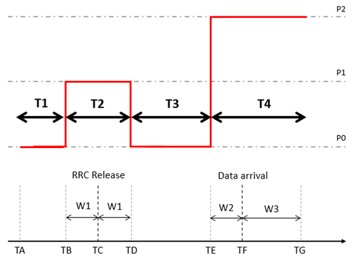
Figure A.7.2.1.1.1-1: RSRP variation for TA validation for CG-SDT Sub-test#1

Figure A.7.2.1.1.1-2: RSRP variation for TA validation for CG-SDT Sub-test#2
##### A.7.2.1.1.2 Test Requirements
The UE behaviour in each test during time durations shall be as follows:
During Sub-test#1, UE shall transmit UL data with CG-SDT within 1060 ms after time point TF.
During Sub-test#2, after passing Sub-test#1, UE shall not transmit UL data with CG-SDT.
The rate of correct events observed during repeated tests shall be at least 90 %.

### A.7.2.2 Cell reselection for positioning
#### A.7.2.2.1 Cell reselection to FR2 intra-frequency NR case with RRC_ INACTIVE eDRX and positioning SRS
##### A.7.2.2.1.1 Test Purpose and Environment
This test is to verify the requirement for the intra-frequency NR cell reselection requirements specified in clause 5.6.1A.2, when UE is in RRC_INACTIVE and configured with eDRX and to transmit SRS for positioning.
##### A.7.2.2.1.2 Test Parameters
The test scenario comprises of 1 NR carrier and 2 cells as given in tables A.7.2.2.1.2-1, A.7.2.2.1.2-2 and A.7.2.2.1.2-3. The test consists of two successive time periods, with time duration of T1 and T2 respectively. Only cell 1 is already identified by the UE prior to the start of the test. Cell 1 and cell 2 belong to different tracking areas. Furthermore, UE has not registered with network for the tracking area containing cell 2. UE is configured with transmit SRS for positioning in cell 1.
Table A.7.2.2.1.2-1: Supported test configurations
| Configuration | Description |
| --- | --- |
| 1 | 120 kHz SSB SCS, 100 MHz bandwidth, TDD duplex mode |
| 2 | 240 kHz SSB SCS, 100 MHz bandwidth, TDD duplex mode |
| Note: The UE is only required to be tested in one of the supported test configurations. |  |

Table A.7.2.2.1.2-2: General test parameters for intra frequency NR cell re-selection test case
| Parameter | Unit | Test configuration | Value | Comment |  |
| --- | --- | --- | --- | --- | --- |
| Initial condition | Active cell |  | 1, 2 | Cell1 |  |
| T2 end condition | Active cell |  | 1, 2 | Cell2 |  |
|  | Neighbour cell |  | 1, 2 | Cell1 |  |
| RF Channel Number |  | 1, 2 | 1 |  |  |
| Time offset between cells |  | 1, 2 | 3 s | Synchronous cells |  |
| Access Barring Information | - | 1, 2 | Not Sent | No additional delays in random access procedure. |  |
| SMTC configuration |  | 1, 2 | SMTC.1 |  |  |
| DRX cycle length | s | 1, 2 | 1.28 | The value shall be used for all cells in the test. |  |
| CN and RAN eDRX configuration |  | Config 1 | eDRX cycle = 40.96s PTW length = 1.28s |  |  |
| PRACH configuration index |  | 1, 2 | 190 | The detailed configuration is specified in TS 38.211 [6] clause 6.3.3.2 |  |
| rangeToBestCell |  | 1, 2 | Not configured |  |  |
| T1 | s | 1, 2 | >7 | During T1, Cell 2 shall be powered off, and during the off time the physical cell identity shall be changed, The intention is to ensure that Cell 2 has not been detected by the UE prior to the start of period T2 |  |
| T2 | s | 1, 2 | 355 | T2 needs to be defined so that cell re-selection reaction time is taken into account. |  |

Table A.7.2.2.1.2-3: Cell specific test parameters for intra frequency NR cell re-selection test case in AWGN
| Parameter | Unit | Test configuration | Cell 1 | Cell 2 |  |  |  |  |
| --- | --- | --- | --- | --- | --- | --- | --- | --- |
|  |  |  | T1 | T2 | T3 | T1 | T2 | T3 |
| TDD configuration |  | 1, 2 | TDDConf.3.1 | TDDConf.3.1 |  |  |  |  |
| PDSCH RMC |  | 1 | SR.3.1 TDD | SR.3.1 TDD |  |  |  |  |
| configuration |  | 2 | SR.3.1 TDD | SR.3.1 TDD |  |  |  |  |
| RMSI CORESET |  | 1 | CR.3.1 TDD | CR.3.1 TDD |  |  |  |  |
| RMC configuration |  | 2 | CR.3.1 TDD | CR.3.1 TDD |  |  |  |  |
| Dedicated CORESET |  | 1 | CCR.3.1 TDD | CCR.3.1 TDD |  |  |  |  |
| RMC configuration |  | 2 | CCR.3.1 TDD | CCR.3.1 TDD |  |  |  |  |
| SSB configuration |  | 1 | SSB.3 FR2 | SSB.7 FR2 |  |  |  |  |
|  |  | 2 | SSB.4 FR2 | SSB.8 FR2 |  |  |  |  |
| OCNG Pattern |  | 1, 2 | OP.4 | OP.4 |  |  |  |  |
| BWchannel | MHz | 1, 2 | 100: NRB,c = 66 | 100: NRB,c = 66 |  |  |  |  |
| Data PRBs allocated |  | 1, 2 | 66 | 66 |  |  |  |  |
| Initial DL BWP configuration |  | 1, 2 | DLBWP.0.1 | DLBWP.0.1 |  |  |  |  |
| Initial UL BWP configuration |  | 1, 2 | ULBWP.0.1 | ULBWP.0.1 |  |  |  |  |
| RLM-RS |  | 1, 2 | SSB | SSB |  |  |  |  |
| Periodicity of SRS for positioning | s | 1, 2 | 5.12 | N/A |  |  |  |  |
| Qrxlevmin | dBm/SCS | 1 | -138 | -138 |  |  |  |  |
|  |  | 2 | -135 | -135 |  |  |  |  |
| Pcompensation | dB | 1, 2 | 0 | 0 |  |  |  |  |
| Qhysts | dB | 1, 2 | 0 | 0 |  |  |  |  |
| Qoffsets, n | dB | 1, 2 | 0 | 0 |  |  |  |  |
| Cell_selection_and_ reselection_quality_measurement |  | 1, 2 | SS-RSRP | SS-RSRP |  |  |  |  |
| AoA setup |  | 1, 2 | Setup 1 defined in A.3.15.1 | Setup 1 defined in A.3.15.1 |  |  |  |  |
| Beam assumptionNote 4 |  | 1,2 | Rough | Rough |  |  |  |  |
| $\hat{E}_{s}/I_{ot BB}$ Note 5 | dB | 1 | 7.45 | -3.55 | 0.95 | -infinity | 0.95 | -3.55 |
|  |  | 2 |  |  |  |  |  |  |
|  Note2 | dBm/SCS | 1 | -93 |  |  |  |  |  |
|  |  | 2 | -90 |  |  |  |  |  |
|  Note2 | dBm/15 kHz | 1 | -102 |  |  |  |  |  |
|  |  | 2 |  |  |  |  |  |  |
|  | dB | 1 | 8 | -3 | 1.5 | -infinity | 1.5 | -3 |
|  |  | 2 |  |  |  |  |  |  |
| SS-RSRP Note3 | dBm/SCS | 1 | -85 | -96 | -91.5 | -infinity | -91.5 | -96 |
|  |  | 2 | -82 | -93 | -88.5 | -infinity | -88.5 | -93 |
| Io on SSB symbols of each cell | dBm/95.04 MHz | 1 | -60.53 | -67.40 | -65.34 | -69.17 | -65.34 | -67.40 |
|  |  | 2 | -57.52 | -64.39 | -62.33 | -66.16 | -62.33 | -64.39 |
| Treselection | s | 1, 2 | 0 | 0 | 0 | 0 | 0 | 0 |
| SintrasearchP | dB | 1, 2 | 50 | 50 |  |  |  |  |
| Propagation Condition |  | 1, 2 | AWGN |  |  |  |  |  |
| NOTE 1: OCNG shall be used such that both cells are fully allocated and a constant total transmitted power spectral density is achieved for all OFDM symbols. NOTE 2: Interference from other cells and noise sources not specified in the test is assumed to be constant over subcarriers and time and shall be modelled as AWGN of appropriate power for  to be fulfilled. NOTE 3: SS-RSRP levels have been derived from other parameters for information purposes. They are not settable parameters themselves. NOTE 4: Information about types of UE beam is given in clause B.2.1.3, and does not limit UE implementation or test system implementation NOTE 5: Calculation of Es/IotBB includes the effect of UE internal noise up to the value assumed for the associated Refsens requirement in clause 7.3.2 of TS 38.101-2 [19], and an allowance of 1dB for UE multi-band relaxation factor ΔMBP from TS 38.101-2 [19] table 6.2.1.3-4. |  |  |  |  |  |  |  |  |

##### A.7.2.2.1.3 Test Requirements
The cell reselection delay to a newly detectable cell is defined as the time from the beginning of time period T2, to the moment when the UE camps on Cell 2, and starts to send preambles on the PRACH for sending the RRCSetupRequest message to perform a Registration procedure for mobility and periodic registration updateon Cell 2.
The cell re-selection delay to a newly detectable cell shall be less than 355 s.
The rate of correct cell reselections observed during repeated tests shall be at least 90%.
NOTE: The cell re-selection delay to a newly detectable cell can be expressed as: Tdetect, NR_Intra + TSI-NR,
Where:
Tdetect, NR_Intra See table 5.6.1A.2-2 in clause 5.6.1A.2
TSI-NR Maximum repetition period of relevant system info blocks that needs to be received by the UE to camp on a cell; 1280 ms is assumed in this test case.
This gives a total of 354.56 s, allow 355 s for the cell re-selection delay to a newly detectable cell.

## A.7.3 RRC_CONNECTED state mobility
### A.7.3.1 Handover
#### A.7.3.1.1 Inter-frequency handover from FR1 to FR2; unknown target cell
##### A.7.3.1.1.1 Test Purpose and Environment
This test is to verify the requirement for the NR FR1-NR FR2 inter frequency handover requirements specified in clause 6.1.1.5.
##### A.7.3.1.1.2 Test Parameters
Supported test configurations are shown in table A.7.3.1.2.2-1. Both handover delay and interruption length are tested by using the parameters in table A.7.3.1.1.2-2, and A.7.3.1.1.2-3.
The test scenario comprises of two carriers and one cell on each carrier. No gap patterns are configured in the test case. The test consists of two successive time periods, with time durations of T1, T2 respectively. At the start of time duration T1, the UE does not have any timing information of cell 2. Starting T2, cell 2 becomes detectable and the UE receives a RRC handover command from the network. The start of T2 is the instant when the last TTI containing the RRC message implying handover is sent to the UE.
Table A.7.3.1.1.2-1: Inter-frequency handover from FR1 to FR2 test configurations
| Config | Description |
| --- | --- |
| 1 | Source cell: NR 15 kHz SSB SCS, 10 MHz bandwidth, FDD duplex mode Target cell: NR 120 kHz SSB SCS, 100 MHz bandwidth, TDD duplex mode |
| 2 | Source cell: NR 15 kHz SSB SCS, 10 MHz bandwidth, TDD duplex mode Target cell: NR 120 kHz SSB SCS, 100 MHz bandwidth, TDD duplex mode |
| 3 | Source cell: NR 30 kHz SSB SCS, 40 MHz bandwidth, TDD duplex mode Target cell: NR 120 kHz SSB SCS, 100 MHz bandwidth, TDD duplex mode |
| NOTE: The UE is only required to be tested in one of the supported test configurations |  |

Table A.7.3.1.1.2-2: General test parameters Inter-frequency handover from FR1 to FR2
| Parameter | Unit | Value | Comment |  |
| --- | --- | --- | --- | --- |
| Initial conditions | Active cell |  | Cell 1 |  |
|  | Neighbouring cell |  | Cell 2 |  |
| Final condition | Active cell |  | Cell 2 |  |
| Access Barring Information | - | Not Sent | No additional delays in random access procedure. |  |
| Time offset between cells |  | 3 s | Synchronous cells |  |
| T1 | s | 5 |  |  |
| T2 | s | 10 |  |  |

Table A.7.3.1.1.2-3: Cell specific test parameters for NR FR1-FR2 Inter frequency handover test case
| Parameter | Unit | Cell 1 | Cell 2 |  |  |
| --- | --- | --- | --- | --- | --- |
|  |  | T1 | T2 | T1 | T2 |
| Assumption for UE beamsNote 6 |  | N/A | Rough |  |  |
| AoA setup |  | NA | Setup 1 as defined in A.3.15 |  |  |
| NR RF Channel Number |  | 1 | 2 |  |  |
| Duplex mode | Config 1 |  | FDD | TDD |  |
|  | Config 2,3 |  | TDD | TDD |  |
| TDD configuration | Config 1 |  | Not Applicable | TDDConf.3.1 |  |
|  | Config 2 |  | TDDConf.1.1 | TDDConf.3.1 |  |
|  | Config 3 |  | TDDConf.2.1 | TDDConf.3.1 |  |
| BWchannel | Config 1 | MHz | 10: NPRB,c = 52 | 100: NPRB,c = 66 |  |
|  | Config 2 |  | 10: NPRB,c = 52 | 100: NPRB,c = 66 |  |
|  | Config 3 |  | 40: NPRB,c = 106 | 100: NPRB,c = 66 |  |
| BWP BW | Config 1 | MHz | 10: NPRB,c = 52 | 100: NPRB,c = 66 |  |
|  | Config 2 |  | 10: NPRB,c = 52 | 100: NPRB,c = 66 |  |
|  | Config 3 |  | 40: NPRB,c = 106 | 100: NPRB,c = 66 |  |
| Data PRBs allocated | Config 1 |  | 52 | 66 |  |
|  | Config 2 |  | 52 | 66 |  |
|  | Config 3 |  | 106 | 66 |  |
| DRX Cycle | ms | Not Applicable |  |  |  |
| PDSCH Reference measurement channel | Config 1 |  | SR.1.1 FDD | SR3.1 TDD |  |
|  | Config 2 |  | SR.1.1 TDD | SR3.1 TDD |  |
|  | Config 3 |  | SR2.1 TDD | SR3.1 TDD |  |
| RMSI CORESET Reference Channel | Config 1 |  | CR.1.1 FDD | CR3.1 TDD |  |
|  | Config 2 |  | CR.1.1 TDD | CR3.1 TDD |  |
|  | Config 3 |  | CR2.1 TDD | CR3.1 TDD |  |
| Control Channel RMC | Config 1 |  | CCR.1.1 FDD | CCR.3.1 TDD |  |
|  | Config 2 |  | CCR.1.1 TDD | CCR.3.1 TDD |  |
|  | Config 3 |  | CCR.2.1 TDD | CCR.3.1 TDD |  |
| OCNG Patterns |  | OP 1 |  |  |  |
| SSB configuration | Config 1,2 |  | SSB.1 FR1 | SSB. 3 FR2 |  |
|  | Config 3 |  | SSB.2 FR1 | SSB. 3 FR2 |  |
| SMTC configuration | Config 1,2 |  | SMTC.1 | SMTC.1 |  |
|  | Config 3 |  | SMTC.2 | SMTC.1 |  |
| SMTC configuration | Config 1,2 |  | SMTC.1 | SMTC.1 |  |
|  | Config 3 |  | SMTC.2 | SMTC.1 |  |
| PDSCH/PDCCH subcarrier spacing | Config 1,2 | kHz | 15 kHz | 120 kHz |  |
|  | Config 3 |  | 30 kHz | 120 kHz |  |
| PUCCH/PUSCH subcarrier spacing | Config 1,2 | kHz | 15 kHz | 120 kHz |  |
|  | Config 3 |  | 30 kHz | 120 kHz |  |
| PRACH configuration |  | FR1 PRACH configuration 1 | FR2 PRACH configuration 1 |  |  |
| TRS configuration | Config 1 |  | TRS.1.1 FDD | TRS.2.1 TDD |  |
|  | Config 2 |  | TRS.1.1 TDD | TRS.2.1 TDD |  |
|  | Config 3 |  | TRS.1.2 TDD | TRS.2.1 TDD |  |
| PDSCH/PDCCH TCI state |  | N/A | TCI.State.2 |  |  |
| BWP configuraiton | Initial DL BWP |  | DLBWP.0.1 | DLBWP.0.1 |  |
|  | Dedicated DL BWP |  | DLBWP.1.1 | DLBWP.1.1 |  |
|  | Initial UL BWP |  | ULBWP.0.1 | ULBWP.0.1 |  |
|  | Dedicated UL BWP |  | ULBWP.1.1 | ULBWP.1.1 |  |
| EPRE ratio of PSS to SSS | dB | 0 | 0 |  |  |
| EPRE ratio of PBCH DMRS to SSS |  |  |  |  |  |
| EPRE ratio of PBCH to PBCH DMRS |  |  |  |  |  |
| EPRE ratio of PDCCH DMRS to SSS |  |  |  |  |  |
| EPRE ratio of PDCCH to PDCCH DMRS |  |  |  |  |  |
| EPRE ratio of PDSCH DMRS to SSS |  |  |  |  |  |
| EPRE ratio of PDSCH to PDSCH |  |  |  |  |  |
| EPRE ratio of OCNG DMRS to SSS(Note 1) |  |  |  |  |  |
| EPRE ratio of OCNG to OCNG DMRS (Note 1) |  |  |  |  |  |
| Note2 | dBm/15 kHz | Link only, see clause A.3.7A | -104.7 |  |  |
| Note2 | Config 1,2 | dBm/SCS |  | -95.7 |  |
|  | Config 3 |  |  | -95.7 |  |
|  | dB |  | -Infinity | 10 |  |
|  | dB |  | -Infinity | 10 |  |
| IoNote3 | Config 1,2 | dBm/ BW |  | -66.7 | -56.3 |
|  | Config 3 | dBm/ BW |  | -66.7 | -56.3 |
| Propagation condition | - |  | AWGN |  |  |
| NOTE 1: OCNG shall be used such that both cells are fully allocated and a constant total transmitted power spectral density is achieved for all OFDM symbols. NOTE 2: Interference from other cells and noise sources not specified in the test is assumed to be constant over subcarriers and time and shall be modelled as AWGN of appropriate power for  to be fulfilled. NOTE 3: Io levels have been derived from other parameters for information purposes. They are not settable parameters themselves. NOTE 4: Equivalent power received by an antenna with 0 dBi gain at the centre of the quiet zone NOTE 5: As observed with 0 dBi gain antenna at the centre of the quiet zone NOTE 6: Information about types of UE beam is given in clause B.2.1.3, and does not limit UE implementation or test system implementation |  |  |  |  |  |

##### A.7.3.1.1.3 Test Requirements
The UE shall start to transmit the PRACH to Cell 2 less than 572 ms from the beginning of time period T2.
The rate of correct handovers observed during repeated tests shall be at least 90 %.
NOTE: The handover delay can be expressed as: RRC procedure delay + Tinterrupt, where:
RRC procedure delay = 10 ms and is specified in clause 12 in TS 38.331 [2].
Tinterrupt = 562 ms in the test. Tinterrupt is defined in clause 6.1.1.5.2.
This gives a total of 572 ms.
#### A.7.3.1.2 Intra-frequency handover from FR2 to FR2; unknown target cell
##### A.7.3.1.2.1 Test Purpose and Environment
This test is to verify the requirement for the NR FR2-NR FR2 intra frequency handover requirements specified in clause 6.1.1.4.
##### A.7.3.1.2.2 Test Parameters
Supported test configurations are shown in table A.7.3.1.2.2-1. Both handover delay and interruption length are tested by using the parameters in table A.7.3.1.2.2-2, and A.7.3.1.2.2-3.
The test scenario comprises of two cells on same carrier. No gap patterns are configured in the test case. The test consists of two successive time periods, with time durations of T1, T2 respectively. At the start of time duration T1, the UE does not have any timing information of cell 2. Starting T2, cell 2 becomes detectable and the UE receives a RRC handover command from the network. The start of T2 is the instant when the last TTI containing the RRC message implying handover is sent to the UE.
Table A.7.3.1.2.2-1: Intra-frequency handover from FR2 to FR2 test configurations
| Config | Description |
| --- | --- |
| 1 | Source cell: NR 120 kHz SSB SCS, 100 MHz bandwidth, TDD duplex mode Target cell: NR 120 kHz SSB SCS, 100 MHz bandwidth, TDD duplex mode |

Table A.7.3.1.2.2-2: General test parameters Intra-frequency handover from FR2 to FR2
| Parameter | Unit | Value | Comment |  |
| --- | --- | --- | --- | --- |
| Initial conditions | Active cell |  | Cell 1 |  |
|  | Neighbouring cell |  | Cell 2 |  |
| Final condition | Active cell |  | Cell 2 |  |
| Access Barring Information | - | Not Sent | No additional delays in random access procedure. |  |
| Time offset between cells |  | 3 s | Synchronous cells |  |
| T1 | s | 5 |  |  |
| T2 | s | 10 |  |  |

Table A.7.3.1.2.2-3: Cell specific test parameters for NR FR2-FR2 Intra frequency handover test case
| Parameter | Unit | Cell 1 | Cell 2 |  |  |  |
| --- | --- | --- | --- | --- | --- | --- |
|  |  | T1 | T2 | T1 | T2 |  |
| Assumption for UE beamsNote 6 |  | Rough | Rough |  |  |  |
| AoA setup |  | Setup 1 as defined in A.3.15 |  |  |  |  |
| NR RF Channel Number |  | 1 | 1 |  |  |  |
| Duplex mode |  | TDD |  |  |  |  |
| TDD configuration |  | TDDConf.3.1 |  |  |  |  |
| BWchannel | MHz | 100: NPRB,c = 66 |  |  |  |  |
| BWP BW | MHz | 100: NPRB,c = 66 |  |  |  |  |
| Data PRBs allocated |  | 66 |  |  |  |  |
| DRX Cycle | ms | Not Applicable |  |  |  |  |
| PDSCH Reference measurement channel |  | SR3.1 TDD |  |  |  |  |
| RMSI CORESET Reference Channel |  | CR3.1 TDD |  |  |  |  |
| Control Channel RMC |  | CCR.3.1 TDD |  |  |  |  |
| OCNG Patterns |  | OP.1 |  |  |  |  |
| SMTC Configuration |  | SMTC pattern 1 |  |  |  |  |
| SSB Configuration |  | SSB. 3 FR2 |  |  |  |  |
| PDSCH/PDCCH subcarrier spacing | kHz | 120 kHz |  |  |  |  |
| PUCCH/PUSCH subcarrier spacing | kHz | 120 kHz |  |  |  |  |
| PRACH configuration |  | FR2 PRACH configuration 1 |  |  |  |  |
| TRS configuration |  | TRS.2.1 TDD |  |  |  |  |
| PDSCH/PDCCH TCI state |  | TCI.State.2 |  |  |  |  |
| BWP configuraiton | Initial DL BWP |  | DLBWP.0.1 |  |  |  |
|  | Dedicated DL BWP |  | DLBWP.1.1 |  |  |  |
|  | Initial UL BWP |  | ULBWP.0.1 |  |  |  |
|  | Dedicated UL BWP |  | ULBWP.1.1 |  |  |  |
| EPRE ratio of PSS to SSS | dB | 0 | 0 |  |  |  |
| EPRE ratio of PBCH DMRS to SSS |  |  |  |  |  |  |
| EPRE ratio of PBCH to PBCH DMRS |  |  |  |  |  |  |
| EPRE ratio of PDCCH DMRS to SSS |  |  |  |  |  |  |
| EPRE ratio of PDCCH to PDCCH DMRS |  |  |  |  |  |  |
| EPRE ratio of PDSCH DMRS to SSS |  |  |  |  |  |  |
| EPRE ratio of PDSCH to PDSCH |  |  |  |  |  |  |
| EPRE ratio of OCNG DMRS to SSS(Note 1) |  |  |  |  |  |  |
| EPRE ratio of OCNG to OCNG DMRS (Note 1) |  |  |  |  |  |  |
| Note2 | dBm/15 kHz | -104.7 |  |  |  |  |
| Note2 |  | dBm/SCS | -95.7 |  |  |  |
|  | dB | 6 | -1.8 | -Infinity | 0 |  |
|  | dB | 6 | 6 | -Infinity | 7 |  |
| IoNote3 |  | dBm/ BW | -59.7 | -56.7 | -59.7 | -56.7 |
| Propagation condition | - | AWGN | AWGN |  |  |  |
| NOTE 1: OCNG shall be used such that both cells are fully allocated and a constant total transmitted power spectral density is achieved for all OFDM symbols. NOTE 2: Interference from other cells and noise sources not specified in the test is assumed to be constant over subcarriers and time and shall be modelled as AWGN of appropriate power for  to be fulfilled. NOTE 3: Io levels have been derived from other parameters for information purposes. They are not settable parameters themselves. NOTE 4: Equivalent power received by an antenna with 0 dBi gain at the centre of the quiet zone NOTE 5: As observed with 0 dBi gain antenna at the centre of the quiet zone NOTE 6: Information about types of UE beam is given in clause B.2.1.3, and does not limit UE implementation or test system implementation |  |  |  |  |  |  |

##### A.7.3.1.2.3 Test Requirements
The UE shall start to transmit the PRACH to Cell 2 less than 232  ms from the beginning of time period T2.
The rate of correct handovers observed during repeated tests shall be at least 90 %.
NOTE: The handover delay can be expressed as: RRC procedure delay + Tinterrupt, where:
RRC procedure delay = 10 ms and is specified in clause 12 in TS 38.331 [2].
Tinterrupt = 222 ms in the test. Tinterrupt is defined in clause 6.1.1.4.2.
This gives a total of 232 ms.
#### A.7.3.1.3 Inter-frequency handover from FR2 to FR2; unknown target cell
##### A.7.3.1.3.1 Test Purpose and Environment
This test is to verify the requirement for the NR FR2-NR FR2 inter frequency handover requirements specified in clause 6.1.1.4.
##### A.7.3.1.3.2 Test Parameters
Supported test configurations are shown in table A.7.3.1.3.2-1. Both handover delay and interruption length are tested by using the parameters in table A.7.3.1.3.2-2, and A.7.3.1.3.2-3.
The test scenario comprises of carriers and one cell on each carrier. No gap patterns are configured in the test case. The test consists of two successive time periods, with time durations of T1, T2 respectively. At the start of time duration T1, the UE does not have any timing information of cell 2. Starting T2, cell 2 becomes detectable and the UE receives a RRC handover command from the network. The start of T2 is the instant when the last TTI containing the RRC message implying handover is sent to the UE.
Table A.7.3.1.3.2-1: Inter-frequency handover from FR2 to FR2 test configurations
| Config | Description |
| --- | --- |
| 1 | Source cell: NR 120 kHz SSB SCS, 100 MHz bandwidth, TDD duplex mode Target cell: NR 120 kHz SSB SCS, 100 MHz bandwidth, TDD duplex mode |

Table A.7.3.1.3.2-2: General test parameters Inter-frequency handover from FR2 to FR2
| Parameter | Unit | Value | Comment |  |
| --- | --- | --- | --- | --- |
| Initial conditions | Active cell |  | Cell 1 |  |
|  | Neighbouring cell |  | Cell 2 |  |
| Final condition | Active cell |  | Cell 2 |  |
| Access Barring Information | - | Not Sent | No additional delays in random access procedure. |  |
| Time offset between cells |  | 3 s | Synchronous cells |  |
| T1 | s | 5 |  |  |
| T2 | s | 10 |  |  |

Table A.7.3.1.3.2-3: Cell specific test parameters for NR FR2-FR2 Inter frequency handover test case
| Parameter | Unit | Cell 1 | Cell 2 |  |  |  |
| --- | --- | --- | --- | --- | --- | --- |
|  |  | T1 | T2 | T1 | T2 |  |
| Assumption for UE beamsNote 6 |  | Rough | Rough |  |  |  |
| AoA setup |  | Setup 1as defined in A.3.15 |  |  |  |  |
| NR RF Channel Number |  | 1 | 2 |  |  |  |
| Duplex mode |  | TDD |  |  |  |  |
| TDD configuration |  | TDDConf.3.1 |  |  |  |  |
| BWchannel | MHz | 100: NPRB,c = 66 |  |  |  |  |
| BWP BW | MHz | 100: NPRB,c = 66 |  |  |  |  |
| Data PRBs allocated |  | 66 |  |  |  |  |
| DRX Cycle | ms | Not Applicable |  |  |  |  |
| PDSCH Reference measurement channel |  | SR3.1 TDD |  |  |  |  |
| RMSI CORESET Reference Channel |  | CR3.1 TDD |  |  |  |  |
| Control Channel RMC |  | CCR.3.1 TDD |  |  |  |  |
| OCNG Patterns |  | OP.1 |  |  |  |  |
| SMTC Configuration |  | SMTC pattern 1 |  |  |  |  |
| SSB Configuration |  | SSB. 3 FR2 |  |  |  |  |
| PDSCH/PDCCH subcarrier spacing | kHz | 120 kHz |  |  |  |  |
| PUCCH/PUSCH subcarrier spacing | kHz | 120 kHz |  |  |  |  |
| PRACH configuration |  | FR2 PRACH configuration 1 |  |  |  |  |
| TRS configuration |  | TRS.2.1 TDD |  |  |  |  |
| PDSCH/PDCCH TCI state |  | TCI.State.2 |  |  |  |  |
| BWP configuraiton | Initial DL BWP |  | DLBWP.0.1 |  |  |  |
|  | Dedicated DL BWP |  | DLBWP.1.1 |  |  |  |
|  | Initial UL BWP |  | ULBWP.0.1 |  |  |  |
|  | Dedicated UL BWP |  | ULBWP.1.1 |  |  |  |
| EPRE ratio of PSS to SSS | dB | 0 | 0 |  |  |  |
| EPRE ratio of PBCH DMRS to SSS |  |  |  |  |  |  |
| EPRE ratio of PBCH to PBCH DMRS |  |  |  |  |  |  |
| EPRE ratio of PDCCH DMRS to SSS |  |  |  |  |  |  |
| EPRE ratio of PDCCH to PDCCH DMRS |  |  |  |  |  |  |
| EPRE ratio of PDSCH DMRS to SSS |  |  |  |  |  |  |
| EPRE ratio of PDSCH to PDSCH |  |  |  |  |  |  |
| EPRE ratio of OCNG DMRS to SSS(Note 1) |  |  |  |  |  |  |
| EPRE ratio of OCNG to OCNG DMRS (Note 1) |  |  |  |  |  |  |
| Note2 | dBm/15 kHz | -104.7 | -104.7 |  |  |  |
| Note2 |  | dBm/SCS | -95.7 | -95.7 |  |  |
|  | dB | 5 | 5 | -Infinity | 5 |  |
|  | dB | 5 | 5 | -Infinity | 5 |  |
| IoNote3 | Config 1,2 | dBm/ BW | -60.5 | -60.5 | -66.7 | -60.5 |
| Propagation condition | - | AWGN | AWGN |  |  |  |
| NOTE 1: OCNG shall be used such that both cells are fully allocated and a constant total transmitted power spectral density is achieved for all OFDM symbols. NOTE 2: Interference from other cells and noise sources not specified in the test is assumed to be constant over subcarriers and time and shall be modelled as AWGN of appropriate power for  to be fulfilled. NOTE 3: Io levels have been derived from other parameters for information purposes. They are not settable parameters themselves. NOTE 4: Equivalent power received by an antenna with 0 dBi gain at the centre of the quiet zone NOTE 5: As observed with 0 dBi gain antenna at the centre of the quiet zone NOTE 6: Information about types of UE beam is given in clause B.2.1.3, and does not limit UE implementation or test system implementation |  |  |  |  |  |  |

##### A.7.3.1.3.3 Test Requirements
The UE shall start to transmit the PRACH to Cell 2 less than 552 ms from the beginning of time period T2.
The rate of correct handovers observed during repeated tests shall be at least 90 %.
NOTE: The handover delay can be expressed as: RRC procedure delay + Tinterrupt, where:
RRC procedure delay = 10 ms and is specified in clause 12 in TS 38.331 [2].
Tinterrupt = 542 ms in the test. Tinterrupt is defined in clause 6.1.1.4.2.
This gives a total of 552 ms.
#### A.7.3.1.4 Inter-band inter-frequency synchronous DAPS handover from FR1 to FR2
##### A.7.3.1.4.1 Test Purpose and Environment
This test is to verify the requirement for the FR1-to-FR2 Inter-band inter-frequency synchronous DAPS handover requirements specified in clause 6.1.3.4.
##### A.7.3.1.4.2 Test Parameters
Supported test configurations are shown in table A.7.3.1.4.2-1. Both handover delay and interruption length are tested by using the parameters in table A.7.3.1.4.2-2, A.7.3.1.4.2-3 and A.7.3.1.4.2-4.
The test scenario comprises of two bands each with one cell. The test consists of five successive time periods, with time durations of T1, T2, T3, T4 and T5 respectively.
Before the start of T1, the UE is connected to Cell 1 (source PCell) on radio channel 1 but is not aware of Cell 2 (neighbour cell) on radio channel 2. The UE shall be configured with periodic CSI reporting for Cell 1. During T1, the UE shall not have any timing information of Cell 2.
Before the start of T2, the UE in the measurement control information that event-triggered reporting with Event A4 is configured for neighbour cell (Cell 2), and the UE is configured with the measurement gaps (gap pattern ID # 0). Starting T2, Cell 2 becomes known to the UE. During T2, the UE shall report Event A4. After receiving the Event A4, the test system shall send a RRC message implying DAPS handover to the UE.
The start of T3 is the instant when the test system receives the ACK of the PDSCH corresponding to the last TTI containing the RRC message implying DAPS handover to Cell 2 (target PCell) sent to the UE. During T3, the UE shall be able to perform random access to Cell 2. DL schedule and UL feedback to cell 1 shall be avoided when UE is required to perform DL reception or UL transmission in PRACH procedure in cell 2, except preamble transmission. After the RACH procedure is completed, the test system shall send a RRC message to the UE to release Cell 1 (source cell) on radio channel 1.
The start of T4 is the instant when the test system receives the ACK of the PDSCH corresponding to the last TTI containing the RRC message implying source cell release sent to the UE. During T4, the UE shall perform source cell release.
Starting T5, the UE shall stop sending CSI report to the source cell.
Table A.7.3.1.4.2-1: Inter-band inter-frequency synchronous DAPS handover from FR1 to FR2 test configurations
| Config | Description |
| --- | --- |
| 1 | Source cell: NR 15 kHz SSB SCS, 10 MHz bandwidth, FDD duplex mode Target cell: NR 120 kHz SSB SCS, 100 MHz bandwidth, TDD duplex mode |
| 2 | Source cell: NR 15 kHz SSB SCS, 10 MHz bandwidth, TDD duplex mode Target cell: NR 120 kHz SSB SCS, 100 MHz bandwidth, TDD duplex mode |
| 3 | Source cell: NR 30 kHz SSB SCS, 40 MHz bandwidth, TDD duplex mode Target cell: NR 120 kHz SSB SCS, 100 MHz bandwidth, TDD duplex mode |
| NOTE: The UE is only required to be tested in one of the supported test configurations |  |

Table A.7.3.1.4.2-2: General test parameters for Inter-band inter-frequency synchronous DAPS handover from FR1 to FR2
| Parameter | Unit | Value | Comment |  |
| --- | --- | --- | --- | --- |
| Initial conditions | Active cell |  | Cell 1 |  |
|  | Neighbouring cell |  | Cell 2 |  |
| Final condition | Active cell |  | Cell 2 |  |
| A4-Threshold | dBm | -120 |  |  |
| Hysteresis | dB | 0 |  |  |
| Time To Trigger | s | 0 |  |  |
| Filter coefficient |  | 0 | L3 filtering is not used |  |
| Access Barring Information | - | Not Sent | No additional delays in random access procedure. |  |
| Time offset between cells | s | 33 | Synchronous cells |  |
| T1 | s | 5 |  |  |
| T2 | s | <5 |  |  |
| T3 | s | <0.5 |  |  |
| T4 | ms | 10+Tinterrupt2 | Tinterrupt2 as defined in table 6.1.3.4.2-2 for synchronous DAPS HO |  |
| T5 | ms | 100 |  |  |

Table A.7.3.1.4.2-3: Cell specific test parameters for Inter-band inter-frequency synchronous DAPS handover from FR1 to FR2 (Cell 1 in FR1)
| Parameter | Unit | Cell 1 |  |
| --- | --- | --- | --- |
|  |  | T1 | T2 - T5 |
| NR RF Channel Number |  | 1 |  |
| Duplex mode | Config 1 |  | FDD |
|  | Config 2,3 |  | TDD |
| TDD configuration | Config 1 |  | Not Applicable |
|  | Config 2 |  | TDDConf.1.1 |
|  | Config 3 |  | TDDConf.2.1 |
| BWchannel | Config 1 | MHz | 10: NPRB,c = 52 |
|  | Config 2 |  | 10: NPRB,c = 52 |
|  | Config 3 |  | 40: NPRB,c = 106 |
| BWP BW | Config 1 | MHz | 10: NPRB,c = 52 |
|  | Config 2 |  | 10: NPRB,c = 52 |
|  | Config 3 |  | 40: NPRB,c = 106 |
| TRS configuration | Config 1 |  | TRS.1.1 FDD |
|  | Config 2 |  | TRS.1.1 TDD |
|  | Config 3 |  | TRS.1.2 TDD |
| DRX Cycle | ms | Not Applicable |  |
| PDSCH Reference measurement channel | Config 1 |  | SR.1.1 FDD |
|  | Config 2 |  | SR.1.1 TDD |
|  | Config 3 |  | SR.2.1 TDD |
| CORESET Reference Channel | Config 1 |  | CR.1.1 FDD |
|  | Config 2 |  | CR.1.1 TDD |
|  | Config 3 |  | CR.2.1 TDD |
| OCNG Patterns |  | OP.1 |  |
| CSI-RS configuration for CSI reporting | Config 1 |  | CSI-RS.1.1 FDD |
|  | Config 2 |  | CSI-RS.1.1 TDD |
|  | Config 3 |  | CSI-RS.2.1 TDD |
| reportConfigType |  | periodic |  |
| reportQuantity |  | cri-RI-PMI-CQI |  |
| CSI reporting periodicity | Config 1,2 | slot | 5 |
|  | Config 3 |  | 10 |
| CSI reporting offset | Config 1,2 | slot | 3 |
|  | Config 3 |  | 5 |
| SSB Configuration | Config 1,2 |  | SSB.1 FR1 |
|  | Config 3 |  | SSB.2 FR1 |
| SMTC Configuration | Config 1,2 |  | SMTC.1 |
|  | Config 3 |  | SMTC.2 |
| PDSCH/PDCCH subcarrier spacing | Config 1,2 | kHz | 15 kHz |
|  | Config 3 |  | 30 kHz |
| PUCCH/PUSCH subcarrier spacing | Config 1,2 | kHz | 15 kHz |
|  | Config 3 |  | 30 kHz |
| PRACH configuration |  | FR1 PRACH configuration 2 |  |
| BWP | Initial DL BWP |  | DLBWP.0.1 |
|  | Dedicated DL BWP |  | DLBWP.1.3 |
|  | Initial UL BWP |  | ULBWP.0.1 |
|  | Dedicated UL BWP |  | ULBWP.1.3 |
| EPRE ratio of PSS to SSS | dB | 0 |  |
| EPRE ratio of PBCH DMRS to SSS |  |  |  |
| EPRE ratio of PBCH to PBCH DMRS |  |  |  |
| EPRE ratio of PDCCH DMRS to SSS |  |  |  |
| EPRE ratio of PDCCH to PDCCH DMRS |  |  |  |
| EPRE ratio of PDSCH DMRS to SSS |  |  |  |
| EPRE ratio of PDSCH to PDSCH |  |  |  |
| EPRE ratio of OCNG DMRS to SSS(Note 1) |  |  |  |
| EPRE ratio of OCNG to OCNG DMRS (Note 1) |  |  |  |
| Note2 | dBm/15 kHz | NA Link only, see clause A.3.7A |  |
| Note2 | Config 1,2 | dBm/SCS |  |
|  | Config 3 |  |  |
|  | dB |  |  |
|  | dB |  |  |
| IoNote3 | Config 1,2 | dBm/ 9.36 MHz |  |
|  | Config 3 | dBm/ 38.16 MHz |  |
| Propagation condition | - | AWGN |  |
| NOTE 1: OCNG shall be used such that the cell is fully allocated and a constant total transmitted power spectral density is achieved for all OFDM symbols. NOTE 2: Interference from other cells and noise sources not specified in the test is assumed to be constant over subcarriers and time and shall be modelled as AWGN of appropriate power for  to be fulfilled. NOTE 3: Io levels have been derived from other parameters for information purposes. They are not settable parameters themselves. |  |  |  |

Table A.7.3.1.4.2-4: Cell specific test parameters for Inter-band inter-frequency synchronous DAPS handover from FR1 to FR2 (Cell 2 in FR2)
| Parameter | Unit | Cell 2 |  |
| --- | --- | --- | --- |
|  |  | T1 | T2 - T5 |
| Assumption for UE beamsNote 6 |  | Rough |  |
| AoA setup |  | Setup 1 as defined in A.3.15 |  |
| NR RF Channel Number |  | 2 |  |
| Duplex mode | Config 1,2,3 |  | TDD |
| TDD configuration | Config 1,2,3 |  | TDDConf.3.1 |
| BWchannel | Config 1,2,3 | MHz | 100: NPRB,c = 66 |
| BWP BW | Config 1,2,3 | MHz | 100: NPRB,c = 66 |
| TRS configuration | Config 1,2,3 |  | TRS.2.1 TDD |
| DRX Cycle | ms | Not Applicable |  |
| PDSCH Reference measurement channel | Config 1,2,3 |  | SR3.1 TDD |
| CORESET Reference Channel | Config 1,2,3 |  | CR3.1 TDD |
| OCNG Patterns |  | OCNG pattern 1 |  |
| CSI-RS configuration for CSI reporting | Config 1,2,3 |  | CSI-RS.3.1 TDD |
| SSB Configuration | Config 1,2,3 |  | SSB.1 FR2 |
| SMTC Configuration |  | SMTC.1 |  |
| PDSCH/PDCCH subcarrier spacing | Config 1,2,3 | kHz | 120 kHz |
| PUCCH/PUSCH subcarrier spacing | Config 1,2,3 | kHz | 120 kHz |
| PRACH configuration |  | FR2 PRACH configuration 2 |  |
| TCI configuration |  | CSI-RS.Config.0 |  |
| BWP | Initial DL BWP |  | DLBWP.0.1 |
|  | Dedicated DL BWP |  | DLBWP.1.3 |
|  | Initial UL BWP |  | ULBWP.0.1 |
|  | Dedicated UL BWP |  | ULBWP.1.3 |
| EPRE ratio of PSS to SSS | dB | 0 |  |
| EPRE ratio of PBCH DMRS to SSS |  |  |  |
| EPRE ratio of PBCH to PBCH DMRS |  |  |  |
| EPRE ratio of PDCCH DMRS to SSS |  |  |  |
| EPRE ratio of PDCCH to PDCCH DMRS |  |  |  |
| EPRE ratio of PDSCH DMRS to SSS |  |  |  |
| EPRE ratio of PDSCH to PDSCH |  |  |  |
| EPRE ratio of OCNG DMRS to SSS(Note 1) |  |  |  |
| EPRE ratio of OCNG to OCNG DMRS (Note 1) |  |  |  |
| Note2 | dBm/15 kHz | -104.7 | -104.7 |
| Note2 | dBm/SCS | -95.7 | -95.7 |
|  | dB | -Infinity | 10 |
|  | dB | -Infinity | 10 |
| IoNote3 | dBm/ 95.04 MHz | -66.7 | -55.4 |
| Propagation condition | - | AWGN |  |
| NOTE 1: OCNG shall be used such that the cell is fully allocated and a constant total transmitted power spectral density is achieved for all OFDM symbols. NOTE 2: Interference from other cells and noise sources not specified in the test is assumed to be constant over subcarriers and time and shall be modelled as AWGN of appropriate power for  to be fulfilled. NOTE 3: Io levels have been derived from other parameters for information purposes. They are not settable parameters themselves. NOTE 4: Equivalent power received by an antenna with 0 dBi gain at the centre of the quiet zone NOTE 5: As observed with 0 dBi gain antenna at the centre of the quiet zone. NOTE 6: Information about types of UE beam is given in clause B.2.1.3, and does not limit UE implementation or test system implementation. |  |  |  |

##### A.7.3.1.4.3 Test Requirements
The UE shall start to transmit the PRACH to Cell 2 less than 92 ms from the beginning of time period T3. During Dhandover1, the interruption on Cell 1 shall not exceed Tinterrupt1 as defined in table 6.1.3.4.2-1 for synchronous DAPS HO.
The rate of correct handovers observed during repeated tests shall be at least 90 %.
NOTE: The handover delay Dhandover1 can be expressed as: TRRC_procedure + TIU + Tprocessing + T∆ + Tmargin, where:
TRRC_procedure = 10 ms and is specified in clause 12 in TS 38.331 [2].
TIU = 20 ms in the test. TIU is defined in clause 6.1.1.2.2.
T∆ = 20 ms in the test. T∆ is defined in clause 6.1.1.2.2.
Tprocessing = 40 ms in the test. Tprocessing is defined in clause 6.1.1.2.2.
Tmargin = 2 ms in the test. Tmargin is defined in clause 6.1.1.2.2.
This gives a total of 92 ms.
The UE shall complete to release Cell 1 less than (10 ms + Tinterrupt2) from the beginning of time period T4. During Dhandover2, the interruption on Cell 2 shall not exceed Tinterrupt2 as defined in table 6.1.3.4.2-2 for synchronous DAPS HO.
The rate of correct handovers observed during repeated tests shall be at least 90 %.
NOTE: The handover delay Dhandover2 can be expressed as: TRRC_procedure + Tinterrupt2, where:
TRRC_procedure = 10 ms and is specified in clause 12 in TS 38.331 [2].
#### A.7.3.1.5 Inter-band inter-frequency asynchronous DAPS handover from FR1 to FR2
##### A.7.3.1.5.1 Test Purpose and Environment
This test is to verify the requirement for the FR1-to-FR2 Inter-band inter-frequency asynchronous DAPS handover requirements specified in clause 6.1.3.4.
##### A.7.3.1.5.2 Test Parameters
Supported test configurations are shown in table A.7.3.1.5.2-1. Both handover delay and interruption length are tested by using the parameters in table A.7.3.1.5.2-2, A.7.3.1.5.2-3 and A.7.3.1.5.2-4.
The test scenario comprises of two bands each with one cell. The test consists of five successive time periods, with time durations of T1, T2, T3, T4 and T5 respectively.
Before the start of T1, the UE is connected to Cell 1 (source PCell) on radio channel 1 but is not aware of Cell 2 (neighbour cell) on radio channel 2. The UE shall be configured with periodic CSI reporting for Cell 1. During T1, the UE shall not have any timing information of Cell 2.
Before the start of T2, the UE in the measurement control information that event-triggered reporting with Event A4 is configured for neighbour cell (Cell 2), and the UE is configured with the measurement gaps (gap pattern ID # 0). Starting T2, Cell 2 becomes known to the UE. During T2, the UE shall report Event A4. After receiving the Event A4, the test system shall send a RRC message implying DAPS handover to the UE.
The start of T3 is the instant when the test system receives the ACK of the PDSCH corresponding to the last TTI containing the RRC message implying DAPS handover to Cell 2 (target PCell) sent to the UE. During T3, the UE shall be able to perform random access to Cell 2. DL schedule and UL feedback to cell 1 shall be avoided when UE is required to perform DL reception or UL transmission in PRACH procedure in cell 2, except preamble transmission. After the RACH procedure is completed, the test system shall send a RRC message to the UE to release Cell 1 (source cell) on radio channel 1.
The start of T4 is the instant when the the test system receives the ACK of the PDSCH corresponding to last TTI containing the RRC message implying source cell release sent to the UE. During T4, the UE shall perform source cell release.
Starting T5, the UE shall stop sending CSI report to the source cell.
Table A.7.3.1.5.2-1: Inter-band inter-frequency asynchronous DAPS handover from FR1 to FR2 test configurations
| Config | Description |
| --- | --- |
| 1 | Source cell: NR 15 kHz SSB SCS, 10 MHz bandwidth, FDD duplex mode Target cell: NR 120 kHz SSB SCS, 100 MHz bandwidth, TDD duplex mode |
| 2 | Source cell: NR 15 kHz SSB SCS, 10 MHz bandwidth, TDD duplex mode Target cell: NR 120 kHz SSB SCS, 100 MHz bandwidth, TDD duplex mode |
| 3 | Source cell: NR 30 kHz SSB SCS, 40 MHz bandwidth, TDD duplex mode Target cell: NR 120 kHz SSB SCS, 100 MHz bandwidth, TDD duplex mode |
| NOTE: The UE is only required to be tested in one of the supported test configurations |  |

Table A.7.3.1.5.2-2: General test parameters for Inter-band inter-frequency asynchronous DAPS handover from FR1 to FR2
| Parameter | Unit | Value | Comment |  |
| --- | --- | --- | --- | --- |
| Initial conditions | Active cell |  | Cell 1 |  |
|  | Neighbouring cell |  | Cell 2 |  |
| Final condition | Active cell |  | Cell 2 |  |
| A4-Threshold | dBm | -120 |  |  |
| Hysteresis | dB | 0 |  |  |
| Time To Trigger | s | 0 |  |  |
| Filter coefficient |  | 0 | L3 filtering is not used |  |
| Access Barring Information | - | Not Sent | No additional delays in random access procedure. |  |
| Time offset between cells | s | 62.5 | Asynchronous cells |  |
| T1 | s | 5 |  |  |
| T2 | s | <5 |  |  |
| T3 | s | <0.5 |  |  |
| T4 | ms | 10+Tinterrupt2 | Tinterrupt2 as defined in table 6.1.3.4.2-2 for asynchronous DAPS HO. |  |
| T5 | ms | 100 |  |  |

Table A.7.3.1.5.2-3: Cell specific test parameters for Inter-band inter-frequency asynchronous DAPS handover from FR1 to FR2 (Cell 1 in FR1)
| Parameter | Unit | Cell 1 |  |
| --- | --- | --- | --- |
|  |  | T1 | T2 - T5 |
| NR RF Channel Number |  | 1 |  |
| Duplex mode | Config 1 |  | FDD |
|  | Config 2,3 |  | TDD |
| TDD configuration | Config 1 |  | Not Applicable |
|  | Config 2 |  | TDDConf.1.1 |
|  | Config 3 |  | TDDConf.2.1 |
| BWchannel | Config 1 | MHz | 10: NPRB,c = 52 |
|  | Config 2 |  | 10: NPRB,c = 52 |
|  | Config 3 |  | 40: NPRB,c = 106 |
| BWP BW | Config 1 | MHz | 10: NPRB,c = 52 |
|  | Config 2 |  | 10: NPRB,c = 52 |
|  | Config 3 |  | 40: NPRB,c = 106 |
| TRS configuration | Config 1 |  | TRS.1.1 FDD |
|  | Config 2 |  | TRS.1.1 TDD |
|  | Config 3 |  | TRS.1.2 TDD |
| DRX Cycle | ms | Not Applicable |  |
| PDSCH Reference measurement channel | Config 1 |  | SR.1.1 FDD |
|  | Config 2 |  | SR.1.1 TDD |
|  | Config 3 |  | SR.2.1 TDD |
| CORESET Reference Channel | Config 1 |  | CR.1.1 FDD |
|  | Config 2 |  | CR.1.1 TDD |
|  | Config 3 |  | CR.2.1 TDD |
| OCNG Patterns |  | OP.1 |  |
| CSI-RS configuration for CSI reporting | Config 1 |  | CSI-RS.1.1 FDD |
|  | Config 2 |  | CSI-RS.1.1 TDD |
|  | Config 3 |  | CSI-RS.2.1 TDD |
| reportConfigType |  | periodic |  |
| reportQuantity |  | cri-RI-PMI-CQI |  |
| CSI reporting periodicity | Config 1,2 | slot | 5 |
|  | Config 3 |  | 10 |
| CSI reporting offset | Config 1,2 | slot | 3 |
|  | Config 3 |  | 5 |
| SSB Configuration | Config 1,2 |  | SSB.1 FR1 |
|  | Config 3 |  | SSB.2 FR1 |
| SMTC Configuration | Config 1,2 |  | SMTC.1 |
|  | Config 3 |  | SMTC.2 |
| PDSCH/PDCCH subcarrier spacing | Config 1,2 | kHz | 15 kHz |
|  | Config 3 |  | 30 kHz |
| PUCCH/PUSCH subcarrier spacing | Config 1,2 | kHz | 15 kHz |
|  | Config 3 |  | 30 kHz |
| PRACH configuration |  | FR1 PRACH configuration 2 |  |
| BWP | Initial DL BWP |  | DLBWP.0.1 |
|  | Dedicated DL BWP |  | DLBWP.1.3 |
|  | Initial UL BWP |  | ULBWP.0.1 |
|  | Dedicated UL BWP |  | ULBWP.1.3 |
| EPRE ratio of PSS to SSS | dB | 0 |  |
| EPRE ratio of PBCH DMRS to SSS |  |  |  |
| EPRE ratio of PBCH to PBCH DMRS |  |  |  |
| EPRE ratio of PDCCH DMRS to SSS |  |  |  |
| EPRE ratio of PDCCH to PDCCH DMRS |  |  |  |
| EPRE ratio of PDSCH DMRS to SSS |  |  |  |
| EPRE ratio of PDSCH to PDSCH |  |  |  |
| EPRE ratio of OCNG DMRS to SSS(Note 1) |  |  |  |
| EPRE ratio of OCNG to OCNG DMRS (Note 1) |  |  |  |
| Note2 | dBm/15 kHz | NA Link only, see clause A.3.7A |  |
| Note2 | Config 1,2 | dBm/SCS |  |
|  | Config 3 |  |  |
|  | dB |  |  |
|  | dB |  |  |
| IoNote3 | Config 1,2 | dBm/ 9.36 MHz |  |
|  | Config 3 | dBm/ 38.16 MHz |  |
| Propagation condition | - | AWGN |  |
| NOTE 1: OCNG shall be used such that the cell is fully allocated and a constant total transmitted power spectral density is achieved for all OFDM symbols. NOTE 2: Interference from other cells and noise sources not specified in the test is assumed to be constant over subcarriers and time and shall be modelled as AWGN of appropriate power for  to be fulfilled. NOTE 3: Io levels have been derived from other parameters for information purposes. They are not settable parameters themselves. |  |  |  |

Table A.7.3.1.5.2-4: Cell specific test parameters for Inter-band inter-frequency asynchronous DAPS handover from FR1 to FR2 (Cell 2 in FR2)
| Parameter | Unit | Cell 2 |  |
| --- | --- | --- | --- |
|  |  | T1 | T2 - T5 |
| Assumption for UE beamsNote 6 |  | Rough |  |
| AoA setup |  | Setup 1 as defined in A.3.15 |  |
| NR RF Channel Number |  | 2 |  |
| Duplex mode | Config 1,2,3 |  | TDD |
| TDD configuration | Config 1,2,3 |  | TDDConf.3.1 |
| BWchannel | Config 1,2,3 | MHz | 100: NPRB,c = 66 |
| BWP BW | Config 1,2,3 | MHz | 100: NPRB,c = 66 |
| TRS configuration | Config 1,2,3 |  | TRS.2.1 TDD |
| DRX Cycle | ms | Not Applicable |  |
| PDSCH Reference measurement channel | Config 1,2,3 |  | SR.3.1 TDD |
| CORESET Reference Channel | Config 1,2,3 |  | CR.3.1 TDD |
| OCNG Patterns |  | OP.1 |  |
| CSI-RS configuration for CSI reporting | Config 1,2,3 |  | CSI-RS.3.1 TDD |
| SSB Configuration | Config 1,2,3 |  | SSB.1 FR2 |
| SMTC Configuration |  | SMTC.1 |  |
| PDSCH/PDCCH subcarrier spacing | Config 1,2,3 | kHz | 120 kHz |
| PUCCH/PUSCH subcarrier spacing | Config 1,2,3 | kHz | 120 kHz |
| PRACH configuration |  | FR2 PRACH configuration 2 |  |
| TCI configuration |  | CSI-RS.Config.0 |  |
| BWP | Initial DL BWP |  | DLBWP.0.1 |
|  | Dedicated DL BWP |  | DLBWP.1.3 |
|  | Initial UL BWP |  | ULBWP.0.1 |
|  | Dedicated UL BWP |  | ULBWP.1.3 |
| EPRE ratio of PSS to SSS | dB | 0 |  |
| EPRE ratio of PBCH DMRS to SSS |  |  |  |
| EPRE ratio of PBCH to PBCH DMRS |  |  |  |
| EPRE ratio of PDCCH DMRS to SSS |  |  |  |
| EPRE ratio of PDCCH to PDCCH DMRS |  |  |  |
| EPRE ratio of PDSCH DMRS to SSS |  |  |  |
| EPRE ratio of PDSCH to PDSCH |  |  |  |
| EPRE ratio of OCNG DMRS to SSS(Note 1) |  |  |  |
| EPRE ratio of OCNG to OCNG DMRS (Note 1) |  |  |  |
| Note2 | dBm/15 kHz | -104.7 | -104.7 |
| Note2 | dBm/SCS | -95.7 | -95.7 |
|  | dB | -Infinity | 10 |
|  | dB | -Infinity | 10 |
| IoNote3 | dBm/ 95.04 MHz | -66.7 | -55.4 |
| Propagation condition | - | AWGN |  |
| NOTE 1: OCNG shall be used such that the cell is fully allocated and a constant total transmitted power spectral density is achieved for all OFDM symbols. NOTE 2: Interference from other cells and noise sources not specified in the test is assumed to be constant over subcarriers and time and shall be modelled as AWGN of appropriate power for  to be fulfilled. NOTE 3: Io levels have been derived from other parameters for information purposes. They are not settable parameters themselves. NOTE 4: Equivalent power received by an antenna with 0 dBi gain at the centre of the quiet zone NOTE 5: As observed with 0 dBi gain antenna at the centre of the quiet zone. NOTE 6: Information about types of UE beam is given in clause B.2.1.3, and does not limit UE implementation or test system implementation. |  |  |  |

##### A.7.3.1.5.3 Test Requirements
The UE shall start to transmit the PRACH to Cell 2 less than 92 ms from the beginning of time period T3. During Dhandover1, the interruption on Cell 1 shall not exceed Tinterrupt1 as defined in table 6.1.3.4.2-1 for asynchronous DAPS HO.
The rate of correct handovers observed during repeated tests shall be at least 90 %.
NOTE: The handover delay Dhandover1 can be expressed as: TRRC_procedure + TIU + Tprocessing + T∆ + Tmargin, where:
TRRC_procedure = 10 ms and is specified in clause 12 in TS 38.331 [2].
TIU = 20 ms in the test. TIU is defined in clause 6.1.1.2.2.
T∆ = 20 ms in the test. T∆ is defined in clause 6.1.1.2.2.
Tprocessing = 40 ms in the test. Tprocessing is defined in clause 6.1.1.2.2.
Tmargin = 2 ms in the test. Tmargin is defined in clause 6.1.1.2.2.
This gives a total of 792 ms.
The UE shall complete to release Cell 1 less than (10 ms + Tinterrupt2) from the beginning of time period T4. During Dhandover2, the interruption on Cell 2 shall not exceed Tinterrupt2 as defined in table 6.1.3.4.2-2 for asynchronous DAPS HO.
The rate of correct handovers observed during repeated tests shall be at least 90 %.
NOTE: The handover delay Dhandover2 can be expressed as: TRRC_procedure + Tinterrupt2, where:
TRRC_procedure = 10 ms and is specified in clause 12 in TS 38.331 [2].
#### A.7.3.1.6 Handover with PSCell from SA to EN-DC with unknown FR2 target PScell
##### A.7.3.1.6.1 Test Purpose and Environment
This test is to verify the PSCell addition delay requirements specified in clause 6.1.5.2 for handover with PSCell from NR SA to EN-DC with sequential processing when the SMTC of target unknown PSCell is present in RRCConnectionReconfiguration and the target PSCell is in FR2.
##### A.7.3.1.6.2 Test Parameters
The test scenario comprises of three carriers and one cell on each carrier. Cell 1 is the NR PCell, Cell 2 is an inter-RAT E-UTRAN neighbour cell and Cell 3 is an NR neighbour cell, on radio channel 1 in FR1, radio channel 2 in E-UTRAN in FR1 and radio channel 3 in FR2, respectively.
The test consists of three successive time periods, with time durations of T1, T2, T3 and T4 respectively. No gap patterns are configured in the test case.
At the start of time duration T1, the UE does not have any timing information of cell 2 and cell 3, and the UE is only monitoring Cell 1. During T1, only Cell 1 is known to the UE.
Starting T2, cell 2 and cell 3 become detectable. The RRC message implying handover with PSCell shall be sent to the UE during period T2 after the UE has reported Event B2 and Event B1. The start of T2 is the instant when the last TTI containing the RRC message implying handover with PSCell is sent to the UE. The handover with PSCell message shall contain Cell 2 as the target cell and Cell 3 as PSCell-to-be added. The RRC message (to add PSCell) also includes a request for the UE to start periodic CSI reporting for the PSCell after the PSCell has been successfully added.
The point in time at which the RRC message implying HO (Cell 2) with PSCell (Cell 3) is received at the UE antenna connector defines the start of period T3.
During T3, the UE shall carry out random access (i.e., transmit the PRACH) towards the Cell 2 and Cell 3. The test system shall observe the UE sends PRACH to E-UTRAN Cell 2 and PSCell (Cell 3) during period T3. Reception by the test system of the PRACH preambles defines the end of T3.
During T4, the UE shall send periodic CSI reports in PSCell and the test system shall observe the periodic reporting of CSI for PSCell.
Supported test configurations are shown in table A.7.3.1.6.2-1. General test parameters are provided in table A.6.3.1.14.1-2. Cell specific test parameters for NR Cell 1, E-UTRAN PCell Cell 2 and NR PScell Cell 3 are provided in tables A.6.3.1.14.1-3, A.6.3.1.14.1-4 and A.6.3.1.14.1-5 respectively.
Table A.7.3.1.6.2-1: Handover with PSCell from NR SA to EN-DC test configurations
| Config | Description |
| --- | --- |
| 1 | Source cell: NR 15 kHz SSB SCS, 10 MHz bandwidth, FDD duplex mode Target PCell: LTE FDD Target PSCell: NR 120 kHz SSB SCS, 100 MHz bandwidth, TDD duplex mode |
| 2 | Source cell: NR 15 kHz SSB SCS, 10 MHz bandwidth, FDD duplex mode Target PCell: LTE TDD Target PSCell: NR 120 kHz SSB SCS, 100 MHz bandwidth, TDD duplex mode |
| 3 | Source cell: NR 15 kHz SSB SCS, 10 MHz bandwidth, TDD duplex mode Target PCell: LTE FDD Target PSCell: NR 120 kHz SSB SCS, 100 MHz bandwidth, TDD duplex mode |
| 4 | Source cell: NR 30 kHz SSB SCS, 40 MHz bandwidth, TDD duplex mode Target PCell: LTE TDD Target PSCell: NR 120 kHz SSB SCS, 100 MHz bandwidth, TDD duplex mode |
| NOTE: The UE is only required to be tested in one of the supported test configurations |  |

Table A.7.3.1.6.2-2: General test parameters for handover with PSCell from NR SA to EN-DC
| Parameter | Unit | Value | Comment |  |
| --- | --- | --- | --- | --- |
| RF Channel Number |  | 1, 2, 3 | Three radio channels are used for this test. One for FR1 source PCell, second for E-UTRA target PCell and third for target NR PSCell |  |
| Initial | Active PCell |  | Cell 1 | PCell on RF channel number 1. |
| Condition | Neighbour cell |  | Cell 2, Cell 3 | Neighbour cell on RF channel number 2 and 3. |
| Final Condition | Active PCell |  | Cell 2 | E-UTRA PCell on RF channel number 2. |
|  | Active PSCell |  | Cell 3 | PSCell on RF channel number 3. |
|  | Neighbour Cell |  | Cell 1 | RF channel number 1 |
| NR measurement quantity |  | SS-RSRP |  |  |
| E-UTRAN measurement quantity |  | RSRP |  |  |
| Event B2 | Threshold1 | dBm | As specified in table A.6.3.1.4-3 | Absolute NR SS-RSRP threshold for event B2 |
|  | Threshold2EUTRAN | dBm | -98 | Absolute E-UTRAN RSRP threshold for event B2 |
|  | Hysteresis | dB | 0 |  |
|  | TimeToTrigger | s | 0 |  |
| Event B1 | Hysteresis | dB | 0 | Hysteresis for evaluation of event B1. |
|  | Threshold RSRP | dBm | -93 | Actual RSRP threshold for event B1. Needs to take absolute accuracy tolerance in clause 9.1.11.1 into account plus margin. |
|  | Time to Trigger | s | 0 |  |
| Filter coefficient |  | 0 | L3 filtering is not used |  |
| DRX |  | OFF | Non-DRX test |  |
| Access Barring Information | - | Not sent | No additional delays in random access procedure |  |
| Time offset between cell 1 and 2 |  | 3 ms | Asynchronous cells |  |
| Gap pattern configuration Id |  | 0 | As specified in table 9.1.2-1 started before T2 starts |  |
| Cell-individual offset for cells on RF channel number 2 | dB | 0 | Individual offset for cells on primary component carrier. |  |
| Cell-individual offset for cells on RF channel number 3 | dB | 0 | Individual offset for cells on carrier frequency of Cell 3. |  |
| T1 | s | 5 |  |  |
| T2 | s | ≤5 | During this time the cell 2 and cell 3 shall be known. |  |
| T3 | s | 1 | During this time the UE perform HO with PSCell addition. |  |
| T4 | s | 0.5 | During this time the UE sends CSI reports for PSCell (Cell 3). |  |

Table A.7.3.1.6.2-3: Cell specific test parameters for NR Cell 1
| Parameter | Unit | Configuration | Cell 1 |  |  |
| --- | --- | --- | --- | --- | --- |
|  |  |  | T1 | T2 | T3 |
| RF channel number |  | 1, 2, 3, 4 | 1 |  |  |
| Duplex mode |  | 1, 2 | FDD |  |  |
|  |  | 3, 4 | TDD |  |  |
| BWchannel | MHz | 1, 2, 3 | 10: NPRB,c = 52 |  |  |
|  |  | 4 | 40: NPRB,c = 106 |  |  |
| PDSCH reference measurement channel |  | 1, 2 | SR.1.1 FDD |  |  |
|  |  | 3 | SR.1.1 TDD |  |  |
|  |  | 4 | SR.2.1 TDD |  |  |
| CORSET reference channel |  | 1, 2 | CR.1.1 FDD |  |  |
|  |  | 3 | CR.1.1 TDD |  |  |
|  |  | 4 | CR.2.1 TDD |  |  |
| TRS configuration |  | 1, 2 | TRS.1.1 FDD |  |  |
|  |  | 3 | TRS.1.1 TDD |  |  |
|  |  | 4 | TRS.1.2 TDD |  |  |
| OCNG patternNote1 |  | 1, 2, 3, 4 | OP.1 |  |  |
| BWP | Initial DL BWP |  | 1, 2, 3, 4 | DLBWP.0.1 |  |
|  | Dedicated DL BWP |  |  | DLBWP.1.1 |  |
|  | Initial UL BWP |  |  | ULBWP.0.1 |  |
|  | Dedicated UL BWP |  |  | ULBWP.1.1 |  |
| SMTC configuration |  | 1, 2, 3, 4 | SMTC.1 |  |  |
| SSB configuration |  | 1, 2, 3 | SSB.1 FR1 |  |  |
|  |  | 4 | SSB.2 FR1 |  |  |
| b2-Threshold1 | dBm | 1, 2, 3 | -96 |  |  |
|  |  | 4 | -93 |  |  |
| EPRE ratio of PSS to SSS | dB | 1, 2, 3, 4 | 0 |  |  |
| EPRE ratio of PBCH_DMRS to SSS |  |  |  |  |  |
| EPRE ratio of PBCH to PBCH_DMRS |  |  |  |  |  |
| EPRE ratio of PDCCH_DMRS to SSS |  |  |  |  |  |
| EPRE ratio of PDCCH to PDCCH_DMRS |  |  |  |  |  |
| EPRE ratio of PDSCH_DMRS to SSS |  |  |  |  |  |
| EPRE ratio of PDSCH to PDSCH_DMRS |  |  |  |  |  |
| EPRE ratio of OCNG DMRS to SSS |  |  |  |  |  |
| EPRE ratio of OCNG to OCNG DMRS |  |  |  |  |  |
| NocNote2 | dBm/15 KHz | 1, 2, 3, 4 | -100 | -104 | -100 |
| NocNote2 | dBm/SCS | 1, 2, 3 | -100 | -104 | -100 |
|  |  | 4 | -97 | -101 | -97 |
| Ês/Noc | dB | 1, 2, 3, 4 | 12 | 0 | -4 |
| Ês/IotNote3 | dB | 1, 2, 3, 4 | 12 | 0 | -4 |
| SS-RSRPNote3 | dBm/SCS | 1, 2, 3 | -88 | -104 | -104 |
|  |  | 4 | -85 | -101 | -101 |
| IoNote3 | dBm/9.36 MHz | 1, 2, 3 | -59.78 | -73.04 | -70.59 |
|  |  | 4 | -53.68 | -66.9448 | -64.49 |
| Propagation condition |  | 1, 2, 3, 4 | AWGN |  |  |
| Antenna Configuration and Correlation Matrix |  | 1, 2, 3, 4 | 1x2 Low |  |  |
| NOTE 1: OCNG shall be used such that both cells are fully allocated and a constant total transmitted power spectral density is achieved for all OFDM symbols. NOTE 2: Interference from other cells and noise sources not specified in the test is assumed to be constant over subcarriers and time and shall be modelled as AWGN of appropriate power for Noc to be fulfilled. NOTE 3: Ês/Iot, SS-RSRP, and Io levels have been derived from other parameters for information purposes. They are not settable parameters themselves. |  |  |  |  |  |

Table A.7.3.1.6.2-4: Cell specific test parameters for E-UTRA Cell 2
| Parameter | Unit | Configuration | Cell 2 |  |  |
| --- | --- | --- | --- | --- | --- |
|  |  |  | T1 | T2 | T3 |
| RF channel number |  | 1, 2, 3, 4 | 2 |  |  |
| Duplex mode |  | 1, 3 | FDD |  |  |
|  |  | 2, 4 | TDD |  |  |
| TDD special subframe configurationNote1 |  | 2, 4 | 6 |  |  |
| TDD uplink-downlink configurationNote1 |  | 2, 4 | 1 |  |  |
| BWchannel | MHz | 1, 2, 3, 4 | 10 MHz: NPRB,c = 50 |  |  |
| PRACH ConfigurationNote2 |  | 1, 2 | 4 |  |  |
|  |  | 3, 4 | 53 |  |  |
| PDSCH parameters: DL Reference Measurement ChannelNote3 |  | 1, 2 | 10 MHz: R.3 FDD |  |  |
|  |  | 3, 4 | 10 MHz: R.0 TDD |  |  |
| PCFICH/PDCCH/PHICH parameters: DL Reference Measurement ChannelNote3 |  | 1, 2, 3, 4 | 10 MHz: R.6 FDD |  |  |
| OCNG PatternsNote3 |  | 1, 2 | 10 MHz: OP.10 FDD |  |  |
|  |  | 3, 4 | 10 MHz: OP.1 TDD |  |  |
| PBCH_RA | dB | 1, 2, 3, 4 | 0 |  |  |
| PBCH_RB |  |  |  |  |  |
| PSS_RA |  |  |  |  |  |
| SSS_RA |  |  |  |  |  |
| PCFICH_RB |  |  |  |  |  |
| PHICH_RA |  |  |  |  |  |
| PHICH_RB |  |  |  |  |  |
| PDCCH_RA |  |  |  |  |  |
| PDCCH_RB |  |  |  |  |  |
| PDSCH_RA |  |  |  |  |  |
| PDSCH_RB |  |  |  |  |  |
| OCNG_RANote4 |  |  |  |  |  |
| OCNG_RBNote4 |  |  |  |  |  |
| NocNote5 | dBm/15 kHz | 1, 2, 3, 4 | -98 |  |  |
| Ês/Noc | dB | 1, 2, 3, 4 | -Infinity | 8 | 78 |
| Ês/IotNote6 | dB | 1, 2, 3, 4 | -Infinity | 78 | 78 |
| RSRPNote6 | dBm/15 kHz | 1, 2, 3, 4 | -Infinity | -90 | -90 |
| SCH_RPNote6 | dBm/15 kHz | 1, 2, 3, 4 | -Infinity | -90 | -90 |
| IoNote6 | dBm/9 MHz | 1, 2, 3, 4 | -67.21 +10log(NPRB,c/100) | -58.57 +10log(NPRB,c/100) | -58.57 +10log(NPRB,c/100) |
| Propagation Condition |  | 1, 2, 3, 4 | AWGN |  |  |
| Antenna Configuration and Correlation Matrix Note7 |  | 1, 2, 3, 4 | 1x2 Low |  |  |
| NOTE 1: Special subframe and uplink-downlink configurations are specified in table 4.2-1 in TS 36.211 [23]. NOTE 2: PRACH configurations are specified in table 5.7.1-2 and table 5.7.1-3 in TS 36.211 [23]. NOTE 3: DL RMCs and OCNG patterns are specified in clauses A 3.1 and A 3.2 of TS 36.133 [15] respectively. NOTE 4: OCNG shall be used such that all cells are fully allocated and a constant total transmitted power spectral density is achieved for all OFDM symbols. NOTE 5: Interference from other cells and noise sources not specified in the test is assumed to be constant over subcarriers and time and shall be modelled as AWGN of appropriate power for Noc to be fulfilled. NOTE 6: Ês/Iot, RSRP, SCH_RP and Io levels have been derived from other parameters for information purposes. They are not settable parameters themselves. NOTE 7: Propagation condition and correlation matrix are defined in clause B.2 in TS 36.101 [25]. |  |  |  |  |  |

Table A.7.3.1.6.2-5: Cell specific test parameters for NR Cell 3
| Parameter | Unit | Config | Test |  |  |  |
| --- | --- | --- | --- | --- | --- | --- |
|  |  |  | T1 | T2 | T3 | T4 |
| E-UTRA Channel Number |  | 1,2, 3, 4 | 1 |  |  |  |
| NR Channel Number |  | 1,2, 3, 4 | 2 |  |  |  |
| Duplex Mode |  | 1,2, 3, 4 | TDD |  |  |  |
| TDD configuration |  | 1,2, 3, 4 | TDDConf.3.1 |  |  |  |
| BWchannel | MHz | 1,2, 3, 4 | 100: NRB,c = 66 |  |  |  |
| Data PRBs allocated |  | 1,2, 3, 4 | 48 |  |  |  |
| Initial BWP Configuration |  | 1,2, 3, 4 | DLBWP.0.1 ULBWP.0.1 |  |  |  |
| Dedicated BWP Configuration |  | 1,2, 3, 4 | DLBWP.1.1 ULBWP.1.1 |  |  |  |
| PRACH configuration on cell 3 |  | FR2 PRACH configuration 2 | Captured in A.3.8.3.2 |  |  |  |
| TRS Configuration |  | 1,2, 3, 4 | TRS.2.1 TDD |  |  |  |
| PDSCH/PDCCH TCI state |  | 1,2, 3, 4 | TCI.State.2 |  |  |  |
| PDSCH Reference measurement channel |  | 1,2, 3, 4 | SR.3.3 TDD |  |  |  |
| RMSI CORESET Reference Channel |  | 1,2, 3, 4 | CR.3.2 TDD |  |  |  |
| Dedicated CORESET Reference Channel |  | 1,2, 3, 4 | CCR.3.7 TDD |  |  |  |
| OCNG Patterns |  | 1,2, 3, 4 | OP.3 |  |  |  |
| SSB configuration |  | 1,2, 3, 4 | SSB.2 FR2 |  |  |  |
| SMTC configuration |  | 1,2, 3, 4 | SMTC.2 |  |  |  |
| PDSCH/PDCCH subcarrier spacing | kHz | 1,2, 3, 4 | 120 |  |  |  |
| TRS Configuration |  | 1,2, 3, 4 | TRS.2.1 TDD |  |  |  |
| CSI-RS configuration for CSI reporting |  | 1,2, 3, 4 | CSI-RS.3.1 TDD |  |  |  |
| reportConfigType |  | 1,2, 3, 4 | periodic |  |  |  |
| reportQuantity |  | 1,2, 3, 4 | cri-RI-PMI-CQI |  |  |  |
| CSI reporting periodicity | slot | 1,2, 3, 4 | 40 |  |  |  |
| CSI reporting offset | slot | 1,2, 3, 4 | 4 |  |  |  |
| EPRE ratio of PSS to SSS | dB | 1,2, 3, 4 | 0 |  |  |  |
| EPRE ratio of PBCH DMRS to SSS |  |  |  |  |  |  |
| EPRE ratio of PBCH to PBCH DMRS |  |  |  |  |  |  |
| EPRE ratio of PDCCH DMRS to SSS |  |  |  |  |  |  |
| EPRE ratio of PDCCH to PDCCH DMRS |  |  |  |  |  |  |
| EPRE ratio of PDSCH DMRS to SSS |  |  |  |  |  |  |
| EPRE ratio of PDSCH to PDSCH |  |  |  |  |  |  |
| EPRE ratio of OCNG DMRS to SSS(Note 1) |  |  |  |  |  |  |
| EPRE ratio of OCNG to OCNG DMRS (Note 1) |  |  |  |  |  |  |
| Propagation condition |  | 1,2, 3, 4 | No external noise (Note 1) |  |  |  |
| NOTE 1: The downlink connection between the System Simulator and the UE is without Additive White Gaussian Noise, and has no fading or multipath effects as specified in TS 38.521-2 B.0 [40]. |  |  |  |  |  |  |

Table A.7.3.1.6.2-6: OTA related test parameters
| Parameter | Unit | Cell 3 |  |  |  |
| --- | --- | --- | --- | --- | --- |
|  |  | T1 | T2 | T3 | T4 |
| Angle of arrival configuration |  | Setup 2a according to clause A.3.15.2.1 |  |  |  |
| Assumption for UE beamsNote 6 |  | Rough |  |  |  |
| Ês | dBm/SCS | -Infinity | -81 |  |  |
| SSB_RPNote2, Note 4 | dBm/SCS | -Infinity | -81 |  |  |
|  BB Note 2, Note 7 | dB | -Infinity | 4.88 |  |  |
| IoNote 2, Note 4 | dBm/95.04 MHz | N/A | -56.41 |  |  |
| NOTE 1: Void NOTE 2: Es/Iot, SSB_RP and Io levels have been derived from other parameters for information purposes. They are not settable parameters themselves. NOTE 3: Void NOTE 4: Equivalent power received by an antenna with 0 dBi gain at the centre of the quiet zone NOTE 5: Void NOTE 6: Information about types of UE beam is given in clause B.2.1.3, and does not limit UE implementation or test system implementation NOTE 7: Calculation of Es/IotBB includes the effect of UE internal noise up to the value assumed for the associated Refsens requirement in clause 7.3.2 of TS 38.101-2 [19], and an allowance of 1 dB for UE multi-band relaxation factor ΔMBS from TS 38.101-2 [19] Table 6.2.1.3-4. |  |  |  |  |  |

##### A.7.3.1.6.3 Test Requirements
The UE shall start to transmit the PRACH to Cell 2 less than 175 ms Note1 from the beginning of time period T3.
The UE shall start to transmit the PRACH to Cell 3 less than 692 ms Note2 from the beginning of time period T3.
The rate of correct PSCell addition observed during repeated tests shall be at least 90 %.
NOTE1: The handover delay can be expressed as specified in clause 6.1.5.2:
- DHOwithPSCell_PCell = RRC procedure delay + Tinterrupt, where
- RRC procedure delay = 50 ms.
- Tinterrupt = 125 ms.
NOTE2: The PSCell addition delay can be expressed as follows as specified in clause 6.1.5.2.2:
RRC procedure delay = 50 ms and is specified in clause 12 in TS 38.331 [2].
Tprocessing is as defined as 50 ms in the test.
Tsearch_HO is as defined as 80 ms in the test.
Tsearch_PSCell is as defined as 480 ms in the test.
T∆ is defined as 20 ms in the test.
TPSCell_ DU is defined as 10 ms in the test.
This gives a total of 692 ms.
#### A.7.3.1.7 HO with PSCell from FR1 NR-SA to EN-DC with known E-UTRA PCell and known FR2 PSCell
##### A.7.3.1.7.1 Test purpose and environment
The purpose of this test is to verify that the delay of HO with PSCell from FR1 NR-SA to EN-DC with known E-UTRA PCell and known FR2 PSCell are within the requirements stated in clause 6.1.5.2.2 of TS 36.133 [15] for the case when the E-UTRA PCell and FR2 PSCell are known by the UE at the time of handover with PSCell.
The test consists of three successive time periods with duration of T1, T2, and T3. There are three carriers each with one cell. Before the test starts the UE is connected to Cell 1 (source FR1 PCell) on radio channel 1 (FR1 PCC) and is aware of Cell 2 (target E-UTRA PCell) on radio channel 2 and Cell 3 (FR2 target PSCell) on radio channel 3. The UE is monitoring both cell 2 and cell 3 before receives a RRC message implying handover with PSCell.
At the start of time duration T1, the UE does not have any timing information of Cell 2 and Cell 3. Starting T2, Cell 2 and Cell 3 becomes detectable and the UE is expected to detect and send a measurement report. Gap pattern configuration with id #0 as specified in table 9.1.2-1 is configured before T2 begins to enable inter-RAT frequency monitoring. The test system shall send a RRC message to the UE to trigger HO (Cell 2) with PSCell (Cell 3) during period T2, after UE has reported Event B2 and Event B1. The handover with PSCell message shall contain Cell 2 as the target cell and Cell 3 as PSCell-to-be added. The RRC message (to add PSCell) also includes a request for the UE to start periodic CSI reporting for the PSCell after the PSCell has been successfully added.
The point in time at which the RRC message implying HO (Cell 2) with PSCell (Cell 3) is received at the UE antenna connector defines the start of period T3. During T3, the UE shall carry out random access (i.e., transmit the PRACH) towards the Cell 2 and Cell 3. The test system shall observe the UE sends PRACH to Cell 2 and Cell 3 during period T3. Reception by the test system of the PRACH preambles defines the end of T3.
The test system shall observe the UE sends PRACH to E-UTRAN Cell 2 and PSCell (Cell 3) during period T3.
During T4, the UE shall send periodic CSI reports in PSCell and the test system shall observe the periodic reporting of CSI for PSCell.
Supported test configurations are shown in A.7.3.1.7.1-1. The test parameters for the E-UTRA cell are given in table A.3.7.2.2-1. The E-UTRA cell once set up is not changed across time. The test parameters for NR cell are given in tables A.7.3.1.7.1-2, cell-specific parameters in A.7.3.1.7.1-3, A.7.3.1.7.1-4, A.7.3.1.7.1-5 and OTA parameters in A.7.3.1.7.1-6 below.
Table A.7.3.1.7.1-1: Supported test configurations for FR2 PSCell
| Configuration | Description |
| --- | --- |
| 1 | Source FR1 PCell: NR FDD, SSB SCS 15 kHz, data SCS 15 kHz, 10 MHz bandwidth Target PCell: LTE FDD, Target PSCell: NR TDD, SSB SCS 120 kHz, data SCS 120 kHz, BW 100 MHz |
| 2 | Source FR1 PCell: NR FDD, SSB SCS 15 kHz, data SCS 15 kHz, 10 MHz bandwidth Target PCell: LTE TDD, Target PSCell: NR TDD, SSB SCS 240 kHz, data SCS 120 kHz, BW 100 MHz |
| NOTE: The UE is only required to be tested in one of the supported test configurations |  |

Table A.7.3.1.7.1-2: General Test Parameters for HO with PSCell
| Parameter | Unit | Value | Comment |  |
| --- | --- | --- | --- | --- |
| RF Channel Number |  | 1, 2, 3 | Three radio channels are used for this test. One for FR1 source PCell, second for E-UTRA target PCell and third for target NR PSCell |  |
| Initial | Active PCell |  | Cell 1 | PCell on RF channel number 1. |
| Condition | Neighbour cell |  | Cell 2, Cell 3 | Neighbour cell on RF channel number 2 and 3. |
| Final Condition | Active PCell |  | Cell 2 | E-UTRA PCell on RF channel number 2. |
|  | Active PSCell |  | Cell 3 | PSCell on RF channel number 3. |
|  | Neighbour Cell |  | Cell 1 | RF channel number 1 |
| NR measurement quantity |  | SS-RSRP |  |  |
| E-UTRAN measurement quantity |  | RSRP |  |  |
| Event B1 | Hysteresis | dB | 0 | Hysteresis for evaluation of event B1. |
|  | b1-Threshold RSRP | dBm | -93 | Actual RSRP threshold for event B1. Needs to take absolute accuracy tolerance in clause 9.1.11.1 into account plus margin. |
|  | Time to Trigger | s | 0 |  |
| Event B2 | b2-Threshold1 | dBm | As specified in table A.6.3.1.4-3 | Absolute NR SS-RSRP threshold for event B2 |
|  | b2-Threshold2EUTRAN | dBm | -98 | Absolute E-UTRAN RSRP threshold for event B2 |
|  | Hysteresis | dB | 0 |  |
|  | TimeToTrigger | s | 0 |  |
| Filter coefficient |  | 0 | L3 filtering is not used |  |
| DRX |  | OFF | Non-DRX test |  |
| Access Barring Information | - | Not sent | No additional delays in random access procedure |  |
| PRACH configuration on Cell 3 |  | FR2 configuration 2 | Captured in A.3.8.3.2 |  |
| Time offset between cell 1 and 2 |  | 3 ms | Asynchronous cells |  |
| Gap pattern configuration Id |  | 0 | As specified in table 9.1.2-1 started before T2 starts |  |
| Cell-individual offset for cells on RF channel number 2 | dB | 0 | Individual offset for cells on primary component carrier. |  |
| Cell-individual offset for cells on RF channel number 3 | dB | 0 | Individual offset for cells on carrier frequency of Cell 3. |  |
| T1 | s | 5 |  |  |
| T2 | s | ≤5 | During this time the cell 2 and cell 3 shall be known. |  |
| T3 | s | 1 | During this time the UE perform HO with PSCell addition. |  |
| T4 | s | 0.5 | During this time the UE sends CSI reports for PSCell (Cell 3). |  |

Table A.7.3.1.7.1-3: Cell specific test parameters for Cell 1
| Parameter | Unit | Configuration | Cell 1 |  |  |
| --- | --- | --- | --- | --- | --- |
|  |  |  | T1 | T2 | T3 |
| RF channel number |  | 1, 2 | 1 |  |  |
| Duplex mode |  | 1, 2 | FDD |  |  |
| BWchannel | MHz | 1, 2 | 10: NPRB,c = 52 (FDD) |  |  |
| PDSCH reference measurement channel |  | 1, 2 | SR.1.1 FDD |  |  |
| CORSET reference channel |  | 1, 2 | CR.1.1 FDD |  |  |
| TRS configuration |  | 1, 2 | TRS.1.1 FDD |  |  |
| OCNG patternNote1 |  | 1, 2 | OP.1 |  |  |
| BWP | Initial DL BWP |  | 1, 2 | DLBWP.0.1 |  |
|  | Dedicated DL BWP |  |  | DLBWP.1.1 |  |
|  | Initial UL BWP |  |  | ULBWP.0.1 |  |
|  | Dedicated UL BWP |  |  | ULBWP.1.1 |  |
| SMTC configuration |  | 1, 2 | SMTC.1 |  |  |
| SSB configuration |  | 1, 2 | SSB.1 FR1 |  |  |
| b2-Threshold1 | dBm | 1, 2 | -96 |  |  |
| EPRE ratio of PSS to SSS | dB | 1, 2 | 0 |  |  |
| EPRE ratio of PBCH_DMRS to SSS |  |  |  |  |  |
| EPRE ratio of PBCH to PBCH_DMRS |  |  |  |  |  |
| EPRE ratio of PDCCH_DMRS to SSS |  |  |  |  |  |
| EPRE ratio of PDCCH to PDCCH_DMRS |  |  |  |  |  |
| EPRE ratio of PDSCH_DMRS to SSS |  |  |  |  |  |
| EPRE ratio of PDSCH to PDSCH_DMRS |  |  |  |  |  |
| EPRE ratio of OCNG DMRS to SSS |  |  |  |  |  |
| EPRE ratio of OCNG to OCNG DMRS |  |  |  |  |  |
| NocNote2 | dBm/15 KHz | 1, 2 | -100 | -104 | -100 |
| NocNote2 | dBm/SCS | 1, 2 | -100 | -104 | -100 |
| Ês/Noc | dB | 1, 2 | 12 | 0 | -4 |
| Ês/IotNote3 | dB | 1, 2 | 12 | 0 | -4 |
| SS-RSRPNote3 | dBm/SCS | 1, 2 | -88 | -104 | -104 |
| IoNote3 | dBm/9.36 MHz | 1, 2 | -59.78 | -73.04 | -70.59 |
| Propagation condition |  | 1, 2 | AWGN |  |  |
| Antenna Configuration and Correlation Matrix |  | 1, 2 | 1x2 Low |  |  |
| NOTE 1: OCNG shall be used such that both cells are fully allocated and a constant total transmitted power spectral density is achieved for all OFDM symbols. NOTE 2: Interference from other cells and noise sources not specified in the test is assumed to be constant over subcarriers and time and shall be modelled as AWGN of appropriate power for Noc to be fulfilled. NOTE 3: Ês/Iot, SS-RSRP, and Io levels have been derived from other parameters for information purposes. They are not settable parameters themselves. |  |  |  |  |  |

Table A.7.3.1.7.1-4: Cell specific test parameters for Cell 2
| Parameter | Unit | Configuration | Cell 2 |  |  |
| --- | --- | --- | --- | --- | --- |
|  |  |  | T1 | T2 | T3 |
| RF channel number |  | 1, 2 | 2 |  |  |
| Duplex mode |  | 1, 2 | FDD |  |  |
| TDD special subframe configurationNote1 |  | 4, 5, 6 | 6 |  |  |
| TDD uplink-downlink configurationNote1 |  | 4, 5, 6 | 1 |  |  |
| BWchannel | MHz | 1, 2 | 10 MHz: NPRB,c = 50 |  |  |
| PRACH ConfigurationNote2 |  | 1, 2 | 4 |  |  |
| PDSCH parameters: DL Reference Measurement ChannelNote3 |  | 1, 2 | 10 MHz: R.3 FDD |  |  |
| PCFICH/PDCCH/PHICH parameters: DL Reference Measurement ChannelNote3 |  | 1, 2 | 10 MHz: R.6 FDD |  |  |
| OCNG PatternsNote3 |  | 1, 2 | 10 MHz: OP.10 FDD |  |  |
| PBCH_RA | dB | 1, 2 | 0 |  |  |
| PBCH_RB |  |  |  |  |  |
| PSS_RA |  |  |  |  |  |
| SSS_RA |  |  |  |  |  |
| PCFICH_RB |  |  |  |  |  |
| PHICH_RA |  |  |  |  |  |
| PHICH_RB |  |  |  |  |  |
| PDCCH_RA |  |  |  |  |  |
| PDCCH_RB |  |  |  |  |  |
| PDSCH_RA |  |  |  |  |  |
| PDSCH_RB |  |  |  |  |  |
| OCNG_RANote4 |  |  |  |  |  |
| OCNG_RBNote4 |  |  |  |  |  |
| NocNote5 | dBm/15 kHz | 1, 2 | -98 |  |  |
| Ês/Noc | dB | 1, 2 | -Infinity | 8 | 78 |
| Ês/IotNote6 | dB | 1, 2 | -Infinity | 78 | 78 |
| RSRPNote6 | dBm/15 kHz | 1, 2 | -Infinity | -90 | -90 |
| SCH_RPNote6 | dBm/15 kHz | 1, 2 | -Infinity | -90 | -90 |
| IoNote6 | dBm/9 MHz | 1, 2 | -67.21 +10log(NPRB,c/100) | -58.57 +10log(NPRB,c/100) | -58.57 +10log(NPRB,c/100) |
| Propagation Condition |  | 1, 2 | AWGN |  |  |
| Antenna Configuration and Correlation Matrix Note7 |  | 1, 2 | 1x2 Low |  |  |
| NOTE 1: Special subframe and uplink-downlink configurations are specified in table 4.2-1 in TS 36.211 [23]. NOTE 2: PRACH configurations are specified in table 5.7.1-2 and table 5.7.1-3 in TS 36.211 [23]. NOTE 3: DL RMCs and OCNG patterns are specified in clauses A 3.1 and A 3.2 of TS 36.133 [15] respectively. NOTE 4: OCNG shall be used such that all cells are fully allocated and a constant total transmitted power spectral density is achieved for all OFDM symbols. NOTE 5: Interference from other cells and noise sources not specified in the test is assumed to be constant over subcarriers and time and shall be modelled as AWGN of appropriate power for Noc to be fulfilled. NOTE 6: Ês/Iot, RSRP, SCH_RP and Io levels have been derived from other parameters for information purposes. They are not settable parameters themselves. NOTE 7: Propagation condition and correlation matrix are defined in clause B.2 in TS 36.101 [25]. |  |  |  |  |  |

Table A.7.3.1.7.1-5: Cell specific test parameters for Cell 3
| Parameter | Unit | Config | Test |  |  |  |
| --- | --- | --- | --- | --- | --- | --- |
|  |  |  | T1 | T2 | T3 | T4 |
| E-UTRA Channel Number |  | 1,2 | 1 |  |  |  |
| NR Channel Number |  | 1,2 | 2 |  |  |  |
| Duplex Mode |  | 1,2 | TDD |  |  |  |
| TDD configuration |  | 1,2 | TDDConf.3.1 |  |  |  |
| BWchannel | MHz | 1,2 | 100: NRB,c = 66 |  |  |  |
| Data PRBs allocated |  | 1,2 | 48 |  |  |  |
| Initial BWP Configuration |  | 1,2 | DLBWP.0.1 ULBWP.0.1 |  |  |  |
| Dedicated BWP Configuration |  | 1,2 | DLBWP.1.1 ULBWP.1.1 |  |  |  |
| TRS Configuration |  | 1,2 | TRS.2.1 TDD |  |  |  |
| PDSCH/PDCCH TCI state |  | 1,2 | TCI.State.2 |  |  |  |
| PDSCH Reference measurement channel |  | 1,2 | SR.3.3 TDD |  |  |  |
| RMSI CORESET Reference Channel |  | 1,2 | CR.3.2 TDD |  |  |  |
| Dedicated CORESET Reference Channel |  | 1,2 | CCR.3.7 TDD |  |  |  |
| OCNG Patterns |  | 1,2 | OP.3 |  |  |  |
| SSB configuration |  | 1,2 | SSB.2 FR2 |  |  |  |
| SMTC configuration |  | 1,2 | SMTC.2 |  |  |  |
| PDSCH/PDCCH subcarrier spacing | kHz | 1,2 | 120 |  |  |  |
| TRS Configuration |  | 1,2 | TRS.2.1 TDD |  |  |  |
| CSI-RS configuration for CSI reporting |  | 1,2 | CSI-RS.3.1 TDD |  |  |  |
| reportConfigType |  | 1,2 | periodic |  |  |  |
| reportQuantity |  | 1,2 | cri-RI-PMI-CQI |  |  |  |
| CSI reporting periodicity | slot | 1,2 | 40 |  |  |  |
| CSI reporting offset | slot | 1,2 | 4 |  |  |  |
| EPRE ratio of PSS to SSS | dB | 1,2 | 0 |  |  |  |
| EPRE ratio of PBCH DMRS to SSS |  |  |  |  |  |  |
| EPRE ratio of PBCH to PBCH DMRS |  |  |  |  |  |  |
| EPRE ratio of PDCCH DMRS to SSS |  |  |  |  |  |  |
| EPRE ratio of PDCCH to PDCCH DMRS |  |  |  |  |  |  |
| EPRE ratio of PDSCH DMRS to SSS |  |  |  |  |  |  |
| EPRE ratio of PDSCH to PDSCH |  |  |  |  |  |  |
| EPRE ratio of OCNG DMRS to SSS(Note 1) |  |  |  |  |  |  |
| EPRE ratio of OCNG to OCNG DMRS (Note 1) |  |  |  |  |  |  |
| Propagation condition |  | 1,2 | No external noise (Note 1) |  |  |  |
| NOTE 1: The downlink connection between the System Simulator and the UE is without Additive White Gaussian Noise, and has no fading or multipath effects as specified in TS 38.521-2 B.0 [40]. |  |  |  |  |  |  |

Table A.7.3.1.7.1-6: OTA related test parameters
| Parameter | Unit | Cell 3 |  |  |  |
| --- | --- | --- | --- | --- | --- |
|  |  | T1 | T2 | T3 | T4 |
| Angle of arrival configuration |  | Setup 2a according to clause A.3.15.2.1 |  |  |  |
| Assumption for UE beamsNote 6 |  | Rough |  |  |  |
| Ês | dBm/SCS | -Infinity | -81 |  |  |
| SSB_RPNote2, Note 4 | dBm/SCS | -Infinity | -81 |  |  |
|  BB Note 2, Note 7 | dB | -Infinity | 4.88 |  |  |
| IoNote 2, Note 4 | dBm/95.04 MHz | N/A | -56.41 |  |  |
| NOTE 1: Void NOTE 2: Es/Iot, SSB_RP and Io levels have been derived from other parameters for information purposes. They are not settable parameters themselves. NOTE 3: Void NOTE 4: Equivalent power received by an antenna with 0 dBi gain at the centre of the quiet zone NOTE 5: Void NOTE 6: Information about types of UE beam is given in clause B.2.1.3, and does not limit UE implementation or test system implementation NOTE 7: Calculation of Es/IotBB includes the effect of UE internal noise up to the value assumed for the associated Refsens requirement in clause 7.3.2 of TS 38.101-2 [19], and an allowance of 1 dB for UE multi-band relaxation factor ΔMBS from TS 38.101-2 [19] Table 6.2.1.3-4. |  |  |  |  |  |

##### A.7.3.1.7.2 Test Requirements
In this test, the UE shall start to transmit the PRACH to E-UTRA Cell 2 less than 105 ms Note1 from the beginning of time period T3.
The UE shall transmit the PRACH to PSCell at latest 137 msNote2 from the beginning of time period T3.
The rate of correct observed PSCell addition delay in HO with PSCell during repeated tests shall be at least 90 %.
NOTE1: The handover delay can be expressed as specified in clause 6.1.5.2:
DHOwithPSCell_PCell = RRC procedure delay + Tinterrupt,
Where RRC procedure delay = 50 ms, Tinterrupt = Tsearch_HO + TIU + Tprocessing is defined in clause 6.1.5.2.1, where
Tsearch = 0 ms,
TIU = 10 ms,
Tprocessing = 45 ms.
Note2: The PSCell addition delay can be expressed as follows as specified in clause 6.1.5.2:
DHOwithPSCell_PSCell = TRRC_delay + Tprocessing + Tsearch_HO + Tsearch_PSCell + T∆ + TPSCell_ DU + 2 ms
Where:
TRRC_delay = 50 ms
Tprocessing = 45 ms
Tsearch_HO = 0 ms
Tsearch_PSCell = 0 ms
T∆ = 20 ms
TPSCell_ DU = 1*10+10 = 20 ms
#### A.7.3.1.8 NR PSCell change delay in HO with PSCell from NR-DC to NR-DC
##### A.7.3.1.8.1 Test Purpose and Environment
The purpose of this test is to verify the PSCell change delay requirements in HO with PSCell from NR-DC to NR-DC defined in clauses 6.1.5.4.2. The requirements are applicable to NR FR1-FR1 inter-frequency PCell handover and NR FR2-FR2 intra-frequency PSCell change. Gap pattern ID gp0 is configured for PCell FR1-FR1 Inter frequency handover in the test case.
The supported test configurations are given in table A.7.3.1.8.1-1. The test scenario comprises four NR cells, source PCell(Cell 1) and source PSCell(Cell 2), target PCell(Cell 3), target PSCell(Cell 4).
Cell 1 and Cell 3 are on radio channel 1 in FR1.Cell 2 and Cell 4 are on radio channel 2 in FR2. Test parameters are given in tables A.7.3.1.8.1-2, A.7.3.1.8.1-3, A.7.3.1.8.1-4 and A.7.3.1.8.1-5 below. The test consists of two successive time periods, with time durations of T1, T2 respectively. At the start of T1, the UE shall be connected to Cell 1 on radio channel 1 and Cell 2 on radio channel 2. UE is not aware of Cell 3 and Cell 4. Starting T2, cell 3 and Cell 4 becomes detectable and the UE receives a RRC handover command from the network. The start of T2 is the instant when the last TTI containing the RRC message implying handover is sent to the UE.
Table A.7.3.1.8.1-1: Supported test configurations for HO with PSCell from NR-DC to NR-DC
| Config | Description |
| --- | --- |
| 1 | Source PCell: FR1 NR 15 kHz SSB SCS, 10 MHz bandwidth, FDD duplex mode Target PCell: FR1 NR 15 kHz SSB SCS, 10 MHz bandwidth, FDD duplex mode Source PSCell: FR2 NR 120 kHz SSB SCS, 100 MHz bandwidth, TDD duplex mode Target PSCell: FR2 NR 120 kHz SSB SCS, 100 MHz bandwidth, TDD duplex mode |
| 2 | Source PCell: FR1 NR 15 kHz SSB SCS, 10 MHz bandwidth, TDD duplex mode Target PCell: FR1 NR 15 kHz SSB SCS, 10 MHz bandwidth, TDD duplex mode Source PSCell: FR2 NR 120 kHz SSB SCS, 100 MHz bandwidth, TDD duplex mode Target PSCell: FR2 NR 120 kHz SSB SCS, 100 MHz bandwidth, TDD duplex mode |
| 3 | Source PCell: FR1 NR 30 kHz SSB SCS, 40 MHz bandwidth, TDD duplex mode Target PCell: FR1 NR 30 kHz SSB SCS, 40 MHz bandwidth, TDD duplex mode Source PSCell: FR2 NR 120 kHz SSB SCS, 100 MHz bandwidth, TDD duplex mode Target PSCell: FR2 NR 120 kHz SSB SCS, 100 MHz bandwidth, TDD duplex mode |
| NOTE: The UE is only required to be tested in one of the supported test configurations |  |

Table A.7.3.1.8.1-2: General test parameters for PCell FR1-FR1 Inter frequency handover
| Parameter | Unit | Value | Comment |  |
| --- | --- | --- | --- | --- |
| Initial conditions | Active cell |  | Cell 1 |  |
|  | Neighbouring cell |  | Cell 3 |  |
| Final condition | Active cell |  | Cell 3 |  |
| Access Barring Information | - | Not Sent | No additional delays in random access procedure. |  |
| T1 | s | 5 |  |  |
| T2 | s | 5 |  |  |

Table A.7.3.1.8.1-3: Cell specific test parameters for PCell FR1-FR1 Inter frequency handover
| Parameter | Unit | Cell 1 | Cell 3 |  |  |  |
| --- | --- | --- | --- | --- | --- | --- |
|  |  | T1 | T2 | T1 | T2 |  |
| NR RF Channel Number |  | 1 | 2 |  |  |  |
| Duplex mode | Config 1 |  | FDD |  |  |  |
|  | Config 2,3 |  | TDD |  |  |  |
| TDD configuration | Config 1 |  | Not Applicable |  |  |  |
|  | Config 2 |  | TDDConf.1.1 |  |  |  |
|  | Config 3 |  | TDDConf.2.1 |  |  |  |
| BWchannel | Config 1 | MHz | 10: NPRB,c = 52 |  |  |  |
|  | Config 2 |  | 10: NPRB,c = 52 |  |  |  |
|  | Config 3 |  | 40: NPRB,c = 106 |  |  |  |
| BWP BW | Config 1 | MHz | 10: NPRB,c = 52 |  |  |  |
|  | Config 2 |  | 10: NPRB,c = 52 |  |  |  |
|  | Config 3 |  | 40: NPRB,c = 106 |  |  |  |
| TRS configuration | Config 1 |  | TRS.1.1 FDD |  |  |  |
|  | Config 2 |  | TRS.1.1 TDD |  |  |  |
|  | Config 3 |  | TRS.1.2 TDD |  |  |  |
| DRX Cycle | ms | Not Applicable |  |  |  |  |
| Gap pattern ID |  | gp0 |  |  |  |  |
| PDSCH Reference measurement channel | Config 1 |  | SR.1.1 FDD |  |  |  |
|  | Config 2 |  | SR.1.1 TDD |  |  |  |
|  | Config 3 |  | SR2.1 TDD |  |  |  |
| CORESET Reference Channel | Config 1 |  | CR.1.1 FDD |  |  |  |
|  | Config 2 |  | CR.1.1 TDD |  |  |  |
|  | Config 3 |  | CR2.1 TDD |  |  |  |
| OCNG Patterns |  | OP.1 |  |  |  |  |
| SMTC Configuration |  | SMTC.1 |  |  |  |  |
| SSB Configuration | Config 1,2 |  | SSB.1 FR1 |  |  |  |
|  | Config 3 |  | SSB.2 FR1 |  |  |  |
| PDSCH/PDCCH subcarrier spacing | Config 1,2 | kHz | 15 kHz |  |  |  |
|  | Config 3 |  | 30 kHz |  |  |  |
| PUCCH/PUSCH subcarrier spacing | Config 1,2 | kHz | 15 kHz |  |  |  |
|  | Config 3 |  | 30 kHz |  |  |  |
| PRACH configuration |  | FR1 PRACH configuration 1 |  |  |  |  |
| BWP | Initial DL BWP |  | DLBWP.0.1 |  |  |  |
|  | Dedicated DL BWP |  | DLBWP.1.1 |  |  |  |
|  | Initial UL BWP |  | ULBWP.0.1 |  |  |  |
|  | Dedicated UL BWP |  | ULBWP.1.1 |  |  |  |
| EPRE ratio of PSS to SSS | dB | 0 |  |  |  |  |
| EPRE ratio of PBCH DMRS to SSS |  |  |  |  |  |  |
| EPRE ratio of PBCH to PBCH DMRS |  |  |  |  |  |  |
| EPRE ratio of PDCCH DMRS to SSS |  |  |  |  |  |  |
| EPRE ratio of PDCCH to PDCCH DMRS |  |  |  |  |  |  |
| EPRE ratio of PDSCH DMRS to SSS |  |  |  |  |  |  |
| EPRE ratio of PDSCH to PDSCH |  |  |  |  |  |  |
| EPRE ratio of OCNG DMRS to SSS(Note 1) |  |  |  |  |  |  |
| EPRE ratio of OCNG to OCNG DMRS (Note 1) |  |  |  |  |  |  |
| Note2 | dBm/15 kHz | -98 | -98 |  |  |  |
| Note2 | Config 1,2 | dBm/SCS | -98 | -98 |  |  |
|  | Config 3 |  | -95 | -95 |  |  |
|  | dB | 4 | 4 | -Infinity | 5 |  |
|  | dB | 4 | 4 | -Infinity | 5 |  |
| SSB_RP | Config 1,2 | dBm/SCS | -94 | -94 | -Infinity | -93 |
|  | Config 3 | dBm/SCS | -91 | -91 | -Infinity | -90 |
| IoNote3 | Config 1,2 | dBm/ 9.36 MHz | -64.59 | -64.59 | -70.05 | -63.85 |
|  | Config 3 | dBm/ 38.16 MHz | -58.49 | -58.49 | -63.94 | -57.75 |
| Propagation condition | - | AWGN | AWGN |  |  |  |
| NOTE 1: OCNG shall be used such that both cells are fully allocated and a constant total transmitted power spectral density is achieved for all OFDM symbols. NOTE 2: Interference from other cells and noise sources not specified in the test is assumed to be constant over subcarriers and time and shall be modelled as AWGN of appropriate power for  to be fulfilled. NOTE 3: Io levels have been derived from other parameters for information purposes. They are not settable parameters themselves. |  |  |  |  |  |  |

Table A.7.3.1.8.1-4: General test parameters Intra-frequency FR2-FR2 PSCell change
| Parameter | Unit | Value | Comment |  |
| --- | --- | --- | --- | --- |
| Initial conditions | Active cell |  | Cell 2 |  |
|  | Neighbouring cell |  | Cell 4 |  |
| Final condition | Active cell |  | Cell 4 |  |
| A4-Offset | dBm | -120 |  |  |
| Hysteresis | dB | 0 |  |  |
| Time To Trigger | s | 0 |  |  |
| Filter coefficient |  | 0 | L3 filtering is not used |  |
| Access Barring Information | - | Not Sent | No additional delays in random access procedure. |  |
| Time offset between cells |  | 3 s | Synchronous cells |  |
| T1 | s | 5 |  |  |
| T2 | s | 10 |  |  |

Table A.7.3.1.8.1-5: Cell specific test parameters for Intra-frequency FR2-FR2 PSCell change
| Parameter | Unit | Cell 2 | Cell 4 |  |  |  |
| --- | --- | --- | --- | --- | --- | --- |
|  |  | T1 | T2 | T1 | T2 |  |
| Assumption for UE beamsNote 6 |  | Rough | Rough |  |  |  |
| AoA setup |  | Setup 1 as defined in A.3.15 |  |  |  |  |
| NR RF Channel Number |  | 1 | 1 |  |  |  |
| Duplex mode |  | TDD |  |  |  |  |
| TDD configuration |  | TDDConf.3.1 |  |  |  |  |
| BWchannel | MHz | 100: NPRB,c = 66 |  |  |  |  |
| BWP BW | MHz | 100: NPRB,c = 66 |  |  |  |  |
| Data PRBs allocated |  | 66 |  |  |  |  |
| DRX Cycle | ms | Not Applicable |  |  |  |  |
| PDSCH Reference measurement channel |  | SR3.1 TDD |  |  |  |  |
| RMSI CORESET Reference Channel |  | CR3.1 TDD |  |  |  |  |
| Control Channel RMC |  | CCR.3.1 TDD |  |  |  |  |
| OCNG Patterns |  | OP.1 |  |  |  |  |
| SMTC Configuration |  | SMTC pattern 1 |  |  |  |  |
| SSB Configuration |  | SSB. 3 FR2 |  |  |  |  |
| PDSCH/PDCCH subcarrier spacing | kHz | 120 kHz |  |  |  |  |
| PUCCH/PUSCH subcarrier spacing | kHz | 120 kHz |  |  |  |  |
| PRACH configuration |  | FR2 PRACH configuration 1 |  |  |  |  |
| TRS configuration |  | TRS.2.1 TDD |  |  |  |  |
| PDSCH/PDCCH TCI state |  | TCI.State.2 |  |  |  |  |
| BWP configuraiton | Initial DL BWP |  | DLBWP.0.1 |  |  |  |
|  | Dedicated DL BWP |  | DLBWP.1.1 |  |  |  |
|  | Initial UL BWP |  | ULBWP.0.1 |  |  |  |
|  | Dedicated UL BWP |  | ULBWP.1.1 |  |  |  |
| EPRE ratio of PSS to SSS | dB | 0 | 0 |  |  |  |
| EPRE ratio of PBCH DMRS to SSS |  |  |  |  |  |  |
| EPRE ratio of PBCH to PBCH DMRS |  |  |  |  |  |  |
| EPRE ratio of PDCCH DMRS to SSS |  |  |  |  |  |  |
| EPRE ratio of PDCCH to PDCCH DMRS |  |  |  |  |  |  |
| EPRE ratio of PDSCH DMRS to SSS |  |  |  |  |  |  |
| EPRE ratio of PDSCH to PDSCH |  |  |  |  |  |  |
| EPRE ratio of OCNG DMRS to SSS(Note 1) |  |  |  |  |  |  |
| EPRE ratio of OCNG to OCNG DMRS (Note 1) |  |  |  |  |  |  |
| Note2 | dBm/15 kHz | -104.7 |  |  |  |  |
| Note2 |  | dBm/SCS | -95.7 |  |  |  |
|  | dB | 6 | -1.8 | -Infinity | 0 |  |
|  | dB | 6 | 6 | -Infinity | 7 |  |
| IoNote3 |  | dBm/ BW | -59.7 | -56.7 | -59.7 | -56.7 |
| Propagation condition | - | AWGN | AWGN |  |  |  |
| NOTE 1: OCNG shall be used such that both cells are fully allocated and a constant total transmitted power spectral density is achieved for all OFDM symbols. NOTE 2: Interference from other cells and noise sources not specified in the test is assumed to be constant over subcarriers and time and shall be modelled as AWGN of appropriate power for  to be fulfilled. NOTE 3: Io levels have been derived from other parameters for information purposes. They are not settable parameters themselves. NOTE 4: Equivalent power received by an antenna with 0 dBi gain at the centre of the quiet zone NOTE 5: As observed with 0 dBi gain antenna at the centre of the quiet zone NOTE 6: Information about types of UE beam is given in clause B.2.1.3, and does not limit UE implementation or test system implementation |  |  |  |  |  |  |

##### A.7.3.1.8.2 Test Requirements
The UE shall start to transmit the PRACH to target PSCell (Cell 4) less than 83 ms from the beginning of time period T2.
The rate of correct handovers observed during repeated tests shall be at least 90 %.
#### A.7.3.1.9 Intra-frequency handover from FR2-2 to FR2-2; unknown target cell
##### A.7.3.1.9.1 Test Purpose and Environment
This test is to verify the requirement for the NR FR2-2-NR FR2-2 intra frequency handover requirements specified in clause 6.1.1.4.
##### A.7.3.1.9.2 Test Parameters
Supported test configurations are shown in table A.7.3.1.9.2-1. Both handover delay and interruption length are tested by using the parameters in table A.7.3.1.9.2-2 and A.7.3.1.9.2-3.
The test scenario comprises of carriers and one cell on each carrier. No gap patterns are configured in the test case. The test consists of two successive time periods, with time durations of T1, T2 respectively. At the start of time duration T1, the UE does not have any timing information of cell 2. Starting T2, cell 2 becomes detectable and the UE receives a RRC handover command from the network. The start of T2 is the instant when the last TTI containing the RRC message implying handover is sent to the UE.
Table A.7.3.1.9.2-1: Intra-frequency handover from FR2-2 to FR2-2 test configurations
| Configuration | Description |
| --- | --- |
| 1 | NR TDD, SSB SCS 120 kHz, data SCS 120 kHz, BW 100 MHz |
| 2 | NR TDD, SSB SCS 480 kHz, data SCS 480 kHz, BW 400 MHz |
| 3 | NR TDD, SSB SCS 960 kHz, data SCS 960 kHz, BW 400 MHz |
| NOTE: The UE is only required to be tested in one of the supported test configurations |  |

Table A.7.3.1.9.2-2: General test parameters Intra-frequency handover from FR2-2 to FR2-2
| Parameter | Unit | Value | Comment |  |
| --- | --- | --- | --- | --- |
| Initial conditions | Active cell |  | Cell 1 |  |
|  | Neighbouring cell |  | Cell 2 |  |
| Final condition | Active cell |  | Cell 2 |  |
| A4-Offset | dBm | -120 |  |  |
| Hysteresis | dB | 0 |  |  |
| Time To Trigger | s | 0 |  |  |
| Filter coefficient |  | 0 | L3 filtering is not used |  |
| Access Barring Information | - | Not Sent | No additional delays in random access procedure. |  |
| Time offset between cells |  | 3 s | Synchronous cells |  |
| T1 | s | 5 |  |  |
| T2 | s | 10 |  |  |

Table A.7.3.1.9.2-3: Cell specific test parameters for NR FR2-2-FR2-2 Intra frequency handover test case
| Parameter | Unit | Config | Cell 1 | Cell 2 |  |  |
| --- | --- | --- | --- | --- | --- | --- |
|  |  |  | T1 | T2 | T1 | T2 |
| Assumption for UE beamsNote 6 |  | 1,2,3 | Rough | Rough |  |  |
| AoA setup |  | 1,2,3 | Setup 1 as defined in A.3.15 |  |  |  |
| NR RF Channel Number |  | 1,2,3 | 1 | 1 |  |  |
| Duplex mode |  | 1,2,3 | TDD |  |  |  |
| TDD configuration |  | 1 | TBD |  |  |  |
|  |  | 2 | TBD |  |  |  |
|  |  | 3 | TBD |  |  |  |
| BWchannel | MHz | 1 | 100: NPRB,c = 66 |  |  |  |
|  |  | 2 | 400: NPRB,c = 66 |  |  |  |
|  |  | 3 | 400: NPRB,c = 33 |  |  |  |
| Data PRBs allocated |  | 1 | 66 |  |  |  |
|  |  | 2 | 66 |  |  |  |
|  |  | 3 | 33 |  |  |  |
| DRX Cycle | ms | 1,2,3 | Not Applicable |  |  |  |
| PDSCH Reference measurement channel |  | 1 | SR3.1 TDD |  |  |  |
|  |  | 2 | TBD |  |  |  |
|  |  | 3 | TBD |  |  |  |
| RMSI CORESET Reference Channel |  | 1 | CR3.1 TDD |  |  |  |
|  |  | 2 | TBD |  |  |  |
|  |  | 3 | TBD |  |  |  |
| Control Channel RMC |  | 1 | CCR.3.1 TDD |  |  |  |
|  |  | 2 | TBD |  |  |  |
|  |  | 3 | TBD |  |  |  |
| OCNG Patterns |  | 1,2,3 | OP.1 |  |  |  |
| SMTC Configuration |  | 1,2,3 | SMTC pattern 1 |  |  |  |
| SSB Configuration |  | 1 | SSB. 3 FR2 |  |  |  |
|  |  | 2 | TBD |  |  |  |
|  |  | 3 | TBD |  |  |  |
| PDSCH/PDCCH subcarrier spacing | kHz | 1 | 120 |  |  |  |
|  |  | 2 | 480 |  |  |  |
|  |  | 3 | 960 |  |  |  |
| PUCCH/PUSCH subcarrier spacing | kHz | 1 | 120 |  |  |  |
|  |  | 2 | 480 |  |  |  |
|  |  | 3 | 960 |  |  |  |
| PRACH configuration |  | 1,2,3 | FR2 PRACH configuration 1 |  |  |  |
| TRS configuration |  | 1 | TRS.2.1 TDD |  |  |  |
|  |  | 2 | TBD |  |  |  |
|  |  | 3 | TBD |  |  |  |
| PDSCH/PDCCH TCI state |  | 1,2,3 | TCI.State.2 |  |  |  |
| BWP configuraiton | Initial DL BWP |  | 1,2,3 | DLBWP.0.1 |  |  |
|  | Dedicated DL BWP |  | 1,2,3 | DLBWP.1.1 |  |  |
|  | Initial UL BWP |  | 1,2,3 | ULBWP.0.1 |  |  |
|  | Dedicated UL BWP |  | 1,2,3 | ULBWP.1.1 |  |  |
| EPRE ratio of PSS to SSS | dB |  | 0 | 0 |  |  |
| EPRE ratio of PBCH DMRS to SSS |  |  |  |  |  |  |
| EPRE ratio of PBCH to PBCH DMRS |  |  |  |  |  |  |
| EPRE ratio of PDCCH DMRS to SSS |  |  |  |  |  |  |
| EPRE ratio of PDCCH to PDCCH DMRS |  |  |  |  |  |  |
| EPRE ratio of PDSCH DMRS to SSS |  |  |  |  |  |  |
| EPRE ratio of PDSCH to PDSCH |  |  |  |  |  |  |
| EPRE ratio of OCNG DMRS to SSS(Note 1) |  |  |  |  |  |  |
| EPRE ratio of OCNG to OCNG DMRS (Note 1) |  |  |  |  |  |  |
| Note2 | dBm/15 kHz |  | -104.7 |  |  |  |
| Note2 | dBm/SCS | 1 | -95.7 |  |  |  |
|  |  | 2 | -89.7 |  |  |  |
|  |  | 3 | -86.7 |  |  |  |
|  | dB |  | 6 | -1.8 | -Infinity | 0 |
|  | dB |  | 6 | 6 | -Infinity | 7 |
| IoNote3 | dBm/95.04 MHz Note4 |  | -59.7 | -56.7 | -59.7 | -56.7 |
|  | dBm/380.16 MHz Note4 |  | -53.7 | -50.7 | -53.7 | -50.7 |
| Propagation condition | - |  | AWGN | AWGN |  |  |
| NOTE 1: OCNG shall be used such that both cells are fully allocated and a constant total transmitted power spectral density is achieved for all OFDM symbols. NOTE 2: Interference from other cells and noise sources not specified in the test is assumed to be constant over subcarriers and time and shall be modelled as AWGN of appropriate power for  to be fulfilled. NOTE 3: Io levels have been derived from other parameters for information purposes. They are not settable parameters themselves. NOTE 4: Equivalent power received by an antenna with 0 dBi gain at the centre of the quiet zone NOTE 5: As observed with 0 dBi gain antenna at the centre of the quiet zone NOTE 6: Information about types of UE beam is given in clause B.2.1.3, and does not limit UE implementation or test system implementation |  |  |  |  |  |  |

##### A.7.3.1.9.3 Test Requirements
The UE shall start to transmit the PRACH to Cell 2 less than 772 ms from the beginning of time period T2.
The rate of correct handovers observed during repeated tests shall be at least 90 %.
NOTE: The handover delay can be expressed as: RRC procedure delay + Tinterrupt, where:
RRC procedure delay = 10 ms and is specified in clause 12 in TS 38.331 [2].
Tinterrupt = 762 ms in the test. Tinterrupt is defined in clause 6.1.1.4.2.
This gives a total of 772 ms.
#### A.7.3.1.10 Inter-frequency handover from FR2-2 to FR2-2; unknown target cell
##### A.7.3.1.10.1 Test Purpose and Environment
This test is to verify the requirement for the NR FR2-2-NR FR2-2 Inter frequency handover requirements specified in clause 6.1.1.4.
##### A.7.3.1.10.2 Test Parameters
Supported test configurations are shown in table A.7.3.1.10.2-1. Both handover delay and interruption length are tested by using the parameters in table A.7.3.1.10.2-2 and A.7.3.1.10.2-3.
The test scenario comprises of carriers and one cell on each carrier. No gap patterns are configured in the test case. The test consists of two successive time periods, with time durations of T1, T2 respectively. At the start of time duration T1, the UE does not have any timing information of cell 2. Starting T2, cell 2 becomes detectable and the UE receives a RRC handover command from the network. The start of T2 is the instant when the last TTI containing the RRC message implying handover is sent to the UE.
Table A.7.3.1.10.2-1: Inter-frequency handover from FR2-2 to FR2-2 test configurations
| Configuration | Description |
| --- | --- |
| 1 | NR TDD, SSB SCS 120 kHz, data SCS 120 kHz, BW 100 MHz |
| 2 | NR TDD, SSB SCS 480 kHz, data SCS 480 kHz, BW 400 MHz |
| 3 | NR TDD, SSB SCS 960 kHz, data SCS 960 kHz, BW 400 MHz |
| NOTE: The UE is only required to be tested in one of the supported test configurations |  |

Table A.7.3.1.10.2-2: General test parameters Inter-frequency handover from FR2-2 to FR2-2
| Parameter | Unit | Value | Comment |  |
| --- | --- | --- | --- | --- |
| Initial conditions | Active cell |  | Cell 1 |  |
|  | Neighbouring cell |  | Cell 2 |  |
| Final condition | Active cell |  | Cell 2 |  |
| A4-Offset | dBm | -120 |  |  |
| Hysteresis | dB | 0 |  |  |
| Time To Trigger | s | 0 |  |  |
| Filter coefficient |  | 0 | L3 filtering is not used |  |
| Access Barring Information | - | Not Sent | No additional delays in random access procedure. |  |
| Time offset between cells |  | 3 s | Synchronous cells |  |
| T1 | s | 5 |  |  |
| T2 | s | 10 |  |  |

Table A.7.3.1.10.2-3: Cell specific test parameters for NR FR2-2-FR2-2 Inter frequency handover test case
| Parameter | Unit | Config | Cell 1 | Cell 2 |  |  |
| --- | --- | --- | --- | --- | --- | --- |
|  |  |  | T1 | T2 | T1 | T2 |
| Assumption for UE beamsNote 6 |  | 1,2,3 | Rough | Rough |  |  |
| AoA setup |  | 1,2,3 | Setup 1 as defined in A.3.15 |  |  |  |
| NR RF Channel Number |  | 1,2,3 | 1 | 2 |  |  |
| Duplex mode |  | 1,2,3 | TDD |  |  |  |
| TDD configuration |  | 1 | TBD |  |  |  |
|  |  | 2 | TBD |  |  |  |
|  |  | 3 | TBD |  |  |  |
| BWchannel | MHz | 1 | 100: NPRB,c = 66 |  |  |  |
|  |  | 2 | 400: NPRB,c = 66 |  |  |  |
|  |  | 3 | 400: NPRB,c = 33 |  |  |  |
| Data PRBs allocated |  | 1 | 66 |  |  |  |
|  |  | 2 | 66 |  |  |  |
|  |  | 3 | 33 |  |  |  |
| DRX Cycle | ms | 1,2,3 | Not Applicable |  |  |  |
| PDSCH Reference measurement channel |  | 1 | SR3.1 TDD |  |  |  |
|  |  | 2 | TBD |  |  |  |
|  |  | 3 | TBD |  |  |  |
| RMSI CORESET Reference Channel |  | 1 | CR3.1 TDD |  |  |  |
|  |  | 2 | TBD |  |  |  |
|  |  | 3 | TBD |  |  |  |
| Control Channel RMC |  | 1 | CCR.3.1 TDD |  |  |  |
|  |  | 2 | TBD |  |  |  |
|  |  | 3 | TBD |  |  |  |
| OCNG Patterns |  | 1,2,3 | OP.1 |  |  |  |
| SMTC Configuration |  | 1,2,3 | SMTC pattern 1 |  |  |  |
| SSB Configuration |  | 1 | SSB. 3 FR2 |  |  |  |
|  |  | 2 | TBD |  |  |  |
|  |  | 3 | TBD |  |  |  |
| PDSCH/PDCCH subcarrier spacing | kHz | 1 | 120 |  |  |  |
|  |  | 2 | 480 |  |  |  |
|  |  | 3 | 960 |  |  |  |
| PUCCH/PUSCH subcarrier spacing | kHz | 1 | 120 |  |  |  |
|  |  | 2 | 480 |  |  |  |
|  |  | 3 | 960 |  |  |  |
| PRACH configuration |  | 1,2,3 | FR2 PRACH configuration 1 |  |  |  |
| TRS configuration |  | 1 | TRS.2.1 TDD |  |  |  |
|  |  | 2 | TBD |  |  |  |
|  |  | 3 | TBD |  |  |  |
| PDSCH/PDCCH TCI state |  | 1,2,3 | TCI.State.2 |  |  |  |
| BWP configuraiton | Initial DL BWP |  | 1,2,3 | DLBWP.0.1 |  |  |
|  | Dedicated DL BWP |  | 1,2,3 | DLBWP.1.1 |  |  |
|  | Initial UL BWP |  | 1,2,3 | ULBWP.0.1 |  |  |
|  | Dedicated UL BWP |  | 1,2,3 | ULBWP.1.1 |  |  |
| EPRE ratio of PSS to SSS | dB |  | 0 | 0 |  |  |
| EPRE ratio of PBCH DMRS to SSS |  |  |  |  |  |  |
| EPRE ratio of PBCH to PBCH DMRS |  |  |  |  |  |  |
| EPRE ratio of PDCCH DMRS to SSS |  |  |  |  |  |  |
| EPRE ratio of PDCCH to PDCCH DMRS |  |  |  |  |  |  |
| EPRE ratio of PDSCH DMRS to SSS |  |  |  |  |  |  |
| EPRE ratio of PDSCH to PDSCH |  |  |  |  |  |  |
| EPRE ratio of OCNG DMRS to SSS(Note 1) |  |  |  |  |  |  |
| EPRE ratio of OCNG to OCNG DMRS (Note 1) |  |  |  |  |  |  |
| Note2 | dBm/15 kHz |  | -104.7 |  |  |  |
| Note2 | dBm/SCS | 1 | -95.7 |  |  |  |
|  |  | 2 | -89.7 |  |  |  |
|  |  | 3 | -86.7 |  |  |  |
|  | dB |  | 6 | 6 | -Infinity | 7 |
|  | dB |  | 6 | 6 | -Infinity | 7 |
| IoNote3 | dBm/95.04 MHz Note4 |  | -59.7 | -59.7 | -58.9 | -58.9 |
|  | dBm/380.16 MHz Note4 |  | -53.7 | -53.7 | -52.9 | -52.9 |
| Propagation condition | - |  | AWGN | AWGN |  |  |
| NOTE 1: OCNG shall be used such that both cells are fully allocated and a constant total transmitted power spectral density is achieved for all OFDM symbols. NOTE 2: Interference from other cells and noise sources not specified in the test is assumed to be constant over subcarriers and time and shall be modelled as AWGN of appropriate power for  to be fulfilled. NOTE 3: Io levels have been derived from other parameters for information purposes. They are not settable parameters themselves. NOTE 4: Equivalent power received by an antenna with 0 dBi gain at the centre of the quiet zone NOTE 5: As observed with 0 dBi gain antenna at the centre of the quiet zone NOTE 6: Information about types of UE beam is given in clause B.2.1.3, and does not limit UE implementation or test system implementation |  |  |  |  |  |  |

##### A.7.3.1.10.3 Test Requirements
The UE shall start to transmit the PRACH to Cell 2 less than 772 ms from the beginning of time period T2.
The rate of correct handovers observed during repeated tests shall be at least 90 %.
NOTE: The handover delay can be expressed as: RRC procedure delay + Tinterrupt, where:
RRC procedure delay = 10 ms and is specified in clause 12 in TS 38.331 [2].
Tinterrupt = 762 ms in the test. Tinterrupt is defined in clause 6.1.1.4.2.
This gives a total of 772 ms.
#### A.7.3.1.11 Inter-frequency handover from FR1 to FR2-2; unknown target cell
##### A.7.3.1.11.1 Test Purpose and Environment
This test is to verify the requirement for the NR FR1-NR FR2-2 Inter frequency handover requirements specified in clause 6.1.1.4.
##### A.7.3.1.11.2 Test Parameters
Supported test configurations are shown in table A.7.3.1.11.2-1 and A.7.3.1.11.2-1A, and the configuration for NR Cell 1 and NR Cell 2 are chosen independently. Both handover delay and interruption length are tested by using the parameters in table A.7.3.1.11.2-2 and A.7.3.1.11.2-3.
The test scenario comprises of carriers and one cell on each carrier. No gap patterns are configured in the test case. The test consists of two successive time periods, with time durations of T1, T2 respectively. At the start of time duration T1, the UE does not have any timing information of cell 2. Starting T2, cell 2 becomes detectable and the UE receives a RRC handover command from the network. The start of T2 is the instant when the last TTI containing the RRC message implying handover is sent to the UE.
Table A.7.3.1.11.2-1: Inter-frequency handover from FR1 to FR2-2 test configurations for Cell 1
| Configuration | Description |
| --- | --- |
| 1 | NR TDD, SSB SCS 120 kHz, data SCS 120 kHz, BW 100 MHz |
| 2 | NR TDD, SSB SCS 480 kHz, data SCS 480 kHz, BW 400 MHz |
| 3 | NR TDD, SSB SCS 960 kHz, data SCS 960 kHz, BW 400 MHz |
| NOTE 1: The UE is only required to be tested in one of the supported test configurations |  |

Table A.7.3.1.11.2-1A: Inter-frequency handover from FR1 to FR2-2 test configurations for Cell 2
| Configuration | Description |
| --- | --- |
| 1 | NR 15 kHz SSB SCS, ≥10 MHz bandwidth, FDD duplex mode |
| 2 | NR 15 kHz SSB SCS, ≥10 MHz bandwidth, TDD duplex mode |
| 3 | NR 30 kHz SSB SCS, ≥40 MHz bandwidth, TDD duplex mode |
| NOTE 1: The UE is only required to be tested in one of the supported test configurations NOTE 2: The UE is only required to be tested in one with smallest aggregated channel bandwidth from supported band combinations which is composed of CCs ≥ the bandwidth (BWchannel) defined in each test configuration |  |

Table A.7.3.1.11.2-2: General test parameters Inter-frequency handover from FR1 to FR2-2
| Parameter | Unit | Value | Comment |  |
| --- | --- | --- | --- | --- |
| Initial conditions | Active cell |  | Cell 1 |  |
|  | Neighbouring cell |  | Cell 2 |  |
| Final condition | Active cell |  | Cell 2 |  |
| A4-Offset | dBm | -120 |  |  |
| Hysteresis | dB | 0 |  |  |
| Time To Trigger | s | 0 |  |  |
| Filter coefficient |  | 0 | L3 filtering is not used |  |
| Access Barring Information | - | Not Sent | No additional delays in random access procedure. |  |
| Time offset between cells |  | 3 s | Synchronous cells |  |
| T1 | s | 5 |  |  |
| T2 | s | 10 |  |  |

Table A.7.3.1.11.2-3: Cell specific test parameters for NR FR1-FR2-2 Inter frequency handover test case
| Parameter | Unit | Config | Cell 1 | Cell 2 |  |  |
| --- | --- | --- | --- | --- | --- | --- |
|  |  |  | T1 | T2 | T1 | T2 |
| Assumption for UE beamsNote 6 |  | 1,2,3 | - | Rough |  |  |
| AoA setup |  | 1,2,3 | - | Setup 1 as defined in A.3.15 |  |  |
| NR RF Channel Number |  | 1,2,3 | 1 | 2 |  |  |
| Duplex mode |  | 1 | FDD | TDD |  |  |
|  |  | 2,3 | TDD | TDD |  |  |
| TDD configuration |  | 1 | - | TBD |  |  |
|  |  | 2 | TDDConf.1.1 | TBD |  |  |
|  |  | 3 | TDDConf.2.1 | TBD |  |  |
| BWchannel | MHz | 1 | 10: NPRB,c = 52 | 100: NPRB,c = 66 |  |  |
|  |  | 2 | 10: NPRB,c = 52 | 400: NPRB,c = 66 |  |  |
|  |  | 3 | 40: NPRB,c = 106 | 400: NPRB,c = 33 |  |  |
| Data PRBs allocated |  | 1 | 52 | 66 |  |  |
|  |  | 2 | 52 | 66 |  |  |
|  |  | 3 | 106 | 33 |  |  |
| DRX Cycle | ms | 1,2,3 | Not Applicable | Not Applicable |  |  |
| PDSCH Reference measurement channel |  | 1 | SR.1.1 FDD | SR3.1 TDD |  |  |
|  |  | 2 | SR.1.1 TDD | TBD |  |  |
|  |  | 3 | SR2.1 TDD | TBD |  |  |
| RMSI CORESET Reference Channel |  | 1 | CR.1.1 FDD | CR3.1 TDD |  |  |
|  |  | 2 | CR.1.1 TDD | TBD |  |  |
|  |  | 3 | CR2.1 TDD | TBD |  |  |
| Control Channel RMC |  | 1 | CCR.1.1 FDD | CCR.3.1 TDD |  |  |
|  |  | 2 | CCR.1.1 TDD | TBD |  |  |
|  |  | 3 | CCR.2.1 TDD | TBD |  |  |
| OCNG Patterns |  | 1,2,3 | OP.1 | OP.1 |  |  |
| SMTC Configuration |  | 1 | SMTC.1 | SMTC pattern 1 |  |  |
|  |  | 2,3 | SMTC.2 | SMTC pattern 1 |  |  |
| SSB Configuration |  | 1 | SSB.1 FR1 | SSB. 3 FR2 |  |  |
|  |  | 2 | SSB.2 FR1 | TBD |  |  |
|  |  | 3 | SSB.2 FR1 | TBD |  |  |
| PDSCH/PDCCH subcarrier spacing | kHz | 1 | 15 | 120 |  |  |
|  |  | 2 | 30 | 480 |  |  |
|  |  | 3 | 30 | 960 |  |  |
| PUCCH/PUSCH subcarrier spacing | kHz | 1 | 15 | 120 |  |  |
|  |  | 2 | 30 | 480 |  |  |
|  |  | 3 | 30 | 960 |  |  |
| PRACH configuration |  | 1,2,3 | FR1 PRACH configuration 1 | FR2 PRACH configuration 1 |  |  |
| TRS configuration |  | 1 | TRS.1.1 FDD | TRS.2.1 TDD |  |  |
|  |  | 2 | TRS.1.1 TDD | TBD |  |  |
|  |  | 3 | TRS.1.2 TDD | TBD |  |  |
| PDSCH/PDCCH TCI state |  | 1,2,3 | - | TCI.State.2 |  |  |
| BWP configuraiton | Initial DL BWP |  | 1,2,3 | DLBWP.0.1 | DLBWP.0.1 |  |
|  | Dedicated DL BWP |  | 1,2,3 | LBWP.1.1 | DLBWP.1.1 |  |
|  | Initial UL BWP |  | 1,2,3 | ULBWP.0.1 | ULBWP.0.1 |  |
|  | Dedicated UL BWP |  | 1,2,3 | ULBWP.1.1 | ULBWP.1.1 |  |
| EPRE ratio of PSS to SSS | dB |  | 0 | 0 |  |  |
| EPRE ratio of PBCH DMRS to SSS |  |  |  |  |  |  |
| EPRE ratio of PBCH to PBCH DMRS |  |  |  |  |  |  |
| EPRE ratio of PDCCH DMRS to SSS |  |  |  |  |  |  |
| EPRE ratio of PDCCH to PDCCH DMRS |  |  |  |  |  |  |
| EPRE ratio of PDSCH DMRS to SSS |  |  |  |  |  |  |
| EPRE ratio of PDSCH to PDSCH |  |  |  |  |  |  |
| EPRE ratio of OCNG DMRS to SSS(Note 1) |  |  |  |  |  |  |
| EPRE ratio of OCNG to OCNG DMRS (Note 1) |  |  |  |  |  |  |
| Note2 | dBm/15 kHz |  | Link only, see clause A.3.7A | -104.7 |  |  |
| Note2 | dBm/SCS | 1 |  | -95.7 |  |  |
|  |  | 2 |  | -89.7 |  |  |
|  |  | 3 |  | -86.7 |  |  |
|  | dB |  |  | -Infinity | 7 |  |
|  | dB |  |  | -Infinity | 7 |  |
| IoNote3 | dBm/95.04 MHz Note4 |  |  | -58.9 | -58.9 |  |
|  | dBm/380.16 MHz Note4 |  |  | -52.9 | -52.9 |  |
| Propagation condition | - |  |  | AWGN |  |  |
| NOTE 1: OCNG shall be used such that both cells are fully allocated and a constant total transmitted power spectral density is achieved for all OFDM symbols. NOTE 2: Interference from other cells and noise sources not specified in the test is assumed to be constant over subcarriers and time and shall be modelled as AWGN of appropriate power for  to be fulfilled. NOTE 3: Io levels have been derived from other parameters for information purposes. They are not settable parameters themselves. NOTE 4: Equivalent power received by an antenna with 0 dBi gain at the centre of the quiet zone NOTE 5: As observed with 0 dBi gain antenna at the centre of the quiet zone NOTE 6: Information about types of UE beam is given in clause B.2.1.3, and does not limit UE implementation or test system implementation |  |  |  |  |  |  |

##### A.7.3.1.11.3 Test Requirements
The UE shall start to transmit the PRACH to Cell 2 less than 772 ms from the beginning of time period T2.
The rate of correct handovers observed during repeated tests shall be at least 90 %.
NOTE: The handover delay can be expressed as: RRC procedure delay + Tinterrupt, where:
RRC procedure delay = 10 ms and is specified in clause 12 in TS 38.331 [2].
Tinterrupt = 762 ms in the test. Tinterrupt is defined in clause 6.1.1.4.2.
This gives a total of 772 ms.
#### A.7.3.1.12 Intra-frequency handover from FR2 to FR2; known target cell configured with NCD-SSB
##### A.7.3.1.12.1 Test Purpose and Environment
This test is to verify the requirement for the NR FR2-NR FR2 intra-frequency handover requirements specified in clause 6.1.1.4, when the target cell is configured with NCD-SSB.
##### A.7.3.1.12.2 Test Parameters
Supported test configurations are shown in table A.7.3.1.12.2-1. Both handover delay and interruption length are tested by using the parameters in table A.7.3.1.12.2-2 and A.7.3.1.12.2-3.
The test consists of three successive time periods, with time durations of T1, T2 and T3 respectively. At the start of time duration T1, the UE may not have any timing information of cell 2.
Before the test starts,
- UE is connected to Cell 1 with active DL BWP and active UL BWP;
- UE is configured with nonCellDefiningSSB-r17 under BWP-DownlinkDedicated, and NCD-SSB serves as the reference SSB for the serving cell, and is contained in the active DL BWP.
During T2, Cell 2 is switched ON, and transmits two SSBs, i.e. CD-SSB at SSB frequency 1 and NCD-SSB at SSB frequency 2. Before the test, UE is configured to measure SSB frequency 2. The test equipment shall send an RRC message implying handover to Cell 2. The RRC message implying handover shall be sent to the UE during period T2, after the UE has reported Event A3.
The start of T3 is defined as the end of the last TTI containing the RRC message implying handover. The handover command indicates the UE to handover to Cell 2 with firstActiveDownlinkBWP-Id configured to BWP-1. The UE then performs handover from Cell 1’s active DL-BWP associated with the NCD-SSB of Cell 1 to Cell 2’s BWP-1 which is associated with NCD-SSB of Cell 2.
Table A.7.3.1.12.2-1: Intra-frequency handover from FR2 to FR2 test configurations
| Config | Description |
| --- | --- |
| 1 | Source cell: NR 120 kHz SSB SCS, 100 MHz bandwidth, TDD duplex mode Target cell: NR 120 kHz SSB SCS, 100 MHz bandwidth, TDD duplex mode |

Table A.7.3.1.12.2-2: General test parameters Intra-frequency handover from FR2 to FR2
| Parameter | Unit | Value | Comment |  |
| --- | --- | --- | --- | --- |
| Initial conditions | Active cell |  | Cell 1 |  |
|  | Neighbouring cell |  | Cell 2 |  |
| Final condition | Active cell |  | Cell 2 |  |
| A3-Offset | dB | 0 |  |  |
| Hysteresis | dB | 0 |  |  |
| SMTC configuration |  | SMTC.1 RedCap | For SSB frequency 2. |  |
| Measurement gap configuration |  | MG pattern #13, offset = 39 |  |  |
| Time To Trigger | s | 0 |  |  |
| Filter coefficient |  | 0 | L3 filtering is not used |  |
| Access Barring Information | - | Not Sent | No additional delays in random access procedure. |  |
| Time offset between cells |  | 3 s | Synchronous cells |  |
| T1 | s | 5 |  |  |
| T2 | s | 5 |  |  |
| T3 | s | 1 |  |  |

Table A.7.3.1.12.2-3: Cell specific test parameters for NR FR2-FR2 Intra frequency handover test case
| Parameter | Unit | Cell 1 | Cell 2 |  |  |  |  |  |
| --- | --- | --- | --- | --- | --- | --- | --- | --- |
|  |  | T1 | T2 | T3 | T1 | T2 | T3 |  |
| Assumption for UE beamsNote 6 |  | Rough | Rough |  |  |  |  |  |
| AoA setup |  | Setup 1 as defined in A.3.15 |  |  |  |  |  |  |
| NR RF Channel Number |  | 1 | 1 |  |  |  |  |  |
| Duplex mode |  | TDD |  |  |  |  |  |  |
| TDD configuration |  | TDDConf.3.1 |  |  |  |  |  |  |
| BWchannel | MHz | 100: NPRB,c = 66 |  |  |  |  |  |  |
| BWP BW | MHz | 100: NPRB,c = 66 |  |  |  |  |  |  |
| Data PRBs allocated |  | 66 |  |  |  |  |  |  |
| DRX Cycle | ms | Not Applicable |  |  |  |  |  |  |
| PDSCH Reference measurement channel |  | SR3.1 TDD |  |  |  |  |  |  |
| RMSI CORESET Reference Channel |  | CR3.1 TDD |  |  |  |  |  |  |
| Control Channel RMC |  | CCR.3.1 TDD |  |  |  |  |  |  |
| OCNG Patterns |  | OP. 1 |  |  |  |  |  |  |
| CD-SSB Configuration |  | SSB.3 FR2 | SSB.3 FR2 |  |  |  |  |  |
| NCD-SSB Configuration |  | SSB.21 FR2 | SSB.21 FR2 |  |  |  |  |  |
| PDSCH/PDCCH subcarrier spacing | kHz | 120 kHz |  |  |  |  |  |  |
| PUCCH/PUSCH subcarrier spacing | kHz | 120 kHz |  |  |  |  |  |  |
| PRACH configuration |  | FR2 PRACH configuration 1 |  |  |  |  |  |  |
| TRS configuration |  | TRS.2.1 TDD |  |  |  |  |  |  |
| PDSCH/PDCCH TCI state |  | TCI.State.2 |  |  |  |  |  |  |
| BWP configuraiton | Initial DL BWP |  | DLBWP.0.1 |  |  |  |  |  |
|  | Dedicated DL BWP |  | DLBWP.1.2 Note 7 | DLBWP.1.2 Note 7 |  |  |  |  |
|  | Initial UL BWP |  | ULBWP.0.1 |  |  |  |  |  |
|  | Dedicated UL BWP |  | ULBWP.1.2 | ULBWP.1.2 |  |  |  |  |
| EPRE ratio of PSS to SSS | dB | 0 | 0 |  |  |  |  |  |
| EPRE ratio of PBCH DMRS to SSS |  |  |  |  |  |  |  |  |
| EPRE ratio of PBCH to PBCH DMRS |  |  |  |  |  |  |  |  |
| EPRE ratio of PDCCH DMRS to SSS |  |  |  |  |  |  |  |  |
| EPRE ratio of PDCCH to PDCCH DMRS |  |  |  |  |  |  |  |  |
| EPRE ratio of PDSCH DMRS to SSS |  |  |  |  |  |  |  |  |
| EPRE ratio of PDSCH to PDSCH |  |  |  |  |  |  |  |  |
| EPRE ratio of OCNG DMRS to SSS(Note 1) |  |  |  |  |  |  |  |  |
| EPRE ratio of OCNG to OCNG DMRS (Note 1) |  |  |  |  |  |  |  |  |
| Note2 | dBm/15 kHz | -104.7 | -104.7 |  |  |  |  |  |
| Note2 |  | dBm/SCS | -95.7 | -95.7 |  |  |  |  |
|  | dB | 6 | -1.8 | -1.8 | -Infinity | 0 | 0 |  |
|  | dB | 6 | 6 | 6 | -Infinity | 7 | 7 |  |
| IoNote3 | Config 1,2 | dBm/ BW | -59.7 | -56.7 | -56.7 | -59.7 | -56.7 | -56.7 |
| Propagation condition | - | AWGN | AWGN |  |  |  |  |  |
| NOTE 1: OCNG shall be used such that both cells are fully allocated and a constant total transmitted power spectral density is achieved for all OFDM symbols. NOTE 2: Interference from other cells and noise sources not specified in the test is assumed to be constant over subcarriers and time and shall be modelled as AWGN of appropriate power for  to be fulfilled. NOTE 3: Io levels have been derived from other parameters for information purposes. They are not settable parameters themselves. NOTE 4: Equivalent power received by an antenna with 0 dBi gain at the centre of the quiet zone NOTE 5: As observed with 0 dBi gain antenna at the centre of the quiet zone NOTE 6: Information about types of UE beam is given in clause B.2.1.3, and does not limit UE implementation or test system implementation NOTE 7: The starting PRB index for dedicated DL BWP is selected such that NCD-SSB is within the BWP BW. |  |  |  |  |  |  |  |  |

##### A.7.3.1.12.3 Test Requirements
The UE shall start to transmit the PRACH to Cell 2 less than 92 ms from the beginning of time period T3.
The rate of correct handovers observed during repeated tests shall be at least 90 %.
NOTE: The handover delay can be expressed as: RRC procedure delay + Tinterrupt, where:
RRC procedure delay = 10 ms and is specified in clause 12 in TS 38.331 [2].
Tinterrupt = 82 ms in the test. Tinterrupt is defined in clause 6.1.1.4.2.
This gives a total of 92 ms.
#### A.7.3.1.13 Inter-frequency handover from FR2 to FR2; known target cell configured with NCD-SSB
##### A.7.3.1.13.1 Test Purpose and Environment
This test is to verify the requirement for the NR FR2-NR FR2 inter-frequency handover requirements specified in clause 6.1.1.4, when the target cell is configured with NCD-SSB.
##### A.7.3.1.13.2 Test Parameters
Supported test configurations are shown in table A.7.3.1.13.2-1. Both handover delay and interruption length are tested by using the parameters in table A.7.3.1.13.2-2 and A.7.3.1.13.2-3.
The test consists of three successive time periods, with time durations of T1, T2 and T3 respectively. At the start of time duration T1, the UE may not have any timing information of cell 2.
Before the test starts,
- UE is connected to Cell 1 with active DL BWP and active UL BWP;
- UE is not configured with nonCellDefiningSSB-r17 under BWP-DownlinkDedicated, and CD-SSB serves as the reference SSB for the serving cell, and is contained in the active DL BWP.
During T2, Cell 2 is switched ON, and transmits two SSBs, i.e. CD-SSB at SSB frequency 1 and NCD-SSB at SSB frequency 2. Before the test, UE is configured to measure SSB frequency 1. The test equipment shall send an RRC message implying handover to Cell 2. The RRC message implying handover shall be sent to the UE during period T2, after the UE has reported Event A3.
The start of T3 is defined as the end of the last TTI containing the RRC message implying handover. The handover command indicates the UE to handover to Cell 2 with firstActiveDownlinkBWP-Id configured to BWP-1. The UE then performs handover from Cell 1’s active DL-BWP associated with the CD-SSB of Cell 1 to Cell 2’s BWP-1 which is associated with NCD-SSB of Cell 2.
Table A.7.3.1.13.2-1: Inter-frequency handover from FR2 to FR2 test configurations
| Config | Description |
| --- | --- |
| 1 | Source cell: NR 120 kHz SSB SCS, 100 MHz bandwidth, TDD duplex mode Target cell: NR 120 kHz SSB SCS, 100 MHz bandwidth, TDD duplex mode |

Table A.7.3.1.13.2-2: General test parameters Inter-frequency handover from FR2 to FR2
| Parameter | Unit | Value | Comment |  |
| --- | --- | --- | --- | --- |
| Initial conditions | Active cell |  | Cell 1 |  |
|  | Neighbouring cell |  | Cell 2 |  |
| Final condition | Active cell |  | Cell 2 |  |
| A3-Offset | dB | 0 |  |  |
| Hysteresis | dB | 0 |  |  |
| SMTC configuration |  | SMTC.1 | For SSB frequency 1. |  |
|  |  | SMTC.1 RedCap | For SSB frequency 2. |  |
| Measurement gap configuration |  | MG pattern #13, offset = 39 |  |  |
| Time To Trigger | s | 0 |  |  |
| Filter coefficient |  | 0 | L3 filtering is not used |  |
| Access Barring Information | - | Not Sent | No additional delays in random access procedure. |  |
| Time offset between cells |  | 3 s | Synchronous cells |  |
| T1 | s | 5 |  |  |
| T2 | s | 5 |  |  |
| T3 | s | 1 |  |  |

Table A.7.3.1.13.2-3: Cell specific test parameters for NR FR2-FR2 Inter frequency handover test case
| Parameter | Unit | Cell 1 | Cell 2 |  |  |  |  |  |
| --- | --- | --- | --- | --- | --- | --- | --- | --- |
|  |  | T1 | T2 | T3 | T1 | T2 | T3 |  |
| Assumption for UE beamsNote 6 |  | Rough | Rough |  |  |  |  |  |
| AoA setup |  | Setup 1as defined in A.3.15 |  |  |  |  |  |  |
| NR RF Channel Number |  | 1 | 2 |  |  |  |  |  |
| Duplex mode |  | TDD |  |  |  |  |  |  |
| TDD configuration |  | TDDConf.3.1 |  |  |  |  |  |  |
| BWchannel | MHz | 100: NPRB,c = 66 |  |  |  |  |  |  |
| BWP BW | MHz | 100: NPRB,c = 66 |  |  |  |  |  |  |
| Data PRBs allocated |  | 66 |  |  |  |  |  |  |
| DRX Cycle | ms | Not Applicable |  |  |  |  |  |  |
| PDSCH Reference measurement channel |  | SR3.1 TDD |  |  |  |  |  |  |
| RMSI CORESET Reference Channel |  | CR3.1 TDD |  |  |  |  |  |  |
| Control Channel RMC |  | CCR.3.1 TDD |  |  |  |  |  |  |
| OCNG Patterns |  | OP. 1 |  |  |  |  |  |  |
| CD-SSB Configuration |  | SSB.3 FR2 | SSB.3 FR2 |  |  |  |  |  |
| NCD-SSB Configuration |  | N/A | SSB.21 FR2 |  |  |  |  |  |
| PDSCH/PDCCH subcarrier spacing | kHz | 120 kHz |  |  |  |  |  |  |
| PUCCH/PUSCH subcarrier spacing | kHz | 120 kHz |  |  |  |  |  |  |
| PRACH configuration |  | FR2 PRACH configuration 1 |  |  |  |  |  |  |
| TRS configuration |  | TRS.2.1 TDD |  |  |  |  |  |  |
| PDSCH/PDCCH TCI state |  | TCI.State.2 |  |  |  |  |  |  |
| BWP configuraiton | Initial DL BWP |  | DLBWP.0.1 |  |  |  |  |  |
|  | Dedicated DL BWP |  | DLBWP.1.3 | DLBWP.1.2 Note 7 |  |  |  |  |
|  | Initial UL BWP |  | ULBWP.0.1 |  |  |  |  |  |
|  | Dedicated UL BWP |  | ULBWP.1.3 | ULBWP.1.2 |  |  |  |  |
| EPRE ratio of PSS to SSS | dB | 0 | 0 |  |  |  |  |  |
| EPRE ratio of PBCH DMRS to SSS |  |  |  |  |  |  |  |  |
| EPRE ratio of PBCH to PBCH DMRS |  |  |  |  |  |  |  |  |
| EPRE ratio of PDCCH DMRS to SSS |  |  |  |  |  |  |  |  |
| EPRE ratio of PDCCH to PDCCH DMRS |  |  |  |  |  |  |  |  |
| EPRE ratio of PDSCH DMRS to SSS |  |  |  |  |  |  |  |  |
| EPRE ratio of PDSCH to PDSCH |  |  |  |  |  |  |  |  |
| EPRE ratio of OCNG DMRS to SSS(Note 1) |  |  |  |  |  |  |  |  |
| EPRE ratio of OCNG to OCNG DMRS (Note 1) |  |  |  |  |  |  |  |  |
| Note2 | dBm/15 kHz | -104.7 | -104.7 |  |  |  |  |  |
| Note2 |  | dBm/SCS | -95.7 | -95.7 |  |  |  |  |
|  | dB | 5 | 5 | 5 | -Infinity | 5 | 5 |  |
|  | dB | 5 | 5 | 5 | -Infinity | 5 | 5 |  |
| IoNote3 | Config 1,2 | dBm/ BW | -60.5 | -60.5 | -60.5 | -66.7 | -60.5 | -60.5 |
| Propagation condition | - | AWGN | AWGN |  |  |  |  |  |
| NOTE 1: OCNG shall be used such that both cells are fully allocated and a constant total transmitted power spectral density is achieved for all OFDM symbols. NOTE 2: Interference from other cells and noise sources not specified in the test is assumed to be constant over subcarriers and time and shall be modelled as AWGN of appropriate power for  to be fulfilled. NOTE 3: Io levels have been derived from other parameters for information purposes. They are not settable parameters themselves. NOTE 4: Equivalent power received by an antenna with 0 dBi gain at the centre of the quiet zone NOTE 5: As observed with 0 dBi gain antenna at the centre of the quiet zone NOTE 6: Information about types of UE beam is given in clause B.2.1.3, and does not limit UE implementation or test system implementation NOTE 7: The starting PRB index for dedicated DL BWP is selected such that NCD-SSB is within the BWP BW. |  |  |  |  |  |  |  |  |

##### A.7.3.1.13.3 Test Requirements
The UE shall start to transmit the PRACH to Cell 2 less than 132 ms from the beginning of time period T3.
The rate of correct handovers observed during repeated tests shall be at least 90 %.
NOTE: The handover delay can be expressed as: RRC procedure delay + Tinterrupt, where:
RRC procedure delay = 10 ms and is specified in clause 12 in TS 38.331 [2].
Tinterrupt = 122 ms in the test. Tinterrupt is defined in clause 6.1.1.4.2.
This gives a total of 132 ms.
#### A.7.3.1.14 Handover with PSCell from FR1-FR2 NR-DC to FR1-FR1 NR-DC with target PSCell in FR1
##### A.7.3.1.14.1 Test Purpose and Environment
The purpose of this test is to verify the PSCell change delay requirements in HO with PSCell in parellal processing from FR1-FR2 NR-DC to FR1-FR1 NR-DC defined in clauses 6.1.5.4.2. The requirements are applicable to NR FR1-FR2 inter-frequency PCell handover and NR FR1-FR1 inter-frequency PSCell change. Gap pattern ID gp0 is configured for PCell FR1-FR1 Inter frequency handover in the test case.
The supported test configurations are given in table A.7.3.1.14.1-1. The test scenario comprises four NR cells, source PCell (Cell 1) and source PSCell (Cell 2), target PCell (Cell 3), target PSCell (Cell 4).
Cell 1, Cell 3 and Cell 4 are on radio channel 1 in FR1.Cell 2 are on radio channel 2 in FR2. Test parameters are given in tables A.7.3.1.14.1-2, A.7.3.1.14.1-3, A.7.3.14.1-4 and A.7.3.1.14.1-5 below. The test consists of two successive time periods, with time durations of T1, T2 respectively. At the start of T1, the UE shall be connected to Cell 1 on radio channel 1 and Cell 2 on radio channel 2. UE is not aware of Cell 3 and Cell 4. Starting T2, cell 3 and Cell 4 becomes detectable and the UE receives a RRC handover command from the network. The start of T2 is the instant when the last TTI containing the RRC message implying handover is sent to the UE.
Table A.7.3.1.14.1-1: Supported test configurations for HO with PSCell from FR1-FR2 NR-DC to FR1-FR1 NR-DC
| Config | Description |
| --- | --- |
| 1 | Source PCell: FR1 NR 15 kHz SSB SCS, 10 MHz bandwidth, FDD duplex mode Target PCell: FR1 NR 15 kHz SSB SCS, 10 MHz bandwidth, FDD duplex mode Source PSCell: FR2 NR 120 kHz SSB SCS, 100 MHz bandwidth, TDD duplex mode Target PSCell: FR1 NR 15 kHz SSB SCS, 10 MHz bandwidth, FDD duplex mode |
| 2 | Source PCell: FR1 NR 15 kHz SSB SCS, 10 MHz bandwidth, TDD duplex mode Target PCell: FR1 NR 15 kHz SSB SCS, 10 MHz bandwidth, TDD duplex mode Source PSCell: FR2 NR 120 kHz SSB SCS, 100 MHz bandwidth, TDD duplex mode Target PSCell: FR1 NR 15 kHz SSB SCS, 10 MHz bandwidth, TDD duplex mode |
| 3 | Source PCell: FR1 NR 30 kHz SSB SCS, 40 MHz bandwidth, TDD duplex mode Target PCell: FR1 NR 30 kHz SSB SCS, 40 MHz bandwidth, TDD duplex mode Source PSCell: FR2 NR 120 kHz SSB SCS, 100 MHz bandwidth, TDD duplex mode Target PSCell: FR1 NR 30 kHz SSB SCS, 40 MHz bandwidth, TDD duplex mode |
| NOTE: The UE is only required to be tested in one of the supported test configurations |  |

Table A.7.3.1.14.1-2: General test parameters for PCell FR1-FR1 Inter frequency handover
| Parameter | Unit | Value | Comment |  |
| --- | --- | --- | --- | --- |
| Initial conditions | Active cell |  | Cell 1 |  |
|  | Neighbouring cell |  | Cell 3 |  |
| Final condition | Active cell |  | Cell 3 |  |
| Access Barring Information | - | Not Sent | No additional delays in random access procedure. |  |
| T1 | s | 5 |  |  |
| T2 | s | 5 |  |  |

Table A.7.3.1.14.1-3: Cell specific test parameters for PCell FR1-FR1 Inter frequency handover
| Parameter | Unit | Cell 1 | Cell 3 |  |  |  |
| --- | --- | --- | --- | --- | --- | --- |
|  |  | T1 | T2 | T1 | T2 |  |
| NR RF Channel Number |  | 1 | 1 |  |  |  |
| Duplex mode | Config 1 |  | FDD |  |  |  |
|  | Config 2,3 |  | TDD |  |  |  |
| TDD configuration | Config 1 |  | Not Applicable |  |  |  |
|  | Config 2 |  | TDDConf.1.1 |  |  |  |
|  | Config 3 |  | TDDConf.2.1 |  |  |  |
| BWchannel | Config 1 | MHz | 10: NPRB,c = 52 |  |  |  |
|  | Config 2 |  | 10: NPRB,c = 52 |  |  |  |
|  | Config 3 |  | 40: NPRB,c = 106 |  |  |  |
| BWP BW | Config 1 | MHz | 10: NPRB,c = 52 |  |  |  |
|  | Config 2 |  | 10: NPRB,c = 52 |  |  |  |
|  | Config 3 |  | 40: NPRB,c = 106 |  |  |  |
| TRS configuration | Config 1 |  | TRS.1.1 FDD |  |  |  |
|  | Config 2 |  | TRS.1.1 TDD |  |  |  |
|  | Config 3 |  | TRS.1.2 TDD |  |  |  |
| DRX Cycle | ms | Not Applicable |  |  |  |  |
| Gap pattern ID |  | gp0 |  |  |  |  |
| PDSCH Reference measurement channel | Config 1 |  | SR.1.1 FDD |  |  |  |
|  | Config 2 |  | SR.1.1 TDD |  |  |  |
|  | Config 3 |  | SR2.1 TDD |  |  |  |
| CORESET Reference Channel | Config 1 |  | CR.1.1 FDD |  |  |  |
|  | Config 2 |  | CR.1.1 TDD |  |  |  |
|  | Config 3 |  | CR2.1 TDD |  |  |  |
| OCNG Patterns |  | OP.1 |  |  |  |  |
| SMTC Configuration |  | SMTC.1 |  |  |  |  |
| SSB Configuration | Config 1,2 |  | SSB.1 FR1 |  |  |  |
|  | Config 3 |  | SSB.2 FR1 |  |  |  |
| PDSCH/PDCCH subcarrier spacing | Config 1,2 | kHz | 15 kHz |  |  |  |
|  | Config 3 |  | 30 kHz |  |  |  |
| PUCCH/PUSCH subcarrier spacing | Config 1,2 | kHz | 15 kHz |  |  |  |
|  | Config 3 |  | 30 kHz |  |  |  |
| PRACH configuration |  | FR1 PRACH configuration 1 |  |  |  |  |
| BWP | Initial DL BWP |  | DLBWP.0.1 |  |  |  |
|  | Dedicated DL BWP |  | DLBWP.1.1 |  |  |  |
|  | Initial UL BWP |  | ULBWP.0.1 |  |  |  |
|  | Dedicated UL BWP |  | ULBWP.1.1 |  |  |  |
| EPRE ratio of PSS to SSS | dB | 0 |  |  |  |  |
| EPRE ratio of PBCH DMRS to SSS |  |  |  |  |  |  |
| EPRE ratio of PBCH to PBCH DMRS |  |  |  |  |  |  |
| EPRE ratio of PDCCH DMRS to SSS |  |  |  |  |  |  |
| EPRE ratio of PDCCH to PDCCH DMRS |  |  |  |  |  |  |
| EPRE ratio of PDSCH DMRS to SSS |  |  |  |  |  |  |
| EPRE ratio of PDSCH to PDSCH |  |  |  |  |  |  |
| EPRE ratio of OCNG DMRS to SSS(Note 1) |  |  |  |  |  |  |
| EPRE ratio of OCNG to OCNG DMRS (Note 1) |  |  |  |  |  |  |
| Note2 | dBm/15 kHz | -98 | -98 |  |  |  |
| Note2 | Config 1,2 | dBm/SCS | -98 | -98 |  |  |
|  | Config 3 |  | -95 | -95 |  |  |
|  | dB | 4 | 4 | -Infinity | 5 |  |
|  | dB | 4 | 4 | -Infinity | 5 |  |
| SSB_RP | Config 1,2 | dBm/SCS | -94 | -94 | -Infinity | -93 |
|  | Config 3 | dBm/SCS | -91 | -91 | -Infinity | -90 |
| IoNote3 | Config 1,2 | dBm/ 9.36 MHz | -64.59 | -64.59 | -70.05 | -63.85 |
|  | Config 3 | dBm/ 38.16 MHz | -58.49 | -58.49 | -63.94 | -57.75 |
| Propagation condition | - | AWGN | AWGN |  |  |  |
| NOTE 1: OCNG shall be used such that both cells are fully allocated and a constant total transmitted power spectral density is achieved for all OFDM symbols. NOTE 2: Interference from other cells and noise sources not specified in the test is assumed to be constant over subcarriers and time and shall be modelled as AWGN of appropriate power for  to be fulfilled. NOTE 3: Io levels have been derived from other parameters for information purposes. They are not settable parameters themselves. |  |  |  |  |  |  |

Table A.7.3.1.14.1-4: General test parameters FR2-FR1 PSCell change
| Parameter | Unit | Value | Comment |  |
| --- | --- | --- | --- | --- |
| Initial conditions | Active cell |  | Cell 2 |  |
|  | Neighbouring cell |  | Cell 4 |  |
| Final condition | Active cell |  | Cell 4 |  |
| A4-Offset | dBm | -120 |  |  |
| Hysteresis | dB | 0 |  |  |
| Time To Trigger | s | 0 |  |  |
| Filter coefficient |  | 0 | L3 filtering is not used |  |
| Access Barring Information | - | Not Sent | No additional delays in random access procedure. |  |
| Time offset between cells |  | 3 s | Synchronous cells |  |
| T1 | s | 5 |  |  |
| T2 | s | 10 |  |  |

Table A.7.3.1.14.1-5: Cell specific test parameters for FR2-FR1 PSCell change
| Parameter | Unit | Cell 2 | Cell 4 |  |  |  |
| --- | --- | --- | --- | --- | --- | --- |
|  |  | T1 | T2 | T1 | T2 |  |
| Assumption for UE beamsNote 6 |  | Rough | N/A |  |  |  |
| AoA setup |  | Setup 1 as defined in A.3.15 | NA |  |  |  |
| NR RF Channel Number |  | 2 | 1 |  |  |  |
| Duplex mode | Config 1 |  | TDD | FDD |  |  |
|  | Config 2,3 |  | TDD | TDD |  |  |
| TDD configuration | Config 1 |  | TDDConf.3.1 | Not Applicable |  |  |
|  | Config 2 |  | TDDConf.3.1 | TDDConf.1.1 |  |  |
|  | Config 3 |  | TDDConf.3.1 | TDDConf.2.1 |  |  |
| BWchannel | Config 1 | MHz | 100: NPRB,c = 66 | 10: NPRB,c = 52 |  |  |
|  | Config 2 |  | 100: NPRB,c = 66 | 10: NPRB,c = 52 |  |  |
|  | Config 3 |  | 100: NPRB,c = 66 | 40: NPRB,c = 106 |  |  |
| BWP BW | Config 1 | MHz | 100: NPRB,c = 66 | 10: NPRB,c = 52 |  |  |
|  | Config 2 |  | 100: NPRB,c = 66 | 10: NPRB,c = 52 |  |  |
|  | Config 3 |  | 100: NPRB,c = 66 | 40: NPRB,c = 106 |  |  |
| Data PRBs allocated | Config 1 |  | 66 | 52 |  |  |
|  | Config 2 |  | 66 | 52 |  |  |
|  | Config 3 |  | 66 | 106 |  |  |
| DRX Cycle | ms | Not Applicable | Not Applicable |  |  |  |
| PDSCH Reference measurement channel | Config 1 |  | SR3.1 TDD | SR.1.1 FDD |  |  |
|  | Config 2 |  | SR3.1 TDD | SR.1.1 TDD |  |  |
|  | Config 3 |  | SR3.1 TDD | SR2.1 TDD |  |  |
| RMSI CORESET Reference Channel | Config 1 |  | CR3.1 TDD | CR.1.1 FDD |  |  |
|  | Config 2 |  | CR3.1 TDD | CR.1.1 TDD |  |  |
|  | Config 3 |  | CR3.1 TDD | CR2.1 TDD |  |  |
| Control Channel RMC | Config 1 |  | CCR.3.1 TDD | CCR.1.1 FDD |  |  |
|  | Config 2 |  | CCR.3.1 TDD | CCR.1.1 TDD |  |  |
|  | Config 3 |  | CCR.3.1 TDD | CCR.2.1 TDD |  |  |
| OCNG Patterns |  | OP 1 | OP 1 |  |  |  |
| SSB configuration | Config 1,2 |  | SSB. 3 FR2 | SSB.1 FR1 |  |  |
|  | Config 3 |  | SSB. 3 FR2 | SSB.2 FR1 |  |  |
| SMTC configuration | Config 1,2 |  | SMTC.1 | SMTC.1 |  |  |
|  | Config 3 |  | SMTC.2 | SMTC.2 |  |  |
| PDSCH/PDCCH subcarrier spacing | Config 1,2 | kHz | 120 kHz | 15 kHz |  |  |
|  | Config 3 |  | 120 kHz | 30 kHz |  |  |
| PUCCH/PUSCH subcarrier spacing | Config 1,2 | kHz | 120 kHz | 15 kHz |  |  |
|  | Config 3 |  | 120 kHz | 30 kHz |  |  |
| PRACH configuration |  | FR2 PRACH configuration 1 | FR1 PRACH configuration 1 |  |  |  |
| TRS configuration | Config 1 |  | TRS.2.1 TDD | TRS.1.1 FDD DD |  |  |
|  | Config 2 |  | TRS.2.1 TDD | TRS.1.1 TDD |  |  |
|  | Config 3 |  | TRS.2.1 TDD | TRS.1.2 TDD |  |  |
| PDSCH/PDCCH TCI state |  | TCI.State.2 | N/A |  |  |  |
| BWP configuraiton | Initial DL BWP |  | DLBWP.0.1 | DLBWP.0.1 |  |  |
|  | Dedicated DL BWP |  | DLBWP.1.1 | DLBWP.1.1 |  |  |
|  | Initial UL BWP |  | ULBWP.0.1 | ULBWP.0.1 |  |  |
|  | Dedicated UL BWP |  | ULBWP.1.1 | ULBWP.1.1 |  |  |
| EPRE ratio of PSS to SSS | dB | 0 | 0 |  |  |  |
| EPRE ratio of PBCH DMRS to SSS |  |  |  |  |  |  |
| EPRE ratio of PBCH to PBCH DMRS |  |  |  |  |  |  |
| EPRE ratio of PDCCH DMRS to SSS |  |  |  |  |  |  |
| EPRE ratio of PDCCH to PDCCH DMRS |  |  |  |  |  |  |
| EPRE ratio of PDSCH DMRS to SSS |  |  |  |  |  |  |
| EPRE ratio of PDSCH to PDSCH |  |  |  |  |  |  |
| EPRE ratio of OCNG DMRS to SSS(Note 1) |  |  |  |  |  |  |
| EPRE ratio of OCNG to OCNG DMRS (Note 1) |  |  |  |  |  |  |
| Note2 | dBm/15 kHz | -104.7 | -98 |  |  |  |
| Note2 | Config 1,2 | dBm/SCS | -95.7 | -98 |  |  |
|  | Config 3 |  |  | -95 |  |  |
| SSB_RP Note 3 | Config 1,2 | dBm/SCS Note5 | -95.0 | -95.0 | -Infinity | -93 |
|  | Config 3 |  |  |  | -Infinity | -90 |
|  | dB | 7 | 7 | -Infinity | 5 |  |
| IoNote3 | Config 1,2 | dBm/ 9.36 MHz | N/A | -70.05 | -63.85 |  |
|  | Config 3 | dBm/ 38.16 MHz |  | -63.94 | -57.75 |  |
|  | Config 1,2,3 | dBm/95.04 MHz Note5 | -66.7 | -66.7 | N/A |  |
| Propagation condition | - | AWGN | AWGN |  |  |  |
| NOTE 1: OCNG shall be used such that both cells are fully allocated and a constant total transmitted power spectral density is achieved for all OFDM symbols. NOTE 2: Interference from other cells and noise sources not specified in the test is assumed to be constant over subcarriers and time and shall be modelled as AWGN of appropriate power for  to be fulfilled. NOTE 3: Io levels have been derived from other parameters for information purposes. They are not settable parameters themselves. NOTE 4: Equivalent power received by an antenna with 0 dBi gain at the centre of the quiet zone NOTE 5: As observed with 0 dBi gain antenna at the centre of the quiet zone NOTE 6: Information about types of UE beam is given in clause B.2.1.3, and does not limit UE implementation or test system implementation |  |  |  |  |  |  |

##### A.7.3.1.14.2 Test Requirements
The UE shall start to transmit the PRACH to Cell 3 less than 77 ms from the beginning of time period T2.
The UE shall transmit the PRACH preamble to Cell 4 less than 107 ms from the beginning of time period T2.
The rate of correct handovers observed during repeated tests shall be at least 90 %.
The rate of correct PSCell addition observed during repeated tests shall be at least 90 %.
NOTE: The handover requirements for handover with PSCell is defined in clause 6.1.5.4 in [15] as:
DHOwithPSCel_PSCell = TRRC_delay + Tsearch + TIU + Tprocessing+ T∆ + Tmargin
Where:
TRRC_delay = 20 ms for ‘RRC connection reconfiguration (NR SCG establishment/ /modification/release)’.
Tsearch = 0 ms for known cell.
TIU = 15 ms in the test configuration.
Tprocessing = 20 ms.
T∆ = 20 ms.
Tmargin = 2 ms.
This gives a total of 77 ms for handover delay.
NOTE: The PSCell change delay for handover with PSCell for NR-DC is defined in clause 6.1.5.4.2 in [15] as:
DHOwithPSCel_PSCell = TRRC_delay + Tprocessing + Tsearch + T∆ + TPSCell_ DU + TPCell_DU + 2 ms
Where:
TRRC_delay = 20 ms for ‘RRC connection reconfiguration (NR SCG establishment/ /modification/release)’.
Tprocessing = 45 ms for source Cell and target Cell are in the different FR.
Tsearch = 0 ms for known cell.
T∆ = 20 ms for fine time tracking and acquiring full timing information of the target cell.
TPSCell_ DU = 20 ms.
TPCell_ DU = 0 ms,.
This gives a total of 107 ms for handover delay.
#### A.7.3.1.15 HO with PSCell from FR1-FR1 NR-DC to FR1-FR2 NR-DC
##### A.7.3.1.15.1 Test Purpose and Environment
The purpose of this test is to verify the Handover with PSCell change delay requirements from FR1-FR1 NR-DC to FR1-FR2 NR-DC defined in clauses 6.1.5.4.2. The requirements are applicable to NR FR1-FR1 intra-frequency PCell handover and NR FR1-FR2 inter-frequency PSCell change. Gap pattern ID gp0 is configured for PCell FR1-FR1 Inter frequency handover in the test case.
The supported test configurations are given in table A.7.3.1.15.1-1. The test scenario comprises four NR cells, source PCell(Cell 1) and source PSCell(Cell 2), target PCell(Cell 3), target PSCell(Cell 4).
Cell 1 and Cell 3 are on radio channel 1 in FR1.Cell 2 is on radio channel 2 in FR1. Cell 4 is on radio channel 3 in FR2. Test parameters are given in tables A.7.3.1.15.1-2, A.7.3.1.15.1-3, A.7.3.1.15.1-4, A.7.3.1.15.1-5 and A.7.3.1.15.1-6 below. The test consists of two successive time periods, with time durations of T1, T2 respectively. At the start of T1, the UE shall be connected to Cell 1 on radio channel 1 and Cell 2 on radio channel 2. UE is not aware of Cell 3 and Cell 4. Starting T2, cell 3 and Cell 4 becomes detectable and the UE receives a RRC handover command from the network. The start of T2 is the instant when the last TTI containing the RRC message implying handover is sent to the UE. The SMTC of Cell 4 is provided in targetcellSMTC-SCG-r16 but not configured in reconfigurationWithSync.
Table A.7.3.1.15.1-1: Supported test configurations for HO with PSCell from NR-DC to NR-DC
| Config | Description |
| --- | --- |
| 1 | Source PCell: FR1 NR 15 kHz SSB SCS, 10 MHz bandwidth, FDD duplex mode Target PCell: FR1 NR 15 kHz SSB SCS, 10 MHz bandwidth, FDD duplex mode Source PSCell: FR1 NR 15 kHz SSB SCS, 10 MHz bandwidth, FDD duplex mode Target PSCell: FR2 NR 120 kHz SSB SCS, 100 MHz bandwidth, TDD duplex mode |
| 2 | Source PCell: FR1 NR 15 kHz SSB SCS, 10 MHz bandwidth, TDD duplex mode Target PCell: FR1 NR 15 kHz SSB SCS, 10 MHz bandwidth, TDD duplex mode Source PSCell: FR1 NR 15 kHz SSB SCS, 10 MHz bandwidth, TDD duplex mode Target PSCell: FR2 NR 120 kHz SSB SCS, 100 MHz bandwidth, TDD duplex mode |
| 3 | Source PCell: FR1 NR 30 kHz SSB SCS, 40 MHz bandwidth, TDD duplex mode Target PCell: FR1 NR 30 kHz SSB SCS, 40 MHz bandwidth, TDD duplex mode Source PSCell: FR1 NR 30 kHz SSB SCS, 40 MHz bandwidth, TDD duplex mode Target PSCell: FR2 NR 120 kHz SSB SCS, 100 MHz bandwidth, TDD duplex mode |
| NOTE: The UE is only required to be tested in one of the supported test configurations |  |

Table A.7.3.1.15.1-2: General test parameters for PCell FR1-FR1 Inter frequency handover
| Parameter | Unit | Value | Comment |  |
| --- | --- | --- | --- | --- |
| Initial conditions | Active cell |  | Cell 1 |  |
|  | Neighbouring cell |  | Cell 3 |  |
| Final condition | Active cell |  | Cell 3 |  |
| Access Barring Information | - | Not Sent | No additional delays in random access procedure. |  |
| T1 | s | 5 |  |  |
| T2 | s | 5 |  |  |

Table A.7.3.1.15.1-3: Cell specific test parameters for PCell FR1-FR1 Inter frequency handover
| Parameter | Unit | Cell 1 | Cell 3 |  |  |  |
| --- | --- | --- | --- | --- | --- | --- |
|  |  | T1 | T2 | T1 | T2 |  |
| NR RF Channel Number |  | 1 | 1 |  |  |  |
| Duplex mode | Config 1 |  | FDD |  |  |  |
|  | Config 2,3 |  | TDD |  |  |  |
| TDD configuration | Config 1 |  | Not Applicable |  |  |  |
|  | Config 2 |  | TDDConf.1.1 |  |  |  |
|  | Config 3 |  | TDDConf.2.1 |  |  |  |
| BWchannel | Config 1 | MHz | 10: NPRB,c = 52 |  |  |  |
|  | Config 2 |  | 10: NPRB,c = 52 |  |  |  |
|  | Config 3 |  | 40: NPRB,c = 106 |  |  |  |
| BWP BW | Config 1 | MHz | 10: NPRB,c = 52 |  |  |  |
|  | Config 2 |  | 10: NPRB,c = 52 |  |  |  |
|  | Config 3 |  | 40: NPRB,c = 106 |  |  |  |
| TRS configuration | Config 1 |  | TRS.1.1 FDD |  |  |  |
|  | Config 2 |  | TRS.1.1 TDD |  |  |  |
|  | Config 3 |  | TRS.1.2 TDD |  |  |  |
| DRX Cycle | ms | Not Applicable |  |  |  |  |
| Gap pattern ID |  | gp0 |  |  |  |  |
| PDSCH Reference measurement channel | Config 1 |  | SR.1.1 FDD |  |  |  |
|  | Config 2 |  | SR.1.1 TDD |  |  |  |
|  | Config 3 |  | SR2.1 TDD |  |  |  |
| CORESET Reference Channel | Config 1 |  | CR.1.1 FDD |  |  |  |
|  | Config 2 |  | CR.1.1 TDD |  |  |  |
|  | Config 3 |  | CR2.1 TDD |  |  |  |
| OCNG Patterns |  | OP.1 |  |  |  |  |
| SMTC Configuration |  | SMTC.1 |  |  |  |  |
| SSB Configuration | Config 1,2 |  | SSB.1 FR1 |  |  |  |
|  | Config 3 |  | SSB.2 FR1 |  |  |  |
| PDSCH/PDCCH subcarrier spacing | Config 1,2 | kHz | 15 kHz |  |  |  |
|  | Config 3 |  | 30 kHz |  |  |  |
| PUCCH/PUSCH subcarrier spacing | Config 1,2 | kHz | 15 kHz |  |  |  |
|  | Config 3 |  | 30 kHz |  |  |  |
| PRACH configuration |  | FR1 PRACH configuration 1 |  |  |  |  |
| BWP | Initial DL BWP |  | DLBWP.0.1 |  |  |  |
|  | Dedicated DL BWP |  | DLBWP.1.1 |  |  |  |
|  | Initial UL BWP |  | ULBWP.0.1 |  |  |  |
|  | Dedicated UL BWP |  | ULBWP.1.1 |  |  |  |
| EPRE ratio of PSS to SSS | dB | 0 |  |  |  |  |
| EPRE ratio of PBCH DMRS to SSS |  |  |  |  |  |  |
| EPRE ratio of PBCH to PBCH DMRS |  |  |  |  |  |  |
| EPRE ratio of PDCCH DMRS to SSS |  |  |  |  |  |  |
| EPRE ratio of PDCCH to PDCCH DMRS |  |  |  |  |  |  |
| EPRE ratio of PDSCH DMRS to SSS |  |  |  |  |  |  |
| EPRE ratio of PDSCH to PDSCH |  |  |  |  |  |  |
| EPRE ratio of OCNG DMRS to SSS(Note 1) |  |  |  |  |  |  |
| EPRE ratio of OCNG to OCNG DMRS (Note 1) |  |  |  |  |  |  |
| Note2 | dBm/15 kHz | -98 | -98 |  |  |  |
| Note2 | Config 1,2 | dBm/SCS | -98 | -98 |  |  |
|  | Config 3 |  | -95 | -95 |  |  |
|  | dB | 4 | 4 | -Infinity | 5 |  |
|  | dB | 4 | 4 | -Infinity | 5 |  |
| SSB_RP | Config 1,2 | dBm/SCS | -94 | -94 | -Infinity | -93 |
|  | Config 3 | dBm/SCS | -91 | -91 | -Infinity | -90 |
| IoNote3 | Config 1,2 | dBm/ 9.36 MHz | -64.59 | -64.59 | -70.05 | -63.85 |
|  | Config 3 | dBm/ 38.16 MHz | -58.49 | -58.49 | -63.94 | -57.75 |
| Propagation condition | - | AWGN | AWGN |  |  |  |
| NOTE 1: OCNG shall be used such that both cells are fully allocated and a constant total transmitted power spectral density is achieved for all OFDM symbols. NOTE 2: Interference from other cells and noise sources not specified in the test is assumed to be constant over subcarriers and time and shall be modelled as AWGN of appropriate power for  to be fulfilled. NOTE 3: Io levels have been derived from other parameters for information purposes. They are not settable parameters themselves. |  |  |  |  |  |  |

Table A.7.3.1.15.1-4: General test parameters Inter-frequency FR1-FR2 PSCell change
| Parameter | Unit | Value | Comment |  |
| --- | --- | --- | --- | --- |
| Initial conditions | Active cell |  | Cell 2 |  |
|  | Neighbouring cell |  | Cell 4 |  |
| Final condition | Active cell |  | Cell 4 |  |
| A4-Offset | dBm | -120 |  |  |
| Hysteresis | dB | 0 |  |  |
| Time To Trigger | s | 0 |  |  |
| Filter coefficient |  | 0 | L3 filtering is not used |  |
| Access Barring Information | - | Not Sent | No additional delays in random access procedure. |  |
| Time offset between cells |  | 3 s | Synchronous cells |  |
| T1 | s | 5 |  |  |
| T2 | s | 10 |  |  |

Table A.7.3.1.15.1-5: Cell specific test parameters for Inter-frequency FR1-FR2 PSCell change (Cell 2)
| Parameter | Unit | Cell 2 |  |
| --- | --- | --- | --- |
|  |  | T1 | T2 |
| NR RF Channel Number |  | 2 |  |
| Duplex mode | Config 1 |  | FDD |
|  | Config 2,3 |  | TDD |
| TDD configuration | Config 1 |  | Not Applicable |
|  | Config 2 |  | TDDConf.1.1 |
|  | Config 3 |  | TDDConf.2.1 |
| BWchannel | Config 1 | MHz | 10: NPRB,c = 52 |
|  | Config 2 |  | 10: NPRB,c = 52 |
|  | Config 3 |  | 40: NPRB,c = 106 |
| BWP BW | Config 1 | MHz | 10: NPRB,c = 52 |
|  | Config 2 |  | 10: NPRB,c = 52 |
|  | Config 3 |  | 40: NPRB,c = 106 |
| TRS configuration | Config 1 |  | TRS.1.1 FDD |
|  | Config 2 |  | TRS.1.1 TDD |
|  | Config 3 |  | TRS.1.2 TDD |
| DRX Cycle | ms | Not Applicable |  |
| PDSCH Reference measurement channel | Config 1 |  | SR.1.1 FDD |
|  | Config 2 |  | SR.1.1 TDD |
|  | Config 3 |  | SR2.1 TDD |
| CORESET Reference Channel | Config 1 |  | CR.1.1 FDD |
|  | Config 2 |  | CR.1.1 TDD |
|  | Config 3 |  | CR2.1 TDD |
| OCNG Patterns |  | OP.1 |  |
| SMTC Configuration |  | SMTC.1 |  |
| SSB Configuration | Config 1,2 |  | SSB.1 FR1 |
|  | Config 3 |  | SSB.2 FR1 |
| PDSCH/PDCCH subcarrier spacing | Config 1,2 | kHz | 15 kHz |
|  | Config 3 |  | 30 kHz |
| PUCCH/PUSCH subcarrier spacing | Config 1,2 | kHz | 15 kHz |
|  | Config 3 |  | 30 kHz |
| PRACH configuration |  | FR1 PRACH configuration 1 |  |
| BWP | Initial DL BWP |  | DLBWP.0.1 |
|  | Dedicated DL BWP |  | DLBWP.1.1 |
|  | Initial UL BWP |  | ULBWP.0.1 |
|  | Dedicated UL BWP |  | ULBWP.1.1 |
| EPRE ratio of PSS to SSS | dB | 0 |  |
| EPRE ratio of PBCH DMRS to SSS |  |  |  |
| EPRE ratio of PBCH to PBCH DMRS |  |  |  |
| EPRE ratio of PDCCH DMRS to SSS |  |  |  |
| EPRE ratio of PDCCH to PDCCH DMRS |  |  |  |
| EPRE ratio of PDSCH DMRS to SSS |  |  |  |
| EPRE ratio of PDSCH to PDSCH |  |  |  |
| EPRE ratio of OCNG DMRS to SSS(Note 1) |  |  |  |
| EPRE ratio of OCNG to OCNG DMRS (Note 1) |  |  |  |
| Note2 | dBm/15 kHz | N/A Link only, see clause A.3.7A |  |
| Note2 | Config 1,2 |  |  |
|  | Config 3 |  |  |
|  | dB |  |  |
|  | dB |  |  |
| SSB_RP | Config 1,2 | dBm/SCS |  |
|  | Config 3 | dBm/SCS |  |
| IoNote3 | Config 1,2 | dBm/ 9.36 MHz |  |
|  | Config 3 | dBm/ 38.16 MHz |  |
| Propagation condition | - |  |  |
| NOTE 1: OCNG shall be used such that both cells are fully allocated and a constant total transmitted power spectral density is achieved for all OFDM symbols. NOTE 2: Interference from other cells and noise sources not specified in the test is assumed to be constant over subcarriers and time and shall be modelled as AWGN of appropriate power for  to be fulfilled. NOTE 3: Io levels have been derived from other parameters for information purposes. They are not settable parameters themselves. |  |  |  |

Table A.7.3.1.15.1-6: Cell specific test parameters for Inter-frequency FR1-FR2 PSCell change (Cell 4)
| Parameter | Unit | Cell 4 |  |  |
| --- | --- | --- | --- | --- |
|  |  | T1 | T2 |  |
| Assumption for UE beamsNote 6 |  | Rough |  |  |
| AoA setup |  | Setup 1 as defined in A.3.15 |  |  |
| NR RF Channel Number |  | 3 |  |  |
| Duplex mode |  | TDD |  |  |
| TDD configuration |  | TDDConf.3.1 |  |  |
| BWchannel | MHz | 100: NPRB,c = 66 |  |  |
| BWP BW | MHz | 100: NPRB,c = 66 |  |  |
| Data PRBs allocated |  | 66 |  |  |
| DRX Cycle | ms | Not Applicable |  |  |
| PDSCH Reference measurement channel |  | SR3.1 TDD |  |  |
| RMSI CORESET Reference Channel |  | CR3.1 TDD |  |  |
| Control Channel RMC |  | CCR.3.1 TDD |  |  |
| OCNG Patterns |  | OP.1 |  |  |
| SMTC Configuration |  | SMTC pattern 1 |  |  |
| SSB Configuration |  | SSB. 3 FR2 |  |  |
| PDSCH/PDCCH subcarrier spacing | kHz | 120 kHz |  |  |
| PUCCH/PUSCH subcarrier spacing | kHz | 120 kHz |  |  |
| PRACH configuration |  | FR2 PRACH configuration 1 |  |  |
| TRS configuration |  | TRS.2.1 TDD |  |  |
| PDSCH/PDCCH TCI state |  | TCI.State.2 |  |  |
| BWP configuraiton | Initial DL BWP |  | DLBWP.0.1 |  |
|  | Dedicated DL BWP |  | DLBWP.1.1 |  |
|  | Initial UL BWP |  | ULBWP.0.1 |  |
|  | Dedicated UL BWP |  | ULBWP.1.1 |  |
| EPRE ratio of PSS to SSS | dB | 0 |  |  |
| EPRE ratio of PBCH DMRS to SSS |  |  |  |  |
| EPRE ratio of PBCH to PBCH DMRS |  |  |  |  |
| EPRE ratio of PDCCH DMRS to SSS |  |  |  |  |
| EPRE ratio of PDCCH to PDCCH DMRS |  |  |  |  |
| EPRE ratio of PDSCH DMRS to SSS |  |  |  |  |
| EPRE ratio of PDSCH to PDSCH |  |  |  |  |
| EPRE ratio of OCNG DMRS to SSS(Note 1) |  |  |  |  |
| EPRE ratio of OCNG to OCNG DMRS (Note 1) |  |  |  |  |
| Note2 | dBm/15 kHz | -104.7 |  |  |
| Note2 |  | dBm/SCS | -95.7 |  |
|  | dB | -Infinity | 0 |  |
|  | dB | -Infinity | 7 |  |
| IoNote3 |  | -59.7 | -59.7 | -56.7 |
| Propagation condition | - | AWGN |  |  |
| NOTE 1: OCNG shall be used such that both cells are fully allocated and a constant total transmitted power spectral density is achieved for all OFDM symbols. NOTE 2: Interference from other cells and noise sources not specified in the test is assumed to be constant over subcarriers and time and shall be modelled as AWGN of appropriate power for  to be fulfilled. NOTE 3: Io levels have been derived from other parameters for information purposes. They are not settable parameters themselves. NOTE 4: Equivalent power received by an antenna with 0 dBi gain at the centre of the quiet zone NOTE 5: As observed with 0 dBi gain antenna at the centre of the quiet zone NOTE 6: Information about types of UE beam is given in clause B.2.1.3, and does not limit UE implementation or test system implementation |  |  |  |  |

##### A.7.3.1.15.2 Test Requirements
The UE shall start to transmit the PRACH to target PSCell (Cell 4) less than 636 ms from the beginning of time period T2.
The rate of correct handovers observed during repeated tests shall be at least 90 %.
NOTE: The handover with PSCell delay can be expressed as: DHOwithPSCell_PSCell = TRRC_delay + Tprocessing + Tsearch_HO + Tsearch_PSCell + T∆ + TPSCell_ DU + 2 ms, where:
RRC procedure delay = 16 ms and is specified in clause 12 in TS 38.331 [2].
Tprocessing is as defined as 50 ms in the test.
Tsearch_HO is as defined as 60 ms in the test.
Tsearch_PSCell is as defined as 480 ms in the test.
T∆ is defined as 20 ms in the test.
TPSCell_ DU is defined as 10 ms in the test.
This gives a total of 636 ms.
#### A.7.3.1.16 Intra-frequency handover from FR2 to FR2; unknown target cell; for UE supporting fast beam sweeping
##### A.7.3.1.16.1 Test Purpose and Environment
This test is to verify the requirement for the NR FR2-NR FR2 intra frequency handover for the UE supporting fastRx-BSF-MeasDelayReduction-r19 specified in clause 6.1.1.4.
##### A.7.3.1.16.2 Test Parameters
Supported test configurations are shown in table A.7.3.1.16.2-1. Both handover delay and interruption length are tested by using the parameters in table A.7.3.1.16.2-2, and A.7.3.1.16.2-3.
The test scenario comprises of two cells on same carrier. No gap patterns are configured in the test case. The test consists of two successive time periods, with time durations of T1, T2 respectively. At the start of time duration T1, the UE does not have any timing information of cell 2. Starting from T2, cell 2 becomes detectable and the UE receives a RRC handover command from the network. The start of T2 is the instant when the last TTI containing the RRC message implying handover is sent to the UE.
Table A.7.3.1.16.2-1: Intra-frequency handover from NR FR2 to FR2 test configurations
| Config | Description |
| --- | --- |
| 1 | Source cell: NR 120 kHz SSB SCS, 100 MHz bandwidth, TDD duplex mode Target cell: NR 120 kHz SSB SCS, 100 MHz bandwidth, TDD duplex mode |

Table A.7.3.1.16.2-2: General test parameters Intra-frequency handover from NR FR2 to FR2
| Parameter | Unit | Value | Comment |  |
| --- | --- | --- | --- | --- |
| Initial conditions | Active cell |  | Cell 1 |  |
|  | Neighbouring cell |  | Cell 2 |  |
| Final condition | Active cell |  | Cell 2 |  |
| Access Barring Information | - | Not Sent | No additional delays in random access procedure. |  |
| Time offset between cells |  | 3 s | Synchronous cells |  |
| T1 | s | 5 |  |  |
| T2 | s | 10 |  |  |

Table A.7.3.1.16.2-3: Cell specific test parameters for NR FR2-FR2 Intra frequency handover test case
| Parameter | Unit | Cell 1 | Cell 2 |  |  |  |
| --- | --- | --- | --- | --- | --- | --- |
|  |  | T1 | T2 | T1 | T2 |  |
| Assumption for UE beamsNote 6 |  | Rough | Rough |  |  |  |
| AoA setup |  | Setup 1 as defined in A.3.15 |  |  |  |  |
| NR RF Channel Number |  | 1 | 1 |  |  |  |
| Duplex mode |  | TDD |  |  |  |  |
| TDD configuration |  | TDDConf.3.1 |  |  |  |  |
| BWchannel | MHz | 100: NPRB,c = 66 |  |  |  |  |
| BWP BW | MHz | 100: NPRB,c = 66 |  |  |  |  |
| Data PRBs allocated |  | 66 |  |  |  |  |
| DRX Cycle | ms | Not Applicable |  |  |  |  |
| PDSCH Reference measurement channel |  | SR3.1 TDD |  |  |  |  |
| RMSI CORESET Reference Channel |  | CR3.1 TDD |  |  |  |  |
| Control Channel RMC |  | CCR.3.1 TDD |  |  |  |  |
| OCNG Patterns |  | OP.1 |  |  |  |  |
| SMTC Configuration |  | SMTC pattern 1 |  |  |  |  |
| SSB Configuration |  | SSB. 3 FR2 |  |  |  |  |
| PDSCH/PDCCH subcarrier spacing | kHz | 120 kHz |  |  |  |  |
| PUCCH/PUSCH subcarrier spacing | kHz | 120 kHz |  |  |  |  |
| PRACH configuration |  | FR2 PRACH configuration 1 |  |  |  |  |
| TRS configuration |  | TRS.2.1 TDD |  |  |  |  |
| PDSCH/PDCCH TCI state |  | TCI.State.2 |  |  |  |  |
| BWP configuraiton | Initial DL BWP |  | DLBWP.0.1 |  |  |  |
|  | Dedicated DL BWP |  | DLBWP.1.1 |  |  |  |
|  | Initial UL BWP |  | ULBWP.0.1 |  |  |  |
|  | Dedicated UL BWP |  | ULBWP.1.1 |  |  |  |
| EPRE ratio of PSS to SSS | dB | 0 | 0 |  |  |  |
| EPRE ratio of PBCH DMRS to SSS |  |  |  |  |  |  |
| EPRE ratio of PBCH to PBCH DMRS |  |  |  |  |  |  |
| EPRE ratio of PDCCH DMRS to SSS |  |  |  |  |  |  |
| EPRE ratio of PDCCH to PDCCH DMRS |  |  |  |  |  |  |
| EPRE ratio of PDSCH DMRS to SSS |  |  |  |  |  |  |
| EPRE ratio of PDSCH to PDSCH |  |  |  |  |  |  |
| EPRE ratio of OCNG DMRS to SSS(Note 1) |  |  |  |  |  |  |
| EPRE ratio of OCNG to OCNG DMRS (Note 1) |  |  |  |  |  |  |
| Note2 | dBm/15 kHz | -104.7 |  |  |  |  |
| Note2 |  | dBm/SCS | -95.7 |  |  |  |
|  | dB | 6 | -1.8 | -Infinity | 0 |  |
|  | dB | 6 | 6 | -Infinity | 7 |  |
| IoNote3 |  | dBm/ BW | -59.7 | -56.7 | -59.7 | -56.7 |
| Propagation condition | - | AWGN | AWGN |  |  |  |
| NOTE 1: OCNG shall be used such that both cells are fully allocated and a constant total transmitted power spectral density is achieved for all OFDM symbols. NOTE 2: Interference from other cells and noise sources not specified in the test is assumed to be constant over subcarriers and time and shall be modelled as AWGN of appropriate power for  to be fulfilled. NOTE 3: Io levels have been derived from other parameters for information purposes. They are not settable parameters themselves. NOTE 4: Equivalent power received by an antenna with 0 dBi gain at the centre of the quiet zone NOTE 5: As observed with 0 dBi gain antenna at the centre of the quiet zone NOTE 6: Information about types of UE beam is given in clause B.2.1.3, and does not limit UE implementation or test system implementation |  |  |  |  |  |  |

##### A.7.3.1.16.3 Test Requirements
The UE shall start to transmit the PRACH to Cell 2 less than (N*20+72) ms from the beginning of time period T2.
The rate of correct handovers observed during repeated tests shall be at least 90 %.
NOTE: The handover delay can be expressed as: RRC procedure delay + Tinterrupt, where:
RRC procedure delay = 10 ms and is specified in clause 12 in TS 38.331 [2].
Tinterrupt = (N*20+62) ms in the test where N is the UE reported value via capability fastRx-BSF-MeasDelayReduction-r19. Tinterrupt is defined in clause 6.1.1.4.2.
This gives a total of (N*20+72) ms.
#### A.7.3.1.17 Inter-frequency handover from FR2 to FR2; unknown target cell; for UE supporting fast beam sweeping
##### A.7.3.1.17.1 Test Purpose and Environment
This test is to verify the requirement for the NR FR2-NR FR2 inter frequency handover for the UE supporting fastRx-BSF-MeasDelayReduction-r19 specified in clause 6.1.1.4.
##### A.7.3.1.17.2 Test Parameters
Supported test configurations are shown in table A.7.3.1.17.2-1. Both handover delay and interruption length are tested by using the parameters in table A.7.3.1.17.2-2, and A.7.3.1.17.2-3.
The test scenario comprises of carriers and one cell on each carrier. No gap patterns are configured in the test case. The test consists of two successive time periods, with time durations of T1, T2 respectively. At the start of time duration T1, the UE does not have any timing information of cell 2. Starting T2, cell 2 becomes detectable and the UE receives a RRC handover command from the network. The start of T2 is the instant when the last TTI containing the RRC message implying handover is sent to the UE.
Table A.7.3.1.17.2-1: Inter-frequency handover from FR2 to FR2 test configurations
| Config | Description |
| --- | --- |
| 1 | Source cell: NR 120 kHz SSB SCS, 100 MHz bandwidth, TDD duplex mode Target cell: NR 120 kHz SSB SCS, 100 MHz bandwidth, TDD duplex mode |

Table A.7.3.1.17.2-2: General test parameters Inter-frequency handover from FR2 to FR2
| Parameter | Unit | Value | Comment |  |
| --- | --- | --- | --- | --- |
| Initial conditions | Active cell |  | Cell 1 |  |
|  | Neighbouring cell |  | Cell 2 |  |
| Final condition | Active cell |  | Cell 2 |  |
| Access Barring Information | - | Not Sent | No additional delays in random access procedure. |  |
| Time offset between cells |  | 3 s | Synchronous cells |  |
| T1 | s | 5 |  |  |
| T2 | s | 10 |  |  |

Table A.7.3.1.17.2-3: Cell specific test parameters for NR FR2-FR2 Inter frequency handover test case
| Parameter | Unit | Cell 1 | Cell 2 |  |  |  |
| --- | --- | --- | --- | --- | --- | --- |
|  |  | T1 | T2 | T1 | T2 |  |
| Assumption for UE beamsNote 6 |  | Rough | Rough |  |  |  |
| AoA setup |  | Setup 1as defined in A.3.15 |  |  |  |  |
| NR RF Channel Number |  | 1 | 2 |  |  |  |
| Duplex mode |  | TDD |  |  |  |  |
| TDD configuration |  | TDDConf.3.1 |  |  |  |  |
| BWchannel | MHz | 100: NPRB,c = 66 |  |  |  |  |
| BWP BW | MHz | 100: NPRB,c = 66 |  |  |  |  |
| Data PRBs allocated |  | 66 |  |  |  |  |
| DRX Cycle | ms | Not Applicable |  |  |  |  |
| PDSCH Reference measurement channel |  | SR3.1 TDD |  |  |  |  |
| RMSI CORESET Reference Channel |  | CR3.1 TDD |  |  |  |  |
| Control Channel RMC |  | CCR.3.1 TDD |  |  |  |  |
| OCNG Patterns |  | OP.1 |  |  |  |  |
| SMTC Configuration |  | SMTC pattern 1 |  |  |  |  |
| SSB Configuration |  | SSB. 3 FR2 |  |  |  |  |
| PDSCH/PDCCH subcarrier spacing | kHz | 120 kHz |  |  |  |  |
| PUCCH/PUSCH subcarrier spacing | kHz | 120 kHz |  |  |  |  |
| PRACH configuration |  | FR2 PRACH configuration 1 |  |  |  |  |
| TRS configuration |  | TRS.2.1 TDD |  |  |  |  |
| PDSCH/PDCCH TCI state |  | TCI.State.2 |  |  |  |  |
| BWP configuraiton | Initial DL BWP |  | DLBWP.0.1 |  |  |  |
|  | Dedicated DL BWP |  | DLBWP.1.1 |  |  |  |
|  | Initial UL BWP |  | ULBWP.0.1 |  |  |  |
|  | Dedicated UL BWP |  | ULBWP.1.1 |  |  |  |
| EPRE ratio of PSS to SSS | dB | 0 | 0 |  |  |  |
| EPRE ratio of PBCH DMRS to SSS |  |  |  |  |  |  |
| EPRE ratio of PBCH to PBCH DMRS |  |  |  |  |  |  |
| EPRE ratio of PDCCH DMRS to SSS |  |  |  |  |  |  |
| EPRE ratio of PDCCH to PDCCH DMRS |  |  |  |  |  |  |
| EPRE ratio of PDSCH DMRS to SSS |  |  |  |  |  |  |
| EPRE ratio of PDSCH to PDSCH |  |  |  |  |  |  |
| EPRE ratio of OCNG DMRS to SSS(Note 1) |  |  |  |  |  |  |
| EPRE ratio of OCNG to OCNG DMRS (Note 1) |  |  |  |  |  |  |
| Note2 | dBm/15 kHz | -104.7 | -104.7 |  |  |  |
| Note2 |  | dBm/SCS | -95.7 | -95.7 |  |  |
|  | dB | 5 | 5 | -Infinity | 5 |  |
|  | dB | 5 | 5 | -Infinity | 5 |  |
| IoNote3 | Config 1 | dBm/ BW | -60.5 | -60.5 | -66.7 | -60.5 |
| Propagation condition | - | AWGN | AWGN |  |  |  |
| NOTE 1: OCNG shall be used such that both cells are fully allocated and a constant total transmitted power spectral density is achieved for all OFDM symbols. NOTE 2: Interference from other cells and noise sources not specified in the test is assumed to be constant over subcarriers and time and shall be modelled as AWGN of appropriate power for  to be fulfilled. NOTE 3: Io levels have been derived from other parameters for information purposes. They are not settable parameters themselves. NOTE 4: Equivalent power received by an antenna with 0 dBi gain at the centre of the quiet zone NOTE 5: As observed with 0 dBi gain antenna at the centre of the quiet zone NOTE 6: Information about types of UE beam is given in clause B.2.1.3, and does not limit UE implementation or test system implementation |  |  |  |  |  |  |

##### A.7.3.1.17.3 Test Requirements
The UE shall start to transmit the PRACH to Cell 2 less than (60*N+72) ms from the beginning of time period T2.
The rate of correct handovers observed during repeated tests shall be at least 90 %.
NOTE: The handover delay can be expressed as: RRC procedure delay + Tinterrupt, where:
RRC procedure delay = 10 ms and is specified in clause 12 in TS 38.331 [2].
Tinterrupt = (60*N+62) ms in the test where N is the UE reported value via capability fastRx-BSF-MeasDelayReduction-r19. Tinterrupt is defined in clause 6.1.1.4.2.
This gives a total of (60*N+72) ms.
### A.7.3.2 RRC Connection Mobility Control
#### A.7.3.2.1 SA: RRC Re-establishment
##### A.7.3.2.1.1 Intra-frequency RRC Re-establishment in FR2
A.7.3.2.1.1.1 Test Purpose and Environment
The purpose is to verify that the NR intra-frequency RRC re-establishment delay in FR2 without known target cell is within the specified limits. These tests will verify the requirements in clause 6.2.1.
The test parameters are given in table A.7.3.2.1.1.1-1, table A.7.3.2.1.1.1-2 and table A.7.3.2.1.1.1-3 below. The test consists of 3 successive time periods, with time duration of T1, T2 and T3 respectively. At the start of time period T2, cell 1, which is the active cell, becomes inactive. The time period T3 starts after the occurrence of the radio link failure.
Table A.7.3.2.1.1.1-1: Supported test configurations
| Config | Description |
| --- | --- |
| 1 | NR 120 kHz SSB SCS, 100 MHz bandwidth, TDD duplex mode |

Table A.7.3.2.1.1.1-2: General test parameters for NR intra-frequency RRC Re-establishment test case in FR2
| Parameter | Unit | Test configuration | Value | Comment |  |
| --- | --- | --- | --- | --- | --- |
| Initial condition | Active cell |  | 1 | Cell 1 |  |
|  | Neighbour cells |  | 1 | Cell 2 |  |
| Final condition | Active cell |  | 1 | Cell 2 |  |
| RF Channel Number |  | 1 | 1 |  |  |
| Time offset between cells |  | 1 | 3 s | Synchronous cells |  |
| N310 | - | 1 | 1 | Maximum consecutive out-of-sync indications from lower layers |  |
| N311 | - | 1 | 1 | Minimum consecutive in-sync indications from lower layers |  |
| T310 | ms | 1 | 0 | Radio link failure timer; T310 is disabled |  |
| T311 | ms | 1 | 5000 | RRC re-establishment timer |  |
| Access Barring Information | - | 1 | Not Sent | No additional delays in random access procedure. |  |
| SSB configuration |  | 1 | SSB.1 FR2 |  |  |
| SMTC configuration |  | 1 | SMTC pattern 1 |  |  |
| DRX cycle length | s | 1 | OFF |  |  |
| PRACH configuration |  | 1 | FR2 PRACH configuration 1 | Table A.3.8.3.1-1 |  |
| T1 | s | 1 | 5 |  |  |
| T2 | s | 1 | 4.84 | Time for the UE to detect RLF (Summation of TEvaluate_out_SSB defined in clause 8.1 in TS 38.133, T310 and the period for UE turns off transmitter defined in clause 8.1.5 in TS 38.133 ) |  |
| T3 | s | 1 | 5 |  |  |

Table A.7.3.2.1.1.1-3: Cell specific test parameters for NR intra-frequency RRC Re-establishment test case in FR2
| Parameter | Unit | Test configuration | Cell 1 | Cell 2 |  |  |  |  |
| --- | --- | --- | --- | --- | --- | --- | --- | --- |
|  |  |  | T1 | T2 | T3 | T1 | T2 | T3 |
| Assumption for UE beamsNote 4 |  |  | Rough | Rough |  |  |  |  |
| TDD configuration |  | 1 | TDDConf.3.1 | TDDConf.3.1 |  |  |  |  |
| BWchannel | MHz | 1 | 100: NPRB,c = 66 | 100: NPRB,c = 66 |  |  |  |  |
| Data PRBs allocated |  | 1 | 24 | 24 |  |  |  |  |
| PDSCH RMC configuration |  | 1 | SR.3.1 TDD | N/A |  |  |  |  |
| RMSI CORESET RMC configuration |  | 1 | CR.3.1 TDD | CR.3.1 TDD |  |  |  |  |
| Dedicated CORESET RMC configuration |  | 1 | CCR.3.1 TDD | CCR.3.1 TDD |  |  |  |  |
| TRS configuration |  | 1 | TRS.2.1 TDD | N/A |  |  |  |  |
| PDSCH/PDCCH TCI state |  | 1 | TCI.State.2 | N/A |  |  |  |  |
| OCNG Pattern |  | 1 | OP.1 defined in A.3.2.1 | OP.1 defined in A.3.2.1 |  |  |  |  |
| Initial DL BWP configuration |  | 1 | DLBWP.0.1 | DLBWP.0.1 |  |  |  |  |
| Initial UL BWP configuration |  | 1 | ULBWP.0.1 | ULBWP.0.1 |  |  |  |  |
| RLM-RS |  | 1 | SSB | SSB |  |  |  |  |
| AoA setup |  | 1 | Setup 1 defined in A.3.15.1 | Setup 1 defined in A.3.15.1 |  |  |  |  |
|  | dB | 1 | -0.12 | -infinity | -infinity | -3.46 | 2 | 2 |
|  Note2 | dBm/15 kHz | 1 | -104.7 |  |  |  |  |  |
|  Note2 | dBm/SCS | 1 | -95.7 |  |  |  |  |  |
|  | dB | 1 | 4 | -infinity | -infinity | 2 | 2 | 2 |
| SS-RSRP Note3 | dBm/SCS | 1 | -91.7 | -infinity | -infinity | -93.7 | -93.7 | -93.7 |
| Io | dBm/95.04 MHz | 1 | -59.64 | -62.59 | -62.59 | -59.94 | -62.59 | -62.59 |
| Propagation Condition |  | 1 | AWGN |  |  |  |  |  |
| NOTE 1: OCNG shall be used such that both cells are fully allocated and a constant total transmitted power spectral density is achieved for all OFDM symbols. NOTE 2: Interference from other cells and noise sources not specified in the test is assumed to be constant over subcarriers and time and shall be modelled as AWGN of appropriate power for  to be fulfilled. NOTE 3: SS-RSRP levels have been derived from other parameters for information purposes. They are not settable parameters themselves. NOTE 4: Information about types of UE beam is given in clause B.2.1.3, and does not limit UE implementation or test system implementation |  |  |  |  |  |  |  |  |

A.7.3.2.1.1.2 Test Requirements
The RRC re-establishment delay is defined as the time from the moment UE declares RLF, to the moment when the UE starts to send PRACH preambles to cell 2 for sending the RRCReestablishmentRequest message to cell 2.
The RRC re-establishment delay to an unknown NR intra frequency cell shall be less than 5 s.
The rate of correct RRC re-establishments observed during repeated tests shall be at least 90 %.
NOTE: The RRC re-establishment delay in the test is derived from the following expression:
Tre-establish_delay= TUL_grant + TUE_re-establish_delay.
Where:
TUL_grant = It is the time required to acquire and process uplink grant from the target cell. The PRACH reception at the system simulator is used as a trigger for the completion of the test; hence TUL_grant is not used.
$$T_{UE_re-establish_delay}=50 ms+T_{identify_intra_NR}+\sum_{i=1}^{Nfreq-1} T_{identify_inter_NR,i}+T_{SI-NR}+T_{PRACH}$$
Nfreq = 1
Tidentify_intra_NR = 3520 ms
TSI = 1280 ms; it is the time required for receiving all the relevant system information as defined in TS 38.331 for the target intra-frequency NR cell.
TPRACH = 15 ms; it is the additional delay caused by the random access procedure.
This gives a total of 4865 ms for RRC re-establishment delay, allow 9.84 s (4.84 s + 5 s) from the beginning of T2 in the test case.
##### A.7.3.2.1.2 Inter-frequency RRC Re-establishment in FR2
A.7.3.2.1.2.1 Test Purpose and Environment
The purpose is to verify that the NR inter-frequency RRC re-establishment delay in FR2 without known target cell is within the specified limits. These tests will verify the requirements in clause 6.2.1.
The test parameters are given in table A.7.3.2.1.2.1-1, table A.7.3.2.1.2.1-2 and table A.7.3.2.1.2.1-3 below. The test consists of 3 successive time periods, with time duration of T1, T2 and T3 respectively. At the start of time period T2, cell 1, which is the active cell, becomes inactive. The time period T3 starts after the occurrence of the radio link failure. During T1, the UE shall be configured with the carrier frequency of cell 2 (with RF Channel Number #2) to ensure that the UE has the context of the carrier frequency of cell 2 by the end of T1.
Table A.7.3.2.1.2.1-1: Supported test configurations
| Config | Description |
| --- | --- |
| 1 | NR 120 kHz SSB SCS, 100 MHz bandwidth, TDD duplex mode |

Table A.7.3.2.1.2.1-2: General test parameters for NR inter-frequency RRC Re-establishment test case in FR2
| Parameter | Unit | Test configuration | Value | Comment |  |
| --- | --- | --- | --- | --- | --- |
| Initial condition | Active cell |  | 1 | Cell 1 |  |
|  | Neighbour cells |  | 1 | Cell 2 |  |
| Final condition | Active cell |  | 1 | Cell 2 |  |
| RF Channel Number |  | 1 | 1, 2 |  |  |
| Time offset between cells |  | 1 | 3 s | Synchronous cells |  |
| N310 | - | 1 | 1 | Maximum consecutive out-of-sync indications from lower layers |  |
| N311 | - | 1 | 1 | Minimum consecutive in-sync indications from lower layers |  |
| T310 | ms | 1 | 0 | Radio link failure timer; T310 is disabled |  |
| T311 | ms | 1 | 5000 | RRC re-establishment timer |  |
| Access Barring Information | - | 1 | Not Sent | No additional delays in random access procedure. |  |
| SSB configuration |  | 1 | SSB.1 FR2 |  |  |
| SMTC configuration |  | 1 | SMTC pattern 1 |  |  |
| DRX cycle length | s | 1 | OFF |  |  |
| PRACH configuration |  | 1 | FR2 PRACH configuration 1 | Table A.3.8.3.1-1 |  |
| T1 | s | 1 | 5 |  |  |
| T2 | s | 1 | 4.84 | Time for the UE to detect RLF (Summation of TEvaluate_out_SSB defined in clause 8.1 in TS 38.133, T310 and the period for UE turns off transmitter defined in clause 8.1.5 in TS 38.133 ) |  |
| T3 | s | 1 | 6 |  |  |

Table A.7.3.2.1.2.1-3: Cell specific test parameters for NR inter-frequency RRC Re-establishment test case in FR2
| Parameter | Unit | Test configuration | Cell 1 | Cell 2 |  |  |  |  |
| --- | --- | --- | --- | --- | --- | --- | --- | --- |
|  |  |  | T1 | T2 | T3 | T1 | T2 | T3 |
| Assumption for UE beamsNote 4 |  |  | Rough | Rough |  |  |  |  |
| AoA setup |  | 1 | Setup 3 as specified in clause A.3.15 |  |  |  |  |  |
|  |  |  | AoA1 | AoA2 |  |  |  |  |
| TDD configuration |  | 1 | TDDConf.3.1 | TDDConf.3.1 |  |  |  |  |
| BWchannel | MHz | 1 | 100: NPRB,c = 66 | 100: NPRB,c = 66 |  |  |  |  |
| Data PRBs allocated |  | 1 | 24 | 24 |  |  |  |  |
| PDSCH RMC configuration |  | 1 | SR.3.1 TDD | N/A |  |  |  |  |
| RMSI CORESET RMC configuration |  | 1 | CR.3.1 TDD | CR.3.1 TDD |  |  |  |  |
| Dedicated CORESET RMC configuration |  | 1 | CCR.3.1 TDD | CCR.3.1 TDD |  |  |  |  |
| TRS configuration |  | 1 | TRS.2.1 TDD | N/A |  |  |  |  |
| PDSCH/PDCCH TCI state |  | 1 | TCI.State.2 | N/A |  |  |  |  |
| OCNG Pattern |  | 1 | OP.1 defined in A.3.2.1 | OP.1 defined in A.3.2.1 |  |  |  |  |
| Initial DL BWP configuration |  | 1 | DLBWP.0.1 | DLBWP.0.1 |  |  |  |  |
| Initial UL BWP configuration |  | 1 | ULBWP.0.1 | ULBWP.0.1 |  |  |  |  |
| RLM-RS |  | 1 | SSB | SSB |  |  |  |  |
|  Note2 | dBm/15 kHz | 1 | -92.1 | -92.1 |  |  |  |  |
|  Note2 | dBm/SCS | 1 | -83.1 | -83.1 |  |  |  |  |
|  | dB | 1 | 0 | -infinity | -infinity | -infinity | -infinity | 0 |
| BB Note 5 | dB | 1 | -1.01 | -infinity | -infinity | -infinity | -infinity | -1.01 |
| SSB_RP Note3 | dBm/SCS | 1 | -83.1 | -infinity | -infinity | -infinity | -infinity | -83.1 |
| Io | dBm/95.04 MHz | 1 | -55.46 | -58.51 | -58.51 | -58.51 | -58.51 | -55.46 |
| Propagation Condition |  | 1 | AWGN | AWGN |  |  |  |  |
| NOTE 1: OCNG shall be used such that a constant total transmitted power is achieved for all OFDM symbols. NOTE 2: Interference from other cells and noise sources not specified in the test is assumed to be constant over subcarriers and time and shall be modelled as AWGN of appropriate power for  to be fulfilled. NOTE 3: Es/Iot, SSB_RP and Io levels have been derived from other parameters for information purposes. They are not settable parameters themselves. NOTE 4: Information about types of UE beam is given in clause B.2.1.3, and does not limit UE implementation or test system implementation NOTE 5: Calculation of Es/IotBB includes the effect of UE internal noise up to the value assumed for the associated Refsens requirement in clause 7.3.2 of TS 38.101-2 [19], and an allowance of 1 dB for UE multi-band relaxation factor ΔMBS from TS 38.101-2 [19] Table 6.2.1.3-4. |  |  |  |  |  |  |  |  |

A.7.3.2.1.2.2 Test Requirements
The RRC re-establishment delay is defined as the time from the start of time period T3, to the moment when the UE starts to send PRACH preambles to cell 2 for sending the RRCReestablishmentRequest message to cell 2.
The RRC re-establishment delay to an unknown NR inter frequency cell shall be less than 6 s.
The rate of correct RRC re-establishments observed during repeated tests shall be at least 90 %.
NOTE: The RRC re-establishment delay in the test is derived from the following expression:
Tre-establish_delay= TUL_grant + TUE_re-establish_delay.
Where:
TUL_grant = It is the time required to acquire and process uplink grant from the target cell. The PRACH reception at the system simulator is used as a trigger for the completion of the test; hence TUL_grant is not used.
$$T_{UE_re-establish_delay}=50 ms+T_{identify_intra_NR}+\sum_{i=1}^{Nfreq-1} T_{identify_inter_NR,i}+T_{SI-NR}+T_{PRACH}$$
Nfreq = 2
Tidentify_intra_NR = 1600 ms
Tidentify_inter_NR = 2080 ms
TSI = 1280 ms; it is the time required for receiving all the relevant system information as defined in TS 38.331 for the target inter-frequency NR cell.
TPRACH = 15 ms; it is the additional delay caused by the random access procedure.
This gives a total of 5025 ms, allow 6 s in the test case.
##### A.7.3.2.1.3 Intra-frequency RRC Re-establishment in FR2 without serving cell timing
###### A.7.3.2.1.3.1 Test Purpose and Environment
The purpose is to verify that the NR intra-frequency RRC re-establishment delay in FR2 without serving cell timing is within the specified limits. These tests will verify the requirements in clause 6.2.1.
The test parameters are given in table A.7.3.2.1.3.1-1, table A.7.3.2.1.3.1-2 and table A.7.3.2.1.3.1-3 below. The test consists of 3 successive time periods, with time duration of T1, T2 and T3 respectively. At the start of time period T2, cell 1, which is the active cell, is deactivated. The time period T3 starts after the occurrence of the radio link failure.
Table A.7.3.2.1.3.1-1: Supported test configurations
| Configuration | Description |
| --- | --- |
| 1 | 120 kHz SSB SCS, 100 MHz bandwidth, TDD duplex mode |

Table A.7.3.2.1.3.1-2: General test parameters for NR intra-frequency RRC Re-establishment test case in FR2
| Parameter | Unit | Test configuration | Value | Comment |  |
| --- | --- | --- | --- | --- | --- |
| Initial condition | Active cell |  | 1 | Cell 1 |  |
|  | Neighbour cells |  | 1 | Cell 2 |  |
| Final condition | Active cell |  | 1 | Cell 2 |  |
| RF Channel Number |  | 1 | 1 |  |  |
| Time offset between cells |  | 1 | 3 s | Synchronous cells |  |
| N310 | - | 1 | 1 | Maximum consecutive out-of-sync indications from lower layers |  |
| N311 | - | 1 | 1 | Minimum consecutive in-sync indications from lower layers |  |
| T310 | ms | 1 | 6000 | Radio link failure timer configured by RLF-TimersAndConstants |  |
| T311 | ms | 1 | 5000 | RRC re-establishment timer |  |
| Access Barring Information | - | 1 | Not Sent | No additional delays in random access procedure. |  |
| SSB configuration |  | 1 | SSB.1 FR2 |  |  |
| SMTC configuration |  | 1 | SMTC pattern 1 |  |  |
| DRX cycle length | s | 1 | OFF |  |  |
| PRACH configuration |  | 1 | FR2 PRACH configuration 1 | Table A.3.8.3.1-1 |  |
| T1 | s | 1 | 5 |  |  |
| T2 | s | 1 | 10.84 | Time for the UE to detect RLF (Summation of TEvaluate_out_SSB defined in clause 8.1 in TS 38.133, T310 and the period for UE turns off transmitter defined in clause 8.1.5 in TS 38.133 ) |  |
| T3 | s | 1 | 5 |  |  |

Table A.7.3.2.1.3.1-3: Cell specific test parameters for NR intra-frequency RRC Re-establishment test case in FR2
| Parameter | Unit | Test configuration | Cell 1 | Cell 2 |  |  |  |  |
| --- | --- | --- | --- | --- | --- | --- | --- | --- |
|  |  |  | T1 | T2 | T3 | T1 | T2 | T3 |
| Assumption for UE beamsNote 4 |  |  | Rough | Rough |  |  |  |  |
| TDD configuration |  | 1 | TDDConf.3.1 | TDDConf.3.1 |  |  |  |  |
| PDSCH RMC configuration |  | 1 | SR.3.1 TDD | N/A |  |  |  |  |
| RMSI CORESET RMC configuration |  | 1 | CR.3.1 FDD | CR.3.1 FDD |  |  |  |  |
| Dedicated CORESET RMC configuration |  | 1 | CCR.3.1 FDD | CCR.3.1 FDD |  |  |  |  |
| TRS configuration |  | 1 | TRS.2.1 TDD | N/A |  |  |  |  |
| PDSCH/PDCCH TCI state |  | 1 | TCI.State.2 | N/A |  |  |  |  |
| OCNG Pattern |  | 1 | OP.1 defined in A.3.2.1 | OP.1 defined in A.3.2.1 |  |  |  |  |
| Initial DL BWP configuration |  | 1 | DLBWP.0.1 | DLBWP.0.1 |  |  |  |  |
| Initial UL BWP configuration |  | 1 | ULBWP.0.1 | ULBWP.0.1 |  |  |  |  |
| RLM-RS |  | 1 | SSB | SSB |  |  |  |  |
| AoA setup |  | 1 | Setup 1 defined in A.3.15.1 | Setup 1 defined in A.3.15.1 |  |  |  |  |
|  | dB | 1 | 5 | -infinity | -infinity | -infinity | -infinity | 5 |
|  Note2 | dBm/15 kHz | 1 | -104.7 |  |  |  |  |  |
|  Note2 | dBm/SCS | 1 | -95.7 |  |  |  |  |  |
|  | dB | 1 | 5 | -infinity | -infinity | -infinity | -infinity | 5 |
| SS-RSRP Note3 | dBm/SCS | 1 | -90.7 | -infinity | -infinity | -infinity | -infinity | -90.7 |
| Io | dBm/95.04 MHz | 1 | -60.52 | -66.71 | -60.52 | -60.52 | -66.71 | -60.52 |
| Propagation Condition |  | 1 | AWGN |  |  |  |  |  |
| NOTE 1: OCNG shall be used such that both cells are fully allocated and a constant total transmitted power spectral density is achieved for all OFDM symbols. NOTE 2: Interference from other cells and noise sources not specified in the test is assumed to be constant over subcarriers and time and shall be modelled as AWGN of appropriate power for  to be fulfilled. NOTE 3: SS-RSRP levels have been derived from other parameters for information purposes. They are not settable parameters themselves. NOTE 4: Information about types of UE beam is given in clause B.2.1.3, and does not limit UE implementation or test system implementation |  |  |  |  |  |  |  |  |

###### A.7.3.2.1.3.2 Test Requirements
The RRC re-establishment delay is defined as the time from the start of time period T3, to the moment when the UE starts to send PRACH preambles to cell 2 for sending the RRCReestablishmentRequest message to cell 2.
The RRC re-establishment delay to an unknown NR intra frequency cell without serving cell timing shall be less than 5 s.
The rate of correct RRC re-establishments observed during repeated tests shall be at least 90 %.
NOTE: The RRC re-establishment delay in the test is derived from the following expression:
Tre-establish_delay= TUL_grant + TUE_re-establish_delay.
Where:
TUL_grant = It is the time required to acquire and process uplink grant from the target cell. The PRACH reception at the system simulator is used as a trigger for the completion of the test; hence TUL_grant is not used.
$$T_{UE_re-establish_delay}=50 ms+T_{identify_intra_NR}+\sum_{i=1}^{Nfreq-1} T_{identify_inter_NR,i}+T_{SI-NR}+T_{PRACH}$$
Nfreq = 1
Tidentify_intra_NR = 3520 ms
TSI = 1280 ms; it is the time required for receiving all the relevant system information as defined in TS 38.331 [2] for the target intra-frequency NR cell.
TPRACH = 15 ms; it is the additional delay caused by the random access procedure.
This gives a total of 4865 ms, allow 5 s in the test case.
##### A.7.3.2.1.4 Intra-frequency RRC Re-establishment in FR2-2
###### A.7.3.2.1.4.1 Test Purpose and Environment
The purpose is to verify that the NR intra-frequency RRC re-establishment delay in FR2-2 without known target cell is within the specified limits. These tests will verify the requirements in clause 6.2.1.
The test parameters are given in table A.7.3.2.1.4.1-1, table A.7.3.2.1.4.1-2 and table A.7.3.2.1.4.1-3 below. The test consists of 3 successive time periods, with time duration of T1, T2 and T3 respectively. At the start of time period T2, cell 1, which is the active cell, becomes inactive. The time period T3 starts after the occurrence of the radio link failure.
Table A.7.3.2.1.4.1-1: Supported test configurations
| Config | Description |
| --- | --- |
| 1 | NR 120 kHz SSB SCS, 100 MHz bandwidth, TDD duplex mode |
| 2 | NR 480 kHz SSB SCS, 400 MHz bandwidth, TDD duplex mode |
| 3 | NR 960 kHz SSB SCS, 400 MHz bandwidth, TDD duplex mode |
| NOTE: The UE is only required to be tested in one of the supported test configurations |  |

Table A.7.3.2.1.4.1-2: General test parameters for NR intra-frequency RRC Re-establishment test case in FR2-2
| Parameter | Unit | Test configuration | Value | Comment |  |
| --- | --- | --- | --- | --- | --- |
| Initial condition | Active cell |  | 1,2,3 | Cell 1 |  |
|  | Neighbour cells |  | 1,2,3 | Cell 2 |  |
| Final condition | Active cell |  | 1,2,3 | Cell 2 |  |
| RF Channel Number |  | 1,2,3 | 1 |  |  |
| Time offset between cells |  | 1,2,3 | 3 s | Synchronous cells |  |
| N310 | - | 1,2,3 | 1 | Maximum consecutive out-of-sync indications from lower layers |  |
| N311 | - | 1,2,3 | 1 | Minimum consecutive in-sync indications from lower layers |  |
| T310 | ms | 1,2,3 | 0 | Radio link failure timer; T310 is disabled |  |
| T311 | ms | 1,2,3 | 5000 | RRC re-establishment timer |  |
| Access Barring Information | - | 1,2,3 | Not Sent | No additional delays in random access procedure. |  |
| SSB configuration |  | 1,2,3 | SSB.1 FR2 |  |  |
| SMTC configuration |  | 1,2,3 | SMTC pattern 1 |  |  |
| DRX cycle length | s | 1,2,3 | OFF |  |  |
| PRACH configuration |  | 1,2,3 | FR2 PRACH configuration 1 | Table A.3.8.3.1-1 |  |
| T1 | s | 1,2,3 | 5 |  |  |
| T2 | s | 1,2,3 | 4.84 | Time for the UE to detect RLF (Summation of TEvaluate_out_SSB defined in clause 8.1 in TS 38.133, T310 and the period for UE turns off transmitter defined in clause 8.1.5 in TS 38.133 ) |  |
| T3 | s | 1,2,3 | 5 |  |  |

Table A.7.3.2.1.4.1-3: Cell specific test parameters for NR intra-frequency RRC Re-establishment test case in FR2-2
| Parameter | Unit | Test configuration | Cell 1 | Cell 2 |  |  |  |  |
| --- | --- | --- | --- | --- | --- | --- | --- | --- |
|  |  |  | T1 | T2 | T3 | T1 | T2 | T3 |
| Assumption for UE beamsNote 4 |  | 1,2,3 | Rough | Rough |  |  |  |  |
| TDD configuration |  | 1,2,3 | TDDConf.3.1 | TDDConf.3.1 |  |  |  |  |
| BWchannel | MHz | 1 | 100: NPRB,c = 66 | 100: NPRB,c = 66 |  |  |  |  |
| Data PRBs allocated |  | 1 | 24 | 24 |  |  |  |  |
| PDSCH RMC configuration |  | 1,2,3 | SR.3.1 TDD | N/A |  |  |  |  |
| RMSI CORESET RMC configuration |  | 1,2,3 | CR.3.1 TDD | CR.3.1 TDD |  |  |  |  |
| Dedicated CORESET RMC configuration |  | 1,2,3 | CCR.3.1 TDD | CCR.3.1 TDD |  |  |  |  |
| TRS configuration |  | 1,2,3 | TRS.2.1 TDD | N/A |  |  |  |  |
| PDSCH/PDCCH TCI state |  | 1,2,3 | TCI.State.2 | N/A |  |  |  |  |
| OCNG Pattern |  | 1,2,3 | OP.1 defined in A.3.2.1 | OP.1 defined in A.3.2.1 |  |  |  |  |
| Initial DL BWP configuration |  | 1,2,3 | DLBWP.0.1 | DLBWP.0.1 |  |  |  |  |
| Initial UL BWP configuration |  | 1,2,3 | ULBWP.0.1 | ULBWP.0.1 |  |  |  |  |
| RLM-RS |  | 1,2,3 | SSB | SSB |  |  |  |  |
| AoA setup |  | 1,2,3 | Setup 1 defined in A.3.15.1 | Setup 1 defined in A.3.15.1 |  |  |  |  |
|  | dB | 1,2,3 | -0.12 | -infinity | -infinity | -3.46 | 2 | 2 |
|  Note2 | dBm/15 kHz | 1,2,3 | -104.7 |  |  |  |  |  |
|  Note2 | dBm/SCS | 1 | -95.7 |  |  |  |  |  |
|  |  | 2 | -89.7 |  |  |  |  |  |
|  |  | 3 | -86.7 |  |  |  |  |  |
|  | dB | 1,2,3 | 4 | -infinity | -infinity | 2 | 2 | 2 |
| SS-RSRP Note3 | dBm/SCS | 1 | -91.7 | -infinity | -infinity | -93.7 | -93.7 | -93.7 |
|  |  | 2 | -85.7 | -infinity | -infinity | -87.7 | -87.7 | -87.7 |
| Io | dBm/95.04 MHz | 1 | -59.64 | -62.59 | -62.59 | -59.94 | -62.59 | -62.59 |
|  | dBm/380.16 MHz | 2, 3 | -53.65 | -56.60 | -56.60 | -53.65 | -56.60 | -56.60 |
| Propagation Condition |  | 1,2,3 | AWGN |  |  |  |  |  |
| NOTE 1: OCNG shall be used such that both cells are fully allocated and a constant total transmitted power spectral density is achieved for all OFDM symbols. NOTE 2: Interference from other cells and noise sources not specified in the test is assumed to be constant over subcarriers and time and shall be modelled as AWGN of appropriate power for  to be fulfilled. NOTE 3: SS-RSRP levels have been derived from other parameters for information purposes. They are not settable parameters themselves. NOTE 4: Information about types of UE beam is given in clause B.2.1.3, and does not limit UE implementation or test system implementation |  |  |  |  |  |  |  |  |

###### A.7.3.2.1.4.2 Test Requirements
he RRC re-establishment delay is defined as the time from the start of time period T3, to the moment when the UE starts to send PRACH preambles to cell 2 for sending the RRCReestablishmentRequest message to cell 2.
The RRC re-establishment delay to an unknown NR intra frequency cell shall be less than 5 s.
The rate of correct RRC re-establishments observed during repeated tests shall be at least 90 %.
NOTE: The RRC re-establishment delay in the test is derived from the following expression:
Tre-establish_delay= TUL_grant + TUE_re-establish_delay.
Where:
TUL_grant = It is the time required to acquire and process uplink grant from the target cell. The PRACH reception at the system simulator is used as a trigger for the completion of the test; hence TUL_grant is not used.
$$T_{UE_re-establish_delay}=50 ms+T_{identify_intra_NR}+\sum_{i=1}^{Nfreq-1} T_{identify_inter_NR,i}+T_{SI-NR}+T_{PRACH}$$
Nfreq = 1
Tidentify_intra_NR = 3520 ms
TSI = 1280 ms; it is the time required for receiving all the relevant system information as defined in TS 38.331 for the target intra-frequency NR cell.
TPRACH = 15 ms; it is the additional delay caused by the random access procedure.
This gives a total of 4865 ms, allow 5 s in the test case.
##### A.7.3.2.1.5 Inter-frequency RRC Re-establishment in FR2-2
###### A.7.3.2.1.5.1 Test Purpose and Environment
The purpose is to verify that the NR inter-frequency RRC re-establishment delay in FR2-2 without known target cell is within the specified limits. These tests will verify the requirements in clause 6.2.1.
The test parameters are given in table A.7.3.2.1.5.1-1, table A.7.3.2.1.5.1-2 and table A.7.3.2.1.5.1-3 below. The test consists of 3 successive time periods, with time duration of T1, T2 and T3 respectively. At the start of time period T2, cell 1, which is the active cell, becomes inactive. The time period T3 starts after the occurrence of the radio link failure. During T1, the UE shall be configured with the carrier frequency of cell 2 (with RF Channel Number #2) to ensure that the UE has the context of the carrier frequency of cell 2 by the end of T1.
Table A.7.3.2.1.5.1-1: Supported test configurations
| Config | Description |
| --- | --- |
| 1 | NR 120 kHz SSB SCS, 100 MHz bandwidth, TDD duplex mode |
| 2 | NR 480 kHz SSB SCS, 400 MHz bandwidth, TDD duplex mode |
| 3 | NR 960 kHz SSB SCS, 400 MHz bandwidth, TDD duplex mode |
| NOTE: The UE is only required to be tested in one of the supported test configurations |  |

Table A.7.3.2.1.5.1-2: General test parameters for NR inter-frequency RRC Re-establishment test case in FR2-2
| Parameter | Unit | Test configuration | Value | Comment |  |
| --- | --- | --- | --- | --- | --- |
| Initial condition | Active cell |  | 1,2,3 | Cell 1 |  |
|  | Neighbour cells |  | 1,2,3 | Cell 2 |  |
| Final condition | Active cell |  | 1,2,3 | Cell 2 |  |
| RF Channel Number |  | 1,2,3 | 1, 2 |  |  |
| Time offset between cells |  | 1,2,3 | 3 s | Synchronous cells |  |
| N310 | - | 1,2,3 | 1 | Maximum consecutive out-of-sync indications from lower layers |  |
| N311 | - | 1,2,3 | 1 | Minimum consecutive in-sync indications from lower layers |  |
| T310 | ms | 1,2,3 | 0 | Radio link failure timer; T310 is disabled |  |
| T311 | ms | 1,2,3 | 5000 | RRC re-establishment timer |  |
| Access Barring Information | - | 1,2,3 | Not Sent | No additional delays in random access procedure. |  |
| SSB configuration |  | 1,2,3 | SSB.1 FR2 |  |  |
| SMTC configuration |  | 1,2,3 | SMTC pattern 1 |  |  |
| DRX cycle length | s | 1,2,3 | OFF |  |  |
| PRACH configuration |  | 1,2,3 | FR2 PRACH configuration 1 | Table A.3.8.3.1-1 |  |
| T1 | s | 1,2,3 | 5 |  |  |
| T2 | s | 1,2,3 | 4.84 | Time for the UE to detect RLF (Summation of TEvaluate_out_SSB defined in clause 8.1 in TS 38.133, T310 and the period for UE turns off transmitter defined in clause 8.1.5 in TS 38.133 ) |  |
| T3 | s | 1,2,3 | 6 |  |  |

Table A.7.3.2.1.5.1-3: Cell specific test parameters for NR inter-frequency RRC Re-establishment test case in FR2-2
| Parameter | Unit | Test configuration | Cell 1 | Cell 2 |  |  |  |  |
| --- | --- | --- | --- | --- | --- | --- | --- | --- |
|  |  |  | T1 | T2 | T3 | T1 | T2 | T3 |
| Assumption for UE beamsNote 4 |  |  | Rough | Rough |  |  |  |  |
| AoA setup |  | 1,2,3 | Setup 3 as specified in clause A.3.15 |  |  |  |  |  |
|  |  |  | AoA1 | AoA2 |  |  |  |  |
| TDD configuration |  | 1,2,3 | TDDConf.3.1 | TDDConf.3.1 |  |  |  |  |
| BWchannel | MHz | 1 | 100: NPRB,c = 66 | 100: NPRB,c = 66 |  |  |  |  |
| Data PRBs allocated |  | 1 | 24 | 24 |  |  |  |  |
| PDSCH RMC configuration |  | 1,2,3 | SR.3.1 TDD | N/A |  |  |  |  |
| RMSI CORESET RMC configuration |  | 1,2,3 | CR.3.1 TDD | CR.3.1 TDD |  |  |  |  |
| Dedicated CORESET RMC configuration |  | 1,2,3 | CCR.3.1 TDD | CCR.3.1 TDD |  |  |  |  |
| TRS configuration |  | 1,2,3 | TRS.2.1 TDD | N/A |  |  |  |  |
| PDSCH/PDCCH TCI state |  | 1,2,3 | TCI.State.2 | N/A |  |  |  |  |
| OCNG Pattern |  | 1,2,3 | OP.1 defined in A.3.2.1 | OP.1 defined in A.3.2.1 |  |  |  |  |
| Initial DL BWP configuration |  | 1,2,3 | DLBWP.0.1 | DLBWP.0.1 |  |  |  |  |
| Initial UL BWP configuration |  | 1,2,3 | ULBWP.0.1 | ULBWP.0.1 |  |  |  |  |
| RLM-RS |  | 1,2,3 | SSB | SSB |  |  |  |  |
|  Note2 | dBm/15 kHz | 1,2,3 | -92.1 | -92.1 |  |  |  |  |
|  Note2 | dBm/SCS | 1 | -83.1 | -83.1 |  |  |  |  |
|  |  | 2 | -77.05 | -77.05 |  |  |  |  |
|  |  | 3 | -74.04 | -74.04 |  |  |  |  |
|  | dB | 1,2,3 | 0 | -infinity | -infinity | -infinity | -infinity | 0 |
| BB Note 5 | dB | 1,2,3 | -1.01 | -infinity | -infinity | -infinity | -infinity | -1.01 |
| SSB_RP Note3 | dBm/SCS | 1 | -83.1 | -infinity | -infinity | -infinity | -infinity | -83.1 |
|  |  | 2 | -77.05 | -infinity | -infinity | -infinity | -infinity | -77.05 |
|  |  | 3 | -74.04 | -infinity | -infinity | -infinity | -infinity | -74.04 |
| Io | dBm/95.04 MHz | 1 | -55.46 | -58.51 | -58.51 | -58.51 | -58.51 | -55.46 |
| Propagation Condition |  | 1 ,2,3 | AWGN | AWGN |  |  |  |  |
| NOTE 1: OCNG shall be used such that a constant total transmitted power is achieved for all OFDM symbols. NOTE 2: Interference from other cells and noise sources not specified in the test is assumed to be constant over subcarriers and time and shall be modelled as AWGN of appropriate power for  to be fulfilled. NOTE 3: Es/Iot, SSB_RP and Io levels have been derived from other parameters for information purposes. They are not settable parameters themselves. NOTE 4: Information about types of UE beam is given in clause B.2.1.3, and does not limit UE implementation or test system implementation NOTE 5: Calculation of Es/IotBB includes the effect of UE internal noise up to the value assumed for the associated Refsens requirement in clause 7.3.2 of TS 38.101-2 [19], and an allowance of 1 dB for UE multi-band relaxation factor ΔMBS from TS 38.101-2 [19] Table 6.2.1.3-4. |  |  |  |  |  |  |  |  |

###### A.7.3.2.1.5.2 Test Requirements
The RRC re-establishment delay is defined as the time from the start of time period T3, to the moment when the UE starts to send PRACH preambles to cell 2 for sending the RRCReestablishmentRequest message to cell 2.
The RRC re-establishment delay to an unknown NR inter frequency cell shall be less than 6 s.
The rate of correct RRC re-establishments observed during repeated tests shall be at least 90 %.
NOTE: The RRC re-establishment delay in the test is derived from the following expression:
Tre-establish_delay= TUL_grant + TUE_re-establish_delay.
Where:
TUL_grant = It is the time required to acquire and process uplink grant from the target cell. The PRACH reception at the system simulator is used as a trigger for the completion of the test; hence TUL_grant is not used.
$$T_{UE_re-establish_delay}=50 ms+T_{identify_intra_NR}+\sum_{i=1}^{Nfreq-1} T_{identify_inter_NR,i}+T_{SI-NR}+T_{PRACH}$$
Nfreq = 2
Tidentify_intra_NR = 1600 ms
Tidentify_inter_NR = 2080 ms
TSI = 1280 ms; it is the time required for receiving all the relevant system information as defined in TS 38.331 for the target inter-frequency NR cell.
TPRACH = 15 ms; it is the additional delay caused by the random access procedure.
This gives a total of 5025 ms, allow 6 s in the test case.
##### A.7.3.2.1.6 Intra-frequency RRC Re-establishment in FR2-2 without serving cell timing
###### A.7.3.2.1.6.1 Test Purpose and Environment
The purpose is to verify that the NR intra-frequency RRC re-establishment delay in FR2-2 without serving cell timing is within the specified limits. These tests will verify the requirements in clause 6.2.1.
The test parameters are given in table A.7.3.2.1.6.1-1, table A.7.3.2.1.6.1-2 and table A.7.3.2.1.6.1-3 below. The test consists of 3 successive time periods, with time duration of T1, T2 and T3 respectively. At the start of time period T2, cell 1, which is the active cell, is deactivated. The time period T3 starts after the occurrence of the radio link failure.
Table A.7.3.2.1.6.1-1: Supported test configurations
| Config | Description |
| --- | --- |
| 1 | NR 120 kHz SSB SCS, 100 MHz bandwidth, TDD duplex mode |
| 2 | NR 480 kHz SSB SCS, 400 MHz bandwidth, TDD duplex mode |
| 3 | NR 960 kHz SSB SCS, 400 MHz bandwidth, TDD duplex mode |
| NOTE: The UE is only required to be tested in one of the supported test configurations |  |

Table A.7.3.2.1.6.1-2: General test parameters for NR intra-frequency RRC Re-establishment test case in FR2-2
| Parameter | Unit | Test configuration | Value | Comment |  |
| --- | --- | --- | --- | --- | --- |
| Initial condition | Active cell |  | 1,2,3 | Cell 1 |  |
|  | Neighbour cells |  | 1,2,3 | Cell 2 |  |
| Final condition | Active cell |  | 1,2,3 | Cell 2 |  |
| RF Channel Number |  | 1,2,3 | 1 |  |  |
| Time offset between cells |  | 1,2,3 | 3 s | Synchronous cells |  |
| N310 | - | 1,2,3 | 1 | Maximum consecutive out-of-sync indications from lower layers |  |
| N311 | - | 1,2,3 | 1 | Minimum consecutive in-sync indications from lower layers |  |
| T310 | ms | 1,2,3 | 6000 | Radio link failure timer configured by RLF-TimersAndConstants |  |
| T311 | ms | 1,2,3 | 5000 | RRC re-establishment timer |  |
| Access Barring Information | - | 1,2,3 | Not Sent | No additional delays in random access procedure. |  |
| SSB configuration |  | 1,2,3 | SSB.1 FR2 |  |  |
| SMTC configuration |  | 1,2,3 | SMTC pattern 1 |  |  |
| DRX cycle length | s | 1,2,3 | OFF |  |  |
| PRACH configuration |  | 1,2,3 | FR2 PRACH configuration 1 | Table A.3.8.3.1-1 |  |
| T1 | s | 1,2,3 | 5 |  |  |
| T2 | s | 1,2,3 | 10.84 | Time for the UE to detect RLF (Summation of TEvaluate_out_SSB defined in clause 8.1 in TS 38.133, T310 and the period for UE turns off transmitter defined in clause 8.1.5 in TS 38.133 ) |  |
| T3 | s | 1,2,3 | 5 |  |  |

Table A.7.3.2.1.6.1-3: Cell specific test parameters for NR intra-frequency RRC Re-establishment test case in FR2-2
| Parameter | Unit | Test configuration | Cell 1 | Cell 2 |  |  |  |  |
| --- | --- | --- | --- | --- | --- | --- | --- | --- |
|  |  |  | T1 | T2 | T3 | T1 | T2 | T3 |
| Assumption for UE beamsNote 4 |  |  | Rough | Rough |  |  |  |  |
| TDD configuration |  | 1,2,3 | TDDConf.3.1 | TDDConf.3.1 |  |  |  |  |
| PDSCH RMC configuration |  | 1,2,3 | SR.3.1 TDD | N/A |  |  |  |  |
| RMSI CORESET RMC configuration |  | 1,2,3 | CR.3.1 FDD | CR.3.1 FDD |  |  |  |  |
| Dedicated CORESET RMC configuration |  | 1,2,3 | CCR.3.1 FDD | CCR.3.1 FDD |  |  |  |  |
| TRS configuration |  | 1,2,3 | TRS.2.1 TDD | N/A |  |  |  |  |
| PDSCH/PDCCH TCI state |  | 1,2,3 | TCI.State.2 | N/A |  |  |  |  |
| OCNG Pattern |  | 1,2,3 | OP.1 defined in A.3.2.1 | OP.1 defined in A.3.2.1 |  |  |  |  |
| Initial DL BWP configuration |  | 1,2,3 | DLBWP.0.1 | DLBWP.0.1 |  |  |  |  |
| Initial UL BWP configuration |  | 1,2,3 | ULBWP.0.1 | ULBWP.0.1 |  |  |  |  |
| RLM-RS |  | 1,2,3 | SSB | SSB |  |  |  |  |
| AoA setup |  | 1,2,3 | Setup 1 defined in A.3.15.1 | Setup 1 defined in A.3.15.1 |  |  |  |  |
|  | dB | 1,2,3 | 5 | -infinity | -infinity | -infinity | -infinity | 5 |
|  Note2 | dBm/15 kHz | 1,2,3 | -104.7 |  |  |  |  |  |
|  Note2 | dBm/SCS | 1 | -95.7 |  |  |  |  |  |
|  |  | 2 | -89.7 |  |  |  |  |  |
|  |  | 3 | -86.7 |  |  |  |  |  |
|  | dB | 1,2,3 | 5 | -infinity | -infinity | -infinity | -infinity | 5 |
| SS-RSRP Note3 | dBm/SCS | 1 | -90.7 | -infinity | -infinity | -infinity | -infinity | -90.7 |
|  |  | 2 | -84.7 | -infinity | -infinity | -infinity | -infinity | -84.7 |
|  |  | 3 | -81.7 | -infinity | -infinity | -infinity | -infinity | -81.7 |
| Io | dBm/95.04 MHz | 1 | -60.52 | -66.71 | -60.52 | -60.52 | -66.71 | -60.52 |
|  | dBm/380.16 MHz | 2 | -54.52 | -60.71 | -54.52 | -54.52 | -60.71 | -54.52 |
|  | dBm/380.16 MHz | 3 | -54.53 | -60.72 | -54.54 | -54.53 | -60.72 | -54.53 |
| Propagation Condition |  | 1,2,3 | AWGN |  |  |  |  |  |
| NOTE 1: OCNG shall be used such that both cells are fully allocated and a constant total transmitted power spectral density is achieved for all OFDM symbols. NOTE 2: Interference from other cells and noise sources not specified in the test is assumed to be constant over subcarriers and time and shall be modelled as AWGN of appropriate power for  to be fulfilled. NOTE 3: SS-RSRP levels have been derived from other parameters for information purposes. They are not settable parameters themselves. NOTE 4: Information about types of UE beam is given in clause B.2.1.3, and does not limit UE implementation or test system implementation |  |  |  |  |  |  |  |  |

###### A.7.3.2.1.6.2 Test Requirements
The RRC re-establishment delay is defined as the time from the start of time period T3, to the moment when the UE starts to send PRACH preambles to cell 2 for sending the RRCReestablishmentRequest message to cell 2.
The RRC re-establishment delay to an unknown NR intra frequency cell without serving cell timing shall be less than 5 s.
The rate of correct RRC re-establishments observed during repeated tests shall be at least 90 %.
NOTE: The RRC re-establishment delay in the test is derived from the following expression:
Tre-establish_delay= TUL_grant + TUE_re-establish_delay.
Where:
TUL_grant = It is the time required to acquire and process uplink grant from the target cell. The PRACH reception at the system simulator is used as a trigger for the completion of the test; hence TUL_grant is not used.
$$T_{UE_re-establish_delay}=50 ms+T_{identify_intra_NR}+\sum_{i=1}^{Nfreq-1} T_{identify_inter_NR,i}+T_{SI-NR}+T_{PRACH}$$
Nfreq = 1
Tidentify_intra_NR = 3520 ms
TSI = 1280 ms; it is the time required for receiving all the relevant system information as defined in TS 38.331 [2] for the target intra-frequency NR cell.
TPRACH = 15 ms; it is the additional delay caused by the random access procedure.
This gives a total of 4865 ms, allow 5 s in the test case.
##### A.7.3.2.1.7 Intra-frequency RRC Re-establishment in FR2 with UE capable of reduced beam sweeping factor
###### A.7.3.2.1.7.1 Test Purpose and Environment
The purpose is to verify that the NR intra-frequency RRC re-establishment delay in FR2 without known target cell is within the specified limits, where the UE is capable of reduced beam sweeping factor. These tests will verify the requirements in clause 6.2.1. While inter-frequency RRC re-establishment delay for UE capable of reduced beam sweeping factor is tested under the condition that the serving cell timing is not available to the UE in clause A.7.3.2.1.8, intra-frequency RRC re-establishment delay test case for UE capable of reduced beam sweeping factor is tested under the condition that the serving cell timing is still available to UE in this clause.
The test parameters are given in table A.7.3.2.1.7.1-1, table A.7.3.2.1.7.1-2 and table A.7.3.2.1.7.1-3 below. The test consists of 3 successive time periods, with time duration of T1, T2 and T3 respectively. At the start of time period T2, cell 1, which is the active cell, becomes inactive. The time period T3 starts after the occurrence of the radio link failure.
Table A.7.3.2.1.7.1-1: Supported test configurations
| Config | Description |
| --- | --- |
| 1 | NR 120 kHz SSB SCS, 100 MHz bandwidth, TDD duplex mode |

Table A.7.3.2.1.7.1-2: General test parameters for NR intra-frequency RRC Re-establishment test case in FR2
| Parameter | Unit | Test configuration | Value | Comment |  |
| --- | --- | --- | --- | --- | --- |
| Initial condition | Active cell |  | 1 | Cell 1 |  |
|  | Neighbour cells |  | 1 | Cell 2 |  |
| Final condition | Active cell |  | 1 | Cell 2 |  |
| RF Channel Number |  | 1 | 1 |  |  |
| Time offset between cells |  | 1 | 3 s | Synchronous cells |  |
| N310 | - | 1 | 1 | Maximum consecutive out-of-sync indications from lower layers |  |
| N311 | - | 1 | 1 | Minimum consecutive in-sync indications from lower layers |  |
| T310 | ms | 1 | 0 | Radio link failure timer; T310 is disabled |  |
| T311 | ms | 1 | 5000 | RRC re-establishment timer |  |
| Access Barring Information | - | 1 | Not Sent | No additional delays in random access procedure. |  |
| SSB configuration |  | 1 | SSB.1 FR2 |  |  |
| SMTC configuration |  | 1 | SMTC pattern 1 |  |  |
| DRX cycle length | s | 1 | OFF |  |  |
| PRACH configuration |  | 1 | FR2 PRACH configuration 1 | Table A.3.8.3.1-1 |  |
| T1 | s | 1 | 5 |  |  |
| T2 | s | 1 | 4.84 | Time for the UE to detect RLF (Summation of TEvaluate_out_SSB defined in clause 8.1 in TS 38.133, T310 and the period for UE turns off transmitter defined in clause 8.1.5 in TS 38.133 ) |  |
| T3 | s | 1 | 3 |  |  |

Table A.7.3.2.1.7.1-3: Cell specific test parameters for NR intra-frequency RRC Re-establishment test case in FR2
| Parameter | Unit | Test configuration | Cell 1 | Cell 2 |  |  |  |  |
| --- | --- | --- | --- | --- | --- | --- | --- | --- |
|  |  |  | T1 | T2 | T3 | T1 | T2 | T3 |
| Assumption for UE beamsNote 4 |  |  | Rough | Rough |  |  |  |  |
| TDD configuration |  | 1 | TDDConf.3.1 | TDDConf.3.1 |  |  |  |  |
| BWchannel | MHz | 1 | 100: NPRB,c = 66 | 100: NPRB,c = 66 |  |  |  |  |
| Data PRBs allocated |  | 1 | 24 | 24 |  |  |  |  |
| PDSCH RMC configuration |  | 1 | SR.3.1 TDD | N/A |  |  |  |  |
| RMSI CORESET RMC configuration |  | 1 | CR.3.1 TDD | CR.3.1 TDD |  |  |  |  |
| Dedicated CORESET RMC configuration |  | 1 | CCR.3.1 TDD | CCR.3.1 TDD |  |  |  |  |
| TRS configuration |  | 1 | TRS.2.1 TDD | N/A |  |  |  |  |
| PDSCH/PDCCH TCI state |  | 1 | TCI.State.2 | N/A |  |  |  |  |
| OCNG Pattern |  | 1 | OP.1 defined in A.3.2.1 | OP.1 defined in A.3.2.1 |  |  |  |  |
| Initial DL BWP configuration |  | 1 | DLBWP.0.1 | DLBWP.0.1 |  |  |  |  |
| Initial UL BWP configuration |  | 1 | ULBWP.0.1 | ULBWP.0.1 |  |  |  |  |
| RLM-RS |  | 1 | SSB | SSB |  |  |  |  |
| AoA setup |  | 1 | Setup 1 defined in A.3.15.1 | Setup 1 defined in A.3.15.1 |  |  |  |  |
|  | dB | 1 | -0.12 | -infinity | -infinity | -3.46 | 2 | 2 |
|  Note2 | dBm/15 kHz | 1 | -104.7 |  |  |  |  |  |
|  Note2 | dBm/SCS | 1 | -95.7 |  |  |  |  |  |
|  | dB | 1 | 4 | -infinity | -infinity | 2 | 2 | 2 |
| SS-RSRP Note3 | dBm/SCS | 1 | -91.7 | -infinity | -infinity | -93.7 | -93.7 | -93.7 |
| Io | dBm/95.04 MHz | 1 | -59.64 | -62.59 | -62.59 | -59.94 | -62.59 | -62.59 |
| Propagation Condition |  | 1 | AWGN |  |  |  |  |  |
| NOTE 1: OCNG shall be used such that both cells are fully allocated and a constant total transmitted power spectral density is achieved for all OFDM symbols. NOTE 2: Interference from other cells and noise sources not specified in the test is assumed to be constant over subcarriers and time and shall be modelled as AWGN of appropriate power for  to be fulfilled. NOTE 3: SS-RSRP levels have been derived from other parameters for information purposes. They are not settable parameters themselves. NOTE 4: Information about types of UE beam is given in clause B.2.1.3, and does not limit UE implementation or test system implementation |  |  |  |  |  |  |  |  |

###### A.7.3.2.1.7.2 Test Requirements
The RRC re-establishment delay is defined as the time from the moment UE declares RLF, to the moment when the UE starts to send PRACH preambles to cell 2 for sending the RRCReestablishmentRequest message to cell 2.
The RRC re-establishment delay to an unknown NR intra frequency cell shall be less than 3 s.
The rate of correct RRC re-establishments observed during repeated tests shall be at least 90 %.
NOTE: The RRC re-establishment delay in the test is derived from the following expression:
Tre-establish_delay= TUL_grant + TUE_re-establish_delay.
Where:
TUL_grant = It is the time required to acquire and process uplink grant from the target cell. The PRACH reception at the system simulator is used as a trigger for the completion of the test; hence TUL_grant is not used.
$$T_{UE_re-establish_delay}=50 ms+T_{identify_intra_NR}+\sum_{i=1}^{Nfreq-1} T_{identify_inter_NR,i}+T_{SI-NR}+T_{PRACH}$$
Nfreq = 1.
Tidentify_intra_NR = N1*440 + Tproc ms, where N1 = reduced N and Tproc = 2 ms.
TSI = 1280 ms; it is the time required for receiving all the relevant system information as defined in TS 38.331 for the target intra-frequency NR cell.
TPRACH = 15 ms; it is the additional delay caused by the random access procedure.
This gives a total of:
- 1747 ms for N1=2, which allows 7.84 s (4.84 s + 3 s) from the beginning of T2 in the test case, or
- 2147 ms for N1=4, which allows 7.84 s (4.84 s + 3 s) from the beginning of T2 in the test case, or
- 2547 ms for N1=6, which allows 7.84 s (4.84 s + 3 s) from the beginning of T2 in the test case.
##### A.7.3.2.1.8 Inter-frequency RRC Re-establishment in FR2 without serving cell timing with UE capable of reduced beam sweeping factor
###### A.7.3.2.1.8.1 Test Purpose and Environment
The purpose is to verify that the NR inter-frequency RRC re-establishment delay in FR2 without serving cell timing is within the specified limits, when the UE is capable of reduced beam sweeping factor. These tests will verify the requirements in clause 6.2.1. While intra-frequency RRC re-establishment delay for UE capable of reduced beam sweeping factor is tested under the condition that the serving cell timing is still available to the UE in clause A.7.3.2.1.7, inter-frequency RRC re-establishment delay test case for UE capable of reduced beam sweeping factor is tested under the condition that the serving cell timing is not available to UE in this clause.
The test parameters are given in table A.7.3.2.1.8.1-1, table A.7.3.2.1.8.1-2 and table A.7.3.2.1.8.1-3 below. The test consists of 3 successive time periods, with time duration of T1, T2 and T3 respectively. At the start of time period T2, cell 1, which is the active cell, becomes inactive. The time period T3 starts after the occurrence of the radio link failure. During T1, the UE shall be configured with the carrier frequency of cell 2 (with RF Channel Number #2) to ensure that the UE has the context of the carrier frequency of cell 2 by the end of T1. During T1 and T2, cell 2 is not detectable to the UE.
Table A.7.3.2.1.8.1-1: Supported test configurations
| Config | Description |
| --- | --- |
| 1 | NR 120 kHz SSB SCS, 100 MHz bandwidth, TDD duplex mode |

Table A.7.3.2.1.8.1-2: General test parameters for NR inter-frequency RRC Re-establishment test case in FR2
| Parameter | Unit | Test configuration | Value | Comment |  |
| --- | --- | --- | --- | --- | --- |
| Initial condition | Active cell |  | 1 | Cell 1 |  |
|  | Neighbour cells |  | 1 | Cell 2 |  |
| Final condition | Active cell |  | 1 | Cell 2 |  |
| RF Channel Number |  | 1 | 1, 2 |  |  |
| Time offset between cells |  | 1 | 3 s | Synchronous cells |  |
| N310 | - | 1 | 1 | Maximum consecutive out-of-sync indications from lower layers |  |
| N311 | - | 1 | 1 | Minimum consecutive in-sync indications from lower layers |  |
| T310 | ms | 1 | 0 | Radio link failure timer; T310 is disabled |  |
| T311 | ms | 1 | 5000 | RRC re-establishment timer |  |
| Access Barring Information | - | 1 | Not Sent | No additional delays in random access procedure. |  |
| SSB configuration |  | 1 | SSB.1 FR2 |  |  |
| SMTC configuration |  | 1 | SMTC pattern 1 |  |  |
| DRX cycle length | s | 1 | OFF |  |  |
| PRACH configuration |  | 1 | FR2 PRACH configuration 1 | Table A.3.8.3.1-1 |  |
| T1 | s | 1 | 5 |  |  |
| T2 | s | 1 | 4.84 | Time for the UE to detect RLF (Summation of TEvaluate_out_SSB defined in clause 8.1 in TS 38.133, T310 and the period for UE turns off transmitter defined in clause 8.1.5 in TS 38.133 ) |  |
| T3 | s | 1 | 5 |  |  |

Table A.7.3.2.1.8.1-3: Cell specific test parameters for NR inter-frequency RRC Re-establishment test case in FR2
| Parameter | Unit | Test configuration | Cell 1 | Cell 2 |  |  |  |  |
| --- | --- | --- | --- | --- | --- | --- | --- | --- |
|  |  |  | T1 | T2 | T3 | T1 | T2 | T3 |
| Assumption for UE beamsNote 4 |  |  | Rough | Rough |  |  |  |  |
| AoA setup |  | 1 | Setup 3 as specified in clause A.3.15 |  |  |  |  |  |
|  |  |  | AoA1 | AoA2 |  |  |  |  |
| TDD configuration |  | 1 | TDDConf.3.1 | TDDConf.3.1 |  |  |  |  |
| BWchannel | MHz | 1 | 100: NPRB,c = 66 | 100: NPRB,c = 66 |  |  |  |  |
| Data PRBs allocated |  | 1 | 24 | 24 |  |  |  |  |
| PDSCH RMC configuration |  | 1 | SR.3.1 TDD | N/A |  |  |  |  |
| RMSI CORESET RMC configuration |  | 1 | CR.3.1 TDD | CR.3.1 TDD |  |  |  |  |
| Dedicated CORESET RMC configuration |  | 1 | CCR.3.1 TDD | CCR.3.1 TDD |  |  |  |  |
| TRS configuration |  | 1 | TRS.2.1 TDD | N/A |  |  |  |  |
| PDSCH/PDCCH TCI state |  | 1 | TCI.State.2 | N/A |  |  |  |  |
| OCNG Pattern |  | 1 | OP.1 defined in A.3.2.1 | OP.1 defined in A.3.2.1 |  |  |  |  |
| Initial DL BWP configuration |  | 1 | DLBWP.0.1 | DLBWP.0.1 |  |  |  |  |
| Initial UL BWP configuration |  | 1 | ULBWP.0.1 | ULBWP.0.1 |  |  |  |  |
| RLM-RS |  | 1 | SSB | SSB |  |  |  |  |
|  Note2 | dBm/15 kHz | 1 | -92.1 | -92.1 |  |  |  |  |
|  Note2 | dBm/SCS | 1 | -83.1 | -83.1 |  |  |  |  |
|  | dB | 1 | 0 | -infinity | -infinity | -infinity | -infinity | 0 |
| BB Note 5 | dB | 1 | -1.01 | -infinity | -infinity | -infinity | -infinity | -1.01 |
| SSB_RP Note3 | dBm/SCS | 1 | -83.1 | -infinity | -infinity | -infinity | -infinity | -83.1 |
| Io | dBm/95.04 MHz | 1 | -55.5 | -58.51 | -58.51 | -58.51 | -58.51 | -55.5 |
| Propagation Condition |  | 1 | AWGN | AWGN |  |  |  |  |
| NOTE 1: OCNG shall be used such that a constant total transmitted power is achieved for all OFDM symbols. NOTE 2: Interference from other cells and noise sources not specified in the test is assumed to be constant over subcarriers and time and shall be modelled as AWGN of appropriate power for  to be fulfilled. NOTE 3: Es/Iot, SSB_RP and Io levels have been derived from other parameters for information purposes. They are not settable parameters themselves. NOTE 4: Information about types of UE beam is given in clause B.2.1.3, and does not limit UE implementation or test system implementation NOTE 5: Calculation of Es/IotBB includes the effect of UE internal noise up to the value assumed for the associated Refsens requirement in clause 7.3.2 of TS 38.101-2 [19], and an allowance of 1 dB for UE multi-band relaxation factor ΔMBS from TS 38.101-2 [19] Table 6.2.1.3-4. |  |  |  |  |  |  |  |  |

###### A.7.3.2.1.8.2 Test Requirements
The RRC re-establishment delay is defined as the time from the start of time period T3, to the moment when the UE starts to send PRACH preambles to cell 2 for sending the RRCReestablishmentRequest message to cell 2.
The RRC re-establishment delay to an unknown NR inter frequency cell shall be less than the delay specified below for Tre-establish_delay.
The rate of correct RRC re-establishments observed during repeated tests shall be at least 90 %.
NOTE: The RRC re-establishment delay in the test is derived from the following expression:
Tre-establish_delay= TUL_grant + TUE_re-establish_delay.
Where:
TUL_grant = It is the time required to acquire and process uplink grant from the target cell. The PRACH reception at the system simulator is used as a trigger for the completion of the test; hence TUL_grant is not used.
$$T_{UE_re-establish_delay}=50 ms+T_{identify_intra_NR}+\sum_{i=1}^{Nfreq-1} T_{identify_inter_NR,i}+T_{SI-NR}+T_{PRACH}$$
Nfreq = 2.
Tidentify_intra_NR = MAX (1000, (N1 x 10 x TSMTC + Tproc)) ms, where N1 = reduced N and Tproc = 2 ms.
Tidentify_inter_NR = MAX (1000, (N1 x 13 x TSMTC, i + Tproc)) ms, where N1 = reduced N and Tproc = 2 ms.
TSI = 1280 ms; it is the time required for receiving all the relevant system information as defined in TS 38.331 for the target inter-frequency NR cell.
TPRACH = 15 ms; it is the additional delay caused by the random access procedure.
This gives a total of:
- 3345 ms for N1=2, which allows 5 s in the test case, or
- 3385 ms for N1=4, which allows 5 s in the test case, or
- 4107 ms for N1=6, which allows 5 s in the test case.
#### A.7.3.2.2 Random Access
##### A.7.3.2.2.1 4-step RA type c ontention based random access test in FR2 for NR Standalone
A.7.3.2.2.1.1 Test Purpose and Environment
The purpose of this test is to verify that the behavior of the random access procedure is according to the requirements and that the PRACH power settings and timing are within specified limits. This test will verify the requirements in Clause 6.2.2.2 and Clause 7.1.2 in an AWGN model.
For this test one cell is used, with the configuration of Cell 1 configured as PCell or SCell in FR2. Supported test parameters are shown in table A.7.3.2.2.1.1-1. UE capable of SA with PCell or SCell in FR2 needs to be tested by using the parameters in table A.7.3.2.2.1.1-2 and table A.7.3.2.2.1.1-3.
Table A.7.3.2.2.1.1-1: Supported test configurations for contention based random access test in FR2 for NR Standalone
| Config | Description |
| --- | --- |
| 1 | NR PSCell/SCell 120 kHz SSB SCS, 100 MHz bandwidth, TDD duplex mode |

Table A.7.3.2.2.1.1-2: General test parameters for contention based random access test in FR2 for NR Standalone
| Parameter | Unit | Test-1 | Comments |  |
| --- | --- | --- | --- | --- |
| SSB Configuration | Config 1 |  | SSB.1 FR2 | As defined in A.3.10 |
| CSI-RS for tracking | Config 1 |  | TRS.2.1 TDD |  |
| Duplex Mode for Cell 1 | Config 1 |  | TDD |  |
| TDD Configuration | Config 1 |  | TDDConf.3.1 | As defined in A.3.1.4 |
| BWchannel | Config 1 | MHz | 100: NPRB,c = 66 |  |
| Data PRBs allocated | Config 1 |  | 24 |  |
| OCNG Pattern Note 1 |  | OCNG pattern 1 | As defined in A.3.2.1. |  |
| PDSCH Reference Channel Note 2 | Config 1 |  | SR.3.1 TDD | As defined in A.3.1.1. |
| RMSI CORESET Reference Channel | Config 1 |  | CR.3.1 TDD | As defined in A.3.1.2 |
| NR RF Channel Number |  | 1 |  |  |
| EPRE ratio of PSS to SSS | dB | 0 |  |  |
| EPRE ratio of PBCH_DMRS to SSS | dB |  |  |  |
| EPRE ratio of PBCH to PBCH_DMRS | dB |  |  |  |
| EPRE ratio of PDCCH_DMRS to SSS | dB |  |  |  |
| EPRE ratio of PDCCH to PDCCH_DMRS | dB |  |  |  |
| EPRE ratio of PDSCH_DMRS to SSS | dB |  |  |  |
| EPRE ratio of PDSCH to PDSCH_DMRS | dB |  |  |  |
| ss-PBCH-BlockPower | dBm/ SCS | +20 +ΔUL | As defined in TS 38.331 [2]. ΔUL is derived from the uplink calibration process Note 3 |  |
| Configured UE transmitted power () | dBm | maximum value configurable for certain power class | As defined in clause 6.2.4 in TS 38.101-2 [19] |  |
| PRACH Configuration |  | FR2 PRACH configuration 1 | As defined in A.3.8.3, with exceptions as defined below |  |
| rsrp-ThresholdSSB | dBm | RSRP_69 +ΔDL | RSRP_69 corresponds to -88 dBm. ΔDL is derived from the downlink calibration process Note 4 |  |
| preambleReceivedTargetPower | dBm | -100 | As defined in TS 38.331 [2] |  |
| NOTE 1: OCNG shall be used such that a constant total transmitted power spectral density is achieved for all OFDM symbols. The OCNG pattern is chosen during the test according to the presence of a DL reference measurement channel. NOTE 2: The DL PDSCH reference measurement channel is used in the test only when a downlink transmission dedicated to the UE under test is required. NOTE 3: The ΔUL value is calculated as -ROUND(PPRACH0 -1), where PPRACH0 is the measured first PRACH power with -80.6 dBm/SCS applied, preambleReceivedTargetPower = -100 dBm and ss-PBCH-BlockPower = 20 dBm. These values are used during the uplink calibration process carried out before the test case is run, with the UE configured to send PRACH. NOTE 4: The ΔDL value is calculated as (RSRP_REP – RSRP_76), where RSRP_REP is the SS-RSRP Reported value in table 10.1.6.1-1 with -80.6 dBm/SCS applied. These values are used during the downlink calibration process carried out before the test case is run, with the UE configured to report SS-RSRP. For a Reported value RSRP_x, x is treated as a positive integer value. |  |  |  |  |

Table A.7.3.2.2.1.1-3: OTA-related test parameters for contention based random access test in FR2 for NR Standalone
| Parameter | Unit | Test-1 | Comments |  |
| --- | --- | --- | --- | --- |
| AoA setup |  | Setup 1 | As defined in A.3.15.1 |  |
| Assumption for UE beamsNote 3 |  | Rough |  |  |
| SSB with index 0 | Es Note1 | dBm/SCS | -80.6 | Power of SSB with index 0 is set to be above configured rsrp-ThresholdSSB |
|  | SSB_RP | dBm/SCS | -80.6 |  |
|  | Es/IotBB | dB | 21.09 |  |
|  | Io | dBm/95.04 MHz | -56.01 | Io in symbols containing SSB index 0 |
| SSB with index 1 | Es Note1 | dBm/SCS | -95.0 | Power of SSB with index 1 is set to be below configured rsrp-ThresholdSSB |
|  | SSB_RP | dBm/SCS | -95.0 |  |
|  | Es/IotBB | dB | 6.69 |  |
|  | Io | dBm/95.04 MHz | -70.41 | Io in symbols containing SSB index 1 |
| Propagation Condition | - | No external noise (Note 4) |  |  |
| NOTE 1: No articial noise is applied in this test. NOTE 2: Void. NOTE 3: Information about types of UE beam is given in clause B.2.1.3, and does not limit UE implementation or test system implementation. NOTE 4: The downlink connection between the System Simulator and the UE is without Additive White Gaussian Noise, and has no fading or multipath effects as specified in TS 38.521-2 B.0 [40]. |  |  |  |  |

A.7.3.2.2.1.2 Test Requirements
Contention based random access is triggered by not explicitly assigning a random access preamble via dedicated signalling in the downlink.
A.7.3.2.2.1.2.1 Random Access Preamble Transmission
To test the UE behavior specified in Clause 6.2.2.2.1.1 the System Simulator shall receive the Random Access Preamble which belongs to one of the Random Access Preambles associated with the SSB with index 0, which has SS-RSRP above the configured rsrp-ThresholdSSB.
In addition, the power applied to all preambles shall be in accordance with what is specified in Clause 6.2.2.2. The power of the first preamble shall be 0.6 dBm to be received at TE with an accuracy specified in clause 6.3.4.2 of TS 38.101-2 [19]. The relative power applied to additional preambles shall have an accuracy specified in clause 6.3.4.3 of TS 38.101-2 [19].
The transmit timing of all PRACH transmissions shall be within the accuracy specified in Clause 7.1.2.
A.7.3.2.2.1.2.2 Random Access Response Reception
To test the UE behavior specified in Clause 6.2.2.2.1.2 the System Simulator shall transmit a Random Access Response containing a Random Access Preamble identifier corresponding to the transmitted Random Access Preamble after 3 preambles have been received by the System Simulator. In response to the first 2 preambles, the System Simulator shall transmit a Random Access Response not corresponding to the transmitted Random Access Preamble.
The UE may stop monitoring for Random Access Response(s) and shall transmit the msg3 if the Random Access Response contains a Random Access Preamble identifier corresponding to the transmitted Random Access Preamble.
The UE shall again perform the Random Access Resource selection procedure specified in clause 5.1.2 in TS 38.321 [7], and transmit with the calculated PRACH transmission power when the backoff time expires if all received Random Access Responses contain Random Access Preamble identifiers that do not match the transmitted Random Access Preamble.
In addition, the power applied to all preambles shall be in accordance with what is specified in Clause 6.2.2.2. The power of the first preamble shall be 0.6 dBm to be received at TE with an accuracy specified in clause 6.3.4.2 of TS 38.101-2 [19]. The relative power applied to additional preambles shall have an accuracy specified in clause 6.3.4.3 of TS 38.101-2 [19].
The transmit timing of all PRACH transmissions shall be within the accuracy specified in Clause 7.1.2.
A.7.3.2.2.1.2.3 No Random Access Response Reception
To test the UE behavior specified in clause 6.2.2.2.1.3 the System Simulator shall transmit a Random Access Response containing a Random Access Preamble identifier corresponding to the transmitted Random Access Preamble after 3 preambles have been received by the System Simulator. The System Simulator shall not respond to the first 2 preambles.
The UE shall again perform the Random Access Resource selection procedure specified in clause 5.1.2 in TS 38.321 [7], and transmit with the calculated PRACH transmission power when the backoff time expires if no Random Access Response is received within the RA Response window.
In addition, the power applied to all preambles shall be in accordance with what is specified in Clause 6.2.2.2. The power of the first preamble shall be 0.6 dBm to be received at TE with an accuracy specified in clause 6.3.4.2 of TS 38.101-2 [19]. The relative power applied to additional preambles shall have an accuracy specified in clause 6.3.4.3 of TS 38.101-2 [19].
The transmit timing of all PRACH transmissions shall be within the accuracy specified in Clause 7.1.2.
A.7.3.2.2.1.2.4 Receiving an UL grant for msg3 retransmission
To test the UE behavior specified in clause 6.2.2.2.1.4 the System Simulator shall provide an UL grant for msg3 retransmission following a successful Random Access Response.
The UE shall re-transmit the msg3 upon the reception of an UL grant for msg3 retransmission.
A.7.3.2.2.1.2.5 Reception of an Incorrect Message over Temporary C-RNTI
To test the UE behavior specified in Clause 6.2.2.2.1.5 the System Simulator shall send a message addressed to the temporary C-RNTI with a UE Contention Resolution Identity included in the MAC control element not matching the CCCH SDU transmitted in msg3 uplink message.
The UE shall again perform the Random Access Resource selection procedure specified in clause 5.1.2 in TS 38.321 [7], and transmit with the calculated PRACH transmission power when the backoff time expires unless the received message includes a UE Contention Resolution Identity MAC control element and the UE Contention Resolution Identity included in the MAC control element matches the CCCH SDU transmitted in the uplink message.
A.7.3.2.2.1.2.6 Reception of a Correct Message over Temporary C-RNTI
To test the UE behavior specified in Clause 6.2.2.2.1.5 the System Simulator shall send a message addressed to the temporary C-RNTI with a UE Contention Resolution Identity included in the MAC control element matching the CCCH SDU transmitted in the msg3 uplink message.
The UE shall send ACK if the Contention Resolution is successful.
A.7.3.2.2.1.2.7 Contention Resolution Timer expiry
To test the UE behavior specified in Clause 6.2.2.2.1.6 the System Simulator shall not send a response to a msg3.
The UE shall again perform the Random Access Resource selection procedure specified in clause 5.1.2 in TS 38.321 [7], and transmit with the calculated PRACH transmission power when the backoff time expires if the Contention Resolution Timer expires.
##### A.7.3.2.2.2 4-step RA type n on-contention based random access test in FR2 for NR Standalone
A.7.3.2.2.2.1 Test Purpose and Environment
The purpose of this test is to verify that the behavior of the random access procedure is according to the requirements and that the PRACH power settings and timing are within specified limits. This test will verify the requirements in Clause 6.2.2.2 and Clause 7.1.2 in an AWGN model.
For this test one cell is used, with the configuration of Cell 1 configured as PCell or SCell in FR2. Supported test parameters are shown in table A.7.3.2.2.2.1-1. UE capable of SA with PCell or SCell in FR2 needs to be tested by using the parameters in table A.7.3.2.2.2.1-2 and table A.7.3.2.2.2.1-3 for SSB-based non-contention based random access test (Test 1) and CSI-RS-based non-contention based random access test (Test 2). Test 2 is only applicable to UE which supports csi-RSRP-AndRSRQ-MeasWithSSB or csi-RSRP-AndRSRQ-MeasWithoutSSB.
Table A.7.3.2.2.2.1-1: Supported test configurations for non-contention based random access test in FR2 for NR Standalone
| Config | Description |
| --- | --- |
| 1 | NR PSCell/SCell 120 kHz SSB SCS, 100 MHz bandwidth, TDD duplex mode |

Table A.7.3.2.2.2.1-2: General test parameters for non-contention based random access test in FR2 for NR Standalone
| Parameter | Unit | Test-1 | Test-2 | Comments |  |
| --- | --- | --- | --- | --- | --- |
| SSB Configuration | Config 1 |  | SSB.1 FR2 | SSB.1 FR2 | As defined in A.3.10 |
| CSI-RS for tracking | Config 1 |  | TRS.2.1 TDD | TRS.2.1 TDD |  |
| CSI-RS Configuration | Config 1 |  | N/A | CSI-RS.3.1 TDD | As defined in A.3.1.4 |
| Duplex Mode for Cell 2 | Config 1 |  | TDD | TDD |  |
| TDD Configuration | Config 1 |  | TDDConf.3.1 | TDDConf.3.1 |  |
| BWchannel | Config 1 | MHz | 100: NPRB,c = 66 | 100: NPRB,c = 66 |  |
| Data PRBs allocated | Config 1 |  | 24 | 24 |  |
| OCNG Pattern Note 1 |  | OP.3 | OP.3 | As defined in A.3.2.1. |  |
| PDSCH Reference Channel Note 2 | Config 1 |  | SR3.1 TDD | SR3.1 TDD | As defined in A.3.1.1. |
| NR RF Channel Number |  | 1 | 1 |  |  |
| EPRE ratio of PSS to SSS | dB | 0 | 0 |  |  |
| EPRE ratio of PBCH_DMRS to SSS | dB |  |  |  |  |
| EPRE ratio of PBCH to PBCH_DMRS | dB |  |  |  |  |
| EPRE ratio of PDCCH_DMRS to SSS | dB |  |  |  |  |
| EPRE ratio of PDCCH to PDCCH_DMRS | dB |  |  |  |  |
| EPRE ratio of PDSCH_DMRS to SSS | dB |  |  |  |  |
| EPRE ratio of PDSCH to PDSCH_DMRS | dB |  |  |  |  |
| ss-PBCH-BlockPower | dBm/ SCS | +20 +ΔUL | +20 +ΔUL | As defined in TS 38.331 [2]. ΔUL is derived from the uplink calibration process Note 3 |  |
| Configured UE transmitted power () | dBm | maximum value configurable for certain power class | maximum value configurable for certain power class | As defined in clause 6.2.4 in TS 38.101-2 [19] |  |
| PRACH Configuration |  | FR2 PRACH configuration 2 | FR2 PRACH configuration 3 | As defined in A.3.8.3, with exceptions as defined below. |  |
| rsrp-ThresholdSSB | dBm | RSRP_69 +ΔDL | RSRP_69 +ΔDL | RSRP_69 corresponds to -88 dBm. ΔDL is derived from the downlink calibration process Note 4 |  |
| preambleReceivedTargetPower | dBm | -100 | -100 | As defined in TS 38.331 [2] |  |
| NOTE 1: OCNG shall be used such that a constant total transmitted power spectral density is achieved for all OFDM symbols. The OCNG pattern is chosen during the test according to the presence of a DL reference measurement channel. NOTE 2: The DL PDSCH reference measurement channel is used in the test only when a downlink transmission dedicated to the UE under test is required. NOTE 3: The ΔUL value is calculated as -ROUND(PPRACH0 -1), where PPRACH0 is the measured first PRACH power with -80.6 dBm/SCS applied, preambleReceivedTargetPower = -100 dBm and ss-PBCH-BlockPower = 20 dBm. These values are used during the uplink calibration process carried out before the test case is run, with the UE configured to send PRACH. NOTE 4: The ΔDL value is calculated as (RSRP_REP – RSRP_76), where RSRP_REP is the SS-RSRP Reported value in table 10.1.6.1-1 with -80.6 dBm/SCS applied. These values are used during the downlink calibration process carried out before the test case is run, with the UE configured to report SS-RSRP. For a Reported value RSRP_x, x is treated as a positive integer value. |  |  |  |  |  |

Table A.7.3.2.2.2.1-3: OTA-related test parameters for non-contention based random access test in FR2 for NR Standalone
| Parameter | Unit | Test-1 | Test-2 | Comments |  |
| --- | --- | --- | --- | --- | --- |
| AoA setup |  | Setup 1 | Setup 1 | As defined in A.3.15.1 |  |
| Assumption for UE beamsNote 3 |  | Rough | Rough |  |  |
| SSB with index 0 | Es Note1 | dBm/SCS | -80.6 | -80.6 | Power of SSB with index 0 is set to be above configured rsrp-ThresholdSSB |
|  | SSB_RP | dBm/SCS | -80.6 | -80.6 |  |
|  | Es/IotBB | dB | 21.09 | 21.09 |  |
|  | Io | dBm/95.04 MHz | -56.01 | -56.01 | Io in symbols containing SSB index 0 |
| SSB with index 1 | Es Note1 | dBm/SCS | -95.0 | -95.0 | Power of SSB with index 1 is set to be below configured rsrp-ThresholdSSB |
|  | SSB_RP | dBm/SCS | -95.0 | -95.0 |  |
|  | Es/IotBB | dB | 6.69 | 6.69 |  |
|  | Io | dBm/95.04 MHz | -70.41 | -70.41 | Io in symbols containing SSB index 1 |
| Propagation Condition | - | No external noise (Note 4) | No external noise (Note 4) |  |  |
| NOTE 1: No articial noise is applied in this test. NOTE 2: void. NOTE 3: Information about types of UE beam is given in clause B.2.1.3, and does not limit UE implementation or test system implementation. NOTE 4: The downlink connection between the System Simulator and the UE is without Additive White Gaussian Noise, and has no fading or multipath effects as specified in TS 38.521-2 B.0 [40]. |  |  |  |  |  |

A.7.3.2.2.2.2 Test Requirements
Non-Contention based random access is triggered by explicitly assigning a random access preamble via dedicated signalling in the downlink. In the test, the non-contention based random access procedure is not initialized for Other SI requested from UE or beam failure recovery.
A.7.3.2.2.2.2.1 SSB-based Random Access Preamble Transmission
In Test-1, to test the UE behavior specified in Clause 6.2.2.2.2.1 for SSB-based Random Access Preamble tranmsision, with the contention-free Random Access Resources and the contention-free PRACH occasions associated with SSBs configured, the System Simulator shall receive the Random Access Preamble which has the Preamble Index associated with the SSB with index 0.
In addition, the System Simulator shall receive the Random Access Preamble on the PRACH occasion which belongs to the PRACH occasions corresponding to the SSB with index 0, and the selected PRACH occasion shall belongs to the PRACH occassions permitted by the restrictions given by the ra-ssb-OccasionMaskIndex.
In addition, the power applied to all preambles shall be in accordance with what is specified in Clause 6.2.2.2. The power of the first preamble shall be 0.6 dBm to be received at TE with an accuracy specified in clause 6.3.4.2 of TS 38.101-2 [19]. The relative power applied to additional preambles shall have an accuracy specified in clause 6.3.4.3 of TS 38.101-2 [19].
The transmit timing of all PRACH transmissions shall be within the accuracy specified in Clause 7.1.2.
A.7.3.2.2.2.2.2 CSI-RS-based Random Access Preamble Transmission
In Test-1, to test the UE behavior specified in Clause 6.2.2.2.2.1 for CSI-RS-based Random Access Preamble tranmsision, with the contention-free Random Access Resources and the contention-free PRACH occasions associated with CSI-RSs configured, the System Simulator shall receive the Random Access Preamble which has the Preamble Index associated with the CSI-RS configured.
In addition, the System Simulator shall receive the Random Access Preamble on the PRACH occasion which belongs to the PRACH occasions corresponding to the CSI-RS configured, and the selected PRACH occasion shall belongs to the PRACH occassions permitted by the restrictions given by the ra-OccasionList.
In addition, the power applied to all preambles shall be in accordance with what is specified in Clause 6.2.2.2. The power of the first preamble shall be 0.6 dBm to be received at TE with an accuracy specified in clause 6.3.4.2 of TS 38.101-2 [19]. The relative power applied to additional preambles shall have an accuracy specified in clause 6.3.4.3 of TS 38.101-2 [19].
The transmit timing of all PRACH transmissions shall be within the accuracy specified in Clause 7.1.2.
A.7.3.2.2.2.2.3 Random Access Response Reception
To test the UE behavior specified in Clause 6.2.2.2.2.2 the System Simulator shall transmit a Random Access Response containing a Random Access Preamble identifier corresponding to the transmitted Random Access Preamble after 3 preambles have been received by the System Simulator. In response to the first 2 preambles, the System Simulator shall transmit a Random Access Response not corresponding to the transmitted Random Access Preamble.
The UE may stop monitoring for Random Access Response(s) if the Random Access Response contains a Random Access Preamble identifier corresponding to the transmitted Random Access Preamble.
The UE shall again perform the Random Access Resource selection procedure specified in clause 5.1.2 in TS 38.321 [7], and transmit with the calculated PRACH transmission power if all received Random Access Responses contain Random Access Preamble identifiers that do not match the transmitted Random Access Preamble.
In addition, the power applied to all preambles shall be in accordance with what is specified in Clause 6.2.2.2. The power of the first preamble shall be 0.6 dBm to be received at TE with an accuracy specified in clause 6.3.4.2 of TS 38.101-2 [19]. The relative power applied to additional preambles shall have an accuracy specified in clause 6.3.4.3 of TS 38.101-2 [19].
The transmit timing of all PRACH transmissions shall be within the accuracy specified in Clause 7.1.2.
A.7.3.2.2.2.2.4 No Random Access Response Reception
To test the UE behavior specified in clause 6.2.2.2.2.3 the System Simulator shall transmit a Random Access Response containing a Random Access Preamble identifier corresponding to the transmitted Random Access Preamble after 3 preambles have been received by the System Simulator. The System Simulator shall not respond to the first 2 preambles.
The UE shall again perform the Random Access Resource selection procedure specified in clause 5.1.2 in TS 38.321 [7], and transmit with the calculated PRACH transmission power when the backoff time expires if no Random Access Response is received within the RA Response window configured in RACH-ConfigCommon.
In addition, the power applied to all preambles shall be in accordance with what is specified in Clause 6.2.2.2. The power of the first preamble shall be 0.6 dBm to be received at TE with an accuracy specified in clause 6.3.4.2 of TS 38.101-2 [19]. The relative power applied to additional preambles shall have an accuracy specified in clause 6.3.4.3 of TS 38.101-2 [19].
The transmit timing of all PRACH transmissions shall be within the accuracy specified in Clause 7.1.2.
##### A.7.3.2.2.3 2-step RA type contention based random access test in FR2 for NR Standalone
A.7.3.2.2.3.1 Test Purpose and Environment
The purpose of this test is to verify that the behavior of the 2-step RA type random access procedure is according to the requirements and that the MsgA PRACH, MsgA PUSCH power settings and timing are within specified limits. This test will verify the requirements in Clause 6.2.2.3 and Clause 7.1.2 in an AWGN model.
For this test one cell is used, with the configuration of Cell 1 configured as PCell or SCell in FR2. Supported test parameters are shown in table A.7.3.2.2.3.1-1. UE capable of SA with PCell or SCell in FR2 needs to be tested by using the parameters in table A.7.3.2.2.3.1-2 and table A.7.3.2.2.3.1-3.
Table A.7.3.2.2.3.1-1: Supported test configurations for 2-step RA type contention based random access test in FR2 for NR Standalone
| Config | Description |
| --- | --- |
| 1 | NR PSCell/SCell 120 kHz SSB SCS, 100 MHz bandwidth, TDD duplex mode |

Table A.7.3.2.2.3.1-2: General test parameters for 2-step RA type contention based random access test in FR2 for NR Standalone
| Parameter | Unit | Test-1 | Comments |  |
| --- | --- | --- | --- | --- |
| SSB Configuration | Config 1 |  | SSB.1 FR2 | As defined in A.3.10 |
| Duplex Mode for Cell 1 | Config 1 |  | TDD |  |
| TDD Configuration | Config 1 |  | TDDConf.3.1 | As defined in A.3.1.4 |
| BWchannel | Config 1 | MHz | 100: NPRB,c = 24 |  |
| OCNG Pattern Note 1 |  | OCNG pattern 1 | As defined in A.3.2.1. |  |
| PDSCH Reference Channel Note 2 | Config 1 |  | SR.3.1 TDD | As defined in A.3.1.1. |
| RMSI CORESET Reference Channel | Config 1 |  | CR.3.1 TDD | As defined in A.3.1.2 |
| NR RF Channel Number |  | 1 |  |  |
| EPRE ratio of PSS to SSS | dB | 0 |  |  |
| EPRE ratio of PBCH_DMRS to SSS | dB |  |  |  |
| EPRE ratio of PBCH to PBCH_DMRS | dB |  |  |  |
| EPRE ratio of PDCCH_DMRS to SSS | dB |  |  |  |
| EPRE ratio of PDCCH to PDCCH_DMRS | dB |  |  |  |
| EPRE ratio of PDSCH_DMRS to SSS | dB |  |  |  |
| EPRE ratio of PDSCH to PDSCH_DMRS | dB |  |  |  |
| ss-PBCH-BlockPower | dBm/ SCS | +20 +ΔUL | As defined in TS 38.331 [2]. ΔUL is derived from the uplink calibration process Note 3 |  |
| Configured UE transmitted power () | dBm | maximum value configurable for certain power class | As defined in clause 6.2.4 in TS 38.101-2 [19] |  |
| MsgA Configuration |  | FR2 MsgA configuration 1 | As defined in A.3.20.3, with exceptions as defined below |  |
| msgA-RSRP-ThresholdSSB | dBm | RSRP_69 +ΔDL | RSRP_69 corresponds to -88 dBm. ΔDL is derived from the downlink calibration process Note 4 |  |
| preambleReceivedTargetPower | dBm | -100 | As defined in TS 38.331 [2] |  |
| NOTE 1: OCNG shall be used such that a constant total transmitted power spectral density is achieved for all OFDM symbols. The OCNG pattern is chosen during the test according to the presence of a DL reference measurement channel. NOTE 2: The DL PDSCH reference measurement channel is used in the test only when a downlink transmission dedicated to the UE under test is required. NOTE 3: The ΔUL value is calculated as -ROUND(PMsgA0 -1), where PMsgA0 is the measured first MsgA PRACH power with -80.6 dBm/SCS applied, msgA-PreambleReceivedTargetPower = -100 dBm and ss-PBCH-BlockPower = 20 dBm. These values are used during the uplink calibration process carried out before the test case is run, with the UE configured to send MsgA. NOTE 4: The ΔDL value is calculated as (RSRP_REP – RSRP_76), where RSRP_REP is the SS-RSRP Reported value in table 10.1.6.1-1 with -80.6 dBm/SCS applied. These values are used during the downlink calibration process carried out before the test case is run, with the UE configured to report SS-RSRP. For a Reported value RSRP_x, x is treated as a positive integer value. |  |  |  |  |

Table A.7.3.2.2.3.1-3: OTA-related test parameters for 2-step RA type contention based random access test in FR2 for NR Standalone
| Parameter | Unit | Test-1 | Comments |  |
| --- | --- | --- | --- | --- |
| AoA setup |  | Setup 2b | As defined in A.3.15.1 |  |
| Assumption for UE beamsNote 2 |  | Rough |  |  |
| SSB with index 0 | Es Note1 | dBm/SCS | -80.6 | Power of SSB with index 0 is set to be above configured msgA-RSRP-ThresholdSSB |
|  | SSB_RP | dBm/SCS | -80.6 |  |
|  | Es/IotBB | dB | 21.09 |  |
|  | Io | dBm/95.04 MHz | -56.01 | Io in symbols containing SSB index 0 |
| SSB with index 1 | Es Note1 | dBm/SCS | -95.0 | Power of SSB with index 1 is set to be below configured msgA-RSRP-ThresholdSSB |
|  | SSB_RP | dBm/SCS | -95.0 |  |
|  | Es/IotBB | dB | 6.69 |  |
|  | Io | dBm/95.04 MHz | -70.41 | Io in symbols containing SSB index 1 |
| Propagation Condition | - | No external noise (Note 3) |  |  |
| NOTE 1: No articial noise is applied in this test. NOTE 2: Information about types of UE beam is given in clause B.2.1.3, and does not limit UE implementation or test system implementation NOTE 3: The downlink connection between the System Simulator and the UE is without Additive White Gaussian Noise, and has no fading or multipath effects as specified in TS 38.521-2 B.0 [40]. |  |  |  |  |

A.7.3.2.2.3.2 Test Requirements
Contention based random access is triggered by not explicitly assigning a random access preamble via dedicated signalling in the downlink.
A.7.3.2.2.3.2.1 MsgA Transmission
To test the UE behavior specified in Clause 6.2.2.3.1.1 the System Simulator shall receive the MsgA with a preamble which belongs to one of the Random Access Preambles associated with the SSB with index 0, which has SS-RSRP above the configured msgA-RSRP-ThresholdSSB.
In addition, the power applied to all MsgA transmissions shall be in accordance with what is specified in clause 6.2.2.3. The power of the first MsgA preamble shall be 0.6 dBm to be received at TE with an accuracy specified in clause 6.3.4.2 of TS 38.101-2 [19]. The power of the first MsgA PUSCH transmission shall be same as the first MsgA PRACH power with an accuracy specified in clause 6.3.4.2 of TS 38.101-2 [19]. The relative power applied to additional MsgA transmissions shall have an accuracy specified in clause 6.3.4.3 of TS 38.101-2 [19].The transmit timing of all MsgA transmissions shall be within the accuracy specified in Clause 7.1.2.
A.7.3.2.2.3.2.2 MsgB Reception
To test the UE behavior specified in Clause 6.2.2.3.1.2 the System Simulator shall transmit a MsgB containing a fallbackRAR message and a Random Access Preamble identifier corresponding to the transmitted Random Access Preamble after 3 preambles have been received by the System Simulator. In response to the first 2 preambles, the System Simulator shall transmit a MsgB not corresponding to the transmitted Random Access Preamble.
The UE may stop monitoring for MsgB(s) and shall transmit the msg3 if the MsgB with a fallbackRAR contains a Random Access Preamble identifier corresponding to the transmitted Random Access Preamble.
The UE shall again perform the Random Access Resource selection procedure specified in clause 5.1.2a in TS 38.321 [7], and transmit MsgA with the calculated MsgA PRACH and MsgA PUSCH transmission power when the backoff time expires if all received MsgB’s contain Random Access Preamble identifiers that do not match the transmitted Random Access Preamble.
In addition, the power applied to all MsgA transmissions shall be in accordance with what is specified in clause 6.2.2.3. The power of the first MsgA PRACH shall be 0.6 dBm to be received at TE with an accuracy specified in clause 6.3.4.2 of TS 38.101-2 [19]. The power of the first MsgA PUSCH transmission shall be same as the first MsgA PRACH power with an accuracy specified in clause 6.3.4.2 of TS 38.101-2 [19]. The relative power applied to additional MsgA transmissions shall have an accuracy specified in clause 6.3.4.3 of TS 38.101-2 [19].
The transmit timing of all MsgA transmissions shall be within the accuracy specified in Clause 7.1.2.
A.7.3.2.2.3.2.3 No MsgB Reception
To test the UE behavior specified in clause 6.2.2.3.1.3 the System Simulator shall transmit a MsgB containing a fallbackRAR message and Random Access Preamble identifier corresponding to the transmitted Random Access Preamble after 3 preambles have been received by the System Simulator. The System Simulator shall not respond to the first 2 preambles.
The UE shall again perform the Random Access Resource selection procedure specified in clause 5.1.2a in TS 38.321 [7], and transmit with the calculated MsgA PRACH and MsgA PUSCH transmission power when the backoff time expires if no MsgB is received within the MsgB Response window.
In addition, the power applied to all MsgA transmissions shall be in accordance with what is specified in clause 6.2.2.3. The power of the first MsgA PRACH shall be 0.6 dBm to be received at TE with an accuracy specified in clause 6.3.4.2 of TS 38.101-2 [19]. The power of the first MsgA PUSCH transmission shall be same as the first MsgA PRACH power with an accuracy specified in clause 6.3.4.2 of TS 38.101-2 [19]. The relative power applied to additional MsgA transmissions shall have an accuracy specified in clause 6.3.4.3 of TS 38.101-2 [19].
The transmit timing of all MsgA transmissions shall be within the accuracy specified in Clause 7.1.2.
##### A.7.3.2.2.4 2-step RA type n on-contention based random access test in FR2 for NR Standalone
A.7.3.2.2.4.1 Test Purpose and Environment
The purpose of this test is to verify that the behavior of the random access procedure is according to the requirements and that the MsgA PRACH, MsgA PUSCH power settings and timing are within specified limits. This test will verify the requirements in Clause 6.2.2.3 and Clause 7.1.2 in an AWGN model.
For this test one cell is used, with the configuration of Cell 1 configured as PCell or SCell in FR2. Supported test parameters are shown in table A.7.3.2.2.4.1-1. UE capable of SA with PCell or SCell in FR2 needs to be tested by using the parameters in table A.7.3.2.2.4.1-2 and table A.7.3.2.2.4.1-3.
Table A.7.3.2.2.4.1-1: Supported test configurations for non-contention based random access test for 2-step RA type in FR2 for NR Standalone
| Config | Description |
| --- | --- |
| 1 | NR PSCell/SCell 120 kHz SSB SCS, 100 MHz bandwidth, TDD duplex mode |

Table A.7.3.2.2.4.1-2: General test parameters for non-contention based random access test for 2-step RA type in FR2 for NR Standalone
| Parameter | Unit | Test-1 | Comments |  |
| --- | --- | --- | --- | --- |
| SSB Configuration | Config 1 |  | SSB.1 FR2 | As defined in A.3.10 |
| Duplex Mode for Cell 2 | Config 1 |  | TDD |  |
| TDD Configuration | Config 1 |  | TDDConf.3.1 |  |
| BWchannel | Config 1 | MHz | 100: NPRB,c = 24 |  |
| OCNG Pattern Note 1 |  | OP.3 | As defined in A.3.2.1. |  |
| PDSCH Reference Channel Note 2 | Config 1 |  | SR3.1 TDD | As defined in A.3.1.1. |
| NR RF Channel Number |  | 1 |  |  |
| EPRE ratio of PSS to SSS | dB | 0 |  |  |
| EPRE ratio of PBCH_DMRS to SSS | dB |  |  |  |
| EPRE ratio of PBCH to PBCH_DMRS | dB |  |  |  |
| EPRE ratio of PDCCH_DMRS to SSS | dB |  |  |  |
| EPRE ratio of PDCCH to PDCCH_DMRS | dB |  |  |  |
| EPRE ratio of PDSCH_DMRS to SSS | dB |  |  |  |
| EPRE ratio of PDSCH to PDSCH_DMRS | dB |  |  |  |
| ss-PBCH-BlockPower | dBm/ SCS | +20 +ΔUL | As defined in TS 38.331 [2]. ΔUL is derived from the uplink calibration process Note 3 |  |
| Configured UE transmitted power (PCMAX,f,c) | dBm | maximum value configurable for certain power class | As defined in clause 6.2.4 in TS 38.101-2 [19] |  |
| MsgA Configuration |  | FR2 MsgA configuration 2 | As defined in A.3.20.3, with exceptions as defined below. |  |
| msgA-RSRP-ThresholdSSB | dBm | RSRP_69 +ΔDL | RSRP_69 corresponds to -88 dBm. ΔDL is derived from the downlink calibration process Note 4 |  |
| msgA-PreambleReceivedTargetPower | dBm | -100 | As defined in TS 38.331 [2] |  |
| NOTE 1: OCNG shall be used such that a constant total transmitted power spectral density is achieved for all OFDM symbols. The OCNG pattern is chosen during the test according to the presence of a DL reference measurement channel. NOTE 2: The DL PDSCH reference measurement channel is used in the test only when a downlink transmission dedicated to the UE under test is required. NOTE 3: The ΔUL value is calculated as -ROUND(PMsgA0 -1), where PMsgA0 is the measured first MsgA PRACH power with -80.6 dBm/SCS applied, msgA-PreambleReceivedTargetPower = -100 dBm and ss-PBCH-BlockPower = 20 dBm. These values are used during the uplink calibration process carried out before the test case is run, with the UE configured to send MsgA. NOTE 4: The ΔDL value is calculated as (RSRP_REP – RSRP_76), where RSRP_REP is the SS-RSRP Reported value in table 10.1.6.1-1 with -80.6 dBm/SCS applied. These values are used during the downlink calibration process carried out before the test case is run, with the UE configured to report SS-RSRP. For a Reported value RSRP_x, x is treated as a positive integer value. |  |  |  |  |

Table A.7.3.2.2.4.1-3: OTA-related test parameters for non-contention based random access test for 2-step RA type in FR2 for NR Standalone
| Parameter | Unit | Test-1 | Comments |  |
| --- | --- | --- | --- | --- |
| AoA setup |  | Setup 1 | As defined in A.3.15.1 |  |
| Assumption for UE beams Note 2 |  | Rough |  |  |
| SSB with index 0 | Es Note1 | dBm/SCS | -80.6 | Power of SSB with index 0 is set to be above configured msgA-RSRP-ThresholdSSB |
|  | SSB_RP | dBm/SCS | -80.6 |  |
|  | Es/IotBB | dB | 21.09 |  |
|  | Io | dBm/95.04 MHz | -56.01 | Io in symbols containing SSB index 0 |
| SSB with index 1 | Es Note1 | dBm/SCS | -95.0 | Power of SSB with index 1 is set to be below configured msgA-RSRP-ThresholdSSB |
|  | SSB_RP | dBm/SCS | -95.0 |  |
|  | Es/IotBB | dB | 6.69 |  |
|  | Io | dBm/95.04 MHz | -70.41 | Io in symbols containing SSB index 1 |
| Propagation Condition | - | No external noise (Note 3) |  |  |
| NOTE 1: No artificial noise is applied in this test. NOTE 2: Information about types of UE beam is given in clause B.2.1.3, and does not limit UE implementation or test system implementation NOTE 3: The downlink connection between the System Simulator and the UE is without Additive White Gaussian Noise, and has no fading or multipath effects as specified in TS 38.521-2 B.0 [40]. |  |  |  |  |

A.7.3.2.2.4.2 Test Requirements
Non-Contention based random access is triggered by explicitly assigning a random access preamble via dedicated signalling in the downlink. In the test, the non-contention based random access procedure is not initialized for Other SI requested from UE or beam failure recovery.
A.7.3.2.2.4.2.1 MsgA Transmission
In Test-1, to test the UE behavior specified in Clause 6.2.2.3.2.1 for MsgA transmission, with the contention-free Random Access Resources and the contention-free PRACH occasions associated with SSBs configured, the System Simulator shall receive the MsgA which has the Preamble Index associated with the SSB with index 0.
In addition, the System Simulator shall receive the MsgA on the PRACH occasion which belongs to the PRACH occasions corresponding to the SSB with index 0, and the selected PRACH occasion shall belongs to the PRACH occasions permitted by the restrictions given first by the msgA-SSB-SharedRO-MaskIndex if configured, or next by the ra-ssb-OccasionMaskIndex if configured.
In addition, the power applied to all MsgA transmissions shall be in accordance with what is specified in clause 6.2.2.3. The power of the first preamble shall be 0.6 dBm to be received at TE with an accuracy specified in clause 6.3.4.2 of TS 38.101-2 [19]. The power of the first MsgA PUSCH transmission shall be same as the first MsgA PRACH power with an accuracy specified in clause 6.3.4.2 of TS 38.101-2 [19]. The relative power applied to additional MsgA transmissions shall have an accuracy specified in clause 6.3.4.3 of TS 38.101-2 [19].
The transmit timing of all MsgA transmissions shall be within the accuracy specified in Clause 7.1.2.
A.7.3.2.2.4.2.2 MsgB Reception
To test the UE behavior specified in Clause 6.2.2.3.2.2 the System Simulator shall transmit a MsgB containing a successRAR MAC subPDU corresponding to the transmitted Random Access Preamble after 3 MsgA transmissions have been received by the System Simulator. In response to the first 2 preambles, the System Simulator shall transmit a MsgB not corresponding to the transmitted Random Access Preamble.
The UE may stop monitoring for MsgB if the MsgB contains a successRAR MAC subPDU corresponding to the transmitted Random Access Preamble.
The UE shall again perform the Random Access Resource selection procedure specified in clause 5.1.2a in TS 38.321 [7], and transmit with the calculated MsgA transmission power if all received Random Access Response Reception has not been considered as successful.
In addition, the power applied to all MsgA transmissions shall be in accordance with what is specified in clause 6.2.2.3. The power of the first preamble shall be 0.6 dBm to be received at TE with an accuracy specified in clause 6.3.4.2 of TS 38.101-2 [19]. The power of the first MsgA PUSCH transmission shall be same as the first MsgA PRACH power with an accuracy specified in clause 6.3.4.2 of TS 38.101-2 [19]. The relative power applied to additional MsgA transmissions shall have an accuracy specified in clause 6.3.4.3 of TS 38.101-2 [19].
The transmit timing of all MsgA transmissions shall be within the accuracy specified in Clause 7.1.2.
A.7.3.2.2.4.2.3 No MsgB Reception
To test the UE behavior specified in clause 6.2.2.3.2.3 the System Simulator shall transmit a MsgB corresponding to the transmitted Random Access Preamble after 3 preambles have been received by the System Simulator. The System Simulator shall not respond to the first 2 preambles.
The UE shall again perform the Random Access Resource selection procedure specified in clause 5.1.2a in TS 38.321 [7], and transmit with the calculated MsgA transmission power when the backoff time expires if no MsgB is received within the MsgB Response window configured in RACH-ConfigGenericTwoStepRA.
In addition, the power applied to all MsgA transmissions shall be in accordance with what is specified in clause 6.2.2.3. The power of the first preamble shall be 0.6 dBm to be received at TE with an accuracy specified in clause 6.3.4.2 of TS 38.101-2 [19]. The power of the first MsgA PUSCH transmission shall be same as the first MsgA PRACH power with an accuracy specified in clause 6.3.4.2 of TS 38.101-2 [19]. The relative power applied to additional MsgA transmissions shall have an accuracy specified in clause 6.3.4.3 of TS 38.101-2 [19].
The transmit timing of all MsgA transmissions shall be within the accuracy specified in Clause 7.1.2.
#### A.7.3.2.3 SA: RRC Connection Release with Redirection
##### A.7.3.2.3.1 Redirection from NR in FR2 to NR in FR2
A.7.3.2.3.1.1 Test Purpose and Environment
This test is to verify RRC connection release with redirection from NR to NR requirements specified in clause 6.2.3.2.1.
A.7.3.2.3.1.2 Test Parameters
Supported test configurations are shown in table A.7.3.2.3.1.2-1. The time delay is tested by using the parameters in table A.7.3.2.3.1.2-2, and A.7.3.2.3.1.2-3.
The test consists of two successive time periods, with time duration of T1, and T2 respectively. The RRCRelease message shall be sent to the UE during period T1 and the start of T2 is the instant when the last TTI containing the RRC message is sent to the UE. Prior to time duration T2, the UE shall not have any timing information of Cell 2. Cell 2 is powered up at the beginning of the T2.
Table A.7.3.2.3.1.2-1: Redirection from NR to NR test configurations
| Config | Description |
| --- | --- |
| 1 | Source cell: NR 120 kHz SSB SCS, 100 MHz bandwidth, TDD duplex mode Target cell: NR 120 kHz SSB SCS, 100 MHz bandwidth, TDD duplex mode |

Table A.7.3.2.3.1.2-2: General test parameters for Redirection from NR to NR test case
| Parameter | Unit | Value | Comment |  |
| --- | --- | --- | --- | --- |
| Initial conditions | Active cell |  | Cell 1 |  |
|  | Neighbouring cell |  | Cell 2 |  |
| Final condition | Active cell |  | Cell 2 |  |
| Filter coefficient |  | 0 | L3 filtering is not used |  |
| Access Barring Information | - | Not Sent | No additional delays in random access procedure. |  |
| Time offset between cells |  | 3 s | Synchronous cells |  |
| T1 | s | 5 |  |  |
| T2 | s | 3.2 |  |  |

Table A.7.3.2.3.1.2-3: Cell specific test parameters for Redirection from NR to NR test case
| Parameter | Unit | Cell 1 | Cell 2 |  |  |  |
| --- | --- | --- | --- | --- | --- | --- |
|  |  | T1 | T2 | T1 | T2 |  |
| Assumption for UE beamsNote 6 |  | Rough | Rough |  |  |  |
| AoA setup |  | Setup 1as defined in A.3.15 |  |  |  |  |
| NR RF Channel Number |  | 1 | 2 |  |  |  |
| Duplex mode |  | TDD |  |  |  |  |
| TDD configuration |  | TDDConf.3.1 |  |  |  |  |
| BWchannel | MHz | 100: NPRB,c = 66 |  |  |  |  |
| BWP BW | MHz | 100: NPRB,c = 66 |  |  |  |  |
| Data PRBs allocated |  | 66 |  |  |  |  |
| DRX Cycle | ms | Not Applicable |  |  |  |  |
| PDSCH Reference measurement channel |  | SR3.1 TDD |  |  |  |  |
| RMSI CORESET Reference Channel |  | CR3.1 TDD |  |  |  |  |
| Control Channel RMC |  | CCR.3.1 TDD |  |  |  |  |
| OCNG Patterns |  | OP.1 |  |  |  |  |
| SMTC configuration |  | SMTC.1 |  |  |  |  |
| SSB Configuration |  | SSB.3 FR2 |  |  |  |  |
| PDSCH/PDCCH subcarrier spacing | kHz | 120 kHz |  |  |  |  |
| PUCCH/PUSCH subcarrier spacing | kHz | 120 kHz |  |  |  |  |
| PRACH configuration |  | FR2 PRACH configuration 1 |  |  |  |  |
| TRS configuration |  | TRS.2.1 TDD |  |  |  |  |
| PDSCH/PDCCH TCI state |  | TCI.State.2 |  |  |  |  |
| BWP configuration | Initial DL BWP |  | DLBWP.0.1 |  |  |  |
|  | Dedicated DL BWP |  | DLBWP.1.1 |  |  |  |
|  | Initial UL BWP |  | ULBWP.0.1 |  |  |  |
|  | Dedicated UL BWP |  | ULBWP.1.1 |  |  |  |
| EPRE ratio of PSS to SSS | dB | 0 | 0 |  |  |  |
| EPRE ratio of PBCH DMRS to SSS |  |  |  |  |  |  |
| EPRE ratio of PBCH to PBCH DMRS |  |  |  |  |  |  |
| EPRE ratio of PDCCH DMRS to SSS |  |  |  |  |  |  |
| EPRE ratio of PDCCH to PDCCH DMRS |  |  |  |  |  |  |
| EPRE ratio of PDSCH DMRS to SSS |  |  |  |  |  |  |
| EPRE ratio of PDSCH to PDSCH |  |  |  |  |  |  |
| EPRE ratio of OCNG DMRS to SSS(Note 1) |  |  |  |  |  |  |
| EPRE ratio of OCNG to OCNG DMRS (Note 1) |  |  |  |  |  |  |
| Note2 | dBm/15 kHz | -104.7 | -104.7 |  |  |  |
| Note2 |  | dBm/SCS | -95.7 | -95.7 |  |  |
|  | dB | 5 | 5 | -Infinity | 5 |  |
|  | dB | 5 | 5 | -Infinity | 5 |  |
| IoNote3 |  | dBm/ BW | -60.5 | -60.5 | -66.7 | -60.5 |
| Propagation condition | - | AWGN | AWGN |  |  |  |
| NOTE 1: OCNG shall be used such that both cells are fully allocated and a constant total transmitted power spectral density is achieved for all OFDM symbols. NOTE 2: Interference from other cells and noise sources not specified in the test is assumed to be constant over subcarriers and time and shall be modelled as AWGN of appropriate power for  to be fulfilled. NOTE 3: Io levels have been derived from other parameters for information purposes. They are not settable parameters themselves. NOTE 4: Equivalent power received by an antenna with 0 dBi gain at the centre of the quiet zone NOTE 5: As observed with 0 dBi gain antenna at the centre of the quiet zone NOTE 6: Information about types of UE beam is given in clause B.2.1.3, and does not limit UE implementation or test system implementation |  |  |  |  |  |  |

A.7.3.2.3.1.3 Test Requirements
The UE shall start to transmit the PRACH to Cell 2 less than 3160 ms from the beginning of time period T2.
The rate of correct RRC connection release redirection to NR observed during repeated tests shall be at least 90 %.
NOTE: The redirection delay can be expressed as:
Tconnection_release_redirect_NR = TRRC_procedure_delay + Tidentify-NR + TSI-NR + TRACH,
where:
TRRC_procedure_delay = 110 ms in the test.
Tidentify-NR = 1760 ms in the test.
TSI-NR = 1280 ms, it is the time required for receiving all the relevant system information as defined in TS 38.331 for the target NR cell.
TRACH = 10 ms in the test.
This gives a total of 3160 ms.
##### A.7.3.2.3.2 Redirection from NR in FR2 to NR in FR2 with UE capable of reduced beam sweeping factor
A.7.3.2.3.2.1 Test Purpose and Environment
This test is to verify RRC connection release with redirection from NR to NR requirements when the UE is capable of reduced beam sweeping factor, which are specified in clause 6.2.3.2.1.
A.7.3.2.3.2.2 Test Parameters
Supported test configurations are shown in table A.7.3.2.3.2.2-1. The time delay is tested by using the parameters in table A.7.3.2.3.2.2-2, and A.7.3.2.3.2.2-3.
The test consists of two successive time periods, with time duration of T1, and T2 respectively. The RRCRelease message shall be sent to the UE during period T1 and the start of T2 is the instant when the last TTI containing the RRC message is sent to the UE. Prior to time duration T2, the UE shall not have any timing information of Cell 2. Cell 2 is powered up at the beginning of the T2.
Table A.7.3.2.3.2.2-1: Redirection from NR to NR test configurations
| Config | Description |
| --- | --- |
| 1 | Source cell: NR 120 kHz SSB SCS, 100 MHz bandwidth, TDD duplex mode Target cell: NR 120 kHz SSB SCS, 100 MHz bandwidth, TDD duplex mode |

Table A.7.3.2.3.2.2-2: General test parameters for Redirection from NR to NR test case
| Parameter | Unit | Value | Comment |  |
| --- | --- | --- | --- | --- |
| Initial conditions | Active cell |  | Cell 1 |  |
|  | Neighbouring cell |  | Cell 2 |  |
| Final condition | Active cell |  | Cell 2 |  |
| Filter coefficient |  | 0 | L3 filtering is not used |  |
| Access Barring Information | - | Not Sent | No additional delays in random access procedure. |  |
| Time offset between cells |  | 3 s | Synchronous cells |  |
| T1 | s | 5 |  |  |
| T2 | s | 3 |  |  |

Table A.7.3.2.3.2.2-3: Cell specific test parameters for Redirection from NR to NR test case
| Parameter | Unit | Cell 1 | Cell 2 |  |  |  |
| --- | --- | --- | --- | --- | --- | --- |
|  |  | T1 | T2 | T1 | T2 |  |
| Assumption for UE beamsNote 6 |  | Rough | Rough |  |  |  |
| AoA setup |  | Setup 1as defined in A.3.15 |  |  |  |  |
| NR RF Channel Number |  | 1 | 2 |  |  |  |
| Duplex mode |  | TDD |  |  |  |  |
| TDD configuration |  | TDDConf.3.1 |  |  |  |  |
| BWchannel | MHz | 100: NPRB,c = 66 |  |  |  |  |
| BWP BW | MHz | 100: NPRB,c = 66 |  |  |  |  |
| Data PRBs allocated |  | 66 |  |  |  |  |
| DRX Cycle | ms | Not Applicable |  |  |  |  |
| PDSCH Reference measurement channel |  | SR3.1 TDD |  |  |  |  |
| RMSI CORESET Reference Channel |  | CR3.1 TDD |  |  |  |  |
| Control Channel RMC |  | CCR.3.1 TDD |  |  |  |  |
| OCNG Patterns |  | OP. 1 |  |  |  |  |
| SMTC configuration |  | SMTC.1 |  |  |  |  |
| SSB Configuration |  | SSB.3 FR2 |  |  |  |  |
| PDSCH/PDCCH subcarrier spacing | kHz | 120 kHz |  |  |  |  |
| PUCCH/PUSCH subcarrier spacing | kHz | 120 kHz |  |  |  |  |
| PRACH configuration |  | FR2 PRACH configuration 1 |  |  |  |  |
| TRS configuration |  | TRS.2.1 TDD |  |  |  |  |
| PDSCH/PDCCH TCI state |  | TCI.State.2 |  |  |  |  |
| BWP configuration | Initial DL BWP |  | DLBWP.0.1 |  |  |  |
|  | Dedicated DL BWP |  | DLBWP.1.1 |  |  |  |
|  | Initial UL BWP |  | ULBWP.0.1 |  |  |  |
|  | Dedicated UL BWP |  | ULBWP.1.1 |  |  |  |
| EPRE ratio of PSS to SSS | dB | 0 | 0 |  |  |  |
| EPRE ratio of PBCH DMRS to SSS |  |  |  |  |  |  |
| EPRE ratio of PBCH to PBCH DMRS |  |  |  |  |  |  |
| EPRE ratio of PDCCH DMRS to SSS |  |  |  |  |  |  |
| EPRE ratio of PDCCH to PDCCH DMRS |  |  |  |  |  |  |
| EPRE ratio of PDSCH DMRS to SSS |  |  |  |  |  |  |
| EPRE ratio of PDSCH to PDSCH |  |  |  |  |  |  |
| EPRE ratio of OCNG DMRS to SSS(Note 1) |  |  |  |  |  |  |
| EPRE ratio of OCNG to OCNG DMRS (Note 1) |  |  |  |  |  |  |
| Note2 | dBm/15 kHz | -104.7 | -104.7 |  |  |  |
| Note2 |  | dBm/SCS | -95.7 | -95.7 |  |  |
|  | dB | 5 | 5 | -Infinity | 5 |  |
|  | dB | 5 | 5 | -Infinity | 5 |  |
| IoNote3 |  | dBm/95.04 MHz | -60.5 | -60.5 | -66.7 | -60.5 |
| Propagation condition | - | AWGN | AWGN |  |  |  |
| NOTE 1: OCNG shall be used such that both cells are fully allocated and a constant total transmitted power spectral density is achieved for all OFDM symbols. NOTE 2: Interference from other cells and noise sources not specified in the test is assumed to be constant over subcarriers and time and shall be modelled as AWGN of appropriate power for  to be fulfilled. NOTE 3: Io levels have been derived from other parameters for information purposes. They are not settable parameters themselves. NOTE 4: Equivalent power received by an antenna with 0 dBi gain at the centre of the quiet zone NOTE 5: As observed with 0 dBi gain antenna at the centre of the quiet zone NOTE 6: Information about types of UE beam is given in clause B.2.1.3, and does not limit UE implementation or test system implementation |  |  |  |  |  |  |

A.7.3.2.3.2.3 Test Requirements
The UE shall start to transmit the PRACH to Cell 2 less than the below specified delay Tconnection_release_redirect_NR from the beginning of time period T2.
The rate of correct RRC connection release redirection to NR observed during repeated tests shall be at least 90 %.
NOTE: The redirection delay can be expressed as:
Tconnection_release_redirect_NR = TRRC_procedure_delay + Tidentify-NR + TSI-NR + TRACH,
where:
TRRC_procedure_delay = 110 ms in the test.
Tidentify-NR = MAX (880, N x 11 x Trs + Tproc) ms, where N = reduced beam sweeping factor, Trs = 20 ms, Tproc = 2 ms.
TSI-NR = 1280 ms, it is the time required for receiving all the relevant system information as defined in TS 38.331 for the target NR cell.
TRACH = 10 ms in the test.
This gives a total of:
- 2280 ms for N=2, allow 3 s in the test case for T2, or
- 2282 ms for N=4, allow 3 s in the test case for T2, or
- 2722 ms for N=6, allow 3 s in the test case for T2.
#### A.7.3.2.4 LTM PDCCH-order Random Access
##### A.7.3.2.4.1 PDCCH-order RACH on neighbor cell in FR2 when RACH BW is within active BWP
A.7.3.2.4.1.1 Test Purpose and Environment
This test is to verify the requirement for the NR FR2-NR FR2 PDCCH-ordered RACH to an intra-frequency candidate cell in FR2 for LTM. The interruption requirements specified in clause 8.2.2.2.20. This test is for UE supporting PDCCH-ordered RACH to an intra-frequency candidate cell, whose SSB is within active BWPs of the UE.
A.7.3.2.4.1.2 Test Parameters
Two cells are deployed in the test, which are FR2 PCell (Cell 1) and a FR2 neighbour cell (Cell 2) on the same frequency as the PCell. Test configurations are given in table A.7.3.2.4.1.2-1. Both PDCCH order RACH delay and transmit timing requirement are tested by using the parameters in table A.7.3.2.4.1.2-2, and A.7.3.2.4.1.2-3.
There are two tests in the test case, test 1 and test 2:
- In test 1, joint TCI state configuration as defined in table A.7.3.2.4.1.2-2 is provided for UE that supports ltm-BeamIndicationJointTCI-r18.
- In test 2, separate TCI state configuration as defined in table A.7.3.2.4.1.2-2 for test 2 is provided for UE that supports ltm-BeamIndicationSeparateTCI-r18 and does not support ltm-BeamIndicationJointTCI-r18.
If a UE supports ltm-BeamIndicationSeparateTCI-r18 and does not support ltm-BeamIndicationJointTCI-r18, it is only required to pass test 2. Otherwise, it is only required to pass test 1.
The test consists of two successive time periods, with time durations of T1 and T2 respectively. No gap patterns are configured in the test case.
Prior to the start of the time duration T1,
- UE is connected to Cell 1 (PCell) on radio channel 1 (PCC).
- UE is provided with LTM-Candidate-r18 for Cell 2.
- A measurement object is configured for the frequency of the PCell, and it is indicated to the UE that event-triggered reporting with Event A3 is used.
- UE is configured with SSB-based L1-RSRP measurements and periodic L1-RSRP measurement reports on candidate cell (Cell 2) in PUCCH format 2.
- The UE has performed L3 measurement and SSB based L1-RSRP measurement on Cell 2.
T1 starts from UE transmitting a valid L1 report on Cell 2. After receiving the first L1 report on Cell 2 during T1, the network sends TCI state activation MAC CE to active TCI state of Cell 2 in no later than 100 ms.
- In test 1, CandidateTCI-State#1 is activated.
- In test 2, CandidateTCI-State#1 and CandidateTCI-UL-State#1 are activated.
- For UE incapable of early TCI state activation, network shall not send TCI state activation MAC CE to active TCI state of Cell 2.
The start of T2 is the instant when PDCCH order to trigger PRACH transmission on Cell 2 is sent to the UE.
Table A.7.3.2.4.1.2-1: PDCCH order RACH on Neighbor cell in FR1 test configurations
| Config | Description |
| --- | --- |
| 1 | Source cell: NR 120 kHz SSB SCS, 100 MHz bandwidth, TDD duplex mode Target cell: NR 120 kHz SSB SCS, 100 MHz bandwidth, TDD duplex mode |

Table A.7.3.2.4..2.2-2: General test parameters for PDCCH order RACH in FR2
| Parameter | Unit | Value | Comment |  |  |
| --- | --- | --- | --- | --- | --- |
|  |  | Test 1 | Test 2 |  |  |
| Initial conditions | Active cell |  | Cell 1 |  |  |
|  | Neighbouring cell |  | Cell 2 | Cell 2 is the candidate cell |  |
| Final condition | Active cell |  | Cell 1 | After transmitting PRACH on Cell 2, UE shall be back to Cell 1. |  |
| A3-Offset | dB | 0 |  |  |  |
| Hysteresis | dB | 0 |  |  |  |
| Time To Trigger | s | 0 |  |  |  |
| Filter coefficient |  | 0 | L3 filtering is not used |  |  |
| DRX |  | OFF | DRX is not used |  |  |
|  |  |  |  |  |  |
| Time offset between cells |  | 0.3 s | RTD between cells is less than CP |  |  |
| deriveSSB-IndexFromCell |  | Enabled |  |  |  |
| EarlyUL-SyncConfig | frequencyInfoUL |  | NR RF Channel Number 1 | Same as Cell 1 |  |
|  | PRACH configuration |  | FR2 PRACH configuration 5 | RACH bandwidth is within active UL BWP of Cell 1 |  |
|  | bwp-GenericParameters |  | ULBWP.0.1 |  |  |
|  | n-TimingAdvanceOffset | Tc | N/A |  |  |
| LTM-CSI-ReportConfig | L1-RSRP reporting period | slot | 320 | Periodic L1-RSRP reporting configured |  |
|  | nrOfReportedCells |  | n1 | Report candidate cell’s (Cell 2) L1-RSRP measurement results. |  |
|  | nrOfReportedRS-PerCell |  | n1 |  |  |
|  | spCellInclusion |  | N/A |  |  |
| ltm-DL-OrJointTCI-StateToAddModList | CandidateTCI-State#1 |  | DLorJoint TCI.State.0 | DLorJoint TCI.State.2 | As specified in clause A.3.16B. Configured for early TCI state activation. |
| ltm-UL-TCI-StatesToAddModList | CandidateTCI-UL-State#1 |  | N/A | UL TCI.State.0 | As specified in clause A.3.16B. Configured for early TCI state activation. |
| ltm-ConfigComplete |  | True | Candidate cell’s configuration is complete configuration |  |  |
| T1 | s | 0.3 |  |  |  |
| T2 | s | 0.5 |  |  |  |

Table A.7.3.2.4..2.2-3: Cell specific test parameters for PDCCH order RACH test case in FR2
| Parameter | Unit | Cell 1 | Cell 2 |  |  |
| --- | --- | --- | --- | --- | --- |
|  |  | T1 | T2 | T1 | T2 |
| Assumption for UE beamsNote 6 |  | Rough | Rough |  |  |
| AoA setup |  | Setup 1 as defined in A.3.15 |  |  |  |
| NR RF Channel Number |  | 1 | 1 |  |  |
| Duplex mode |  | TDD |  |  |  |
| TDD configuration |  | TDDConf.3.1 |  |  |  |
| BWchannel | MHz | 100: NPRB,c = 66 |  |  |  |
| BWP BW | MHz | 100: NPRB,c = 66 |  |  |  |
| Data PRBs allocated |  | 66 |  |  |  |
| DRX Cycle | ms | Not Applicable |  |  |  |
| PDSCH Reference measurement channel |  | SR3.1 TDD |  |  |  |
| RMSI CORESET Reference Channel |  | CR3.1 TDD |  |  |  |
| Control Channel RMC |  | CCR.3.1 TDD |  |  |  |
| OCNG Patterns |  | OP.1 |  |  |  |
| SMTC Configuration |  | SMTC pattern 1 |  |  |  |
| SSB Configuration |  | SSB.3 FR2 |  |  |  |
| PDSCH/PDCCH subcarrier spacing | kHz | 120 |  |  |  |
| PUCCH/PUSCH subcarrier spacing | kHz | 120 |  |  |  |
| PRACH configuration |  | FR2 PRACH configuration 6 |  |  |  |
| TRS configuration |  | TRS.2.1 TDD |  |  |  |
| PDSCH/PDCCH TCI state |  | TCI.State.2 |  |  |  |
| BWP configuraiton | Initial DL BWP |  | DLBWP.0.1 |  |  |
|  | Dedicated DL BWP |  | DLBWP.1.1 |  |  |
|  | Initial UL BWP |  | ULBWP.0.1 |  |  |
|  | Dedicated UL BWP |  | ULBWP.1.1 |  |  |
| EPRE ratio of PSS to SSS | dB | 0 | 0 |  |  |
| EPRE ratio of PBCH DMRS to SSS |  |  |  |  |  |
| EPRE ratio of PBCH to PBCH DMRS |  |  |  |  |  |
| EPRE ratio of PDCCH DMRS to SSS |  |  |  |  |  |
| EPRE ratio of PDCCH to PDCCH DMRS |  |  |  |  |  |
| EPRE ratio of PDSCH DMRS to SSS |  |  |  |  |  |
| EPRE ratio of PDSCH to PDSCH |  |  |  |  |  |
| EPRE ratio of OCNG DMRS to SSS(Note 1) |  |  |  |  |  |
| EPRE ratio of OCNG to OCNG DMRS (Note 1) |  |  |  |  |  |
| Note2 | dBm/15 kHz | -104.7 | -104.7 |  |  |
| Note2 |  | dBm/SCS | -95.7 | -95.7 |  |
|  | dB | -1.8 | 0 |  |  |
|  | dB | 6 | 7 |  |  |
| SSB_RP | dBm/SCS | -89.7 | -88.7 |  |  |
| IoNote3 | dBm/ 95.04 MHz | -56.7 | -56.7 |  |  |
| Propagation condition | - | AWGN | AWGN |  |  |
| NOTE 1: OCNG shall be used such that both cells are fully allocated and a constant total transmitted power spectral density is achieved for all OFDM symbols. NOTE 2: Interference from other cells and noise sources not specified in the test is assumed to be constant over subcarriers and time and shall be modelled as AWGN of appropriate power for  to be fulfilled. NOTE 3: Io levels have been derived from other parameters for information purposes. They are not settable parameters themselves. NOTE 4: Equivalent power received by an antenna with 0 dBi gain at the centre of the quiet zone NOTE 5: As observed with 0 dBi gain antenna at the centre of the quiet zone NOTE 6: Information about types of UE beam is given in clause B.2.1.3, and does not limit UE implementation or test system implementation |  |  |  |  |  |

A.7.3.2.4.1.3 Test Requirements
The UE shall transmit the PRACH to Cell 2 in the first available PRACH occasion after  $N_{T,2}$+ 0.25 ms + $T_{SSB}$ from the beginning of time period T2. After transmitting PRACH on Cell 2, UE shall be back to Cell 1.
NOTE: The PDCCH order RACH delay can be expressed as: $N_{T,2}+T_{BWPswitchDelay}+∆_{Delay}+T_{switch}+T_{SSB}+∆_{RF/BB preparation}$, where:
- $N_{T,2}$ is a time duration of $N_{2}$ symbols corresponding to a PUSCH preparation time for UE processing capability 1 assuming $\mu$ corresponds to the smallest SCS configuration between the SCS configuration of the PDCCH order and the SCS configuration of the corresponding PRACH transmission and is specified in table 6.4-1 in 38.214 [26].
- $T_{BWPswitchDelay}$= 0, $T_{switch}$= 0, $∆_{RF/BB preparation}$= 0
- $∆_{Delay}$= 0.25 ms
- $T_{SSB}= T_{first-SSB_RACH} + T_{SSB-proc}$, where $T_{first-SSB_RACH}$ is first SSB occasion, after 1 slot from the end of the slot of the PDCCH, and $T_{SSB-proc}$ = 2 ms, which is the time for SSB processing.
During T2, interruption on Cell 1 UL shall not happen outside the overlapped slot to transmit PRACH and $N$ symbols from the last or first symbol of PRACH occasion as defined in clause 8.1 in 38.213 [3], where N=4. During T2, interruption on Cell 1 DL shall not occur outside the overlapped slot to transmit PRACH.
The test equipment will verify that the timing of PRACH transmission on Cell 2 is within (NTA + NTA_offset) ×Tc ± Te of the first detected path of DL SSB of Cell 2.
- The NTA_offset value (in Tc units) is 13792.
- The Te values depend on the DL and UL SCS for which the test is being run and are given in table 7.1.2-1.
The rate of correct events observed during repeated tests shall be at least 90 %.
##### A.7.3.2.4.2 PDCCH-order RACH on inter-frequency neighbor cell in FR2
A.7.3.2.4.2.1 Test Purpose and Environment
This test is to verify the requirement for PDCCH-order RACH on neighbour cell in FR2 when RACH bandwidth is outside any configured UL BWP specified in clause 8.1 in 38.213 [3], UE transmit timing in clause 7.1 and interruption in clause 8.2.2.2.20 for UE supporting rach-EarlyTA-Measurement-r18, pdcch-RACH-PrepTime-TargetBandList-r18 and pdcch-RACH-Switching-TargetBandTimeList-r18.
A.7.3.2.4.2.2 Test Parameters
In this test, there are two cells: NR Cell 1 as PCell in FR2 on NR RF channel 1 and NR Cell 2 as neighbour cell in FR2 on NR RF channel 2. Test configurations are given in table A.7.3.2.4.2.2-1. Both PDCCH order RACH delay, transmit timing requirement and the interruption requirements are tested by using the parameters in table A.7.3.2.4.2.2-2, and A.7.3.2.4.2.2-3.
The test consists of two successive time periods, with time durations of T1 and T2 respectively.
Prior to the start of the time duration T1,
- UE is connected to Cell 1 (PCell) on radio channel 1 (PCC).
- UE is provided with LTM-Candidate-r18 for Cell 2.
- A measurement object is configured for the frequency of the PCell, and it is indicated to the UE that event-triggered reporting with Event A4 is used.
- UE is configured with SSB-based L1-RSRP measurements and periodic L1-RSRP measurement reports on candidate cell (Cell 2) in PUCCH format 2.
- The UE has reported L3 measurement results and performed SSB based L1-RSRP measurement on Cell 2.
T1 starts from UE transmitting a valid L1 report on Cell 2. After T1, test equipment sends PDCCH order to trigger RACH transmission. The start of T2 is the instant when PDCCH order to trigger PRACH transmission on Cell 2 is received.
Table A.7.3.2.4.2.2-1: PDCCH order RACH on inter-frequency neighbor cell in FR2 test configurations
| Config | Description |
| --- | --- |
| 1 | Source cell: NR 120 kHz SSB SCS, 100 MHz bandwidth, TDD duplex mode Candidate cell: NR 120 kHz SSB SCS, 100 MHz bandwidth, TDD duplex mode |

Table A.7.3.2.4.2.2-2: General test parameters for PDCCH order RACH in FR2
| Parameter | Unit | Value | Comment |  |
| --- | --- | --- | --- | --- |
| Initial conditions | Active cell |  | Cell 1 |  |
|  | Neighbouring cell |  | Cell 2 | Cell 2 is the candidate cell |
| Final condition | Active cell |  | Cell 1 | After transmitting PRACH on Cell 2, UE shall be back to Cell 1. |
| a4-Threshold | dBm | -110 | Cell 2 |  |
| Hysteresis | dB | 0 |  |  |
| Time To Trigger | ms | 0 |  |  |
| Filter coefficient |  | 0 | L3 filtering is not used |  |
| includeBeamMeasurements |  | True |  |  |
| Gap Pattern Id |  | 13 | As specified in table 9.1.2-1. |  |
| Measurement gap offset |  | 39 |  |  |
| DRX |  | OFF | DRX is not used |  |
| Time offset between cells |  | 0.3 s |  |  |
| deriveSSB-IndexFromCell |  | Enabled |  |  |
| EarlyUL-SyncConfig | frequencyInfoUL |  | NR RF Channel Number 2 | Cell 2 |
|  | PRACH configuration |  | FR2 PRACH configuration 5 |  |
|  | bwp-GenericParameters |  | ULBWP.0.1 |  |
|  | n-TimingAdvanceOffset | Tc | N/A |  |
| LTM-CSI-ReportConfig | L1-RSRP reporting period | slot | 320 | Periodic L1-RSRP reporting configured |
|  | nrOfReportedCells |  | n1 | Report candidate cell’s (Cell 2) L1-RSRP measurement results. |
|  | nrOfReportedRS-PerCell |  | n1 |  |
|  | spCellInclusion |  | N/A |  |
| ltm-ConfigComplete |  | True | Candidate cell’s configuration is complete configuration |  |
| T1 | s | 0.3 |  |  |
| T2 | s | 0.5 |  |  |

Table A.7.3.2.4.2.2-3: Cell specific test parameters for PDCCH order RACH test case
| Parameter | Unit | Test configuration | Cell 1 | Cell 2 |  |  |
| --- | --- | --- | --- | --- | --- | --- |
|  |  |  | T1 | T2 | T1 | T2 |
| AoA setup |  | Config 1 | Setup 1 as specified in clause A.3.15 |  |  |  |
| Beam AssumptionNote 7 |  | Config 1 | Rough | Rough |  |  |
| NR RF Channel Number |  | Config 1 | 1 | 2 |  |  |
| Duplex mode |  | Config 1 | TDD | TDD |  |  |
| TDD configuration |  | Config 1 | TDDConf.3.1 | TDDConf.3.1 |  |  |
| BWchannel | MHz | Config 1 | 100: NPRB,c = 66 | 100: NPRB,c = 66 |  |  |
| Data PRBs allocated |  | Config 1 | 66 | 66 |  |  |
| BWP BW | MHz | Config 1 | 100: NPRB,c = 66 | 100: NPRB,c = 66 |  |  |
| BWP configuration | Initial DL BWP |  | Config 1 | DLBWP.0.1 | N/A |  |
|  | Initial UL BWP |  |  | ULBWP.0.1 | N/A |  |
|  | Dedicated DL BWP |  |  | DLBWP.1.1 | N/A |  |
|  | Dedicated UL BWP |  |  | ULBWP.1.1 | N/A |  |
| OCNG Patterns defined in A.3.2.1.1 (OP.1) |  | Config 1 | OP.1 | OP.1 |  |  |
| PDSCH Reference measurement channel |  | Config 1 | SR.3.1 TDD | N/A |  |  |
| RMSI CORESET Reference Channel |  | Config 1 | CR.3.1 TDD | N/A |  |  |
| Control Channel RMC |  | Config 1 | CCR.3.1 TDD | N/A |  |  |
| SMTC configuration |  | Config 1 | SMTC.1 | SMTC.1 |  |  |
| PDSCH/PDCCH subcarrier spacing | kHz | Config 1 | 120 | 120 |  |  |
| PUCCH/PUSCH subcarrier spacing | kHz | Config 1 | 120 | 120 |  |  |
| TRS configuration |  | Config 1 | TRS.2.1 TDD | TRS.2.1 TDD |  |  |
| PDSCH/PDCCH TCI state |  | Config 1 | TCI.State.2 | N/A |  |  |
| EPRE ratio of PSS to SSS |  |  |  |  |  |  |
| EPRE ratio of PBCH DMRS to SSS |  |  |  |  |  |  |
| EPRE ratio of PBCH to PBCH DMRS |  |  |  |  |  |  |
| EPRE ratio of PDCCH DMRS to SSS |  |  |  |  |  |  |
| EPRE ratio of PDCCH to PDCCH DMRS |  | Config 1 | 0 | 0 |  |  |
| EPRE ratio of PDSCH DMRS to SSS |  |  |  |  |  |  |
| EPRE ratio of PDSCH to PDSCH |  |  |  |  |  |  |
| EPRE ratio of OCNG DMRS to SSS(Note 1) |  |  |  |  |  |  |
| EPRE ratio of OCNG to OCNG DMRS (Note 1) |  |  |  |  |  |  |
|  Note 3 | dB | Config 1 | 5 | 5 | 5 | 5 |
|  Note2 | dBm/15 kHz | Config 1 | -104.7 | -104.7 | -104.7 | -104.7 |
|  Note2 | dBm/SCS | Config 1 | -95.7 | -95.7 | -95.7 | -95.7 |
| SSB_RP Note 3 | dBm/SCS Note5 | Config 1 | -90.7 | -90.7 | -90.7 | -90.7 |
| IoNote3 | dBm/95.04 MHz Note5 | Config 1 | -60.5 | -60.5 | -60.5 | -60.5 |
| Propagation Condition |  | Config 1 | AWGN | AWGN |  |  |
| NOTE 1: OCNG shall be used such that both cells are fully allocated and a constant total transmitted power spectral density is achieved for all OFDM symbols. NOTE 2: Interference from other cells and noise sources not specified in the test is assumed to be constant over subcarriers and time and shall be modelled as AWGN of appropriate power for  to be fulfilled. NOTE 3: SSB_RP, Es/Iot and Io levels have been derived from other parameters for information purposes. They are not settable parameters themselves. NOTE 4: Equivalent power received by an antenna with 0 dBi gain at the centre of the quiet zone NOTE 5: As observed with 0 dBi gain antenna at the centre of the quiet zone NOTE 6: Information about types of UE beam is given in clause B.2.1.3, and does not limit UE implementation or test system implementation |  |  |  |  |  |  |

A.7.3.2.4.2.3 Test Requirements
The UE shall transmit the PRACH to Cell 2 in the first available PRACH occasion after  $N_{T,2}$+ 0.25 ms + $T_{SSB}$ + $∆_{RF/BB preparation}$ from the beginning of time period T2. After transmitting PRACH on Cell 2, UE shall be back to Cell 1.
NOTE: The PDCCH order RACH delay can be expressed as: $N_{T,2}+T_{BWPswitchDelay}+∆_{Delay}+T_{switch}+T_{SSB}+∆_{RF/BB preparation}$, where:
- $N_{T,2}$ is a time duration of $N_{2}$ symbols corresponding to a PUSCH preparation time for UE processing capability 1 assuming $\mu$ corresponds to the smallest SCS configuration between the SCS configuration of the PDCCH order and the SCS configuration of the corresponding PRACH transmission and is specified in table 6.4-1 in 38.214 [26].
- $T_{BWPswitchDelay}$= 0, $T_{switch}$= 0
- $∆_{RF/BB preparation}$ is reported in pdcch-RACH-PrepTime-TargetBandList-r18
- $∆_{Delay}$= 0.25 ms
- $T_{SSB}= T_{first-SSB_RACH} + T_{SSB-proc}$, where $T_{first-SSB_RACH}$is the time to first SSB occasion overlapped with MGL after 2 ms and 1 slot from the end of the slot that UE receives PDCCH-order, and $T_{SSB-proc}$ = 2 ms, which is the time for SSB processing.
During T2, interruption on Cell 1 shall not happen outside ceil (Y/NR Slot length) +1 slots before and after PRACH transmission and the same slot of PRACH, where Y as reported in pdcch-RACH-Switching-TargetBandTimeList-r18,
The test equipment will verify that the timing of PRACH transmission on Cell 2 is within (NTA + NTA_offset) ×Tc ± Te of the first detected path of DL SSB of Cell 2.
- The NTA_offset value (in Tc units) is 13792.
- The Te values depend on the DL and UL SCS for which the test is being run and are given in table 7.1.2-1.
The rate of correct events observed during repeated tests shall be at least 90 %.
### A.7.3.3 Conditional Handover
#### A.7.3.3.1 Intra-frequency conditional handover from FR2 to FR2
##### A.7.3.3.1.1 Test Purpose and Environment
This test is to verify the requirement for the NR FR2-NR FR2 intra frequency conditional handover requirements specified in clause 6.1.4.4.
##### A.7.3.3.1.2 Test Parameters
Supported test configurations are shown in table A.7.3.3.2.2-1. Both handover delay and interruption length are tested by using the parameters in table A.7.3.3.2.2-2, and A.7.3.3.2.2-3.
The test scenario comprises of two cells. No gap patterns are configured in the test case. The test consists of two successive time periods, with time durations of T1, T2 respectively. At the start of time duration T1, the UE does not have any timing information of cell 2. NR shall configure a condition implying handover to cell 2 during T1, at a time earlier than TRRC before the beginning of T2. Starting T2, cell 2 becomes detectable.
Table A.7.3.3.1.2-1: Intra-frequency conditional handover from FR2 to FR2 test configurations
| Config | Description |
| --- | --- |
| 1 | Source cell: NR 120 kHz SSB SCS, 100 MHz bandwidth, TDD duplex mode Target cell: NR 120 kHz SSB SCS, 100 MHz bandwidth, TDD duplex mode |

Table A.7.3.3.1.2-2: General test parameters for conditional Intra-frequency handover from FR2 to FR2
| Parameter | Unit | Value | Comment |  |
| --- | --- | --- | --- | --- |
| Initial conditions | Active cell |  | Cell 1 |  |
|  | Neighbouring cell |  | Cell 2 |  |
| Final condition | Active cell |  | Cell 2 |  |
| A3-Offset for condition | dBm | -1 | Trigger HO to cell which may be measured as -1 dB relative to cell 1. Actual SS-RSRP is 5 dB stronger. |  |
| Hysteresis | dB | 0 |  |  |
| Time To Trigger | s | 0 |  |  |
| Filter coefficient |  | 0 | L3 filtering is not used |  |
| Access Barring Information | - | Not Sent | No additional delays in random access procedure. |  |
| Time offset between cells |  | 3 s | Synchronous cells |  |
| T1 | s | 5 |  |  |
| T2 | s | 2 |  |  |

Table A.7.3.3.1.2-3: Cell specific test parameters for NR FR2-FR2 conditional Intra frequency handover test case
| Parameter | Unit | Cell 1 | Cell 2 |  |  |  |
| --- | --- | --- | --- | --- | --- | --- |
|  |  | T1 | T2 | T1 | T2 |  |
| NR RF Channel Number |  | 1 | 1 |  |  |  |
| AoA setup |  | Setup 1 as defined in A.3.15 |  |  |  |  |
| Assumption for UE beamsNote 6 |  | Rough |  |  |  |  |
| Duplex mode |  | TDD |  |  |  |  |
| TDD configuration |  | TDDConf.3.1 |  |  |  |  |
| BWchannel | MHz | 100: NPRB,c = 66 |  |  |  |  |
| BWP BW | MHz | 100: NPRB,c = 66 |  |  |  |  |
| DRX Cycle | ms | Not Applicable |  |  |  |  |
| PDSCH Reference measurement channel |  | SR3.1 TDD |  |  |  |  |
| CORESET Reference Channel |  | CR3.1 TDD |  |  |  |  |
| OCNG Patterns |  | OCNG pattern 1 |  |  |  |  |
| SMTC Configuration |  | SMTC pattern 1 |  |  |  |  |
| SSB Configuration |  | SSB.1 FR2 |  |  |  |  |
| PDSCH/PDCCH subcarrier spacing | kHz | 120 kHz |  |  |  |  |
| PUCCH/PUSCH subcarrier spacing | kHz | 120 kHz |  |  |  |  |
| PRACH configuration |  | FR2 PRACH configuration 1 |  |  |  |  |
| TRS configuration |  | TRS.2.1 TDD |  |  |  |  |
| TCI configuration |  | CSI-RS.Config.0 |  |  |  |  |
| BWP configuration | Initial DL BWP |  | DLBWP.0.1 |  |  |  |
|  | Dedicated DL BWP |  | DLBWP.1.1 |  |  |  |
|  | Initial UL BWP |  | ULBWP.0.1 |  |  |  |
|  | Dedicated UL BWP |  | ULBWP.1.1 |  |  |  |
| EPRE ratio of PSS to SSS | dB | 0 | 0 |  |  |  |
| EPRE ratio of PBCH DMRS to SSS |  |  |  |  |  |  |
| EPRE ratio of PBCH to PBCH DMRS |  |  |  |  |  |  |
| EPRE ratio of PDCCH DMRS to SSS |  |  |  |  |  |  |
| EPRE ratio of PDCCH to PDCCH DMRS |  |  |  |  |  |  |
| EPRE ratio of PDSCH DMRS to SSS |  |  |  |  |  |  |
| EPRE ratio of PDSCH to PDSCH |  |  |  |  |  |  |
| EPRE ratio of OCNG DMRS to SSS(Note 1) |  |  |  |  |  |  |
| EPRE ratio of OCNG to OCNG DMRS (Note 1) |  |  |  |  |  |  |
| Note2 | dBm/15 kHz | -104.7 | -104.7 |  |  |  |
| Note2 | Config 1 | dBm/SCS | -95.7 | -95.7 |  |  |
| $\hat{E}_{s}/I_{ot}_{BB}$ Note 8 | dB | 5.03 | -5.41 | -Infinity | 3.81 |  |
|  | dB | 6 | 6 | -Infinity | 11 |  |
| IoNote3 | Config 1 | dBm/ BW | -59.7 | -54.2 | -59.7 | -54.2 |
| Propagation condition | - | AWGN |  |  |  |  |
| NOTE 1: OCNG shall be used such that both cells are fully allocated and a constant total transmitted power spectral density is achieved for all OFDM symbols. NOTE 2: Interference from other cells and noise sources not specified in the test is assumed to be constant over subcarriers and time and shall be modelled as AWGN of appropriate power for  to be fulfilled. NOTE 3: Io levels have been derived from other parameters for information purposes. They are not settable parameters themselves. NOTE 4: Equivalent power received by an antenna with 0 dBi gain at the centre of the quiet zone NOTE 5: As observed with 0 dBi gain antenna at the centre of the quiet zone NOTE 6: Information about types of UE beam is given in clause B.2.1.3, and does not limit UE implementation or test system implementation NOTE 7: Es/Iot, SSB_RP and Io levels have been derived from other parameters for infomation purposes. They are not settable parameters themseleves. NOTE 8: Calculation of Es/IotBB includes the effect of UE internal noise up to the value assumed for the associated REFSENS requirement in TS 38.101-2 [19] clause 7.3.2, and an allowance of 1 dB for UE multi-band relaxation factor ΔMBS specified in TS 38.101-2 [19] Table 6.2.1.3-4. |  |  |  |  |  |  |

##### A.7.3.3.1.2.3 Test Requirements
TRRC + TEvent_DU occurs during T1 as the handover condition becomes satisfied at the start of T2. The test shall verify that there are no interruptions during T1.
The UE shall start to transmit the PRACH to Cell 2 less than Tmeasure + Tinterrupt + TCHO_execution =1600+62+10=1672 ms (power class 1) or 1080+62+10 =1152 ms (power classes 2,3 and 4) from the start of T2 and the interruption during T2 shall not exceeed Tinterrupt=Tprocessing + TIU + T∆ + Tmargin =40+20+2 = 62 ms excluding any transmissions which do not occur due to scheduling restrictions.
#### A.7.3.3.2 Inter-frequency conditional handover from FR2 to FR2; unknown target cell
##### A.7.3.3.2.1 Test Purpose and Environment
This test is to verify the requirement for the NR FR2-NR FR2 inter frequency conditional handover requirements specified in clause 6.1.4.4.
##### A.7.3.3.2.2 Test Parameters
Supported test configurations are shown in table A.7.3.3.3.2-1. Both conditional handover delay and interruption length are tested by using the parameters in tables A.7.3.3.3.2-2, and A.7.3.3.3.2-3.
The test scenario comprises of two carriers and one cell on each carrier. Gap pattern ID gp0 is configured in the test case. The test consists of two successive time periods, with time durations of T1, T2 respectively. At the start of time duration T1, the UE does not have any timing information of cell 2. NR shall configure a condition implying handover to cell 2 during T1, at a time earlier than TRRC before the beginning of T2. At the start of T2, cell 2 becomes detectable and meets the handover condition.
Table A.7.3.3.2.2-1: Inter-frequency conditional handover from FR2 to FR2 test configurations
| Config | Description |
| --- | --- |
| 1 | Source cell: NR 120 kHz SSB SCS, 100 MHz bandwidth, TDD duplex mode Target cell: NR 120 kHz SSB SCS, 100 MHz bandwidth, TDD duplex mode |

Table A.7.3.3.2.2-2: General test parameters Inter-frequency conditional handover from FR2 to FR2
| Parameter | Unit | Value | Comment |  |
| --- | --- | --- | --- | --- |
| Initial conditions | Active cell |  | Cell 1 |  |
|  | Neighbouring cell |  | Cell 2 |  |
| Final condition | Active cell |  | Cell 2 |  |
| A3-Offset for handovercondition | dB | FFS |  |  |
| Hysteresis | dB | 0 |  |  |
| Time To Trigger | s | 0 |  |  |
| Filter coefficient |  | 0 | L3 filtering is not used |  |
| Access Barring Information | - | Not Sent | No additional delays in random access procedure. |  |
| Time offset between cells |  | 3 s | Synchronous cells |  |
| T1 | s | 5 |  |  |
| T2 | s | 7 |  |  |

Table A.7.3.3.2.2-3: Cell specific test parameters for NR FR2-FR2 Inter frequency conditional handover test case
| Parameter | Unit | Cell 1 | Cell 2 |  |  |  |
| --- | --- | --- | --- | --- | --- | --- |
|  |  | T1 | T2 | T1 | T2 |  |
| NR RF Channel Number |  | 1 | 2 |  |  |  |
| AoA setup |  | Setup 1 as defined in A.3.15 |  |  |  |  |
| Assumption for UE beamsNote 6 |  | Rough |  |  |  |  |
| Duplex mode |  | TDD |  |  |  |  |
| TDD configuration |  | TDDConf.3.1 |  |  |  |  |
| BWchannel | MHz | 100: NPRB,c = 66 |  |  |  |  |
| BWP BW | MHz | 100: NPRB,c = 66 |  |  |  |  |
| DRX Cycle | ms | Not Applicable |  |  |  |  |
| Gap pattern ID |  | gp0 |  |  |  |  |
| PDSCH Reference measurement channel |  | SR3.1 TDD |  |  |  |  |
| CORESET Reference Channel |  | CR3.1 TDD |  |  |  |  |
| OCNG Patterns |  | OCNG pattern 1 |  |  |  |  |
| SMTC Configuration |  | SMTC pattern 1 |  |  |  |  |
| SSB Configuration |  | SSB.1 FR2 |  |  |  |  |
| PDSCH/PDCCH subcarrier spacing | kHz | 120 kHz |  |  |  |  |
| PUCCH/PUSCH subcarrier spacing | kHz | 120 kHz |  |  |  |  |
| PRACH configuration |  | FR2 PRACH configuration 1 |  |  |  |  |
| TRS configuration |  | TRS.2.1 TDD |  |  |  |  |
| TCI configuration |  | CSI-RS.Config.0 |  |  |  |  |
| BWP configuraiton | Initial DL BWP |  | DLBWP.0.1 |  |  |  |
|  | Dedicated DL BWP |  | DLBWP.1.1 |  |  |  |
|  | Initial UL BWP |  | ULBWP.0.1 |  |  |  |
|  | Dedicated UL BWP |  | ULBWP.1.1 |  |  |  |
| EPRE ratio of PSS to SSS | dB | 0 | 0 |  |  |  |
| EPRE ratio of PBCH DMRS to SSS |  |  |  |  |  |  |
| EPRE ratio of PBCH to PBCH DMRS |  |  |  |  |  |  |
| EPRE ratio of PDCCH DMRS to SSS |  |  |  |  |  |  |
| EPRE ratio of PDCCH to PDCCH DMRS |  |  |  |  |  |  |
| EPRE ratio of PDSCH DMRS to SSS |  |  |  |  |  |  |
| EPRE ratio of PDSCH to PDSCH |  |  |  |  |  |  |
| EPRE ratio of OCNG DMRS to SSS(Note 1) |  |  |  |  |  |  |
| EPRE ratio of OCNG to OCNG DMRS (Note 1) |  |  |  |  |  |  |
| Note2 | dBm/15 kHz | -104.7 | -104.7 |  |  |  |
| Note2 | Config 1 | dBm/SCS | -95.7 | -95.7 |  |  |
|  | dB | 5 | 5 | -Infinity | 5 |  |
|  | dB | 5 | 5 | -Infinity | 5 |  |
| IoNote3 | Config 1 | dBm/ BW | -60.5 | -60.5 | -66.7 | -60.5 |
| Propagation condition | - | AWGN |  |  |  |  |
| NOTE 1: OCNG shall be used such that both cells are fully allocated and a constant total transmitted power spectral density is achieved for all OFDM symbols. NOTE 2: Interference from other cells and noise sources not specified in the test is assumed to be constant over subcarriers and time and shall be modelled as AWGN of appropriate power for  to be fulfilled. NOTE 3: Io levels have been derived from other parameters for information purposes. They are not settable parameters themselves. NOTE 4: Equivalent power received by an antenna with 0 dBi gain at the centre of the quiet zone NOTE 5: As observed with 0 dBi gain antenna at the centre of the quiet zone NOTE 6: Information about types of UE beam is given in clause B.2.1.3, and does not limit UE implementation or test system implementation |  |  |  |  |  |  |

##### A.7.3.3.2.3 Test Requirements
TRRC + TEvent_DU occurs during T1 as the handover condition becomes satisfied at the start of T2. The test shall verify that there are no interruptions during T1.
The UE shall start to transmit the PRACH to Cell 2 less than Tmeasure + Tinterrupt + TCHO_execution = 6720+62+10 ms=6792 ms (power class 1) or 4160+62+10 ms =4232 ms (power classes 2,3 and 4) from the start of T2 and the interruption during T2 shall not exceeed Tinterrupt=Tprocessing + TIU + T∆ + Tmargin =40+20+2 = 62 ms excluding any transmissions which do not occur due to scheduling restrictions.
#### A.7.3.3.3 NES triggering intra-frequency target CHO delay From FR2 to FR2
##### A.7.3.3.3.1 Test Purpose and Environment
This test is to verify the requirement for the NR FR2-NR FR2 intra frequency NES triggering conditional handover requirements specified in clause 6.1.4.4.
##### A.7.3.3.3.2 Test Parameters
Supported test configurations are shown in table A.7.3.3.3.2-1. Both handover delay and interruption length are tested by using the parameters in table A.7.3.3.3.2-2 and A.7.3.3.3.2-3.
The test scenario comprises of two cells. No gap patterns are configured in the test case. The test consists of two successive time periods, with time durations of T1, T2 respectively. At the start of time duration T1, the UE does not have any timing information of cell 2. NR shall configure a condition implying NES triggering handover to cell 2 during T1, at a time earlier than TRRC before the beginning of T2.
Starting T2, cell 2 becomes detectable and DCI-2-9 command with including NES-mode indication as ‘1’ is sent at a time earlier than UE realizes the RSRP condition of CHO is met
Table A.7.3.3.3.2-1: Intra-frequency NES triggering conditional handover from FR2 to FR2 test configurations
| Config | Description |
| --- | --- |
| 1 | Source cell: NR 120 kHz SSB SCS, 100 MHz bandwidth, TDD duplex mode Target cell: NR 120 kHz SSB SCS, 100 MHz bandwidth, TDD duplex mode |

Table A.7.3.3.3.2-2: General test parameters for NES triggering conditional Intra-frequency handover from FR2 to FR2
| Parameter | Unit | Value | Comment |  |
| --- | --- | --- | --- | --- |
| Initial conditions | Active cell |  | Cell 1 |  |
|  | Neighbouring cell |  | Cell 2 |  |
| Final condition | Active cell |  | Cell 2 |  |
| A3-Offset for condition | dBm | -1 | Trigger HO to cell which may be measured as -1 dB relative to cell 1. Actual SS-RSRP is 5 dB stronger. |  |
| Hysteresis | dB | 0 |  |  |
| Time To Trigger | s | 0 |  |  |
| Filter coefficient |  | 0 | L3 filtering is not used |  |
| Access Barring Information | - | Not Sent | No additional delays in random access procedure. |  |
| Time offset between cells |  | 3 s | Synchronous cells |  |
| T1 | s | 5 |  |  |
| T2 | s | 2 |  |  |

Table A.7.3.3.3.2-3: Cell specific test parameters for NR FR2-FR2 NES triggering conditional Intra frequency handover test case
| Parameter | Unit | Cell 1 | Cell 2 |  |  |  |
| --- | --- | --- | --- | --- | --- | --- |
|  |  | T1 | T2 | T1 | T2 |  |
| NR RF Channel Number |  | 1 | 1 |  |  |  |
| AoA setup |  | Setup 1 as defined in A.3.15 |  |  |  |  |
| Assumption for UE beamsNote 6 |  | Rough |  |  |  |  |
| Duplex mode |  | TDD |  |  |  |  |
| TDD configuration |  | TDDConf.3.1 |  |  |  |  |
| BWchannel | MHz | 100: NPRB,c = 66 |  |  |  |  |
| BWP BW | MHz | 100: NPRB,c = 66 |  |  |  |  |
| DRX Cycle | ms | Not Applicable |  |  |  |  |
| PDSCH Reference measurement channel |  | SR3.1 TDD |  |  |  |  |
| CORESET Reference Channel |  | CR3.1 TDD |  |  |  |  |
| OCNG Patterns |  | OCNG pattern 1 |  |  |  |  |
| SMTC Configuration |  | SMTC pattern 1 |  |  |  |  |
| SSB Configuration |  | SSB.1 FR2 |  |  |  |  |
| PDSCH/PDCCH subcarrier spacing | kHz | 120 kHz |  |  |  |  |
| PUCCH/PUSCH subcarrier spacing | kHz | 120 kHz |  |  |  |  |
| PRACH configuration |  | FR2 PRACH configuration 1 |  |  |  |  |
| TRS configuration |  | TRS.2.1 TDD |  |  |  |  |
| TCI configuration |  | CSI-RS.Config.0 |  |  |  |  |
| BWP configuration | Initial DL BWP |  | DLBWP.0.1 |  |  |  |
|  | Dedicated DL BWP |  | DLBWP.1.1 |  |  |  |
|  | Initial UL BWP |  | ULBWP.0.1 |  |  |  |
|  | Dedicated UL BWP |  | ULBWP.1.1 |  |  |  |
| EPRE ratio of PSS to SSS | dB | 0 | 0 |  |  |  |
| EPRE ratio of PBCH DMRS to SSS |  |  |  |  |  |  |
| EPRE ratio of PBCH to PBCH DMRS |  |  |  |  |  |  |
| EPRE ratio of PDCCH DMRS to SSS |  |  |  |  |  |  |
| EPRE ratio of PDCCH to PDCCH DMRS |  |  |  |  |  |  |
| EPRE ratio of PDSCH DMRS to SSS |  |  |  |  |  |  |
| EPRE ratio of PDSCH to PDSCH |  |  |  |  |  |  |
| EPRE ratio of OCNG DMRS to SSS(Note 1) |  |  |  |  |  |  |
| EPRE ratio of OCNG to OCNG DMRS (Note 1) |  |  |  |  |  |  |
| Note2 | dBm/15 kHz | -104.7 | -104.7 |  |  |  |
| Note2 | Config 1 | dBm/SCS | -95.7 | -95.7 |  |  |
| $\hat{E}_{s}/I_{ot}_{BB}$ Note 8 | dB | 5.03 | -5.41 | -Infinity | 3.81 |  |
|  | dB | 6 | 6 | -Infinity | 11 |  |
| IoNote3 | Config 1 | dBm/ BW | -59.7 | -54.2 | -59.7 | -54.2 |
| Propagation condition | - | AWGN |  |  |  |  |
| NOTE 1: OCNG shall be used such that both cells are fully allocated and a constant total transmitted power spectral density is achieved for all OFDM symbols. NOTE 2: Interference from other cells and noise sources not specified in the test is assumed to be constant over subcarriers and time and shall be modelled as AWGN of appropriate power for  to be fulfilled. NOTE 3: Io levels have been derived from other parameters for information purposes. They are not settable parameters themselves. NOTE 4: Equivalent power received by an antenna with 0 dBi gain at the centre of the quiet zone NOTE 5: As observed with 0 dBi gain antenna at the centre of the quiet zone NOTE 6: Information about types of UE beam is given in clause B.2.1.3, and does not limit UE implementation or test system implementation NOTE 7: Es/Iot, SSB_RP and Io levels have been derived from other parameters for infomation purposes. They are not settable parameters themseleves. NOTE 8: Calculation of Es/IotBB includes the effect of UE internal noise up to the value assumed for the associated REFSENS requirement in TS 38.101-2 [19] clause 7.3.2, and an allowance of 1 dB for UE multi-band relaxation factor ΔMBS specified in TS 38.101-2 [19] Table 6.2.1.3-4. |  |  |  |  |  |  |

##### A.7.3.3.3.2.3 Test Requirements
TRRC + TEvent_DU occurs during T1 as the NES triggering handover condition becomes satisfied at the start of T2. The test shall verify that there are no interruptions during T1.
The UE shall start to transmit the PRACH to Cell 2 less than Tmeasure + Tinterrupt + TCHO_execution =1600+62+10=1672 ms (power class 1) or 1080+62+10 =1152 ms (power classes 2,3 and 4) from the start of T2 and the interruption during T2 shall not exceeed Tinterrupt=Tprocessing + TIU + T∆ + Tmargin =40+20+2 = 62 ms excluding any transmissions which do not occur due to scheduling restrictions.
#### A.7.3.3.4 NES triggering inter-frequency conditional handover from FR2 to FR1
##### A.7.3.3.4.1 Test Purpose and Environment
This test is to verify the requirement for the NES triggering NR FR2-NR FR1 inter frequency conditional handover requirements specified in clause 6.1.4.3.
##### A.7.3.3.4.2 Test Parameters
Supported test configurations are shown in table A.7.3.3.4.2-1. Both conditional handover delay and interruption length are tested by using the parameters in tables A.7.3.3.4.2-2, A.7.3.3.4.2-3 and A.7.3.3.4.2-4.
The test scenario comprises of two carriers and one cell on each carrier. Measurement gap is configured in the test case. The test consists of two successive time periods, with time durations of T1, T2 respectively. At the start of time duration T1, the UE does not have any timing information of cell 2. NR shall configure a NES based CHO condition implying handover to cell 2 during T1, at a time earlier than TRRC before the beginning of T2.  At the start of T2, cell 2 becomes detectable and meets the NES-based handover condition. In this test, UE is not indicated to report SSB based RRM measurement result with the associated SSB index for carrier of cell 2, and DCI 2-9 command of ‘1’ value for indicating NES-specific CHO execution condition is transmitted to UE at 950 ms from the start of T2, i.e. UE is expected to decode the DCI command 2-9 later than the time when the NES condition is considered met.
Table A.7.3.3.4.2-1: Inter-frequency conditional handover from FR2 to FR1 test configurations
| Config | Description |
| --- | --- |
| 1 | Source cell: NR 120 kHz SSB SCS, 100 MHz bandwidth, TDD duplex mode Target cell: NR 15 kHz SSB SCS, 10 MHz bandwidth, FDD duplex mode |

Table A.7.3.3.4.2-2: General test parameters Inter-frequency conditional handover from FR2 to FR1
| Parameter | Unit | Value | Comment |  |
| --- | --- | --- | --- | --- |
| Initial conditions | Active cell |  | Cell 1 |  |
|  | Neighbouring cell |  | Cell 2 |  |
| Final condition | Active cell |  | Cell 2 |  |
| A3-Offset in condition | dB | 0 |  |  |
| Hysteresis | dB | 0 |  |  |
| Time To Trigger | s | 0 |  |  |
| Filter coefficient |  | 0 | L3 filtering is not used |  |
| Access Barring Information | - | Not Sent | No additional delays in random access procedure. |  |
| Time offset between cells |  | 3 s | Synchronous cells |  |
| T1 | s | 5 |  |  |
| T2 | s | 3 |  |  |

Table A.7.3.3.4.2-3: Cell specific test parameters for NR FR2-FR1 Inter frequency conditional handover test case
| Parameter | Unit | Cell 1 | Cell 2 |  |  |
| --- | --- | --- | --- | --- | --- |
|  |  | T1 | T2 | T1 | T2 |
| NR RF Channel Number |  | 1 | 2 |  |  |
| AoA setup |  | Setup 1 as defined in A.3.15 | NA |  |  |
| Assumption for UE beamsNote 6 |  | Rough | NA |  |  |
| Duplex mode |  | TDD | FDD |  |  |
| TDD configuration |  | TDDConf.3.1 | NA |  |  |
| BWchannel | MHz | 100: NPRB,c = 66 |  |  |  |
| BWP BW | MHz | 100: NPRB,c = 66 |  |  |  |
| DRX Cycle | ms | Not Configured | Not Configured |  |  |
| Gap pattern ID |  | gp0 | NA |  |  |
| PDSCH Reference measurement channel |  | SR3.1 TDD | SR.1.1 FDD |  |  |
| CORESET Reference Channel |  | CR3.1 TDD | CR.1.1 FDD |  |  |
| OCNG Patterns |  | OCNG pattern 1 | OCNG pattern 1 |  |  |
| SMTC Configuration |  | SMTC pattern 1 | SMTC pattern 1 |  |  |
| SSB Configuration |  | SSB.1 FR2 | SSB.1 FR1 |  |  |
| PDSCH/PDCCH subcarrier spacing | kHz | 120 kHz | 15 kHz |  |  |
| PUCCH/PUSCH subcarrier spacing | kHz | 120 kHz | 15 kHz |  |  |
| PRACH configuration |  | FR2 PRACH configuration 1 | FR1 PRACH configuration 1 |  |  |
| TRS configuration |  | TRS.2.1 TDD | NA |  |  |
| TCI configuration |  | CSI-RS.Config.0 | NA |  |  |
| BWP configuraiton | Initial DL BWP |  | DLBWP.0.1 | DLBWP.0.1 |  |
|  | Dedicated DL BWP |  | DLBWP.1.1 | DLBWP.1.1 |  |
|  | Initial UL BWP |  | ULBWP.0.1 | ULBWP.0.1 |  |
|  | Dedicated UL BWP |  | ULBWP.1.1 | ULBWP.1.1 |  |
| EPRE ratio of PSS to SSS | dB | 0 | 0 |  |  |
| EPRE ratio of PBCH DMRS to SSS |  |  |  |  |  |
| EPRE ratio of PBCH to PBCH DMRS |  |  |  |  |  |
| EPRE ratio of PDCCH DMRS to SSS |  |  |  |  |  |
| EPRE ratio of PDCCH to PDCCH DMRS |  |  |  |  |  |
| EPRE ratio of PDSCH DMRS to SSS |  |  |  |  |  |
| EPRE ratio of PDSCH to PDSCH |  |  |  |  |  |
| EPRE ratio of OCNG DMRS to SSS(Note 1) |  |  |  |  |  |
| EPRE ratio of OCNG to OCNG DMRS (Note 1) |  |  |  |  |  |
| Propagation condition | - | AWGN | N/A Link only, see clause A.3.7A |  |  |
| NOTE 1: OCNG shall be used such that both cells are fully allocated and a constant total transmitted power spectral density is achieved for all OFDM symbols. |  |  |  |  |  |

Table A.7.3.3.4.2-4: OTA related test parameters for NR FR2-FR1 Inter frequency conditional handover test case
| Parameter | Unit | Cell 1 | Cell 2 |  |  |  |  |  |  |
| --- | --- | --- | --- | --- | --- | --- | --- | --- | --- |
|  |  | T1 | T2 | T3 | T4 | T1 | T2 | T3 | T4 |
| Angle of arrival configuration |  | According to clause A.3.15.1 | N/A |  |  |  |  |  |  |
| Assumption for UE beams Note 7 |  | Rough | N/A |  |  |  |  |  |  |
| Note 1 | Config 1 | dBm/15 kHz | -104.7 | Link only, see clause A.3.7A |  |  |  |  |  |
| Note 1 | Config 1 | dBm/SCS | -95.7 |  |  |  |  |  |  |
|  | Config 1 | dB | 7 |  |  |  |  |  |  |
|  | Config 1 | dB | 7 |  |  |  |  |  |  |
| SSB_RPNote 2, Note 4 | Config 1 | dBm/SCS | -88.7 |  |  |  |  |  |  |
| IoNote 2, Note 4 | Config 1 | dBm/95.04 MHz | -58.92 |  |  |  |  |  |  |
| NOTE 1: Interference from other cells and noise sources not specified in the test is assumed to be constant over subcarriers and time and shall be modelled as AWGN of appropriate power for  to be fulfilled. NOTE 2: Es/Iot, SSB_RP and Io levels have been derived from other parameters for information purposes. They are not settable parameters themselves. NOTE 3: Void NOTE 4: Equivalent power received by an antenna with 0 dBi gain at the centre of the quiet zone NOTE 5: Void NOTE 6: Void NOTE 7: Information about types of UE beam is given in clause B.2.1.3 and does not imit UE implementation or test system implementation. |  |  |  |  |  |  |  |  |  |

##### A.7.3.3.4.3 Test Requirements
TRRC + TEvent_DU occurs during T1 as the handover condition becomes satisfied at the start of T2. The test shall verify that there are no interruptions during T1.
The UE shall start to transmit the PRACH to Cell 2 less than Tmeasure + Tinterrupt + TCHO_execution = 1022 ms from the start of T2 and the interruption during T2 shall not exceeed Tinterrupt=Tprocessing + TIU + T∆ + Tmargin = 62 ms excluding any transmissions which do not occur due to measurement gaps.
#### A.7.3.3.5 NR conditional handover including target MCG and target SCG from FR1-FR2 NR-DC to FR1-FR2 NR-DC
##### A.7.3.3.5.1 Test Purpose and Environment
This test is to verify the requirement for the requirements of CHO including target MCG and target SCG in NR-DC requirements specified in clause 6.1.6.2. inter-frequency conditional handover from NR FR1 to NR FR1 and intra-frequency PSCell change from NR-FR2 to NR FR2 are tested independently in the same test, with different end points.
The supported test configurations are given in table A.7.3.3.5.1-1. The test scenario comprises four NR cells, source PCell(Cell 1) and source PSCell(Cell 2), target PCell(Cell 3), target PSCell(Cell 4).
Cell 1 and Cell 3 are on radio channel 1 in FR1.Cell 2 and Cell 4 are on radio channel 2 in FR2. Test parameters are given in tables A.7.3.3.5.1-2, A.7.3.3.5.1-3, A.7.3.3.5.1-4 and A.7.3.3.5.1-5 below. Gap pattern ID gp0 is configured for PCell FR1-FR1 Inter frequency conditional handover in the test case. The test consists of two successive time periods, with time durations of T1, T2 respectively. The test consists of two successive time periods, with time durations of T1, T2 respectively. At the start of time duration T1, the UE does not have any timing information of cell 2. NR shall configure a message implying conditional handover including target MCG in FR1 and target SCG in FR2 to Cell 3 during T1, at a time earlier than TRRC before the beginning of T2.  At the start of T2, cell 2 becomes detectable and meets the handover condition.
Table A.7.3.3.5.1-1: Supported test configurations for CHO with PSCell change from NR-DC to NR-DC
| Config | Description |
| --- | --- |
| 1 | Source PCell: FR1 NR 15 kHz SSB SCS, 10 MHz bandwidth, FDD duplex mode Target PCell: FR1 NR 15 kHz SSB SCS, 10 MHz bandwidth, FDD duplex mode Source PSCell: FR2 NR 120 kHz SSB SCS, 100 MHz bandwidth, TDD duplex mode Target PSCell: FR2 NR 120 kHz SSB SCS, 100 MHz bandwidth, TDD duplex mode |
| 2 | Source PCell: FR1 NR 15 kHz SSB SCS, 10 MHz bandwidth, TDD duplex mode Target PCell: FR1 NR 15 kHz SSB SCS, 10 MHz bandwidth, TDD duplex mode Source PSCell: FR2 NR 120 kHz SSB SCS, 100 MHz bandwidth, TDD duplex mode Target PSCell: FR2 NR 120 kHz SSB SCS, 100 MHz bandwidth, TDD duplex mode |
| 3 | Source PCell: FR1 NR 30 kHz SSB SCS, 40 MHz bandwidth, TDD duplex mode Target PCell: FR1 NR 30 kHz SSB SCS, 40 MHz bandwidth, TDD duplex mode Source PSCell: FR2 NR 120 kHz SSB SCS, 100 MHz bandwidth, TDD duplex mode Target PSCell: FR2 NR 120 kHz SSB SCS, 100 MHz bandwidth, TDD duplex mode |
| NOTE: The UE is only required to be tested in one of the supported test configurations |  |

Table A.7.3.3.5.1-2: General test parameters for PCell FR1-FR1 Inter frequency conditional handover
| Parameter | Unit | Value | Comment |  |
| --- | --- | --- | --- | --- |
| Initial conditions | Active cell |  | Cell 1 |  |
|  | Neighbouring cell |  | Cell 3 |  |
| Final condition | Active cell |  | Cell 3 |  |
| A3-Offset in handover condition | dBm | -4 |  |  |
| Access Barring Information | - | Not Sent | No additional delays in random access procedure. |  |
| T1 | s | 5 |  |  |
| T2 | s | 5 |  |  |

Table A.7.3.3.5.1-3: Cell specific test parameters for PCell FR1-FR1 Inter frequency conditional handover
| Parameter | Unit | Cell 1 | Cell 3 |  |  |  |
| --- | --- | --- | --- | --- | --- | --- |
|  |  | T1 | T2 | T1 | T2 |  |
| NR RF Channel Number |  | 1 | 2 |  |  |  |
| Duplex mode | Config 1 |  | FDD |  |  |  |
|  | Config 2,3 |  | TDD |  |  |  |
| TDD configuration | Config 1 |  | Not Applicable |  |  |  |
|  | Config 2 |  | TDDConf.1.1 |  |  |  |
|  | Config 3 |  | TDDConf.2.1 |  |  |  |
| BWchannel | Config 1 | MHz | 10: NPRB,c = 52 |  |  |  |
|  | Config 2 |  | 10: NPRB,c = 52 |  |  |  |
|  | Config 3 |  | 40: NPRB,c = 106 |  |  |  |
| BWP BW | Config 1 | MHz | 10: NPRB,c = 52 |  |  |  |
|  | Config 2 |  | 10: NPRB,c = 52 |  |  |  |
|  | Config 3 |  | 40: NPRB,c = 106 |  |  |  |
| TRS configuration | Config 1 |  | TRS.1.1 FDD |  |  |  |
|  | Config 2 |  | TRS.1.1 TDD |  |  |  |
|  | Config 3 |  | TRS.1.2 TDD |  |  |  |
| DRX Cycle | ms | Not Applicable |  |  |  |  |
| Gap pattern ID |  | gp0 |  |  |  |  |
| PDSCH Reference measurement channel | Config 1 |  | SR.1.1 FDD |  |  |  |
|  | Config 2 |  | SR.1.1 TDD |  |  |  |
|  | Config 3 |  | SR2.1 TDD |  |  |  |
| CORESET Reference Channel | Config 1 |  | CR.1.1 FDD |  |  |  |
|  | Config 2 |  | CR.1.1 TDD |  |  |  |
|  | Config 3 |  | CR2.1 TDD |  |  |  |
| OCNG Patterns |  | OP.1 |  |  |  |  |
| SMTC Configuration |  | SMTC.1 |  |  |  |  |
| SSB Configuration | Config 1,2 |  | SSB.1 FR1 |  |  |  |
|  | Config 3 |  | SSB.2 FR1 |  |  |  |
| PDSCH/PDCCH subcarrier spacing | Config 1,2 | kHz | 15 kHz |  |  |  |
|  | Config 3 |  | 30 kHz |  |  |  |
| PUCCH/PUSCH subcarrier spacing | Config 1,2 | kHz | 15 kHz |  |  |  |
|  | Config 3 |  | 30 kHz |  |  |  |
| PRACH configuration |  | FR1 PRACH configuration 1 |  |  |  |  |
| BWP | Initial DL BWP |  | DLBWP.0.1 |  |  |  |
|  | Dedicated DL BWP |  | DLBWP.1.1 |  |  |  |
|  | Initial UL BWP |  | ULBWP.0.1 |  |  |  |
|  | Dedicated UL BWP |  | ULBWP.1.1 |  |  |  |
| EPRE ratio of PSS to SSS | dB | 0 |  |  |  |  |
| EPRE ratio of PBCH DMRS to SSS |  |  |  |  |  |  |
| EPRE ratio of PBCH to PBCH DMRS |  |  |  |  |  |  |
| EPRE ratio of PDCCH DMRS to SSS |  |  |  |  |  |  |
| EPRE ratio of PDCCH to PDCCH DMRS |  |  |  |  |  |  |
| EPRE ratio of PDSCH DMRS to SSS |  |  |  |  |  |  |
| EPRE ratio of PDSCH to PDSCH |  |  |  |  |  |  |
| EPRE ratio of OCNG DMRS to SSS(Note 1) |  |  |  |  |  |  |
| EPRE ratio of OCNG to OCNG DMRS (Note 1) |  |  |  |  |  |  |
| Note2 | dBm/15 kHz | -98 | -98 |  |  |  |
| Note2 | Config 1,2 | dBm/SCS | -98 | -98 |  |  |
|  | Config 3 |  | -95 | -95 |  |  |
|  | dB | 4 | 4 | -Infinity | 5 |  |
|  | dB | 4 | 4 | -Infinity | 5 |  |
| SSB_RP | Config 1,2 | dBm/SCS | -94 | -94 | -Infinity | -93 |
|  | Config 3 | dBm/SCS | -91 | -91 | -Infinity | -90 |
| IoNote3 | Config 1,2 | dBm/ 9.36 MHz | -64.59 | -64.59 | -70.05 | -63.85 |
|  | Config 3 | dBm/ 38.16 MHz | -58.49 | -58.49 | -63.94 | -57.75 |
| Propagation condition | - | AWGN | AWGN |  |  |  |
| NOTE 1: OCNG shall be used such that both cells are fully allocated and a constant total transmitted power spectral density is achieved for all OFDM symbols. NOTE 2: Interference from other cells and noise sources not specified in the test is assumed to be constant over subcarriers and time and shall be modelled as AWGN of appropriate power for  to be fulfilled. NOTE 3: Io levels have been derived from other parameters for information purposes. They are not settable parameters themselves. |  |  |  |  |  |  |

Table A.7.3.3.5.1-4: General test parameters Intra-frequency FR2-FR2 PSCell change (known cell)
| Parameter | Unit | Value | Comment |  |
| --- | --- | --- | --- | --- |
| Initial conditions | Active cell |  | Cell 2 |  |
|  | Neighbouring cell |  | Cell 4 |  |
| Final condition | Active cell |  | Cell 4 |  |
| A4-Offset | dBm | -120 |  |  |
| Hysteresis | dB | 0 |  |  |
| Time To Trigger | s | 0 |  |  |
| Filter coefficient |  | 0 | L3 filtering is not used |  |
| Access Barring Information | - | Not Sent | No additional delays in random access procedure. |  |
| Time offset between cells |  | 3 s | Synchronous cells |  |
| T1 | s | 5 |  |  |
| T2 | s | 10 |  |  |

Table A.7.3.3.5.1-5: Cell specific test parameters for Intra-frequency FR2-FR2 PSCell change (known cell)
| Parameter | Unit | Cell 2 | Cell 4 |  |  |  |
| --- | --- | --- | --- | --- | --- | --- |
|  |  | T1 | T2 | T1 | T2 |  |
| Assumption for UE beamsNote 6 |  | Rough | Rough |  |  |  |
| AoA setup |  | Setup 1 as defined in A.3.15 |  |  |  |  |
| NR RF Channel Number |  | 1 | 1 |  |  |  |
| Duplex mode |  | TDD |  |  |  |  |
| TDD configuration |  | TDDConf.3.1 |  |  |  |  |
| BWchannel | MHz | 100: NPRB,c = 66 |  |  |  |  |
| BWP BW | MHz | 100: NPRB,c = 66 |  |  |  |  |
| Data PRBs allocated |  | 66 |  |  |  |  |
| DRX Cycle | ms | Not Applicable |  |  |  |  |
| PDSCH Reference measurement channel |  | SR3.1 TDD |  |  |  |  |
| RMSI CORESET Reference Channel |  | CR3.1 TDD |  |  |  |  |
| Control Channel RMC |  | CCR.3.1 TDD |  |  |  |  |
| OCNG Patterns |  | OP.1 |  |  |  |  |
| SMTC Configuration |  | SMTC pattern 1 |  |  |  |  |
| SSB Configuration |  | SSB. 3 FR2 |  |  |  |  |
| PDSCH/PDCCH subcarrier spacing | kHz | 120 kHz |  |  |  |  |
| PUCCH/PUSCH subcarrier spacing | kHz | 120 kHz |  |  |  |  |
| PRACH configuration |  | FR2 PRACH configuration 1 |  |  |  |  |
| TRS configuration |  | TRS.2.1 TDD |  |  |  |  |
| PDSCH/PDCCH TCI state |  | TCI.State.2 |  |  |  |  |
| BWP configuraiton | Initial DL BWP |  | DLBWP.0.1 |  |  |  |
|  | Dedicated DL BWP |  | DLBWP.1.1 |  |  |  |
|  | Initial UL BWP |  | ULBWP.0.1 |  |  |  |
|  | Dedicated UL BWP |  | ULBWP.1.1 |  |  |  |
| EPRE ratio of PSS to SSS | dB | 0 | 0 |  |  |  |
| EPRE ratio of PBCH DMRS to SSS |  |  |  |  |  |  |
| EPRE ratio of PBCH to PBCH DMRS |  |  |  |  |  |  |
| EPRE ratio of PDCCH DMRS to SSS |  |  |  |  |  |  |
| EPRE ratio of PDCCH to PDCCH DMRS |  |  |  |  |  |  |
| EPRE ratio of PDSCH DMRS to SSS |  |  |  |  |  |  |
| EPRE ratio of PDSCH to PDSCH |  |  |  |  |  |  |
| EPRE ratio of OCNG DMRS to SSS(Note 1) |  |  |  |  |  |  |
| EPRE ratio of OCNG to OCNG DMRS (Note 1) |  |  |  |  |  |  |
| Note2 | dBm/15 kHz | -104.7 |  |  |  |  |
| Note2 |  | dBm/SCS | -95.7 |  |  |  |
|  | dB | 6 | -1.8 | -Infinity | 0 |  |
|  | dB | 6 | 6 | -Infinity | 7 |  |
| IoNote3 |  | dBm/ BW | -59.7 | -56.7 | -59.7 | -56.7 |
| Propagation condition | - | AWGN | AWGN |  |  |  |
| NOTE 1: OCNG shall be used such that both cells are fully allocated and a constant total transmitted power spectral density is achieved for all OFDM symbols. NOTE 2: Interference from other cells and noise sources not specified in the test is assumed to be constant over subcarriers and time and shall be modelled as AWGN of appropriate power for  to be fulfilled. NOTE 3: Io levels have been derived from other parameters for information purposes. They are not settable parameters themselves. NOTE 4: Equivalent power received by an antenna with 0 dBi gain at the centre of the quiet zone NOTE 5: As observed with 0 dBi gain antenna at the centre of the quiet zone NOTE 6: Information about types of UE beam is given in clause B.2.1.3, and does not limit UE implementation or test system implementation |  |  |  |  |  |  |

##### A.7.3.3.5.2 Test Requirements
###### A.7.3.3.5.2.1 Test Requirements for NR conditional handover
TRRC + TEvent_DU occurs during T1 as the handover condition becomes satisfied at the start of T2. The test shall verify that there are no interruptions during T1.
The UE shall start to transmit the PRACH to Cell 3 less than Tmeasure + Tinterrupt + TCHO_execution = 1040+67+10 ms=1117 ms  from the start of T2 and the interruption during T2 shall not exceed Tinterrupt=Tprocessing + TIU + T∆ + Tmargin =25+20+20+2 = 67 ms excluding any transmissions which do not occur due to scheduling restrictions. excluding any transmissions which do not occur due to scheduling restrictions.
The rate of correct handovers observed during repeated tests shall be at least 90 %.
###### A.7.3.3.5.2.2 Test Requirements for NR PSCell change
The UE shall start to transmit the PRACH to Cell 4 less than Tmeasure + TCHO_execution + Tprocessing + Tsearch_PCell_Conditional + Tsearch_PSCell + T∆_PSCell + TPSCell_ DU + 2 =1040+10+25+20+20 +2ms=1117 msfrom the start of T2.
#### A.7.3.3.6 NR conditional Handover including target MCG and candidate SCG from FR1-FR2 NR-DC to FR1-FR2 NR-DC
##### A.7.3.3.6.1 Test Purpose and Environment
This test is to verify the requirements for conditional handover including target MCG and candidate SCG in NR-DC: from FR1-FR2 NR-DC to FR1-FR2 NR-DC specified in clause 6.1.7.2. This test verifies the requirements for inter-frequency FR1-FR1 conditional handover and intra-frequency FR2-FR2 conditional PSCell change.
##### A.7.3.3.6.2 Test Parameters
The supported test configurations are given in table A.7.3.3.6.1-1. The test scenario comprises four NR cells, source PCell (Cell 1) and source PSCell (Cell 2), target PCell (Cell 3), and target PSCell (Cell 4).
Cell 1 is on radio channel 1 in FR1. Cell 3 is on radio channel 2 in FR1, Cell 2 and Cell 4 are on radio channel 3 in FR2. The event-triggered reporting with Event A3 is used for handover condition. Test parameters are given in tables A.7.3.3.6.1-2, A.7.3.3.6.1-3, and A.7.3.3.6.1-4 below. Gap pattern ID gp0 is configured for PCell FR1-FR1 Inter frequency conditional handover in the test case. The test consists of three successive time periods, with time durations of T1, T2 and T3, respectively.
At the start of T1, the UE shall be connected to Cell 1 on radio channel 1 and Cell 2 on radio channel 3. UE is not aware of Cell 3 and Cell 4. TE shall configure a condition implying conditional handover to Cell 3 with a condition implying conditional PSCell change to cell 4 during T1, at a time earlier than TRRC before the beginning of T2.
At the start of T2, cell 3 becomes detectable. At the start of T3, cell 4 becomes detectable. The condition for conditional handover and the condition for conditional PSCell change is met during T3.
Table A.7.3.3.6.1-1: Supported test configurations for Conditional Handover including target MCG and candidate SCG from NR-DC to NR-DC
| Config | Description |
| --- | --- |
| 1 | Source PCell: FR1 NR 15 kHz SSB SCS, 10 MHz bandwidth, FDD duplex mode Target PCell: FR1 NR 15 kHz SSB SCS, 10 MHz bandwidth, FDD duplex mode Source PSCell: FR2 NR 120 kHz SSB SCS, 100 MHz bandwidth, TDD duplex mode Target PSCell: FR2 NR 120 kHz SSB SCS, 100 MHz bandwidth, TDD duplex mode |
| 2 | Source PCell: FR1 NR 15 kHz SSB SCS, 10 MHz bandwidth, TDD duplex mode Target PCell: FR1 NR 15 kHz SSB SCS, 10 MHz bandwidth, TDD duplex mode Source PSCell: FR2 NR 120 kHz SSB SCS, 100 MHz bandwidth, TDD duplex mode Target PSCell: FR2 NR 120 kHz SSB SCS, 100 MHz bandwidth, TDD duplex mode |
| 3 | Source PCell: FR1 NR 30 kHz SSB SCS, 40 MHz bandwidth, TDD duplex mode Target PCell: FR1 NR 30 kHz SSB SCS, 40 MHz bandwidth, TDD duplex mode Source PSCell: FR2 NR 120 kHz SSB SCS, 100 MHz bandwidth, TDD duplex mode Target PSCell: FR2 NR 120 kHz SSB SCS, 100 MHz bandwidth, TDD duplex mode |
| NOTE: The UE is only required to be tested in one of the supported test configurations |  |

Table A.7.3.3.6.1-2: General test parameters for FR1-FR1 inter frequency conditional handover with target MCG and FR2-FR2 intra-frequency conditional PSCell change with candidate SCG
| Parameter | Unit | Value | Comment |  |
| --- | --- | --- | --- | --- |
| Initial conditions | Active cell |  | Cell 1, 2 |  |
|  | Target cell |  | Cell 3, 4 |  |
| Final condition | Active cell |  | Cell 3, 4 |  |
| A3-Offset in condition for PCell | dBm | -4 |  |  |
| A4-Offset in condition for PSCell | dBm | -120 |  |  |
| Hysteresis | dB | 0 |  |  |
| Time To Trigger | s | 0 |  |  |
| Filter coefficient |  | 0 | L3 filtering is not used |  |
| Access Barring Information | - | Not Sent | No additional delays in random access procedure. |  |
| Time offset between cells |  | 3 s | Synchronous cells |  |
| T1 | s | 1 |  |  |
| T2 | s | 2 | It is the time gap between target PCell and target PScell become detectable |  |
| T3 | s | 2 |  |  |

Table A.7.3.3.6.1-3: Cell specific test parameters for PCell FR1-FR1 Inter frequency handover with target MCG
| Parameter | Unit | Cell 1 | Cell 3 |  |  |  |  |  |
| --- | --- | --- | --- | --- | --- | --- | --- | --- |
|  |  | T1 | T2 | T3 | T1 | T2 | T3 |  |
| NR RF Channel Number |  | 1 | 2 |  |  |  |  |  |
| Duplex mode | Config 1 |  | FDD |  |  |  |  |  |
|  | Config 2,3 |  | TDD |  |  |  |  |  |
| TDD configuration | Config 1 |  | Not Applicable |  |  |  |  |  |
|  | Config 2 |  | TDDConf.1.1 |  |  |  |  |  |
|  | Config 3 |  | TDDConf.2.1 |  |  |  |  |  |
| BWchannel | Config 1 | MHz | 10: NPRB,c = 52 |  |  |  |  |  |
|  | Config 2 |  | 10: NPRB,c = 52 |  |  |  |  |  |
|  | Config 3 |  | 40: NPRB,c = 106 |  |  |  |  |  |
| BWP BW | Config 1 | MHz | 10: NPRB,c = 52 |  |  |  |  |  |
|  | Config 2 |  | 10: NPRB,c = 52 |  |  |  |  |  |
|  | Config 3 |  | 40: NPRB,c = 106 |  |  |  |  |  |
| TRS configuration | Config 1 |  | TRS.1.1 FDD |  |  |  |  |  |
|  | Config 2 |  | TRS.1.1 TDD |  |  |  |  |  |
|  | Config 3 |  | TRS.1.2 TDD |  |  |  |  |  |
| DRX Cycle | ms | Not Applicable |  |  |  |  |  |  |
| Gap pattern ID |  | gp0 |  |  |  |  |  |  |
| PDSCH Reference measurement channel | Config 1 |  | SR.1.1 FDD |  |  |  |  |  |
|  | Config 2 |  | SR.1.1 TDD |  |  |  |  |  |
|  | Config 3 |  | SR2.1 TDD |  |  |  |  |  |
| CORESET Reference Channel | Config 1 |  | CR.1.1 FDD |  |  |  |  |  |
|  | Config 2 |  | CR.1.1 TDD |  |  |  |  |  |
|  | Config 3 |  | CR2.1 TDD |  |  |  |  |  |
| OCNG Patterns |  | OP.1 |  |  |  |  |  |  |
| SMTC Configuration |  | SMTC.1 |  |  |  |  |  |  |
| SSB Configuration | Config 1,2 |  | SSB.1 FR1 |  |  |  |  |  |
|  | Config 3 |  | SSB.2 FR1 |  |  |  |  |  |
| PDSCH/PDCCH subcarrier spacing | Config 1,2 | kHz | 15 kHz |  |  |  |  |  |
|  | Config 3 |  | 30 kHz |  |  |  |  |  |
| PUCCH/PUSCH subcarrier spacing | Config 1,2 | kHz | 15 kHz |  |  |  |  |  |
|  | Config 3 |  | 30 kHz |  |  |  |  |  |
| PRACH configuration |  | FR1 PRACH configuration 1 |  |  |  |  |  |  |
| BWP | Initial DL BWP |  | DLBWP.0.1 |  |  |  |  |  |
|  | Dedicated DL BWP |  | DLBWP.1.1 |  |  |  |  |  |
|  | Initial UL BWP |  | ULBWP.0.1 |  |  |  |  |  |
|  | Dedicated UL BWP |  | ULBWP.1.1 |  |  |  |  |  |
| EPRE ratio of PSS to SSS | dB | 0 |  |  |  |  |  |  |
| EPRE ratio of PBCH DMRS to SSS |  |  |  |  |  |  |  |  |
| EPRE ratio of PBCH to PBCH DMRS |  |  |  |  |  |  |  |  |
| EPRE ratio of PDCCH DMRS to SSS |  |  |  |  |  |  |  |  |
| EPRE ratio of PDCCH to PDCCH DMRS |  |  |  |  |  |  |  |  |
| EPRE ratio of PDSCH DMRS to SSS |  |  |  |  |  |  |  |  |
| EPRE ratio of PDSCH to PDSCH |  |  |  |  |  |  |  |  |
| EPRE ratio of OCNG DMRS to SSS(Note 1) |  |  |  |  |  |  |  |  |
| EPRE ratio of OCNG to OCNG DMRS (Note 1) |  |  |  |  |  |  |  |  |
| Note2 | dBm/15 kHz | -98 | -98 |  |  |  |  |  |
| Note2 | Config 1,2 | dBm/SCS | -98 | -98 |  |  |  |  |
|  | Config 3 |  | -95 | -95 |  |  |  |  |
|  | dB | 4 | 4 | 4 | -Infinity | 5 | 5 |  |
|  | dB | 4 | 4 | 4 | -Infinity | 5 | 5 |  |
| SSB_RP | Config 1,2 | dBm/SCS | -94 | -94 | -94 | -Infinity | -93 | -93 |
|  | Config 3 | dBm/SCS | -91 | -91 | -91 | -Infinity | -90 | -90 |
| IoNote3 | Config 1,2 | dBm/ 9.36 MHz | -64.59 | -64.59 | -64.59 | -70.05 | -63.85 | -63.85 |
|  | Config 3 | dBm/ 38.16 MHz | -58.49 | -58.49 | -58.49 | -63.94 | -57.75 | -57.75 |
| Propagation condition | - | AWGN | AWGN |  |  |  |  |  |
| NOTE 1: OCNG shall be used such that both cells are fully allocated and a constant total transmitted power spectral density is achieved for all OFDM symbols. NOTE 2: Interference from other cells and noise sources not specified in the test is assumed to be constant over subcarriers and time and shall be modelled as AWGN of appropriate power for  to be fulfilled. NOTE 3: Io levels have been derived from other parameters for information purposes. They are not settable parameters themselves. |  |  |  |  |  |  |  |  |

Table A.7.3.3.6.1-4: Cell specific test parameters for conditionaly intra-frequency FR2-FR2 PSCell change with candidate SCG
| Parameter | Unit | Cell 2 | Cell 4 |  |  |  |  |  |
| --- | --- | --- | --- | --- | --- | --- | --- | --- |
|  |  | T1 | T2 | T3 | T1 | T2 | T3 |  |
| Assumption for UE beamsNote 6 |  | Rough | Rough |  |  |  |  |  |
| AoA setup |  | Setup 1 as defined in A.3.15 |  |  |  |  |  |  |
| NR RF Channel Number |  | 3 | 3 |  |  |  |  |  |
| Duplex mode |  | TDD |  |  |  |  |  |  |
| TDD configuration |  | TDDConf.3.1 |  |  |  |  |  |  |
| BWchannel | MHz | 100: NPRB,c = 66 |  |  |  |  |  |  |
| BWP BW | MHz | 100: NPRB,c = 66 |  |  |  |  |  |  |
| Data PRBs allocated |  | 66 |  |  |  |  |  |  |
| DRX Cycle | ms | Not Applicable |  |  |  |  |  |  |
| PDSCH Reference measurement channel |  | SR3.1 TDD |  |  |  |  |  |  |
| RMSI CORESET Reference Channel |  | CR3.1 TDD |  |  |  |  |  |  |
| Control Channel RMC |  | CCR.3.1 TDD |  |  |  |  |  |  |
| OCNG Patterns |  | OP.1 |  |  |  |  |  |  |
| SMTC Configuration |  | SMTC.1 |  |  |  |  |  |  |
| SSB Configuration |  | SSB. 3 FR2 |  |  |  |  |  |  |
| PDSCH/PDCCH subcarrier spacing | kHz | 120 kHz |  |  |  |  |  |  |
| PUCCH/PUSCH subcarrier spacing | kHz | 120 kHz |  |  |  |  |  |  |
| PRACH configuration |  | FR2 PRACH configuration 1 |  |  |  |  |  |  |
| TRS configuration |  | TRS.2.1 TDD |  |  |  |  |  |  |
| PDSCH/PDCCH TCI state |  | TCI.State.2 |  |  |  |  |  |  |
| BWP configuraiton | Initial DL BWP |  | DLBWP.0.1 |  |  |  |  |  |
|  | Dedicated DL BWP |  | DLBWP.1.1 |  |  |  |  |  |
|  | Initial UL BWP |  | ULBWP.0.1 |  |  |  |  |  |
|  | Dedicated UL BWP |  | ULBWP.1.1 |  |  |  |  |  |
| EPRE ratio of PSS to SSS | dB | 0 | 0 |  |  |  |  |  |
| EPRE ratio of PBCH DMRS to SSS |  |  |  |  |  |  |  |  |
| EPRE ratio of PBCH to PBCH DMRS |  |  |  |  |  |  |  |  |
| EPRE ratio of PDCCH DMRS to SSS |  |  |  |  |  |  |  |  |
| EPRE ratio of PDCCH to PDCCH DMRS |  |  |  |  |  |  |  |  |
| EPRE ratio of PDSCH DMRS to SSS |  |  |  |  |  |  |  |  |
| EPRE ratio of PDSCH to PDSCH |  |  |  |  |  |  |  |  |
| EPRE ratio of OCNG DMRS to SSS(Note 1) |  |  |  |  |  |  |  |  |
| EPRE ratio of OCNG to OCNG DMRS (Note 1) |  |  |  |  |  |  |  |  |
| Note2 | dBm/15 kHz | -104.7 |  |  |  |  |  |  |
| Note2 |  | dBm/SCS | -95.7 |  |  |  |  |  |
|  | dB | 5.03 | 5.03 | -5.41 | -Infinity | -Infinity | 3.81 |  |
|  | dB | 6 | 6 | 6 | -Infinity | -Infinity | 11 |  |
| IoNote3 |  | dBm/ BW | -59.7 | -59.7 | -54.2 | -59.7 | -59.7 | -54.2 |
| Propagation condition | - | AWGN | AWGN |  |  |  |  |  |
| NOTE 1: OCNG shall be used such that both cells are fully allocated and a constant total transmitted power spectral density is achieved for all OFDM symbols. NOTE 2: Interference from other cells and noise sources not specified in the test is assumed to be constant over subcarriers and time and shall be modelled as AWGN of appropriate power for  to be fulfilled. NOTE 3: Io levels have been derived from other parameters for information purposes. They are not settable parameters themselves. NOTE 4: Equivalent power received by an antenna with 0 dBi gain at the centre of the quiet zone NOTE 5: As observed with 0 dBi gain antenna at the centre of the quiet zone NOTE 6: Information about types of UE beam is given in clause B.2.1.3, and does not limit UE implementation or test system implementation |  |  |  |  |  |  |  |  |

##### A.7.3.3.6.3 Test Requirements
TRRC + TEvent_DU occurs during T1 and T2, as the conditional handover condition for cell 3 becomes satisfied from the start of T2, and the conditional PSCell change condition for cell 4 becomes satisfied from the start of T3. The test shall verify that there are no interruptions during T1 and T2. The UE shall not start the transmission of the new uplink PRACH channel of the target PCell before T3.
In this test, the UE shall start to transmit the PRACH to Cell 3 less than 1677 ms (power class 1) or 1157 ms (power classes 2,3 and 4)Note1 from the beginning of time period T3.
The UE shall transmit the PRACH to Cell 4 at latest 1677 ms (power class 1) or 1157 ms (power classes 2,3 and 4)Note2 from the beginning of time period T3.
The rate of correct observed delay in conditional handover including target MCG and candidate SCG during repeated tests shall be at least 90 %.
NOTE 1: The PCell conditional handover delay can be expressed as specified in clause 6.1.7.2.1:
DCHOwithCPC_PCell = TRRC_delay + TEvent_DU + max (Tmeasure_PCell, Tmeasure_PSCell) + TUE_preparation + Tprocessing + TΔ_PCell + TPCell_DU + 2 ms,
Where:
max (Tmeasure_PCell, Tmeasure_PSCell) = 1600 ms (power class 1) or 1080 ms (power classes 2, 3 and 4)
TUE_preparation = 10 ms
Tprocessing = 25 ms
TΔ_PSCell = 20 ms
TPCell_ DU = 20 ms
NOTE 2: The PSCell conditional change delay can be expressed as follows as specified in clause 6.1.7.2.2:
DCHOwithCPC_PSCell = TRRC_delay + TEvent_DU + max (Tmeasure_PCell, Tmeasure_PSCell) + TUE_preparation + Tprocessing + TΔ_PSCell + TPSCell_DU + 2 ms
Where:
max (Tmeasure_PCell, Tmeasure_PSCell) = 1600 ms (power class 1) or 1080 ms (power classes 2, 3 and 4)
TUE_preparation = 10 ms
Tprocessing = 25 ms
TΔ_PSCell = 20 msTPSCell_ DU = 20 ms
### A.7.3.4 LTM PCell Switch
#### A.7.3.4.1 RACH based Intra-frequency PCell switch from FR2 to FR2
##### A.7.3.4.1.1 Test Purpose and Environment
This test is to verify the intra frequency RACH based LTM PCell switch requirements from NR FR2 to NR FR2 specified in clause 6.3.1 for both with and without early TCI state activation.
##### A.7.3.4.1.2 Test Parameters
Two cells are deployed in the test, which are FR2 PCell (Cell 1) and a FR2 neighbour cell (Cell 2) on the same frequency as the PCell. Test configurations are given in table A.7.3.4.1.2-1. Both cell switch delay and interruption length are tested by using the parameters in table A.7.3.4.1.2-2 and A.7.3.4.1.2-3.
The test consists of 4 tests, and UE is required to pass one among Test 1A, Test 1B, Test 2A and Test 2B.
- Test 1: for a UE supporting ltm-MAC-CE-JointTCI-r18 and/or ltm-MAC-CE-SeparateTCI-r18
- Test 1A: for a UE supporting ltm-MAC-CE-JointTCI-r18.
- Test 1B: for a UE supporting ltm-MAC-CE-SeparateTCI-r18 and does not support ltm-MAC-CE-JointTCI-r18.
- Test 2: for a UE not supporting ltm-MAC-CE-JointTCI-r18 and ltm-MAC-CE-SeparateTCI-r18
- Test 2A: for a UE supporting ltm-BeamIndicationJointTCI-r18.
- Test 2B: for a UE supporting ltm-BeamIndicationSeparateTCI-r18 and does not support ltm-BeamIndicationJointTCI-r18.
The test consists of four successive time periods, with time durations of T1, T2, T3 and T4, respectively. No gap patterns are configured in the test case.
During T1, for Test 1A, 1B, 2A and 2B:
- A measurement object is configured for the frequency of the Cell 2, and it is indicated to the UE that event-triggered reporting with Event A3 is used.
- T1 ends with UE reporting an L3 measurement result of Cell 2 to Cell 1.
During T2, for Test 1A, 1B, 2A and 2B:
- At the start of T2, UE is provided with LTM-Candidate-r18 for Cell 2
- Joint TCI state configuration as defined in table A.7.3.4.1.2-2 for Test 1A and Test 2A are provided.
- Separate TCI state configuration as defined in table A.7.3.4.1.2-2 for Test 1B and Test 2B are provided.
- UE is configured with SSB-based L1-RSRP measurements and periodic L1-RSRP measurement reports on candidate cell (Cell 2) in PUCCH format 2.
- T2 ends with UE reporting a valid L1-RSRP result of Cell 2.
During T3, for Test 1A and 1B:
- At the start of T3, UE receives candidate cell TCI state activation MAC CE for Cell 2.
- In Test 1A, CandidateTCI-State#1 is activated.
- In Test 1B, CandidateTCI-State#1 and CandidateTCI-UL-State#1 is activated.
- T3 ends 50 ms after the candidate cell TCI state activation MAC CE transmission.
- In Test 2A and 2B, T3 is skipped.
During T4, for Test 1A, 1B, 2A and 2B:
- The start of T4 is the instant when the last TTI containing LTM cell switch command MAC CE is sent by Cell 1 to the UE.
- In the cell switch command, Cell 2 is the target cell. Contention-Free Random-Access Resources are indicated. The field of Timing Advance Command is set to FFF.
- In test 1A, CandidateTCI-State#2 is indicated.
- In test 1B, CandidateTCI-State#2 and CandidateTCI-UL-State#1 are indicated.
- In test 2A, CandidateTCI-State#1 is indicated.
- In test 2B, CandidateTCI-State#1 and CandidateTCI-UL-State#1 are indicated.
- T4 ends upon the reception of PRACH at Cell 2.
Table A.7.3.4.1.2-1: Intra-frequency cell switch from FR2 to FR2 test configurations
| Config | Description |
| --- | --- |
| 1 | Source cell: NR 120 kHz SSB SCS, 100 MHz bandwidth, TDD duplex mode Target cell: NR 120 kHz SSB SCS, 100 MHz bandwidth, TDD duplex mode |

Table A.7.3.4.1.2-2: General test parameters for Intra-frequency cell switch from FR2 to FR2
| Parameter | Unit | Value | Comment |  |  |  |  |
| --- | --- | --- | --- | --- | --- | --- | --- |
|  |  | Test 1A | Test 1B | Test 2A | Test 2B |  |  |
| Initial conditions | Active cell |  | Cell 1 |  |  |  |  |
|  | Neighbouring cell |  | Cell 2 | Cell 2 is the candidate cell |  |  |  |
| Final condition | Active cell |  | Cell 2 |  |  |  |  |
| A3-Offset | dB | -15 |  |  |  |  |  |
| Hysteresis | dB | 0 |  |  |  |  |  |
| Time To Trigger | s | 0 |  |  |  |  |  |
| Filter coefficient |  | 0 | L3 filtering is not used |  |  |  |  |
| DRX |  | OFF | DRX is not used |  |  |  |  |
| Access Barring Information | - | Not Sent | No additional delays in random access procedure. |  |  |  |  |
| Time offset between cells |  | 0.3 s | RTD between cells is less than CP |  |  |  |  |
| deriveSSB-IndexFromCell |  | Enabled |  |  |  |  |  |
| LTM-CSI-ReportConfig | L1-RSRP reporting period | slot | 320 | Periodic L1-RSRP reporting configured |  |  |  |
|  | nrOfReportedCells |  | n1 | Report candidate cell’s (Cell 2) L1-RSRP measurement results. |  |  |  |
|  | nrOfReportedRS-PerCell |  | n1 |  |  |  |  |
|  | spCellInclusion |  | N/A |  |  |  |  |
| ltm-DL-OrJointTCI-StateToAddModList | CandidateTCI-State#1 |  | DlorJoint TCI.State.0 | DlorJoint TCI.State.2 | DlorJoint TCI.State.1 | DlorJoint TCI.State.3 | As specified in clause A.3.16B. In test 1A and 1B, CandidateTCI-State#1 and/or CandidateTCI-UL-State#1 are configured for early TCI state activation. CandidateTCI-State#2 and/or CandidateTCI-UL-State#1 are configured for TCI state indication in cell switch command. In test 2A and 2B, CandidateTCI-State#1 and/or CandidateTCI-UL-State#1 are configured for TCI state indication in cell switch command. |
|  | CandidateTCI-State#2 |  | DlorJoint TCI.State.1 | DlorJoint TCI.State.3 | N/A | N/A |  |
| ltm-UL-TCI-StatesToAddModList | CandidateTCI-UL-State#1 |  | N/A | UL TCI.State.0 | N/A | UL TCI.State.0 |  |
| ltm-ConfigComplete |  | True | Candidate cell’s configuration is complete configuration |  |  |  |  |
| T1 | s | <3 |  |  |  |  |  |
| T2 | s | 0.2 |  |  |  |  |  |
| T3 | s | 0.1 |  |  |  |  |  |
| T4 | s | 0.2 |  |  |  |  |  |

Table A.7.3.4.1.2-3: Cell specific test parameters for NR FR2-FR2 Intra frequency cell switch test case
| Parameter | Unit | Cell 1 | Cell 2 |  |
| --- | --- | --- | --- | --- |
|  |  | T1 ~ T4 | T1 ~ T4 |  |
| NR RF Channel Number |  | 1 | 1 |  |
| Assumption for UE beamsNote 6 |  | Rough | Rough |  |
| AoA setup |  | Setup 1 as defined in A.3.15 |  |  |
| Duplex mode |  | TDD |  |  |
| TDD configuration |  | TDDConf.3.1 |  |  |
| BWchannel | MHz | 100: NPRB,c = 66 |  |  |
| BWP BW | MHz | 100: NPRB,c = 66 |  |  |
| PDSCH Reference |  | SR3.1 TDD |  |  |
| CORESET Reference Channel |  | CR3.1 TDD |  |  |
| Control Channel RMC |  | CCR.3.1 TDD |  |  |
| CP length |  | Normal |  |  |
| TRS configuration |  | TRS.2.1 TDD |  |  |
| OCNG Patterns |  | OP.1 |  |  |
| SMTC Configuration |  | SMTC.1 |  |  |
| SSB Configuration |  | SSB.3 FR2 |  |  |
| PDSCH/PDCCH subcarrier spacing | kHz | 120 |  |  |
| PUCCH/PUSCH subcarrier spacing | kHz | 120 |  |  |
| PRACH configuration |  | FR2 PRACH configuration 6 |  |  |
| PDSCH/PDCCH TCI state |  | TCI.State.2 |  |  |
| BWP configuration | Initial DL BWP |  | DLBWP.0.1 |  |
|  | Dedicated DL BWP |  | DLBWP.1.1 |  |
|  | Initial UL BWP |  | ULBWP.0.1 |  |
|  | Dedicated UL BWP |  | ULBWP.1.1 |  |
| EPRE ratio of PSS to SSS | dB | 0 |  |  |
| EPRE ratio of PBCH DMRS to SSS |  |  |  |  |
| EPRE ratio of PBCH to PBCH DMRS |  |  |  |  |
| EPRE ratio of PDCCH DMRS to SSS |  |  |  |  |
| EPRE ratio of PDCCH to PDCCH DMRS |  |  |  |  |
| EPRE ratio of PDSCH DMRS to SSS |  |  |  |  |
| EPRE ratio of PDSCH to PDSCH |  |  |  |  |
| EPRE ratio of OCNG DMRS to SSS(Note 1) |  |  |  |  |
| EPRE ratio of OCNG to OCNG DMRS (Note 1) |  |  |  |  |
| Note2 | dBm/15 kHz | -104.7 |  |  |
| Note2 | dBm/SCS | -95.7 |  |  |
|  | dB | -1.8 | 0 |  |
|  | dB | 6 | 7 |  |
| SSB_RP |  | dBm/SCS | -89.7 | -88.7 |
| IoNote3 |  | dBm/ 95.04 MHz | -56.7 | -56.7 |
| Propagation condition | - | AWGN | AWGN |  |
| NOTE 1: OCNG shall be used such that both cells are fully allocated and a constant total transmitted power spectral density is achieved for all OFDM symbols. NOTE 2: Interference from other cells and noise sources not specified in the test is assumed to be constant over subcarriers and time and shall be modelled as AWGN of appropriate power for  to be fulfilled. NOTE 3: Io levels have been derived from other parameters for information purposes. They are not settable parameters themselves. |  |  |  |  |

##### A.7.3.4.1.3 Test Requirements
The UE shall start to transmit the PRACH to Cell 2 in no later than DLTM from the beginning of time period T4.
The rate of correct cell switches observed during repeated tests shall be at least 90 %.
NOTE: The cell switch delay can be expressed as DLTM (= Tcmd + TLTM-interrupt), where:
Tcmd = THARQ + 3 ms and is specified in clause 6.3.1.2,
TLTM-interrupt = TLTM-RRC-processing + TLTM-processing + Tfirst-RS + TRS-proc + TLTM-IU ms, as stated in clause 6.3.1.3
- Tfirst-RS + TRS-proc= 0 ms for Test 1A and 1B, Tfirst-RS + TRS-proc= 22 ms for Test 2A and 2B
- TLTM-IU = 20 ms
- TLTM-RRC-processing = 10 ms if UE does not support ltm-FastProcessingConfig-r18, otherwise TLTM-RRC-processing =0 ms
- TLTM-processing = 10 ms if the UE supports ltm-FastUE-Processing-r18 capability and UE reports 10 ms for FR2-to-FR2 cell switch in the capability
- TLTM-processing = 15 ms if the UE supports ltm-FastUE-Processing-r18 capability and UE reports 15 ms for FR2-to-FR2 cell switch in the capability
- TLTM-processing = 20 ms if the UE does not support ltm-FastUE-Processing-r18 capability.
#### A.7.3.4.2 RACH-less Intra-frequency PCell switch from FR2 to FR2
##### A.7.3.4.2.1 Test Purpose and Environment
This test is to verify the requirement for the NR FR2-NR FR2 RACH-less intra frequency PCell switch specified in clause 6.3.1 for both with and without early TCI state activation.
##### A.7.3.4.2.2 Test Parameters
Two cells are deployed in the test, which are FR2 PCell (Cell 1) and a FR2 neighbour cell (Cell 2) on the same frequency as the PCell. Test configurations are given in table A.7.3.4.2.2-1. Both cell switch delay and interruption length are tested by using the parameters in table A.7.3.4.2.2-2 and A.7.3.4.2.2-3.
The test consists of 4 tests, and UE is required to pass one among Test 1A, Test 1B, Test 2A and Test 2B.
- Test 1: for a UE supporting ltm-MAC-CE-JointTCI-r18 and/or ltm-MAC-CE-SeparateTCI-r18
- Test 1A: for a UE supporting ltm-MAC-CE-JointTCI-r18.
- Test 1B: for a UE supporting ltm-MAC-CE-SeparateTCI-r18 and does not support ltm-MAC-CE-JointTCI-r18.
- Test 2: for a UE not supporting ltm-MAC-CE-JointTCI-r18 and ltm-MAC-CE-SeparateTCI-r18
- Test 2A: for a UE supporting ltm-BeamIndicationJointTCI-r18.
- Test 2B: for a UE supporting ltm-BeamIndicationSeparateTCI-r18 and does not support ltm-BeamIndicationJointTCI-r18.
The test consists of five successive time periods, with time durations of T1, T2, T3, T4 and T5, respectively. No gap patterns are configured in the test case.
During T1, for Test 1A, 1B, 2A and 2B:
- A measurement object is configured for the frequency of the Cell 2, and it is indicated to the UE that event-triggered reporting with Event A3 is used.
- T1 ends with UE reporting an L3 measurement result of Cell 2 to Cell 1.
During T2, for Test 1A, 1B, 2A and 2B:
- At the start of T2, UE is provided with LTM-Candidate-r18 for Cell 2
- Joint TCI state configuration as defined in table A.7.3.4.2.2-2 for Test 1A and Test 2A are provided.
- Separate TCI state configuration as defined in table A.7.3.4.2.2-2 for Test 1B and Test 2B are provided.
- UE is configured with SSB-based L1-RSRP measurements and periodic L1-RSRP measurement reports on candidate cell (Cell 2) in PUCCH format 2.
- T2 ends with UE reporting a valid L1-RSRP result of Cell 2.
During T3, for Test 1A and 1B:
- At the start of T3, UE receives candidate cell TCI state activation MAC CE for Cell 2.
- In Test 1A, CandidateTCI-State#1 is activated.
- In Test 1B, CandidateTCI-State#1 and CandidateTCI-UL-State#1 is activated.
- T3 ends 50 ms after the candidate cell TCI state activation MAC CE transmission.
- In Test 2A and 2B, T3 is skipped.
During T4, for Test 1A, 1B, 2A and 2B:
- At the start of T4, UE receives PDCCH order to trigger PRACH transmission on Cell 2.
- T4 ends 5 ms after the UE transmits the PRACH to Cell 2.
- For UE incapable of rach-EarlyTA-Measurement-r18, T4 is skipped.
During T5, for Test 1A, 1B, 2A and 2B:
- The start of T5 is the last TTI containing LTM cell switch command MAC CE is sent by Cell 1 to the UE.
- In the cell switch command, Cell 2 is the target cell and the field of Timing Advance Command is set to 0.
- In test 1A, CandidateTCI-State#2 is indicated.
- In test 1B, CandidateTCI-State#2 and CandidateTCI-UL-State#1 are indicated.
- In test 2A, CandidateTCI-State#1 is indicated.
- In test 2B, CandidateTCI-State#1 and CandidateTCI-UL-State#1 are indicated.
- Cell 2 continuously schedules PUSCH for the UE.
- T5 ends either at the UL slot of PUSCH scheduled by Cell 2 at the fist DL slot not earlier than (Tcmd + TLTM-RRC-processing + TLTM-processing + Tfirst-RS + TRS-proc) after the beginning of T5 or upon the reception of PUSCH at Cell 2, whichever is earlier.
- The values of Tcmd, TLTM-RRC-processing TLTM-processing, Tfirst-RS and TRS-proc are specified in A.7.3.4.2.3.
Table A.7.3.4.2.2-1: Intra-frequency cell switch from FR2 to FR2 test configurations
| Config | Description |
| --- | --- |
| 1 | Source cell: NR 120 kHz SSB SCS, 100 MHz bandwidth, TDD duplex mode Target cell: NR 120 kHz SSB SCS, 100 MHz bandwidth, TDD duplex mode |

Table A.7.3.4.2.2-2: General test parameters for Intra-frequency cell switch from FR2 to FR2
| Parameter | Unit | Value | Comment |  |  |  |  |
| --- | --- | --- | --- | --- | --- | --- | --- |
|  |  | Test 1A | Test 1B | Test 2A | Test 2B |  |  |
| Initial conditions | Active cell |  | Cell 1 |  |  |  |  |
|  | Neighbouring cell |  | Cell 2 | Cell 2 is the candidate cell |  |  |  |
| Final condition | Active cell |  | Cell 2 |  |  |  |  |
| A3-Offset | dB | -15 |  |  |  |  |  |
| Hysteresis | dB | 0 |  |  |  |  |  |
| Time To Trigger | s | 0 |  |  |  |  |  |
| Filter coefficient |  | 0 | L3 filtering is not used |  |  |  |  |
| DRX |  | OFF | DRX is not used |  |  |  |  |
| Access Barring Information | - | Not Sent | No additional delays in random access procedure. |  |  |  |  |
| Time offset between cells |  | 0.3 s | RTD between cells is less than CP |  |  |  |  |
| deriveSSB-IndexFromCell |  | Enabled |  |  |  |  |  |
| LTM-CSI-ReportConfig | L1-RSRP reporting period | slot | 320 | Periodic L1-RSRP reporting configured |  |  |  |
|  | nrOfReportedCells |  | n1 | Report candidate cell’s (Cell 2) L1-RSRP measurement results. |  |  |  |
|  | nrOfReportedRS-PerCell |  | n1 |  |  |  |  |
|  | spCellInclusion |  | N/A |  |  |  |  |
| EarlyUL-SyncConfig | frequencyInfoUL |  | NR RF Channel Number 1 | Same as Cell 1 |  |  |  |
|  | PRACH configuration |  | FR2 PRACH configuration 5 | RACH bandwidth is within active UL BWP of Cell 1 |  |  |  |
|  | bwp-GenericParameters |  | ULBWP.0.1 |  |  |  |  |
|  | n-TimingAdvanceOffset | Tc | N/A |  |  |  |  |
| ltm-DL-OrJointTCI-StateToAddModList | CandidateTCI-State#1 |  | DlorJoint TCI.State.0 | DlorJoint TCI.State.2 | DlorJoint TCI.State.1 | DlorJoint TCI.State.3 | As specified in clause A.3.16B. In test 1A and 1B, CandidateTCI-State#1 and/or CandidateTCI-UL-State#1 are configured for early TCI state activation. CandidateTCI-State#2 and/or CandidateTCI-UL-State#1 are configured for TCI state indication in cell switch command. In test 2A and 2B, CandidateTCI-State#1 and/or CandidateTCI-UL-State#1 are configured for TCI state indication in cell switch command. |
|  | CandidateTCI-State#2 |  | DlorJoint TCI.State.1 | DlorJoint TCI.State.3 | N/A | N/A |  |
| ltm-UL-TCI-StatesToAddModList | CandidateTCI-UL-State#1 |  | N/A | UL TCI.State.0 | N/A | UL TCI.State.0 |  |
| ltm-ConfigComplete |  | True | Candidate cell’s configuration is complete configuration |  |  |  |  |
| T1 | s | <3 |  |  |  |  |  |
| T2 | s | 0.2 |  |  |  |  |  |
| T3 | s | 0.1 |  |  |  |  |  |
| T4 | s | 0.2 |  |  |  |  |  |
| T5 | s | 0.1 |  |  |  |  |  |

Table A.7.3.4.2.2-3: Cell specific test parameters for NR FR2-FR2 Intra frequency cell switch test case
| Parameter | Unit | Cell 1 | Cell 2 |  |
| --- | --- | --- | --- | --- |
|  |  | T1 ~ T5 | T1 ~ T5 |  |
| NR RF Channel Number |  | 1 | 1 |  |
| Assumption for UE beamsNote 6 |  | Rough | Rough |  |
| AoA setup |  | Setup 1 as defined in A.3.15 |  |  |
| Duplex mode |  | TDD |  |  |
| TDD configuration |  | TDDConf.3.1 |  |  |
| BWchannel | MHz | 100: NPRB,c = 66 |  |  |
| BWP BW | MHz | 100: NPRB,c = 66 |  |  |
| PDSCH Reference |  | SR3.1 TDD |  |  |
| CORESET Reference Channel |  | CR3.1 TDD |  |  |
| Control Channel RMC |  | CCR.3.1 TDD |  |  |
| CP length |  | Normal |  |  |
| TRS configuration |  | TRS.2.1 TDD |  |  |
| OCNG Patterns |  | OP.1 |  |  |
| SMTC Configuration |  | SMTC.1 |  |  |
| SSB Configuration |  | SSB.3 FR2 |  |  |
| PDSCH/PDCCH subcarrier spacing | kHz | 120 |  |  |
| PUCCH/PUSCH subcarrier spacing | kHz | 120 |  |  |
| PRACH configuration |  | FR2 PRACH configuration 6 |  |  |
| BWP configuration | Initial DL BWP |  | DLBWP.0.1 |  |
|  | Dedicated DL BWP |  | DLBWP.1.1 |  |
|  | Initial UL BWP |  | ULBWP.0.1 |  |
|  | Dedicated UL BWP |  | ULBWP.1.1 |  |
| EPRE ratio of PSS to SSS | dB | 0 |  |  |
| EPRE ratio of PBCH DMRS to SSS |  |  |  |  |
| EPRE ratio of PBCH to PBCH DMRS |  |  |  |  |
| EPRE ratio of PDCCH DMRS to SSS |  |  |  |  |
| EPRE ratio of PDCCH to PDCCH DMRS |  |  |  |  |
| EPRE ratio of PDSCH DMRS to SSS |  |  |  |  |
| EPRE ratio of PDSCH to PDSCH |  |  |  |  |
| EPRE ratio of OCNG DMRS to SSS(Note 1) |  |  |  |  |
| EPRE ratio of OCNG to OCNG DMRS (Note 1) |  |  |  |  |
| Note2 | dBm/15 kHz | -104.7 |  |  |
| Note2 | dBm/SCS | -95.7 |  |  |
|  | dB | -1.8 | 0 |  |
|  | dB | 6 | 7 |  |
| SSB_RP |  | dBm/SCS | -89.7 | -88.7 |
| IoNote3 |  | dBm/ 95.04 MHz | -56.7 | -56.7 |
| Propagation condition | - | AWGN | AWGN |  |
| NOTE 1: OCNG shall be used such that both cells are fully allocated and a constant total transmitted power spectral density is achieved for all OFDM symbols. NOTE 2: Interference from other cells and noise sources not specified in the test is assumed to be constant over subcarriers and time and shall be modelled as AWGN of appropriate power for  to be fulfilled. NOTE 3: Io levels have been derived from other parameters for information purposes. They are not settable parameters themselves. |  |  |  |  |

##### A.7.3.4.2.3 Test Requirements
The UE shall start to transmit PUSCH to Cell 2 in no later than DLTM from the beginning of time period T5.
The rate of correct cell switches observed during repeated tests shall be at least 90 %.
NOTE: The cell switch delay can be expressed as DLTM (= Tcmd + TLTM-interrupt), where:
Tcmd = THARQ + 3 ms and is specified in clause 6.3.1.2, TLTM-interrupt is defined in clause 6.3.1.3 as TLTM-RRC-processing + TLTM-processing + Tfirst-RS + TRS-proc + TLTM-IU,
- Tfirst-RS + TRS-proc= 0 ms for Test 1A and 1B, Tfirst-RS + TRS-proc= 22 ms for Test 2A and 2B,
- TLTM-IU is the uncertainty on transmitting the first uplink transmission on Cell 2.
- TLTM-RRC-processing = 10 ms if UE does not support ltm-FastProcessingConfig-r18, otherwise TLTM-RRC-processing =0 ms
- TLTM-processing = 10 ms if the UE supports ltm-FastProcessingConfig-r18 capability and UE reports 10 ms for FR2-to-FR2 cell switch in the capability
- TLTM-processing = 15 ms if the UE supports ltm-FastProcessingConfig-r18 capability and UE reports 15 ms for FR2-to-FR2 cell switch in the capability
- TLTM-processing = 20 ms if the UE does not support ltm-FastProcessingConfig-r18 capability.
#### A.7.3.4.3 RACH-based Inter-frequency LTM PCell switch from FR2 to FR2
##### A.7.3.4.3.1 Test Purpose and Environment
This test is to verify the requirement for the NR FR2-NR FR2 RACH-based inter-frequency PCell switch specified in clause 6.3.1 for both with and without early TCI state activation.
##### A.7.3.4.3.2 Test Parameters
Two cells are deployed in the test, which are FR2 PCell (Cell 1) and a FR2 neighbour cell (Cell 2) on a different frequency than the PCell. Test configurations are given in table A.7.3.4.3.2-1. Both cell switch delay and interruption length are tested by using the parameters in table A.7.3.4.3.2-2 and A.7.3.4.3.2-3.
The test consists of 4 tests, and UE is required to pass one among Test 1A, Test 1B, Test 2A and Test 2B.
- Test 1: for a UE supporting ltm-MAC-CE-JointTCI-r18 and/or ltm-MAC-CE-SeparateTCI-r18
- Test 1A: for a UE supporting ltm-MAC-CE-JointTCI-r18.
- Test 1B: for a UE supporting ltm-MAC-CE-SeparateTCI-r18 and does not support ltm-MAC-CE-JointTCI-r18.
- Test 2: for a UE not supporting ltm-MAC-CE-JointTCI-r18 and ltm-MAC-CE-SeparateTCI-r18
- Test 2A: for a UE supporting ltm-BeamIndicationJointTCI-r18.
- Test 2B: for a UE supporting ltm-BeamIndicationSeparateTCI-r18 and does not support ltm-BeamIndicationJointTCI-r18.
The test consists of five successive time periods, with time durations of T1, T2, T3, and T4, respectively. Measurement gap pattern gp0 is configured.
During T1, for Test 1A, 1B,2A and 2B:
- A measurement object is configured for the frequency of the Cell 2, and it is indicated to the UE that event-triggered reporting with Event A3 is used.
- T1 ends with UE reporting an L3 measurement result of Cell 2 to Cell 1.
During T2, for Test 1A, 1B, 2A and 2B:
- At the start of T2, UE is provided with LTM-Candidate-r18 for Cell 2
- Joint TCI state configuration as defined in table A.7.3.4.3.2-2 for Test 1A and Test 2A are provided.
- Separate TCI state configuration as defined in table A.7.3.4.3.2-2 for Test 1B and Test 2B are provided.
- UE is configured with SSB-based L1-RSRP measurements and periodic L1-RSRP measurement reports on candidate cell (Cell 2) in PUCCH format 2.
- T2 ends with UE reporting a valid L1-RSRP result of Cell 2.
During T3, for Test 1A and 1B:
- At the start of T3, UE receives candidate cell TCI state activation MAC CE for Cell 2.
- In Test 1A, CandidateTCI-State#1 is activated.
- In Test 1B, CandidateTCI-State#1 and CandidateTCI-UL-State#1 is activated.
- T3 ends 100 ms after the candidate cell TCI state activation MAC CE transmission.
- In Test 2A and 2B, T3 is skipped.
During T4, for Test 1A, 1B, 2A and 2B:
- The start of T4 is the last TTI containing LTM cell switch command MAC CE is sent by Cell 1 to the UE.
- In the cell switch command, Cell 2 is the target cell and the field of Timing Advance Command is set to FFF.
- In test 1A, CandidateTCI-State#2 is indicated.
- In test 1B, CandidateTCI-State#2 and CandidateTCI-UL-State#1 are indicated.
- In test 2A, CandidateTCI-State#1 is indicated.
- In test 2B, CandidateTCI-State#1 and CandidateTCI-UL-State#1 are indicated.
- T4 ends upon the reception of PRACH at Cell 2.
Table A.7.3.4.3.2-1: Inter-frequency cell switch from FR2 to FR2 test configurations
| Config | Description |
| --- | --- |
| 1 | Source cell: NR 120 kHz SSB SCS, 100 MHz bandwidth, TDD duplex mode Target cell: NR 120 kHz SSB SCS, 100 MHz bandwidth, TDD duplex mode |

Table A.7.3.4.3.2-2: General test parameters for Inter-frequency cell switch from FR2 to FR2
| Parameter | Unit | Value | Comment |  |  |  |  |
| --- | --- | --- | --- | --- | --- | --- | --- |
|  |  | Test 1A | Test 1B | Test 2A | Test 2B |  |  |
| Initial conditions | Active cell |  | Cell 1 |  |  |  |  |
|  | Neighbouring cell |  | Cell 2 | Cell 2 is the candidate cell |  |  |  |
| Final condition | Active cell |  | Cell 2 |  |  |  |  |
| A3-Offset | dB | -15 |  |  |  |  |  |
| Hysteresis | dB | 0 |  |  |  |  |  |
| Time To Trigger | s | 0 |  |  |  |  |  |
| Filter coefficient |  | 0 | L3 filtering is not used |  |  |  |  |
| includeBeamMeasurements |  | True |  |  |  |  |  |
| DRX |  | OFF | DRX is not used |  |  |  |  |
| Measurement gap pattern ID |  | gp0 | As specified in table 9.1.2-1 |  |  |  |  |
| Measurement gap offset |  | 39 |  |  |  |  |  |
| Access Barring Information | - | Not Sent | No additional delays in random access procedure. |  |  |  |  |
| Time offset between cells |  | 0.3 s |  |  |  |  |  |
| deriveSSB-IndexFromCell |  | Enabled |  |  |  |  |  |
| LTM-CSI-ReportConfig | L1-RSRP reporting period | slot | 320 | Periodic L1-RSRP reporting configured |  |  |  |
|  | nrOfReportedCells |  | n1 | Report candidate cell’s (Cell 2) L1-RSRP measurement results. |  |  |  |
|  | nrOfReportedRS-PerCell |  | n1 |  |  |  |  |
|  | spCellInclusion |  | N/A |  |  |  |  |
| ltm-DL-OrJointTCI-StateToAddModList | CandidateTCI-State#1 |  | DlorJoint TCI.State.0 | DlorJoint TCI.State.2 | DlorJoint TCI.State.1 | DlorJoint TCI.State.3 | As specified in clause A.3.16B. In test 1A and 1B, CandidateTCI-State#1 and/or CandidateTCI-UL-State#1 are configured for early TCI state activation. CandidateTCI-State#2 and/or CandidateTCI-UL-State#1 are configured for TCI state indication in cell switch command. In test 2A and 2B, CandidateTCI-State#1 and/or CandidateTCI-UL-State#1 are configured for TCI state indication in cell switch command. |
|  | CandidateTCI-State#2 |  | DlorJoint TCI.State.1 | DlorJoint TCI.State.3 | N/A | N/A |  |
| ltm-UL-TCI-StatesToAddModList | CandidateTCI-UL-State#1 |  | N/A | UL TCI.State.0 | N/A | UL TCI.State.0 |  |
| ltm-ConfigComplete |  | True | Candidate cell’s configuration is complete configuration |  |  |  |  |
| T1 | s | <3 |  |  |  |  |  |
| T2 | s | 0.2 |  |  |  |  |  |
| T3 | s | 0.2 |  |  |  |  |  |
| T4 | s | 0.1 |  |  |  |  |  |

Table A.7.3.4.3.2-3: Cell specific test parameters for NR FR2-FR2 Inter frequency cell switch test case
| Parameter | Unit | Cell 1 | Cell 2 |  |
| --- | --- | --- | --- | --- |
|  |  | T1 ~ T4 | T1 ~ T4 |  |
| NR RF Channel Number |  | 1 | 2 |  |
| Assumption for UE beamsNote 6 |  | Rough | Rough |  |
| AoA setup |  | Setup 1 as defined in A.3.15 |  |  |
| Duplex mode |  | TDD |  |  |
| TDD configuration |  | TDDConf.3.1 |  |  |
| BWchannel | MHz | 100: NPRB,c = 66 |  |  |
| BWP BW | MHz | 100: NPRB,c = 66 |  |  |
| PDSCH Reference |  | SR3.1 TDD |  |  |
| CORESET Reference Channel |  | CR3.1 TDD |  |  |
| Control Channel RMC |  | CCR.3.1 TDD |  |  |
| CP length |  | Normal |  |  |
| TRS configuration |  | TRS.2.1 TDD |  |  |
| OCNG Patterns |  | OP.1 |  |  |
| SMTC Configuration |  | SMTC.1 |  |  |
| SSB Configuration |  | SSB.3 FR2 |  |  |
| PDSCH/PDCCH subcarrier spacing | kHz | 120 |  |  |
| PUCCH/PUSCH subcarrier spacing | kHz | 120 |  |  |
| PRACH configuration |  | FR2 PRACH configuration 6 |  |  |
| BWP configuration | Initial DL BWP |  | DLBWP.0.1 |  |
|  | Dedicated DL BWP |  | DLBWP.1.1 |  |
|  | Initial UL BWP |  | ULBWP.0.1 |  |
|  | Dedicated UL BWP |  | ULBWP.1.1 |  |
| EPRE ratio of PSS to SSS | dB | 0 |  |  |
| EPRE ratio of PBCH DMRS to SSS |  |  |  |  |
| EPRE ratio of PBCH to PBCH DMRS |  |  |  |  |
| EPRE ratio of PDCCH DMRS to SSS |  |  |  |  |
| EPRE ratio of PDCCH to PDCCH DMRS |  |  |  |  |
| EPRE ratio of PDSCH DMRS to SSS |  |  |  |  |
| EPRE ratio of PDSCH to PDSCH |  |  |  |  |
| EPRE ratio of OCNG DMRS to SSS(Note 1) |  |  |  |  |
| EPRE ratio of OCNG to OCNG DMRS (Note 1) |  |  |  |  |
| Note2 | dBm/15 kHz | -104.7 |  |  |
| Note2 | dBm/SCS | -95.7 |  |  |
|  |  |  |  |  |
|  | dB | 5 | 5 |  |
|  | dB | 5 | 5 |  |
| SSB_RP |  | dBm/SCS | -90.7 | -90.7 |
| IoNote3 |  | dBm/ 95.04 MHz | -60.5 | -60.5 |
| Propagation condition | - | AWGN | AWGN |  |
| NOTE 1: OCNG shall be used such that both cells are fully allocated and a constant total transmitted power spectral density is achieved for all OFDM symbols. NOTE 2: Interference from other cells and noise sources not specified in the test is assumed to be constant over subcarriers and time and shall be modelled as AWGN of appropriate power for  to be fulfilled. NOTE 3: Io levels have been derived from other parameters for information purposes. They are not settable parameters themselves. |  |  |  |  |

##### A.7.3.4.3.3 Test Requirements
The UE shall start to transmit RACH to Cell 2 in no later than DLTM from the beginning of time period T4.
The rate of correct cell switches observed during repeated tests shall be at least 90 %.
NOTE: The cell switch delay can be expressed as DLTM (= Tcmd + TLTM-interrupt), where:
Tcmd = THARQ + 3 ms and is specified in clause 6.3.1.2, TLTM-interrupt is defined in clause 6.3.1.3 as TLTM-RRC-processing + TLTM-processing + Tfirst-RS + TRS-proc + TLTM-IU,
- Tfirst-RS + TRS-proc= 0 ms for Test 1A and 1B, Tfirst-RS + TRS-proc= 22 ms for Test 2A and 2B,
- TLTM-IU = 20 ms.
- TLTM-RRC-processing = 10 ms if UE does not support ltm-FastProcessingConfig-r18, otherwise TLTM-RRC-processing =0 ms
- TLTM-processing = 10 ms if the UE supports ltm-FastUE-Processing-r18 capability and UE reports 10 ms for FR2-to-FR2 cell switch in the capability
- TLTM-processing = 15 ms if the UE supports ltm-FastUE-Processing-r18 capability and UE reports 15 ms for FR2-to-FR2 cell switch in the capability
- TLTM-processing = 20 ms if the UE does not support ltm-FastUE-Processing-r18 capability.
#### A.7.3.4.4 RACH-less Intra-frequency CLTM PCell switch from FR2 to FR2 triggered by SSB based L1-RSRP measurement
##### A.7.3.4.4.1 Test Purpose and Environment
This test is to verify the requirement for the NR FR2-NR FR2 RACH-less intra frequency PCell switch specified triggered by SSB based L1-RSRP measurement in clause 6.3.2 for both with and without early TCI state activation, for UE supporting cltm-EarlyTA-Indication-r19 and supporting intraFreqL1-MeasConfig-r18.
##### A.7.3.4.4.2 Test Parameters
Two cells are deployed in the test, which are FR2 PCell (Cell 1) and a FR2 neighbour cell (Cell 2) on the same frequency as the PCell. Test configurations are given in table A.7.3.4.4.2-1. Both cell switch delay and interruption length are tested by using the parameters in table A.7.3.4.4.2-2 and A.7.3.4.4.2-3.
The test consists of 4 tests, and UE is required to pass one among Test 1A, Test 1B, Test 2A and Test 2B.
- Test 1: for a UE supporting ltm-MAC-CE-JointTCI-r18 and/or ltm-MAC-CE-SeparateTCI-r18
- Test 1A: for a UE supporting ltm-MAC-CE-JointTCI-r18.
- Test 1B: for a UE supporting ltm-MAC-CE-SeparateTCI-r18 and does not support ltm-MAC-CE-JointTCI-r18.
- Test 2: for a UE not supporting ltm-MAC-CE-JointTCI-r18 and ltm-MAC-CE-SeparateTCI-r18
- Test 2A: for a UE supporting ltm-BeamIndicationJointTCI-r18.
- Test 2B: for a UE supporting ltm-BeamIndicationSeparateTCI-r18 and does not support ltm-BeamIndicationJointTCI-r18.
The test consists of five successive time periods, with time durations of T1, T2, T3, T4 and T5, respectively. No gap patterns are configured in the test case.
During T1, for Test 1A, 1B, 2A and 2B:
- A measurement object is configured for the frequency of the Cell 2, and it is indicated to the UE that event-triggered reporting with Event A3 is used.
- T1 ends with UE reporting an L3 measurement result of Cell 2 to Cell 1.
During T2, for Test 1A, 1B, 2A and 2B:
- At the start of T2, UE is provided with LTM-Candidate-r18 for Cell 2
- Joint TCI state configuration as defined in table A.7.3.4.4.2-2 for Test 1A and Test 2A are provided.
- Separate TCI state configuration as defined in table A.7.3.4.4.2-2 for Test 1B and Test 2B are provided.
- LTM-Candidate-r18 includes the L1 condition implying cell switch to Cell 2 in ltm-ExecutionCondition-r19.
- Event LTM3 is used in the CLTM execution condition as defined in table A.7.3.4.4.2-2.
- UE is configured with SSB-based L1-RSRP measurements.
During T3, for Test 1A and 1B:
- At the start of T3, UE receives candidate cell TCI state activation MAC CE for Cell 2.
- In Test 1A, CandidateTCI-State#1 is activated.
- In Test 1B, CandidateTCI-State#1 and CandidateTCI-UL-State#1 is activated.
- T3 ends 50 ms after the candidate cell TCI state activation MAC CE transmission.
- In Test 2A and 2B, T3 is skipped.
During T4, for Test 1A, 1B, 2A and 2B:
- At the start of T4, UE receives PDCCH order to trigger PRACH transmission on Cell 2.
- T4 ends 5 ms after the UE transmits the PRACH to Cell 2.
- For UE incapable of rach-EarlyTA-Measurement-r18, T4 is skipped.
During T5, for Test 1A, 1B, 2A and 2B:
- The start of T5 is the condition in ltm-ExecutionCondition-r19 becomes satisfied.
- Cell 2 is the target cell and the field of Timing Advance Command is set to 0.
- Cell 2 continuously schedules PUSCH for the UE.
- T5 ends either at the UL slot of PUSCH scheduled by Cell 2 at the first DL slot not earlier than (TRRC + TEvent_DU + Tmeasure + TCLTM-RRC-processing + TLTM-processing + Tfirst-RS + TRS-proc ) after the beginning of T5 or upon the reception of PUSCH at Cell 2, whichever is earlier.
- The values of TRRC, TEvent_DU, Tmeasure , TCLTM-RRC-processing TLTM-processing, Tfirst-RS and TRS-proc are specified in A.7.3.4.4.3.
Table A.7.3.4.4.2-1: Intra-frequency cell switch from FR2 to FR2 test configurations
| Config | Description |
| --- | --- |
| 1 | Source cell: NR 120 kHz SSB SCS, 100 MHz bandwidth, TDD duplex mode Target cell: NR 120 kHz SSB SCS, 100 MHz bandwidth, TDD duplex mode |

Table A.7.3.4.4.2-2: General test parameters for Intra-frequency L1 triggered CLTM cell switch from FR2 to FR2
| Parameter | Unit | Value | Comment |  |  |  |  |
| --- | --- | --- | --- | --- | --- | --- | --- |
|  |  | Test 1A | Test 1B | Test 2A | Test 2B |  |  |
| Initial conditions | Active cell |  | Cell 1 |  |  |  |  |
|  | Neighbouring cell |  | Cell 2 | Cell 2 is the candidate cell |  |  |  |
| Final condition | Active cell |  | Cell 2 |  |  |  |  |
| A3-Offset for condition | dBm | -1 |  |  |  |  |  |
| Hysteresis | dB | 0 |  |  |  |  |  |
| Time To Trigger | s | 0 |  |  |  |  |  |
| ltm3-Offset-r19 | dB | -6 |  |  |  |  |  |
| hysteresis-r19 | dB | 0 |  |  |  |  |  |
| timeToTrigger-r19 | s | 0 |  |  |  |  |  |
| Filter coefficient |  | 0 | L3 filtering is not used |  |  |  |  |
| DRX |  | OFF | DRX is not used |  |  |  |  |
| Access Barring Information | - | Not Sent | No additional delays in random access procedure. |  |  |  |  |
| Time offset between cells |  | 0.3 s | RTD between cells is less than CP |  |  |  |  |
| deriveSSB-IndexFromCell |  | Enabled |  |  |  |  |  |
| EarlyUL-SyncConfig | frequencyInfoUL |  | NR RF Channel Number 1 | Same as Cell 1 |  |  |  |
|  | PRACH configuration |  | FR2 PRACH configuration 5 | RACH bandwidth is within active UL BWP of Cell 1 |  |  |  |
|  | bwp-GenericParameters |  | ULBWP.0.1 |  |  |  |  |
|  | n-TimingAdvanceOffset | Tc | N/A |  |  |  |  |
| ltm-DL-OrJointTCI-StateToAddModList | CandidateTCI-State#1 |  | DlorJoint TCI.State.0 | DlorJoint TCI.State.2 | DlorJoint TCI.State.1 | DlorJoint TCI.State.3 | As specified in clause A.3.16B. In test 1A and 1B, CandidateTCI-State#1 and/or CandidateTCI-UL-State#1 are configured for early TCI state activation. CandidateTCI-State#2 and/or CandidateTCI-UL-State#1 are configured for TCI state indication in cell switch command. In test 2A and 2B, CandidateTCI-State#1 and/or CandidateTCI-UL-State#1 are configured for TCI state indication in cell switch command. |
|  | CandidateTCI-State#2 |  | DlorJoint TCI.State.1 | DlorJoint TCI.State.3 | N/A | N/A |  |
| ltm-UL-TCI-StatesToAddModList | CandidateTCI-UL-State#1 |  | N/A | UL TCI.State.0 | N/A | UL TCI.State.0 |  |
| ltm-ConfigComplete |  | True | Candidate cell’s configuration is complete configuration |  |  |  |  |
| T1 | s | <3 |  |  |  |  |  |
| T2 | s | 0.2 |  |  |  |  |  |
| T3 | s | 0.1 |  |  |  |  |  |
| T4 | s | 0.2 |  |  |  |  |  |
| T5 | s | 0.1 |  |  |  |  |  |

Table A.7.3.4.4.2-3: Cell specific test parameters for NR FR2-FR2 Intra frequency L1 triggered CLTM cell switch test case
| Parameter | Unit | Cell 1 | Cell 2 |  |  |  |
| --- | --- | --- | --- | --- | --- | --- |
|  |  | T1 ~ T4 | T4 ~ T5 | T1 ~ T4 | T4 ~ T5 |  |
| NR RF Channel Number |  | 1 | 1 |  |  |  |
| Assumption for UE beamsNote 6 |  | Rough | Rough |  |  |  |
| AoA setup |  | Setup 1 as defined in A.3.15 |  |  |  |  |
| Duplex mode |  | TDD |  |  |  |  |
| TDD configuration |  | TDDConf.3.1 |  |  |  |  |
| BWchannel | MHz | 100: NPRB,c = 66 |  |  |  |  |
| BWP BW | MHz | 100: NPRB,c = 66 |  |  |  |  |
| PDSCH Reference |  | SR3.1 TDD |  |  |  |  |
| CORESET Reference Channel |  | CR3.1 TDD |  |  |  |  |
| Control Channel RMC |  | CCR.3.1 TDD |  |  |  |  |
| CP length |  | Normal |  |  |  |  |
| TRS configuration |  | TRS.2.1 TDD |  |  |  |  |
| OCNG Patterns |  | OP.1 |  |  |  |  |
| SMTC Configuration |  | SMTC.1 |  |  |  |  |
| SSB Configuration |  | SSB.3 FR2 |  |  |  |  |
| PDSCH/PDCCH subcarrier spacing | kHz | 120 |  |  |  |  |
| PUCCH/PUSCH subcarrier spacing | kHz | 120 |  |  |  |  |
| PRACH configuration |  | FR2 PRACH configuration 6 |  |  |  |  |
| BWP configuration | Initial DL BWP |  | DLBWP.0.1 |  |  |  |
|  | Dedicated DL BWP |  | DLBWP.1.1 |  |  |  |
|  | Initial UL BWP |  | ULBWP.0.1 |  |  |  |
|  | Dedicated UL BWP |  | ULBWP.1.1 |  |  |  |
| EPRE ratio of PSS to SSS | dB | 0 |  |  |  |  |
| EPRE ratio of PBCH DMRS to SSS |  |  |  |  |  |  |
| EPRE ratio of PBCH to PBCH DMRS |  |  |  |  |  |  |
| EPRE ratio of PDCCH DMRS to SSS |  |  |  |  |  |  |
| EPRE ratio of PDCCH to PDCCH DMRS |  |  |  |  |  |  |
| EPRE ratio of PDSCH DMRS to SSS |  |  |  |  |  |  |
| EPRE ratio of PDSCH to PDSCH |  |  |  |  |  |  |
| EPRE ratio of OCNG DMRS to SSS(Note 1) |  |  |  |  |  |  |
| EPRE ratio of OCNG to OCNG DMRS (Note 1) |  |  |  |  |  |  |
| Note2 | dBm/15 kHz | -104.7 |  |  |  |  |
| Note2 | dBm/SCS | -95.7 |  |  |  |  |
|  | dB | 8 | 8 | -2 | 8 |  |
|  | dB | 8 | 8 | -2 | 8 |  |
| SSB_RP |  | dBm/SCS | -90 | -90 | -100 | -90 |
| IoNote3 |  | dBm/ 95.04 MHz | -57 | -57 | -65 | -57 |
| Propagation condition | - | AWGN | AWGN |  |  |  |
| NOTE 1: OCNG shall be used such that both cells are fully allocated and a constant total transmitted power spectral density is achieved for all OFDM symbols. NOTE 2: Interference from other cells and noise sources not specified in the test is assumed to be constant over subcarriers and time and shall be modelled as AWGN of appropriate power for  to be fulfilled. NOTE 3: Io levels have been derived from other parameters for information purposes. They are not settable parameters themselves. |  |  |  |  |  |  |

##### A.7.3.4.4.3 Test Requirements
The UE shall start to transmit PUSCH to Cell 2 in no later than DLTM from the beginning of time period T5.
The rate of correct cell switches observed during repeated tests shall be at least 90 %.
NOTE: The cell switch delay can be expressed as DCLTM (= TRRC + TEvent_DU + Tmeasure + TCLTM-RRC-processing + TCLTM-interrupt), where:
TRRC is the RRC procedure delay defined in clause 12 in TS 38.331[2].
TEvent_DU is the delay uncertainty.
Tmeasure = 1080 +960 ms= 2040ms.
TCLTM-RRC-processing = 10 ms if UE does not support ltm-FastProcessingConfig-r18, otherwise TCLTM-RRC-processing =0 ms
TCLTM-interrupt = TLTM-processing + Tfirst-RS + TRS-proc + TCLTM-IU ms, as stated in clause 6.3.2.2.3.
- TLTM-processing = 10 ms if the UE supports ltm-FastUE-Processing-r18capability and UE reports 10 ms for FR2-to-FR2 cell switch in the capability
- TLTM-processing = 15 ms if the UE supports ltm-FastUE-Processing-r18 capability and UE reports 15 ms for FR2-to-FR2 cell switch in the capability
- TLTM-processing = 20 ms if the UE does not support ltm-FastUE-Processing-r18 capability
- Tfirst-RS + TRS-proc= 0 ms for Test 1,Tfirst-RS + TRS-proc= 22 ms for Test 2
- TCLTM-IU = 20 ms
#### A.7.3.4.5 RACH-based Intra-frequency CLTM PCell switch from FR2 to FR2 triggered by SSB based L1-RSRP measurement
##### A.7.3.4.5.1 Test Purpose and Environment
This test is to verify the intra-frequency RACH based conditional LTM PCell switch requirements from NR FR2 to NR FR2 triggered by SSB based L1-RSRP measurement specified in clause 6.3.2 for both with and without early TCI state activation, for UE supporting intraFreqL1-MeasConfig-r18 and not supporting cltm-EarlyTA-Indication-r19 and ltm-InterFreqMeasGap-r18.
##### A.7.3.4.5.2 Test Parameters
Two cells are deployed in the test, which are FR2 PCell (Cell 1) and a FR2 neighbour cell (Cell 2) on the same frequency as the PCell. Test configurations are given in table A.7.3.4.5.2-1. Both cell switch delay and interruption length are tested by using the parameters in table A.7.3.4.5.2-2 and A.7.3.4.5.2-3.
The test consists of 4 tests, and UE is required to pass one among Test 1A, Test 1B, Test 2A and Test 2B.
- Test 1: for a UE supporting ltm-MAC-CE-JointTCI-r18 and/or ltm-MAC-CE-SeparateTCI-r18
- Test 1A: for a UE supporting ltm-MAC-CE-JointTCI-r18.
- Test 1B: for a UE supporting ltm-MAC-CE-SeparateTCI-r18 and does not support ltm-MAC-CE-JointTCI-r18.
- Test 2: for a UE not supporting ltm-MAC-CE-JointTCI-r18 and ltm-MAC-CE-SeparateTCI-r18
- Test 2A: for a UE supporting ltm-BeamIndicationJointTCI-r18.
- Test 2B: for a UE supporting ltm-BeamIndicationSeparateTCI-r18 and does not support ltm-BeamIndicationJointTCI-r18.
The test consists of four successive time periods, with time durations of T1, T2, T3 and T4, respectively. No gap patterns are configured in the test case.
During T1, for Test 1A, 1B, 2A and 2B:
- A measurement object is configured for the frequency of the Cell 2, and it is indicated to the UE that event-triggered reporting with Event A3 is used.
- T1 ends with UE reporting an L3 measurement result of Cell 2 to Cell 1.
During T2, for Test 1A, 1B, 2A and 2B:
- At the start of T2, UE is provided with LTM-Candidate-r18 for Cell 2
- Joint TCI state configuration as defined in table A.7.3.4.5.2-2 for Test 1A and Test 2A are provided.
- Separate TCI state configuration as defined in table A.7.3.4.5.2-2 for Test 1B and Test 2B are provided.
- LTM-Candidate-r18 includes the L1 condition implying cell switch to Cell 2 in ltm-ExecutionCondition-r19.
- Event LTM3 is used in the CLTM execution condition as defined in table A.7.3.4.5.2-2.
- UE is configured with SSB-based L1-RSRP measurements.
During T3, for Test 1A and 1B:
- At the start of T3, UE receives candidate cell TCI state activation MAC CE for Cell 2.
- In Test 1A, CandidateTCI-State#1 is activated.
- In Test 1B, CandidateTCI-State#1 and CandidateTCI-UL-State#1 is activated.
- T3 ends 50 ms after the candidate cell TCI state activation MAC CE transmission.
- In Test 2A and 2B, T3 is skipped.
During T4, for Test 1A, 1B, 2A and 2B:
- The start of T4 is the condition in ltm-ExecutionCondition-r19 becomes satisfied, Cell 2 is the target cell.
- T4 ends upon the reception of PRACH at Cell 2.
Table A.7.3.4.5.2-1: Intra-frequency cell switch from FR2 to FR2 test configurations
| Config | Description |
| --- | --- |
| 1 | Source cell: NR 120 kHz SSB SCS, 100 MHz bandwidth, TDD duplex mode Target cell: NR 120 kHz SSB SCS, 100 MHz bandwidth, TDD duplex mode |

Table A.7.3.4.5.2-2: General test parameters for Intra-frequency cell switch from FR2 to FR2
| Parameter | Unit | Value | Comment |  |  |  |  |
| --- | --- | --- | --- | --- | --- | --- | --- |
|  |  | Test 1A | Test 1B | Test 2A | Test 2B |  |  |
| Initial conditions | Active cell |  | Cell 1 |  |  |  |  |
|  | Neighbouring cell |  | Cell 2 | Cell 2 is the candidate cell |  |  |  |
| Final condition | Active cell |  | Cell 2 |  |  |  |  |
| A3-Offset | dB | -15 |  |  |  |  |  |
| Hysteresis | dB | 0 |  |  |  |  |  |
| Time To Trigger | s | 0 |  |  |  |  |  |
| ltm3-Offset-r19 | dB | 4 |  |  |  |  |  |
| hysteresis-r19 | dB | 0 |  |  |  |  |  |
| timeToTrigger-r19 | s | 0 |  |  |  |  |  |
| Filter coefficient |  | 0 | L3 filtering is not used |  |  |  |  |
| DRX |  | OFF | DRX is not used |  |  |  |  |
| Access Barring Information | - | Not Sent | No additional delays in random access procedure. |  |  |  |  |
| Time offset between cells |  | 0.3 s | RTD between cells is less than CP |  |  |  |  |
| deriveSSB-IndexFromCell |  | Enabled |  |  |  |  |  |
| ltm-DL-OrJointTCI-StateToAddModList | CandidateTCI-State#1 |  | DlorJoint TCI.State.0 | DlorJoint TCI.State.2 | DlorJoint TCI.State.1 | DlorJoint TCI.State.3 | As specified in clause A.3.16B. In test 1A and 1B, CandidateTCI-State#1 and/or CandidateTCI-UL-State#1 are configured for early TCI state activation. CandidateTCI-State#2 and/or CandidateTCI-UL-State#1 are configured for TCI state indication in cell switch command. In test 2A and 2B, CandidateTCI-State#1 and/or CandidateTCI-UL-State#1 are configured for TCI state indication in cell switch command. |
|  | CandidateTCI-State#2 |  | DlorJoint TCI.State.1 | DlorJoint TCI.State.3 | N/A | N/A |  |
| ltm-UL-TCI-StatesToAddModList | CandidateTCI-UL-State#1 |  | N/A | UL TCI.State.0 | N/A | UL TCI.State.0 |  |
| ltm-ConfigComplete |  | True | Candidate cell’s configuration is complete configuration |  |  |  |  |
| T1 | s | <3 |  |  |  |  |  |
| T2 | s | 0.2 |  |  |  |  |  |
| T3 | s | 0.1 |  |  |  |  |  |
| T4 | s | 0.2 |  |  |  |  |  |

Table A.7.3.4.5.2-3: Cell specific test parameters for NR FR2-FR2 Intra frequency cell switch test case
| Parameter | Unit | Cell 1 | Cell 2 |  |  |  |
| --- | --- | --- | --- | --- | --- | --- |
|  |  | T1 ~ T3 | T4 | T1 ~ T3 | T4 |  |
| NR RF Channel Number |  | 1 | 1 |  |  |  |
| Assumption for UE beamsNote 6 |  | Rough | Rough |  |  |  |
| AoA setup |  | Setup 1 as defined in A.3.15 |  |  |  |  |
| Duplex mode |  | TDD |  |  |  |  |
| TDD configuration |  | TDDConf.3.1 |  |  |  |  |
| BWchannel | MHz | 100: NPRB,c = 66 |  |  |  |  |
| BWP BW | MHz | 100: NPRB,c = 66 |  |  |  |  |
| PDSCH Reference |  | SR3.1 TDD |  |  |  |  |
| CORESET Reference Channel |  | CR3.1 TDD |  |  |  |  |
| Control Channel RMC |  | CCR.3.1 TDD |  |  |  |  |
| CP length |  | Normal |  |  |  |  |
| TRS configuration |  | TRS.2.1 TDD |  |  |  |  |
| OCNG Patterns |  | OP.1 |  |  |  |  |
| SMTC Configuration |  | SMTC.1 |  |  |  |  |
| SSB Configuration |  | SSB.3 FR2 |  |  |  |  |
| PDSCH/PDCCH subcarrier spacing | kHz | 120 |  |  |  |  |
| PUCCH/PUSCH subcarrier spacing | kHz | 120 |  |  |  |  |
| PRACH configuration |  | FR2 PRACH configuration 6 |  |  |  |  |
| PDSCH/PDCCH TCI state |  | TCI.State.2 |  |  |  |  |
| BWP configuration | Initial DL BWP |  | DLBWP.0.1 |  |  |  |
|  | Dedicated DL BWP |  | DLBWP.1.1 |  |  |  |
|  | Initial UL BWP |  | ULBWP.0.1 |  |  |  |
|  | Dedicated UL BWP |  | ULBWP.1.1 |  |  |  |
| EPRE ratio of PSS to SSS | dB | 0 |  |  |  |  |
| EPRE ratio of PBCH DMRS to SSS |  |  |  |  |  |  |
| EPRE ratio of PBCH to PBCH DMRS |  |  |  |  |  |  |
| EPRE ratio of PDCCH DMRS to SSS |  |  |  |  |  |  |
| EPRE ratio of PDCCH to PDCCH DMRS |  |  |  |  |  |  |
| EPRE ratio of PDSCH DMRS to SSS |  |  |  |  |  |  |
| EPRE ratio of PDSCH to PDSCH |  |  |  |  |  |  |
| EPRE ratio of OCNG DMRS to SSS(Note 1) |  |  |  |  |  |  |
| EPRE ratio of OCNG to OCNG DMRS (Note 1) |  |  |  |  |  |  |
| Note2 | dBm/15 kHz | -104.7 |  |  |  |  |
| Note2 | dBm/SCS | -95.7 |  |  |  |  |
|  | dB | 8 | 8 | -2 | 8 |  |
|  | dB | 8 | 8 | -2 | 8 |  |
| SSB_RP |  | dBm/SCS | -90 | -90 | -100 | -90 |
| IoNote3 |  | dBm/ 95.04 MHz | -57 | -57 | -65 | -57 |
| Propagation condition | - | AWGN | AWGN |  |  |  |
| NOTE 1: OCNG shall be used such that both cells are fully allocated and a constant total transmitted power spectral density is achieved for all OFDM symbols. NOTE 2: Interference from other cells and noise sources not specified in the test is assumed to be constant over subcarriers and time and shall be modelled as AWGN of appropriate power for  to be fulfilled. NOTE 3: Io levels have been derived from other parameters for information purposes. They are not settable parameters themselves. |  |  |  |  |  |  |

##### A.7.3.4.5.3 Test Requirements
TRRC + TEvent_DU occurs during T1 as the cell switch condition becomes satisfied at the start of T2.
The UE shall start to transmit the PRACH to Cell 2 in no later than Tmeasure + TCLTM-RRC-processing + TCLTM-interrupt from the beginning of time period T2 .
The rate of correct cell switches observed during repeated tests shall be at least 90 %.
NOTE: The conditional LTM cell switch delay can be expressed as DcLTM (= TRRC + TEvent_DU + Tmeasure + TCLTM-RRC-processing + TCLTM-interrupt), where:
TRRC is the RRC procedure delay defined in clause 12 in TS 38.331 [2].
TEvent_DU is the delay uncertainty.
Tmeasure =1080+960=2040 ms.
TCLTM-RRC-processing = 10 ms if UE does not support ltm-FastProcessingConfig-r18, otherwise TCLTM-RRC-processing =0 ms.
TCLTM-interrupt = TLTM-processing + Tfirst-RS + TRS-proc + TCLTM-IU ms, as stated in clause 6.3.2.2.3.
- TLTM-processing = 10 ms if the UE supports ltm-FastUE-Processing-r18 capability and UE reports 10 ms for FR2-to-FR2 cell switch in the capability
- TLTM-processing = 15 ms if the UE supports ltm-FastUE-Processing-r18 capability and UE reports 15 ms for FR2-to-FR2 cell switch in the capability
- TLTM-processing = 20 ms if the UE does not support ltm-FastUE-Processing-r18 capability.
- Tfirst-RS + TRS-proc= 0 ms for Test 1, Tfirst-RS + TRS-proc= 22 ms  for Test 2
- TCLTM-IU = 20 ms
### A.7.3.5 LTM PSCell Switch
#### A.7.3.5.1 RACH-based Intra-frequency LTM PSCell switch from FR2 to FR2
##### A.7.3.5.1.1 Test Purpose and Environment
This test is to verify RACH-based LTM PSCell Switch requirements for the NR FR2-NR FR2 intra frequency cell switch specified in clause 8.20 for both with and without early TCI state activation.
##### A.7.3.5.1.2 Test Parameters
Three cells are deployed in the test, which are FR1 PCell (Cell 1), source FR2 PSCell (Cell 2) and target FR2 PSCell (Cell 3) on the same frequency as the PSCell. Test configurations are given in table A.7.3.5.1.2-1. Both PSCell switch delay and interruption length are tested by using the parameters in table A.7.3.5.1.2-2, A.7.3.5.1.2-3 and A.7.3.5.1.2-4.
The test consists of 4 tests, and UE is required to pass one among Test 1A, Test 1B, Test 2A and Test 2B.
- Test 1: for a UE supporting ltm-MAC-CE-JointTCI-r18 and/or ltm-MAC-CE-SeparateTCI-r18
- Test 1A: for a UE supporting ltm-MAC-CE-JointTCI-r18.
- Test 1B: for a UE supporting ltm-MAC-CE-SeparateTCI-r18 and does not support ltm-MAC-CE-JointTCI-r18.
- Test 2: for a UE not supporting ltm-MAC-CE-JointTCI-r18 and ltm-MAC-CE-SeparateTCI-r18
- Test 2A: for a UE supporting ltm-BeamIndicationJointTCI-r18.
- Test 2B: for a UE supporting ltm-BeamIndicationSeparateTCI-r18 and does not support ltm-BeamIndicationJointTCI-r18.
The test consists of four successive time periods, with time durations of T1, T2, T3 and T4, respectively. No gap patterns are configured in the test case.
During T1, for Test 1A, 1B, 2A and 2B:
- A measurement object is configured for the frequency of the Cell 3, and it is indicated to the UE that event-triggered reporting with Event A3 is used.
- T1 ends with UE reporting an L3 measurement result of Cell 3 to Cell 1.
During T2, for Test 1A, 1B, 2A and 2B:
- At the start of T2, UE is provided with LTM-Candidate-r18 for Cell 3
- Joint TCI state configuration as defined in table A.7.3.5.1.2-2 for Test 1A and Test 2A are provided.
- Separate TCI state configuration as defined in table A.7.3.5.1.2-2 for Test 1B and Test 2B are provided.
- UE is configured with SSB-based L1-RSRP measurements and periodic L1-RSRP measurement reports on candidate cell (Cell 3) in PUCCH format 2.
- T2 ends with UE reporting a valid L1-RSRP result of Cell 3.
During T3, for Test 1A and 1B:
- At the start of T3, UE receives candidate cell TCI state activation MAC CE for Cell 3.
- In Test 1A, CandidateTCI-State#1 is activated.
- In Test 1B, CandidateTCI-State#1 and CandidateTCI-UL-State#1 is activated.
- T3 ends 50 ms after the candidate cell TCI state activation MAC CE transmission.
- In Test 2A and 2B, T3 is skipped.
During T4, for Test 1A, 1B, 2A and 2B:
- The start of T4 is the instant when the last TTI containing LTM cell switch command MAC CE is sent by Cell 2 to the UE.
- In the cell switch command, Cell 3 is the target cell for PSCell switch. Contention-Free Random-Access Resources are indicated and the field of Timing Advance Command is set to FFF.
- In test 1A, CandidateTCI-State#2 is indicated.
- In test 1B, CandidateTCI-State#2 and CandidateTCI-UL-State#1 are indicated.
- In test 2A, CandidateTCI-State#1 is indicated.
- In test 2B, CandidateTCI-State#1 and CandidateTCI-UL-State#1 are indicated.
- T4 ends upon the reception of PRACH at Cell 3.
Table A.7.3.5.1.2-1: Intra-frequency PSCell switch from FR2 to FR2 test configurations
| Config | Description |
| --- | --- |
| 1 | PCell: FR1 NR 15 kHz SSB SCS, 10 MHz bandwidth, FDD duplex mode Source Pscell: FR2 NR 120 kHz SSB SCS, 100 MHz bandwidth, TDD duplex mode Target Pscell: FR2 NR 120 kHz SSB SCS, 100 MHz bandwidth, TDD duplex mode |
| 2 | PCell: FR1 NR 15 kHz SSB SCS, 10 MHz bandwidth, TDD duplex mode Source Pscell: FR2 NR 120 kHz SSB SCS, 100 MHz bandwidth, TDD duplex mode Target Pscell: FR2 NR 120 kHz SSB SCS, 100 MHz bandwidth, TDD duplex mode |
| 3 | PCell: FR1 NR 30 kHz SSB SCS, 40 MHz bandwidth, TDD duplex mode Source Pscell: FR2 NR 120 kHz SSB SCS, 100 MHz bandwidth, TDD duplex mode Target Pscell: FR2 NR 120 kHz SSB SCS, 100 MHz bandwidth, TDD duplex mode |
| NOTE 1: The UE is only required to be tested in one of the supported test configurations NOTE 2: Target NR cell has the same SCS, BW and duplex mode as NR serving cell |  |

Table A.7.3.5.1.2-2: General test parameters for Intra-frequency cell switch from FR2 to FR2
| Parameter | Unit | Value | Comment |  |  |  |  |
| --- | --- | --- | --- | --- | --- | --- | --- |
|  |  | Test 1A | Test 1B | Test 2A | Test 2B |  |  |
| Initial conditions | Active cell |  | Cell 1, Cell 2 |  |  |  |  |
|  | Neighbouring cell |  | Cell 3 | Cell 3 is the candidate cell |  |  |  |
| Final condition | Active cell |  | Cell 1, Cell 3 |  |  |  |  |
| A3-Offset | dB | -15 |  |  |  |  |  |
| Hysteresis | dB | 0 |  |  |  |  |  |
| Time To Trigger | s | 0 |  |  |  |  |  |
| Filter coefficient |  | 0 | L3 filtering is not used |  |  |  |  |
| DRX |  | OFF | DRX is not used |  |  |  |  |
| Access Barring Information | - | Not Sent | No additional delays in random access procedure. |  |  |  |  |
| Time offset between Cell 2 and Cell 3 |  | 0.3 s | RTD between Cell 2 and Cell 3 is less than CP |  |  |  |  |
| deriveSSB-IndexFromCell |  | Enabled |  |  |  |  |  |
| LTM-CSI-ReportConfig | L1-RSRP reporting period | slot | 320 | Periodic L1-RSRP reporting configured |  |  |  |
|  | nrOfReportedCells |  | n1 | Report candidate cell’s (Cell 3) L1-RSRP measurement results. |  |  |  |
|  | nrOfReportedRS-PerCell |  | n1 |  |  |  |  |
|  | spCellInclusion |  | N/A |  |  |  |  |
| ltm-DL-OrJointTCI-StateToAddModList | CandidateTCI-State#1 |  | DlorJoint TCI.State.0 | DLorJoint TCI.State.2 | DLorJoint TCI.State.1 | DLorJoint TCI.State.3 | As specified in clause A.3.16B. In test 1A and 1B, CandidateTCI-State#1 and/or CandidateTCI-UL-State#1 are configured for early TCI state activation. CandidateTCI-State#2 and/or CandidateTCI-UL-State#1 are configured for TCI state indication in cell switch command. In test 2A and 2B, CandidateTCI-State#1 and/or CandidateTCI-UL-State#1 are configured for TCI state indication in cell switch command. |
|  | CandidateTCI-State#2 |  | DLorJoint TCI.State.1 | DLorJoint TCI.State.3 | N/A | N/A |  |
| ltm-UL-TCI-StatesToAddModList | CandidateTCI-UL-State#1 |  | N/A | UL TCI.State.0 | N/A | UL TCI.State.0 |  |
| ltm-ConfigComplete |  | True | Candidate cell’s configuration is complete configuration |  |  |  |  |
| T1 | s | <3 |  |  |  |  |  |
| T2 | s | 0.2 |  |  |  |  |  |
| T3 | s | 0.1 |  |  |  |  |  |
| T4 | s | 0.1 |  |  |  |  |  |

Table A.7.3.5.1.2-3: Cell specific test parameters for PCell (Cell 1)
| Parameter | Unit | Cell 1 |  |
| --- | --- | --- | --- |
|  |  | T1~T4 |  |
| NR RF Channel Number |  | 1 |  |
| Duplex mode | Config 1 |  | FDD |
|  | Config 2,3 |  | TDD |
| TDD configuration | Config 1 |  | Not Applicable |
|  | Config 2 |  | TDDConf.1.1 |
|  | Config 3 |  | TDDConf.2.1 |
| BWchannel | Config 1 | MHz | 10: NPRB,c = 52 |
|  | Config 2 |  | 10: NPRB,c = 52 |
|  | Config 3 |  | 40: NPRB,c = 106 |
| BWP BW | Config 1 | MHz | 10: NPRB,c = 52 |
|  | Config 2 |  | 10: NPRB,c = 52 |
|  | Config 3 |  | 40: NPRB,c = 106 |
| TRS configuration | Config 1 |  | TRS.1.1 FDD |
|  | Config 2 |  | TRS.1.1 TDD |
|  | Config 3 |  | TRS.1.2 TDD |
| DRX Cycle | ms | Not Applicable |  |
| PDSCH Reference measurement channel | Config 1 |  | SR.1.1 FDD |
|  | Config 2 |  | SR.1.1 TDD |
|  | Config 3 |  | SR.2.1 TDD |
| CORESET Reference Channel | Config 1 |  | CR.1.1 FDD |
|  | Config 2 |  | CR.1.1 TDD |
|  | Config 3 |  | CR.2.1 TDD |
| OCNG Patterns |  | OP.1 |  |
| SMTC Configuration |  | SMTC.1 |  |
| SSB Configuration | Config 1,2 |  | SSB.1 FR1 |
|  | Config 3 |  | SSB.2 FR1 |
| PDSCH/PDCCH subcarrier spacing | Config 1,2 | kHz | 15 |
|  | Config 3 |  | 30 |
| PUCCH/PUSCH subcarrier spacing | Config 1,2 | kHz | 15 |
|  | Config 3 |  | 30 |
| PRACH configuration |  | FR1 PRACH configuration 6 |  |
| BWP | Initial DL BWP |  | DLBWP.0.1 |
|  | Dedicated DL BWP |  | DLBWP.1.1 |
|  | Initial UL BWP |  | ULBWP.0.1 |
|  | Dedicated UL BWP |  | ULBWP.1.1 |
| EPRE ratio of PSS to SSS | dB | 0 |  |
| EPRE ratio of PBCH DMRS to SSS |  |  |  |
| EPRE ratio of PBCH to PBCH DMRS |  |  |  |
| EPRE ratio of PDCCH DMRS to SSS |  |  |  |
| EPRE ratio of PDCCH to PDCCH DMRS |  |  |  |
| EPRE ratio of PDSCH DMRS to SSS |  |  |  |
| EPRE ratio of PDSCH to PDSCH |  |  |  |
| EPRE ratio of OCNG DMRS to SSS(Note 1) |  |  |  |
| EPRE ratio of OCNG to OCNG DMRS (Note 1) |  |  |  |
| Note2 | dBm/15 kHz | -98 |  |
| Note2 | Config 1,2 | dBm/SCS | -98 |
|  | Config 3 |  |  |
|  | dB | 4 |  |
|  | dB | 4 |  |
| SSB_RP | Config 1,2 | dBm/SCS | -94 |
|  | Config 3 |  | -91 |
| IoNote3 | Config 1,2 | dBm/ 9.36 MHz | -64.59 |
|  | Config 3 | dBm/ 38.16 MHz | -58.49 |
| Propagation condition | - | AWGN |  |
| NOTE 1: OCNG shall be used such that both cells are fully allocated and a constant total transmitted power spectral density is achieved for all OFDM symbols. NOTE 2: Interference from other cells and noise sources not specified in the test is assumed to be constant over subcarriers and time and shall be modelled as AWGN of appropriate power for  to be fulfilled. NOTE 3: Io levels have been derived from other parameters for information purposes. They are not settable parameters themselves. |  |  |  |

Table A.7.3.5.1.2-4: Cell specific test parameters for NR FR2-FR2 Intra frequency cell switch test case
| Parameter | Unit | Cell 2 | Cell 3 |  |
| --- | --- | --- | --- | --- |
|  |  | T1 ~ T4 | T1 ~ T4 |  |
| NR RF Channel Number |  | 2 | 2 |  |
| Assumption for UE beamsNote 6 |  | Rough | Rough |  |
| AoA setup |  | Setup 1 as defined in A.3.15 |  |  |
| Duplex mode |  | TDD |  |  |
| TDD configuration |  | TDDConf.2.1 |  |  |
| BWchannel | MHz | 100: NPRB,c = 66 |  |  |
| BWP BW | MHz | 100: NPRB,c = 66 |  |  |
| PDSCH Reference |  | SR3.1 TDD |  |  |
| CORESET Reference Channel |  | CR3.1 TDD |  |  |
| Control Channel RMC |  | CCR.3.1 TDD |  |  |
| CP length |  | Normal |  |  |
| TRS configuration |  | TRS.2.1 TDD |  |  |
| OCNG Patterns |  | OP.1 |  |  |
| SMTC Configuration |  | SMTC.1 |  |  |
| SSB Configuration |  | SSB.3 FR2 |  |  |
| PDSCH/PDCCH subcarrier spacing | kHz | 120 |  |  |
| PUCCH/PUSCH subcarrier spacing | kHz | 120 |  |  |
| PRACH configuration |  | FR2 PRACH configuration 6 |  |  |
| BWP configuration | Initial DL BWP |  | DLBWP.0.1 |  |
|  | Dedicated DL BWP |  | DLBWP.1.1 |  |
|  | Initial UL BWP |  | ULBWP.0.1 |  |
|  | Dedicated UL BWP |  | ULBWP.1.1 |  |
| EPRE ratio of PSS to SSS | dB | 0 |  |  |
| EPRE ratio of PBCH DMRS to SSS |  |  |  |  |
| EPRE ratio of PBCH to PBCH DMRS |  |  |  |  |
| EPRE ratio of PDCCH DMRS to SSS |  |  |  |  |
| EPRE ratio of PDCCH to PDCCH DMRS |  |  |  |  |
| EPRE ratio of PDSCH DMRS to SSS |  |  |  |  |
| EPRE ratio of PDSCH to PDSCH |  |  |  |  |
| EPRE ratio of OCNG DMRS to SSS(Note 1) |  |  |  |  |
| EPRE ratio of OCNG to OCNG DMRS (Note 1) |  |  |  |  |
| Note2 | dBm/15 kHz | -104.7 |  |  |
| Note2 | dBm/SCS | -95.7 |  |  |
|  | dB | -1.8 | 0 |  |
|  | dB | 6 | 7 |  |
| SSB_RP |  | dBm/SCS | -88.7 | -89.7 |
| IoNote3 |  | dBm/ 95.04 MHz | -56.7 | -56.7 |
| Propagation condition | - | AWGN | AWGN |  |
| NOTE 1: OCNG shall be used such that both cells are fully allocated and a constant total transmitted power spectral density is achieved for all OFDM symbols. NOTE 2: Interference from other cells and noise sources not specified in the test is assumed to be constant over subcarriers and time and shall be modelled as AWGN of appropriate power for  to be fulfilled. NOTE 3: Io levels have been derived from other parameters for information purposes. They are not settable parameters themselves. |  |  |  |  |

##### A.7.3.5.1.3 Test Requirements
The UE shall start to transmit the PRACH to Cell 3 in no later than DLTM from the beginning of time period T4.
The rate of correct cell switches observed during repeated tests shall be at least 90 %.
NOTE: The cell switch delay can be expressed as DLTM (= Tcmd + TLTM-interrupt), where:
Tcmd = THARQ + 3 ms and is specified in clause 6.3.1.2, TLTM-interrupt is defined in clause 8.20.3 as TLTM-interrupt  = TLTM-RRC-processing + TLTM-processing + Tfirst-RS + TRS-proc + TLTM-IU ms.
- Tfirst-RS + TRS-proc= 0 ms for Test 1A and 1B, Tfirst-RS + TRS-proc= 22 ms for Test 2A and 2B
- TLTM-IU=20 ms,
- TLTM-RRC-processing = 10 ms if UE does not support ltm-FastProcessingConfig-r18, otherwise TLTM-RRC-processing =0 ms
- TLTM-processing = 10 ms if the UE supports ltm-FastUE-Processing-r18 capability and UE reports 10 ms for FR2-to-FR2 cell switch in the capability
- TLTM-processing = 15 ms if the UE supports ltm-FastUE-Processing-r18] capability and UE reports 15 ms for FR2-to-FR2 cell switch in the capability
- TLTM-processing = 20 ms if the UE does not support ltm-FastUE-Processing-r18 capability.
## A.7.4 Timing
### A.7.4.1 UE transmit timing
#### A.7.4.1.1 NR UE Transmit Timing Test for FR2
##### A.7.4.1.1.1 Test Purpose and environment
The purpose of this test is to verify that the UE can follow frame timing change of the connected gNodeb and that the UE initial transmit timing accuracy, maximum amount of timing change in one adjustment, minimum and maximum adjustment rate are within the specified limits. highSpeedMeasFlagFR2-r17 is broadcast to UE supporting power class 6. This test will verify the requirements in clause 7.1.2.
Supported test configurations are shown in table 7.4.1.1.1-1.
Table A.7.4.1.1.1-1: Supported test configurations for FR2 PCell
| Configuration | Description |
| --- | --- |
| 1 | NR TDD, SSB SCS 240 kHz, data SCS 120 kHz, BW 100 MHz |

For this test a single NR cell is used. Tables A.7.4.1.1.1-2 and A.7.4.1.1.1-2A define the parameters to be configured and strength of the transmitted signals. The transmit timing is verified by the UE transmitting SRS using the configuration defined in table A.7.4.1.1.1-3.
Table A.7.4.1.1.1-2: Cell Specific Test Parameters for UL Transmit Timing test
| Parameter | Unit | Config | Test1 | Test2 |
| --- | --- | --- | --- | --- |
| SSB ARFCN |  | 1 | Freq1 | Freq1 |
| TDD configuration |  | 1 | TDDConf.3.1 |  |
| BWchannel | MHz | 1 | 100: NPRB,c = 66 |  |
| Data PRBs allocated |  | 1 | 66 |  |
| Initial BWP Configuration |  | 1 | DLBWP.0.1 ULBWP.0.1 |  |
| Dedicated BWP Configuration |  | 1 | DLBWP.1.1 ULBWP.1.1 |  |
| TRS Configuration |  | 1 | TRS.2.1 TDD |  |
| PDSCH/PDCCH TCI state |  | 1 | TCI.State.2 |  |
| DRX Cycle | ms | 1 | N/A | DRX.8Note5 |
| PDSCH Reference measurement channel |  | 1 | SR.3. 3 TDD |  |
| RMSI CORESET Reference Channel |  | 1 | CR.3. 2 TDD |  |
| Dedicated CORESET Reference Channel |  | 1 | CCR.3. 7 TDD |  |
| OCNG Patterns |  | 1 | OP.1 |  |
| SSB Configuration |  | 1 | SSB.4 FR2 |  |
| SMTC Configuration |  | 1 | SMTC.1 |  |
| PDSCH/PDCCH subcarrier spacing | kHz | 1 | 120 |  |
| EPRE ratio of PSS to SSS | dB | 1 | 0 | 0 |
| EPRE ratio of PBCH DMRS to SSS |  |  |  |  |
| EPRE ratio of PBCH to PBCH DMRS |  |  |  |  |
| EPRE ratio of PDCCH DMRS to SSS |  |  |  |  |
| EPRE ratio of PDCCH to PDCCH DMRS |  |  |  |  |
| EPRE ratio of PDSCH DMRS to SSS |  |  |  |  |
| EPRE ratio of PDSCH to PDSCH |  |  |  |  |
| EPRE ratio of OCNG DMRS to SSS(Note 1) |  |  |  |  |
| EPRE ratio of OCNG to OCNG DMRS (Note 1) |  |  |  |  |
| Propagation condition |  | 1 | AWGN |  |
| SRS Config |  | 1 | SRSConf.1Note6 | SRSConf.2Note6 |
| NOTE 1: OCNG shall be used such that both cells are fully allocated and a constant total transmitted power spectral density is achieved for all OFDM symbols. NOTE 2: Void NOTE 3: Void NOTE 4: Void NOTE 5: DRX related parameters are given in table A.3.3.8-1 NOTE 6: SRS configs are given in table A.7.4.1.1.1-3 |  |  |  |  |

Table A.7.4.1.1.1-2A: OTA related test parameters
| Parameter | Unit | Test 1 | Test 2 |
| --- | --- | --- | --- |
| Angle of arrival configuration |  | Setup 1 according to clause A.3.15.1 |  |
| Assumption for UE beamsNote 6 |  | Fine |  |
| Note1 | dBm/15 kHzNote4 | -112 |  |
| Note1 | dBm/SCSNote3 | -100 |  |
|  | dB | 4 |  |
| SS-RSRPNote2 | dBm/SCS Note4 | -96 |  |
|  | dB | 4 |  |
| IoNote2 | dBm/95.04 MHz Note4 | -68.5 |  |
| NOTE 1: Interference from other cells and noise sources not specified in the test is assumed to be constant over subcarriers and time and shall be modelled as AWGN of appropriate power for  to be fulfilled. NOTE 2: SS B_RP and Io levels have been derived from other parameters for information purposes. They are not settable parameters themselves. NOTE 3: Void NOTE 4: Equivalent power received by an antenna with 0 dBi gain at the centre of the quiet zone NOTE 5: As observed with 0 dBi gain antenna at the centre of the quiet zone NOTE 6: Information about types of UE beam is given in clause B.2.1.3, and does not limit UE implementation or test system implementation |  |  |  |

Table A.7.4.1.1.1-3: SRS Configuration for Timing Accuracy Test
|  | Field | SRSConf.1 | SRSConf.2 | Comments |
| --- | --- | --- | --- | --- |
| SRS-ResourceSet | srs-ResourceSetId | 0 | 0 |  |
|  | srs-ResourceIdList | 0 | 0 |  |
|  | resourceType | Periodic | Periodic |  |
|  | Usage | Codebook | Codebook |  |
| SRS-Resource | SRS-ResourceId | 0 | 0 |  |
|  | nrofSRS-Ports | Port1 | Port1 |  |
|  | transmissionComb | n2 | n2 |  |
|  | combOffset-n2 | 0 | 0 |  |
|  | cyclicShift-n2 | 0 | 0 |  |
|  | resourceMapping startPosition | 0 | 0 |  |
|  | resourceMapping nrofSymbols | n1 | n1 |  |
|  | resourceMapping repetitionFactor | n1 | n1 |  |
|  | freqDomainPosition | 0 | 0 |  |
|  | freqDomainShift | 0 | 0 |  |
|  | freqHopping c-SRS | 17 | 17 | Matches NPRB,c |
|  | freqHopping b-SRS | 0 | 0 |  |
|  | freqHopping b-hop | 0 | 0 |  |
|  | groupOrSequenceHopping | Neither | Neither |  |
|  | resourceType | Periodic | Periodic |  |
|  | periodicityAndOffset-p | sl1, 0 | sl2560, 4 | Offset to align with DRX periodicity |
|  | sequenceId | 0 | 0 | Any 10 bit number |

Table A.7.4.1.1.1-4: Void
##### A.7.4.1.1.2 Test requirements
The test sequence shall be carried out in RRC_CONNECTED for every test case.
Following will be the test sequence for this test:
1) Setup NR PCell according to parameters given in table A.7.4.1.1.1-1.
2) After connection set up with the cell, the test equipment will verify that the timing of the NR cell is within (NTA + NTA_offset) ×Tc ± Te of the first detected path of DL SSB.
a. The NTA offset value (in Tc units) is 13792
b. The Te values depend on the DL and UL SCS for which the test is being run and are given in table 7.1.2-1
3) The test system shall adjust the timing of the DL path by values given in table A.7.4.1.1.2-1
Table A.7.4.1.1.2-1 Adjustment Value for DL Timing
| SCS of SSB signals (kHz) | Adjustment Value |  |
| --- | --- | --- |
|  | Test1 | Test2 |
| 240 | +8*64Tc | +4*64Tc |

4) The test system shall verify that the adjustment step size and the adjustment rate shall be according to requirements specified in clause 7.1.2 table 7.1.2.1-1 until the UE transmit timing offset is within (NTA + NTA_offset) ×Tc ± Te respective to the first path (in time) of DL SSB used by the UE to determine downlink timing is received from the reference cell at the UE antenna.  Skip this step for test 2 with DRX confiured.
5) The test system shall verify that the UE transmit timing offset stays within (NTA + NTA_offset) ×Tc ± Te of the first path (in time) of DL SSB used by the UE to determine downlink timing is received from the reference cell at the UE antenna. For Test 2 the UE transmit timing offset shall be verified for the first transmission in the DRX cycle immediately after DL timing adjustment.
#### A.7.4.1.2 NR UE Transmit Timing Test for FR2-2
##### A.7.4.1.2.1 Test Purpose and environment
The purpose of this test is to verify that the UE can follow frame timing change of the connected gNodeb and that the UE initial transmit timing accuracy, maximum amount of timing change in one adjustment, minimum and maximum adjustment rate are within the specified limits. This test will verify the requirements in clause 7.1.2.
Supported test configurations are shown in table A.7.4.1.2.1-1.
Table A.7.4.1.2.1-1: Supported test configurations for FR2 PCell
| Configuration | Description |
| --- | --- |
| 1 | NR TDD, SSB SCS 120 kHz, data SCS 120 kHz, BW 100 MHz |
| 2 | NR TDD, SSB SCS 480 kHz, data SCS 480 kHz, BW 400 MHz |
| 3 | NR TDD, SSB SCS 960 kHz, data SCS 960 kHz, BW 400 MHz |
| NOTE: The UE is required to be tested in the configuration with the largest supported SCS |  |

For this test a single NR cell is used. Tables A.7.4.1.2.1-2 and A.7.4.1.2.1-2A define the parameters to be configured and strength of the transmitted signals. The transmit timing is verified by the UE transmitting SRS using the configuration defined in table A.7.4.1.2.1-3.
Table A.7.4.1.2.1-2: Cell Specific Test Parameters for UL Transmit Timing test
| Parameter | Unit | Config | Test1 | Test2 |
| --- | --- | --- | --- | --- |
| SSB ARFCN |  | 1 | Freq1 | Freq1 |
| TDD configuration |  | 1 | TBD |  |
|  |  | 2 | TBD |  |
|  |  | 3 | TBD |  |
| BWchannel | MHz | 1 | 100: NPRB,c = 66 |  |
|  |  | 2 | 400: NPRB,c = 66 |  |
|  |  | 3 | 400: NPRB,c = 33 |  |
| Data PRBs allocated |  | 1 | 66 |  |
|  |  | 2 | 66 |  |
|  |  | 3 | 33 |  |
| Initial BWP Configuration |  | 1,2,3 | DLBWP.0.1 ULBWP.0.1 |  |
| Dedicated BWP Configuration |  | 1,2,3 | DLBWP.1.1 ULBWP.1.1 |  |
| TRS Configuration |  | 1 | TRS.2.1 TDD |  |
|  |  | 2 | TBD |  |
|  |  | 3 | TBD |  |
| PDSCH/PDCCH TCI state |  | 1,2,3 | TCI.State.2 |  |
| DRX Cycle | ms | 1,2,3 | N/A | DRX.8Note5 |
| PDSCH Reference measurement channel |  | 1 | SR.3. 3 TDD |  |
|  |  | 2 | TBD |  |
|  |  | 3 | TBD |  |
| RMSI CORESET Reference Channel |  | 1 | CR.3. 2 TDD |  |
|  |  | 2 | TBD |  |
|  |  | 3 | TBD |  |
| Dedicated CORESET Reference Channel |  | 1 | CCR.3. 7 TDD |  |
|  |  | 2 | TBD |  |
|  |  | 3 | TBD |  |
| OCNG Patterns |  | 1,2,3 | OP.1 |  |
| SSB Configuration |  | 1 | SSB.4 FR2 |  |
|  |  | 2 | TBD |  |
|  |  | 3 | TBD |  |
| SMTC Configuration |  | 1,2,3 | SMTC.1 |  |
| PDSCH/PDCCH subcarrier spacing | kHz | 1 | 120 |  |
|  |  | 2 | 480 |  |
|  |  | 3 | 960 |  |
| EPRE ratio of PSS to SSS | dB | 1 | 0 | 0 |
| EPRE ratio of PBCH DMRS to SSS |  |  |  |  |
| EPRE ratio of PBCH to PBCH DMRS |  |  |  |  |
| EPRE ratio of PDCCH DMRS to SSS |  |  |  |  |
| EPRE ratio of PDCCH to PDCCH DMRS |  |  |  |  |
| EPRE ratio of PDSCH DMRS to SSS |  |  |  |  |
| EPRE ratio of PDSCH to PDSCH |  |  |  |  |
| EPRE ratio of OCNG DMRS to SSS(Note 1) |  |  |  |  |
| EPRE ratio of OCNG to OCNG DMRS (Note 1) |  |  |  |  |
| Propagation condition |  | 1 | AWGN |  |
| SRS Config |  | 1 | SRSConf.1Note6 | SRSConf.2Note6 |
| NOTE 1: OCNG shall be used such that both cells are fully allocated and a constant total transmitted power spectral density is achieved for all OFDM symbols. NOTE 2: Void NOTE 3: Void NOTE 4: Void NOTE 5: DRX related parameters are given in table A.3.3.8-1 NOTE 6: SRS configs are given in table A.7.4.1.2.1-3 |  |  |  |  |

Table A.7.4.1.2.1-2A: OTA related test parameters
| Parameter | Unit | Config | Test 1 | Test 2 |
| --- | --- | --- | --- | --- |
| Angle of arrival configuration |  | 1,2,3 | Setup 1 according to clause A.3.15.1 |  |
| Assumption for UE beamsNote 6 |  | 1,2,3 | Fine |  |
| Note1 | dBm/15 kHzNote4 |  | -112 |  |
| Note1 | dBm/SCSNote3 | 1 | -100 |  |
|  |  | 2 | -94 |  |
|  |  | 3 | -91 |  |
|  | dB | 1,2,3 | 4 |  |
| SS-RSRPNote2 | dBm/SCS Note4 | 1 | -96 |  |
|  |  | 2 | -90 |  |
|  |  | 3 | -87 |  |
|  | dB | 1,2,3 | 4 |  |
| IoNote2 | dBm/95.04 MHz Note4 | 1 | -68.5 |  |
|  | dBm/380.16 MHz Note4 | 2,3 | -62.5 |  |
| NOTE 1: Interference from other cells and noise sources not specified in the test is assumed to be constant over subcarriers and time and shall be modelled as AWGN of appropriate power for  to be fulfilled. NOTE 2: SS B_RP and Io levels have been derived from other parameters for information purposes. They are not settable parameters themselves. NOTE 3: Void NOTE 4: Equivalent power received by an antenna with 0 dBi gain at the centre of the quiet zone NOTE 5: As observed with 0 dBi gain antenna at the centre of the quiet zone NOTE 6: Information about types of UE beam is given in clause B.2.1.3, and does not limit UE implementation or test system implementation |  |  |  |  |

Table A.7.4.1.2.1-3: SRS Configuration for Timing Accuracy Test
|  | Field | SRSConf.1 | SRSConf.2 | Comments |
| --- | --- | --- | --- | --- |
| SRS-ResourceSet | srs-ResourceSetId | 0 | 0 |  |
|  | srs-ResourceIdList | 0 | 0 |  |
|  | resourceType | Periodic | Periodic |  |
|  | Usage | Codebook | Codebook |  |
| SRS-Resource | SRS-ResourceId | 0 | 0 |  |
|  | nrofSRS-Ports | Port1 | Port1 |  |
|  | transmissionComb | n2 | n2 |  |
|  | combOffset-n2 | 0 | 0 |  |
|  | cyclicShift-n2 | 0 | 0 |  |
|  | resourceMapping startPosition | 0 | 0 |  |
|  | resourceMapping nrofSymbols | n1 | n1 |  |
|  | resourceMapping repetitionFactor | n1 | n1 |  |
|  | freqDomainPosition | 0 | 0 |  |
|  | freqDomainShift | 0 | 0 |  |
|  | freqHopping c-SRS | 17 | 17 | Matches NPRB,c |
|  | freqHopping b-SRS | 0 | 0 |  |
|  | freqHopping b-hop | 0 | 0 |  |
|  | groupOrSequenceHopping | Neither | Neither |  |
|  | resourceType | Periodic | Periodic |  |
|  | periodicityAndOffset-p | sl1, 0 | sl2560, 4 | Offset to align with DRX periodicity |
|  | sequenceId | 0 | 0 | Any 10 bit number |

##### A.7.4.1.2.2 Test requirements
The test sequence shall be carried out in RRC_CONNECTED for every test case.
Following will be the test sequence for this test:
1) Setup NR PCell according to parameters given in table A.7.4.1.2.2-1.
2) After connection set up with the cell, the test equipment will verify that the timing of the NR cell is within (NTA + NTA_offset) ×Tc ± Te of the first detected path of DL SSB.
a. The NTA offset value (in Tc units) is 13792
b. The Te values depend on the DL and UL SCS for which the test is being run and are given in table 7.1.2-1
3) The test system shall adjust the timing of the DL path by values given in table A.7.4.1.2.2-1
Table A.7.4.1.2.2-1 Adjustment Value for DL Timing
| SCS of SSB signals (kHz) | Adjustment Value |  |
| --- | --- | --- |
|  | Test1 | Test2 |
| 120 | +8*64Tc | +4*64Tc |
| 480 | +4*64Tc | +2*64Tc |
| 960 | +4*64Tc | +2*64Tc |

4) The test system shall verify that the adjustment step size and the adjustment rate shall be according to requirements specified in clause 7.1.2 table 7.1.2.1-1 until the UE transmit timing offset is within (NTA + NTA_offset) ×Tc ± Te respective to the first detected path (in time) of DL SSB.  Skip this step for test 2 with DRX configured.
5) The test system shall verify that the UE transmit timing offset stays within (NTA + NTA_offset) ×Tc ± Te of the first detected path of DL SSB. For Test 2 the UE transmit timing offset shall be verified for the first transmission in the DRX cycle immediately after DL timing adjustment.
The rate of correct transmit timing observed during repeated tests shall be at least 90 %.
#### A.7.4.1.3 NR UE Transmit Timing Test with 2-TA for FR2 UE supporting multiDCI-IntraCellMultiTRP-TwoTA-r18
##### A.7.4.1.3.1 Test Purpose and environment
The purpose of this test is to verify that the UE can follow frame timing change of the connected gNodeb and that the UE initial transmit timing accuracy, maximum amount of timing change in one adjustment, minimum and maximum adjustment rate are within the specified limits, for UE supporting multiDCI-IntraCellMultiTRP-TwoTA-r18 and is configured with 2 TAGs for multi-DCI multi-TRP operation. UE is also configured with dl-OrJointTCI-StateList or ul-TCI-State-List. This test will verify the requirements in clause 7.1.2.
Supported test configurations are shown in table A.7.4.1.3.1-1.
Table A.7.4.1.3.1-1: Supported test configurations for FR2 PCell
| Configuration | Description |
| --- | --- |
| 1 | NR TDD, SSB SCS 240 kHz, data SCS 120 kHz, BW 100 MHz |

For this test a single NR cell is used. Tables A.7.4.1.3.1-2 and A.7.4.1.3.1-2A define the parameters to be configured and strength of the transmitted signals. The transmit timing is verified by the UE transmitting SRS using the configuration defined in table A.7.4.1.3.1-3.
For UE not support the capability of “rxTimingDiff-r18”, the UE is only required to be tested in Test1 and Test3.
For UE supports the capability of “rxTimingDiff-r18”, the UE is only required to be tested in Test2 and Test4.
Table A.7.4.1.3.1-2: Cell Specific Test Parameters for UL Transmit Timing test
| Parameter | Unit | Config | Test1 | Test2 | Test3 | Test4 | Band Group |  |  |  |  |
| --- | --- | --- | --- | --- | --- | --- | --- | --- | --- | --- | --- |
|  |  |  | TRP #1 | TRP #2 | TRP #1 | TRP #2 | TRP #1 | TRP #2 | TRP #1 | TRP #2 |  |
| SSB ARFCN |  | 1,2 | Freq1 |  |  |  |  |  |  |  |  |
| Duplex Mode |  | 1,2 | TDD |  |  |  |  |  |  |  |  |
| TDD configuration |  | 1,2 | TDDConf.3.1 |  |  |  |  |  |  |  |  |
| BWchannel | MHz | 1,2 | 100: NPRB,c = 66 |  |  |  |  |  |  |  |  |
| Data PRBs allocated |  | 1,2 | 66 |  |  |  |  |  |  |  |  |
| Initial BWP Configuration |  | 1,2 | DLBWP.0.1 ULBWP.0.1 |  |  |  |  |  |  |  |  |
| Dedicated BWP Configuration |  | 1,2 | DLBWP.1.1 ULBWP.1.1 |  |  |  |  |  |  |  |  |
| TRS Configuration |  | 1,2 | TRS.2.1 TDD TRS.2.2 TDD |  |  |  |  |  |  |  |  |
| DRX Cycle | ms | 1,2 | N/A | DRX.8Note5 |  |  |  |  |  |  |  |
| PDSCH Reference measurement channel |  | 1,2 | SR.3. 3 TDD |  |  |  |  |  |  |  |  |
| RMSI CORESET Reference Channel |  | 1,2 | CR.3.2 TDD |  |  |  |  |  |  |  |  |
| coresetPoolIndex for dedicated CORESET Reference Channel |  | 1,2 | 0 | 1 | 0 | 1 | 0 | 1 | 0 | 1 |  |
| Dedicated CORESET Reference Channel |  | 1,2 | CCR.3.4 TDD | CCR.3.6 TDD | CCR.3.4 TDD | CCR.3.6 TDD | CCR.3.4 TDD | CCR.3.6 TDD | CCR.3.4 TDD | CCR.3.6 TDD |  |
| TCI configuration |  | 1,2 | DLorJoint TCI.State.0 with tag-Id-ptr-r18 = n0 | DLorJoint TCI.State.1 with tag-Id-ptr-r18 = n1 | DLorJoint TCI.State.0 with tag-Id-ptr-r18 = n0 | DLorJoint TCI.State.1 with tag-Id-ptr-r18 = n1 | DLorJoint TCI.State.0 with tag-Id-ptr-r18 = n0 | DLorJoint TCI.State.1 with tag-Id-ptr-r18 = n1 | DLorJoint TCI.State.0 with tag-Id-ptr-r18 = n0 | DLorJoint TCI.State.1 with tag-Id-ptr-r18 = n1 |  |
| Timing difference compared to TRP#1 | us | 1,2 | 0 | 0.1 | 0 | 7 | 0 | 0.1 | 0 | 7 |  |
| OCNG Patterns |  | 1,2 | OP.1 |  |  |  |  |  |  |  |  |
| SSB Configuration |  | 1,2 | SSB.1 FR2 |  |  |  |  |  |  |  |  |
| SMTC Configuration |  | 1,2 | SMTC.1 |  |  |  |  |  |  |  |  |
| PDSCH/PDCCH subcarrier spacing | kHz | 1,2 | 120 |  |  |  |  |  |  |  |  |
| EPRE ratio of PSS to SSS | dB | 1,2 | 0 | 0 |  |  |  |  |  |  |  |
| EPRE ratio of PBCH DMRS to SSS |  |  |  |  |  |  |  |  |  |  |  |
| EPRE ratio of PBCH to PBCH DMRS |  |  |  |  |  |  |  |  |  |  |  |
| EPRE ratio of PDCCH DMRS to SSS |  |  |  |  |  |  |  |  |  |  |  |
| EPRE ratio of PDCCH to PDCCH DMRS |  |  |  |  |  |  |  |  |  |  |  |
| EPRE ratio of PDSCH DMRS to SSS |  |  |  |  |  |  |  |  |  |  |  |
| EPRE ratio of PDSCH to PDSCH |  |  |  |  |  |  |  |  |  |  |  |
| EPRE ratio of OCNG DMRS to SSS(Note 1) |  |  |  |  |  |  |  |  |  |  |  |
| EPRE ratio of OCNG to OCNG DMRS (Note 1) |  |  |  |  |  |  |  |  |  |  |  |
| Propagation condition |  | 1,2 | AWGN |  |  |  |  |  |  |  |  |
| SRS Config |  | 1,2 | SRSConf.1Note6 | SRSConf.2Note6 |  |  |  |  |  |  |  |
| NOTE 1: OCNG shall be used such that both cells are fully allocated and a constant total transmitted power spectral density is achieved for all OFDM symbols. NOTE 2: Void NOTE 3: VoidNOTE 4: Void NOTE 5: DRX related parameters are given in table A.3.3.8-1 NOTE 6: SRS configs are given in table A.5.4.1.x.1-3 |  |  |  |  |  |  |  |  |  |  |  |

Table A.7.4.1.3.1-2A: OTA related test parameters
| Parameter | Unit | Test 1 | Test 2 | Test 3 | Test 4 |
| --- | --- | --- | --- | --- | --- |
| Angle of arrival configuration |  | Setup 3 as specified in clause A.3.15 Note 7 |  |  |  |
| Assumption for UE beamsNote 6 |  | Fine |  |  |  |
| Note1 | dBm/15 kHzNote4 | -112 |  |  |  |
| Note1 | dBm/SCSNote3 | -100 |  |  |  |
|  | dB | 4 |  |  |  |
| SS-RSRPNote2 | dBm/SCS Note4 | -96 |  |  |  |
|  | dB | 4 |  |  |  |
| IoNote2 | dBm/95.04 MHz Note4 | -68.5 |  |  |  |
| NOTE 1: Interference from other cells and noise sources not specified in the test is assumed to be constant over subcarriers and time and shall be modelled as AWGN of appropriate power for  to be fulfilled. NOTE 2: SS B_RP and Io levels have been derived from other parameters for information purposes. They are not settable parameters themselves. NOTE 3: Void NOTE 4: Equivalent power received by an antenna with 0 dBi gain at the centre of the quiet zone NOTE 5: As observed with 0 dBi gain antenna at the centre of the quiet zone NOTE 6: Information about types of UE beam is given in clause B.2.1.3, and does not limit UE implementation or test system implementation NOTE 7: AoA1 for TRP1 and AoA2 for TRP2 |  |  |  |  |  |

Table A.7.4.1.3.1-3: SRS Configuration for Timing Accuracy Test
|  | Field | SRSConf.1 | SRSConf.2 | Comments |  |  |
| --- | --- | --- | --- | --- | --- | --- |
| SRS-ResourceSet | srs-ResourceSetId | 0 | 1 | 0 | 1 |  |
|  | srs-ResourceIdList | 0 | 1 | 0 | 1 |  |
|  | resourceType | Periodic | Periodic | Periodic | Periodic |  |
|  | Usage | Codebook | Codebook | Codebook | Codebook |  |
| SRS-Resource | SRS-ResourceId | 0 | 1 | 0 | 0 |  |
|  | nrofSRS-Ports | Port1 | Port1 | Port1 | Port1 |  |
|  | transmissionComb | n2 | n2 | n2 | n2 |  |
|  | combOffset-n2 | 0 | 0 | 0 | 0 |  |
|  | cyclicShift-n2 | 0 | 0 | 0 | 0 |  |
|  | resourceMapping startPosition | 0 | 0 | 0 | 0 |  |
|  | resourceMapping nrofSymbols | n1 | n1 | n1 | n1 |  |
|  | resourceMapping repetitionFactor | n1 | n1 | n1 | n1 |  |
|  | freqDomainPosition | 0 | 0 | 0 | 0 |  |
|  | freqDomainShift | 0 | 0 | 0 | 0 |  |
|  | freqHopping c-SRS | 17 | 17 | 17 | 17 | Matches NPRB,c |
|  | freqHopping b-SRS | 0 | 0 | 0 | 0 |  |
|  | freqHopping b-hop | 0 | 0 | 0 | 0 |  |
|  | groupOrSequenceHopping | Neither | Neither | Neither | Neither |  |
|  | resourceType | Periodic | Periodic | Periodic | Periodic |  |
|  | periodicityAndOffset-p | sl2, 0 | sl2, 1 | sl2560, 4 | sl2560, 9 | Offset to align with DRX periodicity |
|  | sequenceId | 0 | 0 | 0 | 0 | Any 10 bit number |
|  | TCI state | DLorJoint TCI.State.0 | DLorJoint TCI.State.1 | DLorJoint TCI.State.0 | DLorJoint TCI.State.1 |  |

Table A.7.4.1.3.1-4: Void
##### A.7.4.1.3.2 Test requirements
The test sequence shall be carried out in RRC_CONNECTED for every test case.
Following will be the test sequence for this test:
1) Setup NR PCell according to parameters given in table A.7.4.1.3.1-1.
2) After connection set up with the cell, the test equipment will verify that the timing of the NR cell is within (NTA + NTA_offset) ×Tc ± Te of the first detected path of DL SSB for each TAG.
a. The NTA offset value (in Tc units) is 13792
b. The Te values depend on the DL and UL SCS for which the test is being run and are given in table 7.1.2-1
3) The test system shall adjust the timing of the DL path by values given in table A.7.4.1.3.2-1 for only TRP#1. The timing of the DL path of TRP#2 is not changed.
Table A.7.4.1.3.2-1 Adjustment Value for DL Timing
| SCS of SSB signals (kHz) | Adjustment Value |  |
| --- | --- | --- |
|  | Test1&Test2 | Test3&Test4 |
| 240 | +8*64Tc | +4*64Tc |

4) The test system shall verify that the adjustment step size and the adjustment rate shall be according to requirements specified in clause 7.1.2 table 7.1.2.1-1 until the UE transmit timing offset is within (NTA + NTA_offset) ×Tc ± Te respective to the first path (in time) of DL SSB of each TAG used by the UE to determine downlink timing is received from the reference cell at the UE antenna. For TRP#2, the test system shall verify there is no adjustment. Skip this step for Test 3 and Test 4 with DRX confiured.
5) The test system shall verify that the UE transmit timing offset stays within (NTA + NTA_offset) ×Tc ± Te of the first path (in time) of DL SSB used by the UE to determine downlink timing is received from the reference cell at the UE antenna. For Test 3 and Test 4 the UE transmit timing offset shall be verified for the first transmission in the DRX cycle immediately after DL timing adjustment.
#### A.7.4.1.4 NR UE Transmit Timing Test with 2-TA for FR2 UE supporting single DCI
##### A.7.4.1.4.1 Test Purpose and environment
The purpose of this test is to verify that the UE can follow frame timing change of the connected gNodeb and that the UE initial transmit timing accuracy, maximum amount of timing change in one adjustment, minimum and maximum adjustment rate are within the specified limits, for UE not configured PL offset and is configured with 2 TAGs for
single-DCI multi-TRP operation. UE is also configured with dl-OrJointTCI-StateList. This test will verify the requirements in clause 7.1.2.
Supported test configurations are shown in table A.7.4.1.4.1-1.
Table A.7.4.1.4.1-1: Supported test configurations for FR2 PCell
| Configuration | Description |
| --- | --- |
| 1 | NR TDD, SSB SCS 240 kHz, data SCS 120 kHz, BW 100 MHz |

For this test a single NR cell is used. Tables A.7.4.1.4.1-2 and A.7.4.1.4.1-2A define the parameters to be configured and strength of the transmitted signals. The transmit timing is verified by the UE transmitting SRS using the configuration defined in table A.7.4.1.4.1-3.
Table A.7.4.1.4.1-2: Cell Specific Test Parameters for UL Transmit Timing test
| Parameter | Unit | Config | Test1 | Test2 | Band Group |  |  |
| --- | --- | --- | --- | --- | --- | --- | --- |
|  |  |  | TRP #1 | TRP #2 | TRP #1 | TRP #2 |  |
| SSB ARFCN |  | 1,2 | Freq1 |  |  |  |  |
| Duplex Mode |  | 1,2 | TDD |  |  |  |  |
| TDD configuration |  | 1,2 | TDDConf.3.1 |  |  |  |  |
| BWchannel | MHz | 1,2 | 100: NPRB,c = 66 |  |  |  |  |
| Data PRBs allocated |  | 1,2 | 66 |  |  |  |  |
| Initial BWP Configuration |  | 1,2 | DLBWP.0.1 ULBWP.0.1 |  |  |  |  |
| Dedicated BWP Configuration |  | 1,2 | DLBWP.1.1 ULBWP.1.1 |  |  |  |  |
| TRS Configuration |  | 1,2 | TRS.2.1 TDD TRS.2.2 TDD |  |  |  |  |
| DRX Cycle | ms | 1,2 | N/A | DRX.8Note5 |  |  |  |
| PDSCH Reference measurement channel |  | 1,2 | SR.3. 3 TDD |  |  |  |  |
| RMSI CORESET Reference Channel |  | 1,2 | CR.3.2 TDD |  |  |  |  |
| coresetPoolIndex for dedicated CORESET Reference Channel |  | 1,2 | 0 | 1 | 0 | 1 |  |
| Dedicated CORESET Reference Channel |  | 1,2 | CCR.3.4 TDD | CCR.3.6 TDD | CCR.3.4 TDD | CCR.3.6 TDD |  |
| TCI configuration |  | 1,2 | DLorJoint TCI.State.0 with tag-Id-ptr-r18 = n0 | DLorJoint TCI.State.1 with tag-Id-ptr-r18 = n1 | DLorJoint TCI.State.0 with tag-Id-ptr-r18 = n0 | DLorJoint TCI.State.1 with tag-Id-ptr-r18 = n1 |  |
| Timing difference compared to TRP#1 | us | 1,2 | 0 | 0.1 | 0 | 0.1 |  |
| OCNG Patterns |  | 1,2 | OP.1 |  |  |  |  |
| SSB Configuration |  | 1,2 | SSB.1 FR2 | SSB.1 FR2 |  |  |  |
| SSB index |  | 1,2 | 0 | 1 | 0 | 1 |  |
| PDSCH/PDCCH subcarrier spacing | kHz | 1,2 | 120 | 120 |  |  |  |
| EPRE ratio of PSS to SSS | dB | 1,2 | 0 |  |  |  |  |
| EPRE ratio of PBCH DMRS to SSS |  |  |  |  |  |  |  |
| EPRE ratio of PBCH to PBCH DMRS |  |  |  |  |  |  |  |
| EPRE ratio of PDCCH DMRS to SSS |  |  |  |  |  |  |  |
| EPRE ratio of PDCCH to PDCCH DMRS |  |  |  |  |  |  |  |
| EPRE ratio of PDSCH DMRS to SSS |  |  |  |  |  |  |  |
| EPRE ratio of PDSCH to PDSCH |  |  |  |  |  |  |  |
| EPRE ratio of OCNG DMRS to SSS(Note 1) |  |  |  |  |  |  |  |
| EPRE ratio of OCNG to OCNG DMRS (Note 1) |  |  |  |  |  |  |  |
| Propagation condition |  | 1,2 | AWGN |  |  |  |  |
| SRS Config |  | 1,2 | SRSConf.1Note6 | SRSConf.2Note6 |  |  |  |
| NOTE 1: OCNG shall be used such that both cells are fully allocated and a constant total transmitted power spectral density is achieved for all OFDM symbols. NOTE 2: Void NOTE 3: Void NOTE 4: Void NOTE 5: DRX related parameters are given in table A.3.3.8-1 NOTE 6: SRS configs are given in table A.7.4.1.4.1-3 |  |  |  |  |  |  |  |

Table A.7.4.1.4.1-2A: OTA related test parameters
| Parameter | Unit | Test 1 | Test 2 |
| --- | --- | --- | --- |
| Angle of arrival configuration |  | Setup 3 as specified in clause A.3.15 Note 7 |  |
| Assumption for UE beamsNote 6 |  | Fine |  |
| Note1 | dBm/15 kHzNote4 | -112 |  |
| Note1 | dBm/SCSNote3 | -100 |  |
|  | dB | 4 |  |
| SS-RSRPNote2 | dBm/SCS Note4 | -96 |  |
|  | dB | 4 |  |
| IoNote2 | dBm/95.04 MHz Note4 | -68.5 |  |
| NOTE 1: Interference from other cells and noise sources not specified in the test is assumed to be constant over subcarriers and time and shall be modelled as AWGN of appropriate power for  to be fulfilled. NOTE 2: SS B_RP and Io levels have been derived from other parameters for information purposes. They are not settable parameters themselves. NOTE 3: Void NOTE 4: Equivalent power received by an antenna with 0 dBi gain at the centre of the quiet zone NOTE 5: As observed with 0 dBi gain antenna at the centre of the quiet zone NOTE 6: Information about types of UE beam is given in clause B.2.1.3, and does not limit UE implementation or test system implementation NOTE 7: AoA1 for TRP1 and AoA2 for TRP2 |  |  |  |

Table A.7.4.1.4.1-3: SRS Configuration for Timing Accuracy Test
|  | Field | SRSConf.1 | SRSConf.2 | Comments |  |  |
| --- | --- | --- | --- | --- | --- | --- |
| SRS-ResourceSet | srs-ResourceSetId | 0 | 1 | 0 | 1 |  |
|  | srs-ResourceIdList | 0 | 1 | 0 | 1 |  |
|  | resourceType | Periodic | Periodic | Periodic | Periodic |  |
|  | Usage | Codebook | Codebook | Codebook | Codebook |  |
| SRS-Resource | SRS-ResourceId | 0 | 1 | 0 | 0 |  |
|  | nrofSRS-Ports | Port1 | Port1 | Port1 | Port1 |  |
|  | transmissionComb | n2 | n2 | n2 | n2 |  |
|  | combOffset-n2 | 0 | 0 | 0 | 0 |  |
|  | cyclicShift-n2 | 0 | 0 | 0 | 0 |  |
|  | resourceMapping startPosition | 0 | 0 | 0 | 0 |  |
|  | resourceMapping nrofSymbols | n1 | n1 | n1 | n1 |  |
|  | resourceMapping repetitionFactor | n1 | n1 | n1 | n1 |  |
|  | freqDomainPosition | 0 | 0 | 0 | 0 |  |
|  | freqDomainShift | 0 | 0 | 0 | 0 |  |
|  | freqHopping c-SRS | 17 | 17 | 17 | 17 | Matches NPRB,c |
|  | freqHopping b-SRS | 0 | 0 | 0 | 0 |  |
|  | freqHopping b-hop | 0 | 0 | 0 | 0 |  |
|  | groupOrSequenceHopping | Neither | Neither | Neither | Neither |  |
|  | resourceType | Periodic | Periodic | Periodic | Periodic |  |
|  | periodicityAndOffset-p | sl2, 0 | sl2, 1 | sl2560, 4 | sl2560, 9 | Offset to align with DRX periodicity |
|  | sequenceId | 0 | 0 | 0 | 0 | Any 10 bit number |
|  | TCI state | DLorJoint TCI.State.0 | DLorJoint TCI.State.1 | DLorJoint TCI.State.0 | DLorJoint TCI.State.1 |  |

##### A.7.4.1.4.2 Test requirements
The test sequence shall be carried out in RRC_CONNECTED for every test case.
Following will be the test sequence for this test:
1) Setup NR PCell according to parameters given in table A.7.4.1.4.1-1.
2) After connection set up with the cell, the test equipment will verify that the timing of the NR cell is within (NTA + NTA_offset) ×Tc ± Te of the first detected corresponding path of DL SSB (TRP#1) for each TAG and detected another path of DL SSB (TRP#2).
a. The NTA offset value (in Tc units) is 13792
b. The Te values depend on the DL and UL SCS for which the test is being run and are given in table 7.1.2-1
3) The test system shall adjust the timing of the DL path by values given in table A.7.4.1.4.2-1 for only TRP#1. The timing of the DL path of TRP#2 is not changed.
Table A.7.4.1.4.2-1 Adjustment Value for DL Timing
| SCS of SSB signals (kHz) | Adjustment Value |  |
| --- | --- | --- |
|  | Test1 | Test2 |
| 240 | +8*64Tc | +4*64Tc |

4) The test system shall verify that the adjustment step size and the adjustment rate shall be according to requirements specified in clause 7.1.2 table 7.1.2.1-1 until the UE transmit timing offset is within (NTA + NTA_offset) ×Tc ± Te respective to the first path (in time) of corresponding DL SSB (TRP#1) of each TAG used by the UE to determine downlink timing is received from the reference cell at the UE antenna. For TRP#2, the test system shall verify there is adjusted as well. Skip this step for Test 2 with DRX configured.
5) The test system shall verify that the UE transmit timing offset stays within (NTA + NTA_offset) ×Tc ± Te of the first path (in time) of DL SSB used by the UE to determine downlink timing is received from the reference cell at the UE antenna. For Test 2 the UE transmit timing offset shall be verified for the first transmission in the DRX cycle immediately after DL timing adjustment.
### A.7.4.2 UE timer accuracy
### A.7.4.3 Timing advance
#### A.7.4.3.1 SA FR2 timing advance adjustment accuracy
##### A.7.4.3.1.1 Test Purpose and Environment
The purpose of the test is to verify UE Timing Advance adjustment delay and accuracy requirement defined in clause 7.3.
##### A.7.4.3.1.2 Test Parameters
Supported test configurations are shown in table A.7.4.3.1.2-1. Both timing advance adjustment delay and accuracy are tested by using the parameters in table A.7.4.3.1.2-2, A.7.4.3.1.2-3 and A.7.4.3.1.2-4.
In all test cases, single cell is used. Each test consists of two successive time periods, with time duration of T1 and T2 respectively. In each time period, timing advance commands are sent to the UE and Sounding Reference Signals (SRS), as specified in table A.7.4.3.1.2-3, are sent from the UE and received by the test equipment. By measuring the reception of the SRS, the transmit timing, and hence the timing advance adjustment accuracy, can be measured.
During time period T1, the test equipment shall send one message with a Timing Advance Command MAC Control Element, as specified in clause 6.1.3.4 in TS 38.321 [7]. The Timing Advance Command value shall be set to 31, which according to clause 4.2 in TS 38.213 [3] results in zero adjustment of the Timing Advance. In this way, a reference value for the timing advance used by the UE is established.
During time period T2, the test equipment shall send a sequence of messages with Timing Advance Command MAC Control Elements, with Timing Advance Command value specified in table A.7.4.3.1.2-2. This value shall result in changes of the timing advance used by the UE, and the accuracy of the change shall then be measured, using the SRS sent from the UE.
As specified in Clause 7.3.2.1, the UE adjusts its uplink timing at slot n+k+1 for a timing advance command received in slot n. This delay must be taken into account when measuring the timing advance adjustment accuracy, via the SRS sent from the UE.
The UE Time Alignment Timer, described in Clause 5.2 in TS 38.321 [7], shall be configured so that it does not expire in the duration of the test.
Table A.7.4.3.1.2-1: Timing advance supported test configurations
| Config | Description |
| --- | --- |
| 1 | NR 120 kHz SSB SCS, 100 MHz bandwidth, TDD duplex mode |

Table A.7.4.3.1.2-2: General test parameters for timing advance
| Parameter | Unit | Value | Comment |
| --- | --- | --- | --- |
| RF channel number |  | 1 |  |
| Initial DL BWP |  | DLBWP.0.1 | As specified in table A.3.9.2.1-1 |
| Dedicated DL BWP |  | DLBWP.1.1 | As specified in table A.3.9.2.2-1 |
| Initial UL BWP |  | ULBWP.0.1 | As specified in table A.3.9.3.1-1 |
| Dedicated UL BWP |  | ULBWP.1.1 | As specified in table A.3.9.3.2-1 |
| Timing Advance Command (TA) value during T1 |  | 31 | NTA_new = NTA_old for the purpose of establishing a reference value from which the timing advance adjustment accuracy can be measured during T2 |
| Timing Advance Command (TA) value during T2 |  | 39 | For 120 kHz SCS NTA_new = NTA_old + 1024*Tc (based on equation in clause 4.2 of TS 38.213 [3]) |
| T1 | s | 5 |  |
| T2 | s | 5 |  |

Table A.7.4.3.1.2-3: Cell specific test parameters for timing advance
| Parameter | Unit | Test1 |  |
| --- | --- | --- | --- |
|  |  | T1 | T2 |
| Duplex mode |  | TDD |  |
| TDD configuration |  | TDDConf.3.1 |  |
| BWchannel | MHz | 100: NPRB,c = 66 |  |
| BWP BW | MHz | 100: NPRB,c = 66 |  |
| DRX Cycle | ms | Not Applicable |  |
| PDSCH Reference measurement channel |  | SR.3.1 TDD |  |
| CORESET Reference Channel |  | CR.3.1 TDD |  |
| OCNG Patterns |  | OCNG pattern 1 |  |
| TRS configuration |  | TRS.2.1 TDD |  |
| PDSCH/PDCCH TCI state |  | TCI.State.2 |  |
| SMTC configuration |  | SMTC.1 |  |
| SSB Configuration |  | SSB.3 FR2 |  |
| PDSCH/PDCCH subcarrier spacing | kHz | 120 kHz |  |
| PUCCH/PUSCH subcarrier spacing | kHz | 120 kHz |  |
| EPRE ratio of PSS to SSS | dB | 0 |  |
| EPRE ratio of PBCH DMRS to SSS |  |  |  |
| EPRE ratio of PBCH to PBCH DMRS |  |  |  |
| EPRE ratio of PDCCH DMRS to SSS |  |  |  |
| EPRE ratio of PDCCH to PDCCH DMRS |  |  |  |
| EPRE ratio of PDSCH DMRS to SSS |  |  |  |
| EPRE ratio of PDSCH to PDSCH |  |  |  |
| EPRE ratio of OCNG DMRS to SSS(Note 1) |  |  |  |
| EPRE ratio of OCNG to OCNG DMRS (Note 1) |  |  |  |
| Propagation condition | - | AWGN |  |
| NOTE 1: OCNG shall be used such that both cells are fully allocated and a constant total transmitted power spectral density is achieved for all OFDM symbols. NOTE 2: Interference from other cells and noise sources not specified in the test is assumed to be constant over subcarriers and time and shall be modelled as AWGN of appropriate power for  to be fulfilled. NOTE 3: Io levels have been derived from other parameters for information purposes. They are not settable parameters themselves. NOTE 4: Equivalent power received by an antenna with 0 dBi gain at the centre of the quiet zone NOTE 5: As observed with 0 dBi gain antenna at the centre of the quiet zone |  |  |  |

Table A.7.4.3.1.2-3A: OTA related test parameters
| Parameter | Unit | Test 1 |  |
| --- | --- | --- | --- |
|  |  | T1 | T2 |
| Angle of arrival configuration |  | Setup 1 according to clause A.3.15.1 |  |
| Assumption for UE beamsNote 6 |  | Fine |  |
| Note1 | dBm/15 kHzNote4 | -112 |  |
| Note1 | dBm/SCSNote3 | -103 |  |
|  | dB | 4 |  |
| SS-RSRPNote2 | dBm/SCS Note4 | -99 |  |
|  | dB | 4 |  |
| IoNote2 | dBm/95.04 MHz Note4 | -68.5 |  |
| NOTE 1: Interference from other cells and noise sources not specified in the test is assumed to be constant over subcarriers and time and shall be modelled as AWGN of appropriate power for  to be fulfilled. NOTE 2: SS-RSRP and Io levels have been derived from other parameters for information purposes. They are not settable parameters themselves. NOTE 3: SS-RSRP minimum requirements are specified assuming independent interference and noise at each receiver antenna port. NOTE 4: Equivalent power received by an antenna with 0 dBi gain at the centre of the quiet zone NOTE 5: As observed with 0 dBi gain antenna at the centre of the quiet zone NOTE 6: Information about types of UE beam is given in clause B.2.1.3, and does not limit UE implementation or test system implementation |  |  |  |

Table A.7.4.3.1.2-4: Sounding Reference Symbol Configuration for timing advance
| Field | Value | Comment |
| --- | --- | --- |
| c-SRS | 16 | Frequency hopping is disabled |
| b-SRS | 0 |  |
| b-hop | 0 |  |
| freqDomainPosition | 0 | Frequency domain position of SRS |
| freqDomainShift | 0 |  |
| groupOrSequenceHopping | neither | No group or sequence hopping |
| SRS-PeriodicityAndOffset | sl5=4 | Once every 5 slots |
| pathlossReferenceRS | ssb-Index=0 | SSB #0 is used for SRS path loss estimation |
| usage | Codebook | Codebook based UL transmission |
| startPosition | 0 | resourceMapping setting. SRS on last symbol of slot, and 1 symbols for SRS without repetition. |
| nrofSymbols | n1 |  |
| repetitionFactor | n1 |  |
| combOffset-n2 | 0 | transmissionComb setting |
| cyclicShift-n2 | 0 |  |
| nrofSRS-Ports | port1 | Number of antenna ports used for SRS transmission |
| NOTE: For further information see clause 6.3.2 in TS 38.331 [2]. |  |  |

##### A.7.4.3.1.3 Test Requirements
The UE shall apply the signalled Timing Advance value to the transmission timing at the designated activation time i.e. k+1 slots after the reception of the timing advance command, where k = 11.
The Timing Advance adjustment accuracy shall be within the limits specified in clause 7.3.2.2.
The rate of correct Timing Advance adjustments observed during repeated tests shall be at least 90 %.
#### A.7.4.3.2 SA FR2-2 timing advance adjustment accuracy
##### A.7.4.3.2.1 Test Purpose and Environment
The purpose of the test is to verify UE Timing Advance adjustment delay and accuracy requirement defined in clause 7.3.
##### A.7.4.3.2.2 Test Parameters
Supported test configurations are shown in table A.7.4.3.2.2-1. Both timing advance adjustment delay and accuracy are tested by using the parameters in table A.7.4.3.2.2-2, A.7.4.3.2.2-3 and A.7.4.3.2.2-4.
In all test cases, single cell is used. Each test consists of two successive time periods, with time duration of T1 and T2 respectively. In each time period, timing advance commands are sent to the UE and Sounding Reference Signals (SRS), as specified in table A.7.4.3.2.2-3, are sent from the UE and received by the test equipment. By measuring the reception of the SRS, the transmit timing, and hence the timing advance adjustment accuracy, can be measured.
During time period T1, the test equipment shall send one message with a Timing Advance Command MAC Control Element, as specified in clause 6.1.3.4 in TS 38.321 [7]. The Timing Advance Command value shall be set to 31, which according to clause 4.2 in TS 38.213 [3] results in zero adjustment of the Timing Advance. In this way, a reference value for the timing advance used by the UE is established.
During time period T2, the test equipment shall send a sequence of messages with Timing Advance Command MAC Control Elements, with Timing Advance Command value specified in table A.7.4.3.2.2-2. This value shall result in changes of the timing advance used by the UE, and the accuracy of the change shall then be measured, using the SRS sent from the UE.
As specified in Clause 7.3.2.1, the UE adjusts its uplink timing at slot n+k for a timing advance command received in slot n. This delay must be taken into account when measuring the timing advance adjustment accuracy, via the SRS sent from the UE.
The UE Time Alignment Timer, described in Clause 5.2 in TS 38.321 [7], shall be configured so that it does not expire in the duration of the test.
Table A.7.4.3.2.2-1: Timing advance supported test configurations
| Configuration | Description |
| --- | --- |
| 1 | NR TDD, SSB SCS 120 kHz, data SCS 120 kHz, BW 100 MHz |
| 2 | NR TDD, SSB SCS 480 kHz, data SCS 480 kHz, BW 400 MHz |
| 3 | NR TDD, SSB SCS 960 kHz, data SCS 960 kHz, BW 400 MHz |
| NOTE: The UE is required to be tested in the configuration with the largest supported SCS |  |

Table A.7.4.3.2.2-2: General test parameters for timing advance
| Parameter | Unit | Value | Comment |
| --- | --- | --- | --- |
| RF channel number |  | 1 |  |
| Initial DL BWP |  | DLBWP.0.1 | As specified in table A.3.9.2.1-1 |
| Dedicated DL BWP |  | DLBWP.1.1 | As specified in table A.3.9.2.2-1 |
| Initial UL BWP |  | ULBWP.0.1 | As specified in table A.3.9.3.1-1 |
| Dedicated UL BWP |  | ULBWP.1.1 | As specified in table A.3.9.3.2-1 |
| Timing Advance Command (TA) value during T1 |  | 31 | NTA_new = NTA_old for the purpose of establishing a reference value from which the timing advance adjustment accuracy can be measured during T2 |
| Timing Advance Command (TA) value during T2 |  | 39 | For 120 kHz SCS NTA_new = NTA_old + 1024*Tc For 480 kHz SCS NTA_new = NTA_old + 256*Tc For 960 kHz SCS NTA_new = NTA_old + 128*Tc (based on equation in clause 4.2 of TS 38.213 [3]) |
| T1 | s | 5 |  |
| T2 | s | 5 |  |

Table A.7.4.3.2.2-3: Cell specific test parameters for timing advance
| Parameter | Unit | Config | T1 | T2 |
| --- | --- | --- | --- | --- |
| TDD configuration |  | 1 | TBD |  |
|  |  | 2 | TBD |  |
|  |  | 3 | TBD |  |
| BWchannel | MHz | 1 | 100: NPRB,c = 66 |  |
|  |  | 2 | 400: NPRB,c = 66 |  |
|  |  | 3 | 400: NPRB,c = 33 |  |
| Data PRBs allocated |  | 1 | 66 |  |
|  |  | 2 | 66 |  |
|  |  | 3 | 33 |  |
| Initial BWP Configuration |  | 1,2,3 | DLBWP.0.1 ULBWP.0.1 |  |
| Dedicated BWP Configuration |  | 1,2,3 | DLBWP.1.1 ULBWP.1.1 |  |
| TRS Configuration |  | 1 | TRS.2.1 TDD |  |
|  |  | 2 | TBD |  |
|  |  | 3 | TBD |  |
| PDSCH/PDCCH TCI state |  | 1,2,3 | TCI.State.2 |  |
| DRX Cycle | ms | 1,2,3 | N/A | DRX.8Note5 |
| PDSCH Reference measurement channel |  | 1 | SR.3. 3 TDD |  |
|  |  | 2 | TBD |  |
|  |  | 3 | TBD |  |
| RMSI CORESET Reference Channel |  | 1 | CR.3. 2 TDD |  |
|  |  | 2 | TBD |  |
|  |  | 3 | TBD |  |
| Dedicated CORESET Reference Channel |  | 1 | CCR.3. 7 TDD |  |
|  |  | 2 | TBD |  |
|  |  | 3 | TBD |  |
| OCNG Patterns |  | 1,2,3 | OP.1 |  |
| SSB Configuration |  | 1 | SSB.4 FR2 |  |
|  |  | 2 | TBD |  |
|  |  | 3 | TBD |  |
| SMTC Configuration |  | 1,2,3 | SMTC.1 |  |

Table A.7.4.3.2.2-3A: OTA related test parameters
| Parameter | Unit | Config | T1 | T2 |
| --- | --- | --- | --- | --- |
| Angle of arrival configuration |  | 1,2,3 | Setup 1 according to clause A.3.15.1 |  |
| Assumption for UE beamsNote 6 |  | 1,2,3 | Fine |  |
| Note1 | dBm/15 kHzNote4 |  | -112 |  |
| Note1 | dBm/SCSNote3 | 1 | -100 |  |
|  |  | 2 | -94 |  |
|  |  | 3 | -91 |  |
|  | dB | 1,2,3 | 4 |  |
| SS-RSRPNote2 | dBm/SCS Note4 | 1 | -96 |  |
|  |  | 2 | -90 |  |
|  |  | 3 | -87 |  |
|  | dB | 1,2,3 | 4 |  |
| IoNote2 | dBm/95.04 MHz Note4 | 1 | -68.5 |  |
|  | dBm/380.16 MHz Note4 | 2,3 | -62.5 |  |
| NOTE 1: Interference from other cells and noise sources not specified in the test is assumed to be constant over subcarriers and time and shall be modelled as AWGN of appropriate power for  to be fulfilled. NOTE 2: SS B_RP and Io levels have been derived from other parameters for information purposes. They are not settable parameters themselves. NOTE 3: Void NOTE 4: Equivalent power received by an antenna with 0 dBi gain at the centre of the quiet zone NOTE 5: As observed with 0 dBi gain antenna at the centre of the quiet zone NOTE 6: Information about types of UE beam is given in clause B.2.1.3, and does not limit UE implementation or test system implementation |  |  |  |  |

Table A.7.4.3.2.2-4: Sounding Reference Symbol Configuration for timing advance
| Field | Value | Comment |
| --- | --- | --- |
| c-SRS | 16 | Frequency hopping is disabled |
| b-SRS | 0 |  |
| b-hop | 0 |  |
| freqDomainPosition | 0 | Frequency domain position of SRS |
| freqDomainShift | 0 |  |
| groupOrSequenceHopping | neither | No group or sequence hopping |
| SRS-PeriodicityAndOffset | sl5=0 | Once every 5 slots |
| pathlossReferenceRS | ssb-Index=0 | SSB #0 is used for SRS path loss estimation |
| usage | Codebook | Codebook based UL transmission |
| startPosition | 0 | resourceMapping setting. SRS on last symbol of slot, and 1 symbols for SRS without repetition. |
| nrofSymbols | n1 |  |
| repetitionFactor | n1 |  |
| combOffset-n2 | 0 | transmissionComb setting |
| cyclicShift-n2 | 0 |  |
| nrofSRS-Ports | port1 | Number of antenna ports used for SRS transmission |
| NOTE: For further information see clause 6.3.2 in TS 38.331 [2]. |  |  |

##### A.7.4.3.2.3 Test Requirements
The UE shall apply the signalled Timing Advance value to the transmission timing at the designated activation time i.e. k+1 slots after the reception of the timing advance command.
The Timing Advance adjustment accuracy shall be within the limits specified in clause 7.3.2.2.
The rate of correct Timing Advance adjustments observed during repeated tests shall be at least 90 %.
#### A.7.4.3.3 SA FR2 timing advance adjustment accuracy for asymmetric DL sTRP/UL mTRP deployment with two TAs
##### A.7.4.3.3.1 Test Purpose and Environment
The purpose of the test is to verify UE Timing Advance adjustment delay and accuracy requirement defined in clause 7.3 for asymmetric DL sTRP/UL mTRP deployment with two TAs when PL-offset is configured joint/UL TCI state(s).
##### A.7.4.3.3.2 Test Parameters
Supported test configurations are shown in table A.7.4.3.3.2-1. Both timing advance adjustment delay and accuracy are tested by using the parameters in table A.7.4.3.3.2-2, A.7.4.3.3.2-3 and A.7.4.3.3.2-4.
In all test cases, single cell is used. The cell is configured with two TRPs in the test. UE is also configured with tag2 in ServingCellConfig. Two SRS resource sets are configured and associated to different TAGs via TCI state configuration. Each test consists of two successive time periods, with time duration of T1 and T2 respectively. In each time period, timing advance commands are sent to the UE and Sounding Reference Signals (SRS), as specified in table A.7.4.3.3.2-3, are sent from the UE and received by the test equipment. By measuring the reception of the SRS, the transmit timing, and hence the timing advance adjustment accuracy, can be measured.
During time period T1, the test equipment shall send one message with a Timing Advance Command MAC Control Element, as specified in clause 6.1.3.4 in TS 38.321 [7]. The Timing Advance Command value shall be set to 31, which according to clause 4.2 in TS 38.213 [3] results in zero adjustment of the Timing Advance. In this way, a reference value for the timing advance used by the UE is established.
During time period T2, the test equipment shall send a sequence of messages with Timing Advance Command MAC Control Elements, with Timing Advance Command value specified in table A.7.4.3.3.2-2. This value shall result in changes of the timing advance used by the UE, and the accuracy of the change shall then be measured, using the SRS for both TAGs sent from the UE.
As specified in Clause 7.3.2.1, the UE adjusts its uplink timing at slot n+k+1 for a timing advance command received in slot n. This delay must be taken into account when measuring the timing advance adjustment accuracy, via the SRS sent from the UE.
The UE Time Alignment Timer, described in Clause 5.2 in TS 38.321 [7], shall be configured so that it does not expire in the duration of the test.
Table A.7.4.3.3.2-1: Timing advance supported test configurations
| Config | Description |
| --- | --- |
| 1 | NR 120 kHz SSB SCS, 100 MHz bandwidth, TDD duplex mode |

Table A.7.4.3.3.2-2: General test parameters for timing advance
| Parameter | Unit | Value | Comment |  |
| --- | --- | --- | --- | --- |
|  |  | TRP1 | TRP2 |  |
| RF channel number |  | 1 |  |  |
| Initial DL BWP |  | DLBWP.0.1 | As specified in table A.3.9.2.1-1 |  |
| Dedicated DL BWP |  | DLBWP.1.1 | As specified in table A.3.9.2.2-1 |  |
| Initial UL BWP |  | ULBWP.0.1 | As specified in table A.3.9.3.1-1 |  |
| Dedicated UL BWP |  | ULBWP.1.1 | As specified in table A.3.9.3.2-1 |  |
| Timing Advance Command (TA) value during T1 |  | 31 | 31 | NTA_new = NTA_old for the purpose of establishing a reference value from which the timing advance adjustment accuracy can be measured during T2 |
| Timing Advance Command (TA) value during T2 |  | 39 | 31 | For 120 kHz SCS NTA_new = NTA_old + 1024*Tc (based on equation in clause 4.2 of TS 38.213 [3]) |
| T1 | s | 5 |  |  |
| T2 | s | 5 |  |  |

Table A.7.4.3.3.2-3: Cell specific test parameters for timing advance
| Parameter | Unit | Test1 |  |  |  |
| --- | --- | --- | --- | --- | --- |
|  |  | T1 | T2 |  |  |
|  |  | TRP1 | TRP2 | TRP1 | TRP2 |
| Duplex mode |  | TDD |  |  |  |
| TDD configuration |  | TDDConf.3.1 |  |  |  |
| BWchannel | MHz | 100: NPRB,c = 66 |  |  |  |
| BWP BW | MHz | 100: NPRB,c = 66 |  |  |  |
| DRX Cycle | ms | Not Applicable |  |  |  |
| PDSCH Reference measurement channel |  | SR.3.1 TDD |  |  |  |
| CORESET Reference Channel |  | CR.3.1 TDD |  |  |  |
| Timing difference compared to TRP#1 | us | 0 | 0.1 | 0 | 0.1 |
| TCI Configuration |  | DLorJoint TCI.State.0 with tag-Id-ptr-r18 = n0 | DLorJoint TCI.State.1 with tag-Id-ptr-r18 = n1 | DLorJoint TCI.State.0 with tag-Id-ptr-r18 = n0 | DLorJoint TCI.State.1 with tag-Id-ptr-r18 = n1 |
| SRS Config |  | SRSConf.1Note6 |  |  |  |
| OCNG Patterns |  | OCNG pattern 1 |  |  |  |
| TRS configuration |  | TRS.2.1 TDD |  |  |  |
| PDSCH/PDCCH TCI state |  | TCI.State.2 |  |  |  |
| SMTC configuration |  | SMTC.1 |  |  |  |
| SSB Configuration |  | SSB.3 FR2 |  |  |  |
| PDSCH/PDCCH subcarrier spacing | kHz | 120 kHz |  |  |  |
| PUCCH/PUSCH subcarrier spacing | kHz | 120 kHz |  |  |  |
| EPRE ratio of PSS to SSS | dB | 0 |  |  |  |
| EPRE ratio of PBCH DMRS to SSS |  |  |  |  |  |
| EPRE ratio of PBCH to PBCH DMRS |  |  |  |  |  |
| EPRE ratio of PDCCH DMRS to SSS |  |  |  |  |  |
| EPRE ratio of PDCCH to PDCCH DMRS |  |  |  |  |  |
| EPRE ratio of PDSCH DMRS to SSS |  |  |  |  |  |
| EPRE ratio of PDSCH to PDSCH |  |  |  |  |  |
| EPRE ratio of OCNG DMRS to SSS(Note 1) |  |  |  |  |  |
| EPRE ratio of OCNG to OCNG DMRS (Note 1) |  |  |  |  |  |
| Propagation condition | - | AWGN |  |  |  |
| NOTE 1: OCNG shall be used such that both cells are fully allocated and a constant total transmitted power spectral density is achieved for all OFDM symbols. NOTE 2: Interference from other cells and noise sources not specified in the test is assumed to be constant over subcarriers and time and shall be modelled as AWGN of appropriate power for  to be fulfilled. NOTE 3: Io levels have been derived from other parameters for information purposes. They are not settable parameters themselves. NOTE 4: Equivalent power received by an antenna with 0 dBi gain at the centre of the quiet zone NOTE 5: As observed with 0 dBi gain antenna at the centre of the quiet zone NOTE 6: SRS configs are given in table A.7.4.3.3.2-4 |  |  |  |  |  |

Table A.7.4.3.3.2-3A: OTA related test parameters
| Parameter | Unit | Test 1 |  |
| --- | --- | --- | --- |
|  |  | T1 | T2 |
| Angle of arrival configuration |  | Setup 1 according to clause A.3.15.1 |  |
| Assumption for UE beamsNote 6 |  | Fine |  |
| Note1 | dBm/15 kHzNote4 | -112 |  |
| Note1 | dBm/SCSNote3 | -103 |  |
|  | dB | 4 |  |
| SS-RSRPNote2 | dBm/SCS Note4 | -99 |  |
|  | dB | 4 |  |
| IoNote2 | dBm/95.04 MHz Note4 | -68.5 |  |
| NOTE 1: Interference from other cells and noise sources not specified in the test is assumed to be constant over subcarriers and time and shall be modelled as AWGN of appropriate power for  to be fulfilled. NOTE 2: SS-RSRP and Io levels have been derived from other parameters for information purposes. They are not settable parameters themselves. NOTE 3: SS-RSRP minimum requirements are specified assuming independent interference and noise at each receiver antenna port. NOTE 4: Equivalent power received by an antenna with 0 dBi gain at the centre of the quiet zone NOTE 5: As observed with 0 dBi gain antenna at the centre of the quiet zone NOTE 6: Information about types of UE beam is given in clause B.2.1.3, and does not limit UE implementation or test system implementation |  |  |  |

Table A.7.4.3.3.2-4: Sounding Reference Symbol Configuration for timing advance
|  | Field | SRSConf.1 | Comments |  |
| --- | --- | --- | --- | --- |
| SRS-ResourceSet | srs-ResourceSetId | 0 | 1 |  |
|  | srs-ResourceIdList | 0 | 1 |  |
|  | resourceType | Periodic | Periodic |  |
|  | Usage | Codebook | Codebook |  |
| SRS-Resource | SRS-ResourceId | 0 | 1 |  |
|  | nrofSRS-Ports | Port1 | Port1 |  |
|  | transmissionComb | n2 | n2 |  |
|  | combOffset-n2 | 0 | 0 |  |
|  | cyclicShift-n2 | 0 | 0 |  |
|  | resourceMapping startPosition | 0 | 0 |  |
|  | resourceMapping nrofSymbols | n1 | n1 |  |
|  | resourceMapping repetitionFactor | n1 | n1 |  |
|  | freqDomainPosition | 0 | 0 |  |
|  | freqDomainShift | 0 | 0 |  |
|  | freqHopping c-SRS | 17 | 17 | Matches NPRB,c |
|  | freqHopping b-SRS | 0 | 0 |  |
|  | freqHopping b-hop | 0 | 0 |  |
|  | groupOrSequenceHopping | Neither | Neither |  |
|  | resourceType | Periodic | Periodic |  |
|  | periodicityAndOffset-p | sl2, 0 | sl2, 1 |  |
|  | sequenceId | 0 | 0 | Any 10 bit number |
|  | TCI state | DLorJoint TCI.State.0 | DLorJoint TCI.State.1 |  |

A.7.4.3.3.3 Test Requirements
For TRP1 the UE shall apply the signalled Timing Advance value to the transmission timing at the designated activation time i.e. k+1 slots after the reception of the timing advance command, where k = 11. For TRP2 there shall be no change in the uplink timing.
The Timing Advance adjustment accuracy shall be within the limits specified in clause 7.3.2.2.
The rate of correct Timing Advance adjustments observed during repeated tests shall be at least 90 %.

---

## A.7.5 Signaling characteristics
### A.7.5.1 Radio link Monitoring
In the following clause, any uplink signal transmitted by the UE is used for detecting the In-/Out-of-Sync state of the UE. In terms of measurement, the uplink signal is verified on the basis of the UE output power:
Editor note: The metric for the detection of the UE UL transmitted signal by the TE is FFS.
#### A.7.5.1.1 Radio Link Monitoring Out-of-sync Test for FR2 PCell configured with SSB-based RLM RS in non-DRX mode
##### A.7.5.1.1.1 Test Purpose and Environment
The purpose of this test is to verify that the UE properly detects the out of sync and in sync for the purpose of monitoring downlink radio link quality of the PCell. This test will partly verify the FR2 radio link monitoring requirements in clause 8.1.
In the test, UE is configured to perform RLM on SSB, with detectionResource included in RadioLinkMonitoringRS set to SSB#0 and SSB#1, and purpose set to ‘rlf’. Supported test configurations are shown in table A.7.5.1.1.1-1. The test parameters are given in Tables A.7.5.1.1.1-2, A.7.5.1.1.1-3, and A.7.5.1.1.1-4 below. There is one cell (Cell 1), which is the active NR cell, in the test. The test consists of three successive time periods, with time duration of T1, T2 and T3 respectively. Figure A.7.5.1.1.1-1 shows the variation of the downlink SNR in the active cell to emulate out-of-sync and in-sync states, and Figure A.7.5.1.1.1-2 shows the Time multiplexed downlink transmissions from each Angle of Arrival. Prior to the start of the time duration T1, the UE shall be fully synchronized to Cell 1. The UE shall be configured for periodic CSI reporting with a reporting periodicity of 5 ms. In addition to RLM-RS radio link monitoring using SSB index 0 and SSB index 1, the UE is configured to perform inter-frequency measurements using Gap Pattern ID #0 (40 ms) in test 1.
Table A.7.5.1.1.1-1: Supported test configurations for FR2 PCell
| Configuration | Description |
| --- | --- |
| 1 | TDD, SSB SCS 120 KHz, data SCS 120KHz, BW 100 MHz |

Table A.7.5.1.1.1-2: General test parameters for FR2 out-of-sync testing in non-DRX mode
| Parameter | Unit | Value |  |
| --- | --- | --- | --- |
|  |  | Test 1 |  |
| Active PCell |  | Cell 1 |  |
| RF Channel Number |  | 1 |  |
| Duplex mode | Config 1 |  | TDD |
| BWchannel | Config 1 |  | 100: NPRB,c = 66 |
| Data PRBs allocated | Config 1 |  | 24 |
| DL initial BWP configuration | Config 1 |  | DLBWP.0.1 |
| DL dedicated BWP configuration | Config 1 |  | DLBWP.1.1 |
| UL initial BWP configuration | Config 1 |  | ULBWP.0.1 |
| UL dedicated BWP configuration | Config 1 |  | ULBWP.1.1 |
| TDD Configuration | Config 1 |  | TDDConf.3.1 |
| RMSI CORESET Reference Channel | Config 1 |  | CR.3.1 TDD |
| Dedicated CORESET Reference Channel | Config 1 |  | CCR.3.4 TDD |
| SSB Configuration | Config 1 |  | SSB.1 FR2 |
| SMTC Configuration | Config 1 |  | SMTC.1 |
| PDSCH/PDCCH subcarrier spacing | Config 1 |  | 120 KHz |
| PRACH Configuration | Config 1 |  | Table A.3.8.3.1 |
| SSB index assigned as RLM RS | Config 1 |  | 0,1 |
| OCNG parameters |  | OP.5 |  |
| CP length |  | Normal |  |
| Out of sync transmission parameters | DCI format |  | 1-0 |
|  | Number of Control OFDM symbols |  | 2 |
|  | Aggregation level | CCE | 8 |
|  | Ratio of hypothetical PDCCH RE energy to average SSS RE energy | dB | 4 |
|  | Ratio of hypothetical PDCCH DMRS energy to average SSS RE energy | dB | 4 |
|  | DMRS precoder granularity |  | REG bundle size |
|  | REG bundle size |  | 6 |
| DRX |  | OFF |  |
| Gap pattern ID |  | gp0 |  |
| Layer 3 filtering |  | Enabled |  |
| T310 timer | ms | 0 |  |
| T311 timer | ms | 1000 |  |
| N310 |  | 1 |  |
| N311 |  | 1 |  |
| CSI-RS for CSI reporting | Config 1 |  | CSI-RS.3.1 TDD |
| reportConfigType |  | periodic |  |
| reportQuantity |  | cri-RI-PMI-CQI |  |
| CSI reporting periodicity | slot | 40 |  |
| CSI reporting offset | slot | 4 |  |
| TCI states for PDCCH/PDSCH |  | TCI.State.2 |  |
| CSI-RS for tracking | Config 1 |  | TRS.2.1 TDD |
| T1 | s | 0.2 |  |
| T2 | s | 9.68 |  |
| T3 | s | 9.68 |  |
| D1 | s | 9.64 |  |
| NOTE 1: All configurations are assigned to the UE prior to the start of time period T1. NOTE 2: UE-specific PDCCH is not transmitted after T1 starts. |  |  |  |

Table A.7.5.1.1.1-3: OTA related cell specific test parameters for FR2 (Cell 1) for out-of-sync radio link monitoring tests in non-DRX mode
| Parameter | Unit | Test 1 |  |  |  |  |  |
| --- | --- | --- | --- | --- | --- | --- | --- |
|  |  | T1 | T2 | T3 | T1 | T2 | T3 |
| AoA setup |  | Setup 3 defined in A.3.15 |  |  |  |  |  |
|  |  | AoA1 | AoA2 |  |  |  |  |
| Assumption for UE beams Note 5 |  | Rough | Rough |  |  |  |  |
| EPRE ratio of PDCCH DMRS to SSS | dB | 4 | Not sent |  |  |  |  |
| EPRE ratio of PDCCH to PDCCH DMRS | dB | 0 |  |  |  |  |  |
| EPRE ratio of PBCH DMRS to SSS | dB |  |  |  |  |  |  |
| EPRE ratio of PBCH to PBCH DMRS | dB |  |  |  |  |  |  |
| EPRE ratio of PSS to SSS | dB |  |  |  |  |  |  |
| EPRE ratio of PDSCH DMRS to SSS | dB |  |  |  |  |  |  |
| EPRE ratio of PDSCH to PDSCH DMRS | dB |  |  |  |  |  |  |
| EPRE ratio of OCNG DMRS to SSS | dB |  |  |  |  |  |  |
| EPRE ratio of OCNG to OCNG DMRS | dB |  |  |  |  |  |  |
| ssb-Index 0 SNR | Config 1 | dB | 2Note 6 | -6Note 6 | -15 |  |  |
| ssb-Index 1 SNR | Config 1 |  | Not sent | 2Note 6 | -15 | -15 |  |
|  | Config 1 | dBm/ 15kHz | -92.1 | -92.1 |  |  |  |
| Time multiplexing of the downlink transmissions from each AoA |  | Defined in Figure A.7.5.1.1.1-2 |  |  |  |  |  |
| Propagation condition |  | TDL-A 30 ns 75 Hz | TDL-A 30 ns 75 Hz |  |  |  |  |
| NOTE 1: OCNG shall be used such a constant total transmitted power spectral density is achieved for all OFDM symbols. NOTE 2: The signal contains PDCCH for UEs other than the device under test as part of OCNG. NOTE 3: SNR levels correspond to the signal to noise ratio over the SSS REs. NOTE 4: The SNR values are specified for testing a UE which supports 2RX on at least one band. For testing of a UE which supports 4RX on all bands, the SNR during T3 is A.3.6. NOTE 5: Information about types of UE beam is given in clause B.2.1.3 and does not limit UE implementation or test system implementation. NOTE 6: This value allows up to 1 dB degradation from applied SNR to UE baseband |  |  |  |  |  |  |  |

Table A.7.5.1.1.1-4: Measurement gap configuration for out-of-sync tests in non-DRX mode
| Field | Test 1 |
| --- | --- |
|  | Value |
| gapOffset | 0 |

Figure A.7.5.1.1.1-1: SNR variation for out-of-sync testing

Figure A.7.5.1.1.1-2: Time multiplexed downlink transmissions
##### A.7.5.1.1.2 Test Requirements
The UE behavior in each test during time durations T1, T2 and T3 shall be as follows:
During the period from time point A to time point B the UE shall transmit uplink signal at least in all uplink slots configured for CSI transmission according to the configured periodic CSI reporting.
The UE shall stop transmitting uplink signal no later than time point C (D1 second after the start of the time duration T3).
The rate of correct events observed during repeated tests shall be at least 90 %.
#### A.7.5.1.2 Radio Link Monitoring In-sync Test for FR2 PCell configured with SSB-based RLM RS in non-DRX mode
##### A.7.5.1.2.1 Test Purpose and Environment
The purpose of this test is to verify that the UE properly detects the out of sync and in sync for the purpose of monitoring downlink radio link quality of the PCell. This test will partly verify the FR2 radio link monitoring requirements in clause 8.1.
In the test, UE is configured to perform RLM on SSB, with detectionResource included in RadioLinkMonitoringRS set to SSB#0 and SSB#1, and purpose set to ‘rlf’. Supported test configurations are shown in table A.7.5.1.2.1-1.The test parameters are given in Tables A.7.5.1.2.1-2, and A.7.5.1.2.1-3 below. There is one cell (Cell 1), which is the active cell, in the test. The test consists of five successive time periods, with time duration of T1, T2, T3, T4 and T5 respectively. Figure A.7.5.1.2.1-1 shows the variation of the downlink SNR in the active cell to emulate out-of-sync and in-sync states, and Figure A.7.5.1.2.1-2 shows the Time multiplexed downlink transmissions from each Angle of Arrival. Prior to the start of the time duration T1, the UE shall be fully synchronized to Cell 1. Prior to the start of the time duration T1, the UE shall be fully synchronized to Cell 1. The UE shall be configured for periodic CSI reporting with a reporting periodicity of 5 ms.
Table A.7.5.1.2.1-1: Supported test configurations for FR2 PCell
| Configuration | Description |
| --- | --- |
| 1 | TDD, SSB SCS 120 KHz, data SCS 120KHz, BW 100 MHz |

Table A.7.5.1.2.1-2: General test parameters for FR2 in-sync testing in non-DRX mode
| Parameter | Unit | Value |  |
| --- | --- | --- | --- |
|  |  | Test 1 |  |
| Active PCell |  | Cell 1 |  |
| RF Channel Number |  | 1 |  |
| Duplex mode | Config 1 |  | TDD |
| BWchannel | Config 1 |  | 100: NPRB,c = 66 |
| Data PRBs allocated | Config 1 |  | 24 |
| DL initial BWP configuration | Config 1 |  | DLBWP.0.1 |
| DL dedicated BWP configuration | Config 1 |  | DLBWP.1.1 |
| UL initial BWP configuration | Config 1 |  | ULBWP.0.1 |
| UL dedicated BWP configuration | Config 1 |  | ULBWP.1.1 |
| TDD Configuration | Config 1 |  | TDDConf.3.1 |
| RMSI CORESET Reference Channel | Config 1 |  | CR.3.1 TDD |
| Dedicated CORESET Reference Channel | Config 1 |  | CCR.3.1 TDD |
| SSB Configuration | Config 1 |  | SSB.1 FR2 |
| SMTC Configuration | Config 1 |  | SMTC.3 |
| PDSCH/PDCCH subcarrier spacing | Config 1 |  | 120 KHz |
| PRACH Configuration | Config 1 |  | Table A.3.8.3.1 |
| SSB index assigned as RLM RS | Config 1 |  | 0,1 |
| OCNG parameters |  | OP.5 |  |
| CP length |  | Normal |  |
| In sync transmission parameters | DCI format |  | 1-0 |
|  | Number of Control OFDM symbols |  | 2 |
|  | Aggregation level | CCE | 4 |
|  | Ratio of hypothetical PDCCH RE energy to average SSS RE energy | dB | 0 |
|  | Ratio of hypothetical PDCCH DMRS energy to average SSS RE energy | dB | 0 |
|  | DMRS precoder granularity |  | REG bundle size |
|  | REG bundle size |  | 6 |
| Out of sync transmission parameters | DCI format |  | 1-0 |
|  | Number of Control OFDM symbols |  | 2 |
|  | Aggregation level | CCE | 8 |
|  | Ratio of hypothetical PDCCH RE energy to average SSS RE energy | dB | 4 |
|  | Ratio of hypothetical PDCCH DMRS energy to average SSS RE energy | dB | 4 |
|  | DMRS precoder granularity |  | REG bundle size |
|  | REG bundle size |  | 6 |
| DRX |  | OFF |  |
| Gap pattern ID |  | N/A |  |
| Layer 3 filtering |  | Enabled |  |
| T310 timer | ms | 4000 |  |
| T311 timer | ms | 1000 |  |
| N310 |  | 1 |  |
| N311 |  | 1 |  |
| CSI-RS for CSI reporting | Config 1 |  | CSI-RS.3.1 TDD |
| reportConfigType |  | periodic |  |
| reportQuantity |  | cri-RI-PMI-CQI |  |
| CSI reporting periodicity | slot | 40 |  |
| CSI reporting offset | slot | 4 |  |
| TCI states for PDCCH/PDSCH |  | TCI.State.2 |  |
| CSI-RS for tracking | Config 1 |  | TRS.2.1 TDD |
| T1 | s | 0.2 |  |
| T2 | s | 0.2 |  |
| T3 | s | 1.88 |  |
| T4 | s | 0.2 |  |
| T5 | s | 3.84 |  |
| D1 | s | 3.8 |  |
| NOTE 1: All configurations are assigned to the UE prior to the start of time period T1. NOTE 2: UE-specific PDCCH is not transmitted after T1 starts. |  |  |  |

Table A.7.5.1.2.1-3: OTA related cell specific test parameters for FR2 (Cell 1) for in-sync radio link monitoring tests in non-DRX mode
| Parameter | Unit | Test 1 |  |  |  |  |  |  |  |  |  |
| --- | --- | --- | --- | --- | --- | --- | --- | --- | --- | --- | --- |
|  |  | T1 | T2 | T3 | T4 | T5 | T1 | T2 | T3 | T4 | T5 |
| AoA setup |  | Setup 3 defined in A.3.15 |  |  |  |  |  |  |  |  |  |
|  |  | AoA1 | AoA2 |  |  |  |  |  |  |  |  |
| Assumption for UE beams Note 5 |  | Rough | Rough |  |  |  |  |  |  |  |  |
| EPRE ratio of PDCCH DMRS to SSS | dB | 0 | Not sent |  |  |  |  |  |  |  |  |
| EPRE ratio of PDCCH to PDCCH DMRS | dB | 0 |  |  |  |  |  |  |  |  |  |
| EPRE ratio of PBCH DMRS to SSS | dB |  |  |  |  |  |  |  |  |  |  |
| EPRE ratio of PBCH to PBCH DMRS | dB |  |  |  |  |  |  |  |  |  |  |
| EPRE ratio of PSS to SSS | dB |  |  |  |  |  |  |  |  |  |  |
| EPRE ratio of PDSCH DMRS to SSS | dB |  |  |  |  |  |  |  |  |  |  |
| EPRE ratio of PDSCH to PDSCH DMRS | dB |  |  |  |  |  |  |  |  |  |  |
| EPRE ratio of OCNG DMRS to SSS | dB |  |  |  |  |  |  |  |  |  |  |
| EPRE ratio of OCNG to OCNG DMRS | dB |  |  |  |  |  |  |  |  |  |  |
| ssb-Index 0 SNR | Config 1 | dB | 2Note 6 | -6Note 6 | -15 | -15 | -15 |  |  |  |  |
| ssb-Index 1 SNR | Config 1 |  | Not sent | 2Note 6 | -15 | -15 | -4.5 | 2Note 6 |  |  |  |
|  | Config 1 | dBm/ 15kHz | -92.1 | -92.1 |  |  |  |  |  |  |  |
| Time multiplexing of the downlink transmissions from each AoA |  | Defined in Figure A.7.5.1.2.1-2 |  |  |  |  |  |  |  |  |  |
| Propagation condition |  | TDL-A 30 ns 75 Hz | TDL-A 30 ns 75 Hz |  |  |  |  |  |  |  |  |
| NOTE 1: OCNG shall be used such that a constant total transmitted power spectral density is achieved for all OFDM symbols. NOTE 2: The signal contains PDCCH for UEs other than the device under test as part of OCNG. NOTE 3: SNR levels correspond to the signal to noise ratio over the SSS REs. NOTE 4: The SNR values are specified for testing a UE which supports 2RX on at least one band. For testing of a UE which supports 4RX on all bands, the SNR during T3 is A.3.6. NOTE 5: Information about types of UE beam is given in clause B.2.1.3 and does not limit UE implementation or test system implementation. NOTE 6: This value allows up to 1 dB degradation from applied SNR to UE baseband |  |  |  |  |  |  |  |  |  |  |  |

Table A.7.5.1.2.1-4: Void

Figure A.7.5.1.2.1-1: SNR variation for in-sync testing

Figure A.7.5.1.2.1-2: Time multiplexed downlink transmissions
##### A.7.5.1.2.2 Test Requirements
The UE behaviour in each test during time durations T1, T2, T3, T4 and T5 shall be as follows:
During the period from time point A to time point F (D1 second after the start of time duration T5) the UE shall transmit uplink signal at least in all uplink slots configured for CSI transmission according to the configured periodic CSI reporting.
The rate of correct events observed during repeated tests shall be at least 90 %.
#### A.7.5.1.3 Radio Link Monitoring Out-of-sync Test for FR2 PCell configured with SSB-based RLM RS in DRX mode
##### A.7.5.1.3.1 Test Purpose and Environment
The purpose of this test is to verify that the UE properly detects the out of sync and in sync for the purpose of monitoring downlink radio link quality of the PCell when DRX is used. This test will partly verify the FR2 radio link monitoring requirements in clause 8.1.
In the test, UE is configured to perform RLM on SSB, with detectionResource included in RadioLinkMonitoringRS set to SSB#0 and SSB#1, and purpose set to ‘rlf’. Supported test configurations are shown in table A.7.5.1.3.1-1. The test parameters are given in Tables A.7.5.1.3.1-2, and A.7.5.1.3.1-3. There is one cell (Cell 1), which is the active NR cell, in the test. The test consists of three successive time periods, with time duration of T1, T2 and T3 respectively. Figure A.7.5.1.3.1-1 shows the variation of the downlink SNR in the active cell to emulate out-of-sync and in-sync states. Prior to the start of the time duration T1, the UE shall be fully synchronized to Cell 1. The UE shall be configured for periodic CSI reporting with a reporting periodicity of 5 ms. In the test, DRX configuration is enabled and DRX inactivity timer has already been expired, i.e. UE tries to decode PDCCH and to send periodic CSI during the period when On-duration timer is running. Time alignment timers shall be set to “infinity” so that UL timing alignment is maintained during the test.
Table A.7.5.1.3.1-1: Supported test configurations for FR2 PCell
| Configuration | Description |
| --- | --- |
| 1 | TDD, SSB SCS 120 KHz, data SCS 120KHz, BW 100 MHz |

Table A.7.5.1.3.1-2: General test parameters for FR2 out-of-sync testing in DRX mode
| Parameter | Unit | Value |  |
| --- | --- | --- | --- |
|  |  | Test 1 |  |
| Active PCell |  | Cell 1 |  |
| RF Channel Number |  | 1 |  |
| Duplex mode | Config 1 |  | TDD |
| BWchannel | Config 1 |  | 100: NPRB,c = 66 |
| Data PRBs allocated | Config 1 |  | 66 |
| DL initial BWP configuration | Config 1 |  | DLBWP.0.1 |
| DL dedicated BWP configuration | Config 1 |  | DLBWP.1.1 |
| UL initial BWP configuration | Config 1 |  | ULBWP.0.1 |
| UL dedicated BWP configuration | Config 1 |  | ULBWP.1.1 |
| TDD Configuration | Config 1 |  | TDDConf.3.1 |
| RMSI CORESET Reference Channel | Config 1 |  | CR.3.1 TDD |
| Dedicated CORESET Reference Channel | Config 1 |  | CCR.3.4 TDD |
| SSB Configuration | Config 1 |  | SSB.1 FR2 |
| SMTC Configuration | Config 1 |  | SMTC.1 |
| PDSCH/PDCCH subcarrier spacing | Config 1 |  | 120 KHz |
| PRACH Configuration | Config 1 |  | Table A.3.8.3.1 |
| SSB index assigned as RLM RS | Config 1 |  | 0,1 |
| OCNG parameters |  | OP.1 |  |
| CP length |  | Normal |  |
| Out of sync transmission parameters | DCI format |  | 1-0 |
|  | Number of Control OFDM symbols |  | 2 |
|  | Aggregation level | CCE | 8 |
|  | Ratio of hypothetical PDCCH RE energy to average SSS RE energy | dB | 4 |
|  | Ratio of hypothetical PDCCH DMRS energy to average SSS RE energy | dB | 4 |
|  | DMRS precoder granularity |  | REG bundle size |
|  | REG bundle size |  | 6 |
| DRX Configuration |  | DRX.3 |  |
| Gap pattern ID |  | N/A |  |
| Layer 3 filtering |  | Enabled |  |
| T310 timer | ms | 0 |  |
| T311 timer | ms | 1000 |  |
| N310 |  | 1 |  |
| N311 |  | 1 |  |
| CSI-RS for CSI reporting | Config 1 |  | CSI-RS.3.1 TDD |
| reportConfigType |  | periodic |  |
| reportQuantity |  | cri-RI-PMI-CQI |  |
| CSI reporting periodicity | slot | 40 |  |
| CSI reporting offset | slot | 4 |  |
| TCI states for PDCCH/PDSCH |  | TCI.State.2 |  |
| CSI-RS for tracking | Config 1 |  | TRS.2.1 TDD |
| T1 | s | 0.2 |  |
| T2 | s | 14.48 |  |
| T3 | s | 14.48 |  |
| D1 | s | 14.44 |  |
| NOTE 1: All configurations are assigned to the UE prior to the start of time period T1. NOTE 2: UE-specific PDCCH is not transmitted after T1 starts. |  |  |  |

Table A.7.5.1.3.1-3: OTA related cell specific test parameters for FR2 (Cell 1) for out-of-sync radio link monitoring tests in DRX mode
| Parameter | Unit | Test 1 |  |  |  |
| --- | --- | --- | --- | --- | --- |
|  |  | T1 | T2 | T3 |  |
| AoA setup |  | Setup 1 defined in A.3.15 |  |  |  |
| Assumption for UE beams Note 5 |  | Rough |  |  |  |
| EPRE ratio of PDCCH DMRS to SSS | dB | 4 |  |  |  |
| EPRE ratio of PDCCH to PDCCH DMRS | dB | 0 |  |  |  |
| EPRE ratio of PBCH DMRS to SSS | dB | 0 |  |  |  |
| EPRE ratio of PBCH to PBCH DMRS | dB |  |  |  |  |
| EPRE ratio of PSS to SSS | dB |  |  |  |  |
| EPRE ratio of PDSCH DMRS to SSS | dB |  |  |  |  |
| EPRE ratio of PDSCH to PDSCH DMRS | dB |  |  |  |  |
| EPRE ratio of OCNG DMRS to SSS | dB |  |  |  |  |
| EPRE ratio of OCNG to OCNG DMRS | dB |  |  |  |  |
| ssb-Index 0 SNR | Config 1 | dB | 2Note 6 | -6Note 6 | -15 |
| ssb-Index 1 SNR | Config 1 |  | 2Note 6 | -15 | -15 |
|  | Config 1 | dBm/15KHz | -104.7 dBm |  |  |
| Propagation condition |  | TDL-A 30 ns 75 Hz |  |  |  |
| NOTE 1: OCNG shall be used such that the resources in Cell 1 are fully allocated and a constant total transmitted power spectral density is achieved for all OFDM symbols. NOTE 2: The signal contains PDCCH for UEs other than the device under test as part of OCNG. NOTE 3: SNR levels correspond to the signal to noise ratio over the SSS REs. NOTE 4: The SNR values are specified for testing a UE which supports 2RX on at least one band. For testing of a UE which supports 4RX on all bands, the SNR during T3 is A.3.6. NOTE 5: Information about types of UE beam is given in clause B.2.1.3 and does not limit UE implementation or test system implementation. NOTE 6: This value allows up to 1 dB degradation from applied SNR to UE baseband. |  |  |  |  |  |

Table A.7.5.1.3.1-4: Void
Table A.7.5.1.3.1-5: Void

Figure A.7.5.1.3.1-1: SNR variation for out-of-sync testing
##### A.7.5.1.3.2 Test Requirements
The UE behavior in each test during time durations T1, T2 and T3 shall be as follows:
During the period from time point A to time point B the UE shall transmit uplink signal at least in all uplink slots configured for CSI transmission according to the configured periodic CSI reporting.
The UE shall stop transmitting uplink signal no later than time point C (D1 second after the start of the time duration T3).
The rate of correct events observed during repeated tests shall be at least 90 %.
#### A.7.5.1.4 Radio Link Monitoring In-sync Test for FR2 PCell configured with SSB-based RLM RS in DRX mode
##### A.7.5.1.4.1 Test Purpose and Environment
The purpose of this test is to verify that the UE properly detects the out of sync and in sync for the purpose of monitoring downlink radio link quality of the PCell when DRX is used. This test will partly verify the FR2 radio link monitoring requirements in clause 8.1.
In the test, UE is configured to perform RLM on SSB, with detectionResource included in RadioLinkMonitoringRS set to SSB#0 and SSB#1, and purpose set to ‘rlf’. Supported test configurations are shown in table A.7.5.1.4.1-1. The test parameters are given in Tables A.7.5.1.4.1-2, and A.7.5.1.4.1-3. There is one cell (Cell 1), which is the active NR cell, in the test. The test consists of five successive time periods, with time duration of T1, T2, T3, T4 and T5 respectively. Figure A.7.5.1.4.1-1 shows the variation of the downlink SNR in the active cell to emulate out-of-sync and in-sync states. Prior to the start of the time duration T1, the UE shall be fully synchronized to Cell 1. The UE shall be configured for periodic CSI reporting with a reporting periodicity of 5 ms. In the test, DRX configuration is enabled and DRX inactivity timer has already been expired, i.e. UE tries to decode PDCCH and to send periodic CSI during the period when On-duration timer is running. Time alignment timers shall be set to “infinity” so that UL timing alignment is maintained during the test.
Table A.7.5.1.4.1-1: Supported test configurations for FR2 PCell
| Configuration | Description |
| --- | --- |
| 1 | TDD, SSB SCS 120 KHz, data SCS 120KHz, BW 100 MHz |

Table A.7.5.1.4.1-2: General test parameters for FR2 in-sync testing in DRX mode
| Parameter | Unit | Value |  |
| --- | --- | --- | --- |
|  |  | Test 1 |  |
| Active PCell |  | Cell 1 |  |
| RF Channel Number |  | 1 |  |
| Duplex mode | Config 1 |  | TDD |
| BWchannel | Config 1 |  | 100: NPRB,c = 66 |
| Data PRBs allocated | Config 1 |  | 66 |
| DL initial BWP configuration | Config 1 |  | DLBWP.0.1 |
| DL dedicated BWP configuration | Config 1 |  | DLBWP.1.1 |
| UL initial BWP configuration | Config 1 |  | ULBWP.0.1 |
| UL dedicated BWP configuration | Config 1 |  | ULBWP.1.1 |
| TDD Configuration | Config 1 |  | TDDConf.3.1 |
| RMSI CORESET Reference Channel | Config 1 |  | CR.3.1 TDD |
| Dedicated CORESET Reference Channel | Config 1 |  | CCR.3.1 TDD |
| SSB Configuration | Config 1 |  | SSB.1 FR2 |
| SMTC Configuration | Config 1 |  | SMTC.3 |
| PDSCH/PDCCH subcarrier spacing | Config 1 |  | 120 KHz |
| PRACH Configuration | Config 1 |  | Table A.3.8.3.1 |
| SSB index assigned as RLM RS | Config 1 |  | 0,1 |
| OCNG parameters |  | OP.1 |  |
| CP length |  | Normal |  |
| In sync transmission parameters | DCI format |  | 1-0 |
|  | Number of Control OFDM symbols |  | 2 |
|  | Aggregation level | CCE | 4 |
|  | Ratio of hypothetical PDCCH RE energy to average SSS RE energy | dB | 0 |
|  | Ratio of hypothetical PDCCH DMRS energy to average SSS RE energy | dB | 0 |
|  | DMRS precoder granularity |  | REG bundle size |
|  | REG bundle size |  | 6 |
| Out of sync transmission parameters | DCI format |  | 1-0 |
|  | Number of Control OFDM symbols |  | 2 |
|  | Aggregation level | CCE | 8 |
|  | Ratio of hypothetical PDCCH RE energy to average SSS RE energy | dB | 4 |
|  | Ratio of hypothetical PDCCH DMRS energy to average SSS RE energy | dB | 4 |
|  | DMRS precoder granularity |  | REG bundle size |
|  | REG bundle size |  | 6 |
| DRX Configuration |  | DRX.11 |  |
| Gap pattern ID |  | N/A |  |
| Layer 3 filtering |  | Enabled |  |
| T310 timer | ms | 4000 |  |
| T311 timer | ms | 1000 |  |
| N310 |  | 1 |  |
| N311 |  | 1 |  |
| CSI-RS for CSI reporting | Config 1 |  | CSI-RS.3.1 TDD |
| reportConfigType |  | periodic |  |
| reportQuantity |  | cri-RI-PMI-CQI |  |
| CSI reporting periodicity | slot | 40 |  |
| CSI reporting offset | slot | 4 |  |
| TCI states for PDCCH/PDSCH |  | TCI.State.2 |  |
| CSI-RS for tracking | Config 1 |  | TRS.2.1 TDD |
| T1 | s | 0.2 |  |
| T2 | s | 0.2 |  |
| T3 | s | 2.8 |  |
| T4 | s | 0.2 |  |
| T5 | s | 3.88 |  |
| D1 | s | 3.84 |  |
| NOTE 1: All configurations are assigned to the UE prior to the start of time period T1. NOTE 2: UE-specific PDCCH is not transmitted after T1 starts. |  |  |  |

Table A.7.5.1.4.1-3: OTA related cell specific test parameters for FR2 (Cell 1) for in-sync radio link monitoring test in DRX mode
| Parameter | Unit | Test 1 |  |  |  |  |  |
| --- | --- | --- | --- | --- | --- | --- | --- |
|  |  | T1 | T2 | T3 | T4 | T5 |  |
| AoA setup |  | Setup 1 defined in A.3.15 |  |  |  |  |  |
| Assumption for UE beams Note 5 |  | Rough |  |  |  |  |  |
| EPRE ratio of PDCCH DMRS to SSS | dB | 0 |  |  |  |  |  |
| EPRE ratio of PDCCH to PDCCH DMRS | dB | 0 |  |  |  |  |  |
| EPRE ratio of PBCH DMRS to SSS | dB | 0 |  |  |  |  |  |
| EPRE ratio of PBCH to PBCH DMRS | dB |  |  |  |  |  |  |
| EPRE ratio of PSS to SSS | dB |  |  |  |  |  |  |
| EPRE ratio of PDSCH DMRS to SSS | dB |  |  |  |  |  |  |
| EPRE ratio of PDSCH to PDSCH DMRS | dB |  |  |  |  |  |  |
| EPRE ratio of OCNG DMRS to SSS | dB |  |  |  |  |  |  |
| EPRE ratio of OCNG to OCNG DMRS | dB |  |  |  |  |  |  |
| ssb-Index 0 SNR | Config 1 | dB | 2Note 6 | -6Note 6 | -15 | -4.5 | 2Note 6 |
| ssb-Index 1 SNR | Config 1 |  | 2Note 6 | -15 | -15 | -15 | -15 |
|  | Config 1 | dBm/15KHz | -104.7 dBm |  |  |  |  |
| Propagation condition |  | TDL-A 30 ns 75 Hz |  |  |  |  |  |
| NOTE 1: OCNG shall be used such that the resources in Cell 1 are fully allocated and a constant total transmitted power spectral density is achieved for all OFDM symbols. NOTE 2: The signal contains PDCCH for UEs other than the device under test as part of OCNG.3 NOTE 3: SNR levels correspond to the signal to noise ratio over the SSS REs. NOTE 4: The SNR values are specified for testing a UE which supports 2RX on at least one band. For testing of a UE which supports 4RX on all bands, the SNR during T3 is A.3.6. NOTE 5: Information about types of UE beam is given in clause B.2.1.3 and does not limit UE implementation or test system implementation. NOTE 6: This value allows up to 1 dB degradation from applied SNR to UE baseband. |  |  |  |  |  |  |  |

Table A.7.5.1.4.1-4: Void
Table A.7.5.1.4.1-5: Void
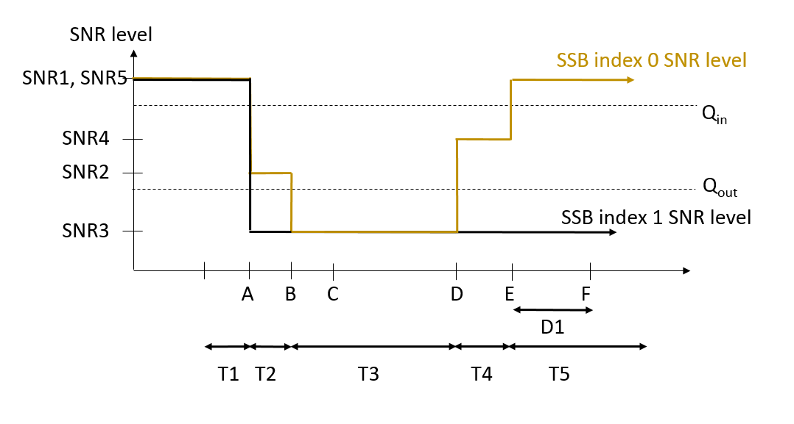
Figure A.7.5.1.4.1-1: SNR variation for in-sync testing
##### A.7.5.1.4.2 Test Requirements
The UE behaviour in each test during time durations T1, T2, T3, T4 and T5 shall be as follows:
During the period from time point A to time point F (D1 second after the start of time duration T5) the UE shall transmit uplink signal at least in all uplink slots configured for CSI transmission according to the configured periodic CSI reporting.
The rate of correct events observed during repeated tests shall be at least 90 %.
#### A.7.5.1.5 Radio Link Monitoring Out-of-sync Test for FR2 PCell configured with CSI-RS-based RLM in non-DRX mode
##### A.7.5.1.5.1 Test Purpose and Environment
The purpose of this test is to verify that the UE properly detects the out of sync for the purpose of monitoring downlink CSI-RS based radio link quality of the PCell when no DRX is used. This test will partly verify the FR2 PCell CSI-RS Out-of-sync radio link monitoring requirements in clause 8.1.
The test parameters are given in Tables A.7.5.1.5.1-1, A.7.5.1.5.1-2, A.7.5.1.5.1-3 and A.7.5.1.5.1-4 below. There is one cell, cell 1 which is the PCell, in the test. The test consists of three successive time periods, with time duration of T1, T2 and T3 respectively. Figure A.7.5.1.5.1-1 shows the variation of the downlink SNR in the PCell to emulate out-of-sync and in-sync states. Prior to the start of the time duration T1, the UE shall be fully synchronized to cell 1. The UE shall be configured for periodic CSI reporting with a reporting periodicity of 10 ms. In the test, DRX configuration is not enabled. The UE is configured to perform inter-frequency measurements using GP ID #0 (40ms) in test. In the test, SSB0 and SSB1 are configured as BFD-RS and are not same as RLM-RS to avoid triggering the beam failure during the RLM test.
Table A.7.5.1.5.1-1: Supported test configurations for FR2 PCell
| Configuration | Description |
| --- | --- |
| 1 | TDD duplex mode, 120 kHz SSB SCS, 100 MHz bandwidth |

Table A.7.5.1.5.1-2: General test parameters for FR2 PCell for CSI-RS out-of-sync testing in non-DRX mode
| Parameter | Unit | Value |  |
| --- | --- | --- | --- |
|  |  | Test 1 |  |
| Active PCell |  | Cell 1 |  |
| RF Channel Number |  | 1 |  |
| Duplex mode | Config 1 |  | TDD |
| TDD Configuration | Config 1 |  | TDDConf.3.1 |
| BWchannel | Config 1 |  | 100: NRB,c = 66 |
| Data RBs allocated | Config 1 |  | 24 |
| BWoccupied | Config 1 |  | 24 |
| DL initial BWP configuration | Config 1 |  | DLBWP.0.1 |
| DL dedicated BWP configuration | Config 1 |  | DLBWP.1.4 |
| UL initial BWP configuration | Config 1 |  | ULBWP.0.1 |
| UL dedicated BWP configuration | Config 1 |  | ULBWP.1.4 |
| RMSI CORESET Reference Channel | Config 1 |  | CR.3.1 TDD |
| Dedicated CORESET Reference Channel | Config 1 |  | CCR.3.4 TDD CCR.3.6 TDD |
| SSB Configuration | Config 1 |  | SSB.1 FR2 |
| SMTC Configuration | Config 1 |  | SMTC.1 |
| PDSCH/PDCCH subcarrier spacing | Config 1 |  | 120 KHz |
| CSI-RS for RLM | Config 1 |  | Resource #4 in TRS.2.1 TDD Resource #4 in TRS.2.2 TDD |
| SSB index for BFD-RS | Config 1 |  | 0, 1 |
| TRS configuration |  | TRS.2.1 TDD TRS.2.2 TDD |  |
| TCI configuration for PDCCH#1/PDSCH |  | TCI.State.2 |  |
| TCI configuration for PDCCH#2 |  | TCI.State.3 |  |
| OCNG parameters |  | OP.5 |  |
| CP length |  | Normal |  |
| Out of sync transmission parameters | DCI format |  | 1-0 |
|  | Number of Control OFDM symbols |  | 2 |
|  | Aggregation level | CCE | 8 |
|  | Ratio of hypothetical PDCCH RE energy to average CSI-RS RE energy | dB | 4 |
|  | Ratio of hypothetical PDCCH DMRS energy to average CSI-RS RE energy | dB | 4 |
|  | DMRS precoder granularity |  | REG bundle size |
|  | REG bundle size |  | 6 |
| DRX |  | OFF |  |
| Gap pattern ID |  | *gp0 |  |
| Layer 3 filtering |  | Enabled |  |
| T310 timer | ms | 0 |  |
| T311 timer | ms | 1000 |  |
| N310 |  | 1 |  |
| N311 |  | 1 |  |
| CSI-RS for CSI reporting | Config 1 |  | CSI-RS.3.1 TDD |
| reportConfigType |  | periodic |  |
| reportQuantity |  | cri-RI-PMI-CQI |  |
| CSI reporting periodicity | slot | 40 |  |
| CSI reporting offset | slot | 4 |  |
| T1 | s | 0.2 |  |
| T2 | s | 0.35 |  |
| T3 | s | 0.35 |  |
| D1 | s | 0.31 |  |
| Note 1: UE-specific PDCCH is not transmitted after T1 starts. |  |  |  |

Table A.7.5.1.5.1-3: Cell specific test parameters for FR2 for CSI-RS out-of-sync radio link monitoring in non-DRX mode
| Parameter | Unit | Test 1 |  |  |  |  |  |
| --- | --- | --- | --- | --- | --- | --- | --- |
|  |  | T1 | T2 | T3 | T1 | T2 | T3 |
| AoA setup |  | Setup 3 defined in A.3.15 |  |  |  |  |  |
|  |  | AoA1 | AoA2 |  |  |  |  |
| Assumption for UE beams Note 10 |  | Rough | Rough |  |  |  |  |
| EPRE ratio of PDCCH DMRS to SSS | dB | 4 | Not sent |  |  |  |  |
| EPRE ratio of PDCCH to PDCCH DMRS | dB |  |  |  |  |  |  |
| EPRE ratio of PBCH DMRS to SSS | dB | 0 |  |  |  |  |  |
| EPRE ratio of PBCH to PBCH DMRS | dB |  |  |  |  |  |  |
| EPRE ratio of PSS to SSS | dB |  |  |  |  |  |  |
| EPRE ratio of PDSCH DMRS to SSS | dB |  |  |  |  |  |  |
| EPRE ratio of PDSCH to PDSCH DMRS | dB |  |  |  |  |  |  |
| EPRE ratio of OCNG DMRS to SSS | dB |  |  |  |  |  |  |
| EPRE ratio of OCNG to OCNG DMRS | dB |  |  |  |  |  |  |
| SNR on RLM-RS1 | Config 1 | dB | 2Note 11 | -6Note 11 | -15 |  |  |
| SNR on RLM-RS2 | Config 1 | dB | Not sent | 2Note 11 | -15 | -15 |  |
|  | Config 1 | dBm/ 15kHz | -92.1 | -92.1 |  |  |  |
| Propagation condition |  | TDL-A 30ns 75Hz | TDL-A 30ns 75Hz |  |  |  |  |
| NOTE 1: OCNG shall be used such that the resources in Cell 1 are fully allocated and a constant total transmitted power spectral density is achieved for all OFDM symbols. NOTE 2: The uplink resources for CSI reporting are assigned to the UE prior to the start of time period T1. NOTE 3: NZP CSI-RS resource set configuration for CSI reporting are assigned to the UE prior to the start of time period T1. NOTE 4: Measurement gap configuration is assigned to the UE prior to the start of time period T1. NOTE 5: The timers and layer 3 filtering related parameters are configured prior to the start of time period T1. NOTE 6: The signal contains PDCCH for UEs other than the device under test as part of OCNG. NOTE 7: SNR levels correspond to the signal to noise ratio over the SSS REs. NOTE 8: The SNR in time periods T1, T2 and T3 is denoted as SNR1, SNR2 and SNR3 respectively in figure A.7.5.1.5.1-1. NOTE 9: The SNR values are specified for testing a UE which supports 2RX on at least one band. For testing of a UE which supports 4RX on all bands, the SNR during T3 is A.3.6. NOTE 10: Information about types of UE beam is given in clause B.2.1.3 and does not limit UE implementation or test system implementation. NOTE 11: This value allows up to 1 dB degradation from applied SNR to UE baseband |  |  |  |  |  |  |  |

Table A.7.5.1.5.1-4: Measurement gap configuration for FR2 CSI-RS out-of-sync radio link monitoring in non-DRX mode
| Field | Test 1 |
| --- | --- |
|  | Value |
| gapOffset | 0 |
| NOTE 1: RLM RS is partially overlapped with measurement gap |  |

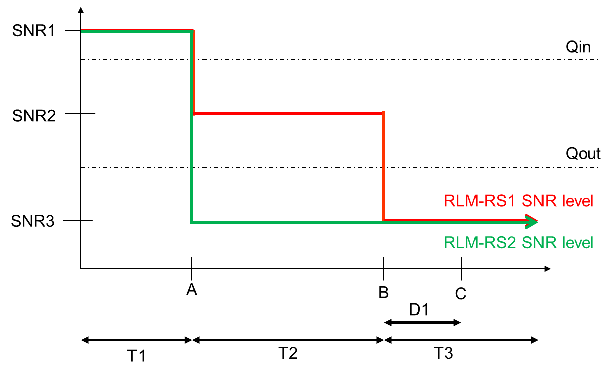
Figure A.7.5.1.5.1-1: SNR variation for CSI-RS out-of-sync testing
##### A.7.5.1.5.2 Test Requirements
The UE behaviour during time durations T1, T2, and T3 shall be as follows:
During the period from time point A to time point B the UE shall transmit uplink signal in Cell 1 at least in all uplink slots configured for CSI transmission according to the configured periodic CSI reporting for Cell 1.
The UE shall stop transmitting uplink signal in Cell 1 no later than time point C (D1 second after the start of the time duration T3) on the PCell.
The rate of correct events observed during repeated tests shall be at least 90 %.
#### A.7.5.1.6 Radio Link Monitoring In-sync Test for FR2 PCell configured with CSI-RS-based RLM in non-DRX mode
##### A.7.5.1.6.1 Test Purpose and Environment
The purpose of this test is to verify that the UE properly detects the in sync for the purpose of monitoring downlink CSI-RS based radio link quality of the PCell when no DRX is used. This test will partly verify the FR2 PCell CSI-RS In-sync radio link monitoring requirements in clause 8.1.
The test parameters are given in Tables A.7.5.1.6.1-1, A.7.5.1.6.1-2 and A.7.5.1.6.1-3 below. There is one cells, cell 1which is the PCell, in the test. The test consists of five successive time periods, with time duration of T1, T2, T3, T4 and T5 respectively. Figure A.7.5.1.6.1-1 shows the variation of the downlink SNR in the PCell to emulate out-of-sync and in-sync states. Prior to the start of the time duration T1, the UE shall be fully synchronized to cell 1. The UE shall be configured for periodic CSI reporting with a reporting periodicity of 10 ms. In the test, DRX configuration is not enabled. In the test, SSB0 and SSB1 are configured as BFD-RS and are not same as RLM-RS to avoid triggering the beam failure during the RLM test.
Table A.7.5.1.6.1-1: Supported test configurations for FR2 PCell
| Configuration | Description |
| --- | --- |
| 1 | TDD duplex mode, 120 kHz SSB SCS, 100 MHz bandwidth |

Table A.7.5.1.6.1-2: General test parameters for FR2 PCell for CSI-RS in-sync testing in non-DRX mode
| Parameter | Unit | Value |  |
| --- | --- | --- | --- |
|  |  | Test 1 |  |
| Active PCell |  | Cell 1 |  |
| RF Channel Number |  | 1 |  |
| Duplex mode | Config 1 |  | TDD |
| TDD Configuration | Config 1 |  | TDDConf.3.1 |
| BWchannel | Config 1 |  | 100: NRB,c = 66 |
| Data RBs allocated | Config 1 |  | 24 |
| BWoccupied | Config 1 |  | 24 |
| DL initial BWP configuration | Config 1 |  | DLBWP.0.1 |
| DL dedicated BWP configuration | Config 1 |  | DLBWP.1.4 |
| UL initial BWP configuration | Config 1 |  | ULBWP.0.1 |
| UL dedicated BWP configuration | Config 1 |  | ULBWP.1.4 |
| RMSI CORESET Reference Channel | Config 1 |  | CR.3.1 TDD |
| Dedicated CORESET Reference Channel | Config 1 |  | CCR.3.1 TDD CCR.3.3 TDD |
| SSB Configuration | Config 1 |  | SSB.1 FR2 |
| SMTC Configuration | Config 1 |  | SMTC.1 |
| PDSCH/PDCCH subcarrier spacing | Config 1 |  | 120 KHz |
| CSI-RS for RLM | Config 1 |  | Resource #4 in TRS.2.1 TDD Resource #4 in TRS.2.2 TDD |
| SSB index for BFD-RS | Config 1 |  | 0, 1 |
| TRS configuration |  | TRS.2.1 TDD TRS.2.2 TDD |  |
| TCI configuration for PDCCH#1/PDSCH |  | TCI.State.2 |  |
| TCI configuration for PDCCH#2 |  | TCI.State.3 |  |
| OCNG parameters |  | OP.5 |  |
| CP length |  | Normal |  |
| Out of sync transmission parameters | DCI format |  | 1-0 |
|  | Number of Control OFDM symbols |  | 2 |
|  | Aggregation level | CCE | 8 |
|  | Ratio of hypothetical PDCCH RE energy to average CSI-RS RE energy | dB | 4 |
|  | Ratio of hypothetical PDCCH DMRS energy to average CSI-RS RE energy | dB | 4 |
|  | DMRS precoder granularity |  | REG bundle size |
|  | REG bundle size |  | 6 |
| In sync transmission parameters | DCI format |  | 1-0 |
|  | Number of Control OFDM symbols |  | 2 |
|  | Aggregation level | CCE | 4 |
|  | Ratio of hypothetical PDCCH RE energy to average CSI-RS RE energy | dB | 0 |
|  | Ratio of hypothetical PDCCH DMRS energy to average CSI-RS RE energy | dB | 0 |
|  | DMRS precoder granularity |  | REG bundle size |
|  | REG bundle size |  | 6 |
| DRX |  | OFF |  |
| Gap pattern ID |  | N.A. |  |
| Layer 3 filtering |  | Enabled |  |
| T310 timer | ms | 1000 |  |
| T311 timer | ms | 1000 |  |
| N310 |  | 1 |  |
| N311 |  | 1 |  |
| CSI-RS for CSI reporting | Config 1 |  | CSI-RS.3.1 TDD |
| reportConfigType |  | periodic |  |
| reportQuantity |  | cri-RI-PMI-CQI |  |
| CSI reporting periodicity | slot | 40 |  |
| CSI reporting offset | slot | 4 |  |
| T1 | s | 0.2 |  |
| T2 | s | 0.2 |  |
| T3 | s | 0.24 |  |
| T4 | s | 0.2 |  |
| T5 | s | 0.88 |  |
| D1 | s | 0.84 |  |
| Note 1: UE-specific PDCCH is not transmitted after T1 starts. |  |  |  |

Table A.7.5.1.6.1-3: Cell specific test parameters for FR2 for CSI-RS in-sync radio link monitoring in non-DRX mode
| Parameter | Unit | Test 1 |  |  |  |  |  |  |  |  |  |
| --- | --- | --- | --- | --- | --- | --- | --- | --- | --- | --- | --- |
|  |  | T1 | T2 | T3 | T4 | T5 | T1 | T2 | T3 | T4 | T5 |
| AoA setup |  | Setup 3 defined in A.3.15 |  |  |  |  |  |  |  |  |  |
|  |  | AoA1 | AoA2 |  |  |  |  |  |  |  |  |
| Assumption for UE beams Note 10 |  | Rough | Rough |  |  |  |  |  |  |  |  |
| EPRE ratio of PDCCH DMRS to SSS | dB | 4 | Not sent |  |  |  |  |  |  |  |  |
| EPRE ratio of PDCCH to PDCCH DMRS | dB |  |  |  |  |  |  |  |  |  |  |
| EPRE ratio of PBCH DMRS to SSS | dB | 0 |  |  |  |  |  |  |  |  |  |
| EPRE ratio of PBCH to PBCH DMRS | dB |  |  |  |  |  |  |  |  |  |  |
| EPRE ratio of PSS to SSS | dB |  |  |  |  |  |  |  |  |  |  |
| EPRE ratio of PDSCH DMRS to SSS | dB |  |  |  |  |  |  |  |  |  |  |
| EPRE ratio of PDSCH to PDSCH DMRS | dB |  |  |  |  |  |  |  |  |  |  |
| EPRE ratio of OCNG DMRS to SSS | dB |  |  |  |  |  |  |  |  |  |  |
| EPRE ratio of OCNG to OCNG DMRS | dB |  |  |  |  |  |  |  |  |  |  |
| SNR on RLM-RS1 | Config 1 | dB | 2Note 11 | -6Note 11 | -15 | -15 | -15 |  |  |  |  |
| SNR on RLM-RS2 | Config 1 | dB | Not sent | 2Note 11 | -15 | -15 | -4.5 | 2Note 11 |  |  |  |
|  | Config 1 | dBm/ 15KHz | -92.1 | -92.1 |  |  |  |  |  |  |  |
| Propagation condition |  | TDL-A 30ns 75Hz | TDL-A 30ns 75Hz |  |  |  |  |  |  |  |  |
| NOTE 1: OCNG shall be used such that the resources in Cell 1 are fully allocated and a constant total transmitted power spectral density is achieved for all OFDM symbols. NOTE 2: The uplink resources for CSI reporting are assigned to the UE prior to the start of time period T1. NOTE 3: NZP CSI-RS resource set configuration for CSI reporting are assigned to the UE prior to the start of time period T1. NOTE 4: Measurement gap configuration is assigned to the UE prior to the start of time period T1. NOTE 5: The timers and layer 3 filtering related parameters are configured prior to the start of time period T1. NOTE 6: The signal contains PDCCH for UEs other than the device under test as part of OCNG. NOTE 7: SNR levels correspond to the signal to noise ratio over the SSS REs. NOTE 8: The SNR in time periods T1, T2, T3, T4 and T5 is denoted as SNR1, SNR2, SNR3, SNR4 and SNR5 respectively in figure A.7.5.1.6.1-1. NOTE 9: The SNR values are specified for testing a UE which supports 2RX on at least one band. For testing of a UE which supports 4RX on all bands, the SNR during T3 is A.3.6. NOTE 10: Information about types of UE beam is given in clause B.2.1.3 and does not limit UE implementation or test system implementation. NOTE 11: This value allows up to 1 dB degradation from applied SNR to UE baseband. |  |  |  |  |  |  |  |  |  |  |  |

Figure A.7.5.1.6.1-1: SNR variation for CSI-RS in-sync testing
##### A.7.5.1.6.2 Test Requirements
The UE behaviour in each test during time durations T1, T2, T3, T4 and T5 shall be as follows:
During the period from time point A to time point F (D1 second after the start of time duration T5) the UE shall transmit uplink signal at least in all uplink slots configured for CSI transmission according to the configured periodic CSI reporting on the PCell.
The rate of correct events observed during repeated tests shall be at least 90 %.
#### A.7.5.1.7 Radio Link Monitoring Out-of-sync Test for FR2 PCell configured with CSI-RS-based RLM in DRX mode
##### A.7.5.1.7.1 Test Purpose and Environment
The purpose of this test is to verify that the UE properly detects the out of sync for the purpose of monitoring downlink CSI-RS based radio link quality of the PCell when DRX is used. This test will partly verify the FR2 PCell CSI-RS Out-of-sync radio link monitoring requirements in clause 8.1.
The test parameters are given in Tables A.7.5.1.7.1-1, A.7.5.1.7.1-2, and A.7.5.1.7.1-3 below. There is one cell, cell 1 is the PCell, in the test. The test consists of three successive time periods, with time duration of T1, T2 and T3 respectively. Figure A.7.5.1.7.1-1 shows the variation of the downlink SNR in the PCell to emulate out-of-sync and in-sync states. Prior to the start of the time duration T1, the UE shall be fully synchronized to cell 1. The UE shall be configured for periodic CSI reporting with a reporting periodicity of 10 ms. In the test, DRX configuration is enabled in PCell and DRX inactivity timer has already been expired, i.e. UE tries to decode PDCCH and to send periodic CQI during the period when On-duration timer is running. Time alignment timers shall be set to “infinity” so that UL timing alignment is maintained during the test. In the test, SSB0 and SSB1 are configured as BFD-RS and are not same as RLM-RS to avoid triggering the beam failure during the RLM test.
Table A.7.5.1.7.1-1: Supported test configurations for FR2 PCell
| Configuration | Description |
| --- | --- |
| 1 | TDD duplex mode, 120 kHz SSB SCS, 100 MHz bandwidth |

Table A.7.5.1.7.1-2: General test parameters for FR2 PCell for CSI-RS out-of-sync testing in DRX mode
| Parameter | Unit | Value |  |
| --- | --- | --- | --- |
|  |  | Test 1 |  |
| Active PCell |  | Cell 1 |  |
| RF Channel Number |  | 1 |  |
| Duplex mode | Config 1 |  | TDD |
| TDD Configuration | Config 1 |  | TDDConf.3.1 |
| DL initial BWP configuration | Config 1 |  | DLBWP.0.1 |
| DL dedicated BWP configuration | Config 1 |  | DLBWP.1.1 |
| UL initial BWP configuration | Config 1 |  | ULBWP.0.1 |
| UL dedicated BWP configuration | Config 1 |  | ULBWP.1.1 |
| RMSI CORESET Reference Channel | Config 1 |  | CR.3.1 TDD |
| Dedicated CORESET Reference Channel | Config 1 |  | CCR.3.4 TDD CCR.3.6 TDD |
| SSB Configuration | Config 1 |  | SSB.1 FR2 |
| SMTC Configuration | Config 1 |  | SMTC.1 |
| PDSCH/PDCCH subcarrier spacing | Config 1 |  | 120 KHz |
| CSI-RS for RLM | Config 1 |  | Resource #4 in TRS.2.1 TDD Resource #4 in TRS.2.2 TDD |
| SSB index for BFD-RS | Config 1 |  | 0, 1 |
| TRS configuration |  | TRS.2.1 TDD TRS.2.2 TDD |  |
| TCI configuration for PDCCH#1/PDSCH |  | TCI.State.2 |  |
| TCI configuration for PDCCH#2 |  | TCI.State.3 |  |
| OCNG parameters |  | OP.1 |  |
| CP length |  | Normal |  |
| Out of sync transmission parameters | DCI format |  | 1-0 |
|  | Number of Control OFDM symbols |  | 2 |
|  | Aggregation level | CCE | 8 |
|  | Ratio of hypothetical PDCCH RE energy to average CSI-RS RE energy | dB | 4 |
|  | Ratio of hypothetical PDCCH DMRS energy to average CSI-RS RE energy | dB | 4 |
|  | DMRS precoder granularity |  | REG bundle size |
|  | REG bundle size |  | 6 |
| DRX |  | DRX.3 |  |
| Gap pattern ID |  | N.A. |  |
| Layer 3 filtering |  | Enabled |  |
| T310 timer | ms | 0 |  |
| T311 timer | ms | 1000 |  |
| N310 |  | 1 |  |
| N311 |  | 1 |  |
| CSI-RS for CSI reporting | Config 1 |  | CSI-RS.3.1 TDD |
| reportConfigType |  | periodic |  |
| reportQuantity |  | cri-RI-PMI-CQI |  |
| CSI reporting periodicity | slot | 40 |  |
| CSI reporting offset | slot | 4 |  |
| T1 | s | 0.2 |  |
| T2 | s | 1.28 |  |
| T3 | s | 1.28 |  |
| D1 | s | 1.24 |  |
| Note 1: UE-specific PDCCH is not transmitted after T1 starts. |  |  |  |

Table A.7.5.1.7.1-3: Cell specific test parameters for FR2 for CSI-RS out-of-sync radio link monitoring in DRX mode
| Parameter | Unit | Test 1 |  |  |  |
| --- | --- | --- | --- | --- | --- |
|  |  | T1 | T2 | T3 |  |
| AoA setup | dB | Setup 1 defined in A.3.15 |  |  |  |
| Assumption for UE beams Note 10 |  | Rough |  |  |  |
| EPRE ratio of PDCCH DMRS to SSS | dB | 4 |  |  |  |
| EPRE ratio of PDCCH to PDCCH DMRS | dB |  |  |  |  |
| EPRE ratio of PBCH DMRS to SSS | dB | 0 |  |  |  |
| EPRE ratio of PBCH to PBCH DMRS | dB |  |  |  |  |
| EPRE ratio of PSS to SSS | dB |  |  |  |  |
| EPRE ratio of PDSCH DMRS to SSS | dB |  |  |  |  |
| EPRE ratio of PDSCH to PDSCH DMRS | dB |  |  |  |  |
| EPRE ratio of OCNG DMRS to SSS | dB |  |  |  |  |
| EPRE ratio of OCNG to OCNG DMRS | dB |  |  |  |  |
| SNR on RLM-RS1 | Config 1 | dB | 2Note 11 | -6Note 11 | -15 |
| SNR on RLM-RS2 | Config 1 | dB | 2Note 11 | -15 | -15 |
|  | Config 1 | dBm/15KHz | -104.7 |  |  |
| Propagation condition |  | TDL-A 30ns 75Hz |  |  |  |
| NOTE 1: OCNG shall be used such that the resources in Cell 1 are fully allocated and a constant total transmitted power spectral density is achieved for all OFDM symbols. NOTE 2: The uplink resources for CSI reporting are assigned to the UE prior to the start of time period T1. NOTE 3: NZP CSI-RS resource set configuration for CSI reporting are assigned to the UE prior to the start of time period T1. NOTE 4: Measurement gap configuration is assigned to the UE prior to the start of time period T1. NOTE 5: The timers and layer 3 filtering related parameters are configured prior to the start of time period T1. NOTE 6: The signal contains PDCCH for UEs other than the device under test as part of OCNG. NOTE 7: SNR levels correspond to the signal to noise ratio over the SSS REs. NOTE 8: The SNR in time periods T1, T2 and T3 is denoted as SNR1, SNR2 and SNR3 respectively in figure A.7.5.1.7.1-1. NOTE 9: The SNR values are specified for testing a UE which supports 2RX on at least one band. For testing of a UE which supports 4RX on all bands, the SNR during T3 is specified in clause A.3.6. NOTE 10: Information about types of UE beam is given in clause B.2.1.3 and does not limit UE implementation or test system implementation. NOTE 11: This value allows up to 1 dB degradation from applied SNR to UE baseband. |  |  |  |  |  |

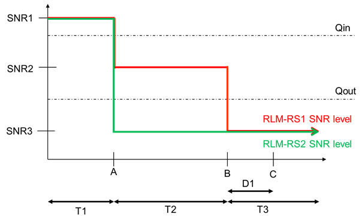
Figure A.7.5.1.7.1-1: SNR variation for CSI-RS out-of-sync testing
##### A.7.5.1.7.2 Test Requirements
The UE behaviour during time durations T1, T2, and T3 shall be as follows:
During the period from time point A to time point B the UE shall transmit uplink signal in Cell 1 (PCell) at least in all uplink slots configured for CSI transmission according to the configured periodic CSI reporting for Cell 1.
The UE shall stop transmitting uplink signal in Cell 1 (PCell) no later than time point C (D1 secondafter the start of the time duration T3) on the PCell.
The rate of correct events observed during repeated tests shall be at least 90 %.
#### A.7.5.1.8 Radio Link Monitoring In-sync Test for FR2 PCell configured with CSI-RS-based RLM in DRX mode
##### A.7.5.1.8.1 Test Purpose and Environment
The purpose of this test is to verify that the UE properly detects the in sync for the purpose of monitoring downlink CSI-RS based radio link quality of the PCell when DRX is used. This test will partly verify the FR2 PCell CSI-RS In-sync radio link monitoring requirements in clause 8.1.
The test parameters are given in Tables A.7.5.1.8.1-1, A.7.5.1.8.1-2, A.7.5.1.8.1-3 and A.7.5.1.8.1-4 below. There is one cells, cell 1which is the PCell, in the test. The test consists of five successive time periods, with time duration of T1, T2, T3, T4 and T5 respectively. Figure A.7.5.1.8.1-1 shows the variation of the downlink SNR in the PCell to emulate out-of-sync and in-sync states. Prior to the start of the time duration T1, the UE shall be fully synchronized to cell 1. The UE shall be configured for periodic CSI reporting with a reporting periodicity of 10 ms. The UE is configured to perform inter-frequency measurements using GP ID #0 (40ms) in test. In the test, SSB0 and SSB1 are configured as BFD-RS and are not same as RLM-RS to avoid triggering the beam failure during the RLM test.
Table A.7.5.1.8.1-1: Supported test configurations for FR2 PSCell
| Configuration | Description |
| --- | --- |
| 1 | TDD duplex mode, 120 kHz SSB SCS, 100 MHz bandwidth |

Table A.7.5.1.8.1-2: General test parameters for FR2 PCell for CSI-RS in-sync testing in non-DRX mode
| Parameter | Unit | Value |  |
| --- | --- | --- | --- |
|  |  | Test 1 |  |
| Active PCell |  | Cell 1 |  |
| RF Channel Number |  | 1 |  |
| Duplex mode | Config 1 |  | TDD |
| TDD Configuration | Config 1 |  | TDDConf.3.1 |
| DL initial BWP configuration | Config 1 |  | DLBWP.0.1 |
| DL dedicated BWP configuration | Config 1 |  | DLBWP.1.1 |
| UL initial BWP configuration | Config 1 |  | ULBWP.0.1 |
| UL dedicated BWP configuration | Config 1 |  | ULBWP.1.1 |
| RMSI CORESET Reference Channel | Config 1 |  | CR.3.1 TDD |
| Dedicated CORESET Reference Channel | Config 1 |  | CCR.3.1 TDD CCR.3.3 TDD |
| SSB Configuration | Config 1 |  | SSB.1 FR2 |
| SMTC Configuration | Config 1 |  | SMTC.1 |
| PDSCH/PDCCH subcarrier spacing | Config 1 |  | 120 KHz |
| CSI-RS for RLM | Config 1 |  | Resource #4 in TRS.2.1 TDD Resource #4 in TRS.2.2 TDD |
| SSB index for BFD-RS | Config 1 |  | 0, 1 |
| TRS configuration |  | TRS.2.1 TDD TRS.2.2 TDD |  |
| TCI configuration for PDCCH#1/PDSCH |  | TCI.State.2 |  |
| TCI configuration for PDCCH#2 |  | TCI.State.3 |  |
| OCNG parameters |  | OP.1 |  |
| CP length |  | Normal |  |
| Out of sync transmission parameters | DCI format |  | 1-0 |
|  | Number of Control OFDM symbols |  | 2 |
|  | Aggregation level | CCE | 8 |
|  | Ratio of hypothetical PDCCH RE energy to average CSI-RS RE energy | dB | 4 |
|  | Ratio of hypothetical PDCCH DMRS energy to average CSI-RS RE energy | dB | 4 |
|  | DMRS precoder granularity |  | REG bundle size |
|  | REG bundle size |  | 6 |
| In sync transmission parameters | DCI format |  | 1-0 |
|  | Number of Control OFDM symbols |  | 2 |
|  | Aggregation level | CCE | 4 |
|  | Ratio of hypothetical PDCCH RE energy to average CSI-RS RE energy | dB | 0 |
|  | Ratio of hypothetical PDCCH DMRS energy to average CSI-RS RE energy | dB | 0 |
|  | DMRS precoder granularity |  | REG bundle size |
|  | REG bundle size |  | 6 |
| DRX |  | DRX.3 |  |
| Gap pattern ID |  | *gp0 |  |
| Layer 3 filtering |  | Enabled |  |
| T310 timer | ms | 2000 |  |
| T311 timer | ms | 1000 |  |
| N310 |  | 1 |  |
| N311 |  | 1 |  |
| CSI-RS for CSI reporting | Config 1 |  | CSI-RS.3.1 TDD |
| reportConfigType |  | periodic |  |
| reportQuantity |  | cri-RI-PMI-CQI |  |
| CSI reporting periodicity | slot | 40 |  |
| CSI reporting offset | slot | 4 |  |
| T1 | s | 0.2 |  |
| T2 | s | 0.2 |  |
| T3 | s | 1.64 |  |
| T4 | s | 0.2 |  |
| T5 | s | 1.88 |  |
| D1 | s | 1.84 |  |
| Note 1: UE-specific PDCCH is not transmitted after T1 starts. |  |  |  |

Table A.7.5.1.8.1-3: Cell specific test parameters for FR2 for CSI-RS in-sync radio link monitoring in non-DRX mode
| Parameter | Unit | Test 1 |  |  |  |  |  |
| --- | --- | --- | --- | --- | --- | --- | --- |
|  |  | T1 | T2 | T3 | T4 | T5 |  |
| AoA setup | dB | Setup 1 defined in A.3.15 |  |  |  |  |  |
| Assumption for UE beams Note 10 |  | Rough |  |  |  |  |  |
| EPRE ratio of PDCCH DMRS to SSS | dB | 4 |  |  |  |  |  |
| EPRE ratio of PDCCH to PDCCH DMRS | dB |  |  |  |  |  |  |
| EPRE ratio of PBCH DMRS to SSS | dB | 0 |  |  |  |  |  |
| EPRE ratio of PBCH to PBCH DMRS | dB |  |  |  |  |  |  |
| EPRE ratio of PSS to SSS | dB |  |  |  |  |  |  |
| EPRE ratio of PDSCH DMRS to SSS | dB |  |  |  |  |  |  |
| EPRE ratio of PDSCH to PDSCH DMRS |  |  |  |  |  |  |  |
| EPRE ratio of OCNG DMRS to SSS |  |  |  |  |  |  |  |
| EPRE ratio of OCNG to OCNG DMRS | dB |  |  |  |  |  |  |
| SNR on RLM-RS1 | Config 1 | dB | 2Note 11 | -6Note 11 | -15 | -4.5 | 2Note 11 |
| SNR on RLM-RS2 | Config 1 | dB | 2Note 11 | -15 | -15 | -15 | -15 |
|  | Config 1 | dBm/15KHz | -104.7 |  |  |  |  |
| Propagation condition |  | TDL-A 30ns 75Hz |  |  |  |  |  |
| NOTE 1: OCNG shall be used such that the resources in Cell 1 are fully allocated and a constant total transmitted power spectral density is achieved for all OFDM symbols. NOTE 2: The uplink resources for CSI reporting are assigned to the UE prior to the start of time period T1. NOTE 3: NZP CSI-RS resource set configuration for CSI reporting are assigned to the UE prior to the start of time period T1. NOTE 4: Measurement gap configuration is assigned to the UE prior to the start of time period T1. NOTE 5: The timers and layer 3 filtering related parameters are configured prior to the start of time period T1. NOTE 6: The signal contains PDCCH for UEs other than the device under test as part of OCNG. NOTE 7: SNR levels correspond to the signal to noise ratio over the SSS REs. NOTE 8: The SNR in time periods T1, T2, T3, T4 and T5 is denoted as SNR1, SNR2, SNR3, SNR4 and SNR5 respectively in figure A.7.5.1.8.1-1. NOTE 9: The SNR values are specified for testing a UE which supports 2RX on at least one band. For testing of a UE which supports 4RX on all bands, the SNR during T3 is A.3.6. NOTE 10: Information about types of UE beam is given in clause B.2.1.3 and does not limit UE implementation or test system implementation. NOTE 11: This value allows up to 1 dB degradation from applied SNR to UE baseband. |  |  |  |  |  |  |  |

Table A.7.5.1.8.1-4: Measurement gap configuration for FR2 CSI-RS in-sync radio link monitoring in non-DRX mode
| Field | Test 1 |
| --- | --- |
|  | Value |
| gapOffset | 0 |
| NOTE 1: RLM RS is partially overlapped with measurement gap |  |

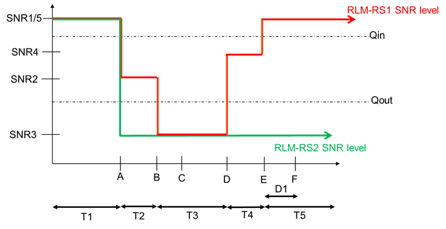
Figure A.7.5.1.8.1-1: SNR variation for CSI-RS in-sync testing
##### A.7.5.1.8.2 Test Requirements
The UE behaviour in each test during time durations T1, T2, T3, T4 and T5 shall be as follows:
During the period from time point A to time point F (D1 second after the start of time duration T5) the UE shall transmit uplink signal at least in all uplink slots configured for CSI transmission according to the configured periodic CSI reporting on the PCell.
The rate of correct events observed during repeated tests shall be at least 90 %.
#### A.7.5.1.9 UE Radio Link Monitoring Scheduling Restrictions on FR2
##### A.7.5.1.9.1 Test Purpose and Environment
The purpose is to verify that the NR UE correctly follows the RLM scheduling restrictions requirements defined in clause 8.1.7. This test verifies that the UE correctly receive the PDCCH scheduled on the symbols right before the RLM SSB symbols without overlap so that it sends ACK/NACK correctly. The test case is only applicable to UE which supports pdcch-MonitoringAnyOccasions or pdcch-MonitoringAnyOccasionsWithSpanGap.
The test parameters are given in table A.7.5.1.9.1-1, table A.7.5.1.9.1-2 and table A.7.5.1.9.1-3 below. The UE is required during time period T1 to transmit ACK/NACK correctly upon scheduling of PDSCH.
Table A.7.5.1.9.1-1: Supported test configurations
| Configuration | Description |
| --- | --- |
| 1 | 120 kHz SSB SCS, 120 kHz RMC SCS, 100 MHz bandwidth, TDD duplex mode |

Table A.7.5.1.9.1-2: General test parameters for NR RLM scheduling restriction test case in FR2
| Parameter | Unit | Test configuration | Value | Comment |
| --- | --- | --- | --- | --- |
| RF Channel Number |  | 1 | 1 |  |
| SSB configuration |  | 1 | SSB.1 FR2 |  |
| SMTC configuration |  | 1 | SMTC.3 |  |
| DRX cycle length | s | 1 | OFF |  |
| T1 | s | 1 | 5 | During T1 the UE is required to correctly transmit ACK/NACK |

Table A.7.5.1.9.1-3: Cell specific test parameters for NR RLM scheduling restriction test case in FR2
| Parameter | Unit | Test configuration | Cell 1 |  |
| --- | --- | --- | --- | --- |
| AoA setup |  | 1 | Setup 3 defined in A.3.15.3 |  |
|  |  |  | AoA1 | AoA2 |
| Assumption for UE beams Note 1 |  |  | Rough | Rough |
| TDD configuration |  | 1 | TDDConf.3.1 |  |
| BWchannel | MHz | 1 | 100: NPRB,c = 66 |  |
| Data PRBs allocated |  | 1 | 24 |  |
| PDSCH Reference measurement channel |  | 1 | SR.3.2 TDD | Not sent |
| RMSI CORESET RMC configuration |  | 1 | CR.3.1 TDD | Not sent |
| Dedicated CORESET RMC configuration |  | 1 | CCR.3.2 TDD | Not sent |
| TRS configuration |  | 1 | TRS.2.1 TDD | TRS.2.2 TDD |
| PDCCH/PDSCH TCI state |  | 1 | TCI.State.2 | N/A |
| OCNG Pattern |  | 1 | OP.5 defined in A.3.2.1 | Not sent |
| Initial DL BWP configuration |  | 1 | DLBWP.0.1 |  |
| Initial UL BWP configuration |  | 1 | ULBWP.0.1 |  |
| RLM-RS |  | 1 | SSB with index 0 | SSB with index 1 |
|  | dBm/15kHz | 1 | -92.1 | -92.1 |
|  Note2 | dBm/SCS | 1 | -83.1 | -83.1 |
|  | dB | 1 | 2 | 2 |
| BB Note 4 | dB | 1 | 1 | 1 |
| SSB_RP Note3 | dBm/SCS | 1 | -81.1 | -81.1 |
| Io | dBm/95.04 MHz | 1 | -54.35 | -54.35 |
| Time multiplexing of the downlink transmissions from each AoA | 1 | Defined in Figure A.7.5.1.9.1-1 |  |  |
| Propagation Condition |  | 1 | AWGN | AWGN |
| NOTE 1: Information about types of UE beam is given in clause B.2.1.3 and does not limit UE implementation or test system implementation. NOTE 2: Interference from other cells and noise sources not specified in the test is assumed to be constant over subcarriers and time and shall be modelled as AWGN of appropriate power for  to be fulfilled. NOTE 3: Es/Iot, SSB_RP and Io levels have been derived from other parameters for information purposes. They are not settable parameters themselves. NOTE 4: Calculation of Es/IotBB includes the effect of UE internal noise up to the value assumed for the associated Refsens requirement in clause 7.3.2 of TS 38.101-2 [19], and an allowance of 1 dB for UE multi-band relaxation factor ΔMBS from TS 38.101-2 [19] Table 6.2.1.3-4. |  |  |  |  |

Figure A.7.5.1.9.1-1: Time multiplexed downlink transmissions
##### A.7.5.1.9.2 Test Requirements
The UE behaviour follows the requirements defined in clause 8.1.7.3.
The UE shall be continuously scheduled by PDCCH on the symbols right before each SSB which is not covered by SMTC during the entire length of T1. The UE shall transmit ACK/NACK for every scheduled PDCCH during the time duration T1.

#### A.7.5.1.10 Radio Link Monitoring Out-of-sync Test for FR2 PCell configured with SSB-based RLM RS in non-DRX mode for UE supporting fast beam sweeping in multi-Rx
##### A.7.5.1.10.1 Test Purpose and Environment
The purpose of this test is to verify that the UE properly detects the out of sync and in sync for the purpose of monitoring downlink radio link quality of the PCell. This test will partly verify the FR2 radio link monitoring requirements in clause 8.1.
In the test, UE is configured to perform RLM on SSB, with detectionResource included in RadioLinkMonitoringRS set to SSB#0 and SSB#1, and purpose set to ‘rlf’. Supported test configurations are shown in table A.7.5.1.10.1-1. The test parameters are given in Tables A.7.5.1.10.1-2, and A.7.5.1.10.1-3below. There is one cell (Cell 1), which is the active NR cell, in the test. The test consists of three successive time periods, with time duration of T1, T2 and T3 respectively. Figure A.7.5.1.10.1-1 shows the variation of the downlink SNR in the active cell to emulate out-of-sync and in-sync states, and Figure A.7.5.1.10.1-2 shows the Time multiplexed downlink transmissions from each Angle of Arrival. Prior to the start of the time duration T1, the UE shall be fully synchronized to Cell 1. The UE shall be configured for periodic CSI reporting with a reporting periodicity of 5 ms. In addition to RLM-RS radio link monitoring using SSB index 0 and SSB index 1.
Table A.7.5.1.10.1-1: Supported test configurations for FR2 PCell
| Configuration | Description |
| --- | --- |
| 1 | TDD, SSB SCS 120 KHz, data SCS 120KHz, BW 100 MHz |

Table A.7.5.1.10.1-2: General test parameters for FR2 out-of-sync testing in non-DRX mode
| Parameter | Unit | Value |  |
| --- | --- | --- | --- |
|  |  | Test 1 |  |
| Active PCell |  | Cell 1 |  |
| RF Channel Number |  | 1 |  |
| Duplex mode | Config 1 |  | TDD |
| BWchannel | Config 1 |  | 100: NPRB,c = 66 |
| Data PRBs allocated | Config 1 |  | 24 |
| DL initial BWP configuration | Config 1 |  | DLBWP.0.1 |
| DL dedicated BWP configuration | Config 1 |  | DLBWP.1.1 |
| UL initial BWP configuration | Config 1 |  | ULBWP.0.1 |
| UL dedicated BWP configuration | Config 1 |  | ULBWP.1.1 |
| TDD Configuration | Config 1 |  | TDDConf.3.1 |
| RMSI CORESET Reference Channel | Config 1 |  | CR.3.1 TDD |
| Dedicated CORESET Reference Channel | Config 1 |  | CCR.3.4 TDD |
| SSB Configuration | Config 1 |  | SSB.1 FR2 |
| SMTC Configuration | Config 1 |  | SMTC.1 |
| PDSCH/PDCCH subcarrier spacing | Config 1 |  | 120 KHz |
| PRACH Configuration | Config 1 |  | Table A.3.8.3.1 |
| SSB index assigned as RLM RS | Config 1 |  | 0,1 |
| OCNG parameters |  | OP.5 |  |
| CP length |  | Normal |  |
| Out of sync transmission parameters | DCI format |  | 1-0 |
|  | Number of Control OFDM symbols |  | 2 |
|  | Aggregation level | CCE | 8 |
|  | Ratio of hypothetical PDCCH RE energy to average SSS RE energy | dB | 4 |
|  | Ratio of hypothetical PDCCH DMRS energy to average SSS RE energy | dB | 4 |
|  | DMRS precoder granularity |  | REG bundle size |
|  | REG bundle size |  | 6 |
| DRX |  | OFF |  |
| Layer 3 filtering |  | Enabled |  |
| T310 timer | ms | 0 |  |
| T311 timer | ms | 1000 |  |
| N310 |  | 1 |  |
| N311 |  | 1 |  |
| CSI-RS for CSI reporting | Config 1 |  | CSI-RS.3.1 TDD |
| reportConfigType |  | periodic |  |
| reportQuantity |  | cri-RI-PMI-CQI |  |
| CSI reporting periodicity | slot | 40 |  |
| CSI reporting offset | slot | 4 |  |
| TCI states for PDCCH/PDSCH |  | TCI.State.2 |  |
| CSI-RS for tracking | Config 1 |  | TRS.2.1 TDD |
| T1 | s | 0.2 |  |
| T2 | s | 1.2*N +0.08 Note 3 |  |
| T3 | s | 1.2*N +0.08 Note 3 |  |
| D1 | s | 1.2*N +0.04 Note 3 |  |
| NOTE 1: All configurations are assigned to the UE prior to the start of time period T1. NOTE 2: UE-specific PDCCH is not transmitted after T1 starts. NOTE 3: N is the value indicated by UE for fastBeamSweepingMultiRx-r18. |  |  |  |

Table A.7.5.1.10.1-3: OTA related cell specific test parameters for FR2 (Cell 1) for out-of-sync radio link monitoring tests in non-DRX mode
| Parameter | Unit | Test 1 |  |  |  |  |  |
| --- | --- | --- | --- | --- | --- | --- | --- |
|  |  | T1 | T2 | T3 | T1 | T2 | T3 |
| AoA setup |  | Setup 5 defined in A.3.15 |  |  |  |  |  |
|  |  | AoA1 | AoA2 |  |  |  |  |
| Assumption for UE beams Note 5 |  | Rough | Rough |  |  |  |  |
| EPRE ratio of PDCCH DMRS to SSS | dB | 4 | Not sent |  |  |  |  |
| EPRE ratio of PDCCH to PDCCH DMRS | dB | 0 |  |  |  |  |  |
| EPRE ratio of PBCH DMRS to SSS | dB |  |  |  |  |  |  |
| EPRE ratio of PBCH to PBCH DMRS | dB |  |  |  |  |  |  |
| EPRE ratio of PSS to SSS | dB |  |  |  |  |  |  |
| EPRE ratio of PDSCH DMRS to SSS | dB |  |  |  |  |  |  |
| EPRE ratio of PDSCH to PDSCH DMRS | dB |  |  |  |  |  |  |
| EPRE ratio of OCNG DMRS to SSS | dB |  |  |  |  |  |  |
| EPRE ratio of OCNG to OCNG DMRS | dB |  |  |  |  |  |  |
| ssb-Index 0 SNR | Config 1 | dB | 2Note 6 | -6Note 6 | -15 |  |  |
| ssb-Index 1 SNR | Config 1 |  | Not sent | 2Note 6 | -15 | -15 |  |
|  | Config 1 | dBm/ 15kHz | -92.1 | -92.1 |  |  |  |
| Time multiplexing of the downlink transmissions from each AoA |  | Defined in Figure A.7.5.1.10.1-2 |  |  |  |  |  |
| Propagation condition |  | TDL-A 30 ns 75 Hz | TDL-A 30 ns 75 Hz |  |  |  |  |
| NOTE 1: OCNG shall be used such a constant total transmitted power spectral density is achieved for all OFDM symbols. NOTE 2: The signal contains PDCCH for UEs other than the device under test as part of OCNG. NOTE 3: SNR levels correspond to the signal to noise ratio over the SSS REs. NOTE 4: The SNR values are specified for testing a UE which supports 2RX on at least one band. For testing of a UE which supports 4RX on all bands, the SNR during T3 is A.3.6. NOTE 5: Information about types of UE beam is given in clause B.2.1.3 and does not limit UE implementation or test system implementation. NOTE 6: This value allows up to 1 dB degradation from applied SNR to UE baseband |  |  |  |  |  |  |  |

Table A.7.5.1.10.1-4: Void

Figure A.7.5.1.10.1-1: SNR variation for out-of-sync testing

Figure A.7.5.1.10.1-2: Time multiplexed downlink transmissions
##### A.7.5.1.10.2 Test Requirements
The UE behavior in each test during time durations T1, T2 and T3 shall be as follows:
During the period from time point A to time point B the UE shall transmit uplink signal at least in all uplink slots configured for CSI transmission according to the configured periodic CSI reporting.
The UE shall stop transmitting uplink signal no later than time point C (D1 second after the start of the time duration T3).
The rate of correct events observed during repeated tests shall be at least 90 %.
#### A.7.5.1.11 Radio Link Monitoring Out-of-sync Test for FR2 PCell configured with CSI-RS-based RLM in non-DRX mode when CD-SSB is outside active BWP
##### A.7.5.1.11.1 Test Purpose and Environment
The purpose of this test is to verify that the UE properly detects the out of sync for the purpose of monitoring downlink CSI-RS based radio link quality of the PCell when no DRX is used and when CD-SSB is outside active BWP. This test will partly verify the FR2 PCell CSI-RS Out-of-sync radio link monitoring requirements in clause 8.1.
The test is for UE supporting rlm-BM-BFD-CSI-RS-OutsideActiveBWP-r18 and the UE is not required past legacy test in A.7.5.1.5.
The test environment is the same as in A.7.5.1.5.
NOTE: The starting PRB index of the SSB can be any possible PRB index of the RF channel BW occurring after the last PRB of the DL active BWP.
The test requirements are the same as in A.7.5.1.5.2.
#### A.7.5.1.12 Radio Link Monitoring Out-of-sync Test for FR2 PCell configured with SSB-based RLM RS in non-DRX mode when CD-SSB is outside active BWP
##### A.7.5.1.12.1 Test Purpose and Environment
The purpose of this test is to verify that the UE supporting bwpOperationMeasWithoutInterrupt-r18 properly detects the out of sync and in sync for the purpose of monitoring downlink radio link quality of the PCell when CD-SSB is outside active BWP. This test will partly verify the FR2 radio link monitoring requirements in clause 8.1.
The test environment is the same as in A.7.5.1.1 with following exceptions in Table A.7.5.1.1.1-2.
| Parameter | Unit | Value |  |
| --- | --- | --- | --- |
|  |  | Test 1 |  |
| DL dedicated BWP configuration | Config 1 |  | DLBWP.1.5 |
| UL dedicated BWP configuration | Config 1 |  | ULBWP.1.5 |

##### A.7.5.1.12.2 Test Requirements
The test requirements are the same as in A.7.5.1.1.2.
#### A.7.5.1.13 Radio Link Monitoring Out-of-sync Test for FR2 PCell configured with SSB-based RLM RS in non-DRX mode for UE supporting NCD-SSB based measurement outside active BWP
##### A.7.5.1.13.1 Test Purpose and Environment
The purpose of this test is to verify that the UE properly detects the out of sync and in sync for the purpose of monitoring downlink radio link quality of the PCell. This test will partly verify the FR2 radio link monitoring requirements in clause 8.1.
In the test, UE is configured to perform RLM on SSB, with detectionResource included in RadioLinkMonitoringRS set to SSB#0 and SSB#1, and purpose set to ‘rlf’. Supported test configurations are shown in table A.7.5.1.13 .1-1. The test parameters are given in Tables A.7.5.1.13 .1-2, A.7.5.1.13 .1-3, and A.7.5.1.13 .1-4 below. There is one cell (Cell 1), which is the active NR cell, in the test. The test consists of three successive time periods, with time duration of T1, T2 and T3 respectively. Figure A.7.5.1.13 .1-1 shows the variation of the downlink SNR in the active cell to emulate out-of-sync and in-sync states, and Figure A.7.5.1.13 .1-2 shows the Time multiplexed downlink transmissions from each Angle of Arrival. Prior to the start of the time duration T1, the UE shall be fully synchronized to Cell 1. The UE shall be configured for periodic CSI reporting with a reporting periodicity of 5 ms. In addition to RLM-RS radio link monitoring using SSB index 0 and SSB index 1, the UE is configured to perform inter-frequency measurements using Gap Pattern ID #0 (40 ms) in test 1.
Table A.7.5.1.13 .1-1: Supported test configurations for FR2 PCell
| Configuration | Description |
| --- | --- |
| 1 | TDD, SSB SCS 120 KHz, data SCS 120KHz, BW 100 MHz |

Table A.7.5.1.13 .1-2: General test parameters for FR2 out-of-sync testing in non-DRX mode
| Parameter | Unit | Value |  |
| --- | --- | --- | --- |
|  |  | Test 1 |  |
| Active PCell |  | Cell 1 |  |
| RF Channel Number |  | 1 |  |
| Duplex mode | Config 1 |  | TDD |
| BWchannel | Config 1 |  | 100: NPRB,c = 66 |
| Data PRBs allocated | Config 1 |  | 24 |
| DL initial BWP configuration | Config 1 |  | DLBWP.0.1 |
| DL dedicated BWP configuration | Config 1 |  | DLBWP.1.1 |
| UL initial BWP configuration | Config 1 |  | ULBWP.0.1 |
| UL dedicated BWP configuration | Config 1 |  | ULBWP.1.1 |
| TDD Configuration | Config 1 |  | TDDConf.3.1 |
| RMSI CORESET Reference Channel | Config 1 |  | CR.3.1 TDD |
| Dedicated CORESET Reference Channel | Config 1 |  | CCR.3.4 TDD |
| CD-SSB Configuration | Config 1 |  | SSB.1 FR2 |
| NCD-SSB Configuration | Config 1 |  | SSB.19 FR2 |
| SMTC Configuration | Config 1 |  | SMTC pattern 1 for RedCap |
| PDSCH/PDCCH subcarrier spacing | Config 1 |  | 120 KHz |
| PRACH Configuration | Config 1 |  | Table A.3.8.3.4 |
| SSB index assigned as RLM RS | Config 1 |  | 0,1 |
| OCNG parameters |  | OP.5 |  |
| CP length |  | Normal |  |
| Out of sync transmission parameters | DCI format |  | 1-0 |
|  | Number of Control OFDM symbols |  | 2 |
|  | Aggregation level | CCE | 8 |
|  | Ratio of hypothetical PDCCH RE energy to average SSS RE energy | dB | 4 |
|  | Ratio of hypothetical PDCCH DMRS energy to average SSS RE energy | dB | 4 |
|  | DMRS precoder granularity |  | REG bundle size |
|  | REG bundle size |  | 6 |
| DRX |  | OFF |  |
| Gap pattern ID |  | gp0 |  |
| Layer 3 filtering |  | Enabled |  |
| T310 timer | ms | 0 |  |
| T311 timer | ms | 1000 |  |
| N310 |  | 1 |  |
| N311 |  | 1 |  |
| CSI-RS for CSI reporting | Config 1 |  | CSI-RS.3.1 TDD |
| reportConfigType |  | periodic |  |
| reportQuantity |  | cri-RI-PMI-CQI |  |
| CSI reporting periodicity | slot | 40 |  |
| CSI reporting offset | slot | 4 |  |
| TCI states for PDCCH/PDSCH |  | TCI.State.2 |  |
| CSI-RS for tracking | Config 1 |  | TRS.2.1 TDD |
| T1 | s | 0.2 |  |
| T2 | s | 9.68 |  |
| T3 | s | 9.68 |  |
| D1 | s | 9.64 |  |
| NOTE 1: All configurations are assigned to the UE prior to the start of time period T1. NOTE 2: UE-specific PDCCH is not transmitted after T1 starts. |  |  |  |

Table A.7.5.1.13 .1-3: OTA related cell specific test parameters for FR2 (Cell 1) for out-of-sync radio link monitoring tests in non-DRX mode
| Parameter | Unit | Test 1 |  |  |  |  |  |
| --- | --- | --- | --- | --- | --- | --- | --- |
|  |  | T1 | T2 | T3 | T1 | T2 | T3 |
| AoA setup |  | Setup 3 defined in A.3.15 |  |  |  |  |  |
|  |  | AoA1 | AoA2 |  |  |  |  |
| Assumption for UE beams Note 5 |  | Rough | Rough |  |  |  |  |
| EPRE ratio of PDCCH DMRS to SSS | dB | 4 | Not sent |  |  |  |  |
| EPRE ratio of PDCCH to PDCCH DMRS | dB | 0 |  |  |  |  |  |
| EPRE ratio of PBCH DMRS to SSS | dB |  |  |  |  |  |  |
| EPRE ratio of PBCH to PBCH DMRS | dB |  |  |  |  |  |  |
| EPRE ratio of PSS to SSS | dB |  |  |  |  |  |  |
| EPRE ratio of PDSCH DMRS to SSS | dB |  |  |  |  |  |  |
| EPRE ratio of PDSCH to PDSCH DMRS | dB |  |  |  |  |  |  |
| EPRE ratio of OCNG DMRS to SSS | dB |  |  |  |  |  |  |
| EPRE ratio of OCNG to OCNG DMRS | dB |  |  |  |  |  |  |
| ssb-Index 0 SNR | Config 1 | dB | 2Note 6 | -6Note 6 | -15 |  |  |
| ssb-Index 1 SNR | Config 1 |  | Not sent | 2Note 6 | -15 | -15 |  |
|  | Config 1 | dBm/ 15kHz | -92.1 | -92.1 |  |  |  |
| Time multiplexing of the downlink transmissions from each AoA |  | Defined in Figure A.7.5.1.13 .1-2 |  |  |  |  |  |
| Propagation condition |  | TDL-A 30 ns 75 Hz | TDL-A 30 ns 75 Hz |  |  |  |  |
| NOTE 1: OCNG shall be used such a constant total transmitted power spectral density is achieved for all OFDM symbols. NOTE 2: The signal contains PDCCH for UEs other than the device under test as part of OCNG. NOTE 3: SNR levels correspond to the signal to noise ratio over the SSS REs. NOTE 4: The SNR values are specified for testing a UE which supports 2RX on at least one band.. NOTE 5: Information about types of UE beam is given in clause B.2.1.3 and does not limit UE implementation or test system implementation. NOTE 6: This value allows up to 1 dB degradation from applied SNR to UE baseband |  |  |  |  |  |  |  |

Table A.7.5.1.13 .1-4: Measurement gap configuration for out-of-sync tests in non-DRX mode
| Field | Test 1 |
| --- | --- |
|  | Value |
| gapOffset | 0 |

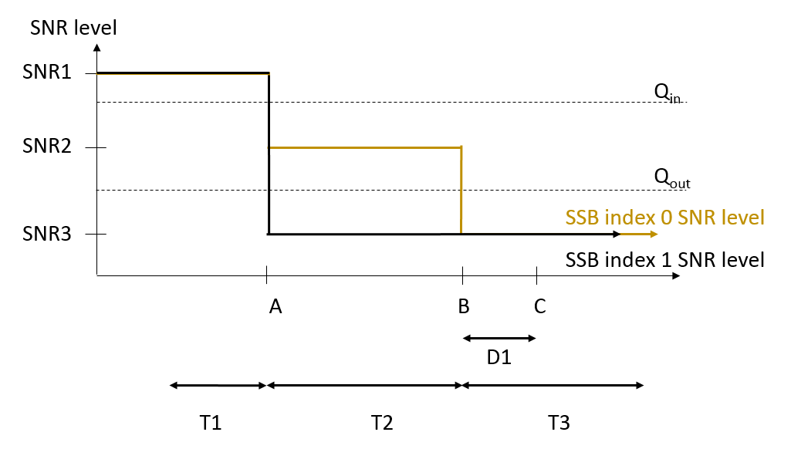
Figure A.7.5.1.13 .1-1: SNR variation for out-of-sync testing

Figure A.7.5.1.13 .1-2: Time multiplexed downlink transmissions
##### A.7.5.1.13.2 Test Requirements
The UE behavior in each test during time durations T1, T2 and T3 shall be as follows:
During the period from time point A to time point B the UE shall transmit uplink signal at least in all uplink slots configured for CSI transmission according to the configured periodic CSI reporting.
The UE shall stop transmitting uplink signal no later than time point C (D1 second after the start of the time duration T3).
The rate of correct events observed during repeated tests shall be at least 90 %.
#### A.7.5.1.14 Radio Link Monitoring In-sync Test for FR2 PCell configured with CSI-RS-based RLM in DRX mode  for a UE operating with SBFD
##### A.7.5.1.14.1 Test Purpose and Environment
The purpose of this test is to verify that when the UE supports supportSBFD and SBFD is configured by the network, the UE properly detects the in sync for the purpose of monitoring downlink CSI-RS based radio link quality of the PCell when there are overlapping between occasions of the CSI-RS resource for RLM and dynamic UL transmission on SBFD symbols. This test will partly verify the FR2 PCell CSI-RS In-sync radio link monitoring requirements in clause 8.1.
The test parameters are given in Tables A.7.5.1.14.1-1, A.7.5.1.14.1-2, A.7.5.1.14.1-3 and A.7.5.1.14.1-4 below. There is one cells, cell 1which is the PCell, in the test. The test consists of five successive time periods, with time duration of T1, T2, T3, T4 and T5 respectively. Figure A.7.5.1.14.1-1 shows the variation of the downlink SNR in the PCell to emulate out-of-sync and in-sync states. Prior to the start of the time duration T1, the UE shall be fully synchronized to cell 1. The UE shall be configured for periodic CSI reporting with a reporting periodicity of 10 ms. The UE is configured to perform inter-frequency measurements using GP ID #0 (40 ms) in test. In the test, SSB0 and SSB1 are configured as BFD-RS.
CSI-RS resource for RLM are on SBFD symbols. During T5, there is overlapping between occasions of the CSI-RS resource for RLM and dynamic UL transmission on SBFD symbols, as specified in A.3.
Table A.7.5.1.14.1-1: Supported test configurations for FR2 PSCell
| Configuration | Description |
| --- | --- |
| 1 | TDD duplex mode, 120 kHz SSB SCS, 100 MHz bandwidth |

Table A.7.5.1.14.1-2: General test parameters for FR2 PCell for CSI-RS in-sync testing in DRX mode
| Parameter | Unit | Value |  |
| --- | --- | --- | --- |
|  |  | Test 1 |  |
| Active PCell |  | Cell 1 |  |
| RF Channel Number |  | 1 |  |
| Duplex mode | Config 1 |  | TDD |
| TDD Configuration | Config 1 |  | TDDConf.3.1 |
| SBFD configuration | Config 1 |  | SBFD.1 FR2 |
| DL initial BWP configuration | Config 1 |  | DLBWP.0.1 |
| DL dedicated BWP configuration | Config 1 |  | DLBWP.1.1 |
| UL initial BWP configuration | Config 1 |  | ULBWP.0.1 |
| UL dedicated BWP configuration | Config 1 |  | ULBWP.1.1 |
| RMSI CORESET Reference Channel | Config 1 |  | CR.3.1 TDD |
| Dedicated CORESET Reference Channel | Config 1 |  | CCR.3.1 TDD |
| SSB Configuration | Config 1 |  | SSB.3 FR2 |
| SMTC Configuration | Config 1 |  | SMTC.1 |
| PDSCH/PDCCH subcarrier spacing | Config 1 |  | 120 KHz |
| CSI-RS for RLM | Config 1 |  | Resource #4 in TRS.2.1 TDD Resource #4 in TRS.2.2 TDD |
| TRS configuration |  | TRS.2.1 TDD TRS.2.2 TDD |  |
| TCI configuration for PDCCH#1/PDSCH |  | TCI.State.2 |  |
| TCI configuration for PDCCH#2 |  | TCI.State.3 |  |
| OCNG parameters |  | OP.1 |  |
| CP length |  | Normal |  |
| Out of sync transmission parameters | DCI format |  | 1-0 |
|  | Number of Control OFDM symbols |  | 2 |
|  | Aggregation level | CCE | 8 |
|  | Ratio of hypothetical PDCCH RE energy to average CSI-RS RE energy | dB | 4 |
|  | Ratio of hypothetical PDCCH DMRS energy to average CSI-RS RE energy | dB | 4 |
|  | DMRS precoder granularity |  | REG bundle size |
|  | REG bundle size |  | 6 |
| In sync transmission parameters | DCI format |  | 1-0 |
|  | Number of Control OFDM symbols |  | 2 |
|  | Aggregation level | CCE | 4 |
|  | Ratio of hypothetical PDCCH RE energy to average CSI-RS RE energy | dB | 0 |
|  | Ratio of hypothetical PDCCH DMRS energy to average CSI-RS RE energy | dB | 0 |
|  | DMRS precoder granularity |  | REG bundle size |
|  | REG bundle size |  | 6 |
| DRX |  | DRX.3 |  |
| Gap pattern ID |  | *gp0 |  |
| Layer 3 filtering |  | Enabled |  |
| T310 timer | ms | 2000 |  |
| T311 timer | ms | 1000 |  |
| N310 |  | 1 |  |
| N311 |  | 1 |  |
| CSI-RS for CSI reporting | Config 1 |  | CSI-RS.3.1 TDD |
| reportConfigType |  | periodic |  |
| reportQuantity |  | cri-RI-PMI-CQI |  |
| CSI reporting periodicity | slot | 40 |  |
| CSI reporting offset | slot | 4 |  |
| T1 | s | 0.2 |  |
| T2 | s | 0.2 |  |
| T3 | s | 1.64 |  |
| T4 | s | 0.2 |  |
| T5 | s | 1.88 |  |
| D1 | s | 1.84 |  |
| NOTE 1: UE-specific PDCCH is not transmitted after T1 starts. |  |  |  |

Table A.7.5.1.14.1-3: Cell specific test parameters for FR2 for CSI-RS in-sync radio link monitoring in DRX mode
| Parameter | Unit | Test 1 |  |  |  |  |  |
| --- | --- | --- | --- | --- | --- | --- | --- |
|  |  | T1 | T2 | T3 | T4 | T5 |  |
| AoA setup | dB | Setup 1 defined in A.3.15 |  |  |  |  |  |
| Assumption for UE beams Note 10 |  | Rough |  |  |  |  |  |
| EPRE ratio of PDCCH DMRS to SSS | dB | 4 |  |  |  |  |  |
| EPRE ratio of PDCCH to PDCCH DMRS | dB |  |  |  |  |  |  |
| EPRE ratio of PBCH DMRS to SSS | dB | 0 |  |  |  |  |  |
| EPRE ratio of PBCH to PBCH DMRS | dB |  |  |  |  |  |  |
| EPRE ratio of PSS to SSS | dB |  |  |  |  |  |  |
| EPRE ratio of PDSCH DMRS to SSS | dB |  |  |  |  |  |  |
| EPRE ratio of PDSCH to PDSCH DMRS |  |  |  |  |  |  |  |
| EPRE ratio of OCNG DMRS to SSS |  |  |  |  |  |  |  |
| EPRE ratio of OCNG to OCNG DMRS | dB |  |  |  |  |  |  |
| SNR on RLM-RS1 | Config 1 | dB | 2Note 11 | -6Note 11 | -15 | -4.5 | 2Note 11 |
| SNR on RLM-RS2 | Config 1 | dB | 2Note 11 | -15 | -15 | -15 | -15 |
|  | Config 1 | dBm/15KHz | -104.7 |  |  |  |  |
| Propagation condition |  | TDL-A 30ns 75Hz |  |  |  |  |  |
| NOTE 1: OCNG shall be used such that the resources in Cell 1 are fully allocated and a constant total transmitted power spectral density is achieved for all OFDM symbols. NOTE 2: The uplink resources for CSI reporting are assigned to the UE prior to the start of time period T1. NOTE 3: NZP CSI-RS resource set configuration for CSI reporting are assigned to the UE prior to the start of time period T1. NOTE 4: Measurement gap configuration is assigned to the UE prior to the start of time period T1. NOTE 5: The timers and layer 3 filtering related parameters are configured prior to the start of time period T1. NOTE 6: The signal contains PDCCH for UEs other than the device under test as part of OCNG. NOTE 7: SNR levels correspond to the signal to noise ratio over the SSS REs. NOTE 8: The SNR in time periods T1, T2, T3, T4 and T5 is denoted as SNR1, SNR2, SNR3, SNR4 and SNR5 respectively in figure A.7.5.1.8.1-1. NOTE 9: The SNR values are specified for testing a UE which supports 2RX on at least one band. For testing of a UE which supports 4RX on all bands, the SNR during T3 is A.3.6. NOTE 10: Information about types of UE beam is given in clause B.2.1.3 and does not limit UE implementation or test system implementation. NOTE 11: This value allows up to 1 dB degradation from applied SNR to UE baseband. |  |  |  |  |  |  |  |

Table A.7.5.1.14.1-4: Measurement gap configuration for FR2 CSI-RS in-sync radio link monitoring in DRX mode
| Field | Test 1 |
| --- | --- |
|  | Value |
| gapOffset | 0 |
| NOTE 1: RLM RS is partially overlapped with measurement gap |  |

Figure A.7.5.1.14.1-1: SNR variation for CSI-RS in-sync testing
##### A.7.5.1.14.2 Test Requirements
The UE behaviour in each test during time durations T1, T2, T3, T4 and T5 shall be as follows:
During the period from time point A to time point F (D1 second after the start of time duration T5) the UE shall transmit uplink signal at least in all uplink slots configured for CSI transmission according to the configured periodic CSI reporting on the PCell.
The rate of correct events observed during repeated tests shall be at least 90 %.
### A.7.5.2 Interruption
#### A.7.5.2.1 Interruptions during measurements on deactivated NR SCC in FR2
##### A.7.5.2.1.1 Test Purpose and Environment
The purpose of this test is to verify that the UE missed ACK/NACK rate does not exceed the limits at NR PSCell interruptions during the measurement on the deactivated NR SCC. This test will verify the missed ACK/NACK rate for PCell in standalone NR specified in clause 8.2.2.2. Supported test configurations are shown in table A.7.5.2.1.1-1.
The general test parameters and NR cell specific test parameters are given in Table A.7.5.2.1.1-2 and A.7.5.2.1.1-3 below. In the test there are two cells: Cell 1 and Cell 2. Cell 1 is PCell, Cell 2 is an NR deactivated SCell. Cell 1 shall be configured as PCell and Cell 2 shall be configured as SCell.
The test consists of one time period, with duration of T1. Prior to the start of the time duration T1, the UE is connected to Cell 1 and Cell 2. The point in time at which the RRC message including measCycleSCell or allowInterruptions for the deactivated NR SCells is received at the UE antenna connector, defines the start of time period T1. During T1, PCell is continuously scheduled in DL.
Table A.7.5.2.1.1-1: Interruptions during measurements on deactivated NR SCC supported test configurations
| Config | Description |
| --- | --- |
| 1 | NR 120 kHz SSB SCS, 100 MHz bandwidth, TDD – TDD duplex mode |

Table A.7.5.2.1.1-2: General test parameters for interruptions during measurements on deactivated NR SCC in standalone NR
| Parameter | Unit | Value | Comment |
| --- | --- | --- | --- |
| RF Channel Number |  | 1, 2 | Two NR RF channels |
| Active PCell |  | Cell 1 | PCell on NR RF channel number 1. |
| Configured deactivated SCell |  | Cell 2 | Deactivated SCell on NR RF channel number 2. |
| CP length |  | Normal | Applicable to Cell 1 and Cell 2 |
| DRX |  | OFF |  |
| Measurement gap pattern Id |  | OFF |  |
| SCell measurement cycle (measCycleSCell) | ms | 640 |  |
| T1 | s | 10 |  |

Table A.7.5.2.1.1-3: NR cell specific test parameters for interruptions during measurements on deactivated NR SCC in standalone NR
| Parameter | Unit | Cell 1 | Cell 2 |
| --- | --- | --- | --- |
| Frequency Range |  | FR2 |  |
| Duplex mode |  |  | TDD |
| TDD configuration |  |  | TDDConf.3.1 |
| BWchannel |  |  | 100 MHz: NPRB,c = 66 |
| Data PRBs allocated |  |  | 66 |
| Initial DL BWP Configuration |  |  | DLBWP.0.2Note4 |
| Initial UL BWP Configuration |  |  | ULBWP.0.2 Note6 |
| Downlink dedicated BWP Configuration |  |  | DLBWP.1.1 |
| Uplink dedicated BWP configuration |  |  | ULBWP.1.1 |
| PDSCH Reference measurement channel |  |  | SR.3.1 TDD |
| RMSI CORESET parameters |  |  | CR.3.1 TDD |
| Dedicated CORESET parameters |  |  | CCR.3.1 TDD |
| OCNG Patterns |  | OP.1 |  |
| SMTC Configuration |  | SMTC.1 |  |
| SSB Configuration |  |  | SSB.1 FR2 |
| TCI State |  |  | TCI.State.0 |
| TRS Configuration |  |  | TRS.2.1 TDD |
| Correlation Matrix and Antenna Configuration |  | 1x2 Low |  |
| EPRE ratio of PSS to SSS | dB | 0 | 0 |
| EPRE ratio of PBCH DMRS to SSS |  |  |  |
| EPRE ratio of PBCH to PBCH DMRS |  |  |  |
| EPRE ratio of PDCCH DMRS to SSS |  |  |  |
| EPRE ratio of PDCCH to PDCCH DMRS |  |  |  |
| EPRE ratio of PDSCH DMRS to SSS |  |  |  |
| EPRE ratio of PDSCH to PDSCH |  |  |  |
| EPRE ratio of OCNG DMRS to SSS(Note 1) |  |  |  |
| EPRE ratio of OCNG to OCNG DMRS (Note 1) |  |  |  |
| Time offset to Cell 1 Note 3 | s | - | 3 |
| Propagation Condition |  | AWGN |  |
| NOTE 1: OCNG shall be used such that both cells are fully allocated and a constant total transmitted power spectral density is achieved for all OFDM symbols. NOTE 2: Void NOTE 3: Receive time difference between slot boundaries of signals received from the two cells at the UE antenna connector including time alignment error between the two cells. NOTE 4: For unpaired spectrum, a DL BWP is linked with an UL BWP. DLBWP.0.2 is linked with ULBWP.0.2 defined in clause 12 of of TS 38.213 [3]. |  |  |  |

Table A.7.5.2.1.1-4: OTA related test parameters for interruptions during measurements on deactivated NR SCC in standalone NR
| Parameter | Unit | Cell 1 | Cell 2 |  |
| --- | --- | --- | --- | --- |
| Angle of arrival configuration |  | Setup1 according to table A.3.15.1 | Setup 1according to table A.3.15.1 |  |
| Assumption for UE beams Note 6 |  | Rough | Rough |  |
| Note1 | NR_TDD_FR2_A | dBm/15kHz | -104.7 | -104.7 |
|  | NR_TDD_FR2_B |  |  |  |
|  | NR_TDD_FR2_F |  |  |  |
|  | NR_TDD_FR2_G |  |  |  |
|  | NR_TDD_FR2_T |  |  |  |
|  | NR_TDD_FR2_Y |  |  |  |
| Note1 | NR_TDD_FR2_A | dBm/SCS | -95.7 | -95.7 |
|  | NR_TDD_FR2_B |  |  |  |
|  | NR_TDD_FR2_F |  |  |  |
|  | NR_TDD_FR2_G |  |  |  |
|  | NR_TDD_FR2_T |  |  |  |
|  | NR_TDD_FR2_Y |  |  |  |
| SSB_RPNote2 | NR_TDD_FR2_A | dBm/120KHz Note3 | -88.7 | -88.7 |
|  | NR_TDD_FR2_B |  |  |  |
|  | NR_TDD_FR2_F |  |  |  |
|  | NR_TDD_FR2_G |  |  |  |
|  | NR_TDD_FR2_T |  |  |  |
|  | NR_TDD_FR2_Y |  |  |  |
|  |  | dB | 7 | 7 |
|  | dB | 7 | 7 |  |
| IoNote2 | NR_TDD_FR2_A | dBm/95.04 MHz Note4 | -58.92 | -58.92 |
|  | NR_TDD_FR2_B |  |  |  |
|  | NR_TDD_FR2_F |  |  |  |
|  | NR_TDD_FR2_G |  |  |  |
|  | NR_TDD_FR2_T |  |  |  |
|  | NR_TDD_FR2_Y |  |  |  |
| NOTE 1: Interference from other cells and noise sources not specified in the test is assumed to be constant over subcarriers and time and shall be modelled as AWGN of appropriate power for  to be fulfilled. NOTE 2: SSB_RP and Io levels have been derived from other parameters for information purposes. They are not settable parameters themselves. NOTE 3: SSB_RP minimum requirements are specified assuming independent interference and noise at each receiver antenna port. NOTE 4: Equivalent power received by an antenna with 0 dBi gain at the centre of the quiet zone NOTE 5: As observed with 0 dBi gain antenna at the centre of the quiet zone NOTE 6: Information about types of UE beam is given in clause B.2.1.3 and does not limit UE implementation or test system implementation. |  |  |  |  |

##### A.7.5.2.1.2 Test Requirements
The UE shall be continuously scheduled on PCell during the entire length of T1. During the time duration T1 the UE shall transmit at least 99.5 % of ACK/NACK on PCell.
If the NR PCell is not in the same band as the deactivated SCell, the UE is only allowed to cause interruptions on NR PCell immediately before and immediately after an SMTC. Each interruption on NR PCell shall not exceed the value defined in Table A.7.5.2.1.2-1.
If the NR PCell is in the same band as the deactivated SCell, the UE is only allowed to cause an interruption on PCell no earlier than 4 slots before an SMTC and no later than 4 slots after the SMTC. the interruption on NR PCell shall not exceed the value defined in Table A.7.5.2.1.2-2.
Table A.7.5.2.1.2-1: Interruption duration if the PCell is not in the same band as the deactivated SCell
|  | NR Slot length (ms) | Interruption length (slot) |
| --- | --- | --- |
| 3 | 0.125 | 4 |

Table A.7.5.2.1.2-2: Interruption duration if the PCell is in the same band as the deactivated SCell
|  | NR Slot length (ms) | Interruption length (slot) |
| --- | --- | --- |
| 3 | 0.125 | 8 + SMTC duration |

The rate of correct events observed during repeated tests shall be at least 90 %.
#### A.7.5.2.2 SA interruptions at NR SRS carrier-based switching
##### A.7.5.2.2.1 Test Purpose and Environment
The purpose of this test is to verify that when a UE needs to transmit aperiodic SRS, the UE can perform SRS carrier-based switching to a carrier not configured for PUCCH/PUSCH transmission from a carrier with PUCCH/PUSCH transmission. The test will partly verify the interruption requirements on PCell in clause 8.2.2.2.9.
##### A.7.5.2.2.2 Test Parameters
In each test there are two cells: Cell 1 and Cell 2. Cell 1 is the FR2 PCell. Cell 2 is an activated FR2 SCell on the TDD SCC which operats in downlink without PUCCH/PUSCH. The UE is configured with the SRS switching between PCell and SCell.The test parameters for PCell and SCell are given in Tables A.7.5.2.2.2-2, A.7.5.2.2.2-3, and A.7.5.2.2.2-4 below. The test consists of two successive time periods, with duration of T1 and T2, respectively. Immediately at the beginning of T2, the UE is triggered for SRS switching by DCI 2_3 scheduling. After T2, the UE is expected to transmit aperiodic SRS on a special slot in the configured TDD UL/DL configuration, as scheduled by DCI 2_3. The UE shall be scheduled on PCell continuously throughout the test.
The test equipment verifies that potential interruption is carried out correctly by monitoring ACK/NACK sent in PCell.
Table A.7.5.2.2.2-1: Supported test configurations
| Configuration | Description |
| --- | --- |
| 1 | 120 kHz SSB SCS, 100 MHz bandwidth, TDD duplex mode |
| NOTE: The UE is only required to be tested in one of the supported test configurations. |  |

Table A.7.5.2.2.2-2: General test parameters for SA interruptions at NR SRS carrier-based switching
| Parameter | Unit | Value | Comment |
| --- | --- | --- | --- |
| RF Channel Number |  | 1, 2 | Two NR radio channel (1, 2) are used for this test |
| Active PCell |  | Cell 1 | Primary cell on NR RF channel number 1 |
| Configured SCell |  | Cell 2 | Activated secondary cell on NR RF channel number 2 |
| CP length |  | Normal |  |
| DRX |  | OFF | Continuous monitoring of PCell |
| T1 | s | 5 |  |
| T2 | ms | 100 | UE shall perform SRS switching during T2 |

Table A.7.5.2.2.2-3: Cell-specific test parameters for SA interruptions at NR SRS carrier-based switching
| Parameter | Unit | Cell 1 | Cell 2 |
| --- | --- | --- | --- |
| Frequency Range |  | FR2 |  |
| Duplex mode | Config 1 |  | TDD |
| TDD configuration | Config 1 |  | TDDConf.3.1 |
| BWchannel | Config 1 | MHz | 100: NPRB,c = 66 |
| Downlink initial BWP Configuration | Config 1 |  | DLBWP.0.1 |
| Downlink dedicated BWP Configuration | Config 1 |  | DLBWP.1.1 |
| Uplink initial BWP configuration | Config 1 |  | ULBWP.0.1 |
| Uplink dedicated BWP configuration | Config 1 |  | ULBWP.1.1 |
| SRS configuration | Config 1 |  | SRS.6 TDD |
| TRS configuration | Config 1 |  | TRS.2.1 TDD |
| TCI state | Config 1 |  | TCI.State.0 |
| PDSCH Reference measurement channel | Config 1 |  | SR.3.1 TDD |
| RMSI CORESET Reference Channel | Config 1 |  | CR.3.1 TDD |
| RMC CORESET Reference Channel | Config 1 |  | CCR.3.1 TDD |
| OCNG Patterns |  | OP.1 |  |
| SSB Configuration |  | SSB.1 FR2 |  |
| SMTC Configuration | Config 1 |  | SMTC.1 |
| EPRE ratio of PSS to SSS | dB | 0 |  |
| EPRE ratio of PBCH DMRS to SSS |  |  |  |
| EPRE ratio of PBCH to PBCH DMRS |  |  |  |
| EPRE ratio of PDCCH DMRS to SSS |  |  |  |
| EPRE ratio of PDCCH to PDCCH DMRS |  |  |  |
| EPRE ratio of PDSCH DMRS to SSS |  |  |  |
| EPRE ratio of PDSCH to PDSCH |  |  |  |
| EPRE ratio of OCNG DMRS to SSS Note 1 |  |  |  |
| EPRE ratio of OCNG to OCNG DMRS Note 1 |  |  |  |
| Propagation Condition |  | AWGN |  |
| NOTE 1: OCNG shall be used such that both cells are fully allocated, and a constant total transmitted power spectral density is achieved for all OFDM symbols. |  |  |  |

Table A.7.5.2.2.2-4: OTA related test parameters
| Parameter | Unit | Test 1 |  |
| --- | --- | --- | --- |
|  |  | T1 | T2 |
| Angle of arrival configuration |  | Setup 1 according to clause A.3.15.1 |  |
| Assumption for UE beams Note 6 |  | Fine |  |
| Note 1 | dBm/15kHzNote 4 | -112 |  |
| Note 1 | dBm/SCSNote 3 | -103 |  |
|  | dB | 4 |  |
| SS-RSRP Note 2 | dBm/SCS Note 4 | -99 |  |
|  | dB | 4 |  |
| IoNote2 | dBm/95.04 MHz Note 4 | -68.5 |  |
| NOTE 1: Interference from other cells and noise sources not specified in the test is assumed to be constant over subcarriers and time and shall be modelled as AWGN of appropriate power for  to be fulfilled. NOTE 2: SS-RSRP and Io levels have been derived from other parameters for information purposes. They are not settable parameters themselves. NOTE 3: SS-RSRP minimum requirements are specified assuming independent interference and noise at each receiver antenna port. NOTE 4: Equivalent power received by an antenna with 0 dBi gain at the centre of the quiet zone. NOTE 5: As observed with 0 dBi gain antenna at the centre of the quiet zone. NOTE 6: Information about types of UE beam is given in clause B.2.1.3 and does not limit UE implementation or test system implementation. |  |  |  |

##### A.7.5.2.2.3 Test Requirements
During T2, interruption on PCell due to SRS carrier-based switching between Cell 1 and Cell 2 shall not exceed the required values specified in clause 8.2.2.2.9.
The rate of correct events observed during repeated tests shall be at least 90 %.
### A.7.5.3 SCell Activation and Deactivation Delay
#### A.7.5.3.1 SCell Activation and deactivation for SCell in FR2 intra-band in non-DRX
##### A.7.5.3.1.1 Test Purpose and Environment
The purpose of this test case is the same as for the test defined in clause A.6.5.3.1.1 except the PCell and SCell are in FR2 intra-band.
The supported test configurations are shown in table A.7.5.3.1.1-1 below. The general test parameters are the same as defined in Table A.6.5.3.1.1-2 except those described in Tables A.7.5.3.1.1-2, and cell specific test parameters are described in Tables A.7.5.3.1.1-3. OTA related test parameters are shown in table A.7.5.3.1.1-4 below.
Table A.7.5.3.1.1-1: Supported test configurations for FR2 SCell activation case
| Configuration | Description |
| --- | --- |
| 1 | NR 120 kHz SSB SCS, 100 MHz bandwidth, TDD duplex mode |

Table A.7.5.3.1.1-2: General test parameters for FR2 SCell activation case
| Parameter | Unit | Value | Comment |
| --- | --- | --- | --- |
| RF Channel Number |  | 1,2 | Two NR radio channels are used for this test, cell 1 and cell2 use RF channel 1 and 2, respectively. |

Table A.7.5.3.1.1-3: Cell specific test parameters for FR2 SCell activation case
| ParameterNote 5 | Unit | Cell 1 | Cell 2 |  |  |  |  |
| --- | --- | --- | --- | --- | --- | --- | --- |
|  |  | T1 | T2 | T3 | T1 | T2 | T3 |
| SSB ARFCN |  | freq1 | freq2 |  |  |  |  |
| Duplex mode |  | TDD |  |  |  |  |  |
| TDD configuration |  | TDDConf.3.1 |  |  |  |  |  |
| Downlink initial BWP Configuration |  | DLBWP.0.1 |  |  |  |  |  |
| Downlink dedicated BWP Configuration |  | DLBWP.1.1 |  |  |  |  |  |
| Uplink initial BWP configuration |  | ULBWP.0.1 |  |  |  |  |  |
| Uplink dedicated BWP configuration |  | ULBWP.1.1 |  |  |  |  |  |
| TRS configuration |  | TRS.2.1 TDD |  |  |  |  |  |
| TCI state |  | TCI.State.0 |  |  |  |  |  |
| BWchannel | MHz | 100: NPRB,c = 66 |  |  |  |  |  |
| Data PRBs allocated |  | 66 | 66 | 66 |  |  |  |
| PDSCH Reference measurement channel |  | SR.3.1 TDD | - |  |  |  |  |
| RMSI CORESET Parameters |  | CR.3.1 TDD | - |  |  |  |  |
| Dedicated CORESET Parameters |  | CCR.3.1 TDD | - |  |  |  |  |
| OCNG Patterns |  | OP.1 |  |  |  |  |  |
| SSB Configuration |  | SSB.1 FR2 |  |  |  |  |  |
| SMTC Configuration |  | SMTC.1 |  |  |  |  |  |
| CSI-RS configuration for CSI reporting |  | CSI-RS.3.1 TDD |  |  |  |  |  |
| reportConfigType |  | periodic | N/A |  |  |  |  |
| reportQuantity |  | cri-RI-PMI-CQI | N/A |  |  |  |  |
| CSI reporting periodicity | slot | 40 | N/A |  |  |  |  |
| CSI reporting offset | slot | 4 | N/A |  |  |  |  |
| EPRE ratio of PSS to SSS | dB | 0 |  |  |  |  |  |
| EPRE ratio of PBCH_DMRS to SSS |  |  |  |  |  |  |  |
| EPRE ratio of PBCH to PBCH_DMRS |  |  |  |  |  |  |  |
| EPRE ratio of PDCCH_DMRS to SSS |  |  |  |  |  |  |  |
| EPRE ratio of PDCCH to PDCCH_DMRS |  |  |  |  |  |  |  |
| EPRE ratio of PDSCH_DMRS to SSS |  |  |  |  |  |  |  |
| EPRE ratio of PDSCH to PDSCH_DMRS |  |  |  |  |  |  |  |
| EPRE ratio of OCNG DMRS to SSSNote 1 |  |  |  |  |  |  |  |
| EPRE ratio of OCNG to OCNG DMRS Note 1 |  |  |  |  |  |  |  |
| Propagation conditions |  | AWGN |  |  |  |  |  |
| NOTE 1: OCNG shall be used such that both cells are fully allocated and a constant total transmitted power spectral density is achieved for all OFDM symbols. NOTE 2: Void NOTE 3: Void NOTE 4: Void NOTE 5: Void |  |  |  |  |  |  |  |

Table A.7.5.3.1.1-4: OTA related test parameters for FR2 SCell activation case
| Parameter | Unit | Cell 1 | Cell 2 |  |  |  |  |
| --- | --- | --- | --- | --- | --- | --- | --- |
|  |  | T1 | T2 | T3 | T1 | T2 | T3 |
| Angle of arrival configuration |  | Setup 1 according to table A.3.15.1 | Setup 1 according to table A.3.15.1 |  |  |  |  |
| Assumption for UE beams Note 7 |  | Rough | Rough |  |  |  |  |
| Note1 | dBm/15kHzNote4 | -104.7 | -104.7 |  |  |  |  |
| Note1 | dBm/SCSNote3 | -95.7 | -95.7 |  |  |  |  |
|  | dB | 7 | 7 |  |  |  |  |
| SSB_RPNote2 | dBm/SCS Note4 | -88.7 | -88.7 |  |  |  |  |
|  | dB | 7 | 7 |  |  |  |  |
| IoNote2 | dBm/95.04 MHz Note4 | -58.92 | -58.92 |  |  |  |  |
| NOTE 1: Interference from other cells and noise sources not specified in the test is assumed to be constant over subcarriers and time and shall be modelled as AWGN of appropriate power for  to be fulfilled. NOTE 2: Es/Iot, SSB_RP and Io levels have been derived from other parameters for information purposes. They are not settable parameters themselves. NOTE 3: Void NOTE 4: Equivalent power received by an antenna with 0 dBi gain at the centre of the quiet zone NOTE 5: Void NOTE 6: Void NOTE 7: Information about types of UE beam is given in clause B.2.1.3 and does not limit UE implementation or test system implementation. |  |  |  |  |  |  |  |

##### A.7.5.3.1.2 Test Requirements
The test requirements defined in clause A.6.5.3.1.2 shall apply to this test case, except Tactivation_time will be replaced with the value TFirstSSB + 5 ms as defined in clause 8.3.
#### A.7.5.3.2 SCell Activation and deactivation for FR1+FR2 inter-band with target SCell in FR2
##### A.7.5.3.2.1 Test Purpose and Environment
The purpose of this test case is the same as for the test defined in clause A.7.5.3.1.1 except the PCell is in FR1 and SCell is in FR2.
The supported test configurations are defined in Table A.7.5.3.2.1-1. The general test parameters are the same as defined in Table A.6.5.3.1.1-2 except that the length of T2 is 2 s. And cell specific test parameters are described in Tables A.7.5.3.2.1-2. OTA related test parameters are defined in Table A.7.5.3.2.1-3.
At the beginning of T1 the UE receives an RRC message by which the SCell (Cell 2) becomes configured on NR. During T1 the SCell is powered off and UE is not aware of SCell.
A MAC message for activation of SCell is sent by the test equipment 100 ms after the RRC message, in a slot # denoted m. The point in time at which the MAC message for activation of SCell is received at the UE antenna connector defines the start of time period T2.
During T2, the test equipment monitors the L1-RSRP measurement reporting for the SCell. The time when test equipment receives a valid L1-RSRP report is denoted as slot m+TL1-RSRP. In the next DL slot after slot m+TL1-RSRP, the test equipment sends a MAC message for the activation of the TCI state of the RMC CORESET of the SCell. In the same slot, the test equipment also sends an RRC message to configure the CSI-RS resources for SCell.
Time period T3 starts when a MAC message for deactivation of the SCell, sent from the test equipment to the UE in a slot # denoted n, is received at the UE antenna connector.
The test equipment verifies that potential interruption is carried out in the correct time span by monitoring ACK/NACK sent in PCell and PCell during activation of SCell, respectively.
The test equipment verifies the activation time by counting the slots from the time when the SCell activation command is sent until a CSI report with other than CQI index 0 is received.
The test equipment verifies the deactivation time by counting the slots from the time when the SCell 1 deactivation command is sent until CSI reporting for SCell 1 is discontinued.
Table A.7.5.3.2.1-1: Supported test configurations for FR2 SCell activation case
| Configuration | Description |
| --- | --- |
| 1 | PCell: 15 kHz SSB SCS, 10 MHz bandwidth, FDD duplex mode Target SCell: 120 kHz SSB SCS, 100 MHz bandwidth, TDD duplex mode |
| 2 | PCell: 15 kHz SSB SCS, 10 MHz bandwidth, TDD duplex mode Target SCell: 120 kHz SSB SCS, 100 MHz bandwidth, TDD duplex mode |
| 3 | PCell: 30kHz SSB SCS, 40 MHz bandwidth, TDD duplex mode Target SCell: 120 kHz SSB SCS, 100 MHz bandwidth, TDD duplex mode |
| NOTE: The UE is only required to pass in one of the supported test configurations |  |

Table A.7.5.3.2.1-2: Cell specific test parameters for FR2 SCell activation case
| ParameterNote 5 | Unit | Cell 1 | Cell 2 |  |  |  |  |  |
| --- | --- | --- | --- | --- | --- | --- | --- | --- |
|  |  | T1 | T2 |  |  | T1 | T2 |  |
| SSB ARFCN |  | Freq1 | Freq2 |  |  |  |  |  |
| Duplex mode | Config 1 |  | FDD | TDD |  |  |  |  |
|  | Config 2,3 |  | TDD |  |  |  |  |  |
| TDD configuration | Config 1 |  | Not Applicable | TDDConf.3.1 |  |  |  |  |
|  | Config 2 |  | TDDConf.1.1 |  |  |  |  |  |
|  | Config 3 |  | TDDConf.2.1 |  |  |  |  |  |
| Downlink initial BWP Configuration | Config 1,2,3 |  | DLBWP.0.1 |  |  |  |  |  |
| Downlink dedicated BWP Configuration | Config 1,2,3 |  | DLBWP.1.1 |  |  |  |  |  |
| Uplink initial BWP configuration | Config 1,2,3 |  | ULBWP.0.1 |  |  |  |  |  |
| Uplink dedicated BWP configuration | Config 1,2,3 |  | ULBWP.1.1 |  |  |  |  |  |
| TRS configuration | Config 1,2,3 |  | N/A | TRS.2.1 TDD |  |  |  |  |
| TCI state | Config 1,2,3 |  | TCI.State.0 |  |  |  |  |  |
| BWchannel | Config 1,2 | MHz | 10: NPRB,c = 52 | 100: NPRB,c = 66 |  |  |  |  |
|  | Config 3 |  | 40: NPRB,c = 106 |  |  |  |  |  |
| Data PRBs allocated | Config 1,2 |  | 52 | 66 | 52 | 66 | 52 | 66 |
|  | Config 3 |  | 106 |  | 106 |  | 106 |  |
| PDSCH Reference measurement channel | Config 1 |  | SR.1.1 FDD | - |  |  |  |  |
|  | Config 2 |  | SR.1.1 TDD |  |  |  |  |  |
|  | Config 3 |  | SR.2.1 TDD |  |  |  |  |  |
| RMSI CORESET Parameters | Config 1 |  | CR.1.1 FDD | - |  |  |  |  |
|  | Config 2 |  | CR.1.1 TDD |  |  |  |  |  |
|  | Config 3 |  | CR.2.1 TDD |  |  |  |  |  |
| Dedicated CORESET Parameters | Config 1 |  | CCR.1.1 FDD | - |  |  |  |  |
|  | Config 2 |  | CCR.1.1 TDD |  |  |  |  |  |
|  | Config 3 |  | CCR.2.1 TDD |  |  |  |  |  |
| OCNG Patterns |  | OP.1 |  |  |  |  |  |  |
| SSB configuration | Config 1,2 |  | SSB.1 FR1 | SSB.3 FR2 |  |  |  |  |
|  | Config 3 |  | SSB.2 FR1 |  |  |  |  |  |
| CSI-RS configuration for CSI reporting | Config 1~3 |  | N/A | N/A | CSI-RS.3.1 TDD Note 6 | CSI-RS.3.1 TDD |  |  |
| reportConfigType for CSI reporting |  |  | periodic | N/A |  |  |  |  |
| reportConfigType for L1-RSRP |  |  | periodic | N/A |  |  |  |  |
| reportQuantity for CSI reporting |  |  | cri-RI-PMI-CQI | N/A |  |  |  |  |
| reportQuantity for L1-RSRP |  |  | ssb-Index-RSRP | N/A |  |  |  |  |
| CSI reporting periodicity | Config 1,2 | slot | 5 | N/A |  |  |  |  |
|  | Config 3 |  | 10 |  |  |  |  |  |
| L1-RSRP reporting periodicity Note 7 | Config 1,2 | slot | 5 | N/A |  |  |  |  |
|  | Config 3 |  | 10 |  |  |  |  |  |
| CSI reporting offset | Config 1,2 | slot | 2 | N/A |  |  |  |  |
|  | Config 3 |  | 4 |  |  |  |  |  |
| L1-RSRP reporting offset | Config 1,2 | slot | 2 | N/A |  |  |  |  |
|  | Config 3 |  | 4 |  |  |  |  |  |
| SMTC configuration |  | SMTC.1 |  |  |  |  |  |  |
| EPRE ratio of PSS to SSS | dB | 0 |  |  |  |  |  |  |
| EPRE ratio of PBCH_DMRS to SSS |  |  |  |  |  |  |  |  |
| EPRE ratio of PBCH to PBCH_DMRS |  |  |  |  |  |  |  |  |
| EPRE ratio of PDCCH_DMRS to SSS |  |  |  |  |  |  |  |  |
| EPRE ratio of PDCCH to PDCCH_DMRS |  |  |  |  |  |  |  |  |
| EPRE ratio of PDSCH_DMRS to SSS |  |  |  |  |  |  |  |  |
| EPRE ratio of PDSCH to PDSCH_DMRS |  |  |  |  |  |  |  |  |
| EPRE ratio of OCNG DMRS to SSSNote 1 |  |  |  |  |  |  |  |  |
| EPRE ratio of OCNG to OCNG DMRS Note 1 |  |  |  |  |  |  |  |  |
| Propagation conditions |  | N/A Link only, see clause A.3.7A | AWGN |  |  |  |  |  |
| NOTE 1: OCNG shall be used such that both cells are fully allocated and a constant total transmitted power spectral density is achieved for all OFDM symbols. NOTE 2: Void NOTE 3: Void NOTE 4: Void NOTE 5: All parameters apply for configuration 1, 2 and 3 NOTE 6: CSI-RS for CSI measurement is (re)configured in the next DL slot after slot m+TL1-RSRP during T2. NOTE 7: L1-RSRP measurement and reporting are configured to the the UE prior to the start of time period T1. |  |  |  |  |  |  |  |  |

Table A.7.5.3.2.1-3: OTA related test parameters for FR1 PCell activation case with FR2 SCell
| Parameter | Unit | Cell 1 | Cell 2 |  |  |  |  |
| --- | --- | --- | --- | --- | --- | --- | --- |
|  |  | T1 | T2 | T3 | T1 | T2 | T3 |
| Angle of arrival configuration |  | N/A | According to clause A.3.15.1 |  |  |  |  |
| Assumption for UE beams Note 7 |  | N/A | Rough |  |  |  |  |
| Note 1 | Config 1,2,3 | dBm/15kHz | Link only, see clause A.3.7A | -104.7 |  |  |  |
| Note 1 | Config 1,2,3 | dBm/SCS |  | -95.7 |  |  |  |
|  | Config 1,2,3 | dB |  | -∞ | 7 | 7 |  |
|  | Config 1,2,3 | dB |  | -∞ | 7 | 7 |  |
| SSB_RPNote 2, Note 4 | Config 1,2,3 | dBm/SCS |  | -∞ | -88.7 | -88.7 |  |
| IoNote 2, Note 4 | Config 1,2,3 | dBm/95.04 MHz |  | -66.68 | -58.92 | -58.92 |  |
| NOTE 1: Interference from other cells and noise sources not specified in the test is assumed to be constant over subcarriers and time and shall be modelled as AWGN of appropriate power for  to be fulfilled. NOTE 2: Es/Iot, SSB_RP and Io levels have been derived from other parameters for information purposes. They are not settable parameters themselves. NOTE 3: Void NOTE 4: Equivalent power received by an antenna with 0 dBi gain at the centre of the quiet zone NOTE 5: Void NOTE 6: Void NOTE 7: Information about types of UE beam is given in clause B.2.1.3 and does not imit UE implementation or test system implementation. |  |  |  |  |  |  |  |

##### A.7.5.3.2.2 Test Requirements
During T2 the UE shall send the first CSI report for SCell in the first available uplink resource after at least one CSI-RS transmission occasion for channel measurement plus nCSI_ref  slots, as defined in 5.2.2.5 in [26], and reporting after slot (m+k). UE is allowed to postpone CSI report to next available UL resource if an available uplink resource is subject to interruption.  Whether CSI report in a slot was interrupted is checked by monitoring ACK/NACK sent in PCell in the slot.
During T2 the UE shall start sending valid L1-RSRP report for the SCell in the configured slots for CSI reporting after slot (m+TL1-RSRP), where TL1-RSRP is no larger than
3 ms + TFirstSSB_MAX + 15*TSMTC_MAX + 8*Trs + TL1-RSRP, measure + TL1-RSRP, report
as defined in clause 8.3.2. For this test case, TFirstSSB_MAX=TSMTC_MAX=Trs=20 ms; TL1-RSRP, measure=160 ms and TL1-RSRP, report=5 ms, which allows TL1-RSRP 680 ms.
During T2 the UE shall start sending CSI reports for the SCell with non-zero CQI index in the configured slots for CSI reporting no later than slot $m+\frac{T_{HARQ}+T_{activtion_time}+T_{CSI_Reporting}}{NR slot length}$, where
- THARQ is defined in Table A.5.5.3.1.1-2
- Tactivation_time = 3 ms + TFirstSSB_MAX + 15*TSMTC_MAX + 8*Trs + TL1-RSRP, measure + TL1-RSRP, report + max {(THARQ + Tuncertainty_MAC + 5 ms + TFineTiming), (Tuncertainty_RRC + TRRC_delay)}, which allows 710 ms
- TCSI_Reporting = 10 ms
- NR slot length is 0.125 ms for this test case.
During T3 the UE shall stop sending CSI reports for both SCells no later than slot $n+\frac{T_{HARQ}+3 ms}{NR slot length}$, as defined in clause 8.3.
During T2 interruption of PCell during SCell activation shall not happen outside the slot $m+1+\frac{T_{HARQ}}{NR slot length}$  to $m+1+\frac{T_{HARQ}+3 ms+T_{X}}{NR slot length}$, as defined in clause 8.3, where TX =20 ms.
During T3 the starting point of interruption of PCell during SCell deactivation shall not happen outside the slot $n+1+\frac{T_{HARQ}}{NR slot length}$ to $n+1+\frac{T_{HARQ}+3 ms}{NR slot length}$, as defined in clause 8.3.
The interruption of PCell due to activation of SCell shall not be more than the values specified for SA in Clause 8.2.2.2.7.
#### A.7.5.3.3 SCell Activation and deactivation for SCell in FR2 inter-band in non-DRX
##### A.7.5.3.3.1 Test Purpose and Environment
The purpose of this test case is the same as for the test defined in clause A.7.5.3.1.1 except the PCell and SCell are in FR2 inter-band.
The supported test configurations are shown in table A.7.5.3.3.1-1 below. The general test parameters are described in Tables A.7.5.3.3.1-2, and cell specific test parameters are described in Tables A.7.5.3.3.1-3. OTA related test parameters are shown in table A.7.5.3.3.1-4 below.
At the beginning of T1 the UE receives an RRC message by which the SCell (Cell 2) becomes configured on NR. During T1 the SCell is powered off and UE is not aware of SCell. A MAC message for activation of SCell is sent by the test equipment 100 ms after the RRC message, in a slot # denoted m.
The point in time at which the MAC message for activation of SCell is received at the UE antenna connector defines the start of time period T2. Immediately at beginning of T2 the transmission power of Cell 2 is increased to same level as for PCell. During T2, the test equipment monitors the L1-RSRP measurement reporting for the SCell. The time when test equipment receives a valid L1-RSRP report is denoted as slot m+TL1-RSRP. In the next DL slot after slot m+TL1-RSRP, the test equipment sends a MAC message for the activation of the TCI state of the RMC CORESET of the SCell. In the same slot, the test equipment also sends an RRC message to configure the CSI-RS resources for SCell.
Time period T3 starts when a MAC message for deactivation of the SCell, sent from the test equipment to the UE in a slot # denoted n, is received at the UE antenna connector.
The test equipment verifies that potential interruption is carried out in the correct time span by monitoring ACK/NACK sent in PCell during activation of SCell, respectively.
The test equipment verifies the activation time by counting the slots from the time when the SCell activation command is sent until a CSI report with other than CQI index 0 is received.
The test equipment verifies the deactivation time by counting the slots from the time when the SCell 1 deactivation command is sent until CSI reporting for SCell is discontinued.
Table A.7.5.3.3.1-1: Supported test configurations for FR2 SCell activation in FR2 inter-band
| Configuration | Description |
| --- | --- |
| 1 | NR 120 kHz SSB SCS, 100 MHz bandwidth, TDD duplex mode |

Table A.7.5.3.3.1-2: General test parameters for FR2 SCell activation in FR2 inter-band
| Parameter | Unit | Value | Comment |
| --- | --- | --- | --- |
| RF Channel Number |  | 1,2 | Two NR radio channels are used for this test. RF channel number 1 is in band 1 and RF channel number 2 is in band 2, where bands 1 and 2 are inter-band CA operating bands in FR2 as specified in Table 5.2A.2-1 in TS 38.101-2 [19]. |
| Active PCell |  | Cell 1 | Primary cell on NR RF channel number 1. |
| Configured deactivated SCell |  | Cell 2 | Configured deactivated secondary cell on NR RF channel number 2. |
| CP length |  | Normal |  |
| DRX |  | OFF | Continuous monitoring of primary cell |
| CQI/PMI periodicity and offset configuration index |  | 0 | CQI reporting for SCell every second subframe |
| Cell-individual offset for cells on NR channel number | dB | 0 | Individual offset for cells on primary component carrier. |
| SCell measurement cycle (measCycleSCell) | ms | 160 |  |
| Cell 2 timing offset to cell1 | s | ≤8 | A random value from 0s to 8s |
| T1 | s | 7 | During this time the PCell shall be known and the SCell configured and detected. |
| T2 | s | 2 | During this time the UE shall activate the SCell. |
| T3 | s | 1 | During this time the UE shall deactivate the SCell. |
| THARQ | ms | k1$\times$NR slot length | k1 is a number of slots and is indicated by the PDSCH-to-HARQ-timing-indicator field in the DCI format, if present, or provided by dl-DataToUL-ACK, the value of k should be the minimum value defined in TS 38.213 [3] depends on UE’s capability |
| TCSI_Reporting | ms | 2 | the delay uncertainty in acquiring the first available CSI reporting resources as specified in TS 38.331 [2] |

Table A.7.5.3.3.1-3: Cell specific test parameters for FR2 SCell activation in FR2 inter-band
| ParameterNote 5 | Unit | T1 | T2 | T3 |  |  |  |
| --- | --- | --- | --- | --- | --- | --- | --- |
|  |  | Cell 1 | Cell 2 | Cell 1 | Cell 2 | Cell 1 | Cell 2 |
| SSB ARFCN |  | freq1 | freq2 | freq1 | freq2 | freq1 | freq2 |
| Duplex mode |  | TDD | TDD | TDD |  |  |  |
| TDD configuration |  | TDDConf.3.1 | TDDConf.3.1 | TDDConf.3.1 |  |  |  |
| Downlink initial BWP Configuration |  | DLBWP.0.1 | DLBWP.0.1 | DLBWP.0.1 |  |  |  |
| Downlink dedicated BWP Configuration |  | DLBWP.1.1 | DLBWP.1.1 | DLBWP.1.1 |  |  |  |
| Uplink initial BWP configuration |  | ULBWP.0.1 | ULBWP.0.1 | ULBWP.0.1 |  |  |  |
| Uplink dedicated BWP configuration |  | ULBWP.1.1 | ULBWP.1.1 | ULBWP.1.1 |  |  |  |
| TRS configuration |  | TRS.2.1 TDD | TRS.2.1 TDD | TRS.2.1 TDD |  |  |  |
| TCI state |  | TCI.State.0 | TCI.State.0 | TCI.State.0 |  |  |  |
| BWchannel | MHz | 100: NPRB,c = 66 | 100: NPRB,c = 66 | 100: NPRB,c = 66 |  |  |  |
| PDSCH Reference measurement channel |  | SR.3.1 TDD | - | SR.3.1 TDD | - | SR.3.1 TDD | - |
| RMSI CORESET Parameters |  | CR.3.1 TDD | - | CR.3.1 TDD | - | CR.3.1 TDD | - |
| Dedicated CORESET Parameters |  | CCR.3.1 TDD | - | CCR.3.1 TDD | - | CCR.3.1 TDD | - |
| CSI-RS configuration |  | NA | NA | NA | CSI-RS.3.1 TDD Note 2 | NA | CSI-RS.3.1 TDD |
| CSI reporting periodicity Note 3 |  | NA | 5 | NA | 5 | NA | 5 |
| OCNG Patterns |  | OP.1 |  |  |  |  |  |
| SSB Configuration |  | SSB.1 FR2 |  |  |  |  |  |
| SMTC Configuration |  | SMTC.1 |  |  |  |  |  |
| EPRE ratio of PSS to SSS | dB | 0 |  |  |  |  |  |
| EPRE ratio of PBCH_DMRS to SSS |  |  |  |  |  |  |  |
| EPRE ratio of PBCH to PBCH_DMRS |  |  |  |  |  |  |  |
| EPRE ratio of PDCCH_DMRS to SSS |  |  |  |  |  |  |  |
| EPRE ratio of PDCCH to PDCCH_DMRS |  |  |  |  |  |  |  |
| EPRE ratio of PDSCH_DMRS to SSS |  |  |  |  |  |  |  |
| EPRE ratio of PDSCH to PDSCH_DMRS |  |  |  |  |  |  |  |
| EPRE ratio of OCNG DMRS to SSSNote 1 |  |  |  |  |  |  |  |
| EPRE ratio of OCNG to OCNG DMRS Note 1 |  |  |  |  |  |  |  |
| Propagation conditions |  | AWGN |  |  |  |  |  |
| NOTE 1: OCNG shall be used such that both cells are fully allocated and a constant total transmitted power spectral density is achieved for all OFDM symbols. NOTE 2: CSI-RS for CSI measurement is (re)configured in the next DL slot after slot m+TL1-RSRP during T2. NOTE 3: L1-RSRP measurement and reporting are configured to the the UE prior to the start of time period T1. |  |  |  |  |  |  |  |

Table A.7.5.3.3.1-4: OTA related test parameters for FR2 SCell activation in FR2 inter-band
| ParameterNote 6 | Unit | Cell 1 | Cell 2 |  |  |  |  |
| --- | --- | --- | --- | --- | --- | --- | --- |
|  |  | T1 | T2 | T3 | T1 | T2 | T3 |
| AoA setup |  | Setup 3 as specified in clause A.3.15 |  |  |  |  |  |
|  |  | AoA1 | AoA2 |  |  |  |  |
| Assumption for UE beams Note 7 |  | Rough | Rough |  |  |  |  |
| Note1 | dBm/15kHzNote4 | -92.1 | -92.1 |  |  |  |  |
| Note1 | dBm/SCSNote3 | -83.1 | -83.1 |  |  |  |  |
|  | dB | 0 | 0 |  |  |  |  |
| SS-RSRPNote2 | dBm/SCS Note4 | -83.1 | -83.1 |  |  |  |  |
|  | dB | 0 | 0 |  |  |  |  |
| IoNote2 | dBm/95.04 MHz Note4 | -51.1 | -51.1 |  |  |  |  |
| NOTE 1: Interference from other cells and noise sources not specified in the test is assumed to be constant over subcarriers and time and shall be modelled as AWGN of appropriate power for  to be fulfilled. NOTE 2: SS-RSRP and Io levels have been derived from other parameters for information purposes. They are not settable parameters themselves. NOTE 3: SS-RSRP minimum requirements are specified assuming independent interference and noise at each receiver antenna port. NOTE 4: Equivalent power received by an antenna with 0 dBi gain at the centre of the quiet zone NOTE 5: As observed with 0 dBi gain antenna at the centre of the quiet zone NOTE 6: All parameters apply for configuration 1 NOTE 7: Information about types of UE beam is given in clause B.2.1.3 and does not limit UE implementation or test system implementation. |  |  |  |  |  |  |  |

##### A.7.5.3.3.2 Test Requirements
During T2 the UE shall start sending CSI report for the SCell in the configured slots for CSI reporting after at least one CSI-RS transmission occasion for channel measurement and reporting after slot (m+k). UE shall send the first CSI report for SCell after receiving at least one CSI-RS transmission occasion for channel measurement and reporting after slot (m+k), or in the next available uplink resource for CSI reporting if the slot was subject to interruption. Whether CSI report in a slot was interrupted is checked by monitoring ACK/NACK sent in PCell in the slot.
During T2, the UE shall start sending valid L1-RSRP report for the SCell in the configured slots for CSI reporting after slot (m+TL1-RSRP), where TL1-RSRP is no larger than 3 ms + TFirstSSB_MAX + 15*TSMTC_MAX + 8*Trs + TL1-RSRP, measure + TL1-RSRP, report as defined in clause 8.3.2. For this test case, TFirstSSB_MAX=TSMTC_MAX=Trs=20 ms; TL1-RSRP, measure=480 ms and TL1-RSRP, report=5 ms, which allows TL1-RSRP =1000 ms.
During T2, the UE shall start sending CSI reports for the SCell with non-zero CQI index in the configured slots for CSI reporting no later than slot $m+\frac{T_{HARQ}+T_{activtion_time}+T_{CSI_Reporting}}{NR slot length}$, where
-  THARQ is defined in Table A.7.5.3.3.1-2
-  Tactivation_time = 3 ms + TFirstSSB_MAX + 15*TSMTC_MAX + 8*Trs + TL1-RSRP, measure + TL1-RSRP, report + max {(THARQ + Tuncertainty_MAC + 5 ms + TFineTiming), (Tuncertainty_RRC + TRRC_delay)}, which allows 1030 ms
-  TCSI_Reporting = 10 ms
-  NR slot length is 0.125 ms for this test case.
During T2, the interruption of PCell during SCell activation shall not happen outside the slot $m+1+\frac{T_{HARQ}}{NR slot length}$  to $m+1+\frac{T_{HARQ}+3 ms+T_{X}}{NR slot length}$, where TX =20 ms.
During T3, the UE shall stop sending CSI reports for SCell no later than slot $n+\frac{T_{HARQ}+3 ms}{NR slot length}$, as defined in clause 8.3.
During T3, the starting point of interruption of PCell during SCell deactivation shall not happen outside the slot $n+1+\frac{T_{HARQ}}{NR slot length}$ to $n+1+\frac{T_{HARQ}+3 ms}{NR slot length}$ as defined in clause 8.3.
#### A.7.5.3.4 Direct SCell activation at SCell addition of known SCell in FR2
##### A.7.5.3.4.1 Test Purpose and Environment
The purpose of this test is to verify that the delay and interruption for direct SCell activation delay at SCell addition are within the requirements stated in clause 8.3.4.
The supported test configurations are shown in Table A.7.5.3.4.1-1 below. The general test parameters are given in Table A.7.5.3.4.1-2 and cell-specific test parameters in Table A.7.5.3.4.1-3. OTA related test parameters are shown in Table A.7.5.3.4.1-4.
The test consists of three successive time periods, with duration of T1, T2 and T3, respectively. There are two FR2 carriers and two NR cells. Before the test starts the UE is connected to Cell 1 (PCell) on carrier #1, but is not aware of Cell 2 on NR carrier #2. Cell 1 and Cell 2 have constant signal levels throughout the test. The UE is monitoring the PCell. The UE shall be continuously scheduled in the PCell throughout the whole test.
At the beginning of T1 the UE receives an RRC message by which the Cell 2 is monitored by the UE. During T1, Cell 2 should be detected and measured by the UE such that it meets the condition for known cell defined in clause 8.3.4 for direct SCell activation.
Time period T2 starts when the RRCReconfiguration message for the configuration and activation of Cell 2 (the SCell), which is sent from the test equipment, is received at the UE antenna connector in a slot # denoted m. The test equipment shall set the parameter sCellState to activated for the SCell, which causes Cell 2 to become configured and activated.
Time period T3 starts at (m + Ndirect), at which point UE shall be reporting a valid CQI for both PCell and SCell.
The test equipment verifies that potential interruption is carried out in the correct time span by monitoring ACK/NACK sent in PCell during the activation of SCell. The test equipment verifies the activation time by counting the slots from the time when the SCell activation message is sent until a CQI report with other than CQI index 0 is received.
Table A.7.5.3.4.1-1: Supported test configurations
| Configuration | Description |
| --- | --- |
| 1 | NR 120 kHz SSB SCS, 100 MHz bandwidth, TDD duplex mode |
| NOTE: The UE is only required to be tested in one of the supported test configurations |  |

Table A.7.5.3.4.1-2: General test parameters
| Parameter | Unit | Value | Comment |
| --- | --- | --- | --- |
| RF Channel Number |  | 1,2 | Two NR radio channels (1,2) in FR2 are used for this test |
| Active PCell |  | Cell 1 | Primary cell on NR RF channel number 1. |
| Configured and activated SCell |  | Cell 2 | Configured and activated SCell on NR RF channel number 2. |
| CP length |  | Normal |  |
| DRX |  | OFF | Continuous monitoring of primary cell |
| SCell measurement cycle (measCycleSCell) | ms | 160 |  |
| T1 | s | 7 | During this time the measurement for Cell 2 is configured, and Cell 2 is detected. |
| T2 | s | Ndirect | During this time the UE shall configure and activate Cell 2 as SCell. |
| T3 | ms | 100 | During this time the UE shall report valid CQI for both PCell and SCell. |
| A3-offset | dB | -15 |  |
| THARQ | ms | k1$\times$NR slot length | k1 is a number of slots indicated by the PDSCH-to-HARQ_feedback timing indicator field in a corresponding DCI format or provided by dl-DataToUL-ACK if the PDSCH-to-HARQ feedback timing field is not present in the DCI format, the value is defined in 38.213 [3] |
| k | slot |  | As specified in clause 4.3 of TS 38.213 [3] |

Table A.7.5.3.4.1-3: Cell specific test parameters
| Parameter | Unit | Cell 1 | Cell 2 |  |  |  |  |
| --- | --- | --- | --- | --- | --- | --- | --- |
|  |  | T1 | T2 | T3 | T1 | T2 | T3 |
| SSB ARFCN |  | freq1 | freq2 |  |  |  |  |
| Duplex mode | Config 1 |  | TDD |  |  |  |  |
| TDD configuration | Config 1 |  | TDDConf.3.1 |  |  |  |  |
| BWchannel | Config 1 | MHz | 100: NPRB,c = 66 |  |  |  |  |
| DL initial BWP configuration | Config 1 |  | DLBWP.0.1 |  |  |  |  |
| DL dedicated BWP configuration | Config 1 |  | DLBWP.1.1 |  |  |  |  |
| UL initial BWP configuration | Config 1 |  | ULBWP.0.1 |  |  |  |  |
| UL dedicated BWP configuration | Config 1 |  | ULBWP.1.1 |  |  |  |  |
| Timing offset to Cell 1 | ms | Not Applicable | 0 |  |  |  |  |
| PDSCH Reference measurement channel | Config 1 |  | SR.3.1 TDD | SR.3.1 TDD |  |  |  |
| RMSI CORESET Reference Channel | Config 1 |  | CR.3.1 TDD | CR.3.1 TDD |  |  |  |
| RMC CORESET Reference Channel | Config 1 |  | CCR.3.1 TDD | CCR.3.1 TDD |  |  |  |
| TRS configuration | Config 1 |  | TRS.2.1 TDD | TRS.2.1 TDD |  |  |  |
| CSI-RS configuration | Config 1 |  | CSI-RS.3.1 TDD | CSI-RS.3.1 TDD |  |  |  |
| CSI reporting periodicity | Config 1 | ms | 5 | 5 |  |  |  |
| OCNG Patterns |  | OP.1 |  |  |  |  |  |
| SMTC configuration |  | SMTC.1 |  |  |  |  |  |
| SSB configuration | Config 1 |  | SSB.1 FR2 | SSB.1 FR2 |  |  |  |
| EPRE ratio of PSS to SSS | dB | 0 |  |  |  |  |  |
| EPRE ratio of PBCH DMRS to SSS |  |  |  |  |  |  |  |
| EPRE ratio of PBCH to PBCH DMRS |  |  |  |  |  |  |  |
| EPRE ratio of PDCCH DMRS to SSS |  |  |  |  |  |  |  |
| EPRE ratio of PDCCH to PDCCH DMRS |  |  |  |  |  |  |  |
| EPRE ratio of PDSCH DMRS to SSS |  |  |  |  |  |  |  |
| EPRE ratio of PDSCH to PDSCH |  |  |  |  |  |  |  |
| EPRE ratio of OCNG DMRS to SSS(Note 1) |  |  |  |  |  |  |  |
| EPRE ratio of OCNG to OCNG DMRS (Note 1) |  |  |  |  |  |  |  |
| Propagation condition | - | AWGN |  |  |  |  |  |
| NOTE 1: OCNG shall be used such that both cells are fully allocated and a constant total transmitted power spectral density is achieved for all OFDM symbols. |  |  |  |  |  |  |  |

Table A.7.5.3.4.1-4: OTA related test parameters
| ParameterNote 6 | Unit | Cell 1 | Cell 2 |  |  |  |  |
| --- | --- | --- | --- | --- | --- | --- | --- |
|  |  | T1 | T2 | T3 | T1 | T2 | T3 |
| Angle of arrival configuration |  | Setup 1 according to A.3.15.1 |  |  |  |  |  |
| Assumption for UE beamsNote 7 |  | Rough | Rough |  |  |  |  |
| Note1 | dBm/15kHzNote4 | -112 | -112 |  |  |  |  |
| Note1 | dBm/SCSNote3 | -102.97 | -102.97 |  |  |  |  |
|  | dB | 14 | 14 |  |  |  |  |
| SS-RSRPNote2 | dBm/SCS Note4 | -88.97 | -88.97 |  |  |  |  |
|  | dB | 14 | 14 |  |  |  |  |
| IoNote2 | dBm/95.04 MHz Note4 | -59.81 | -59.81 |  |  |  |  |
| NOTE 1: Interference from other cells and noise sources not specified in the test is assumed to be constant over subcarriers and time and shall be modelled as AWGN of appropriate power for  to be fulfilled. NOTE 2: SS-RSRP and Io levels have been derived from other parameters for information purposes. They are not settable parameters themselves. NOTE 3: SS-RSRP minimum requirements are specified assuming independent interference and noise at each receiver antenna port. NOTE 4: Equivalent power received by an antenna with 0 dBi gain at the centre of the quiet zone NOTE 5: As observed with 0 dBi gain antenna at the centre of the quiet zone NOTE 6: All parameters apply for configuration 1 NOTE 7: Information about types of UE beam is given in clause B.2.1.3, and does not limit UE implementation or test system implementation |  |  |  |  |  |  |  |

##### A.7.5.3.4.2 Test Requirements
During T2 the UE shall send the first CSI report for SCell in the first available uplink resource after slot (m+k). UE is allowed to postpone CSI report to next available UL resource if an available uplink resource is subject to interruption.  Whether CSI report in a slot was interrupted is checked by monitoring ACK/NACK sent in PCell in the slot.
During T2 the UE shall start sending CSI reports for SCell with non-zero CQI index in the configured slots for CSI reporting no later than slot $m+\frac{N_{direct}}{NR slot length}$ , where
Ndirect = TRRC_Process + T1 + Tactivation_time + TCSI_Reporting - 3 ms,
- TRRC_Process = 16 ms, which is the RRC procedure delay defined for SCell addition in clause 12 of TS 38.331 [2],
- T1 is the delay from slot m + TRRC_Process until the transmission of RRCReconfigurationComplete message,
- Tactivation_time = TFirstSSB+ 5 ms = 25 ms,
- TCSI_Reporting = 10 ms
This gives a total of Ndirect = 16 + T1 + 25 + 10 - 3 = (48 + T1) ms, and NR slot length is 0.125 ms.
During T3 the UE shall send CSI reports for SCell with non-zero CQI index and continue to send CSI reports for SCell  with non-zero CQI index until the end of T3.
During T2 interruption of PSCell during SCell activation shall not happen outside the window from slot m+1 to slot  m+1+$\frac{T_{RRC_Process}+T_{1}+T_{X}}{NR slot length}$ as defined in clause 8.3.4, where TX =20 ms.
The interruption of PCell due to activation of SCell shall not be more than the values specified for NR SA in clause 8.2.2.2.11.
All of the above test requirements shall be fulfilled in order for the observed SCell activation delay to be counted as correct. The rate of correct observed SCell activation delay and SCell deactivation delay during repeated tests shall be at least 90 %.
NOTE: During T2 if there are no uplink resources for reporting the valid CSI in a slot $m+\frac{N_{direct}}{NR slot length}$ as defined in clause 8.3.4 then the UE shall use the next available uplink resource for reporting the corresponding valid CSI.
#### A.7.5.3.5 Direct SCell activation at handover with known SCell in FR2
##### A.7.5.3.5.1 Test Purpose and Environment
This test is to verify the requirements specified in sub clause 8.3.5 for the FR2 intra-frequency handover with direct SCell activation.
The test scenario comprises of three FR2 cells, one source PCell (Cell 1), one target PCell (Cell 2) and one SCell (Cell 3). The test consists of three successive time periods, with time durations of T1, T2, and T3 respectively.
At the start of time duration T1, the UE is in connected mode with PCell (Cell 1). Both Cell 2 and Cell 3 are known to UE and UE is reporting CQI for all Cell 1.
Time period T2 starts when UE receives a handover command that initiate handover of UE to Cell 2 and also activates Cell 3. This is done using an RRCConnectionReconfiguration message with parameter sCellState set to activated for the Cell 3. The message is sent from the test equipment to the UE and is received in a slot number n at the UE antenna connector. The UE shall accomplish the handover, addition and activation of the SCell no later than slot (n +$\frac{N_{direct}}{NR slot length}$).
Time period T3 starts at (n +$\frac{N_{direct}}{NR slot length}$), at which point UE shall be reporting a valid CSI for both Cell 2 and Cell 3 as given in tables A.7.5.3.5.1-1 and A.7.5.3.5.1-2.
Table A.7.5.3.5.1-1: Supported test configurations for FR2 handover with direct SCell activation case
| Configuration | Description |
| --- | --- |
| 1 | SCell: NR 120 kHz SSB SCS, 100 MHz bandwidth, TDD duplex mode Source cell: NR 120 kHz SSB SCS, 100 MHz bandwidth, TDD duplex mode Target cell: NR 120 kHz SSB SCS, 100 MHz bandwidth, TDD duplex mode |

Table A.7.5.3.5.1-2: General test parameters for FR2 handover with direct SCell activation case
| Parameter | Unit | Value | Comment |  |
| --- | --- | --- | --- | --- |
| RF Channel Number |  | 1, 2 | Two NR radio channels are used for this test, Cell 1 and Cell 2 use RF channel 1 and Cell 3 use RF channel 2 respectively. |  |
| A4-Offset | dB | -15 |  |  |
| Time offset between cells |  | 3 s | Synchronous cells |  |
| Initial conditions | Source cell |  | Cell 1 | Source Cell |
|  | Target cell |  | Cell 2 | Neighbour cell |
|  | SCell |  | Cell 3 | SCell is not added and activated |
| Final condition | Source cell |  | Cell 2 | Cell 2 is Source cell after handover |
|  | Neighbour cell |  | Cell 1 | Neighbour cell |
|  | SCell |  | Cell 3 | SCell is added and activated |

Table A.7.5.3.5.1-3: Cell specific test parameters for FR2 SCell activation case
| ParameterNote 5 | Unit | T1 | T2 | T3 |  |  |  |  |  |  |
| --- | --- | --- | --- | --- | --- | --- | --- | --- | --- | --- |
|  |  | Cell 1 | Cell 2 | Cell 3 | Cell 1 | Cell 2 | Cell 3 | Cell 1 | Cell 2 | Cell 3 |
| SSB ARFCN |  | freq1 | freq1 | freq 2 | freq1 | freq1 | freq 2 | freq1 | freq1 | freq2 |
| Duplex mode |  | TDD | TDD | TDD |  |  |  |  |  |  |
| TDD configuration |  | TDDConf.3.1 | TDDConf.3.1 | TDDConf.3.1 |  |  |  |  |  |  |
| Downlink initial BWP Configuration |  | DLBWP.0.1 | DLBWP.0.1 | DLBWP.0.1 |  |  |  |  |  |  |
| Downlink dedicated BWP Configuration |  | DLBWP.1.1 | DLBWP.1.1 | DLBWP.1.1 |  |  |  |  |  |  |
| Uplink initial BWP configuration |  | ULBWP.0.1 | ULBWP.0.1 | ULBWP.0.1 |  |  |  |  |  |  |
| Uplink dedicated BWP configuration |  | ULBWP.1.1 | ULBWP.1.1 | ULBWP.1.1 |  |  |  |  |  |  |
| TRS configuration |  | TRS.2.1 TDD | TRS.2.1 TDD | TRS.2.1 TDD |  |  |  |  |  |  |
| TCI state |  | TCI.State.0 | TCI.State.0 | TCI.State.0 |  |  |  |  |  |  |
| BWchannel | MHz | 100: NPRB,c = 66 | 100: NPRB,c = 66 | 100: NPRB,c = 66 |  |  |  |  |  |  |
| PDSCH Reference measurement channel |  | SR.3.1 TDD | - | SR.3.1 TDD | - | SR.3.1 TDD |  |  |  |  |
| RMSI CORESET Parameters |  | CR.3.1 TDD | - | CR.3.1 TDD | - | CR.3.1 TDD |  |  |  |  |
| Dedicated CORESET Parameters |  | CCR.3.1 TDD | - | CCR.3.1 TDD | - | CCR.3.1 TDD |  |  |  |  |
| OCNG Patterns |  | OP.1 |  |  |  |  |  |  |  |  |
| SSB Configuration |  | SSB.1 FR2 |  |  |  |  |  |  |  |  |
| SMTC Configuration |  | SMTC.1 |  |  |  |  |  |  |  |  |
| PRACH configuration |  | FR2 PRACH configuration 1 |  |  |  |  |  |  |  |  |
| CSI-RS configuration for CSI reporting |  | CSI-RS.3.1 TDD |  |  |  |  |  |  |  |  |
| reportConfigType |  | periodic | - | periodic | - | periodic | - |  |  |  |
| reportQuantity |  | cri-RI-PMI-CQI | - | cri-RI-PMI-CQI | - | cri-RI-PMI-CQI | - |  |  |  |
| CSI reporting periodicity | slot | 40 | - | 40 | - | 40 | - |  |  |  |
| CSI reporting offset | slot | 4 | - | 4 | - | 4 | - |  |  |  |
| EPRE ratio of PSS to SSS | dB | 0 |  |  |  |  |  |  |  |  |
| EPRE ratio of PBCH_DMRS to SSS |  |  |  |  |  |  |  |  |  |  |
| EPRE ratio of PBCH to PBCH_DMRS |  |  |  |  |  |  |  |  |  |  |
| EPRE ratio of PDCCH_DMRS to SSS |  |  |  |  |  |  |  |  |  |  |
| EPRE ratio of PDCCH to PDCCH_DMRS |  |  |  |  |  |  |  |  |  |  |
| EPRE ratio of PDSCH_DMRS to SSS |  |  |  |  |  |  |  |  |  |  |
| EPRE ratio of PDSCH to PDSCH_DMRS |  |  |  |  |  |  |  |  |  |  |
| EPRE ratio of OCNG DMRS to SSSNote 1 |  |  |  |  |  |  |  |  |  |  |
| EPRE ratio of OCNG to OCNG DMRS Note 1 |  |  |  |  |  |  |  |  |  |  |
| Propagation conditions |  | AWGN |  |  |  |  |  |  |  |  |
| NOTE 1: OCNG shall be used such that both cells are fully allocated and a constant total transmitted power spectral density is achieved for all OFDM symbols. NOTE 2: Interference from other cells and noise sources not specified in the test is assumed to be constant over subcarriers and time and shall be modelled as AWGN of appropriate power for  to be fulfilled. NOTE 3: SS-RSRP and Io levels have been derived from other parameters for information purposes. They are not settable parameters themselves. NOTE 4: SS-RSRP minimum requirements are specified assuming independent interference and noise at each receiver antenna port. NOTE 5: Void |  |  |  |  |  |  |  |  |  |  |

Table A.7.5.3.5.1-4: OTA related test parameters for FR2 SCell activation case
| ParameterNote 6 | Unit | Cell 1 | Cell 2 | Cell 3 |  |  |  |  |  |  |
| --- | --- | --- | --- | --- | --- | --- | --- | --- | --- | --- |
|  |  | T1 | T2 | T3 | T1 | T2 | T3 | T1 | T2 | T3 |
| Angle of arrival configuration |  | Setup 1 according to table A.3.15.1 | Setup 1 according to table A.3.15.1 | Setup 1 according to table A.3.15.1 |  |  |  |  |  |  |
| Assumption for UE beams Note 7 |  | Rough | Rough | Rough |  |  |  |  |  |  |
| Note1 | dBm/15kHzNote4 | -112 | -112 | -112 |  |  |  |  |  |  |
| Note1 | dBm/SCSNote3 | -102.97 | -102.97 | -102.97 |  |  |  |  |  |  |
|  | dB | 14 | 14 | 14 |  |  |  |  |  |  |
| SS-RSRPNote2 | dBm/SCS Note4 | -88.97 | -88.97 | -88.97 |  |  |  |  |  |  |
|  | dB | 14 | 14 | 14 |  |  |  |  |  |  |
| IoNote2 | dBm/95.04 MHz Note4 | -56.89 | -56.89 | -59.81 |  |  |  |  |  |  |
| NOTE 1: Interference from other cells and noise sources not specified in the test is assumed to be constant over subcarriers and time and shall be modelled as AWGN of appropriate power for  to be fulfilled. NOTE 2: SS-RSRP and Io levels have been derived from other parameters for information purposes. They are not settable parameters themselves. NOTE 3: SS-RSRP minimum requirements are specified assuming independent interference and noise at each receiver antenna port. NOTE 4: Equivalent power received by an antenna with 0 dBi gain at the centre of the quiet zone NOTE 5: As observed with 0 dBi gain antenna at the centre of the quiet zone NOTE 6: Void NOTE 7: Information about types of UE beam is given in clause B.2.1.3 and does not limit UE implementation or test system implementation. |  |  |  |  |  |  |  |  |  |  |

##### A.7.5.3.5.2 Test Requirements
The UE shall be capable to transmit valid CSI report for PCell (Cell 2) and to the directly activated SCell 1 no later than in slot n+ Ndirect.
The SCell activation delay, Ndirect, can be expressed as: Ndirect = TRRC_process + Tinterrupt + T2 + T3 + Tactivation_time + TCSI_Reporting - 3 ms; Where:
- TRRC_Process: RRC procedure delay defined in clause 12 of TS 38.331 and it is equal to 16 ms,
- Tinterrupt: Interruption time during handover as specified in clause 6.1.1. The value to be verified in the test is 52 ms (Tinterrupt = 0 ms for Tsearch + 10 ms for TIU + 20 ms for Tprocessing + 20 ms for T∆ + 2 ms for Tmargin ms) by assuming known SCell and SMTC.1 configuration.
- T2: Delay from slot $n+\frac{TRRC_Process+Tinterrupt}{NR slot length}$ until UE has obtained a valid TA command for the target PCell,
- T3: Delay for applying the received TA for uplink transmission in the target PCell, and greater than or equal to k+1 slot, where k is defined in clause 4.2 in TS 38.213,
- Tactivation_time and TCSI_Reporting are specified in clause 8.3.2, where the following definitions of TFirstSSB and TFirstSSB_MAX as defined in clause 8.3.5 shall apply:
During time period T2 of the test, the UE shall start sending CSI reports for SCell with non-zero CQI index at latest in a slot $n+\frac{T_{HARQ}+T_{activtion_time}+T_{CSI_Reporting}}{NR slot length}$, Tactivation_time = TSMTC_SCell + 5 ms, as defined in clause 8.3.
During time period T3 of the test, the UE shall stop sending CSI reports for SCell at latest in a slot $m+\frac{T_{HARQ}+3 ms}{NR slot length}$, as defined in clause 8.3.
During time period T2 of the test, interruption of PCell / PSCell during SCell activation shall not happen outside the slot $n+1+\frac{T_{HARQ}}{NR slot length}$ to $n+1+\frac{T_{HARQ}+3 ms+T_{X}}{NR slot length}+N_{interruption}$, as defined in clause 8.3.
During time period T3 of the test, the starting point of interruption of PCell during SCell deactivation shall not happen outside the slot $m+1+\frac{T_{HARQ}}{NR slot length}$ to $m+1+\frac{T_{HARQ}+3 ms}{NR slot length}$, as defined in clause 8.3.
The interruption on any activated serving cell shall not be more than the values specified for SA in clause 8.2.2.2.2.
All of the above test requirements shall be fulfilled in order for the observed SCell activation delay and SCell deactivation delay to be counted as correct. The rate of correct observed SCell activation delay and SCell deactivation delay during repeated tests shall be at least 90 %.
NOTE: During time period T2 of the test, if there are no uplink resources for reporting the valid CSI in a slot $\frac{T_{HARQ}+T_{activtion_time}+T_{CSI_Reporting}}{NR slot length}$ as defined in clause 8.3 then the UE shall use the next available uplink resource for reporting the corresponding valid CSI.
#### A.7.5.3.6 PUCCH SCell activation and deactivation for FR1+FR2 inter-band with target SCell in FR2 and known
##### A.7.5.3.6.1 Test Purpose and Environment
The purpose of this test is to verify that the PUCCH SCell activation and deactivation times are within the requirements stated in clause 8.3.12 and 8.3.14, when the PUCCH SCell in FR2 is known by the UE at the time of activation.
The supported test configurations are shown in table A.7.5.3.6.1-1 below. The test parameters are given in Tables A.7.5.3.6.1-2 and cell-specific parameters in A.7.5.3.6.1-3 below. The test consists of four successive time periods, with duration of T1, T2 T3, and T4 respectively. There are two NR carriers, each with one cell. Both cells have constant signal levels throughout the test. Before the test starts the UE is connected to Cell 1 but is not aware of Cell 2. The UE is only monitoring the PCC. The UE shall be continuously scheduled in the PCell throughout the whole test.
At the beginning of T1 the UE receives an RRC message by which the PUCCH SCell (Cell 2) becomes configured on radio channel 2. The UE now starts monitoring the SCC. The test equipment sends a MAC message for activation of the PUCCH SCell.
The point in time at which the MAC message is received at the UE antenna connector, in slot # denoted n, defines the start of time period T2. The UE shall be able to report valid CSI for the activated PUCCH SCell at latest in slotn+ $\frac{T_{HARQ}+T_{delay_multiple_SCells_PUCCH_SCell}}{NR slot length}$, and report valid CSI for the activated DL SCell at latest in slotn+$\frac{T_{HARQ}+T_{delay_multiple_SCells_other_SCell}}{NR slot length}$, as defined in clause 8.3.13. In this test case, both valid TA and invalid TA cases shall be tested.
Test for case when UE has valid TA: the TimeAlignmentTimer [2] associated with the TAG containing the PUCCH SCell is running, and Tdelay_multiple_SCells_PUCCH_SCell = Tactivation_time_multiple_scells + [X]*Ttarget_PL_RS + TCSI_Reporting.
Test for case when UE do not have valid TA: Tdelay_multiple_SCells_PUCCH_SCell = Tactivation_time_multiple_scells + max ((TFirst_available_CSI + TCSI_processing), [X]*Ttarget_PL_RS, (T1+T2+T3)) + TCSI_reporting_after
Tactivation_time_multiple_scells is the target SCell activation delay in millisecond in multiple SCell activation scenario as specified in clause 8.3.7
Any PCell interruption due to activation of PUCCH SCell shall occur in the slot $n+1+\frac{T_{HARQ}}{NR slot length}$ to $n+1+\frac{T_{HARQ}+3 ms+T_{X}}{NR slot length}+N_{interruption}$, as defined in clause 8.3, where $N_{interruption}$ is the interruption length given in clause 8.2
Time period T3 starts when a MAC message for deactivation of PUCCH SCell abd DL SCell, sent from the test equipment to the UE in a slot # denoted m, is received at the UE antenna connector. The UE shall carry out deactivation of the SCell in a slot $m+\frac{T_{HARQ}+3ms}{NR slot length}$, as defined in clause 8.3.14and the starting point of any PCell interruption due to the deactivation shall occur in the slot $m+1+\frac{T_{HARQ}}{NR slot length}$ to $m+1+\frac{T_{HARQ}+3 ms}{NR slot length}$, as defined in clause 8.3.14.
The test equipment verifies that potential interruption is carried out in the correct time span by monitoring ACK/NACK sent in PCell during activation and deactivation of PUCCH SCell, respectively.
The test equipment verifies the activation time by counting the slots from the time when the SCell activation command is sent until a CSI report is received.
The test equipment verifies the deactivation time by counting the slots from the time when the SCell deactivation command is sent until CQI reporting for SCell is discontinued.
Table A.7.5.3.6.1-1: Supported test configurations for FR2 SCell activation case
| Configuration | Description |
| --- | --- |
| 1 | PCell: 15 kHz SSB SCS, 10 MHz bandwidth, FDD duplex mode Target SCell: 120 kHz SSB SCS, 100 MHz bandwidth, TDD duplex mode |
| 2 | PCell: 15 kHz SSB SCS, 10 MHz bandwidth, TDD duplex mode Target SCell: 120 kHz SSB SCS, 100 MHz bandwidth, TDD duplex mode |
| 3 | PCell: 30kHz SSB SCS, 40 MHz bandwidth, TDD duplex mode Target SCell: 120 kHz SSB SCS, 100 MHz bandwidth, TDD duplex mode |
| NOTE: The UE is only required to pass in one of the supported test configurations |  |

Table A.7.5.3.6.1-2: Cell specific test parameters for FR2 SCell activation case
| Parameter Note 5 | Unit | Cell 1 | Cell 2 |  |  |  |  |  |  |
| --- | --- | --- | --- | --- | --- | --- | --- | --- | --- |
|  |  | T1 | T2 | T3 | T4 | T1 | T2 | T3 | T4 |
| SSB ARFCN |  | Freq1 | Freq2 |  |  |  |  |  |  |
| Duplex mode | Config 1 |  | FDD | TDD |  |  |  |  |  |
|  | Config 2,3 |  | TDD |  |  |  |  |  |  |
| TDD configuration | Config 1 |  | Not Applicable | TDDConf.3.1 |  |  |  |  |  |
|  | Config 2 |  | TDDConf.1.1 |  |  |  |  |  |  |
|  | Config 3 |  | TDDConf.2.1 |  |  |  |  |  |  |
| Downlink initial BWP Configuration | Config 1,2,3 |  | DLBWP.0.1 |  |  |  |  |  |  |
| Downlink dedicated BWP Configuration | Config 1,2,3 |  | DLBWP.1.1 |  |  |  |  |  |  |
| Uplink initial BWP configuration | Config 1,2,3 |  | ULBWP.0.1 |  |  |  |  |  |  |
| Uplink dedicated BWP configuration | Config 1,2,3 |  | ULBWP.1.1 |  |  |  |  |  |  |
| TRS configuration | Config 1,2,3 |  | N/A | TRS.2.1 TDD |  |  |  |  |  |
| TCI state | Config 1,2,3 |  | TCI.State.0 |  |  |  |  |  |  |
| BWchannel | Config 1,2 | MHz | 10: NPRB,c = 52 | 100: NPRB,c = 66 |  |  |  |  |  |
|  | Config 3 |  | 40: NPRB,c = 106 |  |  |  |  |  |  |
| Data PRBs allocated | Config 1,2 |  | 52 | 66 | 52 | 66 | 52 | 66 |  |
|  | Config 3 |  | 106 |  | 106 |  | 106 |  |  |
| PDSCH Reference measurement channel | Config 1 |  | SR.1.1 FDD | - |  |  |  |  |  |
|  | Config 2 |  | SR.1.1 TDD |  |  |  |  |  |  |
|  | Config 3 |  | SR.2.1 TDD |  |  |  |  |  |  |
| RMSI CORESET Parameters | Config 1 |  | CR.1.1 FDD | - |  |  |  |  |  |
|  | Config 2 |  | CR.1.1 TDD |  |  |  |  |  |  |
|  | Config 3 |  | CR.2.1 TDD |  |  |  |  |  |  |
| Dedicated CORESET Parameters | Config 1 |  | CCR.1.1 FDD | - |  |  |  |  |  |
|  | Config 2 |  | CCR.1.1 TDD |  |  |  |  |  |  |
|  | Config 3 |  | CCR.2.1 TDD |  |  |  |  |  |  |
| OCNG Patterns |  | OP.1 |  |  |  |  |  |  |  |
| SSB configuration | Config 1,2 |  | SSB.1 FR1 | SSB.3 FR2 |  |  |  |  |  |
|  | Config 3 |  | SSB.2 FR1 |  |  |  |  |  |  |
| CSI-RS configuration for CSI reporting | Config 3 |  | N/A | CSI-RS.3.1 TDD |  |  |  |  |  |
| reportConfigType for CSI reporting |  |  |  | periodic |  |  |  |  |  |
| reportQuantity for CSI reporting |  |  |  | cri-RI-PMI-CQI |  |  |  |  |  |
| CSI reporting periodicity | Config 3 | slot |  | 40 |  |  |  |  |  |
| CSI reporting offset | Config 3 | slot |  | 8 |  |  |  |  |  |
| SMTC configuration |  | SMTC.1 |  |  |  |  |  |  |  |
| EPRE ratio of PSS to SSS | dB | 0 |  |  |  |  |  |  |  |
| EPRE ratio of PBCH_DMRS to SSS |  |  |  |  |  |  |  |  |  |
| EPRE ratio of PBCH to PBCH_DMRS |  |  |  |  |  |  |  |  |  |
| EPRE ratio of PDCCH_DMRS to SSS |  |  |  |  |  |  |  |  |  |
| EPRE ratio of PDCCH to PDCCH_DMRS |  |  |  |  |  |  |  |  |  |
| EPRE ratio of PDSCH_DMRS to SSS |  |  |  |  |  |  |  |  |  |
| EPRE ratio of PDSCH to PDSCH_DMRS |  |  |  |  |  |  |  |  |  |
| EPRE ratio of OCNG DMRS to SSSNote 1 |  |  |  |  |  |  |  |  |  |
| EPRE ratio of OCNG to OCNG DMRS Note 1 |  |  |  |  |  |  |  |  |  |
| Propagation conditions |  | N/A Link only, see clause A.3.7A | AWGN |  |  |  |  |  |  |
| NOTE 1: OCNG shall be used such that both cells are fully allocated and a constant total transmitted power spectral density is achieved for all OFDM symbols. NOTE 2: Void NOTE 3: Void NOTE 4: Void NOTE 5: All parameters apply for configuration 1, 2 and 3 |  |  |  |  |  |  |  |  |  |

Table A.7.5.3.6.1-3: OTA related test parameters for FR2 SCell with FR1 PCell
| Parameter | Unit | Cell 1 | Cell 2 |  |  |  |  |
| --- | --- | --- | --- | --- | --- | --- | --- |
|  |  | T1 | T2 | T3 | T1 | T2 | T3 |
| Angle of arrival configuration |  | N/A | According to clause A.3.15.1 |  |  |  |  |
| Assumption for UE beams Note 7 |  | N/A | Rough |  |  |  |  |
| Note 1 | Config 1,2,3 | dBm/15kHz | Link only, see clause A.3.7A | -104.7 |  |  |  |
| Note 1 | Config 1,2,3 | dBm/SCS |  | -95.7 |  |  |  |
|  | Config 1,2,3 | dB |  | -∞ | 7 | 7 |  |
|  | Config 1,2,3 | dB |  | -∞ | 7 | 7 |  |
| SSB_RPNote 2, Note 4 | Config 1,2,3 | dBm/SCS |  | -∞ | -88.7 | -88.7 |  |
| IoNote 2, Note 4 | Config 1,2,3 | dBm/95.04 MHz |  | -66.68 | -58.92 | -58.92 |  |
| NOTE 1: Interference from other cells and noise sources not specified in the test is assumed to be constant over subcarriers and time and shall be modelled as AWGN of appropriate power for  to be fulfilled. NOTE 2: Es/Iot, SSB_RP and Io levels have been derived from other parameters for information purposes. They are not settable parameters themselves. NOTE 3: Void NOTE 4: Equivalent power received by an antenna with 0 dBi gain at the centre of the quiet zone NOTE 5: Void NOTE 6: Void NOTE 7: Information about types of UE beam is given in clause B.2.1.3 and does not imit UE implementation or test system implementation. |  |  |  |  |  |  |  |

##### A.7.5.3.6.2 Test Requirements
By end of T2 the UE shall finish the DL activation for the PUCCH SCell. Assuming the periodic CSI reporting is used and assuming periodic CSI activation and TCI state is sent along with SCell activation MAC CE, UE shall finish the DL activation by slot n+ 10 ms + THARQ + TFineTiming
With SSB periodicity of 20 ms, UE shall complete DL activation of PUCCH SCell with in 30 ms after transmitting HARQ message for SCell activation command.
During T2 the UE shall start sending PRACH preamble to TE and shall obtain the TA command from TA and shall be ready to send valid CSI report to the TE. CSI report shall be transmitted within 30 ms + [X=0] + max ((TFirst_available_CSI + TCSI_processing), (T1+T2+T3)) + TCSI_reporting_after from the transmission of HARQ feedback of SCell activation command as specified in the 8.3.12.
During T3 the UE shall stop sending CSI reports for both SCells no later than slot $n+\frac{T_{HARQ}+3 ms}{NR slot length}$, as defined in clause 8.3.
During T2 interruption of PCell during SCell activation shall not happen outside the slot $m+1+\frac{T_{HARQ}}{NR slot length}$  to $m+1+\frac{T_{HARQ}+3 ms+T_{X}}{NR slot length}$, as defined in clause 8.3, where TX =20 ms.
During T3 the starting point of interruption of PCell during SCell deactivation shall not happen outside the slot $n+1+\frac{T_{HARQ}}{NR slot length}$ to $n+1+\frac{T_{HARQ}+3 ms}{NR slot length}$, as defined in clause 8.3.
The interruption of PCell due to activation of SCell shall not be more than the values specified for SA in Clause 8.2.2.2.7.
#### A.7.5.3.7 PUCCH SCell activation and deactivation delay requirements of FR2 unknown cell with FR1 PCell
##### A.7.5.3.7.1 Test Purpose and Environment
The purpose of this test case is the same as for the test defined in clause A.7.5.3.7.1 except the PUCCH SCell in FR2 is unknown.
The supported test configurations and the general test parameters are defined in Table A.7.5.3.7.1-1 and Table A.7.5.3.7.1-2, respectively. And cell specific test parameters are described in Tables A.7.5.3.7.1-3. OTA related test parameters are defined in Table A.7.5.3.7.1-4. In all test cases, two cells are used. Cell 1 is the FR1 PCell in the primary Timing Advance Group (pTAG) and cell 2 is the FR2 PUCCH SCell in the secondary Timing Advance Group (sTAG).
At the beginning of T1 the UE receives an RRC message by which the SCell (Cell 2) becomes configured on NR. During T1 the SCell is powered off and UE is not aware of SCell.
A MAC message for activation of SCell is sent by the test equipment T1 after the RRC message, in a slot # denoted m. The point in time at which the MAC message for activation of SCell is received at the UE antenna connector defines the start of time period T2. At the time of T2, the UE does not have a valid TA for the SCell in sTAG. Immediately at the beginning of T2 the transmission power of Cell 2 is increased to same level as for cell 2
During T2, the test equipment monitors the L1-RSRP measurement result for the SCell reported on the PCell. The time when test equipment receives a valid L1-RSRP report is denoted as slot m+TL1-RSRP. In the next DL slot after slot m+TL1-RSRP, the test equipment sends a MAC message for the activation of the TCI state of the RMC CORESET of the SCell and PUCCH-SpatialRelation of the SCell. In the same slot, the test equipment also sends an RRC message to configure the CSI-RS resources for SCell. THARQ + Tactivation_time after slot m, the UE shall be able to monitor PDCCH on the SCell that triggers PDCCH order-based contention-free PRACH. The test equipment receives the PRACH and sends random access response with Timing Advance Command MAC Control Elements for sTAG, with Timing Advance Command value estimated from the PRACH. The UE shall start reporting CSI of the SCell with non-zero CQI index via PUCCH on the SCell no later than slot m + (THARQ + Tdelay_PUCCH_SCell)/NR slot length. Here, Tactivation_time is the SCell activation delay defined in 8.3.2 for FR2 unknown SCell with periodic CSI-RS used for CSI reporting, and Tdelay_PUCCH_SCell is the PUCCH SCell activation delay defined in 8.3.12 for an invalid TA scenario.
Time period T3 starts when a MAC message for deactivation of the SCell, sent from the test equipment to the UE in a slot # denoted n, is received at the UE antenna connector.
The test equipment verifies that potential interruption is carried out in the correct time span by monitoring ACK/NACK sent in PCell during the activation of the SCell.
The test equipment verifies the activation time by counting the slots from the time when the SCell activation command is sent until a CSI report with other than CQI index 0 is received.
The test equipment verifies the deactivation time by counting the slots from the time when the SCell deactivation command is sent until CSI reporting on the SCell is discontinued.
Table A.7.5.3.7.11: Supported test configurations for FR2 SCell activation case
| Configuration | Description |
| --- | --- |
| 1 | PCell: 15 kHz SSB SCS, 10 MHz bandwidth, FDD duplex mode Target SCell: 120 kHz SSB SCS, 100 MHz bandwidth, TDD duplex mode |
| 2 | PCell: 15 kHz SSB SCS, 10 MHz bandwidth, TDD duplex mode Target SCell: 120 kHz SSB SCS, 100 MHz bandwidth, TDD duplex mode |
| 3 | PCell: 30kHz SSB SCS, 40 MHz bandwidth, TDD duplex mode Target SCell: 120 kHz SSB SCS, 100 MHz bandwidth, TDD duplex mode |
| NOTE: The UE is only required to pass in one of the supported test configurations |  |

Table A.7.5.3.7.1-2: General test parameters for unknown FR2 PUCCH SCell activation case
| Parameter | Unit | Value | Comment |
| --- | --- | --- | --- |
| RF Channel Number |  | 1,2 | Two NR radio channel (1, 2) are used for this test |
| Active PCell |  | Cell 1 | Primary cell on NR RF channel number 1. |
| Configured deactivated PUCCH SCell |  | Cell 2 | Configured deactivated secondary cell on NR RF channel number 2 |
| CP length |  | Normal |  |
| DRX |  | OFF | Continuous monitoring of primary cell |
| Cell-individual offset for cells on NR channel number | dB | 0 | Individual offset for cells on primary component carrier. |
| SCell measurement cycle (measCycleSCell) | ms | 160 |  |
| Cell 2 timing offset to cell1 | s | ≤25 | A random value from 0s to 25s |
| T1 | s | 7 | During this time the PCell shall be known and the SCell configured and detected. |
| T2 | s | 2 | During this time the UE shall activate the SCell. |
| T3 | s | 1 | During this time the UE shall deactivate the SCell. |
| THARQ | ms | Config 1: 2 Config 2: 3 Config 3: 2.5 | k1$\times$NR slot length k1 is a number of slots and is indicated by the PDSCH-to-HARQ-timing-indicator field in the DCI format, if present, or provided by dl-DataToUL-ACK, the value of k should be the minimum value defined in TS 38.213 [3] that will meet the timing constraints of this test case. |
| TCSI_Reporting | ms | 15 | the delay (in ms) including uncertainty in acquiring the first available downlink CSI reference resource, UE processing time for CSI reporting (clause 5.2.2.5 in TS 38.214) and uncertainty in acquiring the first available CSI reporting resources as specified in TS 38.331 [2] and TS 38.213 [3]. |

Table A.7.5.3.7.1-3: Cell specific test parameters for FR2 PUCCH SCell activation case
| ParameterNote 5 | Unit | Cell 1 | Cell 2 |  |  |  |  |
| --- | --- | --- | --- | --- | --- | --- | --- |
|  |  | T1 | T2 |  |  | T1 | T2 |
| SSB ARFCN |  | Freq1 | Freq2 |  |  |  |  |
| Duplex mode | Config 1 |  | FDD | TDD |  |  |  |
|  | Config 2,3 |  | TDD |  |  |  |  |
| TDD configuration | Config 1 |  | Not Applicable | TDDConf.3.1 |  |  |  |
|  | Config 2 |  | TDDConf.1.1 |  |  |  |  |
|  | Config 3 |  | TDDConf.2.1 |  |  |  |  |
| Downlink initial BWP Configuration | Config 1,2,3 |  | DLBWP.0.1 |  |  |  |  |
| Downlink dedicated BWP Configuration | Config 1,2,3 |  | DLBWP.1.1 |  |  |  |  |
| Uplink initial BWP configuration | Config 1,2,3 |  | ULBWP.0.1 |  |  |  |  |
| Uplink dedicated BWP configuration | Config 1,2,3 |  | ULBWP.1.1 |  |  |  |  |
| TRS configuration | Config 1,2,3 |  | N/A | TRS.2.1 TDD |  |  |  |
| TCI state | Config 1,2,3 |  | TCI.State.0 |  |  |  |  |
| PUCCH Spatial Relation | Config 1,2,3 |  | N/A | PUCCH.SRI.0 |  |  |  |
| BWchannel | Config 1,2 | MHz | 10: NPRB,c = 52 | 100: NPRB,c = 66 |  |  |  |
|  | Config 3 |  | 40: NPRB,c = 106 |  |  |  |  |
| PDSCH Reference measurement channel | Config 1 |  | SR.1.1 FDD | SR.3.1 TDD |  |  |  |
|  | Config 2 |  | SR.1.1 TDD |  |  |  |  |
|  | Config 3 |  | SR.2.1 TDD |  |  |  |  |
| RMSI CORESET Parameters | Config 1 |  | CR.1.1 FDD | - |  |  |  |
|  | Config 2 |  | CR.1.1 TDD |  |  |  |  |
|  | Config 3 |  | CR.2.1 TDD |  |  |  |  |
| Dedicated CORESET Parameters | Config 1 |  | CCR.1.1 FDD | CCR.3.1 TDD |  |  |  |
|  | Config 2 |  | CCR.1.1 TDD |  |  |  |  |
|  | Config 3 |  | CCR.2.1 TDD |  |  |  |  |
| OCNG Patterns |  | OP.1 |  |  |  |  |  |
| SSB configuration | Config 1,2 |  | SSB.1 FR1 | SSB.3 FR2 |  |  |  |
|  | Config 3 |  | SSB.2 FR1 |  |  |  |  |
| CSI-RS configuration for CSI reporting | Config 1,2,3 |  | N/A | N/A | CSI-RS.3.1 TDD Note 6 | CSI-RS.3.1 TDD |  |
| TimeAlignmentTimer for pTAG | Config 1,2,3 |  | ms500 | N/A |  |  |  |
| TimeAlignmentTimer for sTAG | Config 1,2,3 |  | N/A | ms500 |  |  |  |
| reportConfigType for CSI reporting |  |  | - | Periodic |  |  |  |
| reportConfigType for L1-RSRP |  |  | periodic | - |  |  |  |
| reportQuantity for CSI reporting |  |  | - | cri-RI-PMI-CQI |  |  |  |
| reportQuantity for L1-RSRP |  |  | ssb-Index-RSRP | - |  |  |  |
| CSI reporting periodicity | Config 1,2 | slot | - | 40 |  |  |  |
|  | Config 3 |  | - |  |  |  |  |
| L1-RSRP reporting periodicity Note 7 | Config 1,2 | slot | 5 | - |  |  |  |
|  | Config 3 |  | 10 |  |  |  |  |
| CSI reporting offset | Config 1,2 | slot | - | 4 |  |  |  |
|  | Config 3 |  | - |  |  |  |  |
| L1-RSRP reporting offset | Config 1,2 | slot | 2 | - |  |  |  |
|  | Config 3 |  | 4 |  |  |  |  |
| SMTC configuration |  | SMTC.1 |  |  |  |  |  |
| EPRE ratio of PSS to SSS | dB | 0 |  |  |  |  |  |
| EPRE ratio of PBCH_DMRS to SSS |  |  |  |  |  |  |  |
| EPRE ratio of PBCH to PBCH_DMRS |  |  |  |  |  |  |  |
| EPRE ratio of PDCCH_DMRS to SSS |  |  |  |  |  |  |  |
| EPRE ratio of PDCCH to PDCCH_DMRS |  |  |  |  |  |  |  |
| EPRE ratio of PDSCH_DMRS to SSS |  |  |  |  |  |  |  |
| EPRE ratio of PDSCH to PDSCH_DMRS |  |  |  |  |  |  |  |
| EPRE ratio of OCNG DMRS to SSSNote 1 |  |  |  |  |  |  |  |
| EPRE ratio of OCNG to OCNG DMRS Note 1 |  |  |  |  |  |  |  |
| Propagation conditions |  | N/A Link only, see clause A.3.7A | AWGN |  |  |  |  |
| NOTE 1: OCNG shall be used such that both cells are fully allocated and a constant total transmitted power spectral density is achieved for all OFDM symbols. NOTE 2: Void NOTE 3: Void NOTE 4: Void NOTE 5: Void NOTE 6: CSI-RS for CSI measurement is (re)configured in the next DL slot after slot m+TL1-RSRP during T2. NOTE 7: L1-RSRP measurement and reporting are configured to the the UE prior to the start of time period T1. |  |  |  |  |  |  |  |

Table A.7.5.3.7.1-4: OTA related test parameters for FR2 PUCCH SCell activation
| Parameter | Unit | Cell 1 | Cell 2 |  |  |  |  |
| --- | --- | --- | --- | --- | --- | --- | --- |
|  |  | T1 | T2 | T3 | T1 | T2 | T3 |
| Angle of arrival configuration |  | N/A | According to clause A.3.15.1 |  |  |  |  |
| Assumption for UE beams Note 7 |  | N/A | Rough |  |  |  |  |
| Note 1 | Config 1,2,3 | dBm/15kHz | Link only, see clause A.3.7A | -104.7 |  |  |  |
| Note 1 | Config 1,2,3 | dBm/SCS |  | -95.7 |  |  |  |
|  | Config 1,2,3 | dB |  | -∞ | 7 | 7 |  |
|  | Config 1,2,3 | dB |  | -∞ | 7 | 7 |  |
| SSB_RPNote 2, Note 4 | Config 1,2,3 | dBm/SCS |  | -∞ | -88.7 | -88.7 |  |
| IoNote 2, Note 4 | Config 1,2,3 | dBm/95.04 MHz |  | -66.68 | -58.92 | -58.92 |  |
| NOTE 1: Interference from other cells and noise sources not specified in the test is assumed to be constant over subcarriers and time and shall be modelled as AWGN of appropriate power for  to be fulfilled. NOTE 2: Es/Iot, SSB_RP and Io levels have been derived from other parameters for information purposes. They are not settable parameters themselves. NOTE 3: Void NOTE 4: Equivalent power received by an antenna with 0 dBi gain at the centre of the quiet zone NOTE 5: Void NOTE 6: Void NOTE 7: Information about types of UE beam is given in clause B.2.1.3 and does not imit UE implementation or test system implementation. |  |  |  |  |  |  |  |

##### A.7.5.3.7.2 Test Requirements
During T2 the UE shall start sending a valid L1-RSRP report of the SCell to the PCell in the configured slots for CSI reporting after slot (m+TL1-RSRP), where TL1-RSRP is no larger than 3 ms + TFirstSSB_MAX + 15*TSMTC_MAX + 8*Trs + TL1-RSRP, measure + TL1-RSRP, report as defined in clause 8.3.2.
During T2 the UE shall start sending CSI reports of the SCell with non-zero CQI index via PUCCH on the SCell in the configured slots for CSI reporting no later than slot $m+\frac{T_{HARQ}+T_{delay_PUCCH_SCell}}{NR slot length}$ as defined in clause 8.3.12.
During T3 the UE shall stop sending CSI reports on the SCell no later than slot $n+\frac{T_{HARQ}+3 ms}{NR slot length}$, as defined in clause 8.3.14.
During T2 interruption of PCell during the SCell activation shall not happen outside the slot $m+1+\frac{T_{HARQ}}{NR slot length}$  to $m+1+\frac{T_{HARQ}+3 ms+T_{X}}{NR slot length}$, as defined in clause 8.3, where TX =20 ms. If the UE is not capable of parallelTxPRACH-SRS-PUCCH-PUSCH additional interruption can be allowed as defined in Clause 8.2.2.2.18.
During T3 the starting point of interruption of PCell during SCell deactivation shall not happen outside the slot $n+1+\frac{T_{HARQ}}{NR slot length}$ to $n+1+\frac{T_{HARQ}+3 ms}{NR slot length}$, as defined in clause 8.3.14.
The interruption of PCell due to activation of SCell shall not be more than the values specified for SA in Clause 8.2.2.2.18.
#### A.7.5.3.8 SCell Activation and deactivation for known PUCCH SCell in FR2 inter-band in non-DRX
##### A.7.5.3.8.1 Test Purpose and Environment
The purpose of this test is to verify that the SCell activation and deactivation times are within the requirements specified in clause 8.3, when PUCCH for a being activated SCell is configured on the SCell. The PCell and SCell are inter-band in FR2 and the SCell is known by a UE. The test shall be performed for the cases respectively where UE has valid TA and where UE does not have valid TA for an sTAG which the SCell belongs to at the time of activation.
The supported test configurations are shown in table A.7.5.3.8.11-1 below. The general test parameters are described in Tables A.7.5.3.8.1-2, and cell specific test parameters are described in Tables A.7.5.3.8.1-3. OTA related test parameters are shown in table A.7.5.3.8.1-4 below.
The test consists of three successive time periods, with duration of T1, T2 and T3, respectively. There are two NR carriers, each with one cell. Both cells have constant signal levels throughout the test. The UE shall be continuously scheduled in the PCell (Cell 1) throughout the whole test.
Before the test starts, the UE is connected to the Cell 1 (PCell) on radio channel 1 but is not aware of Cell 2 (SCell) on radio channel 2. The PCell is in the pTAG and the SCell is in an sTAG. The UE is only monitoring the PCell.
At the beginning of T1 the UE receives an RRC message by which the SCell (Cell 2) becomes configured with PUCCH on radio channel 2. The UE now starts monitoring the Cell 2. During T1, Cell 2 should be detected and measured by the UE such that it meets the condition for known cell defined in clause 8.3.2 for SCell activation.
A MAC message for activation of SCell is sent by the test equipment in a slot # denoted m. The point in time at which the MAC message for activation of SCell is received at the UE antenna connector defines the start of time period T2.
During T2,
- When the UE has a valid TA, the UE shall be able to report valid CSI for the activated SCell no later than in slot n+$\frac{T_{HARQ}+T_{activation_time}+\left[ X \right]*T_{target_PL-RS}+T_{CSI_Reporting}}{NR slot length}$,  as defined in clause 8.3.12.
- When the UE does not have a valid TA, the test equipment should send a PDCCH order to the UE to initiate RA procedure on the PUCCH SCell no later than in slot n+$\frac{T_{HARQ}+T_{activation_time}}{NR slot length}$,  and the UE shall be able to report valid CSI for the activated SCell no later than in slot $n+\frac{T_{HARQ}+T_{delay_PUCCH_SCell}}{NR slot length}$, as defined in clause 8.3.12.
Time period T3 starts when a MAC message for deactivation of SCell, sent from the test equipment to the UE in a slot # denoted n, is received at the UE antenna connector. The UE shall carry out deactivation of the SCell in a slot $n+\frac{T_{HARQ}+3ms}{NR slot length}$, as defined in clause 8.3, and the starting point of any PCell interruption due to the deactivation shall occur in the slot $m+1+\frac{T_{HARQ}}{NR slot length}$ to $m+1+\frac{T_{HARQ}+3 ms}{NR slot length}$, as defined in clause 8.3.
The test equipment verifies that potential interruption is carried out in the correct time span by monitoring ACK/NACK sent in PCell during activation and the deactivation of SCell, respectively.
The test equipment verifies the activation time by counting the slots from the time when the SCell activation command is sent until a CSI report with other than CQI index 0 is received from the PUCCH SCell.
The test equipment verifies the deactivation time by counting the slots from the time when the SCell deactivation command is sent until CQI reporting from the PUCCH SCell is discontinued.
Table A.7.5.3.8.1-1: Supported test configurations for FR2 PUCCH SCell activation in FR2 inter-band
| Configuration | Description |
| --- | --- |
| 1 | NR 120 kHz SSB SCS, 100 MHz bandwidth, TDD duplex mode |

Table A.7.5.3.8.1-2: General test parameters for known PUCCH SCell activation in FR2 inter-band
| Parameter | Unit | Value | Comment |
| --- | --- | --- | --- |
| RF Channel Number |  | 1, 2 | Two NR radio channels are used for this test. RF channel number 1 is in band 1 and RF channel number 2 is in band 2, where bands 1 and 2 are inter-band CA operating bands in FR2 as specified in Table 5.2A.2-1 in TS 38.101-2 [19]. |
| Active PCell |  | Cell 1 | PCell on NR RF channel number 1. |
| Configured PUCCH SCell |  | Cell 2 | Configured PUCCH SCell on NR RF channel number 2. |
| CP length |  | Normal |  |
| DRX |  | OFF | Continuous monitoring of primary cell |
| CQI/PMI periodicity and offset configuration index |  | 0 | CQI reporting for SCell every second subframe |
| Cell-individual offset for cells on NR channel number | dB | 0 | Individual offset for cells on primary component carrier. |
| SCell measurement cycle (measCycleSCell) | ms | 160 |  |
| Cell 2 timing offset to cell1 | s | ≤8 | A random value from 0s to 8s |
| Filter coefficient |  | 0 | L3 filtering is not used |
| THARQ | ms | k1$\times$NR slot length | k1 is a number of slots and is indicated by the PDSCH-to-HARQ-timing-indicator field in the DCI format, if present, or provided by dl-DataToUL-ACK, the value of k should be the minimum value defined in TS 38.213 [3] depends on UE’s capability |
| TCSI_Reporting | ms | 2 | the delay uncertainty in acquiring the first available CSI reporting resources as specified in TS 38.331 [2] |
| T1 | s | 7 | During this time the PUCCH SCell shall be configured and detected. |
| T2 | s | 2 | During this time the UE shall activate the PUCCH SCell. |
| T3 | s | 1 | During this time the UE shall deactivate the PUCCH SCell. |
| TimeAlignmentTimer | ms | 1280 | Cell 1 in pTAG. |
| TimeAlignmentTimerSTAG | ms | [1280] | Cell 2 in sTAG. |

Table A.7.5.3.8.1-3: Cell specific test parameters for FR2 PUCCH SCell activation in FR2 inter-band
| ParameterNote 5 | Unit | T1 | T2 | T3 |  |  |  |
| --- | --- | --- | --- | --- | --- | --- | --- |
|  |  | Cell 1 | Cell 2 | Cell 1 | Cell 2 | Cell 1 | Cell 2 |
| SSB ARFCN |  | freq1 | freq2 | freq1 | freq2 | freq1 | freq2 |
| Duplex mode |  | TDD | TDD | TDD |  |  |  |
| TDD configuration |  | TDDConf.3.1 | TDDConf.3.1 | TDDConf.3.1 |  |  |  |
| Downlink initial BWP Configuration |  | DLBWP.0.1 | DLBWP.0.1 | DLBWP.0.1 |  |  |  |
| Downlink dedicated BWP Configuration |  | DLBWP.1.1 | DLBWP.1.1 | DLBWP.1.1 |  |  |  |
| Uplink initial BWP configuration |  | ULBWP.0.1 | ULBWP.0.1 | ULBWP.0.1 |  |  |  |
| Uplink dedicated BWP configuration |  | ULBWP.1.1 | ULBWP.1.1 | ULBWP.1.1 |  |  |  |
| TRS configuration |  | TRS.2.1 TDD | TRS.2.1 TDD | TRS.2.1 TDD |  |  |  |
| TCI state |  | TCI.State.0 | TCI.State.0 | TCI.State.0 |  |  |  |
| Spatial Relation Configuration |  | PUCCH.SRI.0 | PUCCH.SRI.0 | PUCCH.SRI.0 |  |  |  |
| BWchannel | MHz | 100: NPRB,c = 66 | 100: NPRB,c = 66 | 100: NPRB,c = 66 |  |  |  |
| PDSCH Reference measurement channel |  | SR.3.1 TDD | - | SR.3.1 TDD | - | SR.3.1 TDD | - |
| RMSI CORESET Parameters |  | CR.3.1 TDD | - | CR.3.1 TDD | - | CR.3.1 TDD | - |
| Dedicated CORESET Parameters |  | CCR.3.1 TDD | - | CCR.3.1 TDD | - | CCR.3.1 TDD | - |
| CSI-RS configuration |  | NA | NA | NA | CSI-RS.3.1 TDD Note 2 | NA | CSI-RS.3.1 TDD |
| CSI reporting periodicity Note 3 |  | NA | 5 | NA | 5 | NA | 5 |
| PRACH configuration |  | - | - | - | FR2 PRACH configuration 2 | - | FR2 PRACH configuration 2 |
| OCNG Patterns |  | OP.1 |  |  |  |  |  |
| SSB Configuration |  | SSB.1 FR2 |  |  |  |  |  |
| SMTC Configuration |  | SMTC.1 |  |  |  |  |  |
| EPRE ratio of PSS to SSS | dB | 0 |  |  |  |  |  |
| EPRE ratio of PBCH_DMRS to SSS |  |  |  |  |  |  |  |
| EPRE ratio of PBCH to PBCH_DMRS |  |  |  |  |  |  |  |
| EPRE ratio of PDCCH_DMRS to SSS |  |  |  |  |  |  |  |
| EPRE ratio of PDCCH to PDCCH_DMRS |  |  |  |  |  |  |  |
| EPRE ratio of PDSCH_DMRS to SSS |  |  |  |  |  |  |  |
| EPRE ratio of PDSCH to PDSCH_DMRS |  |  |  |  |  |  |  |
| EPRE ratio of OCNG DMRS to SSSNote 1 |  |  |  |  |  |  |  |
| EPRE ratio of OCNG to OCNG DMRS Note 1 |  |  |  |  |  |  |  |
| Propagation conditions |  | AWGN |  |  |  |  |  |
| NOTE 1: OCNG shall be used such that both cells are fully allocated and a constant total transmitted power spectral density is achieved for all OFDM symbols. NOTE 2: CSI-RS for CSI measurement is (re)configured in the next DL slot after slot m+TL1-RSRP during T2. NOTE 3: L1-RSRP measurement and reporting are configured to the the UE prior to the start of time period T1. |  |  |  |  |  |  |  |

Table A.7.5.3.8.1-4: OTA related test parameters for FR2 SCell activation in FR2 inter-band
| ParameterNote 6 | Unit | Cell 1 | Cell 2 |  |  |  |  |
| --- | --- | --- | --- | --- | --- | --- | --- |
|  |  | T1 | T2 | T3 | T1 | T2 | T3 |
| AoA setup |  | Setup 3 as specified in clause A.3.15 |  |  |  |  |  |
|  |  | AoA1 | AoA2 |  |  |  |  |
| Assumption for UE beams Note 7 |  | Rough | Rough |  |  |  |  |
| Note1 | dBm/15kHzNote4 | -92.1 | -92.1 |  |  |  |  |
| Note1 | dBm/SCSNote3 | -83.1 | -83.1 |  |  |  |  |
|  | dB | 0 | 0 |  |  |  |  |
| SS-RSRPNote2 | dBm/SCS Note4 | -83.1 | -83.1 |  |  |  |  |
|  | dB | 0 | 0 |  |  |  |  |
| IoNote2 | dBm/95.04 MHz Note4 | -51.1 | -51.1 |  |  |  |  |
| NOTE 1: Interference from other cells and noise sources not specified in the test is assumed to be constant over subcarriers and time and shall be modelled as AWGN of appropriate power for  to be fulfilled. NOTE 2: SS-RSRP and Io levels have been derived from other parameters for information purposes. They are not settable parameters themselves. NOTE 3: SS-RSRP minimum requirements are specified assuming independent interference and noise at each receiver antenna port. NOTE 4: Equivalent power received by an antenna with 0 dBi gain at the centre of the quiet zone NOTE 5: As observed with 0 dBi gain antenna at the centre of the quiet zone NOTE 6: All parameters apply for configuration 1 NOTE 7: Information about types of UE beam is given in clause B.2.1.3 and does not limit UE implementation or test system implementation. |  |  |  |  |  |  |  |

##### A.7.5.3.8.2 Test Requirements
During T2, when the UE has valid TA, the UE shall start sending CSI report for the SCell with non-zero CQI index on the PUCCH SCell no later than in slot n+$\frac{T_{HARQ}+T_{activation_time}+\left[ X \right]*T_{target_PL-RS}+T_{CSI_Reporting}}{NR slot length}$,  where Tactivation_time is max(Tuncertainty_MAC + 5 ms + TFineTiming, Tuncertainty_RRC + TRRC_delay-THARQ) as defined in clause 8.3.2, which allows 5 ms.
If the UE has a valid TA for transmitting on the SCell, during T2, the UE shall start sending CSI reports for the SCell with non-zero CQI index in the configured slots for CSI reporting on PUCCH SCell no later than slot $m+\frac{T_{HARQ}+T_{activtion_time}+\left[ X \right]*T_{target_PL-RS}+T_{CSI_Reporting}}{NR slot length}$, where
- THARQ is defined in Table A.4.5.3.1.1-2
- Tactivation_time = max(Tuncertainty_MAC + 5 ms + TFineTiming, Tuncertainty_RRC + TRRC_delay-THARQ), which allows 5 ms
- TCSI_Reporting = 10 ms
- NR slot length is 0.125 ms for this test case.
If the UE does not have a valid TA for transmitting on the SCell, during T2, the UE shall start sending CSI reports for the SCell with non-zero CQI index in the configured slots for CSI reporting no later than slot $m+\frac{T_{HARQ}+T_{delay_PUCCH_SCell}}{NR slot length}$, where
- THARQ is defined in Table A.4.5.3.1.1-2
- Tdelay_PUCCH_SCell = Tactivation_time + max ((TFirst_available_CSI + TCSI_processing), (T1+T2+T3), [X]*Ttarget_PL-RS) + TCSI_reporting_after
- FFS the value of T1+T2+T3 and TCSI_reporting_after
- NR slot length is 0.125 ms for this test case.
During T2 interruption of PCell / PSCell during SCell activation shall not happen outside the slot $m+1+\frac{T_{HARQ}}{NR slot length}$ to $m+1+\frac{T_{HARQ}+3 ms+T_{X}}{NR slot length}+N_{interruption}$, as defined in clause 8.3.
During T3 the UE shall stop sending CSI reports for SCell at latest in a slot n$+\frac{T_{HARQ}+3 ms}{NR slot length}$, as defined in clause 8.3.
During T3 the starting point of interruption of PCell during SCell deactivation shall not happen outside the slot $n+1+\frac{T_{HARQ}}{NR slot length}$ to $n+1+\frac{T_{HARQ}+3 ms}{NR slot length}$, as defined in clause 8.3.
#### A.7.5.3.9 PUCCH SCell Activation and deactivation of unknown SCell in FR2
##### A.7.5.3.9.1 Test Purpose and Environment
The purpose of this test is to verify that SCell activation and deactivation are done within the required time period defined in clause 8.3.12, when PUCCH for a being activated SCell is configured on the NR FR2 SCell. The PCell and SCell are in different FR2 band. The SCell is unknown by the UE and the UE does not have valid TA for a sTAG which the SCell belongs to at the time of activation. Supported test configurations are shown in table A.7.5.3.9.1-1.
The general test parameters and NR cell specific test parameters are given in Table A.7.5.3.9.1-2 and A.7.5.3.9.1-3 below. OTA related test parameters are shown in table A.7.5.3.9.1-4 below.
In the test there are two cells: Cell 1 and Cell 2. Cell 1 is PCell, Cell 2 is the PUCCH SCell being activated and deactivated. The test consists of three successive time periods with duration of T1, T2 and T3, respectively. The UE shall be continuously scheduled in Cell 1 (PCell) throughout the test.
Before the test starts, the UE is connected to the PCell (Cell 1) on NR radio channel 1 (PCC), but is not aware of SCell (Cell 2) on NR radio channel 2 (SCC). The PCell is in the pTAGs and the SCell is in a sTAG. The UE is only monitoring the PCC.
At the beginning of T1 the UE receives an RRC message by which the SCell (Cell 2) gets configured with PUCCH on NR radio channel 2 (SCC). The UE now starts monitoring the SCC2 also. Test equipment sends a MAC message for activation of the SCell. The MAC message for the activation is received at the UE antenna connector at slot # denoted m, which is defined as the start of time period T2.
Immediately at beginning of T2 the transmission power of Cell 2 is increased to same level as for Cell 1. During T2, the test equipment monitors the L1-RSRP measurement reporting for the SCell. The time when test equipment receives a valid L1-RSRP report is denoted as slot m+TL1-RSRP. In the next DL slot after slot m+TL1-RSRP, the test equipment sends a MAC message for the activation of the TCI state of the RMC CORESET of the SCell. In the same slot, the test equipment also sends an RRC message to configure the CSI-RS resources for SCell. During T2, the test equipment should send a PDCCH order to the UE to initiate RA procedure on the PUCCH SCell at slot (m+$\frac{T_{HARQ}+T_{activation_time}}{NR slot length}$) after UE report on PCell.
Time period T3 starts when a MAC message for deactivation of the PUCCH SCell, sent from the test equipment to the UE in a slot # denoted n, is received at the UE antenna connector.
The test equipment verifies that potential interruption is carried out in the correct time span by monitoring ACK/NACK sent in PCell during activation and deactivation of SCell, respectively.
The test equipment verifies the activation time by counting the slots from the time when the SCell activation command is sent until a CSI report with other than CQI index 0 is received.
The test equipment verifies the deactivation time by counting the slots from the time when the SCell deactivation command is sent until CSI reporting for SCell is discontinued.
Table A.7.5.3.9.1-1: PUCCH SCell Activation and deactivation test configurations in FR2 inter-band
| Config | Description |
| --- | --- |
| 1 | NR 120 kHz SSB SCS, 100 MHz bandwidth, TDD duplex mode |

Table A.7.5.3.9.1-2: General test parameters for PUCCH SCell activation and deactivation in FR2 inter-band
| Parameter | Unit | Value | Comment |
| --- | --- | --- | --- |
| RF Channel Number |  | 1, 2 | Two NR radio channels are used for this test. RF channel number 1 is in band 1 and RF channel number 2 is in band 2, where bands 1 and 2 are inter-band CA operating bands in FR2 as specified in Table 5.2A.2-1 in TS 38.101-2 [19]. |
| Active PCell |  | Cell 1 | PCell on NR RF channel number 1. |
| Configured PUCCH SCell |  | Cell 2 | Configured PUCCH SCell on NR RF channel number 2. |
| CP length |  | Normal |  |
| DRX |  | OFF | Continuous monitoring of primary cell |
| CQI/PMI periodicity and offset configuration index |  | 0 | CQI reporting for SCell every second subframe |
| Cell-individual offset for cells on NR channel number | dB | 0 | Individual offset for cells on primary component carrier. |
| TimeAlignmentTimer for sTAG | ms | 5120 | Set for UE has not valid TA at start of T2 based on T1 = 7 s. |
| SCell measurement cycle (measCycleSCell) | ms | 160 |  |
| Cell 2 timing offset to Cell 1 | s | ≤ 8 | A random value from 0s to 8s |
| Filter coefficient |  | 0 | L3 filtering is not used |
| THARQ | ms | k1$\times$NR slot length | k1 is a number of slots and is indicated by the PDSCH-to-HARQ-timing-indicator field in the DCI format, if present, or provided by dl-DataToUL-ACK, the value of k1 should be the minimum value defined in TS 38.213 [3] depends on UE’s capability |
| TCSI_Reporting | ms | 2 | the delay uncertainty in acquiring the first available CSI reporting resources as specified in TS 38.331 [2] |
| T1 | s | 7 | During this time the PUCCH SCell shall be configured and detected. |
| T2 | s | 2 | During this time the UE shall activate the PUCCH SCell. |
| T3 | s | 1 | During this time the UE shall deactivate the PUCCH SCell. |

Table A.7.5.3.9.1-3: NR Cell specific test parameters for PUCCH SCell activation and deactivation in FR2 inter-band
| ParameterNote 5 | Unit | Cell 1 | Cell 2 |  |  |  |  |
| --- | --- | --- | --- | --- | --- | --- | --- |
|  |  | T1 | T2 | T3 | T1 | T2 | T3 |
| SSB ARFCN |  | freq1 | freq2 |  |  |  |  |
| Duplex mode |  | TDD |  |  |  |  |  |
| TDD configuration |  | TDDConf.3.1 |  |  |  |  |  |
| Downlink initial BWP Configuration |  | DLBWP.0.1 |  |  |  |  |  |
| Downlink dedicated BWP Configuration |  | DLBWP.1.1 |  |  |  |  |  |
| Uplink initial BWP configuration |  | ULBWP.0.1 |  |  |  |  |  |
| Uplink dedicated BWP configuration |  | ULBWP.1.1 |  |  |  |  |  |
| TRS configuration |  | TRS.2.1 TDD |  |  |  |  |  |
| TCI state |  | TCI.State.0 |  |  |  |  |  |
| BWchannel | MHz | 100: NPRB,c = 66 | 100: NPRB,c = 66 |  |  |  |  |
| PDSCH Reference measurement channel |  | SR.3.1 TDD | - |  |  |  |  |
| RMSI CORESET Parameters |  | CR.3.1 TDD | - |  |  |  |  |
| Dedicated CORESET Parameters |  | CCR.3.1 TDD | - |  |  |  |  |
| CSI-RS configuration |  | NA | NA | CSI-RS.3.1 TDD Note 2 |  |  |  |
| CSI reporting periodicity Note 3 |  | NA | NA | 5 |  |  |  |
| OCNG Patterns |  | OP.1 |  |  |  |  |  |
| SSB Configuration |  | SSB.1 FR2 |  |  |  |  |  |
| SMTC Configuration |  | SMTC.1 |  |  |  |  |  |
| EPRE ratio of PSS to SSS | dB | 0 |  |  |  |  |  |
| EPRE ratio of PBCH_DMRS to SSS |  |  |  |  |  |  |  |
| EPRE ratio of PBCH to PBCH_DMRS |  |  |  |  |  |  |  |
| EPRE ratio of PDCCH_DMRS to SSS |  |  |  |  |  |  |  |
| EPRE ratio of PDCCH to PDCCH_DMRS |  |  |  |  |  |  |  |
| EPRE ratio of PDSCH_DMRS to SSS |  |  |  |  |  |  |  |
| EPRE ratio of PDSCH to PDSCH_DMRS |  |  |  |  |  |  |  |
| EPRE ratio of OCNG DMRS to SSSNote 1 |  |  |  |  |  |  |  |
| EPRE ratio of OCNG to OCNG DMRS Note 1 |  |  |  |  |  |  |  |
| Propagation conditions |  | AWGN |  |  |  |  |  |
| NOTE 1: OCNG shall be used such that both cells are fully allocated and a constant total transmitted power spectral density is achieved for all OFDM symbols. NOTE 2: CSI-RS for CSI measurement is (re)configured in the next DL slot after slot m+TL1-RSRP during T2. NOTE 3: L1-RSRP measurement and reporting are configured to the the UE prior to the start of time period T1. |  |  |  |  |  |  |  |

Table A.7.5.3.9.1-4: OTA related test parameters for PUCCH SCell activation and deactivation in FR2 inter-band
| ParameterNote 6 | Unit | Cell 1 | Cell 2 |  |  |  |  |
| --- | --- | --- | --- | --- | --- | --- | --- |
|  |  | T1 | T2 | T3 | T1 | T2 | T3 |
| AoA setup |  | Setup 3 as specified in clause A.3.15 |  |  |  |  |  |
|  |  | AoA1 | AoA2 |  |  |  |  |
| Assumption for UE beams Note 7 |  | Rough | Rough |  |  |  |  |
| Note1 | dBm/15kHzNote4 | -92.1 | -92.1 |  |  |  |  |
| Note1 | dBm/SCSNote3 | -83.1 | -83.1 |  |  |  |  |
|  | dB | 0 | -infinite | 0 |  |  |  |
| SS-RSRPNote2 | dBm/SCS Note4 | -83.1 | -infinite | -83.1 |  |  |  |
|  | dB | 0 | -infinite | 0 |  |  |  |
| IoNote2 | dBm/ 95.04 MHz Note4 | -51.1 | -54.1 | -51.1 |  |  |  |
| NOTE 1: Interference from other cells and noise sources not specified in the test is assumed to be constant over subcarriers and time and shall be modelled as AWGN of appropriate power for  to be fulfilled. NOTE 2: SS-RSRP and Io levels have been derived from other parameters for information purposes. They are not settable parameters themselves. NOTE 3: SS-RSRP minimum requirements are specified assuming independent interference and noise at each receiver antenna port. NOTE 4: Equivalent power received by an antenna with 0 dBi gain at the centre of the quiet zone NOTE 5: As observed with 0 dBi gain antenna at the centre of the quiet zone NOTE 6: All parameters apply for configuration 1 NOTE 7: Information about types of UE beam is given in clause B.2.1.3 and does not limit UE implementation or test system implementation. |  |  |  |  |  |  |  |

##### A.7.5.3.9.2 Test Requirements
During T2, the UE shall start sending valid L1-RSRP report for the SCell in the configured slots for CSI reporting after slot (m+TL1-RSRP), where TL1-RSRP is no larger than 3 ms + TFirstSSB_MAX + 15*TSMTC_MAX + 8*Trs + TL1-RSRP, measure + TL1-RSRP, report as defined in clause 8.3.12. For this test case, TFirstSSB_MAX=TSMTC_MAX=Trs=20 ms; TL1-RSRP, measure=480 ms and TL1-RSRP, report=5 ms, which allows TL1-RSRP =1000 ms.
During T2, the UE shall start sending CSI reports for the SCell with non-zero CQI index in the configured slots for CSI reporting no later than slot $m+\frac{T_{HARQ}+T_{delay_PUCCH_SCell}}{NR slot length}$, where
-  THARQ is defined in Table A.7.5.3.3.1-2
-  Tdelay_PUCCH_SCell = Tactivation_time + max ((TFirst_available_CSI + TCSI_processing), (T1+T2+T3), Tmeas) + TCSI_reporting_after
-  Tactivation_time = 3 ms + TFirstSSB_MAX + 15*TSMTC_MAX + 8*Trs + TL1-RSRP, measure + TL1-RSRP, report + max {(THARQ + Tuncertainty_MAC + 5 ms + TFineTiming), (Tuncertainty_RRC + TRRC_delay)}, which allows 1030 ms
-  Tmeas = 5* Trs = 100 ms
-  NR slot length is 0.125 ms for this test case.
During T2, the interruption of PCell during SCell activation shall not happen outside the slot $m+1+\frac{T_{HARQ}}{NR slot length}$ to $m+1+\frac{T_{HARQ}+3 ms+T_{X}}{NR slot length}$, where TX =20 ms.
During T3, the UE shall stop sending CSI reports for SCell no later than slot $n+\frac{T_{HARQ}+3 ms}{NR slot length}$, as defined in clause 8.3.14.
During T3, the starting point of interruption of PCell during SCell deactivation shall not happen outside the slot $n+1+\frac{T_{HARQ}}{NR slot length}$ to $n+1+\frac{T_{HARQ}+3 ms}{NR slot length}$ as defined in clause 8.3.14.
#### A.7.5.3.10 SCell Activation and deactivation of FR2 known PUCCH SCell and one FR2 unknown SCell with FR2 PCell
##### A.7.5.3.10.1 Test Purpose and Environment
The purpose of this test is to verify that when a PUCCH SCell and DL SCell are activated using the same MAC CE command, the PUCCH SCell, and DL SCell activation and deactivation delays are within the requirements stated in clause 8.3.13 and 8.3.15. When UE receive the MAC CE activation command, PUCCH SCell in FR2 is known to UE and DL SCell in FR2 is unknown to the UE.
The supported test configurations are provided in table A.7.5.3.10.1-1 below. The general test parameters are given in Tables A.7.5.3.10.1-2 and cell-specific test parameters are given in A.7.5.3.10.1-3. OTA related test parameters are given in A.7.5.3.10.1-4.
The test consists of two sub tests, one with valid timing advance (TA), and other with invalid TA. The test consists of six successive time periods, with duration of T1, T2, and T3 respectively. There are two NR carriers, and PCC has two cell and SCC has one cells. All cells have constant signal levels throughout the test. Before the test starts the UE is connected to Cell 1 but is not aware of Cell 2 (PUCCH SCell) and Cell 3 (DL SCell). Cell 1 and Cell 3 are configured on primary timing advance group (pTAG). Cell 2 is on different band than Cell 1 and Cell 3. For valid TA case, Cell 1, Cell 2 and Cell 3 are on same TAG.  For invalid TA case Cell 2 is on different TAG than Cell 1 and Cell 3. At the start of the test, the UE is monitoring PCC and not SCC.
At the beginning of T1, the UE receives an RRC message by which the PUCCH SCell (Cell 2) and DL SCell (Cell 3) becomes configured on radio channel 2 and 1 respectively. In T1, the UE starts measuring PUCCH SCell 1 and DL SCell is not detectable. During the duration of T1, the time alignment timer is running on and pTAG, and the TA is maintained on PCell. At the end of T1, the test equipment sends a MAC CE message for activation of the PUCCH SCell and DL SCell simultaneously.
The point in time at which the MAC message is received at the UE antenna connector, in slot # denoted n, defines the start of time period T2. The UE shall be able to report valid CSI for the activated PUCCH SCell at latest in slotn1+ $\frac{T_{HARQ}+T_{delay_multiple_SCells_PUCCH_SCell}}{NR slot length}$, and report valid CSI for the activated DL SCell at latest in slotn1+$\frac{T_{HARQ}+T_{delay_multiple_SCells_other_SCell}}{NR slot length}$, as defined in clause 8.3.13. In this test case, both valid TA and invalid TA cases shall be tested.
Test for case when UE has valid TA (i.e., the TimeAlignmentTimer [2] associated with the TAG containing the PUCCH SCell is running), Tdelay_multiple_SCells_PUCCH_SCell = Tactivation_time_multiple_scells + [X]*Ttarget_PL_RS + TCSI_Reporting.
Test for case when UE do not have valid TA: Tdelay_multiple_SCells_PUCCH_SCell = Tactivation_time_multiple_scells + max ((TFirst_available_CSI + TCSI_processing), [X]*Ttarget_PL_RS, (T1+T2+T3)) + TCSI_reporting_after
Tactivation_time_multiple_scells is the target SCell activation delay in millisecond in multiple SCell activation scenario as specified in clause 8.3.7
In case of valid TA, for Cell 2 activation, the UE shall start reporting CSI in PUCCH SCell in slot $n1+\frac{T_{HARQ}+3 ms}{NR slot length}$ and shall report CQI index 0 (out-of-range) until the PUCCH SCell activation has been completed.
For Cell 3 activation, the UE shall start reporting CSI in PCell in slot $n1+\frac{T_{HARQ}+3 ms}{NR slot length}$ and shall report CQI index 0 (out-of-range) until the DL SCell activation has been completed.
Any PCell interruption due to activation of PUCCH SCell or DL SCell shall occur in the slot $n1+1+\frac{T_{HARQ}}{NR slot length}$ to $n1+1+\frac{T_{HARQ}+3 ms+T_{X}}{NR slot length}+N_{interruption}$, as defined in clause 8.3.13, where $N_{interruption}$ is the interruption length given in clause 8.2.2.2.7.
Time period T3 starts when a MAC message for deactivation of PUCCH SCell and DL SCell, sent from the test equipment to the UE in a slot # denoted n2, is received at the UE antenna connector. The UE shall carry out deactivation of the SCell in a slot $n2+\frac{T_{HARQ}+3ms}{NR slot length}$, as defined in clause 8.3.15, and the starting point of any PCell interruption due to the deactivation shall occur in the slot $n2+1+\frac{T_{HARQ}}{NR slot length}$ to $n2+1+\frac{T_{HARQ}+3 ms}{NR slot length}$, as defined in clause 8.3.15.
The test equipment verifies that potential interruption is carried out in the correct time span by monitoring ACK/NACK sent in PCell during activation and deactivation of PUCCH SCell and DL SCell, respectively.
The test equipment verifies the PUCCH SCell activation time by counting the slots from the time when the PUCCH SCell activation command is sent until a CSI report with other than CQI index 0 is received. The test equipment verifies the DL SCell activation time by counting the slots from the time when the DL SCell activation command is sent until a CSI report with other than CQI index 0 is received.
The test equipment verifies the PUCCH SCell deactivation time by counting the slots from the time when the SCell deactivation command is sent until CQI reporting for PUCCH SCell is discontinued. The test equipment verifies the DL SCell deactivation time by counting the slots from the time when the SCell deactivation command is sent until CQI reporting for DL SCell is discontinued.
Table A.7.5.3.10.1-1: Supported test configurations for FR2 SCell activation in FR2 inter-band
| Configuration | Description |
| --- | --- |
| 1 | NR 120 kHz SSB SCS, 100 MHz bandwidth, TDD duplex mode for PCell NR 120 kHz SSB SCS, 100 MHz bandwidth, TDD duplex mode for PUCCH SCell and DL SCell |

Table A.7.5.3.10.1-2: General test parameters for FR2 SCell activation in FR2 inter-band
| Parameter | Unit | Value | Comment |
| --- | --- | --- | --- |
| RF Channel Number |  | 1,2 | Two NR radio channels are used for this test. RF channel number 1 is in band 1 and RF channel number 2 is in band 2, where bands 1 and 2 are inter-band CA operating bands in FR2 as specified in Table 5.2A.2-1 in TS 38.101-2 [19]. |
| Active PCell |  | Cell 1 | Primary cell on NR RF channel number 1. |
| Configured deactivated PUCCH SCell |  | Cell 2 | Configured deactivated secondary cell on NR RF channel number 2. |
| Configured deactivated SCell |  | Cell 3 | Configured deactivated secondary cell on NR RF channel number 2. |
| CP length |  | Normal |  |
| DRX |  | OFF | Continuous monitoring of primary cell |
| CQI/PMI periodicity and offset configuration index |  | 0 | CQI reporting for SCell every second subframe |
| Cell-individual offset for cells on NR channel number | dB | 0 | Individual offset for cells on primary component carrier. |
| SCell measurement cycle (measCycleSCell) | ms | 160 |  |
| Cell 2 and Cell 3 timing offset to cell1 | s | ≤8 | A random value from 0s to 8s |
| T1 | s | 6 | During this time the PUCCH SCell shall be known and the DL SCell configured and detected. |
| T2 | s | 2 | During this time the UE shall activate the SCell. |
| T3 | s | 1 | During this time the UE shall deactivate the SCell. |
| T4 | s | 6 | During this time the PUCCH SCell shall be known and the DL SCell configured and detected. |
| T5 | s | 2 | During this time the UE shall activate the PUCCH SCell and DL SCell. |
| T6 | s | 1 | During this time the UE shall deactivate the PUCCH SCell and DL SCell. |
| THARQ | ms | k1$\times$NR slot length | k1 is a number of slots and is indicated by the PDSCH-to-HARQ-timing-indicator field in the DCI format, if present, or provided by dl-DataToUL-ACK, the value of k should be the minimum value defined in TS 38.213 [3] depends on UE’s capability |
| TCSI_Reporting | ms | 2 | the delay uncertainty in acquiring the first available CSI reporting resources as specified in TS 38.331 [2] |

Table A.7.5.3.10.1-3: Cell specific test parameters for FR2 SCell activation in FR2 inter-band
| ParameterNote 5 | Unit | T1 | T2 | T3 |  |  |  |  |  |  |
| --- | --- | --- | --- | --- | --- | --- | --- | --- | --- | --- |
|  |  | Cell 1 | Cell 2 | Cell 3 | Cell 1 | Cell 2 | Cell 3 | Cell 1 | Cell 2 | Cell 3 |
| SSB ARFCN |  | freq1 | freq2 | freq1 | freq2 | freq1 | freq2 |  |  |  |
| Duplex mode |  | TDD | TDD | TDD |  |  |  |  |  |  |
| TDD configuration |  | TDDConf.3.1 | TDDConf.3.1 | TDDConf.3.1 |  |  |  |  |  |  |
| Downlink initial BWP Configuration |  | DLBWP.0.1 | DLBWP.0.1 | DLBWP.0.1 |  |  |  |  |  |  |
| Downlink dedicated BWP Configuration |  | DLBWP.1.1 | DLBWP.1.1 | DLBWP.1.1 |  |  |  |  |  |  |
| Uplink initial BWP configuration |  | ULBWP.0.1 | ULBWP.0.1 | ULBWP.0.1 |  |  |  |  |  |  |
| Uplink dedicated BWP configuration |  | ULBWP.1.1 | ULBWP.1.1 | ULBWP.1.1 |  |  |  |  |  |  |
| TRS configuration |  | TRS.2.1 TDD | TRS.2.1 TDD | TRS.2.1 TDD |  |  |  |  |  |  |
| TCI state |  | TCI.State.0 | TCI.State.0 | TCI.State.0 |  |  |  |  |  |  |
| BWchannel | MHz | 100: NPRB,c = 66 | 100: NPRB,c = 66 | 100: NPRB,c = 66 |  |  |  |  |  |  |
| PDSCH Reference measurement channel |  | SR.3.1 TDD | - | SR.3.1 TDD | - | SR.3.1 TDD | - |  |  |  |
| RMSI CORESET Parameters |  | CR.3.1 TDD | - | CR.3.1 TDD | - | CR.3.1 TDD | - |  |  |  |
| Dedicated CORESET Parameters |  | CCR.3.1 TDD | - | CCR.3.1 TDD | - | CCR.3.1 TDD | - |  |  |  |
| CSI-RS configuration |  | CSI-RS.3.1 TDD | NA | CSI-RS.3.1 TDD | CSI-RS.3.1 TDD Note 2 | CSI-RS.3.1 TDD | CSI-RS.3.1 TDD |  |  |  |
| CSI reporting periodicity Note 3 |  | NA | 5 | NA | 5 | NA | 5 |  |  |  |
| OCNG Patterns |  | OP.1 |  |  |  |  |  |  |  |  |
| SSB Configuration |  | SSB.1 FR2 |  |  |  |  |  |  |  |  |
| SMTC Configuration |  | SMTC.1 |  |  |  |  |  |  |  |  |
| EPRE ratio of PSS to SSS | dB | 0 |  |  |  |  |  |  |  |  |
| EPRE ratio of PBCH_DMRS to SSS |  |  |  |  |  |  |  |  |  |  |
| EPRE ratio of PBCH to PBCH_DMRS |  |  |  |  |  |  |  |  |  |  |
| EPRE ratio of PDCCH_DMRS to SSS |  |  |  |  |  |  |  |  |  |  |
| EPRE ratio of PDCCH to PDCCH_DMRS |  |  |  |  |  |  |  |  |  |  |
| EPRE ratio of PDSCH_DMRS to SSS |  |  |  |  |  |  |  |  |  |  |
| EPRE ratio of PDSCH to PDSCH_DMRS |  |  |  |  |  |  |  |  |  |  |
| EPRE ratio of OCNG DMRS to SSSNote 1 |  |  |  |  |  |  |  |  |  |  |
| EPRE ratio of OCNG to OCNG DMRS Note 1 |  |  |  |  |  |  |  |  |  |  |
| Propagation conditions |  | AWGN |  |  |  |  |  |  |  |  |
| NOTE 1: OCNG shall be used such that both cells are fully allocated and a constant total transmitted power spectral density is achieved for all OFDM symbols. NOTE 2: CSI-RS for CSI measurement is (re)configured in the next DL slot after slot m+TL1-RSRP during T2. NOTE 3: L1-RSRP measurement and reporting are configured to the the UE prior to the start of time period T1. |  |  |  |  |  |  |  |  |  |  |

Table A.7.5.3.10.1-4: OTA related test parameters for FR2 SCell activation in FR2 inter-band
| ParameterNote 6 | Unit | Cell 1 | Cell 3 | Cell 2 |  |  |  |
| --- | --- | --- | --- | --- | --- | --- | --- |
|  |  | T1 | T2 | T3 | T1 | T2 | T3 |
| AoA setup |  | Setup 3 as specified in clause A.3.15 |  |  |  |  |  |
|  |  | AoA1 | AoA2 |  |  |  |  |
| Assumption for UE beams Note 7 |  | Rough | Rough |  |  |  |  |
| Note1 | dBm/15kHzNote4 | -92.1 | -92.1 |  |  |  |  |
| Note1 | dBm/SCSNote3 | -83.1 | -83.1 |  |  |  |  |
|  | dB | 0 | -∞ |  |  |  |  |
| SS-RSRPNote2 | dBm/SCS Note4 | -83.1 | -83.1 |  |  |  |  |
|  | dB | 0 | 0 |  |  |  |  |
| IoNote2 | dBm/95.04 MHz Note4 | -51.1 | -51.1 |  |  |  |  |
| NOTE 1: Interference from other cells and noise sources not specified in the test is assumed to be constant over subcarriers and time and shall be modelled as AWGN of appropriate power for  to be fulfilled. NOTE 2: SS-RSRP and Io levels have been derived from other parameters for information purposes. They are not settable parameters themselves. NOTE 3: SS-RSRP minimum requirements are specified assuming independent interference and noise at each receiver antenna port. NOTE 4: Equivalent power received by an antenna with 0 dBi gain at the centre of the quiet zone NOTE 5: As observed with 0 dBi gain antenna at the centre of the quiet zone NOTE 6: All parameters apply for configuration 1 NOTE 7: Information about types of UE beam is given in clause B.2.1.3 and does not limit UE implementation or test system implementation. |  |  |  |  |  |  |  |

##### A.7.5.3.10.2 Test Requirements
When UE receive SCell activation command at slot n1, during T2 the UE shall start sending CSI reports for SCell 2 with non-zero CQI index in the configured slots for CSI reporting no later than slot $n1+\frac{T_{HARQ}+T_{delay_multiple_SCells_PUCCH_SCell}}{NR slot length}$, where
- THARQ is defined in Table A.5.5.3.x6.1-2
- Tdelay_multiple_SCells_PUCCH_SCell is defined in clause 8.13.13.1. In this test case, both valid TA and invalid TA cases shall be tested.
- Test for case when UE has valid TA: the TimeAlignmentTimer [2] associated with the TAG containing the PUCCH SCell is running, and Tdelay_multiple_SCells_PUCCH_SCell = Tactivation_time_multiple_scells + [X]*Ttarget_PL_RS + TCSI_Reporting.
- Test for case when UE do not have valid TA: Tdelay_multiple_SCells_PUCCH_SCell = Tactivation_time_multiple_scells + max ((TFirst_available_CSI + TCSI_processing), [X]*Ttarget_PL_RS, (T1+T2+T3)) + TCSI_reporting_after.
- Tactivation_time_multiple_scells is the target SCell activation delay in millisecond in multiple SCell activation scenario as specified in clause 8.3.7.
- TCSI_Reporting = 10 ms
- NR slot length is 0.125 ms.
During T2 the UE shall start sending CSI reports for SCell 3 with non-zero CQI index in the configured slots for CSI reporting no later than slot $n1+\frac{T_{HARQ}+T_{delay_multiple_SCells_other_SCell}}{NR slot length}$where
- THARQ is defined in Table A.5.5.3.x6.1-2
- Tdelay_multiple_SCells_other_SCell   = Tactivation_time_multiple_scells +TCSI_Reporting.
- Tactivation_time_multiple_scells is the target SCell activation delay in millisecond in multiple SCell activation scenario as specified in clause 8.3.7
- TCSI_Reporting = 10 ms
- NR slot length is 0.125 ms.
Any PCell interruption due to activation of PUCCH SCell or DL SCell shall occur in the slot $n1+1+\frac{T_{HARQ}}{NR slot length}$ to $n1+1+\frac{T_{HARQ}+3 ms+T_{X}}{NR slot length}+N_{interruption}$, as defined in clause 8.3.13, where $N_{interruption}$ is the interruption length given in clause 8.2.2.2.7.
During T3, when UE receives deactivation MAC CE at n2 slot, the UE shall stop sending CSI reports for both PUCCH SCell and DL SCell no later than slot $n2+\frac{T_{HARQ}+3 ms}{NR slot length}$, as defined in clause 8.3. The starting point of any PCell interruption due to the deactivation shall occur in the slot $n2+1+\frac{T_{HARQ}}{NR slot length}$ to $n2+1+\frac{T_{HARQ}+3 ms}{NR slot length}$, as defined in clause 8.3.15.
All of the above test requirements shall be fulfilled in order for the observed SCell activation delay to be counted as correct. The rate of correct observed SCell activation delay and SCell deactivation delay during repeated tests shall be at least 90 %.
NOTE: During T2 if there are no uplink resources for reporting the valid CSI in a slot $n1+\frac{T_{HARQ}+T_{delay_multiple_SCells_PUCCH_SCell}}{NR slot length}$,  as defined in clause 8.3.13 then the UE shall use the next available uplink resource for reporting the corresponding valid CSI.
#### A.7.5.3.11 PUCCH SCell activation and deactivation delay requirements of FR2 unknown cell with FR2 PCell
##### A.7.5.3.11.1 PUCCH SCell activation with non-PUCCH SCell in a secondary PUCCH Group
###### A.7.5.3.11.1.1 Test Purpose and Environment
The purpose of this test case is the same as for the test defined in clause A.7.5.3.11 except the PUCCH SCell in FR2 is unknown and another to-be-activated FR2 non-PUCCH SCell in parallel with the PUCCH SCell belongs to the secondary PUCCH group.
The supported test configurations and the general test parameters are defined in Table A.7.5.3.11.1.1-1 and Table A.7.5.3.11.1.1-2, respectively. And cell specific test parameters are described in Tables A.7.5.3.11.1.1-3. OTA related test parameters are defined in Table A.7.5.3.11.1.1-4. In all test cases, three cells are used. Cell 1 is the FR2 PCell, and Cell 2 and Cell 3 are SCells in a different band from Cell 1. Cell 2 is PUCCH SCell and Cell 3 is non-PUCCH SCell belonging to the secondary PUCCH group.
In the test configuration 1, the UE is configured with a single Timingi Advance Group (TAG) for all cells, whereas UE is configured with a primary TAG (pTAG) for Cell 1 and a secondary TAG (sTAG) for Cell 2 and Cell 3 in the test configuration 2. The test configuration 1 and 2 are to verify the UE performance for the case where the UE has a valid TA for the PUCCH SCell and the case where the UE does not have a valid TA for the PUCCH SCell, respectively.
At the beginning of T1 the UE receives an RRC message by which the PUCCH SCell (Cell) and the non-PUCCH SCell (Cell 3) become configured on NR. During T1 the SCells are powered off and UE is not aware of the SCells.
A MAC message for activation of SCells is sent by the test equipment T1 after the RRC message, in a slot # denoted m. The point in time at which the MAC message for activation of SCells is received at the UE antenna connector defines the start of time period T2. Immediately at the beginning of T2 the transmission power of Cell 2 is increased to same level as for cell 2 At the time of T2, the UE has a valid TA in the test configuration 1 while the UE does not have a valid TA for the SCell in sTAG in the test configuration 2. During the test for the test configuration 1, the UE needs to be provided with a new Timing Advance Command MAC control element at least once during each time alignment timer period.
During T2, the test equipment monitors the L1-RSRP measurement result for the PUCCH SCell reported on the PCell. The time when test equipment receives a valid L1-RSRP report is denoted as slot m+TL1-RSRP. In the next DL slot after slot m+TL1-RSRP, the test equipment sends a MAC message for the activation of the TCI state of the RMC CORESET of the SCells and PUCCH-SpatialRelation of the PUCCH SCell. In the same slot, the test equipment also sends an RRC message to configure the CSI-RS resources for the SCells.
During the test for the test configuration 1, the UE shall start reporting CSI of the PUCCH SCell (Cell 2) and the non-PUCCH SCell (Cell 3) with non-zero CQI index via PUCCH on the SCell no later than slot m + (THARQ + Tdelay_multiple_SCells_PUCCH_SCell)/NR slot length and slot m + (THARQ + Tdelay_multiple_SCells_other_SCell)/NR slot length, respectively. Here, Tdelay_multiple_SCells_PUCCH_SCell and Tdelay_multiple_SCells_other_SCell are the PUCCH SCell activation delay and other SCell activation delay defined in 8.3.13 for a valid TA scenario.
During the test for the test configuration 2, THARQ + Tactivation_time after slot m, the UE shall be able to monitor PDCCH on the PUCCH SCell that triggers PDCCH order-based contention-free PRACH. The test equipment receives the PRACH and sends random access response with Timing Advance Command MAC Control Elements for sTAG, with Timing Advance Command value estimated from the PRACH. The UE shall start reporting CSI of the PUCCH SCell (Cell 2) and the non-PUCCH SCell (Cell 3) with non-zero CQI index via PUCCH on the SCell no later than slot m + (THARQ + Tdelay_multiple_SCells_PUCCH_SCell)/NR slot length and slot m + (THARQ + Tdelay_multiple_SCells_other_SCell)/NR slot length, respectively. Here, Tactivation_time is the SCell activation delay defined in 8.3.2 for FR2 unknown SCell with periodic CSI-RS used for CSI reporting, and Tdelay_multiple_SCells_PUCCH_SCell and Tdelay_multiple_SCells_other_SCell are the PUCCH SCell activation delay and other SCell activation delay defined in 8.3.13 for an invalid TA scenario.
Time period T3 starts when a MAC message for deactivation of the SCells, sent from the test equipment to the UE in a slot # denoted n, is received at the UE antenna connector.
The test equipment verifies that potential interruption is carried out in the correct time span by monitoring ACK/NACK sent in PCell during the activation of the SCells.
The test equipment verifies the activation time by counting the slots from the time when the SCell activation command is sent until a CSI report with other than CQI index 0 is received.
The test equipment verifies the deactivation time by counting the slots from the time when the SCell deactivation command is sent until CSI reporting on the PUCCH SCell is discontinued.
Table A.7.5.3.11.1.1-1: Supported test configurations for FR2 SCell activation case
| Configuration | Description |
| --- | --- |
| 1 | PCell: 120 kHz SSB SCS, 100 MHz bandwidth, TDD duplex mode Target SCells: 120 kHz SSB SCS, 100 MHz bandwidth, TDD duplex mode |
| 2 | PCell: 120 kHz SSB SCS, 100 MHz bandwidth, TDD duplex mode Target SCells: 120 kHz SSB SCS, 100 MHz bandwidth, TDD duplex mode |
| NOTE: The UE is required to pass both of the supported test configurations. The UE will be configured with a single Timing Advance Group (TAG) in the test configuration 1 whearas two TAGs are used in the test configuration 2. |  |

Table A.7.5.3.11.1.1-2: General test parameters for unknown FR2 PUCCH SCell activation case
| Parameter | Unit | Value | Comment |
| --- | --- | --- | --- |
| RF Channel Number |  | 1,2,3 | Three NR radio channel (1, 2, 3) are used for this test |
| Active PCell |  | Cell 1 | Primary cell on NR RF channel number 1. |
| Configured deactivated PUCCH SCell |  | Cell 2 | Configured deactivated secondary cell on NR RF channel number 2. The cell is in a different FR2 band from Cell 1. |
| Configured deactivated non-PUCCH SCell |  | Cell 3 | Configured deactivated secondary cell on NR RF channel number 3. The cell is intra-band contiguous to Cell 2. |
| CP length |  | Normal |  |
| DRX |  | OFF | Continuous monitoring of primary cell |
| Cell-individual offset for cells on NR channel number | dB | 0 | Individual offset for cells on primary component carrier. |
| SCell measurement cycle (measCycleSCell) | ms | 160 |  |
| Cell 2 timing offset to cell1 | s | ≤25 | A random value from 0s to 25s |
| Cell 3 timing offset to cell1 | s | ≤25 | A random value from 0s to 25s |
| Cell 3 timing offset to cell2 | s | 0 |  |
| T1 | s | 7 | During this time the PCell (Cell 1) shall be known and the SCells (Cell 2 and Cell 3) configured and detected. |
| T2 | s | 2 | During this time the UE shall activate the SCells. |
| T3 | s | 1 | During this time the UE shall deactivate the SCells. |
| THARQ | ms | Config 1: 2 Config 2: 3 Config 3: 2.5 | k1$\times$NR slot length k1 is a number of slots and is indicated by the PDSCH-to-HARQ-timing-indicator field in the DCI format, if present, or provided by dl-DataToUL-ACK, the value of k should be the minimum value defined in TS 38.213 [3] that will meet the timing constraints of this test case. |
| TCSI_Reporting | ms | 15 | the delay (in ms) including uncertainty in acquiring the first available downlink CSI reference resource, UE processing time for CSI reporting (clause 5.2.2.5 in TS 38.214) and uncertainty in acquiring the first available CSI reporting resources as specified in TS 38.331 [2] and TS 38.213 [3]. |

Table A.7.5.3.11.1.1-3: Cell specific test parameters for FR2 PUCCH SCell activation case
| Parameter | Unit | Cell 1 | Cell 2 | Cell 3 |  |  |  |  |  |  |
| --- | --- | --- | --- | --- | --- | --- | --- | --- | --- | --- |
|  |  | T1 | T2 | T3 | T1 | T2 | T3 | T1 | T2 | T3 |
| SSB ARFCN |  | freq1 | freq2 | freq3 |  |  |  |  |  |  |
| Duplex mode | Config 1,2 |  | TDD |  |  |  |  |  |  |  |
| TDD configuration | Config 1,2 |  | TDDConf.3.1 |  |  |  |  |  |  |  |
| Downlink initial BWP Configuration | Config 1,2 |  | DLBWP.0.1 |  |  |  |  |  |  |  |
| Downlink dedicated BWP Configuration | Config 1,2 |  | DLBWP.1.1 |  |  |  |  |  |  |  |
| Uplink initial BWP configuration | Config 1,2 |  | ULBWP.0.1 |  |  |  |  |  |  |  |
| Uplink dedicated BWP configuration | Config 1,2 |  | ULBWP.1.1 |  |  |  |  |  |  |  |
| TRS configuration | Config 1,2 |  | TRS.2.1 TDD |  |  |  |  |  |  |  |
| TCI state | Config 1,2 |  | TCI.State.0 |  |  |  |  |  |  |  |
| PUCCH Spatial Relation | Config 1,2 |  | PUCCH.SRI.0 | PUCCH.SRI.0 | N/A |  |  |  |  |  |
| BWchannel | Config 1,2 | MHz | 100: NPRB,c = 66 |  |  |  |  |  |  |  |
| PDSCH Reference measurement channel | Config 1,2 |  | SR.3.1 TDD | SR.3.1 TDD | - |  |  |  |  |  |
| RMSI CORESET Reference Channel | Config 1,2 |  | CR.3.1 TDD | - | - |  |  |  |  |  |
| Dedicated CORESET Parameters | Config 1,2 |  | CCR.3.1 TDD | CCR.3.1 TDD | - |  |  |  |  |  |
| TimeAlignmentTimer for pTAG | Config 1,2 |  | ms500 | N/A | N/A |  |  |  |  |  |
| TimeAlignmentTimer for sTAG | Config 1 |  | N/A | N/A | N/A |  |  |  |  |  |
|  | Config 2 |  | N/A | ms500 | N/A |  |  |  |  |  |
| CSI-RS configuration for CSI reporting | Config 1,2 |  | - | N/A | CSI-RS.3.1 TDD Note 6 | N/A | CSI-RS.3.1 TDD Note 6 |  |  |  |
| SSB configuration | Config 1,2 |  | SSB.3 FR2 | N/A | SSB.3 FR2 | N/A | SSB.3 FR2 |  |  |  |
| CSI reporting periodicity | Config 1,2 | ms | 5 | 5 | N/A |  |  |  |  |  |
| reportConfigType for CSI reporting | Config 1,2 |  | - | Periodic | N/A |  |  |  |  |  |
| reportConfigType for L1-RSRP | Config 1,2 |  | periodic | - | N/A |  |  |  |  |  |
| reportQuantity for CSI reporting | Config 1,2 |  | - | cri-RI-PMI-CQI | - |  |  |  |  |  |
| reportQuantity for L1-RSRP | Config 1,2 |  | ssb-Index-RSRP | - | N/A |  |  |  |  |  |
| CSI reporting periodicity | Config 1,2 |  | - | 40 | 40 |  |  |  |  |  |
| L1-RSRP reporting periodicity Note 7 | Config 1,2 |  | 40 | - | N/A |  |  |  |  |  |
| CSI reporting offset | Config 1,2 |  | - | 4 | 4 |  |  |  |  |  |
| L1-RSRP reporting offset | Config 1,2 |  | 4 | - | N/A |  |  |  |  |  |
| OCNG Patterns |  | OP.1 |  |  |  |  |  |  |  |  |
| SMTC configuration |  | SMTC.1 |  |  |  |  |  |  |  |  |
| EPRE ratio of PSS to SSS | dB | 0 |  |  |  |  |  |  |  |  |
| EPRE ratio of PBCH DMRS to SSS |  |  |  |  |  |  |  |  |  |  |
| EPRE ratio of PBCH to PBCH DMRS |  |  |  |  |  |  |  |  |  |  |
| EPRE ratio of PDCCH DMRS to SSS |  |  |  |  |  |  |  |  |  |  |
| EPRE ratio of PDCCH to PDCCH DMRS |  |  |  |  |  |  |  |  |  |  |
| EPRE ratio of PDSCH DMRS to SSS |  |  |  |  |  |  |  |  |  |  |
| EPRE ratio of PDSCH to PDSCH |  |  |  |  |  |  |  |  |  |  |
| EPRE ratio of OCNG DMRS to SSS(Note 1) |  |  |  |  |  |  |  |  |  |  |
| EPRE ratio of OCNG to OCNG DMRS (Note 1) |  |  |  |  |  |  |  |  |  |  |
| Propagation condition | - | AWGN |  |  |  |  |  |  |  |  |
| NOTE 1: OCNG shall be used such that both cells are fully allocated and a constant total transmitted power spectral density is achieved for all OFDM symbols. NOTE 2: Void NOTE 3: Void NOTE 4: Void NOTE 5: Void NOTE 6: CSI-RS for CSI measurement is (re)configured in the next DL slot after slot m+TL1-RSRP during T2. NOTE 7: L1-RSRP measurement and reporting are configured to the the UE prior to the start of time period T1. |  |  |  |  |  |  |  |  |  |  |

Table A.7.5.3.11.1.1-4: OTA related test parameters for FR2 PUCCH SCell activation
| ParameterNote 6 | Unit | Cell 2 | Cell 3 |  |  |  |  |
| --- | --- | --- | --- | --- | --- | --- | --- |
|  |  | T1 | T2 | T3 | T1 | T2 | T3 |
| Angle of arrival configuration |  | Setup 1 according to A.3.15.1 |  |  |  |  |  |
| Assumption for UE beamsNote 7 |  | Rough | Rough |  |  |  |  |
| Note1 | dBm/15kHzNote4 | -112 | -112 |  |  |  |  |
| Note1 | dBm/SCSNote3 | -102.97 | -102.97 |  |  |  |  |
|  | dB | -∞ | 14 | 14 | -∞ | 14 | 14 |
| SS-RSRPNote2 | dBm/SCS Note4 | -∞ | -88.97 | -88.97 | -∞ | -88.97 | -88.97 |
|  | dB | -∞ | 14 | 14 | -∞ | 14 | 14 |
| IoNote2 | dBm/95.04 MHz Note4 | -73.98 | -59.81 | -59.81 | -73.98 | -59.81 | -59.81 |
| NOTE 1: Interference from other cells and noise sources not specified in the test is assumed to be constant over subcarriers and time and shall be modelled as AWGN of appropriate power for  to be fulfilled. NOTE 2: SS-RSRP and Io levels have been derived from other parameters for information purposes. They are not settable parameters themselves. NOTE 3: SS-RSRP minimum requirements are specified assuming independent interference and noise at each receiver antenna port. NOTE 4: Equivalent power received by an antenna with 0 dBi gain at the centre of the quiet zone NOTE 5: As observed with 0 dBi gain antenna at the centre of the quiet zone NOTE 6: All parameters apply for configuration 1 and 2 NOTE 7: Information about types of UE beam is given in clause B.2.1.3, and does not limit UE implementation or test system implementation |  |  |  |  |  |  |  |

###### A.7.5.3.11.1.2 Test Requirements
During T2 the UE shall start sending a valid L1-RSRP report of the SCell to the PCell in the configured slots for CSI reporting after slot (m+TL1-RSRP), where TL1-RSRP is no larger than 3 ms + TFirstSSB_MAX + 15*TSMTC_MAX + 8*Trs + TL1-RSRP, measure + TL1-RSRP, report as defined in clause 8.3.2.
During T2, if the test is based on the test configuration 1, the UE shall start sending CSI reports of the PUCCH SCell (Cell 2) and the non-PUCCH SCell (Cell 3) with non-zero CQI index via PUCCH on the SCell no later than slot m + (THARQ + Tdelay_multiple_SCells_PUCCH_SCell)/NR slot length and slot m + (THARQ + Tdelay_multiple_SCells_other_SCell)/NR slot length, respectively. Here, Tdelay_multiple_SCells_PUCCH_SCell and Tdelay_multiple_SCells_other_SCell are the PUCCH SCell activation delay and other SCell activation delay defined in 8.3.13 for a valid TA scenario.
During T2, if the test is based on the test configuration 2, the UE shall start sending CSI reports of the PUCCH SCell (Cell 2) and the non-PUCCH SCell (Cell 3) with non-zero CQI index via PUCCH on the SCell (Cell 2) no later than slot m + (THARQ + Tdelay_multiple_SCells_PUCCH_SCell)/NR slot length and slot m + (THARQ + Tdelay_multiple_SCells_other_SCell)/NR slot length, respectively. Here, Tdelay_multiple_SCells_PUCCH_SCell and Tdelay_multiple_SCells_other_SCell are the PUCCH SCell activation delay and other SCell activation delay defined in 8.3.13 for an invalid TA scenario.
During T3 the UE shall stop sending CSI reports on the PUCCH SCell no later than slot $n+\frac{T_{HARQ}+3 ms}{NR slot length}$, as defined in clause 8.3.15.
During T2 interruption of PCell during the SCell activation shall not happen outside the slot $m+1+\frac{T_{HARQ}}{NR slot length}$  to $m+1+\frac{T_{HARQ}+3 ms+T_{X}}{NR slot length}$, as defined in clause 8.3, where TX =20 ms. If the UE is not capable of parallelTxPRACH-SRS-PUCCH-PUSCH additional interruption can be allowed as defined in Clause 8.2.2.2.18.
During T3 the starting point of interruption of PCell during SCell deactivation shall not happen outside the slot $n+1+\frac{T_{HARQ}}{NR slot length}$ to $n+1+\frac{T_{HARQ}+3 ms}{NR slot length}$, as defined in clause 8.3.15.
The interruption of PCell due to activation of SCells shall not be more than the values specified for SA in Clause 8.2.2.2.18.
##### A.7.5.3.11.2 PUCCH SCell activation with non-PUCCH SCell in a primary PUCCH Group
###### A.7.5.3.11.2.1 Test Purpose and Environment
The purpose of this test case is the same as for the test defined in clause A.7.5.3.11 except the PUCCH SCell in FR2 is unknown and another to-be-activated FR2 non-PUCCH SCell in parallel with the PUCCH SCell belongs to the primary PUCCH group.
The supported test configurations and the general test parameters are defined in Table A.7.5.3.11.2.1-1 and Table A.7.5.3.11.2.1-2, respectively. And cell specific test parameters are described in Tables A.7.5.3.11.2.1-3. OTA related test parameters are defined in Table A.7.5.3.11.2.1-4. In all test cases, three cells are used. Cell 1 and Cell 3 are FR2 PCell and FR2 non-PUCCH SCell in the same band, respectively, and Cell 2 is PUCCH SCells in a different band from Cell 1 and Cell 3. Cell 3 belongs to the primary PUCCH group.
In the test configuration 1, the UE is configured with a single Timingi Advance Group (TAG) for all cells, whereas UE is configured with a primary TAG (pTAG) for Cell 1 and a secondary TAG (sTAG) for Cell 2 and Cell 3 in the test configuration 2. The test configuration 1 and 2 are to verify the UE performance for the case where the UE has a valid TA for the PUCCH SCell and the case where the UE does not have a valid TA for the PUCCH SCell, respectively.
At the beginning of T1 the UE receives an RRC message by which the PUCCH SCell (Cell) and the non-PUCCH SCell (Cell 3) become configured on NR. During T1 the SCells are powered off and UE is not aware of the SCells.
A MAC message for activation of SCells is sent by the test equipment T1 after the RRC message, in a slot # denoted m. The point in time at which the MAC message for activation of SCells is received at the UE antenna connector defines the start of time period T2. Immediately at the beginning of T2 the transmission power of Cell 2 is increased to same level as for cell 2 At the time of T2, the UE has a valid TA in the test configuration 1 while the UE does not have a valid TA for the SCell in sTAG in the test configuration 2. During the test for the test configuration 1, the UE needs to be provided with a new Timing Advance Command MAC control element at least once during each time alignment timer period.
During T2, the test equipment monitors the L1-RSRP measurement result for the PUCCH SCell reported on the PCell. The time when test equipment receives a valid L1-RSRP report is denoted as slot m+TL1-RSRP. In the next DL slot after slot m+TL1-RSRP, the test equipment sends a MAC message for the activation of the TCI state of the RMC CORESET of the SCells and PUCCH-SpatialRelation of the PUCCH SCell. In the same slot, the test equipment also sends an RRC message to configure the CSI-RS resources for the SCells.
During the test for the test configuration 1, the UE shall start reporting CSI of the PUCCH SCell (Cell 2) and the non-PUCCH SCell (Cell 3) with non-zero CQI index via PUCCH on the PUCCH SCell (Cell 2) and PCell (Cell 1), respectively, no later than slot m + (THARQ + Tdelay_multiple_SCells_PUCCH_SCell)/NR slot length and slot m + (THARQ + Tdelay_multiple_SCells_other_SCell)/NR slot length, respectively. Here, Tdelay_multiple_SCells_PUCCH_SCell and Tdelay_multiple_SCells_other_SCell are the PUCCH SCell activation delay and other SCell activation delay defined in 8.3.13 for a valid TA scenario.
During the test for the test configuration 2, THARQ + Tactivation_time after slot m, the UE shall be able to monitor PDCCH on the PUCCH SCell that triggers PDCCH order-based contention-free PRACH. The test equipment receives the PRACH and sends random access response with Timing Advance Command MAC Control Elements for sTAG, with Timing Advance Command value estimated from the PRACH. The UE shall start reporting CSI of the PUCCH SCell (Cell 2) and the non-PUCCH SCell (Cell 3) with non-zero CQI index via PUCCH on the PUCCH SCell (Cell 2) and PCell (Cell 1), respectively, no later than slot m + (THARQ + Tdelay_multiple_SCells_PUCCH_SCell)/NR slot length and slot m + (THARQ + Tdelay_multiple_SCells_other_SCell)/NR slot length, respectively. Here, Tactivation_time is the SCell activation delay defined in 8.3.2 for FR2 unknown SCell with periodic CSI-RS used for CSI reporting, and Tdelay_multiple_SCells_PUCCH_SCell and Tdelay_multiple_SCells_other_SCell are the PUCCH SCell activation delay and other SCell activation delay defined in 8.3.13 for an invalid TA scenario.
Time period T3 starts when a MAC message for deactivation of the SCells, sent from the test equipment to the UE in a slot # denoted n, is received at the UE antenna connector.
The test equipment verifies that potential interruption is carried out in the correct time span by monitoring ACK/NACK sent in PCell during the activation of the SCells.
The test equipment verifies the activation time by counting the slots from the time when the SCell activation command is sent until a CSI report with other than CQI index 0 is received.
The test equipment verifies the deactivation time by counting the slots from the time when the SCell deactivation command is sent until CSI reporting on the PUCCH SCell is discontinued.
Table A.7.5.3.11.2.1-1: Supported test configurations for FR2 SCell activation case
| Configuration | Description |
| --- | --- |
| 1 | PCell: 120 kHz SSB SCS, 100 MHz bandwidth, TDD duplex mode Target SCells: 120 kHz SSB SCS, 100 MHz bandwidth, TDD duplex mode |
| 2 | PCell: 120 kHz SSB SCS, 100 MHz bandwidth, TDD duplex mode Target SCells: 120 kHz SSB SCS, 100 MHz bandwidth, TDD duplex mode |
| NOTE: The UE is required to pass both of the supported test configurations. The UE will be configured with a single Timing Advance Group (TAG) in the test configuration 1 whearas two TAGs are used in the test configuration 2. |  |

Table A.7.5.3.11.2.1-2: General test parameters for unknown FR2 PUCCH SCell activation case
| Parameter | Unit | Value | Comment |
| --- | --- | --- | --- |
| RF Channel Number |  | 1,2,3 | Three NR radio channel (1, 2, 3) are used for this test |
| Active PCell |  | Cell 1 | Primary cell on NR RF channel number 1. |
| Configured deactivated PUCCH SCell |  | Cell 2 | Configured deactivated secondary cell on NR RF channel number 2. The cell is in a different FR2 band from Cell 1. |
| Configured deactivated non-PUCCH SCell |  | Cell 3 | Configured deactivated secondary cell on NR RF channel number 3. The cell is intra-band contiguous to Cell 1. |
| CP length |  | Normal |  |
| DRX |  | OFF | Continuous monitoring of primary cell |
| Cell-individual offset for cells on NR channel number | dB | 0 | Individual offset for cells on primary component carrier. |
| SCell measurement cycle (measCycleSCell) | ms | 160 |  |
| Cell 2 timing offset to cell1 | s | ≤25 | A random value from 0s to 25s |
| Cell 3 timing offset to cell1 | s | ≤25 | A random value from 0s to 25s |
| Cell 3 timing offset to cell2 | s | 0 |  |
| T1 | s | 7 | During this time the PCell (Cell 1) shall be known and the SCells (Cell 2 and Cell 3) configured and detected. |
| T2 | s | 2 | During this time the UE shall activate the SCells. |
| T3 | s | 1 | During this time the UE shall deactivate the SCells. |
| THARQ | ms | Config 1: 2 Config 2: 3 Config 3: 2.5 | k1$\times$NR slot length k1 is a number of slots and is indicated by the PDSCH-to-HARQ-timing-indicator field in the DCI format, if present, or provided by dl-DataToUL-ACK, the value of k should be the minimum value defined in TS 38.213 [3] that will meet the timing constraints of this test case. |
| TCSI_Reporting | ms | 15 | the delay (in ms) including uncertainty in acquiring the first available downlink CSI reference resource, UE processing time for CSI reporting (clause 5.2.2.5 in TS 38.214) and uncertainty in acquiring the first available CSI reporting resources as specified in TS 38.331 [2] and TS 38.213 [3]. |

Table A.7.5.3.11.2.1-3: Cell specific test parameters for FR2 PUCCH SCell activation case
| Parameter | Unit | Cell 1 | Cell 2 | Cell 3 |  |  |  |  |  |  |
| --- | --- | --- | --- | --- | --- | --- | --- | --- | --- | --- |
|  |  | T1 | T2 | T3 | T1 | T2 | T3 | T1 | T2 | T3 |
| SSB ARFCN |  | freq1 | freq2 | freq3 |  |  |  |  |  |  |
| Duplex mode | Config 1,2 |  | TDD |  |  |  |  |  |  |  |
| TDD configuration | Config 1,2 |  | TDDConf.3.1 |  |  |  |  |  |  |  |
| Downlink initial BWP Configuration | Config 1,2 |  | DLBWP.0.1 |  |  |  |  |  |  |  |
| Downlink dedicated BWP Configuration | Config 1,2 |  | DLBWP.1.1 |  |  |  |  |  |  |  |
| Uplink initial BWP configuration | Config 1,2 |  | ULBWP.0.1 |  |  |  |  |  |  |  |
| Uplink dedicated BWP configuration | Config 1,2 |  | ULBWP.1.1 |  |  |  |  |  |  |  |
| TRS configuration | Config 1,2 |  | TRS.2.1 TDD |  |  |  |  |  |  |  |
| TCI state | Config 1,2 |  | TCI.State.0 |  |  |  |  |  |  |  |
| PUCCH Spatial Relation | Config 1,2 |  | PUCCH.SRI.0 | PUCCH.SRI.0 | N/A |  |  |  |  |  |
| BWchannel | Config 1,2 | MHz | 100: NPRB,c = 66 |  |  |  |  |  |  |  |
| PDSCH Reference measurement channel | Config 1,2 |  | SR.3.1 TDD | SR.3.1 TDD | - |  |  |  |  |  |
| RMSI CORESET Reference Channel | Config 1,2 |  | CR.3.1 TDD | - | - |  |  |  |  |  |
| Dedicated CORESET Parameters | Config 1,2 |  | CCR.3.1 TDD | CCR.3.1 TDD | - |  |  |  |  |  |
| TimeAlignmentTimer for pTAG | Config 1,2 |  | ms500 | N/A | N/A |  |  |  |  |  |
| TimeAlignmentTimer for sTAG | Config 1 |  | N/A | N/A | N/A |  |  |  |  |  |
|  | Config 2 |  | N/A | ms500 | N/A |  |  |  |  |  |
| CSI-RS configuration for CSI reporting | Config 1,2 |  | - | N/A | CSI-RS.3.1 TDD Note 6 | N/A | CSI-RS.3.1 TDD Note 6 |  |  |  |
| SSB configuration | Config 1,2 |  | SSB.3 FR2 | N/A | SSB.3 FR2 | N/A | SSB.3 FR2 |  |  |  |
| CSI reporting periodicity | Config 1,2 | ms | 5 | 5 | N/A |  |  |  |  |  |
| reportConfigType for CSI reporting | Config 1,2 |  | - | Periodic | N/A |  |  |  |  |  |
| reportConfigType for L1-RSRP | Config 1,2 |  | periodic | - | N/A |  |  |  |  |  |
| reportQuantity for CSI reporting | Config 1,2 |  | - | cri-RI-PMI-CQI | - |  |  |  |  |  |
| reportQuantity for L1-RSRP | Config 1,2 |  | ssb-Index-RSRP | - | N/A |  |  |  |  |  |
| CSI reporting periodicity | Config 1,2 |  | - | 40 | 40 |  |  |  |  |  |
| L1-RSRP reporting periodicity Note 7 | Config 1,2 |  | 40 | - | N/A |  |  |  |  |  |
| CSI reporting offset | Config 1,2 |  | - | 4 | 4 |  |  |  |  |  |
| L1-RSRP reporting offset | Config 1,2 |  | 4 | - | N/A |  |  |  |  |  |
| OCNG Patterns |  | OP.1 |  |  |  |  |  |  |  |  |
| SMTC configuration |  | SMTC.1 |  |  |  |  |  |  |  |  |
| EPRE ratio of PSS to SSS | dB | 0 |  |  |  |  |  |  |  |  |
| EPRE ratio of PBCH DMRS to SSS |  |  |  |  |  |  |  |  |  |  |
| EPRE ratio of PBCH to PBCH DMRS |  |  |  |  |  |  |  |  |  |  |
| EPRE ratio of PDCCH DMRS to SSS |  |  |  |  |  |  |  |  |  |  |
| EPRE ratio of PDCCH to PDCCH DMRS |  |  |  |  |  |  |  |  |  |  |
| EPRE ratio of PDSCH DMRS to SSS |  |  |  |  |  |  |  |  |  |  |
| EPRE ratio of PDSCH to PDSCH |  |  |  |  |  |  |  |  |  |  |
| EPRE ratio of OCNG DMRS to SSS(Note 1) |  |  |  |  |  |  |  |  |  |  |
| EPRE ratio of OCNG to OCNG DMRS (Note 1) |  |  |  |  |  |  |  |  |  |  |
| Propagation condition | - | AWGN |  |  |  |  |  |  |  |  |
| NOTE 1: OCNG shall be used such that both cells are fully allocated and a constant total transmitted power spectral density is achieved for all OFDM symbols. NOTE 2: Void NOTE 3: Void NOTE 4: Void NOTE 5: Void NOTE 6: CSI-RS for CSI measurement is (re)configured in the next DL slot after slot m+TL1-RSRP during T2. NOTE 7: L1-RSRP measurement and reporting are configured to the the UE prior to the start of time period T1. |  |  |  |  |  |  |  |  |  |  |

Table A.7.5.3.11.2.1-4: OTA related test parameters for FR2 PUCCH SCell activation
| ParameterNote 6 | Unit | Cell 2 | Cell 3 |  |  |  |  |
| --- | --- | --- | --- | --- | --- | --- | --- |
|  |  | T1 | T2 | T3 | T1 | T2 | T3 |
| Angle of arrival configuration |  | Setup 1 according to A.3.15.1 |  |  |  |  |  |
| Assumption for UE beamsNote 7 |  | Rough | Rough |  |  |  |  |
| Note1 | dBm/15kHzNote4 | -112 | -112 |  |  |  |  |
| Note1 | dBm/SCSNote3 | -102.97 | -102.97 |  |  |  |  |
|  | dB | -∞ | 14 | 14 | -∞ | 14 | 14 |
| SS-RSRPNote2 | dBm/SCS Note4 | -∞ | -88.97 | -88.97 | -∞ | -88.97 | -88.97 |
|  | dB | -∞ | 14 | 14 | -∞ | 14 | 14 |
| IoNote2 | dBm/95.04 MHz Note4 | -73.98 | -59.81 | -59.81 | -73.98 | -59.81 | -59.81 |
| NOTE 1: Interference from other cells and noise sources not specified in the test is assumed to be constant over subcarriers and time and shall be modelled as AWGN of appropriate power for  to be fulfilled. NOTE 2: SS-RSRP and Io levels have been derived from other parameters for information purposes. They are not settable parameters themselves. NOTE 3: SS-RSRP minimum requirements are specified assuming independent interference and noise at each receiver antenna port. NOTE 4: Equivalent power received by an antenna with 0 dBi gain at the centre of the quiet zone NOTE 5: As observed with 0 dBi gain antenna at the centre of the quiet zone NOTE 6: All parameters apply for configuration 1 and 2 NOTE 7: Information about types of UE beam is given in clause B.2.1.3, and does not limit UE implementation or test system implementation |  |  |  |  |  |  |  |

###### A.7.5.3.11.2.2 Test Requirements
During T2 the UE shall start sending a valid L1-RSRP report of the SCell to the PCell in the configured slots for CSI reporting after slot (m+TL1-RSRP), where TL1-RSRP is no larger than 3 ms + TFirstSSB_MAX + 15*TSMTC_MAX + 8*Trs + TL1-RSRP, measure + TL1-RSRP, report as defined in clause 8.3.2.
During T2, if the test is based on the test configuration 1, the UE shall start sending CSI reports of the PUCCH SCell (Cell 2) and the non-PUCCH SCell (Cell 3) with non-zero CQI index via PUCCH on the PUCCH SCell (Cell 2) and PCell (Cell 1), respectively, no later than slot m + (THARQ + Tdelay_multiple_SCells_PUCCH_SCell)/NR slot length and slot m + (THARQ + Tdelay_multiple_SCells_other_SCell)/NR slot length, respectively. Here, Tdelay_multiple_SCells_PUCCH_SCell and Tdelay_multiple_SCells_other_SCell are the PUCCH SCell activation delay and other SCell activation delay defined in 8.3.13 for a valid TA scenario.
During T2, if the test is based on the test configuration 2, the UE shall start sending CSI reports of the PUCCH SCell (Cell 2) and the non-PUCCH SCell (Cell 3) with non-zero CQI index via PUCCH on the PUCCH SCell (Cell 2) and PCell (Cell 1), respectively, no later than slot m + (THARQ + Tdelay_multiple_SCells_PUCCH_SCell)/NR slot length and slot m + (THARQ + Tdelay_multiple_SCells_other_SCell)/NR slot length, respectively. Here, Tdelay_multiple_SCells_PUCCH_SCell and Tdelay_multiple_SCells_other_SCell are the PUCCH SCell activation delay and other SCell activation delay defined in 8.3.13 for an invalid TA scenario.
During T3 the UE shall stop sending CSI reports on the PUCCH SCell no later than slot $n+\frac{T_{HARQ}+3 ms}{NR slot length}$, as defined in clause 8.3.15.
During T2 interruption of PCell during the SCell activation shall not happen outside the slot $m+1+\frac{T_{HARQ}}{NR slot length}$  to $m+1+\frac{T_{HARQ}+3 ms+T_{X}}{NR slot length}$, as defined in clause 8.3, where TX =20 ms. If the UE is not capable of parallelTxPRACH-SRS-PUCCH-PUSCH additional interruption can be allowed as defined in Clause 8.2.2.2.18.
During T3 the starting point of interruption of PCell during SCell deactivation shall not happen outside the slot $n+1+\frac{T_{HARQ}}{NR slot length}$ to $n+1+\frac{T_{HARQ}+3 ms}{NR slot length}$, as defined in clause 8.3.15.
The interruption of PCell due to activation of SCells shall not be more than the values specified for SA in Clause 8.2.2.2.18.
#### A.7.5.3.12 Void
#### A.7.5.3.13 SCell Activation for SCell in FR2 intra-band in non-DRX
##### A.7.5.3.13.1 Test Purpose and Environment
The purpose of this test case is the same as for the test defined in clause A.5.5.3.8.1, PCell and SCell are in FR2 intra-band.
The supported test configurations are shown in table A.5.5.3.8.1-1 below. The general test parameters are the same as defined in Table A.5.5.3.8.1-2 except those described in Tables A.7.5.3.13.1-2, and cell specific test parameters are described in Tables A.7.5.3.13.1-3. OTA related test parameters are shown in table A.7.5.3.13.1-4 below.
Table A.7.5.3.13.1-1: Supported test configurations for FR2 SCell activation case
| Configuration | Description |
| --- | --- |
| 1 | NR 120 kHz SSB SCS, 100 MHz bandwidth, TDD duplex mode |

Table A.7.5.3.13.1-2: General test parameters for FR2 SCell activation case
| Parameter | Unit | Value | Comment |
| --- | --- | --- | --- |
| RF Channel Number |  | 1,2 | Two NR radio channels are used for this test, cell 1 and cell2 use RF channel 1 and 2, respectively. |

Table A.7.5.3.13.1-3: Cell specific test parameters for FR2 SCell activation case
| ParameterNote 5 | Unit | Cell 1 | Cell 2 |  |  |
| --- | --- | --- | --- | --- | --- |
|  |  | T1 | T2 | T1 | T2 |
| SSB ARFCN |  | freq1 | freq2 |  |  |
| Duplex mode |  | TDD |  |  |  |
| TDD configuration |  | TDDConf.3.1 |  |  |  |
| Downlink initial BWP Configuration |  | DLBWP.0.1 |  |  |  |
| Downlink dedicated BWP Configuration |  | DLBWP.1.1 |  |  |  |
| Uplink initial BWP configuration |  | ULBWP.0.1 |  |  |  |
| Uplink dedicated BWP configuration |  | ULBWP.1.1 |  |  |  |
| TRS configuration |  | TRS.2.1 TDD |  |  |  |
| TCI state |  | TCI.State.0 |  |  |  |
| BWchannel | MHz | 100: NPRB,c = 66 |  |  |  |
| Data PRBs allocated |  | 66 | 66 | 66 |  |
| PDSCH Reference measurement channel |  | SR.3.1 TDD | - |  |  |
| RMSI CORESET Parameters |  | CR.3.1 TDD | - |  |  |
| Dedicated CORESET Parameters |  | CCR.3.1 TDD | - |  |  |
| OCNG Patterns |  | OP.1 |  |  |  |
| SSB Configuration |  | SSB.1 FR2 |  |  |  |
| Aperiodic CSI-RS for SCell activation |  | TRS.2.3 TDD |  |  |  |
| gapBetweenBursts | Slot | N/A |  |  |  |
| SMTC Configuration |  | SMTC.1 |  |  |  |
| CSI-RS configuration for CSI reporting |  | CSI-RS.3.1 TDD |  |  |  |
| reportConfigType |  | periodic | N/A |  |  |
| reportQuantity |  | cri-RI-PMI-CQI | N/A |  |  |
| CSI reporting periodicity | slot | 40 | N/A |  |  |
| CSI reporting offset | slot | 4 | N/A |  |  |
| EPRE ratio of PSS to SSS | dB | 0 |  |  |  |
| EPRE ratio of PBCH_DMRS to SSS |  |  |  |  |  |
| EPRE ratio of PBCH to PBCH_DMRS |  |  |  |  |  |
| EPRE ratio of PDCCH_DMRS to SSS |  |  |  |  |  |
| EPRE ratio of PDCCH to PDCCH_DMRS |  |  |  |  |  |
| EPRE ratio of PDSCH_DMRS to SSS |  |  |  |  |  |
| EPRE ratio of PDSCH to PDSCH_DMRS |  |  |  |  |  |
| EPRE ratio of OCNG DMRS to SSSNote 1 |  |  |  |  |  |
| EPRE ratio of OCNG to OCNG DMRS Note 1 |  |  |  |  |  |
| Propagation conditions |  | AWGN |  |  |  |
| NOTE 1: OCNG shall be used such that both cells are fully allocated and a constant total transmitted power spectral density is achieved for all OFDM symbols. NOTE 2: Void NOTE 3: Void NOTE 4: Void NOTE 5: Void |  |  |  |  |  |

Table A.7.5.3.13.1-4: OTA related test parameters for FR2 SCell activation case
| Parameter | Unit | Cell 1 | Cell 2 |  |  |
| --- | --- | --- | --- | --- | --- |
|  |  | T1 | T2 | T1 | T2 |
| Angle of arrival configuration |  | Setup 1 according to table A.3.15.1 | Setup 1 according to table A.3.15.1 |  |  |
| Assumption for UE beams Note 7 |  | Rough | Rough |  |  |
| Note1 | dBm/15kHzNote4 | -104.7 | -104.7 |  |  |
| Note1 | dBm/SCSNote3 | -95.7 | -95.7 |  |  |
|  | dB | 7 | 7 |  |  |
| SSB_RPNote2 | dBm/SCS Note4 | -88.7 | N/A |  |  |
| CSI_RPNote2 | dBm/SCS Note4 | N/A | -88.7 |  |  |
|  | dB | 7 | 7 |  |  |
| IoNote2 | dBm/95.04 MHz Note4 | -58.92 | -58.92 |  |  |
| NOTE 1: Interference from other cells and noise sources not specified in the test is assumed to be constant over subcarriers and time and shall be modelled as AWGN of appropriate power for  to be fulfilled. NOTE 2: Es/Iot, SSB_RP, CSI_RP and Io levels have been derived from other parameters for information purposes. They are not settable parameters themselves. NOTE 3: Void NOTE 4: Equivalent power received by an antenna with 0 dBi gain at the centre of the quiet zone NOTE 5: Void NOTE 6: Void NOTE 7: Information about types of UE beam is given in clause B.2.1.3 and does not limit UE implementation or test system implementation. |  |  |  |  |  |

##### A.7.5.3.13.2 Test Requirements
During T2 the UE shall send the first CSI report for SCell in the first available uplink resource after at least one CSI-RS transmission occasion for channel measurement and reporting after slot ($n+1+\frac{T_{HARQ}+3 ms}{NR slot length}$). UE is allowed to postpone CSI report to next available UL resource if an available uplink resource is subject to interruption. During T2 the UE shall start sending CSI reports for SCell with non-zero CQI index at latest in a slot $n+\frac{T_{HARQ}+T_{activtion_time}+T_{CSI_Reporting}}{NR slot length}$, Tactivation_time = TFirstATRS + 5 ms, as defined in TS 38.133 [6] clause 8.3.16.
During T2 interruption of PCell / PSCell during SCell activation shall not happen outside the slot $n+1+\frac{T_{HARQ}}{NR slot length}$ to $n+1+\frac{T_{HARQ}+3 ms+T_{X}}{NR slot length}+N_{interruption}$, as defined in TS 38.133 [6] clause 8.3.16.
The interruption on any activated serving cell shall not be more than the values specified for SA in TS 38.133 [6] clause 8.2.2.2.2.
All of the above test requirements shall be fulfilled in order for the observed SCell activation delay and SCell deactivation delay to be counted as correct. The rate of correct observed SCell activation delay during repeated tests shall be at least 90 %.
NOTE: During T2 if there are no uplink resources for reporting the valid CSI in a slot $\frac{T_{HARQ}+T_{activtion_time}+T_{CSI_Reporting}}{NR slot length}$ as defined in TS 38.133 [6] clause 8.3 then the UE shall use the next available uplink resource for reporting the corresponding valid CSI.
#### A.7.5.3.14 SCell Activation for known SCell in FR2 inter-band
##### A.7.5.3.14.1 Test Purpose and Environment
The purpose of this test case is the same as for the test defined in clause A.7.5.3.13.1 except the PCell and SCell are in FR2 inter-band, when the SCell in FR2 is known by the UE at the time of activation.
The supported test configurations are shown in table A.7.5.3.14.1-1 below. The general test parameters are described in Tables A.7.5.3.14.1-2, and cell specific test parameters are described in Tables A.7.5.3.14.1-3. OTA related test parameters A.7.5.3.14.1 are shown in table A.7.5.3.14.1-4 below.
At the beginning of T1 the UE receives an RRC message by which the SCell (Cell 2) becomes configured on NR. The UE now starts monitoring the SCell. The test equipment sends a MAC message for activation of the SCell triggering the aperiodic CSI-RS for fast SCell activation.
The point in time at which the MAC message is received at the UE antenna connector, in a slot # denoted m (where m mode 20=1), defines the start of time period T2. The UE shall be able to report valid CSI in PSCell for the activated SCell at latest in slot $m+\frac{T_{HARQ}+T_{activation_time}+T_{CSI_Reporting}}{NR slot length}$, as defined in clause 8.3.6. The UE shall start reporting CSI in PSCell after at least one CSI-RS transmission occasion for channel measurement and reporting after slot (m+k) and shall report CQI index 0 (out-of-range) until the SCell activation has been completed. Any PSCell interruption due to activation of SCell shall occur in the slot $m+1+\frac{T_{HARQ}}{NR slot length}$ to slot $m+1+\frac{T_{HARQ}+3 ms+T_{X}}{NR slot length}+N_{interruption}$, as defined in clause 8.3, where $N_{interruption}$ is the interruption length given in clause 8.2
The test equipment verifies that potential interruption is carried out in the correct time span by monitoring ACK/NACK sent in PCell and PSCell during activation of SCell, respectively.
The test equipment verifies the activation time by counting the slots from the time when the SCell activation command is sent until a CSI report with other than CQI index 0 is received.
Table A.7.5.3.14.1-1: Supported test configurations for FR2 SCell activation in FR2 inter-band
| Configuration | Description |
| --- | --- |
| 1 | NR 120 kHz SSB SCS, 100 MHz bandwidth, TDD duplex mode |

Table A.7.5.3.14.1-2: General test parameters for FR2 SCell activation in FR2 inter-band
| Parameter | Unit | Value | Comment |
| --- | --- | --- | --- |
| RF Channel Number |  | 1,2 | Two NR radio channels are used for this test. RF channel number 1 is in band 1 and RF channel number 2 is in band 2, where bands 1 and 2 are inter-band CA operating bands in FR2 as specified in Table 5.2A.2-1 in TS 38.101-2 [19]. |
| Active PCell |  | Cell 1 | Primary cell on NR RF channel number 1. |
| Configured deactivated SCell |  | Cell 2 | Configured deactivated secondary cell on NR RF channel number 2. |
| CP length |  | Normal |  |
| DRX |  | OFF | Continuous monitoring of primary cell |
| CQI/PMI periodicity and offset configuration index |  | 0 | CQI reporting for SCell every second subframe |
| Cell-individual offset for cells on NR channel number | dB | 0 | Individual offset for cells on primary component carrier. |
| SCell measurement cycle (measCycleSCell) | ms | 160 |  |
| Cell 2 timing offset to cell1 | s | ≤8 | A random value from 0s to 8s |
| A3-offset | dB | -15 |  |
| T1 | s | 7 | During this time the PCell shall be known and the SCell configured and detected. |
| T2 | s | 2 | During this time the UE shall activate the SCell. |
| THARQ | ms | k1$\times$NR slot length | k1 is a number of slots and is indicated by the PDSCH-to-HARQ-timing-indicator field in the DCI format, if present, or provided by dl-DataToUL-ACK, the value of k should be the minimum value defined in TS 38.213 [3] depends on UE’s capability |
| TCSI_Reporting | ms | 2 | the delay uncertainty in acquiring the first available CSI reporting resources as specified in TS 38.331 [2] |

Table A.7.5.3.14.1-3: Cell specific test parameters for FR2 SCell activation in FR2 inter-band
| ParameterNote 5 | Unit | T1 | T2 |  |  |
| --- | --- | --- | --- | --- | --- |
|  |  | Cell 1 | Cell 2 | Cell 1 | Cell 2 |
| SSB ARFCN |  | freq1 | freq2 | freq1 | freq2 |
| Duplex mode |  | TDD | TDD |  |  |
| TDD configuration |  | TDDConf.3.1 | TDDConf.3.1 |  |  |
| Downlink initial BWP Configuration |  | DLBWP.0.1 | DLBWP.0.1 |  |  |
| Downlink dedicated BWP Configuration |  | DLBWP.1.1 | DLBWP.1.1 |  |  |
| Uplink initial BWP configuration |  | ULBWP.0.1 | ULBWP.0.1 |  |  |
| Uplink dedicated BWP configuration |  | ULBWP.1.1 | ULBWP.1.1 |  |  |
| TRS configuration |  | TRS.2.1 TDD | TRS.2.1 TDD |  |  |
| TCI state |  | TCI.State.0 | TCI.State.0 |  |  |
| BWchannel | MHz | 100: NPRB,c = 66 | 100: NPRB,c = 66 |  |  |
| PDSCH Reference measurement channel |  | SR.3.1 TDD | - | SR.3.1 TDD | - |
| RMSI CORESET Parameters |  | CR.3.1 TDD | - | CR.3.1 TDD | - |
| Dedicated CORESET Parameters |  | CCR.3.1 TDD | - | CCR.3.1 TDD | - |
| CSI-RS configuration |  | NA | NA | NA | CSI-RS.3.1 TDD Note 2 |
| CSI reporting periodicity Note 3 |  | NA | 5 | NA | 5 |
| OCNG Patterns |  | OP.1 |  |  |  |
| SSB Configuration |  | SSB.1 FR2 |  |  |  |
| SMTC Configuration |  | SMTC.1 |  |  |  |
| Aperiodic CSI-RS for SCell activation |  | - | - | - | TRS.2.3 TDD |
| gapBetweenBursts | Slot | N/A | 0 |  |  |
| cellIndividualOffset | dB | N/A | 16 |  |  |
| EPRE ratio of PSS to SSS | dB | 0 |  |  |  |
| EPRE ratio of PBCH_DMRS to SSS |  |  |  |  |  |
| EPRE ratio of PBCH to PBCH_DMRS |  |  |  |  |  |
| EPRE ratio of PDCCH_DMRS to SSS |  |  |  |  |  |
| EPRE ratio of PDCCH to PDCCH_DMRS |  |  |  |  |  |
| EPRE ratio of PDSCH_DMRS to SSS |  |  |  |  |  |
| EPRE ratio of PDSCH to PDSCH_DMRS |  |  |  |  |  |
| EPRE ratio of OCNG DMRS to SSSNote 1 |  |  |  |  |  |
| EPRE ratio of OCNG to OCNG DMRS Note 1 |  |  |  |  |  |
| Propagation conditions |  | AWGN |  |  |  |
| NOTE 1: OCNG shall be used such that both cells are fully allocated and a constant total transmitted power spectral density is achieved for all OFDM symbols. NOTE 2: CSI-RS for CSI measurement is (re)configured in the next DL slot after slot m+TL1-RSRP during T2. NOTE 3: L1-RSRP measurement and reporting are configured to the the UE prior to the start of time period T1. |  |  |  |  |  |

Table A.7.5.3.14.1-4: OTA related test parameters for FR2 SCell activation in FR2 inter-band
| ParameterNote 6 | Unit | Cell 1 | Cell 2 |  |  |
| --- | --- | --- | --- | --- | --- |
|  |  | T1 | T2 | T1 | T2 |
| AoA setup |  | Setup 3 as specified in clause A.3.15 |  |  |  |
|  |  | AoA1 | AoA2 |  |  |
| Assumption for UE beams Note 7 |  | Rough | Rough |  |  |
| Note1 | dBm/15kHzNote4 | -92.1 | -92.1 |  |  |
| Note1 | dBm/SCSNote3 | -83.1 | -83.1 |  |  |
|  | dB | 0 | 0 |  |  |
| SS-RSRPNote2 | dBm/SCS Note4 | -83.1 | N/A |  |  |
| CSI-RSRPNote2 | dBm/SCS Note4 | N/A | -83.1 |  |  |
|  | dB | 0 | 0 |  |  |
| IoNote2 | dBm/95.04 MHz Note4 | -51.1 | -51.1 |  |  |
| NOTE 1: Interference from other cells and noise sources not specified in the test is assumed to be constant over subcarriers and time and shall be modelled as AWGN of appropriate power for  to be fulfilled. NOTE 2: SS-RSRP and Io levels have been derived from other parameters for information purposes. They are not settable parameters themselves. NOTE 3: SS-RSRP minimum requirements are specified assuming independent interference and noise at each receiver antenna port. NOTE 4: Equivalent power received by an antenna with 0 dBi gain at the centre of the quiet zone NOTE 5: As observed with 0 dBi gain antenna at the centre of the quiet zone NOTE 6: All parameters apply for configuration 1 NOTE 7: Information about types of UE beam is given in clause B.2.1.3 and does not limit UE implementation or test system implementation. |  |  |  |  |  |

##### A.7.5.3.14.2 Test Requirements
During T2 the UE shall start sending CSI report for the SCell in the configured slots for CSI reporting after at least one CSI-RS transmission occasion for channel measurement and reporting after slot (m+k). UE shall send the first CSI report for SCell after receiving at least one CSI-RS transmission occasion for channel measurement and reporting after slot (m+k), or in the next available uplink resource for CSI reporting if the slot was subject to interruption. Whether CSI report in a slot was interrupted is checked by monitoring ACK/NACK sent in PCell in the slot.
During T2, the UE shall start sending CSI reports for the SCell with non-zero CQI index in the configured slots for CSI reporting no later than slot $m+\frac{T_{HARQ}+T_{activtion_time}+T_{CSI_Reporting}}{NR slot length}$, where
-  THARQ is defined in Table A.7.5.3.14.1-2
-  Tactivation_time = max(TFirstATRS + 5 ms, Tuncertainty_RRC + TRRC_delay-THARQ)
-  TCSI_Reporting = 10 ms
-  NR slot length is 0.125 ms for this test case.
During T2, the interruption of PCell during SCell activation shall not happen outside the slot $m+1+\frac{T_{HARQ}}{NR slot length}$  to $m+1+\frac{T_{HARQ}+3 ms+T_{X}}{NR slot length}$, where TX =4 ms.
#### A.7.5.3.15 PUCCH SCell activation and deactivation with FR1 PCell based on L3 reporting after SCell activation command
##### A.7.5.3.15.1 Test Purpose and Environment
The purpose of this test is to verify that the PUCCH SCell activation and deactivation times are within the requirements stated in clause 8.3.12 for UE capable of l3-MeasUnknownSCellActivation-r18.
The supported test configurations are shown in table A.7.5.3.15.1-1 below. The test parameters are given in Tables A.7.5.3.15.1-2 and cell-specific parameters in A.7.5.3.15.1-3 and A.7.5.3.15.1-4 below. The test consists of Three successive time periods, with duration of T1, T2 and T3 respectively. There are three NR carriers, each with one cell. Before the test starts the UE is connected to Cell 1 and Cell 2 but is not aware of Cell 3, and UE is configured with MeasObjectNR on carriers of Cell 1 and Cell 2. The UE shall be continuously scheduled in the PCell throughout the whole test.
At the beginning of T1 the UE receives an RRC message by which the PUCCH SCell (Cell 3) becomes configured on radio channel 3, and one measID is associated with reportOnActivation. The UE now starts monitoring the Cell 3. The test equipment sends a MAC message for activation of the PUCCH SCell.
The point in time at which the MAC message is received at the UE antenna connector, in slot # denoted n, defines the start of time period T2. The UE shall be able to report valid CSI for the activated PUCCH SCell at latest in slotn+ $\frac{T_{HARQ}+T_{delay_PUCCH_SCell}}{NR slot length}$, as defined in clause 8.3.12.
There are two sub-tests in the test. In sub-test 1, TE shall transmit DCI 0-1 to PSCell at slot $n+\frac{T_{HARQ}+7 ms}{NR slot length}$, and the UE shall be able to send L3 measurements report of the SCell at slot $n+\frac{T_{HARQ}+7 ms+k2}{NR slot length}$, where k2 =1. In sub-test 2, TE shall transmit DCI 0-1 to PSCell at slot $n+\frac{T_{HARQ}+7 ms+M-k2}{NR slot length}$, where k2=1 and M is defined in 8.3.12. The UE shall be able to send L3 measurements report of the SCell at$+\frac{T_{HARQ}+7 ms+M}{NR slot length}$.
Any PCell interruption due to activation of PUCCH SCell shall occur in the slot $n+1+\frac{T_{HARQ}}{NR slot length}$ to $n+1+\frac{T_{HARQ}+3 ms+T_{X}}{NR slot length}+N_{interruption}$, as defined in clause 8.3, where $N_{interruption}$ is the interruption length given in clause 8.2
Time period T3 starts when a MAC message for deactivation of PUCCH SCell, sent from the test equipment to the UE in a slot # denoted m, is received at the UE antenna connector. The UE shall carry out deactivation of the SCell in a slot $m+\frac{T_{HARQ}+3ms}{NR slot length}$, as defined in clause 8.3.14and the starting point of any PCell interruption due to the deactivation shall occur in the slot $m+1+\frac{T_{HARQ}}{NR slot length}$ to $m+1+\frac{T_{HARQ}+3 ms}{NR slot length}$, as defined in clause 8.3.14.
The test equipment verifies that potential interruption is carried out in the correct time span by monitoring ACK/NACK sent in PCell during activation and deactivation of PUCCH SCell, respectively.
The test equipment verifies the activation time by counting the slots from the time when the SCell activation command is sent until a CSI report is received.
The test equipment verifies the deactivation time by counting the slots from the time when the SCell deactivation command is sent until CQI reporting for SCell is discontinued.
Table A.7.5.3.15.1-1: Supported test configurations for FR2 SCell activation case
| Configuration | Description |
| --- | --- |
| 1 | PCell: 15 kHz SSB SCS, 10 MHz bandwidth, FDD duplex mode FR1 SCell: 15 kHz SSB SCS, 10 MHz bandwidth, FDD duplex mode FR2 Target SCell: 120 kHz SSB SCS, 100 MHz bandwidth, TDD duplex mode |
| 2 | PCell: 15 kHz SSB SCS, 10 MHz bandwidth, TDD duplex mode FR1 SCell: 15 kHz SSB SCS, 10 MHz bandwidth, TDD duplex mode FR2 Target SCell: 120 kHz SSB SCS, 100 MHz bandwidth, TDD duplex mode |
| 3 | PCell: 30kHz SSB SCS, 40 MHz bandwidth, TDD duplex mode FR1 SCell: 30kHz SSB SCS, 40 MHz bandwidth, TDD duplex mode FR2 Target SCell: 120 kHz SSB SCS, 100 MHz bandwidth, TDD duplex mode |
| Note 1: The UE is only required to pass in one of the supported test configurations Note 2: A UE which passes the requirements in test case A.7.5.3.15 can skip the test cases in A.7.5.3.19 |  |

Table A. A.7.5.3.15.1-2: General test parameters for FR2 SCell activation case
| Parameter | Unit | Value | Comment |
| --- | --- | --- | --- |
| RF Channel Number |  | 1,2,3 | Three NR radio channel (1, 2, 3) are used for this test |
| Active PCell |  | Cell 1 | Primary cell on NR RF channel number 1. |
| Active SCell |  | Cell 2 | Active Secondary cell on NR RF channel number 2 |
| Configured deactivated SCell |  | Cell 3 | Configured deactivated secondary cell on NR RF channel number 3 |
| CP length |  | Normal |  |
| DRX |  | OFF | Continuous monitoring of primary cell |
| Cell-individual offset for cells on NR channel number | dB | 0 | Individual offset for cells on primary component carrier. |
| SCell measurement cycle (measCycleSCell) | ms | 160 |  |
| Cell 2 timing offset to cell1 | s | 0 |  |
| Time alignment error between cell3 and cell1 | s | Time alignment error as specified in TS 38.104 [13] clause 6.5.3.1. | The value of time alignment error depends upon the type of carrier aggregation. |
| T1 | s | 26 | During this time the SCell configured and detected. |
| T2 | s | 1 | During this time the UE shall activate the SCell. PUSCH for L3 reporting is scheduled at the first UL slot after slot n + THARQ + 7 ms |
| T3 | s | 1 | During this time the UE shall deactivate the SCell. |
| A4-offset | dB | -15 |  |
| THARQ | ms | Config 1: 2 Config 2: 3 Config 3: 2.5 | k1$\times$NR slot length k1 is a number of slots and is indicated by the PDSCH-to-HARQ-timing-indicator field in the DCI format, if present, or provided by dl-DataToUL-ACK, the value of k should be the minimum value defined in TS 38.213 [3] that will meet the timing constraints of this test case. |
| TCSI_Reporting | ms | 15 | the delay (in ms) including uncertainty in acquiring the first available downlink CSI reference resource, UE processing time for CSI reporting (clause 5.2.2.5 in TS 38.214) and uncertainty in acquiring the first available CSI reporting resources as specified in TS 38.331 [2] |

Table A.7.5.3.15.1-3: Cell specific test parameters for FR2 SCell activation case: Cell 1 and Cell 2
| Parameter | Unit | Cell 1 | Cell 2 |  |  |  |  |  |
| --- | --- | --- | --- | --- | --- | --- | --- | --- |
|  |  | T1 | T2 | T3 | T1 | T2 | T3 |  |
| SSB ARFCN |  | Freq1 | Freq2 |  |  |  |  |  |
| Duplex mode | Config 1 |  | FDD | FDD |  |  |  |  |
|  | Config 2,3 |  | TDD |  |  |  |  |  |
| TDD configuration | Config 1 |  | Not Applicable | Not Applicable |  |  |  |  |
|  | Config 2 |  | TDDConf.1.1 | TDDConf.1.1 |  |  |  |  |
|  | Config 3 |  | TDDConf.2.1 | TDDConf.2.1 |  |  |  |  |
| Downlink initial BWP Configuration | Config 1,2,3 |  | DLBWP.0.1 |  |  |  |  |  |
| Downlink dedicated BWP Configuration | Config 1,2,3 |  | DLBWP.1.1 |  |  |  |  |  |
| Uplink initial BWP configuration | Config 1,2,3 |  | ULBWP.0.1 |  |  |  |  |  |
| Uplink dedicated BWP configuration | Config 1,2,3 |  | ULBWP.1.1 |  |  |  |  |  |
| TRS configuration | Config 1,2,3 |  | N/A | N/A |  |  |  |  |
| TCI state | Config 1,2,3 |  | TCI.State.0 |  |  |  |  |  |
| BWchannel | Config 1,2 | MHz | 10: NPRB,c = 52 | 10: NPRB,c = 52 |  |  |  |  |
|  | Config 3 |  | 40: NPRB,c = 106 | 40: NPRB,c = 106 |  |  |  |  |
| Data PRBs allocated | Config 1,2 |  | 52 | 52 | 52 | 52 | 52 | 52 |
|  | Config 3 |  | 106 | 106 | 106 | 106 | 106 | 106 |
| PDSCH Reference measurement channel | Config 1 |  | SR.1.1 FDD | SR.1.1 FDD |  |  |  |  |
|  | Config 2 |  | SR.1.1 TDD | SR.1.1 TDD |  |  |  |  |
|  | Config 3 |  | SR.2.1 TDD | SR.2.1 TDD |  |  |  |  |
| RMSI CORESET Parameters | Config 1 |  | CR.1.1 FDD | CR.1.1 FDD |  |  |  |  |
|  | Config 2 |  | CR.1.1 TDD | CR.1.1 TDD |  |  |  |  |
|  | Config 3 |  | CR.2.1 TDD | CR.2.1 TDD |  |  |  |  |
| Dedicated CORESET Parameters | Config 1 |  | CCR.1.1 FDD | CCR.1.1 FDD |  |  |  |  |
|  | Config 2 |  | CCR.1.1 TDD | CCR.1.1 TDD |  |  |  |  |
|  | Config 3 |  | CCR.2.1 TDD | CCR.2.1 TDD |  |  |  |  |
| OCNG Patterns |  | OP.1 |  |  |  |  |  |  |
| SSB configuration | Config 1,2 |  | SSB.1 FR1 | SSB.1 FR1 |  |  |  |  |
|  | Config 3 |  | SSB.2 FR1 | SSB.2 FR1 |  |  |  |  |
| SMTC configuration |  | SMTC.1 |  |  |  |  |  |  |
| EPRE ratio of PSS to SSS | dB | 0 |  |  |  |  |  |  |
| EPRE ratio of PBCH_DMRS to SSS |  |  |  |  |  |  |  |  |
| EPRE ratio of PBCH to PBCH_DMRS |  |  |  |  |  |  |  |  |
| EPRE ratio of PDCCH_DMRS to SSS |  |  |  |  |  |  |  |  |
| EPRE ratio of PDCCH to PDCCH_DMRS |  |  |  |  |  |  |  |  |
| EPRE ratio of PDSCH_DMRS to SSS |  |  |  |  |  |  |  |  |
| EPRE ratio of PDSCH to PDSCH_DMRS |  |  |  |  |  |  |  |  |
| EPRE ratio of OCNG DMRS to SSSNote 1 |  |  |  |  |  |  |  |  |
| EPRE ratio of OCNG to OCNG DMRS Note 1 |  |  |  |  |  |  |  |  |
| Propagation conditions |  | N/A Link only, see clause A.3.7A | N/A Link only, see clause A.3.7A |  |  |  |  |  |
| NOTE 1: OCNG shall be used such that both cells are fully allocated and a constant total transmitted power spectral density is achieved for all OFDM symbols. |  |  |  |  |  |  |  |  |

Table A.7.5.3.15.1-4: Cell specific test parameters for FR2 SCell activation case: Cell 3
| Parameter Note 5 | Unit | Cell 3 |  |  |
| --- | --- | --- | --- | --- |
|  |  | T1 | T2 | T3 |
| SSB ARFCN |  | Freq3 |  |  |
| Duplex mode | Config 1,2,3 |  | TDD |  |
| TDD configuration | Config 1,2,3 |  | TDDConf.3.1 |  |
| Downlink initial BWP Configuration | Config 1,2,3 |  | DLBWP.0.1 |  |
| Downlink dedicated BWP Configuration | Config 1,2,3 |  | DLBWP.1.1 |  |
| Uplink initial BWP configuration | Config 1,2,3 |  | ULBWP.0.1 |  |
| Uplink dedicated BWP configuration | Config 1,2,3 |  | ULBWP.1.1 |  |
| TRS configuration | Config 1,2,3 |  | TRS.2.1 TDD |  |
| TCI state | Config 1,2,3 |  | TCI.State.0 |  |
| BWchannel | Config 1,2,3 | MHz | 100: NRB,c = 66 |  |
| Data PRBs allocated | Config 1,2,3 |  | 66 |  |
| PDSCH Reference measurement channel | Config 1,2,3 |  | SR.3.1 TDD |  |
| RMSI CORESET Parameters | Config 1,2,3 |  | CR.3.1 TDD |  |
| Dedicated CORESET Parameters | Config 1,2,3 |  | CCR.3.1 TDD |  |
| OCNG Patterns | Config 1,2,3 |  | OP.1 |  |
| SSB configuration | Config 1,2,3 |  | SSB.1 FR2 |  |
| CSI-RS configuration for CSI reporting | Config 1,2,3 |  | CSI-RS.3.1 TDD |  |
| reportConfigType for CSI reporting | Config 1,2,3 |  | periodic |  |
| reportQuantity for CSI reporting | Config 1,2,3 |  | cri-RI-PMI-CQI |  |
| CSI reporting periodicity | Config 1,2,3 | slot | 40 |  |
| CSI reporting offset | Config 1,2,3 | slot | 4 |  |
| SMTC configuration | Config 1,2,3 |  | SMTC.1 |  |
| EPRE ratio of PSS to SSS | dB | 0 |  |  |
| EPRE ratio of PBCH_DMRS to SSS |  |  |  |  |
| EPRE ratio of PBCH to PBCH_DMRS |  |  |  |  |
| EPRE ratio of PDCCH_DMRS to SSS |  |  |  |  |
| EPRE ratio of PDCCH to PDCCH_DMRS |  |  |  |  |
| EPRE ratio of PDSCH_DMRS to SSS |  |  |  |  |
| EPRE ratio of PDSCH to PDSCH_DMRS |  |  |  |  |
| EPRE ratio of OCNG DMRS to SSSNote 1 |  |  |  |  |
| EPRE ratio of OCNG to OCNG DMRS Note 1 |  |  |  |  |
| Propagation conditions |  | AWGN |  |  |
| NOTE 1: OCNG shall be used such that both cells are fully allocated and a constant total transmitted power spectral density is achieved for all OFDM symbols. |  |  |  |  |

Table A.7.5.3.15.1-4: OTA related test parameters for FR2 SCell with FR1 PCell
| Parameter | Unit | Cell 1 and Cell 2 | Cell 3 |  |  |  |  |
| --- | --- | --- | --- | --- | --- | --- | --- |
|  |  | T1 | T2 | T3 | T1 | T2 | T3 |
| Angle of arrival configuration |  | N/A | According to clause A.3.15.1 |  |  |  |  |
| Assumption for UE beams Note 7 |  | N/A | Rough |  |  |  |  |
| Note 1 | Config 1,2,3 | dBm/15kHz | Link only, see clause A.3.7A | -104.7 |  |  |  |
| Note 1 | Config 1,2,3 | dBm/SCS |  | -95.7 |  |  |  |
|  | Config 1,2,3 | dB |  | -∞ | 7 | 7 |  |
|  | Config 1,2,3 | dB |  | -∞ | 7 | 7 |  |
| SSB_RPNote 2, Note 4 | Config 1,2,3 | dBm/SCS |  | -∞ | -88.7 | -88.7 |  |
| IoNote 2, Note 4 | Config 1,2,3 | dBm/95.04 MHz |  | -66.68 | -58.92 | -58.92 |  |
| NOTE 1: Interference from other cells and noise sources not specified in the test is assumed to be constant over subcarriers and time and shall be modelled as AWGN of appropriate power for  to be fulfilled. NOTE 2: Es/Iot, SSB_RP and Io levels have been derived from other parameters for information purposes. They are not settable parameters themselves. NOTE 3: Void NOTE 4: Equivalent power received by an antenna with 0 dBi gain at the centre of the quiet zone NOTE 5: Void NOTE 6: Void NOTE 7: Information about types of UE beam is given in clause B.2.1.3 and does not imit UE implementation or test system implementation. |  |  |  |  |  |  |  |

##### A.7.5.3.15.2 Test Requirements
By end of T2 the UE shall finish the DL activation for the PUCCH SCell. Assuming the periodic CSI reporting is used and assuming periodic CSI activation and TCI state is sent along with SCell activation MAC CE, UE shall finish the DL activation by slot n+ $\frac{T_{HARQ}+T_{activation_time}}{NR slot length}$ as defined in clause 8.3.12.
During T2 the UE shall start sending PRACH preamble to TE and shall obtain the TA command from TE and shall be ready to send valid CSI report to the TE. CSI report shall be transmitted within  Tactivation_time + Max ((TFirst_available_CSI + TCSI_processing), (T1+T2+T3)) + TCSI_reporting_after from the transmission of HARQ feedback of SCell activation command as specified in the 8.3.12.
In sub-test 1, Tactivation_time = 7 ms + max(THARQ + Tuncertainty_MAC + 5 ms + TFineTiming, Tuncertainty_RRC + TRRC_delay) as defined in clause 8.3.12.
In sub-test 2, Tactivation_time = 7 ms + M+ max(THARQ + Tuncertainty_MAC + 5 ms + TFineTiming, Tuncertainty_RRC + TRRC_delay) as defined in clause 8.3.12.
During T3 the UE shall stop sending CSI reports for both SCells no later than slot $m+\frac{T_{HARQ}+3 ms}{NR slot length}$, as defined in clause 8.3.
During T2 interruption of PCell during SCell activation shall not happen outside the slot $n+1+\frac{T_{HARQ}}{NR slot length}$  to $n+1+\frac{T_{HARQ}+3 ms+T_{X}}{NR slot length}$, as defined in clause 8.3, where TX =20 ms.
During T3 the starting point of interruption of PCell during SCell deactivation shall not happen outside the slot $m+1+\frac{T_{HARQ}}{NR slot length}$ to $m+1+\frac{T_{HARQ}+3 ms}{NR slot length}$, as defined in clause 8.3.
The interruption of PCell due to activation of SCell shall not be more than the values specified for SA in Clause 8.2.2.2.7.
#### A.7.5.3.16 PUCCH SCell activation and deactivation with FR2 PCell based on L3 reporting after SCell activation command
##### A.7.5.3.16.1 Test Purpose and Environment
The purpose of this test is to verify that the PUCCH SCell activation and deactivation times are within the requirements stated in clause 8.3.12 for UE capable of l3-MeasUnknownSCellActivation-r18.
The supported test configurations are shown in table A.7.5.3.16.1-1 below. The test parameters are given in Tables A.7.5.3.16.1-2 and cell-specific parameters in A.7.5.3.16.1-3 below. The test consists of Three successive time periods, with duration of T1, T2 and T2 respectively. There are two NR carriers, each with one cell. Before the test starts the UE is connected to Cell 1 but is not aware of Cell 2, and UE is configured with MeasObjectNR on carrier of Cell 1 and Cell 2. The UE shall be continuously scheduled in the PCell throughout the whole test.
At the beginning of T1 the UE receives an RRC message by which the PUCCH SCell (Cell 2) becomes configured on radio channel 2, and one measID is associated with reportOnActivation. The UE now starts monitoring the Cell 2. The test equipment sends a MAC message for activation of the PUCCH SCell.
The point in time at which the MAC message is received at the UE antenna connector, in slot # denoted n, defines the start of time period T2. The UE shall be able to report valid CSI for the activated PUCCH SCell at latest in slotn+ $\frac{T_{HARQ}+T_{delay_PUCCH_SCell}}{NR slot length}$, as defined in clause 8.3.12.
There are two sub-tests in the test. In sub-test 1, TE shall transmit DCI 0-1 to PSCell at slot $n+\frac{T_{HARQ}+7 ms}{NR slot length}$, and the UE shall be able to send L3 measurements report of the SCell at slot $n+\frac{T_{HARQ}+7 ms+k2}{NR slot length}$, where k2 =1. In sub-test 2, TE shall transmit DCI 0-1 to PSCell at slot $n+\frac{T_{HARQ}+7 ms+M-k2}{NR slot length}$, where k2=1 and M is defined in 8.3.12. The UE shall be able to send L3 measurements report of the SCell at$+\frac{T_{HARQ}+7 ms+M}{NR slot length}$.
Any PCell interruption due to activation of PUCCH SCell shall occur in the slot $n+1+\frac{T_{HARQ}}{NR slot length}$ to $n+1+\frac{T_{HARQ}+3 ms+T_{X}}{NR slot length}+N_{interruption}$, as defined in clause 8.3, where $N_{interruption}$ is the interruption length given in clause 8.2
Time period T3 starts when a MAC message for deactivation of PUCCH SCell, sent from the test equipment to the UE in a slot # denoted m, is received at the UE antenna connector. The UE shall carry out deactivation of the SCell in a slot $m+\frac{T_{HARQ}+3ms}{NR slot length}$, as defined in clause 8.3.14and the starting point of any PCell interruption due to the deactivation shall occur in the slot $m+1+\frac{T_{HARQ}}{NR slot length}$ to $m+1+\frac{T_{HARQ}+3 ms}{NR slot length}$, as defined in clause 8.3.14.
The test equipment verifies that potential interruption is carried out in the correct time span by monitoring ACK/NACK sent in PCell during activation and deactivation of PUCCH SCell, respectively.
The test equipment verifies the activation time by counting the slots from the time when the SCell activation command is sent until a CSI report is received.
The test equipment verifies the deactivation time by counting the slots from the time when the SCell deactivation command is sent until CQI reporting for SCell is discontinued.
Table A.7.5.3.16.1-1: Supported test configurations for FR2 SCell activation case
| Configuration | Description |
| --- | --- |
| 1 | PCell: 120 kHz SSB SCS, 100 MHz bandwidth, TDD duplex mode Target SCell: 120 kHz SSB SCS, 100 MHz bandwidth, TDD duplex mode |
| Note: A UE which passes the requirements in test case A.7.5.3.16 can skip the test cases in A.7.5.3.20. |  |

Table A. A.7.5.3.16.1-2: General test parameters for FR2 SCell activation case
| Parameter | Unit | Value | Comment |
| --- | --- | --- | --- |
| RF Channel Number |  | 1,2 | Three NR radio channel (1, 2) are used for this test |
| Active PCell |  | Cell 1 | Primary cell on NR RF channel number 1. |
| Configured deactivated SCell |  | Cell 2 | Configured deactivated secondary cell on NR RF channel number 2 |
| CP length |  | Normal |  |
| DRX |  | OFF | Continuous monitoring of primary cell |
| Cell-individual offset for cells on NR channel number | dB | 0 | Individual offset for cells on primary component carrier. |
| SCell measurement cycle (measCycleSCell) | ms | 160 |  |
| Cell 2 timing offset to cell1 | s | 0 |  |
| Time alignment error between cell3 and cell1 | s | Time alignment error as specified in TS 38.104 [13] clause 6.5.3.1. | The value of time alignment error depends upon the type of carrier aggregation. |
| T1 | s | 26 | During this time the SCell configured and detected. |
| T2 | s | 1 | During this time the UE shall activate the SCell. PUSCH for L3 reporting is scheduled at the first UL slot after slot n + THARQ + 7 ms |
| T3 | s | 1 | During this time the UE shall deactivate the SCell. |
| A4-offset | dB | -15 |  |
| THARQ | ms | 2 | k1$\times$NR slot length k1 is a number of slots and is indicated by the PDSCH-to-HARQ-timing-indicator field in the DCI format, if present, or provided by dl-DataToUL-ACK, the value of k should be the minimum value defined in TS 38.213 [3] that will meet the timing constraints of this test case. |
| TCSI_Reporting | ms | 15 | the delay (in ms) including uncertainty in acquiring the first available downlink CSI reference resource, UE processing time for CSI reporting (clause 5.2.2.5 in TS 38.214) and uncertainty in acquiring the first available CSI reporting resources as specified in TS 38.331 [2] |

Table A.7.5.3.16.1-2: Cell specific test parameters for FR2 SCell activation case: Cell 1 and Cell 2
| Parameter Note 5 | Unit | Cell 1 | Cell 2 |  |  |  |  |
| --- | --- | --- | --- | --- | --- | --- | --- |
|  |  | T1 | T2 | T3 | T1 | T2 | T3 |
| SSB ARFCN |  | Freq1 | Freq2 |  |  |  |  |
| Duplex mode | Config 1 |  | TDD | TDD |  |  |  |
| TDD configuration | Config 1 |  | TDDConf.3.1 | TDDConf.3.1 |  |  |  |
| Downlink initial BWP Configuration | Config 1 |  | DLBWP.0.1 | DLBWP.0.1 |  |  |  |
| Downlink dedicated BWP Configuration | Config 1 |  | DLBWP.1.1 | DLBWP.1.1 |  |  |  |
| Uplink initial BWP configuration | Config 1 |  | ULBWP.0.1 | ULBWP.0.1 |  |  |  |
| Uplink dedicated BWP configuration | Config 1 |  | ULBWP.1.1 | ULBWP.1.1 |  |  |  |
| TRS configuration | Config 1 |  | TRS.2.1 TDD | TRS.2.1 TDD |  |  |  |
| TCI state | Config 1 |  | TCI.State.0 | TCI.State.0 |  |  |  |
| BWchannel | Config 1 | MHz | 100: NRB,c = 66 | 100: NRB,c = 66 |  |  |  |
| Data PRBs allocated | Config 1 |  | 66 | 66 |  |  |  |
| PDSCH Reference measurement channel | Config 1 |  | SR.3.1 TDD | SR.3.1 TDD |  |  |  |
| RMSI CORESET Parameters | Config 1 |  | CR.3.1 TDD | CR.3.1 TDD |  |  |  |
| Dedicated CORESET Parameters | Config 1 |  | CCR.3.1 TDD | CCR.3.1 TDD |  |  |  |
| OCNG Patterns | Config 1 |  | OP.1 | OP.1 |  |  |  |
| SSB configuration | Config 1 |  | SSB.1 FR2 | SSB.1 FR2 |  |  |  |
| CSI-RS configuration for CSI reporting | Config 1 |  | CSI-RS.3.1 TDD | CSI-RS.3.1 TDD |  |  |  |
| reportConfigType for CSI reporting | Config 1 |  | periodic | periodic |  |  |  |
| reportQuantity for CSI reporting | Config 1 |  | cri-RI-PMI-CQI | cri-RI-PMI-CQI |  |  |  |
| CSI reporting periodicity | Config 1 | slot | 40 | 40 |  |  |  |
| CSI reporting offset | Config 1 | slot | 4 | 4 |  |  |  |
| SMTC configuration | Config 1 |  | SMTC.1 | SMTC.1 |  |  |  |
| EPRE ratio of PSS to SSS | dB | 0 | 0 |  |  |  |  |
| EPRE ratio of PBCH_DMRS to SSS |  |  |  |  |  |  |  |
| EPRE ratio of PBCH to PBCH_DMRS |  |  |  |  |  |  |  |
| EPRE ratio of PDCCH_DMRS to SSS |  |  |  |  |  |  |  |
| EPRE ratio of PDCCH to PDCCH_DMRS |  |  |  |  |  |  |  |
| EPRE ratio of PDSCH_DMRS to SSS |  |  |  |  |  |  |  |
| EPRE ratio of PDSCH to PDSCH_DMRS |  |  |  |  |  |  |  |
| EPRE ratio of OCNG DMRS to SSSNote 1 |  |  |  |  |  |  |  |
| EPRE ratio of OCNG to OCNG DMRS Note 1 |  |  |  |  |  |  |  |
| Propagation conditions |  | AWGN | WGN |  |  |  |  |
| NOTE 1: OCNG shall be used such that both cells are fully allocated and a constant total transmitted power spectral density is achieved for all OFDM symbols. |  |  |  |  |  |  |  |

Table A.7.5.3.16.1-4: OTA related test parameters for FR2 SCell with FR2 PCell
| Parameter | Unit | Cell 1 | Cell 2 |  |  |  |  |  |
| --- | --- | --- | --- | --- | --- | --- | --- | --- |
|  |  | T1 | T2 | T3 | T1 | T2 | T3 |  |
| Angle of arrival configuration |  | According to clause A.3.15.1 | According to clause A.3.15.1 |  |  |  |  |  |
| Assumption for UE beams Note 7 |  | Rough | Rough |  |  |  |  |  |
| Note 1 | Config 1 | dBm/15kHz | -104.7 | -104.7 |  |  |  |  |
| Note 1 | Config 1 | dBm/SCS | -95.7 | -95.7 |  |  |  |  |
|  | Config 1 | dB | 7 | 7 | 7 | -∞ | 7 | 7 |
|  | Config 1 | dB | 7 | 7 | 7 | -∞ | 7 | 7 |
| SSB_RPNote 2, Note 4 | Config 1 | dBm/SCS | -88.7 | -88.7 | -88.7 | -∞ | -88.7 | -88.7 |
| IoNote 2, Note 4 | Config 1 | dBm/95.04 MHz | -58.92 | -58.92 | -58.92 | -66.68 | -58.92 | -58.92 |
| NOTE 1: Interference from other cells and noise sources not specified in the test is assumed to be constant over subcarriers and time and shall be modelled as AWGN of appropriate power for  to be fulfilled. NOTE 2: Es/Iot, SSB_RP and Io levels have been derived from other parameters for information purposes. They are not settable parameters themselves. NOTE 3: Void NOTE 4: Equivalent power received by an antenna with 0 dBi gain at the centre of the quiet zone NOTE 5: Void NOTE 6: Void NOTE 7: Information about types of UE beam is given in clause B.2.1.3 and does not imit UE implementation or test system implementation. |  |  |  |  |  |  |  |  |

##### A.7.5.3.16.2 Test Requirements
By end of T2 the UE shall finish the DL activation for the PUCCH SCell. Assuming the periodic CSI reporting is used and assuming periodic CSI activation and TCI state is sent along with SCell activation MAC CE, UE shall finish the DL activation by slot n+ $\frac{T_{HARQ}+T_{activation_time}}{NR slot length}$ as defined in clause 8.3.12.
During T2 the UE shall start sending PRACH preamble to TE and shall obtain the TA command from TE and shall be ready to send valid CSI report to the TE. CSI report shall be transmitted within Tactivation_time + Max ((TFirst_available_CSI + TCSI_processing), (T1+T2+T3)) + TCSI_reporting_after from the transmission of HARQ feedback of SCell activation command as specified in the 8.3.12.
In sub-test 1, Tactivation_time = 7 ms + max(THARQ + Tuncertainty_MAC + 5 ms + TFineTiming, Tuncertainty_RRC + TRRC_delay) as defined in clause 8.3.12.
In sub-test 2, Tactivation_time = 7 ms + M+ max(THARQ + Tuncertainty_MAC + 5 ms + TFineTiming, Tuncertainty_RRC + TRRC_delay) as defined in clause 8.3.12.
During T3 the UE shall stop sending CSI reports for both SCells no later than slot $n+\frac{T_{HARQ}+3 ms}{NR slot length}$, as defined in clause 8.3.
During T2 interruption of PCell during SCell activation shall not happen outside the slot $m+1+\frac{T_{HARQ}}{NR slot length}$  to $m+1+\frac{T_{HARQ}+3 ms+T_{X}}{NR slot length}$, as defined in clause 8.3, where TX =20 ms.
During T3 the starting point of interruption of PCell during SCell deactivation shall not happen outside the slot $n+1+\frac{T_{HARQ}}{NR slot length}$ to $n+1+\frac{T_{HARQ}+3 ms}{NR slot length}$, as defined in clause 8.3.
The interruption of PCell due to activation of SCell shall not be more than the values specified for SA in Clause 8.2.2.2.7.
#### A.7.5.3.17 SCell Activation and deactivation for SCell in FR2 inter-band in DRX for UE capable of small beam sweeping factors and/or short measurement interval
##### A.7.5.3.17.1 Test Purpose and Environment
The purpose of this test case is the same as for the test defined in clause A.7.5.3.1.1 except the PCell (Cell 1) and SCell (Cell 2) are in FR2 inter-band. The test will also verify that the SSB-based L1-RSRP measurement accuracy is within the specified limits as stated in clause 10.1.20.1.
The supported test configurations are shown in table A.7.5.3.17.1-1 below. The general test parameters are described in Tables A.7.5.3.17.1-2, and cell specific test parameters are described in Tables A.7.5.3.17.1-3. OTA related test parameters are shown in table A.7.5.3.17.1-4 below.
At the beginning of T1 the UE receives an RRC message by which the SCell (Cell 2) becomes configured on NR. During T1 the SCell is powered off and UE is not aware of SCell. A MAC message for activation of SCell is sent by the test equipment 100 ms after the RRC message, in a slot # denoted m. The UE shall be continuously scheduled within on-duration based on DRX configuration in the PCell throughout the whole test. The point in time at which the MAC message for activation of SCell is received at the UE antenna connector defines the start of time period T2. Immediately at beginning of T2 the transmission power of Cell 2 is increased to same level as for Cell 1. During T2, the test equipment monitors the L1-RSRP measurement reporting for the SCell. The time when test equipment receives a valid L1-RSRP report is denoted as slot m+TL1-RSRP. In the next DL slot after slot m+TL1-RSRP, the test equipment sends a MAC message for the activation of the TCI state of the RMC CORESET of the SCell. In the same slot, the test equipment also sends an RRC message to configure the CSI-RS resources for SCell.
Time period T3 starts when a MAC message for deactivation of the SCell, sent from the test equipment to the UE in a slot # denoted n, is received at the UE antenna connector.
The test equipment verifies the activation time by counting the slots from the time when the SCell activation command is sent until a CSI report with other than CQI index 0 is received. In this test the allowed time for SCell activation depends on the UE reported capabilities regarding small beam sweeping factors (beamSweepingFactorReduction-r18) and short measurement intervals (shortMeasInterval-r18).
The test equipment verifies the deactivation time by counting the slots from the time when the SCell deactivation command is sent until CSI reporting for SCell is discontinued.
The test equipment verifies the absolute accuracy of SSB-based L1-RSRP measurements during T2 by using the parameters in Table A.7.5.3.17.1-3 and Table A.7.5.3.17.1-4.
Table A.7.5.3.17.1-1: Supported test configurations for FR2 SCell activation in FR2 inter-band
| Configuration | Description |
| --- | --- |
| 1 | NR 120 kHz SSB SCS, 100 MHz bandwidth, TDD duplex mode |

Table A.7.5.3.17.1-2: General test parameters for FR2 SCell activation in FR2 inter-band
| Parameter | Unit | Value | Comment |
| --- | --- | --- | --- |
| RF Channel Number |  | 1,2 | Two NR radio channels are used for this test. RF channel number 1 is in band 1 and RF channel number 2 is in band 2, where bands 1 and 2 are inter-band CA operating bands in FR2 as specified in Table 5.2A.2-1 in TS 38.101-2 [19]. |
| Active PCell |  | Cell 1 | Primary cell on NR RF channel number 1. |
| Configured deactivated SCell |  | Cell 2 | Configured deactivated secondary cell on NR RF channel number 2. |
| CP length |  | Normal |  |
| DRX |  | DRX.8 | DRX Configuration 8: DRX cycle = 320 ms and TAT = infinity as specified in A.3.3.8 |
| CQI/PMI periodicity and offset configuration index |  | 0 | CQI reporting for SCell every second subframe |
| Cell-individual offset for cells on NR channel number | dB | 0 | Individual offset for cells on primary component carrier. |
| SCell measurement cycle (measCycleSCell) | ms | 160 |  |
| Cell 2 timing offset to cell1 | ms | ≤8 | A random value from 0 ms to 8 ms |
| T1 | ms | 100 | During this time the PCell shall be known and the SCell is configured but not detected. |
| T2 | s | 2 or 12 | During this time the UE shall activate the SCell. Depends on the UE capability, T2= 2 s for the case where DRX is not applicable. T2= 12 s for the case where DRX is applicable. |
| T3 | s | 1 | During this time the UE shall deactivate the SCell. |
| THARQ | ms | k1$\times$NR slot length | k1 is a number of slots and is indicated by the PDSCH-to-HARQ-timing-indicator field in the DCI format, if present, or provided by dl-DataToUL-ACK, the value of k should be the minimum value defined in TS 38.213 [3] depends on UE’s capability |
| X1 |  | 1,2,4,6 (Default 8) | Optionally signaled by the UE capabilities as part of beamSweepingFactorReduction-r18: |
| X2 |  | 0,1,2,3,4,5,6,7 (Default 8) | Optionally signaled by the UE capabilities as part of beamSweepingFactorReduction-r18: |

Table A.7.5.3.17.1-3: Cell specific test parameters for FR2 SCell activation in FR2 inter-band
| ParameterNote 5 | Unit | T1 | T2 | T3 |  |  |  |
| --- | --- | --- | --- | --- | --- | --- | --- |
|  |  | Cell 1 | Cell 2 | Cell 1 | Cell 2 | Cell 1 | Cell 2 |
| SSB ARFCN |  | freq1 | freq2 | freq1 | freq2 | freq1 | freq2 |
| Duplex mode |  | TDD | TDD | TDD |  |  |  |
| TDD configuration |  | TDDConf.3.1 | TDDConf.3.1 | TDDConf.3.1 |  |  |  |
| Downlink initial BWP Configuration |  | DLBWP.0.1 | DLBWP.0.1 | DLBWP.0.1 |  |  |  |
| Downlink dedicated BWP Configuration |  | DLBWP.1.1 | DLBWP.1.1 | DLBWP.1.1 |  |  |  |
| Uplink initial BWP configuration |  | ULBWP.0.1 | ULBWP.0.1 | ULBWP.0.1 |  |  |  |
| Uplink dedicated BWP configuration |  | ULBWP.1.1 | ULBWP.1.1 | ULBWP.1.1 |  |  |  |
| TRS configuration |  | TRS.2.1 TDD | TRS.2.1 TDD | TRS.2.1 TDD |  |  |  |
| TCI state |  | TCI.State.0 | TCI.State.0 | TCI.State.0 |  |  |  |
| BWchannel | MHz | 100: NPRB,c = 66 | 100: NPRB,c = 66 | 100: NPRB,c = 66 |  |  |  |
| PDSCH Reference measurement channel |  | SR.3.1 TDD | - | SR.3.1 TDD | - | SR.3.1 TDD | - |
| RMSI CORESET Parameters |  | CR.3.1 TDD | - | CR.3.1 TDD | - | CR.3.1 TDD | - |
| Dedicated CORESET Parameters |  | CCR.3.1 TDD | - | CCR.3.1 TDD | - | CCR.3.1 TDD | - |
| CSI-RS configuration |  | NA | NA | NA | CSI-RS.3.1 TDD Note 2 | NA | CSI-RS.3.1 TDD |
| CSI reporting periodicity Note 3 |  | NA | 5 | NA | 5 | NA | 5 |
| OCNG Patterns |  | OP.1 |  |  |  |  |  |
| SSB Configuration |  | SSB.1 FR2 |  |  |  |  |  |
| SMTC Configuration |  | SMTC.3 |  |  |  |  |  |
| EPRE ratio of PSS to SSS | dB | 0 |  |  |  |  |  |
| EPRE ratio of PBCH_DMRS to SSS |  |  |  |  |  |  |  |
| EPRE ratio of PBCH to PBCH_DMRS |  |  |  |  |  |  |  |
| EPRE ratio of PDCCH_DMRS to SSS |  |  |  |  |  |  |  |
| EPRE ratio of PDCCH to PDCCH_DMRS |  |  |  |  |  |  |  |
| EPRE ratio of PDSCH_DMRS to SSS |  |  |  |  |  |  |  |
| EPRE ratio of PDSCH to PDSCH_DMRS |  |  |  |  |  |  |  |
| EPRE ratio of OCNG DMRS to SSSNote 1 |  |  |  |  |  |  |  |
| EPRE ratio of OCNG to OCNG DMRS Note 1 |  |  |  |  |  |  |  |
| Propagation conditions |  | AWGN |  |  |  |  |  |
| NOTE 1: OCNG shall be used such that both cells are fully allocated and a constant total transmitted power spectral density is achieved for all OFDM symbols. NOTE 2: CSI-RS for CSI measurement is (re)configured in the next DL slot after slot m+TL1-RSRP during T2. NOTE 3: L1-RSRP measurement and reporting are configured to the the UE prior to the start of time period T1. |  |  |  |  |  |  |  |

Table A.7.5.3.17.1-4: OTA related test parameters for FR2 SCell activation in FR2 inter-band
| ParameterNote 6 | Unit | Cell 1 | Cell 2 |  |  |  |  |
| --- | --- | --- | --- | --- | --- | --- | --- |
|  |  | T1 | T2 | T3 | T1 | T2 | T3 |
| AoA setup |  | Setup 3 as specified in clause A.3.15 |  |  |  |  |  |
|  |  | AoA1 | AoA2 |  |  |  |  |
| Assumption for UE beams Note 7 |  | Rough | Rough |  |  |  |  |
| Note1 | dBm/15kHzNote4 | -92.1 | -92.1 |  |  |  |  |
| Note1 | dBm/SCSNote3 | -83.1 | -83.1 |  |  |  |  |
|  | dB | 0 | 0 |  |  |  |  |
| SS-RSRPNote2 | dBm/SCS Note4 | -83.1 | -83.1 |  |  |  |  |
|  | dB | 0 | 0 |  |  |  |  |
| IoNote2 | dBm/95.04 MHz Note4 | -51.1 | -51.1 |  |  |  |  |
| NOTE 1: Interference from other cells and noise sources not specified in the test is assumed to be constant over subcarriers and time and shall be modelled as AWGN of appropriate power for  to be fulfilled. NOTE 2: SS-RSRP and Io levels have been derived from other parameters for information purposes. They are not settable parameters themselves. NOTE 3: SS-RSRP minimum requirements are specified assuming independent interference and noise at each receiver antenna port. NOTE 4: Equivalent power received by an antenna with 0 dBi gain at the centre of the quiet zone NOTE 5: As observed with 0 dBi gain antenna at the centre of the quiet zone NOTE 6: All parameters apply for configuration 1 NOTE 7: Information about types of UE beam is given in clause B.2.1.3 and does not limit UE implementation or test system implementation. |  |  |  |  |  |  |  |

##### A.7.5.3.17.2 Test Requirements
During T2 the UE shall start sending CSI report for the SCell in the configured slots for CSI reporting after at least one CSI-RS transmission occasion for channel measurement and reporting after slot (m+k). UE shall send the first CSI report for SCell after receiving at least one CSI-RS transmission occasion for channel measurement and reporting after slot (m+k), or in the next available uplink resource for CSI reporting if the slot was subject to interruption. Whether CSI report in a slot was interrupted is checked by monitoring ACK/NACK sent in PCell in the slot.
For UE capable of beamSweepingFactorReduction-r18 and shortMeasInterval-r18 capabilities:
During T2, the UE shall start sending valid L1-RSRP report for the SCell in the configured slots for CSI reporting after slot (m+TL1-RSRP), where TL1-RSRP is no larger than:
3 ms + TFirstSSB_MAX, enhanced + 15*TSMTC_MAX, enhanced + X1*Trs, enhanced + TL1-RSRP, enhanced_measure + TL1-RSRP, report
as defined in clause 8.3.2. For this test case, UE supports short measurement interval hence TFirstSSB_MAX, enhanced =TSMTC_MAX, enhanced =Trs, enhanced =TSSB=20 ms; TL1-RSRP, enhanced measure=X2/8 *480 ms and TL1-RSRP, report=5 ms, which allows TL1-RSRP according to table A.7.5.17.2-1. TL1-RSRP =968 ms if X1 and X2 use the default value and a minimum of 348 ms for the case with X1=1, X2=0 (for other values of X1/X2 capability corresponding value of TL1-RSRP shall be adopted from table A.7.5.17.2-1:
Table A.7.5.3.17.2-1: TL1-RSRP for different X1/X2 capabilities (ms)
|  | X1=1 | X1=2 | X1=4 | X1=6 |
| --- | --- | --- | --- | --- |
| X2=0 | 348 | 368 | 408 | 448 |
| X2=1 | 408 | 428 | 468 | 508 |
| X2=2 | 468 | 488 | 528 | 568 |
| X2=3 | 528 | 548 | 588 | 628 |
| X2=4 | 588 | 608 | 648 | 688 |
| X2=5 | 648 | 668 | 708 | 748 |
| X2=6 | 708 | 728 | 768 | 808 |
| X2=7 | 768 | 788 | 828 | 868 |

During T2, the UE shall start sending CSI reports for the SCell with non-zero CQI index in the configured slots for CSI reporting no later than slot $m+\frac{T_{HARQ}+T_{ctivation_time}+T_{CSI_Reporting}}{NR slot length}$, where
- THARQ is defined in table A.7.5.3.3.1-2
- Tactivation_time = 3 ms TFirstSSB_MAX, enhanced + 15*TSMTC_MAX, enhanced + X1*Trs, enhanced + TL1-RSRP, enhanced_measure + TL1-RSRP, report + max {(THARQ + Tuncertainty_MAC + 5 ms + TFineTiming), (Tuncertainty_RRC + TRRC_delay)}, which allows 1000 ms in case of no X1/X2 capability and a minimum of 380 ms for the case with X1=1, X2=0 (for other values of X1/X2 capability corresponding value of TL1-RSRP shall be adopted.
For UE capable of beamSweepingFactorReduction-r18 but not shortMeasInterval-r18 capabilities, the cell specific test parameters are described in table A.7.5.3.17.1-3 except that SMTC value is SMTC.1:
During T2, the UE shall start sending valid L1-RSRP report for the SCell in the configured slots for CSI reporting after slot (m+TL1-RSRP), where TL1-RSRP is no larger than:
3 ms + TFirstSSB_MAX, enhanced + 15*TSMTC_MAX, enhanced + X1*Trs, enhanced + TL1-RSRP, enhanced_measure + TL1-RSRP, report
as defined in clause 8.3.2. For this test case, UE supports short measurement interval hence TFirstSSB_MAX, enhanced =TSMTC_MAX, enhanced =Trs, enhanced =20 ms; TL1-RSRP, enhanced measure=X2/8 *11520 ms and TL1-RSRP, report=5 ms, which allows TL1-RSRP = 12008 ms if X1 and X2 are absent. Value of TL1-RSRP for various X1/X2 capabilities is obtained from table A.7.53.17.2-2.
Table A.7.5.3.17.2-2: TL1-RSRP for different X1/X2 capabilities (ms)
|  | X1=1 | X1=2 | X1=4 | X1=6 |
| --- | --- | --- | --- | --- |
| X2=0 | 348 | 368 | 408 | 448 |
| X2=1 | 1788 | 1808 | 1848 | 1888 |
| X2=2 | 3228 | 3248 | 3288 | 3328 |
| X2=3 | 4668 | 4688 | 4728 | 4768 |
| X2=4 | 6108 | 6128 | 6168 | 6208 |
| X2=5 | 7548 | 7568 | 7608 | 7648 |
| X2=6 | 8988 | 9008 | 9048 | 9088 |
| X2=7 | 10428 | 10448 | 10488 | 10528 |

During T2, the UE shall start sending CSI reports for the SCell with non-zero CQI index in the configured slots for CSI reporting no later than slot $m+\frac{T_{HARQ}+T_{activtion_time}+T_{CSI_Reporting}}{NR slot length}$, where
- THARQ is defined in table A.7.5.3.3.1-2
- Tactivation_time = 3 ms TFirstSSB_MAX, enhanced + 15*TSMTC_MAX, enhanced + X1*Trs, enhanced + TL1-RSRP, enhanced_measure + TL1-RSRP, report + max {(THARQ + Tuncertainty_MAC + 5 ms + TFineTiming), (Tuncertainty_RRC + TRRC_delay)}, which allows 12040 ms in case of no X1/X2 capability and a minimum of 380 ms for the case with X1=1, X2=0 (for other values of X1/X2 capability corresponding value of TL1-RSRP shall be adopted.
For UE capable of shortMeasInterval-r18 but not beamSweepingFactorReduction-r18 capabilities, the general test parameters are described in table A.7.5.3.17.1-2, except that the default value for X1=X2=8 is chosen.
During T2, the UE shall start sending valid L1-RSRP report for the SCell in the configured slots for CSI reporting after slot (m+TL1-RSRP), where TL1-RSRP is no larger than:
3 ms + TFirstSSB_MAX, enhanced + 15*TSMTC_MAX, enhanced + 8*Trs, enhanced + TL1-RSRP, enhanced_measure + TL1-RSRP, report
as defined in clause 8.3.2. For this test case, UE supports short measurement interval hence TFirstSSB_MAX, enhanced =TSMTC_MAX, enhanced =Trs, enhanced =TSSB=20 ms; TL1-RSRP, enhanced measure=480 ms and TL1-RSRP, report=5 ms, which allows TL1-RSRP =968 ms.
During T2, the UE shall start sending CSI reports for the SCell with non-zero CQI index in the configured slots for CSI reporting no later than slot $m+\frac{T_{HARQ}+T_{activtion_time}+T_{CSI_Reporting}}{NR slot length}$, where
-THARQ is defined in table A.7.5.3.3.1-2
-Tactivation_time = 3 ms TFirstSSB_MAX, enhanced + 15*TSMTC_MAX, enhanced + 8*Trs, enhanced + TL1-RSRP, enhanced_measure + TL1-RSRP, report + max {(THARQ + Tuncertainty_MAC + 5 ms + TFineTiming), (Tuncertainty_RRC + TRRC_delay)}, which allows 1000 ms.
-TCSI_Reporting = 10 ms
-NR slot length is 0.125 ms for this test case.
The L1-RSRP measurement accuracy for SSB resource reported by UE in L1-RSRP report (SSB#0 or SSB#1) of Cell 3 shall fulfil the accuracy requirements in clauses 10.1.20.1 provided the side condition is -2 dB as defined in clause 8.3.2.
During T3, the UE shall stop sending CSI reports for SCell no later than slot $n+\frac{T_{HARQ}+3 ms}{NR slot length}$, as defined in clause 8.3.
#### A.7.5.3.18 SCell Activation and deactivation for FR1+FR2 inter-band with target SCell in FR2, in DRX, for UE capable of small beam sweeping factors and/or short measurement interval
##### A.7.5.3.18.1 Test Purpose and Environment
The purpose of this test case is the same as for the test defined in clause A.7.5.3.1.1 except the PCell is in FR1 and SCell is in FR2.
The supported test configurations are defined in table A.7.5.3.18.1-1. The general test parameters are the same as defined in table A.7.5.3.18.1-2. And cell specific test parameters are described in Tables A.7.5.3.18.1-2. OTA related test parameters are defined in table A.7.5.3.18.1-3. The test will also verify that the SSB-based L1-RSRP measurement accuracy is within the specified limits as stated in clause 10.1.20.1.
At the beginning of T1 the UE receives an RRC message by which the SCell (Cell 2) becomes configured on NR. During T1 the SCell is powered off and UE is not aware of SCell.
A MAC message for activation of SCell is sent by the test equipment 100 ms after the RRC message, in a slot # denoted m. The UE shall be continuously scheduled within on-duration based on DRX configuration in the PCell throughout the whole test. The point in time at which the MAC message for activation of SCell is received at the UE antenna connector defines the start of time period T2.
During T2, the test equipment monitors the L1-RSRP measurement reporting for the SCell. The time when test equipment receives a valid L1-RSRP report is denoted as slot m+TL1-RSRP. In the next DL slot after slot m+TL1-RSRP, the test equipment sends a MAC message for the activation of the TCI state of the RMC CORESET of the SCell. In the same slot, the test equipment also sends an RRC message to configure the CSI-RS resources for SCell.
Time period T3 starts when a MAC message for deactivation of the SCell, sent from the test equipment to the UE in a slot # denoted n, is received at the UE antenna connector.
The test equipment verifies the activation time by counting the slots from the time when the SCell activation command is sent until a CSI report with other than CQI index 0 is received.
The test equipment verifies the deactivation time by counting the slots from the time when the SCell 1 deactivation command is sent until CSI reporting for SCell 1 is discontinued.
The test equipment verifies the absolute accuracy of SSB-based L1-RSRP measurements during T2 by using the parameters in table A.7.5.3.18.1-3 and table A.7.5.3.18.1-4.
Table A.7.5.3.18.1-1: Supported test configurations for FR2 SCell activation case
| Configuration | Description |
| --- | --- |
| 1 | PCell: 15 kHz SSB SCS, 10 MHz bandwidth, FDD duplex mode Target SCell: 120 kHz SSB SCS, 100 MHz bandwidth, TDD duplex mode |
| 2 | PCell: 15 kHz SSB SCS, 10 MHz bandwidth, TDD duplex mode Target SCell: 120 kHz SSB SCS, 100 MHz bandwidth, TDD duplex mode |
| 3 | PCell: 30kHz SSB SCS, 40 MHz bandwidth, TDD duplex mode Target SCell: 120 kHz SSB SCS, 100 MHz bandwidth, TDD duplex mode |
| NOTE: The UE is only required to pass in one of the supported test configurations |  |

Table A.7.5.3.18.1-2: General test parameters for FR2 SCell activation in FR2 inter-band
| Parameter | Unit | Value | Comment |
| --- | --- | --- | --- |
| RF Channel Number |  | 1,2 | Two NR radio channel (1, 2) are used for this test |
| Active PCell |  | Cell 1 | Primary cell on NR RF channel number 1. |
| Configured deactivated SCell |  | Cell 2 | Configured deactivated secondary cell on NR RF channel number 2 |
| CP length |  | Normal |  |
| DRX |  | DRX.8 | DRX Configuration 8: DRX cycle = 320 ms and TAT = infinity as specified in A.3.3.8 |
| Cell-individual offset for cells on NR channel number | dB | 0 | Individual offset for cells on primary component carrier. |
| SCell measurement cycle (measCycleSCell) | ms | 160 |  |
| Cell 2 timing offset to cell1 | s | 0 |  |
| Time alignment error between cell2 and cell1 | s | Time alignment error as specified in TS 38.104 [13] clause 6.5.3.1. | The value of time alignment error depends upon the type of carrier aggregation. |
| T1 | ms | 100 | During this time the PSCell shall be known and the SCell configured and detected. |
| T2 | s | 5 | During this time the UE shall activate the SCell. Depends on the UE capability, T2= 2 s for the case where DRX is not applicable. |
| T3 | s | 1 | During this time the UE shall deactivate the SCell. |
| A3-offset | dB | -15 |  |
| THARQ | ms | Config 1: 2 Config 2: 3 Config 3: 2.5 | k1$\times$NR slot length k1 is a number of slots and is indicated by the PDSCH-to-HARQ-timing-indicator field in the DCI format, if present, or provided by dl-DataToUL-ACK, the value of k should be the minimum value defined in TS 38.213 [3] that will meet the timing constraints of this test case. |

Table A.7.5.3.18.1-3: Cell specific test parameters for FR2 SCell activation case
| ParameterNote 5 | Unit | Cell 1 | Cell 2 |  |  |  |  |  |
| --- | --- | --- | --- | --- | --- | --- | --- | --- |
|  |  | T1 | T2 |  |  | T1 | T2 |  |
| SSB ARFCN |  | Freq1 | Freq2 |  |  |  |  |  |
| Duplex mode | Config 1 |  | FDD | TDD |  |  |  |  |
|  | Config 2,3 |  | TDD |  |  |  |  |  |
| TDD configuration | Config 1 |  | Not Applicable | TDDConf.3.1 |  |  |  |  |
|  | Config 2 |  | TDDConf.1.1 |  |  |  |  |  |
|  | Config 3 |  | TDDConf.2.1 |  |  |  |  |  |
| Downlink initial BWP Configuration | Config 1,2,3 |  | DLBWP.0.1 |  |  |  |  |  |
| Downlink dedicated BWP Configuration | Config 1,2,3 |  | DLBWP.1.1 |  |  |  |  |  |
| Uplink initial BWP configuration | Config 1,2,3 |  | ULBWP.0.1 |  |  |  |  |  |
| Uplink dedicated BWP configuration | Config 1,2,3 |  | ULBWP.1.1 |  |  |  |  |  |
| TRS configuration | Config 1,2,3 |  | N/A | TRS.2.1 TDD |  |  |  |  |
| TCI state | Config 1,2,3 |  | TCI.State.0 |  |  |  |  |  |
| BWchannel | Config 1,2 | MHz | 10: NPRB,c = 52 | 100: NPRB,c = 66 |  |  |  |  |
|  | Config 3 |  | 40: NPRB,c = 106 |  |  |  |  |  |
| Data PRBs allocated | Config 1,2 |  | 52 | 66 | 52 | 66 | 52 | 66 |
|  | Config 3 |  | 106 |  | 106 |  | 106 |  |
| PDSCH Reference measurement channel | Config 1 |  | SR.1.1 FDD | - |  |  |  |  |
|  | Config 2 |  | SR.1.1 TDD |  |  |  |  |  |
|  | Config 3 |  | SR.2.1 TDD |  |  |  |  |  |
| RMSI CORESET Parameters | Config 1 |  | CR.1.1 FDD | - |  |  |  |  |
|  | Config 2 |  | CR.1.1 TDD |  |  |  |  |  |
|  | Config 3 |  | CR.2.1 TDD |  |  |  |  |  |
| Dedicated CORESET Parameters | Config 1 |  | CCR.1.1 FDD | - |  |  |  |  |
|  | Config 2 |  | CCR.1.1 TDD |  |  |  |  |  |
|  | Config 3 |  | CCR.2.1 TDD |  |  |  |  |  |
| OCNG Patterns |  | OP.1 |  |  |  |  |  |  |
| SSB configuration | Config 1,2 |  | SSB.1 FR1 | SSB.3 FR2 |  |  |  |  |
|  | Config 3 |  | SSB.2 FR1 |  |  |  |  |  |
| CSI-RS configuration for CSI reporting | Config 1~3 |  | N/A | N/A | CSI-RS.3.1 TDD Note 6 | CSI-RS.3.1 TDD |  |  |
| reportConfigType for CSI reporting |  |  | periodic | N/A |  |  |  |  |
| reportConfigType for L1-RSRP |  |  | periodic | N/A |  |  |  |  |
| reportQuantity for CSI reporting |  |  | cri-RI-PMI-CQI | N/A |  |  |  |  |
| reportQuantity for L1-RSRP |  |  | ssb-Index-RSRP | N/A |  |  |  |  |
| CSI reporting periodicity | Config 1,2 | slot | 5 | N/A |  |  |  |  |
|  | Config 3 |  | 10 |  |  |  |  |  |
| L1-RSRP reporting periodicity Note 7 | Config 1,2 | slot | 5 | N/A |  |  |  |  |
|  | Config 3 |  | 10 |  |  |  |  |  |
| CSI reporting offset | Config 1,2 | slot | 2 | N/A |  |  |  |  |
|  | Config 3 |  | 4 |  |  |  |  |  |
| L1-RSRP reporting offset | Config 1,2 | slot | 2 | N/A |  |  |  |  |
|  | Config 3 |  | 4 |  |  |  |  |  |
| SMTC configuration |  | SMTC.3 |  |  |  |  |  |  |
| EPRE ratio of PSS to SSS | dB | 0 |  |  |  |  |  |  |
| EPRE ratio of PBCH_DMRS to SSS |  |  |  |  |  |  |  |  |
| EPRE ratio of PBCH to PBCH_DMRS |  |  |  |  |  |  |  |  |
| EPRE ratio of PDCCH_DMRS to SSS |  |  |  |  |  |  |  |  |
| EPRE ratio of PDCCH to PDCCH_DMRS |  |  |  |  |  |  |  |  |
| EPRE ratio of PDSCH_DMRS to SSS |  |  |  |  |  |  |  |  |
| EPRE ratio of PDSCH to PDSCH_DMRS |  |  |  |  |  |  |  |  |
| EPRE ratio of OCNG DMRS to SSSNote 1 |  |  |  |  |  |  |  |  |
| EPRE ratio of OCNG to OCNG DMRS Note 1 |  |  |  |  |  |  |  |  |
| Propagation conditions |  | N/A Link only, see clause A.3.7A | AWGN |  |  |  |  |  |
| NOTE 1: OCNG shall be used such that both cells are fully allocated and a constant total transmitted power spectral density is achieved for all OFDM symbols. NOTE 2: Void NOTE 3: Void NOTE 4: Void NOTE 5: All parameters apply for configuration 1, 2 and 3 NOTE 6: CSI-RS for CSI measurement is (re)configured in the next DL slot after slot m+TL1-RSRP during T2. NOTE 7: L1-RSRP measurement and reporting are configured to the the UE prior to the start of time period T1. |  |  |  |  |  |  |  |  |

Table A.7.5.3.18.1-4: OTA related test parameters for FR2 SCell activation case with FR1 PCell
| Parameter | Unit | Cell 1 | Cell 2 |  |  |  |  |
| --- | --- | --- | --- | --- | --- | --- | --- |
|  |  | T1 | T2 | T3 | T1 | T2 | T3 |
| Angle of arrival configuration |  | N/A | According to clause A.3.15.1 |  |  |  |  |
| Assumption for UE beams Note 7 |  | N/A | Rough |  |  |  |  |
| Note 1 | Config 1,2,3 | dBm/15kHz | Link only, see clause A.3.7A | -104.7 |  |  |  |
| Note 1 | Config 1,2,3 | dBm/SCS |  | -95.7 |  |  |  |
|  | Config 1,2,3 | dB |  | -∞ | 7 | 7 |  |
|  | Config 1,2,3 | dB |  | -∞ | 7 | 7 |  |
| SSB_RPNote 2, Note 4 | Config 1,2,3 | dBm/SCS |  | -∞ | -88.7 | -88.7 |  |
| IoNote 2, Note 4 | Config 1,2,3 | dBm/95.04 MHz |  | -66.68 | -58.92 | -58.92 |  |
| NOTE 1: Interference from other cells and noise sources not specified in the test is assumed to be constant over subcarriers and time and shall be modelled as AWGN of appropriate power for  to be fulfilled. NOTE 2: Es/Iot, SSB_RP and Io levels have been derived from other parameters for information purposes. They are not settable parameters themselves. NOTE 3: Void NOTE 4: Equivalent power received by an antenna with 0 dBi gain at the centre of the quiet zone NOTE 5: Void NOTE 6: Void NOTE 7: Information about types of UE beam is given in clause B.2.1.3 and does not imit UE implementation or test system implementation. |  |  |  |  |  |  |  |

##### A.7.5.3.18.2 Test Requirements
During T2 the UE shall send the first CSI report for SCell in the first available uplink resource after at least one CSI-RS transmission occasion for channel measurement and reporting after slot (m+k). UE is allowed to postpone CSI report to next available UL resource if an available uplink resource is subject to interruption.  Whether CSI report in a slot was interrupted is checked by monitoring ACK/NACK sent in PCell in the slot.
For UE capable of beamSweepingFactorReduction-r18 and shortMeasInterval-r18 capabilities:
During T2 the UE shall start sending valid L1-RSRP report for the SCell in the configured slots for CSI reporting after slot (m+TL1-RSRP), where TL1-RSRP is no larger than
3 ms + TFirstSSB_MAX, enhanced + 15*TSMTC_MAX, enhanced + X1*Trs, enhanced + TL1-RSRP, enhanced_measure + TL1-RSRP, report
as defined in clause 8.3.2. For this test case, TFirstSSB_MAX, enhanced =TSMTC_MAX, enhanced =Trs, enhanced = TSSB=20 ms; TL1-RSRP, enhanced_measure= (X2/8)*160 ms and TL1-RSRP,reprt=5 ms, which allows TL1-RSRP = 680 ms if X1 and X2 use the default value. Value of TL1-RSRP for various X1/X2 capabilities is obtained from table A.7.5.3.18.2-1.
During T2 the UE shall start sending CSI reports for the SCell with non-zero CQI index in the configured slots for CSI reporting no later than slot $m+\frac{T_{HARQ}+T_{activtion_time}+T_{CSI_Reporting}}{NR slot length}$, where
- THARQ is defined in table A.7.5.3.18.1-2
- Tactivation_time = 3 ms TFirstSSB_MAX, enhanced + 15*TSMTC_MAX, enhanced + X1*Trs, enhanced + TL1-RSRP, enhanced_measure + TL1-RSRP, report + max {(THARQ + Tuncertainty_MAC + 5 ms + TFineTiming), (Tuncertainty_RRC + TRRC_delay)}, which allows 710 ms in case of no X1/X2 capability and a minimum of 380 ms for the case with X1=1, X2=0 (for other values of X1/X2 capability corresponding value of TL1-RSRP shall be adopted from table A.7.5.3.18.2-1.
Table A.7.5.3.18.2-1: TL1-RSRP for different X1/X2 capabilities (ms)
|  | X1=1 | X1=2 | X1=4 | X1=6 |
| --- | --- | --- | --- | --- |
| X2=0 | 348 | 368 | 408 | 448 |
| X2=1 | 368 | 388 | 428 | 468 |
| X2=2 | 388 | 408 | 448 | 488 |
| X2=3 | 408 | 428 | 468 | 508 |
| X2=4 | 428 | 448 | 488 | 528 |
| X2=5 | 448 | 468 | 508 | 548 |
| X2=6 | 468 | 488 | 528 | 568 |
| X2=7 | 488 | 508 | 548 | 588 |

For UE capable of beamSweepingFactorReduction-r18 but not shortMeasInterval-r18 capabilities, the cell specific test parameters are described in table A.7.5.3.18.1-3 except that SMTC value is SMTC.1:
During T2 the UE shall start sending valid L1-RSRP report for the SCell in the configured slots for CSI reporting after slot (m+TL1-RSRP), where TL1-RSRP is no larger than
3 ms + TFirstSSB_MAX, enhanced + 15*TSMTC_MAX, enhanced + X1*Trs, enhanced + TL1-RSRP, enhanced_measure + TL1-RSRP, report
as defined in clause 8.3.2. For this test case, TFirstSSB_MAX, enhanced =TSMTC_MAX, enhanced =Trs, enhanced = TSSB=20 ms; TL1-RSRP, enhanced_measure= (X2/8)*3840 ms and TL1-RSRP,ctiva=5 ms, which allows TL1-RSRP = 4328 ms if X1 and X2 use the default value. Value of TL1-RSRP for various X1/X2 capabilities is obtained from table A.7.5.3.18.2-2.
During T2 the UE shall start sending CSI reports for the SCell with non-zero CQI index in the configured slots for CSI reporting no later than slot $m+\frac{T_{HARQ}+T_{ctivation_time}+T_{CSI_Reporting}}{NR slot length}$, where
- THARQ is defined in table A.5.5.3.1.1-2
- Tactivation_time = 3 ms TFirstSSB_MAX, enhanced + 15*TSMTC_MAX, enhanced + X1*Trs, enhanced + TL1-RSRP, enhanced_measure + TL1-RSRP, report + max {(THARQ + Tuncertainty_MAC + 5 ms + TFineTiming), (Tuncertainty_RRC + TRRC_delay)}, which allows 4360 ms in case of no X1/X2 capability and a minimum of 380 ms for the case with X1=1, X2=0 (for other values of X1/X2 capability corresponding value of TL1-RSRP shall be adopted from table A.7.5.3.18.2-2.
Table A.7.5.3.18.2-2: TL1-RSRP for different X1/X2 capabilities (ms)
|  | X1=1 | X1=2 | X1=4 | X1=6 |
| --- | --- | --- | --- | --- |
| X2=0 | 348 | 368 | 408 | 448 |
| X2=1 | 828 | 848 | 888 | 928 |
| X2=2 | 1308 | 1328 | 1368 | 1408 |
| X2=3 | 1788 | 1808 | 1848 | 1888 |
| X2=4 | 2268 | 2288 | 2328 | 2368 |
| X2=5 | 2748 | 2768 | 2808 | 2848 |
| X2=6 | 3228 | 3248 | 3288 | 3328 |
| X2=7 | 3708 | 3728 | 3768 | 3808 |

For UE capable of shortMeasInterval-r18 but not beamSweepingFactorReduction-r18 capabilities, the general test parameters are described in table A.7.5.3.18.1-2, except that the default value for X1=X2=8 is chosen.
During T2, the UE shall start sending valid L1-RSRP report for the SCell in the configured slots for CSI reporting after slot (m+TL1-RSRP), where TL1-RSRP is no larger than:
3 ms + TFirstSSB_MAX, enhanced + 15*TSMTC_MAX, enhanced + 8*Trs, enhanced + TL1-RSRP, enhanced_measure + TL1-RSRP, report
as defined in clause 8.3.2. For this test case, UE supports short measurement interval hence TFirstSSB_MAX, enhanced =TSMTC_MAX, enhanced =Trs, enhanced =TSSB=20 ms; TL1-RSRP, enhanced measure=160 ms and TL1-RSRP, report=5 ms, which allows TL1-RSRP =680 ms.
During T2, the UE shall start sending CSI reports for the SCell with non-zero CQI index in the configured slots for CSI reporting no later than slot $m+\frac{T_{HARQ}+T_{activtion_time}+T_{CSI_Reporting}}{NR slot length}$, where
-THARQ is defined in table A.7.5.3.3.1-2
-Tactivation_time = 3 ms TFirstSSB_MAX, enhanced + 15*TSMTC_MAX, enhanced + 8*Trs, enhanced + TL1-RSRP, enhanced_measure + TL1-RSRP, report + max {(THARQ + Tuncertainty_MAC + 5 ms + TFineTiming), (Tuncertainty_RRC + TRRC_delay)}, which allows 710 ms.
- TCSI_Reporting = 10 ms
- NR slot length is 0.125 ms for this test case.
The L1-RSRP measurement accuracy for SSB resource reported by UE in L1-RSRP report (SSB#0 or SSB#1) of Cell 3 shall fulfil the accuracy requirements in clauses 10.1.20.1 provided the side condition is -2 dB as defined in clause 8.3.2.
During T3 the UE shall stop sending CSI reports for both SCells no later than slot $n+\frac{T_{HARQ}+3 ms}{NR slot length}$, as defined in clause 8.3.
#### A.7.5.3.19 SCell Activation and deactivation of FR2 unknown SCell with FR1 PCell in non-DRX with L3 reporting during activation
##### A.7.5.3.19.1 Test Purpose and Environment
The purpose of this test is to verify that the SCell activation and deactivation times are within the requirements stated in clause 8.3.17, when the SCell is unknown in FR2 by the UE at the time of activation. In this test, UE shall perform two sub-tests where two different UL resource locations are configured.
The supported test configurations are shown in table A.7.5.3.19.1-1 below. The test parameters are the same as in clause A.4.5.3.3.1 except those described in the following clause. The general test parameters are given in table A.7.5.3.19.1-2 and cell-specific test parameters in table A.7.5.3.19.1-3 below. In this case, OTA related test parameters are shown in table A.7.5.3.19.1-4 below.
The test consists of three successive time periods, with duration of T1, T2 and T3, respectively. There are two carriers, PCell (Cell 1) in FR1 and SCell (Cell 2) in FR2. Cell 1 have constant signal levels throughout the test. Before the test starts the UE is connected to Cell 1 (PCell) but is not aware of Cell 2 (SCell). The UE is monitoring the PCell. The UE shall be continuously scheduled in the PCell throughout the whole test.
At the beginning of T1 the UE receives an RRC message by which the SCell (Cell 2) becomes configured on radio channel 2. In the measurement control information for Cell 2, it is indicated to the UE that event-triggered reporting with Event A2 and reportOnActivation is used. The UE now starts monitoring the SCC. The test equipment sends a MAC message for activation of the SCell activation.
The point in time at which the MAC message is received at the UE antenna connector, in slot # denoted n (where n mode 20=1), defines the start of time period T2. The UE shall be able to report valid CSI in PCell for the activated SCell at latest in slot $n+\frac{T_{HARQ}+T_{activation_time}+T_{CSI_Reporting}}{NR slot length}$, as defined in clause 8.3.
In sub-test1, TE shall transmit DCI 0-1 to PCell at slot $n+\frac{T_{HARQ}+7 ms}{NR slot length}$.  The UE shall be able to send L3 measurements report of the SCell at slot $n+\frac{T_{HARQ}+7 ms+0.125 ms}{NR slot length}$ for sub-test 1. In sub-test2, TE shall transmit DCI 0-1 to PCell at slot $n+\frac{T_{HARQ}+3 ms+M-0.125 ms}{NR slot length}.$ The UE shall be able to send L3 measurements report of the SCell at slot $n+\frac{T_{HARQ}+7 ms+ M}{NR slot length}$ for sub-test 2. TE will send TCI activation command after receiving L3 measurement report of the SCell.
The UE shall start reporting CSI in PCell after at least one CSI-RS transmission occasion for channel measurement and reporting after slot $n+\frac{T_{HARQ}+3 ms}{NR slot length}$ and shall report CQI index 0 (out-of-range) until the SCell activation has been completed. Any PCell interruption due to activation of SCell shall occur in the slot $n+1+\frac{T_{HARQ}}{NR slot length}$ to $n+1+\frac{T_{HARQ}+3 ms+T_{X}}{NR slot length}+N_{interruption}$, as defined in clause 8.3, where $N_{interruption}$ is the interruption length given in clause 8.2.
Time period T3 starts when a MAC message for deactivation of the SCell, sent from the test equipment to the UE in a slot # denoted m, is received at the UE antenna connector.
The test equipment verifies that potential interruption is carried out in the correct time span by monitoring ACK/NACK sent in PCell and PSCell during activation and deactivation of SCell, respectively.
The test equipment verifies the activation time by counting the slots from the time when the SCell activation command is sent until a CSI report with other than CQI index 0 is received.
The test equipment verifies the deactivation time by counting the slots from the time when the SCell deactivation command is sent until CSI reporting for SCell is discontinued.
Table A.7.5.3.19.1-1: Supported test configurations for FR2 SCell activation case
| Configuration | Description |
| --- | --- |
| 1 | PCell: 15 kHz SSB SCS, 10 MHz bandwidth, FDD duplex mode Target SCell: 120 kHz SSB SCS, 100 MHz bandwidth, TDD duplex mode |
| 2 | PCell: 15 kHz SSB SCS, 10 MHz bandwidth, TDD duplex mode Target SCell: 120 kHz SSB SCS, 100 MHz bandwidth, TDD duplex mode |
| 3 | PCell: 30kHz SSB SCS, 40 MHz bandwidth, TDD duplex mode Target SCell: 120 kHz SSB SCS, 100 MHz bandwidth, TDD duplex mode |
| NOTE: The UE is only required to pass in one of the supported test configurations |  |

Table A.7.5.3.19.1-2: General test parameters for FR2 SCell activation case with FR1 PSCell
| Parameter | Unit | Value | Comment |
| --- | --- | --- | --- |
| Active PCell |  | Cell 1 | Primary cell on NR RF channel number 1. |
| Configured deactivated SCell |  | Cell 2 | Configured deactivated secondary cell on NR RF channel number 2 |
| T1 | s | 16 | During this time the PCell shall be known and the SCell configured and detected. |
| T2 | s | 1 | During this time the UE shall activate the SCell. |
| T3 | s | 1 | During this time the UE shall deactivate the SCell. |
| Hysteresis | dB | 0 |  |
| a2-Threshold | dBm | -100 |  |
| THARQ | ms | k1$\times$NR slot length | k1 is a number of slots and is indicated by the PDSCH-to-HARQ-timing-indicator field in the DCI format, if present, or provided by dl-DataToUL-ACK, the value of k should be the minimum value defined in TS 38.213 [3] depends on UE’s capability |
| TCSI_Reporting | ms | 15 | the delay (in ms) including uncertainty in acquiring the first available downlink CSI reference resource, UE processing time for CSI reporting (clause 5.2.2.5 in TS 38.214) and uncertainty in acquiring the first available CSI reporting resources as specified in TS 38.331 [2] |

Table A.7.5.3.19.1-3: Cell specific test parameters for FR2 SCell activation case with FR1 active PCell
| Parameter | Unit | Cell 1 | Cell 2 |  |  |  |  |  |
| --- | --- | --- | --- | --- | --- | --- | --- | --- |
|  |  | T1 | T2 | T3 | T1 | T2 | T3 |  |
| SSB ARFCN |  | Freq1 | Freq2 |  |  |  |  |  |
| Duplex mode | Config 1 |  | FDD | FDD |  |  |  |  |
|  | Config 2,3 |  | TDD |  |  |  |  |  |
| TDD configuration | Config 1 |  | Not Applicable | Not Applicable |  |  |  |  |
|  | Config 2 |  | TDDConf.1.1 | TDDConf.1.1 |  |  |  |  |
|  | Config 3 |  | TDDConf.2.1 | TDDConf.2.1 |  |  |  |  |
| Downlink initial BWP Configuration | Config 1,2,3 |  | DLBWP.0.1 |  |  |  |  |  |
| Downlink dedicated BWP Configuration | Config 1,2,3 |  | DLBWP.1.1 |  |  |  |  |  |
| Uplink initial BWP configuration | Config 1,2,3 |  | ULBWP.0.1 |  |  |  |  |  |
| Uplink dedicated BWP configuration | Config 1,2,3 |  | ULBWP.1.1 |  |  |  |  |  |
| TRS configuration | Config 1,2,3 |  | N/A | N/A |  |  |  |  |
| TCI state | Config 1,2,3 |  | TCI.State.0 |  |  |  |  |  |
| BWchannel | Config 1,2 | MHz | 10: NPRB,c = 52 | 10: NPRB,c = 52 |  |  |  |  |
|  | Config 3 |  | 40: NPRB,c = 106 | 40: NPRB,c = 106 |  |  |  |  |
| Data PRBs allocated | Config 1,2 |  | 52 | 52 | 52 | 52 | 52 | 52 |
|  | Config 3 |  | 106 | 106 | 106 | 106 | 106 | 106 |
| PDSCH Reference measurement channel | Config 1 |  | SR.1.1 FDD | SR.1.1 FDD |  |  |  |  |
|  | Config 2 |  | SR.1.1 TDD | SR.1.1 TDD |  |  |  |  |
|  | Config 3 |  | SR.2.1 TDD | SR.2.1 TDD |  |  |  |  |
| RMSI CORESET Parameters | Config 1 |  | CR.1.1 FDD | CR.1.1 FDD |  |  |  |  |
|  | Config 2 |  | CR.1.1 TDD | CR.1.1 TDD |  |  |  |  |
|  | Config 3 |  | CR.2.1 TDD | CR.2.1 TDD |  |  |  |  |
| Dedicated CORESET Parameters | Config 1 |  | CCR.1.1 FDD | CCR.1.1 FDD |  |  |  |  |
|  | Config 2 |  | CCR.1.1 TDD | CCR.1.1 TDD |  |  |  |  |
|  | Config 3 |  | CCR.2.1 TDD | CCR.2.1 TDD |  |  |  |  |
| OCNG Patterns |  | OP.1 |  |  |  |  |  |  |
| SSB configuration | Config 1,2 |  | SSB.1 FR1 | SSB.1 FR1 |  |  |  |  |
|  | Config 3 |  | SSB.2 FR1 | SSB.2 FR1 |  |  |  |  |
| SMTC configuration |  | SMTC.1 |  |  |  |  |  |  |
| EPRE ratio of PSS to SSS | dB | 0 |  |  |  |  |  |  |
| EPRE ratio of PBCH_DMRS to SSS |  |  |  |  |  |  |  |  |
| EPRE ratio of PBCH to PBCH_DMRS |  |  |  |  |  |  |  |  |
| EPRE ratio of PDCCH_DMRS to SSS |  |  |  |  |  |  |  |  |
| EPRE ratio of PDCCH to PDCCH_DMRS |  |  |  |  |  |  |  |  |
| EPRE ratio of PDSCH_DMRS to SSS |  |  |  |  |  |  |  |  |
| EPRE ratio of PDSCH to PDSCH_DMRS |  |  |  |  |  |  |  |  |
| EPRE ratio of OCNG DMRS to SSSNote 1 |  |  |  |  |  |  |  |  |
| EPRE ratio of OCNG to OCNG DMRS Note 1 |  |  |  |  |  |  |  |  |
| Propagation conditions |  | N/A Link only, see clause A.3.7A | N/A Link only, see clause A.3.7A |  |  |  |  |  |
| NOTE 1: OCNG shall be used such that both cells are fully allocated and a constant total transmitted power spectral density is achieved for all OFDM symbols. |  |  |  |  |  |  |  |  |

Table A.7.5.3.19.1-4: OTA related test parameters for FR2 SCell activation case with FR1 PCell
| Parameter | Unit | Cell 1 | Cell 2 |  |  |  |  |
| --- | --- | --- | --- | --- | --- | --- | --- |
|  |  | T1 | T2 | T3 | T1 | T2 | T3 |
| Angle of arrival configuration |  | N/A | According to clause A.3.15.1 |  |  |  |  |
| Assumption for UE beams Note 7 |  | N/A | Rough |  |  |  |  |
| Note 1 | Config 1,2,3 | dBm/15kHz | Link only, see clause A.3.7A | -104.7 |  |  |  |
| Note 1 | Config 1,2,3 | dBm/SCS |  | -95.7 |  |  |  |
|  | Config 1,2,3 | dB |  | -∞ | 7 | 7 |  |
|  | Config 1,2,3 | dB |  | -∞ | 7 | 7 |  |
| SSB_RPNote 2, Note 4 | Config 1,2,3 | dBm/SCS |  | -∞ | -88.7 | -88.7 |  |
| IoNote 2, Note 4 | Config 1,2,3 | dBm/95.04 MHz |  | -66.68 | -58.92 | -58.92 |  |
| NOTE 1: Interference from other cells and noise sources not specified in the test is assumed to be constant over subcarriers and time and shall be modelled as AWGN of appropriate power for  to be fulfilled. NOTE 2: Es/Iot, SSB_RP and Io levels have been derived from other parameters for information purposes. They are not settable parameters themselves. NOTE 3: Void NOTE 4: Equivalent power received by an antenna with 0 dBi gain at the centre of the quiet zone NOTE 5: Void NOTE 6: Void NOTE 7: Information about types of UE beam is given in clause B.2.1.3 and does not imit UE implementation or test system implementation. |  |  |  |  |  |  |  |

##### A.7.5.3.19.2 Test Requirements
During T2, the UE shall be able to send a valid L3-RSRP report for the SCell in the configured slots for CSI reporting at slot $n+\frac{T_{HARQ}+7ms+0.125ms}{NR slot length}$ for sub-test 1. For sub-test2, the UE shall be able to send a valid L3-RSRP for the SCell at slot $n+\frac{T_{HARQ}+7ms+M}{NR slot length}$ . The UE is not required to send L3-RSRP report after slot $n+\frac{T_{HARQ}+3ms+M}{NR slot length}$, where M is defined in 8.3.17.
During T2, the UE shall start sending CSI reports for the SCell with non-zero CQI index in the configured slots for CSI reporting no later than slot $n+\frac{T_{HARQ}+T_{activtion_time}+T_{CSI_Reporting}}{NR slot length}$, where
- THARQ and TCSI_Reporting are defined in table A.7.5.3.16.1-2.
- In this case, TSSB=TSMTC = 20 ms and TL1-RSRP,report = 5 ms.
- For sub-test1, Tactivation_time = 7 ms + 0.125 ms + max(THARQ + Tuncertainty_MAC + 5 ms + TFineTiming, Tuncertainty_RRC + TRRC_delay).
- For sub-test2, Tactivation_time = 3 ms + M  + max (THARQ + Tuncertainty_MAC + 5 ms + TFineTiming, Tuncertainty_RRC + TRRC_delay)
- NR slot length is 0.125 ms for this test case.
During T3 the UE shall stop sending CSI reports for SCell no later than slot $n+\frac{T_{HARQ}+3 ms}{NR slot length}$, as defined in clause 8.3.
During T2 interruption of PCell / PSCell during SCell activation shall not happen outside the slot $m+1+\frac{T_{HARQ}}{NR slot length}$  to $m+1+\frac{T_{HARQ}+3 ms+T_{X}}{NR slot length}$, as defined in clause 8.3, where TX =20 ms.
During T3 interruption of PCell / PSCell during SCell activation shall not happen outside the slot $n+1+\frac{T_{HARQ}}{NR slot length}$ to $n+1+\frac{T_{HARQ}+3 ms}{NR slot length}$, as defined in clause 8.3.
The interruption on any activated serving cell shall not be more than the values specified for SA in clause 8.2.2.2.2.
All of the above test requirements shall be fulfilled in order for the observed SCell activation delay and SCell deactivation delay to be counted as correct. The rate of correct observed SCell activation delay during repeated tests shall be at least 90 %.
NOTE: During T2 if there are no uplink resources for reporting the valid CSI in a slot $\frac{T_{HARQ}+T_{activtion_time}+T_{CSI_Reporting}}{NR slot length}$ as defined in clause 8.3 then the UE shall use the next available uplink resource for reporting the corresponding valid CSI.
#### A.7.5.3.20 SCell Activation and Deactivation of FR2 unkown SCell with FR2 PCell in non-DRX with L3 reporting during activation
##### A.7.5.3.20.1 Test Purpose and Environment
The purpose of this test is to verify that the SCell activation and deactivation times are within the requirements stated in clause 8.3.17, when the SCell is unknown in FR2 by the UE at the time of activation. In this test, UE shall perform two sub-tests where two different UL resource locations are configured.
The supported test configurations are shown in table A.7.5.3.20.1-1 below. The test parameters are the same as in clause A.4.5.3.3.1 except those described in the following clause. The general test parameters are given in table A.7.5.3.20.1-2 and cell-specific test parameters in table A.7.5.3.20.1-3 below. In this case, OTA related test parameters are shown in table A.7.5.3.20.1-4 below.
The test consists of three successive time periods, with duration of T1, T2 and T3, respectively. There are two carriers, PCell (Cell 1) in FR2 and SCell (Cell 2) in FR2. Cell 1 has constant signal levels throughout the test. Before the test starts the UE is connected to Cell 1 (PCell) but is not aware of Cell 2 (SCell). The UE is monitoring the PCell. The UE shall be continuously scheduled in the PCell throughout the whole test.
At the beginning of T1 the UE receives an RRC message by which the SCell (Cell 2) becomes configured on radio channel 2. In the measurement control information for Cell 2, it is indicated to the UE that event-triggered reporting with Event A2 and reportOnActivation is used. The UE now starts monitoring the SCC. The test equipment sends a MAC message for activation of the SCell activation.
The point in time at which the MAC message is received at the UE antenna connector, in slot # denoted n (where n mode 20=1), defines the start of time period T2. The UE shall be able to report valid CSI in PCell for the activated SCell at latest in slot $n+\frac{T_{HARQ}+T_{activation_time}+T_{CSI_Reporting}}{NR slot length}$, as defined in clause 8.3.
In sub-test1, TE shall transmit DCI 0-1 to PCell at slot $n+\frac{T_{HARQ}+7 ms}{NR slot length}$.  The UE shall be able to send L3 measurements report of the SCell at slot $n+\frac{T_{HARQ}+7 ms+0.125 ms}{NR slot length}$ for sub-test 1. In sub-test2, TE shall transmit DCI 0-1 to PCell at slot $n+\frac{T_{HARQ}+3 ms+M-0.125 ms}{NR slot length}.$ The UE shall be able to send L3 measurements report of the SCell at slot $n+\frac{T_{HARQ}+7 ms+ M}{NR slot length}$ for sub-test 2. TE will send TCI activation command after receiving L3 measurement report of the SCell.
The UE shall start reporting CSI in PCell after at least one CSI-RS transmission occasion for channel measurement and reporting after slot $n+\frac{T_{HARQ}+3 ms}{NR slot length}$ and shall report CQI index 0 (out-of-range) until the SCell activation has been completed. Any PCell interruption due to activation of SCell shall occur in the slot $n+1+\frac{T_{HARQ}}{NR slot length}$ to $n+1+\frac{T_{HARQ}+3 ms+T_{X}}{NR slot length}+N_{interruption}$, as defined in clause 8.3, where $N_{interruption}$ is the interruption length given in clause 8.2.
Time period T3 starts when a MAC message for deactivation of the SCell, sent from the test equipment to the UE in a slot # denoted m, is received at the UE antenna connector.
The test equipment verifies that potential interruption is carried out in the correct time span by monitoring ACK/NACK sent in PCell and PSCell during activation and deactivation of SCell, respectively.
The test equipment verifies the activation time by counting the slots from the time when the SCell activation command is sent until a CSI report with other than CQI index 0 is received.
The test equipment verifies the deactivation time by counting the slots from the time when the SCell deactivation command is sent until CSI reporting for SCell is discontinued.
Table A.7.5.3.20.1-1: Supported test configurations for FR2 SCell activation case
| Configuration | Description |
| --- | --- |
| 1 | PCell: 120 kHz SSB SCS, 100 MHz bandwidth, TDD duplex mode SCell: 120 kHz SSB SCS, 100 MHz bandwidth, TDD duplex mode |

Table A.7.5.3.20.1-2: General test parameters for FR2 SCell activation case with FR2 PCell
| Parameter | Unit | Value | Comment |
| --- | --- | --- | --- |
| Active PCell |  | Cell 1 | Primary cell on NR RF channel number 1. |
| Configured deactivated SCell |  | Cell 2 | Configured deactivated secondary cell on NR RF channel number 2 |
| T1 | s | 16 | During this time the PCell shall be known and the SCell configured and detected. |
| T2 | s | 1 | During this time the UE shall activate the SCell. |
| T3 | s | 1 | During this time the UE shall deactivate the SCell. |
| Hysteresis | dB | 0 |  |
| a2-Threshold | dBm | -100 |  |
| THARQ | ms | k1$\times$NR slot length | k1 is a number of slots and is indicated by the PDSCH-to-HARQ-timing-indicator field in the DCI format, if present, or provided by dl-DataToUL-ACK, the value of k should be the minimum value defined in TS 38.213 [3] depends on UE’s capability |
| TCSI_Reporting | ms | 15 | the delay (in ms) including uncertainty in acquiring the first available downlink CSI reference resource, UE processing time for CSI reporting (clause 5.2.2.5 in TS 38.214) and uncertainty in acquiring the first available CSI reporting resources as specified in TS 38.331 [2] |

Table A.7.5.3.20.1-3: Cell specific test parameters for FR2 SCell activation case with FR2 active PCell
| Parameter Note 5 | Unit | Cell 1 | Cell 2 |  |  |  |  |
| --- | --- | --- | --- | --- | --- | --- | --- |
|  |  | T1 | T2 | T3 | T1 | T2 | T3 |
| SSB ARFCN |  | Freq1 | Freq2 |  |  |  |  |
| Duplex mode | Config 1 |  | TDD | TDD |  |  |  |
| TDD configuration | Config 1 |  | TDDConf.3.1 | TDDConf.3.1 |  |  |  |
| Downlink initial BWP Configuration | Config 1 |  | DLBWP.0.1 | DLBWP.0.1 |  |  |  |
| Downlink dedicated BWP Configuration | Config 1 |  | DLBWP.1.1 | DLBWP.1.1 |  |  |  |
| Uplink initial BWP configuration | Config 1 |  | ULBWP.0.1 | ULBWP.0.1 |  |  |  |
| Uplink dedicated BWP configuration | Config 1 |  | ULBWP.1.1 | ULBWP.1.1 |  |  |  |
| TRS configuration | Config 1 |  | TRS.2.1 TDD | TRS.2.1 TDD |  |  |  |
| TCI state | Config 1 |  | TCI.State.0 | TCI.State.0 |  |  |  |
| BWchannel | Config 1 | MHz | 100: NRB,c = 66 | 100: NRB,c = 66 |  |  |  |
| Data PRBs allocated | Config 1 |  | 66 | 66 |  |  |  |
| PDSCH Reference measurement channel | Config 1 |  | SR.3.1 TDD | SR.3.1 TDD |  |  |  |
| RMSI CORESET Parameters | Config 1 |  | CR.3.1 TDD | CR.3.1 TDD |  |  |  |
| Dedicated CORESET Parameters | Config 1 |  | CCR.3.1 TDD | CCR.3.1 TDD |  |  |  |
| OCNG Patterns | Config 1 |  | OP.1 | OP.1 |  |  |  |
| SSB configuration | Config 1 |  | SSB.1 FR2 | SSB.1 FR2 |  |  |  |
| CSI-RS configuration for CSI reporting | Config 1 |  | CSI-RS.3.1 TDD | CSI-RS.3.1 TDD |  |  |  |
| reportConfigType for CSI reporting | Config 1 |  | periodic | periodic |  |  |  |
| reportQuantity for CSI reporting | Config 1 |  | cri-RI-PMI-CQI | cri-RI-PMI-CQI |  |  |  |
| CSI reporting periodicity | Config 1 | slot | 40 | 40 |  |  |  |
| CSI reporting offset | Config 1 | slot | 4 | 4 |  |  |  |
| SMTC configuration | Config 1 |  | SMTC.1 | SMTC.1 |  |  |  |
| EPRE ratio of PSS to SSS | dB | 0 | 0 |  |  |  |  |
| EPRE ratio of PBCH_DMRS to SSS |  |  |  |  |  |  |  |
| EPRE ratio of PBCH to PBCH_DMRS |  |  |  |  |  |  |  |
| EPRE ratio of PDCCH_DMRS to SSS |  |  |  |  |  |  |  |
| EPRE ratio of PDCCH to PDCCH_DMRS |  |  |  |  |  |  |  |
| EPRE ratio of PDSCH_DMRS to SSS |  |  |  |  |  |  |  |
| EPRE ratio of PDSCH to PDSCH_DMRS |  |  |  |  |  |  |  |
| EPRE ratio of OCNG DMRS to SSSNote 1 |  |  |  |  |  |  |  |
| EPRE ratio of OCNG to OCNG DMRS Note 1 |  |  |  |  |  |  |  |
| Propagation conditions |  | AWGN | WGN |  |  |  |  |
| NOTE 1: OCNG shall be used such that both cells are fully allocated and a constant total transmitted power spectral density is achieved for all OFDM symbols. |  |  |  |  |  |  |  |

Table A.7.5.3.20.1-4: OTA related test parameters for FR2 SCell activation case with FR2 PCell
| Parameter | Unit | Cell 1 | Cell 2 |  |  |  |  |  |
| --- | --- | --- | --- | --- | --- | --- | --- | --- |
|  |  | T1 | T2 | T3 | T1 | T2 | T3 |  |
| Angle of arrival configuration |  | According to clause A.3.15.1 | According to clause A.3.15.1 |  |  |  |  |  |
| Assumption for UE beams Note 7 |  | Rough | Rough |  |  |  |  |  |
| Note 1 | Config 1 | dBm/15kHz | -104.7 | -104.7 |  |  |  |  |
| Note 1 | Config 1 | dBm/SCS | -95.7 | -95.7 |  |  |  |  |
|  | Config 1 | dB | 7 | 7 | 7 | -∞ | 7 | 7 |
|  | Config 1 | dB | 7 | 7 | 7 | -∞ | 7 | 7 |
| SSB_RPNote 2, Note 4 | Config 1 | dBm/SCS | -88.7 | -88.7 | -88.7 | -∞ | -88.7 | -88.7 |
| IoNote 2, Note 4 | Config 1 | dBm/95.04 MHz | -58.92 | -58.92 | -58.92 | -66.68 | -58.92 | -58.92 |
| NOTE 1: Interference from other cells and noise sources not specified in the test is assumed to be constant over subcarriers and time and shall be modelled as AWGN of appropriate power for  to be fulfilled. NOTE 2: Es/Iot, SSB_RP and Io levels have been derived from other parameters for information purposes. They are not settable parameters themselves. NOTE 3: Void NOTE 4: Equivalent power received by an antenna with 0 dBi gain at the centre of the quiet zone NOTE 5: Void NOTE 6: Void NOTE 7: Information about types of UE beam is given in clause B.2.1.3 and does not imit UE implementation or test system implementation. |  |  |  |  |  |  |  |  |

##### A.7.5.3.20.2 Test Requirements
During T2, the UE shall be able to send a valid L3-RSRP report for the SCell in the configured slots for CSI reporting at slot $n+\frac{T_{HARQ}+7ms+0.125ms}{NR slot length}$ for sub-test 1. For sub-test2, the UE shall be able to send a valid L3-RSRP for the SCell at slot $n+\frac{T_{HARQ}+7ms+M}{NR slot length}$ . The UE is not required to send L3-RSRP report after slot $n+\frac{T_{HARQ}+3ms+M}{NR slot length}$, where M is defined in 8.3.17.
During T2, the UE shall start sending CSI reports for the SCell with non-zero CQI index in the configured slots for CSI reporting no later than slot $n+\frac{T_{HARQ}+T_{activtion_time}+T_{CSI_Reporting}}{NR slot length}$, where
-  THARQ and TCSI_Reporting are defined in table A.7.5.3.16.1-2.
-  In this case, TSSB=TSMTC = 20 ms and TL1-RSRP,report = 5 ms.
-  For sub-test1, Tactivation_time = 7 ms + 0.125 ms + max(THARQ + Tuncertainty_MAC + 5 ms + TFineTiming, Tuncertainty_RRC + TRRC_delay).
- For sub-test2, Tactivation_time = 3 ms + M  + max (THARQ + Tuncertainty_MAC + 5 ms + TFineTiming, Tuncertainty_RRC + TRRC_delay)
-  NR slot length is 0.125 ms for this test case.
During T3 the UE shall stop sending CSI reports for SCell no later than slot $n+\frac{T_{HARQ}+3 ms}{NR slot length}$, as defined in clause 8.3.
During T2 interruption of PCell / PSCell during SCell activation shall not happen outside the slot $m+1+\frac{T_{HARQ}}{NR slot length}$  to $m+1+\frac{T_{HARQ}+3 ms+T_{X}}{NR slot length}$, as defined in clause 8.3, where TX =20 ms.
During T3 interruption of PCell / PSCell during SCell activation shall not happen outside the slot $n+1+\frac{T_{HARQ}}{NR slot length}$ to $n+1+\frac{T_{HARQ}+3 ms}{NR slot length}$, as defined in clause 8.3.
The interruption on any activated serving cell shall not be more than the values specified for SA in clause 8.2.2.2.2.
All of the above test requirements shall be fulfilled in order for the observed SCell activation delay and SCell deactivation delay to be counted as correct. The rate of correct observed SCell activation delay during repeated tests shall be at least 90 %.
NOTE: During T2 if there are no uplink resources for reporting the valid CSI in a slot $\frac{T_{HARQ}+T_{activtion_time}+T_{CSI_Reporting}}{NR slot length}$ as defined in clause 8.3 then the UE shall use the next available uplink resource for reporting the corresponding valid CSI.
#### A.7.5.3.21 OD-SSB based SCell Activation and deactivation of unknown SCell in FR2 DRX mode(OD-SSB Case 1)
##### A.7.5.3.21.1 Test Purpose and Environment
The purpose of this test is to verify that the OD-SSB based SCell activation and deactivation times are within the requirements stated in clause 8.3, when the SCell in FR2 is unknown by the UE at the time of activation.
The supported test configurations are shown in table A.7.5.3.21.1-1 and table A.7.5.3.21.1-1A below. The test parameters are given in table A.7.5.3.21.1-2 and cell-specific parameters in table A.7.5.3.21.1-3 below. OTA related test parameters are defined in Table A.7.5.3.21.1-4.
The test consists of three successive time periods, with duration of T1, T2 and T3, respectively. There are two NR carriers, each with one cell. Both cells have constant signal levels throughout the test. Before the test starts the UE is connected to Cell 1, but is not aware of Cell 2. The UE is only monitoring the PCC. The UE shall be continuously scheduled in the PCell throughout the whole test.
At the beginning of T1 the UE receives an RRC message by which the SCell (Cell 2) becomes configured on radio channel 2. The UE now starts monitoring the SCC. The test equipment sends a MAC message for activation of the SCell and the related OD-SSB transmission in the SCell.
The point in time at which the MAC message is received at the UE antenna connector, in slot # denoted n, defines the start of time period T2. The UE shall be able to report valid CSI in PCell for the activated SCell at latest in slot $n+\frac{T_{HARQ}+T_{activation_time}+T_{CSI_Reporting}}{NR slot length}$, as defined in clause 8.3. The UE shall start reporting CSI in PCell after at least one CSI-RS transmission occasion for channel measurement plus nCSI_ref  slots, as defined in 5.2.2.5 in [26], and reporting after slot $n+\frac{T_{HARQ}+3 ms}{NR slot length}$ and shall report CQI index 0 (out-of-range) until the SCell activation has been completed. Any PCell interruption due to activation of SCell shall occur in the slot $n+1+\frac{T_{HARQ}}{NR slot length}$ to $n+1+\frac{T_{HARQ}+3 ms+T_{X}}{NR slot length}+N_{interruption}$, as defined in clause 8.3, where $N_{interruption}$ is the interruption length given in clause 8.2.
Time period T3 starts when a MAC message for deactivation of SCell, sent from the test equipment to the UE in a slot # denoted m, is received at the UE antenna connector. The UE shall carry out deactivation of the SCell in a slot $m+\frac{T_{HARQ}+3ms}{NR slot length}$, as defined in clause 8.3, and The starting point of any PCell interruption due to the deactivation shall occur in the slot $m+1+\frac{T_{HARQ}}{NR slot length}$ to $m+1+\frac{T_{HARQ}+3 ms}{NR slot length}$, as defined in clause 8.3.
The test equipment verifies that potential interruption is carried out in the correct time span by monitoring ACK/NACK sent in PCell during activation and deactivation of SCell, respectively.
The test equipment verifies the activation time by counting the slots from the time when the SCell activation command is sent until a CSI report with other than CQI index 0 is received.
The test equipment verifies the deactivation time by counting the slots from the time when the SCell deactivation command is sent until CQI reporting for SCell is discontinued.
Table A.7.5.3.21.1-1: unknown FR2 SCell activation test configurations for NR PCell
| Configuration | Description |
| --- | --- |
| 1 | NR 120 kHz SSB SCS, 100 MHz bandwidth, TDD duplex mode |

Table A.7.5.3.21.1-1A: unknown FR2 SCell activation test configurations for NR SCell
| Configuration | Description |
| --- | --- |
| 1 | NR 120 kHz SSB SCS, 100 MHz bandwidth, TDD duplex mode |

Table A.7.5.3.21.1-2: General test parameters for unknown FR2 SCell activation case
| Parameter | Unit | Value | Comment |
| --- | --- | --- | --- |
| RF Channel Number |  | 1,2 | Two NR radio channel (1, 2) are used for this test |
| Active PCell |  | Cell 1 | Primary cell on NR RF channel number 1. |
| Configured deactivated SCell |  | Cell 2 | Configured deactivated secondary cell on NR RF channel number 2 |
| CP length |  | Normal |  |
| DRX |  | DRX.8 | DRX cycle = 320 ms and TAT = Infinity |
| Cell-individual offset for cells on NR channel number | dB | 0 | Individual offset for cells on primary component carrier. |
| SCell measurement cycle (measCycleSCell) | ms | 160 |  |
| Cell 2 timing offset to cell1 | s | 0 |  |
| Time alignment error between cell2 and cell1 | s | Time alignment error as specified in TS 38.104 [13] clause 6.5.3.1. | The value of time alignment error depends upon the type of carrier aggregation. |
| T1 | s | 7 | During this time the PCell shall be known and the SCell configured and detected. |
| T2 | s | 1 | During this time the UE shall activate the SCell. |
| T3 | s | 1 | During this time the UE shall deactivate the SCell. |
| A3-offset | dB | -15 |  |
| THARQ | ms | k1$\times$NR slot length | k1 is a number of slots and is indicated by the PDSCH-to-HARQ-timing-indicator field in the DCI format, if present, or provided by dl-DataToUL-ACK, the value of k should be the minimum value defined in TS 38.213 [3] depends on UE’s capability |
| TCSI_Reporting | ms | 15 | the delay (in ms) including uncertainty in acquiring the first available downlink CSI reference resource, UE processing time for CSI reporting (clause 5.2.2.5 in TS 38.214 [26]) and uncertainty in acquiring the first available CSI reporting resources as specified in TS 38.331 [2] |

Table A.7.5.3.21.1-3: Cell specific test parameters for NR PCell for unknown FR2 SCell activation case
| ParameterNote 5 | Unit | Cell 1 | Cell 2 |  |  |  |  |
| --- | --- | --- | --- | --- | --- | --- | --- |
|  |  | T1 | T2 | T3 | T1 | T2 | T3 |
| SSB ARFCN |  | freq1 | freq2 |  |  |  |  |
| Duplex mode |  | TDD |  |  |  |  |  |
| TDD configuration |  | TDDConf.3.1 |  |  |  |  |  |
| Downlink initial BWP Configuration |  | DLBWP.0.1 |  |  |  |  |  |
| Downlink dedicated BWP Configuration |  | DLBWP.1.1 |  |  |  |  |  |
| Uplink initial BWP configuration |  | ULBWP.0.1 |  |  |  |  |  |
| Uplink dedicated BWP configuration |  | ULBWP.1.1 |  |  |  |  |  |
| TRS configuration |  | TRS.2.1 TDD |  |  |  |  |  |
| TCI state |  | TCI.State.0 |  |  |  |  |  |
| BWchannel | MHz | 100: NPRB,c = 66 |  |  |  |  |  |
| Data PRBs allocated |  | 66 | 66 | 66 |  |  |  |
| PDSCH Reference measurement channel |  | SR.3.1 TDD | - |  |  |  |  |
| RMSI CORESET Parameters |  | CR.3.1 TDD | - |  |  |  |  |
| Dedicated CORESET Parameters |  | CCR.3.1 TDD | - |  |  |  |  |
| OCNG Patterns |  | OP.1 |  |  |  |  |  |
| OD-SSB Configuration |  | SSB.16 FR1 |  |  |  |  |  |
| SMTC Configuration |  | SMTC.1 |  |  |  |  |  |
| CSI-RS configuration for CSI reporting |  | CSI-RS.3.1 TDD |  |  |  |  |  |
| reportConfigType |  | periodic | N/A |  |  |  |  |
| reportQuantity |  | cri-RI-PMI-CQI | N/A |  |  |  |  |
| CSI reporting periodicity | slot | 40 | N/A |  |  |  |  |
| CSI reporting offset | slot | 4 | N/A |  |  |  |  |
| EPRE ratio of PSS to SSS | dB | 0 |  |  |  |  |  |
| EPRE ratio of PBCH_DMRS to SSS |  |  |  |  |  |  |  |
| EPRE ratio of PBCH to PBCH_DMRS |  |  |  |  |  |  |  |
| EPRE ratio of PDCCH_DMRS to SSS |  |  |  |  |  |  |  |
| EPRE ratio of PDCCH to PDCCH_DMRS |  |  |  |  |  |  |  |
| EPRE ratio of PDSCH_DMRS to SSS |  |  |  |  |  |  |  |
| EPRE ratio of PDSCH to PDSCH_DMRS |  |  |  |  |  |  |  |
| EPRE ratio of OCNG DMRS to SSSNote 1 |  |  |  |  |  |  |  |
| EPRE ratio of OCNG to OCNG DMRS Note 1 |  |  |  |  |  |  |  |
| Propagation conditions |  | AWGN |  |  |  |  |  |
| NOTE 1: OCNG shall be used such that both cells are fully allocated and a constant total transmitted power spectral density is achieved for all OFDM symbols. NOTE 2: Void NOTE 3: Void NOTE 4: Void NOTE 5: Void |  |  |  |  |  |  |  |

Table A.7.5.3.21.1-4: OTA related test parameters for unknown FR2 SCell activation case
| Parameter | Unit | Cell 1 | Cell 2 |  |  |  |  |
| --- | --- | --- | --- | --- | --- | --- | --- |
|  |  | T1 | T2 | T3 | T1 | T2 | T3 |
| Angle of arrival configuration |  | Setup 1 according to table A.3.15.1 |  |  |  |  |  |
| Assumption for UE beams Note 7 |  | Rough | Rough |  |  |  |  |
| Note 1 | dBm/15kHz | Link only, see clause A.3.7A | -104.7 |  |  |  |  |
| Note 1 | dBm/SCS |  | -95.7 |  |  |  |  |
|  | dB |  | -∞ | 7 | 7 |  |  |
|  | dB |  | -∞ | 7 | 7 |  |  |
| SSB_RPNote 2, Note 4 | dBm/SCS |  | -∞ | -88.7 | -88.7 |  |  |
| IoNote 2, Note 4 | dBm/95.04 MHz |  | -66.68 | -58.92 | -58.92 |  |  |
| NOTE 1: Interference from other cells and noise sources not specified in the test is assumed to be constant over subcarriers and time and shall be modelled as AWGN of appropriate power for  to be fulfilled. NOTE 2: Es/Iot, SSB_RP and Io levels have been derived from other parameters for information purposes. They are not settable parameters themselves. NOTE 3: Void NOTE 4: Equivalent power received by an antenna with 0 dBi gain at the centre of the quiet zone NOTE 5: Void NOTE 6: Void NOTE 7: Information about types of UE beam is given in clause B.2.1.3 and does not imit UE implementation or test system implementation. |  |  |  |  |  |  |  |

##### A.7.5.3.21.2 Test Requirements
During T2 the UE shall send the first CSI report for SCell in the first available uplink resource after at least one CSI-RS transmission occasion for channel measurement plus nCSI_ref  slots, as defined in clause 5.2.2.5 in TS 38.214 [26], and reporting after slot ($n+1+\frac{T_{HARQ}+3 ms}{NR slot length}$). UE is allowed to postpone CSI report to next available UL resource if an available uplink resource is subject to interruption.
During T3 the UE shall stop sending CSI reports for SCell at latest in a slot $m+\frac{T_{HARQ}+3 ms}{NR slot length}$, as defined in clause 8.3.
During T2 interruption of PCell during SCell activation shall not happen outside the slot $n+1+\frac{T_{HARQ}}{NR slot length}$ to $n+1+\frac{T_{HARQ}+3 ms+T_{X}}{NR slot length}+N_{interruption}$, as defined in clause 8.3.
During T3 the starting point of interruption of PCell during SCell deactivation shall not happen outside the slot $m+1+\frac{T_{HARQ}}{NR slot length}$ to $m+1+\frac{T_{HARQ}+3 ms}{NR slot length}$, as defined in clause 8.3.
The interruption on any activated serving cell shall not be more than the values specified for SA in clause 8.2.2.2.2.
All of the above test requirements shall be fulfilled in order for the observed SCell activation delay and SCell deactivation delay to be counted as correct. The rate of correct observed SCell activation delay and SCell deactivation delay during repeated tests shall be at least 90 %.
NOTE: During T2 if there are no uplink resources for reporting the valid CSI in a slot $\frac{T_{HARQ}+T_{activtion_time}+T_{CSI_Reporting}}{NR slot length}$ as defined in clause 8.3 then the UE shall use the next available uplink resource for reporting the corresponding valid CSI.
#### A.7.5.3.22 OD-SSB based SCell Activation for known SCell in FR2 inter-band
##### A.7.5.3.22.1 Test Purpose and Environment
The purpose of this test is to verify that the OD-SSB based SCell activation and deactivation times are within the requirements stated in clause 8.3, when the SCell in FR2 is known by the UE at the time of activation.
The supported test configurations are shown in table A.7.5.3.22.1-1 below. The general test parameters are described in Tables A.7.5.3.22.1-2, and cell specific test parameters are described in Tables A.7.5.3.22.1-3. OTA related test parameters A.7.5.3.22.1 are shown in table A.7.5.3.22.1-4 below.
At the beginning of T1 the UE receives an RRC message by which the SCell (Cell 2) becomes configured on NR. The UE now starts monitoring the SCell. The test equipment sends a MAC message for activation of the SCell and the related OD-SSB transmission in the SCell..
The point in time at which the MAC message is received at the UE antenna connector, in a slot # denoted m (where m mode 20=1), defines the start of time period T2. The UE shall be able to report valid CSI in PSCell for the activated SCell at latest in slot $m+\frac{T_{HARQ}+T_{activation_time}+T_{CSI_Reporting}}{NR slot length}$, as defined in clause 8.3.x. The UE shall start reporting CSI in PSCell after at least one CSI-RS transmission occasion for channel measurement and reporting after slot (m+k) and shall report CQI index 0 (out-of-range) until the SCell activation has been completed. Any PSCell interruption due to activation of SCell shall occur in the slot $m+1+\frac{T_{HARQ}}{NR slot length}$ to slot $m+1+\frac{T_{HARQ}+3 ms+T_{X}}{NR slot length}+N_{interruption}$, as defined in clause 8.3, where $N_{interruption}$ is the interruption length given in clause 8.2
The test equipment verifies that potential interruption is carried out in the correct time span by monitoring ACK/NACK sent in PCell and PSCell during activation of SCell, respectively.
The test equipment verifies the activation time by counting the slots from the time when the SCell activation command is sent until a CSI report with other than CQI index 0 is received.
Table A.7.5.3.22.1-1: Supported test configurations for FR2 SCell activation in FR2 inter-band
| Configuration | Description |
| --- | --- |
| 1 | NR 120 kHz SSB SCS, 100 MHz bandwidth, TDD duplex mode |

Table A.7.5.3.22.1-2: General test parameters for FR2 SCell activation in FR2 inter-band
| Parameter | Unit | Value | Comment |
| --- | --- | --- | --- |
| RF Channel Number |  | 1,2 | Two NR radio channels are used for this test. RF channel number 1 is in band 1 and RF channel number 2 is in band 2, where bands 1 and 2 are inter-band CA operating bands in FR2 as specified in Table 5.2A.2-1 in TS 38.101-2 [19]. |
| Active PCell |  | Cell 1 | Primary cell on NR RF channel number 1. |
| Configured deactivated SCell |  | Cell 2 | Configured deactivated secondary cell on NR RF channel number 2. |
| CP length |  | Normal |  |
| DRX |  | OFF | Continuous monitoring of primary cell |
| CQI/PMI periodicity and offset configuration index |  | 0 | CQI reporting for SCell every second subframe |
| Cell-individual offset for cells on NR channel number | dB | 0 | Individual offset for cells on primary component carrier. |
| SCell measurement cycle (measCycleSCell) | ms | 160 |  |
| Cell 2 timing offset to cell1 | s | ≤8 | A random value from 0s to 8s |
| A3-offset | dB | -15 |  |
| T1 | s | 7 | During this time the PCell shall be known and the SCell configured and detected. |
| T2 | s | 2 | During this time the UE shall activate the SCell. |
| THARQ | ms | k1$\times$NR slot length | k1 is a number of slots and is indicated by the PDSCH-to-HARQ-timing-indicator field in the DCI format, if present, or provided by dl-DataToUL-ACK, the value of k should be the minimum value defined in TS 38.213 [3] depends on UE’s capability |
| TCSI_Reporting | ms | 2 | the delay uncertainty in acquiring the first available CSI reporting resources as specified in TS 38.331 [2] |

Table A.7.5.3.22.1-3: Cell specific test parameters for FR2 SCell activation in FR2 inter-band
| ParameterNote 5 | Unit | T1 | T2 |  |  |
| --- | --- | --- | --- | --- | --- |
|  |  | Cell 1 | Cell 2 | Cell 1 | Cell 2 |
| SSB ARFCN |  | freq1 | freq2 | freq1 | freq2 |
| Duplex mode |  | TDD | TDD |  |  |
| TDD configuration |  | TDDConf.3.1 | TDDConf.3.1 |  |  |
| Downlink initial BWP Configuration |  | DLBWP.0.1 | DLBWP.0.1 |  |  |
| Downlink dedicated BWP Configuration |  | DLBWP.1.1 | DLBWP.1.1 |  |  |
| Uplink initial BWP configuration |  | ULBWP.0.1 | ULBWP.0.1 |  |  |
| Uplink dedicated BWP configuration |  | ULBWP.1.1 | ULBWP.1.1 |  |  |
| TRS configuration |  | TRS.2.1 TDD | TRS.2.1 TDD |  |  |
| TCI state |  | TCI.State.0 | TCI.State.0 |  |  |
| BWchannel | MHz | 100: NPRB,c = 66 | 100: NPRB,c = 66 |  |  |
| PDSCH Reference measurement channel |  | SR.3.1 TDD | - | SR.3.1 TDD | - |
| RMSI CORESET Parameters |  | CR.3.1 TDD | - | CR.3.1 TDD | - |
| Dedicated CORESET Parameters |  | CCR.3.1 TDD | - | CCR.3.1 TDD | - |
| CSI-RS configuration |  | NA | NA | NA | CSI-RS.3.1 TDD Note 2 |
| CSI reporting periodicity Note 3 |  | NA | 5 | NA | 5 |
| OCNG Patterns |  | OP.1 |  |  |  |
| SSB Configuration |  | SSB.1 FR2 |  |  |  |
| OD-SSB Configuration |  | SSB.16 FR1 |  |  |  |
| SMTC Configuration |  | SMTC.1 |  |  |  |
| Aperiodic CSI-RS for SCell activation |  | - | - | - | TRS.2.3 TDD |
| gapBetweenBursts | Slot | N/A | 0 |  |  |
| cellIndividualOffset | dB | N/A | 16 |  |  |
| EPRE ratio of PSS to SSS | dB | 0 |  |  |  |
| EPRE ratio of PBCH_DMRS to SSS |  |  |  |  |  |
| EPRE ratio of PBCH to PBCH_DMRS |  |  |  |  |  |
| EPRE ratio of PDCCH_DMRS to SSS |  |  |  |  |  |
| EPRE ratio of PDCCH to PDCCH_DMRS |  |  |  |  |  |
| EPRE ratio of PDSCH_DMRS to SSS |  |  |  |  |  |
| EPRE ratio of PDSCH to PDSCH_DMRS |  |  |  |  |  |
| EPRE ratio of OCNG DMRS to SSSNote 1 |  |  |  |  |  |
| EPRE ratio of OCNG to OCNG DMRS Note 1 |  |  |  |  |  |
| Propagation conditions |  | AWGN |  |  |  |
| NOTE 1: OCNG shall be used such that both cells are fully allocated and a constant total transmitted power spectral density is achieved for all OFDM symbols. NOTE 2: CSI-RS for CSI measurement is (re)configured in the next DL slot after slot m+TL1-RSRP during T2. NOTE 3: L1-RSRP measurement and reporting are configured to the the UE prior to the start of time period T1. |  |  |  |  |  |

Table A.7.5.3.22.1-4: OTA related test parameters for FR2 SCell activation in FR2 inter-band
| ParameterNote 6 | Unit | Cell 1 | Cell 2 |  |  |
| --- | --- | --- | --- | --- | --- |
|  |  | T1 | T2 | T1 | T2 |
| AoA setup |  | Setup 3 as specified in clause A.3.15 |  |  |  |
|  |  | AoA1 | AoA2 |  |  |
| Assumption for UE beams Note 7 |  | Rough | Rough |  |  |
| Note1 | dBm/15kHzNote4 | -92.1 | -92.1 |  |  |
| Note1 | dBm/SCSNote3 | -83.1 | -83.1 |  |  |
|  | dB | 0 | 0 |  |  |
| SS-RSRPNote2 | dBm/SCS Note4 | -83.1 | N/A |  |  |
| CSI-RSRPNote2 | dBm/SCS Note4 | N/A | -83.1 |  |  |
|  | dB | 0 | 0 |  |  |
| IoNote2 | dBm/95.04 MHz Note4 | -51.1 | -51.1 |  |  |
| NOTE 1: Interference from other cells and noise sources not specified in the test is assumed to be constant over subcarriers and time and shall be modelled as AWGN of appropriate power for  to be fulfilled. NOTE 2: SS-RSRP and Io levels have been derived from other parameters for information purposes. They are not settable parameters themselves. NOTE 3: SS-RSRP minimum requirements are specified assuming independent interference and noise at each receiver antenna port. NOTE 4: Equivalent power received by an antenna with 0 dBi gain at the centre of the quiet zone NOTE 5: As observed with 0 dBi gain antenna at the centre of the quiet zone NOTE 6: All parameters apply for configuration 1 NOTE 7: Information about types of UE beam is given in clause B.2.1.3 and does not limit UE implementation or test system implementation. |  |  |  |  |  |

##### A.7.5.3.22.2 Test Requirements
During T2 the UE shall start sending CSI report for the SCell in the configured slots for CSI reporting after at least one CSI-RS transmission occasion for channel measurement and reporting after slot (m+k). UE shall send the first CSI report for SCell after receiving at least one CSI-RS transmission occasion for channel measurement and reporting after slot (m+k), or in the next available uplink resource for CSI reporting if the slot was subject to interruption. Whether CSI report in a slot was interrupted is checked by monitoring ACK/NACK sent in PCell in the slot.
During T2, the UE shall start sending CSI reports for the SCell with non-zero CQI index in the configured slots for CSI reporting no later than slot $m+\frac{T_{HARQ}+T_{activtion_time}+T_{CSI_Reporting}}{NR slot length}$, where
- THARQ is defined in Table A.7.5.3.14.1-2
- Tactivation_time = max(TFirstATRS + 5 ms, Tuncertainty_RRC + TRRC_delay-THARQ)
- TCSI_Reporting = 10 ms
- NR slot length is 0.125 ms for this test case.
During T2 interruption of PCell during SCell activation shall not happen outside the slot $n+1+\frac{T_{HARQ}}{NR slot length}$ to $n+1+\frac{T_{HARQ}+3 ms+T_{X}}{NR slot length}+N_{interruption}$, as defined in clause 8.3.
The interruption on any activated serving cell shall not be more than the values specified for SA in clause 8.2.2.2.2.
All of the above test requirements shall be fulfilled in order for the observed SCell activation delay and SCell deactivation delay to be counted as correct. The rate of correct observed SCell activation delay and SCell deactivation delay during repeated tests shall be at least 90 %.
#### A.7.5.3.23 EMR based SCell activation of unknown SCell in FR2
##### A.7.5.3.23.1 Test Purpose and Environment
The purpose of this test is to verify that the EMR (early measurement reporting) based SCell activation delay is within the requirements stated in clause 8.3.2A for the UE supporting fastSCellActivationEarlyMeas-r19, when the SCell in FR2 is unknown by the UE at the time of activation.
In the test, there are two cells: NR Cell 1 as PCell in FR2 on NR RF channel 1 and NR Cell 2 as SCell in FR2 on NR RF channel 2. The supported test configurations are shown in table A.7.5.3.23.1-1 below. The general test parameters are described in Tables A.7.5.3.23.1-2, and cell specific test parameters are described in Tables A.7.5.3.23.1-3. OTA related test parameters are shown in table A.7.5.3.23.1-4 below.
The test consists of 6 successive time periods, with time duration of T1, T2, T3, T4, T5 and T6 respectively.
During T1, the UE is connected to Cell 1 (PCell) only and shall not have any timing information of Cell 2. UE is configured with early measurement reporting for Cell 2 in:
measIdleCarrierListNR-r16 for UE supporting measValidationReportEMR-r18 or idleInactiveNR-MeasReport-r16 only, or
measReselectionCarrierListNR-r18 for UE supporting measValidationReportReselectionMeasurements.
Beam level reporting for early measurements is configured. The time point when UE receives RRC_Release message from the TE defines as the starting point of T2.
At the beginning of T2, Cell 2 becomes detectable however no cell reselection is being performed. Signal level of Cell 2 is set to fixed value according to Table A.7.5.3.23.1-4. The duration of T2 is set to fixed value according to the Table A.7.5.3.23.1-2.
At the beginning of T3, the signal level of the Cell 2 is set to another value according to the table A.7.5.3.23.1-4. The duration of the T3 equals to measIdleValidityDuration-r18 or measReselectionValidityDuration-r18 depending on the UE capabilities of the UE under test.
During T2 and T3, UE is in RRC_IDLE mode.
The time when TE sends the paging message is defined as the starting point of T4. During T4, the UE shall send a valid measurement report with SSB index of Cell 2 to the PCell.
At the beginning of T5 the UE receives an RRC message by which the SCell (Cell 2) becomes configured on radio channel 2. UE is only monitoring the PCC and shall be continuously scheduled in the PCell when UE is connected to PCell. Then the test equipment sends a MAC message for activation of the SCell.
The point in time at which the MAC message is received at the UE antenna connector, in slot # denoted n, defines the start of time period T6.
The test equipment verifies the activation time by counting the slots from the time when the SCell activation command is sent until a CSI report with other than CQI index 0 is received.
Table A.7.5.3.23.1-1: Supported test configurations for EMR based SCell activation in FR2
| Configuration | Description |
| --- | --- |
| 1 | NR 120 kHz SSB SCS, 100 MHz bandwidth, TDD duplex mode |

Table A.7.5.3.23.1-2: General test parameters for EMR based SCell activation in FR2
| Parameter | Unit | Value | Comment |
| --- | --- | --- | --- |
| RF Channel Number |  | 1,2 | Two NR radio channels are used for this test. RF channel number 1 is in band 1 and RF channel number 2 is in band 2, where bands 1 and 2 are inter-band CA operating bands in FR2 as specified in Table 5.2A.2-1 in TS 38.101-2 [19]. |
| Active PCell |  | Cell 1 | Primary cell on NR RF channel number 1. |
| Configured deactivated SCell |  | Cell 2 | Configured deactivated secondary cell on NR RF channel number 2. |
| CP length |  | Normal |  |
| DRX |  | OFF | Continuous monitoring of primary cell |
| CQI/PMI periodicity and offset configuration index |  | 0 | CQI reporting for SCell every second subframe |
| Cell-individual offset for cells on NR channel number | dB | 0 | Individual offset for cells on primary component carrier. |
| SCell measurement cycle (measCycleSCell) | ms | 160 |  |
| Cell 2 timing offset to cell1 | s | ≤8 | A random value from 0s to 8s |
| T331 | s | 30 |  |
| T1 | s | 10 | During this time UE connects to PCell and early measurement report on the carrier frequency of Cell 2 is configured. |
| T2 | s | 30 | During this time UE is in RRC_IDLE state and Cell 2 becomes detectable. |
| T3 | s | 5 | During this time UE determines the validity of reported idle/inactive and reselection measurements. |
| T4 | s | 1 | During this time UE shall send a valid measurement report with SSB index of Cell 2 to the PCell. |
| T5 | s | 4 | During this time SCell (Cell 2) is configured via RRC signalling. |
| T6 | s | 1 | During this time UE completes the activation of SCell (Cell 2). |
| Filter coefficient |  | 0 | L3 filtering is not used |
| measIdleValidityDuration-r18 | s | 5 | Applicable and configured when UE supporting measValidationReportEMR-r18 is tested in this test. |
| measReselectionValidityDuration-r18 | s | 5 | Applicable and configured when UE supporting measValidationReportReselectionMeasurements is tested in this test. |
| measIdleDuration-r16 | s | 60 | Value for timer T331 for UE performing idle/inactive measurements while in RRC_IDLE or RRC_INACTIVE. |
| PRACH configuration index |  | 102 | The detailed configuration is specified in TS 38.211 clause 6.3.3.2. |
| THARQ | ms | k1$\times$NR slot length | k1 is a number of slots and is indicated by the PDSCH-to-HARQ-timing-indicator field in the DCI format, if present, or provided by dl-DataToUL-ACK, the value of k should be the minimum value defined in TS 38.213 [3] depends on UE’s capability |
| TCSI_Reporting | ms | 10 | the delay uncertainty in acquiring the first available CSI reporting resources as specified in TS 38.331 [2] |

Table A.7.5.3.23.1-3: Cell specific test parameters in Idle and Connected mode for EMR based SCell activation in FR2
| Parameter | Unit | Cell 1 | Cell 2 |  |  |  |  |  |  |  |  |  |  |
| --- | --- | --- | --- | --- | --- | --- | --- | --- | --- | --- | --- | --- | --- |
|  |  | T1 | T2 | T3 | T4 | T5 | T6 | T1 | T2 | T3 | T4 | T5 | T6 |
| NR RF Channel Number |  | 1 | 2 |  |  |  |  |  |  |  |  |  |  |
| Duplex mode |  | TDD | TDD |  |  |  |  |  |  |  |  |  |  |
| TDD configuration |  | TDDConf.3.1 | TDDConf.3.1 |  |  |  |  |  |  |  |  |  |  |
| BWchannel | MHz | 100: NPRB,c = 66 | 100: NPRB,c = 66 |  |  |  |  |  |  |  |  |  |  |
| BWP BW | MHz | 100: NPRB,c = 66 | 100: NPRB,c = 66 |  |  |  |  |  |  |  |  |  |  |
| BWP configuration | Initial DL BWP |  | DLBWP.0.1 | DLBWP.0.1 |  |  |  |  |  |  |  |  |  |
|  | Initial UL BWP |  | ULBWP.0.1 | ULBWP.0.1 |  |  |  |  |  |  |  |  |  |
|  | Dedicated DL BWP |  | DLBWP.1.1 | DLBWP.1.1 |  |  |  |  |  |  |  |  |  |
|  | Dedicated UL BWP |  | ULBWP.1.1 | ULBWP.1.1 |  |  |  |  |  |  |  |  |  |
| TRS configuration |  | TRS.2.1 TDD | TRS.2.1 TDD |  |  |  |  |  |  |  |  |  |  |
| TCI state |  | TCI.State.0 | TCI.State.0 |  |  |  |  |  |  |  |  |  |  |
| OCNG Patterns defined in A.3.2.1.1 (OP.1) |  | OP.1 | OP.1 |  |  |  |  |  |  |  |  |  |  |
| PDSCH Reference measurement channel |  | SR.3.1 TDD | NA |  |  |  |  |  |  |  |  |  |  |
| RMSI CORESET Parameters |  | CR.3.1 TDD | NA |  |  |  |  |  |  |  |  |  |  |
| Dedicated CORESET Parameters |  | CCR.3.1 TDD | NA |  |  |  |  |  |  |  |  |  |  |
| CSI-RS configuration |  | NA | CSI-RS.3.1 TDD Note 2 |  |  |  |  |  |  |  |  |  |  |
| CSI reporting periodicity Note 3 |  | NA | 5 |  |  |  |  |  |  |  |  |  |  |
| SSB parameters |  | SSB.1 FR2 | SSB.1 FR2 |  |  |  |  |  |  |  |  |  |  |
| SMTC configuration defined in A.3.11 |  | SMTC.1 | SMTC.1 |  |  |  |  |  |  |  |  |  |  |
| EPRE ratio of PSS to SSS |  | 0 | 0 |  |  |  |  |  |  |  |  |  |  |
| EPRE ratio of PBCH DMRS to SSS |  |  |  |  |  |  |  |  |  |  |  |  |  |
| EPRE ratio of PBCH to PBCH DMRS |  |  |  |  |  |  |  |  |  |  |  |  |  |
| EPRE ratio of PDCCH DMRS to SSS |  |  |  |  |  |  |  |  |  |  |  |  |  |
| EPRE ratio of PDCCH to PDCCH DMRS |  |  |  |  |  |  |  |  |  |  |  |  |  |
| EPRE ratio of PDSCH DMRS to SSS |  |  |  |  |  |  |  |  |  |  |  |  |  |
| EPRE ratio of PDSCH to PDSCH |  |  |  |  |  |  |  |  |  |  |  |  |  |
| EPRE ratio of OCNG DMRS to SSS(Note 1) |  |  |  |  |  |  |  |  |  |  |  |  |  |
| EPRE ratio of OCNG to OCNG DMRS (Note 1) |  |  |  |  |  |  |  |  |  |  |  |  |  |
| Propagation Condition |  | AWGN | AWGN |  |  |  |  |  |  |  |  |  |  |
| NOTE 1: OCNG shall be used such that both cells are fully allocated and a constant total transmitted power spectral density is achieved for all OFDM symbols. NOTE 2: CSI-RS for CSI measurement is (re)configured in the next DL slot after slot n+ TFirstSSB_MAX + 15*TSMTC_MAX during T2. NOTE 3: L1-RSRP measurement and reporting are configured to the the UE prior to the start of time period T1. |  |  |  |  |  |  |  |  |  |  |  |  |  |

Table A.7.5.3.23.1-4: OTA related test parameters for EMR based SCell activation in FR2
| Parameter | Unit |  |  | Cell 1 |  |  | Cell 2 |  |  |  |  |  |  |
| --- | --- | --- | --- | --- | --- | --- | --- | --- | --- | --- | --- | --- | --- |
|  |  | T1 | T2 | T3 | T4 | T5 | T6 | T1 | T2 | T3 | T4 | T5 | T6 |
| Angle of arrival configuration |  | Setup 3 defined in clause A.3.15.1 | Setup 3 defined in clause A.3.15.1 |  |  |  |  |  |  |  |  |  |  |
|  |  | AoA1 | AoA2 |  |  |  |  |  |  |  |  |  |  |
| Assumption for UE beams Note 7 |  | Rough | Rough |  |  |  |  |  |  |  |  |  |  |
| Note 1 | Config 1 | dBm/15 kHz | -104.7 | -104.7 | -104.7 | -104.7 | -104.7 | -104.7 | -104.7 |  |  |  |  |
| Note 1 | Config 1 | dBm/SCS | -95.7 | -95.7 | -95.7 | -95.7 | -95.7 | -95.7 | -95.7 |  |  |  |  |
|  | Config 1 | dB | 7 | -infinity | 7 | -0.5 | -0.5 | -0.5 | - 0.5 |  |  |  |  |
|  | Config 1 | dB | 7 | -infinity | 7 | -0.5 | -0.5 | -0.5 | -0.5 |  |  |  |  |
| SSB_RPNote 2, Note 4 | Config 1 | dBm/SCS | -88.7 | -infinity | -88.7 | -96.2 | -96.2 | -96.2 | -96.2 |  |  |  |  |
| IoNote 2, Note 4 | Config 1 | dBm/95.04 MHz | -58.92 | -66.68 | -58.92 | -63.95 | -63.95 | -63.95 | -63.95 |  |  |  |  |
| NOTE 1: Interference from other cells and noise sources not specified in the test is assumed to be constant over subcarriers and time and shall be modelled as AWGN of appropriate power for  to be fulfilled. NOTE 2: Es/Iot, SSB_RP and Io levels have been derived from other parameters for information purposes. They are not settable parameters themselves. NOTE 3: Void NOTE 4: Equivalent power received by an antenna with 0 dBi gain at the centre of the quiet zone NOTE 5: Void NOTE 6: Void NOTE 7: Information about types of UE beam is given in clause B.2.1.3 and does not imit UE implementation or test system implementation. |  |  |  |  |  |  |  |  |  |  |  |  |  |

##### A.7.5.3.23.2 Test Requirements
During T6, the UE shall start reporting CSI after at least one CSI-RS transmission occasion for channel measurement plus nCSI_ref  slots, as defined in 5.2.2.5 in [26], and reporting after slot $n+\frac{T_{HARQ}+3 ms}{NR slot length}$ and shall report CQI index 0 (out-of-range) until the SCell activation has been completed.
During T6, the UE shall be able to send CSI reports for the SCell with non-zero CQI index in the configured slots for CSI reporting no later than slot $n+\frac{T_{HARQ}+T_{activation_time}+T_{CSI_Reporting}}{NR slot length}$ as defined in clause 8.3.2A, where
- THARQ is defined in Table A.7.5.3.23.1-2
- Tactivation_time = TFirstSSB_MAX + 15*TSMTC_MAX + max(Tuncertainty_MAC + 5ms + TFineTiming, Tuncertainty_RRC + TRRC_delay-THARQ), which allows 345 ms.
For this test case, TFirstSSB_MAX=TSMTC_MAX=TFineTiming=Trs=20 ms.
- TCSI_Reporting = 10 ms
- NR slot length is 0.125 ms for this test case.
The observed SCell activation delay fulfilling the SCell activation delay requirements specified in clause 8.3.2A in TS 38.133 is counted as correct. The rate of correct observed SCell activation delay during repeated tests shall be at least 90 %.
#### A.7.5.3.24 EMR based SCell activation of unknown SCell in FR2 in RRC Inactive
##### A.7.5.3.24.1 Test Purpose and Environment
The purpose of this test is to verify that the EMR (early measurement reporting) based direct SCell activation delay is within the requirements stated in clause 8.3.2A, when the SCell in FR2 is unknown by the UE but the EMR measurements are available at the time of activation.
In the test, there are two cells: NR Cell 1 as PCell in FR1 on NR RF channel 1 and NR Cell 2 as SCell in FR2 on NR RF channel 2. The supported test configurations for PCell and SCell are provided in table A.7.5.3.24.1-1 and table A.7.5.3.24.1-1A respectively. The general test parameters are given in table A.7.5.3.24.1-2 and cell-specific parameters for PCell and SCell are given in table A.7.5.3.24.1-3 and table A.7.5.3.24.1-4 respectively.
Table A.7.5.3.24.1-1: supported test configurations for NR PCell
| Config | Description |
| --- | --- |
| 1 | NR 15 kHz SSB SCS, ≥10 MHz bandwidth, FDD duplex mode |
| 2 | NR 15 kHz SSB SCS, ≥10 MHz bandwidth, TDD duplex mode |
| 3 | NR 30 kHz SSB SCS, ≥40 MHz bandwidth, TDD duplex mode |
| NOTE 1: The UE is only required to be tested in one of the supported test configurations NOTE 2: The UE is only required to be tested in one with smallest aggregated channel bandwidth from supported band combinations which is composed of CCs ≥ the bandwidth (BWchannel) defined in each test configuration, |  |

Table A.7.5.3.24.1-1A: supported test configurations for NR SCell
| ConfigSCell | Description |
| --- | --- |
| 1 | NR 15 kHz SSB SCS, ≥10 MHz bandwidth, FDD duplex mode |
| 2 | NR 15 kHz SSB SCS, ≥10 MHz bandwidth, TDD duplex mode |
| 3 | NR 30 kHz SSB SCS, ≥40 MHz bandwidth, TDD duplex mode |
| NOTE 1: The UE is only required to be tested in one of the supported test configurations NOTE 2: The UE is only required to be tested in one with smallest aggregated channel bandwidth from supported band combinations which is composed of CCs ≥ the bandwidth (BWchannel) defined in each test configuration, |  |

The test consists of 5 successive time periods, with time duration of T1, T2, T3, T4, and T5 respectively.
During T1, the UE is connected to Cell 1 (PCell) only and shall not have any timing information of Cell 2. UE is configured with inter-frequency measurement reporting for Cell 2 in:
- measIdleCarrierListNR-r16 for UE supporting measValidationReportEMR-r18 or idleInactiveNR-MeasReport-r16 only, or
- measReselectionCarrierListNR-r18 for UE supporting measValidationReportReselectionMeasurements.
- The UE is configured with beam level reporting for early measurements.
The time point when UE receives RRC_Release message from the TE defines the starting point of T2.
At the beginning of T2, Cell 2 becomes detectable but the cell reselection threshold is not occurring. Signal level of Cell 2 is set to the value given in table A.7.5.3.24.1-4. The duration of T2 is set to a fixed value according to the table A.7.5.3.24.1-2.
At the beginning of T3, the signal level of the Cell 2 is set to a value according to the table A.7.5.3.24.1-4.
The duration of the T3 equals to measIdleValidityDuration-r18 or measReselectionValidityDuration-r18 depending on the UE capabilities of the UE under test.
During T2 and T3, UE is in RRC_IDLE mode.
The time when TE sends the paging message is defined as the starting point of T4.
During T4, the UE shall send a valid measurement report with SSB index of Cell 2 to the PCell in RRCResumeComplete message
At the beginning of T5 the UE receives an RRC message by which the SCell (Cell 2) becomes configured on radio channel 2.
T5: At the beginning of T5, the UE receives RRC message for direct addition and activation of the SCell (Cell 2). The point in time at which the RRC message is received at the UE antenna connector is denoted as slot #n.
The UE shall be able to report valid CSI in PCell for the activated SCell at latest in slot n+Ndirect/(NR slot length) where Ndirect = TRRC_Process + T1 + Tactivation_time + TCSI_Reporting - 3 ms (TCI state is not indicated within Tactivation_time) or
Ndirect = TRRC_Process + T1 + THARQ + Tactivation_time + TCSI_Reporting (TCI state is not indicated within Tactivation_time).
Table A.7.5.3.24.1-2: General test parameters
| Parameter | Unit | Value | Comment |
| --- | --- | --- | --- |
| RF Channel Number |  | 1, 2 | Two NR radio channel (1, 2) are used for this test |
| Active PCell |  | Cell 1 | Primary cell on NR RF channel number 1 FR1 |
| SCell |  | Cell 2 | Secondary cell on NR RF channel number 2 FR2 configured by RRC during the test. |
| CP length |  | Normal |  |
| DRX |  | OFF | Continuous monitoring of primary cell |
| Cell-individual offset for cells on NR channel number | dB | 0 | Individual offset for cells on primary component carrier. |
| SCell measurement cycle (measCycleSCell) | ms | 160 |  |
| Cell 2 timing offset to cell1 | ms | 0 |  |
| Time alignment error between cell2 and cell1 | ms | £ Time alignment error as specified in TS 38.104 [13] clause 7.5.3.1. | The value of time alignment error depends upon the type of carrier aggregation. |
| T1 | s | 10 | During this time UE connects to PCell and early measurement report on the carrier frequency of Cell 2 is configured. |
| T2 | s | 30 | During this time UE is in RRC_IDLE state and Cell 2 becomes detectable. |
| T3 | s | 5 | During this time UE determines the validity of idle/inactive and reselection measurements by performing validity check, or if the measurements meet the accuracy requirements. |
| T4 | s | 1 | During this time UE shall send a valid measurement report with SSB index of Cell 2 to the PCell. |
| T5 | s | 5 | During this time SCell (Cell 2) is configured via RRC signalling and the UE completes the activation of SCell (Cell 2). |
|  |  |  |  |
| Filter coefficient |  | 0 | L3 filtering is not used |
| measIdleValidityDuration-r18 | s | 5 | Applicable and configured when UE supporting measValidationReportEMR-r18 is tested in this test. |
| measReselectionValidityDuration-r18 | s | 5 | Applicable and configured when UE supporting measValidationReportReselectionMeasurements is tested in this test. |
| measIdleDuration-r16 | s | 60 | Value for timer T331 for UE performing idle/inactive measurements while in RRC_IDLE or RRC_INACTIVE. |
| PRACH configuration index |  | 102 | The detailed configuration is specified in TS 38.211 clause 6.3.3.2. |
| THARQ | ms | Config 1: 2 Config 2: 3 Config 3: 2.5 | k1$\times$NR slot length, where k1 is a number of slots and is indicated by the PDSCH-to-HARQ-timing-indicator field in the DCI format, if present, or provided by dl-DataToUL-ACK, the value of k1 should be the minimum value defined in TS 38.213 [3] that will meet the timing constraints of this test case. |
| TCSI_Reporting | ms | 15 | The delay (in ms) including uncertainty in acquiring the first available downlink CSI reference resource, UE processing time for CSI reporting (clause 5.2.2.5 in TS 38.214 [26]) and uncertainty in acquiring the first available CSI reporting resources as specified in TS 38.331 [2] |

Table A.7.5.3.24.1-3: Cell specific test parameters for NR PCell
| Parameter | Unit | Cell 1 |  |  |  |  |
| --- | --- | --- | --- | --- | --- | --- |
|  |  | T1 | T2 | T3 | T4 | T5 |
| Duplex mode | Config 1 |  | FDD |  |  |  |
|  | Config 2,3 |  | TDD |  |  |  |
| TDD configuration | Config 1 |  | Not applicable |  |  |  |
|  | Config 2 |  | TDDConf.1.1 |  |  |  |
|  | Config 3 |  | TDDConf.2.1 |  |  |  |
| BWchannel | Config 1,2 | MHz | Note 7 |  |  |  |
|  | Config 3 |  | Note 7 |  |  |  |
| BWoccupied | Config 1,2 | RB | 52 Note 5 |  |  |  |
|  | Config 3 |  | 106 Note 6 |  |  |  |
| Initial BWP configuration |  | DLBWP.0.1 |  |  |  |  |
| TCI state |  | TCI.State.0 |  |  |  |  |
| TRS Configuration | Config 1 |  | TRS.1.1 FDD |  |  |  |
|  | Config 2 |  | TRS.1.1 TDD |  |  |  |
|  | Config 3 |  | TRS.1.2 TDD |  |  |  |
| PDSCH Reference measurement channel | Config 1 |  | SR.1.1 FDD |  |  |  |
|  | Config 2 |  | SR.1.1 TDD |  |  |  |
|  | Config 3 |  | SR.2.1 TDD |  |  |  |
| Dedicated CORESET parameters | Config 1 |  | CCR.1.1 FDD |  |  |  |
|  | Config 2 |  | CCR.1.1 TDD |  |  |  |
|  | Config 3 |  | CCR.2.1 TDD |  |  |  |
| RMSI CORESET parameters | Config 1 |  | CR.1.1 FDD |  |  |  |
|  | Config 2 |  | CR.1.1 TDD |  |  |  |
|  | Config 3 |  | CR.2.1 TDD |  |  |  |
| OCNG Patterns | Config 1,2 |  | OP.1 Note 5 |  |  |  |
|  | Config 3, |  | OP.1 Note 6 |  |  |  |
| SSB Configuration | Config 1,2 |  | SSB.1 FR1 |  |  |  |
|  | Config 3 |  | SSB.2 FR2 |  |  |  |
| CSI-RS configuration for CSI reporting (Note 8) | Config 1 |  | CSI-RS.1.1 FDD |  |  |  |
|  | Config 2 |  | CSI-RS.1.1 TDD |  |  |  |
|  | Config 3 |  | CSI-RS.2.1 TDD |  |  |  |
| SMTC configuration |  | SMTC.1 |  |  |  |  |
| reportConfigType |  | periodic |  |  |  |  |
| reportQuantity |  | cri-RI-PMI-CQI |  |  |  |  |
| CSI reporting periodicity | Config 1,2 | slot | 5 |  |  |  |
|  | Config 3 |  | 10 |  |  |  |
| CSI reporting offset | Config 1,2 | slot | 3 |  |  |  |
|  | Config 3 |  | 5 |  |  |  |
| EPRE ratio of PSS to SSS | dB | 0 |  |  |  |  |
| EPRE ratio of PBCH DMRS to SSS |  |  |  |  |  |  |
| EPRE ratio of PBCH to PBCH DMRS |  |  |  |  |  |  |
| EPRE ratio of PDCCH DMRS to SSS |  |  |  |  |  |  |
| EPRE ratio of PDCCH to PDCCH DMRS |  |  |  |  |  |  |
| EPRE ratio of PDSCH DMRS to SSS |  |  |  |  |  |  |
| EPRE ratio of PDSCH to PDSCH DMRS |  |  |  |  |  |  |
| EPRE ratio of OCNG DMRS to SSS Note 1 |  |  |  |  |  |  |
| EPRE ratio of OCNG to OCNG DMRS Note 1 |  |  |  |  |  |  |
| Note2 | Config 1,2 | dBm/SCS | -104 |  |  |  |
|  | Config 3 |  | -101 |  |  |  |
|  | dB | 17 |  |  |  |  |
|  | dB | 17 |  |  |  |  |
| SS-RSRPNote3 | Config 1,2 | dBm/SCS | -87 |  |  |  |
|  | Config 3 |  | -84 |  |  |  |
| SCH_RP Note 3 | dBm/15 kHz | -87 |  |  |  |  |
| Io Note3 | Config 1,2 | dBm/ 9.36 MHz | -58.96 |  |  |  |
|  | Config 3 | dBm/ 19.08 MHz | -52.87 |  |  |  |
| Propagation condition | - | AWGN |  |  |  |  |
| Correlation Matrix and Antenna Configuration | - | 2x2 Low |  |  |  |  |
| NOTE 1: OCNG shall be used such that both cells are fully allocated and a constant total transmitted power spectral density is achieved for all OFDM symbols. NOTE 2: Interference from other cells and noise sources not specified in the test is assumed to be constant over subcarriers and time and shall be modelled as AWGN of appropriate power for  to be fulfilled within BWoccupied. NOTE 3: SS-RSRP and SCH_RP levels have been derived from other parameters for information purposes. They are not settable parameters themselves. NOTE 4: The uplink resources for CSI reporting are assigned to the UE prior to the start of time period T2. NOTE 5: All UL/DL transmission shall be confined within BWoccupied (i.e. 10 MHz, 52 PRBs) from FC,low, and Io is independent of the BWchannel configured. NOTE 6: All UL/DL transmission shall be confined within BWoccupied (i.e. 40 MHz, 106 PRBs) from FC,low, and Io is independent of the BWchannel configured. NOTE 7: NPRB,c. is derived from Table 5.3.2-1 in TS38.101-1[2] with configured BWchannel. NOTE 8: On top of the reference configurations, CSI-RS offset should be set to meet the CSI reference resource timing definition in TS 38.214 [26] clause 5.2.2.5. |  |  |  |  |  |  |

Table A.7.5.3.24.1-4: Cell specific test parameters for NR SCell
| Parameter | Unit | Cell 2 |  |  |  |  |
| --- | --- | --- | --- | --- | --- | --- |
|  |  | T1 | T2 | T3 | T4 | T5 |
| Duplex mode | ConfigSCell 1 |  | FDD |  |  |  |
|  | ConfigSCell 2,3 |  | TDD |  |  |  |
| TDD configuration | ConfigSCell 1 |  | Not applicable |  |  |  |
|  | ConfigSCell 2 |  | TDDConf.1.1 |  |  |  |
|  | ConfigSCell 3 |  | TDDConf.2.1 |  |  |  |
| BWchannel | ConfigSCell 1,2 | MHz | Note 7 |  |  |  |
|  | ConfigSCell 3 |  | Note 7 |  |  |  |
| BWoccupied | ConfigSCell 1,2 | RB | 52 Note 5 |  |  |  |
|  | ConfigSCell 3 |  | 106 Note 6 |  |  |  |
| Initial BWP configuration |  | DLBWP.0.1 |  |  |  |  |
| TCI state |  | TCI.State.0 |  |  |  |  |
| TRS Configuration | ConfigSCell 1 |  | TRS.1.1 FDD |  |  |  |
|  | ConfigSCell 2 |  | TRS.1.1 TDD |  |  |  |
|  | ConfigSCell 3 |  | TRS.1.2 TDD |  |  |  |
| PDSCH Reference measurement channel | ConfigSCell 1 |  | N/A |  |  |  |
|  | ConfigSCell 2 |  | N/A |  |  |  |
|  | ConfigSCell 3 |  | N/A |  |  |  |
| Dedicated CORESET parameters | ConfigSCell 1 |  | N/A |  |  |  |
|  | ConfigSCell 2 |  | N/A |  |  |  |
|  | ConfigSCell 3 |  | N/A |  |  |  |
| RMSI CORESET parameters | ConfigSCell 1 |  | N/A |  |  |  |
|  | ConfigSCell 2 |  | N/A |  |  |  |
|  | ConfigSCell 3 |  | N/A |  |  |  |
| OCNG Patterns | ConfigSCell 1,2 |  | OP.1 Note 5 |  |  |  |
|  | ConfigSCell 3, |  | OP.1 Note 6 |  |  |  |
| SSB Configuration | ConfigSCell 1,2 |  | SSB.1 FR2 |  |  |  |
|  | ConfigSCell 3 |  | SSB.2 FR2 |  |  |  |
| CSI-RS configuration for CSI reporting Note 8 | ConfigSCell 1 |  | CSI-RS.1.1 FDD |  |  |  |
|  | ConfigSCell 2 |  | CSI-RS.1.1 TDD |  |  |  |
|  | ConfigSCell 3 |  | CSI-RS.2.1 TDD |  |  |  |
| SMTC configuration |  | SMTC.1 |  |  |  |  |
| reportConfigType |  | N/A |  |  |  |  |
| reportQuantity |  | N/A |  |  |  |  |
| CSI reporting periodicity | ConfigSCell 1,2 | slot | N/A |  |  |  |
|  | ConfigSCell 3 |  | N/A |  |  |  |
| CSI reporting offset | ConfigSCell 1,2 | slot | N/A |  |  |  |
|  | ConfigSCell 3 |  | N/A |  |  |  |
| EPRE ratio of PSS to SSS | dB | 0 |  |  |  |  |
| EPRE ratio of PBCH DMRS to SSS |  |  |  |  |  |  |
| EPRE ratio of PBCH to PBCH DMRS |  |  |  |  |  |  |
| EPRE ratio of PDCCH DMRS to SSS |  |  |  |  |  |  |
| EPRE ratio of PDCCH to PDCCH DMRS |  |  |  |  |  |  |
| EPRE ratio of PDSCH DMRS to SSS |  |  |  |  |  |  |
| EPRE ratio of PDSCH to PDSCH DMRS |  |  |  |  |  |  |
| EPRE ratio of OCNG DMRS to SSS Note 1 |  |  |  |  |  |  |
| EPRE ratio of OCNG to OCNG DMRS Note 1 |  |  |  |  |  |  |
| Note2 | ConfigSCell 1,2 | dBm/SCS | -104 |  |  |  |
|  | ConfigSCell 3 |  | -101 |  |  |  |
|  | dB | -infinity | 17 | 7 |  |  |
|  | dB | -infinity | 17 | 7 |  |  |
| SS-RSRPNote3 | ConfigSCell 1,2 | dBm/SCS | -infinity | -87 | -97 |  |
|  | ConfigSCell 3 |  | -infinity | -84 | -94 |  |
| SCH_RP Note 3 | dBm/15 kHz | -infinity | -87 | -97 |  |  |
| Io Note3 | ConfigSCell 1,2 | dBm/ 9.36 MHz | -76.05 | -58.96 | -68.26 |  |
|  | ConfigSCell 3 | dBm/ 19.08 MHz | -69.96 | -52.87 | -62.17 |  |
| Propagation condition | - | AWGN |  |  |  |  |
| Correlation Matrix and Antenna Configuration |  | 2x2 Low |  |  |  |  |
| NOTE 1: OCNG shall be used such that both cells are fully allocated and a constant total transmitted power spectral density is achieved for all OFDM symbols. NOTE 2: Interference from other cells and noise sources not specified in the test is assumed to be constant over subcarriers and time and shall be modelled as AWGN of appropriate power for  to be fulfilled within BWoccupied. NOTE 3: SS-RSRP and SCH_RP levels have been derived from other parameters for information purposes. They are not settable parameters themselves. NOTE 4: The uplink resources for CSI reporting are assigned to the UE prior to the start of time period T2. NOTE 5: All UL/DL transmission shall be confined within BWoccupied (i.e. 10 MHz, 52 PRBs) from FC,low, and Io is independent of the BWchannel configured. NOTE 6: All UL/DL transmission shall be confined within BWoccupied (i.e. 40 MHz, 106 PRBs) from FC,low, and Io is independent of the BWchannel configured. NOTE 7: NPRB,c. is derived from Table 5.3.2-1 in TS38.101-1[18] with configured BWchannel. NOTE 8: On top of the reference configurations, CSI-RS offset should be set to meet the CSI reference resource timing definition in clause 5.2.2.5 in TS 38.214 [26]. |  |  |  |  |  |  |

A.7.5.3.24.2 Test Requirements
The UE shall complete the SCell activation no later than at slot$n+\frac{T_{HARQ}+T_{activation_time}+T_{CSI_Reporting}}{NR slot length}$.
The UE shall report non-zero CQI for SCell from slot n + $\frac{T_{HARQ}+T_{activation_time}+T_{CSI_Reporting}}{NR slot length}$ and onwards throughout time period T5.
$T_{activation_time }$is defined in clause 8.3.2A in TS 38.133 for FR2 SCell as Tactivation_time is TFirstSSB_MAX + 15*TSMTC_MAX + 5ms
The observed SCell activation delay fulfilling the SCell activation delay requirements specified in clause 8.3.2A in TS 38.133 is counted as correct. The rate of correct observed SCell activation delay during repeated tests shall be at least 90 %.
#### A.7.5.3.25 PUCCH SCell Activation of unknown SCell for UE supporting EMR in FR2
##### A.7.5.3.25.1 Test Purpose and Environment
The purpose of this test is to verify that EMR (early measurement reporting) based SCell activation is done within the required time period defined in clause 8.3.12, when PUCCH for a being activated SCell is configured on the NR FR2 SCell. The PCell and SCell are in different FR2 bands. The SCell is unknown by the UE and the UE does not have valid TA for a sTAG which the SCell belongs to at the time of activation. Supported test configurations are shown in table A.7.5.3.25.1-1.
The general test parameters and NR cell specific test parameters are given in Table A.7.5.3.25.1-2 and A.7.5.3.25.1-3 below. OTA related test parameters are shown in table A.7.5.3.25.1-4 below.
In the test there are two cells: Cell 1 and Cell 2. Cell 1 is PCell, Cell 2 is the PUCCH SCell being activated. The test consists of five successive time periods with duration of T1, T2, T3, T4 and T5, respectively. The UE shall be continuously scheduled in Cell 1 (PCell) throughout the test.
During T1, the UE is connected to the PCell (Cell 1) on NR radio channel 1 (PCC), but is not aware of SCell (Cell 2) on NR radio channel 2 (SCC). The PCell is in the pTAGs and the SCell is in a sTAG. The UE is only monitoring the PCC and configured with inter-frequency measurement reporting for Cell 2 in:
measIdleCarrierListNR-r16 for UE supporting measValidationReportEMR-r18, or
idleInactiveNR-MeasReport-r16 only, or
measReselectionCarrierListNR-r18 for UE supporting measValidationReportReselectionMeasurements.
Beam level reporting for early measurements is configured when UE receives RRC_Release message from the TE defines the starting point of T2.
At the beginning of T2, Cell 2 becomes detectable however cell reselection shall not be performed. During T2, UE will perform the inter-frequency measurement with the configuration with SCC. Signal level of Cell 2 is set to the value given in table A.7.5.3.25.1-3.
At the beginning of T3, the signal level of the neighbour cell is set to turned off. The duration of the T3 equals to measIdleValidityDuration-r18 or measReselectionValidityDuration-r18.
During the T2 and T3 the UE is in the RRC_IDLE mode.
The time when UE receive paging from the TE denoted as the starting time of T4. During T4 UE needs to send a valid early measurement report. The time when TE receives the EMR report denote as the end of the T4.
At the beginning of T5 the UE receives an RRC message by which the SCell(Cell2) becomes configured on radio channel 2. UE is only monitoring the PCC and shall be continuously scheduled in the PCell when UE is connected to PCell.
The TE will send an MAC CE message to activate the PUCCH SCell (SCC).The point in time at which the MAC message is received at the UE antenna connector, in slot # denoted n, defines the start of time period T6. During T6, the test equipment should send a PDCCH order to the UE to initiate RA procedure on the PUCCH SCell at slot n+$\frac{T_{HARQ}+T_{activation_time}+max ((T_{First_available_CSI} +T_{CSI_processing}), 3*T_{target_PL-RS})+T_{CSI_Reporting_after}}{NR slot length}$  as defined in clause 8.3.12 after UE report on PCell.
The test equipment verifies the activation time by counting the slots from the time when the SCell activation command is sent until a CSI report with other than CQI index 0 is received.
Table A.7.5.3.25.1-1: PCell and PUCCH SCell Activation test configurations in FR2 inter-band
| Config | Description |
| --- | --- |
| 1 | NR 120 kHz SSB SCS, 100 MHz bandwidth, TDD duplex mode |

Table A.7.5.3.25.1-2: General test parameters for PCell and PUCCH SCell activation in FR2 inter-band
| Parameter | Unit | Value | Comment |
| --- | --- | --- | --- |
| RF Channel Number |  | 1, 2 | Two NR radio channels are used for this test. RF channel number 1 is in band 1 and RF channel number 2 is in band 2, where bands 1 and 2 are inter-band CA operating bands in FR2 as specified in Table 5.2A.2-1 in TS 38.101-2 [19]. |
| Active PCell |  | Cell 1 | PCell on NR RF channel number 1. |
| Configured PUCCH SCell |  | Cell 2 | Configured PUCCH SCell on NR RF channel number 2. |
| CP length |  | Normal |  |
| DRX in connected mode |  | OFF | DRX is not used |
| DRX in idle mode | s | 0.32 | The value shall be used for all cells in the test. |
| CQI/PMI periodicity and offset configuration index |  | 0 | CQI reporting for SCell every second subframe |
| Cell-individual offset for cells on NR channel number | dB | 0 | Individual offset for cells on primary component carrier. |
| TimeAlignmentTimer for sTAG | ms | 5120 | Set for UE has not valid TA at start of T2 based on T1 = 7 s. |
| SCell measurement cycle (measCycleSCell) | ms | 160 |  |
| Cell 2 timing offset to Cell 1 | s | ≤ 8 | A random value from 0s to 8s |
| Filter coefficient |  | 0 | L3 filtering is not used |
| measIdleValidityDuration-r18 | s | 5 | Applicable and configured when UE supporting measValidationReportEMR-r18 is tested in this test. |
| measReselectionValidityDuration-r18 | s | 5 | Applicable and configured when UE supporting measValidationReportReselectionMeasurements is tested in this test. |
| measIdleDuration-r16 | s | 60 | Value for timer T331 for UE performing idle/inactive measurements while in RRC_IDLE or RRC_INACTIVE. |
| THARQ | ms | k1$\times$NR slot length | k1 is a number of slots and is indicated by the PDSCH-to-HARQ-timing-indicator field in the DCI format, if present, or provided by dl-DataToUL-ACK, the value of k1 should be the minimum value defined in TS 38.213 [3] depends on UE’s capability |
| TCSI_Reporting | ms | 2 | the delay uncertainty in acquiring the first available CSI reporting resources as specified in TS 38.331 [2] |
| T1 | s | 5 | During this time the PCell is connected to the UE |
| T2 | s | 11.52 | During this time the UE shall perform Idle Mode CA measurement. |
| T3 | s | 5 | During this time the UE have the validation of sending measurement report. |
| T4 | s | 2 | During this time the UE shall send a valid measurement report |
| T5 | s | 1 | During this time the UE shall activate the PUCCH SCell. |

Table A.7.5.3.25.1-3: NR Cell specific test parameters for PCell and PUCCH SCell activation in FR2 inter-band
| ParameterNote 5 | Unit | Cell 1 | Cell 2 |  |
| --- | --- | --- | --- | --- |
|  |  | T1 - T5 | T1 | T2 - T5 |
| SSB ARFCN |  | freq1 | freq2 |  |
| Duplex mode |  | TDD |  |  |
| TDD configuration |  | TDDConf.3.1 |  |  |
| Downlink initial BWP Configuration |  | DLBWP.0.1 |  |  |
| Downlink dedicated BWP Configuration |  | DLBWP.1.1 |  |  |
| Uplink initial BWP configuration |  | ULBWP.0.1 |  |  |
| Uplink dedicated BWP configuration |  | ULBWP.1.1 |  |  |
| TRS configuration |  | TRS.2.1 TDD |  |  |
| TCI state |  | TCI.State.0 |  |  |
| BWchannel | MHz | 100: NPRB,c = 66 | 100: NPRB,c = 66 |  |
| PDSCH Reference measurement channel |  | SR.3.1 TDD | - |  |
| RMSI CORESET Parameters |  | CR.3.1 TDD | - |  |
| Dedicated CORESET Parameters |  | CCR.3.1 TDD | - |  |
| CSI-RS configuration |  | NA | NA | CSI-RS.3.1 TDD Note 2 |
| CSI reporting periodicity Note 3 |  | NA | NA | 5 |
| OCNG Patterns |  | OP.1 |  |  |
| SSB Configuration |  | SSB.1 FR2 |  |  |
| SMTC Configuration |  | SMTC.1 |  |  |
| EPRE ratio of PSS to SSS | dB | 0 |  |  |
| EPRE ratio of PBCH_DMRS to SSS |  |  |  |  |
| EPRE ratio of PBCH to PBCH_DMRS |  |  |  |  |
| EPRE ratio of PDCCH_DMRS to SSS |  |  |  |  |
| EPRE ratio of PDCCH to PDCCH_DMRS |  |  |  |  |
| EPRE ratio of PDSCH_DMRS to SSS |  |  |  |  |
| EPRE ratio of PDSCH to PDSCH_DMRS |  |  |  |  |
| EPRE ratio of OCNG DMRS to SSSNote 1 |  |  |  |  |
| EPRE ratio of OCNG to OCNG DMRS Note 1 |  |  |  |  |
| Propagation conditions |  | AWGN |  |  |
| NOTE 1: OCNG shall be used such that both cells are fully allocated and a constant total transmitted power spectral density is achieved for all OFDM symbols. NOTE 2: CSI-RS for CSI measurement is (re)configured in the next DL slot after slot m+TL1-RSRP during T2. NOTE 3: L1-RSRP measurement and reporting are configured to the UE prior to the start of time period T1. |  |  |  |  |

Table A.7.5.3.25.1-4: OTA related test parameters for PCell and PUCCH SCell activation in FR2 inter-band
| ParameterNote 6 | Unit | Cell 1 | Cell 2 |  |  |
| --- | --- | --- | --- | --- | --- |
|  |  | T1 – T5 | T1 | T2 | T3 - T5 |
| AoA setup |  | Setup 3 as specified in clause A.3.15 |  |  |  |
|  |  | AoA1 | AoA2 |  |  |
| Assumption for UE beams Note 7 |  | Rough | Rough |  |  |
| Note1 | dBm/15kHzNote4 | -92.1 | -92.1 |  |  |
| Note1 | dBm/SCSNote3 | -83.1 | -83.1 |  |  |
|  | dB | 0 | -infinite | 0 | -infinite |
| SS-RSRPNote2 | dBm/SCS Note4 | -83.1 | -infinite | -83.1 | -infinite |
|  | dB | 0 | -infinite | 0 | -infinite |
| IoNote2 | dBm/ 95.04 MHz Note4 | -51.1 | -54.1 | -51.1 | -54.1 |
| NOTE 1: Interference from other cells and noise sources not specified in the test is assumed to be constant over subcarriers and time and shall be modelled as AWGN of appropriate power for  to be fulfilled. NOTE 2: SS-RSRP and Io levels have been derived from other parameters for information purposes. They are not settable parameters themselves. NOTE 3: SS-RSRP minimum requirements are specified assuming independent interference and noise at each receiver antenna port. NOTE 4: Equivalent power received by an antenna with 0 dBi gain at the centre of the quiet zone NOTE 5: As observed with 0 dBi gain antenna at the centre of the quiet zone NOTE 6: All parameters apply for configuration 1 NOTE 7: Information about types of UE beam is given in clause B.2.1.3 and does not limit UE implementation or test system implementation. |  |  |  |  |  |

##### A.7.5.3.25.2 Test Requirements
During the time period T3 the UE is in Idle mode and the signal level of Cell 2 is changed. The UE shall not perform reselection. The UE shall perform Idle Mode CA measurement according to section 4.4.
At the end of T4, UE is requested to transmit early measurement report for Cell 2 to the PCell.
After receiving the requested early measurement report, the test equipment verifies the slot n+$\frac{T_{HARQ}+T_{activation_time}+max ((T_{First_available_CSI} +T_{CSI_processing}), 3*T_{target_PL-RS})+T_{CSI_Reporting_after}}{NR slot length}$. The $T_{activation_time}$is defined in clause 8.3.2A.
The rate of correct events observed during repeated tests shall be at least 90%. UE needs to report SSB index.
### A.7.5.4 Void
### A.7.5.5 Beam Failure Detection and Link recovery procedures
#### A.7.5.5.1 Beam Failure Detection and Link Recovery Test for FR2 PCell configured with SSB-based BFD and LR in non-DRX mode
##### A.7.5.5.1.1 Test Purpose and Environment
The purpose of this test is to verify that the UE properly detects SSB-based beam failure in the set q0 configured for a serving cell and that the UE performs correct SSB-based link recovery based on beam candidate set q1. The purpose is to test the downlink monitoring for beam failure detection within the UEs active DL BWP, during the evaluation period, and link recovery, when no DRX is used. This test will partly verify the SSB based beam failure detection and link recovery for an FR2 serving cell requirements in clause 8.5.
The test parameters are given in Tables A.7.5.5.1.1-1, A.7.5.5.1.1-2, A.7.5.5.1.1-3 and A.7.5.5.1.1-4 below. There is one cell, cell 1 which is the active cell, in the test. The test consists of five successive time periods, with time duration of T1, T2, T3, T4 and T5 respectively. Figure A.7.5.5.1.1-1 shows the variation of the downlink SNR of the SSB in set q0 in the active cell to emulate SSB based beam failure. Figure A.7.5.5.1.1-2 shows the variation of the downlink L1-RSRP of the SSB in set q1 of the candidate beam used for link recovery. Prior to the start of the time duration T1, the UE shall be fully synchronized to cell 1. The UE shall be configured for periodic CSI reporting with a reporting periodicity of 5  ms. In the test, DRX configuration is not enabled. The UE is configured to perform inter-frequency measurements using GP ID #0 (40 ms) in test 1.
Table A.7.5.5.1.1-1: Supported test configurations for FR2 PCell
| Configuration | Description |
| --- | --- |
| 1 | TDD duplex mode, 120 kHz SSB SCS, 100 MHz bandwidth |
| 2 | TDD duplex mode, 240 kHz SSB SCS, 100 MHz bandwidth |
| NOTE: The UE is only required to pass in one of the supported test configurations in FR2 |  |

Table A.7.5.5.1.1-2: General test parameters for FR2 PCell for SSB-based beam failure detection and link recovery testing in non-DRX mode
| Parameter | Test Config. | Unit | Value | Comment |  |
| --- | --- | --- | --- | --- | --- |
|  |  |  | Test 1 |  |  |
| Active PCell | 1-2 |  | Cell 1 |  |  |
| RF Channel Number | 1-2 |  | 1 |  |  |
| Duplex mode | 1-2 |  | TDD |  |  |
| TDD Configuration | 1-2 |  | TDDConf.3.1 |  |  |
| BWchannel | 1-2 |  | 100: NPRB,c = 66 |  |  |
| Data PRBs allocated | 1-2 |  | 66 |  |  |
| PDSCH/PDCCH subcarrier spacing | 1-2 | kHz | 120 |  |  |
| DL initial BWP configuration | 1-2 |  | DLBWP.0.1 |  |  |
| DL dedicated BWP configuration | 1-2 |  | DLBWP.1.1 |  |  |
| UL initial BWP configuration | 1-2 |  | ULBWP.0.1 |  |  |
| UL dedicated BWP configuration | 1-2 |  | ULBWP.1.1 |  |  |
| PDSCH Reference Channel | 1 |  | SR.3.2 TDD |  |  |
|  | 2 |  | SR.3.3 TDD |  |  |
| RMSI CORESET Reference Channel | 1 |  | CR.3.1 TDD |  |  |
|  | 2 |  | CR.3.2 TDD |  |  |
| Dedicated CORESET Reference Channel | 1 |  | CCR.3.1 TDD |  |  |
|  | 2 |  | CCR.3.7 TDD |  |  |
| OCNG parameters | 1-2 |  | OP.1 |  |  |
| CP length | 1-2 |  | Normal |  |  |
| PDSCH/PDCCH TCI state | 1-2 |  | TCI.State.0 |  |  |
| CSI-RS for tracking | 1-2 |  | TRS.2.1 TDD |  |  |
| SSB Configuration | 1 |  | SSB.1 FR2 |  |  |
|  | 2 |  | SSB.2 FR2 |  |  |
| SMTC Configuration | 1-2 |  | SMTC.3 |  |  |
| PRACH Configuration | 1-2 |  | FR2 PRACH configuration 2 | A.3.8.3.2 |  |
| DRX configuration | 1-2 |  | OFF |  |  |
| SSB index assigned as BFD RS (q0) | 1-2 |  | 0 |  |  |
| SSB index assigned as CBD RS (q1) | 1-2 |  | 1 |  |  |
| SSB index assigned as RLM RS | 1-2 |  | 0,1 |  |  |
| Beam failure detection transmission parameters | DCI format | 1-2 |  | 1-0 |  |
|  | Number of Control OFDM symbols | 1-2 |  | 2 |  |
|  | Aggregation level | 1-2 | CCE | 8 |  |
|  | Ratio of hypothetical PDCCH RE energy to average SSS RE energy | 1-2 | dB | 0 |  |
|  | Ratio of hypothetical PDCCH DMRS energy to average SSS RE energy | 1-2 | dB | 0 |  |
|  | DMRS precoder granularity | 1-2 |  | REG bundle size |  |
|  | REG bundle size | 1-2 |  | 6 |  |
| Gap pattern ID | 1-2 |  | gp0 |  |  |
| gapOffset | 1-2 | ms | 0 |  |  |
| rlmInSyncOutOfSyncThreshold | 1-2 |  | absent | Value 0 is applied. (Table 8.1.1-1). |  |
| rsrp-ThresholdSSB | 1 | dBm/SCS | -95 | Threshold used for Qin_LR_SSB |  |
|  | 2 |  | -92 |  |  |
| powerControlOffsetSS | 1-2 |  | db0 | Used for deriving rsrp-ThresholdCSI-RS |  |
| beamFailureInstanceMaxCount | 1-2 |  | n1 | see TS 38.321 [7], clause 5.17 |  |
| beamFailureDetectionTimer | 1-2 |  | pbfd4 | see TS 38.321 [7], clause 5.17 |  |
| CSI-RS configuration for CSI reporting | 1-2 |  | CSI-RS.3.1 TDD |  |  |
| reportConfigType | 1-2 |  | periodic |  |  |
| reportQuantity | 1-2 |  | cri-RI-PMI-CQI |  |  |
| CSI reporting periodicity | 1-2 | slot | 40 |  |  |
| CSI reporting offset | 1-2 | slot | 4 |  |  |
| T310 | 1-2 | ms | 1000 |  |  |
| N310 | 1-2 |  | 2 |  |  |
| T1 | 1-2 | s | 1 | The UE shall be fully synchronized to cell 1 during T1 |  |
| T2 | 1-2 | s | 2.61 |  |  |
| T3 | 1-2 | s | 1.64 |  |  |
| T4 | 1-2 | s | 0 |  |  |
| T5 | 1-2 | s | 1.01 |  |  |
| D1 | 1-2 | s | 0.97 |  |  |
| NOTE 1: All configurations are assigned to the UE prior to the start of time period T1. NOTE 2: UE-specific PDCCH is not transmitted after T1 starts. |  |  |  |  |  |

Table A.7.5.5.1.1-3: Cell specific test parameters for FR2 PCell for SSB-based beam failure detection and link recovery testing in non-DRX mode
| Parameter | Unit | Test 1 |  |  |  |  |  |
| --- | --- | --- | --- | --- | --- | --- | --- |
|  |  | T1 | T2 | T3 | T4 | T5 |  |
| AoA setup |  | Setup 1 defined in A.3.15 |  |  |  |  |  |
| Assumption for UE beams Note 10 |  | Rough |  |  |  |  |  |
| EPRE ratio of PDCCH DMRS to SSS | dB | 0 |  |  |  |  |  |
| EPRE ratio of PDCCH to PDCCH DMRS | dB |  |  |  |  |  |  |
| EPRE ratio of PBCH DMRS to SSS | dB |  |  |  |  |  |  |
| EPRE ratio of PBCH to PBCH DMRS | dB |  |  |  |  |  |  |
| EPRE ratio of PSS to SSS | dB |  |  |  |  |  |  |
| EPRE ratio of PDSCH DMRS to SSS | dB |  |  |  |  |  |  |
| EPRE ratio of PDSCH to PDSCH DMRS | dB |  |  |  |  |  |  |
| EPRE ratio of OCNG DMRS to SSS | dB |  |  |  |  |  |  |
| EPRE ratio of OCNG to OCNG DMRS | dB |  |  |  |  |  |  |
| SNR_SSB of set q0 | Config 1-2 | dB | 5Note 11 | -3Note 11 | -12 | -12 | -12 |
| SNR_SSB of set q1 | Config 1-2 | dB | 0.2 | 0.2 | 20.2 | 20.2 | 20.2 |
| SSB_RP of set q1 | Config 1 | dBm/ | -104.5 | -104.5 | -84.5 | -84.5 | -84.5 |
|  | Config 2 | SCS | -101.5 | -101.5 | -81.5 | -81.5 | -81.5 |
|  | Config 1,2 | dBm/120 KHz | -104.7 |  |  |  |  |
| Propagation condition |  | TDL-A 30 ns 75 Hz |  |  |  |  |  |
| NOTE 1: OCNG shall be used such that the resources in Cell 1 are fully allocated and a constant total transmitted power spectral density is achieved for all OFDM symbols. NOTE 2: The uplink resources for CSI reporting are assigned to the UE prior to the start of time period T1. NOTE 3: NZP CSI-RS resource set configuration for CSI reporting are assigned to the UE prior to the start of time period T1. NOTE 4: Measurement gap configuration is assigned to the UE prior to the start of time period T1. NOTE 5: The timers and layer 3 filtering related parameters are configured prior to the start of time period T1. NOTE 6: The signal contains PDCCH for UEs other than the device under test as part of OCNG. NOTE 7: SNR levels correspond to the signal to noise ratio over the SSS REs. NOTE 8: The SNR in time periods T1, T2, T3, T4 and T5 is denoted as SNR1, SNR2 and SNR3 respectively in figure A.7.5.5.1.1-1. NOTE 9: The SNR values are specified for testing a UE which supports 2RX on at least one band. For testing of a UE which supports 4RX on all bands, the SNR during T3 is modified as specified in clause A.3.6. NOTE 10: Information about types of UE beam is given in clause B.2.1.3 and does not limit UE implementation or test system implementation. NOTE 11: This value allows up to 1 dB degradation from applied SNR to UE baseband |  |  |  |  |  |  |  |

Table A.7.5.5.1.1-4: Void

Figure A.7.5.5.1.1-1: SNR variation for SSB-based beam failure detection and link recovery testing in non-DRX mode

Figure A.7.5.5.1.1-2: SSB_RP level variation for SSB-based beam failure detection and link recovery testing in non-DRX mode
##### A.7.5.5.1.2 Test Requirements
The UE behaviour during time durations T1, T2, T3, T4 and T5 shall be as follows:
During the time duration T1 and T2, the UE shall transmit uplink signal at least in all subframes configured for CSI transmission on Cell 1.
During the period from time point A to time point B the UE shall transmit uplink signal in Cell 1 in all uplink slots configured for CSI transmission according to the configured periodic CSI reporting for Cell 1.
During T3 the UE shall detect beam failure and initiate link recovery. During T4 and T5 the UE measures and evaluate beam candidate from beam candidate set q1.
No later than time point F occurring no later than D1 = 960+10 ms after the start of T5, the UE shall transmit preamble on a beam associated with the candidate beam set q1. The UE shall not transmit preamble on a beam associated with the candidate beam set q1 earlier than time point B.
Test is concluded once the test equipment has received the initial preamble transmission from the UE. The rate of correct events observed during repeated tests shall be at least 90 %.
#### A.7.5.5.2 Beam Failure Detection and Link Recovery Test for FR2 PCell configured with SSB-based BFD and LR in DRX mode
##### A.7.5.5.2.1 Test Purpose and Environment
The purpose of this test is to verify that the UE properly detects SSB-based beam failure in the set q0 configured for a serving cell and that the UE performs correct SSB-based link recovery based on beam candidate set q1. The purpose is to test the downlink monitoring for beam failure detection within the UEs active DL BWP, during the evaluation period, and link recovery, when DRX is used. This test will partly verify the SSB based beam failure detection and link recovery for an FR2 serving cell requirements in clause 8.5.
The test parameters are given in Tables A.7.5.5.2.1-1, A.7.5.5.2.1-2, A.7.5.5.2.1-3, A.7.5.5.2.1-4 and A.7.5.5.2.1-5 below. There is one cell, cell 1 which is the active cell, in the test. The test consists of five successive time periods, with time duration of T1, T2, T3, T4 and T5 respectively. Figure A.7.5.5.2.1-1 shows the variation of the downlink SNR of the SSB in set q0 in the active cell to emulate SSB based beam failure. Figure A.7.5.5.2.1-2 shows the variation of the downlink L1-RSRP of the SSB in set q1 of the candidate beam used for link recovery. Prior to the start of the time duration T1, the UE shall be fully synchronized to cell 1. The UE shall be configured for periodic CSI reporting with a reporting periodicity of 5 ms. In the test, DRX configuration is enabled in PCell and DRX inactivity timer has already been expired, i.e. UE tries to decode PDCCH and to send periodic CQI during the period when On-duration timer is running. Time alignment timers shall be set to “infinity” so that UL timing alignment is maintained during the test.
Table A.7.5.5.2.1-1: Supported test configurations for FR2 PCell
| Configuration | Description |
| --- | --- |
| 1 | TDD duplex mode, 120 kHz SSB SCS, 100 MHz bandwidth |
| 2 | TDD duplex mode, 240 kHz SSB SCS, 100 MHz bandwidth |
| NOTE: The UE is only required to pass in one of the supported test configurations in FR2 |  |

Table A.7.5.5.2.1-2: General test parameters for FR2 PCell for SSB-based beam failure detection and link recovery testing in DRX mode
| Parameter | Test Config. | Unit | Value | Comment |  |
| --- | --- | --- | --- | --- | --- |
|  |  |  | Test 1 |  |  |
| Active PCell | 1-2 |  | Cell 1 |  |  |
| RF Channel Number | 1-2 |  | 1 |  |  |
| Duplex mode | 1-2 |  | TDD |  |  |
| TDD Configuration | 1-2 |  | TDDConf.3.1 |  |  |
| BWchannel | 1-2 |  | 100: NPRB,c = 66 |  |  |
| Data PRBs allocated | 1-2 |  | 66 |  |  |
| PDSCH/PDCCH subcarrier spacing | 1-2 | kHz | 120 |  |  |
| DL initial BWP configuration | 1-2 |  | DLBWP.0.1 |  |  |
| DL dedicated BWP configuration | 1-2 |  | DLBWP.1.1 |  |  |
| UL initial BWP configuration | 1-2 |  | ULBWP.0.1 |  |  |
| UL dedicated BWP configuration | 1-2 |  | ULBWP.1.1 |  |  |
| PDSCH Reference Channel | 1 |  | SR.3.2 TDD |  |  |
|  | 2 |  | SR.3.3 TDD |  |  |
| RMSI CORESET Reference Channel | 1 |  | CR.3.1 TDD |  |  |
|  | 2 |  | CR.3.2 TDD |  |  |
| Dedicated CORESET Reference Channel | 1 |  | CCR.3.1 TDD |  |  |
|  | 2 |  | CCR.3.7 TDD |  |  |
| OCNG parameters | 1-2 |  | OP.1 |  |  |
| CP length | 1-2 |  | Normal |  |  |
| PDSCH/PDCCH TCI state | 1-2 |  | TCI.State.0 |  |  |
| CSI-RS for tracking | 1-2 |  | TRS.2.1 TDD |  |  |
| SSB Configuration | 1 |  | SSB.1 FR2 |  |  |
|  | 2 |  | SSB.2 FR2 |  |  |
| SMTC Configuration | 1-2 |  | SMTC.3 |  |  |
| PRACH Configuration | 1-2 |  | FR2 PRACH configuration 2 | A.3.8.3.2 |  |
| DRX configuration | 1-2 |  | DRX.3 | A.3.3.3 |  |
| SSB index assigned as BFD RS (q0) | 1-2 |  | 0 |  |  |
| SSB index assigned as CBD RS (q1) | 1-2 |  | 1 |  |  |
| SSB index assigned as RLM RS | 1-2 |  | 0,1 |  |  |
| Beam failure detection transmission parameters | DCI format | 1-2 |  | 1-0 |  |
|  | Number of Control OFDM symbols | 1-2 |  | 2 |  |
|  | Aggregation level | 1-2 | CCE | 8 |  |
|  | Ratio of hypothetical PDCCH RE energy to average SSS RE energy | 1-2 | dB | 0 |  |
|  | Ratio of hypothetical PDCCH DMRS energy to average SSS RE energy | 1-2 | dB | 0 |  |
|  | DMRS precoder granularity | 1-2 |  | REG bundle size |  |
|  | REG bundle size | 1-2 |  | 6 |  |
| Gap pattern ID | 1-2 |  | N/A |  |  |
| rlmInSyncOutOfSyncThreshold | 1-2 |  | absent | Value 0 is applied. (Table 8.1.1-1). |  |
| rsrp-ThresholdSSB | 1 | dBm/SCS | -95 | Threshold used for Qin_LR_SSB |  |
|  | 2 |  | -92 |  |  |
| powerControlOffsetSS | 1-2 |  | db0 | Used for deriving rsrp-ThresholdCSI-RS |  |
| beamFailureInstanceMaxCount | 1-2 |  | n1 | see TS 38.321 [7], clause 5.17 |  |
| beamFailureDetectionTimer | 1-2 |  | pbfd4 | see TS 38.321 [7], clause 5.17 |  |
| CSI-RS configuration for CSI reporting | 1-2 |  | CSI-RS.3.1 TDD |  |  |
| reportConfigType | 1-2 |  | periodic |  |  |
| reportQuantity | 1-2 |  | cri-RI-PMI-CQI |  |  |
| CSI reporting periodicity | 1-2 | slot | 40 |  |  |
| CSI reporting offset | 1-2 | slot | 4 |  |  |
| T310 | 1-2 | ms | 1000 |  |  |
| N310 | 1-2 |  | 2 |  |  |
| T1 | 1-2 | s | 1 | The UE shall be fully synchronized to cell 1 during T1 |  |
| T2 | 1-2 | s | 3.37 |  |  |
| T3 | 1-2 | s | 2.8 |  |  |
| T4 | 1-2 | s | 0 |  |  |
| T5 | 1-2 | s | 0.61 |  |  |
| D1 | 1-2 | s | 0.57 |  |  |
| NOTE 1: All configurations are assigned to the UE prior to the start of time period T1. NOTE 2: UE-specific PDCCH is not transmitted after T1 starts. |  |  |  |  |  |

Table A.7.5.5.2.1-3: Cell specific test parameters for FR2 PCell for SSB-based beam failure detection and link recovery testing in DRX mode
| Parameter | Unit | Test 1 |  |  |  |  |  |
| --- | --- | --- | --- | --- | --- | --- | --- |
|  |  | T1 | T2 | T3 | T4 | T5 |  |
| AoA setup |  | Setup 1 defined in A.3.15 |  |  |  |  |  |
| Assumption for UE beams Note 10 |  | Rough |  |  |  |  |  |
| EPRE ratio of PDCCH DMRS to SSS | dB | 0 |  |  |  |  |  |
| EPRE ratio of PDCCH to PDCCH DMRS | dB |  |  |  |  |  |  |
| EPRE ratio of PBCH DMRS to SSS | dB |  |  |  |  |  |  |
| EPRE ratio of PBCH to PBCH DMRS | dB |  |  |  |  |  |  |
| EPRE ratio of PSS to SSS | dB |  |  |  |  |  |  |
| EPRE ratio of PDSCH DMRS to SSS | dB |  |  |  |  |  |  |
| EPRE ratio of PDSCH to PDSCH DMRS | dB |  |  |  |  |  |  |
| EPRE ratio of OCNG DMRS to SSS | dB |  |  |  |  |  |  |
| EPRE ratio of OCNG to OCNG DMRS | dB |  |  |  |  |  |  |
| SNR_SSB of set q0 | Config 1,2 | dB | 5Note 11 | -3Note 11 | -12 | -12 | -12 |
| SNR_SSB of set q1 | Config 1-2 | dB | 0.2 | 0.2 | 20.2 | 20.2 | 20.2 |
| SSB_RP of set q1 | Config 1 | dBm/SCS | -104.5 | -104.5 | -84.5 | -84.5 | -84.5 |
|  | Config 2 |  | -101.5 | -101.5 | -81.5 | -81.5 | -81.5 |
|  | Config 1-2 | dBm/120 KHz | -104.7 |  |  |  |  |
| Propagation condition |  | TDL-A 30 ns 75 Hz |  |  |  |  |  |
| NOTE 1: OCNG shall be used such that the resources in Cell 1 are fully allocated and a constant total transmitted power spectral density is achieved for all OFDM symbols. NOTE 2: The uplink resources for CSI reporting are assigned to the UE prior to the start of time period T1. NOTE 3: NZP CSI-RS resource set configuration for CSI reporting are assigned to the UE prior to the start of time period T1. NOTE 4: Void NOTE 5: The timers and layer 3 filtering related parameters are configured prior to the start of time period T1. NOTE 6: The signal contains PDCCH for UEs other than the device under test as part of OCNG. NOTE 7: SNR levels correspond to the signal to noise ratio over the SSS REs. NOTE 8: The SNR in time periods T1, T2, T3, T4 and T5 is denoted as SNR1, SNR2 and SNR3 respectively in figure A.7.5.5.1.1-1. NOTE 9: The SNR values are specified for testing a UE which supports 2RX on at least one band. For testing of a UE which supports 4RX on all bands, the SNR during T3 is modified as specified in clause A.3.6. NOTE 10: Information about types of UE beam is given in clause B.2.1.3 and does not limit UE implementation or test system implementation. NOTE 11: This value allows up to 1 dB degradation from applied SNR to UE baseband. |  |  |  |  |  |  |  |

Table A.7.5.5.2.1-4: Void
Table A.7.5.5.2.1-5: Void

Figure A.7.5.5.2.1-1: SNR variation for SSB-based beam failure detection and link recovery testing in DRX mode
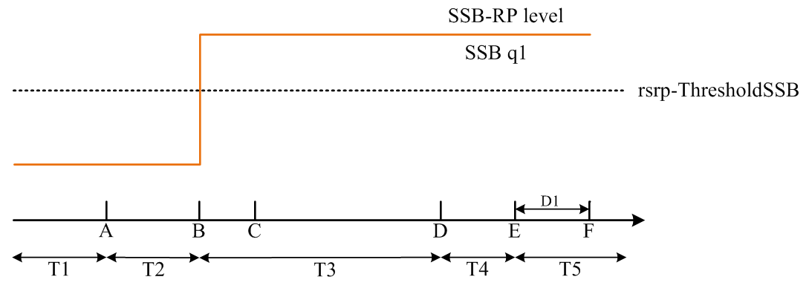
Figure A.7.5.5.2.1-2: SSB_RP level variation for SSB-based beam failure detection and link recovery testing in DRX mode
##### A.7.5.5.2.2 Test Requirements
The UE behaviour during time durations T1, T2, T3, T4 and T5 shall be as follows:
During the time duration T1 and T2, the UE shall transmit uplink signal at least in all subframes configured for CSI transmission on Cell 1.
During the period from time point A to time point B the UE shall transmit uplink signal in Cell 1 in all uplink slots configured for CSI transmission according to the configured periodic CSI reporting for Cell 1.
During T3 the UE shall detect beam failure and initiate link recovery. During T4 and T5 the UE measures and evaluate beam candidate from beam candidate set q1.
No later than time point F occurring no later than D1 = 560+10 ms after the start of T5, the UE shall transmit preamble on a beam associated with the candidate beam set q1. The UE shall not transmit preamble on a beam associated with the candidate beam set q1 earlier than time point B.
Test is concluded once the test equipment has received the initial preamble transmission from the UE. The rate of correct events observed during repeated tests shall be at least 90 %.
#### A.7.5.5.3 Beam Failure Detection and Link Recovery Test for FR2 PCell configured with CSI-RS-based BFD and LR in non-DRX mode
##### A.7.5.5.3.1 Test Purpose and Environment
The purpose of this test is to verify that the UE properly detects CSI-RS-based beam failure in the set q0 configured for a serving cell and that the UE performs correct CSI-RS-based link recovery based on beam candicate set q1. The purpose is to test the downlink monitoring for beam failure detection within the UEs active DL BWP, during the evaluation period, and link recovery, when no DRX is used. This test will partly verify the CSI-RS based beam failure detection and link recovery for an FR2 serving cell requirements in clause 8.5.
The test parameters are given in Tables A.7.5.5.3.1-1, A.7.5.5.3.1-2, and A.7.5.5.3.1-3 below. There is one cell, cell 1 which is the active cell, in the test. The test consists of five successive time periods, with time duration of T1, T2, T3, T4 and T5 respectively. Figure A.7.5.5.3.1-1 shows the variation of the downlink SNR of the CSI-RS in set q0 in the active cell to emulate CSI-RS based beam failure. Figure A.7.5.5.3.1-2 shows the variation of the downlink L1-RSRP of the CSI-RS in set q1 of the candidate beam used for link recovery. Prior to the start of the time duration T1, the UE shall be fully synchronized to cell 1. The UE shall be configured for periodic CSI reporting with a reporting periodicity of 5 ms. In the test, DRX configuration is not enabled.
Table A.7.5.5.3.1-1: Supported test configurations for FR2 PCell
| Configuration | Description |
| --- | --- |
| 1 | TDD duplex mode, 120 kHz SSB SCS, 100 MHz bandwidth |

Table A.7.5.5.3.1-2: General test parameters for FR2 PCell for CSI-RS-based beam failure detection and link recovery testing in non-DRX mode
| Parameter | Test Config. | Unit | Value | Comment |  |
| --- | --- | --- | --- | --- | --- |
|  |  |  | Test 1 |  |  |
| Active PCell | 1 |  | Cell 1 |  |  |
| RF Channel Number | 1 |  | 1 |  |  |
| Duplex mode | 1 |  | TDD |  |  |
| TDD Configuration | 1 |  | TDDConf.3.1 |  |  |
| BWchannel | 1 |  | 100: NPRB,c = 66 |  |  |
| Data PRBs allocated | 1 |  | 66 |  |  |
| PDSCH/PDCCH subcarrier spacing | 1 | kHz | 120 |  |  |
| DL initial BWP configuration | 1 |  | DLBWP.0.1 |  |  |
| DL dedicated BWP configuration | 1 |  | DLBWP.1.1 |  |  |
| UL initial BWP configuration | 1 |  | ULBWP.0.1 |  |  |
| UL dedicated BWP configuration | 1 |  | ULBWP.1.1 |  |  |
| PDSCH Reference Channel | 1 |  | SR.3.2 TDD |  |  |
| RMSI CORESET Reference Channel | 1 |  | CR.3.1 TDD |  |  |
| Dedicated CORESET Reference Channel | 1 |  | CCR.3.1 TDD |  |  |
| OCNG parameters | 1 |  | OP.1 |  |  |
| CP length | 1 |  | Normal |  |  |
| PDSCH/PDCCH TCI state | 1 |  | TCI.State.0 |  |  |
| CSI-RS for tracking | 1 |  | TRS.2.1 TDD |  |  |
| SSB Configuration | 1 |  | SSB.1 FR2 |  |  |
| SMTC Configuration | 1 |  | SMTC.3 |  |  |
| PRACH Configuration | 1 |  | FR2 PRACH configuration 4 | A.3.8.3.4 |  |
| DRX configuration | 1 |  | OFF |  |  |
| CSI-RS configuration for BFD/CBD/RLM | 1 |  | CSI-RS.3.2 TDD | A.3.14.2 |  |
| CSI-RS index assigned as BFD RS (q0) | 1 |  | 0 |  |  |
| CSI-RS index assigned as CBD RS (q1) | 1 |  | 1 |  |  |
| CSI-RS index assigned as RLM RS | 1 |  | 0,1 |  |  |
| Beam failure detection transmission parameters | DCI format | 1 |  | 1-0 |  |
|  | Number of Control OFDM symbols | 1 |  | 2 |  |
|  | Aggregation level | 1 | CCE | 8 |  |
|  | Ratio of hypothetical PDCCH RE energy to average SSS RE energy | 1 | dB | 0 |  |
|  | Ratio of hypothetical PDCCH DMRS energy to average SSS RE energy | 1 | dB | 0 |  |
|  | DMRS precoder granularity | 1 |  | REG bundle size |  |
|  | REG bundle size | 1 |  | 6 |  |
| Gap pattern ID | 1 |  | N/A |  |  |
| rlmInSyncOutOfSyncThreshold | 1 |  | absent | Value 0 is applied. (Table 8.1.1-1). |  |
| rsrp-ThresholdSSB | 1 | dBm/SCS | -95 | Threshold used for Qin_LR_SSB |  |
| powerControlOffsetSS | 1 |  | db0 | Used for deriving rsrp-ThresholdCSI-RS |  |
| beamFailureInstanceMaxCount | 1 |  | n1 | see TS 38.321 [7], clause 5.17 |  |
| beamFailureDetectionTimer | 1 |  | pbfd4 | see TS 38.321 [7], clause 5.17 |  |
| CSI-RS configuration for CSI reporting | 1 |  | CSI-RS.3.1 TDD | A.3.14.2 |  |
| reportConfigType | 1 |  | periodic |  |  |
| reportQuantity | 1 |  | cri-RI-PMI-CQI |  |  |
| CSI reporting periodicity | 1 | slot | 40 |  |  |
| CSI reporting offset | 1 | slot | 4 |  |  |
| T310 | 1 | ms | 1000 |  |  |
| N310 | 1 |  | 2 |  |  |
| T1 | 1 | s | 1 | The UE shall be fully synchronized to cell 1 during T1 |  |
| T2 | 1 | s | 1.17 |  |  |
| T3 | 1 | s | 0.9 |  |  |
| T4 | 1 | s | 0 |  |  |
| T5 | 1 | s | 0.31 |  |  |
| D1 | 1 | s | 0.27 |  |  |
| NOTE 1: UE-specific PDCCH is not transmitted after T1 starts. |  |  |  |  |  |

Table A.7.5.5.3.1-3: Cell specific test parameters for FR2 PCell for CSI-RS-based beam failure detection and link recovery testing in non-DRX mode
| Parameter | Unit | Test 1 |  |  |  |  |  |
| --- | --- | --- | --- | --- | --- | --- | --- |
|  |  | T1 | T2 | T3 | T4 | T5 |  |
| AoA setup |  | Setup 1 defined in A.3.15 |  |  |  |  |  |
| Assumptpion for UE beams Note 10 |  | Rough |  |  |  |  |  |
| EPRE ratio of PDCCH DMRS to SSS | dB | 0 |  |  |  |  |  |
| EPRE ratio of PDCCH to PDCCH DMRS | dB |  |  |  |  |  |  |
| EPRE ratio of PBCH DMRS to SSS | dB |  |  |  |  |  |  |
| EPRE ratio of PBCH to PBCH DMRS | dB |  |  |  |  |  |  |
| EPRE ratio of PSS to SSS | dB |  |  |  |  |  |  |
| EPRE ratio of PDSCH DMRS to SSS | dB |  |  |  |  |  |  |
| EPRE ratio of PDSCH to PDSCH DMRS | dB |  |  |  |  |  |  |
| EPRE ratio of OCNG DMRS to SSS | dB |  |  |  |  |  |  |
| EPRE ratio of OCNG to OCNG DMRS | dB |  |  |  |  |  |  |
| SNR_CSI-RS of set q0 | Config 1 | dB | 5 Note 11 | -3 Note 11 | -12 | -12 | -12 |
| SNR_CSI-RS of set q1 | Config 1 | dB | 0.2 | 0.2 | 20.2 | 20.2 | 20.2 |
| CSI-RS_RP of set q1 | Config 1 | dBm/SCS | -104.5 | -104.5 | -84.5 | -84.5 | -84.5 |
|  | Config 1 | dBm/120 KHz | -104.7 |  |  |  |  |
| Propagation condition |  | TDL-A 30 ns 75 Hz |  |  |  |  |  |
| NOTE 1: OCNG shall be used such that the resources in Cell 1 are fully allocated and a constant total transmitted power spectral density is achieved for all OFDM symbols. NOTE 2: The uplink resources for CSI reporting are assigned to the UE prior to the start of time period T1. NOTE 3: NZP CSI-RS resource set configuration for CSI reporting are assigned to the UE prior to the start of time period T1. NOTE 4: Void NOTE 5: The timers and layer 3 filtering related parameters are configured prior to the start of time period T1. NOTE 6: The signal contains PDCCH for UEs other than the device under test as part of OCNG. NOTE 7: SNR levels correspond to the signal to noise ratio over the REs carrying CSI-RS. NOTE 8: The SNR in time periods T1, T2, T3, T4 and T5 is denoted as SNR1, SNR2 and SNR3 respectively in figure A.7.5.5.3.1-1. NOTE 9: The SNR values are specified for testing a UE which supports 2RX on at least one band. For testing of a UE which supports 4RX on all bands, the SNR during T3 is modified as specified in clause A.3.6. NOTE 10: Information about types of UE beam is given in clause B.2.1.3 and does not limit UE implementation or test system implementation. NOTE 11: This value allows up to 1 dB degradation from applied SNR to UE baseband |  |  |  |  |  |  |  |

Table A.7.5.5.3.1-4: Void
Table A.7.5.5.3.1-5: Void

Figure A.7.5.5.3.1-1: SNR variation for CSI-RS based beam failure detection and link recovery testing in non-DRX mode

Figure A.7.5.5.3.1-2: CSI-RS_RP level variation for CSI-RS based beam failure detection and link recovery testing in non-DRX mode
##### A.7.5.5.3.2 Test Requirements
The UE behaviour during time durations T1, T2, T3, T4 and T5 shall be as follows:
During the time duration T1 and T2, the UE shall transmit uplink signal at least in all subframes configured for CSI transmission on Cell 1.
During the period from time point A to time point B the UE shall transmit uplink signal in Cell 1 in all uplink slots configured for CSI transmission according to the configured periodic CSI reporting for Cell 1.
During T3 the shall detect beam failure and initiat link recovery. During T4 and T5 the UE measures and evaluate beam candidate from beam candidate set q1.
No later than time point F occurring no later than D1 = 260+10 ms after the start of T5, the UE shall transmit preamble on a beam associated with the candidate beam set q1. The UE shall not transmit preamble on a beam associated with the candidate beam set q1 earlier than time point B.
Test is concluded once the test equipment has received the initial preamble transmission from the UE. The rate of correct events observed during repeated tests shall be at least 90 %.
#### A.7.5.5.4 Beam Failure Detection and Link Recovery Test for FR2 PCell configured with CSI-RS-based BFD and LR in DRX mode
##### A.7.5.5.4.1 Test Purpose and Environment
The purpose of this test is to verify that the UE properly detects CSI-RS-based beam failure in the set q0 configured for a serving cell and that the UE performs correct CSI-RS-based link recovery based on beam candicate set q1. The purpose is to test the downlink monitoring for beam failure detection within the UEs active DL BWP, during the evaluation period, and link recovery, when DRX is used. This test will partly verify the CSI-RS based beam failure detection and link recovery for an FR2 serving cell requirements in clause 8.5.
The test parameters are given in Tables A.7.5.5.4.1-1, A.7.5.5.4.1-2, A.7.5.5.4.1-3, and A.7.5.5.4.1-4 below. There is one cell, cell 1 which is the active cell, in the test. The test consists of five successive time periods, with time duration of T1, T2, T3, T4 and T5 respectively. Figure A.7.5.5.4.1-1 shows the variation of the downlink SNR of the CSI-RS in set q0 in the active cell to emulate CSI-RS based beam failure. Figure A.7.5.5.4.1-2 shows the variation of the downlink L1-RSRP of the CSI-RS in set q1 of the candidate beam used for link recovery. Prior to the start of the time duration T1, the UE shall be fully synchronized to cell 1. The UE shall be configured for periodic CSI reporting with a reporting periodicity of 5  ms. In the test, DRX configuration is enabled in PCell and DRX inactivity timer has already been expired, i.e. UE tries to decode PDCCH and to send periodic CQI during the period when On-duration timer is running. Time alignment timers shall be set to “infinity” so that UL timing alignment is maintained during the test.
Table A.7.5.5.4.1-1: Supported test configurations for FR2 PCell
| Configuration | Description |
| --- | --- |
| 1 | TDD duplex mode, 120 kHz SSB SCS, 100 MHz bandwidth |

Table A.7.5.5.4.1-2: General test parameters for FR2 PCell for CSI-RS-based beam failure detection and link recovery testing in DRX mode
| Parameter | Test Config. | Unit | Value | Comment |  |
| --- | --- | --- | --- | --- | --- |
|  |  |  | Test 1 |  |  |
| Active PCell | 1 |  | Cell 1 |  |  |
| RF Channel Number | 1 |  | 1 |  |  |
| Duplex mode | 1 |  | TDD |  |  |
| TDD Configuration | 1 |  | TDDConf.3.1 |  |  |
| BWchannel | 1 |  | 100: NPRB,c = 66 |  |  |
| Data PRBs allocated | 1 |  | 66 |  |  |
| PDSCH/PDCCH subcarrier spacing | 1 | kHz | 120 |  |  |
| DL initial BWP configuration | 1 |  | DLBWP.0.1 |  |  |
| DL dedicated BWP configuration | 1 |  | DLBWP.1.1 |  |  |
| UL initial BWP configuration | 1 |  | ULBWP.0.1 |  |  |
| UL dedicated BWP configuration | 1 |  | ULBWP.1.1 |  |  |
| PDSCH Reference Channel | 1 |  | SR.3.2 TDD |  |  |
| RMSI CORESET Reference Channel | 1 |  | CR.3.1 TDD |  |  |
| Dedicated CORESET Reference Channel | 1 |  | CCR.3.1 TDD |  |  |
| OCNG parameters | 1 |  | OP.1 |  |  |
| CP length | 1 |  | Normal |  |  |
| PDSCH/PDCCH TCI state | 1 |  | TCI.State.0 |  |  |
| CSI-RS for tracking | 1 |  | TRS.2.1 TDD |  |  |
| SSB Configuration | 1 |  | SSB.1 FR2 |  |  |
| SMTC Configuration | 1 |  | SMTC.3 |  |  |
| PRACH Configuration | 1 |  | FR2 PRACH configuration 4 | A.3.8.3.4 |  |
| DRX configuration | 1 |  | DRX.3 | A.3.3.3 |  |
| CSI-RS configuration for BFD/CBD/RLM | 1 |  | CSI-RS.3.2 TDD | A.3.14.2 |  |
| CSI-RS index assigned as BFD RS (q0) | 1 |  | 0 |  |  |
| CSI-RS index assigned as CBD RS (q1) | 1 |  | 1 |  |  |
| CSI-RS index assigned as RLM RS | 1 |  | 0,1 |  |  |
| Beam failure detection transmission parameters | DCI format | 1 |  | 1-0 |  |
|  | Number of Control OFDM symbols | 1 |  | 2 |  |
|  | Aggregation level | 1 | CCE | 8 |  |
|  | Ratio of hypothetical PDCCH RE energy to average SSS RE energy | 1 | dB | 0 |  |
|  | Ratio of hypothetical PDCCH DMRS energy to average SSS RE energy | 1 | dB | 0 |  |
|  | DMRS precoder granularity | 1 |  | REG bundle size |  |
|  | REG bundle size | 1 |  | 6 |  |
| Gap pattern ID | 1 |  | N/A |  |  |
| rlmInSyncOutOfSyncThreshold | 1 |  | absent | Value 0 is applied. (Table 8.1.1-1). |  |
| rsrp-ThresholdSSB | 1 | dBm/SCS | -95 | Threshold used for Qin_LR_SSB |  |
| powerControlOffsetSS | 1 |  | db0 | Used for deriving rsrp-ThresholdCSI-RS |  |
| beamFailureInstanceMaxCount | 1 |  | n1 | see TS 38.321 [7], clause 5.17 |  |
| beamFailureDetectionTimer | 1 |  | pbfd4 | see TS 38.321 [7], clause 5.17 |  |
| CSI-RS configuration for CSI reporting | 1 |  | CSI-RS.3.1 TDD | A.3.14.2 |  |
| reportConfigType | 1 |  | periodic |  |  |
| reportQuantity | 1 |  | cri-RI-PMI-CQI |  |  |
| CSI reporting periodicity | 1 | slot | 40 |  |  |
| CSI reporting offset | 1 | slot | 4 |  |  |
| T310 | 1 | ms | 1000 |  |  |
| N310 | 1 |  | 2 |  |  |
| T1 | 1 | s | 1 | The UE shall be fully synchronized to cell 1 during T1 |  |
| T2 | 1 | s | 5.43 |  |  |
| T3 | 1 | s | 5.16 |  |  |
| T4 | 1 | s | 0 |  |  |
| T5 | 1 | s | 0.31 |  |  |
| D1 | 1 | s | 0.27 |  |  |
| NOTE 1: UE-specific PDCCH is not transmitted after T1 starts. |  |  |  |  |  |

Table A.7.5.5.4.1-3: Cell specific test parameters for FR2 PCell for CSI-RS-based beam failure detection and link recovery testing in DRX mode
| Parameter | Unit | Test 1 |  |  |  |  |  |
| --- | --- | --- | --- | --- | --- | --- | --- |
|  |  | T1 | T2 | T3 | T4 | T5 |  |
| AoA setup |  | Setup 1 defined in A.3.15 |  |  |  |  |  |
| Assumption for UE beams Note 10 |  | Rough |  |  |  |  |  |
| EPRE ratio of PDCCH DMRS to SSS | dB | 0 |  |  |  |  |  |
| EPRE ratio of PDCCH to PDCCH DMRS | dB |  |  |  |  |  |  |
| EPRE ratio of PBCH DMRS to SSS | dB |  |  |  |  |  |  |
| EPRE ratio of PBCH to PBCH DMRS | dB |  |  |  |  |  |  |
| EPRE ratio of PSS to SSS | dB |  |  |  |  |  |  |
| EPRE ratio of PDSCH DMRS to SSS | dB |  |  |  |  |  |  |
| EPRE ratio of PDSCH to PDSCH DMRS | dB |  |  |  |  |  |  |
| EPRE ratio of OCNG DMRS to SSS | dB |  |  |  |  |  |  |
| EPRE ratio of OCNG to OCNG DMRS | dB |  |  |  |  |  |  |
| SNR_CSI-RS of set q0 | Config 1 | dB | 5 Note 11 | -3 Note 11 | -12 | -12 | -12 |
| SNR_CSI-RS of set q1 | Config 1 | dB | 0.2 | 0.2 | 20.2 | 20.2 | 20.2 |
| CSI-RS_RP of set q1 | Config 1 | dBm/SCS | -104.5 | -104.5 | -84.5 | -84.5 | -84.5 |
|  | Config 1 | dBm/120 KHz | -104.7 |  |  |  |  |
| Propagation condition |  | TDL-A 30 ns 75 Hz |  |  |  |  |  |
| NOTE 1: OCNG shall be used such that the resources in Cell 1 are fully allocated and a constant total transmitted power spectral density is achieved for all OFDM symbols. NOTE 2: The uplink resources for CSI reporting are assigned to the UE prior to the start of time period T1. NOTE 3: NZP CSI-RS resource set configuration for CSI reporting are assigned to the UE prior to the start of time period T1. NOTE 4: Void NOTE 5: The timers and layer 3 filtering related parameters are configured prior to the start of time period T1. NOTE 6: The signal contains PDCCH for UEs other than the device under test as part of OCNG. NOTE 7: SNR levels correspond to the signal to noise ratio over the REs carrying CSI-RS. NOTE 8: The SNR in time periods T1, T2, T3, T4 and T5 is denoted as SNR1, SNR2 and SNR3 respectively in figure A.7.5.5.4.1-1. NOTE 9: The SNR values are specified for testing a UE which supports 2RX on at least one band. For testing of a UE which supports 4RX on all bands, the SNR during T3 is modified as specified in clause A.3.6. NOTE 10: Information about types of UE beam is given in clause B.2.1.3 and does not limit UE implementation or test system implementation. NOTE 11: This value allows up to 1 dB degradation from applied SNR to UE baseband |  |  |  |  |  |  |  |

Table A.7.5.5.4.1-4: Void
Table A.7.5.5.4.1-5: Void
Table A.7.5.5.4.1-6: Void

Figure A.7.5.5.4.1-1: SNR variation for CSI-RS-based beam failure detection and link recovery testing in DRX mode

Figure A.7.5.5.4.1-2: CSI-RS_RP level variation for CSI-RS based beam failure detection and link recovery testing in DRX mode
##### A.7.5.5.4.2 Test Requirements
The UE behaviour during time durations T1, T2, T3, T4 and T5 shall be as follows:
During the time duration T1 and T2, the UE shall transmit uplink signal at least in all subframes configured for CSI transmission on Cell 1.
During the period from time point A to time point B the UE shall transmit uplink signal in Cell 1 in all uplink slots configured for CSI transmission according to the configured periodic CSI reporting for Cell 1.
During T3 the UE shall detect beam failure and initiat link recovery. During T4 and T5 the UE measures and evaluate beam candidate from beam candidate set q1.
No later than time point F occurring no later than D1 = 260+10 ms after the start of T5, the UE shall transmit preamble on a beam associated with the candidate beam set q1. The UE shall not transmit preamble on a beam associated with the candidate beam set q1 earlier than time point B.
Test is concluded once the test equipment has received the initial preamble transmission from the UE. The rate of correct events observed during repeated tests shall be at least 90 %.
#### A.7.5.5.5 Scheduling availability restriction during Beam Failure Detection and Link Recovery for FR2 PCell configured with SSB-based BFD and LR in non-DRX mode
##### A.7.5.5.5.1 Test Purpose and Environment
The purpose is to test scheduling availability restrictions when the UE is performing beam failure detection or when the UE is performing L1-RSRP measurement for candidate beam detection, when no DRX is used. This test will verify the scheduling availability restriction requirements in clause 8.5.7 and 8.5.8.
The test parameters are given in Tables A.7.5.5.5.1-1, A.7.5.5.5.1-2 and A.7.5.5.5.1-3 below. There is one cell, cell 1 which is the active cell, in the test. The test consists of five successive time periods, with time duration of T1, T2, T3, T4 and T5 respectively. Figure A.7.5.5.5.1-1 shows the variation of the downlink SNR of the SSB index 0 in the active cell to emulate SSB based beam failure. Figure A.7.5.5.5.1-2 shows the variation of the downlink L1-RSRP of the SSB index 1 used for link recovery. Prior to the start of the time duration T1, the UE shall be fully synchronized to cell 1. The UE shall be configured for periodic CSI reporting with a reporting periodicity of 5 ms. This test will focus on the scheduling availability during beam failure detection) and candidate beam detection. In the test, DRX configuration is not enabled. Test is to test the scheduling availability restriction of UE performing beam failure detection and candidate beam detection when SSB RS configured for Beam failure detection and candidate beam detection. During the test the UE is scheduled to transmit continuously in UL.
Table A.7.5.5.5.1-1: Supported test configurations for FR2 PCell
| Configuration | Description |
| --- | --- |
| 1 | NR 120 kHz SSB SCS, 100 MHz bandwidth, TDD duplex mode |
| 2 | NR 240 kHz SSB SCS, 100 MHz bandwidth, TDD duplex mode |
| NOTE: The UE is only required to be tested in one of the supported test configurations |  |

Table A.7.5.5.5.1-2: General test parameters for FR2 PCell for SSB-based beam failure detection and link recovery testing in non-DRX mode
| Parameter | Test Config. | Unit | Value | Comment |  |
| --- | --- | --- | --- | --- | --- |
|  |  |  | Test 1 |  |  |
| Active PCell | 1-2 |  | Cell 1 |  |  |
| RF Channel Number | 1-2 |  | 1 |  |  |
| Duplex mode | 1-2 |  | TDD |  |  |
| TDD Configuration | 1-2 |  | TDDConf.3.1 |  |  |
| BWchannel | 1-2 |  | 100: NPRB,c = 66 |  |  |
| Data PRBs allocated | 1-2 |  | 66 |  |  |
| PDSCH/PDCCH subcarrier spacing | 1-2 | kHz | 120 |  |  |
| DL initial BWP configuration | 1-2 |  | DLBWP.0.1 |  |  |
| DL dedicated BWP configuration | 1-2 |  | DLBWP.1.1 |  |  |
| UL initial BWP configuration | 1-2 |  | ULBWP.0.1 |  |  |
| UL dedicated BWP configuration | 1-2 |  | ULBWP.1.1 |  |  |
| PDSCH Reference Channel | 1 |  | SR.3.2 TDD |  |  |
|  | 2 |  | SR.3.3 TDD |  |  |
| RMSI CORESET Reference Channel | 1 |  | CR.3.1 TDD |  |  |
|  | 2 |  | CR.3.2 TDD |  |  |
| Dedicated CORESET Reference Channel | 1 |  | CCR.3.1 TDD |  |  |
|  | 2 |  | CCR.3.7 TDD |  |  |
| OCNG parameters | 1-2 |  | OP.1 |  |  |
| CP length | 1-2 |  | Normal |  |  |
| PDSCH/PDCCH TCI state | 1-2 |  | TCI.State.0 |  |  |
| CSI-RS for tracking | 1-2 |  | TRS.2.1 TDD |  |  |
| SSB Configuration | 1 |  | SSB.1 FR2 |  |  |
|  | 2 |  | SSB.2 FR2 |  |  |
| SMTC Configuration | 1-2 |  | SMTC.1 |  |  |
| PRACH Configuration | 1-2 |  | FR2 PRACH configuration 2 | A.3.8.3.2 |  |
| DRX configuration | 1-2 |  | OFF |  |  |
| Beam failure detection transmission parameters | DCI format | 1-2 |  | 1-0 |  |
|  | Number of Control OFDM symbols | 1-2 |  | 2 |  |
|  | Aggregation level | 1-2 | CCE | 8 |  |
|  | Ratio of hypothetical PDCCH RE energy to average SSS RE energy | 1-2 | dB | 0 |  |
|  | Ratio of hypothetical PDCCH DMRS energy to average SSS RE energy | 1-2 | dB | 0 |  |
|  | DMRS precoder granularity | 1-2 |  | REG bundle size |  |
|  | REG bundle size | 1-2 |  | 6 |  |
| Gap pattern ID | 1-2 |  | N/A |  |  |
| rlmInSyncOutOfSyncThreshold | 1-2 |  | absent | Value 0 is applied. (Table 8.1.1-1). |  |
| rsrp-ThresholdSSB | 1 | dBm/SCS | -95 | Threshold used for Qin_LR_SSB |  |
|  | 2 |  | -92 |  |  |
| powerControlOffsetSS | 1-2 |  | db0 | Used for deriving rsrp-ThresholdCSI-RS |  |
| beamFailureInstanceMaxCount | 1-2 |  | n1 | see TS 38.321 [7], clause 5.17 |  |
| beamFailureDetectionTimer | 1-2 |  | pbfd4 | see TS 38.321 [7], clause 5.17 |  |
| CSI-RS configuration for CSI reporting | 1-2 |  | CSI-RS.3.1 TDD |  |  |
| reportConfigType | 1-2 |  | periodic |  |  |
| reportQuantity | 1-2 |  | cri-RI-PMI-CQI |  |  |
| CSI reporting periodicity | 1-2 | slot | 40 |  |  |
| CSI reporting offset | 1-2 | slot | 4 |  |  |
| T310 | 1-2 | ms | 1000 |  |  |
| N310 | 1-2 |  | 2 |  |  |
| T1 | 1-2 | s | 1 | The UE shall be fully synchronized to cell 1 during T1 |  |
| T2 | 1-2 | s | 2.6 |  |  |
| T3 | 1-2 | s | 1.64 |  |  |
| T4 | 1-2 | s | 0 |  |  |
| T5 | 1-2 | s | 1.01 |  |  |
| D1 | 1-2 | s | 0.97 |  |  |
| NOTE 1: All configurations are assigned to the UE prior to the start of time period T1. NOTE 2: UE-specific PDCCH is not transmitted after T1 starts. |  |  |  |  |  |

Table A.7.5.5.5.1-3: Cell specific test parameters for FR2 PCell for SSB-based beam failure detection and link recovery testing in non-DRX mode
| Parameter | Unit | Test 1 |  |  |  |  |  |
| --- | --- | --- | --- | --- | --- | --- | --- |
|  |  | T1 | T2 | T3 | T4 | T5 |  |
| AoA Setup |  | Setup1 defined in A.3.15.1 |  |  |  |  |  |
| Assumption for UE beams Note 10 |  | Rough |  |  |  |  |  |
| EPRE ratio of PDCCH DMRS to SSS | dB | 0 |  |  |  |  |  |
| EPRE ratio of PDCCH to PDCCH DMRS | dB |  |  |  |  |  |  |
| EPRE ratio of PBCH DMRS to SSS | dB |  |  |  |  |  |  |
| EPRE ratio of PBCH to PBCH DMRS | dB |  |  |  |  |  |  |
| EPRE ratio of PSS to SSS | dB |  |  |  |  |  |  |
| EPRE ratio of PDSCH DMRS to SSS | dB |  |  |  |  |  |  |
| EPRE ratio of PDSCH to PDSCH DMRS | dB |  |  |  |  |  |  |
| EPRE ratio of OCNG DMRS to SSS | dB |  |  |  |  |  |  |
| EPRE ratio of OCNG to OCNG DMRS | dB |  |  |  |  |  |  |
| SSB index assigned as BFD RS (q0) | Config 1-4 |  | 0 | 0 | Note 12 |  |  |
| SSB index assigned as CBD RS (q1) | Config 1-4 |  | 1 | 1 | 1 | 1 | 1 |
| SNR of SSB index 0 | Config 1-2 | dB | 5Note 11 | -3Note 11 | -12 | -12 | -12 |
| SNR of SSB index 1 | Config 1-2 | dB | 0.2 | 0.2 | 20.2 | 20.2 | 20.2 |
| SSB_RP of SSB index 1 | Config 1 | dBm/SCS | -104.5 | -104.5 | -84.5 | -84.5 | -84.5 |
|  | Config 2 |  | -101.5 | -101.5 | -81.5 | -81.5 | -81.5 |
|  | Config 1-2 | dBm/120 kHz | -104.7 |  |  |  |  |
| Propagation condition |  | TDL-A 30 ns 75 Hz |  |  |  |  |  |
| NOTE 1: OCNG shall be used such that the resources in Cell 1 are fully allocated and a constant total transmitted power spectral density is achieved for all OFDM symbols. NOTE 2: The uplink resources for CSI reporting are assigned to the UE prior to the start of time period T1. NOTE 3: NZP CSI-RS resource set configuration for CSI reporting are assigned to the UE prior to the start of time period T1. NOTE 4: Void NOTE 5: The timers and layer 3 filtering related parameters are configured prior to the start of time period T1. NOTE 6: The signal contains PDCCH for UEs other than the device under test as part of OCNG. NOTE 7: SNR levels correspond to the signal to noise ratio over the SSS REs. NOTE 8: The SNR in time periods T1, T2, T3, T4 and T5 is denoted as SNR1, SNR2 and SNR3 respectively in figure A.7.5.5.5.1-1. NOTE 9: The SNR values are specified for testing a UE which supports 2RX on at least one band. For testing of a UE which supports 4RX on all bands, the SNR during T3 is modified as specified in clause A.3.6. NOTE 10: Information about types of UE beam given in clause B.2.1.3 and does not limit UE implementation or test system implementation NOTE 11: This value allows up to 1 dB degradation from applied SNR to UE baseband. NOTE 12: BFD RS (q0) is configured as SSB index 0 at the start of T3, and it is reconfigured by RRC as SSB index 1 after the UE transmits the preamble on a beam associated with the candidate beam set q1. |  |  |  |  |  |  |  |

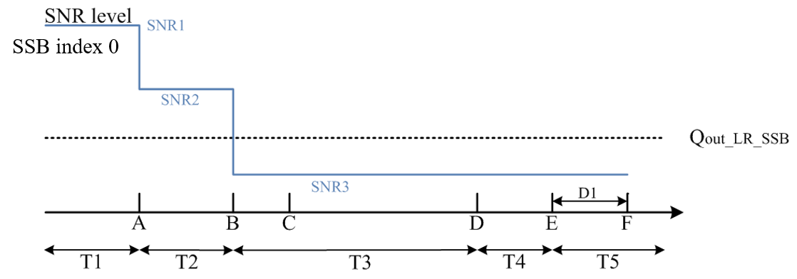
Figure A.7.5.5.5.1-1: SNR variation for SSB-based beam failure detection and link recovery testing in non-DRX mode

Figure A.7.5.5.5.1-2: SSB_RP level variation for SSB-based beam failure detection and link recovery testing in non-DRX mode
##### A.7.5.5.5.2 Test Requirements
The UE behaviour during time duration T3 follows the requirements defined in clause 8.5.7.3:
- The UE is not expected to transmit PUCCH/PUSCH/SRS or receive PDCCH/PDSCH/CSI-RS for tracking/CSI-RS for CQI on BFD-RS symbols to be measured for beam failure detection.
The UE behaviour during time durations T4 and T5 follows the requirements defined in clause 8.5.8.3:
- The UE is not expected to transmit PUCCH/PUSCH or receive PDCCH/PDSCH on reference symbols to be measured for candidate beam detection.
#### A.7.5.5.6 Beam Failure Detection and Link Recovery Test for FR2 SCell configured with CSI-RS-based BFD and LR in non-DRX mode
##### A.7.5.5.6.1 Test Purpose and Environment
The purpose of this test is to verify that the UE properly detects CSI-RS-based beam failure in the set q0 configured for an active SCell and that the UE performs correct CSI-RS-based link recovery based on beam candidate set q1. The purpose is to test the downlink monitoring for beam failure detection within the UEs active DL BWP of the SCell with schedulingRequestID-BFR-SCell-r16 configuration, during the evaluation period, and link recovery, when no DRX is used. This test will partly verify the CSI-RS based beam failure detection and link recovery for an FR2 SCell requirements in clause 8.5.
The test parameters are given in Tables A.7.5.5.6.1-1, A.7.5.5.6.1-2 and A.7.5.5.6.1-3. There are two cells, cell 1 is the active PCell and cell 2 is the active SCell, in the test. The test consists of five successive time periods, with time duration of T1, T2, T3, T4 and T5 respectively. Figure A.7.5.5.6.1-1 shows the variation of the downlink SNR of the CSI-RS in set q0 in the active SCell to emulate CSI-RS based beam failure. Figure A.7.5.5.6.1-2 shows the variation of the downlink L1-RSRP of the CSI-RS in set q1 of the candidate beam used for link recovery. Prior to the start of the time duration T1, the UE shall be fully synchronized to cell 1 and cell 2. The UE shall be configured for periodic CSI reporting with a reporting periodicity of 5 ms. In the test, DRX configuration is not enabled.
Table A.7.5.5.6.1-1: Supported test configurations for FR2 PCell and SCell
| Configuration | Description |
| --- | --- |
| 1 | TDD duplex mode, 120 kHz SSB SCS, 100 MHz bandwidth |

Table A.7.5.5.6.1-2: General test parameters for FR2 SCell for beam failure detection and link recovery testing in non-DRX mode
| Parameter | Test Config. | Unit | Value | Comment |  |
| --- | --- | --- | --- | --- | --- |
|  |  |  | Test 1 |  |  |
| Active PCell | 1 |  | Cell 1 |  |  |
| RF Channel Number for PCell | 1 |  | 1 |  |  |
| Active SCell | 1 |  | Cell 2 |  |  |
| RF Channel Number for SCell | 1 |  | 2 |  |  |
| Duplex mode | 1 |  | TDD |  |  |
| TDD Configuration | 1 |  | TDDConf.3.1 |  |  |
| BWchannel | 1 | MHz | 100: NPRB,c = 66 |  |  |
| Data PRBs allocated | 1 |  | 66 |  |  |
| PDSCH/PDCCH subcarrier spacing | 1 | kHz | 120 |  |  |
| DL initial BWP configuration | 1 |  | DLBWP.0.1 |  |  |
| DL dedicated BWP configuration | 1 |  | DLBWP.1.1 |  |  |
| UL initial BWP configuration | 1 |  | ULBWP.0.1 |  |  |
| UL dedicated BWP configuration | 1 |  | ULBWP.1.1 |  |  |
| PDSCH Reference Channel | 1 |  | SR.3.2 TDD |  |  |
| RMSI CORESET Reference Channel | 1 |  | CR.3.1 TDD | A.3.1.2 |  |
| Dedicated CORESET Reference Channel | 1 |  | CCR.3.1 TDD |  |  |
| OCNG parameters | 1 |  | OP.1 | A.3.2.1 |  |
| CP length | 1 |  | Normal |  |  |
| PDSCH/PDCCH TCI state | 1 |  | TCI.State.0 |  |  |
| CSI-RS for tracking | 1 |  | TRS.2.1 TDD |  |  |
| SSB Configuration | 1 |  | SSB.3 FR2 | A.3.10 |  |
| SMTC Configuration | 1 |  | SMTC.3 | A.3.11 |  |
| PRACH Configuration | 1 |  | FR2 PRACH configuration 4 | Table A.3.8.3.4-1 |  |
| DRX configuration | 1 |  | OFF |  |  |
| CSI-RS configuration for BFD/CBD on SCell | 1 |  | CSI-RS.3.2 TDD | A.3.14.2 |  |
| CSI-RS index assigned as BFD RS (q0) | 1 |  | 0 |  |  |
| CSI-RS index assigned as CBD RS (q1) | 1 |  | 1 |  |  |
| CSI-RS configuration for RLM on PCell | 1 |  | CSI-RS.3.2 TDD | A.3.14.2 |  |
| Beam failure detection transmission parameters | DCI format | 1 |  | 1-0 |  |
|  | Number of Control OFDM symbols | 1 |  | 2 |  |
|  | Aggregation level | 1 | CCE | 8 |  |
|  | Ratio of hypothetical PDCCH RE energy to average SSS RE energy | 1 | dB | 0 |  |
|  | Ratio of hypothetical PDCCH DMRS energy to average SSS RE energy | 1 | dB | 0 |  |
|  | DMRS precoder granularity | 1 |  | REG bundle size |  |
|  | REG bundle size | 1 |  | 6 |  |
| Gap pattern ID | 1 |  | N/A |  |  |
| schedulingRequestID-BFR-SCell-r16 | 1 |  | Configured |  |  |
| Periodicity of PUCCH for SR configuration for BFR on SCell | 1 | slot | 40 | 5 ms |  |
| Offset of PUCCH for SR configuration for BFR on SCell | 1 | slot | 4 |  |  |
| PUCCH parameters for SR configuration for BFR on SCell | 1 |  | Table 8.3.3.1.2-1 in [13] |  |  |
| rlmInSyncOutOfSyncThreshold | 1 |  | absent | Value 0 is applied. (Table 8.1.1-1). |  |
| rsrp-ThresholdSSB | 1 | dBm/SCS | -95 | Threshold used for Qin_LR_SSB |  |
| powerControlOffsetSS | 1 |  | db0 | Used for deriving rsrp-ThresholdCSI-RS |  |
| beamFailureInstanceMaxCount | 1 |  | n1 | see TS 38.321 [7], clause 5.17 |  |
| beamFailureDetectionTimer | 1 |  | pbfd4 | see TS 38.321 [7], clause 5.17 |  |
| CSI-RS configuration for CSI reporting | 1 |  | CSI-RS.3.1 TDD | A.3.14.2 |  |
| reportConfigType | 1 |  | periodic |  |  |
| reportQuantity | 1 |  | cri-RI-PMI-CQI |  |  |
| CSI reporting periodicity | 1 | slot | 40 |  |  |
| CSI reporting offset | 1 | slot | 4 |  |  |
| T310 | 1 | ms | 1000 |  |  |
| N310 | 1 |  | 2 |  |  |
| T1 | 1 | s | 1 | The UE shall be fully synchronized to cell 1 during T1 |  |
| T2 | 1 | s | 1.17 |  |  |
| T3 | 1 | s | 0.9 |  |  |
| T4 | 1 | s | 0 |  |  |
| T5 | 1 | s | 0.31 |  |  |
| D1 | 1 | s | 0.27 |  |  |
| NOTE 1: UE-specific PDCCH is not transmitted after T1 starts. |  |  |  |  |  |

Table A.7.5.5.6.1-3: Cell specific test parameters for FR2 SCell for beam failure detection and link recovery testing in non-DRX mode
| Parameter | Unit | Cell 1 | Cell 2 Test 1 |  |  |  |  |  |
| --- | --- | --- | --- | --- | --- | --- | --- | --- |
|  |  | T1 to T5 | T1 | T2 | T3 | T4 | T5 |  |
| AoA setup |  | Setup 1 defined in A.3.15 | Setup 1 defined in A.3.15 |  |  |  |  |  |
| Assumptpion for UE beams Note 10 |  | Rough | Rough |  |  |  |  |  |
| EPRE ratio of PDCCH DMRS to SSS | dB |  | 0 |  |  |  |  |  |
| EPRE ratio of PDCCH to PDCCH DMRS | dB |  |  |  |  |  |  |  |
| EPRE ratio of PBCH DMRS to SSS | dB |  |  |  |  |  |  |  |
| EPRE ratio of PBCH to PBCH DMRS | dB |  |  |  |  |  |  |  |
| EPRE ratio of PSS to SSS | dB | 0 |  |  |  |  |  |  |
| EPRE ratio of PDSCH DMRS to SSS | dB |  |  |  |  |  |  |  |
| EPRE ratio of PDSCH to PDSCH DMRS | dB |  |  |  |  |  |  |  |
| EPRE ratio of OCNG DMRS to SSS | dB |  |  |  |  |  |  |  |
| EPRE ratio of OCNG to OCNG DMRS | dB |  |  |  |  |  |  |  |
| SNR_CSI-RS of set q0 | Config 1 | dB | 5 | 5 | -3 | -12 | -12 | -12 |
| SNR_CSI-RS of set q1 | Config 1 | dB | 0.2 | 0.2 | 0.2 | 20.2 | 20.2 | 20.2 |
| CSI-RS_RP of set q1 | Config 1 | dBm/SCS kHz | -104.5 | -104.5 | -104.5 | -84.5 | -84.5 | -84.5 |
| Noc | Config 1 | dBm/ 120kHz | -104.7 | -104.7 |  |  |  |  |
| Propagation condition |  | TDL-A 30 ns 75 Hz | TDL-A 30 ns 75 Hz |  |  |  |  |  |
| NOTE 1: OCNG shall be used such that the resources in Cell 1 are fully allocated and a constant total transmitted power spectral density is achieved for all OFDM symbols. NOTE 2: The uplink resources for CSI reporting are assigned to the UE prior to the start of time period T1. NOTE 3: NZP CSI-RS resource set configuration for CSI reporting are assigned to the UE prior to the start of time period T1. NOTE 4: Void NOTE 5: The timers and layer 3 filtering related parameters are configured prior to the start of time period T1. NOTE 6: The signal contains PDCCH for UEs other than the device under test as part of OCNG. NOTE 7: SNR levels correspond to the signal to noise ratio over the REs carrying CSI-RS. NOTE 8: The SNR in time periods T1, T2, T3, T4 and T5 is denoted as SNR1, SNR2 and SNR3 respectively in figure A.7.5.5.6.1-1. NOTE 9: The SNR values are specified for testing a UE which supports 2RX on at least one band. For testing of a UE which supports 4RX on all bands, the SNR during T3 is modified as specified in clause A.3.6. NOTE 10: Information about types of UE beam is given in clause B.2.1.3 and does not limit UE implementation or test system implementation. |  |  |  |  |  |  |  |  |

Figure A.7.5.5.6.1-1: SNR variation for beam failure detection and link recovery testing for SCell in non-DRX mode

Figure A.7.5.5.6.1-2: CSI-RS_RP level variation for CSI-RS based beam failure detection and link recovery testing for SCell in non-DRX mode
##### A.7.5.5.6.2 Test Requirements
The UE behaviour during time durations T1, T2, T3, T4 and T5 in A.7.5.5.6.1 shall be as follows:
During the time duration T1 and T2, the UE shall transmit uplink signal at least in all subframes configured for CSI transmission on Cell 1.
During the period from time point A to time point B the UE shall transmit uplink signal in Cell 1 in all uplink slots configured for CSI transmission according to the configured periodic CSI reporting for Cell 1.
During T3 the UE shall detect beam failure and initial link recovery. During T4 and T5 the UE measures and evaluates beam candidate from beam candidate set q1.
No later than time point F occurring no later than D1 = 260+10 ms after the start of T5, the UE shall transmit PUCCH with LRR, followed by BFR MAC CE containing a beam associated with the candidate beam set q1. The UE shall not transmit PUCCH with an LRR with the candidate beam set q1 earlier than time point B.
Test is concluded once the test equipment has received the initial preamble transmission from the UE. The rate of correct events observed during repeated tests shall be at least 90 %.
#### A.7.5.5.7 Beam Failure Detection and Link Recovery Test for FR2 SCell configured with CSI-RS-based BFD and LR in DRX mode
##### A.7.5.5.7.1 Test Purpose and Environment
The purpose of this test is to verify that the UE properly detects CSI-RS-based beam failure in the set q0 configured for an active SCell and that the UE performs correct CSI-RS-based link recovery based on beam candidate set q1. The purpose is to test the downlink monitoring for beam failure detection within the UEs active DL BWP of the SCell with schedulingRequestID-BFR-SCell-r16 configuration, during the evaluation period, and link recovery, when DRX is used. This test will partly verify the CSI-RS based beam failure detection and link recovery for an FR2 SCell requirements in clause 8.5.
The test parameters are given in Tables A.7.5.5.7.1-1, A.7.5.5.7.1-2 and A.7.5.5.7.1-3. There are two cell, cell 1 is the active PCell and cell 2 is the active SCell, in the test. The test consists of five successive time periods, with time duration of T1, T2, T3, T4 and T5 respectively. Figure A.7.5.5.7.1-1 shows the variation of the downlink SNR of the CSI-RS in set q0 in the active SCell to emulate CSI-RS based beam failure. Figure A.7.5.5.7.1-2 shows the variation of the downlink L1-RSRP of the CSI-RS in set q1 of the candidate beam used for link recovery. Prior to the start of the time duration T1, the UE shall be fully synchronized to cell 1 and cell 2. The UE shall be configured for periodic CSI reporting with a reporting periodicity of 5 ms. In the test, DRX configuration is enabled in PCell and DRX inactivity timer has already been expired, i.e. UE tries to decode PDCCH and to send periodic CQI during the period when On-duration timer is running. Time alignment timers shall be set to “infinity” so that UL timing alignment is maintained during the test.
Table A.7.5.5.7.1-1: Supported test configurations for FR2 PCell and SCell
| Configuration | Description |
| --- | --- |
| 1 | TDD duplex mode, 120 kHz SSB SCS, 100 MHz bandwidth |

Table A.7.5.5.7.1-2: General test parameters for FR2 SCell for beam failure detection and link recovery testing in DRX mode
| Parameter | Test Config. | Unit | Value | Comment |  |
| --- | --- | --- | --- | --- | --- |
|  |  |  | Test 1 |  |  |
| Active PCell | 1 |  | Cell 1 |  |  |
| RF Channel Number for PCell | 1 |  | 1 |  |  |
| Active SCell | 1 |  | Cell 2 |  |  |
| RF Channel Number for SCell | 1 |  | 2 |  |  |
| Duplex mode | 1 |  | TDD |  |  |
| TDD Configuration | 1 |  | TDDConf.3.1 |  |  |
| BWchannel | 1 | MHz | 100: NPRB,c = 66 |  |  |
| Data PRBs allocated | 1 |  | 66 |  |  |
| PDSCH/PDCCH subcarrier spacing | 1 | kHz | 120 |  |  |
| DL initial BWP configuration | 1 |  | DLBWP.0.1 |  |  |
| DL dedicated BWP configuration | 1 |  | DLBWP.1.1 |  |  |
| UL initial BWP configuration | 1 |  | ULBWP.0.1 |  |  |
| UL dedicated BWP configuration | 1 |  | ULBWP.1.1 |  |  |
| PDSCH Reference Channel | 1 |  | SR.3.2 TDD |  |  |
| RMSI CORESET Reference Channel | 1 |  | CR.3.1 TDD | A.3.1.2 |  |
| Dedicated CORESET Reference Channel | 1 |  | CCR.3.1 TDD |  |  |
| OCNG parameters | 1 |  | OP.1 | A.3.2.1 |  |
| CP length | 1 |  | Normal |  |  |
| PDSCH/PDCCH TCI state | 1 |  | TCI.State.0 |  |  |
| CSI-RS for tracking | 1 |  | TRS.2.1 TDD |  |  |
| SSB Configuration | 1 |  | SSB.3 FR2 | A.3.10 |  |
| SMTC Configuration | 1 |  | SMTC.3 | A.3.11 |  |
| PRACH Configuration | 1 |  | FR2 PRACH configuration 4 | Table A.3.8.3.4-1 |  |
| DRX configuration | 1 |  | DRX.3 | A.3.3.3 |  |
| CSI-RS configuration for BFD/CBD on SCell | 1 |  | CSI-RS.3.2 TDD | A.3.14.2 |  |
| CSI-RS index assigned as BFD RS (q0) | 1 |  | 0 |  |  |
| CSI-RS index assigned as CBD RS (q1) | 1 |  | 1 |  |  |
| CSI-RS configuration for RLM on PCell | 1 |  | CSI-RS.3.2 TDD | A.3.14.2 |  |
| Beam failure detection transmission parameters | DCI format | 1 |  | 1-0 |  |
|  | Number of Control OFDM symbols | 1 |  | 2 |  |
|  | Aggregation level | 1 | CCE | 8 |  |
|  | Ratio of hypothetical PDCCH RE energy to average SSS RE energy | 1 | dB | 0 |  |
|  | Ratio of hypothetical PDCCH DMRS energy to average SSS RE energy | 1 | dB | 0 |  |
|  | DMRS precoder granularity | 1 |  | REG bundle size |  |
|  | REG bundle size | 1 |  | 6 |  |
| Gap pattern ID | 1 |  | N/A |  |  |
| schedulingRequestID-BFR-SCell-r16 | 1 |  | Configured |  |  |
| Periodicity of PUCCH for SR configuration for BFR on SCell | 1 | slot | 40 | 5 ms |  |
| Offset of PUCCH for SR configuration for BFR on SCell | 1 | slot | 4 |  |  |
| PUCCH parameters for SR configuration for BFR on SCell | 1 |  | Table 8.3.3.1.2-1 in [13] |  |  |
| rlmInSyncOutOfSyncThreshold | 1 |  | absent | Value 0 is applied. (Table 8.1.1-1). |  |
| rsrp-ThresholdSSB | 1 | dBm/SCS | -95 | Threshold used for Qin_LR_SSB |  |
| powerControlOffsetSS | 1 |  | db0 | Used for deriving rsrp-ThresholdCSI-RS |  |
| beamFailureInstanceMaxCount | 1 |  | n1 | see TS 38.321 [7], clause 5.17 |  |
| beamFailureDetectionTimer | 1 |  | pbfd4 | see TS 38.321 [7], clause 5.17 |  |
| CSI-RS configuration for CSI reporting | 1 |  | CSI-RS.3.1 TDD | A.3.14.2 |  |
| reportConfigType | 1 |  | periodic |  |  |
| reportQuantity | 1 |  | cri-RI-PMI-CQI |  |  |
| CSI reporting periodicity | 1 | slot | 40 |  |  |
| CSI reporting offset | 1 | slot | 4 |  |  |
| T310 | 1 | ms | 1000 |  |  |
| N310 | 1 |  | 2 |  |  |
| T1 | 1 | s | 1 | The UE shall be fully synchronized to cell 1 during T1 |  |
| T2 | 1 | s | 5.43 |  |  |
| T3 | 1 | s | 5.16 |  |  |
| T4 | 1 | s | 0 |  |  |
| T5 | 1 | s | 0.31 |  |  |
| D1 | 1 | s | 0.27 |  |  |
| NOTE 1: UE-specific PDCCH is not transmitted after T1 starts. |  |  |  |  |  |

Table A.7.5.5.7.1-3: Cell specific test parameters for FR2 SCell for beam failure detection and link recovery testing in DRX mode
| Parameter | Unit | Cell 1 | Test 1 Cell 2 |  |  |  |  |  |
| --- | --- | --- | --- | --- | --- | --- | --- | --- |
|  |  | T1 to T5 | T1 | T2 | T3 | T4 | T5 |  |
| AoA setup |  | Setup 1 defined in A.3.15 | Setup 1 defined in A.3.15 |  |  |  |  |  |
| Assumption for UE beams Note 10 |  | Rough | Rough |  |  |  |  |  |
| EPRE ratio of PDCCH DMRS to SSS | dB |  | 0 |  |  |  |  |  |
| EPRE ratio of PDCCH to PDCCH DMRS | dB |  |  |  |  |  |  |  |
| EPRE ratio of PBCH DMRS to SSS | dB |  |  |  |  |  |  |  |
| EPRE ratio of PBCH to PBCH DMRS | dB |  |  |  |  |  |  |  |
| EPRE ratio of PSS to SSS | dB | 0 |  |  |  |  |  |  |
| EPRE ratio of PDSCH DMRS to SSS | dB |  |  |  |  |  |  |  |
| EPRE ratio of PDSCH to PDSCH DMRS | dB |  |  |  |  |  |  |  |
| EPRE ratio of OCNG DMRS to SSS | dB |  |  |  |  |  |  |  |
| EPRE ratio of OCNG to OCNG DMRS | dB |  |  |  |  |  |  |  |
| SNR_CSI-RS of set q0 | Config 1 | dB | 5 | 5 | -3 | -12 | -12 | -12 |
| SNR_CSI-RS of set q1 | Config 1 | dB | 0.2 | 0.2 | 0.2 | 20.2 | 20.2 | 20.2 |
| CSI-RS_RP of set q1 | Config 1 | dBm/ SCS kHz | -104.5 | -104.5 | -104.5 | -84.5 | -84.5 | -84.5 |
| Noc | Config 1 | dBm/120 kHz | -104.7 | -104.7 |  |  |  |  |
| Propagation condition |  | TDL-A 30 ns 75 Hz | TDL-A 30 ns 75 Hz |  |  |  |  |  |
| NOTE 1: OCNG shall be used such that the resources in Cell 1 are fully allocated and a constant total transmitted power spectral density is achieved for all OFDM symbols. NOTE 2: The uplink resources for CSI reporting are assigned to the UE prior to the start of time period T1. NOTE 3: NZP CSI-RS resource set configuration for CSI reporting are assigned to the UE prior to the start of time period T1. NOTE 4: Void NOTE 5: The timers and layer 3 filtering related parameters are configured prior to the start of time period T1. NOTE 6: The signal contains PDCCH for UEs other than the device under test as part of OCNG. NOTE 7: SNR levels correspond to the signal to noise ratio over the REs carrying CSI-RS. NOTE 8: The SNR in time periods T1, T2, T3, T4 and T5 is denoted as SNR1, SNR2 and SNR3 respectively in figure A.7.5.5.7.1-1. NOTE 9: The SNR values are specified for testing a UE which supports 2RX on at least one band. For testing of a UE which supports 4RX on all bands, the SNR during T3 is modified as specified in clause A.3.6. NOTE 10: Information about types of UE beam is given in clause B.2.1.3 and does not limit UE implementation or test system implementation. |  |  |  |  |  |  |  |  |

Figure A.7.5.5.7.1-1: SNR variation for beam failure detection and link recovery testing for SCell in DRX mode
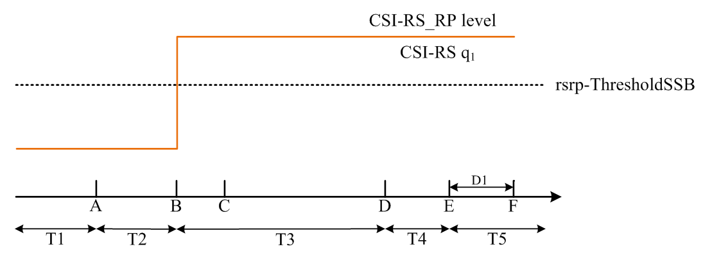
Figure A.7.5.5.7.1-2: CSI-RS_RP level variation for CSI-RS based beam failure detection and link recovery testing for SCell in DRX mode
##### A.7.5.5.7.2 Test Requirements
The UE behaviour during time durations T1, T2, T3, T4 in A.7.5.5.7.1 and T5 shall be as follows:
During the time duration T1 and T2, the UE shall transmit uplink signal at least in all subframes configured for CSI transmission on Cell 1.
During the period from time point A to time point B the UE shall transmit uplink signal in Cell 1 in all uplink slots configured for CSI transmission according to the configured periodic CSI reporting for Cell 1.
During T3 the UE shall detect beam failure and initial link recovery. During T4 and T5 the UE measures and evaluates beam candidate from beam candidate set q1.
No later than time point F occurring no later than D1 = 260+10 ms after the start of T5, the UE shall transmit PUCCH with LRR, followed by BFR MAC CE containing a beam associated with the candidate beam set q1. The UE shall not transmit PUCCH with an LRR with the candidate beam set q1 earlier than time point B.
Test is concluded once the test equipment has received the initial preamble transmission from the UE. The rate of correct events observed during repeated tests shall be at least 90 %.
#### A.7.5.5.8 Beam Failure Detection and Link Recovery Test for FR2 PCell configured with CSI-RS-based BFD and LR in DRX mode for UE fulfilling relaxed measurement criterion
##### A.7.5.5.8.1 Test Purpose and Environment
The purpose of this test is to verify that the UE properly detects CSI-RS-based beam failure in the set q0 configured for a serving cell and that the UE performs correct CSI-RS-based link recovery based on beam candicate set q1. The purpose is to test the downlink monitoring for beam failure detection within the UEs active DL BWP, during the evaluation period, and link recovery, when DRX is used. This test will partly verify the CSI-RS based beam failure detection and link recovery for an FR2 serving cell requirements in clause 8.5.3.4 for UE fulfilling good serving cell quality relaxed measurement criteria. The test parameters are given in Tables A.7.5.5.8.1-1, A.7.5.5.8.1-2, A.7.5.5.8.1-3, and A.7.5.5.8.1-4 below. There is one cell, cell 1 which is the active cell, in the test. The test consists of five successive time periods, with time duration of T1, T2, T3, T4 and T5 respectively. Figure A.7.5.5.8.1-1 shows the variation of the downlink SNR of the CSI-RS in set q0 in the active cell to emulate CSI-RS based beam failure. Figure A.7.5.5.8.1-1 additionally shows the variation of the downlink L1-RSRP of the CSI-RS in set q1 of the candidate beam used for link recovery. Prior to the start of the time duration T1, the UE shall be fully synchronized to cell 1. The UE shall be configured for periodic CSI reporting with a reporting periodicity of 5 ms. In the test, DRX configuration is enabled in PCell and DRX inactivity timer has already been expired, i.e. UE tries to decode PDCCH and to send periodic CQI during the period when On-duration timer is running. Time alignment timers shall be set to “infinity” so that UL timing alignment is maintained during the test.
As specified in the Test Purpose, the UE is configured with the relaxed measurement criterion for both low mobility and good serving cell quality defined in clause 5.7.13.2 in TS 38.331 [2]. At the beginning of T1, the UE has fulfilled the good serving cell quality relaxation measurements criterion and is performing relaxed measurements for beam failure detection.
- goodServingCellEvaluationBFD [2] criterion is configured according to the parameters listed in table A.7.5.5.8.1-2;
- lowMobilityEvalutationcConnected [2] criterion is configured according to the parameters listed in table A.7.5.5.8.1-2.
Table A.7.5.5.8.1-1: Supported test configurations for FR2 PCell
| Configuration | Description |
| --- | --- |
| 1 | TDD duplex mode, 120 kHz SSB SCS, 100 MHz bandwidth |

Table A.7.5.5.8.1-2: General test parameters for FR2 PCell for CSI-RS-based beam failure detection and link recovery testing in DRX mode
| Parameter | Test Config. | Unit | Value | Comment |  |
| --- | --- | --- | --- | --- | --- |
|  |  |  | Test 1 |  |  |
| Active PCell | 1 |  | Cell 1 |  |  |
| RF Channel Number | 1 |  | 1 |  |  |
| Duplex mode | 1 |  | TDD |  |  |
| TDD Configuration | 1 |  | TDDConf.3.1 |  |  |
| BWchannel | 1 |  | 100: NPRB,c = 66 |  |  |
| Data PRBs allocated | 1 |  | 66 |  |  |
| PDSCH/PDCCH subcarrier spacing | 1 | kHz | 120 |  |  |
| DL initial BWP configuration | 1 |  | DLBWP.0.1 |  |  |
| DL dedicated BWP configuration | 1 |  | DLBWP.1.1 |  |  |
| UL initial BWP configuration | 1 |  | ULBWP.0.1 |  |  |
| UL dedicated BWP configuration | 1 |  | ULBWP.1.1 |  |  |
| PDSCH Reference Channel | 1 |  | SR.3.2 TDD |  |  |
| RMSI CORESET Reference Channel | 1 |  | CR.3.1 TDD |  |  |
| Dedicated CORESET Reference Channel | 1 |  | CCR.3.1 TDD |  |  |
| OCNG parameters | 1 |  | OP.1 |  |  |
| CP length | 1 |  | Normal |  |  |
| PDSCH/PDCCH TCI state | 1 |  | TCI.State.0 |  |  |
| CSI-RS for tracking | 1 |  | TRS.2.1 TDD |  |  |
| SSB Configuration | 1 |  | SSB.1 FR2 |  |  |
| SMTC Configuration | 1 |  | SMTC.3 |  |  |
| PRACH Configuration | 1 |  | FR2 PRACH configuration 4 | A.3.8.3.4 |  |
| DRX configuration | 1 |  | DRX.3 | A.3.3.3 |  |
| CSI-RS configuration for BFD/CBD/RLM | 1 |  | CSI-RS.3.2 TDD | A.3.14.2 |  |
| CSI-RS index assigned as BFD RS (q0) | 1 |  | 0 |  |  |
| CSI-RS index assigned as CBD RS (q1) | 1 |  | 1 |  |  |
| CSI-RS index assigned as RLM RS | 1 |  | 0,1 |  |  |
| Beam failure detection transmission parameters | DCI format | 1 |  | 1-0 |  |
|  | Number of Control OFDM symbols | 1 |  | 2 |  |
|  | Aggregation level | 1 | CCE | 8 |  |
|  | Ratio of hypothetical PDCCH RE energy to average SSS RE energy | 1 | dB | 0 |  |
|  | Ratio of hypothetical PDCCH DMRS energy to average SSS RE energy | 1 | dB | 0 |  |
|  | DMRS precoder granularity | 1 |  | REG bundle size |  |
|  | REG bundle size | 1 |  | 6 |  |
| Gap pattern ID | 1 |  | N/A |  |  |
| rlmInSyncOutOfSyncThreshold | 1 |  | absent | Value 0 is applied. (Table 8.1.1-1). |  |
| rsrp-ThresholdSSB | 1 | dBm/SCS | -95 | Threshold used for Qin_LR_SSB |  |
| powerControlOffsetSS | 1 |  | db0 | Used for deriving rsrp-ThresholdCSI-RS |  |
| beamFailureInstanceMaxCount | 1 |  | n1 | see TS 38.321 [7], clause 5.17 |  |
| beamFailureDetectionTimer | 1 |  | pbfd4 | see TS 38.321 [7], clause 5.17 |  |
| CSI-RS configuration for CSI reporting | 1 |  | CSI-RS.3.1 TDD | A.3.14.2 |  |
| reportConfigType | 1 |  | periodic |  |  |
| reportQuantity | 1 |  | cri-RI-PMI-CQI |  |  |
| CSI reporting periodicity | 1 | slot | 40 |  |  |
| CSI reporting offset | 1 | slot | 4 |  |  |
| T310 | 1 | ms | 1000 |  |  |
| N310 | 1 |  | 1 |  |  |
| offset | 4 | dB | N/A | offset in goodServingCellEvaluationBFD |  |
| s-SearchDeltaP-Connected | 1 | dB | 6 | Used to determine if low mobility relaxed criterion is fulfilled |  |
| t-SearchDeltaP-Connected | 1 | s | 5 | Used to determine if low mobility relaxed criterion is fulfilled |  |
| T1 | 1 | s | -6- | The UE shall be fully synchronized to cell 1 during T1. UE is performing relaxed measurements for BFD. |  |
| T2 | 1 | s | -3.6- |  |  |
| T3 | 1 | s | -9.64- |  |  |
| T4 | 1 | s | 0 |  |  |
| T5 | 1 | s | 0.31 |  |  |
| D1 | 1 | s | 0.27 |  |  |
| NOTE 1: UE-specific PDCCH is not transmitted after T1 starts. |  |  |  |  |  |

Table A.7.5.5.8.1-3: Cell specific test parameters for FR2 PCell for CSI-RS-based beam failure detection and link recovery testing in DRX mode
| Parameter | Unit | Test 1 |  |  |  |  |  |
| --- | --- | --- | --- | --- | --- | --- | --- |
|  |  | T1 | T2 | T3 | T4 | T5 |  |
| AoA setup |  | Setup 1 defined in A.3.15 |  |  |  |  |  |
| Assumption for UE beams Note 10 |  | Rough |  |  |  |  |  |
| EPRE ratio of PDCCH DMRS to SSS | dB | 0 |  |  |  |  |  |
| EPRE ratio of PDCCH to PDCCH DMRS | dB |  |  |  |  |  |  |
| EPRE ratio of PBCH DMRS to SSS | dB |  |  |  |  |  |  |
| EPRE ratio of PBCH to PBCH DMRS | dB |  |  |  |  |  |  |
| EPRE ratio of PSS to SSS | dB |  |  |  |  |  |  |
| EPRE ratio of PDSCH DMRS to SSS | dB |  |  |  |  |  |  |
| EPRE ratio of PDSCH to PDSCH DMRS | dB |  |  |  |  |  |  |
| EPRE ratio of OCNG DMRS to SSS | dB |  |  |  |  |  |  |
| EPRE ratio of OCNG to OCNG DMRS | dB |  |  |  |  |  |  |
| SNR_CSI-RS of set q0 | Config 1 | dB | 5 Note 11 | 5 Note 11 | -12 | -12 | -12 |
| SNR_CSI-RS of set q1 | Config 1 | dB | 0.2 | 0.2 | 20.2 | 20.2 | 20.2 |
| CSI-RS_RP of set q1 | Config 1 | dBm/SCS | -104.5 | -104.5 | -84.5 | -84.5 | -84.5 |
|  | Config 1 | dBm/120 KHz | -104.7 |  |  |  |  |
| Propagation condition |  | TDL-A 30 ns 75 Hz |  |  |  |  |  |
| NOTE 1: OCNG shall be used such that the resources in Cell 1 are fully allocated and a constant total transmitted power spectral density is achieved for all OFDM symbols. NOTE 2: The uplink resources for CSI reporting are assigned to the UE prior to the start of time period T1. NOTE 3: NZP CSI-RS resource set configuration for CSI reporting are assigned to the UE prior to the start of time period T1. NOTE 4: Void NOTE 5: The timers and layer 3 filtering related parameters are configured prior to the start of time period T1. NOTE 6: The signal contains PDCCH for UEs other than the device under test as part of OCNG. NOTE 7: SNR levels correspond to the signal to noise ratio over the REs carrying CSI-RS. NOTE 8: The SNR in time periods T1, T2, T3, T4 and T5 is denoted as SNR1, SNR2 and SNR3 respectively in figure A.7.5.5.4.1-1. NOTE 9: The SNR values are specified for testing a UE which supports 2RX on at least one band. For testing of a UE which supports 4RX on all bands, the SNR during T3 is modified as specified in clause A.3.6. NOTE 10: Information about types of UE beam is given in clause B.2.1.3 and does not limit UE implementation or test system implementation. NOTE 11: This value allows up to 1 dB degradation from applied SNR to UE baseband |  |  |  |  |  |  |  |

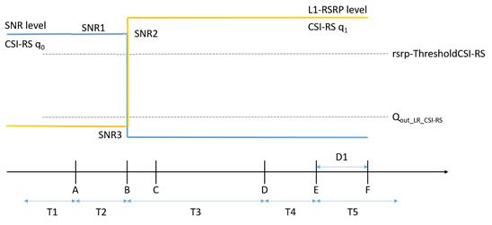
Figure A.7.5.5.8.1-1: SNR and L1-RSRP variation for CSI-RS-based beam failure detection and link recovery testing in DRX mode
##### A.7.5.5.8.2 Test Requirements
The UE behaviour during time durations T1, T2, T3, T4 and T5 shall be as follows:
During the time duration T1 and T2, the UE shall transmit uplink signal at least in all subframes configured for CSI transmission on Cell 1.
During the period from time point A to time point B the UE shall transmit uplink signal in Cell 1 in all uplink slots configured for CSI transmission according to the configured periodic CSI reporting for Cell 1.
During T3 the UE shall detect beam failure and initiat link recovery, and exit from relaxed measurements. During T4 and T5 the UE measures and evaluate beam candidate from beam candidate set q1.
No later than time point F occurring no later than D1 = 260+10 ms after the start of T5, the UE shall transmit preamble on a beam associated with the candidate beam set q1. The UE shall not transmit preamble on a beam associated with the candidate beam set q1 earlier than time point B.
Test is concluded once the test equipment has received the initial preamble transmission from the UE. The rate of correct events observed during repeated tests shall be at least 90 %.
#### A.7.5.5.9 TRP specific Beam Failure Detection and Link Recovery Test for FR2 SCell configured with CSI-RS-based BFD and LR in DRX mode
##### A.7.5.5.9.1 Test Purpose and Environment
The purpose of this test is to verify that the UE properly detects TRP specific CSI-RS-based beam failure and link recovery in the sets $\hat{q}_{0,0}$ and $\hat{q}_{1,0}$ for TRP0 when DRX is used for an FR2 active SCell requirements in clause 8.18.
The test parameters are given in Tables A.7.5.5.9.1-1, A.7.5.5.9.1-2 and A.7.5.5.9.1-3. There are two cell, cell 1 is the active PCell and cell 2 is the active SCell, in the test. SCell is configured with two TRPs. The test consists of five successive time periods, with time duration of T1, T2, T3, T4 and T5 respectively. Figure A.7.5.5.9.1-1 shows the variation of the downlink SNR of the CSI-RS in set $\hat{q}_{0,0}$ and $\hat{q}_{0,1}$ in the active SCell for TRP0 and TRP1 respectively. Figure A.7.5.5.9.11-1additionally shows the variation of the downlink L1-RSRP of the CSI-RS in $\hat{q}_{1,0}$  for TPR0. Prior to the start of the time duration T1, the UE shall be fully synchronized to cell 1 and cell 2. The UE shall be configured for periodic CSI reporting with a reporting periodicity of 2 ms. In the test, DRX configuration is enabled in PCell and DRX inactivity timer has already been expired, i.e. UE tries to decode PDCCH and to send periodic CQI during the period when On-duration timer is running. Time alignment timers shall be set to “infinity” so that UL timing alignment is maintained during the test.
Table A.7.5.5.9.1-1: Supported test configurations for FR2 PCell and SCell
| Configuration | Description |
| --- | --- |
| 1 | TDD duplex mode, 120 kHz SSB SCS, 100 MHz bandwidth |

Table A.7.5.5.9.1-2: General test parameters for FR2 SCell for beam failure detection and link recovery testing in DRX mode
| Parameter | Unit | Value | Comment |  |
| --- | --- | --- | --- | --- |
|  |  | Test 1 |  |  |
| Active PCell |  | Cell 1 |  |  |
| RF Channel Number for PCell |  | 1 |  |  |
| Active SCell |  | Cell 2 |  |  |
| RF Channel Number for SCell |  | 2 |  |  |
| Duplex mode | Config 1 |  | TDD |  |
| BW channel | Config 1 |  | 100: NPRB,c = 66 |  |
| DL initial BWP configuration | Config 1 |  | DLBWP.0.1 |  |
| DL dedicated BWP configuration | Config 1 |  | DLBWP.1.1 |  |
| UL initial BWP configuration | Config 1 |  | ULBWP.0.1 |  |
| UL dedicated BWP configuration | Config 1 |  | ULBWP.1.1 |  |
| TDD Configuration | Config 1 |  | TDDConf.3.1 |  |
| CORESET Reference Channel | Config 1 |  | CR.3.1 TDD | A.3.1.2 |
| SSB Configuration | Config 1 |  | SSB.3 FR2 | A.3.11 |
| SMTC Configuration | Config 1 |  | SMTC.3 | A.3.10 |
| PDSCH/PDCCH subcarrier spacing | Config 1 |  | 120 KHz |  |
| PRACH Configuration | Config 1 |  | Table A.3.8.3.1-1 |  |
| CSI-RS configuration for TRP0 | Config 1 |  | CSI-RS.3.2 TDD | A.3.14.2 |
| CSI-RS configuration for TRP1 | Config 1 |  | CSI-RS.3.6 TDD | A.3.14.2 |
| CSI-RS configuration for CSI reporting | Config 1 |  | CSI-RS.3.1 TDD | A.3.14.2 |
| TRS configuration | Config 1 |  | TRS.2.1 TDD |  |
| TCI configuration | Config 1 |  | CSI-RS.Config.0 |  |
| OCNG parameters |  |  | OP.1 |  |
| CP length |  |  | Normal |  |
| Correlation Matrix and Antenna Configuration |  |  | 2x2 Low |  |
| OCNG parameters |  | OP.1 | A.3.2.1 |  |
| CP length |  | Normal |  |  |
| Correlation Matrix and Antenna Configuration |  | 2x2 Low |  |  |
| Beam failure | DCI format |  | 1-0 |  |
| detection transmission parameters | Number of Control OFDM symbols |  | 2 |  |
|  | Aggregation level | CCE | 8 |  |
|  | Ratio of hypothetical PDCCH RE energy to average CSI-RS RE energy | dB | 0 |  |
|  | Ratio of hypothetical PDCCH DMRS energy to average CSI-RS RE energy | dB | 0 |  |
|  | DMRS precoder granularity |  | REG bundle size |  |
|  | REG bundle size |  | 6 |  |
| DRX |  | DRX.3 |  |  |
| Gap pattern ID |  | N/A |  |  |
| schedulingRequestID-BFR-SCell-r16 |  | Configured |  |  |
| Periodicity of PUCCH for SR configuration for BFR on SCell | Slot | 40 | 5 ms |  |
| Offset of PUCCH for SR configuration for BFR on SCell | Slot | 5 |  |  |
| PUCCH parameters for SR configuration for BFR on SCell |  | Table 8.3.3.1.2-1 in [13] |  |  |
| csi-RS-Index assigned as BFD RS in set (q00) |  | 0 |  |  |
| csi-RS-Index assigned as BFD RS in set (q01) |  | 2 |  |  |
| CSI-RS index assigned as RLM RS |  | 0, 1 |  |  |
| CSI-RS Index assigned as CBD RS in set (q10) |  | 1 |  |  |
| CSI-RS Index assigned as CBD RS in set (q11) |  | 3 |  |  |
| SSB index assigned as RLM RS |  | 0, 1 |  |  |
| rlmInSyncOutOfSyncThreshold |  | absent | When the field is absent, the UE applies the value 0. (Table 8.1.1-1). |  |
| rsrp-ThresholdCSI-RS | Config 1 | dBm/SCS | -95 | Threshold used for Qin_LR_CSI-RS |
| powerControlOffsetSS |  | db0 | Used for deriving rsrp-ThresholdCSI-RS |  |
| beamFailureInstanceMaxCount |  | n1 | see TS 38.321 [7], clause 5.17 |  |
| beamFailureDetectionTimer |  | pbfd4 | see TS 38.321 [7], clause 5.17 |  |
| T310 Timer | ms | 1000 |  |  |
| N310 |  | 2 |  |  |
| T1 | s | 1 | During this time the the UE shall be fully synchronized to cell 1 |  |
| T2 | s | 10.81 |  |  |
| T3 | s | 10.28 |  |  |
| T4 | s | 0 |  |  |
| T5 | s | 0.57 |  |  |
| D1 | s | 0.53 |  |  |
| NOTE 1: UE-specific PDCCH is not transmitted after T1 starts. |  |  |  |  |

Table A.7.5.5.9.1-3: Cell specific test parameters for FR2 SCell for beam failure detection and link recovery testing in DRX mode
| Parameter | Unit | Cell 1 | Cell 2 |  |  |  |  |
| --- | --- | --- | --- | --- | --- | --- | --- |
|  |  | T1 to T5 | T1 | T2 | T3 | T4 | T5 |
| AoA setup |  | Setup 3 as specified in clause A.3.15 Note 11 |  |  |  |  |  |
| Assumption for UE beams Note 10 |  | Rough | Rough |  |  |  |  |
| EPRE ratio of PDCCH DMRS to SSS | dB |  | 0 |  |  |  |  |
| EPRE ratio of PDCCH to PDCCH DMRS | dB |  |  |  |  |  |  |
| EPRE ratio of PBCH DMRS to SSS | dB |  |  |  |  |  |  |
| EPRE ratio of PBCH to PBCH DMRS | dB |  |  |  |  |  |  |
| EPRE ratio of PSS to SSS | dB | 0 |  |  |  |  |  |
| EPRE ratio of PDSCH DMRS to SSS | dB |  |  |  |  |  |  |
| EPRE ratio of PDSCH to PDSCH DMRS | dB |  |  |  |  |  |  |
| EPRE ratio of OCNG DMRS to SSS | dB |  |  |  |  |  |  |
| EPRE ratio of OCNG to OCNG DMRS | dB |  |  |  |  |  |  |
| SNR_CSI-RS of set q0,0 | dB | 5 | 5 | -3 | -12 | -12 | -12 |
| SNR_CSI-RS of set q0,1 | dB | 5 | 5 | 5 | 5 | 5 | 5 |
| SNR_CSI-RS of set q1,0 | dB | 0.2 | 0.2 | 0.2 | 20.2 | 20.2 | 20.2 |
| CSI-RS_RP of set q1,0 | dBm/ SCS kHz | -104.5 | -104.5 | -104.5 | -84.5 | -84.5 | -84.5 |
| Noc | dBm/120 kHz | -104.7 | -104.7 |  |  |  |  |
| Propagation condition |  | TDL-A 30 ns 75 Hz | TDL-A 30 ns 75 Hz |  |  |  |  |
| NOTE 1: OCNG shall be used such that the resources in Cell 1 are fully allocated and a constant total transmitted power spectral density is achieved for all OFDM symbols. NOTE 2: The uplink resources for CSI reporting are assigned to the UE prior to the start of time period T1. NOTE 3: NZP CSI-RS resource set configuration for CSI reporting are assigned to the UE prior to the start of time period T1. NOTE 4: Void NOTE 5: The timers and layer 3 filtering related parameters are configured prior to the start of time period T1. NOTE 6: The signal contains PDCCH for UEs other than the device under test as part of OCNG. NOTE 7: SNR levels correspond to the signal to noise ratio over the REs carrying CSI-RS. NOTE 8: The SNR in time periods T1, T2, T3, T4 and T5 is denoted as SNR1, SNR2 and SNR3 respectively in figure A.7.5.5.7.1-1. NOTE 9: The SNR values are specified for testing a UE which supports 2RX on at least one band. For testing of a UE which supports 4RX on all bands, the SNR during T3 is modified as specified in clause A.3.6. NOTE 10: Information about types of UE beam is given in clause B.2.1.3 and does not limit UE implementation or test system implementation. NOTE 11: AoA1 for PCell and TRP1 of SCell , AoA2 for TRP2 of SCell |  |  |  |  |  |  |  |

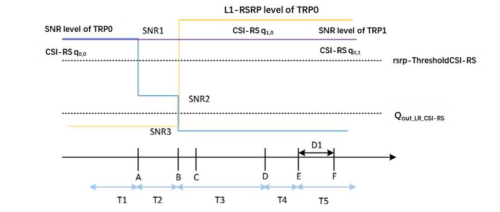
Figure A.7.5.5.9.1-1: SNR and L1-RSRP variation for beam failure detection and link recovery testing for SCell in DRX mode
##### A.7.5.5.9.2 Test Requirements
The UE behaviour during time durations T1, T2, T3, T4 and T5 in A.7.5.5.9.1 shall be as follows:
During the time duration T1 and T2, the UE shall transmit uplink signal at least in all subframes configured for CSI transmission on Cell 1 for TRP1 and TRP2.
During the period from time point A to time point B the UE shall transmit uplink signal in all uplink slots configured for CSI transmission according to the configured periodic CSI reporting for Cell 1.
During T3, T4, T5, the UE shall transmit uplink signal at least in all subframes configured for CSI transmission on Cell 1 for TRP2.
During T3 the UE shall detect beam failure and initiate link recovery for TRP1. During T4 and T5 the UE measures and evaluate beam candidate from beam candidate set q0,1.
No later than time point F occurring no later than D1 = [520]+10 ms after the start of T5, the UE shall transmit PUCCH with LRR, followed by BFR MAC CE containing a beam associated with the candidate beam set q0,1. The UE shall not transmit PUCCH with an LRR with the candidate beam set q0,1 earlier than time point B.
Test is concluded once the test equipment has received the initial preamble transmission from the UE. The rate of correct events observed during repeated tests shall be at least 90 %.
#### A.7.5.5.10 TRP specific Beam Failure Detection and Link Recovery Test for FR2 PCell configured with SSB-based BFD and LR in non-DRX mode
##### A.7.5.5.10.1 Test Purpose and Environment
The purpose of this test is to verify that the UE properly detects TRP specific SSB-based beam failure and link recovery in the sets $\hat{q}_{0,0}$ and $\hat{q}_{0,1}$ for TRP1 with schedulingRequestID-BFR-r17 configured, when no DRX is used for an FR2 serving cell requirements in clause 8.18.
The test parameters are given in Tables A.7.5.5.10.1-1, A.7.5.5.10.1-2, A.7.5.5.10.1-3 and A.7.5.5.10.1-4 below. There is one active serving cell configured with two TRPs in the test. The test consists of five successive time periods, with time duration of T1, T2, T3, T4 and T5 respectively. Figure A.7.5.5.10.1-1 shows the variation of the downlink SNR of the SSB in set $\hat{q}_{0,0}$ and $\hat{q}_{1,0}$ for TRP1 and TRP2 respectively. Figure A.7.5.5.10.1-1 additionally shows the variation of the downlink L1-RSRP of the SSB in set $\hat{q}_{0,1}$  for TPR1.
Prior to the start of the time duration T1, the UE shall be fully synchronized to cell 1. The UE shall be configured for periodic CSI reporting with a reporting periodicity of 5 ms. In the test, DRX configuration is not enabled. The UE is configured to perform inter-frequency measurements using GP ID #0 (40 ms) in test 1.
Table A.7.5.5.10.1-1: Supported test configurations for FR2 PCell
| Configuration | Description |
| --- | --- |
| 1 | TDD duplex mode, 120 kHz SSB SCS, 100 MHz bandwidth |
| 2 | TDD duplex mode, 240 kHz SSB SCS, 100 MHz bandwidth |
| NOTE: The UE is only required to pass in one of the supported test configurations in FR2 |  |

Table A.7.5.5.10.1-2: General test parameters for FR2 PCell for SSB-based beam failure detection and link recovery testing in non-DRX mode
| Parameter | Unit | Value | Comment |  |
| --- | --- | --- | --- | --- |
|  |  | Test 1 | Same configuration for both TRP whereever applicbale |  |
| Active PCell |  | Cell 1 |  |  |
| RF Channel Number for PCell |  | 1 |  |  |
| Duplex mode | Config 1,2 |  | TDD |  |
| TDD Configuration | Config 1,2 |  | TDDConf.3.1 |  |
| BW channel | Config 1,2 |  | 100: NPRB,c = 66 |  |
| Data PRBs allocated | Config 1,2 |  | 66 |  |
| PDSCH/PDCCH subcarrier spacing | Config 1,2 | kHz | 120 |  |
| DL initial BWP configuration | Config 1,2 |  | DLBWP.0.1 |  |
| DL dedicated BWP configuration | Config 1,2 |  | DLBWP.1.1 |  |
| UL initial BWP configuration | Config 1,2 |  | ULBWP.0.1 |  |
| UL dedicated BWP configuration | Config 1,2 |  | ULBWP.1.1 |  |
| PDSCH Reference Channel | Config 1 |  | SR.3.2 TDD |  |
|  | Config 2 |  | SR.3.3 TDD |  |
| RMSI CORESET Reference Channel | Config 1 |  | CR.3.1 TDD |  |
|  | Config 2 |  | CR.3.2 TDD |  |
| Dedicated CORESET Reference Channel | Config 1 |  | CCR.3.1 TDD | A.3.1.2 |
|  | Config 2 |  | CCR.3.7 TDD |  |
| OCNG parameters | Config 1,2 |  | OP.1 |  |
| CP length | Config 1,2 |  | Normal |  |
| PDSCH/PDCCH TCI state | Config 1,2 |  | TCI.State.0 |  |
| CSI-RS for tracking | Config 1,2 |  | TRS.2.1 TDD |  |
| CSI-RS configuration for CSI reporting | Config 1,2 |  | CSI-RS.3.1 TDD |  |
| reportConfigType | Config 1,2 |  | periodic |  |
| reportQuantity | Config 1,2 |  | cri-RI-PMI-CQI |  |
| CSI reporting periodicity | Config 1,2 | slot | 40 |  |
| CSI reporting offset | Config 1,2 | slot | 4 |  |
| SSB Configuration for TRP0 | Config 1 |  | SSB.1 FR2 |  |
|  | Config 2 |  | SSB.2 FR2 |  |
| SSB Configuration for TRP1 | Config 1 |  | SSB.9 FR2 |  |
|  | Config 2 |  | SSB.10 FR2 |  |
| SMTC Configuration | Config 1,2 |  | SMTC.3 | A.3.10 |
| PRACH Configuration | Config 1,2 |  | FR2 PRACH configuration 2 | A.3.8.3.2 |
| DRX configuration | Config 1,2 |  | OFF |  |
| SSB Index assigned as BFD RS (q0,0) | Config 1,2 |  | 0 |  |
| SSB Index assigned as CBD RS (q1,0) | Config 1,2 |  | 1 |  |
| SSB Index assigned as BFD RS (q0,1) | Config 1,2 |  | 2 |  |
| SSB Index assigned as CBD RS (q1,1) | Config 1,2 |  | 3 |  |
| SSB Index assigned as RLM RS | Config 1,2 |  | 0,1,2,3 |  |
| Beam failure detection transmission parameters | DCI format |  | 1-0 |  |
|  | Number of Control OFDM symbols |  | 2 |  |
|  | Aggregation level | CCE | 8 |  |
|  | Ratio of hypothetical PDCCH RE energy to average CSI-RS RE energy | dB | 0 |  |
|  | Ratio of hypothetical PDCCH DMRS energy to average CSI-RS RE energy | dB | 0 |  |
|  | DMRS precoder granularity |  | REG bundle size |  |
|  | REG bundle size |  | 6 |  |
| Gap pattern ID |  | gp0 |  |  |
| gapOffset |  | 0 |  |  |
| schedulingRequestID-BFR- r17 |  | Configured |  |  |
| Periodicity of PUCCH for SR configuration for BFR on PCell | slot | 40 | 5 ms |  |
| rlmInSyncOutOfSyncThreshold |  | absent | When the field is absent, the UE applies the value 0. (Table 8.1.1-1). |  |
| rsrp-ThresholdSSB | Config 1 | dBm/SCS | -95 | Threshold used for Qin_LR_SSB |
|  | Config 2 |  | -92 |  |
| powerControlOffsetSS |  | db0 | Used for deriving rsrp-ThresholdCSI-RS |  |
| beamFailureInstanceMaxCount |  | n1 | see TS 38.321 [7], clause 5.17 |  |
| beamFailureDetectionTimer |  | pbfd4 | see TS 38.321 [7], clause 5.17 |  |
| T310 Timer | ms | 1000 |  |  |
| N310 |  | 2 |  |  |
| T1 | s | 1 | During this time the the UE shall be fully synchronized to cell 1 |  |
| T2 | s | 2.61 |  |  |
| T3 | s | 1.64 |  |  |
| T4 | s | 0 |  |  |
| T5 | s | 1.01 |  |  |
| D1 | s | 0.97 |  |  |
| NOTE 1: All configurations are assigned to the UE prior to the start of time period T1. NOTE 2: UE-specific PDCCH is not transmitted after T1 starts. |  |  |  |  |

Table A.7.5.5.10.13: Cell specific test parameters for FR2 PCell for SSB-based beam failure detection and link recovery testing in non-DRX mode
| Parameter | Unit | Test 1 |  |  |  |  |  |
| --- | --- | --- | --- | --- | --- | --- | --- |
|  |  | T1 | T2 | T3 | T4 | T5 |  |
| AoA setup |  | Setup 3 as specified in clause A.3.15 Note 12 |  |  |  |  |  |
| Assumption for UE beams Note 10 |  | Rough |  |  |  |  |  |
| EPRE ratio of PDCCH DMRS to SSS | dB | 0 |  |  |  |  |  |
| EPRE ratio of PDCCH to PDCCH DMRS | dB |  |  |  |  |  |  |
| EPRE ratio of PBCH DMRS to SSS | dB |  |  |  |  |  |  |
| EPRE ratio of PBCH to PBCH DMRS | dB |  |  |  |  |  |  |
| EPRE ratio of PSS to SSS | dB |  |  |  |  |  |  |
| EPRE ratio of PDSCH DMRS to SSS | dB |  |  |  |  |  |  |
| EPRE ratio of PDSCH to PDSCH DMRS | dB |  |  |  |  |  |  |
| EPRE ratio of OCNG DMRS to SSS | dB |  |  |  |  |  |  |
| EPRE ratio of OCNG to OCNG DMRS | dB |  |  |  |  |  |  |
| SNR_SSB of set q0,0 | Config 1-2 | dB | 5Note 11 | -3Note 11 | -12 | -12 | -12 |
| SNR_SSB of set q0,1 | Config 1-2 | dB | 5Note 11 | 5Note 11 | 5Note 11 | 5Note 11 | 5Note 11 |
| SNR_SSB of set q1,0 | Config 1-2 | dB | 0.2 | 0.2 | 20.2 | 20.2 | 20.2 |
|  | Config 1 | dBm/ SCS | -104.5 | -104.5 | -84.5 | -84.5 | -84.5 |
| SSB_RP of set q1,0 |  |  |  |  |  |  |  |
|  | Config 2 |  | -101.5 | -101.5 | -81.5 | -81.5 | -81.5 |
|  | Config 1,2 | dBm/120 KHz | -104.7 |  |  |  |  |
| Propagation condition |  | TDL-A 30 ns 75 Hz |  |  |  |  |  |
| NOTE 1: OCNG shall be used such that the resources in Cell 1 are fully allocated and a constant total transmitted power spectral density is achieved for all OFDM symbols. NOTE 2: The uplink resources for CSI reporting are assigned to the UE prior to the start of time period T1. NOTE 3: NZP CSI-RS resource set configuration for CSI reporting are assigned to the UE prior to the start of time period T1. NOTE 4: Measurement gap configuration is assigned to the UE prior to the start of time period T1. NOTE 5: The timers and layer 3 filtering related parameters are configured prior to the start of time period T1. NOTE 6: The signal contains PDCCH for UEs other than the device under test as part of OCNG. NOTE 7: SNR levels correspond to the signal to noise ratio over the SSS REs. NOTE 8: The SNR in time periods T1, T2, T3, T4 and T5 is denoted as SNR1, SNR2 and SNR3 respectively in figure A.7.5.5.1.1-1. NOTE 9: The SNR values are specified for testing a UE which supports 2RX on at least one band. For testing of a UE which supports 4RX on all bands, the SNR during T3 is modified as specified in clause A.3.6. NOTE 10: Information about types of UE beam is given in clause B.2.1.3 and does not limit UE implementation or test system implementation. NOTE 11: This value allows up to 1 dB degradation from applied SNR to UE baseband NOTE 12: AoA1 for TRP1 and AoA2 for TRP2 |  |  |  |  |  |  |  |

Table A.7.5.5.10.1-4: Void
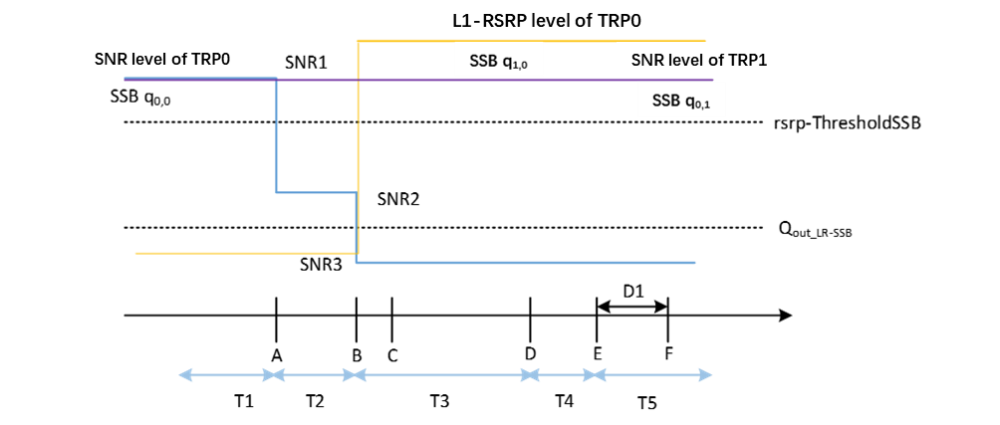
Figure A.7.5.5.10.1-1: SNR and L1-RSRP variation SSB for SSB-based beam failure detection and link recovery testing in non-DRX mode
##### A.7.5.5.10.2 Test Requirements
The UE behaviour during time durations T1, T2, T3, T4 and T5 shall be as follows:
During the time duration T1 and T2, the UE shall transmit uplink signal at least in all subframes configured for CSI transmission on Cell 1 for TRP 0 and TRP1.
During the period from time point A to time point B the UE shall transmit uplink signal for TRP 0 and TRP1 in all uplink slots configured for CSI transmission according to the configured periodic CSI reporting for Cell 1.
During T3, T4, T5, the UE shall transmit uplink signal at least in all subframes configured for CSI transmission for TRP 1.
During T3 the UE shall detect beam failure and initiate link recovery for TRP 0. During T4 and T5 the UE measures and evaluate beam candidate from beam candidate set q1,0.
No later than time point F occurring no later than D1 = 960+10 ms after the start of T5, the UE shall transmit PUCCH with LRR, followed by BFR MAC CE containing a beam associated with the candidate beam set q1,0. The UE shall not transmit PUCCH with an LRR with the candidate beam set q1,0 earlier than time point B.
Test is concluded once the test equipment has received the initial preamble transmission from the UE. The rate of correct events observed during repeated tests shall be at least 90 %.
#### A.7.5.5.11 Beam Failure Detection and Link Recovery Test for FR2-2 PCell configured with CSI-RS-based BFD and LR in non-DRX mode
##### A.7.5.5.11.1 Test Purpose and Environment
The purpose of this test is to verify that the UE properly detects CSI-RS-based beam failure in the set q0 configured for a serving cell and that the UE performs correct CSI-RS-based link recovery based on beam candicate set q1. The purpose is to test the downlink monitoring for beam failure detection within the UEs active DL BWP, during the evaluation period, and link recovery, when no DRX is used. This test will partly verify the CSI-RS based beam failure detection and link recovery for an FR2-2 serving cell requirements in clause 8.5.
The test parameters are given in Tables A.7.5.5.11.1-1, A.7.5.5.11.1-2, and A.7.5.5.11.1-3 below. There is one cell, cell 1 which is the active cell, in the test. The test consists of five successive time periods, with time duration of T1, T2, T3, T4 and T5 respectively. Figure A.7.5.5.11.1-1 shows the variation of the downlink SNR of the CSI-RS in set q0 in the active cell to emulate CSI-RS based beam failure. Figure A.7.5.5.11.1-1 additionally shows the variation of the downlink L1-RSRP of the CSI-RS in set q1 of the candidate beam used for link recovery. Prior to the start of the time duration T1, the UE shall be fully synchronized to cell 1. The UE shall be configured for periodic CSI reporting with a reporting periodicity of 5 ms. In the test, DRX configuration is not enabled.
Table A.7.5.5.11.1-1: Supported test configurations for FR2-2 PCell
| Configuration | Description |
| --- | --- |
| 1 | TDD duplex mode, 120 kHz SSB SCS, 100 MHz bandwidth |
| 2 | TDD duplex mode, 480 kHz SSB SCS, 400 MHz bandwidth |
| 3 | TDD duplex mode, 960 kHz SSB SCS, 400 MHz bandwidth |
| NOTE: The UE is only required to pass in one of the supported test configurations in FR2-2 |  |

Table A.7.5.5.11.1-2: General test parameters for FR2-2 PCell for CSI-RS-based beam failure detection and link recovery testing in non-DRX mode
| Parameter | Test Config. | Unit | Value | Comment |  |
| --- | --- | --- | --- | --- | --- |
|  |  |  | Test 1 |  |  |
| Active PCell | 1,2,3 |  | Cell 1 |  |  |
| RF Channel Number | 1,2,3 |  | 1 |  |  |
| Duplex mode | 1,2,3 |  | TDD |  |  |
| TDD Configuration | 1,2,3 |  | TDDConf.3.1 |  |  |
| BWchannel | 1 |  | 100: NPRB,c = 66 |  |  |
|  | 2 |  | 400: NPRB,c = 66 |  |  |
|  | 3 |  | 400: NPRB,c = 33 |  |  |
| Data PRBs allocated | 1 |  | 66 |  |  |
|  | 2 |  | 66 |  |  |
|  | 3 |  | 33 |  |  |
| PDSCH/PDCCH subcarrier spacing | 1 | kHz | 120 |  |  |
|  | 2 | kHz | 480 |  |  |
|  | 3 | kHz | 960 |  |  |
| DL initial BWP configuration | 1,2,3 |  | DLBWP.0.1 |  |  |
| DL dedicated BWP configuration | 1,2,3 |  | DLBWP.1.1 |  |  |
| UL initial BWP configuration | 1,2,3 |  | ULBWP.0.1 |  |  |
| UL dedicated BWP configuration | 1,2,3 |  | ULBWP.1.1 |  |  |
| PDSCH Reference Channel | 1,2,3 |  | SR.3.2 TDD |  |  |
| RMSI CORESET Reference Channel | 1,2,3 |  | CR.3.1 TDD |  |  |
| Dedicated CORESET Reference Channel | 1,2,3 |  | CCR.3.1 TDD |  |  |
| OCNG parameters | 1,2,3 |  | OP.1 |  |  |
| CP length | 1,2,3 |  | Normal |  |  |
| PDSCH/PDCCH TCI state | 1,2,3 |  | TCI.State.0 |  |  |
| CSI-RS for tracking | 1,2,3 |  | TRS.2.1 TDD |  |  |
| SSB Configuration | 1,2,3 |  | SSB.1 FR2 |  |  |
| SMTC Configuration | 1,2,3 |  | SMTC.3 |  |  |
| PRACH Configuration | 1,2,3 |  | FR2 PRACH configuration 4 | A.3.8.3.4 |  |
| DRX configuration | 1,2,3 |  | OFF |  |  |
| CSI-RS configuration for BFD/CBD/RLM | 1,2,3 |  | CSI-RS.3.2 TDD | A.3.14.2 |  |
| CSI-RS index assigned as BFD RS (q0) | 1,2,3 |  | 0 |  |  |
| CSI-RS index assigned as CBD RS (q1) | 1,2,3 |  | 1 |  |  |
| CSI-RS index assigned as RLM RS | 1,2,3 |  | 0,1 |  |  |
| Beam failure detection transmission parameters | DCI format | 1,2,3 |  | 1-0 |  |
|  | Number of Control OFDM symbols | 1,2,3 |  | 2 |  |
|  | Aggregation level | 1,2,3 | CCE | 8 |  |
|  | Ratio of hypothetical PDCCH RE energy to average SSS RE energy | 1,2,3 | dB | 0 |  |
|  | Ratio of hypothetical PDCCH DMRS energy to average SSS RE energy | 1,2,3 | dB | 0 |  |
|  | DMRS precoder granularity | 1,2,3 |  | REG bundle size |  |
|  | REG bundle size | 1,2,3 |  | 6 |  |
| Gap pattern ID | 1,2,3 |  | N/A |  |  |
| rlmInSyncOutOfSyncThreshold | 1,2,3 |  | absent | Value 0 is applied. (Table 8.1.1-1). |  |
| rsrp-ThresholdSSB | 1,2,3 | dBm/SCS | -95 | Threshold used for Qin_LR_SSB |  |
| powerControlOffsetSS | 1,2,3 |  | db0 | Used for deriving rsrp-ThresholdCSI-RS |  |
| beamFailureInstanceMaxCount | 1,2,3 |  | n1 | see TS 38.321 [7], clause 5.17 |  |
| beamFailureDetectionTimer | 1,2,3 |  | pbfd4 | see TS 38.321 [7], clause 5.17 |  |
| CSI-RS configuration for CSI reporting | 1,2,3 |  | CSI-RS.3.1 TDD | A.3.14.2 |  |
| reportConfigType | 1,2,3 |  | periodic |  |  |
| reportQuantity | 1,2,3 |  | cri-RI-PMI-CQI |  |  |
| CSI reporting periodicity | 1,2,3 | slot | 40 |  |  |
| CSI reporting offset | 1,2,3 | slot | 4 |  |  |
| T310 | 1,2,3 | ms | 1000 |  |  |
| N310 | 1,2,3 |  | 2 |  |  |
| T1 | 1,2,3 | s | 1 | The UE shall be fully synchronized to cell 1 during T1 |  |
| T2 | 1,2,3 | s | 1.17 |  |  |
| T3 | 1,2,3 | s | 0.9 |  |  |
| T4 | 1,2,3 | s | 0 |  |  |
| T5 | 1,2,3 | s | 0.31 |  |  |
| D1 | 1,2,3 | s | 0.27 |  |  |
| NOTE 1: UE-specific PDCCH is not transmitted after T1 starts. |  |  |  |  |  |

Table A.7.5.5.11.1-3: Cell specific test parameters for FR2-2 PCell for CSI-RS-based beam failure detection and link recovery testing in non-DRX mode
| Parameter | Unit | Test 1 |  |  |  |  |  |
| --- | --- | --- | --- | --- | --- | --- | --- |
|  |  | T1 | T2 | T3 | T4 | T5 |  |
| AoA setup |  | Setup 1 defined in A.3.15 |  |  |  |  |  |
| Assumptpion for UE beams Note 10 |  | Rough |  |  |  |  |  |
| EPRE ratio of PDCCH DMRS to SSS | dB | 0 |  |  |  |  |  |
| EPRE ratio of PDCCH to PDCCH DMRS | dB |  |  |  |  |  |  |
| EPRE ratio of PBCH DMRS to SSS | dB |  |  |  |  |  |  |
| EPRE ratio of PBCH to PBCH DMRS | dB |  |  |  |  |  |  |
| EPRE ratio of PSS to SSS | dB |  |  |  |  |  |  |
| EPRE ratio of PDSCH DMRS to SSS | dB |  |  |  |  |  |  |
| EPRE ratio of PDSCH to PDSCH DMRS | dB |  |  |  |  |  |  |
| EPRE ratio of OCNG DMRS to SSS | dB |  |  |  |  |  |  |
| EPRE ratio of OCNG to OCNG DMRS | dB |  |  |  |  |  |  |
| SNR_CSI-RS of set q0 | Config 1,2,3 | dB | 5 Note 11 | -3 Note 11 | -12 | -12 | -12 |
| SNR_CSI-RS of set q1 | Config 1,2,3 | dB | 0.2 | 0.2 | 20.2 | 20.2 | 20.2 |
| CSI-RS_RP of set q1 | Config 1,2,3 | dBm/SCS | -104.5 | -104.5 | -84.5 | -84.5 | -84.5 |
|  | Config 1,2,3 | dBm/120 KHz | -104.7 |  |  |  |  |
| Propagation condition |  | TDL-A 30 ns 75 Hz |  |  |  |  |  |
| NOTE 1: OCNG shall be used such that the resources in Cell 1 are fully allocated and a constant total transmitted power spectral density is achieved for all OFDM symbols. NOTE 2: The uplink resources for CSI reporting are assigned to the UE prior to the start of time period T1. NOTE 3: NZP CSI-RS resource set configuration for CSI reporting are assigned to the UE prior to the start of time period T1. NOTE 4: Void NOTE 5: The timers and layer 3 filtering related parameters are configured prior to the start of time period T1. NOTE 6: The signal contains PDCCH for UEs other than the device under test as part of OCNG. NOTE 7: SNR levels correspond to the signal to noise ratio over the REs carrying CSI-RS. NOTE 8: The SNR in time periods T1, T2, T3, T4 and T5 is denoted as SNR1, SNR2 and SNR3 respectively in figure A.7.5.5.11.1-1. NOTE 9: The SNR values are specified for testing a UE which supports 2RX on at least one band. For testing of a UE which supports 4RX on all bands, the SNR during T3 is modified as specified in clause A.3.6. NOTE 10: Information about types of UE beam is given in clause B.2.1.3 and does not limit UE implementation or test system implementation. NOTE 11: This value allows up to 1 dB degradation from applied SNR to UE baseband |  |  |  |  |  |  |  |

Table A.7.5.5.11.1-4: Void
Table A.7.5.5.11.1-5: Void
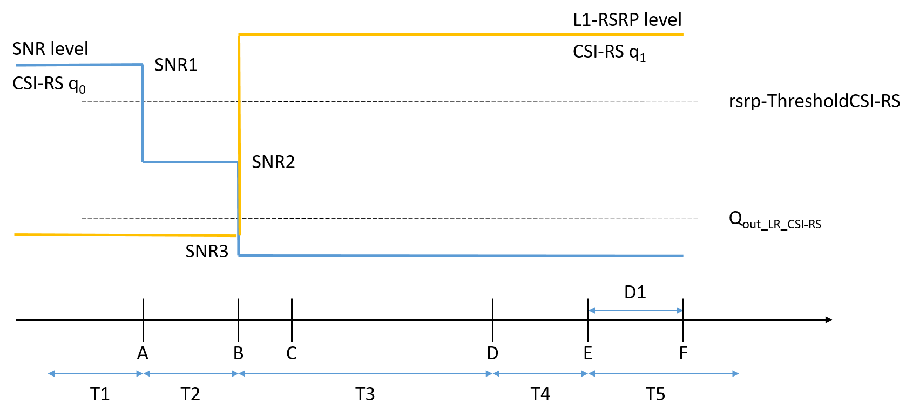
Figure A.7.5.5.11.1-1: SNR and L1-RSRP variation for CSI-RS based beam failure detection and link recovery testing in non-DRX mode
##### A.7.5.5.11.2 Test Requirements
The UE behaviour during time durations T1, T2, T3, T4 and T5 shall be as follows:
During the time duration T1 and T2, the UE shall transmit uplink signal at least in all subframes configured for CSI transmission on Cell 1.
During the period from time point A to time point B the UE shall transmit uplink signal in Cell 1 in all uplink slots configured for CSI transmission according to the configured periodic CSI reporting for Cell 1.
During T3 the shall detect beam failure and initiat link recovery. During T4 and T5 the UE measures and evaluate beam candidate from beam candidate set q1.
No later than time point F occurring no later than D1 = 260+10 ms after the start of T5, the UE shall transmit preamble on a beam associated with the candidate beam set q1. The UE shall not transmit preamble on a beam associated with the candidate beam set q1 earlier than time point B.
Test is concluded once the test equipment has received the initial preamble transmission from the UE. The rate of correct events observed during repeated tests shall be at least 90 %.
#### A.7.5.5.12 Beam Failure Detection and Link Recovery Test for FR2-2 PCell configured with CSI-RS-based BFD and LR in DRX mode
##### A.7.5.5.12.1 Test Purpose and Environment
The purpose of this test is to verify that the UE properly detects CSI-RS-based beam failure in the set q0 configured for a serving cell and that the UE performs correct CSI-RS-based link recovery based on beam candicate set q1. The purpose is to test the downlink monitoring for beam failure detection within the UEs active DL BWP, during the evaluation period, and link recovery, when DRX is used. This test will partly verify the CSI-RS based beam failure detection and link recovery for an FR2-2 serving cell requirements in clause 8.5.
The test parameters are given in Tables A.7.5.5.12.1-1, A.7.5.5.12.1-2, A.7.5.5.12.1-3, and A.7.5.5.12.1-4 below. There is one cell, cell 1 which is the active cell, in the test. The test consists of five successive time periods, with time duration of T1, T2, T3, T4 and T5 respectively. Figure A.7.5.5.12.1-1 shows the variation of the downlink SNR of the CSI-RS in set q0 in the active cell to emulate CSI-RS based beam failure. Figure A.7.5.5.12.1-1 additionally shows the variation of the downlink L1-RSRP of the CSI-RS in set q1 of the candidate beam used for link recovery. Prior to the start of the time duration T1, the UE shall be fully synchronized to cell 1. The UE shall be configured for periodic CSI reporting with a reporting periodicity of 5  ms. In the test, DRX configuration is enabled in PCell and DRX inactivity timer has already been expired, i.e. UE tries to decode PDCCH and to send periodic CQI during the period when On-duration timer is running. Time alignment timers shall be set to “infinity” so that UL timing alignment is maintained during the test.
Table A.7.5.5.12.1-1: Supported test configurations for FR2-2 PCell
| Configuration | Description |
| --- | --- |
| 1 | TDD duplex mode, 120 kHz SSB SCS, 100 MHz bandwidth |
| 2 | TDD duplex mode, 480 kHz SSB SCS, 400 MHz bandwidth |
| 3 | TDD duplex mode, 960 kHz SSB SCS, 400 MHz bandwidth |
| NOTE: The UE is only required to pass in one of the supported test configurations in FR2-2 |  |

Table A.7.5.5.12.1-2: General test parameters for FR2-2 PCell for CSI-RS-based beam failure detection and link recovery testing in DRX mode
| Parameter | Test Config. | Unit | Value | Comment |  |
| --- | --- | --- | --- | --- | --- |
|  |  |  | Test 1 |  |  |
| Active PCell | 1,2,3 |  | Cell 1 |  |  |
| RF Channel Number | 1,2,3 |  | 1 |  |  |
| Duplex mode | 1,2,3 |  | TDD |  |  |
| TDD Configuration | 1,2,3 |  | TDDConf.3.1 |  |  |
| BWchannel | 1 |  | 100: NPRB,c = 66 |  |  |
|  | 2 |  | 400: NPRB,c = 66 |  |  |
|  | 3 |  | 400: NPRB,c = 33 |  |  |
| Data PRBs allocated | 1 |  | 66 |  |  |
|  | 2 |  | 66 |  |  |
|  | 3 |  | 33 |  |  |
| PDSCH/PDCCH subcarrier spacing | 1 | kHz | 120 |  |  |
|  | 2 | kHz | 480 |  |  |
|  | 3 | kHz | 960 |  |  |
| DL initial BWP configuration | 1,2,3 |  | DLBWP.0.1 |  |  |
| DL dedicated BWP configuration | 1,2,3 |  | DLBWP.1.1 |  |  |
| UL initial BWP configuration | 1,2,3 |  | ULBWP.0.1 |  |  |
| UL dedicated BWP configuration | 1,2,3 |  | ULBWP.1.1 |  |  |
| PDSCH Reference Channel | 1,2,3 |  | SR.3.2 TDD |  |  |
| RMSI CORESET Reference Channel | 1,2,3 |  | CR.3.1 TDD |  |  |
| Dedicated CORESET Reference Channel | 1,2,3 |  | CCR.3.1 TDD |  |  |
| OCNG parameters | 1,2,3 |  | OP.1 |  |  |
| CP length | 1,2,3 |  | Normal |  |  |
| PDSCH/PDCCH TCI state | 1,2,3 |  | TCI.State.0 |  |  |
| CSI-RS for tracking | 1,2,3 |  | TRS.2.1 TDD |  |  |
| SSB Configuration | 1,2,3 |  | SSB.1 FR2 |  |  |
| SMTC Configuration | 1,2,3 |  | SMTC.3 |  |  |
| PRACH Configuration | 1,2,3 |  | FR2 PRACH configuration 4 | A.3.8.3.4 |  |
| DRX configuration | 1,2,3 |  | DRX.3 | A.3.3.3 |  |
| CSI-RS configuration for BFD/CBD/RLM | 1,2,3 |  | CSI-RS.3.2 TDD | A.3.14.2 |  |
| CSI-RS index assigned as BFD RS (q0) | 1,2,3 |  | 0 |  |  |
| CSI-RS index assigned as CBD RS (q1) | 1,2,3 |  | 1 |  |  |
| CSI-RS index assigned as RLM RS | 1,2,3 |  | 0,1 |  |  |
| Beam failure detection transmission parameters | DCI format | 1,2,3 |  | 1-0 |  |
|  | Number of Control OFDM symbols | 1,2,3 |  | 2 |  |
|  | Aggregation level | 1,2,3 | CCE | 8 |  |
|  | Ratio of hypothetical PDCCH RE energy to average SSS RE energy | 1,2,3 | dB | 0 |  |
|  | Ratio of hypothetical PDCCH DMRS energy to average SSS RE energy | 1,2,3 | dB | 0 |  |
|  | DMRS precoder granularity | 1,2,3 |  | REG bundle size |  |
|  | REG bundle size | 1,2,3 |  | 6 |  |
| Gap pattern ID | 1,2,3 |  | N/A |  |  |
| rlmInSyncOutOfSyncThreshold | 1,2,3 |  | absent | Value 0 is applied. (Table 8.1.1-1). |  |
| rsrp-ThresholdSSB | 1,2,3 | dBm/SCS | -95 | Threshold used for Qin_LR_SSB |  |
| powerControlOffsetSS | 1,2,3 |  | db0 | Used for deriving rsrp-ThresholdCSI-RS |  |
| beamFailureInstanceMaxCount | 1,2,3 |  | n1 | see TS 38.321 [7], clause 5.17 |  |
| beamFailureDetectionTimer | 1,2,3 |  | pbfd4 | see TS 38.321 [7], clause 5.17 |  |
| CSI-RS configuration for CSI reporting | 1,2,3 |  | CSI-RS.3.1 TDD | A.3.14.2 |  |
| reportConfigType | 1,2,3 |  | periodic |  |  |
| reportQuantity | 1,2,3 |  | cri-RI-PMI-CQI |  |  |
| CSI reporting periodicity | 1,2,3 | slot | 40 |  |  |
| CSI reporting offset | 1,2,3 | slot | 4 |  |  |
| T310 | 1,2,3 | ms | 1000 |  |  |
| N310 | 1,2,3 |  | 2 |  |  |
| T1 | 1,2,3 | s | 1 | The UE shall be fully synchronized to cell 1 during T1 |  |
| T2 | 1,2,3 | s | 5.43 |  |  |
| T3 | 1,2,3 | s | 5.16 |  |  |
| T4 | 1,2,3 | s | 0 |  |  |
| T5 | 1,2,3 | s | 0.31 |  |  |
| D1 | 1,2,3 | s | 0.27 |  |  |
| NOTE 1: UE-specific PDCCH is not transmitted after T1 starts. |  |  |  |  |  |

Table A.7.5.5.12.1-3: Cell specific test parameters for FR2-2 PCell for CSI-RS-based beam failure detection and link recovery testing in DRX mode
| Parameter | Unit | Test 1 |  |  |  |  |  |
| --- | --- | --- | --- | --- | --- | --- | --- |
|  |  | T1 | T2 | T3 | T4 | T5 |  |
| AoA setup |  | Setup 1 defined in A.3.15 |  |  |  |  |  |
| Assumption for UE beams Note 10 |  | Rough |  |  |  |  |  |
| EPRE ratio of PDCCH DMRS to SSS | dB | 0 |  |  |  |  |  |
| EPRE ratio of PDCCH to PDCCH DMRS | dB |  |  |  |  |  |  |
| EPRE ratio of PBCH DMRS to SSS | dB |  |  |  |  |  |  |
| EPRE ratio of PBCH to PBCH DMRS | dB |  |  |  |  |  |  |
| EPRE ratio of PSS to SSS | dB |  |  |  |  |  |  |
| EPRE ratio of PDSCH DMRS to SSS | dB |  |  |  |  |  |  |
| EPRE ratio of PDSCH to PDSCH DMRS | dB |  |  |  |  |  |  |
| EPRE ratio of OCNG DMRS to SSS | dB |  |  |  |  |  |  |
| EPRE ratio of OCNG to OCNG DMRS | dB |  |  |  |  |  |  |
| SNR_CSI-RS of set q0 | Config 1,2,3 | dB | 5 Note 11 | -3 Note 11 | -12 | -12 | -12 |
| SNR_CSI-RS of set q1 | Config 1,2,3 | dB | 0.2 | 0.2 | 20.2 | 20.2 | 20.2 |
| CSI-RS_RP of set q1 | Config 1,2,3 | dBm/SCS | -104.5 | -104.5 | -84.5 | -84.5 | -84.5 |
|  | Config 1,2,3 | dBm/120 KHz | -104.7 |  |  |  |  |
| Propagation condition |  | TDL-A 30 ns 75 Hz |  |  |  |  |  |
| NOTE 1: OCNG shall be used such that the resources in Cell 1 are fully allocated and a constant total transmitted power spectral density is achieved for all OFDM symbols. NOTE 2: The uplink resources for CSI reporting are assigned to the UE prior to the start of time period T1. NOTE 3: NZP CSI-RS resource set configuration for CSI reporting are assigned to the UE prior to the start of time period T1. NOTE 4: Void NOTE 5: The timers and layer 3 filtering related parameters are configured prior to the start of time period T1. NOTE 6: The signal contains PDCCH for UEs other than the device under test as part of OCNG. NOTE 7: SNR levels correspond to the signal to noise ratio over the REs carrying CSI-RS. NOTE 8: The SNR in time periods T1, T2, T3, T4 and T5 is denoted as SNR1, SNR2 and SNR3 respectively in figure A.7.5.5.12.1-1. NOTE 9: The SNR values are specified for testing a UE which supports 2RX on at least one band. For testing of a UE which supports 4RX on all bands, the SNR during T3 is modified as specified in clause A.3.6. NOTE 10: Information about types of UE beam is given in clause B.2.1.3 and does not limit UE implementation or test system implementation. NOTE 11: This value allows up to 1 dB degradation from applied SNR to UE baseband |  |  |  |  |  |  |  |

Table A.7.5.5.12.1-4: Void
Table A.7.5.5.12.1-5: Void
Table A.7.5.5.12.1-6: Void

Figure A.7.5.5.12.1-1: SNR and L1-RSRP variation for CSI-RS-based beam failure detection and link recovery testing in DRX mode
##### A.7.5.5.12.2 Test Requirements
The UE behaviour during time durations T1, T2, T3, T4 and T5 shall be as follows:
During the time duration T1 and T2, the UE shall transmit uplink signal at least in all subframes configured for CSI transmission on Cell 1.
During the period from time point A to time point B the UE shall transmit uplink signal in Cell 1 in all uplink slots configured for CSI transmission according to the configured periodic CSI reporting for Cell 1.
During T3 the UE shall detect beam failure and initiat link recovery. During T4 and T5 the UE measures and evaluate beam candidate from beam candidate set q1.
No later than time point F occurring no later than D1 = 260+10 ms after the start of T5, the UE shall transmit preamble on a beam associated with the candidate beam set q1. The UE shall not transmit preamble on a beam associated with the candidate beam set q1 earlier than time point B.
Test is concluded once the test equipment has received the initial preamble transmission from the UE. The rate of correct events observed during repeated tests shall be at least 90 %.
#### A.7.5.5.13 Scheduling availability restriction during Beam Failure Detection and Link Recovery for FR2-2 PCell configured with SSB-based BFD and LR in non-DRX mode
##### A.7.5.5.13.1 Test Purpose and Environment
The purpose is to test scheduling availability restrictions when the UE is performing beam failure detection or when the UE is performing L1-RSRP measurement for candidate beam detection, when no DRX is used. This test will verify the scheduling availability restriction requirements in clause 8.5.7 and 8.5.8.
The test parameters are given in Tables A.7.5.5.13.1-1, A.7.5.5.13.1-2 and A.7.5.5.13.1-3 below. There is one cell, cell 1 which is the active cell, in the test. The test consists of five successive time periods, with time duration of T1, T2, T3, T4 and T5 respectively. Figure A.7.5.5.13.1-1 shows the variation of the downlink SNR of the SSB in set q0 in the active cell to emulate SSB based beam failure. Figure A.7.5.5.13.1-1 additionally shows the variation of the downlink L1-RSRP of the SSB in set q1 of the candidate beam used for link recovery. Prior to the start of the time duration T1, the UE shall be fully synchronized to cell 1. The UE shall be configured for periodic CSI reporting with a reporting periodicity of 5 ms. This test will focus on the scheduling availability during beam failure detection) and candidate beam detection. In the test, DRX configuration is not enabled. Test is to test the scheduling availability restriction of UE performing beam failure detection and candidate beam detection when SSB RS configured for Beam failure detection and candidate beam detection. During the test the UE is scheduled to transmit continuously in UL.
Table A.7.5.513.1-1: Supported test configurations for FR2-2 PCell
| Configuration | Description |
| --- | --- |
| 1 | NR 120 kHz SSB SCS, 100 MHz bandwidth, TDD duplex mode |
| 2 | NR 240 kHz SSB SCS, 100 MHz bandwidth, TDD duplex mode |
| NOTE: The UE is only required to be tested in one of the supported test configurations |  |

Table A.7.5.5.13.1-2: General test parameters for FR2-2 PCell for SSB-based beam failure detection and link recovery testing in non-DRX mode
| Parameter | Test Config. | Unit | Value | Comment |  |
| --- | --- | --- | --- | --- | --- |
|  |  |  | Test 1 |  |  |
| Active PCell | 1-2 |  | Cell 1 |  |  |
| RF Channel Number | 1-2 |  | 1 |  |  |
| Duplex mode | 1-2 |  | TDD |  |  |
| TDD Configuration | 1-2 |  | TDDConf.3.1 |  |  |
| BWchannel | 1-2 |  | 100: NPRB,c = 66 |  |  |
| Data PRBs allocated | 1-2 |  | 66 |  |  |
| PDSCH/PDCCH subcarrier spacing | 1-2 | kHz | 120 |  |  |
| DL initial BWP configuration | 1-2 |  | DLBWP.0.1 |  |  |
| DL dedicated BWP configuration | 1-2 |  | DLBWP.1.1 |  |  |
| UL initial BWP configuration | 1-2 |  | ULBWP.0.1 |  |  |
| UL dedicated BWP configuration | 1-2 |  | ULBWP.1.1 |  |  |
| PDSCH Reference Channel | 1 |  | SR.3.2 TDD |  |  |
|  | 2 |  | SR.3.3 TDD |  |  |
| RMSI CORESET Reference Channel | 1 |  | CR.3.1 TDD |  |  |
|  | 2 |  | CR.3.2 TDD |  |  |
| Dedicated CORESET Reference Channel | 1 |  | CCR.3.1 TDD |  |  |
|  | 2 |  | CCR.3.7 TDD |  |  |
| OCNG parameters | 1-2 |  | OP.1 |  |  |
| CP length | 1-2 |  | Normal |  |  |
| PDSCH/PDCCH TCI state | 1-2 |  | TCI.State.0 |  |  |
| CSI-RS for tracking | 1-2 |  | TRS.2.1 TDD |  |  |
| SSB Configuration | 1 |  | SSB.1 FR2 |  |  |
|  | 2 |  | SSB.2 FR2 |  |  |
| SMTC Configuration | 1-2 |  | SMTC.1 |  |  |
| PRACH Configuration | 1-2 |  | FR2 PRACH configuration 2 | A.3.8.3.2 |  |
| DRX configuration | 1-2 |  | OFF |  |  |
| SSB index assigned as BFD RS (q0) | 1-2 |  | 0 |  |  |
| SSB index assigned as CBD RS (q1) | 1-2 |  | 1 |  |  |
| Beam failure detection transmission parameters | DCI format | 1-2 |  | 1-0 |  |
|  | Number of Control OFDM symbols | 1-2 |  | 2 |  |
|  | Aggregation level | 1-2 | CCE | 8 |  |
|  | Ratio of hypothetical PDCCH RE energy to average SSS RE energy | 1-2 | dB | 0 |  |
|  | Ratio of hypothetical PDCCH DMRS energy to average SSS RE energy | 1-2 | dB | 0 |  |
|  | DMRS precoder granularity | 1-2 |  | REG bundle size |  |
|  | REG bundle size | 1-2 |  | 6 |  |
| Gap pattern ID | 1-2 |  | N/A |  |  |
| rlmInSyncOutOfSyncThreshold | 1-2 |  | absent | Value 0 is applied. (Table 8.1.1-1). |  |
| rsrp-ThresholdSSB | 1 | dBm/SCS | -95 | Threshold used for Qin_LR_SSB |  |
|  | 2 |  | -92 |  |  |
| powerControlOffsetSS | 1-2 |  | db0 | Used for deriving rsrp-ThresholdCSI-RS |  |
| beamFailureInstanceMaxCount | 1-2 |  | n1 | see TS 38.321 [7], clause 5.17 |  |
| beamFailureDetectionTimer | 1-2 |  | pbfd4 | see TS 38.321 [7], clause 5.17 |  |
| CSI-RS configuration for CSI reporting | 1-2 |  | CSI-RS.3.1 TDD |  |  |
| reportConfigType | 1-2 |  | periodic |  |  |
| reportQuantity | 1-2 |  | cri-RI-PMI-CQI |  |  |
| CSI reporting periodicity | 1-2 | slot | 40 |  |  |
| CSI reporting offset | 1-2 | slot | 4 |  |  |
| T310 | 1-2 | ms | 1000 |  |  |
| N310 | 1-2 |  | 2 |  |  |
| T1 | 1-2 | s | 1 | The UE shall be fully synchronized to cell 1 during T1 |  |
| T2 | 1-2 | s | 2.6 |  |  |
| T3 | 1-2 | s | 1.64 |  |  |
| T4 | 1-2 | s | 0 |  |  |
| T5 | 1-2 | s | 1.01 |  |  |
| D1 | 1-2 | s | 0.97 |  |  |
| NOTE 1: All configurations are assigned to the UE prior to the start of time period T1. NOTE 2: UE-specific PDCCH is not transmitted after T1 starts. |  |  |  |  |  |

Table A.7.5.5.13.1-3: Cell specific test parameters for FR2-2 PCell for SSB-based beam failure detection and link recovery testing in non-DRX mode
| Parameter | Unit | Test 1 |  |  |  |  |  |
| --- | --- | --- | --- | --- | --- | --- | --- |
|  |  | T1 | T2 | T3 | T4 | T5 |  |
| AoA Setup |  | Setup1 defined in A.3.15.1 |  |  |  |  |  |
| Assumption for UE beams Note 10 |  | Rough |  |  |  |  |  |
| EPRE ratio of PDCCH DMRS to SSS | dB | 0 |  |  |  |  |  |
| EPRE ratio of PDCCH to PDCCH DMRS | dB |  |  |  |  |  |  |
| EPRE ratio of PBCH DMRS to SSS | dB |  |  |  |  |  |  |
| EPRE ratio of PBCH to PBCH DMRS | dB |  |  |  |  |  |  |
| EPRE ratio of PSS to SSS | dB |  |  |  |  |  |  |
| EPRE ratio of PDSCH DMRS to SSS | dB |  |  |  |  |  |  |
| EPRE ratio of PDSCH to PDSCH DMRS | dB |  |  |  |  |  |  |
| EPRE ratio of OCNG DMRS to SSS | dB |  |  |  |  |  |  |
| EPRE ratio of OCNG to OCNG DMRS | dB |  |  |  |  |  |  |
| SNR_SSB of set q0 | Config 1-2 | dB | 5Note 11 | -3Note 11 | -12 | -12 | -12 |
| SNR_SSB of set q1 | Config 1-2 | dB | 0.2 | 0.2 | 20.2 | 20.2 | 20.2 |
| SSB_RP of set q1 | Config 1 | dBm/SCS | -104.5 | -104.5 | -84.5 | -84.5 | -84.5 |
|  | Config 2 |  | -101.5 | -101.5 | -81.5 | -81.5 | -81.5 |
|  | Config 1-2 | dBm/120 kHz | -104.7 |  |  |  |  |
| Propagation condition |  | TDL-A 30 ns 75 Hz |  |  |  |  |  |
| NOTE 1: OCNG shall be used such that the resources in Cell 1 are fully allocated and a constant total transmitted power spectral density is achieved for all OFDM symbols. NOTE 2: The uplink resources for CSI reporting are assigned to the UE prior to the start of time period T1. NOTE 3: NZP CSI-RS resource set configuration for CSI reporting are assigned to the UE prior to the start of time period T1. NOTE 4: Void NOTE 5: The timers and layer 3 filtering related parameters are configured prior to the start of time period T1. NOTE 6: The signal contains PDCCH for UEs other than the device under test as part of OCNG. NOTE 7: SNR levels correspond to the signal to noise ratio over the SSS REs. NOTE 8: The SNR in time periods T1, T2, T3, T4 and T5 is denoted as SNR1, SNR2 and SNR3 respectively in figure A.7.5.5.13.1-1. NOTE 9: The SNR values are specified for testing a UE which supports 2RX on at least one band. For testing of a UE which supports 4RX on all bands, the SNR during T3 is modified as specified in clause A.3.6. NOTE 10: Information about types of UE beam given in clause B.2.1.3 and does not limit UE implementation or test system implementation NOTE 11: This value allows up to 1 dB degradation from applied SNR to UE baseband. |  |  |  |  |  |  |  |

Figure A.7.5.5.13.1-1: SNR and L1-RSRP variation SSB for SSB-based beam failure detection and link recovery testing in non-DRX mode
##### A.7.5.5.13.2 Test Requirements
The UE behaviour during time duration T3 follows the requirements defined in clause 8.5.7.3:
- The UE is not expected to transmit PUCCH/PUSCH/SRS or receive PDCCH/PDSCH/CSI-RS for tracking/CSI-RS for CQI on BFD-RS symbols to be measured for beam failure detection.
The UE behaviour during time durations T4 and T5 follows the requirements defined in clause 8.5.8.3:
- The UE is not expected to transmit PUCCH/PUSCH or receive PDCCH/PDSCH on reference symbols to be measured for candidate beam detection.
#### A.7.5.5.14 TRP specific Beam Failure Detection and Link Recovery for FR2 PCell configured with CSI-RS-based BFD and LR and multi-Rx operation in DRX mode
##### A.7.5.5.14.1 Test Purpose and Environment
The purpose of this test is to verify that the UE properly detects TRP specific CSI-RS-based beam failure and link recovery in the sets $\hat{q}_{0,0}$ and $\hat{q}_{1,0}$ for TRP0 and sets $\hat{q}_{0,1}$ and $\hat{q}_{1,1}$ for TRP1 when DRX is used for an FR2 PCell requirements in clause 8.18.
The test parameters are given in Tables A.7.5.5.14.1-1, A.7.5.5.14.1-2 and A.7.5.5.14.1-3. Cell 1 is the active PCell in the test. PCell is configured with two TRPs. The test consists of five successive time periods, with time duration of T1, T2, T3, T4 and T5 respectively. Figure A.7.5.5.14.1-3 shows the variation of the downlink SNR of the CSI-RS in set $\hat{q}_{0,0}$ and $\hat{q}_{0,1}$ in the PCell for TRP0 and TRP1 respectively. Figure A.7.5.5.14.1-3 additionally shows the variation of the downlink L1-RSRP of the CSI-RS in $\hat{q}_{1,0}$  for TPR0. Prior to the start of the time duration T1, the UE shall be fully synchronized to cell 1. The UE shall be configured for periodic CSI reporting with a reporting periodicity of 2 ms.
In the test, UE is capable of multi-Rx operation and configured with group-based beam reporting (GBBR) on the cell 1.  During T1, UE shall be able to report via beam pair associated with sets $\hat{q}_{0,0}$ for TRP0 and $\hat{q}_{0,1}$ for TRP1. After T5, UE shall be able to report via new beam pair associated with sets $\hat{q}_{1,0}$ for TRP0 and $\hat{q}_{0,1}$ for TRP1
During T2 and T3, for beam failure detection, CSI-RS resources in the two sets $\hat{q}_{0,0}$ for TRP0 and $\hat{q}_{0,1}$ for TRP1 are overlapped on the same OFDM symbol according to CSI-RS configuration in table A.7.5.5.14.1-2 and A.3.14.2-3, and the conditions in clause 8.18.3.2 are met, at least including:
- Both CSI-RSs are not in any CSI-RS resource set with repetition ON
- The CSI-RS in set $\hat{q}_{0,0}$ has same QCL source as the active TCI state of one PDSCH, and the CSI-RS in set $\hat{q}_{0,1}$ has same QCL source as the active TCI state of the other PDSCH
- Resources of the active TCI states for the two PDSCHs have been reported as a resource group in Rel-17 group-based RSRP report.
During T4 and T5, for candidate beam detection, CSI-RS resources in the two sets $\hat{q}_{1,0}$ for TRP0 and $\hat{q}_{0,1}$ for TRP1 are also overlapped according to CSI-RS configuration in table A.7.5.5.14.1-2 and and A.3.14.2-3.
In addition, DRX configuration is enabled in PCell and DRX inactivity timer has already been expired, i.e. UE tries to decode PDCCH and to send periodic CQI during the period when On-duration timer is running. Time alignment timers shall be set to “infinity” so that UL timing alignment is maintained during the test.
Table A.7.5.5.14.1-1: Supported test configurations for FR2 PCell
| Configuration | Description |
| --- | --- |
| 1 | TDD duplex mode, 120 kHz SSB SCS, 100 MHz bandwidth |

Table A.7.5.5.14.1-2: General test parameters for FR2 PCell for beam failure detection and link recovery testing in DRX mode
| Parameter | Unit | Value | Comment |  |
| --- | --- | --- | --- | --- |
|  |  | Test 1 |  |  |
| Active PCell |  | Cell 1 |  |  |
| RF Channel Number for PCell |  | 1 |  |  |
| Duplex mode | Config 1 |  | TDD |  |
| BW channel | Config 1 |  | 100: NPRB,c = 66 |  |
| Data PRBs allocated | Config 1 |  | 24 |  |
| DL initial BWP configuration | Config 1 |  | DLBWP.0.1 |  |
| DL dedicated BWP configuration | Config 1 |  | DLBWP.1.1 |  |
| UL initial BWP configuration | Config 1 |  | ULBWP.0.1 |  |
| UL dedicated BWP configuration | Config 1 |  | ULBWP.1.1 |  |
| TDD Configuration | Config 1 |  | TDDConf.3.1 |  |
| CORESET Reference Channel | Config 1 |  | CR.3.1 TDD | A.3.1.2 |
| SSB Configuration | Config 1 |  | SSB.3 FR2 | A.3.11 |
| SMTC Configuration | Config 1 |  | SMTC.3 | A.3.10 |
| PDSCH/PDCCH subcarrier spacing | Config 1 |  | 120 KHz |  |
| PRACH Configuration | Config 1 |  | Table A.3.8.3.1-3 |  |
| CSI-RS configuration for TRP0 | Config 1 |  | CSI-RS.3.2 TDD | A.3.14.2 |
| CSI-RS configuration for TRP1 | Config 1 |  | CSI-RS.3.6 TDD | A.3.14.2 |
| CSI-RS configuration for CSI reporting | Config 1 |  | CSI-RS.3.1 TDD | A.3.14.2 |
| TRS configuration | Config 1 |  | TRS.2.1 TDD |  |
| TCI configuration | Config 1 |  | CSI-RS.Config.0 |  |
| OCNG parameters |  |  | OP.1 |  |
| CP length |  |  | Normal |  |
| Correlation Matrix and Antenna Configuration |  |  | 2x2 Low |  |
| OCNG parameters |  | OP.1 | A.3.2.1 |  |
| CP length |  | Normal |  |  |
| Correlation Matrix and Antenna Configuration |  | 2x2 Low |  |  |
| Beam failure | DCI format |  | 1-0 |  |
| detection transmission parameters | Number of Control OFDM symbols |  | 2 |  |
|  | Aggregation level | CCE | 8 |  |
|  | Ratio of hypothetical PDCCH RE energy to average CSI-RS RE energy | dB | 0 |  |
|  | Ratio of hypothetical PDCCH DMRS energy to average CSI-RS RE energy | dB | 0 |  |
|  | DMRS precoder granularity |  | REG bundle size |  |
|  | REG bundle size |  | 6 |  |
| DRX |  | DRX.3 |  |  |
| Gap pattern ID |  | N/A |  |  |
| schedulingRequestID-BFR-r17 |  | Configured |  |  |
| Periodicity of PUCCH for SR configuration for BFR on PCell | Slot | 40 | 5 ms |  |
| CSI-RS Index assigned as BFD RS in set (q0,0) |  | 0 |  |  |
| CSI-RS Index assigned as CBD RS in set (q1,0) |  | 1 |  |  |
| CSI-RS Index assigned as BFD RS in set (q0,1) |  | 2 |  |  |
| CSI-RS Index assigned as CBD RS in set (q1,1) |  | 3 |  |  |
| CSI-RS index assigned as RLM RS |  | 0, 1 |  |  |
| SSB index assigned as RLM RS |  | 0, 1 |  |  |
| rlmInSyncOutOfSyncThreshold |  | absent | When the field is absent, the UE applies the value 0. (Table 8.1.1-1). |  |
| rsrp-ThresholdCSI-RS | Config 1 | dBm/SCS | -95 | Threshold used for Qin_LR_CSI-RS |
| powerControlOffsetSS |  | db0 | Used for deriving rsrp-ThresholdCSI-RS |  |
| beamFailureInstanceMaxCount |  | n1 | see TS 38.321 [7], clause 5.17 |  |
| beamFailureDetectionTimer |  | pbfd4 | see TS 38.321 [7], clause 5.17 |  |
| T310 Timer | ms | 1000 |  |  |
| N310 |  | 2 |  |  |
| T1 | s | 1 | During this time the the UE shall be fully synchronized to cell 1 |  |
| T2 (BFD time +CBD time +margin) | s | 5.69 |  |  |
| T3 (BFD time +margin) | s | 5.16 |  |  |
| T4 | s | 0 |  |  |
| T5 (CBD time +margin) | s | 0.57 |  |  |
| D1 (CBD time +margin) | s | 0.53 |  |  |
| NOTE 1: UE-specific PDCCH is not transmitted after T1 starts. |  |  |  |  |

Table A.7.5.5.14.1-3: Cell specific test parameters for FR2 PCell for beam failure detection and link recovery testing in DRX mode
| Parameter | Unit | Cell 1 |  |  |  |  |
| --- | --- | --- | --- | --- | --- | --- |
|  |  | T1 | T2 | T3 | T4 | T5 |
| AoA setup |  | Setup 6 as specified in clause A.3.15 Note 11 |  |  |  |  |
| Assumption for UE beams Note 10 |  | Rough |  |  |  |  |
| EPRE ratio of PDCCH DMRS to SSS | dB | 0 |  |  |  |  |
| EPRE ratio of PDCCH to PDCCH DMRS | dB |  |  |  |  |  |
| EPRE ratio of PBCH DMRS to SSS | dB |  |  |  |  |  |
| EPRE ratio of PBCH to PBCH DMRS | dB |  |  |  |  |  |
| EPRE ratio of PSS to SSS | dB |  |  |  |  |  |
| EPRE ratio of PDSCH DMRS to SSS | dB |  |  |  |  |  |
| EPRE ratio of PDSCH to PDSCH DMRS | dB |  |  |  |  |  |
| EPRE ratio of OCNG DMRS to SSS | dB |  |  |  |  |  |
| EPRE ratio of OCNG to OCNG DMRS | dB |  |  |  |  |  |
| SNR_CSI-RS of set q0,0 Note 12 | dB | 5 | -3 | -12 | -12 | -12 |
| SNR_CSI-RS of set q0,1 Note 12 | dB | 5 | 5 | 5 | 5 | 5 |
| SNR_CSI-RS of set q1,0 Note 12 | dB | 0.2 | 0.2 | 9 | 9 | 9 |
| CSI-RS_RP of set q1,0 | dBm/ SCS kHz | -91.3 | -91.3 | -82.5 | -82.5 | -82.5 |
| Noc | dBm/120 kHz | -91.5 |  |  |  |  |
| Propagation condition |  | TDL-A 30 ns 75 Hz |  |  |  |  |
| NOTE 1: OCNG shall be used such that the resources in Cell 1 are fully allocated and a constant total transmitted power spectral density is achieved for all OFDM symbols. NOTE 2: The uplink resources for CSI reporting are assigned to the UE prior to the start of time period T1. NOTE 3: NZP CSI-RS resource set configuration for CSI reporting are assigned to the UE prior to the start of time period T1. NOTE 4: Void NOTE 5: The timers and layer 3 filtering related parameters are configured prior to the start of time period T1. NOTE 6: The signal contains PDCCH for UEs other than the device under test as part of OCNG. NOTE 7: SNR levels correspond to the signal to noise ratio over the REs carrying CSI-RS. NOTE 8: The SNR in time periods T1, T2, T3, T4 and T5 is denoted as SNR1, SNR2 and SNR3 respectively in figure A.7.5.5.7.1-1. NOTE 9: The SNR values are specified for testing a UE which supports 2RX on at least one band. For testing of a UE which supports 4RX on all bands, the SNR during T3 is modified as specified in clause A.3.6. NOTE 10: Information about types of UE beam is given in clause B.2.1.3 and does not limit UE implementation or test system implementation. NOTE 11: AoA1 and AoA3 are for TRP0 of PCell, AoA2 is for TRP1 of PCell. AoA1 and A0A2 are from the set of qualified AoA pairs according to A.3.15.6. NOTE 12: This value allows up to 1 dB degradation from applied SNR to UE baseband |  |  |  |  |  |  |

Figure A.7.5.5.14.1-1: SNR and L1-RSRP variation for beam failure detection and link recovery testing for PCell in DRX mode
##### A.7.5.5.14.2 Test Requirements
The UE behaviour during time durations T1, T2, T3, T4 and T5 in A.7.5.5.14.1 shall be as follows:
During the time duration T1 and T2, the UE shall transmit uplink signal at least in all subframes configured for CSI transmission on Cell 1 with sets $\hat{q}_{0,0}$ for TRP0 and sets $\hat{q}_{0,1}$ for TRP1. During T1, UE reports via beam pair assoiated with sets $\hat{q}_{0,0}$ for TRP0 and $\hat{q}_{0,1}$ for TRP1.
During the period from time point A to time point B the UE shall transmit uplink signal in all uplink slots configured for CSI transmission according to the configured periodic CSI reporting for Cell 1.
During T3, T4, T5, the UE shall transmit uplink signal at least in all subframes configured for CSI transmission on Cell 1 with sets $\hat{q}_{0,1}$ for TRP1.
During T3 the UE shall detect beam failure and initiate link recovery for TRP0. During T4 and T5 the UE measures and evaluate beam candidate from beam candidate sets $\hat{q}_{1,0}$ for TRP0 and $\hat{q}_{0,1}$ for TRP1.
No later than time point F occurring no later than D1 after the start of T5, the UE shall transmit PUCCH with LRR, followed by BFR MAC CE containing beam associated with the candidate beam with sets $\hat{q}_{1,0}$ for TRP0. The UE shall not transmit PUCCH with an LRR with candidate beam set  $\hat{q}_{1,0}$ for TRP0 earlier than time point B.
After T5, UE shall be able to report via new beam pair associated with sets $\hat{q}_{1,0}$ for TRP0 and $\hat{q}_{0,1}$ for TRP1.
Test is concluded once the test equipment has received the initial preamble transmission from the UE. The rate of correct events observed during repeated tests shall be at least 90 %.
#### A.7.5.5.15 Beam Failure Detection and Link Recovery Test for FR2 Pcell configured with CSI-RS-based BFD and LR in non-DRX mode for a UE operating with SBFD
##### A.7.5.5.15.1 Test Purpose and Environment
The purpose of this test is to verify that the UE supporting supportSBFD properly detects CSI-RS-based beam failure in the set q0 configured for a serving cell operating on SBFD, and that the UE performs correct CSI-RS-based link recovery based on beam candicate set q1. The purpose is to test the downlink monitoring for beam failure detection within the Ues active DL BWP, during the evaluation period, and link recovery, when no DRX is used. This test will partly verify the CSI-RS based beam failure detection and link recovery for an FR2 serving cell requirements in clause 8.5.
Supported test configurations are specified in Table A.7.5.5.15.1-1. General test parameters as specified in Table A.7.5.5.3.1-2 apply except those specified in Table A.7.5.5.15.1-2. Cell specific test parameters as specified in Table A.7.5.5.3.1-3 apply except those specified in table A.7.5.5.15.1-3.
The test procedure specified in clause A.7.5.5.3.1 applies to this test. In addition, during T3 and T5, there is overlapping between occasions of the CSI-RS resource for BFD (q0) and dynamic UL transmission on SBFD symbols, as specified in A.3.
Table A.7.5.5.15.1-1: Supported test configurations for FR2 Pcell
| Configuration | Description |
| --- | --- |
| 1 | TDD duplex mode, 120 kHz SSB SCS, 100 MHz bandwidth |

Table A.7.5.5.15.1-2: General test parameters for FR2 Pcell for CSI-RS-based beam failure detection and link recovery testing in non-DRX mode
| Parameter | Unit | Value | Comment |
| --- | --- | --- | --- |
|  |  | Test 1 |  |
| TDD Configuration |  | TDDConf.3.1 |  |
| SBFD configuration |  | SBFD.2 FR2 | A.3.41 |
| BWchannel |  | 100: NPRB,c = 66 |  |
| Data PRBs allocated |  | 66 |  |
| PDSCH/PDCCH subcarrier spacing | kHz | 120 |  |
| PDSCH Reference Channel |  | SR.3.2 TDD | A.3.1.1 |
| RMSI CORESET Reference Channel |  | CR.3.1 TDD | A.3.1.2 |
| Dedicated CORESET Reference Channel |  | CCR.3.1 TDD | A.3.1.3 |
| SSB Configuration |  | SSB.34 FR2 | A.3.10.2 |
| CSI-RS for tracking |  | TRS.2.1 TDD | A.3.17.2 |
| CSI-RS configuration for BFD/CBD/RLM |  | CSI-RS.3.2 TDD | A.3.14.2 |
| CSI-RS configuration for CSI reporting |  | CSI-RS.3.1 TDD | A.3.14.2 |
| CSI reporting periodicity | slot | 40 |  |
| CSI reporting offset | slot | 4 |  |
| T310 | ms | 1000 |  |
| N310 |  | 2 |  |
| T1 | s | 1 | The UE shall be fully synchronized to cell 1 during T1 |
| T2 | s | 1.17 |  |
| T3 | s | 0.98 |  |
| T4 | s | 0 |  |
| T5 | s | 0.39 |  |
| D1 | s | 0.35 |  |

Table A.7.5.5.15.1-3: Cell specific test parameters for FR2 PCell for CSI-RS-based beam failure detection and link recovery testing in non-DRX mode
| Parameter | Unit | Test 1 |  |  |  |  |  |
| --- | --- | --- | --- | --- | --- | --- | --- |
|  |  | T1 | T2 | T3 | T4 | T5 |  |
| AoA setup |  | Setup 1 defined in A.3.15 |  |  |  |  |  |
| Assumptpion for UE beams Note 10 |  | Rough |  |  |  |  |  |
| SNR_CSI-RS of set q0 | Config 1 | dB | 5 Note 11 | -3 Note 11 | -12 | -12 | -12 |
| SNR_CSI-RS of set q1 | Config 1 | dB | 0.2 | 0.2 | 20.2 | 20.2 | 20.2 |
| CSI-RS_RP of set q1 | Config 1 | dBm/SCS | -104.5 | -104.5 | -84.5 | -84.5 | -84.5 |
|  | Config 1 | dBm/120 KHz | -104.7 |  |  |  |  |
| Propagation condition |  | TDL-A 30 ns 75 Hz |  |  |  |  |  |
| NOTE 1: OCNG shall be used such that the resources in Cell 1 are fully allocated and a constant total transmitted power spectral density is achieved for all OFDM symbols. NOTE 2: The uplink resources for CSI reporting are assigned to the UE prior to the start of time period T1. NOTE 3: NZP CSI-RS resource set configuration for CSI reporting are assigned to the UE prior to the start of time period T1. NOTE 4: Void NOTE 5: The timers and layer 3 filtering related parameters are configured prior to the start of time period T1. NOTE 6: The signal contains PDCCH for UEs other than the device under test as part of OCNG. NOTE 7: SNR levels correspond to the signal to noise ratio over the REs carrying CSI-RS. NOTE 8: The SNR in time periods T1, T2, T3, T4 and T5 is denoted as SNR1, SNR2 and SNR3 respectively in figure A.7.5.5.3.1-1. NOTE 9: The SNR values are specified for testing a UE which supports 2RX on at least one band. For testing of a UE which supports 4RX on all bands, the SNR during T3 is modified as specified in clause A.3.6. NOTE 10: Information about types of UE beam is given in clause B.2.1.3 and does not limit UE implementation or test system implementation. NOTE 11: This value allows up to 1 dB degradation from applied SNR to UE baseband |  |  |  |  |  |  |  |

##### A.7.5.5.15.2 Test Requirements
The UE behaviour during time durations T1, T2, T3, T4 and T5 shall be as follows:
During the time duration T1 and T2, the UE shall transmit uplink signal at least in all subframes configured for CSI transmission on Cell 1.
During the period from time point A to time point B the UE shall transmit uplink signal in Cell 1 in all uplink slots configured for CSI transmission according to the configured periodic CSI reporting for Cell 1.
During T3 the shall detect beam failure and initiat link recovery. During T4 and T5 the UE measures and evaluate beam candidate from beam candidate set q1.
No later than time point F occurring no later than D1 = 260+10+80 ms after the start of T5, the UE shall transmit preamble on a beam associated with the candidate beam set q1. The UE shall not transmit preamble on a beam associated with the candidate beam set q1 earlier than time point B.
Test is concluded once the test equipment has received the initial preamble transmission from the UE. The rate of correct events observed during repeated tests shall be at least 90 %.
### A.7.5.6 Active BWP switch
#### A.7.5.6.1 DCI-based and Timer-based Active BWP Switch
##### A.7.5.6.1.1 NR FR2- NR FR2 DL active BWP switch of SCell with non-DRX in SA
A.7.5.6.1.1.1 Test Purpose and Environment
The purpose of this test is to verify the DL BWP switch delay requirement defined in clause 8.6, and interruption requirement on other active serving cell defined in clause 8.2.2.2.5.
The supported test configurations are shown in table A.7.5.6.1.1.1-1 below. The test scenario comprises of one PCell (Cell 1) and one SCell (Cell 2) as given in table A.7.5.6.1.1.1-2. NR Cell-specific parameters are specified in table A.7.5.6.1.1.1-3 below. OTA related test parameters are shown in table A.7.5.6.1.1.1-4 below.
PDCCHs indicating new transmissions shall be sent continuously on SCell (Cell 2) to ensure that the UE would have ACK/NACK sending except for the time duration when BWP is switching on Cell 2 and the time duration of T2.
PDCCHs indicating new transmissions shall be sent continuously on PCell (Cell 1) to ensure that the UE will have ACK/NACK sending.
Before the test starts,
UE is connected to Cell 1 (PCell) on radio channel 1 (PCC), and Cell 2 (SCell) on radio channel 2 (SCC).
UE is configured with 2 different UE-specific downlink bandwidth parts for SCell, BWP-1 and BWP-2, in Cell 2 before starting the test. BWP-1 and BWP-2 always include bandwidth of the initial DL BWP and SSB.
UE is configured with 1 UE-specific downlink bandwidth parts the same as initial BWP for PSCell, BWP-0 in Cell 1 before starting the test.
UE is indicated in firstActiveDownlinkBWP-Id that the active DL BWP is BWP-1 in SCell.
UE is indicated in firstActiveDownlinkBWP-Id that the active DL BWP is BWP-0 in PCell.
UE is configured with a bwp-InactivityTimer timer value for SCell.
All cells have constant signal levels throughout the test.
The test consists of 3 successive time periods, with durations of T1, T2, and T3, respectively.
During T1,
Time period T1 starts when a DCI format 1_1 command for SCell DL BWP switch, sent from the test equipment to the UE, is received at the UE side in SCell’s slot # denoted i. The UE shall switch its bandwidth part from BWP-1 to BWP-2.
The UE shall be able to receive PDSCH no later than the first DL slot that occurs after the beginning of SCell’s DL slot (i+TBWPswitchDelay) as defined in clause 8.6 and starts to report valid ACK/NACK for the SCell on PCell no later than the first UL slot that occurs after the beginning of slot (i+TBWPswitchDelay+k1). The UE shall be continuously scheduled on SCell’s BWP-2 no later than the first DL slot that occurs after the beginning of slot (i+TBWPswitchDelay).
The starting time of PCell (Cell 1) interruption due to BWP switch on SCell shall occur within the BWP switch delay.
During T2, the test equipment won’t transmit DCI format for PDSCH reception on SCell(Cell 2).
During T3,
The time period T3 starts from the slot #j, where j is the first slot of the half subframe immediately after bwp-InactivityTimer timer expires. The UE should switch its bandwidth part from BWP-2 back to the default bandwidth part – BWP-1.
The UE shall be able to receive PDSCH no later than the first DL slot that occurs after the beginning of SCell’s DL slot (j+TBWPswitchDelay) as defined in clause 8.6 and starts to report valid ACK/NACK for the SCell on PCell at latest on the first UL slot that occurs after the beginning of slot (j+TBWPswitchDelay+k1). The UE shall be continuously scheduled on SCell’s BWP-1 no later than the first DL slot that occurs after the beginning of slot (j+TBWPswitchDelay).
The starting time of PCell (Cell 1) interruption due to BWP switch of SCell shall occur within the BWP switch delay.
The test equipment verifies the DL BWP switch time in SCell by counting the slots from the time when the BWP switch command is received or bwp-InactivityTimer timer expires till an ACK/NACK is received.
The test equipment verifies that potential interruption to PCell is carried out in the correct time span by monitoring ACK/NACK sent in PCell during BWP switch of SCell, respectively.
Table A.7.5.6.1.1.1-1: DL BWP switch supported test configurations
| Config | Description |
| --- | --- |
| 1 | NR 120 kHz SSB SCS, 100 MHz bandwidth, TDD -TDD duplex mode |
| NOTE 1: Void |  |

Table A.7.5.6.1.1.1-2: General test parameters for DL BWP switch in SA
| Parameter | Unit | Value | Comment |
| --- | --- | --- | --- |
| NR RF Channel Number |  | 1, 2 | Two NR radio channels are used for this test |
| Active PCell |  | Cell 1 | PCell on RF channel number 1. |
| Active SCell |  | Cell 2 | SCell on RF channel number 2. |
| CP length |  | Normal |  |
| DRX |  | OFF | For both PCell and SCell |
| bwp-InactivityTimer | ms | 200 |  |
| Cell-individual offset for cells on RF channel number 1 | dB | 0 | Individual offset for cells on PCC. |
| Cell-individual offset for cells on RF channel number 2 | dB | 0 | Individual offset for cells on PSCC. |
| Cell 2 timing offset to cell1 | s | 3 | Time alignment error as specified in TS 38.104 [13] clause 6.5.3.1. |
| T1 | s | 0.2 |  |
| T2 | s | 0.2 |  |
| T3 | s | 0.2 |  |

Table A.7.5.6.1.1.1-3: NR Cell specific test parameters for DL BWP switch in SA
| Parameter | Unit | Cell 1 | Cell 2 |
| --- | --- | --- | --- |
| Frequency Range |  | FR2 | FR2 |
| Duplex mode |  | TDD |  |
| TDD configuration |  | TDDConf.3.1 |  |
| BWchannel |  | 100 MHz: NPRB,c = 66 |  |
| Active BWP ID |  | 0 | 0 |
| Downlink initial BWP Configuration |  | DLBWP.0.2 |  |
| Uplink initial BWP Configuration |  | ULBWP.0.2 | N/A |
| Downlink active BWP-0 Configuration |  | DLBWP.0.2 | N/A |
| Downlink active BWP-1 Configuration |  | N/A | DLBWP.1.1 |
| Downlink active BWP-2 Configuration |  | N/A | DLBWP.1.3 |
| Uplink active BWP-0 Configuration |  | ULBWP.0.2 | N/A |
| Uplink active BWP-1 Configuration |  | N/A | N/A |
| Uplink active BWP-2 Configuration |  | N/A | N/A |
| PDSCH Reference measurement channel |  | SR.3.1 TDD |  |
| TRS configuration |  | TRS.2.1 TDD |  |
| TCI state |  | TCI.State.0 |  |
| RMSI CORESET parameters |  | CR.3.1 TDD |  |
| Dedicated CORESET parameters |  | CCR.3.1 TDD |  |
| OCNG Patterns |  | OP.1 |  |
| SSB Configuration |  | SSB.1 FR2 |  |
| SMTC Configuration |  | SMTC.1 |  |
| Correlation Matrix and Antenna Configuration |  | 1x2 Low |  |
| EPRE ratio of PSS to SSS | dB | 0 | 0 |
| EPRE ratio of PBCH DMRS to SSS |  |  |  |
| EPRE ratio of PBCH to PBCH DMRS |  |  |  |
| EPRE ratio of PDCCH DMRS to SSS |  |  |  |
| EPRE ratio of PDCCH to PDCCH DMRS |  |  |  |
| EPRE ratio of PDSCH DMRS to SSS |  |  |  |
| EPRE ratio of PDSCH to PDSCH |  |  |  |
| EPRE ratio of OCNG DMRS to SSS(Note 1) |  |  |  |
| EPRE ratio of OCNG to OCNG DMRS (Note 1) |  |  |  |
| Propagation Condition |  | AWGN | AWGN |
| NOTE 1: OCNG shall be used such that both cells are fully allocated and a constant total transmitted power spectral density is achieved for all OFDM symbols. |  |  |  |

Table A.7.5.6.1.1.1-4: OTA related test parameters for BWP switching test case
| Parameter | Unit | Cell 1 | Cell 2 |
| --- | --- | --- | --- |
| Angle of arrival configuration |  | Setup 1 defined in clause A.3.15.1 | Setup 1 defined in clause A.3.15.1 |
| Assumtion for UE beams Note 6 |  | Fine | Fine |
| Note1 | dBm/15kHz | -112 | -112 |
| Note1 | dBm/SCS | -103 | -103 |
| SS-RSRPNote2 | dBm/SCS Note3 | -85 | -85 |
|  | dB | 18 | 18 |
| IoNote4 | dBm/95.04 MHz Note4 | -56 | -56 |
| NOTE 1: Interference from other cells and noise sources not specified in the test is assumed to be constant over subcarriers and time and shall be modelled as AWGN of appropriate power for Noc to be fulfilled. NOTE 2: SS-RSRP and Io levels have been derived from other parameters for information purposes. They are not settable parameters themselves. NOTE 3: SS-RSRP minimum requirements are specified assuming independent interference and noise at each receiver antenna port. NOTE 4: Equivalent power received by an antenna with 0 dBi gain at the centre of the quiet zone NOTE 5: As observed with 0 dBi gain antenna at the centre of the quiet zone. NOTE 6: Information about types of UE beam is given in clause B.2.1.3 and does not limit UE implementation or test system implementation. |  |  |  |

A.7.5.6.1.1.2 Test Requirements
During T1, the UE shall start to send the ACK/NACK for SCell on PCell from the first UL slot that occurs after the beginning of DL slot (i+TBWPswitchDelay+k1).
During T3, the UE shall start to send the ACK/NACK for SCell on PCell from the first UL slot that occurs after the beginning of DL slot (j+TBWPswitchDelay+k1).
Where, k1 is the timing between DL data receiving and acknowledgement as specified in [7].
Depending on UE capability bwp-SwitchingDelay [2], UE shall finish BWP switch within the time duration TBWPswitchDelay defined in table 8.6.2-1.
All of the above test requirements shall be fulfilled in order for the observed SCell active BWP switch delay to be counted as correct.
The rate of correct events observed during repeated tests shall be at least 90 %.
During T1 and T3, the start time of PCell interruption during SCell active BWP switch shall not happen outside the BWP switch delay.
The interruption of PCell shall not be longer than the interruption duration specified for active BWP switch in clause 8.2.2.2.5.
All of the above test requirements shall be fulfilled in order for the observed PCell active BWP switch interruption to be counted as correct.
The rate of correct events observed during repeated tests shall be at least 90 %.
NOTE: During T1, T3 if there are no uplink resources for reporting the ACK in the first UL slot that occurs after the beginning of DL slot (i+ TBWPswitchDelay+k1), (j+ TBWPswitchDelay+k1), then the UE shall use the next available uplink resource for reporting the corresponding ACK.
##### A.7.5.6.1.2 NR FR1- NR FR2 DL active BWP switch of SCell with non-DRX in SA
A.7.5.6.1.2.1 Test Purpose and Environment
The purpose of this test is to verify the DL BWP switch delay requirement defined in clause 8.6, and interruption requirement on other active serving cell defined in clause 8.2.2.2.5.
The supported test configurations are shown in table A.7.5.6.1.2.1-1 below. The test scenario comprises of one NR PCell (Cell 1) and one NR SCell (Cell 2). The general parameters are given in table A.7.5.6.1.2.1-2. NR Cell-specific parameters are specified in table A.7.5.6.1.2.1-3 below. OTA related test parameters are shown in table A.7.5.6.1.2.1-4 below.
PDCCHs indicating new transmissions shall be sent continuously on SCell (Cell 2) to ensure that the UE would have ACK/NACK sending except for the time duration when BWP is switching on Cell 2 and the time duration of T2.
PDCCHs indicating new transmissions shall be sent continuously on PCell (Cell 1) to ensure that the UE will have ACK/NACK sending.
Before the test starts,
UE is connected to Cell 1 (PCell) on radio channel 1 (PCC), and Cell 2 (SCell) on radio channel 2 (SCC).
UE is configured with 2 different UE-specific downlink bandwidth parts for SCell, BWP-1 and BWP-2, in Cell 2 before starting the test. BWP-1 and BWP-2 always include bandwidth of the initial DL BWP and SSB.
UE is configured with 1 UE-specific downlink bandwidth parts the same as initial BWP for PCell, BWP-0 in Cell 1 before starting the test.
UE is indicated in firstActiveDownlinkBWP-Id that the active DL BWP is BWP-1 in SCell.
UE is indicated in firstActiveDownlinkBWP-Id that the active DL BWP is BWP-0 in PCell.
UE is configured with a bwp-InactivityTimer timer value for SCell.
All cells have constant signal levels throughout the test.
The test consists of 3 successive time periods, with durations of T1, T2, and T3, respectively.
During T1,
Time period T1 starts when a DCI format 1_1 command for SCell DL BWP switch, sent from the test equipment to the UE, is received at the UE side in SCell’s slot # denoted i. The UE shall switch its bandwidth part from BWP-1 to BWP-2.
The UE shall be able to receive PDSCH no later than the first DL slot that occurs after the beginning of SCell’s DL slot (i+TBWPswitchDelay) as defined in clause 8.6 and starts to report valid ACK/NACK for the SCell on PCell no later than the first UL slot that occurs after the begining of slot (i+TBWPswitchDelay+k1). The UE shall be continuously scheduled on SCell’s BWP-2 no later than the first DL slot that occurs after the beginning of slot (i+TBWPswitchDelay).
The starting time of PCell (Cell 1) interruption due to BWP switch on SCell shall occur within the BWP switch delay if the UE doesn’t support per-FR gap, otherwise no interruption due to BWP switch on PCell is allowed.
During T2, the test equipment won’t transmit DCI format for PDSCH reception on SCell (Cell 2).
During T3,
The time period T3 starts from the slot #j, where j is the first slot of the half subframe immediately after bwp-InactivityTimer timer expires. The UE should switch its bandwidth part from BWP-2 back to the default bandwidth part – BWP-1.
The UE shall be able to receive PDSCH no later than the first DL slot that occurs after the beginning of SCell’s DL slot (j+TBWPswitchDelay) as defined in clause 8.6 and starts to report valid ACK/NACK for the SCell on PCell at latest on the first UL slot that occurs after the beginning of slot (j+TBWPswitchDelay+k1). The UE shall be continuously scheduled on SCell’s BWP-1 no later than the first DL slot that occurs after the beginning of slot (j+TBWPswitchDelay).
The starting time of PCell (Cell 1) interruption due to BWP switch of SCell shall occur within the BWP switch delay if the UE doesn’t support per-FR gap, otherwise no interruption due to BWP switch on PCell is allowed.
The test equipment verifies the DL BWP switch time in SCell by counting the slots from the time when the BWP switch command is received or bwp-InactivityTimer timer expires till an ACK/NACK is received.
The test equipment verifies that potential interruption to PCell is carried out in the correct time span by monitoring ACK/NACK sent in PCell during BWP switch of SCell, respectively.
Table A.7.5.6.1.2.1-1: DL BWP switch supported test configurations
| Config | Description |
| --- | --- |
| 1 | PCell: NR 15 kHz SSB SCS, 10 MHz bandwidth, FDD duplex mode SCell: NR 120 kHz SSB SCS, 100 MHz bandwidth, TDD duplex mode |
| 2 | PCell: NR 15 kHz SSB SCS, 10 MHz bandwidth, TDD duplex mode SCell: NR 120 kHz SSB SCS, 100 MHz bandwidth, TDD duplex mode |
| 3 | PCell: NR 30 kHz SSB SCS, 10 MHz bandwidth, TDD duplex mode SCell: NR 120 kHz SSB SCS, 100 MHz bandwidth, TDD duplex mode |
| NOTE 1: The UE is only required to be tested in one of the supported test configurations |  |

Table A.7.5.6.1.2.1-2: General test parameters for DL BWP switch in SA
| Parameter | Unit | Value | Comment |
| --- | --- | --- | --- |
| NR RF Channel Number |  | 2 | Two NR radio channel is used for this test |
| Active PCell |  | Cell 1 | PCell on RF channel number 1. |
| Active SCell |  | Cell 2 | SCell on RF channel number 2. |
| CP length |  | Normal |  |
| DRX |  | OFF | For both PCell and SCell |
| bwp-InactivityTimer | ms | 200 |  |
| Cell-individual offset for cells on RF channel number 1 | dB | 0 | Individual offset for cells on PCC. |
| Cell-individual offset for cells on RF channel number 2 | dB | 0 | Individual offset for cells on SCC. |
| Cell 2 timing offset to cell1 | s | 3 | Time alignment error as specified in TS 38.104 [13] clause 6.5.3.1. |
| T1 | s | 0.2 |  |
| T2 | s | 0.2 |  |
| T3 | s | 0.2 |  |

Table A.7.5.6.1.2.1-3: NR Cell specific test parameters for DL BWP switch in SA
| Parameter | Unit | Cell 1 | Cell 2 |  |
| --- | --- | --- | --- | --- |
| Frequency Range |  | FR1 | FR2 |  |
| Duplex mode | Config 1 |  | FDD | TDD |
|  | Config 2,3 |  | TDD |  |
| TDD configuration | Config 1 |  | Not Applicable | TDDConf.3.1 |
|  | Config 2 |  | TDDConf.1.1 |  |
|  | Config 3 |  | TDDConf.2.1 |  |
| BWchannel | Config 1,2 | MHz | 10 MHz: NPRB,c = 52 | 100 MHz: NPRB,c = 66 |
|  | Config 3 |  | 40 MHz: NPRB,c = 106 |  |
| Active BWP ID |  | 0 | 1, 2 |  |
| Downlink initial BWP Configuration |  | DLBWP.0.2 |  |  |
| Uplink initial BWP Configuration |  | ULBWP.0.2 | N/A |  |
| Downlink active BWP-0 Configuration |  | DLBWP.0.2 | N/A |  |
| Downlink active BWP-1 Configuration |  | N/A | DLBWP.1.1 |  |
| Downlink active BWP-2 Configuration |  | N/A | DLBWP.1.3 |  |
| Uplink active BWP-0 Configuration |  | ULBWP.0.2 | N/A |  |
| Uplink active BWP-1 Configuration |  | N/A | N/A |  |
| Uplink active BWP-2 Configuration |  | N/A | N/A |  |
| PDSCH Reference measurement channel | Config 1 |  | SR.1.1 FDD | SR.3.1 TDD |
|  | Config 2 |  | SR.1.1 TDD |  |
|  | Config 3 |  | SR.2.1 TDD |  |
| RMSI CORESET parameters | Config 1 |  | CR.1.1 FDD | CR.3.1 TDD |
|  | Config 2 |  | CR.1.1 TDD |  |
|  | Config 3 |  | CR.2.1 TDD |  |
| Dedicated CORESET parameters | Config 1 |  | CCR.1.1 FDD | CCR.3.1 TDD |
|  | Config 2 |  | CCR.1.1 TDD |  |
|  | Config 3 |  | CCR.2.1 TDD |  |
| OCNG Patterns |  | OP.1 |  |  |
| SSB Configuration | Config 1,2 |  | SSB.1 FR1 | SSB.1 FR2 |
|  | Config 3 |  | SSB.2 FR1 |  |
| TRS configuration | Config 1,2,3 |  | - | TRS.2.1 TDD |
| TCI state | Config 1,2,3 |  | TCI.State.0 | TCI.State.0 |
| SMTC Configuration |  | SMTC.1 |  |  |
| Correlation Matrix and Antenna Configuration |  | NA Link only, see clause A.3.7A | 1x2 Low |  |
| EPRE ratio of PSS to SSS | dB | 0 | 0 |  |
| EPRE ratio of PBCH DMRS to SSS |  |  |  |  |
| EPRE ratio of PBCH to PBCH DMRS |  |  |  |  |
| EPRE ratio of PDCCH DMRS to SSS |  |  |  |  |
| EPRE ratio of PDCCH to PDCCH DMRS |  |  |  |  |
| EPRE ratio of PDSCH DMRS to SSS |  |  |  |  |
| EPRE ratio of PDSCH to PDSCH |  |  |  |  |
| EPRE ratio of OCNG DMRS to SSS(Note 1) |  |  |  |  |
| EPRE ratio of OCNG to OCNG DMRS (Note 1) |  |  |  |  |
| Propagation Condition |  | NA Link only, see clause A.3.7A | AWGN |  |
| NOTE 1: OCNG shall be used such that both cells are fully allocated and a constant total transmitted power spectral density is achieved for all OFDM symbols. NOTE 2: Interference from other cells and noise sources not specified in the test is assumed to be constant over subcarriers and time and shall be modelled as AWGN of appropriate power for  to be fulfilled. NOTE 3: SS-RSRP and SCH_RP levels have been derived from other parameters for information purposes. They are not settable parameters themselves. |  |  |  |  |

Table A.7.5.6.1.2.1-4: OTA related test parameters for BWP switching test case
| Parameter | Unit | Cell 1 | Cell 2 |
| --- | --- | --- | --- |
| Angle of arrival configuration |  | -NA Link only, see clause A.3.7A | Setup 1 defined in clause A.3.15.1 |
| Assumption for UE beams Note 6 |  |  | Fine |
| Note1 | dBm/15kHz |  | -112 |
| Note1 | dBm/SCS |  | -103 |
| SS-RSRPNote2 | dBm/SCS Note3 |  | -85 |
|  | dB |  | 18 |
| IoNote4 | dBm/95.04 MHz Note4 |  | -56 |
| NOTE 1: Interference from other cells and noise sources not specified in the test is assumed to be constant over subcarriers and time and shall be modelled as AWGN of appropriate power for Noc to be fulfilled. NOTE 2: SS-RSRP and Io levels have been derived from other parameters for information purposes. They are not settable parameters themselves. NOTE 3: SS-RSRP minimum requirements are specified assuming independent interference and noise at each receiver antenna port. NOTE 4: Equivalent power received by an antenna with 0 dBi gain at the centre of the quiet zone NOTE 5: As observed with 0 dBi gain antenna at the centre of the quiet zone. NOTE 6: Information about types of UE beam is given in clause B.2.1.3 and does not limit UE implementation or test system implementation. |  |  |  |

A.7.5.6.1.2.2 Test Requirements
During T1, the UE shall start to send the ACK/NACK for PCell from the first UL slot that occurs after the beginning of DL slot (i+TBWPswitchDelay+k1).
During T3, the UE shall start to send the ACK/NACK for PCell from the first UL slot that occurs after the beginning of DL slot (j+TBWPswitchDelay+k1).
Where, k1 is the timing between DL data receiving and acknowledgement as specified in [7].
Depending on UE capability bwp-SwitchingDelay [2], UE shall finish BWP switch within the time duration TBWPswitchDelay defined in table 8.6.2-1.
All of the above test requirements shall be fulfilled in order for the observed PCell active BWP switch delay to be counted as correct.
The rate of correct events observed during repeated tests shall be at least 90 %.
If the UE doesn’t support per-FR gap,
- During T1 and T3, the start time of SCell interruption during PCell active BWP switch shall not happen outside the BWP switch delay.
- The interruption of SCell shall not be longer than the interruption duration specified for active BWP switch in clause 8.2.2.2.5.
Otherwise no interruption due to BWP switch on SCell is allowed.
All of the above test requirements shall be fulfilled in order for the observed PCell active BWP switch interruption to be counted as correct.
The rate of correct events observed during repeated tests shall be at least 90 %.
NOTE: During T1, T3 if there are no uplink resources for reporting the ACK/NACK in the first UL slot that occurs after the beginning of DL slot (i+ TBWPswitchDelay+k1), (j+ TBWPswitchDelay+k1), then the UE shall use the next available uplink resource for reporting the corresponding ACK/NACK.
##### A.7.5.6.1.3 NR FR2 DL active BWP switch with non-DRX in SA
###### A.7.5.6.1.3.1 Test Purpose and Environment
The purpose of this test is to verify the DL BWP switch delay requirement defined in clause 8.6. Supported test configurations are shown in table A.7.5.6.1.3.1-1.
The test scenario comprises of one cell (Cell 1) as given in table A.7.5.6.1.3.1-2. Cell-specific parameters of NR PCell is specified in table A.7.5.6.1.3.1-3 below. The OTA related test parameters for FR2 is shown in table A.7.5.6.1.3.1-4.
PDCCHs indicating new transmissions shall be sent continuously on PCell (Cell 1) to ensure that the UE will have ACK/NACK sending.
Before the test starts,
- UE is connected to Cell 1 on radio channel 1.
- UE is configured with 2 different UE-specific downlink bandwidth parts, BWP-1 and BWP-2 before starting the test. BWP-1 and BWP-2 always include bandwidth of the initial DL BWP and SSB.
- UE is indicated in firstActiveDownlinkBWP-Id that the active DL BWP is BWP-1.
- UE is configured with a bwp-InactivityTimer timer value for Cell 1.
All cells have constant signal levels throughout the test.
The test consists of 3 successive time periods, with durations of T1, T2, and T3, respectively.
During T1,
Time period T1 starts when a DCI format 1_1 command for DL BWP switch, sent from the test equipment to the UE, is received at the UE side in Cell 1’s slot # denoted i. The UE should switch its bandwidth part from BWP-1 to BWP-2.
The UE shall be able to receive PDSCH on the first DL slot that occurs after the beginning of Cell 1’s DL slot (i+TBWPswitchDelay) as defined in clause 8.6 and starts to report valid ACK/NACK for the Cell 1 no later than the first UL slot that occurs after the beginning of slot (i+TBWPswitchDelay+k1). The UE shall be continuously scheduled on Cell 1’s BWP-2 starting from the first DL slot that occurs after the beginning of slot (i+TBWPswitchDelay).
During T2, the test equipment won’t transmit DCI format for PDSCH reception on Cell 1.
During T3,
The time period T3 starts from the slot #j, where j is the first slot of the half subframe immediately after bwp-InactivityTimer timer expires. The UE should switch its bandwidth part from BWP-2 back to the default bandwidth part – BWP-1.
The UE shall be able to receive PDSCH on the first DL slot that occurs after the beginning of Cell 1’s DL slot (j+TBWPswitchDelay) as defined in clause 8.6 and starts to report valid ACK/NACK for the Cell 1 at latest on the first UL slot that occurs after the beginning of slot (j+TBWPswitchDelay+k1). The UE shall be continuously scheduled on Cell 1’s BWP-1 starting from the first DL slot that occurs after the beginning of slot (j+TBWPswitchDelay).
The test equipment verifies the DL BWP switch time by counting the slots from the time when the BWP switch command is received or bwp-InactivityTimer timer expires till an ACK is received.
Table A.7.5.6.1.3.1-1: DL BWP switch supported test configurations
| Config | Description |
| --- | --- |
| 1 | NR 120 kHz SSB SCS, 100 MHz bandwidth, TDD duplex mode |
| NOTE 1: Void. NOTE 2: A UE which fulfils the requirements in test case A.7.5.6.1.1 or A.7.5.6.1.2 can skip the test cases in A.7.5.6.1.3. |  |

Table A.7.5.6.1.3.1-2: General test parameters for DL BWP switch in SA
| Parameter | Unit | Value | Comment |
| --- | --- | --- | --- |
| NR RF Channel Number |  | 1 | One NR radio channel is used for this test |
| Active Cell |  | Cell 1 | Cell on RF channel number 1. |
| CP length |  | Normal |  |
| DRX |  | OFF | For both PCell and PSCell |
| bwp-InactivityTimer | ms | -200- |  |
| T1 | s | -0.2- |  |
| T2 | s | -0.2- |  |
| T3 | s | -0.2- |  |

Table A.7.5.6.1.3.1-3: NR Cell specific test parameters for DL BWP switch in SA
| Parameter | Unit | Cell 1 |
| --- | --- | --- |
| Frequency Range |  | FR2 |
| Duplex mode |  | TDD |
| TDD configuration |  | TDDConf.3.1 |
| BWchannel |  | 100 MHz: NPRB,c = 66 |
| Active BWP ID |  | 1, 2 |
| Initial DL BWP Configuration |  | DLBWP.0.2 Note 2 |
| Active DL BWP-1 Configuration |  | DLBWP.1.1 Note 2 |
| Active DL BWP-2 Configuration |  | DLBWP.1.3 Note 2 |
| Initial UL BWP Configuration |  | ULBWP.0.2 Note 2 |
| Active UL BWP-1 Configuration |  | ULBWP.1.1 Note 2 |
| Active UL BWP-2 Configuration |  | ULBWP.1.3 Note 2 |
| PDSCH Reference measurement channel |  | SR.3.1 TDD |
| RMSI CORESET parameters |  | CR.3.1 TDD |
| Dedicated CORESET parameters |  | CCR.3.1 TDD |
| OCNG Patterns |  | OP.1 |
| SSB Configuration |  | SSB.1 FR2 |
| SMTC Configuration |  | SMTC.1 |
| TCI State |  | TCI.State.0 |
| TRS Configuration |  | TRS.2.1 TDD |
| Correlation Matrix and Antenna Configuration |  | 1x2 Low |
| EPRE ratio of PSS to SSS | dB | 0 |
| EPRE ratio of PBCH DMRS to SSS |  |  |
| EPRE ratio of PBCH to PBCH DMRS |  |  |
| EPRE ratio of PDCCH DMRS to SSS |  |  |
| EPRE ratio of PDCCH to PDCCH DMRS |  |  |
| EPRE ratio of PDSCH DMRS to SSS |  |  |
| EPRE ratio of PDSCH to PDSCH |  |  |
| EPRE ratio of OCNG DMRS to SSS(Note 1) |  |  |
| EPRE ratio of OCNG to OCNG DMRS (Note 1) |  |  |
| Propagation Condition |  | AWGN |
| NOTE 1: OCNG shall be used such that the cell is fully allocated and a constant total transmitted power spectral density is achieved for all OFDM symbols. NOTE 2: For unpaired spectrum, a DL BWP is linked with an UL BWP. DLBWP.0.2 is linked with ULBWP.0.2; DLBWP.1.1 is linked with ULBWP.1.1; DLBWP.1.3 is linked with ULBWP.1.3 defined in clause 12 of TS 38.213 [3]. |  |  |

Table A.7.5.6.1.3.1-4: OTA related test parameters for DL BWP switch in SA
| Parameter | Unit | Cell 2 |
| --- | --- | --- |
| Angle of arrival configuration |  | Setup 1 defined in clause A.3.15.1 |
| Assumption for UE beams Note 6 |  | Fine |
| NocNote 1 | dBm/15 kHz | -112 |
| NocNote 1 | dBm/SCS | -103 |
| SS-RSRP Note 2 | dBm/120 kHz Note3 | -85 |
| Ês/Iot | dB | 18 |
| Ês/Noc Note 5 | dB | 18 |
| IoNote2 | dBm/95.04 MHz Note4 | -56 |
| NOTE 1: Interference from other cells and noise sources not specified in the test is assumed to be constant over subcarriers and time and shall be modelled as AWGN of appropriate power for Noc to be fulfilled. NOTE 2: SS-RSRP and Io levels have been derived from other parameters for information purposes. They are not settable parameters themselves. NOTE 3: SS-RSRP minimum requirements are specified assuming independent interference and noise at each receiver antenna port. NOTE 4: Equivalent power received by an antenna with 0 dBi gain at the centre of the quiet zone NOTE 5: As observed with 0 dBi gain antenna at the centre of the quiet zone. NOTE 6: Information about types of UE beam is given in clause B.2.1.3 and does not limit UE implementation or test system implementation. |  |  |

###### A.7.5.6.1.3.2 Test Requirements
During T1, the UE shall start to send the ACK/NACK for PCell from the first UL slot that occurs after the beginning of DL slot (i+TBWPswitchDelay+k1).
During T3, the UE shall start to send the ACK/NACK for PCell from the first UL slot that occurs after the beginning of DL slot (j+TBWPswitchDelay+k1).
Where, k1 is the timing between DL data receiving and acknowledgement as specified in [7].
Depending on UE capability bwp-SwitchingDelay [2], UE shall finish BWP switch within the time duration TBWPswitchDelay defined in table 8.6.2-1.
All of the above test requirements shall be fulfilled in order for the observed PCell active BWP switch delay to be counted as correct.
The rate of correct events observed during repeated tests shall be at least 90 %.
NOTE: During T1, T3 if there are no uplink resources for reporting the ACK/NACK in the first UL slot that occurs after the beginning of DL slot (i+ TBWPswitchDelay+k1), (j+ TBWPswitchDelay+k1), then the UE shall use the next available uplink resource for reporting the corresponding ACK/NACK.
##### A.7.5.6.1.4 NR FR2-2- NR FR2-2 DL active BWP switch of SCell with non-DRX in SA
###### A.7.5.6.1.4.1 Test Purpose and Environment
The purpose of this test is to verify the DL BWP switch delay requirement defined in clause 8.6, and interruption requirement on other active serving cell defined in clause 8.2.2.2.5.
The supported test configurations are shown in table A.7.5.6.1.4.1-1 below. The test scenario comprises of one PCell (Cell 1) and one SCell (Cell 2) as given in table A.7.5.6.1.4.1-2. NR Cell-specific parameters are specified in table A.7.5.6.1.4.1-3 below. OTA related test parameters are shown in table A.7.5.6.1.4.1-4 below.
PDCCHs indicating new transmissions shall be sent continuously on SCell (Cell 2) to ensure that the UE would have ACK/NACK sending except for the time duration when BWP is switching on Cell 2 and the time duration of T2.
PDCCHs indicating new transmissions shall be sent continuously on PCell (Cell 1) to ensure that the UE will have ACK/NACK sending.
Before the test starts,
UE is connected to Cell 1 (PCell) on radio channel 1 (PCC), and Cell 2 (SCell) on radio channel 2 (SCC).
UE is configured with 2 different UE-specific downlink bandwidth parts for SCell, BWP-1 and BWP-2, in Cell 2 before starting the test. BWP-1 and BWP-2 always include bandwidth of the initial DL BWP and SSB.
UE is configured with 1 UE-specific downlink bandwidth parts the same as initial BWP for PSCell, BWP-0 in Cell 1 before starting the test.
UE is indicated in firstActiveDownlinkBWP-Id that the active DL BWP is BWP-1 in SCell.
UE is indicated in firstActiveDownlinkBWP-Id that the active DL BWP is BWP-0 in PCell.
UE is configured with a bwp-InactivityTimer timer value for SCell.
All cells have constant signal levels throughout the test.
The test consists of 3 successive time periods, with durations of T1, T2, and T3, respectively.
During T1,
Time period T1 starts when a DCI format 1_1 command for SCell DL BWP switch, sent from the test equipment to the UE, is received at the UE side in SCell’s slot # denoted i. The UE shall switch its bandwidth part from BWP-1 to BWP-2.
The UE shall be able to receive PDSCH no later than the first DL slot that occurs after the beginning of SCell’s DL slot (i+TBWPswitchDelay) as defined in clause 8.6 and starts to report valid ACK/NACK for the SCell on PCell no later than the first UL slot that occurs after the beginning of slot (i+TBWPswitchDelay+k1). The UE shall be continuously scheduled on SCell’s BWP-2 no later than the first DL slot that occurs after the beginning of slot (i+TBWPswitchDelay).
The starting time of PCell (Cell 1) interruption due to BWP switch on SCell shall occur within the BWP switch delay.
During T2, the test equipment won’t transmit DCI format for PDSCH reception on SCell(Cell 2).
During T3,
The time period T3 starts from the slot #j, where j is the first slot of the half subframe immediately after bwp-InactivityTimer timer expires. The UE should switch its bandwidth part from BWP-2 back to the default bandwidth part – BWP-1.
The UE shall be able to receive PDSCH no later than the first DL slot that occurs after the beginning of SCell’s DL slot (j+TBWPswitchDelay) as defined in clause 8.6 and starts to report valid ACK/NACK for the SCell on PCell at latest on the first UL slot that occurs after the beginning of slot (j+TBWPswitchDelay+k1). The UE shall be continuously scheduled on SCell’s BWP-1 no later than the first DL slot that occurs after the beginning of slot (j+TBWPswitchDelay).
The starting time of PCell (Cell 1) interruption due to BWP switch of SCell shall occur within the BWP switch delay.
The test equipment verifies the DL BWP switch time in SCell by counting the slots from the time when the BWP switch command is received or bwp-InactivityTimer timer expires till an ACK/NACK is received.
The test equipment verifies that potential interruption to PCell is carried out in the correct time span by monitoring ACK/NACK sent in PCell during BWP switch of SCell, respectively.
Table A.7.5.6.1.4.1-1: DL BWP switch supported test configurations
| Configuration | Description |
| --- | --- |
| 1 | NR TDD, SSB SCS 120 kHz, data SCS 120 kHz, BW 100 MHz |
| 2 | NR TDD, SSB SCS 480 kHz, data SCS 480 kHz, BW 400 MHz |
| 3 | NR TDD, SSB SCS 960 kHz, data SCS 960 kHz, BW 400 MHz |
| NOTE: The UE is only required to be tested in one of the supported test configurations |  |

Table A.7.5.6.1.4.1-2: General test parameters for DL BWP switch in SA
| Parameter | Unit | Value | Comment |
| --- | --- | --- | --- |
| NR RF Channel Number |  | 1, 2 | Two NR radio channels are used for this test |
| Active PCell |  | Cell 1 | PCell on RF channel number 1. |
| Active SCell |  | Cell 2 | SCell on RF channel number 2. |
| CP length |  | Normal |  |
| DRX |  | OFF | For both PCell and SCell |
| bwp-InactivityTimer | ms | 200 |  |
| Cell-individual offset for cells on RF channel number 1 | dB | 0 | Individual offset for cells on PCC. |
| Cell-individual offset for cells on RF channel number 2 | dB | 0 | Individual offset for cells on PSCC. |
| Cell 2 timing offset to cell1 | s | 3 | Time alignment error as specified in TS 38.104 [13] clause 6.5.3.1. |
| T1 | s | 0.2 |  |
| T2 | s | 0.2 |  |
| T3 | s | 0.2 |  |

Table A.7.5.6.1.4.1-3: NR Cell specific test parameters for DL BWP switch in SA
| Parameter | Unit | Config | Cell 1 | Cell 2 |
| --- | --- | --- | --- | --- |
| Frequency Range |  | 1,2,3 | FR2-2 | FR2-2 |
| Duplex mode |  | 1,2,3 | TDD |  |
| TDD configuration |  | 1 | TDDConf.3.1 |  |
|  |  | 2 | TBD |  |
|  |  | 3 | TBD |  |
| BWchannel |  | 1 | 100 MHz: NPRB,c = 66 |  |
|  |  | 2 | 400 MHz: NPRB,c = 66 |  |
|  |  | 3 | 400 MHz: NPRB,c = 33 |  |
| Active BWP ID |  | 1,2,3 | 0 | 0 |
| Downlink initial BWP Configuration |  | 1,2,3 | DLBWP.0.2 |  |
| Uplink initial BWP Configuration |  | 1,2,3 | ULBWP.0.2 | N/A |
| Downlink active BWP-0 Configuration |  | 1,2,3 | DLBWP.0.2 | N/A |
| Downlink active BWP-1 Configuration |  | 1,2,3 | N/A | DLBWP.1.1 |
| Downlink active BWP-2 Configuration |  | 1,2,3 | N/A | DLBWP.1.3 |
| Uplink active BWP-0 Configuration |  | 1,2,3 | ULBWP.0.2 | N/A |
| Uplink active BWP-1 Configuration |  | 1,2,3 | N/A | N/A |
| Uplink active BWP-2 Configuration |  | 1,2,3 | N/A | N/A |
| PDSCH Reference measurement channel |  | 1 | SR.3.1 TDD |  |
|  |  | 2 | TBD |  |
|  |  | 3 | TBD |  |
| TRS configuration |  | 1 | TRS.2.1 TDD |  |
|  |  | 2 | TBD |  |
|  |  | 3 | TBD |  |
| TCI state |  | 1,2,3 | TCI.State.0 |  |
| RMSI CORESET parameters |  | 1 | CR.3.1 TDD |  |
|  |  | 2 | TBD |  |
|  |  | 3 | TBD |  |
| Dedicated CORESET parameters |  | 1 | CCR.3.1 TDD |  |
|  |  | 2 | TBD |  |
|  |  | 3 | TBD |  |
| OCNG Patterns |  | 1,2,3 | OP.1 |  |
| SSB Configuration |  | 1 | SSB.1 FR2 |  |
|  |  | 2 | TBD |  |
|  |  | 3 | TBD |  |
| SMTC Configuration |  | 1,2,3 | SMTC.1 |  |
| Correlation Matrix and Antenna Configuration |  |  | 1x2 Low |  |
| EPRE ratio of PSS to SSS | dB |  | 0 | 0 |
| EPRE ratio of PBCH DMRS to SSS |  |  |  |  |
| EPRE ratio of PBCH to PBCH DMRS |  |  |  |  |
| EPRE ratio of PDCCH DMRS to SSS |  |  |  |  |
| EPRE ratio of PDCCH to PDCCH DMRS |  |  |  |  |
| EPRE ratio of PDSCH DMRS to SSS |  |  |  |  |
| EPRE ratio of PDSCH to PDSCH |  |  |  |  |
| EPRE ratio of OCNG DMRS to SSS(Note 1) |  |  |  |  |
| EPRE ratio of OCNG to OCNG DMRS (Note 1) |  |  |  |  |
| Propagation Condition |  |  | AWGN | AWGN |
| NOTE 1: OCNG shall be used such that both cells are fully allocated and a constant total transmitted power spectral density is achieved for all OFDM symbols. |  |  |  |  |

Table A.7.5.6.1.4.1-4: OTA related test parameters for BWP switching test case
| Parameter | Unit | Config | Cell 1 | Cell 2 |
| --- | --- | --- | --- | --- |
| Angle of arrival configuration |  | 1,2,3 | Setup 1 defined in clause A.3.15.1 | Setup 1 defined in clause A.3.15.1 |
| Assumtion for UE beams Note 6 |  | 1,2,3 | Fine | Fine |
| Note1 | dBm/15kHz |  | -112 | -112 |
| Note1 | dBm/SCS | 1 | -103 | -103 |
|  |  | 2 | -97 | -97 |
|  |  | 3 | -94 | -94 |
| SS-RSRPNote2 | dBm/SCS Note3 | 1 | -85 | -85 |
|  |  | 2 | -79 | -79 |
|  |  | 3 | -76 | -76 |
|  | dB |  | 18 | 18 |
| IoNote4 | dBm/95.04 MHz Note4 | 1 | -56 | -56 |
|  | dBm/380.16 MHz Note4 | 2,3 | -50.0 | -50.0 |
| NOTE 1: Interference from other cells and noise sources not specified in the test is assumed to be constant over subcarriers and time and shall be modelled as AWGN of appropriate power for Noc to be fulfilled. NOTE 2: SS-RSRP and Io levels have been derived from other parameters for information purposes. They are not settable parameters themselves. NOTE 3: SS-RSRP minimum requirements are specified assuming independent interference and noise at each receiver antenna port. NOTE 4: Equivalent power received by an antenna with 0 dBi gain at the centre of the quiet zone NOTE 5: As observed with 0 dBi gain antenna at the centre of the quiet zone. NOTE 6: Information about types of UE beam is given in clause B.2.1.3 and does not limit UE implementation or test system implementation. |  |  |  |  |

###### A.7.5.6.1.4.2 Test Requirements
During T1, the UE shall start to send the ACK/NACK for SCell on PCell from the first UL slot that occurs after the beginning of DL slot (i+TBWPswitchDelay+k1).
During T3, the UE shall start to send the ACK/NACK for SCell on PCell from the first UL slot that occurs after the beginning of DL slot (j+TBWPswitchDelay+k1).
Where, k1 is the timing between DL data receiving and acknowledgement as specified in [7].
Depending on UE capability bwp-SwitchingDelay [2], UE shall finish BWP switch within the time duration TBWPswitchDelay defined in table 8.6.2-1.
All of the above test requirements shall be fulfilled in order for the observed SCell active BWP switch delay to be counted as correct.
The rate of correct events observed during repeated tests shall be at least 90 %.
During T1 and T3, the start time of PCell interruption during SCell active BWP switch shall not happen outside the BWP switch delay.
The interruption of PCell shall not be longer than the interruption duration specified for active BWP switch in clause 8.2.2.2.5.
All of the above test requirements shall be fulfilled in order for the observed PCell active BWP switch interruption to be counted as correct.
The rate of correct events observed during repeated tests shall be at least 90 %.
NOTE: During T1, T3 if there are no uplink resources for reporting the ACK in the first UL slot that occurs after the beginning of DL slot (i+ TBWPswitchDelay+k1), (j+ TBWPswitchDelay+k1), then the UE shall use the next available uplink resource for reporting the corresponding ACK.
#### A.7.5.6.2 RRC-based Active BWP Switch
A.7.5.6.2.1 NR FR2 DL active BWP switch of PCell with non-DRX in SA
###### A.7.5.6.2.1.1 Test Purpose and Environment
The purpose of this test is to verify the DL BWP switch delay requirement for RRC-based BWP switch defined in clause 8.6.3. Supported test configurations are shown in table A.7.5.6.2.1.1-1.
The test scenario comprises of one PCell (Cell 1) as given in table A.7.5.6.2.1.1-2. Cell-specific parameters of PCell are specified in table A.7.5.6.2.1.1-3 below.
PDCCHs indicating new transmissions shall be sent continuously on PCell (Cell 1) to ensure that the UE will have ACK/NACK sending.
Before the test starts,
- UE is connected to Cell 1 (PCell) on radio channel 1 (PCC).
- UE has bandwidth part BWP-1 in its RRC-configuration for Cell 1 (PCell).
- UE is indicated in firstActiveDownlinkBWP-Id that the active DL BWP is BWP-1 of initial condition in PCell.
All cells have constant signal levels throughout the test.
The test consists of 1 time period, with duration of T1.
During T1,
Time period T1 starts when a RRCReconfiguration with updated bandwidth part configuration, sent from the test equipment to the UE, is received at the UE side in PCell’s slot # denoted i. The UE shall reconfigure its bandwidth part with the updated bandwidth part BWP-1 of final condition.
The UE shall be able to completely receive PDSCH on PCell from the first DL slot that occurs after the beginning of DL slot $i+\frac{T_{RRCprocessingDelay}+T_{BWPswitchDelayRRC}}{NR Slot length}$ as defined in clause 8.6.3 and starts to report valid ACK/NACK for the PCell from the first UL slot that occurs after the beginning of DL slot$i+\frac{T_{RRCprocessingDelay}+T_{BWPswitchDelayRRC}}{NR Slot length}+k1$. The UE shall be continuously scheduled on PCell’s BWP-1 starting from the first DL slot that occurs after the beginning of DL slot $i+\frac{T_{RRCprocessingDelay}+T_{BWPswitchDelayRRC}}{NR Slot length}$.
TRRCprocessingDelay and TBWPswitchDelayRRC are defined in clause 8.6.3.
The test equipment verifies the DL BWP switch time in PCell by counting the time from the time when the RRC Reconfiguration message including updated BWP configurationis sent till the time when RRC Reconfiguration Complete message is received.
Table A.7.5.6.2.1.1-1: DL BWP switch supported test configurations
| Config | Description |
| --- | --- |
| 1 | NR 120 kHz SSB SCS, 100 MHz bandwidth, TDD duplex mode |

Table A.7.5.6.2.1.1-2: General test parameters for DL BWP switch in SA
| Parameter | Unit | Value | Comment |
| --- | --- | --- | --- |
| NR RF Channel Number |  | 1 | One NR radio channel is used for this test |
| Active PCell |  | Cell 1 | PCell on RF channel number 1. |
| CP length |  | Normal |  |
| DRX |  | OFF |  |
| Cell-individual offset for cells on RF channel number 1 | dB | 0 | Individual offset for cells on PCC. |
| T1 | s | 0.2 |  |

Table A.7.5.6.2.1.1-3: NR Cell specific test parameters for DL BWP switch in SA
| Parameter | Unit | Cell 1 |  |
| --- | --- | --- | --- |
| Frequency Range |  | FR2 |  |
| Duplex mode |  | TDD |  |
| TDD configuration |  | TDDConf.3.1 |  |
| BWchannel |  | 100 MHz: NPRB,c = 66 |  |
| Active BWP ID |  | 1 |  |
| Initial DL BWP Configuration |  | DLBWP.0.2 |  |
| Initial UL BWP Configuration |  | ULBWP.0.2 |  |
| Initial Condition | Active DL BWP-1 Configuration |  | DLBWP.1.3 |
|  | Active UL BWP-1 Configuration |  | ULBWP.1.3 |
| Final Condition | Active DL BWP-1 Configuration |  | DLBWP.1.1 |
|  | Active UL BWP-1 Configuration |  | ULBWP.1.1 |
| 'PDSCH Reference measurement channel |  | SR.3.1 TDD |  |
| RMSI CORESET parameters |  | CR.3.1 TDD |  |
| Dedicated CORESET parameters |  | CCR.3.1 TDD |  |
| OCNG Patterns |  | OP.1 |  |
| SSB Configuration |  | SSB.1 FR2 |  |
| SMTC Configuration |  | SMTC.1 |  |
| TCI State |  | TCI.State.0 |  |
| TRS Configuration |  | TRS.2.1 TDD |  |
| Antenna Configuration |  | 1x2 |  |
| Propagation Condition |  | AWGN |  |
| EPRE ratio of PSS to SSS | dB | 0 |  |
| EPRE ratio of PBCH DMRS to SSS |  |  |  |
| EPRE ratio of PBCH to PBCH DMRS |  |  |  |
| EPRE ratio of PDCCH DMRS to SSS |  |  |  |
| EPRE ratio of PDCCH to PDCCH DMRS |  |  |  |
| EPRE ratio of PDSCH DMRS to SSS |  |  |  |
| EPRE ratio of PDSCH to PDSCH |  |  |  |
| EPRE ratio of OCNG DMRS to SSS(Note 1) |  |  |  |
| EPRE ratio of OCNG to OCNG DMRS (Note 1) |  |  |  |
| NOTE 1: OCNG shall be used such that both cells are fully allocated and a constant total transmitted power spectral density is achieved for all OFDM symbols. NOTE 2: Interference from other cells and noise sources not specified in the test is assumed to be constant over subcarriers and time and shall be modelled as AWGN of appropriate power for Noc to be fulfilled. NOTE 3: SS-RSRP and Io levels have been derived from other parameters for information purposes. They are not settable parameters themselves. NOTE 4: For unpaired spectrum, a DL BWP is linked with an UL BWP. DLBWP.0.2 is linked with ULBWP.0.2; DLBWP.1.1 is linked with ULBWP.1.1; DLBWP.1.3 is linked with ULBWP.1.3 defined in clause 12 of TS 38.213 [3]. |  |  |  |

Table A.7.5.6.2.1.1-4: OTA related test parameters for BWP switching test case
| Parameter | Unit | Cell 1 |  |
| --- | --- | --- | --- |
| Angle of arrival configuration |  | Setup 1 according to table A.3.15 |  |
| Assumption for UE beams Note 5 |  | Fine |  |
| Note1 | NR_TDD_FR2_A | dBm/15kHz | -112 |
|  | NR_TDD_FR2_B |  |  |
|  | NR_TDD_FR2_F |  |  |
|  | NR_TDD_FR2_G |  |  |
|  | NR_TDD_FR2_T |  |  |
|  | NR_TDD_FR2_Y |  |  |
| Note1 | NR_TDD_FR2_A | dBm/SCS | -103 |
|  | NR_TDD_FR2_B |  |  |
|  | NR_TDD_FR2_F |  |  |
|  | NR_TDD_FR2_G |  |  |
|  | NR_TDD_FR2_T |  |  |
|  | NR_TDD_FR2_Y |  |  |
| SS-RSRPNote2 | NR_TDD_FR2_A | dBm/SCS Note3 | -85 |
|  | NR_TDD_FR2_B |  |  |
|  | NR_TDD_FR2_F |  |  |
|  | NR_TDD_FR2_G |  |  |
|  | NR_TDD_FR2_T |  |  |
|  | NR_TDD_FR2_Y |  |  |
|  | dB | 18 |  |
| IoNote2 | NR_TDD_FR2_A | dBm/95.04 MHz Note4 | -56 |
|  | NR_TDD_FR2_B |  |  |
|  | NR_TDD_FR2_F |  |  |
|  | NR_TDD_FR2_G |  |  |
|  | NR_TDD_FR2_T |  |  |
|  | NR_TDD_FR2_Y |  |  |
| NOTE 1: Interference from other cells and noise sources not specified in the test is assumed to be constant over subcarriers and time and shall be modelled as AWGN of appropriate power for  to be fulfilled. NOTE 2: SS-RSRP and Io levels have been derived from other parameters for information purposes. They are not settable parameters themselves. NOTE 3: SS-RSRP minimum requirements are specified assuming independent interference and noise at each receiver antenna port. NOTE 4: Equivalent power received by an antenna with 0 dBi gain at the centre of the quiet zone NOTE 5: Information about types of UE beam is given in clause B.2.1.3 and does not limit UE implementation or test system implementation. |  |  |  |

###### A.7.5.6.2.1.2 Test Requirements
During T1, the UE shall be ready for the reception of uplink grant for PCell from the first DL slot that occurs after the beginning of slot $i+\frac{T_{RRCprocessingDelay}+T_{BWPswitchDelayRRC}}{NR Slot length}$ and starts to report valid ACK/NACK for the PCell from the first UL slot that occurs after the beginning of DL slot$i+\frac{T_{RRCprocessingDelay}+T_{BWPswitchDelayRRC}}{NR Slot length}+k1$.
Where, k1 is the timing between DL data receiving and acknowledgement as specified in [7].
All of the above test requirements shall be fulfilled in order for the observed PCell active BWP switch delay to be counted as correct.
The rate of correct events observed during repeated tests shall be at least 90 %.
##### A.7.5.6.2.2 NR FR2-2 DL active BWP switch of PCell with non-DRX in SA
###### A.7.5.6.2.2.1 Test Purpose and Environment
The purpose of this test is to verify the DL BWP switch delay requirement for RRC-based BWP switch defined in clause 8.6.3. Supported test configurations are shown in table A.7.5.6.2.2.1-1.
The test scenario comprises of one PCell (Cell 1) as given in table A.7.5.6.2.2.1-2. Cell-specific parameters of PCell are specified in table A.7.5.6.2.2.1-3 below.
PDCCHs indicating new transmissions shall be sent continuously on PCell (Cell 1) to ensure that the UE will have ACK/NACK sending.
Before the test starts,
- UE is connected to Cell 1 (PCell) on radio channel 1 (PCC).
- UE has bandwidth part BWP-1 in its RRC-configuration for Cell 1 (PCell).
- UE is indicated in firstActiveDownlinkBWP-Id that the active DL BWP is BWP-1 of initial condition in PCell.
All cells have constant signal levels throughout the test.
The test consists of 1 time period, with duration of T1.
During T1,
Time period T1 starts when a RRCReconfiguration with updated bandwidth part configuration, sent from the test equipment to the UE, is received at the UE side in PSCell’s slot # denoted i. The UE shall reconfigure its bandwidth part with the updated bandwidth part BWP-1 of final condition.
The UE shall be able to completely receive PDSCH on PCell from the first DL slot that occurs after the beginning of DL slot $i+\frac{T_{RRCprocessingDelay}+T_{BWPswitchDelayRRC}}{NR Slot length}$ as defined in clause 8.6.3 and starts to report valid ACK/NACK for the PCell from the first UL slot that occurs after the beginning of DL slot$i+\frac{T_{RRCprocessingDelay}+T_{BWPswitchDelayRRC}}{NR Slot length}+k1$. The UE shall be continuously scheduled on PSCell’s BWP-1 starting from the first DL slot that occurs after the beginning of DL slot $i+\frac{T_{RRCprocessingDelay}+T_{BWPswitchDelayRRC}}{NR Slot length}$.
TRRCprocessingDelay and TBWPswitchDelayRRC are defined in clause 8.6.3.
The test equipment verifies the DL BWP switch time in PSCell by counting the time from the time when the RRC Reconfiguration message including updated BWP configurationis sent till the time when RRC Reconfiguration Complete message is received.
Table A.7.5.6.2.2.1-1: DL BWP switch supported test configurations
| Configuration | Description |
| --- | --- |
| 1 | NR TDD, SSB SCS 120 kHz, data SCS 120 kHz, BW 100 MHz |
| 2 | NR TDD, SSB SCS 480 kHz, data SCS 480 kHz, BW 400 MHz |
| 3 | NR TDD, SSB SCS 960 kHz, data SCS 960 kHz, BW 400 MHz |
| NOTE: The UE is only required to be tested in one of the supported test configurations |  |

Table A.7.5.6.2.2.1-2: General test parameters for DL BWP switch in SA
| Parameter | Unit | Value | Comment |
| --- | --- | --- | --- |
| NR RF Channel Number |  | 1 | One NR radio channel is used for this test |
| Active PCell |  | Cell 1 | PCell on RF channel number 1. |
| CP length |  | Normal |  |
| DRX |  | OFF |  |
| Cell-individual offset for cells on RF channel number 1 | dB | 0 | Individual offset for cells on PCC. |
| T1 | s | [0.2] |  |

Table A.7.5.6.2.2.1-3: NR Cell specific test parameters for DL BWP switch in SA
| Parameter | Unit | Config | Cell 1 | Cell 2 |
| --- | --- | --- | --- | --- |
| Frequency Range |  | 1,2,3 | FR2-2 | FR2-2 |
| Duplex mode |  | 1,2,3 | TDD |  |
| TDD configuration |  | 1 | TDDConf.3.1 |  |
|  |  | 2 | TBD |  |
|  |  | 3 | TBD |  |
| BWchannel |  | 1 | 100 MHz: NPRB,c = 66 |  |
|  |  | 2 | 400 MHz: NPRB,c = 66 |  |
|  |  | 3 | 400 MHz: NPRB,c = 33 |  |
| Active BWP ID |  | 1,2,3 | 0 | 0 |
| Downlink initial BWP Configuration |  | 1,2,3 | DLBWP.0.2 |  |
| Uplink initial BWP Configuration |  | 1,2,3 | ULBWP.0.2 | N/A |
| Downlink active BWP-0 Configuration |  | 1,2,3 | DLBWP.0.2 | N/A |
| Downlink active BWP-1 Configuration |  | 1,2,3 | N/A | DLBWP.1.1 |
| Downlink active BWP-2 Configuration |  | 1,2,3 | N/A | DLBWP.1.3 |
| Uplink active BWP-0 Configuration |  | 1,2,3 | ULBWP.0.2 | N/A |
| Uplink active BWP-1 Configuration |  | 1,2,3 | N/A | N/A |
| Uplink active BWP-2 Configuration |  | 1,2,3 | N/A | N/A |
| PDSCH Reference measurement channel |  | 1 | SR.3.1 TDD |  |
|  |  | 2 | TBD |  |
|  |  | 3 | TBD |  |
| TRS configuration |  | 1 | TRS.2.1 TDD |  |
|  |  | 2 | TBD |  |
|  |  | 3 | TBD |  |
| TCI state |  | 1,2,3 | TCI.State.0 |  |
| RMSI CORESET parameters |  | 1 | CR.3.1 TDD |  |
|  |  | 2 | TBD |  |
|  |  | 3 | TBD |  |
| Dedicated CORESET parameters |  | 1 | CCR.3.1 TDD |  |
|  |  | 2 | TBD |  |
|  |  | 3 | TBD |  |
| OCNG Patterns |  | 1,2,3 | OP.1 |  |
| SSB Configuration |  | 1 | SSB.1 FR2 |  |
|  |  | 2 | TBD |  |
|  |  | 3 | TBD |  |
| SMTC Configuration |  | 1,2,3 | SMTC.1 |  |
| Correlation Matrix and Antenna Configuration |  |  | 1x2 Low |  |
| EPRE ratio of PSS to SSS | dB |  | 0 | 0 |
| EPRE ratio of PBCH DMRS to SSS |  |  |  |  |
| EPRE ratio of PBCH to PBCH DMRS |  |  |  |  |
| EPRE ratio of PDCCH DMRS to SSS |  |  |  |  |
| EPRE ratio of PDCCH to PDCCH DMRS |  |  |  |  |
| EPRE ratio of PDSCH DMRS to SSS |  |  |  |  |
| EPRE ratio of PDSCH to PDSCH |  |  |  |  |
| EPRE ratio of OCNG DMRS to SSS(Note 1) |  |  |  |  |
| EPRE ratio of OCNG to OCNG DMRS (Note 1) |  |  |  |  |
| Propagation Condition |  |  | AWGN | AWGN |
| NOTE 1: OCNG shall be used such that both cells are fully allocated and a constant total transmitted power spectral density is achieved for all OFDM symbols. |  |  |  |  |

Table A.7.5.6.2.2.1-4: OTA related test parameters for BWP switching test case
| Parameter | Unit | Config | Cell 1 | Cell 2 |
| --- | --- | --- | --- | --- |
| Angle of arrival configuration |  | 1,2,3 | Setup 1 defined in clause A.3.15.1 | Setup 1 defined in clause A.3.15.1 |
| Assumtion for UE beams Note 6 |  | 1,2,3 | Fine | Fine |
| Note1 | dBm/15kHz |  | -112 | -112 |
| Note1 | dBm/SCS | 1 | -103 | -103 |
|  |  | 2 | -97 | -97 |
|  |  | 3 | -94 | -94 |
| SS-RSRPNote2 | dBm/SCS Note3 | 1 | -85 | -85 |
|  |  | 2 | -79 | -79 |
|  |  | 3 | -76 | -76 |
|  | dB |  | 18 | 18 |
| IoNote4 | dBm/95.04 MHz Note4 | 1 | -56 | -56 |
|  | dBm/380.16 MHz Note4 | 2,3 | -50.0 | -50.0 |
| NOTE 1: Interference from other cells and noise sources not specified in the test is assumed to be constant over subcarriers and time and shall be modelled as AWGN of appropriate power for Noc to be fulfilled. NOTE 2: SS-RSRP and Io levels have been derived from other parameters for information purposes. They are not settable parameters themselves. NOTE 3: SS-RSRP minimum requirements are specified assuming independent interference and noise at each receiver antenna port. NOTE 4: Equivalent power received by an antenna with 0 dBi gain at the centre of the quiet zone NOTE 5: As observed with 0 dBi gain antenna at the centre of the quiet zone. NOTE 6: Information about types of UE beam is given in clause B.2.1.3 and does not limit UE implementation or test system implementation. |  |  |  |  |

###### A.7.5.6.2.2.2 Test Requirements
During T1, the UE shall be ready for the reception of uplink grant for PCell from the first DL slot that occurs after the beginning of slot $i+\frac{T_{RRCprocessingDelay}+T_{BWPswitchDelayRRC}}{NR Slot length}$ and starts to report valid ACK/NACK for the PCell from the first UL slot that occurs after the beginning of DL slot$i+\frac{T_{RRCprocessingDelay}+T_{BWPswitchDelayRRC}}{NR Slot length}+k1$.
Where, k1 is the timing between DL data receiving and acknowledgement as specified in [7].
All of the above test requirements shall be fulfilled in order for the observed PCell active BWP switch delay to be counted as correct.
The rate of correct events observed during repeated tests shall be at least 90 %.
#### A.7.5.6.3 Simultaneous DCI-based and Timer-based Active BWP Switch on multiple CCs
A.7.5.6.3.1 Active BWP switch on multiple SCells with non-DRX in SA
###### A.7.5.6.3.1.1 Test Purpose and Environment
The purpose of this test is to verify fulfillment of DL BWP switch delay requirement defined in clauses 8.6.2A.1 and 8.6.2B.1, and interruption requirement on other active serving cell defined in clause 8.2.2.2.5.
The supported test configurations are shown in table A.7.5.6.3.1.1-1 below. The test scenario comprises one PCell (Cell 1) and two SCells (Cell 2 and Cell 3) as given in table A.7.5.6.3.1.1-2. NR cell-specific parameters are provided in table A.7.5.6.3.1.1-3, and OTA related test parameters in table A.7.5.6.3.1.1-4 below.
The test consists of three consecutive time periods with durations T1, T2 and T3, respectively.
PDCCHs indicating new transmissions shall be transmitted in PCell, SCell 1 and SCell 2 throughout time periods T1 and T3 to ensure that UE sends ACK/NACKs for PDSCH reception in PCell, SCell 1 and SCell 2. During T2, there shall be scheduling on PDSCH in PCell only.
Before the test starts,
UE is connected to Cell 1 (PCell) on radio channel 1 (PCC), Cell 2 (SCell 1) on radio channel 2 (SCC1), and Cell 3 (SCell 2) on radio channel 3 (SCC2).
UE is configured with a single UE-specific downlink bandwidth part, BWP-0, for Cell 1 (PCell). BWP-0 includes the bandwidth of the initial DL BWP and SSB.
UE is configured with two different UE-specific downlink bandwidth parts, BWP-1 and BWP-2, for Cell 2 (SCell 1). BWP-1 and BWP-2 include the bandwidth of the initial DL BWP and SSB.
UE is configured with two different UE-specific downlink bandwidth parts, BWP-3 and BWP-4, for Cell 3 (SCell 2). BWP-3 and BWP-4 include the bandwidth of the initial DL BWP and SSB.
UE is indicated in firstActiveDownlinkBWP-Id that the active DL BWP is BWP-0 in PCell.
UE is indicated in firstActiveDownlinkBWP-Id that the active DL BWP is BWP-1 in SCell 1.
UE is indicated in firstActiveDownlinkBWP-Id that the active DL BWP is BWP-3 in SCell 2.
UE is configured with a bwp-InactivityTimer timer value for SCell 1 and SCell 2, respectively.
All cells have constant signal levels throughout the test.
Time period T1 starts when the UE simultaneously receives DCI format 1_1 commands for DL BWP switch in SCell 1 and SCell 2, respectively, in a slot # denoted m. The UE shall switch its SCell 1 bandwidth part from BWP-1 to BWP-2, and its SCell 2 bandwidth part from BWP-3 to BWP-4. The UE shall be able to receive PDSCH in SCell 1 and SCell 2 starting from the first DL slot that occurs after slot (m+TMultipleBWPswitchDelay) as defined in clause 8.6.2A.1, and to transmit ACK/NACKs in SCell 1 and SCell 2 from the first UL slot that occurs after (m+TBWPswitchDelay+k1) where k1 is specified in [7]. The UE shall be continuously scheduled in SCell 1 BWP-2 and SCell 2 BWP-4 no later than in the first DL slot that occurs after slot (m+TMultipleBWPswitchDelay). The starting time of any interruption on PCell due to DL BWP switching of SCell 1 and SCell 2 shall occur within the BWP switching delay. The length of any interruption on PCell due to DL BWP switching of SCell 1 and SCell 2 shall fulfill requirements in clause 8.2.2.2.5.
Time period T2 starts when the test equipment ceases to schedule the UE on PDSCH in SCell 1 and SCell 2, thereby causing the bwp-InactivityTimer timers for SCell 1 and SCell 2 to be running until expiry.
Time period T3 starts at the beginning of the first DL half-subframe immediately after the earliest of the bwp-InactivityTimer timers expires, in a slot # denoted n. The UE shall switch its SCell 1 bandwidth part from BWP-2 to BWP-1, and its SCell 2 bandwidth part from BWP-4 to BWP-3. The UE shall be able to receive PDSCH in SCell 1 and SCell 2 starting from the first DL slot that occurs after slot (n+TMultipleBWPswitchDelay) as defined in clause 8.6.2B.1, and to transmit ACK/NACKs in SCell 1 and SCell 2 from the first UL slot that occurs after slot (n+TMultipleBWPswitchDelay+k1). The UE shall be continuously scheduled in SCell 1 BWP-1 and SCell 2 BWP-3 no later than in the first DL slot that occurs after slot (n+TMultipleBWPswitchDelay). The starting time of any interruption on PCell due to DL BWP switching of SCell 1 and SCell 2 shall occur within the BWP switching delay. The length of any interruption on PCell due to DL BWP switching of SCell 1 and SCell 2 shall fulfill requirements in clause 8.2.2.2.5.
The test equipment verifies the DL BWP switch time by counting the slots from the time when the BWP switch commands are received or bwp-InactivityTimer timers expire until ACK/NACKs are sent in SCell 1 and SCell 2, respectively.
The test equipment verifies that potential interruptions of PCell due to DL BWP switching on SCell 1 and SCell 2 are carried out within the correct time span, and are within the correct length, by monitoring ACK/NACKs sent in PCell for PCell.
Table A.7.5.6.3.1.1-1: DL BWP switch supported test configurations
| Config | Description |
| --- | --- |
| 1 | NR 120 kHz SSB SCS, 100 MHz bandwidth, TDD -TDD duplex mode |

Table A.7.5.6.3.1.1-2: General test parameters for DL BWP switch in SA
| Parameter | Unit | Value | Comment |
| --- | --- | --- | --- |
| NR RF Channel Number |  | 1, 2, 3 | Three NR radio channels are used for this test |
| Active PCell |  | Cell 1 | PCell on RF channel number 1. |
| Active SCell 1 |  | Cell 2 | SCell 1 on RF channel number 2. |
| Active SCell 2 |  | Cell 3 | SCell 2 on RF channel number 3. |
| CP length |  | Normal |  |
| DRX |  | OFF |  |
| sCellDeactivationTimer | ms | --- | Same value applies for SCell 1 and SCell 2. The value infinity is applied. |
| bwp-InactivityTimer | ms | 200 | Same value applies for SCell 1 and SCell 2. |
| Cell 2 timing offset to Cell 1 | s | 0 | Time alignment error as specified in TS 38.104 [13] clause 6.5.3.1. |
| Cell 3 timing offset to Cell 1 | s | 0 |  |
| T1 | s | 0.2 | During T1, DCI-based simultaneous BWP switching of SCell 1 and SCell 2 is carried out. |
| T2 | s | 0.2 | During T2 bwp-InactivityTimer timers shall run to expiry. |
| T3 | s | 0.2 | During T3, timer-based simultaneous BWP switching of SCell 1 and SCell 2 is carried out. |

Table A.7.5.6.3.1.1-3: NR Cell specific test parameters for DL BWP switch in SA
| Parameter | Unit | Cell 1 | Cell 2 | Cell 3 |
| --- | --- | --- | --- | --- |
| Frequency Range |  | FR2 |  |  |
| NR RF channel |  | 1 | 2 | 3 |
| Duplex mode |  | TDD |  |  |
| TDD configuration |  | TDDConf.3.1 |  |  |
| BWchannel | MHz | 100: NPRB,c = 66 |  |  |
| Active Downlink BWP ID |  | 0 | 1, 2 | 3, 4 |
| Downlink initial BWP Configuration |  | DLBWP.0.2 | DLBWP.0.2 | DLBWP.0.2 |
| Uplink initial BWP Configuration |  | ULBWP.0.2 | ULBWP.0.2 | ULBWP.0.2 |
| Downlink active BWP-0 Configuration |  | DLBWP.1.1 | --- | --- |
| Downlink active BWP-1 Configuration |  | --- | DLBWP.1.1 | --- |
| Downlink active BWP-2 Configuration |  | --- | DLBWP.1.3 | --- |
| Downlink active BWP-3 Configuration |  | --- | --- | DLBWP.1.1 |
| Downlink active BWP-4 Configuration |  | --- | --- | DLBWP.1.3 |
| Uplink active BWP-0 Configuration |  | ULBWP.1.1 | ULBWP.1.1 | ULBWP.1.1 |
| PDSCH Reference measurement channel |  | SR.3.1 TDD |  |  |
| TRS configuration |  | TRS.2.1 TDD |  |  |
| TCI state |  | TCI.State.0 |  |  |
| RMSI CORESET parameters |  | CR.3.1 TDD |  |  |
| Dedicated CORESET parameters |  | CCR.3.1 TDD |  |  |
| OCNG Patterns |  | OP.1 |  |  |
| SSB Configuration |  | SSB.3 FR2 |  |  |
| SMTC Configuration |  | SMTC.1 |  |  |
| EPRE ratio of PSS to SSS | dB | 0 | 0 | 0 |
| EPRE ratio of PBCH DMRS to SSS |  |  |  |  |
| EPRE ratio of PBCH to PBCH DMRS |  |  |  |  |
| EPRE ratio of PDCCH DMRS to SSS |  |  |  |  |
| EPRE ratio of PDCCH to PDCCH DMRS |  |  |  |  |
| EPRE ratio of PDSCH DMRS to SSS |  |  |  |  |
| EPRE ratio of PDSCH to PDSCH |  |  |  |  |
| EPRE ratio of OCNG DMRS to SSS Note1 |  |  |  |  |
| EPRE ratio of OCNG to OCNG DMRS Note1 |  |  |  |  |
| Propagation Condition |  | AWGN | AWGN | AWGN |
| Correlation Matrix and Antenna Configuration |  | 1x2 Low | 1x2 Low | 1x2 Low |
| NOTE 1: OCNG shall be used such that all cells are fully allocated and a constant total transmitted power spectral density is achieved for all OFDM symbols. |  |  |  |  |

Table A.7.5.6.3.1.1-4: OTA related test parameters for BWP switching test case
| Parameter | Unit | Cell 1 | Cell 2 | Cell 3 |
| --- | --- | --- | --- | --- |
| Angle of arrival configuration |  | Setup 1 defined in clause A.3.15.1 |  |  |
| Assumtion for UE beams Note4 |  | Fine | Fine | Fine |
| Noc Note1 | dBm/15kHz | -111.7 | -111.7 | -111.7 |
| Noc Note1 | dBm/SCS | -102.7 | -102.7 | -102.7 |
| Ês/Noc | dB | 7 | 7 | 7 |
| SSB-RPNote2 | dBm/SCS | -95.7 | -95.7 | -95.7 |
| Ês/Iot | dB | 7 | 7 | 7 |
| IoNote3 | dBm/95.04 MHz | -65.9 | [65.9 | -65.9 |
| NOTE 1: Interference from other cells and noise sources not specified in the test is assumed to be constant over subcarriers and time and shall be modelled as AWGN of appropriate power for Noc to be fulfilled. NOTE 2: SSB-RP and Io levels have been derived from other parameters for information purposes. They are not settable parameters themselves. NOTE 3: Equivalent power received by an antenna with 0 dBi gain at the centre of the quiet zone NOTE 4: Information about types of UE beam is given in clause B.2.1.3 and does not limit UE implementation or test system implementation. |  |  |  |  |

###### A.7.5.6.3.1.2 Test Requirements
During T1, the UE shall start to send ACK/NACKs in SCell 1 and SCell 2 from the first UL slot that occurs after the beginning of DL slot (m+TMultipleBWPswitchDelay+k1).
During T3, the UE shall start to send ACK/NACKs in SCell 1 and SCell 2 from the first UL slot that occurs after the beginning of DL slot (n+TMultipleBWPswitchDelay+k1).
During T1 and T3, the start of any interruption on PCell due to active BWP switching on SCell 1 and SCell 2 shall not happen outside the BWP switching delay TMultipleBWPswitchDelay, and the length of any interruption shall not exceed the length specified in clause 8.2.2.2.5.
All of the above test requirements shall be fulfilled in order for the observed active BWP switch delays in SCell 1 and SCell 2 to be considered correct.
The rate of correct events observed during repeated tests shall be at least 90 %.
#### A.7.5.6.4 SCell dormancy switch
##### A.7.5.6.4.1 NR FR2 PCell SCell dormancy switch of single FR2 SCell inside active time
###### A.7.5.6.4.1.1 Test Purpose and Environment
The purpose of this test is to verify that the Dormant SCell BWP switch delay requirements are within the requirements stated in clause 8.6 for UE configured with a single downlink SCell, when the dormancy indication is received in any of the first 3 OFDM symbols or is received after the first 3 OFDM symbols.
The Supported test configurations are given in table A.7.5.6.4.1.1-1. The test parameters are given in Tables A.7.5.6.4.1.1-2 and cell-specific parameters in A.7.5.6.4.1.1-3 below. In the measurement control information, a measurement object is configured for the frequency of the PCell, and it is indicated to the UE that event-triggered reporting with Event A6 is used The test consists of four successive time periods, with duration of T1, T2, T3 and T4, respectively. There are two carriers both in FR2, with one cell on the PCC and 2 cells on SCC. Cell 1, Cell 2 and Cell 3 operate in either FDD or TDD duplex mode according to test configuration. All cells have constant signal levels throughout the test. Before the test starts the UE is connected to Cell 1 (PCell) on radio channel 1 (PCC) with configured and activated SCell (SCell 1) on radio channel 2 (SCC1). The UE is not aware of Cell 3 on radio channel 2 (SCC1). The UE is reporting CSI and shall not report CQI index 0 (out-of-range) in the available uplink resources to report CQI for the SCell. The UE shall be continuously scheduled in the PCell throughout the whole test.
The UE receives a DCI-based BWP switch command by which the SCell 1 (Cell 2) is requested to switch the active BWP to the dormant BWP.
The point in time at which the DCI message is received at the UE antenna connector, in a subframe # denoted n, defines the start of time period T1. The UE shall accomplish the BWP switch to the dormant BWP latest in subframe (n + TBWPswitchDelay + X). The UE shall continue to shall report valid CQI if the UE has available uplink resources to report CQI for the dormant SCell. The UE shall continue to shall report L1-RSRP if the UE has available uplink resources to report L1-RSRP for the Dormant SCell. Any PCell interruption due to BWP switch on the SCell shall occur in the subframes n to (n+ TBWPswitchDelay + X).
Time T2 start at T1 + (TBWPswitchDelay + X). During T2 the UE shall continue to measure and report CQI and L1-RSRP in the available uplink resources to report CQI and L1-RSRP for the SCell.
Time T3 starts at T2 + 500 ms. During T3 the UE shall continue to measure and report CQI and L1-RSRP in the available uplink resources to report CQI and L1-RSRP for the SCell.
Starting at T4 = T3 + 500 ms, Cell 3 becomes detectable. During T3 the UE shall continue to measure and report CQI and L1-RSRP in the available uplink resources to report CQI and L1-RSRP for the SCell. The UE shall send one Event A6 triggered measurement report, with a measurement reporting delay less than 1000 ms from the beginning of time period T4. The UE is not required to read the neighbour cell SSB index in this test.
At time T5 starting at T4 + 1500 ms a a DCI-based BWP switch command by which the SCell 1 (Cell 2) is requested to switch the active BWP to the non-dormant BWP.
The point in time at which the DCI message is received at the UE antenna connector, in a subframe # denoted n, defines the start of time period T6. The UE shall accomplish the BWP switch to the non-dormant BWP latest in subframe (n + TBWPswitchDelay + X). The UE shall continue to shall report valid CQI if the UE has available uplink resources to report CQI for the non-dormant SCell. The UE shall continue to shall report L1-RSRP if the UE has available uplink resources to report L1-RSRP for the non-dormant SCell. Any PCell interruption due to BWP switch on the SCell shall occur in the subframes n to (n+ TBWPswitchDelay + X).
During T2, T3 and T4 the total rate of ACK/NACK feedback loss on any non-dormant serving cell resulting from CQI measurements and RRM measurements, clause 8.2.2.2.12.3, on dormant SCells, shall not exceed [0.5]%.
During T2, T3 and T4 the total rate of ACK/NACK feedback loss on any non-dormant serving cell resulting from L1-RSRP measurements and RRM measurements, clause 8.2.2.2.12.3, on dormant SCells, shall not exceed [0.5]%.
During T2, T3 and T4 the total rate of ACK/NACK feedback loss on any non-dormant serving cell resulting from RRM measurements and RRM measurements, clause 8.2.2.2.12.3, on dormant SCells, shall not exceed [0.5]%
During T1, T2, T3, T4, T5 and T6, the UE shall be continuously scheduled in the SCell 1.
Table A.7.5.6.4.1.1-1: Supported test configurations
| Configuration | Description |
| --- | --- |
| 1 | 120 kHz SSB SCS, 100 MHz bandwidth, TDD duplex mode |

Table A.7.5.6.4.1.1-2: General test parameters for dormancy SCell in NR SA with PCell and SCell in FR2
| Parameter | Unit | Test configuration | Value | Comment |  |  |  |
| --- | --- | --- | --- | --- | --- | --- | --- |
|  |  |  | Test 1 | Test 2 | Test 3 | Test 4 |  |
| PCell |  | 1 | Cell 1 |  |  |  |  |
| SCell |  | 1 | Cell 2 |  |  |  |  |
| Neighbour cell |  | 1 | Cell 3 | Cell to be identified. |  |  |  |
| RF Channel Number |  | 1 | 1 | cell 1 |  |  |  |
| RF Channel Number |  | 1 | 2 | Cell 2 and Cell 3 |  |  |  |
| Measurement gap type |  | 1 |  | No measurement gaps configured |  |  |  |
| SSB configuration |  | 1 | SSB.1 FR2 | for all cells |  |  |  |
| SMTC configuration |  | 1 | SMTC.1 | all cells |  |  |  |
| CSI-RS parameters |  | 1 | CSI-RS.3.2 FDD |  |  |  |  |
| CSI reporting periodicity, Non-dormant BWP | ms |  | 2 |  |  |  |  |
| CSI reporting periodicity, Dormant BWP | ms |  | 40 |  |  |  |  |
| Timing offset between the cells | ms |  | 0 |  |  |  |  |
| Triggering DCI format |  |  | 1_1 | 0_1 | 1_1 | 0_1 | Triggering DCI format |
| OFDM symbol range in slot for transmission of DCI with dormancy indication |  |  | 0 – 2 | 3 – 11 | Test1 and Test3 are based on that triggering DCI is received within the first three OFDM symbols of a slot. Test2 and Test4 are based on that the triggering DCI is received after the first three OFDM symbols of a slot |  |  |
| A3-Offset | dB | 1 | -4.5 |  |  |  |  |
| CP length |  | 1 | Normal |  |  |  |  |
| Hysteresis | dB | 1 | 0 |  |  |  |  |
| Time To Trigger | s | 1 | 0 |  |  |  |  |
| Filter coefficient |  | 1 | 0 | L3 filtering is not used |  |  |  |
| DRX |  | 1 | OFF |  |  |  |  |
| T1 | s | 1 | 5 |  |  |  |  |
| T2 | s | 1 | 5 |  |  |  |  |

Table A.7.5.6.4.1.1-3: NR Cell specific test parameters for dormancy SCell in NR SA with PCell and SCell in FR2
| Parameter | Unit | Test configuration | Cell 1, Cell 2 | Cell 3 |  |  |
| --- | --- | --- | --- | --- | --- | --- |
|  |  |  | T1 | T2 | T1 | T2 |
| TDD configuration |  | 1 | TDDConf.3.1 | TDDConf.3.1 |  |  |
| PDSCH RMC configuration |  | 1 | SR.3.1 TDD | SR.3.1 TDD |  |  |
| RMSI CORESET RMC configuration |  | 1 | CR.3.1 TDD | CR.3.1 TDD |  |  |
| Dedicated CORESET RMC configuration, Test 1,2 |  | 1 | CCR.3.1 TDD | CCR.3.1 TDD |  |  |
| Dedicated CORESET RMC configuration, Test 3,4 |  |  | CCR.3.2 TDD | CCR.3.1 TDD |  |  |
| OCNG Patterns |  | 1 | OP.1 | OP.1 |  |  |
| TRS configuration |  | 1 | TRS.2.1 TDD | N/A |  |  |
| Downlink initial BWP configuration |  | 1 | DLBWP.0.1 | N/A |  |  |
| Uplink initial BWP configuration |  | 1 | ULBWP.0.1 | N/A | N/A |  |
| Downlink active non-dormant BWP configuration |  | 1 | N/A | DLBWP.1.2 | N/A |  |
| Downlink active dormant BWP configuration |  | 1 | DLBWP.1.2 | N/A |  |  |
| Active UL BWP configuration |  | 1 | ULBWP.1.1 | N/A | N/A |  |
| RLM-RS |  | 1 | CSI-RS | N/A |  |  |
| EPRE ratio of PSS to SSS | dB |  | 0 |  |  |  |
| EPRE ratio of PBCH DMRS to SSS |  |  |  |  |  |  |
| EPRE ratio of PBCH to PBCH DMRS |  |  |  |  |  |  |
| EPRE ratio of PDCCH DMRS to SSS |  |  |  |  |  |  |
| EPRE ratio of PDCCH to PDCCH DMRS |  |  |  |  |  |  |
| EPRE ratio of PDSCH DMRS to SSS |  |  |  |  |  |  |
| EPRE ratio of PDSCH to PDSCH |  |  |  |  |  |  |
| EPRE ratio of OCNG DMRS to SSSNote 4 |  |  |  |  |  |  |
| EPRE ratio of OCNG to OCNG DMRSNote 4 |  |  |  |  |  |  |
|  Note 2 | dBm/SCS | 1 | -98 |  |  |  |
|  Note 2 | dBm/15 kHz | 1 | -98 |  |  |  |
|  | dB | 1 | 4 | -1.46 | -Infinity | -1.46 |
|  | dB | 1 | 4 | 4 | -Infinity | 4 |
| SS-RSRP Note 3 | dBm/SCS kHz | 1 | -94 | -94 | -Infinity | -94 |
| Io | dBm/9.36 MHz | 1 | -64.60 | -62.25 | --64.60 | -62.25 |
| Propagation Condition |  | 1 | AWGN |  |  |  |
| NOTE 1: The resources for uplink transmission are assigned to the UE prior to the start of time period T2. NOTE 2: Interference from other cells and noise sources not specified in the test is assumed to be constant over subcarriers and time and shall be modelled as AWGN of appropriate power for  to be fulfilled. NOTE 3: SS-RSRP levels have been derived from other parameters for information purposes. They are not settable parameters themselves. NOTE 4: OCNG shall be used such that the cells are fully allocated and a constant total transmitted power spectral density is achieved for all OFDM symbols |  |  |  |  |  |  |

###### A.7.5.6.4.1.2 Test Requirements
During T1 the UE shall switch to the dormant BWP.
During T2, T3, T4 and T5 the UE shall not send ACK/NACK for the PDSCH data scheduled on the SCell.
During T2, T3, T4 and T5 the UE shall continue to send CSI reports for SCell 1 with non-zero CQI index.
During T2, T3, T4 and T5 the UE shall continue to send L1-RSRP reports for SCell.
During T4 the UE shall send one Event A6 triggered measurement report, with a measurement reporting delay less than 1000 ms from the beginning of time period T4.
During T2, T3, T4 and T5, the missing ACK/NACK sent in PCell shall be less than 1.5 % of the total number of the expected ACK/NACK.
During T6, the UE shall send ACK/NACK for the PDSCH data scheduled after subframe (n+ TBWPswitchDelay + X) for the SCell 1.
All of the above test requirements shall be fulfilled in order for the observed SCell 1 BWP switch delays, PCell interruption rate, correct CSI and L1-RSRP reporting and event triggeres reporting. The rate of correct observed SCell 1 hibernation delay, activation delay and SCell 1 deactivation delay during repeated tests shall be at least 90 %.
##### A.7.5.6.4.2 NR FR1 PCell SCell dormancy switch of two FR2 SCells outside active time
###### A.7.5.6.4.2.1  Test Purpose and Environment
The purpose of this test is to verify fulfillment of SCell dormancy switching delay requirements in clause 8.6.2A when the UE is triggered to switch between non-dormancy and dormancy outside DRX active time. In the tested scenario, the UE is connected to PCell in FR1and two SCells in FR2, and the SCells are switched from non-dormancy to dormancy, and vice versa, at a point in time before start of onDuration. The UE is configured to monitor PDCCH for DCI format 2_6 at ps-Offset before the start of onDuration. Two tests are specified, where a UE that only supports triggering within the first three OFDM symbols of a slot shall undergo Test1 only, and a UE that supports triggering also in remaining OFDM symbols of a slot shall undergo both Test1 and Test2. In the tested scenario, ps-Offset is selected to correspond to the dormancy switching time specified in clause 8.6.2A.
The supported test configurations are provided in table A.7.5.6.4.2.1-1 below. General test parameters are provided in table A.7.5.6.4.2.1-2, and cell-specific parameters are provided in table A.7.5.6.4.2.1-3 below. OTA-related test parameters are provided in table A.7.5.6.4.2.1-4.
The tests consist of four consecutive time periods, T1, T2, T3 and T4, respectively.
Three carriers are used in the test. Cell 1 (PCell) is on RF channel 1 (PCC) in FR1, and Cell 2 (SCell 1) and Cell 3 (SCell 2) are on RF channels 2 (SCC1) and 3 (SCC2) in FR2, respectively. All three cells have constant signal levels throughout the test.
Before the test starts,
- UE is connected to Cell 1 (PCell), Cell 2 (SCell 1) and Cell 3 (SCell 2).
- UE is configured with a single UE-specific downlink bandwidth part, BWP-0, for Cell 1. BWP-0 includes the bandwidth of the initial DL BWP and SSB.
- UE is configured with one non-dormant and one dormant UE-specific downlink bandwidth part, BWP-0 and BWP-1, respectively, for Cell 2 and Cell 3. BWP-0 includes the bandwidth of the initial DL BWP and SSB.
- UE is indicated in firstActiveDownlinkBWP-Id that the active DL BWP in Cell 1 is BWP-0.
- UE is indicated in firstActiveDownlinkBWP-Id that the active DL BWP in Cell 2 is BWP-0.
- UE is indicated in firstActiveDownlinkBWP-Id that the active DL BWP in Cell 3 is BWP-0.
- UE is configured with DRX.
- UE is configured to monitor DCI format 2_6, and to be active during onDuration even when no DCI format 2_6 is detected (ps-WakeUp).
Time period T1 starts when the UE at ps-Offset before onDuration detects a DCI format 2_6 carrying dormancy indication that indicates that SCell 1 and SCell 2 are to be switched from non-dormancy to dormancy. The UE shall switch active bandwidth parts for SCell 1 and SCell 2, respectively, from non-dormant BWP-0 to dormant BWP-1. The UE shall complete the switching before the start of onDuration. The test equipment schedules the UE continuously with new data indications in PCell starting from beginning of onDuration. The test equipment verifies that the UE is transmitting HARQ feedback for PCell from the beginning of onDuration and thus verifies that the UE has completed interruptions due to dormancy switching before the start of onDuration.
Time period T2 starts when T1 is completed. The test equipment continues to schedule the UE continuously in PCell. The UE shall carry out CSI and RRM measurements on the dormant SCells. The UE shall report ACK/NACK in PCell in response to scheduled PDSCH, with the maximum loss of transmitted ACK/NACKs fulfilling the requirement in clause 8.2.2.2.12. The test equipment verifies that the loss of ACK/NACKs is no larger than 1.5 %.
Time period T3 starts when T2 is completed. During T3, the test equipment does not schedule the UE, by which the inactivity timer expires and the UE stops monitoring PDCCH except for signalling using DCI format 2_6 at wake-up signalling occasions.
Time period T4 starts when the UE at ps-Offset before onDuration detects a DCI format 2_6 carrying dormancy indication that indicates that SCell 1 and SCell 2 are to be switched from dormancy to non-dormancy. The UE shall switch active bandwidth parts for SCell 1 and SCell 2, respectively, from dormant BWP-1 to non-dormant BWP-0. The UE shall complete the switching before the start of onDuration. The test equipment schedules the UE with new data indication in PCell, SCell 1 and SCell 2 during onDuration. The UE shall receive in PCell, SCell 1 and SCell 2 and send HARQ feedback for PCell, SCell 1 and SCell 2 via PCell. The test equipment verifies that the UE is transmitting HARQ feedback for PCell, SCell 1 and SCell 2 from the beginning of onDuration, and thus verifies that the UE has completed interruptions due to dormancy switching before the start of onDuration.
Table A.7.5.6.4.2.1-1: Supported test configurations
| Config | Description |
| --- | --- |
| 1 | PCell: 15kHz SSB SCS, 10 MHz bandwidth, FDD duplex mode SCells: NR 120 kHz SSB SCS, 100 MHz bandwidth, TDD duplex mode |
| 2 | PCell: 15kHz SSB SCS, 10 MHz bandwidth, TDD duplex mode SCells: NR 120 kHz SSB SCS, 100 MHz bandwidth, TDD duplex mode |
| 3 | PCell: 30kHz SSB SCS, 40 MHz bandwidth, TDD duplex mode SCells: NR 120 kHz SSB SCS, 100 MHz bandwidth, TDD duplex mode |
| NOTE: The UE is only required to undergo test for one of the supported test configurations. |  |

Table A.7.5.6.4.2.1-2: General test parameters
| Parameter | Unit | Value | Comment |  |
| --- | --- | --- | --- | --- |
|  |  | Test1 | Test2 |  |
| NR RF Channel Number |  | 1, 2, 3 | Three NR radio channels are used for this test |  |
| Active PCell |  | Cell 1 | PCell on RF channel number 1 in FR1 |  |
| Active SCell 1 |  | Cell 2 | SCell 1 on RF channel number 2 in FR2 |  |
| Active SCell 2 |  | Cell 3 | SCell 2 on RF channel number 3 in FR2 |  |
| CSI reporting periodicity, Non-dormant BWP | ms | 2 | CSI reporting periodicity for periodic reporting of CQI for PCell and non-dormant SCells |  |
| CSI reporting periodicity, Dormant BWP | ms | 40 | CSI reporting periodicity for periodic reporting of CQI for dormant SCells |  |
| CP length |  | Normal |  |  |
| DRX |  | DRX.8 | For both PCell and SCells. See clause A.3.3.8. |  |
| ps-Offset |  | Depending on UE capability | Monitoring of DCI 2_6 ahead of start of drx-onDurationTimer. Value of ps-Offset shall correspond to SCell dormancy switching time for switching of two SCells, as specified in clause 8.6.2A. Actual value depends on reported UE capabilities. |  |
| ps-WakeUp |  | true | Wake up for onDuration in case DCI format 2_6 is not detected. |  |
| Cell 2 timing offset to Cell 1 | µs | <24 | Timing offset shall be less than MRTD for FR1-FR2 CA, and leave margin for timing difference between Cell 2 and Cell 3. |  |
| Cell 3 timing offset to Cell 2 | ns | <260 | Timing offset shall be less than MRTD for FR2 intra-band non-contiguous CA. |  |
| OFDM symbol range in slot for transmission of DCI with dormancy indication |  | 0 – 2 | 3 – 11 | Test1 is based on that triggering DCI is received within the first three OFDM symbols of a slot.Test2 is based on that the triggering DCI is received later than within the first three OFDM symbols of a slot. |
| T1 | s | 0.2 | During this time the SCells are switched from non-dormancy to dormancy. |  |
| T2 | s | 10 | During this time the SCells are dormant. |  |
| T3 | s | 0.2 | During this time the UE is not scheduled in PCell. |  |
| T4 | s | 0.2 | During this time the SCells are switched from dormancy to non-dormancy. |  |

Table A.7.5.6.4.2.1-3: Cell specific test parameters
| Parameter | Unit | Cell 1 | Cell 2 | Cell 3 |  |
| --- | --- | --- | --- | --- | --- |
| Frequency Range |  | FR1 | FR2 | FR2 |  |
| NR RF channel |  | 1 | 2 | 3 |  |
| Duplex mode | Config 1 |  | FDD | TDD | TDD |
|  | Config 2,3 |  | TDD |  |  |
| TDD configuration | Config 1 |  | --- | TDDConf.3.1 | TDDConf.3.1 |
|  | Config 2 |  | TDDConf.1.1 |  |  |
|  | Config 3 |  | TDDConf.2.1 |  |  |
| BWchannel | Config 1,2 | MHz | 10: NPRB,c = 52 | 100: NPRB,c = 66 | 100: NPRB,c = 66 |
|  | Config 3 |  | 40: NPRB,c = 106 |  |  |
| Downlink initial BWP Configuration |  | DLBWP.0.2 | DLBWP.0.2 | DLBWP.0.2 |  |
| Uplink initial BWP Configuration |  | ULBWP.0.2 | --- | --- |  |
| Downlink active non-dormant BWP-0 Configuration |  | DLBWP.1.1 | DLBWP.1.1 | DLBWP.1.1 |  |
| Downlink active dormant BWP-1 Configuration |  | --- | DLBWP.1.1 | DLBWP.1.1 |  |
| Uplink active BWP-0 Configuration |  | ULBWP.0.2 | --- | --- |  |
| PDSCH Reference measurement channel | Config 1 |  | SR.1.1 FDD | SR.3.1 TDD | SR.3.1 TDD |
|  | Config 2 |  | SR.1.1 TDD |  |  |
|  | Config 3 |  | SR.2.1 TDD |  |  |
| CSI-RS configuration for CSI reporting, Non-dormant BWP | Config 1 |  | CSI-RS.1.1 FDD | CSI-RS.3.1 TDD | CSI-RS.3.1 TDD |
|  | Config 2 |  | CSI-RS.1.1 TDD |  |  |
|  | Config 3 |  | CSI-RS.2.1 TDD |  |  |
| CSI-RS configuration for CSI reporting, Dormant BWP |  | --- | CSI-RS.3.5 TDD | CSI-RS.3.5 TDD |  |
| TRS configuration | Config 1 |  | TRS.1.1 FDD | TRS.2.1 TDD | TRS.2.1 TDD |
|  | Config 2 |  | TRS.1.1 TDD |  |  |
|  | Config 3 |  | TRS.1.2 TDD |  |  |
| TCI state |  | TCI.State.0 | TCI.State.0 | TCI.State.0 |  |
| RMSI CORESET parameters | Config 1 |  | CR.1.1 FDD | --- | --- |
|  | Config 2 |  | CR.1.1 TDD |  |  |
|  | Config 3 |  | CR.2.1 TDD |  |  |
| Dedicated CORESET parameters, Test 1,2 | Config 1 |  | CCR.1.1 FDD | CCR.3.1 TDD | CCR.3.1 TDD |
|  | Config 2 |  | CCR.1.1 TDD |  |  |
|  | Config 3 |  | CCR.2.1 TDD |  |  |
| Dedicated CORESET parameters, Test 3,4 | Config 1 |  | CCR.1.5 FDD | CCR.3.1 TDD | CCR.3.1 TDD |
|  | Config 2 |  | CCR.1.5 TDD |  |  |
|  | Config 3 |  | CCR.2.3 TDD |  |  |
| OCNG Patterns |  | OP.1 | OP.1 | OP.1 |  |
| SSB Configuration | Config 1,2 |  | SSB.1 FR1 | SSB.1 FR2 | SSB.1 FR2 |
|  | Config 3 |  | SSB.2 FR1 |  |  |
| SMTC Configuration |  | SMTC.1 | SMTC.1 | SMTC.1 |  |
| Correlation Matrix and Antenna Configuration |  | 1x2 Low |  |  |  |
| EPRE ratio of PSS to SSS | dB | 0 | 0 | 0 |  |
| EPRE ratio of PBCH DMRS to SSS |  |  |  |  |  |
| EPRE ratio of PBCH to PBCH DMRS |  |  |  |  |  |
| EPRE ratio of PDCCH DMRS to SSS |  |  |  |  |  |
| EPRE ratio of PDCCH to PDCCH DMRS |  |  |  |  |  |
| EPRE ratio of PDSCH DMRS to SSS |  |  |  |  |  |
| EPRE ratio of PDSCH to PDSCH |  |  |  |  |  |
| EPRE ratio of OCNG DMRS to SSSNote1 |  |  |  |  |  |
| EPRE ratio of OCNG to OCNG DMRSNote1 |  |  |  |  |  |
| Propagation Condition |  | N/A Link only, see clause A.3.7A | AWGN | AWGN |  |
| NOTE 1: OCNG shall be used such that the cells are fully allocated and a constant total transmitted power spectral density is achieved for all OFDM symbols. |  |  |  |  |  |

Table A.7.5.6.4.2.1: OTA related test parameters
| Parameter | Unit | Cell 1 | Cell 2 | Cell 3 |
| --- | --- | --- | --- | --- |
| Angle of arrival configuration |  | N/A Link only, see clause A.3.7A | Setup 1 defined in clause A.3.15.1 |  |
| Assumtion for UE beams Note6 |  |  | Fine | Fine |
| Noc Note1 | dBm/15kHz |  | -112 | -112 |
| Noc Note1 | dBm/SCS |  | -103 | -103 |
| SS-RSRPNote2 | dBm/SCS Note3 |  | -85 | -85 |
| Ês/Iot | dB |  | 18 | 18 |
| IoNote4 | dBm/95.04 MHz Note4 |  | -56 | -56 |
| NOTE 1: Interference from other cells and noise sources not specified in the test is assumed to be constant over subcarriers and time and shall be modelled as AWGN of appropriate power for Noc to be fulfilled. NOTE 2: SS-RSRP and Io levels have been derived from other parameters for information purposes. They are not settable parameters themselves. NOTE 3: SS-RSRP minimum requirements are specified assuming independent interference and noise at each receiver antenna port. NOTE 4: Equivalent power received by an antenna with 0 dBi gain at the centre of the quiet zone NOTE 6: Information about types of UE beam is given in clause B.2.1.3 and does not limit UE implementation or test system implementation. |  |  |  |  |

###### A.7.5.6.4.2.2  Test Requirements
Starting from onDuration in time period T1, the UE shall transmit ACK/NACK in response to scheduling in PCell. There shall be no loss of ACK/NACK.
During time period T2, the UE shall transmit ACK/NACKs in response to scheduling in PCell and the rate of missed ACK/NACKs shall be no more than 1.5 %.
Starting from onDuration in time period T4, the UE shall transmit ACK/NACK in response to scheduling in PCell, SCell 1 and SCell 2. There shall be no loss of ACK/NACK.
The rate of correct events observed during repeated tests shall be at least 90 %.
#### A.7.5.6.5 Simultaneous RRC-based Active BWP Switch on multiple CCs
##### A.7.5.6.5.1 Active BWP switch on multiple SCells with non-DRX in SA
A.7.5.6.5.1.1 Test Purpose and Environment
The purpose of this test is to verify the DL BWP switch delay requirement for simultaneous RRC-based BWP switch on multiple CCs defined in clause 8.6.3A.
The supported test configurations are shown in table A.7.5.6.5.1.1-1. The test scenario comprises one PCell (Cell 1) and one SCell (Cell 2) as given in table A.7.5.6.5.1.1-2. NR cell-specific parameters are provided in table A.7.5.6.5.1.1-3, and OTA related test parameters in table A.7.5.6.5.1.1-4.
PDCCHs indicating new transmissions shall be transmitted in PCell and SCell throughout to ensure that UE sends ACK/NACKs for PDSCH reception in PCell, SCell.
Before the test starts,
- UE is connected to Cell 1 (PCell) on radio channel 1 (PCC), to Cell 2 (SCell) on radio channel 2 (SCC).
- UE has bandwidth part BWP-1 in its RRC-configuration for Cell 1 (PCell), Cell 2 (SCell).
- UE is indicated in firstActiveDownlinkBWP-Id that the active DL BWP is BWP-1 of initial condition on Cell 1 (PCell), Cell 2 (SCell).
All cells have constant signal levels throughout the test.
The test consists of 1 time period, with duration of T1.
During T1,
Time period T1 starts when a RRCReconfiguration with updated bandwidth part configuration in Cell 1 and Cell 2, sent from the test equipment to the UE, is received at the UE side in PCell’s slot # denoted i. The UE shall reconfigure its bandwidth part with the updated bandwidth part BWP-1 of final condition in Cell 1 and Cell 2.
The UE shall be able to receive PDSCH on Cell 1 and Cell 2 at the beginning of the DL slot right after PCell’s DL slot (i+$\frac{T_{RRCprocessingDelay}+T_{BWPswitchDelayRRC}+D_{RRC}}{NR slot length}$) as defined in clause 8.6.3A and be ready for the reception of uplink grant for the PCell no later than at the beginning of the DL slot right after slot (i+$\frac{T_{RRCprocessingDelay}+T_{BWPswitchDelayRRC}+D_{RRC}}{NR slot length}$). The UE shall be continuously scheduled on Cell 1’s BWP-1and Cell 2’s BWP-1 starting from the beginning of the DL slot right after slot (i+$\frac{T_{RRCprocessingDelay}+T_{BWPswitchDelayRRC}+D_{RRC}}{NR slot length}$).
TRRCprocessingDelay , TBWPswitchDelayRRC and DRRC are defined in clause 8.6.3A.
The test equipment verifies the DL BWP switch time in Cell 1 and Cell 2 by counting the time from the time when the RRC Reconfiguration message including updated BWP configuration is sent till the time when RRC Reconfiguration Complete message is received.
Table A.7.5.6.5.1.1-1: DL BWP switch supported test configurations
| Config | Description |
| --- | --- |
| 1 | NR 120 kHz SSB SCS, 100 MHz bandwidth, TDD -TDD duplex mode |

Table A.7.5.6.5.1.1-2: General test parameters for DL BWP switch in SA
| Parameter | Unit | Value | Comment |
| --- | --- | --- | --- |
| NR RF Channel Number |  | 1, 2, 3 | Three NR radio channels are used for this test |
| Active PCell |  | Cell 1 | PCell on RF channel number 1. |
| Active SCell |  | Cell 2 | SCell on RF channel number 2. |
| CP length |  | Normal |  |
| DRX |  | OFF |  |
| Cell 2 timing offset to Cell 1 | s | 0 | Time alignment error as specified in TS 38.104 [13] clause 6.5.3.1. |
| T1 | s | 0.2 | During T1, RRC-based simultaneous BWP switching of PCell and SCell is carried out. |

Table A.7.5.6.5.1.1-3: NR Cell specific test parameters for DL BWP switch in SA
| Parameter | Unit | Cell 1 | Cell 2 |  |
| --- | --- | --- | --- | --- |
| Frequency Range |  | FR2 |  |  |
| NR RF channel |  | 1 | 2 |  |
| Duplex mode |  | TDD |  |  |
| TDD configuration |  | TDDConf.3.1 |  |  |
| BWchannel | MHz | 100: NPRB,c = 66 |  |  |
| Active Downlink BWP ID |  | 0 | 1 |  |
| Downlink initial BWP Configuration |  | DLBWP.0.2 | DLBWP.0.2 |  |
| Uplink initial BWP Configuration |  | ULBWP.0.2 | ULBWP.0.2 |  |
| Initial Condition | Active DL BWP-1 Configuration |  | DLBWP.1.3 | DLBWP.1.3 |
|  | Active UL BWP-1 Configuration |  | ULBWP.1.3 | ULBWP.1.3 |
| Final Condition | Active DL BWP-1 Configuration |  | DLBWP.1.1 | DLBWP.1.1 |
|  | Active UL BWP-1 Configuration |  | ULBWP.1.1 | ULBWP.1.1 |
| PDSCH Reference measurement channel |  | SR.3.1 TDD |  |  |
| TRS configuration |  | TRS.2.1 TDD |  |  |
| TCI state |  | TCI.State.0 |  |  |
| RMSI CORESET parameters |  | CR.3.1 TDD |  |  |
| Dedicated CORESET parameters |  | CCR.3.1 TDD |  |  |
| OCNG Patterns |  | OP.1 |  |  |
| SSB Configuration |  | SSB.3 FR2 |  |  |
| SMTC Configuration |  | SMTC.1 |  |  |
| EPRE ratio of PSS to SSS | dB | 0 | 0 |  |
| EPRE ratio of PBCH DMRS to SSS |  |  |  |  |
| EPRE ratio of PBCH to PBCH DMRS |  |  |  |  |
| EPRE ratio of PDCCH DMRS to SSS |  |  |  |  |
| EPRE ratio of PDCCH to PDCCH DMRS |  |  |  |  |
| EPRE ratio of PDSCH DMRS to SSS |  |  |  |  |
| EPRE ratio of PDSCH to PDSCH |  |  |  |  |
| EPRE ratio of OCNG DMRS to SSS Note1 |  |  |  |  |
| EPRE ratio of OCNG to OCNG DMRS Note1 |  |  |  |  |
| Propagation Condition |  | AWGN | AWGN |  |
| Correlation Matrix and Antenna Configuration |  | 1x2 Low | 1x2 Low |  |
| NOTE 1: OCNG shall be used such that all cells are fully allocated and a constant total transmitted power spectral density is achieved for all OFDM symbols. NOTE 2: Interference from other cells and noise sources not specified in the test is assumed to be constant over subcarriers and time and shall be modelled as AWGN of appropriate power for Noc to be fulfilled. NOTE 3: SS-RSRP and Io levels have been derived from other parameters for information purposes. They are not settable parameters themselves. NOTE 4: For unpaired spectrum, a DL BWP is linked with an UL BWP. DLBWP.0.2 is linked with ULBWP.0.2; DLBWP.1.1 is linked with ULBWP.1.1; DLBWP.1.3 is linked with ULBWP.1.3 defined in clause 12 of TS 38.213 [3]. |  |  |  |  |

Table A.7.5.6.5.1.1-4: OTA related test parameters for BWP switching test case
| Parameter | Unit | Cell 1 | Cell 2 |
| --- | --- | --- | --- |
| Angle of arrival configuration |  | Setup 1 defined in clause A.3.15.1 |  |
| Assumtion for UE beams Note4 |  | Fine | Fine |
| Noc Note1 | dBm/15kHz | -111.7- | -111.7 |
| Noc Note1 | dBm/SCS | -102.7- | -102.7 |
| Ês/Noc | dB | 7- | 7 |
| SSB-RPNote2 | dBm/SCS | -85- | -85 |
| Ês/Iot | dB | -18- | 18 |
| IoNote3 | dBm/95.04 MHz | -56 | -56 |
| NOTE 1: Interference from other cells and noise sources not specified in the test is assumed to be constant over subcarriers and time and shall be modelled as AWGN of appropriate power for Noc to be fulfilled. NOTE 2: SSB-RP and Io levels have been derived from other parameters for information purposes. They are not settable parameters themselves. NOTE 3: Equivalent power received by an antenna with 0 dBi gain at the center of the quiet zone NOTE 4: Information about types of UE beam is given in clause B.2.1.3 and does not limit UE implementation or test system implementation. |  |  |  |

A.7.5.6.5.1.2 Test Requirements
During T1, the UE shall be ready for the reception of uplink grant for PCell and SCell in the beginning of the DL slot right after slot (i+$\frac{T_{RRCprocessingDelay}+T_{BWPswitchDelayRRC}+D_{RRC}}{NR slot length}$).
All of the above test requirements shall be fulfilled in order for the observed PCell and SCell active BWP switch delay to be counted as correct.
The rate of correct events observed during repeated tests shall be at least 90 %.
##### A.7.5.6.5.2 NR FR2-2 Active BWP switch on multiple SCells with non-DRX in SA
###### A.7.5.6.5.2.1 Test Purpose and Environment
The purpose of this test is to verify the DL BWP switch delay requirement for simultaneous RRC-based BWP switch on multiple CCs defined in clause 8.6.3A.
The supported test configurations are shown in table A.7.5.6.5.2.1-1. The test scenario comprises one PCell (Cell 1) and one SCell (Cell 2) as given in table A.7.5.6.5.2.1-2. NR cell-specific parameters are provided in table A.7.5.6.5.2.1-3, and OTA related test parameters in table A.7.5.6.5.2.1-4.
PDCCHs indicating new transmissions shall be transmitted in PCell and SCell throughout to ensure that UE sends ACK/NACKs for PDSCH reception in PCell, SCell.
Before the test starts,
- UE is connected to Cell 1 (PCell) on radio channel 1 (PCC), to Cell 2 (SCell) on radio channel 2 (SCC).
- UE has bandwidth part BWP-1 in its RRC-configuration for Cell 1 (PCell), Cell 2 (SCell).
- UE is indicated in firstActiveDownlinkBWP-Id that the active DL BWP is BWP-1 of initial condition on Cell 1 (PCell), Cell 2 (SCell).
All cells have constant signal levels throughout the test.
The test consists of 1 time period, with duration of T1.
During T1,
Time period T1 starts when a RRCReconfiguration with updated bandwidth part configuration in Cell 1 and Cell 2, sent from the test equipment to the UE, is received at the UE side in PCell’s slot # denoted i. The UE shall reconfigure its bandwidth part with the updated bandwidth part BWP-1 of final condition in Cell 1 and Cell 2.
The UE shall be able to receive PDSCH on Cell 1 and Cell 2 at the beginning of the DL slot right after PCell’s DL slot (i+$\frac{T_{RRCprocessingDelay}+T_{BWPswitchDelayRRC}+D_{RRC}}{NR slot length}$) as defined in clause 8.6.3A and be ready for the reception of uplink grant for the PCell no later than at the beginning of the DL slot right after slot (i+$\frac{T_{RRCprocessingDelay}+T_{BWPswitchDelayRRC}+D_{RRC}}{NR slot length}$). The UE shall be continuously scheduled on Cell 1’s BWP-1and Cell 2’s BWP-1 starting from the beginning of the DL slot right after slot (i+$\frac{T_{RRCprocessingDelay}+T_{BWPswitchDelayRRC}+D_{RRC}}{NR slot length}$).
TRRCprocessingDelay , TBWPswitchDelayRRC and DRRC are defined in clause 8.6.3A.
The test equipment verifies the DL BWP switch time in Cell 1 and Cell 2 by counting the time from the time when the RRC Reconfiguration message including updated BWP configuration is sent till the time when RRC Reconfiguration Complete message is received.
Table A.7.5.6.5.2.1-1: DL BWP switch supported test configurations
| Configuration | Description |
| --- | --- |
| 1 | NR TDD, SSB SCS 120 kHz, data SCS 120 kHz, BW 100 MHz |
| 2 | NR TDD, SSB SCS 480 kHz, data SCS 480 kHz, BW 400 MHz |
| 3 | NR TDD, SSB SCS 960 kHz, data SCS 960 kHz, BW 400 MHz |
| NOTE: The UE is only required to be tested in one of the supported test configurations. |  |

Table A.7.5.6.5.2.1-2: General test parameters for DL BWP switch in SA
| Parameter | Unit | Value | Comment |
| --- | --- | --- | --- |
| NR RF Channel Number |  | 1, 2 | Two NR radio channels are used for this test |
| Active PCell |  | Cell 1 | PCell on RF channel number 1. |
| Active SCell |  | Cell 2 | SCell on RF channel number 2. |
| CP length |  | Normal |  |
| DRX |  | OFF |  |
| Cell 2 timing offset to Cell 1 | s | 0 | Time alignment error as specified in TS 38.104 [13] clause 6.5.3.1. |
| T1 | s | 0.2 | During T1, RRC-based simultaneous BWP switching of PCell and SCell is carried out. |

Table A.7.5.6.5.2.1-3: NR Cell specific test parameters for DL BWP switch in SA
| Parameter | Unit | Config | Cell 1 | Cell 2 |
| --- | --- | --- | --- | --- |
| Frequency Range |  | 1,2,3 | FR2-2 | FR2-2 |
| Duplex mode |  | 1,2,3 | TDD |  |
| TDD configuration |  | 1 | TDDConf.3.1 |  |
|  |  | 2 | TBD |  |
|  |  | 3 | TBD |  |
| BWchannel |  | 1 | 100 MHz: NPRB,c = 66 |  |
|  |  | 2 | 400 MHz: NPRB,c = 66 |  |
|  |  | 3 | 400 MHz: NPRB,c = 33 |  |
| Active BWP ID |  | 1,2,3 | 0 | 0 |
| Downlink initial BWP Configuration |  | 1,2,3 | DLBWP.0.2 |  |
| Uplink initial BWP Configuration |  | 1,2,3 | ULBWP.0.2 | N/A |
| Downlink active BWP-0 Configuration |  | 1,2,3 | DLBWP.0.2 | N/A |
| Downlink active BWP-1 Configuration |  | 1,2,3 | N/A | DLBWP.1.1 |
| Downlink active BWP-2 Configuration |  | 1,2,3 | N/A | DLBWP.1.3 |
| Uplink active BWP-0 Configuration |  | 1,2,3 | ULBWP.0.2 | N/A |
| Uplink active BWP-1 Configuration |  | 1,2,3 | N/A | N/A |
| Uplink active BWP-2 Configuration |  | 1,2,3 | N/A | N/A |
| PDSCH Reference measurement channel |  | 1 | SR.3.1 TDD |  |
|  |  | 2 | TBD |  |
|  |  | 3 | TBD |  |
| TRS configuration |  | 1 | TRS.2.1 TDD |  |
|  |  | 2 | TBD |  |
|  |  | 3 | TBD |  |
| TCI state |  | 1,2,3 | TCI.State.0 |  |
| RMSI CORESET parameters |  | 1 | CR.3.1 TDD |  |
|  |  | 2 | TBD |  |
|  |  | 3 | TBD |  |
| Dedicated CORESET parameters |  | 1 | CCR.3.1 TDD |  |
|  |  | 2 | TBD |  |
|  |  | 3 | TBD |  |
| OCNG Patterns |  | 1,2,3 | OP.1 |  |
| SSB Configuration |  | 1 | SSB.1 FR2 |  |
|  |  | 2 | TBD |  |
|  |  | 3 | TBD |  |
| SMTC Configuration |  | 1,2,3 | SMTC.1 |  |
| Correlation Matrix and Antenna Configuration |  |  | 1x2 Low |  |
| EPRE ratio of PSS to SSS | dB |  | 0 | 0 |
| EPRE ratio of PBCH DMRS to SSS |  |  |  |  |
| EPRE ratio of PBCH to PBCH DMRS |  |  |  |  |
| EPRE ratio of PDCCH DMRS to SSS |  |  |  |  |
| EPRE ratio of PDCCH to PDCCH DMRS |  |  |  |  |
| EPRE ratio of PDSCH DMRS to SSS |  |  |  |  |
| EPRE ratio of PDSCH to PDSCH |  |  |  |  |
| EPRE ratio of OCNG DMRS to SSS(Note 1) |  |  |  |  |
| EPRE ratio of OCNG to OCNG DMRS (Note 1) |  |  |  |  |
| Propagation Condition |  |  | AWGN | AWGN |
| NOTE 1: OCNG shall be used such that both cells are fully allocated and a constant total transmitted power spectral density is achieved for all OFDM symbols. |  |  |  |  |

Table A.7.5.6.5.2.1-4: OTA related test parameters for BWP switching test case
| Parameter | Unit | Config | Cell 1 | Cell 2 |
| --- | --- | --- | --- | --- |
| Angle of arrival configuration |  | 1,2,3 | Setup 1 defined in clause A.3.15.1 | Setup 1 defined in clause A.3.15.1 |
| Assumtion for UE beams Note 6 |  | 1,2,3 | Fine | Fine |
| Note1 | dBm/15kHz |  | -112 | -112 |
| Note1 | dBm/SCS | 1 | -103 | -103 |
|  |  | 2 | -97 | -97 |
|  |  | 3 | -94 | -94 |
| SS-RSRPNote2 | dBm/SCS Note3 | 1 | -85 | -85 |
|  |  | 2 | -79 | -79 |
|  |  | 3 | -76 | -76 |
|  | dB |  | 18 | 18 |
| IoNote4 | dBm/95.04 MHz Note4 | 1 | -56 | -56 |
|  | dBm/380.16 MHz Note4 | 2,3 | -50.0 | -50.0 |
| NOTE 1: Interference from other cells and noise sources not specified in the test is assumed to be constant over subcarriers and time and shall be modelled as AWGN of appropriate power for Noc to be fulfilled. NOTE 2: SS-RSRP and Io levels have been derived from other parameters for information purposes. They are not settable parameters themselves. NOTE 3: SS-RSRP minimum requirements are specified assuming independent interference and noise at each receiver antenna port. NOTE 4: Equivalent power received by an antenna with 0 dBi gain at the centre of the quiet zone NOTE 5: As observed with 0 dBi gain antenna at the centre of the quiet zone. NOTE 6: Information about types of UE beam is given in clause B.2.1.3 and does not limit UE implementation or test system implementation. |  |  |  |  |

###### A.7.5.6.5.2.2 Test Requirements
During T1, the UE shall be ready for the reception of uplink grant for PCell and SCell in the beginning of the DL slot right after slot (i+$\frac{T_{RRCprocessingDelay}+T_{BWPswitchDelayRRC}+D_{RRC}}{NR slot length}$).
All of the above test requirements shall be fulfilled in order for the observed PCell and SCell active BWP switch delay to be counted as correct.
The rate of correct events observed during repeated tests shall be at least 90 %.
### A.7.5.7 PSCell addition and release delay
#### A.7.5.7.1 Addition and Release Delay of known NR PSCell
##### A.7.5.7.1.1 Test Purpose and Environment
The purpose of this test is to verify the PSCell addition and release delay requirements defined in clauses 8.9.2 and 8.9.3, respectively, for the case where the PSCell is known to the UE at the time of addition.
The supported test configurations are given in table A.7.5.7.1.1-1. The test scenario comprises two NR cells, Cell 1 and Cell 2, on radio channel 1 in FR1 and radio channel 2 in FR2, respectively. Test parameters are given in Tables A.7.5.7.1.1-2, A.7.5.7.1.1-3 and A.7.5.7.1.1-4 below. The test consists of six time periods with durations T1, T2, T3, T4, T5 and T6, respectively.
At the start of T1, the UE shall be connected to Cell 1 (PCell) on radio channel 1 (PCC) and shall only monitor PCC and hence be unaware of Cell 2 (PSCell-to-be) on radio channel 2. Before the start of T2, the test system shall send measurement control information including measurement gap configuration and event-triggered reporting configuration for measurements on radio channel 2.
During T2, the Cell 2 becomes known to the UE. Therefore, during T2 the UE shall report Event triggered report.
The point in time at which the RRC message to release measurement gap is transmitted from the test system defines the start of period T3. During T3, after measurement gap is released, the test system transmits the RRC message to the UE to add PSCell on radio channel 2. The RRC message (to add PSCell) also includes a request for the UE to start periodic CSI reporting for the PSCell after the PSCell has been successfully added.
The point in time at which the RRC message to add PSCell (Cell 2) is received at the UE antenna connector defines the start of period T4.
During T4, the UE shall carry out random access towards the PSCell. Reception by the test system of the PRACH preamble defines the start of T5.
During T5, the UE shall send periodic CSI reports in PSCell. After having received at least one such report, the test system shall send a RRC message instructing the UE to release the PSCell. Reception by the UE of the RRC message defines the start of T6.
During T6, the UE shall release the PSCell.
Table A.7.5.7.1.1-1: Supported test configurations for FR2 PSCell
| Config | Description |
| --- | --- |
| 1 | FR1 FDD SSB SCS 15kHz BW 10 MHz – FR2 TDD SSB SCS 240kHz BW 100 MHz |
| 2 | FR1 TDD SSB SCS 15kHz BW 10 MHz – FR2 TDD SSB SCS 240kHz BW 100 MHz |
| 3 | FR1 TDD SSB SCS 30kHz BW 40 MHz – FR2 TDD SSB SCS 240kHz BW 100 MHz |
| NOTE 1: The UE is only required to be tested in one of the supported test configurations |  |

Table A.7.5.7.1.1-2: General test parameters for PSCell addition and release delay
| Parameter | Unit | Value | Comment |  |
| --- | --- | --- | --- | --- |
| RF Channel Number |  | 1, 2 | Two radio channels are used for this test |  |
| Active PCell |  | Cell 1 | PCell on RF channel number 1 in FR1 |  |
| Neighbour cell |  | Cell 2 | Neighbour cell (PSCell-to-be) on RF channel number 2 in FR2 |  |
| A4 | Hysteresis | dB | 0 | Hysteresis for event A4 |
|  | Threshold RSRP | dBm | -118 | Threshold for event A4 |
|  | Time to Trigger | s | 0 | Time to trigger for event A4 |
| DRX |  | OFF | For both PCell and PSCell once activated |  |
| Measurement gap pattern ID |  | 0 | Gaps are configured before T2 and released before T3. |  |
| PRACH configuration in Cell 2 |  | FR2 PRACH configuration 2 | PRACH configuration as specified in Clause A.3.8.3.2. |  |
| CSI reporting periodicity and offset configuration for Cell 2 | ms | 2 |  |  |
| T1 | s | 5 | During this time the PCell is known and Cell 2 is unknown. |  |
| T2 | s | 1 | During this time the UE shall identify neighbour cell 2 and report event B1. |  |
| T3 | s | 3.5 | During this time the test system transmits the RRC messages to release measurement gap and add PSCell. |  |
| T4 | s | 1 | During this time the UE adds the PSCell. |  |
| T5 | s | 1 | During this time the UE sends CSI reports for PSCell. |  |
| T6 | s | 1 | During this time the UE releases the PSCell. |  |

Table A.7.5.7.1.1-3: NR Cell specific test parameters for PSCell addition and release delay
| Parameter | Unit | Config | Cell 1 | Cell 2 |  |  |  |  |  |
| --- | --- | --- | --- | --- | --- | --- | --- | --- | --- |
|  |  |  |  | T1 | T2 | T3 | T4 | T5 | T6 |
| Frequency Range |  | 1,2,3 | FR1 | FR2 |  |  |  |  |  |
| Duplex mode |  | 1 | FDD | TDD |  |  |  |  |  |
|  |  | 2,3 | TDD |  |  |  |  |  |  |
| TDD configuration |  | 1 | – | TDDConf.3.1 |  |  |  |  |  |
|  |  | 2 | TDDConf.1.1 |  |  |  |  |  |  |
|  |  | 3 | TDDConf.2.1 |  |  |  |  |  |  |
| BWchannel | MHz | 1,2 | 10: NPRB,c = 52 | 100: NPRB,c = 66 |  |  |  |  |  |
|  |  | 3 | 40: NPRB,c = 106 |  |  |  |  |  |  |
| Data PRBs allocated |  | 1,2 | 52 | 48 |  |  |  |  |  |
|  |  | 3 | 106 |  |  |  |  |  |  |
| Initial Downlink BWP configuration |  | 1,2,3 | DLBWP.0.1 | DLBWP.0.1 |  |  |  |  |  |
| Initial Uplink BWP configuration |  | 1,2,3 | ULBWP.0.1 | ULBWP.0.1 |  |  |  |  |  |
| Dedicated Downlink BWP configuration |  | 1,2,3 | DLBWP.1.1 | DLBWP.1.1 |  |  |  |  |  |
| Dedicated Uplink BWP configuration |  | 1,2,3 | ULBWP.1.1 | ULBWP.1.1 |  |  |  |  |  |
| PDSCH Reference Measurement Channel |  | 1 | SR.1.1 FDD | SR.3.3 TDD |  |  |  |  |  |
|  |  | 2 | SR.1.1 TDD |  |  |  |  |  |  |
|  |  | 3 | SR.2.1 TDD |  |  |  |  |  |  |
| TRS configuration |  | 1,2,3 | – | TRS.2.1 TDD |  |  |  |  |  |
| TCI state |  | 1,2,3 | – | TCI.State.0 |  |  |  |  |  |
| RMSI CORESET parameters |  | 1 | CR.1.1 FDD | CR.3.2 TDD |  |  |  |  |  |
|  |  | 2 | CR.1.1 TDD |  |  |  |  |  |  |
|  |  | 3 | CR.2.1 TDD |  |  |  |  |  |  |
| Dedicated CORESET parameters |  | 1 | CCR.1.1 FDD | CCR.3.7 TDD |  |  |  |  |  |
|  |  | 2 | CCR.1.1 TDD |  |  |  |  |  |  |
|  |  | 3 | CCR.2.1 TDD |  |  |  |  |  |  |
| OCNG PatternsNote1 |  | 1,2,3 | OP.1 | OP.3 |  |  |  |  |  |
| SSB configuration |  | 1,2 | SSB.1 FR1 | SSB.2 FR2 |  |  |  |  |  |
|  |  | 3 | SSB.2 FR1 |  |  |  |  |  |  |
| SMTC configuration |  | 1,2,3 | SMTC.2 | SMTC.1 |  |  |  |  |  |
| PDSCH/PDCCH subcarrier spacing | kHz | 1,2 | 15 | 120 |  |  |  |  |  |
|  |  | 3 | 30 |  |  |  |  |  |  |
| EPRE ratio of PSS to SSS | dB | 1,2,3 | 0 | 0 |  |  |  |  |  |
| EPRE ratio of PBCH DMRS to SSS |  |  |  |  |  |  |  |  |  |
| EPRE ratio of PBCH to PBCH DMRS |  |  |  |  |  |  |  |  |  |
| EPRE ratio of PDCCH DMRS to SSS |  |  |  |  |  |  |  |  |  |
| EPRE ratio of PDCCH to PDCCH DMRS |  |  |  |  |  |  |  |  |  |
| EPRE ratio of PDSCH DMRS to SSS |  |  |  |  |  |  |  |  |  |
| EPRE ratio of PDSCH to PDSCH |  |  |  |  |  |  |  |  |  |
| EPRE ratio of OCNG DMRS to SSS |  |  |  |  |  |  |  |  |  |
| EPRE ratio of OCNG to OCNG DMRS |  |  |  |  |  |  |  |  |  |
| Propagation Condition |  | 1,2,3 | N/A | No external noise (Note 6) |  |  |  |  |  |
| NOTE 1: OCNG shall be used such that a constant total transmitted power spectral density is achieved for all OFDM symbols. NOTE 2: Void NOTE 3: Void NOTE 4: Void NOTE 5: Void NOTE 6: The downlink connection between the System Simulator and the UE is without Additive White Gaussian Noise, and has no fading or multipath effects as specified in TS 38.521-2 B.0 [40]. |  |  |  |  |  |  |  |  |  |

Table A.7.5.7.1.1-4: OTA related test parameters for PSCell addition and release delay
| Parameter | Unit | Config | Cell 1 | Cell 2 |  |  |  |  |  |
| --- | --- | --- | --- | --- | --- | --- | --- | --- | --- |
|  |  |  |  | T1 | T2 | T3 | T4 | T5 | T6 |
| Angle of arrival configuration |  | 1,2,3 | Link only, see clause A.3.7A | Setup 2a according to clause A.3.15.2.1 |  |  |  |  |  |
| Assumption for UE beams Note 3 |  |  |  | Rough |  |  |  |  |  |
| Ês | dBm/SCS | 1,2,3 |  | -∞ | -81 |  |  |  |  |
| SSB_RP Note1, Note2 | dBm/SCS | 1,2,3 |  | -∞ | -81 |  |  |  |  |
|  BB Note1, Note 4 | dB | 1,2,3 |  | -∞ | 4.88 |  |  |  |  |
| Io Note 1, Note2 | dBm/95.04 MHz | 1,2,3 |  | N/A | -56.41 |  |  |  |  |
| NOTE 1: Es/Iot, SSB_RP and Io levels have been derived from other parameters for information purposes. They are not settable parameters themselves. NOTE 2: Equivalent power received by an antenna with 0 dBi gain at the centre of the quiet zone. NOTE 3: Information about types of UE beam is given in clause B.2.1.3 and does not limit UE implementation or test system implementation. NOTE 4: Calculation of Es/IotBB includes the effect of UE internal noise up to the value assumed for the associated Refsens requirement in clause 7.3.2 of TS 38.101-2 [19], and an allowance of 1 dB for UE multi-band relaxation factor ΔMBS from TS 38.101-2 [19] Table 6.2.1.3-4. |  |  |  |  |  |  |  |  |  |

##### A.7.5.7.1.2 Test Requirements
The UE shall transmit the PRACH preamble to PSCell at latest 112 ms into T4.
The UE shall transmit at least one periodic CSI report for PSCell during T5.
The UE shall stop transmitting CSI reports for PSCell at latest 20 ms into T6.
All of the above test requirements shall be fulfilled in order for the observed PSCell addition and release delay to be counted as correct. The rate of correct events observed during repeated tests shall be at least 90 %.
#### A.7.5.7.2 Addition and Release Delay of unknown NR PSCell in
##### A.7.5.7.2.1 Test Purpose and Environment
The purpose of this test is to verify the PSCell addition and release delay requirements defined in clauses 8.9.2 and 8.9.3, respectively, for the case where the PSCell is unknown to the UE at the time of addition.
The supported test configurations are given in table A.7.5.7.2.1-1. The test scenario comprises two NR cells, Cell 1 and Cell 2, on radio channel 1 in FR1 and radio channel 2 in FR2, respectively. Test parameters are given in Tables A.7.5.7.2.1-2, A.7.5.7.2.1-3 and A.7.5.7.2.1-4 below. The test consists of four time periods with durations T1, T2, T3 and T4, respectively.
At the start of T1, the UE shall be connected to Cell 1 (PCell) on radio channel 1 (PCC) and shall only monitor PCC and hence be unaware of Cell 2 (PSCell-to-be) on radio channel 2. At the end of T1, the test system shall send a RRC message instructing the UE to add PSCell (Cell 2), and further instructing the UE to report CSI periodically in the PSCell once it has been added. Reception by the UE of this RRC message defines the start of T2.
During T2, the UE shall identify PSCell and carry out random access towards the PSCell. Reception by the test system of the PRACH preamble defines the start of T3.
During T3, the UE shall send periodic CSI reports in PSCell. After having received at least one such report, the test system shall send a RRC message instructing the UE to release the PSCell. Reception by the UE of the RRC message defines the start of T4.
During T4, the UE shall release the PSCell.
Table A.7.5.7.2.1-1: Supported test configurations for FR2 PSCell
| Config | Description |
| --- | --- |
| 1 | FR1 FDD SSB SCS 15kHz BW 10 MHz – FR2 TDD SSB SCS 240kHz BW 100 MHz |
| 2 | FR1 TDD SSB SCS 15kHz BW 10 MHz – FR2 TDD SSB SCS 240kHz BW 100 MHz |
| 3 | FR1 TDD SSB SCS 30kHz BW 40 MHz – FR2 TDD SSB SCS 240kHz BW 100 MHz |
| NOTE 1: The UE is only required to be tested in one of the supported test configurations |  |

Table A.7.5.7.2.1-2: General test parameters for PSCell addition and release delay
| Parameter | Unit | Value | Comment |
| --- | --- | --- | --- |
| RF Channel Number |  | 1, 2 | Two radio channels are used for this test |
| Active PCell |  | Cell 1 | PCell on RF channel number 1 in FR1 |
| Neighbour cell |  | Cell 2 | Neighbour cell (PSCell-to-be) on RF channel number 2 in FR2 |
| DRX |  | OFF | For both PCell and PSCell once activated |
| PRACH configuration in Cell 2 |  | FR2 PRACH configuration 2 | PRACH configuration as specified in Clause A.3.8.3.2. |
| CSI reporting periodicity and offset configuration for Cell 2 | ms | 2 |  |
| T1 | s | 5 | During this time the PCell is known and Cell 2 is unknown. |
| T2 | s | 1 | During this time the UE adds the PSCell. |
| T3 | s | 1 | During this time the UE sends CSI reports for PSCell. |
| T4 | s | 1 | During this time the UE releases the PSCell. |

Table A.7.5.7.2.1-3: NR Cell specific test parameters for PSCell addition and release delay
| Parameter | Unit | Config | Cell 1 | Cell 2 |  |  |  |
| --- | --- | --- | --- | --- | --- | --- | --- |
|  |  |  |  | T1 | T2 | T3 | T4 |
| Frequency Range |  | 1,2,3 | FR1 | FR2 |  |  |  |
| Duplex mode |  | 1 | FDD | TDD |  |  |  |
|  |  | 2,3 | TDD |  |  |  |  |
| TDD configuration |  | 1 | – | TDDConf.3.1 |  |  |  |
|  |  | 2 | TDDConf.1.1 |  |  |  |  |
|  |  | 3 | TDDConf.2.1 |  |  |  |  |
| BWchannel | MHz | 1,2 | 10: NPRB,c = 52 | 100: NPRB,c = 66 |  |  |  |
|  |  | 3 | 40: NPRB,c = 106 |  |  |  |  |
| Data PRBs allocated |  | 1,2 | 52 | 48 |  |  |  |
|  |  | 3 | 106 |  |  |  |  |
| Initial Downlink BWP configuration |  | 1,2,3 | DLBWP.0.1 | DLBWP.0.1 |  |  |  |
| Initial Uplink BWP configuration |  | 1,2,3 | ULBWP.0.1 | ULBWP.0.1 |  |  |  |
| Dedicated Downlink BWP configuration |  | 1,2,3 | DLBWP.1.1 | DLBWP.1.1 |  |  |  |
| Dedicated Uplink BWP configuration |  | 1,2,3 | ULBWP.1.1 | ULBWP.1.1 |  |  |  |
| PDSCH Reference Measurement Channel |  | 1 | SR.1.1 FDD | SR.3.3 TDD |  |  |  |
|  |  | 2 | SR.1.1 TDD |  |  |  |  |
|  |  | 3 | SR.2.1 TDD |  |  |  |  |
| TRS configuration |  | 1,2,3 | – | TRS.2.1 TDD |  |  |  |
| TCI state |  | 1,2,3 | – | TCI.State.0 |  |  |  |
| RMSI CORESET parameters |  | 1 | CR.1.1 FDD | CR.3.2 TDD |  |  |  |
|  |  | 2 | CR.1.1 TDD |  |  |  |  |
|  |  | 3 | CR.2.1 TDD |  |  |  |  |
| Dedicated CORESET parameters |  | 1 | CCR.1.1 FDD | CCR.3.7 TDD |  |  |  |
|  |  | 2 | CCR.1.1 TDD |  |  |  |  |
|  |  | 3 | CCR.2.1 TDD |  |  |  |  |
| OCNG PatternsNote1 |  | 1,2,3 | OP.1 | OP.3 |  |  |  |
| SSB configuration |  | 1,2 | SSB.1 FR1 | SSB.2 FR2 |  |  |  |
|  |  | 3 | SSB.2 FR1 |  |  |  |  |
| SMTC configuration |  | 1,2,3 | SMTC.2 | SMTC.1 |  |  |  |
| PDSCH/PDCCH subcarrier spacing | kHz | 1,2 | 15 | 120 |  |  |  |
|  |  | 3 | 30 |  |  |  |  |
| EPRE ratio of PSS to SSS | dB | 1,2,3 | 0 | 0 |  |  |  |
| EPRE ratio of PBCH DMRS to SSS |  |  |  |  |  |  |  |
| EPRE ratio of PBCH to PBCH DMRS |  |  |  |  |  |  |  |
| EPRE ratio of PDCCH DMRS to SSS |  |  |  |  |  |  |  |
| EPRE ratio of PDCCH to PDCCH DMRS |  |  |  |  |  |  |  |
| EPRE ratio of PDSCH DMRS to SSS |  |  |  |  |  |  |  |
| EPRE ratio of PDSCH to PDSCH |  |  |  |  |  |  |  |
| EPRE ratio of OCNG DMRS to SSS |  |  |  |  |  |  |  |
| EPRE ratio of OCNG to OCNG DMRS |  |  |  |  |  |  |  |
| Propagation Condition |  | 1,2,3 | AWGN | No external noise (Note 6) |  |  |  |
| NOTE 1: OCNG shall be used such that a constant total transmitted power spectral density is achieved for all OFDM symbols. NOTE 2: Void NOTE 3: Void NOTE 4: Void NOTE 5: Void NOTE 6: The downlink connection between the System Simulator and the UE is without Additive White Gaussian Noise, and has no fading or multipath effects as specified in TS 38.521-2 B.0 [40]. |  |  |  |  |  |  |  |

Table A.7.5.7.2.1-4: OTA related test parameters for PSCell addition and release delay
| Parameter | Unit | Config | Cell 1 | Cell 2 |  |  |  |
| --- | --- | --- | --- | --- | --- | --- | --- |
|  |  |  |  | T1 | T2 | T3 | T4 |
| Angle of arrival configuration |  | 1,2,3 | Link only, see clause A.3.7A | Setup 2a according to clause A.3.15.2.1 |  |  |  |
| Assumption for UE beams Note 3 |  |  |  | Rough |  |  |  |
| Ês | dBm/SCS | 1,2,3 |  | -∞ | -81 |  |  |
| SSB_RP Note1, Note 2 | dBm/SCS | 1,2,3 |  | -∞ | -81 |  |  |
|  BB Note1, Note 4 | dB | 1,2,3 |  | -∞ | 4.88 |  |  |
| Io Note 1, Note 2 | dBm/95.04 MHz | 1,2,3 |  | N/A | -56.41 |  |  |
| NOTE 1: Es/Iot, SSB_RP and Io levels have been derived from other parameters for information purposes. They are not settable parameters themselves. NOTE 2: Equivalent power received by an antenna with 0 dBi gain at the centre of the quiet zone. NOTE 3: Information about types of UE beam is given in clause B.2.1.3 and does not limit UE implementation or test system implementation. NOTE 4: Calculation of Es/IotBB includes the effect of UE internal noise up to the value assumed for the associated Refsens requirement in clause 7.3.2 of TS 38.101-2 [19], and an allowance of 1 dB for UE multi-band relaxation factor ΔMBS from TS 38.101-2 [19] Table 6.2.1.3-4. |  |  |  |  |  |  |  |

##### A.7.5.7.2.2 Test Requirements
The UE shall transmit the PRACH preamble to PSCell at latest 572 ms into T2.
The UE shall transmit at least one periodic CSI report for PSCell during T3.
The UE shall stop transmitting CSI reports for PSCell at latest 20 ms into T4.
All of the above test requirements shall be fulfilled in order for the observed PSCell addition and release delay to be counted as correct. The rate of correct events observed during repeated tests shall be at least 90 %.
#### A.7.5.7.3 Addition and Release Delay of known NR PSCell in FR2-2
##### A.7.5.7.3.1 Test Purpose and Environment
The purpose of this test is to verify the PSCell addition and release delay requirements defined in clauses 8.9.2 and 8.9.3, respectively, for the case where the PSCell is known to the UE at the time of addition.
The supported test configurations are given in table A.7.5.7.3.1-1. The test scenario comprises two NR cells, Cell 1 and Cell 2, on radio channel 1 in FR1 and radio channel 2 in FR2-2, respectively. Test parameters are given in Tables A.7.5.7.3.1-2, A.7.5.7.3.1-3 and A.7.5.7.3.1-4 below. The test consists of five time periods with durations T1, T2, T3, T4 and T5, respectively.
At the start of T1, the UE shall be connected to Cell 1 (PCell) on radio channel 1 (PCC) and shall only monitor PCC and hence be unaware of Cell 2 (PSCell-to-be) on radio channel 2. Before the start of T2, the test system shall send measurement control information including measurement gap configuration and event-triggered reporting configuration for measurements on radio channel 2.
During T2, the Cell 2 becomes known to the UE. Therefore, during T2 the UE shall report Event triggered report.
The point in time at which the RRC message to release measurement gap is transmitted from the test system defines the start of period T3. During T3, after measurement gap is released, the test system transmits the RRC message to the UE to add PSCell on radio channel 2. The RRC message (to add PSCell) also includes a request for the UE to start periodic CSI reporting for the PSCell after the PSCell has been successfully added.
The point in time at which the RRC message to add PSCell (Cell 2) is received at the UE antenna connector defines the start of period T4.
During T4, the UE shall carry out random access towards the PSCell. Reception by the test system of the PRACH preamble defines the start of T4.
During T5, the UE shall send periodic CSI reports in PSCell. After having received at least one such report, the test system shall send a RRC message instructing the UE to release the PSCell. Reception by the UE of the RRC message defines the start of T6
During T6, the UE shall release the PSCell.
Table A.7.5.7.3.1-1: Supported test configurations for FR2-2 PSCell
| Config | Description |
| --- | --- |
| 1 | FR1 FDD SSB SCS 15kHz BW 10 MHz – FR2-2 TDD SSB SCS 120kHz BW 100 MHz |
| 2 | FR1 TDD SSB SCS 15kHz BW 10 MHz – FR2-2 TDD SSB SCS 120kHz BW 100 MHz |
| 3 | FR1 TDD SSB SCS 30kHz BW 40 MHz – FR2-2 TDD SSB SCS 120kHz BW 100 MHz |
| NOTE 1: The UE is only required to be tested in one of the supported test configurations |  |

Table A.7.5.7.3.1-2: General test parameters for PSCell addition and release delay
| Parameter | Unit | Value | Comment |  |
| --- | --- | --- | --- | --- |
| RF Channel Number |  | 1, 2 | Two radio channels are used for this test |  |
| Active PCell |  | Cell 1 | PCell on RF channel number 1 in FR1 |  |
| Neighbour cell |  | Cell 2 | Neighbour cell (PSCell-to-be) on RF channel number 2 in FR2-2 |  |
| A4 | Hysteresis | dB | 0 | Hysteresis for event A4 |
|  | Threshold RSRP | dBm | -118 | Threshold for event A4 |
|  | Time to Trigger | s | 0 | Time to trigger for event A4 |
| DRX |  | OFF | For both PCell and PSCell once activated |  |
| Measurement gap pattern ID |  | 0 | Gaps are configured before T2 and released before T3. |  |
| PRACH configuration in Cell 2 |  | FR2 PRACH configuration 2 | PRACH configuration as specified in Clause A.3.8.3.2. |  |
| CSI reporting periodicity and offset configuration for Cell 2 | ms | 2 |  |  |
| T1 | s | 5 | During this time the PCell is known and Cell 2 is unknown. |  |
| T2 | s | 1 | During this time the UE shall identify neighbour cell 2 and report event B1. |  |
| T3 | s | 3.5 | During this time the test system transmits the RRC messages to release measurement gap and add PSCell. |  |
| T4 |  | 1 | During this time the UE adds the PSCell. |  |
| T5 | s | 1 | During this time the UE sends CSI reports for PSCell. |  |
| T6 | s | 1 | During this time the UE releases the PSCell. |  |

Table A.7.5.7.3.1-3: NR Cell specific test parameters for PSCell addition and release delay
| Parameter | Unit | Config | Cell 1 | Cell 2 |  |  |  |  |
| --- | --- | --- | --- | --- | --- | --- | --- | --- |
|  |  |  |  | T1 | T2 | T3 | T4 | T5 |
| Frequency Range |  | 1,2,3 | FR1 | FR2-2 |  |  |  |  |
| Duplex mode |  | 1 | FDD | TDD |  |  |  |  |
|  |  | 2,3 | TDD |  |  |  |  |  |
| TDD configuration |  | 1 | – | TDDConf.3.1 |  |  |  |  |
|  |  | 2 | TDDConf.1.1 |  |  |  |  |  |
|  |  | 3 | TDDConf.2.1 |  |  |  |  |  |
| BWchannel | MHz | 1,2 | 10: NPRB,c = 52 | 100: NPRB,c = 66 |  |  |  |  |
|  |  | 3 | 40: NPRB,c = 106 |  |  |  |  |  |
| Data PRBs allocated |  | 1,2 | 52 | 48 |  |  |  |  |
|  |  | 3 | 106 |  |  |  |  |  |
| Initial Downlink BWP configuration |  | 1,2,3 | DLBWP.0.1 | DLBWP.0.1 |  |  |  |  |
| Initial Uplink BWP configuration |  | 1,2,3 | ULBWP.0.1 | ULBWP.0.1 |  |  |  |  |
| Dedicated Downlink BWP configuration |  | 1,2,3 | DLBWP.1.1 | DLBWP.1.1 |  |  |  |  |
| Dedicated Uplink BWP configuration |  | 1,2,3 | ULBWP.1.1 | ULBWP.1.1 |  |  |  |  |
| PDSCH Reference Measurement Channel |  | 1 | SR.1.1 FDD | SR.3.3 TDD |  |  |  |  |
|  |  | 2 | SR.1.1 TDD |  |  |  |  |  |
|  |  | 3 | SR.2.1 TDD |  |  |  |  |  |
| TRS configuration |  | 1,2,3 | – | TRS.2.1 TDD |  |  |  |  |
| TCI state |  | 1,2,3 | – | TCI.State.0 |  |  |  |  |
| RMSI CORESET parameters |  | 1 | CR.1.1 FDD | CR.3.2 TDD |  |  |  |  |
|  |  | 2 | CR.1.1 TDD |  |  |  |  |  |
|  |  | 3 | CR.2.1 TDD |  |  |  |  |  |
| Dedicated CORESET parameters |  | 1 | CCR.1.1 FDD | CCR.3.7 TDD |  |  |  |  |
|  |  | 2 | CCR.1.1 TDD |  |  |  |  |  |
|  |  | 3 | CCR.2.1 TDD |  |  |  |  |  |
| OCNG PatternsNote1 |  | 1,2,3 | OP.1 | OP.3 |  |  |  |  |
| SSB configuration |  | 1,2 | SSB.1 FR1 | SSB.2 FR2 |  |  |  |  |
|  |  | 3 | SSB.2 FR1 |  |  |  |  |  |
| SMTC configuration |  | 1,2,3 | SMTC.2 | SMTC.1 |  |  |  |  |
| PDSCH/PDCCH subcarrier spacing | kHz | 1,2 | 15 | 120 |  |  |  |  |
|  |  | 3 | 30 |  |  |  |  |  |
| EPRE ratio of PSS to SSS | dB | 1,2,3 | 0 | 0 |  |  |  |  |
| EPRE ratio of PBCH DMRS to SSS |  |  |  |  |  |  |  |  |
| EPRE ratio of PBCH to PBCH DMRS |  |  |  |  |  |  |  |  |
| EPRE ratio of PDCCH DMRS to SSS |  |  |  |  |  |  |  |  |
| EPRE ratio of PDCCH to PDCCH DMRS |  |  |  |  |  |  |  |  |
| EPRE ratio of PDSCH DMRS to SSS |  |  |  |  |  |  |  |  |
| EPRE ratio of PDSCH to PDSCH |  |  |  |  |  |  |  |  |
| EPRE ratio of OCNG DMRS to SSS |  |  |  |  |  |  |  |  |
| EPRE ratio of OCNG to OCNG DMRS |  |  |  |  |  |  |  |  |
| Propagation Condition |  | 1,2,3 | N/A | No external noise (Note 2) |  |  |  |  |
| NOTE 1: OCNG shall be used such that a constant total transmitted power spectral density is achieved for all OFDM symbols. NOTE 2: The downlink connection between the System Simulator and the UE is without Additive White Gaussian Noise, and has no fading or multipath effects as specified in TS 38.521-2 B.0 [40]. |  |  |  |  |  |  |  |  |

Table A.7.5.7.3.1-4: OTA related test parameters for PSCell addition and release delay
| Parameter | Unit | Config | Cell 1 | Cell 2 |  |  |  |  |
| --- | --- | --- | --- | --- | --- | --- | --- | --- |
|  |  |  |  | T1 | T2 | T3 | T4 | T5 |
| Angle of arrival configuration |  | 1,2,3 | Link only, see clause A.3.7A | Setup 2a according to clause A.3.15.2.1 |  |  |  |  |
| Assumption for UE beams Note 3 |  |  |  | Rough |  |  |  |  |
| Ês | dBm/SCS | 1,2,3 |  | -∞ | -81 |  |  |  |
| SSB_RP Note1, Note2 | dBm/SCS | 1,2,3 |  | -∞ | -81 |  |  |  |
|  BB Note1, Note 4 | dB | 1,2,3 |  | -∞ | 4.88 |  |  |  |
| Io Note 1, Note2 | dBm/95.04 MHz | 1,2,3 |  | N/A | -56.41 |  |  |  |
| NOTE 1: Es/Iot, SSB_RP and Io levels have been derived from other parameters for information purposes. They are not settable parameters themselves. NOTE 2: Equivalent power received by an antenna with 0 dBi gain at the centre of the quiet zone. NOTE 3: Information about types of UE beam is given in clause B.2.1.3 and does not limit UE implementation or test system implementation. NOTE 4: Calculation of Es/IotBB includes the effect of UE internal noise up to the value assumed for the associated Refsens requirement in clause 7.3.2 of TS 38.101-2 [19], and an allowance of 1 dB for UE multi-band relaxation factor ΔMBS from TS 38.101-2 [19] Table 6.2.1.3-4. |  |  |  |  |  |  |  |  |

##### A.7.5.7.3.2 Test Requirements
The UE shall transmit the PRACH preamble to PSCell at latest TBD ms into T3.
The UE shall transmit at least one periodic CSI report for PSCell during T4.
The UE shall stop transmitting CSI reports for PSCell at latest 20 ms into T5.
All of the above test requirements shall be fulfilled in order for the observed PSCell addition and release delay to be counted as correct. The rate of correct events observed during repeated tests shall be at least 90 %.
#### A.7.5.7.4 Addition and Release Delay of unknown NR PSCell in FR2-2
##### A.7.5.7.4.1 Test Purpose and Environment
The purpose of this test is to verify the PSCell addition and release delay requirements defined in clauses 8.9.2 and 8.9.3, respectively, for the case where the PSCell is unknown to the UE at the time of addition.
The supported test configurations are given in table A.7.5.7.4.1-1. The test scenario comprises two NR cells, Cell 1 and Cell 2, on radio channel 1 in FR1 and radio channel 2 in FR2-2, respectively. Test parameters are given in Tables A.7.5.7.4.1-2, A.7.5.7.4.1-3 and A.7.5.7.4.1-4 below. The test consists of four time periods with durations T1, T2, T3 and T4, respectively.
At the start of T1, the UE shall be connected to Cell 1 (PCell) on radio channel 1 (PCC) and shall only monitor PCC and hence be unaware of Cell 2 (PSCell-to-be) on radio channel 2. At the end of T1, the test system shall send a RRC message instructing the UE to add PSCell (Cell 2), and further instructing the UE to report CSI periodically in the PSCell once it has been added. Reception by the UE of this RRC message defines the start of T2.
During T2, the UE shall identify PSCell and carry out random access towards the PSCell. Reception by the test system of the PRACH preamble defines the start of T3.
During T3, the UE shall send periodic CSI reports in PSCell. After having received at least one such report, the test system shall send a RRC message instructing the UE to release the PSCell. Reception by the UE of the RRC message defines the start of T4.
During T4, the UE shall release the PSCell.
Table A.7.5.7.4.1-1: Supported test configurations for FR2-2 PSCell
| Config | Description |
| --- | --- |
| 1 | FR1 FDD SSB SCS 15kHz BW 10 MHz – FR2-2 TDD SSB SCS 120kHz BW 100 MHz |
| 2 | FR1 TDD SSB SCS 15kHz BW 10 MHz – FR2-2 TDD SSB SCS 120kHz BW 100 MHz |
| 3 | FR1 TDD SSB SCS 30kHz BW 40 MHz – FR2-2 TDD SSB SCS 120kHz BW 100 MHz |
| NOTE 1: The UE is only required to be tested in one of the supported test configurations |  |

Table A.7.5.7.4.1-2: General test parameters for PSCell addition and release delay
| Parameter | Unit | Value | Comment |
| --- | --- | --- | --- |
| RF Channel Number |  | 1, 2 | Two radio channels are used for this test |
| Active PCell |  | Cell 1 | PCell on RF channel number 1 in FR1 |
| Neighbour cell |  | Cell 2 | Neighbour cell (PSCell-to-be) on RF channel number 2 in FR2-2 |
| DRX |  | OFF | For both PCell and PSCell once activated |
| PRACH configuration in Cell 2 |  | FR2 PRACH configuration 2 | PRACH configuration as specified in Clause A.3.8.3.2. |
| CSI reporting periodicity and offset configuration for Cell 2 | ms | 2 |  |
| T1 | s | 5 | During this time the PCell is known and Cell 2 is unknown. |
| T2 | s | 1 | During this time the UE adds the PSCell. |
| T3 | s | 1 | During this time the UE sends CSI reports for PSCell. |
| T4 | s | 1 | During this time the UE releases the PSCell. |

Table A.7.5.7.4.1-3: NR Cell specific test parameters for PSCell addition and release delay
| Parameter | Unit | Config | Cell 1 | Cell 2 |  |  |  |
| --- | --- | --- | --- | --- | --- | --- | --- |
|  |  |  |  | T1 | T2 | T3 | T4 |
| Frequency Range |  | 1,2,3 | FR1 | FR2-2 |  |  |  |
| Duplex mode |  | 1 | FDD | TDD |  |  |  |
|  |  | 2,3 | TDD |  |  |  |  |
| TDD configuration |  | 1 | – | TDDConf.3.1 |  |  |  |
|  |  | 2 | TDDConf.1.1 |  |  |  |  |
|  |  | 3 | TDDConf.2.1 |  |  |  |  |
| BWchannel | MHz | 1,2 | 10: NPRB,c = 52 | 100: NPRB,c = 66 |  |  |  |
|  |  | 3 | 40: NPRB,c = 106 |  |  |  |  |
| Data PRBs allocated |  | 1,2 | 52 | 48 |  |  |  |
|  |  | 3 | 106 |  |  |  |  |
| Initial Downlink BWP configuration |  | 1,2,3 | DLBWP.0.1 | DLBWP.0.1 |  |  |  |
| Initial Uplink BWP configuration |  | 1,2,3 | ULBWP.0.1 | ULBWP.0.1 |  |  |  |
| Dedicated Downlink BWP configuration |  | 1,2,3 | DLBWP.1.1 | DLBWP.1.1 |  |  |  |
| Dedicated Uplink BWP configuration |  | 1,2,3 | ULBWP.1.1 | ULBWP.1.1 |  |  |  |
| PDSCH Reference Measurement Channel |  | 1 | SR.1.1 FDD | SR.3.3 TDD |  |  |  |
|  |  | 2 | SR.1.1 TDD |  |  |  |  |
|  |  | 3 | SR.2.1 TDD |  |  |  |  |
| TRS configuration |  | 1,2,3 | – | TRS.2.1 TDD |  |  |  |
| TCI state |  | 1,2,3 | – | TCI.State.0 |  |  |  |
| RMSI CORESET parameters |  | 1 | CR.1.1 FDD | CR.3.2 TDD |  |  |  |
|  |  | 2 | CR.1.1 TDD |  |  |  |  |
|  |  | 3 | CR.2.1 TDD |  |  |  |  |
| Dedicated CORESET parameters |  | 1 | CCR.1.1 FDD | CCR.3.7 TDD |  |  |  |
|  |  | 2 | CCR.1.1 TDD |  |  |  |  |
|  |  | 3 | CCR.2.1 TDD |  |  |  |  |
| OCNG PatternsNote1 |  | 1,2,3 | OP.1 | OP.3 |  |  |  |
| SSB configuration |  | 1,2 | SSB.1 FR1 | SSB.2 FR2 |  |  |  |
|  |  | 3 | SSB.2 FR1 |  |  |  |  |
| SMTC configuration |  | 1,2,3 | SMTC.2 | SMTC.1 |  |  |  |
| PDSCH/PDCCH subcarrier spacing | kHz | 1,2 | 15 | 120 |  |  |  |
|  |  | 3 | 30 |  |  |  |  |
| EPRE ratio of PSS to SSS | dB | 1,2,3 | 0 | 0 |  |  |  |
| EPRE ratio of PBCH DMRS to SSS |  |  |  |  |  |  |  |
| EPRE ratio of PBCH to PBCH DMRS |  |  |  |  |  |  |  |
| EPRE ratio of PDCCH DMRS to SSS |  |  |  |  |  |  |  |
| EPRE ratio of PDCCH to PDCCH DMRS |  |  |  |  |  |  |  |
| EPRE ratio of PDSCH DMRS to SSS |  |  |  |  |  |  |  |
| EPRE ratio of PDSCH to PDSCH |  |  |  |  |  |  |  |
| EPRE ratio of OCNG DMRS to SSS |  |  |  |  |  |  |  |
| EPRE ratio of OCNG to OCNG DMRS |  |  |  |  |  |  |  |
| Propagation Condition |  | 1,2,3 | No external noise (Note 2) | No external noise (Note 2) |  |  |  |
| NOTE 1: OCNG shall be used such that a constant total transmitted power spectral density is achieved for all OFDM symbols. NOTE 2: The downlink connection between the System Simulator and the UE is without Additive White Gaussian Noise, and has no fading or multipath effects as specified in TS 38.521-2 B.0 [40]. |  |  |  |  |  |  |  |

Table A.7.5.7.4.1-4: OTA related test parameters for PSCell addition and release delay
| Parameter | Unit | Config | Cell 1 | Cell 2 |  |  |  |
| --- | --- | --- | --- | --- | --- | --- | --- |
|  |  |  |  | T1 | T2 | T3 | T4 |
| Angle of arrival configuration |  | 1,2,3 | Link only, see clause A.3.7A | Setup 2a according to clause A.3.15.2.1 |  |  |  |
| Assumption for UE beams Note 3 |  |  |  | Rough |  |  |  |
| Ês | dBm/SCS | 1,2,3 |  | -∞ | -81 |  |  |
| SSB_RP Note1, Note 2 | dBm/SCS | 1,2,3 |  | -∞ | -81 |  |  |
|  BB Note1, Note 4 | dB | 1,2,3 |  | -∞ | 4.88 |  |  |
| Io Note 1, Note 2 | dBm/95.04 MHz | 1,2,3 |  | N/A | -56.41 |  |  |
| NOTE 1: Es/Iot, SSB_RP and Io levels have been derived from other parameters for information purposes. They are not settable parameters themselves. NOTE 2: Equivalent power received by an antenna with 0 dBi gain at the centre of the quiet zone. NOTE 3: Information about types of UE beam is given in clause B.2.1.3 and does not limit UE implementation or test system implementation. NOTE 4: Calculation of Es/IotBB includes the effect of UE internal noise up to the value assumed for the associated Refsens requirement in clause 7.3.2 of TS 38.101-2 [19], and an allowance of 1 dB for UE multi-band relaxation factor ΔMBS from TS 38.101-2 [19] Table 6.2.1.3-4. |  |  |  |  |  |  |  |

##### A.7.5.7.4.2 Test Requirements
The UE shall transmit the PRACH preamble to PSCell at latest TBD ms into T2.
The UE shall transmit at least one periodic CSI report for PSCell during T3.
The UE shall stop transmitting CSI reports for PSCell at latest 20 ms into T4.
All of the above test requirements shall be fulfilled in order for the observed PSCell addition and release delay to be counted as correct. The rate of correct events observed during repeated tests shall be at least 90 %.
### A.7.5.8 Active TCI state switch delay
#### A.7.5.8.1 MAC-CE based active TCI state switch
A.7.5.8.1.1 NR PCell FR2 active TCI state switch for a known TCI state
A.7.5.8.1.1.1 Test Purpose and Environment
The purpose of this test is to verify the active TCI state switch delay requirement defined in clause 8.10.3. Supported test configuration is shown in table A.7.5.8.1.1.1-1.
The test scenario comprises of one NR PCell (Cell 1) as given in table A.7.5.8.1.1.1-2. Cell-specific parameters of NR PCell are specified in table A.7.5.8.1.1.1-3 below. The OTA related test parameters for FR2 are shown in table A.7.5.8.1.1.1-4.
PDCCHs indicating new transmissions shall be sent continuously on PCell to ensure that the UE would have ACK/NACK sending.
Before the test starts,
- UE is connected to Cell 1 (PCell) on radio channel 1 (PCC).
- UE is configured with 2 different TCI states for PCell, PDCCH TCI state 0 (QCL’d to SSB0) and TCIstate 1 (QCL’d to SSB1), in Cell 1 before starting the test.
- UE is indicated in TCI state 0 as the active PDCCH TCI state
- Target TCI state is not in the active TCI state list.
The test consists of two time periods, T1 and T2. Figure A.7.5.8.1.1.1-1 and Figure A.7.5.8.1.1.1-2 show the Time multiplexed (allocation in Frequency is symbolic) downlink transmissions from each Angle of Arrival. During T1 only SSB to which PDCCH-TCI-state0 is QCL’d is transmitted. At the beginning of T2, the SSB corresponding to TCI state 1 starts transmitting. The UE is configured to provide periodic L1-RSRP reports. In slot n which is within 1280 ms of UE providing L1-RSRP report with results for both SSB0 and SSB1, UE receives a MAC-CE command indicating a switch to TCI state 1. tci-PresentInDCI is not configured in the PDSCH configuration, i.e. TCI state for the PDSCH is identical to the PDCCH TCI state.
The test equipment verifies that UE can be scheduled on PCell on TCI state 0 till slot n+ THARQ +$3N_{slot}^{subframe,µ}$. The test equipment also verifies the TCI state switch time in PCell by scheduling the UE on TCI state 1 after slot n+ THARQ +$3N_{slot}^{subframe,µ}$ + (Tfirst-SSB + TSSB-proc)/NR slot length.
Table A.7.5.8.1.1.1-1: Supported test configurations
| Config | Description |
| --- | --- |
| 1 | NR 120 kHz SSB SCS, 100 MHz bandwidth, TDD duplex mode |

Table A.7.5.8.1.1.1-2: General test parameters for TCI state switch
| Parameter | Unit | Value | Comment |
| --- | --- | --- | --- |
| NR RF Channel Number |  | 1 | One NR radio channel is used for this test |
| Active PCell |  | Cell 1 | PCell on RF channel number 1. |
| CP length |  | Normal |  |
| DRX |  | OFF |  |
| T1 | s | 0.2 |  |
| T2 | s | 0.2 |  |

Table A.7.5.8.1.1.1-3: NR Cell specific test parameters for TCI state switch
| Parameter | Unit | Cell 1 |
| --- | --- | --- |
| Frequency Range |  | FR2 |
| Duplex mode |  | TDD |
| TDD configuration |  | TDDConf.3.1 |
| BWchannel |  | 100 MHz: NPRB,c = 66 |
| Data PRBs allocated |  | 24 |
| Initial DL BWP Configuration |  | DLBWP.0.2 |
| Dedicated DL BWP Configuration |  | DLBWP.1.1 |
| Initial UL BWP Configuration |  | ULBWP.0.2 |
| Dedicated UL BWP Configuration |  | ULBWP.1.1 |
| PDSCH Reference measurement channel |  | SR.3. 2 TDD |
| RMSI CORESET parameters |  | CR.3.1 TDD |
| Dedicated CORESET parameters |  | CCR.3.1 TDD |
| OCNG Patterns |  | OP. 5 |
| SSB Configuration |  | SSB.1 FR2 |
| SMTC Configuration |  | SMTC.1 |
| TCI State 0 |  | TC. State.2 |
| TCI State 1 |  | TCI.State.3 |
| TRS Configuration |  | TRS.2.1 TDD TRS.2.2 TDD |
| Correlation Matrix and Antenna Configuration |  | 1x2 Low |
| EPRE ratio of PSS to SSS | dB | 0 |
| EPRE ratio of PBCH DMRS to SSS |  |  |
| EPRE ratio of PBCH to PBCH DMRS |  |  |
| EPRE ratio of PDCCH DMRS to SSS |  |  |
| EPRE ratio of PDCCH to PDCCH DMRS |  |  |
| EPRE ratio of PDSCH DMRS to SSS |  |  |
| EPRE ratio of PDSCH to PDSCH |  |  |
| EPRE ratio of OCNG DMRS to SSS(Note 1) |  |  |
| EPRE ratio of OCNG to OCNG DMRS (Note 1) |  |  |
| Propagation Condition |  | No external noise (Note 2) |
| NOTE 1: OCNG shall be used such that a constant total transmitted power spectral density is achieved for all OFDM symbols. NOTE 2: The downlink connection between the System Simulator and the UE is without Additive White Gaussian Noise, and has no fading or multipath effects as specified in TS 38.521-2 B.0 [40]. |  |  |

Table A.7.5.8.1.1.1-4: OTA related test parameters for TCI state switch
| Parameter | Unit | Cell 1 |  |  |  |
| --- | --- | --- | --- | --- | --- |
|  |  | SSB0 | SSB1 |  |  |
|  |  | T1 | T2 | T1 | T2 |
| Angle of arrival configuration |  | Setup 3 according to clause A.3.15.3 |  |  |  |
|  |  | AoA1 | AoA2 |  |  |
| Assumption for UE beams Note 6 |  | Rough |  |  |  |
| Ês | dBm/SCS | -80.6 | -80.6 | -Infinity | -80.6 |
| SS B_RP Note 2 | dBm/ SCS | -80.6 | -80.6 | -Infinity | -80.6 |
| BB Note 7 | dB | 8.3 | 8.3 | -Infinity | 8.3 |
| IoNote2 | dBm/95.04 MHz Note4 | -55.41 | -55.41 | - Infinity | -55.41 |
| NOTE 1: Void NOTE 2: SS B_RP and Io levels have been derived from other parameters for information purposes. They are not settable parameters themselves. NOTE 3: Void NOTE 4: Equivalent power received by an antenna with 0 dBi gain at the centre of the quiet zone NOTE 5: As observed with 0 dBi gain antenna at the center of the quiet zone. NOTE 6: Information about types of UE beam is given in clause B.2.1.3 and does not limit UE implementation or test system implementation. NOTE 7: Calculation of Es/IotBB includes the effect of UE internal noise up to the value assumed for the associated Refsens requirement in clause 7.3.2 of TS 38.101-2 [19], and an allowance of 1 dB for UE multi-band relaxation factor ΔMBP from TS 38.101-2 [19] Table 6.2.1.3-4. |  |  |  |  |  |

Figure A.7.5.8.1.1.1-1: Time multiplexed downlink transmissions during T1

Figure A.7.5.8.1.1.1-2: Time multiplexed downlink transmissions during T2
A.7.5.8.1.1.2 Test Requirements
During T2, UE shall send L1-RSRP report with results for both SSB0 and SSB1.
After receiving MAC-CE command in slot n, UE shall:
- be able to continue to receive on TCI state 0 till slot n+ THARQ +$3N_{slot}^{subframe,µ}$
- be able to start receiving on TCI state 1 after slot n+ THARQ +$5N_{slot}^{subframe,µ}$ + Tfirst-SSB/NR slot length
The rate of correct events observed during repeated tests shall be at least 90 %.
#### A.7.5.8.2 RRC based active TCI state switch
A.7.5.8.2.1 NR PCell FR2 active TCI state switch for a known TCI state
A.7.5.8.2.1.1 Test Purpose and Environment
The purpose of this test is to verify the active TCI state switch delay requirement defined in clause 8.10.3. Supported test configuration is shown in table A.7.5.8.2.1.1-1.
The test scenario comprises of one NR PCell as given in table A.7.5.8.2.1.1-2. Cell-specific parameters of NR PCell is specified in table A.7.5.8.2.1.1-3 below. The OTA related test parameters for FR2 is shown in table A.7.5.8.2.1.1-4.
PDCCHs indicating new transmissions shall be sent continuously on PCell to ensure that the UE would have ACK/NACK sending.
Before the test starts,
- UE is connected to Cell 1 (PCell) on radio channel 1 (PCC).
- UE is configured with 1 TCI state for PCell, PDCCH-TCI-state0 (QCL’d to SSB0)
- UE is indicated in TCI state0 as the active TCI state
The test consists of two time periods, T1 and T2. Figure A.7.5.8.2.1.1-1 and Figure A.7.5.8.2.1.1-2 show the Time multiplexed (allocation in Frequency is symbolic) downlink transmissions from each Angle of Arrival. During T1 only SSB to which TCI-state0 is QCL’d is transmitted. At the beginning of T2, the SSB corresponding to TCI-state1 starts transmitting. The UE is configured to provide periodic L1-RSRP reports.  In slot n which is within 1280 ms of UE providing L1-RSRP report with results for both SSB0 and SSB1, UE receives a RRC command indicating a switch to TCI-state1.
The test equipment verifies the TCI state switch time in PCell by scheduling the UE on TCI state 1 after slot n+ (TRRC_processing  + Tfirst-SSB)/NR slot length + $2N_{slot}^{subframe,µ}$.
Table A.7.5.8.2.1.1-1: Supported test configurations
| Config | Description |
| --- | --- |
| 1 | NR 120 kHz SSB SCS, 100 MHz bandwidth, TDD duplex mode |

Table A.7.5.8.2.1.1-2: General test parameters for TCI state switch
| Parameter | Unit | Value | Comment |
| --- | --- | --- | --- |
| NR RF Channel Number |  | 1 | One NR radio channel is used for this test |
| Active PCell |  | Cell 1 | PCell on RF channel number 1. |
| CP length |  | Normal |  |
| DRX |  | OFF |  |
| T1 | s | 0.2 |  |
| T2 | s | 2 |  |

Table A.7.5.8.2.1.1-3: NR Cell specific test parameters for TCI state switch
| Parameter | Unit | Cell 1 |
| --- | --- | --- |
| Frequency Range |  | FR2 |
| Duplex mode |  | TDD |
| TDD configuration |  | TDDConf.3.1 |
| BWchannel |  | 100 MHz: NPRB,c = 66 |
| Data PRBs allocated |  | 24 |
| Initial DL BWP Configuration |  | DLBWP.0.2 |
| Dedicated DL BWP Configuration |  | DLBWP.1.1 |
| Initial UL BWP Configuration |  | ULBWP.0.2 |
| Dedicated UL BWP Configuration |  | ULBWP.1.1 |
| PDSCH Reference measurement channel |  | SR.3. 2 TDD |
| RMSI CORESET parameters |  | CR.3.1 TDD |
| Dedicated CORESET parameters |  | CCR.3.1 TDD |
| OCNG Patterns |  | OP. 5 |
| SSB Configuration |  | SSB.1 FR2 |
| SMTC Configuration |  | SMTC.1 |
| TCI State 0 |  | TC. State.2 |
| TCI State 1 |  | TCI.State.3 |
| reportConfigType |  | ssb-Index-RSRP |
| reportConfigType |  | periodic |
| Number of reported RS |  | 2 |
| L1-RSRP reporting period | slot | 640 |
| timeRestrictionForChannelMeasurements |  | configured |
| TRS Configuration |  | TRS.2.1 TDD TRS.2.2 TDD |
| Correlation Matrix and Antenna Configuration |  | 1x2 Low |
| EPRE ratio of PSS to SSS | dB | 0 |
| EPRE ratio of PBCH DMRS to SSS |  |  |
| EPRE ratio of PBCH to PBCH DMRS |  |  |
| EPRE ratio of PDCCH DMRS to SSS |  |  |
| EPRE ratio of PDCCH to PDCCH DMRS |  |  |
| EPRE ratio of PDSCH DMRS to SSS |  |  |
| EPRE ratio of PDSCH to PDSCH |  |  |
| EPRE ratio of OCNG DMRS to SSS(Note 1) |  |  |
| EPRE ratio of OCNG to OCNG DMRS (Note 1) |  |  |
| Propagation Condition |  | No external noise (Note 2) |
| NOTE 1: OCNG shall be used such that a constant total transmitted power spectral density is achieved for all OFDM symbols. NOTE 2: The downlink connection between the System Simulator and the UE is without Additive White Gaussian Noise, and has no fading or multipath effects as specified in TS 38.521-2 B.0 [40]. |  |  |

Table A.7.5.8.2.1.1-4: OTA related test parameters for TCI state switch
| Parameter | Unit | Cell 1 |  |  |  |
| --- | --- | --- | --- | --- | --- |
|  |  | SSB0 | SSB1 |  |  |
|  |  | T1 | T2 | T1 | T2 |
| Angle of arrival configuration |  | Setup 3 according to clause A.3.15.3 |  |  |  |
|  |  | AoA1 | AoA2 |  |  |
| Assumption for UE beams Note 6 |  | Rough |  |  |  |
| Ês | dBm/SCS | -80.6 | -80.6 | -Infinity | -80.6 |
| SS B_RP Note 2 | dBm/ SCS | -80.6 | -80.6 | -Infinity | -80.6 |
| BB Note 7 | dB | 8.3 | 8.3 | -Infinity | 8.3 |
| IoNote2 | dBm/95.04 MHz Note4 | -55.41 | -55.41 | - Infinity | -55.41 |
| NOTE 1: Void NOTE 2: SS B_RP and Io levels have been derived from other parameters for information purposes. They are not settable parameters themselves. NOTE 3: Void NOTE 4: Equivalent power received by an antenna with 0 dBi gain at the centre of the quiet zone NOTE 5: As observed with 0 dBi gain antenna at the center of the quiet zone. NOTE 6: Information about types of UE beam is given in clause B.2.1.3 and does not limit UE implementation or test system implementation. NOTE 7: Calculation of Es/IotBB includes the effect of UE internal noise up to the value assumed for the associated Refsens requirement in clause 7.3.2 of TS 38.101-2 [19], and an allowance of 1 dB for UE multi-band relaxation factor ΔMBP from TS 38.101-2 [19] Table 6.2.1.3-4. |  |  |  |  |  |

Figure A.7.5.8.2.1.1-1: Time multiplexed downlink transmissions during T1

Figure A.7.5.8.2.1.1-2: Time multiplexed downlink transmissions during T2
A.7.5.8.2.1.2 Test Requirements
During T2, UE shall send L1-RSRP report with both SSB0 and SSB1.
After receiving RRC command in slot n, UE shall be able to start receiving on TCI state 1 after slot n+ (TRRC_processing  + Tfirst-SSB) / NR slot length + $2N_{slot}^{subframe,µ}$.
The rate of correct events observed during repeated tests shall be at least 90 %.
#### A.7.5.8.3 MAC-CE based active TCI state switch for HST FR2 scenario
##### A.7.5.8.3.1 NR PCell FR2 HST active TCI state switch for a known TCI state
###### A.7.5.8.3.1.1 Test Purpose and Environment
The purpose of this test is to verify the active TCI state switch delay requirement defined in clause 8.10.3A for FR2 power class 6 UE. Supported test configuration is shown in table A.7.5.8.3.1.1-1. Furthermore, the purpose of this test is also to verify the one shot large timing adjustment requirement specified in clause 7.1.2.3 provided highSpeedMeasFlagFR2-r17 is configured and highSpeedLargeOneStepUL-TimingFR2-r17 is enabled for UE supporting FR2 power class 6 and largeOneStepUL-timingFR2-r17 capability.
The test scenario comprises of one NR PCell (Cell 1) as given in table A.7.5.8.3.1.1-2. Cell-specific parameters of NR PCell are specified in table A.7.5.8.3.1.1-3 below. The OTA related test parameters for FR2 are shown in table A.7.5.8.3.1.1-4. During the test, highSpeedMeasFlagFR2-r17 is configured to be set2 and broadcast to UE.
PDCCHs indicating new transmissions shall be sent continuously on PCell to ensure that the UE would have ACK/NACK sending.
Before the test starts,
- UE is connected to Cell 1 (PCell) on radio channel 1 (PCC).
- UE is configured with 2 different TCI states for PCell, PDCCH TCI state 0 (QCL’d to SSB0) and TCI state 1 (QCL’d to SSB1), in Cell 1 before starting the test.
- UE is indicated in TCI state 0 as the active PDCCH TCI state
The test consists of two time periods, T1 and T2. Figure A.7.5.8.3.1.1-1 and Figure A.7.5.8.3.1.1-2 show the Time multiplexed (allocation in Frequency is symbolic) downlink transmissions from each Angle of Arrival. During T1 only SSB to which PDCCH-TCI-state0 is QCL’d is transmitted. At the beginning of T2, the SSB corresponding to TCI state 1 starts transmitting, which has the relative timing delay compared to TCI state 0 by the absolute value of the one-way differential propagation time $\left| T_{old}-T_{new} \right|=2.33 \mu s$. The UE is configured to provide periodic L1-RSRP reports. In slot n which is within 1280 ms of UE providing L1-RSRP report with results for both SSB0 and SSB1, UE receives a MAC-CE command indicating a switch to TCI state 1. tci-PresentInDCI is not configured in the PDSCH configuration, i.e. TCI state for the PDSCH is identical to the PDCCH TCI state. After the TCI state switch, the UE transmit timing accuracy shall be measured by the test equipment by using the SRS defined in table A.7.5.8.3.1-5.
The test equipment verifies that
- UE can be scheduled on PCell on TCI state 0 till n+ THARQ +3 ms.
- the TCI state switch time in PCell by scheduling the UE on TCI state 1 after slot n + THARQ + 3 ms + Tfirst-SSB + TSSB-proc + Trs + Trs-proc.
- the UE transmission timing immediately after TCI state switch shall follow the requirements as specified in clause 7.1.2.3.
Table A.7.5.8.3.1.1-1: Supported test configurations
| Config | Description |
| --- | --- |
| 1 | NR 120 kHz SSB SCS, 100 MHz bandwidth, TDD duplex mode |

Table A.7.5.8.3.1.1-2: General test parameters for TCI state switch
| Parameter | Unit | Value | Comment |
| --- | --- | --- | --- |
| NR RF Channel Number |  | 1 | One NR radio channel is used for this test |
| Active PCell |  | Cell 1 | PCell on RF channel number 1. |
| CP length |  | Normal |  |
| DRX |  | OFF |  |
| T1 | s | 0.2 |  |
| T2 | s | 0.2 |  |

Table A.7.5.8.3.1.1-3: NR Cell specific test parameters for TCI state switch
| Parameter | Unit | Cell 1 |
| --- | --- | --- |
| Frequency Range |  | FR2 |
| Duplex mode |  | TDD |
| TDD configuration |  | TDDConf.3.1 |
| BWchannel |  | 100 MHz: NPRB,c = 66 |
| Data PRBs allocated |  | 24 |
| Initial DL BWP Configuration |  | DLBWP.0.2 |
| Dedicated DL BWP Configuration |  | DLBWP.1.1 |
| Initial UL BWP Configuration |  | ULBWP.0.2 |
| Dedicated UL BWP Configuration |  | ULBWP.1.1 |
| PDSCH Reference measurement channel |  | SR.3. 2 TDD |
| RMSI CORESET parameters |  | CR.3.1 TDD |
| Dedicated CORESET parameters |  | CCR.3.1 TDD |
| OCNG Patterns |  | OP. 5 |
| SSB Configuration |  | SSB.1 FR2 |
| SMTC Configuration |  | SMTC.1 |
| TCI State 0 |  | TCI.State.0 |
| TCI State 1 |  | TCI.State.1 |
| TRS Configuration |  | TRS.2.1 TDD |
| Correlation Matrix and Antenna Configuration |  | 1x2 |
| EPRE ratio of PSS to SSS | dB | 0 |
| EPRE ratio of PBCH DMRS to SSS |  |  |
| EPRE ratio of PBCH to PBCH DMRS |  |  |
| EPRE ratio of PDCCH DMRS to SSS |  |  |
| EPRE ratio of PDCCH to PDCCH DMRS |  |  |
| EPRE ratio of PDSCH DMRS to SSS |  |  |
| EPRE ratio of PDSCH to PDSCH |  |  |
| EPRE ratio of OCNG DMRS to SSS(Note 1) |  |  |
| EPRE ratio of OCNG to OCNG DMRS (Note 1) |  |  |
| Propagation Condition |  | AOA1: No external noise (Note 2) AOA2: No external noise (Note 2) with 9722 Hz frequency offset |
| NOTE 1: OCNG shall be used such that a constant total transmitted power spectral density is achieved for all OFDM symbols. NOTE 2: The downlink connection between the System Simulator and the UE is without Additive White Gaussian Noise, and has no fading or multipath effects as specified in TS 38.521-2 B.0 [40]. |  |  |

Table A.7.5.8.3.1.1-4: OTA related test parameters for TCI state switch
| Parameter | Unit | Cell 1 |  |  |  |
| --- | --- | --- | --- | --- | --- |
|  |  | SSB0 | SSB1 |  |  |
|  |  | T1 | T2 | T1 | T2 |
| Angle of arrival configuration |  | Setup 3 according to clause A.3.15.3 |  |  |  |
|  |  | AoA1 | AoA2 |  |  |
| Assumption for UE beams Note 6 |  | Rough |  |  |  |
| Ês | dBm/SCS | -80.6 | -80.6 | -Infinity | -80.6 |
| SS B_RP Note 2 | dBm/ SCS | -80.6 | -80.6 | -Infinity | -80.6 |
| BB Note 7 | dB | 8.3 | 8.3 | -Infinity | 8.3 |
| IoNote2 | dBm/95.04 MHz Note4 | -55.41 | -55.41 | - Infinity | -55.41 |
| NOTE 1: Void NOTE 2: SS B_RP and Io levels have been derived from other parameters for information purposes. They are not settable parameters themselves. NOTE 3: Void NOTE 4: Equivalent power received by an antenna with 0 dBi gain at the centre of the quiet zone NOTE 5: As observed with 0 dBi gain antenna at the center of the quiet zone. NOTE 6: Information about types of UE beam is given in clause B.2.1.3 and does not limit UE implementation or test system implementation. NOTE 7: Calculation of Es/IotBB includes the effect of UE internal noise up to the value assumed for the associated Refsens requirement in clause 7.3.2 of TS 38.101-2 [19], and an allowance of 1 dB for UE multi-band relaxation factor ΔMBP from TS 38.101-2 [19] Table 6.2.1.6-4. |  |  |  |  |  |

Table A.7.5.8.3.1.1-5: Sounding Reference Symbol Configuration
| Field | Value | Comment |
| --- | --- | --- |
| c-SRS | 16 | Frequency hopping is disabled |
| b-SRS | 0 |  |
| b-hop | 0 |  |
| freqDomainPosition | 0 | Frequency domain position of SRS |
| freqDomainShift | 0 |  |
| groupOrSequenceHopping | neither | No group or sequence hopping |
| SRS-PeriodicityAndOffset | sl5=0 | Once every 5 slots |
| pathlossReferenceRS | ssb-Index=0 | SSB #0 is used for SRS path loss estimation |
| usage | Codebook | Codebook based UL transmission |
| startPosition | 0 | resourceMapping setting. SRS on last symbol of slot, and 1 symbols for SRS without repetition. |
| nrofSymbols | n1 |  |
| repetitionFactor | n1 |  |
| combOffset-n2 | 0 | transmissionComb setting |
| cyclicShift-n2 | 0 |  |
| nrofSRS-Ports | port1 | Number of antenna ports used for SRS transmission |
| NOTE: For further information see clause 6.3.2 in TS 38.331 [2]. |  |  |

Figure A.7.5.8.3.1.1-1: Time multiplexed downlink transmissions during T1

Figure A.7.5.8.3.1.1-2: Time multiplexed downlink transmissions during T2
###### A.7.5.8.3.1.2 Test Requirements
During T2, UE shall send L1-RSRP report with results for both SSB0 and SSB1.
After the TCI state switch, the UE transmission timing immediately after TCI state switch shall follow the requirements as specified in clause 7.1.2.3.
After receiving MAC-CE command in slot n, UE shall:
- be able to continue to receive on TCI state 0 till n + THARQ + 3 ms
- be able to start receiving on TCI state 1 after n + THARQ + 7 ms + Tfirst-SSB + Trs
##### A.7.5.8.3.2 NR PCell FR2 HST active TCI state switch for PC6 UE supporting tciStateSwitchIndr18 for a known TCI state
###### A.7.5.8.3.2.1 Test Purpose and Environment
The purpose of this test is to verify the active TCI state switch delay requirement defined in clause 8.10.3 applicable for FR2 power class 6 UE. Supported test configuration is shown in table A.7.5.8.3.2.1-1. Furthermore, the purpose of this test is also to verify the timing adjustment requirement specified in clause 7.1.2.3. In the test, highSpeedMeasFlagFR2-r17 is configured and cross-RRH TCI state indicator for UE-specific PDCCH MAC CE as specified in Clause 6.1.3.77 of TS 38.321 [7] is set to ‘0’ for the TCI state switch for FR2 power class 6 UE supporting tciStateSwitchIndr18 capability.
The test scenario comprises of one NR PCell (Cell 1) and the general test parameters are specified in table A.7.5.8.3.2.1-2. Cell-specific parameters of NR PCell are specified in table A.7.5.8.3.2.1-3 below. The OTA related test parameters for FR2 are specified in table A.7.5.8.3.2.1-4. During the test, highSpeedMeasFlagFR2-r17 is configured to be set2.
PDCCHs indicating new transmissions shall be sent continuously on PCell to ensure that the UE would have ACK/NACK sending.
Before the test starts,
- UE is connected to Cell 1 (PCell) on radio channel 1 (PCC).
- UE is configured with 2 different TCI states for PCell: PDCCH TCI state 0 (QCL’d to SSB0) and TCI state 1 (QCL’d to SSB1), and TCI state 0 is indicated as the active PDCCH TCI state.
The test consists of two time periods: T1 and T2. Figure A.7.5.8.3.2.1-1 and A.7.5.8.3.2.1-2 show the time multiplexed (allocation in frequency is symbolic) downlink transmissions from each Angle of Arrival. During T1 only SSB to which PDCCH-TCI-state0 is QCL’d is transmitted. From the beginning of T2, the SSB corresponding to TCI state 1 is transmitted. The UE is configured to provide periodic L1-RSRP reports. In slot n which is within 1280 ms of UE providing L1-RSRP report with results for both SSB0 and SSB1, UE receives a MAC-CE command indicating a switch to TCI state 1 with cross-RRH TCI state indicator for UE-specific PDCCH MAC CE set as ‘0’. tci-PresentInDCI is not configured in the PDSCH configuration, i.e. TCI state for the PDSCH is identical to the PDCCH TCI state. After the TCI state switch, the UE transmit timing accuracy shall be measured by the test equipment by using the SRS defined in table A.7.5.8.3.2-5. TCI state 1 has relative timing delay of 4*64*Tc compared to TCI state 0.
The test equipment verifies that
- UE can be scheduled on PCell on TCI state 0 till n+ THARQ +3 ms.
- the TCI state switch time in PCell by scheduling the UE on TCI state 1 after slot n + THARQ + 3 ms + Tfirst-SSB + TSSB-proc.
- the UE transmission timing immediately after TCI state switch shall follow the requirements as specified in clause 7.1.2.3.
Table A.7.5.8.3.1.1-1: Supported test configurations
| Config | Description |
| --- | --- |
| 1 | NR 120 kHz SSB SCS, 100 MHz bandwidth, TDD duplex mode |

Table A.7.5.8.3.2.1-2: General test parameters for TCI state switch
| Parameter | Unit | Value | Comment |
| --- | --- | --- | --- |
| NR RF Channel Number |  | 1 | One NR radio channel is used for this test |
| Active PCell |  | Cell 1 | PCell on RF channel number 1. |
| CP length |  | Normal |  |
| DRX |  | OFF |  |
| T1 | s | 0.2 |  |
| T2 | s | 0.2 |  |

Table A.7.5.8.3.2.1-3: NR Cell specific test parameters for TCI state switch
| Parameter | Unit | Cell 1 |
| --- | --- | --- |
| Frequency Range |  | FR2 |
| Duplex mode |  | TDD |
| TDD configuration |  | TDDConf.3.1 |
| BWchannel |  | 100 MHz: NPRB,c = 66 |
| Data PRBs allocated |  | 24 |
| Initial DL BWP Configuration |  | DLBWP.0.2 |
| Dedicated DL BWP Configuration |  | DLBWP.1.1 |
| Initial UL BWP Configuration |  | ULBWP.0.2 |
| Dedicated UL BWP Configuration |  | ULBWP.1.1 |
| PDSCH Reference measurement channel |  | SR.3. 2 TDD |
| RMSI CORESET parameters |  | CR.3.1 TDD |
| Dedicated CORESET parameters |  | CCR.3.1 TDD |
| OCNG Patterns |  | OP. 5 |
| SSB Configuration |  | SSB.1 FR2 |
| SMTC Configuration |  | SMTC.1 |
| TCI State 0 |  | TCI.State.0 |
| TCI State 1 |  | TCI.State.1 |
| TRS Configuration |  | TRS.2.1 TDD |
| Correlation Matrix and Antenna Configuration |  | 1x2 |
| EPRE ratio of PSS to SSS | dB | 0 |
| EPRE ratio of PBCH DMRS to SSS |  |  |
| EPRE ratio of PBCH to PBCH DMRS |  |  |
| EPRE ratio of PDCCH DMRS to SSS |  |  |
| EPRE ratio of PDCCH to PDCCH DMRS |  |  |
| EPRE ratio of PDSCH DMRS to SSS |  |  |
| EPRE ratio of PDSCH to PDSCH |  |  |
| EPRE ratio of OCNG DMRS to SSS(Note 1) |  |  |
| EPRE ratio of OCNG to OCNG DMRS (Note 1) |  |  |
| Propagation Condition |  | AWGN |
| NOTE 1: OCNG shall be used such that a constant total transmitted power spectral density is achieved for all OFDM symbols. |  |  |

Table A.7.5.8.3.2.1-4: OTA related test parameters for TCI state switch
| Parameter | Unit | Cell 1 |  |  |  |
| --- | --- | --- | --- | --- | --- |
|  |  | SSB0 | SSB1 |  |  |
|  |  | T1 | T2 | T1 | T2 |
| Angle of arrival configuration |  | Setup 1 according to clause A.3.15.1 |  |  |  |
| Assumption for UE beams Note 4 |  | Rough |  |  |  |
| Ês | dBm/SCS | -80.6 | -80.6 | -Infinity | -80.6 |
| SS B_RP Note 1 | dBm/ SCS | -80.6 | -80.6 | -Infinity | -80.6 |
| BB Note 5 | dB | 8.3 | 8.3 | -Infinity | 8.3 |
| IoNote1 | dBm/95.04 MHz Note4 | -55.41 | -55.41 | - Infinity | -55.41 |
| NOTE 1: SS B_RP and Io levels have been derived from other parameters for information purposes. They are not settable parameters themselves. NOTE 2: Equivalent power received by an antenna with 0 dBi gain at the centre of the quiet zone NOTE 3: As observed with 0 dBi gain antenna at the center of the quiet zone. NOTE 4: Information about types of UE beam is given in clause B.2.1.3 and does not limit UE implementation or test system implementation. NOTE 5: Calculation of Es/IotBB includes the effect of UE internal noise up to the value assumed for the associated Refsens requirement in clause 7.3.2 of TS 38.101-2 [19], and an allowance of 1 dB for UE multi-band relaxation factor ΔMBP from TS 38.101-2 [19] Table 6.2.1.6-4. |  |  |  |  |  |

Table A.7.5.8.3.2.1-5: Sounding Reference Symbol Configuration
| Field | Value | Comment |
| --- | --- | --- |
| c-SRS | 16 | Frequency hopping is disabled |
| b-SRS | 0 |  |
| b-hop | 0 |  |
| freqDomainPosition | 0 | Frequency domain position of SRS |
| freqDomainShift | 0 |  |
| groupOrSequenceHopping | neither | No group or sequence hopping |
| SRS-PeriodicityAndOffset | sl5=0 | Once every 5 slots |
| pathlossReferenceRS | ssb-Index=0 | SSB #0 is used for SRS path loss estimation |
| usage | Codebook | Codebook based UL transmission |
| startPosition | 0 | resourceMapping setting. SRS on last symbol of slot, and 1 symbols for SRS without repetition. |
| nrofSymbols | n1 |  |
| repetitionFactor | n1 |  |
| combOffset-n2 | 0 | transmissionComb setting |
| cyclicShift-n2 | 0 |  |
| nrofSRS-Ports | port1 | Number of antenna ports used for SRS transmission |
| NOTE: For further information see clause 6.3.2 in TS 38.331 [2]. |  |  |

Figure A.7.5.8.3.2.1-1: Time multiplexed downlink transmissions during T1

Figure A.7.5.8.3.2.1-2: Time multiplexed downlink transmissions during T2
###### A.7.5.8.3.2.2 Test Requirements
During T2, UE shall send L1-RSRP report with results for both SSB0 and SSB1.
After the TCI state switch, the UE transmission timing immediately after TCI state switch shall follow the requirements as specified in clause 7.1.2.3.
After receiving TCI state switch command with cross-RRH TCI state indicator for UE-specific PDCCH MAC CE set to ‘0’ in slot n, UE shall:
- be able to continue to receive on TCI state 0 till n+ THARQ +3 ms
- be able to start receiving on TCI state 1 after n+ THARQ +5 ms + Tfirst-SSB.
The rate of correct events observed during repeated tests shall be at least 90 %.
#### A.7.5.8.4 DCI based active TCI state switch with m-DCI for simultaneous reception
##### A.7.5.8.4.1 Test Purpose and Environment
The purpose of this test is to verify the active TCI state switch delay requirement defined in clause 8.10E.4.2. Supported test configuration is shown in table A.7.5.8.4.1-1.
The test scenario comprises of one NR PCell (Cell 1) as given in table A.7.5.8.4.1-2. Cell-specific parameters of NR PCell are specified in table A.7.5.8.4.1-3 below. The OTA related test parameters for FR2 are shown in table A.7.5.8.4.1-4.
PDCCHs indicating new transmissions shall be sent continuously on PCell to ensure that the UE would have ACK/NACK sending.
Before the test starts,
- UE is connected to Cell 1 (PCell) on radio channel 1 (PCC).
- The UE is configured with the following TCI states: TCI state 0 (QCL’d to SSB0), TCI state 1 (QCL’d to SSB1), TCI state 2 (QCL’d to SSB2) and TCI state 3 (QCL’d to SSB3).
- UE is indicated with the following TCI states for Cell 1 (PCell):
- PDCCH TCI state 0 (QCL’d to SSB0), PDSCH TCI state 0 (QCL’d to SSB0) for CORESETPoolIndex 0, and
- PDCCH TCIstate 1 (QCL’d to SSB1), PDSCH TCI state 1 (QCL’d to SSB1) for CORESETPoolIndex 1.
- UE is configured with groupBasedBeamReporting-r17 for SSB index 2 and SSB index 3.
- tci-PresentInDCI is configured in the PDSCH configuration.
The test consists of two time periods, T1 and T2. During T1, the time multiplexed (allocation in Frequency is symbolic) downlink transmissions are scheduled from each Angle of Arrival (AoA1, AoA2 and AoA3) as shown in Figure A.7.5.8.4.1-1. UE is configured to transmit periodic L1-RSRP group-based beam reports on SSB index 2 and SSB index 3. After UE transmits the first L1-RSRP group-based beam report with SSB index 2 and SSB index 3 as a beam pair, TE sends TCI state activation MAC-CEs to activate TCI state 2 and TCI state 3 for PDSCHs.
T2 starts at a time that is not earlier than active TCI state list update delay (as defined in section 8.10E.6.2) from the time UE has received the TCI state activation MAC-CEs. At the beginning of T2, at slot n, UE receives DCI to switch PDSCH TCI state on CORESETPoolIndex 0 for indicating the TCI state switch of PDSCH to TCI state 3. At slot n+1, UE receives DCI to switch PDSCH TCI state on CORESETPoolIndex 1 for indicating the TCI state switch of PDSCH to TCI state 2. During T2, the time multiplexed (allocation in Frequency is symbolic) downlink transmissions from each Angle of Arrival is shown in Figure A.7.5.8.4.1-2.
The test equipment verifies the TCI state switch time in PCell by scheduling the UE on TCI state 2 and TCI state 3 simultaneously after slot n + 1 + timeDurationForQCL
Table A.7.5.8.4.1-1: Supported test configurations
| Config | Description |
| --- | --- |
| 1 | NR 120 kHz SSB SCS, 100 MHz bandwidth, TDD duplex mode |

Table A.7.5.8.4.1-2: General test parameters for TCI state switch
| Parameter | Unit | Value | Comment |
| --- | --- | --- | --- |
| NR RF Channel Number |  | 1 | One NR radio channel is used for this test |
| Active PCell |  | Cell 1 | PCell on RF channel number 1. |
| CP length |  | Normal |  |
| DRX |  | OFF |  |
| T1 | s | 0.8 |  |
| T2 | s | 0.2 |  |

Table A.7.5.8.4.1-3: NR Cell specific test parameters for TCI state switch
| Parameter | Unit | Cell 1 |
| --- | --- | --- |
| Frequency Range |  | FR2 |
| Duplex mode |  | TDD |
| TDD configuration |  | TDDConf.3.1 |
| BWchannel |  | 100 MHz: NPRB,c = 66 |
| Data PRBs allocated |  | 24 |
| Initial DL BWP Configuration |  | DLBWP.0.2 |
| Dedicated DL BWP Configuration |  | DLBWP.1.1 |
| Initial UL BWP Configuration |  | ULBWP.0.2 |
| Dedicated UL BWP Configuration |  | ULBWP.1.1 |
| PDSCH Reference measurement channel |  | SR.3. 2 TDD |
| RMSI CORESET parameters |  | CR.3.1 TDD |
| Dedicated CORESET parameters |  | CCR.3.1 TDD |
| OCNG Patterns |  | OP. 5 |
| SSB Configuration |  | SSB.25 FR2 |
| SMTC Configuration |  | SMTC.1 |
| TCI State 0 |  | TCI. State.2 |
| TCI State 1 |  | TCI.State.3 |
| TCI State 2 |  | TCI. State.2 |
| TCI State 3 |  | TCI.State.3 |
| TRS Configuration |  | TRS.2.1 TDD TRS.2.2 TDD |
| Correlation Matrix and Antenna Configuration |  | 1x2 Low |
| EPRE ratio of PSS to SSS | dB | 0 |
| EPRE ratio of PBCH DMRS to SSS |  |  |
| EPRE ratio of PBCH to PBCH DMRS |  |  |
| EPRE ratio of PDCCH DMRS to SSS |  |  |
| EPRE ratio of PDCCH to PDCCH DMRS |  |  |
| EPRE ratio of PDSCH DMRS to SSS |  |  |
| EPRE ratio of PDSCH to PDSCH |  |  |
| EPRE ratio of OCNG DMRS to SSS(Note 1) |  |  |
| EPRE ratio of OCNG to OCNG DMRS (Note 1) |  |  |
| Propagation Condition |  | No external noise (Note 2) |
| NOTE 1: OCNG shall be used such that a constant total transmitted power spectral density is achieved for all OFDM symbols. NOTE 2: The downlink connection between the System Simulator and the UE is without Additive White Gaussian Noise, and has no fading or multipath effects as specified in TS 38.521-2 B.0 [40]. |  |  |

Table A.7.5.8.4.1-4: OTA related test parameters for TCI state switch
| Parameter | Unit | Cell 1 |  |  |  |  |  |  |  |
| --- | --- | --- | --- | --- | --- | --- | --- | --- | --- |
|  |  | SSB0 | SSB1 | SSB2 | SSB3 |  |  |  |  |
|  |  | T1 | T2 | T1 | T2 | T1 | T2 | T1 | T2 |
| Angle of arrival configuration |  | Setup 6 according to clause A.3.15.3 |  |  |  |  |  |  |  |
|  |  | AoA1 | AoA2 | AoA3 | AoA1 |  |  |  |  |
| Assumption for UE beams Note 6 |  | Rough |  |  |  |  |  |  |  |
| Ês | dBm/SCS | -80.6 | -80.6 | -80.6 | -80.6 | -80.6 | -80.6 | -85.60 | -85.60 |
| SS B_RP Note 2 | dBm/ SCS | -80.6 | -80.6 | -80.6 | -80.6 | -80.6 | -80.6 | -85.60 | -85.60 |
| BB Note 7 | dB | 8.3 | 8.3 | 8.3 | 8.3 | 8.3 | 8.3 | 8.3 | 8.3 |
| IoNote2 | dBm/95.04 MHz Note4 | -55.41 | -55.41 | -55.41 | -55.41 | -55.41 | -55.41 | -60.41 | -60.41 |
| Time offset (t) | s | 0 | 0 | 0 | 0 | 0 | 0 | 0.35 | 0.35 |
| NOTE 1: Void NOTE 2: SS B_RP and Io levels have been derived from other parameters for information purposes. They are not settable parameters themselves. NOTE 3: Void NOTE 4: Equivalent power received by an antenna with 0 dBi gain at the centre of the quiet zone NOTE 5: As observed with 0 dBi gain antenna at the center of the quiet zone. NOTE 6: Information about types of UE beam is given in clause B.2.1.3 and does not limit UE implementation or test system implementation. NOTE 7: Calculation of Es/IotBB includes the effect of UE internal noise up to the value assumed for the associated Refsens requirement in clause 7.3.2 of TS 38.101-2 [19], and an allowance of 1 dB for UE multi-band relaxation factor ΔMBP from TS 38.101-2 [19] Table 6.2.1.3-4. NOTE 8: Three probes are used to test dual to dual TCI state switch. One probe shall be used to emulate two different SSBs i.e SSB0 and SSB3. SSB3 is transmitted with same AoA as SSB0 with a time offset (x) and a different power from SSB0. |  |  |  |  |  |  |  |  |  |

Figure A.7.5.8.4.1-1: Time multiplexed downlink transmissions during T1

Figure A.7.5.8.4.1-2: Time multiplexed downlink transmissions during T2
##### A.7.5.8.4.2 Test Requirements
After receiving two DCIs in slot n and slot n+1 during T2, UE shall:
- be able to start receiving on TCI state 2 and TCI state 3 simultaneously after slot n + timeDurationForQCL
The rate of correct events observed during repeated tests shall be at least 90 %.
#### A.7.5.8.5 Single-DCI FR2 DCI based active TCI state switch with known target TCI states for simultaneous reception
##### A.7.5.8.5.1 Test Purpose and Environment
The purpose of this test is to verify the DCI based active TCI state switch delay requirement defined for sDCI in clause 8.10E.4.1 for simultaneous reception in DL, while also verifying that the UE can complete active TCI state list update within the delay requirement defined in 8.10E.6.1. Supported test configuration is shown in table A.7.5.8.5.1-1.
The test scenario comprises of one NR PCell (Cell 1) in FR2-1 as given in table A.7.5.8.5.1-2. Cell-specific parameters of NR PCell are specified in table A.7.5.8.5.1-3 below. The OTA related test parameters for FR2 are shown in table A.7.5.8.5.1-4.
PDCCH indicating new transmissions shall be sent continuously on PCell to ensure that the UE will have ACK/NACK sending.
Before the test starts,
- UE is connected to Cell 1 (PCell) on radio channel 1 (PCC).
- UE is configured with groupBasedBeamReporting-r17 for SSB index 0 and SSB index 1
- UE is configured with 3 different TCI states for PCell in Cell 1 before starting the test:
- PDCCH TCI state 0 (QCL’d to SSB0),
- PDSCH TCI state 0 (QCL’d to SSB0),
- PDSCH TCI state 1 (QCL’d to SSB1)
- UE is indicated TCI state 0 as the active PDCCH and PDSCH TCI state at the beginning of the test.
- TCI state 1, which is one of the target TCI states, is not in the active TCI state list.
The test consists of two time periods, T1 and T2.
During T1, only SSBs to which PDCCH TCI state 0 and PDSCH TCI state 0 are QCL’d is transmitted (SSB0). During T1, SSB0 is transmitted on AoA1.
At the beginning of T2, the SSB corresponding to PDSCH TCI state 1 starts transmitting on AoA2. The UE is configured with groupBasedBeamReporting-r17 to provide periodic group-based L1-RSRP reports for SSB0 and SSB1. In slot n, which is within 1280 ms of UE providing group-based L1-RSRP report with results for SSB0 and SSB1 as a beam pair, UE receives a MAC-CE command indicating activation of TCI state 0 and TCI state 1 in a single codepoint. Tci-PresentInDCI is configured as enabled in the PDSCH configuration.
After a time that equals to the active TCI state list update delay defined in section 8.10F.6.1 for sDCI, UE receives a DCI indicating TCI state 0 and TCI state 1 for PDSCH scheduling. The TE verifies that the UE can start receiving PDSCH with TCI state 0 (in AoA1) and TCI state 1 (in AoA2) simultaneously after timeDurationForQCL from receiving the DCI.
Table A.7.5.8.5.1-1: Supported test configurations
| Config | Description |
| --- | --- |
| 1 | NR 120 kHz SSB SCS, 100 MHz bandwidth, TDD duplex mode |

Table A.7.5.8.5.1-2: General test parameters for TCI state switch
| Parameter | Unit | Value | Comment |
| --- | --- | --- | --- |
| NR RF Channel Number |  | 1 | One NR radio channel is used for this test |
| Active PCell |  | Cell 1 | PCell on RF channel number 1. |
| CP length |  | Normal |  |
| DRX |  | OFF |  |
| T1 | s | 0.2 |  |
| T2 | s | 2 |  |

Table A.7.5.8.5.1-3: NR Cell specific test parameters for TCI state switch
| Parameter | Unit | Cell 1 |
| --- | --- | --- |
| Frequency Range |  | FR2 |
| Duplex mode |  | TDD |
| TDD configuration |  | TDDConf.3.1 |
| BWchannel |  | 100 MHz: NPRB,c = 66 |
| Data PRBs allocated |  | 24 |
| Initial DL BWP Configuration |  | DLBWP.0.2 |
| Dedicated DL BWP Configuration |  | DLBWP.1.1 |
| Initial UL BWP Configuration |  | ULBWP.0.2 |
| Dedicated UL BWP Configuration |  | ULBWP.1.1 |
| PDSCH Reference measurement channel |  | SR.3. 2 TDD |
| RMSI CORESET parameters |  | CR.3.1 TDD |
| Dedicated CORESET parameters |  | CCR.3.1 TDD |
| OCNG Patterns |  | OP. 5 |
| SSB Configuration |  | SSB.1 FR2 |
| SMTC Configuration |  | SMTC.1 |
| TCI State 0 |  | TCI. State.2 |
| TCI State 1 |  | TCI.State.3 |
| TRS Configuration |  | TRS.2.1 TDD TRS.2.2 TDD |
| Correlation Matrix and Antenna Configuration |  | 1x2 Low |
| EPRE ratio of PSS to SSS | dB | 0 |
| EPRE ratio of PBCH DMRS to SSS |  |  |
| EPRE ratio of PBCH to PBCH DMRS |  |  |
| EPRE ratio of PDCCH DMRS to SSS |  |  |
| EPRE ratio of PDCCH to PDCCH DMRS |  |  |
| EPRE ratio of PDSCH DMRS to SSS |  |  |
| EPRE ratio of PDSCH to PDSCH |  |  |
| EPRE ratio of OCNG DMRS to SSS(Note 1) |  |  |
| EPRE ratio of OCNG to OCNG DMRS (Note 1) |  |  |
| Propagation Condition |  | AWGN |
| NOTE 1: OCNG shall be used such that a constant total transmitted power spectral density is achieved for all OFDM symbols. |  |  |

Table A.7.5.8.5.1-4: OTA related test parameters for TCI state switch
| Parameter | Unit | Cell 1 |  |  |  |
| --- | --- | --- | --- | --- | --- |
|  |  | SSB0 | SSB1 |  |  |
|  |  | T1 | T2 | T1 | T2 |
| Angle of arrival configuration |  | Setup 5 according to clause A.3.15.5 |  |  |  |
|  |  | AoA1 | AoA2 |  |  |
| Assumption for UE beams Note 6 |  | Rough |  |  |  |
| Ês | dBm/SCS | -80.6 | -80.6 | -Infinity | -80.6 |
| SS B_RP Note 2 | dBm/ SCS | -80.6 | -80.6 | -Infinity | -80.6 |
| BB Note 7 | dB | 8.3 | 8.3 | -Infinity | 8.3 |
| IoNote2 | dBm/95.04 MHz Note4 | -55.41 | -55.41 | - Infinity | -55.41 |
| NOTE 1: Void NOTE 2: SS B_RP and Io levels have been derived from other parameters for information purposes. They are not settable parameters themselves. NOTE 3: Void NOTE 4: Equivalent power received by an antenna with 0 dBi gain at the centre of the quiet zone NOTE 5: As observed with 0 dBi gain antenna at the center of the quiet zone. NOTE 6: Information about types of UE beam is given in clause B.2.1.3 and does not limit UE implementation or test system implementation. NOTE 7: Calculation of Es/IotBB includes the effect of UE internal noise up to the value assumed for the associated Refsens requirement in clause 7.3.2 of TS 38.101-2 [19], and an allowance of 1 dB for UE multi-band relaxation factor ΔMBP from TS 38.101-2 [19] Table 6.2.1.3-4. |  |  |  |  |  |

##### A.7.5.8.5.1.2 Test Requirements
During T2, UE shall send group-based L1-RSRP report with results for SSB0 and SSB1.
After receiving DCI indicating TCI state 0 and TCI state 1 for PDSCH in slot n, UE shall be able to start receiving TCI state 0 and TCI state 1 simultaneously after n + timeDurationForQCL.
The rate of correct events observed during repeated tests shall be at least 90 %.
### A.7.5.9 Uplink spatial relation switch delay
A.7.5.9.1 MAC-CE based Spatial Relation switch
A.7.5.9.1.1 NR PCell FR2 spatial relation associated with known DL-RS
###### A.7.5.9.1.1.1 Test Purpose and Environment
The purpose of this test is to verify fulfillment of the uplink spatial relation switch delay requirement defined in clause 8.12.3 by a UE capable of beam correspondence without the need for UL beam sweeping. The supported test configurations are shown in table A.7.5.9.1.1.1-1.
The test scenario comprises one PCell (Cell 1) as outlined in table A.7.5.9.1.1.1-2. Cell-specific parameters are provided in table A.7.5.9.1.1.1-3. OTA-related test parameters are provided in table A.7.5.9.1.1.1-4.
Throughout the test, PDCCH indicating new transmissions shall ge sent continuously on PCell to ensure that the UE will send ACK/NACKs on PUCCH.
Before the test starts,
- UE is connected to Cell 1 on radio channel 1.
- UE is configured with a single TCI state, TCI State-0, which is QCLed with SSB0.
- UE is configured with two spatial relation information configurations Spatial Relation Info-0 and Spatial Relation Info-1 for PUCCH, each associated with SSB0 and SSB1, respectively.
- UE is indicated via MAC-CE activation of PUCCH-SpatialRelationInfoId corresponding to Spatial Relation Info-0
- UE is configured with a CSI measurement configuration indicating L1-RSRP measurements on SSB0 and SSB1 with periodic reporting. The L1-RSRP measurement period is influenced by the following: the higher layer parameter timeRestrictionForChannelMeasurement is configured, measured SSBs are fully overlapping with SMTC window, and there are no conflicts with measurement gaps.
The test consists of two time periods, T1 and T2. During T1 only the SSB associated with PDCCH TCI state-0 and PUCCH Spatial Relation Info-0 is transmitted. At the beginning of T2, transmission of the SSB associated with PUCCH Spatial Relation Info-1 starts. The UE conducts periodic L1-RSRP measurements and SSB-Index-RSRP reporting for SSB0 and SSB1. In slot n, which is within 1280 ms after UE receiving both SSB0 and SSB1, and after reporting valid results for both the SSB0 and the SSB1, the UE receives a MAC-CE indicating a switch of spatial relation to PUCCH Spatial Relation Info 1.
The test equipment verifies that the UE transmits according to PUCCH Spatial Relation Info 0 up until slot n + THARQ/NR slot length + $3N_{slot}^{subframe,µ}$, and according to PUCCH Spatial Relation Info 1 from slot n + THARQ/NR slot length + $3N_{slot}^{subframe,µ}$ + 1 and onwards.
Table A.7.5.9.1.1.1-1: Supported test configurations
| Config | Description |
| --- | --- |
| 1 | NR 120 kHz SSB SCS, 100 MHz bandwidth, TDD duplex mode |

Table A.7.5.9.1.1.1-2: General test parameters
| Parameter | Unit | Value | Comment |
| --- | --- | --- | --- |
| NR RF Channel Number |  | 1 | One NR radio channel is used for this test |
| Active PCell |  | Cell 1 | PCell on RF channel number 1. |
| CP length |  | Normal |  |
| DRX |  | OFF |  |
| L1-RSRP reporting period | slot | 160 | Periodic L1-RSRP reporting configured |
| L1-RSRP measured RS |  | SSB0, SSB1 | L1-RSRP measurements of SSB0 and SSB1. |
| Number of reported RS |  | 2 | L1-RSRP reporting of measurements on SSB0 and SSB1. |
| T1 | s | [0.2] |  |
| T2 | s | [2] |  |

Table A.7.5.9.1.1.1-3: NR Cell specific test parameters
| Parameter | Unit | Cell 1 |
| --- | --- | --- |
| Frequency Range |  | FR2 |
| Duplex mode |  | TDD |
| TDD configuration |  | TDDConf.3.1 |
| BWchannel |  | 100 MHz: NPRB,c = 66 |
| Initial DL BWP Configuration |  | DLBWP.0.2 |
| Dedicated DL BWP Configuration |  | DLBWP.1.1 |
| Initial UL BWP Configuration |  | ULBWP.0.2 |
| Dedicated UL BWP Configuration |  | ULBWP.1.1 |
| PDSCH Reference measurement channel |  | SR.3.1 TDD |
| RMSI CORESET parameters |  | CR.3.1 TDD |
| Dedicated CORESET parameters |  | CCR.3.1 TDD |
| OCNG Patterns |  | OP.1 |
| SSB Configuration |  | SSB.1 FR2 |
| SMTC Configuration |  | SMTC.1 |
| TCI State-0 Configuration |  | TCI.State.0 |
| reportConfigType |  | ssb-Index-RSRP |
| reportConfigType |  | periodic |
| timeRestrictionForChannelMeasurements |  | configured |
| TRS Configuration |  | TRS.2.1 TDD |
| Spatial Relation Info-0 Configuration |  | PUCCH.SRI.0 |
| Spatial Relation Info-1 Configuration |  | PUCCH.SRI.1 |
| Correlation Matrix and Antenna Configuration |  | 1x2 Low |
| EPRE ratio of PSS to SSS | dB | 0 |
| EPRE ratio of PBCH DMRS to SSS |  |  |
| EPRE ratio of PBCH to PBCH DMRS |  |  |
| EPRE ratio of PDCCH DMRS to SSS |  |  |
| EPRE ratio of PDCCH to PDCCH DMRS |  |  |
| EPRE ratio of PDSCH DMRS to SSS |  |  |
| EPRE ratio of PDSCH to PDSCH |  |  |
| EPRE ratio of OCNG DMRS to SSSNote 1 |  |  |
| EPRE ratio of OCNG to OCNG DMRSNote 1 |  |  |
| Propagation Condition |  | AWGN |
| NOTE 1: OCNG shall be used such that the cell is fully allocated and a constant total transmitted power spectral density is achieved for all OFDM symbols. |  |  |

Table A.7.5.9.1.1.1-4: OTA related test parameters
| Parameter | Unit | Cell 1 |  |  |  |
| --- | --- | --- | --- | --- | --- |
|  |  | SSB0 | SSB1 |  |  |
|  |  | T1 | T2 | T1 | T2 |
| Angle of arrival configuration |  | Setup 3 according to clause A.3.15.3 |  |  |  |
|  |  | AoA1 | AoA2 |  |  |
| Assumption for UE beams Note 6 |  | Rough |  |  |  |
| NocNote 1 | dBm/15 kHz | -92.1 |  |  |  |
| NocNote 1 | dBm/SCS | -83.1 |  |  |  |
| Ês/Noc | dB | 1 | -infinity | 1 |  |
| SS-RSRP Note 2 | dBm/120 kHz Note3 | -82.1 | -infinity | -82.1 |  |
| IoNote2 | dBm/95.04 MHz Note4 | -50.6 | -54.1 | -50.6 |  |
| NOTE 1: Interference from other cells and noise sources not specified in the test is assumed to be constant over subcarriers and time and shall be modelled as AWGN of appropriate power for Noc to be fulfilled. NOTE 2: SS-RSRP and Io levels have been derived from other parameters for information purposes. They are not settable parameters themselves. NOTE 3: SS-RSRP minimum requirements are specified assuming independent interference and noise at each receiver antenna port. NOTE 4: Equivalent power received by an antenna with 0 dBi gain at the centre of the quiet zone NOTE 5: As observed with 0 dBi gain antenna at the center of the quiet zone. NOTE 6: Information about types of UE beam is given in clause B.2.1.3 and does not limit UE implementation or test system implementation. |  |  |  |  |  |

###### A.7.5.9.1.1.2 Test Requirements
During T2, the UE shall send L1-RSRP report with results for SSB0 and SSB1.
After receiving MAC-CE command in slot n, the UE shall:
- Continue transmitting using PUCCH spatial relation associated with SSB0 up to and including slot n + THARQ/NR slot length + $3N_{slot}^{subframe,µ}$
- Start transmitting using PUCCH spatial relation associated with SSB1 from slot n + THARQ/NR slot length + $3N_{slot}^{subframe,µ}$ + 1 and onwards.
The rate of correct events observed during repeated tests shall be at least 90 %.
#### A.7.5.9.2 RRC based spatial relation switch
##### A.7.5.9.2.1 NR PCell FR2 spatial relation switch associated with a known DL-RS
###### A.7.5.9.2.1.1 Test Purpose and Environment
The purpose of this test is to verify the RRC based spatial relation switch delay requirement defined in clause 8.12.5 by a UE capable of beam correspondence without the need for UL beam sweeping. In the test the higher layer parameter timeRestrictionForChannelMeasurements is configured. Supported test configuration is shown in table A.7.5.9.2.1.1-1.
The test scenario comprises of one PCell (Cell 1) as given in table A.7.5.9.2.1.1-2. Cell-specific parameters of PCell is specified in table A.7.5.9.2.1.1-3 below. The OTA related test parameters for FR2 is shown in table A.7.5.9.2.1.1-4.
Periodic SRS is transmitted on PCell (Cell 1), and the SRS configuration is SRSConf.1 given in table A.5.4.1.1.1-3.
Before the test starts,
- UE is connected to Cell 1 (PCell) on radio channel 1 (PCC).
- UE is configured with 1 SRS-SpatialRelation0 associated with SSB0.
- UE is indicated SRS-SpatialRelation0 as the active SRS spatial relation.
The test consists of two time periods, T1 and T2. During T1 only SSB0 to which SRS-SpatialRelation0 associated is transmitted. UE shall transmit periodic SRS with SRS-SpatialRelation0 on the UL of the PCell.
T2 start when the tester initiates transmission of SSB1 corresponding to SRS-SpatialRelation1. The UE is configured to transmit periodic L1-RSRP reports.
In slot n, which is within 1280ms of UE providing the L1-RSRP report with results for both SSB0 and SSB1, the UE receives an RRC command indicating a switch to transmit periodic SRS with target SRS-SpatialRelation1. The UE shall be able to transmit periodic SRS with target spatial relation (SRS-SpatialRelation1) on PCell in slot n + TRRC_processing/NR slot length +1.
Table A.7.5.9.2.1.1-1: Supported test configurations
| Config | Description |
| --- | --- |
| 1 | 120 kHz SSB SCS, 100 MHz bandwidth, TDD duplex mode |

Table A.7.5.9.2.1.1-2: General test parameters for spatial relation switch associated with a known DL-RS
| Parameter | Unit | Value | Comment |
| --- | --- | --- | --- |
| NR RF Channel Number |  | 1 | One NR radio channel is used for this test |
| Active PCell |  | Cell 1 | PCell on RF channel number 1. |
| CP length |  | Normal |  |
| DRX |  | OFF |  |
| Cell-individual offset for cells on RF channel number 1 | dB | 0 | Individual offset for cells on PCC. |
| timeRestrictionForChannelMeasurements |  | configured | Time domain measurement restriction for the channel (signal) measurements (see TS 38.214 [19], clause 5.2.1.1) |
| T1 | s | 0.5 |  |
| T2 | s | 1.5 |  |

Table A.7.5.9.2.1.1-3: NR Cell specific test parameters for spatial relation switch associated with a known DL-RS
| Parameter | Unit | Cell 1 |
| --- | --- | --- |
| Frequency Range |  | FR2 |
| Duplex mode |  | TDD |
| TDD configuration |  | TDDConf.3.1 |
| BWchannel |  | 100 MHz: NPRB,c = 66 |
| Initial DL BWP Configuration |  | DLBWP.0.2 |
| Dedicated DL BWP Configuration |  | DLBWP.1.1 |
| Initial UL BWP Configuration |  | ULBWP.0.2 |
| Dedicated UL BWP Configuration |  | ULBWP.1.1 |
| PDSCH Reference measurement channel |  | SR.3.1 TDD |
| RMSI CORESET parameters |  | CR.3.1 TDD |
| Dedicated CORESET parameters |  | CCR.3.1 TDD |
| OCNG Patterns |  | OP.1 |
| SSB Configuration |  | SSB.1 FR2 |
| SMTC Configuration |  | SMTC.1 |
| SRS-SpatialRelation0 |  | SRS.SRI0 |
| SRS-SpatialRelation1 |  | SRS.SRI1 |
| reportConfigType |  | ssb-Index-RSRP |
| reportConfigType |  | periodic |
| Number of reported RS |  | 2 |
| L1-RSRP reporting period | slot | 160 |
| TRS Configuration |  | TRS.2.1 TDD |
| Correlation Matrix and Antenna Configuration |  | 1x2 Low |
| EPRE ratio of PSS to SSS | dB | 0 |
| EPRE ratio of PBCH DMRS to SSS |  |  |
| EPRE ratio of PBCH to PBCH DMRS |  |  |
| EPRE ratio of PDCCH DMRS to SSS |  |  |
| EPRE ratio of PDCCH to PDCCH DMRS |  |  |
| EPRE ratio of PDSCH DMRS to SSS |  |  |
| EPRE ratio of PDSCH to PDSCH |  |  |
| EPRE ratio of OCNG DMRS to SSS (Note 1) |  |  |
| EPRE ratio of OCNG to OCNG DMRS (Note 1) |  |  |
| Propagation Condition |  | AWGN |
| NOTE 1: OCNG shall be used such that both cells are fully allocated and a constant total transmitted power spectral density is achieved for all OFDM symbols. |  |  |

Table A.7.5.9.2.1.1-4: OTA related test parameters for spatial relation switch associated with a known DL-RS
| Parameter | Unit | Cell 1 |  |  |  |
| --- | --- | --- | --- | --- | --- |
|  |  | SSB0 | SSB1 |  |  |
|  |  | T1 | T2 | T1 | T2 |
| Angle of arrival |  | Setup 3 according to clause A.3.15.3 |  |  |  |
| configuration |  | AoA1 | AoA2 |  |  |
| Assumption for UE beamsNote 6 |  | Rough | Rough |  |  |
| NocNote 1 | dBm/15 kHz | -92.1 |  |  |  |
| NocNote 1 | dBm/SCS | -83.1 |  |  |  |
| Ês/Noc | dB | 1 | 1 | -Infinity | 1 |
| SS-RSRP Note 2 | dBm/120 kHz Note3 | -82.1 | -82.1 | -Infinity | -82.1 |
| IoNote2,Note6 | dBm/95.04 MHz Note4 | -50.6 | -50.6 | -54.1 | -50.6 |
| NOTE 1: Interference from other cells and noise sources not specified in the test is assumed to be constant over subcarriers and time and shall be modelled as AWGN of appropriate power for Noc to be fulfilled. NOTE 2: SS-RSRP and Io levels have been derived from other parameters for information purposes. They are not settable parameters themselves. NOTE 3: SS-RSRP minimum requirements are specified assuming independent interference and noise at each receiver antenna port. NOTE 4: Equivalent power received by an antenna with 0 dBi gain at the centre of the quiet zone NOTE 5: As observed with 0 dBi gain antenna at the center of the quiet zone. NOTE 6: Information about types of UE beam is given in clause B.2.1.3, and does not limit UE implementation or test system implementation |  |  |  |  |  |

###### A.7.5.9.2.1.2 Test Requirements
During T1 UE shall send L1-RSRP report with SSB0 to which SRS-SpatialRelation0 is associated. During T2, UE shall send L1-RSRP report with SSB1 to which SRS-SpatialRelation1 is associated.
After receiving RRC command in slot n, UE shall be able to transmit target periodic SRS with SRS-SpatialRelation1 on the PCell in the slot n +  TRRC_processing/NR slot length + 1.
The rate of correct events observed during repeated tests shall be at least 90 %.
### A.7.5.10 UE specific CBW change
#### A.7.5.10.1 NR FR2 UE specific CBW change of PCell with non-DRX in SA
##### A.7.5.10.1.1 Test Purpose and Environment
The purpose of this test is to verify the UE specific CBW change delay requirement defined in clause 8.13. Supported test configurations are shown in table A.7.5.10.1.1-1.
The test scenario comprises of one PCell (Cell 1) as given in table A.7.5.10.1.1-2. Cell-specific parameters of PCell are specified in table A.7.5.10.1.1-3 below.
PDCCHs indicating new transmissions shall be sent continuously on PCell (Cell 1) to ensure that the UE will have ACK/NACK transmission.
Before the test starts,
- UE is connected to Cell 1 (PCell) on radio channel 1 (PCC).
- UE has bandwidth part BWP-1 in its RRC-configuration for Cell 1 (PCell).
- UE is indicated in firstActiveDownlinkBWP-Id that the active DL BWP is BWP-1 of initial condition in PCell.
- UE has been configured with UE-specific CBW (CBW-1)
- UE is indicated in SCS-SpecificCarrier [2] that the UE-specific CBW is CBW-1 as the initial condition in Cell 1 (PCell).
All cells have constant signal levels throughout the test.
The test consists of 1 time period, with duration of T1.
During T1,
Time period T1 starts when a RRCReconfiguration with updated CBW configuration, sent from the test equipment to the UE, is received at the UE side in PCell’s slot # denoted i. The UE shall reconfigure its CBW with the updated CBW of final condition (CBW-2).
The UE shall be able to completely receive PDSCH on PCell from the first DL slot that occurs after the beginning of DL slot $i+\frac{T_{RRCprocessingDelay}+T_{CBWchangeDelayRRC}}{NR Slot length}$ as defined in clause 8.13.2 and starts to report valid ACK/NACK for the PCell from the first UL slot that occurs after the beginning of DL slot$i+\frac{T_{RRCprocessingDelay}+T_{CBWchangeDelayRRC}}{NR Slot length}+k1$. The UE shall be continuously scheduled on PCell’s BWP-1 on CBW-2 starting from the first DL slot that occurs after the beginning of DL slot $i+\frac{T_{RRCprocessingDelay}+T_{CBWchangeDelayRRC}}{NR Slot length}$.
TRRCprocessingDelay and TCBWchangeDelayRRC are defined in clause 8.13.
The test equipment verifies the UE specific CBW switch time in PCell by counting the time from the time when the RRC Reconfiguration message including updated CBW configurations sent till the time when RRC Reconfiguration Complete message is received.
Table A.7.5.10.1.1-1: UE specific CBW change supported test configurations
| Config | Description |
| --- | --- |
| 1 | NR 120 kHz SSB SCS, 100 MHz bandwidth, TDD duplex mode |
| 2 | NR 120 kHz SSB SCS, 100 MHz bandwidth, TDD duplex mode |
| NOTE 1: The UE is only required to be tested in one of the supported test configurations |  |

Table A.7.5.10.1.1-2: General test parameters for UE specific CBW change in NR SA
| Parameter | Unit | Value | Comment |
| --- | --- | --- | --- |
| NR RF Channel Number |  | 1 | One NR radio channel is used for this test |
| Active PCell |  | Cell 1 | PCell on RF channel number 1. |
| CP length |  | Normal |  |
| DRX |  | OFF |  |
| Cell-individual offset for cells on RF channel number 1 | dB | 0 | Individual offset for cells on PCC. |
| T1 | s | 0.2 |  |

Table A.7.5.10.1.1-3: NR Cell specific test parameters for UE specific CBW change in NR SA
| Parameter | Unit | Cell 1 |  |
| --- | --- | --- | --- |
| Frequency Range |  | FR2 |  |
| Duplex mode |  | TDD |  |
| TDD configuration |  | TDDConf.3.1 |  |
| BWchannel |  | 100 MHz: NPRB,c = 66 |  |
| Active DL BWP ID |  | 0 |  |
| Initial DL BWP Configuration (BWP-1) |  | DLBWP.0.2 |  |
| Initial UL BWP Configuration (BWP-1) |  | ULBWP.0.2 |  |
| Initial Condition | Active DL CBW Configuration (CBW-1) |  | DLCBW.1.1 |
|  | Active UL CBW Configuration (CBW-1) |  | ULCBW.1.1 |
| Final Condition | Active DL CBW Configuration (CBW-2) |  | DLCBW.1.2 |
|  | Active UL CBW Configuration (CBW-2) |  | ULCBW.1.2 |
| 'PDSCH Reference measurement channel |  | SR.3.1 TDD |  |
| RMSI CORESET parameters |  | CR.3.1 TDD |  |
| Dedicated CORESET parameters |  | CCR.3.1 TDD |  |
| OCNG Patterns |  | OP.1 |  |
| SSB Configuration |  | SSB.1 FR2 |  |
| SMTC Configuration |  | SMTC.1 |  |
| TCI State |  | TCI.State.0 |  |
| TRS Configuration |  | TRS.2.1 TDD |  |
| Antenna Configuration |  | 1x2 |  |
| Propagation Condition |  | AWGN |  |
| EPRE ratio of PSS to SSS | dB | 0 |  |
| EPRE ratio of PBCH DMRS to SSS |  |  |  |
| EPRE ratio of PBCH to PBCH DMRS |  |  |  |
| EPRE ratio of PDCCH DMRS to SSS |  |  |  |
| EPRE ratio of PDCCH to PDCCH DMRS |  |  |  |
| EPRE ratio of PDSCH DMRS to SSS |  |  |  |
| EPRE ratio of PDSCH to PDSCH |  |  |  |
| EPRE ratio of OCNG DMRS to SSS(Note 1) |  |  |  |
| EPRE ratio of OCNG to OCNG DMRS (Note 1) |  |  |  |
| NOTE 1: OCNG shall be used such that both cells are fully allocated and a constant total transmitted power spectral density is achieved for all OFDM symbols. NOTE 2: Interference from other cells and noise sources not specified in the test is assumed to be constant over subcarriers and time and shall be modelled as AWGN of appropriate power for Noc to be fulfilled. NOTE 3: SS-RSRP and Io levels have been derived from other parameters for information purposes. They are not settable parameters themselves. |  |  |  |

Table A.7.5.10.1.1-4: OTA related test parameters for UE specific CBW change test case
| Parameter | Unit | Cell 2 |  |
| --- | --- | --- | --- |
| Angle of arrival configuration |  | Setup 1 according to table A.3.15 |  |
| Assumption for UE beams Note 5 |  | Fine |  |
| Note1 | NR_TDD_FR2_A | dBm/15kHz | -112 |
|  | NR_TDD_FR2_B |  |  |
|  | NR_TDD_FR2_F |  |  |
|  | NR_TDD_FR2_G |  |  |
|  | NR_TDD_FR2_T |  |  |
|  | NR_TDD_FR2_Y |  |  |
| Note1 | NR_TDD_FR2_A | dBm/SCS | -103 |
|  | NR_TDD_FR2_B |  |  |
|  | NR_TDD_FR2_F |  |  |
|  | NR_TDD_FR2_G |  |  |
|  | NR_TDD_FR2_T |  |  |
|  | NR_TDD_FR2_Y |  |  |
| SS-RSRPNote2 | NR_TDD_FR2_A | dBm/SCS Note3 | -85 |
|  | NR_TDD_FR2_B |  |  |
|  | NR_TDD_FR2_F |  |  |
|  | NR_TDD_FR2_G |  |  |
|  | NR_TDD_FR2_T |  |  |
|  | NR_TDD_FR2_Y |  |  |
|  | dB | 18 |  |
| IoNote2 | NR_TDD_FR2_A | dBm/95.04 MHz Note4 | -56 |
|  | NR_TDD_FR2_B |  |  |
|  | NR_TDD_FR2_F |  |  |
|  | NR_TDD_FR2_G |  |  |
|  | NR_TDD_FR2_T |  |  |
|  | NR_TDD_FR2_Y |  |  |
| NOTE 1: Interference from other cells and noise sources not specified in the test is assumed to be constant over subcarriers and time and shall be modelled as AWGN of appropriate power for  to be fulfilled. NOTE 2: SS-RSRP and Io levels have been derived from other parameters for information purposes. They are not settable parameters themselves. NOTE 3: SS-RSRP minimum requirements are specified assuming independent interference and noise at each receiver antenna port. NOTE 4: Equivalent power received by an antenna with 0 dBi gain at the centre of the quiet zone NOTE 5: Information about types of UE beam is given in clause B.2.1.3 and does not limit UE implementation or test system implementation. |  |  |  |

##### A.7.5.10.1.2 Test Requirements
During T1, the UE shall be ready for the reception of uplink grant for PCell from the first DL slot that occurs after the beginning of slot $i+\frac{T_{RRCprocessingDelay}+T_{CBWchangeDelayRRC}}{NR Slot length}$ and starts to report valid ACK/NACK for the PCell from the first UL slot that occurs after the beginning of DL slot$i+\frac{T_{RRCprocessingDelay}+T_{CBWchangeDelayRRC}}{NR Slot length}+k1$.
Where, k1 is the timing between DL data receiving and acknowledgement as specified in [7].
All of the above test requirements shall be fulfilled in order for the observed PCell UE specific CBW change delay to be counted as correct.
The rate of correct events observed during repeated tests shall be at least 90 %.
### A.7.5.11 UE UL carrier RRC reconfiguration Delay
#### A.7.5.11.1 UE UL carrier RRC reconfiguration Delay
##### A.7.5.11.1.1 Test Purpose and Environment
The purpose of this test is to verify that when the UE receives a RRC message implying NR UL carrier configuration, the UE shall be ready to start transmission on the newly configured carrier within the time limits specified in clause 8.4.2 and 8.4.3 for configuring and deconfiguring, respectively. The test will also verify the interruption at UL carrier configuration requirements on PCell in clause 8.2.2.2.4.
There are two cells: FR2 PCell (Cell 1) on NR RF channel 1 and FR2 SCell (Cell 2) on NR RF channel 2. NR uplink is broadcast by ServingCellConfigCommonSIB. The test parameters for PCell and SCell are given in table A.7.5.11.1.1-1, table A.7.5.11.1.1-2 and table A.7.5.11.1.1-3 below.  The test consists of three time periods, with duration of T1, T2 and T3 respectively. During time duration T1, NR uplink of Cell 2 is not configured to UE. At the start of T2, a NR uplink of Cell 2 is configured to UE through RRCReconfiguration, then UE shall start transmission on the NR uplink of Cell 2. At the start of T3, the NR uplink is released through RRCReconfiguration.
The test equipment also verifies that potential interruption of PCell due to UL carrier configuration on SCell is carried out within the correct time span and within the correct length by monitoring ACK/NACK sent in PCell.
Table A.7.5.11.1.1-1: Supported test configurations
| Configuration | PCell (Cell 1) | SCell (Cell 2) |
| --- | --- | --- |
| 1 | 120 kHz SSB SCS, 100 MHz bandwidth, TDD duplex mode | DL and UL: 120 kHz SSB SCS, 100 MHz bandwidth, TDD duplex mode |

Table A.7.5.11.1.1-2: General test parameters for SA UE UL carrier RRC reconfiguration Delay for FR2
| Parameter | Unit | Test configuration | Value | Comment |
| --- | --- | --- | --- | --- |
| RF Channel Number |  | Config 1 | 1, 2 | Two NR RF channels |
| Active cell |  | Config 1 | Cell 1: FR2 PCell Cell 2: FR2 SCell | PCell on RF channel number 1 FR2 SCell on RF channel number 2 |
| CP length |  | Config 1 | Normal |  |
| DRX |  | Config 1 | OFF |  |
| Measurement gap pattern ID |  | Config 1 | OFF |  |
| Filter coefficient |  | Config 1 | 0 | L3 filtering is not used |
| Cell 2 timing offset to Cell 1 | s | Config 1 | 3 | Synchronous cells. |
| T1 | s | Config 1 | 5 |  |
| T2 | s | Config 1 | 5 |  |
| T3 | s | Config 1 | 5 |  |

Table A.7.5.11.1.1-3: NR Cell specific test parameters for SA UE UL carrier RRC reconfiguration Delay for FR2
| Parameter | Unit | Test configuration | Cell 1 | Cell 2 |  |  |  |  |
| --- | --- | --- | --- | --- | --- | --- | --- | --- |
|  |  |  | T1 | T2 | T3 | T1 | T2 | T3 |
| AoA setup |  | Config 1 | Setup 1 as specified in clause A.3.15 |  |  |  |  |  |
| Beam AssumptionNote 7 |  | Config 1 | Rough | Rough |  |  |  |  |
| Frequency Range |  | Config 1 | FR2 | FR2 |  |  |  |  |
| NR RF Channel Number |  | Config 1 | 1 | 2 |  |  |  |  |
| Duplex mode |  | Config 1 | TDD | TDD |  |  |  |  |
| TDD configuration |  | Config 1 | TDDConf.3.1 | TDDConf.3.1 |  |  |  |  |
| BWchannel | MHz | Config 1 | 100: NPRB,c = 66 | 100: NPRB,c = 66 |  |  |  |  |
| Data PRBs allocated |  | Config 1 | 66 | 66 |  |  |  |  |
| BWP configuration | Initial DL BWP |  | Config 1 | DLBWP.0.1 | DLBWP.0.1 |  |  |  |
|  | Initial UL BWP |  |  | ULBWP.0.1 | ULBWP.0.1 |  |  |  |
|  | Dedicated DL BWP |  |  | DLBWP.1.1 | DLBWP.1.1 |  |  |  |
|  | Dedicated UL BWP |  |  | ULBWP.1.1 | ULBWP.1.1 |  |  |  |
| OCNG Patterns |  | Config 1 | OP.1 | OP.1 |  |  |  |  |
| PDSCH Reference measurement channel |  | Config 1 | SR.3.1 TDD | SR.3.1 TDD |  |  |  |  |
| CORESET Reference Channel |  | Config 1 | CR.3.1 TDD | CR.3.1 TDD |  |  |  |  |
| SSB configuration |  | Config 1 | SSB.1 FR2 | SSB.1 FR2 |  |  |  |  |
| SMTC configuration |  | Config 1 | SMTC.1 | SMTC.1 |  |  |  |  |
| TRS configuration |  | Config 1 | TRS.2.1 TDD | TRS.2.1 TDD |  |  |  |  |
| TCI state |  | Config 1 | TCI.State.0 | TCI.State.0 |  |  |  |  |
| PUSCH parameters for NR UL carrier |  | Config 1 | N/A | N/A | G-FR2-A3-4 in [13] | N/A |  |  |
| PUCCH parameters for NR UL carriers |  | Config 1 | N/A | N/A | Table 11.3.2.3.1.2-2 in [13] | N/A |  |  |
| EPRE ratio of PSS to SSS |  | Config 1 | 0 | 0 |  |  |  |  |
| EPRE ratio of PBCH DMRS to SSS |  |  |  |  |  |  |  |  |
| EPRE ratio of PBCH to PBCH DMRS |  |  |  |  |  |  |  |  |
| EPRE ratio of PDCCH DMRS to SSS |  |  |  |  |  |  |  |  |
| EPRE ratio of PDCCH to PDCCH DMRS |  |  |  |  |  |  |  |  |
| EPRE ratio of PDSCH DMRS to SSS |  |  |  |  |  |  |  |  |
| EPRE ratio of PDSCH to PDSCH |  |  |  |  |  |  |  |  |
| EPRE ratio of OCNG DMRS to SSS(Note 1) |  |  |  |  |  |  |  |  |
| EPRE ratio of OCNG to OCNG DMRS (Note 1) |  |  |  |  |  |  |  |  |
| Note2 | dBm/15kHz Note5 | Config 1 | -104.7 | -104.7 |  |  |  |  |
| Note2 | dBm/SCS Note4 | Config 1 | -95.7 | -95.7 |  |  |  |  |
| SS-RSRP Note 3 | dBm/SCS Note5 | Config 1 | -88.7 | -88.7 |  |  |  |  |
|  | dB | Config 1 | 7 | 7 |  |  |  |  |
|  | dB | Config 1 | 7 | 7 |  |  |  |  |
| IoNote3 | dBm/95.04 MHz Note5 | Config 1 | -58.92 | -58.92 |  |  |  |  |
| Propagation Condition |  | Config 1 | AWGN | AWGN |  |  |  |  |
| NOTE 1: OCNG shall be used such that both cells are fully allocated and a constant total transmitted power spectral density is achieved for all OFDM symbols. NOTE 2: Interference from other cells and noise sources not specified in the test is assumed to be constant over subcarriers and time and shall be modelled as AWGN of appropriate power for  to be fulfilled. NOTE 3: SSB_RP and Io levels have been derived from other parameters for information purposes. They are not settable parameters themselves. NOTE 4: Void NOTE 5: Equivalent power received by an antenna with 0 dBi gain at the centre of the quiet zone NOTE 6: As observed with 0 dBi gain antenna at the centre of the quiet zone NOTE 7: Information about types of UE beam is given in clause B.2.1.3, and does not limit UE implementation or test system implementation |  |  |  |  |  |  |  |  |

##### A.7.5.11.1.2 Test Requirements
The UE shall be ready to start transmission on the NR uplink carrier on SCell within 20 ms from the start of T2.
The UE shall stop the transmission on the NR uplink carrier on SCell within 20 ms from the start of T3.
During T2 and T3, the start of interruption of PCell due to UL carrier configuration or de-configuration on SCell shall not happen outside the UL carrier configuration delay which is 20 ms in this test, and the length of interruption shall not exceed the length specified in clause 8.2.2.2.4.
All of the above test requirements shall be fulfilled in order for the observed UE UL carrier configuration delay and UE UL carrier release delay to be counted as correct. The rate of correct observed UE UL carrier configuration delay and UE UL carrier release delay during repeated tests shall be at least 90 %.
### A.7.5.12 Conditional PSCell addition and release delay (FR2 SA)
#### A.7.5.12.1 Addition and Release Delay of PSCell
##### A.7.5.12.1.1 Test purpose and environment
The purpose of this test is to verify that the conditional PSCell addition and release delays under SA are within the requirements stated in clause 8.9A.2.
##### A.7.5.12.1.2 Test Parameters
The supported test configurations are given in table A.7.5.12.1.2-1. The test scenario comprises two NR cells, Cell 1 and Cell 2, on radio channel 1 in FR1 and radio channel 2 in FR2, respectively. Test parameters are given in Tables A.7.5.12.1.2-2 and A.7.5.12.1.2-3 below. The test consists of four successive time periods, with time durations of T1, T2, T3, T4, respectively.
At the start of time duration T1, the UE does not have any timing information of cell 2. NR shall configure a condition implying addition to cell 2 during T1, at a time earlier than TRRC before the beginning of T2.
At the start of T2, cell 2 becomes detectable and meets the addition condition. Reception by the test system of the PRACH preamble defines the start of T3.
During T3, the UE shall send periodic CSI reports in PSCell. After having received at least one such report, the test system shall send an RRC message instructing the UE to release the PSCell. Reception by the UE of the RRC message defines the start of T4.
During T4, the UE shall release the PSCell.
Table A.7.5.12.1.2-1: Supported test configurations for FR2 PSCell
| Config | Description |
| --- | --- |
| 1 | FR1 FDD SSB SCS 15kHz BW 10 MHz – FR2 TDD SSB SCS 240kHz BW 100 MHz |
| 2 | FR1 TDD SSB SCS 15kHz BW 10 MHz – FR2 TDD SSB SCS 240kHz BW 100 MHz |
| 3 | FR1 TDD SSB SCS 30kHz BW 40 MHz – FR2 TDD SSB SCS 240kHz BW 100 MHz |
| NOTE 1: The UE is only required to be tested in one of the supported test configurations |  |

Table A.7.5.12.1.2-2: General test parameters for conditional PSCell addition and release delay
| Parameter | Unit | Value | Comment |  |
| --- | --- | --- | --- | --- |
| RF Channel Number |  | 1, 2 | Two radio channels are used for this test |  |
| Active PCell |  | Cell 1 | PCell on RF channel number 1 in FR1 |  |
| Neighbour cell |  | Cell 2 | Neighbour cell (PSCell-to-be) on RF channel number 2 in FR2 |  |
| A4 | Hysteresis | dB | 0 | Hysteresis for event A4 |
|  | Threshold RSRP | dBm | -118 | Threshold for event A4 |
|  | Time to Trigger | s | 0 | Time to trigger for event A4 |
| DRX |  | OFF | For both PCell and PSCell once activated |  |
| Measurement gap pattern ID |  | 0 | Gaps are configured before T2 and released before T3. |  |
| PRACH configuration in Cell 2 |  | FR2 PRACH configuration 2 | PRACH configuration as specified in Clause A.3.8.3.2. |  |
| CSI reporting periodicity and offset configuration for Cell 2 | ms | 2 |  |  |
| T1 | s | 5 | During this time the PCell is known and Cell 2 is unknown. |  |
| T2 | s | 7 | During this time Cell 2 meets the addition condition and UE adds this PSCell. |  |
| T3 | s | 1 | During this time the UE sends CSI reports for Cell 2. |  |
| T4 | s | 1 | During this time the UE releases the Cell 2. |  |

Table A.7.5.12.1.2-3: NR Cell specific test parameters for conditional PSCell addition and release delay
| Parameter | Unit | Config | Cell 1 | Cell 2 |  |  |  |
| --- | --- | --- | --- | --- | --- | --- | --- |
|  |  |  |  | T1 | T2 | T3 | T4 |
| Frequency Range |  | 1,2,3 | FR1 | FR2 |  |  |  |
| Duplex mode |  | 1 | FDD | TDD |  |  |  |
|  |  | 2,3 | TDD |  |  |  |  |
| TDD configuration |  | 1 | – | TDDConf.3.1 |  |  |  |
|  |  | 2 | TDDConf.1.1 |  |  |  |  |
|  |  | 3 | TDDConf.2.1 |  |  |  |  |
| BWchannel | MHz | 1,2 | 10: NPRB,c = 52 | 100: NPRB,c = 66 |  |  |  |
|  |  | 3 | 40: NPRB,c = 106 |  |  |  |  |
| Data PRBs allocated |  | 1,2 | 52 | 48 |  |  |  |
|  |  | 3 | 106 |  |  |  |  |
| Initial Downlink BWP configuration |  | 1,2,3 | DLBWP.0.1 | DLBWP.0.1 |  |  |  |
| Initial Uplink BWP configuration |  | 1,2,3 | ULBWP.0.1 | ULBWP.0.1 |  |  |  |
| Dedicated Downlink BWP configuration |  | 1,2,3 | DLBWP.1.1 | DLBWP.1.1 |  |  |  |
| Dedicated Uplink BWP configuration |  | 1,2,3 | ULBWP.1.1 | ULBWP.1.1 |  |  |  |
| PDSCH Reference Measurement Channel |  | 1 | SR.1.1 FDD | SR.3.3 TDD |  |  |  |
|  |  | 2 | SR.1.1 TDD |  |  |  |  |
|  |  | 3 | SR.2.1 TDD |  |  |  |  |
| TRS configuration |  | 1,2,3 | – | TRS.2.1 TDD |  |  |  |
| TCI state |  | 1,2,3 | – | TCI.State.0 |  |  |  |
| RMSI CORESET parameters |  | 1 | CR.1.1 FDD | CR.3.2 TDD |  |  |  |
|  |  | 2 | CR.1.1 TDD |  |  |  |  |
|  |  | 3 | CR.2.1 TDD |  |  |  |  |
| Dedicated CORESET parameters |  | 1 | CCR.1.1 FDD | CCR.3.7 TDD |  |  |  |
|  |  | 2 | CCR.1.1 TDD |  |  |  |  |
|  |  | 3 | CCR.2.1 TDD |  |  |  |  |
| OCNG PatternsNote1 |  | 1,2,3 | OP.1 | OP.3 |  |  |  |
| SSB configuration |  | 1,2 | SSB.1 FR1 | SSB.2 FR2 |  |  |  |
|  |  | 3 | SSB.2 FR1 |  |  |  |  |
| SMTC configuration |  | 1,2,3 | SMTC.2 | SMTC.1 |  |  |  |
| PDSCH/PDCCH subcarrier spacing | kHz | 1,2 | 15 | 120 |  |  |  |
|  |  | 3 | 30 |  |  |  |  |
| EPRE ratio of PSS to SSS | dB | 1,2,3 | 0 | 0 |  |  |  |
| EPRE ratio of PBCH DMRS to SSS |  |  |  |  |  |  |  |
| EPRE ratio of PBCH to PBCH DMRS |  |  |  |  |  |  |  |
| EPRE ratio of PDCCH DMRS to SSS |  |  |  |  |  |  |  |
| EPRE ratio of PDCCH to PDCCH DMRS |  |  |  |  |  |  |  |
| EPRE ratio of PDSCH DMRS to SSS |  |  |  |  |  |  |  |
| EPRE ratio of PDSCH to PDSCH |  |  |  |  |  |  |  |
| EPRE ratio of OCNG DMRS to SSS |  |  |  |  |  |  |  |
| EPRE ratio of OCNG to OCNG DMRS |  |  |  |  |  |  |  |
| Propagation Condition |  | 1,2,3 | N/A | No external noise (Note 2) |  |  |  |
| NOTE 1: OCNG shall be used such that a constant total transmitted power spectral density is achieved for all OFDM symbols. NOTE 2: The downlink connection between the System Simulator and the UE is without Additive White Gaussian Noise, and has no fading or multipath effects as specified in TS 38.521-2 B.0 [40]. |  |  |  |  |  |  |  |

Table A.7.5.12.1.2-4: OTA related test parameters for conditional PSCell addition and release delay
| Parameter | Unit | Config | Cell 1 | Cell 2 |  |  |  |
| --- | --- | --- | --- | --- | --- | --- | --- |
|  |  |  |  | T1 | T2 | T3 | T4 |
| Angle of arrival configuration |  | 1,2,3 | Link only, see clause A.3.7A | Setup 2a according to clause A.3.15.2.1 |  |  |  |
| Assumption for UE beams Note 3 |  |  |  | Rough |  |  |  |
| Ês | dBm/SCS | 1,2,3 |  | -∞ | -81 |  |  |
| SSB_RP Note1, Note2 | dBm/SCS | 1,2,3 |  | -∞ | -81 |  |  |
|  BB Note1, Note 4 | dB | 1,2,3 |  | -∞ | 4.88 |  |  |
| Io Note 1, Note2 | dBm/95.04 MHz | 1,2,3 |  | N/A | -56.41 |  |  |
| NOTE 1: Es/Iot, SSB_RP and Io levels have been derived from other parameters for information purposes. They are not settable parameters themselves. NOTE 2: Equivalent power received by an antenna with 0 dBi gain at the centre of the quiet zone. NOTE 3: Information about types of UE beam is given in clause B.2.1.3 and does not limit UE implementation or test system implementation. NOTE 4: Calculation of Es/IotBB includes the effect of UE internal noise up to the value assumed for the associated Refsens requirement in clause 7.3.2 of TS 38.101-2 [19], and an allowance of 1 dB for UE multi-band relaxation factor ΔMBS from TS 38.101-2 [19] Table 6.2.1.3-4. |  |  |  |  |  |  |  |

##### A.7.5.12.1.3 Test Requirements
TRRC_delay + TEvent_DU occurs during T1 as the addition condition becomes satisfied at the start of T2. The test shall verify that there are no interruptions during T1.
The UE shall start to transmit the PRACH to Cell 2 less than Tmeasure + TUE_preparation + Tprocessing + T∆ + TPSCell_ DU + 2 ms = 6720+10+62 ms=6792 ms (power class 1) or 4160+10+62 ms =4232 ms (power classes 2,3 and 4) from the start of T2.
The UE shall transmit at least one periodic CSI report for PSCell during T3.
The UE shall stop transmitting CSI reports for PSCell at latest 20 ms into T4.
All of the above test requirements shall be fulfilled in order for the observed conditional PSCell addition and release delay to be counted as correct. The rate of correct events observed during repeated tests shall be at least 90 %.
### A.7.5.13 Unified TCI state switching delay
#### A.7.5.13.1 MAC-CE based active joint TCI state switching
##### A.7.5.13.1.1 NR PCell FR2 active joint TCI state switch for a known TCI state
###### A.7.5.13.1.1.1 Test Purpose and Environment
The purpose of this test is to verify both active downlink and uplinke TCI state switch delay requirement defined in clause 8.15 and 8.16, respectively, by using joint TCI state of unified TCI state switch framework. In this test, the target TCI state is not in the active TCI state list for PDSCH/PDCCH, and UE is capable of beam correspondence without the need for UL beam sweeping, i.e. beamCorrespondenceWithoutUL-BeamSweeping is set to 1. Supported test configuration is shown in table A.7.5.13.1.1.1-1.
The test scenario comprises of one NR PCell (Cell 1) as given in table A.7.5.13.1.1.1-2. Cell-specific parameters of NR PCell are specified in table A.7.5.13.1.1.1-1 below. The OTA related test parameters for FR2 are shown in table A.7.5.13.1.1.1-2.
Table A.7.5.13.1.1.1-1: Supported test configurations
| Config | Description |
| --- | --- |
| 1 | NR 120 kHz SSB SCS, 100 MHz bandwidth, TDD duplex mode |

Table A.7.5.13.1.1.1-2: General test parameters for TCI state switch
| Parameter | Unit | Value | Comment |
| --- | --- | --- | --- |
| NR RF Channel Number |  | 1 | One NR radio channel is used for this test |
| Active PCell |  | Cell 1 | PCell on RF channel number 1. |
| CP length |  | Normal |  |
| DRX |  | OFF |  |
| L1-RSRP reporting period | slot | 160 | Periodic L1-RSRP reporting configured |
| Number of RS for L1-RSRP reporting |  | 2 | Two source RSs in TCI state 0 and 1. |
| T1 | s | 0.2 |  |
| T2 | s | 2 |  |

###### A.7.5.13.1.1.2 Test parameters
Before the test starts,
- UE is connected to Cell 1 (PCell) on radio channel 1 (PCC).
- PDCCHs indicating new transmissions shall be sent continuously on PCell to ensure that the UE would have ACK/NACK sending.
- UE is provided with dl-OrJoint-TCIStateList-r17 and UE’s higher layer signalling unifiedTCI-StateType-r17 in IE MIMOParam-r17 is set to joint;
- UE is configured with 2 different joint TCI states for PCell, TCI state 0 (QCL’d to SSB0) and TCI state 1 (QCL’d to SSB1), and the TCI state 1 is not in the active TCI state list for PDSCH/PDCCH.
- UE is indicated TCI state 0 as the active PDCCH TCI state
The test consists of two time periods, T1 and T2. During T1 only source RS in TCI state 0 is transmitted. At the beginning of T2, source RS in TCI state 1 start transmitting. The UE is configured to provide periodic L1-RSRP reports. In slot n which is within 1280 ms after the slot in which UE provides L1-RSRP report with results for both source RSs in TCI state 0 and 1, UE receives a MAC-CE command indicating a switch to TCI state 1. tci-PresentInDCI is not configured in the PDSCH configuration, i.e. TCI state for the PDSCH is identical to the PDCCH TCI state.
The test equipment verifies the following UE behavior for joint TCI state switch:
- UE shall be able to receive and transmit with TCI state 0 until slot slot n + THARQ + $3N_{slot}^{subframe,µ}$, and
- receive and transmit with TCI state 1 from slot n+THARQ + $3N_{slot}^{subframe,µ}$ + (Tfirst_target-PL-RS + 4*Ttarget_PL-RS + 2 ms) / NR slot length
Table A.7.5.13.1.1.2-1: NR Cell specific test parameters for TCI state switch
| Parameter | Unit | Cell 1 |
| --- | --- | --- |
| Frequency Range |  | FR2 |
| Duplex mode |  | TDD |
| TDD configuration |  | TDDConf.3.1 |
| BWchannel |  | 100 MHz: NPRB,c = 66 |
| Data PRBs allocated |  | 24 |
| Initial DL BWP Configuration |  | DLBWP.0.2 |
| Dedicated DL BWP Configuration |  | DLBWP.1.1 |
| Initial UL BWP Configuration |  | ULBWP.0.2 |
| Dedicated UL BWP Configuration |  | ULBWP.1.1 |
| PDSCH Reference measurement channel |  | SR.3. 2 TDD |
| RMSI CORESET parameters |  | CR.3.1 TDD |
| Dedicated CORESET parameters |  | CCR.3.1 TDD |
| OCNG Patterns |  | OP. 5 |
| SSB Configuration |  | SSB.1 FR2 |
| SMTC Configuration |  | SMTC.1 |
| PL-RS Configuration (CSI-RS#1) |  | Resource #4 in TRS.2.1 TDD for DLorJoint TCI.State.2 and DLorJoint TCI.State.3 |
| TCI State 0 |  | DLorJoint TCI.State.2 |
| TCI State 1 |  | DLorJoint TCI.State.3 |
| TRS Configuration |  | TRS.2.1 TDD for DLorJoint TCI.State.2 TRS 2.2 TDD for DLorJoint TCI.State.3 |
| Correlation Matrix and Antenna Configuration |  | 1x2 Low |
| EPRE ratio of PSS to SSS | dB | 0 |
| EPRE ratio of PBCH DMRS to SSS |  |  |
| EPRE ratio of PBCH to PBCH DMRS |  |  |
| EPRE ratio of PDCCH DMRS to SSS |  |  |
| EPRE ratio of PDCCH to PDCCH DMRS |  |  |
| EPRE ratio of PDSCH DMRS to SSS |  |  |
| EPRE ratio of PDSCH to PDSCH |  |  |
| EPRE ratio of OCNG DMRS to SSS(Note 1) |  |  |
| EPRE ratio of OCNG to OCNG DMRS (Note 1) |  |  |
| Propagation Condition |  | No external noise (Note 2) |
| NOTE 1: OCNG shall be used such that a constant total transmitted power spectral density is achieved for all OFDM symbols. NOTE 2: The downlink connection between the System Simulator and the UE is without Additive White Gaussian Noise, and has no fading or multipath effects as specified in TS 38.521-2 B.0 [40]. |  |  |

Table A.7.5.13.1.1.2-2: OTA related test parameters for TCI state switch
| Parameter | Unit | Cell 1 |  |  |  |
| --- | --- | --- | --- | --- | --- |
|  |  | Source RS in TCI state 0 | Source RS in TCI state 1 |  |  |
|  |  | T1 | T2 | T1 | T2 |
| Angle of arrival configuration |  | Setup 3 according to clause A.3.15.3 |  |  |  |
|  |  | AoA1 | AoA2 |  |  |
| Assumption for UE beams Note 6 |  | Rough |  |  |  |
| Ês | dBm/SCS | -80.6 | -80.6 | -Infinity | -80.6 |
| SS B_RP Note 2 | dBm/ SCS | -80.6 | -80.6 | -Infinity | -80.6 |
| BB Note 7 | dB | 8.3 | 8.3 | -Infinity | 8.3 |
| IoNote2 | dBm/95.04 MHz Note4 | -56.0 | -56.0 | - Infinity | -56.0 |
| NOTE 1: Void NOTE 2: SS B_RP and Io levels have been derived from other parameters for information purposes. They are not settable parameters themselves. NOTE 3: Void NOTE 4: Equivalent power received by an antenna with 0 dBi gain at the centre of the quiet zone NOTE 5: As observed with 0 dBi gain antenna at the center of the quiet zone. NOTE 6: Information about types of UE beam is given in clause B.2.1.3 and does not limit UE implementation or test system implementation. NOTE 7: Calculation of Es/IotBB includes the effect of UE internal noise up to the value assumed for the associated Refsens requirement in clause 7.3.2 of TS 38.101-2 [19], and an allowance of 1 dB for UE multi-band relaxation factor ΔMBP from TS 38.101-2 [19] Table 6.2.1.3-4. |  |  |  |  |  |

###### A.7.5.13.1.1.3 Test Requirements
The test verifies that UE can be scheduled by PCell on TCI state 0 and TCI state 1.
During T2, UE shall send L1-RSRP report with results for source RSs in both TCI state 0 and 1.
After receiving MAC-CE command in slot n, UE shall:
- be able to receive and transmit with TCI state 0 until  slot n + THARQ + $3N_{slot}^{subframe,µ}$
- be able to start receiving and transmitting with TCI state 1 after slot n + THARQ + 3$N_{slot}^{subframe,µ}$ + (Tfirst_target-PL-RS + 4*Ttarget_PL-RS + 2 ms) / NR slot length
The rate of correct events observed during repeated tests shall be at least 90 %.
#### A.7.5.13.2  MAC-CE based active uplink TCI state switch
##### A.7.5.13.2.1  NR FR2 PCell uplink TCI state switch for a known TCI state
###### A.7.5.13.2.1.1 Test Purpose and Environment
The purpose of this test is to verify fulfillment of the uplink TCI switch delay requirement defined in clause 8.16.3 by a UE capable of beam correspondence without the need for UL beam sweeping. The test scenario comprises one PCell (Cell 1).
Throughout the test, PDCCH indicating new transmissions shall be sent continuously on PCell to ensure that the UE will send ACK/NACKs on PUCCH.
Before the test starts,
- UE is connected to Cell 1 on radio channel 1.
- UE is configured with a unified DL TCI state, TCI State-0, and SSB0 is configured as QCL source for the TCI state. At the start of test UE is connected to DL TCI state 0.
- UE is configured with 2 UL TCI states, UL TCI state 0 and UL TCI state 1. QCL info to UL TCI state 0 and 1 is provided by SSB0 and SSB1, respectively. Initially only UL TCI 0 is in the active TCI states.
- PL-RS is configured for each of the UL TCI states. CSI-RS 0 and CSI-RS 1 are associated with UL TCI state 0 and 1 respectively as PL-RS.
- AT the start of the test UE connected to DL TCI state 0 and UL TCI state 0.
Index of CSI-RS#1 is configured for UE as PUSCH-PathlossReferenceRS-Id-r17 which is indicated in TCI-UL-State-r17 of uplink TCI state 1. CSI-RS#1 is QCLed typeD with SSB#1. UE does not maintain CSI-RS#1 as pathloss RS before the uplink TCI state switching.
The test consists of two time periods, T1 and T2. During T1, only the SSB associated with DL TCI state-0 and UL TCI state 0 is transmitted. At the beginning of T2, transmission of the SSB 1 associated with UL TCI state 1 starts. The UE conducts periodic L1-RSRP (i.e., SSB-Index-RSRP) reporting for SSB0 and SSB1. In slot n, which is within 1280 ms after UE receiving both SSB0 and SSB1, and after reporting valid results for both the SSB0 and the SSB1, the UE receives a MAC-CE indicating a TCI state switch to UL TCI state 1.
The test equipment verifies that the UE transmits according to UL TCI state 0 up until slot n + THARQ + $3N_{slot}^{subframe,µ}$, and according to UL TCI state 1 from slot n + THARQ + $3N_{slot}^{subframe,µ}$ + NM* (Tfirst_target-PL-RS + 4*Ttarget_PL-RS + 2 ms) / NR slot length and onwards. NM is equal to 1. Where, THARQ (in slot) is the timing between DL data transmission and acknowledgement as specified in TS 38.213 [3].
###### A.7.5.13.2.1.2 Test parameters
The supported test configurations are provided in table A.7.5.13.2.1.2-1.
General test parameters are provided in table A.7.5.13.2.1.2-2.
Cell-specific parameters are provided in table A.7.5.13.2.1.2-3.
OTA-related test parameters are provided in table A.7.5.13.2.1.2-4.
Table A.7.5.13.2.1.2-1: Supported test configurations
| Config | Description |
| --- | --- |
| 1 | NR 120 kHz SSB SCS, 100 MHz bandwidth, TDD duplex mode |

Table A.7.5.13.2.1.2-2: General test parameters
| Parameter | Unit | Value | Comment |
| --- | --- | --- | --- |
| NR RF Channel Number |  | 1 | One NR radio channel is used for this test |
| Active PCell |  | Cell 1 | PCell on RF channel number 1. |
| CP length |  | Normal |  |
| DRX |  | OFF |  |
| L1-RSRP reporting period | slot | 160 | Periodic L1-RSRP reporting configured |
| L1-RSRP measured RS |  | SSB0, SSB1 | L1-RSRP measurements of SSB0 and SSB1. |
| Number of reported RS |  | 2 | L1-RSRP reporting of measurements on SSB0 and SSB1. |
| T1 | s | 0.2 |  |
| T2 | s | 2 |  |

Table A.7.5.13.2.1.2-3: NR Cell specific test parameters
| Parameter | Unit | Cell 1 |
| --- | --- | --- |
| Frequency Range |  | FR2 |
| Duplex mode |  | TDD |
| TDD configuration |  | TDDConf.3.1 |
| BWchannel |  | 100 MHz: NPRB,c = 66 |
| Data PRBs allocated |  | 24 |
| Initial DL BWP Configuration |  | DLBWP.0.2 |
| Dedicated DL BWP Configuration |  | DLBWP.1.1 |
| Initial UL BWP Configuration |  | ULBWP.0.2 |
| Dedicated UL BWP Configuration |  | ULBWP.1.1 |
| PDSCH Reference measurement channel |  | SR.3.1 TDD |
| RMSI CORESET parameters |  | CR.3.1 TDD |
| Dedicated CORESET parameters |  | CCR.3.1 TDD |
| OCNG Patterns |  | OP.5 |
| SSB Configuration |  | SSB.1 FR2 |
| SMTC Configuration |  | SMTC.1 |
| DL TCI State |  | DLorJoint TCI.State.0 |
| PL-RS Configuration for CSI-RS#0 |  | Resource #4 in TRS.2.1 TDD for UL TCI.State.2 |
| PL-RS Configuration for CSI-RS#1 |  | Resource #4 in TRS.2.2 TDD for UL TCI.State.3 |
| UL TCI State-0 Configuration |  | UL TCI.State.2 |
| UL TCI State-1 Configuration |  | UL TCI.State.3 |
| reportConfigType |  | ssb-Index-RSRP |
| reportConfigType |  | periodic |
| timeRestrictionForChannelMeasurements |  | configured |
| TRS Configuration |  | TRS.2.1 TDD |
| Correlation Matrix and Antenna Configuration |  | 1x2 Low |
| EPRE ratio of PSS to SSS | dB | 0 |
| EPRE ratio of PBCH DMRS to SSS |  |  |
| EPRE ratio of PBCH to PBCH DMRS |  |  |
| EPRE ratio of PDCCH DMRS to SSS |  |  |
| EPRE ratio of PDCCH to PDCCH DMRS |  |  |
| EPRE ratio of PDSCH DMRS to SSS |  |  |
| EPRE ratio of PDSCH to PDSCH |  |  |
| EPRE ratio of OCNG DMRS to SSSNote 1 |  |  |
| EPRE ratio of OCNG to OCNG DMRSNote 1 |  |  |
| Propagation Condition |  | AWGN |
| NOTE 1: OCNG shall be used such that the cell is fully allocated and a constant total transmitted power spectral density is achieved for all OFDM symbols. |  |  |

Table A.7.5.13.2.1.2-4: OTA related test parameters
| Parameter | Unit | Cell 1 |  |  |  |
| --- | --- | --- | --- | --- | --- |
|  |  | SSB0 | SSB1 |  |  |
|  |  | T1 | T2 | T1 | T2 |
| Angle of arrival configuration |  | Setup 3 according to clause A.3.15.3 |  |  |  |
|  |  | AoA1 | AoA2 |  |  |
| Assumption for UE beams Note 6 |  | Rough |  |  |  |
| NocNote 1 | dBm/15 kHz | -92.1 |  |  |  |
| NocNote 1 | dBm/SCS | -83.1 |  |  |  |
| Ês/Noc | dB | 1 | -infinity | 1 |  |
| SS-RSRP Note 2 | dBm/120 kHz Note3 | -82.1 | -infinity | -82.1 |  |
| IoNote2 | dBm/95.04 MHz Note4 | -55.0 | -58.5 | -55.0 |  |
| NOTE 1: Interference from other cells and noise sources not specified in the test is assumed to be constant over subcarriers and time and shall be modelled as AWGN of appropriate power for Noc to be fulfilled. NOTE 2: SS-RSRP and Io levels have been derived from other parameters for information purposes. They are not settable parameters themselves. NOTE 3: SS-RSRP minimum requirements are specified assuming independent interference and noise at each receiver antenna port. NOTE 4: Equivalent power received by an antenna with 0 dBi gain at the centre of the quiet zone NOTE 5: As observed with 0 dBi gain antenna at the center of the quiet zone. NOTE 6: Information about types of UE beam is given in clause B.2.1.3 and does not limit UE implementation or test system implementation. |  |  |  |  |  |

###### A.7.5.13.2.1.3 Test Requirements
During T2, the UE shall send L1-RSRP report with results for SSB0 and SSB1.
After receiving MAC-CE command in slot n, the UE shall:
- Continue transmitting using UL TCI state 0 up to and including slot n + THARQ + $3N_{slot}^{subframe,µ}$
- Start transmitting using UL TCI state 1, from slot n + THARQ + $3N_{slot}^{subframe,µ}$ + (Tfirst_target-PL-RS + 4*Ttarget_PL-RS + 2 ms) / NR slot length and onwards.
The rate of correct events observed during repeated tests shall be at least 90 %
#### A.7.5.13.3 MAC-CE based active downlink TCI state switch
##### A.7.5.13.3.1 NR PCell FR2 active downlink TCI state switch to cell with additional PCI for a known TCI state
###### A.7.5.13.3.1.1 Test Purpose and Environment
The purpose of this test is to verify the MAC-CE based active downlink TCI state switch delay requirement defined in clause 8.15.3. Supported test configuration is shown in table A.7.5.13.3.1.1-1.
Table A.7.5.13.3.1.1-1: Supported test configurations
| Config | Description |
| --- | --- |
| 1 | NR 120 kHz SSB SCS, 100 MHz bandwidth, TDD duplex mode |

###### A.7.5.13.3.1.2 Test Parameters
The test scenario comprises of one NR PCell (Cell 1) and one NR cell as the cell with additional PCI (Cell 2), as given in table A.7.5.13.3.1.2-1. Cell-specific parameters of NR PCell and the cell with additional PCI are specified in table A.7.5.13.3.1.2-2 below. The OTA related test parameters for FR2 are shown in table A.7.5.13.3.1.2-3.
PDCCHs indicating new transmissions shall be sent continuously on PCell to ensure that the UE would have ACK/NACK sending.
Before the test starts,
- UE is connected to Cell 1 (PCell) on radio channel 1 (PCC).
- UE is provided with dl-OrJoint-TCIStateList-r17 and UE’s higher layer signalling unifiedTCI-StateType-r17 in IE MIMOParam-r17 is set to separate.
- UE is configured with SSB-based L1-RSRP measurements on cell with additional PCI (Cell 2)
- UE is configured with 2 different TCI states for PCell, TCI state 0 (QCL’d to TRS resource set 1, TCI state of which is QCLed to SSB0 of Cell 1) and TCI state 1 (QCL’d to TRS resource set 2, TCI state of which is QCLed to SSB1 of Cell 2), in Cell 1 before starting the test.
- UE is indicated in TCI state 0 as the active TCI state
The test consists of two time periods, T1 and T2. Figure A.7.5.13.3.1.2-1 and Figure A.7.5.13.3.1.2-2 show the Time multiplexed (allocation in Frequency is symbolic) downlink transmissions from each Angle of Arrival. During T1 only SSB to which TCI-state0 is QCL’d is transmitted. At the beginning of T2, the SSB corresponding to TCI state 1 starts transmitting. The UE is configured to provide periodic L1-RSRP reports. In slot n which is within 1280 ms of UE providing L1-RSRP report with results for both SSB0 of Cell 1 and SSB1 of Cell 2, UE receives a MAC-CE command indicating a switch to TCI state 1. tci-PresentInDCI is not configured in the PDSCH configuration, i.e. TCI state for the PDSCH is identical to the PDCCH TCI state.
The test equipment verifies that UE can be scheduled on PCell on TCI state 0 till slot n+ THARQ +$3N_{slot}^{subframe,µ}$. The test equipment also verifies the TCI state switch time in PCell by scheduling the UE on TCI state 1 after slot n+ THARQ +$3N_{slot}^{subframe,µ}$ + (Tfirst-SSB + TSSB-proc)/NR slot length.
Table A.7.5.13.3.1.2-1: General test parameters for TCI state switch
| Parameter | Unit | Value | Comment |
| --- | --- | --- | --- |
| NR RF Channel Number |  | 1 | One NR radio channel is used for this test |
| Active PCell |  | Cell 1 | PCell on RF channel number 1. |
| Cell with additional PCI |  | Cell 2 | Neighbour cell on RF channel number 1. |
| CP length |  | Normal |  |
| DRX |  | OFF |  |
| L1-RSRP reporting period | slot | 160 | Periodic L1-RSRP reporting configured |
| L1-RSRP measured RS |  | SSB0 of Cell 1, SSB1 of Cell 2 | L1-RSRP measurements of SSB0 and SSB1. |
| Number of RS for L1-RSRP reporting |  | 2 | Two source RSs in TCI state 0 and 1. |
| Cell 2 timing offset to cell1 | us | <CP |  |
| T1 | s | 0.2 |  |
| T2 | s | 2 |  |

Table A.7.5.13.3.1.2-2: NR Cell specific test parameters for TCI state switch to a cell with additional PCI
| Parameter | Unit | Cell 1 |
| --- | --- | --- |
| Frequency Range |  | FR2 |
| Duplex mode |  | TDD |
| TDD configuration |  | TDDConf.3.1 |
| BWchannel |  | 100 MHz: NPRB,c = 66 |
| Data PRBs allocated |  | 24 |
| Initial DL BWP Configuration |  | DLBWP.0.2 |
| Dedicated DL BWP Configuration |  | DLBWP.1.1 |
| Initial UL BWP Configuration |  | ULBWP.0.2 |
| Dedicated UL BWP Configuration |  | ULBWP.1.1 |
| PDSCH Reference measurement channel |  | SR.3. 2 TDD |
| RMSI CORESET parameters |  | CR.3.1 TDD |
| Dedicated CORESET parameters |  | CCR.3.1 TDD |
| OCNG Patterns |  | OP. 5 |
| SSB Configuration |  | SSB.1 FR2 for SSB0 of Cell 1 and SSB1 of Cell 2 |
| SMTC Configuration |  | SMTC.1 |
| DL TCI State 0 |  | DLorJoint TCI.State.0 |
| DL TCI State 1 |  | DLorJoint TCI.State.1 |
| TRS Configuration |  | TRS.2.1 TDD for DLorJoint TCI.State.0 TRS.2.2 TDD for DLorJoint TCI.State.1 |
| Pathloss RS Configuration |  | Resource #4 in TRS.2.1 TDD |
| reportQuantity for SSB |  | ssb-Index-RSRP-Index-r17 |
| reportConfigType for SSB |  | periodic |
| Correlation Matrix and Antenna Configuration |  | 1x2 Low |
| EPRE ratio of PSS to SSS | dB | 0 |
| EPRE ratio of PBCH DMRS to SSS |  |  |
| EPRE ratio of PBCH to PBCH DMRS |  |  |
| EPRE ratio of PDCCH DMRS to SSS |  |  |
| EPRE ratio of PDCCH to PDCCH DMRS |  |  |
| EPRE ratio of PDSCH DMRS to SSS |  |  |
| EPRE ratio of PDSCH to PDSCH |  |  |
| EPRE ratio of OCNG DMRS to SSS(Note 1) |  |  |
| EPRE ratio of OCNG to OCNG DMRS (Note 1) |  |  |
| Propagation Condition |  | No external noise (Note 2) |
| NOTE 1: OCNG shall be used such that a constant total transmitted power spectral density is achieved for all OFDM symbols. NOTE 2: The downlink connection between the System Simulator and the UE is without Additive White Gaussian Noise, and has no fading or multipath effects as specified in TS 38.521-2 B.0 [38]. |  |  |

Table A.7.5.13.3.1.2-3: OTA related test parameters for TCI state switch to a cell with additional PCI
| Parameter | Unit | Cell 1 | Cell 2 |  |  |
| --- | --- | --- | --- | --- | --- |
|  |  | SSB0 | SSB1 |  |  |
|  |  | T1 | T2 | T1 | T2 |
| Angle of arrival configuration |  | Setup 3 according to clause A.3.15.3 |  |  |  |
|  |  | AoA1 | AoA2 |  |  |
| Assumption for UE beams Note 6 |  | Rough |  |  |  |
| Ês | dBm/SCS | -80.6 | -80.6 | -Infinity | -80.6 |
| SS B_RP Note 2 | dBm/ SCS | -80.6 | -80.6 | -Infinity | -80.6 |
| BB Note 7 | dB | 8.3 | 8.3 | -Infinity | 8.3 |
| IoNote2 | dBm/95.04 MHz Note4 | -56.0 | -56.0 | - Infinity | -56.0 |
| NOTE 1: Void NOTE 2: SS B_RP and Io levels have been derived from other parameters for information purposes. They are not settable parameters themselves. NOTE 3: Void NOTE 4: Equivalent power received by an antenna with 0 dBi gain at the centre of the quiet zone NOTE 5: As observed with 0 dBi gain antenna at the center of the quiet zone. NOTE 6: Information about types of UE beam is given in clause B.2.1.3 and does not limit UE implementation or test system implementation. NOTE 7: Calculation of Es/IotBB includes the effect of UE internal noise up to the value assumed for the associated Refsens requirement in clause 7.3.2 of TS 38.101-2 [19], and an allowance of 1 dB for UE multi-band relaxation factor ΔMBP from TS 38.101-2 [19] Table 6.2.1.3-4. |  |  |  |  |  |

Figure A.7.5.13.3.1.2-1: Time multiplexed downlink transmissions during T1

Figure A.7.5.13.3.1.2-2: Time multiplexed downlink transmissions during T2
###### A.7.5.13.3.1.3 Test Requirements
During T2, UE shall send L1-RSRP report with results for both SSB0 of Cell 1 and SSB1 of Cell 2.
After receiving MAC-CE command in slot n, UE shall:
- be able to continue to receive on DL TCI state 0 till slot n+ THARQ +3$N_{slot}^{subframe,µ}$
- be able to start receiving on DL TCI state 1 after slot n+ THARQ + (5 ms + Tfirst-SSB) / NR slot length
The rate of correct events observed during repeated tests shall be at least 90 %.
#### A.7.5.13.4 sDCI MAC-CE based joint TCI state switching
##### A.7.5.13.4.1 NR PCell FR2 dual downlink and uplink TCI state switch in sDCI for known case
###### A.7.5.13.4.1.1 Test Purpose and Environment
The purpose of this test is to verify both active downlink and uplink TCI state switch delay requirement defined in clause 8.21 and 8.23, respectively, by using joint TCI state of unified TCI state switch framework when tci-JointTCI-UpdateSingleActiveTCI-PerCC-r18 is supported and when tci-SeparateTCI-UpdateSingleActiveTCI-PerCC-r18 is not supported. Supported test configuration is shown in table A.7.5.13.4.1.1-1.
Table A.7.5.13.4.1.1-1: Supported test configurations
| Config | Description |
| --- | --- |
| 1 | NR 120 kHz SSB SCS, 100 MHz bandwidth, TDD duplex mode |

Table A.7.5.13.4.1.1-2: General test parameters for dual TCI state switch
| Parameter | Unit | Value | Comment |
| --- | --- | --- | --- |
| NR RF Channel Number |  | 1 | One NR radio channel is used for this test |
| Active PCell |  | Cell 1 | PCell on RF channel number 1. |
| CP length |  | Normal |  |
| DRX |  | OFF |  |
| L1-RSRP reporting period | slot | 320 | Periodic L1-RSRP reporting configured |
| L1-RSRP measured RS |  | SSB0 and SSB1 of TRP0, SSB2 and SSB3 of TRP1 | L1-RSRP measurements of SSB0, SSB1 SSB2 and SSB3. |
| Number of RS for L1-RSRP reporting |  | 4 | SSB0, SSB1, SSB2 and SSB3 in Joint TCI state 0, 1, 2, and 3. |
| TRP0 timing offset to TRP1 | us | <CP |  |
| T1 | s | 0.2 |  |
| T2 | s | 1 | UE is required to activate dual joint TCI states (TCI state 2 and TCI state 3). |

###### A.7.5.13.4.1.2 Test parameters
The test scenario comprises of one NR PCell (Cell 1) as given in table A.7.5.13.4.1.2-1. Cell-specific parameters of NR PCell are specified in table A.7.5.13.4.1.2-2 below. The OTA related test parameters for FR2 are shown in table A.7.5.13.4.1.2-3.
Before the test starts,
- UE is connected to Cell 1 (PCell) on radio channel 1 (PCC).
- PDCCHs indicating new transmissions shall be sent continuously on Pcell to ensure that the UE would have ACK/NACK sending.
- UE is provided with dl-OrJoint-TCIStateList-r17 and UE’s higher layer signalling unifiedTCI-StateType-r17 in IE MIMOParam-r17 is set to joint.
- applyIndicatedTCI-State-r18 is set as {first} for TRP0 (CORESET index p associated with Joint TCI state 0 and Joint TCI state 1) and as {second} for TRP1 (CORESET index q associated with Joint TCI state 2 and Joint TCI state 3).
- tci-SelectionPresentInDCI-r18 is configured in the BWP configuration, i.e. TCI state for the PDSCH is indicated by DCI format 1_1 and PDSCHs on two TRPs are scheduled in TDM manner.
- UE is configured with two joint TCI states (TCI state 0 and TCI state 1) for TRP0 and two joint TCI states (TCI state 2 and TCI state 3) for TRP1. QCL info to Joint TCI state 0,1,2 and 3 are provided by SSB0, SSB1, SSB2 and SSB3, respectively.
- UE is indicated in TCI state 0 and TCI state 2 as the active TCI state for TRP0 and TRP1.
The test consists of two time periods, T1 and T2. During T1, SSB0 in joint TCI state 0 and SSB2 in joint TCI state 2 are transmitted.
At the beginning of T2, SSB1 in joint TCI state 1 and SSB3 in joint TCI state 3 start transmitting. The UE is configured to provide periodic L1-RSRP reports. In slot n which is within 1280 ms after the slot in which UE provides L1-RSRP report with results for SSB1 and SSB3 in joint TCI state 1 and joint TCI state 3, UE receives a MAC-CE command indicating a switch to dual joint TCI state 1 and TCI state 3 for two TRPs.
The test equipment verifies that UE can be scheduled by two TRPs on joint TCI state 0 and joint TCI state 2 till slot n+ THARQ +$3N_{slot}^{subframe,µ}$. The test equipment also verifies the TCI state switch time for two TRPs by scheduling the UE on joint TCI state 1 and joint TCI state 3 after slot n+THARQ + $3N_{slot}^{subframe,µ}$ + max{NM1* (Tfirst_target-PL-RS1 + 4*Ttarget_PL-RS1 + 2 ms), NM2* (Tfirst_target-PL-RS2 + 4*Ttarget_PL-RS 2+ 2 ms) }/ NR slot length.
Table A.7.5.13.4.1.2-1: Void
Table A.7.5.13.4.1.2-2: NR Cell specific test parameters for dual TCI state switch
| Parameter | Unit | Cell 1 |
| --- | --- | --- |
| Frequency Range |  | FR2 |
| Duplex mode |  | TDD |
| TDD configuration |  | TDDConf.3.1 |
| BWchannel |  | 100 MHz: NPRB,c = 66 |
| Data PRBs allocated |  | 66 |
| Initial BWP Configuration |  | DLBWP.0.2 ULBWP.0.2 |
| Dedicated BWP Configuration |  | DLBWP.1.1 ULBWP.1.1 |
| PDSCH Reference measurement channel |  | SR.3. 2 TDD |
| RMSI CORESET parameters |  | CR.3.1 TDD |
| Dedicated CORESET parameters (CORESET index p) |  | CCR.3.1 TDD |
| Dedicated CORESET parameters (CORESET index q) |  | CCR.3.2 TDD |
| OCNG Patterns |  | OP.5 defined in A.3.2.1 |
| SSB Configuration for TRP0 |  | SSB.1 FR2 |
| SSB Configuration for TRP1 |  | SSB.5 FR2 |
| SMTC Configuration |  | SMTC.1 |
| Joint TCI State 0 |  | DLorJoint TCI.State.2 |
| Joint TCI State 1 |  | DLorJoint TCI.State.6 |
| Joint TCI State 2 |  | DLorJoint TCI.State.7 |
| Joint TCI State 3 |  | DLorJoint TCI.State.8 |
| TRS Configuration |  | TRS.2.1 TDD for DLorJoint TCI.State.2 TRS.2.4 TDD for DLorJoint TCI.State.6 TRS.2.5 TDD for DLorJoint TCI.State.7 TRS.2.6 TDD for DLorJoint TCI.State.8 |
| Correlation Matrix and Antenna Configuration |  | 1x2 Low |
| EPRE ratio of PSS to SSS | dB | 0 |
| EPRE ratio of PBCH DMRS to SSS |  |  |
| EPRE ratio of PBCH to PBCH DMRS |  |  |
| EPRE ratio of PDCCH DMRS to SSS |  |  |
| EPRE ratio of PDCCH to PDCCH DMRS |  |  |
| EPRE ratio of PDSCH DMRS to SSS |  |  |
| EPRE ratio of PDSCH to PDSCH |  |  |
| EPRE ratio of OCNG DMRS to SSS(Note 1) |  |  |
| EPRE ratio of OCNG to OCNG DMRS (Note 1) |  |  |
| Propagation Condition |  | AWGN |
| NOTE 1: OCNG shall be used such that a constant total transmitted power spectral density is achieved for all OFDM symbols. |  |  |

Table A.7.5.13.4.1.2-3: OTA related test parameters for dual TCI state switch
| Parameter | Units | TRP0 | TRP1 |  |  |  |  |  |  |
| --- | --- | --- | --- | --- | --- | --- | --- | --- | --- |
|  |  | SSB0 | SSB2 | SSB1 | SSB3 |  |  |  |  |
|  |  | T1 | T2 | T1 | T2 | T1 | T2 | T1 | T2 |
| Angle of arrival configuration |  | Setup 7 according to clause A.3.15.7 |  |  |  |  |  |  |  |
|  |  | AoA1 | AoA2 | AoA2 | AoA3 |  |  |  |  |
| Assumption for UE beams Note 6 |  | Rough |  |  |  |  |  |  |  |
| Ês | dBm/SCS | -80.6 | -80.6 | -Infinity | -80.6 | -80.6 | -80.6 | -Infinity | -80.6 |
| SS B_RP Note 2 | dBm/ SCS | -80.6 | -80.6 | -Infinity | -80.6 | -80.6 | -80.6 | -Infinity | -80.6 |
| BB Note 7 | dB | 8.3 | 8.3 | -Infinity | 8.3 | 8.3 | 8.3 | -Infinity | 8.3 |
| IoNote2 | dBm/95.04 MHz Note4 | -56.0 | -56.0 | - Infinity | -56.0 | -56.0 | -56.0 | - Infinity | -56.0 |
| NOTE 1: SS B_RP and Io levels have been derived from other parameters for information purposes. They are not settable parameters themselves. NOTE 2: Equivalent power received by an antenna with 0 dBi gain at the centre of the quiet zone NOTE 3: As observed with 0 dBi gain antenna at the center of the quiet zone. NOTE 4: Information about types of UE beam is given in clause B.2.1.3 and does not limit UE implementation or test system implementation. NOTE 5: Calculation of Es/IotBB includes the effect of UE internal noise up to the value assumed for the associated Refsens requirement in clause 7.3.2 of TS 38.101-2 [19], and an allowance of 1 dB for UE multi-band relaxation factor ΔMBP from TS 38.101-2 [19] Table 6.2.1.3-4. |  |  |  |  |  |  |  |  |  |

###### A.7.5.13.4.1.3 Test Requirements
During T2, the test verifies that UE can be scheduled by two TRPs on joint TCI state 1 and joint TCI state 3.
After receiving MAC-CE command in slot n, UE shall:
- be able to continue to receive and transmit with joint TCI state 0 and joint TCI state 2 till slot n+ THARQ +3$N_{slot}^{subframe,µ}$
- be able to start receiving and transmitting with joint TCI state 1 and joint TCI state 3 after slot n+THARQ + $3N_{slot}^{subframe,µ}$ + max{NM1* (Tfirst_target-PL-RS1 + 4*Ttarget_PL-RS1 + 2 ms), NM2* (Tfirst_target-PL-RS2 + 4*Ttarget_PL-RS 2+ 2 ms) }/ NR slot length.
- where NM1=1, NM2=1.
The rate of correct events observed during repeated tests shall be at least 90 %.
#### A.7.5.13.5 MAC-CE based dual downlink TCI state switching delay for unified TCI for single-DCI mTRP
##### A.7.5.13.5.1 NR PCell FR2 dual downlink TCI state switch in sDCI for known case
###### A.7.5.13.5.1.1 Test Purpose and Environment
The purpose of this test is to verify the MAC-CE based dual downlink TCI state switch delay requirement defined in clause 8.21.3 when tci-SeparateTCI-UpdateSingleActiveTCI-PerCC-r18 is supported. Supported test configuration is shown in table A.7.5.13.5.1.1-1.
Table A.7.5.13.5.1.1-1: Supported test configurations
| Config | Description |
| --- | --- |
| 1 | NR 120 kHz SSB SCS, 100 MHz bandwidth, TDD duplex mode |

###### A.7.5.13.5.1.2 Test Parameters
There is one active serving cell (Cell 1) configured with two TRPs in the test. Cell-specific parameters of Cell 1 are specified in table A.7.5.13.5.1.2-2 below. The OTA related test parameters for FR2 are shown in table A.7.5.13.5.1.2-3.
PDCCHs indicating new transmissions shall be sent continuously on TRP0 to ensure that the UE would have ACK/NACK sending.
Before the test starts,
- UE is connected to Cell 1  on radio channel 1 (PCC).
- UE is provided with dl-OrJoint-TCIStateList-r17 and UE’s higher layer signalling unifiedTCI-StateType-r17 in IE MIMOParam-r17 is set to separate.
- UE is configured with SSB-based L1-RSRP measurements on Cell 1
- applyIndicatedTCI-State-r18 is set as {first} for TRP0 (CORESET index p associated with Joint TCI state 0 and Joint TCI state 1) and as {second} for TRP1 (CORESET index q associated with Joint TCI state 2 and Joint TCI state 3).
- tci-SelectionPresentInDCI-r18 is configured in the BWP configuration, i.e. TCI state for the PDSCH is indicated by DCI format 1_1 and PDSCHs on two TRPs are scheduled in TDM manner.
- UE is configured with two TCI states (TCI state 0 and TCI state 1) for TRP0 and two TCI states(TCI state 2 and TCI state 3) for TRP1. QCL info to DL TCI state 0, 1 , 2 and 3 are provided by SSB0, SSB1, SSB2 and SSB3, respectively.
- UE is indicated in TCI state 0 and TCI state 1 as the active TCI state for TRP0 and TRP1
The test consists of two time periods, T1 and T2. During T1, source RS in TCI state 0 and TCI state 2 are transmitted. At the beginning of T2, source RS in TCI state 1 and source RS in TCI state 3 start transmitting. The UE is configured to provide periodic L1-RSRP reports. In slot n which is within 1280 ms after the slot in which UE provides L1-RSRP report with results for source RSs in TCI state 1 and 3, UE receives a MAC-CE command indicating a switch to TCI state 1 and 3 for two TRPs. tci-PresentInDCI is not configured in the PDSCH configuration, i.e. TCI state for the PDSCH is identical to the PDCCH TCI state.
The test equipment verifies that UE can be scheduled by two TRPs on TCI state 0 and TCI state 2 till slot n+ THARQ +$3N_{slot}^{subframe,µ}$. The test equipment also verifies the TCI state switch time for two TRPs by scheduling the UE on TCI state 1 and TCI state 3 after slot after slot n+ THARQ + $3N_{slot}^{subframe,µ}$+ max{TOk1*(Tfirst-SSB1 + AD1*TSSB1  + TSSB-proc), TOk2*(Tfirst-SSB2 + AD2*TSSB2 + TSSB-proc)} / NR slot length.
Table A.7.5.13.5.1.2-1: General test parameters for TCI state switch
| Parameter | Unit | Value | Comment |
| --- | --- | --- | --- |
| NR RF Channel Number |  | 1 | One NR radio channel is used for this test |
| Active PCell |  | Cell 1 | PCell on RF channel number 1. |
| CP length |  | Normal |  |
| DRX |  | OFF |  |
| L1-RSRP reporting period | slot | 160 | Periodic L1-RSRP reporting configured |
| L1-RSRP measured RS |  | SSB0 and SSB1 of TRP0, SSB2 and SSB3 of TRP1 | L1-RSRP measurements of SSB0, SSB1 SSB2 and SSB3. |
| Number of RS for L1-RSRP reporting |  | 4 | four source RSs in TCI state 0,1, 2,3. |
| Cell 2 timing offset to cell1 | us | <CP |  |
| T1 | s | 0.2 |  |
| T2 | s | 1 |  |

Table A.7.5.13.5.1.2-2: NR Cell specific test parameters
| Parameter | Unit | Cell 1 |
| --- | --- | --- |
| Frequency Range |  | FR2 |
| Duplex mode |  | TDD |
| TDD configuration |  | TDDConf.3.1 |
| BWchannel |  | 100 MHz: NPRB,c = 66 |
| Data PRBs allocated |  | 24 |
| Initial DL BWP Configuration |  | DLBWP.0.2 |
| Dedicated DL BWP Configuration |  | DLBWP.1.1 |
| Initial UL BWP Configuration |  | ULBWP.0.2 |
| Dedicated UL BWP Configuration |  | ULBWP.1.1 |
| PDSCH Reference measurement channel |  | SR.3. 2 TDD |
| RMSI CORESET parameters |  | CR.3.1 TDD |
| Dedicated CORESET parameters |  | CCR.3.1 TDD |
| OCNG Patterns |  | OP. 5 |
| SSB Configuration for TRP 0 |  | SSB.1 FR2 |
| SSB Configuration for TRP 1 |  | SSB.5 FR2 |
| SMTC Configuration |  | SMTC.1 |
| DL TCI State 0 |  | DLorJoint TCI.State.2 |
| DL TCI State 1 |  | DLorJoint TCI.State.6 |
| DL TCI State 2 |  | DLorJoint TCI.State.7 |
| DL TCI State 3 |  | DLorJoint TCI.State.8 |
| TRS Configuration |  | TRS.2.1 TDD for DLorJoint TCI.State.2 TRS.2.2 TDD for DLorJoint TCI.State.6 TRS.2.4 TDD for DLorJoint TCI.State.7 TRS.2.5 TDD for DLorJoint TCI.State.8 |
| Pathloss RS Configuration |  | Resource #4 in TRS.2.1 TDD |
| reportQuantity for SSB |  | ssb-Index-RSRP-Index-r17 |
| reportConfigType for SSB |  | periodic |
| Correlation Matrix and Antenna Configuration |  | 1x2 Low |
| EPRE ratio of PSS to SSS | dB | 0 |
| EPRE ratio of PBCH DMRS to SSS |  |  |
| EPRE ratio of PBCH to PBCH DMRS |  |  |
| EPRE ratio of PDCCH DMRS to SSS |  |  |
| EPRE ratio of PDCCH to PDCCH DMRS |  |  |
| EPRE ratio of PDSCH DMRS to SSS |  |  |
| EPRE ratio of PDSCH to PDSCH |  |  |
| EPRE ratio of OCNG DMRS to SSS(Note 1) |  |  |
| EPRE ratio of OCNG to OCNG DMRS (Note 1) |  |  |
| Propagation Condition |  | AWGN |
| NOTE 1: OCNG shall be used such that a constant total transmitted power spectral density is achieved for all OFDM symbols. |  |  |

Table A.7.5.13.5.1.2-3: OTA related test parameters for TCI state switch
| Parameter | Units | TRP0 | TRP1 |  |  |  |  |  |  |
| --- | --- | --- | --- | --- | --- | --- | --- | --- | --- |
|  |  | SSB0 | SSB2 | SSB1 | SSB3 |  |  |  |  |
|  |  | T1 | T2 | T1 | T2 | T1 | T2 | T1 | T2 |
| Angle of arrival configuration |  | Setup 7 according to clause A.3.15.7 |  |  |  |  |  |  |  |
|  |  | AoA1 | AoA2 | AoA2 | AoA3 |  |  |  |  |
| Assumption for UE beams Note 6 |  | Rough |  |  |  |  |  |  |  |
| Ês | dBm/SCS | -80.6 | -80.6 | -Infinity | -80.6 | -80.6 | -80.6 | -Infinity | -80.6 |
| SS B_RP Note 2 | dBm/ SCS | -80.6 | -80.6 | -Infinity | -80.6 | -80.6 | -80.6 | -Infinity | -80.6 |
| BB Note 7 | dB | 8.3 | 8.3 | -Infinity | 8.3 | 8.3 | 8.3 | -Infinity | 8.3 |
| IoNote2 | dBm/95.04 MHz Note4 | -56.0 | -56.0 | - Infinity | -56.0 | -56.0 | -56.0 | - Infinity | -56.0 |
| NOTE 1: Void NOTE 2: SS B_RP and Io levels have been derived from other parameters for information purposes. They are not settable parameters themselves. NOTE 3: Void NOTE 4: Equivalent power received by an antenna with 0 dBi gain at the centre of the quiet zone NOTE 5: As observed with 0 dBi gain antenna at the center of the quiet zone. NOTE 6: Information about types of UE beam is given in clause B.2.1.3 and does not limit UE implementation or test system implementation. NOTE 7: Calculation of Es/IotBB includes the effect of UE internal noise up to the value assumed for the associated Refsens requirement in clause 7.3.2 of TS 38.101-2 [19], and an allowance of 1 dB for UE multi-band relaxation factor ΔMBP from TS 38.101-2 [19] Table 6.2.1.3-4. |  |  |  |  |  |  |  |  |  |

###### A.7.5.13.5.1.3 Test Requirements
During T2, the test verifies that UE can be scheduled by two TRPs on TCI state 1 and TCI state 3.
After receiving MAC-CE command in slot n, UE shall:
- be able to continue to receive on DL TCI state 0 and DL TCI state 2 till slot n+ THARQ +3$N_{slot}^{subframe,µ}$
- be able to start receiving on DL TCI state 1 and DL TCI state 3  after slot n+ THARQ + $3N_{slot}^{subframe,µ}$+ max{TOk1*(Tfirst-SSB1 + AD1*TSSB1  + TSSB-proc), TOk2*(Tfirst-SSB2 + AD2*TSSB2 + TSSB-proc)} / NR slot length
The rate of correct events observed during repeated tests shall be at least 90 %.
#### A.7.5.13.6  MAC-CE based active uplink TCI state switch for single-DCI mTRP
##### A.7.5.13.6.1  NR FR2 PCell uplink TCI state switch for two known TCI states
###### A.7.5.13.6.1.1 Test Purpose and Environment
The purpose of this test is to verify fulfillment of the uplink TCI switch delay requirement defined in clause 8.23.3 by a UE capable of beam correspondence without the need for UL beam sweeping when tci-SeparateTCI-UpdateSingleActiveTCI-PerCC-r18 is supported. The test scenario comprises one PCell (Cell 1) with two TRPs.
Throughout the test, PDCCH indicating new transmissions shall be sent continuously on PCell to ensure that the UE will send ACK/NACKs on PUCCH.
Before the test starts,
- UE is connected to Cell 1 on radio channel 1.
- UE is configured with a unified DL TCI state, TCI State-0, and SSB0 is configured as QCL source for the TCI state. At the start of test UE is connected to DL TCI state 0.
- UE is configured with 4 UL TCI states, UL TCI state 0, UL TCI state 1, UL TCI state 2, and UL TCI state 3. QCL info to UL TCI state 0, 1, 2, and 3 is provided by SSB0, SSB1, SSB2, and SSB3, respectively. Initially only UL TCI 0 is in the active TCI state list.
- PL-RS is configured for each of the UL TCI states. CSI-RS 0, CSI-RS 1, CSI-RS 2, and CSI-RS 3 are associated with UL TCI state 0, 1, 2, and 3 respectively as PL-RS.
- At the start of the test UE is connected to DL TCI state 0, UL TCI state 0, and UL TCI state 1.
Index of CSI-RS#1 is configured for UE as PUSCH-PathlossReferenceRS-Id-r17 which is indicated in TCI-UL-State-r17 of uplink TCI state 1. CSI-RS#1 is QCLed typeD with SSB#1. UE does not maintain CSI-RS#1 as pathloss RS before the uplink TCI state switching.
Index of CSI-RS#2 is configured for UE as PUSCH-PathlossReferenceRS-Id-r17 which is indicated in TCI-UL-State-r17 of uplink TCI state 2. CSI-RS#2 is QCLed typeD with SSB#2. UE does not maintain CSI-RS#2 as pathloss RS before the uplink TCI state switching.
The test consists of two time periods, T1 and T2. During T1, only the SSBs associated with DL TCI state-0, UL TCI state 0, and UL TCI state 1 are transmitted. At the beginning of T2, transmission of the SSB 2 associated with UL TCI state 2 and transmission of the SSB 3 associated with UL TCI state 3 start. The UE conducts periodic L1-RSRP (i.e., SSB-Index-RSRP) reporting for SSB0, SSB1, SSB2, and SSB3. In slot n, which is within 1280 ms after UE receiving SSB0, SSB1, SSB2, and SSB3, and after reporting valid results for the SSB0, the SSB1, the SSB2 and the SSB3, the UE receives a MAC-CE indicating a TCI state switch to UL TCI state 2 and to UL TCI state 3.
The test equipment verifies that the UE transmits according to UL TCI state 0 and UL TCI state 1 up until slot n + THARQ + $3N_{slot}^{subframe,µ}$, and according to UL TCI state 2 and to UL TCI state 3 from slot n + THARQ + $3N_{slot}^{subframe,µ}$ + max{NM1* (Tfirst_target-PL-RS1 + 4*Ttarget_PL-RS1 + 2 ms), NM2* (Tfirst_target-PL-RS2 + 4*Ttarget_PL-RS2 + 2 ms)} / NR slot length and onwards. NM1 is equal to 1. NM2 is equal to 1. Where, THARQ (in slot) is the timing between DL data transmission and acknowledgement as specified in TS 38.213 [3].
###### A.7.5.13.6.1.2 Test parameters
The supported test configurations are provided in table A.7.5.13.6.1.2-1.
General test parameters are provided in table A.7.5.13.6.1.2-2.
Cell-specific parameters are provided in table A.7.5.13.6.1.2-3.
OTA-related test parameters are provided in table A.7.5.13.6.1.2-4.
Table A.7.5.13.6.1.2-1: Supported test configurations
| Config | Description |
| --- | --- |
| 1 | NR 120 kHz SSB SCS, 100 MHz bandwidth, TDD duplex mode |

Table A.7.5.13.6.1.2-2: General test parameters
| Parameter | Unit | Value | Comment |
| --- | --- | --- | --- |
| NR RF Channel Number |  | 1 | One NR radio channel is used for this test |
| Active PCell |  | Cell 1 | PCell on RF channel number 1. |
| CP length |  | Normal |  |
| DRX |  | OFF |  |
| L1-RSRP reporting period | slot | 160 | Periodic L1-RSRP reporting configured |
| L1-RSRP measured RS |  | SSB0, SSB1, SSB2, SSB3 | L1-RSRP measurements of SSB0, SSB1, SSB2 and SSB3. |
| Number of reported RS |  | 3 | L1-RSRP reporting of measurements on SSB0, SSB1, SSB2, and SSB3. |
| T1 | s | 0.2 |  |
| T2 | s | 2 |  |

Table A.7.5.13.6.1.2-3: NR Cell specific test parameters
| Parameter | Unit | Cell 1 |
| --- | --- | --- |
| Frequency Range |  | FR2 |
| Duplex mode |  | TDD |
| TDD configuration |  | TDDConf.3.1 |
| BWchannel |  | 100 MHz: NPRB,c = 66 |
| Data PRBs allocated |  | 24 |
| Initial DL BWP Configuration |  | DLBWP.0.2 |
| Dedicated DL BWP Configuration |  | DLBWP.1.1 |
| Initial UL BWP Configuration |  | ULBWP.0.2 |
| Dedicated UL BWP Configuration |  | ULBWP.1.1 |
| PDSCH Reference measurement channel |  | SR.3.1 TDD |
| RMSI CORESET parameters |  | CR.3.1 TDD |
| Dedicated CORESET parameters |  | CCR.3.1 TDD |
| OCNG Patterns |  | OP.5 |
| SSB Configuration |  | SSB.1 FR2 |
| SMTC Configuration |  | SMTC.1 |
| DL TCI State |  | DLorJoint TCI.State.0 |
| PL-RS Configuration for CSI-RS#0 |  | Resource #4 in TRS.2.1 TDD for UL TCI.State.2 |
| PL-RS Configuration for CSI-RS#1 |  | Resource #4 in TRS.2.2 TDD for UL TCI.State.3 |
| PL-RS Configuration for CSI-RS#2 |  | Resource #4 in TRS.2.4 TDD for UL TCI.State.4 |
| PL-RS Configuration for CSI-RS#3 |  | Resource #4 in TRS.2.5 TDD for UL TCI.State.5 |
| UL TCI State-0 Configuration |  | UL TCI.State.2 |
| UL TCI State-1 Configuration |  | UL TCI.State.3 |
| UL TCI State-2 Configuration |  | UL TCI.State.4 |
| UL TCI State-3 Configuration |  | UL TCI.State.5 |
| reportConfigType |  | ssb-Index-RSRP |
| reportConfigType |  | periodic |
| timeRestrictionForChannelMeasurements |  | configured |
| TRS Configuration |  | TRS.2.1 TDD |
| Correlation Matrix and Antenna Configuration |  | 1x2 Low |
| EPRE ratio of PSS to SSS | dB | 0 |
| EPRE ratio of PBCH DMRS to SSS |  |  |
| EPRE ratio of PBCH to PBCH DMRS |  |  |
| EPRE ratio of PDCCH DMRS to SSS |  |  |
| EPRE ratio of PDCCH to PDCCH DMRS |  |  |
| EPRE ratio of PDSCH DMRS to SSS |  |  |
| EPRE ratio of PDSCH to PDSCH |  |  |
| EPRE ratio of OCNG DMRS to SSSNote 1 |  |  |
| EPRE ratio of OCNG to OCNG DMRSNote 1 |  |  |
| Propagation Condition |  | AWGN |
| NOTE 1: OCNG shall be used such that the cell is fully allocated and a constant total transmitted power spectral density is achieved for all OFDM symbols. |  |  |

Table A.7.5.13.6.1.2-4: OTA related test parameters
| Parameter | Unit | Cell 1 |  |  |  |  |  |  |  |
| --- | --- | --- | --- | --- | --- | --- | --- | --- | --- |
|  |  | SSB0 | SSB1 | SSB2 | SSB3 |  |  |  |  |
|  |  | T1 | T2 | T1 | T2 | T1 | T2 | T1 | T2 |
| Angle of arrival configuration |  | Setup 7 according to clause A.3.15.7 |  |  |  |  |  |  |  |
|  |  | AoA1 | AoA2 | AoA1 | AoA3 |  |  |  |  |
| Assumption for UE beams Note 6 |  | Rough |  |  |  |  |  |  |  |
| NocNote 1 | dBm/15 kHz | -92.1 |  |  |  |  |  |  |  |
| NocNote 1 | dBm/SCS | -83.1 |  |  |  |  |  |  |  |
| Ês/Noc | dB | 1 | -infinity | 1 | -infinity | 1 | -infinity | 1 |  |
| SS-RSRP Note 2 | dBm/120 kHz Note3 | -82.1 | -infinity | -82.1 | -infinity | -82.1 | -infinity | -82.1 |  |
| IoNote2 | dBm/95.04 MHz Note4 | -55.0 | -58.5 | -55.0 | -58.5 | -55.0 | -58.5 | -55.0 |  |
| NOTE 1: Interference from other cells and noise sources not specified in the test is assumed to be constant over subcarriers and time and shall be modelled as AWGN of appropriate power for Noc to be fulfilled. NOTE 2: SS-RSRP and Io levels have been derived from other parameters for information purposes. They are not settable parameters themselves. NOTE 3: SS-RSRP minimum requirements are specified assuming independent interference and noise at each receiver antenna port. NOTE 4: Equivalent power received by an antenna with 0 dBi gain at the centre of the quiet zone. NOTE 5: As observed with 0 dBi gain antenna at the center of the quiet zone. NOTE 6: Information about types of UE beam is given in clause B.2.1.3 and does not limit UE implementation or test system implementation. |  |  |  |  |  |  |  |  |  |

###### A.7.5.13.6.1.3 Test Requirements
During T2, the UE shall send L1-RSRP report with results for SSB0 and SSB1.
After receiving MAC-CE command in slot n, the UE shall:
- Continue transmitting using UL TCI state 0 and UL TCI state 1 up to and including slot n + THARQ + $3N_{slot}^{subframe,µ}$
- Start transmitting using UL TCI state 2 and UL TCI state 3, from slot n + THARQ + $3N_{slot}^{subframe,µ}$ + max{Tfirst_target-PL-RS1 + 4*Ttarget_PL-RS1 + 2 ms, Tfirst_target-PL-RS2 + 4*Ttarget_PL-RS2 + 2 ms} / NR slot length and onwards.
The rate of correct events observed during repeated tests shall be at least 90 %.
### A.7.5.14 PSCell RACH-less based Activation and deactivation for FR1+FR2 inter-band with target PSCell in FR2
#### A.7.5.14.1 Test Purpose and Environment
The purpose of this test case is to test the activation PSCell delay for a UE configured with one deactivated SCG in NR-DC and when PSCell in one SCG is being activated. The test also tests the deactivation delay. The test case tests the requirements within which the UE shall be able to activate the deactivated SCG in clause 8.17.2 for RACH-less based conditions when PSCell and TCI state are known. The PCell is in NR FR1 and the PSCell is in NR FR2.
The supported test configurations are defined in table A.7.5.14.1-1. The test parameters for NR cell are given in Tables A.7.5.14.1-2. And cell specific test parameters are described in Tables A.7.5.14.1-3. OTA related test parameters are defined in table A.7.5.14.1-4.
At the beginning of T1 the UE is configured with a PSCell which is activated. At T1 the PSCell is deactivated. PSCell is configured with bfd-and-RLM with value true.
An RRC message for activation of PSCell is sent by the test equipment 1 s after the RRC message deactivating the PSCell, in a slot # denoted m. The point in time at which the RRC message for activation of PSCell is received at the UE defines the start of time period T2.
During T2, the test equipment monitors for SR from the UE on the PSCell. The time when test equipment receives a scheduling request from the UE is denoted as slot T3.
Time period T4 starts when a RRC message for deactivation of the PSCell, sent from the test equipment to the UE in a slot # denoted n, is received at the UE.
The test equipment verifies that potential interruption is carried out in the correct time span by monitoring ACK/NACK sent in PCell during activation and deactivation of the PSCell, respectively.
The test equipment verifies the activation time by when the SR from the UE is received in the activated PSCell.
The test equipment verifies the deactivation time by counting the slots from the time when the PSCell deactivation command is sent until UL transmission from the PSCell is discontinued.
Table A.7.5.14.1-1: Supported test configurations for FR2 PSCell activation case
| Configuration | Description |
| --- | --- |
| 1 | PCell: 15 kHz SSB SCS, 10 MHz bandwidth, FDD duplex mode Target PSCell: 120 kHz SSB SCS, 100 MHz bandwidth, TDD duplex mode |
| 2 | PCell: 15 kHz SSB SCS, 10 MHz bandwidth, TDD duplex mode Target PSCell: 120 kHz SSB SCS, 100 MHz bandwidth, TDD duplex mode |
| 3 | PCell: 30kHz SSB SCS, 40 MHz bandwidth, TDD duplex mode Target PSCell: 120 kHz SSB SCS, 100 MHz bandwidth, TDD duplex mode |
| NOTE: The UE is only required to pass in one of the supported test configurations |  |

Table A.7.5.14.1-2: General Test Parameters for FR2 PSCell activation and deactivation
TBD
Table A.7.5.14.1-3: Cell specific test parameters for FR2 PSCell activation case
| ParameterNote 5 | Unit | Cell 1 | Cell 2 |  |  |  |  |  |  |  |
| --- | --- | --- | --- | --- | --- | --- | --- | --- | --- | --- |
|  |  | T1 | T2 | T3 | T4 | T1 | T2 | T3 | T4 |  |
| SSB ARFCN |  | Freq1 | Freq2 |  |  |  |  |  |  |  |
| Duplex mode | Config 1 |  | FDD | TDD |  |  |  |  |  |  |
|  | Config 2,3 |  | TDD |  |  |  |  |  |  |  |
| TDD configuration | Config 1 |  | Not Applicable | TDDConf.3.1 |  |  |  |  |  |  |
|  | Config 2 |  | TDDConf.1.1 |  |  |  |  |  |  |  |
|  | Config 3 |  | TDDConf.2.1 |  |  |  |  |  |  |  |
| Downlink initial BWP Configuration | Config 1,2,3 |  | DLBWP.0.1 |  |  |  |  |  |  |  |
| Downlink dedicated BWP Configuration | Config 1,2,3 |  | DLBWP.1.1 |  |  |  |  |  |  |  |
| Uplink initial BWP configuration | Config 1,2,3 |  | ULBWP.0.1 |  |  |  |  |  |  |  |
| Uplink dedicated BWP configuration | Config 1,2,3 |  | ULBWP.1.1 |  |  |  |  |  |  |  |
| TRS configuration | Config 1,2,3 |  | N/A | TRS.2.1 TDD |  |  |  |  |  |  |
| TCI state | Config 1,2,3 |  | TCI.State.0 |  |  |  |  |  |  |  |
| BWchannel | Config 1,2 | MHz | 10: NPRB,c = 52 | 100: NPRB,c = 66 |  |  |  |  |  |  |
|  | Config 3 |  | 40: NPRB,c = 106 |  |  |  |  |  |  |  |
| Data PRBs allocated | Config 1,2 |  | 52 | 66 | 66 | 52 | 66 | 52 | 52 | 66 |
|  | Config 3 |  | 106 |  |  | 106 |  | 106 | 106 |  |
| PDSCH Reference measurement channel | Config 1 |  | SR.1.1 FDD | - |  |  |  |  |  |  |
|  | Config 2 |  | SR.1.1 TDD |  |  |  |  |  |  |  |
|  | Config 3 |  | SR.2.1 TDD |  |  |  |  |  |  |  |
| RMSI CORESET Parameters | Config 1 |  | CR.1.1 FDD | - |  |  |  |  |  |  |
|  | Config 2 |  | CR.1.1 TDD |  |  |  |  |  |  |  |
|  | Config 3 |  | CR.2.1 TDD |  |  |  |  |  |  |  |
| Dedicated CORESET Parameters | Config 1 |  | CCR.1.1 FDD | - |  |  |  |  |  |  |
|  | Config 2 |  | CCR.1.1 TDD |  |  |  |  |  |  |  |
|  | Config 3 |  | CCR.2.1 TDD |  |  |  |  |  |  |  |
| OCNG Patterns |  | OP.1 |  |  |  |  |  |  |  |  |
| SSB configuration | Config 1,2 |  | SSB.1 FR1 | SSB.3 FR2 |  |  |  |  |  |  |
|  | Config 3 |  | SSB.2 FR1 |  |  |  |  |  |  |  |
| CSI-RS configuration for CSI reporting | Config 1~3 |  | N/A | CSI-RS.3.1 TDD |  |  |  |  |  |  |
| reportConfigType for CSI reporting |  |  | periodic | N/A |  |  |  |  |  |  |
| reportConfigType for L1-RSRP |  |  | periodic | N/A |  |  |  |  |  |  |
| reportQuantity for CSI reporting |  |  | cri-RI-PMI-CQI | N/A |  |  |  |  |  |  |
| reportQuantity for L1-RSRP |  |  | ssb-Index-RSRP | N/A |  |  |  |  |  |  |
| CSI reporting periodicity | Config 1,2 | slot | 5 | N/A |  |  |  |  |  |  |
|  | Config 3 |  | 10 |  |  |  |  |  |  |  |
| L1-RSRP reporting periodicity Note 7 | Config 1,2 | slot | 5 | N/A |  |  |  |  |  |  |
|  | Config 3 |  | 10 |  |  |  |  |  |  |  |
| CSI reporting offset | Config 1,2 | slot | 2 | N/A |  |  |  |  |  |  |
|  | Config 3 |  | 4 |  |  |  |  |  |  |  |
| L1-RSRP reporting offset | Config 1,2 | slot | 2 | N/A |  |  |  |  |  |  |
|  | Config 3 |  | 4 |  |  |  |  |  |  |  |
| SMTC configuration |  | SMTC.1 |  |  |  |  |  |  |  |  |
| EPRE ratio of PSS to SSS | dB | 0 |  |  |  |  |  |  |  |  |
| EPRE ratio of PBCH_DMRS to SSS |  |  |  |  |  |  |  |  |  |  |
| EPRE ratio of PBCH to PBCH_DMRS |  |  |  |  |  |  |  |  |  |  |
| EPRE ratio of PDCCH_DMRS to SSS |  |  |  |  |  |  |  |  |  |  |
| EPRE ratio of PDCCH to PDCCH_DMRS |  |  |  |  |  |  |  |  |  |  |
| EPRE ratio of PDSCH_DMRS to SSS |  |  |  |  |  |  |  |  |  |  |
| EPRE ratio of PDSCH to PDSCH_DMRS |  |  |  |  |  |  |  |  |  |  |
| EPRE ratio of OCNG DMRS to SSSNote 1 |  |  |  |  |  |  |  |  |  |  |
| EPRE ratio of OCNG to OCNG DMRS Note 1 |  |  |  |  |  |  |  |  |  |  |
| Propagation conditions |  | N/A Link only, see clause A.3.7A | AWGN |  |  |  |  |  |  |  |
| Scheduling request resource priodicity | ms | N/A | 20 |  |  |  |  |  |  |  |
| NOTE 1: OCNG shall be used such that both cells are fully allocated and a constant total transmitted power spectral density is achieved for all OFDM symbols. NOTE 2: Void NOTE 3: Void NOTE 4: Void NOTE 5: All parameters apply for configuration 1, 2 and 3 NOTE 6: Void. NOTE 7: L1-RSRP measurement and reporting are configured to the the UE prior to the start of time period T1. |  |  |  |  |  |  |  |  |  |  |

Table A.7.5.14.1-4: OTA related test parameters for FR1 PCell with FR2 PSCell activation case
| Parameter | Unit | Cell 1 | Cell 2 |  |  |  |  |  |  |
| --- | --- | --- | --- | --- | --- | --- | --- | --- | --- |
|  |  | T1 | T2 | T3 | T4 | T1 | T2 | T3 | T4 |
| Angle of arrival configuration |  | N/A | According to clause A.3.15.1 |  |  |  |  |  |  |
| Assumption for UE beams Note 7 |  | N/A | Rough |  |  |  |  |  |  |
| Note 1 | Config 1,2,3 | dBm/15kHz | Link only, see clause A.3.7A | -104.7 |  |  |  |  |  |
| Note 1 | Config 1,2,3 | dBm/SCS |  | -95.7 |  |  |  |  |  |
|  | Config 1,2,3 | dB |  | 7 |  |  |  |  |  |
|  | Config 1,2,3 | dB |  | 7 |  |  |  |  |  |
| SSB_RPNote 2, Note 4 | Config 1,2,3 | dBm/SCS |  | -88.7 |  |  |  |  |  |
| IoNote 2, Note 4 | Config 1,2,3 | dBm/95.04 MHz |  | -58.92 |  |  |  |  |  |
| NOTE 1: Interference from other cells and noise sources not specified in the test is assumed to be constant over subcarriers and time and shall be modelled as AWGN of appropriate power for  to be fulfilled. NOTE 2: Es/Iot, SSB_RP and Io levels have been derived from other parameters for information purposes. They are not settable parameters themselves. NOTE 3: Void NOTE 4: Equivalent power received by an antenna with 0 dBi gain at the centre of the quiet zone NOTE 5: Void NOTE 6: Void NOTE 7: Information about types of UE beam is given in clause B.2.1.3 and does not imit UE implementation or test system implementation. |  |  |  |  |  |  |  |  |  |

#### A.7.5.14.2 Test Requirements
During T2 the UE shall send the first SR on PSCell in the first available uplink SR resource no later than T3 which is:
TRRC_delay + Tprocessing + Tsearch + T∆ + TIU + 2 ms
as defined on clause 8.17.2. In this test case:
Tprocessing = 5 ms (no RRC parameter has been modified),
Tsearch = 0 ms (RACH-less based PSCell activation, with RLM and BFD are configured, PSCell and TCI state are known), and
T∆ = 20 ms.
This allows T3 of [TRRC_delay + TIU + 27]ms
During T4 the UE shall stop all transmissions on the PSCell no later than in slot $n+\frac{T_{RRC_delay}}{NR slot length}$ as defined in 8.17.3.
During T2 the interruption of PCell during PSCell activation shall not happen outside the slot m + TRRC_delay.
During T4 the interruption of PCell during PSCell deactivation shall not happen outside the slot n + TRRC_delay.
The interruption duration on PCell due to activation and deactivation of PSCell shall not be more than the values specified for in Clause 8.17.2 and 8.17.3.
### A.7.5.15 Void
### A.7.5.16 UE L1-RSRP Scheduling and Measurement Restrictions on FR2-1
#### A.7.5.16.1 Test Purpose and Environment
The purpose of this test is to verify that the NR UE correctly follows the L1-RSRP scheduling restrictions requirements defined in clause 9.5.6.3 and measurement restrictions defined in clause 9.5.5.2.
There is no measurement gap and no DRX configured in the test. The test has higher layer parameter timeRestrictionForChannelMeasurements configured. The test is for sDCI based sceneriao and consists of two time periods, T1 and T2.
Before the test starts,
- UE is connected to Cell 1 (PCell) on radio channel 1 (PCC).
- UE is configured with groupBasedBeamReporting-r17 for SSB index 0 and SSB index 1.
- UE is configured with 2 different TCI states for PCell, PDCCH TCI state 0 (QCL-ed to SSB0) and TCI state 1 (QCL-ed to SSB1).
- tci-PresentInDCI is not configured in the PDSCH configuration, i.e. TCI state for the PDSCH is identical to the PDCCH TCI state.During T1, the time multiplexed (allocation in Frequency is symbolic) downlink transmissions from each Angle of Arrival (AoA1 and AoA2) is shown in Figure A.7.5.16.1-1. UE transmits periodic L1-RSRP group-based beam reports for SSB index 0 and SSB index 1. After UE transmits first valid L1-RSRP group-based beam report, TCI state 0 and TCI state 1 are activated for CORESET index p and CORSET index q which indicates for 2 PDSCH reception.
During T2, the time multiplexed (allocation in Frequency is symbolic) downlink transmissions from each Angle of Arrival is shown in Figure A.7.5.16.1-2. At the beginning of T2, the CSI-RS resource index 0 and CSI-RS resource index 1 are configured for measurement resources for L1-RSRP. CSI-RS resource 0 is QCL-ed to SSB index 0, and CSI-RS resource 1 is QCL-ed to SSB index 1. During T2, CSI-RS resource 0 is transmitted on AoA1 and CSI-RS resource 1 is transmitted on AoA2. During T2, after the CSI-RS configuration, PDSCH is always scheduled on the symbols overlapping with CSI-RS resource symbols.
For scheduling restriction relaxation, the UE is required to receive both PDSCHs on the symbols overlapped with CSI-RS configured for L1-RSRP and sends ACK correctly.
For measurement restriction relaxation, the UE is required to measure both CSI-RS resource index 0 and CSI-RS resource index 1 at the same time from the beginning of T2.
The test parameters are given in table A.7.5.16.1-1, table A.7.5.16.1-2, table A.7.5.16.1-3 and table A.7.5.16.1-4 below.
Table A.7.5.16.1-1: Supported test configurations
| Configuration | Description |
| --- | --- |
| 1 | 120 kHz SSB SCS, 100 MHz bandwidth, TDD duplex mode |

Table A.7.5.16.1-2: General test parameters for NR L1-RSRP scheduling and measurement restriction test case in FR2
| Parameter | Unit | Value | Comment |  |
| --- | --- | --- | --- | --- |
| RF Channel Number |  | 1 |  |  |
| SSB configuration |  | SSB.1 FR2 |  |  |
| SMTC configuration |  | SMTC pattern 1 |  |  |
| CSI-RS configuration for CSI reporting |  | CSI-RS.3.4A TDD | CSI-RS.3.5A TDD | 2 CSI-RS resources configured |
| CSI-RS resource index |  | 0 | 1 |  |
| reportConfigType |  | periodic | periodic |  |
| reportQuantity |  | cri-RSRP | cri-RSRP |  |
| CSI reporting periodicity | slot | 80 | 80 |  |
| DRX cycle length | s | OFF |  |  |
| T1 | s | 0.8 |  |  |
| T2 | s | 0.5 |  |  |

Table A.7.5.16.1-3: Cell specific test parameters for NR L1-RSRP scheduling and measurement restriction test case in FR2
| Parameter | Unit | Cell 1 |
| --- | --- | --- |
| Duplex mode |  | TDD |
| TDD configuration |  | TDDConf.3.1 |
| BWchannel | MHz | 100: NPRB,c = 66 |
| Data PRBs allocated |  | 24 |
| PDSCH/PDCCH subcarrier spacing | KHz | 120 |
| PDSCH Reference measurement channel QCL-ed to SSB index 0 |  | SR.3.2 TDD |
| PDSCH Reference measurement channel QCL-ed to SSB index 1 |  | SR.3.2 TDD |
| RMSI CORESET RMC configuration |  | CR.3.1 TDD |
| Dedicated CORESET (CORESET index p) RMC configuration QCL-ed to SSB index 0 |  | CCR.3.1 TDD |
| Dedicated CORESET (CORESET index q) RMC configuration QCL-ed to SSB index 1 |  | CCR.3.1 TDD |
| PDSCH TCI state QCL-ed to SSB index 0 |  | TCI.State.0 |
| PDSCH TCI state QCL-ed to SSB index 1 |  | TCI.State.1 |
| OCNG Pattern |  | OP.4 defined in A.3.2.1 |
| Initial BWP configuration |  | DLBWP.0.1 ULBWP.0.1 |
| Dedicated UL BWP configuration |  | DLBWP.1.3 ULBWP.1.3 |
| TRS Configuration QCL-ed to SSB index 0 |  | TRS.2.1 TDD |
| TRS Configuration QCL-ed to SSB index 1 |  | TRS.2.2 TDD |
| EPRE ratio of PSS to SSS | dB | 0 |
| EPRE ratio of PBCH DMRS to SSS |  |  |
| EPRE ratio of PBCH to PBCH DMRS |  |  |
| EPRE ratio of PDCCH DMRS to SSS |  |  |
| EPRE ratio of PDCCH to PDCCH DMRS |  |  |
| EPRE ratio of PDSCH DMRS to SSS |  |  |
| EPRE ratio of PDSCH to PDSCH DMRS |  |  |
| EPRE ratio of OCNG DMRS to SSSNote 1 |  |  |
| EPRE ratio of OCNG to OCNG DMRS Note 1 |  |  |
| Propagation condition |  | No external noise (Note 2) |
| NOTE 1: OCNG shall be used such that both cells are fully allocated, and a constant total transmitted power spectral density is achieved for all OFDM symbols NOTE 2: The downlink connection between the System Simulator and the UE is without Additive White Gaussian Noise and has no fading or multipath effects as specified in TS 38.521-2 B.0 [40]. |  |  |

Table A.7.5.16.1-4: NR OTA test parameters for NR L1-RSRP scheduling and measurement restriction test case in FR2
| Parameter | Unit | SSB index 0 | SSB index 1 |  |  |
| --- | --- | --- | --- | --- | --- |
|  |  | T1 | T2 | T1 | T2 |
| Angle of arrival configuration |  | Setup 5 according to A.3.15.1 |  |  |  |
|  |  | AoA1 | AoA2 |  |  |
| Beam AssumptionNote 2 |  | Rough | Rough |  |  |
| SSB  Note1, 3 | dB | -2.1 | -2.1 |  |  |
| SSB_RP Note1 | dBm/ SCS | -91 | -91 |  |  |
| CSI_RS_RP | dBm/ SCS | N/A | -85 | N/A | -85 |
| Io Note 4 | dBm/95.04 MHz | -66.41 | -66.41 |  |  |
| Time multiplexing of the downlink transmissions from each AoA |  | Defined in Figure A.7.5.16.1-1 for T1 and Figure A.7.5.16.1-2 for T2 |  |  |  |
| NOTE 1: SSB Es/Iot, SSB_RP and Io levels have been derived from other parameters for information purposes. They are not settable parameters themselves. NOTE 2: Information about types of UE beam is given in clause B.2.1.3, and does not limit UE implementation or test system implementation NOTE 3: Calculation of Es/IotBB includes the effect of UE internal noise up to the value assumed for the associated Refsens requirement in clause 7.3.2 of TS 38.101-2 [19], and an allowance of 1 dB for UE multi-band relaxation factor ΔMBP from TS 38.101-2 [19] Table 6.2.1.3-4. NOTE 4: Calculation of Io does not consider the different power level between CSI-RS and SSB |  |  |  |  |  |

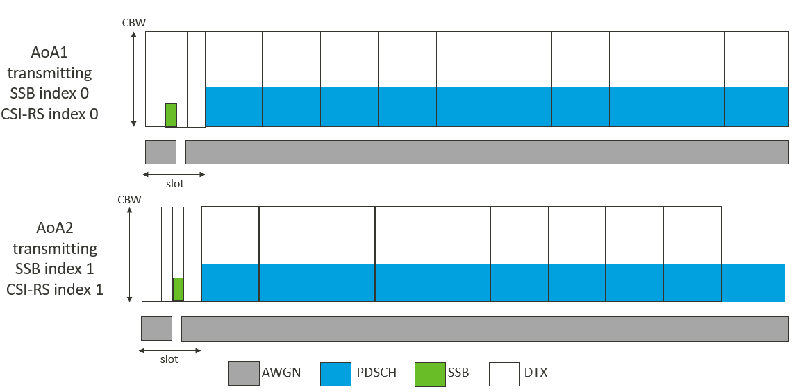
Figure A.7.5.16.1-1: Time multiplexed downlink transmissions during T1
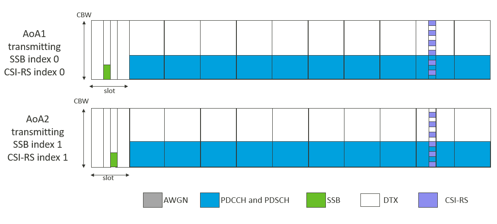
Figure A.7.5.16.1-2: Time multiplexed downlink transmissions during T2
#### A.7.5.16.2 Test Requirements
The UE behaviour follows the requirements defined in clause 9.5.6.3 and 9.5.5.2.
During T2,
- UE is required to receive both PDSCHs and send ACK correctly.
- No later than Y + 80 slot from the beginning of time period T2, UE shall send L1-RSRP report including the valid results for both CSI-RS resource 0 and CSI-RS resource 1 while meeting the accuracy requirements defined in clause 10.1.20.
- Y is the RRC processing delay, which is 10 ms
### A.7.5.17 SCG Activation and deactivation for FR1+FR1 inter-band with target PSCell in FR1
#### A.7.5.17.1 Test Purpose and Environment
The purpose of this test case is to test the PSCell activation delay for a UE configured with one deactivated SCG in NR-DC and when PSCell in one SCG is being activated. The test also tests the deactivation delay. The test case tests the requirements within which the UE shall be able to activate the deactivated SCG in clause 8.17.2 for when PSCell is known and TCI state is known. The PCell is in NR FR1 and the PSCell is in NR FR1.
The supported test configurations are defined in table A.7.5.17.1-1. The test parameters for NR cell are given in Tables A.7.5.17.1-2. And cell specific test parameters are described in Tables A.7.5.17.1-3.
During T1 the PSCell is configured in deactivated state. The TE ensures that the deactivated PSCell remain known until the PSCell is activated.
At T2 an RRC message for activation of PSCell is sent by the test equipment.The point in time at which the RRC message, for activating of the PSCell , is received at the UE in slot n defines as the starting point of T2
During T2, the test equipment monitors for PRACH preamble from the UE on the PSCell. The time when TE receives a preamble from the UE is denoted as starting point of T3.
During T3 the TE monitoris the msg3,and after sending the msg4, the TE sends the RRC deactivation command to the UE. The point in time at which the RRC message for deactivating the PSCell is received at the UE in slot n defines the starting time of T4.
During the time period T4, the UE is configured with measCyclePscell , bfd-and-RLM with value true . And the TE sends the 2nd RRC activation command.
The time when UE receives the 2nd RRC activation command in slot n , defines as the starting time of T5.
During T5, the test equipment monitors for SR from the UE on the PSCell. The time when test equipment receives a scheduling request from the UE is denoted as the ending point of the test.
The test equipment verifies that potential interruption is carried out in the correct time span by monitoring ACK/NACK sent in PCell during activation and deactivation of the PSCell, respectively.
For 1 st time activation during T2, the test equipment verifies the activation time by when the Random Access preamble from the UE is received in the activated PSCell.
During T4 and T5 the TE ensures that that TCI state is known.
For the 2nd time activation during T5, the test equipment verifies the activation time by when the SR from the UE is received in the activated PSCell. The TE verifies the deactivation time by counting the slots from the time when the PSCell deactivation command is sent until UL transmission from the PSCell is discontinued.
Table A.7.5.17.1-1: Supported test configurations for FR1 PSCell activation case
| Configuration | Description |
| --- | --- |
| 1 | PCell: 15 kHz SSB SCS, 10 MHz bandwidth, FDD duplex mode Target PSCell: 120 kHz SSB SCS, 100 MHz bandwidth, TDD duplex mode |
| 2 | PCell: 15 kHz SSB SCS, 10 MHz bandwidth, TDD duplex mode Target PSCell: 120 kHz SSB SCS, 100 MHz bandwidth, TDD duplex mode |
| 3 | PCell: 30kHz SSB SCS, 40 MHz bandwidth, TDD duplex mode Target PSCell: 120 kHz SSB SCS, 100 MHz bandwidth, TDD duplex mode |
| NOTE: The UE is only required to pass in one of the supported test configurations |  |

Table A.7.5.17.1-2: General Test Parameters for FR1FR1 PSCell activation and deactivation
| Parameter | Unit | Value | Comment |  |
| --- | --- | --- | --- | --- |
| RF Channel Number |  | 1, 2 | Two NR radio channels are used for this test, cell 1 and cell2 use RF channel 1 and 2, respectively. |  |
| Initial | Active PCell |  | Cell 1 | PCell on RF channel number 1. |
| Condition | Deactivated PSCell |  | Cell 2 | To be activated PSCell on RF channel number 2. |
| Final | Active PCell |  | Cell 1 | PCell on RF channel number 1. |
| Condition | Activated PSCell |  | Cell 2 | PSCell activated on RF channel number 2. |
| DRX |  | OFF | Continuous monitoring of primary cell |  |
| Scheduling request resource priodicity |  | 20 ms | At the starting of period T6, UE sends a SR on PUCCH for PSCell |  |
| T1 | s | 1 | During this time the PSCell is deactivated |  |
| T2 | s | 1 | During this time the TE activated the PSCell |  |
| T3 | s | 0.5 | During this time the PSCell is activated |  |
| T4 | s | 0.5 | During this time the TE deactivate the PSCell |  |
| T5 | s | 1 | During this time, PSCell and TCI state shall be known the TE activate the Pscell |  |

Table A.7.5.17.1-3: Cell specific test parameters for FR1-FR1 PSCell activation case
| ParameterNote 5 | Unit | Cell 1 | Cell 2 |  |  |  |  |  |  |  |  |  |  |
| --- | --- | --- | --- | --- | --- | --- | --- | --- | --- | --- | --- | --- | --- |
|  |  | T1 | T2 | T3 | T4 | T5 | T6 | T1 | T2 | T3 | T4 | T5 | T6 |
| SSB ARFCN |  | Freq1 | Freq2 |  |  |  |  |  |  |  |  |  |  |
| Duplex mode | Config 1 |  | FDD | TDD |  |  |  |  |  |  |  |  |  |
|  | Config 2,3 |  | TDD |  |  |  |  |  |  |  |  |  |  |
| TDD configuration | Config 1 |  | Not Applicable | TDDConf.3.1 |  |  |  |  |  |  |  |  |  |
|  | Config 2 |  | TDDConf.1.1 |  |  |  |  |  |  |  |  |  |  |
|  | Config 3 |  | TDDConf.2.1 |  |  |  |  |  |  |  |  |  |  |
| Downlink initial BWP Configuration | Config 1,2,3 |  | DLBWP.0.1 |  |  |  |  |  |  |  |  |  |  |
| Downlink dedicated BWP Configuration | Config 1,2,3 |  | DLBWP.1.1 |  |  |  |  |  |  |  |  |  |  |
| Uplink initial BWP configuration | Config 1,2,3 |  | ULBWP.0.1 |  |  |  |  |  |  |  |  |  |  |
| Uplink dedicated BWP configuration | Config 1,2,3 |  | ULBWP.1.1 |  |  |  |  |  |  |  |  |  |  |
| TRS configuration | Config 1,2,3 |  | N/A | TRS.2.1 TDD |  |  |  |  |  |  |  |  |  |
| TCI state | Config 1,2,3 |  | TCI.State.0 |  |  |  |  |  |  |  |  |  |  |
| BWchannel | Config 1,2 | MHz | 10: NPRB,c = 52 | 100: NPRB,c = 66 |  |  |  |  |  |  |  |  |  |
|  | Config 3 |  | 40: NPRB,c = 106 |  |  |  |  |  |  |  |  |  |  |
| PDSCH Reference measurement channel | Config 1 |  | SR.1.1 FDD | - |  |  |  |  |  |  |  |  |  |
|  | Config 2 |  | SR.1.1 TDD |  |  |  |  |  |  |  |  |  |  |
|  | Config 3 |  | SR.2.1 TDD |  |  |  |  |  |  |  |  |  |  |
| RMSI CORESET Parameters | Config 1 |  | CR.1.1 FDD | - |  |  |  |  |  |  |  |  |  |
|  | Config 2 |  | CR.1.1 TDD |  |  |  |  |  |  |  |  |  |  |
|  | Config 3 |  | CR.2.1 TDD |  |  |  |  |  |  |  |  |  |  |
| Dedicated CORESET Parameters | Config 1 |  | CCR.1.1 FDD | - |  |  |  |  |  |  |  |  |  |
|  | Config 2 |  | CCR.1.1 TDD |  |  |  |  |  |  |  |  |  |  |
|  | Config 3 |  | CCR.2.1 TDD |  |  |  |  |  |  |  |  |  |  |
| OCNG Patterns |  | OP.1 |  |  |  |  |  |  |  |  |  |  |  |
| SSB configuration | Config 1,2 |  | SSB.1 FR1 | SSB.3 FR1 |  |  |  |  |  |  |  |  |  |
|  | Config 3 |  | SSB.2 FR1 |  |  |  |  |  |  |  |  |  |  |
| CSI-RS configuration for CSI reporting | Config 1~3 |  | N/A | CSI-RS.3.1 TDD |  |  |  |  |  |  |  |  |  |
| reportConfigType for CSI reporting |  |  | periodic | N/A |  |  |  |  |  |  |  |  |  |
| reportConfigType for L1-RSRP |  |  | periodic | N/A |  |  |  |  |  |  |  |  |  |
| reportQuantity for CSI reporting |  |  | cri-RI-PMI-CQI | N/A |  |  |  |  |  |  |  |  |  |
| reportQuantity for L1-RSRP |  |  | ssb-Index-RSRP | N/A |  |  |  |  |  |  |  |  |  |
| CSI reporting periodicity | Config 1,2 | slot | 5 | N/A |  |  |  |  |  |  |  |  |  |
|  | Config 3 |  | 10 |  |  |  |  |  |  |  |  |  |  |
| L1-RSRP reporting periodicity Note 7 | Config 1,2 | slot | 5 | N/A |  |  |  |  |  |  |  |  |  |
|  | Config 3 |  | 10 |  |  |  |  |  |  |  |  |  |  |
| CSI reporting offset | Config 1,2 | slot | 2 | N/A |  |  |  |  |  |  |  |  |  |
|  | Config 3 |  | 4 |  |  |  |  |  |  |  |  |  |  |
| L1-RSRP reporting offset | Config 1,2 | slot | 2 | N/A |  |  |  |  |  |  |  |  |  |
|  | Config 3 |  | 4 |  |  |  |  |  |  |  |  |  |  |
| SMTC configuration |  | SMTC.1 |  |  |  |  |  |  |  |  |  |  |  |
| TimeAlignmentTimer |  | Infinity |  |  |  |  |  |  |  |  |  |  |  |
| EPRE ratio of PSS to SSS | dB | 0 |  |  |  |  |  |  |  |  |  |  |  |
| EPRE ratio of PBCH_DMRS to SSS |  |  |  |  |  |  |  |  |  |  |  |  |  |
| EPRE ratio of PBCH to PBCH_DMRS |  |  |  |  |  |  |  |  |  |  |  |  |  |
| EPRE ratio of PDCCH_DMRS to SSS |  |  |  |  |  |  |  |  |  |  |  |  |  |
| EPRE ratio of PDCCH to PDCCH_DMRS |  |  |  |  |  |  |  |  |  |  |  |  |  |
| EPRE ratio of PDSCH_DMRS to SSS |  |  |  |  |  |  |  |  |  |  |  |  |  |
| EPRE ratio of PDSCH to PDSCH_DMRS |  |  |  |  |  |  |  |  |  |  |  |  |  |
| EPRE ratio of OCNG DMRS to SSSNote 1 |  |  |  |  |  |  |  |  |  |  |  |  |  |
| EPRE ratio of OCNG to OCNG DMRS Note 1 |  |  |  |  |  |  |  |  |  |  |  |  |  |
| Propagation conditions |  | AWGN | AWGN |  |  |  |  |  |  |  |  |  |  |
| Scheduling request resource priodicity | ms | N/A | 20 |  |  |  |  |  |  |  |  |  |  |
| Note2 | dBm/15kHz | -98 | -98 |  |  |  |  |  |  |  |  |  |  |
| Note2 | Config 1,2 | dBm/SCS | -98 | -98 |  |  |  |  |  |  |  |  |  |
|  | Config 3 |  | -95 | -95 |  |  |  |  |  |  |  |  |  |
|  | dB | 4 | 4 | -Infinity | 5 |  |  |  |  |  |  |  |  |
|  | dB | 4 | 4 | -Infinity | 5 |  |  |  |  |  |  |  |  |
| SSB_RP | Config 1,2 | dBm/SCS | -94 | -94 | -Infinity | -90 |  |  |  |  |  |  |  |
|  | Config 3 | dBm/SCS | -91 | -91 | -Infinity | -63.85 |  |  |  |  |  |  |  |
| IoNote3 | Config 1,2 | dBm/ 9.36 MHz | -64.59 | -64.59 | -70.05 | -57.75 |  |  |  |  |  |  |  |
|  | Config 3 | dBm/ 38.16 MHz | -58.49 | -58.49 | -63.94 | -57.75 |  |  |  |  |  |  |  |
| Propagation condition | - | AWGN | AWGN |  |  |  |  |  |  |  |  |  |  |

##### A.7.5.17.2 Test Requirements
RRC message for activation of the PSCell is received in slot n at the UE and denotes the starting point of T2. During T2 the UE shall send the first preamble on PSCell in the first available PRACH occation no later than:
Tactivation_time = TRRC_delay + Tprocessing + Tsearch + T∆ + TIU + 2 ms
After T2 as defined on clause 8.17.2.
In this test case:
Tprocessing = 5 ms
Tsearch = 0 ms PSCell and TCI state are known, and
T∆ = 20 ms.
Tiu = 10 ms.
This allows T2 of Tactivation_time = TRRC_delay + 37 ms
The UE shall stop all transmissions on the PSCell no later than in slot n + $\frac{T_{RRC_delay}}{NR slot length}$ after T4, as defined in 8.17.3.
The 2nd RRC activation command is received in slot n at the UE as the starting time of T5. During T5 the UE shall send the first SR on PSCell in the first available uplink SR resource no later than T5 which is :
Tactivation_time = TRRC_delay + Tprocessing + Tsearch + T∆ + TIU + 2 ms
as defined on clause 8.17.2. In this test case:
Tprocessing = 5 ms (no RRC parameter has been modified)
Tsearch = 0 ms (RACH-less activation PSCell and TCI state are known), and
T∆ = 20 ms.
Tiu = 10 ms.
This allows T5 PSCell activation time of Tactivation_time = TRRC_delay + 37 ms
During T2 and T5 the interruption of PCell during PSCell activation shall not happen outside the slot m + TRRC_delay.
During T4 the interruption of PCell during PSCell deactivation shall not happen outside the slot n + TRRC_delay.
The interruption duration on PCell due to activation and deactivation of PSCell shall not be more than the values specified for in Clause 8.17.2 and 8.17.3.
### A.7.5.18 Subsequent conditional PSCell addition/change
#### A.7.5.18.1 Intra-frequency subsequent CPC from FR1-FR2 NR-DC to FR1-FR2 NR-DC
##### A.7.5.18.1.1 Test purpose and environment
The purpose of this test is to verify that the subsequent conditional NR PSCell change under NR-DC is within the requirements stated in clause 8.11E.2.
For UE supporting subsequent conditional PSCell addition/change, UE only needs to pass either intra-frequency CPC from FR1-FR1 NR-DC to FR1-FR1 NR-DC defined in clause A.6.5.12.1. or intra-frequency CPC from FR1-FR2 NR-DC to FR1-FR2 NR-DC defined in clause A.7.5.18.1.1.
For UE which can pass this test, test of conditional PSCell addition and release delay defined in A.7.5.12 can be skipped.
Supported test configurations are shown in A.7.5.18.1.1-1. The test scenario comprises three NR cells, Cell 1, Cell 2 and Cell 3. Cell 1 is on radio channel 1 in FR1. Cell 2 and Cell 3 are on radio channel 2 in FR2. The test parameters for the NR Cell 1 are given in table A.3.7A. The NR Cell 1 once set up is not changed across time. The test parameters for NR Cell 2 and Cell 3 are given in Tables A.7.5.18.1.1-2, cell-specific parameters in A.7.5.18.1.1-3 and OTA parameters in A.7.5.18.1.1-4 below.
The test consists of three successive time periods with duration of T1, T2, and T3 respectively. There are two carriers each with one cell. Before the test starts the UE is connected to Cell 1 (NR PCell) on radio channel 1 (PCC) but is not aware of Cell 2 (NR PSCell 1) and Cell 3 (NR PSCell 2) on radio channel 2. The UE is only monitoring the PCC. During T1 only Cell 1 is known to the UE.
At the start of time duration T1, the UE does not have any timing information of Cell 2. The TE shall configure subsequent conditional PSCell addition/change with Cell 2 and Cell 3 as target PSCells during T1, at a time earlier than TRRC_delay before the beginning of T2.
At the start of T2, Cell 2 becomes detectable and meets the PSCell addition condition. UE shall be able to measure and detect that the condition is fulfilled, after which it will transmit the PRACH preamble to Cell 2 during T2.
Upon PSCell addition complete (UE transmits SN RRCReconfigurationcomplete message), T3 starts. At the start of T3, Cell 3 becomes detectable and meets the PSCell change condition. UE shall be able to measure and detect that the condition is fulfilled, after which it will transmit the PRACH preamble to Cell 3 during T3.
Table A.7.5.18.1.1-1: Supported test configurations for Intra-frequency Subsequent CPC from FR1-FR2 NR-DC to FR1-FR2 NR-DC
| Configuration | Description |
| --- | --- |
| 1 | PCell (Cell 1): NR FDD, 15 kHz SSB SCS, 10 MHz bandwidth PSCell (Cell 2 and Cell 3): NR TDD, SSB SCS 240 kHz, data SCS 120 kHz, BW 100 MHz bandwidth |
| 2 | PCell (Cell 1): NR TDD, 15 kHz SSB SCS, 10 MHz bandwidth PSCell (Cell 2 and Cell 3): NR TDD, SSB SCS 240 kHz, data SCS 120 kHz, BW 100 MHz bandwidth |
| 3 | PCell (Cell 1): NR TDD, 30 kHz SSB SCS, 40 MHz bandwidth PSCell (Cell 2 and Cell 3): NR TDD, SSB SCS 240 kHz, data SCS 120 kHz, BW 100 MHz bandwidth |
| NOTE: The UE is only required to be tested in one of the supported test configurations |  |

Table A.7.5.18.1.1-2: General Test Parameters for subsequent CPC from FR1-FR2 NR-DC to FR1-FR2 NR-DC
| Parameter | Unit | Value | Comment |  |
| --- | --- | --- | --- | --- |
| RF Channel Number |  | 1, 2 | Three radio channels are used for this test. One for NR Cell 1, second for NR Cell 2 and Cell 3 |  |
| Initial | Active PCell |  | Cell 1, Cell 2 | Cell 1: NR PCell on RF channel number 1. Cell 2: NR PSCell on RF channel number 2 |
| Condition | Neighbour cell |  | Cell 3 | Neighbour cell on RF channel number 2. |
| Final | Active PCell |  | Cell 1, Cell 3 | Cell 1: PCell on RF channel number 1. Cell 3:NR PSCell on RF channel number 2 |
| Condition | Neighbour Cell |  | Cell 2 | PSCell changed on RF channel number 2. |
| A4 | Hysteresis | dB | 0 | Used to trigger conditional PSCell addition of Cell 2 |
|  | Threshold RSRP | dBm | -118 |  |
|  | Time to Trigger | s | 0 |  |
| A3 | dB | 0 | Used to trigger conditional PSCell change from Cell 2 to Cell 3 |  |
| DRX |  | OFF | Continuous monitoring of primary cell |  |
| Gap pattern ID |  | gp0 | Gaps are configured during T1, T2 and released upon T3 starts. |  |
| PRACH configuration on cell2 and cell3 |  | FR2 configuration 2 | Captured in A.3.8.3.2 |  |
| Cell-individual offset for cells on RF channel number 1 | dB | 0 | Individual offset for cells on primary component carrier. |  |
| Cell-individual offset for cells on RF channel number 2 | dB | 0 | Individual offset for cells on carrier frequency of cell2. |  |
| Cell-individual offset for cells on RF channel number 2 | dB | 0 | Individual offset for cells on carrier frequency of cell3. |  |
| T1 | s | 1 | During this time the PCell is known and Cell 2 is unknown. |  |
| T2 | s | 5 | During this time Cell 2 meets the PSCell addition condition and UE adds this PSCell. |  |
| T3 | s | 5 | During this time Cell 3 meets the PSCell change condition and UE sends PRACH to Cell 3. |  |

Table A.7.5.18.1.1-3: Cell Specific Parameters for subsequent CPC from FR1-FR2 NR-DC to FR1-FR2 NR-DC (Cell 2, Cell 3)
| Patameter | Unit | Config | Cell 2 | Cell 3 |  |  |  |  |
| --- | --- | --- | --- | --- | --- | --- | --- | --- |
|  |  |  | T1 | T2 | T3 | T1 | T2 | T3 |
| NR Channel Number |  | 1,2,3 | 1 for Cell 1 |  |  |  |  |  |
| NR Channel Number |  | 1,2,3 | 2 for Cell 2 and Cell 3 |  |  |  |  |  |
| Duplex Mode |  | 1,2,3 | TDD |  |  |  |  |  |
| TDD configuration |  | 1,2,3 | TDDConf.3.1 |  |  |  |  |  |
| BWchannel | MHz | 1,2,3 | 100: NPRB,c = 66 |  |  |  |  |  |
| Data PRBs allocated |  | 1,2,3 | 48 |  |  |  |  |  |
| Initial BWP Configuration |  | 1,2,3 | DLBWP.0.1 ULBWP.0.1 |  |  |  |  |  |
| Dedicated BWP Configuration |  | 1,2,3 | DLBWP.1.1 ULBWP.1.1 |  |  |  |  |  |
| TRS Configuration |  | 1,2,3 | TRS.2.1 TDD |  |  |  |  |  |
| PDSCH/PDCCH TCI state |  | 1,2,3 | TCI.State.2 |  |  |  |  |  |
| PDSCH Reference measurement channel |  | 1,2,3 | SR.3.3 TDD |  |  |  |  |  |
| RMSI CORESET Reference Channel |  | 1,2,3 | CR.3.2 TDD |  |  |  |  |  |
| Dedicated CORESET Reference Channel |  | 1,2,3 | CCR.3.7 TDD |  |  |  |  |  |
| OCNG Patterns |  | 1,2,3 | OP.4 |  |  |  |  |  |
| SSB configuration |  | 1,2,3 | SSB.8 FR2 | SSB.4 FR2 |  |  |  |  |
| SMTC configuration |  | 1,2,3 | SMTC.2 |  |  |  |  |  |
| PDSCH/PDCCH subcarrier spacing | kHz | 1,2,3 | 120 |  |  |  |  |  |
| TRS Configuration |  | 1,2,3 | TRS.2.1 TDD |  |  |  |  |  |
| CSI-RS configuration for CSI reporting |  | 1,2,3 | CSI-RS.3.1 TDD |  |  |  |  |  |
| reportConfigType |  | 1,2,3 | periodic |  |  |  |  |  |
| reportQuantity |  | 1,2,3 | cri-RI-PMI-CQI |  |  |  |  |  |
| CSI reporting periodicity | slot | 1,2,3 | 40 |  |  |  |  |  |
| CSI reporting offset | slot | 1,2,3 | 4 |  |  |  |  |  |
| EPRE ratio of PSS to SSS | dB | 1,2,3 | 0 |  |  |  |  |  |
| EPRE ratio of PBCH DMRS to SSS |  |  |  |  |  |  |  |  |
| EPRE ratio of PBCH to PBCH DMRS |  |  |  |  |  |  |  |  |
| EPRE ratio of PDCCH DMRS to SSS |  |  |  |  |  |  |  |  |
| EPRE ratio of PDCCH to PDCCH DMRS |  |  |  |  |  |  |  |  |
| EPRE ratio of PDSCH DMRS to SSS |  |  |  |  |  |  |  |  |
| EPRE ratio of PDSCH to PDSCH |  |  |  |  |  |  |  |  |
| EPRE ratio of OCNG DMRS to SSS(Note 1) |  |  |  |  |  |  |  |  |
| EPRE ratio of OCNG to OCNG DMRS (Note 1) |  |  |  |  |  |  |  |  |
| Propagation condition |  | 1,2,3 | AWGN |  |  |  |  |  |

Table A.7.5.18.1.1-4: OTA related test parameters for subsequent CPC from FR1-FR2 NR-DC to FR1-FR2 NR-DC (Cell 2, Cell 3)
| Parameter | Unit | Cell 2 | Cell 3 |  |  |  |  |
| --- | --- | --- | --- | --- | --- | --- | --- |
|  |  | T1 | T2 | T3 | T1 | T2 | T3 |
| Angle of arrival configuration |  | Setup 2a according to clause A.3.15.2.1 | Setup 2a according to clause A.3.15.2.1 |  |  |  |  |
| Assumption for UE beamsNote 6 |  | Rough | Rough |  |  |  |  |
| Ês Note2 | dBm/SCS | -∞ | -81 | -81 | -∞ | -∞ | -78 |
| SSB_RPNote2, Note 4 | dBm/SCS | -∞ | -81 | -81 | -∞ | -∞ | -78 |
|  BB Note 2, Note 7 | dB | -∞ | 4.88 | 4.88 | -∞ | -∞ | 7.88 |
| IoNote 2, Note 4 | dBm/95.04 MHz | N/A | -56.41 | -56.41 | N/A | N/A | -53.41 |
| NOTE 1: Void NOTE 2: Es/Iot, SSB_RP and Io levels have been derived from other parameters for information purposes. They are not settable parameters themselves. NOTE 3: Void NOTE 4: Equivalent power received by an antenna with 0 dBi gain at the centre of the quiet zone NOTE 5: Void NOTE 6: Information about types of UE beam is given in clause B.2.1.3, and does not limit UE implementation or test system implementation NOTE 7: Calculation of Es/IotBB includes the effect of UE internal noise up to the value assumed for the associated Refsens requirement in clause 7.3.2 of TS 38.101-2 [19], and an allowance of 1 dB for UE multi-band relaxation factor ΔMBS from TS 38.101-2 [19] Table 6.2.1.3-4. |  |  |  |  |  |  |  |

##### A.7.5.18.1.2 Test Requirements
TRRC_delay +TEvent_DU for PSCell addition (Cell 2) occurs during T1 as the PSCell addition condition becomes satisfied at the start of T2. The test shall verify that there are no interruptions during T1.
The UE shall start to transmit the PRACH to Cell 2 less than Tmeasure + TUE_preparation + Tprocessing + T∆ + TPSCell_ DU + 2 ms from the start of T2.
The UE shall transmit the PRACH to Cell 3 less than Tconfig_PSCell_Subsequent_Change_Conditional Note1 from the start of T3.
All the above test requirements shall be fulfilled for the observed PSCell change delay to be counted as correct. The rate of correct observed PSCell change delay during repeated tests shall be at least 90 %.
NOTE 1: The subsequent Conditional PSCell change delay during T3 can be expressed as follows:
Tconfig_PSCell_Subsequent_Change_Conditional = TEvent_DU +Tmeasure + TUE_preparation + Tprocessing + T∆ + TPSCell_ DU + 2 ms
Where:
TEvent_DU  = 0 ms
Tmeasure = 6720 ms for power class 1 or 4160 for power class 2/3/4
TUE_preparation = 10 ms
Tprocessing = 40 ms
T∆ = 20 ms
TPSCell_ DU = 1*10+10 = 20 ms
#### A.7.5.18.2 Inter-frequency subsequent CPA from FR1-FR2 NR-DC to FR1-FR2 NR-DC
##### A.7.5.18.2.1 Test Purpose and Environment
The purpose of this test is to verify that the subsequent conditional NR PSCell addition under NR-DC is within the requirements stated in clause 8.9C.2.
For UE supporting subsequent conditional PSCell addition/change, UE only needs to pass either inter-frequency CPA from FR1-FR1 NR-DC to FR1-FR1 NR-DC defined in clause A.6.5.12.2 or inter-frequency CPA from FR1-FR2 NR-DC to FR1-FR2 NR-DC defined in clause A.7.5.18.2.
For UE which can pass this test, test of conditional PSCell addition and release delay defined in A.7.5.12 can be skipped.
Supported test configurations are shown in A.7.5.18.2.1-1. The test parameters for the NR cell 1 are given in table A.3.7A. The NR cell 1 once set up is not changed across time.
The test parameters for NR cell 2, NR cell 3 are given in Tables A.7.5.18.2.1-2, cell-specific parameters in A.7.5.18.2.1-3 and OTA parameters in A.7.5.18.2.1-4 below.  The test comprises of three NR carrier. There are three cells and one cell on each carrier. Before the test starts the UE is connected to Cell 1 (NR PCell) on radio channel 1, but is not aware of Cell 2 (NR candidate NR PSCell 1) on radio channel 2 and Cell 3 (NR candidate PSCell 2) on radio channel 3. The test consists of  four successive time periods with duration of T1, T2, T3, T4.
During T1, the UE does not have any timing information of Cell 2 and Cell 3.  The TE shall configure subsequent conditional PSCell addition/change with Cell 2 and Cell 3 as target PSCells during T1, at a time earlier than TRRC_delay before the beginning of T2.
At the start of T2, Cell 2 becomes detectable and meets the PSCell addition condition. UE shall be able to measure and detect that the condition is fulfilled, after which the UE shall transmit the PRACH preamble to Cell 2. Upon PSCell addition complete (UE transmits SN RRCReconfigurationcomplete message), T3 starts.
During T3, the TE shall send a RRCRconfiguration message to the UE to release PSCell (Cell 2) on radio channel 2. Upon PSCell release complete (UE transmits SN RRCReconfigurationcomplete message), T4 starts.
At the start of T4, Cell 3 becomes detectable and meets the addition condition. UE shall be able to measure and detect that the condition is fulfilled, after which UE shall send PRACH to the PSCell (Cell 3).
Table A.7.5.18.2.1-1: Supported test configurations for Inter-frequency Subsequent CPA from FR1-FR2 NR-DC to FR1-FR2 NR-DC
| Configuration | Description |
| --- | --- |
| 1 | Cell 1: FDD15 kHz SSB SCS, 10 MHz bandwidth, Cell 2: TDD 240 kHz SSB SCS, 100 MHz bandwidth Cell 3: TDD 240 kHz SSB SCS, 100 MHz bandwidth |
| 2 | Cell 1: TDD 15 kHz SSB SCS, 10 MHz bandwidth, Cell 2: TDD 240 kHz SSB SCS, 100 MHz bandwidth Cell 3: TDD 240 kHz SSB SCS, 100 MHz bandwidth |
| 3 | Cell 1: TDD 30 kHz SSB SCS, 40 MHz bandwidth, Cell 2: TDD 240 kHz SSB SCS, 100 MHz bandwidth Cell 3: TDD 240 kHz SSB SCS, 100 MHz bandwidth |
| NOTE: The UE is only required to be tested in one of the supported test configurations |  |

Table A.7.5.18.2.1-2: General Test Parameters for subsequent CPA
| Parameter | Unit | Value | Comment |  |
| --- | --- | --- | --- | --- |
| RF Channel Number |  | 1, 2, 3 | Three NR radio channels are used for this test. |  |
| Initial | Active serving cells |  | Cell 1 | Cell 1: NR PCell on RF channel number 1 |
| Condition | Neighbour cell |  | Cell 2, Cell 3 | Cell 2:NR PSCell on RF channel number 2 Neighbour cell on RF channel number 3 |
| Final | Active serving cells |  | Cell 1, Cell 3 | Cell 1: PCell on RF channel number 1 Cell 3:NR PSCell on RF channel number 3 |
| Condition | Neighbour Cell |  | Cell 2 | Neighbour cell on RF channel number 2. |
| A4 | Hysteresis | dB | 0 | Hysteresis for evaluation of event A4. |
|  | Threshold RSRP | dBm | -118 | A4 event is used to trigger conditional PSCell addition of Cell 2 and Cell 3 |
|  | Time to Trigger | s | 0 |  |
| DRX |  | OFF | Continuous monitoring of primary cell |  |
| Gap pattern ID |  | gp0 |  |  |
| PRACH configuration on cell2 and cell3 |  | FR2 configuration 2 | Captured in A.3.8.3.2 |  |
| Cell-individual offset for cells on RF channel number 1 | dB | 0 | Individual offset for cells on primary component carrier. |  |
| Cell-individual offset for cells on RF channel number 2 | dB | 0 | Individual offset for cells on carrier frequency of cell2. |  |
| Cell-individual offset for cells on RF channel number 3 | dB | 0 | Individual offset for cells on carrier frequency of cell3. |  |
| T1 | s | 1 | UE is connected to Cell 1 (NR PCell) on radio channel 1, but is not aware of Cell 2 (NR PSCell 1) on radio channel 2 and Cell 3 (NR PSCell 2) on radio channel 3 |  |
| T2 | s | <7 | During this time PSCell 1 meets the PSCell addition condition and the UE adds the PSCell (cell 2). |  |
| T3 | s | 1 | During this time the UE releases the PSCell (cell 2). |  |
| T4 | s | <7 | During this time PSCell 2 meets the PSCell addition condition and the UE adds the PSCell (cell 3). |  |

Table A.7.5.18.2.1-3: Cell Specific Parameters for subsequent CPA (cell 2, cell 3)
| Parameter | Unit | Config | Test |  |  |  |
| --- | --- | --- | --- | --- | --- | --- |
|  |  |  | T1 | T2 | T3 | T4 |
| NR Channel Number |  | 1,2,3 | 2 for cell 2, 3 for cell 3 |  |  |  |
| Duplex Mode |  | 1,2,3 | TDD |  |  |  |
| TDD configuration |  | 1,2,3 | TDDConf.3.1 |  |  |  |
| BWchannel | MHz | 1,2,3 | 100: NPRB,c = 66 |  |  |  |
| Data PRBs allocated |  | 1,2,3 | 48 |  |  |  |
| Initial BWP Configuration |  | 1,2,3 | DLBWP.0.1 ULBWP.0.1 |  |  |  |
| Dedicated BWP Configuration |  | 1,2,3 | DLBWP.1.1 ULBWP.1.1 |  |  |  |
| TRS Configuration |  | 1,2,3 | TRS.2.1 TDD |  |  |  |
| PDSCH/PDCCH TCI state |  | 1,2,3 | TCI.State.2 |  |  |  |
| PDSCH Reference measurement channel |  | 1,2,3 | SR.3.3 TDD |  |  |  |
| RMSI CORESET Reference Channel |  | 1,2,3 | CR.3.2 TDD |  |  |  |
| Dedicated CORESET Reference Channel |  | 1,2,3 | CCR.3.7 TDD |  |  |  |
| OCNG Patterns |  | 1,2,3 | OP.3 |  |  |  |
| SSB configuration |  | 1,2,3 | SSB.4 FR2 |  |  |  |
| SMTC configuration |  | 1,2,3 | SMTC.2 |  |  |  |
| PDSCH/PDCCH subcarrier spacing | kHz | 1,2,3 | 120 |  |  |  |
| TRS Configuration |  | 1,2,3 | TRS.2.1 TDD |  |  |  |
| CSI-RS configuration for CSI reporting |  | 1,2,3 | CSI-RS.3.1 TDD |  |  |  |
| reportConfigType |  | 1,2,3 | periodic |  |  |  |
| reportQuantity |  | 1,2,3 | cri-RI-PMI-CQI |  |  |  |
| CSI reporting periodicity | slot | 1,2,3 | 40 |  |  |  |
| CSI reporting offset | slot | 1,2,3 | 4 |  |  |  |
| EPRE ratio of PSS to SSS | dB | 1,2,3 | 0 |  |  |  |
| EPRE ratio of PBCH DMRS to SSS |  |  |  |  |  |  |
| EPRE ratio of PBCH to PBCH DMRS |  |  |  |  |  |  |
| EPRE ratio of PDCCH DMRS to SSS |  |  |  |  |  |  |
| EPRE ratio of PDCCH to PDCCH DMRS |  |  |  |  |  |  |
| EPRE ratio of PDSCH DMRS to SSS |  |  |  |  |  |  |
| EPRE ratio of PDSCH to PDSCH |  |  |  |  |  |  |
| EPRE ratio of OCNG DMRS to SSS(Note 1) |  |  |  |  |  |  |
| EPRE ratio of OCNG to OCNG DMRS (Note 1) |  |  |  |  |  |  |
| Propagation condition |  | 1,2,3 | AWGN |  |  |  |

Table A.7.5.18.2.1-4: OTA related test parameters
| Parameter | Unit | Cell 2 | Cell 3 |  |  |  |  |  |  |
| --- | --- | --- | --- | --- | --- | --- | --- | --- | --- |
|  |  | T1 | T2 | T3 | T4 | T1 | T2 | T3 | T4 |
| Angle of arrival configuration |  | Setup 2a according to clause A.3.15.2.1 | Setup 2a according to clause A.3.15.2.1 |  |  |  |  |  |  |
| Assumption for UE beamsNote 6 |  | Rough | Rough |  |  |  |  |  |  |
| Ês Note2 | dBm/SCS | -∞ | -81 | -∞ | -∞ | -81 |  |  |  |
| SSB_RPNote2, Note 4 | dBm/SCS | -∞ | -81 | -∞ | -∞ | -81 |  |  |  |
|  BB Note 2, Note 7 | dB | -∞ | 4.88 | -∞ | -∞ | 4.88 |  |  |  |
| IoNote 2, Note 4 | dBm/95.04 MHz | N/A | -56.41 | N/A | N/A | -56.41 |  |  |  |
| NOTE 1: Void NOTE 2: Es/Iot, SSB_RP and Io levels have been derived from other parameters for information purposes. They are not settable parameters themselves. NOTE 3: Void NOTE 4: Equivalent power received by an antenna with 0 dBi gain at the centre of the quiet zone NOTE 5: Void NOTE 6: Information about types of UE beam is given in clause B.2.1.3, and does not limit UE implementation or test system implementation NOTE 7: Calculation of Es/IotBB includes the effect of UE internal noise up to the value assumed for the associated Refsens requirement in clause 7.3.2 of TS 38.101-2 [19], and an allowance of 1 dB for UE multi-band relaxation factor ΔMBS from TS 38.101-2 [19] Table 6.2.1.3-4. |  |  |  |  |  |  |  |  |  |

##### A.7.5.18.2.2 Test Requirements
TRRC_delay + TEvent_DU for PSCell addition (Cell 2) occurs during T1 as the PSCell addition condition becomes satisfied at the start of T2. The test shall verify that there are no interruptions during T1.
The UE shall transmit the PRACH to PSCell (Cell 2) less than Tmeasure + TUE_preparation + Tprocessing + T∆ + TPSCell_ DU + 2 msfrom the start of T2.
The UE shall transmit the PRACH to PSCell (Cell 3) less than Tconfig_PSCell_Addition_Conditional Note1 from the start of T4.
All the above test requirements shall be fulfilled for the observed PSCell addition delay and PSCell release delay to be counted as correct. The rate of correct observed PSCell addition delay and PSCell release delay during repeated tests shall be at least 90 %.
NOTE 1: The PSCell addition delay during T2 can be expressed as follows:
Tconfig_PSCell_Addition_Conditional = TEvent_DU +  Tmeasure + TUE_preparation + Tprocessing + T∆ + TPSCell_ DU + 2 ms
Where:
TEvent_DU = 0
Tmeasure = 6720 ms for power class 1 or 4160 for power class 2/3/4
TUE_preparation = 10 ms
Tprocessing = 40 ms
T∆ = 20 ms
TPSCell_ DU = 1*10+10 = 20 ms

---

