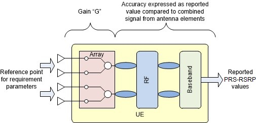

# A.8 E-UTRA standalone tests for NR RRM
Editor notes: All NR RRM tests under E-UTRA standalone operations are included in this annex. All EN-DC related NR RRM tests are in A.4 and A.5.
## A.8.1 Void
## A.8.2 RRC_IDLE state mobility
### A.8.2.1 Inter-RAT NR Cell re-selection
#### A.8.2.1.1 E-UTRA Cell reselection to higher priority NR target Cell in FR1
##### A.8.2.1.1.1 Test Purpose and Environment
This test is to verify the requirement for the E-UTRAN to NR inter-RAT cell reselection requirements specified in clause 4.2.2.5.6 in TS 36.133 [15].
The test scenario comprises of 1 E-UTRA cell and 1 NR cell as given in tables A.8.2.1.1.1-1, A.8.2.1.1.1-2, A.8.2.1.1.1-3 and A.8.2.1.1.1-4. The test consists of three successive time periods, with time duration of T1, T2, and T3 respectively. E-UTRA cell 1 is already identified by the UE prior to the start of the test. Cell 2 is of higher priority than cell 1.
Table A.8.2.1.1.1-1: Supported test configurations
| Configuration | Description |
| --- | --- |
| 1 | LTE FDD, NR 15 kHz SSB SCS, 10 MHz bandwidth, FDD duplex mode |
| 2 | LTE FDD, NR 15 kHz SSB SCS, 10 MHz bandwidth, TDD duplex mode |
| 3 | LTE FDD, NR 30 kHz SSB SCS, 40 MHz bandwidth, TDD duplex mode |
| 4 | LTE TDD, NR 15 kHz SSB SCS, 10 MHz bandwidth, FDD duplex mode |
| 5 | LTE TDD, NR 15 kHz SSB SCS, 10 MHz bandwidth, TDD duplex mode |
| 6 | LTE TDD, NR 30 kHz SSB SCS, 40 MHz bandwidth, TDD duplex mode |
| NOTE: The UE is only required to be tested in one of the supported test configurations |  |

Table A.8.2.1.1.1-2: General test parameters for E-UTRA cell re-selection FR1 NR cell test case
| Parameter | Unit | Test configuration | Value | Comment |  |
| --- | --- | --- | --- | --- | --- |
| Initial condition | Active cell |  | 1, 2, 3, 4, 5, 6 | Cell 2 | The UE camps on cell 2 in the initial phase |
|  | Neighbour cell |  | 1, 2, 3, 4, 5, 6 | Cell 1 |  |
| T1 end condition | Active cell |  |  | Cell 1 | During T1 period the UE reselects to cell 1 |
|  | Neighbour cell |  |  | Cell 2 |  |
| T3 end condition | Active cell |  | 1, 2, 3, 4, 5, 6 | Cell 2 | The UE shall perform reselection to cell 2 during T3 |
|  | Neighbour cell |  | 1, 2, 3, 4, 5, 6 | Cell 1 |  |
| RF Channel Number |  | 1, 2, 3, 4, 5, 6 | 1, 2 | E-UTRAN radio channel (1) and NR radio channel (2) are used for this test |  |
| Time offset between cells |  | 1, 4 | 3 ms | Asynchronous cells |  |
|  |  | 2, 5 | 3 s | Synchronous cells |  |
|  |  | 3, 6 | 3 s | Synchronous cells |  |
| Access Barring Information | - | 1, 2, 3, 4, 5, 6 | Not Sent | No additional delays in random access procedure. |  |
| DRX cycle length | s | 1, 2, 3, 4, 5, 6 | 1.28 | The value shall be used for all cells in the test. |  |
| NR PRACH configuration index |  | 1, 2, 3, 4, 5, 6 | 102 | The detailed configuration is specified in TS 38.211 clause 6.3.3.2 |  |
| T1 | s | 1, 2, 3, 4, 5, 6 | 15 | T1 needs to be defined so that cell re-selection reaction time is taken into account. |  |
| T2 | s | 1, 2, 3, 4, 5, 6 | >7 | During T2, cell 2 shall be powered off, and during the off time the physical cell identity shall be changed. The intention is to ensure that cell 2 has not been detected by the UE prior to the start of period T3. |  |
| T3 | s | 1, 2, 3, 4, 5, 6 | 75 | T3 needs to be defined so that cell re-selection reaction time is taken into account. |  |

Table A.8.2.1.1.1-3: Cell specific test parameters for NR cell 2
| Parameter | Unit | Test configuration | Cell 2 |  |  |
| --- | --- | --- | --- | --- | --- |
|  |  |  | T1 | T2 | T3 |
| TDD configuration |  | 1, 4 | N/A |  |  |
|  |  | 2, 5 | TDDConf.1.1 |  |  |
|  |  | 3, 6 | TDDConf.2.1 |  |  |
| PDSCH Reference measurement channel |  | 1, 4 | SR.1.1 FDD |  |  |
|  |  | 2, 5 | SR.1.1 TDD |  |  |
|  |  | 3, 6 | SR.2.1 TDD |  |  |
| RMSI CORESET Reference Channel |  | 1, 4 | CR.1.1 FDD |  |  |
|  |  | 2, 5 | CR.1.1 TDD |  |  |
|  |  | 3, 6 | CR.2.1 TDD |  |  |
| RMC CORESET Reference Channel |  | 1, 4 | CCR.1.1 FDD |  |  |
|  |  | 2, 5 | CCR.1.1 TDD |  |  |
|  |  | 3, 6 | CCR.2.1 TDD |  |  |
| OCNG Patterns |  | 1, 2, 3, 4, 5, 6 | OP.1 |  |  |
| SMTC configuration |  | 1, 2, 3, 4, 5, 6 | SMTC.1 |  |  |
| SSB configuration |  | 1, 4 | SSB.1 FR1 |  |  |
|  |  | 2, 5 | SSB.1 FR1 |  |  |
|  |  | 3, 6 | SSB.2 FR1 |  |  |
| Initial DL BWP configuration |  | 1, 2, 3, 4, 5, 6 | DLBWP.0.1 |  |  |
| Initial UL BWP configuration |  | 1, 2, 3, 4, 5, 6 | ULBWP.0.1 |  |  |
| RLM-RS |  | 1, 2, 3, 4, 5, 6 | SSB |  |  |
| Qrxlevmin | dBm/SCS | 1, 2, 4, 5 | -140 |  |  |
|  |  | 3, 6 | -137 |  |  |
| Pcompensation | dB | 1, 2, 3, 4, 5, 6 | 0 |  |  |
| Qhysts | dB | 1, 2, 3, 4, 5, 6 | 0 |  |  |
| Qoffsets, n | dB | 1, 2, 3, 4, 5, 6 | 0 |  |  |
| Cell_selection_and_ reselection_quality_measurement |  | 1, 2, 3, 4, 5, 6 | SS-RSRP |  |  |
|  | dB | 1, 4 | -4 | -infinity | 12 |
|  |  | 2, 5 |  |  |  |
|  |  | 3, 6 |  |  |  |
|  Note2 | dBm/SCS | 1, 4 | -98 |  |  |
|  |  | 2, 5 | -98 |  |  |
|  |  | 3, 6 | -95 |  |  |
|  Note2 | dBm/15 kHz | 1, 4 | -98 |  |  |
|  |  | 2, 5 |  |  |  |
|  |  | 3, 6 |  |  |  |
|  | dB | 1, 4 | -4 | -infinity | 12 |
|  |  | 2, 5 |  |  |  |
|  |  | 3, 6 |  |  |  |
| SS-RSRP Note3 | dBm/SCS | 1, 4 | -102 | -infinity | -86 |
|  |  | 2, 5 | -102 | -infinity | -86 |
|  |  | 3, 6 | -99 | -infinity | -83 |
| Io | dBm/9.36 MHz | 1, 4 | -68.60 | -70.05 | -57.78 |
|  | dBm/9.36 MHz | 2, 5 | -68.60 | -70.05 | -57.78 |
|  | dBm/38.16 MHz | 3, 6 | -62.50 | -63.95 | -51.69 |
| Treselection | s | 1, 2, 3, 4, 5, 6 | 0 | 0 | 0 |
| SnonintrasearchP | dB | 1, 2, 3, 4, 5, 6 | 50 |  |  |
| Threshx, highP | dB | 1, 2, 3, 4, 5, 6 | 48 |  |  |
| Threshserving, lowP | dB | 1, 2, 3, 4, 5, 6 | 44 |  |  |
| Threshx, lowP | dB | 1, 2, 3, 4, 5, 6 | 50 |  |  |
| Propagation Condition |  | 1, 2, 3, 4, 5, 6 | AWGN |  |  |
| NOTE 1: OCNG shall be used such that both cells are fully allocated and a constant total transmitted power spectral density is achieved for all OFDM symbols. NOTE 2: Interference from other cells and noise sources not specified in the test is assumed to be constant over subcarriers and time and shall be modelled as AWGN of appropriate power for  to be fulfilled. NOTE 3: SS-RSRP levels have been derived from other parameters for information purposes. They are not settable parameters themselves. |  |  |  |  |  |

Table A.8.2.1.1.1-4: Cell specific test parameters for E-UTRA cell 1
| Parameter | Unit | Cell 1 |  |  |
| --- | --- | --- | --- | --- |
|  |  | T1 | T2 | T3 |
| E-UTRA RF Channel number |  | 1 |  |  |
| BWchannel | MHz | 10 |  |  |
| OCNG Patterns defined in TS 36.133 [15] clause A.3.2 |  | OP.2 TDD for test configuration 1, 2, 3; OP.2 FDD for test configuration 4, 5, 6 |  |  |
| PBCH_RA | dB | 0 |  |  |
| PBCH_RB | dB |  |  |  |
| PSS_RA | dB |  |  |  |
| SSS_RA | dB |  |  |  |
| PCFICH_RB | dB |  |  |  |
| PHICH_RA | dB |  |  |  |
| PHICH_RB | dB |  |  |  |
| PDCCH_RA | dB |  |  |  |
| PDCCH_RB | dB |  |  |  |
| PDSCH_RA | dB |  |  |  |
| PDSCH_RB | dB |  |  |  |
| OCNG_RANote 1 | dB |  |  |  |
| OCNG_RBNote 1 | dB |  |  |  |
| Qrxlevmin | dBm | -140 |  |  |
|  Note 2 | dBm/15 kHz | -98 |  |  |
| RSRP Note 3 | dBm/15 KHz | -84 | -84 | -84 |
|  | dB | 14 | 14 | 14 |
|  | dB | 14 | 14 | 14 |
| TreselectionEUTRAN | s | 0 |  |  |
| SnonintrasearchP | dB | 50 |  |  |
| Threshx, highP | dB | 48 |  |  |
| Threshserving, lowP | dB | 44 |  |  |
| Threshx, lowP | dB | 50 |  |  |
| Propagation Condition |  | AWGN |  |  |
| NOTE 1: OCNG shall be used such that both cells are fully allocated and a constant total transmitted power spectral density is achieved for all OFDM symbols. NOTE 2: Interference from other cells and noise sources not specified in the test is assumed to be constant over subcarriers and time and shall be modelled as AWGN of appropriate power for  to be fulfilled. NOTE 3: RSRP levels have been derived from other parameters for information purposes. They are not settable parameters themselves. |  |  |  |  |

##### A.8.2.1.1.2 Test Requirements
The cell reselection delay to a higher priority NR cell is defined as the time from the beginning of time period T3, to the moment when the UE camps on cell 2, and starts to send preambles on the PRACH for sending the RRCSetupRequest message to perform a Registration procedure for mobility and periodic registration updateon cell 2.
The cell re-selection delay to a higher priority cell shall be less than 68 s.
The rate of correct cell reselections observed during repeated tests shall be at least 90 %.
NOTE: The cell re-selection delay to a higher priority cell can be expressed as: Thigher_priority_search + Tevaluate, NR + TSI-NR, and to a lower priority cell can be expressed as: Tevaluate, EUTRAN+ TSI-EUTRA,
Where:
Thigher_priority_search See clause 4.2.2 in TS 36.133 [15]
Tevaluate, NR See Table 4.2.2.5.6-1 in clause 4.2.2.5.6 in TS 36.133 [15]
TSI-NR Maximum repetition period of relevant system info blocks that needs to be received by the UE to camp on a cell; 1280 ms is assumed in this test case.
Tevaluate, EUTRAN See Table 4.2.2.5-1 in clause 4.2.2.5
TSI-EUTRA Maximum repetition period of relevant system info blocks that needs to be received by the UE to camp on a cell; 1280 ms is assumed in this test case.
This gives a total of 67.68 s, allow 68 s for the cell re-selection delay to a higher priority NR cell and 7.68 s for the cell re-selection delay to a lower priority cell in the test case, which we allow 8 s.
#### A.8.2.1.2 E-UTRA Cell reselection to lower priority NR target Cell in FR1 for UE configured with highSpeedInterRAT-NR-r16
##### A.8.2.1.2.1 Test Purpose and Environment
This test is to verify the requirement for the E-UTRAN to NR inter-RAT cell reselection requirements specified in clause 4.2.2.5.6 in 36.133 [15].
The test scenario comprises of 1 E-UTRA cell and 1 NR cell as given in tables A.8.2.1.2.1-1, A.8.2.1.2.1-2, A.8.2.1.2.1-3 and A.8.2.1.2.1-4. In SIB of the E-UTRA cell, highSpeedInterRAT-NR-r16 is configured and the carrier of NR cell is configured with highSpeedCarrierNR-r16. The test consists of two time periods, with time duration of T1 and T2 respectively. Both E-UTRA cell 1 and NR cell 2 are already identified by the UE prior to the start of the test. NR cell 2 is of lower priority than E-UTRA cell 1.
Table A.8.2.1.2.1-1: Supported test configurations for UE configured with highSpeedInterRAT-NR-r16
| Configuration | Description |
| --- | --- |
| 1 | LTE FDD, NR 15 kHz SSB SCS, 10 MHz bandwidth, FDD duplex mode |
| 2 | LTE FDD, NR 15 kHz SSB SCS, 10 MHz bandwidth, TDD duplex mode |
| 3 | LTE FDD, NR 30kHz SSB SCS, 40 MHz bandwidth, TDD duplex mode |
| 4 | LTE TDD, NR 15 kHz SSB SCS, 10 MHz bandwidth, FDD duplex mode |
| 5 | LTE TDD, NR 15 kHz SSB SCS, 10 MHz bandwidth, TDD duplex mode |
| 6 | LTE TDD, NR 30kHz SSB SCS, 40 MHz bandwidth, TDD duplex mode |
| NOTE: The UE is only required to be tested in one of the supported test configurations |  |

Table A.8.2.1.2.1-2: General test parameters in E-UTRA cell re-selection FR1 NR cell test case for UE configured with highSpeedInterRAT-NR-r16
| Parameter | Unit | Test configuration | Value | Comment |  |
| --- | --- | --- | --- | --- | --- |
| Initial condition | Active cell |  | 1, 2, 3, 4, 5, 6 | Cell 1 | The UE camps on cell 1 in the initial phase |
| T1 end condition | Active cell |  | 1, 2, 3, 4, 5, 6 | Cell 2 | The UE shall perform reselection to cell 2 during T1 |
|  | Neighbour cells |  | 1, 2, 3, 4, 5, 6 | Cell 1 |  |
| T2 end condition | Active cell |  | 1, 2, 3, 4, 5, 6 | Cell 1 | The UE shall perform reselection to cell 1 during T2 for iteration of the tests. |
|  | Neighbour cells |  | 1, 2, 3, 4, 5, 6 | Cell 2 |  |
| RF Channel Number |  | 1, 2, 3, 4, 5, 6 | 1, 2 | E-UTRAN radio channel (1) and NR radio channel (2) are used for this test |  |
| Time offset between cells |  | 1, 4 | 3 ms | Asynchronous cells |  |
|  |  | 2, 5 | 3 s | Synchronous cells |  |
|  |  | 3, 6 | 3 s | Synchronous cells |  |
| Access Barring Information | - | 1, 2, 3, 4, 5, 6 | Not Sent | No additional delays in random access procedure. |  |
| DRX cycle length | s | 1, 2, 3, 4, 5, 6 | 0.32 | The value shall be used for all cells in the test. |  |
| NR PRACH configuration index |  | 1, 2, 3, 4, 5, 6 | 102 | The detailed configuration is specified in TS 38.211 clause 6.3.3.2 |  |
| T1 | s | 1, 2, 3, 4, 5, 6 | 15 | T1 needs to be defined so that cell re-selection reaction time is taken into account. |  |
| T2 | s | 1, 2, 3, 4, 5, 6 | 75 | T2 needs to be defined so that cell re-selection reaction time is taken into account. |  |

Table A.8.2.1.2.1-3: Cell specific test parameters for NR cell 2 in E-UTRA cell re-selection FR1 NR cell test case for UE configured with highSpeedInterRAT-NR-r16
| Parameter | Unit | Test configuration | Cell 2 |  |
| --- | --- | --- | --- | --- |
|  |  |  | T1 | T2 |
| TDD configuration |  | 1, 4 | N/A |  |
|  |  | 2, 5 | TDDConf.1.1 |  |
|  |  | 3, 6 | TDDConf.2.1 |  |
| PDSCH Reference measurement channel |  | 1, 4 | SR.1.1 FDD |  |
|  |  | 2, 5 | SR.1.1 TDD |  |
|  |  | 3, 6 | SR.2.1 TDD |  |
| RMSI CORESET Reference Channel |  | 1, 4 | CR.1.1 FDD |  |
|  |  | 2, 5 | CR.1.1 TDD |  |
|  |  | 3, 6 | CR.2.1 TDD |  |
| RMC CORESET Reference Channel |  | 1, 4 | CCR.1.1 FDD |  |
|  |  | 2, 5 | CCR.1.1 TDD |  |
|  |  | 3, 6 | CCR.2.1 TDD |  |
| OCNG Patterns |  | 1, 2, 3, 4, 5, 6 | OP.1 |  |
| SMTC configuration |  | 1, 2, 3, 4, 5, 6 | SMTC.1 |  |
| SSB configuration |  | 1, 4 | SSB.1 FR1 |  |
|  |  | 2, 5 | SSB.1 FR1 |  |
|  |  | 3, 6 | SSB.2 FR1 |  |
| Initial DL BWP configuration |  | 1, 2, 3, 4, 5, 6 | DLBWP.0.1 |  |
| Initial UL BWP configuration |  | 1, 2, 3, 4, 5, 6 | ULBWP.0.1 |  |
| RLM-RS |  | 1, 2, 3, 4, 5, 6 | SSB |  |
| Qrxlevmin | dBm/SCS | 1, 2, 4, 5 | -140 |  |
|  |  | 3, 6 | -137 |  |
| Pcompensation | dB | 1, 2, 3, 4, 5, 6 | 0 |  |
| Qhysts | dB | 1, 2, 3, 4, 5, 6 | 0 |  |
| Qoffsets, n | dB | 1, 2, 3, 4, 5, 6 | 0 |  |
| Cell_selection_and_ reselection_quality_measurement |  | 1, 2, 3, 4, 5, 6 | SS-RSRP |  |
|  | dB | 1, 4 | 14 | 14 |
|  |  | 2, 5 |  |  |
|  |  | 3, 6 |  |  |
|  Note2 | dBm/SCS | 1, 4 | -98 |  |
|  |  | 2, 5 | -98 |  |
|  |  | 3, 6 | -95 |  |
|  Note2 | dBm/15 kHz | 1, 4 | -98 |  |
|  |  | 2, 5 |  |  |
|  |  | 3, 6 |  |  |
|  | dB | 1, 4 | 14 | 14 |
|  |  | 2, 5 |  |  |
|  |  | 3, 6 |  |  |
| SS-RSRP Note3 | dBm/SCS | 1, 4 | -84 | -84 |
|  |  | 2, 5 | -84 | -84 |
|  |  | 3, 6 | -81 | -81 |
| Io | dBm/9.36 MHz | 1, 4 | -55.88 | -55.88 |
|  | dBm/9.36 MHz | 2, 5 | -55.88 | -55.88 |
|  | dBm/38.16 MHz | 3, 6 | -47.79 | -47.79 |
| Treselection | s | 1, 2, 3, 4, 5, 6 | 0 |  |
| Snonintrasearch | dB | 1, 2, 3, 4, 5, 6 | Not sent |  |
| Threshx, high | dB | 1, 2, 3, 4, 5, 6 | 48 |  |
| Threshserving, low | dB | 1, 2, 3, 4, 5, 6 | 44 |  |
| Threshx, low | dB | 1, 2, 3, 4, 5, 6 | 50 |  |
| Propagation Condition |  | 1, 2, 4, 5 | AWGN 1944 Hz Note 4 |  |
|  |  | 3,6 | AWGN 3334 Hz Note 5 |  |
| NOTE 1: OCNG shall be used such that both cells are fully allocated and a constant total transmitted power spectral density is achieved for all OFDM symbols. NOTE 2: Interference from other cells and noise sources not specified in the test is assumed to be constant over subcarriers and time and shall be modelled as AWGN of appropriate power for  to be fulfilled. NOTE 3: SS-RSRP levels have been derived from other parameters for information purposes. They are not settable parameters themselves. NOTE 4: The AWGN 1944 Hz condition is a non fading propagation channel with one tap. Doppler shift is a constant 1944 Hz. NOTE 5: The AWGN 3334 Hz condition is a non fading propagation channel with one tap. Doppler shift is a constant 3334 Hz. |  |  |  |  |

Table A.8.2.1.2.1-4: Cell specific test parameters for E-UTRA cell 1 in E-UTRA cell re-selection FR1 NR cell test case for UE configured with highSpeedInterRAT-NR-r16
| Parameter | Unit | Cell 1 |  |
| --- | --- | --- | --- |
|  |  | T1 | T2 |
| E-UTRA RF Channel number |  | 1 |  |
| BWchannel | MHz | 10 |  |
| OCNG Patterns defined in TS 36.133 clause A.3.2 |  | OP.2 TDD for test configuration 1, 2, 3; OP.2 FDD for test configuration 4, 5, 6 |  |
| PBCH_RA | dB | 0 |  |
| PBCH_RB | dB |  |  |
| PSS_RA | dB |  |  |
| SSS_RA | dB |  |  |
| PCFICH_RB | dB |  |  |
| PHICH_RA | dB |  |  |
| PHICH_RB | dB |  |  |
| PDCCH_RA | dB |  |  |
| PDCCH_RB | dB |  |  |
| PDSCH_RA | dB |  |  |
| PDSCH_RB | dB |  |  |
| OCNG_RANote 1 | dB |  |  |
| OCNG_RBNote 1 | dB |  |  |
| Qrxlevmin | dBm | -140 |  |
|  Note 2 | dBm/15 kHz | -98 |  |
| RSRP Note 3 | dBm/15 KHz | -102 | -86 |
|  | dB | -4 | 12 |
|  | dB | -4 | 12 |
| TreselectionEUTRAN | s | 0 |  |
| Snonintrasearch | dB | 50 |  |
| Threshx, high | dB | 48 |  |
| Threshserving, low | dB | 44 |  |
| Threshx, low | dB | 50 |  |
| Propagation Condition |  | AWGN |  |
| NOTE 1: OCNG shall be used such that both cells are fully allocated and a constant total transmitted power spectral density is achieved for all OFDM symbols. NOTE 2: Interference from other cells and noise sources not specified in the test is assumed to be constant over subcarriers and time and shall be modelled as AWGN of appropriate power for  to be fulfilled. NOTE 3: RSRP levels have been derived from other parameters for information purposes. They are not settable parameters themselves. NOTE 4: Void. |  |  |  |

##### A.8.2.1.2.2 Test Requirements
The cell reselection delay to a lower priority NR cell is defined as the time from the beginning of time period T1, to the moment when the UE camps on cell 2, and starts to send preambles on the PRACH for sending the RRC CONNECTION REQUEST message to perform a Tracking Area Update procedure on cell 2.
The cell re-selection delay to a lower priority cell shall be less than 3 s.
The rate of correct cell reselections observed during repeated tests shall be at least 90 %.
NOTE: The cell re-selection delay to a lower priority cell can be expressed as: Tevaluate, NR_HST + TSI-NR,
Where:
Tevaluate, NR_HST See Table 4.2.2.5.6-2 in clause 4.2.2.5.6 in [15]
TSI-NR Maximum repetition period of relevant system info blocks that needs to be received by the UE to camp on a cell; 1280 ms is assumed in this test case.
This gives a total of 2.24 s, allow 3 s for the cell re-selection delay to a lower priority NR cell.
### A.8.2.2 E-UTRA – NR Inter-RAT Early Measruement Reporting
#### A.8.2.2.1 E-UTRA – NR Early Measurement Reporting for NR in FR1
##### A.8.2.2.1.1 Test Purpose and Environment
This test is to verify the requirement for the E-UTRAN to NR inter-RAT Idle mode DC measurement requirements specified in clause 4.9.2.4 in TS 36.133 [15]. This test is also to verify the accuracy requirement for the E-UTRAN to NR inter-RAT Idle mode DC measurement requirements specified in clause 9.11.1A and 9.11.2A in TS 36.133 [15]. Supported test configurations are shown in table A.8.2.2.1.1-1.
Table A.8.2.2.1.1-1: Supported test configurations
| Configuration | Description |
| --- | --- |
| 1 | LTE FDD, NR 15 kHz SSB SCS, 10 MHz bandwidth, FDD duplex mode |
| 2 | LTE FDD, NR 15 kHz SSB SCS, 10 MHz bandwidth, TDD duplex mode |
| 3 | LTE FDD, NR 30 kHz SSB SCS, 40 MHz bandwidth, TDD duplex mode |
| 4 | LTE TDD, NR 15 kHz SSB SCS, 10 MHz bandwidth, FDD duplex mode |
| 5 | LTE TDD, NR 15 kHz SSB SCS, 10 MHz bandwidth, TDD duplex mode |
| 6 | LTE TDD, NR 30 kHz SSB SCS, 40 MHz bandwidth, TDD duplex mode |
| NOTE: The UE is only required to be tested in one of the supported test configurations |  |

The test scenario comprises of 1 E-UTRA cell (Cell 1) and 1 NR cell (Cell 2). The the test parameters and applicability for the E-UTRAN cell are defined in table A.8.2.2.1.1-4. The general test parameters and the cell specific test parameters for the NR cell are specified in table A.8.2.2.1.1-2 and table A.8.2.2.1.1-3, respectively.
The test consists of three successive time periods, with time duration of T1, T2, and T3 respectively. Prior to the start of the time duration T1, the UE shall be connected to Cell 1. During T1, Cell 2 shall be powered off. At the end of T1, the RRC connection to Cell 1 is released and UE is configured Idle mode DC measurement on the carrier frequency of Cell 2. Time duration T2 starts when the RRC connection is released, and during the T2 UE is in Idle mode. Cell 2 shall be powered on from the beginning of T2. At beginning of T3 the UE is paged for connection setup and requested by the network to send idle mode measurements.
Table A.8.2.2.1.1-2: General test parameters
| Parameter | Unit | Test | Value | Comment |
| --- | --- | --- | --- | --- |
|  |  | configuration |  |  |
| Active cell |  | 1, 2, 3, 4, 5, 6 | E-UTRAN Cell 1 |  |
| Neighbour cell |  | 1, 2, 3, 4, 5, 6 | NR Cell 2 | Cell 2 is of higher priority. |
| RF Channel Number |  | 1, 2, 3, 4, 5, 6 | 1: Cell 1 2: Cell 2 |  |
| DRX cycle length | s | 1, 2, 3, 4, 5, 6 | 1.28 |  |
| Time offset between Cell 1 and Cell 2 |  | 1, 2, 3, 4, 5, 6 | 3 s |  |
| T1 | s | 1, 2, 3, 4, 5, 6 | 0.5 |  |
| T2 | s | 1, 2, 3, 4, 5, 6 | 71 |  |
| T3 | s | 1, 2, 3, 4, 5, 6 | 2 |  |
| T331 | s | 1, 2, 3, 4, 5, 6 | 300 |  |

Table A.8.2.2.1.1-3: Cell specific test parameters for NR cell 2
| Parameter | Unit | Test configuration | Cell 2 |  |  |
| --- | --- | --- | --- | --- | --- |
|  |  |  | T1 | T2 | T3 |
| TDD configuration |  | 1, 4 | N/A |  |  |
|  |  | 2, 5 | TDDConf.1.1 |  |  |
|  |  | 3, 6 | TDDConf.2.1 |  |  |
| PDSCH Reference measurement channel |  | 1, 4 | SR.1.1 FDD |  |  |
|  |  | 2, 5 | SR.1.1 TDD |  |  |
|  |  | 3, 6 | SR.2.1 TDD |  |  |
| RMSI CORESET Reference Channel |  | 1, 4 | CR.1.1 FDD |  |  |
|  |  | 2, 5 | CR.1.1 TDD |  |  |
|  |  | 3, 6 | CR.2.1 TDD |  |  |
| RMC CORESET Reference Channel |  | 1, 4 | CCR.1.1 FDD |  |  |
|  |  | 2, 5 | CCR.1.1 TDD |  |  |
|  |  | 3, 6 | CCR.2.1 TDD |  |  |
| OCNG Patterns |  | 1, 2, 3, 4, 5, 6 | OP.1 |  |  |
| SMTC configuration |  | 1, 2, 3, 4, 5, 6 | SMTC.1 |  |  |
| SSB configuration |  | 1, 4 | SSB.1 FR1 |  |  |
|  |  | 2, 5 | SSB.1 FR1 |  |  |
|  |  | 3, 6 | SSB.2 FR1 |  |  |
| Initial DL BWP configuration |  | 1, 2, 3, 4, 5, 6 | DLBWP.0.1 |  |  |
| Initial UL BWP configuration |  | 1, 2, 3, 4, 5, 6 | ULBWP.0.1 |  |  |
| Qrxlevmin | dBm/SCS | 1, 2, 4, 5 | -140 |  |  |
|  |  | 3, 6 | -137 |  |  |
| Pcompensation | dB | 1, 2, 3, 4, 5, 6 | 0 |  |  |
| Qhysts | dB | 1, 2, 3, 4, 5, 6 | 0 |  |  |
| Qoffsets, n | dB | 1, 2, 3, 4, 5, 6 | 0 |  |  |
| Cell_selection_and_ reselection_quality_measurement |  | 1, 2, 3, 4, 5, 6 | SS-RSRP |  |  |
|  Note2 | dBm/SCS | 1, 4 | -98 |  |  |
|  |  | 2, 5 | -98 |  |  |
|  |  | 3, 6 | -95 |  |  |
|  Note2 | dBm/15 kHz | 1, 4 | -98 |  |  |
|  |  | 2, 5 |  |  |  |
|  |  | 3, 6 |  |  |  |
|  | dB | 1, 2, 3, 4, 5, 6 | -infinity | -4 | -4 |
| $$Ê_{s}/I_{ot}$$ | dB | 1, 2, 3, 4, 5, 6 | -infinity | -4 | -4 |
| SS-RSRP Note3 | dBm/SCS | 1, 4 | -infinity | -102 | -102 |
|  |  | 2, 5 | -infinity | -102 | -102 |
|  |  | 3, 6 | -infinity | -99 | -99 |
| SS-RSRQ Note3 | dB | 1, 4 | -infinity | -16.25 | -16.25 |
|  |  | 2, 5 | -infinity | -16.25 | -16.25 |
|  |  | 3, 6 | -infinity | -16.25 | -16.25 |
| Io | dBm/9.36 MHz | 1, 4 | -70.05 | -68.60 | -68.60 |
|  | dBm/9.36 MHz | 2, 5 | -70.05 | -68.60 | -68.60 |
|  | dBm/38.16 MHz | 3, 6 | -63.96 | -62.50 | -62.50 |
| Propagation Condition |  | 1, 2, 3, 4, 5, 6 | AWGN |  |  |
| NOTE 1: OCNG shall be used such that both cells are fully allocated and a constant total transmitted power spectral density is achieved for all OFDM symbols. NOTE 2: Interference from other cells and noise sources not specified in the test is assumed to be constant over subcarriers and time and shall be modelled as AWGN of appropriate power for  to be fulfilled. NOTE 3: SS-RSRP levels have been derived from other parameters for information purposes. They are not settable parameters themselves. |  |  |  |  |  |

Table A.8.2.2.1.1-4: Cell specific test parameters for E-UTRA cell 1
| Parameter | Unit | Cell 1 |  |  |
| --- | --- | --- | --- | --- |
|  |  | T1 | T2 | T3 |
| E-UTRA RF Channel number |  | 1 |  |  |
| BWchannel | MHz | 10 |  |  |
| OCNG Patterns defined in TS 36.133 [15] clause A.3.2 |  | OP.2 TDD for test configuration 1, 2, 3; OP.2 FDD for test configuration 4, 5, 6 |  |  |
| PBCH_RA | dB | 0 |  |  |
| PBCH_RB | dB |  |  |  |
| PSS_RA | dB |  |  |  |
| SSS_RA | dB |  |  |  |
| PCFICH_RB | dB |  |  |  |
| PHICH_RA | dB |  |  |  |
| PHICH_RB | dB |  |  |  |
| PDCCH_RA | dB |  |  |  |
| PDCCH_RB | dB |  |  |  |
| PDSCH_RA | dB |  |  |  |
| PDSCH_RB | dB |  |  |  |
| OCNG_RANote 1 | dB |  |  |  |
| OCNG_RBNote 1 | dB |  |  |  |
| Qrxlevmin | dBm | -140 |  |  |
|  Note 2 | dBm/15 kHz | -98 |  |  |
| RSRP Note 3 | dBm/15 KHz | -84 | -84 | -84 |
| RSRQ Note 3 | dB | -10.96 | -10.96 | -10.96 |
|  | dB | 14 | 14 | 14 |
|  | dB | 14 | 14 | 14 |
| TreselectionEUTRAN | s | 0 |  |  |
| SnonintrasearchP | dB | 50 |  |  |
| Threshx, highP | dB | 48 |  |  |
| Threshserving, lowP | dB | 44 |  |  |
| Threshx, lowP | dB | 50 |  |  |
| beamMeasConfigIdle |  | True |  |  |
| Propagation Condition |  | AWGN |  |  |
| NOTE 1: OCNG shall be used such that both cells are fully allocated and a constant total transmitted power spectral density is achieved for all OFDM symbols. NOTE 2: Interference from other cells and noise sources not specified in the test is assumed to be constant over subcarriers and time and shall be modelled as AWGN of appropriate power for  to be fulfilled. NOTE 3: RSRP levels have been derived from other parameters for information purposes. They are not settable parameters themselves. |  |  |  |  |

##### A.8.2.2.1.2 Test Requirements
At the beginning of the time-period T2 the connection is released, and UE enters idle mode. During the time period T2 the UE is in Idle mode and Cell 2 is active. The UE shall not perform reselection. The UE shall perform Idle Mode DC measurement according to clause 4.9.2.4 in TS 36.133 [15]. UE shall be able to detect, acqure the SSB index and measure the SS-RSRP and SS-RSRQ from Cell 2 for Idle mode DC measurement during T2.
NOTE: The Idle mode DC measurement period for the test setup can be expressed as: Thigher_priority_search + TSSB_index,NR + Tevaluate, NR.
Where:
Thigher_priority_search See clause 4.2.2 in TS 36.133 [15]
TSSB_index,NR See Table 4.9.2.4-1 in clause 4.9.2.4 in TS 36.133 [15]
Tevaluate, NR See Table 4.2.2.5.6-1 in clause 4.2.2.5.6 in TS 36.133 [15]
This gives a total of 70.24 s, allow 71 s for the T2.
At the start of T3 the UE is paged for connection setup. During the connection setup the UE is requested to transmit early measurement report. The UE shall send early measurement report to the PCell.
After receiving the requested early measurement report, the test equipment verifies the accuracy of measurement reported for serving Cell 1 and Cell 2 meets the requirements in section 9.1.2B in TS 36.133 [15] and section 9.1.3B, respectively and test ends.
The rate of correct events observed during repeated tests shall be at least 90 %.
#### A.8.2.2.2 E-UTRA – NR Early Measurement Reporting for NR in FR2
##### A.8.2.2.2.1 Test Purpose and Environment
This test is to verify the requirement for the E-UTRAN to NR inter-RAT Idle mode DC measurement requirements specified in clause 4.9.2.4 in TS 36.133 [15]. This test is also to verify the accuracy requirement for the E-UTRAN to NR inter-RAT Idle mode DC measurement requirements specified in clause 9.11.1A and 9.11.2A in TS 36.133 [15]. Supported test configurations are shown in table A.8.2.2.2.1-1.
Table A.8.2.2.2.1-1: Supported test configurations
| Configuration | Description |
| --- | --- |
| 1 | LTE FDD, NR 120 kHz SSB SCS, 100 MHz bandwidth, TDD duplex mode |
| 2 | LTE TDD, NR 120 kHz SSB SCS, 100 MHz bandwidth, TDD duplex mode |
| NOTE: The UE is only required to be tested in one of the supported test configurations |  |

The test scenario comprises of 1 E-UTRA cell (Cell 1) and 1 NR cell (Cell 2). The the test parameters and applicability for the E-UTRAN cell are defined in table A.8.2.2.2.1-4. The general test parameters and the cell specific test parameters for the NR cell are speficied in table A.8.2.2.2.1-2 and table A.8.2.2.2.1-3, respectively.
The test consists of three successive time periods, with time duration of T1, T2, and T3 respectively. Prior to the start of the time duration T1, the UE shall be connected to Cell 1. During T1, Cell 2 shall be powered off. At the end of T1, the RRC connection to Cell 1 is released and UE is configured Idle mode DC measurement on the carrier frequency of Cell 2. Time duration T2 starts when the RRC connection is released, and during the T2 UE is in Idle mode. Cell 2 shall be powered on from the beginning of T2. At beginning of T3 the UE is paged for connection setup and requested by the network to send idle mode measurements.

Table A.8.2.2.2.1-2: General test parameters
| Parameter | Unit | Test | Value | Comment |
| --- | --- | --- | --- | --- |
|  |  | configuration |  |  |
| Active cell |  | 1, 2 | E-UTRAN Cell 1 | E-UTRA cell 1 is on E-UTRA RF channel number 1 as defined in clause A.3.7.2.2. |
| Neighbour cell |  | 1, 2 | NR Cell 2 | Cell 2 is of higher priority. |
| E-UTRA RF Channel Number |  | 1, 2 | 1 | One E-UTRA carrier frequency is used. |
| NR RF Channel Number |  | 1, 2 | 1 | One FR2 NR carrier frequency is used. |
| DRX cycle length | s | 1, 2 | 1.28 |  |
| Time offset between Cell 1 and Cell 2 |  | 1, 2 | 3 s |  |
| T1 | s | 1, 2 | 0.5 |  |
| T2 | s | 1, 2 | 128 |  |
| T3 | s | 1, 2 | 2 |  |
| T331 | s | 1, 2 | 300 |  |

Table A.8.2.2.2.1-3: Cell specific test parameters for NR cell 2
| Parameter | Unit | Test configuration | Cell 2 |  |  |
| --- | --- | --- | --- | --- | --- |
|  |  |  | T1 | T2 | T3 |
| TDD configuration |  | 1, 2 | TDDConf.3.1 |  |  |
| PDSCH Reference measurement channel |  | 1, 2 | SR.3.1 TDD |  |  |
| RMSI CORESET Reference Channel |  | 1, 2 | CR.3.1 TDD |  |  |
| RMC CORESET Reference Channel |  | 1, 2 | CCR.3.1 TDD |  |  |
| OCNG Patterns |  | 1, 2 | OP.1 |  |  |
| BWchannel | MHz | 1, 2 | 100 |  |  |
| Data PRBs allocated |  | 1, 2 | 66 |  |  |
| SMTC configuration |  | 1, 2 | SMTC.1 |  |  |
| SSB configuration |  | 1, 2 | SSB.1 FR2 |  |  |
| Initial DL BWP configuration |  | 1, 2 | DLBWP.0.1 |  |  |
| Initial UL BWP configuration |  | 1, 2 | ULBWP.0.1 |  |  |
| RLM-RS |  |  | SSB |  |  |
| Qrxlevmin |  |  | -140 |  |  |
| Pcompensation |  |  | 0 |  |  |
| Qhysts |  |  | 0 |  |  |
| Qoffsets, n |  |  | 0 |  |  |
| Cell_selection_and_ reselection_quality_measurement |  |  | SS-RSRP |  |  |
| AoA setup |  |  | Setup 1 defined in A.3.15.1 |  |  |
| Beam assumptionNote 4 |  |  | Rough |  |  |
| $\hat{E}_{s}/I_{ot BB}$ Note 5 | dB | 1, 2 | -infinity | -4.18 | -4.18 |
|  Note2 | dBm/SCS | 1, 2 | -98 |  |  |
|  Note2 | dBm/15kHz | 1, 2 | -107 |  |  |
|  | dB | 1, 2 | -infinity | -4 | -4 |
| SS-RSRP Note3 | dBm/SCS | 1, 2 | -infinity | -102 | -102 |
| SS-RSRQ Note3 | dB | 1, 2 | -infinity | -16.25 | -16.25 |
| Io | dBm/95.04 MHz | 1, 2 | -69.01 | -67.56 | -67.56 |
| Propagation Condition |  | 1, 2 | AWGN |  |  |
| NOTE 1: OCNG shall be used such that both cells are fully allocated and a constant total transmitted power spectral density is achieved for all OFDM symbols. NOTE 2: Interference from other cells and noise sources not specified in the test is assumed to be constant over subcarriers and time and shall be modelled as AWGN of appropriate power for  to be fulfilled. NOTE 3: SS-RSRP levels have been derived from other parameters for information purposes. They are not settable parameters themselves. NOTE 4: Information about types of UE beam is given in B.2.1.3, and does not limit UE implementation or test system implementation NOTE 5: Calculation of Es/IotBB includes the effect of UE internal noise up to the value assumed for the associated Refsens requirement in clause 7.3.2 of TS 38.101-2 [19], and an allowance of 1 dB for UE multi-band relaxation factor ΔMBP from TS 38.101-2 [19] Table 6.2.1.3-4. |  |  |  |  |  |

Table A.8.2.2.2.1-4: Cell specific test parameters for E-UTRA cell 1
| Parameter | Unit | Cell 1 |  |  |
| --- | --- | --- | --- | --- |
|  |  | T1 | T2 | T3 |
| E-UTRA RF Channel number |  | 1 |  |  |
| BWchannel | MHz | 10 |  |  |
| OCNG Patterns defined in TS 36.133 [15] clause A.3.2 |  | OP.2 TDD for test configuration 1, 2, 3; OP.2 FDD for test configuration 4, 5, 6 |  |  |
| PBCH_RA | dB | 0 |  |  |
| PBCH_RB | dB |  |  |  |
| PSS_RA | dB |  |  |  |
| SSS_RA | dB |  |  |  |
| PCFICH_RB | dB |  |  |  |
| PHICH_RA | dB |  |  |  |
| PHICH_RB | dB |  |  |  |
| PDCCH_RA | dB |  |  |  |
| PDCCH_RB | dB |  |  |  |
| PDSCH_RA | dB |  |  |  |
| PDSCH_RB | dB |  |  |  |
| OCNG_RANote 1 | dB |  |  |  |
| OCNG_RBNote 1 | dB |  |  |  |
| Qrxlevmin | dBm | -140 |  |  |
|  Note 2 | dBm/15 kHz | -98 |  |  |
| RSRP Note 3 | dBm/15 KHz | -84 | -84 | -84 |
| RSRQ Note 3 | dB | -10.96 | -10.96 | -10.96 |
|  | dB | 14 | 14 | 14 |
|  | dB | 14 | 14 | 14 |
| TreselectionEUTRAN | s | 0 |  |  |
| SnonintrasearchP | dB | N/A |  |  |
| Threshx, highP | dB | 48 |  |  |
| Threshserving, lowP | dB | 44 |  |  |
| Threshx, lowP | dB | 50 |  |  |
| beamMeasConfigIdle |  | False |  |  |
| Propagation Condition |  | AWGN |  |  |
| NOTE 1: OCNG shall be used such that both cells are fully allocated and a constant total transmitted power spectral density is achieved for all OFDM symbols. NOTE 2: Interference from other cells and noise sources not specified in the test is assumed to be constant over subcarriers and time and shall be modelled as AWGN of appropriate power for  to be fulfilled. NOTE 3: RSRP levels have been derived from other parameters for information purposes. They are not settable parameters themselves. |  |  |  |  |

##### A.8.2.2.2.2 Test Requirements
At the beginning of the time-period T2 the connection is released, and UE enters idle mode. During the time period T2 the UE is in Idle mode and Cell 2 is active. The UE shall not perform reselection. The UE shall perform Idle Mode DC measurement according to clause 4.9.2.4 in TS 36.133 [15]. UE shall be able to detect, acqure the SSB index and measure the SS-RSRP and SS-RSRQ from Cell 2 for Idle mode DC measurement during T2.
NOTE: The Idle mode DC measurement period for the test setup can be expressed as: Tdetect, NR.
Where:
Tdetect, NR See Table 4.2.2.5.6-1 in clause 4.2.2.5.6 in TS 36.133 [15]
This gives a total of 128 s, allow 128 s for the T2.
At the start of T3 the UE is paged for connection setup. During the connection setup the UE is requested to transmit early measurement report. The UE shall send early measurement report to the PCell.
After receiving the requested early measurement report, the test equipment verifies the accuracy of measurement reported for serving Cell 1 and Cell 2 meets the requirements in section 9.1.2B in TS 36.133 [15] and section 9.1.3B, respectively and test ends.
The rate of correct events observed during repeated tests shall be at least 90 %.
## A.8.3 RRC_CONNECTED state mobility
### A.8.3.1 Handover
#### A.8.3.1.1 E-UTRAN - NR handover in FR1
##### A.8.3.1.1.1 Test Purpose and Environment
This test shall verify the E-UTRAN to NR FR1 handover requirements as specified in clause 6.1.2.1 specified in clause 5.3.4 in TS 36.133 [15].
The test comprises of one E-UTRA carrier and one NR carrier. There are two cells and one cell on each carrier. Cell 1 is the E-UTRAN and Cell 2 is an inter-RAT NR neighbour cell. The test consists of three successive time periods, with time durations of T1, T2 and T3 respectively. At the start of time duration T1, the UE does not have any timing information of Cell 2. Starting T2, Cell 2 becomes detectable and the UE is expected to detect and send a measurement report. Gap pattern configuration with id #0 as specified in table 8.1.2.1-1 of TS 36.133 [15] is configured before T2 begins to enable inter-RAT frequency monitoring.
A RRC message implying handover shall be sent to the UE during period T2 after the UE has reported Event B2. The start of T3 is the instant when the last TTI containing the RRC message implying handover is sent to the UE. The handover message shall contain Cell 2 as the target cell.
Supported test configurations are shown in table A.8.3.1.1-1. General test parameters are provided in table A.8.3.1.1-2. Cell specific test parameters for Cell 1 and Cell 2 are provided in tables A.8.3.1.1-3 and A.8.3.1.1-4 respectively.
Table A.8.3.1.1-1: Supported test configurations for E-UTRAN inter-RAT NR handover
| Configuration | Description |
| --- | --- |
| 1 | LTE FDD, NR 15 kHz SSB SCS, 10 MHz bandwidth, FDD duplex mode |
| 2 | LTE FDD, NR 15 kHz SSB SCS, 10 MHz bandwidth, TDD duplex mode |
| 3 | LTE FDD, NR 30 kHz SSB SCS, 40 MHz bandwidth, TDD duplex mode |
| 4 | LTE TDD, NR 15 kHz SSB SCS, 10 MHz bandwidth, FDD duplex mode |
| 5 | LTE TDD, NR 15 kHz SSB SCS, 10 MHz bandwidth, TDD duplex mode |
| 6 | LTE TDD, NR 30 kHz SSB SCS, 40 MHz bandwidth, TDD duplex mode |
| NOTE: The UE is only required to be tested in one of the supported test configurations |  |

Table A.8.3.1.1-2: General test parameters for E-UTRAN inter-RAT NR handover
| Parameter | Unit | Value | Comment |  |
| --- | --- | --- | --- | --- |
| NR RF Channel Number |  | 1 | 1 NR carrier frequency is used in the test |  |
| LTE RF Channel Number |  | 2 | 1 E-UTRAN carrier frequency is used in the test |  |
| Initial conditions | Active cell |  | Cell 1 | E-UTRAN cell |
|  | Neighbouring cell |  | Cell 2 | NR cell |
| Final condition | Active cell |  | Cell 2 |  |
| NR measurement quantity |  | SS-RSRP |  |  |
| E-UTRAN measurement quantity |  | RSRP |  |  |
| b2-Threshold1 | dBm | -83 | Absolute E-UTRAN RSRP threshold for event B2 |  |
| b2-Threshold2NR | dBm | As specified in table A.8.3.1.1-4 | Absolute NR SS-RSRP threshold for event B2 |  |
| Hysteresis | dB | 0 |  |  |
| TimeToTrigger | s | 0 |  |  |
| Filter coefficient |  | 0 | L3 filtering is not used |  |
| DRX |  | OFF | Non-DRX test |  |
| Access Barring Information | - | Not sent | No additional delays in random access procedure |  |
| Time offset between cells |  | 3 ms | Asynchronous cells |  |
| Gap pattern configuration Id |  | 0 | As specified in table 8.1.2.1-1 started before T2 starts [15] |  |
| T1 | s | 5 |  |  |
| T2 | s | 5 |  |  |
| T3 | s | 1 |  |  |

Table A.8.3.1.1-3: Cell specific test parameters for E-UTRAN inter-RAT NR handover (Cell 1)
| Parameter | Unit | Configuration | Cell 1 |  |  |
| --- | --- | --- | --- | --- | --- |
|  |  |  | T1 | T2 | T3 |
| RF channel number |  | 1, 2, 3, 4, 5, 6 | 2 |  |  |
| Duplex mode |  | 1, 2, 3 | FDD |  |  |
|  |  | 4, 5, 6 | TDD |  |  |
| TDD special subframe configurationNote1 |  | 4, 5, 6 | 6 |  |  |
| TDD uplink-downlink configurationNote1 |  | 4, 5, 6 | 1 |  |  |
| BWchannel | MHz | 1, 2, 3, 4, 5, 6 | 5 MHz: NPRB,c = 25 10 MHz: NPRB,c = 50 20 MHz: NPRB,c = 100 |  |  |
| PRACH ConfigurationNote2 |  | 1, 2, 3 | 4 |  |  |
|  |  | 4, 5, 6 | 53 |  |  |
| PDSCH parameters: DL Reference Measurement ChannelNote3 |  | 1, 2, 3 | 5 MHz: R.7 FDD 10 MHz: R.3 FDD 20 MHz: R.6 FDD |  |  |
|  |  | 4, 5, 6 | 5 MHz: R.4 TDD 10 MHz: R.0 TDD 20 MHz: R.3 TDD |  |  |
| PCFICH/PDCCH/PHICH parameters: DL Reference Measurement ChannelNote3 |  | 1, 2, 3 | 5 MHz: R.11 FDD 10 MHz: R.6 FDD 20 MHz: R.10 FDD |  |  |
|  |  | 4, 5, 6 | 5 MHz: R.11 TDD 10 MHz: R.6 TDD 20 MHz: R.10 TDD |  |  |
| OCNG PatternsNote3 |  | 1, 2, 3 | 5 MHz: OP.20 FDD 10 MHz: OP.10 FDD 20 MHz: OP.17 FDD |  |  |
|  |  | 4, 5, 6 | 5 MHz: OP.9 TDD 10 MHz: OP.1 TDD 20 MHz: OP.7 TDD |  |  |
| PBCH_RA | dB | 1, 2, 3, 4, 5, 6 | 0 |  |  |
| PBCH_RB |  |  |  |  |  |
| PSS_RA |  |  |  |  |  |
| SSS_RA |  |  |  |  |  |
| PCFICH_RB |  |  |  |  |  |
| PHICH_RA |  |  |  |  |  |
| PHICH_RB |  |  |  |  |  |
| PDCCH_RA |  |  |  |  |  |
| PDCCH_RB |  |  |  |  |  |
| PDSCH_RA |  |  |  |  |  |
| PDSCH_RB |  |  |  |  |  |
| OCNG_RANote4 |  |  |  |  |  |
| OCNG_RBNote4 |  |  |  |  |  |
| NocNote5 | dBm/15kHz | 1, 2, 3, 4, 5, 6 | -98 |  |  |
| Ês/Noc | dB | 1, 2, 3, 4, 5, 6 | 7 | 7 | 7 |
| Ês/IotNote6 | dB | 1, 2, 3, 4, 5, 6 | 7 | 7 | 7 |
| RSRPNote6 | dBm/15kHz | 1, 2, 3, 4, 5, 6 | -91 | -91 | -91 |
| SCH_RPNote6 | dBm/15kHz | 1, 2, 3, 4, 5, 6 | -91 | -91 | -91 |
| IoNote6 | dBm/9 MHz | 1, 2, 3, 4, 5, 6 | -62.43 | -62.43 | -62.43 |
| Propagation Condition |  | 1, 2, 3, 4, 5, 6 | AWGN |  |  |
| Antenna Configuration and Correlation Matrix Note7 |  | 1, 2, 3, 4, 5, 6 | 1x2 Low |  |  |
| NOTE 1: Special subframe and uplink-downlink configurations are specified in table 4.2-1 in TS 36.211 [23]. NOTE 2: PRACH configurations are specified in table 5.7.1-2 and table 5.7.1-3 in TS 36.211 [23]. NOTE 3: DL RMCs and OCNG patterns are specified in clauses A 3.1 and A 3.2 of TS 36.133 [15] respectively. NOTE 4: OCNG shall be used such that all cells are fully allocated and a constant total transmitted power spectral density is achieved for all OFDM symbols. NOTE 5: Interference from other cells and noise sources not specified in the test is assumed to be constant over subcarriers and time and shall be modelled as AWGN of appropriate power for Noc to be fulfilled. NOTE 6: Ês/Iot, RSRP, SCH_RP and Io levels have been derived from other parameters for information purposes. They are not settable parameters themselves. NOTE 7: Propagation condition and correlation matrix are defined in clause B.2 in TS 36.101 [25]. |  |  |  |  |  |

Table A.8.3.1.1-4: Cell specific test parameters E-UTRAN inter-RAT NR handover (Cell 2)
| Parameter | Unit | Configuration | Cell 2 |  |  |
| --- | --- | --- | --- | --- | --- |
|  |  |  | T1 | T2 | T3 |
| RF channel number |  | 1, 2, 3, 4, 5, 6 | 1 |  |  |
| Duplex mode |  | 1, 4 | FDD |  |  |
|  |  | 2, 3, 5, 6 | TDD |  |  |
| TDD Configuration |  | 2, 5 | TDDConf.1.1 |  |  |
|  |  | 3, 6 | TDDConf.2.1 |  |  |
| BWchannel | MHz | 1, 4 | 10: NPRB,c = 52 (FDD) |  |  |
|  |  | 2, 5 | 10: NPRB,c = 52 (TDD) |  |  |
|  |  | 3, 6 | 40: NPRB,c = 106 (TDD) |  |  |
| PDSCH reference measurement channel |  | 1, 4 | SR.1.1 FDD |  |  |
|  |  | 2, 5 | SR.1.1 TDD |  |  |
|  |  | 3, 6 | SR.2.1 TDD |  |  |
| CORSET reference channel |  | 1, 4 | CR.1.1 FDD |  |  |
|  |  | 2, 5 | CR.1.1 TDD |  |  |
|  |  | 3, 6 | CR.2.1 TDD |  |  |
| PRACH configuration |  |  | FR1 PRACH configuration 1 |  |  |
| OCNG patternNote1 |  | 1, 2, 3, 4, 5, 6 | OP.1 |  |  |
| BWP | Initial DL BWP |  | 1, 2, 3, 4, 5, 6 | DLBWP.0.1 |  |
|  | Dedicated DL BWP |  |  | DLBWP.1.1 |  |
|  | Initial UL BWP |  |  | ULBWP.0.1 |  |
|  | Dedicated UL BWP |  |  | ULBWP.1.1 |  |
| SMTC configuration |  | 1, 2, 3, 4, 5, 6 | SMTC.2 |  |  |
| SSB configuration |  | 1, 2, 4, 5 | SSB.1 FR1 |  |  |
|  |  | 3, 6 | SSB.2 FR1 |  |  |
| b2-Threshold2NR | dBm | 1, 2, 4, 5 | -106 |  |  |
|  |  | 3, 6 | -103 |  |  |
| EPRE ratio of PSS to SSS | dB | 1, 2, 3, 4, 5, 6 | 0 |  |  |
| EPRE ratio of PBCH_DMRS to SSS |  |  |  |  |  |
| EPRE ratio of PBCH to PBCH_DMRS |  |  |  |  |  |
| EPRE ratio of PDCCH_DMRS to SSS |  |  |  |  |  |
| EPRE ratio of PDCCH to PDCCH_DMRS |  |  |  |  |  |
| EPRE ratio of PDSCH_DMRS to SSS |  |  |  |  |  |
| EPRE ratio of PDSCH to PDSCH_DMRS |  |  |  |  |  |
| EPRE ratio of OCNG DMRS to SSS |  |  |  |  |  |
| EPRE ratio of OCNG to OCNG DMRS |  |  |  |  |  |
| NocNote2 | dBm/15 KHz | 1, 2, 3, 4, 5, 6 | -98 |  |  |
| NocNote2 | dBm/SCS | 1, 2, 4, 5 | -98 |  |  |
|  |  | 3, 6 | -95 |  |  |
| Ês/Noc | dB | 1, 2, 3, 4, 5, 6 | -inifinity | 0 | 0 |
| Ês/IotNote3 | dB | 1, 2, 3, 4, 5, 6 | -inifinity | 0 | 0 |
| SS-RSRPNote3 | dBm/SCS | 1, 2, 4, 5 | -inifinity | -98 | -98 |
|  |  | 3, 6 | -inifinity | -95 | -95 |
| IoNote3 | dBm/9.36 MHz | 1, 2, 4, 5 | -70.05 | -67.04 | -67.04 |
|  | dBm/38.16 MHz | 3, 6 | -63.96 | -60.94 | -60.94 |
| Propagation condition |  | 1, 2, 3, 4, 5, 6 | AWGN |  |  |
| Antenna Configuration and Correlation Matrix |  | 1, 2, 3, 4, 5, 6 | 1x2 Low |  |  |
| NOTE 1: OCNG shall be used such that both cells are fully allocated and a constant total transmitted power spectral density is achieved for all OFDM symbols. NOTE 2: Interference from other cells and noise sources not specified in the test is assumed to be constant over subcarriers and time and shall be modelled as AWGN of appropriate power for Noc to be fulfilled. NOTE 3: Ês/Iot, SS-RSRP, and Io levels have been derived from other parameters for information purposes. They are not settable parameters themselves. |  |  |  |  |  |

##### A.8.3.1.1.2 Test Requirements
The UE shall start to transmit the PRACH to Cell 2 less than 112 ms from the beginning of time period T3.
The rate of correct handovers observed during repeated tests shall be at least 90 %.
NOTE: The handover delay can be expressed as: RRC procedure delay + Tinterrupt, where:
RRC procedure delay = 50 ms and is specified in TS36.133.
Tinterrupt = 62 ms in the test; Tinterrupt is defined in TS36.133 clause 5.3.4.3.
This gives a total of 112 ms.
## A.8.4 Measurement procedure
### A.8.4.1 E-UTRA – NR Inter-RAT SFTD Measurement Delay
#### A.8.4.1.1 E-UTRA – NR Inter-RAT SFTD Measurement Delay in non-DRX
##### A.8.4.1.1.1 Test Purpose and Environment
The purpose of this test is to partly verify that measurement reporting delay for SFTD between E-UTRA PCell and inter-RAT NR neighbour cell in FR1 is within the requirements stated in clauses 8.1.2.4.25 and 8.1.2.4.26 of TS 36.133 [15] for E-UTRA FDD and TDD, respectively, when no measurement gaps are provided and no DRX is configured.
The tests consist of a single time period of duration T1. Two carriers are used in the tests: one E-UTRA carrier with the PCell (Cell 1), and one NR carrier with the NR neighbour cell (Cell 2).
Prior to the start of time duration T1, the UE is connected to Cell 1 and configured to carry out intra-frequency measurements only. The point in time at which the UE receives, at the UE antenna connector(s), a RRC message containing a measurement configuration for SFTD measurements on RF channel 1 defines the start of time duration T1. Following the start of T1 the UE shall detect Cell 2, determine the SFN and frame time difference of Cell 2 relative to Cell 1, and send a measurement report.
The supported test configurations are listed in table A.8.4.1.1.1-1 below. Test parameters and cell-specific parameters for the NR cell are provided in tables A.8.4.1.1.1-2 and A.8.4.1.1.1-3 below, respectively. Cell-specific parameters for the E-UTRA cell are provided in table A.3.7.2.1-1 in clause A.3.7.2.1.
Table A.8.4.1.1.1-1: Applicable E-UTRA and NR configurations for inter-RAT SFTD measurement delay test
| Config | Description |
| --- | --- |
| 1 | LTE FDD, NR 15 kHz SSB SCS, 10 MHz bandwidth, FDD duplex mode |
| 2 | LTE FDD, NR 15 kHz SSB SCS, 10 MHz bandwidth, TDD duplex mode |
| 3 | LTE FDD, NR 30 kHz SSB SCS, 40 MHz bandwidth, TDD duplex mode |
| 4 | LTE TDD, NR 15 kHz SSB SCS, 10 MHz bandwidth, FDD duplex mode |
| 5 | LTE TDD, NR 15 kHz SSB SCS, 10 MHz bandwidth, TDD duplex mode |
| 6 | LTE TDD, NR 30 kHz SSB SCS, 40 MHz bandwidth, TDD duplex mode |
| NOTE: The UE is only required to be tested in one of the supported test configurations |  |

Table A.8.4.1.1.1-2: Applicable E-UTRA and NR configurations for inter-RAT SFTD measurement delay test
| Parameter | Unit | Test configuration | Value | Comment |  |
| --- | --- | --- | --- | --- | --- |
|  |  |  | Test 1 | Test 2 |  |
| E-UTRA RF Channel Number |  | Config 1,2,3,4,5,6 | 1 | One E-UTRAN carrier frequencies is used. |  |
| NR RF Channel Number |  | Config 1,2,3,4,5,6 | 1 | One NR FR1 carrier frequencies is used. |  |
| Active cell |  | Config 1,2,3,4,5,6 | Cell 1 | Cell 1 is on E-UTRA RF channel number 1. |  |
| Neighbour cell |  | Config 1,2,3,4,5,6 | Cell 2 | Cell 2 is on NR RF channel number 1. |  |
| SSB configuration |  | Config 1,4 | SSB.1 FR1 | As specified in clause A.3.10.1 |  |
|  |  | Config 2,5 | SSB.1 FR1 | As specified in clause A.3.10.1 |  |
|  |  | Config 3,6 | SSB.2 FR1 | As specified in clause A.3.10.1 |  |
| CP length |  | Config 1,2,3,4,5,6 | Normal | Applicable to both cells. |  |
| DRX |  | Config 1,2,3,4,5,6 | OFF | DRX is not used |  |
| Frame time offset between serving and neighbour cells | ms | Config 1,2,4,5 | 3 | 7 | Asynchronous cells. The timing of Cell 2 relative to the timing of Cell 1. |
|  | s | Config 3,6 | 3 | Synchronous cells. |  |
| SFN offset between serving and neighbour cells |  | Config 1,2,3,4,5,6 | 0 | 1 | SFN of Cell 2 relative to SFN of Cell 1. |
| T1 | s | Config 1,2,3,4,5,6 | 1 |  |  |

Table A.8.4.1.1.1-3: Cell specific test parameters for Cell 2 in inter-RAT SFTD measurement delay test
| Parameter | Unit | Test configuration | Cell 2 |
| --- | --- | --- | --- |
| NR RF Channel Number |  | Config 1,2,3,4,5,6 | 1 |
| Duplex mode |  | Config 1,4 | FDD |
|  |  | Config 2,3,5,6 | TDD |
| BWchannel | MHz | Config 1,4 | 10: NPRB,c = 52 |
|  |  | Config 2,5 | 10: NPRB,c = 52 |
|  |  | Config 3,6 | 40: NPRB,c = 106 |
| TDD configuration |  | Config 2,5 | TDDConf.1.1 |
|  |  | Config 3,6 | TDDConf.2.1 |
| OCNG Pattern defined in A.3.2.1.1 |  | Config 1,2,3,4,5,6 | OP.1 |
| SMTC configuration |  | Config 1,2,3,4,5,6 | SMTC.1 |
| PDSCH/PDCCH subcarrier spacing | kHz | Config 1,2,4,5 | 15 |
|  |  | Config 3,6 | 30 |
| EPRE ratio of PSS to SSS | dB | Config 1,2,3,4,5,6 | 0 |
| EPRE ratio of PBCH DMRS to SSS | dB |  |  |
| EPRE ratio of PBCH to PBCH DMRS | dB |  |  |
| EPRE ratio of OCNG DMRS to SSS Note 1 | dB |  |  |
| EPRE ratio of OCNG to OCNG DMRS Note 1 | dB |  |  |
| Noc Note2 | dBm/15kHz |  | -98 |
| Noc Note2 | dBm/SCS | Config 1,2,4,5 | -98 |
|  |  | Config 3,6 | -95 |
| SS-RSRP Note 3, 4 | dBm/SCS | Config 1,2,4,5 | -94 |
|  |  | Config 3,6 | -91 |
| Ês/Iot | dB | Config 1,2,3,4,5,6 | 4 |
| Ês/Noc | dB | Config 1,2,3,4,5,6 | 4 |
| Io Note 3 | dBm/9.36 MHz | Config 1,2,4,5 | -64.59 |
|  | dBm/38.16 MHz | Config 3,6 | -58.50 |
| Propagation Condition |  | Config 1,2,3,4,5,6 | AWGN |
| NOTE 1: OCNG shall be used such that the cell is fully allocated and a constant total transmitted power spectral density is achieved for all OFDM symbols. NOTE 2: Interference from other cells and noise sources not specified in the test is assumed to be constant over subcarriers and time and shall be modelled as AWGN of appropriate power for Noc to be fulfilled. NOTE 3: SS-RSRP and Io levels have been derived from other parameters for information purposes. They are not settable parameters themselves. NOTE 4: SS-RSRP minimum requirements are specified assuming independent interference and noise at each receiver antenna port. |  |  |  |

##### A.8.4.1.1.2 Test Requirements
Following the start of T1, the UE shall detect Cell 2 and determine the relative time difference between Cell 1 and Cell 2. At latest at TRRC_procedure_delay + Tmeasure_SFTD1 after the beginning of time duration T1, the UE shall send a measurement report on SFTD between Cell 1 and Cell 2.
The observed rate of successful SFTD reports in repeated tests shall be at least 90 %.
NOTE: The actual overall delays measured in the test may be up to 2×TTIDCCH longer than the measurement reporting delays above due to TTI insertion uncertainty of the measurement report in DCCH.
#### A.8.4.1.2 E-UTRA – NR Inter-RAT SFTD Measurement Delay in DRX
##### A.8.4.1.2.1 Test Purpose and Environment
The purpose of this test is to partly verify that measurement reporting delay for SFTD between E-UTRA PCell and inter-RAT NR neighbour cell in FR1 is within the requirements stated in clauses 8.1.2.4.25 and 8.1.2.4.26 of TS 36.133 [15] for E-UTRA FDD and TDD, respectively, when no measurement gaps are provided and DRX is configured.
The tests consist of a single time period of duration T1. Two carriers are used in the tests: one E-UTRA carrier with the PCell (Cell 1), and one NR carrier with the NR neighbour cell (Cell 2).
Prior to the start of time duration T1, the UE is connected to Cell 1 and configured to carry out intra-frequency measurements only. The point in time at which the UE receives, at the UE antenna connector(s), a RRC message containing a measurement configuration for SFTD measurements on RF channel 1 defines the start of time duration T1. Following the start of T1 the UE shall detect Cell 2, determine the SFN and frame time difference of Cell 2 relative to Cell 1, and send a measurement report.
The supported test configurations are listed in table A.8.4.1.2.1-1 below. Test parameters are provided in tables A.8.4.1.2.1-2 below. Cell-specific parameters for the E-UTRA and NR cells are provided in table A.3.7.2.1-1 in clause A.3.7.2.1, and table A.8.4.1.1.1-3 in clause A.8.4.1.1.1, respectively.
Table A.8.4.1.2.1-1: Applicable E-UTRA and NR configurations for inter-RAT SFTD measurement delay test in DRX
| Config | Description |
| --- | --- |
| 1 | LTE FDD, NR 15 kHz SSB SCS, 10 MHz bandwidth, FDD duplex mode |
| 2 | LTE FDD, NR 15 kHz SSB SCS, 10 MHz bandwidth, TDD duplex mode |
| 3 | LTE FDD, NR 30 kHz SSB SCS, 40 MHz bandwidth, TDD duplex mode |
| 4 | LTE TDD, NR 15 kHz SSB SCS, 10 MHz bandwidth, FDD duplex mode |
| 5 | LTE TDD, NR 15 kHz SSB SCS, 10 MHz bandwidth, TDD duplex mode |
| 6 | LTE TDD, NR 30 kHz SSB SCS, 40 MHz bandwidth, TDD duplex mode |
| NOTE: The UE is only required to be tested in one of the supported test configurations |  |

Table A.8.4.1.2.1-2: Applicable E-UTRA and NR configurations for inter-RAT SFTD measurement delay test in DRX
| Parameter | Unit | Test configuration | Value | Comment |  |
| --- | --- | --- | --- | --- | --- |
|  |  |  | Test 1 | Test 2 |  |
| E-UTRA RF Channel Number |  | Config 1,2,3,4,5,6 | 1 | One E-UTRAN carrier frequencies is used. |  |
| NR RF Channel Number |  | Config 1,2,3,4,5,6 | 1 | One NR FR1 carrier frequencies is used. |  |
| Active cell |  | Config 1,2,3,4,5,6 | Cell 1 | Cell 1 is on E-UTRA RF channel number 1. |  |
| Neighbour cell |  | Config 1,2,3,4,5,6 | Cell 2 | Cell 2 is on NR RF channel number 1. |  |
| SSB configuration |  | Config 1,4 | SSB.1 FR1 | As specified in clause A.3.10.1 |  |
|  |  | Config 2,5 | SSB.1 FR1 | As specified in clause A.3.10.1 |  |
|  |  | Config 3,6 | SSB.2 FR1 | As specified in clause A.3.10.1 |  |
| CP length |  | Config 1,2,3,4,5,6 | Normal | Applicable to both cells. |  |
| DRX |  | Config 1,2,3,4,5,6 | DRX.4 | DRX configuration as specified in clause A.3.3.4 |  |
| Frame time offset between serving and neighbour cells | ms | Config 1,2,4,5 | 3 | 7 | Asynchronous cells. The timing of Cell 2 relative to the timing of Cell 1. |
|  | s | Config 3,6 | 3 | Synchronous cells. |  |
| SFN offset between serving and neighbour cells |  | Config 1,2,3,4,5,6 | 0 | 1 | SFN of Cell 2 relative to SFN of Cell 1. |
| T1 | s | Config 1,2,3,4,5,6 | 1 |  |  |

##### A.8.4.1.2.2 Test Requirements
Following the start of T1, the UE shall detect Cell 2 and determine the relative time difference between Cell 1 and Cell 2. At latest at the earliest DRX activity time following upon  TRRC_procedure_delay + Tmeasure_SFTD1 from the beginning of time duration T1, the UE shall send a measurement report on SFTD between Cell 1 and Cell 2.
The observed rate of successful SFTD reports in repeated tests shall be at least 90 %.
NOTE: The actual overall delays measured in the test may be up to 2×TTIDCCH longer than the measurement reporting delays above due to TTI insertion uncertainty of the measurement report in DCCH.
### A.8.4.2 E-UTRA – NR Inter-RAT Measurements
#### A.8.4.2.1 NR Inter-RAT event triggered reporting tests for FR1 without SSB time index detection when DRX is not used
##### A.8.4.2.1.1 Test Purpose and Environment
The purpose of this test is to verify that the UE makes correct reporting of an event. This test will partly verify the NR inter-RAT cell search requirements in clause 8.1.2.4.21 of TS 36.133 [15] for E-UTRAN FDD-NR measurements and clause 8.1.2.4.22 of TS 36.133 [15] for E-UTRAN TDD-NR measurements.
In this test, there are two cells: E-UTRA cell 1 as PCell on E-UTRA RF channel 1 and NR cell 2 as neighbour cell in FR1 on NR RF channel 1. The test parameters are given in tables A.8.4.2.1.1-1, A.8.4.2.1.1-2, A.8.4.2.1.1-3 and A.8.4.2.1.1-4.
Measurement gap pattern configuration is defined in table A.8.4.2.1.1-2.
In the measurement control information, it is indicated to the UE that event-triggered reporting with Event B2 (PCell becomes worse than threshold1 and inter RAT neighbour becomes better than threshold2) [16] is used. The test consists of two successive time periods, with time duration of T1, and T2 respectively. During time duration T1, the UE shall not have any timing information of NR cell 2.
Table A.8.4.2.1.1-1: NR inter-RAT event triggered reporting tests without SSB index reading for FR1
| Configuration | Description |
| --- | --- |
| 1 | LTE FDD, NR 15 kHz SSB SCS, 10 MHz bandwidth, FDD duplex mode |
| 2 | LTE FDD, NR 15 kHz SSB SCS, 10 MHz bandwidth, TDD duplex mode |
| 3 | LTE FDD, NR 30 kHz SSB SCS, 40 MHz bandwidth, TDD duplex mode |
| 4 | LTE TDD, NR 15 kHz SSB SCS, 10 MHz bandwidth, FDD duplex mode |
| 5 | LTE TDD, NR 15 kHz SSB SCS, 10 MHz bandwidth, TDD duplex mode |
| 6 | LTE TDD, NR 30 kHz SSB SCS, 40 MHz bandwidth, TDD duplex mode |
| NOTE 1: The UE is only required to be tested in one of the supported test configurations. |  |

Table A.8.4.2.1.1-2: General test parameters for NR inter-RAT event triggered reporting for FR1 without SSB time index detection
| Parameter | Unit | Test configuration | Value | Comment |
| --- | --- | --- | --- | --- |
| E-UTRA RF Channel Number |  | 1, 2, 3, 4, 5, 6 | 1 | One E-UTRAcarrier frequency is used. |
| NR RF Chanel Number |  | 1, 2, 3, 4, 5, 6 | 1 | One FR1 NR carrier frequency is used. |
| Active cell |  | 1, 2, 3, 4, 5, 6 | E-UTRA cell 1 (PCell) | E-UTRA cell 1 is on E-UTRA RF channel number 1. |
| Neighbour cell |  | 1, 2, 3, 4, 5, 6 | NR cell 2 | NR cell 2 is on NR RF channel number 1. |
| Gap Pattern Id |  | 1, 2, 3, 4, 5, 6 | 0 | As specified in clause Table 8.1.2.1-1 of TS 36.133 [15]. |
| Measurement gap offset |  | 1, 2, 3, 4, 5, 6 | 39 | As specified in TS 36.331 [16]. |
| b2-Threshold1 | dBm | 1, 2, 3, 4, 5, 6 | Note 1 | E-UTRA RSRP threshold for E-UTRA RSRP measurement on cell 1 for event B2 [16] |
| b2-Threshold2NR | dBm | 1, 2, 3, 4, 5, 6 | Note 2 | SS-RSRP threshold for SS-RSRP measurement on cell 2 for event B2 [16] |
| Hysteresis | dB | 1, 2, 3, 4, 5, 6 | 0 |  |
| CP length |  | 1, 2, 3, 4, 5, 6 | Normal |  |
| TimeToTrigger | s | 1, 2, 3, 4, 5, 6 | 0 |  |
| Filter coefficient |  | 1, 2, 3, 4, 5, 6 | 0 | L3 filtering is not used |
| DRX |  | 1, 2, 3, 4, 5, 6 | OFF | DRX is not used |
| Time offset between serving and neighbour cells |  | 1, 4 | 3 ms | Asynchronous cells. The timing of Cell 2 is 3 ms later than the timing of Cell 1. |
|  |  | 2, 3, 5, 6 | 3s | Synchronous cells. |
| T1 | s | 1, 2, 3, 4, 5, 6 | 5 |  |
| T2 | s | 1, 2, 3, 4, 5, 6 | 1 |  |
| NOTE 1: The value of b2-Threshold1 is defined in table A.8.4.2.1.1-3 NOTE 2: The value of b2-Threshold2NR is defined in table A.8.4.2.1.1-4 |  |  |  |  |

Table A.8.4.2.1.1-3: E-UTRAN PCell specific test parameters for NR inter-RAT event triggered reporting in non-DRX with NR neigbour cell in FR1 without SSB time index detection
| Parameter | Unit | Configuration | Cell 1 |  |
| --- | --- | --- | --- | --- |
|  |  |  | T1 | T2 |
| RF channel number |  | 1, 2, 3, 4, 5, 6 | 1 |  |
| Duplex mode |  | 1, 2, 3 | FDD |  |
|  |  | 4, 5, 6 | TDD |  |
| TDD special subframe configurationNote1 |  | 4, 5, 6 | 6 |  |
| TDD uplink-downlink configurationNote1 |  | 4, 5, 6 | 1 |  |
| BWchannel | MHz | 1, 2, 3, 4, 5, 6 | 5 MHz: NPRB,c = 25 10 MHz: NPRB,c = 50 20 MHz: NPRB,c = 100 |  |
| PDSCH parameters: DL Reference Measurement ChannelNote2 |  | 1, 2, 3 | 5 MHz: R.7 FDD 10 MHz: R.3 FDD 20 MHz: R.6 FDD |  |
|  |  | 4, 5, 6 | 5 MHz: R.4 TDD 10 MHz: R.0 TDD 20 MHz: R.3 TDD |  |
| PCFICH/PDCCH/PHICH parameters: DL Reference Measurement ChannelNote2 |  | 1, 2, 3 | 5 MHz: R.11 FDD 10 MHz: R.6 FDD 20 MHz: R.10 FDD |  |
|  |  | 4, 5, 6 | 5 MHz: R.11 TDD 10 MHz: R.6 TDD 20 MHz: R.10 TDD |  |
| OCNG PatternsNote2 |  | 1, 2, 3 | 5 MHz: OP.20 FDD 10 MHz: OP.10 FDD 20 MHz: OP.17 FDD |  |
|  |  | 4, 5, 6 | 5 MHz: OP.9 TDD 10 MHz: OP.1 TDD 20 MHz: OP.7 TDD |  |
| b2-Threshold1 | dBm | 1, 2, 3, 4, 5, 6 | -77 |  |
| PBCH_RA | dB | 1, 2, 3, 4, 5, 6 | 0 |  |
| PBCH_RB |  |  |  |  |
| PSS_RA |  |  |  |  |
| SSS_RA |  |  |  |  |
| PCFICH_RB |  |  |  |  |
| PHICH_RA |  |  |  |  |
| PHICH_RB |  |  |  |  |
| PDCCH_RA |  |  |  |  |
| PDCCH_RB |  |  |  |  |
| PDSCH_RA |  |  |  |  |
| PDSCH_RB |  |  |  |  |
| OCNG_RANote3 |  |  |  |  |
| OCNG_RBNote3 |  |  |  |  |
| NocNote4 | dBm/15kHz | 1, 2, 3, 4, 5, 6 | -104 |  |
| Ês/Noc | dB | 1, 2, 3, 4, 5, 6 | 17 | 17 |
| Ês/IotNote5 | dB | 1, 2, 3, 4, 5, 6 | 17 | 17 |
| RSRPNote5 | dBm/15kHz | 1, 2, 3, 4, 5, 6 | -87 | -87 |
| SCH_RPNote5 | dBm/15kHz | 1, 2, 3, 4, 5, 6 | -87 | -87 |
| IoNote5 | dBm/9 MHz | 1, 2, 3, 4, 5, 6 | -59.13+10log (NPRB,c /50) | -59.13+10log (NPRB,c /50) |
| Propagation Condition Note6 |  | 1, 2, 3, 4, 5, 6 | AWGN |  |
| Antenna Configuration and Correlation Matrix Note6 |  | 1, 2, 3, 4, 5, 6 | 1x2 |  |
| NOTE 1: Special subframe and uplink-downlink configurations are specified in table 4.2-1 in TS 36.211 [23]. NOTE 2: DL RMCs and OCNG patterns are specified in clauses A 3.1 and A 3.2 of TS 36.133 [15] respectively. NOTE 3: OCNG shall be used such that all cells are fully allocated and a constant total transmitted power spectral density is achieved for all OFDM symbols. NOTE 4: Interference from other cells and noise sources not specified in the test is assumed to be constant over subcarriers and time and shall be modelled as AWGN of appropriate power for Noc to be fulfilled. NOTE 5: Ês/Iot, RSRP, SCH_RP and Io levels have been derived from other parameters for information purposes. They are not settable parameters themselves. NOTE 6: Propagation condition and correlation matrix are defined in clause B.2 in TS 36.101 [25]. |  |  |  |  |

Table A.8.4.2.1.1-4: NR neighbour cell specific test parameters for NR inter-RAT event triggered reporting for FR1 without SSB time index detection
| Parameter | Unit | Test configuration | Cell 2 |  |
| --- | --- | --- | --- | --- |
|  |  |  | T1 | T2 |
| NR RF Channel Number |  | 1, 2, 3, 4, 5, 6 | 1 |  |
| Duplex mode |  | 1, 4 | FDD |  |
|  |  | 2, 3, 5, 6 | TDD |  |
| TDD configuration |  | 2, 5 | TDDConf.1.1 |  |
|  |  | 3, 6 | TDDConf.2.1 |  |
| BWchannel | MHz | 1, 2, 4, 5 | 10: NPRB,c = 52 |  |
|  |  | 3, 6 | 40: NPRB,c = 106 |  |
| OCNG Patterns defined in A.3.2.1.1 (OP.1) |  | 1, 2, 3, 4, 5, 6 | OP.1 |  |
| SMTC configuration defined in A.3.11.1 and A.3.11.2 |  | 1, 4 | SMTC.2 |  |
|  |  | 2, 3, 5, 6 | SMTC.1 |  |
| PDSCH/PDCCH subcarrier spacing | kHz | 1, 2, 4, 5 | 15 |  |
|  |  | 3, 6 | 30 |  |
| b2-Threshold2NR | dBm/SCS | 1, 2, 4, 5 | -101 |  |
|  |  | 3, 6 | -98 |  |
| EPRE ratio of PSS to SSS |  | 1, 2, 3, 4, 5, 6 | 0 |  |
| EPRE ratio of PBCH DMRS to SSS |  |  |  |  |
| EPRE ratio of PBCH to PBCH DMRS |  |  |  |  |
| EPRE ratio of PDCCH DMRS to SSS |  |  |  |  |
| EPRE ratio of PDCCH to PDCCH DMRS |  |  |  |  |
| EPRE ratio of PDSCH DMRS to SSS |  |  |  |  |
| EPRE ratio of PDSCH to PDSCH |  |  |  |  |
| EPRE ratio of OCNG DMRS to SSS (Note 1) |  |  |  |  |
| EPRE ratio of OCNG to OCNG DMRS (Note 1) |  |  |  |  |
| Note2 | dBm/15kHz | 1, 2, 3, 4, 5, 6 | -98 |  |
| Note2 | dBm/SCS | 1, 2, 4, 5 | -98 |  |
|  |  | 3, 6 | -95 |  |
| SS-RSRP Note 3 | dBm/SCS | 1, 2, 4, 5 | -Infinity | -91 |
|  |  | 3, 6 | -Infinity | -88 |
|  | dB | 1, 2, 3, 4, 5, 6 | -Infinity | 7 |
|  | dB | 1, 2, 3, 4, 5, 6 | -Infinity | 7 |
| IoNote3 | dBm/9.36 MHz | 1, 2, 4, 5 | -70.05 | -62.26 |
|  | dBm/38.16 MHz | 3, 6 | -63.95 | -56.16 |
| Propagation Condition |  | 1, 2, 3, 4, 5, 6 | AWGN |  |
| Antenna Configuration and Correlation Matrix |  | 1, 2, 3, 4, 5, 6 | 1x2 |  |
| NOTE 1: OCNG shall be used such that the cell is fully allocated and a constant total transmitted power spectral density is achieved for all OFDM symbols. NOTE 2: Interference from other cells and noise sources not specified in the test is assumed to be constant over subcarriers and time and shall be modelled as AWGN of appropriate power for  to be fulfilled. NOTE 3: SS-RSRP and Io levels have been derived from other parameters for information purposes. They are not settable parameters themselves. NOTE 4: SS-RSRP minimum requirements are specified assuming independent interference and noise at each receiver antenna port. |  |  |  |  |

##### A.8.4.2.1.2 Test Requirements
The UE shall send one Event B2 triggered measurement report, with a measurement reporting delay less than 920 ms from the beginning of time period T2. The UE shall not send event triggered measurement reports, as long as the reporting criteria are not fulfilled. The rate of correct events observed during repeated tests shall be at least 90 %.
The UE is not required to report SSB time index.
NOTE: The actual overall delays measured in the test may be up to 2xTTIDCCH higher than the measurement reporting delays above because of TTI insertion uncertainty of the measurement report in DCCH.
#### A.8.4.2.2 NR Inter-RAT event triggered reporting tests for FR1 without SSB time index detection when DRX is used
##### A.8.4.2.2.1 Test Purpose and Environment
The purpose of this test is to verify that the UE makes correct reporting of an event. This test will partly verify the NR inter-RAT cell search requirements in clause 8.1.2.4.21 of TS 36.133 [15] for E-UTRAN FDD-NR measurements and clause 8.1.2.4.22 of TS 36.133 [15] for E-UTRAN TDD-NR measurements.
In this test, there are two cells: E-UTRA cell 1 as PCell on E-UTRA RF channel 1 and NR cell 2 as neighbour cell in FR1 on NR RF channel 1. The test parameters are given in tables A.8.4.2.2.1-1, A.8.4.2.2.1-2, A.8.4.2.2.1-3 and A.8.4.2.2.1-4.
In tests 1 and 2, measurement gap pattern configuration is defined in table A.8.4.2.2.1-2.
In the measurement control information, it is indicated to the UE that event-triggered reporting with Event B2 (PCell becomes worse than threshold1 and inter RAT neighbour becomes better than threshold2) [16] is used. The test consists of two successive time periods, with time duration of T1, and T2 respectively. During time duration T1, the UE shall not have any timing information of NR cell 2.
Table A.8.4.2.2.1-1: NR inter-RAT event triggered reporting tests without SSB index reading for FR1
| Configuration | Description |
| --- | --- |
| 1 | LTE FDD, NR 15 kHz SSB SCS, 10 MHz bandwidth, FDD duplex mode |
| 2 | LTE FDD, NR 15 kHz SSB SCS, 10 MHz bandwidth, TDD duplex mode |
| 3 | LTE FDD, NR 30 kHz SSB SCS, 40 MHz bandwidth, TDD duplex mode |
| 4 | LTE TDD, NR 15 kHz SSB SCS, 10 MHz bandwidth, FDD duplex mode |
| 5 | LTE TDD, NR 15 kHz SSB SCS, 10 MHz bandwidth, TDD duplex mode |
| 6 | LTE TDD, NR 30 kHz SSB SCS, 40 MHz bandwidth, TDD duplex mode |
| NOTE 1: The UE is only required to be tested in one of the supported test configurations. |  |

Table A.8.4.2.2.1-2: General test parameters for NR inter-RAT event triggered reporting for FR1 without SSB time index detection
| Parameter | Unit | Test configuration | Value | Comment |  |
| --- | --- | --- | --- | --- | --- |
|  |  |  | Test 1 | Test 2 |  |
| E-UTRA RF Channel Number |  | 1, 2, 3, 4, 5, 6 | 1 | One E-UTRA carrier frequency is used. |  |
| NR RF Channel Number |  | 1, 2, 3, 4, 5, 6 | 1 | One FR1 NR carrier frequency is used. |  |
| Active cell |  | 1, 2, 3, 4, 5, 6 | E-UTRA cell 1 (PCell) | E-UTRA cell 1 is on E-UTRA RF channel number 1. |  |
| Neighbour cell |  | 1, 2, 3, 4, 5, 6 | NR cell 2 | NR cell 2 is on NR RF channel number 1. |  |
| Gap Pattern Id |  | 1, 2, 3, 4, 5, 6 | 0 | As specified in clause Table 8.1.2.1-1 of TS 36.133 [15]. |  |
| Measurement gap offset |  | 1, 2, 3, 4, 5, 6 | 39 | As specified in TS 36.331 [16]. |  |
| b2-Threshold1 | dBm | 1, 2, 3, 4, 5, 6 | Note 1 | E-UTRA RSRP threshold for E-UTRA RSRP measurement on cell 1 for event B2 [16] |  |
| b2-Threshold2NR | dBm | 1, 2, 3, 4, 5, 6 | Note 2 | SS-RSRP threshold for SS-RSRP measurement on cell 2 for event B2 [16] |  |
| Hysteresis | dB | 1, 2, 3, 4, 5, 6 | 0 |  |  |
| CP length |  | 1, 2, 3, 4, 5, 6 | Normal |  |  |
| TimeToTrigger | s | 1, 2, 3, 4, 5, 6 | 0 |  |  |
| Filter coefficient |  | 1, 2, 3, 4, 5, 6 | 0 | L3 filtering is not used |  |
| DRX |  | 1, 2, 3, 4, 5, 6 | DRX.9 | DRX.12 | As specified in clause A.3.3 |
| Time offset between serving and neighbour cells |  | 1, 4 | 3 ms | Asynchronous cells. The timing of Cell 2 is 3 ms later than the timing of Cell 1. |  |
|  |  | 2, 3, 5, 6 | 3s | Synchronous cells. |  |
| T1 | s | 1, 2, 3, 4, 5, 6 | 5 |  |  |
| T2 | s | 1, 2, 3, 4, 5, 6 | 2 | 11 |  |
| NOTE 1: The value of b2-Threshold1 is defined in table A.8.4.2.2.1-3 NOTE 2: The value of b2-Threshold2NR is defined in table A.8.4.2.2.1-4 |  |  |  |  |  |

Table A.8.4.2.2.1-3: E-UTRAN PCell specific test parameters for NR inter-RAT event triggered reporting in non-DRX with NR neigbour cell in FR1 without SSB time index detection
| Parameter | Unit | Configuration | Cell 1 |  |
| --- | --- | --- | --- | --- |
|  |  |  | T1 | T2 |
| RF channel number |  | 1, 2, 3, 4, 5, 6 | 1 |  |
| Duplex mode |  | 1, 2, 3 | FDD |  |
|  |  | 4, 5, 6 | TDD |  |
| TDD special subframe configurationNote1 |  | 4, 5, 6 | 6 |  |
| TDD uplink-downlink configurationNote1 |  | 4, 5, 6 | 1 |  |
| BWchannel | MHz | 1, 2, 3, 4, 5, 6 | 5 MHz: NPRB,c = 25 10 MHz: NPRB,c = 50 20 MHz: NPRB,c = 100 |  |
| PDSCH parameters: DL Reference Measurement ChannelNote2 |  | 1, 2, 3 | 5 MHz: R.7 FDD 10 MHz: R.3 FDD 20 MHz: R.6 FDD |  |
|  |  | 4, 5, 6 | 5 MHz: R.4 TDD 10 MHz: R.0 TDD 20 MHz: R.3 TDD |  |
| PCFICH/PDCCH/PHICH parameters: DL Reference Measurement ChannelNote2 |  | 1, 2, 3 | 5 MHz: R.11 FDD 10 MHz: R.6 FDD 20 MHz: R.10 FDD |  |
|  |  | 4, 5, 6 | 5 MHz: R.11 TDD 10 MHz: R.6 TDD 20 MHz: R.10 TDD |  |
| OCNG PatternsNote2 |  | 1, 2, 3 | 5 MHz: OP.20 FDD 10 MHz: OP.10 FDD 20 MHz: OP.17 FDD |  |
|  |  | 4, 5, 6 | 5 MHz: OP.9 TDD 10 MHz: OP.1 TDD 20 MHz: OP.7 TDD |  |
| b2-Threshold1 | dBm | 1, 2, 3, 4, 5, 6 | -77 |  |
| PBCH_RA | dB | 1, 2, 3, 4, 5, 6 | 0 |  |
| PBCH_RB |  |  |  |  |
| PSS_RA |  |  |  |  |
| SSS_RA |  |  |  |  |
| PCFICH_RB |  |  |  |  |
| PHICH_RA |  |  |  |  |
| PHICH_RB |  |  |  |  |
| PDCCH_RA |  |  |  |  |
| PDCCH_RB |  |  |  |  |
| PDSCH_RA |  |  |  |  |
| PDSCH_RB |  |  |  |  |
| OCNG_RANote3 |  |  |  |  |
| OCNG_RBNote3 |  |  |  |  |
| NocNote4 | dBm/15kHz | 1, 2, 3, 4, 5, 6 | -104 |  |
| Ês/Noc | dB | 1, 2, 3, 4, 5, 6 | 17 | 17 |
| Ês/IotNote5 | dB | 1, 2, 3, 4, 5, 6 | 17 | 17 |
| RSRPNote5 | dBm/15kHz | 1, 2, 3, 4, 5, 6 | -87 | -87 |
| SCH_RPNote5 | dBm/15kHz | 1, 2, 3, 4, 5, 6 | -87 | -87 |
| IoNote5 | dBm/9 MHz | 1, 2, 3, 4, 5, 6 | -59.13+10log (NPRB,c /50) | -59.13+10log (NPRB,c /50) |
| Propagation Condition Note6 |  | 1, 2, 3, 4, 5, 6 | AWGN |  |
| Antenna Configuration and Correlation Matrix Note6 |  | 1, 2, 3, 4, 5, 6 | 1x2 |  |
| NOTE 1: Special subframe and uplink-downlink configurations are specified in table 4.2-1 in TS 36.211 [23]. NOTE 2: DL RMCs and OCNG patterns are specified in clauses A 3.1 and A 3.2 of TS 36.133 [15] respectively. NOTE 3: OCNG shall be used such that all cells are fully allocated and a constant total transmitted power spectral density is achieved for all OFDM symbols. NOTE 4: Interference from other cells and noise sources not specified in the test is assumed to be constant over subcarriers and time and shall be modelled as AWGN of appropriate power for Noc to be fulfilled. NOTE 5: Ês/Iot, RSRP, SCH_RP and Io levels have been derived from other parameters for information purposes. They are not settable parameters themselves. NOTE 6: Propagation condition and correlation matrix are defined in clause B.2 in TS 36.101 [25]. |  |  |  |  |

Table A.8.4.2.2.1-4: NR neighbour cell specific test parameters for NR inter-RAT event triggered reporting for FR1 without SSB time index detection
| Parameter | Unit | Test configuration | Cell 2 |  |
| --- | --- | --- | --- | --- |
|  |  |  | T1 | T2 |
| NR RF Channel Number |  | 1, 2, 3, 4, 5, 6 | 1 |  |
| Duplex mode |  | 1, 4 | FDD |  |
|  |  | 2, 3, 5, 6 | TDD |  |
| TDD configuration |  | 2, 5 | TDDConf.1.1 |  |
|  |  | 3, 6 | TDDConf.2.1 |  |
| BWchannel | MHz | 1, 2, 4, 5 | 10: NPRB,c = 52 |  |
|  |  | 3, 6 | 40: NPRB,c = 106 |  |
| OCNG Patterns defined in A.3.2.1.1 (OP.1) |  | 1, 2, 3, 4, 5, 6 | OP.1 |  |
| SMTC configuration defined in A.3.11.1 and A.3.11.2 |  | 1, 4 | SMTC.2 |  |
|  |  | 2, 3, 5, 6 | SMTC.1 |  |
| PDSCH/PDCCH subcarrier spacing | kHz | 1, 2, 4, 5 | 15 |  |
|  |  | 3, 6 | 30 |  |
| b2-Threshold2NR | dBm/SCS | 1, 2, 4, 5 | -101 |  |
|  |  | 3, 6 | -98 |  |
| EPRE ratio of PSS to SSS |  | 1, 2, 3, 4, 5, 6 | 0 |  |
| EPRE ratio of PBCH DMRS to SSS |  |  |  |  |
| EPRE ratio of PBCH to PBCH DMRS |  |  |  |  |
| EPRE ratio of PDCCH DMRS to SSS |  |  |  |  |
| EPRE ratio of PDCCH to PDCCH DMRS |  |  |  |  |
| EPRE ratio of PDSCH DMRS to SSS |  |  |  |  |
| EPRE ratio of PDSCH to PDSCH |  |  |  |  |
| EPRE ratio of OCNG DMRS to SSS (Note 1) |  |  |  |  |
| EPRE ratio of OCNG to OCNG DMRS (Note 1) |  |  |  |  |
| Note2 | dBm/15kHz | 1, 2, 3, 4, 5, 6 | -98 |  |
| Note2 | dBm/SCS | 1, 2, 4, 5 | -98 |  |
|  |  | 3, 6 | -95 |  |
| SS-RSRP Note 3 | dBm/SCS | 1, 2, 4, 5 | -Infinity | -91 |
|  |  | 3, 6 | -Infinity | -88 |
|  | dB | 1, 2, 3, 4, 5, 6 | -Infinity | 7 |
|  | dB | 1, 2, 3, 4, 5, 6 | -Infinity | 7 |
| IoNote3 | dBm/9.36 MHz | 1, 2, 4, 5 | -70.05 | -62.26 |
|  | dBm/38.16 MHz | 3, 6 | -63.95 | -56.16 |
| Propagation Condition |  | 1, 2, 3, 4, 5, 6 | TDL-C 300 ns 100 Hz |  |
| Antenna Configuration and Correlation Matrix |  | 1, 2, 3, 4, 5, 6 | 1x2 Low |  |
| NOTE 1: OCNG shall be used such that the cell is fully allocated and a constant total transmitted power spectral density is achieved for all OFDM symbols. NOTE 2: Interference from other cells and noise sources not specified in the test is assumed to be constant over subcarriers and time and shall be modelled as AWGN of appropriate power for  to be fulfilled. NOTE 3: SS-RSRP and Io levels have been derived from other parameters for information purposes. They are not settable parameters themselves. NOTE 4: SS-RSRP minimum requirements are specified assuming independent interference and noise at each receiver antenna port. |  |  |  |  |

##### A.8.4.2.2.2 Test Requirements
In test 1 with per-UE gap, the UE shall send one Event B2 triggered measurement report, with a measurement reporting delay less than 1080 ms from the beginning of time period T2. The UE shall not send event triggered measurement reports, as long as the reporting criteria are not fulfilled. The rate of correct events observed during repeated tests shall be at least 90 %.
In test 2 with per-UE gap, the UE shall send one Event B2 triggered measurement report, with a measurement reporting delay less than 10240 ms from the beginning of time period T2. The UE shall not send event triggered measurement reports, as long as the reporting criteria are not fulfilled. The rate of correct events observed during repeated tests shall be at least 90 %.
In tests 1 and 2, the UE is not required to report SSB time index.
NOTE: The actual overall delays measured in the test may be up to 2xTTIDCCH higher than the measurement reporting delays above because of TTI insertion uncertainty of the measurement report in DCCH.
#### A.8.4.2.3 NR Inter-RAT event triggered reporting tests for FR1 with SSB time index detection when DRX is not used
##### A.8.4.2.3.1 Test Purpose and Environment
The purpose of this test is to verify that the UE makes correct reporting of an event. This test will partly verify the NR inter-RAT cell search requirements in clause 8.1.2.4.21of TS 36.133 [15] for E-UTRAN FDD-NR measurements and clause 8.1.2.4.22 of TS 36.133 [15] for E-UTRAN TDD-NR measurements.
In this test, there are two cells: E-UTRA cell 1 as PCell on E-UTRA RF channel 1 and NR cell 2 as neighbour cell in FR1 on NR RF channel 1.  The test parameters are given in tables A.8.4.2.3.1-1, A.8.4.2.3.1-2, A.8.4.2.3.1-3 and A.8.4.2.3.1-4.
Measurement gap pattern configuration is defined in table A.8.4.2.3.1-2.
In the measurement control information, it is indicated to the UE that event-triggered reporting with Event B2 (PCell becomes worse than threshold1 and inter RAT neighbour becomes better than threshold2) [16] is used. In the measurement configuration the UE shall be indicated to report the SSB index of the identified NR cell. The test consists of two successive time periods, with time duration of T1, and T2 respectively. During time duration T1, the UE shall not have any timing information of NR cell 2.
Table A.8.4.2.3.1-1: NR inter-RAT event triggered reporting tests without SSB index reading for FR1
| Configuration | Description |
| --- | --- |
| 1 | LTE FDD, NR 15 kHz SSB SCS, 10 MHz bandwidth, FDD duplex mode |
| 2 | LTE FDD, NR 15 kHz SSB SCS, 10 MHz bandwidth, TDD duplex mode |
| 3 | LTE FDD, NR 30 kHz SSB SCS, 40 MHz bandwidth, TDD duplex mode |
| 4 | LTE TDD, NR 15 kHz SSB SCS, 10 MHz bandwidth, FDD duplex mode |
| 5 | LTE TDD, NR 15 kHz SSB SCS, 10 MHz bandwidth, TDD duplex mode |
| 6 | LTE TDD, NR 30 kHz SSB SCS, 40 MHz bandwidth, TDD duplex mode |
| NOTE 1: The UE is only required to be tested in one of the supported test configurations. |  |

Table A.8.4.2.3.1-2: General test parameters for NR inter-RAT event triggered reporting for FR1 without SSB time index detection
| Parameter | Unit | Test configuration | Value | Comment |
| --- | --- | --- | --- | --- |
| E-UTRA RF Channel Number |  | 1, 2, 3, 4, 5, 6 | 1 | One E-UTRA carrier frequency is used. |
| NR RF Channel Number |  | 1, 2, 3, 4, 5, 6 | 1 | One FR1 NR carrier frequency is used. |
| Active cell |  | 1, 2, 3, 4, 5, 6 | E-UTRA cell 1 (PCell) | E-UTRA cell 1 is on E-UTRA RF channel number 1. |
| Neighbour cell |  | 1, 2, 3, 4, 5, 6 | NR cell 2 | NR cell 2 is on NR RF channel number 1. |
| Gap Pattern Id |  | 1, 2, 3, 4, 5, 6 | 0 | As specified in clause Table 8.1.2.1-1 of TS 36.133 [15]. |
| Measurement gap offset |  | 1, 2, 3, 4, 5, 6 | 39 | As specified in TS 36.331 [16]. |
| b2-Threshold1 | dBm | 1, 2, 3, 4, 5, 6 | Note 1 | E-UTRA RSRP threshold for E-UTRA RSRP measurement on cell 1 for event B2 [16] |
| b2-Threshold2NR | dBm | 1, 2, 3, 4, 5, 6 | Note 2 | SS-RSRP threshold for SS-RSRP measurement on cell 2 for event B2 [16] |
| Hysteresis | dB | 1, 2, 3, 4, 5, 6 | 0 |  |
| CP length |  | 1, 2, 3, 4, 5, 6 | Normal |  |
| TimeToTrigger | s | 1, 2, 3, 4, 5, 6 | 0 |  |
| Filter coefficient |  | 1, 2, 3, 4, 5, 6 | 0 | L3 filtering is not used |
| DRX |  | 1, 2, 3, 4, 5, 6 | OFF | DRX is not used |
| Time offset between serving and neighbour cells |  | 1, 4 | 3 ms | Asynchronous cells. The timing of Cell 2 is 3 ms later than the timing of Cell 1. |
|  |  | 2, 3, 5, 6 | 3s | Synchronous cells. |
| T1 | s | 1, 2, 3, 4, 5, 6 | 5 |  |
| T2 | s | 1, 2, 3, 4, 5, 6 | 2 |  |
| NOTE 1: The value of b2-Threshold1 is defined in table A.8.4.2.3.1-3 NOTE 2: The value of b2-Threshold2NR is defined in table A.8.4.2.3.1-4 |  |  |  |  |

Table A.8.4.2.3.1-3: E-UTRAN PCell specific test parameters for NR inter-RAT event triggered reporting in non-DRX with NR neigbour cell in FR1 without SSB time index detection
| Parameter | Unit | Configuration | Cell 1 |  |
| --- | --- | --- | --- | --- |
|  |  |  | T1 | T2 |
| RF channel number |  | 1, 2, 3, 4, 5, 6 | 1 |  |
| Duplex mode |  | 1, 2, 3 | FDD |  |
|  |  | 4, 5, 6 | TDD |  |
| TDD special subframe configurationNote1 |  | 4, 5, 6 | 6 |  |
| TDD uplink-downlink configurationNote1 |  | 4, 5, 6 | 1 |  |
| BWchannel | MHz | 1, 2, 3, 4, 5, 6 | 5 MHz: NPRB,c = 25 10 MHz: NPRB,c = 50 20 MHz: NPRB,c = 100 |  |
| PDSCH parameters: DL Reference Measurement ChannelNote2 |  | 1, 2, 3 | 5 MHz: R.7 FDD 10 MHz: R.3 FDD 20 MHz: R.6 FDD |  |
|  |  | 4, 5, 6 | 5 MHz: R.4 TDD 10 MHz: R.0 TDD 20 MHz: R.3 TDD |  |
| PCFICH/PDCCH/PHICH parameters: DL Reference Measurement ChannelNote2 |  | 1, 2, 3 | 5 MHz: R.11 FDD 10 MHz: R.6 FDD 20 MHz: R.10 FDD |  |
|  |  | 4, 5, 6 | 5 MHz: R.11 TDD 10 MHz: R.6 TDD 20 MHz: R.10 TDD |  |
| OCNG PatternsNote2 |  | 1, 2, 3 | 5 MHz: OP.20 FDD 10 MHz: OP.10 FDD 20 MHz: OP.17 FDD |  |
|  |  | 4, 5, 6 | 5 MHz: OP.9 TDD 10 MHz: OP.1 TDD 20 MHz: OP.7 TDD |  |
| b2-Threshold1 | dBm | 1, 2, 3, 4, 5, 6 | -77 |  |
| PBCH_RA | dB | 1, 2, 3, 4, 5, 6 | 0 |  |
| PBCH_RB |  |  |  |  |
| PSS_RA |  |  |  |  |
| SSS_RA |  |  |  |  |
| PCFICH_RB |  |  |  |  |
| PHICH_RA |  |  |  |  |
| PHICH_RB |  |  |  |  |
| PDCCH_RA |  |  |  |  |
| PDCCH_RB |  |  |  |  |
| PDSCH_RA |  |  |  |  |
| PDSCH_RB |  |  |  |  |
| OCNG_RANote3 |  |  |  |  |
| OCNG_RBNote3 |  |  |  |  |
| NocNote4 | dBm/15kHz | 1, 2, 3, 4, 5, 6 | -104 |  |
| Ês/Noc | dB | 1, 2, 3, 4, 5, 6 | 17 | 17 |
| Ês/IotNote5 | dB | 1, 2, 3, 4, 5, 6 | 17 | 17 |
| RSRPNote5 | dBm/15kHz | 1, 2, 3, 4, 5, 6 | -87 | -87 |
| SCH_RPNote5 | dBm/15kHz | 1, 2, 3, 4, 5, 6 | -87 | -87 |
| IoNote5 | dBm/9 MHz | 1, 2, 3, 4, 5, 6 | -59.13+10log (NPRB,c /50) | -59.13+10log (NPRB,c /50) |
| Propagation Condition Note6 |  | 1, 2, 3, 4, 5, 6 | AWGN |  |
| Antenna Configuration and Correlation Matrix Note6 |  | 1, 2, 3, 4, 5, 6 | 1x2 |  |
| NOTE 1: Special subframe and uplink-downlink configurations are specified in table 4.2-1 in TS 36.211 [23]. NOTE 2: DL RMCs and OCNG patterns are specified in clauses A 3.1 and A 3.2 of TS 36.133 [15] respectively. NOTE 3: OCNG shall be used such that all cells are fully allocated and a constant total transmitted power spectral density is achieved for all OFDM symbols. NOTE 4: Interference from other cells and noise sources not specified in the test is assumed to be constant over subcarriers and time and shall be modelled as AWGN of appropriate power for Noc to be fulfilled. NOTE 5: Ês/Iot, RSRP, SCH_RP and Io levels have been derived from other parameters for information purposes. They are not settable parameters themselves. NOTE 6: Propagation condition and correlation matrix are defined in clause B.2 in TS 36.101 [25]. |  |  |  |  |

Table A.8.4.2.3.1-4: NR neighbour cell specific test parameters for NR inter-RAT event triggered reporting for FR1 without SSB time index detection
| Parameter | Unit | Test configuration | Cell 2 |  |
| --- | --- | --- | --- | --- |
|  |  |  | T1 | T2 |
| NR RF Channel Number |  | 1, 2, 3, 4, 5, 6 | 1 |  |
| Duplex mode |  | 1, 4 | FDD |  |
|  |  | 2, 3, 5, 6 | TDD |  |
| TDD configuration |  | 2, 5 | TDDConf.1.1 |  |
|  |  | 3, 6 | TDDConf.2.1 |  |
| BWchannel | MHz | 1, 2, 4, 5 | 10: NPRB,c = 52 |  |
|  |  | 3, 6 | 40: NPRB,c = 106 |  |
| OCNG Patterns defined in A.3.2.1.1 (OP.1) |  | 1, 2, 3, 4, 5, 6 | OP.1 |  |
| SMTC configuration defined in A.3.11.1 and A.3.11.2 |  | 1, 4 | SMTC.2 |  |
|  |  | 2, 3, 5, 6 | SMTC.1 |  |
| PDSCH/PDCCH subcarrier spacing | kHz | 1, 2, 4, 5 | 15 |  |
|  |  | 3, 6 | 30 |  |
| b2-Threshold2NR | dBm/SCS | 1, 2, 4, 5 | -101 |  |
|  |  | 3, 6 | -98 |  |
| EPRE ratio of PSS to SSS |  | 1, 2, 3, 4, 5, 6 | 0 |  |
| EPRE ratio of PBCH DMRS to SSS |  |  |  |  |
| EPRE ratio of PBCH to PBCH DMRS |  |  |  |  |
| EPRE ratio of PDCCH DMRS to SSS |  |  |  |  |
| EPRE ratio of PDCCH to PDCCH DMRS |  |  |  |  |
| EPRE ratio of PDSCH DMRS to SSS |  |  |  |  |
| EPRE ratio of PDSCH to PDSCH |  |  |  |  |
| EPRE ratio of OCNG DMRS to SSS (Note 1) |  |  |  |  |
| EPRE ratio of OCNG to OCNG DMRS (Note 1) |  |  |  |  |
| Note2 | dBm/15kHz | 1, 2, 3, 4, 5, 6 | -98 |  |
| Note2 | dBm/SCS | 1, 2, 4, 5 | -98 |  |
|  |  | 3, 6 | -95 |  |
| SS-RSRP Note 3 | dBm/SCS | 1, 2, 4, 5 | -Infinity | -91 |
|  |  | 3, 6 | -Infinity | -88 |
|  | dB | 1, 2, 3, 4, 5, 6 | -Infinity | 7 |
|  | dB | 1, 2, 3, 4, 5, 6 | -Infinity | 7 |
| IoNote3 | dBm/9.36 MHz | 1, 2, 4, 5 | -70.05 | -62.26 |
|  | dBm/38.16 MHz | 3, 6 | -63.95 | -56.16 |
| Propagation Condition |  | 1, 2, 3, 4, 5, 6 | AWGN |  |
| Antenna Configuration and Correlation Matrix |  | 1, 2, 3, 4, 5, 6 | 1x2 |  |
| NOTE 1: OCNG shall be used such that the cell is fully allocated and a constant total transmitted power spectral density is achieved for all OFDM symbols. NOTE 2: Interference from other cells and noise sources not specified in the test is assumed to be constant over subcarriers and time and shall be modelled as AWGN of appropriate power for  to be fulfilled. NOTE 3: SS-RSRP and Io levels have been derived from other parameters for information purposes. They are not settable parameters themselves. NOTE 4: SS-RSRP minimum requirements are specified assuming independent interference and noise at each receiver antenna port. |  |  |  |  |

##### A.8.4.2.3.2 Test Requirements
The UE shall send one Event B2 triggered measurement report, with a measurement reporting delay less than 1040 ms from the beginning of time period T2. The UE shall not send event triggered measurement reports, as long as the reporting criteria are not fulfilled. The rate of correct events observed during repeated tests shall be at least 90 %.
The UE is required to report SSB time index.
NOTE: The actual overall delays measured in the test may be up to 2xTTIDCCH higher than the measurement reporting delays above because of TTI insertion uncertainty of the measurement report in DCCH.
#### A.8.4.2.4 NR Inter-RAT event triggered reporting tests for FR1 with SSB time index detection when DRX is used
##### A.8.4.2.4.1 Test Purpose and Environment
The purpose of this test is to verify that the UE makes correct reporting of an event. This test will partly verify the NR inter-RAT cell search requirements in clause 8.1.2.4.21of TS 36.133 [15] for E-UTRAN FDD-NR measurements and clause 8.1.2.4.22 of TS 36.133 [15] for E-UTRAN TDD-NR measurements.
In this test, there are two cells: E-UTRA cell 1 as PCell on E-UTRA RF channel 1 and NR cell 2 as neighbour cell in FR1 on NR RF channel 1. The test parameters are given in tables A.8.4.2.4.1-1, A.8.4.2.4.1-2, A.8.4.2.4.1-3 and A.8.4.2.4.1-4.
In tests 1 and 2, measurement gap pattern configuration is defined in table A.8.4.2.4.1-2.
In the measurement control information, it is indicated to the UE that event-triggered reporting with Event B2 (PCell becomes worse than threshold1 and inter RAT neighbour becomes better than threshold2) [16] is used. In the measurement configuration the UE shall be indicated to report the SSB index of the identified NR cell. The test consists of two successive time periods, with time duration of T1, and T2 respectively. During time duration T1, the UE shall not have any timing information of NR cell 2.
Table A.8.4.2.4.1-1: NR inter-RAT event triggered reporting tests without SSB index reading for FR1
| Configuration | Description |
| --- | --- |
| 1 | LTE FDD, NR 15 kHz SSB SCS, 10 MHz bandwidth, FDD duplex mode |
| 2 | LTE FDD, NR 15 kHz SSB SCS, 10 MHz bandwidth, TDD duplex mode |
| 3 | LTE FDD, NR 30 kHz SSB SCS, 40 MHz bandwidth, TDD duplex mode |
| 4 | LTE TDD, NR 15 kHz SSB SCS, 10 MHz bandwidth, FDD duplex mode |
| 5 | LTE TDD, NR 15 kHz SSB SCS, 10 MHz bandwidth, TDD duplex mode |
| 6 | LTE TDD, NR 30 kHz SSB SCS, 40 MHz bandwidth, TDD duplex mode |
| NOTE 1: The UE is only required to be tested in one of the supported test configurations. |  |

Table A.8.4.2.4.1-2: General test parameters for NR inter-RAT event triggered reporting for FR1 without SSB time index detection
| Parameter | Unit | Test configuration | Value | Comment |  |
| --- | --- | --- | --- | --- | --- |
|  |  |  | Test 1 | Test 2 |  |
| E-UTRA RF Channel Number |  | 1, 2, 3, 4, 5, 6 | 1 | One E-UTRA carrier frequency is used. |  |
| NR RF Channel Number |  | 1, 2, 3, 4, 5, 6 | 1 | One FR1 NR carrier frequency is used. |  |
| Active cell |  | 1, 2, 3, 4, 5, 6 | E-UTRA cell 1 (PCell) | E-UTRA cell 1 is on E-UTRA RF channel number 1. |  |
| Neighbour cell |  | 1, 2, 3, 4, 5, 6 | NR cell 2 | NR cell 2 is on NR RF channel number 1. |  |
| Gap Pattern Id |  | 1, 2, 3, 4, 5, 6 | 0 | As specified in clause Table 8.1.2.1-1 of TS 36.133 [15]. |  |
| Measurement gap offset |  | 1, 2, 3, 4, 5, 6 | 39 | As specified in TS 36.331 [16]. |  |
| b2-Threshold1 | dBm | 1, 2, 3, 4, 5, 6 | Note 1 | E-UTRA RSRP threshold for E-UTRA RSRP measurement on cell 1 for event B2 [16] |  |
| b2-Threshold2NR | dBm | 1, 2, 3, 4, 5, 6 | Note 2 | SS-RSRP threshold for SS-RSRP measurement on cell 2 for event B2 [16] |  |
| Hysteresis | dB | 1, 2, 3, 4, 5, 6 | 0 |  |  |
| CP length |  | 1, 2, 3, 4, 5, 6 | Normal |  |  |
| TimeToTrigger | s | 1, 2, 3, 4, 5, 6 | 0 |  |  |
| Filter coefficient |  | 1, 2, 3, 4, 5, 6 | 0 | L3 filtering is not used |  |
| DRX |  | 1, 2, 3, 4, 5, 6 | DRX.9 | DRX.12 | As specified in clause A.3.3 |
| Time offset between serving and neighbour cells |  | 1, 4 | 3 ms | Asynchronous cells. The timing of Cell 2 is 3 ms later than the timing of Cell 1. |  |
|  |  | 2, 3, 5, 6 | 3s | Synchronous cells. |  |
| T1 | s | 1, 2, 3, 4, 5, 6 | 5 |  |  |
| T2 | s | 1, 2, 3, 4, 5, 6 | 2 | 13 |  |
| NOTE 1: The value of b2-Threshold1 is defined in table A.8.4.2.4.1-3 NOTE 2: The value of b2-Threshold2NR is defined in table A.8.4.2.4.1-4 |  |  |  |  |  |

Table A.8.4.2.4.1-3: E-UTRAN PCell specific test parameters for NR inter-RAT event triggered reporting in non-DRX with NR neigbour cell in FR1 without SSB time index detection
| Parameter | Unit | Configuration | Cell 1 |  |
| --- | --- | --- | --- | --- |
|  |  |  | T1 | T2 |
| RF channel number |  | 1, 2, 3, 4, 5, 6 | 1 |  |
| Duplex mode |  | 1, 2, 3 | FDD |  |
|  |  | 4, 5, 6 | TDD |  |
| TDD special subframe configurationNote1 |  | 4, 5, 6 | 6 |  |
| TDD uplink-downlink configurationNote1 |  | 4, 5, 6 | 1 |  |
| BWchannel | MHz | 1, 2, 3, 4, 5, 6 | 5 MHz: NPRB,c = 25 10 MHz: NPRB,c = 50 20 MHz: NPRB,c = 100 |  |
| PDSCH parameters: DL Reference Measurement ChannelNote2 |  | 1, 2, 3 | 5 MHz: R.7 FDD 10 MHz: R.3 FDD 20 MHz: R.6 FDD |  |
|  |  | 4, 5, 6 | 5 MHz: R.4 TDD 10 MHz: R.0 TDD 20 MHz: R.3 TDD |  |
| PCFICH/PDCCH/PHICH parameters: DL Reference Measurement ChannelNote2 |  | 1, 2, 3 | 5 MHz: R.11 FDD 10 MHz: R.6 FDD 20 MHz: R.10 FDD |  |
|  |  | 4, 5, 6 | 5 MHz: R.11 TDD 10 MHz: R.6 TDD 20 MHz: R.10 TDD |  |
| OCNG PatternsNote2 |  | 1, 2, 3 | 5 MHz: OP.20 FDD 10 MHz: OP.10 FDD 20 MHz: OP.17 FDD |  |
|  |  | 4, 5, 6 | 5 MHz: OP.9 TDD 10 MHz: OP.1 TDD 20 MHz: OP.7 TDD |  |
| b2-Threshold1 | dBm | 1, 2, 3, 4, 5, 6 | -77 |  |
| PBCH_RA | dB | 1, 2, 3, 4, 5, 6 | 0 |  |
| PBCH_RB |  |  |  |  |
| PSS_RA |  |  |  |  |
| SSS_RA |  |  |  |  |
| PCFICH_RB |  |  |  |  |
| PHICH_RA |  |  |  |  |
| PHICH_RB |  |  |  |  |
| PDCCH_RA |  |  |  |  |
| PDCCH_RB |  |  |  |  |
| PDSCH_RA |  |  |  |  |
| PDSCH_RB |  |  |  |  |
| OCNG_RANote3 |  |  |  |  |
| OCNG_RBNote3 |  |  |  |  |
| NocNote4 | dBm/15kHz | 1, 2, 3, 4, 5, 6 | -104 |  |
| Ês/Noc | dB | 1, 2, 3, 4, 5, 6 | 17 | 17 |
| Ês/IotNote5 | dB | 1, 2, 3, 4, 5, 6 | 17 | 17 |
| RSRPNote5 | dBm/15kHz | 1, 2, 3, 4, 5, 6 | -87 | -87 |
| SCH_RPNote5 | dBm/15kHz | 1, 2, 3, 4, 5, 6 | -87 | -87 |
| IoNote5 | dBm/9 MHz | 1, 2, 3, 4, 5, 6 | -59.13+10log (NPRB,c /50) | -59.13+10log (NPRB,c /50) |
| Propagation Condition Note6 |  | 1, 2, 3, 4, 5, 6 | AWGN |  |
| Antenna Configuration and Correlation Matrix Note6 |  | 1, 2, 3, 4, 5, 6 | 1x2 |  |
| NOTE 1: Special subframe and uplink-downlink configurations are specified in table 4.2-1 in TS 36.211 [23]. NOTE 2: DL RMCs and OCNG patterns are specified in clauses A 3.1 and A 3.2 of TS 36.133 [15] respectively. NOTE 3: OCNG shall be used such that all cells are fully allocated and a constant total transmitted power spectral density is achieved for all OFDM symbols. NOTE 4: Interference from other cells and noise sources not specified in the test is assumed to be constant over subcarriers and time and shall be modelled as AWGN of appropriate power for Noc to be fulfilled. NOTE 5: Ês/Iot, RSRP, SCH_RP and Io levels have been derived from other parameters for information purposes. They are not settable parameters themselves. NOTE 6: Propagation condition and correlation matrix are defined in clause B.2 in TS 36.101 [25]. |  |  |  |  |

Table A.8.4.2.4.1-4: NR neighbour cell specific test parameters for NR inter-RAT event triggered reporting for FR1 without SSB time index detection
| Parameter | Unit | Test configuration | Cell 2 |  |
| --- | --- | --- | --- | --- |
|  |  |  | T1 | T2 |
| NR RF Channel Number |  | 1, 2, 3, 4, 5, 6 | 1 |  |
| Duplex mode |  | 1, 4 | FDD |  |
|  |  | 2, 3, 5, 6 | TDD |  |
| TDD configuration |  | 2, 5 | TDDConf.1.1 |  |
|  |  | 3, 6 | TDDConf.2.1 |  |
| BWchannel | MHz | 1, 2, 4, 5 | 10: NPRB,c = 52 |  |
|  |  | 3, 6 | 40: NPRB,c = 106 |  |
| OCNG Patterns defined in A.3.2.1.1 (OP.1) |  | 1, 2, 3, 4, 5, 6 | OP.1 |  |
| SMTC configuration defined in A.3.11.1 and A.3.11.2 |  | 1, 4 | SMTC.2 |  |
|  |  | 2, 3, 5, 6 | SMTC.1 |  |
| PDSCH/PDCCH subcarrier spacing | kHz | 1, 2, 4, 5 | 15 |  |
|  |  | 3, 6 | 30 |  |
| b2-Threshold2NR | dBm/SCS | 1, 2, 4, 5 | -101 |  |
|  |  | 3, 6 | -98 |  |
| EPRE ratio of PSS to SSS |  | 1, 2, 3, 4, 5, 6 | 0 |  |
| EPRE ratio of PBCH DMRS to SSS |  |  |  |  |
| EPRE ratio of PBCH to PBCH DMRS |  |  |  |  |
| EPRE ratio of PDCCH DMRS to SSS |  |  |  |  |
| EPRE ratio of PDCCH to PDCCH DMRS |  |  |  |  |
| EPRE ratio of PDSCH DMRS to SSS |  |  |  |  |
| EPRE ratio of PDSCH to PDSCH |  |  |  |  |
| EPRE ratio of OCNG DMRS to SSS (Note 1) |  |  |  |  |
| EPRE ratio of OCNG to OCNG DMRS (Note 1) |  |  |  |  |
| Note2 | dBm/15kHz | 1, 2, 3, 4, 5, 6 | -98 |  |
| Note2 | dBm/SCS | 1, 2, 4, 5 | -98 |  |
|  |  | 3, 6 | -95 |  |
| SS-RSRP Note 3 | dBm/SCS | 1, 2, 4, 5 | -Infinity | -91 |
|  |  | 3, 6 | -Infinity | -88 |
|  | dB | 1, 2, 3, 4, 5, 6 | -Infinity | 7 |
|  | dB | 1, 2, 3, 4, 5, 6 | -Infinity | 7 |
| IoNote3 | dBm/9.36 MHz | 1, 2, 4, 5 | -70.05 | -62.26 |
|  | dBm/38.16 MHz | 3, 6 | -63.95 | -56.16 |
| Propagation Condition |  | 1, 2, 3, 4, 5, 6 | AWGN |  |
| Antenna Configuration and Correlation Matrix |  | 1, 2, 3, 4, 5, 6 | 1x2 |  |
| NOTE 1: OCNG shall be used such that the cell is fully allocated and a constant total transmitted power spectral density is achieved for all OFDM symbols. NOTE 2: Interference from other cells and noise sources not specified in the test is assumed to be constant over subcarriers and time and shall be modelled as AWGN of appropriate power for  to be fulfilled. NOTE 3: SS-RSRP and Io levels have been derived from other parameters for information purposes. They are not settable parameters themselves. NOTE 4: SS-RSRP minimum requirements are specified assuming independent interference and noise at each receiver antenna port. |  |  |  |  |

##### A.8.4.2.4.2 Test Requirements
In test 1 with per-UE gap, the UE shall send one Event B2 triggered measurement report, with a measurement reporting delay less than 1280 ms from the beginning of time period T2. The UE shall not send event triggered measurement reports, as long as the reporting criteria are not fulfilled. The rate of correct events observed during repeated tests shall be at least 90 %.
In test 2 with per-UE gap, the UE shall send one Event B2 triggered measurement report, with a measurement reporting delay less than 12160 ms from the beginning of time period T2. The UE shall not send event triggered measurement reports, as long as the reporting criteria are not fulfilled. The rate of correct events observed during repeated tests shall be at least 90 %.
In tests 1 and 2, the UE is required to report SSB time index.
NOTE: The actual overall delays measured in the test may be up to 2xTTIDCCH higher than the measurement reporting delays above because of TTI insertion uncertainty of the measurement report in DCCH.
#### A.8.4.2.5 NR Inter-RAT event triggered reporting tests for FR2 without SSB time index detection when DRX is not used
##### A.8.4.2.5.1 Test Purpose and Environment
The purpose of this test is to verify that the UE makes correct reporting of an event. This test will partly verify the NR inter-RAT cell search requirements in clause 8.1.2.4.21of TS 36.133 [15] for E-UTRAN FDD-NR measurements and clause 8.1.2.4.22 of TS 36.133 [15] for E-UTRAN TDD-NR measurements.
In this test, there are two cells: E-UTRA cell 1 as PCell on E-UTRA RF channel 1 and NR cell 2 as neighbour cell in FR2 on NR RF channel 1. The test parameters are given in tables A.8.4.2.5.1-1, A.8.4.2.5.1-2 and A.8.4.2.5.1-3.
The cell specific test parameters for E-UTRA Cell 1 as PCell are defined in clause A.3.7.2.2.
Measurement gap pattern configuration defined in table A.8.4.2.5.1-2 is provided for a UE that does not support per-FR gap, and no gap pattern (Gap Pattern Id and Measurement gap offset) is configured for a UE capable of per-FR gap.
In the measurement control information, it is indicated to the UE that event-triggered reporting with Event B1 (Inter RAT neighbour becomes better than threshold) [16] is used. The test consists of two successive time periods, with time duration of T1, and T2 respectively. During time duration T1, the UE shall not have timing information of NR cell 2.
Table A.8.4.2.5.1-1: NR inter-RAT event triggered reporting tests without SSB index reading for FR2 in non-DRX
| Configuration | Description |
| --- | --- |
| 1 | LTE FDD, NR 120 kHz SSB SCS, 100 MHz bandwidth, TDD duplex mode |
| 2 | LTE TDD, NR 120 kHz SSB SCS, 100 MHz bandwidth, TDD duplex mode |
| NOTE 1: The UE is only required to be tested in one of the supported test configurations. |  |

Table A.8.4.2.5.1-2: General test parameters for NR inter-RAT event triggered reporting for FR2 without SSB time index detection in non-DRX
| Parameter | Unit | Test configuration | Value | Comment |
| --- | --- | --- | --- | --- |
| E-UTRA RF Channel Number |  | 1, 2 | 1 | One E-UTRA carrier frequency is used. |
| NR RF Channel Number |  | 1, 2 | 1 | One FR2 NR carrier frequency is used. |
| Active cell |  | 1, 2 | E-UTRA cell 1 (PCell) | E-UTRA cell 1 is on E-UTRA RF channel number 1 as defined in clause A.3.7.2.2. |
| Neighbour cell |  | 1, 2 | NR cell 2 | NR cell 2 is on NR RF channel number 1. |
| Gap Pattern Id |  | 1, 2 | 0 | As specified in clause Table 8.1.2.1-1 of TS 36.133 [15]. |
| Measurement gap offset |  | 1, 2 | 39 | As specified in TS 36.331 [16]. |
| b1-ThresholdNR | dBm | 1, 2 | Note 1 | SS-RSRP threshold for SS-RSRP measurement on cell 2 for event B1 [16] |
| Hysteresis | dB | 1, 2 | 0 |  |
| CP length |  | 1, 2 | Normal |  |
| TimeToTrigger | s | 1, 2 | 0 |  |
| Filter coefficient |  | 1, 2 | 0 | L3 filtering is not used |
| DRX |  | 1, 2 | OFF | DRX is not used |
| Time offset between serving and neighbour cells |  | 1 | 3 ms | Asynchronous cells. The timing of Cell 2 is 3 ms later than the timing of Cell 1. |
|  |  | 2 | 3s | Synchronous cells. |
| T1 | s | 1, 2 | 10 |  |
| T2 | s | 1, 2 | 6 |  |
| NOTE 1: The value of b1-ThresholdNR is defined in table A.8.4.2.5.1-3 |  |  |  |  |

Table A.8.4.2.5.1-3: NR neighbour cell specific test parameters for NR inter-RAT event triggered reporting for FR2 without SSB time index detection in non-DRX
| Parameter | Unit | Test configuration | Cell 2 |  |
| --- | --- | --- | --- | --- |
|  |  |  | T1 | T2 |
| AoA setup defined in A.3.15.2.1 |  | 1, 2 | Setup 2a |  |
| Assumption for UE beamsNote 5 |  | 1, 2 | Rough |  |
| NR RF Channel Number |  | 1, 2 | 1 |  |
| Duplex mode |  | 1, 2 | TDD |  |
| TDD configuration |  | 1, 2 | TDDConf.3.1 |  |
| BWchannel | MHz | 1, 2 | 100: NPRB,c = 24 |  |
| OCNG patterns defined in A.3.2.1.1 |  | 1, 2 | OP. 3 |  |
| SMTC configuration defined in A.3.11.1 and A.3.11.2 |  | 1 | SMTC.2 |  |
|  |  | 2 | SMTC.1 |  |
| PDSCH/PDCCH subcarrier spacing | kHz | 1, 2 | 120 |  |
| b1-ThresholdNR | UE power class 3 | dBm/SCS | 1, 2 | -112 |
| EPRE ratio of PSS to SSS |  | 1, 2 | 0 |  |
| EPRE ratio of PBCH DMRS to SSS |  |  |  |  |
| EPRE ratio of PBCH to PBCH DMRS |  |  |  |  |
| EPRE ratio of PDCCH DMRS to SSS |  |  |  |  |
| EPRE ratio of PDCCH to PDCCH DMRS |  |  |  |  |
| EPRE ratio of PDSCH DMRS to SSS |  |  |  |  |
| EPRE ratio of PDSCH to PDSCH |  |  |  |  |
| EPRE ratio of OCNG DMRS to SSS (Note 1) |  |  |  |  |
| EPRE ratio of OCNG to OCNG DMRS (Note 1) |  |  |  |  |
| Ês | dBm/SCS | 1, 2 | - Infinity | -80.6 |
| SS B_RP Note 3 | dBm/SCS | 1, 2 | -Infinity | -80.6 |
|  BB Note 6 | dB | 1, 2 | -Infinity | 8.3 |
| IoNote3 | dBm/95.04 MHz | 1, 2 | -Infinity | -56.0 |
| Propagation Condition |  | 1, 2 | AWGN |  |
| NOTE 1: OCNG shall be used such that a constant total transmitted power spectral density is achieved for all OFDM symbols. NOTE 2: Void NOTE 3: SS B_RP and Io levels have been derived from other parameters for information purposes. They are not settable parameters themselves. NOTE 4: Void NOTE 5: Information about types of UE beam is given in B.2.1.3, and does not limit UE implementation or test system implementation NOTE 6: Calculation of Es/IotBB includes the effect of UE internal noise up to the value assumed for the associated Refsens requirement in clause 7.3.2 of TS 38.101-2 [19], and an allowance of 1 dB for UE multi-band relaxation factor ΔMBP from TS 38.101-2 [19] Table 6.2.1.3-4. |  |  |  |  |

##### A.8.4.2.5.2 Test Requirements
The UE shall send one Event B1 triggered measurement report, with a measurement reporting delay less than D1 ms and D2 ms from the beginning of time period T2 for a UE incapable of per-FR gap and for a UE capable of per-FR gap, respectively. The UE shall not send event triggered measurement reports, as long as the reporting criteria are not fulfilled. The rate of correct events observed during repeated tests shall be at least 90 %.
The UE is not required to report SSB time index.
Table A.8.4.2.5.2-1: Test requirements for NR inter-RAT event triggered reporting for FR2 without SSB time index detection in non-DRX
| Test case | Measurement reporting delay (ms) |  |
| --- | --- | --- |
|  | Test 1: D1 ms | Test 2: D2 ms |
| UE power class 3 | 3200 | 1600 |

NOTE: The actual overall delays measured in the test may be up to 2xTTIDCCH higher than the measurement reporting delays above because of TTI insertion uncertainty of the measurement report in DCCH.
#### A.8.4.2.6 NR Inter-RAT event triggered reporting tests for FR2 without SSB time index detection when DRX is used
##### A.8.4.2.6.1 Test Purpose and Environment
The purpose of this test is to verify that the UE makes correct reporting of an event. This test will partly verify the NR inter-RAT cell search requirements in clause 8.1.2.4.21of TS 36.133 [15] for E-UTRAN FDD-NR measurements and clause 8.1.2.4.22 of TS 36.133 [15] for E-UTRAN TDD-NR measurements.
In this test, there are two cells: E-UTRA cell 1 as PCell on E-UTRA RF channel 1 and NR cell 2 as neighbour cell in FR2 on NR RF channel 1.  The test parameters are given in tables A.8.4.2.6.1-1, A.8.4.2.6.1-2 and A.8.4.2.6.1-3.
The cell specific test parameters for E-UTRA Cell 1 as PCell are defined in clause A.3.7.2.2.
Measurement gap pattern configuration defined in table A.8.4.2.6.1-2 is provided for a UE that does not support per-FR gap, and no gap pattern (Gap Pattern Id and Measurement gap offset) is configured for a UE capable of per-FR gap.
In the measurement control information, it is indicated to the UE that event-triggered reporting with Event B1 (Inter RAT neighbour becomes better than threshold) [16] is used. The test consists of two successive time periods, with time duration of T1, and T2 respectively. During time duration T1, the UE shall not have timing information of NR cell 2.
Table A.8.4.2.6.1-1: NR inter-RAT event triggered reporting tests without SSB index reading for FR2 in DRX
| Configuration | Description |
| --- | --- |
| 1 | LTE FDD, NR 120 kHz SSB SCS, 100 MHz bandwidth, TDD duplex mode |
| 2 | LTE TDD, NR 120 kHz SSB SCS, 100 MHz bandwidth, TDD duplex mode |
| NOTE 1: The UE is only required to be tested in one of the supported test configurations. |  |

Table A.8.4.2.6.1-2: General test parameters for NR inter-RAT event triggered reporting for FR2 without SSB time index detection in DRX
| Parameter | Unit | Test configuration | Value | Comment |  |
| --- | --- | --- | --- | --- | --- |
|  |  |  | Test 1 | Test 2 |  |
| E-UTRA RF Channel Number |  | 1, 2 | 1 | One E-UTRA carrier frequency is used. |  |
| NR RF Channel Number |  | 1, 2 | 1 | One FR2 NR carrier frequency is used. |  |
| Active cell |  | 1, 2, 3, 4, 5, 6 | E-UTRA cell 1 (PCell) | E-UTRA cell 1 is on E-UTRA RF channel number 1 as defined in clause A.3.7.2.2. |  |
| Neighbour cell |  | 1, 2, 3, 4, 5, 6 | NR cell 2 | NR cell 2 is on NR RF channel number 1. |  |
| Gap Pattern Id |  | 1, 2, 3, 4, 5, 6 | 0 | As specified in clause Table 8.1.2.1-1 of TS 36.133 [15]. |  |
| Measurement gap offset |  | 1, 2, 3, 4, 5, 6 | 39 | As specified in TS 36.331 [16]. |  |
| b1-ThresholdNR | dBm | 1, 2 | Note 1 | SS-RSRP threshold for SS-RSRP measurement on cell 2 for event B1 [16] |  |
| Hysteresis | dB | 1, 2, 3, 4, 5, 6 | 0 |  |  |
| CP length |  | 1, 2, 3, 4, 5, 6 | Normal |  |  |
| TimeToTrigger | s | 1, 2, 3, 4, 5, 6 | 0 |  |  |
| Filter coefficient |  | 1, 2, 3, 4, 5, 6 | 0 | L3 filtering is not used |  |
| DRX |  | 1, 2, 3, 4, 5, 6 | DRX.9 | DRX.12 | As specified in clause A.3.3 |
| Time offset between serving and neighbour cells |  | 1 | 3 ms | Asynchronous cells. The timing of Cell 2 is 3 ms later than the timing of Cell 1. |  |
|  |  | 2 | 3s | Synchronous cells. |  |
| T1 | s | 1, 2, 3, 4, 5, 6 | 5 |  |  |
| T2 | s | 1, 2, 3, 4, 5, 6 | 6 | 83 |  |
| NOTE 1: The value of b1-ThresholdNR is defined in table A.8.4.2.6.1-3 |  |  |  |  |  |

Table A.8.4.2.6.1-3: NR neighbour cell specific test parameters for NR inter-RAT event triggered reporting for FR2 without SSB time index detection in DRX
| Parameter | Unit | Test configuration | Cell 2 |  |
| --- | --- | --- | --- | --- |
|  |  |  | T1 | T2 |
| AoA setup defined in A.3.15.1 |  | 1, 2 | Setup 1 |  |
| Assumption for UE beamsNote 5 |  | 1, 2 | Rough |  |
| NR RF Channel Number |  | 1, 2 | 1 |  |
| Duplex mode |  | 1, 2 | TDD |  |
| TDD configuration |  | 1, 2 | TDDConf.3.1 |  |
| BWchannel | MHz | 1, 2 | 100: NPRB,c = 66 |  |
| OCNG patterns defined in A.3.2.1.1 (OP.1) |  | 1, 2 | OP.1 |  |
| SMTC configuration defined in A.3.11.1 and A.3.11.2 |  | 1 | SMTC.2 |  |
|  |  | 2 | SMTC.1 |  |
| PDSCH/PDCCH subcarrier spacing | kHz | 1, 2 | 120 |  |
| b1-ThresholdNR | UE power class 3 | dBm/SCS | 1, 2 | -106 |
| EPRE ratio of PSS to SSS |  | 1, 2 | 0 |  |
| EPRE ratio of PBCH DMRS to SSS |  |  |  |  |
| EPRE ratio of PBCH to PBCH DMRS |  |  |  |  |
| EPRE ratio of PDCCH DMRS to SSS |  |  |  |  |
| EPRE ratio of PDCCH to PDCCH DMRS |  |  |  |  |
| EPRE ratio of PDSCH DMRS to SSS |  |  |  |  |
| EPRE ratio of PDSCH to PDSCH |  |  |  |  |
| EPRE ratio of OCNG DMRS to SSS (Note 1) |  |  |  |  |
| EPRE ratio of OCNG to OCNG DMRS (Note 1) |  |  |  |  |
| Note2 | dBm/15kHz | 1, 2 | -104.7 |  |
| Note2 | dBm/SCS | 1, 2 | -95.7 |  |
| SS-RSRP Note 3 | dBm/SCS | 1, 2 | -Infinity | -87.7 |
|  | dB | 1, 2 | -Infinity | 8 |
|  | dB | 1, 2 | -Infinity | 8 |
| IoNote3 | dBm/95.04 MHz | 1, 2 | -66.7 | -58. 0 |
| Propagation Condition |  | 1, 2 | AWGN |  |
| NOTE 1: OCNG shall be used such that the cell is fully allocated and a constant total transmitted power spectral density is achieved for all OFDM symbols. NOTE 2: Interference from other cells and noise sources not specified in the test is assumed to be constant over subcarriers and time and shall be modelled as AWGN of appropriate power for to be fulfilled. NOTE 3: SS-RSRP and Io levels have been derived from other parameters for information purposes. They are not settable parameters themselves. NOTE 4: SS-RSRP minimum requirements are specified assuming independent interference and noise at each receiver antenna port. NOTE 5: Information about types of UE beam is given in B.2.1.3, and does not limit UE implementation or test system implementation |  |  |  |  |

##### A.8.4.2.6.2 Test Requirements
In test 1, the UE shall send one Event B1 triggered measurement report, with a measurement reporting delay less than D1 ms and D3 ms from the beginning of time period T2 for a UE incapable of per-FR gap and for a UE capable of per-FR gap, respectively. The UE shall not send event triggered measurement reports, as long as the reporting criteria are not fulfilled. The rate of correct events observed during repeated tests shall be at least 90 %.
In test 2, the UE shall send one Event B1 triggered measurement report, with a measurement reporting delay less than D2 ms and D4 ms from the beginning of time period T2 for a UE incapable of per-FR gap and for a UE capable of per-FR gap, respectively. The UE shall not send event triggered measurement reports, as long as the reporting criteria are not fulfilled. The rate of correct events observed during repeated tests shall be at least 90 %.
In tests 1 and 2, the UE is not required to report SSB time index.
Table A.8.4.2.6.2-1: Test requirements for NR inter-RAT event triggered reporting for FR2 without SSB time index detection in DRX
| Test case | Measurement reporting delay (ms) |  |  |  |
| --- | --- | --- | --- | --- |
|  | D1 ms | D2 ms | D3 ms | D4 ms |
| UE power class 3 | 4800 | 51200 | 4800 | 51200 |

NOTE: The actual overall delays measured in the test may be up to 2xTTIDCCH higher than the measurement reporting delays above because of TTI insertion uncertainty of the measurement report in DCCH.
#### A.8.4.2.7 NR Inter-RAT event triggered reporting tests for FR2 with SSB time index detection when DRX is not used
##### A.8.4.2.7.1 Test Purpose and Environment
The purpose of this test is to verify that the UE makes correct reporting of an event. This test will partly verify the NR inter-RAT cell search requirements in clause 8.1.2.4.21 of TS 36.133 [15] for E-UTRAN FDD-NR measurements and clause 8.1.2.4.22 of TS 36.133 [15] for E-UTRAN TDD-NR measurements.
In this test, there are two cells: E-UTRA cell 1 as PCell on E-UTRA RF channel 1 and NR cell 2 as neighbour cell in FR2 on NR RF channel 1. The test parameters are given in tables A.8.4.2.7.1-1, A.8.4.2.7.1-2 and A.8.4.2.7.1-3.
The cell specific test parameters for E-UTRA Cell 1 as PCell are defined in clause A.3.7.2.2.
Measurement gap pattern configuration defined in table A.8.4.2.7.1-2 is provided for a UE that does not support per-FR gap, and no gap pattern (Gap Pattern Id and Measurement gap offset) is configured for a UE capable of per-FR gap.
In the measurement control information, it is indicated to the UE that event-triggered reporting with Event B1 (Inter RAT neighbour becomes better than threshold) [16] is used. In the measurement configuration the UE shall be indicated to report the SSB index of the identified NR cell. The test consists of two successive time periods, with time duration of T1, and T2 respectively. During time duration T1, the UE shall not have any timing information of NR cell 2.
Table A.8.4.2.7.1-1: NR inter-RAT event triggered reporting tests with SSB index reading for FR2 in non-DRX
| Configuration | Description |
| --- | --- |
| 1 | LTE FDD, NR 120 kHz SSB SCS, 100 MHz bandwidth, TDD duplex mode |
| 2 | LTE TDD, NR 120 kHz SSB SCS, 100 MHz bandwidth, TDD duplex mode |
| NOTE 1: The UE is only required to be tested in one of the supported test configurations. |  |

Table A.8.4.2.7.1-2: General test parameters for NR inter-RAT event triggered reporting for FR2 with SSB time index detection in non-DRX
| Parameter | Unit | Test configuration | Value | Comment |
| --- | --- | --- | --- | --- |
| E-UTRA RF Channel Numbers |  | 1, 2 | 1 | One E-UTRA carrier frequency is used. |
| NR RF Channel Numbers |  | 1, 2 | 1 | One FR2 NR carrier frequency is used. |
| Active cell |  | 1, 2 | E-UTRA cell 1 (PCell) | E-UTRA cell 1 is on E-UTRA RF channel number 1 as defined in clause A.3.7.2.2. |
| Neighbour cell |  | 1, 2 | NR cell 2 | NR cell 2 is on NR RF channel number 1. |
| Gap Pattern Id |  | 1, 2 | 0 | As specified in clause Table 8.1.2.1-1 of TS 36.133 [15]. |
| Measurement gap offset |  | 1, 2 | 39 | As specified in TS 36.331 [16]. |
| b1-ThresholdNR | dBm | 1, 2 | Note 1 | SS-RSRP threshold for SS-RSRP measurement on cell 2 for event B1 [16] |
| Hysteresis | dB | 1, 2 | 0 |  |
| CP length |  | 1, 2 | Normal |  |
| TimeToTrigger | s | 1, 2 | 0 |  |
| Filter coefficient |  | 1, 2 | 0 | L3 filtering is not used |
| DRX |  | 1, 2 | OFF | DRX is not used |
| Time offset between serving and neighbour cells |  | 1 | 3 ms | Asynchronous cells. The timing of Cell 2 is 3 ms later than the timing of Cell 1. |
|  |  | 2 | 3s | Synchronous cells. |
| T1 | s | 1, 2 | 5 |  |
| T2 | s | 1, 2 | 5 |  |
| NOTE 1: The value of b1-ThresholdNR is defined in table A.8.4.2.7.1-3 |  |  |  |  |

Table A.8.4.2.7.1-3: NR neighbour cell specific test parameters for NR inter-RAT event triggered reporting for FR2 with SSB time index detection in non-DRX
| Parameter | Unit | Test configuration | Cell 2 |  |
| --- | --- | --- | --- | --- |
|  |  |  | T1 | T2 |
| AoA setup defined in A.3.15.1 |  | 1, 2 | Setup 1 |  |
| Assumption for UE beamsNote 5 |  | 1, 2 | Rough |  |
| NR RF Channel Number |  | 1, 2 | 1 |  |
| Duplex mode |  | 1, 2 | TDD |  |
| TDD configuration |  | 1, 2 | TDDConf.3.1 |  |
| BWchannel | MHz | 1, 2 | 100: NPRB,c = 66 |  |
| OCNG patterns defined in A.3.2.1.1 |  | 1, 2 | OP.1 |  |
| SMTC configuration defined in A.3.11.1 and A.3.11.2 |  | 1 | SMTC.2 |  |
|  |  | 2 | SMTC.1 |  |
| PDSCH/PDCCH subcarrier spacing | kHz | 1, 2 | 120 |  |
| b1-ThresholdNR | UE power class 3 | dBm/SCS | 1, 2 | -106 |
| EPRE ratio of PSS to SSS |  | 1, 2 | 0 |  |
| EPRE ratio of PBCH DMRS to SSS |  |  |  |  |
| EPRE ratio of PBCH to PBCH DMRS |  |  |  |  |
| EPRE ratio of PDCCH DMRS to SSS |  |  |  |  |
| EPRE ratio of PDCCH to PDCCH DMRS |  |  |  |  |
| EPRE ratio of PDSCH DMRS to SSS |  |  |  |  |
| EPRE ratio of PDSCH to PDSCH |  |  |  |  |
| EPRE ratio of OCNG DMRS to SSS (Note 1) |  |  |  |  |
| EPRE ratio of OCNG to OCNG DMRS (Note 1) |  |  |  |  |
| Note2 | dBm/15kHz | 1, 2 | -104.7 |  |
| Note2 | dBm/SCS | 1, 2 | -95.7 |  |
| SS-RSRP Note 3 | dBm/SCS | 1, 2 | -Infinity | -87.7 |
|  | dB | 1, 2 | -Infinity | 8 |
|  | dB | 1, 2 | -Infinity | 8 |
| IoNote3 | dBm/95.04 MHz | 1, 2 | -66.7 | -58. 0 |
| Propagation Condition |  | 1, 2 | AWGN |  |
| NOTE 1: OCNG shall be used such that the cell is fully allocated and a constant total transmitted power spectral density is achieved for all OFDM symbols. NOTE 2: Interference from other cells and noise sources not specified in the test is assumed to be constant over subcarriers and time and shall be modelled as AWGN of appropriate power for to be fulfilled. NOTE 3: SS-RSRP and Io levels have been derived from other parameters for information purposes. They are not settable parameters themselves. NOTE 4: SS-RSRP minimum requirements are specified assuming independent interference and noise at each receiver antenna port. NOTE 5: Information about types of UE beam is given in B.2.1.3, and does not limit UE implementation or test system implementation |  |  |  |  |

##### A.8.4.2.7.2 Test Requirements
the UE shall send one Event B1 triggered measurement report, with a measurement reporting delay less than D1 ms and D2 ms from the beginning of time period T2 for a UE incapable of per-FR gap and for a UE capable of per-FR gap, respectively. The UE shall not send event triggered measurement reports, as long as the reporting criteria are not fulfilled. The rate of correct events observed during repeated tests shall be at least 90 %.
The UE is required to report SSB time index.
NOTE: The actual overall delays measured in the test may be up to 2xTTIDCCH higher than the measurement reporting delays above because of TTI insertion uncertainty of the measurement report in DCCH.
Table A.8.4.2.7.2-1: Test requirements for NR inter-RAT event triggered reporting for FR2 with SSB time index detection in non-DRX
| Test case | Measurement reporting delay (ms) |  |
| --- | --- | --- |
|  | D1 ms | D2 ms |
| UE power class 3 | 4160 | 2080 |

#### A.8.4.2.8 NR Inter-RAT event triggered reporting tests for FR2 with SSB time index detection when DRX is used
##### A.8.4.2.8.1 Test Purpose and Environment
The purpose of this test is to verify that the UE makes correct reporting of an event. This test will partly verify the NR inter-RAT cell search requirements in clause 8.1.2.4.21 of TS 36.133 [15] for E-UTRAN FDD-NR measurements and clause 8.1.2.4.22 of TS 36.133 [15] for E-UTRAN TDD-NR measurements.
In this test, there are two cells: E-UTRA cell 1 as PCell on E-UTRA RF channel 1 and NR cell 2 as neighbour cell in FR2 on NR RF channel 1. The test parameters are given in tables A.8.4.2.8.1-1, A.8.4.2.8.1-2 and A.8.4.2.8.1-3.
The cell specific test parameters for E-UTRA Cell 1 as PCell are defined in clause A.3.7.2.2.
Measurement gap pattern configuration defined in table A.8.4.2.8.1-2 is provided for a UE that does not support per-FR gap, and no gap pattern (Gap Pattern Id and Measurement gap offset) is configured for a UE capable of per-FR gap.
In the measurement control information, it is indicated to the UE that event-triggered reporting with Event B1 (Inter RAT neighbour becomes better than threshold) [16] is used. In the measurement configuration the UE shall be indicated to report the SSB index of the identified NR cell. The test consists of two successive time periods, with time duration of T1, and T2 respectively. During time duration T1, the UE shall not have any timing information of NR cell 2.
Table A.8.4.2.8.1-1: NR inter-RAT event triggered reporting tests with SSB index reading for FR2 in DRX
| Configuration | Description |
| --- | --- |
| 1 | LTE FDD, NR 120 kHz SSB SCS, 100 MHz bandwidth, TDD duplex mode |
| 2 | LTE TDD, NR 120 kHz SSB SCS, 100 MHz bandwidth, TDD duplex mode |
| NOTE 1: The UE is only required to be tested in one of the supported test configurations. |  |

Table A.8.4.2.8.1-2: General test parameters for NR inter-RAT event triggered reporting for FR2 with SSB time index detection in DRX
| Parameter | Unit | Test configuration | Value | Comment |  |
| --- | --- | --- | --- | --- | --- |
|  |  |  | Test 1 | Test 2 |  |
| E-UTRA RF Channel Number |  | 1, 2 | 1 | One E-UTRA carrier frequency is used. |  |
| NR RF Channel Number |  | 1, 2 | 1 | One FR2 NR carrier frequency is used. |  |
| Active cell |  | 1, 2 | E-UTRA cell 1 (PCell) | E-UTRA cell 1 is on E-UTRA RF channel number 1 as defined in clause A.3.7.2.2. |  |
| Neighbour cell |  | 1, 2 | NR cell 2 | NR cell 2 is on NR RF channel number 1. |  |
| Gap Pattern Id |  | 1, 2 | 0 | As specified in clause Table 8.1.2.1-1 of TS 36.133 [15]. |  |
| Measurement gap offset |  | 1, 2 | 39 | As specified in TS 36.331 [16]. |  |
| b1-ThresholdNR | dBm | 1, 2 | Note 1 | SS-RSRP threshold for SS-RSRP measurement on cell 2 for event B1 [16] |  |
| Hysteresis | dB | 1, 2 | 0 |  |  |
| CP length |  | 1, 2 | Normal |  |  |
| TimeToTrigger | s | 1, 2 | 0 |  |  |
| Filter coefficient |  | 1, 2 | 0 | L3 filtering is not used |  |
| DRX |  |  | DRX.9 | DRX.12 | As specified in clause A.3.3 |
| Time offset between serving and neighbour cells |  | 1 | 3 ms | Asynchronous cells. The timing of Cell 2 is 3 ms later than the timing of Cell 1. |  |
|  |  | 2 | 3s | Synchronous cells. |  |
| T1 | s | 1, 2 | 5 |  |  |
| T2 | s | 1, 2 | 7 | 70 |  |
| NOTE 1: The value of b1-ThresholdNR is defined in table A.8.4.2.8.1-3 |  |  |  |  |  |

Table A.8.4.2.8.1-3: NR neighbour cell specific test parameters for NR inter-RAT event triggered reporting for FR2 with SSB time index detection
| Parameter | Unit | Test configuration | Cell 2 |  |
| --- | --- | --- | --- | --- |
|  |  |  | T1 | T2 |
| AoA setup defined in A.3.15.1 |  | 1, 2 | Setup 1 |  |
| Assumption for UE beamsNote 5 |  | 1, 2 | Rough |  |
| NR RF Channel Number |  | 1, 2 | 1 |  |
| Duplex mode |  | 1, 2 | TDD |  |
| TDD configuration |  | 1, 2 | TDDConf.3.1 |  |
| BWchannel | MHz | 1, 2 | 100: NPRB,c = 66 |  |
| OCNG patterns defined in A.3.2.1.1 |  | 1, 2 | OP.1 |  |
| SMTC configuration defined in A.3.11.1 and A.3.11.2 |  | 1 | SMTC.2 |  |
|  |  | 2 | SMTC.1 |  |
| PDSCH/PDCCH subcarrier spacing | kHz | 1, 2 | 120 |  |
| b1-ThresholdNR | UE power class 3 | dBm/SCS | 1, 2 | -106 |
| EPRE ratio of PSS to SSS |  | 1, 2 | 0 |  |
| EPRE ratio of PBCH DMRS to SSS |  |  |  |  |
| EPRE ratio of PBCH to PBCH DMRS |  |  |  |  |
| EPRE ratio of PDCCH DMRS to SSS |  |  |  |  |
| EPRE ratio of PDCCH to PDCCH DMRS |  |  |  |  |
| EPRE ratio of PDSCH DMRS to SSS |  |  |  |  |
| EPRE ratio of PDSCH to PDSCH |  |  |  |  |
| EPRE ratio of OCNG DMRS to SSS (Note 1) |  |  |  |  |
| EPRE ratio of OCNG to OCNG DMRS (Note 1) |  |  |  |  |
| Note2 | dBm/15kHz | 1, 2 | -104.7 |  |
| Note2 | dBm/SCS | 1, 2 | -95.7 |  |
| SS-RSRP Note 3 | dBm/SCS | 1, 2 | -Infinity | -87.7 |
|  | dB | 1, 2 | -Infinity | 8 |
|  | dB | 1, 2 | -Infinity | 8 |
| IoNote3 | dBm/95.04 MHz | 1, 2 | -66.7 | -58. 0 |
| Propagation Condition |  | 1, 2 | AWGN |  |
| NOTE 1: OCNG shall be used such that the cell is fully allocated and a constant total transmitted power spectral density is achieved for all OFDM symbols. NOTE 2: Interference from other cells and noise sources not specified in the test is assumed to be constant over subcarriers and time and shall be modelled as AWGN of appropriate power for to be fulfilled. NOTE 3: SS-RSRP and Io levels have been derived from other parameters for information purposes. They are not settable parameters themselves. NOTE 4: SS-RSRP minimum requirements are specified assuming independent interference and noise at each receiver antenna port. NOTE 5: Information about types of UE beam is given in B.2.1.3, and does not limit UE implementation or test system implementation |  |  |  |  |

##### A.8.4.2.8.2 Test Requirements
In test 1, the UE shall send one Event B1 triggered measurement report, with a measurement reporting delay less than D1 ms and D3 ms from the beginning of time period T2 for a UE incapable of per-FR gap and for a UE capable of per-FR gap, respectively. The UE shall not send event triggered measurement reports, as long as the reporting criteria are not fulfilled. The rate of correct events observed during repeated tests shall be at least 90 %.
In test 2, the UE shall send one Event B1 triggered measurement report, with a measurement reporting delay less than D2 ms from the beginning of time period T2 for a UE incapable of per-FR gap and for a UE capable of per-FR gap, respectively. The UE shall not send event triggered measurement reports, as long as the reporting criteria are not fulfilled. The rate of correct events observed during repeated tests shall be at least 90 %.
In tests 1 and 2, the UE is required to report SSB time index.
Table A.8.4.2.8.2-1: Test requirements for NR inter-RAT event triggered reporting for FR2 with SSB time index detection in DRX
| Test case | Measurement reporting delay (ms) |  |  |  |
| --- | --- | --- | --- | --- |
|  | D1 ms | D2 ms | D3 ms | D4 ms |
| UE power class 3 | 6240 | 66560 | 6240 | 66560 |

NOTE: The actual overall delays measured in the test may be up to 2xTTIDCCH higher than the measurement reporting delays above because of TTI insertion uncertainty of the measurement report in DCCH.
#### A.8.4.2.9 NR Inter-RAT event triggered reporting tests for FR1 with SSB time index detection in DRX for UE configured with highSpeedInterRAT-NR-r16
##### A.8.4.2.9.1 Test Purpose and Environment
The purpose of this test is to verify that the UE makes correct reporting of an event. This test will partly verify the NR inter-RAT cell search requirements in clause 8.1.2.4.21of TS 36.133 [15] for E-UTRAN FDD-NR measurements and clause 8.1.2.4.22 of TS 36.133 [15] for E-UTRAN TDD-NR measurements when UE is configured with highSpeedInterRAT-NR-r16.
In this test, there are two cells: E-UTRA cell 1 as PCell on E-UTRA RF channel 1 and NR cell 2 as neighbour cell in FR1 on NR RF channel 1. The test parameters are given in tables A.8.4.2.9.1-1, A.8.4.2.9.1-2, A.8.4.2.9.1-3 and A.8.4.2.9.1-4.
In the measurement control information, it is indicated to the UE that event-triggered reporting with Event B2 (PCell becomes worse than threshold1 and inter RAT neighbour becomes better than threshold2) [16] is used. In the measurement configuration the UE shall be indicated to report the SSB index of the identified NR cell. The test consists of two successive time periods, with time duration of T1, and T2 respectively. During time duration T1, the UE shall not have any timing information of NR cell 2.
Table A.8.4.2.9.1-1: NR inter-RAT event triggered reporting tests with SSB index reading for FR1 for UE configured with highSpeedInterRAT-NR-r16
| Configuration | Description |
| --- | --- |
| 1 | LTE FDD, NR 15 kHz SSB SCS, 10 MHz bandwidth, FDD duplex mode |
| 2 | LTE FDD, NR 15 kHz SSB SCS, 10 MHz bandwidth, TDD duplex mode |
| 3 | LTE FDD, NR 30 kHz SSB SCS, 40 MHz bandwidth, TDD duplex mode |
| 4 | LTE TDD, NR 15 kHz SSB SCS, 10 MHz bandwidth, FDD duplex mode |
| 5 | LTE TDD, NR 15 kHz SSB SCS, 10 MHz bandwidth, TDD duplex mode |
| 6 | LTE TDD, NR 30 kHz SSB SCS, 40 MHz bandwidth, TDD duplex mode |
| NOTE 1: The UE is only required to be tested in one of the supported test configurations. |  |

Table A.8.4.2.9.1-2: General test parameters for NR inter-RAT event triggered reporting for FR1 with SSB time index detection for UE configured with highSpeedInterRAT-NR-r16
| Parameter | Unit | Test configuration | Value | Comment |
| --- | --- | --- | --- | --- |
| E-UTRA RF Channel Number |  | 1, 2, 3, 4, 5, 6 | 1 | One E-UTRA carrier frequency is used. |
| NR RF Channel Number |  | 1, 2, 3, 4, 5, 6 | 1 | One FR1 NR carrier frequency is used. |
| Active cell |  | 1, 2, 3, 4, 5, 6 | E-UTRA cell 1 (PCell) | E-UTRA cell 1 is on E-UTRA RF channel number 1. |
| Neighbour cell |  | 1, 2, 3, 4, 5, 6 | NR cell 2 | NR cell 2 is on NR RF channel number 1. |
| Gap Pattern Id |  | 1, 2, 3, 4, 5, 6 | 0 | As specified in clause Table 8.1.2.1-1 of TS 36.133 [15]. |
| Measurement gap offset |  | 1, 2, 3, 4, 5, 6 | 39 | As specified in TS 36.331 [16]. |
| b2-Threshold1 | dBm | 1, 2, 3, 4, 5, 6 | Note 1 | E-UTRA RSRP threshold for E-UTRA RSRP measurement on cell 1 for event B2 [16] |
| b2-Threshold2NR | dBm | 1, 2, 3, 4, 5, 6 | Note 2 | SS-RSRP threshold for SS-RSRP measurement on cell 2 for event B2 [16] |
| Hysteresis | dB | 1, 2, 3, 4, 5, 6 | 0 |  |
| CP length |  | 1, 2, 3, 4, 5, 6 | Normal |  |
| TimeToTrigger | s | 1, 2, 3, 4, 5, 6 | 0 |  |
| Filter coefficient |  | 1, 2, 3, 4, 5, 6 | 0 | L3 filtering is not used |
| DRX |  | 1, 2, 3, 4, 5, 6 | DRX.5 | As specified in clause A.3.3 |
| Time offset between serving and neighbour cells |  | 1, 4 | 3 ms | Asynchronous cells. The timing of Cell 2 is 3 ms later than the timing of Cell 1. |
|  |  | 2, 3, 5, 6 | 3s | Synchronous cells. |
| T1 | s | 1, 2, 3, 4, 5, 6 | 5 |  |
| T2 | s | 1, 2, 3, 4, 5, 6 | 5 |  |
| NOTE 1: The value of b2-Threshold1 is defined in table A.8.4.2.9.1-3 NOTE 2: The value of b2-Threshold2NR is defined in table A.8.4.2.9.1-4 |  |  |  |  |

Table A.8.4.2.9.1-3: E-UTRAN PCell specific test parameters for NR inter-RAT event triggered reporting with NR neigbour cell in FR1 with SSB time index detection for UE configured with highSpeedInterRAT-NR-r16
| Parameter | Unit | Configuration | Cell 1 |  |
| --- | --- | --- | --- | --- |
|  |  |  | T1 | T2 |
| RF channel number |  | 1, 2, 3, 4, 5, 6 | 1 |  |
| Duplex mode |  | 1, 2, 3 | FDD |  |
|  |  | 4, 5, 6 | TDD |  |
| TDD special subframe configurationNote1 |  | 4, 5, 6 | 6 |  |
| TDD uplink-downlink configurationNote1 |  | 4, 5, 6 | 1 |  |
| BWchannel | MHz | 1, 2, 3, 4, 5, 6 | 5 MHz: NPRB,c = 25 10 MHz: NPRB,c = 50 20 MHz: NPRB,c = 100 |  |
| PDSCH parameters: DL Reference Measurement ChannelNote2 |  | 1, 2, 3 | 5 MHz: R.7 FDD 10 MHz: R.3 FDD 20 MHz: R.6 FDD |  |
|  |  | 4, 5, 6 | 5 MHz: R.4 TDD 10 MHz: R.0 TDD 20 MHz: R.3 TDD |  |
| PCFICH/PDCCH/PHICH parameters: DL Reference Measurement ChannelNote2 |  | 1, 2, 3 | 5 MHz: R.11 FDD 10 MHz: R.6 FDD 20 MHz: R.10 FDD |  |
|  |  | 4, 5, 6 | 5 MHz: R.11 TDD 10 MHz: R.6 TDD 20 MHz: R.10 TDD |  |
| OCNG PatternsNote2 |  | 1, 2, 3 | 5 MHz: OP.20 FDD 10 MHz: OP.10 FDD 20 MHz: OP.17 FDD |  |
|  |  | 4, 5, 6 | 5 MHz: OP.9 TDD 10 MHz: OP.1 TDD 20 MHz: OP.7 TDD |  |
| b2-Threshold1 | dBm | 1, 2, 3, 4, 5, 6 | -77 |  |
| PBCH_RA | dB | 1, 2, 3, 4, 5, 6 | 0 |  |
| PBCH_RB |  |  |  |  |
| PSS_RA |  |  |  |  |
| SSS_RA |  |  |  |  |
| PCFICH_RB |  |  |  |  |
| PHICH_RA |  |  |  |  |
| PHICH_RB |  |  |  |  |
| PDCCH_RA |  |  |  |  |
| PDCCH_RB |  |  |  |  |
| PDSCH_RA |  |  |  |  |
| PDSCH_RB |  |  |  |  |
| OCNG_RANote3 |  |  |  |  |
| OCNG_RBNote3 |  |  |  |  |
| NocNote4 | dBm/15kHz | 1, 2, 3, 4, 5, 6 | -104 |  |
| Ês/Noc | dB | 1, 2, 3, 4, 5, 6 | 17 | 17 |
| Ês/IotNote5 | dB | 1, 2, 3, 4, 5, 6 | 17 | 17 |
| RSRPNote5 | dBm/15kHz | 1, 2, 3, 4, 5, 6 | -87 | -87 |
| SCH_RPNote5 | dBm/15kHz | 1, 2, 3, 4, 5, 6 | -87 | -87 |
| IoNote5 | dBm/9 MHz | 1, 2, 3, 4, 5, 6 | -59.13+10log (NPRB,c /50) | -59.13+10log (NPRB,c /50) |
| Propagation Condition Note6 |  | 1, 2, 3, 4, 5, 6 | AWGN |  |
| Antenna Configuration and Correlation Matrix Note6 |  | 1, 2, 3, 4, 5, 6 | 1x2 Low |  |
| NOTE 1: Special subframe and uplink-downlink configurations are specified in table 4.2-1 in TS 36.211 [23]. NOTE 2: DL RMCs and OCNG patterns are specified in clauses A 3.1 and A 3.2 of TS 36.133 [15] respectively. NOTE 3: OCNG shall be used such that all cells are fully allocated and a constant total transmitted power spectral density is achieved for all OFDM symbols. NOTE 4: Interference from other cells and noise sources not specified in the test is assumed to be constant over subcarriers and time and shall be modelled as AWGN of appropriate power for Noc to be fulfilled. NOTE 5: Ês/Iot, RSRP, SCH_RP and Io levels have been derived from other parameters for information purposes. They are not settable parameters themselves. NOTE 6: Propagation condition and correlation matrix are defined in clause B.2 in TS 36.101 [25]. |  |  |  |  |

Table A.8.4.2.9.1-4: NR neighbour cell specific test parameters for NR inter-RAT event triggered reporting for FR1 with SSB time index detection for UE configured with highSpeedInterRAT-NR-r16
| Parameter | Unit | Test configuration | Cell 2 |  |
| --- | --- | --- | --- | --- |
|  |  |  | T1 | T2 |
| NR RF Channel Number |  | 1, 2, 3, 4, 5, 6 | 1 |  |
| Duplex mode |  | 1, 4 | FDD |  |
|  |  | 2, 3, 5, 6 | TDD |  |
| TDD configuration |  | 2, 5 | TDDConf.1.1 |  |
|  |  | 3, 6 | TDDConf.2.1 |  |
| BWchannel | MHz | 1, 2, 4, 5 | 10: NPRB,c = 52 |  |
|  |  | 3, 6 | 40: NPRB,c = 106 |  |
| OCNG Patterns defined in A.3.2.1.1 (OP.1) |  | 1, 2, 3, 4, 5, 6 | OP.1 |  |
| SMTC configuration defined in A.3.11.1 and A.3.11.2 |  | 1, 4 | SMTC.2 |  |
|  |  | 2, 3, 5, 6 | SMTC.1 |  |
| PDSCH/PDCCH subcarrier spacing | kHz | 1, 2, 4, 5 | 15 |  |
|  |  | 3, 6 | 30 |  |
| b2-Threshold2NR | dBm/SCS | 1, 2, 4, 5 | -101 |  |
|  |  | 3, 6 | -98 |  |
| EPRE ratio of PSS to SSS |  | 1, 2, 3, 4, 5, 6 | 0 |  |
| EPRE ratio of PBCH DMRS to SSS |  |  |  |  |
| EPRE ratio of PBCH to PBCH DMRS |  |  |  |  |
| EPRE ratio of PDCCH DMRS to SSS |  |  |  |  |
| EPRE ratio of PDCCH to PDCCH DMRS |  |  |  |  |
| EPRE ratio of PDSCH DMRS to SSS |  |  |  |  |
| EPRE ratio of PDSCH to PDSCH |  |  |  |  |
| EPRE ratio of OCNG DMRS to SSS (Note 1) |  |  |  |  |
| EPRE ratio of OCNG to OCNG DMRS (Note 1) |  |  |  |  |
| Note2 | dBm/15kHz | 1, 2, 3, 4, 5, 6 | -98 |  |
| Note2 | dBm/SCS | 1, 2, 4, 5 | -98 |  |
|  |  | 3, 6 | -95 |  |
| SS-RSRP Note 3 | dBm/SCS | 1, 2, 4, 5 | -Infinity | -91 |
|  |  | 3, 6 | -Infinity | -88 |
|  | dB | 1, 2, 3, 4, 5, 6 | -Infinity | 7 |
|  | dB | 1, 2, 3, 4, 5, 6 | -Infinity | 7 |
| IoNote3 | dBm/9.36 MHz | 1, 2, 4, 5 | -70.05 | -62.26 |
|  | dBm/38.16 MHz | 3, 6 | -63.95 | -56.16 |
| Propagation Condition |  | 1, 2, 4, 5 | AWGN1944 |  |
|  |  | 3,6 | AWGN3334 |  |
| Antenna Configuration and Correlation Matrix |  | 1, 2, 3, 4, 5, 6 | 1x2 Low |  |
| NOTE 1: OCNG shall be used such that the cell is fully allocated and a constant total transmitted power spectral density is achieved for all OFDM symbols. NOTE 2: Interference from other cells and noise sources not specified in the test is assumed to be constant over subcarriers and time and shall be modelled as AWGN of appropriate power for  to be fulfilled. NOTE 3: SS-RSRP and Io levels have been derived from other parameters for information purposes. They are not settable parameters themselves. NOTE 4: SS-RSRP minimum requirements are specified assuming independent interference and noise at each receiver antenna port. |  |  |  |  |

##### A.8.4.2.9.2 Test Requirements
The UE shall send one Event B2 triggered measurement report, with a measurement reporting delay less than 4.8 s from the beginning of time period T2. The UE is required to read the neighbour cell SSB index and report the acquired SSB index in this test.
NOTE: The actual overall delays measured in the test may be up to 2xTTIDCCH higher than the measurement reporting delays above because of TTI insertion uncertainty of the measurement report in DCCH.
### A.8.4.3 E-UTRAN - NR Inter-RAT event-triggered without measurement gaps
#### A.8.4.3.1 NR Inter-RAT event triggered reporting tests for FR2 without MG nor DRX
##### A.8.4.3.1.1 Test Purpose and Environment
The purpose of this test is to verify that the UE makes correct reporting of an event. This test will partly verify the NR inter-RAT cell search requirements in clause 8.1.2.4.29 of TS 36.133 [15] for E-UTRAN FDD-NR measurements and clause 8.1.2.4.30 of TS 36.133 [15] for E-UTRAN TDD-NR measurements, as well as the interruption requriements in clause 7.8.2.22.
In this test, there are two cells: E-UTRA cell 1 as PCell on E-UTRA RF channel 1 and NR cell 2 as neighbour cell in FR2 on NR RF channel 1. The test parameters are given in tables A.8.4.3.1.1-1, A.8.4.3.1.1-2 and A.8.4.3.1.1-3.
The cell specific test parameters for E-UTRA Cell 1 as PCell are defined in clause A.3.7.2.2.
No measurement gap is configured for the test. UE is continuously scheduled in DL in LTE PCell during the test.
In the measurement control information, it is indicated to the UE that event-triggered reporting with Event B1 (Inter RAT neighbour becomes better than threshold) [16] is used. The test consists of two successive time periods, with time duration of T1, and T2 respectively. During time duration T1, the UE shall not have timing information of NR cell 2.
Table A.8.4.3.1.1-1: NR inter-RAT event triggered reporting tests without SSB index reading for FR2 in non-DRX
| Configuration | Description |
| --- | --- |
| 1 | LTE FDD, NR 120 kHz SSB SCS, 100 MHz bandwidth, TDD duplex mode |
| 2 | LTE TDD, NR 120 kHz SSB SCS, 100 MHz bandwidth, TDD duplex mode |
| NOTE 1: The UE is only required to be tested in one of the supported test configurations. |  |

Table A.8.4.3.1.1-2: General test parameters for NR inter-RAT event triggered reporting for FR2 without MG nor DRX
| Parameter | Unit | Test configuration | Value | Comment |
| --- | --- | --- | --- | --- |
| E-UTRA RF Channel Number |  | 1, 2 | 1 | One E-UTRA carrier frequency is used. |
| NR RF Channel Number |  | 1, 2 | 1 | One FR2 NR carrier frequency is used. |
| Active cell |  | 1, 2 | E-UTRA cell 1 (PCell) | E-UTRA cell 1 is on E-UTRA RF channel number 1 as defined in clause A.3.7.2.2. |
| Neighbour cell |  | 1, 2 | NR cell 2 | NR cell 2 is on NR RF channel number 1. |
| b1-ThresholdNR | dBm | 1, 2 | Note 1 | SS-RSRP threshold for SS-RSRP measurement on cell 2 for event B1 [16] |
| SMTC configuration |  | 1, 2 | SMTC.3 | As defined in A.3.11. |
| Hysteresis | dB | 1, 2 | 0 |  |
| CP length |  | 1, 2 | Normal |  |
| TimeToTrigger | s | 1, 2 | 0 |  |
| Filter coefficient |  | 1, 2 | 0 | L3 filtering is not used |
| DRX |  | 1, 2 | OFF | DRX is not used |
| Time offset between serving and neighbour cells |  | 1, 2 | 3s | Synchronous cells. |
| T1 | s | 1, 2 | 10 |  |
| T2 | s | 1, 2 |  |  |
| NOTE 1: The value of b1-ThresholdNR is defined in table A.8.4.3.1.1-3 |  |  |  |  |

Table A.8.4.3.1.1-3: NR neighbour cell specific test parameters for NR inter-RAT event triggered reporting for FR2 without SSB time index detection in non-DRX
| Parameter | Unit | Test configuration | Cell 2 |  |
| --- | --- | --- | --- | --- |
|  |  |  | T1 | T2 |
| AoA setup defined in A.3.15.2.1 |  | 1, 2 | Setup 2a |  |
| Assumption for UE beamsNote 5 |  | 1, 2 | Rough |  |
| NR RF Channel Number |  | 1, 2 | 1 |  |
| Duplex mode |  | 1, 2 | TDD |  |
| TDD configuration |  | 1, 2 | TDDConf.3.1 |  |
| BWchannel | MHz | 1, 2 | 100: NPRB,c = 24 |  |
| OCNG patterns defined in A.3.2.1.1 |  | 1, 2 | OP. 3 |  |
| SSB configuration |  | 1, 2 | SSB.3 FR2 |  |
| PDSCH/PDCCH subcarrier spacing | kHz | 1, 2 | 120 |  |
| b1-ThresholdNR | UE power class 3 | dBm/SCS | 1, 2 | -112 |
| EPRE ratio of PSS to SSS |  | 1, 2 | 0 |  |
| EPRE ratio of PBCH DMRS to SSS |  |  |  |  |
| EPRE ratio of PBCH to PBCH DMRS |  |  |  |  |
| EPRE ratio of PDCCH DMRS to SSS |  |  |  |  |
| EPRE ratio of PDCCH to PDCCH DMRS |  |  |  |  |
| EPRE ratio of PDSCH DMRS to SSS |  |  |  |  |
| EPRE ratio of PDSCH to PDSCH |  |  |  |  |
| EPRE ratio of OCNG DMRS to SSS (Note 1) |  |  |  |  |
| EPRE ratio of OCNG to OCNG DMRS (Note 1) |  |  |  |  |
| Ês | dBm/SCS | 1, 2 | - Infinity | -80.6 |
| SS B_RP Note 3 | dBm/SCS | 1, 2 | -Infinity | -80.6 |
|  BB Note 6 | dB | 1, 2 | -Infinity | 8.3 |
| IoNote3 | dBm/95.04 MHz | 1, 2 | -Infinity | -56.0 |
| Propagation Condition |  | 1, 2 | AWGN |  |
| NOTE 1: OCNG shall be used such that a constant total transmitted power spectral density is achieved for all OFDM symbols. NOTE 2: Void NOTE 3: SS B_RP and Io levels have been derived from other parameters for information purposes. They are not settable parameters themselves. NOTE 4: Void NOTE 5: Information about types of UE beam is given in B.2.1.3, and does not limit UE implementation or test system implementation NOTE 6: Calculation of Es/IotBB includes the effect of UE internal noise up to the value assumed for the associated Refsens requirement in clause 7.3.2 of TS 38.101-2 [19], and an allowance of 1 dB for UE multi-band relaxation factor ΔMBP from TS 38.101-2 [19] Table 6.2.1.3-4. |  |  |  |  |

##### A.8.4.3.1.2 Test Requirements
In the test, the UE shall send one Event B1 triggered measurement report, with a measurement reporting delay less than D1 ms from the beginning of time period T2, where D1 = 12.8 s for UE power class 3.
During the test, the interruption ratio (number of interrupted subframes over the number of total subframes) in LTE PCell shall be less than 1.25 %, and each interruption shall not exceed 1 subframe.
The UE shall not send event triggered measurement reports, as long as the reporting criteria are not fulfilled.
In the test, the UE is not required to report SSB time index.
The rate of correct events observed during repeated tests shall be at least 90 %.
NOTE: The actual overall delays measured in the test may be up to 2xTTIDCCH higher than the measurement reporting delays above because of TTI insertion uncertainty of the measurement report in DCCH.
#### A.8.4.3.2 NR Inter-RAT event triggered reporting tests for FR1 without gaps when DRX is not used
##### A.8.4.3.2.1 Test Purpose and Environment
The purpose of this test is to verify that the UE makes correct reporting of an event when performing inter-RAT NR measurements without gaps and with or without interruptions. This test will partly verify the NR inter-RAT cell search requirements in clause 8.1.2.4.29 of TS 36.133 [15] for E-UTRAN FDD-NR measurements and clause 8.1.2.4.30 of TS 36.133 [15] for E-UTRAN TDD-NR measurements.
The purpose of this test is also to verify that the interruption ratio does not exceed the limits for the LTE PCell during the inter-RAT NR measurement without gaps and with interruptions. This test will verify the interruption ratio for LTE PCell in standalone LTE specified in clause 7.8.2.22.
In this test, there are two cells: E-UTRA cell 1 as PCell on E-UTRA RF channel 1 and NR cell 2 as neighbour cell in FR1 on NR RF channel 1. The test parameters are given in tables A.8.4.3.2.1-1, A.8.4.3.2.1-2, A.8.4.3.2.1-3 and A.8.4.3.2.1-4.
The serving frequency should be selected for this test case should be one in which the UE reports UE capabilities interRAT-NeedForGapsNR-r16=FALSE and interRAT-NeedForInterruptionNR-r18=’nogap-interruption’ or interRAT-NeedForInterruptionNR-r18=’nogap-nointerruption’.
No measurement gap is configured for the test. UE is continuously scheduled in DL in LTE PCell during the test.
In the measurement control information, it is indicated to the UE that event-triggered reporting with Event B1 Inter RAT neighbour becomes better than threshold) [16] is used. The test consists of two successive time periods, with time duration of T1, and T2 respectively. During time duration T1, the UE shall not have any timing information of NR cell 2.
Table A.8.4.3.2.1-1: NR inter-RAT event triggered reporting tests without gaps and with interruptions
| Configuration | Description |
| --- | --- |
| 1 | LTE FDD, NR 15 kHz SSB SCS, 10 MHz bandwidth, FDD duplex mode |
| 2 | LTE FDD, NR 15 kHz SSB SCS, 10 MHz bandwidth, TDD duplex mode |
| 3 | LTE FDD, NR 30 kHz SSB SCS, 40 MHz bandwidth, TDD duplex mode |
| 4 | LTE TDD, NR 15 kHz SSB SCS, 10 MHz bandwidth, FDD duplex mode |
| 5 | LTE TDD, NR 15 kHz SSB SCS, 10 MHz bandwidth, TDD duplex mode |
| 6 | LTE TDD, NR 30 kHz SSB SCS, 40 MHz bandwidth, TDD duplex mode |
| NOTE 1: The UE is only required to be tested in one of the supported test configurations. |  |

Table A.8.4.3.2.1-2: General test parameters for NR inter-RAT event triggered reporting for FR1 without gaps and with interruptions
| Parameter | Unit | Test configuration | Value | Comment |
| --- | --- | --- | --- | --- |
|  |  |  |  |  |
| E-UTRA RF Channel Number |  | 1, 2, 3, 4, 5, 6 | 1 | One E-UTRAcarrier frequency is used. |
| NR RF Chanel Number |  | 1, 2, 3, 4, 5, 6 | 1 | One FR1 NR carrier frequency is used. |
| Active cell |  | 1, 2, 3, 4, 5, 6 | E-UTRA Cell 1 (PCell) | E-UTRA Cell 1 is on E-UTRA RF channel number 1. |
| Neighbour cell |  | 1, 2, 3, 4, 5, 6 | NR Cell 2 | NR Cell 2 is on NR RF channel number 1. |
| b1-ThresholdNR | dBm | 1, 2, 3, 4, 5, 6 | Note 1 | SS-RSRP threshold for SS-RSRP measurement on cell 2 for event B1 [16] |
| Hysteresis | dB | 1, 2, 3, 4, 5, 6 | 0 |  |
| CP length |  | 1, 2, 3, 4, 5, 6 | Normal |  |
| TimeToTrigger | s | 1, 2, 3, 4, 5, 6 | 0 |  |
| Filter coefficient |  | 1, 2, 3, 4, 5, 6 | 0 | L3 filtering is not used |
| DRX |  | 1, 2, 3, 4, 5, 6 | OFF | DRX is not used |
| Time offset between serving and neighbour cells |  | 1, 4 | 3 ms | Asynchronous cells. The timing of Cell 2 is 3 ms later than the timing of Cell 1. |
|  |  | 2, 3, 5, 6 | 3s | Synchronous cells. |
| T1 | s | 1, 2, 3, 4, 5, 6 | 5 |  |
| T2 | s | 1, 2, 3, 4, 5, 6 | 2 |  |
| NOTE 1: The value of b1-ThresholdNR is defined in table A.8.4.3.2.1-4 |  |  |  |  |

Table A.8.4.3.2.1-3: E-UTRAN PCell specific test parameters for NR inter-RAT event triggered reporting in non-DRX with NR neighbour cell in FR1 without gaps and with interruptions
| Parameter | Unit | Configuration | Cell 1 |  |
| --- | --- | --- | --- | --- |
|  |  |  | T1 | T2 |
| RF channel number |  | 1, 2, 3, 4, 5, 6 | 1 |  |
| Duplex mode |  | 1, 2, 3 | FDD |  |
|  |  | 4, 5, 6 | TDD |  |
| TDD special subframe configurationNote1 |  | 4, 5, 6 | 6 |  |
| TDD uplink-downlink configurationNote1 |  | 4, 5, 6 | 1 |  |
| BWchannel | MHz | 1, 2, 3, 4, 5, 6 | 5 MHz: NPRB,c = 25 10 MHz: NPRB,c = 50 20 MHz: NPRB,c = 100 |  |
| PDSCH parameters: DL Reference Measurement ChannelNote2 |  | 1, 2, 3 | 5 MHz: R.7 FDD 10 MHz: R.3 FDD 20 MHz: R.6 FDD |  |
|  |  | 4, 5, 6 | 5 MHz: R.4 TDD 10 MHz: R.0 TDD 20 MHz: R.3 TDD |  |
| PCFICH/PDCCH/PHICH parameters: DL Reference Measurement ChannelNote2 |  | 1, 2, 3 | 5 MHz: R.11 FDD 10 MHz: R.6 FDD 20 MHz: R.10 FDD |  |
|  |  | 4, 5, 6 | 5 MHz: R.11 TDD 10 MHz: R.6 TDD 20 MHz: R.10 TDD |  |
| OCNG PatternsNote2 |  | 1, 2, 3 | 5 MHz: OP.20 FDD 10 MHz: OP.10 FDD 20 MHz: OP.17 FDD |  |
|  |  | 4, 5, 6 | 5 MHz: OP.9 TDD 10 MHz: OP.1 TDD 20 MHz: OP.7 TDD |  |
| PBCH_RA | dB | 1, 2, 3, 4, 5, 6 | 0 |  |
| PBCH_RB |  |  |  |  |
| PSS_RA |  |  |  |  |
| SSS_RA |  |  |  |  |
| PCFICH_RB |  |  |  |  |
| PHICH_RA |  |  |  |  |
| PHICH_RB |  |  |  |  |
| PDCCH_RA |  |  |  |  |
| PDCCH_RB |  |  |  |  |
| PDSCH_RA |  |  |  |  |
| PDSCH_RB |  |  |  |  |
| OCNG_RANote3 |  |  |  |  |
| OCNG_RBNote3 |  |  |  |  |
| NocNote4 | dBm/15kHz | 1, 2, 3, 4, 5, 6 | -104 |  |
| Ês/Noc | dB | 1, 2, 3, 4, 5, 6 | 17 | 17 |
| Ês/IotNote5 | dB | 1, 2, 3, 4, 5, 6 | 17 | 17 |
| RSRPNote5 | dBm/15kHz | 1, 2, 3, 4, 5, 6 | -87 | -87 |
| SCH_RPNote5 | dBm/15kHz | 1, 2, 3, 4, 5, 6 | -87 | -87 |
| IoNote5 | dBm/9 MHz | 1, 2, 3, 4, 5, 6 | -59.13+10log (NPRB,c /50) | -59.13+10log (NPRB,c /50) |
| Propagation Condition Note6 |  | 1, 2, 3, 4, 5, 6 | AWGN |  |
| Antenna Configuration and Correlation Matrix Note6 |  | 1, 2, 3, 4, 5, 6 | 1x2 |  |
| NOTE 1: Special subframe and uplink-downlink configurations are specified in table 4.2-1 in TS 36.211 [23]. NOTE 2: DL RMCs and OCNG patterns are specified in clauses A 3.1 and A 3.2 of TS 36.133 [15] respectively. NOTE 3: OCNG shall be used such that all cells are fully allocated, and a constant total transmitted power spectral density is achieved for all OFDM symbols. NOTE 4: Interference from other cells and noise sources not specified in the test is assumed to be constant over subcarriers and time and shall be modelled as AWGN of appropriate power for Noc to be fulfilled. NOTE 5: Ês/Iot, RSRP, SCH_RP and Io levels have been derived from other parameters for information purposes. They are not settable parameters themselves. NOTE 6: Propagation condition and correlation matrix are defined in clause B.2 in TS 36.101 [25]. |  |  |  |  |

Table A.8.4.3.2.1-4: NR neighbour cell specific test parameters for NR inter-RAT event triggered reporting for FR1 without SSB time index detection
| Parameter | Unit | Test configuration | Cell 2 |  |
| --- | --- | --- | --- | --- |
|  |  |  | T1 | T2 |
| NR RF Channel Number |  | 1, 2, 3, 4, 5, 6 | 1 |  |
| Duplex mode |  | 1, 4 | FDD |  |
|  |  | 2, 3, 5, 6 | TDD |  |
| TDD configuration |  | 2, 5 | TDDConf.1.1 |  |
|  |  | 3, 6 | TDDConf.2.1 |  |
| BWchannel | MHz | 1, 2, 4, 5 | 10: NPRB,c = 52 |  |
|  |  | 3, 6 | 40: NPRB,c = 106 |  |
| OCNG Patterns defined in A.3.2.1.1 (OP.1) |  | 1, 2, 3, 4, 5, 6 | OP.1 |  |
| SMTC configuration defined in A.3.11 |  | 1, 4 | SMTC.2 |  |
|  |  | 2, 3, 5, 6 | SMTC.1 |  |
| PDSCH/PDCCH subcarrier spacing | kHz | 1, 2, 4, 5 | 15 |  |
|  |  | 3, 6 | 30 |  |
| b1-ThresholdNR | dBm/SCS | 1, 2, 4, 5 | -101 |  |
|  |  | 3, 6 | -98 |  |
| EPRE ratio of PSS to SSS |  | 1, 2, 3, 4, 5, 6 | 0 |  |
| EPRE ratio of PBCH DMRS to SSS |  |  |  |  |
| EPRE ratio of PBCH to PBCH DMRS |  |  |  |  |
| EPRE ratio of PDCCH DMRS to SSS |  |  |  |  |
| EPRE ratio of PDCCH to PDCCH DMRS |  |  |  |  |
| EPRE ratio of PDSCH DMRS to SSS |  |  |  |  |
| EPRE ratio of PDSCH to PDSCH |  |  |  |  |
| EPRE ratio of OCNG DMRS to SSS (Note 1) |  |  |  |  |
| EPRE ratio of OCNG to OCNG DMRS (Note 1) |  |  |  |  |
| $N_{oc}$Note2 | dBm/15kHz | 1, 2, 3, 4, 5, 6 | -98 |  |
| $N_{oc}$Note2 | dBm/SCS | 1, 2, 4, 5 | -98 |  |
|  |  | 3, 6 | -95 |  |
| SS-RSRP Note 3 | dBm/SCS | 1, 2, 4, 5 | -Infinity | -91 |
|  |  | 3, 6 | -Infinity | -88 |
|  | dB | 1, 2, 3, 4, 5, 6 | -Infinity | 7 |
|  | dB | 1, 2, 3, 4, 5, 6 | -Infinity | 7 |
| IoNote3 | dBm/9.36 MHz | 1, 2, 4, 5 | -70.05 | -62.26 |
|  | dBm/38.16 MHz | 3, 6 | -63.95 | -56.16 |
| Propagation Condition |  | 1, 2, 3, 4, 5, 6 | AWGN |  |
| Antenna Configuration and Correlation Matrix |  | 1, 2, 3, 4, 5, 6 | 1x2 |  |
| NOTE 1: OCNG shall be used such that the cell is fully allocated, and a constant total transmitted power spectral density is achieved for all OFDM symbols. NOTE 2: Interference from other cells and noise sources not specified in the test is assumed to be constant over subcarriers and time and shall be modelled as AWGN of appropriate power for $N_{oc}$ to be fulfilled. NOTE 3: SS-RSRP and Io levels have been derived from other parameters for information purposes. They are not settable parameters themselves. NOTE 4: SS-RSRP minimum requirements are specified assuming independent interference and noise at each receiver antenna port. |  |  |  |  |

##### A.8.4.3.2.2 Test Requirements
The UE shall be continuously scheduled on PCell during the entire length of T1 and T2. During both time durations the interruption ratio should not exceed 2.5 %.
In the test, the UE shall send one Event B1 triggered measurement report, with a measurement reporting delay less than D1 ms from the beginning of time period T2.
D1 = 1280 for a UE that supports interRAT-NeedForInterruptionNR-r18=’nogap-interruption’
D1 = 800 for a UE that supports interRAT-NeedForInterruptionNR-r18=’nogap-nointerruption’
The UE shall not send event triggered measurement reports, as long as the reporting criteria are not fulfilled.
The UE is not required to report SSB time index.
The rate of correct events observed during repeated tests shall be at least 90 %.
NOTE: The actual overall delays measured in the test may be up to 2xTTIDCCH higher than the measurement reporting delays above because of TTI insertion uncertainty of the measurement report in DCCH.
## A.8.5 Measurement performance
### A.8.5.1 SFTD accuracy
#### A.8.5.1.1 SFTD accuracy
##### A.8.5.1.1.1 Test Purpose
The purpose of this set of tests is to verify that the SFTD measurement accuracy is within the specified limits. This test will verify the requirements as specified in clause 9.1.27 in TS 36.133 [15] for inter-RAT FR1 SFTD measurements.
##### A.8.5.1.1.2 Test Environment
Supported test configurations are shown in table A.8.5.1.1.2-1. In this set of test cases there are two cells on different carriers. Cell 1 is E-UTRAN PCell and Cell 2 is inter-RAT NR FR1 target cell. The test parameters of cell 1 are given in clause A.8.5.1.1.2-2. The test parameters of cell 2 are given in table A.8.5.1.1.2-3. The SFTD between PCell and target cell shall be set by the test equipment to one of the time differences in table A.8.5.1.1.2-4.
Table A.8.5.1.1.2-1: Supported test configurations for SFTD accuracy
| Configuration | Description |
| --- | --- |
| 1 | NR 15 kHz SSB SCS, 10 MHz bandwidth, FDD duplex mode, LTE FDD |
| 2 | NR 15 kHz SSB SCS, 10 MHz bandwidth, TDD duplex mode, LTE FDD |
| 3 | NR 30 kHz SSB SCS, 40 MHz bandwidth, TDD duplex mode, LTE FDD |
| 4 | NR 15 kHz SSB SCS, 10 MHz bandwidth, FDD duplex mode, LTE TDD |
| 5 | NR 15 kHz SSB SCS, 10 MHz bandwidth, TDD duplex mode, LTE TDD |
| 6 | NR 30kHz SSB SCS, 40 MHz bandwidth, TDD duplex mode, LTE TDD |
| NOTE: The UE is only required to be tested in one of the supported test configurations |  |

Table A.8.5.1.1.2-2: Test parameters for SFTD accuracy (Cell 1)
| Parameter | Unit | Test 1 |
| --- | --- | --- |
| E-UTRA RF Channel Number |  | 1 |
| Duplex mode |  | FDD or TDD |
| TDD special subframe configurationNote1 |  | 6 |
| TDD uplink-downlink configurationNote1 |  | 1 |
| BWchannel |  | 5 MHz: NPRB,c = 25 10 MHz: NPRB,c = 50 20 MHz: NPRB,c = 100 |
| PDSCH parameters: DL Reference Measurement ChannelNote2 |  | 5 MHz: R.7 FDD 10 MHz: R.3 FDD 20 MHz: R.6 FDD 5 MHz: R.4 TDD 10 MHz: R.0 TDD 20 MHz: R.3 TDD |
| PCFICH/PDCCH/PHICH parameters: DL Reference Measurement ChannelNote2 |  | 5 MHz: R.11 FDD 10 MHz: R.6 FDD 20 MHz: R.10 FDD 5 MHz: R.11 TDD 10 MHz: R.6 TDD 20 MHz: R.10 TDD |
| OCNG PatternsNote2 |  | 5 MHz: OP.20 FDD 10 MHz: OP.10 FDD 20 MHz: OP.17 FDD 5 MHz: OP.9 TDD 10 MHz: OP.1 TDD 20 MHz: OP.7 TDD |
| PBCH_RA | dB | 0 |
| PBCH_RB | dB |  |
| PSS_RA | dB |  |
| SSS_RA | dB |  |
| PCFICH_RB | dB |  |
| PHICH_RA | dB |  |
| PHICH_RB | dB |  |
| PDCCH_RA | dB |  |
| PDCCH_RB | dB |  |
| PDSCH_RA | dB |  |
| PDSCH_RB | dB |  |
| OCNG_RANote3 | dB |  |
| OCNG_RBNote3 | dB |  |
| NocNote4 | dBm/15 kHz | -104 |
| Ês/Noc | dB | -3 |
| Ês/Iot | dB | -3 |
| RSRP Note5 | dBm/15 kHz | -107 |
| SCH_RP Note5 | dBm/15 kHz | -107 |
| Io Note5 | dBm/Ch BW | -74.45 +10log (NPRB,c /50) |
| Propagation Condition |  | AWGN |
| Antenna Configuration |  | 1x2 |
| NOTE 1: Special subframe and uplink-downlink configurations are specified in table 4.2-1 in TS 36.211 [23]. NOTE 2: DL RMCs and OCNG patterns are specified in clauses A 3.1 and A 3.2 of TS 36.133 [15] respectively. NOTE 3: OCNG shall be used such that all cells are fully allocated and a constant total transmitted power spectral density is achieved for all OFDM symbols. NOTE 4: Interference from other cells and noise sources not specified in the test is assumed to be constant over subcarriers and time and shall be modelled as AWGN of appropriate power for Noc to be fulfilled. NOTE 5: Es/Iot, RSRP, SCH_RP and Io levels have been derived from other parameters for information purposes. They are not settable parameters themselves. |  |  |

Table A.8.5.1.1.2-3: Test parameters for SFTD accuracy (Cell 2)
| Parameter | Config | Unit | Test 1 |  |
| --- | --- | --- | --- | --- |
| SSB ARFCN | 1~6 |  | freq1 |  |
| Duplex mode | 1,4 |  | FDD |  |
|  | 2,5 |  | TDD |  |
|  | 3,6 |  | TDD |  |
| TDD Configuration | 1,4 |  | N/A |  |
|  | 2,5 |  | TDDConf.1.1 |  |
|  | 3,6 |  | TDDConf.2.1 |  |
| BWchannel | 1,4 | MHz | 10: NPRB,c = 52 |  |
|  | 2,5 |  | 10: NPRB,c = 52 |  |
|  | 3,6 |  | 40: NPRB,c = 106 |  |
| PDSCH Reference measurement channel | 1,4 |  | SR.1.1 FDD |  |
|  | 2,5 |  | SR.1.1 TDD |  |
|  | 3,6 |  | SR.2.1 TDD |  |
| RMSI CORESET Reference Channel | 1,4 |  | CR.1.1 FDD |  |
|  | 2,5 |  | CR.1.1 TDD |  |
|  | 3,6 |  | CR.2.1 TDD |  |
| RMC CORESET Reference Channel | 1,4 |  | CCR.1.1 FDD |  |
|  | 2,5 |  | CCR.1.1 TDD |  |
|  | 3,6 |  | CCR.2.1 TDD |  |
| SSB configuration | 1,4 |  | SSB.1 FR1 |  |
|  | 2,5 |  | SSB.1 FR1 |  |
|  | 3,6 |  | SSB.2 FR1 |  |
| SMTC configuration | 1~6 |  | SMTC.1 |  |
| DL BWP configuration | 1~6 |  | DLBWP.1.1 |  |
| UL BWP configuration | 1~6 |  | ULBWP.1.1 |  |
| OCNG Patterns | 1~6 |  | OP.1 |  |
| EPRE ratio of PSS to SSS | 1~6 | dB | 0 |  |
| EPRE ratio of PBCH DMRS to SSS |  |  |  |  |
| EPRE ratio of PBCH to PBCH DMRS |  |  |  |  |
| EPRE ratio of PDCCH DMRS to SSS |  |  |  |  |
| EPRE ratio of PDCCH to PDCCH DMRS |  |  |  |  |
| EPRE ratio of PDSCH DMRS to SSS |  |  |  |  |
| EPRE ratio of PDSCH to PDSCH DMRS |  |  |  |  |
| EPRE ratio of OCNG DMRS to SSSNote 1 |  |  |  |  |
| EPRE ratio of OCNG to OCNG DMRS Note 1 |  |  |  |  |
| Note2 | NR_FDD_FR1_A, NR_TDD_FR1_A NOTE 5 | 1~6 | dBm/15kHz | -104 |
|  | NR_FDD_FR1_B, NR_TDD_FR1_B |  |  |  |
|  | NR_FDD_FR1_C, NR_TDD_FR1_C |  |  |  |
|  | NR_FDD_FR1_D, NR_TDD_FR1_D |  |  |  |
|  | NR_FDD_FR1_E, NR_TDD_FR1_E |  |  |  |
|  | NR_FDD_FR1_F |  |  |  |
|  | NR_FDD_FR1_G, NR_TDD_FR1_G |  |  |  |
|  | NR_FDD_FR1_H |  |  |  |
|  | NR_FDD_FR1_N |  |  |  |
| Note2 | NR_FDD_FR1_A, NR_TDD_FR1_A NOTE 5 | 1,2,4,5 | dBm/SSB SCS | -104 |
|  | NR_FDD_FR1_B, NR_TDD_FR1_B |  |  |  |
|  | NR_FDD_FR1_C, NR_TDD_FR1_C |  |  |  |
|  | NR_FDD_FR1_D, NR_TDD_FR1_D |  |  |  |
|  | NR_FDD_FR1_E, NR_TDD_FR1_E |  |  |  |
|  | NR_FDD_FR1_F |  |  |  |
|  | NR_FDD_FR1_G, NR_TDD_FR1_G |  |  |  |
|  | NR_FDD_FR1_H |  |  |  |
|  | NR_FDD_FR1_N |  |  |  |
|  | NR_FDD_FR1_A, NR_TDD_FR1_A NOTE 5 | 3,6 |  | -101 |
|  | NR_FDD_FR1_B, NR_TDD_FR1_B |  |  |  |
|  | NR_FDD_FR1_C, NR_TDD_FR1_C |  |  |  |
|  | NR_FDD_FR1_D, NR_TDD_FR1_D |  |  |  |
|  | NR_FDD_FR1_E, NR_TDD_FR1_E |  |  |  |
|  | NR_FDD_FR1_F |  |  |  |
|  | NR_FDD_FR1_G, NR_TDD_FR1_G |  |  |  |
|  | NR_FDD_FR1_H |  |  |  |
|  | NR_FDD_FR1_N |  |  |  |
|  | 1~6 | dB | -3 |  |
|  | 1~6 | dB | -3 |  |
| SS-RSRP Note3 | NR_FDD_FR1_A, NR_TDD_FR1_A NOTE 5 | 1,2,4,5 | dBm/SCS | -107 |
|  | NR_FDD_FR1_B, NR_TDD_FR1_B |  |  |  |
|  | NR_FDD_FR1_C, NR_TDD_FR1_C |  |  |  |
|  | NR_FDD_FR1_D, NR_TDD_FR1_D |  |  |  |
|  | NR_FDD_FR1_E, NR_TDD_FR1_E |  |  |  |
|  | NR_FDD_FR1_F |  |  |  |
|  | NR_FDD_FR1_G, NR_TDD_FR1_G |  |  |  |
|  | NR_FDD_FR1_H |  |  |  |
|  | NR_FDD_FR1_N |  |  |  |
|  | NR_FDD_FR1_A, NR_TDD_FR1_A NOTE 5 | 3,6 |  | -104 |
|  | NR_FDD_FR1_B, NR_TDD_FR1_B |  |  |  |
|  | NR_FDD_FR1_C, NR_TDD_FR1_C |  |  |  |
|  | NR_FDD_FR1_D, NR_TDD_FR1_D |  |  |  |
|  | NR_FDD_FR1_E, NR_TDD_FR1_E |  |  |  |
|  | NR_FDD_FR1_F |  |  |  |
|  | NR_FDD_FR1_G, NR_TDD_FR1_G |  |  |  |
|  | NR_FDD_FR1_H |  |  |  |
|  | NR_FDD_FR1_N |  |  |  |
| Io Note3 | NR_FDD_FR1_A, NR_TDD_FR1_A NOTE 5 | 1,2,4,5 | dBm/9.36 MHz | -74.28 |
|  | NR_FDD_FR1_B, NR_TDD_FR1_B |  |  |  |
|  | NR_FDD_FR1_C, NR_TDD_FR1_C |  |  |  |
|  | NR_FDD_FR1_D, NR_TDD_FR1_D |  |  |  |
|  | NR_FDD_FR1_E, NR_TDD_FR1_E |  |  |  |
|  | NR_FDD_FR1_F |  |  |  |
|  | NR_FDD_FR1_G, NR_TDD_FR1_G |  |  |  |
|  | NR_FDD_FR1_H |  |  |  |
|  | NR_FDD_FR1_N |  |  |  |
|  | NR_FDD_FR1_A, NR_TDD_FR1_A NOTE 5 | 3,6 | dBm/38.16 MHz | -68.18 |
|  | NR_FDD_FR1_B, NR_TDD_FR1_B |  |  |  |
|  | NR_FDD_FR1_C, NR_TDD_FR1_C |  |  |  |
|  | NR_FDD_FR1_D, NR_TDD_FR1_D |  |  |  |
|  | NR_FDD_FR1_E, NR_TDD_FR1_E |  |  |  |
|  | NR_FDD_FR1_F |  |  |  |
|  | NR_FDD_FR1_G, NR_TDD_FR1_G |  |  |  |
|  | NR_FDD_FR1_H |  |  |  |
|  | NR_FDD_FR1_N |  |  |  |
| Propagation condition | 1~6 |  | AWGN |  |
| Antenna configuration | 1~6 |  | 1x2 |  |
| NOTE 1: OCNG shall be used such that both cells are fully allocated and a constant total transmitted power spectral density is achieved for all OFDM symbols. NOTE 2: Interference from other cells and noise sources not specified in the test is assumed to be constant over subcarriers and time and shall be modelled as AWGN of appropriate power for  to be fulfilled. NOTE 3: SS-RSRP and Io levels have been derived from other parameters for information purposes. They are not settable parameters themselves. NOTE 4: SS-RSRP minimum requirements are specified assuming independent interference and noise at each receiver antenna port. NOTE 5: The test configuration excludes support for band n51 and it is not required to run this test on band n51 in this release of the specification |  |  |  |  |

Table A.8.5.1.1.2-4: Timing offsets for SFTD accuracy test
| Condition | SFN offset between PCell and PSCell | Frame boundary offset between PCell and PSCell (Ts) |
| --- | --- | --- |
| 1 | 100 | -122000 |
| 2 | 300 | -60540 |
| 3 | 500 | 1000 |
| 4 | 700 | 62540 |
| 5 | 900 | 124000 |

##### A.8.5.1.1.3 Test Requirements
The SFTD reported by the UE consists of 2 elements, SFN offset and frame boundary offset between PCell and inter-RAT NR target cell. The reported SFTD accuracy shall fulfil the requirement in clause 9.1.27 in TS 36.133 [15].
### A.8.5.2 E-UTRA – NR Inter-RAT Measurement Performance requirements
A.8.5.2.1 SS-RSRP
##### A.8.5.2.1.1 E-UTRAN – NR inter-RAT measurements with FR1 target cell
A.8.5.2.1.1.1 Test Purpose and Environment
The purpose of this test is to verify that the SS-RSRP measurement accuracy is within the specified limits. This test will verify the requirements in clause 9.11.1 in TS 36.133 [15] for inter-RAT FR1 SS-RSRP measurements.
A.8.5.2.1.1.2 Test Parameters
Supported test configurations are shown in table A.8.5.2.1.1.2-1. In this test case there are two cells on different carriers. Cell 1 is the E-UTRA cell which specific test parameters for this test case are specified in table A.3.7.2.1-1. Cell 2 is the inter-RAT NR FR1 target cell. The absolute accuracy requirements of SS-RSRP inter-RAT measurement is tested by using test parameters in table A.8.5.2.1.1.2-2.
Table A.8.5.2.1.1.2-1: SS-RSRP Inter-RAT SS-RSRP supported test configurations
| Config | Description |
| --- | --- |
| 1 | LTE FDD, NR 15 kHz SSB SCS, 10 MHz bandwidth, FDD duplex mode |
| 2 | LTE FDD, NR 15 kHz SSB SCS, 10 MHz bandwidth, TDD duplex mode |
| 3 | LTE FDD, NR 30 kHz SSB SCS, 40 MHz bandwidth, TDD duplex mode |
| 4 | LTE TDD, NR 15 kHz SSB SCS, 10 MHz bandwidth, FDD duplex mode |
| 5 | LTE TDD, NR 15 kHz SSB SCS, 10 MHz bandwidth, TDD duplex mode |
| 6 | LTE TDD, NR 30 kHz SSB SCS, 40 MHz bandwidth, TDD duplex mode |
| NOTE: The UE is only required to be tested in one of the supported test configurations |  |

Table A.8.5.2.1.1.2-2: SS-RSRP inter-RAT test parameters
| Parameter | Unit | Test 1 | Test 2 |  |  |
| --- | --- | --- | --- | --- | --- |
|  |  | Cell 2 | Cell 2 |  |  |
| SSB ARFCN |  | freq1 | freq1 |  |  |
| Duplex mode | Config 1,4 |  | FDD |  |  |
|  | Config 2,3,5,6 |  | TDD |  |  |
| TDD configuration | Config 1,4 |  | Not Applicable |  |  |
|  | Config 2,5 |  | TDDConf.1.1 |  |  |
|  | Config 3,6 |  | TDDConf.2.1 |  |  |
| Downlink initial BWP configuration |  | DLBWP.0.1 |  |  |  |
| Uplink initial BWP configuration |  | ULBWP.0.1 |  |  |  |
| DRX Cycle configuration | ms | Not Applicable |  |  |  |
| PDSCH Reference measurement channel | Config 1,4 |  | - | - |  |
|  | Config 2,5 |  |  |  |  |
|  | Config 3,6 |  |  |  |  |
| RMSI CORESET Reference Channel | Config 1,4 |  | - | - |  |
|  | Config 2,5 |  |  |  |  |
|  | Config 3,6 |  |  |  |  |
| Dedicated CORESET Reference Channel | Config 1,4 |  | - | - |  |
|  | Config 2,5 |  |  |  |  |
|  | Config 3,6 |  |  |  |  |
| OCNG Patterns |  | OP.1 |  |  |  |
| SS-RSSI-Measurement |  | Not Applicable |  |  |  |
| SMTC configruation |  | SMTC.1 |  |  |  |
| SSB configuration | Config 1,2,4,5 |  | SSB.1 FR1 |  |  |
|  | Config 3,6 |  | SSB.2 FR1 |  |  |
| PDSCH/PDCCH subcarrier spacing | Config 1,2,4,5 | kHz | 15 |  |  |
|  | Config 3,6 |  | 30 |  |  |
| EPRE ratio of PSS to SSS | dB | 0 | 0 | 0 | 0 |
| EPRE ratio of PBCH DMRS to SSS |  |  |  |  |  |
| EPRE ratio of PBCH to PBCH DMRS |  |  |  |  |  |
| EPRE ratio of PDCCH DMRS to SSS |  |  |  |  |  |
| EPRE ratio of PDCCH to PDCCH DMRS |  |  |  |  |  |
| EPRE ratio of PDSCH DMRS to SSS |  |  |  |  |  |
| EPRE ratio of PDSCH to PDSCH |  |  |  |  |  |
| EPRE ratio of OCNG DMRS to SSS(Note 1) |  |  |  |  |  |
| EPRE ratio of OCNG to OCNG DMRS (Note 1) |  |  |  |  |  |
| Note2 | Config 1,2,3,4,5,6 | NR_FDD_FR1_A NR_TDD_FR1_A NOTE 6 | dBm/15kHz | -94.65 | -117 |
|  |  | NR_FDD_FR1_B, NR_TDD_FR1_B |  |  | -116.5 |
|  |  | NR_FDD_FR1_C, NR_TDD_FR1_C |  |  | -116 |
|  |  | NR_FDD_FR1_D NR_TDD_FR1_D |  |  | -115.5 |
|  |  | NR_FDD_FR1_E NR_TDD_FR1_E |  |  | -115 |
|  |  | NR_FDD_FR1_F |  |  | -114.5 |
|  |  | NR_FDD_FR1_G, NR_TDD_FR1_G |  |  | -114 |
|  |  | NR_FDD_FR1_H |  |  | -113.5 |
|  |  | NR_FDD_FR1_N |  |  | -110.5 |
| Note2 | Config 1,2,4,5 | dBm/SCS | -94.65 | Same as Noc for 15kHz |  |
|  | Config 3,6 | NR_FDD_FR1_A NR_TDD_FR1_A NOTE 6 |  | -91.65 | -114 |
|  |  | NR_FDD_FR1_B, NR_TDD_FR1_B |  |  | -113.5 |
|  |  | NR_FDD_FR1_C, NR_TDD_FR1_C |  |  | -113 |
|  |  | NR_FDD_FR1_D NR_TDD_FR1_D |  |  | -112.5 |
|  |  | NR_FDD_FR1_E NR_TDD_FR1_E |  |  | -112 |
|  |  | NR_FDD_FR1_F |  |  | -111.5 |
|  |  | NR_FDD_FR1_G, NR_TDD_FR1_G |  |  | -111 |
|  |  | NR_FDD_FR1_H |  |  | -110.5 |
|  |  | NR_FDD_FR1_N |  |  | -107.5 |
|  | dB | 10 | -4 |  |  |
|  | dB | 10 | -4 |  |  |
| SS-RSRPNote3 | Config 1,2,4,5 | NR_FDD_FR1_A NR_TDD_FR1_A NOTE 6 | dBm/SCS | -84.65 | -121 |
|  |  | NR_FDD_FR1_B, NR_TDD_FR1_B |  |  | -120.5 |
|  |  | NR_FDD_FR1_C, NR_TDD_FR1_C |  |  | -120 |
|  |  | NR_FDD_FR1_D NR_TDD_FR1_D |  |  | -119.5 |
|  |  | NR_FDD_FR1_E NR_TDD_FR1_E |  |  | -119 |
|  |  | NR_FDD_FR1_F |  |  | -118.5 |
|  |  | NR_FDD_FR1_G, NR_TDD_FR1_G |  |  | -118 |
|  |  | NR_FDD_FR1_H |  |  | -117.5 |
|  |  | NR_FDD_FR1_N |  |  | -114.5 |
|  | Config 3,6 | NR_FDD_FR1_A NR_TDD_FR1_A NOTE 6 |  | -81.65 | -118 |
|  |  | NR_FDD_FR1_B, NR_TDD_FR1_B |  |  | -117.5 |
|  |  | NR_FDD_FR1_C, NR_TDD_FR1_C |  |  | -117 |
|  |  | NR_FDD_FR1_D NR_TDD_FR1_D |  |  | -116.5 |
|  |  | NR_FDD_FR1_E NR_TDD_FR1_E |  |  | -116 |
|  |  | NR_FDD_FR1_F |  |  | -115.5 |
|  |  | NR_FDD_FR1_G, NR_TDD_FR1_G |  |  | -115 |
|  |  | NR_FDD_FR1_H |  |  | -114.5 |
|  |  | NR_FDD_FR1_N |  |  | -111.5 |
| IoNote3 | Config 1,2,4,5 | NR_FDD_FR1_A NR_TDD_FR1_A NOTE 6 | dBm/ 9.36 MHz | -56.28 | -87.76 |
|  |  | NR_FDD_FR1_B, NR_TDD_FR1_B |  |  | -87.26 |
|  |  | NR_FDD_FR1_C, NR_TDD_FR1_C |  |  | -86.76 |
|  |  | NR_FDD_FR1_D NR_TDD_FR1_D |  |  | -86.26 |
|  |  | NR_FDD_FR1_E NR_TDD_FR1_E |  |  | -85.76 |
|  |  | NR_FDD_FR1_F |  |  | -85.26 |
|  |  | NR_FDD_FR1_G, NR_TDD_FR1_G |  |  | -84.76 |
|  |  | NR_FDD_FR1_H |  |  | -84.26 |
|  |  | NR_FDD_FR1_N |  |  | -81.26 |
|  | Config 3,6 | NR_FDD_FR1_A NR_TDD_FR1_A NOTE 6 | dBm/ 38.16 MHz | -50.19 | -84.76 |
|  |  | NR_FDD_FR1_B, NR_TDD_FR1_B |  |  | -84.26 |
|  |  | NR_FDD_FR1_C, NR_TDD_FR1_C |  |  | -83.76 |
|  |  | NR_FDD_FR1_D NR_TDD_FR1_D |  |  | -83.26 |
|  |  | NR_FDD_FR1_E NR_TDD_FR1_E |  |  | -82.76 |
|  |  | NR_FDD_FR1_F |  |  | -82.26 |
|  |  | NR_FDD_FR1_G, NR_TDD_FR1_G |  |  | -81.76 |
|  |  | NR_FDD_FR1_H |  |  | -81.26 |
|  |  | NR_FDD_FR1_N |  |  | -78.26 |
| Propagation condition | - | AWGN |  |  |  |
| Antenna configuration | - | 1x2 |  |  |  |
| NOTE 1: OCNG shall be used such that both cells are fully allocated and a constant total transmitted power spectral density is achieved for all OFDM symbols. NOTE 2: Interference from other cells and noise sources not specified in the test is assumed to be constant over subcarriers and time and shall be modelled as AWGN of appropriate power for  to be fulfilled. NOTE 3: SS-RSRP, and Io levels have been derived from other parameters for information purposes. They are not settable parameters themselves. NOTE 4: SS-RSRP minimum requirements are specified assuming independent interference and noise at each receiver antenna port. NOTE 5: NR operating band groups are as defined in clause 3.5.2. NOTE 6: The test configuration excludes support for band n51 and it is not required to run this test on band n51 in this release of the specification. |  |  |  |  |  |

A.8.5.2.1.1.3 Test Requirements
The SS-RSRP measurement accuracy for Cell 2 shall fulfil the requirement in clause 9.11.1 in TS 36.133 [15].
##### A.8.5.2.1.2 E-UTRAN – NR inter-RAT measurements with FR2 target cell
###### A.8.5.2.1.2.1 Test Purpose and Environment
The purpose of this test is to verify that the SS-RSRP measurement accuracy is within the specified limits. This test will verify the requirements in clause 9.11.1 in TS 36.133 [15] for inter-RAT FR2 SS-RSRP measurements.
###### A.8.5.2.1.2.2 Test Parameters
Supported test configurations are shown in table A.8.5.2.1.2.2-1. In this test case there are two cells on different carriers. Absolute accuracy requirements of SS-RSRP inter-RAT measurement are tested by using test setup in table A.8.5.2.1.2.2-2 and table A.8.5.2.1.2.2-3. In all test cases, Cell 2 is target cell. Cell 1 is the E-UTRA cell which specific test parameters for this test case are specified in table A.3.7.2.1-1.
Table A.8.5.2.1.2.2-1: SS-RSRP Inter-RAT SS-RSRP supported test configurations
| Configuration | Description |
| --- | --- |
| 1 | LTE FDD, NR 120 kHz SSB SCS, 100 MHz bandwidth, TDD duplex mode |
| 2 | LTE TDD, NR 120 kHz SSB SCS, 100 MHz bandwidth, TDD duplex mode |

Table A.8.5.2.1.2.2-2: SS-RSRP Inter-RAT general test parameters
| Parameter | Unit | Test 1 | Test 2 |
| --- | --- | --- | --- |
|  |  | Cell 2 | Cell 2 |
| SSB ARFCN |  | Freq1 | freq1 |
| Duplex mode |  | TDD | TDD |
| TDD configuration |  | TDDConf.3.1 | TDDConf.3.1 |
| BWchannel | MHz | 100: NPRB,c = 66 | 100: NPRB,c = 66 |
| Downlink initial BWP configuration |  | DLBWP.0.1 |  |
| Uplink initial BWP configuration |  | ULBWP.0.1 |  |
| DRX cycle configuration | ms | Not applicable |  |
| PDSCH Reference measurement channel |  | - | - |
| RMSI CORESET Reference Channel |  | - | - |
| OCNG Patterns |  | OP.1 | OP.1 |
| SMTC configuration |  | SMTC.1 | SMTC.1 |
| SSB configuration |  | SSB.3 FR2 | SSB.3 FR2 |
| PDSCH/PDCCH subcarrier spacing | kHz | 120 | 120 |
| EPRE ratio of PSS to SSS | dB | 0 | 0 |
| EPRE ratio of PBCH_DMRS to SSS |  |  |  |
| EPRE ratio of PBCH to PBCH_DMRS |  |  |  |
| EPRE ratio of PDCCH_DMRS to SSS |  |  |  |
| EPRE ratio of PDCCH to PDCCH_DMRS |  |  |  |
| EPRE ratio of PDSCH_DMRS to SSS |  |  |  |
| EPRE ratio of PDSCH to PDSCH_DMRS |  |  |  |
| EPRE ratio of OCNG DMRS to SSSNote 1 |  |  |  |
| NOTE 1: OCNG shall be used such that both cells are fully allocated and a constant total transmitted power spectral density is achieved for all OFDM symbols. NOTE 2: Void NOTE 3: Void NOTE 4: Void |  |  |  |

Table A.8.5.2.1.2.2-3: SS-RSRP Inter-RAT OTA related test parameters
| Parameter | Unit | Test 1 | Test 2 |
| --- | --- | --- | --- |
|  |  | Cell 2 | Cell 2 |
| Angle of arrival configuration |  | Setup 1 according to A.3.15.1 | Setup 1 according to A.3.15.1 |
| Assumption for UE beamsNote 10 |  | Rough | Rough |
| Note1 | dBm/15kHz Note4 | -105 | N/A |
| Note1 | dBm/SCS Note4 | -96 | N/A |
| Es | dBm/SCS Note4 |  | (Table B.2.3-2 Rx Beam Peak +1 dB) (Note 7) |
|  | dB | 11 | N/A |
| SSB_RPNote2 | dBm/SCS Note4 | -85 | (Table B.2.3-2 Rx Beam Peak +1 dB) (Note 7) |
| BB Note 2, Note 9 | dB | 9.97 | -3.81 |
| IoNote2 | dBm/95.04 MHz Note4 | -55.65 | (Table B.2.3-2 Rx Beam Peak +30 dB) (Note 8) |
| NOTE 1: Where used, interference from other cells and noise sources not specified in the test is assumed to be constant over subcarriers and time and shall be modelled as AWGN of appropriate power for  to be fulfilled. NOTE 2: SSB_RP, Es/Iot and Io levels have been derived from other parameters for information purposes. They are not settable parameters themselves. NOTE 3: Void NOTE 4: Equivalent power received by an antenna with 0 dBi gain at the centre of the quiet zone. NOTE 5: Void NOTE 6: Void NOTE 7: SSB_RP is applied at 1 dB above the minimum level specified in table B.2.3-2 for beam peak. NOTE 8: Io is applied at 10log10(792)dB+1 dB above the minimum level specified in table B.2.3-2 for beam peak. NOTE 9: Calculation of Es/IotBB includes the effect of UE internal noise up to the value assumed for the associated Refsens requirement in clause 7.3.2 of TS 36.101-2 [19], and an allowance of 1 dB for UE multi-band relaxation factor ΔMBP from TS 38.101-2 [19] Table 6.2.1.3-4. Note 10: Information about types of UE beam is given in B.2.1.3, and does not limit UE implementation or test system implementation. |  |  |  |

###### A.8.5.2.1.2.3 Test Requirements
The SS-RSRP measurement accuracy for Cell 2 shall fulfil the requirement in clause 9.11.1 in TS 36.133 [15].
#### A.8.5.2.2 SS-RSRQ
##### A.8.5.2.2.1 E-UTRAN – NR inter-RAT measurements with FR1 target cell
A.8.5.2.2.1.1 Test Purpose and Environment
The purpose of this test is to verify that the SS-RSRQ measurement accuracy is within the specified limits. This test will verify the requirements in clause 9.11.2 in TS 36.133 [15] for inter-RAT FR1 SS-RSRQ measurements.
A.8.5.2.2.1.2 Test Parameters
Supported test configurations are shown in table A.8.5.2.2.1.2-1. In this test case there are two cells on different carriers. Cell 1 is the E-UTRA cell which specific test parameters for this test case are specified in table A.3.7.2.1-1. Cell 2 is the inter-RAT NR FR1 target cell. The absolute accuracy requirements of SS-RSRP inter-RAT measurement is tested by using test parameters in table A.8.5.2.2.1.2-2.
Table A.8.5.2.2.1.2-1: SS-RSRQ Inter-RAT SS-RSRQ supported test configurations
| Config | Description |
| --- | --- |
| 1 | LTE FDD, NR 15 kHz SSB SCS, 10 MHz bandwidth, FDD duplex mode |
| 2 | LTE FDD, NR 15 kHz SSB SCS, 10 MHz bandwidth, TDD duplex mode |
| 3 | LTE FDD, NR 30kHz SSB SCS, 40 MHz bandwidth, TDD duplex mode |
| 4 | LTE TDD, NR 15 kHz SSB SCS, 10 MHz bandwidth, FDD duplex mode |
| 5 | LTE TDD, NR 15 kHz SSB SCS, 10 MHz bandwidth, TDD duplex mode |
| 6 | LTE TDD, NR 30kHz SSB SCS, 40 MHz bandwidth, TDD duplex mode |
| NOTE: The UE is only required to be tested in one of the supported test configurations |  |

Table A.8.5.2.2.1.2-2: SS-RSRQ inter-RAT test parameters
| Parameter | Unit | Test 1 | Test 2 | Test 3 |  |  |  |
| --- | --- | --- | --- | --- | --- | --- | --- |
|  |  | Cell 2 | Cell 2 | Cell 2 |  |  |  |
| SSB ARFCN |  | freq1 | freq1 | freq1 |  |  |  |
| Duplex mode | Config 1,4 |  | FDD |  |  |  |  |
|  | Config 2,3,5,6 |  | TDD |  |  |  |  |
| TDD configuration | Config 1,4 |  | Not Applicable |  |  |  |  |
|  | Config 2,5 |  | TDDConf.1.1 |  |  |  |  |
|  | Config 3,6 |  | TDDConf.2.1 |  |  |  |  |
| Downlink initial BWP configuration |  | DLBWP.0.1 |  |  |  |  |  |
| Uplink initial BWP configuration |  | ULBWP.0.1 |  |  |  |  |  |
| DRX Cycle configuration | ms | Not Applicable |  |  |  |  |  |
| PDSCH Reference measurement channel | Config 1,4 |  | - | - | - |  |  |
|  | Config 2,5 |  |  |  |  |  |  |
|  | Config 3,6 |  |  |  |  |  |  |
| RMSI CORESET Reference Channel | Config 1,4 |  | - | - | - |  |  |
|  | Config 2,5 |  |  |  |  |  |  |
|  | Config 3,6 |  |  |  |  |  |  |
| Dedicated CORESET Reference Channel | Config 1,4 |  | - | - | - |  |  |
|  | Config 2,5 |  |  |  |  |  |  |
|  | Config 3,6 |  |  |  |  |  |  |
| OCNG Patterns |  | OP.1 |  |  |  |  |  |
| SS-RSSI-Measurement |  | Not Applicable |  |  |  |  |  |
| SMTC configruation |  | SMTC.1 |  |  |  |  |  |
| SSB configuration | Config 1,2,4,5 |  | SSB.1 FR1 |  |  |  |  |
|  | Config 3,6 |  | SSB.2 FR1 |  |  |  |  |
| PDSCH/PDCCH subcarrier spacing | Config 1,2,4,5 | kHz | 15 |  |  |  |  |
|  | Config 3,6 |  | 30 |  |  |  |  |
| EPRE ratio of PSS to SSS | dB | 0 | 0 | 0 | 0 | 0 | 0 |
| EPRE ratio of PBCH DMRS to SSS |  |  |  |  |  |  |  |
| EPRE ratio of PBCH to PBCH DMRS |  |  |  |  |  |  |  |
| EPRE ratio of PDCCH DMRS to SSS |  |  |  |  |  |  |  |
| EPRE ratio of PDCCH to PDCCH DMRS |  |  |  |  |  |  |  |
| EPRE ratio of PDSCH DMRS to SSS |  |  |  |  |  |  |  |
| EPRE ratio of PDSCH to PDSCH |  |  |  |  |  |  |  |
| EPRE ratio of OCNG DMRS to SSS(Note 1) |  |  |  |  |  |  |  |
| EPRE ratio of OCNG to OCNG DMRS (Note 1) |  |  |  |  |  |  |  |
| Note2 | Config 1,2,4,5 | NR_FDD_FR1_A NR_TDD_FR1_A NOTE 6 | dBm/15kHz | -80.18 | -106 | -116 |  |
|  |  | NR_FDD_FR1_B |  |  |  | -115.5 |  |
|  |  | NR_TDD_FR1_C |  |  |  | -115 |  |
|  |  | NR_FDD_FR1_D, NR_TDD_FR1_D |  |  |  | -114.5 |  |
|  |  | NR_FDD_FR1_E, NR_TDD_FR1_E |  |  |  | -114 |  |
|  |  | NR_FDD_FR1_F |  |  |  | -113.5 |  |
|  |  | NR_FDD_FR1_G |  |  |  | -113 |  |
|  |  | NR_FDD_FR1_H |  |  |  | -112.5 |  |
|  |  | NR_FDD_FR1_N |  |  |  | -109.5 |  |
|  | Config 3,6 |  | -86.27 | -113 | Same as Noc for Config 1,2,4,5 |  |  |
| Note2 | Config 1,2,4,5 | dBm/SCS | -80.18 | -106 | Same as Noc for 15kHz |  |  |
|  | Config 3,6 | NR_FDD_FR1_A NR_TDD_FR1_A NOTE 6 |  | -83.27 | -110 | -113 |  |
|  |  | NR_FDD_FR1_B |  |  |  | -112.5 |  |
|  |  | NR_TDD_FR1_C |  |  |  | -112 |  |
|  |  | NR_FDD_FR1_D, NR_TDD_FR1_D |  |  |  | -111.5 |  |
|  |  | NR_FDD_FR1_E, NR_TDD_FR1_E |  |  |  | -111 |  |
|  |  | NR_FDD_FR1_F |  |  |  | -110.5 |  |
|  |  | NR_FDD_FR1_G |  |  |  | -110 |  |
|  |  | NR_FDD_FR1_H |  |  |  | -109.5 |  |
|  |  | NR_FDD_FR1_N |  |  |  | -106.5 |  |
|  | dB | -1.75 | -1.75 | -1.75 |  |  |  |
|  | dB | -1.75 | -1.75 | -1.75 |  |  |  |
| SS-RSRPNote3 | Config 1,2,4,5 | NR_FDD_FR1_A NR_TDD_FR1_A NOTE 6 | dBm/SCS | -81.93 | -107.75 | -117.75 |  |
|  |  | NR_FDD_FR1_B |  |  |  | -117.25 |  |
|  |  | NR_TDD_FR1_C |  |  |  | -116.75 |  |
|  |  | NR_FDD_FR1_D, NR_TDD_FR1_D |  |  |  | -116.25 |  |
|  |  | NR_FDD_FR1_E, NR_TDD_FR1_E |  |  |  | -115.75 |  |
|  |  | NR_FDD_FR1_F |  |  |  | -115.25 |  |
|  |  | NR_FDD_FR1_G |  |  |  | -114.75 |  |
|  |  | NR_FDD_FR1_H |  |  |  | -114.25 |  |
|  |  | NR_FDD_FR1_N |  |  |  | -111.25 |  |
|  | Config 3,6 | NR_FDD_FR1_A NR_TDD_FR1_A NOTE 6 |  | -85.02 | -111.75 | -114.75 |  |
|  |  | NR_FDD_FR1_B |  |  |  | -114.25 |  |
|  |  | NR_TDD_FR1_C |  |  |  | -113.75 |  |
|  |  | NR_FDD_FR1_D, NR_TDD_FR1_D |  |  |  | -113.25 |  |
|  |  | NR_FDD_FR1_E, NR_TDD_FR1_E |  |  |  | -112.75 |  |
|  |  | NR_FDD_FR1_F |  |  |  | -112.25 |  |
|  |  | NR_FDD_FR1_G |  |  |  | -111.75 |  |
|  |  | NR_FDD_FR1_H |  |  |  | -111.25 |  |
|  |  | NR_FDD_FR1_N |  |  |  | -108.25 |  |
| SS-RSRQ Note3 | NR_FDD_FR1_A NR_TDD_FR1_A NOTE 6 | dB | -14.77 | -40.59 | -14.76 |  |  |
|  | NR_FDD_FR1_B |  |  |  |  |  |  |
|  | NR_TDD_FR1_C |  |  |  |  |  |  |
|  | NR_FDD_FR1_D, NR_TDD_FR1_D |  |  |  |  |  |  |
|  | NR_FDD_FR1_E, NR_TDD_FR1_E |  |  |  |  |  |  |
|  | NR_FDD_FR1_F |  |  |  |  |  |  |
|  | NR_FDD_FR1_G |  |  |  |  |  |  |
|  | NR_FDD_FR1_H |  |  |  |  |  |  |
|  | NR_FDD_FR1_N |  |  |  |  |  |  |
| IoNote3 | Config 1,2,4,5 | NR_FDD_FR1_A NR_TDD_FR1_A NOTE 6 | dBm/ 9.36 MHz | -50 | -75.83 | -85.83 |  |
|  |  | NR_FDD_FR1_B |  |  |  | -85.33 |  |
|  |  | NR_TDD_FR1_C |  |  |  | -84.83 |  |
|  |  | NR_FDD_FR1_D, NR_TDD_FR1_D |  |  |  | -84.33 |  |
|  |  | NR_FDD_FR1_E, NR_TDD_FR1_E |  |  |  | -83.83 |  |
|  |  | NR_FDD_FR1_F |  |  |  | -83.33 |  |
|  |  | NR_FDD_FR1_G |  |  |  | -82.83 |  |
|  |  | NR_FDD_FR1_H |  |  |  | -82.33 |  |
|  |  | NR_FDD_FR1_N |  |  |  | -79.33 |  |
|  | Config 3,6 | NR_FDD_FR1_A NR_TDD_FR1_A NOTE 6 | dBm/ 38.16 MHz | -50 | -76.73 | -79.73 |  |
|  |  | NR_FDD_FR1_B |  |  |  | -79.23 |  |
|  |  | NR_TDD_FR1_C |  |  |  | -78.73 |  |
|  |  | NR_FDD_FR1_D, NR_TDD_FR1_D |  |  |  | -78.23 |  |
|  |  | NR_FDD_FR1_E, NR_TDD_FR1_E |  |  |  | -77.73 |  |
|  |  | NR_FDD_FR1_F |  |  |  | -77.23 |  |
|  |  | NR_FDD_FR1_G |  |  |  | -76.73 |  |
|  |  | NR_FDD_FR1_H |  |  |  | -76.53 |  |
|  |  | NR_FDD_FR1_N |  |  |  | -73.53 |  |
| Propagation condition | - | AWGN |  |  |  |  |  |
| Antenna configuration | - | 1x2 |  |  |  |  |  |
| NOTE 1: OCNG shall be used such that both cells are fully allocated and a constant total transmitted power spectral density is achieved for all OFDM symbols. NOTE 2: Interference from other cells and noise sources not specified in the test is assumed to be constant over subcarriers and time and shall be modelled as AWGN of appropriate power for  to be fulfilled. NOTE 3: SS-RSRQ, SS-RSRP, and Io levels have been derived from other parameters for information purposes. They are not settable parameters themselves. NOTE 4: SS-RSRQ minimum requirements are specified assuming independent interference and noise at each receiver antenna port. NOTE 5: NR operating band groups are as defined in clause 3.5.2. NOTE 6: The test configuration excludes support for band n51 and it is not required to run this test on band n51 in this release of the specification. |  |  |  |  |  |  |  |

A.8.5.2.2.1.3 Test Requirements
The SS-RSRQ measurement accuracy for Cell 2 shall fulfil the requirement in clause 9.11.2 in TS 36.133 [15].
##### A.8.5.2.2.2 E-UTRAN – NR inter-RAT measurements with FR2 target cell
###### A.8.5.2.2.2.1 Test Purpose and Environment
The purpose of this test is to verify that the SS-RSRQ measurement accuracy is within the specified limits. This test will verify the requirements in clause 9.11.2 in TS 36.133 [15] for inter-RAT FR2 SS-RSRQ measurements.
###### A.8.5.2.2.2.2 Test Parameters
Supported test configurations are shown in table A.8.5.2.2.2.2-1. In this test case there are two cells on different carriers. Absolute accuracy requirements of SS-RSRQ inter-RAT measurement are tested by using test setup in table A.8.5.2.2.2.2-2 and table A.8.5.2.2.2.2-3. In all test cases, Cell 2 is target cell. Cell 1 is the E-UTRA cell which specific test parameters for this test case are specified in table A.3.7.2.1-1.
Table A.8.5.2.2.2.2-1: SS-RSRQ Inter-RAT SS-RSRQ supported test configurations
| Configuration | Description |
| --- | --- |
| 1 | LTE FDD, NR 120 kHz SSB SCS, 100 MHz bandwidth, TDD duplex mode |
| 2 | LTE TDD, NR 120 kHz SSB SCS, 100 MHz bandwidth, TDD duplex mode |

Table A.8.5.2.2.2.2-2: SS-RSRQ Inter-RAT general test parameters
| Parameter | Unit | Test 1 | Test 2 |
| --- | --- | --- | --- |
|  |  | Cell 2 | Cell 2 |
| SSB ARFCN |  | Freq1 | freq1 |
| Duplex mode |  | TDD | TDD |
| TDD configuration |  | TDDConf.3.1 | TDDConf.3.1 |
| BWchannel | MHz | 100: NPRB,c = 66 | 100: NPRB,c = 66 |
| Downlink initial BWP configuration |  | DLBWP.0.1 |  |
| Uplink initial BWP configuration |  | ULBWP.0.1 |  |
| DRX cycle configuration | ms | Not applicable |  |
| PDSCH Reference measurement channel |  | - | - |
| RMSI CORESET Reference Channel |  | - | - |
| OCNG Patterns |  | OP.1 | OP.1 |
| SMTC configuration |  | SMTC.1 | SMTC.1 |
| SSB configuration |  | SSB.3 FR2 | SSB.3 FR2 |
| PDSCH/PDCCH subcarrier spacing | kHz | 120 | 120 |
| EPRE ratio of PSS to SSS | dB | 0 | 0 |
| EPRE ratio of PBCH_DMRS to SSS |  |  |  |
| EPRE ratio of PBCH to PBCH_DMRS |  |  |  |
| EPRE ratio of PDCCH_DMRS to SSS |  |  |  |
| EPRE ratio of PDCCH to PDCCH_DMRS |  |  |  |
| EPRE ratio of PDSCH_DMRS to SSS |  |  |  |
| EPRE ratio of PDSCH to PDSCH_DMRS |  |  |  |
| EPRE ratio of OCNG DMRS to SSSNote 1 |  |  |  |
| NOTE 1: OCNG shall be used such that both cells are fully allocated and a constant total transmitted power spectral density is achieved for all OFDM symbols. NOTE 2: Void NOTE 3: Void NOTE 4: Void |  |  |  |

Table A.8.5.2.2.2.2-3: SS-RSRQ Inter-RAT OTA related test parameters
| Parameter | Unit | Test 1 | Test 2 |
| --- | --- | --- | --- |
|  |  | Cell 2 | Cell 2 |
| Angle of arrival configuration |  | Setup 1 according to A.3.15.1 | Setup 1 according to A.3.15.1 |
| Assumption for UE beamsNote 10 |  | Rough | Rough |
| Note1 | dBm/15kHz Note4 | -104.7 | (Table B.2.3-2 Rx Beam Peak -5 dB) (Note 7) |
| Note1 | dBm/SCS Note4 | -95.7 | (Table B.2.3-2 Rx Beam Peak +4 dB) (Note 7) |
|  | dB | -0.5 | -1.75 |
| SSB_RPNote2 | dBm/SCS Note4 | -96.2 | (Table B.2.3-2 Rx Beam Peak +2.25 dB) (Note 8) |
| SS-RSRQNote2 | dB | -3.27 | -14.82 |
|  Note2 | dB | -0.5 | -1.75 |
| IoNote2 | dBm/95.04 MHz Note4 | -63.95 | (Table B.2.3-2 Rx Beam Peak +35.22 dB) (Note 9) |
| NOTE 1: Interference from other cells and noise sources not specified in the test is assumed to be constant over subcarriers and time and shall be modelled as AWGN of appropriate power for  to be fulfilled. NOTE 2: SSB_RP, SS-RSRQ, Es/Iot and Io levels have been derived from other parameters for information purposes. They are not settable parameters themselves. NOTE 3: Void NOTE 4: Equivalent power received by an antenna with 0 dBi gain at the centre of the quiet zone. NOTE 5: Void NOTE 6: Void NOTE 7: Noc for SCS 15kHz is applied at -10log10(8)+4 dB above the minimum level specified in table B.2.3-2 for beam peak. Noc for SCS 120kHz is applied at 4 dB above the minimum level specified in table B.2.3-2 for beam peak. NOTE 8: SSB_RP is applied at 2.25 dB above the minimum level specified in table B.2.3-2 for beam peak. NOTE 9: Io is applied at 10log10(792)+6.22 dB above the minimum level specified in table B.2.3-2 for beam peak. Note 10: Information about types of UE beam is given in B.2.1.3, and does not limit UE implementation or test system implementation. |  |  |  |

###### A.8.5.2.2.2.3 Test Requirements
The SS-RSRQ measurement accuracy for Cell 2 shall fulfil the requirement in clause 9.11.2 in TS 36.133 [15].
In this test case there are two cells on different carriers and measurement gaps are provided
#### A.8.5.2.3 SS-SINR
##### A.8.5.2.3.1 E-UTRAN – NR inter-RAT measurements with FR1 target cell
A.8.5.2.3.1.1 Test Purpose and Environment
The purpose of this test is to verify that the SS- SINR measurement accuracy is within the specified limits. This test will verify the requirements in clause 9.11.3 in TS 36.133 [15] for inter-RAT FR1 SS-SINR measurements.
A.8.5.2.3.1.2 Test Parameters
Supported test configurations are shown in table A.8.5.2.3.1.2-1. In this test case there are two cells on different carriers. Cell 1 is the E-UTRA cell which specific test parameters for this test case are specified in table A.3.7.2.1-1. Cell 2 is the inter-RAT NR FR1 target cell. The absolute accuracy requirements of SS-RSRP inter-RAT measurement is tested by using test parameters in table A.8.5.2.3.1.2-2.
Table A.8.5.2.3.1.2-1: SS- SINR Inter-RAT SS- SINR supported test configurations
| Config | Description |
| --- | --- |
| 1 | LTE FDD, NR 15 kHz SSB SCS, 10 MHz bandwidth, FDD duplex mode |
| 2 | LTE FDD, NR 15 kHz SSB SCS, 10 MHz bandwidth, TDD duplex mode |
| 3 | LTE FDD, NR 30kHz SSB SCS, 40 MHz bandwidth, TDD duplex mode |
| 4 | LTE TDD, NR 15 kHz SSB SCS, 10 MHz bandwidth, FDD duplex mode |
| 5 | LTE TDD, NR 15 kHz SSB SCS, 10 MHz bandwidth, TDD duplex mode |
| 6 | LTE TDD, NR 30kHz SSB SCS, 40 MHz bandwidth, TDD duplex mode |
| NOTE: The UE is only required to be tested in one of the supported test configurations |  |

Table A.8.5.2.3.1.2-2: SS-SINR inter-RAT test parameters
| Parameter | Unit | Test 1 | Test 2 | Test 3 |  |  |  |
| --- | --- | --- | --- | --- | --- | --- | --- |
|  |  | Cell 2 | Cell 2 | Cell 2 |  |  |  |
| SSB ARFCN |  | freq1 | freq1 | freq1 |  |  |  |
| Duplex mode | Config 1,4 |  | FDD |  |  |  |  |
|  | Config 2,3,5,6 |  | TDD |  |  |  |  |
| TDD configuration | Config 1,4 |  | Not Applicable |  |  |  |  |
|  | Config 2,5 |  | TDDConf.1.1 |  |  |  |  |
|  | Config 3,6 |  | TDDConf.2.1 |  |  |  |  |
| Downlink initial BWP configuration |  | DLBWP.0.1 |  |  |  |  |  |
| Uplink initial BWP configuration |  | ULBWP.0.1 |  |  |  |  |  |
| DRX Cycle configuration | ms | Not Applicable |  |  |  |  |  |
| PDSCH Reference measurement channel | Config 1,4 |  | - | - | - |  |  |
|  | Config 2,5 |  |  |  |  |  |  |
|  | Config 3,6 |  |  |  |  |  |  |
| RMSI CORESET Reference Channel | Config 1,4 |  | - | - | - |  |  |
|  | Config 2,5 |  |  |  |  |  |  |
|  | Config 3,6 |  |  |  |  |  |  |
| Dedicated CORESET Reference Channel | Config 1,4 |  | - | - | - |  |  |
|  | Config 2,5 |  |  |  |  |  |  |
|  | Config 3,6 |  |  |  |  |  |  |
| OCNG Patterns |  | OP.1 |  |  |  |  |  |
| SS-RSSI-Measurement |  | Not Applicable |  |  |  |  |  |
| SMTC configruation |  | SMTC.1 |  |  |  |  |  |
| SSB configuration | Config 1,2,4,5 |  | SSB.1 FR1 |  |  |  |  |
|  | Config 3,6 |  | SSB.2 FR1 |  |  |  |  |
| PDSCH/PDCCH subcarrier spacing | Config 1,2,4,5 | kHz | 15 |  |  |  |  |
|  | Config 3,6 |  | 30 |  |  |  |  |
| EPRE ratio of PSS to SSS | dB | 0 | 0 | 0 | 0 | 0 | 0 |
| EPRE ratio of PBCH DMRS to SSS |  |  |  |  |  |  |  |
| EPRE ratio of PBCH to PBCH DMRS |  |  |  |  |  |  |  |
| EPRE ratio of PDCCH DMRS to SSS |  |  |  |  |  |  |  |
| EPRE ratio of PDCCH to PDCCH DMRS |  |  |  |  |  |  |  |
| EPRE ratio of PDSCH DMRS to SSS |  |  |  |  |  |  |  |
| EPRE ratio of PDSCH to PDSCH |  |  |  |  |  |  |  |
| EPRE ratio of OCNG DMRS to SSS(Note 1) |  |  |  |  |  |  |  |
| EPRE ratio of OCNG to OCNG DMRS (Note 1) |  |  |  |  |  |  |  |
| Note2 | Config 1,2,4,5 | NR_FDD_FR1_A NR_TDD_FR1_A NOTE 6 | dBm/15kHz | -880 | -108.5 | -119.5 |  |
|  |  | NR_FDD_FR1_B, NR_TDD_FR1_B |  |  |  | -119 |  |
|  |  | NR_FDD_FR1_C, NR_TDD_FR1_C |  |  |  | -118.5 |  |
|  |  | NR_FDD_FR1_D NR_TDD_FR1_D |  |  |  | -118 |  |
|  |  | NR_FDD_FR1_E NR_TDD_FR1_E |  |  |  | -117.5 |  |
|  |  | NR_FDD_FR1_F |  |  |  | -117 |  |
|  |  | NR_FDD_FR1_G, NR_TDD_FR1_G |  |  |  | -116.5 |  |
|  |  | NR_FDD_FR1_H |  |  |  | -116 |  |
|  |  | NR_FDD_FR1_N |  |  |  | -113 |  |
| Note2 | Config 1,2,4,5 | dBm/SCS | [-80] | -88 | -108.5 |  |  |
|  | Config 3,6 | NR_FDD_FR1_A NR_TDD_FR1_A NOTE 6 |  | -85 | -105.5 | -116.5 |  |
|  |  | NR_FDD_FR1_B, NR_TDD_FR1_B |  |  |  | -116 |  |
|  |  | NR_FDD_FR1_C, NR_TDD_FR1_C |  |  |  | -115.5 |  |
|  |  | NR_FDD_FR1_D NR_TDD_FR1_D |  |  |  | -115 |  |
|  |  | NR_FDD_FR1_E NR_TDD_FR1_E |  |  |  | -114.5 |  |
|  |  | NR_FDD_FR1_F |  |  |  | -114 |  |
|  |  | NR_FDD_FR1_G, NR_TDD_FR1_G |  |  |  | -114.5 |  |
|  |  | NR_FDD_FR1_H |  |  |  | -113] |  |
|  |  | NR_FDD_FR1_N |  |  |  | -110 |  |
|  | dB | -1.75 | 20 | -4.0 |  |  |  |
|  | dB | -1.75 | 20 | -4.0 |  |  |  |
| SS-RSRPNote3 | Config 1,2,4,5 | NR_FDD_FR1_A NR_TDD_FR1_A NOTE 6 | dBm/SCS | -89.75 | -88.5 | -123.5 |  |
|  |  | NR_FDD_FR1_B, NR_TDD_FR1_B |  |  |  | -123 |  |
|  |  | NR_FDD_FR1_C, NR_TDD_FR1_C |  |  |  | -122.5 |  |
|  |  | NR_FDD_FR1_D NR_TDD_FR1_D |  |  |  | -122 |  |
|  |  | NR_FDD_FR1_E NR_TDD_FR1_E |  |  |  | -121.5 |  |
|  |  | NR_FDD_FR1_F |  |  |  | -121 |  |
|  |  | NR_FDD_FR1_G, NR_TDD_FR1_G |  |  |  | -120.5 |  |
|  |  | NR_FDD_FR1_H |  |  |  | -120 |  |
|  |  | NR_FDD_FR1_N |  |  |  | -117 |  |
|  | Config 3,6 | NR_FDD_FR1_A NR_TDD_FR1_A NOTE 6 |  | -86.75 | -85.5 | -120.5 |  |
|  |  | NR_FDD_FR1_B, NR_TDD_FR1_B |  |  |  | -120 |  |
|  |  | NR_FDD_FR1_C, NR_TDD_FR1_C |  |  |  | -119.5 |  |
|  |  | NR_FDD_FR1_D NR_TDD_FR1_D |  |  |  | -119 |  |
|  |  | NR_FDD_FR1_E NR_TDD_FR1_E |  |  |  | -118.5 |  |
|  |  | NR_FDD_FR1_F |  |  |  | -118 |  |
|  |  | NR_FDD_FR1_G, NR_TDD_FR1_G |  |  |  | -117.5 |  |
|  |  | NR_FDD_FR1_H |  |  |  | -117 |  |
|  |  | NR_FDD_FR1_N |  |  |  | -114 |  |
| SS-SINR Note3 | NR_FDD_FR1_A NR_TDD_FR1_A NOTE 6 | dB | -1.75 | 20 | -4.0 |  |  |
|  | NR_FDD_FR1_B, NR_TDD_FR1_B |  |  |  |  |  |  |
|  | NR_FDD_FR1_C, NR_TDD_FR1_C |  |  |  |  |  |  |
|  | NR_FDD_FR1_D NR_TDD_FR1_D |  |  |  |  |  |  |
|  | NR_FDD_FR1_E NR_TDD_FR1_E |  |  |  |  |  |  |
|  | NR_FDD_FR1_F |  |  |  |  |  |  |
|  | NR_FDD_FR1_G, NR_TDD_FR1_G |  |  |  |  |  |  |
|  | NR_FDD_FR1_H |  |  |  |  |  |  |
|  | NR_FDD_FR1_N |  |  |  |  |  |  |
| IoNote3 | Config 1,2,4,5 | NR_FDD_FR1_A NR_TDD_FR1_A NOTE 6 | dBm/ 9.36 MHz | -57.83 | -60.5 | -90.09 |  |
|  |  | NR_FDD_FR1_B, NR_TDD_FR1_B |  |  |  | -89.59 |  |
|  |  | NR_FDD_FR1_C, NR_TDD_FR1_C |  |  |  | -89.09 |  |
|  |  | NR_FDD_FR1_D NR_TDD_FR1_D |  |  |  | -88.59 |  |
|  |  | NR_FDD_FR1_E NR_TDD_FR1_E |  |  |  | -88.09 |  |
|  |  | NR_FDD_FR1_F |  |  |  | -87.59 |  |
|  |  | NR_FDD_FR1_G, NR_TDD_FR1_G |  |  |  | -87.09 |  |
|  |  | NR_FDD_FR1_H |  |  |  | -86.59 |  |
|  |  | NR_FDD_FR1_N |  |  |  | -83.59 |  |
|  | Config 3,6 | NR_FDD_FR1_A NR_TDD_FR1_A NOTE 6 | dBm/ 38.16 MHz | -51.73 | -54.41 | -84 |  |
|  |  | NR_FDD_FR1_B, NR_TDD_FR1_B |  |  |  | -83.5 |  |
|  |  | NR_FDD_FR1_C, NR_TDD_FR1_C |  |  |  | -83 |  |
|  |  | NR_FDD_FR1_D NR_TDD_FR1_D |  |  |  | -82.5 |  |
|  |  | NR_FDD_FR1_E NR_TDD_FR1_E |  |  |  | -82 |  |
|  |  | NR_FDD_FR1_F |  |  |  | -81.5 |  |
|  |  | NR_FDD_FR1_G, NR_TDD_FR1_G |  |  |  | -81 |  |
|  |  | NR_FDD_FR1_H |  |  |  | -80.5 |  |
|  |  | NR_FDD_FR1_N |  |  |  | -77.5 |  |
| Propagation condition | - | AWGN |  |  |  |  |  |
| Antenna configuration | - | 1x2 |  |  |  |  |  |
| NOTE 1: OCNG shall be used such that both cells are fully allocated and a constant total transmitted power spectral density is achieved for all OFDM symbols. NOTE 2: Interference from other cells and noise sources not specified in the test is assumed to be constant over subcarriers and time and shall be modelled as AWGN of appropriate power for  to be fulfilled. NOTE 3: SS-SINR, SS-RSRP, and Io levels have been derived from other parameters for information purposes. They are not settable parameters themselves. NOTE 4: SS-SINR, SS-RSRP minimum requirements are specified assuming independent interference and noise at each receiver antenna port. NOTE 5: NR operating band groups are as defined in clause 3.5.2. NOTE 6: The test configuration excludes support for band n51 and it is not required to run this test on band n51 in this release of the specification. |  |  |  |  |  |  |  |

A.8.5.2.3.1.3 Test Requirements
The SS-SINR measurement accuracy for Cell 2 shall fulfil the requirement in clause 9.11.3 in TS 36.133 [15].
##### A.8.5.2.3.2 E-UTRAN – NR inter-RAT measurements with FR2 target cell
###### A.8.5.2.3.2.1 Test Purpose and Environment
The purpose of this test is to verify that the SS- SINR measurement accuracy is within the specified limits. This test will verify the requirements in clause 9.11.3 in TS 36.133 [15] for inter-RAT FR2 SS-SINR measurements.
###### A.8.5.2.3.2.2 Test Parameters
Supported test configurations are shown in table A.8.5.2.3.2.2-1. In this test case there are two cells on different carriers. Absolute accuracy requirements of SS-SINR inter-RAT measurement are tested by using test setup in table A.8.5.2.3.2.2-2 and A.8.5.2.3.2.2-3. In all test cases, Cell 2 is target cell. Cell 1 is the E-UTRA cell which specific test parameters for this test case are specified in table A.3.7.2.1-1.
Table A.8.5.2.3.2.2-1: SS-SINR Inter-RAT SS-SINR supported test configurations
| Configuration | Description |
| --- | --- |
| 1 | LTE FDD, NR 120 kHz SSB SCS, 100 MHz bandwidth, TDD duplex mode |
| 2 | LTE TDD, NR 120 kHz SSB SCS, 100 MHz bandwidth, TDD duplex mode |

Table A.8.5.2.3.2.2-2: SS-SINR Inter-RAT general test parameters
| Parameter | Unit | Test 1 | Test 2 | Test 3 |
| --- | --- | --- | --- | --- |
|  |  | Cell 2 | Cell 2 | Cell 2 |
| SSB ARFCN |  | Freq1 | freq1 | freq1 |
| Duplex mode |  | TDD | TDD | TDD |
| TDD configuration |  | TDDConf.3.1 | TDDConf.3.1 | TDDConf.3.1 |
| BWchannel | MHz | 100: NPRB,c = 66 | 100: NPRB,c = 66 | 100: NPRB,c = 66 |
| Downlink initial BWP configuration |  | DLBWP.0.1 |  |  |
| Uplink initial BWP configuration |  | ULBWP.0.1 |  |  |
| DRX cycle configuration | ms | Not applicable |  |  |
| PDSCH Reference measurement channel |  | - | - | - |
| RMSI CORESET Reference Channel |  | - | - | - |
| OCNG Patterns |  | OP.1 | OP.1 | OP.1 |
| SMTC configuration |  | SMTC.1 | SMTC.1 | SMTC.1 |
| SSB configuration |  | SSB.3 FR2 | SSB.3 FR2 | SSB.3 FR2 |
| PDSCH/PDCCH subcarrier spacing | kHz | 120 | 120 | 120 |
| EPRE ratio of PSS to SSS | dB | 0 | 0 | 0 |
| EPRE ratio of PBCH_DMRS to SSS |  |  |  |  |
| EPRE ratio of PBCH to PBCH_DMRS |  |  |  |  |
| EPRE ratio of PDCCH_DMRS to SSS |  |  |  |  |
| EPRE ratio of PDCCH to PDCCH_DMRS |  |  |  |  |
| EPRE ratio of PDSCH_DMRS to SSS |  |  |  |  |
| EPRE ratio of PDSCH to PDSCH_DMRS |  |  |  |  |
| EPRE ratio of OCNG DMRS to SSSNote 1 |  |  |  |  |
| NOTE 1: OCNG shall be used such that both cells are fully allocated and a constant total transmitted power spectral density is achieved for all OFDM symbols. NOTE 2: Void NOTE 3: Void NOTE 4: Void |  |  |  |  |

Table A.8.5.2.3.2.2-3: SS-SINR Inter-RAT OTA related test parameters
| Parameter | Unit | Test 1 | Test 2 | Test 3 |
| --- | --- | --- | --- | --- |
|  |  | Cell 2 | Cell 2 | Cell 2 |
| Angle of arrival configuration |  | Setup 1 according to A.3.15.1 | Setup 1 according to A.3.15.1 | Setup 1 according to A.3.15.1 |
| Assumption for UE beamsNote 10 |  | Rough | Rough | Rough |
| Note1 | dBm/15kHz Note4 | -104.7 | -104.7 | (Table B.2.3-2 Rx Beam Peak -5 dB) (Note 7) |
| Note1 | dBm/SCS Note4 | -95.7 | -95.7 | (Table B.2.3-2 Rx Beam Peak +4 dB) (Note 7) |
|  | dB | -0.5 | 11 | -1.0 |
| SSB_RPNote2 | dBm/SCS Note4 | -96. 2 | -84.7 | (Table B.2.3-2 Rx Beam Peak +3 dB) (Note 8) |
| SS-SINRNote2 | dB | -0.5 | 11 | -1.0 |
|  Note2 | dB | -0.5 | 11 | -1.0 |
| IoNote2 | dBm/95.04 MHz Note4 | -63.95 | -55.38 | (Table B.2.3-2 Rx Beam Peak +35.54 dB) (Note 9) |
| NOTE 1: Interference from other cells and noise sources not specified in the test is assumed to be constant over subcarriers and time and shall be modelled as AWGN of appropriate power for  to be fulfilled. NOTE 2: SSB_RP, SS-SINR, Es/Iot and Io levels have been derived from other parameters for information purposes. They are not settable parameters themselves. NOTE 3: Void NOTE 4: Equivalent power received by an antenna with 0 dBi gain at the centre of the quiet zone. NOTE 5: Void NOTE 6: Void NOTE 7: Noc for SCS 15kHz is applied at -10log10(8)+4 dB above the minimum level specified in table B.2.3-2 for beam peak. Noc for SCS 120kHz is applied at 4 dB above the minimum level specified in table B.2.3-2 for beam peak. NOTE 8: SSB_RP is applied at 3 dB above the minimum level specified in table B.2.3-2 for beam peak. NOTE 9: Io is applied at level 10log10(792)+6.54 dB above the minimum level specified in table B.2.3-2 for beam peak. Note 10: Information about types of UE beam is given in B.2.1.3, and does not limit UE implementation or test system implementation. |  |  |  |  |

###### A.8.5.2.3.2.3 Test Requirements
The SS-SINR measurement accuracy for Cell 2 shall fulfil the requirement in clause 9.11.3 in TS 36.133 [15].
# A.9 V2X Tests
## A.9.1 V2X Tests in FR1
### A.9.1.1 Test for V2X UE Transmit Timing
#### A.9.1.1.1 Test for GNSS as Synchronization Reference Source
##### A.9.1.1.1.1 Test Purpose and Environment
The purpose of this test is to verify the UE timing requirements as specified in clause 12.2.2, when the GNSS is used as timing reference. For this test, the UE is triggered by the test loop function to transmit for V2X sidelink communication.
Table A.9.1.1.1.1-1 defines test parameters for UE transmit timing accuracy tests for V2X. There is one GNSS based synchronization source during the test. The test system can emulate and send the GNSS signal to the test UE. The test parameters for GNSS signals are defined in B.4.1.
Table A.9.1.1.1.1-1: V2X Sidelink Test Parameters for UE Transmit Timing Tests for GNSS as Timing Reference
| Parameter | Unit | Value | Comment |
| --- | --- | --- | --- |
| RF Channel Number |  | 1 | HD carrier in Band n47 or n38 |
| Channel Bandwidth (BWchannel) Note 1 | MHz | 20 (NPRB,c = 50) or 40 (NPRB,c = 100) |  |
| SCS | kHz | 30 |  |
| Active cell |  | None |  |
| Active SyncRef UE |  | None |  |
| V2X sidelink communication preconfiguration |  | As specified in section A.3.21.2 | IE values unless specified otherwise in this test. |
| PSCCH Reference Measurement Channel |  | CC.1A HD | As specified in table A.3.21.3-1 |
| PSSCH Reference Measurement Channel |  | CD.1A HD | As specified in table A.3.21.3-2 |
| Propagation condition |  | AWGN |  |
| NOTE 1: The UE is only required to be tested in one of the supported test configurations. |  |  |  |

##### A.9.1.1.1.2 Test requirements
For parameters specified in tables A.9.1.1.1-1, the timing accuracy for V2X sidelink transmission shall be within the limits defined in clause 12.2.2. The timing accuracy is verified by using PSSCH transmissions.
#### A.9.1.1.2 Test for SyncRef UE as Synchronization Reference Source
##### A.9.1.1.2.1 Test Purpose and Environment
The purpose of this test is to verify the timing requirements for V2X sidelink transmissions specified in clause 12.2.5, when SyncRef UE is used as timing reference. For this test, the UE is triggered by the test loop function to transmit for V2X sidelink communication.
Table A.9.1.1.2.1-1 defines test parameters for UE transmit timing accuracy tests for V2X sidelink Communication. There is one active SyncRef UE in this test without either serving cell and or GNSS signals. Before the test starts, the UE has been synchronized to the SyncRef UE. The transmit timing accuracy is verified by using the transmission timing of PSSCH transmissions.
Table A.9.1.1.2.1-1: General Test Parameters for V2X UE Transmit Timing Test for SyncRef UE as Timing Reference
| Parameter | Unit | Value | Comment |  |
| --- | --- | --- | --- | --- |
| RF Channel Number |  | 1 | HD carrier in Band n47 or n38 |  |
| Channel Bandwidth (BWchannel) Note 3 | MHz | 20 (NPRB,c = 50) or 40 (NPRB,c = 100) |  |  |
| SCS | kHz | 30 |  |  |
| Active cell |  | None |  |  |
| Active SyncRef UE |  | SyncRef UE 1 | Transmitting S-SSB on RF channel number 1 |  |
| V2X sidelink communication preconfiguration |  | As specified in section A.3.21.2 | IE values unless specified otherwise in this test. |  |
| PSCCH Reference Measurement Channel |  | CC.1A HD | As specified in table A.3.21.3-1 |  |
| PSSCH Reference Measurement Channel |  | CD.1A HD | As specified in table A.3.21.3-2 |  |
|  Note1,2 | dBm/30kHz | -95 |  |  |
| SyncRef UE 1 | sl-SSB-TimeAllocation |  | sl-SSB-TimeAllocation1 |  |
|  | slssid |  | 30 |  |
|  | inCoverage |  | TRUE | In MIB-SL |
|  | networkControlledSyncTx |  | ON |  |
|  | V2X sidelink communication configuration |  | As specified in section A.3.21.2 | IE values unless specified otherwise in this test. |
|  |  |  | 3 |  |
|  | PSBCH-RSRP Note1, Note 2 | dBm/30kHz | -92 |  |
| Propagation condition |  | AWGN |  |  |
| NOTE 1: PSBCH-RSRP levels have been derived from other parameters for information purposes. They are not settable parameters themselves. NOTE 2: S-PSS Es/Noc and S-SSS Es/Noc are set the same as PSBCH Es/Noc. NOTE 3: The UE is only required to be tested in one of the supported test configurations. |  |  |  |  |

##### A.9.1.1.2.2 Test requirements
For parameters specified in tables A.9.1.1.2.1-1, the timing accuracy for V2X sidelink transmission shall be within the limits defined in clause 12.2.5. The timing accuracy is verified by using PSSCH transmissions.
#### A.9.1.1.3 Test for FR1 NR Cell as Synchronization Reference Source
##### A.9.1.1.3.1 Test Purpose and Environment
The purpose of this test is to verify the timing requirements for V2X sidelink transmissions specified in clause 12.2.3, when the downlink timing of the serving cell (RRC_IDLE) or PCell (RRC_CONNECTED) on a non-V2X sidelink carrier is used as timing reference. For this test, the UE is triggered by the test loop function or the upper layers to transmit for V2X sidelink communication.
This test is applicable for V2X sidelink communication capable UEs that support NR Uu and sidelink operation.
Table A.9.1.1.3.1-1, A.9.1.1.3.1-2 and A.9.1.1.3.1-3 define test parameters for UE transmit timing accuracy tests for V2X sidelink Communication. There is one active cell (PCell) in this test. The transmit timing accuracy is verified by using the transmission timing of PSSCH transmissions.
Table A.9.1.1.3.1-1: Supported test configurations for FR1 PCell
| Configuration | Description |
| --- | --- |
| 1 | NR Uu: FDD, SSB SCS 15 kHz, data SCS 15 kHz, BW 10 MHz |
| 2 | NR Uu: TDD, SSB SCS 15 kHz, data SCS 15 kHz, BW 10 MHz |
| 3 | NR Uu: TDD, SSB SCS 30 kHz, data SCS 30 kHz, BW 40 MHz |
| NOTE: The UE is only required to pass in one of the supported test configurations in FR1 |  |

Table A.9.1.1.3.1-2: V2X Sidelink Test Parameters for V2X UE Transmit Timing Accuracy Test for gNB as Timing Reference
| Parameter | Unit | Value | Comment |
| --- | --- | --- | --- |
| RF Channel Number |  | 1 | HD carrier in Band n47 or n38 |
| Channel Bandwidth (BWchannel) Note 1 | MHz | 20 (NPRB,c = 50) or 40 (NPRB,c = 100) |  |
| SCS | kHz | 30 |  |
| Active cell |  | Cell 1 |  |
| Active SyncRef UE |  | None |  |
| V2X sidelink communication configuration |  | As specified in section A.3.21.2 | IE values unless specified otherwise in this test. |
| PSCCH Reference Measurement Channel |  | CC.1A HD | As specified in table A.3.21.3-1 |
| PSSCH Reference Measurement Channel |  | CD.1A HD | As specified in table A.3.21.3-2 |
| NOTE 1: The UE is only required to be tested in one of the supported test configurations. |  |  |  |

Table A.9.1.1.3.1-3: Cell Test Parameters for V2X UE Transmit Timing Accuracy Test for gNB as Timing Reference
| Parameter | Unit | Cell 1 |  |
| --- | --- | --- | --- |
| RF Channel Number |  | 2 |  |
| Duplex Mode | Config 1 |  | FDD |
|  | Config 2,3 |  | TDD |
| TDD configuration | Config 1 |  | Not Applicable |
|  | Config 2 |  | TDDConf.1.1 |
|  | Config 3 |  | TDDConf.2.1 |
| Channel Bandwidth (BWchannel) | Config 1,2 | MHz | 10: NPRB,c = 52 |
|  | Config 3 |  | 40: NPRB,c = 106 |
| Initial BWP Configuration |  | DLBWP.0.1 ULBWP.0.1 |  |
| Dedicated BWP Configuration |  | DLBWP.1.1 ULBWP.1.1 |  |
| DRX Cycle |  | N/A |  |
| PDSCH Reference measurement channel | Config 1 |  | SR.1.1 FDD |
|  | Config 2 |  | SR.1.1 TDD |
|  | Config 3 |  | SR.2.1 TDD |
| CORESET Reference Channel | Config 1 |  | CR.1.1 FDD |
|  | Config 2 |  | CR.1.1 TDD |
|  | Config 3 |  | CR.2.1 TDD |
| Dedicated CORESET Reference Channel | Config 1 |  | CCR.1.1 FDD |
|  | Config 2 |  | CCR.1.1 TDD |
|  | Config 3 |  | CCR.2.1 TDD |
| SSB configuration | Config 1,2 |  | SSB.1 FR1 |
|  | Config 3 |  | SSB.2 FR1 |
| SMTC Configuration |  | SMTC.2 |  |
| OCNG Patterns |  | OP.1 |  |
| EPRE ratio of PSS to SSS | dB | 0 |  |
| EPRE ratio of PBCH DMRS to SSS |  |  |  |
| EPRE ratio of PBCH to PBCH DMRS |  |  |  |
| EPRE ratio of PDCCH DMRS to SSS |  |  |  |
| EPRE ratio of PDCCH to PDCCH DMRS |  |  |  |
| EPRE ratio of PDSCH DMRS to SSS |  |  |  |
| EPRE ratio of PDSCH to PDSCH |  |  |  |
| EPRE ratio of OCNG DMRS to SSS(Note 1) |  |  |  |
| EPRE ratio of OCNG to OCNG DMRS (Note 1) |  |  |  |
|  Note2 | Config 1,2,3 | dBm/15 kHz | -98 |
|  Note2 | Config 1,2 | dBm/SCS | -98 |
|  | Config 3 |  | -95 |
|  | dB | 3 |  |
| SS-RSRP Note3 | Config 1,2 | dBm/SCS | -95 |
|  | Config 3 |  | -92 |
| Io Note 3 | Config 1,2 | dBm/9.36 MHz | -65.2 |
|  | Config 3 | dBm/38.1 MHz | -59.2 |
| Propagation Condition |  | AWGN |  |
| NOTE 1: OCNG shall be used such that cell is fully allocated and a constant total transmitted power spectral density is achieved for all OFDM symbols. NOTE 2: Interference from other cells and noise sources not specified in the test is assumed to be constant over subcarriers and time and shall be modelled as AWGN of appropriate power for  to be fulfilled. NOTE 3: SS-RSRP levels have been derived from other parameters for information purposes. They are not settable parameters themselves. |  |  |  |

##### A.9.1.1.3.2 Test requirements
For parameters specified in tables A.9.1.1.3.1-1 A.9.1.1.3.1-2 and A.9.1.1.3.1-3, the timing accuracy for V2X sidelink transmission shall be within the limits defined in clause 12.2.3. The timing accuracy is verified by using PSSCH transmissions.
### A.9.1.2 Test for Initiation/Cease of S-SSB Transmission with V2X Sidelink Communication
#### A.9.1.2.1 Test for FR1 NR Cell as synchronization reference source without gap under non-DRX
##### A.9.1.2.1.1 Test Purpose and Environment
The purpose of this test is to verify that the V2X UE meets the requirements related to the maximum evaluation time allowed to initiate and cease S-SSB transmissions defined in clause 12.3.1.1, when the reference timing used for sidelink transmissions is a NR serving cell in FR1 on a non-V2X sidelink carrier.
This test is applicable for V2X sidelink communication capable UEs that support NR Uu and sidelink operation.
Supported test configurations for FR1 NR cell are shown in table A.9.1.2.1.1-1.
Table A.9.1.2.1.1-1: Supported Test Configurations for FR1 NR cell as synchronization reference source
| Configuration | Description |
| --- | --- |
| 1 | NR Uu: FDD, SSB SCS 15 kHz, data SCS 15 kHz, BW 10 MHz |
| 2 | NR Uu: TDD, SSB SCS 15 kHz, data SCS 15 kHz, BW 10 MHz |
| 3 | NR Uu: TDD, SSB SCS 30 kHz, data SCS 30 kHz, BW 40 MHz |
| NOTE 1: The UE is only required to pass in one of the supported test configurations in FR1. NOTE 2: For NR SL, SL BW is one between 20 MHz and 40 MHz, and SL SCS is 30kHz. |  |

The test parameters are given in table A.9.1.2.1.1-2 and table A.9.1.2.1.1-3 below. There is one active cell in this test. The test consists of three successive time periods, with time duration of T1, T2 and T3 respectively.
During T1, the SS-RSRP of the PCell is above syncTxThreshIC and the UE is not expected to be transmitting S-SSB.
During T2, the SS-RSRP of the PCell is lowered below syncTxThreshIC and the UE is expected to initiate S-SSB transmissions.
During T3, the SS-RSRP of the PCell is increased back to be above syncTxThreshIC and the UE is expected to cease S-SSB transmissions.
Table A.9.1.2.1.1-2: Test Parameters for Initiation/Cease of S-SSB Transmission Test for FR1 NR cell as synchronization reference source
| Parameter | Unit | Value | Comment |
| --- | --- | --- | --- |
| SCS | kHz | 30 |  |
| Active cell |  | Cell 1 | Serving cell on RF channel number 1 |
| Active SyncRef UE |  | None |  |
| Active V2X UE |  | V2X UE | Transmitting S-SSB on RF channel number 2 (HD carrier in Band n47 or n38) |
| V2X sidelink communication configuration |  | As specified in table A.3.21.2-2 | IE values unless specified otherwise in this test |
| networkControlledSyncTx |  | Not configured |  |
| syncTxThreshIC | dBm/SCS | -110 | In SIB12 |
| DRX |  | OFF |  |
| T1 | s | 3 |  |
| T2 | s | 5.24 |  |
| T3 | s | 5.24 |  |

Table A.9.1.2.1.1-3: FR1 NR Cell Specific Test Parameters for Initiation/Cease of S-SSB Transmission Test for FR1 NR cell as synchronization reference source
| Parameter | Unit | Cell 1 |  |  |  |
| --- | --- | --- | --- | --- | --- |
|  |  | T1 | T2 | T3 |  |
| NR RF Channel Number |  | 1 |  |  |  |
| Duplex Mode | Config 1 |  | FDD |  |  |
|  | Config 2,3 |  | TDD |  |  |
| TDD configuration | Config 1 |  | Not applicable |  |  |
|  | Config 2 |  | TDDConf.1.1 |  |  |
|  | Config 3 |  | TDDConf.2.1 |  |  |
| Channel Bandwidth (BWchannel) | Config 1,2 | MHz | 10:NPRB,c = 52 |  |  |
|  | Config 3 |  | 40:NPRB,c = 106 |  |  |
| Initial BWP Configuration |  | DLBWP.0.1 ULBWP.0.1 |  |  |  |
| Dedicated BWP Configuration |  | DLBWP.1.1 ULBWP.1.1 |  |  |  |
| DRX Cycle | ms | N/A |  |  |  |
| PDSCH Reference measurement channel | Config 1 |  | SR.1.1 FDD |  |  |
|  | Config 2 |  | SR.1.1 TDD |  |  |
|  | Config 3 |  | SR.2.1 TDD |  |  |
| CORESET Reference Channel | Config 1 |  | CR.1.1 FDD |  |  |
|  | Config 2 |  | CR.1.1 TDD |  |  |
|  | Config 3 |  | CR.2.1 TDD |  |  |
| Dedicated CORESET Reference Channel | Config 1 |  | CCR.1.1 FDD |  |  |
|  | Config 2 |  | CCR.1.1 TDD |  |  |
|  | Config 3 |  | CCR.2.1 TDD |  |  |
| SSB configuration | Config 1,2 |  | SSB.1 FR1 |  |  |
|  | Config 3 |  | SSB.2 FR1 |  |  |
| SMTC Configuration | Config 1 |  | SMTC.2 |  |  |
|  | Config 2,3 |  | SMTC.1 |  |  |
| TRS configuration | Config 1 |  | TRS.1.1 FDD |  |  |
|  | Config 2 |  | TRS.1.1 TDD |  |  |
|  | Config 3 |  | TRS.1.2 TDD |  |  |
| OCNG Patterns |  | OP.1 |  |  |  |
| EPRE ratio of PSS to SSS | dB | 0 |  |  |  |
| EPRE ratio of PBCH DMRS to SSS |  |  |  |  |  |
| EPRE ratio of PBCH to PBCH DMRS |  |  |  |  |  |
| EPRE ratio of PDCCH DMRS to SSS |  |  |  |  |  |
| EPRE ratio of PDCCH to PDCCH DMRS |  |  |  |  |  |
| EPRE ratio of PDSCH DMRS to SSS |  |  |  |  |  |
| EPRE ratio of PDSCH to PDSCH |  |  |  |  |  |
| EPRE ratio of OCNG DMRS to SSS Note 1 |  |  |  |  |  |
| EPRE ratio of OCNG to OCNG DMRS Note 1 |  |  |  |  |  |
| Note2 | Config 1,2,3 | dBm/15 kHz | -110 |  |  |
|  | Config 1,2 | dBm /SCS | -110 |  |  |
|  | Config 3 |  | -107 |  |  |
|  | dB | 4.5 | -4.5 | 4.5 |  |
|  | dB | 4.5 | -4.5 | 4.5 |  |
| SS-RSRPNote3 | Config 1,2 | dBm /SCS | -105.5 | -114.5 | -105.5 |
|  | Config 3 |  | -102.5 | -111.5 | -102.5 |
| IoNote3 | Config 1,2 | dBm /9.36 MHz | -76.2 | -80.7 | -76.2 |
|  | Config 3 | dBm/ 38.16 MHz | -70.1 | -74.6 | -70.1 |
| Propagation condition |  | AWGN |  |  |  |
| NOTE 1: OCNG shall be used such that both cells are fully allocated and a constant total transmitted power spectral density is achieved for all OFDM symbols. NOTE 2: Interference from other cells and noise sources not specified in the test is assumed to be constant over subcarriers and time and shall be modelled as AWGN of appropriate power for  to be fulfilled. NOTE 3: SS-RSRP and Io levels have been derived from other parameters for information purposes. They are not settable parameters themselves. NOTE 4: SS-RSRP minimum requirements are specified assuming independent interference and noise at each receiver antenna port. |  |  |  |  |  |

##### A.9.1.2.1.2 Test Requirements
The S-SSB transmission initiation delay is defined as the time from the beginning of time period T2 up to the moment when the UE initiates the S-SSB transmission.
The S-SSB transmission initiation delay shall be less than 0.56 s.
The S-SSB transmission cease delay is defined as the time from the beginning of time period T3 up to the moment when the UE ceases the S-SSB transmission.
The S-SSB transmission cease delay shall be less than 0.56 s.
The rate of correct initiation/cease delay of S-SSB transmissions observed during repeated tests shall be at least 90 %.
NOTE: The initiation/cease delay of S-SSB transmissions can be expressed as: Tevaluate,SLSS + S-SSB period,
Where:
Tevaluate,SLSS = 0.4 sec (as specified in clause 12.3.1.1);
S-SSB period = 160 ms.
#### A.9.1.2.2 Test for SyncRef UE as synchronization reference source
##### A.9.1.2.2.1 Test Purpose and Environment
The purpose of this test is to verify the requirements related to the evaluation time allowed to initiate and cease S-SSB transmissions defined in clause 12.3.1.4, when the reference timing used for sidelink transmissions is a SyncRef UE.
The test parameters are given in table A.9.1.2.2.1-1 and table A.9.1.2.2.1-2 below. There are neither active cells nor GNSS signals in this test. There is one active SyncRef UE (SyncRef UE 1) in this test. The test system shall emulate SyncRef UE 1 to transmit S-SSB every synchronization period.
Prior to start of test, test system is required to ensure that the V2X UE is synchronized to the SyncRef UE 1 and is transmitting S-SSB as derived from the S-SSB of SyncRef UE 1 as per clause 5.8.5.3 of TS 38.331[2]. For the test configuration, the SLSSID used by the V2X UE shall be 30 with inCoverage IE in MIB-SL set as FALSE. The test consists of three successive time periods, with time duration of T1, T2 and T3 respectively.
During T1, the PSBCH-RSRP of SyncRef UE 1 is above syncTxThreshOOC and the UE is not expected to be transmitting S-SSB.
During T2, the PSBCH-RSRP of SyncRef UE 1 is lowered below syncTxThreshOOC and the UE is expected to initiate S-SSB transmissions.
During T3, the PSBCH-RSRP of SyncRef UE 1 is increased back to be above syncTxThreshOOC and the UE is expected to cease S-SSB transmissions.
Table A.9.1.2.2.1-1: Test Parameters for Initiation/Cease of S-SSB Transmission Test for SyncRef UE as synchronization reference source
| Parameter | Unit | Value | Comment |
| --- | --- | --- | --- |
| SCS | kHz | 30 |  |
| Active cell |  | None |  |
| Active SyncRef UE |  | SyncRef UE 1 | Transmitting S-SSB on RF channel number 1(HD carrier in Band n47 or n38) |
| Active V2X UE |  | V2X UE | Transmitting S-SSB on RF channel number 1(HD carrier in Band n47 or n38) |
| V2X sidelink communication preconfiguration |  | As specified in table A.3.21.2-2 | IE values unless specified otherwise in this test |
| networkControlledSyncTx |  | Not configured |  |
| syncTxThreshOoC | dBm/30kHz | -100 |  |
| T1 | s | 3 |  |
| T2 | s | 5.24 |  |
| T3 | s | 5.24 |  |

Table A.9.1.2.2.1-2: SyncRef UE Specific Test Parameters for Initiation/Cease of S-SSB Transmission Test for SyncRef UE as synchronization reference source
| Parameter | Unit | SyncRef UE 1 |  |  |
| --- | --- | --- | --- | --- |
|  |  | T1 | T2 | T3 |
| NR RF Channel Number |  | 1 |  |  |
| V2X SL communication resource pool configuration |  | As specified in table A.3.21.2-2 |  |  |
| Channel Bandwidth (BWchannel) Note3 | MHz | 20(NPRB,c = 50) or 40(NPRB,c = 100) |  |  |
| SLSSID |  | 30 |  |  |
| inCoverage |  | TRUE |  |  |
| networkControlledSyncTx |  | ON |  |  |
| Note1 | dBm/30 kHz | -98 |  |  |
|  | dB | 5.5 | -3.5 | 5.5 |
| PSBCH | dB | 5.5 | -3.5 | 5.5 |
| PSBCH-RSRPNote2 | dBm/30 kHz | -92.5 | -101.5 | -92.5 |
| IoNote2 | dBm /18 MHz | -63.6 | -68.6 | -63.6 |
|  | dBm/36 MHz | -60.6 | -65.6 | -60.6 |
| Propagation condition |  | AWGN |  |  |
| NOTE 1: Interference from other UEs and noise sources not specified in the test is assumed to be constant over subcarriers and time and shall be modelled as AWGN of appropriate power for  to be fulfilled. NOTE 2: PSBCH-RSRP and Io levels have been derived from other parameters for information purposes. They are not settable parameters themselves. Io level is based on the allocated PRBs for S-PSS/S-SSS/PSBCH symbols. NOTE 3: The UE is only required to be tested in one of the supported test configurations. NOTE 4: S-PSS Es/Noc and S-SSS Es/Noc are set the same as PSBCH Es/Noc. |  |  |  |  |

##### A.9.1.2.2.2 Test Requirements
The S-SSB transmission initiation delay is defined as the time from the beginning of time period T2 up to the moment when the UE initiates the S-SSB transmission.
The S-SSB transmission initiation delay shall be less than 0.8 s.
The S-SSB transmission cease delay is defined as the time from the beginning of time period T3 up to the moment when the UE ceases the S-SSB transmission.
The S-SSB transmission cease delay shall be less than 0.8 s.
The rate of correct initiation/cease delay of S-SSB transmissions observed during repeated tests shall be at least 90 %.
NOTE: The initiation/cease delay of S-SSB transmissions can be expressed as: Tevaluate,SLSS + S-SSB period,
Where:
- Tevaluate,SLSS = 0.64 sec (as specified in clause 12.3.1.4);
- S-SSB period = 160 ms.
#### A.9.1.2.3 Test for SyncRef UE as synchronization reference source when SL-DRX is used
##### A.9.1.2.3.1 Test Purpose and Environment
The purpose of this test is to verify the requirements related to the evaluation time allowed to initiate and cease S-SSB transmissions defined in clause 12.3.1.4, when the reference timing used for sidelink transmissions is a SyncRef UE and SL-DRX is used.
The test parameters are given in table A.9.1.2.3.1-1 and table A.9.1.2.3.1-2 below. There are neither active cells nor GNSS signals in this test. There is one active SyncRef UE (SyncRef UE 1) in this test. The test system shall emulate SyncRef UE 1 to transmit S-SSB every synchronization period.
Prior to start of test, test system is required to ensure that the V2X UE is synchronized to the SyncRef UE 1 and is transmitting S-SSB as derived from the S-SSB of SyncRef UE 1 as per clause 5.8.5.3 of TS 38.331[2]. For the test configuration, the SLSSID used by the V2X UE shall be 30 with inCoverage IE in MIB-SL set as FALSE. The test consists of three successive time periods, with time duration of T1, T2 and T3 respectively.
During T1, the PSBCH-RSRP of SyncRef UE 1 is above syncTxThreshOOC and the UE is not expected to be transmitting S-SSB.
During T2, the PSBCH-RSRP of SyncRef UE 1 is lowered below syncTxThreshOOC and the UE is expected to initiate S-SSB transmissions.
During T3, the PSBCH-RSRP of SyncRef UE 1 is increased back to be above syncTxThreshOOC and the UE is expected to cease S-SSB transmissions.
Table A.9.1.2.3.1-1: Test Parameters for Initiation/Cease of S-SSB Transmission Test for SyncRef UE as synchronization reference source when SL-DRX is used
| Parameter | Unit | Value | Comment |
| --- | --- | --- | --- |
| SCS | kHz | 30 |  |
| Active cell |  | None |  |
| Active SyncRef UE |  | SyncRef UE 1 | Transmitting S-SSB on RF channel number 1(HD carrier in Band n47 or n38) |
| Active V2X UE |  | V2X UE | Transmitting S-SSB on RF channel number 1(HD carrier in Band n47 or n38) |
| V2X sidelink communication preconfiguration |  | As specified in table A.3.21.2-2 | IE values unless specified otherwise in this test |
| networkControlledSyncTx |  | Not configured |  |
| syncTxThreshOoC | dBm/30kHz | -97 |  |
| SL-DRX |  | SL-DRX.2 | SL-DRX configuration as specified in clause A.3.21.4 |
| T1 | s | 3 |  |
| T2 | s | 5.24 |  |
| T3 | s | 5.24 |  |

Table A.9.1.2.3.1-2: SyncRef UE Specific Test Parameters for Initiation/Cease of SLSS Transmission Test for SyncRef UE as synchronization reference source when SL-DRX is used
| Parameter | Unit | Cell 1 |  |  |
| --- | --- | --- | --- | --- |
|  |  | T1 | T2 | T3 |
| NR RF Channel Number |  | 1 |  |  |
| V2X SL communication resource pool configuration |  | As specified in table A.3.21.2-2 |  |  |
| Channel Bandwidth (BWchannel) Note3 | MHz | 20(NPRB,c = 50) or 40(NPRB,c = 100) |  |  |
| SLSSID |  | 30 |  |  |
| inCoverage |  | FALSE |  |  |
| networkControlledSyncTx |  | ON |  |  |
| Note1 | dBm/30 kHz | -98 |  |  |
|  | dB | 5.5 | -3.5 | 5.5 |
| PSBCH | dB | 5.5 | -3.5 | 5.5 |
| PSBCH-RSRPNote2 | dBm/30 kHz | -92.5 | -101.5 | -92.5 |
| IoNote2 | dBm /3.96 MHz | -70.2 | -75.2 | -70.2 |
| Propagation condition |  | AWGN |  |  |
| NOTE 1: Interference from other UEs and noise sources not specified in the test is assumed to be constant over subcarriers and time and shall be modelled as AWGN of appropriate power for  to be fulfilled. NOTE 2: PSBCH-RSRP and Io levels have been derived from other parameters for information purposes. They are not settable parameters themselves. Io level is based on the allocated PRBs for PSPSS/PSSSS/PSBCH symbols. NOTE 3: The UE is only required to be tested in one of the supported test configurations. NOTE 4: PSSSS Es/Noc and PSPSS Es/Noc are set the same as PSBCH Es/Noc. |  |  |  |  |

##### A.9.1.2.3.2 Test Requirements
The S-SSB transmission initiation delay is defined as the time from the beginning of time period T2 up to the moment when the UE initiates the S-SSB transmission.
The S-SSB transmission initiation delay shall be less than 1.44 s.
The S-SSB transmission cease delay is defined as the time from the beginning of time period T3 up to the moment when the UE ceases the S-SSB transmission.
The S-SSB transmission cease delay shall be less than 1.44 s.
The rate of correct initiation/cease delay of S-SSB transmissions observed during repeated tests shall be at least 90 %.
NOTE: The initiation/cease delay of S-SSB transmissions can be expressed as: Tevaluate,SLSS + S-SSB period,
Where:
- Tevaluate,SLSS = 1.28 sec (as specified in clause 12.3.1.4);
- S-SSB period = 160 ms.
#### A.9.1.2.4 Test for SyncRef UE as synchronization reference source with CCA
##### A.9.1.2.4.1 Test Purpose and Environment
The purpose of this test is to verify the requirements related to the evaluation time allowed to initiate and cease S-SSB transmissions defined in clause 12.3A.1.4, when the reference timing used for sidelink transmissions is a SyncRef UE.
The test parameters are given in table A.9.1.2.4.1-1 and table A.9.1.2.4.1-2 below. There are neither active cells nor GNSS signals in this test. There is one active SyncRef UE (SyncRef UE 1) in this test. The test system shall emulate SyncRef UE 1 to transmit S-SSB every synchronization period.
Prior to start of test, test system is required to ensure that the sidelink UE is synchronized to the SyncRef UE 1 and is transmitting S-SSB as derived from the S-SSB of SyncRef UE 1 as per clause 5.8.5.3 of TS 38.331[2]. For the test configuration, the SLSSID used by the sidelink UE shall be 30 with inCoverage IE in MIB-SL set as FALSE. The test consists of three successive time periods, with time duration of T1, T2 and T3 respectively. Two counters, lCCA_2 and lCCA_3, as defined in A.3.26.4.1 will be used with time duration of T2 and T3 respectively.
During T1, the PSBCH-RSRP of SyncRef UE 1 is above syncTxThreshOOC and the UE is not expected to be transmitting S-SSB.
During T2, the PSBCH-RSRP of SyncRef UE 1 is lowered below syncTxThreshOOC and the UE is expected to initiate S-SSB transmissions. The counter lCCA_2 is initialized as 0 at the beginning of T2 and tracks the number of unavailable SSB periods as defined in A.3.26.4.1 until the end of T2.
During T3, the PSBCH-RSRP of SyncRef UE 1 is increased back to be above syncTxThreshOOC and the UE is expected to cease S-SSB transmissions. The counter lCCA_3 is initialized as 0 at the beginning of T3 and tracks the number of unavailable SSB periods as defined in A.3.26.4.1 until the end of T3.
Table A.9.1.2.4.1-1: Test Parameters for Initiation/Cease of S-SSB Transmission Test for SyncRef UE as synchronization reference source with CCA
| Parameter | Unit | Value | Comment |
| --- | --- | --- | --- |
| SCS | kHz | 30 |  |
| Active cell |  | None |  |
| Active SyncRef UE |  | SyncRef UE 1 | Transmitting S-SSB on RF channel number 1 |
| Active sidelink UE |  | Sidelink UE | Transmitting S-SSB on RF channel number 1 |
| Sidelink communication preconfiguration |  | As specified in table A.3.21.2-1 and table A.3.21.2-2 | IE values unless specified otherwise in this test |
| networkControlledSyncTx |  | Not configured |  |
| syncTxThreshOoC | dBm/30kHz | -97 |  |
| T1 | s | 3 |  |
| T2 | s | 5.24 |  |
| T3 | s | 5.24 |  |

Table A.9.1.2.4.1-2: SyncRef UE Specific Test Parameters for Initiation/Cease of S-SSB Transmission Test for SyncRef UE as synchronization reference source with CCA
| Parameter | Unit | SyncRef UE 1 |  |  |
| --- | --- | --- | --- | --- |
|  |  | T1 | T2 | T3 |
| NR RF Channel Number |  | 1 |  |  |
| SL CCA model |  | As specified in clause A.3.26.4.1 |  |  |
| PCCA_SL_SyncRefUE_1 |  | 0.75 |  |  |
| PCCA_SL_SyncRefUE_2 |  | 0.75 |  |  |
| LCCA_SL |  | 4 |  |  |
| SL communication resource pool configuration |  | As specified in table A.3.21.2-1 and table A.3.21.2-2 |  |  |
| Channel Bandwidth (BWchannel) Note3 | MHz | 20(NPRB,c = 50) or 40(NPRB,c = 100) |  |  |
| SLSSID |  | 30 |  |  |
| inCoverage |  | TRUE |  |  |
| networkControlledSyncTx |  | ON |  |  |
| Note1 | dBm/30 kHz | -98 |  |  |
|  | dB | 5.5 | -3.5 | 5.5 |
| PSBCH | dB | 5.5 | -3.5 | 5.5 |
| PSBCH-RSRPNote2 | dBm/30 kHz | -92.5 | -101.5 | -92.5 |
| IoNote2 | dBm/3.96 MHz | -70.2 | -75.2 | -70.2 |
| Propagation condition |  | AWGN |  |  |
| NOTE 1: Interference from other UEs and noise sources not specified in the test is assumed to be constant over subcarriers and time and shall be modelled as AWGN of appropriate power for  to be fulfilled. NOTE 2: PSBCH-RSRP and Io levels have been derived from other parameters for information purposes. They are not settable parameters themselves. Io level is based on the allocated PRBs for S-PSS/S-SSS/PSBCH symbols. NOTE 3: The UE is only required to be tested in one of the supported test configurations. NOTE 4: S-PSS Es/Noc and S-SSS Es/Noc are set the same as PSBCH Es/Noc. |  |  |  |  |

##### A.9.1.2.4.2 Test Requirements
The S-SSB transmission initiation delay is defined as the time from the beginning of time period T2 up to the moment when the UE initiates the S-SSB transmission.
The S-SSB transmission initiation delay shall be less than Tevaluate,SLSS_CCA + S-SSB period.
The S-SSB transmission cease delay is defined as the time from the beginning of time period T3 up to the moment when the UE ceases the S-SSB transmission.
The S-SSB transmission cease delay shall be less than Tevaluate,SLSS_CCA + S-SSB period.
Where:
- Tevaluate,SLSS_CCA = (4+LSLSS)×S-SSB periods [ms] (as specified in clause 12.3A.1.4) and LSLSS = lCCA_2 or lCCA_3, is the number of unavailable S-SSB period during time duration of T2 and T3 respectively;
- S-SSB period = 160 ms.
The rate of correct initiation/cease delay of S-SSB transmissions observed during repeated tests shall be at least 90 %.
### A.9.1.3  Test for V2X Synchronization Reference Selection/Reselection
#### A.9.1.3.1  Test for GNSS configured as the highest priority
##### A.9.1.3.1.1 Test Purpose and Environment
The purpose of this test is to verify the requirements related to SyncRef UE selection / reselection defined in clause 12.4, when GNSS is configured as the highest priority. For this test, the UE is triggered by the test loop function or the upper layers to transmit for V2X Sidelink Communication.
The test parameters are given in table A.9.1.3.1.1-1and A.9.1.3.1.1-2 below. There are no GNSS signals in this test. There are three active SyncRef UEs (SyncRef UE 1, SyncRef UE 2 and SyncRef UE 3) in this test. The test system shall emulate SyncRef UE 1, SyncRef UE 2 and SyncRef UE 3 to transmit S-SSB every S-SSB period.
The test system can verify the selection / reselection of SyncRef UE by monitoring the SLSS ID used by the V2X UE for its S-SSB transmissions. When the V2X UE is not synchronized to any SyncRef UE, then the V2X UE shall use the SLSS ID belonging to set id_oon. When the V2X UE is synchronized to a SyncRef UE, the V2X UE shall derive its SLSS ID from the SLSS ID of the SyncRef UE as per clause 5.8.5.3 of TS 38.331[2].
The test consists of three successive time periods, with time duration of T1, T2 and T3 respectively. SyncRef UE 1, SyncRef UE 2 and SyncRef UE 3 are all powered off before starting the test. During T1, SyncRef UE 1 is powered ON and the V2X UE will select SyncRef UE 1 as synchronization source. During T2, SyncRef UE 2 is powered ON and the V2X UE will select SyncRef UE 2 as the synchronization source. During T3, SyncRef UE 3 is powered ON and the V2X UE will reselect to SyncRef UE 3 as the synchronization source.
Table A.9.1.3.1.1-1: Test Parameters for V2X Synchronization Reference Selection/Reselection Tests for GNSS configured as the highest priority
| Parameter | Unit | Value | Comment |  |
| --- | --- | --- | --- | --- |
| SCS | kHz | 30 |  |  |
| Initial condition | Active synchronization source |  | Sync Ref UE 1 | DUT transmits for V2X Sidelink Communication and S-SSB with SLSS ID = 30 and in-coverage set as FALSE in MIB-SL. |
| T2 end condition | Active synchronization source |  | Sync Ref UE 2 | DUT transmits for V2X Sidelink Communication and S-SSB with SLSS ID = 336 and in-coverage set as FALSE in MIB-SL. |
| Final condition | Active synchronization source |  | Sync Ref UE 3 | UE transmits for V2X Sidelink Communication and S-SSB with SLSS ID = 0 and in-coverage set as FALSE in MIB-SL. |
| Active SyncRef UEs |  | SyncRef UE 1 SyncRef UE 2 SyncRef UE 3 | Transmitting S-SSB on RF channel number 1 (HD carrier in Band n47 or n38) |  |
| Timing offset among SyncRef UEs | s | CP/2 | Synchronous |  |
| Frequency offset of SyncRef UE 1,2,3 | ppm | 0 |  |  |
| V2X sidelink Communication configuration |  | As specified in table A. 3.21.2-2 | IE values unless specified otherwise in this test. |  |
| sl-SyncPriority |  | gnss |  |  |
| syncTxThreshOoC |  | +infinity | syncTxThreshOoC |  |
| T1 | s | 24 |  |  |
| T2 | s | 16 |  |  |
| T3 | s | 3.2 |  |  |

Table A.9.1.3.1.1-2: SyncRef UE Specific Test Parameters for V2X Synchronization Reference Selection/Reselection Tests for GNSS configured as the highest priority
| Parameter | Unit | SyncRef UE 1 | SyncRef UE 2 | SyncRef UE 3 |  |  |  |  |  |  |
| --- | --- | --- | --- | --- | --- | --- | --- | --- | --- | --- |
|  |  | T1 | T2 | T3 | T1 | T2 | T3 | T1 | T2 | T3 |
| NR RF Channel Number |  | 1(HD carrier in Band n47 or n38) |  |  |  |  |  |  |  |  |
| Channel Bandwidth (BWchannel) Note 4 | MHz | 20 (NPRB,c = 50) or 40 (NPRB,c = 100) |  |  |  |  |  |  |  |  |
| V2X Sidelink Communication resource pool configuration |  | As specified in table A.3.21.2-2 |  |  |  |  |  |  |  |  |
| networkControlledSyncTx |  | ON | N/A | ON |  |  |  |  |  |  |
| syncTxThreshOoC | dBm/15 kHz | N/A | +infinity | N/A |  |  |  |  |  |  |
| SLSSID |  | 30 | 0 | 0 |  |  |  |  |  |  |
| inCoverage (in MIB-SL) |  | TRUE | FALSE | TRUE |  |  |  |  |  |  |
|  Note1 | dBm/30 kHz | -95 |  |  |  |  |  |  |  |  |
|  | dB | 0 | 0 | 0 | -infinity | 0 | 0 | -infinity | -infinity | 3 |
|  Note2 | dB | 0 | 0 | -4.76 | -infinity | 0 | 0 | -infinity | -infinity | 0 |
| PSBCH-RSRPNote2, Note 3 | dBm/30 kHz | -95 | -95 | -95 | -infinity | -95 | -95 | -infinity | -infinity | -92 |
| Io Note2 | dBm/18 MHz | -70.78 | -70.78 | -67.78 | -73.79 | -70.78 | -70.78 | -70.78 | -70.78 | -67.78 |
|  | dBm/36 MHz | -70.78 | -70.78 | -67.78 | -73.79 | -70.78 | -70.78 | -70.78 | -70.78 | -67.78 |
| Propagation Condition |  | AWGN |  |  |  |  |  |  |  |  |
| NOTE 1: Interference from other cells and noise sources not specified in the test is assumed to be constant over subcarriers and time and shall be modelled as AWGN of appropriate power for  to be fulfilled. NOTE 2: Es/Iot, Io, PSBCH-RSRP levels have been derived from other parameters for information purposes. They are not settable parameters themselves. NOTE 3: S-PSS Es/Iot and S-SSS Es/Iot are set the same as PSBCH Es/Iot. NOTE 4: The UE is only required to be tested in one of the supported test configurations. |  |  |  |  |  |  |  |  |  |  |

##### A.9.1.3.1.2 Test Requirements
During T1, SyncRef UE selection delay is defined as the time from the beginning of T1 to the time UE is synchronized to SyncRef UE 1, and changes its S-SSB transmissions timing and SLSS ID to follow SyncRef UE 1 as the synchronization source. For the test configuration, the SLSS ID will be changed to 30 (with in-coverage IE in MIB-SL set to FALSE) after SyncRef UE selection delay from start of T1.
The SyncRef UE selection delay shall be less than 8.8 sec. The SyncRef UE selection delay can be expressed as:
SyncRef UE selection delay = Tdetect,SyncRef UE + Tevaluate,SLSS + S-SSB period
Where
- Tdetect,SyncRef UE = 8 sec (as specified in sub-clause 12.4)
- Tevaluate,SLSS = 0.64 sec (as specified in sub-clause 12.3)
- S-SSB period = 160 ms
This gives a total of 8.8 seconds.
2) During T2, SyncRef UE reselection delay is defined as the time from the beginning of T2 to the time UE changes its synchronization source from SyncRef UE 1 to SyncRef UE 2 and changes its S-SSB transmissions timing and SLSS ID to follow SyncRef UE 2 as the synchronization source. For the test configuration, the SLSS ID will be changed to 336 (with in-coverage IE in MIB-SL set to FALSE) after SyncRef UE reselection delay from start of T2.
The SyncRef UE reselection delay shall be less than 8.8 sec. The SyncRef UE reselection delay can be expressed as:
SyncRef UE reselection delay = Tdetect,SyncRef UE + Tevaluate,SLSS + S-SSB period
Where
- Tdetect,SyncRef UE = 8 sec (as specified in sub-clause 12.4)
- Tevaluate,SLSS = 0.64 (as specified in sub-clause 12.3)
- S-SSB period = 160 ms
This gives a total of 8.8 seconds.
3) During T3, SyncRef UE reselection delay is defined as the time from the beginning of T3 to the time UE changes its synchronization source from SyncRef UE 2 to SyncRef UE 3, and changes its S-SSB transmissions timing and SLSS ID to follow SyncRef UE 3 as the synchronization source. For the test configuration, the SLSS ID will still be 0 (with in-coverage IE in MIB-SL set to FALSE) after SyncRef UE reselection delay from start of T3.
The SyncRef UE reselection delay shall be less than 2.4 sec. The SyncRef UE reselection delay can be expressed as:
SyncRef UE reselection delay = Tdetect,SyncRef UE + Tevaluate,SLSS + S-SSB period
Where
- Tdetect,SyncRef UE = 1.6 sec (as specified in sub-clause 12.4)
- Tevaluate,SLSS = 0.64 (as specified in sub-clause 12.3)
- S-SSB period = 160 ms
This gives a total of 2.4 seconds.
The test system will verify that the V2X UE does not drop or delay more than 6 % of its V2X data and S-SSB transmissions during the duration of T2, and does not drop or delay more than 30 % of its S-SSB transmissions during the duration of T3.
The rate of correct SyncRef UE selection / reselection observed during repeated tests shall be at least 90 %.
#### A.9.1.3.2  Test for FR1 NR Cell configured as the highest priority
##### A.9.1.3.2.1 Test Purpose and Environment
The purpose of this test is to verify the requirements related to SyncRef UE selection / reselection defined in clause 12.4, when gNB is configured as the highest priority. For this test, the UE is triggered by the test loop function or the upper layers to transmit for V2X Sidelink Communication.
This test is applicable for V2X sidelink communication capable UEs that support gNB as synchronization source and sidelink operation.
Table A.9.1.3.2.1-1: Void
The test parameters are given in table A.9.1.3.2.1-2 and A.9.1.3.2.1-3 below. There are no active cells and GNSS is reliable during the whole test. The test system can emulate and send the GNSS signal to the test UE. The test parameters for GNSS signals are defined in B.4.1. There are two active SyncRef UEs (SyncRef UE 1 and SyncRef UE 2) in this test. The test system shall emulate SyncRef UE 1 and SyncRef UE 2 to transmit S-SSB every S-SSB period.
The test system can verify the selection / reselection of SyncRef UE by monitoring the SLSS ID used by the V2X UE for its S-SSB transmissions. When the V2X UE is synchronized to a SyncRef UE, the V2X UE shall derive its SLSS ID from the SLSS ID of the SyncRef UE as per clause 5.8.5.3 of TS 38.331[2].
The test consists of three successive time periods, with time duration of T1, T2 and T3 respectively. During T1, both SyncRef UE 1 and SyncRef UE 2 are powered off and the V2X UE will select GNSS as synchronization source. During T2, SyncRef UE 1 is powered ON and the V2X UE will select SyncRef UE 1 as the synchronization source. During T3, a higher priority SyncRef UE 2 is additionally powered ON and the V2X UE will reselect to the higher priority SyncRef UE 2 as the synchronization source.
Table A.9.1.3.2.1-2: Test Parameters for V2X Synchronization Reference Selection/Reselection Tests for FR1 NR Cell configured as the highest priority
| Parameter | Unit | Value | Comment |  |
| --- | --- | --- | --- | --- |
| SCS | kHz | 30 |  |  |
| Initial condition | Active synchronization source |  | GNSS | DUT transmits for V2X Sidelink Communication and S-SSB with SLSS ID = 0 and in-coverage set as TRUE in MIB-SL. |
| T2 end condition | Active synchronization source |  | Sync Ref UE 1 | DUT transmits for V2X Sidelink Communication and S-SSB with SLSS ID = 336+59 and in-coverage set as FALSE in MIB-SL. |
| Final condition | Active synchronization source |  | Sync Ref UE 2 | UE transmits for V2X Sidelink Communication and S-SSB with SLSS ID = 30 and in-coverage set as FALSE in MIB-SL. |
| Active cell |  | None |  |  |
| Active SyncRef UEs |  | SyncRef UE 1 SyncRef UE 2 | Transmitting S-SSB on RF channel number 1 |  |
| Timing offset between SyncRef UE 1 and SyncRef UE 2 | ms | 3 | Asynchronous |  |
| Frequency offset of SyncRef UE 1,2 | ppm | 0 |  |  |
| V2X sidelink Communication preconfiguration |  | As specified in table A.3.21.2-2 | IE values unless specified otherwise in this test. |  |
| syncPriority |  | gnb |  |  |
| syncTxThreshOoC |  | 13 (+infinity) |  |  |
| T1 | s | 24 |  |  |
| T2 | s | 16 |  |  |
| T3 | s | 16 |  |  |

Table A.9.1.3.2.1-3: SyncRef UE Specific Test Parameters for V2X Synchronization Reference Selection/Reselection Tests for FR1 NR Cell configured as the highest priority
| Parameter | Unit | SyncRef UE 1 | SyncRef UE 2 |  |  |  |  |
| --- | --- | --- | --- | --- | --- | --- | --- |
|  |  | T1 | T2 | T3 | T1 | T2 | T3 |
| NR RF Channel Number |  | 1(HD carrier in Band n47 or n38) |  |  |  |  |  |
| Channel Bandwidth (BWchannel) Note 4 | MHz | 20(NPRB,c = 50) or 40(NPRB,c = 100) |  |  |  |  |  |
| V2X Sidelink Communication resource pool configuration |  | As specified in table A.3.21.2-2 | As specified in table A.3.21.2-2 |  |  |  |  |
| networkControlledSyncTx |  | N/A | ON |  |  |  |  |
| syncTxThreshOoC | dBm/15 kHz | +infinity | N/A |  |  |  |  |
| SLSSID |  | 59 | 30 |  |  |  |  |
| inCoverage (in MIB-SL) |  | FALSE | TRUE |  |  |  |  |
|  Note1 | dBm/30 kHz | -95 |  |  |  |  |  |
|  | dB | -infinity | 0 | 0 | -infinity | -infinity | 3 |
| Note2, | dB | -infinity | 0 | -4.76 | -infinity | -infinity | 0 |
| Io Note2, | dBm/18 MHz | -73.79 | -70.78 | -70.78 | -73.79 | -73.79 | -70.78 |
|  | dBm/36 MHz | -73.79 | -70.78 | -70.78 | -73.79 | -73.79 | -70.78 |
| PSBCH-RSRP Note2, Note 3 | dBm/30 kHz | -infinity | -95 | -95 | -infinity | -infinity | -92 |
| Propagation Condition |  | AWGN |  |  |  |  |  |
| NOTE 1: Interference from other cells and noise sources not specified in the test is assumed to be constant over subcarriers and time and shall be modelled as AWGN of appropriate power for  to be fulfilled. NOTE 2: Es/Iot, Io, PSBCH-RSRP levels have been derived from other parameters for information purposes. They are not settable parameters themselves. NOTE 3: S-PSS Es/Iot and S-SSS Es/Iot are set the same as PSBCH Es/Iot. NOTE 4: The UE is only required to be tested in one of the supported test configurations. |  |  |  |  |  |  |  |

##### A.9.1.3.2.2 Test Requirements
1) During T2, SyncRef UE selection delay is defined as the time from the beginning of T2 to the time UE is synchronized to SyncRef UE 1 and changes its S-SSB transmissions timing and SLSS ID to follow SyncRef UE 1 as the synchronization source. For the test configuration, the SLSS ID will be changed to 336+59 (with in-coverage IE in MIB-SL set to FALSE) after SyncRef UE selection delay from start of T2.
The SyncRef UE selection delay shall be less than 8.8 sec. The SyncRef UE selection/reselection delay can be expressed as:
SyncRef UE selection/reselection delay = Tdetect,SyncRef UE + Tevaluate,SLSS + S-SSB period
Where
- Tdetect,SyncRef UE = 8 sec (as specified in sub-clause 12.4)
- Tevaluate,SLSS = 0.64 sec (as specified in sub-clause 12.3)
- S-SSB period = 160 ms
This gives a total of 8.8 seconds.
2) During T3, SyncRef UE reselection delay is defined as the time from the beginning of T3 to the time UE changes its synchronization source from SyncRef UE 1 to SyncRef UE 2, and changes its S-SSB transmissions timing and SLSS ID to follow SyncRef UE 2 as the synchronization source. For the test configuration, the SLSS ID will be changed to 30 (with in-coverage IE in MIB-SL set to FALSE) after SyncRef UE selection delay from start of T3.
The SyncRef UE reselection delay shall be less than 8.8 sec. The SyncRef UE selection/reselection delay can be expressed as:
SyncRef UE selection/reselection delay = Tdetect,SyncRef UE + Tevaluate,SLSS + S-SSB period
Where
- Tdetect,SyncRef UE = 8 sec (as specified in sub-clause 12.4)
- Tevaluate,SLSS = 0.64 sec (as specified in sub-clause 12.3)
- S-SSB period = 160 ms
This gives a total of 8.8 seconds.
The test system will verify that the V2X UE does not drop or delay more than 6 % of its V2X data and S-SSB transmissions during the duration of T2 and T3.
The rate of correct SyncRef UE selection / reselection observed during repeated tests shall be at least 90 %.
#### A.9.1.3.3 Test for GNSS configured as the highest priority under SL-DRX
##### A.9.1.3.3.1 Test Purpose and Environment
The purpose of this test is to verify the requirements related to SyncRef UE selection / reselection defined in clause 12.4, when GNSS is configured as the highest priority and SL-DRX is configured. For this test, the UE is triggered by the test loop function or the upper layers to transmit for V2X Sidelink Communication.
The test parameters are given in table A.9.1.3.3.1-1and A.9.1.3.3.1-2 below. There are no GNSS signals in this test. There are three active SyncRef UEs (SyncRef UE 1, SyncRef UE 2 and SyncRef UE 3) in this test. The test system shall emulate SyncRef UE 1, SyncRef UE 2 and SyncRef UE 3 to transmit S-SSB every S-SSB period.
The test system can verify the selection / reselection of SyncRef UE by monitoring the SLSS ID used by the V2X UE for its S-SSB transmissions. When the V2X UE is not synchronized to any SyncRef UE, then the V2X UE shall use the SLSS ID belonging to set id_oon. When the V2X UE is synchronized to a SyncRef UE, the V2X UE shall derive its SLSS ID from the SLSS ID of the SyncRef UE as per clause 5.8.5.3 of TS 38.331[2].
The test consists of three successive time periods, with time duration of T1, T2 and T3 respectively. SyncRef UE 1, SyncRef UE 2 and SyncRef UE 3 are all powered off before starting the test. During T1, SyncRef UE 1 is powered ON and the V2X UE will select SyncRef UE 1 as synchronization source. During T2, SyncRef UE 2 is powered ON and the V2X UE will select SyncRef UE 2 as the synchronization source. During T3, SyncRef UE 3 is powered ON and the V2X UE will reselect to SyncRef UE 3 as the synchronization source. SL-DRX is configured during the entire test period.
Table A.9.1.3.3.1-1: Test Parameters for V2X Synchronization Reference Selection/Reselection Tests for GNSS configured as the highest priority
| Parameter | Unit | Value | Comment |  |
| --- | --- | --- | --- | --- |
| SCS | kHz | 30 |  |  |
| Initial condition | Active synchronization source |  | Sync Ref UE 1 | DUT transmits for V2X Sidelink Communication and S-SSB with SLSS ID = 30 and in-coverage set as FALSE in MIB-SL. |
| T2 end condition | Active synchronization source |  | Sync Ref UE 2 | DUT transmits for V2X Sidelink Communication and S-SSB with SLSS ID = 336 and in-coverage set as FALSE in MIB-SL. |
| Final condition | Active synchronization source |  | Sync Ref UE 3 | UE transmits for V2X Sidelink Communication and S-SSB with SLSS ID = 0 and in-coverage set as FALSE in MIB-SL. |
| Active SyncRef UEs |  | SyncRef UE 1 SyncRef UE 2 SyncRef UE 3 | Transmitting S-SSB on RF channel number 1 (HD carrier in Band n47 or n38) |  |
| Timing offset among SyncRef UEs | s | CP/2 | Synchronous |  |
| Frequency offset of SyncRef UE 1,2,3 | ppm | 0 |  |  |
| V2X sidelink Communication configuration |  | As specified in table A. 3.21.2-2 | IE values unless specified otherwise in this test. |  |
| sl-SyncPriority |  | gnss |  |  |
| syncTxThreshOoC |  | +infinity | syncTxThreshOoC |  |
| SL-DRX |  | SL.DRX.2 | As specified in clause A.3.21.4 |  |
| T1 | s | 24 |  |  |
| T2 | s | 16 |  |  |
| T3 | s | 3.2 |  |  |

Table A.9.1.3.3.1-2: SyncRef UE Specific Test Parameters for V2X Synchronization Reference Selection/Reselection Tests for GNSS configured as the highest priority
| Parameter | Unit | SyncRef UE 1 | SyncRef UE 2 | SyncRef UE 3 |  |  |  |  |  |  |
| --- | --- | --- | --- | --- | --- | --- | --- | --- | --- | --- |
|  |  | T1 | T2 | T3 | T1 | T2 | T3 | T1 | T2 | T3 |
| NR RF Channel Number |  | 1(TDD carrier in Band n47 or n38) |  |  |  |  |  |  |  |  |
| Channel Bandwidth (BWchannel) Note 4 | MHz | 20 (NPRB,c = 50) or 40 (NPRB,c = 100) |  |  |  |  |  |  |  |  |
| V2X Sidelink Communication resource pool configuration |  | As specified in table A.3.21.2-2 |  |  |  |  |  |  |  |  |
| networkControlledSyncTx |  | ON | N/A | ON |  |  |  |  |  |  |
| syncTxThreshOoC | dBm/15 kHz | N/A | +infinity | N/A |  |  |  |  |  |  |
| SLSSID |  | 30 | 0 | 0 |  |  |  |  |  |  |
| inCoverage (in MIB-SL) |  | TRUE | FALSE | TRUE |  |  |  |  |  |  |
|  Note1 | dBm/30 kHz | -95 |  |  |  |  |  |  |  |  |
|  | dB | 0 | 0 | 0 | -infinity | 0 | 0 | -infinity | -infinity | 3 |
|  | dB | 0 | 0 | -4.76 | -infinity | 0 | 0 | -infinity | -infinity | 0 |
| PSBCH-RSRPNote2, Note 3 | dBm/30 kHz | -95 | -95 | -95 | -infinity | -95 | -95 | -infinity | -infinity | -92 |
| Propagation Condition |  | AWGN |  |  |  |  |  |  |  |  |
| NOTE 1: Interference from other cells and noise sources not specified in the test is assumed to be constant over subcarriers and time and shall be modelled as AWGN of appropriate power for  to be fulfilled. NOTE 2: PSBCH-RSRP levels have been derived from other parameters for information purposes. They are not settable parameters themselves. NOTE 3: S-PSS Es/Iot and S-SSS Es/Iot are set the same as PSBCH Es/Iot. NOTE 4: The UE is only required to be tested in one of the supported test configurations. |  |  |  |  |  |  |  |  |  |  |

##### A.9.1.3.3.2 Test Requirements
During T1, SyncRef UE selection delay is defined as the time from the beginning of T1 to the time UE is synchronized to SyncRef UE 1, and changes its S-SSB transmissions timing and SLSS ID to follow SyncRef UE 1 as the synchronization source. For the test configuration, the SLSS ID will be changed to 30 (with in-coverage IE in MIB-SL set to FALSE) after SyncRef UE selection delay from start of T1.
The SyncRef UE selection delay shall be less than 8.8 sec. The SyncRef UE selection delay can be expressed as:
SyncRef UE selection delay = Tdetect,SyncRef UE + Tevaluate,SLSS + S-SSB period
Where
- Tdetect,SyncRef UE = 8 sec (as specified in sub-clause 12.4)
- Tevaluate,SLSS = 0.64 sec (as specified in sub-clause 12.3)
- S-SSB period = 160 ms
This gives a total of 8.8 seconds.
2) During T2, SyncRef UE reselection delay is defined as the time from the beginning of T2 to the time UE changes its synchronization source from SyncRef UE 1 to SyncRef UE 2 and changes its S-SSB transmissions timing and SLSS ID to follow SyncRef UE 2 as the synchronization source. For the test configuration, the SLSS ID will be changed to 336 (with in-coverage IE in MIB-SL set to FALSE) after SyncRef UE reselection delay from start of T2.
The SyncRef UE reselection delay shall be less than 8.8 sec. The SyncRef UE reselection delay can be expressed as:
SyncRef UE reselection delay = Tdetect,SyncRef UE + Tevaluate,SLSS + S-SSB period
Where
- Tdetect,SyncRef UE = 8 sec (as specified in sub-clause 12.4)
- Tevaluate,SLSS = 0.64 (as specified in sub-clause 12.3)
- S-SSB period = 160 ms
This gives a total of 8.8 seconds.
3) During T3, SyncRef UE reselection delay is defined as the time from the beginning of T3 to the time UE changes its synchronization source from SyncRef UE 2 to SyncRef UE 3, and changes its S-SSB transmissions timing and SLSS ID to follow SyncRef UE 3 as the synchronization source. For the test configuration, the SLSS ID will still be 0 (with in-coverage IE in MIB-SL set to FALSE) after SyncRef UE reselection delay from start of T3.
The SyncRef UE reselection delay shall be less than 2.4 sec. The SyncRef UE reselection delay can be expressed as:
SyncRef UE reselection delay = Tdetect,SyncRef UE + Tevaluate,SLSS + S-SSB period
Where
- Tdetect,SyncRef UE = 1.6 sec (as specified in sub-clause 12.4)
- Tevaluate,SLSS = 0.64 (as specified in sub-clause 12.3)
- S-SSB period = 160 ms
This gives a total of 2.4 seconds.
The test system will verify that the V2X UE does not drop its V2X data and SLSS transmissions at most in an aggregated window of 480 ms during the duration of T2, and does not drop or delay at most an aggregated window of 24 ms of its S-SSB transmissions during the duration of T3.
The rate of correct SyncRef UE selection / reselection observed during repeated tests shall be at least 90 %.
#### A.9.1.3.4 Test for FR1 NR Cell configured as the highest priority under SL-DRX
##### A.9.1.3.4.1 Test Purpose and Environment
The purpose of this test is to verify the requirements related to SyncRef UE selection / reselection defined in clause 12.4, when gNB is configured as the highest priority and SL-DRX is configured. For this test, the UE is triggered by the test loop function or the upper layers to transmit for V2X Sidelink Communication.
This test is applicable for V2X sidelink communication capable UEs that support gNB as synchronization source and sidelink operation.
The test parameters are given in table A.9.1.3.4.1-1 and A.9.1.3.4.1-2 below. There are no active cells and GNSS is reliable during the whole test. The test system can emulate and send the GNSS signal to the test UE. The test parameters for GNSS signals are defined in B.4.1. There are two active SyncRef UEs (SyncRef UE 1 and SyncRef UE 2) in this test. The test system shall emulate SyncRef UE 1 and SyncRef UE 2 to transmit S-SSB every S-SSB period.
The test system can verify the selection / reselection of SyncRef UE by monitoring the SLSS ID used by the V2X UE for its S-SSB transmissions. When the V2X UE is synchronized to a SyncRef UE, the V2X UE shall derive its SLSS ID from the SLSS ID of the SyncRef UE as per clause 5.8.5.3 of TS 38.331[2].
The test consists of three successive time periods, with time duration of T1, T2 and T3 respectively. During T1, both SyncRef UE 1 and SyncRef UE 2 are powered off and the V2X UE will select GNSS as synchronization source. During T2, SyncRef UE 1 is powered ON and the V2X UE will select SyncRef UE 1 as the synchronization source. During T3, a higher priority SyncRef UE 2 is additionally powered ON and the V2X UE will reselect to the higher priority SyncRef UE 2 as the synchronization source. SL-DRX is configured during the entire test period.
Table A.9.1.3.4.1-1: Test Parameters for V2X Synchronization Reference Selection/Reselection Tests for FR1 NR Cell configured as the highest priority
| Parameter | Unit | Value | Comment |  |
| --- | --- | --- | --- | --- |
| SCS | kHz | 30 |  |  |
| Initial condition | Active synchronization source |  | GNSS | DUT transmits for V2X Sidelink Communication and S-SSB with SLSS ID = 0 and in-coverage set as TRUE in MIB-SL. |
| T2 end condition | Active synchronization source |  | Sync Ref UE 1 | DUT transmits for V2X Sidelink Communication and S-SSB with SLSS ID = 336+59 and in-coverage set as FALSE in MIB-SL. |
| Final condition | Active synchronization source |  | Sync Ref UE 2 | UE transmits for V2X Sidelink Communication and S-SSB with SLSS ID = 30 and in-coverage set as FALSE in MIB-SL. |
| Active cell |  | None |  |  |
| Active SyncRef UEs |  | SyncRef UE 1 SyncRef UE 2 | Transmitting S-SSB on RF channel number 1 |  |
| Timing offset between SyncRef UE 1 and SyncRef UE 2 | ms | 3 | Asynchronous |  |
| Frequency offset of SyncRef UE 1,2 | ppm | 0 |  |  |
| V2X sidelink Communication preconfiguration |  | As specified in table A.3.21.2-2 | IE values unless specified otherwise in this test. |  |
| syncPriority |  | gnb |  |  |
| syncTxThreshOoC |  | 13 (+infinity) |  |  |
| SL-DRX |  | SL.DRX.2 | As specified in clause A.3.21.4 |  |
| T1 | s | 24 |  |  |
| T2 | s | 16 |  |  |
| T3 | s | 16 |  |  |

Table A.9.1.3.4.1-2: SyncRef UE Specific Test Parameters for V2X Synchronization Reference Selection/Reselection Tests for FR1 NR Cell configured as the highest priority
| Parameter | Unit | SyncRef UE 1 | SyncRef UE 2 |  |  |  |  |
| --- | --- | --- | --- | --- | --- | --- | --- |
|  |  | T1 | T2 | T3 | T1 | T2 | T3 |
| NR RF Channel Number |  | 1(HD carrier in Band n47 or n38) |  |  |  |  |  |
| Channel Bandwidth (BWchannel) Note 4 | MHz | 20(NPRB,c = 50) or 40(NPRB,c = 100) |  |  |  |  |  |
| V2X Sidelink Communication resource pool configuration |  | As specified in table A.3.21.2-2 | As specified in table A.3.21.2-2 |  |  |  |  |
| networkControlledSyncTx |  | N/A | ON |  |  |  |  |
| syncTxThreshOoC | dBm/15 kHz | +infinity | N/A |  |  |  |  |
| SLSSID |  | 59 | 30 |  |  |  |  |
| inCoverage (in MIB-SL) |  | FALSE | TRUE |  |  |  |  |
|  Note1 | dBm/30 kHz | -95 |  |  |  |  |  |
|  | dB | -infinity | 0 | 0 | -infinity | -infinity | 3 |
|  | dB | -infinity | 0 | -4.76 | -infinity | -infinity | 0 |
| PSBCH-RSRP Note2, Note 3 | dBm/30 kHz | -infinity | -95 | -95 | -infinity | -infinity | -92 |
| Propagation Condition |  | AWGN |  |  |  |  |  |
| NOTE 1: Interference from other cells and noise sources not specified in the test is assumed to be constant over subcarriers and time and shall be modelled as AWGN of appropriate power for  to be fulfilled. NOTE 2: PSBCH-RSRP levels have been derived from other parameters for information purposes. They are not settable parameters themselves. NOTE 3: S-PSS Es/Iot and S-SSS Es/Iot are set the same as PSBCH Es/Iot. NOTE 4: The UE is only required to be tested in one of the supported test configurations. |  |  |  |  |  |  |  |

##### A.9.1.3.4.2 Test Requirements
1) During T2, SyncRef UE selection delay is defined as the time from the beginning of T2 to the time UE is synchronized to SyncRef UE 1 and changes its S-SSB transmissions timing and SLSS ID to follow SyncRef UE 1 as the synchronization source. For the test configuration, the SLSS ID will be changed to 336+59 (with in-coverage IE in MIB-SL set to FALSE) after SyncRef UE selection delay from start of T2.
The SyncRef UE selection delay shall be less than 8.8 sec. The SyncRef UE selection/reselection delay can be expressed as:
SyncRef UE selection/reselection delay = Tdetect,SyncRef UE + Tevaluate,SLSS + S-SSB period
Where
- Tdetect,SyncRef UE = 8 sec (as specified in sub-clause 12.4)
- Tevaluate,SLSS = 0.64 sec (as specified in sub-clause 12.3)
- S-SSB period = 160 ms
This gives a total of 8.8 seconds.
2) During T3, SyncRef UE reselection delay is defined as the time from the beginning of T3 to the time UE changes its synchronization source from SyncRef UE 1 to SyncRef UE 2, and changes its S-SSB transmissions timing and SLSS ID to follow SyncRef UE 2 as the synchronization source. For the test configuration, the SLSS ID will be changed to 30 (with in-coverage IE in MIB-SL set to FALSE) after SyncRef UE selection delay from start of T3.
The SyncRef UE reselection delay shall be less than 8.8 sec. The SyncRef UE selection/reselection delay can be expressed as:
SyncRef UE selection/reselection delay = Tdetect,SyncRef UE + Tevaluate,SLSS + S-SSB period
Where
- Tdetect,SyncRef UE = 8 sec (as specified in sub-clause 12.4)
- Tevaluate,SLSS = 0.64 sec (as specified in sub-clause 12.3)
- S-SSB period = 160 ms
This gives a total of 8.8 seconds.
The test system will verify that the V2X UE does not drop or delay its V2X data and SLSS transmissions at most in an aggregated window of 480 ms during the duration of T2 and T3.
The rate of correct SyncRef UE selection / reselection observed during repeated tests shall be at least 90 %.
### A.9.1.4 Test for L1 SL-RSRP Measurement
#### A.9.1.4.1 Test for V2X UE Autonomous Resource Selection/Reselection
##### A.9.1.4.1.1 Test Purpose and Environment
The purpose of this test is to verify the requirements related to autonomous resource selection / reselection for V2X UE in mode 2 defined in clause 12.5. For this test, the UE is triggered by the test loop function or the upper layers to transmit for V2X Sidelink Communication.
The test parameters are given in table A.9.1.4.1.1-1and A. 9.1.4.1.1-2 below. There are 50 active V2X sidelink UEs (UE0~UE49) in this test. Both the UE under test and active V2X sidelink UEs select GNSS as synchronization reference source. The test system can emulate and send the GNSS signal to the test UE and active V2X sidelink UEs. The test parameters for GNSS signals are defined in B.4.1. The test system shall emulate the active V2X sidelink UEs to transmit PSCCH/PSSCH every 5 ms. At the beginning of whole test, the test equipment shall send one AT command to trigger the UE under test continuously transmits PSCCH/PSSCH.
The test consists of two duration T1 and T2. During T1, the signal from Test Equipement are configured such that
- he measured PSSCH-RSRP for 20 active V2X sidelink UEs(UE10~UE29) is above the measurement threshold, and the resource occupied by the 20 active V2X sidelink UEs is expected to be excluded in the resource selection procedure and,
- the measured PSSCH-RSRP for other 30 active V2X sidelink UEs(UE0~UE9, UE30~UE49) is low the measurement threshold, and the resource occupied by the 30 active V2X sidelink UEs is expected to be included in the resource selection procedureDuring T2, the signal from Test Equipement are configured such that
- the measured PSSCH-RSRP or the 20 active V2X sidelink UEs(UE10~UE29) is below the measurement threshold, and the resource occupied by the 20 active V2X sidelink UEs is expected to be included in the resource selection procedure and,
- the measured PSSCH-RSRP for other 30 active V2X sidelink UEs(UE0~UE9, UE30~UE49) is above the measurement threshold, and the resource occupied by the 30 active V2X sidelink UEs is expected to be excluded in the resource selection procedure.
Table A. 9.1.4.1.1-1: Test Parameters for V2X UE Autonomous Resource Selection/Reselection Tests for PSSCH-RSRP measurements
| Parameter | Unit | Value | Comment |  |
| --- | --- | --- | --- | --- |
| NR RF Channel Number |  | 1 | HD carrier in Band n47 or n38 |  |
| Channel Bandwidth (BWchannel) Note 2 | MHz | 20 (NPRB,c = 50) or 40 (NPRB,c = 100) |  |  |
| SCS | kHz | 30 |  |  |
| V2X sidelink communication pre-configuration |  | As specified in table A.3.21.2-1 and A.3.21.2-3 | IE values unless specified otherwise in this test. |  |
| sl-TimeResource-r16 included in SL-ResourcePool |  | 1111111111 | Indicates the bitmap of the TX and Rx resource pool, which is defined by repeating the bitmap within a SFN cycle (see TS 38.213[3]) |  |
| sl-NumSubchannel-r16 included in SL-ResourcePool |  | 5 | Indicates the number of sub-channels for TX resource pool |  |
| sl-SubchannelSize-r16 included in SL-ResourcePool |  | 10 | Indicates the minimum granularity in frequency domain for the sensing for PSSCH resource selection in the unit of PRB |  |
| Number of Active Sidelink UEs |  | 50 | Active Sidelink UE i = 0, .., 49 |  |
| SL-Thres-RSRP |  | 12 | Corresponding -106 dBm as defined in section 6.3.5 in TS38.331[2] Same for all priority level pairs. |  |
| Active Sidelink UEs (UE i = 0, .., 49) | V2X sidelink Communication preconfiguration |  | As specified in table A.3.21.2-1 And A.3.21.2-3 | IE values unless specified otherwise in this test. |
|  | sl-TimeResource-r16 included in SL-ResourcePool |  | {1i} Note1 | Indicates the bitmap of the TX and Rx resource pool, which is defined by repeating the bitmap within a SFN cycle (see TS 38.213[3]) |
|  | sl-NumSubchannel-r16 included in SL-ResourcePool |  | 1 | Indicates the number of sub-channels for TX resource pool |
|  | sl-StartRB-Subchannel-r16 included in SL-ResourcePool |  | floor(i/10)x10 | Indicates the lowest PRB index of the subchannel with the lowest index. UE 0~9 start PRB=0; UE 10~19 start PRB=10; UE 20~29 start PRB=20; UE 30~39 start PRB=30; UE 40~49 start PRB=40; |
|  | sl-SubchannelSize-r16 included in SL-ResourcePool |  | 10 | Indicates the minimum granularity in frequency domain for the sensing for PSSCH resource selection in the unit of PRB |
|  | sl-ResourceReservePeriod2-r16 | ms | 5 |  |
| Timing offset among Active Sidelink UEs | s | CP/2 | Synchronous |  |
| NOTE 1: {1i} is a sequence of nine 0’s with one 1 in (mod(i,10 )+1’th position. NOTE 2: The UE is only required to be tested in one of the supported test configurations. |  |  |  |  |

Table A.9.1.4.1.1-2: Active Sidelink UE Specific Test Parameters for V2X UE Autonomous Resource Selection/Reselection Tests for PSSCH-RSRP measurements
| Parameter | Unit | Active Sidelink UE i (i = 0, .., 49) |  |
| --- | --- | --- | --- |
|  |  | T1 | T2 |
| NR RF Channel Number | - | 1 |  |
| Channel Bandwidth (BWchannel)Note 5 | MHz | 20 (NPRB,c = 50) or 40 (NPRB,c = 100) |  |
| PSCCH RMC (defined in A.3.21.3) | - | CC.1A HD |  |
| PSSCH RMC (defined in A.3.21.3) | - | CD.1A HD |  |
|  Note1 | dBm/30 kHz | -111 | -121 |
|  Note3 | dB | 10 |  |
|  Note2,3 | dB | 10 |  |
|  Note4 | dB | 0 | 20 |
|  Note2,4 | dB | 0 | 20 |
| PSSCH-RSRP1 Note 2,3 | dBm/SCS | -101 | -111 |
| PSSCH -RSRP2 Note 2,4 | dBm/SCS | -111 | -101 |
| IoNote 2 | dBm/18 MHz | -77.42 | -74.03 |
|  | dBm/36 MHz | -77.42 | -74.03 |
| Antenna Configuration | - | 1x2 |  |
| Propagation Condition | - | AWGN |  |
| NOTE 1: Interference from other UEs and noise sources not specified in the test is assumed to be constant over subcarriers and time and shall be modelled as AWGN of appropriate power for  to be fulfilled. NOTE 2: Es/Iot, PSSCH-RSRP and Io levels have been derived from other parameters for information purposes. They are not settable parameters themselves. NOTE 3: For UE 20 to 29, occupying subchannel #2 NOTE 4: For UE 0 to 19 and 30 to 49, occupying subchannel #0/1/3/4 NOTE 5: The UE is only required to be tested in one of the supported test configurations. |  |  |  |

##### A.9.1.4.1.2 Test Requirements
The test time  T1 and T2 should be long enough. The rate of PSSCH transmissions on the resources on subchannel #1 or #2 shall be less than 10 % during T1. The rate of PSSCH transmissions on the resources on subchannel #1 or #2 shall be more than 90 % during T2.
#### A.9.1.4.2 Test for V2X UE Resource Pre-emption
##### A.9.1.4.2.1 Test Purpose and Environment
The purpose of this test is to verify the requirements related to autonomous resource pre-emption for V2X UE in mode 2 defined in clause 12.5. For this test, the UE is triggered by the test loop function or the upper layers to transmit for V2X Sidelink Communication.
The test parameters are given in table A. 9.1.4.2.1-1and A.12. 9.1.4.1-2 below. There is one active V2X sidelink UE in this test. Both the UE under test and the active V2X sidelink UE select GNSS as synchronization reference source. The test system can emulate and send the GNSS signal to the test UE and active V2X sidelink UEs. The test parameters for GNSS signals are defined in B.4.1. At the beginning of whole test, the test equipment shall send one message with a SL-SCH MAC PDU as specified in clause 6.1.6 in TS 38.321[7], in order to make sure that the UE under test needs continuously transmit PSCCH/PSSCH.
The test consists of two duration T1 and T2. During T1, the signal from Test Equipement are configured such that the active V2X sidelink UE is not transmitting. The UE under test shall transmit SL data and reserve future resources. The resource reservation is decoded by the active V2X sidelink UE. The point in time at which resource reservation from the UE under test is decoded by the active V2X sidelink UE defines the start of time period T2. During T2, the active V2X sidelink UE reserves the same resource as the UE under test with high priority data no later than slot n- Tpre-empt.
Table A.9.1.4.2.1-1: Test Parameters for V2X UE Resource Pre-emption Tests for PSSCH-RSRP measurements
| Parameter | Unit | Value | Comment |  |
| --- | --- | --- | --- | --- |
| NR RF Channel Number |  | 1 | HD carrier in Band n47 and n38 |  |
| Channel Bandwidth (BWchannel) Note 1 | MHz | 20 (NPRB,c = 50) or 40 (NPRB,c = 100) |  |  |
| SCS | kHz | 30 |  |  |
| V2X sidelink communication pre-configuration |  | As specified in table A.3.21.2-1 and A.3.21.2-3 | IE values unless specified otherwise in this test. |  |
| sl-TimeResource-r16 included in SL-ResourcePool in SL-ResourcePool in sl-TxPoolSelectedNormal-r16 |  | 10000000000000000000 | Indicates the time resource of resource pool within sl-Period. (see TS 38.213 [3]) Note that this is for Tx pool. |  |
| sl-TimeResource-r16 included in SL-ResourcePool in sl-RxPool-r16 |  | 11111111111111111111 | Indicates the time resource of resource pool within sl-Period. (see TS 38.213 [3]) Note that this is for Rx pool. |  |
| sl-NumSubchannel-r16 included in SL-ResourcePool |  | 1 | Indicates the number of subchannels in the corresponding resource pool, which consists of contiguous PRBs only |  |
| sl-SubchannelSize-r16 included in SL-ResourcePool |  | 10 | Indicates the minimum granularity in frequency domain for the sensing for PSSCH resource selection in the unit of PRB |  |
| sl-StartRB-Subchannel-r16 included in SL-ResourcePool |  | 10 | Indicates the lowest PRB index of the subchannel with the lowest index. |  |
| Number of Active Sidelink UEs |  | 1 |  |  |
| SL-Thres-RSRP |  | 12 | Corresponding -106 dBm as defined in section 6.3.8 in TS38.331[2] |  |
| Active Sidelink UEs | V2X sidelink Communication preconfiguration |  | As specified in table A.3.21.2-1 and A.3.21.2-3 | IE values unless specified otherwise in this test. |
|  | sl-TimeResource-r16 included in SL-ResourcePool |  | 11111111111111111111 | Indicates the bitmap of the TX and Rx resource pool, which is defined by repeating the bitmap within a SFN cycle (see TS 38.213[3]) |
|  | sl-NumSubchannel-r16 included in SL-ResourcePool |  | 1 | Indicates the number of sub-channels for TX resource pool |
|  | sl-StartRB-Subchannel-r16 included in SL-ResourcePool |  | 10 | Indicates the lowest PRB index of the subchannel with the lowest index. |
|  | Sl-SubchannelSize-r16 included in SL-ResourcePool |  | 10 | Indicates the minimum granularity in frequency domain for the sensing for PSSCH resource selection in the unit of PRB |
| Timing offset among Active Sidelink Ues | s | CP/2 | Synchronous |  |
| NOTE 1: The UE is only required to be tested in one of the supported test configurations. |  |  |  |  |

Table A.9.1.4.2.1-2: Active Sidelink UE Specific Test Parameters for V2X UE Resource Pre-emption Tests for PSSCH-RSRP measurements
| Parameter | Unit | Active Sidelink UE |  |
| --- | --- | --- | --- |
|  |  | T1 | T2 |
| NR RF Channel Number | - | 1 |  |
| Channel Bandwidth (BWchannel) Note 3 | MHz | 20 (NPRB,c = 50) or 40 (NPRB,c = 100) |  |
| PSCCH RMC (defined in A.3.21.3) | - | CC.1A HD |  |
| PSSCH RMC (defined in A.3.21.3) | - | CD.1A HD |  |
|  Note1 | dBm/30 kHz | N/A | -100 |
| PSCCH  | dB |  | 5 |
| PSSCH  | dB |  | 5 |
| PSCCH  Note2 | dB |  | 5 |
| PSSCH  Note2 | dB |  | 5 |
| PSSCH-RSRP Note 2 | dBm/30kHz |  | -95 |
| Io Note 2 | dBm/18 MHz |  | -73.01 |
|  | dBm/36 MHz |  | -73.01 |
| Antenna Configuration | - | 1x2 |  |
| Propagation Condition | - | AWGN |  |
| NOTE 1: Interference from other Ues and noise sources not specified in the test is assumed to be constant over subcarriers and time and shall be modelled as AWGN of appropriate power for  to be fulfilled. NOTE 2: Es/Iot, PSSCH-RSRP and Io have been derived from other parameters for information purposes. They are not settable parameters themselves. NOTE 3: The UE is only required to be tested in one of the supported test configurations. |  |  |  |

##### A.9.1.4.2.2 Test Requirements
The test time T1 and T2 should be long enough. The UE under test is required to trigger resource reselection and not to transmit on the reserved resource at slot n when the high priority reservation is transmitted by the active V2X sidelink UE before n-Tpre-empt, where
Tpre-empt = T3+Tproc,0
T3 = 5 slots and Tproc,0= 1 slot for FR1.
The rate of PSSCH transmissions on the resources at slot n shall be less than 10 % during repeated tests.
#### A.9.1.4.3  Test for V2X UE Resource Re-evaluation
##### A.9.1.4.3.1 Test Purpose and Environment
The purpose of this test is to verify the requirements related to autonomous resource re-evaluation for V2X UE in mode 2 defined in clause 12.5. For this test, the UE is triggered by the test loop function or the upper layers to transmit for V2X Sidelink Communication.
The test parameters are given in table A.9.1.4.3.1-1, A.9.1.4.3.1-2 and A.9.1.4.3.1-3 below. There are 130 active V2X sidelink UEs in this test. The first 100 active V2X sidelink UEs are scheduled with 50 ms periodicity. The last 30 active V2X sidelink Ues are aperiodic service UE with retransmission reservation period equaling 15 ms.
Both the UE under test and active V2X sidelink Ues select GNSS as synchronization reference source. The test system can emulate and send the GNSS signal to the test UE and active V2X sidelink Ues. The test parameters for GNSS signals are defined in B.4.1.
The test consists of three duration T0, T1, T2.
During T0, the signal from Test Equipement are configured. The resource occupied by the active V2X sidelink UEs is expected to be excluded in the resource selection procedure such that the measured PSSCH-RSRP is above the measurement threshold. The test equipment shall just configure the resource pool for the test UE without the MAC PDU for transmission channel configuration.
During T1, the signal from Test Equipement are configured. Some of the resource occupied by the active V2X sidelink Ues is expected to be excluded in the resource selection procedure such that the measured PSSCH-RSRP is above the measurement threshold and some of the resource occupied by the active V2X sidelink Ues is expected to be included in the resource selection procedure such that the measured PSSCH-RSRP is below the measurement threshold. The test system shall emulate the active V2X sidelink Ues to transmit PSCCH/PSSCH every 50 ms according to the RSRP level specified in the Table A. 9.1.4.3.1-2, but UE #0~29 will be silent during T2.
At the end of T1, where slot index mod 100 = 99, the test equipment shall send one message with a SL-SCH MAC PDU as specified in clause 6.1.6 in TS 38.321[7], in order to make sure that the UE under test shall be scheduled to periodically transmit PSCCH/PSSCH.
During T2, the additional aperiodic active V2X sidelink UEs from Test Equipement are configured in the beginning 30 slots, and the resource occupied by these active V2X sidelink UEs is expected to be excluded in the resource re-evaluation procedure such that the measured PSSCH-RSRP is above the measurement threshold shown in table A. 9.1.4.3.1-2. The test system shall emulate the active V2X sidelink UEs to transmit PSCCH/PSSCH with the maximum number of reserved PSCCH/PSSCH resources equalling n2 and time resource assignment interval as 15 ms.
During T2, the test UE is expeted to reselect the resources and transmit the PSCCH/PSSCH in the newly re-evaluated resources.
Table A.9.1.4.3.1-1: Test Parameters for V2X UE Resource Selection Tests for Re-evaluation
| Parameter | Unit | Value | Comment |  |
| --- | --- | --- | --- | --- |
| NR RF Channel Number |  | 1 | HD carrier in Band n47 and n38 |  |
| Channel Bandwidth (BWchannel) Note 2 | MHz | 20 (NPRB,c = 50) or 40 (NPRB,c = 100) |  |  |
| SCS | kHz | 30 |  |  |
| V2X sidelink communication pre-configuration |  | As specified in table A.3.21.2-2 | IE values unless specified otherwise in this test. |  |
| sl-TimeResource-r16 included in SL-ResourcePool |  | 11111111111111111111 11111111111111111111 11111111111111111111 11111111111111111111 11111111111111111111 | Indicates the bitmap of the TX and Rx resource pool, which is defined by repeating the bitmap within a SFN cycle (see TS 38.213[3]) |  |
| sl-NumSubchannel-r16 included in SL-ResourcePool |  | 1 | Indicates the number of sub-channels for TX resource pool |  |
| sl-SubchannelSize-r16 included in SL-ResourcePool |  | 10 |  |  |
| sl-StartRB-Subchannel-r16 |  | 0 |  |  |
| Number of Active Sidelink UEs |  | 130 | Active Sidelink UE i = 0, .., 129 |  |
| SL-Thres-RSRP-r16 |  | 13 | Corresponding -104 dBm as defined in section 6.3.5 in TS38.331[2] |  |
| Active Sidelink UEs(UE i=0-99) | V2X sidelink Communication preconfiguration |  | As specified in table A.3.21.2-2 | IE values unless specified otherwise in this test. |
|  | sl-TimeResource-r16 included in SL-ResourcePool |  | {1i}Note1 | Indicates the bitmap of the TX resource pool, which is defined by repeating the bitmap within a SFN cycle (see TS 38.213 [3]) |
|  | sl-NumSubchannel-r16 included in SL-ResourcePool |  | 1 | Indicates the number of sub-channels for TX resource pool |
|  | sl-SubchannelSize-r16 included in SL-ResourcePool |  | 10 | Indicates the size of sub-channels for TX resource pool |
|  | sl-ResourceReservePeriod2-r16 | ms | 50 |  |
| Active Sidelink UEs(UE i= 100-129) | V2X sidelink Communication preconfiguration |  | As specified in table A.3.21.2-2 | IE values unless specified otherwise in this test. |
|  | sl-TimeResource-r16 included in SL-ResourcePool |  | {1i}Note1 | Indicates the bitmap of the TX resource pool, which is defined by repeating the bitmap within a SFN cycle (see TS 38.213 [3]) |
|  | sl-NumSubchannel-r16 included in SL-ResourcePool |  | 1 | Indicates the number of sub-channels for TX resource pool |
|  | sl-SubchannelSize included in SL-ResourcePool |  | 10 | Indicates the size of sub-channels for TX resource pool |
|  | sl-MultiReserveResource-r16 |  | enabled |  |
|  | sl-MaxNumPerReserve-r16 |  | n2 |  |
|  | sl-ResourceReservePeriod2-r16 |  | 0 | Unit:ms |
| Timing offset among Active Sidelink UEs | s | CP/2 | Synchronous |  |
| T0 | s | 1 |  |  |
| T1 | ms | 50 |  |  |
| T2 | ms | 50 |  |  |
| NOTE 1: {1i} is a sequence of ninety-nine 0’s with one 1 in (mod(i,100)+1)’th position. NOTE 2: The UE is only required to be tested in one of the supported test configurations. |  |  |  |  |

Table A.9.1.4.3.1-2: Active Sidelink UE Specific Test Parameters for V2X UE Resource Selection Tests for Re-evaluation (UE #0...99)
| Parameter | Unit | Active Sidelink UE i (i = 0, .., 99) |  |
| --- | --- | --- | --- |
|  |  | T1 | T2 |
| NR RF Channel Number | - | 1 |  |
| Channel Bandwidth (BWchannel) Note 7 | MHz | 20 (NPRB,c = 50) or 40 (NPRB,c = 100) |  |
| PSCCH RMC (defined in A.3.21.3) | - | CC.1A HD |  |
| PSSCH RMC (defined in A.3.21.3) | - | CD.1A HD |  |
|  Note1 | dBm/SCS | -113 |  |
| PSSCH1  Note 3 | dB | 16 | 16 |
| PSSCH2  Note 4 | dB | 2 | 2 |
| PSSCH3  Note 5 | dB | 16 | -infinity |
| PSSCH4  Note 6 | dB | 2 | 2 |
| PSSCH1  Note2,3 | dB | 16 | [-0.11] Note 10 |
|  |  | 16 | 16 Note 11 |
| PSSCH2  Note2,4 | dB | 2 | [-14.11] |
| PSSCH3  Note2,5 | dB | 16 | -infinity |
| PSSCH4  Note2,6 | dB | 2 | 2 |
| PSSCH -RSRP1 Note 2, 3 | dBm/SCS | -97 | -97 |
| PSSCH -RSRP2 Note 2, 4 | dBm/SCS | -111 | -111 |
| PSSCH -RSRP3 Note 2, 5 | dBm/SCS | -97 | -infinity |
| PSSCH -RSRP4 Note 2, 6 | dBm/SCS | -111 | -111 |
| Io Note 2, 8 | dBm/18 MHz | -76.10 | -76.10 |
|  | dBm/36 MHz | -76.10 | -76.10 |
| Io Note 2, 9 | dBm/18 MHz | -88.08 | [-75.93] |
|  | dBm/36 MHz | -88.08 | [-75.93] |
| Io Note 2, 10 | dBm/18 MHz | -76.10 | [-73.14] |
|  | dBm/36 MHz | -76.10 | [-73.14] |
| Io Note 2, 11 | dBm/18 MHz | -76.10 | -76.10 |
|  | dBm/36 MHz | -76.10 | -76.10 |
| Io Note 2, 12 | dBm/18 MHz | -88.08 | -88.08 |
|  | dBm/36 MHz | -88.08 | -88.08 |
| Antenna Configuration | - | 1x2 |  |
| Propagation Condition | - | AWGN |  |
| NOTE 1: Interference from other UEs and noise sources not specified in the test is assumed to be constant over subcarriers and time and shall be modelled as AWGN of appropriate power for  to be fulfilled. NOTE 2: , PSSCH-RSRP and Io levels have been derived from other parameters for information purposes. They are not settable parameters themselves. NOTE 3: UE #50~64 and UE #85~99 will periodically occupy the subchannels on the slot with “#slot index mod 100” = #50-64 and #85-99. NOTE 4: UE #30~49 will periodically occupy the subchannels on the slot with “#slot index mod 100” = #30-49. NOTE 5: UE #0~29 will periodically occupy the subchannels on the slot with “#slot index mod 100” = #0-29. NOTE 6: UE #65~84 will periodically occupy the subchannels on the slot with “#slot index mod 100” = #65-84. NOTE 7: The UE is only required to be tested in one of the supported configurations. NOTE 8: Calculated on slot #0~29. NOTE 9: Calculated on slot #30~49. Note 10: Calculated on slot #50~59. Note 11: Calculated on slot #60~64 and slot #85~99. Note 12: Calculated on slot #65~84. |  |  |  |

Table A.9.1.4.3.1-3: Active Sidelink UE Specific Test Parameters for V2X UE Resource Selection Tests for Re-evaluation (UE #100…129)
| Parameter | Unit | Active Sidelink UE i (i = 100, .., 129) |  |
| --- | --- | --- | --- |
|  |  | T1 | T2 |
| NR RF Channel Number | - | 1 |  |
| Channel Bandwidth (BWchannel) Note 4 | MHz | 20 (NPRB,c = 50) or 40 (NPRB,c = 100) |  |
| PSCCH RMC (defined in A.3.21.3) | - | CC.1A HD |  |
| PSSCH RMC (defined in A.3.21.3) | - | CD.1 A HD |  |
|  Note1 | dBm/SCS | -103 |  |
| PSSCH  | dB | -infinity | 16 |
| PSSCH  Note2 | dB | -infinity | 16 Note 5 |
|  |  | -infinity | [11.88] Note 6 |
|  |  | -infinity | [-0.11] Note 7 |
| PSSCH-RSRP Note 2, Note 3 | dBm/SCS | -infinity | -97 |
| Io Note 2, 5 | dBm/18 MHz | -76.10 | -76.10 |
|  | dBm/36 MHz | -76.10 | -76.10 |
| Io Note 2, 6 | dBm/18 MHz | -88.08 | [-75.93] |
|  | dBm/36 MHz | -88.08 | [-75.93] |
| Io Note 2, 7 | dBm/18 MHz | -76.10 | [-73.14] |
|  | dBm/36 MHz | -76.10 | [-73.14] |
| Antenna Configuration | - | 1x2 |  |
| Propagation Condition | - | AWGN |  |
| NOTE 1: Interference from other UEs and noise sources not specified in the test is assumed to be constant over subcarriers and time and shall be modelled as AWGN of appropriate power for  to be fulfilled. NOTE 2: Es/Iot, PSSCH-RSRP and Io levels have been derived from other parameters for information purposes. They are not settable parameters themselves. NOTE 3: UE #100~129 will occupy the subchannels on the slots with “#slot index mod 100”= #0-29 during T2. NOTE 4: The UE is only required to be tested in one of the supported configurations. NOTE 5: Calculated on slot #0~29. NOTE 6: Calculated on slot #30~49. NOTE 7: Calculated on slot #50~59. |  |  |  |

##### A.9.1.4.3.2 Test Requirements
The rate of PSSCH transmissions on the resources of the subchannels which are occupied by UE #65-84 shall be more than 90 % during T2.
#### A.9.1.4.4 Test for V2X UE Autonomous Resource Selection/Reselection with Periodic Sensing
##### A.9.1.4.4.1 Test Purpose and Environment
The purpose of this test is to verify the requirements related to autonomous resource selection / reselection for V2X UE in mode 2 with partial sensing support defined in clause 12.5. For this test, the UE is triggered by the test loop function or the upper layers to transmit for V2X Sidelink Communication.
The test parameters are given in table A.9.1.4.4.1-1and A. 9.1.4.4.1-2 below. There are 100 active V2X sidelink UEs (UE0~UE99) in this test. Both the UE under test and active V2X sidelink UEs select GNSS as synchronization reference source. The test system can emulate and send the GNSS signal to the test UE and active V2X sidelink UEs. The test parameters for GNSS signals are defined in B.4.1. The test system shall emulate the active V2X sidelink UEs to transmit PSCCH/PSSCH every 10 ms. At the beginning of whole test, the test equipment shall send one message with a SL-SCH MAC PDU as specified in clause 6.1.6 in TS 38.321[7] and ensure that the UE under test needs to continuously transmit PSCCH/PSSCH with 10 ms period. Upon receiving the MAC PDU, UE starts resource selection to transmit PSCCH/PSSCH based on the available sensing results.
The test consists of two duration T1 and T2. During T1, the signals from Test Equipment are configured such that
- the measured PSSCH-RSRP for 40 active V2X sidelink UEs(UE20~UE59) is above the measurement threshold, and the resource occupied by the 40 active V2X sidelink UEs is expected to be excluded in the resource selection procedure and,
- the measured PSSCH-RSRP for other 60 active V2X sidelink UEs(UE0~UE19, UE60~UE99) is low the measurement threshold, and the resource occupied by the 60 active V2X sidelink UEs is expected to be included in the resource selection procedure.
During T2, the signals from Test Equipment are configured such that
- the measured PSSCH-RSRP for the 40 active V2X sidelink UEs(UE20~UE59) is below the measurement threshold, and the resource occupied by the 40 active V2X sidelink UEs is expected to be included in the resource selection procedure and,
- the measured PSSCH-RSRP for other 60 active V2X sidelink UEs(UE0~UE19, UE60~UE99) is above the measurement threshold, and the resource occupied by the 60 active V2X sidelink UEs is expected to be excluded in the resource selection procedure.
Table A.9.1.4.4.1-1: Test Parameters for V2X UE Autonomous Resource Selection/Reselection Tests with Periodic Sensing
| Parameter | Unit | Value | Comment |  |
| --- | --- | --- | --- | --- |
| NR RF Channel Number |  | 1 | TDD carrier in Band n47 or n38 |  |
| Channel Bandwidth (BWchannel) Note 2 | MHz | 20 (NPRB,c = 50) or 40 (NPRB,c = 100) |  |  |
| SCS | kHz | 30 |  |  |
| V2X sidelink communication pre-configuration |  | As specified in table A.3.21.2-1 and A.3.21.2-3 | IE values unless specified otherwise in this test. |  |
| sl-TimeResource-r16 included in SL-ResourcePool |  | 1111111111 | Indicates the bitmap of the TX and Rx resource pool, which is defined by repeating the bitmap within a SFN cycle (see TS 38.213[3]) |  |
| sl-NumSubchannel-r16 included in SL-ResourcePool |  | 5 | Indicates the number of sub-channels for TX resource pool |  |
| sl-SubchannelSize-r16 included in SL-ResourcePool |  | 10 | Indicates the minimum granularity in frequency domain for the sensing for PSSCH resource selection in the unit of PRB |  |
| Number of Active Sidelink UEs |  | 100 | Active Sidelink UE i = 0, .., 49 |  |
| SL-ThresPSSCH-RSRP |  | 12 | Corresponding -106 dBm as defined in section 6.3.5 in TS38.331[2] |  |
| Active Sidelink UEs (UE i = 0, .., 99) | V2X sidelink Communication preconfiguration |  | As specified in table A.3.21.2-1 And A.3.21.2-3 | IE values unless specified otherwise in this test. |
|  | sl-TimeResource-r16 included in SL-ResourcePool |  | {1i} Note1 | Indicates the bitmap of the TX and Rx resource pool, which is defined by repeating the bitmap within a SFN cycle (see TS 38.213[3]) |
|  | sl-NumSubchannel-r16 included in SL-ResourcePool |  | 1 | Indicates the number of sub-channels for TX resource pool |
|  | sl-StartRB-Subchannel-r16 included in SL-ResourcePool |  | floor(i/20)x10 | Indicates the lowest PRB index of the subchannel with the lowest index. UE 0~19 start PRB=0; UE 20~39 start PRB=10; UE 40~59 start PRB=20; UE 60~79 start PRB=30; UE 80~99 start PRB=40; |
|  | sl-SubchannelSize-r16 included in SL-ResourcePool |  | 10 | Indicates the minimum granularity in frequency domain for the sensing for PSSCH resource selection in the unit of PRB |
|  | sl-ResourceReservePeriod2-r16 | ms | 10 |  |
| Timing offset among Active Sidelink UEs | s | CP/2 | Synchronous |  |
| NOTE 1: {1i} is a sequence of nine 0’s with one 1 in (mod(i,10 )+1’th position. NOTE 2: The UE is only required to be tested in one of the supported test configurations. |  |  |  |  |

Table A.9.1.4.4.1-2: Active Sidelink UE Specific Test Parameters for V2X UE Autonomous Resource Selection/Reselection Tests with Periodic Sensing
| Parameter | Unit | Active Sidelink UE i (i = 0, .., 99) |  |
| --- | --- | --- | --- |
|  |  | T1 | T2 |
| NR RF Channel Number | - | 1 |  |
| Channel Bandwidth (BWchannel)Note 5 | MHz | 20 (NPRB,c = 50) or 40 (NPRB,c = 100) |  |
| SCS | kHz | 30 |  |
| PSCCH RMC (defined in A.3.21.3) | - | CC.1A HD |  |
| PSSCH RMC (defined in A.3.21.3) | - | CD.1A HD |  |
|  Note1 | dBm/30 kHz | -111 | -121 |
|  Note3 | dB | 10 |  |
|  Note2,3 | dB | 10 |  |
|  Note4 | dB | 0 | 20 |
|  Note2,4 | dB | 0 | 20 |
| PSSCH-RSRP1 Note 2,3 | dBm/30kHz | -101 | -111 |
| PSSCH -RSRP2 Note 2,4 | dBm/30kHz | -111 | -101 |
| SL-RSSI1 Note 2,3 | dBm/3.6 MHz | -79.79 | -89.79 |
| SL-RSSI2 Note 2,4 | dBm/3.6 MHz | -87.20 | -80.17 |
| Antenna Configuration | - | 1x2 |  |
| Propagation Condition | - | AWGN |  |
| NOTE 1: Interference from other UEs and noise sources not specified in the test is assumed to be constant over subcarriers and time and shall be modelled as AWGN of appropriate power for  to be fulfilled. NOTE 2: Es/Iot, PSSCH-RSRP and SL-RSSI levels have been derived from other parameters for information purposes. They are not settable parameters themselves. NOTE 3: For UE 20 to 59, occupying subchannel #1/2 NOTE 4: For UE 0 to 19 and 60 to 99, occupying subchannel #0/3/4 NOTE 5: The UE is only required to be tested in one of the supported test configurations. |  |  |  |

##### A.9.1.4.4.2 Test Requirements
The test time T1 and T2 should be long enough. The rate of PSSCH transmissions on the resources on subchannel #1 or #2 shall be less than 10 % during T1. The rate of PSSCH transmissions on the resources on subchannel #1 or #2 shall be more than 90 % during T2.
#### A.9.1.4.5 Test for V2X UE Autonomous Resource Selection/Reselection with Contiguous Sensing
##### A.9.1.4.5.1 Test Purpose and Environment
The purpose of this test is to verify the requirements related to autonomous resource selection / reselection for V2X UE in mode 2 performing contiguous sensing configured with M=31 defined in clause 12.5. For this test, the UE is triggered by the test loop function or the upper layers to transmit for V2X Sidelink Communication.
The test parameters are given in table A.9.1.4.5.1-1and A. 9.1.4.5.1-2 below. There are 50 active V2X sidelink UEs (UE0~UE49) in this test. Both the UE under test and active V2X sidelink UEs select GNSS as synchronization reference source. The test system can emulate and send the GNSS signal to the test UE and active V2X sidelink UEs. The test parameters for GNSS signals are defined in B.4.1. The test system shall emulate the active V2X sidelink UEs to transmit PSCCH/PSSCH every 5 ms. Starting from the beginning of whole test, the test equipment shall send a message with a SL-SCH MAC PDU every 5 ms as specified in clause 6.1.6 in TS 38.321[7] to schedule an aperiodic transmission and ensure that the UE under test needs continuously transmit PSCCH/PSSCH every 5 ms.
The test consists of two duration T1 and T2. During T1, the signal from Test Equipment are configured such that
- the measured PSSCH-RSRP for 20 active V2X sidelink UEs (UE10~UE29) is above the measurement threshold, and the resource occupied by the 20 active V2X sidelink UEs is expected to be excluded in the resource selection procedure and,
- the measured PSSCH-RSRP for other 30 active V2X sidelink UEs(UE0~UE9, UE30~UE49) is low the measurement threshold, and the resource occupied by the 30 active V2X sidelink UEs is expected to be included in the resource selection procedure.
During T2, the signal from Test Equipment are configured such that
- the measured PSSCH-RSRP for the 20 active V2X sidelink UEs(UE10~UE29) is below the measurement threshold, and the resource occupied by the 20 active V2X sidelink UEs is expected to be included in the resource selection procedure and,
- the measured PSSCH-RSRP for other 30 active V2X sidelink UEs(UE0~UE9, UE30~UE49) is above the measurement threshold, and the resource occupied by the 30 active V2X sidelink UEs is expected to be excluded in the resource selection procedure.
Table A.9.1.4.5.1-1: Test Parameters for V2X UE Autonomous Resource Selection/Reselection Tests with Contiguous Sensing
| Parameter | Unit | Value | Comment |  |
| --- | --- | --- | --- | --- |
| NR RF Channel Number |  | 1 | TDD carrier in Band n47 or n38 |  |
| Channel Bandwidth (BWchannel) Note 2 | MHz | 20 (NPRB,c = 50) or 40 (NPRB,c = 100) |  |  |
| SCS | kHz | 30 |  |  |
| V2X sidelink communication pre-configuration |  | As specified in table A.3.21.2-1 and A.3.21.2-3 | IE values unless specified otherwise in this test. |  |
| sl-TimeResource-r16 included in SL-ResourcePool |  | 1111111111 | Indicates the bitmap of the TX and Rx resource pool, which is defined by repeating the bitmap within a SFN cycle (see TS 38.213[3]) |  |
| sl-NumSubchannel-r16 included in SL-ResourcePool |  | 5 | Indicates the number of sub-channels for TX resource pool |  |
| sl-SubchannelSize-r16 included in SL-ResourcePool |  | 10 | Indicates the minimum granularity in frequency domain for the sensing for PSSCH resource selection in the unit of PRB |  |
| Number of Active Sidelink UEs |  | 50 | Active Sidelink UE i = 0, .., 49 |  |
| SL-ThresPSSCH-RSRP |  | 12 | Corresponding -106 dBm as defined in section 6.3.5 in TS38.331[2] |  |
| Active Sidelink UEs (UE i = 0, .., 49) | V2X sidelink Communication preconfiguration |  | As specified in table A.3.21.2-1 And A.3.21.2-3 | IE values unless specified otherwise in this test. |
|  | sl-TimeResource-r16 included in SL-ResourcePool |  | {1i} Note1 | Indicates the bitmap of the TX and Rx resource pool, which is defined by repeating the bitmap within a SFN cycle (see TS 38.213[3]) |
|  | sl-NumSubchannel-r16 included in SL-ResourcePool |  | 1 | Indicates the number of sub-channels for TX resource pool |
|  | sl-StartRB-Subchannel-r16 included in SL-ResourcePool |  | floor(i/10)x10 | Indicates the lowest PRB index of the subchannel with the lowest index. UE 0~9 start PRB=0; UE 10~19 start PRB=10; UE 20~29 start PRB=20; UE 30~39 start PRB=30; UE 40~49 start PRB=40; |
|  | sl-SubchannelSize-r16 included in SL-ResourcePool |  | 10 | Indicates the minimum granularity in frequency domain for the sensing for PSSCH resource selection in the unit of PRB |
| Timing offset among Active Sidelink UEs | s | CP/2 | Synchronous |  |
| NOTE 1: {1i} is a sequence of nine 0’s with one 1 in (mod(i,10 )+1’th position. NOTE 2: The UE is only required to be tested in one of the supported test configurations. |  |  |  |  |

Table A.9.1.4.5.1-2: Active Sidelink UE Specific Test Parameters for V2X UE Autonomous Resource Selection/Reselection Tests with Contiguous Sensing
| Parameter | Unit | Active Sidelink UE i (i = 0, .., 49) |  |
| --- | --- | --- | --- |
|  |  | T1 | T2 |
| NR RF Channel Number | - | 1 |  |
| Channel Bandwidth (BWchannel)Note 5 | MHz | 20 (NPRB,c = 50) or 40 (NPRB,c = 100) |  |
| SCS | kHz | 30 |  |
| PSCCH RMC (defined in A.3.21.3) | - | CC.1A HD |  |
| PSSCH RMC (defined in A.3.21.3) | - | CD.1A HD |  |
|  Note1 | dBm/30 kHz | -111 | -121 |
|  Note3 | dB | 10 |  |
|  Note2,3 | dB | 10 |  |
|  Note4 | dB | 0 | 20 |
|  Note2,4 | dB | 0 | 20 |
| PSSCH-RSRP1 Note 2,3 | dBm/30kHz | -101 | -111 |
| PSSCH -RSRP2 Note 2,4 | dBm/30kHz | -111 | -101 |
| SL-RSSI1 Note 2,3 | dBm/3.6 MHz | -79.79 | -89.79 |
| SL-RSSI2 Note 2,4 | dBm/3.6 MHz | -87.20 | -80.17 |
| Antenna Configuration | - | 1x2 |  |
| Propagation Condition | - | AWGN |  |
| NOTE 1: Interference from other UEs and noise sources not specified in the test is assumed to be constant over subcarriers and time and shall be modelled as AWGN of appropriate power for  to be fulfilled. NOTE 2: Es/Iot, PSSCH-RSRP and SL-RSSI levels have been derived from other parameters for information purposes. They are not settable parameters themselves. NOTE 3: For UE 10 to 29, occupying subchannel #1/2 NOTE 4: For UE 0 to 9 and 30 to 49, occupying subchannel #0/3/4 NOTE 5: The UE is only required to be tested in one of the supported test configurations. |  |  |  |

##### A.9.1.4.5.2 Test Requirements
The test time T1 and T2 should be long enough. The rate of PSSCH transmissions on the resources on subchannel #1 or #2 shall be less than 10 % during T1. The rate of PSSCH transmissions on the resources on subchannel #1 or #2 shall be more than 90 % during T2.
#### A.9.1.4.6 Test for V2X UE Autonomous Resource Selection/Reselection in SL-DRX
##### A.9.1.4.6.1 Test Purpose and Environment
The purpose of this test is to verify the requirements related to autonomous resource selection / reselection for V2X UE in mode 2 defined in clause 12.5. For this test, the UE is triggered by the test loop function or the upper layers to transmit for V2X Sidelink Communication.
The test parameters are given in table A.9.1.4.6.1-1and A. 9.1.4.6.1-2 below. There are 50 active V2X sidelink UEs (UE0~UE49) and another V2X sidelink UE as the receiver for the UE under test in this test. The UE under test, the receiver UE and active V2X sidelink UEs select GNSS as synchronization reference source. The test system can emulate and send the GNSS signal to the test UE, the receiver V2X sidelink UE and active V2X sidelink UEs. The test parameters for GNSS signals are defined in B.4.1. The test system shall emulate the active V2X sidelink UEs to transmit PSCCH/PSSCH every 5 ms. At the beginning of whole test, the test equipment shall send one message with a SL-SCH MAC PDU as specified in clause 6.1.6 in TS 38.321[7] and ensure that the UE under test needs continuously transmit PSCCH/PSSCH to the receiver SL UE.
The receiver UE runs one DRX cycle with 40 ms cycle length and 10 ms on time, 0 ms inactivity timer, and 10 ms offset. The UE under test and the 50 active UEs are in non-DRX mode.
The test consists of two duration T1 and T2. During T1, the signals from Test Equipment are configured such that
- the measured PSSCH-RSRP for 20 active V2X sidelink UEs(UE10~UE29) is above the measurement threshold, and the resource occupied by the 20 active V2X sidelink UEs is expected to be excluded in the resource selection procedure and,
- the measured PSSCH-RSRP for other 30 active V2X sidelink UEs(UE0~UE9, UE30~UE49) is low the measurement threshold, and the resource occupied by the 30 active V2X sidelink UEs is expected to be included in the resource selection procedure.
During T2, the signals from Test Equipment are configured such that
- the measured PSSCH-RSRP for the 20 active V2X sidelink UEs(UE20~UE29) is below the measurement threshold, and the resource occupied by the 20 active V2X sidelink UEs is expected to be included in the resource selection procedure and,
- the measured PSSCH-RSRP for other 30 active V2X sidelink UEs(UE0~UE9, UE30~UE49) is above the measurement threshold, and the resource occupied by the 30 active V2X sidelink UEs is expected to be excluded in the resource selection procedure.
Table A.9.1.4.6.1-1: Test Parameters for V2X UE Autonomous Resource Selection/Reselection Tests in SL-DRX
| Parameter | Unit | Value | Comment |  |
| --- | --- | --- | --- | --- |
| NR RF Channel Number |  | 1 | TDD carrier in Band n47 or n38 |  |
| Channel Bandwidth (BWchannel) Note 2 | MHz | 20 (NPRB,c = 50) or 40 (NPRB,c = 100) |  |  |
| SCS | kHz | 30 |  |  |
| V2X sidelink communication pre-configuration |  | As specified in table A.3.21.2-1 and A.3.21.2-3 | IE values unless specified otherwise in this test. |  |
| sl-TimeResource-r16 included in SL-ResourcePool |  | 1111111111 | Indicates the bitmap of the TX and Rx resource pool, which is defined by repeating the bitmap within a SFN cycle (see TS 38.213[3]) |  |
| sl-NumSubchannel-r16 included in SL-ResourcePool |  | 5 | Indicates the number of sub-channels for TX resource pool |  |
| sl-SubchannelSize-r16 included in SL-ResourcePool |  | 10 | Indicates the minimum granularity in frequency domain for the sensing for PSSCH resource selection in the unit of PRB |  |
| Number of Active Sidelink UEs |  | 50 | Active Sidelink UE i = 0, .., 49 |  |
| SL-ThresPSSCH-RSRP |  | 12 | Corresponding -106 dBm as defined in section 6.3.5 in TS38.331[2] |  |
| Active Sidelink UEs (UE i = 0, .., 49) | V2X sidelink Communication preconfiguration |  | As specified in table A.3.21.2-1 And A.3.21.2-3 | IE values unless specified otherwise in this test. |
|  | sl-TimeResource-r16 included in SL-ResourcePool |  | {1i} Note1 | Indicates the bitmap of the TX and Rx resource pool, which is defined by repeating the bitmap within a SFN cycle (see TS 38.213[3]) |
|  | sl-NumSubchannel-r16 included in SL-ResourcePool |  | 1 | Indicates the number of sub-channels for TX resource pool |
|  | sl-StartRB-Subchannel-r16 included in SL-ResourcePool |  | floor(i/10)x10 | Indicates the lowest PRB index of the subchannel with the lowest index. UE 0~9 start PRB=0; UE 10~19 start PRB=10; UE 20~29 start PRB=20; UE 30~39 start PRB=30; UE 40~49 start PRB=40; |
|  | sl-SubchannelSize-r16 included in SL-ResourcePool |  | 10 | Indicates the minimum granularity in frequency domain for the sensing for PSSCH resource selection in the unit of PRB |
|  | sl-ResourceReservePeriod2-r16 | ms | 5 |  |
| Timing offset among Active Sidelink UEs | s | CP/2 | Synchronous |  |
| NOTE 1: {1i} is a sequence of nine 0’s with one 1 in (mod(i,10 )+1’th position. NOTE 2: The UE is only required to be tested in one of the supported test configurations. |  |  |  |  |

Table A.9.1.4.6.1-2: Active Sidelink UE Specific Test Parameters for V2X UE Autonomous Resource Selection/Reselection Tests in SL-DRX
| Parameter | Unit | Active Sidelink UE i (i = 0, .., 49) |  |
| --- | --- | --- | --- |
|  |  | T1 | T2 |
| NR RF Channel Number | - | 1 |  |
| Channel Bandwidth (BWchannel)Note 5 | MHz | 20 (NPRB,c = 50) or 40 (NPRB,c = 100) |  |
| SCS | kHz | 30 |  |
| PSCCH RMC (defined in A.3.21.3) | - | CC.1A HD |  |
| PSSCH RMC (defined in A.3.21.3) | - | CD.1A HD |  |
|  Note1 | dBm/30 kHz | -111 | -121 |
|  Note3 | dB | 10 |  |
|  Note2,3 | dB | 10 |  |
|  Note4 | dB | 0 | 20 |
|  Note2,4 | dB | 0 | 20 |
| PSSCH-RSRP1 Note 2,3 | dBm/30kHz | -101 | -111 |
| PSSCH -RSRP2 Note 2,4 | dBm/30kHz | -111 | -101 |
| SL-RSSI1 Note 2,3 | dBm/3.6 MHz | -79.79 | -89.79 |
| SL-RSSI2 Note 2,4 | dBm/3.6 MHz | -87.20 | -80.17 |
| Antenna Configuration | - | 1x2 |  |
| Propagation Condition | - | AWGN |  |
| NOTE 1: Interference from other UEs and noise sources not specified in the test is assumed to be constant over subcarriers and time and shall be modelled as AWGN of appropriate power for  to be fulfilled. NOTE 2: Es/Iot, PSSCH-RSRP and SL-RSSI levels have been derived from other parameters for information purposes. They are not settable parameters themselves. NOTE 3: For UE 10 to 29, occupying subchannel #1/2 NOTE 4: For UE 0 to 9 and 30 to 49, occupying subchannel #0/3/4 NOTE 5: The UE is only required to be tested in one of the supported test configurations. |  |  |  |

##### A.9.1.4.6.2 Test Requirements
The test time T1 and T2 should be long enough. The rate of PSSCH transmissions on the resources on subchannel #1 or #2 shall be less than 10 % during T1. The rate of PSSCH transmissions on the resources on subchannel #1 or #2 shall be more than 90 % during T2. The PSSCH transmission should happen only in the receiver SL UE SL-DRX active time.
### A.9.1.5 Test for Congestion Control Measurement
#### A.9.1.5.1 Test Purpose and Environment
The purpose of this test is to verify the congestion control measurement requirements in section 12.6. For UE supporting NR Uu and sidelink operation, this test will also verify that V2X UE makes correct reporting of an event.
The test parameters are given in table A.9.1.5.1-1,  Table A.9.1.5.1-2 , A.9.1.5.1-3 and A.9.1.5.1-4 below. There are 4 active V2X sidelink UEs in this test. The test system shall emulate the active sidelink UE to transmit PSCCH/PSSCH every 50 ms. Additionally, For UE supporting NR Uu and sidelink operation, there is an active Cell (Cell 1) in this test. For UE only supporting NR sidelink, There are no active cell and GNSS is reliable during the whole test. The test system can emulate and send the GNSS signal to the test UE. The test parameters for GNSS signals are defined in B.4.1.
The test consists of two successive time periods, with time duration of T1, and T2 respectively. During T1, all of active V2X sidelink UEs are configured to transmit PSCCH/PSSCH with lower transmission power every 50 ms. During T2, all of active V2X sidelink UEs are configured to transmit PSCCH/PSSCH with higher transmission power every 50 ms.
For UE supporting NR Uu and sidelink operation, the UE under test and all active sidelink UEs select PCell as synchonization source In the measurement control information it is indicated to the V2X UE that event-triggered reporting with Event C1 is used.
For UE only supporting NR sidelink, the UE under test and all active sidelink UEs select GNSS as synchonization source. The UE is triggered by the test loop function or the upper layers to transmit for V2X Sidelink Communication.
For UE supporting NR Uu and sidelink operation, Supported test configurations for FR1 NR cell are shown in table A.9.1.5.1.1-1.
Table A.9.1.5.1.1-1: Supported Test Configurations for FR1 NR cell (only for UE supporting both NR Uu and sidelink operation)
| Configuration | Description |
| --- | --- |
| 1 | NR Uu: FDD, SSB SCS 15 kHz, data SCS 15 kHz, BW 10 MHz |
| 2 | NR Uu: TDD, SSB SCS 15 kHz, data SCS 15 kHz, BW 10 MHz |
| 3 | NR Uu: TDD, SSB SCS 30 kHz, data SCS 30 kHz, BW 40 MHz |
| NOTE: The UE is only required to pass in one of the supported test configurations in FR1 |  |

Table A.9.1.5.1-2: General test parameters for Congestion Control Measurement Test for V2X UE
| Parameter | Unit | Value | Comment |  |
| --- | --- | --- | --- | --- |
| NR RF Channel Number |  | 1 | HD carrier in Band n47 or n38 |  |
| Channel Bandwidth (BWchannel)Note 2 | MHz | 20 (NPRB,c = 50) or 40 (NPRB,c = 100) |  |  |
| SCS | kHz | 30 |  |  |
| V2X sidelink communication configuration |  | As specified in table A.3.21.2-1 and A.3.21.2-3 | IE values unless specified otherwise in this test. |  |
| sl-TimeResource-r16 included in SL-ResourcePool |  | 11111111111111111111 11111111111111111111 11111111111111111111 11111111111111111111 11111111111111111111 | Indicates the bitmap of the TX and Rx resource pool, which is defined by repeating the bitmap within a SFN cycle (see TS 38.213[3]) |  |
| sl-NumSubchannel-r16 included in SL-ResourcePool |  | 1 | ENUMERATED {n1} |  |
| sl-SubchannelSize included in SL-ResourcePool |  | 10 | ENUMERATED {n10} |  |
| sl-StartRB-Subchannel-r16 |  | 0 |  |  |
| threshS-RSSI-CBR |  | 19 | Corresponding -74 dBm as defined in section 6.3.8 in TS38.331[2] |  |
| Active Cell Note 3 |  | Cell 1 |  |  |
| Number of Active Sidelink UEs every 50 ms |  | 4 | Active Sidelink UE i, where i = 0, 1, 2, 3 |  |
| Active Sidelink UEs (i = 0,1,2,3) | V2X sidelink Communication configuration |  | As specified in table A.3.21.2-1 and A.3.21.2-3 | IE values unless specified otherwise in this test. |
|  | sl-TimeResource-r16 included in SL-ResourcePool |  | {1i}Note1 | Indicates the bitmap of the TX and Rx resource pool, which is defined by repeating the bitmap within a SFN cycle (see TS 38.213[3]) |
|  | sl-NumSubchannel-r16 included in SL-ResourcePool |  | 1 |  |
|  | sl-SubchannelSize included in SL-ResourcePool |  | 10 |  |
| Timing offset between V2X UE and Active Sidelink UEs | s | CP/2 | Synchronous |  |
| c1-Threshold-r16Note 3 |  | 2 | Corresponding 0.02 as defined in section 6.3.2 in TS38.331[2] |  |
| sl-CBR-RangeConfigList-r16 Note 4 |  | [2 100] | Two ranges are defined by this list: 0 to 0.02 and 0.02 to 1 |  |
| sl-CR-Limit-r16 Note 4 |  | 10000 and 10 | Corresponding to the two CBR ranges: if CBR > 0.02, CR ≤ 0.001, otherwise CR > 0.001 |  |
| sl-Thres-RSRP-r16 Note 4 |  | 12 | Configure threshold <-98.64 dBm/30kHz to ensure not blocking transmission |  |
| Hysteresis |  | 0 |  |  |
| Time To Trigger | s | 0 |  |  |
| Filter coefficient |  | 0 | L3 filtering is not used |  |
| T1 | s | 5 |  |  |
| T2 | s | 5 |  |  |
| NOTE 1: {1i} is a sequence of ninety nine 0’s with one 1 in i+1’th position. NOTE 2: The UE is only required to be tested in one of the channel bandwidths. NOTE 3: Only for UE supporting both Uu and sidelink operation. NOTE 4: Only for UE supporting sidelink operation but not supporting Uu. |  |  |  |  |

Table A.9.1.5.1-3: Active sidelink UE specific test parameters for Congestion Control Measurement Test for V2X UE
| Parameter | Unit | Active Sidelink UE i (i = 0, 1, 2, 3) |  |
| --- | --- | --- | --- |
|  |  | T1 | T2 |
| NR RF Channel Number |  | 1 |  |
| Channel Bandwidth (BWchannel) Note 7 | MHz | 20 (NPRB,c = 50) or 40 (NPRB,c = 100) |  |
| PSCCH RMC (defined in A.3.21.3) |  | CC.1A HD |  |
| PSSCH RMC (defined in A.3.21.3) |  | CD.1A HD |  |
|  Note1 | dBm/30 kHz | -103 |  |
|  | dB | 4.35 | 10.32 |
| SL-RSSI1 Note 2,3 | dBm/3.6 MHz | -76.5 | -71.5 |
| SL-RSSI2 Note 2,4 | dBm/3.6 MHz | -82.21 | -82.21 |
| Io1 Note 2,5 | dBm/18 MHz | -76.5 | -71.5 |
|  | dBm/36 MHz | -76.5 | -71.5 |
| Io2 Note 2,6 | dBm/18 MHz | -82.21 | -82.21 |
|  | dBm/36 MHz | -82.21 | -82.21 |
| Propagation Condition | - | AWGN |  |
| NOTE 1: Interference from other UEs and noise sources not specified in the test is assumed to be constant over subcarriers and time and shall be modelled as AWGN of appropriate power for  to be fulfilled. NOTE 2: SL-RSSI1, SL-RSSI2, Io1 and Io2 levels have been derived from other parameters for information purposes. They are not settable parameters themselves. NOTE 3: SL-RSSI1 is the SL-RSSI level measured on the slot# 0 - 3 with “SFN mod 5 = 0”. NOTE 4: SL-RSSI2 is the SL-RSSI level measured on the slot# 4-9 with “SFN mod 5 = 0” and the slot# 0-9 with “SFN mod 5 = 1,…, 4”. NOTE 5: Io1 is the Io level measured on the slot# 0 - 3 with “SFN mod 5 = 0”. NOTE 6: Io2 is the Io level measured on the slot# 4-9 with “SFN mod 5 = 0” and the slot# 0-9 with “SFN mod 5 = 1,…, 4”. NOTE 7: The UE is only required to be tested in one of the supported test configurations. |  |  |  |

Table A.9.1.5.1-4: Cell Test Parameters for Congestion Control Measurement Test for V2X UE (only for UE supporting both NR Uu and sidelink operation)
| Parameter | Unit | Cell 1 |  |
| --- | --- | --- | --- |
| RF Channel Number |  | 2 |  |
| Duplex Mode | Config 1 |  | FDD |
|  | Config 2,3 |  | TDD |
| TDD configuration | Config 1 |  | Not Applicable |
|  | Config 2 |  | TDDConf.1.1 |
|  | Config 3 |  | TDDConf.2.1 |
| Channel Bandwidth (BWchannel) | Config 1,2 | MHz | 10: NPRB,c = 52 |
|  | Config 3 |  | 40: NPRB,c = 106 |
| Initial BWP Configuration |  | DLBWP.0.1 ULBWP.0.1 |  |
| Dedicated BWP Configuration |  | DLBWP.1.1 ULBWP.1.1 |  |
| DRX Cycle |  | N/A |  |
| PDSCH Reference measurement channel | Config 1 |  | SR.1.1 FDD |
|  | Config 2 |  | SR.1.1 TDD |
|  | Config 3 |  | SR.2.1 TDD |
| CORESET Reference Channel | Config 1 |  | CR.1.1 FDD |
|  | Config 2 |  | CR.1.1 TDD |
|  | Config 3 |  | CR.2.1 TDD |
| Dedicated CORESET Reference Channel | Config 1 |  | CCR.1.1 FDD |
|  | Config 2 |  | CCR.1.1 TDD |
|  | Config 3 |  | CCR.2.1 TDD |
| SSB configuration | Config 1,2 |  | SSB.1 FR1 |
|  | Config 3 |  | SSB.2 FR1 |
| SMTC Configuration |  | SMTC.2 |  |
| OCNG Patterns |  | OP.1 |  |
| EPRE ratio of PSS to SSS | dB | 0 |  |
| EPRE ratio of PBCH DMRS to SSS |  |  |  |
| EPRE ratio of PBCH to PBCH DMRS |  |  |  |
| EPRE ratio of PDCCH DMRS to SSS |  |  |  |
| EPRE ratio of PDCCH to PDCCH DMRS |  |  |  |
| EPRE ratio of PDSCH DMRS to SSS |  |  |  |
| EPRE ratio of PDSCH to PDSCH |  |  |  |
| EPRE ratio of OCNG DMRS to SSS(Note 1) |  |  |  |
| EPRE ratio of OCNG to OCNG DMRS (Note 1) |  |  |  |
|  Note2 | Config 1,2,3 | dBm/15 kHz | -98 |
|  Note2 | Config 1,2 | dBm/SCS | -98 |
|  | Config 3 |  | -95 |
|  | dB | 3 |  |
| SS-RSRP Note3 | Config 1,2 | dBm/SCS | -95 |
|  | Config 3 |  | -92 |
| Io Note 3 | Config 1,2 | dBm/9.36 MHz | -65.2 |
|  | Config 3 | dBm/38.1 MHz | -59.2 |
| Propagation Condition |  | AWGN |  |
| NOTE 1: OCNG shall be used such that cell is fully allocated and a constant total transmitted power spectral density is achieved for all OFDM symbols. NOTE 2: Interference from other cells and noise sources not specified in the test is assumed to be constant over subcarriers and time and shall be modelled as AWGN of appropriate power for  to be fulfilled. NOTE 3: SS-RSRP levels have been derived from other parameters for information purposes. They are not settable parameters themselves. |  |  |  |

#### A.9.1.5.2 Test Requirements
For UEs that support NR Uu and sidelink operation, the UEs shall not send event C1 triggered measurement reports during T1 and shall send event C1 triggered measurement reports during T2.
For UEs that support sidelink operation only, the UE channel occupancy ratio shall be larger than 0.001 during T1, and the UE channel occupancy ratio shall be smaller than 0.001 curing T2.
The rate of correct events observed during repeated tests shall be at least 98 %.
### A.9.1.6 Test for Interruption
#### A.9.1.6.1 Test for Interruption to WAN due to V2X Sidelink Communication
##### A.9.1.6.1.1 Test Purpose and Environment
The purpose of this test is to verify the requirements related to interruptions due to V2X sidelink communication defined in clause 12.7.1 under the following additional conditions:
- The UE is out of coverage on the V2X sidelink carrier and is associated with a serving cell on a non-V2X sidelink carrier
This test is applicable for V2X sidelink communication capable UEs that support inter-band concurrent V2X sidelink operation.
For this test, the UE is triggered by the test loop function or the upper layers to monitor V2X sidelink communication.
The test parameters are given in table A.9.1.6.1.1-1, table A.9.1.6.1.1-2, table A.9.1.6.1.1-3 and table A.9.1.6.1.1-4. The test consists of one active cell (PCell) on the serving RF channel 1, and there are no active cells on RF channel 2. On RF channel 2, the test consists of 8 active Sidelink UEs in this test transmitting V2X sidelink communication. The UE under test and all active sidelink UEs select the active cell as synchonization source.
The test consists of three successive time periods, with time duration of T1, T2 and T3 respectively.
During T1, the UE is in RRC_IDLE and monitoring the V2X sidelink communication transmission from other active Sidelink UEs on the V2X sidelink communication resources.
During T2, the test system establishes a RRC connection with the UE. No PDSCH traffic is scheduled for UE, and the UE is expected to transmit SidelinkUEInformationNR indicating sl-RxInterestedFreqList. On reception of SidelinkUEInformationNR, the test system shall send RRC reconfiguration message to the UE and wait for the UE to respond with RRC reconfiguration complete message before transitioning to T3. If the UE does not transmit SidelinkUEInformationNR for up to 2 second, the test system shall transition to T3.
During T3, the UE is scheduled with PDSCH traffic on PCell downlink. The test system will count the missed ACK/NACKs during T3 to verify the allowed interruptions during V2X sidelink communication.
Table A.9.1.6.1.1-1: Supported test configurations for FR1 PCell
| Configuration | Description |
| --- | --- |
| 1 | NR Uu: FDD, SSB SCS 15 kHz, data SCS 15 kHz, BW 10 MHz |
| 2 | NR Uu: TDD, SSB SCS 15 kHz, data SCS 15 kHz, BW 10 MHz |
| 3 | NR Uu: TDD, SSB SCS 30 kHz, data SCS 30 kHz, BW 40 MHz |
| NOTE: The UE is only required to pass in one of the supported test configurations in FR1 |  |

Table A.9.1.6.1.1-2: Test Parameters for Interruptions due to V2X Sidelink Communication
| Parameter | Unit | Value | Comment |
| --- | --- | --- | --- |
| RF Channel Number | - | 1, 2 | RF channel 1 is non-V2X sidelink carrier RF channel 2 is V2X sidelink carrier |
| SCS | kHz | 30 |  |
| Active cell | - | Cell 1 | PCell on RF channel number 1 |
| CP length of Cell 1 | - | Normal |  |
| T1 | s | 5.12 |  |
| T2 | s | Up to receiving RRC reconfiguration setup complete from the UE, or up to 2 second if UE does not transmit SidelinkUEInformationNR during this period. |  |
| T3 | s | 10 |  |

Table A.9.1.6.1.1-3: Sidelink Communication Configuration for Interruptions due to V2X Sidelink Communication
| Parameter | Unit | Value | Comment |  |
| --- | --- | --- | --- | --- |
| RF Channel Number | - | 2 | HD carrier in Band n47 or n38 |  |
| Channel Bandwidth (BWchannel) Note 1 | MHz | 20 (NPRB,c = 50) or 40 (NPRB,c = 100) |  |  |
| V2X sidelink Communication configuration | - | As specified in section A.3.21.2 | IE values unless specified otherwise in this test. |  |
| Number of Active Sidelink UEs | - | 8 | Active Sidelink UE i = 0, .., 7 |  |
| Active Sidelink UEs (UE i = 0, .., 7) | V2X sidelink Communication configuration | - | As specified in section A.3.21.2 | IE values unless specified otherwise in this test. |
|  | PSCCH Reference Measurement Channel | - | CC.1A HD | As specified in table A.3.21.3-1 |
|  | PSSCH Reference Measurement Channel | - | CD.1A HD | As specified in table A.3.21.3-2 |
|  | sl-NumSubchannel-r16 included in SL-ResourcePool | - | 1 | Indicates the number of sub-channels for TX resource pool |
|  | sl-StartRB-Subchannel-r16 included in SL-ResourcePool | - | i | Indicates the lowest PRB index of the subchannel with the lowest index for active Sidelink UE i = 0, .., 7. |
|  | PSBCH-RSRP | dBm/30kHz | -95 |  |
| NOTE 1: The UE is only required to be tested in one of the supported test configurations. |  |  |  |  |

Table A.9.1.6.1.1-4: Cell specific test parameters for interruptions due to V2X slidelink communication
| Parameter | Unit | Cell 1 |  |  |  |
| --- | --- | --- | --- | --- | --- |
|  |  | T1 | T2 | T3 |  |
| RF Channel Number |  | 1 |  |  |  |
| UE RRC state |  | IDLE | CONNECTED |  |  |
| Duplex Mode | Config 1 |  | FDD |  |  |
|  | Config 2,3 |  | TDD |  |  |
| TDD configuration | Config 1 |  | Not Applicable |  |  |
|  | Config 2 |  | TDDConf.1.1 |  |  |
|  | Config 3 |  | TDDConf.2.1 |  |  |
| Channel Bandwidth (BWchannel) | Config 1,2 | MHz | 10: NPRB,c = 52 |  |  |
|  | Config 3 |  | 40: NPRB,c = 106 |  |  |
| Initial BWP Configuration |  | DLBWP.0.1 ULBWP.0.1 |  |  |  |
| Dedicated BWP Configuration |  | DLBWP.1.1 ULBWP.1.1 |  |  |  |
| DRX Cycle |  | N/A |  |  |  |
| PDSCH Reference measurement channel | Config 1 |  | N/A | None | SR.1.1 FDD |
|  | Config 2 |  | N/A | None | SR.1.1 TDD |
|  | Config 3 |  | N/A | None | SR.2.1 TDD |
| CORESET Reference Channel | Config 1 |  | CR.1.1 FDD |  |  |
|  | Config 2 |  | CR.1.1 TDD |  |  |
|  | Config 3 |  | CR.2.1 TDD |  |  |
| Dedicated CORESET Reference Channel | Config 1 |  | CCR.1.1 FDD |  |  |
|  | Config 2 |  | CCR.1.1 TDD |  |  |
|  | Config 3 |  | CCR.2.1 TDD |  |  |
| SSB configuration | Config 1,2 |  | SSB.1 FR1 |  |  |
|  | Config 3 |  | SSB.2 FR1 |  |  |
| SMTC Configuration |  | SMTC.2 |  |  |  |
| OCNG Patterns |  | OP.1 |  |  |  |
| EPRE ratio of PSS to SSS | dB | 0 |  |  |  |
| EPRE ratio of PBCH DMRS to SSS |  |  |  |  |  |
| EPRE ratio of PBCH to PBCH DMRS |  |  |  |  |  |
| EPRE ratio of PDCCH DMRS to SSS |  |  |  |  |  |
| EPRE ratio of PDCCH to PDCCH DMRS |  |  |  |  |  |
| EPRE ratio of PDSCH DMRS to SSS |  |  |  |  |  |
| EPRE ratio of PDSCH to PDSCH |  |  |  |  |  |
| EPRE ratio of OCNG DMRS to SSS(Note 1) |  |  |  |  |  |
| EPRE ratio of OCNG to OCNG DMRS (Note 1) |  |  |  |  |  |
|  Note2 | Config 1,2,3 | dBm/15 kHz | -98 |  |  |
|  Note2 | Config 1,2 | dBm/SCS | -98 |  |  |
|  | Config 3 |  | -95 |  |  |
|  | dB | 3 |  |  |  |
| SS-RSRP Note3 | Config 1,2 | dBm/SCS | -95 |  |  |
|  | Config 3 |  | -92 |  |  |
| Io Note 3 | Config 1,2 | dBm/9.36 MHz | -65.3 |  |  |
|  | Config 3 | dBm/38.1 MHz | -59.2 |  |  |
| Antenna Configuration |  | 1x2 |  |  |  |
| Propagation Condition |  | AWGN |  |  |  |
| NOTE 1: OCNG shall be used such that cell is fully allocated and a constant total transmitted power spectral density is achieved for all OFDM symbols. NOTE 2: Interference from other cells and noise sources not specified in the test is assumed to be constant over subcarriers and time and shall be modelled as AWGN of appropriate power for  to be fulfilled. NOTE 3: SS-RSRP levels have been derived from other parameters for information purposes. They are not settable parameters themselves. |  |  |  |  |  |

##### A.9.1.6.1.2 Test Requirements
The UE shall be continuously scheduled on PCell on RF channel 1 during T3. During T3, the interruption on PCell shall not be more than the values specified in clause 12.7.1..
#### A.9.1.6.2 Test for interruption to WAN at transitions between active and non-active during SL-DRX in asynchronous case
##### A.9.1.6.2.1 Test Purpose and Environment
The purpose of this test is to verify that when V2X sidelink is in SL-DRX and NR PCell is in non-DRX, NR PCell interruptions due to transitions of V2X sidelink UE from active to non-active and from non-active to active do not exceed the limits in terms of missing ACK/NACK. This test will verify the missing ACK/NACK rate on NR PCell in clause 12.7.4 under the following additional conditions:
- The UE is out of coverage on the V2X sidelink carrier and is associated with a serving cell on a non-V2X sidelink carrier.
- The UE is in sidelink resource allocation mode 1.
This test is applicable for V2X sidelink communication capable UEs that support inter-band concurrent V2X sidelink operation.
For this test, the UE is triggered by the test loop function or the upper layers to monitor V2X sidelink communication.
The test parameters are given in table A.9.1.6.2.1-1, table A.9.1.6.2.1-2, and table A.9.1.6.2.1-3. The test consists of one active cell (PCell) on the serving RF channel 1, and there are no active cells on RF channel 2. The UE under test selects GNSS as the synchonization source.
The test consists of one time period, with duration of T1. During T1, NR PCell is continuously scheduled in DL while V2X sidelink is not scheduled and has SL-DRX configured. Prior to start of T1 the SL-DRX inactivity timer for the V2X sidelink has already expired. PDCCH indicating a new transmission on PCell shall be sent continuously during the entire time duration to ensure UE would not enter DRX state on PCell.
Table A.9.1.6.2.1-1: Supported test configurations for FR1 PCell
| Configuration | Description |
| --- | --- |
| 1 | NR Uu: FDD, SSB SCS 15 kHz, data SCS 15 kHz, BW 10 MHz |
| 2 | NR Uu: TDD, SSB SCS 15 kHz, data SCS 15 kHz, BW 10 MHz |
| 3 | NR Uu: TDD, SSB SCS 30 kHz, data SCS 30 kHz, BW 40 MHz |
| NOTE: The UE is only required to pass in one of the supported test configurations in FR1 |  |

Table A.9.1.6.2.1-2: Test Parameters for Interruptions at transitions between active and non-active during SL-DRX in asynchronous case
| Parameter | Unit | Value | Comment |
| --- | --- | --- | --- |
| RF Channel Number | - | 1, 2 | RF channel 1 is non-V2X sidelink carrier RF channel 2 is V2X sidelink carrier |
| SCS | kHz | 30 |  |
| Active cell | - | Cell 1 | PCell on RF channel number 1 |
| CP length of Cell 1 | - | Normal |  |
| SL-DRX |  | SL-DRX.3 | SL-DRX related parameters are defined in table A.3.21.4.2-1 |
| T1 | s | 10 |  |

Table A.9.1.6.2.1-3: Cell specific test parameters for interruptions at transitions between active and non-active during SL-DRX in asynchronous case
| Parameter | Unit | Cell 1 |  |
| --- | --- | --- | --- |
|  |  | T1 |  |
| RF Channel Number |  | 1 |  |
| UE RRC state |  | CONNECTED |  |
| Duplex Mode | Config 1 |  | FDD |
|  | Config 2,3 |  | TDD |
| TDD configuration | Config 1 |  | Not Applicable |
|  | Config 2 |  | TDDConf.1.1 |
|  | Config 3 |  | TDDConf.2.1 |
| Channel Bandwidth (BWchannel) | Config 1,2 | MHz | 10: NPRB,c = 52 |
|  | Config 3 |  | 40: NPRB,c = 106 |
| Initial BWP Configuration |  | DLBWP.0.1 ULBWP.0.1 |  |
| Dedicated BWP Configuration |  | DLBWP.1.1 ULBWP.1.1 |  |
| DRX Cycle |  | N/A |  |
| PDSCH Reference measurement channel | Config 1 |  | SR.1.1 FDD |
|  | Config 2 |  | SR.1.1 TDD |
|  | Config 3 |  | SR.2.1 TDD |
| CORESET Reference Channel | Config 1 |  | CR.1.1 FDD |
|  | Config 2 |  | CR.1.1 TDD |
|  | Config 3 |  | CR.2.1 TDD |
| Dedicated CORESET Reference Channel | Config 1 |  | CCR.1.1 FDD |
|  | Config 2 |  | CCR.1.1 TDD |
|  | Config 3 |  | CCR.2.1 TDD |
| SSB configuration | Config 1,2 |  | SSB.1 FR1 |
|  | Config 3 |  | SSB.2 FR1 |
| SMTC Configuration |  | SMTC.2 |  |
| OCNG Patterns |  | OP.1 |  |
| EPRE ratio of PSS to SSS | dB | 0 |  |
| EPRE ratio of PBCH DMRS to SSS |  |  |  |
| EPRE ratio of PBCH to PBCH DMRS |  |  |  |
| EPRE ratio of PDCCH DMRS to SSS |  |  |  |
| EPRE ratio of PDCCH to PDCCH DMRS |  |  |  |
| EPRE ratio of PDSCH DMRS to SSS |  |  |  |
| EPRE ratio of PDSCH to PDSCH |  |  |  |
| EPRE ratio of OCNG DMRS to SSS(Note 1) |  |  |  |
| EPRE ratio of OCNG to OCNG DMRS (Note 1) |  |  |  |
|  Note2 | Config 1,2,3 | dBm/15 kHz | -98 |
|  Note2 | Config 1,2 | dBm/SCS | -98 |
|  | Config 3 |  | -95 |
|  | dB | 3 |  |
| SS-RSRP Note3 | Config 1,2 | dBm/SCS | -95 |
|  | Config 3 |  | -92 |
| Io Note 3 | Config 1,2 | dBm/9.36 MHz | -65.3 |
|  | Config 3 | dBm/38.1 MHz | -59.2 |
| Antenna Configuration |  | 1x2 |  |
| Propagation Condition |  | AWGN |  |
| NOTE 1: OCNG shall be used such that cell is fully allocated and a constant total transmitted power spectral density is achieved for all OFDM symbols. NOTE 2: Interference from other cells and noise sources not specified in the test is assumed to be constant over subcarriers and time and shall be modelled as AWGN of appropriate power for  to be fulfilled. NOTE 3: SS-RSRP levels have been derived from other parameters for information purposes. They are not settable parameters themselves. |  |  |  |

##### A.9.1.6.2.2 Test Requirements
The UE shall be continuously scheduled on PCell on RF channel 1 during the entire length of T1. UE shall not be scheduled in V2X sidelink during T1. During the time duration T1 the UE shall transmit at least 99.375 % of ACK/NACK on NR PCell.
Interruption on NR PCell shall not exceed X as defined in table A.9.1.6.2.2-1.
Table A.9.1.6.2.2-1: Interruption length X at transition between active and non-active during SL-DRX
|  | NR Slot | Interruption length X |
| --- | --- | --- |
|  | length (ms) | Async |
| 0 | 1 | 2 |
| 1 | 0.5 | 2 |
| 2 | 0.25 | 3 |

The rate of correct events observed during repeated tests shall be at least 90 %.
#### A.9.1.6.3 Test for Interruption at NR Sidelink Diccovery Configuration
##### A.9.1.6.3.1 Test Purpose and Environment
The purpose of this test is to verify the requirements related to interruptions due to NR sidelink discovery configuration defined in clause 12.7.8 under the following additional conditions:
- The UE is out of coverage on the NR sidelink carrier and is associated with a serving cell on a NR non-sidelink carrier
This test is applicable for NR sidelink discovery capable UEs that support inter-band concurrent sidelink operation.
For this test, the UE is triggered by the test loop function or the upper layers to monitor NR sidelink discovery.
The test parameters are given in table A.9.1.6.3.1-1, table A.9.1.6.3.1-2, table A.9.1.6.3.1-3 and table A.9.1.6.3.1-4. The test consists of one active cell (PCell) on the serving RF channel 1, and there are no active cells on RF channel 2. On RF channel 2, the test consists of 8 active Sidelink UEs in this test transmitting sidelink discovery. The UE under test and all active sidelink UEs select the active cell as synchonization source.
The test consists of three successive time periods, with time duration of T1, T2 and T3 respectively.
During T1, the UE is in RRC_IDLE and monitoring NR sidelink discovery announcements from other active Sidelink UEs on NR sidelink discovery resources.
During T2, the test system establishes a RRC connection with the UE. No PDSCH traffic is scheduled for UE, and the UE is expected to transmit SidelinkUEInformationNR indicating sl-RxInterestedFreqListDisc. On reception of SidelinkUEInformationNR, the test system shall send RRC reconfiguration message to the UE and wait for the UE to respond with RRC reconfiguration complete message before transitioning to T3. If the UE does not transmit SidelinkUEInformationNR for up to 2 second, the test system shall transition to T3.
During T3, the UE is scheduled with PDSCH traffic on PCell downlink. The test system will count the missed ACK/NACKs during T3 to verify the allowed interruptions during NR sidelink discovery.
Table A.9.1.6.3.1-1: Supported test configurations for FR1 PCell
| Configuration | Description |
| --- | --- |
| 1 | NR Uu: FDD, SSB SCS 15 kHz, data SCS 15 kHz, BW 10 MHz |
| 2 | NR Uu: TDD, SSB SCS 15 kHz, data SCS 15 kHz, BW 10 MHz |
| 3 | NR Uu: TDD, SSB SCS 30 kHz, data SCS 30 kHz, BW 40 MHz |
| NOTE: The UE is only required to pass in one of the supported test configurations in FR1 |  |

Table A.9.1.6.3.1-2: Test Parameters for Interruptions at NR Sidelink Discovery Configuration
| Parameter | Unit | Value | Comment |
| --- | --- | --- | --- |
| RF Channel Number | - | 1, 2 | RF channel 1 is NR non- sidelink carrier RF channel 2 is NR sidelink carrier |
| SCS | kHz | 30 |  |
| Active cell | - | Cell 1 | PCell on RF channel number 1 |
| CP length of Cell 1 | - | Normal |  |
| T1 | s | 5.12 |  |
| T2 | s | Up to receiving RRC reconfiguration setup complete from the UE, or up to 2 second if UE does not transmit SidelinkUEInformationNR during this period. |  |
| T3 | s | 5 |  |

Table A.9.1.6.3.1-3: Sidelink Discovery Configuration for Interruptions at NR Sidelink Discovery Configuration
| Parameter | Unit | Value | Comment |  |
| --- | --- | --- | --- | --- |
| RF Channel Number | - | 2 | HD carrier in Band n47 or n38 |  |
| Channel Bandwidth (BWchannel) Note 1 | MHz | 20 (NPRB,c = 50) or 40 (NPRB,c = 100) |  |  |
| NR sidelink discovery configuration | - | As specified in section A.3.21.2 | IE values unless specified otherwise in this test. |  |
| Number of Active Sidelink UEs | - | 8 | Active Sidelink UE i = 0, .., 7 |  |
| Active Sidelink UEs (UE i = 0, .., 7) | NR sidelink discovery configuration | - | As specified in section A.3.21.2 | IE values unless specified otherwise in this test. |
|  | PSCCH Reference Measurement Channel | - | CC.1A HD | As specified in table A.3.21.3-1 |
|  | PSSCH Reference Measurement Channel | - | CD.1A HD | As specified in table A.3.21.3-2 |
|  | sl-NumSubchannel-r16 included in SL-ResourcePool | - | 1 | Indicates the number of sub-channels for TX resource pool |
|  | sl-StartRB-Subchannel-r16 included in SL-ResourcePool | - | i | Indicates the lowest PRB index of the subchannel with the lowest index for active Sidelink UE i = 0, .., 7. |
|  | PSBCH-RSRP | dBm/30kHz | -95 |  |
| NOTE 1: The UE is only required to be tested in one of the supported test configurations. |  |  |  |  |

Table A.9.1.6.3.1-4: Cell specific test parameters for interruptions at NR Sidelink Discovery Configuration
| Parameter | Unit | Cell 1 |  |  |  |
| --- | --- | --- | --- | --- | --- |
|  |  | T1 | T2 | T3 |  |
| RF Channel Number |  | 1 |  |  |  |
| UE RRC state |  | IDLE | CONNECTED |  |  |
| Duplex Mode | Config 1 |  | FDD |  |  |
|  | Config 2,3 |  | TDD |  |  |
| TDD configuration | Config 1 |  | Not Applicable |  |  |
|  | Config 2 |  | TDDConf.1.1 |  |  |
|  | Config 3 |  | TDDConf.2.1 |  |  |
| Channel Bandwidth (BWchannel) | Config 1,2 | MHz | 10: NPRB,c = 52 |  |  |
|  | Config 3 |  | 40: NPRB,c = 106 |  |  |
| Initial BWP Configuration |  | DLBWP.0.1 ULBWP.0.1 |  |  |  |
| Dedicated BWP Configuration |  | DLBWP.1.1 ULBWP.1.1 |  |  |  |
| DRX Cycle |  | N/A |  |  |  |
| PDSCH Reference measurement channel | Config 1 |  | N/A | None | SR.1.1 FDD |
|  | Config 2 |  | N/A | None | SR.1.1 TDD |
|  | Config 3 |  | N/A | None | SR.2.1 TDD |
| CORESET Reference Channel | Config 1 |  | CR.1.1 FDD |  |  |
|  | Config 2 |  | CR.1.1 TDD |  |  |
|  | Config 3 |  | CR.2.1 TDD |  |  |
| Dedicated CORESET Reference Channel | Config 1 |  | CCR.1.1 FDD |  |  |
|  | Config 2 |  | CCR.1.1 TDD |  |  |
|  | Config 3 |  | CCR.2.1 TDD |  |  |
| SSB configuration | Config 1,2 |  | SSB.1 FR1 |  |  |
|  | Config 3 |  | SSB.2 FR1 |  |  |
| SMTC Configuration |  | SMTC.2 |  |  |  |
| OCNG Patterns |  | OP.1 |  |  |  |
| EPRE ratio of PSS to SSS | dB | 0 |  |  |  |
| EPRE ratio of PBCH DMRS to SSS |  |  |  |  |  |
| EPRE ratio of PBCH to PBCH DMRS |  |  |  |  |  |
| EPRE ratio of PDCCH DMRS to SSS |  |  |  |  |  |
| EPRE ratio of PDCCH to PDCCH DMRS |  |  |  |  |  |
| EPRE ratio of PDSCH DMRS to SSS |  |  |  |  |  |
| EPRE ratio of PDSCH to PDSCH |  |  |  |  |  |
| EPRE ratio of OCNG DMRS to SSS(Note 1) |  |  |  |  |  |
| EPRE ratio of OCNG to OCNG DMRS (Note 1) |  |  |  |  |  |
|  Note2 | Config 1,2,3 | dBm/15 kHz | -98 |  |  |
|  Note2 | Config 1,2 | dBm/SCS | -98 |  |  |
|  | Config 3 |  | -95 |  |  |
|  | dB | 3 |  |  |  |
| SS-RSRP Note3 | Config 1,2 | dBm/SCS | -95 |  |  |
|  | Config 3 |  | -92 |  |  |
| Io Note 3 | Config 1,2 | dBm/9.36 MHz | -65.3 |  |  |
|  | Config 3 | dBm/38.1 MHz | -59.2 |  |  |
| Antenna Configuration |  | 1x2 |  |  |  |
| Propagation Condition |  | AWGN |  |  |  |
| NOTE 1: OCNG shall be used such that cell is fully allocated and a constant total transmitted power spectral density is achieved for all OFDM symbols. NOTE 2: Interference from other cells and noise sources not specified in the test is assumed to be constant over subcarriers and time and shall be modelled as AWGN of appropriate power for  to be fulfilled. NOTE 3: SS-RSRP levels have been derived from other parameters for information purposes. They are not settable parameters themselves. |  |  |  |  |  |

##### A.9.1.6.3.2 Test Requirements
The UE shall be continuously scheduled on PCell on RF channel 1 during T3. During T3, the interruption on PCell shall not be more than the values specified in clause 12.7.8.

### A.9.1.7 Selection / Reselection of relay UE
#### A.9.1.7.1 Test Purpose and Environment
The purpose of this test is to verify the requirements related to selection / reselection of relay UE defined in clauses 12.10. In the test, the UE under test is configured with PCell or an Sidelink UE but not both, based on the scenarios (U2N or U2U relay) UE supported, and is configured with resource pools for NR sidelink discovery message as required for remote UE operation.
This test is applicable to UEs capable of NR sidelink communication and sidelink discovery, and further support the optional feature of sidelink remote UE operation.
The test parameters are given in table A.9.1.7.1.1-0, table A.9.1.7.1.1-1, table A.9.1.7.1-2, table A.9.1.7.1-3, table A.9.1.7.1-4, table A.9.1.7.1-5, and table A.9.1.7.1-6 below. The test consists of one active serving cell (cell 1, configured as Table A.9.1.7.1-5) or an Sidelink UE (Sidelink UE 1, configured as Table A.9.1.7.1-6), one remote UE and two active Sidelink relay UEs (Sidelink Relay UE 1, Sidelink Relay UE 2). The relay UEs are configured in mode 2 to be transmitting relay discovery messages every discovery period, which is determined by resource reservation period indicated by sl-ResourceReservePeriodList.
The test system shall ensure that the remote UE under test has transmitted SidelinkUEInformationNR message and has been configured with the sidelink discovery resource pool and sidelink communication resource pool respectively for relay operation prior to the start of the test.
The tests consist of five successive time periods, with time duration of T1, T2, T3, T4 and T5 respectively.
During T1, RSRP of cell 1 or SL-RSRP of Sidelink UE 1 is kept higher than threshHighRemote (within sl-remoteUE-Config), and the remote UE is not required to perform relay UE selection.
During T2, RSRP of cell 1 or SL-RSRP of Sidelink UE 1 is configured to be lower than threshHighRemote. The UE is expected to start looking for relay UE. The test system shall ensure that the UE under test has been configured the resource pool prior to end of T2 duration. During T2, the SD-RSRP of Sidelink Relay UE 1 and Sidelink Relay UE 2 is configured to be lower than the detection threshold and no relay UE will be available for the remote UE under test.
During T3, the SD-RSRP of Sidelink Relay UE 1 is raised above the threshold sl-RSRP-Thresh and the UE is expected to perform relay selection to Sidelink Relay UE 1. The test system can determine that the remote UE has selected a relay by monitoring the configured sidelink communication resource for the ProSe direct link establishment request message to the relay UE.
During T4, the UE is expected to complete the sidelink connection establishment with the relay UE. Note that the RSRP of the serving cell (cell 1) or SL-RSRP of Sidelink UE 1 and the SD-RSRP of sidelink relay UEs are kept unchanged during T3 and T4. The period T4 ends when Sidelink Relay UE1 sends the sidelink communication response message back to the remote UE.
During T5, SD-RSRP of Sidelink Relay UEs are modified such that the remote UE is expected to reselect to Sidelink Relay UE2.
Table A.9.1.7.1-0: Supported test configurations for FR1 PCell
| Configuration | Description |
| --- | --- |
| 1 | NR Uu: FDD, SSB SCS 15 kHz, data SCS 15 kHz, BW 10 MHz |
| 2 | NR Uu: TDD, SSB SCS 15 kHz, data SCS 15 kHz, BW 10 MHz |
| 3 | NR Uu: TDD, SSB SCS 30 kHz, data SCS 30 kHz, BW 40 MHz |
| Note: The UE is only required to pass in one of the supported test configurations in FR1 |  |

Table A.9.1.7.1-1: Test parameters for selection / reselection of relay UE test for NR FR1
| Parameter | Unit | Value | Comment |
| --- | --- | --- | --- |
| NR RF Channel Number |  | 1 | HD carrier in Band n47 or n38 |
| Channel Bandwidth (BWchannel) Note 1 | MHz | 20 (NRB,c = 50) or 40 (NRB,c = 100) |  |
| SCS | kHz | 30 |  |
| Traffic destination |  | Cell 1 or Sidelink UE 1 | Serving NR cell will broadcast SIB12. Sidelink UE 1 will use the configuration in SL-PreconfigurationNR. |
| Active Relay UEs |  | Relay UE 1, Relay UE 2 | Transmitting relay discovery message |
| CP length of Cell 1 and Sidelink UE 1 |  | Normal |  |
| T1 | ms | 100 |  |
| T2 | s | Up to receiving RRC reconfiguration setup complete from the UE, or up to 1 sec if UE does not transmit SidelinkUEInformationNR during this period. |  |
| T3 | s | 1 |  |
| T4 | s | 2 |  |
| T5 | s | 1 |  |
| NOTE 1: The UE is only required to be tested in one of the supported test configurations. |  |  |  |

Table A.9.1.7.1-2: Sidelink discovery configuration for selection / reselection of relay UE test for NR FR1
| Parameter | Unit | Value | Comment |
| --- | --- | --- | --- |
| NR RF Channel Number |  | 1 | HD carrier in Band n47 or n38 |
| Channel Bandwidth (BWchannel) Note 1 | MHz | 20 (NPRB,c = 50) or 40 (NPRB,c = 100) |  |
| Resource pool configuration for sidelink discovery |  | As specified in table A.3.21.2-2 Note 2 | IE values unless specified otherwise in this test. |
| sl-TimeResource included in sl-DiscTxPoolSelected-r17 and sl-DiscRxPool-r17 |  | 0000111100 | Indicates the bitmap of the TX and Rx resource pool, which is defined by repeating the bitmap within a SFN cycle (see TS 38.213[3]) |
| sl-NumSubchannel included in sl-DiscTxPoolSelected-r17 and sl-DiscRxPool-r17 |  | 2 | Indicates the number of sub-channels for TX resource pool |
| sl-SubchannelSize included in sl-DiscTxPoolSelected-r17 and sl-DiscRxPool-r17 |  | 10 | Indicates the minimum granularity in frequency domain for the sensing for PSSCH resource selection in the unit of PRB |
| sl-ResourceReservePeriodList | s | 0.04 | Indicates the resource reservation period for discovery period |
| threshHighRemote within sl-remoteUE-Config |  | -91 dBm |  |
| sl-RSRP-Thresh within sl-remoteUE-Config |  | -91 dBm |  |
| NOTE 1: The UE is only required to be tested in one of the supported test configurations. NOTE 2: This test is according to the principle defined in section A.3.21. |  |  |  |

Table A.9.1.7.1-3: Sidelink Communication configuration for selection / reselection of relay UE test
| Parameter | Unit | Value | Comment |  |
| --- | --- | --- | --- | --- |
| RF Channel Number | - | 1 | HD carrier in Band n47 or n38 |  |
| Channel Bandwidth (BWchannel) Note 1 | MHz | 20 (NPRB,c = 50) or 40 (NPRB,c = 100) |  |  |
| Sidelink Communication configuration | - | As specified in section A.3.21.2 | IE values unless specified otherwise in this test. |  |
| sl-TimeResource | - | 0000000011 | Indicates the bitmap of the TX and Rx resource pool, which is defined by repeating the bitmap within a SFN cycle (see TS 38.213[3]) |  |
| Number of Active Sidelink Relay UEs | - | 2 | Active Sidelink UE i = 0, 1 |  |
| Active Sidelink Relay UEs (UE i = 0, 1) and Sidelink UE 1Note 2 | PSCCH Reference Measurement Channel | - | CC.1A HD | As specified in table A.3.21.3-1 |
|  | PSSCH Reference Measurement Channel | - | CD.1A HD | As specified in table A.3.21.3-2 |
|  | sl-NumSubchannel-r16 included in SL-ResourcePool | - | 1 | Indicates the number of sub-channels for TX resource pool |
|  | sl-SubchannelSize-r16 included in SL-ResourcePool |  | 10 | Indicates the minimum granularity in frequency domain for the sensing for PSSCH resource selection in the unit of PRB |
|  | sl-StartRB-Subchannel-r16 included in SL-ResourcePool | - | floor(i)x10 | Indicates the lowest PRB index of the subchannel with the lowest index for Sidelink Relay UE i = 0 starts PRB=0; Sidelink Relay UE i = 1 starts PRB=10. Sidelinke UE 1 i = 2 starts PRB=20. |
|  | PSBCH-RSRP | dBm/30kHz | -95 |  |
| NOTE 1: The UE is only required to be tested in one of the supported test configurations. NOTE 2: The parameters for Sidelink UE 1 are applicable only when it exists. |  |  |  |  |

Table A.9.1.7.1-4: Sidelink Relay UE specific test parameters for selection / reselection of relay UE test for NR FR1
| Parameter | Unit | Relay UE 1 | Relay UE 2 |  |  |  |  |  |  |  |  |
| --- | --- | --- | --- | --- | --- | --- | --- | --- | --- | --- | --- |
|  |  | T1 | T2 | T3 | T4 | T5 | T1 | T2 | T3 | T4 | T5 |
| NR RF Channel Number |  | 1 (HD carrier in Band n47 or n38) |  |  |  |  |  |  |  |  |  |
| BWchannel Note 4 | MHz | 20 (NPRB,c = 50) or 40 (NPRB,c = 100) |  |  |  |  |  |  |  |  |  |
| SCS | kHz | 30 |  |  |  |  |  |  |  |  |  |
| Sidelink Discovery resource pool configuration |  | As specified in table A.9.1.7.1-2 |  |  |  |  |  |  |  |  |  |
| Transmission frequency |  | Every discovery period (40 ms) |  |  |  |  |  |  |  |  |  |
| Resource allocation |  | Non-overlapping PRBs |  |  |  |  |  |  |  |  |  |
|  Note1 | dBm/30 kHz | -97 |  |  |  |  |  |  |  |  |  |
|  | dB | -inf | -inf | 10.5 | 10.5 | -1.5 | -inf | -inf | -inf | -inf | 10.5 |
| SD-RSRP / SL-RSRP Note2, Note 3 | dBm/30 kHz | -inf | -inf | -86.5 | -86.5 | -98.5 | -inf | -inf | -inf | -inf | -86.5 |
| Antenna Configuration | - | 1x2 |  |  |  |  |  |  |  |  |  |
| Propagation Condition |  | AWGN |  |  |  |  |  |  |  |  |  |
| NOTE 1: Interference from other cells and noise sources not specified in the test is assumed to be constant over subcarriers and time and shall be modelled as AWGN of appropriate power for  to be fulfilled. NOTE 2: SD-RSRP / SL-RSRP levels have been derived from other parameters for information purposes. They are not settable parameters themselves. NOTE 3: PSCCH-DMRS Es/Iot is set the same as PSSCH-DMRS Es/Iot. NOTE 4: This test is according to the principle defined in section A.3.21.2. |  |  |  |  |  |  |  |  |  |  |  |

Table A.9.1.7.1-5: Cell specific test parameters for selection / reselection of relay UE test for NR FR1
| Parameter | Unit | Cell 1 |  |  |  |  |  |
| --- | --- | --- | --- | --- | --- | --- | --- |
|  |  | T1 | T2 | T3 | T4 | T5 |  |
| NR RF Channel Number |  | 2 |  |  |  |  |  |
| Serving/Non-serving |  | Serving |  |  |  |  |  |
| Duplex Mode | Config 1 |  | FDD |  |  |  |  |
|  | Config 2,3 |  | TDD |  |  |  |  |
| TDD configuration | Config 1 |  | Not Applicable |  |  |  |  |
|  | Config 2 |  | TDDConf.1.1 |  |  |  |  |
|  | Config 3 |  | TDDConf.2.1 |  |  |  |  |
| Channel Bandwidth (BWchannel) | Config 1,2 |  | 10: NPRB,c = 52 |  |  |  |  |
|  | Config 3 |  | 40: NPRB,c = 106 |  |  |  |  |
| Initial BWP Configuration |  | DLBWP.0.1 ULBWP.0.1 |  |  |  |  |  |
| Dedicated BWP Configuration |  | DLBWP.1.1 ULBWP.1.1 |  |  |  |  |  |
| DRX Cycle |  | N/A |  |  |  |  |  |
| PDSCH Reference measurement channel | Config 1 |  | SR.1.1 FDD |  |  |  |  |
|  | Config 2 |  | SR.1.1 TDD |  |  |  |  |
|  | Config 3 |  | SR.2.1 TDD |  |  |  |  |
| CORESET Reference Channel | Config 1 |  | CR.1.1 FDD |  |  |  |  |
|  | Config 2 |  | CR.1.1 TDD |  |  |  |  |
|  | Config 3 |  | CR.2.1 TDD |  |  |  |  |
| Dedicated CORESET Reference Channel | Config 1 |  | CCR.1.1 FDD |  |  |  |  |
|  | Config 2 |  | CCR.1.1 TDD |  |  |  |  |
|  | Config 3 |  | CCR.2.1 TDD |  |  |  |  |
| SSB configuration | Config 1,2 |  | SSB.1 FR1 |  |  |  |  |
|  | Config 3 |  | SSB.2 FR1 |  |  |  |  |
| SMTC Configuration |  | SMTC.2 |  |  |  |  |  |
| OCNG Patterns |  | OP.1 |  |  |  |  |  |
| EPRE ratio of PSS to SSS | dB | 0 |  |  |  |  |  |
| EPRE ratio of PBCH DMRS to SSS |  |  |  |  |  |  |  |
| EPRE ratio of PBCH to PBCH DMRS |  |  |  |  |  |  |  |
| EPRE ratio of PDCCH DMRS to SSS |  |  |  |  |  |  |  |
| EPRE ratio of PDCCH to PDCCH DMRS |  |  |  |  |  |  |  |
| EPRE ratio of PDSCH DMRS to SSS |  |  |  |  |  |  |  |
| EPRE ratio of PDSCH to PDSCH |  |  |  |  |  |  |  |
| EPRE ratio of OCNG DMRS to SSS(Note 1) |  |  |  |  |  |  |  |
| EPRE ratio of OCNG to OCNG DMRS (Note 1) |  |  |  |  |  |  |  |
| Correlation Matrix and Antenna Configuration |  | 1x2 Low |  |  |  |  |  |
| drx-Configuration |  | N/A |  |  |  |  |  |
| PDCCH/PCFICH/PHICH Reference measurement channelNote1 |  | R.11 FDD |  |  |  |  |  |
| OCNG Pattern defined in A.3.2.1 |  | OP.16 FDD |  |  |  |  |  |
|  Note2 | Config 1,2,3 | dBm/15 kHz | -97 |  |  |  |  |
|  Note2 | Config 1,2, | dBm/SCS | -97 |  |  |  |  |
|  | Config 3 |  | -94 |  |  |  |  |
|  | dB | 10.5 | 1.5 | 1.5 | 1.5 | 1.5 |  |
| SS-RSRP Note3 | Config 1,2, | dBm/SCS | -86.5 | -95.5 | -95.5 | -95.5 | -95.5 |
|  | Config 3 |  | -83.5 | -92.5 | -92.5 | -92.5 | -92.5 |
| Propagation condition |  | AWGN |  |  |  |  |  |
| Correlation Matrix and Antenna Configuration |  | 1x2 Low |  |  |  |  |  |
| NOTE 1: OCNG shall be used such that cell is fully allocated and a constant total transmitted power spectral density is achieved for all OFDM symbols. NOTE 2: Interference from other cells and noise sources not specified in the test is assumed to be constant over subcarriers and time and shall be modelled as AWGN of appropriate power for  to be fulfilled. NOTE 3: SS-RSRP levels have been derived from other parameters for information purposes. They are not settable parameters themselves. |  |  |  |  |  |  |  |

Table A.9.1.7.1-6: Sidelink UE specific test parameters for selection / reselection of relay UE test for NR FR1
| Parameter | Unit | Remote UE 2 |  |  |  |  |
| --- | --- | --- | --- | --- | --- | --- |
|  |  | T1 | T2 | T3 | T4 | T5 |
| NR RF Channel Number |  | 1 (HD carrier in Band n47 or n38) |  |  |  |  |
| BWchannel Note 4 | MHz | 20 (NPRB,c = 50) or 40 (NPRB,c = 100) |  |  |  |  |
| SCS | kHz | 30 |  |  |  |  |
| Resource allocation |  | Non-overlapping PRBs |  |  |  |  |
|  Note1 | dBm/30 kHz | -97 |  |  |  |  |
|  | dB | 10.5 | -1.5 | -1.5 | -1.5 | -1.5 |
| SD-RSRP / SL-RSRP Note2, Note 3 | dBm/30 kHz | [-86.5] | [-98.5] | [-98.5] | [-98.5] | [-98.5] |
| Antenna Configuration | - | 1x2 |  |  |  |  |
| Propagation Condition |  | AWGN |  |  |  |  |
| NOTE 1: Interference from other cells and noise sources not specified in the test is assumed to be constant over subcarriers and time and shall be modelled as AWGN of appropriate power for  to be fulfilled. NOTE 2: SD-RSRP / SL-RSRP levels have been derived from other parameters for information purposes. They are not settable parameters themselves. NOTE 3: PSCCH-DMRS Es/Iot is set the same as PSSCH-DMRS Es/Iot. NOTE 4: This test is according to the principle defined in section A.3.21.2. |  |  |  |  |  |  |

#### A.9.1.7.2 Test Requirements
Sidelink relay UE selection delay is defined as the time from the beginning of time period T3 to the moment when the UE selects the Sidelink Relay UE1 and transmits the PC5-SP direct communication setup message using Sidelink Communications.
The test system shall verify that the sidelink relay UE selection delay is less than 680 ms.
NOTE: The sidelink relay UE selection delay can be expressed as (Tevaluate, SL_Relay_Intra + 40 ms).
Sidelink relay UE reselection time is defined as the time from the beginning of time period T5 to the moment when the UE reselects to Sidelink relay UE2 and transmits the direct communication setup message using Sidelink Communications.
The test system shall verify that the sidelink relay UE reselection delay is less than 840 ms.
NOTE: The sidelink relay UE reselection delay can be expressed as (Tmeasure, SL_Relay_Intra + Tevaluate, SL_Relay_Intra + 40 ms).

# A.9A Tests for NR Sidelink Measurements for Positioning
## A.9A.1 Tests for NR Sidelink Measurements for Positioning in FR1
### A.9A.1.1 Measurement delay tests
#### A.9A.1.1.1 NR SL RSTD measurement reporting delay test case in FR1 SA
##### A.9A.1.1.1.1 Test Purpose and Environment
The purpose of the test is to verify that the SL RSTD measurement meets the requirements specified in clause 12A.2 in an environment with AWGN propagation conditions in FR1 in standalone NR scenario, with additionally configured single frequency layer for SL positioning.
This test is applicable for UEs supporting NR Uu and V2X or 5G ProSe operation, which are capable of performing SL RSTD measurements.
The supported NR Uu test configurations are specified in table A.9A.1.1.1.1-1.
Table A.9A.1.1.1.1-1: Supported test configurations for FR1 NR Cell 1
| NR Uu configuration | Description |
| --- | --- |
| Uu_conf1 | NR Uu: 15 kHz SSB SCS, 20 MHz bandwidth, FDD duplex mode |
| Uu_conf2 | NR Uu: 15 kHz SSB SCS, 20 MHz bandwidth, TDD duplex mode |
| Uu_conf3 | NR Uu: 30 kHz SSB SCS, 40 MHz bandwidth, TDD duplex mode |
| NOTE: The UE is only required to be tested in one of the supported test configurations. |  |

The supported NR SL test configurations are specified in table A.9A.1.1.1.1-2.
Table A.9A.1.1.1.1-2: Supported test configurations for NR SL UEs
| NR SL configuration | Description |
| --- | --- |
| SL_conf1 | NR SL: 15 kHz SSB SCS, 10 MHz bandwidth, HD duplex mode |
| SL_conf2 | NR SL: 30 kHz SSB SCS, 10 MHz bandwidth, HD duplex mode |
| SL_conf3 | NR SL: 30 kHz SSB SCS, 20 MHz bandwidth, HD duplex mode |
| NOTE: The UE is only required to be tested in one of the supported test configurations. |  |

In the test, there is one target UE receiving SL-PRS and performing SL RSTD measurements and three anchor UEs (anchor UE 1, anchor UE 2, and anchor UE 3) transmitting SL-PRS for the SL RSTD measurements on NR SL RF channel 2. Anchor UE 1 is the reference anchor UE for the measurements. The target UE and all the anchor UEs are in RRC_CONNECTED state, with Cell 1 as their PCell in FR1 on NR Uu RF channel 1. Cell 1 is also the synchronization source of the target UE and all anchor UEs in the test.
The test consists of two consecutive time intervals, with duration of T1 and T2. Before T2 starts, the UEs have been synchronized to Cell 1. During time duration T1, the target UE shall not have any timing information of anchor UE 2 and anchor UE 3. All three anchor UEs transmit SL-PRS during T2.
The SL-TDOA-ProvideAssistanceData and SL-TDOA-RequestLocationInformation as defined in TS 38.355 [37, clause 6.9], shall be provided to the target UE via Cell 1 during T1. The last TTI containing the two messages shall be provided to the target UE T ms before the start of T2, where T = 50 ms is the maximum processing time of the SL-TDOA assistance data and location information request.
The general test parameters are listed in table A.9A.1.1.1.1-3. NR Uu specific test parameters for Cell 1 and NR Uu UE-specific test parameters for all UEs in the test are listed in table A.9A.1.1.1.1-4 and A.9A.1.1.1.1-5, respectively. Anchor UE specific test parameters for SL RSTD measurement reporting delay during T1 and T2 are listed in table A.9A.1.1.1.1-6.
Table A.9A.1.1.1.1-3: General test parameters for SL RSTD measurement reporting delay
| Parameter | Unit | Value | Comment |
| --- | --- | --- | --- |
| Serving cell |  | Cell 1 | NR PCell of the target UE and all anchor UEs (anchor UE 1, anchor UE 2, anchor UE 3), in FR1 on NR Uu RF channel 1. This cell is also the synchronization source for SL operation for all UEs in the test. |
| CP length |  | Normal |  |
| DRX |  | OFF |  |
| Measurement gap |  | OFF |  |
| Target UE |  | UE 0 | The performing SL RSTD measurements based on SL-PRS transmissions from anchor UEs |
| Reference anchor UE |  | UE 1 | Reference anchor UE is the UE in the SL-TDOA assistance data with respect to which the SL RSTD measurement is defined, as specified in TS 38.215 [4] and TS 38.355 [37]. The reference anchor UE is UE 1 in this test case. |
| Other anchor UEs |  | UE 2 and UE 3 | Anchor UE 2 and Anchor UE 3 appear at the first and second places in the anchor UE list SL-RTD-Info in the SL-TDOA assistance data. |
| Number of anchor UEs provided in SL-TDOA assistance data |  | 4 | Including the reference anchor UE |
| Sidelink communication configuration |  | As specified in table A.3.21.2-2 |  |
| Target UE antenna configuration |  | 1 x 2 |  |
| Timing offset between the anchor UEs at the target UE antenna connector | s | UE2 to UE1: 0 UE3 to UE1: 3 | Synchronous transmissions |
| T1 | s | 3 | The length of the time interval from the beginning of each test |
| T2 | s | 1.28 | The length of the time interval that follows immediately after time interval T1 |

| Table A.9A.1.1.1.1-4: NR Uu specific test parameters for Cell 1Parameter | Unit | Value | Comment |  |
| --- | --- | --- | --- | --- |
| NR Uu RF channel number |  | 1 | RF channel of Cell 1. |  |
| SSB configuration | Uu_conf1 |  | SSB.1 FR1 | SSB configuration of Cell 1. |
|  | Uu_conf2 |  | SSB.1 FR1 |  |
|  | Uu_conf3 |  | SSB.2 FR1 |  |
| SMTC configuration | Uu_conf1 |  | SMTC.2 | SMTC configuration of Cell 1. |
|  | Uu_conf2 |  | SMTC.1 |  |
|  | Uu_conf3 |  | SMTC.1 |  |
| PDSCH RMC configuration | Uu_conf1 |  | SR.1.1 FDD |  |
|  | Uu_conf2 |  | SR.1.1 TDD |  |
|  | Uu_conf3 |  | SR.2.1 TDD |  |
| RMSI CORESET RMC configuration | Uu_conf1 |  | CR.1.1 FDD | As specified in clause A.3.1.2.1 |
|  | Uu_conf2 |  | CR.1.1 TDD |  |
|  | Uu_conf3 |  | CR.2.1 TDD |  |
| Dedicated CORESET RMC configuration | Uu_conf1 |  | CCR.1.1 FDD |  |
|  | Uu_conf2 |  | CCR.1.1 TDD |  |
|  | Uu_conf3 |  | CCR.2.1 TDD |  |
| Initial BWP configuration | Uu_conf1,2,3 |  | DLBWP.0.1 ULBWP.0.1 |  |
| Active DL BWP configuration | Uu_conf1,2,3 |  | DLBWP.1.1 |  |
| Active UL BWP configuration | Uu_conf1,2,3 |  | ULBWP.1.1 |  |

Table A.9A.1.1.1.1-5: NR Uu UE-specific test parameters for UE 0, UE 1, UE 2, and UE 3
| Parameter | Unit | Value | Comment |  |
| --- | --- | --- | --- | --- |
| NR Uu RF channel number |  | 1 | RF channel of Cell 1. |  |
| DRX |  | OFF |  |  |
| OCNG Patterns |  | OP.1 |  |  |
| EPRE ratio of PSS to SSS | dB | 0 |  |  |
| EPRE ratio of PBCH DMRS to SSS |  |  |  |  |
| EPRE ratio of PBCH to PBCH DMRS |  |  |  |  |
| EPRE ratio of PDCCH DMRS to SSS |  |  |  |  |
| EPRE ratio of PDCCH to PDCCH DMRS |  |  |  |  |
| EPRE ratio of PDSCH DMRS to SSS |  |  |  |  |
| EPRE ratio of PDSCH to PDSCH DMRS |  |  |  |  |
| EPRE ratio of OCNG DMRS to SSS Note 1 |  |  |  |  |
| EPRE ratio of OCNG to OCNG DMRS Note 1 |  |  |  |  |
| Note2 | Config 1,2,3 | dBm/15 kHz | -110 |  |
|  | Config 1, 2 | dBm /SCS | -110 |  |
|  | Config 3 |  | -107 |  |
| SSB  |  | dB | 4.5 |  |
| SSB  |  | dB | 4.5 |  |
| SS-RSRPNote3 | Config 1,2 | dBm /SCS | -105.5 |  |
|  | Config 3 |  | -102.5 |  |
| IoNote3 | Config 1,2 | dBm/ 19.08MHz | -73.1 |  |
|  | Config 3 | dBm/ 38.16MHz | -70.1 |  |
| Propagation condition |  | AWGN |  |  |
| NOTE 1: OCNG shall be used such that cell 1 is fully allocated and a constant total transmitted power spectral density is achieved for all OFDM symbols. NOTE 2: Interference from other cells and noise sources not specified in the test is assumed to be constant over subcarriers and time and shall be modelled as AWGN of appropriate power for  to be fulfilled. NOTE 3: SS-RSRP and Io levels have been derived from other parameters for information purposes. They are not settable parameters themselves. NOTE 4: SS-RSRP minimum requirements are specified assuming independent interference and noise at each receiver antenna port. |  |  |  |  |

Table A.9A.1.1.1.1-6: Anchor UEs specific test parameters on the SL carrier
| Parameter | Unit | Anchor UE 1 | Anchor UE 2 | Anchor UE 3 |  |  |  |  |
| --- | --- | --- | --- | --- | --- | --- | --- | --- |
|  |  | T1 | T2 | T1 | T2 | T1 | T2 |  |
| SL RF Channel number |  | 2 | 2 | 2 |  |  |  |  |
| SL DRX |  | OFF | OFF | OFF |  |  |  |  |
| networkControlledSyncTx |  | ON | ON | ON |  |  |  |  |
| inCoverage (in MIB-SL) |  | TRUE | TRUE | TRUE |  |  |  |  |
| SL resource pool configuration | SL_conf1 |  | shared resource pool if supported by UE1, otherwise dedicated | shared resource pool if supported by UE1, otherwise dedicated | shared resource pool if supported by UE1, otherwise dedicated |  |  |  |
|  | SL_conf2 |  |  |  |  |  |  |  |
|  | SL_conf3 |  |  |  |  |  |  |  |
| SL-PRS configuration (defined in A.3.21A.2.1) | SL_conf1 |  | N/A | SL PRS.1.3 FR1 | N/A | SL PRS.1.3 FR1 | N/A | SL PRS.1.4 FR1 |
|  | SL_conf2 |  |  | SL PRS.1.1 FR1 |  | SL PRS.1.1 FR1 |  | SL PRS.1.2 FR1 |
|  | SL_conf3 |  |  | SL PRS.1.3 FR1 |  | SL PRS.1.3 FR1 |  | SL PRS.1.4 FR1 |
| SL-PRS resource slot offset | SL_conf1,2,3 | slot | N/A | 0 | N/A | 1Note 6 | N/A | 2Note 6 |
| PSCCH RMC (defined in A.3.21.3) |  | CC.1A HD | CC.1A HD | CC.1A HD | CC.1A HD | CC.1A HD | CC.1A HD |  |
| PSSCH RMC (defined in A.3.21.3) |  | CD.1A HD | CD.1A HD | CD.1A HD | CD.1A HD | CD.1A HD | CD.1A HD |  |
|  Note 2,4 | SL_conf1 | dBm/SCS | -94 |  |  |  |  |  |
|  | SL_conf2,3 |  | -91 |  |  |  |  |  |
|  Note 2,5 | SL_conf1 | dBm/SCS | -98 |  |  |  |  |  |
|  | SL_conf2,3 |  | -95 |  |  |  |  |  |
| SL-PRS  Note 4 | dB | -Infinity | 0 | -Infinity | -3 | -Infinity | -3 |  |
| PSCCH  Note 5 | dB | N/A | 4 | N/A | 1 | N/A | 1 |  |
| Io Note 3,4 | SL_conf1 | dBm/9.36MHz | N/A | -65.15 | N/A | -65.57 | N/A | -65.57 |
|  | SL_conf2 | dBm/8.64MHz |  | -68.44 |  | -68.89 |  | -68.89 |
|  | SL_conf3 | dBm/18.36MHz |  | -65.21 |  | -65.65 |  | -65.65 |
| SL PRS-RSRP Note 3,4 | SL_conf1 | dBm/SCS | -Infinity | -94 | -Infinity | -97 | -Infinity | -97 |
|  | SL_conf2,3 |  |  | -91 |  | -94 |  | -94 |
| PSCCH RP Note 3,5 | SL_conf1 | dBm/SCS | -Infinity | -94 | -Infinity | -97 | -Infinity | -97 |
|  | SL_conf2,3 |  |  | -91 |  | -94 |  | -94 |
| SL-PRS $\frac{\hat{E}_{s}}{I_{ot}}$ Note 4 | dB | N/A | 0 | N/A | -3 | N/A | -3 |  |
| PSCCH $\frac{\hat{E}_{s}}{I_{ot}}$ Note 5 | dB | N/A | 4 | N/A | 1 | N/A | 1 |  |
| Propagation Condition |  | AWGN |  |  |  |  |  |  |
| NOTE 1: The resources for NR Uu uplink transmission are assigned to the UE prior to the start of time period T2. NOTE 2: Interference from other UEs and noise sources not specified in the test are assumed to be constant over subcarriers and time and shall be modelled as AWGN of appropriate power for  to be fulfilled. NOTE 3: SL PRS-RSRP, PSCCH Received Power (RP), and Io levels have been derived from other parameters and are given for information purpose. These are not settable test parameters. NOTE 4: In symbols containing SL-PRS. NOTE 5: In symbols containing PSCCH. NOTE 6: Applicable only when maxNumOfSlotsWithActiveSL-PRS-Resources is larger than 2. If UE0 reports that maxNumOfSlotsWithActiveSL-PRS-Resources is 1, SL-PRS slot offset for anchor UE2 and anchor UE3 is minTimeAfterEndofSlotCarryActiveSL-PRS-Resources for SCS 15kHz and 2*minTimeAfterEndofSlotCarryActiveSL-PRS-Resources for SCS 30kHz. If UE0 reports that maxNumOfSlotsWithActiveSL-PRS-Resources is 2, SL-PRS slot offset is 1 slot for anchor UE2 and minTimeAfterEndofSlotCarryActiveSL-PRS-Resources for SCS 15kHz and 2*minTimeAfterEndofSlotCarryActiveSL-PRS-Resources for SCS 30kHz for anchor UE3. |  |  |  |  |  |  |  |  |

##### A.9A.1.1.1.2 Test Requirements
The SL RSTD measurement time fulfils the requirements specified in clause 12A.2.5.
The UE shall perform and report to LMF the SL RSTD measurements for anchor UE 2 and anchor UE 3 with respect to the reference anchor UE 1, within the time duration specified in clause 12A.2.5 starting from the beginning of time interval T2.
NOTE: The actual overall delays measured in the test may be up to 2xTTIDCCH higher than the time duration above because of TTI insertion uncertainty of the measurement report in DCCH.
The rate of the correct events for each anchor UE observed during repeated tests shall be at least 90%, where the reported SL RSTD measurement for each correct event shall be within the SL RSTD reporting range specified in clause 10.4A.2.1.1, i.e., between SL_RSTD_000000 and SL_RSTD_492513.

#### A.9A.1.1.2 SL Rx-Tx measurement delay tests
##### A.9A.1.1.2.1 Test Purpose and Environment
The purpose of the test is to verify that the SL Rx-Tx measurement meets the requirements specified in clause 12A.2 in an environment with AWGN propagation conditions in FR1 in standalone NR scenario, with additionally configured single frequency layer for SL positioning.
This test is applicable for UEs supporting NR Uu and V2X or 5G ProSe operation, which are capable of performing SL Rx-Tx measurements.
The supported NR Uu test configurations in FR1 are shown in table A.9A.1.1.2.1-1.
Table A.9A.1.1.2.1-1: Supported Test Configurations for FR1 NR cell
| Configuration | Description |
| --- | --- |
| 1 | NR Uu: 15 kHz SSB SCS, 20 MHz BW, FDD duplex mode |
| 2 | NR Uu: 15 kHz SSB SCS, 20 MHz BW, TDD duplex mode |
| 3 | NR Uu: 30 kHz SSB SCS, 40 MHz BW, TDD duplex mode |
| Note 1: The UE is only required to pass in one of the supported test configurations in FR1. |  |

The supported NR SL test configurations are specified in table A.9A.1.1.2.1-2.
Table A.9A.1.1.2.1-2: Supported test configurations for NR SL UEs
| NR SL configuration | Description |
| --- | --- |
| SL_conf1 | NR SL: 15 kHz SSB SCS, 10 MHz bandwidth, HD duplex mode |
| SL_conf2 | NR SL: 30 kHz SSB SCS, 10 MHz bandwidth, HD duplex mode |
| SL_conf3 | NR SL: 30 kHz SSB SCS, 20 MHz bandwidth, HD duplex mode |
| NOTE: The UE is only required to be tested in one of the supported test configurations. |  |

There is one NR active cell (Cell 1) and three active UEs (one target UE and two anchor UEs for SL positioning measurement) in this test. The target UE receives SL-PRS and performs the SL Rx-Tx time difference measurement. The two anchor UEs transmit the SL-PRS for the SL Rx-Tx time difference measurement on NR SL RF channel 2. The target UE and all anchor UEs are in RRC_CONNECTED state, with Cell 1 as their PCell in FR1 on NR Uu RF channel 1.
The test consists of two successive time periods, with time duration of T1 and T2 respectively. Before T2 starts, the UEs have been synchronized to the NR serving cell. And during T2, two anchor UEs transmit SL-PRS for positioning measurements.
The SL-RTT-ProvideAssistanceData and SL-RTT-RequestLocationInformation as defined in TS 38.355 [37, clause 6.9], shall be provided to the target UE via Cell 1 during T1. The last TTI containing the two messages shall be provided to the target UE T ms before the start of T2, where T = 50 ms is the maximum processing time of the SL RTT assistance data and location information request.
The test parameters are given in table A.9A.1.1.2.1-3, A.9A.1.1.2.1-4, A.9A.1.1.2.1-5 and table A.9A.1.1.2.1-6 below.
Table A.9A.1.1.2.1-3: General Test Parameters for SL Rx-Tx measurement reporting delay
| Parameter | Unit | Value | Comment |
| --- | --- | --- | --- |
| Serving cell |  | Cell 1 | NR PCell of the target UE and all anchor UEs (anchor UE 1, anchor UE 2), in FR1 on NR Uu RF channel 1. This cell is also the synchronization source for SL operation for all UEs in the test. |
| CP length |  | Normal |  |
| DRX |  | OFF |  |
| Measurement gap |  | OFF |  |
| Target UE |  | UE 0 | The UE performing SL Rx-Tx measurements based on SL-PRS transmissions from anchor UEs |
| Other anchor UEs |  | UE 1 and UE 2 | Anchor UE 1 and Anchor UE 2 appear at the first and second places in the anchor UE list SL-RTD-Info in the SL-RTT assistance data. |
| Number of anchor UEs provided in SL-TDOA assistance data |  | 3 | Including the target UE |
| Sidelink communication configuration |  | As specified in table A.3.21.2-2 |  |
| Target UE antenna configuration |  | 1 x 2 |  |
| Timing offset between the anchor UEs at the target UE antenna connector | s | UE 2 to UE 1: 0 UE 3 to UE 1: 3 | Synchronous transmissions |
| T1 | s | 3 | The length of the time interval from the beginning of each test |
| T2 | s | 1.28 | The length of the time interval that follows immediately after time interval T1 |

Table A.9A.1.1.2.1-4: NR Uu specific test parameters for Cell 1
| Parameter | Unit | Value | Comment |  |
| --- | --- | --- | --- | --- |
| NR Uu RF channel number |  | 1 | RF channel of Cell 1. |  |
| SSB configuration | Uu_conf1 |  | SSB.1 FR1 | SSB configuration of Cell 1. |
|  | Uu_conf2 |  | SSB.1 FR1 |  |
|  | Uu_conf3 |  | SSB.2 FR1 |  |
| SMTC configuration | Uu_conf1 |  | SMTC.2 | SMTC configuration of Cell 1. |
|  | Uu_conf2 |  | SMTC.1 |  |
|  | Uu_conf3 |  | SMTC.1 |  |
| PDSCH RMC configuration | Uu_conf1 |  | SR.1.1 FDD |  |
|  | Uu_conf2 |  | SR.1.1 TDD |  |
|  | Uu_conf3 |  | SR.2.1 TDD |  |
| RMSI CORESET RMC configuration | Uu_conf1 |  | CR.1.1 FDD | As specified in clause A.3.1.2.1 |
|  | Uu_conf2 |  | CR.1.1 TDD |  |
|  | Uu_conf3 |  | CR.2.1 TDD |  |
| Dedicated CORESET RMC configuration | Uu_conf1 |  | CCR.1.1 FDD |  |
|  | Uu_conf2 |  | CCR.1.1 TDD |  |
|  | Uu_conf3 |  | CCR.2.1 TDD |  |
| Initial BWP configuration | Uu_conf1,2,3 |  | DLBWP.0.1 ULBWP.0.1 |  |
| Active DL BWP configuration | Uu_conf1,2,3 |  | DLBWP.1.1 |  |
| Active UL BWP configuration | Uu_conf1,2,3 |  | ULBWP.1.1 |  |

Table A.9A.1.1.2.1-5: NR Uu UE-specific test parameters for UE 0, UE 1 and UE 2
| Parameter | Unit | Value | Comment |  |
| --- | --- | --- | --- | --- |
| NR Uu RF channel number |  | 1 | RF channel of Cell 1. |  |
| DRX |  | OFF |  |  |
| OCNG Patterns |  | OP.1 |  |  |
| EPRE ratio of PSS to SSS | dB | 0 |  |  |
| EPRE ratio of PBCH DMRS to SSS |  |  |  |  |
| EPRE ratio of PBCH to PBCH DMRS |  |  |  |  |
| EPRE ratio of PDCCH DMRS to SSS |  |  |  |  |
| EPRE ratio of PDCCH to PDCCH DMRS |  |  |  |  |
| EPRE ratio of PDSCH DMRS to SSS |  |  |  |  |
| EPRE ratio of PDSCH to PDSCH DMRS |  |  |  |  |
| EPRE ratio of OCNG DMRS to SSS Note 1 |  |  |  |  |
| EPRE ratio of OCNG to OCNG DMRS Note 1 |  |  |  |  |
| Note2 | Config 1,2,3 | dBm/15 kHz | -110 |  |
|  | Config 1, 2 | dBm /SCS | -110 |  |
|  | Config 3 |  | -107 |  |
| SSB  |  | dB | 4.5 |  |
| SSB  |  | dB | 4.5 |  |
| SS-RSRPNote3 | Config 1,2 | dBm /SCS | -105.5 |  |
|  | Config 3 |  | -102.5 |  |
| IoNote3 | Config 1,2 | dBm /19.08MHz | -73.1 |  |
|  | Config 3 | dBm/ 38.16MHz | -70.1 |  |
| Propagation condition |  | AWGN |  |  |
| NOTE 1: OCNG shall be used such that cell 1 is fully allocated and a constant total transmitted power spectral density is achieved for all OFDM symbols. NOTE 2: Interference from other cells and noise sources not specified in the test is assumed to be constant over subcarriers and time and shall be modelled as AWGN of appropriate power for  to be fulfilled. NOTE 3: SS-RSRP and Io levels have been derived from other parameters for information purposes. They are not settable parameters themselves. NOTE 4: SS-RSRP minimum requirements are specified assuming independent interference and noise at each receiver antenna port. |  |  |  |  |

Table A.9A.1.1.2.1-6: Anchor V2X UE specific test parameters for SL Rx-Tx measurement
| Parameter | Unit | Anchor UE 1 | Anchor UE 2 | Comment |  |  |  |
| --- | --- | --- | --- | --- | --- | --- | --- |
|  |  | T1 | T2 | T1 | T2 |  |  |
| SL RF Channel number |  | 2 | 2 |  |  |  |  |
| SL DRX |  | OFF | OFF |  |  |  |  |
| networkControlledSyncTx |  | ON | ON |  |  |  |  |
| inCoverage (in MIB-SL) |  | TRUE | TRUE |  |  |  |  |
| SL pool configuration | SL_conf1 |  | shared resource pool if supported by UE1, otherwise dedicated |  |  |  |  |
|  | SL_conf2 |  |  |  |  |  |  |
|  | SL_conf3 |  |  |  |  |  |  |
| SL-PRS configuration | SL_conf1 |  | N/A | SL PRS.1.3 FR1 | N/A | SL PRS.1.3 FR1 | As specified in table A.3.21A.2.1-1 |
|  | SL_conf2 |  |  | SL PRS.1.1 FR1 |  | SL PRS.1.1 FR1 |  |
|  | SL_conf3 |  |  | SL PRS.1.3 FR1 |  | SL PRS.1.3 FR1 |  |
| PSCCH RMC (defined in A.3.21.2) |  | CC.1A HD | CC.1A HD | CC.1A HD | CC.1A HD |  |  |
| PSSCH RMC (defined in A.3.21.3) |  | CD.1A HD | CD.1A HD | CD.1A HD | CD.1A HD |  |  |
|  Note 2, 4 | SL conf1 | dBm/SCS | -94 |  |  |  |  |
|  | SL conf2, 3 |  | -91 |  |  |  |  |
|  Note 2, 5 | SL conf1 |  | -98 |  |  |  |  |
|  | SL conf2, 3 |  | -95 |  |  |  |  |
| SL-PRS  Note 4 | dB | -Infinity | 0 | -Infinity | -3 |  |  |
| PSCCH  Note 5 | dB | N/A | 4 | N/A | 1 |  |  |
| Io Note 3, 4 | SL_conf1 | dBm/9.36MHz | N/A | -65.15 | N/A | -65.57 |  |
|  | SL_conf2 | dBm/8.64MHz |  | -68.44 |  | -68.89 |  |
|  | SL_conf3 | dBm/18.36MHz |  | -65.21 |  | -65.65 |  |
| SL PRS-RSRP Note3, 4 | SL_conf1 | dBm/SCS | -Infinity | -94 | -Infinity | -97 |  |
|  | SL_conf2, 3 |  | -Infinity | -91 | -Infinity | -94 |  |
| PSCCH RP Note3, 5 | SL_conf1 |  | -Infinity | -94 | -Infinity | -97 |  |
|  | SL_conf2, 3 |  | -Infinity | -91 | -Infinity | -94 |  |
| SL-PRS $\frac{\hat{E}_{s}}{I_{ot}}$ Note 4 | dB | N/A | 0 | N/A | -3 |  |  |
| PSCCH $\frac{\hat{E}_{s}}{I_{ot}}$ Note 5 | dB | N/A | 4 | N/A | 1 |  |  |
| Propagation Condition |  | AWGN |  |  |  |  |  |
| NOTE 1: Interference from other UEs and noise sources not specified in the test is assumed to be constant over subcarriers and time and shall be modelled as AWGN of appropriate power for  to be fulfilled. NOTE 2: SL PRS-RSRP, PSCCH Received Power (RP) and Io levels have been derived from other parameters for information purposes. They are not settable parameters themselves. Io level is based on the allocated PRBs for SL PRS symbols. NOTE 3: The UE is only required to be tested in one of the supported test configurations. NOTE 4: In symbols containing SL-PRS. NOTE 5: In symbols containing PSCCH. |  |  |  |  |  |  |  |

##### A.9A.1.1.2.2 Test Requirements
The SL Rx-Tx time difference measurement time fulfils the requirements specified in clause 12A.4.5.
The UE shall perform and report the SL Rx-Tx time difference measurements for anchor UE 1 and anchor UE 2 within the specified SL Rx-Tx time difference measurement time starting from the beginning of time interval T2.
NOTE: The actual overall delays measured in the test may be up to 2xTTIDCCH higher than the time duration above because of TTI insertion uncertainty of the measurement report in DCCH.
The rate of the correct events for each anchor UE observed during repeated tests shall be at least 90%, where the reported SL Rx-Tx measurement for each correct event shall be within the SL Rx-Tx reporting range specified in clause 10.4A.4.1.
#### A.9A.1.1.3 NR SL AoA measurements reporting delay test in FR1 SA
##### A.9A.1.1.3.1 Test Purpose and Environment
The purpose of the test is to verify that the SL AoA measurement meets the requirements specified in clause 12A.6 in an environment with AWGN propagation conditions in FR1 in NR Uu standalone scenario, when a single frequency layer is configured for SL positioning.
The test is applicable for UEs supporting NR Uu and V2X or 5G ProSe operation, which are capable of performing SL AoA measurements.
The supported NR Uu test configurations are specified in table A.9A.1.1.3.1-1.
The supported NR SL test configurations are specified in table A.9A.1.1.3.1-2.
Table A.9A.1.1.3.1-1: Supported Test Configurations for FR1 NR cell
| Configuration | Description |
| --- | --- |
| 1 | NR Uu: 15 kHz SSB SCS, 20 MHz BW, FDD duplex mode |
| 2 | NR Uu: 15 kHz SSB SCS, 20 MHz BW, TDD duplex mode |
| 3 | NR Uu: 30 kHz SSB SCS, 40 MHz BW, TDD duplex mode |
| NOTE 1: The UE is only required to pass in one of the supported test configurations in FR1. |  |

Table A.9A.1.1.3.1-2: Supported test configurations for NR SL UEs
| NR SL configuration | Description |
| --- | --- |
| SL_conf1 | NR SL: 15 kHz SSB SCS, 10 MHz bandwidth, HD duplex mode |
| SL_conf2 | NR SL: 30 kHz SSB SCS, 10 MHz bandwidth, HD duplex mode |
| SL_conf3 | NR SL: 30 kHz SSB SCS, 20 MHz bandwidth, HD duplex mode |
| NOTE: The UE is only required to be tested in one of the supported test configurations. |  |

In the test there is one target UE receiving SL-PRS and performing SL AoA measurements and two anchor UEs (anchor UE 1, anchor UE 2) transmitting SL-PRS for the SL AoA measurements. The target UE and all the anchor UEs are in RRC_CONNECTED state, with Cell 1 as their PCell in FR1. Cell 1 is also the synchronization source of the target UE and all anchor UEs in the test.
The test consists of two consecutive time intervals, with the duration of T1 and T2. During the duration T1, the target UE shall not have any timing information of anchor UE 1 and anchor UE 2. All two anchor UEs transmit SL-PRS during T2.
The SL-AOA-ProvideAssistanceData and SL-AOA-RequestLocationInformation as defined in TS 38.355 [37], shall be provided to the target UE via Cell 1 during T1. The last TTI containing the two messages shall be provided to the target UE T ms before the start of T2, where T = 50 ms is the maximum processing time of the SL-AOA assistance data and location information request.
The general test parameters are listed in table A.9A.1.1.3.1-3. NR Uu specific test parameters for Cell 1 and NR Uu UE-specific test parameters for all UEs in the test are listed in table A.9A.1.1.3.1-4 and A.9A.1.1.3.1-5, respectively. Anchor UE specific test parameters for SL AoA measurement reporting delay during T1 and T2 are listed in table A.9A.1.1.3.1-6.

Table A.9A.1.1.3.1-3: General test parameters for SL AoA measurement reporting delay
| Parameter | Unit | Value | Comment |
| --- | --- | --- | --- |
| Serving cell |  | Cell 1 | NR PCell of the target UE and all anchor UEs (anchor UE 1, anchor UE 2), in FR1 on NR Uu RF channel 1. This cell is also the synchronization source for SL operation for all UEs in the test. |
| CP length |  | Normal |  |
| DRX |  | OFF |  |
| Measurement gap |  | OFF |  |
| Target UE |  | UE 0 | The UE performing SL AoA measurements based on SL-PRS transmissions from anchor UEs |
| Other anchor UEs |  | UE 1 and UE 2 | Anchor UE 1 and Anchor UE 2 appear at the first and second places in the anchor UE list in the SL-AOA assistance data. |
| Number of anchor UEs provided in SL-AOA assistance data |  | 3 | Including the target UE |
| Sidelink communication configuration |  | As specified in table A.3.21.2-2 |  |
| Target UE antenna configuration |  | 1 x 2 |  |
| Timing offset between the anchor UEs at the target UE antenna connector | s | UE 1 to UE 0: 0 UE 2 to UE 1: 3 | Synchronous transmissions |
| T1 | s | 3 | The length of the time interval from the beginning of each test |
| T2 | s | 1.28 | The length of the time interval that follows immediately after time interval T1 |

Table A.9A.1.1.3.1-4: NR Uu specific test parameters for Cell 1
| Parameter | Unit | Value | Comment |  |
| --- | --- | --- | --- | --- |
| NR Uu RF channel number |  | 1 | RF channel of Cell 1. |  |
| SSB configuration | Uu_conf1 |  | SSB.1 FR1 | SSB configuration of Cell 1. |
|  | Uu_conf2 |  | SSB.1 FR1 |  |
|  | Uu_conf3 |  | SSB.2 FR1 |  |
| SMTC configuration | Uu_conf1 |  | SMTC.2 | SMTC configuration of Cell 1. |
|  | Uu_conf2 |  | SMTC.1 |  |
|  | Uu_conf3 |  | SMTC.1 |  |
| PDSCH RMC configuration | Uu_conf1 |  | SR.1.1 FDD |  |
|  | Uu_conf2 |  | SR.1.1 TDD |  |
|  | Uu_conf3 |  | SR.2.1 TDD |  |
| RMSI CORESET RMC configuration | Uu_conf1 |  | CR.1.1 FDD | As specified in clause A.3.1.2.1 |
|  | Uu_conf2 |  | CR.1.1 TDD |  |
|  | Uu_conf3 |  | CR.2.1 TDD |  |
| Dedicated CORESET RMC configuration | Uu_conf1 |  | CCR.1.1 FDD |  |
|  | Uu_conf2 |  | CCR.1.1 TDD |  |
|  | Uu_conf3 |  | CCR.2.1 TDD |  |
| Initial BWP configuration | Uu_conf1,2,3 |  | DLBWP.0.1 ULBWP.0.1 |  |
| Active DL BWP configuration | Uu_conf1,2,3 |  | DLBWP.1.1 |  |
| Active UL BWP configuration | Uu_conf1,2,3 |  | ULBWP.1.1 |  |

Table A.9A.1.1.3.1-5: NR Uu UE-specific test parameters for UE 0, UE 1, and UE 2
| Parameter | Unit | Value | Comment |  |
| --- | --- | --- | --- | --- |
| NR Uu RF channel number |  | 1 | RF channel of Cell 1. |  |
| DRX |  | OFF |  |  |
| OCNG Patterns |  | OP.1 |  |  |
| EPRE ratio of PSS to SSS | dB | 0 |  |  |
| EPRE ratio of PBCH DMRS to SSS |  |  |  |  |
| EPRE ratio of PBCH to PBCH DMRS |  |  |  |  |
| EPRE ratio of PDCCH DMRS to SSS |  |  |  |  |
| EPRE ratio of PDCCH to PDCCH DMRS |  |  |  |  |
| EPRE ratio of PDSCH DMRS to SSS |  |  |  |  |
| EPRE ratio of PDSCH to PDSCH DMRS |  |  |  |  |
| EPRE ratio of OCNG DMRS to SSS Note 1 |  |  |  |  |
| EPRE ratio of OCNG to OCNG DMRS Note 1 |  |  |  |  |
| Note2 | Config 1,2,3 | dBm/15 kHz | -110 |  |
|  | Config 1, 2 | dBm /SCS | -110 |  |
|  | Config 3 |  | -107 |  |
| SSB  |  | dB | 4.5 |  |
| SSB  |  | dB | 4.5 |  |
| SS-RSRPNote3 | Config 1,2 | dBm /SCS | -105.5 |  |
|  | Config 3 |  | -102.5 |  |
| IoNote3 | Config 1,2 | dBm /19.08MHz | -73.1 |  |
|  | Config 3 | dBm/ 38.16MHz | -70.1 |  |
| Propagation condition |  | AWGN |  |  |
| NOTE 1: OCNG shall be used such that cell 1 is fully allocated and a constant total transmitted power spectral density is achieved for all OFDM symbols. NOTE 2: Interference from other cells and noise sources not specified in the test is assumed to be constant over subcarriers and time and shall be modelled as AWGN of appropriate power for  to be fulfilled. NOTE 3: SS-RSRP and Io levels have been derived from other parameters for information purposes. They are not settable parameters themselves. NOTE 4: SS-RSRP minimum requirements are specified assuming independent interference and noise at each receiver antenna port. |  |  |  |  |

Table A.9A.1.1.3.1-6: Anchor UE specific test parameters on the SL carrier
| Parameter | Unit | Anchor UE 1 | Anchor UE 2 | Comment |  |  |  |
| --- | --- | --- | --- | --- | --- | --- | --- |
|  |  | T1 | T2 | T1 | T2 |  |  |
| SL RF Channel number |  | 2 | 2 |  |  |  |  |
| SL DRX |  | OFF | OFF |  |  |  |  |
| networkControlledSyncTx |  | ON | ON |  |  |  |  |
| inCoverage (in MIB-SL) |  | TRUE | TRUE |  |  |  |  |
| SL pool configuration | SL_conf1 |  | shared resource pool if supported by UE1, otherwise dedicated |  |  |  |  |
|  | SL_conf2 |  |  |  |  |  |  |
|  | SL_conf3 |  |  |  |  |  |  |
| SL-PRS configuration | SL_conf1 |  | N/A | SL PRS.1.3 FR1 | N/A | SL PRS.1.3 FR1 | As specified in table A.3.21A.2.1-1 |
|  | SL_conf2 |  |  | SL PRS.1.1 FR1 |  | SL PRS.1.1 FR1 |  |
|  | SL_conf3 |  |  | SL PRS.1.3 FR1 |  | SL PRS.1.3 FR1 |  |
| PSCCH RMC (defined inA.3.21.2) |  | CC.1A HD | CC.1A HD | CC.1A HD | CC.1A HD |  |  |
| PSSCH RMC (defined in A.3.21.3) |  | CD.1A HD | CD.1A HD | CD.1A HD | CD.1A HD |  |  |
|  Note 2, 4 | SL conf1 | dBm/SCS | -94 |  |  |  |  |
|  | SL conf2, 3 |  | -91 |  |  |  |  |
|  Note 2, 5 | SL conf1 |  | -98 |  |  |  |  |
|  | SL conf2, 3 |  | -95 |  |  |  |  |
| SL-PRS  Note 4 | dB | -Infinity | 0 | -Infinity | -3 |  |  |
| PSCCH  Note 5 | dB | N/A | 4 | N/A | 1 |  |  |
| Io Note 3, 4 | SL_conf1 | dBm/9.36MHz | N/A | -65.15 | N/A | -65.57 |  |
|  | SL_conf2 | dBm/8.46MHz |  | -68.44 |  | -68.89 |  |
|  | SL_conf3 | dBm/18.36MHz |  | -65.21 |  | -65.65 |  |
| SL PRS-RSRP Note3 | SL conf1 | dBm/SCS | -Infinity | -94 | -Infinity | -97 |  |
|  | SL conf2, 3 |  | -Infinity | -91 | -Infinity | -94 |  |
| PSCCH RP Note3, 5 | SL conf1 |  | -Infinity | -94 | -Infinity | -97 |  |
|  | SL conf2, 3 |  | -Infinity | -91 | -Infinity | -94 |  |
| SL-PRS $\frac{\hat{E}_{s}}{I_{ot}}$ Note 4 | dB | N/A | 0 | N/A | -3 |  |  |
| PSCCH $\frac{\hat{E}_{s}}{I_{ot}}$ Note 5 | dB | N/A | 4 | N/A | 1 |  |  |
| Propagation Condition |  | AWGN |  |  |  |  |  |
| NOTE 1: Interference from other UEs and noise sources not specified in the test is assumed to be constant over subcarriers and time and shall be modelled as AWGN of appropriate power for  to be fulfilled. NOTE 2: SL PRS-RSRP, PSCCH Received Power (RP) and Io levels have been derived from other parameters for information purposes. They are not settable parameters themselves. Io level is based on the allocated PRBs for SL PRS symbols. NOTE 3: The UE is only required to be tested in one of the supported test configurations. NOTE 4: In symbols containing SL-PRS. NOTE 5: In symbols containing PSCCH. |  |  |  |  |  |  |  |

##### A.9A.1.1.3.2 Test Requirements
The SL AoA measurement time fulfils the requirements specified in clause 12A.6.5.
The UE shall perform and report to LMF the SL AoA measurements for the anchor UE 1 and anchor UE 2, within the time duration specified in clause 12A.6.5 starting from the beginning of time interval T2.
NOTE: The actual overall delays measured in the test may be up to 2xTTIDCCH higher than the time duration above because of TTI insertion uncertainty of the measurement report in DCCH.
The rate of the correct events for each anchor UE observed during repeated tests shall be at least 90%, where the reported SL AoA measurement for each correct event shall be within the SL AoA reporting range specified in clause 10.4A.6.1.1, i.e., between A_AoA_0 and SL_AoA_3599, and between Z_AoA_0 and Z_AoA_1799.
#### A.9A.1.1.4 NR SL RTOA measurements reporting delay test in FR1 SA
##### A.9A.1.1.4.1 Test Purpose and Environment
The purpose of the test is to verify that the SL RTOA measurement meets the requirements specified in clause 12A.7 in an environment with AWGN propagation conditions in FR1 in NR Uu standalone scenario, when a single frequency layer is configured for SL positioning.
The test is applicable for UEs supporting NR Uu and V2X or 5G ProSe operation, which are capable of performing SL AoA measurements.
The supported NR Uu test configurations are specified in table A.9A.1.1.4.1-1.
The supported NR SL test configurations are specified in table A.9A.1.1.4.1-2.
Table A.9A.1.1.4.1-1: Supported test configurations for FR1 NR Cell 1
| NR Uu configuration | Description |
| --- | --- |
| Uu_conf1 | NR Uu: 15 kHz SSB SCS, 20 MHz bandwidth, FDD duplex mode |
| Uu_conf2 | NR Uu: 15 kHz SSB SCS, 20 MHz bandwidth, TDD duplex mode |
| Uu_conf3 | NR Uu: 30 kHz SSB SCS, 40 MHz bandwidth, TDD duplex mode |
| NOTE: The UE is only required to be tested in one of the supported test configurations. |  |

Table A.9A.1.1.4.1-2: Supported test configurations for NR SL UEs
| NR SL configuration | Description |
| --- | --- |
| SL_conf1 | NR SL: 15 kHz SSB SCS, 10 MHz bandwidth, HD duplex mode |
| SL_conf2 | NR SL: 30 kHz SSB SCS, 10 MHz bandwidth, HD duplex mode |
| SL_conf3 | NR SL: 30 kHz SSB SCS, 20 MHz bandwidth, HD duplex mode |
| NOTE: The UE is only required to be tested in one of the supported test configurations. |  |

In the test there is one target UE transmitting SL-PRS and performing SL RTOA measurements and one anchor UE (anchor UE 1) receiving SL-PRS for the SL RTOA measurements. The target UE and all the anchor UEs are in RRC_CONNECTED state, with Cell 1 as their PCell in FR1. Cell 1 is also the synchronization source of the target UE and all anchor UEs in the test.
The test consists of two consecutive time intervals, with the duration of T1 and T2. During the duration T1, the target UE shall not have any timing information of anchor UE 1 and anchor UE 2. All two anchor UEs transmit SL-PRS during T2.
The SL-TOA-ProvideAssistanceData and SL-TOA-RequestLocationInformation as defined in TS 38.355 [37], shall be provided to the target UE via Cell 1 during T1. The last TTI containing the two messages shall be provided to the target UE T ms before the start of T2, where T = 50 ms is the maximum processing time of the SL-TOA assistance data and location information request.
The general test parameters are listed in table A.9A.1.1.4.1-3. NR Uu specific test parameters for Cell 1 and NR Uu UE-specific test parameters for all UEs in the test are listed in table A.9A.1.1.4.1-4 and A.9A.1.1.4.1-5, respectively. Anchor UE specific test parameters for SL RTOA measurement reporting delay during T1 and T2 are listed in table A.9A.1.1.4.1-6.
Table A.9A.1.1.4.1-3: General test parameters for SL RTOA measurement reporting delay
| Parameter | Unit | Value | Comment |
| --- | --- | --- | --- |
| Serving cell |  | Cell 1 | NR PCell of the target UE and all anchor UEs (anchor UE 1), in FR1 on NR Uu RF channel 1. This cell is also the synchronization source for SL operation for all UEs in the test. |
| CP length |  | Normal |  |
| DRX |  | OFF |  |
| Measurement gap |  | OFF |  |
| Target UE |  | UE 0 | The UE performing SL RTOA measurements based on SL-PRS receiving from anchor UEs |
| Other anchor UEs |  | UE 1 | Anchor UE 1 appears at the first place in the anchor UE list SL-TOA assistance data. |
| Number of anchor UEs provided in SL-TOA assistance data |  | 2 | Including the target UE |
| Sidelink communication configuration |  | As specified in table A.3.21.2-2 |  |
| Target UE antenna configuration |  | 1 x 2 |  |
| Timing offset between the anchor UEs at the target UE antenna connector | s | Anchor UE 1 to target UE 1: 0 | Synchronous transmissions |
| T1 | s | 3 | The length of the time interval from the beginning of each test |
| T2 | s | 1.28 | The length of the time interval that follows immediately after time interval T1 |

Table A.9A.1.1.4.1-4: NR Uu specific test parameters for Cell 1
| Parameter | Unit | Value | Comment |  |
| --- | --- | --- | --- | --- |
| NR Uu RF channel number |  | 1 | RF channel of Cell 1. |  |
| SSB configuration | Uu_conf1 |  | SSB.1 FR1 | SSB configuration of Cell 1. |
|  | Uu_conf2 |  | SSB.1 FR1 |  |
|  | Uu_conf3 |  | SSB.2 FR1 |  |
| SMTC configuration | Uu_conf1 |  | SMTC.2 | SMTC configuration of Cell 1. |
|  | Uu_conf2 |  | SMTC.1 |  |
|  | Uu_conf3 |  | SMTC.1 |  |
| PDSCH RMC configuration | Uu_conf1 |  | SR.1.1 FDD |  |
|  | Uu_conf2 |  | SR.1.1 TDD |  |
|  | Uu_conf3 |  | SR.2.1 TDD |  |
| RMSI CORESET RMC configuration | Uu_conf1 |  | CR.1.1 FDD | As specified in clause A.3.1.2.1 |
|  | Uu_conf2 |  | CR.1.1 TDD |  |
|  | Uu_conf3 |  | CR.2.1 TDD |  |
| Dedicated CORESET RMC configuration | Uu_conf1 |  | CCR.1.1 FDD |  |
|  | Uu_conf2 |  | CCR.1.1 TDD |  |
|  | Uu_conf3 |  | CCR.2.1 TDD |  |
| Initial BWP configuration | Uu_conf1,2,3 |  | DLBWP.0.1 ULBWP.0.1 |  |
| Active DL BWP configuration | Uu_conf1,2,3 |  | DLBWP.1.1 |  |
| Active UL BWP configuration | Uu_conf1,2,3 |  | ULBWP.1.1 |  |

Table A.9A.1.1.4.1-5: NR Uu UE-specific test parameters for UE 0 and UE 1
| Parameter | Unit | Value | Comment |  |
| --- | --- | --- | --- | --- |
| NR Uu RF channel number |  | 1 | RF channel of Cell 1. |  |
| DRX |  | OFF |  |  |
| OCNG Patterns |  | OP.1 |  |  |
| EPRE ratio of PSS to SSS | dB | 0 |  |  |
| EPRE ratio of PBCH DMRS to SSS |  |  |  |  |
| EPRE ratio of PBCH to PBCH DMRS |  |  |  |  |
| EPRE ratio of PDCCH DMRS to SSS |  |  |  |  |
| EPRE ratio of PDCCH to PDCCH DMRS |  |  |  |  |
| EPRE ratio of PDSCH DMRS to SSS |  |  |  |  |
| EPRE ratio of PDSCH to PDSCH DMRS |  |  |  |  |
| EPRE ratio of OCNG DMRS to SSS Note 1 |  |  |  |  |
| EPRE ratio of OCNG to OCNG DMRS Note 1 |  |  |  |  |
| Note2 | Config 1,2,3 | dBm/15 kHz | -110 |  |
|  | Config 1, 2 | dBm /SCS | -110 |  |
|  | Config 3 |  | -107 |  |
| SSB  |  | dB | 4.5 |  |
| SSB  |  | dB | 4.5 |  |
| SS-RSRPNote3 | Config 1,2 | dBm /SCS | -105.5 |  |
|  | Config 3 |  | -102.5 |  |
| IoNote3 | Config 1,2 | dBm /19.08MHz | -73.1 |  |
|  | Config 3 | dBm/ 38.16MHz | -70.1 |  |
| Propagation condition |  | AWGN |  |  |
| NOTE 1: OCNG shall be used such that cell 1 is fully allocated and a constant total transmitted power spectral density is achieved for all OFDM symbols. NOTE 2: Interference from other cells and noise sources not specified in the test is assumed to be constant over subcarriers and time and shall be modelled as AWGN of appropriate power for  to be fulfilled. NOTE 3: SS-RSRP and Io levels have been derived from other parameters for information purposes. They are not settable parameters themselves. NOTE 4: SS-RSRP minimum requirements are specified assuming independent interference and noise at each receiver antenna port. |  |  |  |  |

Table A.9A.1.1.4.1-6: Anchor UE specific test parameters on the SL carrier
| Parameter | Unit | Anchor UE 1 |  |  |
| --- | --- | --- | --- | --- |
|  |  | T1 | T2 |  |
| SL RF Channel number |  | 2 |  |  |
| SL DRX |  | OFF |  |  |
| networkControlledSyncTx |  | ON |  |  |
| inCoverage (in MIB-SL) |  | TRUE |  |  |
| SL pool configuration | SL_conf1 |  | N/A | shared resource pool if supported by UE1, otherwise dedicated |
|  | SL_conf2 |  |  |  |
|  | SL_conf3 |  |  |  |
| SL-PRS configuration | SL_conf1 |  | N/A | SL PRS.1.3 FR1 |
|  | SL_conf2 |  |  | SL PRS.1.1 FR1 |
|  | SL_conf3 |  |  | SL PRS.1.3 FR1 |
| PSCCH RMC (defined in A.3.21.2) |  | CC.1A HD | CC.1A HD |  |
| PSSCH RMC (defined in A.3.21.3) |  | CD.1A HD | CD.1A HD |  |
|  Note 2, 4 | SL conf1 | dBm/SCS | -94 |  |
|  | SL conf2, 3 |  | -91 |  |
|  Note 2, 5 | SL conf1 |  | -98 |  |
|  | SL conf2, 3 |  | -95 |  |
| SL-PRS  Note 4 | dB | -Infinity | 0 |  |
| PSCCH  Note 5 | dB | N/A | 4 |  |
| Io Note 3 | SL_conf1 | dBm/9.36MHz | N/A | -65.15 |
|  | SL_conf2 | dBm/8.64MHz |  | -68.44 |
|  | SL_conf3 | dBm/18.36MHz |  | -65.21 |
| SL PRS-RSRP Note3, 4 | SL_conf1 | dBm/SCS | -Infinity | -94 |
|  | SL_conf2, 3 |  | -Infinity | -91 |
| PSCCH RP Note 3, 5 | SL_conf1 |  | -Infinity | -94 |
|  | SL_conf2, 3 |  | -Infinity | -91 |
| SL-PRS $\frac{\hat{E}_{s}}{I_{ot}}$ Note 4 | dB | N/A | 0 |  |
| PSCCH $\frac{\hat{E}_{s}}{I_{ot}}$ Note 5 | dB | N/A | 4 |  |
| Propagation Condition |  | AWGN |  |  |
| NOTE 1: The resources for NR Uu uplink transmission are assigned to the UE prior to the start of time period T2. NOTE 2: Interference from other UEs and noise sources not specified in the test are assumed to be constant over subcarriers and time and shall be modelled as AWGN of appropriate power for  to be fulfilled. NOTE 3: SL PRS-RSRP, PSCCH Received Power (RP) and Io levels have been derived from other parameters and are given for information purpose. These are not settable test parameters. NOTE 4: In symbols containing SL-PRS. NOTE 5: In symbols containing PSCCH. |  |  |  |  |

##### A.9A.1.1.4.2 Test Requirements
The SL RTOA measurement time fulfils the requirements specified in clause 12A.7.5.
The UE shall perform and report to LMF the SL RTOA measurements for the anchor UE 1, within the time duration specified in clause 12A.7.5 starting from the beginning of time interval T2.
NOTE: The actual overall delays measured in the test may be up to 2xTTIDCCH higher than the time duration above because of TTI insertion uncertainty of the measurement report in DCCH.
The rate of the correct events for each anchor UE observed during repeated tests shall be at least 90%, where the reported SL RTOA measurement for each correct event shall be within the SL RTOA reporting range specified in clause 10.4A.7.1.1, i.e., between SL_RTOA_0 and SL_RTOA_985024.
#### A.9A.1.1.5 NR SL PRS-RSRP measurement reporting delay test case in FR1 SA
##### A.9A.1.1.5.1 Test Purpose and Environment
The purpose of the test is to verify that the measurement time of both SL PRS PRS-RSRP and SL PRS RSTD measurements meet the requirements specified in clause 12A.3.5and 12A.2.5 respectively in an environment with AWGN propagation conditions in FR1 in standalone NR scenario, with additionally configured single frequency layer for SL positioning.
The test environment and configurations refer to A.9A.1.1.1. And if UE passes this test case, then UE does not need to take the reporting delay test with RSTD measurement only defined in A.9A.1.1.1.
##### A.9A.1.1.5.2 Test Requirements
The SL PRS-RSRP and SL RSTD measurement times fulfil the requirements specified in clause 12A.3.5 and 12A.2.5 respectively.
The UE shall perform and report to LMF the SL PRS-RSRP measurements for anchor UE 2 and anchor UE 3 within the time duration specified in clause 12A.3.5 starting from the beginning of time interval T2. UE also performs and report to LMF the SL RSTD measurements for anchor UE 2 and anchor UE 3 with respect to the reference anchor UE 1, within the time duration specified in clause 12A.2.5 starting from the beginning of time interval T2.
NOTE: The actual overall delays measured in the test may be up to 2xTTIDCCH higher than the time duration above because of TTI insertion uncertainty of the measurement report in DCCH.
The rate of the correct events for each anchor UE observed during repeated tests shall be at least 90%, where the reported SL PRS-RSRP measurement for each correct event shall be within the SL PRS-RSRP reporting range specified in clause 10.4A.3.1.1, i.e., between SL_PRS_RSRP_0 and SL_PRS_RSRP_126, and the reported SL RSTD measurement for each correct event shall be within the SL RSTD reporting range specified in clause 10.4A.2.1.1.
#### A.9A.1.1.6 NR SL PRS-RSRPP measurement reporting delay test case in FR1 SA
##### A.9A.1.1.6.1 Test Purpose and Environment
The purpose of the test is to verify that the measurement time of both SL PRS PRS-RSRPP and SL Rx-Tx measurements meet the requirements specified in clause 12A.5.5 and 12A.4.5 respectively in an environment with two-tap propagation conditions in FR1 in standalone NR scenario, with additionally configured single frequency layer for SL positioning.
The test environment and configurations refer to A.9A.1.1.2, except that the propagation shall be two-tap channel. And if UE passes this test case, then UE does not need to take the reporting delay test case with SL Rx-Tx measurement only defined in A.9A.1.1.2.
##### A.9A.1.1.6.2 Test Requirements
The SL PRS-RSRPP and SL Rx-Tx measurement times fulfil the requirements specified in clause 12A.5.5 and 12A.4.5, respectively.
The UE shall perform and report to LMF the SL PRS-RSRPP measurements for anchor UE 2 and anchor UE 3 within the time duration specified in clause 12A.5.5 starting from the beginning of time interval T2. UE also performs and report to LMF the SL Rx-Tx measurements for anchor UE 2 and anchor UE 3 within the time duration specified in clause 12A.4.5 starting from the beginning of time interval T2.
NOTE: The actual overall delays measured in the test may be up to 2xTTIDCCH higher than the time duration above because of TTI insertion uncertainty of the measurement report in DCCH.
The rate of the correct events for each anchor UE observed during repeated tests shall be at least 90%, where the reported SL PRS-RSRPP measurement for each correct event shall be within the SL PRS-RSRPP reporting range specified in clause 10.4A.5.1.1, i.e., between SL_PRS_RSRPP_0 and SL_PRS_RSRPP_126, and the reported SL Rx-Tx measurement for each correct event shall be within the SL Rx-Tx reporting range specified in clause 10.4A.4.1.1.
### A.9A.1.2 Measurement Accuracy Tests
#### A.9A.1.2.1 NR SL RSTD measurement accuracy test case in FR1 SA
##### A.9A.1.2.1.1 Test Purpose and Environment
The purpose of the test is to verify that the SL RSTD measurement meets the accuracy requirements specified in clause 10.4A.2 in an environment with AWGN propagation conditions in FR1 in standalone NR scenario, with additionally configured single frequency layer for SL positioning.
This test is applicable for UEs supporting NR Uu and V2X or 5G ProSe operation, which are capable of performing SL RSTD measurements.
The supported NR Uu test configurations are specified in table A.9A.1.2.1.1-1.
Table A.9A.1.2.1.1-1: Supported test configurations for FR1 NR Cell 1
| NR Uu configuration | Description |
| --- | --- |
| Uu_conf1 | NR Uu: 15 kHz SSB SCS, 20 MHz bandwidth, FDD duplex mode |
| Uu_conf2 | NR Uu: 15 kHz SSB SCS, 20 MHz bandwidth, TDD duplex mode |
| Uu_conf3 | NR Uu: 30 kHz SSB SCS, 40 MHz bandwidth, TDD duplex mode |
| NOTE: The UE is only required to be tested in one of the supported test configurations. |  |

The supported NR SL test configurations are specified in table A.9A.1.2.1.1-2.
Table A.9A.1.2.1.1-2: Supported test configurations for NR SL UEs
| NR SL configuration | Description |
| --- | --- |
| SL_conf1 | NR SL: 15 kHz SSB SCS, 10 MHz bandwidth, HD duplex mode |
| SL_conf2 | NR SL: 30 kHz SSB SCS, 10 MHz bandwidth, HD duplex mode |
| SL_conf3 | NR SL: 30 kHz SSB SCS, 20 MHz bandwidth, HD duplex mode |
| NOTE: The UE is only required to be tested in one of the supported test configurations. |  |

In the test, there is one target UE receiving SL-PRS and performing SL RSTD measurements and two anchor UEs (anchor UE 1 and anchor UE 2) transmitting SL-PRS for the SL RSTD measurements on NR SL RF channel 2. Anchor UE 1 is the reference anchor UE for the measurements. The target UE and all the anchor UEs are in RRC_CONNECTED state, with Cell 1 as their PCell in FR1 on NR Uu RF channel 1. Cell 1 is also the synchronization source of the target UE and all anchor UEs in the test.
The test consists of two consecutive time intervals, with duration of T1 and T2. Before T2 starts, the UEs have been synchronized to Cell 1. During time duration T1, the target UE shall not have any timing information of anchor UE 2. All two anchor UEs transmit SL-PRS during T2.
The SL-TDOA-ProvideAssistanceData and SL-TDOA-RequestLocationInformation as defined in TS 38.355 [37, clause 6.9], shall be provided to the target UE via Cell 1 during T1. The last TTI containing the two messages shall be provided to the target UE T ms before the start of T2, where T = 50 ms is the maximum processing time of the SL-TDOA assistance data and location information request.
The general test parameters are listed in table A.9A.1.2.1.1-3. NR Uu specific test parameters for Cell 1 and NR Uu UE-specific test parameters for all UEs in the test are listed in table A.9A.1.2.1.1-4 and A.9A.1.2.1.1-5, respectively. Anchor UE specific test parameters for SL RSTD measurement accuracy during T1 and T2 are listed in table A.9A.1.2.1.1-6.
Table A.9A.1.2.1.1-3: General test parameters for SL RSTD measurement accuracy test
| Parameter | Unit | Value | Comment |
| --- | --- | --- | --- |
| Serving cell |  | Cell 1 | NR PCell of the target UE and all anchor UEs (anchor UE 1, anchor UE 2), in FR1 on NR Uu RF channel 1. This cell is also the synchronization source for SL operation for all UEs in the test. |
| CP length |  | Normal |  |
| DRX |  | OFF |  |
| Measurement gap |  | OFF |  |
| Target UE |  | UE 0 | The UE performing SL RSTD measurements based on SL-PRS transmissions from anchor UEs |
| Reference anchor UE |  | UE 1 | Reference anchor UE is the UE in the SL-TDOA assistance data with respect to which the SL RSTD measurement is defined, as specified in TS 38.215 [4] and TS 38.355 [37]. The reference anchor UE is UE 1 in this test case. |
| Other anchor UE |  | UE 2 | Anchor UE 2 appears at the second place in the anchor UE list SL-RTD-Info in the SL-TDOA assistance data. |
| Number of anchor UEs provided in SL-TDOA assistance data |  | 3 | Including the target UE |
| Sidelink communication configuration |  | As specified in table A.3.21.2-2 |  |
| Target UE antenna configuration |  | 1 x 2 |  |
| Timing offset between the anchor UEs at the target UE antenna connector | s | UE 2 to UE 1: 3 | Synchronous transmissions |
| T1 | s | 3 | The length of the time interval from the beginning of each test |
| T2 | s | 1.28 | The length of the time interval that follows immediately after time interval T1 |

Table A.9A.1.2.1.1-4: NR Uu specific test parameters for Cell 1
| Parameter | Unit | Value | Comment |  |
| --- | --- | --- | --- | --- |
| NR Uu RF channel number |  | 1 | RF channel of Cell 1. |  |
| SSB configuration | Uu_conf1 |  | SSB.1 FR1 | SSB configuration of Cell 1. |
|  | Uu_conf2 |  | SSB.1 FR1 |  |
|  | Uu_conf3 |  | SSB.2 FR1 |  |
| SMTC configuration | Uu_conf1 |  | SMTC.2 | SMTC configuration of Cell 1. |
|  | Uu_conf2 |  | SMTC.1 |  |
|  | Uu_conf3 |  | SMTC.1 |  |
| PDSCH RMC configuration | Uu_conf1 |  | SR.1.1 FDD |  |
|  | Uu_conf2 |  | SR.1.1 TDD |  |
|  | Uu_conf3 |  | SR.2.1 TDD |  |
| RMSI CORESET RMC configuration | Uu_conf1 |  | CR.1.1 FDD | As specified in clause A.3.1.2.1 |
|  | Uu_conf2 |  | CR.1.1 TDD |  |
|  | Uu_conf3 |  | CR.2.1 TDD |  |
| Dedicated CORESET RMC configuration | Uu_conf1 |  | CCR.1.1 FDD |  |
|  | Uu_conf2 |  | CCR.1.1 TDD |  |
|  | Uu_conf3 |  | CCR.2.1 TDD |  |
| Initial BWP configuration | Uu_conf1,2,3 |  | DLBWP.0.1 ULBWP.0.1 |  |
| Active DL BWP configuration | Uu_conf1,2,3 |  | DLBWP.1.1 |  |
| Active UL BWP configuration | Uu_conf1,2,3 |  | ULBWP.1.1 |  |

Table A.9A.1.2.1.1-5: NR Uu UE-specific test parameters for UE 0, UE 1, and UE 2
| Parameter | Unit | Value | Comment |  |
| --- | --- | --- | --- | --- |
| NR Uu RF channel number |  | 1 | RF channel of Cell 1. |  |
| DRX |  | OFF |  |  |
| OCNG Patterns |  | OP.1 |  |  |
| EPRE ratio of PSS to SSS | dB | 0 |  |  |
| EPRE ratio of PBCH DMRS to SSS |  |  |  |  |
| EPRE ratio of PBCH to PBCH DMRS |  |  |  |  |
| EPRE ratio of PDCCH DMRS to SSS |  |  |  |  |
| EPRE ratio of PDCCH to PDCCH DMRS |  |  |  |  |
| EPRE ratio of PDSCH DMRS to SSS |  |  |  |  |
| EPRE ratio of PDSCH to PDSCH DMRS |  |  |  |  |
| EPRE ratio of OCNG DMRS to SSS Note 1 |  |  |  |  |
| EPRE ratio of OCNG to OCNG DMRS Note 1 |  |  |  |  |
| Note2 | Config 1,2,3 | dBm/15 kHz | -110 |  |
|  | Config 1, 2 | dBm /SCS | -110 |  |
|  | Config 3 |  | -107 |  |
| SSB  |  | dB | 4.5 |  |
| SSB  |  | dB | 4.5 |  |
| SS-RSRPNote3 | Config 1,2 | dBm /SCS | -105.5 |  |
|  | Config 3 |  | -102.5 |  |
| IoNote3 | Config 1,2 | dBm /19.08MHz | -73.1 |  |
|  | Config 3 | dBm/ 38.16MHz | -70.1 |  |
| Propagation condition |  | AWGN |  |  |
| NOTE 1: OCNG shall be used such that cell 1 is fully allocated and a constant total transmitted power spectral density is achieved for all OFDM symbols. NOTE 2: Interference from other cells and noise sources not specified in the test is assumed to be constant over subcarriers and time and shall be modelled as AWGN of appropriate power for  to be fulfilled. NOTE 3: SS-RSRP and Io levels have been derived from other parameters for information purposes. They are not settable parameters themselves. NOTE 4: SS-RSRP minimum requirements are specified assuming independent interference and noise at each receiver antenna port. |  |  |  |  |

Table A.9A.1.2.1.1-6: Anchor UE specific test parameters on the SL carrier
| Parameter | Unit | Anchor UE 1 | Anchor UE 2 | Comment |  |  |  |
| --- | --- | --- | --- | --- | --- | --- | --- |
|  |  | T1 | T2 | T1 | T2 |  |  |
| SL RF Channel number |  | 2 | 2 |  |  |  |  |
| SL DRX |  | OFF | OFF |  |  |  |  |
| networkControlledSyncTx |  | ON | ON |  |  |  |  |
| inCoverage (in MIB-SL) |  | TRUE | TRUE |  |  |  |  |
| SL pool configuration | SL_conf1 |  | dedicated resource pool if supported by UE1, otherwise shared |  |  |  |  |
|  | SL_conf2 |  |  |  |  |  |  |
|  | SL_conf3 |  |  |  |  |  |  |
| SL-PRS configuration | SL_conf1 |  | N/A | SL PRS.1.3 FR1 | N/A | SL PRS.1.3 FR1 | As specified in table A.3.21A.2.1-1 |
|  | SL_conf2 |  |  | SL PRS.1.1 FR1 |  | SL PRS.1.1 FR1 |  |
|  | SL_conf3 |  |  | SL PRS.1.3 FR1 |  | SL PRS.1.3 FR1 |  |
| PSCCH RMC (defined in A3.21.3) |  | CC.1A HD | CC.1A HD | CC.1A HD | CC.1A HD |  |  |
| PSSCH RMC (defined in A.3.21.3) |  | CD.1A HD | CD.1A HD | CD.1A HD | CD.1A HD |  |  |
|  Note 2, 4 | SL conf1 | dBm/SCS | -94 |  |  |  |  |
|  | SL conf2, 3 |  | -91 |  |  |  |  |
|  Note 2, 5 | SL conf1 |  | -98 |  |  |  |  |
|  | SL conf2, 3 |  | -95 |  |  |  |  |
| SL-PRS  Note 4 | dB | -Infinity | 0 | -Infinity | -3 |  |  |
| PSCCH  Note 5 | dB | N/A | 4 | N/A | 1 |  |  |
| Io Note 3, 4 | SL_conf1 | dBm/9.36MHz | N/A | -65.15 | N/A | -65.57 |  |
|  | SL_conf2 | dBm/8.64MHz |  | -68.44 |  | -68.89 |  |
|  | SL_conf3 | dBm/18.36MHz |  | -65.21 |  | -65.65 |  |
| SL PRS-RSRP Note3, 4 | SL_conf1 | dBm/SCS | -Infinity | -94 | -Infinity | -97 |  |
|  | SL_conf2, 3 |  | -Infinity | -91 | -Infinity | -94 |  |
| PSCCH RP Note3, 5 | SL_conf1 |  | -Infinity | -94 | -Infinity | -97 |  |
|  | SL_conf2, 3 |  | -Infinity | -91 | -Infinity | -94 |  |
| SL-PRS $\frac{\hat{E}_{s}}{I_{ot}}$ Note 4 | dB | N/A | 0 | N/A | -3 |  |  |
| PSCCH $\frac{\hat{E}_{s}}{I_{ot}}$ Note 5 | dB | N/A | 4 | N/A | 1 |  |  |
| Propagation Condition |  | AWGN |  |  |  |  |  |
| NOTE 1: Interference from other UEs and noise sources not specified in the test is assumed to be constant over subcarriers and time and shall be modelled as AWGN of appropriate power for  to be fulfilled. NOTE 2: SL PRS-RSRP, PSCCH Received Power (RP) and Io levels have been derived from other parameters for information purposes. They are not settable parameters themselves. Io level is based on the allocated PRBs for SL PRS symbols. NOTE 3: The UE is only required to be tested in one of the supported test configurations. NOTE 4: In symbols containing SL-PRS. NOTE 5: In symbols containing PSCCH. |  |  |  |  |  |  |  |

##### A.9A.1.2.1.2 Test Requirements
In each test, the SL RSTD measurement for anchor UE 2 shall fulfil the absolute accuracy requirement in clause 10.4A.2.2.
#### A.9A.1.2.2 SL Rx-Tx measurement accuracy test case in FR1
##### A.9A.1.2.2.1 Test Purpose and Environment
The purpose of the test is to verify that the SL Rx-Tx measurement meets the accuracy requirements specified in clause 10.4A.4 in an environment with AWGN propagation conditions in FR1 in standalone NR scenario, with additionally configured single frequency layer for SL positioning.
This test is applicable for UEs supporting NR Uu and V2X or 5G ProSe operation, which are capable of performing SL Rx-Tx measurements.
The supported NR Uu test configurations in FR1 are shown in table A.9A.1.2.2.1-1.
Table A.9A.1.2.2.1-1: Supported Test Configurations for FR1 NR cell
| Configuration | Description |
| --- | --- |
| 1 | NR Uu: 15 kHz SSB SCS, 20 MHz BW, FDD duplex mode |
| 2 | NR Uu: 15 kHz SSB SCS, 20 MHz BW, TDD duplex mode |
| 3 | NR Uu: 30 kHz SSB SCS, 40 MHz BW, TDD duplex mode |
| NOTE 1: The UE is only required to pass in one of the supported test configurations in FR1. |  |

The supported NR SL test configurations are specified in table A.9A.1.2.2.1-2.
Table A.9A.1.2.2.1-2: Supported test configurations for NR SL UEs
| NR SL configuration | Description |
| --- | --- |
| SL_conf1 | NR SL: 15 kHz SSB SCS, 10 MHz bandwidth, HD duplex mode |
| SL_conf2 | NR SL: 30 kHz SSB SCS, 10 MHz bandwidth, HD duplex mode |
| SL_conf3 | NR SL: 30 kHz SSB SCS, 20 MHz bandwidth, HD duplex mode |
| NOTE: The UE is only required to be tested in one of the supported test configurations. |  |

There is one NR active cell (Cell 1) and three active UEs (one target UE and two anchor UEs for SL positioning measurement) in this test. The target UE receives SL-PRS and performs the SL Rx-Tx time difference measurement. The two anchor UEs transmit the SL-PRS for the SL Rx-Tx time difference measurement on NR SL RF channel 2. The target UE and all anchor UEs are in RRC_CONNECTED state, with Cell 1 as their PCell in FR1 on NR Uu RF channel 1.
The test consists of two successive time periods, with time duration of T1 and T2 respectively. Before T2 starts, the UEs have been synchronized to the NR serving cell. And during T2, two anchor UEs transmit SL-PRS for positioning measurements.
The SL-RTT-ProvideAssistanceData and SL-RTT-RequestLocationInformation as defined in TS 38.355 [37, clause 6.9], shall be provided to the target UE via Cell 1 during T1. The last TTI containing the two messages shall be provided to the target UE T ms before the start of T2, where T = 50 ms is the maximum processing time of the SL-RTT assistance data and location information request.
The test parameters are given in table A.9A.1.2.2.1-3, A.9A.1.2.2.1-4, A.9A.1.2.2.1-5 and table A.9A.1.2.2.1-6 below.
Table A.9A.1.2.2.1-3: General Test Parameters for SL Rx-Tx measurement reporting delay
| Parameter | Unit | Value | Comment |
| --- | --- | --- | --- |
| Serving cell |  | Cell 1 | NR PCell of the target UE and all anchor UEs (anchor UE 1, anchor UE 2), in FR1 on NR Uu RF channel 1. This cell is also the synchronization source for SL operation for all UEs in the test. |
| CP length |  | Normal |  |
| DRX |  | OFF |  |
| Measurement gap |  | OFF |  |
| Target UE |  | UE 0 | The UE performing SL Rx-Tx measurements based on SL-PRS transmissions from anchor UEs |
| Other anchor UEs |  | UE 1 and UE 2 | Anchor UE 1 and Anchor UE 2 appear at the first and second places in the anchor UE list SL-RTD-Info in the SL-RTT assistance data. |
| Number of anchor UEs provided in SL-RTT assistance data |  | 3 | Including the target UE |
| Sidelink communication configuration |  | As specified in table A.3.21.2-2 |  |
| Target UE antenna configuration |  | 1 x 2 |  |
| Timing offset between the anchor UEs at the target UE antenna connector | s | UE 2 to UE 1: 3 | Synchronous transmissions |
| T1 | s | 3 | The length of the time interval from the beginning of each test |
| T2 | s | 1.28 | The length of the time interval that follows immediately after time interval T1 |

Table A.9A.1.2.2.1-4: NR Uu specific test parameters for Cell 1
| Parameter | Unit | Value | Comment |  |
| --- | --- | --- | --- | --- |
| NR Uu RF channel number |  | 1 | RF channel of Cell 1. |  |
| SSB configuration | Uu_conf1 |  | SSB.1 FR1 | SSB configuration of Cell 1. |
|  | Uu_conf2 |  | SSB.1 FR1 |  |
|  | Uu_conf3 |  | SSB.2 FR1 |  |
| SMTC configuration | Uu_conf1 |  | SMTC.2 | SMTC configuration of Cell 1. |
|  | Uu_conf2 |  | SMTC.1 |  |
|  | Uu_conf3 |  | SMTC.1 |  |
| PDSCH RMC configuration | Uu_conf1 |  | SR.1.1 FDD |  |
|  | Uu_conf2 |  | SR.1.1 TDD |  |
|  | Uu_conf3 |  | SR.2.1 TDD |  |
| RMSI CORESET RMC configuration | Uu_conf1 |  | CR.1.1 FDD | As specified in clause A.3.1.2.1 |
|  | Uu_conf2 |  | CR.1.1 TDD |  |
|  | Uu_conf3 |  | CR.2.1 TDD |  |
| Dedicated CORESET RMC configuration | Uu_conf1 |  | CCR.1.1 FDD |  |
|  | Uu_conf2 |  | CCR.1.1 TDD |  |
|  | Uu_conf3 |  | CCR.2.1 TDD |  |
| Initial BWP configuration | Uu_conf1,2,3 |  | DLBWP.0.1 ULBWP.0.1 |  |
| Active DL BWP configuration | Uu_conf1,2,3 |  | DLBWP.1.1 |  |
| Active UL BWP configuration | Uu_conf1,2,3 |  | ULBWP.1.1 |  |

Table A.9A.1.2.2.1-5: NR Uu UE-specific test parameters for UE 0, UE 1 and UE 2
| Parameter | Unit | Value | Comment |  |
| --- | --- | --- | --- | --- |
| NR Uu RF channel number |  | 1 | RF channel of Cell 1. |  |
| DRX |  | OFF |  |  |
| OCNG Patterns |  | OP.1 |  |  |
| EPRE ratio of PSS to SSS | dB | 0 |  |  |
| EPRE ratio of PBCH DMRS to SSS |  |  |  |  |
| EPRE ratio of PBCH to PBCH DMRS |  |  |  |  |
| EPRE ratio of PDCCH DMRS to SSS |  |  |  |  |
| EPRE ratio of PDCCH to PDCCH DMRS |  |  |  |  |
| EPRE ratio of PDSCH DMRS to SSS |  |  |  |  |
| EPRE ratio of PDSCH to PDSCH DMRS |  |  |  |  |
| EPRE ratio of OCNG DMRS to SSS Note 1 |  |  |  |  |
| EPRE ratio of OCNG to OCNG DMRS Note 1 |  |  |  |  |
| Note2 | Config 1,2,3 | dBm/15 kHz | -110 |  |
|  | Config 1, 2 | dBm /SCS | -110 |  |
|  | Config 3 |  | -107 |  |
| SSB  |  | dB | 4.5 |  |
| SSB  |  | dB | 4.5 |  |
| SS-RSRPNote3 | Config 1,2 | dBm /SCS | -105.5 |  |
|  | Config 3 |  | -102.5 |  |
| IoNote3 | Config 1,2 | dBm /19.08MHz | -73.1 |  |
|  | Config 3 | dBm/ 38.16MHz | -70.1 |  |
| Propagation condition |  | AWGN |  |  |
| NOTE 1: OCNG shall be used such that cell 1 is fully allocated and a constant total transmitted power spectral density is achieved for all OFDM symbols. NOTE 2: Interference from other cells and noise sources not specified in the test is assumed to be constant over subcarriers and time and shall be modelled as AWGN of appropriate power for  to be fulfilled. NOTE 3: SS-RSRP and Io levels have been derived from other parameters for information purposes. They are not settable parameters themselves. NOTE 4: SS-RSRP minimum requirements are specified assuming independent interference and noise at each receiver antenna port. |  |  |  |  |

Table A.9A.1.2.2.1-6: Anchor V2X UE specific test parameters for SL Rx-Tx measurement
| Parameter | Unit | Anchor UE 1 | Anchor UE 2 | Comment |  |  |  |
| --- | --- | --- | --- | --- | --- | --- | --- |
|  |  | T1 | T2 | T1 | T2 |  |  |
| SL RF Channel number |  | 2 | 2 |  |  |  |  |
| SL DRX |  | OFF | OFF |  |  |  |  |
| networkControlledSyncTx |  | ON | ON |  |  |  |  |
| inCoverage (in MIB-SL) |  | TRUE | TRUE |  |  |  |  |
| SL pool configuration | SL_conf1 |  | dedicated resource pool if supported by UE1, otherwise shared |  |  |  |  |
|  | SL_conf2 |  |  |  |  |  |  |
|  | SL_conf3 |  |  |  |  |  |  |
| SL-PRS configuration | SL_conf1 |  | N/A | SL PRS.1.3 FR1 | N/A | SL PRS.1.4 FR1 | As specified in table A.3.21A.2.1-1 |
|  | SL_conf2 |  |  | SL PRS.1.1 FR1 |  | SL PRS.1.2 FR1 |  |
|  | SL_conf3 |  |  | SL PRS.1.3 FR1 |  | SL PRS.1.4 FR1 |  |
| PSCCH RMC (defined in A3.21.3) |  | CC.1A HD | CC.1A HD | CC.1A HD | CC.1A HD |  |  |
| PSSCH RMC (defined in A.3.21.3) |  | CD.1A HD | CD.1A HD | CD.1A HD | CD.1A HD |  |  |
|  Note 2, 4 | SL conf1 | dBm/SCS | -94 |  |  |  |  |
|  | SL conf2, 3 |  | -91 |  |  |  |  |
|  Note 2, 5 | SL conf1 |  | -98 |  |  |  |  |
|  | SL conf2, 3 |  | -95 |  |  |  |  |
| SL-PRS  Note 4 | dB | -Infinity | 0 | -Infinity | -3 |  |  |
| PSCCH  Note 5 | dB | N/A | 4 | N/A | 1 |  |  |
| Io Note 3 | SL_conf1 | dBm/9.36MHz | N/A | -65.15 | N/A | -65.57 |  |
|  | SL_conf2 | dBm/8.64MHz |  | -68.44 |  | -68.89 |  |
|  | SL_conf3 | dBm/18.36MHz |  | -65.21 |  | -65.65 |  |
| SL PRS-RSRP Note3, 4 | SL conf1 | dBm/SCS | -Infinity | -94 | -Infinity | -97 |  |
|  | SL conf2, 3 |  | -Infinity | -91 | -Infinity | -94 |  |
| PSCCH RP Note3, 5 | SL conf1 |  | -Infinity | -94 | -Infinity | -97 |  |
|  | SL conf2, 3 |  | -Infinity | -91 | -Infinity | -94 |  |
| SL-PRS $\frac{\hat{E}_{s}}{I_{ot}}$ Note 4 | dB | N/A | 0 | N/A | -3 |  |  |
| PSCCH $\frac{\hat{E}_{s}}{I_{ot}}$ Note 5 | dB | N/A | 4 | N/A | 1 |  |  |
| Propagation Condition |  | AWGN |  |  |  |  |  |
| NOTE 1: Interference from other UEs and noise sources not specified in the test is assumed to be constant over subcarriers and time and shall be modelled as AWGN of appropriate power for  to be fulfilled. NOTE 2: SL PRS-RSRP, PSCCH Received Power (RP) and Io levels have been derived from other parameters for information purposes. They are not settable parameters themselves. Io level is based on the allocated PRBs for SL PRS symbols. NOTE 3: The UE is only required to be tested in one of the supported test configurations. NOTE 4: In symbols containing SL-PRS. NOTE 5: In symbols containing PSCCH. |  |  |  |  |  |  |  |

##### A.9A.1.2.2.2 Test Requirements
The SL Rx-Tx time difference measurement fulfils the UE Rx-Tx measurement accuracy requirements specified in clause 10.4A.4.2 for both anchor UE 1 and anchor UE 2.
#### A.9A.1.2.3 NR SL PRS-RSRP measurement accuracy test case in FR1 SA
##### A.9A.1.2.3.1 Test Purpose and Environment
The purpose of the test is to verify that the SL PRS PRS-RSRP measurement accuracy meets the requirements specified in clause 10.4A.3.2 in an environment with AWGN propagation conditions in FR1 in standalone NR scenario, with additionally configured single frequency layer for SL positioning.
The test environment and configurations refer to A.9A.1.2.1. During the test, both SL RSTD and SL PRS-RSRP measurements are requested by LMF.
##### A.9A.1.2.3.2 Test Requirements
In each test, the PRS-RSRP measurement accuracies shall fulfil the accuracy requirement defined in clause 10.4A.3.2.
#### A.9A.1.2.4 NR SL PRS-RSRPP measurement accuracy test case in FR1 SA
##### A.9A.1.2.4.1 Test Purpose and Environment
The purpose of the test is to verify that the SL PRS PRS-RSRPP measurement accuracy meets the requirements specified in clause 10.4A.5.2 in an environment with two-tap propagation conditions in FR1 in standalone NR scenario, with additionally configured single frequency layer for SL positioning.
The test environment and configurations refer to A.9A.1.2.2, except that the propagation shall be two-tap channel. During the test, both SL Rx-Tx and SL PRS-RSRPP measurements are requested by LMF.
##### A.9A.1.2.4.2 Test Requirements
In each test, the PRS-RSRPP measurement accuracies shall fulfil the accuracy requirement defined in clause 10.4A.5.2.

---

###### Annex B (normative): Conditions for RRM requirements applicability for operating bands

# B.1 Conditions for NR RRC_IDLE state mobility
## B.1.1 Introduction
In annex B.1, the following conditions are specified:
- UE conditions which shall apply for UE intra-frequency measurements procedures and requirements in clause 4,
- UE conditions which shall apply for UE inter-frequency measurements procedures and requirements in clause 4.
## B.1.2 Conditions for measurements on NR intra-frequency cells for cell re-selection
This clause defines the following conditions for NR intra-frequency measurements performed based on SSBs for cell re-selection: SSB_RP and SSB Ês/Iot, applicable for a corresponding operating band.
The conditions are defined in table B.1.2-1 for FR1 NR cells.
The conditions are defined in table B.1.2-2 for FR2 NR cells.
Table B.1.2-1: Conditions for intra-frequency cell re-selection in FR1
| Parameter | NR operating band groups Note1 | Minimum SSB_RP | SSB Ês/Iot |  |
| --- | --- | --- | --- | --- |
|  |  | dBm / SCSSSB | dB |  |
|  |  | SCSSSB = 15 kHz | SCSSSB = 30 kHz |  |
| Conditions | NR_FDD_FR1_A, NR_TDD_FR1_A, NR_SDL_FR1_A | -124 | -121 | -4 |
|  | NR_FDD_FR1_B, NR_TDD_FR1_B | -123.5 | -120.5 |  |
|  | NR_FDD_FR1_C, NR_TDD_FR1_C | -123 | -120 |  |
|  | NR_FDD_FR1_D, NR_TDD_FR1_D | -122.5 | -119.5 |  |
|  | NR_FDD_FR1_E, NR_TDD_FR1_E | -122 | -119 |  |
|  | NR_FDD_FR1_F | -121.5 | -118.5 |  |
|  | NR_FDD_FR1_G, NR_TDD_FR1_G, NR_SDL_FR1_G | -121 | -118 |  |
|  | NR_FDD_FR1_H | -120.5 | -117.5 |  |
|  | NR_FDD_FR1_N | -117.5 | -114.5 |  |
| NOTE 1: NR operating band groups are defined in clause 3.5.2. |  |  |  |  |

Table B.1.2-2: Conditions for intra-frequency cell re-selection in FR2
| Parameter | Angle of arrival | NR operating bands | Minimum SSB_RP Note 2, Note 3 | SSB Ês/Iot |  |  |  |  |  |  |
| --- | --- | --- | --- | --- | --- | --- | --- | --- | --- | --- |
|  |  |  | dBm / SCSSSB | dB |  |  |  |  |  |  |
|  |  |  | SCSSSB = 120 kHz | SCSSSB = 240 kHz |  |  |  |  |  |  |
|  |  |  | UE Power class | UE Power class |  |  |  |  |  |  |
|  |  |  | 1 | 2 | 3 | 4 | 5 | 6 | 1, 2, 3, 4, 5, 6 |  |
| Conditions | Rx Beam Peak | n257 | -107.3 | -110.8 | -109.1 | -124.8+Y4 | -104.9 | -104.9 | (Value for SCSSSB = 120 kHz) +3 dB | ≥-4 |
|  |  | n258 | -107.3 | -110.8 | -109.1 | -124.8+Y4 | -105.1 | -105.1 |  |  |
|  |  | n259 |  |  | -105.5 |  | -102.0 |  |  |  |
|  |  | n260 | -104.3 |  | -106.5 | -122.8+Y4 |  |  |  |  |
|  |  | n261 | -107.3 | -110.8 | -109.1 | -124.8+Y4 |  | -104.9 |  |  |
|  |  | n262 | -102.3 | -105.6 | -103.6 | -118.8+Y4 |  |  |  |  |
|  | Spherical coverage Note 1 | n257 | -99.3 | -99.8 | -98.2 | -115.8+Z4 | -96.9 | -96.9 | (Value for SCSSSB = 120 kHz) +3 dB | ≥-4 |
|  |  | n259 |  |  | -92.7 |  |  |  |  |  |
|  |  | n258 | -99.3 | -99.8 | -98.2 | -115.8+Z4 | -97.1 | -97.1 |  |  |
|  |  | n260 | -96.3 |  | -93.9 | -110.8+Z4 |  |  |  |  |
|  |  | n261 | -99.3 | -99.8 | -98.2 | -115.8+Z4 |  | -96.9 |  |  |
|  |  | n262 | -94.1 | -93.7 | -90.5 | -106.7+Z4 |  |  |  |  |
| NOTE 1: Values based on EIS spherical coverage as defined in clause 7.3.4 of TS 38.101-2 [19]. Side condition applies for directions in which EIS spherical coverage requirement is met. NOTE 2: Values specified at the Reference point to give minimum SSB Ês/Iot, with no applied noise. NOTE 3: For UEs that support multiple FR2 bands, Rx Beam Peak values are increased by ∆MBP,n and Spherical coverage values are increased by ∆MBS,n, the UE multi-band relaxation factor in dB specified in clause 6.2.1 of TS 38.101-2 [19]. |  |  |  |  |  |  |  |  |  |  |

Editor’s notes for Table B.1.2-2:
- The value of Y for Power class 4 is FFS, where Y4 is the rough/fine beam gain difference in Rx beam peak direction for Power class 4
- The value of Z for Power class 4 is FFS, where Z4 is the rough/fine beam gain difference in spherical coverage directions for Power class 4.

## B.1.2A Conditions for measurements on NR intra-frequency cells under CCA for cell re-selection
This clause defines the following conditions for NR intra-frequency measurements performed based on SSBs for cell re-selection: SSB_RP and SSB Ês/Iot, applicable for a corresponding operating band.
The conditions are defined in table B.1.2A-1 for FR1 NR cells under CCA.
Table B.1.2A-1: Conditions for intra-frequency cell re-selection in FR1 under CCA
| Parameter | NR operating band groups Note1 | Minimum SSB_RP | SSB Ês/Iot |  |
| --- | --- | --- | --- | --- |
|  |  | dBm / SCSSSB | dB |  |
|  |  | SCSSSB = 15 kHz | SCSSSB = 30 kHz |  |
| Conditions | NR_CCA_FR1_I | -120 | -117 | -4 |
|  | NR_CCA_FR1_J | -119.5 | -116.5 |  |
| NOTE 1: NR operating band groups are as defined in clause 3.5.2. |  |  |  |  |

## B.1.3 Conditions for measurements on NR inter-frequency cells for cell re-selection
This clause defines the following conditions for NR inter-frequency measurements performed based on SSBs for cell re-selection: SSB_RP and SSB Ês/Iot, applicable for a corresponding operating band.
The conditions defined in table B.1.2-1 for FR1 NR intra-frequency cell re-selection shall also apply for FR1 NR inter-frequency cells in this clause.
The conditions defined in table B.1.2-2 for FR2 NR intra-frequency cell re-selection shall also apply for FR2 NR inter-frequency cells in this clause.

## B.1.3A Conditions for measurements on NR inter-frequency cells under CCA for cell re-selection
This clause defines the following conditions for NR inter-frequency measurements performed based on SSBs for cell re-selection: SSB_RP and SSB Ês/Iot, applicable for a corresponding operating band.
The conditions defined in table B.1.2A-1 for FR1 NR intra-frequency cells under CCA shall also apply to FR1 NR inter-frequency cells under CCA in this clause.

## B.1.4 Conditions for measurements on NR intra-frequency cells for cell re-selection for RedCap
This clause defines the following conditions for RedCap NR intra-frequency measurements performed based on SSBs for cell re-selection: SSB_RP and SSB Ês/Iot, applicable for a corresponding operating band.
The conditions are defined in table B.1.4-1 and table B.1.4-2 for 2 Rx and 1 Rx RedCap respectively for FR1 NR cells.
The conditions are defined in table B.1.4-3 for FR2 NR cells.
Table B.1.4-1: Conditions for intra-frequency cell re-selection in FR1 for 2Rx RedCap
| Parameter | NR operating band groups Note1 | Minimum SSB_RP | SSB Ês/Iot |  |
| --- | --- | --- | --- | --- |
|  |  | dBm / SCSSSB | dB |  |
|  |  | SCSSSB = 15 kHz | SCSSSB = 30 kHz |  |
| Conditions | NR_FDD_ FR1_A, NR_TDD_ FR1_A, NR_SDL_FR1_A | -124 | -121 | -4 |
|  | NR_FDD_ FR1_B, NR_TDD_FR1_B | -123.5 | -120.5 |  |
|  | NR_FDD_ FR1_C NR_TDD_ FR1_C | -123 | -120 |  |
|  | NR_FDD_ FR1_D, NR_TDD_ FR1_D | -122.5 | -119.5 |  |
|  | NR_FDD_ FR1_E, NR_TDD_ FR1_E | -122 | -119 |  |
|  | NR_FDD_ FR1_F | -121.5 | -118.5 |  |
|  | NR_FDD_ FR1_G, NR_TDD_FR1_G, NR_SDL_FR1_G | -121 | -118 |  |
|  | NR_FDD_ FR1_H | -120.5 | -117.5 |  |
|  | NR_FDD_ FR1_N | -117.5 | -114.5 |  |
| NOTE 1: NR operating band groups are defined in clause 3.5.2. |  |  |  |  |

Table B.1.4-2: Conditions for intra-frequency cell re-selection in FR1 for 1Rx RedCap
| Parameter | NR operating band groups Note1 | Minimum SSB_RP | SSB Ês/Iot |  |
| --- | --- | --- | --- | --- |
|  |  | dBm / SCSSSB | dB |  |
|  |  | SCSSSB = 15 kHz | SCSSSB = 30 kHz |  |
| Conditions | NR_FDD_ FR1_A, NR_TDD_FR1_A, NR_SDL_FR1_A | -124 | -121 | -4 |
|  | NR_FDD_FR1_B, NR_TDD_FR1_B | -123.5 | -120.5 |  |
|  | NR_FDD_ FR1_C NR_TDD_FR1_C | -123 | -120 |  |
|  | NR_FDD_FR1_D, NR_TDD_FR1_D | -122.5 | -119.5 |  |
|  | NR_FDD_FR1_E, NR_TDD_FR1_E | -122 | -119 |  |
|  | NR_FDD_FR1_F | -121.5 | -118.5 |  |
|  | NR_FDD_FR1_G, NR_TDD_FR1_G, NR_SDL_FR1_G | -121 | -118 |  |
|  | NR_FDD_FR1_H | -120.5 | -117.5 |  |
|  | NR_FDD_ FR1_N | -117.5 | -114.5 |  |
| NOTE 1: NR operating band groups are defined in clause 3.5.2. |  |  |  |  |

Table B.1.4-3: Conditions for intra-frequency cell re-selection in FR2 for RedCap
| Parameter | Angle of arrival | NR operating bands |  | Minimum SSB_RP Note 2, Note 3 | SSB Ês/Iot |  |  |  |  |  |
| --- | --- | --- | --- | --- | --- | --- | --- | --- | --- | --- |
|  |  |  |  | dBm / SCSSSB | dB |  |  |  |  |  |
|  |  |  | SCSSSB = 120 kHz |  | SCSSSB = 240 kHz |  |  |  |  |  |
|  |  |  | UE Power class |  | UE Power class |  |  |  |  |  |
|  |  |  | 1 | 2 | 3 | 4 | 5 | 7 | 1, 2, 3, 4, 5, 7 |  |
| Conditions | Rx Beam Peak | n257 | -107.3 | -110.8 | -109.1 | -124.8+Y4 | -120.4+Y5 | -113.1+Y7 | (Value for SCSSSB = 120 kHz) +3 dB | ≥-4 |
|  |  | n258 | -107.3 | -110.8 | -109.1 | -124.8+Y4 | -120.6+Y5 | -113.1+Y7 |  |  |
|  |  | n261 | -107.3 | -110.8 | -109.1 | -124.8+Y4 |  | -113.1+Y7 |  |  |
|  | Spherical coverage Note 1 | n257 | -99.3 | -99.8 | -98.2 | -115.8+Z4 | -112.4+Z5 | -102.2+Z7 | (Value for SCSSSB = 120 kHz) +3 dB | ≥-4 |
|  |  | n258 | -99.3 | -99.8 | -98.2 | -115.8+Z4 | -112.6+Z5 | -102.2+Z7 |  |  |
|  |  | n261 | -99.3 | -99.8 | -98.2 | -115.8+Z4 |  | -102.2+Z7 |  |  |
| NOTE 1: Values based on EIS spherical coverage as defined in clause 7.3.4 of TS 38.101-2 [19]. Side condition applies for directions in which EIS spherical coverage requirement is met. NOTE 2: Values specified at the Reference point to give minimum SSB Ês/Iot, with no applied noise. NOTE 3: For UEs that support multiple FR2 bands, Rx Beam Peak values are increased by ∆MBP,n and Spherical coverage values are increased by ∆MBS,n, the UE multi-band relaxation factor in dB specified in clause 6.2.1 of TS 38.101-2 [19]. |  |  |  |  |  |  |  |  |  |  |

Editor’s notes for Table B.1.2-2:
- The value of Y for Power classes 4, 5 and 7 is FFS, where Y4, Y5 and Y7 are the rough/fine beam gain differences in Rx beam peak direction for Power classes 4, 5 and 7 respectively
- The value of Z for Power classes 4, 5 and 7 is FFS, where Z4 and Z5 are the rough/fine beam gain differences in spherical coverage directions for Power classes 4, 5, and 7 respectively

## B.1.5 Conditions for measurements on NR inter-frequency cells for cell re-selection for RedCap
This clause defines the following conditions for RedCap NR inter-frequency measurements performed based on SSBs for cell re-selection: SSB_RP and SSB Ês/Iot, applicable for a corresponding operating band.
The conditions defined in table B.1.4-1 and table B.1.4-2 for 2 Rx and 1 Rx RedCap respectively for FR1 RedCap NR intra-frequency cell re-selection shall also apply for FR1 RedCap NR inter-frequency cells in this clause.
The conditions defined in table B.1.4-3 for FR2 RedCap NR intra-frequency cell re-selection shall also apply for FR2 RedCap NR inter-frequency cells in this clause.
## B.1.6 Conditions for measurements on NR intra-frequency cells for cell re-selection for satellite access
This clause defines the following conditions for NR intra-frequency measurements performed based on SSBs for cell re-selection: SSB_RP and SSB Ês/Iot, applicable for a corresponding operating band for satellite access.
The conditions are defined in table B.1.6-1 for FR1 NR cells.
Table B.1.6-1: Conditions for intra-frequency cell re-selection in FR1 for satellite access
| Parameter | NR operating band groups Note1 | Minimum SSB_RP | SSB Ês/Iot |  |
| --- | --- | --- | --- | --- |
|  |  | dBm / SCSSSB | dB |  |
|  |  | SCSSSB = 15 kHz | SCSSSB = 30 kHz |  |
| Conditions | NR_FDD_SAB_FR1_A | -124 | -121 | -4 |
| Conditions | NR_FDD_SAB_FR1_B | -123.5 | -120.5 | -4 |
| NOTE 1: NR operating band groups for satellite access are defined in clause 3.5.2A. |  |  |  |  |

## B.1.7 Conditions for measurements on NR inter-frequency cells for cell re-selection for satellite access
This clause defines the following conditions for NR inter-frequency measurements performed based on SSBs for cell re-selection: SSB_RP and SSB Ês/Iot, applicable for a corresponding operating band for satellite access.
The conditions defined in table B.1.6-1 for FR1 NR intra-frequency cell re-selection for satellite access shall also apply for FR1 NR inter-frequency cells for satellite access in this clause.
## B.1.8 Conditions for measurements on NR serving cells by LP-WUR
This clause defines the following conditions for NR serving cell measurement performed based on SSBs or LP-SS by LR: SSB_RP and SSB Ês/Iot, applicable for a corresponding operating band.
The conditions are defined in table B.1.8-1 for FR1 NR cells.
The conditions are defined in table B.1.8-2 for FR2 NR cells.
Table B.1.8-1: Conditions for serving cell measurement by LR in FR1
| Parameter | NR operating bandNote1 | Minimum SSB_RP or LS-SS_RP | SSB or LP-SS Ês/Iot |  |
| --- | --- | --- | --- | --- |
|  |  | dBm / SCSSSB | dB |  |
|  |  | SCSSSB = 15 kHz | SCSSSB = 30 kHz |  |
| Conditions | NR operating bands in Table 5.2-1 in [18] | -117 | -120 | -3 |
| NOTE 1: For NR operating band n41, n77, n78, n79 and n104, allowance ΔRLP-WUS with value specified in Table 7.3M.2-2 in [18] applies |  |  |  |  |

Table B.1.8-2: Conditions for serving cell measurement by LR in FR2
| Parameter | Angle of arrival | NR operating band | Minimum SSB_RP or LS-SS_RP | SSB or LP-SS Ês/Iot |  |
| --- | --- | --- | --- | --- | --- |
|  |  |  | dBm / SCSSSB | dB |  |
|  |  |  | SCSSSB = 60 kHz | SCSSSB = 120 kHz |  |
| Conditions | Rx Beam Peak | NR operating bands in Table 5.2-1 in [19] | --77.3 + xNote 1 | -.80.5 + xNote 1 | -3 |
| NOTE 1: X is specified for UE power class 3 and 7 in Table 7.3M.2-1 in [19] |  |  |  |  |  |

# B.2 Conditions for UE measurements procedures and performance requirements in RRC_CONNECTED state
## B.2.1 Introduction
### B.2.1.1 General
In annex B.2, the following conditions are specified:
- The conditions for RRC connection release with redirection to NR requirements in clause 6.2.3.2.1,
- The conditions for UE transmit timing adjustment in clause 7.1
- UE conditions which shall apply for UE intra-frequency measurements procedures and requirements in clause 9,
UE conditions which shall apply for UE inter-frequency measurements procedures and requirements in clause 9,
- UE conditions which shall apply for UE intra-frequency measurements performance requirements in clause 10,
- UE conditions which shall apply for UE inter-frequency measurements performance requirements in clause 10.
### B.2.1.2 Derivation of Minimum SSB_RP values for FR1
[FFS]
### B.2.1.3 Derivation of Minimum SSB_RP values for FR2
Editor’s note:
- The Assumption for UE beams (fine or rough) in annex A RRM test cases is defined based on power class 3, and unless otherwise stated also applies for other UE power classes
#### B.2.1.3.1 Minimum SSB_RP values for Rx Beam Peak angle of arrival
Minimum SSB_RP values in tables B.2.2-2 and B.2.3-2 are based on Reference sensitivity for the Operating band and for the UE power class, taking a baseline of UE Power class 3 in Band n260 with 50 MHz channel bandwidth.
Minimum SSB_RP = Reference sensitivity PC3, n260, 50 MHz +Y -10Log10(PRBRefsens x 12) – SNRRefsens + SSB Ês/Iot + ∆MBP,n
where:
Reference sensitivity PC3, n260, 50 MHz is the reference sensitivity value in dBm specified for power class 3 in Band n260 for 50 MHz Channel bandwidth in table 7.3.2.3-1 of TS 38.101-2 [19];
Y is the gain difference between fine and rough beams, which is defined in table B.2.1.3.1-1;
Table B.2.1.3.1-1: Gain difference Y between fine and rough beams, Rx beam peak direction
| Value "Y" in dB, for each UE power class |  |  |  |  |  |  |
| --- | --- | --- | --- | --- | --- | --- |
| 1 | 2 | 3 | 4 | 5 | 6 | 7 |
| 18 | 9.0 | 7.0 | FFS | 15.5 | 15.5 | FFS |

PRBRefsens is NPRB associated with subcarrier spacing 120 kHz for 50 MHz in TS 38.101-2 [19] Table 5.3.2-1, and is 32;
12 is the number of subcarriers in a PRB;
SNRRefsens is the SNR used for simulation of Refsens and EIS spherical coverage, and is -1 dB;
SSB Ês/Iot is the minimum value required by the UE to perform measurements, and is -6 dB for intra-frequency measurements and -4 dB for inter-frequency measurements. The only contribution to Iot is the UE internal noise;
∆MBP,n is the UE multi-band relaxation factor value in dB specified in TS 38.101-2 [19] clause 6.2.1.
The calculated Minimum SSB_RP value for the baseline of UE power class 3 in Band n260 is (-109.5+∆MBP,n) dBm/120 kHz for intra-frequency measurements and (-107.5+∆MBP,n) dBm/120 kHz for inter-frequency measurements.
The following methodology to define the Minimum SSB_RP level for power class X (PC_X) and operating band Y (Band_Y) is used:
For Intra-frequency: Minimum SSB_RP (PC_X, Band_Y) = -109.5 dBm/120 kHz + Refsens PC_X, Band_Y, 50 MHz – Refsens PC3, n260, 50 MHz + Y PC_X – Y PC3 +∆MBP,n,
For Inter-frequency: Minimum SSB_RP (PC_X, Band_Y) = -107.5 dBm/120 kHz + Refsens PC_X, Band_Y, 50 MHz – Refsens PC3, n260, 50 MHz + Y PC_X – Y PC3 +∆MBP,n.
#### B.2.1.3.2 Minimum SSB_RP values for angle of arrival within Spherical coverage
Minimum SSB_RP values in tables B.2.2-2 and B.2.3-2 are based on EIS spherical coverage for the Operating band and for the UE power class, taking a baseline of UE power class 3 in Band n260 with 50 MHz channel bandwidth.
Minimum SSB_RP = EIS spherical coverage PC3, n260, 50 MHz +Z -10Log10(PRBRefsens x 12) – SNRRefsens + SSB Ês/Iot + ∆MBS,n
where:
EIS spherical coverage PC3, n260, 50 MHz is the EIS spherical coverage value in dBm specified for power class 3 in Band n260 for 50 MHz Channel bandwidth in TS 38.101-2 [19] Table 7.3.4.3-1;
Z is the gain difference between fine and rough beams, and is defined in table B.2.1.3.2-1;
Table B.2.1.3.2-1: Gain difference Z between fine and rough beams, Spherical coverage directions
| Value "Z" in dB, for each UE power class |  |  |  |  |  |  |
| --- | --- | --- | --- | --- | --- | --- |
| 1 | 2 | 3 | 4 | 5 | 6 | 7 |
| 18 | 9.0 | 7.0 | FFS | 15.5 | 15.5 | FFS |

PRBRefsens is NPRB associated with subcarrier spacing 120 kHz for 50 MHz in TS 38.101-2 [19] Table 5.3.2-1, and is 32;
12 is the number of subcarriers in a PRB;
SNRRefsens is the SNR used for simulation of Refsens and EIS spherical coverage, and is -1 dB;
SSB Ês/Iot is the minimum value required by the UE to perform measurements, and is -6 dB for intra-frequency measurements and -4 dB for inter-frequency measurements. The only contribution to Iot is the UE internal noise;
∆MBS,n is the UE multi-band relaxation factor value in dB specified in TS 38.101-2 [19] clause 6.2.1.
The calculated Minimum SSB_RP value for the baseline of UE power class 3 in Band n260 is (-96.9+∆MBS,n) dBm/120 kHz for intra-frequency measurements and is (-94.9+∆MBS,n) dBm/120 kHz for inter-frequency measurements.
The following methodology to define the Minimum SSB_RP level for power class X (PC_X) and operating band Y (Band_Y) is used:
For Intra-frequency: Minimum SSB_RP (PC_X, Band_Y) = -96.9 dBm/120 kHz + EIS spherical coverage PC_X, Band_Y, 50 MHz – EIS spherical coverage PC3, n260, 50 MHz + Z PC_X – Z PC3 +∆MBS,n
For Inter-frequency: Minimum SSB_RP (PC_X, Band_Y) = -94.9 dBm/120 kHz + EIS spherical coverage PC_X, Band_Y, 50 MHz – EIS spherical coverage PC3, n260, 50 MHz + Z PC_X – Z PC3 +∆MBS,n
### B.2.1.4 Gain to SS-RSRP and CSI-RSRP measurement point for FR1
In FR1 conducted requirements are specified at the UE antenna connector, which is also the SS-RSRP and CSI-RSRP measurement point.
### B.2.1.5 Gain to SS-RSRP and CSI-RSRP measurement point for FR2
#### B.2.1.5.1 Gain to SS-RSRP and CSI-RSRP measurement point for Rx Beam Peak angle of arrival
In clause 5.1.1 of TS 38.215 [4] SS-RSRP and CSI-RSRP is defined to be measured based on the combined signal from antenna elements corresponding to a given receiver branch. The reference point for requirement parameters from the UE perspective is the input of the UE antenna array. The gain “G” relates the combined signal from antenna elements corresponding to a given receiver branch to the reference point for requirement parameters.
The gain “G” affects absolute signal level values reported by the UE.

Figure B.2.1.5.1-1: Gain and Reference point for requirement parameters
Table B.2.1.5.1-1: UE gain G, Rx beam peak direction
|  | UE Power class |  |  |  |  |  |  |
| --- | --- | --- | --- | --- | --- | --- | --- |
|  | 1 | 2 | 3 | 4 | 5 | 6 | 7 |
| Minimum, dBi | 0 | FFS | -10 | FFS | -5 | -5 | FFS |
| Maximum, dBi | +50 | FFS | +20 | FFS | +44 | +44 | FFS |

Gain range in spherical coverage directions may be lower than in Rx beam peak direction, according to the difference between the EIS spherical coverage value specified in TS 38.101-2 [19] clause 7.3.4 and the Reference sensitivity level specified in TS 38.101-2 [19] clause 7.3.2.
#### B.2.1.5.2 Gain to SS-RSRP measurement point for different frequency
In any specific direction, the UE gain G may be different depending on frequencies. The gain “Ginter” affects relative signal level values reported by the UE when measuring between different frequencies and is specified in table B.2.1.5.2-1 for each power class.
Table B.2.1.5.2-1: UE gain difference between inter-frequencies Ginter
|  | UE Power class |  |  |  |  |  |  |
| --- | --- | --- | --- | --- | --- | --- | --- |
|  | 1 | 2 | 3 | 4 | 5 | 6 | 7 |
| Maximum difference, dB | 3 | FFS | 3 | FFS | [3] | [3] | FFS |

#### B.2.1.5.3 Alignment of Rough beam to Rx beam Peak
The definition of Rx Beam Peak in TS 38.101-2 [19] clause 7.3.2 is based on Throughput at Reference sensitivity power level, and assumes use of Fine beams. In many RRM scenarios the UE can use Rough beams, but the largest Rough beam gain direction may not be aligned to the Fine beam Peak direction.
When the Rx Beam Peak is selected and defined based on Fine Beams, the rough beam gain in that direction may be lower than the largest rough beam gain in another direction within Spherical Coverage. The term “D” is the maximum allowed rough beam gain reduction, and is specified in table B.2.1.5.3-1 for each power class.
Table B.2.1.5.3-1: Rough Beam gain reduction “D” in Rx Beam Peak direction
|  | 1 | 2 | 3 | 4 | 5 | 6 | 7 |
| --- | --- | --- | --- | --- | --- | --- | --- |
| Maximum gain reduction, dB | 11.5 | FFS | 5.5 | FFS | 10 | 10 | FFS |

### B.2.1.6 Gain to PRS-RSRP measurement point for FR2
#### B.2.1.6.1 Gain to PRS-RSRP measurement point for Rx Beam Peak angle of arrival
In clause 5.1.28 of TS 38.215 [4] PRS-RSRP is defined to be measured based on the combined signal from antenna elements corresponding to a given receiver branch. The reference point for requirement parameters from the UE perspective is the input of the UE antenna array. The gain “G” relates the combined signal from antenna elements corresponding to a given receiver branch to the reference point for requirement parameters.
The gain “G” affects absolute signal level values reported by the UE.

Figure B.2.1.6.1-1: Gain and Reference point for requirement parameters
The gain range for each power class is specified in table B.2.1.61-1.
Table B.2.1.6.1-1: UE gain G, Rx beam peak direction
|  | UE Power class |  |  |  |  |
| --- | --- | --- | --- | --- | --- |
|  | 1 | 2 | 3 | 4 | 7 |
| Minimum, dBi | FFS | FFS | -10 | FFS | FFS |
| Maximum, dBi | FFS | FFS | +20 | FFS | FFS |

Gain range in spherical coverage directions may be lower than in Rx beam peak direction, according to the difference between the EIS spherical coverage value specified in TS 38.101-2 [19] clause 7.3.4 and the Reference sensitivity level specified in TS 38.101-2 [19] clause 7.3.2.
### B.2.1.7 Derivation of Minimum SSB_RP values for FR2-NTN for satellite access
#### B.2.1.7.1 Minimum SSB_RP values for Rx Beam
Minimum SSB_RP values to be used in clauses B.2.17 and B.2.18 are based on Reference sensitivity for the Operating band and for the UE VSAT Type, taking as baseline Band n512 with 50 MHz channel bandwidth.
Minimum SSB_RP = Reference sensitivity UE_Type, n512, 50 MHz +Y -10Log10(PRBRefsens x 12) – SNRRefsens + SSB Ês/Iot + ∆MBP,n
where:
Reference sensitivity UE_Type, n512, 50 MHz is the reference sensitivity value in dBm declared for each UE vendor and following the range specified for each VSAT UE type in Band n512 for 50 MHz Channel bandwidth in table 10.3.2-2 of TS 38.101-5 [42];
Y is the gain difference between fine and rough beams, which is defined in table B.2.1.7.1-1;
Table B.2.1.7.1-1: Gain difference Y between fine and rough beams, Rx beam peak direction
| UE VSAT Type | 1 and 4 (mechanically steered antenna) | 2, 3 and 5 (electronically steered antenna) |
| --- | --- | --- |
| Gain “Y” (dB) | 0 | [FFS] |

PRBRefsens is NPRB associated with subcarrier spacing 120 kHz for 50 MHz in TS 38.101-5 [41] Table 5.3.2-2, and is 32;
12 is the number of subcarriers in a PRB;
SNRRefsens is the SNR used for simulation of Refsens and EIS spherical coverage, and is -1 dB;
SSB Ês/Iot is the minimum value required by the UE to perform measurements, and is -6 dB for intra-frequency measurements and -4 dB for inter-frequency measurements. The only contribution to Iot is the UE internal noise;
∆MBP,n is 0.
The following methodology to define the Minimum SSB_RP level for VSAT UE Type X(VSAT_X) and operating band Y (Band_Y) is used:
For Intra-frequency: Minimum SSB_RP (VSAT_X, Band_Y) = Intra-frequency Minimum SSB_RP (VSAT_X, Band_512) + Refsens VSAT_X, Band_Y, 50 MHz – Refsens VSAT_X, n512, 50 MHz;
For Inter-frequency: Minimum SSB_RP (VSAT_X, Band_Y) = Inter-frequency Minimum SSB_RP (VSAT_X, Band_512) + Refsens VSAT_X, Band_Y, 50 MHz – Refsens VSAT_X, n512, 50 MHz;

### B.2.1.8 Gain to SS-RSRP for FR2-NTN for satellite access
In clause 5.1.1 of TS 38.215 [4] SS-RSRP and CSI-RSRP is defined to be measured based on the combined signal from antenna elements corresponding to a given receiver branch. The reference point for requirement parameters from the UE perspective is the input of the UE antenna array. The gain “G” relates the combined signal from antenna elements corresponding to a given receiver branch to the reference point for requirement parameters.
The gain “G” affects absolute signal level values reported by the UE.

Figure B.2.1.8.1-1: Gain and Reference point for requirement parameters
The gain range for each type of VSAT equipment is specified in table B.2.1.8.1-1.
Table B.2.1.8.1-1: NTN gain G
|  | VSAT type 3 | VSAT type 1/2/4/5 |
| --- | --- | --- |
| Minimum, dBi | 25.6 | 28.5 |
| Maximum, dBi | From 45 to 55 | From 45 to 55 |

## B.2.2 Conditions for NR intra-frequency measurements
This clause defines the following conditions for NR intra-frequency measurements and corresponding procedures performed based on SSBs: SSB_RP and SSB Ês/Iot, applicable for a corresponding operating band.
The conditions are defined in table B.2.2-1 for FR1 NR cells.
The conditions are defined in table B.2.2-2 for FR2 NR cells.
Table B.2.2-1: Conditions for intra-frequency measurements in FR1
| Parameter | NR operating band groups Note1 | Minimum SSB_RP | SSB Ês/Iot |  |
| --- | --- | --- | --- | --- |
|  |  | dBm / SCSSSB | dB |  |
|  |  | SCSSSB = 15 kHz | SCSSSB = 30 kHz |  |
| Conditions | NR_FDD_FR1_A, NR_TDD_FR1_A, NR_SDL_FR1_A | -127 | -124 | -6 |
|  | NR_FDD_FR1_B, NR_TDD_FR1_B | -126.5 | -123.5 |  |
|  | NR_TDD_FR1_C | -126 | -123 |  |
|  | NR_FDD_FR1_D, NR_TDD_FR1_D | -125.5 | -122.5 |  |
|  | NR_FDD_FR1_E, NR_TDD_FR1_E | -125 | -122 |  |
|  | NR_FDD_FR1_F | -124.5 | -121.5 |  |
|  | NR_FDD_FR1_G, NR_TDD_FR1_G, NR_SDL_FR1_G | -124 | -121 |  |
|  | NR_FDD_FR1_H | -123.5 | -120.5 |  |
|  | NR_FDD_ FR1_N | -120.5 | -117.5 |  |
| NOTE 1: NR operating band groups are defined in clause 3.5.2. |  |  |  |  |

Table B.2.2-2: Conditions for intra-frequency measurements in FR2
| Parameter | Angle of arrival | NR operating bands | Minimum SSB_RP Note 2, Note 3 | SSB Ês/Iot |  |  |  |  |  |  |
| --- | --- | --- | --- | --- | --- | --- | --- | --- | --- | --- |
|  |  |  | dBm / SCSSSB | dB |  |  |  |  |  |  |
|  |  |  | SCSSSB = 120 kHz | SCSSSB = 240 kHz |  |  |  |  |  |  |
|  |  |  | UE Power class | UE Power class |  |  |  |  |  |  |
|  |  |  | 1 | 2 | 3 | 4 | 5 | 6 | 1, 2, 3, 4, 5, 6 |  |
| Conditions | Rx Beam Peak | n257 | -110.3 | -113.8 | -112.1 | -127.8+Y4 | -123.4+Y5 | -107.9 | (Value for SCSSSB = 120 kHz) +3 dB | ≥-6 |
|  |  | n258 | -110.3 | -113.8 | -112.1 | -127.8+Y4 | -123.6+Y5 | -108.1 |  |  |
|  |  | n259 |  |  | -108.5 |  | -120.5+Y5 |  |  |  |
|  |  | n260 | -107.3 |  | -109.5 | -125.8+Y4 |  |  |  |  |
|  |  | n261 | -110.3 | -113.8 | -112.1 | -127.8+Y4 |  | -107.9 |  |  |
|  |  | n262 | -105.3 | -108,6 | -106.6 | -121.8+Y4 |  |  |  |  |
|  | Spherical coverage Note 1 | n257 | -102.3 | -102.8 | -101.2 | -118.8+Z4 | -115.4+Z5 | -99.9 | (Value for SCSSSB = 120 kHz) +3 dB | ≥-6 |
|  |  | n258 | -102.3 | -102.8 | -101.2 | -118.8+Z4 | -115.6+Z5 | -100.1 |  |  |
|  |  | n259 |  |  | -95.7 |  |  |  |  |  |
|  |  | n260 | -99.3 |  | -96.9 | -113.8+Z4 |  |  |  |  |
|  |  | n261 | -102.3 | -102.8 | -101.2 | -118.8+Z4 |  | -99.9 |  |  |
|  |  | n262 | -97.1 | -96.7 | -93.5 | -109.7+Z4 |  |  |  |  |
| NOTE 1: Values based on EIS spherical coverage as defined in clause 7.3.4 of TS 38.101-2 [19]. Side condition applies for directions in which EIS spherical coverage requirement is met. NOTE 2: Values specified at the Reference point to give minimum SSB Ês/Iot, with no applied noise. NOTE 3: For UEs that support multiple FR2 bands, Rx Beam Peak values are increased by ∆MBP,n and Spherical coverage values are increased by ∆MBS,n, the UE multi-band relaxation factor in dB specified in clause 6.2.1 of TS 38.101-2 [19]. |  |  |  |  |  |  |  |  |  |  |

Editor’s notes for Table B.2.2-2:
- The value of Y for power classes 4 and 5 is FFS, where Y4 and Y5 are the rough/fine beam gain differences in Rx beam peak direction for power classes 4 and 5 respectively
- The value of Z for power classes 4 and 5 is FFS, where Z4 and Z5 are the rough/fine beam gain differences in spherical coverage directions for power classes 4 and 5 respectively.

## B.2.3 Conditions for NR inter-frequency measurements
This clause defines the following conditions for NR inter-frequency measurements and corresponding procedures performed based on SSBs: SSB_RP and SSB Ês/Iot, applicable for a corresponding operating band.
The conditions are defined in table B.2.3-1 for FR1 NR cells.
The conditions are defined in table B.2.3-2 for FR2 NR cells.
Table B.2.3-1: Conditions for inter-frequency measurements in FR1
| Parameter | NR operating band groups Note1 | Minimum SSB_RP | SSB Ês/Iot |  |
| --- | --- | --- | --- | --- |
|  |  | dBm / SCSSSB | dB |  |
|  |  | SCSSSB = 15 kHz | SCSSSB = 30 kHz |  |
| Conditions | NR_FDD_FR1_A, NR_TDD_FR1_A, NR_SDL_FR1_A | -125 | -122 | -4 |
|  | NR_FDD_FR1_B, NR_TDD_FR1_B | -124.5 | -121.5 |  |
|  | NR_FDD_FR1_C , NR_TDD_FR1_C | -124 | -121 |  |
|  | NR_FDD_FR1_D, NR_TDD_FR1_D | -124.5 | -120.5 |  |
|  | NR_FDD_FR1_E, NR_TDD_FR1_E | -123 | -120 |  |
|  | NR_FDD_FR1_F | -122.5 | -119.5 |  |
|  | NR_FDD_FR1_G, NR_TDD_FR1_G, NR_SDL_FR1_G | -122 | -119 |  |
|  | NR_FDD_FR1_H | -121.5 | -118.5 |  |
|  | NR_FDD_ FR1_N | -118.5 | -115.5 |  |
| NOTE 1: NR operating band groups are defined in clause 3.5.2. |  |  |  |  |

Table B.2.3-2: Conditions for inter-frequency measurements in FR2
| Parameter | Angle of arrival | NR operating bands | Minimum SSB_RP Note 2, Note 3 | SSB Ês/Iot |  |  |  |  |  |  |
| --- | --- | --- | --- | --- | --- | --- | --- | --- | --- | --- |
|  |  |  | dBm / SCSSSB | dB |  |  |  |  |  |  |
|  |  |  | SCSSSB = 120 kHz | SCSSSB = 240 kHz |  |  |  |  |  |  |
|  |  |  | UE Power class | UE Power class |  |  |  |  |  |  |
|  |  |  | 1 | 2 | 3 | 4 | 5 | 6 | 1, 2, 3, 4, 5, 6 |  |
| Conditions | Rx Beam Peak | n257 | -108.3 | -111.8 | -110.1 | -125.8+Y4 | -121.4+Y5 | -105.9 | (Value for SCSSSB = 120 kHz) +3 dB | ≥-4 |
|  |  | n258 | -108.3 | -111.8 | -110.1 | -125.8+Y4 | -121.6+Y5 | -106.1 |  |  |
|  |  | n259 |  |  | -106.5 |  | -118.5+Y5 |  |  |  |
|  |  | n260 | -105.3 |  | -107.5 | -123.8+Y4 |  |  |  |  |
|  |  | n261 | -108.3 | -111.8 | -110.1 | -125.8+Y4 |  | -105.9 |  |  |
|  |  | n262 | -103.3 | -106.6 | -104.6 | -119.8+Y4 |  |  |  |  |
|  | Spherical coverage Note 1 | n257 | -100.3 | -100.8 | -99.2 | -116.8+Z4 | -113.4+Z5 | -97.9 | (Value for SCSSSB = 120 kHz) +3 dB | ≥-4 |
|  |  | n258 | -100.3 | -100.8 | -99.2 | -116.8+Z4 | -113.6+Z5 | -98.1 |  |  |
|  |  | n259 |  |  | -93.7 |  |  |  |  |  |
|  |  | n260 | -97.3 |  | -94.9 | -111.8+Z4 |  |  |  |  |
|  |  | n261 | -100.3 | -100.8 | -99.2 | -116.8+Z4 |  | -97.9 |  |  |
|  |  | n262 | -95.1 | -94.7 | -91.5 | -107.7+Z4 |  |  |  |  |
| NOTE 1: Values based on EIS spherical coverage as defined in clause 7.3.4 of TS 38.101-2 [19]. Side condition applies for directions in which EIS spherical coverage requirement is met. NOTE 2: Values specified at the Reference point to give minimum SSB Ês/Iot, with no applied noise. NOTE 3: For UEs that support multiple FR2 bands, Rx Beam Peak values are increased by ∆MBP,n and Spherical coverage values are increased by ∆MBS,n, the UE multi-band relaxation factor in dB specified in clause 6.2.1 of TS 38.101-2 [19]. |  |  |  |  |  |  |  |  |  |  |

Editor’s notes for Table B.2.3-2:
- The value of Y for power classes 4 and 5 is FFS, where Y4 and Y5 are the rough/fine beam gain differences in Rx beam peak direction for power classes 4 and 5 respectively
- The value of Z for power classes 4 and 5 is FFS, where Z4 and Z5 are the rough/fine beam gain differences in spherical coverage directions for power classes 4 and 5 respectively

## B.2.4 Conditions for NR L1-RSRP reporting
### B.2.4.1 Conditions for SSB based L1-RSRP reporting
This clause defines the following conditions for NR L1-RSRP measurement reporting and corresponding procedures performed based on SSBs: SSB_RP and SSB Ês/Iot, applicable for a corresponding operating band.
The conditions are defined in table B.2.4.1-1 for FR1 NR cells.
The conditions are defined in table B.2.4.1-2 for FR2 NR cells.
Table B.2.4.1-1: Conditions for SSB based L1-RSRP measurements in FR1
| Parameter | NR operating band groups Note1 | Minimum SSB_RP | SSB Ês/Iot |  |
| --- | --- | --- | --- | --- |
|  |  | dBm / SCSSSB | dB |  |
|  |  | SCSSSB = 15 kHz | SCSSSB = 30 kHz |  |
| Conditions | NR_FDD_FR1_A, NR_TDD_FR1_A, NR_SDL_FR1_A | -124 | -121 | -3 |
|  | NR_FDD_FR1_B, NR_TDD_FR1_B | -123.5 | -120.5 |  |
|  | NR_TDD_FR1_C | -123 | -120 |  |
|  | NR_FDD_FR1_D, NR_TDD_FR1_D | -122.5 | -119.5 |  |
|  | NR_FDD_FR1_E, NR_TDD_FR1_E | -122 | -119 |  |
|  | NR_FDD_FR1_F | -121.5 | -118.5 |  |
|  | NR_FDD_FR1_G, NR_TDD_FR1_G, NR_SDL_FR1_G | -121 | -118 |  |
|  | NR_FDD_FR1_H | -120.5 | -117.5 |  |
|  | NR_FDD_ FR1_N | -117.5 | -114.5 |  |
| NOTE 1: NR operating band groups are defined in clause 3.5.2. |  |  |  |  |

Table B.2.4.1-2: Conditions for SSB based L1-RSRP measurements in FR2
| Parameter | Angle of arrival | NR operating bands | Minimum SSB_RP Note 2, Note 3 | SSB Ês/Iot |  |  |  |  |  |  |
| --- | --- | --- | --- | --- | --- | --- | --- | --- | --- | --- |
|  |  |  | dBm / SCSSSB | dB |  |  |  |  |  |  |
|  |  |  | SCSSSB = 120 kHz | SCSSSB = 240 kHz |  |  |  |  |  |  |
|  |  |  | UE Power class | UE Power class |  |  |  |  |  |  |
|  |  |  | 1 | 2 | 3 | 4 | 5 | 6 | 1, 2, 3, 4, 5 |  |
| Conditions | Rx Beam Peak | n257 | -107.3 | -110.8 | -109.1 | -124.8+Y4 | -120.4+Y5 | -120.4+ Y6 | (Value for SCSSSB = 120 kHz) +3 dB | ≥-3 |
|  |  | n258 | -107.3 | -110.8 | -109.1 | -124.8+Y4 | -120.6+Y5 | -120.6+ Y6 |  |  |
|  |  | n259 |  |  | -105.5 |  | -117.5+Y5 |  |  |  |
|  |  | n260 | -104.3 |  | -106.5 | -122.8+Y4 |  |  |  |  |
|  |  | n261 | -107.3 | -110.8 | -109.1 | -124.8+Y4 |  | -120.4+ Y6 |  |  |
|  |  | n262 | -102.3 | -105.6 | -103.6 | -118.8+Y4 |  |  |  |  |
|  | Spherical coverage Note 1 | n257 | -99.3 | -99.8 | -98.2 | -115.8+Z4 | -112.4+Z5 | -112.4+Z6 | (Value for SCSSSB = 120 kHz) +3 dB | ≥-3 |
|  |  | n258 | -99.3 | -99.8 | -98.2 | -115.8+Z4 | -112.6+Z5 | -112.6+Z6 |  |  |
|  |  | n259 |  |  | -92.7 |  |  |  |  |  |
|  |  | n260 | -96.3 |  | -93.9 | -110.8+Z4 |  |  |  |  |
|  |  | n261 | -99.3 | -99.8 | -98.2 | -115.8+Z4 |  | -112.4+Z6 |  |  |
|  |  | n262 | -94.3 | -93.7 | -90.5 | -106.7+Z4 |  |  |  |  |
| NOTE 1: Values based on EIS spherical coverage as defined in clause 7.3.4 of TS 38.101-2 [19]. Side condition applies for directions in which EIS spherical coverage requirement is met. NOTE 2: Values specified at the Reference point to give minimum SSB Ês/Iot, with no applied noise. NOTE 3: For UEs that support multiple FR2 bands, Rx Beam Peak values are increased by ∆MBP,n and Spherical coverage values are increased by ∆MBS,n, the UE multi-band relaxation factor in dB specified in clause 6.2.1 of TS 38.101-2 [19]. |  |  |  |  |  |  |  |  |  |  |

Editor’s notes for Table B.2.4.1-2:
- The value of Y for power classes 4 and 5 is FFS, where Y4 and Y5 are the rough/fine beam gain differences in Rx beam peak direction for power classes 4 and 5 respectively
- The value of Z for power classes 4 and 5 is FFS, where Z4 and Z5 are the rough/fine beam gain differences in spherical coverage directions for power classes 4 and 5 respectively

### B.2.4.2 Conditions for CSI-RS based L1-RSRP reporting
This clause defines the following conditions for NR L1-RSRP measurement reporting and corresponding procedures performed based on CSI-RS: CSI-RS_RP and CSI-RS Ês/Iot, applicable for a corresponding operating band.
The conditions are defined in table B.2.4.2-1 for FR1 NR cells.
The conditions are defined in table B.2.4.2-2 for FR2 NR cells.
Table B.2.4.2-1: Conditions for CSI-RS based L1-RSRP measurements in FR1
| Parameter | NR operating band groups Note1 | Minimum CSI-RS_RP | CSI-RS Ês/Iot |  |  |
| --- | --- | --- | --- | --- | --- |
|  |  | dBm / SCSCSI-RS | dB |  |  |
|  |  | SCSCSI-RS = 15 kHz | SCSCSI-RS = 30 kHz | SCSCSI-RS = 60 kHz |  |
| Conditions | NR_FDD_FR1_A, NR_TDD_FR1_A, NR_SDL_FR1_A | -124 | -121 | -118 | -3 |
|  | NR_FDD_FR1_B, NR_TDD_FR1_B | -123.5 | -120.5 | -117.5 |  |
|  | NR_FDD_FR1_C, NR_TDD_FR1_C | -123 | -120 | -117 |  |
|  | NR_FDD_FR1_D, NR_TDD_FR1_D | -122.5 | -119.5 | -116.5 |  |
|  | NR_FDD_FR1_E, NR_TDD_FR1_E | -122 | -119 | -116 |  |
|  | NR_FDD_FR1_F | -121.5 | -118.5 | -115.5 |  |
|  | NR_FDD_FR1_G, NR_TDD_FR1_G, NR_SDL_FR1_G | -121 | -118 | -115 |  |
|  | NR_FDD_FR1_H | -120.5 | -117.5 | -114.5 |  |
|  | NR_FDD_ FR1_N | -117.5 | -114.5 | -111.5 |  |
| NOTE 1: NR operating band groups are defined in clause 3.5.2. |  |  |  |  |  |

Table B.2.4.2-2: Conditions for CSI-RS based L1-RSRP measurements in FR2
| Parameter | Angle of arrival | NR operating bands | Minimum CSI-RS_RP Note 2, Note 3 | CSI-RS Ês/Iot |  |  |  |  |  |
| --- | --- | --- | --- | --- | --- | --- | --- | --- | --- |
|  |  |  | dBm / SCSCSI-RS | dB |  |  |  |  |  |
|  |  |  | SCSCSI-RS = 60 kHz | SCSCSI-RS = 120 kHz |  |  |  |  |  |
|  |  |  | UE Power class | UE Power class |  |  |  |  |  |
|  |  |  | 1 | 2 | 3 | 4 | 5 | 1, 2, 3, 4, 5 |  |
| Conditions | Rx Beam Peak | n257 | -110.3 | -113.8 | -112.1 | -127.8+Y4 | -123.4+Y5 | (Value for SCSCSI-RS = 60 kHz) +3 dB | ≥-3 |
|  |  | n258 | -110.3 | -113.8 | -112.1 | -127.8+Y4 | -123.6+Y5 |  |  |
|  |  | n259 |  |  | -108.5 |  | -120.5+Y5 |  |  |
|  |  | n260 | -107.3 |  | -109.5 | -125.8+Y4 |  |  |  |
|  |  | n261 | -110.3 | -113.8 | -112.1 | -127.8+Y4 |  |  |  |
|  |  | n262 | -105.3 | -108.6 | -106.6 | -121.8+Y4 |  |  |  |
|  | Spherical coverage Note 1 | n257 | -102.3 | -102.8 | -101.2 | -118.8+Z4 | -115.4+Z5 | (Value for SCSCSI-RS = 60 kHz) +3 dB | ≥-3 |
|  |  | n258 | -102.3 | -102.8 | -101.2 | -118.8+Z4 | -115.6+Z5 |  |  |
|  |  | n259 |  |  | -95.7 |  |  |  |  |
|  |  | n260 | -99.3 |  | -96.9 | -113.8+Z4 |  |  |  |
|  |  | n261 | -102.3 | -102.8 | -101.2 | -118.8+Z4 |  |  |  |
|  |  | n262 | -97.1 | -96.7 | -93.5 | -109.7+Z4 |  |  |  |
| NOTE 1: Values based on EIS spherical coverage as defined in clause 7.3.4 of TS 38.101-2 [19]. Side condition applies for directions in which EIS spherical coverage requirement is met. NOTE 2: Values specified at the Reference point to give minimum CSI-RS Ês/Iot, with no applied noise. NOTE 3: For UEs that support multiple FR2 bands, Rx Beam Peak values are increased by ∆MBP,n and Spherical coverage values are increased by ∆MBS,n, the UE multi-band relaxation factor in dB specified in clause 6.2.1 of TS 38.101-2 [19]. |  |  |  |  |  |  |  |  |  |

Editor’s notes for Table B.2.4.2-2:
- The value of Y for power classes 4 and 5 is FFS, where Y4 and Y5 are the rough/fine beam gain differences in Rx beam peak direction for power classes 4 and 5 respectively
- The value of Z for power classes 4 and 5 is FFS, where Z4 and Z5 are the rough/fine beam gain differences in spherical coverage directions for power classes 4 and 5 respectively

## B.2.5 Conditions for RRC connection release with redirection to NR
This clause defines the following conditions for RRC connection release with redirection to NR: SSB_RP and SSB Ês/Iot, applicable for a corresponding operating band.
The conditions are defined in table B.2.5-1 for FR1 NR cells.
The conditions are defined in table B.2.5-2 for FR2 NR cells.
Table B.2.5-1: Conditions for for RRC connection release with redirection to NR in FR1
| Parameter | NR operating band groups Note1 | Minimum SSB_RP | SSB Ês/Iot |  |
| --- | --- | --- | --- | --- |
|  |  | dBm / SCSSSB | dB |  |
|  |  | SCSSSB = 15 kHz | SCSSSB = 30 kHz |  |
| Conditions | NR_FDD_FR1_A, NR_TDD_FR1_A, NR_SDL_FR1_A | -125 | -122 | -4 |
|  | NR_FDD_FR1_B, NR_TDD_FR1_B | -124.5 | -121.5 |  |
|  | NR_FDD_FR1_C, NR_TDD_FR1_C | -124 | -121 |  |
|  | NR_FDD_FR1_D, NR_TDD_FR1_D | -124.5 | -120.5 |  |
|  | NR_FDD_FR1_E, NR_TDD_FR1_E | -123 | -120 |  |
|  | NR_FDD_FR1_F | -122.5 | -119.5 |  |
|  | NR_FDD_FR1_G, NR_TDD_FR1_G, NR_SDL_FR1_G | -122 | -119 |  |
|  | NR_FDD_FR1_H | -121.5 | -118.5 |  |
|  | NR_FDD_ FR1_N | -118.5 | -115.5 |  |
| NOTE 1: NR operating band groups are defined in clause 3.5.2. |  |  |  |  |

Table B.2.5-2: Conditions for RRC connection release with redirection to NR in FR2
| Parameter | Angle of arrival | NR operating bands | Minimum SSB_RP Note 2, Note 3 | SSB Ês/Iot |  |  |  |  |  |
| --- | --- | --- | --- | --- | --- | --- | --- | --- | --- |
|  |  |  | dBm / SCSSSB | dB |  |  |  |  |  |
|  |  |  | SCSSSB = 120 kHz | SCSSSB = 240 kHz |  |  |  |  |  |
|  |  |  | UE Power class | UE Power class |  |  |  |  |  |
|  |  |  | 1 | 2 | 3 | 4 | 5 | 1, 2, 3, 4, 5 |  |
| Conditions | Rx Beam Peak | n257 | -108.3 | -111.8 | -110.1 | -125.8+Y4 | -121.4+Y5 | (Value for SCSSSB = 120 kHz) +3 dB | ≥-4 |
|  |  | n258 | -108.3 | -111.8 | -110.1 | -125.8+Y4 | -121.6+Y5 |  |  |
|  |  | n259 |  |  | -106.5 |  | -118.5+Y5 |  |  |
|  |  | n260 | -105.3 |  | -107.5 | -123.8+Y4 |  |  |  |
|  |  | n261 | -108.3 | -111.8 | -110.1 | -125.8+Y4 |  |  |  |
|  |  | n262 | -103.3 | -106.6 | -104.6 | -119.8+Y4 |  |  |  |
|  | Spherical coverage Note 1 | n257 | -100.3 | -100.8 | -99.2 | -116.8+Z4 | -113.4+Z5 | (Value for SCSSSB = 120 kHz) +3 dB | ≥-4 |
|  |  | n258 | -100.3 | -100.8 | -99.2 | -116.8+Z4 | -113.6+Z5 |  |  |
|  |  | n259 |  |  | -93.7 |  |  |  |  |
|  |  | n260 | -97.3 |  | -94.9 | -111.8+Z4 |  |  |  |
|  |  | n261 | -100.3 | -100.8 | -99.2 | -116.8+Z4 |  |  |  |
|  |  | n262 | -95.1 | -94.7 | -91.5 | -107.7+Z4 |  |  |  |
| NOTE 1: Values based on EIS spherical coverage as defined in clause 7.3.4 of TS 38.101-2 [19]. Side condition applies for directions in which EIS spherical coverage requirement is met. NOTE 2: Values specified at the Reference point to give minimum SSB Ês/Iot, with no applied noise. NOTE 3: For UEs that support multiple FR2 bands, Rx Beam Peak values are increased by ∆MBP,n and Spherical coverage values are increased by ∆MBS,n, the UE multi-band relaxation factor in dB specified in clause 6.2.1 of TS 38.101-2 [19]. |  |  |  |  |  |  |  |  |  |

Editor’s notes for Table B.2.5.2-2:
- The value of Y for power classes 4 and 5 is FFS, where Y4 and Y5 are the rough/fine beam gain differences in Rx beam peak direction for power classes 4 and 5 respectively
- The value of Z for power classes 4 and 5 is FFS, where Z4 and Z5 are the rough/fine beam gain differences in spherical coverage directions for power classes 4 and 5 respectively

## B.2.6 Void
### B.2.6.1 Void
Table B.2.6.1-1: Void
Table B.2.6.1-2: Void
### B.2.6.2 Void
## B.2.7 Conditions for SRS-RSRP measurements
This clause defines the following conditions for SRS-RSRP measurement and corresponding procedures performed based on SRSs: SRS_RP and SRS Ês/Iot, applicable for a corresponding operating band.
The conditions are defined in table B.2.7-1 for FR1 NR cells.
The conditions are defined in table B.2.7-2 for FR2 NR cells.
Table B.2.7-1: Conditions for SRS-RSRP measurements in FR1
| Parameter | NR operating band groups Note1 | Minimum SRS_RP | SRS Ês/Iot |  |  |
| --- | --- | --- | --- | --- | --- |
|  |  | dBm / SCSSRS | dB |  |  |
|  |  | SCSSRS = 15 kHz | SCSSRS = 30 kHz | SCSSRS = 60 kHz |  |
|  | NR_TDD_FR1_A | -120 | -117 | -114 |  |
|  | NR_TDD_FR1_C | -119 | -116 | -113 |  |
| Conditions | NR_TDD_FR1_D | -118.5 | -115.5 | -112.5 | 1 |
|  | NR_TDD_FR1_E | -118 | -115 | -112 |  |
|  | NR_TDD_FR1_F | -117.5 | -114.5 | -111.5 |  |
|  | NR_TDD_FR1_G | -117 | -114 | -111 |  |
| NOTE 1: NR operating band groups are defined in clause 3.5.2. |  |  |  |  |  |

Table B.2.7-2: Conditions for SRS-RSRP measurements in FR2
| Parameter | Angle of arrival | NR operating bands | Minimum SRS_RP Note 2, Note 3 | SRS Ês/Iot |  |  |  |  |  |
| --- | --- | --- | --- | --- | --- | --- | --- | --- | --- |
|  |  |  | dBm / SCSSRS | dB |  |  |  |  |  |
|  |  |  | SCSSRS = 60 kHz | SCSSRS = 120 kHz |  |  |  |  |  |
|  |  |  | UE Power class | UE Power class |  |  |  |  |  |
|  |  |  | 1 | 2 | 3 | 4 | 5 | 1, 2, 3, 4, 5 |  |
| Conditions | Rx Beam Peak | n257 | -124.5 | -119.0 | -115.3 | -124.0 | -119.6 | (Value for SCSSRS = 60 kHz) +3 dB | ≥1 |
|  |  | n258 | -124.5 | -119.0 | -115.3 | -124.0 | -119.8 |  |  |
|  |  | n260 | -121.5 |  | -112.7 | -122.0 |  |  |  |
|  |  | n261 | -124.5 | -119.0 | -115.3 | -124.0 |  |  |  |
|  | Spherical coverage Note 1 | n257 | -116.5 | -108.0 | -104.4 | -115.0 | -111.6 | (Value for SCSSRS = 60 kHz) +3 dB | ≥1 |
|  |  | n258 | -116.5 | -108.0 | -104.4 | -115.0 | -111.8 |  |  |
|  |  | n260 | -113.5 |  | -100.1 | -110.0 |  |  |  |
|  |  | n261 | -116.5 | -108.0 | -104.4 | -115.0 |  |  |  |
| NOTE 1: Values based on EIS spherical coverage as defined in clause 7.3.4 of TS 38.101-2 [19]. Side condition applies for directions in which EIS spherical coverage requirement is met. NOTE 2: Values specified at the Reference point to give minimum SRS Ês/Iot, with no applied noise. NOTE 3: For UEs that support multiple FR2 bands, Rx Beam Peak values are increased by ∆MBP,n and Spherical coverage values are increased by ∆MBS,n, the UE multi-band relaxation factor in dB specified in clause 6.2.1 of TS 38.101-2 [19]. |  |  |  |  |  |  |  |  |  |

## B.2.8 Conditions for NR L1-SINR reporting
### B.2.8.1 Conditions for L1-SINR reporting with CSI-RS based CMR and no dedicated IMR configured
This clause defines the following conditions for NR L1-SINR measurement reporting and corresponding procedures performed based on CSI-RSs: CSI-RS_RP and CSI-RS Ês/Iot, applicable for a corresponding operating band.
The conditions defined in table B.2.8.1-1 for FR1 NR cells.
The conditions defined in table B.2.8.1-2 for FR2 NR cells.
Table B.2.8.1-1: Conditions for L1-SINR measurements with CSI-RS based CMR only in FR1
| Parameter | NR operating band groups Note1 | Minimum CSI-RS_RP | CSI-RS CMR Ês/Iot |  |  |
| --- | --- | --- | --- | --- | --- |
|  |  | dBm / SCSCSI-RS | dB |  |  |
|  |  | SCSCSI-RS = 15 kHz | SCSCSI-RS = 30 kHz | SCSCSI-RS = 60 kHz |  |
| Conditions | NR_FDD_FR1_A, NR_TDD_FR1_A, NR_SDL_FR1_A | -124 | -121 | -118 | -3 |
|  | NR_FDD_FR1_B, NR_TDD_FR1_B | -123.5 | -120.5 | -117.5 |  |
|  | NR_FDD_FR1_C, NR_TDD_FR1_C | -123 | -120 | -117 |  |
|  | NR_FDD_FR1_D, NR_TDD_FR1_D | -122.5 | -119.5 | -116.5 |  |
|  | NR_FDD_FR1_E, NR_TDD_FR1_E | -122 | -119 | -116 |  |
|  | NR_FDD_FR1_F | -121.5 | -118.5 | -115.5 |  |
|  | NR_FDD_FR1_G, NR_TDD_FR1_G, NR_SDL_FR1_G | -121 | -118 | -115 |  |
|  | NR_FDD_FR1_H | -120.5 | -117.5 | -114.5 |  |
|  | NR_FDD_ FR1_N | -117.5 | -114.5 | -111.5 |  |
| NOTE 1: NR operating band groups are defined in clause 3.5.2. |  |  |  |  |  |

Table B.2.8.1-2: Conditions for L1-SINR measurements with CSI-RS based CMR only in FR2
| Parameter | Angle of arrival | NR operating bands | Minimum CSI-RS_RP Note 2, Note 3 | CSI-RS CMR Ês/Iot |  |  |  |  |  |
| --- | --- | --- | --- | --- | --- | --- | --- | --- | --- |
|  |  |  | dBm / SCSCSI-RS | dB |  |  |  |  |  |
|  |  |  | SCSCSI-RS = 60 kHz | SCSCSI-RS = 120 kHz |  |  |  |  |  |
|  |  |  | UE Power class | UE Power class |  |  |  |  |  |
|  |  |  | 1 | 2 | 3 | 4 | 5 | 1, 2, 3, 4, 5 |  |
| Conditions | Rx Beam Peak | n257 | -110.3 | -113.8 | -112.1 | -127.8+Y4 | -123.4+Y5 | (Value for SCSCSI-RS = 60 kHz) +3 dB | ≥-3 |
|  |  | n258 | -110.3 | -113.8 | -112.1 | -127.8+Y4 | -123.6+Y5 |  |  |
|  |  | n259 |  |  | -108.5 |  | -120.5+Y5 |  |  |
|  |  | n260 | -107.3 |  | -109.5 | -125.8+Y4 |  |  |  |
|  |  | n261 | -110.3 | -113.8 | -112.1 | -127.8+Y4 |  |  |  |
|  | Spherical coverage Note 1 | n257 | -102.+ | -102.8 | -101.2 | -118.8+Z4 | -115.4+Z5 | (Value for SCSCSI-RS = 60 kHz) +3 dB | ≥-3 |
|  |  | n258 | -102.3 | -102.8 | -101.2 | -118.8+Z4 | -115.6+Z5 |  |  |
|  |  | n259 |  |  | -95.7 |  | -112.5+Z5 |  |  |
|  |  | n260 | -99.3 |  | -96.9 | -113.8+Z4 |  |  |  |
|  |  | n261 | -102.3 | -102.8 | -101.2 | -118.8+Z4 |  |  |  |
| NOTE 1: Values based on EIS spherical coverage as defined in clause 7.3.4 of TS 38.101-2 [19]. Side condition applies for directions in which EIS spherical coverage requirement is met. NOTE 2: Values specified at the Reference point to give minimum CSI-RS Ês/Iot, with no applied noise. NOTE 3: For UEs that support multiple FR2 bands, Rx Beam Peak values are increased by ∆MBP,n and Spherical coverage values are increased by ∆MBS,n, the UE multi-band relaxation factor in dB specified in clause 6.2.1 of TS 38.101-2 [19]. |  |  |  |  |  |  |  |  |  |

### B.2.8.2 Conditions for L1-SINR reporting with SSB based CMR and dedicated IMR configured
#### B.2.8.2.1 L1-SINR reporting with SSB based CMR and dedicated ZP-IMR configured
This clause defines the following conditions for NR L1-SINR measurement reporting and corresponding procedures performed based on SSBs and ZP-IMRs: SSB_RP and SSB Ês/Iot, applicable for a corresponding operating band.
The conditions defined in table B.2.8.2.1-1 for FR1 NR cells.
The conditions defined in table B.2.8.2.1-2 for FR2 NR cells.
Table B.2.8.2.1-1: Conditions for L1-SINR measurements with SSB based CMR and ZP-IMR in FR1
| Parameter | NR operating band groups Note1 | Minimum SSB_RP | SSB Ês/Iot |  |
| --- | --- | --- | --- | --- |
|  |  | dBm / SCSSSB | dB |  |
|  |  | SCSSSB = 15 kHz | SCSSSB = 30 kHz |  |
| Conditions | NR_FDD_FR1_A, NR_TDD_FR1_A, NR_SDL_FR1_A | -124 | -121 | -3 |
|  | NR_FDD_FR1_B, NR_TDD_FR1_B | -123.5 | -120.5 |  |
|  | NR_FDD_FR1_C, NR_TDD_FR1_C | -123 | -120 |  |
|  | NR_FDD_FR1_D, NR_TDD_FR1_D | -122.5 | -119.5 |  |
|  | NR_FDD_FR1_E, NR_TDD_FR1_E | -122 | -119 |  |
|  | NR_FDD_FR1_F | -121.5 | -118.5 |  |
|  | NR_FDD_FR1_G, NR_TDD_FR1_G, NR_SDL_FR1_G | -121 | -118 |  |
|  | NR_FDD_FR1_H | -120.5 | -117.5 |  |
|  | NR_FDD_ FR1_N | -117.5 | -114.5 |  |
| NOTE 1: NR operating band groups are defined in clause 3.5.2. |  |  |  |  |

Table B.2.8.2.1-2: Conditions for L1-SINR measurements with SSB based CMR and ZP-IMR in FR2
| Parameter | Angle of arrival | NR operating bands | Minimum SSB_RP Note 2, Note 3 | SSB Ês/Iot |  |  |  |  |  |
| --- | --- | --- | --- | --- | --- | --- | --- | --- | --- |
|  |  |  | dBm / SCSSSB | dB |  |  |  |  |  |
|  |  |  | SCSSSB = 120 kHz | SCSSSB = 240 kHz |  |  |  |  |  |
|  |  |  | UE Power class | UE Power class |  |  |  |  |  |
|  |  |  | 1 | 2 | 3 | 4 | 5 | 1, 2, 3, 4, 5 |  |
| Conditions | Rx Beam Peak | n257 | -107.3 | -110.8 | -109.1 | -124.8+Y4 | -120.4+Y5 | (Value for SCSSSB = 120 kHz) +3 dB | ≥-3 |
|  |  | n258 | -107.3 | -110.8 | -109.1 | -124.8+Y4 | -120.6+Y5 |  |  |
|  |  | n259 |  |  | -105.5 |  | -117.5+Y5 |  |  |
|  |  | n260 | -104.3 |  | -106.5 | -122.8+Y4 |  |  |  |
|  |  | n261 | -107.3 | -110.8 | -109.1 | -124.8+Y4 |  |  |  |
|  | Spherical coverage Note 1 | n257 | -99.3 | -99.8 | -98.2 | -115.8+Z4 | -112.4+Z5 | (Value for SCSSSB = 120 kHz) +3 dB | ≥-3 |
|  |  | n258 | -99.3 | -99.8 | -98.2 | -115.8+Z4 | -112.6+Z5 |  |  |
|  |  | n259 |  |  | -92.7 |  | -109.5+Z5 |  |  |
|  |  | n260 | -96.3 |  | -93.9 | -110.8+Z4 |  |  |  |
|  |  | n261 | -99.3 | -99.8 | -98.2 | -115.8+Z4 |  |  |  |
| NOTE 1: Values based on EIS spherical coverage as defined in clause 7.3.4 of TS 38.101-2 [19]. Side condition applies for directions in which EIS spherical coverage requirement is met. NOTE 2: Values specified at the Reference point to give minimum SSB Ês/Iot, with no applied noise. NOTE 3: For UEs that support multiple FR2 bands, Rx Beam Peak values are increased by ∆MBP,n and Spherical coverage values are increased by ∆MBS,n, the UE multi-band relaxation factor in dB specified in clause 6.2.1 of TS 38.101-2 [19]. |  |  |  |  |  |  |  |  |  |

#### B.2.8.2.2 L1-SINR reporting with SSB based CMR and dedicated NZP-IMR configured
This clause defines the following conditions for NR L1-SINR measurement reporting and corresponding procedures performed based on SSBs and NZP-IMRs: SSB_RP, SSB Ês/Iot and NZP-IMR Ês/Iot, applicable for a corresponding operating band.
The conditions are defined in table B.2.8.2.2-1 for FR1 NR cells.
The conditions are defined in table B.2.8.2.2-2 for FR2 NR cells.
Table B.2.8.2.2-1: Conditions for L1-SINR measurements with SSB based CMR and NZP-IMR in FR1
| Parameter | NR operating band groups Note1 | Minimum SSB_RP | SSB Ês/Iot | NZP-IMR Ês/Iot |  |
| --- | --- | --- | --- | --- | --- |
|  |  | dBm / SCSSSB | dB | dB |  |
|  |  | SCSSSB = 15 kHz | SCSSSB = 30 kHz |  |  |
| Conditions | NR_FDD_FR1_A, NR_TDD_FR1_A, NR_SDL_FR1_A | -121 | -118 | 0 | 0 |
|  | NR_FDD_FR1_B, NR_TDD_FR1_B | -120.5 | -117.5 |  |  |
|  | NR_FDD_FR1_C, NR_TDD_FR1_C | -120 | -117 |  |  |
|  | NR_FDD_FR1_D, NR_TDD_FR1_D | -119.5 | -116.5 |  |  |
|  | NR_FDD_FR1_E, NR_TDD_FR1_E | -119 | -116 |  |  |
|  | NR_FDD_FR1_F | -118.5 | -115.5 |  |  |
|  | NR_FDD_FR1_G, NR_TDD_FR1_G, NR_SDL_FR1_G | -118 | -115 |  |  |
|  | NR_FDD_FR1_H | -117.5 | -114.5 |  |  |
|  | NR_FDD_ FR1_N | -114.5 | -111.5 |  |  |
| NOTE 1: NR operating band groups are defined in clause 3.5.2. |  |  |  |  |  |

Table B.2.8.2.2-2: Conditions for L1-SINR measurements with SSB based CMR and NZP-IMR in FR2
| Parameter | Angle of arrival | NR operating bands | Minimum SSB_RP Note 2, Note 3 | SSB Ês/Iot | NZP-IMR Ês/Iot |  |  |  |  |  |
| --- | --- | --- | --- | --- | --- | --- | --- | --- | --- | --- |
|  |  |  | dBm / SCSSSB | dB | dB |  |  |  |  |  |
|  |  |  | SCSSSB = 120 kHz | SCSSSB = 240 kHz |  |  |  |  |  |  |
|  |  |  | UE Power class | UE Power class |  |  |  |  |  |  |
|  |  |  | 1 | 2 | 3 | 4 | 5 | 1, 2, 3, 4, 5 |  |  |
| Conditions | Rx Beam Peak | n257 | -104.3 | -107.8 | -106.1 | -121.8+Y4 | -117.4+Y5 | (Value for SCSSSB = 120 kHz) +3 dB | ≥0 | ≥0 |
|  |  | n258 | -104.3 | -107.8 | -106.1 | -121.8+Y4 | -117.6+Y5 |  |  |  |
|  |  | n259 |  |  | -102.5 |  | -114.5+Y5 |  |  |  |
|  |  | n260 | -101.3 |  | -103.5 | -119.8+Y4 |  |  |  |  |
|  |  | n261 | -104.3 | -107.8 | -106.1 | -121.8+Y4 |  |  |  |  |
|  | Spherical coverage Note 1 | n257 | -96.3 | -96.8 | -95.2 | -112.8+Z4 | -109.4+Z5 | (Value for SCSSSB = 120 kHz) +3 dB | ≥0 | ≥0 |
|  |  | n258 | -96.3 | -96.8 | -95.2 | -112.8+Z4 | -109.6+Z5 |  |  |  |
|  |  | n259 |  |  | -88.7 |  | -106.5+Z5 |  |  |  |
|  |  | n260 | -93.3 |  | -90.9 | -107.8+Z4 |  |  |  |  |
|  |  | n261 | -96.3 | -96.8 | -95.2 | -112.8+Z4 |  |  |  |  |
| NOTE 1: Values based on EIS spherical coverage as defined in clause 7.3.4 of TS 38.101-2 [19]. Side condition applies for directions in which EIS spherical coverage requirement is met. NOTE 2: Values specified at the Reference point to give minimum SSB Ês/Iot, with no applied noise. NOTE 3: For UEs that support multiple FR2 bands, Rx Beam Peak values are increased by ∆MBP,n and Spherical coverage values are increased by ∆MBS,n, the UE multi-band relaxation factor in dB specified in clause 6.2.1 of TS 38.101-2 [19]. |  |  |  |  |  |  |  |  |  |  |

Editor’s notes for Table B.2.8.2.2-2:
- The value of Y for power classes 4 and 5 is FFS, where Y4 and Y5 are the rough/fine beam gain differences in Rx beam peak direction for power classes 4 and 5 respectively
- The value of Z for power classes 4 and 5 is FFS, where Z4 and Z5 are the rough/fine beam gain differences in spherical coverage directions for power classes 4 and 5 respectively

### B.2.8.3 Conditions for L1-SINR reporting with CSI-RS based CMR and dedicated IMR configured
#### B.2.8.3.1 L1-SINR reporting with CSI-RS based CMR and dedicated ZP-IMR configured
This clause defines the following conditions for NR L1-SINR measurement reporting and corresponding procedures performed based on CSI-RSs and ZP-IMRs: CSI-RS_RP and CSI-RS Ês/Iot, applicable for a corresponding operating band.
The conditions defined in table B.2.8.3.1-1 for FR1 NR cells.
The conditions defined in table B.2.8.3.1-2 for FR2 NR cells.
Table B.2.8.3.1-1: Conditions for L1-SINR measurements with CSI-RS based CMR and ZP-IMR in FR1
| Parameter | NR operating band groups Note1 | Minimum CSI-RS_RP | CSI-RS Ês/Iot |  |  |
| --- | --- | --- | --- | --- | --- |
|  |  | dBm / SCSCSI-RS | dB |  |  |
|  |  | SCSCSI-RS = 15 kHz | SCSCSI-RS = 30 kHz | SCSCSI-RS = 60 kHz |  |
| Conditions | NR_FDD_FR1_A, NR_TDD_FR1_A, NR_SDL_FR1_A | -124 | -121 | -118 | -3 |
|  | NR_FDD_FR1_B, NR_TDD_FR1_B | -123.5 | -120.5 | -117.5 |  |
|  | NR_FDD_FR1_C, NR_TDD_FR1_C | -123 | -120 | -117 |  |
|  | NR_FDD_FR1_D, NR_TDD_FR1_D | -122.5 | -119.5 | -116.5 |  |
|  | NR_FDD_FR1_E, NR_TDD_FR1_E | -122 | -119 | -116 |  |
|  | NR_FDD_FR1_F | -121.5 | -118.5 | -115.5 |  |
|  | NR_FDD_FR1_G, NR_TDD_FR1_G, NR_SDL_FR1_G | -121 | -118 | -115 |  |
|  | NR_FDD_FR1_H | -120.5 | -117.5 | -114.5 |  |
|  | NR_FDD_FR1_N | -117.5 | -114.5 | -111.5 |  |
| NOTE 1: NR operating band groups are defined in clause 3.5.2. |  |  |  |  |  |

Table B.2.8.3.1-2: Conditions for L1-SINR measurements with CSI-RS based CMR and ZP-IMR in FR2
| Parameter | Angle of arrival | NR operating bands | Minimum CSI-RS_RP Note 2, Note 3 | CSI-RS Ês/Iot |  |  |  |  |  |
| --- | --- | --- | --- | --- | --- | --- | --- | --- | --- |
|  |  |  | dBm / SCSCSI-RS | dB |  |  |  |  |  |
|  |  |  | SCSCSI-RS = 60 kHz | SCSCSI-RS = 120 kHz |  |  |  |  |  |
|  |  |  | UE Power class | UE Power class |  |  |  |  |  |
|  |  |  | 1 | 2 | 3 | 4 | 5 | 1, 2, 3, 4, 5 |  |
| Conditions | Rx Beam Peak | n257 | -110.3 | -113.8 | -112.1 | -127.8+Y4 | -123.4+Y5 | (Value for SCSCSI-RS = 60 kHz) +3 dB | ≥-3 |
|  |  | n258 | -110.3 | -113.8 | -112.1 | -127.8+Y4 | -123.6+Y5 |  |  |
|  |  | n259 |  |  | -108.5 |  | -120.5+Y5 |  |  |
|  |  | n260 | -107.3 |  | -109.5 | -125.8+Y4 |  |  |  |
|  |  | n261 | -110.3 | -113.8 | -112.1 | -127.8+Y4 |  |  |  |
|  | Spherical coverage Note 1 | n257 | -102.3 | -102.8 | -101.2 | -118.8+Z4 | -115.4+Z5 | (Value for SCSCSI-RS = 60 kHz) +3 dB | ≥-3 |
|  |  | n258 | -102.3 | -102.8 | -101.2 | -118.8+Z4 | -115.6+Z5 |  |  |
|  |  | n259 |  |  | -95.7 |  | -112.5+Z5 |  |  |
|  |  | n260 | -99.3 |  | -96.9 | -113.8+Z4 |  |  |  |
|  |  | n261 | -102.3 | -102.8 | -101.2 | -118.8+Z4 |  |  |  |
| NOTE 1: Values based on EIS spherical coverage as defined in clause 7.3.4 of TS 38.101-2 [19]. Side condition applies for directions in which EIS spherical coverage requirement is met. NOTE 2: Values specified at the Reference point to give minimum CSI-RS Ês/Iot, with no applied noise. NOTE 3: For UEs that support multiple FR2 bands, Rx Beam Peak values are increased by ∆MBP,n and Spherical coverage values are increased by ∆MBS,n, the UE multi-band relaxation factor in dB specified in clause 6.2.1 of TS 38.101-2 [19]. |  |  |  |  |  |  |  |  |  |

#### B.2.8.3.2 L1-SINR reporting with CSI-RS based CMR and dedicated NZP-IMR configured
This clause defines the following conditions for NR L1-SINR measurement reporting and corresponding procedures performed based on CSI-RSs and NZP-IMRs: CSI-RS_RP, CSI-RS Ês/Iot and NZP-IMR Ês/Iot, applicable for a corresponding operating band.
The conditions are defined in table B.2.8.3.2-1 for FR1 NR cells.
The conditions are defined in table B.2.8.3.2-2 for FR2 NR cells.
Table B.2.8.3.2-1: Conditions for L1-SINR measurements with CSI-RS based CMR and NZP-IMR in FR1
| Parameter | NR operating band groups Note1 | Minimum CSI-RS_RP | CSI-RS Ês/Iot | NZP-IMR Ês/Iot |  |  |
| --- | --- | --- | --- | --- | --- | --- |
|  |  | dBm / SCSSSB | dB | dB |  |  |
|  |  | SCSCSI-RS = 15 kHz | SCSCSI-RS = 30 kHz | SCSCSI-RS = 60 kHz |  |  |
| Conditions | NR_FDD_FR1_A, NR_TDD_FR1_A, NR_SDL_FR1_A | -121 | -118 | -115 | 0 | 0 |
|  | NR_FDD_FR1_B, NR_TDD_FR1_B | -120.5 | -117.5 | -114.5 |  |  |
|  | NR_FDD_FR1_C, NR_TDD_FR1_C | -120 | -117 | -114 |  |  |
|  | NR_FDD_FR1_D, NR_TDD_FR1_D | -119.5 | -116.5 | -113.5 |  |  |
|  | NR_FDD_FR1_E, NR_TDD_FR1_E | -119 | -116 | -113 |  |  |
|  | NR_FDD_FR1_F | -118.5 | -115.5 | -112.5 |  |  |
|  | NR_FDD_FR1_G, NR_TDD_FR1_G, NR_SDL_FR1_G | -118 | -115 | -112 |  |  |
|  | NR_FDD_FR1_H | -117.5 | -114.5 | -111.5 |  |  |
|  | NR_FDD_ FR1_N | -114.5 | -111.5 | -108.5 |  |  |
| NOTE 1: NR operating band groups are defined in clause 3.5.2. |  |  |  |  |  |  |

Table B.2.8.3.2-2: Conditions for L1-SINR measurements with CSI-RS based CMR and NZP-IMR in FR2
| Parameter | Angle of arrival | NR operating bands | Minimum CSI-RS_RP Note 2, Note 3 | CSI-RS Ês/Iot | NZP-IMR Ês/Iot |  |  |  |  |  |
| --- | --- | --- | --- | --- | --- | --- | --- | --- | --- | --- |
|  |  |  | dBm / SCSCSI-RS | dB | dB |  |  |  |  |  |
|  |  |  | SCSCSI-RS = 60 kHz | SCSCSI-RS = 120 kHz |  |  |  |  |  |  |
|  |  |  | UE Power class | UE Power class |  |  |  |  |  |  |
|  |  |  | 1 | 2 | 3 | 4 | 5 | 1, 2, 3, 4, 5 |  |  |
| Conditions | Rx Beam Peak | n257 | -107.3 | -110.8 | -109.1 | -124.8+Y4 | -120.4+Y5 | (Value for SCSCSI-RS = 60 kHz) +3 dB | ≥0 | ≥0 |
|  |  | n258 | -107.3 | -110.8 | -109.1 | -124.8+Y4 | -120.6+Y5 |  |  |  |
|  |  | n259 |  |  | -105.5 |  | -117.5+Y5 |  |  |  |
|  |  | n260 | -104.3 |  | -106.5 | -122.8+Y4 |  |  |  |  |
|  |  | n261 | -107.3 | -110.8 | -109.1 | -124.8+Y4 |  |  |  |  |
|  | Spherical coverage Note 1 | n257 | -99.3 | -99.8 | -98.2 | -115.8+Z4 | -112.4+Z5 | (Value for SCSCSI-RS = 60 kHz) +3 dB | ≥0 | ≥0 |
|  |  | n258 | -99.3 | -99.8 | -98.2 | -115.8+Z4 | -112.6+Z5 |  |  |  |
|  |  | n259 |  |  | -92.7 |  | -109.5+Z5 |  |  |  |
|  |  | n260 | -96.3 |  | -93.9 | -110.8+Z4 |  |  |  |  |
|  |  | n261 | -99.3 | -99.8 | -98.2 | -115.8+Z4 |  |  |  |  |
| NOTE 1: Values based on EIS spherical coverage as defined in clause 7.3.4 of TS 38.101-2 [19]. Side condition applies for directions in which EIS spherical coverage requirement is met. NOTE 2: Values specified at the Reference point to give minimum CSI-RS Ês/Iot, with no applied noise. NOTE 3: For UEs that support multiple FR2 bands, Rx Beam Peak values are increased by ∆MBP,n and Spherical coverage values are increased by ∆MBS,n, the UE multi-band relaxation factor in dB specified in clause 6.2.1 of TS 38.101-2 [19]. |  |  |  |  |  |  |  |  |  |  |

Editor’s notes for Table B.2.8.3.2-2:
- The value of Y for power classes 4 and 5 is FFS, where Y4 and Y5 are the rough/fine beam gain differences in Rx beam peak direction for power classes 4 and 5 respectively
- The value of Z for power classes 4 and 5 is FFS, where Z4 and Z5 are the rough/fine beam gain differences in spherical coverage directions for power classes 4 and 5 respectively

## B.2.9 Conditions for NR intra-frequency measurements under CCA
This clause defines the following conditions for NR intra-frequency measurements unde CCA and corresponding procedures performed based on SSBs: SSB_RP and SSB Ês/Iot, applicable for a corresponding operating band.
The conditions are defined in table B.2.9-1 for NR cells under CCA.
Table B.2.9-1: Conditions for intra-frequency measurements under CCA
| Parameter | NR operating band groups Note1 | Minimum SSB_RP | SSB Ês/Iot |  |
| --- | --- | --- | --- | --- |
|  |  | dBm / SCSSSB | dB |  |
|  |  | SCSSSB = 15 kHz | SCSSSB = 30 kHz |  |
| Conditions | NR_CCA_FR1_I | -123 | -120 | -6 |
|  | NR_CCA_FR1_J | -122.5 | -119.5 |  |
| NOTE 1: NR operating band groups are as defined in clause 3.5.2. |  |  |  |  |

## B.2.10 Conditions for NR inter-frequency measurements under CCA
This clause defines the following conditions for NR inter-frequency measurements and corresponding procedures performed based on SSBs: SSB_RP and SSB Ês/Iot, applicable for a corresponding operating band.
The conditions are defined in table B.2.10-1 for NR cells under CCA.
Table B.2.10-1: Conditions for inter-frequency measurements under CCA
| Parameter | NR operating band groups Note1 | Minimum SSB_RP | SSB Ês/Iot |  |
| --- | --- | --- | --- | --- |
|  |  | dBm / SCSSSB | dB |  |
|  |  | SCSSSB = 15 kHz | SCSSSB = 30 kHz |  |
| Conditions | NR_CCA_FR1_I | -121 | -118 | -4 |
|  | NR_CCA_FR1_J | -120.5 | -117.5 |  |
| NOTE 1: NR operating band groups are as defined in clause 3.5.2. |  |  |  |  |

## B.2.11 Conditions for NR L1-RSRP reporting under CCA
### B.2.11.1 Conditions for SSB based L1-RSRP reporting
This clause defines the following conditions for NR L1-RSRP measurement reporting and corresponding procedures performed based on SSBs under CCA: SSB_RP and SSB Ês/Iot, applicable for a corresponding operating band.
The conditions are defined in table B.2.11.1-1 for NR cells under CCA.
Table B.2.11.1-1: Conditions for SSB based L1-RSRP measurements under CCA
| Parameter | NR operating band groups Note1 | Minimum SSB_RP | SSB Ês/Iot |  |
| --- | --- | --- | --- | --- |
|  |  | dBm / SCSSSB | dB |  |
|  |  | SCSSSB = 15 kHz | SCSSSB = 30 kHz |  |
| Conditions | NR_CCA_FR1_I | -120 | -117 | -3 |
|  | NR_CCA_FR1_J | -119.5 | -116.5 |  |
| NOTE 1: NR operating band groups are defined in clause 3.5.2. |  |  |  |  |

## B.2.12 Conditions for NR CSI-RS based intra-frequency measurements
This clause defines the following conditions for NR CSI-RS based intra-frequency measurements and corresponding procedures performed based on CSI-RS: CSI_RP and CSI-RS Ês/Iot, applicable for a corresponding operating band.
The conditions are defined in table B.2.12-1 for FR1 NR cells.
The conditions are defined in table B.2.12-2 for FR2 NR cells.
Table B.2.12-1: Conditions for CSI-RS based intra-frequency measurements in FR1
| Parameter | NR operating band groups Note1 | Minimum CSI_RP | CSI-RS Ês/Iot |  |  |
| --- | --- | --- | --- | --- | --- |
|  |  | dBm / SCSCSI-RS | dB |  |  |
|  |  | SCSCSI-RS = 15 kHz | SCSCSI-RS = 30 kHz | SCSCSI-RS = 60 kHz |  |
| Conditions | NR_FDD_FR1_A, NR_TDD_FR1_A, NR_SDL_FR1_A | -127 | -124 | -121 | -6 |
|  | NR_FDD_FR1_B, NR_TDD_FR1_B | -126.5 | -123.5 | -120.5 |  |
|  | NR_FDD_FR1_C, NR_TDD_FR1_C | -126 | -123 | -120 |  |
|  | NR_FDD_FR1_D, NR_TDD_FR1_D | -125.5 | -122.5 | -119.5 |  |
|  | NR_FDD_FR1_E, NR_TDD_FR1_E | -125 | -122 | -119 |  |
|  | NR_FDD_FR1_F | -124.5 | -121.5 | -118.5 |  |
|  | NR_FDD_FR1_G, NR_TDD_FR1_G, NR_SDL_FR1_G | -124 | -121 | -118 |  |
|  | NR_FDD_FR1_H | -123.5 | -120.5 | -117.5 |  |
|  | NR_FDD_ FR1_N | -120.5 | -117.5 | -114.5 |  |
| NOTE 1: NR operating band groups are defined in clause 3.5.2. |  |  |  |  |  |

Table B.2.12-2: Conditions for CSI-RS based intra-frequency measurements in FR2
| Parameter | Angle of arrival | NR operating bands | Minimum CSI_RP Note 2, Note 3 | CSI-RS Ês/Iot |  |  |  |  |
| --- | --- | --- | --- | --- | --- | --- | --- | --- |
|  |  |  | dBm / SCSCSI-RS | dB |  |  |  |  |
|  |  |  | SCSCSI-RS = 120 kHz | SCSCSI-RS = 60 kHz |  |  |  |  |
|  |  |  | UE power class | UE power class |  |  |  |  |
|  |  |  | 1 | 2 | 3 | 4 | 1, 2, 3, 4 |  |
| Conditions | Rx Beam Peak | n257 | -110.3 | -113.8 | -112.1 | -127.8+Y4 | (Value for SCSCSI-RS = 120 kHz) - 3 dB | ≥-6 |
|  |  | n258 | -110.3 | -113.8 | -112.1 | -127.8+Y4 |  |  |
|  |  | n259 |  |  | -108.5 | -124.7+Y4 |  |  |
|  |  | n260 | -107.3 |  | -109.5 | -125.8+Y4 |  |  |
|  |  | n261 | -110.3 | -113.8 | -112.1 | -127.8+Y4 |  |  |
|  | Spherical coverage Note 1 | n257 | -102.3 | -102.8 | -101.2 | -118.8+Z4 | (Value for SCSCSI-RS = 120 kHz) - 3 dB | ≥-6 |
|  |  | n258 | -102.3 | -102.8 | -101.2 | -118.8+Z4 |  |  |
|  |  | n259 |  |  | -95.7 | -115.7+Z4 |  |  |
|  |  | n260 | -99.3 |  | -96.9 | -113.8+Z4 |  |  |
|  |  | n261 | -102.3 | -102.8 | -101.2 | -118.8+Z4 |  |  |
| NOTE 1: Values based on EIS spherical coverage as defined in clause 7.3.4 of TS 38.101-2 [19]. Side condition applies for directions in which EIS spherical coverage requirement is met. NOTE 2: Values specified at the Reference point to give minimum CSI-RS Ês/Iot, with no applied noise. NOTE 3: For UEs that support multiple FR2 bands, Rx Beam Peak values are increased by ∆MBP,n and spherical coverage values are increased by ∆MBS,n, the UE multi-band relaxation factor in dB specified in clause 6.2.1 of TS 38.101-2 [19]. |  |  |  |  |  |  |  |  |

Editor’s notes for Table B.2.12-2:
- The value of Y for power class 4 is FFS, where Y4 is the rough/fine beam gain difference in Rx beam peak direction for power class 4
- The value of Z for power class 4 is FFS, where Z4 is the rough/fine beam gain difference in spherical coverage directions for power class 4
## B.2.13 Conditions for NR CSI-RS based inter-frequency measurements
This clause defines the following conditions for NR CSI-RS based inter-frequency measurements and corresponding procedures performed based on CSI-RS: CSI_RP and CSI-RS Ês/Iot, applicable for a corresponding operating band.
The conditions are defined in table B.2.13-1 for FR1 NR cells.
The conditions are defined in table B.2.13-2 for FR2 NR cells.
Table B.2.13-1: Conditions for CSI-RS based inter-frequency measurements in FR1
| Parameter | NR operating band groups Note1 | Minimum CSI_RP | CSI-RS Ês/Iot |  |  |
| --- | --- | --- | --- | --- | --- |
|  |  | dBm / SCSCSI-RS | dB |  |  |
|  |  | SCSCSI-RS = 15 kHz | SCSCSI-RS = 30 kHz | SCSCSI-RS = 60 kHz |  |
| Conditions | NR_FDD_FR1_A, NR_TDD_FR1_A, NR_SDL_FR1_A | -125 | -122 | -119 | -6 |
|  | NR_FDD_FR1_B, NR_TDD_FR1_B | -124.5 | -121.5 | -118.5 |  |
|  | NR_FDD_FR1_C, NR_TDD_FR1_C | -124 | -121 | -118 |  |
|  | NR_FDD_FR1_D, NR_TDD_FR1_D | -124.5 | -120.5 | -117.5 |  |
|  | NR_FDD_FR1_E, NR_TDD_FR1_E | -123 | -120 | -117 |  |
|  | NR_FDD_FR1_F | -122.5 | -119.5 | -116.5 |  |
|  | NR_FDD_FR1_G, NR_TDD_FR1_G, NR_SDL_FR1_G | -122 | -119 | -116 |  |
|  | NR_FDD_FR1_H | -121.5 | -118.5 | -115.5 |  |
|  | NR_FDD_ FR1_N | -118.5 | -115.5 | -112.5 |  |
| NOTE 1: NR operating band groups are defined in clause 3.5.2. |  |  |  |  |  |

Table B.2.13-2: Conditions for CSI-RS based inter-frequency measurements in FR2
| Parameter | Angle of arrival | NR operating bands | Minimum CSI_RP Note 2, Note 3 | CSI-RS Ês/Iot |  |  |  |  |
| --- | --- | --- | --- | --- | --- | --- | --- | --- |
|  |  |  | dBm / SCSCSI-RS | dB |  |  |  |  |
|  |  |  | SCSCSI-RS = 120 kHz | SCSCSI-RS = 60 kHz |  |  |  |  |
|  |  |  | UE power class | UE power class |  |  |  |  |
|  |  |  | 1 | 2 | 3 | 4 | 1, 2, 3, 4 |  |
| Conditions | Rx Beam Peak | n257 | -108.3 | -111.8 | -110.1 | -125.8+Y4 | (Value for SCSCSI-RS = 120 kHz) - 3 dB | ≥-4 |
|  |  | n258 | -108.3 | -111.8 | -110.1 | -125.8+Y4 |  |  |
|  |  | n259 |  |  | -106.5 | -122.7+Y4 |  |  |
|  |  | n260 | -105.3 |  | -107.5 | -123.8+Y4 |  |  |
|  |  | n261 | -108.3 | -111.8 | -110.1 | -125.8+Y4 |  |  |
|  | Spherical coverage Note 1 | n257 | -100.3 | -100.8 | -99.2 | -116.8+Z4 | (Value for SCSCSI-RS = 120 kHz) - 3 dB | ≥-4 |
|  |  | n258 | -100.3 | -100.8 | -99.2 | -116.8+Z4 |  |  |
|  |  | n259 |  |  | -93.7 | -113.7+Z4 |  |  |
|  |  | n260 | -97.3 |  | -94.9 | -111.8+Z4 |  |  |
|  |  | n261 | -100.3 | -100.8 | -99.2 | -116.8+Z4 |  |  |
| NOTE 1: Values based on EIS spherical coverage as defined in clause 7.3.4 of TS 38.101-2 [19]. Side condition applies for directions in which EIS spherical coverage requirement is met. NOTE 2: Values specified at the Reference point to give minimum CSI-RS Ês/Iot, with no applied noise. NOTE 3: For UEs that support multiple FR2 bands, Rx Beam Peak values are increased by ∆MBP,n and Spherical coverage values are increased by ∆MBS,n, the UE multi-band relaxation factor in dB specified in clause 6.2.1 of TS 38.101-2 [19]. |  |  |  |  |  |  |  |  |

Editor’s notes for Table B.2.13-2:
- The value of Y for power class 4 is FFS, where Y4 is the rough/fine beam gain difference in Rx beam peak direction for power class 4
- The value of Z for power class 4 is FFS, where Z4 is the rough/fine beam gain difference in spherical coverage directions for power class 4.
## B.2.14 Conditions for NR PRS-based measurements
This clause defines the following conditions for NR PRS-based measurements and corresponding procedures performed based on PRS: PRP and PRS Ês/Iot, applicable for a corresponding operating band.
The conditions are defined in table B.2.14-1 for FR1 NR cells.
The conditions are defined in table B.2.14-2 for FR2 NR cells.
Table B.2.14-1: Conditions for NR PRS-based measurements in FR1
| Parameter | NR operating band groups Note1 | Minimum PRP1,2 | PRS Ês/Iot |  |  |  |
| --- | --- | --- | --- | --- | --- | --- |
|  |  | dBm / SCSPRS | dB |  |  |  |
|  |  | SCSPRS = 15 kHz | SCSPRS = 30 kHz | SCSPRS = 60 kHz |  |  |
| Conditions | NR_FDD_FR1_A, NR_TDD_FR1_A, NR_SDL_FR1_A | -127 | -124 | -121 | -6 Note2 -13 Note3 -3 Note4 -10 Note8 | -6 Note5 -3 Note6 0 Note7 |
|  | NR_FDD_FR1_B, NR_TDD_FR1_B | -126.5 | -123.5 | -120.5 |  |  |
|  | NR_FDD_FR1_C, NR_TDD_FR1_C | -126 | -123 | -120 |  |  |
|  | NR_FDD_FR1_D, NR_TDD_FR1_D | -125.5 | -122.5 | -119.5 |  |  |
|  | NR_FDD_FR1_E, NR_TDD_FR1_E | -125 | -122 | -119 |  |  |
|  | NR_FDD_FR1_F | -124.5 | -121.5 | -118.5 |  |  |
|  | NR_FDD_FR1_G, NR_TDD_FR1_G, NR_SDL_FR1_G | -124 | -121 | -118 |  |  |
|  | NR_FDD_FR1_H | -123.5 | -120.5 | -117.5 |  |  |
|  | NR_FDD_FR1_N | -120.5 | -117.5 | -114.5 |  |  |
| NOTE 1: NR operating band groups are defined in clause 3.5.2. NOTE 2: PRS Ês/Iot for RSTD measurement reference cell PRS resource, and RSCPD measurement reference cell PRS resource. NOTE 3: PRS Ês/Iot for RSTD measurement neighbor cell PRS resource, and RSCPD measurement neighbor cell PRS resource, PRS-RSRP measurement, PRS-RSRPP measurement and UE Rx-Tx time difference measurement, and DL RSCP measurement. NOTE 4: PRS Ês/Iot for PRS-RSRP measurement, PRS-RSRPP measurement, UE Rx-Tx time difference measurement, DL RSCP measurement, and PRS-RSRP measurement when performed by 1Rx RedCap UE. NOTE 5: PRS Ês/Iot for RSTD measurement neighbor cell PRS resource, RSCPD measurement neighbor cell PRS resource, PRS-RSRP measurement, PRS-RSRPP measurement, UE Rx-Tx time difference measurement when performed with reduced number of samples, and DL RSCP measurement. NOTE 6: PRS Ês/Iot for RSTD measurement reference cell PRS resource when performed with reduced number of samples, and DL RSCPD measurement reference cell PRS resource. NOTE 7: PRS Ês/Iot for PRS-RSRP measurement, PRS-RSRPP measurement, UE Rx-Tx time difference measurement when performed with reduced number of samples, and DL RSCP measurement. NOTE 8: PRS Ês/Iot for RSTD measurement neighbor cell PRS resource, UE Rx-Tx measurements when performed by 1Rx RedCap UE, and PRS-RSRPP measurement when performed by 1Rx RedCap UE. |  |  |  |  |  |  |

Table B.2.14-2: Conditions for NR PRS-based measurements in FR2
| Parameter | Angle of arrival | NR operating bands | Minimum PRP1,2 Note 2, Note 3 | PRS Ês/Iot |  |  |  |  |  |  |
| --- | --- | --- | --- | --- | --- | --- | --- | --- | --- | --- |
|  |  |  | dBm / SCSPRS | dB |  |  |  |  |  |  |
|  |  |  | SCSPRS = 120 kHz | SCSPRS = 60 kHz |  |  |  |  |  |  |
|  |  |  | UE power class | UE power class |  |  |  |  |  |  |
|  |  |  | 1 | 2 | 3 | 4 | 5 | 1, 2, 3, 4 |  |  |
| Conditions | Rx Beam Peak | n257 | -110.3 | -113.8 | -112.1 | -127.8+Y4 | -117.4+Y5 | (Value for SCSPRS = 120 kHz) - 3 dB | -6 Note4 -13 Note5 -3 Note6 -10 Note8 | -6 Note7 -3 Note8 0 Note9 |
|  |  | n258 | -110.3 | -113.8 | -112.1 | -127.8+Y4 | -117.6+Y5 |  |  |  |
|  |  | n259 |  |  | -108.5 | -124.7+Y4 | -114.5+Y5 |  |  |  |
|  |  | n260 | -107.3 |  | -109.5 | -125.8+Y4 |  |  |  |  |
|  |  | n261 | -110.3 | -113.8 | -112.1 | -127.8+Y4 |  |  |  |  |
|  |  | n262 | -105.3 | -108.6 | -106.6 | -121.8+Y4 |  |  |  |  |
|  | Spherical coverage Note 1 | n257 | -102.3 | -102.8 | -101.2 | -118.8+Z4 | -109.4+Z5 | (Value for SCSPRS = 120 kHz) - 3 dB | -6 Note4 -13 Note5 -3 Note6 -10 Note8 | -6 Note7 -3 Note8 0 Note9 |
|  |  | n258 | -102.3 | -102.8 | -101.2 | -118.8+Z4 |  |  |  |  |
|  |  | n259 |  |  | -95.7 | -115.7+Z4 | -101.6+Z5 |  |  |  |
|  |  | n260 | -99.3 |  | -96.9 | -113.8+Z4 |  |  |  |  |
|  |  | n261 | -102.3 | -102.8 | -101.2 | -118.8+Z4 |  |  |  |  |
|  |  | n262 | -97.1 | -94.7 | -93.5 | -109.7+Z4 |  |  |  |  |
| NOTE 1: Values based on EIS spherical coverage as defined in clause 7.3.4 of TS 38.101-2 [19]. Side condition applies for directions in which EIS spherical coverage requirement is met. NOTE 2: Values specified at the Reference point to give minimum PRS Ês/Iot, with no applied noise. NOTE 3: For UEs that support multiple FR2 bands, Rx Beam Peak values are increased by ∆MBP,n and spherical coverage values are increased by ∆MBS,n, the UE multi-band relaxation factor in dB specified in clause 6.2.1 of TS 38.101-2 [19]. NOTE 4: PRS Ês/Iot for RSTD measurement reference cell PRS resource, and RSCPD measurement reference cell PRS resource. NOTE 5: PRS Ês/Iot for RSTD measurement neighbor cell PRS resource, and RSCPD measurement neighbor cell PRS resource, PRS-RSRP measurement, PRS-RSRPP measurement and UE Rx-Tx time difference measurement, and DL RSCP measurement. NOTE 6: PRS Ês/Iot for PRS-RSRP measurement, PRS-RSRPP measurement and UE Rx-Tx time difference measurement, DL RSCP measurement, and PRS-RSRP measurement when performed by 1Rx RedCap UE. NOTE 7: PRS Ês/Iot for RSTD measurement neighbor cell PRS resource, RSCPD measurement neighbor cell PRS resource, PRS-RSRP measurement, PRS-RSRPP measurement, UE Rx-Tx time difference measurement when performed with reduced number of samples, and DL RSCP measurement. NOTE 8: PRS Ês/Iot for RSTD measurement reference cell PRS resource when performed with reduced number of samples, and DL RSCPD measurement reference cell PRS resource. NOTE 9: PRS Ês/Iot for PRS-RSRP measurement, PRS-RSRPP measurement, and UE Rx-Tx time difference measurement when performed with reduced number of samples, and DL RSCP measurement. NOTE 10: Void. |  |  |  |  |  |  |  |  |  |  |

Editor’s notes for Table B.2.14-2:
- The value of Y for power classes 4 and 1 is FFS, where Y4 and Y5 are the rough/fine beam gain differences in Rx beam peak direction for power classes 4 and 5 respectively
- The value of Z for power classes 4 and 5 is FFS, where Z4 and Z5 are the rough/fine beam gain differences in spherical coverage directions for power classes 4 and 5 respectively
## B.2.15 Conditions for NR intra-frequency measurements for RedCap
This clause defines the following conditions for RedCap NR intra-frequency measurements and corresponding procedures performed based on SSBs: SSB_RP and SSB Ês/Iot, applicable for a corresponding operating band.
The conditions are defined in table B.2.15-1 and table B.2.15-2 for 1 Rx and 2 Rx RedCap respectively for FR1 NR cells.
The conditions are defined in table B.2.15-3 for FR2 NR cells.
Table B.2.15-1: Conditions for intra-frequency cell re-selection in FR1 for 1Rx RedCap
| Parameter | NR operating band groups Note1 | Minimum SSB_RP | SSB Ês/Iot |  |
| --- | --- | --- | --- | --- |
|  |  | dBm / SCSSSB | dB |  |
|  |  | SCSSSB = 15 kHz | SCSSSB = 30 kHz |  |
| Conditions | NR_FDD_ FR1_A, NR_TDD_FR1_A, NR_SDL_FR1_A | -127 | -124 | -6 |
|  | NR_FDD_ FR1_B, NR_TDD_FR1_B | -126.5 | -123.5 |  |
|  | NR_FDD_FR1_C, NR_TDD_ FR1_C | -126 | -123 |  |
|  | NR_FDD_ FR1_D, NR_TDD_ FR1_D | -125.5 | -122.5 |  |
|  | NR_FDD_ FR1_E, NR_TDD_ FR1_E | -125 | -122 |  |
|  | NR_FDD_ FR1_F | -124.5 | -121.5 |  |
|  | NR_FDD_ FR1_G, NR_TDD_FR1_G, NR_SDL_FR1_G | -124 | -121 |  |
|  | NR_FDD_ FR1_H | -123.5 | -120.5 |  |
|  | NR_FDD_FR1_N | -120.5 | -117.5 |  |
| NOTE 1: NR operating band groups are defined in clause 3.5.2. |  |  |  |  |

Table B.2.15-2: Conditions for intra-frequency cell re-selection in FR1 for 2Rx RedCap
| Parameter | NR operating band groups Note1 | Minimum SSB_RP | SSB Ês/Iot |  |
| --- | --- | --- | --- | --- |
|  |  | dBm / SCSSSB | dB |  |
|  |  | SCSSSB = 15 kHz | SCSSSB = 30 kHz |  |
| Conditions | NR_FDD_ FR1_A, NR_TDD_ FR1_A, NR_SDL_FR1_A | -127 | -124 | -6 |
|  | NR_FDD_ FR1_B, NR_TDD_FR1_B | -126.5 | -123.5 |  |
|  | NR_FDD_FR1_C, NR_TDD_ FR1_C | -126 | -123 |  |
|  | NR_FDD_ FR1_D, NR_TDD_ FR1_D | -125.5 | -122.5 |  |
|  | NR_FDD_ FR1_E, NR_TDD_ FR1_E | -125 | -122 |  |
|  | NR_FDD_ FR1_F | -124.5 | -121.5 |  |
|  | NR_FDD_ FR1_G, NR_TDD_FR1_G, NR_SDL_FR1_G | -124 | -121 |  |
|  | NR_FDD_ FR1_H | -123.5 | -120.5 |  |
|  | NR_FDD_FR1_N | -120.5 | -117.5 |  |
| NOTE 1: NR operating band groups are defined in clause 3.5.2. |  |  |  |  |

Table B.2.15-3: Conditions for intra-frequency measurements in FR2 for RedCap
| Parameter | AoA | NR opt. bands | Minimum SSB_RP Note 2, Note 3 (dBm / SCSSSB) | SSB Ês/Iot (dB) |  |  |  |  |  |  |
| --- | --- | --- | --- | --- | --- | --- | --- | --- | --- | --- |
|  |  |  | SCSSSB = 120 kHz | SCSSSB = 240 kHz |  |  |  |  |  |  |
|  |  |  | UE Power class | UE Power class |  |  |  |  |  |  |
|  |  |  | 1 | 2 | 3 | 4 | 5 | 7 | 1, 2, 3, 4, 5 |  |
| Conditions | Rx Beam | n257 | -110.3 | -113.8 | -112.1 | -127.8 +Y4 | -123.4 +Y5 | -116.1 +Y7 | (Value for SCSSSB = | ≥-6 |
|  | Peak | n258 | -110.3 | -113.8 | -112.1 | -127.8 +Y4 | -123.6 +Y5 | -116.1 +Y7 | 120 kHz) +3 dB |  |
|  |  | n261 | -110.3 | -113.8 | -112.1 | -127.8 +Y4 |  | -116.1 +Y7 |  |  |
|  | Sph. cov. | n257 | -102.3 | -102.8 | -101.2 | -118.8 +Z4 | -115.4 +Z5 | -105.2 +Z7 | (Value for SCSSSB = | ≥-6 |
|  | Note 1 | n258 | -102.3 | -102.8 | -101.2 | -118.8 +Z4 | -115.6 +Z5 | -105.2 +Z7 | 120 kHz) +3 dB |  |
|  |  | n261 | -102.3 | -102.8 | -101.2 | -118.8 +Z4 |  | -105.2 +Z7 |  |  |
| NOTE 1: Values based on EIS spherical coverage as defined in clause 7.3.4 of TS 38.101-2 [19]. Side condition applies for directions in which EIS spherical coverage requirement is met. NOTE 2: Values specified at the Reference point to give minimum SSB Ês/Iot, with no applied noise. NOTE 3: For UEs that support multiple FR2 bands, Rx Beam Peak values are increased by ∆MBP,n and Spherical coverage values are increased by ∆MBS,n, the UE multi-band relaxation factor in dB specified in clause 6.2.1 of TS 38.101-2 [19]. |  |  |  |  |  |  |  |  |  |  |

Editor’s notes for Table B.2.2-2:
- The value of Y for power classes 4, 5 and 7 is FFS, where Y4, Y5 and Y7 are the rough/fine beam gain differences in Rx beam peak direction for power classes 4, 5 and 7 respectively
- The value of Z for power classes 4, 5 and 7 is FFS, where Z4, Z5 and Z7 are the rough/fine beam gain differences in spherical coverage directions for power classes 4, 5 and 7 respectively
## B.2.16 Conditions for NR inter-frequency measurements for RedCap
This clause defines the following conditions for RedCap NR inter-frequency measurements and corresponding procedures performed based on SSBs: SSB_RP and SSB Ês/Iot, applicable for a corresponding operating band.
The conditions are defined in table B.2.16-1 and table B.2.16-2 for 1 Rx and 2 Rx RedCap for FR1 NR cells.
The conditions are defined in table B.2.16-3 for FR2 NR cells.
Table B.2.16-1: Conditions for inter-frequency measurements in FR1 for 1 Rx RedCap
| Parameter | NR operating band groups Note1 | Minimum SSB_RP | SSB Ês/Iot |  |
| --- | --- | --- | --- | --- |
|  |  | dBm / SCSSSB | dB |  |
|  |  | SCSSSB = 15 kHz | SCSSSB = 30 kHz |  |
| Conditions | NR_FDD_FR1_A, NR_TDD_FR1_A, NR_SDL_FR1_A | -125 | -122 | -4 |
|  | NR_FDD_FR1_B, NR_TDD_FR1_B | -124.5 | -121.5 |  |
|  | NR_FDD_FR1_C, NR_TDD_FR1_C | -124 | -121 |  |
|  | NR_FDD_FR1_D, NR_TDD_FR1_D | -124.5 | -120.5 |  |
|  | NR_FDD_FR1_E, NR_TDD_FR1_E | -123 | -120 |  |
|  | NR_FDD_FR1_F | -122.5 | -119.5 |  |
|  | NR_FDD_FR1_G, NR_TDD_FR1_G, NR_SDL_FR1_G | -122 | -119 |  |
|  | NR_FDD_FR1_H | -121.5 | -118.5 |  |
| NOTE 1: NR operating band groups are defined in clause 3.5.2. |  |  |  |  |

Table B.2.16-2: Conditions for inter-frequency measurements in FR1 for 2 Rx RedCap
| Parameter | NR operating band groups Note1 | Minimum SSB_RP | SSB Ês/Iot |  |
| --- | --- | --- | --- | --- |
|  |  | dBm / SCSSSB | dB |  |
|  |  | SCSSSB = 15 kHz | SCSSSB = 30 kHz |  |
| Conditions | NR_FDD_FR1_A, NR_TDD_FR1_A, NR_SDL_FR1_A | -125 | -122 | -4 |
|  | NR_FDD_FR1_B, NR_TDD_FR1_B | -124.5 | -121.5 |  |
|  | NR_FDD_FR1_C, NR_TDD_FR1_C | -124 | -121 |  |
|  | NR_FDD_FR1_D, NR_TDD_FR1_D | -124.5 | -120.5 |  |
|  | NR_FDD_FR1_E, NR_TDD_FR1_E | -123 | -120 |  |
|  | NR_FDD_FR1_F | -122.5 | -119.5 |  |
|  | NR_FDD_FR1_G, NR_TDD_FR1_G, NR_SDL_FR1_G | -122 | -119 |  |
|  | NR_FDD_FR1_H | -121.5 | -118.5 |  |
| NOTE 1: NR operating band groups are defined in clause 3.5.2. |  |  |  |  |

Table B.2.16-3: Conditions for inter-frequency measurements in FR2 for RedCap
| Parameter | AoA | NR opt. bands | Minimum SSB_RP Note 2, Note 3 (dBm / SCSSSB) | SSB Ês/Iot (dB) |  |  |  |  |  |  |
| --- | --- | --- | --- | --- | --- | --- | --- | --- | --- | --- |
|  |  |  | SCSSSB = 120 kHz | SCSSSB = 240 kHz |  |  |  |  |  |  |
|  |  |  | UE Power class | UE Power class |  |  |  |  |  |  |
|  |  |  | 1 | 2 | 3 | 4 | 5 | 7 | 1, 2, 3, 4, 5 |  |
| Conditions | Rx Beam | n257 | -108.3 | -111.8 | -110.1 | -125.8 +Y4 | -121.4 +Y5 | -114.1 +Y7 | (Value for SCSSSB = | ≥-4 |
|  | Peak | n258 | -108.3 | -111.8 | -110.1 | -125.8 +Y4 | -121.6 +Y5 | -114.1 +Y7 | 120 kHz) +3 dB |  |
|  |  | n261 | -108.3 | -111.8 | -110.1 | -125.8 +Y4 |  | -114.1 +Y7 |  |  |
|  | Sph. cov. | n257 | -100.3 | -100.8 | -99.2 | -116.8 +Z4 | -113.4 +Z5 | -103.2 +Z7 | (Value for SCSSSB = | ≥-4 |
|  | Note 1 | n258 | -100.3 | -100.8 | -99.2 | -116.8 +Z4 | -113.6 +Z5 | -103.2 +Z7 | 120 kHz) +3 dB |  |
|  |  | n261 | -100.3 | -100.8 | -99.2 | -116.8 +Z4 |  | -103.2 +Z7 |  |  |
| NOTE 1: Values based on EIS spherical coverage as defined in clause 7.3.4 of TS 38.101-2 [19]. Side condition applies for directions in which EIS spherical coverage requirement is met. NOTE 2: Values specified at the Reference point to give minimum SSB Ês/Iot, with no applied noise. NOTE 3: For UEs that support multiple FR2 bands, Rx Beam Peak values are increased by ∆MBP,n and Spherical coverage values are increased by ∆MBS,n, the UE multi-band relaxation factor in dB specified in clause 6.2.1 of TS 38.101-2 [19]. |  |  |  |  |  |  |  |  |  |  |

Editor’s notes for Table B.2.3-2:
- The value of Y for power classes 4, 5 and 7 is FFS, where Y4, Y5 and Y7 are the rough/fine beam gain differences in Rx beam peak direction for power classes 4, 5 and 7 respectively
- The value of Z for power classes 4, 5 and 7 is FFS, where Z4, Z5 and Z7 are the rough/fine beam gain differences in spherical coverage directions for power classes 4, 5 and 7 respectively
## B.2.17 Conditions for NR intra-frequency measurements for satellite access
This clause defines the following conditions for NR intra-frequency measurements and corresponding procedures performed based on SSBs: SSB_RP and SSB Ês/Iot, applicable for a corresponding operating band for satellite access.
The conditions are defined in table B.2.17-1 for FR1 NR cells.
Table B.2.17-1: Conditions for intra-frequency measurements in FR1 for satellite access
| Parameter | NR operating band groups Note1 | Minimum SSB_RP | SSB Ês/Iot |  |
| --- | --- | --- | --- | --- |
|  |  | dBm / SCSSSB | dB |  |
|  |  | SCSSSB = 15 kHz | SCSSSB = 30 kHz |  |
| Conditions | NR_FDD_SAB_FR1_A | -127 | -124 | -6 |
| Conditions | NR_FDD_SAB_FR1_B | -126.5 | -123.5 | -6 |
| NOTE 1: NR operating band groups for satellite access are defined in clause 3.5.2A. |  |  |  |  |

The conditions for FR2-NTN NR cells depend on the EISREFSENS_50M declared by the vendor as described in clause 10.3.2 in [42] and on the UE VSAT Type. The minimum SSB_RP for the different bands shall be calculated for intra frequency measurements according to the formulation provided in clause B.2.1.7 of this specification.
## B.2.18 Conditions for NR inter-frequency measurements for satellite access
This clause defines the following conditions for NR inter-frequency measurements and corresponding procedures performed based on SSBs: SSB_RP and SSB Ês/Iot, applicable for a corresponding operating band for satellite access.
The conditions are defined in table B.2.18-1 for FR1 NR cells.
Table B.2.18-1: Conditions for inter-frequency measurements in FR1 for satellite access
| Parameter | NR operating band groups Note1 | Minimum SSB_RP | SSB Ês/Iot |  |
| --- | --- | --- | --- | --- |
|  |  | dBm / SCSSSB | dB |  |
|  |  | SCSSSB = 15 kHz | SCSSSB = 30 kHz |  |
| Conditions | NR_FDD_SAB_FR1_A | -125 | -122 | -4 |
| Conditions | NR_FDD_SAB_FR1_B | -124.5 | -121.5 | -4 |
| NOTE 1: NR operating band groups for satellite access are defined in clause 3.5.2A. |  |  |  |  |

The conditions for FR2-NTN NR cells depend on the EISREFSENS_50M declared by the vendor as described in clause 10.3.2 in [42] and on the UE VSAT Type. The minimum SSB_RP for the different bands shall be calculated for intra requency measurements according to the formulation provided in clause B.2.1.7 of this specification.
## B.2.19 Conditions for NR L1-RSRP reporting for satellite access
### B.2.19.1 Conditions for SSB based L1-RSRP reporting for satellite access
This clause defines the following conditions for NR L1-RSRP measurement reporting and corresponding procedures performed based on SSBs: SSB_RP and SSB Ês/Iot, applicable for a corresponding operating band for satellite access.
The conditions are defined in table B.2.19.1-1 for FR1 NR cells.
Table B.2.19.1-1: Conditions for SSB based L1-RSRP measurements in FR1 for satellite access
| Parameter | NR operating band groups Note1 | Minimum SSB_RP | SSB Ês/Iot |  |
| --- | --- | --- | --- | --- |
|  |  | dBm / SCSSSB | dB |  |
|  |  | SCSSSB = 15 kHz | SCSSSB = 30 kHz |  |
| Conditions | NR_FDD_SAB_FR1_A | -124 | -121 | -3 |
| Conditions | NR_FDD_SAB_FR1_B | -123.5 | -120.5 | -3 |
| NOTE 1: NR operating band groups for satellite access are defined in clause 3.5.2A. |  |  |  |  |

### B.2.19.2 Conditions for CSI-RS based L1-RSRP reporting for satellite access
This clause defines the following conditions for NR L1-RSRP measurement reporting and corresponding procedures performed based on CSI-RS: CSI-RS_RP and CSI-RS Ês/Iot, applicable for a corresponding operating band for satellite access.
The conditions are defined in table B.2.19.2-1 for FR1 NR cells.
Table B.2.19.2-1: Conditions for CSI-RS based L1-RSRP measurements in FR1 for satellite access
| Parameter | NR operating band groups Note1 | Minimum CSI-RS_RP | CSI-RS Ês/Iot |  |  |
| --- | --- | --- | --- | --- | --- |
|  |  | dBm / SCSCSI-RS | dB |  |  |
|  |  | SCSCSI-RS = 15 kHz | SCSCSI-RS = 30 kHz | SCSCSI-RS = 60 kHz |  |
| Conditions | NR_FDD_SAB_FR1_A | -124 | -121 | -118 | -3 |
| Conditions | NR_FDD_SAB_FR1_B | -123.5 | -120.5 | -117.5 | -3 |
| NOTE 1: NR operating band groups for satellite access are defined in clause 3.5.2A. |  |  |  |  |  |

## B.2.20 Conditions for RRC connection release with redirection to NR for satellite access
This clause defines the following conditions for RRC connection release with redirection to NR: SSB_RP and SSB Ês/Iot, applicable for a corresponding operating band for satellite access.
The conditions are defined in table B.2.20-1 for FR1 NR cells.
Table B.2.20-1: Conditions for for RRC connection release with redirection to NR in FR1 for satellite access
| Parameter | NR operating band groups Note1 | Minimum SSB_RP | SSB Ês/Iot |  |
| --- | --- | --- | --- | --- |
|  |  | dBm / SCSSSB | dB |  |
|  |  | SCSSSB = 15 kHz | SCSSSB = 30 kHz |  |
| Conditions | NR_FDD_SAB_FR1_A | -125 | -122 | -4 |
| NOTE 1: NR operating band groups for satellite access are defined in clause 3.5.2A. |  |  |  |  |

# B.3 RRM Requirements Exceptions
## B.3.1 Introduction
annex B.3 covers exceptions for side conditions based on receiver sensitivity for CA, DC, and SUL.
## B.3.2 Receiver sensitivity relaxation for CA
### B.3.2.1 Receiver sensitivity relaxation for UE supporting CA in FR1
For a UE supporting inter-band carrier aggregation configuration with uplink in NR band, if there is a relaxation of receiver sensitivity ΔRIB,c>0 dB as defined in clause 7.3A.3 of TS 38.101-1 [18], the relevant side conditions specifying received power levels (SSB_RP and Io) shall be increased by the amount Δ=ΔRIB,c defined for the corresponding downlink NR bands.
For a ATG UE supporting inter-band carrier aggregation configuration with uplink in NR band, if there is a relaxation of receiver sensitivity ΔRIB,c>0 dB as defined in clause 7.3J.2A.2 of TS 38.101-1 [18], the relevant side conditions specifying received power levels (SSB_RP and Io) shall be increased by the amount Δ=ΔRIB,c defined for the corresponding downlink NR bands.
For a UE supporting CA configuration in FR1, the requirement in this clause applies for both SC and CA operation.
### B.3.2.2 Receiver sensitivity relaxation for UE configured with CA in FR1
#### B.3.2.2.1 Inter-band carrier aggregation
For a UE configured with inter-band carrier aggregation with active uplink in NR band, if there is a relaxation of receiver sensitivity ΔRIB,c>0 dB as defined in clause 7.3A.3 of TS 38.101-1 [18], the relevant side conditions specifying received power levels (SSB_RP and Io) shall be increased by the amount Δ=ΔRIB,c defined for the corresponding downlink NR bands.
For a ATG UE configured with inter-band carrier aggregation with active uplink in NR band, if there is a relaxation of receiver sensitivity ΔRIB,c>0 dB as defined in clause 7.3J.2A.2 of TS 38.101-1 [18], the relevant side conditions specifying received power levels (SSB_RP and Io) shall be increased by the amount Δ=ΔRIB,c defined for the corresponding downlink NR bands.
If the relaxation Δ specified in this clause applies, then the relaxation specified in clause B.3.2.1 should not be applied.
#### B.3.2.2.2 Reference sensitivity exceptions due to UL harmonic interference for CA
In this clause, requirements exceptions are described for the UE configured with a band in FR1 when it is impacted by UL harmonic interference from another band in FR1 of the same CA configuration.
A relevant side condition (SSB_RP and Io) in a requirement shall be increased by the amount Δ=L2-L1, where L1 is the reference sensitivity level specified in clause 7.3.2 of TS 38.101-1 [18], and L2 is the reference sensitivity level based on the requirements in clause 7.3A.4 of TS 38.101-1 [18], when the following conditions are fulfilled,
- corresponding downlink component carriers on different NR bands are configured with CA and active,
- the upling is configured in the NR low operating band and is active,
- the uplink configuration is as specified in clause 7.3A.4 of TS 38.101-1 [18], and
- the exception requirements specified in clause 7.3A.4 of TS 38.101-1 [18] apply.
If the relaxation Δ specified in this clause applies, then the relaxation specified in clause B.3.2.1 should not be applied.
#### B.3.2.2.3 Reference sensitivity exceptions due to intermodulation interference due to 2UL CA
In this clause, requirements exceptions are described for the UE with an inter-band carrier aggregation with uplink assigned to two NR bands.
A relevant side condition (SSB_RP and Io) in a requirement shall be increased by the amount Δ=L2-L1, where L1 is the reference sensitivity level specified in clause 7.3.2 of TS 38.101-1 [18], and L2 is the reference sensitivity level based on the requirements in clause 7.3A.5 of TS 38.101-1 [18], when the following conditions are fulfilled,
- corresponding downlink component carriers on different bands are configured with CA and active,
- uplinks are assigned to two NR bands,
- the exception requirements specified in clause 7.3A.5 of TS 38.101-1 [18] apply.
If the relaxation Δ specified in this clause applies, then the relaxation specified in clause B.3.2.1 should not be applied.
### B.3.2.3 Receiver sensitivity relaxation for UE supporting CA in FR2
### B.3.2.4 Receiver sensitivity relaxation for UE configured with CA in FR2
#### B.3.2.4.1 Intra-band contiguous carrier aggregation
For a UE configured with intra-band contiguous carrier aggregation in NR band in FR2, if there is a relaxation of receiver sensitivity ΔRIB>0 dB as defined in clause 7.3A.2.1 of TS 38.101-2 [19] depending on the aggregated channel bandwidth, the relevant side conditions specifying received power levels (SSB_RP and Io) shall be increased by the amount Δ=ΔRIB defined for the corresponding downlink NR bands.
#### B.3.2.4.2 Intra-band non-contiguous carrier aggregation
For a UE configured with intra-band non-contiguous carrier aggregation in NR band in FR2, if there is a relaxation of receiver sensitivity ΔRIB>0 dB as defined in clause 7.3A.2.1 of TS 38.101-2 [19] depending on the aggregated channel bandwidth, the relevant side conditions specifying received power levels (SSB_RP and Io) shall be increased by the amount Δ=ΔRIB defined for the corresponding downlink NR bands.
## B.3.3 Receiver sensitivity relaxation for DC
### B.3.3.1 Receiver sensitivity relaxation for EN-DC
Editor’s note: TBD
### B.3.3.2 Receiver sensitivity relaxation for NE-DC
Editor’s note: TBD
## B.3.4 Receiver sensitivity relaxation for SUL
### B.3.4.1 Receiver sensitivity relaxation for UE supporting SUL in FR1
For a UE supporting a SUL configuration in FR1, if there is a relaxation of receiver sensitivity ΔRIB,c>0 dB as defined in clause 7.3C.3 of TS 38.101-1 [18], the relevant side conditions specifying received power levels (SSB_RP and Io) shall be increased by the amount Δ=ΔRIB,c defined for the corresponding downlink NR bands.
For a UE supporting a SUL configuration in FR1, the requirement in this clause applies for both SC and SUL operation.
### B.3.4.2 Receiver sensitivity relaxation for UE configured with SUL in FR1
#### B.3.4.2.1 Reference sensitivity exceptions due to UL harmonic interference for SUL
In this clause, requirements exceptions are described for the UE with a band in FR1 when it is impacted by UL harmonic interference from another band in FR1 of the same SUL configuration.
A relevant side condition (SSB_RP and Io) in a requirement shall be increased by the amount Δ=L2-L1, where L1 is the reference sensitivity level specified in clause 7.3.2 of TS 38.101-1 [18], and L2 is the reference sensitivity level based on the requirements in clause 7.3C.2 of TS 38.101-1 [18], when the following conditions are fulfilled,
- a downlink component carrier is configured in NR band and is active,
- the upling is configured in the NR low operating band and is active,
- the uplink configuration is as specified in clause 7.3C.2 of TS 38.101-1 [18], and
- the exception requirements specified in clause 7.3C.2 of TS 38.101-1 [18] apply.
If the relaxation Δ specified in this clause applies, then the relaxation specified in clause B.3.4.1 should not be applied.
# B.4 Conditions for V2X
## B.4.1 Test parameters for GNSS signals
This clause defines the reference signal power levels of generated salellites for a corresponding GNSS, which will be used in V2X test cases.
Table B.4.1-1: GNSS Referenece Signal Power Parameters
| System | Parameters | Unit | Value |
| --- | --- | --- | --- |
|  | Number of generated satellites per system | - | 6 |
| GPS(1) | Reference signal power level for all satellites | dBm | -128.5 |
| Galileo | Reference signal power level for all satellites | dBm | -127 |
| GLONASS | Reference signal power level for all satellites | dBm | -131 |
| BDS | Reference signal power level for all satellites | dBm | -133 |
| NOTE 1: "GPS" here means GPS L1 C/A, Modernized GPS, or both, dependent on UE capabilities. NOTE 2: The DUT UE does not need to support all systems. The DUT UE shall support at least one system and will be test for the supported systems. |  |  |  |

## B.4.2 Conditions for PSBCH-RSRP Accuracy Requirements
This clause defines the following conditions for PSBCH-RSRP measurement accuracy requirements applicable for a corresponding operating band.
The conditions are defined in table B.4.2-1 for FR1.
Table B.4.2-1: Conditions for PSBCH-RSRP measurements in FR1
| Parameter | NR V2X operating band groups Note1 | Minimum S-SSB_RP | S-SSB Ês/Iot |  |  |
| --- | --- | --- | --- | --- | --- |
|  |  | dBm/SCSS-SSB | dB |  |  |
|  |  | SCSS-SSB = 15 kHz | SCSS-SSB = 30 kHz | SCSS-SSB = 60 kHz |  |
|  | NR_TDD_FR1_B | -126.5 | -123.5 | -120.5 | -6 |
|  | NR_TDD_FR1_J | -122.5 | -119.5 | -116.5 |  |
| NOTE 1: NR V2X operating band groups are as defined in section 3.5 for the corresponding NR operating bands. |  |  |  |  |  |

## B.4.3 Conditions for Selection/Reselection to Intra-frequency SyncRef UE
This clause defines the S-SSB_RP and S-SSB Ês/Iot applicable for a corresponding operating band.
The conditions for selection/reselection to intra-frequency SyncRef UE are defined in table B.4.3-1 for FR1.
Table B.4.3-1: V2X synchronization measurements in FR1
| Parameter | NR V2X operating band groups Note1 | Minimum S-SSB_RP | S-SSB Ês/Iot |  |  |
| --- | --- | --- | --- | --- | --- |
|  |  | dBm/SCSS-SSB | dB |  |  |
|  |  | SCSS-SSB = 15 kHz | SCSS-SSB = 30 kHz | SCSS-SSB = 60 kHz |  |
|  | NR_TDD_FR1_B | -120.5 | -117.5 | -114.5 | 0 |
|  | NR_TDD_FR1_J | -116.5 | -113.5 | -110.5 | 0 |
| NOTE 1: NR V2X operating band groups are as defined in section 3.5 for the corresponding NR operating bands. NOTE 2: The SyncRef UE transmission frequency shall be accurate to within ±5 PPM compared to the absolute frequency. |  |  |  |  |  |

## B.4.4 Conditions for L1 SL-RSRP Accuracy Requirements
This clause defines the following condtions for L1 SL-RSRP measurement accuracy requirements applicable for a corresponding operating band.
The conditions are defined in table B.4.4-1 for FR1.
Table B.4.4-1: Conditions for L1 SL-RSRP measurements in FR1
| Parameter | NR V2X operating band groups Note1 | Minimum L1 SL-RSRP | Ês/Iot |  |  |
| --- | --- | --- | --- | --- | --- |
|  |  | dBm/SCS | dB |  |  |
|  |  | SCS= 15 kHz | SCS= 30 kHz | SCS = 60 kHz |  |
|  | NR_TDD_FR1_B | -120.5 | -117.5 | -114.5 | 0 |
|  | NR_TDD_FR1_J | -116.5 | -113.5 | -110.5 |  |
| NOTE 1: NR V2X operating band groups are as defined in section 3.5 for the corresponding NR operating bands. NOTE 2: The parameter Ês/Iot is the Ês/Iot of PSCCH-DMRS and/or PSSCH-DMRS. NOTE 3: The SCS is for PSCCH and/or PSSCH. |  |  |  |  |  |

## B.4.5 Conditions for PSBCH-RSRP Accuracy Requirements under CCA
This clause defines the following conditions for PSBCH-RSRP measurement accuracy requirements applicable for a corresponding operating band under CCA.
The conditions are defined in table B.4.5-1 for FR1.
Table B.4.5-1: Conditions for PSBCH-RSRP measurements in FR1
| Parameter | NR sidelink operating band groups Note1 | Minimum S-SSB_RP | S-SSB Ês/Iot |  |
| --- | --- | --- | --- | --- |
|  |  | dBm/SCSS-SSB | dB |  |
|  |  | SCSS-SSB = 15 kHz | SCSS-SSB = 30 kHz |  |
|  | NR_CCA_FR1_I | -123 | -120 | -6 |
|  | NR_CCA_FR1_J | -122.5 | -119.5 |  |
| NOTE 1: NR sidelink operating band groups are as defined in section 3.5 for the corresponding NR operating bands. |  |  |  |  |

## B.4.6 Conditions for Selection/Reselection to Intra-frequency SyncRef UE under CCA
This clause defines the S-SSB_RP and S-SSB Ês/Iot applicable for a corresponding operating band under CCA.
The conditions for selection/reselection to intra-frequency SyncRef UE are defined in table B.4.6-1 for FR1.
Table B.4.6-1: Sidelink synchronization measurements in FR1
| Parameter | NR sidelink operating band groups Note1 | Minimum S-SSB_RP | S-SSB Ês/Iot |  |
| --- | --- | --- | --- | --- |
|  |  | dBm/SCSS-SSB | dB |  |
|  |  | SCSS-SSB = 15 kHz | SCSS-SSB = 30 kHz |  |
|  | NR_CCA_FR1_I | -117 | -114 | 0 |
|  | NR_CCA_FR1_J | -116.5 | -113.5 | 0 |
| NOTE 1: NR sidelink operating band groups are as defined in section 3.5 for the corresponding NR operating bands. NOTE 2: The SyncRef UE transmission frequency shall be accurate to within ±5 PPM compared to the absolute frequency. |  |  |  |  |

## B.4.7 Conditions for L1 SL-RSRP Accuracy Requirements under CCA
This clause defines the following conditions for L1 SL-RSRP measurement accuracy requirements applicable for a corresponding operating band under CCA.
The conditions are defined in table B.4.7-1 for FR1.
Table B.4.7-1: Conditions for L1 SL-RSRP measurements in FR1
| Parameter | NR sidelink operating band groups Note1 | Minimum L1 SL-RSRP | Ês/Iot |  |
| --- | --- | --- | --- | --- |
|  |  | dBm/SCS | dB |  |
|  |  | SCS= 15 kHz | SCS= 30 kHz |  |
|  | NR_CCA_FR1_I | -117 | -114 | 0 |
|  | NR_CCA_FR1_J | -116.5 | -113.5 |  |
| NOTE 1: NR sidelink operating band groups are as defined in section 3.5 for the corresponding NR operating bands. NOTE 2: The parameter Ês/Iot is the Ês/Iot of PSCCH-DMRS and/or PSSCH-DMRS. NOTE 3: The SCS is for PSCCH and/or PSSCH. |  |  |  |  |

# B.4A Conditions for NR Sidelink Positioning Measurement Procedures and Performance Requirements
## B.4A.1 Conditions for NR SL-PRS based measurements
This clause defines the following condtions for NR SL-PRS based measurement procedures and accuracy requirements: SL-PRP and SL-PRS Ês/Iot, applicable for a corresponding operating band.
The conditions are defined in table B.4A.1-1 for FR1.
Table B.4A.1-1: Conditions for NR SL-PRS based measurements in FR1
| Parameter | NR operating band groups Note1 | Minimum SL-PRP1,2 | SL-PRS Ês/Iot |  |  |
| --- | --- | --- | --- | --- | --- |
|  |  | dBm / SCSSL-PRS | dB |  |  |
|  |  | SCSSL-PRS = 15 kHz | SCSSL-PRS = 30 kHz | SCSSL-PRS = 60 kHz |  |
| Conditions | NR_TDD_FR1_B | -123.5 | -120.5 | -117.5 | 0 Note2 -3 Note3 |
|  | NR_TDD_FR1_C | -123 | -120 | -117 |  |
|  | NR_FDD_FR1_G | -121 | -118 | -115 |  |
|  | NR_TDD_FR1_J | -119.5 | -116.5 | -113.5 |  |
| NOTE 1: NR operating band groups are defined in clause 3.5.2. NOTE 2: SL-PRS Ês/Iot for SL-PRS resource of the reference UE for SL RSTD measurement. NOTE 3: SL-PRS Ês/Iot for SL-PRS resource of the anchor UE, which is not the reference UE, for SL RSTD measurement, SL PRS-RSRP measurement, SL PRS-RSRPP measurement, SL Rx-Tx time difference measurement, SL AoA measurement, and SL RTOA measurement. |  |  |  |  |  |

# B.5 High level test procedure for SAN RRM tests
The following high level steps are conducted for test cases for SAN defined in clause A.14.
- A set of ephemeris information are pre-defined for each satellite corresponding to respective epoch times in TS 38.508-1 [38].
- The same ephemeris information will be maintained during the test (constant ephemerisInfo in all SIB19 updates), i.e. SAN RRM test cases are defined with fixed constant Delay and Doppler shift from Satellite access node to UE unless otherwise stated.
The range from which the constant Delay is selected is as follows:
- For GSO an altitude of 35,786km is considered. The range of the one-way delay between UE and satellite is from 119.375 ms to 128.79 ms.
- For NGSO an altitude of 600km and 1200km on a circular orbit are considered. The range of the one-way delay between UE and satellite is from 2 ms (lowest value for LEO orbit 600km) to 6.67 ms (highest value for LEO orbit 1200km).
- The constant Doppler shift (i.e. frequency offset) is derived from the same ephemeris (i.e. orbit emulation) as the Delay.
- UE location is determined for the test. During the test, the test system shall provide the UE location to the DUT using AT commands.
- The ephemeris and the UE location should be designed such that elevation angle relative to the UE position shall not be smaller than 30 deg during entire test time.
- Test equipment adjusts the time and frequency of transmission according to the pre-defined ephemeris (constant in all SIB19 updates) and UE location.

###### Annex C (informative): Change history

| Change history |  |  |  |  |  |  |  |
| --- | --- | --- | --- | --- | --- | --- | --- |
| Date | Meeting | TDoc | CR | Rev | Cat | Subject/Comment | New version |
| 2017-05 | RAN4#83 | R4-1706324 |  |  |  | Specification skeleton | 0.0.1 |
| 2017-09 |  |  |  |  |  | Email approved | 0.1.0 |
| 2017-09 | RAN4-NR AH #3 | R4-1709413 |  |  |  | Capture TPs approved in the meeting | 0.2.0 |
| 2017-10 | RAN4#84-Bis | R4-1711985 |  |  |  | Capture TPs approved in the meeting | 0.3.0 |
| 2017-12 | RAN4#85 | R4-1714546 |  |  |  | Capture TPs approved in RAN4#85 | 0.4.0 |
| 2017-12 | RAN#78 | RP-172407 |  |  |  | v1.0.0 submitted for plenary approval | 1.0.0 |
| 2017-12 | RAN#78 |  |  |  |  | Approved by plenary – Rel-15 spec under change control | 15.0.0 |
| 2018-03 | RAN#79 | RP-180264 | 0032 |  | B | CR to TS38.133 | 15.1.0 |
| 2018-06 | RAN#80 | RP-181075 | 0037 |  | B | CR to TS 38.133: Implementation of endorsed draft CRs from RAN4 #86bis and RAN4 #87 | 15.2.0 |
| 2018-09 | RAN#81 | RP-181896 | 0043 |  | B | CR to TS 38.133: Implementation of endorsed draft CRs from RAN4-AH-1807 and RAN4 #88 | 15.3.0 |
| 2018-12 | RAN#82 | RP-182763 | 0057 | 3 | B | CR to TS 38.133: Implementation of endorsed draft CRs from RAN4-88bis and RAN4-89 | 15.4.0 |
| 2019-03 | RAN#83 | RP-190569 | 0064 | 1 | B | CR to TS 38.133: Implementation of endorsed draft CRs from RAN4#90 | 15.5.0 |
| 2019-06 | RAN#84 | RP-191240 | 0072 | 1 | F | CR to TS 38.133: Implementation of endorsed draft CRs from RAN4#90bis and RAN4#91 | 15.6.0 |
| 2019-06 | RAN#84 | RP-191248 | 0066 |  | B | Introduction of band n48 | 16.0.0 |
| 2019-06 | RAN#84 | RP-191242 | 0067 |  | B | Introduction of band n14 - CR to TS 38.133 | 16.0.0 |
| 2019-06 | RAN#84 | RP-191246 | 0068 |  | B | Introduction of band n30 - CR to TS 38.133 | 16.0.0 |
| 2019-06 | RAN#84 | RP-191244 | 0069 |  | B | introduce n18 into TS38.133 | 16.0.0 |
| 2019-06 | RAN#84 | RP-191250 | 0070 | 1 | B | n65 introduction to 38.133 | 16.0.0 |
| 2019-09 | RAN#85 | RP-192034 | 0077 |  | B | n29 introduction to 38.133 | 16.1.0 |
| 2019-09 | RAN#85 | RP-192022 | 0085 |  | A | CR to TS 38.133: Implementation of endorsed draft CRs from RAN4#92 (Rel-16) - Mirrors changes in R4-1910356 for Rel-15 TS 38.133 | 16.1.0 |
| 2019-12 | RAN#86 | RP-192997 | 0093 |  | A | Specification of UE antenna gain range | 16.2.0 |
| 2019-12 | RAN#86 | RP-192992 | 0095 | 1 | A | Add RRM Test case setup for 1 AoA in Rx beam peak and 1 in non Rx beam peak | 16.2.0 |
| 2019-12 | RAN#86 | RP-192997 | 0097 |  | A | Update of Parameters, Test case A.7.7.1.1 FR2 Intra-frequency SS-RSRP accuracy | 16.2.0 |
| 2019-12 | RAN#86 | RP-192997 | 0099 |  | A | Update of Parameters, Test case A.5.7.1.1 FR2 Intra-frequency SS-RSRP accuracy | 16.2.0 |
| 2019-12 | RAN#86 | RP-192997 | 0101 |  | A | Update of Parameters, Test case A.7.7.1.2 FR2 Inter-frequency SS-RSRP accuracy | 16.2.0 |
| 2019-12 | RAN#86 | RP-192997 | 0103 |  | A | Update of Parameters, Test case A.5.7.1.2 FR2 Inter-frequency SS-RSRP accuracy | 16.2.0 |
| 2019-12 | RAN#86 | RP-192992 | 0105 |  | A | Correction to Random access test case in FR1 for PSCell in EN-DC | 16.2.0 |
| 2019-12 | RAN#86 | RP-193040 | 0107 |  | A | CR on handover 38.133 - R16 | 16.2.0 |
| 2019-12 | RAN#86 | RP-192994 | 0112 | 1 | A | CR on the BWP switch test cases EN-DC FR1 (clause A.4.5.6) | 16.2.0 |
| 2019-12 | RAN#86 | RP-192994 | 0113 | 1 | A | CR on the BWP switch test cases EN-DC FR2 (clause A.5.5.6) | 16.2.0 |
| 2019-12 | RAN#86 | RP-192994 | 0114 | 1 | A | CR on the BWP switch test cases SA FR1 (clause A.6.5.6) | 16.2.0 |
| 2019-12 | RAN#86 | RP-192994 | 0115 | 1 | A | CR on the BWP switch test cases SA FR2 (clause A.7.5.6) | 16.2.0 |
| 2019-12 | RAN#86 | RP-193042 | 0117 |  | A | CR to TS38.133 on correction for BWP switching with SCS changing (section 8.2.1.2.7, 8.2.2.2.5 and 8.6.2) | 16.2.0 |
| 2019-12 | RAN#86 | RP-193040 | 0121 |  | A | CR on handover RRM requirement (clause 6.1.1.5) (R16) | 16.2.0 |
| 2019-12 | RAN#86 | RP-192994 | 0123 |  | A | CR on test cases for EN-DC FR2 inter-frequency measurement (clause A.5.6.2) (R16) | 16.2.0 |
| 2019-12 | RAN#86 | RP-192994 | 0127 | 1 | A | CR on test cases for Redirection from NR in FR2 to NR in FR2 (clause A.7.3.2.3) (R16) | 16.2.0 |
| 2019-12 | RAN#86 | RP-192994 | 0129 | 1 | A | CR on test cases for FR2 handover (clause A.7.3.1) (R16) | 16.2.0 |
| 2019-12 | RAN#86 | RP-193042 | 0131 |  | A | CR to 38.133 on TCI state switching (section 8.10) (R16) | 16.2.0 |
| 2019-12 | RAN#86 | RP-193009 | 0133 |  | F | CR on measurement gap applicability requirement for SRVCC | 16.2.0 |
| 2019-12 | RAN#86 | RP-192994 | 0137 |  | A | CR on TC with monitoring PDCCH not in first 3 OFDM symbols R16 | 16.2.0 |
| 2019-12 | RAN#86 | RP-193021 | 0139 |  | F | CR to add n90 in the NR operating bands in FR1 (3.5.2) | 16.2.0 |
| 2019-12 | RAN#86 | RP-193040 | 0148 | 1 | A | CR on inter-RAT measurement in TS38.133 (clause 9.4.2, 9.4.3) | 16.2.0 |
| 2019-12 | RAN#86 | RP-193042 | 0151 |  | A | CR to 38.133 R16 Add the missing units to DRX cycle values (Cat A) | 16.2.0 |
| 2019-12 | RAN#86 | RP-193005 | 0152 | 1 | B | CR for Abbreviations for cross link interference (clause 3) | 16.2.0 |
| 2019-12 | RAN#86 | RP-193005 | 0153 | 1 | B | CR for cross link interference measurements (clause 9) | 16.2.0 |
| 2019-12 | RAN#86 | RP-193041 | 0156 |  | A | CR on NR MTTD and MRTD definition for R16 | 16.2.0 |
| 2019-12 | RAN#86 | RP-193042 | 0157 | 1 | A | Editorial correction for SCell activation and deactivation delay | 16.2.0 |
| 2019-12 | RAN#86 | RP-193039 | 0159 |  | A | CR for SCell activation delay in FR2 | 16.2.0 |
| 2019-12 | RAN#86 | RP-193040 | 0161 |  | A | CR for scheduling restriction due to L1-RSRP measurement | 16.2.0 |
| 2019-12 | RAN#86 | RP-192993 | 0167 |  | A | CR on SSB setting for new gap and SMTC setting (section A.3.10) | 16.2.0 |
| 2019-12 | RAN#86 | RP-192995 | 0169 |  | A | CR on TS38.133 for EN-DC SS-SINR tests with PSCell in FR1 (section A.4.7.3) | 16.2.0 |
| 2019-12 | RAN#86 | RP-192995 | 0171 |  | A | CR on TS38.133 for SA SS-SINR tests with PCell in FR1 (section A.6.7.3) | 16.2.0 |
| 2019-12 | RAN#86 | RP-192993 | 0185 |  | A | CR on cell-reselection test cases for NR SA FR2 R16 | 16.2.0 |
| 2019-12 | RAN#86 | RP-192995 | 0187 |  | A | endorsed CR on intra-frequency measurement and reporting for EN-DC FR2 R16 | 16.2.0 |
| 2019-12 | RAN#86 | RP-192996 | 0189 |  | A | endorsed CR on intra-frequency measurement and reporting for NR SA FR2 R16 | 16.2.0 |
| 2019-12 | RAN#86 | RP-192996 | 0191 |  | A | endorsed CR on RLM scheduling restrictions for EN-DC FR2 R16 | 16.2.0 |
| 2019-12 | RAN#86 | RP-192996 | 0193 |  | A | endorsed CR on RLM scheduling restrictions for NR SA FR2 R16 | 16.2.0 |
| 2019-12 | RAN#86 | RP-192992 | 0201 |  | A | Correction to PRACH configuration index in test cases_r16 | 16.2.0 |
| 2019-12 | RAN#86 | RP-193009 | 0205 |  | B | CR on UMTS inter-RAT measurement requirements | 16.2.0 |
| 2019-12 | RAN#86 | RP-193009 | 0206 |  | B | CR on CSSF for SRVCC | 16.2.0 |
| 2019-12 | RAN#86 | RP-193009 | 0207 |  | B | CR on measurement capability for NR- UMTS for SRVCC | 16.2.0 |
| 2019-12 | RAN#86 | RP-193039 | 0209 |  | A | Correction on the TCI state switching (clause 8.10) | 16.2.0 |
| 2019-12 | RAN#86 | RP-193039 | 0219 |  | A | CR for 38133 editorial for clause 8.1,8.8,8.9,8.10,8.11 in Rel-16 | 16.2.0 |
| 2019-12 | RAN#86 | RP-193039 | 0220 |  | A | CR for 38133 editorial for clause 8.5 in Rel-16 | 16.2.0 |
| 2019-12 | RAN#86 | RP-193039 | 0221 |  | A | CR for 38133 editorial for clause 9.3 in Rel-16 | 16.2.0 |
| 2019-12 | RAN#86 | RP-193040 | 0222 |  | A | CR on 38133 for removal the duplicated reference in clause 2 | 16.2.0 |
| 2019-12 | RAN#86 | RP-193040 | 0223 |  | A | CR on 38133 for clause 11 in Rel-16 | 16.2.0 |
| 2019-12 | RAN#86 | RP-192994 | 0225 | 1 | A | CR on TC of UE transmit timing (A.4.4.1.1, A.5.4.1.1, A.6.4.1.1, A.7.4.1.1) Rel-16 | 16.2.0 |
| 2019-12 | RAN#86 | RP-193042 | 0230 |  | A | Update on requirements related to inter-band EN-DC and NE-DC synchronous requirements | 16.2.0 |
| 2019-12 | RAN#86 | RP-193008 | 0231 | 1 | B | MRTD and MTTD requirements for asynchronous NR-NR DC | 16.2.0 |
| 2019-12 | RAN#86 | RP-192995 | 0233 | 1 | A | Editorial corrections to measurement accuracy tests | 16.2.0 |
| 2019-12 | RAN#86 | RP-192992 | 0235 |  | A | Corrections to SS-RSRQ and SS-SINR OTA tests with SA | 16.2.0 |
| 2019-12 | RAN#86 | RP-192992 | 0237 | 1 | A | Corrections to SS-RSRQ and SS-SINR OTA tests with EN-DC | 16.2.0 |
| 2019-12 | RAN#86 | RP-193042 | 0239 | 1 | A | Editorial corrections to clause 9.2 | 16.2.0 |
| 2019-12 | RAN#86 | RP-193009 | 0240 |  | B | Introduction of handover requirements for SRVCC in clause 6.1.2 | 16.2.0 |
| 2019-12 | RAN#86 | RP-192992 | 0242 |  | A | Corrections to band applicability of measurement accuracy tests | 16.2.0 |
| 2019-12 | RAN#86 | RP-192996 | 0244 |  | A | Introduction of bandwidth limited OCNG for OTA testing | 16.2.0 |
| 2019-12 | RAN#86 | RP-192992 | 0248 |  | A | Corrections to test cases for SA FR2 inter-frequency measurement (clause A.7.6.2) | 16.2.0 |
| 2019-12 | RAN#86 | RP-193041 | 0250 |  | A | CR to 38.133 NR reporting criteria | 16.2.0 |
| 2019-12 | RAN#86 | RP-192993 | 0264 |  | A | CR on correcting CSI-RS based BFD and link recovery tests for EN-DC in FR1 | 16.2.0 |
| 2019-12 | RAN#86 | RP-192993 | 0266 |  | A | CR on correcting CSI-RS based BFD and link recovery tests for SA in FR1 | 16.2.0 |
| 2019-12 | RAN#86 | RP-192993 | 0268 |  | A | CR on correcting CSI-RS based BFD and link recovery tests for EN-DC in FR2 | 16.2.0 |
| 2019-12 | RAN#86 | RP-192993 | 0270 |  | A | CR on correcting CSI-RS based BFD and link recovery tests for SA in FR2 | 16.2.0 |
| 2019-12 | RAN#86 | RP-193004 | 0274 | 1 | B | CR on introducing L1-SINR mapping in TS38.133 R16 | 16.2.0 |
| 2019-12 | RAN#86 | RP-193040 | 0276 |  | A | CR on delay uncertainty of RRC Release with redirection requirements in TS 38.133 (Cat A) | 16.2.0 |
| 2019-12 | RAN#86 | RP-193040 | 0278 |  | A | CR on known condition of PSCell addition requirement in NE-DC (Cat A) | 16.2.0 |
| 2019-12 | RAN#86 | RP-193041 | 0280 |  | A | CR on known condition of PSCell addition requirement in NR DC (Cat A) | 16.2.0 |
| 2019-12 | RAN#86 | RP-193041 | 0282 |  | A | CR on RRC Re-establishment requirements in TS 38.133 (Cat A) | 16.2.0 |
| 2019-12 | RAN#86 | RP-193041 | 0284 |  | A | CR on scope of interruption requirements of EN-DC in TS 38.133 (Cat A) | 16.2.0 |
| 2019-12 | RAN#86 | RP-193041 | 0286 |  | A | CR on scope of MTTD requirements in TS 38.133 (Cat A) | 16.2.0 |
| 2019-12 | RAN#86 | RP-192994 | 0288 |  | A | CR on SSB-based RLM test case for EN-DC FR1 (Cat A) | 16.2.0 |
| 2019-12 | RAN#86 | RP-192994 | 0290 |  | A | CR on SSB-based RLM test case for NR SA FR1 (Cat A) | 16.2.0 |
| 2019-12 | RAN#86 | RP-193042 | 0292 |  | A | Editorial CR on clause 8.2 (Cat A) | 16.2.0 |
| 2019-12 | RAN#86 | RP-193041 | 0296 |  | A | CR on NR inter-frequency identification (Cat A) | 16.2.0 |
| 2019-12 | RAN#86 | RP-193041 | 0298 |  | A | CR on NR intra-frequency measurements (Cat A) | 16.2.0 |
| 2019-12 | RAN#86 | RP-193039 | 0312 |  | A | Correction on CSSF within measurement gap (clause 9.1.5.2) (cat-A) | 16.2.0 |
| 2019-12 | RAN#86 | RP-193041 | 0314 |  | A | CR on RLM scheduling restriction (clause 8.1.7) (cat-A) | 16.2.0 |
| 2019-12 | RAN#86 | RP-193041 | 0316 |  | A | CR on SCell activation requirements (clause 8.3.2) (cat-A) | 16.2.0 |
| 2019-12 | RAN#86 | RP-193042 | 0318 |  | A | CR to add QCL definition (clause 3.6) (cat-A) | 16.2.0 |
| 2019-12 | RAN#86 | RP-192993 | 0320 |  | A | CR on power offset in TRS RMC (A.3.17) (cat-A) | 16.2.0 |
| 2019-12 | RAN#86 | RP-192995 | 0322 |  | A | CR to introduce new PDCCH RMC (A.3.1.3.2) (cat-A) | 16.2.0 |
| 2019-12 | RAN#86 | RP-192997 | 0324 |  | A | Maintenance CR for measurement accuracy (clause 10.1) (cat-A) | 16.2.0 |
| 2019-12 | RAN#86 | RP-192996 | 0326 |  | A | FR1 CSI-RS RLM test OOS/IS non-DRX for EN-DC (clause A.4.5.1) (cat-A) | 16.2.0 |
| 2019-12 | RAN#86 | RP-192996 | 0328 |  | A | FR2 CSI-RS RLM test OOS/IS non-DRX for EN-DC (clause A.4.5.1) (cat-A) | 16.2.0 |
| 2019-12 | RAN#86 | RP-192996 | 0330 |  | A | FR1 CSI-RS RLM test OOS/IS non-DRX for SA (clause A.6.5.1) (cat-A) | 16.2.0 |
| 2019-12 | RAN#86 | RP-192996 | 0332 |  | A | FR2 CSI-RS RLM test OOS/IS non-DRX for SA (clause A.6.5.1) (cat-A) | 16.2.0 |
| 2019-12 | RAN#86 | RP-192997 | 0334 |  | A | L1-RSRP delay test FR1 EN-DC (clause A.4.6.3) (cat-A) | 16.2.0 |
| 2019-12 | RAN#86 | RP-192997 | 0336 |  | A | L1-RSRP delay test FR2 EN-DC (clause A.5.6.3) (cat-A) | 16.2.0 |
| 2019-12 | RAN#86 | RP-192997 | 0338 |  | A | L1-RSRP delay test FR1 SA (clause A.6.6.4) (cat-A) | 16.2.0 |
| 2019-12 | RAN#86 | RP-192997 | 0340 |  | A | L1-RSRP delay test FR2 SA (clause A.7.6.3) (cat-A) | 16.2.0 |
| 2019-12 | RAN#86 | RP-192996 | 0344 |  | A | L1-RSRP accuracy test FR2 EN-DC (clause A.5.7.4) (cat-A) | 16.2.0 |
| 2019-12 | RAN#86 | RP-192996 | 0346 |  | A | L1-RSRP accuracy test FR2 SA (clause A.7.7.4) (cat-A) | 16.2.0 |
| 2019-12 | RAN#86 | RP-193005 | 0347 | 1 | B | CR to introduce CLI measurement accuracy requirements | 16.2.0 |
| 2019-12 | RAN#86 | RP-193008 | 0348 |  | B | CR on measurement gap interruption due to async NR-DC | 16.2.0 |
| 2019-12 | RAN#86 | RP-193008 | 0349 |  | B | CR on Interruptions at PSCell/SCell addition/release in async NR-DC | 16.2.0 |
| 2019-12 | RAN#86 | RP-193008 | 0350 |  | B | Introducing euCA related interruption requirements for EN-DC in 38.133 (clause 8.2.1) | 16.2.0 |
| 2019-12 | RAN#86 | RP-193008 | 0351 |  | B | Introducing euCA related interruption requirements for NE-DC in 38.133 (clause 8.2.3) | 16.2.0 |
| 2019-12 | RAN#86 | RP-193008 | 0352 | 1 | B | CR on direct SCell activation delay | 16.2.0 |
| 2019-12 | RAN#86 | RP-193039 | 0358 |  | A | CR 38.133 (8.3.2) Amendment of requirements depending on T_SMTC_Max | 16.2.0 |
| 2019-12 | RAN#86 | RP-193039 | 0360 |  | A | CR 38.133 (8.3.3) Correction of SCell deactivation delay | 16.2.0 |
| 2019-12 | RAN#86 | RP-192992 | 0362 | 1 | A | CR 38.133 (A.7.5.7) TCs for PSCell addition and release delay | 16.2.0 |
| 2019-12 | RAN#86 | RP-192995 | 0366 |  | A | CR to TS 38.133: New common clause with OTA related definitions for FR2 testing (Rel-16) | 16.2.0 |
| 2019-12 | RAN#86 | RP-192995 | 0368 |  | A | CR to TS 38.133: Configuration of NR FR1 cell in NR FR1-FR2 tests (Rel-16) | 16.2.0 |
| 2019-12 | RAN#86 | RP-192995 | 0370 |  | A | CR to TS 38.133: Clarificatins to Antenna Configurations for FR2 (Rel-16) | 16.2.0 |
| 2019-12 | RAN#86 | RP-192995 | 0372 |  | A | CR to TS 38.133: Corrections to CORESET RMCs (Rel-16) | 16.2.0 |
| 2019-12 | RAN#86 | RP-192995 | 0374 |  | A | CR to TS 38.133: Corrections to FR2 test configurations (Rel-16) | 16.2.0 |
| 2019-12 | RAN#86 | RP-193042 | 0376 | 1 | A | Editorial updates (clause 9.4) | 16.2.0 |
| 2019-12 | RAN#86 | RP-193039 | 0378 |  | A | Correction in interruption requirements (clause 8.2) | 16.2.0 |
| 2019-12 | RAN#86 | RP-193042 | 0380 | 1 | A | Editorial updates (annex B) | 16.2.0 |
| 2019-12 | RAN#86 | RP-193040 | 0382 |  | A | CR on 38133 for MRTD and MTTD in intra-band EN-DC | 16.2.0 |
| 2019-12 | RAN#86 | RP-193039 | 0390 |  | A | Correction to the starting point of the DRX cycle length interval | 16.2.0 |
| 2019-12 | RAN#86 | RP-192992 | 0391 |  | A | CR for MAC-CE based TCI State switch for ENDC (section A.5.5.8) | 16.2.0 |
| 2019-12 | RAN#86 | RP-192993 | 0392 |  | A | CR for MAC-CE based TCI State switch for NR SA (section A.7.5.7) | 16.2.0 |
| 2019-12 | RAN#86 | RP-192993 | 0393 |  | A | CR for RRC based TCI State switch for NR SA (section A.7.5.7) | 16.2.0 |
| 2019-12 | RAN#86 | RP-192993 | 0394 |  | A | CR for RRC based TCI State switch for EN-DC (section A.5.5.8) | 16.2.0 |
| 2019-12 | RAN#86 | RP-192992 | 0395 |  | A | CR for FR1 handover test cases (section A.6.3.1.1, A.6.3.1.2, A.6.3.1.3) | 16.2.0 |
| 2019-12 | RAN#86 | RP-193041 | 0396 |  | A | CR on MTTD for intra-band EN-DC | 16.2.0 |
| 2019-12 | RAN#86 | RP-193040 | 0398 |  | A | CR on corrections on NR intra frequency measurement reporting requirements (section 9.2.4) | 16.2.0 |
| 2020-03 | RAN#87 | RP-200401 | 0405 | 1 | A | [CR] handover requirements 38.133 R16 (Cat A) | 16.3.0 |
| 2020-03 | RAN#87 | RP-200401 | 0412 | 1 | A | [CR] SCell activation delay 38.133 R16 (Cat A) | 16.3.0 |
| 2020-03 | RAN#87 | RP-200401 | 0417 |  | A | Corrections to RRM Test case A.7.1.1.2 | 16.3.0 |
| 2020-03 | RAN#87 | RP-200401 | 0419 |  | A | Correction to Active UL BWP for SA intra-frequency event triggered reporting with per-UE gaps | 16.3.0 |
| 2020-03 | RAN#87 | RP-200401 | 0421 |  | A | Correction to FR1-E-UTRA Inter-RAT cell re-selection test cases | 16.3.0 |
| 2020-03 | RAN#87 | RP-200401 | 0423 |  | A | Removal of Time offset between PCell and PSCell in SA RRM Test cases | 16.3.0 |
| 2020-03 | RAN#87 | RP-200401 | 0425 |  | A | Correction to SRS periodicity and Offset for UL transit timing with DRX config | 16.3.0 |
| 2020-03 | RAN#87 | RP-200401 | 0427 |  | A | Update of Test Requirements, FR2 Intra-frequency SS-RSRP accuracy Test cases | 16.3.0 |
| 2020-03 | RAN#87 | RP-200401 | 0429 |  | A | Update of Test requirements, FR2 Inter-frequency SS-RSRP accuracy Test cases | 16.3.0 |
| 2020-03 | RAN#87 | RP-200401 | 0439 | 1 | A | CR on test cases for SA FR2 inter-frequency measurement R16 (section A.7.6.2) | 16.3.0 |
| 2020-03 | RAN#87 | RP-200401 | 0441 |  | A | Editorial corrections for 38.133 Core Part R16 (Cat A) | 16.3.0 |
| 2020-03 | RAN#87 | RP-200401 | 0445 | 1 | A | Editorial corrections for 38.133 Perf Part R16 (Cat A) | 16.3.0 |
| 2020-03 | RAN#87 | RP-200401 | 0454 |  | A | Editorial correction for active TCI state switching delay | 16.3.0 |
| 2020-03 | RAN#87 | RP-200401 | 0462 | 1 | A | Corrections for BWP switch delay R16 (Cat A) | 16.3.0 |
| 2020-03 | RAN#87 | RP-200401 | 0464 |  | A | CR for reference correction on L1-RSRP measurement period (section 9.5.3) | 16.3.0 |
| 2020-03 | RAN#87 | RP-200401 | 0466 |  | A | CR for measurement restriction in FR2 across CCs (section 8.1.2.3, 8.1.3.3, 8.5.2.3, 8.5.3.3, 8.5.5.3, 8.5.6.3, 9.5.5.1, 9.5.5.2) | 16.3.0 |
| 2020-03 | RAN#87 | RP-200401 | 0468 |  | A | CR for SSB based candidate beam detection (section 8.5.5.2) | 16.3.0 |
| 2020-03 | RAN#87 | RP-200401 | 0488 |  | A | CR to TS 38.133: Corrections to FR1-FR2 event triggered test cases annex A.5 (Rel-16) | 16.3.0 |
| 2020-03 | RAN#87 | RP-200401 | 0490 |  | A | CR to TS 38.133: Corrections to FR1-FR2 event triggered test cases annex A.7 (Rel-16) | 16.3.0 |
| 2020-03 | RAN#87 | RP-200401 | 0492 |  | A | CR to TS 38.133: Clarifications to AoA setup and AoA cell assignement annex A.5 (Rel-16) | 16.3.0 |
| 2020-03 | RAN#87 | RP-200401 | 0494 |  | A | CR to TS 38.133: Clarifications to AoA setup annex A.8 (Rel-16) | 16.3.0 |
| 2020-03 | RAN#87 | RP-200401 | 0496 |  | A | CR to TS 38.133: Addition of TC A.4.7.2.2 (Rel-16) | 16.3.0 |
| 2020-03 | RAN#87 | RP-200401 | 0500 |  | A | Editorial correction of EN-DC FR1 L1-RSRP measurement for beam reporting | 16.3.0 |
| 2020-03 | RAN#87 | RP-200401 | 0502 |  | A | Editorial correction of NR SA FR1 L1-RSRP measurement for beam reporting | 16.3.0 |
| 2020-03 | RAN#87 | RP-200401 | 0509 |  | A | CR on removing one-shot timing adjustment requirements (Cat A) | 16.3.0 |
| 2020-03 | RAN#87 | RP-200401 | 0516 |  | A | Correction to BWP switching delay_r16 | 16.3.0 |
| 2020-03 | RAN#87 | RP-200401 | 0518 |  | A | Correction to inter-RAT measurement on LTE serving carrrier_r16 | 16.3.0 |
| 2020-03 | RAN#87 | RP-200401 | 0520 |  | A | Correction to configurations for TRS_r16 | 16.3.0 |
| 2020-03 | RAN#87 | RP-200401 | 0522 |  | A | Correction to FR1 SA inter-RAT measurement TCs_r16 NOTE The CR is not implemented because the corresponding Cat F CR is not implementable. | 16.3.0 |
| 2020-03 | RAN#87 | RP-200401 | 0524 |  | A | Correction to interruption TCs_r16 NOTE The CR is not implemented because the corresponding Cat F CR is not implementable. | 16.3.0 |
| 2020-03 | RAN#87 | RP-200401 | 0528 |  | A | Correction to RF channels configuration_r16 | 16.3.0 |
| 2020-03 | RAN#87 | RP-200401 | 0530 |  | A | Correction to RRC release with redirection TCs_r16 | 16.3.0 |
| 2020-03 | RAN#87 | RP-200401 | 0532 |  | A | Correction to UL reconfiguration delay TCs_r16 | 16.3.0 |
| 2020-03 | RAN#87 | RP-200401 | 0538 |  | A | CR on SSB RLM test cases EN-DC R16 | 16.3.0 |
| 2020-03 | RAN#87 | RP-200401 | 0540 |  | A | CR on SSB RLM test cases SA R16 | 16.3.0 |
| 2020-03 | RAN#87 | RP-200401 | 0542 |  | A | CR on cell reselection test cases for FR2 SA R16 | 16.3.0 |
| 2020-03 | RAN#87 | RP-200401 | 0544 |  | A | OCNG pattern for TDM-ed SSB R16 | 16.3.0 |
| 2020-03 | RAN#87 | RP-200401 | 0564 |  | A | NR editorial correction | 16.3.0 |
| 2020-03 | RAN#87 | RP-200401 | 0580 |  | A | CR 38.133 (8.11) Corrections to PSCell change delay requirements | 16.3.0 |
| 2020-03 | RAN#87 | RP-200401 | 0587 |  | A | PRACH configurations in FR1 SSB based RLM tests | 16.3.0 |
| 2020-03 | RAN#87 | RP-200401 | 0589 |  | A | PRACH configurations in FR1 SSB based BFR tests | 16.3.0 |
| 2020-03 | RAN#87 | RP-200375 | 0437 | 1 | B | CR for Conditional PSCell addition/change RRM requirement | 16.3.0 |
| 2020-03 | RAN#87 | RP-200381 | 0440 |  | B | n26 introduction to 38.133 | 16.3.0 |
| 2020-03 | RAN#87 | RP-200374 | 0452 | 1 | B | CR on interruption requirements for NR V2X | 16.3.0 |
| 2020-03 | RAN#87 | RP-200372 | 0455 |  | B | CR on RRM requirement for maximum MIMO layer adaptation | 16.3.0 |
| 2020-03 | RAN#87 | RP-200389 | 0460 | 1 | F | introduce n18 into TS38.133 | 16.3.0 |
| 2020-03 | RAN#87 | RP-200374 | 0473 | 1 | B | CR of NR V2X RRM(introduction & reliability of GNSS signal) | 16.3.0 |
| 2020-03 | RAN#87 | RP-200374 | 0476 | 2 | B | CR on NR V2X initiation SLSS 38.133 -R16 | 16.3.0 |
| 2020-03 | RAN#87 | RP-200401 | 0479 |  | F | CR to 38.133 NR reporting criteria | 16.3.0 |
| 2020-03 | RAN#87 | RP-200382 | 0486 |  | B | Introduction of n53 into 38.133 | 16.3.0 |
| 2020-03 | RAN#87 | RP-200371 | 0498 |  | B | Updates to SA NR interruption requirements for NR-U | 16.3.0 |
| 2020-03 | RAN#87 | RP-200401 | 0510 |  | F | CR on inter-band EN-DC and NE-DC synchronous requirements | 16.3.0 |
| 2020-03 | RAN#87 | RP-200375 | 0511 | 1 | B | CR on DAPS handover requirements | 16.3.0 |
| 2020-03 | RAN#87 | RP-200374 | 0512 |  | B | CR on introducing UE sidelink timing requirements for NR V2X | 16.3.0 |
| 2020-03 | RAN#87 | RP-200370 | 0545 | 1 | F | CR on CLI measurement requirements | 16.3.0 |
| 2020-03 | RAN#87 | RP-200370 | 0546 | 1 | F | CR on CLI measurement accuracy requirements | 16.3.0 |
| 2020-03 | RAN#87 | RP-200406 | 0547 |  | B | CR on Interruptions at SCell activation/deactivation in async NR-DC | 16.3.0 |
| 2020-03 | RAN#87 | RP-200406 | 0548 | 1 | F | CR on direct SCell activation delay | 16.3.0 |
| 2020-03 | RAN#87 | RP-200376 | 0551 | 1 | F | Correction on handover requirements for SRVCC | 16.3.0 |
| 2020-03 | RAN#87 | RP-200371 | 0558 | 1 | B | CR to 38.133 to address NR-U inter-RAT measurements | 16.3.0 |
| 2020-03 | RAN#87 | RP-200401 | 0578 |  | F | CR 38.133 (8.3.2) Correction of error in Rel-16 SCell activation | 16.3.0 |
| 2020-03 | RAN#87 | RP-200370 | 0582 |  | B | CR for conditions for cross link interference measurements (section B) | 16.3.0 |
| 2020-06 | RAN#88 | RP-200987 | 0595 |  | A | [CR] Editorial corrections for 38.133 R16 Core Part - Cat A | 16.4.0 |
| 2020-06 | RAN#88 | RP-200987 | 0596 |  | F | [CR] Editorial corrections for 38.133 R16 Core Part - Cat F | 16.4.0 |
| 2020-06 | RAN#88 | RP-200987 | 0598 |  | A | [CR] Editorial corrections for 38.133 R16 Perf Part - Cat A | 16.4.0 |
| 2020-06 | RAN#88 | RP-200966 | 0599 |  | F | [CR] Delay requirements for direct SCell activation | 16.4.0 |
| 2020-06 | RAN#88 | RP-200987 | 0600 |  | F | [CR] Editorial corrections for 38.133 R16 Perf Part - Cat F | 16.4.0 |
| 2020-06 | RAN#88 | RP-200987 | 0602 |  | A | CR to Intra-frequency handover from FR1 to FR1 | 16.4.0 |
| 2020-06 | RAN#88 | RP-200987 | 0606 |  | A | CR to A.6.1.2.1 Cell reselection to higher priority E-UTRAN | 16.4.0 |
| 2020-06 | RAN#88 | RP-200987 | 0608 |  | A | Correction to General test parameters in A.6.6.1.2 | 16.4.0 |
| 2020-06 | RAN#88 | RP-200987 | 0620 |  | A | CR on CSSF correction for R16 TS38.133 | 16.4.0 |
| 2020-06 | RAN#88 | RP-201047 | 0625 | 1 | B | CR on multiple SCell activation deactivation requirement for R16 | 16.4.0 |
| 2020-06 | RAN#88 | RP-201047 | 0626 | 1 | B | CR on multiple SCell activation interruption requirement for R16 | 16.4.0 |
| 2020-06 | RAN#88 | RP-200987 | 0629 |  | A | CR on Active TCI State Switching requirements - Rel16 | 16.4.0 |
| 2020-06 | RAN#88 | RP-201055 | 0632 | 2 | F | Rapportuer CR for TS38.133 | 16.4.0 |
| 2020-06 | RAN#88 | RP-201048 | 0635 | 2 | B | CR on minimum requirement at transition period for UE power saving | 16.4.0 |
| 2020-06 | RAN#88 | RP-200958 | 0636 | 1 | F | CR on interruption requirements for NR V2X | 16.4.0 |
| 2020-06 | RAN#88 | RP-200975 | 0641 | 1 | B | CR on cell identification requirements for NR HST | 16.4.0 |
| 2020-06 | RAN#88 | RP-201044 | 0642 | 2 | B | CR on PRS-RSRP measurement report mapping | 16.4.0 |
| 2020-06 | RAN#88 | RP-201044 | 0645 | 1 | B | CR on SRS RSRP measurement report mapping | 16.4.0 |
| 2020-06 | RAN#88 | RP-200973 | 0646 | 2 | B | CR to TS38.133 on introduction of L1-SINR Measurement Requirement (section 3.3 and 9) | 16.4.0 |
| 2020-06 | RAN#88 | RP-200973 | 0648 | 1 | B | CR to TS38.133 on introduction of SCell BFRQ Procedure (section 8.5) | 16.4.0 |
| 2020-06 | RAN#88 | RP-200987 | 0651 |  | A | Add UE Beam assumption for RRM Test cases in A.7.3, A.7.4, A.7.7 | 16.4.0 |
| 2020-06 | RAN#88 | RP-200987 | 0653 |  | A | Add UE Beam assumption for RRM Test cases in A.5.3, A.5.4, A.5.7 | 16.4.0 |
| 2020-06 | RAN#88 | RP-200987 | 0655 |  | A | Update of FR2 RLM Test cases with 2 Angles of Arrival | 16.4.0 |
| 2020-06 | RAN#88 | RP-200987 | 0657 |  | F | Update of Tx Timing Test cases | 16.4.0 |
| 2020-06 | RAN#88 | RP-200987 | 0659 |  | A | Update of FR2 RLM and BFD-LR Test cases | 16.4.0 |
| 2020-06 | RAN#88 | RP-200987 | 0661 |  | A | Update of FR2 SS-RSRP Test cases | 16.4.0 |
| 2020-06 | RAN#88 | RP-200987 | 0663 | 1 | A | CR on TCI state switch | 16.4.0 |
| 2020-06 | RAN#88 | RP-200987 | 0665 |  | A | CR on PDSCH RMC | 16.4.0 |
| 2020-06 | RAN#88 | RP-201047 | 0668 | 1 | B | CR on active spatial relation switch | 16.4.0 |
| 2020-06 | RAN#88 | RP-200976 | 0671 | 1 | B | CR to TS 38.133: CHO RRM requirement | 16.4.0 |
| 2020-06 | RAN#88 | RP-201047 | 0672 | 1 | B | CR to TS 38.133: RRM requirement for UE-specific CBW change delay | 16.4.0 |
| 2020-06 | RAN#88 | RP-201047 | 0673 |  | B | CR to TS 38.133: RRM requirement for interruption due to UE-specific CBW change | 16.4.0 |
| 2020-06 | RAN#88 | RP-200969 | 0678 | 1 | B | CR to TS 38.133: introducing 2-step RACH core requirements | 16.4.0 |
| 2020-06 | RAN#88 | RP-200987 | 0680 |  | A | Correction of CFRA RSRP threshold | 16.4.0 |
| 2020-06 | RAN#88 | RP-200970 | 0682 |  | B | CR for event triggered reporting tests for CLI | 16.4.0 |
| 2020-06 | RAN#88 | RP-200958 | 0685 |  | B | CR of NR V2X abbreviations | 16.4.0 |
| 2020-06 | RAN#88 | RP-200958 | 0686 | 1 | B | CR of interruption for switching between NR SL and LTE SL | 16.4.0 |
| 2020-06 | RAN#88 | RP-200958 | 0687 | 2 | F | CR of NR V2X editorial correction | 16.4.0 |
| 2020-06 | RAN#88 | RP-200971 | 0689 | 1 | B | 38.133 CR on cell re-selection requirements for Rel-16 NR HST | 16.4.0 |
| 2020-06 | RAN#88 | RP-201047 | 0690 | 1 | B | CR on introducing inter-frequency measurements without measurement gap (9.1.5, 9.1.6, 9.3.1, 9.3.4, 9.3.5) | 16.4.0 |
| 2020-06 | RAN#88 | RP-200987 | 0696 |  | A | CR on SMTC period for beam management requirements | 16.4.0 |
| 2020-06 | RAN#88 | RP-200987 | 0698 |  | A | CR for CSI-RS based L1-RSRP measurement period | 16.4.0 |
| 2020-06 | RAN#88 | RP-200987 | 0700 |  | A | CR on RACH test cases with CSI-RS resource R16 | 16.4.0 |
| 2020-06 | RAN#88 | RP-200987 | 0704 |  | A | CR on TS38.133 for modification of the layer 3 and layer 1 measurement sharing factor when both SSB and RSSI symbol to be measured are considered | 16.4.0 |
| 2020-06 | RAN#88 | RP-200987 | 0706 |  | A | CR on TS38.133 for modification on number of cells and number of SSB to be measured for FR2 intra-frequency measurement | 16.4.0 |
| 2020-06 | RAN#88 | RP-200987 | 0708 |  | A | [CR] TCI state switch delay 38.133 R16 Cat A | 16.4.0 |
| 2020-06 | RAN#88 | RP-201047 | 0709 | 1 | F | LTE CGI measurements with autonomous gaps for 38.133 | 16.4.0 |
| 2020-06 | RAN#88 | RP-201042 | 0710 | 3 | B | Updates to general section for NR-U in 38.133 | 16.4.0 |
| 2020-06 | RAN#88 | RP-200976 | 0711 | 1 | F | Correction to DAPS HO requirements in 38.133 | 16.4.0 |
| 2020-06 | RAN#88 | RP-201049 | 0712 | 2 | F | SRVCC test case for event triggered reporting | 16.4.0 |
| 2020-06 | RAN#88 | RP-201049 | 0713 |  | F | Gap applicability errors corrected for SRVCC | 16.4.0 |
| 2020-06 | RAN#88 | RP-200987 | 0715 |  | A | Correction of NR SA FR2 inter-freq measurement reporting | 16.4.0 |
| 2020-06 | RAN#88 | RP-200968 | 0717 |  | F | NTA_offset setting for NR coexistence with NB-IoT | 16.4.0 |
| 2020-06 | RAN#88 | RP-201042 | 0718 | 2 | B | CR to TS 38.133: adding NR-U Handover. | 16.4.0 |
| 2020-06 | RAN#88 | RP-200975 | 0723 | 1 | B | CR on cell re-selection requirement for NR-EUTRAN measurement in TS38.133 | 16.4.0 |
| 2020-06 | RAN#88 | RP-201042 | 0725 | 1 | B | CR: Introduction of L1-RSRP measurement requirements with CCA | 16.4.0 |
| 2020-06 | RAN#88 | RP-200987 | 0727 |  | A | CR: Correction of L1-RSRP measurement period | 16.4.0 |
| 2020-06 | RAN#88 | RP-200987 | 0729 |  | A | CR to TS 38.133: Correction to CSI-RS configurations in A.3.14 (Rel-16) | 16.4.0 |
| 2020-06 | RAN#88 | RP-200987 | 0731 |  | A | CR to TS 38.133: Correction to SMTC configuration in measurement accuracy tests (Rel-16) | 16.4.0 |
| 2020-06 | RAN#88 | RP-200987 | 0733 |  | A | CR to TS 38.133: Clarifications to AoA setup annex A.5 (Rel-16) | 16.4.0 |
| 2020-06 | RAN#88 | RP-200987 | 0735 |  | A | CR to TS 38.133: Clarifications to AoA setup annex A.7 (Rel-16) | 16.4.0 |
| 2020-06 | RAN#88 | RP-201048 | 0736 |  | F | CR for maximum MIMO layer adaptation | 16.4.0 |
| 2020-06 | RAN#88 | RP-200987 | 0738 | 1 | F | Applicability of QCL | 16.4.0 |
| 2020-06 | RAN#88 | RP-201047 | 0741 | 1 | B | CR to 38.133 on SRS carrier switching interruption requirements | 16.4.0 |
| 2020-06 | RAN#88 | RP-201047 | 0742 | 1 | B | CR to 38.133 on impact to measurement requirements due to LTE SRS carrier switching | 16.4.0 |
| 2020-06 | RAN#88 | RP-200969 | 0743 | 1 | B | CR to 38.133 on UE transmit timing requirements for 2-step RACH | 16.4.0 |
| 2020-06 | RAN#88 | RP-200987 | 0744 | 1 | F | CR to 38.133 on intra frequency measurements without gaps | 16.4.0 |
| 2020-06 | RAN#88 | RP-200987 | 0748 |  | A | CR on Psharingfactor_r16 | 16.4.0 |
| 2020-06 | RAN#88 | RP-200987 | 0750 |  | A | CR on E-UTRAN Serving Cell Parameters_r16 | 16.4.0 |
| 2020-06 | RAN#88 | RP-200987 | 0752 |  | A | CR on Modified parameters for BFD TCs with 4Rx antenna_r16 | 16.4.0 |
| 2020-06 | RAN#88 | RP-200987 | 0754 |  | A | CR on BFD TCs_r16 | 16.4.0 |
| 2020-06 | RAN#88 | RP-200987 | 0756 |  | A | CR on UL carrier RRC reconfiguration Delay TC_r16 | 16.4.0 |
| 2020-06 | RAN#88 | RP-200987 | 0758 |  | A | CR to FR1 SCell activation delay test cases_r16 | 16.4.0 |
| 2020-06 | RAN#88 | RP-200987 | 0760 |  | A | CR to inter-frequency measurement TCs_r16 | 16.4.0 |
| 2020-06 | RAN#88 | RP-200987 | 0762 | 1 | F | CR to interruption TCs_r16 | 16.4.0 |
| 2020-06 | RAN#88 | RP-200987 | 0763 | 1 | F | CR to FR1 SA inter-RAT measurement TCs_r16 | 16.4.0 |
| 2020-06 | RAN#88 | RP-201047 | 0764 | 1 | B | CR on introduction of RRM requirements for BWP switching delay on multiple CCs | 16.4.0 |
| 2020-06 | RAN#88 | RP-201042 | 0767 | 1 | B | CR on introduction of Active TCI state switching delay with CCA Requirements for NR-U | 16.4.0 |
| 2020-06 | RAN#88 | RP-201042 | 0768 | 2 | B | CR on introduction of reporting criteria for NR-U | 16.4.0 |
| 2020-06 | RAN#88 | RP-201042 | 0770 | 1 | B | CR on introduction of RRC_INACTIVE state moblity requirements for NR-U | 16.4.0 |
| 2020-06 | RAN#88 | RP-200987 | 0775 |  | A | CR on interruption due to Acitve BWP switch (Cat A) | 16.4.0 |
| 2020-06 | RAN#88 | RP-200987 | 0779 |  | A | CR on UE transmit timing (Cat A) | 16.4.0 |
| 2020-06 | RAN#88 | RP-200987 | 0781 |  | A | Editoral CR on TS 38.133 Rel-16 (Cat A) | 16.4.0 |
| 2020-06 | RAN#88 | RP-200987 | 0783 |  | A | CR on RRC Connection Release with Redirection (Cat A) | 16.4.0 |
| 2020-06 | RAN#88 | RP-200987 | 0785 |  | A | CR on RRC Re-establishment test cases (Cat A) | 16.4.0 |
| 2020-06 | RAN#88 | RP-200987 | 0787 |  | A | CR on Timing advance test cases for EN-DC (Cat A) | 16.4.0 |
| 2020-06 | RAN#88 | RP-200987 | 0789 |  | A | CR on Timing test cases for NR SA (Cat A) | 16.4.0 |
| 2020-06 | RAN#88 | RP-201045 | 0792 | 1 | B | CR on DL interruption Tx switching between two uplink carriers | 16.4.0 |
| 2020-06 | RAN#88 | RP-200975 | 0796 | 1 | B | Cell identification in connected mode for NR-EUTRAN measurement in HST | 16.4.0 |
| 2020-06 | RAN#88 | RP-200987 | 0799 |  | A | Correction onTCI state switching R16 | 16.4.0 |
| 2020-06 | RAN#88 | RP-200987 | 0801 |  | A | Accuracy of carrier aggregation in NR R16 | 16.4.0 |
| 2020-06 | RAN#88 | RP-201049 | 0802 | 1 | B | Test case for NR to UTRA FDD Inter-RAT handover | 16.4.0 |
| 2020-06 | RAN#88 | RP-200976 | 0804 |  | F | CR on conditional PSCell change requirements | 16.4.0 |
| 2020-06 | RAN#88 | RP-200973 | 0806 | 1 | B | CR on SCell BFD and CBD requirements | 16.4.0 |
| 2020-06 | RAN#88 | RP-201047 | 0808 | 1 | B | CR on interruption requirements for FR2 inter-band CA | 16.4.0 |
| 2020-06 | RAN#88 | RP-201047 | 0809 |  | B | CR on scaling factor CSSFoutside_gap for FR2 inter-band CA | 16.4.0 |
| 2020-06 | RAN#88 | RP-201047 | 0810 | 1 | B | CR on scheduling availability requirements for FR2 inter-band CA | 16.4.0 |
| 2020-06 | RAN#88 | RP-200987 | 0813 |  | A | CR 38.133 (8.10.5) Corrections to RRC-based TCI state change | 16.4.0 |
| 2020-06 | RAN#88 | RP-200966 | 0814 |  | F | CR 38.133 (8.3.4-5) Corrections to Direct SCell activation | 16.4.0 |
| 2020-06 | RAN#88 | RP-200987 | 0816 |  | A | CR 38.133 (8.3.2) Corrections to SCell Activation delay requirements | 16.4.0 |
| 2020-06 | RAN#88 | RP-200966 | 0817 | 1 | F | CR 38.133 (8.3.4-5) Addition of interruption windows for Direct SCell Activation | 16.4.0 |
| 2020-06 | RAN#88 | RP-200978 | 0818 | 1 | B | CR to 38.133 for Introduction of band n259 | 16.4.0 |
| 2020-06 | RAN#88 | RP-201047 | 0819 | 1 | B | CR on SCell activation requirements for FR2 inter-band CA | 16.4.0 |
| 2020-06 | RAN#88 | RP-200987 | 0821 |  | A | CR on FR2 measurement requirements outside gaps R16 | 16.4.0 |
| 2020-06 | RAN#88 | RP-200987 | 0823 |  | A | CR on inter-RAT RSTD requirements for NE-DC in 38.133 R16 | 16.4.0 |
| 2020-06 | RAN#88 | RP-200987 | 0825 |  | A | CR on SCell activation requirements R16 | 16.4.0 |
| 2020-06 | RAN#88 | RP-200987 | 0827 |  | A | CR on SSB based L1-RSRP measurement R16 | 16.4.0 |
| 2020-06 | RAN#88 | RP-200987 | 0829 |  | A | CR on L1-RSRP delay tests for FR2 R16 | 16.4.0 |
| 2020-06 | RAN#88 | RP-200987 | 0831 |  | A | CR to L1-RSRP accuracy TC for FR2 EN-DC R16 | 16.4.0 |
| 2020-06 | RAN#88 | RP-200987 | 0833 |  | A | CR to L1-RSRP accuracy TC for FR2 SA R16 | 16.4.0 |
| 2020-06 | RAN#88 | RP-200987 | 0835 |  | A | CR to TCI state switch TC R16 | 16.4.0 |
| 2020-06 | RAN#88 | RP-200970 | 0836 |  | F | CR on CLI measurement requirements | 16.4.0 |
| 2020-06 | RAN#88 | RP-200970 | 0837 | 1 | F | CR on CLI measurement performance requirements | 16.4.0 |
| 2020-06 | RAN#88 | RP-200970 | 0838 |  | B | CR on test cases for SRS-RSRP measurement accuracy in FR1 | 16.4.0 |
| 2020-06 | RAN#88 | RP-200970 | 0839 | 1 | B | CR on test cases for SRS-RSRP measurement accuracy in FR2 | 16.4.0 |
| 2020-06 | RAN#88 | RP-200970 | 0840 |  | B | CR on test cases for CLI-RSSI measurement accuracy in FR1 | 16.4.0 |
| 2020-06 | RAN#88 | RP-200970 | 0841 | 1 | B | CR on test cases for CLI-RSSI measurement accuracy in FR2 | 16.4.0 |
| 2020-06 | RAN#88 | RP-200966 | 0843 |  | B | CR on interruption requirements for direct SCell activation for 38.133 | 16.4.0 |
| 2020-06 | RAN#88 | RP-200966 | 0844 | 1 | B | CR on delay requirements for SCell dormancy | 16.4.0 |
| 2020-06 | RAN#88 | RP-200966 | 0845 | 1 | B | CR on interruption requirements for SCell dormancy | 16.4.0 |
| 2020-06 | RAN#88 | RP-201044 | 0847 | 1 | B | CR for gNB Rx-Tx time difference and UL-RTOA report mapping | 16.4.0 |
| 2020-06 | RAN#88 | RP-201044 | 0849 | 1 | B | CR for AoA/ZoA report mapping | 16.4.0 |
| 2020-06 | RAN#88 | RP-201048 | 0854 | 2 | B | Measurement requirements for UEs under power saving mode | 16.4.0 |
| 2020-06 | RAN#88 | RP-201044 | 0857 | 1 | B | NR E-CID reporting criteria requirements | 16.4.0 |
| 2020-06 | RAN#88 | RP-201044 | 0858 | 1 | B | NR E-CID measurement requirements | 16.4.0 |
| 2020-06 | RAN#88 | RP-201044 | 0862 | 1 | B | Positioning measurement accuracy requirements structure in section 10 | 16.4.0 |
| 2020-06 | RAN#88 | RP-201044 | 0863 | 2 | B | Reporting criteria for NR RSTD | 16.4.0 |
| 2020-06 | RAN#88 | RP-200987 | 0867 |  | A | Clarification on RLM | 16.4.0 |
| 2020-06 | RAN#88 | RP-201042 | 0869 |  | B | BWP switching interruption requirement due to consistent UL failure in 38.133 | 16.4.0 |
| 2020-06 | RAN#88 | RP-200969 | 0871 | 1 | B | Applicability of 2-step RA and 4-step RA in RRM requirements in 38.133 | 16.4.0 |
| 2020-06 | RAN#88 | RP-200975 | 0874 | 1 | B | CR to TS 38.133: NR HST beam management requirements | 16.4.0 |
| 2020-06 | RAN#88 | RP-201047 | 0875 | 1 | B | CR on 38133 interruption requirements for BWP switching on multiple CCs | 16.4.0 |
| 2020-06 | RAN#88 | RP-200966 | 0879 | 1 | B | Big CR Introduction of UE requirement for MR-DC early measurement reporting in 38.133 | 16.4.0 |
| 2020-06 | RAN#88 | RP-201042 | 0885 |  | B | RRC release with redirection requirements in NR-U in 38.133 | 16.4.0 |
| 2020-06 | RAN#88 | RP-200988 | 0886 | 1 | A | Rapportuer CR for TS38.133 | 16.4.0 |
| 2020-06 | RAN#88 | RP-201047 | 0887 |  | B | CR: mandatory gap pattern | 16.4.0 |
| 2020-09 | RAN#88 | RP-201512 | 0889 |  | A | CR to Redirection from NR in FR1 to E-UTRAN | 16.5.0 |
| 2020-09 | RAN#88 | RP-201512 | 0891 |  | A | CR to timing advance adjustment accuracy in FR1 | 16.5.0 |
| 2020-09 | RAN#88 | RP-201512 | 0895 |  | A | CR to SS-RSRQ Intra-Frequency and Inter-frequency FR1 measurement accuracy | 16.5.0 |
| 2020-09 | RAN#88 | RP-201512 | 0897 |  | A | Update to FR2 240 kHz SSB Configurations | 16.5.0 |
| 2020-09 | RAN#88 | RP-201512 | 0899 |  | A | Update of FR2 Random Access Test cases | 16.5.0 |
| 2020-09 | RAN#88 | RP-201512 | 0901 |  | A | Update to FR2 event-triggered reporting RRM Test cases in A.5.6 and A.7.6 | 16.5.0 |
| 2020-09 | RAN#88 | RP-201512 | 0903 |  | A | Update to FR2 SS-RSRP RRM Test cases in A.5.7 and A.7.7 | 16.5.0 |
| 2020-09 | RAN#88 | RP-201512 | 0905 |  | A | CR to EN-DC timing advance adjustment accuracy in FR2 | 16.5.0 |
| 2020-09 | RAN#88 | RP-201512 | 0907 |  | A | CR to configuration of CSI-RS for tracking | 16.5.0 |
| 2020-09 | RAN#88 | RP-201512 | 0909 |  | A | Update of RRC-based Active BWP Switch test cases | 16.5.0 |
| 2020-09 | RAN#88 | RP-201512 | 0911 |  | A | Update to FR2 annex B RRM side conditions | 16.5.0 |
| 2020-09 | RAN#88 | RP-201512 | 0913 |  | A | Add UE Beam assumption for RRM Test cases in A.5.5 | 16.5.0 |
| 2020-09 | RAN#88 | RP-201496 | 0914 | 1 | B | Introduction of the P-MPR 2 bits report mapping in 38.133 | 16.5.0 |
| 2020-09 | RAN#88 | RP-201512 | 0922 |  | A | Add UE Beam assumption for RRM Test cases in A.7.5 Rel-16 | 16.5.0 |
| 2020-09 | RAN#88 | RP-201489 | 0924 | 1 | F | Maintenance CR for 2-step RA | 16.5.0 |
| 2020-09 | RAN#88 | RP-201491 | 0925 | 2 | B | CR to TS 38.133: PRS RSTD requirements | 16.5.0 |
| 2020-09 | RAN#88 | RP-201498 | 0928 | 1 | F | CR on capabilities for support of event triggering and reporting criteria | 16.5.0 |
| 2020-09 | RAN#88 | RP-201512 | 0931 |  | F | CR for TS38.133 Rel-16, Corrction for SCell activation delay requirement | 16.5.0 |
| 2020-09 | RAN#88 | RP-201512 | 0933 |  | A | CR for TS38.133 Rel-16, Correction for RRM core requirements | 16.5.0 |
| 2020-09 | RAN#88 | RP-201512 | 0935 |  | A | CR for TS38.133 Rel-16, Correction for test cases of BWP switching | 16.5.0 |
| 2020-09 | RAN#88 | RP-201498 | 0937 | 1 | B | CR on CSI-RS based intra-frequency measurement requirement (Introduction, requirement applicability and number of cell and beams) | 16.5.0 |
| 2020-09 | RAN#88 | RP-201500 | 0939 | 1 | B | CR on uplink spatial relation switch delay (section 8.12) | 16.5.0 |
| 2020-09 | RAN#88 | RP-201506 | 0940 | 1 | B | Introduction of SCell activation/deactivation delay requirements for SCells operating with CCA | 16.5.0 |
| 2020-09 | RAN#88 | RP-201491 | 0941 | 2 | B | Revision of CSSF within gap to include NR positioning measurements with gap sharing | 16.5.0 |
| 2020-09 | RAN#88 | RP-201491 | 0942 | 3 | B | Introduction of new MG patterns for NR positioning | 16.5.0 |
| 2020-09 | RAN#88 | RP-201491 | 0943 | 2 | B | Introduction of UE Rx-Tx time difference measurement requirements for NR positioning | 16.5.0 |
| 2020-09 | RAN#88 | RP-201512 | 0946 |  | A | CR on TS38.133 for handover test cases | 16.5.0 |
| 2020-09 | RAN#88 | RP-201512 | 0948 |  | A | CR on TS38.133 for introducing the PDSCH RMC configuration in cell re-selection test cases | 16.5.0 |
| 2020-09 | RAN#88 | RP-201493 | 0950 | 2 | F | CR on TS38.133 for dual active protocol stack handover (section 6.1.3) | 16.5.0 |
| 2020-09 | RAN#88 | RP-201507 | 0952 |  | F | CR on TS38.133 for intra-frequency measurement definition (section 9.2.1) | 16.5.0 |
| 2020-09 | RAN#88 | RP-201512 | 0956 |  | A | CR on FR2 measurement capability for R16 | 16.5.0 |
| 2020-09 | RAN#88 | RP-201506 | 0957 |  | B | CR on UE measurement capability of NR-U for R16 | 16.5.0 |
| 2020-09 | RAN#88 | RP-201507 | 0958 | 1 | B | CR on RRM requirement based on dual DRX for FR1+FR2 CA | 16.5.0 |
| 2020-09 | RAN#88 | RP-201506 | 0959 |  | F | Update NR Frequency Band Groups to include Band n30 | 16.5.0 |
| 2020-09 | RAN#88 | RP-201506 | 0960 |  | F | Update NR Frequency Band Groups to include Band n14 | 16.5.0 |
| 2020-09 | RAN#88 | RP-201506 | 0961 |  | F | CR for Table number mismatch for CLI performance tests | 16.5.0 |
| 2020-09 | RAN#88 | RP-201512 | 0963 |  | A | CR on Inter-RAT RSTD measurements (section 9.4.4) | 16.5.0 |
| 2020-09 | RAN#88 | RP-201512 | 0965 |  | A | CR on active BWP switch in R16 | 16.5.0 |
| 2020-09 | RAN#88 | RP-201500 | 0968 | 1 | F | CR on multiple SCells activation (section 8.3.7) | 16.5.0 |
| 2020-09 | RAN#88 | RP-201496 | 0969 | 1 | F | CR on MRTD and MTTD for FR2 inter-band CA | 16.5.0 |
| 2020-09 | RAN#88 | RP-201498 | 0970 | 1 | B | CR on MRTD for FR2 inter-band CA | 16.5.0 |
| 2020-09 | RAN#88 | RP-201498 | 0971 | 1 | B | 38.133 CR on UE measurement capability on the number of frequency layers to be monitored for CSI-RS measurement | 16.5.0 |
| 2020-09 | RAN#88 | RP-201497 | 0972 |  | F | 38.133 CR on cell re-selection requirements for Rel-16 NR HST | 16.5.0 |
| 2020-09 | RAN#88 | RP-201492 | 0973 | 1 | F | CR of missed requirements based on the agreed CRs in RAN4#95-e | 16.5.0 |
| 2020-09 | RAN#88 | RP-201492 | 0974 | 1 | F | CR of interruption requirements | 16.5.0 |
| 2020-09 | RAN#88 | RP-201500 | 0976 | 1 | F | CR on definition of inter-frequency measurements without measurement gap (9.3.1) | 16.5.0 |
| 2020-09 | RAN#88 | RP-201500 | 0984 |  | F | CR on BWP switch on multiple CCs | 16.5.0 |
| 2020-09 | RAN#88 | RP-201512 | 0986 |  | A | CR for SCell activation delay in FR2 in R16 | 16.5.0 |
| 2020-09 | RAN#88 | RP-201512 | 0988 |  | A | CR on TCI state switch delay in R16 | 16.5.0 |
| 2020-09 | RAN#88 | RP-201506 | 0991 | 1 | B | CR for timing requirement for NR-U | 16.5.0 |
| 2020-09 | RAN#88 | RP-201488 | 0992 | 1 | B | CR for introduction of pathloss reference signal switching delay | 16.5.0 |
| 2020-09 | RAN#88 | RP-201488 | 0993 | 1 | F | CR for L1-SINR requirement | 16.5.0 |
| 2020-09 | RAN#88 | RP-201498 | 0996 | 2 | B | CR on introduction, applicability and capability for CSI-RS inter-frequency measurement requirements | 16.5.0 |
| 2020-09 | RAN#88 | RP-201500 | 0999 | 1 | B | Impact of CGI reading on L1 and L3 measurement | 16.5.0 |
| 2020-09 | RAN#88 | RP-201498 | 1003 | 1 | B | 38.133 CR on introduction of CSI-RS based measurement | 16.5.0 |
| 2020-09 | RAN#88 | RP-201488 | 1006 |  | F | Correction of L1-SINR reporting requirements | 16.5.0 |
| 2020-09 | RAN#88 | RP-201506 | 1007 | 2 | B | CR: Beam management requirements with CCA | 16.5.0 |
| 2020-09 | RAN#88 | RP-201507 | 1008 |  | F | [CR] Corrections to DAPS Handover | 16.5.0 |
| 2020-09 | RAN#88 | RP-201500 | 1010 | 2 | F | CR for FR2 inter-band CA requirements | 16.5.0 |
| 2020-09 | RAN#88 | RP-201506 | 1011 | 1 | D | CR to TS 38.133 - Handover requirements in NR-U | 16.5.0 |
| 2020-09 | RAN#88 | RP-201506 | 1012 | 2 | B | CR to TS 38.133 to address NR-U inter-frequency measurements | 16.5.0 |
| 2020-09 | RAN#88 | RP-201512 | 1015 | 1 | F | CR 38.133 (8.3.2-3) Corrections to SCell activation delay requirements | 16.5.0 |
| 2020-09 | RAN#88 | RP-201494 | 1016 | 1 | B | CR 38.133 (8.3.9-8.3.11) Direct SCell activation delay for multiple downlink SCells | 16.5.0 |
| 2020-09 | RAN#88 | RP-201494 | 1017 | 2 | F | CR 38.133 SCell dormancy switching of multiple SCells | 16.5.0 |
| 2020-09 | RAN#88 | RP-201494 | 1018 |  | B | CR on delay requirements for SCell dormancy | 16.5.0 |
| 2020-09 | RAN#88 | RP-201498 | 1020 | 1 | B | CR on inter-frequency CSI-RS L3 measurement requirements | 16.5.0 |
| 2020-09 | RAN#88 | RP-201512 | 1023 |  | A | Clarification of SNR values in RLM Test cases | 16.5.0 |
| 2020-09 | RAN#88 | RP-201512 | 1025 |  | A | CR to TS 38.133: Corrections to CSI-RS configurations in A.3.14 (Rel-16) | 16.5.0 |
| 2020-09 | RAN#88 | RP-201512 | 1027 |  | A | CR to TS 38.133: Corrections to event triggered test cases (Rel-16) | 16.5.0 |
| 2020-09 | RAN#88 | RP-201512 | 1029 |  | A | CR to TS 38.133: Corrections to inter-RAT test cases (Rel-16) | 16.5.0 |
| 2020-09 | RAN#88 | RP-201512 | 1031 |  | A | CR to TS 38.133: Corrections to AoA setup information in some test cases (Rel-16) | 16.5.0 |
| 2020-09 | RAN#88 | RP-201512 | 1033 |  | A | CR on maintaining handover tests in Rel-16 | 16.5.0 |
| 2020-09 | RAN#88 | RP-201500 | 1039 | 1 | F | CR on maintaining measurement restriction requirements for NR CA | 16.5.0 |
| 2020-09 | RAN#88 | RP-201500 | 1041 | 3 | F | CR on BWP switching delay on mulitple CCs | 16.5.0 |
| 2020-09 | RAN#88 | RP-201506 | 1042 | 2 | F | CR on active TCI state switching for NR-U | 16.5.0 |
| 2020-09 | RAN#88 | RP-201506 | 1043 | 2 | B | CR on introduction of intra-frequency measurements requirements for NR-U | 16.5.0 |
| 2020-09 | RAN#88 | RP-201506 | 1044 | 1 | B | CR on introduction of Active BWP switching delay requirements for NR-U | 16.5.0 |
| 2020-09 | RAN#88 | RP-201506 | 1045 | 1 | B | CR on introduction of RRC_IDLE state moblity requirements for NR-U | 16.5.0 |
| 2020-09 | RAN#88 | RP-201506 | 1046 | 1 | B | Discussion on RRC re-establishment for NR-U | 16.5.0 |
| 2020-09 | RAN#88 | RP-201512 | 1048 |  | A | CR on reporting criteria for EN-DC in 38.133 R15 | 16.5.0 |
| 2020-09 | RAN#88 | RP-201512 | 1050 |  | A | CR on test cases for Active TCI state switch delay R15 | 16.5.0 |
| 2020-09 | RAN#88 | RP-201512 | 1052 |  | A | Addition of new default configurations for RMC scheduling_r16 | 16.5.0 |
| 2020-09 | RAN#88 | RP-201512 | 1054 |  | A | Correction to beam failure detection and link recovery test cases_r16 | 16.5.0 |
| 2020-09 | RAN#88 | RP-201512 | 1056 |  | A | Correction to BWP switching delay test cases_r16 | 16.5.0 |
| 2020-09 | RAN#88 | RP-201512 | 1058 |  | A | Correction to FR1 intra-frequency measurement with gap test cases_r16 | 16.5.0 |
| 2020-09 | RAN#88 | RP-201512 | 1060 |  | A | Correction to inter-RAT HO test cases_r16 | 16.5.0 |
| 2020-09 | RAN#88 | RP-201498 | 1064 | 2 | B | CR on CSI-RS based intra-frequency measurement requirements | 16.5.0 |
| 2020-09 | RAN#88 | RP-201500 | 1066 | 1 | F | Correction on the interruption requirements due to SRS carrier switching | 16.5.0 |
| 2020-09 | RAN#88 | RP-201500 | 1067 | 1 | F | CSSF for inter-frequency measurement without gap in FR2 inter-band CA sceneario | 16.5.0 |
| 2020-09 | RAN#88 | RP-201512 | 1070 |  | A | CR on correction to CSSF within gap R16 | 16.5.0 |
| 2020-09 | RAN#88 | RP-201512 | 1072 |  | A | CR on SCell activation requirements R16 | 16.5.0 |
| 2020-09 | RAN#88 | RP-201512 | 1075 |  | A | CR on UL BWP configuration for RRM test cases R16 | 16.5.0 |
| 2020-09 | RAN#88 | RP-201512 | 1077 |  | A | CR to add UE beam assumption for TC in A.5.6 R16 | 16.5.0 |
| 2020-09 | RAN#88 | RP-201506 | 1078 |  | F | CR on reporting criteria for CLI | 16.5.0 |
| 2020-09 | RAN#88 | RP-201494 | 1080 | 1 | B | CR on direct SCell activation | 16.5.0 |
| 2020-09 | RAN#88 | RP-201494 | 1081 | 2 | F | CR on requirements for SCell dormancy | 16.5.0 |
| 2020-09 | RAN#88 | RP-201491 | 1082 | 1 | B | CR for general applicability of PRS measurement requirements | 16.5.0 |
| 2020-09 | RAN#88 | RP-201491 | 1083 | 2 | B | CR for measurement requirements for PRS-RSRP | 16.5.0 |
| 2020-09 | RAN#88 | RP-201491 | 1085 | 2 | B | CR to add CSI-RS related reporting criteria for ECID | 16.5.0 |
| 2020-09 | RAN#88 | RP-201490 | 1088 | 2 | F | Correction CR to Rel-16 UE power saving requirements | 16.5.0 |
| 2020-09 | RAN#88 | RP-201506 | 1090 |  | F | Correction to RACH delay in RRC release requirements in NR-U in 38.133 | 16.5.0 |
| 2020-09 | RAN#88 | RP-201512 | 1097 |  | A | CR to 38.133 correction to RRC based BWP switch delay requirements | 16.5.0 |
| 2020-09 | RAN#88 | RP-201512 | 1099 |  | A | CR to 38.133 correction to interruption requirements for per-FR gap in FR2 | 16.5.0 |
| 2020-09 | RAN#88 | RP-201500 | 1100 |  | B | CR to 38.133 on CGI reading of NR cell | 16.5.0 |
| 2020-09 | RAN#88 | RP-201497 | 1101 |  | F | CR to TS 38.133: Corrections to Table 9.4.3.3-2 in subclause 9.4.3.3 (Requirements when DRX is used) | 16.5.0 |
| 2020-09 | RAN#88 | RP-201506 | 1102 | 2 | B | Introduction of RLM requirements for NR-U | 16.5.0 |
| 2020-09 | RAN#88 | RP-201491 | 1103 | 2 | B | Measurement report mapping and additional path reporting for UE Rx-Tx | 16.5.0 |
| 2020-09 | RAN#88 | RP-201491 | 1104 | 2 | B | Measurement report mapping and additional path reporting for RSTD | 16.5.0 |
| 2020-09 | RAN#88 | RP-201491 | 1106 | 1 | F | Reporting criteria for NR positioning measurements | 16.5.0 |
| 2020-09 | RAN#88 | RP-201491 | 1107 |  | F | General introduction of NR positioning measurements | 16.5.0 |
| 2020-09 | RAN#88 | RP-201498 | 1108 | 1 | B | CR on scheduling restriction for CSI-RS based intra-frequency measurement | 16.5.0 |
| 2020-09 | RAN#88 | RP-201507 | 1111 |  | F | [CR] Replacing x in references with correct numbers (Core R16 Cat F) | 16.5.0 |
| 2020-09 | RAN#88 | RP-201512 | 1113 |  | A | [CR] Replacing x in references with correct numbers (Core R16 Cat A) | 16.5.0 |
| 2020-09 | RAN#88 | RP-201512 | 1114 |  | A | [CR] Replacing x in references with correct numbers (Perf R16 Cat A) | 16.5.0 |
| 2020-09 | RAN#88 | RP-201512 | 1116 |  | A | Fine/rough beam assumption for idle mode and measurement procedure test case | 16.5.0 |
| 2020-09 | RAN#88 | RP-201512 | 1117 |  | A | CR on BWP switching delay requirements R16 | 16.5.0 |
| 2020-12 | RAN#90 | RP-202433 | 1108 | 4 | B | CR on scheduling restriction for CSI-RS based intra-frequency measurement | 17.0.0 |
| 2020-12 | RAN#90 | RP-202487 | 1119 |  | A | RB allocation and Noc level in RLM Test cases | 17.0.0 |
| 2020-12 | RAN#90 | RP-202487 | 1121 |  | A | Update FR2 event-triggered reporting Test cases in A.5.6, A.7.6 | 17.0.0 |
| 2020-12 | RAN#90 | RP-202487 | 1123 |  | A | 240 kHz SSB SCS Configuration for FR2 SS-RSRP Test cases | 17.0.0 |
| 2020-12 | RAN#90 | RP-202487 | 1125 |  | A | Correct UE beam assumption for Test Cases in A.5.6 | 17.0.0 |
| 2020-12 | RAN#90 | RP-202487 | 1127 |  | A | Aggregation level of CORESET for RMC scheduling | 17.0.0 |
| 2020-12 | RAN#90 | RP-202487 | 1129 |  | A | Claify FR1 NSA SS-SINR measurement TCs | 17.0.0 |
| 2020-12 | RAN#90 | RP-202487 | 1131 |  | A | FR1 Inter-frequency Event triggered Reporting tests in DRX | 17.0.0 |
| 2020-12 | RAN#90 | RP-202487 | 1133 |  | A | E-UTRAN | 17.0.0 |
| 2020-12 | RAN#90 | RP-202419 | 1138 |  | F | CR for DAPS HO test applicability | 17.0.0 |
| 2020-12 | RAN#90 | RP-202487 | 1139 |  | F | Maintenance CR on SA inter-frequency event triggered reporting tests for FR1 | 17.0.0 |
| 2020-12 | RAN#90 | RP-202433 | 1140 | 1 | F | CR on CSSF with both CSI-RS and SSB | 17.0.0 |
| 2020-12 | RAN#90 | RP-202444 | 1146 |  | A | CR on CSI-RS BW condition for BFD/CBD R16 | 17.0.0 |
| 2020-12 | RAN#90 | RP-202444 | 1148 |  | A | CR on AP-CSI-RS based L1-RSRP measurement R16 | 17.0.0 |
| 2020-12 | RAN#90 | RP-202427 | 1152 | 1 | F | CR of NR V2X operating band group | 17.0.0 |
| 2020-12 | RAN#90 | RP-202436 | 1155 | 1 | F | CR on TS38.133 for dual active protocol stack handover | 17.0.0 |
| 2020-12 | RAN#90 | RP-202430 | 1156 | 2 | F | CR on TS38.133 interruption time for CA with non-aligned frame boundaries | 17.0.0 |
| 2020-12 | RAN#90 | RP-202444 | 1158 |  | F | CR on TS38.133 for inter-frequency measurement requirement without gap | 17.0.0 |
| 2020-12 | RAN#90 | RP-202487 | 1160 |  | A | CR on TS38.133 for cell activation and deactivation test case | 17.0.0 |
| 2020-12 | RAN#90 | RP-202487 | 1162 |  | A | CR on TS38.133 for cell reselection test case | 17.0.0 |
| 2020-12 | RAN#90 | RP-202487 | 1164 |  | A | CR on TS38.133 for active BWP switch test cases | 17.0.0 |
| 2020-12 | RAN#90 | RP-202487 | 1165 |  | F | CR on TS38.133 for E-UTRAN | 17.0.0 |
| 2020-12 | RAN#90 | RP-202509 | 1166 |  | F | CR on TS38.133 for SCell activation and deactivation delay test cases | 17.0.0 |
| 2020-12 | RAN#90 | RP-202487 | 1168 |  | A | CR for TS38.133 Rel-16, Correction for RRM core and test cases | 17.0.0 |
| 2020-12 | RAN#90 | RP-202433 | 1171 | 1 | F | CR on abbreviations about CSI-RS based measurement in 38.133. | 17.0.0 |
| 2020-12 | RAN#90 | RP-202442 | 1184 |  | F | CR to TS 38.133: Add information on the inter-band EN-DC and UL CA configurations with no DL interruption | 17.0.0 |
| 2020-12 | RAN#90 | RP-202433 | 1186 | 1 | F | CR on R16 CSI-RS based L3 measurements | 17.0.0 |
| 2020-12 | RAN#90 | RP-202419 | 1187 | 2 | B | Intra-band Inter-frequency sync DAPS handover test in SA for FR1 | 17.0.0 |
| 2020-12 | RAN#90 | RP-202427 | 1191 | 1 | F | CR: Interruption requirement for NR V2X synchronization source chang | 17.0.0 |
| 2020-12 | RAN#90 | RP-202432 | 1193 |  | F | Fine/rough beam assumption for CLI performance test cases | 17.0.0 |
| 2020-12 | RAN#90 | RP-202435 | 1194 | 1 | F | 38.133 CR on CSSFintra for measurement period for intra-frequency measurements in connected mode for Rel-16 NR HST | 17.0.0 |
| 2020-12 | RAN#90 | RP-202486 | 1196 |  | A | CR on carrier frequency range of PCell/PSCell for the maximum number of RLM-RS resources | 17.0.0 |
| 2020-12 | RAN#90 | RP-202487 | 1209 |  | A | Correction on beamFailureInstanceMaxCount for test cases of availability restriction during FR2 BFR in R16 | 17.0.0 |
| 2020-12 | RAN#90 | RP-202444 | 1212 | 1 | F | Correction on unknown SCell activation in FR2. | 17.0.0 |
| 2020-12 | RAN#90 | RP-202415 | 1213 | 1 | B | Big CR on 2-step RA type RRM performance requirements | 17.0.0 |
| 2020-12 | RAN#90 | RP-202431 | 1214 | 1 | F | CR Maintenance 2-step RACH RRM requirements | 17.0.0 |
| 2020-12 | RAN#90 | RP-202487 | 1216 |  | A | Correction of RRM tests | 17.0.0 |
| 2020-12 | RAN#90 | RP-202435 | 1217 | 1 | F | CR on IDLE state cell re-selection requirements for HST in 38.133 | 17.0.0 |
| 2020-12 | RAN#90 | RP-202487 | 1225 |  | A | Correction to types of requirements in annex A | 17.0.0 |
| 2020-12 | RAN#90 | RP-202487 | 1227 |  | A | Corrections to frequency range in interfrequency measurement procedures tests | 17.0.0 |
| 2020-12 | RAN#90 | RP-202487 | 1230 |  | A | Correction on TBD values in FR1+FR2 interfrequency RSRP accuracy tests | 17.0.0 |
| 2020-12 | RAN#90 | RP-202486 | 1232 |  | A | Addition of symbol definitions | 17.0.0 |
| 2020-12 | RAN#90 | RP-202487 | 1236 |  | A | Square bracket removal in 38.133 section A.1 to A.5 | 17.0.0 |
| 2020-12 | RAN#90 | RP-202487 | 1238 |  | A | Square bracket removal in 38.133 section A.6 to A.8 | 17.0.0 |
| 2020-12 | RAN#90 | RP-202419 | 1240 | 1 | B | Conditional handover test cases for NR | 17.0.0 |
| 2020-12 | RAN#90 | RP-202414 | 1241 |  | B | Updates to general section for NR-U in 38.133 | 17.0.0 |
| 2020-12 | RAN#90 | RP-202486 | 1250 |  | A | CR on MO merge | 17.0.0 |
| 2020-12 | RAN#90 | RP-202444 | 1252 | 1 | F | CR to TS 38.133 on DCI based BWP switch requirements for cross carrier scheduling | 17.0.0 |
| 2020-12 | RAN#90 | RP-202441 | 1254 | 1 | B | CR on PRS-RSRP report mapping | 17.0.0 |
| 2020-12 | RAN#90 | RP-202487 | 1259 |  | A | Correction to CSI-RS RMC configuration R16 | 17.0.0 |
| 2020-12 | RAN#90 | RP-202487 | 1261 |  | A | Correction to cell reselection test cases R16 | 17.0.0 |
| 2020-12 | RAN#90 | RP-202487 | 1263 |  | A | Correction to inter-RAT handover test cases R16 | 17.0.0 |
| 2020-12 | RAN#90 | RP-202487 | 1265 |  | A | Correction to NR measurement under LTE SA test cases R16 | 17.0.0 |
| 2020-12 | RAN#90 | RP-202487 | 1267 |  | A | Correction to inter-RAT SFTD measurement test cases R16 | 17.0.0 |
| 2020-12 | RAN#90 | RP-202487 | 1271 |  | A | CR on maintaining BFD/CBD measurements test cases in TS38.133 R16 | 17.0.0 |
| 2020-12 | RAN#90 | RP-202487 | 1273 |  | F | CR on maintaining L1-RSRP measurements test cases R16 | 17.0.0 |
| 2020-12 | RAN#90 | RP-202446 | 1275 | 1 | F | Correction CR to Rel-16 UE power saving requirements | 17.0.0 |
| 2020-12 | RAN#90 | RP-202442 | 1276 |  | F | Correction on DL interruption on Tx Switching between two uplink carriers | 17.0.0 |
| 2020-12 | RAN#90 | RP-202433 | 1277 | 1 | F | CR on CSI-RS based intra-frequency measurement requirements | 17.0.0 |
| 2020-12 | RAN#90 | RP-202444 | 1281 |  | F | Correction on RRC based spatial relation switch delay | 17.0.0 |
| 2020-12 | RAN#90 | RP-202487 | 1282 |  | F | Correction on SA inter-RAT measurement FR1 test case | 17.0.0 |
| 2020-12 | RAN#90 | RP-202444 | 1283 | 1 | F | CR on BWP switching delay on mulitple CCs | 17.0.0 |
| 2020-12 | RAN#90 | RP-202444 | 1284 | 1 | F | CR on interruption due to active BWP switching on mulitple CCs | 17.0.0 |
| 2020-12 | RAN#90 | RP-202414 | 1288 | 1 | F | CR on TCI state switching requirements for NR-U | 17.0.0 |
| 2020-12 | RAN#90 | RP-202414 | 1291 |  | F | CR on intra-frequency measurement requirements for NR-U | 17.0.0 |
| 2020-12 | RAN#90 | RP-202486 | 1296 |  | A | CR on RRC-based BWP switch requirements_R16 | 17.0.0 |
| 2020-12 | RAN#90 | RP-202487 | 1298 |  | A | CR on RRC-based active TCI state switch test case Rel-16 | 17.0.0 |
| 2020-12 | RAN#90 | RP-202425 | 1299 |  | F | Update NR Frequency Band Groups to include Band n48 | 17.0.0 |
| 2020-12 | RAN#90 | RP-202439 | 1300 |  | F | Update NR Frequency Band Groups to include Band n65 | 17.0.0 |
| 2020-12 | RAN#90 | RP-202446 | 1305 |  | F | CR to 38.133: Correction to relaxed measurement requirements | 17.0.0 |
| 2020-12 | RAN#90 | RP-202444 | 1306 | 1 | F | CR to 38.133: Correction to relaxed measurement requirements | 17.0.0 |
| 2020-12 | RAN#90 | RP-202444 | 1307 | 1 | F | CR to 38.133: Correction to SRS carrier based switching requirements | 17.0.0 |
| 2020-12 | RAN#90 | RP-202444 | 1308 | 1 | F | CR to 38.133: Correction to mandatory gap pattern | 17.0.0 |
| 2020-12 | RAN#90 | RP-202509 | 1309 |  | F | [CR] NR Perf Maintenance R16 Cat F | 17.0.0 |
| 2020-12 | RAN#90 | RP-202486 | 1311 |  | A | [CR] Specify RRC processing delay in TCI state switching delay (Cat A) | 17.0.0 |
| 2020-12 | RAN#90 | RP-202486 | 1317 |  | A | CR on SCell activation requirements R16 | 17.0.0 |
| 2020-12 | RAN#90 | RP-202487 | 1319 |  | A | CR on FR2 unkown SCell activation test cases R16 | 17.0.0 |
| 2020-12 | RAN#90 | RP-202487 | 1321 |  | A | CR on BWP in L1-RSRP delay and accuracy test cases R16 | 17.0.0 |
| 2020-12 | RAN#90 | RP-202430 | 1322 | 1 | F | CR on BWP switching and SCell dormancy | 17.0.0 |
| 2020-12 | RAN#90 | RP-202441 | 1324 | 1 | F | CR to update PRS-RSRP measurement requirements | 17.0.0 |
| 2020-12 | RAN#90 | RP-202444 | 1328 | 1 | F | CR on CGI reading requirements 38.133 | 17.0.0 |
| 2020-12 | RAN#90 | RP-202509 | 1330 |  | F | [CR] Specify RRC processing delay in TCI state switching delay for R16 NR-U | 17.0.0 |
| 2020-12 | RAN#90 | RP-202442 | 1331 |  | F | Correction of CR0972 implementation | 17.0.0 |
| 2020-12 | RAN#90 | RP-202487 | 1333 |  | F | CR: Correction of CFRA test in FR2 SA | 17.0.0 |
| 2020-12 | RAN#90 | RP-202434 | 1334 | 1 | F | CR: Clarification of L1-SINR reporting with CSI-RS based CMR and dedicated IMR configured | 17.0.0 |
| 2020-12 | RAN#90 | RP-202486 | 1336 |  | A | Introducing reference to the source of the Lmax and NRLM. | 17.0.0 |
| 2020-12 | RAN#90 | RP-202430 | 1338 | 2 | F | CR on UE requirement for MR-DC early measurement reporting in 38.133 | 17.0.0 |
| 2020-12 | RAN#90 | RP-202444 | 1340 |  | F | CR on measurement restrictions for FR2 inter-band CA | 17.0.0 |
| 2020-12 | RAN#90 | RP-202487 | 1342 |  | A | CR to TS 38.133: Corrections to inter-RAT FR1 test cases (Rel-16) | 17.0.0 |
| 2020-12 | RAN#90 | RP-202487 | 1344 |  | A | CR to TS 38.133: Corrections to inter-RAT FR2 test cases (Rel-16) | 17.0.0 |
| 2020-12 | RAN#90 | RP-202436 | 1346 |  | F | CR 38.133 Corrections to Conditional PSCell Change delay requirement | 17.0.0 |
| 2020-12 | RAN#90 | RP-202444 | 1347 |  | F | CR 38.133 Removal of brackets for Multiple SCell activation | 17.0.0 |
| 2020-12 | RAN#90 | RP-202430 | 1348 | 1 | F | CR 38.133 Removal of brackets for SCell Dormancy and Direct SCell Activation | 17.0.0 |
| 2020-12 | RAN#90 | RP-202487 | 1350 |  | A | CR 38.133 Correction to test case for TCI state switching (Rel-16) | 17.0.0 |
| 2020-12 | RAN#90 | RP-202418 | 1358 | 1 | F | gNB timing positioning measurement report mapping update for k | 17.0.0 |
| 2020-12 | RAN#90 | RP-202446 | 1360 | 1 | F | Corrections to UE power saving requirements | 17.0.0 |
| 2020-12 | RAN#90 | RP-202487 | 1364 |  | A | Removal of annex B.2.6 on one shot timing adjustment in 38.133 | 17.0.0 |
| 2020-12 | RAN#90 | RP-202487 | 1366 |  | F | Correction to NR FR1 DL active BWP switch of Cell with non-DRX in SA (A.6.5.6.2.1) | 17.0.0 |
| 2020-12 | RAN#90 | RP-202444 | 1367 | 1 | F | Correction to RRC based non-simultaneous multiple CC BWP | 17.0.0 |
| 2020-12 | RAN#90 | RP-202414 | 1369 |  | F | Requirements for known cell in RRC re-establishment with CCA | 17.0.0 |
| 2020-12 | RAN#90 | RP-202435 | 1370 |  | F | CR to TS 38.133: Corrections to Tables 9.5.4.1-1 and 9.5.4.2-1. | 17.0.0 |
| 2020-12 | RAN#90 | RP-202486 | 1372 | 1 | A | CR to 38.133 on Active BWP switch and Active TCI State Switching requirements - Rel16 | 17.0.0 |
| 2020-12 | RAN#90 | RP-202441 | 1375 | 2 | F | UE positioning measurements: RSTD | 17.0.0 |
| 2020-12 | RAN#90 | RP-202414 | 1384 | 1 | F | Terminology updates for NR-U | 17.0.0 |
| 2020-12 | RAN#90 | RP-202414 | 1387 |  | F | clause numbering correction | 17.0.0 |
| 2020-12 | RAN#90 | RP-202414 | 1390 | 1 | F | Measurement requirements for NR-U | 17.0.0 |
| 2020-12 | RAN#90 | RP-202444 | 1391 |  | F | Correction in NR SRS carrier-based switching requirements | 17.0.0 |
| 2020-12 | RAN#90 | RP-202419 | 1393 | 1 | B | Introduction of intra-frequency sync and async DAPS HO test cases in FR1 | 17.0.0 |
| 2020-12 | RAN#90 | RP-202430 | 1400 | 1 | F | CR to Multi-SCell activation for FR1 intra-band contiguous CA | 17.0.0 |
| 2020-12 | RAN#90 | RP-202430 | 1401 |  | F | CR to Staring point of an Interruption window at Direct SCell activation | 17.0.0 |
| 2020-12 | RAN#90 | RP-202414 | 1403 | 1 | F | Interruption windows and applicability of Scell activation/deactivation requirements for SCells operating with CCA | 17.0.0 |
| 2020-12 | RAN#90 | RP-202419 | 1406 |  | B | CR on inter-band DAPS handover tests | 17.0.0 |
| 2020-12 | RAN#90 | RP-202414 | 1407 |  | F | Correction to timing requirements in NR-U | 17.0.0 |
| 2020-12 | RAN#90 | RP-202417 | 1409 |  | B | Big CR: Introduction of Rel-16 NR UE Power Saving RRM Performance requirements (TS 38.133) | 17.0.0 |
| 2020-12 | RAN#90 | RP-202421 | 1410 |  | B | Big CR: Introduction of Rel-16 NR FR1 RF WI RRM performance requirements | 17.0.0 |
| 2020-12 | RAN#90 | RP-202422 | 1411 |  | B | Big CR: NR HST RRM performance requirements | 17.0.0 |
| 2020-12 | RAN#90 | RP-202487 | 1413 |  | A | [CR] NR Perf Maintenance R16 Cat A | 17.0.0 |
| 2021-03 | RAN#91 | RP-210116 | 1418 |  | A | [CR] RRM test case maintenance R17 Cat A | 17.1.0 |
| 2021-03 | RAN#91 | RP-210116 | 1424 |  | A | Update FR2 Reference channels and OCNG for FR2 RRM Test cases | 17.1.0 |
| 2021-03 | RAN#91 | RP-210116 | 1427 |  | A | CR to FR1 SA SS-SINR measurement TCs | 17.1.0 |
| 2021-03 | RAN#91 | RP-210116 | 1430 |  | A | CR on E-UTRA carrier for EN-DC event triggered reporting tests | 17.1.0 |
| 2021-03 | RAN#91 | RP-210116 | 1433 |  | A | Add missing FR2 Test case setups and Beam assumptions | 17.1.0 |
| 2021-03 | RAN#91 | RP-210091 | 1437 |  | A | [CR] Core maintenance for 38.133 (Cat A) | 17.1.0 |
| 2021-03 | RAN#91 | RP-210071 | 1446 |  | A | CR on maintenance for inter-band FR2 CA RRM R17 | 17.1.0 |
| 2021-03 | RAN#91 | RP-210071 | 1448 |  | A | CR on UE behavior for UE specific CBW change R17 | 17.1.0 |
| 2021-03 | RAN#91 | RP-210091 | 1450 |  | A | CR on IDLE/INACTIVE RRM requirement with SMTC2-LP R17 | 17.1.0 |
| 2021-03 | RAN#91 | RP-210070 | 1456 |  | A | CR to 38.133 on Link Recovery requirements (R17) | 17.1.0 |
| 2021-03 | RAN#91 | RP-210070 | 1458 |  | A | CR to 38.133 on Pathloss activation delay requirements (R17) | 17.1.0 |
| 2021-03 | RAN#91 | RP-210097 | 1469 |  | B | CR for TS 38.133 introduction of NR band n24 | 17.1.0 |
| 2021-03 | RAN#91 | RP-210076 | 1482 |  | A | CR on CSI-RS based L3 measurement | 17.1.0 |
| 2021-03 | RAN#91 | RP-210081 | 1489 |  | A | CR on PRS RSTD measurement requirements | 17.1.0 |
| 2021-03 | RAN#91 | RP-210116 | 1496 |  | A | Correction to cell reselection test case | 17.1.0 |
| 2021-03 | RAN#91 | RP-210066 | 1498 |  | A | Correction to cell reselection test case for UE Power saving | 17.1.0 |
| 2021-03 | RAN#91 | RP-210073 | 1502 |  | A | 2-step RACH RRM performance requirements corrections | 17.1.0 |
| 2021-03 | RAN#91 | RP-210116 | 1505 |  | F | Update of DRX configuration in FR1 Event-triggered Test cases | 17.1.0 |
| 2021-03 | RAN#91 | RP-210072 | 1507 |  | A | Big CR-Introduction of NR V2X RRM performance requirements (Rel-17) | 17.1.0 |
| 2021-03 | RAN#91 | RP-210070 | 1511 |  | A | Correction on the measurement restriction for CSI-IM resource in R17 | 17.1.0 |
| 2021-03 | RAN#91 | RP-210116 | 1514 |  | A | Correction on PRACH configuration for FR2 Non-Contention based Random Access in R17 | 17.1.0 |
| 2021-03 | RAN#91 | RP-210116 | 1517 |  | A | Correction on PRACH configuration for Beam Failure Detection and Link Recovery Test in R17 | 17.1.0 |
| 2021-03 | RAN#91 | RP-210116 | 1520 |  | A | Correction on PRACH RMC for FR1 CSI-RS based Non-Contention based Random Access for BFR in R17 | 17.1.0 |
| 2021-03 | RAN#91 | RP-210071 | 1522 |  | A | Correction on scheduling availability and measurement restriction on FR2 inter-band CA in R17 | 17.1.0 |
| 2021-03 | RAN#91 | RP-210077 | 1527 |  | A | CR on HST RRM requirements in connected mode | 17.1.0 |
| 2021-03 | RAN#91 | RP-210070 | 1534 |  | A | CR to TS38.133 on L1-SINR measurement requirement | 17.1.0 |
| 2021-03 | RAN#91 | RP-210064 | 1536 |  | A | Big CR: Introduction of Rel-16 NR eMIMO RRM performance requirements and test cases | 17.1.0 |
| 2021-03 | RAN#91 | RP-210117 | 1539 |  | A | CR on Scell activation delay maintenance (R17) | 17.1.0 |
| 2021-03 | RAN#91 | RP-210091 | 1542 |  | A | Interruption requirements maintenance in NR-DC (R17) | 17.1.0 |
| 2021-03 | RAN#91 | RP-210077 | 1544 |  | A | CR on HST core part maintenance (R17) | 17.1.0 |
| 2021-03 | RAN#91 | RP-210116 | 1547 |  | A | CR for test requirements correction of SA event triggered reporting tests for FR1 inter-frequency measurements with SSB time index detection when DRX is used | 17.1.0 |
| 2021-03 | RAN#91 | RP-210117 | 1550 |  | A | CR on R15 remaining issues | 17.1.0 |
| 2021-03 | RAN#91 | RP-210072 | 1552 |  | A | CR on V2X interruption | 17.1.0 |
| 2021-03 | RAN#91 | RP-210091 | 1556 |  | A | CR for measurement period requirements correction | 17.1.0 |
| 2021-03 | RAN#91 | RP-210122 | 1560 |  | A | Update on interruption test cases for Tx switching R17 | 17.1.0 |
| 2021-03 | RAN#91 | RP-210076 | 1562 |  | A | Maintenance CR for CSI-RS based L3 measurement requirements R17 | 17.1.0 |
| 2021-03 | RAN#91 | RP-210116 | 1565 |  | A | Correction on the power of the first preamble for random access in EN-DC and SA in R17 | 17.1.0 |
| 2021-03 | RAN#91 | RP-210116 | 1568 |  | A | Correction on the time for Scell activation and CSI-report in R17 | 17.1.0 |
| 2021-03 | RAN#91 | RP-210116 | 1571 |  | A | Correction on the Noc level in TS38.133 in R17 | 17.1.0 |
| 2021-03 | RAN#91 | RP-210079 | 1578 |  | A | CR on TS38.133 for Pcell change | 17.1.0 |
| 2021-03 | RAN#91 | RP-210071 | 1586 |  | A | CR on TS38.133 for inter-frequency measurement requirement without gap | 17.1.0 |
| 2021-03 | RAN#91 | RP-210122 | 1600 |  | A | Big CR: Introduction of Rel-16 NR RRM enhancements WI performance requirements and test cases (Rel-17) | 17.1.0 |
| 2021-03 | RAN#91 | RP-210084 | 1602 |  | A | CR: Introduction of random access requirements with CCA | 17.1.0 |
| 2021-03 | RAN#91 | RP-210084 | 1604 |  | A | CR: Beam management requirements with CCA | 17.1.0 |
| 2021-03 | RAN#91 | RP-210117 | 1607 |  | A | CR on the filter for beam failure indications in 38.133 | 17.1.0 |
| 2021-03 | RAN#91 | RP-210116 | 1616 |  | A | Correction to Aperiodic CSI-RS configurations R17 | 17.1.0 |
| 2021-03 | RAN#91 | RP-210116 | 1619 |  | A | Correction to radio link monitoring test cases R17 | 17.1.0 |
| 2021-03 | RAN#91 | RP-210116 | 1622 |  | A | Correction to beam failure recovery test cases R17 | 17.1.0 |
| 2021-03 | RAN#91 | RP-210116 | 1625 |  | A | Correction to L1-RSRP reporting delay test cases R17 | 17.1.0 |
| 2021-03 | RAN#91 | RP-210084 | 1631 |  | A | CR on measurement requirements for NR-U | 17.1.0 |
| 2021-03 | RAN#91 | RP-210122 | 1636 |  | A | CR on maintaining Antenna configurations in TS38.133 R17 | 17.1.0 |
| 2021-03 | RAN#91 | RP-210122 | 1639 |  | A | CR on test requirements for measurement performance tests R17 | 17.1.0 |
| 2021-03 | RAN#91 | RP-210070 | 1643 |  | A | CR on maintaining L1-SINR measurent requirements Rel-17 | 17.1.0 |
| 2021-03 | RAN#91 | RP-210093 | 1646 | 1 | F | CR on condition requirements for UE power class 5 in TS38.133 | 17.1.0 |
| 2021-03 | RAN#91 | RP-210071 | 1648 |  | A | Correction on interruptions of SRS carrier switching | 17.1.0 |
| 2021-03 | RAN#91 | RP-210071 | 1652 |  | A | UL spatial relation switching to an unknown DL RS | 17.1.0 |
| 2021-03 | RAN#91 | RP-210116 | 1655 |  | A | Correction on test cases of inter-frequency Measurements R17 | 17.1.0 |
| 2021-03 | RAN#91 | RP-210122 | 1660 |  | A | Correction on test cases of DL interruptions at switching between two uplink carriers | 17.1.0 |
| 2021-03 | RAN#91 | RP-210081 | 1670 |  | A | CR to 38.133 correction on CCSF for NR measurements for positioning | 17.1.0 |
| 2021-03 | RAN#91 | RP-210072 | 1672 |  | A | CR to 38.133 correction on reselection of V2X synchronization reference source requirements | 17.1.0 |
| 2021-03 | RAN#91 | RP-210066 | 1675 |  | A | Test case for cell reselection to FR2 intra-frequency NR case for UE configured with relaxed measurement | 17.1.0 |
| 2021-03 | RAN#91 | RP-210076 | 1679 |  | A | Correction on CSSFoutsidegap | 17.1.0 |
| 2021-03 | RAN#91 | RP-210077 | 1683 |  | A | Correction on inter-RAT measurement in high speed scenario | 17.1.0 |
| 2021-03 | RAN#91 | RP-210085 | 1690 |  | A | Correction on inter-RAT E-UTRAN cells for UE configured with relaxed measurement criterion | 17.1.0 |
| 2021-03 | RAN#91 | RP-210084 | 1691 |  | A | Maintenance CR for NR-U core requirements | 17.1.0 |
| 2021-03 | RAN#91 | RP-210091 | 1697 |  | A | Correction of band group notation for FR2 | 17.1.0 |
| 2021-03 | RAN#91 | RP-210087 | 1699 |  | A | Correction to Idle Mode CA/DC Measurements for Inactive mode | 17.1.0 |
| 2021-03 | RAN#91 | RP-210087 | 1701 |  | A | CR clarifying the UE measurement requirements for an SCell with dormant BWP | 17.1.0 |
| 2021-03 | RAN#91 | RP-210087 | 1703 |  | A | Correction to simultaneous DCI based BWP switch delay on multiple CCs | 17.1.0 |
| 2021-03 | RAN#91 | RP-210116 | 1714 |  | A | CR to TS 38.133: Redundant and incorrect TCI state in tests with TRS (Rel-17) | 17.1.0 |
| 2021-03 | RAN#91 | RP-210071 | 1721 |  | A | CR 38.133 (8.6.2A) Clarification on DCI-triggered BWP switch on multiple CCs | 17.1.0 |
| 2021-03 | RAN#91 | RP-210084 | 1723 |  | A | Updates in RLM requirements for NR-U | 17.1.0 |
| 2021-03 | RAN#91 | RP-210084 | 1727 |  | A | Terminology updates for NR-U in 38.133 | 17.1.0 |
| 2021-03 | RAN#91 | RP-210081 | 1733 |  | A | PRS-RSRP measurement requirements | 17.1.0 |
| 2021-03 | RAN#91 | RP-210076 | 1737 |  | A | 38.133 CR on the CSI-RS based measurement requirements | 17.1.0 |
| 2021-03 | RAN#91 | RP-210084 | 1739 |  | A | Applicability of RA with CCA on RRM requirements in NR-U in 38.133 | 17.1.0 |
| 2021-03 | RAN#91 | RP-210084 | 1744 |  | A | CR on Active TCI state switching for NR-U (cat A) | 17.1.0 |
| 2021-03 | RAN#91 | RP-210071 | 1746 |  | A | CR on maintenance on BWP switch requirements on multiple CCs (cat A) | 17.1.0 |
| 2021-03 | RAN#91 | RP-210116 | 1751 |  | A | CR on test cases for inter-RAT measurement r17 | 17.1.0 |
| 2021-03 | RAN#91 | RP-210117 | 1754 |  | A | CR on SCell activation delay, cell idenfication requirements on deactivated SCell and inter-RAT ECID requirements for NE-DC R17 | 17.1.0 |
| 2021-03 | RAN#91 | RP-210116 | 1757 |  | A | CR on SCell activation TCs R17 | 17.1.0 |
| 2021-03 | RAN#91 | RP-210087 | 1759 |  | A | CR on EMR requirement maintenance in 38.133 R17 | 17.1.0 |
| 2021-03 | RAN#91 | RP-210087 | 1761 |  | A | CR on SCell dormancy switching R17 | 17.1.0 |
| 2021-03 | RAN#91 | RP-210071 | 1771 |  | A | CR on multiple SCell activation requirements R17 | 17.1.0 |
| 2021-03 | RAN#91 | RP-210071 | 1773 |  | A | CR on CGI reading requirements 38.133 R17 | 17.1.0 |
| 2021-03 | RAN#91 | RP-210116 | 1781 |  | A | Cat-A CR to addition of TRS Configurations in Rel-17 Test Cases | 17.1.0 |
| 2021-03 | RAN#91 | RP-210091 | 1788 |  | A | Cat-A CR to addition of TRS Configurations in Rel-17 Test Case | 17.1.0 |
| 2021-03 | RAN#91 | RP-210116 | 1790 |  | A | CR on correcting SSB and RACH configuration in CSI-RS based beam failure detection and link recovery tests | 17.1.0 |
| 2021-03 | RAN#91 | RP-210084 | 1792 |  | A | CR on Interruptions during Scell activation in NR-U | 17.1.0 |
| 2021-03 | RAN#91 | RP-210076 | 1796 |  | A | CR on core requirement for CSI-RS L3 measurement | 17.1.0 |
| 2021-03 | RAN#91 | RP-210091 | 1797 |  | A | Maintenance CR on interruption at EUTRA SRS carrier switching in 38.133 | 17.1.0 |
| 2021-03 | RAN#91 | RP-210091 | 1798 |  | A | Maintenance CR on SCell activation delay requirement in TS38.133 | 17.1.0 |
| 2021-03 | RAN#91 | RP-210081 | 1799 |  | A | CR to TS 38.133 on UE Rx-Tx time difference measurements (section 9.9.4) | 17.1.0 |
| 2021-03 | RAN#91 | RP-210077 | 1801 |  | F | CR on introduction of missing HST test cases | 17.1.0 |
| 2021-06 | RAN#92 | RP-211083 | 1809 |  | A | CR to A.3.14 CSI-RS configurations for nzp-CSI-RS-ResourceId values | 17.2.0 |
| 2021-06 | RAN#92 | RP-211083 | 1812 |  | A | CR to Interruptions during measurements on deactivated NR SCC | 17.2.0 |
| 2021-06 | RAN#92 | RP-211083 | 1815 |  | A | CR to CSI-RS based L1-RSRP measurement on resource set with repetition off TCs | 17.2.0 |
| 2021-06 | RAN#92 | RP-211084 | 1818 |  | A | CR to the notation of SMTC in the general test parameters of Re-establishment TCs | 17.2.0 |
| 2021-06 | RAN#92 | RP-211084 | 1821 |  | A | CR to BWP configuration for interruption test case. | 17.2.0 |
| 2021-06 | RAN#92 | RP-211084 | 1827 |  | A | Update of DRX configuration in Event-triggered Test cases | 17.2.0 |
| 2021-06 | RAN#92 | RP-211084 | 1833 |  | A | Update RRM Test cases where 66RBs gives insufficient dB range | 17.2.0 |
| 2021-06 | RAN#92 | RP-211084 | 1836 |  | A | Update Reference channels and OCNG for FR2 240 kHz SSB SCS RRM Test cases | 17.2.0 |
| 2021-06 | RAN#92 | RP-211084 | 1839 |  | A | Cat-A CR to Cell Reselection Tests with Async Cells in Rel-17 | 17.2.0 |
| 2021-06 | RAN#92 | RP-211085 | 1841 |  | A | Cat-A CR to Cell Reselection Tests with Async Cells in Rel-17 | 17.2.0 |
| 2021-06 | RAN#92 | RP-211085 | 1844 |  | A | Cat-A CR to FR2 CORESET and Search Space RMC in Rel-17 | 17.2.0 |
| 2021-06 | RAN#92 | RP-211085 | 1847 |  | A | Cat-A CR to PDSCH RMC in Rel-17 | 17.2.0 |
| 2021-06 | RAN#92 | RP-211085 | 1850 |  | A | Cat-A CR to TRS Configuration in Rel-17 Test Case | 17.2.0 |
| 2021-06 | RAN#92 | RP-211085 | 1852 |  | A | Cat-A CR to FR1 Single SCell activation requirement with TCI activation in Rel-17 | 17.2.0 |
| 2021-06 | RAN#92 | RP-211085 | 1857 |  | A | Maintenance CR for test cases - R17 Cat A | 17.2.0 |
| 2021-06 | RAN#92 | RP-211104 | 1859 |  | A | Correction to cell reselection test case for HST | 17.2.0 |
| 2021-06 | RAN#92 | RP-211104 | 1861 |  | A | Correction to cell reselection test case for UE Power saving | 17.2.0 |
| 2021-06 | RAN#92 | RP-211085 | 1864 |  | A | CR on BFD and link recovery test cases | 17.2.0 |
| 2021-06 | RAN#92 | RP-211101 | 1867 |  | A | CR on CSI-RS intra-frequency requirement and scheduling restriction | 17.2.0 |
| 2021-06 | RAN#92 | RP-211101 | 1868 |  | A | CR on CSI-RS based measurement requirements | 17.2.0 |
| 2021-06 | RAN#92 | RP-211103 | 1872 |  | A | CR on PRS RSTD measurement requirements | 17.2.0 |
| 2021-06 | RAN#92 | RP-211101 | 1876 |  | A | CR for clarification on frequency layer merging R17 | 17.2.0 |
| 2021-06 | RAN#92 | RP-211104 | 1878 |  | A | CR on legacy Rel-16 HST NR UE measurement requirements (R17) | 17.2.0 |
| 2021-06 | RAN#92 | RP-211097 | 1880 |  | A | CR on RRC based BWP switching on multiple CCs of EN-DC for FR1 (R17) | 17.2.0 |
| 2021-06 | RAN#92 | RP-211104 | 1882 |  | A | Correction on the power of the first preamble for 2-step RACH | 17.2.0 |
| 2021-06 | RAN#92 | RP-211095 | 1883 |  | A | Terminology update for NR-U | 17.2.0 |
| 2021-06 | RAN#92 | RP-211086 | 1887 |  | A | Maintenance on CSSF for EN-DC and deactivated SCell measurement R17 | 17.2.0 |
| 2021-06 | RAN#92 | RP-211095 | 1889 |  | A | CR on reference cell availability for NR-U R17 | 17.2.0 |
| 2021-06 | RAN#92 | RP-211095 | 1891 |  | A | CR on SCell activation requirement for NR-U R17 | 17.2.0 |
| 2021-06 | RAN#92 | RP-211097 | 1893 |  | A | CR on interruption for SCell addition/release R17 | 17.2.0 |
| 2021-06 | RAN#92 | RP-211086 | 1898 |  | A | Core requirement maintenance on signal characteristics (R17) | 17.2.0 |
| 2021-06 | RAN#92 | RP-211104 | 1902 |  | A | CR to 38.133 on Link recovery requirements - R17 | 17.2.0 |
| 2021-06 | RAN#92 | RP-211097 | 1907 |  | A | CR to introduce testcase for RRC based BWP switch on multiple CCs- SA in FR2 -R17 | 17.2.0 |
| 2021-06 | RAN#92 | RP-211097 | 1908 |  | A | CR to 38.133 on Uplink Spatial relation switch for PUCCH - R17 | 17.2.0 |
| 2021-06 | RAN#92 | RP-211102 | 1912 | 1 | A | CR on CSSFintra for HST measurement requirements | 17.2.0 |
| 2021-06 | RAN#92 | RP-211102 | 1914 | 1 | F | CR on test case on NR intra-frequency cell reselection for HST | 17.2.0 |
| 2021-06 | RAN#92 | RP-211097 | 1924 |  | A | CR for test cases for simultaneous DCI and Timer based BWP switch on multiple CCs for NR SA | 17.2.0 |
| 2021-06 | RAN#92 | RP-211081 | 1930 | 1 | A | Correction on the SS-RSRP difference value for SS-RSRP measurement TC in R17 | 17.2.0 |
| 2021-06 | RAN#92 | RP-211081 | 1933 | 1 | A | Correction on the CSI-reporting period for SCell activation delay in R17 | 17.2.0 |
| 2021-06 | RAN#92 | RP-211103 | 1935 | 1 | A | Introduce the SCell beam failure recovery without the dedicated PUCCH resource in R17 | 17.2.0 |
| 2021-06 | RAN#92 | RP-211086 | 1940 |  | A | CR on scheduling restriction of UE during intra-frequency measurements on FR2 in R17 | 17.2.0 |
| 2021-06 | RAN#92 | RP-211119 | 1942 |  | A | CR on TS38.133 for direct Scell activation | 17.2.0 |
| 2021-06 | RAN#92 | RP-211097 | 1944 |  | A | CR on TS38.133 for typo modifications on intra frequency and inter frequency measurement requirement | 17.2.0 |
| 2021-06 | RAN#92 | RP-211097 | 1946 |  | A | CR to 38.133 correction on SRS carrier based switching core requirements | 17.2.0 |
| 2021-06 | RAN#92 | RP-211097 | 1948 |  | A | CR to 38.133 correction on SRS carrier based switching test cases | 17.2.0 |
| 2021-06 | RAN#92 | RP-211101 | 1950 |  | A | CR to 38.133 Correction on core requirements for CSI-RS based measurement | 17.2.0 |
| 2021-06 | RAN#92 | RP-211105 | 1954 |  | A | CR to 38.133 correction on CCSF for NR measurements for positioning | 17.2.0 |
| 2021-06 | RAN#92 | RP-211097 | 1959 |  | A | CR on TS38.133 inter-frequency without gap -r17 NOTE Part of the CR is not implemented because changes to clause 9.1.5.1 have no track marks. | 17.2.0 |
| 2021-06 | RAN#92 | RP-211105 | 1970 |  | A | CR to 38.133 Correction on the requirement of FR2 L1-SINR measurement accuracy (Rel-17) | 17.2.0 |
| 2021-06 | RAN#92 | RP-211116 | 1974 |  | B | CR to TS 38.133: Introduction of band n67 | 17.2.0 |
| 2021-06 | RAN#92 | RP-211116 | 1975 |  | B | CR to TS 38.133: Introduction of band n85 | 17.2.0 |
| 2021-06 | RAN#92 | RP-211106 | 1977 |  | A | CR on UE Rx-Tx time difference measurement period | 17.2.0 |
| 2021-06 | RAN#92 | RP-211087 | 1983 |  | A | CR to TS 38.133: Correction of TDD Configuration for several TCs (Rel-17) | 17.2.0 |
| 2021-06 | RAN#92 | RP-211087 | 1986 |  | A | CR to TS 38.133: Correction of OCNG pattern for several TCs (Rel-17) | 17.2.0 |
| 2021-06 | RAN#92 | RP-211087 | 1989 |  | A | CR to TS 38.133: Correction of IRAT TCs (Rel-17) | 17.2.0 |
| 2021-06 | RAN#92 | RP-211087 | 1992 |  | A | CR to TS 38.133: Corrections to SS-RSRP/RSRQ/SINR accuracy TCs (Rel 17) | 17.2.0 |
| 2021-06 | RAN#92 | RP-211087 | 1995 |  | A | CR to TS 38.133: Several corrections to TCs (Rel 17) | 17.2.0 |
| 2021-06 | RAN#92 | RP-211087 | 1997 |  | F | CR on maintaining condition requirements in TS38.133 R17 | 17.2.0 |
| 2021-06 | RAN#92 | RP-211106 | 1999 |  | A | CR on maintaining L1-SINR measurent accuracy requirements R17 | 17.2.0 |
| 2021-06 | RAN#92 | RP-211106 | 2001 |  | A | CR on maintaining L1-SINR measurement accuracy tests R17 | 17.2.0 |
| 2021-06 | RAN#92 | RP-211106 | 2003 |  | A | CR on maintaining L1-SINR measurent requirements R17 | 17.2.0 |
| 2021-06 | RAN#92 | RP-211097 | 2005 |  | A | CR on maintaining SCell activation and deactication delay test for FR2 inter-band CA R17 | 17.2.0 |
| 2021-06 | RAN#92 | RP-211106 | 2007 |  | A | CR on maintaining sync conditions for intra-band DAPS handover R17 | 17.2.0 |
| 2021-06 | RAN#92 | RP-211106 | 2009 |  | A | CR on maintaining interruptions for intra-band DAPS handover R17 | 17.2.0 |
| 2021-06 | RAN#92 | RP-211107 | 2014 |  | F | CR on maintaining condition requirements for UE power class 5 | 17.2.0 |
| 2021-06 | RAN#92 | RP-211095 | 2020 |  | A | CR on Active TCI state switching for NR-U R17 | 17.2.0 |
| 2021-06 | RAN#92 | RP-211095 | 2022 |  | A | CR on RLM requirements NR-U R17 | 17.2.0 |
| 2021-06 | RAN#92 | RP-211095 | 2024 |  | A | CR on beam management requirements for NR-U R17 | 17.2.0 |
| 2021-06 | RAN#92 | RP-211095 | 2026 |  | A | CR on measurement requirements for NR-U R17 | 17.2.0 |
| 2021-06 | RAN#92 | RP-211095 | 2028 |  | A | CR on CSSF for NR-U R17 | 17.2.0 |
| 2021-06 | RAN#92 | RP-211098 | 2030 |  | A | CR on maintenance of BWP Switch on multiple CCs 38133 R17 | 17.2.0 |
| 2021-06 | RAN#92 | RP-211087 | 2033 |  | A | CR on measurement on deactivated SCell and interruption to NR serving cells for measurements on deactivated NR SCell | 17.2.0 |
| 2021-06 | RAN#92 | RP-211101 | 2037 |  | A | CR on time validity of the detected associatedSSB | 17.2.0 |
| 2021-06 | RAN#92 | RP-211107 | 2041 |  | A | Correction on test cases for inter-RAT cell identification in connected mode for HST | 17.2.0 |
| 2021-06 | RAN#92 | RP-211101 | 2045 |  | A | Adding intra-frequency CSI-RS measurement in CSSF | 17.2.0 |
| 2021-06 | RAN#92 | RP-211098 | 2051 |  | A | Correction on SRS carrier switching | 17.2.0 |
| 2021-06 | RAN#92 | RP-211103 | 2053 | 1 | F | CR on condition requirements for L1-SINR measurements R17 | 17.2.0 |
| 2021-06 | RAN#92 | RP-211109 | 2055 |  | A | Correction of test case of link recovery with link recovery requests | 17.2.0 |
| 2021-06 | RAN#92 | RP-211088 | 2058 |  | A | Correction to CSI-RS reference configuration_R17 | 17.2.0 |
| 2021-06 | RAN#92 | RP-211088 | 2062 |  | A | Correction to reference configurations related to DLBWP.0.2_R17 | 17.2.0 |
| 2021-06 | RAN#92 | RP-211089 | 2065 |  | A | Correction to TRS reference configuration_R17 | 17.2.0 |
| 2021-06 | RAN#92 | RP-211089 | 2068 |  | A | Correction to interruption during measurement on deactivated SCell test cases_R17 | 17.2.0 |
| 2021-06 | RAN#92 | RP-211089 | 2071 |  | A | Correction to FR1 test cases using DLBWP.0.2_R17 | 17.2.0 |
| 2021-06 | RAN#92 | RP-211089 | 2076 |  | A | Correction of test parameters for SA inter-frequency event triggered reporting TCs | 17.2.0 |
| 2021-06 | RAN#92 | RP-211089 | 2078 |  | A | CR on Rel-15 SCell activation, SMTC determination and UL timing 38133 R17 | 17.2.0 |
| 2021-06 | RAN#92 | RP-211119 | 2080 |  | A | CR on EMR requirements correction 38133 R17 | 17.2.0 |
| 2021-06 | RAN#92 | RP-211119 | 2082 |  | A | CR on direct SCell activation R17 | 17.2.0 |
| 2021-06 | RAN#92 | RP-211119 | 2084 |  | A | CR on SCell dormancy requirements R17 | 17.2.0 |
| 2021-06 | RAN#92 | RP-211109 | 2086 |  | A | CR on MG for PRS measurement 38.133 R17 | 17.2.0 |
| 2021-06 | RAN#92 | RP-211109 | 2094 |  | A | CR on CSSF and measurement capability for PRS measurement 38.133 R17 | 17.2.0 |
| 2021-06 | RAN#92 | RP-211098 | 2096 |  | A | CR on SSB offset in multiple SCell activation R17 | 17.2.0 |
| 2021-06 | RAN#92 | RP-211098 | 2098 |  | A | CR on SMTC alignment in multiple SCell activation R17 | 17.2.0 |
| 2021-06 | RAN#92 | RP-211101 | 2100 |  | A | CR on CSI-RS measurement window R17 | 17.2.0 |
| 2021-06 | RAN#92 | RP-211119 | 2105 |  | A | Big CR 38.133: Introduction of Rel-16 MR-DC Direct SCell activation and SCell dormancy RRM performance requirements NOTE Part of the CR is not implemented because CCR.2.3 TDD” are already exist | 17.2.0 |
| 2021-06 | RAN#92 | RP-211090 | 2111 |  | A | CR on NR-DC PSCell addition and release delay in Rel17 - Cat A | 17.2.0 |
| 2021-06 | RAN#92 | RP-211090 | 2114 |  | A | Maintenance CR for RRM test cases in Rel17 - Cat A | 17.2.0 |
| 2021-06 | RAN#92 | RP-211098 | 2118 |  | A | CR on test case for RRC-based BWP switch on multiple CCs - TC3 in Rel-17 - Cat A | 17.2.0 |
| 2021-06 | RAN#92 | RP-211110 | 2121 |  | A | Changes to cell reselection tests under power saving | 17.2.0 |
| 2021-06 | RAN#92 | RP-211119 | 2127 |  | A | CR for Direct SCell activation delay | 17.2.0 |
| 2021-06 | RAN#92 | RP-211119 | 2131 |  | A | CR Correction of activation delay for Direct activated SCell | 17.2.0 |
| 2021-06 | RAN#92 | RP-211091 | 2139 |  | A | Correction to AoA setup in FR2 | 17.2.0 |
| 2021-06 | RAN#92 | RP-211091 | 2141 |  | A | Correction to AoA setup and beam assumptions in FR2 tests in Rel-16 | 17.2.0 |
| 2021-06 | RAN#92 | RP-211110 | 2143 |  | A | Correction to beam assumptions in L1-SINR FR2 tests | 17.2.0 |
| 2021-06 | RAN#92 | RP-211098 | 2145 |  | A | Correction to beam assumptions in FR2 tests on Rel-16 Mandatory gaps | 17.2.0 |
| 2021-06 | RAN#92 | RP-211098 | 2147 |  | A | Correction to beam assumptions in FR2 tests on UL spatial relation | 17.2.0 |
| 2021-06 | RAN#92 | RP-211110 | 2149 |  | A | Correction to HO tests in FR2 under mobility enhancements | 17.2.0 |
| 2021-06 | RAN#92 | RP-211110 | 2153 |  | A | PRS-RSRP measurement requirements | 17.2.0 |
| 2021-06 | RAN#92 | RP-211101 | 2159 |  | A | (R17mirror) CR: RRM congestion control test cases for NR V2X | 17.2.0 |
| 2021-06 | RAN#92 | RP-211098 | 2160 |  | A | (R17mirror) CR: CGI reading test | 17.2.0 |
| 2021-06 | RAN#92 | RP-211098 | 2161 |  | A | (R17mirror) CR: UL spatial relation test | 17.2.0 |
| 2021-06 | RAN#92 | RP-211095 | 2163 |  | A | Interruption during Scell activation requirements for SCells operating with CCA | 17.2.0 |
| 2021-06 | RAN#92 | RP-211095 | 2165 |  | A | SI reading time in RRC mobility control | 17.2.0 |
| 2021-06 | RAN#92 | RP-211095 | 2169 |  | A | Updates in SCell activation in NR-U | 17.2.0 |
| 2021-06 | RAN#92 | RP-211095 | 2171 |  | A | NR-U bands | 17.2.0 |
| 2021-06 | RAN#92 | RP-211095 | 2173 |  | A | Big CR: Introduction of Rel-16 NR-U RRM performance | 17.2.0 |
| 2021-06 | RAN#92 | RP-211119 | 2175 |  | A | CR for core requirement maintenance on direct SCell activation R17 | 17.2.0 |
| 2021-06 | RAN#92 | RP-211119 | 2177 |  | A | Big CR: Introduction of Rel-16 MR-DC EMR RRM performance requirements (TS 38.133) NOTE Part of the CR is not implemented because new clause have no reference point | 17.2.0 |
| 2021-06 | RAN#92 | RP-211097 | 2179 |  | A | CR on introducing RRC based Active BWP Switch on multiple CCs in EN-DC FR2 | 17.2.0 |
| 2021-06 | RAN#92 | RP-211101 | 2182 |  | A | Big CR: Introduction of Rel-16 CSI-RS based L3 measurement RRM performance requirements | 17.2.0 |
| 2021-06 | RAN#92 | RP-211096 | 2184 |  | A | Big CR: Introduction of Rel-16 NR Positioning RRM performance requirements and test cases | 17.2.0 |
| 2021-06 | RAN#92 | RP-211121 | 2185 |  | B | Big CR: RRM requirements for band n262 in 38.133 | 17.2.0 |
| 2021-09 | RAN#93 | RP-211902 | 2196 |  | B | RRM requirements for FR2 FWA for band n259 in 38.133 | 17.3.0 |
| 2021-09 | RAN#93 | RP-211922 | 2199 |  | A | Big CR to TS 38.133: NR_newRAT-Core maintenance (Rel-17) | 17.3.0 |
| 2021-09 | RAN#93 | RP-211925 | 2202 |  | A | Big CR to TS 38.133: NR_newRAT-Perf maintenance Part 1 (Rel-17) | 17.3.0 |
| 2021-09 | RAN#93 | RP-211925 | 2205 |  | F | Big CR to TS 38.133: NR_newRAT-Perf maintenance Part 2 (Rel-17) | 17.3.0 |
| 2021-09 | RAN#93 | RP-211925 | 2208 |  | F | Big CR to TS 38.133: NR_newRAT-Perf maintenance Part 3 (Rel-17) | 17.3.0 |
| 2021-09 | RAN#93 | RP-211890 | 2210 |  | A | Big CR to TS 38.133: NR_unlic maintenance Part 1 (Rel-17) | 17.3.0 |
| 2021-09 | RAN#93 | RP-211890 | 2212 |  | A | Big CR to TS 38.133: NR_unlic maintenance Part 2 (Rel-17) | 17.3.0 |
| 2021-09 | RAN#93 | RP-211893 | 2214 |  | F | Big CR to TS 38.133: NR_pos maintenance (Rel-17) | 17.3.0 |
| 2021-09 | RAN#93 | RP-211891 | 2216 |  | A | Big CR to TS 38.133: Rel-16 WIs RRM maintenance Part 1 (Rel-17) | 17.3.0 |
| 2021-09 | RAN#93 | RP-211893 | 2218 |  | F | Big CR to TS 38.133: Rel-16 WIs RRM maintenance Part 2 (Rel-17) | 17.3.0 |
| 2021-12 | RAN#94 | RP-212833 | 2225 |  | F | Missing RRM performance requirements for n259 FWA in Rel-17 | 17.4.0 |
| 2021-12 | RAN#94 | RP-212854 | 2239 |  | A | Big CR to TS 38.133: NR_newRAT-Core maintenance (Rel-17) | 17.4.0 |
| 2021-12 | RAN#94 | RP-212846 | 2242 |  | F | Big CR to TS 38.133: NR_newRAT-Perf maintenance (Rel-17) | 17.4.0 |
| 2021-12 | RAN#94 | RP-212847 | 2244 |  | A | Big CR to TS 38.133: Rel-16 WIs RRM maintenance Part 1 (Rel-17) | 17.4.0 |
| 2021-12 | RAN#94 | RP-212849 | 2246 |  | A | Big CR to TS 38.133: Rel-16 WIs RRM maintenance Part 2 (Rel-17) | 17.4.0 |
| 2021-12 | RAN#94 | RP-212847 | 2248 |  | A | Big CR to TS 38.133: Rel-16 WIs RRM maintenance Part 3 (Rel-17) | 17.4.0 |
| 2021-12 | RAN#94 | RP-212847 | 2250 |  | A | Big CR to TS 38.133: Rel-16 WIs RRM maintenance Part 4 (Rel-17) | 17.4.0 |
| 2022-03 | RAN#95 | RP-220365 | 2251 |  | B | Big CRs : RRM requirements for Rel-17 NR SL enhancement | 17.5.0 |
| 2022-03 | RAN#95 | RP-220364 | 2252 | 1 | B | Big CR: RRM requirements for Rel-17 NR SL Relay | 17.5.0 |
| 2022-03 | RAN#95 | RP-220342 | 2253 | 1 | B | Big CR: RRM requirements for Rel-17 NR FR1 RF | 17.5.0 |
| 2022-03 | RAN#95 | RP-220373 | 2258 |  | B | Big CR to TS 38.133 on HST FR2 RRM Core Requirements | 17.5.0 |
| 2022-03 | RAN#95 | RP-220372 | 2259 |  | B | Big CR: RRM requirements for Rel-17 NR FR1 HST enhancements | 17.5.0 |
| 2022-03 | RAN#95 | RP-220368 | 2260 |  | B | Big CR: RRM requirements for Rel-17 NR FeRRM (TS 38.133) | 17.5.0 |
| 2022-03 | RAN#95 | RP-220378 | 2261 | 1 | B | Big CR: RRM requirements for Rel-17 NR MG enhancements | 17.5.0 |
| 2022-03 | RAN#95 | RP-220366 | 2263 |  | B | Big CR: RRM requirements Rel-17 NR UE Power Saving Enhancements | 17.5.0 |
| 2022-03 | RAN#95 | RP-220362 | 2265 |  | B | Big CR: RRM requirements for Rel-17 NR feMIMO | 17.5.0 |
| 2022-03 | RAN#95 | RP-220379 | 2266 |  | B | Big CR: RRM requirements for Rel-17 NR Positioning Enhancements | 17.5.0 |
| 2022-03 | RAN#95 | RP-220346 | 2267 |  | B | Big CR: RRM requirements for Rel-17 Further Multi-RAT Dual-Connectivity enhancements (TS 38.133) | 17.5.0 |
| 2022-03 | RAN#95 | RP-220375 | 2268 |  | B | Big CR: RRM requirements for Rel-17 Enhanced IIoT and URLLC support | 17.5.0 |
| 2022-03 | RAN#95 | RP-220367 | 2269 |  | B | Big CR: RRM requirements for Rel-17 NR SDT in INACTIVE state | 17.5.0 |
| 2022-03 | RAN#95 | RP-220337 | 2272 |  | A | Big CR to TS 38.133: NR_newRAT-Core maintenance (Rel-17) | 17.5.0 |
| 2022-03 | RAN#95 | RP-220337 | 2275 | 1 | F | Big CR to TS 38.133: NR_newRAT-Perf maintenance (Rel-17) | 17.5.0 |
| 2022-03 | RAN#95 | RP-220334 | 2277 |  | A | Big CR to TS 38.133: Rel-16 WIs RRM maintenance Part 1 (Rel-17) | 17.5.0 |
| 2022-03 | RAN#95 | RP-220339 | 2279 |  | A | Big CR to TS 38.133: Rel-16 WIs RRM maintenance Part 2 (Rel-17) | 17.5.0 |
| 2022-03 | RAN#95 | RP-220339 | 2281 |  | F | Big CR to TS 38.133: Rel-16 WIs RRM maintenance Part 3 (Rel-17) | 17.5.0 |
| 2022-03 | RAN#95 | RP-220345 | 2282 |  | B | Big CR: RRM requirements for Rel-17 NR MUSIM | 17.5.0 |
| 2022-03 | RAN#95 | RP-220909 | 2284 | 1 | B | Introduction of band n101 | 17.5.0 |
| 2022-06 | RAN#96 | RP-221681 | 2286 | 2 | F | FR2 HST neighboring cell measurement requirement correction | 17.6.0 |
| 2022-06 | RAN#96 | RP-221677 | 2288 | 1 | F | SL enhancement core requirement correction | 17.6.0 |
| 2022-06 | RAN#96 | RP-221681 | 2289 |  | F | CR on SRS antenna port switching in TS38.133 | 17.6.0 |
| 2022-06 | RAN#96 | RP-221681 | 2290 | 1 | F | CR on HO with PSCell for NE-DC to NE-DC in TS38.133 R17 | 17.6.0 |
| 2022-06 | RAN#96 | RP-221682 | 2293 | 1 | F | Maintenance CR for SCG activation on 38.133 R17 | 17.6.0 |
| 2022-06 | RAN#96 | RP-221677 | 2294 | 1 | F | Maintenance CR for RRM requirements for NR Uu and SL intra-band con-current operation | 17.6.0 |
| 2022-06 | RAN#96 | RP-221681 | 2295 | 2 | F | CR to TS 38.133 on UL Timing Adjustment | 17.6.0 |
| 2022-06 | RAN#96 | RP-221681 | 2296 |  | B | 38.133 CR on introduction of SRS antenna port switching (resubmission) | 17.6.0 |
| 2022-06 | RAN#96 | RP-221681 | 2301 | 1 | F | Completing requirement of HO with PSCell | 17.6.0 |
| 2022-06 | RAN#96 | RP-221677 | 2303 | 1 | F | CR on PRS-RSRP measurement period without gaps | 17.6.0 |
| 2022-06 | RAN#96 | RP-221677 | 2304 | 1 | F | CR on PRS-RSRPP measurement period requirements | 17.6.0 |
| 2022-06 | RAN#96 | RP-221677 | 2305 | 1 | F | CR on the PRS and RRM measurement requirements in RRC_INACTIVE state | 17.6.0 |
| 2022-06 | RAN#96 | RP-221682 | 2307 |  | F | Maintenance CR on TS38.133 for L1 impact due to concurrent MG | 17.6.0 |
| 2022-06 | RAN#96 | RP-221682 | 2308 | 1 | F | Maintenance CR on TS38.133 for L1 impact due toNCSG | 17.6.0 |
| 2022-06 | RAN#96 | RP-221682 | 2309 | 1 | F | CR on TA validation for Rel-17 NR SDT in INACTIVE sate | 17.6.0 |
| 2022-06 | RAN#96 | RP-221682 | 2315 | 1 | F | CR to maintain concurrent measurement gap in TS 38.133 | 17.6.0 |
| 2022-06 | RAN#96 | RP-221682 | 2316 | 1 | F | CR to maintain measurements with NCSG in TS 38.133 | 17.6.0 |
| 2022-06 | RAN#96 | RP-221682 | 2317 |  | F | CR to maintain Selection Reselection of relay UE in TS 38.133 | 17.6.0 |
| 2022-06 | RAN#96 | RP-221681 | 2318 | 1 | F | CR on PUCCH SCell activation and deactivation delay requirements | 17.6.0 |
| 2022-06 | RAN#96 | RP-221677 | 2319 |  | F | CR on known condition of unified TCI for UL | 17.6.0 |
| 2022-06 | RAN#96 | RP-221677 | 2320 | 1 | F | CR on measurement restriction and scheduling availability for inter cell L1-RSRP measurement | 17.6.0 |
| 2022-06 | RAN#96 | RP-221680 | 2322 |  | B | CR on RRM requirements for IBM inter-band FR2 UL CA | 17.6.0 |
| 2022-06 | RAN#96 | RP-221682 | 2324 | 1 | F | CR on concurrent measurement gaps | 17.6.0 |
| 2022-06 | RAN#96 | RP-221682 | 2325 |  | F | CR on inter-frequency measurement with NCSG | 17.6.0 |
| 2022-06 | RAN#96 | RP-221681 | 2327 | 1 | F | CR on enhanced requirements for SCell measurement for Rel-17 FR1 HST requirements | 17.6.0 |
| 2022-06 | RAN#96 | RP-221682 | 2328 | 1 | F | CR on Efficient activation/de-activation mechanism for Scells | 17.6.0 |
| 2022-06 | RAN#96 | RP-221682 | 2329 | 1 | F | CR on Efficient activation/de-activation mechanism for one SCG (section 8) | 17.6.0 |
| 2022-06 | RAN#96 | RP-221682 | 2330 | 1 | F | CR on Efficient activation/de-activation mechanism for one SCG (section 9) | 17.6.0 |
| 2022-06 | RAN#96 | RP-221682 | 2331 | 1 | F | CR for TCI state indication with direct SCell activation | 17.6.0 |
| 2022-06 | RAN#96 | RP-221682 | 2332 | 1 | F | CR for remaining aspects of concurrent measurement gaps (section 8) | 17.6.0 |
| 2022-06 | RAN#96 | RP-221682 | 2333 | 1 | F | CR for remaining aspects of concurrent measurement gaps (section 9) | 17.6.0 |
| 2022-06 | RAN#96 | RP-221682 | 2334 | 1 | F | CR to maintain SCG activation and deactivation delay requirements in TS 38.133 | 17.6.0 |
| 2022-06 | RAN#96 | RP-221677 | 2335 | 1 | F | CR to 38.133 on positioning measurement requirements in RRC_INACTIVE state | 17.6.0 |
| 2022-06 | RAN#96 | RP-221747 | 2336 | 2 | F | CR 38.133 corrections on L1/L3 measurement requirements for deactivated SCG | 17.6.0 |
| 2022-06 | RAN#96 | RP-221677 | 2337 | 1 | F | CR to TS 38.133 Correction to sidelink core requirements | 17.6.0 |
| 2022-06 | RAN#96 | RP-221682 | 2338 | 1 | F | CR to TS 38.133 Correction to measurements requirements for PDC | 17.6.0 |
| 2022-06 | RAN#96 | RP-221681 | 2339 | 1 | F | CR to TS38.133 for the applicability of requirement for FR2 HST | 17.6.0 |
| 2022-06 | RAN#96 | RP-221673 | 2343 | 1 | B | CR to TS 38.133 - Introduction of licensed 6 GHz band n104 | 17.6.0 |
| 2022-06 | RAN#96 | RP-221684 | 2344 | 1 | B | CR to TS 38.133: RMR 900 MHz band introduction | 17.6.0 |
| 2022-06 | RAN#96 | RP-221680 | 2345 |  | F | Correction on singaling name for FR1 HST | 17.6.0 |
| 2022-06 | RAN#96 | RP-221682 | 2347 | 1 | F | Draft CR on A-TRS based SCell activation and deactivated delay requirements with multiple downlink Scell | 17.6.0 |
| 2022-06 | RAN#96 | RP-221682 | 2348 |  | F | Correction on beam failure detection on deactived PSCell | 17.6.0 |
| 2022-06 | RAN#96 | RP-221681 | 2351 | 1 | F | CR on maintenance for PUCCH SCell activation | 17.6.0 |
| 2022-06 | RAN#96 | RP-221677 | 2353 | 1 | F | CR on maintaining RRM core requirements for R17 NR SL | 17.6.0 |
| 2022-06 | RAN#96 | RP-221677 | 2356 | 1 | F | DraftCR on maintaining L1-RSRP measurement requirements for R17 inter-cell beam managements | 17.6.0 |
| 2022-06 | RAN#96 | RP-221677 | 2357 | 1 | F | DraftCR on maintaining R17 TRP specific BFR requirements | 17.6.0 |
| 2022-06 | RAN#96 | RP-221682 | 2358 | 1 | F | CR on pre-MG related requirements | 17.6.0 |
| 2022-06 | RAN#96 | RP-221682 | 2359 | 1 | F | CR on collision handling for concurrent MGs | 17.6.0 |
| 2022-06 | RAN#96 | RP-221682 | 2360 | 1 | F | CR on maintenance of NCSG requirements | 17.6.0 |
| 2022-06 | RAN#96 | RP-221677 | 2361 | 1 | F | CR on measurement period requirements with multiple Rx TEGs | 17.6.0 |
| 2022-06 | RAN#96 | RP-221677 | 2362 | 1 | F | CR on requirements for UE Rx-Tx measurement with reduced latency | 17.6.0 |
| 2022-06 | RAN#96 | RP-221677 | 2363 | 1 | F | CR on RSTD measurement period requirements without gaps | 17.6.0 |
| 2022-06 | RAN#96 | RP-221677 | 2365 |  | F | CR on inter-frequency RRM requirements due to PRS measurement in INACTIVE | 17.6.0 |
| 2022-06 | RAN#96 | RP-221677 | 2366 |  | F | CR to introduce per-FR MG for PRS measurement | 17.6.0 |
| 2022-06 | RAN#96 | RP-221677 | 2367 | 1 | F | CR on scheduling restriction for PRS-RSRPP measurement | 17.6.0 |
| 2022-06 | RAN#96 | RP-221682 | 2369 | 1 | F | CR on SDT RRM requirements | 17.6.0 |
| 2022-06 | RAN#96 | RP-221654 | 2370 | 1 | B | CR on mapping table for NR TADV [NRTADV] | 17.6.0 |
| 2022-06 | RAN#96 | RP-221682 | 2371 |  | B | CR update SDT RRM core requirements | 17.6.0 |
| 2022-06 | RAN#96 | RP-221681 | 2373 |  | F | CR on FR2 HST core requirements | 17.6.0 |
| 2022-06 | RAN#96 | RP-221682 | 2374 | 1 | F | CR on core requirements for UE power saving enhancement | 17.6.0 |
| 2022-06 | RAN#96 | RP-221682 | 2375 | 1 | F | CR on New gap pattern for MUSIM | 17.6.0 |
| 2022-06 | RAN#96 | RP-221681 | 2379 | 1 | F | CR on R17 core requirements for HO with PSCell | 17.6.0 |
| 2022-06 | RAN#96 | RP-221677 | 2381 | 1 | F | CR on unified TCI in R17 feMIMO | 17.6.0 |
| 2022-06 | RAN#96 | RP-221677 | 2382 | 1 | F | CR on L1-RSRP measurement requirements for inter-cell BM in R17 | 17.6.0 |
| 2022-06 | RAN#96 | RP-221681 | 2383 |  | B | CR to TS 38.133: intra-frequency measurements with gaps for for FR2 NR HST | 17.6.0 |
| 2022-06 | RAN#96 | RP-221681 | 2384 | 1 | B | CR to TS 38.133: SSB-based L1-SINR measurements for FR2 NR HST | 17.6.0 |
| 2022-06 | RAN#96 | RP-221682 | 2386 | 1 | F | CR on TS38.133 for applicability of RLM measurement relaxation | 17.6.0 |
| 2022-06 | RAN#96 | RP-221682 | 2389 | 1 | F | Changes to SDT requirements | 17.6.0 |
| 2022-06 | RAN#96 | RP-221676 | 2390 |  | B | Big CR for RedCap for TS 38.133 | 17.6.0 |
| 2022-06 | RAN#96 | RP-221681 | 2393 | 1 | F | CR on requirements for HO with PSCell when PSCell is on CCA in NR SA to EN-DC scenario | 17.6.0 |
| 2022-06 | RAN#96 | RP-221681 | 2394 | 1 | F | CR on SCell activation/deactivation with PUCCH | 17.6.0 |
| 2022-06 | RAN#96 | RP-221677 | 2397 | 1 | F | CR on TRP specific CBD and BFR requirements | 17.6.0 |
| 2022-06 | RAN#96 | RP-221682 | 2398 | 1 | F | Correction to Pre-MG requirements in TS 38.133 | 17.6.0 |
| 2022-06 | RAN#96 | RP-221682 | 2399 | 1 | F | Correction to NCSG requirements in TS 38.133 | 17.6.0 |
| 2022-06 | RAN#96 | RP-221677 | 2400 | 1 | F | Correction to PRS measurement requirements in RRC inactive state | 17.6.0 |
| 2022-06 | RAN#96 | RP-221655 | 2406 |  | F | Big CR for TS 38.133 Core Maintenance Part-2 (Rel-17) | 17.6.0 |
| 2022-06 | RAN#96 | RP-221655 | 2409 |  | A | Big CR for TS 38.133 Core Maintenance Part-2 (Rel-17) | 17.6.0 |
| 2022-06 | RAN#96 | RP-221660 | 2412 |  | F | Big CR for TS 38.133 Perf Maintenance Part-1 (Rel-17) | 17.6.0 |
| 2022-06 | RAN#96 | RP-221660 | 2415 |  | F | Big CR for TS 38.133 Perf Maintenance Part-2 (Rel-17) | 17.6.0 |
| 2022-06 | RAN#96 | RP-221676 | 2416 |  | B | Big CR on extending NR to 71 GHz for TS38.133 | 17.6.0 |
| 2022-06 | RAN#96 | RP-221661 | 2417 |  | B | Big CR on RRM requirements for FR2 RF enhancement | 17.6.0 |
| 2022-06 | RAN#96 | RP-221682 | 2418 |  | B | Big CR on RRM requirements for NTN | 17.6.0 |
| 2022-09 | RA\|N#97 | RP-222031 | 2419 | 2 | F | CR: FR2 HST Scheduling restriction on SSB | 17.7.0 |
| 2022-09 | RA\|N#97 | RP-222032 | 2420 | 1 | F | CR: Power Saving Multiple RS Handling Clarification | 17.7.0 |
| 2022-09 | RA\|N#97 | RP-222034 | 2421 | 1 | F | Completing PUCCH SCell activation requirement | 17.7.0 |
| 2022-09 | RA\|N#97 | RP-222043 | 2422 |  | B | Big CR for test cases of Rel-17 FeRRM - PUCCH SCell activation (Rel-17) | 17.7.0 |
| 2022-09 | RA\|N#97 | RP-222031 | 2423 | 2 | F | CR on RRM core requirements for measurement procedure requirements for HST FR2 | 17.7.0 |
| 2022-09 | RA\|N#97 | RP-222035 | 2424 | 1 | F | CR on NCSG core requirements maintenance | 17.7.0 |
| 2022-09 | RA\|N#97 | RP-222032 | 2425 | 1 | F | CR on PRS measurement period requirements | 17.7.0 |
| 2022-09 | RA\|N#97 | RP-222032 | 2426 | 1 | F | CR on PRS measurement period requirements in RRC_INACTIVE state | 17.7.0 |
| 2022-09 | RA\|N#97 | RP-222050 | 2430 |  | F | TS38.133 CR on SCG activation/deactivation | 17.7.0 |
| 2022-09 | RAN#97 | RP-222035 | 2431 | 1 | F | CR on measurement requirements for FR1 HST | 17.7.0 |
| 2022-09 | RA\|N#97 | RP-222043 | 2433 | 1 | B | CR on test case for Handover with PSCell from NR SA to EN-DC with sequential processing | 17.7.0 |
| 2022-09 | RA\|N#97 | RP-222035 | 2434 |  | B | CR on active TCI state switching delay | 17.7.0 |
| 2022-09 | RA\|N#97 | RP-222049 | 2447 | 1 | B | CR on TC for Selection_Reselection of sidelink relay UE | 17.7.0 |
| 2022-09 | RA\|N#97 | RP-222035 | 2448 | 1 | F | Maintenance CR on TS38.133 for Pre-MG core part | 17.7.0 |
| 2022-09 | RA\|N#97 | RP-222035 | 2449 | 1 | F | Maintenance CR on TS38.133 for concurrent gaps core part | 17.7.0 |
| 2022-09 | RA\|N#97 | RP-222035 | 2450 | 1 | F | Maintenance CR on TS38.133 for NCSG core part | 17.7.0 |
| 2022-09 | RA\|N#97 | RP-222050 | 2453 |  | F | Interruptions due to RRM measurements on deactivated SCG | 17.7.0 |
| 2022-09 | RA\|N#97 | RP-222050 | 2454 | 1 | F | CR on T1 definition of TA validation for Rel-17 NR SDT in INACTIVE sate | 17.7.0 |
| 2022-09 | RAN#97 | RP-222053 | 2455 |  | B | Big CR for SL enhancement RRM test cases | 17.7.0 |
| 2022-09 | RAN#97 | RP-222035 | 2456 |  | F | CR on Abbreviations for NTN | 17.7.0 |
| 2022-09 | RA\|N#97 | RP-222051 | 2457 | 1 | F | CR on QCL-ed assumption for RSSI measurement in FR2-2 | 17.7.0 |
| 2022-09 | RA\|N#97 | RP-222034 | 2460 | 1 | F | 38133CR on SRS antenna switching in MR-DC | 17.7.0 |
| 2022-09 | RA\|N#97 | RP-222034 | 2461 | 1 | F | 38133CR on PUCCH SCell activation delay | 17.7.0 |
| 2022-09 | RA\|N#97 | RP-222032 | 2463 | 1 | F | CR on carrier-specific scaling factor for RedCap (9.1A.5) | 17.7.0 |
| 2022-09 | RA\|N#97 | RP-222051 | 2464 | 1 | B | CR on Intra-frequency measurement requirements with CCA in FR2-2 | 17.7.0 |
| 2022-09 | RA\|N#97 | RP-222032 | 2467 | 1 | B | CR on applicability of requirements for RedCap Ues | 17.7.0 |
| 2022-09 | RA\|N#97 | RP-222035 | 2468 |  | F | CR on TS38.133 NR NTN RRM requirements | 17.7.0 |
| 2022-09 | RA\|N#97 | RP-222051 | 2469 | 1 | B | CR on TS38.133 RRM requirements in FR2-2 | 17.7.0 |
| 2022-09 | RAN#97 | RP-222032 | 2470 | 1 | F | Maintenance CR for Rel-17 SL on 38.133 | 17.7.0 |
| 2022-09 | RAN#97 | RP-222035 | 2471 |  | F | Maintenance CR for Rel-17 HST in FR1 on 38.133 | 17.7.0 |
| 2022-09 | RA\|N#97 | RP-222050 | 2472 | 1 | F | Maintenance CR for fast scell activation on 38.133 R17 | 17.7.0 |
| 2022-09 | RA\|N#97 | RP-222050 | 2473 | 1 | F | Maintenance CR for SCG activation on 38.133 R17 | 17.7.0 |
| 2022-09 | RA\|N#97 | RP-222036 | 2474 |  | F | CR on scheduling availability for inter cell beam management | 17.7.0 |
| 2022-09 | RA\|N#97 | RP-222036 | 2476 | 1 | F | CR on unified TCI in R17 feMIMO | 17.7.0 |
| 2022-09 | RA\|N#97 | RP-222036 | 2477 | 1 | F | CR on inter-cell beam managements in R17 feMIMO | 17.7.0 |
| 2022-09 | RA\|N#97 | RP-222032 | 2479 | 1 | F | draftCR on RedCap RLM | 17.7.0 |
| 2022-09 | RA\|N#97 | RP-222032 | 2480 | 1 | F | CR on RedCap measurement | 17.7.0 |
| 2022-09 | RA\|N#97 | RP-222035 | 2484 | 1 | F | CR to TS 38.133: Corrections to cell re-selection for NR UE for satellite access | 17.7.0 |
| 2022-09 | RA\|N#97 | RP-222028 | 2486 |  | F | CR on Number of serving carriers in SA | 17.7.0 |
| 2022-09 | RA\|N#97 | RP-222042 | 2487 |  | B | CR for testcase of UE UL carrier RRC reconfiguration in FR2 | 17.7.0 |
| 2022-09 | RA\|N#97 | RP-222035 | 2488 | 1 | F | CR to TS 38.133: Corrections to UE transmit timing and timing advance for satellite access | 17.7.0 |
| 2022-09 | RA\|N#97 | RP-222035 | 2489 | 1 | F | CR for concurrent measurement gaps | 17.7.0 |
| 2022-09 | RA\|N#97 | RP-222035 | 2490 |  | F | CR for remaining aspects of NCSG measurement gaps (section 8 and 9) | 17.7.0 |
| 2022-09 | RA\|N#97 | RP-222050 | 2493 | 1 | F | CR on Efficient activation/de-activation mechanism for one SCG | 17.7.0 |
| 2022-09 | RA\|N#97 | RP-222048 | 2494 | 1 | F | DraftCR TC#13 PSCell activation and deactivation delay | 17.7.0 |
| 2022-09 | RA\|N#97 | RP-222034 | 2496 |  | F | CR on SRS antenna port switching requirements 36.133 NOTE This CR is not implemented due to being a CR number for 38.133 but the spec is 36.133 | 17.7.0 |
| 2022-09 | RA\|N#97 | RP-222042 | 2498 | 1 | B | Test case for R17 Tx switching enhancement | 17.7.0 |
| 2022-09 | RA\|N#97 | RP-222050 | 2500 | 1 | F | Correction on efficient activation for one SCG | 17.7.0 |
| 2022-09 | RAN#97 | RP-222032 | 2501 | 1 | F | Correction on Ranking for 1RX RedCap UE | 17.7.0 |
| 2022-09 | RAN#97 | RP-222032 | 2502 | 1 | F | Correction on Trs definition for RedCap UE | 17.7.0 |
| 2022-09 | RA\|N#97 | RP-222032 | 2503 |  | F | Clarification on SSB in RLM and BFD for RedCap UE | 17.7.0 |
| 2022-09 | RA\|N#97 | RP-222032 | 2505 | 1 | F | Correction on measurement with eDRX for RedCap UE | 17.7.0 |
| 2022-09 | RA\|N#97 | RP-222032 | 2506 | 1 | F | CR on higher priority inter-frequency measurement relaxation for RedCap | 17.7.0 |
| 2022-09 | RA\|N#97 | RP-222032 | 2507 | 1 | F | Corrections on measurement relaxations mixed with eDRX for Redcap UE | 17.7.0 |
| 2022-09 | RA\|N#97 | RP-222035 | 2508 |  | F | CR on the enhancement for inter-frequency measurement in idle mode for HST | 17.7.0 |
| 2022-09 | RA\|N#97 | RP-222050 | 2509 | 1 | F | CR on SCG activation delay and intra-frequency measurement | 17.7.0 |
| 2022-09 | RA\|N#97 | RP-222051 | 2510 | 1 | B | CR on introduction of cell Re-selection, inter-frequency and intra-frequency measurments requirements for FR2-2 | 17.7.0 |
| 2022-09 | RA\|N#97 | RP-222035 | 2512 | 1 | F | Corrections to Pre-configured MG | 17.7.0 |
| 2022-09 | RA\|N#97 | RP-222035 | 2513 |  | F | Corrections to deriveSSB-IndexFromCellInter parameter naming | 17.7.0 |
| 2022-09 | RA\|N#97 | RP-222036 | 2514 |  | F | CR to TS38.133 Corrections on R17 unified TCI state switching requirement | 17.7.0 |
| 2022-09 | RA\|N#97 | RP-222032 | 2517 | 1 | F | CR to 38.133 scheduling restriction when PRS has lower priority than other DL signals/CCs | 17.7.0 |
| 2022-09 | RA\|N#97 | RP-222032 | 2518 | 1 | F | CR to 38.133 clarification on measurement period requirement in RRC_INACTIVE state | 17.7.0 |
| 2022-09 | RA\|N#97 | RP-222032 | 2522 | 1 | F | Changes to SDT requirements for NR RedCap | 17.7.0 |
| 2022-09 | RA\|N#97 | RP-222035 | 2524 | 1 | F | CR on UE transmit timing requirements for NTN | 17.7.0 |
| 2022-09 | RA\|N#97 | RP-222032 | 2525 | 1 | F | CR on maintaining RLM/BFD relaxation requirements | 17.7.0 |
| 2022-09 | RA\|N#97 | RP-222032 | 2526 | 1 | F | CR on maintaining RRM core requirements for R17 NR SL | 17.7.0 |
| 2022-09 | RA\|N#97 | RP-222036 | 2527 | 1 | F | CR on maintaining TCI state switching requirements for R17 unified TCI | 17.7.0 |
| 2022-09 | RA\|N#97 | RP-222036 | 2529 | 1 | F | CR on maintaining R17 TRP specific BFR requirements | 17.7.0 |
| 2022-09 | RAN#97 | RP-222035 | 2530 | 1 | F | CR on pre-MG related requirements | 17.7.0 |
| 2022-09 | RAN#97 | RP-222035 | 2531 | 1 | F | CR on concurrent MG related requirements | 17.7.0 |
| 2022-09 | RA\|N#97 | RP-222035 | 2532 | 1 | F | CR on maintenance of NCSG requirements | 17.7.0 |
| 2022-09 | RA\|N#97 | RP-222035 | 2533 | 1 | F | CR on on other RRM requirements for NTN | 17.7.0 |
| 2022-09 | RA\|N#97 | RP-222035 | 2534 | 1 | F | CR on intra-frequency measurement requirements for NTN | 17.7.0 |
| 2022-09 | RA\|N#97 | RP-222035 | 2535 | 1 | F | CR on cell reselection requirements for NTN | 17.7.0 |
| 2022-09 | RA\|N#97 | RP-222032 | 2536 | 1 | F | CR on measurement period requirements with multiple Rx TEGs | 17.7.0 |
| 2022-09 | RA\|N#97 | RP-222032 | 2538 | 1 | F | CR on applicability of measurement requirements with POS MG | 17.7.0 |
| 2022-09 | RA\|N#97 | RP-222032 | 2539 | 1 | F | CR on PRS measurement requirements in INACTIVE | 17.7.0 |
| 2022-09 | RA\|N#97 | RP-222036 | 2543 | 1 | F | CR on requirements for UE Rx-Tx measurement for PDC | 17.7.0 |
| 2022-09 | RA\|N#97 | RP-222050 | 2544 | 1 | F | CR on SDT RRM requirements | 17.7.0 |
| 2022-09 | RA\|N#97 | RP-222032 | 2545 | 1 | F | CR on TS38.133 for applicability of RLM measurement relaxation | 17.7.0 |
| 2022-09 | RA\|N#97 | RP-222032 | 2546 | 1 | F | CR on RedCap maintenance in TS 38.133 | 17.7.0 |
| 2022-09 | RA\|N#97 | RP-222036 | 2547 |  | F | CR on reporting mapping for URLLC in TS 38.133 | 17.7.0 |
| 2022-09 | RA\|N#97 | RP-222036 | 2548 |  | F | Formal CR to 38.133: Corrections on MUSIM gaps | 17.7.0 |
| 2022-09 | RA\|N#97 | RP-222032 | 2549 | 1 | F | CR to 38.133 clarification on measurement period requirements in RRC_CONNECTED state | 17.7.0 |
| 2022-09 | RA\|N#97 | RP-222050 | 2553 | 1 | F | Formal CR on Rel-17 SCG activation requirements | 17.7.0 |
| 2022-09 | RA\|N#97 | RP-222036 | 2557 | 1 | F | CR on unified TCI state switching requirements | 17.7.0 |
| 2022-09 | RA\|N#97 | RP-222036 | 2558 | 1 | F | Maintenance CR on inter-cell beam management | 17.7.0 |
| 2022-09 | RAN#97 | RP-222036 | 2559 |  | F | CR on corrections for TRP specific BFR | 17.7.0 |
| 2022-09 | RAN#97 | RP-222034 | 2560 | 1 | F | CR on correction of fine timing for HO with PSCell when PSCell is on CCA in NR SA to EN-DC scenario | 17.7.0 |
| 2022-09 | RA\|N#97 | RP-222035 | 2563 | 1 | F | Correction to NCSG core requirements | 17.7.0 |
| 2022-09 | RA\|N#97 | RP-222035 | 2564 |  | F | Satellite access band grouping for RRM requirements in TS 38.133 | 17.7.0 |
| 2022-09 | RA\|N#97 | RP-222055 | 2565 |  | B | Big CR for NR positioning enh RRM (Rel-17) | 17.7.0 |
| 2022-09 | RA\|N#97 | RP-222049 | 2566 |  | B | BigCR for R17 NR_SL_relay tests | 17.7.0 |
| 2022-09 | RA\|N#97 | RP-222032 | 2567 |  | F | CR for RRM relaxation on R16 not at cell edge and R17 stationary for idle and inactive state mobility for Redcap | 17.7.0 |
| 2022-09 | RA\|N#97 | RP-222023 | 2570 |  | F | Big CR for 38.133 maintenance part1 (Rel-17) | 17.7.0 |
| 2022-09 | RA\|N#97 | RP-222558 | 2572 | 1 | F | Big CR for 38.133 maintenance part2 (Rel-17) | 17.7.0 |
| 2022-09 | RA\|N#97 | RP-222041 | 2573 |  | B | Big CR for NR HST FR1 (Rel-17) | 17.7.0 |
| 2022-09 | RA\|N#97 | RP-222041 | 2574 |  | B | Big CR for NR HST FR2 (Rel-17) | 17.7.0 |
| 2022-09 | RA\|N#97 | RP-222043 | 2575 |  | B | Big CR for test cases of Rel-17 FeRRM - SRS antenna port switching (Rel-17) | 17.7.0 |
| 2022-09 | RA\|N#97 | RP-222043 | 2576 | 1 | B | Big CR for test cases of Rel-17 FeRRM - HO with PSCell (Rel-17) | 17.7.0 |
| 2022-09 | RA\|N#97 | RP-222043 | 2577 |  | B | Big CR for NR MG enh (Rel-17) | 17.7.0 |
| 2022-09 | RA\|N#97 | RP-222046 | 2578 |  | B | Big CR for NR NTN solutions RRM (Rel-17) | 17.7.0 |
| 2022-09 | RA\|N#97 | RP-222047 | 2579 |  | B | Big CR for NR UE power saving enh (Rel-17) | 17.7.0 |
| 2022-09 | RA\|N#97 | RP-222051 | 2580 |  | B | Big CR for NR extending to 71 GHz RRM (Rel-17) | 17.7.0 |
| 2022-09 | RA\|N#97 | RP-222052 | 2581 |  | B | Big CR for NR feMIMO RRM (Rel-17) | 17.7.0 |
| 2022-09 | RA\|N#97 | RP-222056 | 2582 |  | B | Big CR for NR RedCap RRM (Rel-17) | 17.7.0 |
| 2022-09 | RAN#97 | RP-222048 | 2583 |  | B | Big CR for MR-DC enh RRM (Rel-17) | 17.7.0 |
| 2022-09 | RAN#97 | RP-222045 | 2584 |  | F | Big CR for NR IIoT and URLLC enh (Rel-17) | 17.7.0 |
| 2022-09 | RAN#97 | RP-222541 | 2586 | 2 | F | Changes Idle mode requirements for NR RedCap | 17.7.0 |
| 2022-12 | RAN#98-e | RP-223306 | 2593 | 1 | F | CR on correction to cell re-selection requirement for satellite access | 17.8.0 |
| 2022-12 | RAN#98-e | RP-223306 | 2594 | 1 | F | CR on scheduling restrictions for L3 measurements in FR1 for NTN | 17.8.0 |
| 2022-12 | RAN#98-e | RP-223307 | 2597 | 1 | F | CR on scheduling restrictions for L3 measurements in FR1 for RedCap | 17.8.0 |
| 2022-12 | RAN#98-e | RP-223306 | 2598 | 1 | F | CR on intra-frequency and inter-frequency measurement requirement without MG for NTN | 17.8.0 |
| 2022-12 | RAN#98-e | RP-223306 | 2600 |  | F | Correction on requirements for TRP specific link recovery procedures | 17.8.0 |
| 2022-12 | RAN#98-e | RP-223306 | 2603 |  | F | CR on applicability of R17 inter cell beam management for FR2-2 | 17.8.0 |
| 2022-12 | RAN#98-e | RP-223306 | 2604 | 1 | F | CR on cell re-selection, MDT and timing requirements for NTN | 17.8.0 |
| 2022-12 | RAN#98-e | RP-223307 | 2612 |  | F | CR on RLM requirements for FR2-2 | 17.8.0 |
| 2022-12 | RAN#98-e | RP-223307 | 2613 | 1 | F | CR on SCell activation requirements of FR2-2 | 17.8.0 |
| 2022-12 | RAN#98-e | RP-223307 | 2614 | 1 | F | CR on LBT assumption for FR2-2 | 17.8.0 |
| 2022-12 | RAN#98-e | RP-223307 | 2615 | 1 | F | CR on RSSI measurement for FR2-2 | 17.8.0 |
| 2022-12 | RAN#98-e | RP-223307 | 2618 | 1 | F | Correction to idle measurement requirements for RedCap Ues | 17.8.0 |
| 2022-12 | RAN#98-e | RP-223307 | 2620 | 1 | F | Clarification on measurement for inactive mode RedCap UE | 17.8.0 |
| 2022-12 | RAN#98-e | RP-223307 | 2621 | 1 | F | Correction on relaxed measurement for RedCap | 17.8.0 |
| 2022-12 | RAN#98-e | RP-223306 | 2623 | 1 | F | CR on UL spatial relation switch requirements for NTN | 17.8.0 |
| 2022-12 | RAN#98-e | RP-223306 | 2624 | 1 | F | CR on RLM and BFR requirements for NTN | 17.8.0 |
| 2022-12 | RAN#98-e | RP-223306 | 2625 | 1 | F | CR on MG requirements for NTN | 17.8.0 |
| 2022-12 | RAN#98-e | RP-223306 | 2627 | 1 | F | CR on SDT RRM requirements | 17.8.0 |
| 2022-12 | RAN#98-e | RP-223306 | 2630 | 1 | B | Requirements for DRX case | 17.8.0 |
| 2022-12 | RAN#98-e | RP-223307 | 2631 |  | F | CR on RedCap eDRX | 17.8.0 |
| 2022-12 | RAN#98-e | RP-223306 | 2634 | 1 | F | CR for Cell Reselection requirements with distance trigger | 17.8.0 |
| 2022-12 | RAN#98-e | RP-223306 | 2636 | 1 | F | CR on SFN based RLM and LRP | 17.8.0 |
| 2022-12 | RAN#98-e | RP-223306 | 2641 | 1 | D | Editorial CR To TS 38.133 Handover requirements | 17.8.0 |
| 2022-12 | RAN#98-e | RP-223307 | 2644 | 1 | F | Changes to RRC_IDLE mode requirements for RedCap for TS 38.133 | 17.8.0 |
| 2022-12 | RAN#98-e | RP-223306 | 2647 | 1 | F | Maintenance CR on inter-cell BM | 17.8.0 |
| 2022-12 | RAN#98-e | RP-223303 | 2652 |  | B | Big CR for NTN RRM performance requirements | 17.8.0 |
| 2022-12 | RAN#98-e | RP-223302 | 2655 |  | B | Big CR for NR IIoT and URLLC enh performance requirements | 17.8.0 |
| 2022-12 | RAN#98-e | RP-223304 | 2656 |  | B | Big CR for NR SDT performance requirements | 17.8.0 |
| 2022-12 | RAN#98-e | RP-223311 | 2625 | 3 | F | CR on MG requirements for NTN | 17.8.0 |
| 2022-12 | RAN#98-e | RP-223311 | 2630 | 2 | B | Requirements for DRX case | 17.8.0 |
| 2022-12 | RAN#98-e | RP-223299 | 2653 | 1 | B | Big CR for NR operation to 71 GHz RRM performance requirements Note: Partially implemented; some clauses had no revision marks and no changes were implemented on these clauses | 17.8.0 |
| 2022-12 | RAN#98-e | RP-223297 | 2661 |  | A | CR to TS 38.133: Corrections to NR positioning and high speed train test cases (Rel 17) | 17.8.0 |
| 2022-12 | RAN#98-e | RP-223290 | 2664 |  | A | CR on NR RRM maintenance R17 | 17.8.0 |
| 2022-12 | RAN#98-e | RP-223309 | 2665 | 1 | F | CR on CG-SDT with RedCap eDRX R17 | 17.8.0 |
| 2022-12 | RAN#98-e | RP-223310 | 2666 | 1 | F | CR on NCSG test case | 17.8.0 |
| 2022-12 | RAN#98-e | RP-223310 | 2667 | 1 | F | CR on R17 HST test case - SA event triggered reporting tests without gap under DRX for UE configured with highSpeedMeasCA-Scell-r17 | 17.8.0 |
| 2022-12 | RAN#98-e | RP-223308 | 2669 |  | F | CR on removing the redundancy from TS 38.133 in response to RAN2 LS | 17.8.0 |
| 2022-12 | RAN#98-e | RP-223290 | 2671 |  | A | Editorial CR on scheduling restrictions for L3 measurements in FR2 (Rel-17) | 17.8.0 |
| 2022-12 | RAN#98-e | RP-223309 | 2672 | 1 | F | CR for Unified TCI State switching requirements | 17.8.0 |
| 2022-12 | RAN#98-e | RP-223309 | 2673 | 1 | F | CR for Inter-cell Beam Management | 17.8.0 |
| 2022-12 | RAN#98-e | RP-223292 | 2676 |  | A | CR to CSI-RS, RLM and BWP switching in annex | 17.8.0 |
| 2022-12 | RAN#98-e | RP-223292 | 2679 |  | A | Update on Scell activation and deactivation and Control Channel RMC for RLM FR2 (Rel-17) | 17.8.0 |
| 2022-12 | RAN#98-e | RP-223292 | 2682 |  | A | Update to L1-RSRP test scenarios (Rel-17) | 17.8.0 |
| 2022-12 | RAN#98-e | RP-223298 | 2683 | 1 | F | CR on Tidentify_inter_without_index when deriveSSB-IndexFromCellInter is configured | 17.8.0 |
| 2022-12 | RAN#98-e | RP-223297 | 2686 |  | A | Modification on TS38.133 for Rel-16 | 17.8.0 |
| 2022-12 | RAN#98-e | RP-223297 | 2691 |  | A | CR on positioning measurement accuracy requirements in R16 | 17.8.0 |
| 2022-12 | RAN#98-e | RP-223292 | 2695 |  | A | R17 Cat-A CR testcase correction from R15 TS 38.133 | 17.8.0 |
| 2022-12 | RAN#98-e | RP-223292 | 2697 |  | A | R17 Cat-A CR testcase correction from R16 TS 38.133 | 17.8.0 |
| 2022-12 | RAN#98-e | RP-223309 | 2699 | 1 | F | CR on QCL-ed assumption for inter-frequency RSSI measurement in FR2-2 | 17.8.0 |
| 2022-12 | RAN#98-e | RP-223292 | 2702 |  | A | CR on test case correction for timing advance | 17.8.0 |
| 2022-12 | RAN#98-e | RP-223296 | 2705 |  | A | 38133 Cat. A CR on SRS configuration for SRS carrier based switching | 17.8.0 |
| 2022-12 | RAN#98-e | RP-223310 | 2708 | 1 | F | CR on TC for R17 HST CA enhancement on deactivated SCell (EN-DC) in FR1 | 17.8.0 |
| 2022-12 | RAN#98-e | RP-223292 | 2711 |  | A | CR on TC for known PSCell addition in R17 | 17.8.0 |
| 2022-12 | RAN#98-e | RP-223292 | 2714 |  | A | CR on TC for inter-RAT NR Cell reselection in R17 | 17.8.0 |
| 2022-12 | RAN#98-e | RP-223311 | 2715 | 2 | F | CR to TS 38.133 Correction to measurements core requirements for PDC | 17.8.0 |
| 2022-12 | RAN#98-e | RP-223308 | 2720 |  | F | CR to TS 38.133 Correction to conditional PSCell addition requirements(Rel-17) | 17.8.0 |
| 2022-12 | RAN#98-e | RP-223308 | 2721 | 1 | F | CR on RLM/BFD requirement for deactivated PSCell and SCG Activation Delay requirement | 17.8.0 |
| 2022-12 | RAN#98-e | RP-223309 | 2723 | 1 | F | CR on corrections to RedCap Core requirements | 17.8.0 |
| 2022-12 | RAN#98-e | RP-223311 | 2725 |  | F | CR on intra-frequency cell reselection in NTN | 17.8.0 |
| 2022-12 | RAN#98-e | RP-223311 | 2726 |  | F | CR on intra-frequency measurements in NTN | 17.8.0 |
| 2022-12 | RAN#98-e | RP-223310 | 2727 |  | B | Big CR for NR feMIMO RRM performance requirements | 17.8.0 |
| 2022-12 | RAN#98-e | RP-223302 | 2730 |  | B | BigCR to 38.133: measurement accuracy requirements for RTT-based PDC | 17.8.0 |
| 2022-12 | RAN#98-e | RP-223311 | 2731 | 1 | F | CR on correction to CHO requirement for satellite access | 17.8.0 |
| 2022-12 | RAN#98-e | RP-223311 | 2732 | 1 | F | CR on correction to cell re-selection requirement for satellite access | 17.8.0 |
| 2022-12 | RAN#98-e | RP-223296 | 2734 |  | A | Correction of L1 L3 measurenent measurement sharing factors for inter-frequency L3 measurement performed outside gaps in R17 | 17.8.0 |
| 2022-12 | RAN#98-e | RP-223310 | 2735 | 1 | F | L1-SINR and SS-SINR measurement accuracy requirements in R17 FR1 HST | 17.8.0 |
| 2022-12 | RAN#98-e | RP-223309 | 2737 | 2 | F | CR on R17 feMIMO RRM requirements | 17.8.0 |
| 2022-12 | RAN#98-e | RP-223309 | 2739 |  | F | CR on cell reselection requirements for FR2-2 | 17.8.0 |
| 2022-12 | RAN#98-e | RP-223309 | 2741 | 1 | F | CR on maintaining RRM requirements for R17 FeMIMO | 17.8.0 |
| 2022-12 | RAN#98-e | RP-223309 | 2746 |  | F | Correction on measurement requirements for RedCap UE | 17.8.0 |
| 2022-12 | RAN#98-e | RP-223293 | 2749 |  | A | Correction on Aperiodic CSI-RS RMCs and RLM in-sync test cases for R17 | 17.8.0 |
| 2022-12 | RAN#98-e | RP-223311 | 2750 | 1 | F | Corrections to Rel.17 positioning test cases | 17.8.0 |
| 2022-12 | RAN#98-e | RP-223311 | 2754 |  | F | CR on Clarification of Ttrigger Requirements for Cell Reselection | 17.8.0 |
| 2022-12 | RAN#98-e | RP-223297 | 2757 |  | A | CR on positioning requirements R17 | 17.8.0 |
| 2022-12 | RAN#98-e | RP-223311 | 2758 | 1 | F | CR on core requirements for Rel-17 positioning | 17.8.0 |
| 2022-12 | RAN#98-e | RP-223311 | 2759 | 1 | F | CR on performance requirements for Rel-17 positioning | 17.8.0 |
| 2022-12 | RAN#98-e | RP-223311 | 2760 | 1 | F | CR on RRC re-establishment requirements for NTN | 17.8.0 |
| 2022-12 | RAN#98-e | RP-223311 | 2762 | 1 | F | CR on L1-RSRP measurement requirements | 17.8.0 |
| 2022-12 | RAN#98-e | RP-223309 | 2764 | 1 | F | CR on conditions for PL-RS maintenance | 17.8.0 |
| 2022-12 | RAN#98-e | RP-223310 | 2765 | 2 | F | CR to 38.133 on Rel-17 HST FR2 RRM Requirements | 17.8.0 |
| 2022-12 | RAN#98-e | RP-223311 | 2766 | 1 | F | CR - Corrections to core requirements for NR positioning | 17.8.0 |
| 2022-12 | RAN#98-e | RP-223310 | 2767 |  | F | Pre-MG test case No 1-1 | 17.8.0 |
| 2022-12 | RAN#98-e | RP-223311 | 2768 | 2 | F | Performance requirements for PRS Measurement with reduced number of samples | 17.8.0 |
| 2022-12 | RAN#98-e | RP-223311 | 2769 | 1 | F | CR on R17 positioning measurement accuracy requirements | 17.8.0 |
| 2022-12 | RAN#98-e | RP-223301 | 2770 |  | B | Big CR for Performance part of RedCap - TS 38.133 | 17.8.0 |
| 2022-12 | RAN#98-e | RP-223308 | 2772 |  | A | Correction to Idle Mode CA/DC Measurement Tests in TS 38.133 | 17.8.0 |
| 2022-12 | RAN#98-e | RP-223308 | 2776 | 1 | F | Formal CR to 38.133 Corrections on Handover with PSCell from NR SA to EN-DC with PSCell using CCA | 17.8.0 |
| 2022-12 | RAN#98-e | RP-223309 | 2777 |  | F | CR on RedCap maintenance in TS 38.133 | 17.8.0 |
| 2022-12 | RAN#98-e | RP-223297 | 2779 |  | A | CR on Rel-17 measurements and UE specific CBW switch maintenance | 17.8.0 |
| 2022-12 | RAN#98-e | RP-223308 | 2780 | 1 | F | Maintenance CR on SCell activation/deactivation with PUCCH | 17.8.0 |
| 2022-12 | RAN#98-e | RP-223309 | 2784 | 1 | B | CR on measurement procedures for RedCap UEs | 17.8.0 |
| 2022-12 | RAN#98-e | RP-223309 | 2785 | 1 | F | CR on timing requirements with measurement gaps for RedCap UEs | 17.8.0 |
| 2022-12 | RAN#98-e | RP-223309 | 2786 | 1 | B | CR on RRC Connection mobility control | 17.8.0 |
| 2022-12 | RAN#98-e | RP-223309 | 2787 | 1 | B | CR on Measurement Procedures | 17.8.0 |
| 2022-12 | RAN#98-e | RP-223298 | 2788 |  | F | CR to TS 38.133: Remedy the incorrect implementation in the section 4.2.2.4 | 17.8.0 |
| 2022-12 | RAN#98-e | RP-223303 | 2789 |  | B | Big CR for NR NTN RRM performance requirements | 17.8.0 |
| 2022-12 | RAN#98-e | RP-223304 | 2790 |  | B | Big CR for NR small data transmissions in INACTIVE state RRM performance requirements | 17.8.0 |

| Change history |  |  |  |  |  |  |  |
| --- | --- | --- | --- | --- | --- | --- | --- |
| Date | Meeting | TDoc | CR | Rev | Cat | Subject/Comment | New version |
| 2022-12 | RAN#98-e | RP-223319 | 2692 | 1 | B | CR to TS 38.133: Introduction of NR band n105 | 18.0.0 |
| 2023-03 | RAN#99 | RP-230514 | 2792 |  | A | CR on R17 feMIMO for scheduling restriction in inter cell beam management in R18 | 18.1.0 |
| 2023-03 | RAN#99 | RP-230504 | 2796 |  | A | CR on TC for FR2 inter-frequency relative accuracy in R18 | 18.1.0 |
| 2023-03 | RAN#99 | RP-230504 | 2800 |  | A | CR on TC for known PSCell addition in R18 | 18.1.0 |
| 2023-03 | RAN#99 | RP-230504 | 2804 |  | A | CR to SNR on RLM-RS2 for FR2 CSI-RS based RLM OOS/IS tests | 18.1.0 |
| 2023-03 | RAN#99 | RP-230506 | 2808 |  | A | CR to SNR of q0 level for BFD and LR in FR2 | 18.1.0 |
| 2023-03 | RAN#99 | RP-230504 | 2812 |  | A | CR to ConfigNo of SSB Configuration and CSI-RS for tracking in redirection test | 18.1.0 |
| 2023-03 | RAN#99 | RP-230514 | 2818 |  | A | CR on L3-RSSI measurement for NR up to 71 GHz | 18.1.0 |
| 2023-03 | RAN#99 | RP-230518 | 2822 |  | A | CR on NR RedCap measurement requirement in IDLE mode with eDRX R18 | 18.1.0 |
| 2023-03 | RAN#99 | RP-230516 | 2826 |  | A | CR on SMTC collision in R18 | 18.1.0 |
| 2023-03 | RAN#99 | RP-230514 | 2835 |  | A | CR for Unified TCI State switching requirements for UL | 18.1.0 |
| 2023-03 | RAN#99 | RP-230518 | 2837 |  | A | CR on CG-SDT test cases for RedCap UEs | 18.1.0 |
| 2023-03 | RAN#99 | RP-230519 | 2839 |  | A | CR correction of SDT test cases | 18.1.0 |
| 2023-03 | RAN#99 | RP-230517 | 2841 |  | A | CR on requirements applicability of PRS measurement | 18.1.0 |
| 2023-03 | RAN#99 | RP-230507 | 2843 |  | A | CR on PUCCH SCell activation requirement | 18.1.0 |
| 2023-03 | RAN#99 | RP-230516 | 2845 |  | A | CR on clarification for UE acquiring system information during handover | 18.1.0 |
| 2023-03 | RAN#99 | RP-230517 | 2847 |  | A | CR on the applicability of timing error margin in positioning accuracy requirements | 18.1.0 |
| 2023-03 | RAN#99 | RP-230506 | 2850 |  | A | CR on positioning test case in R16 | 18.1.0 |
| 2023-03 | RAN#99 | RP-230519 | 2854 |  | A | CR on FR2 PSCell SSB-based BFD and CBD test maintenance for UE fulfilling relaxed measurement criterion | 18.1.0 |
| 2023-03 | RAN#99 | RP-230499 | 2859 |  | A | Sidelinek R16 resource selection test configuration correction R18 mirror | 18.1.0 |
| 2023-03 | RAN#99 | RP-230519 | 2861 |  | A | Sidelinek R17 resource selection test configuration correction R18 mirror | 18.1.0 |
| 2023-03 | RAN#99 | RP-230514 | 2866 |  | A | FR1 HST L1-RSRP test configuration correction R18 mirror | 18.1.0 |
| 2023-03 | RAN#99 | RP-230509 | 2868 |  | A | CR on scheduling restriction when deriveSSB-IndexFromCellInter is configured | 18.1.0 |
| 2023-03 | RAN#99 | RP-230512 | 2871 |  | A | CR for R17 MR-DC Enh on R18 38.133 | 18.1.0 |
| 2023-03 | RAN#99 | RP-230519 | 2875 |  | A | CR on test case for R17 SL in SL-DRX mode on R18 38.133 | 18.1.0 |
| 2023-03 | RAN#99 | RP-230500 | 2878 |  | A | Correction on TCs for direct scell activation in R18(Cat-A) | 18.1.0 |
| 2023-03 | RAN#99 | RP-230516 | 2882 |  | A | Maintenance core part CR on of MG enh R18 | 18.1.0 |
| 2023-03 | RAN#99 | RP-230516 | 2884 |  | A | Maintenance perf part CR on of MG enh R18 | 18.1.0 |
| 2023-03 | RAN#99 | RP-230516 | 2889 |  | A | CR on editorial change for CSI-RS based intra-frequency measurements | 18.1.0 |
| 2023-03 | RAN#99 | RP-230535 | 2903 |  | B | CR related to Introduction of NR TDD Band n54 | 18.1.0 |
| 2023-03 | RAN#99 | RP-230507 | 2908 |  | A | Correction on SRS configurations for SRS antenna switching test cases in R18 | 18.1.0 |
| 2023-03 | RAN#99 | RP-230507 | 2911 |  | A | CR on TC maintenance for NR-U R18 | 18.1.0 |
| 2023-03 | RAN#99 | RP-230510 | 2915 |  | A | CR on CCA model for FR2-2 R18 | 18.1.0 |
| 2023-03 | RAN#99 | RP-230510 | 2917 |  | A | CR on test case maintenance for FR2-2 R18 | 18.1.0 |
| 2023-03 | RAN#99 | RP-230518 | 2923 |  | A | Correction on measurement requirements with eDRX for RedCap UE R18 | 18.1.0 |
| 2023-03 | RAN#99 | RP-230518 | 2925 |  | A | Correction on measurement requirement in idle mode and connected mode for RedCap UE for RedCap R18 | 18.1.0 |
| 2023-03 | RAN#99 | RP-230518 | 2927 |  | A | Correction to FR2 RedCap test cases_R18 | 18.1.0 |
| 2023-03 | RAN#99 | RP-230518 | 2929 |  | A | Correction to RedCap RMCs and FR1 RedCap test cases_R18 | 18.1.0 |
| 2023-03 | RAN#99 | RP-230516 | 2930 | 1 | B | DL interruption for Tx switching across 3/4 bands | 18.1.0 |
| 2023-03 | RAN#99 | RP-230519 | 2933 |  | A | Adding relaxation factor on measurement relaxation requirements R18 | 18.1.0 |
| 2023-03 | RAN#99 | RP-230506 | 2936 |  | A | PRS measurement period for Deferred MT-LR with event “Periodic Location” | 18.1.0 |
| 2023-03 | RAN#99 | RP-230509 | 2938 |  | A | Correction of table reference for NR Timing Advance | 18.1.0 |
| 2023-03 | RAN#99 | RP-230517 | 2940 |  | A | CR to 38.133 correction of measurement period requirements for positioning measurements | 18.1.0 |
| 2023-03 | RAN#99 | RP-230517 | 2942 |  | A | CR to 38.133 performance requirements for positioning measurements | 18.1.0 |
| 2023-03 | RAN#99 | RP-230503 | 2946 |  | A | CR on measurement requirements with per-FR gap R18 | 18.1.0 |
| 2023-03 | RAN#99 | RP-230506 | 2952 |  | A | CR on positioning test cases R18 | 18.1.0 |
| 2023-03 | RAN#99 | RP-230506 | 2955 |  | A | CR on positioning accuracy requirements R18 | 18.1.0 |
| 2023-03 | RAN#99 | RP-230516 | 2957 |  | A | CR on pre-MG related requirements R18 | 18.1.0 |
| 2023-03 | RAN#99 | RP-230516 | 2959 |  | A | CR on NCSG related requirements R18 | 18.1.0 |
| 2023-03 | RAN#99 | RP-230516 | 2961 |  | A | CR on HO requirements for NTN R18 | 18.1.0 |
| 2023-03 | RAN#99 | RP-230516 | 2963 |  | A | CR on MG requirements for NTN R18 | 18.1.0 |
| 2023-03 | RAN#99 | RP-230517 | 2965 |  | A | CR on PRS measurement requirements for INACTIVE R18 | 18.1.0 |
| 2023-03 | RAN#99 | RP-230517 | 2969 |  | A | CR on accuracy requirements for Rel-17 positioning R18 | 18.1.0 |
| 2023-03 | RAN#99 | RP-230515 | 2971 |  | A | CR on requirements for UE Rx-Tx measurement for PDC R18 | 18.1.0 |
| 2023-03 | RAN#99 | RP-230515 | 2973 |  | A | CR on TCs for PDC measurement R18 | 18.1.0 |
| 2023-03 | RAN#99 | RP-230515 | 2975 |  | A | CR on SDT RRM test case for FR2 R18 | 18.1.0 |
| 2023-03 | RAN#99 | RP-230507 | 2978 |  | A | Correction to CBW change TCs_R18 | 18.1.0 |
| 2023-03 | RAN#99 | RP-230513 | 2984 |  | A | CR on correction of eMIMO test cases R18 | 18.1.0 |
| 2023-03 | RAN#99 | RP-230514 | 2986 |  | A | CR on maintaining RRM requirements for NR FeMIMO R18 | 18.1.0 |
| 2023-03 | RAN#99 | RP-230515 | 2990 | 1 | A | CR on test cases for HST FR1 | 18.1.0 |
| 2023-03 | RAN#99 | RP-230518 | 2992 |  | A | CR on RedCap Idle mode(38.133) | 18.1.0 |
| 2023-03 | RAN#99 | RP-230518 | 2994 |  | A | CR on RedCap Measurement | 18.1.0 |
| 2023-03 | RAN#99 | RP-230518 | 3008 |  | A | Corrections to inter-frequency NR and inter-RAT E-UTRAN measurements for RedCap | 18.1.0 |
| 2023-03 | RAN#99 | RP-230518 | 3014 |  | A | Formal CR to Rel-18 TS 38.133: on missing Rel-16 relaxation for RedCap IDLE mode | 18.1.0 |
| 2023-03 | RAN#99 | RP-230519 | 3020 |  | A | Formal CR to Rel-18 38.133: correction on CG-SDT transmission | 18.1.0 |
| 2023-03 | RAN#99 | RP-230505 | 3028 |  | A | R18 Cat-A CR CLI measurement testcase correction | 18.1.0 |
| 2023-03 | RAN#99 | RP-230505 | 3029 |  | A | R18 Cat-A CR SA NR-LTE HO testcase correction | 18.1.0 |
| 2023-03 | RAN#99 | RP-230513 | 3044 |  | A | Correction to FR1 band groups in 38.133 | 18.1.0 |
| 2023-03 | RAN#99 | RP-230513 | 3046 |  | A | Conditions for missing FR2 band and power class for positioning in 38.133 | 18.1.0 |
| 2023-03 | RAN#99 | RP-230500 | 3051 |  | A | Correction to Idle Mode CA/DC Measurement Tests in TS 38.133 | 18.1.0 |
| 2023-03 | RAN#99 | RP-230516 | 3057 |  | A | CR on TS 38.133 (Rel-18) Corrections on cell reselection for NTN (CAT. A) | 18.1.0 |
| 2023-03 | RAN#99 | RP-230517 | 3059 |  | A | CR - Correction to UE scheduling availability for PRS measurements without gaps | 18.1.0 |
| 2023-03 | RAN#99 | RP-230510 | 3065 |  | A | CR on TC - L1 RSRP measurement for beam reporting | 18.1.0 |
| 2023-03 | RAN#99 | RP-230507 | 3072 |  | A | CR on RLM OOS and IS tests with no DRX in NR-U standalone mode | 18.1.0 |
| 2023-03 | RAN#99 | RP-230507 | 3073 |  | A | CR on BFD and LR tests in NR-U standalone mode | 18.1.0 |
| 2023-03 | RAN#99 | RP-230515 | 3076 |  | A | FR2 HST TCI state switch test case maintenance CR R18 mirror | 18.1.0 |
| 2023-03 | RAN#99 | RP-230505 | 3079 |  | A | CR to TS 38.133: Corrections to NR RRM test cases (Rel 18) | 18.1.0 |
| 2023-03 | RAN#99 | RP-230506 | 3082 |  | A | CR to TS 38.133: Corrections to NR positioning requirements (Rel 18) | 18.1.0 |
| 2023-03 | RAN#99 | RP-230518 | 3084 |  | A | CR to TS 38.133: Corrections to NR RedCap test cases (Rel 18) | 18.1.0 |
| 2023-03 | RAN#99 | RP-230518 | 3087 |  | A | CR on active BWP switch test cases | 18.1.0 |
| 2023-03 | RAN#99 | RP-230514 | 3088 |  | A | CR for Unified TCI State switching requirements-R18 | 18.1.0 |
| 2023-03 | RAN#99 | RP-230507 | 3089 |  | A | CR on SRS antenna port switching corrections in TS38.133 R17 | 18.1.0 |
| 2023-03 | RAN#99 | RP-230515 | 3090 |  | A | CR to 38.133 on Rel-17 HST FR2 RRM and Measurement Accuracy | 18.1.0 |
| 2023-03 | RAN#99 | RP-230515 | 3091 | 1 | A | CR on R17 HST FR2 test case of SSB based L1-RSRP measurement | 18.1.0 |
| 2023-03 | RAN#99 | RP-230516 | 3092 |  | A | CR Removal of editors note from concurrent gaps | 18.1.0 |
| 2023-03 | RAN#99 | RP-230514 | 3097 |  | A | CR on applicability of requirements for measurement restriction | 18.1.0 |
| 2023-03 | RAN#99 | RP-230516 | 3098 |  | A | CR on R17 Measurement Gap enhancement | 18.1.0 |
| 2023-03 | RAN#99 | RP-230506 | 3099 |  | A | CR to TS38.133: Revise the Measured quantity value(ZoA) | 18.1.0 |
| 2023-03 | RAN#99 | RP-230506 | 3100 |  | A | CR to TS38.133:Revise the abbreviation of AoA, A-AoA and ZoA | 18.1.0 |
| 2023-03 | RAN#99 | RP-230516 | 3101 | 2 | A | Maintenance CR on cell reselection requirements for satellite access | 18.1.0 |
| 2023-03 | RAN#99 | RP-230515 | 3102 |  | A | CR to 38.133 on Rel-17 HST FR2 UL TX Timing | 18.1.0 |
| 2023-03 | RAN#99 | RP-230511 | 3104 |  | A | Big CR for NR NTN RRM performance requirements (Rel-18) | 18.1.0 |
| 2023-03 | RAN#99 | RP-230516 | 3105 | 2 | A | CR to38.133: Complement the assistance information for NTN neighbour cell measurement | 18.1.0 |
| 2023-03 | RAN#99 | RP-230514 | 3106 |  | A | CR on RRM core requirements of FeMIMO | 18.1.0 |
| 2023-06 | RAN#100 | RP-231358 | 3112 |  | A | CR on relationship between SNR, RSRP level and thresholds for FR1 BFD and LR | 18.2.0 |
| 2023-06 | RAN#100 | RP-231357 | 3116 |  | A | CR (CAT-A) on R15 NR Inter-RAT measurements testcase correction | 18.2.0 |
| 2023-06 | RAN#100 | RP-231346 | 3118 |  | A | CR (CAT-A) on R17 TRP specific BFD testcase correction | 18.2.0 |
| 2023-06 | RAN#100 | RP-231357 | 3124 |  | A | CR to TS 38.133: Corrections to NR RRM test cases (Rel 18) | 18.2.0 |
| 2023-06 | RAN#100 | RP-231354 | 3131 |  | A | Corrections to RRM HST A.6.1.1.7 (Rel-18) | 18.2.0 |
| 2023-06 | RAN#100 | RP-231357 | 3143 |  | A | CR to FR2 RLM In-syn test cases (Cat-A Rel-18) | 18.2.0 |
| 2023-06 | RAN#100 | RP-231341 | 3145 |  | A | CR on updates for R17 per-FR gap capability | 18.2.0 |
| 2023-06 | RAN#100 | RP-231343 | 3147 |  | A | 38133 Cat.A CR on PUCCH SCell activation delay | 18.2.0 |
| 2023-06 | RAN#100 | RP-231345 | 3149 |  | A | CR on R17 positioning performance requirements | 18.2.0 |
| 2023-06 | RAN#100 | RP-231355 | 3157 |  | A | CR of known cell condition for HO on 38.133 R18 | 18.2.0 |
| 2023-06 | RAN#100 | RP-231341 | 3161 |  | A | Clarification on MRTD/MTTD and interruption requirement for EN-DC in Rel-18 | 18.2.0 |
| 2023-06 | RAN#100 | RP-231340 | 3163 |  | A | CR on Interruption requirements at SCG activation/deactivation(Rel-18) | 18.2.0 |
| 2023-06 | RAN#100 | RP-231344 | 3168 |  | A | CR on measurement capability for NR NTN | 18.2.0 |
| 2023-06 | RAN#100 | RP-231350 | 3174 |  | A | CR on test cases for HST FR1 | 18.2.0 |
| 2023-06 | RAN#100 | RP-231344 | 3176 |  | A | CR for editorial modification for 4.2C.2.3 Measurements of intra-frequency NR cells in 38.133 | 18.2.0 |
| 2023-06 | RAN#100 | RP-231341 | 3178 |  | A | CR on UE capability when deriveSSB-IndexFromCellInter is configured | 18.2.0 |
| 2023-06 | RAN#100 | RP-231345 | 3182 |  | A | CR to TS 38.133: Supplement the impact of the measurement period(RSTD, PRS-RSRP, UE Rx-Tx) in general aspects of gapless measurement | 18.2.0 |
| 2023-06 | RAN#100 | RP-231350 | 3192 | 1 | A | CR on eDRX requirements | 18.2.0 |
| 2023-06 | RAN#100 | RP-231346 | 3194 |  | A | CR on maintenance of feMIMO RRM requirements in R18 | 18.2.0 |
| 2023-06 | RAN#100 | RP-231357 | 3198 |  | A | Correction to inter-RAT NR measurement TCs_R18 | 18.2.0 |
| 2023-06 | RAN#100 | RP-231357 | 3202 |  | A | Correction to inter-frequency NR measurement TCs_R18 | 18.2.0 |
| 2023-06 | RAN#100 | RP-231343 | 3205 |  | A | Correction to UE specific CBW RMCs_R18 | 18.2.0 |
| 2023-06 | RAN#100 | RP-231350 | 3207 |  | A | Correction to FR1 RedCap test cases RMCs and side conditions_R18 | 18.2.0 |
| 2023-06 | RAN#100 | RP-231350 | 3209 |  | A | Correction to FR2 RedCap test cases_R18 | 18.2.0 |
| 2023-06 | RAN#100 | RP-231347 | 3214 |  | A | CR on Random access on carrier with CCA in FR2-2 R18 | 18.2.0 |
| 2023-06 | RAN#100 | RP-231347 | 3216 |  | A | CR on test case maintenance for FR2-2 R18 | 18.2.0 |
| 2023-06 | RAN#100 | RP-231389 | 3219 | 1 | F | DL interruption for Tx switching across 3/4 bands | 18.2.0 |
| 2023-06 | RAN#100 | RP-231354 | 3223 |  | A | Correction on Nserv for FR2 HST R18 | 18.2.0 |
| 2023-06 | RAN#100 | RP-231340 | 3225 |  | A | clause number update for MRDC | 18.2.0 |
| 2023-06 | RAN#100 | RP-231344 | 3227 |  | A | CR on Cell Reselection for RRC Inactive in NTN (Cat. A) | 18.2.0 |
| 2023-06 | RAN#100 | RP-231344 | 3229 |  | A | CR on Duration for reselection test cases in NGSO scenarios (Cat. A) | 18.2.0 |
| 2023-06 | RAN#100 | RP-231350 | 3231 |  | A | CR: Correction of Measurement conditions for RedCap for 1Rx | 18.2.0 |
| 2023-06 | RAN#100 | RP-231350 | 3233 |  | A | CR on RedCap L1-RSRP | 18.2.0 |
| 2023-06 | RAN#100 | RP-231350 | 3235 |  | A | CR on RedCap HO | 18.2.0 |
| 2023-06 | RAN#100 | RP-231343 | 3237 |  | A | CR on ConMGs | 18.2.0 |
| 2023-06 | RAN#100 | RP-231343 | 3242 |  | A | Maintenance core part CR on of MG enh R18 | 18.2.0 |
| 2023-06 | RAN#100 | RP-231343 | 3244 |  | A | Maintenance core part CR on of MG enh R18 | 18.2.0 |
| 2023-06 | RAN#100 | RP-231344 | 3252 |  | A | (Cat A) CR on NTN specific parameters configuration for NTN test cases | 18.2.0 |
| 2023-06 | RAN#100 | RP-231340 | 3257 |  | A | CR on direct SCell activation requirements R18 | 18.2.0 |
| 2023-06 | RAN#100 | RP-231343 | 3259 |  | A | CR on NCSG related requirements R18 | 18.2.0 |
| 2023-06 | RAN#100 | RP-231343 | 3261 |  | A | CR on concurrent MG related requirements R18 | 18.2.0 |
| 2023-06 | RAN#100 | RP-231344 | 3263 |  | A | CR on mobility requirements for NTN R18 | 18.2.0 |
| 2023-06 | RAN#100 | RP-231344 | 3265 |  | A | CR on MG requirements for NTN R18 | 18.2.0 |
| 2023-06 | RAN#100 | RP-231345 | 3267 |  | A | CR on PRS measurement requirements for INACTIVE R18 | 18.2.0 |
| 2023-06 | RAN#100 | RP-231345 | 3269 |  | A | CR on measurement requirements for TEG R18 | 18.2.0 |
| 2023-06 | RAN#100 | RP-231345 | 3271 |  | A | CR on accuracy requirements for Rel-17 positioning R18 | 18.2.0 |
| 2023-06 | RAN#100 | RP-231343 | 3273 |  | A | CR on SDT RRM test case R18 | 18.2.0 |
| 2023-06 | RAN#100 | RP-231358 | 3277 |  | A | CR on maintaining antenna connections for 4Rx capable UEs R18 | 18.2.0 |
| 2023-06 | RAN#100 | RP-231354 | 3280 |  | A | CR on maintaining PL-RS switching delay requirements R18 | 18.2.0 |
| 2023-06 | RAN#100 | RP-231343 | 3285 |  | A | CR on correction to interruption requirements for inter-band CA R18 | 18.2.0 |
| 2023-06 | RAN#100 | RP-231346 | 3287 |  | A | CR on maintaining RRM requirements for NR FeMIMO R17 | 18.2.0 |
| 2023-06 | RAN#100 | RP-231344 | 3295 |  | A | CR on R17 NTN CHO | 18.2.0 |
| 2023-06 | RAN#100 | RP-231355 | 3297 |  | A | CR on R15 SCell activation requirements | 18.2.0 |
| 2023-06 | RAN#100 | RP-231354 | 3300 |  | A | CR for definition of PL-RS maintained in section 8.14 | 18.2.0 |
| 2023-06 | RAN#100 | RP-231342 | 3304 |  | A | CR for Measurement period requirements | 18.2.0 |
| 2023-06 | RAN#100 | RP-231340 | 3312 |  | A | CR correcting RRM DCCA SCell activation and deactivation test case | 18.2.0 |
| 2023-06 | RAN#100 | RP-231358 | 3314 |  | A | CR to 38.133 Corrections to PRS-RSRPP measurement accuracy requirements | 18.2.0 |
| 2023-06 | RAN#100 | RP-231345 | 3316 |  | A | CR to 38.133 Corrections to positioning measurement core requirements | 18.2.0 |
| 2023-06 | RAN#100 | RP-231340 | 3325 |  | A | Update (Rel-18) of RRM DCCA SCell activation and deactivation test cases | 18.2.0 |
| 2023-06 | RAN#100 | RP-231356 | 3331 |  | A | 38.133 R18 Cat.A CR on interruptions at SCell activation and deactivation | 18.2.0 |
| 2023-06 | RAN#100 | RP-231346 | 3351 |  | A | CR for Unified TCI State switching requirements (Rel-18) | 18.2.0 |
| 2023-06 | RAN#100 | RP-231354 | 3352 |  | A | Update to RRM idle mode HST test cases | 18.2.0 |
| 2023-06 | RAN#100 | RP-231343 | 3354 |  | A | Formal CR to Rel-18 TS 38.133 on SDT maintenance (Mirror) | 18.2.0 |
| 2023-06 | RAN#100 | RP-231350 | 3356 |  | A | Formal CR to Rel-18 TS 38.133: on RedCap maintenance in TS 38.133 | 18.2.0 |
| 2023-06 | RAN#100 | RP-231350 | 3358 |  | A | Formal CR to Rel-18 TS 38.133: on RedCap Perf maintenance in TS 38.133 | 18.2.0 |
| 2023-06 | RAN#100 | RP-231346 | 3360 |  | A | CR on maintenance of FeMIMO | 18.2.0 |
| 2023-06 | RAN#100 | RP-231350 | 3364 |  | A | Corrections to RedCap Measurement Requirements | 18.2.0 |
| 2023-06 | RAN#100 | RP-231350 | 3366 |  | A | Correction to offset for cell specific RSRP thresholds for 1Rx Redcap UE in 38.133 | 18.2.0 |
| 2023-06 | RAN#100 | RP-231350 | 3370 |  | A | Corrections of SDT Test Case Parameters for RedCap | 18.2.0 |
| 2023-09 | RAN#101 | RP-232497 | 3374 |  | A | [NR_redcap-Perf] CR (CAT-A) NR Inter-RAT measurements testcase correction for redcap UE | 18.3.0 |
| 2023-09 | RAN#101 | RP-232487 | 3378 |  | A | CR (CAT-A) on FR2 Active TCI state switch delay testcase correction | 18.3.0 |
| 2023-09 | RAN#101 | RP-232493 | 3380 |  | A | NR_MG_enh-Core Maintenance core part CR R18 | 18.3.0 |
| 2023-09 | RAN#101 | RP-232493 | 3382 |  | A | NR_MG_enh-Perf Maintenance core part CR R18 | 18.3.0 |
| 2023-09 | RAN#101 | RP-232488 | 3385 |  | A | LTE_NR_DC_CA_enh-Perf Update of RRM DCCA SCell activation and deactivation test cases | 18.3.0 |
| 2023-09 | RAN#101 | RP-232492 | 3387 |  | A | NR_IIOT_URLLC_enh-Perf Update (Rel-18) of RRM propagation delay compensation test cases | 18.3.0 |
| 2023-09 | RAN#101 | RP-232488 | 3389 |  | A | LTE_NR_DC_enh2-Perf Update of MR_DC test cases for fast Scell activation test cases | 18.3.0 |
| 2023-09 | RAN#101 | RP-232488 | 3391 |  | A | LTE_NR_DC_enh2-Perf Update of CPAC test cases | 18.3.0 |
| 2023-09 | RAN#101 | RP-232498 | 3393 |  | A | NR_RF_FR1_enh-Perf Corrections in test parameters of DL interruptions at switching between UL carriers testcase | 18.3.0 |
| 2023-09 | RAN#101 | RP-232503 | 3395 |  | F | [NR_newRAT-Perf] CR to FR1 Beam failure detection requirement | 18.3.0 |
| 2023-09 | RAN#101 | RP-232503 | 3399 |  | A | [NR_newRAT-Perf] CR to BWP Switch Delay TCs | 18.3.0 |
| 2023-09 | RAN#101 | RP-232497 | 3403 |  | A | [NR_redcap-Perf] CR to event triggered reporting tests with per-UE gaps under DRX for RedCap | 18.3.0 |
| 2023-09 | RAN#101 | RP-232500 | 3406 |  | A | On NE-DC requirement | 18.3.0 |
| 2023-09 | RAN#101 | RP-232502 | 3412 |  | A | [NR_newRAT-Perf] CR for Active TCI State switch test requirements - Rel18 | 18.3.0 |
| 2023-09 | RAN#101 | RP-232499 | 3415 |  | A | [NR_RRM_enh-Perf] Editorial CR for Spatial relation info switch test requirements - Rel18 | 18.3.0 |
| 2023-09 | RAN#101 | RP-232500 | 3420 |  | A | CR on additional UE gain - R18 | 18.3.0 |
| 2023-09 | RAN#101 | RP-232493 | 3426 |  | A | CR on NCSG interruption requirement [NR_MG_enh-Core] - R18 | 18.3.0 |
| 2023-09 | RAN#101 | RP-232491 | 3432 |  | A | NR_HST-Perf Clarification to RRM HST A.6.1.1.7 (Rel-18) | 18.3.0 |
| 2023-09 | RAN#101 | RP-232495 | 3437 |  | A | CR on R17 positioning performance requirements | 18.3.0 |
| 2023-09 | RAN#101 | RP-232495 | 3448 |  | A | [NR_pos_enh-Core] PRS-RSRPP shall be captured in measurement procedure. | 18.3.0 |
| 2023-09 | RAN#101 | RP-232495 | 3452 |  | A | [NR_pos_enh-Core] The correction of IE for positioning core requirements. | 18.3.0 |
| 2023-09 | RAN#101 | RP-232494 | 3454 |  | A | [NR_NTN_solutions -Core] Modify the condition for collision between concurrent measurement gaps. | 18.3.0 |
| 2023-09 | RAN#101 | RP-232497 | 3468 | 1 | A | [NR_redcap-Core] CR to Rel-18 TS 38.133: on NR RedCap Re-establishment | 18.3.0 |
| 2023-09 | RAN#101 | RP-232513 | 3469 | 1 | F | CR on DL interruption for Tx switching across 3/4 bands | 18.3.0 |
| 2023-09 | RAN#101 | RP-232489 | 3472 |  | A | [NR_feMIMO-Perf] CR of correction on parameter typos in TC4.5.5.7, TC5.5.5.8, TC6.5.5.7, TC7.5.5.9, TC7.5.5.10 for R18 | 18.3.0 |
| 2023-09 | RAN#101 | RP-232501 | 3475 |  | A | [NR_newRAT-Core] Correction to P factor for RLM BFD CBD and L1RSRP_R18 | 18.3.0 |
| 2023-09 | RAN#101 | RP-232496 | 3478 |  | A | [NR_UE_pow_sav-Perf] Correction to relaxed idle measurement TCs_R18 | 18.3.0 |
| 2023-09 | RAN#101 | RP-232499 | 3481 |  | A | [NR_RRM_Enh-Perf] Correction to simultaneous BWP switching TCs_R18 | 18.3.0 |
| 2023-09 | RAN#101 | RP-232497 | 3483 |  | A | [NR_redcap-Core] Cleaning up of RedCap measurement reporting requirements_R18 | 18.3.0 |
| 2023-09 | RAN#101 | RP-232497 | 3485 |  | A | [NR_redcap-Perf] Cleaning up of RedCap measurement accuracy requirements_R18 | 18.3.0 |
| 2023-09 | RAN#101 | RP-232499 | 3488 |  | A | [NR_unlic-Perf] CR on TC maintenance for NR-U R18 | 18.3.0 |
| 2023-09 | RAN#101 | RP-232491 | 3497 |  | A | [NR_HST_FR2-Core]Correction on measurement period for R17 FR2 HST | 18.3.0 |
| 2023-09 | RAN#101 | RP-232488 | 3499 |  | A | [LTE_NR_DC_enh2-Perf]Correction on PSCell activation and conditional PSCell addition tests | 18.3.0 |
| 2023-09 | RAN#101 | RP-232497 | 3505 |  | F | Correction to RedCap core requirements | 18.3.0 |
| 2023-09 | RAN#101 | RP-232497 | 3507 |  | F | Correction to performance part requirements for RedCap NOTE: Partially CR Implementation. Some table values were not related to current specification and could not be all implemented. | 18.3.0 |
| 2023-09 | RAN#101 | RP-232495 | 3510 |  | A | [NR_pos_enh] CR on per FR PRS gap in case of concurrent gaps in Rel-18 | 18.3.0 |
| 2023-09 | RAN#101 | RP-232500 | 3514 | 1 | A | CR 38.133 Correction of normative text in requirements | 18.3.0 |
| 2023-09 | RAN#101 | RP-232499 | 3517 |  | A | [NR_RRM_Enh-Perf] CR: Correction of SRS configuration for SRS carrier based switching tests | 18.3.0 |
| 2023-09 | RAN#101 | RP-232495 | 3520 |  | A | [NR_pos-Perf] CR on Rx-Tx accuracy requirements R18 | 18.3.0 |
| 2023-09 | RAN#101 | RP-232493 | 3522 |  | A | [NR_MG_enh-Core] CR on Rel-17 MGE requirements R18 | 18.3.0 |
| 2023-09 | RAN#101 | RP-232494 | 3524 |  | A | [NR_NTN_solutions-Core] CR on MG and scheduling restriction in NTN R18 | 18.3.0 |
| 2023-09 | RAN#101 | RP-232494 | 3526 |  | A | [NR_NTN_solutions-Core] CR on NTN measurement requirements R18 | 18.3.0 |
| 2023-09 | RAN#101 | RP-232495 | 3528 |  | A | [NR_pos_enh-Core] CR on requirements for PRS measurement outside MG R18 | 18.3.0 |
| 2023-09 | RAN#101 | RP-232495 | 3531 |  | A | [NR_pos_enh-Perf] CR on positioning measurement reporting R18 | 18.3.0 |
| 2023-09 | RAN#101 | RP-232488 | 3533 |  | A | [NR_CSIRS_L3meas-Core] Correction to requirements for CSI-RS measurement R18 | 18.3.0 |
| 2023-09 | RAN#101 | RP-232487 | 3537 |  | A | CR on maintaining SS-RSRQ/SS-SINR measurement accuracy tests R18 | 18.3.0 |
| 2023-09 | RAN#101 | RP-232494 | 3541 |  | A | CR on maintaining UE transmit timing tests for NTN R18 | 18.3.0 |
| 2023-09 | RAN#101 | RP-232516 | 3542 |  | B | BigCR on RRM requirements for supporting intra-band non-collocated NR-CA | 18.3.0 |
| 2023-09 | RAN#101 | RP-232497 | 3544 |  | A | NR_redcap-Core Formal CR to Rel-18 TS 38.133: on RedCap maintenance in TS 38.133 | 18.3.0 |
| 2023-09 | RAN#101 | RP-232497 | 3546 | 1 | A | NR_redcap-Perf Formal CR to Rel-18 TS 38.133: on RedCap Perf maintenance in TS 38.133 | 18.3.0 |
| 2023-09 | RAN#101 | RP-232500 | 3549 |  | A | TEI16:CR on MRTD-MTTD and interruption requirements for non-collocated inter-band EN-DC R18 | 18.3.0 |
| 2023-09 | RAN#101 | RP-232494 | 3555 |  | A | [NR_NTN_solutions-Core] CR on R17 NTN | 18.3.0 |
| 2023-09 | RAN#101 | RP-232489 | 3560 |  | A | [NR_feMIMO-Core]CR on maintenance of feMIMO RRM requirements in R18 | 18.3.0 |
| 2023-09 | RAN#101 | RP-232497 | 3570 |  | A | NR_redcap-Core: CR 38.133 Corrections to Inter-RAT measurements for RedCap | 18.3.0 |
| 2023-09 | RAN#101 | RP-232497 | 3572 |  | A | NR_redcap-Perf: CR 38.133 Corrections of SDT Test Case Parameters for RedCap | 18.3.0 |
| 2023-09 | RAN#101 | RP-232497 | 3574 |  | A | NR_redcap-Perf: CR 38.133 Corrections to NR measurements with autonomous gaps for RedCap | 18.3.0 |
| 2023-09 | RAN#101 | RP-232500 | 3576 |  | A | TEI17: CR 38.133 Correction to report mapping description for NR Timing Advance | 18.3.0 |
| 2023-09 | RAN#101 | RP-232493 | 3578 |  | A | NR_MG_enh-Core: Corrections to L1 measurement impact for Rel-17 MG enhancements | 18.3.0 |
| 2023-09 | RAN#101 | RP-232493 | 3580 |  | A | NR_MG_enh-Core: Corrections to Inter frequency measurements for Rel-17 MG enhancements | 18.3.0 |
| 2023-09 | RAN#101 | RP-232495 | 3582 |  | A | NR_pos_enh-Core: CR 38.133 Correction to MG patterns for independent measurement gaps | 18.3.0 |
| 2023-09 | RAN#101 | RP-232495 | 3584 |  | A | NR_pos_enh-Core: CR 38.133 Clean-up of NR positioning requirements in RRC_INACTIVE | 18.3.0 |
| 2023-09 | RAN#101 | RP-232490 | 3586 |  | A | NR_ext_71 GHz CR 38.133 - RRM timing requirements | 18.3.0 |
| 2023-09 | RAN#101 | RP-232496 | 3588 |  | A | NR_SmallData_INACTIVE CR 38.133 Test cases | 18.3.0 |
| 2023-09 | RAN#101 | RP-232499 | 3591 |  | A | NR_unlic CR correcting NR-U infra frequency RSRP test cases | 18.3.0 |
| 2023-09 | RAN#101 | RP-232499 | 3594 |  | A | NR_unlic CR correcting NR-U RRC re-establishment RSRP test cases | 18.3.0 |
| 2023-09 | RAN#101 | RP-232494 | 3597 |  | A | [NR_NTN_Solutions] CR 38.133 (Cat. A) on Transmit Timing Requirements | 18.3.0 |
| 2023-09 | RAN#101 | RP-232494 | 3598 |  | A | [NR_NTN_Solutions] CR 38.133 (Cat. A) on Time and Location Based Measurement Initiation | 18.3.0 |
| 2023-09 | RAN#101 | RP-232502 | 3602 |  | A | [NR_newRAT-Perf ] Correction in A.8.4.2.8 (Rel-18) | 18.3.0 |
| 2023-09 | RAN#101 | RP-232497 | 3604 |  | A | [NR_redcap-Perf ] Correction in Redcap Radio Link Monitoring In-sync Test in DRX mode for 2 Rx (Rel-18) | 18.3.0 |
| 2023-09 | RAN#101 | RP-232515 | 3609 |  | B | Big CR to TS38.133 on enhanced NR support for FR2 HST | 18.3.0 |
| 2023-09 | RAN#101 | RP-232503 | 3617 |  | A | [NR_newRAT-Perf] Inter-frequency measurement for UE capable of independentGapConfig (Cat-A Rel-18) | 18.3.0 |
| 2023-09 | RAN#101 | RP-232490 | 3621 |  | A | [NR_ext_to_71 GHz-Perf] Inter-frequency measurement for FR2-2 UE capable of independentGapConfig (Cat-A Rel-18) | 18.3.0 |
| 2023-09 | RAN#101 | RP-232494 | 3625 |  | A | [NR_NTN_solutions-Perf] Editorial correction in NTN section of A.3.36.3 (Cat-A Rel-18) | 18.3.0 |
| 2023-09 | RAN#101 | RP-232503 | 3631 |  | A | 2AoA Relative angular offset between active probes for PC1 devices (Rel-18) | 18.3.0 |
| 2023-09 | RAN#101 | RP-232497 | 3633 |  | A | [NR_redcap-Perf] CR on RedCap test-cases R18 | 18.3.0 |
| 2023-09 | RAN#101 | RP-232499 | 3638 |  | A | [NR_unlic-Perf] CR to correct NR-U test cases R18 | 18.3.0 |
| 2023-09 | RAN#101 | RP-232514 | 3646 | 1 | B | CR on introduction of the requirements for IDC enhancements for NR and MR-DC | 18.3.0 |
| 2023-09 | RAN#101 | RP-232494 | 3649 |  | A | CR for TS 38.133 - Correction of satellite access clause for Timing Advance adjustment | 18.3.0 |
| 2023-09 | RAN#101 | RP-232516 | 3650 |  | B | Big CR to TS 38.133 on NR ATG RRM core requirements | 18.3.0 |
| 2023-09 | RAN#101 | RP-232515 | 3651 |  | B | Big CR to TS 38.133 on RRM core requirements for NR support for dedicated spectrum less than 5 MHz for FR1 | 18.3.0 |
| 2023-09 | RAN#101 | RP-232493 | 3653 |  | A | [NR_MG_enh2-Core] CR on R17 NCSG | 18.3.0 |
| 2023-09 | RAN#101 | RP-232493 | 3655 |  | A | [NR_MG_enh2-Core] CR on R17 Concurrent MGs | 18.3.0 |
| 2023-12 | RAN#102 | RP-233342 | 3663 |  | A | CR on R16 positioning test cases | 18.4.0 |
| 2023-12 | RAN#102 | RP-233349 | 3665 |  | A | CR on R17 positioning test cases | 18.4.0 |
| 2023-12 | RAN#102 | RP-233349 | 3667 |  | A | [NR_NTN_solutions-Perf] CR to TS 38.133 annex for NTN test condition (CAT A, Rel-18) | 18.4.0 |
| 2023-12 | RAN#102 | RP-233341 | 3671 |  | A | [NR_RRM_Enh-Perf] Maintenance perf part CR on event triggered reporting tests with additional mandatory gap pattern R18 | 18.4.0 |
| 2023-12 | RAN#102 | RP-233347 | 3674 |  | A | [NR_MG_enh-Core] Update on scheduling availability requirements for NCSG R18 | 18.4.0 |
| 2023-12 | RAN#102 | RP-233347 | 3676 |  | A | [NR_MG_enh-Perf] Maintenance CR for MGE perf part R18 | 18.4.0 |
| 2023-12 | RAN#102 | RP-233341 | 3678 |  | A | [NR_RRM_enh-Perf] CR for Spatial relation info switch test requirements - Rel18 | 18.4.0 |
| 2023-12 | RAN#102 | RP-233330 | 3689 |  | A | On MRTD/MTTD requirement for inter-band non-collocated EN-DC/NE-DC (R18) | 18.4.0 |
| 2023-12 | RAN#102 | RP-233364 | 3696 | 1 | B | Big CR to TS 38.133 on R18 SCell activation enhancement | 18.4.0 |
| 2023-12 | RAN#102 | RP-233361 | 3701 | 1 | B | Big CR for RRM requirements for NR sidelink evolution | 18.4.0 |
| 2023-12 | RAN#102 | RP-233364 | 3702 | 1 | F | Big CR to TS 38.133 on Air-to-ground network for NR | 18.4.0 |
| 2023-12 | RAN#102 | RP-233346 | 3704 |  | A | [NR_HST_FR1_enh] Inter-frequency measurement for NR FR1 HST-R18mirror | 18.4.0 |
| 2023-12 | RAN#102 | RP-233363 | 3705 | 1 | B | Big CR to TS 38.133 for RRM requirements for NR FR2 multi-Rx chain DL reception | 18.4.0 |
| 2023-12 | RAN#102 | RP-233333 | 3707 |  | A | [NR_newRAT-Perf, NR_feMIMO-Perf] CR to FR1 Beam failure detection requirement | 18.4.0 |
| 2023-12 | RAN#102 | RP-233350 | 3715 |  | A | [NR_redcap-Perf] CR to CSI-RS-based RLM for 2Rx RedCap | 18.4.0 |
| 2023-12 | RAN#102 | RP-233364 | 3718 | 1 | F | CR on measurement requirement in ATG | 18.4.0 |
| 2023-12 | RAN#102 | RP-233347 | 3722 |  | A | Draft CR on ConMGs capability | 18.4.0 |
| 2023-12 | RAN#102 | RP-233342 | 3725 |  | A | CR on CSSF in NR-U | 18.4.0 |
| 2023-12 | RAN#102 | RP-233338 | 3728 |  | A | Draft CR on inter-frequency measurement without gap in CHO | 18.4.0 |
| 2023-12 | RAN#102 | RP-233333 | 3732 |  | A | [NR_newRAT-Perf] CR of correction in TC A.6.5.5.4 | 18.4.0 |
| 2023-12 | RAN#102 | RP-233346 | 3734 |  | A | [NR_feMIMO-Perf] CR of correction in TC A.6.5.5.7 | 18.4.0 |
| 2023-12 | RAN#102 | RP-233340 | 3737 |  | A | Correction on measurements for UE configured with relaxed measurement criterion | 18.4.0 |
| 2023-12 | RAN#102 | RP-233362 | 3738 | 1 | B | Big CR to TS 38.133 on Dual TxRx Multi-SIM for NR | 18.4.0 |
| 2023-12 | RAN#102 | RP-233350 | 3740 |  | A | [NR_redcap-Core] CR to Rel-18 TS 38.133: on NR RedCap HO | 18.4.0 |
| 2023-12 | RAN#102 | RP-233366 | 3741 |  | B | CR to TS 38.133: Introduction of 900 MHz NR Band in the US | 18.4.0 |
| 2023-12 | RAN#102 | RP-233333 | 3746 |  | A | [NR_newRAT-Perf] Correction to CORESET RMC and SS-RSRQ accuracy test cases_R18 | 18.4.0 |
| 2023-12 | RAN#102 | RP-233350 | 3751 |  | A | [NR_redcap-Perf] Correction to FR1 RedCap test cases | 18.4.0 |
| 2023-12 | RAN#102 | RP-233361 | 3754 |  | F | Modification on DL interruption for Tx switching across 3/4 bands | 18.4.0 |
| 2023-12 | RAN#102 | RP-233361 | 3756 | 1 | B | Big CR on network energy saving | 18.4.0 |
| 2023-12 | RAN#102 | RP-233344 | 3759 |  | A | Correction to Fast SCell activation and PSCell activation tests | 18.4.0 |
| 2023-12 | RAN#102 | RP-233350 | 3761 |  | A | Modification on interruption in paging reception for HD-FDD RedCap UEs | 18.4.0 |
| 2023-12 | RAN#102 | RP-233364 | 3762 | 1 | B | Big CR for R18 RRM enhancement - FR1+FR1 NR-DC | 18.4.0 |
| 2023-12 | RAN#102 | RP-233366 | 3765 |  | B | CR to TS 38.133 - Introduction of band n109 | 18.4.0 |
| 2023-12 | RAN#102 | RP-233346 | 3767 |  | A | CR on relative angular offsets between 2 active probes for FR2 HST PC6 | 18.4.0 |
| 2023-12 | RAN#102 | RP-233366 | 3770 |  | B | CR to TS 38.133: Introduction of NR bands n31 and n72 | 18.4.0 |
| 2023-12 | RAN#102 | RP-233334 | 3772 |  | A | [NR_newRAT-Perf] Draft CR on FR1-FR2 test cases for HO with PSCell | 18.4.0 |
| 2023-12 | RAN#102 | RP-233346 | 3776 |  | A | [NR_HST_FR2] CR for 38.133: Corrections in HST FR2 RRM requirements and test (Rel-18, Cat A) | 18.4.0 |
| 2023-12 | RAN#102 | RP-233351 | 3779 |  | A | [NR_UE_pow_sav_enh-Perf] CR to TS 38.133: Corrections to Enhanced Power Saving test cases (Rel 18) | 18.4.0 |
| 2023-12 | RAN#102 | RP-233350 | 3781 |  | A | [NR_redcap-Perf] CR to TS 38.133: Corrections to RedCap test cases (Rel 18) | 18.4.0 |
| 2023-12 | RAN#102 | RP-233349 | 3783 |  | A | [NR_NTN_solutions-Perf] CR to TS 38.133: Corrections to NR NTN test cases (Rel 18) | 18.4.0 |
| 2023-12 | RAN#102 | RP-233371 | 3784 |  | F | Big CR to specify RRM requirements on enhanced NR support for Rel-18 FR2 HST | 18.4.0 |
| 2023-12 | RAN#102 | RP-233351 | 3789 |  | A | [NR_UE_pow_sav_enh-Core]CR on maintaining RLM/BFD relaxation requirements R18 | 18.4.0 |
| 2023-12 | RAN#102 | RP-233346 | 3791 |  | A | [NR_FeMIMO-Core]CR on maintaining L1-RSRP requirements for inter-cell BM R18 | 18.4.0 |
| 2023-12 | RAN#102 | RP-233346 | 3793 |  | A | [NR_FeMIMO-Perf] Corrections to unified TCI states switching test cases R18 | 18.4.0 |
| 2023-12 | RAN#102 | RP-233347 | 3796 |  | A | [NR_MG_enh-Core] CR on Rel-17 MGE requirements R18 | 18.4.0 |
| 2023-12 | RAN#102 | RP-233347 | 3798 |  | A | [NR_IIOT_URLLC_enh-Perf] CR on performance requirements for PDC measurement R18 | 18.4.0 |
| 2023-12 | RAN#102 | RP-233350 | 3800 |  | A | [NR_redcap-Core] CR on INACTIVE requirements R18 | 18.4.0 |
| 2023-12 | RAN#102 | RP-233361 | 3803 | 1 | B | Big CR to TS 38.133 on Enhanced support of reduced capability NR devices | 18.4.0 |
| 2023-12 | RAN#102 | RP-233341 | 3806 |  | A | Correction of measurement gap parameters for additional rel-16 mandatory gap patterns test case | 18.4.0 |
| 2023-12 | RAN#102 | RP-233350 | 3808 |  | A | DraftCR: L1-RSRP measurement for beam reporting accuracy | 18.4.0 |
| 2023-12 | RAN#102 | RP-233350 | 3811 |  | A | Correction of requirements and parameters for RedCap testing | 18.4.0 |
| 2023-12 | RAN#102 | RP-233341 | 3821 |  | A | [NR_RRM_Enh-Perf] CR on TCs for UE specific CBW change R18 | 18.4.0 |
| 2023-12 | RAN#102 | RP-233365 | 3822 | 1 | B | Big CR to TS 38.133 on Completion of specification support for bandwidth part operation without restriction in NR | 18.4.0 |
| 2023-12 | RAN#102 | RP-233334 | 3826 |  | A | NR_newRAT-Perf CR clarification on MAC-CE based TCI state switch delay | 18.4.0 |
| 2023-12 | RAN#102 | RP-233344 | 3832 |  | A | LTE_NR_DC_enh2-Core CR for correting removing Tidentify_inter_without_index | 18.4.0 |
| 2023-12 | RAN#102 | RP-233347 | 3833 |  | A | CR on ConMGs | 18.4.0 |
| 2023-12 | RAN#102 | RP-233349 | 3835 |  | A | CR to 38.133 on PRS-RSRPP accuracy requirement | 18.4.0 |
| 2023-12 | RAN#102 | RP-233349 | 3836 | 1 | F | CR to 38.133 correction of PRS-RSRP measurement period requirement | 18.4.0 |
| 2023-12 | RAN#102 | RP-233341 | 3844 |  | A | [NR_RRM_enh-Core] CR on the SCell activation | 18.4.0 |
| 2023-12 | RAN#102 | RP-233342 | 3853 |  | A | [NR_unlic-Perf] HO test cases under CCA update | 18.4.0 |
| 2023-12 | RAN#102 | RP-233350 | 3855 |  | A | [NR_redcap-Perf] redCap HO test cases update | 18.4.0 |
| 2023-12 | RAN#102 | RP-233349 | 3861 |  | A | [NR_NTN_solutions -Core]: Modify the condition for NTN gradual timing adjustment. | 18.4.0 |
| 2023-12 | RAN#102 | RP-233349 | 3863 |  | A | [ NR_pos_enh-Core]:Modify positioning measurements related in RRC_INACTIVE and RRC_CONNECTED state. | 18.4.0 |
| 2023-12 | RAN#102 | RP-233351 | 3866 |  | A | [NR_UE_pow_sav_enh-Core]: Modify the IE for RLM | 18.4.0 |
| 2023-12 | RAN#102 | RP-233342 | 3870 |  | A | [NR_unlic-Core]: Modify the condition for gradual timing adjustment. | 18.4.0 |
| 2023-12 | RAN#102 | RP-233361 | 3878 | 1 | B | Big CR on RRM Core Requirements for Positioning Enhancement in Rel-18 | 18.4.0 |
| 2023-12 | RAN#102 | RP-233349 | 3890 |  | A | [NR_NTN_solutions-Core] CR to 38.133 on Measurement Req. For NTN | 18.4.0 |
| 2023-12 | RAN#102 | RP-233350 | 3893 |  | A | Corrections of SDT Test Case Parameters for RedCap | 18.4.0 |
| 2023-12 | RAN#102 | RP-233341 | 3898 |  | A | Corrections to NR Measurements with Autonomous Gaps | 18.4.0 |
| 2023-12 | RAN#102 | RP-233350 | 3901 |  | F | Editorial corrections to rel-17 RedCap test cases | 18.4.0 |
| 2023-12 | RAN#102 | RP-233364 | 3907 | 1 | B | Big CR to TS 38.133 on Further enhancements on NR and MR-DC measurement gaps and measurements without gaps | 18.4.0 |
| 2023-12 | RAN#102 | RP-233350 | 3909 | 1 | A | NR_redcap-Perf Formal CR to Rel-18 TS 38.133: on RedCap Perf maintenance in TS 38.133 | 18.4.0 |
| 2023-12 | RAN#102 | RP-233342 | 3932 |  | A | [NR_unlic] EN-DC intra-frequency measurement test cases for NR-U – R18 | 18.4.0 |
| 2023-12 | RAN#102 | RP-233350 | 3934 |  | A | [NR_redcap] RLM and BFD test cases in FR2 RedCap – R18 | 18.4.0 |
| 2023-12 | RAN#102 | RP-233350 | 3936 |  | A | [NR_redcap] High priority search with eDRX in IDLE mode – R18 | 18.4.0 |
| 2023-12 | RAN#102 | RP-233350 | 3938 |  | A | [NR_redcap] Correction CR for eDRX operation in IDLE mode – RedCap clauses (R18) | 18.4.0 |
| 2023-12 | RAN#102 | RP-233350 | 3940 |  | A | [NR_redcap] Correction CR for eDRX operation in IDLE mode – Non-RedCap clauses (R18) | 18.4.0 |
| 2023-12 | RAN#102 | RP-233351 | 3947 |  | A | [NR_SmallData_INACTIVE-Perf] Formal CR to Rel-18 TS 38.133 on SDT test cases (Mirror) | 18.4.0 |
| 2023-12 | RAN#102 | RP-233366 | 3950 | 1 | B | Introduction of the NTN L-/S-band to TS 38.133 | 18.4.0 |
| 2023-12 | RAN#102 | RP-233364 | 3951 |  | B | Big CR to TS 38.133 on intra-band non-collocated EN-DC/NR-CA deployment | 18.4.0 |
| 2023-12 | RAN#102 | RP-233971 | 3952 | 1 | B | Big CR to TS 38.133 on Further NR mobility enhancements | 18.4.0 |
| 2023-12 | RAN#102 | RP-233361 | 3953 |  | B | Big CR to TS 38.133 on NR MIMO evolution for downlink and uplink | 18.4.0 |
| 2024-03 | RAN#103 | RP-240571 | 3967 |  | A | (NR_pos-Perf) CR on positioning test cases in R18 - Cat A | 18.5.0 |
| 2024-03 | RAN#103 | RP-240571 | 3969 |  | A | (NR_pos_enh-Perf) CR on R17 positioning test cases in connected mode - Cat A | 18.5.0 |
| 2024-03 | RAN#103 | RP-240561 | 3972 |  | F | [NR_MG_enh-Core] CR 38.133 Correction of normative text in requirements | 18.5.0 |
| 2024-03 | RAN#103 | RP-240552 | 3975 |  | A | [TEI17] CR 38.133 Correction of normative text in requirements | 18.5.0 |
| 2024-03 | RAN#103 | RP-240566 | 3983 |  | A | (NR_newRAT-Perf) CR to A.6.3.2.1.3 Intra-freq RRC re-establishment | 18.5.0 |
| 2024-03 | RAN#103 | RP-240569 | 3985 |  | A | (NR_newRAT-Perf, NR_UE_pow_sav_enh-Perf, NR_redcap-Perf) CR to EPRE ratio of PDCCH and PDCCH DMRS for RLM tests | 18.5.0 |
| 2024-03 | RAN#103 | RP-240569 | 3989 |  | A | (NR_newRAT-Perf,NR_redcap-Perf) CR to FR1 SA intra-frequency SS-RSRQ measurement accuracy | 18.5.0 |
| 2024-03 | RAN#103 | RP-240566 | 3993 |  | A | (NR_newRAT-Perf) CR to CORESET and PDSCH RMCs of A.5.6.1.3, A.5.3.1.4 SSB SCS 240 kHz config | 18.5.0 |
| 2024-03 | RAN#103 | RP-240573 | 3995 |  | A | (NR_redcap-Perf) CR to A.16.4.1.2 UE transmit timing test and A.16.5.2.2 BFD and LR for RedCap | 18.5.0 |
| 2024-03 | RAN#103 | RP-240561 | 4001 |  | A | (NR_MG_enh-Core) CR on Rel-17 MGE requirements – R18 | 18.5.0 |
| 2024-03 | RAN#103 | RP-240555 | 4003 |  | A | (LTE_NR_DC_enh2) CR for missing test case of E-UTRAN – NR FR2 interruptions during measurements on deactivated NR PSCell - R18 | 18.5.0 |
| 2024-03 | RAN#103 | RP-240555 | 4005 | 1 | A | (LTE_NR_DC_enh2) Maintenance CR for test caes - A.4.5.2.10 - R18 | 18.5.0 |
| 2024-03 | RAN#103 | RP-240559 | 4008 | 1 | F | CR on combination of HST and RRM relaxation - R18 | 18.5.0 |
| 2024-03 | RAN#103 | RP-240607 | 4009 | 1 | B | Interruption test case for intra-band non-collcoated NR CA | 18.5.0 |
| 2024-03 | RAN#103 | RP-240559 | 4015 |  | F | (NR_feMIMO-Core) CR for active state list switching delay requirements for UTCI state -R18 | 18.5.0 |
| 2024-03 | RAN#103 | RP-240562 | 4021 |  | A | (NR_newRAT) CR on NR-E-UTRAN HO requirement maintenance R18 | 18.5.0 |
| 2024-03 | RAN#103 | RP-240575 | 4024 |  | A | (NR_unlic-Core)CR on max function for cell detection in NR-U R18 | 18.5.0 |
| 2024-03 | RAN#103 | RP-240570 | 4028 | 1 | A | (NR_NTN_solutions-Core) CR on RSRP/RSRQ/SINR Requirements for NR-NTN-Rel18 | 18.5.0 |
| 2024-03 | RAN#103 | RP-240589 | 4039 |  | F | CR to TS 38.133 on RRM core requirements for enhanced NR sidelink relay | 18.5.0 |
| 2024-03 | RAN#103 | RP-240573 | 4041 |  | A | (NR_redcap-Perf) CR to TS 38.133: Corrections to RedCap RRM test cases (Rel 18) | 18.5.0 |
| 2024-03 | RAN#103 | RP-240571 | 4043 |  | A | (NR_NTN_solutions-Perf) CR to TS 38.133: Corrections to NR NTN test cases (Rel 18) | 18.5.0 |
| 2024-03 | RAN#103 | RP-240567 | 4052 |  | A | (NR_newRAT-Perf) 38.133 CR on corrections for SMTC configuration – R18 | 18.5.0 |
| 2024-03 | RAN#103 | RP-240592 | 4056 |  | B | (NR_ATG-Perf) BigCR to TS 38.133 Correction of core requirements for NR ATG | 18.5.0 |
| 2024-03 | RAN#103 | RP-240575 | 4089 |  | A | (NR_RRM_Enh-Perf) Maintenance perf part CR on event triggered reporting tests with additional mandatory gap pattern (Rel-18) | 18.5.0 |
| 2024-03 | RAN#103 | RP-240575 | 4098 |  | A | (NR_RRM_Enh-Perf) Correction to CGI measurement test cases_R18 | 18.5.0 |
| 2024-03 | RAN#103 | RP-240572 | 4102 |  | A | (NR_redcap-Core) Correction to RedCap core requirements_R18 | 18.5.0 |
| 2024-03 | RAN#103 | RP-240573 | 4104 |  | A | (NR_redcap-Perf) Correction to RedCap measurement test cases_R18 | 18.5.0 |
| 2024-03 | RAN#103 | RP-240573 | 4106 |  | A | (NR_redcap-Perf) Correction to RedCap inactive and connected state test cases_R18 | 18.5.0 |
| 2024-03 | RAN#103 | RP-240575 | 4109 |  | F | (NR_RRM_enh2-Perf) CR on location of SCell activation test cases R18 (Cat F) | 18.5.0 |
| 2024-03 | RAN#103 | RP-240603 | 4110 |  | F | Big CR on requirements maintenance for R18 NES | 18.5.0 |
| 2024-03 | RAN#103 | RP-240603 | 4111 |  | F | Modification on DL interruption for Tx switching across 3/4 bands | 18.5.0 |
| 2024-03 | RAN#103 | RP-240572 | 4113 |  | A | (NR_redcap-Core) Correction on relaxation measurement requirements for RedCap inactive UE with idle eDRX>10.24 s | 18.5.0 |
| 2024-03 | RAN#103 | RP-240567 | 4117 |  | A | (NR_newRAT-Perf) Corrections to TCI states switching test cases R18 | 18.5.0 |
| 2024-03 | RAN#103 | RP-240568 | 4121 |  | A | (NR_newRAT-Perf) Correcting propagation condition of test cases not configuring Noc Rel-18 | 18.5.0 |
| 2024-03 | RAN#103 | RP-240591 | 4122 |  | B | CR on introducing antenna connections for 8Rx capable UEs | 18.5.0 |
| 2024-03 | RAN#103 | RP-240559 | 4127 |  | A | (NR_HST_FR1_enh-Core) Maintenance CR on IDLE mode HST UE mobility R18 | 18.5.0 |
| 2024-03 | RAN#103 | RP-240563 | 4132 |  | A | (NR_newRAT-Core) CR to correct PSCell addition delay requirements | 18.5.0 |
| 2024-03 | RAN#103 | RP-240555 | 4135 |  | A | (LTE_NR_DC_CA_enh-Core) CR to correct Inactive mode CA/DC measurement requirements | 18.5.0 |
| 2024-03 | RAN#103 | RP-240575 | 4137 |  | A | (NR_RRM_enh2-Core) CR to correct HO with PSCell delay requirements | 18.5.0 |
| 2024-03 | RAN#103 | RP-240563 | 4141 |  | A | (NR_newRAT-Core) CR to correct and clarify Rel-15 TCI state switching delay requirements | 18.5.0 |
| 2024-03 | RAN#103 | RP-240575 | 4146 |  | A | (NR_RRM_enh-Perf) corrections for FR2 inter-band SCell activation TC – R18 | 18.5.0 |
| 2024-03 | RAN#103 | RP-240561 | 4148 |  | A | [NR_MG_enh-Perf] Maintenance CR for MGE perf part R18 | 18.5.0 |
| 2024-03 | RAN#103 | RP-240569 | 4150 |  | A | (NR_NTN_solutions-Core) CR on condtional handover delay for NTN | 18.5.0 |
| 2024-03 | RAN#103 | RP-240603 | 4153 |  | F | Big CR for RRM requirements for NR sidelink evolution maintenance | 18.5.0 |
| 2024-03 | RAN#103 | RP-240606 | 4154 |  | F | Big CR to TS 38.133 for RRM requirements for NR FR2 multi-Rx chain DL reception | 18.5.0 |
| 2024-03 | RAN#103 | RP-240572 | 4156 |  | A | (NR_redcap-Core) CR on handover requirements for RedCap | 18.5.0 |
| 2024-03 | RAN#103 | RP-240606 | 4162 |  | A | [NR_HST_FR2_enh-Core] CR on the scheduling restriction of R17 FR2 HST | 18.5.0 |
| 2024-03 | RAN#103 | RP-240561 | 4163 |  | A | [NR_MG_enh-Core] CR on the scheduling restriction of R17 NCSG | 18.5.0 |
| 2024-03 | RAN#103 | RP-240575 | 4165 |  | A | [NR_RRM_enh2-Perf] CR on Test case of PUCCH SCell and fast SCell activation of R17 enhancement | 18.5.0 |
| 2024-03 | RAN#103 | RP-240555 | 4175 |  | A | (LTE_NR_DC_enh2-Core) CR corrections for SCG Activation and Deactivation Delay | 18.5.0 |
| 2024-03 | RAN#103 | RP-240572 | 4182 |  | A | Corrections in RRC_INACTIVE for RedCap | 18.5.0 |
| 2024-03 | RAN#103 | RP-240568 | 4193 |  | A | (NR_newRAT-Perf)CR on test cases for SCell activation delay reduction in R18 | 18.5.0 |
| 2024-03 | RAN#103 | RP-240573 | 4197 |  | A | (NR_redcap-Perf) Correction of requirements and parameters for RedCap testing | 18.5.0 |
| 2024-03 | RAN#103 | RP-240559 | 4210 |  | A | (NR_FeMIMO) CR correcting unified TCI state switching requirements | 18.5.0 |
| 2024-03 | RAN#103 | RP-240559 | 4212 |  | A | (NR_ext_to_71 GHz) CR corrections RRM core requirements | 18.5.0 |
| 2024-03 | RAN#103 | RP-240564 | 4220 |  | A | (NR_newRAT-Core) CR on MG related requirements R18 | 18.5.0 |
| 2024-03 | RAN#103 | RP-240575 | 4223 |  | A | (NR_RRM_enh-Core) CR on multiple SCell activation requirements R18 | 18.5.0 |
| 2024-03 | RAN#103 | RP-240570 | 4225 |  | A | (NR_NTN_solutions-Core) CR on Rel-17 NTN RRM requirements R18 | 18.5.0 |
| 2024-03 | RAN#103 | RP-240603 | 4236 |  | F | Big CR to TS 38.133 on NR MIMO evolution for downlink and uplink | 18.5.0 |
| 2024-03 | RAN#103 | RP-240606 | 4237 |  | F | bigCR to TS 38.133 on Enhanced HST FR2 Core Requirements Maintenance | 18.5.0 |
| 2024-03 | RAN#103 | RP-240552 | 4242 |  | A | CR to 38.133 CatA R18 on PC1,5,6 RRM Parameters for RAN5 | 18.5.0 |
| 2024-03 | RAN#103 | RP-240607 | 4243 |  | F | Big CR to TS 38.133 on R18 SCell activation enhancement maintenance | 18.5.0 |
| 2024-03 | RAN#103 | RP-240606 | 4244 |  | F | BigCR for 38.133 on RRM core requirements for NR support for dedicated spectrum less than 5 MHz for FR1 | 18.5.0 |
| 2024-03 | RAN#103 | RP-240571 | 4246 |  | A | (NR_pos_enh-Perf) CR to 38.133 Corrections to PRS-RSRPP accuracy requirement | 18.5.0 |
| 2024-03 | RAN#103 | RP-240570 | 4248 |  | A | (NTN_Solutions) CR on 38.133 for applicability of time-based measurement initiation in Idle Mode (Rel. 18) | 18.5.0 |
| 2024-03 | RAN#103 | RP-240571 | 4255 |  | A | (NR_pos_enh-Perf) CR on R17 positioning test cases in inactive mode- Cat A | 18.5.0 |
| 2024-03 | RAN#103 | RP-240571 | 4257 |  | A | (NR_pos_enh-Core) CR on positioning core requirements in RRC_INACTIVE state in R18 - Cat A | 18.5.0 |
| 2024-03 | RAN#103 | RP-240568 | 4261 |  | A | (NR_newRAT-Perf) Inter-frequency measurement for UE capable of independentGapConfig (Cat-A Rel-18) | 18.5.0 |
| 2024-03 | RAN#103 | RP-240607 | 4263 |  | F | Big CR to TS 38.133 on Further enhancements on NR and MR-DC measurement gaps and measurements without gaps | 18.5.0 |
| 2024-03 | RAN#103 | RP-240573 | 4265 |  | A | (NR_redcap-Perf) Formal CR to Rel-18 TS 38.133: on RedCap Perf maintenance in TS 38.133 | 18.5.0 |
| 2024-03 | RAN#103 | RP-240575 | 4267 |  | A | (NR_SmallData_INACTIVE-Perf) Formal CR to Rel-18 TS 38.133 on SDT test cases (Mirror) | 18.5.0 |
| 2024-03 | RAN#103 | RP-240576 | 4269 |  | A | (NR_unlic-Perf) UL CCA model (R18) | 18.5.0 |
| 2024-03 | RAN#103 | RP-240576 | 4272 |  | A | (NR_unlic-Perf) CR for NR-U TC correction (R18) | 18.5.0 |
| 2024-03 | RAN#103 | RP-240573 | 4276 |  | A | (NR_redcap-Perf) Correction CR for RRC re-establishment TCs for RedCap (R18) | 18.5.0 |
| 2024-03 | RAN#103 | RP-240608 | 4280 |  | F | Big CR to TS 38.133 on core maintenance for Completion of specification support for BWP without restriction in NR | 18.5.0 |
| 2024-03 | RAN#103 | RP-240607 | 4281 |  | F | Big CR for core maintenance on intra-band non-collocated EN-DC/NR-CA deployment | 18.5.0 |
| 2024-03 | RAN#103 | RP-240588 | 4282 |  | F | Big CR on RRM Core Maintenance for Positioning Enhancement | 18.5.0 |
| 2024-03 | RAN#103 | RP-240587 | 4283 |  | B | Big CR on RRM performance requirements for NR Multi-carrier enhancements | 18.5.0 |
| 2024-03 | RAN#103 | RP-240589 | 4284 |  | F | Big CR on Core maintenance for Further NR mobility enhancements | 18.5.0 |
| 2024-03 | RAN#103 | RP-240604 | 4285 |  | F | Big CR on Core maintenance for NR Dual TxRx Multi-SIM | 18.5.0 |
| 2024-03 | RAN#103 | RP-240603 | 4287 |  | F | Big CR on Core maintenance for Enhanced support of reduced capability NR devices | 18.5.0 |
| 2024-03 | RAN#103 | RP-240607 | 4289 |  | F | BigCR to TS 38.133 Correction of core requirements for NR ATG | 18.5.0 |
| 2024-06 | RAN#104 | RP-241401 | 4318 |  | A | (NR_redcap-Perf) CR to A.16.6.2.9 and A.16.6.2.10 SMTC settings | 18.6.0 |
| 2024-06 | RAN#104 | RP-241399 | 4320 |  | A | (NR_MG_enh-Perf) Correction to A.7.6.15.3 Event triggered reporting test for FR2 concurrent gap | 18.6.0 |
| 2024-06 | RAN#104 | RP-241399 | 4322 |  | A | (NR_MG_enh-Perf) Correction to A.7.6.16.2 Event triggered reporting test with NCSG for FR2 | 18.6.0 |
| 2024-06 | RAN#104 | RP-241384 | 4326 |  | A | CR on test for scheduling availability during BFD/CBD in FR2 | 18.6.0 |
| 2024-06 | RAN#104 | RP-241384 | 4330 |  | A | (NR_newRAT-Perf) CR on test for SCell activation | 18.6.0 |
| 2024-06 | RAN#104 | RP-241488 | 4336 | 1 | F | Big CR to TS 38.133 on core requirement maintenance for Completion of specification support for BWP without restriction in NR | 18.6.0 |
| 2024-06 | RAN#104 | RP-241442 | 4337 | 1 | B | Big CR to TS 38.133 on performance requirements for Completion of specification support for BWP without restriction in NR | 18.6.0 |
| 2024-06 | RAN#104 | RP-241481 | 4343 | 1 | F | Big CR to TS 38.133 on core requirement maintenance for Even Further RRM enhancemen for NR and MR-DC | 18.6.0 |
| 2024-06 | RAN#104 | RP-241437 | 4344 | 1 | B | Big CR to TS 38.133 on performance requirements for Even Further RRM enhancement for NR and MR-DC | 18.6.0 |
| 2024-06 | RAN#104 | RP-241465 | 4345 |  | F | Addition of the FR1 DPC reporting mapping table. | 18.6.0 |
| 2024-06 | RAN#104 | RP-241428 | 4346 |  | B | Big CR to TS38.133 on Sidelink relay enhancement RRM performance | 18.6.0 |
| 2024-06 | RAN#104 | RP-241397 | 4348 | 1 | A | (NR_HST_FR1_enh) Deactivated Scell measurement for NR FR1 HST R18 mirror | 18.6.0 |
| 2024-06 | RAN#104 | RP-241385 | 4352 | 1 | A | (NR_newRAT-Perf) R15 SUL test setup correction R18 mirror | 18.6.0 |
| 2024-06 | RAN#104 | RP-241384 | 4359 |  | A | (NR_newRAT_Perf) CR for test case of intra-frequency handover from FR2 to FR2 R18 | 18.6.0 |
| 2024-06 | RAN#104 | RP-241404 | 4362 |  | A | (NR_unlic-Perf) CR to TS 38.133: Corrections to NR-U test cases (Rel 18) | 18.6.0 |
| 2024-06 | RAN#104 | RP-241401 | 4368 |  | A | [NR_redcap-Perf] Correction to Cell specific test parameters for E-UTRAN inter-RAT NR handover affecting to A.18.2.1.1 (Rel-18) | 18.6.0 |
| 2024-06 | RAN#104 | RP-241384 | 4372 |  | A | (NR_newRAT-Perf) Inter-RAT measurement for UE capable of independentGapConfig (Cat-A Rel-18) | 18.6.0 |
| 2024-06 | RAN#104 | RP-241404 | 4379 |  | A | (NR_unlic-Perf) CR for NR-U TC correction (R18) | 18.6.0 |
| 2024-06 | RAN#104 | RP-241404 | 4382 |  | A | (NR_unlic-Perf) Removal of Interruption during SCell operations and RSSI and CO Measurement reporting TCs for NR-U (R18) | 18.6.0 |
| 2024-06 | RAN#104 | RP-241404 | 4385 |  | A | (NR_unlic-Perf) OCNG modeling for NR-U (R18) | 18.6.0 |
| 2024-06 | RAN#104 | RP-241401 | 4387 |  | A | (NR_redcap-Perf) Correction CR for RRC re-establishment TCs for RedCap (R18) | 18.6.0 |
| 2024-06 | RAN#104 | RP-241401 | 4389 |  | A | (NR_redcap-Perf) Correction CR for inter-RAT measurement TCs for RedCap clause A.18.3.1(R18) | 18.6.0 |
| 2024-06 | RAN#104 | RP-241420 | 4393 |  | B | Big CR on performance part of NR_MIMO_evo_DL_UL | 18.6.0 |
| 2024-06 | RAN#104 | RP-241399 | 4395 |  | A | (NR_MG_enh-Perf) Maintenance CR for MGE perf part R18 | 18.6.0 |
| 2024-06 | RAN#104 | RP-241388 | 4404 |  | A | (TEI17) 38.133 CR addressing pervious conditions | 18.6.0 |
| 2024-06 | RAN#104 | RP-241473 | 4406 |  | F | (NR_Mob_enh2-Core) 38.133 CR addressing pervious conditions | 18.6.0 |
| 2024-06 | RAN#104 | RP-241388 | 4408 |  | A | (TEI17) 38.133 CR addressing the use of expected to in normative text | 18.6.0 |
| 2024-06 | RAN#104 | RP-241396 | 4415 |  | A | (NR_ext_to_71 GHz-Core) 38.133 CR addressing duplication of clause number | 18.6.0 |
| 2024-06 | RAN#104 | RP-241399 | 4420 |  | A | CR on Rel-17 NCSG requirements (Rel-18 spec) | 18.6.0 |
| 2024-06 | RAN#104 | RP-241483 | 4421 | 1 | F | Big CR to TS 38.133 Correction of core requirements for NR ATG | 18.6.0 |
| 2024-06 | RAN#104 | RP-241483 | 4422 | 1 | F | Big CR to TS 38.133 Correction of performance requirements for NR ATG | 18.6.0 |
| 2024-06 | RAN#104 | RP-241421 | 4423 | 1 | B | Big CR for RRM performance requirements for NR sidelink evolution | 18.6.0 |
| 2024-06 | RAN#104 | RP-241403 | 4433 |  | A | [NR_UE_pow_sav-Core] Corrections and clarifications | 18.6.0 |
| 2024-06 | RAN#104 | RP-241404 | 4436 |  | A | [NR_unlic-Perf] Correction for NR-U test case | 18.6.0 |
| 2024-06 | RAN#104 | RP-241400 | 4438 |  | A | [NR_Redcap-Core] Corrections and clarifications | 18.6.0 |
| 2024-06 | RAN#104 | RP-241477 | 4446 | 1 | F | BigCR for NR_FR1_lessthan_5 MHz_BW | 18.6.0 |
| 2024-06 | RAN#104 | RP-241397 | 4449 |  | F | CR on combination of HST and RRM relaxation | 18.6.0 |
| 2024-06 | RAN#104 | RP-241403 | 4452 |  | A | CR on applicability conditions for SDT | 18.6.0 |
| 2024-06 | RAN#104 | RP-241386 | 4459 |  | A | [NR_NTN_solutions-Core] CR for the TCI state indication of R17 NTN | 18.6.0 |
| 2024-06 | RAN#104 | RP-241400 | 4460 |  | A | [NR_redcap-Core] CR for the TCI state indication of R17 RedCap | 18.6.0 |
| 2024-06 | RAN#104 | RP-241392 | 4461 |  | A | [NR_RRM_enh2-Perf] CR on R17 test cases of unknown PUCCH SCell and fast SCell activation in FR1 | 18.6.0 |
| 2024-06 | RAN#104 | RP-241385 | 4464 |  | A | [NR_newRAT-Perf] CR for R15 test case of L1-RSRP measurement | 18.6.0 |
| 2024-06 | RAN#104 | RP-241435 | 4465 |  | B | Big CR to TS 38.133 on performance requirements for NR FR2 multi-Rx chain DL reception | 18.6.0 |
| 2024-06 | RAN#104 | RP-241400 | 4468 | 1 | A | (NR_redcap-Core) CR on handover requirements for RedCap | 18.6.0 |
| 2024-06 | RAN#104 | RP-241402 | 4485 |  | A | (NR_RF_FR1-Perf) Correction to Rel-16 Tx switching RRM test cases_R18 | 18.6.0 |
| 2024-06 | RAN#104 | RP-241402 | 4487 |  | A | (NR_RF_FR1_enh-Perf) Correction to Rel-17 Tx switching RRM test cases_R18 | 18.6.0 |
| 2024-06 | RAN#104 | RP-241401 | 4491 |  | A | (NR_redcap-Perf) Correction to RedCap RRM test cases_R18 | 18.6.0 |
| 2024-06 | RAN#104 | RP-241418 | 4492 |  | F | (NR_MC_enh-Perf) Correction to multi-carrier enhancement RRM test cases_R18 | 18.6.0 |
| 2024-06 | RAN#104 | RP-241392 | 4500 |  | A | CR Correcting propagation condition Rel-17 (Cat F) | 18.6.0 |
| 2024-06 | RAN#104 | RP-241400 | 4517 |  | F | (NR_redcap-Core) Correction to RedCap relaxed measurement requirements_R18 | 18.6.0 |
| 2024-06 | RAN#104 | RP-241397 | 4522 | 1 | F | CR to 38.133 on HST FR2 Enhanced RRM Core Maintenance | 18.6.0 |
| 2024-06 | RAN#104 | RP-241388 | 4526 |  | A | CR to 38.133 Rel-18 CatA on Missing PC1 Test Parameters for RAN5 | 18.6.0 |
| 2024-06 | RAN#104 | RP-241388 | 4528 |  | A | CR to 38.133 Rel-18 CatA on PC5,6 RRM Test Configuration Parameters for RAN5 | 18.6.0 |
| 2024-06 | RAN#104 | RP-241383 | 4532 | 1 | F | (NR_newRAT-Core) CR for Rel-15 TCI state switching requirements - Rel-18 | 18.6.0 |
| 2024-06 | RAN#104 | RP-241387 | 4540 |  | A | (NR_NTN_solutions-Perf) CR on modification on the filed name with LEO in NTN related features in Rel-18 perf requirements | 18.6.0 |
| 2024-06 | RAN#104 | RP-241436 | 4541 | 1 | B | Big CR to TS 38.133 on Rel-18 HST FR2 RRM performance requirements | 18.6.0 |
| 2024-06 | RAN#104 | RP-241400 | 4544 |  | A | (NR_redcap-Core)Correction on measurement requirements for RedCap UE | 18.6.0 |
| 2024-06 | RAN#104 | RP-241403 | 4550 |  | A | (NR_SmallData_INACTIVE) CR correcting SDT test cases | 18.6.0 |
| 2024-06 | RAN#104 | RP-241401 | 4552 | 1 | A | (NR_redcap-Perf) CR correcting SDT test cases for RedCap | 18.6.0 |
| 2024-06 | RAN#104 | RP-241400 | 4555 |  | A | (NR_redcap-Core) eDRX requirements for CG-SDT for non-RedCap UE | 18.6.0 |
| 2024-06 | RAN#104 | RP-241403 | 4558 |  | A | Correction of parameters for FR2 SA event triggered without gap tests | 18.6.0 |
| 2024-06 | RAN#104 | RP-241399 | 4561 |  | A | (NR_pos-Core) CR on measurement requirements for R16 positioning R18 | 18.6.0 |
| 2024-06 | RAN#104 | RP-241399 | 4563 |  | A | (NR_MG_enh-Core) CR on Rel-17 MGE core requirements R18 | 18.6.0 |
| 2024-06 | RAN#104 | RP-241386 | 4565 |  | A | (NR_NTN_solutions-Core) CR on Rel-17 NTN RRM requirements R18 | 18.6.0 |
| 2024-06 | RAN#104 | RP-241473 | 4566 | 1 | F | Big CR to TS 38.133 on core requirement maintenance for Further NR mobility enhancements | 18.6.0 |
| 2024-06 | RAN#104 | RP-241426 | 4567 | 1 | B | Big CR to TS 38.133 on performance requirements for Further NR mobility enhancements | 18.6.0 |
| 2024-06 | RAN#104 | RP-241397 | 4569 |  | A | (NR_HST_FR1_enh-Perf) CR on Test cases for NR FR1 HST R18 | 18.6.0 |
| 2024-06 | RAN#104 | RP-241396 | 4584 |  | F | [NR_ext_to_71 GHz-Core] Removal of square brackets | 18.6.0 |
| 2024-06 | RAN#104 | RP-241386 | 4589 |  | A | (NR_NTN_solutions –Core) Modify the S criteria for NTN measurements of intra-frequency NR cell in RRC IDLEINACTIVE state | 18.6.0 |
| 2024-06 | RAN#104 | RP-241480 | 4593 | 1 | F | Big CR to TS 38.133 on core requirement maintenance for NR FR2 multi-Rx chain DL reception | 18.6.0 |
| 2024-06 | RAN#104 | RP-241401 | 4595 |  | A | (NR_redcap-Perf) Formal CR to Rel-18 TS 38.133 on RedCap SDT test cases (Mirror) | 18.6.0 |
| 2024-06 | RAN#104 | RP-241438 | 4597 | 1 | B | Big CR to TS 38.133 on performance requirements for R18 NR and MR-DC measurement gaps and measurements without gaps | 18.6.0 |
| 2024-06 | RAN#104 | RP-241400 | 4599 |  | A | (NR_redcap-Core) Formal CR to Rel-18 TS 38.133: on RedCap Handover | 18.6.0 |
| 2024-06 | RAN#104 | RP-241400 | 4601 |  | A | (NR_redcap-Core) Formal CR to Rel-18 TS 38.133: on eDRX non-RedCap for INACTIVE mode | 18.6.0 |
| 2024-06 | RAN#104 | RP-241401 | 4603 |  | A | (NR_redcap-Perf) Formal CR to Rel-18 TS 38.133: on RedCap Perf maintenance | 18.6.0 |
| 2024-06 | RAN#104 | RP-241466 | 4604 | 1 | F | Big CR on core maintenance of NR_MIMO_evo_DL_UL | 18.6.0 |
| 2024-06 | RAN#104 | RP-241482 | 4607 | 1 | F | Big CR to TS 38.133 on core requirement maintenance for R18 NR and MR-DC measurement gaps and measurements without gaps | 18.6.0 |
| 2024-06 | RAN#104 | RP-241472 | 4612 |  | F | Big CR on Core maintenance for NR Dual TxRx Multi-SIM | 18.6.0 |
| 2024-06 | RAN#104 | RP-241472 | 4613 |  | B | Big CR on performance requirements for NR Dual TxRx Multi-SIM | 18.6.0 |
| 2024-06 | RAN#104 | RP-241471 | 4614 |  | F | Big CR to 38.133 on RRM core requirements for Positioning Enhancements | 18.6.0 |
| 2024-06 | RAN#104 | RP-241432 | 4615 |  | B | BigCr Introducing agreed test cases and common parameters for NR_FR1_lessthan_5 MHz_BW | 18.6.0 |
| 2024-06 | RAN#104 | RP-241470 | 4616 |  | F | Big CR to TS 38.133 on core requirement maintenance for NR Network energy saving | 18.6.0 |
| 2024-06 | RAN#104 | RP-241424 | 4617 |  | B | Big CR to TS 38.133 on performance requirements for NR Network energy saving | 18.6.0 |
| 2024-06 | RAN#104 | RP-241469 | 4618 |  | F | Big CR on Core maintenance for Enhanced support of reduced capability NR devices | 18.6.0 |
| 2024-06 | RAN#104 | RP-241429 | 4619 |  | F | Big CR to TS 38.133 on RRM core requirements for NR NTN enhancement | 18.6.0 |
| 2024-06 | RAN#104 | RP-241429 | 4620 |  | B | Big CR to TS 38.133 on RRM performance requirements for NR NTN enhancement | 18.6.0 |
| 2024-06 | RAN#104 | RP-241385 | 4623 |  | A | (NR_newRAT-Perf) Correction to intra-frequency re-establishment test case_R18 | 18.6.0 |
| 2024-06 | RAN#104 | RP-241387 | 4624 |  | A | (NR_NTN_solutions-Perf) CR on 14.2.1.6 (Cat-A Rel-18) | 18.6.0 |
| 2024-09 | RAN#105 | RP-242175 | 4628 |  | A | (NR_newRAT-Perf) CR to A.6.7.1.2.2 config 3 duplex mode | 18.7.0 |
| 2024-09 | RAN#105 | RP-242185 | 4630 |  | A | (NR_redcap-Perf) CR to A.16.7.1.3 and A.16.7.1.4 for typo correction | 18.7.0 |
| 2024-09 | RAN#105 | RP-242185 | 4632 |  | A | (NR_redcap-Perf) CR to 1x1 antenna configuration in FR1 | 18.7.0 |
| 2024-09 | RAN#105 | RP-242185 | 4633 |  | F | (NR_redcap-Perf) CR to A.16.6.2.9 Table A.16.6.2.9.1-2 T2 | 18.7.0 |
| 2024-09 | RAN#105 | RP-242184 | 4635 | 1 | A | (NR_redcap-Core) CR to 38.133 on eDRX requirements in IDLE mode for RedCap UE | 18.7.0 |
| 2024-09 | RAN#105 | RP-242156 | 4636 |  | F | (NR_ATG-Perf) CR on test case for R18 ATG performance | 18.7.0 |
| 2024-09 | RAN#105 | RP-242170 | 4638 | 1 | F | CR to TS 38.133 on performance requirements for further NR mobility enhancements | 18.7.0 |
| 2024-09 | RAN#105 | RP-242184 | 4639 | 1 | F | CR to 38.133 on eDRX requirements in INACTIVE mode for eRedCap UE | 18.7.0 |
| 2024-09 | RAN#105 | RP-242152 | 4642 |  | A | (LTE_NR_DC_CA_enh-Core) CR on IDLE mode CA/DC measurements | 18.7.0 |
| 2024-09 | RAN#105 | RP-242170 | 4645 |  | A | (NR_Mob_enh-Core) CR on abbreviation of DAPS | 18.7.0 |
| 2024-09 | RAN#105 | RP-242168 | 4647 |  | A | (NR_MG_enh-Core) CR on Rel-17 gap enhancements | 18.7.0 |
| 2024-09 | RAN#105 | RP-242182 | 4649 |  | A | (NR_NTN_solutions-Perf) CR on Rel-17 NTN core and accuracy requirements | 18.7.0 |
| 2024-09 | RAN#105 | RP-242183 | 4651 |  | A | (NR_pos_enh-Perf) CR on R17 positioning test cases in RRC_INACTIVE state | 18.7.0 |
| 2024-09 | RAN#105 | RP-242168 | 4652 | 1 | F | CR on Rel-18 gap enhancements | 18.7.0 |
| 2024-09 | RAN#105 | RP-242178 | 4653 | 1 | F | CR on Rel-18 NR NTN core requirements | 18.7.0 |
| 2024-09 | RAN#105 | RP-242169 | 4656 | 1 | F | CR for eUTCI state switching requirements | 18.7.0 |
| 2024-09 | RAN#105 | RP-242169 | 4657 |  | F | CR for correcting sDCI mTRP based test cases | 18.7.0 |
| 2024-09 | RAN#105 | RP-242165 | 4662 | 1 | F | CR on multi-RX core performance maintenance | 18.7.0 |
| 2024-09 | RAN#105 | RP-242160 | 4666 |  | A | CR on RSRP Measurement Report Mapping - R18 | 18.7.0 |
| 2024-09 | RAN#105 | RP-242168 | 4668 |  | A | CR for minimum requirement at transitions - R18 | 18.7.0 |
| 2024-09 | RAN#105 | RP-242168 | 4669 |  | F | CR for R18 gap core requirements maintenance | 18.7.0 |
| 2024-09 | RAN#105 | RP-242157 | 4670 | 2 | F | CR for BWP wor maintenance | 18.7.0 |
| 2024-09 | RAN#105 | RP-242170 | 4673 |  | F | CR for testability for eEMR FR1-FR2 test cases | 18.7.0 |
| 2024-09 | RAN#105 | RP-242163 | 4674 |  | F | (NR_FR1_lessthan_5 MHz_BW-Perf) test case of FR1 intra-frequency handover for less than 5 MHz | 18.7.0 |
| 2024-09 | RAN#105 | RP-242181 | 4676 |  | A | (NR_NTN_solutions-Core) CR on update field name of NTN features for NGSO | 18.7.0 |
| 2024-09 | RAN#105 | RP-242166 | 4677 |  | F | CR on clean up TC for TRP specific BFD for multi-Rx | 18.7.0 |
| 2024-09 | RAN#105 | RP-242162 | 4684 |  | A | CR 38.133 Addressing incomplete Rel-17 requirements in section 8 | 18.7.0 |
| 2024-09 | RAN#105 | RP-242168 | 4686 |  | A | (NR_MG_enh-Core) CR on Rel-17 NCSG pattern (Rel-18 spec) | 18.7.0 |
| 2024-09 | RAN#105 | RP-242189 | 4688 |  | A | (NR_UE_pow_sav_enh-Core) Clarification to RLM/BFD relaxation with short DRX R18 Cat.A | 18.7.0 |
| 2024-09 | RAN#105 | RP-242187 | 4689 | 2 | F | 38.133 CR on multilple SCell activation with L3 reporting | 18.7.0 |
| 2024-09 | RAN#105 | RP-242187 | 4690 |  | F | CR on FR2 unknown SCell activation with FG31-1 in FR1+FR2 and FR2+FR2 scenarios | 18.7.0 |
| 2024-09 | RAN#105 | RP-242155 | 4692 | 1 | F | Correction CR on NES based CHO HO delay TCs | 18.7.0 |
| 2024-09 | RAN#105 | RP-242175 | 4696 |  | A | (NR_newRAT-Perf) CR to TS 38.133: Corrections to RRM FR2 test cases (Rel 18) | 18.7.0 |
| 2024-09 | RAN#105 | RP-242175 | 4700 |  | A | (NR_newRAT-Perf) CR to TS 38.133: Corrections to RRM FR2 conditions for PC1 (Rel 18) | 18.7.0 |
| 2024-09 | RAN#105 | RP-242182 | 4702 | 1 | A | CR on maintenance of RRM performance requirements in NR_NTN_solutions WI_R18 | 18.7.0 |
| 2024-09 | RAN#105 | RP-242170 | 4705 | 1 | F | (NR_Mob_enh2-Perf) CR on performance maintenance for R18 mobility | 18.7.0 |
| 2024-09 | RAN#105 | RP-242181 | 4708 |  | A | (NR_NTN_solutions-Core) CR to TS 38.133 specification corrections for NR NTN | 18.7.0 |
| 2024-09 | RAN#105 | RP-242181 | 4710 |  | A | (NR_NTN_solutions-Core) CR to TS 38.133 measurement procedure related corrections for NR NTN | 18.7.0 |
| 2024-09 | RAN#105 | RP-242182 | 4712 |  | A | (NR_NTN_solutions-Perf) CR to TS 38.133 measurement accuracy related corrections for NR NTN | 18.7.0 |
| 2024-09 | RAN#105 | RP-242184 | 4714 |  | A | (NR_redcap-Core) CR to TS 38.133 specification corrections for NR Redcap | 18.7.0 |
| 2024-09 | RAN#105 | RP-242156 | 4715 |  | F | (NR_ATG-Core) CR to TS 38.133 corrections of measurement requirement for ATG | 18.7.0 |
| 2024-09 | RAN#105 | RP-242178 | 4716 | 1 | F | (NR_NTN_enh-Core) CR to TS 38.133 specification corrections of for NR NTN enh | 18.7.0 |
| 2024-09 | RAN#105 | RP-242168 | 4718 |  | A | (NR_MG_enh-Perf) Maintenance CR for MGE perf part | 18.7.0 |
| 2024-09 | RAN#105 | RP-242165 | 4719 |  | F | Remove CBD RRM requirement for scheduling and measurement restriction relaxation | 18.7.0 |
| 2024-09 | RAN#105 | RP-242166 | 4720 |  | F | Applicability for the test case of L1-RSRP group-based beam reporting | 18.7.0 |
| 2024-09 | RAN#105 | RP-242173 | 4724 |  | A | (NR_newRAT) NR-E-UTRAN HO requirement maintenance | 18.7.0 |
| 2024-09 | RAN#105 | RP-242184 | 4726 |  | A | (NR_Redcap-Core) CR correcting and clarifying the handover interruption time requirements | 18.7.0 |
| 2024-09 | RAN#105 | RP-242157 | 4732 | 1 | F | CR clarifying and correcting the handover interruption time requirements | 18.7.0 |
| 2024-09 | RAN#105 | RP-242165 | 4734 | 1 | F | CR on BFD and CBD for multi-RX operation | 18.7.0 |
| 2024-09 | RAN#105 | RP-242168 | 4735 | 1 | F | CR on concurrent gap with Pre-MG and network-controlled activation/deactivation (A.6.6.22.2) | 18.7.0 |
| 2024-09 | RAN#105 | RP-242170 | 4736 | 2 | F | CR on fast CA/DC | 18.7.0 |
| 2024-09 | RAN#105 | RP-242170 | 4737 | 1 | F | CR on L1-RSRP measurement for LTM | 18.7.0 |
| 2024-09 | RAN#105 | RP-242163 | 4739 |  | A | (NR_feMIMO-Perf)Correction of test configurations for Rel-17 FeMIMO | 18.7.0 |
| 2024-09 | RAN#105 | RP-242167 | 4740 | 1 | F | (NR_HST_FR2) CR to 38.133 on HST FR2 RRM Performance Corrections | 18.7.0 |
| 2024-09 | RAN#105 | RP-242167 | 4742 |  | A | (NR_HST_FR2) CR to 38.133 with corrections and missing RRM parameters | 18.7.0 |
| 2024-09 | RAN#105 | RP-242168 | 4743 | 1 | F | CR correction of interruption requirements for needForInterruptions-R18 | 18.7.0 |
| 2024-09 | RAN#105 | RP-242168 | 4744 | 2 | F | CR correction of requirements for measurements without gaps with interruptions | 18.7.0 |
| 2024-09 | RAN#105 | RP-242169 | 4746 |  | F | CR corrections of RRM performance requirements for NR MIMO Evo FR2 UE transmit timing | 18.7.0 |
| 2024-09 | RAN#105 | RP-242169 | 4747 |  | F | CR corrections of RRM performance requirements for NR MIMO Evo sDCI mTRP FR2 separate UL TCI state switching | 18.7.0 |
| 2024-09 | RAN#105 | RP-242186 | 4750 |  | A | (NR_RRM_enh2-Core) Correction CR to multiple SCell activation with PUCCH SCell Cat.A | 18.7.0 |
| 2024-09 | RAN#105 | RP-242155 | 4751 |  | F | Correction CR to intra-band non-collocated NRCA | 18.7.0 |
| 2024-09 | RAN#105 | RP-242175 | 4755 |  | A | (NR_newRAT-Perf) Correction to FR1 BFR test cases_R18 | 18.7.0 |
| 2024-09 | RAN#105 | RP-242175 | 4759 |  | A | (NR_newRAT-Perf) Correction to PRACH RMCs_R18 | 18.7.0 |
| 2024-09 | RAN#105 | RP-242186 | 4762 |  | A | (NR_RF_FR1-Perf) Correction to Rel-16 UL Tx switching test cases_R18 | 18.7.0 |
| 2024-09 | RAN#105 | RP-242160 | 4765 |  | A | (NR_CSIRS_L3meas-Perf) Correction to CSI-RS L3 measurement test cases_R18 | 18.7.0 |
| 2024-09 | RAN#105 | RP-242186 | 4767 |  | A | (NR_RF_FR1_enh-Perf) Correction to Rel-17 UL Tx switching test cases_R18 | 18.7.0 |
| 2024-09 | RAN#105 | RP-242185 | 4769 |  | A | (NR_redcap-Perf) Correction to FR1 RedCap BFR test cases_R18 | 18.7.0 |
| 2024-09 | RAN#105 | RP-242185 | 4771 |  | A | (NR_redcap-Perf) Correction to FR2 RedCap RLM test cases_R18 | 18.7.0 |
| 2024-09 | RAN#105 | RP-242167 | 4772 | 1 | F | (NR_MC_enh-Perf) Correction to Rel-18 UL Tx switching test cases_R18 | 18.7.0 |
| 2024-09 | RAN#105 | RP-242186 | 4774 |  | A | (NR_RRM_enh2-Core) CR on PUCCH SCell activation with multiple SCells R18 (Cat A) | 18.7.0 |
| 2024-09 | RAN#105 | RP-242187 | 4776 |  | A | (NR_RRM_enh2-Perf) CR on TC maintenance for PUCCH Scell activation R18 (Cat A) | 18.7.0 |
| 2024-09 | RAN#105 | RP-242176 | 4781 |  | A | (NR_newRAT-Perf) CR on TC for BWP switching R18 (Cat A) | 18.7.0 |
| 2024-09 | RAN#105 | RP-242165 | 4782 |  | F | CR on TCI state switching requirements maintenance for R18 FR2 multi-RX | 18.7.0 |
| 2024-09 | RAN#105 | RP-242165 | 4783 | 1 | F | CR on measurement restriction requirements maintenance for R18 FR2 multi-RX | 18.7.0 |
| 2024-09 | RAN#105 | RP-242166 | 4784 |  | F | CR on TC maintenance for Rel-18 Multi-Rx | 18.7.0 |
| 2024-09 | RAN#105 | RP-242187 | 4786 |  | F | CR on TC maintenance for R18 eFeRRM SCell activation | 18.7.0 |
| 2024-09 | RAN#105 | RP-242170 | 4789 | 1 | F | Corrections on LTM TCI state activation | 18.7.0 |
| 2024-09 | RAN#105 | RP-242170 | 4792 | 1 | F | Correction on LTM test cases | 18.7.0 |
| 2024-09 | RAN#105 | RP-242170 | 4793 | 2 | F | Correction on validity check test cases | 18.7.0 |
| 2024-09 | RAN#105 | RP-242167 | 4794 |  | F | Update DCI based BWP switch delay on multiple CCs in multi-carrier enhancement | 18.7.0 |
| 2024-09 | RAN#105 | RP-242167 | 4795 |  | F | Correction on test case of Cell reselection to FR2 inter-frequency NR case | 18.7.0 |
| 2024-09 | RAN#105 | RP-242184 | 4796 |  | F | Correction to measurement requirements with inactive eDRX | 18.7.0 |
| 2024-09 | RAN#105 | RP-242155 | 4797 | 2 | F | Update on SSB-less based SCell activation | 18.7.0 |
| 2024-09 | RAN#105 | RP-242173 | 4801 |  | A | (NR_newRAT-Core) Corrections on measurement restriction for RLM, BFD and CBD R18 | 18.7.0 |
| 2024-09 | RAN#105 | RP-242156 | 4802 | 1 | F | CR on core requirements maintenance for R18 ATG | 18.7.0 |
| 2024-09 | RAN#105 | RP-242177 | 4803 |  | F | ( NR_NTN_enh-Core) Formal CR on interruption time in handover delay for NR SAN FR2-NTN – NR SAN FR2-NTN Handover | 18.7.0 |
| 2024-09 | RAN#105 | RP-242157 | 4806 | 1 | F | CR on test cases for BWP operation without restriction | 18.7.0 |
| 2024-09 | RAN#105 | RP-242165 | 4807 | 1 | F | CR on measurement restriction requirements for multi-Rx | 18.7.0 |
| 2024-09 | RAN#105 | RP-242166 | 4808 | 1 | F | CR on test cases for m-DCI based TCI dual states switch for multi-Rx | 18.7.0 |
| 2024-09 | RAN#105 | RP-242187 | 4810 | 1 | D | CR to TS 38.133 on RRM SCG activation deactivation test case for FR1-FR1 inter-band NR-DC with target Pscell in FR1 | 18.7.0 |
| 2024-09 | RAN#105 | RP-242162 | 4812 | 1 | F | CR on FR1 Type-1 gap + periodic MUSIM gap for SSB-based measurements in inter-frequency layers | 18.7.0 |
| 2024-09 | RAN#105 | RP-242184 | 4817 |  | A | CR to 38.133: Correction to priority level of relaxed inter-RAT measurements | 18.7.0 |
| 2024-09 | RAN#105 | RP-242169 | 4821 |  | F | CR on test cases of UE transmit timing from two TRPs in FR1 | 18.7.0 |
| 2024-09 | RAN#105 | RP-242179 | 4822 | 1 | F | Correction on test cases for Rel-18 NTN | 18.7.0 |
| 2024-09 | RAN#105 | RP-242170 | 4826 | 1 | F | CR for Rel-18 LTM maintenance | 18.7.0 |
| 2024-09 | RAN#105 | RP-242170 | 4827 | 2 | F | CR for Rel-18 eEMR test cases | 18.7.0 |
| 2024-09 | RAN#105 | RP-242166 | 4829 | 1 | F | CR for Rel-18 multi-Rx performance part maintenance | 18.7.0 |
| 2024-09 | RAN#105 | RP-242157 | 4833 | 2 | F | (NR_BWP_wor-Core) CR on 38.133 BWP operation without restriction Core | 18.7.0 |
| 2024-09 | RAN#105 | RP-242157 | 4834 | 1 | F | (NR_BWP_wor-Perf) CR to 38.133 Test case of L1-RSRP for Option C | 18.7.0 |
| 2024-09 | RAN#105 | RP-242186 | 4837 |  | A | (NR_RRM_enh2-Core)CR on SRS antenna switching interruption requirements(R18 mirror) | 18.7.0 |
| 2024-09 | RAN#105 | RP-242170 | 4839 | 1 | F | CR on R18 LTM RRM core requirements | 18.7.0 |
| 2024-09 | RAN#105 | RP-242155 | 4841 | 1 | F | CR on test cases for Cell DTX | 18.7.0 |
| 2024-09 | RAN#105 | RP-242168 | 4842 |  | A | (NR_MG_enh-Core) CR on 38.133 MG enh on NCSG-r18 | 18.7.0 |
| 2024-09 | RAN#105 | RP-242181 | 4849 |  | A | (NR_NTN_solutions-Core) CR on Rel-17 NTN measurement requirements R18 | 18.7.0 |
| 2024-09 | RAN#105 | RP-242168 | 4852 |  | F | CR on requirements for inter-RAT LTE measurement without gap | 18.7.0 |
| 2024-09 | RAN#105 | RP-242168 | 4853 | 1 | F | CR on TCs for Case 1 | 18.7.0 |
| 2024-09 | RAN#105 | RP-242168 | 4854 |  | F | CR on TCs for NFG | 18.7.0 |
| 2024-09 | RAN#105 | RP-242163 | 4855 | 1 | F | CR on RRM core requirements for less than 5 MHz BW | 18.7.0 |
| 2024-09 | RAN#105 | RP-242163 | 4856 |  | F | CR on TCs for less than 5 MHz operation | 18.7.0 |
| 2024-09 | RAN#105 | RP-242157 | 4857 |  | F | CR on HO TCs for option C | 18.7.0 |
| 2024-09 | RAN#105 | RP-242177 | 4858 |  | F | CR on Rx-Tx measurement requirements for NTN | 18.7.0 |
| 2024-09 | RAN#105 | RP-242178 | 4859 | 1 | F | CR on requirements for satellite switch with re-sync | 18.7.0 |
| 2024-09 | RAN#105 | RP-242179 | 4860 | 1 | F | CR on measurement accuracy requirements for FR2-NTN | 18.7.0 |
| 2024-09 | RAN#105 | RP-242179 | 4861 |  | F | CR on AoA setup for FR2-NTN test | 18.7.0 |
| 2024-09 | RAN#105 | RP-242163 | 4862 |  | F | CR introducing test case for Radio Link Monitoring In-sync Test for FR1 PCell with 3 MHz Channel Bandwidth configured with SSB-based RLM RS in DRX mode NOTE: The was not implemented due to CR choversheet issue | 18.7.0 |
| 2024-09 | RAN#105 | RP-242162 | 4864 |  | A | CR to 38.133 on Gradual timing adjustment | 18.7.0 |
| 2024-09 | RAN#105 | RP-242179 | 4867 |  | F | CR to 38.133 on test cases for L3-RSRP Measurement Accuracy in FR2-NTN NOTE: This CR introduce new test case with TBD for some test parameters in tables | 18.7.0 |
| 2024-09 | RAN#105 | RP-242179 | 4868 |  | F | CR to 38.133 on test case for L1-RSRP measurement procedures on FR2-NTN NOTE: This change includes TBD for AoA setup clause. | 18.7.0 |
| 2024-09 | RAN#105 | RP-242179 | 4870 | 1 | F | CR to 38.133 on Derivation of Side conditions for NTN measurement performance on FR2-NTN | 18.7.0 |
| 2024-09 | RAN#105 | RP-242178 | 4872 | 1 | F | CR to 38.133 on Measurement Procedures Requirements | 18.7.0 |
| 2024-09 | RAN#105 | RP-242170 | 4874 |  | F | Correction the chapter number on subsequent conditional PSCell addition/change | 18.7.0 |
| 2024-09 | RAN#105 | RP-242165 | 4878 | 1 | F | CR to TS 38.133 on core requirement maintenance for NR FR2 multi-Rx | 18.7.0 |
| 2024-09 | RAN#105 | RP-242166 | 4879 | 1 | F | CR to TS 38.133 on maintenance of multi-rx TC | 18.7.0 |
| 2024-09 | RAN#105 | RP-242169 | 4883 | 1 | F | CR to TS 38.133 on UL Transmit timing for MIMO Evolution. | 18.7.0 |
| 2024-09 | RAN#105 | RP-242169 | 4884 |  | F | CR to TS 38.133: TC for TDCP measurements | 18.7.0 |
| 2024-09 | RAN#105 | RP-242155 | 4886 | 1 | F | CR on TC for A-TRS based inter-band SSB-less SCell activation delay for EN-DC | 18.7.0 |
| 2024-09 | RAN#105 | RP-242178 | 4887 | 2 | F | Modify NR NTN cell re-selection measurement in RRC CONNECTED state | 18.7.0 |
| 2024-09 | RAN#105 | RP-242178 | 4888 | 1 | F | Modify NR NTN cell re-selection measurement in RRC IDLEINACTIVE state | 18.7.0 |
| 2024-09 | RAN#105 | RP-242178 | 4889 | 1 | F | Supplement the NR NTN cell re-selection requirements in RRC IDLE state | 18.7.0 |
| 2024-09 | RAN#105 | RP-242178 | 4890 | 1 | F | Supplement the NR NTN cell re-selection requirements in RRC INACTIVE state | 18.7.0 |
| 2024-09 | RAN#105 | RP-242177 | 4892 |  | A | (NR_NTN_enh–Core) Modify the NR NTN RRC Re-establishment requirements . NOTE: CR changes in clause 6.2C.1.2.1 related to annex B as it conflicts with another CR that provides a difference reference clause. | 18.7.0 |
| 2024-09 | RAN#105 | RP-242156 | 4894 | 1 | F | CR on R18 ATG measurement | 18.7.0 |
| 2024-09 | RAN#105 | RP-242165 | 4895 | 1 | F | CR on R18 multi-Rx L1 measurement | 18.7.0 |
| 2024-09 | RAN#105 | RP-242165 | 4896 | 1 | F | CR on R18 multi-Rx link recovery procedures | 18.7.0 |
| 2024-09 | RAN#105 | RP-242155 | 4897 | 3 | F | (NonCol_intraB_ENDC_NR_CA-Core) CR on SCell addition interruption_R18 | 18.7.0 |
| 2024-09 | RAN#105 | RP-242174 | 4905 |  | A | (NR_newRAT-Core) CR on SCell activation in FR2_R18 | 18.7.0 |
| 2024-09 | RAN#105 | RP-242162 | 4907 |  | A | (NR_eMIMO-Core) CR on candidate beam detection_R18 | 18.7.0 |
| 2024-09 | RAN#105 | RP-242187 | 4909 |  | A | (NR_RRM_enh-Core) CR on multiple SCell activation in FR2_R18 | 18.7.0 |
| 2024-09 | RAN#105 | RP-242163 | 4910 |  | A | ( NR_FeMIMO-Core) CR on TRP specific candidate beam detection_R18 | 18.7.0 |
| 2024-09 | RAN#105 | RP-242152 | 4911 |  | A | (LTE_NR_DC_enh2-Core) CR on fast SCell activation in FR2_R18 | 18.7.0 |
| 2024-09 | RAN#105 | RP-242170 | 4912 |  | F | CR for missing test case of enhanced CHO | 18.7.0 |
| 2024-09 | RAN#105 | RP-242166 | 4916 |  | F | CR on L1-RSRP measurement accuracy requirements for multi-Rx | 18.7.0 |
| 2024-09 | RAN#105 | RP-242185 | 4920 |  | A | (NR_redcap-Perf) Formal CR to Rel-18 TS 38.133: on RedCap Perf maintenance | 18.7.0 |
| 2024-09 | RAN#105 | RP-242188 | 4924 |  | A | (NR_RRM_enh-Perf) CR to 38.133: Correction to NR SRS carrier based switching test cases | 18.7.0 |
| 2024-09 | RAN#105 | RP-242168 | 4927 |  | A | (NR_MG_enh-Core) CR 38.133 Corrections to Pre-MG activation/deactivation | 18.7.0 |
| 2024-09 | RAN#105 | RP-242168 | 4928 | 1 | F | CR 38.133 Corrections to Case 1 requirements for NR_MG_enh2 | 18.7.0 |
| 2024-09 | RAN#105 | RP-242190 | 4932 |  | A | (NR_unlic-Perf) CR for NR-U TC correction – clause A.10 (R18) NOTE: CR changes in clause A.10.1.2 was not implemented as the test case already exist. | 18.7.0 |
| 2024-09 | RAN#105 | RP-242190 | 4935 |  | A | (NR_unlic-Perf) CR for NR-U TC correction – clause A.11 (R18) | 18.7.0 |
| 2024-09 | RAN#105 | RP-242190 | 4938 |  | A | (NR_unlic-Perf) CR for NR-U TC correction – clause A.12 (R18) | 18.7.0 |
| 2024-09 | RAN#105 | RP-242190 | 4941 |  | A | (NR_unlic-Perf) CR for NR-U TC correction – clause A.13 (R18) | 18.7.0 |
| 2024-09 | RAN#105 | RP-242185 | 4943 |  | A | (NR_redcap-Perf) Correction CR for RedCap TCs (R18) | 18.7.0 |
| 2024-09 | RAN#105 | RP-242188 | 4946 | 1 | F | (NR_SL_enh2-Core) CR 38.133 Clarification on V2X and SL bands | 18.7.0 |
| 2024-09 | RAN#105 | RP-242170 | 4949 | 1 | F | CR to 38.133 on LTM test case maintenance | 18.7.0 |
| 2024-09 | RAN#105 | RP-242166 | 4950 |  | F | CR on multi-RX performance requirement maintenance | 18.7.0 |
| 2024-09 | RAN#105 | RP-242168 | 4951 | 1 | F | CR on concurrent Pre-MG dynamic collision | 18.7.0 |
| 2024-09 | RAN#105 | RP-242195 | 4953 |  | F | Big CR to 38133 for RRM core part for expanded and improved NR positioning | 18.7.0 |
| 2024-12 | RAN#106 | RP-243045 | 4961 |  | A | Corrections of the propagation conditions for cell reselection with highSpeedMeasInterFreq-r17 | 18.8.0 |
| 2024-12 | RAN#106 | RP-243055 | 4965 |  | A | (NR_newRAT-Perf) CR to A.6.6.3.1 to A.6.6.3.3 on duplex mode and LTE RF channel number | 18.8.0 |
| 2024-12 | RAN#106 | RP-243062 | 4967 |  | A | (NR_redcap-Perf) CR to A.16.5.3 on PDCCH and PDSCH max HARQ transmission | 18.8.0 |
| 2024-12 | RAN#106 | RP-243062 | 4969 |  | A | (NR_redcap-Perf) CR to CORESET RMC for RLM 1Rx RedCap | 18.8.0 |
| 2024-12 | RAN#106 | RP-243062 | 4971 |  | A | (NR_redcap-Perf) CR to A.16.6.1.7 Dedicated CORESET RMC | 18.8.0 |
| 2024-12 | RAN#106 | RP-243062 | 4973 |  | A | (NR_redcap-Perf) CR to A.16.6.2.9 redundant T2 parameter value | 18.8.0 |
| 2024-12 | RAN#106 | RP-243062 | 4976 |  | A | (NR_redcap-Perf) CR to A.16.3.1.7 to A.16.3.1.10 for Handover | 18.8.0 |
| 2024-12 | RAN#106 | RP-243062 | 4978 |  | A | (NR_redcap-Perf) CR to A.16.1.2.4 on missing configuration number | 18.8.0 |
| 2024-12 | RAN#106 | RP-243062 | 4980 |  | A | (NR_redcap-Perf) CR to A.16.6.1.10 SMTC configuration for CD-SSB | 18.8.0 |
| 2024-12 | RAN#106 | RP-243062 | 4982 |  | A | (NR_redcap-Perf) CR to A.18.1.1.1 E-UTRA cell re-selection to NR cell | 18.8.0 |
| 2024-12 | RAN#106 | RP-243051 | 4985 |  | A | (NR_Mob_enh-Core) Correction CR for Rel-16 CHO delay requirements | 18.8.0 |
| 2024-12 | RAN#106 | RP-243051 | 4986 | 1 | F | CR for Rel-18 LTM core requirements | 18.8.0 |
| 2024-12 | RAN#106 | RP-243051 | 4987 |  | F | Correction CR for Rel-18 CHO enhancements | 18.8.0 |
| 2024-12 | RAN#106 | RP-243044 | 4988 |  | F | CR for Rel-18 multi-Rx AoA setup | 18.8.0 |
| 2024-12 | RAN#106 | RP-243062 | 4991 |  | A | (NR_redcap-Perf) CR to TS 38.133 on test cases for RedCap UE | 18.8.0 |
| 2024-12 | RAN#106 | RP-243041 | 4993 |  | A | (NR_ext_to_71GHz-Perf) CR to TS 38.133 on test cases in FR2-2 with CCA | 18.8.0 |
| 2024-12 | RAN#106 | RP-243034 | 4994 | 2 | F | (NR_ATG-Core) CR to TS 38.133 on core maintenance for R18 ATG | 18.8.0 |
| 2024-12 | RAN#106 | RP-243051 | 4995 | 2 | F | CR to TS 38.133 on core maintenance for R18 NR mobility enhancements | 18.8.0 |
| 2024-12 | RAN#106 | RP-243051 | 4996 |  | F | CR to TS 38.133 on performance requirements for R18 NR mobility enhancements | 18.8.0 |
| 2024-12 | RAN#106 | RP-243048 | 4998 | 2 | F | (NR_MG_enh2-Core) CR on core requirements of Rel-18 gap enhancements | 18.8.0 |
| 2024-12 | RAN#106 | RP-243056 | 4999 | 1 | F | (NR_NTN_enh-Core) CR on core requirements of Rel-18 NR NTN enhancements | 18.8.0 |
| 2024-12 | RAN#106 | RP-243033 | 5000 |  | F | (NonCol_intraB_ENDC_NR_CA-Core) CR on interruption requirements for intra-band CADC | 18.8.0 |
| 2024-12 | RAN#106 | RP-243063 | 5002 |  | A | (NR_RRM_enh2-Perf) CR on test cases of PUCCH SCell activation and deactivation delay requirements | 18.8.0 |
| 2024-12 | RAN#106 | RP-243063 | 5004 |  | A | (NR_RRM_enh2-Core) CR on PUCCH SCell activation and deactivation delay requirements with Multiple SCells | 18.8.0 |
| 2024-12 | RAN#106 | RP-243051 | 5007 | 1 | F | CR on core requirements for R18 mobility | 18.8.0 |
| 2024-12 | RAN#106 | RP-243051 | 5008 | 1 | F | CR on performance maintenance for R18 mobility | 18.8.0 |
| 2024-12 | RAN#106 | RP-243064 | 5010 |  | D | Editorial corrections to sections 7 and 8 | 18.8.0 |
| 2024-12 | RAN#106 | RP-243039 | 5012 |  | F | Removal of brackets for MUSIM capability | 18.8.0 |
| 2024-12 | RAN#106 | RP-243051 | 5013 |  | F | Removal of unnecessary conditions for LTM | 18.8.0 |
| 2024-12 | RAN#106 | RP-243054 | 5017 |  | A | (NR_newRAT) Restoring SCell interruption requirement | 18.8.0 |
| 2024-12 | RAN#106 | RP-243028 | 5020 |  | A | (LTE_NR_DC_CA_enh) Removal of brackets for R16 SCell activation improvements | 18.8.0 |
| 2024-12 | RAN#106 | RP-243028 | 5022 |  | A | (LTE_NR_DC_enh2-Core) Removal of brackets for R17 SCell activation improvements | 18.8.0 |
| 2024-12 | RAN#106 | RP-243056 | 5023 | 1 | F | (NR_NTN_enh-Core) CR on NTN CHO requirements TEI18 | 18.8.0 |
| 2024-12 | RAN#106 | RP-243048 | 5024 | 1 | F | (NR_MG_enh2-Core) CR on Rel18 MG RRM requirements | 18.8.0 |
| 2024-12 | RAN#106 | RP-243055 | 5028 |  | A | (NR_newRAT-Perf) CR to TS 38.133: Corrections to RRM FR2 test cases for high power classes (Rel 18) | 18.8.0 |
| 2024-12 | RAN#106 | RP-243059 | 5030 |  | A | (NR_NTN_solutions-Perf) CR to TS 38.133: Corrections to NR NTN RRM test cases (Rel 18) | 18.8.0 |
| 2024-12 | RAN#106 | RP-243032 | 5033 | 1 | F | Corrections for inter-band SSB-less SCell activation TCs | 18.8.0 |
| 2024-12 | RAN#106 | RP-243033 | 5034 |  | F | 38.133 CR on intra-band non-collocated EN-DC and NRCA | 18.8.0 |
| 2024-12 | RAN#106 | RP-243060 | 5037 |  | A | (NR_unlic-Perf) CR for NR-U TC correction (R18) | 18.8.0 |
| 2024-12 | RAN#106 | RP-243060 | 5040 |  | A | (NR_unlic-Perf) Missing idle-mode conditions for NR-U in 38.133 annex B (R18) | 18.8.0 |
| 2024-12 | RAN#106 | RP-243055 | 5046 |  | A | CR on MGTA 0.25ms for per-UE MG (Cat-A Rel-18) | 18.8.0 |
| 2024-12 | RAN#106 | RP-243059 | 5048 |  | A | CR on Fading for RLM and BFD-LR test cases (Cat-A Rel-18) | 18.8.0 |
| 2024-12 | RAN#106 | RP-243028 | 5057 |  | A | (LTE_NR_DC_enh2-Core) CR on alignment of RAN4 requirements with RAN2 procedures | 18.8.0 |
| 2024-12 | RAN#106 | RP-243035 | 5062 | 1 | F | Clarification for HO within NR_BWP_wor-Core | 18.8.0 |
| 2024-12 | RAN#106 | RP-243064 | 5063 | 1 | F | CR Section 9 specification quality improvement | 18.8.0 |
| 2024-12 | RAN#106 | RP-243064 | 5066 |  | A | (NR_UE_pow_sav-Core) CR on relaxed measurement in IDLE/INACTIVe mode | 18.8.0 |
| 2024-12 | RAN#106 | RP-243064 | 5069 |  | A | (NR_RRM_Enh-Perf) CR on adding Note in test parameter tables for multiple unknown SCells activation test case | 18.8.0 |
| 2024-12 | RAN#106 | RP-243064 | 5070 |  | F | (NR_RRM_enh3-Perf) CR on adding Note in test parameter tables for SCell activation test cases | 18.8.0 |
| 2024-12 | RAN#106 | RP-243064 | 5071 |  | F | CR on specification quality improvement for clause A.4 in TS 38.133 | 18.8.0 |
| 2024-12 | RAN#106 | RP-243059 | 5073 |  | A | (NR_NTN_solutions-Perf) CR on correction of test parameters and requirements for TCs for inter-frequency cell reselection on FR1 NR NTN | 18.8.0 |
| 2024-12 | RAN#106 | RP-243056 | 5074 |  | F | CR to TS 38.133 paging interruption requirement correction for NR NTN enh | 18.8.0 |
| 2024-12 | RAN#106 | RP-243059 | 5080 |  | A | (NR_NTN_solutions-Core) Modify NR NTN cell re-selection measurement in RRC IDLE state. | 18.8.0 |
| 2024-12 | RAN#106 | RP-243063 | 5083 |  | A | (NR_redcap-Core) Modify CG-SDT requirements for RedCap. | 18.8.0 |
| 2024-12 | RAN#106 | RP-243063 | 5092 |  | A | (NR_redcap-Core)Correction on RedCap UE | 18.8.0 |
| 2024-12 | RAN#106 | RP-243063 | 5094 |  | A | (NR_RRM_enh2) Correction on HO with PSCell | 18.8.0 |
| 2024-12 | RAN#106 | RP-243055 | 5107 |  | A | (NR_newRAT-Perf) Correction to RLM scheduling restriction test cases_R18 | 18.8.0 |
| 2024-12 | RAN#106 | RP-243034 | 5110 |  | A | (NR_2step_RACH-Perf) Correction to 2-step RACH RRM RMCs and test cases_R18 | 18.8.0 |
| 2024-12 | RAN#106 | RP-243039 | 5113 |  | A | (NR_CSIRS_L3meas-Perf) Correction to CSI-RS based mobility measurement test cases_R18 | 18.8.0 |
| 2024-12 | RAN#106 | RP-243062 | 5115 |  | A | (NR_redcap-Perf) Correction to RedCap 2-step RACH RRM test cases_R18 | 18.8.0 |
| 2024-12 | RAN#106 | RP-243062 | 5117 |  | A | (NR_redcap-Perf) Correction to RedCap measurement and radio link monitoring test cases_R18 | 18.8.0 |
| 2024-12 | RAN#106 | RP-243033 | 5123 |  | F | Correction on SCell activation delay for UE supporting intra-band non-collocated | 18.8.0 |
| 2024-12 | RAN#106 | RP-243051 | 5124 | 1 | F | Corrections on LTM core requirements | 18.8.0 |
| 2024-12 | RAN#106 | RP-243051 | 5125 |  | F | Corrections on TC for NR conditional handover including target MCG and candidate SCG | 18.8.0 |
| 2024-12 | RAN#106 | RP-243045 | 5127 | 1 | F | Correction on IE for UE capability for PC6 UE | 18.8.0 |
| 2024-12 | RAN#106 | RP-243057 | 5129 | 1 | F | CR on performance requirements maintenance for R18 NTN | 18.8.0 |
| 2024-12 | RAN#106 | RP-243044 | 5131 | 1 | F | CR on core part requirements maintenance for multi-Rx | 18.8.0 |
| 2024-12 | RAN#106 | RP-243044 | 5132 | 1 | F | CR on AoA setup for multi-Rx | 18.8.0 |
| 2024-12 | RAN#106 | RP-243061 | 5139 |  | A | (NR_pos_enh-Core) CR on Rel-17 positioning requirements | 18.8.0 |
| 2024-12 | RAN#106 | RP-243054 | 5142 | 1 | F | (NR_newRAT-Core) Correction on SCell activation delay | 18.8.0 |
| 2024-12 | RAN#106 | RP-243056 | 5143 | 1 | F | (NR_NTN_enh-Core) Modify NR NTN core requirements in RRC Connected state | 18.8.0 |
| 2024-12 | RAN#106 | RP-243049 | 5146 | 1 | F | CR corrections of RRM core requirements for NR MIMO Evo | 18.8.0 |
| 2024-12 | RAN#106 | RP-243049 | 5147 | 2 | F | CR corrections of RRM performance requirements for NR MIMO Evo | 18.8.0 |
| 2024-12 | RAN#106 | RP-243039 | 5151 | 1 | F | (NR_DualTxRx_MUSIM-Core) CR on 38.133 MUSIM Core | 18.8.0 |
| 2024-12 | RAN#106 | RP-243048 | 5153 | 1 | F | (NR_MG_enh2-Core) CR on 38.133 MG enh2 on NeedForGaps | 18.8.0 |
| 2024-12 | RAN#106 | RP-243056 | 5154 | 1 | F | CR for updating the note for NTN frequency range definition in RLM requirements | 18.8.0 |
| 2024-12 | RAN#106 | RP-243064 | 5156 | 1 | F | CR on R18 FR2 SCell activation delay reduction | 18.8.0 |
| 2024-12 | RAN#106 | RP-243049 | 5159 | 1 | F | CR on R18 MIMO RRM requirements | 18.8.0 |
| 2024-12 | RAN#106 | RP-243059 | 5161 |  | A | (NR_NTN_solutions-Core) CR on measurement requirements for NTN R18 | 18.8.0 |
| 2024-12 | RAN#106 | RP-243048 | 5163 |  | A | (NR_MG_enh-Core) CR on measurement requirements for con-MG R18 | 18.8.0 |
| 2024-12 | RAN#106 | RP-243042 | 5164 |  | F | CR on RRM core requirements for less than 5MHz BW | 18.8.0 |
| 2024-12 | RAN#106 | RP-243042 | 5165 |  | F | CR on test configurations for less than 5MHz BW | 18.8.0 |
| 2024-12 | RAN#106 | RP-243048 | 5166 | 1 | F | CR on NFG requirements | 18.8.0 |
| 2024-12 | RAN#106 | RP-243048 | 5167 |  | F | CR on TCs for R18 MGE | 18.8.0 |
| 2024-12 | RAN#106 | RP-243035 | 5168 | 1 | F | CR on TCs for option C for BWP without restriction | 18.8.0 |
| 2024-12 | RAN#106 | RP-243056 | 5169 | 1 | F | CR on Rx-Tx measurement requirements for NTN | 18.8.0 |
| 2024-12 | RAN#106 | RP-243056 | 5170 |  | F | CR on RLM requriements for FR2-NTN | 18.8.0 |
| 2024-12 | RAN#106 | RP-243057 | 5175 | 1 | F | CR to TS 38.133 Satellite switching with re-synchronization test case correction for NR NTN enh | 18.8.0 |
| 2024-12 | RAN#106 | RP-243064 | 5177 | 1 | F | CR on RRM requirements for eFeRRM | 18.8.0 |
| 2024-12 | RAN#106 | RP-243032 | 5178 |  | F | CR on core part of R18 NES | 18.8.0 |
| 2024-12 | RAN#106 | RP-243032 | 5179 | 1 | F | CR on perf part of R18 NES | 18.8.0 |
| 2024-12 | RAN#106 | RP-243034 | 5180 | 2 | F | CR on core part of R18 ATG | 18.8.0 |
| 2024-12 | RAN#106 | RP-243034 | 5181 |  | F | CR on perf part of R18 ATG | 18.8.0 |
| 2024-12 | RAN#106 | RP-243033 | 5183 |  | F | CR on core part of R18 NonCol_intraB_ENDC_NR_CA | 18.8.0 |
| 2024-12 | RAN#106 | RP-243064 | 5184 | 1 | F | CR on core part of R18 SCell activation enhancement | 18.8.0 |
| 2024-12 | RAN#106 | RP-243048 | 5185 | 1 | F | CR on CSSF of R18 Concurrent MGs | 18.8.0 |
| 2024-12 | RAN#106 | RP-243048 | 5186 | 1 | F | CR on test case of R18 NFG enhancement | 18.8.0 |
| 2024-12 | RAN#106 | RP-243044 | 5188 | 1 | F | maintenance CR for test cases for multi-rx | 18.8.0 |
| 2024-12 | RAN#106 | RP-243061 | 5194 |  | A | (NR_pos-Perf) CAT-A CR to 38.133 (Release 18) on corrections to accuracy requirement for UE Rx-Tx measurement | 18.8.0 |
| 2024-12 | RAN#106 | RP-243032 | 5199 | 1 | F | 38.133 CR on handover delays for NES-based CHO | 18.8.0 |
| 2024-12 | RAN#106 | RP-243056 | 5208 | 1 | F | (NR_NTN_enh-Core) Formal CR on Interruption time for hard satellite switch | 18.8.0 |
| 2024-12 | RAN#106 | RP-243059 | 5210 |  | A | [NR_NTN_solutions-Perf] Correction in derive parameters in A.14.4.2.4 and A.14.4.2.6 (Rel-18) | 18.8.0 |
| 2024-12 | RAN#106 | RP-243064 | 5211 | 1 | F | CR on NR standalone tests with all NR cells in FR1 for RedCap | 18.8.0 |
| 2024-12 | RAN#106 | RP-243064 | 5219 |  | F | CR 38.133 RRM specification improvement for clauses 10 to A_3 | 18.8.0 |
| 2024-12 | RAN#106 | RP-243064 | 5220 |  | F | CR 38.133 RRM specification improvement for clause A_6 | 18.8.0 |
| 2024-12 | RAN#106 | RP-243069 | 5227 |  | B | Big CR to 38133 for RRM performance part for expanded and improved NR positioning | 18.8.0 |
| 2024-12 | RAN#106 | RP-243070 | 5228 |  | F | Big CR to 38133 for RRM core part for expanded and improved NR positioning | 18.8.0 |
| 2024-12 | RAN#106 | RP-243064 | 5229 |  | F | CR for RRM Spec Improvement (section 1~6) | 18.8.0 |
| 2025-03 | RAN#107 | RP-250608 | 5237 | 1 | F | (NR_RRM_enh3-Core) CR for RRM Spec Improvement (section A.7) | 18.9.0 |
| 2025-03 | RAN#107 | RP-250579 | 5241 |  | A | (NR_newRAT-Core) CR for RRM measurement on deactivated SCC - R18 | 18.9.0 |
| 2025-03 | RAN#107 | RP-250587 | 5245 |  | A | (NR_RRM_Enh-Perf) CR on A.4.6.6.1 for EN-DC intra-frequency CGI identification - R18 | 18.9.0 |
| 2025-03 | RAN#107 | RP-250591 | 5247 |  | A | (NR_MG_enh-Core) CR on RRM requirements for NCSG - R18 | 18.9.0 |
| 2025-03 | RAN#107 | RP-250605 | 5249 |  | F | CR on core requirements for R18 mobility | 18.9.0 |
| 2025-03 | RAN#107 | RP-250605 | 5251 |  | F | (NR_Mob_enh2-Pref) Correction on test cases for Idle mode fast CA/DC measurement | 18.9.0 |
| 2025-03 | RAN#107 | RP-250608 | 5252 |  | F | (NR_redcap_enh-Core) Correction on eRedCap UE | 18.9.0 |
| 2025-03 | RAN#107 | RP-250597 | 5254 |  | A | (NR_RRM_enh2) Correction on NR PSCell Addition Delay requirements | 18.9.0 |
| 2025-03 | RAN#107 | RP-250597 | 5261 |  | A | (NR_SL_enh-Core) CR on correction of wrong indentation for Selection / Reselection of V2X Synchronization Reference Source | 18.9.0 |
| 2025-03 | RAN#107 | RP-250608 | 5262 |  | F | (NR_SL_enh2-Core) CR on correction of wrong indentation for Selection / Reselection of Sidelink Synchronization Reference Source with CCA | 18.9.0 |
| 2025-03 | RAN#107 | RP-250605 | 5267 | 1 | F | CR on maintenance for R18 mobility | 18.9.0 |
| 2025-03 | RAN#107 | RP-250606 | 5268 | 1 | F | (NR_NTN_enh-Core) CR on adding FR2 term in the requirement tables in cell re-selection for NTN | 18.9.0 |
| 2025-03 | RAN#107 | RP-250582 | 5275 |  | A | (LTE_NR_DC_CA_enh-Core) CR on R16 EMR | 18.9.0 |
| 2025-03 | RAN#107 | RP-250585 | 5278 |  | A | (NR_UE_pow_sav-Core) CR on R16 measurement relaxation for low mobility | 18.9.0 |
| 2025-03 | RAN#107 | RP-250588 | 5281 |  | A | (NR_unlic-Core) CR on R16 CSSF_outside gap for SA scenario | 18.9.0 |
| 2025-03 | RAN#107 | RP-250591 | 5283 |  | A | (NR_MG_enh-Core) CR on the interruption of deactivated SCell measurement when NCSG is configured | 18.9.0 |
| 2025-03 | RAN#107 | RP-250597 | 5287 |  | A | (NR_RRM_enh2-Core) CR on R17 handover with PSCell change | 18.9.0 |
| 2025-03 | RAN#107 | RP-250601 | 5288 |  | F | (NR_ATG-Core) CR on location-based CHO of R18 ATG | 18.9.0 |
| 2025-03 | RAN#107 | RP-250603 | 5289 |  | F | (NR_MG_enh2-Core) CR on Case 2 of R18 Concurrent MGs | 18.9.0 |
| 2025-03 | RAN#107 | RP-250605 | 5290 |  | F | (NR_Mob_enh2-Core) CR on R18 CHO with PSCell change | 18.9.0 |
| 2025-03 | RAN#107 | RP-250590 | 5292 |  | A | (NR_ext_to_71GHz-Perf) CR to TS 38.133 on test cases in FR2-2 with CCA | 18.9.0 |
| 2025-03 | RAN#107 | RP-250601 | 5293 |  | F | (NR_ATG-Core) CR to TS 38.133 on core maintenance for R18 ATG | 18.9.0 |
| 2025-03 | RAN#107 | RP-250606 | 5294 |  | F | (NR_NTN_enh-Core) CR on core requirements of Rel-18 NR NTN enhancements | 18.9.0 |
| 2025-03 | RAN#107 | RP-250607 | 5296 | 1 | F | CR on correction on interruption requirements for SRS BW aggregation | 18.9.0 |
| 2025-03 | RAN#107 | RP-250605 | 5298 | 1 | F | (NR_Mob_enh2-Core) CR on Rel-18 LTM | 18.9.0 |
| 2025-03 | RAN#107 | RP-250601 | 5302 | 1 | F | CR on handover requirements for BWP without restriction | 18.9.0 |
| 2025-03 | RAN#107 | RP-250601 | 5303 |  | F | CR on Pre-MG requirements for ATG | 18.9.0 |
| 2025-03 | RAN#107 | RP-250607 | 5305 | 1 | F | CR on core requirements of positioning enhancements | 18.9.0 |
| 2025-03 | RAN#107 | RP-250606 | 5308 |  | F | (NR_NTN_enh-Core) Correction IE for NR NTN in RRC connected state | 18.9.0 |
| 2025-03 | RAN#107 | RP-250606 | 5309 | 1 | F | (NR_NTN_enh-Core) Correction on NR NTN handover delay | 18.9.0 |
| 2025-03 | RAN#107 | RP-250606 | 5310 | 1 | F | (NR_NTN_enh-Core) Modify NR NTN cell re-selection measurement in RRC IDLE state. | 18.9.0 |
| 2025-03 | RAN#107 | RP-250593 | 5312 |  | A | (NR_NTN_solutions-Core) Correction on NR NTN in RRC connected state_R18 | 18.9.0 |
| 2025-03 | RAN#107 | RP-250587 | 5315 |  | A | (NR_RF_FR1-Perf) Correction to Rel-16 Tx switching RRM test cases_R18 | 18.9.0 |
| 2025-03 | RAN#107 | RP-250592 | 5317 |  | A | (NR_RF_FR1_enh-Perf) Correction to Rel-17 Tx switching RRM test cases_R18 | 18.9.0 |
| 2025-03 | RAN#107 | RP-250603 | 5318 |  | F | (NR_MC_enh-Perf) Correction to multi-carrier enhancement RRM test cases_R18 | 18.9.0 |
| 2025-03 | RAN#107 | RP-250605 | 5323 | 1 | F | (NR_MIMO_evo_DL_UL-Core) CR on core requirements maintenance for R18 MIMO | 18.9.0 |
| 2025-03 | RAN#107 | RP-250608 | 5325 |  | F | (NR_RRM_enh3-Perf) CR on TC maintenance for Rel-18 eFeRRM | 18.9.0 |
| 2025-03 | RAN#107 | RP-250600 | 5326 | 1 | F | (Netw_Energy_NR-Perf) CR on TC maintenance for Rel-18 NES SSB-less | 18.9.0 |
| 2025-03 | RAN#107 | RP-250600 | 5327 |  | F | (Netw_Energy_NR-Perf) CR on TC maintenance for Rel-18 NES CHO | 18.9.0 |
| 2025-03 | RAN#107 | RP-250608 | 5328 |  | F | CR on specification improvement for 38.133 A.5 | 18.9.0 |
| 2025-03 | RAN#107 | RP-250605 | 5330 |  | F | (NR_Mob_enh2-Perf) Corrections on TC for LTM PDCCH-order Random Access | 18.9.0 |
| 2025-03 | RAN#107 | RP-250608 | 5332 | 1 | F | (NR_redcap_enh-Core) Correction to TA validation requirements for RedCap R18 | 18.9.0 |
| 2025-03 | RAN#107 | RP-250602 | 5333 | 1 | F | (NR_HST_FR2_enh-Core) Correction on inter-frequency cell identification without gap requirements for FR2 HST | 18.9.0 |
| 2025-03 | RAN#107 | RP-250597 | 5339 | 1 | F | (NR_SmallData_INACTIVE-Core) CR on CG-SDT requirements R18 | 18.9.0 |
| 2025-03 | RAN#107 | RP-250595 | 5341 |  | A | (NR_pos_enh-Core) CR on requirements for PRS measurement outside MG R18 | 18.9.0 |
| 2025-03 | RAN#107 | RP-250606 | 5343 |  | F | CR on measurement requirements for FR2-NTN | 18.9.0 |
| 2025-03 | RAN#107 | RP-250606 | 5344 |  | F | CR on UL timing TC for FR2-NTN | 18.9.0 |
| 2025-03 | RAN#107 | RP-250607 | 5345 | 1 | F | CR on RRM requirements for SL positioning | 18.9.0 |
| 2025-03 | RAN#107 | RP-250607 | 5347 |  | F | CR on accuracy requirements for RedCap positioning | 18.9.0 |
| 2025-03 | RAN#107 | RP-250580 | 5351 |  | F | (NR_newRAT-Perf) CR on the correction of band group notations in the SSB_RP and SSB conditions tables R18 | 18.9.0 |
| 2025-03 | RAN#107 | RP-250585 | 5354 |  | F | (NR_newRAT-Perf)CR on the correction of band group notations in the accuracy requirements tables R18 | 18.9.0 |
| 2025-03 | RAN#107 | RP-250606 | 5356 | 1 | F | (NR_NTN_enh-Core) Formal CR for TS 38.133 on positioning measurement for NTN | 18.9.0 |
| 2025-03 | RAN#107 | RP-250603 | 5357 | 1 | F | (NR_MG_enh2-Core) CR on 38.133 MG enh2 on NCSGs | 18.9.0 |
| 2025-03 | RAN#107 | RP-250605 | 5358 | 1 | F | CR for LTM core part maintenance | 18.9.0 |
| 2025-03 | RAN#107 | RP-250587 | 5361 |  | A | (NR_RRM_enh-Core)Correction on RRC based BWP switch delay for multiple CCs | 18.9.0 |
| 2025-03 | RAN#107 | RP-250608 | 5363 | 1 | F | CR on R18 RRM_enh3 core requirements | 18.9.0 |
| 2025-03 | RAN#107 | RP-250607 | 5367 | 1 | F | CR 38.133 remaining core issues for SL positioning | 18.9.0 |
| 2025-03 | RAN#107 | RP-250580 | 5373 |  | A | (NR_newRAT-Perf) CR to TS 38.133: Corrections to NR RRM test cases (Rel 18) | 18.9.0 |
| 2025-03 | RAN#107 | RP-250588 | 5376 |  | A | (NR_unlic-Perf) CR to TS 38.133: Corrections to NR-U RRM test cases (Rel 18) | 18.9.0 |
| 2025-03 | RAN#107 | RP-250585 | 5379 |  | A | (NR_pos-Perf) CR to TS 38.133: Corrections to NR Positioning test cases (Rel 18) | 18.9.0 |
| 2025-03 | RAN#107 | RP-250595 | 5381 |  | A | (NR_pos_enh-Perf) CR to TS 38.133: Corrections to NR Enhanced Positioning test cases (Rel 18) | 18.9.0 |
| 2025-03 | RAN#107 | RP-250594 | 5383 |  | A | (NR_NTN_solutions-Perf) CR to TS 38.133: Corrections to NR NTN RRM test cases (Rel 18) | 18.9.0 |
| 2025-03 | RAN#107 | RP-250596 | 5385 |  | A | (NR_redcap-Perf) CR to TS 38.133: Corrections to RedCap RRM test cases (Rel 18) | 18.9.0 |
| 2025-03 | RAN#107 | RP-250605 | 5387 |  | F | CR on PL1_sharing for L1-RSRP intra-frequency and inter-frequency neighbour cells | 18.9.0 |
| 2025-03 | RAN#107 | RP-250595 | 5389 |  | A | (NR_pos_enh-Perf) CAT-A CR to 38.133 on performance requirement for PRS-RSRP and UE Rx-Tx measurements | 18.9.0 |
| 2025-03 | RAN#107 | RP-250607 | 5390 | 1 | F | CR to 38.133 on core requirements for CPP | 18.9.0 |
| 2025-03 | RAN#107 | RP-250607 | 5391 |  | F | CR to 38.133 on core requirements for LPHAP | 18.9.0 |
| 2025-03 | RAN#107 | RP-250607 | 5392 | 1 | F | CR to 38.133 on test case for LPHAP | 18.9.0 |
| 2025-03 | RAN#107 | RP-250607 | 5393 |  | F | CR to 38.133 on performance requirements for carrier phase measurement for NR positioning | 18.9.0 |
| 2025-03 | RAN#107 | RP-250606 | 5394 |  | F | (NR_NTN_enh-Core) Formal CR for TS 38.133 on positioning measurement accuracy requirements for NTN | 18.9.0 |
| 2025-03 | RAN#107 | RP-250599 | 5401 |  | F | (LTE_NR_DC_enh2) CR for correcting interruptions during measurements on deactivated NR PSCell | 18.9.0 |
| 2025-03 | RAN#107 | RP-250596 | 5403 |  | A | (NR_redcap-Perf) Corrections in A.16.7.1.3 and A.16.7.1.4 on derived parameters (Rel 18) | 18.9.0 |
| 2025-03 | RAN#107 | RP-250594 | 5405 |  | A | (NR_NTN_solutions-Perf) Remove NR NTN testing scenarios for BFR in SCell (Rel 18) | 18.9.0 |
| 2025-03 | RAN#107 | RP-250580 | 5409 |  | A | (NR_newRAT-Perf) Corrections in A.4.7.1.2 and A.6.7.1.2 on derived parameters (Rel 18) | 18.9.0 |
| 2025-03 | RAN#107 | RP-250605 | 5410 | 1 | F | CR on R18 LTM RRM core requirements | 18.9.0 |
| 2025-03 | RAN#107 | RP-250606 | 5415 | 2 | F | Corrections to UE transmit timing for Satellite Access | 18.9.0 |
| 2025-03 | RAN#107 | RP-250608 | 5417 |  | F | CR to 38.133: Addition of sub test using SR for SCell action with valid L3 results | 18.9.0 |
| 2025-03 | RAN#107 | RP-250600 | 5419 | 1 | F | CR to TS 38.133 on core requirement maintenance for NES | 18.9.0 |
| 2025-03 | RAN#107 | RP-250608 | 5420 | 1 | F | 38.133 CR on PUCCH SCell activation with L3 report | 18.9.0 |
| 2025-03 | RAN#107 | RP-250604 | 5421 | 1 | F | CR for Rel-18 Less Than 5MHz Performance part NOTE: This CR was partially implemented as Table A.6.5.1.13.1-3 and Table A.6.5.1.14.1-3 was not based on latest specification and was not implementable. | 18.9.0 |
| 2025-03 | RAN#107 | RP-250603 | 5423 | 1 | F | (NR_MG_enh2-Perf) CR on MGE2 R18 performance | 18.9.0 |
| 2025-03 | RAN#107 | RP-250603 | 5426 | 1 | F | CR to TS 38133 on NeedForInterruption | 18.9.0 |
| 2025-03 | RAN#107 | RP-250602 | 5427 |  | F | CR for Rel-18 multi-Rx test case maintenance | 18.9.0 |
| 2025-03 | RAN#107 | RP-250605 | 5428 |  | F | CR corrections of RRM performance requirements for NR MIMO Evo | 18.9.0 |
| 2025-03 | RAN#107 | RP-250587 | 5432 |  | A | (NR_RF_FR1) CR on TC for DL interruptions at switching between two uplink carriers in FDD-TDD CA (R18) | 18.9.0 |
| 2025-03 | RAN#107 | RP-250611 | 5434 |  | F | CR to TS 38.133 on Inter-frequency measurements reporting requirements [NR_inter-freq_report] | 18.9.0 |
| 2025-03 | RAN#107 | RP-250594 | 5439 |  | A | (NR_NTN_solutions-Perf) CR on L1-RSRP accuracy requirements for FR1 SAN (Cat-A Rel-18) | 18.9.0 |
| 2025-03 | RAN#107 | RP-250605 | 5440 | 1 | F | (NR_Mob_enh2-Core) CR on PDCCH order PRACH timeline (Cat-F Rel-18) | 18.9.0 |
| 2025-03 | RAN#107 | RP-250603 | 5442 | 1 | F | CR38.133 Corrections to CSSF requirements | 18.9.0 |
| 2025-03 | RAN#107 | RP-250588 | 5445 |  | A | (NR_unlic-Perf) Correction CR for A.12.5.1.1 | 18.9.0 |

| Change history |  |  |  |  |  |  |  |
| --- | --- | --- | --- | --- | --- | --- | --- |
| Date | Meeting | TDoc | CR | Rev | Cat | Subject/Comment | New version |
| 2025-03 | RAN#107 | RP-250621 | 5231 |  | B | CR to 38.133 - Introduction of bands n87-n88 | 19.0.0 |
| 2025-03 | RAN#107 | RP-250627 | 5232 |  | B | CR to TS38.133 on introduction of NR band n110 | 19.0.0 |
| 2025-03 | RAN#107 | RP-250622 | 5297 |  | B | CR to TS 38.133- Introduction of NR band n68 | 19.0.0 |
| 2025-03 | RAN#107 | RP-250626 | 5307 | 1 | B | Big CR for less than 5MHz RRM requirements in Rel-19 | 19.0.0 |
| 2025-06 | RAN#108 | RP-250915 | 5453 |  | A | (NR_pos-Perf) CR to TS 38.133: Corrections to NR Positioning test cases (Rel 19) | 19.1.0 |
| 2025-06 | RAN#108 | RP-250919 | 5454 |  | A | (NR_pos_enh-Perf) CR to TS 38.133: Corrections to NR Enhanced Positioning test cases (Rel 19) | 19.1.0 |
| 2025-06 | RAN#108 | RP-250920 | 5457 | 1 | A | CR on Link Recovery Procedures for NTN | 19.1.0 |
| 2025-06 | RAN#108 | RP-250926 | 5459 |  | A | CR on TRP specific Beam Failure Detection and Link Recovery for FR2 Pcell | 19.1.0 |
| 2025-06 | RAN#108 | RP-250926 | 5461 |  | A | CR for Multi-Rx test case maintenance | 19.1.0 |
| 2025-06 | RAN#108 | RP-250928 | 5463 |  | A | CR for LTM L1 measurement requirement maintenance | 19.1.0 |
| 2025-06 | RAN#108 | RP-250915 | 5468 |  | A | (NR_RRM_Enh-Perf)Correction to CGI measurement test case | 19.1.0 |
| 2025-06 | RAN#108 | RP-250915 | 5474 |  | A | (NR_RRM_Enh-Perf) CR for SA intra-frequency CGI identification of NR neighbor cell in FR1 - R19 | 19.1.0 |
| 2025-06 | RAN#108 | RP-250911 | 5484 |  | A | CR for RRC based BWP switching for R19 | 19.1.0 |
| 2025-06 | RAN#108 | RP-250932 | 5493 | 1 | A | CR for TS 38.133 to add UL RSCP reporting mapping requirement (Rel-19) | 19.1.0 |
| 2025-06 | RAN#108 | RP-250934 | 5498 |  | A | CR to TS 38.133 on RMSI CORESET Reference Channel for FDD with SCS=15KHz for Less than 5MHz UEs | 19.1.0 |
| 2025-06 | RAN#108 | RP-250928 | 5500 |  | A | CR to 38.133 on Rel-18 LTM PDCCH ordered RACH core requirements | 19.1.0 |
| 2025-06 | RAN#108 | RP-250929 | 5507 |  | A | CR on Correction for 38.133: clauses 6.1.4.2.2 | 19.1.0 |
| 2025-06 | RAN#108 | RP-250921 | 5510 |  | A | (NR_redcap-Core) CR to TS 38.133 Correction of scheduling availability for HD-FDD Redcap UE | 19.1.0 |
| 2025-06 | RAN#108 | RP-250924 | 5512 |  | A | (NR_ATG-Core) CR to TS 38.133 Correction of L1 sharing factor for Inter-frequency measurements without measurement gaps for ATG UE | 19.1.0 |
| 2025-06 | RAN#108 | RP-250930 | 5514 |  | A | (NR_NTN_enh-Core) CR to TS 38.133 Correction of inter-RAT E-UTRAN cells with TN carrier measurement for NTN UE | 19.1.0 |
| 2025-06 | RAN#108 | RP-250928 | 5516 |  | A | CR on R18 LTM RRM performance requirements | 19.1.0 |
| 2025-06 | RAN#108 | RP-250927 | 5518 |  | A | CR on BWP switching requirements for multi-carrier enhancements | 19.1.0 |
| 2025-06 | RAN#108 | RP-250928 | 5520 |  | A | CR on R18 LTM Test Cases | 19.1.0 |
| 2025-06 | RAN#108 | RP-250928 | 5525 |  | A | CR for correction on test cases on CHO with PSCell change and CHO with CPC | 19.1.0 |
| 2025-06 | RAN#108 | RP-250921 | 5528 |  | A | CR for correction on test cases on Handover with PSCell change | 19.1.0 |
| 2025-06 | RAN#108 | RP-250928 | 5530 |  | A | (NR_Mob_enh2-Perf) Correction on Principle of Testing in NR-DC | 19.1.0 |
| 2025-06 | RAN#108 | RP-250933 | 5533 |  | A | CR to TS 38.133: NR channel BW less than 5MHz for FR1 | 19.1.0 |
| 2025-06 | RAN#108 | RP-250928 | 5535 |  | A | (NR_Mob_enh2-Core) Measurement restrictions for CSI-RS based measurement | 19.1.0 |
| 2025-06 | RAN#108 | RP-250929 | 5537 |  | A | (NR_redcap_enh-Core) Correction on eRedCap UE | 19.1.0 |
| 2025-06 | RAN#108 | RP-250960 | 5538 |  | F | CR to TS 38.133: NR channel BW less than 5MHz for FR1 | 19.1.0 |
| 2025-06 | RAN#108 | RP-250916 | 5542 |  | A | CR on measurement period for CCA | 19.1.0 |
| 2025-06 | RAN#108 | RP-250913 | 5546 |  | A | (NR_2step_RACH-Perf) Correction to 2-step RACH RMCs_R19 | 19.1.0 |
| 2025-06 | RAN#108 | RP-250916 | 5550 |  | A | (NR_unlic-Perf) Correction to NR-U 2-step RACH RMCs_R19 | 19.1.0 |
| 2025-06 | RAN#108 | RP-250926 | 5552 |  | A | (NR_DualTxRx_MUSIM-Perf) Correction to MUSIM gap test cases_R19 | 19.1.0 |
| 2025-06 | RAN#108 | RP-250927 | 5554 |  | A | (NR_MG_enh2-Perf) Correction to inter-RAT NR measurement without gap test cases_R19 | 19.1.0 |
| 2025-06 | RAN#108 | RP-250927 | 5556 |  | A | (NR_MG_enh2-Perf) Correction to Rel-18 concurrent gap with NCSG test cases_R19 | 19.1.0 |
| 2025-06 | RAN#108 | RP-250927 | 5558 |  | A | (NR_MG_enh2-Perf) Correction to Rel-18 concurrent gap with Pre-MG test cases_R19 | 19.1.0 |
| 2025-06 | RAN#108 | RP-250921 | 5561 |  | A | (NR_RRM_enh2-Core) CR on core maintenance for PUCCH Scell activation R19 (cat A) | 19.1.0 |
| 2025-06 | RAN#108 | RP-250921 | 5564 |  | A | (NR_RRM_enh2-Perf) CR on TC maintenance for PUCCH Scell activation R19 (cat A) | 19.1.0 |
| 2025-06 | RAN#108 | RP-250926 | 5566 |  | A | CR on TC maintenance for R18 multi-Rx TCI R19 (cat A) | 19.1.0 |
| 2025-06 | RAN#108 | RP-250943 | 5569 | 1 | B | CR on introducing antenna connections for 6Rx capable UEs | 19.1.0 |
| 2025-06 | RAN#108 | RP-250928 | 5571 |  | A | (NR_Mob_enh2-Core) Corrections on LTM core requirements | 19.1.0 |
| 2025-06 | RAN#108 | RP-250929 | 5573 |  | A | (NR_redcap_enh-Core) Correction to TA validation requirements for RedCap R19 | 19.1.0 |
| 2025-06 | RAN#108 | RP-250921 | 5576 |  | A | (NR_redcap-Core) Correction on requirements for HD-FDD RedCap UE R19 | 19.1.0 |
| 2025-06 | RAN#108 | RP-250913 | 5580 |  | A | (NR_eMIMO-Perf) CR on L1-SINR performance requirements R19 | 19.1.0 |
| 2025-06 | RAN#108 | RP-250926 | 5582 |  | A | (NR_SmallData_INACTIVE-Core) CR on CG-SDT requirements R19 | 19.1.0 |
| 2025-06 | RAN#108 | RP-250920 | 5585 |  | A | (NR_NTN_solutions-Core) CR on measurement requirements for NTN R19 | 19.1.0 |
| 2025-06 | RAN#108 | RP-250919 | 5588 |  | A | (NR_MG_enh-Core) CR on gap sharing for NCSG R19 | 19.1.0 |
| 2025-06 | RAN#108 | RP-250927 | 5592 |  | A | CR on CSSF for R18 MG enhancement R19 | 19.1.0 |
| 2025-06 | RAN#108 | RP-250923 | 5594 |  | A | CR on core requirements for BWP operation without restriction R19 | 19.1.0 |
| 2025-06 | RAN#108 | RP-250930 | 5596 |  | A | CR on measurement requirements for FR2-NTN R19 | 19.1.0 |
| 2025-06 | RAN#108 | RP-250930 | 5598 |  | A | CR on measurement accuracy requirements for FR2-NTN R19 | 19.1.0 |
| 2025-06 | RAN#108 | RP-250932 | 5600 |  | A | CR on RRM requirements for SL positioning R19 | 19.1.0 |
| 2025-06 | RAN#108 | RP-250932 | 5602 |  | A | CR on accuracy requirements for RedCap positioning R19 | 19.1.0 |
| 2025-06 | RAN#108 | RP-250960 | 5605 | 1 | F | CR on RRM requirements for less than 5MHz Ph2 | 19.1.0 |
| 2025-06 | RAN#108 | RP-250924 | 5608 |  | A | (NR_ATG-Perf) CR on TC maintenance for Rel-19 ATG | 19.1.0 |
| 2025-06 | RAN#108 | RP-250912 | 5613 |  | A | (NR_newRAT-Perf, NR_eMIMO-Perf, NR_CSIRS_L3meas-Perf) CR on maintenance for measurement procedure tests R19 | 19.1.0 |
| 2025-06 | RAN#108 | RP-250921 | 5616 |  | A | (NR_redcap-Perf) CR on maintenance for SA event triggered reporting with SSB time index detection R19 | 19.1.0 |
| 2025-06 | RAN#108 | RP-250945 | 5621 | 1 | B | Big CR on RRM performance requirements of NR channel BW less than 5MHz for FR1 phase 2 | 19.1.0 |
| 2025-06 | RAN#108 | RP-250960 | 5624 | 1 | F | Core maintenance CR on less than 5MHz RRM requirements | 19.1.0 |
| 2025-06 | RAN#108 | RP-250926 | 5626 |  | A | CR on maximum receive timing difference requirement for UE supporting multi-RX | 19.1.0 |
| 2025-06 | RAN#108 | RP-250920 | 5644 | 1 | A | (NR_NTN_solutions-Core) CR on NR NTN core requirements of (Rel-19) | 19.1.0 |
| 2025-06 | RAN#108 | RP-250924 | 5645 |  | A | (NR_ATG-Core) CR to TS 38.133 on ATG core requirements (Rel-19) | 19.1.0 |
| 2025-06 | RAN#108 | RP-250923 | 5647 |  | A | (NR_BWP_wor-Core) CR for correcting logical errors related to HO requirements | 19.1.0 |
| 2025-06 | RAN#108 | RP-250934 | 5649 |  | A | CR for Rel-18 Less Than 5MHz Performance part | 19.1.0 |
| 2025-06 | RAN#108 | RP-250911 | 5652 |  | A | (NR_newRAT-Core) CR on NR-E-UTRAN HO delay requirement maintenance | 19.1.0 |
| 2025-06 | RAN#108 | RP-250922 | 5659 |  | A | (Netw_Energy_NR-Core) CR on NES CHO_R19 | 19.1.0 |
| 2025-06 | RAN#108 | RP-250929 | 5661 |  | A | (NR_RRM_enh3-Core) Correction to the SCell activation with L3 report_R19 | 19.1.0 |
| 2025-06 | RAN#108 | RP-250912 | 5668 |  | A | (NR_newRAT-Perf) Correction to CSI-RS based L1-RSRP test case_R19 | 19.1.0 |
| 2025-06 | RAN#108 | RP-250934 | 5670 |  | A | CR on PDSCH Reference Measurement Channels with NR FR1 less than 5MHz BW | 19.1.0 |
| 2025-06 | RAN#108 | RP-250926 | 5677 |  | A | CR corrections of RRM core requirements for NR MIMO Evo | 19.1.0 |
| 2025-06 | RAN#108 | RP-250927 | 5684 |  | A | (NR_MG_enh2-Core) CR on MGE2 R18 Core CAT A | 19.1.0 |
| 2025-06 | RAN#108 | RP-250927 | 5686 |  | A | (NR_MG_enh2-Perf) CR on MGE2 R18 Perf CAT A | 19.1.0 |
| 2025-06 | RAN#108 | RP-250932 | 5692 |  | A | CR to 38.133 on corrections to general aspects of gapless positioning measurements and core requirements for RedCap positioning | 19.1.0 |
| 2025-06 | RAN#108 | RP-250932 | 5694 |  | A | CR to 38.133 on corrections to core requirements for carrier phase measurement for positioning | 19.1.0 |
| 2025-06 | RAN#108 | RP-250932 | 5696 |  | A | CR to 38.133 on corrections to performance requirement for UE Rx-Tx time difference measurements | 19.1.0 |
| 2025-06 | RAN#108 | RP-250932 | 5698 |  | A | CR to 38.133 on corrections to performance requirement for carrier phase measurements for positioning | 19.1.0 |
| 2025-06 | RAN#108 | RP-250920 | 5706 |  | A | (NR_NTN_solutions-Core) CR on L1-RSRP accuracy requirements for FR1 SAN (Cat-A Rel-19) | 19.1.0 |
| 2025-06 | RAN#108 | RP-250920 | 5709 |  | A | (NR_NTN_solutions-Perf) CR on NTN test cases for FR1 SAN (Cat-A Rel-19) | 19.1.0 |
| 2025-06 | RAN#108 | RP-250930 | 5711 |  | A | (NR_NTN_enh-Perf) CR on NR NTN test cases (Cat-A Rel-19) | 19.1.0 |
| 2025-06 | RAN#108 | RP-250927 | 5714 |  | A | (NR_MC_enh-Perf) CR on TC for DL interruptions at switching between uplink carriers in FDD-TDD CA (R19) | 19.1.0 |
| 2025-06 | RAN#108 | RP-250949 | 5717 |  | B | CR to TS 38.133: Introduction of a new NTN S-band n252 | 19.1.0 |
| 2025-06 | RAN#108 | RP-250920 | 5718 |  | A | (NR_NTN_solutions-Perf) Correction to NR SA SS-RSRP measurement accuracy for Satellite Access (Rel19) | 19.1.0 |
| 2025-09 | RAN#109 | RP-252387 | 5722 |  | A | (NR_NTN_solutions-Perf) CR on SSB based L1-RSRP measurement for SAN | 19.2.0 |
| 2025-09 | RAN#109 | RP-252390 | 5724 |  | A | CR for m-DCI DL TCI state switch delay | 19.2.0 |
| 2025-09 | RAN#109 | RP-252392 | 5726 |  | A | CR for adding AoA setup for s-DCI test case | 19.2.0 |
| 2025-09 | RAN#109 | RP-252387 | 5729 |  | A | CR on test case for SAN distance-based conditional Handover | 19.2.0 |
| 2025-09 | RAN#109 | RP-252425 | 5731 |  | B | Big CR for RRM requirements of NR MIMO Phase 5 | 19.2.0 |
| 2025-09 | RAN#109 | RP-252387 | 5734 |  | A | (NR_NTN_solutions-Perf) CR on perf requirements of Rel-19 NR NTN | 19.2.0 |
| 2025-09 | RAN#109 | RP-252388 | 5737 |  | A | (NR_redcap-Perf) CR to TS 38.133 Correction of test cases for Rel-19 RedCap UE | 19.2.0 |
| 2025-09 | RAN#109 | RP-252430 | 5738 |  | B | Big CR for RRM requirements of NR NTN Phase 3 | 19.2.0 |
| 2025-09 | RAN#109 | RP-252383 | 5742 |  | A | (NR_RRM_Enh-Perf) CR on EN-DC inter-frequency CGI identification of NR neighbor cell in FR2 – R16 | 19.2.0 |
| 2025-09 | RAN#109 | RP-252380 | 5757 |  | A | CR for UE timing requirement for first Tx after quitting dormant BWP for R19 | 19.2.0 |
| 2025-09 | RAN#109 | RP-252423 | 5760 |  | B | Big CR for R19 NR_LBCA_Sw RRM | 19.2.0 |
| 2025-09 | RAN#109 | RP-252379 | 5765 |  | A | (NR_CLI_RIM-Perf) 38.133 CR on R16 CLI measurement accuracy requirement – R19 Cat A | 19.2.0 |
| 2025-09 | RAN#109 | RP-252389 | 5772 |  | A | (Netw_Energy_NR-Core) 38133CR on inter-band SSB-less SCell activation - R19 CatA | 19.2.0 |
| 2025-09 | RAN#109 | RP-252389 | 5774 |  | A | (Netw_Energy_NR-Perf) Correction of SSB-less SCell activation TC - R19 CatA | 19.2.0 |
| 2025-09 | RAN#109 | RP-252399 | 5775 |  | B | CR 38.133 on interruption of Tx switching for 3Tx UEs [TxSwitch_R19] | 19.2.0 |
| 2025-09 | RAN#109 | RP-252384 | 5781 |  | A | (NR_unlic-Perf) CR to TS 38.133: Corrections to NR-U RRM test cases (Rel 19) | 19.2.0 |
| 2025-09 | RAN#109 | RP-252388 | 5784 |  | A | (NR_redcap-Perf) CR to TS 38.133: Corrections to RedCap RRM test cases (Rel 19) | 19.2.0 |
| 2025-09 | RAN#109 | RP-252387 | 5787 |  | A | (NR_NTN_solutions-Perf) CR to TS 38.133: Corrections to NR-NTN RRM test cases (Rel 19) | 19.2.0 |
| 2025-09 | RAN#109 | RP-252378 | 5792 |  | A | (NR_newRAT-Core) Correction of typos in clause 9 of TS38.133 | 19.2.0 |
| 2025-09 | RAN#109 | RP-252422 | 5797 |  | B | Big CR on RRM requirements for NTN less than 5MHz in Rel-19 | 19.2.0 |
| 2025-09 | RAN#109 | RP-252394 | 5798 |  | A | (NR_NTN_enh-Perf) CR on NTN test cases for FR2 SAN (Cat-A Rel-19) | 19.2.0 |
| 2025-09 | RAN#109 | RP-252387 | 5801 |  | A | (NR_NTN_solutions-Perf) Update on RRC Connection Release with Redirection for Satellite Access (Rel19) | 19.2.0 |
| 2025-09 | RAN#109 | RP-252379 | 5806 |  | A | (NR_newRAT-Perf) Update on SUL test scenario (Rel19) | 19.2.0 |
| 2025-09 | RAN#109 | RP-252392 | 5811 |  | A | (NR_MG_enh2-Perf) CR on Performance maintenance for EMW | 19.2.0 |
| 2025-09 | RAN#109 | RP-252413 | 5813 |  | B | Big CR on TS 38.133 for NR ATG enhancement | 19.2.0 |
| 2025-09 | RAN#109 | RP-252393 | 5815 |  | A | CR on Test Cases for R18 subsequent conditional PSCell addition/change | 19.2.0 |
| 2025-09 | RAN#109 | RP-252380 | 5818 |  | A | (LTE_NR_DC_enh2-Core) CR on Scell activation delay requirements with TCI-ActivatedConfig | 19.2.0 |
| 2025-09 | RAN#109 | RP-252421 | 5823 |  | F | Correction on test cases for NR channel BW less than 5MHz | 19.2.0 |
| 2025-09 | RAN#109 | RP-252421 | 5824 |  | F | CR to TS 38.133: NR channel BW less than 5MHz for FR1 | 19.2.0 |
| 2025-09 | RAN#109 | RP-252393 | 5826 |  | A | (NR_Mob_enh2-Pref) Correction on test cases for Idle mode fast CA/DC measurement | 19.2.0 |
| 2025-09 | RAN#109 | RP-252393 | 5828 |  | A | (NR_Mob_enh2-Core) Correction on conditional handover with PSCell | 19.2.0 |
| 2025-09 | RAN#109 | RP-252388 | 5831 |  | A | (NR_redcap-Core) Handover for unknown inter-frequency cell | 19.2.0 |
| 2025-09 | RAN#109 | RP-252386 | 5835 |  | A | (NR_NTN_solutions-Core) CR on requirements for Minimization of Drive Tests (MDT) for Satellite Access (R19 Cat A) | 19.2.0 |
| 2025-09 | RAN#109 | RP-252379 | 5844 |  | A | (NR_CSIRS_L3meas-Perf) Correction to CSI-RS based measurement accuracy test cases_R19 | 19.2.0 |
| 2025-09 | RAN#109 | RP-252384 | 5848 |  | A | (NR_RF_FR1-Perf) Correction to Rel-16 Tx switch test cases_R19 | 19.2.0 |
| 2025-09 | RAN#109 | RP-252388 | 5851 |  | A | (NR_RF_FR1_enh-Perf) Correction to Rel-17 Tx switch test cases_R19 | 19.2.0 |
| 2025-09 | RAN#109 | RP-252391 | 5853 |  | A | (NR_ATG-Perf) Correction to ATG test cases_R19 | 19.2.0 |
| 2025-09 | RAN#109 | RP-252392 | 5855 |  | A | (NR_MC_enh-Perf) Correction to Rel-18 Tx switch test cases_R19 | 19.2.0 |
| 2025-09 | RAN#109 | RP-252378 | 5860 |  | A | (NR_newRAT-Core) CR on correction to CSSF SA mode requirements for outside gaps for R19 | 19.2.0 |
| 2025-09 | RAN#109 | RP-252379 | 5864 |  | A | (NR_newRAT-Perf) CR on miantenance for NR Cell test paramaters in measurement performance tests for R19 | 19.2.0 |
| 2025-09 | RAN#109 | RP-252393 | 5870 |  | A | (NR_Mob_enh2-Core) Modification on measurement restriction and schedudling availability for R18 mobility | 19.2.0 |
| 2025-09 | RAN#109 | RP-252393 | 5872 |  | A | (NR_Mob_enh2-Core) CSSF within gap due to SSB based L1 measurement on neighbor cell | 19.2.0 |
| 2025-09 | RAN#109 | RP-252390 | 5877 |  | A | (NR_MIMO_evo_DL_UL-Perf) CR on TC maintenance for R18 MIMO uTCI R19 | 19.2.0 |
| 2025-09 | RAN#109 | RP-252378 | 5882 |  | A | (NR_newRAT-Core)CR on maintenance for intra-frequency measurement Rel-19 | 19.2.0 |
| 2025-09 | RAN#109 | RP-252385 | 5885 |  | A | (NR_eMIMO-Core) CR on L1-SINR core requirements R19 | 19.2.0 |
| 2025-09 | RAN#109 | RP-252386 | 5892 |  | A | (NR_NTN_solutions-Core) CR on core requirements for R17 NTN R19 | 19.2.0 |
| 2025-09 | RAN#109 | RP-252385 | 5895 |  | A | (NR_MG_enh-Core) CR on core requirements for R17 MGE R19 | 19.2.0 |
| 2025-09 | RAN#109 | RP-252392 | 5897 |  | A | (NR_FR1_lessthan_5MHz_BW-Core) CR on core requirements for less than 5MHz BW R19 | 19.2.0 |
| 2025-09 | RAN#109 | RP-252392 | 5899 |  | A | (NR_MG_enh2-Core) CR on core requirements for R18 MG enhancement R19 | 19.2.0 |
| 2025-09 | RAN#109 | RP-252391 | 5901 |  | A | (NR_BWP_wor-Core) CR on core requirements for BWP operation without restriction R19 | 19.2.0 |
| 2025-09 | RAN#109 | RP-252394 | 5903 |  | A | (NR_NTN_enh-Core) CR on core requirements for Rel-18 NTN R19 | 19.2.0 |
| 2025-09 | RAN#109 | RP-252394 | 5905 |  | A | (NR_NTN_enh-Perf) CR on RRM test cases for Rel-18 NTN R19 | 19.2.0 |
| 2025-09 | RAN#109 | RP-252393 | 5907 |  | A | (NR_pos_enh2-Core) CR on requirements for PRS/SRS BWA R19 | 19.2.0 |
| 2025-09 | RAN#109 | RP-252393 | 5909 |  | A | (NR_pos_enh2-Perf) CR on test cases for PRS BWA R19 | 19.2.0 |
| 2025-09 | RAN#109 | RP-252389 | 5911 |  | A | (NR_DualTxRx_MUSIM-Core) CR on MUSIM gaps without priority R19 | 19.2.0 |
| 2025-09 | RAN#109 | RP-252421 | 5912 |  | F | CR on test case for less than 5MHz Ph2 | 19.2.0 |
| 2025-09 | RAN#109 | RP-252378 | 5917 |  | A | (NR_newRAT-Core) CR on SFTD of NR SA_R19 | 19.2.0 |
| 2025-09 | RAN#109 | RP-252385 | 5925 |  | A | (NR_MG_enh-Core) CR on the inter-RAT measurement_R19 | 19.2.0 |
| 2025-09 | RAN#109 | RP-252383 | 5928 |  | A | (NR_RRM_enh2-Core) CR on the requirements of SCG activation_R19 | 19.2.0 |
| 2025-09 | RAN#109 | RP-252391 | 5930 |  | A | (NR_ATG-Core) CR on CSI-RS based L3 measurements of ATG_R19 | 19.2.0 |
| 2025-09 | RAN#109 | RP-252388 | 5934 |  | A | (NR_pos-Core) (NR_pos-Perf) CR to 38.133 correction for UE Rx-Tx time difference measurement requirement (Rel. 19) | 19.2.0 |
| 2025-09 | RAN#109 | RP-252393 | 5936 |  | A | CR to 38.133 corrections to core requirement for NR positioning (Rel. 19) | 19.2.0 |
| 2025-09 | RAN#109 | RP-252393 | 5938 |  | A | CR to 38.133 corrections to performance requirement for NR positioning (Rel. 19) | 19.2.0 |
| 2025-09 | RAN#109 | RP-252385 | 5944 |  | A | (NR_HST_FR2-Perf) CR to amend missing SSB_RP for PC6 with 240kHz SCS | 19.2.0 |
| 2025-09 | RAN#109 | RP-252411 | 5945 |  | B | Big CR for RRM requirements of Enhancements of network energy savings | 19.2.0 |
| 2025-09 | RAN#109 | RP-252386 | 5956 |  | A | Modification on NR NTN MDT requirements | 19.2.0 |
| 2025-09 | RAN#109 | RP-252394 | 5959 |  | A | Change FR1 to FR1 NTN in NTN clause | 19.2.0 |
| 2025-09 | RAN#109 | RP-252395 | 5961 |  | A | Modification on measurement of inter-EUTRAN cells [Meas_inter-RAT_cells] | 19.2.0 |
| 2025-09 | RAN#109 | RP-252394 | 5964 |  | A | Modification on NR NTN measurement requirements in IDLE state | 19.2.0 |
| 2025-09 | RAN#109 | RP-252380 | 5973 |  | A | (LTE_NR_DC_enh2-Core) CR on SCG activation | 19.2.0 |
| 2025-09 | RAN#109 | RP-252392 | 5975 |  | A | (NR_FR1_lessthan_5MHz_BW-Core) CR correcting the SSB reference for a 3MHz | 19.2.0 |
| 2025-09 | RAN#109 | RP-252392 | 5993 |  | A | CR on PDSCH RMC Corrections on TCs with NR_FR1_lessthan_5MHz_BW | 19.2.0 |
| 2025-09 | RAN#109 | RP-252421 | 5994 |  | F | CR on RRM performance requirements of NR channel BW less than 5MHz for FR1 phase 2 | 19.2.0 |
| 2025-09 | RAN#109 | RP-252428 | 6013 |  | B | CR to TS 38.133: Introduction of new NTN Combined L-bands n253, n251, n250 | 19.2.0 |
| 2025-09 | RAN#109 | RP-252391 | 6015 |  | A | Corrections to ATG test cases | 19.2.0 |
| 2025-09 | RAN#109 | RP-252399 | 6012 | 1 | F | (TEI19) CR on TCs with testability issues [TC with testability issue] | 19.2.0 |
| 2025-09 | RAN#109 | RP-252421 | 6002 | 1 | F | Rel-19 CR on less than 5 MHz RRM Core requirement maintenance | 19.2.0 |
| 2025-09 | RAN#109 | RP-252432 | 5761 | 2 | B | Draft big CR for NR Radio Resource Management (RRM) Phase 5 | 19.2.0 |
| 2025-09 | RAN#109 | RP-252412 | 6017 |  | B | Big CR on RRM requirements for Support of intra-band non-collocated EN-DC/NR-CA deployment Phase 2 | 19.2.0 |
| 2025-09 | RAN#109 | RP-252429 | 6018 |  | B | Big CR on RRM requirements of Ku band for NR NTN | 19.2.0 |
| 2025-09 | RAN#109 | RP-252418 | 6019 |  | B | Big CR for RRM requirements of Sub-band full duplex | 19.2.0 |
| 2025-09 | RAN#109 | RP-252424 | 6020 |  | B | Big CR on RRM requirements for LP-WUS/WUR | 19.2.0 |
| 2025-09 | RAN#109 | RP-252433 | 6021 |  | B | Big CR on RRM requirements for NR XR Phase 3 | 19.2.0 |
| 2025-09 | RAN#109 | RP-252845 | 5743 | 1 | B | BigCR for R19 mobility RRM | 19.2.0 |
| 2025-12 | RAN#110 | RP-253631 | 6049 |  | F | CR on Ku-band NTN RRM | 19.3.0 |
| 2025-12 | RAN#110 | RP-253631 | 6157 |  | F | CR on RRM core requirements of Ku band for NR NTN | 19.3.0 |
| 2025-12 | RAN#110 | RP-253631 | 6194 |  | F | CR on core requirements for Ku band NTN | 19.3.0 |
| 2025-12 | RAN#110 | RP-253634 | 6282 |  | B | Big CR for R19 AI/ML Positioning | 19.3.0 |
| 2025-12 | RAN#110 | RP-253634 | 6097 | 3 | B | CR on RRM core requirements for support of AI/ML for NR Air Interface for beam management | 19.3.0 |
| 2025-12 | RAN#110 | RP-253637 | 6060 |  | B | Big CR on RRM test cases for NTN less than 5MHz in Rel-19 | 19.3.0 |
| 2025-12 | RAN#110 | RP-253646 | 6093 |  | F | CR 38.133 Maintenance for interruption of Tx switching for 3Tx UEs [TxSwitch_R19] | 19.3.0 |
| 2025-12 | RAN#110 | RP-253649 | 6285 | 1 | F | Big CR for RRM core requirements of NR MIMO Phase 5 | 19.3.0 |
| 2025-12 | RAN#110 | RP-253650 | 6195 |  | F | CR on measurement delay requirements with SBFD | 19.3.0 |
| 2025-12 | RAN#110 | RP-253650 | 6233 |  | F | (NR_duplex_evo-Core)CR on RACH impact of SBFD | 19.3.0 |
| 2025-12 | RAN#110 | RP-253650 | 6036 | 1 | F | CR to update RRM core requirements of SBFD | 19.3.0 |
| 2025-12 | RAN#110 | RP-253650 | 6234 | 1 | F | (NR_duplex_evo-Core)CR on Scheduling restriction of L1 CLI for SBFD | 19.3.0 |
| 2025-12 | RAN#110 | RP-253651 | 6286 |  | F | Big CR on core maintenance for NR_LPWUS_RRM | 19.3.0 |
| 2025-12 | RAN#110 | RP-253653 | 6087 |  | F | Correction on NES requirements | 19.3.0 |
| 2025-12 | RAN#110 | RP-253653 | 6210 |  | F | Draft big CR on core maintenance for Netw_Energy_NR_enh_RRM | 19.3.0 |
| 2025-12 | RAN#110 | RP-253653 | 6082 | 1 | F | Core maintenance for minimum requirement at transitions | 19.3.0 |
| 2025-12 | RAN#110 | RP-253653 | 6209 | 1 | F | CR for network energy savings enhancements | 19.3.0 |
| 2025-12 | RAN#110 | RP-253655 | 6059 |  | F | CR for LTM event-triggered L1 reporting | 19.3.0 |
| 2025-12 | RAN#110 | RP-253655 | 6252 |  | F | Clearn up for CSI-RS based Intra-frequency L1-RSRP measurements for neighbour cell | 19.3.0 |
| 2025-12 | RAN#110 | RP-253655 | 6162 | 1 | F | CR for Conditional Intra-CU LTM | 19.3.0 |
| 2025-12 | RAN#110 | RP-253656 | 6167 |  | F | (NR_NTN_Ph3-Core)_Modification on radio link monitoring for HD-FDD UE with SAN | 19.3.0 |
| 2025-12 | RAN#110 | RP-253656 | 6197 |  | F | CR on RRM requirements for RedCap UE in NTN | 19.3.0 |
| 2025-12 | RAN#110 | RP-253656 | 6168 | 1 | F | (NR_NTN_Ph3-Core)_Modification on applicability rule for SDT | 19.3.0 |
| 2025-12 | RAN#110 | RP-253656 | 6169 | 1 | F | (NR_NTN_Ph3-Core)_Modification on RedCap UE in NTN scenario requirements in RRC IDLE state | 19.3.0 |
| 2025-12 | RAN#110 | RP-253656 | 6198 | 1 | F | CR on DL coverage enhancement in NTN | 19.3.0 |
| 2025-12 | RAN#110 | RP-253656 | 6032 | 1 | F | (NR_NTN_Ph3-Core) CR on RRM core maintenance for NTN Phase 3 | 19.3.0 |
| 2025-12 | RAN#110 | RP-253656 | 6061 | 1 | F | (NR_NTN_Ph3-Core) CR on RRM core maintenance for NTN Phase 3 part 2 | 19.3.0 |
| 2025-12 | RAN#110 | RP-253657 | 6147 |  | F | CR 38.133 Big CR on core maintenance for NR_XR_Ph3_RRM | 19.3.0 |
| 2025-12 | RAN#110 | RP-253657 | 6251 | 1 | F | CR38.133 Measurement requirements with XR | 19.3.0 |
| 2025-12 | RAN#110 | RP-253657 | 6148 | 2 | F | CR 38.133 Maintenance of XR core requirements | 19.3.0 |
| 2025-12 | RAN#110 | RP-253658 | 6192 | 1 | F | CR on test case for less than 5MHz Ph2 | 19.3.0 |
| 2025-12 | RAN#110 | RP-253660 | 6284 |  | F | Big CR on core maintenance for NR_RRM_Ph5 | 19.3.0 |
| 2025-12 | RAN#110 | RP-253661 | 6085 | 1 | F | BigCR on core maintenance for NonCol_intraB_ENDC_NR_CA_Ph2_RRM | 19.3.0 |
| 2025-12 | RAN#110 | RP-253662 | 6094 | 1 | F | Big CR on core maintenance for NR_ATG_enh_RRM | 19.3.0 |
| 2025-12 | RAN#110 | RP-253664 | 6193 |  | F | CR on requirments for less than 5MHz for NTN | 19.3.0 |
| 2025-12 | RAN#110 | RP-253666 | 6235 |  | F | (NR_LBCA_Sw-Core)CR on R19 LB CA via switching | 19.3.0 |
| 2025-12 | RAN#110 | RP-253666 | 6057 | 1 | F | CR for LBCA SCell activation and other requirements | 19.3.0 |
| 2025-12 | RAN#110 | RP-253669 | 6185 |  | A | (LTE_NR_MUSIM-Core) CR on Rel-17 MUSIM core requirements R19 | 19.3.0 |
| 2025-12 | RAN#110 | RP-253670 | 6111 |  | A | (NonCol_intraB_ENDC_NR_CA-Core) Correction CR on interruptions – R19 Cat.A | 19.3.0 |
| 2025-12 | RAN#110 | RP-253670 | 6124 |  | A | (Netw_Energy_NR-Perf) Correction on the test case for NES triggering intra-frequency target CHO delay | 19.3.0 |
| 2025-12 | RAN#110 | RP-253670 | 6212 |  | A | CR to 38.133 on Rel-19 NR ATG Performance Corrections | 19.3.0 |
| 2025-12 | RAN#110 | RP-253670 | 6214 |  | A | CR to 38.133: Rel-19 NR ATG Core Correction | 19.3.0 |
| 2025-12 | RAN#110 | RP-253670 | 6250 |  | A | (NR_ATG-Core)CR on maintenance for intra-frequency measurement in ATG_R19 | 19.3.0 |
| 2025-12 | RAN#110 | RP-253670 | 6274 |  | A | (NR_ATG-Perf) Io value correction in Table A.19.4.5.1.1-3 | 19.3.0 |
| 2025-12 | RAN#110 | RP-253672 | 6120 |  | A | (NR_FR2_multiRX_DL-Core) CR on requirements maintenance for Rel-18 Multi-Rx (Cat-A) | 19.3.0 |
| 2025-12 | RAN#110 | RP-253672 | 6187 |  | A | (NR_FR1_lessthan_5MHz_BW-Core) CR on core requirements for less than 5MHz BW R19 | 19.3.0 |
| 2025-12 | RAN#110 | RP-253672 | 6100 | 1 | A | (NR_CSIRS_L3meas-Perf) Correction to side conditions for CSI-RS measurements_R19 | 19.3.0 |
| 2025-12 | RAN#110 | RP-253672 | 6103 | 1 | A | (NR_CSIRS_L3meas-Perf) Correction to CSI-RS measurement accuracy test cases_R19 | 19.3.0 |
| 2025-12 | RAN#110 | RP-253673 | 6153 |  | A | (NR_MG_enh2-Core) CR to correct SSB measurement without gap definition with NFI R19 | 19.3.0 |
| 2025-12 | RAN#110 | RP-253673 | 6156 |  | A | (NR_MG_enh-Core) CR on the scaling factor Kp for measurement without gap | 19.3.0 |
| 2025-12 | RAN#110 | RP-253673 | 6189 |  | A | (NR_MG_enh2-Core) CR on core requirements for R18 MG enhancement R19 | 19.3.0 |
| 2025-12 | RAN#110 | RP-253673 | 6255 |  | A | (NR_MG_enh2-Core)CR on intra-frequency measurement_R19 | 19.3.0 |
| 2025-12 | RAN#110 | RP-253673 | 6263 |  | A | (NR_MC_enh-Perf) CR on TC correction for DL interruptions at switching between uplink carriers in FDD-TDD CA (R19) | 19.3.0 |
| 2025-12 | RAN#110 | RP-253673 | 6270 | 1 | A | (NR_HST) CR correction of EUTRA requirements | 19.3.0 |
| 2025-12 | RAN#110 | RP-253674 | 6051 |  | A | (NR_Mob_enh2-Perf) CR on test case for R18 Subsequent CPC | 19.3.0 |
| 2025-12 | RAN#110 | RP-253674 | 6064 |  | A | CR to correct Unified TCI state switching requirements for mTRP- R19 | 19.3.0 |
| 2025-12 | RAN#110 | RP-253674 | 6070 |  | A | (NR_Mob_enh2-Perf)CR on LTM TCs for R19 | 19.3.0 |
| 2025-12 | RAN#110 | RP-253674 | 6118 |  | A | (NR_MIMO_evo_DL_UL-Core) CR on requirements maintenance for Rel-18 MIMO (Cat-A) | 19.3.0 |
| 2025-12 | RAN#110 | RP-253674 | 6128 |  | A | (NR_Mob_enh-Perf) Correction on the test case for CHO | 19.3.0 |
| 2025-12 | RAN#110 | RP-253674 | 6135 |  | A | (NR_Mob_enh2-Core) Correction on Subsequent Conditional PSCell Addition Delay | 19.3.0 |
| 2025-12 | RAN#110 | RP-253674 | 6229 | 1 | A | Maintenance CR on PDCCH order-based RACH requirements for LTM | 19.3.0 |
| 2025-12 | RAN#110 | RP-253675 | 6027 |  | A | (NR_newRAT-Core) Correction on serving cell evaluation | 19.3.0 |
| 2025-12 | RAN#110 | RP-253676 | 6079 |  | A | (NR_newRAT-Perf) Adding SSB index configuration in FR2 RLM CSI-RS based test scenarios (Rel19) | 19.3.0 |
| 2025-12 | RAN#110 | RP-253676 | 6139 |  | A | (NR_newRAT-perf, TEI16) Correction on SCell Activation and deactivation of unknown SCell | 19.3.0 |
| 2025-12 | RAN#110 | RP-253676 | 6244 |  | A | (NR_newRAT-Perf)CR on test case of interruptions during measurements on deactivated NR SCC_R19 | 19.3.0 |
| 2025-12 | RAN#110 | RP-253677 | 6191 |  | A | (NR_NTN_enh-Core) CR on core requirements for Rel-18 NTN R19 | 19.3.0 |
| 2025-12 | RAN#110 | RP-253677 | 6287 |  | A | (NR_NTN_enh-Core) CR on satellite switching with resync | 19.3.0 |
| 2025-12 | RAN#110 | RP-253678 | 6043 |  | A | (NR_NTN_enh-Perf) CR on the representation of UE position | 19.3.0 |
| 2025-12 | RAN#110 | RP-253678 | 6166 |  | A | Test case on transmit timing with SAN | 19.3.0 |
| 2025-12 | RAN#110 | RP-253679 | 6030 |  | A | (NR_NTN_solutions-Perf) CR on RRM maintenance for NR NTN test cases | 19.3.0 |
| 2025-12 | RAN#110 | RP-253679 | 6035 |  | A | (NR_NTN_solutions-Perf) CR on test principle for Rel-19 NR NTN | 19.3.0 |
| 2025-12 | RAN#110 | RP-253679 | 6106 |  | A | (NR_NTN_solutions-Perf) Correction to NTN measurement test cases_R19 | 19.3.0 |
| 2025-12 | RAN#110 | RP-253679 | 6179 |  | A | (NR_NTN_solutions-Core) CR on core requirements for R17 NTN R19 | 19.3.0 |
| 2025-12 | RAN#110 | RP-253679 | 6206 |  | A | (NR_NTN_Solutions) Correction on misaligment of clauses for intra frequency measurements for NTN (Rel. 19 Cat-A) | 19.3.0 |
| 2025-12 | RAN#110 | RP-253679 | 6266 |  | A | (NR_NTN_solutions-Perf) CR on TCs for Time-based measurement initiation and Idle mod enhanced requirements (Cat-A Rel-19) | 19.3.0 |
| 2025-12 | RAN#110 | RP-253680 | 6041 |  | A | CR to 38.133 to correct test cases for positioning (Rel-19) | 19.3.0 |
| 2025-12 | RAN#110 | RP-253680 | 6217 |  | A | (NR_pos_enh2-Core) CR to 38.133 on correction to RSTD measurement requirement in RRC_IDLE mode for RedCap positioning | 19.3.0 |
| 2025-12 | RAN#110 | RP-253680 | 6281 |  | A | CR 38.133 Correction to interruption requirements for PRS BWA | 19.3.0 |
| 2025-12 | RAN#110 | RP-253681 | 6276 |  | A | (NR_redcap_enh-Perf) Applicability of RedCap tests for eRedcap | 19.3.0 |
| 2025-12 | RAN#110 | RP-253681 | 6279 |  | A | (NR_redcap-Perf) Antenna config in RedCap test cases | 19.3.0 |
| 2025-12 | RAN#110 | RP-253682 | 6092 |  | A | (NR_unlic-Perf) CR on maintenance for NR SCell with CCA performance tests for R19 | 19.3.0 |
| 2025-12 | RAN#110 | RP-253682 | 6247 |  | A | (NR_unlic-Core)CR on maintenance for intra-frequency measurement with CCA_R19 | 19.3.0 |
| 2025-12 | RAN#110 | RP-253683 | 6039 |  | A | CR to 38.133 to correct test cases for sidelink relay (Rel-19) | 19.3.0 |
| 2025-12 | RAN#110 | RP-253683 | 6068 |  | A | (NR_RRM_enh-Perf)CR on RRM enhancement TCs for R19 | 19.3.0 |
| 2025-12 | RAN#110 | RP-253683 | 6109 |  | A | (NR_RRM_enh2-Perf) Correction CR for SCell activation test case – R19 Cat.A | 19.3.0 |
| 2025-12 | RAN#110 | RP-253683 | 6116 |  | A | (NR_RRM_enh2-Core) CR on PUCCH SCell activation requirements Rel-19 (cat-A) | 19.3.0 |
| 2025-12 | RAN#110 | RP-253683 | 6176 |  | A | (NR_UE_pow_sav-Core) CR on relaxed measurement requirements R19 | 19.3.0 |
| 2026-03 | RAN#111 | RP-260459 | 6290 | 1 | A | (NR_NTN_solutions-Perf) CR on RRM maintenance for NR NTN test cases | 19.4.0 |
| 2026-03 | RAN#111 | RP-260440 | 6292 | 1 | B | Big CR on 38.133 RRM test cases for NR_NTN_Ku_bands | 19.4.0 |
| 2026-03 | RAN#111 | RP-260455 | 6295 |  | A | (NR_Mob_enh2-Perf) CR on test case for R18 Subsequent CPC A.7.5.18.2 | 19.4.0 |
| 2026-03 | RAN#111 | RP-260459 | 6298 |  | A | (NR_NTN_solutions-Perf) CR to correct SMTC configuration of NR NTN Reselection TCs | 19.4.0 |
| 2026-03 | RAN#111 | RP-260442 | 6299 | 1 | F | (NR_NTN_Ph3-Core) CR on RRM core maintenance for NTN Phase 3 | 19.4.0 |
| 2026-03 | RAN#111 | RP-260430 | 6300 |  | B | Big CR to 38.133 on performance requirements for Rel-19 NR NTN phase 3 | 19.4.0 |
| 2026-03 | RAN#111 | RP-260463 | 6303 |  | A | (NR_redcap-Perf) CR to TS 38.133 on test cases for Rel-19 RedCap UE | 19.4.0 |
| 2026-03 | RAN#111 | RP-260459 | 6306 |  | A | (NR_NTN_solutions-Perf) CR to TS 38.133 on test cases for Rel-19 NR NTN | 19.4.0 |
| 2026-03 | RAN#111 | RP-260462 | 6308 |  | A | CR to 38.133 to correct Positioning accuracy requirements and test cases (Rel-19) | 19.4.0 |
| 2026-03 | RAN#111 | RP-260438 | 6309 | 1 | B | CR on NR NTN RRM tests for NGSO | 19.4.0 |
| 2026-03 | RAN#111 | RP-260442 | 6311 |  | F | (NR_NTN_Ph3-Core) CR on 4.2C Cell Re-selection requirement for SMTC enhancement | 19.4.0 |
| 2026-03 | RAN#111 | RP-260442 | 6312 |  | F | (NR_NTN_Ph3-Core) draftCR on L3 measurement requirememts for SMTC enhancement | 19.4.0 |
| 2026-03 | RAN#111 | RP-260459 | 6322 |  | A | (NR_NTN_solutions-Perf) CR to TS 38.133: Corrections to several parameters in NR-NTN RRM test cases (Rel 19) | 19.4.0 |
| 2026-03 | RAN#111 | RP-260459 | 6325 |  | A | (NR_NTN_solutions-Perf) CR to TS 38.133: Corrections to timing parameters in NR-NTN RRM test cases (Rel 19) | 19.4.0 |
| 2026-03 | RAN#111 | RP-260455 | 6326 |  | A | (NR_Mob_Enh2-Core) CR to 38.133 on Rel-18 LTM PDCCH ordered RACH core requirements | 19.4.0 |
| 2026-03 | RAN#111 | RP-260443 | 6329 | 2 | F | CR on interruptions due to OD-SSB based measurement | 19.4.0 |
| 2026-03 | RAN#111 | RP-260461 | 6331 |  | A | (NR_RRM_enh3-Core) Correction CR for PUCCH SCell activation – R19 Cat.A | 19.4.0 |
| 2026-03 | RAN#111 | RP-260435 | 6332 | 1 | B | Test case for supporting intra-band non-collocated EN-DC/NR-CA deployment Phase2: new receiver type(s) | 19.4.0 |
| 2026-03 | RAN#111 | RP-260468 | 6339 |  | A | (NR_CSIRS_L3meas-Perf) Correction to CSI-RS based measurement accuracy test cases_R19 | 19.4.0 |
| 2026-03 | RAN#111 | RP-260468 | 6343 |  | A | (NR_CSIRS_L3meas-Perf) Correction to CSI-RS based measurement accuracy requirements_R19 | 19.4.0 |
| 2026-03 | RAN#111 | RP-260457 | 6348 |  | A | (NR_newRAT-Perf) Correction to L2N inter-RAT handover test case_R19 | 19.4.0 |
| 2026-03 | RAN#111 | RP-260463 | 6351 |  | A | (NR_redcap-Perf) Correction to RedCap L2N inter-RAT handover test case_R19 | 19.4.0 |
| 2026-03 | RAN#111 | RP-260454 | 6353 |  | A | (NR_ATG-Perf) Correction to ATG measurement accuracy test cases_R19 | 19.4.0 |
| 2026-03 | RAN#111 | RP-260442 | 6354 | 1 | F | CR on correction of SMTC enhancement requirement for NTN phase 3 | 19.4.0 |
| 2026-03 | RAN#111 | RP-260436 | 6355 | 1 | B | BigCR on RRM test cases for Rel-19 ATG | 19.4.0 |
| 2026-03 | RAN#111 | RP-260454 | 6357 |  | A | CR on correction of inter-frequency cell reselection test case for ATG | 19.4.0 |
| 2026-03 | RAN#111 | RP-260445 | 6358 |  | F | CR on event triggered reporting for LTM | 19.4.0 |
| 2026-03 | RAN#111 | RP-260445 | 6360 |  | F | CR on maximum transmission timing difference for two TAs with single DCI | 19.4.0 |
| 2026-03 | RAN#111 | RP-260443 | 6361 |  | F | CR on R19 AI/ML Positioning | 19.4.0 |
| 2026-03 | RAN#111 | RP-260446 | 6365 | 1 | F | CR on test case for 5MHz Ph2 | 19.4.0 |
| 2026-03 | RAN#111 | RP-260446 | 6367 | 2 | F | CR on core requirements maintenance for RRM phase 5 | 19.4.0 |
| 2026-03 | RAN#111 | RP-260445 | 6370 | 2 | F | CR on RRM core requirements for LP WUR | 19.4.0 |
| 2026-03 | RAN#111 | RP-260461 | 6374 |  | A | (NR_RRM_Enh-Perf) CR on test cases for interruptions at NR SRS carrier based switching | 19.4.0 |
| 2026-03 | RAN#111 | RP-260468 | 6378 |  | A | (NR_CSIRS_L3meas-Perf) CR on test cases for CSI-RS based measurement | 19.4.0 |
| 2026-03 | RAN#111 | RP-260462 | 6382 |  | A | (NR_pos-Perf) CR on accuracy requirements for Rx-Tx time difference (R19) | 19.4.0 |
| 2026-03 | RAN#111 | RP-260457 | 6387 |  | A | (NR_newRAT-perf) CR on test configuration for measurement procedure | 19.4.0 |
| 2026-03 | RAN#111 | RP-260461 | 6390 |  | A | (NR_RRM_enh2-Perf) CR on test cases for interruptions at NR SRS antenna port switching | 19.4.0 |
| 2026-03 | RAN#111 | RP-260462 | 6393 |  | A | (NR_pos_enh-Perf) CR on accuracy requirements for Rx-Tx time difference (R19) | 19.4.0 |
| 2026-03 | RAN#111 | RP-260459 | 6396 |  | A | (NR_NTN_solutions-Perf) CR on test configuration for measurement procedure | 19.4.0 |
| 2026-03 | RAN#111 | RP-260454 | 6402 |  | A | (NR_ATG-Core) CR on measurement requirements for ATG | 19.4.0 |
| 2026-03 | RAN#111 | RP-260462 | 6404 |  | A | (NR_pos_enh2-Perf) CR on accuracy requirements for Rx-Tx time difference (R19) | 19.4.0 |
| 2026-03 | RAN#111 | RP-260462 | 6406 |  | A | (NR_pos_enh2-Core) CR on measurement gap for redCap Positioning (R19) | 19.4.0 |
| 2026-03 | RAN#111 | RP-260465 | 6408 |  | A | (NR_DualTxRx_MUSIM-Core) CR on MUSIM core requirements (R19) | 19.4.0 |
| 2026-03 | RAN#111 | RP-260466 | 6410 |  | A | (NR_FR1_lessthan_5MHz_BW-Perf) CR on test case for less than 5MHz BW (R19) | 19.4.0 |
| 2026-03 | RAN#111 | RP-260468 | 6411 | 1 | F | (NR_MG_enh2-Core) CR on UE capabilities for MG enhancements (R19) | 19.4.0 |
| 2026-03 | RAN#111 | RP-260455 | 6413 |  | A | (NR_Mob_enh2-Perf) CR on test configuration for LTM measurement procedure | 19.4.0 |
| 2026-03 | RAN#111 | RP-260460 | 6416 |  | A | (NR_NTN_solutions-Core) CR on measurement requirements for SAN | 19.4.0 |
| 2026-03 | RAN#111 | RP-260468 | 6417 |  | A | (NR_MG_enh-Perf) CR on test case for con-MG (R19) | 19.4.0 |
| 2026-03 | RAN#111 | RP-260466 | 6418 |  | A | (NR_HST_FR2-Perf) CR on test case for FR2 HST (R19) | 19.4.0 |
| 2026-03 | RAN#111 | RP-260445 | 6419 | 2 | F | CR on MR measurement for NR_LPWUS_RRM | 19.4.0 |
| 2026-03 | RAN#111 | RP-260443 | 6421 | 1 | F | CR on RRM maintenance for Rel-19 NES OD-SSB SCell activation | 19.4.0 |
| 2026-03 | RAN#111 | RP-260445 | 6422 | 1 | F | CR on RRM maintenance for Rel-19 MIMO | 19.4.0 |
| 2026-03 | RAN#111 | RP-260446 | 6429 | 1 | F | Correction CR for TS 38.133 on R19 LB-CA RRM measurement requirements | 19.4.0 |
| 2026-03 | RAN#111 | RP-260467 | 6431 |  | A | (Netw_Energy_NR-perf) Correction on the test case for NES triggering inter-frequency conditional handover from FR2 to FR1 | 19.4.0 |
| 2026-03 | RAN#111 | RP-260455 | 6435 |  | A | (NR_Mob_enh-Perf) Correction on the test case for CHO | 19.4.0 |
| 2026-03 | RAN#111 | RP-260455 | 6437 |  | A | (NR_Mob_enh2-Core) Correction on PDCCH ordered Random Access delay | 19.4.0 |
| 2026-03 | RAN#111 | RP-260455 | 6439 |  | A | (NR_Mob_enh2-Perf) Correction on PDCCH ordered Random Access delay | 19.4.0 |
| 2026-03 | RAN#111 | RP-260444 | 6440 |  | F | Correction on Minimum requirements for inter-band EN-DC | 19.4.0 |
| 2026-03 | RAN#111 | RP-260463 | 6443 |  | A | (NR_redcap-Core) Correction on requirement for L1 indication | 19.4.0 |
| 2026-03 | RAN#111 | RP-260458 | 6445 |  | A | (NR_NTN_enh-Core) Modification on LTE TN and NR NTN mobility in RRC_IDLE state | 19.4.0 |
| 2026-03 | RAN#111 | RP-260458 | 6447 |  | A | (NR_NTN_enh-Core) Modification on applicability for gap pattern configuration on NTN | 19.4.0 |
| 2026-03 | RAN#111 | RP-260458 | 6449 |  | A | (NR_NTN_enh-Core) Modification on NTN cell reselection in RRC_IDLE/INACTIVE state | 19.4.0 |
| 2026-03 | RAN#111 | RP-260458 | 6451 |  | A | (NR_NTN_enh-Core) Modification on location based CHO | 19.4.0 |
| 2026-03 | RAN#111 | RP-260442 | 6453 | 1 | F | (NR_NTN_Ph3-Core)Modification on RedCap NTN cell re-selection | 19.4.0 |
| 2026-03 | RAN#111 | RP-260442 | 6454 |  | F | (NR_NTN_Ph3-Core)Modification on RedCap NTN handover | 19.4.0 |
| 2026-03 | RAN#111 | RP-260442 | 6455 |  | F | (NR_NTN_Ph3-Core)Modification on RedCap NTN scheduling availability | 19.4.0 |
| 2026-03 | RAN#111 | RP-260443 | 6456 |  | F | CR to 38.133 on core requirements for AI/ML based positioning | 19.4.0 |
| 2026-03 | RAN#111 | RP-260443 | 6461 | 1 | F | CR on RRM core requirements for support of AI/ML for NR Air Interface for beam management | 19.4.0 |
| 2026-03 | RAN#111 | RP-260461 | 6464 |  | A | (NR_RRM_enh2-Core) CR on PUCCH SCell activation with multiple SCells Rel-19 (cat-A) | 19.4.0 |
| 2026-03 | RAN#111 | RP-260467 | 6466 |  | A | (Netw_Energy_NR-Perf) CR on TC maintenance for SSB-less Rel-19 (cat-A) | 19.4.0 |
| 2026-03 | RAN#111 | RP-260442 | 6471 |  | F | CR on requirments for less than 5MHz for NTN | 19.4.0 |
| 2026-03 | RAN#111 | RP-260442 | 6472 | 1 | F | CR on soft satellite switch for Ku band NTN | 19.4.0 |
| 2026-03 | RAN#111 | RP-260445 | 6473 | 1 | F | CR on RRM core requirements for SBFD | 19.4.0 |
| 2026-03 | RAN#111 | RP-260442 | 6475 |  | F | CR on IDLE/INACTIVE requirements for RedCap NTN | 19.4.0 |
| 2026-03 | RAN#111 | RP-260442 | 6476 |  | F | CR on measurement requirements for SMTC enhancement | 19.4.0 |
| 2026-03 | RAN#111 | RP-260460 | 6479 |  | A | (NR_NTN_solutions-Core) CR on measurement requirements for multiple SMTCs R19 | 19.4.0 |
| 2026-03 | RAN#111 | RP-260463 | 6485 |  | A | (NR_redcap-Core) CR on RRM requirements for HD-FDD UE R19 | 19.4.0 |
| 2026-03 | RAN#111 | RP-260458 | 6487 |  | A | (NR_NTN_enh-Core) CR on core requirements for FR2-NTN R19 | 19.4.0 |
| 2026-03 | RAN#111 | RP-260462 | 6490 |  | A | (NR_pos_enh2-Core) CR on core requirements for R18 positioning R19 | 19.4.0 |
| 2026-03 | RAN#111 | RP-260442 | 6497 | 1 | F | CR 38.133 Correction to applicability requirements for RedCap in NTN | 19.4.0 |
| 2026-03 | RAN#111 | RP-260445 | 6498 |  | F | CR 38.133 Correction to LTM measurement period requirements in FR2 for XR enhancements | 19.4.0 |
| 2026-03 | RAN#111 | RP-260445 | 6499 | 1 | F | CR for CLTM L1 SSB-based Measurement Time | 19.4.0 |
| 2026-03 | RAN#111 | RP-260443 | 6500 | 1 | F | (Netw_Energy_NR_enh-Core) CR for OD-SSB of R19 NES Core part | 19.4.0 |
| 2026-03 | RAN#111 | RP-260445 | 6502 | 2 | F | (NR_XR_Ph3-Core) CR for R19 XR core part | 19.4.0 |
| 2026-03 | RAN#111 | RP-260446 | 6503 | 1 | F | (NR_LBCA_Sw-Core) CR for R19 LB CA Core part | 19.4.0 |
| 2026-03 | RAN#111 | RP-260443 | 6504 | 2 | F | (NR_ATG_enh-Core) CR for R19 ATG Core part | 19.4.0 |
| 2026-03 | RAN#111 | RP-260456 | 6512 |  | A | (NR_newRAT-Core) CR on the interruption of active BWP switching_R19 | 19.4.0 |
| 2026-03 | RAN#111 | RP-260455 | 6528 |  | A | Correction of FR2 inter-frequency SSB-based L1-RSRP measurement test case A.7.6.22.1 | 19.4.0 |
| 2026-03 | RAN#111 | RP-260446 | 6531 | 1 | F | CR on corrections related to LT5_Ph2 test cases | 19.4.0 |
| 2026-03 | RAN#111 | RP-260445 | 6534 | 1 | F | CR maintenance for R19 LPWUS | 19.4.0 |
| 2026-03 | RAN#111 | RP-260428 | 6536 | 1 | B | Big CR on performance requirements for Rel-19 NES | 19.4.0 |
| 2026-03 | RAN#111 | RP-260466 | 6538 |  | A | (NR_FR2_multiRX_DL-Perf) CR on RLM OOS for FR2 PCell configured with SSB-based RLM RS (Cat-A Rel-19) | 19.4.0 |
| 2026-03 | RAN#111 | RP-260459 | 6541 |  | A | (NR_NTN_solutions-Perf) CR on measurement accuracy tests related to NTN band groups (Cat-A Rel-19) | 19.4.0 |
| 2026-03 | RAN#111 | RP-260463 | 6544 |  | A | (NR_redcap-Perf) Correction CR for BWP configurations in RedCap TCs | 19.4.0 |
| 2026-03 | RAN#111 | RP-260463 | 6547 | 1 | A | (NR_redcap-Perf) Correction CR for missing antenna configurations in RedCap TCs | 19.4.0 |
| 2026-03 | RAN#111 | RP-260462 | 6549 |  | A | CR 38.133 Corrections to measurement period requirements for NR carrier phase positioning | 19.4.0 |
| 2026-03 | RAN#111 | RP-260454 | 6551 |  | A | (NR_ATG-Perf) CR on the representation of UE position | 19.4.0 |
| 2026-03 | RAN#111 | RP-260438 | 6552 |  | B | CR on RRM performance requirements for NTN less than 5MHz in Rel-19 | 19.4.0 |
| 2026-03 | RAN#111 | RP-260424 | 6553 |  | B | Big CR for RRM performance requirements of NR MIMO Phase 5 | 19.4.0 |
| 2026-03 | RAN#111 | RP-260439 | 6554 |  | B | Big CR on performance part for NR_LBCA_Sw_RRM | 19.4.0 |
| 2026-03 | RAN#111 | RP-260434 | 6555 | 1 | B | Draft big CR on performance requirements for NR_RRM_Ph5 | 19.4.0 |
| 2026-03 | RAN#111 | RP-260425 | 6556 |  | B | Big CR for SBFD RRM performance requirements | 19.4.0 |
| 2026-03 | RAN#111 | RP-260427 | 6557 |  | B | Big CR on performance requirements for NR_LPWUS_RRM | 19.4.0 |
| 2026-03 | RAN#111 | RP-260429 | 6558 |  | B | Big CR on performance requirements for NR_Mob_Ph4_RRM | 19.4.0 |
| 2026-03 | RAN#111 | RP-260431 | 6559 |  | B | Big CR on performance requirements for NR_XR_Ph3_RRM | 19.4.0 |
| 2026-06 | RAN#112 | RP-261405 | 6564 |  | A | (NR_NTN_solutions-Perf) CR on RRM maintenance for NR NTN test cases | 19.5.0 |
| 2026-06 | RAN#112 | RP-261405 | 6567 |  | A | (NR_NTN_solutions-Perf) CR on RRM tests maintenance for NR NTN RRC_IDLE | 19.5.0 |
| 2026-06 | RAN#112 | RP-261409 | 6570 |  | A | (NR_HST_FR2_enh-Perf) CR on TC of HST Pcell TCI active TCI state switch delay | 19.5.0 |
| 2026-06 | RAN#112 | RP-261405 | 6573 |  | A | (NR_NTN_solutions-Perf) Correction to SMTC configuration of intra-frequency NTN reselection TCs with asynchronous cells | 19.5.0 |
| 2026-06 | RAN#112 | RP-261391 | 6575 |  | F | (NR_RRM_Ph5-Perf) CR on test case for L3 measurement | 19.5.0 |
| 2026-06 | RAN#112 | RP-261412 | 6580 |  | A | (NR_newRAT-Perf) CR on test case for L3 measurements (R19) | 19.5.0 |
| 2026-06 | RAN#112 | RP-261408 | 6584 |  | A | (NR_CLI_RIM-Perf) CR on test case for SRS-RSRP measurement (R19) | 19.5.0 |
| 2026-06 | RAN#112 | RP-261411 | 6588 |  | A | (NR_RRM_enh-Perf) CR on test case for inter-frequency without gap (R19) | 19.5.0 |
| 2026-06 | RAN#112 | RP-261401 | 6591 |  | A | (NR_MG_enh-Perf) CR on test case for measurement with concurrent gaps (R19) | 19.5.0 |
| 2026-06 | RAN#112 | RP-261409 | 6593 |  | A | (NR_FR1_lessthan_5MHz_BW-Perf) CR on test case for event trigger L3 measurement (R19) | 19.5.0 |
| 2026-06 | RAN#112 | RP-261407 | 6595 |  | A | (NR_BWP_wor-Perf) CR on test case for NCD-SSB measurement (R19) | 19.5.0 |
| 2026-06 | RAN#112 | RP-261401 | 6597 |  | A | (NR_MG_enh2-Perf) CR on test case for L3 measurement (R19) | 19.5.0 |
| 2026-06 | RAN#112 | RP-261401 | 6600 |  | A | (NR_MG_enh2-Core) CR on inter-RAT E-UTRAN measurement without gap (R19) | 19.5.0 |
| 2026-06 | RAN#112 | RP-261402 | 6602 |  | A | (NR_pos_enh2-Core) CR on RRC IDLE measurement with PRS (R19) | 19.5.0 |
| 2026-06 | RAN#112 | RP-261391 | 6604 |  | F | CR on core requirements maintenance for RRM phase 5 | 19.5.0 |
| 2026-06 | RAN#112 | RP-261402 | 6606 |  | A | (NR_pos_enh2-Core) CR to 38.133 to correct Positioning core requirements (R19) | 19.5.0 |
| 2026-06 | RAN#112 | RP-261402 | 6608 |  | A | (NR_pos_enh2-Perf) CR to 38.133 to correct Positioning test cases (R19) | 19.5.0 |
| 2026-06 | RAN#112 | RP-261408 | 6610 |  | A | CR on correction of scheduling availability for ATG | 19.5.0 |
| 2026-06 | RAN#112 | RP-261411 | 6619 |  | A | (NR_RRM_enh2-Perf) Correction to Handover with PSCell test cases_R19 | 19.5.0 |
| 2026-06 | RAN#112 | RP-261411 | 6622 |  | A | (NR_RRM_enh2-Perf) Correction to SRS antenna switching test cases_R19 | 19.5.0 |
| 2026-06 | RAN#112 | RP-261391 | 6628 |  | F | (NR_RRM_Ph5-Core) CR on core requirements maintenance for RRM phase 5 one CC per band | 19.5.0 |
| 2026-06 | RAN#112 | RP-261392 | 6631 |  | F | (Netw_Energy_NR_enh-Core) Corrections on interruptions during measurements on deactivated SCC | 19.5.0 |
| 2026-06 | RAN#112 | RP-261391 | 6632 |  | F | (NR_Mob_Ph4-Perf) Correction on test cases of CLTM cell switch | 19.5.0 |
| 2026-06 | RAN#112 | RP-261395 | 6634 |  | F | (NR_LBCA_Sw-Perf) Correction on TC for SSB based L1-RSRP measurement on SDL SCell for UE supporting LB CA via switching | 19.5.0 |
| 2026-06 | RAN#112 | RP-261391 | 6636 |  | F | CR on test case for R-19 conditional LTM FR1 | 19.5.0 |
| 2026-06 | RAN#112 | RP-261391 | 6637 |  | F | CR on Rel-19 conditional LTM test case on FR2 | 19.5.0 |
| 2026-06 | RAN#112 | RP-261390 | 6643 |  | F | (NR_NTN_Ph3-Core) CR on L3 inter-f measurement requirements for R19 SMTC enhancement | 19.5.0 |
| 2026-06 | RAN#112 | RP-261390 | 6644 |  | F | (NR_NTN_Ph3-Core) CR on updating the name of UE capability for collision handling for HD-FDD RedCap UE | 19.5.0 |
| 2026-06 | RAN#112 | RP-261390 | 6645 |  | F | (NR_NTN_Ph3-Perf) CR on measurement performance requirements for R19 NTN Phase 3 | 19.5.0 |
| 2026-06 | RAN#112 | RP-261407 | 6648 |  | A | (NR_redcap-Perf) CR to TS 38.133 on test cases for Rel-19 RedCap UE | 19.5.0 |
| 2026-06 | RAN#112 | RP-261403 | 6650 |  | A | (NR_NTN_solutions-Perf) CR to TS 38.133 on test cases for Rel-19 NR NTN | 19.5.0 |
| 2026-06 | RAN#112 | RP-261407 | 6652 |  | A | (Netw_Energy_NR-perf) Correction on the test case for NES triggering intra-frequency target CHO delay | 19.5.0 |
| 2026-06 | RAN#112 | RP-261409 | 6654 |  | A | (NR_DualTxRx_MUSIM-Core) Correction on Inter-cell SSB based L1-RSRP Reporting | 19.5.0 |
| 2026-06 | RAN#112 | RP-261401 | 6656 |  | A | (NR_MG_enh2-Core) Correction on Measurement period for intra-frequency measurements without gaps for UE indicating no-gap-with-interruption | 19.5.0 |
| 2026-06 | RAN#112 | RP-261393 | 6657 |  | F | (NR_FR1_lessthan_5MHz_BW_Ph2-Core) Correction on RLM requirements for CA/DC with less than 5MHz band | 19.5.0 |
| 2026-06 | RAN#112 | RP-261391 | 6658 |  | F | (NR_Mob_Ph4-Core) Correction on CSI-RS based Event-triggered Periodic Reporting | 19.5.0 |
| 2026-06 | RAN#112 | RP-261391 | 6659 |  | F | (NR_Mob_Ph4-Perf) Correction on CLTM PCell switch from FR2 to FR2 | 19.5.0 |
| 2026-06 | RAN#112 | RP-261405 | 6664 |  | A | (NR_NTN_solutions-Perf) Modification on principle of testing different RRM requirements | 19.5.0 |
| 2026-06 | RAN#112 | RP-261405 | 6667 |  | A | (NR_NTN_solutions-Perf) Modification on time-based measurement initiation to FR1 intra-frequency NR cell reselection | 19.5.0 |
| 2026-06 | RAN#112 | RP-261402 | 6670 |  | A | (NR_pos_enh-Core) Modification on IE for positioning | 19.5.0 |
| 2026-06 | RAN#112 | RP-261402 | 6672 |  | A | (NR_pos_enh2-Core) Modification on IE for RedCap positioning | 19.5.0 |
| 2026-06 | RAN#112 | RP-261394 | 6674 |  | F | (NR_IoT_NTN_req_test_enh-Perf) Modification on principle of testing different RRM requirements on less than 5M | 19.5.0 |
| 2026-06 | RAN#112 | RP-261390 | 6675 |  | F | (NR_NTN_Ph3-Core) Modification on RedCap NTN for CSI-RS based candidate beam detection | 19.5.0 |
| 2026-06 | RAN#112 | RP-261390 | 6678 |  | F | (NR_NTN_Ph3-Core) Modification on RedCap NTN in INACTIVE state | 19.5.0 |
| 2026-06 | RAN#112 | RP-261390 | 6687 |  | F | (NR_NTN_Ku_bands-Perf) CR on test cases for NTN in Ku band | 19.5.0 |
| 2026-06 | RAN#112 | RP-261393 | 6688 |  | F | (NR_duplex_evo-Perf) CR on accuracy requirements for SBFD | 19.5.0 |
| 2026-06 | RAN#112 | RP-261393 | 6689 |  | F | (NR_duplex_evo-Perf) CR on test cases for SBFD | 19.5.0 |
| 2026-06 | RAN#112 | RP-261395 | 6691 |  | F | (NR_LPWUS-Perf) CR on test cases for LP-WUR | 19.5.0 |
| 2026-06 | RAN#112 | RP-261390 | 6692 |  | F | (NR_NTN_Ph3-Core) CR on IDLE mode requirements for RedCap NTN | 19.5.0 |
| 2026-06 | RAN#112 | RP-261390 | 6694 |  | F | (NR_NTN_Ph3-Perf) CR on test cases for SMTC enhancement | 19.5.0 |
| 2026-06 | RAN#112 | RP-261403 | 6696 |  | A | (NR_NTN_enh-Core) CR on requirements for Rx-Tx measurement R19 | 19.5.0 |
| 2026-06 | RAN#112 | RP-261404 | 6699 |  | F | (NR_NTN_solutions-Core) CR on measurement requirements for RRC re-direction R19 | 19.5.0 |
| 2026-06 | RAN#112 | RP-261409 | 6701 |  | A | (NR_DualTxRx_MUSIM-Core) CR on neasurement requirements with MUSIM gaps R19 | 19.5.0 |
| 2026-06 | RAN#112 | RP-261401 | 6703 |  | A | (NR_MG_enh2-Perf) CR on test case for inter-RAT measurement R19 | 19.5.0 |
| 2026-06 | RAN#112 | RP-261401 | 6706 |  | A | (NR_MG_enh-Core) CR on core requirements for R17 MGE R19 | 19.5.0 |
| 2026-06 | RAN#112 | RP-261407 | 6709 |  | A | (NR_redcap-Perf) CR on measurement procedure test case for RedCap R19 | 19.5.0 |
| 2026-06 | RAN#112 | RP-261392 | 6710 |  | F | CR to 38.133 on corrections to core requirement for AI/ML for poisitioning | 19.5.0 |
| 2026-06 | RAN#112 | RP-261411 | 6719 |  | A | (NR_RRM_enh2-Core) CR on scaling factor of CBD_R19 | 19.5.0 |
| 2026-06 | RAN#112 | RP-261408 | 6720 |  | A | (NR_ATG-Core) CR on measurement requirements of ATG_R19 | 19.5.0 |
| 2026-06 | RAN#112 | RP-261411 | 6722 |  | A | (NR_RF_FR1-Perf) Update SRS configuration in UL Tx switching test cases | 19.5.0 |
| 2026-06 | RAN#112 | RP-261405 | 6725 |  | A | (NR_NTN_solutions-Perf) Corrections on Rel-17 NR NTN test scenarios | 19.5.0 |
| 2026-06 | RAN#112 | RP-261395 | 6729 |  | F | (NR_XR_Ph3-Perf) Correction of inter-frequency test case in FR2 | 19.5.0 |
| 2026-06 | RAN#112 | RP-261403 | 6741 |  | A | Initial transmission timing error under RACH-less handovers in FR1-NTN in TS 38.133 | 19.5.0 |
| 2026-06 | RAN#112 | RP-261390 | 6745 |  | F | Initial transmission timing error under RACH-less handover for RedCap UE in NTN in TS 38.133 | 19.5.0 |
| 2026-06 | RAN#112 | RP-261409 | 6747 |  | A | CR on SNR condition to enable TT analysis in RAN5 (Cat-A Rel-19) | 19.5.0 |
| 2026-06 | RAN#112 | RP-261404 | 6750 |  | A | CR on NR_FDD_SAB_FR1_B (Cat-A Rel-19) | 19.5.0 |
| 2026-06 | RAN#112 | RP-261405 | 6753 |  | A | CR on NR_FDD_SAB_FR1_B (Cat-A Rel-19) | 19.5.0 |
| 2026-06 | RAN#112 | RP-261395 | 6574 | 1 | F | (NR_LPWUS-Core) CR on RRM core requirements for LP WUR | 19.5.0 |
| 2026-06 | RAN#112 | RP-261392 | 6661 | 1 | F | CR for network energy savings enhancements | 19.5.0 |
| 2026-06 | RAN#112 | RP-261391 | 6685 | 1 | F | (NR_Mob_enh2-Perf) Correction to test configurations for Mobility Ph 4 | 19.5.0 |
| 2026-06 | RAN#112 | RP-261391 | 6638 | 1 | F | CR on test case for R19 fast Scell activation for UE supporting EMR FR1 | 19.5.0 |
| 2026-06 | RAN#112 | RP-261391 | 6639 | 1 | F | CR on test case for R19 fast Scell activation for UE supporting EMR FR2 | 19.5.0 |
| 2026-06 | RAN#112 | RP-261395 | 6603 | 1 | F | CR on RRM requirements for low band carrier aggregation via switching | 19.5.0 |
| 2026-06 | RAN#112 | RP-261386 | 6611 |  | B | CR on L1 report mapping for R19 AI/ML beam management | 19.5.0 |
| 2026-06 | RAN#112 | RP-261386 | 6755 | 1 | B | CR on RRM performance requirements for beam management use case with NR AI/ML Air Interface | 19.5.0 |
| 2026-06 | RAN#112 | RP-261386 | 6686 | 1 | B | (NR_AIML_air-Perf) CR to TS 38.133: Introduction of dedicated annex for AI/ML BM test conditions | 19.5.0 |
| 2026-06 | RAN#112 | RP-261386 | 6756 |  | B | CR on DL AI/ML positioning reporting delay test case for FR2 | 19.5.0 |
| 2026-06 | RAN#112 | RP-261386 | 6757 |  | B | CR to 38.133 on test case for DL AI/ML positioning in FR1 | 19.5.0 |

