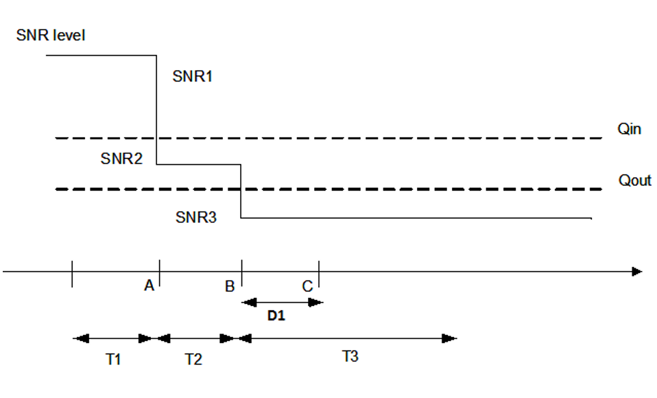

# A.3 RRM test configurations
## A.3.1 Reference measurement channels
### A.3.1.1 PDSCH
#### A.3.1.1.1 FDD
Table A.3.1.1.1-1: PDSCH Reference Measurement Channels for SCS=15 kHz
| Parameter | Unit | Value |  |  |  |  |  |  |
| --- | --- | --- | --- | --- | --- | --- | --- | --- |
| Reference channel |  | SR.1.1 FDD | SR.1.2 FDD | SR.1.3 FDD |  |  |  |  |
| Channel bandwidth | MHz | Defined in test case | Defined in test case by the parameter r NRB,c | Defined in test case by the parameter r NRB,c |  |  |  |  |
| Number of transmitter antennas |  | 1 | 1 | 1 |  |  |  |  |
| Allocated resource blocks for PDSCH Note 1 |  | 24 | 15 | 12 |  |  |  |  |
| Allocated slots per Radio Frame |  | 10 | 10 | 10 |  |  |  |  |
| Radio frame containing SSB | slots | Note 5 | Note 5 | Note 5 |  |  |  |  |
| Radio frame not containing SSB | slots | 10 | 10 | 10 |  |  |  |  |
| MCS index |  | 4 | 4 | 4 |  |  |  |  |
| Modulation |  | QPSK | QPSK | QPSK |  |  |  |  |
| Target Coding Rate |  | 1/3 | 1/3 | 1/3 |  |  |  |  |
| Number of control symbols |  | 2 | 2 | 2 |  |  |  |  |
| PDSCH mapping type |  | Type A | Type A | Type A |  |  |  |  |
| Information Bit Payload |  |  |  |  |  |  |  |  |
| For slots with RMSI Note 2 | bits | 1608 | 984 | 736 |  |  |  |  |
| For slots without RMSI | bits | 1864 | 1128 | 888 |  |  |  |  |
| Number of Code Blocks per slot |  | 1 | 1 | 1 |  |  |  |  |
| Binary Channel Bits Per slot |  |  |  |  |  |  |  |  |
| For slots with RMSI Note 2, Note 4 | bits | 5184 | 3240 | 2592 |  |  |  |  |
| For slots without RMSI Note 6 | bits | 6048 | 3780 | 3024 |  |  |  |  |
| NOTE 1: Allocated outside the SMTC duration in time and in resource blocks which do not overlap with the resource blocks allocated for SS/PBCH block. NOTE 2: PDSCH is scheduled on the slots with RMSI. NOTE 3: If necessary the information bit payload size can be adjusted to facilitate the test implementation. The payload sizes are defined in TS 38.213 [3]. NOTE 4: Derived based on the PDSCH DMRS assumption: dmrs-TypeA-Position=2, dmrs-Type=1, dmrs-AdditonalPositions=2, maxLength=1, Antenna port index: 1000, and Number of PDSCH DMRS CDM group(s) without data: 2. NOTE 5: PDSCH is not scheduled in slots containing SSB according to the SSB configuration used in the test. SSB configurations are defined in clause A.3.10. NOTE 6: Derived based on the PDSCH DMRS assumption: dmrs-TypeA-Position=2, dmrs-Type=1, dmrs-AdditonalPositions=2, maxLength=1, Antenna port index: 1000, and Number of PDSCH DMRS CDM group(s) without data: 1. NOTE 7: When DRX is configured, PDCCH can be scheduled both for downlink assignment and/or UL grant only during (10ms - drx-InactivityTimer) from timing when drx-onDurationTimer starts, unless otherwise specified in the test case. |  |  |  |  |  |  |  |  |

#### A.3.1.1.2 TDD
For tests with VSAT UEs using FR1 numerology in FDD operation, the TDD tables below may be used.
Table A.3.1.1.2-1: PDSCH Reference Measurement Channels for SCS=15 kHz
| Parameter | Unit | Value |  |  |  |  |  |  |
| --- | --- | --- | --- | --- | --- | --- | --- | --- |
| Reference channel |  | SR.1.1 TDD | SR.1.2 TDD |  |  |  |  |  |
| Channel bandwidth | MHz | Defined in test case | Defined in test case |  |  |  |  |  |
| Number of transmitter antennas |  | 1 | 1 |  |  |  |  |  |
| Allocated resource blocks for PDSCH Note 1 |  | 24 | 24 |  |  |  |  |  |
| Allocated slots per Radio Frame |  |  |  |  |  |  |  |  |
| Radio frame containing SSB | slots | Note 5 | Note 5 |  |  |  |  |  |
| Radio frame not containing SSB | slots | 4 | 6 |  |  |  |  |  |
| MCS table |  | 64QAM | 64QAM |  |  |  |  |  |
| MCS index |  | 4 | 4 |  |  |  |  |  |
| Modulation |  | QPSK | QPSK |  |  |  |  |  |
| Target Coding Rate |  | 1/3 | 1/3 |  |  |  |  |  |
| Number of control symbols |  | 2 | 2 |  |  |  |  |  |
| PDSCH mapping type |  | Type A | Type A |  |  |  |  |  |
| Information Bit Payload |  |  |  |  |  |  |  |  |
| For slots with RMSI Note 2 | bits | 1608 | 1608 |  |  |  |  |  |
| For slots without RMSI | bits | 1864 | 1864 |  |  |  |  |  |
| For special slots | bits | N/A | 1128 |  |  |  |  |  |
| Number of Code Blocks per slot |  | 1 | 1 |  |  |  |  |  |
| Binary Channel Bits Per slot |  |  |  |  |  |  |  |  |
| For slots with RMSI Note 2, Note 4 | bits | 5184 | 5184 |  |  |  |  |  |
| For slots without RMSI Note 6 | bits | 6048 | 6048 |  |  |  |  |  |
| For special slots Note 6 | bits | - | 3744 |  |  |  |  |  |
| NOTE 1: Allocated outside the SMTC duration in time and in resource blocks which do not overlap with the resource blocks allocated for SS/PBCH block. NOTE 2: PDSCH is scheduled on the slots with RMSI. NOTE 3: If necessary the information bit payload size can be adjusted to facilitate the test implementation. The payload sizes are defined in TS 38.213 [3]. NOTE 4: Derived based on the PDSCH DMRS assumption: dmrs-TypeA-Position=2, dmrs-Type=1, dmrs-AdditonalPositions=2, maxLength=1, Antenna port index: 1000, and Number of PDSCH DMRS CDM group(s) without data: 2. NOTE 5: PDSCH is not scheduled in slots containing SSB according to the SSB configuration used in the test. SSB configurations are defined in clause A.3.10. NOTE 6: Derived based on the PDSCH DMRS assumption: dmrs-TypeA-Position=2, dmrs-Type=1, dmrs-AdditonalPositions=2, maxLength=1, Antenna port index: 1000, and Number of PDSCH DMRS CDM group(s) without data: 1. NOTE 7: When DRX is configured, PDCCH can be scheduled both for downlink assignment and/or UL grant only during (10ms - drx-InactivityTimer) from timing when drx-onDurationTimer starts, unless otherwise specified in the test case. |  |  |  |  |  |  |  |  |

Table A.3.1.1.2-2: PDSCH Reference Measurement Channels for SCS=30 kHz
| Parameter | Unit | Value |  |  |  |  |  |  |
| --- | --- | --- | --- | --- | --- | --- | --- | --- |
| Reference channel |  | SR.2.1 TDD |  |  |  |  |  |  |
| Channel bandwidth | MHz | Defined in test case |  |  |  |  |  |  |
| Number of transmitter antennas |  | 1 |  |  |  |  |  |  |
| Allocated resource blocks for PDSCH Note 1 |  | 24 |  |  |  |  |  |  |
| Allocated slots per Radio Frame |  |  |  |  |  |  |  |  |
| Radio frame containing SSB | slots | Note 5 |  |  |  |  |  |  |
| Radio frame not containing SSB | slots | 10 |  |  |  |  |  |  |
| MCS table |  | 64QAM |  |  |  |  |  |  |
| MCS index |  | 4 |  |  |  |  |  |  |
| Modulation |  | QPSK |  |  |  |  |  |  |
| Target Coding Rate |  | 1/3 |  |  |  |  |  |  |
| Number of control symbols |  | 2 |  |  |  |  |  |  |
| PDSCH mapping type |  | Type A |  |  |  |  |  |  |
| Information Bit Payload |  |  |  |  |  |  |  |  |
| For slots with RMSI Note 2 | bits | 1608 |  |  |  |  |  |  |
| For slots without RMSI | bits | 1864 |  |  |  |  |  |  |
| Number of Code Blocks per slot |  | 1 |  |  |  |  |  |  |
| Binary Channel Bits Per slot |  |  |  |  |  |  |  |  |
| For slots with RMSI Note 2, Note 4 | bits | 6048 |  |  |  |  |  |  |
| NOTE 1: Allocated outside the SMTC duration in time and in resource blocks which do not overlap with the resource blocks allocated for SS/PBCH block. NOTE 2: PDSCH is scheduled on the slots with RMSI. NOTE 3: If necessary the information bit payload size can be adjusted to facilitate the test implementation. The payload sizes are defined in TS 38.213 [3]. NOTE 4: Derived based on the PDSCH DMRS assumption: dmrs-TypeA-Position=2, dmrs-Type=1, dmrs-AdditonalPositions=2, maxLength=1, Antenna port index: 1000, and Number of PDSCH DMRS CDM group(s) without data: 2. NOTE 5: PDSCH is not scheduled in slots containing SSB according to the SSB configuration used in the test. SSB configurations are defined in clause A.3.10. NOTE 6: Derived based on the PDSCH DMRS assumption: dmrs-TypeA-Position=2, dmrs-Type=1, dmrs-AdditonalPositions=2, maxLength=1, Antenna port index: 1000, and Number of PDSCH DMRS CDM group(s) without data: 1. NOTE 7: When DRX is configured, PDCCH can be scheduled both for downlink assignment and/or UL grant only during (10ms - drx-InactivityTimer) from timing when drx-onDurationTimer starts, unless otherwise specified in the test case. |  |  |  |  |  |  |  |  |

Table A.3.1.1.2-3: PDSCH Reference Measurement Channels for SCS=120 kHz
| Parameter | Unit | Value |  |  |  |  |  |  |
| --- | --- | --- | --- | --- | --- | --- | --- | --- |
| Reference channel |  | SR.3.1 TDD | SR.3.2 TDD | SR.3.3 TDD |  |  |  |  |
| Channel bandwidth | MHz | 100 | 100 | 100 |  |  |  |  |
| Number of transmitter antennas |  | 1 | 1 | 1 |  |  |  |  |
| Allocated resource blocks for PDSCH |  | 24 Note 1 | 24Note 7 | 48Note 7 |  |  |  |  |
| Allocated slots per Radio Frame |  |  |  |  |  |  |  |  |
| Radio frame containing SSB | slots | Note 5 | Note 5 | Note 5 |  |  |  |  |
| Radio frame not containing SSB | slots | 48 | 48 | 48 |  |  |  |  |
| MCS table |  | 64QAM | 64QAM | 64QAM |  |  |  |  |
| MCS index |  | 4 | 4 | 4 |  |  |  |  |
| Modulation |  | QPSK | QPSK | QPSK |  |  |  |  |
| Target Coding Rate |  | 1/3 | 1/3 | 1/3 |  |  |  |  |
| Number of control symbols |  | 2 | 2 | 2 |  |  |  |  |
| PDSCH mapping type |  | Type A | Type A | Type A |  |  |  |  |
| Information Bit Payload |  |  |  |  |  |  |  |  |
| For slots with RMSI | bits | 1608 | 1608 | 3104 |  |  |  |  |
| For slots without RMSI | bits | 1864 | 1864 | 3624 |  |  |  |  |
| Number of Code Blocks per slot |  | 1 | 1 | 1 |  |  |  |  |
| Binary Channel Bits Per slot |  |  |  |  |  |  |  |  |
| For slots with RMSI Note 4 | bits | 5184 | 5184 | 10368 |  |  |  |  |
| For slots without RMSI Note 6 | bits | 6048 | 6048 | 12096 |  |  |  |  |
| NOTE 1: Allocated in resource blocks which do not overlap with the resource blocks allocated for SS/PBCH block NOTE 2: Void NOTE 3: If necessary the information bit payload size can be adjusted to facilitate the test implementation. The payload sizes are defined in TS 38.213 [3]. NOTE 4: Derived based on the PDSCH DMRS assumption: dmrs-TypeA-Position=2, dmrs-Type=1, dmrs-AdditonalPositions=2, maxLength=1, Antenna port index: 1000, and Number of PDSCH DMRS CDM group(s) without data: 2. NOTE 5: PDSCH is not scheduled in slots containing SSB according to the SSB configuration used in the test. SSB configurations are defined in clause A.3.10. NOTE 6: Derived based on the PDSCH DMRS assumption: dmrs-TypeA-Position=2, dmrs-Type=1, dmrs-AdditonalPositions=2, maxLength=1, Antenna port index: 1000, and Number of PDSCH DMRS CDM group(s) without data: 1. NOTE 7: Allocated in the same resource blocks as the CORESET. NOTE 8: When DRX is configured, PDSCH is scheduled only while drx-onDurationTimer is running, unless otherwise specified in the test case. |  |  |  |  |  |  |  |  |

### A.3.1.2 CORESET for RMSI scheduling
#### A.3.1.2.1 FDD
Table A.3.1.2.1-1: RMSI CORESET Reference Channel for FDD with SCS=15KHz
| Parameter | Unit | Value |  |  |  |  |  |  |
| --- | --- | --- | --- | --- | --- | --- | --- | --- |
| Reference channel |  | CR.1.1 FDD | CR.1.2 FDD | CR.1.3 FDD | CR.1.4 FDD |  |  |  |
| Channel bandwidth | MHz | Defined in test case | Defined in test case | Defined in test case | Defined in test case |  |  |  |
| Subcarrier spacing for RMSI CORESET | kHz | 15 | 15 | 15 | 15 |  |  |  |
| Allocated resource blocks for RMSI CORESET |  | 24 (Note 8) | 12 (Note 9) | 15 (Note 10) | 20 (Note 11) |  |  |  |
| Subcarrier spacing for SSB | kHz | 15 | 15 | 15 | 15 |  |  |  |
| SSB and RMSI CORESET multiplexing configuration |  | Pattern 1 | Pattern 1 | Pattern 1 | Pattern 1 |  |  |  |
| Offset between SSB and RMSI CORESET Note 3, 7 | PRB | 0 (Note 8) | 0 (Note 9) | 0 (Note 10) | 0 (Note 11) |  |  |  |
| Configuration of PDCCH monitoring occasions for RMSI CORESET Note 4 |  | Index 4 | Index 4 | Index 4 | Index 4 |  |  |  |
| Number of transmitter antennas |  | 1 | 1 | 1 | 1 |  |  |  |
| Duration of RMSI CORESET | symbols | 2 (Note 8) | 2 (Note 9) | 3 (Note 10) | 3 (Note 11) |  |  |  |
| DCI Format Note 1 |  | Note 2 | Note 2 | Note 2 | Note 2 |  |  |  |
| Aggregation level | CCE | 8 | 4 | 8 | 8 |  |  |  |
| DMRS precoder granularity |  | 6 | Same as REG bundle size | Same as REG bundle size | Same as REG bundle size |  |  |  |
| REG bundle size |  | 6 | 6 | 6 | 6 |  |  |  |
| Mapping from REG to CCE |  | Distributed (Note 8) | Distributed (Note 9) | Non-Distributed (Note 10) | Distributed (Note 11) |  |  |  |
| Cell ID |  | Note 5 | Note 5 | Note 5 | Note 5 |  |  |  |
| Payload (without CRC) | bits | Note 6 | Note 6 | Note 6 | Note 6 |  |  |  |
| NOTE 1: DCI formats are defined in TS 38.212 [8]. NOTE 2: DCI format shall depend upon the test configuration. NOTE 3: The offset is defined with respect to the subcarrier spacing of the CORESET from the smallest PRB index of RMSI CORESET to the smallest PRB index of the common PRB overlapping with the first PRB of the SS/PBCH block. NOTE 4: The configuration of PDCCH monitoring occasions for RMSI CORESET is defined in table 13-11 in TS 38.213 [3]. NOTE 5: Cell ID shall depend upon the test configuration. NOTE 6: Payload size shall depend upon the test configuration. NOTE 7: Other values can be used to align with GSCN [13] as long as SSB does not overlap the RMC. NOTE 8: The configuration of set of resource blocks, slot symbols, RB offset and REG to CCE mapping of control resource set for Type0-PDCCH search space corresponds to index 0 in table 13-1 in TS 38.213 [3] NOTE 9: The configuration of set of resource blocks, slot symbols, RB offset and REG to CCE mapping of control resource set for Type0-PDCCH search space corresponds to index 0 in table 13-0 in TS 38.213 [3] NOTE 10: The configuration of set of resource blocks, slot symbols, RB offset and REG to CCE mapping of control resource set for Type0-PDCCH search space corresponds to index 8 in table 13-0 in TS 38.213 [3] NOTE 11: The configuration of set of resource blocks, slot symbols, RB offset and REG to CCE mapping of control resource set for Type0-PDCCH search space corresponds to index 11 in table 13-0 in TS 38.213 [3] |  |  |  |  |  |  |  |  |

#### A.3.1.2.2 TDD
For tests with VSAT UEs using FR1 numerology in FDD operation, the TDD tables below may be used.
Table A.3.1.2.2-1: RMSI CORESET Reference Channel for TDD with SCS=15kHz
| Parameter | Unit | Value |  |  |  |  |  |  |
| --- | --- | --- | --- | --- | --- | --- | --- | --- |
| Reference channel |  | CR.1.1 TDD |  |  |  |  |  |  |
| Channel bandwidth | MHz | Defined in test case |  |  |  |  |  |  |
| Subcarrier spacing | kHz | 15 |  |  |  |  |  |  |
| Allocated resource blocks for RMSI CORESET Note 7 |  | 24 |  |  |  |  |  |  |
|  |  |  |  |  |  |  |  |  |
| SSB and RMSI CORESET multiplexing configuration Note 7 |  | Pattern 1 |  |  |  |  |  |  |
| Offset between SSB and RMSI CORESET Note 3, 7 | PRB | 0 (Note 8) |  |  |  |  |  |  |
| Configuration of PDCCH monitoring occasions for RMSI CORESET Note 4 |  | Index 4 |  |  |  |  |  |  |
| Number of transmitter antennas |  | 1 |  |  |  |  |  |  |
| Duration of RMSI CORESET Note 7 | symbols | 2 |  |  |  |  |  |  |
| DCI Format Note 1 |  | Note 2 |  |  |  |  |  |  |
| Aggregation level | CCE | 8 |  |  |  |  |  |  |
| DMRS precoder granularity |  | 6 |  |  |  |  |  |  |
| REG bundle size |  | 6 |  |  |  |  |  |  |
| Mapping from REG to CCE |  | Distributed |  |  |  |  |  |  |
| Cell ID |  | Note 5 |  |  |  |  |  |  |
| Payload (without CRC) | bits | Note 6 |  |  |  |  |  |  |
| NOTE 1: DCI formats are defined in TS 38.212 [8]. NOTE 2: DCI format shall depend upon the test configuration. NOTE 3: The offset is defined with respect to the subcarrier spacing of the CORESET from the smallest PRB index of RMSI CORESET to the smallest PRB index of the common PRB overlapping with the first PRB of the SS/PBCH block. NOTE 4: The configuration of PDCCH monitoring occasions for RMSI CORESET is defined in table 13-11 in TS 38.213 [3]. NOTE 5: Cell ID shall depend upon the test configuration. NOTE 6: Payload size shall depend upon the test configuration. NOTE 7: The configuration of set of resource blocks and slot symbols of control resource set for Type0-PDCCH search space corresponds to index 0 in table 13-1 in TS 38.213 [3]. NOTE 8: Other values can be used to align with GSCN [13] as long as SSB does not overlap the RMC. |  |  |  |  |  |  |  |  |

Table A.3.1.2.2-2: RMSI CORESET Reference Channel for TDD with SCS=30kHz
| Parameter | Unit | Value |  |  |  |  |  |  |
| --- | --- | --- | --- | --- | --- | --- | --- | --- |
| Reference channel |  | CR.2.1 TDD |  |  |  |  |  |  |
| Channel bandwidth | MHz | Defined in test case |  |  |  |  |  |  |
| Subcarrier spacing | kHz | 30 |  |  |  |  |  |  |
| Allocated resource blocks for RMSI CORESET Note 7 |  | 24 |  |  |  |  |  |  |
|  |  |  |  |  |  |  |  |  |
| SSB and RMSI CORESET multiplexing configuration Note 7 |  | Pattern 1 |  |  |  |  |  |  |
| Offset between SSB and RMSI CORESET Note 3, 7 | PRB | 0 (Note 8) |  |  |  |  |  |  |
| Configuration of PDCCH monitoring occasions for RMSI CORESET Note 4 |  | Index 4 |  |  |  |  |  |  |
| Number of transmitter antennas |  | 1 |  |  |  |  |  |  |
| Duration of RMSI CORESET Note 7 | symbols | 2 |  |  |  |  |  |  |
| DCI Format Note 1 |  | Note 2 |  |  |  |  |  |  |
| Aggregation level | CCE | 8 |  |  |  |  |  |  |
| DMRS precoder granularity |  | 6 |  |  |  |  |  |  |
| REG bundle size |  | 6 |  |  |  |  |  |  |
| Mapping from REG to CCE |  | Distributed |  |  |  |  |  |  |
| Cell ID |  | Note 5 |  |  |  |  |  |  |
| Payload (without CRC) | bits | Note 6 |  |  |  |  |  |  |
| NOTE 1: DCI formats are defined in TS 38.212 [8]. NOTE 2: DCI format shall depend upon the test configuration. NOTE 3: The offset is defined with respect to the subcarrier spacing of the CORESET from the smallest PRB index of RMSI CORESET to the smallest PRB index of the common PRB overlapping with the first PRB of the SS/PBCH block. NOTE 4: The configuration of PDCCH monitoring occasions for RMSI CORESET is defined in table 13-11 in TS 38.213 [3]. NOTE 5: Cell ID shall depend upon the test configuration. NOTE 6: Payload size shall depend upon the test configuration. NOTE 7: The configuration of set of resource blocks and slot symbols of control resource set for Type0-PDCCH search space corresponds to index 0 in table 13-6 in TS 38.213 [3]. NOTE 8: Other values can be used to align with GSCN [13] as long as SSB does not overlap the RMC. |  |  |  |  |  |  |  |  |

Table A.3.1.2.2-3: RMSI CORESET Reference Channel for TDD with SCS=120kHz
| Parameter | Unit | Value |  |  |  |  |  |  |
| --- | --- | --- | --- | --- | --- | --- | --- | --- |
| Reference channel |  | CR.3.1 TDD | CR.3.2 TDD |  |  |  |  |  |
| Channel bandwidth | MHz | 100 | 100 |  |  |  |  |  |
| Subcarrier spacing | kHz | 120 | 120 |  |  |  |  |  |
| Allocated resource blocks for RMSI CORESET |  | 24 Note 7 | 48 Note 9 |  |  |  |  |  |
| SSB and RMSI CORESET multiplexing configuration |  | Pattern 1 Note 7 | Pattern 1 Note 9 |  |  |  |  |  |
| Offset between SSB and RMSI CORESET Note 3 | PRB | 0 (Note 8) Note 7 | 0 (Note 8) Note 9 |  |  |  |  |  |
| Configuration of PDCCH monitoring occasions for RMSI CORESET Note 4 |  | Index 4 | Index 4 |  |  |  |  |  |
| Number of transmitter antennas |  | 1 | 1 |  |  |  |  |  |
| Duration of RMSI CORESET | symbols | 2 Note 7 | 2 Note 9 |  |  |  |  |  |
| DCI Format Note 1 |  | Note 2 | Note 2 |  |  |  |  |  |
| Aggregation level | CCE | 8 | 8 |  |  |  |  |  |
| DMRS precoder granularity |  | 6 | 6 |  |  |  |  |  |
| REG bundle size |  | 6 | 6 |  |  |  |  |  |
| Mapping from REG to CCE |  | Distributed | Distributed |  |  |  |  |  |
| Cell ID |  | Note 5 | Note 5 |  |  |  |  |  |
| Payload (without CRC) | bits | Note 6 | Note 6 |  |  |  |  |  |
| NOTE 1: DCI formats are defined in TS 38.212 [8]. NOTE 2: DCI format shall depend upon the test configuration. NOTE 3: The offset is defined with respect to the subcarrier spacing of the CORESET from the smallest PRB index of RMSI CORESET to the smallest PRB index of the common PRB overlapping with the first PRB of the SS/PBCH block. NOTE 4: The configuration of PDCCH monitoring occasions for RMSI CORESET is defined in table 13-12 in TS 38.213 [3]. NOTE 5: Cell ID shall depend upon the test configuration. NOTE 6: Payload size shall depend upon the test configuration. NOTE 7: The configuration of set of resource blocks and slot symbols of control resource set for Type0-PDCCH search space corresponds to index 0 in table 13-8 in TS 38.213 [3]. NOTE 8: Other values can be used to align with GSCN [13] as long as SSB does not overlap the RMC. NOTE 9: The configuration of set of resource blocks and slot symbols of control resource set for Type0-PDCCH search space corresponds to index 2 in table 13-10 in TS 38.213 [3]. |  |  |  |  |  |  |  |  |

### A.3.1.3 CORESET for RMC scheduling
#### A.3.1.3.1 FDD
Table A.3.1.3.1-1: Control Channel RMC for FDD with SCS=15kHz
| Parameter | Unit | Value |  |  |  |  |  |  |  |  |  |
| --- | --- | --- | --- | --- | --- | --- | --- | --- | --- | --- | --- |
| Reference channel |  | CCR.1.1 FDD | CCR.1.2 FDD | CCR.1.3 FDD | CCR.1.4 FDD | CCR.1.5 FDD | CCR.1.6 FDD | CCR.1.7 FDD | CCR.1.8 FDD |  |  |
| Channel bandwidth | MHz | Defined in test case | Defined in test case | Defined in test case | Defined in test case | 10 | 3 MHz | 3 MHz | 5 MHz |  |  |
| Subcarrier spacing | kHz | 15 | 15 | 15 | 15 | 15 | 15 | 15 | 15 |  |  |
| Allocated resource blocks for CORESET Note 3 |  | 24 | 18 | 24 | 18 | 24 | 12 | 12 | 18 |  |  |
| Number of transmitter antennas |  | 1 | 1 | 1 | 1 | 1 | 1 | 1 | 1 |  |  |
| Duration of CORESET | symbols | 2 | 2 | 2 | 2 | 2 | 2 | 2 | 3 |  |  |
| monitoringSymbolsWithinSlot |  | 1000000 0000000 | 1000000 0000000 | 1000000 0000000 | 1000000 0000000 | 0010000 0000000 | 1000000 0000000 | 1000000 0000000 | 1000000 0000000 |  |  |
| REG bundle size |  | 6 | 6 | 6 | 6 | 6 | 6 | 6 | 6 |  |  |
| DMRS precoder granularity |  | Same as REG bundle size | Same as REG bundle size | Same as REG bundle size | Same as REG bundle size | Same as REG bundle size | Same as REG bundle size | Same as REG bundle size | Same as REG bundle size |  |  |
| CCE to REG mapping |  | Interleaved | Interleaved | Interleaved | Interleaved | Interleaved | Interleaved | Non-Interleaved | Interleaved |  |  |
| Interleave n_shift |  | 0 | 0 | 0 | 0 | 0 | 0 | 0 | 0 |  |  |
| Interleave size |  | 2 | 2 | 2 | 2 | 2 | 2 | N/A | 2 |  |  |
| Beamforming Pre-Coder |  | N/A | N/A | N/A | N/A | N/A | N/A | N/A | N/A |  |  |
| Aggregation level | CCE | 4 | 2 | 8 | 4 | 4 | 4 | 4 | 8 |  |  |
| DCI formats |  | Note 1 | Note 1 | Note 1 | Note 1 | Note 1 | 1-0 | 1-0 | 1-0 |  |  |
| Payload size (without CRC) | bits | Note 2 | Note 2 | Note 2 | Note 2 | Note 2 | Note 2 | Note 2 | Note 2 |  |  |
| NOTE 1: DCI format shall depend upon the test configuration. NOTE 2: Payload size shall depend upon the test configuration. NOTE 3: Allocated in the resource blocks where the associated RMC is scheduled. |  |  |  |  |  |  |  |  |  |  |  |

Table A.3.1.3.1-2: Control Channel RMC for FDD with SCS=120kHz
| Parameter | Unit | Value |  |  |  |  |  |  |
| --- | --- | --- | --- | --- | --- | --- | --- | --- |
| Reference channel |  | CCR.2.1 FDD |  |  |  |  |  |  |
| Channel bandwidth | MHz | 100 |  |  |  |  |  |  |
| Subcarrier spacing | kHz | 120 |  |  |  |  |  |  |
| Allocated resource blocks for CORESET Note 3 |  | 24 |  |  |  |  |  |  |
| Number of transmitter antennas |  | 1 |  |  |  |  |  |  |
| Duration of CORESET | symbols | 1 |  |  |  |  |  |  |
| monitoringSlotPeriodicityAndOffset Note 4 |  | sl160 0 |  |  |  |  |  |  |
| monitoringSymbolsWithinSlot |  | 1100000 0000000 |  |  |  |  |  |  |
| REG bundle size |  | 6 |  |  |  |  |  |  |
| DMRS precoder granularity |  | Same as REG bundle size |  |  |  |  |  |  |
| CCE to REG mapping |  | Interleaved |  |  |  |  |  |  |
| Interleave n_shift |  | 0 |  |  |  |  |  |  |
| Interleave size |  | 2 |  |  |  |  |  |  |
| Beamforming Pre-Coder |  | N/A |  |  |  |  |  |  |
| Aggregation level | CCE | 4 |  |  |  |  |  |  |
| DCI formats |  | Note 1 |  |  |  |  |  |  |
| Payload size (without CRC) | bits | Note 2 |  |  |  |  |  |  |
| NOTE 1: DCI format shall depend upon the test configuration. NOTE 2: Payload size shall depend upon the test configuration. NOTE 3: Allocated in the resource blocks where the associated RMC is scheduled. NOTE 4: monitoringSlotPeriodicityAndOffet is set to “sl1 0” if it is specifically stated that cell(s) configured with one of the control channel RMCs above shall transmit PDCCHs continuously. |  |  |  |  |  |  |  |  |

Table A.3.1.3.1-3: Control Channel RMC for FDD with SCS=15kHz
| Parameter | Unit | Value |  |  |  |  |
| --- | --- | --- | --- | --- | --- | --- |
| Reference channel |  | CCR.3.1 FDD | CCR.3.2 FDD |  |  |  |
| Channel bandwidth | MHz | Defined in test case | Defined in test case |  |  |  |
| Subcarrier spacing | kHz | 15 | 15 |  |  |  |
| Allocated resource blocks for CORESET Note 3 |  | 48 | 48 |  |  |  |
| Number of transmitter antennas |  | 1 | 1 |  |  |  |
| Duration of CORESET | symbols | 2 | 2 |  |  |  |
| monitoringSymbolsWithinSlot |  | 1000000 0000000 | 1000000 0000000 |  |  |  |
| REG bundle size |  | 6 | 6 |  |  |  |
| DMRS precoder granularity |  | Same as REG bundle size | Same as REG bundle size |  |  |  |
| CCE to REG mapping |  | Interleaved | Interleaved |  |  |  |
| Interleave n_shift |  | 0 | 0 |  |  |  |
| Interleave size |  | 2 | 2 |  |  |  |
| Beamforming Pre-Coder |  | N/A | N/A |  |  |  |
| Aggregation level | CCE | 8 | 16 |  |  |  |
| DCI formats |  | Note 1 | Note 1 |  |  |  |
| Payload size (without CRC) | bits | Note 2 | Note 2 |  |  |  |
| Note 1: DCI format shall depend upon the test configuration. Note 2: Payload size shall depend upon the test configuration Note 3: Allocated in the resource blocks where the associated RMC is scheduled. |  |  |  |  |  |  |

#### A.3.1.3.2 TDD
For tests with VSAT UEs using FR1 numerology in FDD operation, the TDD tables below may be used.
Table A.3.1.3.2-1: Control Channel RMC for TDD with SCS=15kHz
| Parameter | Unit | Value |  |  |  |  |  |  |
| --- | --- | --- | --- | --- | --- | --- | --- | --- |
| Reference channel |  | CCR.1.1 TDD | CCR.1.2 TDD | CCR.1.3 TDD | CCR.1.4 TDD | CCR.1.5 TDD |  |  |
| Channel bandwidth | MHz | Defined in test case | Defined in test case | Defined in test case | Defined in test case | 10 |  |  |
| Subcarrier spacing | kHz | 15 | 15 | 15 | 15 | 15 |  |  |
| Allocated resource blocks for CORESET Note 3 |  | 24 | 18 | 24 | 18 | 18 |  |  |
| Number of transmitter antennas |  | 1 | 1 | 1 | 1 | 1 |  |  |
| Duration of CORESET | symbols | 2 | 2 | 2 | 2 | 2 |  |  |
| monitoringSymbolsWithinSlot |  | 1000000 0000000 | 1000000 0000000 | 1000000 0000000 | 1000000 0000000 | 0010000 0000000 |  |  |
| REG bundle size |  | 6 | 6 | 6 | 6 | 6 |  |  |
| DMRS precoder granularity |  | Same as REG bundle size | Same as REG bundle size | Same as REG bundle size | Same as REG bundle size | Same as REG bundle size |  |  |
| CCE to REG mapping |  | Interleaved | Interleaved | Interleaved | Interleaved | Interleaved |  |  |
| Interleave n_shift |  | 0 | 0 | 0 | 0 | 0 |  |  |
| Interleave size |  | 2 | 2 | 2 | 2 | 2 |  |  |
| Beamforming Pre-Coder |  | N/A | N/A | N/A | N/A | N/A |  |  |
| Aggregation level | CCE | 4 | 2 | 8 | 4 | 4 |  |  |
| DCI formats |  | Note 1 | Note 1 | Note 1 | Note 1 | Note 1 |  |  |
| Payload size (without CRC) | bits | Note 2 | Note 2 | Note 2 | Note 2 | Note 2 |  |  |
| NOTE 1: DCI format shall depend upon the test configuration. NOTE 2: Payload size shall depend upon the test configuration. NOTE 3: Allocated in the resource blocks where the associated RMC is scheduled. |  |  |  |  |  |  |  |  |

Table A.3.1.3.2-2: Control Channel RMC for TDD with SCS=30kHz
| Parameter | Unit | Value |  |  |  |  |  |  |
| --- | --- | --- | --- | --- | --- | --- | --- | --- |
| Reference channel |  | CCR.2.1 TDD | CCR.2.2 TDD | CCR.2.3 TDD | CCR.2.4 TDD |  |  |  |
| Channel bandwidth | MHz | Defined in test case | Defined in test case | Defined in test case | Defined in test case |  |  |  |
| Subcarrier spacing | kHz | 30 | 30 | 30 | 30 |  |  |  |
| Allocated resource blocks for CORESET Note 3 |  | 24 | 24 | 18 | 18 |  |  |  |
| Number of transmitter antennas |  | 1 | 1 | 1 | 1 |  |  |  |
| Duration of CORESET | symbols | 2 | 2 | 2 | 2 |  |  |  |
| REG bundle size |  | 6 | 6 | 6 | 6 |  |  |  |
| DMRS precoder granularity |  | Same as REG bundle size | Same as REG bundle size | Same as REG bundle size | Same as REG bundle size |  |  |  |
| CCE to REG mapping |  | Interleaved | Interleaved | Interleaved | Interleaved |  |  |  |
| Interleave n_shift |  | 0 | 0 | 0 | 0 |  |  |  |
| Interleave size |  | 2 | 2 | 2 | 2 |  |  |  |
| Beamforming Pre-Coder |  | N/A | N/A | N/A | N/A |  |  |  |
| Aggregation level | CCE | 4 | 8 | 4 | 2 |  |  |  |
| DCI formats |  | Note 1 | Note 1 | Note 1 | Note 1 |  |  |  |
| Payload size (without CRC) | bits | Note 2 | Note 2 | Note 2 | Note 2 |  |  |  |
| NOTE 1: DCI format shall depend upon the test configuration. NOTE 2: Payload size shall depend upon the test configuration. NOTE 3: Allocated in the same resource blocks where the associated RMC is scheduled. |  |  |  |  |  |  |  |  |

Table A.3.1.3.2-3: Control Channel RMC for TDD with SCS=120kHz
| Parameter | Unit | Value |  |  |  |  |  |  |
| --- | --- | --- | --- | --- | --- | --- | --- | --- |
| Reference channel |  | CCR.3.1 TDD | CCR.3.2 TDD | CCR.3.3 TDD | CCR.3.4 TDD | CCR.3.5 TDD | CCR.3.6 TDD | CCR.3.7 TDD |
| Channel bandwidth | MHz | 100 | 100 | 100 | 100 | 100 | 100 | 100 |
| Subcarrier spacing | kHz | 120 | 120 | 120 | 120 | 120 | 120 | 120 |
| Allocated resource blocks for CORESET Note 3 |  | 24 | 24 | 24 | 24 | 24 | 24 | 48 |
| Number of transmitter antennas |  | 1 | 1 | 1 | 1 | 1 | 1 | 1 |
| monitoringSlotPeriodicityAndOffset Note 4 |  | sl160 0 | sl160 0 | sl160 80 | sl160 0 | sl160 0 | sl160 80 | sl160 0 |
| monitoringSymbolsWithinSlot |  | 1100000 0000000 | 0011000 0000000 | 1100000 0000000 | 1000000 0000000 | 0010000 0000000 | 1000000 0000000 | 1100000 0000000 |
| Duration of CORESET | slot | 1 | 1 | 1 | 2 | 2 | 2 | 1 |
| REG bundle size |  | 6 | 6 | 6 | 6 | 6 | 6 | 6 |
| DMRS precoder granularity |  | Same as REG bundle size | Same as REG bundle size | Same as REG bundle size | Same as REG bundle size | Same as REG bundle size | Same as REG bundle size | Same as REG bundle size |
| CCE to REG mapping |  | Interleaved | Interleaved | Interleaved | Interleaved | Interleaved | Interleaved | Interleaved |
| Interleave n_shift |  | 0 | 0 | 0 | 0 | 0 | 0 | 0 |
| Interleave size |  | 2 | 2 | 2 | 2 | 2 | 2 | 2 |
| Beamforming Pre-Coder |  | N/A | N/A | N/A | N/A | N/A | N/A | N/A |
| Aggregation level | CCE | 4 | 4 | 4 | 8 | 8 | 8 | 4 |
| DCI formats |  | Note 1 | Note 1 | Note 1 | Note 1 | Note 1 | Note 1 | Note 1 |
| Payload size (without CRC) | bits | Note 2 | Note 2 | Note 2 | Note 2 | Note 2 | Note 2 | Note 2 |
| NOTE 1: DCI format shall depend upon the test configuration. NOTE 2: Payload size shall depend upon the test configuration. NOTE 3: Allocated in the same resource blocks where the associated PDSCH RMC is scheduled. NOTE 4: monitoringSlotPeriodicityAndOffet is set to “sl1 0” if it is specifically stated that cell(s) configured with one of the control channel RMCs above shall transmit PDCCHs continuously. |  |  |  |  |  |  |  |  |

Table A.3.1.3.2-4: Control Channel RMC for TDD with SCS=15kHz
| Parameter | Unit | Value |  |  |  |  |
| --- | --- | --- | --- | --- | --- | --- |
| Reference channel |  | CCR.4.1 TDD | CCR.4.2 TDD |  |  |  |
| Channel bandwidth | MHz | Defined in test case | Defined in test case |  |  |  |
| Subcarrier spacing | kHz | 15 | 15 |  |  |  |
| Allocated resource blocks for CORESET Note 3 |  | 48 | 48 |  |  |  |
| Number of transmitter antennas |  | 1 | 1 |  |  |  |
| Duration of CORESET | symbols | 2 | 2 |  |  |  |
| monitoringSymbolsWithinSlot |  | 1000000 0000000 | 1000000 0000000 |  |  |  |
| REG bundle size |  | 6 | 6 |  |  |  |
| DMRS precoder granularity |  | Same as REG bundle size | Same as REG bundle size |  |  |  |
| CCE to REG mapping |  | Interleaved | Interleaved |  |  |  |
| Interleave n_shift |  | 0 | 0 |  |  |  |
| Interleave size |  | 2 | 2 |  |  |  |
| Beamforming Pre-Coder |  | N/A | N/A |  |  |  |
| Aggregation level | CCE | 8 | 16 |  |  |  |
| DCI formats |  | Note 1 | Note 1 |  |  |  |
| Payload size (without CRC) | bits | Note 2 | Note 2 |  |  |  |
| Note 1: DCI format shall depend upon the test configuration. Note 2: Payload size shall depend upon the test configuration Note 3: Allocated in the resource blocks where the associated RMC is scheduled. |  |  |  |  |  |  |

Table A.3.1.3.2-5: Control Channel RMC for TDD with SCS=30kHz
| Parameter | Unit | Value |  |  |  |  |
| --- | --- | --- | --- | --- | --- | --- |
| Reference channel |  | CCR.5.1 TDD | CCR.5.2 TDD |  |  |  |
| Channel bandwidth | MHz | Defined in test case | Defined in test case |  |  |  |
| Subcarrier spacing | kHz | 30 | 30 |  |  |  |
| Allocated resource blocks for CORESET Note 3 |  | 48 | 48 |  |  |  |
| Number of transmitter antennas |  | 1 | 1 |  |  |  |
| Duration of CORESET | symbols | 2 | 2 |  |  |  |
| REG bundle size |  | 6 | 6 |  |  |  |
| DMRS precoder granularity |  | Same as REG bundle size | Same as REG bundle size |  |  |  |
| CCE to REG mapping |  | Interleaved | Interleaved |  |  |  |
| Interleave n_shift |  | 0 | 0 |  |  |  |
| Interleave size |  | 2 | 2 |  |  |  |
| Beamforming Pre-Coder |  | N/A | N/A |  |  |  |
| Aggregation level | CCE | 8 | 16 |  |  |  |
| DCI formats |  | Note 1 | Note 1 |  |  |  |
| Payload size (without CRC) | bits | Note 2 | Note 2 |  |  |  |
| Note 1: DCI format shall depend upon the test configuration. Note 2: Payload size shall depend upon the test configuration. Note 3: Allocated in the same resource blocks where the associated RMC is scheduled. |  |  |  |  |  |  |

### A.3.1.4 TDD UL/DL configuration
Table A.3.1.4-1: TDD UL/DL configuration for SCS=15 kHz
| Parameter | Unit | Value |  |  |
| --- | --- | --- | --- | --- |
| Reference channel |  | TDDConf.1.1 | TDDConf.1.2 |  |
| referenceSubcarrierSpacing | kHz | 15 | 15 |  |
| TDD UL/DL pattern 1 Note 2 |  | ‘DSUU’ S=’10DL:2GP:2UL’ | ‘DSUU’ S=’ 6DL: 2GP: 6UL’ |  |
| dl-UL-TransmissionPeriodicity | ms | 4 | 4 |  |
| nrofDownlinkSlots |  | 1 | 1 |  |
| nrofDownlinkSymbols |  | 10 | 6 |  |
| nrofUplinkSlot |  | 2 | 2 |  |
| nrofUplinkSymbols |  | 2 | 6 |  |
| TDD UL/DL pattern 2 Note 2 |  | ‘D’ | ‘D’ |  |
| dl-UL-TransmissionPeriodicity | ms | 1 | 1 |  |
| nrofDownlinkSlots |  | 1 | 1 |  |
| nrofDownlinkSymbols |  | 0 | 0 |  |
| nrofUplinkSlot |  | 0 | 0 |  |
| nrofUplinkSymbols |  | 0 | 0 |  |
| NOTE 1: As specified in TS 38.213 [3] and TS 38.331 [2]. NOTE 2: For information. |  |  |  |  |

Table A.3.1.4-2: TDD UL/DL configuration for SCS=30 kHz
| Parameter | Unit | Value |  |  |
| --- | --- | --- | --- | --- |
| Reference channel |  | TDDConf.2.1 | TDDConf.2.2 | TDDConf.2.3 |
| referenceSubcarrierSpacing | kHz | 30 | 30 | 30 |
| TDD UL/DL pattern 1 Note 2 |  | ‘3D1S4U’ S=’6DL:4GP:4UL’ | ‘1D1S2U’ S=’11DL: 1GP:2UL’ | ‘3D1S4U’ S=’4DL:4GP:6UL’ |
| dl-UL-TransmissionPeriodicity | ms | 4 | 2 | 4 |
| nrofDownlinkSlots |  | 3 | 1 | 3 |
| nrofDownlinkSymbols |  | 6 | 11 | 4 |
| nrofUplinkSlot |  | 4 | 2 | 4 |
| nrofUplinkSymbols |  | 4 | 2 | 6 |
| TDD UL/DL pattern 2 Note 2 |  | ‘DD’ | Not configured | ‘DD’ |
| dl-UL-TransmissionPeriodicity | ms | 1 | Not configured | 1 |
| nrofDownlinkSlots |  | 2 | Not configured | 2 |
| nrofDownlinkSymbols |  | 0 | Not configured | 0 |
| nrofUplinkSlot |  | 0 | Not configured | 0 |
| nrofUplinkSymbols |  | 0 | Not configured | 0 |
| NOTE 1: As specified in TS 38.213 [3] and TS 38.331 [2]. NOTE 2: For information |  |  |  |  |

Table A.3.1.4-3: TDD UL/DL configuration for SCS=120 kHz
| Parameter | Unit | Value |  |  |
| --- | --- | --- | --- | --- |
| Reference channel |  | TDDConf.3.1 | TDDConf.3.2 |  |
| referenceSubcarrierSpacing | kHz | 120 | 120 |  |
| TDD UL/DL pattern 1 Note 2 |  | ‘DDDSU’ S=’10DL:2GP:2UL’ | ‘DDDSU’ S=’ 6DL: 2GP: 6UL’ |  |
| dl-UL-TransmissionPeriodicity | ms | 0.625 | 0.625 |  |
| nrofDownlinkSlots |  | 3 | 3 |  |
| nrofDownlinkSymbols |  | 10 | 6 |  |
| nrofUplinkSlot |  | 1 | 1 |  |
| nrofUplinkSymbols |  | 2 | 6 |  |
| TDD UL/DL pattern 2 Note 2 |  | Not configured | Not configured |  |
| dl-UL-TransmissionPeriodicity | ms | Not configured | Not configured |  |
| nrofDownlinkSlots |  | Not configured | Not configured |  |
| nrofDownlinkSymbols |  | Not configured | Not configured |  |
| nrofUplinkSlot |  | Not configured | Not configured |  |
| nrofUplinkSymbols |  | Not configured | Not configured |  |
| NOTE 1: As specified in TS 38.213 [3] and TS 38.331 [2]. NOTE 2: For information |  |  |  |  |

Table A.3.1.4-4: TDD UL/DL configuration of SBFD for SCS=30 kHz
| Parameter | Unit | Value |
| --- | --- | --- |
| Reference channel |  | TDDConf.2.4 |
| referenceSubcarrierSpacing | kHz | 30 |
| TDD UL/DL pattern 1 Note 2 |  | ‘3D1S1U’ S=’10DL:2GP:2UL’ |
| dl-UL-TransmissionPeriodicity | ms | 2.5 |
| nrofDownlinkSlots |  | 3 |
| nrofDownlinkSymbols |  | 10 |
| nrofUplinkSlot |  | 1 |
| nrofUplinkSymbols |  | 2 |
| TDD UL/DL pattern 2 Note 2 |  | Not configured |
| dl-UL-TransmissionPeriodicity | ms | Not configured |
| NOTE 1: As specified in TS 38.213 [3] and TS 38.331 [2]. NOTE 2: For information |  |  |

## A.3.1A Reference measurement channels under CCA
### A.3.1A.1 PDSCH
#### A.3.1A.1.1 TDD
Table A.3.1A.1.1-1: PDSCH Reference Measurement Channels for SCS=30 kHz
| Parameter | Unit | Value |  |  |  |  |  |  |
| --- | --- | --- | --- | --- | --- | --- | --- | --- |
| Reference channel |  | SR.1.1 CCA |  |  |  |  |  |  |
| Channel bandwidth | MHz | 40 |  |  |  |  |  |  |
| Number of transmitter antennas |  | 1 |  |  |  |  |  |  |
| Allocated resource blocks for PDSCH Note 1 |  | 24 |  |  |  |  |  |  |
| Allocated slots per Radio Frame |  |  |  |  |  |  |  |  |
| Radio frame containing SSB | slots | Note 5 |  |  |  |  |  |  |
| Radio frame not containing SSB | slots | Note 7 |  |  |  |  |  |  |
| MCS table |  | 64QAM |  |  |  |  |  |  |
| MCS index |  | 4 |  |  |  |  |  |  |
| Modulation |  | QPSK |  |  |  |  |  |  |
| Target Coding Rate |  | 1/3 |  |  |  |  |  |  |
| Number of control symbols |  | 2 |  |  |  |  |  |  |
| PDSCH mapping type |  | Type A |  |  |  |  |  |  |
| Information Bit Payload |  |  |  |  |  |  |  |  |
| For slots with RMSI Note 2 | bits | 1608 |  |  |  |  |  |  |
| For slots without RMSI | bits | 1864 |  |  |  |  |  |  |
| Number of Code Blocks per slot |  | 1 |  |  |  |  |  |  |
| Binary Channel Bits Per slot |  |  |  |  |  |  |  |  |
| For slots with RMSI Note 2, Note 4 | bits | 5184 |  |  |  |  |  |  |
| For slots without RMSI Note 6 | bits | 6048 |  |  |  |  |  |  |
| NOTE 1: Allocated outside the discovery burst transmission window in time and in resource blocks which do not overlap with the resource blocks allocated for SS/PBCH block. NOTE 2: PDSCH is scheduled on the slots with RMSI. NOTE 3: If necessary the information bit payload size can be adjusted to facilitate the test implementation. The payload sizes are defined in TS 38.213 [3]. NOTE 4: Derived based on the PDSCH DMRS assumption: dmrs-TypeA-Position=2, dmrs-Type=1, dmrs-AdditonalPositions=2, maxLength=1, Antenna port index: 1000, and Number of PDSCH DMRS CDM group(s) without data: 2. NOTE 5: PDSCH is not scheduled in slots containing SSB according to the SSB configuration used in the test. SSB configurations are defined in clause A.3.10A. NOTE 6: Derived based on the PDSCH DMRS assumption: dmrs-TypeA-Position=2, dmrs-Type=1, dmrs-AdditonalPositions=2, maxLength=1, Antenna port index: 1000, and Number of PDSCH DMRS CDM group(s) without data: 1. NOTE 7: PDSCH is transmitted during the RMC burst as specified in clause A.3.1A.5. |  |  |  |  |  |  |  |  |

### A.3.1A.2 CORESET for RMSI scheduling
#### A.3.1A.2.1 TDD
Table A.3.1A.2.1-1: RMSI CORESET Reference Channel for SCS=30KHz
| Parameter | Unit | Value |  |  |  |  |  |  |
| --- | --- | --- | --- | --- | --- | --- | --- | --- |
| Reference channel |  | CR.1.1 CCA |  |  |  |  |  |  |
| Channel bandwidth | MHz | 40 |  |  |  |  |  |  |
| Subcarrier spacing | kHz | 30 |  |  |  |  |  |  |
| Allocated resource blocks for RMSI CORESET Note 7 |  | 48 |  |  |  |  |  |  |
|  |  |  |  |  |  |  |  |  |
| SSB and RMSI CORESET multiplexing configuration Note 7 |  | Pattern 1 |  |  |  |  |  |  |
| Offset between SSB and RMSI CORESET Note 3, 7 | RB | 0 (Note 8) |  |  |  |  |  |  |
| Configuration of PDCCH monitoring occasions for RMSI CORESET Note 4 |  | Index 0 |  |  |  |  |  |  |
| Number of transmitter antennas |  | 1 |  |  |  |  |  |  |
| Duration of RMSI CORESET Note 7 | symbols | 2 |  |  |  |  |  |  |
| DCI Format Note 1 |  | Note 2 |  |  |  |  |  |  |
| Aggregation level | CCE | 8 |  |  |  |  |  |  |
| DMRS precoder granularity |  | 6 |  |  |  |  |  |  |
| REG bundle size |  | 6 |  |  |  |  |  |  |
| Mapping from REG to CCE |  | Distributed |  |  |  |  |  |  |
| Cell ID |  | Note 5 |  |  |  |  |  |  |
| Payload (without CRC) | bits | Note 6 |  |  |  |  |  |  |
| NOTE 1: DCI formats are defined in TS 38.212 [8]. NOTE 2: DCI format shall depend upon the test configuration. NOTE 3: The offset is defined with respect to the subcarrier spacing of the CORESET from the smallest PRB index of RMSI CORESET to the smallest PRB index of the common PRB overlapping with the first PRB of the SS/PBCH block. NOTE 4: The configuration of PDCCH monitoring occasions for RMSI CORESET is defined in table 13-11 in TS 38.213 [3]. NOTE 5: Cell ID shall depend upon the test configuration. NOTE 6: Payload size shall depend upon the test configuration. NOTE 7: The configuration of set of resource blocks and slot symbols of control resource set for Type0-PDCCH search space corresponds to index 4 in table 13-4A in TS 38.213 [3]. NOTE 8: Other values can be used to align with GSCN [13] as long as SSB does not overlap the RMC. |  |  |  |  |  |  |  |  |

### A.3.1A.3 CORESET for RMC scheduling
#### A.3.1A.3.1 TDD
Table A.3.1A.3.1-1: Control Channel RMC with SCS=30KHz
| Parameter | Unit | Value |  |  |  |  |  |  |
| --- | --- | --- | --- | --- | --- | --- | --- | --- |
| Reference channel |  | CCR.1.1 CCA | CCR.1.2 CCA | CCR.1.3 CCA |  |  |  |  |
| Channel bandwidth | MHz | 40 | 40 | 40 |  |  |  |  |
| Subcarrier spacing | kHz | 30 | 30 | 30 |  |  |  |  |
| Allocated resource blocks for CORESET Note 3 |  | 24 | 24 | 18 |  |  |  |  |
| Number of transmitter antennas |  | 1 | 1 | 1 |  |  |  |  |
| Duration of CORESET | symbols | 2 | 2 | 2 |  |  |  |  |
| REG bundle size |  | 6 | 6 | 6 |  |  |  |  |
| DMRS precoder granularity |  | Same as REG bundle size | Same as REG bundle size | Same as REG bundle size |  |  |  |  |
| CCE to REG mapping |  | Interleaved | Interleaved | Interleaved |  |  |  |  |
| Interleave n_shift |  | 0 | 0 | 0 |  |  |  |  |
| Interleave size |  | 2 | 2 | 2 |  |  |  |  |
| Beamforming Pre-Coder |  | N/A | N/A | N/A |  |  |  |  |
| Aggregation level | CCE | 4 | 8 | 4 |  |  |  |  |
| DCI formats |  | Note 1 | Note 1 | Note 1 |  |  |  |  |
| Payload size (without CRC) | bits | Note 2 | Note 2 | Note 2 |  |  |  |  |
| NOTE 1: DCI format shall depend upon the test configuration. NOTE 2: Payload size shall depend upon the test configuration. NOTE 3: Allocated in the same resource blocks where the associated RMC is scheduled. |  |  |  |  |  |  |  |  |

### A.3.1A.4 TDD UL/DL configuration
Table A.3.1A.4-1: TDD UL/DL configuration for SCS=30 kHz
| Parameter | Unit | Value |  |  |
| --- | --- | --- | --- | --- |
| Reference channel |  | TDDConf.1.1 CCA |  |  |
| referenceSubcarrierSpacing | kHz | N/A |  |  |
| TDD UL/DL pattern 1 Note 2, Note 3 |  | ‘3D1S4U’ S=’6DL:4GP:4UL’ |  |  |
| dl-UL-TransmissionPeriodicity | ms | N/A |  |  |
| nrofDownlinkSlots |  | N/A |  |  |
| nrofDownlinkSymbols |  | N/A |  |  |
| nrofUplinkSlot |  | N/A |  |  |
| nrofUplinkSymbols |  | N/A |  |  |
| TDD UL/DL pattern 2 Note 2, Note 3 |  | ‘DD’ |  |  |
| dl-UL-TransmissionPeriodicity | ms | N/A |  |  |
| nrofDownlinkSlots |  | N/A |  |  |
| nrofDownlinkSymbols |  | N/A |  |  |
| nrofUplinkSlot |  | N/A |  |  |
| nrofUplinkSymbols |  | N/A |  |  |
| NOTE 1: As specified in TS 38.213 [3] and TS 38.331 [2]. NOTE 2: Do not configure tdd-UL-DL-ConfigurationCommon using RRC configuration NOTE 3: The UE will be scheduled via DCI according to the TDD pattern defined in the table. |  |  |  |  |

### A.3.1A.5 RMC burst transmission model
RMC not conveying RMSI is scheduled during the RMC burst. The length of the transmission burst in slots is defined as N. The burst transmission format is determined according to the steps below:
1. Select N randomly from a given set of the number of slots S1 = {1,3,5} with equal probability as the total length of RMC burst transmission format.
2. A uniform random variable from 0 to 1 is generated. If the random variable is less than PCCA_DL, a burst of N fully occupied slots is transmitted. Otherwise, the RMC burst transmission is muted and the muting duration is the same as the number N of slots for determined burst format.
RMC burst transmission is scheduled outside discovery burst transmission window. If transmission occurred in the previous slot, transmission is muted for a duration of one slot. Additionally, if the start time of the candidate RMC burst transmission is within 5 slots of the start of the discovery burst transmission window, RMC transmission is not performed.A.3.2 OFDMA channel noise generator (OCNG).
### A.3.2.1 Generic OFDMA Channel Noise Generator (OCNG)
The OCNG pattern is used in a test for modelling allocations of unused resources in the channel bandwidth to virtual UEs (which are not under test). The OCNG pattern comprises PDCCH and PDSCH transmissions to the virtual UEs. For the cells operating under CCA, OCNG is transmitted only in slots with RMC burst transmission and is not transmitted during the slots for which CCA attempt is unsuccessful or during DBT windows.
#### A.3.2.1.1 OCNG pattern 1: Generic OCNG pattern for all unused REs
Table A.3.2.1.1-1: OP.1: Generic OCNG pattern for all unused REs
| OCNG Parameters | Control Region | Data Region |
| --- | --- | --- |
| Resource allocation | Unused REs (Note 1) | Unused REs (Note 2) |
| Channel | PDCCH | PDSCH |
| Contents | Virtual UE IDs | Uncorrelated pseudo random QPSK modulated data |
| Antenna transmission scheme | Same as used in PDCCH RMC | Same as used in PDSCH RMC |
| Subcarrier spacing | Same as used in PDCCH RMC | Same as used in PDSCH RMC |
| Aggregation level | Same as used in PDCCH RMC | N/A |
| Code rate | Same as used in PDCCH RMC | Same as used in PDSCH RMC |
| Transmit Power | Same as used in PDCCH RMC | Same as used in PDSCH RMC |
| CP length | Same as used in PDCCH RMC | Same as used in PDSCH RMC |
| NOTE 1: REs not used in the active CORESETs where PDCCH is scheduled for the UE under test. NOTE 2: REs not allocated to any physical channels, CORESET, SSB or any other reference signal within the channel bandwidth of the cell, confined to BWoccupied where specified in the test case. |  |  |

#### A.3.2.1.2 OCNG pattern 2: Generic OCNG pattern for all unused REs for 2AoA setup
Table A.3.2.1.2-2: OP.2: Generic OCNG pattern for all unused REs for 2AoA setup
| OCNG Parameters | Control Region | Data Region |
| --- | --- | --- |
| Probe | Transmitting the serving beam |  |
| Resource allocation | Unused REs (Note 1) in the symbols where SSB/CSI-RS are not transmitted from both the serving beam probe and non-serving beam probe. | Unused REs (Note 2) in the symbols where SSB/CSI-RS are not transmitted from both the serving beam probe and non-serving beam probe. |
| Channel | PDCCH | PDSCH |
| Contents | Virtual UE IDs | Uncorrelated pseudo random QPSK modulated data |
| Antenna transmission scheme | Same as used in PDCCH RMC | Same as used in PDSCH RMC |
| Subcarrier spacing | Same as used in PDCCH RMC | Same as used in PDSCH RMC |
| Aggregation level | Same as used in PDCCH RMC | N/A |
| Code rate | Same as used in PDCCH RMC | Same as used in PDSCH RMC |
| Transmit Power | Same as used in PDCCH RMC | Same as used in PDSCH RMC |
| CP length | Same as used in PDCCH RMC | Same as used in PDSCH RMC |
| NOTE 1: REs not used in the active CORESETs where PDCCH is scheduled for the UE under test. NOTE 2: REs not allocated to any physical channels, CORESET, SSB or any other reference signal within the channel bandwidth of the cell, confined to BWoccupied where specified in the test case. NOTE 3: No OCNG is transmitted from the probe transmitting non-serving beam. |  |  |

#### A.3.2.1.3 OCNG pattern 3: Generic OCNG pattern for unused REs in the same bandwidth as CORESET
Table A.3.2.1.3-1: OP.3: Generic OCNG pattern for unused REs in the same BW as CORESET
| OCNG Parameters | Control Region | Data Region |
| --- | --- | --- |
| Resource allocation | Unused REs (Note 1) | Unused REs (Note 2) |
| Channel | PDCCH | PDSCH |
| Contents | Virtual UE IDs | Uncorrelated pseudo random QPSK modulated data |
| Antenna transmission scheme | Same as used in PDCCH RMC | Same as used in PDSCH RMC |
| Subcarrier spacing | Same as used in PDCCH RMC | Same as used in PDSCH RMC |
| Aggregation level | Same as used in PDCCH RMC | N/A |
| Code rate | Same as used in PDCCH RMC | Same as used in PDSCH RMC |
| Transmit Power | Same as used in PDCCH RMC | Same as used in PDSCH RMC |
| CP length | Same as used in PDCCH RMC | Same as used in PDSCH RMC |
| NOTE 1: REs not used in the active CORESETs where PDCCH is scheduled for the UE under test. REs for OCNG shall not be allocated outside the allocated bandwidth of the CORESET of the serving cell. NOTE 2: REs not allocated to any physical channels, CORESET, SSB or any other reference signal within the allocated bandwidth of the CORESET of the serving cell. REs for OCNG shall not be allocated outside the allocated bandwidth of the CORESET of the serving cell. |  |  |

#### A.3.2.1.4 OCNG pattern 4: Generic OCNG pattern for all unused REs outside SSB slot(s)
Table A.3.2.1.4-1: OP.4: Generic OCNG pattern for all unused REs outside SSB slot(s)
| OCNG Parameters | Control Region | Data Region |
| --- | --- | --- |
| Resource allocation | Unused REs (Note 1) | Unused REs (Note 2) |
| Channel | PDCCH | PDSCH |
| Contents | Virtual UE IDs | Uncorrelated pseudo random QPSK modulated data |
| Antenna transmission scheme | Same as used in PDCCH RMC | Same as used in PDSCH RMC |
| Subcarrier spacing | Same as used in PDCCH RMC | Same as used in PDSCH RMC |
| Aggregation level | Same as used in PDCCH RMC | N/A |
| Code rate | Same as used in PDCCH RMC | Same as used in PDSCH RMC |
| Transmit Power | Same as used in PDCCH RMC | Same as used in PDSCH RMC |
| CP length | Same as used in PDCCH RMC | Same as used in PDSCH RMC |
| NOTE 1: REs not used in the active CORESETs where PDCCH is scheduled for the UE under test. REs for OCNG shall not be allocated in the slot(s) containing SSB of the respective cell. NOTE 2: REs not allocated to any physical channels, CORESET, SSB or any other reference signal within the channel bandwidth of the cell. REs for OCNG shall not be allocated in the slot(s) containing SSB of the respective cell. |  |  |

A.3.2.1.5 OCNG pattern 5: Generic OCNG pattern for unused REs in the same bandwidth as CORESET for 2AoA setup
Table A.3.2.1.5-1: OP.5: Generic OCNG pattern for unused REs in the same BW as CORESET for 2AoA setup
| OCNG Parameters | Control Region | Data Region |
| --- | --- | --- |
| Probe | Transmitting the serving beam |  |
| Resource allocation | Unused REs (Note 1) in the symbols where SSB/CSI-RS are not transmitted from both the serving beam probe and non-serving beam probe. | Unused REs (Note 2) in the symbols where SSB/CSI-RS are not transmitted from both the serving beam probe and non-serving beam probe. |
| Channel | PDCCH | PDSCH |
| Contents | Virtual UE IDs | Uncorrelated pseudo random QPSK modulated data |
| Antenna transmission scheme | Same as used in PDCCH RMC | Same as used in PDSCH RMC |
| Subcarrier spacing | Same as used in PDCCH RMC | Same as used in PDSCH RMC |
| Aggregation level | Same as used in PDCCH RMC | N/A |
| Code rate | Same as used in PDCCH RMC | Same as used in PDSCH RMC |
| Transmit Power | Same as used in PDCCH RMC | Same as used in PDSCH RMC |
| CP length | Same as used in PDCCH RMC | Same as used in PDSCH RMC |
| NOTE 1: REs not used in the active CORESETs where PDCCH is scheduled for the UE under test. REs for OCNG shall not be allocated outside the allocated bandwidth of the CORESET of the serving cell. NOTE 2: REs not allocated to any physical channels, CORESET, SSB or any other reference signal within the allocated bandwidth of the CORESET of the serving cell. REs for OCNG shall not be allocated outside the allocated bandwidth of the CORESET of the serving cell. NOTE 3: No OCNG is transmitted from the probe transmitting non-serving beam. |  |  |

### A.3.2.2 Void
## A.3.3 Reference DRX configurations
### A.3.3.1 DRX Configuration 1: DRX cycle = 40 ms and TAT = 500 ms
Table A.3.3.1-1: DRX.1: DRX cycle = 40 ms and time alignment timer (TAT) = 500 ms
| Field | Value |
| --- | --- |
| drx-onDurationTimer | 1 ms |
| drx-InactivityTimer | 1 ms |
| drx-RetransmissionTimerDL | 1 slot |
| drx-RetransmissionTimerUL | 1 slot |
| drx-LongCycleStartOffset | 40 ms |
| shortDRX | disable |
| TimeAlignmentTimer | 500 ms |
| NOTE: This DRX configuration is applicable for NR serving cell. The DRX cycle and time alignment timer parameters are specified in clause 6.3.2 in TS 38.331 [2] |  |

### A.3.3.2 DRX Configuration 2: DRX cycle = 640 ms and TAT = 500 ms
Table A.3.3.2-1: DRX.2: DRX cycle = 640 ms and time alignment timer (TAT) = 500 ms
| Field | Value |
| --- | --- |
| drx-onDurationTimer | 1 ms |
| drx-InactivityTimer | 1 ms |
| drx-RetransmissionTimerDL | 1 slot |
| drx-RetransmissionTimerUL | 1 slot |
| drx-LongCycleStartOffset | 640 ms |
| shortDRX | disable |
| TimeAlignmentTimer | 500 ms |
| NOTE: This DRX configuration is applicable for NR serving cell. The DRX cycle and time alignment timer parameters are specified in clause 6.3.2 in TS 38.331 [2] |  |

### A.3.3.3 DRX Configuration 3: DRX cycle = 40 ms and TAT = Infinity
Table A.3.3.3-1: DRX.3: DRX cycle = 40 ms and time alignment timer (TAT) = Infinity
| Field | Value |
| --- | --- |
| drx-onDurationTimer | 6 ms |
| drx-InactivityTimer | 1 ms |
| drx-RetransmissionTimerDL | 1 slot |
| drx-RetransmissionTimerUL | 1 slot |
| drx-LongCycleStartOffset | 40 ms |
| shortDRX | disable |
| TimeAlignmentTimer | Infinity |
| NOTE: This DRX configuration is applicable for NR serving cell. The DRX cycle and time alignment timer parameters are specified in clause 6.3.2 in TS 38.331 [2] |  |

### A.3.3.4 DRX Configuration 4: DRX cycle = 160 ms and TAT = Infinity
Table A.3.3.4-1: DRX.4: DRX cycle = 160 ms and time alignment timer (TAT) = Infinity
| Field | Value |
| --- | --- |
| drx-onDurationTimer | psf2 |
| drx-InactivityTimer | psf2 |
| drx-RetransmissionTimer | Psf16 |
| longDRX-CycleStartOffset | sf160, 0 |
| shortDRX | disable |
| TimeAlignmentTimer | Infinity |
| NOTE: This DRX configuration is applicable for E-UTRA serving cell. For further information see clause 6.3.2 in TS 36.331 [16]. |  |

### A.3.3.5 DRX Configuration 5: DRX cycle = 320 ms and TAT = Infinity
Table A.3.3.5-1: DRX.5: DRX cycle = 320 ms and time alignment timer (TAT) = Infinity
| Field | Value |
| --- | --- |
| drx-onDurationTimer | psf6 |
| drx-InactivityTimer | psf1920 |
| drx-RetransmissionTimer | psf16 |
| longDRX-CycleStartOffset | sf320, 0 |
| shortDRX | disable |
| TimeAlignmentTimer | Infinity |
| NOTE: This DRX configuration is applicable for E-UTRA serving cell. For further information see clause 6.3.2 in TS 36.331 [16]. |  |

### A.3.3.6 DRX Configuration 6: DRX cycle = 320 ms and TAT = 500 ms
Table A.3.3.6-1: DRX.6: DRX cycle = 320 ms and time alignment timer (TAT) = 500 ms
| Field | Value |
| --- | --- |
| drx-onDurationTimer | 1 ms |
| drx-InactivityTimer | 1 ms |
| drx-RetransmissionTimerDL | 1 slot |
| drx-RetransmissionTimerUL | 1 slot |
| drx-LongCycleStartOffset | 320 ms |
| shortDRX | disable |
| TimeAlignmentTimer | 500 ms |
| NOTE: This DRX configuration is applicable for NR serving cell. The DRX cycle and time alignment timer parameters are specified in clause 6.3.2 in TS 38.331 [2] |  |

### A.3.3.7 DRX Configuration 7: DRX cycle = 640 ms and TAT = Infinity
Table A.3.3.7-1: DRX.7: DRX cycle = 640 ms and time alignment timer (TAT) = Infinity
| Field | Value |
| --- | --- |
| drx-onDurationTimer | 6 ms |
| drx-InactivityTimer | 1 ms |
| drx-RetransmissionTimerDL | 1 slot |
| drx-RetransmissionTimerUL | 1 slot |
| drx-LongCycleStartOffset | 640 ms |
| shortDRX | disable |
| TimeAlignmentTimer | Infinity |
| NOTE: This DRX configuration is applicable for NR serving cell. The DRX cycle and time alignment timer parameters are specified in clause 6.3.2 in TS 38.331 [2] |  |

### A.3.3.8 DRX Configuration 8: DRX cycle = 320 ms and TAT = Infinity
Table A.3.3.8-1: DRX.8: DRX cycle = 320 ms and time alignment timer (TAT) = Infinity
| Field | Value |
| --- | --- |
| drx-onDurationTimer | 6 ms |
| drx-InactivityTimer | 1 ms |
| drx-RetransmissionTimerDL | 1 slot |
| drx-RetransmissionTimerUL | 1 slot |
| drx-LongCycleStartOffset | 320 ms |
| shortDRX | disable |
| TimeAlignmentTimer | Infinity |
| NOTE: This DRX configuration is applicable for NR serving cell. The DRX cycle and time alignment timer parameters are specified in clause 6.3.2 in TS 38.331 [2] |  |

### A.3.3.9 DRX Configuration 9: DRX cycle = 40 ms and TAT = 500 ms
Table A.3.3.9-1: DRX.9: DRX cycle = 40 ms and time alignment timer (TAT) = 500 ms
| Field | Value |
| --- | --- |
| drx-onDurationTimer | psf2 |
| drx-InactivityTimer | psf2 |
| drx-RetransmissionTimer | psf16 |
| longDRX-CycleStartOffset | sf40, 0 |
| shortDRX | disable |
| TimeAlignmentTimer | 500 ms |
| NOTE: This DRX configuration is applicable for E-UTRA serving cell. For further information see clause 6.3.2 in TS 36.331 [16]. |  |

### A.3.3.10 DRX Configuration 10: DRX cycle = 640 ms and TAT = 500 ms
Table A.3.3.10-1: DRX.10: DRX cycle = 640 ms and time alignment timer (TAT) = 500 ms
| Field | Value |
| --- | --- |
| drx-onDurationTimer | psf6 |
| drx-InactivityTimer | psf2 |
| drx-RetransmissionTimer | psf16 |
| longDRX-CycleStartOffset | sf640, 0 |
| shortDRX | disable |
| TimeAlignmentTimer | 500 ms |
| NOTE: This DRX configuration is applicable for E-UTRA serving cell. For further information see clause 6.3.2 in TS 36.331 [16]. |  |

### A.3.3.11 DRX Configuration 11: DRX cycle = 20 ms and TAT = Infinity
Table A.3.3.11-1: DRX.11: DRX cycle = 20 ms and time alignment timer (TAT) = Infinity
| Field | Value |
| --- | --- |
| drx-onDurationTimer | 6 ms |
| drx-InactivityTimer | 1 ms |
| drx-RetransmissionTimerDL | 1 slot |
| drx-RetransmissionTimerUL | 1 slot |
| drx-LongCycleStartOffset | 20 ms |
| shortDRX | disable |
| TimeAlignmentTimer | Infinity |
| NOTE: This DRX configuration is applicable for NR serving cell. The DRX cycle and time alignment timer parameters are specified in clause 6.3.2 in TS 38.331 [2] |  |

### A.3.3.12 DRX Configuration 12: DRX cycle = 640 ms and TAT = Infinity
Table A.3.3.12-1: DRX.12: DRX cycle = 640 ms and time alignment timer (TAT) = Infinity
| Field | Value |
| --- | --- |
| drx-onDurationTimer | psf6 |
| drx-InactivityTimer | psf2 |
| drx-RetransmissionTimer | psf16 |
| longDRX-CycleStartOffset | sf640, 0 |
| shortDRX | disable |
| TimeAlignmentTimer | Infinity |
| NOTE: This DRX configuration is applicable for E-UTRA serving cell. For further information see clause 6.3.2 in TS 36.331 [16]. |  |

### A.3.3.13 DRX Configuration X1: DRX cycle = 80 ms and TAT = Infinity
Table A.3.3.13-1: DRX.X1: DRX cycle = 80 ms and time alignment timer (TAT) = Infinity
| Field | Value |
| --- | --- |
| drx-onDurationTimer | 6 ms |
| drx-InactivityTimer | 1 ms |
| drx-RetransmissionTimerDL | 1 slot |
| drx-RetransmissionTimerUL | 1 slot |
| drx-LongCycleStartOffset | 80 ms |
| shortDRX | disable |
| TimeAlignmentTimer | Infinity |
| NOTE: This DRX configuration is applicable for NR serving cell. The DRX cycle and time alignment timer parameters are specified in clause 6.3.2 in TS 38.331 [2] |  |

### A.3.3.14 DRX Configuration 14: DRX cycle = 160 ms and TAT = Infinity
Table A.3.3.13-1: DRX.14: DRX cycle = 160 ms and time alignment timer (TAT) = Infinity
| Field | Value |
| --- | --- |
| drx-onDurationTimer | 6 ms |
| drx-InactivityTimer | 1 ms |
| drx-RetransmissionTimerDL | 1 slot |
| drx-RetransmissionTimerUL | 1 slot |
| drx-LongCycleStartOffset | 160 ms |
| shortDRX | disable |
| TimeAlignmentTimer | Infinity |
| NOTE: This DRX configuration is applicable for NR serving cell. The DRX cycle and time alignment timer parameters are specified in clause 6.3.2 in TS 38.331 [2] |  |

## A.3.4 Test Cases with Different Channel Bandwidths
### A.3.4.1 Test Cases with Different E-UTRA Channel Bandwidths
#### A.3.4.1.1 Introduction
In annex A test cases involving E-UTRA cell(s) may be defined with different E-UTRA channel bandwidths to verify the same type of RRM requirement.
#### A.3.4.1.2 Principle of testing
If multiple test cases involving E-UTRA cell(s) are defined with different E-UTRA channel bandwidths to verify the same type of RRM requirement that is E-UTRA channel bandwidth independent, then the UE needs to be tested with only one channel bandwidth in each E-UTRA cell and with the same bandwidth in all the E-UTRA cells used in the test case.
## A.3.5 Test Cases for Synchronous and Asynchronous DC Operations
### A.3.5.1 EN-DC Test Cases for Synchronous and Asynchronous EN-DC Operations
#### A.3.5.1.1 Introduction
This clause defines a principle which is applicable to test cases verifying RRM requirements for EN-DC operation in synchronous and asynchronous scenarios.
In annex A test cases may be defined in both synchronous EN-DC and asynchronous EN-DC scenarios to verify the same type of RRM requirement.
#### A.3.5.1.2 Principle of Testing
If EN-DC test cases are defined in both synchronous and asynchronous EN-DC scenarios to verify the same type of RRM requirement then the UE capable of both synchronous and asynchronous EN-DC operations needs to be tested with one of the tests in either synchronous or asynchronous EN-DC scenarios.
## A.3.6 Antenna configurations
### A.3.6.1 Antenna configurations for FR1
Unless otherwise specified, NR FDD or NR TDD cells in all RRM Test cases in AWGN propagation condition are configured with Antenna Configuration 1x2.
#### A.3.6.1.1 Antenna connection for 4 Rx capable UEs
##### A.3.6.1.1.1 Introduction
All tests in clause A.4 and A.6 are specified for UEs supporting 2RX. In this clause, the antenna connection method for applying 2RX tests to UEs supporting 4RX antenna ports is specified. No tests are currently specified in clause A.4 or A.6 which are applicable only to 4RX antenna ports, so 4RX capable UEs are always tested by reusing tests which were originally specified for 2RX UEs.
##### A.3.6.1.1.2 Principle of testing
A.3.6.1.1.2.1 Single carrier tests
For 4RX capable UEs supporting at least one band where 2RX is supported and 4RX is not supported, the, all single carrier tests specified in clause A.4 and A.6 except those in clauses A.4.7 and A.6.7 shall be tested on any band where 2RX is supported and 4RX is not supported with the antenna connection specified in clause A.3.6.1.1.2.4. For single carrier tests specified in clause A.4.7 or A.6.7, all tests shall be tested with the antenna connection specified in clause A.3.6.1.1.2.4 for bands where 2RX is supported and 4RX is not supported, and the antenna connection specified in clause A.3.6.1.1.2.5 for bands where 4RX is supported.
For 4RX capable UEs which do not support any band where 2RX is supported and 4RX is not supported, all tests specified in clauses A.4 and A.6 shall be tested using the antenna connection specified in clause A.3.6.1.1.2.5. For radio link monitoring tests, the SNR levels are modified according to table A.3.6.1.1.2.1-1 and table A.3.6.1.1.2.1-2. For beam failure detection and link recovery tests, the SNR levels are modified according to table A.3.6.1.1.2.1-3.
Table A.3.6.1.1.2.1-1: Modified parameters for RLM out of sync testing with 4 RX antenna connection
| Test case | SNR during T3 (dB) |  |  |  |
| --- | --- | --- | --- | --- |
|  | Test 1 | Test 2 | Test 3 | Test 4 |
| A.4.5.1.1 | -18 | N/A | N/A | N/A |
| A.4.5.1.3 | -18 | N/A | N/A | N/A |
| A.4.5.1.5 | -18 | N/A | N/A | N/A |
| A.4.5.1.7 | -18 | N/A | N/A | N/A |
| A.5.5.1.1 | -18 | N/A | N/A | N/A |
| A.5.5.1.3 | -18 | N/A | N/A | N/A |
| A.5.5.1.5 | -18 | N/A | N/A | N/A |
| A.5.5.1.7 | -18 | N/A | N/A | N/A |
| A.6.5.1.1 | -18 | N/A | N/A | N/A |
| A.6.5.1.3 | -18 | N/A | N/A | N/A |
| A.6.5.1.5 | -18 | N/A | N/A | N/A |
| A.6.5.1.7 | -18 | N/A | N/A | N/A |
| A.7.5.1.1 | -18 | N/A | N/A | N/A |
| A.7.5.1.3 | -18 | N/A | N/A | N/A |
| A.7.5.1.5 | -18 | N/A | N/A | N/A |
| A.7.5.1.7 | -18 | N/A | N/A | N/A |

Table A.3.6.1.1.2.1-2: Modified parameters for RLM in sync single carrier testing with 4 RX antenna connection
| Test case | SNR during T3 (dB) | SNR during T4 (dB) |  |  |
| --- | --- | --- | --- | --- |
|  | Test 1 | Test 2 | Test 1 | Test 2 |
| A.4.5.1.2 | -18 | N/A | -8 | N/A |
| A.4.5.1.4 | -18 | N/A | -8 | N/A |
| A.4.5.1.6 | -18 | N/A | -8 | N/A |
| A.4.5.1.8 | -18 | N/A | -8 | N/A |
| A.5.5.1.2 | -18 | N/A | -8 | N/A |
| A.5.5.1.4 | -18 | N/A | -8 | N/A |
| A.5.5.1.6 | -18 | N/A | -8 | N/A |
| A.5.5.1.8 | -18 | N/A | -8 | N/A |
| A.6.5.1.2 | -18 | N/A | -8 | N/A |
| A.6.5.1.4 | -18 | N/A | -8 | N/A |
| A.6.5.1.6 | -18 | N/A | -8 | N/A |
| A.6.5.1.8 | -18 | N/A | -8 | N/A |
| A.7.5.1.2 | -18 | N/A | -8 | N/A |
| A.7.5.1.4 | -18 | N/A | -8 | N/A |
| A.7.5.1.6 | -18 | N/A | -8 | N/A |
| A.7.5.1.8 | -18 | N/A | -8 | N/A |

Table A.3.6.1.1.2.1-3: Modified parameters for Beam Failure Detection and Link Recovery testing with 4 RX antenna connection
| Test case | SNR for RS in set q0 during T3, T4 and T5 (dB) |
| --- | --- |
|  | Test 1 |
| A.4.5.5.1 | -15 |
| A.4.5.5.2 | -15 |
| A.4.5.5.3 | -15 |
| A.4.5.5.4 | -15 |
| A.4.5.5.5 | -15 |
| A.4.5.5.6 | -15 |
| A.5.5.5.1 | -15 |
| A.5.5.5.2 | -15 |
| A.5.5.5.3 | -15 |
| A.5.5.5.4 | -15 |
| A.5.5.5.5 | -15 |
| A.5.5.5.6 | -15 |
| A.5.5.5.7 | -15 |
| A.6.5.5.1 | -15 |
| A.6.5.5.2 | -15 |
| A.6.5.5.3 | -15 |
| A.6.5.5.4 | -15 |
| A.6.5.5.5 | -15 |
| A.6.5.5.6 | -15 |
| A.7.5.5.1 | -15 |
| A.7.5.5.2 | -15 |
| A.7.5.5.3 | -15 |
| A.7.5.5.4 | -15 |
| A.7.5.5.5 | -15 |
| A.7.5.5.6 | -15 |
| A.7.5.5.7 | -15 |

A.3.6.1.1.2.2 Carrier aggregation tests
All carrier aggregation tests are performed using the antenna connection in clause A.3.6.1.1.2.4 for the PCell antenna connection if the PCell is on a band where 2RX is supported and 4RX is not supported, or using the antenna connection in clause A.3.6.1.1.2.5 for the PCell antenna connection if the PCell is on a band where 4RX is supported.
All carrier aggregation tests are performed using the antenna connection in clause A.3.6.1.1.2.4 for the SCell antenna connection if an SCell is on band where 2RX is supported and 4RX is not supported, or using the antenna connection in clause A.3.6.1.1.2.5 for the SCell antenna connection if an SCell is on a band where 4RX is supported.
A.3.6.1.1.2.3 EN-DC tests
All EN-DC tests are performed using the antenna connection in clause A.3.6.1.1.2.6 for the PCell antenna connection if the PCell is on a band where 2RX is supported and 4RX is not supported, or using the antenna connection in clause A.3.6.1.1.2.7 for the PCell antenna connection if the PCell is on a band where 4RX is supported.
All EN-DC tests are performed using the antenna connection in clause A.3.6.1.1.2.4 for the PSCell or SCell antenna connection if an SCell is on band where 2RX is supported and 4RX is not supported, or using antenna connection in clause A.3.6.1.1.2.5 for the SCell antenna connection if an SCell or PSCell is on a band where 4RX is supported.
A.3.6.1.1.2.4 Antenna connection for bands where 2RX is supported
For bands where 2RX is supported and 4RX is not supported, it is left to the UE declaration and antenna port configuration to decide which 2 of the 4 Rx ports are connected with data source from system simulator. The remaining 2 RX ports shall be connected with zero input. No test parameters or requirements are modified.
A.3.6.1.1.2.5 Antenna connection for bands where 4RX is supported
For bands where 4RX is supported, all 4 RX antennas are connected with data source from system simulator. The system simulator shall provide independent noise and fading (low correlation) for each antenna port. Except for the modifications to radio link monitoring thresholds and beam failure detection thresholds described in clauses A.3.6.1.1.2.1, no test parameters or requirements are modified.
A.3.6.1.1.2.6 EN-DC LTE Antenna connection for bands where 2RX is supported
For E-UTRAN bands where 2RX is supported and 4RX is not supported, it is left to the UE declaration and antenna port configuration to decide which 2 of the 4 Rx ports are connected with data source from system simulator. The remaining 2 RX ports shall be connected with zero input. No test parameters or requirements are modified.
A.3.6.1.1.2.7 EN-DC LTE Antenna connection for bands where 4RX is supported
For bands E-UTRAN where 4RX is supported, all 4 RX antennas are connected with data source from system simulator. The system simulator shall provide independent noise and fading (low correlation) for each antenna port. Except for the modifications to radio link monitoring thresholds described in clauses A.3.8.1.2.1 and A.3.8.1.2.2 of TS 36.133 [15], no test parameters or requirements are modified.
#### A.3.6.1.2 Antenna connection for 8 Rx capable UEs
##### A.3.6.1.2.1 Introduction
All tests in clause A.4 and A.6 are specified for UEs supporting 2RX. In this clause, the antenna connection method for applying 2RX tests or 4RX tests to UEs supporting 8RX antenna ports is specified. No tests are currently specified in clause A.4 or A.6 which are applicable only to 8RX antenna ports, so 8RX capable UEs are always tested by reusing tests which were originally specified for 2RX UEs or 4Rx UEs.
##### A.3.6.1.2.2 Principle of testing
A.3.6.1.2.2.1 Single carrier tests
For 8RX capable UEs supporting at least one band where 2RX is supported and either 4RX, 6RX or 8RX is not supported, all single carrier tests specified in clauses A.4 and A.6 except those in clauses A.4.7 and A.6.7 shall be tested on any band where 2RX is supported and 8RX is not supported with the antenna connection specified in clause A.3.6.1.2.2.4. For single carrier tests specified in clauses A.4.7 or A.6.7, all tests shall be tested with the antenna connection specified in clause A.3.6.1.2.2.4 for bands where 2RX is supported and 8RX is not supported, and the antenna connection specified in clause A.3.6.1.2.2.6 for bands where 8RX is supported.
For 8RX capable UEs supporting at least one band where 4RX is supported and either 6RX or 8RX is not supported but without supporting any band where only 2RX is supported, all single carrier tests specified in clauses A.4 and A.6 except those in clauses A.4.7 and A.6.7 shall be tested on any band where 4RX is supported and 8RX is not supported with the antenna connection specified in clause A.3.6.1.2.2.5. For single carrier tests specified in clauses A.4.7 or A.6.7, all tests shall be tested with the antenna connection specified in clause A.3.6.1.2.2.5 for bands where 4RX is supported and 8RX is not supported, and the antenna connection specified in clause A.3.6.1.2.2.6 for bands where 8RX is supported. For radio link monitoring tests, the SNR levels are modified according to table A.3.6.1.1.2.1-1 and table A.3.6.1.1.2.1-2. For beam failure detection and link recovery tests, the SNR levels are modified according to table A.3.6.1.1.2.1-3.
For 8RX capable UEs supporting at least one band where 6RX is supported and 8RX is not supported but without supporting any band where only 2RX or only 4RX is supported, all single carrier tests specified in clauses A.4 and A.6 except those in clauses A.4.7 and A.6.7 shall be tested on any band where 6RX is supported and 8RX is not supported with the antenna connection specified in clause A.3.6.1.2.2.5A. For single carrier tests specified in clauses A.4.7 or A.6.7, all tests shall be tested with the antenna connection specified in clause A.3.6.1.2.2.5A for bands where 6RX is supported and 8RX is not supported, and the antenna connection specified in clause A.3.6.1.2.2.6 for bands where 8RX is supported. For radio link monitoring tests, the SNR levels are modified according to table A.3.6.1.1.2.1-1 and table A.3.6.1.1.2.1-2. For beam failure detection and link recovery tests, the SNR levels are modified according to table A.3.6.1.1.2.1-3.
For 8RX capable UEs which do not support any band where 8RX is not supported, all tests specified in clauses A.4 and A.6 shall be tested using the antenna connection specified in clause A.3.6.1.2.2.6. For radio link monitoring tests, the SNR levels are modified according to table A.3.6.1.1.2.1-1 and table A.3.6.1.1.2.1-2. For beam failure detection and link recovery tests, the SNR levels are modified according to table A.3.6.1.1.2.1-3.
A.3.6.1.2.2.2 Carrier aggregation tests
All carrier aggregation tests are performed using the antenna connection in clause A.3.6.1.2.2.4 for the PCell antenna connection if the PCell is on a band where 2RX is supported and either 4RX or 8RX is not supported, or using the antenna connection in clause A.3.6.1.2.2.5 for the PCell antenna connection if the PCell is on a band where 4RX is supported and 8RX is not supported, or using the antenna connection in clause A.3.6.1.2.2.6 for the PCell antenna connection if the PCell is on a band where 8RX is supported.
All carrier aggregation tests are performed using the antenna connection in clause A.3.6.1.2.2.4 for the SCell antenna connection if an SCell is on band where 2RX is supported and either 4RX or 8RX is not supported, or using the antenna connection in clause A.3.6.1.2.2.5 for the SCell antenna connection if an SCell is on a band where 4RX is supported and 8RX is not supported, or using the antenna connection in clause A.3.6.1.2.2.6 for the SCell antenna connection if an SCell is on a band where 8RX is supported.
A.3.6.1.2.2.3 EN-DC tests
All EN-DC tests are performed using the antenna connection in clause A.3.6.1.2.2.7 for the PCell antenna connection if the PCell is on a band where 2RX is supported and either 4RX or 8RX is not supported, or using the antenna connection in clause A.3.6.1.2.2.8 for the PCell antenna connection if the PCell is on a band where 4RX is supported and 8RX is not supported, or using the antenna connection in clause A.3.6.1.2.2.9 for the PCell antenna connection if the PCell is on a band where 8RX is supported.
All EN-DC tests are performed using the antenna connection in clause A.3.6.1.2.2.4 for the PSCell or SCell antenna connection if an SCell or PSCell is on band where 2RX is supported and either 4RX or 8RX is not supported, or using antenna connection in clause A.3.6.1.2.2.5 for the PSCell or SCell antenna connection if an SCell or PSCell is on a band where 4RX is supported and 8RX is not supported, or using antenna connection in clause A.3.6.1.2.2.6 for the PSCell or SCell antenna connection if an SCell or PSCell is on a band where 8RX is supported.
A.3.6.1.2.2.4 Antenna connection for bands where 2RX is supported
For bands where 2RX is supported and either 4RX, 6RX or 8RX is not supported, it is left to the UE declaration and antenna port configuration to decide which 2 of the 8 Rx ports are connected with data source from system simulator. The remaining 6 RX ports shall be connected with zero input. No test parameters or requirements are modified.
A.3.6.1.2.2.5 Antenna connection for bands where 4RX is supported
For bands where 4RX is supported and either 6RX or 8RX is not supported, it is left to the UE declaration and antenna port configuration to decide which 4 of the 8 Rx ports are connected with data source from system simulator. The remaining 4 RX ports shall be connected with zero input. Except for the modifications to radio link monitoring thresholds and beam failure detection thresholds described in clause A.3.6.1.1.2.1, no test parameters or requirements are modified.
A.3.6.1.2.2.5A Antenna connection for bands where 6RX is supported
For bands where 6RX is supported and 8RX is not supported, it is left to the UE declaration and antenna port configuration to decide which 6 of the 8 Rx ports are connected with data source from system simulator. The remaining 2 RX ports shall be connected with zero input. Except for the modifications to radio link monitoring thresholds and beam failure detection thresholds described in clause A.3.6.1.1.2.1, no test parameters or requirements are modified.
A.3.6.1.2.2.6 Antenna connection for bands where 8RX is supported
For bands where 8RX is supported, all 8 RX antennas are connected with data source from system simulator. The system simulator shall provide independent noise and fading (low correlation) for each antenna port. Except for the modifications to radio link monitoring thresholds described in clause A.3.6.1.1.2.1, no test parameters or requirements are modified.
A.3.6.1.2.2.7 EN-DC LTE Antenna connection for bands where 2RX is supported
For E-UTRAN bands where 2RX is supported and 4RX or 8RX is not supported, it is left to the UE declaration and antenna port configuration to decide which 2 of the 8 Rx ports are connected with data source from system simulator. The remaining 6 RX ports shall be connected with zero input. No test parameters or requirements are modified.
A.3.6.1.2.2.8 EN-DC LTE Antenna connection for bands where 4RX is supported
For bands E-UTRAN where 4RX is supported and 8RX is not supported, it is left to the UE declaration and antenna port configuration to decide which 4 of the 8 Rx ports are connected with data source from system simulator. The remaining 4 RX ports shall be connected with zero input. Except for the modifications to radio link monitoring thresholds described in clauses A.3.8.1.2.1 and A.3.8.1.2.2 of TS 36.133 [15], no test parameters or requirements are modified.
A.3.6.1.2.2.9 EN-DC LTE Antenna connection for bands where 8RX is supported
For bands E-UTRAN where 8RX is supported, all 8 RX antennas are connected with data source from system simulator. The system simulator shall provide independent noise and fading (low correlation) for each antenna port. Except for the modifications to radio link monitoring thresholds described in clauses A.3.8.1.2.1 and A.3.8.1.2.2 of TS 36.133 [15], no test parameters or requirements are modified.

#### A.3.6.1.3 Antenna connection for 6 Rx capable UEs
##### A.3.6.1.3.1 Introduction
All tests in clause A.4 and A.6 are specified for UEs supporting 2RX. In this clause, the antenna connection method for applying 2RX tests or 4RX tests to UEs supporting 6Rx antenna ports is specified. No tests are currently specified in clause A.4 or A.6 which are applicable only to 6Rx antenna ports, so 6Rx capable UEs are always tested by reusing tests which were originally specified for 2RX UEs or 4Rx UEs.
##### A.3.6.1.3.2 Principle of testing
A.3.6.1.3.2.1 Single carrier tests
For 6Rx capable UEs supporting at least one band where 2RX is supported and either 4RX or 6Rx is not supported, all single carrier tests specified in clauses A.4 and A.6 except those in clauses A.4.7 and A.6.7 shall be tested on any band where 2RX is supported and 6Rx is not supported with the antenna connection specified in clause A.3.6.1.3.2.2. For single carrier tests specified in clauses A.4.7 or A.6.7, all tests shall be tested with the antenna connection specified in clause A.3.6.1.3.2.2 for bands where 2RX is supported and 6Rx is not supported, and the antenna connection specified in clause A.3.6.1.3.2.4 for bands where 6Rx is supported.
For 6Rx capable UEs supporting at least one band where 4RX is supported and 6Rx is not supported but without supporting any band where only 2RX is supported, all single carrier tests specified in clauses A.4 and A.6 except those in clauses A.4.7 and A.6.7 shall be tested on any band where 4RX is supported and 6Rx is not supported with the antenna connection specified in clause A.3.6.1.3.2.3. For single carrier tests specified in clauses A.4.7 or A.6.7, all tests shall be tested with the antenna connection specified in clause A.3.6.1.3.2.3 for bands where 4RX is supported and 6Rx is not supported, and the antenna connection specified in clause A.3.6.1.3.2.4 for bands where 6Rx is supported. For radio link monitoring tests, the SNR levels are modified according to table A.3.6.1.1.2.1-1 and table A.3.6.1.1.2.1-2. For beam failure detection and link recovery tests, the SNR levels are modified according to table A.3.6.1.1.2.1-3.
For 6Rx capable UEs which do not support any band where 6Rx is not supported, all tests specified in clauses A.4 and A.6 shall be tested using the antenna connection specified in clause A.3.6.1.3.2.4. For radio link monitoring tests, the SNR levels are modified according to table A.3.6.1.1.2.1-1 and table A.3.6.1.1.2.1-2. For beam failure detection and link recovery tests, the SNR levels are modified according to table A.3.6.1.1.2.1-3.
A.3.6.1.3.2.2 Antenna connection for bands where 2RX is supported
For bands where 2RX is supported and either 4RX or 6Rx is not supported, it is left to the UE declaration and antenna port configuration to decide which 2 of the 6 Rx ports are connected with data source from system simulator. The remaining 6 RX ports shall be connected with zero input. No test parameters or requirements are modified.
A.3.6.1.3.2.3 Antenna connection for bands where 4RX is supported
For bands where 4RX is supported and 6Rx is not supported, it is left to the UE declaration and antenna port configuration to decide which 4 of the 6 Rx ports are connected with data source from system simulator. The remaining 4 RX ports shall be connected with zero input. Except for the modifications to radio link monitoring thresholds and beam failure detection thresholds described in clause A.3.6.1.1.2.1, no test parameters or requirements are modified.
A.3.6.1.3.2.4 Antenna connection for bands where 6Rx is supported
For bands where 6Rx is supported, all 6 RX antennas are connected with data source from system simulator. The system simulator shall provide independent noise and fading (low correlation) for each antenna port. Except for the modifications to radio link monitoring thresholds described in clause A.3.6.1.1.2.1, no test parameters or requirements are modified.

### A.3.6.2 Antenna configurations for FR2
Unless otherwise specified, the default Downlink Antenna Configuration for NR FR2 cells is 1x2.
In case of Downlink Antenna Configuration 2x2 for NR FR2 cells, unless otherwise specified, the downlink signal is transmitted over the two polarizations (V and H) of the dual polarized antenna of the test equipment.
In both cases, the downlink signal is received assuming 2 UE baseband receivers. As the UE is tested following the Blackbox Approach with regard to the UE Rx antennas, the exact UE Rx antenna configuration is not relevant for the test configuration and has no impact on the test implementation.
## A.3.6A Antenna configurations with unlicensed bands
### A.3.6A.1 Antenna configurations for FR1
Unless otherwise specified, NR unlicensed cells in all RRM Test cases in AWGN propagation condition are configured with Antenna Configuration 1x2.
#### A.3.6A.1.1 Antenna connection for 4 Rx capable UEs
##### A.3.6A.1.1.1 Introduction
All tests in clause A.13, A.10, A.11, and A.12 are specified for UEs supporting 2RX. In this clause, the antenna connection method for applying 2RX tests to UEs supporting 4RX antenna ports is specified. No tests are currently specified in clause A.13, A.10, A.11 or A.12 which are applicable only to 4RX antenna ports, so 4RX capable UEs are always tested by reusing tests which were originally specified for 2RX UEs.
##### A.3.6A.1.1.2 Principle of testing
A.3.6A.1.1.2.1 Single carrier tests
For 4RX capable UEs supporting at least one 2RX band, the, all single carrier tests specified in clause A.13. A.10, A.11 and A.12 except those in clauses A.13.4, A.10.5, A.11.6 and A.12.5 shall be tested on any band where 2RX is supported with the antenna connection specified in clause A.3.6A.1.1.2.4. For single carrier tests specified in clauses A.13.4, A.10.5, A.11.6 or A.12.5, all tests shall be tested with the antenna connection specified in clause A.3.6A.1.1.2.4 for bands where 2RX is supported, and the antenna connection specified in clause A.3.6A.1.1.2.5 for bands where 4RX is supported.
For 4RX capable UEs which do not support any 2RX band, all tests specified in clauses A.13, A.10, A.11 and A.12 shall be tested using the antenna connection specified in clause A.3.6A.1.1.2.5. For radio link monitoring tests, the SNR levels are modified according to table A.3.6A.1.1.2.1-1 and table A.3.6A.1.1.2.1-2.
Table A.3.6A.1.1.2.1-1: Modified parameters for RLM out of sync testing with 4 RX antenna connection
| Test case | SNR during T3 (dB) |  |  |  |
| --- | --- | --- | --- | --- |
|  | Test 1 | Test 2 | Test 3 | Test 4 |
| A.10.3.1.2 | -18 | N/A | N/A | N/A |
| A.11.4.1.2 | -18 | N/A | N/A | N/A |

Table A.3.6A.1.1.2.1-2: Modified parameters for RLM in sync single carrier testing with 4 RX antenna connection
| Test case | SNR during T3 (dB) | SNR during T4 (dB) |  |  |
| --- | --- | --- | --- | --- |
|  | Test 1 | Test 2 | Test 1 | Test 2 |
| A.10.3.1.3 | -18 | N/A | -8 | N/A |
| A.11.4.1.3 | -18 | N/A | -8 | N/A |

Table A.3.6A.1.1.2.1-3: Modified parameters for Beam Failure Detection and Link Recovery testing with 4 RX antenna connection
| Test case | SNR for RS in set q0 during T3, T4 and T5 (dB) |  |
| --- | --- | --- |
|  | Test 1 | Test 2 |
| A.10.3.4.1 | -15 | N/A |
| A.10.3.4.2 | -15 | N/A |
| A.11.4.4.1 | -15 | N/A |
| A.11.4.4.2 | -15 | N/A |

A.3.6A.1.1.2.2 Carrier aggregation tests
All carrier aggregation tests are performed using the antenna connection in clause A.3.6A.1.1.2.4 for the PCell antenna connection if the PCell is on a band where 2RX is supported or the antenna connection in clause A.3.6A.1.1.2.5 for the PCell antenna connection if the PCell is on a band where 4RX is supported.
All carrier aggregation tests are performed using the antenna connection in clause A.3.6A.1.1.2.4 for the SCell antenna connection if an SCell is on band where 2RX is supported or the testing procedure in clause A.3.6A.1.1.2.5 for the SCell antenna connection if an SCell is on a band where 4RX is supported.
A.3.6A.1.1.2.3 EN-DC tests
All carrier aggregation tests are performed using the antenna connection in clause A.3.6A.1.1.2.6 for the PCell antenna connection if the PCell is on a band where 2RX is supported or the antenna connection in clause A.3.6A.1.1.2.7 for the PCell antenna connection if the PCell is on a band where 4RX is supported.
All carrier aggregation tests are performed using the antenna connection in clause A.3.6A.1.1.2.4 for the PSCell or SCell antenna connection if an SCell is on band where 2RX is supported or the testing procedure in clause A.3.6A.1.1.2.5 for the SCell antenna connection if an SCell or PSCell is on a band where 4RX is supported.
A.3.6A.1.1.2.4 Antenna connection for bands where 2RX is supported
For bands where 2RX is supported, it is left to the UE declaration and AP configuration to decide which 2 of the 4 Rx ports are connected with data source from system simulator. The remaining 2 Rx ports shall be connected with zero input. No test parameters or requirements are modified.
A.3.6A.1.1.2.5 Antenna connection for bands where 4RX is supported
For bands where 4RX is supported, all 4 RX antennas are connected with data source from system simulator. The system simulator shall provide independent noise and fading (low correlation) for each antenna port. Except for the modifications to radio link monitoring thresholds described in clauses A.3.6A.1.1.2.1 and A.3.6A.1.1.2.2, no test parameters or requirements are modified.
A.3.6A.1.1.2.6 EN-DC LTE Antenna connection for bands where 2RX is supported
For bands where LTE 2RX is supported, it is left to the UE declaration and AP configuration to decide which 2 of the 4 Rx ports are connected with data source from system simulator. The remaining 2 Rx ports shall be connected with zero input. No test parameters or requirements are modified.
A.3.6A.1.1.2.7 EN-DC LTE Antenna connection for bands where 4RX is supported
For bands where LTE 4RX is supported, all 4 RX antennas are connected with data source from system simulator. The system simulator shall provide independent noise and fading (low correlation) for each antenna port. Except for the modifications to radio link monitoring thresholds described in clauses A.3.8.1.2.1 and A.3.8.1.2.2 of TS 36.133 [15], no test parameters or requirements are modified.
## A.3.7 EN-DC test setup
### A.3.7.1 Introduction
### A.3.7.2 E-UTRAN Serving Cell Parameters
#### A.3.7.2.1 E-UTRAN Serving Cell Parameters for Tests with NR Cell(s) in FR1
table A.3.7.2.1-1 defines cell specific test parameters for E-UTRAN cell which can be used in EN-DC test cases or in any test case comprising at least one E-UTRA serving cell with all NR cells in FR1. Unless otherwise stated within the test, all measurements in annex A.4 and A.5 are performed only on the NR carrier. The E-UTRA serving cell shall configured to not interfere with NR operation and the E-UTRA serving cell signal power shall not be critical to the test purpose.
Table A.3.7.2.1-1: E-UTRAN cell specific test parameters for tests with all NR cells in FR1
| Parameter | Unit | E-UTRAN Cell |
| --- | --- | --- |
| Duplex mode |  | FDD or TDD |
| TDD special subframe configurationNote1 |  | 6 |
| TDD uplink-downlink configurationNote1 |  | 1 |
| BWchannel |  | 5 MHz: NRB,c = 25 10 MHz: NRB,c = 50 20 MHz: NRB,c = 100 |
| PDSCH parameters: DL Reference Measurement ChannelNote2 |  | 5 MHz: R.7 FDD 10 MHz: R.3 FDD 20 MHz: R.6 FDD 5 MHz: R.4 TDD 10 MHz: R.0 TDD 20 MHz: R.3 TDD |
| PCFICH/PDCCH/PHICH parameters: DL Reference Measurement ChannelNote2 |  | 5 MHz: R.11 FDD 10 MHz: R.6 FDD 20 MHz: R.10 FDD 5 MHz: R.11 TDD 10 MHz: R.6 TDD 20 MHz: R.10 TDD |
| OCNG PatternsNote2 |  | 5 MHz: OP.20 FDD 10 MHz: OP.10 FDD 20 MHz: OP.17 FDD 5 MHz: OP.9 TDD 10 MHz: OP.1 TDD 20 MHz: OP.7 TDD |
| PBCH_RA | dB |  |
| PBCH_RB | dB |  |
| PSS_RA | dB |  |
| SSS_RA | dB |  |
| PCFICH_RB | dB |  |
| PHICH_RA | dB |  |
| PHICH_RB | dB | 0 |
| PDCCH_RA | dB |  |
| PDCCH_RB | dB |  |
| PDSCH_RA | dB |  |
| PDSCH_RB | dB |  |
| OCNG_RANote3 | dB |  |
| OCNG_RBNote3 | dB |  |
| NocNote4 | dBm/15 kHz | -104 |
| Ês/Noc | dB | 17 |
| Ês/Iot | dB | 17 |
| RSRP Note5 | dBm/15 kHz | -87 |
| SCH_RP Note5 | dBm/15 kHz | -87 |
| Io Note5 | dBm/Ch BW | -59.13+10log(NRB,c /50) |
| Propagation Condition |  | AWGN |
| Antenna Configuration |  | 1x2 |
| NOTE 1: Special subframe and uplink-downlink configurations are specified in table 4.2-1 in TS 36.211. NOTE 2: DL RMCs and OCNG patterns are specified in clauses A 3.1 and A 3.2 of TS 36.133 respectively. NOTE 3: OCNG shall be used such that all cells are fully allocated and a constant total transmitted power spectral density is achieved for all OFDM symbols. NOTE 4: Interference from other cells and noise sources not specified in the test is assumed to be constant over subcarriers and time and shall be modelled as AWGN of appropriate power for Noc to be fulfilled. NOTE 5: Es/Iot, RSRP, SCH_RP and Io levels have been derived from other parameters for information purposes. They are not settable parameters themselves. |  |  |

#### A.3.7.2.2 E-UTRAN Serving Cell Parameters for Tests with NR Cell(s) in FR2
table A.3.7.2.2-1 defines cell specific test parameters for E-UTRAN cell which can be used in EN-DC test cases or in any test case comprising at least one E-UTRA serving cell with one or more NR cells in FR2.
Table A.3.7.2.2-1: E-UTRAN cell specific test parameters for tests with one or more NR cells in FR2
| Parameter | Unit | E-UTRAN Cell |
| --- | --- | --- |
| Duplex mode |  | FDD or TDD |
| TDD special subframe configurationNote1 |  | 6 |
| TDD uplink-downlink configurationNote1 |  | 1 |
| BWchannel | MHz | 5 MHz: NRB,c = 25 10 MHz: NRB,c = 50 20 MHz: NRB,c = 100 |
| PDSCH parameters: DL Reference Measurement ChannelNote2 |  | 5 MHz: R.7 FDD 10 MHz: R.3 FDD 20 MHz: R.6 FDD 5 MHz: R.4 TDD 10 MHz: R.0 TDD 20 MHz: R.3 TDD |
| PCFICH/PDCCH/PHICH parameters: DL Reference Measurement ChannelNote2 |  | 5 MHz: R.11 FDD 10 MHz: R.6 FDD 20 MHz: R.10 FDD 5 MHz: R.11 TDD 10 MHz: R.6 TDD 20 MHz: R.10 TDD |
| OCNG PatternsNote2 |  | 5 MHz: OP.20 FDD 10 MHz: OP.10 FDD 20 MHz: OP.17 FDD 5 MHz: OP.9 TDD 10 MHz: OP.1 TDD 20 MHz: OP.7 TDD |
| PBCH_RA | dB |  |
| PBCH_RB | dB |  |
| PSS_RA | dB |  |
| SSS_RA | dB |  |
| PCFICH_RB | dB |  |
| PHICH_RA | dB |  |
| PHICH_RB | dB | 0 |
| PDCCH_RA | dB |  |
| PDCCH_RB | dB |  |
| PDSCH_RA | dB |  |
| PDSCH_RB | dB |  |
| OCNG_RANote3 | dB |  |
| OCNG_RBNote3 | dB |  |
| NOTE 1: Special subframe and uplink-downlink configurations are specified in table 4.2-1 in TS 36.211. NOTE 2: DL RMCs and OCNG patterns are specified in clauses A 3.1 and A 3.2 of TS 36.133 respectively. NOTE 3: OCNG shall be used such that all cells are fully allocated and a constant total transmitted power spectral density is achieved for all OFDM symbols. NOTE 4: The E-UTRA signal is required only to ensure the E-UTRA link to the DUT in the EN-DC operation. The Test System shall provide a stable and noise-free E-UTRA signal without need of precise propagation modelling, path loss and polarization control. Further details of the E-UTRA signal configuration are not defined as part of the cell specific test parameters, since the E-UTRA link is not under performance verification and shall not affect the test result unless otherwise specifically stated in the test case. |  |  |

## A.3.7A NR FR1-FR2 test setup
Some Test cases in clause A.7 have NR cells in both FR1 and FR2. Unless otherwise stated within the test, the NR FR1 Cell signal is required only to provide a link to the UE under test. The Test System shall provide a stable and noise-free NR FR1 signal without need of precise propagation modelling, path loss and polarization control. Further details of the NR FR1 signal configuration are not defined as part of the cell specific test parameters, since the NR FR1 link is not under performance verification and shall not affect the test result unless otherwise specifically stated in the test case.
## A.3.7B EN-DC test setup with unlicensed bands
### A.3.7B.1 Introduction
### A.3.7B.2 E-UTRAN Serving Cell Parameters
#### A.3.7B.2.1 E-UTRAN Serving Cell Parameters for Tests with NR Cell(s) under CCA in FR1
table A.3.7A.2.1-1 defines cell specific test parameters for E-UTRAN cell which can be used in EN-DC test cases or in any test case comprising at least one E-UTRA serving cell with all NR cells under CCA in FR1. Unless otherwise stated within the test, all measurements in annex A.4 and A.5 are performed only on the unlicensed NR carrier. The E-UTRA serving cell shall configured to not interfere with NR operation and the E-UTRA serving cell signal power shall not be critical to the test purpose.
Table A.3.7B.2.1-1: E-UTRAN cell specific test parameters for tests with all NR cells user CCA in FR1
| Parameter | Unit | E-UTRAN Cell |
| --- | --- | --- |
| Duplex mode |  | FDD or TDD |
| TDD special subframe configurationNote1 |  | 6 |
| TDD uplink-downlink configurationNote1 |  | 1 |
| BWchannel |  | 5 MHz: NRB,c = 25 10 MHz: NRB,c = 50 20 MHz: NRB,c = 100 |
| PDSCH parameters: DL Reference Measurement ChannelNote2 |  | 5 MHz: R.7 FDD 10 MHz: R.3 FDD 20 MHz: R.6 FDD 5 MHz: R.4 TDD 10 MHz: R.0 TDD 20 MHz: R.3 TDD |
| PCFICH/PDCCH/PHICH parameters: DL Reference Measurement ChannelNote2 |  | 5 MHz: R.11 FDD 10 MHz: R.6 FDD 20 MHz: R.10 FDD 5 MHz: R.11 TDD 10 MHz: R.6 TDD 20 MHz: R.10 TDD |
| OCNG PatternsNote2 |  | 5 MHz: OP.20 FDD 10 MHz: OP.10 FDD 20 MHz: OP.17 FDD 5 MHz: OP.9 TDD 10 MHz: OP.1 TDD 20 MHz: OP.7 TDD |
| PBCH_RA | dB |  |
| PBCH_RB | dB |  |
| PSS_RA | dB |  |
| SSS_RA | dB |  |
| PCFICH_RB | dB |  |
| PHICH_RA | dB |  |
| PHICH_RB | dB | 0 |
| PDCCH_RA | dB |  |
| PDCCH_RB | dB |  |
| PDSCH_RA | dB |  |
| PDSCH_RB | dB |  |
| OCNG_RANote3 | dB |  |
| OCNG_RBNote3 | dB |  |
| NocNote4 | dBm/15 kHz | -104 |
| Ês/Noc | dB | 17 |
| Ês/Iot | dB | 17 |
| RSRP Note5 | dBm/15 kHz | -87 |
| SCH_RP Note5 | dBm/15 kHz | -87 |
| Io Note5 | dBm/Ch BW | -59.13+10log(NRB,c /50) |
| Propagation Condition |  | AWGN |
| Antenna Configuration |  | 1x2 |
| NOTE 1: Special subframe and uplink-downlink configurations are specified in table 4.2-1 in TS 36.211. NOTE 2: DL RMCs and OCNG patterns are specified in clauses A 3.1 and A 3.2 of TS 36.133 respectively. NOTE 3: OCNG shall be used such that all cells are fully allocated and a constant total transmitted power spectral density is achieved for all OFDM symbols. NOTE 4: Interference from other cells and noise sources not specified in the test is assumed to be constant over subcarriers and time and shall be modelled as AWGN of appropriate power for Noc to be fulfilled. NOTE 5: Es/Iot, RSRP, SCH_RP and Io levels have been derived from other parameters for information purposes. They are not settable parameters themselves. |  |  |

## A.3.7C LTE-FR1/FR2 test setup
Some Test cases in clause A.5 have LTE and FR2 NR cells. Unless otherwise stated within the test, the LTE Cell signal is required only to provide a link to the UE under test. The Test System shall provide a stable and noise-free LTE signal without need of precise propagation modelling, path loss and polarization control. Further details of the LTE signal configuration are not defined as part of the cell specific test parameters, since the LTE link is not under performance verification and shall not affect the test result unless otherwise specifically stated in the test case.
## A.3.7D NE-DC test setup
### A.3.7D.1 Introduction
### A.3.7D.2 E-UTRAN Serving Cell Parameters
#### A.3.7D.2.1 E-UTRAN Serving Cell Parameters for Tests with NR Cell(s) in FR1
The parameters are same as specified in clause A.3.7.2.1.
#### A.3.7D.2.2 E-UTRAN Serving Cell Parameters for Tests with NR Cell(s) in FR2
The parameters are same as specified in clause A.3.7.2.2.
## A.3.8 PRACH configurations
### A.3.8.1 Introduction
This clause provides the typical PRACH configurations used for RRM test cases defined in annex A. To note that for other parameters not listed in this clause, either it can be derived from the set up of each test or it is subjected to RAN5 specifications.
### A.3.8.2 PRACH configurations in FR1
#### A.3.8.2.1 FR1 PRACH configuration 1
FR1 PRACH configuration 1 in this clause provides the typical PRACH configuration for SSB-based contention based random access in FR1.
Table A.3.8.2.1-1: Parameters for FR1 PRACH configuration 1
| Field | Value | Comment |
| --- | --- | --- |
| prach-ConfigurationIndex | 102 | 10 ms PRACH periodicity, and other detailed configuration defined in table 6.3.3.2-2 and table 6.3.3.2-3 in TS 38.211 [6]. |
| msg1-SubcarrierSpacing | Same as UL carrier SCS |  |
| totalNumberOfRA-Preambles | 48 | Total number of preambles used for contention based and contention free random access |
| numberOfRA-PreamblesGroupA | 48 | No group B. |
| prach-RootSequenceIndex | 0 | Logic sequence index = 0, resulting in root sequence = 1. |
| ssb-perRACH-OccasionAndCB-PreamblesPerSSB | oneFourth, n48 | OneFourth: 1 SSB associated with 4 RACH occasions n48: 48 contention based preambles per SSB |
| msg1-FDM | One | One PRACH transmission occasions FDMed in one time instance. |
| rsrp-ThresholdSSB | RSRP_51 | The actual value of the threshold is -105 dBm, as defined in TS 38.331 [2]. |
| ra-ContentionResolutionTimer | sf48 | 48 sub-frames |
| powerRampingStep | dB2 |  |
| preambleReceivedTargetPower | dBm-120 |  |
| preambleTransMax | n6 | Max number of RA preamble transmission performed before declaring a failure is 6 |
| ra-ResponseWindow | sl10 | 10 slots |
| zeroCorrelationZoneConfig | 11 | N-CS configuration, NCS = 23 |
| Backoff Parameter Index | 2 | 20 ms, as defined in table 7.2-1 in TS 38.321 [7]. |
| NOTE: For further information see clause 6.3.2 in TS 38.331 [2]. |  |  |

#### A.3.8.2.2 FR1 PRACH configuration 2
FR1 PRACH configuration 2 in this clause provides the typical PRACH configuration for SSB based non-contention based random access in FR1.
Table A.3.8.2.2-1: Parameters for FR1 PRACH configuration 2
| Field | Value | Comment |
| --- | --- | --- |
| prach-ConfigurationIndex | 102 | 10 ms PRACH periodicity, and other detailed configuration defined in table 6.3.3.2-2 and table 6.3.3.2-3 in TS 38.211 [6]. |
| msg1-SubcarrierSpacing | Same as UL carrier SCS |  |
| totalNumberOfRA-Preambles | 48 | Total number of preambles used for contention based and contention free random access |
| numberOfRA-PreamblesGroupA | 48 | No group B. |
| prach-RootSequenceIndex | 0 | Logic sequence index = 0, resulting in root sequence = 1. |
| ssb-perRACH-Occasion | oneFourth | OneFourth: 1 SSB associated with 4 RACH occasions |
| msg1-FDM | One | One PRACH transmission occasions FDMed in one time instance. |
| powerRampingStep | dB2 |  |
| preambleReceivedTargetPower | dBm-120 |  |
| preambleTransMax | n6 | Max number of RA preamble transmission performed before declaring a failure is 6 |
| ra-ResponseWindow | sl10 | 10 slots |
| zeroCorrelationZoneConfig | 11 | N-CS configuration, NCS = 23 |
| Backoff Parameter Index | 2 | 20 ms, as defined in table 7.2-1 in TS 38.321 [7]. |
| ssb-ResourceList | ra-PreambleIndex = 40 | Associated with SSB index 0. UE doesn’t use ssb-ResourceList and BFR-SSB-Resource IEs at the same time. UE doesn’t use this field if is transmitting CFRA to convey BFR. |
| BFR-SSB-Resource | ra-PreambleIndex = 40 | Associated with SSB index 0. UE doesn’t use ssb-ResourceList and BFR-SSB-Resource IEs at the same time. UE uses this field only if is transmitting CFRA to convey BFR |
| ra-ssb-OccasionMaskIndex | 1 | PRACH occasion index 1 is allowed |
| rsrp-ThresholdSSB | RSRP_51 | The actual value of the threshold is -105 dBm, as defined in TS 38.331 [2]. |
| NOTE: For further information see clause 6.3.2 in TS 38.331 [2]. |  |  |

#### A.3.8.2.3 FR1 PRACH configuration 3
FR1 PRACH configuration 3 in this clause provides the typical PRACH configuration for CSI-RS based non-contention based random access in FR1.
Table A.3.8.2.3-1: Parameters for FR1 PRACH configuration 3
| Field | Value | Comment |
| --- | --- | --- |
| prach-ConfigurationIndex | 102 | 10 ms PRACH periodicity, and other detailed configuration defined in table 6.3.3.2-2 and table 6.3.3.2-3 in TS 38.211 [6]. |
| msg1-SubcarrierSpacing | Same as UL carrier SCS |  |
| totalNumberOfRA-Preambles | 48 | Total number of preambles used for contention based and contention free random access |
| numberOfRA-PreamblesGroupA | 48 | No group B. |
| prach-RootSequenceIndex | 0 | Logic sequence index = 0, resulting in root sequence = 1. |
| ssb-perRACH-Occasion | oneFourth | OneFourth: 1 SSB associated with 4 RACH occasions |
| msg1-FDM | One | One PRACH transmission occasions FDMed in one time instance. |
| powerRampingStep | dB2 |  |
| preambleReceivedTargetPower | dBm-120 |  |
| preambleTransMax | n6 | Max number of RA preamble transmission performed before declaring a failure is 6 |
| ra-ResponseWindow | sl10 | 10 slots |
| zeroCorrelationZoneConfig | 11 | N-CS configuration, NCS = 23 |
| Backoff Parameter Index | 2 | 20 ms, as defined in table 7.2-1 in TS 38.321 [7]. |
| csirs-ResourceList | ra-PreambleIndex = 40 | Associated with CSI-RS configured |
| ra-OccasionList | 1 | RA occasions allowed corresponding to CSI-RS |
| rsrp-ThresholdCSI-RS | RSRP_51 | The actual value of the threshold is -105 dBm, as defined in TS 38.331 [2]. |
| NOTE: For further information see clause 6.3.2 in TS 38.331 [2]. |  |  |

#### A.3.8.2.4 FR1 PRACH configuration 4
FR1 PRACH configuration 4 in this clause provides the PRACH configuration for CSI-RS based non-contention based random access in FR1 to convey BFR.
Table A.3.8.2.4-1: Parameters for FR1 PRACH configuration 4
| Field | Value | Comment |
| --- | --- | --- |
| prach-ConfigurationIndex | 102 | 10 ms PRACH periodicity, and other detailed configuration defined in table 6.3.3.2-2 and table 6.3.3.2-3 in TS 38.211 [6]. |
| totalNumberOfRA-Preambles | 48 | Total number of preambles used for contention based and contention free random access |
| numberOfRA-PreamblesGroupA | 48 | No group B. |
| prach-RootSequenceIndex | 0 | Logic sequence index = 0, resulting in root sequence = 1. |
| ssb-perRACH-Occasion | oneFourth | OneFourth: 1 SSB associated with 4 RACH occasions |
| msg1-FDM | One | One PRACH transmission occasions FDMed in one time instance. |
| powerRampingStep | dB2 |  |
| preambleReceivedTargetPower | dBm-120 |  |
| preambleTransMax | n200 | Max number of RA preamble transmission performed before declaring a failure is 200 |
| ra-ResponseWindow | sl1 | 1 slot |
| zeroCorrelationZoneConfig | 11 | N-CS configuration, NCS = 93 |
| Backoff Parameter Index | 2 | 20 ms, as defined in table 7.2-1 in TS 38.321 [7]. |
| BFR-CSIRS-Resource | ra-PreambleIndex = 40 | Associated with CSI-RS configured |
| ra-OccasionList | 1 | RA occasions allowed corresponding to CSI-RS |
| rsrp-ThresholdSSB | RSRP_51 | The actual value of the threshold is -105 dBm, as defined in TS 38.331 [2]. |
| NOTE: For further information see clause 6.3.2 in TS 38.331 [2]. |  |  |

#### A.3.8.2.5 FR1 PRACH configuration 5
FR1 PRACH configuration 5 in this clause provides the typical PRACH configuration for LTM early UL synchronization on candidate cell in FR1.
Table A.3.8.2.5-1: Parameters for FR1 PRACH configuration 5
| Field | Value | Comment |
| --- | --- | --- |
| prach-ConfigurationIndex | 102 | 10 ms PRACH periodicity, and other detailed configuration defined in table 6.3.3.2-2 and table 6.3.3.2-3 in TS 38.211 [6]. |
| msg1-FDM | One | One PRACH transmission occasions FDMed in one time instance. |
| msg1-FrequencyStart | 0 |  |
| zeroCorrelationZoneConfig | 11 | N-CS configuration, NCS = 23 |
| preambleReceivedTargetPower | dBm-120 |  |
| preambleTransMax | n6 |  |
| powerRampingStep | dB2 |  |
| ssb-perRACH-Occasion | oneFourth | OneFourth: 1 SSB associated with 4 RACH occasions |
| prach-RootSequenceIndex | 0 | Logic sequence index = 0, resulting in root sequence = 1. |
| ltm-prach-SubcarrierSpacing | Same as UL carrier SCS |  |
| NOTE: For further information see clause 6.3.2 in TS 38.331 [2]. |  |  |

#### A.3.8.2.6 FR1 PRACH configuration 6
FR1 PRACH configuration 6 in this clause provides the typical PRACH configuration for SSB-based contention free random access in FR1.
Table A.3.8.2.6-1: Parameters for FR1 PRACH configuration 6
| Field | Value | Comment |
| --- | --- | --- |
| prach-ConfigurationIndex | 102 | 10 ms PRACH periodicity, and other detailed configuration defined in table 6.3.3.2-2 and table 6.3.3.2-3 in TS 38.211 [6]. |
| msg1-SubcarrierSpacing | Same as UL carrier SCS |  |
| totalNumberOfRA-Preambles | 48 | Total number of preambles used for contention based and contention free random access |
| numberOfRA-PreamblesGroupA | 48 | No group B. |
| prach-RootSequenceIndex | 0 | Logic sequence index = 0, resulting in root sequence = 1. |
| ssb-perRACH-OccasionAndCB-PreamblesPerSSB | oneFourth, n16 | OneFourth: 1 SSB associated with 4 RACH occasions n16: 16 contention based preambles per SSB |
| msg1-FDM | One | One PRACH transmission occasions FDMed in one time instance. |
| rsrp-ThresholdSSB | RSRP_51 | The actual value of the threshold is -105 dBm, as defined in TS 38.331 [2]. |
| ra-ContentionResolutionTimer | sf48 | 48 sub-frames |
| powerRampingStep | dB2 |  |
| preambleReceivedTargetPower | dBm-120 |  |
| preambleTransMax | n6 | Max number of RA preamble transmission performed before declaring a failure is 6 |
| ra-ResponseWindow | sl10 | 10 slots |
| zeroCorrelationZoneConfig | 11 | N-CS configuration, NCS = 23 |
| Backoff Parameter Index | 2 | 20 ms, as defined in table 7.2-1 in TS 38.321 [7]. |
| NOTE: For further information see clause 6.3.2 in TS 38.331 [2]. |  |  |

### A.3.8.3 PRACH configurations in FR2
#### A.3.8.3.1 FR2 PRACH configuration 1
FR2 PRACH configuration 1 in this clause provides the typical PRACH configuration for SSB-based contention based random access in FR2.
Table A.3.8.3.1-1: Parameters for FR2 PRACH configuration 1
| Field | Value | Comment |
| --- | --- | --- |
| prach-ConfigurationIndex | 190 | Preamble Format C2, with 10 ms PRACH periodicity, and other detailed configuration defined in table 6.3.3.2-4 in TS 38.211 [6]. |
| msg1-SubcarrierSpacing | Same as UL carrier SCS |  |
| totalNumberOfRA-Preambles | 48 | Total number of preambles used for contention based and contention free random access |
| numberOfRA-PreamblesGroupA | 48 | No group B. |
| prach-RootSequenceIndex | 0 | Logic sequence index = 0, resulting in root sequence = 1. |
| ssb-perRACH-OccasionAndCB-PreamblesPerSSB | oneFourth, n48 | OneFourth: 1 SSB associated with 4 RACH occasions n48: 48 contention based preambles per SSB |
| msg1-FDM | One | One PRACH transmission occasions FDMed in one time instance. |
| rsrp-ThresholdSSB | RSRP_51 | The actual value of the threshold is -105 dBm, as defined in TS 38.331 [2]. |
| ra-ContentionResolutionTimer | sf48 | 48 sub-frames |
| powerRampingStep | dB2 |  |
| preambleReceivedTargetPower | dBm-120 |  |
| preambleTransMax | n6 | Max number of RA preamble transmission performed before declaring a failure is 6 |
| ra-ResponseWindow | sl10 | 10 slots |
| zeroCorrelationZoneConfig | 11 | N-CS configuration, NCS = 23 |
| Backoff Parameter Index | 2 | 20 ms, as defined in table 7.2-1 in TS 38.321 [7]. |
| NOTE: For further information see clause 6.3.2 in TS 38.331 [2]. |  |  |

#### A.3.8.3.2 FR2 PRACH configuration 2
FR2 PRACH configuration 2 in this clause provides the typical PRACH configuration for SSB based non-contention based random access in FR2.
Table A.3.8.3.2-1: Parameters for FR2 PRACH configuration 2
| Field | Value | Comment |
| --- | --- | --- |
| prach-ConfigurationIndex | 190 | Preamble Format C2, with 10 ms PRACH periodicity, and other detailed configuration defined in table 6.3.3.2-4 in TS 38.211 [6]. |
| msg1-SubcarrierSpacing | Same as UL carrier SCS |  |
| totalNumberOfRA-Preambles | 48 | Total number of preambles used for contention based and contention free random access |
| numberOfRA-PreamblesGroupA | 48 | No group B. |
| prach-RootSequenceIndex | 0 | Logic sequence index = 0, resulting in root sequence = 1. |
| ssb-perRACH-Occasion | oneFourth | OneFourth: 1 SSB associated with 4 RACH occasions |
| msg1-FDM | One | One PRACH transmission occasions FDMed in one time instance. |
| powerRampingStep | dB2 |  |
| preambleReceivedTargetPower | dBm-120 |  |
| preambleTransMax | n6 | Max number of RA preamble transmission performed before declaring a failure is 6 |
| ra-ResponseWindow | sl10 | 10 slots |
| zeroCorrelationZoneConfig | 11 | N-CS configuration, NCS = 23 |
| Backoff Parameter Index | 2 | 20 ms, as defined in table 7.2-1 in TS 38.321 [7]. |
| ssb-ResourceList | ra-PreambleIndex = 40 | Associated with SSB index 0. UE doesn’t use ssb-ResourceList and BFR-SSB-Resource IEs at the same time. UE doesn’t use this field if is transmitting CFRA to convey BFR. |
| BFR-SSB-Resource | ra-PreambleIndex = 40 | Associated with SSB index 0. UE doesn’t use ssb-ResourceList and BFR-SSB-Resource IEs at the same time. UE uses this field only if is transmitting CFRA to convey BFR |
| ra-ssb-OccasionMaskIndex | 1 | PRACH occasion index 1 is allowed |
| rsrp-ThresholdSSB | RSRP_51 | The actual value of the threshold is -105 dBm, as defined in TS 38.331 [2]. |
| NOTE: For further information see clause 6.3.2 in TS 38.331 [2]. |  |  |

#### A.3.8.3.3 FR2 PRACH configuration 3
FR2 PRACH configuration 3 in this clause provides the typical PRACH configuration for CSI-RS based non-contention based random access in FR2.
| Table A.3.8.3.3-1: Parameters for FR2 PRACH configuration 3Field | Value | Comment |
| --- | --- | --- |
| prach-ConfigurationIndex | 190 | Preamble Format C2, with 10 ms PRACH periodicity, and other detailed configuration defined in table 6.3.3.2-4 in TS 38.211 [6]. |
| msg1-SubcarrierSpacing | Same as UL carrier SCS |  |
| totalNumberOfRA-Preambles | 48 | Total number of preambles used for contention based and contention free random acces |
| numberOfRA-PreamblesGroupA | 48 | No group B. |
| prach-RootSequenceIndex | 0 | Logic sequence index = 0, resulting in root sequence = 1. |
| ssb-perRACH-Occasion | oneFourth | OneFourth: 1 SSB associated with 4 RACH occasions |
| msg1-FDM | One | One PRACH transmission occasions FDMed in one time instance. |
| powerRampingStep | dB2 |  |
| preambleReceivedTargetPower | dBm-120 |  |
| preambleTransMax | n6 | Max number of RA preamble transmission performed before declaring a failure is 6 |
| ra-ResponseWindow | sl10 | 10 slots |
| zeroCorrelationZoneConfig | 11 | N-CS configuration, NCS = 23 |
| Backoff Parameter Index | 2 | 20 ms, as defined in table 7.2-1 in TS 38.321 [7]. |
| csirs-ResourceList | ra-PreambleIndex = 40 | Associated with CSI-RS configured |
| ra-OccasionList | 1 | RA occasions allowed corresponding to CSI-RS |
| rsrp-ThresholdCSI-RS | RSRP_51 | The actual value of the threshold is -105 dBm, as defined in TS 38.331 [2]. |
| NOTE: For further information see clause 6.3.2 in TS 38.331 [2]. |  |  |

#### A.3.8.3.4 FR2 PRACH configuration 4
FR2 PRACH configuration 4 in this clause provides the PRACH configuration for CSI-RS based non-contention based random access in FR2 to convey BFR.
Table A.3.8.3.4-1: Parameters for FR2 PRACH configuration 4
| Field | Value | Comment |
| --- | --- | --- |
| prach-ConfigurationIndex | 190 | Preamble Format C2, with 10 ms PRACH periodicity, and other detailed configuration defined in table 6.3.3.2-4 in TS 38.211 [6]. |
| msg1-SubcarrierSpacing | Same as UL carrier SCS |  |
| totalNumberOfRA-Preambles | 48 | Total number of preambles used for contention based and contention free random access |
| numberOfRA-PreamblesGroupA | 48 | No group B. |
| prach-RootSequenceIndex | 0 | Logic sequence index = 0, resulting in root sequence = 1. |
| ssb-perRACH-Occasion | oneFourth | OneFourth: 1 SSB associated with 4 RACH occasions |
| msg1-FDM | One | One PRACH transmission occasions FDMed in one time instance. |
| powerRampingStep | dB2 |  |
| preambleReceivedTargetPower | dBm-120 |  |
| preambleTransMax | n200 | Max number of RA preamble transmission performed before declaring a failure is 200. |
| ra-ResponseWindow | sl40 | 40 slots |
| zeroCorrelationZoneConfig | 11 | N-CS configuration, NCS = 23 |
| Backoff Parameter Index | 2 | 20 ms, as defined in table 7.2-1 in TS 38.321 [7]. |
| BFR-CSIRS-Resource | ra-PreambleIndex = 40 | Associated with CSI-RS configured |
| ra-OccasionList | 1 | RA occasions allowed corresponding to CSI-RS |
| rsrp-ThresholdSSB | RSRP_51 | The actual value of the threshold is -105 dBm, as defined in TS 38.331 [2]. |
| NOTE: For further information see clause 6.3.2 in TS 38.331 [2]. |  |  |

#### A.3.8.3.5 FR2 PRACH configuration 5
FR2 PRACH configuration 5 in this clause provides the typical PRACH configuration for LTM early UL synchronization on candidate cell in FR2.
Table A.3.8.3.5-1: Parameters for FR2 PRACH configuration 5
| Field | Value | Comment |
| --- | --- | --- |
| prach-ConfigurationIndex | 190 | Preamble Format C2, with 10 ms PRACH periodicity, and other detailed configuration defined in table 6.3.3.2-4 in TS 38.211 [6] |
| msg1-FDM | One | One PRACH transmission occasions FDMed in one time instance. |
| msg1-FrequencyStart | 0 |  |
| zeroCorrelationZoneConfig | 11 | N-CS configuration, NCS = 23 |
| preambleReceivedTargetPower | dBm-120 |  |
| preambleTransMax | n6 |  |
| powerRampingStep | dB2 |  |
| ssb-perRACH-Occasion | oneFourth | OneFourth: 1 SSB associated with 4 RACH occasions |
| prach-RootSequenceIndex | 0 | Logic sequence index = 0, resulting in root sequence = 1. |
| ltm-prach-SubcarrierSpacing | Same as UL carrier SCS |  |
| NOTE: For further information see clause 6.3.2 in TS 38.331 [2]. |  |  |

#### A.3.8.3.6 FR2 PRACH configuration 6
FR2 PRACH configuration 6 in this clause provides the typical PRACH configuration for SSB-based contention free random access in FR2.
Table A.3.8.3.6-1: Parameters for FR2 PRACH configuration 6
| Field | Value | Comment |
| --- | --- | --- |
| prach-ConfigurationIndex | 190 | Preamble Format C2, with 10 ms PRACH periodicity, and other detailed configuration defined in table 6.3.3.2-4 in TS 38.211 [6]. |
| msg1-SubcarrierSpacing | Same as UL carrier SCS |  |
| totalNumberOfRA-Preambles | 48 | Total number of preambles used for contention based and contention free random access |
| numberOfRA-PreamblesGroupA | 48 | No group B. |
| prach-RootSequenceIndex | 0 | Logic sequence index = 0, resulting in root sequence = 1. |
| ssb-perRACH-OccasionAndCB-PreamblesPerSSB | oneFourth, n16 | OneFourth: 1 SSB associated with 4 RACH occasions n16: 16 contention based preambles per SSB |
| msg1-FDM | One | One PRACH transmission occasions FDMed in one time instance. |
| rsrp-ThresholdSSB | RSRP_51 | The actual value of the threshold is -105 dBm, as defined in TS 38.331 [2]. |
| ra-ContentionResolutionTimer | sf48 | 48 sub-frames |
| powerRampingStep | dB2 |  |
| preambleReceivedTargetPower | dBm-120 |  |
| preambleTransMax | n6 | Max number of RA preamble transmission performed before declaring a failure is 6 |
| ra-ResponseWindow | sl10 | 10 slots |
| zeroCorrelationZoneConfig | 11 | N-CS configuration, NCS = 23 |
| Backoff Parameter Index | 2 | 20 ms, as defined in table 7.2-1 in TS 38.321 [7]. |
| NOTE: For further information see clause 6.3.2 in TS 38.331 [2]. |  |  |

## A.3.8A PRACH configurations under CCA
### A.3.8A.1 Introduction
This clause provides the typical PRACH configurations used for RRM test cases defined in annex A. To note that for other parameters not listed in this clause, either it can be derived from the set up of each test or it is subjected to RAN5 specifications.
### A.3.8A.2 PRACH configurations in FR1
#### A.3.8A.2.1 FR1 PRACH configuration 1 under CCA
FR1 PRACH configuration 1 under CCA in this clause provides the typical PRACH configuration for SSB-based contention based random access in FR1.
Table A.3.8A.2.1-1: Parameters for FR1 PRACH configuration 1 under CCA
| Field | Value | Comment |
| --- | --- | --- |
| prach-ConfigurationIndex | 102 | 10 ms PRACH periodicity, and other detailed configuration defined in table 6.3.3.2-2 and table 6.3.3.2-3 in TS 38.211 [6]. |
| msg1-SubcarrierSpacing | Same as UL carrier SCS |  |
| totalNumberOfRA-Preambles | 48 | Total number of preambles used for contention based and contention free random access |
| numberOfRA-PreamblesGroupA | 48 | No group B. |
| prach-RootSequenceIndex | 0 | Logic sequence index = 0, resulting in root sequence = 1. |
| ssb-perRACH-OccasionAndCB-PreamblesPerSSB | oneFourth, n48 | OneFourth: 1 SSB associated with 4 RACH occasions n48: 48 contention based preambles per SSB |
| msg1-FDM | One | One PRACH transmission occasions FDMed in one time instance. |
| rsrp-ThresholdSSB | RSRP_51 | The actual value of the threshold is -105 dBm, as defined in TS 38.331 [2]. |
| ra-ContentionResolutionTimer | sf48 | 48 sub-frames |
| powerRampingStep | dB2 |  |
| preambleReceivedTargetPower | dBm-114 | Increased by 6 dB compared with FR1 PRACH configuration 1 for random access test with UL CCA failures. |
| preambleTransMax | n20 | Max number of RA preamble transmission performed before declaring a failure is 20 to account for CCA failures |
| ra-ResponseWindow | Sl20 | 20 slots |
| zeroCorrelationZoneConfig | 11 | N-CS configuration, NCS = 23 |
| Backoff Parameter Index | 2 | 20 ms, as defined in table 7.2-1 in TS 38.321 [7]. |
| NOTE: For further information see clause 6.3.2 in TS 38.331 [2]. |  |  |

#### A.3.8A.2.2 FR1 PRACH configuration 2 under CCA
FR1 PRACH configuration 2 under CCA in this clause provides the typical PRACH configuration for SSB based non-contention based random access in FR1.
Table A.3.8A.2.2-1: Parameters for FR1 PRACH configuration 2 under CCA
| Field | Value | Comment |
| --- | --- | --- |
| prach-ConfigurationIndex | 102 | 10 ms PRACH periodicity, and other detailed configuration defined in table 6.3.3.2-2 and table 6.3.3.2-3 in TS 38.211 [6]. |
| msg1-SubcarrierSpacing | Same as UL carrier SCS |  |
| totalNumberOfRA-Preambles | 48 | Total number of preambles used for contention based and contention free random access |
| numberOfRA-PreamblesGroupA | 48 | No group B. |
| prach-RootSequenceIndex | 0 | Logic sequence index = 0, resulting in root sequence = 1. |
| ssb-perRACH-Occasion | oneFourth | OneFourth: 1 SSB associated with 4 RACH occasions |
| msg1-FDM | One | One PRACH transmission occasions FDMed in one time instance. |
| powerRampingStep | dB2 |  |
| preambleReceivedTargetPower | dBm-114 | Increased by 6 dB compared with FR1 PRACH configuration 2 for random access test with UL CCA failures. |
| preambleTransMax | n20 | Max number of RA preamble transmission performed before declaring a failure is 20 to account for CCA failures |
| ra-ResponseWindow | sl20 | 20 slots |
| zeroCorrelationZoneConfig | 11 | N-CS configuration, NCS = 23 |
| Backoff Parameter Index | 2 | 20 ms, as defined in table 7.2-1 in TS 38.321 [7]. |
| ssb-ResourceList | ra-PreambleIndex = 50 | Associated with SSB index 0. UE doesn’t use ssb-ResourceList and BFR-SSB-Resource IEs at the same time. UE doesn’t use this field if is transmitting CFRA to convey BFR. |
| BFR-SSB-Resource | ra-PreambleIndex = 50 | Associated with SSB index 0. UE doesn’t use ssb-ResourceList and BFR-SSB-Resource IEs at the same time. UE uses this field only if is transmitting CFRA to convey BFR |
| ra-ssb-OccasionMaskIndex | 1 | PRACH occasion index 1 is allowed |
| rsrp-ThresholdSSB | RSRP_51 | The actual value of the threshold is -105 dBm, as defined in TS 38.331 [2]. |
| NOTE: For further information see clause 6.3.2 in TS 38.331 [2]. |  |  |

## A.3.9 BWP configurations
### A.3.9.1 Introduction
This clause provides the typical BWP configurations used for RRM test cases defined in annex A. For downlink BWP, both initial BWP and dedicated BWP configurations are specified in clause A.3.9.2 and for uplink BWP, both initial BWP and dedicated BWP configurations are specified in clause A.3.9.3. To note that for other parameters not listed in this clause, either it can be derived from the set up of each test or it is subjected to RAN5 specifications.
### A.3.9.2 Downlink BWP configurations
#### A.3.9.2.1 Initial BWP
Table A.3.9.2.1-1: Downlink BWP patterns for initial BWP configuration
| BWP Parameters | Unit | Values |  |  |
| --- | --- | --- | --- | --- |
| Reference BWP |  | DLBWP.0.1 | DLBWP.0.2 |  |
| Starting PRB index |  | 0 | RBc Note 1 |  |
| Bandwidth | PRB | Same as RF channel defined in each test | same as RMSI CORESET (CORESET #0) defined in each test Note 2 |  |
| NOTE 1: RBc is the lowest PRB index to guarantee the BWP including CORESET #0 which is defined in clause A.3.1.2. Note 2: In case CORESET#0 and SSBs defined in the test do not completely fit into the bandwidth of the reference BWP bandwidth, the latter one is extended to the next smallest size which can fully accommodate the respective CORESET#0 and SSBs.. |  |  |  |  |

#### A.3.9.2.2 Dedicated BWP
Table A.3.9.2.2-1: Downlink BWP patterns for dedicated BWP configuration
| BWP Parameters | Unit | Values |  |  |  |  |  |  |
| --- | --- | --- | --- | --- | --- | --- | --- | --- |
| Reference BWP |  | DLBWP.1.1 | DLBWP.1.2 | DLBWP.1.3 | DLBWP.1.4 | DLBWP.1.5 | DLBWP.1.6 | DLBWP.1.7 |
| Starting PRB index |  | 0 | RBb Note 1 | RBa Note 2 | 0 | RBb Note 1 | RBa Note 2 | RBc Note 3 |
| Bandwidth | PRB | Same as RF channel defined in each test | 25 for SSB SCS = 15kHz, 51 for SSB SCS = 30kHz, 32 for SSB SCS = 120kHz 48 for SSB SCS = 240kHz | 25 for SSB SCS = 15kHz, 51 for SSB SCS = 30kHz, 32 for SSB SCS = 120kHz 48 for SSB SCS = 240kHz | 24 for SSB SCS = 120kHz 24 for SSB SCS = 240kHz | 24 for SSB SCS = 120kHz 24 for SSB SCS = 240kHz | 24 for SSB SCS = 120kHz 24 for SSB SCS = 240kHz | 25 for SSB SCS = 15kHz, 51 for SSB SCS = 30kHz, 32 for SSB SCS = 120kHz 48 for SSB SCS = 240kHz |
| NOTE 1: RBb is the lowest PRB index to guarantee the BWP not fully overlapped with SSB PRB index (RBJ, PRBJ+1,.…, PRBJ+19) which is defined in clause A.3.10. NOTE 2: RBa is the lowest PRB index to guarantee the BWP including SSB PRB index (RBJ, PRBJ+1,.…, PRBJ+19) which is defined in clause A.3.10. NOTE 3: RBc is the PRB index having an offset of 6 PRBs with respect to the start of SSB PRB index (RBJ, PRBJ+1,.…, PRBJ+19) which is defined in clause A.3.10. |  |  |  |  |  |  |  |  |

### A.3.9.3 Uplink BWP configurations
#### A.3.9.3.1 Initial BWP
Table A.3.9.3.1-1: Uplink BWP patterns for initial BWP configuration
| BWP Parameters | Unit | Values |  |  |
| --- | --- | --- | --- | --- |
| Reference BWP |  | ULBWP.0.1 | ULBWP.0.2 |  |
| Starting PRB index |  | 0 | RBc Note 1 |  |
| Bandwidth | PRB | Same as RF channel defined in each test | same as RMSI CORESET (CORESET #0) defined in each test Note 2 |  |
| NOTE 1: RBc is same as PRBc for DLBWP.0.2 as defined in table A.3.9.2.1-1. Note 2: In case CORESET#0 and SSBs defined in the test do not completely fit into the bandwidth of the reference BWP bandwidth, the latter one is extended to the next smallest size which can fully accommodate the respective CORESET#0 and SSBs. |  |  |  |  |

#### A.3.9.3.2 Dedicated BWP
Table A.3.9.3.2-1: Uplink BWP patterns for dedicated BWP configuration
| BWP Parameters | Unit | Values |  |  |  |  |  |  |
| --- | --- | --- | --- | --- | --- | --- | --- | --- |
| Reference BWP |  | ULBWP.1.1 | ULBWP.1.2 | ULBWP.1.3 | ULBWP.1.4 | ULBWP.1.5 | ULBWP.1.6 | ULBWP.1.7 |
| Starting PRB index |  | 0 | RBb Note 1 | RBa Note 2 | 0 | RBb Note 1 | RBa Note 2 | RBc Note 3 |
| Bandwidth | PRB | Same as RF channel defined in each test | 25 for SSB SCS = 15kHz, 51 for SSB SCS = 30kHz, 32 for SSB SCS = 120kHz 48 for SSB SCS = 240kHz | 25 for SSB SCS = 15kHz, 51 for SSB SCS = 30kHz, 32 for SSB SCS = 120kHz 48 for SSB SCS = 240kHz | 24 for SSB SCS = 120kHz 24 for SSB SCS = 240kHz | 24 for SSB SCS = 120kHz 24 for SSB SCS = 240kHz | 24 for SSB SCS = 120kHz 24 for SSB SCS = 240kHz | 25 for SSB SCS = 15kHz, 51 for SSB SCS = 30kHz, 32 for SSB SCS = 120kHz 48 for SSB SCS = 240kHz |
| NOTE 1: RBb is same as PRBb for DLBWP.1.2 as defined in table A.3.9.2.2-1. NOTE 2: RBa is same as PRBa for DLBWP.1.3 as defined in table A.3.9.2.2-1. NOTE 3: RBc is same as PRBc for DLBWP.1.7 as defined in table A.3.9.2.2-1 |  |  |  |  |  |  |  |  |

## A.3.9A BWP configurations for RedCap
### A.3.9A.1 Introduction
This clause provides the typical BWP configurations used for RedCap RRM test cases defined in annex A. For downlink BWP, RedCap dedicated BWP configurations are specified in clause A.3.9A.2 and for uplink BWP, RedCap dedicated BWP configurations are specified in clause A.3.9A.3. To note that for other parameters not listed in this clause, either it can be derived from the set up of each test or it is subjected to RAN5 specifications.
### A.3.9A.2 Downlink BWP configurations
#### A.3.9A.2.1 Dedicated BWP
Table A.3.9A.2.2-1: Downlink BWP patterns for RedCap dedicated BWP configuration
| BWP Parameters | Unit | Values |  |  |
| --- | --- | --- | --- | --- |
| Reference BWP |  | DLBWP.1.1 RedCap | DLBWP.1.2 RedCap | DLBWP.1.3 RedCap |
| Starting PRB index |  | RBa Note 1 | RBb Note 2 | RBc Note 3 |
| Bandwidth | PRB | 25 for SSB SCS = 15kHz, 25 for SSB SCS = 30kHz, 32 for SSB SCS = 120kHz 16 for SSB SCS = 240kHz | 25 for SSB SCS = 15kHz, 25 for SSB SCS = 30kHz, 32 for SSB SCS = 120kHz 16 for SSB SCS = 240kHz | 25 for SSB SCS = 15kHz, 25 for SSB SCS = 30kHz, 32 for SSB SCS = 120kHz 16 for SSB SCS = 240kHz |
| NOTE 1: RBa is the lowest PRB index to guarantee the BWP including SSB PRB index (RBJ, PRBJ+1,.…, PRBJ+19) which is defined in clause A.3.10. NOTE 2: RBb is the lowest PRB index to guarantee the BWP not fully overlapped with SSB PRB index (RBJ, PRBJ+1,.…, PRBJ+19) which is defined in clause A.3.10. NOTE 3: RBc is the lowest PRB index to guarantee the BWP including SSB PRB index (RBJ, PRBJ+1,.…, PRBJ+19) which is defined in clause A.3.10. |  |  |  |  |

### A.3.9A.3 Uplink BWP configurations
#### A.3.9A.3.1 Dedicated BWP
Table A.3.9A.3.1-1: Uplink BWP patterns for RedCap dedicated BWP configuration
| BWP Parameters | Unit | Values |  |  |
| --- | --- | --- | --- | --- |
| Reference BWP |  | ULBWP.1.1 RedCap | ULBWP.1.2 RedCap | ULBWP.1.3 RedCap |
| Starting PRB index |  | RBa Note 1 | RBb Note 2 | RBc Note 3 |
| Bandwidth | PRB | 25 for SSB SCS = 15kHz, 25 for SSB SCS = 30kHz, 32 for SSB SCS = 120kHz 16 for SSB SCS = 240kHz | 25 for SSB SCS = 15kHz, 25 for SSB SCS = 30kHz, 32 for SSB SCS = 120kHz 16 for SSB SCS = 240kHz | 25 for SSB SCS = 15kHz, 25 for SSB SCS = 30kHz, 32 for SSB SCS = 120kHz 16 for SSB SCS = 240kHz |
| NOTE 1: RBa is the same as PRBa for DLBWP.1.1 RedCap. NOTE 2: RBb is the same as PRBb for DLBWP.1.2 RedCap. NOTE 3: RBc is the same as PRBc for DLBWP.1.3 RedCap. |  |  |  |  |

## A.3.10 SSB Configurations
### A.3.10.1 SSB Configurations for FR1
#### A.3.10.1.1 SSB pattern 1 in FR1: SSB allocation for SSB SCS=15 kHz in 10 MHz
Table A.3.10.1.1-1: SSB.1 FR1: SSB Pattern 1 for SSB SCS=15 kHz in 10 MHz channel
| SSB Parameters | Values |
| --- | --- |
| Channel bandwidth | 10 MHz |
| SSB SCS | 15 kHz |
| SSB periodicity (TSSB) | 20 ms |
| Number of SSBs per SS-burst | 1 |
| SS/PBCH block index | 0 |
| Symbol numbers containing SSB Note 2 | 2-5 |
| Slot numbers containing SSB Note 2 | 0 |
| SFN containing SSB | SFN mod (max(TSSB,10 ms)/10 ms) = 0 |
| PRB numbers containing SSB within channel BW | (RBJ, PRBJ+1,.…, PRBJ+19)Note 1 |
| NOTE 1: PRBs containing SSB can be configured in any frequency location within the cell bandwidth according to the allowed synchronization raster defined in TS 38.104 [13]. NOTE 2: These values have been derived from other parameters for information purposes (as per TS 38.213 [3]). They are not settable parameters themselves. |  |

A.3.10.1.2 SSB pattern 2 in FR1: SSB allocation for SSB SCS=30 kHz in 40 MHz
Table A.3.10.1.2-1: SSB.2 FR1: SSB Pattern 2 for SSB SCS=30 kHz in 40 MHz channel
| SSB Parameters | Values |
| --- | --- |
| Channel bandwidth | 40 MHz |
| SSB SCS | 30 kHz |
| SSB periodicity (TSSB) | 20 ms |
| Number of SSBs per SS-burst | 1 |
| SS/PBCH block index | 0 |
| Symbol numbers containing SSB Note 3 | 4-7 or 2-5 Note 2 |
| Slot numbers containing SSB Note 3 | 0 |
| SFN containing SSB | SFN mod (max(TSSB,10 ms)/10 ms) = 0 |
| PRB numbers containing SSB within channel BW | (RBJ, PRBJ+1,.…, PRBJ+19)Note 1 |
| NOTE 1: PRBs containing SSB can be configured in any frequency location within the cell bandwidth according to the allowed synchronization raster defined in TS 38.104 [13]. NOTE 2: Symbols 4-7 is chosen, if the SSB pattern Case B should be used for the current band as indicated by table 5.4.3.3-1 of TS 38.104 [13]; Otherwise, symbol 2-5 is chosen. NOTE 3: These values have been derived from other parameters for information purposes (as per TS 38.213 [3]). They are not settable parameters themselves |  |

A.3.10.1.3 SSB pattern 3 in FR1: SSB allocation for SSB SCS=15 kHz in 10 MHz
Table A.3.10.1.3-1: SSB.3 FR1: SSB Pattern 3 for SSB SCS=15 kHz in 10 MHz channel
| SSB Parameters | Values |  |
| --- | --- | --- |
| Channel bandwidth | 10 MHz |  |
| SSB SCS | 15 kHz |  |
| SSB periodicity (TSSB) | 20 ms |  |
| Number of SSBs per SS-burst | 2 |  |
| SS/PBCH block index | 0 | 1 |
| Symbol numbers containing SSB Note 2 | 2-5 | 8-11 |
| Slot numbers containing SSB Note 2 | 0 | 0 |
| SFN containing SSB | SFN mod (max(TSSB,10 ms)/10 ms) = 0 |  |
| PRB numbers containing SSB within channel BW | (RBJ, PRBJ+1,.…, PRBJ+19)Note 1 |  |
| NOTE 1: PRBs containing SSB can be configured in any frequency location within the cell bandwidth according to the allowed synchronization raster defined in TS 38.104 [13]. NOTE 2: These values have been derived from other parameters for information purposes (as per TS 38.213 [3]). They are not settable parameters themselves. |  |  |

A.3.10.1.4 SSB pattern 4 in FR1: SSB allocation for SSB SCS=30 kHz in 40 MHz
Table A.3.10.1.4-1: SSB.4 FR1: SSB Pattern 4 for SSB SCS=30 kHz in 40 MHz channel
| SSB Parameters | Values |  |
| --- | --- | --- |
| Channel bandwidth | 40 MHz |  |
| SSB SCS | 30 kHz |  |
| SSB periodicity (TSSB) | 20 ms |  |
| Number of SSBs per SS-burst | 2 |  |
| SS/PBCH block index | 0 | 1 |
| Symbol numbers containing SSB Note 3 | 4-7 or 2-5 Note 2 | 8-11 |
| Slot numbers containing SSB Note 3 | 0 | 0 |
| SFN containing SSB | SFN mod (max(TSSB,10 ms)/10 ms) = 0 |  |
| PRB numbers containing SSB within channel BW | (RBJ, PRBJ+1,.…, PRBJ+19)Note 1 |  |
| NOTE 1: PRBs containing SSB can be configured in any frequency location within the cell bandwidth according to the allowed synchronization raster defined in TS 38.104 [13]. NOTE 2: Symbols 4-7 is chosen, if the SSB pattern Case B should be used for the current band as indicated by table 5.4.3.3-1 of TS 38.104 [13]; Otherwise, symbol 2-5 is chosen. NOTE 3: These values have been derived from other parameters for information purposes (as per TS 38.213 [3]). They are not settable parameters themselves. |  |  |

#### A.3.10.1.5 SSB pattern 5 in FR1: SSB allocation for SSB SCS=15 kHz starting from odd SFN in 10 MHz
Table A.3.10.1.5-1: SSB.5 FR1: SSB Pattern 5 for SSB SCS=15 kHz in 10 MHz channel
| SSB Parameters | Values |
| --- | --- |
| Channel bandwidth | 10 MHz |
| SSB SCS | 15 kHz |
| SSB periodicity (TSSB) | 20 ms |
| Number of SSBs per SS-burst | 1 |
| SS/PBCH block index | 0 |
| Symbol numbers containing SSB Note 2 | 2-5 |
| Slot numbers containing SSB Note 2 | 0 |
| SFN containing SSB | SFN mod (max(TSSB,10 ms)/10 ms) = 1 |
| PRB numbers containing SSB within channel BW | (RBJ, PRBJ+1,.…, PRBJ+19)Note 1 |
| NOTE 1: PRBs containing SSB can be configured in any frequency location within the cell bandwidth according to the allowed synchronization raster defined in TS 38.104 [13]. NOTE 2: These values have been derived from other parameters for information purposes (as per TS 38.213 [3]). They are not settable parameters themselves. |  |

#### A.3.10.1.6 SSB pattern 6 in FR1: SSB allocation for SSB SCS=30 kHz starting from odd SFN in 40 MHz
Table A.3.10.1.6-1: SSB.6 FR1: SSB Pattern 6 for SSB SCS=30 kHz in 40 MHz channel
| SSB Parameters | Values |
| --- | --- |
| Channel bandwidth | 40 MHz |
| SSB SCS | 30 kHz |
| SSB periodicity (TSSB) | 20 ms |
| Number of SSBs per SS-burst | 1 |
| SS/PBCH block index | 0 |
| Symbol numbers containing SSB Note 3 | 4-7 or 2-5 Note 2 |
| Slot numbers containing SSB Note 3 | 0 |
| SFN containing SSB | SFN mod (max(TSSB,10 ms)/10 ms) = 1 |
| PRB numbers containing SSB within channel BW | (RBJ, PRBJ+1,.…, PRBJ+19)Note 1 |
| NOTE 1: PRBs containing SSB can be configured in any frequency location within the cell bandwidth according to the allowed synchronization raster defined in TS 38.104 [13]. NOTE 2: Symbols 4-7 is chosen, if the SSB pattern Case B should be used for the current band as indicated by table 5.4.3.3-1 of TS 38.104 [13]; Otherwise, symbol 2-5 is chosen. NOTE 3: These values have been derived from other parameters for information purposes (as per TS 38.213 [3]). They are not settable parameters themselves. |  |

#### A.3.10.1.7 SSB pattern 7 in FR1: SSB allocation for SSB SCS=15 kHz in 10 MHz
Table A.3.10.1.7-1: SSB.7 FR1: SSB Pattern 7 for SSB SCS=15 kHz in 10 MHz channel
| SSB Parameters | Values |  |
| --- | --- | --- |
| Channel bandwidth | 10 MHz |  |
| SSB SCS | 15 kHz |  |
| SSB periodicity (TSSB) | 20 ms |  |
| Number of SSBs per SS-burst | 2 |  |
| SS/PBCH block index | 2 | 3 |
| Symbol numbers containing SSB Note 2 | 2-5 | 8-11 |
| Slot numbers containing SSB Note 2 | 1 | 1 |
| SFN containing SSB | SFN mod (max(TSSB,10 ms)/10 ms) = 0 |  |
| PRB numbers containing SSB within channel BW | (RBJ, PRBJ+1,.…, PRBJ+19)Note 1 |  |
| NOTE 1: PRBs containing SSB can be configured in any frequency location within the cell bandwidth according to the allowed synchronization raster defined in TS 38.104 [13]. NOTE 2: These values have been derived from other parameters for information purposes (as per TS 38.213 [3]). They are not settable parameters themselves. |  |  |

#### A.3.10.1.8 SSB pattern 8 in FR1: SSB allocation for SSB SCS=30 kHz in 40 MHz
Table A.3.10.1.8-1: SSB.8 FR1: SSB Pattern 8 for SSB SCS=30 kHz in 40 MHz channel
| SSB Parameters | Values |  |
| --- | --- | --- |
| Channel bandwidth | 40 MHz |  |
| SSB SCS | 30 kHz |  |
| SSB periodicity (TSSB) | 20 ms |  |
| Number of SSBs per SS-burst | 2 |  |
| SS/PBCH block index | 2 | 3 |
| Symbol numbers containing SSB Note 3 | 4-7 or 2-5 Note 2 | 8-11 |
| Slot numbers containing SSB Note 3 | 1 | 1 |
| SFN containing SSB | SFN mod (max(TSSB,10 ms)/10 ms) = 0 |  |
| PRB numbers containing SSB within channel BW | (RBJ, PRBJ+1,.…, PRBJ+19)Note 1 |  |
| NOTE 1: PRBs containing SSB can be configured in any frequency location within the cell bandwidth according to the allowed synchronization raster defined in TS 38.104 [13]. NOTE 2: Symbols 4-7 is chosen, if the SSB pattern Case B should be used for the current band as indicated by table 5.4.3.3-1 of TS 38.104 [13]; Otherwise, symbol 2-5 is chosen. NOTE 3: These values have been derived from other parameters for information purposes (as per TS 38.213 [3]). They are not settable parameters themselves. |  |  |

#### A.3.10.1.9 SSB pattern 9 in FR1: SSB allocation for SSB SCS=15 kHz in 10 MHz
Table A.3.10.1.9-1: SSB.9 FR1: SSB Pattern 9 for SSB SCS=15 kHz in 10 MHz channel
| SSB Parameters | Values |
| --- | --- |
| Channel bandwidth | 10 MHz |
| SSB SCS | 15 kHz |
| SSB periodicity (TSSB) | 80 ms |
| Number of SSBs per SS-burst | 1 |
| SS/PBCH block index | 0 |
| Symbol numbers containing SSB Note 2 | 2-5 |
| Slot numbers containing SSB Note 2 | 0 |
| SFN containing SSB | SFN mod (max(TSSB,10 ms)/10 ms) = 0 |
| PRB numbers containing SSB within channel BW | (RBJ, PRBJ+1,.…, PRBJ+19)Note 1 |
| NOTE 1: PRBs containing SSB can be configured in any frequency location within the associated bandwidth part except the PRBs for allowed synchronization raster defined in TS 38.104 [13]. NOTE 2: These values have been derived from other parameters for information purposes (as per TS 38.213 [3]). They are not settable parameters themselves. |  |

#### A.3.10.1.10 SSB pattern 10 in FR1: SSB allocation for SSB SCS=30 kHz in 40 MHz
Table A.3.10.1.10-1: SSB.10 FR1: SSB Pattern 10 for SSB SCS=30 kHz in 40 MHz channel
| SSB Parameters | Values |
| --- | --- |
| Channel bandwidth | 40 MHz |
| SSB SCS | 30 kHz |
| SSB periodicity (TSSB) | 80 ms |
| Number of SSBs per SS-burst | 1 |
| SS/PBCH block index | 0 |
| Symbol numbers containing SSB Note 3 | 4-7 or 2-5 Note 2 |
| Slot numbers containing SSB Note 3 | 0 |
| SFN containing SSB | SFN mod (max(TSSB,10 ms)/10 ms) = 0 |
| PRB numbers containing SSB within channel BW | (RBJ, PRBJ+1,.…, PRBJ+19)Note 1 |
| NOTE 1: PRBs containing SSB can be configured in any frequency location within the associated bandwidth part except the PRBs for allowed synchronization raster defined in TS 38.104 [13]. NOTE 2: Symbols 4-7 is chosen, if the SSB pattern Case B should be used for the current band as indicated by table 5.4.3.3-1 of TS 38.104 [13]; Otherwise, symbol 2-5 is chosen. NOTE 3: These values have been derived from other parameters for information purposes (as per TS 38.213 [3]). They are not settable parameters themselves |  |

#### A.3.10.1.11 SSB pattern 11 in FR1: SSB allocation for SSB SCS=15 kHz in 10 MHz
Table A.3.10.1.11-1: SSB.11 FR1: SSB Pattern 11 for SSB SCS=15 kHz in 10 MHz channel
| SSB Parameters | Values |  |
| --- | --- | --- |
| Channel bandwidth | 10 MHz |  |
| SSB SCS | 15 kHz |  |
| SSB periodicity (TSSB) | 80 ms |  |
| Number of SSBs per SS-burst | 2 |  |
| SS/PBCH block index | 0 | 1 |
| Symbol numbers containing SSB Note 2 | 2-5 | 8-11 |
| Slot numbers containing SSB Note 2 | 0 | 0 |
| SFN containing SSB | SFN mod (max(TSSB,10 ms)/10 ms) = 0 |  |
| PRB numbers containing SSB within channel BW | (RBJ, PRBJ+1,.…, PRBJ+19)Note 1 |  |
| NOTE 1: PRBs containing SSB can be configured in any frequency location within the associated bandwidth part except the PRBs for allowed synchronization raster defined in TS 38.104 [13]. NOTE 2: These values have been derived from other parameters for information purposes (as per TS 38.213 [3]). They are not settable parameters themselves. |  |  |

#### A.3.10.1.12 SSB pattern 12 in FR1: SSB allocation for SSB SCS=30 kHz in 40 MHz
Table A.3.10.1.12-1: SSB.12 FR1: SSB Pattern 12 for SSB SCS=30 kHz in 20 MHz channel
| SSB Parameters | Values |  |
| --- | --- | --- |
| Channel bandwidth | 20 MHz |  |
| SSB SCS | 30 kHz |  |
| SSB periodicity (TSSB) | 80 ms |  |
| Number of SSBs per SS-burst | 2 |  |
| SS/PBCH block index | 0 | 1 |
| Symbol numbers containing SSB Note 3 | 4-7 or 2-5 Note 2 | 8-11 |
| Slot numbers containing SSB Note 3 | 0 | 0 |
| SFN containing SSB | SFN mod (max(TSSB,10 ms)/10 ms) = 0 |  |
| PRB numbers containing SSB within channel BW | (RBJ, PRBJ+1,.…, PRBJ+19)Note 1 |  |
| NOTE 1: PRBs containing SSB can be configured in any frequency location within the associated bandwidth part except the PRBs for allowed synchronization raster defined in TS 38.104 [13]. NOTE 2: Symbols 4-7 is chosen, if the SSB pattern Case B should be used for the current band as indicated by table 5.4.3.3-1 of TS 38.104 [13]; Otherwise, symbol 2-5 is chosen. NOTE 3: These values have been derived from other parameters for information purposes (as per TS 38.213 [3]). They are not settable parameters themselves. |  |  |

#### A.3.10.1.13 SSB pattern 13 in FR1: SSB allocation for SSB SCS=15 kHz in 3 MHz
Table A.3.10.1.13-1: SSB.13 FR1: SSB Pattern 1 for SSB SCS=15 kHz in 3 MHz channel
| SSB Parameters | Values |
| --- | --- |
| Channel bandwidth | 3 MHz |
| SSB SCS | 15 kHz |
| SSB periodicity (TSSB) | 20 ms |
| Number of SSBs per SS-burst | 1 |
| SS/PBCH block index | 0 |
| Symbol numbers containing SSB Note 2 | 2-5 |
| Slot numbers containing SSB Note 2 | 0 |
| SFN containing SSB | SFN mod (max(TSSB,10 ms)/10 ms) = 0 |
| PRB numbers containing SSB within channel BW | (RBJ, PRBJ+1,.…, PRBJ+11)Note 1 |
| NOTE 1: PRBs containing SSB can be configured in any frequency location within the cell bandwidth according to the allowed synchronization raster defined in TS 38.104 [13]. NOTE 2: These values have been derived from other parameters for information purposes (as per TS 38.213 [3]). They are not settable parameters themselves. |  |

#### A.3.10.1.14 SSB pattern 14 in FR1: SSB allocation for SSB SCS=15 kHz with 160 ms periodicity in 10MHz
Table A.3.10.1.14-1: SSB.14 FR1: SSB Pattern 14 for SSB SCS=15 kHz in 10 MHz channel
| SSB Parameters | Values |
| --- | --- |
| Channel bandwidth | 10 MHz |
| SSB SCS | 15 kHz |
| SSB periodicity (TSSB) | 160 ms |
| Number of SSBs per SS-burst | 1 |
| SS/PBCH block index | 0 |
| Symbol numbers containing SSB Note 2 | 2-5 |
| Slot numbers containing SSB Note 2 | 0 |
| SFN containing SSB | SFN mod (max(TSSB,10 ms)/10 ms) = 0 |
| PRB numbers containing SSB within channel BW | (RBJ, PRBJ+1,.…, PRBJ+19)Note 1 |
| NOTE 1: PRBs containing SSB can be configured in any frequency location within the cell bandwidth according to the allowed synchronization raster defined in TS 38.104 [13]. NOTE 2: These values have been derived from other parameters for information purposes (as per TS 38.213 [3]). They are not settable parameters themselves. |  |

#### A.3.10.1.15 SSB pattern 15 in FR1: SSB allocation for SSB SCS=15 kHz in 10 MHz
Table A.3.10.1.15-1: SSB.15 FR1: SSB Pattern 15 for SSB SCS=15 kHz in 10 MHz channel
| SSB Parameters | Values |
| --- | --- |
| Channel bandwidth | 10 MHz |
| SSB SCS | 15 kHz |
| SSB periodicity (TSSB) | 10 ms |
| Number of SSBs per SS-burst | 1 |
| SS/PBCH block index | 0 |
| Symbol numbers containing SSB Note 2 | 2-5 |
| Slot numbers containing SSB Note 2 | 0 |
| SFN containing SSB | SFN mod (max(TSSB,10 ms)/10 ms) = 0 |
| PRB numbers containing SSB within channel BW | (RBJ, PRBJ+1,.…, PRBJ+19)Note 1 |
| NOTE 1: PRBs containing SSB can be configured in any frequency location within the associated bandwidth part except the PRBs for allowed synchronization raster defined in TS 38.104 [13]. NOTE 2: These values have been derived from other parameters for information purposes (as per TS 38.213 [3]). They are not settable parameters themselves. |  |

#### A.3.10.1.16 SSB pattern 16 in FR1: SSB allocation for SSB SCS=15 kHz in 10 MHz
Table A.3.10.1.16-1: SSB.16 FR1: SSB Pattern 16 for SSB SCS=15 kHz in 10 MHz channel
| SSB Parameters | Values |
| --- | --- |
| Channel bandwidth | 10 MHz |
| SSB SCS | 15 kHz |
| SSB periodicity (TSSB) | 20 ms |
| Number of SSBs per SS-burst | 1 |
| SS/PBCH block index | 0 |
| Symbol numbers containing SSB Note 2 | 2-5 |
| Slot numbers containing SSB Note 2 | 0 |
| SFN containing SSB | SFN mod (max(TSSB,10 ms)/10 ms) = 1 |
| PRB numbers containing SSB within channel BW | (RBJ, PRBJ+1,.…, PRBJ+19)Note 1 |
| NOTE 1: PRBs containing SSB can be configured in any frequency location within the associated bandwidth part except the PRBs for allowed synchronization raster defined in TS 38.104 [13]. NOTE 2: These values have been derived from other parameters for information purposes (as per TS 38.213 [3]). They are not settable parameters themselves. |  |

#### A.3.10.1.17 SSB pattern 17 in FR1: SSB allocation for SSB SCS=15 kHz in 10 MHz
Table A.3.10.1.17-1: SSB.17 FR1: SSB Pattern 17 for SSB SCS=15 kHz in 10 MHz channel
| SSB Parameters | Values |
| --- | --- |
| Channel bandwidth | 10 MHz |
| SSB SCS | 15 kHz |
| SSB periodicity (TSSB) | 40 ms |
| Number of SSBs per SS-burst | 1 |
| SS/PBCH block index | 0 |
| Symbol numbers containing SSB Note 2 | 2-5 |
| Slot numbers containing SSB Note 2 | 0 |
| SFN containing SSB | SFN mod (max(TSSB,10 ms)/10 ms) = 0 |
| PRB numbers containing SSB within channel BW | (RBJ, PRBJ+1,.…, PRBJ+19)Note 1 |
| NOTE 1: PRBs containing SSB can be configured in any frequency location within the associated bandwidth part except the PRBs for allowed synchronization raster defined in TS 38.104 [13]. NOTE 2: These values have been derived from other parameters for information purposes (as per TS 38.213 [3]). They are not settable parameters themselves. |  |

#### A.3.10.1.18 SSB pattern 18 in FR1: SSB allocation for SSB SCS=30 kHz in 40 MHz
Table A.3.10.1.18-1: SSB.18 FR1: SSB Pattern 18 for SSB SCS=30 kHz in 40 MHz channel
| SSB Parameters | Values |
| --- | --- |
| Channel bandwidth | 40 MHz |
| SSB SCS | 30 kHz |
| SSB periodicity (TSSB) | 10 ms |
| Number of SSBs per SS-burst | 1 |
| SS/PBCH block index | 0 |
| Symbol numbers containing SSB Note 3 | 4-7 or 2-5 Note 2 |
| Slot numbers containing SSB Note 3 | 0 |
| SFN containing SSB | SFN mod (max(TSSB,10 ms)/10 ms) = 0 |
| PRB numbers containing SSB within channel BW | (RBJ, PRBJ+1,.…, PRBJ+19)Note 1 |
| NOTE 1: PRBs containing SSB can be configured in any frequency location within the associated bandwidth part except the PRBs for allowed synchronization raster defined in TS 38.104 [13]. NOTE 2: Symbols 4-7 is chosen, if the SSB pattern Case B should be used for the current band as indicated by table 5.4.3.3-1 of TS 38.104 [13]; Otherwise, symbol 2-5 is chosen. NOTE 3: These values have been derived from other parameters for information purposes (as per TS 38.213 [3]). They are not settable parameters themselves |  |

#### A.3.10.1.19 SSB pattern 19 in FR1: SSB allocation for SSB SCS=30 kHz in 40 MHz
Table A.3.10.1.19-1: SSB.10 FR1: SSB Pattern 19 for SSB SCS=30 kHz in 40 MHz channel
| SSB Parameters | Values |
| --- | --- |
| Channel bandwidth | 40 MHz |
| SSB SCS | 30 kHz |
| SSB periodicity (TSSB) | 20 ms |
| Number of SSBs per SS-burst | 1 |
| SS/PBCH block index | 0 |
| Symbol numbers containing SSB Note 3 | 4-7 or 2-5 Note 2 |
| Slot numbers containing SSB Note 3 | 0 |
| SFN containing SSB | SFN mod (max(TSSB,10 ms)/10 ms) = 1 |
| PRB numbers containing SSB within channel BW | (RBJ, PRBJ+1,.…, PRBJ+19)Note 1 |
| NOTE 1: PRBs containing SSB can be configured in any frequency location within the associated bandwidth part except the PRBs for allowed synchronization raster defined in TS 38.104 [13]. NOTE 2: Symbols 4-7 is chosen, if the SSB pattern Case B should be used for the current band as indicated by table 5.4.3.3-1 of TS 38.104 [13]; Otherwise, symbol 2-5 is chosen. NOTE 3: These values have been derived from other parameters for information purposes (as per TS 38.213 [3]). They are not settable parameters themselves |  |

#### A.3.10.1.20 SSB pattern 20 in FR1: SSB allocation for SSB SCS=15 kHz in 10 MHz
Table A.3.10.1.20-1: SSB.20 FR1: SSB Pattern 20 for SSB SCS=15 kHz in 10 MHz channel
| SSB Parameters | Values |
| --- | --- |
| Channel bandwidth | 10 MHz |
| SSB SCS | 15 kHz |
| SSB periodicity (TSSB) | 40 ms |
| Number of SSBs per SS-burst | 1 |
| SS/PBCH block index | 0 |
| Symbol numbers containing SSB Note 2 | 2-5 |
| Slot numbers containing SSB Note 2 | 0 |
| SFN containing SSB | SFN mod (max(TSSB,10 ms)/10 ms) = 0 |
| PRB numbers containing SSB within channel BW | (RBJ, PRBJ+1,.…, PRBJ+19)Note 1 |
| NOTE 1: PRBs containing SSB can be configured in any frequency location within the associated bandwidth part except the PRBs for allowed synchronization raster defined in TS 38.104 [13]. NOTE 2: These values have been derived from other parameters for information purposes (as per TS 38.213 [3]). They are not settable parameters themselves. |  |

#### A.3.10.1.21 SSB pattern 21 in FR1: SSB allocation for SSB SCS=15 kHz in 10 MHz
Table A.3.10.1.21-1: SSB.21 FR1: SSB Pattern 21 for SSB SCS=15 kHz in 10 MHz channel
| SSB Parameters | Values |
| --- | --- |
| Channel bandwidth | 10 MHz |
| SSB SCS | 15 kHz |
| SSB periodicity (TSSB) | 80 ms |
| Number of SSBs per SS-burst | 1 |
| SS/PBCH block index | 0 |
| Symbol numbers containing SSB Note 2 | 2-5 |
| Slot numbers containing SSB Note 2 | 0 |
| SFN containing SSB | SFN mod (max(TSSB,10 ms)/10 ms) = 0 |
| PRB numbers containing SSB within channel BW | (RBJ, PRBJ+1,.…, PRBJ+19)Note 1 |
| NOTE 1: PRBs containing SSB can be configured in any frequency location within the cell bandwidth according to the allowed synchronization raster defined in TS 38.104 [13]. NOTE 2: These values have been derived from other parameters for information purposes (as per TS 38.213 [3]). They are not settable parameters themselves. |  |

A.3.10.1.22 SSB pattern 22 in FR1: SSB allocation for SSB SCS=30 kHz in 40 MHz
Table A.3.10.1.22-1: SSB.22 FR1: SSB Pattern 22 for SSB SCS=30 kHz in 40 MHz channel
| SSB Parameters | Values |
| --- | --- |
| Channel bandwidth | 40 MHz |
| SSB SCS | 30 kHz |
| SSB periodicity (TSSB) | 80 ms |
| Number of SSBs per SS-burst | 1 |
| SS/PBCH block index | 0 |
| Symbol numbers containing SSB Note 3 | 4-7 or 2-5 Note 2 |
| Slot numbers containing SSB Note 3 | 0 |
| SFN containing SSB | SFN mod (max(TSSB,10 ms)/10 ms) = 0 |
| PRB numbers containing SSB within channel BW | (RBJ, PRBJ+1,.…, PRBJ+19)Note 1 |
| NOTE 1: PRBs containing SSB can be configured in any frequency location within the cell bandwidth according to the allowed synchronization raster defined in TS 38.104 [13]. NOTE 2: Symbols 4-7 is chosen, if the SSB pattern Case B should be used for the current band as indicated by table 5.4.3.3-1 of TS 38.104 [13]; Otherwise, symbol 2-5 is chosen. NOTE 3: These values have been derived from other parameters for information purposes (as per TS 38.213 [3]). They are not settable parameters themselves |  |

#### A.3.10.1.23 SSB pattern 23 in FR1: SSB allocation for SSB SCS=15 kHz in 10 MHz
Table A.3.10.1.23-1: SSB.23 FR1: SSB Pattern 23 for SSB SCS=15 kHz in 10 MHz channel
| SSB Parameters | Values |
| --- | --- |
| Channel bandwidth | 10 MHz |
| SSB SCS | 15 kHz |
| SSB periodicity (TSSB) | 20 ms |
| Number of SSBs per SS-burst | 1 |
| SS/PBCH block index | 0 |
| Symbol numbers containing SSB Note 2 | 2-5 |
| Slot numbers containing SSB Note 2 | 5 |
| SFN containing SSB | SFN mod (max(TSSB,10 ms)/10 ms) = 0 |
| PRB numbers containing SSB within channel BW | (RBJ, PRBJ+1,.…, PRBJ+19)Note 1 |
| NOTE 1: PRBs containing SSB can be configured in any frequency location within the cell bandwidth according to the allowed synchronization raster defined in TS 38.104 [13]. NOTE 2: These values have been derived from other parameters for information purposes (as per TS 38.213 [3]). They are not settable parameters themselves. |  |

#### A.3.10.1.24 SSB pattern 24 in FR1: SSB allocation for SSB SCS=30 kHz in 100 MHz
Table A.3.10.1.24-1: SSB.24 FR1: SSB Pattern 24 for SSB SCS=30 kHz in 100 MHz channel
| SSB Parameters | Values |
| --- | --- |
| Channel bandwidth | 100 MHz |
| SSB SCS | 30 kHz |
| SSB periodicity (TSSB) | 20 ms |
| Number of SSBs per SS-burst | 1 |
| SS/PBCH block index | 0 |
| Symbol numbers containing SSB Note 3 | 4-7 or 2-5 Note 2 |
| Slot numbers containing SSB Note 3 | 0 |
| SFN containing SSB | SFN mod (max(TSSB,10 ms)/10 ms) = 0 |
| PRB numbers containing SSB within channel BW | (RBJ, PRBJ+1,.…, PRBJ+19)Note 1 |
| NOTE 1: PRBs containing SSB can be configured in any frequency location within a single DL subband bandwidth according to the allowed synchronization raster defined in TS 38.104 [13]. NOTE 2: Symbols 4-7 is chosen, if the SSB pattern Case B should be used for the current band as indicated by table 5.4.3.3-1 of TS 38.104 [13]; Otherwise, symbol 2-5 is chosen. NOTE 3: These values have been derived from other parameters for information purposes (as per TS 38.213 [3]). They are not settable parameters themselves. |  |

### A.3.10.2 SSB Configurations for FR2
#### A.3.10.2.1 SSB pattern 1 in FR2: SSB allocation for SSB SCS=120 kHz in 100 MHz
Table A.3.10.2.1-1: SSB.1 FR2: SSB Pattern 1 for SSB SCS = 120 kHz in 100 MHz channel with 2 SSBs per SS-burst
| SSB Parameters | Values |  |
| --- | --- | --- |
| Channel bandwidth | 100 MHz |  |
| SSB SCS | 120 kHz |  |
| SSB periodicity (TSSB) | 20 ms |  |
| Number of SSBs per SS-burst | 2 |  |
| SS/PBCH block index | 0 | 1 |
| Symbol numbers containing SSBs Note 2 | 4-7 | 8-11 |
| Slot numbers containing SSB Note 2 | 0 | 0 |
| SFN containing SSB | SFN mod (max(TSSB,10 ms)/10 ms) = 0 |  |
| PRB numbers containing SSBs within channel BW | (RBJ, PRBJ+1,.…, PRBJ+19)Note 1 |  |
| NOTE 1: PRBs containing SSB can be configured in any frequency location within the cell bandwidth according to the allowed synchronization raster defined in TS 38.104 [13]. NOTE 2: These values have been derived from other parameters for information purposes (as per TS 38.213 [3]). They are not settable parameters themselves. |  |  |

#### A.3.10.2.2 SSB pattern 2 in FR2: SSB allocation for SSB SCS=240 kHz in 100 MHz
Table A.3.10.2.2-1: SSB.2 FR2: SSB Pattern 2 for SSB SCS = 240 kHz in 100 MHz channel with 2 SSBs per SS-burst
| SSB Parameters | Values |  |
| --- | --- | --- |
| Channel bandwidth | 100 MHz |  |
| SSB SCS | 240 kHz |  |
| SSB periodicity (TSSB) | 20 ms |  |
| Number of SSBs per SS-burst | 2 |  |
| SS/PBCH block index | 0 | 1 |
| Symbol numbers containing SSBs Note 2 | 8-11 | 12-13, 0-1 |
| Slot numbers containing SSB Note 2 | 0 | 0, 1 |
| SFN containing SSB | SFN mod (max(TSSB,10 ms)/10 ms) = 0 |  |
| PRB numbers containing SSBs within channel BW | (RBJ, PRBJ+1,.…, PRBJ+39)Note 1 |  |
| NOTE 1: PRBs containing SSB can be configured in any frequency location within the cell bandwidth according to the allowed synchronization raster defined in TS 38.104 [13]. NOTE 2: These values have been derived from other parameters for information purposes (as per TS 38.213 [3]). They are not settable parameters themselves. |  |  |

#### A.3.10.2.3 SSB pattern 3 in FR2: SSB allocation for SSB SCS=120 kHz in 100 MHz
Table A.3.10.2.3-1: SSB.3 FR2: SSB Pattern 3 for SSB SCS = 120 kHz in 100 MHz channel with 1 SSB per SS-burst
| SSB Parameters | Values |
| --- | --- |
| Channel bandwidth | 100 MHz |
| SSB SCS | 120 kHz |
| SSB periodicity (TSSB) | 20 ms |
| Number of SSBs per SS-burst | 1 |
| SS/PBCH block index | 0 |
| Symbol numbers containing SSBs Note 2 | 4-7 |
| Slot numbers containing SSB Note 2 | 0 |
| SFN containing SSB | SFN mod (max(TSSB,10 ms)/10 ms) = 0 |
| PRB numbers containing SSBs within channel BW | (RBJ, PRBJ+1,.…, PRBJ+19)Note 1 |
| NOTE 1: PRBs containing SSB can be configured in any frequency location within the cell bandwidth according to the allowed synchronization raster defined in TS 38.104 [13]. NOTE 2: These values have been derived from other parameters for information purposes (as per TS 38.213 [3]). They are not settable parameters themselves. NOTE 3: When this SSB pattern is applied in SBFD carrier, PRBs containing SSB can be configured in any frequency location within a single DL subband bandwidth according to the allowed synchronization raster defined in TS 38.104 [13]. |  |

#### A.3.10.2.4 SSB pattern 4 in FR2: SSB allocation for SSB SCS=240 kHz in 100 MHz
Table A.3.10.2.4-1: SSB.4 FR2: SSB Pattern 4 for SSB SCS = 240 kHz in 100 MHz channel with 1 SSB per SS-burst
| SSB Parameters | Values |
| --- | --- |
| Channel bandwidth | 100 MHz |
| SSB SCS | 240 kHz |
| SSB periodicity (TSSB) | 20 ms |
| Number of SSBs per SS-burst | 1 |
| SS/PBCH block index | 0 |
| Symbol numbers containing SSBs Note 2 | 8-11 |
| Slot numbers containing SSB Note 2 | 0 |
| SFN containing SSB | SFN mod (max(TSSB,10 ms)/10 ms) = 0 |
| PRB numbers containing SSBs within channel BW | (RBJ, PRBJ+1,.…, PRBJ+39)Note 1 |
| NOTE 1: PRBs containing SSB can be configured in any frequency location within the cell bandwidth according to the allowed synchronization raster defined in TS 38.104 [13]. NOTE 2: These values have been derived from other parameters for information purposes (as per TS 38.213 [3]). They are not settable parameters themselves. |  |

#### A.3.10.2.5 SSB pattern 5 in FR2: SSB allocation for SSB SCS=120 kHz in 100 MHz
Table A.3.10.2.5-1: SSB.5 FR2: SSB Pattern 5 for SSB SCS = 120 kHz in 100 MHz channel with 2 SSBs per SS-burst
| SSB Parameters | Values |  |
| --- | --- | --- |
| Channel bandwidth | 100 MHz |  |
| SSB SCS | 120 kHz |  |
| SSB periodicity (TSSB) | 20 ms |  |
| Number of SSBs per SS-burst | 2 |  |
| SS/PBCH block index | 2 | 3 |
| Symbol numbers containing SSBs Note 2 | 2-5 | 6-9 |
| Slot numbers containing SSB Note 2 | 1 | 1 |
| SFN containing SSB | SFN mod (max(TSSB,10 ms)/10 ms) = 0 |  |
| PRB numbers containing SSBs within channel BW | (RBJ, PRBJ+1,.…, PRBJ+19)Note 1 |  |
| NOTE 1: PRBs containing SSB can be configured in any frequency location within the cell bandwidth according to the allowed synchronization raster defined in TS 38.104 [13]. NOTE 2: These values have been derived from other parameters for information purposes (as per TS 38.213 [3]). They are not settable parameters themselves. |  |  |

#### A.3.10.2.6 SSB pattern 6 in FR2: SSB allocation for SSB SCS=240 kHz in 100 MHz
Table A.3.10.2.6-1: SSB.6 FR2: SSB Pattern 6 for SSB SCS = 240 kHz in 100 MHz channel with 2 SSBs per SS-burst
| SSB Parameters | Values |  |
| --- | --- | --- |
| Channel bandwidth | 100 MHz |  |
| SSB SCS | 240 kHz |  |
| SSB periodicity (TSSB) | 20 ms |  |
| Number of SSBs per SS-burst | 2 |  |
| SS/PBCH block index | 2 | 3 |
| Symbol numbers containing SSBs Note 2 | 2-5 | 6-9 |
| Slot numbers containing SSB Note 2 | 1 | 1 |
| SFN containing SSB | SFN mod (max(TSSB,10 ms)/10 ms) = 0 |  |
| PRB numbers containing SSBs within channel BW | (RBJ, PRBJ+1,.…, PRBJ+39)Note 1 |  |
| NOTE 1: PRBs containing SSB can be configured in any frequency location within the cell bandwidth according to the allowed synchronization raster defined in TS 38.104 [13]. NOTE 2: These values have been derived from other parameters for information purposes (as per TS 38.213 [3]). They are not settable parameters themselves. |  |  |

#### A.3.10.2.7 SSB pattern 7 in FR2: SSB allocation for SSB SCS=120 kHz in 100 MHz
Table A.3.10.2.7-1: SSB.7 FR2: SSB Pattern 7 for SSB SCS = 120 kHz in 100 MHz channel with 1 SSB per SS-burst
| SSB Parameters | Values |
| --- | --- |
| Channel bandwidth | 100 MHz |
| SSB SCS | 120 kHz |
| SSB periodicity (TSSB) | 20 ms |
| Number of SSBs per SS-burst | 1 |
| SS/PBCH block index | 1 |
| Symbol numbers containing SSBs Note 2 | 8-11 |
| Slot numbers containing SSB Note 2 | 0 |
| SFN containing SSB | SFN mod (max(TSSB,10 ms)/10 ms) = 0 |
| PRB numbers containing SSBs within channel BW | (RBJ, PRBJ+1,.…, PRBJ+19)Note 1 |
| NOTE 1: PRBs containing SSB can be configured in any frequency location within the cell bandwidth according to the allowed synchronization raster defined in TS 38.104 [13]. NOTE 2: These values have been derived from other parameters for information purposes (as per TS 38.213 [3]). They are not settable parameters themselves. |  |

#### A.3.10.2.8 SSB pattern 8 in FR2: SSB allocation for SSB SCS=240 kHz in 100 MHz
Table A.3.10.2.8-1: SSB.8 FR2: SSB Pattern 8 for SSB SCS = 240 kHz in 100 MHz channel with 1 SSB per SS-burst
| SSB Parameters | Values |  |
| --- | --- | --- |
| Channel bandwidth | 100 MHz |  |
| SSB SCS | 240 kHz |  |
| SSB periodicity (TSSB) | 20 ms |  |
| Number of SSBs per SS-burst | 1 |  |
| SS/PBCH block index | 1 |  |
| Symbol numbers containing SSBs Note 2 | 12-13 | 0-1 |
| Slot numbers containing SSB Note 2 | 0 | 1 |
| SFN containing SSB | SFN mod (max(TSSB,10 ms)/10 ms) = 0 |  |
| PRB numbers containing SSBs within channel BW | (RBJ, PRBJ+1,.…, PRBJ+39)Note 1 |  |
| NOTE 1: PRBs containing SSB can be configured in any frequency location within the cell bandwidth according to the allowed synchronization raster defined in TS 38.104 [13]. NOTE 2: These values have been derived from other parameters for information purposes (as per TS 38.213 [3]). They are not settable parameters themselves. |  |  |

#### A.3.10.2.9 SSB pattern 9 in FR2: SSB allocation for SSB SCS=120 kHz in 100 MHz
Table A.3.10.2.9-1: SSB.9 FR2: SSB Pattern 9 for SSB SCS = 120 kHz in 100 MHz channel with 2 SSBs per SS-burst
| SSB Parameters | Values |  |
| --- | --- | --- |
| Channel bandwidth | 100 MHz |  |
| SSB SCS | 120 kHz |  |
| SSB periodicity (TSSB) | 20 ms |  |
| Number of SSBs per SS-burst | 2 |  |
| SS/PBCH block index | 2 | 3 |
| Symbol numbers containing SSBs Note 2 | 2-5 | 6-9 |
| Slot numbers containing SSB Note 2 | 1 | 1 |
| SFN containing SSB | SFN mod (max(TSSB,10 ms)/10 ms) = 0 |  |
| PRB numbers containing SSBs within channel BW | (RBJ, PRBJ+1,.…, PRBJ+19)Note 1 |  |
| NOTE 1: PRBs containing SSB can be configured in any frequency location within the cell bandwidth according to the allowed synchronization raster defined in TS 38.104 [13]. NOTE 2: These values have been derived from other parameters for information purposes (as per TS 38.213 [3]). They are not settable parameters themselves. |  |  |

#### A.3.10.2.10 SSB pattern 10 in FR2: SSB allocation for SSB SCS=240 kHz in 100 MHz
Table A.3.10.2.10-1: SSB.10 FR2: SSB Pattern 10 for SSB SCS = 240 kHz in 100 MHz channel with 2 SSBs per SS-burst
| SSB Parameters | Values |  |
| --- | --- | --- |
| Channel bandwidth | 100 MHz |  |
| SSB SCS | 240 kHz |  |
| SSB periodicity (TSSB) | 20 ms |  |
| Number of SSBs per SS-burst | 2 |  |
| SS/PBCH block index | 2 | 3 |
| Symbol numbers containing SSBs Note 2 | 4-7 | 8-11 |
| Slot numbers containing SSB Note 2 | 1 | 1 |
| SFN containing SSB | SFN mod (max(TSSB,10 ms)/10 ms) = 0 |  |
| PRB numbers containing SSBs within channel BW | (RBJ, PRBJ+1,.…, PRBJ+39)Note 1 |  |
| NOTE 1: PRBs containing SSB can be configured in any frequency location within the cell bandwidth according to the allowed synchronization raster defined in TS 38.104 [13]. NOTE 2: These values have been derived from other parameters for information purposes (as per TS 38.213 [3]). They are not settable parameters themselves. |  |  |

A.3.10.2.11 SSB pattern 11 in FR2: SSB allocation for SSB SCS=480 kHz in 400 MHz
Table A.3.10.2.11-1: SSB.11 FR2: SSB Pattern 11 for SSB SCS = 480 kHz in 400 MHz channel with 2 SSBs per SS-burst
| SSB Parameters | Values |  |
| --- | --- | --- |
| Channel bandwidth | 400 MHz |  |
| SSB SCS | 480 kHz |  |
| SSB periodicity (TSSB) | 20 ms |  |
| Number of SSBs per SS-burst | 2 |  |
| SS/PBCH block index | 0 | 1 |
| Symbol numbers containing SSBs Note 2 | 2-5 | 9-12 |
| Slot numbers containing SSB Note 2 | 0 | 0 |
| SFN containing SSB | SFN mod (max(TSSB,10 ms)/10 ms) = 0 |  |
| PRB numbers containing SSBs within channel BW | (RBJ, PRBJ+1,.…, PRBJ+19)Note 1 |  |
| NOTE 1: PRBs containing SSB can be configured in any frequency location within the cell bandwidth according to the allowed synchronization raster defined in TS 38.104 [13]. NOTE 2: These values have been derived from other parameters for information purposes (as per TS 38.213 [3]). They are not settable parameters themselves. |  |  |

A.3.10.2.12 SSB pattern 12 in FR2: SSB allocation for SSB SCS=960 kHz in 400 MHz
Table A.3.10.2.12-1: SSB.12 FR2: SSB Pattern 12 for SSB SCS = 960 kHz in 400 MHz channel with 2 SSBs per SS-burst
| SSB Parameters | Values |  |
| --- | --- | --- |
| Channel bandwidth | 400 MHz |  |
| SSB SCS | 960 kHz |  |
| SSB periodicity (TSSB) | 20 ms |  |
| Number of SSBs per SS-burst | 2 |  |
| SS/PBCH block index | 0 | 1 |
| Symbol numbers containing SSBs Note 2 | 2-5 | 9-12 |
| Slot numbers containing SSB Note 2 | 0 | 0 |
| SFN containing SSB | SFN mod (max(TSSB,10 ms)/10 ms) = 0 |  |
| PRB numbers containing SSBs within channel BW | (RBJ, PRBJ+1,.…, PRBJ+39)Note 1 |  |
| NOTE 1: PRBs containing SSB can be configured in any frequency location within the cell bandwidth according to the allowed synchronization raster defined in TS 38.104 [13]. NOTE 2: These values have been derived from other parameters for information purposes (as per TS 38.213 [3]). They are not settable parameters themselves. |  |  |

A.3.10.2.13 SSB pattern 13 in FR2: SSB allocation for SSB SCS=480 kHz in 400 MHz
Table A.3.10.2.13-1: SSB.13 FR2: SSB Pattern 13 for SSB SCS = 480 kHz in 400 MHz channel with 1 SSB per SS-burst
| SSB Parameters | Values |
| --- | --- |
| Channel bandwidth | 400 MHz |
| SSB SCS | 480 kHz |
| SSB periodicity (TSSB) | 20 ms |
| Number of SSBs per SS-burst | 1 |
| SS/PBCH block index | 0 |
| Symbol numbers containing SSBs Note 2 | 2-5 |
| Slot numbers containing SSB Note 2 | 0 |
| SFN containing SSB | SFN mod (max(TSSB,10 ms)/10 ms) = 0 |
| PRB numbers containing SSBs within channel BW | (RBJ, PRBJ+1,.…, PRBJ+19)Note 1 |
| NOTE 1: PRBs containing SSB can be configured in any frequency location within the cell bandwidth according to the allowed synchronization raster defined in TS 38.104 [13]. NOTE 2: These values have been derived from other parameters for information purposes (as per TS 38.213 [3]). They are not settable parameters themselves. |  |

A.3.10.2.14 SSB pattern 14 in FR2: SSB allocation for SSB SCS=960 kHz in 400 MHz
Table A.3.10.2.14-1: SSB.14 FR2: SSB Pattern 14 for SSB SCS = 960 kHz in 400 MHz channel with 1 SSB per SS-burst
| SSB Parameters | Values |
| --- | --- |
| Channel bandwidth | 400 MHz |
| SSB SCS | 960 kHz |
| SSB periodicity (TSSB) | 20 ms |
| Number of SSBs per SS-burst | 1 |
| SS/PBCH block index | 0 |
| Symbol numbers containing SSBs Note 2 | 2-5 |
| Slot numbers containing SSB Note 2 | 0 |
| SFN containing SSB | SFN mod (max(TSSB,10 ms)/10 ms) = 0 |
| PRB numbers containing SSBs within channel BW | (RBJ, PRBJ+1,.…, PRBJ+39)Note 1 |
| NOTE 1: PRBs containing SSB can be configured in any frequency location within the cell bandwidth according to the allowed synchronization raster defined in TS 38.104 [13]. NOTE 2: These values have been derived from other parameters for information purposes (as per TS 38.213 [3]). They are not settable parameters themselves. |  |

A.3.10.2.15 SSB pattern 15 in FR2: SSB allocation for SSB SCS=480 kHz in 400 MHz
Table A.3.10.2.15-1: SSB.15 FR2: SSB Pattern 15 for SSB SCS = 480 kHz in 400 MHz channel with 2 SSBs per SS-burst
| SSB Parameters | Values |  |
| --- | --- | --- |
| Channel bandwidth | 400 MHz |  |
| SSB SCS | 480 kHz |  |
| SSB periodicity (TSSB) | 20 ms |  |
| Number of SSBs per SS-burst | 2 |  |
| SS/PBCH block index | 2 | 3 |
| Symbol numbers containing SSBs Note 2 | 2-5 | 9-12 |
| Slot numbers containing SSB Note 2 | 1 | 1 |
| SFN containing SSB | SFN mod (max(TSSB,10 ms)/10 ms) = 0 |  |
| PRB numbers containing SSBs within channel BW | (RBJ, PRBJ+1,.…, PRBJ+19)Note 1 |  |
| NOTE 1: PRBs containing SSB can be configured in any frequency location within the cell bandwidth according to the allowed synchronization raster defined in TS 38.104 [13]. NOTE 2: These values have been derived from other parameters for information purposes (as per TS 38.213 [3]). They are not settable parameters themselves. |  |  |

A.3.10.2.16 SSB pattern 16 in FR2: SSB allocation for SSB SCS=960 kHz in 400 MHz
Table A.3.10.2.16-1: SSB.16 FR2: SSB Pattern 16 for SSB SCS = 960 kHz in 400 MHz channel with 2 SSBs per SS-burst
| SSB Parameters | Values |  |
| --- | --- | --- |
| Channel bandwidth | 400 MHz |  |
| SSB SCS | 960 kHz |  |
| SSB periodicity (TSSB) | 20 ms |  |
| Number of SSBs per SS-burst | 2 |  |
| SS/PBCH block index | 2 | 3 |
| Symbol numbers containing SSBs Note 2 | 2-5 | 9-12 |
| Slot numbers containing SSB Note 2 | 1 | 1 |
| SFN containing SSB | SFN mod (max(TSSB,10 ms)/10 ms) = 0 |  |
| PRB numbers containing SSBs within channel BW | (RBJ, PRBJ+1,.…, PRBJ+39)Note 1 |  |
| NOTE 1: PRBs containing SSB can be configured in any frequency location within the cell bandwidth according to the allowed synchronization raster defined in TS 38.104 [13]. NOTE 2: These values have been derived from other parameters for information purposes (as per TS 38.213 [3]). They are not settable parameters themselves. |  |  |

A.3.10.2.17 SSB pattern 17 in FR2: SSB allocation for SSB SCS=480 kHz in 400 MHz
Table A.3.10.2.17-1: SSB.17 FR2: SSB Pattern 17 for SSB SCS = 480 kHz in 400 MHz channel with 1 SSB per SS-burst
| SSB Parameters | Values |
| --- | --- |
| Channel bandwidth | 400 MHz |
| SSB SCS | 480 kHz |
| SSB periodicity (TSSB) | 20 ms |
| Number of SSBs per SS-burst | 1 |
| SS/PBCH block index | 1 |
| Symbol numbers containing SSBs Note 2 | 9-12 |
| Slot numbers containing SSB Note 2 | 0 |
| SFN containing SSB | SFN mod (max(TSSB,10 ms)/10 ms) = 0 |
| PRB numbers containing SSBs within channel BW | (RBJ, PRBJ+1,.…, PRBJ+19)Note 1 |
| NOTE 1: PRBs containing SSB can be configured in any frequency location within the cell bandwidth according to the allowed synchronization raster defined in TS 38.104 [13]. NOTE 2: These values have been derived from other parameters for information purposes (as per TS 38.213 [3]). They are not settable parameters themselves. |  |

A.3.10.2.18 SSB pattern 18 in FR2: SSB allocation for SSB SCS=960 kHz in 400 MHz
Table A.3.10.2.18-1: SSB.18 FR2: SSB Pattern 18 for SSB SCS = 960 kHz in 400 MHz channel with 1 SSB per SS-burst
| SSB Parameters | Values |
| --- | --- |
| Channel bandwidth | 400 MHz |
| SSB SCS | 960 kHz |
| SSB periodicity (TSSB) | 20 ms |
| Number of SSBs per SS-burst | 1 |
| SS/PBCH block index | 1 |
| Symbol numbers containing SSBs Note 2 | 9-12 |
| Slot numbers containing SSB Note 2 | 0 |
| SFN containing SSB | SFN mod (max(TSSB,10 ms)/10 ms) = 0 |
| PRB numbers containing SSBs within channel BW | (RBJ, PRBJ+1,.…, PRBJ+39)Note 1 |
| NOTE 1: PRBs containing SSB can be configured in any frequency location within the cell bandwidth according to the allowed synchronization raster defined in TS 38.104 [13]. NOTE 2: These values have been derived from other parameters for information purposes (as per TS 38.213 [3]). They are not settable parameters themselves. |  |

#### A.3.10.2.19 SSB pattern 19 in FR2: SSB allocation for SSB SCS=120 kHz in 100 MHz
Table A.3.10B.2.2-1: SSB.19 FR2: SSB Pattern 17 for SSB SCS = 120 kHz in 100 MHz channel with 1 SSB per SS-burst
| SSB Parameters | Values |
| --- | --- |
| Channel bandwidth | 100 MHz |
| SSB SCS | 120 kHz |
| SSB periodicity (TSSB) | 40 ms |
| Number of SSBs per SS-burst | 1 |
| SS/PBCH block index | 0 |
| Symbol numbers containing SSBs Note 2 | 4-7 |
| Slot numbers containing SSB Note 2 | 0 |
| SFN containing SSB | SFN mod (max(TSSB,10 ms)/10 ms) = 0 |
| PRB numbers containing SSBs within channel BW | (RBJ, PRBJ+1,.…, PRBJ+19)Note 1 |
| NOTE 1: PRBs containing SSB can be configured in any frequency location within the cell bandwidth according to the PRBs for allowed synchronization raster defined in TS 38.104 [13]. NOTE 2: These values have been derived from other parameters for information purposes (as per TS 38.213 [3]). They are not settable parameters themselves. |  |

#### A.3.10.2.20 SSB pattern 20 in FR2: SSB allocation for SSB SCS=240 kHz in 100 MHz
Table A.3.10.2.20-1: SSB.20 FR2: SSB Pattern 18 for SSB SCS = 240 kHz in 100 MHz channel with 1 SSB per SS-burst
| SSB Parameters | Values |
| --- | --- |
| Channel bandwidth | 100 MHz |
| SSB SCS | 240 kHz |
| SSB periodicity (TSSB) | 40 ms |
| Number of SSBs per SS-burst | 1 |
| SS/PBCH block index | 0 |
| Symbol numbers containing SSBs Note 2 | 8-11 |
| Slot numbers containing SSB Note 2 | 0 |
| SFN containing SSB | SFN mod (max(TSSB,10 ms)/10 ms) = 0 |
| PRB numbers containing SSBs within channel BW | (RBJ, PRBJ+1,.…, PRBJ+19)Note 1 |
| NOTE 1: PRBs containing SSB can be configured in any frequency location within the cell bandwidth according to the PRBs for allowed synchronization raster defined in TS 38.104 [13]. NOTE 2: These values have been derived from other parameters for information purposes (as per TS 38.213 [3]). They are not settable parameters themselves. |  |

#### A.3.10.2.21 SSB pattern 21 in FR2: SSB allocation for SSB SCS=120 kHz in 100 MHz
Table A.3.10.2.21-1: SSB.21 FR2: SSB Pattern 19 for SSB SCS = 120 kHz in 100 MHz channel with 2 SSBs per SS-burst
| SSB Parameters | Values |  |
| --- | --- | --- |
| Channel bandwidth | 100 MHz |  |
| SSB SCS | 120 kHz |  |
| SSB periodicity (TSSB) | 80 ms |  |
| Number of SSBs per SS-burst | 2 |  |
| SS/PBCH block index | 0 | 1 |
| Symbol numbers containing SSBs Note 2 | 4-7 | 8-11 |
| Slot numbers containing SSB Note 2 | 0 | 0 |
| SFN containing SSB | SFN mod (max(TSSB,10 ms)/10 ms) = 0 |  |
| PRB numbers containing SSBs within channel BW | (RBJ, PRBJ+1,.…, PRBJ+19)Note 1 |  |
| NOTE 1: PRBs containing SSB can be configured in any frequency location within the associated bandwidth part except the PRBs for allowed synchronization raster defined in TS 38.104 [13]. NOTE 2: These values have been derived from other parameters for information purposes (as per TS 38.213 [3]). They are not settable parameters themselves. |  |  |

#### A.3.10.2.22 SSB pattern 22 in FR2: SSB allocation for SSB SCS=240 kHz in 100 MHz
Table A.3.10.2.22-1: SSB.22 FR2: SSB Pattern 20 for SSB SCS = 240 kHz in 100 MHz channel with 2 SSBs per SS-burst
| SSB Parameters | Values |  |
| --- | --- | --- |
| Channel bandwidth | 100 MHz |  |
| SSB SCS | 240 kHz |  |
| SSB periodicity (TSSB) | 80 ms |  |
| Number of SSBs per SS-burst | 2 |  |
| SS/PBCH block index | 0 | 1 |
| Symbol numbers containing SSBs Note 2 | 8-11 | 12-13, 0-1 |
| Slot numbers containing SSB Note 2 | 0 | 0, 1 |
| SFN containing SSB | SFN mod (max(TSSB,10 ms)/10 ms) = 0 |  |
| PRB numbers containing SSBs within channel BW | (RBJ, PRBJ+1,.…, PRBJ+39)Note 1 |  |
| NOTE 1: PRBs containing SSB can be configured in any frequency location within the associated bandwidth part except the PRBs for allowed synchronization raster defined in TS 38.104 [13]. NOTE 2: These values have been derived from other parameters for information purposes (as per TS 38.213 [3]). They are not settable parameters themselves. |  |  |

#### A.3.10.2.23 SSB pattern 23 in FR2: SSB allocation for SSB SCS=120 kHz in 100 MHz
Table A.3.10.2.23-1: SSB.23 FR2: SSB Pattern 21 for SSB SCS = 120 kHz in 100 MHz channel with 1 SSB per SS-burst
| SSB Parameters | Values |
| --- | --- |
| Channel bandwidth | 100 MHz |
| SSB SCS | 120 kHz |
| SSB periodicity (TSSB) | 40 ms |
| Number of SSBs per SS-burst | 1 |
| SS/PBCH block index | 1 |
| Symbol numbers containing SSBs Note 2 | 8-11 |
| Slot numbers containing SSB Note 2 | 0 |
| SFN containing SSB | SFN mod (max(TSSB,10 ms)/10 ms) = 0 |
| PRB numbers containing SSBs within channel BW | (RBJ, PRBJ+1,.…, PRBJ+19)Note 1 |
| NOTE 1: PRBs containing SSB can be configured in any frequency location within the cell bandwidth according to the allowed synchronization raster defined in TS 38.104 [13]. NOTE 2: These values have been derived from other parameters for information purposes (as per TS 38.213 [3]). They are not settable parameters themselves. |  |

#### A.3.10.2.24 SSB pattern 24 in FR2: SSB allocation for SSB SCS=240 kHz in 100 MHz
Table A.3.10.2.24-1: SSB.24 FR2: SSB Pattern 22 for SSB SCS = 240 kHz in 100 MHz channel with 1 SSB per SS-burst
| SSB Parameters | Values |  |
| --- | --- | --- |
| Channel bandwidth | 100 MHz |  |
| SSB SCS | 240 kHz |  |
| SSB periodicity (TSSB) | 40 ms |  |
| Number of SSBs per SS-burst | 1 |  |
| SS/PBCH block index | 1 |  |
| Symbol numbers containing SSBs Note 2 | 12-13 | 0-1 |
| Slot numbers containing SSB Note 2 | 0 | 1 |
| SFN containing SSB | SFN mod (max(TSSB,10 ms)/10 ms) = 0 |  |
| PRB numbers containing SSBs within channel BW | (RBJ, PRBJ+1,.…, PRBJ+39)Note 1 |  |
| NOTE 1: PRBs containing SSB can be configured in any frequency location within the cell bandwidth according to the allowed synchronization raster defined in TS 38.104 [13]. NOTE 2: These values have been derived from other parameters for information purposes (as per TS 38.213 [3]). They are not settable parameters themselves. |  |  |

#### A.3.10.2.25 SSB pattern 25 in FR2: SSB allocation for SSB SCS=120 kHz in 100 MHz
Table A.3.10.2.25-1: SSB.25 FR2: SSB Pattern 17 for SSB SCS = 120 kHz in 100 MHz channel with 3 SSBs per SS-burst
| SSB Parameters | Values |  |  |  |
| --- | --- | --- | --- | --- |
| Channel bandwidth | 100 MHz |  |  |  |
| SSB SCS | 120 kHz |  |  |  |
| SSB periodicity (TSSB) | 20 ms |  |  |  |
| Number of SSBs per SS-burst | 3 |  |  |  |
| SS/PBCH block index | 0 | 1 | 2 | 3 |
| Symbol numbers containing SSBs Note 2 | 4-7 | 8-11 | 2-5 | 6-9 |
| Slot numbers containing SSB Note 2 | 0 | 0 | 1 | 1 |
| SFN containing SSB | SFN mod (max(TSSB,10 ms)/10 ms) = 0 |  |  |  |
| PRB numbers containing SSBs within channel BW | (RBJ, PRBJ+1,.…, PRBJ+19)Note 1 |  |  |  |
| NOTE 1: PRBs containing SSB can be configured in any frequency location within the cell bandwidth according to the allowed synchronization raster defined in TS 38.104 [13]. NOTE 2: These values have been derived from other parameters for information purposes (as per TS 38.213 [3]). They are not settable parameters themselves. |  |  |  |  |

#### A.3.10.2.26 SSB pattern 26 in FR2: SSB allocation for SSB SCS=120 kHz in 100 MHz
Table A.3.10.2.26-1: SSB.26 FR2: SSB Pattern 26 for SSB SCS = 120 kHz in 100 MHz channel with 1 SSB per SS-burst
| SSB Parameters | Values |
| --- | --- |
| Channel bandwidth | 100 MHz |
| SSB SCS | 120 kHz |
| SSB periodicity (TSSB) | 80 ms |
| Number of SSBs per SS-burst | 1 |
| SS/PBCH block index | 0 |
| Symbol numbers containing SSBs Note 2 | 4-7 |
| Slot numbers containing SSB Note 2 | 0 |
| SFN containing SSB | SFN mod (max(TSSB,10ms)/10ms) = 0 |
| RB numbers containing SSBs within channel BW | (RBJ, RBJ+1,.…, RBJ+19)Note 1 |
| Note 1: RBs containing SSB can be configured in any frequency location within the associated bandwidth part except the RBs for allowed synchronization raster defined in TS 38.104 [13]. Note 2: These values have been derived from other parameters for information purposes (as per TS 38.213 [3]). They are not settable parameters themselves. |  |

#### A.3.10.2.27 SSB pattern 27 in FR2: SSB allocation for SSB SCS=240 kHz in 100 MHz
Table A.3.10.2.27-1: SSB. 27 FR2: SSB Pattern 27 for SSB SCS = 240 kHz in 100 MHz channel with 1 SSB per SS-burst
| SSB Parameters | Values |
| --- | --- |
| Channel bandwidth | 100 MHz |
| SSB SCS | 240 kHz |
| SSB periodicity (TSSB) | 80 ms |
| Number of SSBs per SS-burst | 1 |
| SS/PBCH block index | 0 |
| Symbol numbers containing SSBs Note 2 | 8-11 |
| Slot numbers containing SSB Note 2 | 0 |
| SFN containing SSB | SFN mod (max(TSSB,10ms)/10ms) = 0 |
| RB numbers containing SSBs within channel BW | (RBJ, RBJ+1,.…, RBJ+39)Note 1 |
| Note 1: RBs containing SSB can be configured in any frequency location within the associated bandwidth part except the RBs for allowed synchronization raster defined in TS 38.104 [13]. Note 2: These values have been derived from other parameters for information purposes (as per TS 38.213 [3]). They are not settable parameters themselves. |  |

#### A.3.10.2.28 SSB pattern 28 in FR2: SSB allocation for SSB SCS=120 kHz in 100 MHz
Table A.3.10.2.28-1: SSB.28 FR2: SSB Pattern 28 for SSB SCS = 120 kHz in 100 MHz channel with 1 SSB per SS-burst
| SSB Parameters | Values |
| --- | --- |
| Channel bandwidth | 100 MHz |
| SSB SCS | 120 kHz |
| SSB periodicity (TSSB) | 10 ms |
| Number of SSBs per SS-burst | 1 |
| SS/PBCH block index | 0 |
| Symbol numbers containing SSBs Note 2 | 4-7 |
| Slot numbers containing SSB Note 2 | 0 |
| SFN containing SSB | SFN mod (max(TSSB,10 ms)/10 ms) = 0 |
| PRB numbers containing SSBs within channel BW | (RBJ, PRBJ+1,.…, PRBJ+19)Note 1 |
| NOTE 1: PRBs containing SSB can be configured in any frequency location within the associated bandwidth part except the PRBs for allowed synchronization raster defined in TS 38.104 [13]. NOTE 2: These values have been derived from other parameters for information purposes (as per TS 38.213 [3]). They are not settable parameters themselves. |  |

#### A.3.10.2.29 SSB pattern 29 in FR2: SSB allocation for SSB SCS=120 kHz in 100 MHz
Table A.3.10.2.29-1: SSB.29 FR2: SSB Pattern 29 for SSB SCS = 120 kHz in 100 MHz channel with 1 SSB per SS-burst
| SSB Parameters | Values |
| --- | --- |
| Channel bandwidth | 100 MHz |
| SSB SCS | 120 kHz |
| SSB periodicity (TSSB) | 20 ms |
| Number of SSBs per SS-burst | 1 |
| SS/PBCH block index | 0 |
| Symbol numbers containing SSBs Note 2 | 4-7 |
| Slot numbers containing SSB Note 2 | 0 |
| SFN containing SSB | SFN mod (max(TSSB,10 ms)/10 ms) = 1 |
| PRB numbers containing SSBs within channel BW | (RBJ, PRBJ+1,.…, PRBJ+19)Note 1 |
| NOTE 1: PRBs containing SSB can be configured in any frequency location within the associated bandwidth part except the PRBs for allowed synchronization raster defined in TS 38.104 [13]. NOTE 2: These values have been derived from other parameters for information purposes (as per TS 38.213 [3]). They are not settable parameters themselves. |  |

#### A.3.10.2.30 SSB pattern 30 in FR2: SSB allocation for SSB SCS=120 kHz in 100 MHz
Table A.3.10.2.30-1: SSB.30 FR2: SSB Pattern 30 for SSB SCS = 120 kHz in 100 MHz channel with 1 SSB per SS-burst
| SSB Parameters | Values |
| --- | --- |
| Channel bandwidth | 100 MHz |
| SSB SCS | 120 kHz |
| SSB periodicity (TSSB) | 40 ms |
| Number of SSBs per SS-burst | 1 |
| SS/PBCH block index | 0 |
| Symbol numbers containing SSBs Note 2 | 4-7 |
| Slot numbers containing SSB Note 2 | 0 |
| SFN containing SSB | SFN mod (max(TSSB,10 ms)/10 ms) = 1 |
| PRB numbers containing SSBs within channel BW | (RBJ, PRBJ+1,.…, PRBJ+19)Note 1 |
| NOTE 1: PRBs containing SSB can be configured in any frequency location within the associated bandwidth part except the PRBs for allowed synchronization raster defined in TS 38.104 [13]. NOTE 2: These values have been derived from other parameters for information purposes (as per TS 38.213 [3]). They are not settable parameters themselves. |  |

#### A.3.10.2.31 SSB pattern 31 in FR2: SSB allocation for SSB SCS=240 kHz in 100 MHz
Table A.3.10.2.31-1: SSB.31 FR2: SSB Pattern 31 for SSB SCS = 240 kHz in 100 MHz channel with 1 SSB per SS-burst
| SSB Parameters | Values |
| --- | --- |
| Channel bandwidth | 100 MHz |
| SSB SCS | 240 kHz |
| SSB periodicity (TSSB) | 10 ms |
| Number of SSBs per SS-burst | 1 |
| SS/PBCH block index | 0 |
| Symbol numbers containing SSBs Note 2 | 8-11 |
| Slot numbers containing SSB Note 2 | 0 |
| SFN containing SSB | SFN mod (max(TSSB,10 ms)/10 ms) = 0 |
| PRB numbers containing SSBs within channel BW | (RBJ, PRBJ+1,.…, PRBJ+39)Note 1 |
| NOTE 1: PRBs containing SSB can be configured in any frequency location within the associated bandwidth part except the PRBs for allowed synchronization raster defined in TS 38.104 [13]. NOTE 2: These values have been derived from other parameters for information purposes (as per TS 38.213 [3]). They are not settable parameters themselves. |  |

#### A.3.10.2.32 SSB pattern 32 in FR2: SSB allocation for SSB SCS=240 kHz in 100 MHz
Table A.3.10.2.32-1: SSB.32 FR2: SSB Pattern 32 for SSB SCS = 240 kHz in 100 MHz channel with 1 SSB per SS-burst
| SSB Parameters | Values |
| --- | --- |
| Channel bandwidth | 100 MHz |
| SSB SCS | 240 kHz |
| SSB periodicity (TSSB) | 20 ms |
| Number of SSBs per SS-burst | 1 |
| SS/PBCH block index | 0 |
| Symbol numbers containing SSBs Note 2 | 8-11 |
| Slot numbers containing SSB Note 2 | 0 |
| SFN containing SSB | SFN mod (max(TSSB,10 ms)/10 ms) = 1 |
| PRB numbers containing SSBs within channel BW | (RBJ, PRBJ+1,.…, PRBJ+39)Note 1 |
| NOTE 1: PRBs containing SSB can be configured in any frequency location within the associated bandwidth part except the PRBs for allowed synchronization raster defined in TS 38.104 [13]. NOTE 2: These values have been derived from other parameters for information purposes (as per TS 38.213 [3]). They are not settable parameters themselves. |  |

#### A.3.10.2.33 SSB pattern 33 in FR2: SSB allocation for SSB SCS=240 kHz in 100 MHz
Table A.3.10.2.33-1: SSB.33 FR2: SSB Pattern 33 for SSB SCS = 240 kHz in 100 MHz channel with 1 SSB per SS-burst
| SSB Parameters | Values |
| --- | --- |
| Channel bandwidth | 100 MHz |
| SSB SCS | 240 kHz |
| SSB periodicity (TSSB) | 40 ms |
| Number of SSBs per SS-burst | 1 |
| SS/PBCH block index | 0 |
| Symbol numbers containing SSBs Note 2 | 8-11 |
| Slot numbers containing SSB Note 2 | 0 |
| SFN containing SSB | SFN mod (max(TSSB,10 ms)/10 ms) = 1 |
| PRB numbers containing SSBs within channel BW | (RBJ, PRBJ+1,.…, PRBJ+39)Note 1 |
| NOTE 1: PRBs containing SSB can be configured in any frequency location within the associated bandwidth part except the PRBs for allowed synchronization raster defined in TS 38.104 [13]. NOTE 2: These values have been derived from other parameters for information purposes (as per TS 38.213 [3]). They are not settable parameters themselves. |  |

#### A.3.10.2.34 SSB pattern 34 in FR2: SSB allocation for SSB SCS=120 kHz in 200 MHz
Table A.3.10.2.34-1: SSB.34 FR2: SSB Pattern 34 for SSB SCS = 120 kHz in 200 MHz channel with 2 SSBs per SS-burst
| SSB Parameters | Values |
| --- | --- |
| Channel bandwidth | 200 MHz |
| SSB SCS | 120 kHz |
| SSB periodicity (TSSB) | 20 ms |
| Number of SSBs per SS-burst | 1 |
| SS/PBCH block index | 0 |
| Symbol numbers containing SSBs Note 2 | 4-7 |
| Slot numbers containing SSB Note 2 | 0 |
| SFN containing SSB | SFN mod (max(TSSB,10 ms)/10 ms) = 0 |
| PRB numbers containing SSBs within channel BW | (RBJ, PRBJ+1,.…, PRBJ+19)Note 1 |
| NOTE 1: PRBs containing SSB can be configured in any frequency location within a single DL subband bandwidth according to the allowed synchronization raster defined in TS 38.104 [13]. NOTE 2: These values have been derived from other parameters for information purposes (as per TS 38.213 [3]). They are not settable parameters themselves. |  |

## A.3.10A SSB Configurations under CCA
### A.3.10A.1 SSB Configurations under CCA for FR1
#### A.3.10A.1.1 SSB pattern 1 under CCA for semi-static channel access: SSB allocation for SSB SCS=30 kHz in 40 MHz
Table A.3.10A.1.1-1: SSB.1 CCA: SSB Pattern 1 for SSB SCS=30 kHz in 40 MHz channel
| SSB Parameters | Values |
| --- | --- |
| Channel bandwidth | 40 MHz |
| SSB SCS | 30 kHz |
| SSB periodicity (TSSB) | 20 ms |
| Number of SSB indexes per SS-burst ($N_{SSB}^{QCL}$) | 1 |
| Number of SS/PBCH block candidates per SSB index | 1 |
| SS/PBCH block candidate position | 0 |
| SS/PBCH block index | 0 |
| Symbol numbers containing SSB Note 2 | 2-5 |
| Slot numbers containing SSB Note 2 | 0 |
| SFN containing SSB | SFN mod (max(TSSB,10 ms)/10 ms) = 0 |
| PRB numbers containing SSB within channel BW | (RBJ, PRBJ+1,.…, PRBJ+19)Note 1 |
| NOTE 1: PRBs containing SSB can be configured in any frequency location within the cell bandwidth according to the allowed synchronization raster defined in TS 38.104 [13]. NOTE 2: These values have been derived from other parameters for information purposes (as per TS 38.213 [3]). They are not settable parameters themselves |  |

#### A.3.10A.1.2 SSB pattern 2 under CCA for dynamic channel access: SSB allocation for SSB SCS=30 kHz in 40 MHz
Table A.3.10A.1.2-1: SSB.2 CCA: SSB Pattern 2 for SSB SCS=30 kHz in 40 MHz channel
| SSB Parameters | Values |  |
| --- | --- | --- |
| Channel bandwidth | 40 MHz |  |
| SSB SCS | 30 kHz |  |
| SSB periodicity (TSSB) | 20 ms |  |
| Number of SSB indexes per SS-burst ($N_{SSB}^{QCL}$) | 1 |  |
| Number of SS/PBCH block candidates per SSB index | 2 |  |
| SS/PBCH block candidate position | 0 | 2 |
| SS/PBCH block index | 0 | 0 |
| Symbol numbers containing SSB Note 2 | 2-5 | 2-5 |
| Slot numbers containing SSB Note 2 | 0 | 1 |
| SFN containing SSB | SFN mod (max(TSSB,10 ms)/10 ms) = 0 |  |
| PRB numbers containing SSB within channel BW | (RBJ, PRBJ+1,.…, PRBJ+19)Note 1 |  |
| NOTE 1: PRBs containing SSB can be configured in any frequency location within the cell bandwidth according to the allowed synchronization raster defined in TS 38.104 [13]. NOTE 2: These values have been derived from other parameters for information purposes (as per TS 38.213 [3]). They are not settable parameters themselves |  |  |

#### A.3.10A.1.3 SSB pattern 3 under CCA for semi-static channel access: SSB allocation for SSB SCS=30 kHz in 40 MHz
Table A.3.10.1.3-1: SSB.3 CCA: SSB Pattern 3 for SSB SCS=30 kHz in 40 MHz channel
| SSB Parameters | Values |  |
| --- | --- | --- |
| Channel bandwidth | 40 MHz |  |
| SSB SCS | 30 kHz |  |
| SSB periodicity (TSSB) | 20 ms |  |
| Number of SSB indexes per SS-burst ($N_{SSB}^{QCL}$) | 2 |  |
| Number of SS/PBCH block candidates per SSB index | 1 |  |
| SS/PBCH block candidate position | 0 | 1 |
| SS/PBCH block index | 0 | 1 |
| Symbol numbers containing SSB Note 2 | 2-5 | 8-11 |
| Slot numbers containing SSB Note 2 | 0 | 0 |
| SFN containing SSB | SFN mod (max(TSSB,10 ms)/10 ms) = 0 |  |
| PRB numbers containing SSB within channel BW | (RBJ, PRBJ+1,.…, PRBJ+19)Note 1 |  |
| NOTE 1: PRBs containing SSB can be configured in any frequency location within the cell bandwidth according to the allowed synchronization raster defined in TS 38.104 [13]. NOTE 2: These values have been derived from other parameters for information purposes (as per TS 38.213 [3]). They are not settable parameters themselves. |  |  |

#### A.3.10A.1.4 SSB pattern 4 under CCA for dynamic channel access: SSB allocation for SSB SCS=30 kHz in 40 MHz
Table A.3.10.1.4-1: SSB.4 CCA: SSB Pattern 4 for SSB SCS=30 kHz in 40 MHz channel
| SSB Parameters | Values |  |  |  |
| --- | --- | --- | --- | --- |
| Channel bandwidth | 40 MHz |  |  |  |
| SSB SCS | 30 kHz |  |  |  |
| SSB periodicity (TSSB) | 20 ms |  |  |  |
| Number of SSB indexes per SS-burst ($N_{SSB}^{QCL}$) | 2 |  |  |  |
| Number of SS/PBCH block candidates per SSB index | 2 |  |  |  |
| SS/PBCH block candidate position | 0 | 2 | 1 | 3 |
| SS/PBCH block index | 0 | 0 | 1 | 1 |
| Symbol numbers containing SSB Note 2 | 2-5 | 2-5 | 8-11 | 8-11 |
| Slot numbers containing SSB Note 2 | 0 | 1 | 0 | 1 |
| SFN containing SSB | SFN mod (max(TSSB,10 ms)/10 ms) = 0 |  |  |  |
| PRB numbers containing SSB within channel BW | (RBJ, PRBJ+1,.…, PRBJ+19)Note 1 |  |  |  |
| NOTE 1: PRBs containing SSB can be configured in any frequency location within the cell bandwidth according to the allowed synchronization raster defined in TS 38.104 [13]. NOTE 2: These values have been derived from other parameters for information purposes (as per TS 38.213 [3]). They are not settable parameters themselves. |  |  |  |  |

## A.3.10B SSB Configurations for RedCap
### A.3.10B.1 SSB Configurations for FR1
#### A.3.10B.1.1 SSB pattern 1 for RedCap in FR1: SSB allocation for SSB SCS=30 kHz in 20 MHz
Table A.3.10B.1.1-1: SSB.1 RedCap FR1: SSB Pattern 1 for SSB SCS=30 kHz in 20 MHz channel
| SSB Parameters | Values |
| --- | --- |
| Channel bandwidth | 20 MHz |
| SSB SCS | 30 kHz |
| SSB periodicity (TSSB) | 20 ms |
| Number of SSBs per SS-burst | 1 |
| SS/PBCH block index | 0 |
| Symbol numbers containing SSB Note 3 | 4-7 or 2-5 Note 2 |
| Slot numbers containing SSB Note 3 | 0 |
| SFN containing SSB | SFN mod (max(TSSB,10 ms)/10 ms) = 0 |
| PRB numbers containing SSB within channel BW | (RBJ, PRBJ+1,.…, PRBJ+19)Note 1 |
| NOTE 1: PRBs containing SSB can be configured in any frequency location within the cell bandwidth according to the allowed synchronization raster defined in TS 38.104 [13]. NOTE 2: Symbols 4-7 is chosen, if the SSB pattern Case B should be used for the current band as indicated by table 5.4.3.3-1 of TS 38.104 [13]; Otherwise, symbol 2-5 is chosen. NOTE 3: These values have been derived from other parameters for information purposes (as per TS 38.213 [3]). They are not settable parameters themselves |  |

#### A.3.10B.1.2 SSB pattern 2 for RedCap in FR1: SSB allocation for SSB SCS=30 kHz in 20 MHz
Table A.3.10B.1.2-1: SSB.2 RedCap FR1: SSB Pattern 2 for SSB SCS=30 kHz in 20 MHz channel
| SSB Parameters | Values |  |
| --- | --- | --- |
| Channel bandwidth | 20 MHz |  |
| SSB SCS | 30 kHz |  |
| SSB periodicity (TSSB) | 20 ms |  |
| Number of SSBs per SS-burst | 2 |  |
| SS/PBCH block index | 0 | 1 |
| Symbol numbers containing SSB Note 3 | 4-7 or 2-5 Note 2 | 8-11 |
| Slot numbers containing SSB Note 3 | 0 | 0 |
| SFN containing SSB | SFN mod (max(TSSB,10 ms)/10 ms) = 0 |  |
| PRB numbers containing SSB within channel BW | (RBJ, PRBJ+1,.…, PRBJ+19)Note 1 |  |
| NOTE 1: PRBs containing SSB can be configured in any frequency location within the cell bandwidth according to the allowed synchronization raster defined in TS 38.104 [13]. NOTE 2: Symbols 4-7 is chosen, if the SSB pattern Case B should be used for the current band as indicated by table 5.4.3.3-1 of TS 38.104 [13]; Otherwise, symbol 2-5 is chosen. NOTE 3: These values have been derived from other parameters for information purposes (as per TS 38.213 [3]). They are not settable parameters themselves. |  |  |

#### A.3.10B.1.3 SSB pattern 3 for RedCap in FR1: SSB allocation for SSB SCS=30 kHz starting from odd SFN in 20 MHz
Table A.3.10B.1.3-1: SSB.3 RedCap FR1: SSB Pattern 3 for SSB SCS=30 kHz in 20 MHz channel
| SSB Parameters | Values |
| --- | --- |
| Channel bandwidth | 20 MHz |
| SSB SCS | 30 kHz |
| SSB periodicity (TSSB) | 20 ms |
| Number of SSBs per SS-burst | 1 |
| SS/PBCH block index | 0 |
| Symbol numbers containing SSB Note 3 | 4-7 or 2-5 Note 2 |
| Slot numbers containing SSB Note 3 | 0 |
| SFN containing SSB | SFN mod (max(TSSB,10 ms)/10 ms) = 1 |
| PRB numbers containing SSB within channel BW | (RBJ, PRBJ+1,.…, PRBJ+19)Note 1 |
| NOTE 1: PRBs containing SSB can be configured in any frequency location within the cell bandwidth according to the allowed synchronization raster defined in TS 38.104 [13]. NOTE 2: Symbols 4-7 is chosen, if the SSB pattern Case B should be used for the current band as indicated by table 5.4.3.3-1 of TS 38.104 [13]; Otherwise, symbol 2-5 is chosen. NOTE 3: These values have been derived from other parameters for information purposes (as per TS 38.213 [3]). They are not settable parameters themselves. |  |

#### A.3.10B.1.4 SSB pattern 4 for RedCap in FR1: SSB allocation for SSB SCS=15 kHz in 10 MHz
Table A.3.10B.1.4-1: SSB.4 RedCap FR1: SSB Pattern 4 for SSB SCS=15 kHz in 10 MHz channel
| SSB Parameters | Values |
| --- | --- |
| Channel bandwidth | 10 MHz |
| SSB SCS | 15 kHz |
| SSB periodicity (TSSB) | 20 ms |
| Number of SSBs per SS-burst | 1 |
| SS/PBCH block index | 0 |
| Symbol numbers containing SSB Note 2 | 2-5 |
| Slot numbers containing SSB Note 2 | 0 |
| SFN containing SSB | SFN mod (max(TSSB,10 ms)/10 ms) = 0 |
| PRB numbers containing SSB within channel BW | (RBJ, PRBJ+1,.…, PRBJ+19)Note 1 |
| NOTE 1: PRBs containing SSB can be configured in any frequency location within the cell bandwidth according to the allowed synchronization raster defined in TS 38.104 [13]. NOTE 2: These values have been derived from other parameters for information purposes (as per TS 38.213 [3]). They are not settable parameters themselves. |  |

#### A.3.10B.1.5 SSB pattern 5 for RedCap in FR1: SSB allocation for SSB SCS=30 kHz in 20 MHz
Table A.3.10B.1.5-1: SSB.5 RedCap FR1: SSB Pattern 5 for SSB SCS=30 kHz in 20 MHz channel
| SSB Parameters | Values |
| --- | --- |
| Channel bandwidth | 20 MHz |
| SSB SCS | 30 kHz |
| SSB periodicity (TSSB) | 20 ms |
| Number of SSBs per SS-burst | 1 |
| SS/PBCH block index | 0 |
| Symbol numbers containing SSB Note 3 | 4-7 or 2-5 Note 2 |
| Slot numbers containing SSB Note 3 | 0 |
| SFN containing SSB | SFN mod (max(TSSB,10 ms)/10 ms) = 0 |
| PRB numbers containing SSB within channel BW | (RBJ, PRBJ+1,.…, PRBJ+19)Note 1 |
| NOTE 1: PRBs containing SSB can be configured in any frequency location within the cell bandwidth according to the allowed synchronization raster defined in TS 38.104 [13]. NOTE 2: Symbols 4-7 is chosen, if the SSB pattern Case B should be used for the current band as indicated by table 5.4.3.3-1 of TS 38.104 [13]; Otherwise, symbol 2-5 is chosen. NOTE 3: These values have been derived from other parameters for information purposes (as per TS 38.213 [3]). They are not settable parameters themselves |  |

#### A.3.10B.1.6 SSB pattern 6 for RedCap in FR1: SSB allocation for SSB SCS=15 kHz in 10 MHz
Table A.3.10B.1.6-1: SSB.6 RedCap FR1: SSB Pattern 6 for SSB SCS=15 kHz in 10 MHz channel
| SSB Parameters | Values |
| --- | --- |
| Channel bandwidth | 10 MHz |
| SSB SCS | 15 kHz |
| SSB periodicity (TSSB) | 80 ms |
| Number of SSBs per SS-burst | 1 |
| SS/PBCH block index | 0 |
| Symbol numbers containing SSB Note 2 | 2-5 |
| Slot numbers containing SSB Note 2 | 0 |
| SFN containing SSB | SFN mod (max(TSSB,10 ms)/10 ms) = 0 |
| PRB numbers containing SSB within channel BW | (RBJ, PRBJ+1,.…, PRBJ+19)Note 1 |
| NOTE 1: PRBs containing SSB can be configured in any frequency location within the associated bandwidth part except the PRBs for allowed synchronization raster defined in TS 38.104 [13]. NOTE 2: These values have been derived from other parameters for information purposes (as per TS 38.213 [3]). They are not settable parameters themselves. |  |

#### A.3.10B.1.7 SSB pattern 7 for RedCap in FR1: SSB allocation for SSB SCS=30 kHz in 20 MHz
Table A.3.10B.1.7-1: SSB.7 RedCap FR1: SSB Pattern 7 for SSB SCS=30 kHz in 40 MHz channel
| SSB Parameters | Values |
| --- | --- |
| Channel bandwidth | 20 MHz |
| SSB SCS | 30 kHz |
| SSB periodicity (TSSB) | 80 ms |
| Number of SSBs per SS-burst | 1 |
| SS/PBCH block index | 0 |
| Symbol numbers containing SSB Note 3 | 4-7 or 2-5 Note 2 |
| Slot numbers containing SSB Note 3 | 0 |
| SFN containing SSB | SFN mod (max(TSSB,10 ms)/10 ms) = 0 |
| PRB numbers containing SSB within channel BW | (RBJ, PRBJ+1,.…, PRBJ+19)Note 1 |
| NOTE 1: PRBs containing SSB can be configured in any frequency location within the associated bandwidth part except the PRBs for allowed synchronization raster defined in TS 38.104 [13]. NOTE 2: Symbols 4-7 is chosen, if the SSB pattern Case B should be used for the current band as indicated by table 5.4.3.3-1 of TS 38.104 [13]; Otherwise, symbol 2-5 is chosen. NOTE 3: These values have been derived from other parameters for information purposes (as per TS 38.213 [3]). They are not settable parameters themselves |  |

### A.3.10B.2 SSB Configurations for FR2
#### A.3.10B.2.1 SSB pattern 1 for RedCap in FR2: SSB allocation for SSB SCS=120 kHz in 100 MHz
Table A.3.10B.2.1-1: SSB.1 RedCap FR2: SSB Pattern 1 for SSB SCS = 120 kHz in 100 MHz channel with 1 SSB per SS-burst
| SSB Parameters | Values |
| --- | --- |
| Channel bandwidth | 100 MHz |
| SSB SCS | 120 kHz |
| SSB periodicity (TSSB) | 20 ms |
| Number of SSBs per SS-burst | 1 |
| SS/PBCH block index | 0 |
| Symbol numbers containing SSBs Note 2 | 4-7 |
| Slot numbers containing SSB Note 2 | 0 |
| SFN containing SSB | SFN mod (max(TSSB,10 ms)/10 ms) = 0 |
| PRB numbers containing SSBs within channel BW | (RBJ, PRBJ+1,.…, PRBJ+19)Note 1 |
| NOTE 1: PRBs containing SSB can be configured in any frequency location within the cell bandwidth according to the allowed synchronization raster defined in TS 38.104 [13]. NOTE 2: These values have been derived from other parameters for information purposes (as per TS 38.213 [3]). They are not settable parameters themselves. |  |

#### A.3.10B.2.2 SSB pattern 2 for RedCap in FR2: SSB allocation for SSB SCS=120 kHz in 100 MHz
Table A.3.10B.2.2-1: SSB.2 RedCap FR2: SSB Pattern 2 for SSB SCS = 120 kHz in 100 MHz channel with 1 SSB per SS-burst
| SSB Parameters | Values |
| --- | --- |
| Channel bandwidth | 100 MHz |
| SSB SCS | 120 kHz |
| SSB periodicity (TSSB) | 40 ms |
| Number of SSBs per SS-burst | 1 |
| SS/PBCH block index | 0 |
| Symbol numbers containing SSBs Note 2 | 4-7 |
| Slot numbers containing SSB Note 2 | 0 |
| SFN containing SSB | SFN mod (max(TSSB,10 ms)/10 ms) = 0 |
| PRB numbers containing SSBs within channel BW | (RBJ, PRBJ+1,.…, PRBJ+19)Note 1 |
| NOTE 1: PRBs containing SSB can be configured in any frequency location within the cell bandwidth according to the PRBs for allowed synchronization raster defined in TS 38.104 [13]. NOTE 2: These values have been derived from other parameters for information purposes (as per TS 38.213 [3]). They are not settable parameters themselves. |  |

#### A.3.10B.2.3 SSB pattern 3 for RedCap in FR2: SSB allocation for SSB SCS=120 kHz in 100 MHz
Table A.3.10B.2.3-1: SSB.3 RedCap FR2: SSB Pattern 3 for SSB SCS = 120 kHz in 100 MHz channel with 1 SSB per SS-burst
| SSB Parameters | Values |
| --- | --- |
| Channel bandwidth | 100 MHz |
| SSB SCS | 120 kHz |
| SSB periodicity (TSSB) | 80 ms |
| Number of SSBs per SS-burst | 1 |
| SS/PBCH block index | 0 |
| Symbol numbers containing SSBs Note 2 | 4-7 |
| Slot numbers containing SSB Note 2 | 0 |
| SFN containing SSB | SFN mod (max(TSSB,10 ms)/10 ms) = 0 |
| PRB numbers containing SSBs within channel BW | (RBJ, PRBJ+1,.…, PRBJ+19)Note 1 |
| NOTE 1: PRBs containing SSB can be configured in any frequency location within the associated bandwidth part except the PRBs for allowed synchronization raster defined in TS 38.104 [13]. NOTE 2: These values have been derived from other parameters for information purposes (as per TS 38.213 [3]). They are not settable parameters themselves. |  |

#### A.3.10B.2.4 SSB pattern 4 for RedCap in FR2: SSB allocation for SSB SCS=240 kHz in 100 MHz
Table A.3.10B.2.4-1: SSB.4 RedCap FR2: SSB Pattern 4 for SSB SCS = 240 kHz in 100 MHz channel with 1 SSB per SS-burst
| SSB Parameters | Values |
| --- | --- |
| Channel bandwidth | 100 MHz |
| SSB SCS | 240 kHz |
| SSB periodicity (TSSB) | 40 ms |
| Number of SSBs per SS-burst | 1 |
| SS/PBCH block index | 0 |
| Symbol numbers containing SSBs Note 2 | 8-11 |
| Slot numbers containing SSB Note 2 | 0 |
| SFN containing SSB | SFN mod (max(TSSB,10 ms)/10 ms) = 0 |
| PRB numbers containing SSBs within channel BW | (RBJ, PRBJ+1,.…, PRBJ+19)Note 1 |
| NOTE 1: PRBs containing SSB can be configured in any frequency location within the cell bandwidth according to the PRBs for allowed synchronization raster defined in TS 38.104 [13]. NOTE 2: These values have been derived from other parameters for information purposes (as per TS 38.213 [3]). They are not settable parameters themselves. |  |

#### A.3.10B.2.5 SSB pattern 5 for RedCap in FR2: SSB allocation for SSB SCS=240 kHz in 100 MHz
Table A.3.10B.2.5-1: SSB.5 RedCap FR2: SSB Pattern 5 for SSB SCS = 240 kHz in 100 MHz channel with 1 SSB per SS-burst
| SSB Parameters | Values |
| --- | --- |
| Channel bandwidth | 100 MHz |
| SSB SCS | 240 kHz |
| SSB periodicity (TSSB) | 80 ms |
| Number of SSBs per SS-burst | 1 |
| SS/PBCH block index | 0 |
| Symbol numbers containing SSBs Note 2 | 8-11 |
| Slot numbers containing SSB Note 2 | 0 |
| SFN containing SSB | SFN mod (max(TSSB,10 ms)/10 ms) = 0 |
| PRB numbers containing SSBs within channel BW | (RBJ, PRBJ+1,.…, PRBJ+19)Note 1 |
| NOTE 1: PRBs containing SSB can be configured in any frequency location within the associated bandwidth part except the PRBs for allowed synchronization raster defined in TS 38.104 [13]. NOTE 2: These values have been derived from other parameters for information purposes (as per TS 38.213 [3]). They are not settable parameters themselves. |  |

## A.3.11 SMTC Configurations
### A.3.11.1 SMTC pattern 1: SMTC period = 20 ms with SMTC duration = 1 ms
Table A.3.11.1-1: SMTC.1: SMTC Pattern 1 for SMTC period = 20 ms and duration = 1 ms
| SMTC Parameters | Values |
| --- | --- |
| SMTC periodicity | 20 ms |
| SMTC offset | 0 ms |
| SMTC duration | 1 ms |

### A.3.11.2 SMTC pattern 2: SMTC period = 20 ms with SMTC duration = 5 ms
Table A.3.11.2-1: SMTC.2: SMTC Pattern 2 for SMTC period = 20 ms and duration = 5 ms
| SMTC Parameters | Values |
| --- | --- |
| SMTC periodicity | 20 ms |
| SMTC offset | 0 ms |
| SMTC duration | 5 ms |

### A.3.11.3 SMTC pattern 3: SMTC period = 160 ms with SMTC duration = 1 ms
Table A.3.11.3-1: SMTC.3: SMTC Pattern 3 for SMTC period = 160 ms and duration = 1 ms
| SMTC Parameters | Values |
| --- | --- |
| SMTC periodicity | 160 ms |
| SMTC offset | 0 ms |
| SMTC duration | 1 ms |

### A.3.11.4 SMTC pattern 4: SMTC period = 20 ms with SMTC duration = 1 ms
Table A.3.11.4-1: SMTC.4: SMTC Pattern 4 for SMTC period = 20 ms and duration = 1 ms
| SMTC Parameters | Values |
| --- | --- |
| SMTC periodicity | 20 ms |
| SMTC offset | 10 ms |
| SMTC duration | 1 ms |

### A.3.11.5 SMTC pattern 5: SMTC period = 20 ms with SMTC duration = 5 ms
Table A.3.11.5-1: SMTC.5: SMTC Pattern 5 for SMTC period = 20 ms and duration = 5 ms
| SMTC Parameters | Values |
| --- | --- |
| SMTC periodicity | 20 ms |
| SMTC offset | 10 ms |
| SMTC duration | 5 ms |

### A.3.11.6 SMTC pattern 6: SMTC period = 20 ms with SMTC duration = 5 ms
Table A.3.11.6-1: SMTC.6: SMTC Pattern 6 for SMTC period = 20 ms and duration = 5 ms
| SMTC Parameters | Values |
| --- | --- |
| SMTC periodicity | 20 ms |
| SMTC offset | 17 ms |
| SMTC duration | 5 ms |

### A.3.11.7 SMTC pattern 7: SMTC period = 20 ms with SMTC duration = 5 ms
Table A.3.11.7-1: SMTC.7: SMTC Pattern 7 for SMTC period = 20 ms and duration = 5 ms
| SMTC Parameters | Values |
| --- | --- |
| SMTC periodicity | 20 ms |
| SMTC offset | 5 ms |
| SMTC duration | 5 ms |

### A.3.11.8 SMTC pattern 8: SMTC period = 10 ms with SMTC duration = 1 ms
Table A.3.11.8-1: SMTC.8: SMTC Pattern 8 for SMTC period = 10 ms and duration = 1 ms
| SMTC Parameters | Values |
| --- | --- |
| SMTC periodicity | 10 ms |
| SMTC offset | 0 ms |
| SMTC duration | 1 ms |

### A.3.11.9 SMTC pattern 9: SMTC period = 20 ms with SMTC duration = 1 ms
Table A.3.11.9-1: SMTC.9: SMTC Pattern 6 for SMTC period = 20 ms and duration = 1 ms
| SMTC Parameters | Values |
| --- | --- |
| SMTC periodicity | 20 ms |
| SMTC offset | 13 ms |
| SMTC duration | 1 ms |

### A.3.11.10 SMTC pattern 10: SMTC period = 80 ms with SMTC duration = 1 ms
Table A.3.11.10-1: SMTC.10: SMTC Pattern 10 for SMTC period = 80 ms and duration = 1 ms
| SMTC Parameters | Values |
| --- | --- |
| SMTC periodicity | 80 ms |
| SMTC offset | 0 ms |
| SMTC duration | 1 ms |

### A.3.11.11 SMTC pattern 11: SMTC period = 80 ms with SMTC duration = 5 ms
Table A.3.11.11-1: SMTC.11: SMTC Pattern 11 for SMTC period = 80 ms and duration = 5 ms
| SMTC Parameters | Values |
| --- | --- |
| SMTC periodicity | 80 ms |
| SMTC offset | 5 ms |
| SMTC duration | 5 ms |

### A.3.11.12 SMTC pattern 12: SMTC period = 20 ms with SMTC duration = 5 ms
Table A.3.11.12-1: SMTC.12: SMTC Pattern 12 for SMTC period = 20 ms and duration = 4 ms
| SMTC Parameters | Values |
| --- | --- |
| SMTC periodicity | 20 ms |
| SMTC offset | 4 ms |
| SMTC duration | 5 ms |

### A.3.11.13 SMTC pattern 13: SMTC period = 160 ms with SMTC duration = 1 ms
Table A.3.11.13-1: SMTC.13: SMTC Pattern 13 for SMTC period = 160 ms and duration = 1 ms
| SMTC Parameters | Values |
| --- | --- |
| SMTC periodicity | 160 ms |
| SMTC offset | 10 ms |
| SMTC duration | 1 ms |

### A.3.11.14 SMTC pattern 14: SMTC period = 20 ms with SMTC duration = 1 ms
Table A.3.11.14-1: SMTC.14: SMTC Pattern 14 for SMTC period = 20 ms and duration = 1 ms
| SMTC Parameters | Values |
| --- | --- |
| SMTC periodicity | 20 ms |
| SMTC offset | 5 ms |
| SMTC duration | 1 ms |

## A.3.11A SMTC Configurations for RedCap
### A.3.11A.0 Introduction
The SMTC configuration for RedCap can also be used in test case for non-RedCap.
### A.3.11A.1 SMTC pattern 1 for RedCap: SMTC period = 40 ms with SMTC duration = 1 ms
Table A.3.11A.1-1: SMTC.1 RedCap: SMTC Pattern 1 for SMTC period = 40 ms and duration = 1 ms
| SMTC Parameters | Values |
| --- | --- |
| SMTC periodicity | 40 ms |
| SMTC offset | 0 ms |
| SMTC duration | 1 ms |

### A.3.11A.2 SMTC pattern 2 for RedCap: SMTC period = 80 ms with SMTC duration = 1 ms
Table A.3.11A.2-1: SMTC.2 RedCap: SMTC Pattern 2 for SMTC period = 80 ms and duration = 1 ms
| SMTC Parameters | Values |
| --- | --- |
| SMTC periodicity | 80 ms |
| SMTC offset | 0 ms |
| SMTC duration | 1 ms |

### A.3.11A.3 SMTC pattern 3 for RedCap: SMTC period = 40 ms with SMTC duration = 1 ms
Table A.3.11A.3-1: SMTC.3 RedCap: SMTC Pattern 3 for SMTC period = 40 ms and duration = 1 ms
| SMTC Parameters | Values |
| --- | --- |
| SMTC periodicity | 40 ms |
| SMTC offset | 20 ms |
| SMTC duration | 1 ms |

### A.3.11A.4 SMTC pattern 4 for RedCap: SMTC period = 80 ms with SMTC duration = 5 ms
Table A.3.11A.4-1: SMTC.4 RedCap: SMTC Pattern 4 for SMTC period = 80 ms and duration = 5 ms
| SMTC Parameters | Values |
| --- | --- |
| SMTC periodicity | 80 ms |
| SMTC offset | 0 ms |
| SMTC duration | 5 ms |

## A.3.12 Test Cases with Different CC Configurations
### A.3.12.1 EN-DC Test Cases with Different EN-DC Configurations
#### A.3.12.1.1 Introduction
In annex A EN-DC test cases may be defined for two component carriers (CCs) as well as for more than two CCs to verify the same RRM requirement.
#### A.3.12.1.2 Principle of testing
If multiple EN-DC test cases are defined for two CCs as well as for more than two CCs to verify the same type of RRM requirement, which depends on the number of CCs, then from the UE performance point of view the test coverage can be considered fulfilled by executing only the EN-DC test cases with the maximum number of CCs in EN-DC supported by the UE. Otherwise, if the same type of RRM requirement is independent of the number of CCs then from the UE performance point of view the test coverage can be considered fulfilled by executing only the EN-DC test cases with two CCs in EN-DC supported by the UE.
NOTE: The maximum number of CCs that can be used in FR2 tests in EN-DC would depend on the test equipment capability.
### A.3.12.2 Carrier Aggregation Test Cases with Different CA Configurations
#### A.3.12.2.1 Introduction
In annex A carrier aggregation test cases may be defined for two CCs as well as for more than two CCs to verify the same RRM requirement.
#### A.3.12.2.2 Principle of testing
If multiple carrier aggregation test cases are defined for two CCs as well as for more than two CCs to verify the same RRM requirement, which depends on the number of CCs, then from the UE performance point of view the test coverage can be considered fulfilled by executing only the CA test cases with the maximum number of CCs in CA supported by the UE. Otherwise if the same type of RRM requirement is independent of the number of CCs then from the UE performance point of view the test coverage can be considered fulfilled by executing only the CA test cases with at least two CCs in CA supported by the UE.
NOTE: The maximum number of CCs that can be used in FR2 tests in CA would depend on the test equipment capability.
## A.3.13 Test Cases in SA and EN-DC Operations
### A.3.13.1 Introduction
This clause defines a principle which is applicable to test cases verifying RRM requirements in standalone (SA) or EN-DC operations.
In annex A test cases may be defined in SA and EN-DC operations to verify the same RRM requirement.
### A.3.13.2 Principle of Testing
If test cases are defined in both SA and EN-DC operations to verify the same RRM requirement then the UE capable of both SA and EN-DC operations needs to verify that RRM requirement by performing test case(s) in either SA operation or in EN-DC operation.
If test cases are defined in both SA and EN-DC operations to verify at least one common RRM requirement then the UE capable of both SA and EN-DC operations needs to verify RRM requirements by performing test case(s) in either SA operation or in EN-DC operation provided that the performed test case(s):
- verifies the largest number of RRM requirements and
- verifies at least all RRM requirements covered in the test case(s), which is not performed.
A.3.13A Void
A.3.13A.1 Void

A.3.13A.2 Void

Table A.3.13A.2-1: Void

A.3.13A.3 Void

Table A.3.13A.3-1: Void

A.3.13A.4 Void

Table A.3.13A.4-1: Void

A.3.13A.5 Void

Table A.3.13A.5-1: Void

## A.3.13B  Test Cases for EN-DC and NE-DC Operations
### A.3.13B.1 Active BWP switch Test Cases for EN-DC and NE-DC Operations
#### A.3.13B.1.1 Introduction
This clause defines a principle which is applicable to test cases verifying active BWP switch requirements for EN-DC operation and NE-DC operations.
In annex A test cases are defined for both EN-DC and NE-DC operations to verify the same type of RRM requirement.
#### A.3.13B.1.2 Principle of Testing
UE capable of both EN-DC and NE-DC operations needs to be tested with one of the tests in either EN-DC or NE-DC operations.
### A.3.13B.2 SFTD accuracy Test Cases for EN-DC and NE-DC Operations
#### A.3.13B.2.1 Introduction
This clause defines a principle which is applicable to test cases verifying SFTD accuracy requirements for EN-DC operation and NE-DC operations.
In annex A test cases are defined for both EN-DC and NE-DC operations to verify the same type of RRM requirement.
#### A.3.13B.2.2 Principle of Testing
UE capable of both EN-DC and NE-DC operations needs to be tested with one of the tests in either EN-DC or NE-DC operations.
## A.3.14 CSI-RS configurations
### A.3.14.1 FDD
Table A.3.14.1-1: CSI-RS Reference Measurement Channels for SCS=15 kHz
|  | CSI-RS.1.1 FDD | CSI-RS.1.2 FDD | CSI-RS.1.3 FDD | CSI-RS.1.4 FDD | CSI-RS.1.5 FDD | CSI-RS.1.6 FDD | CSI-RS.1.7 FDD |
| --- | --- | --- | --- | --- | --- | --- | --- |
| Resource Type | periodic | periodic | aperiodic | aperiodic | aperiodic | periodic | periodic |
| Resource Set Config |  |  |  |  |  |  |  |
| nzp-CSI-ResourceSetId | 0 | 0 | 0 | 0 | 0 | 0 | 0 |
| repetition | n.a. | off | off | on | off | n.a. | off |
| aperiodicTriggeringOffset | n.a. | n.a. | 0 | 0 | 0 | n.a. | n.a. |
| trs-Info | n.a. | n.a. | n.a. | n.a. | n.a. | n.a. | n.a. |
| Resource Config |  |  |  |  |  |  |  |
|  |  | 0 for resource #0 | 0 for resource #0 | 0 for resource #0 | 0 for resource #0 |  | 2 for resource #0 |
|  |  |  |  | 1 for resource #1 |  |  |  |
|  |  |  |  | 2 for resource #2 |  |  |  |
|  |  |  |  | 3 for resource #3 |  |  |  |
| nzp-CSI-RS-ResourceId | 0 for resource #0 | 1 for resource #1 | 1 for resource #1 | 4 for resource #4 | 1 for resource #1 | 0 for resource #0 | 3 for resource #1 |
|  |  |  |  | 5 for resource #5 |  |  |  |
|  |  |  |  | 6 for resource #6 |  |  |  |
|  |  |  |  | 7 for resource #7 |  |  |  |
| powerControlOffset | 0 | 0 | 0 | 0 | 0 | 0 | 0 |
| powerControlOffsetSS | db0 | db0 | db0 | db0 | db0 | db0 | db0 |
| scramblingID | 0 | 0 | 0 | 0 | 0 | 0 | 0 |
| Period (slots) | slot5 | slot10 | n.a. | n.a. | n.a. | slot40 | slot10 |
| Offset | 1 | 1 | n.a. | n.a. | n.a. | 1 | 1 |
| qcl-InfoPeriodicCSI-RS | TCI.State.0 | TCI.State.0 | n.a. | n.a. | n.a. | TCI.State.0 | TCI.State.0 |
|  |  | TCI.State.1 |  |  |  |  | TCI.State.1 |
| frequencyDomainAllocation | 000001 | 0001 | 0001 | 0001 | 000001 | 000001 | 0100 |
| nrofPorts | 2 | 1 | 1 | 1 | 1 | 2 | 1 |
|  |  | 6 for resource #0 | 6 for resource #0 | 0 for resource #0 | Specified in the test case for resource #0 |  | 6 for resource #0 |
|  |  |  |  | 1 for resource #1 |  |  |  |
|  |  |  |  | 2 for resource #2 |  |  |  |
|  |  |  |  | 3 for resource #3 |  |  |  |
| firstOFDMSymbolInTimeDomain | 4 for resource #0 | 10 for resource #1 | 10 for resource #1 | 4 for resource #4 | n.a. | 5 for resource #0 | 10 for resource #1 |
|  |  |  |  | 5 for resource #5 |  |  |  |
|  |  |  |  | 6 for resource #6 |  |  |  |
|  |  |  |  | 7 for resource #7 |  |  |  |
| cdm-Type | FD-CDM2 | noCDM | noCDM | noCDM | noCDM | FD-CDM2 | noCDM |
| density | 1 | 3 | 3 | 3 | 3 | 1 | 3 |
| startingRB | 0 | 0 | 0 | 0 | 0 | 0 | 0 |
| nrofRBs | 276 (Note 1) | 276 (Note 1) | 276 (Note 1) | 276 (Note 1) | 276 (Note 1) | 276 (Note 1) | 276 (Note 1) |
| NOTE 1: If the configured value of PRBs is larger than the width of the corresponding BWP relevant for the test case, the Test Equipment shall implement CSI-RS only in the width of that BWP. |  |  |  |  |  |  |  |

Table A.3.14.1-2: CSI-RS Reference Measurement Channels for SCS=120 kHz
|  | CSI-RS.2.1 FDD |  |  |  |  |  |  |
| --- | --- | --- | --- | --- | --- | --- | --- |
| Resource Type | periodic |  |  |  |  |  |  |
| Resource Set Config |  |  |  |  |  |  |  |
| nzp-CSI-ResourceSetId | 0 |  |  |  |  |  |  |
| repetition | n.a. |  |  |  |  |  |  |
| aperiodicTriggeringOffset | n.a. |  |  |  |  |  |  |
| trs-Info | n.a. |  |  |  |  |  |  |
| Resource Config |  |  |  |  |  |  |  |
| nzp-CSI-RS-ResourceId | 0 for resource #0 |  |  |  |  |  |  |
| powerControlOffset | 0 |  |  |  |  |  |  |
| powerControlOffsetSS | db0 |  |  |  |  |  |  |
| scramblingID | 0 |  |  |  |  |  |  |
| Period (slots) | slot40. |  |  |  |  |  |  |
| Offset | 8 |  |  |  |  |  |  |
| qcl-InfoPeriodicCSI-RS | TCL.State.0 |  |  |  |  |  |  |
|  |  |  |  |  |  |  |  |
| frequencyDomainAllocation | 000001 |  |  |  |  |  |  |
| nrofPorts | 2 |  |  |  |  |  |  |
| firstOFDMSymbolInTimeDomain | 5 for resource #0 |  |  |  |  |  |  |
| cdm-Type | FD-CDM2 |  |  |  |  |  |  |
| density | 1 |  |  |  |  |  |  |
| startingRB | 0 |  |  |  |  |  |  |
| nrofRBs | 276 (Note 1) |  |  |  |  |  |  |
| NOTE 1: If the configured value of PRBs is larger than the width of the corresponding BWP relevant for the test case, the Test Equipment shall implement CSI-RS only in the width of that BWP. |  |  |  |  |  |  |  |

### A.3.14.2 TDD
Table A.3.14.2-1: CSI-RS Reference Measurement Channels for SCS=15 kHz
|  | CSI-RS.1.1 TDD | CSI-RS.1.2 TDD | CSI-RS.1.3 TDD | CSI-RS.1.4 TDD | CSI-RS.1.5 TDD | CSI-RS.1.6 TDD |
| --- | --- | --- | --- | --- | --- | --- |
| Resource Type | periodic | periodic | aperiodic | aperiodic | periodic | periodic |
| Resource Set Config |  |  |  |  |  |  |
| nzp-CSI-ResourceSetId | 0 | 0 | 0 | 0 | 0 | 0 |
| repetition | n.a. | off | off | on | n.a. | off |
| aperiodicTriggeringOffset | n.a. | n.a. | 0 | 0 | n.a. | n.a. |
| trs-Info | n.a. | n.a. | n.a. | n.a. | n.a. | n.a. |
| Resource Config |  |  |  |  |  |  |
|  |  | 0 for resource #0 | 0 for resource #0 | 0 for resource #0 |  | 2 for resource #0 |
|  |  |  |  | 1 for resource #1 |  |  |
|  |  |  |  | 2 for resource #2 |  |  |
|  |  |  |  | 3 for resource #3 |  |  |
| nzp-CSI-RS-ResourceId | 0 for resource #0 | 1 for resource #1 | 1 for resource #1 | 4 for resource #4 | 0 for resource #0 | 3 for resource #1 |
|  |  |  |  | 5 for resource #5 |  |  |
|  |  |  |  | 6 for resource #6 |  |  |
|  |  |  |  | 7 for resource #7 |  |  |
| powerControlOffset | 0 | 0 | 0 | 0 | 0 | 0 |
| powerControlOffsetSS | db0 | db0 | db0 | db0 | db0 | db0 |
| scramblingID | 0 | 0 | 0 | 0 | 0 | 0 |
| Period (slots) | slot5 | slot10 | n.a. | n.a. | slot40 | slot10 |
| Offset | 1 | 1 | n.a. | n.a. | 1 | 1 |
| qcl-InfoPeriodicCSI-RS | TCI.State.0 | TCI.State.0 | n.a. | n.a. | TCI.State.0 | TCI.State.0 |
|  |  | TCI.State.1 |  |  |  | TCI.State.1 |
| frequencyDomainAllocation | 000001 | 0001 | 0001 | 0001 | 000001 | 0100 |
| nrofPorts | 2 | 1 | 1 | 1 | 2 | 1 |
|  |  | 6 for resource #0 | 6 for resource #0 | 0 for resource #0 |  | 6 for resource #0 |
|  |  |  |  | 1 for resource #1 |  |  |
|  |  |  |  | 2 for resource #2 |  |  |
|  |  |  |  | 3 for resource #3 |  |  |
| firstOFDMSymbolInTimeDomain | 4 for resource #0 | 10 for resource #1 | 10 for resource #1 | 4 for resource #4 | 5 for resource #0 | 10 for resource #1 |
|  |  |  |  | 5 for resource #5 |  |  |
|  |  |  |  | 6 for resource #6 |  |  |
|  |  |  |  | 7 for resource #7 |  |  |
| cdm-Type | FD-CDM2 | noCDM | noCDM | noCDM | FD-CDM2 | noCDM |
| density | 1 | 3 | 3 | 3 | 1 | 3 |
| startingRB | 0 | 0 | 0 | 0 | 0 | 0 |
| nrofRBs | 276 (Note 1) | 276 (Note 1) | 276 (Note 1) | 276 (Note 1) | 276 (Note 1) | 276 (Note 1) |
| NOTE 1: If the configured value of PRBs is larger than the width of the corresponding BWP relevant for the test case, the Test Equipment shall implement CSI-RS only in the width of that BWP. |  |  |  |  |  |  |

Table A.3.14.2-1A: CSI-RS Reference Measurement Channels for SCS=15 kHz
|  | CSI-RS.1.1A TDD | CSI-RS.1.2A TDD | CSI-RS.1.3A TDD |
| --- | --- | --- | --- |
| Resource Type | periodic | aperiodic | periodic |
| Resource Set Config |  |  |  |
| nzp-CSI-ResourceSetId | 1 | 1 | 1 |
| repetition | off | off | off |
| aperiodicTriggeringOffset | n.a. | 0 | n.a. |
| trs-Info | n.a. | n.a. | n.a. |
| Resource Config |  |  |  |
| nzp-CSI-RS-ResourceId | 12 for resource #0 | 22 for resource #0 | 14 for resource #0 |
|  |  |  |  |
|  |  |  |  |
|  |  |  |  |
|  | 13 for resource #1 | 23 for resource #1 | 15 for resource #1 |
|  |  |  |  |
|  |  |  |  |
|  |  |  |  |
| powerControlOffset | 0 | 0 | 0 |
| powerControlOffsetSS | db0 | db0 | db0 |
| scramblingID | 0 | 0 | 0 |
| Period (slots) | slot20 | n.a. | slot10 |
| Offset | 1 | n.a. | 2 |
| qcl-InfoPeriodicCSI-RS | n.a. | n.a. | n.a. |
|  |  |  |  |
| frequencyDomainAllocation | 0001 | 0001 | 0001 |
| nrofPorts | 1 | 1 | 1 |
| firstOFDMSymbolInTimeDomain | 6 for resource #0 | 7 for resource #0 | 6 for resource #0 |
|  |  |  |  |
|  |  |  |  |
|  |  |  |  |
|  | 10 for resource #1 | 11 for resource #1 | 10 for resource #1 |
|  |  |  |  |
|  |  |  |  |
|  |  |  |  |
| cdm-Type | noCDM | noCDM | noCDM |
| density | 3 | 3 | 3 |
| startingRB | 0 | 0 | 0 |
| nrofRBs | 276 (Note 1) | 276 (Note 1) | 276 (Note 1) |
| NOTE 1: If the configured value of PRBs is larger than the width of the corresponding BWP relevant for the test case, the Test Equipment shall implement CSI-RS only in the width of that BWP. |  |  |  |

Table A.3.14.2-2: CSI-RS Reference Measurement Channels for SCS=30 kHz
|  | CSI-RS.2.1 TDD | CSI-RS.2.2 TDD | CSI-RS.2.3 TDD | CSI-RS.2.4 TDD | CSI-RS.2.5 TDD | CSI-RS.2.6 TDD | CSI-RS.2.7 TDD |
| --- | --- | --- | --- | --- | --- | --- | --- |
| Resource Type | periodic | periodic | aperiodic | aperiodic | aperiodic | periodic | periodic |
| Resource Set Config |  |  |  |  |  |  |  |
| nzp-CSI-ResourceSetId | 0 | 0 | 0 | 0 | 0 | 0 | 0 |
| repetition | n.a. | off | off | on | off | n.a. | off |
| aperiodicTriggeringOffset | n.a. | n.a. | 0 | 0 | 0 | n.a. | n.a. |
| trs-Info | n.a. | n.a. | n.a. | n.a. | n.a. | n.a. | n.a. |
| Resource Config |  |  |  |  |  |  |  |
|  |  | 0 for resource #0 | 0 for resource #0 | 0 for resource #0 | 0 for resource #0 |  | 2 for resource #0 |
|  |  |  |  | 1 for resource #1 |  |  |  |
|  |  |  |  | 2 for resource #2 |  |  |  |
|  |  |  |  | 3 for resource #3 |  |  |  |
| nzp-CSI-RS-ResourceId | 0 for resource #0 | 1 for resource #1 | 1 for resource #1 | 4 for resource #4 | 1 for resource #1 | 0 for resource #0 | 3 for resource #1 |
|  |  |  |  | 5 for resource #5 |  |  |  |
|  |  |  |  | 6 for resource #6 |  |  |  |
|  |  |  |  | 7 for resource #7 |  |  |  |
| powerControlOffset | 0 | 0 | 0 | 0 | 0 | 0 | 0 |
| powerControlOffsetSS | db0 | db0 | db0 | db0 | db0 | db0 | db0 |
| scramblingID | 0 | 0 | 0 | 0 | 0 | 0 | 0 |
| Period (slots) | slot10 | slot20 | n.a. | n.a. | n.a. | slot80 | slot20 |
| Offset | 2 | 2 | n.a. | n.a. | n.a. | 2 | 2 |
| qcl-InfoPeriodicCSI-RS | TCI.State.0 | TCI.State.0 | n.a. | n.a. | n.a. | TCI.State.0 | TCI.State.0 |
|  |  | TCI.State.1 |  |  |  |  | TCI.State.1 |
| frequencyDomainAllocation | 000001 | 0001 | 0001 | 0001 | 000001 | 000001 | 0100 |
| nrofPorts | 2 | 1 | 1 | 1 | 1 | 2 | 1 |
|  |  | 6 for resource #0 | 6 for resource #0 | 0 for resource #0 | Specified in the test case for resource #0 |  | 6 for resource #0 |
|  |  |  |  | 1 for resource #1 |  |  |  |
|  |  |  |  | 2 for resource #2 |  |  |  |
|  |  |  |  | 3 for resource #3 |  |  |  |
| firstOFDMSymbolInTimeDomain | 5 for resource #0 | 10 for resource #1 | 10 for resource #1 | 4 for resource #4 | n.a. | 5 for resource #0 | 10 for resource #1 |
|  |  |  |  | 5 for resource #5 |  |  |  |
|  |  |  |  | 6 for resource #6 |  |  |  |
|  |  |  |  | 7 for resource #7 |  |  |  |
| cdm-Type | FD-CDM2 | noCDM | noCDM | noCDM | noCDM | FD-CDM2 | noCDM |
| density | 1 | 3 | 3 | 3 | 3 | 1 | 3 |
| startingRB | 0 | 0 | 0 | 0 | 0 | 0 | 0 |
| nrofRBs | 276 (Note 1) | 276 (Note 1) | 276 (Note 1) | 276 (Note 1) | 276 (Note 1) | 276 (Note 1) | 276 (Note 1) |
| NOTE 1: If the configured value of PRBs is larger than the width of the corresponding BWP relevant for the test case, the Test Equipment shall implement CSI-RS only in the width of that BWP. |  |  |  |  |  |  |  |

Table A.3.14.2-2A: CSI-RS Reference Measurement Channels for SCS=30 kHz
|  | CSI-RS.2.1A TDD | CSI-RS.2.2A TDD | CSI-RS.2.3A TDD |
| --- | --- | --- | --- |
| Resource Type | periodic | aperiodic | periodic |
| Resource Set Config |  |  |  |
| nzp-CSI-ResourceSetId | 1 | 1 | 1 |
| repetition | off | off | off |
| aperiodicTriggeringOffset | n.a. | 0 | n.a. |
| trs-Info | n.a. | n.a. | n.a. |
| Resource Config |  |  |  |
| nzp-CSI-RS-ResourceId | 12 for resource #0 | 22 for resource #0 | 14 for resource #0 |
|  |  |  |  |
|  |  |  |  |
|  |  |  |  |
|  | 13 for resource #1 | 23 for resource #1 | 15 for resource #1 |
|  |  |  |  |
|  |  |  |  |
|  |  |  |  |
| powerControlOffset | 0 | 0 | 0 |
| powerControlOffsetSS | db0 | db0 | db0 |
| scramblingID | 0 | 0 | 0 |
| Period (slots) | slot40 | n.a. | slot20 |
| Offset | 2 | n.a. | 4 |
| qcl-InfoPeriodicCSI-RS | n.a. | n.a. | n.a. |
|  |  |  |  |
| frequencyDomainAllocation | 0001 | 0001 | 0001 |
| nrofPorts | 1 | 1 | 1 |
| firstOFDMSymbolInTimeDomain | 6 for resource #0 | 7 for resource #0 | 6 for resource #0 |
|  |  |  |  |
|  |  |  |  |
|  |  |  |  |
|  | 10 for resource #1 | 11 for resource #1 | 10 for resource #1 |
|  |  |  |  |
|  |  |  |  |
|  |  |  |  |
| cdm-Type | noCDM | noCDM | noCDM |
| density | 3 | 3 | 3 |
| startingRB | 0 | 0 | 0 |
| nrofRBs | 276 (Note 1) | 276 (Note 1) | 276 (Note 1) |
| NOTE 1: If the configured value of PRBs is larger than the width of the corresponding BWP relevant for the test case, the Test Equipment shall implement CSI-RS only in the width of that BWP. |  |  |  |

Table A.3.14.2-3: CSI-RS Reference Measurement Channels for SCS=120 kHz
|  | CSI-RS.3.1 TDD | CSI-RS.3.2 TDD | CSI-RS.3.3 TDD | CSI-RS.3.4 TDD | CSI-RS.3.5 TDD | CSI-RS.3.6 TDD |
| --- | --- | --- | --- | --- | --- | --- |
| Resource Type | periodic | periodic | aperiodic | aperiodic | periodic | periodic |
| Resource Set Config |  |  |  |  |  |  |
| nzp-CSI-ResourceSetId | 0 | 0 | 0 | 0 | 0 | 0 |
| repetition | n.a. | off | off | on | n.a. | off |
| aperiodicTriggeringOffset | n.a. | n.a. | 4 | 4 | n.a. | n.a. |
| trs-Info | n.a. | n.a. | n.a. | n.a. | n.a. | n.a. |
| Resource Config |  |  |  |  |  |  |
|  |  | 0 for resource #0 | 0 for resource #0 | 0 for resource #0 |  | 2 for resource #0 |
|  |  |  |  | 1 for resource #1 |  |  |
|  |  |  |  | 2 for resource #2 |  |  |
|  |  |  |  | 3 for resource #3 |  |  |
| nzp-CSI-RS-ResourceId | 0 for resource #0 | 1 for resource #1 | 1 for resource #1 | 4 for resource #4 | 0 for resource #0 | 3 for resource #1 |
|  |  |  |  | 5 for resource #5 |  |  |
|  |  |  |  | 6 for resource #6 |  |  |
|  |  |  |  | 7 for resource #7 |  |  |
| powerControlOffset | 0 | 0 | 0 | 0 | 0 | 0 |
| powerControlOffsetSS | db0 | db0 | db0 | db0 | db0 | db0 |
| scramblingID | 0 | 0 | 0 | 0 | 0 | 0 |
| Period (slots) | slot40 | slot80 | n.a. | n.a. | slot320 | slot80 |
| Offset | 8 | 16 | n.a. | n.a. | 8 | 16 |
| qcl-InfoPeriodicCSI-RS | TCI.State.0 | TCI.State.0 | n.a. | n.a. | TCI.State.0 | TCI.State.0 |
|  |  | TCI.State.1 |  |  |  | TCI.State.1 |
| frequencyDomainAllocation | 000001 | 0001 | 0001 | 0001 | 000001 | 0100 |
| nrofPorts | 2 | 1 | 1 | 1 | 1 | 1 |
|  |  | 6 for resource #0 | 6 for resource #0 | 0 for resource #0 |  | 6 for resource #0 |
|  |  |  |  | 1 for resource #1 |  |  |
|  |  |  |  | 2 for resource #2 |  |  |
|  |  |  |  | 3 for resource #3 |  |  |
| firstOFDMSymbolInTimeDomain | 5 for resource #0 | 10 for resource #1 | 10 for resource #1 | 4 for resource #4 | 5 for resource #0 | 10 for resource #1 |
|  |  |  |  | 5 for resource #5 |  |  |
|  |  |  |  | 6 for resource #6 |  |  |
|  |  |  |  | 7 for resource #7 |  |  |
| cdm-Type | FD-CDM2 | noCDM | noCDM | noCDM | FD-CDM2 | noCDM |
| density | 1 | 3 | 3 | 3 | 1 | 3 |
| startingRB | 0 | 0 | 0 | 0 | 0 | 0 |
| nrofRBs | 276 (Note 1) | 276 (Note 1) | 276 (Note 1) | 276 (Note 1) | 276 (Note 1) | 276 (Note 1) |
| NOTE 1: If the configured value of PRBs is larger than the width of the corresponding BWP relevant for the test case, the Test Equipment shall implement CSI-RS only in the width of that BWP. |  |  |  |  |  |  |

Table A.3.14.2-3A: CSI-RS Reference Measurement Channels for SCS=120 kHz
|  | CSI-RS.3.1A TDD | CSI-RS.3.2A TDD | CSI-RS.3.3A TDD | CSI-RS.3.4A TDD | CSI-RS.3.5A TDD |
| --- | --- | --- | --- | --- | --- |
| Resource Type | periodic | aperiodic | periodic | periodic | periodic |
| Resource Set Config |  |  |  |  |  |
| nzp-CSI-ResourceSetId | 1 | 1 | 1 | 0 | 1 |
| repetition | off | off | off | off | off |
| aperiodicTriggeringOffset | n.a. | 6 | n.a. | n.a. | n.a. |
| trs-Info | n.a. | n.a. | n.a. | n.a. | n.a. |
| Resource Config |  |  |  |  |  |
| nzp-CSI-RS-ResourceId | 12 for resource #0 | 22 for resource #0 | 14 for resource #0 | 0 for resource#0 | 1 for resource #1 |
|  |  |  |  |  |  |
|  |  |  |  |  |  |
|  |  |  |  |  |  |
|  | 13 for resource #1 | 23 for resource #1 | 15 for resource #1 |  |  |
|  |  |  |  |  |  |
|  |  |  |  |  |  |
|  |  |  |  |  |  |
| powerControlOffset | 0 | 0 | 0 | 0 | 0 |
| powerControlOffsetSS | db0 | db0 | db0 | [db6] | [db6] |
| scramblingID | 0 | 0 | 0 | 0 | 0 |
| Period (slots) | slot160 | n.a. | slot80 | Slot80 | Slot80 |
| Offset | 8 | n.a. | 16 | 8 | 8 |
| qcl-InfoPeriodicCSI-RS | n.a. | n.a. | n.a. | TCI.State.0 | TCI.State.1 |
|  |  |  |  |  |  |
| frequencyDomainAllocation | 0001 | 0001 | 0001 | 0001 | 0010 |
| nrofPorts | 1 | 1 | 1 | 1 | 1 |
| firstOFDMSymbolInTimeDomain | 6 for resource #0 | 7 for resource #0 | 6 for resource #0 | 5 | 5 |
|  |  |  |  |  |  |
|  |  |  |  |  |  |
|  |  |  |  |  |  |
|  | 10 for resource #1 | 11 for resource #1 | 10 for resource #1 |  |  |
|  |  |  |  |  |  |
|  |  |  |  |  |  |
|  |  |  |  |  |  |
| cdm-Type | noCDM | noCDM | noCDM | noCDM | noCDM |
| density | 3 | 3 | 3 | 3 | 3 |
| startingRB | 0 | 0 | 0 | 0 | 0 |
| nrofRBs | 276 (Note 1) | 276 (Note 1) | 276 (Note 1) | 276 (Note 1) | 276 (Note 1) |
| NOTE 1: If the configured value of PRBs is larger than the width of the corresponding BWP relevant for the test case, the Test Equipment shall implement CSI-RS only in the width of that BWP. |  |  |  |  |  |

## A.3.15 Angle of Arrival (AoA) for FR2 RRM test cases
This clause specifies the AoA setups for FR2 RRM test cases in clause A.5 and A.7. The applicable AoA setup is defined in each test case in clause A.5 and A.7.
### A.3.15.1 Setup 1: Single AoA in Rx beam peak direction
There is only one active probe in the test. The DL signals, and noise if applicable, transmitted from the probe, are aligned to the UE Rx beam peak direction (as defined in TS 38.101-2 [19]).
### A.3.15.2 Setup 2: Single AoA in non Rx beam peak direction
#### A.3.15.2.1 Setup 2a: Single AoA in non Rx beam peak direction without change in direction
There is only one active probe in the test. The DL signals, and noise if applicable, transmitted from the probe, align to a direction (AoA) which is from the set of directions corresponding to the EIS spherical coverage percentile of the DUT as defined in clause 7.3.4 of TS 38.101-2 [19] for each UE power class. The direction (AoA) of the signals shall not be changed between test iterations.
#### A.3.15.2.2 Setup 2b: Single AoA in non Rx beam peak direction with change in direction
There is only one active probe in the test. The DL signals, and noise if applicable, transmitted from the probe, align to a direction (AoA) which is from the set of directions corresponding to the EIS spherical coverage percentile of the DUT as defined in clause 7.3.4 of TS 38.101-2 [19] for each UE power class. For UE power class 3, the direction (AoA) of the signals shall be changed for each test iteration.
### A.3.15.3 Setup 3: 2 AoAs
There are 2 active probes in the test. The DL signals, and noise if applicable, transmitted from the two active probes, align to directions (AoAs) which are from the set of directions corresponding to the EIS spherical coverage percentile of the DUT as defined in clause 7.3.4 of TS 38.101-2 [19] for each UE power class. The relative angular offset between the directions (AoAs) of the 2 active probes, shall be changed for each test iteration. The applicable set of relative angular offsets between the 2 active probes is given in table 3.15.3-1 for each UE power class.
Table A.3.15.3-1: Set of relative angular offsets between active probes for each power class
| UE Power class | Relative angular offset between active probes |
| --- | --- |
| 1 | 30°, 60°, 90° and 120° |
| 2 | FFS |
| 3 | 30°, 60°, 90°, 120° and 150° |
| 4 | FFS |
| 5 | 30°, 60°, 90° and 120° |
| 6 | 30°, 60°, 90°, 120° and 150° |
| 7 | FFS |

### A.3.15.4 Setup 4: 2 AoAs, 1 AoA in Rx beam peak direction, 1 in non Rx beam peak
#### A.3.15.4.1 Setup 4a: 2 AoAs, 1 AoA in Rx beam peak direction, 1 in non Rx beam peak without change in direction
There are 2 active probes in the test. The DL signals, and noise if applicable, are transmitted from the two active probes. One probe is aligned to the UE Rx beam peak direction as defined in TS 38.101-2 [19]. The second is aligned to a direction (AoA) which is from the set of directions corresponding to the EIS spherical coverage percentile of the DUT as defined in clause 7.3.4 of TS 38.101-2 [19] for each UE power class. The direction (AoA) of the non Rx beam peak signal shall not be changed between test iterations.
#### A.3.15.4.2 Setup 4b: 2 AoAs, 1 AoA in Rx beam peak direction, 1 in non Rx beam peak with change in direction
There are 2 active probes in the test. The DL signals, and noise if applicable, are transmitted from the two active probes. One probe is aligned to the UE Rx beam peak direction as defined in TS 38.101-2 [19]. The second is aligned to a direction (AoA) which is from the set of directions corresponding to the EIS spherical coverage percentile of the DUT as defined in clause 7.3.4 of TS 38.101-2 [19] for each UE power class.
For UE power class 3, the relative angular offset between the directions (AoAs) of the 2 active probes shall be changed for each test iteration, within the probe alignment described above. The applicable set of relative angular offsets between the 2 active probes is given in table 3.15.3-1 for each UE power class.
#### A.3.15.4.3 Setup 4c: 2 AoAs, 1 AoA in Rx beam peak direction, 1 in non Rx beam peak for power class 6 UE supporting simultaneous reception from multiple directions
There are 2 active probes in the test. The DL signals, and noise if applicable, are transmitted from the two active probes. One probe is aligned to the UE Rx beam peak direction as defined in TS 38.101-2 [19]. The second is aligned to a direction (AoA) which is from the set of directions corresponding to the 2AoA spherical coverage requirement for simultaneous reception from multiple directions as defined in clause 7.3K.6 of TS 38.101-2 [19] for power class 6.
For power class 6 supporting simultaneous reception from multiple directions, the angular separation between the directions (AoAs) of the 2 active probes is 150°, and the direction (AoA) of the non Rx beam peak signal shall not be changed between test iterations.
### A.3.15.5 Setup 5: 2 AoAs for simultaneous reception with QCL Type-D
There are 2 active probes in the test. The DL signals, and noise if applicable, are transmitted from the two active probes.  The 2 AoAs (AoA1 and AoA2) for simultaneous reception with different QCL-typeD are from the set of AoA pairs, denoted by (AoA1, AoA2) that can support 2 AoA reception for UE declared AoA angular separation and declared orientation in the positioner of the test system according to the spherical coverage requirement for simultaneous reception from multiple directions as defined in clause 7.3K.3 of TS 38.101-2 [19] for UE power class 3 supporting simultaneous reception from multiple directions. The angular separation between the directions (AoA1 and AoA2) of the 2 active probes is declared from table 7.3K.3-1 in clause 7.3K.3 of TS 38.101-2 [19] and shall not be changed for each test iteration.
AoA1 needs to satisfy the spherical coverage requirement in table 7.3.4.3-1 of TS 38.101-2 [19].
NOTE: The chosen AoA pair (AoA1, AoA2) is up to RAN5.
### A.3.15.6 Setup 6: 3 AoAs for simultaneous reception with different QCL Type-D
There are 3 active probes in the test and the DL signals and noise are transmitted from the three active probes.
Out of the three AoAs, one AoA (AoA1) is aligned to a direction which is from the set of directions corresponding to the EIS spherical coverage percentile of the DUT as defined in clause 7.3.4 of TS 38.101-2 [19] for UE power class 3 and other 2 AoAs (AoA2 and AoA3) are from the set of AoA pairs, denoted by (AoA2, AoA3) that can support 2 AoA reception for UE declared AoA angular separation and declared orientation in the positioner of the test system according to the spherical coverage requirement for simultaneous reception from multiple directions as defined in clause 7.3K.3 of TS 38.101-2 [19] for power class 3 supporting simultaneous reception from multiple directions. The UE positioning shall be such that the UE passes both spherical coverage requirements.
The angular offset between the directions of the AoA pair (AoA2, AoA3) is declared from table 7.3K.3-1 in clause 7.3K.3 of TS 38.101-2 [19] and shall not be changed for each test iteration.
NOTE: The chosen AoA pair (AoA2, AoA3) is up to RAN5.
### A.3.15.7 Setup 7: 3 AoAs
There are 3 active probes in the test. The DL signals, and noise if applicable, transmitted from the three active probes, align to directions (AoAs) which are from the set of directions corresponding to the EIS spherical coverage percentile of the DUT as defined in clause 7.3.4 of TS 38.101-2 [19] for each UE power class. The relative angular offset between the directions (AoAs) of the 3 active probes, shall be changed for each test iteration. Any combinations of two relative angular offsets between 2 active probes specified in table A.3.15.3-1, is considered as a valid applicable relative angular offsets between 3 active probes for the respective power class.
### A.3.15.8 Setup 8: 4 AoAs
There are 4 active probes in the test, placed in single plane (xz plane). The DL signals, and noise if applicable, are transmitted from the four active probes. The relative angular offset between the directions (AoAs) of the 4 active probes is 30, 60 and 60 degrees between neighboring probes.
Note: The deployment of this 4 AoAs setup is assumed to be done using the Indirect Far Field (IFF) FR2 method.
## A.3.15C Angle of Arrival (AoA) for FR2-NTN RRM test cases
This clause specifies the AoA setups for FR2-NTN RRM test cases in clause A.14. The applicable AoA setup is defined in each test case in clause A.14.
### A.3.15C.1 Setup 1: Single AoA
There is only one active probe in the test. The DL signals, and noise if applicable, transmitted from the probe, are aligned with the satellite epherimis information used in the test case and within the declared minimum elevation angle supported for receiving.
### A.3.15C.2 Setup 2: 2 AoAs
There are 2 active probes in the test. The DL signals, and noise if applicable, are transmitted from the two active probes. One probe is aligned with the first satellite epherimis information used in the test case. The second probe is aligned with the second satellite epherimis information used in the test case. Both AoAs are within the declared minimum elevation angle supported for receiving and the relative angular offset between the two AoAs is 30°. The directions (AoAs) of the signals shall not be changed between test iterations.
## A.3.16 TCI State Configuration
### A.3.16.1 Introduction
This clause provides the configurations for TCI states towards either SSB or CSI-RS. The TCI states defined in this clause are configured in each test when applicable to indicate that certain DL signals are QCL’ed with the referenceSignal configured in the TCI states.
### A.3.16.2 TCI states
Table A.3.16.2-1: TCI States
| Parameter | TCI.State.0 | TCI.State.1 | TCI.State.2 | TCI.State.3 |
| --- | --- | --- | --- | --- |
| tci-StateId | Id0 | Id1 | Id2 | Id3 |
| qcl-Type1 | typeC | typeC | typeA | typeA |
| qcl-Type2Note1 | typeD | typeD | typeD | typeD |
| referenceSignal | SSB0 | SSB1 | Resource #4 in TRS resource set 1 Note3 | Resource #4 in TRS resource set 2 Note3 |
| NOTE 1: qcl-Type2 of typeD only where applicable. For RRM test cases, this will be only in FR2 NOTE 2: referenceSignal configurations towards which the TCI states are configured are defined in a test-specific manner. NOTE 3: Reference TRS resource sets are defined in clause A.3.17, and the applicable TRS resource set(s) are specified in each test case. When a single TRS resource set is configured in a test case, it is considered as resource set 1. |  |  |  |  |

Table A.3.16.2-2: Void
## A.3.16A Unified TCI State Configuration
### A.3.16A.1 Introduction
This clause provides the configurations for unified TCI states towards either SSB or CSI-RS. The DLorJoint TCI states defined in this clause are configured in each test when applicable to indicate that certain DL (and UL, if joint DL/UL operation is configured) signals are QCL’ed with the referenceSignal configured in the TCI states. The UL TCI states defined in this clause are configured in each test when applicable to indicate that certain UL signals are QCL’ed with the referenceSignal configured in the TCI states.
### A.3.16A.2 DLorJoint TCI states
Table A.3.16A.2-1: DLorJoint TCI States
| Parameter | DLorJoint TCI.State.0 | DLorJoint TCI.State.1 | DLorJoint TCI.State.2 | DLorJoint TCI.State.3 | DLorJoint TCI.State.4 | DLorJoint TCI.State.5 | DLorJoint TCI.State.6 | DLorJoint TCI.State.7 | DLorJoint TCI.State.8 | DLorJoint TCI.State.9 | DLorJoint TCI.State.10 | DLorJoint TCI.State.11 |
| --- | --- | --- | --- | --- | --- | --- | --- | --- | --- | --- | --- | --- |
| tci-StateUnifiedId | Id0 | Id1 | Id2 | Id3 | Id4 | Id5 | Id6 | Id7 | Id8 | Id9 | Id10 | Id11 |
| qcl-Type1 | typeA | typeA | typeA | typeA | typeC | typeC | typeA | typeA | typeA | typeC | typeC | typeC |
| qcl-Type2Note1 | typeD | typeD | typeD | typeD | typeD | typeD | typeD | typeD | typeD | typeD | typeD | typeD |
| referenceSignal Note2 | Resource #4 in TRS resource set 1 Note3 | Resource #4 in TRS resource set 2 Note 5 | Resource #4 in TRS resource set 1 Note3 | Resource #4 in TRS resource set 2 Note3 | SSB0 | SSB1 from the cell with different PCI | Resource #4 in TRS resource set 3 Note 6 | Resource #4 in TRS resource set 4 Note 7 | Resource #4 in TRS resource set 5 Note 8 | SSB1 | SSB2 | SSB3 |
| pathlossReferenceRS | N/A | N/A | Resource #4 in TRS resource set 1 Note3 | Resource #4 in TRS resource set 1 Note3 | N/A | N/A | Resource #4 in TRS resource set 3 Note 6 | Resource #4 in TRS resource set 4 Note 7 | Resource #4 in TRS resource set 5 Note 8 | N/A | N/A | N/A |
| additionalPCI | N/A | configured Note4 | N/A | N/A | N/A | configured Note4 | N/A | N/A | N/A | N/A | N/A | N/A |
| NOTE 1: qcl-Type2 of typeD only where applicable. For RRM test cases, this will be only in FR2 NOTE 2: referenceSignal configurations towards which the TCI states are configured are defined in a test-specific manner. NOTE 3: Reference TRS resource sets are defined in clause A.3.17, and the applicable TRS resource set(s) are specified in each test case. When a single TRS resource set is configured in a test case, it is considered as resource set 1. The TCI state of the TRS is the DLorJoint TCI.State.4. NOTE 4: Only one PCI than serving cell PCI is included in the additionalPCIList, and the additionalPCIIndex is configured as 0. NOTE 5: Reference TRS resource sets are defined in clause A.3.17, and the applicable TRS resource set(s) are specified in each test case. When a single TRS resource set is configured in a test case, it is considered as resource set 1. The TCI state of the TRS is the DLorJoint TCI.State.5. NOTE 6: Reference TRS resource sets are defined in clause A.3.17, and the applicable TRS resource set(s) are specified in each test case. When a single TRS resource set is configured in a test case, it is considered as resource set 1. The TCI state of the TRS is the DlorJoint TCI.State.9. NOTE 7: Reference TRS resource sets are defined in clause A.3.17, and the applicable TRS resource set(s) are specified in each test case. When a single TRS resource set is configured in a test case, it is considered as resource set 1. The TCI state of the TRS is the DlorJoint TCI.State.10. NOTE 7: Reference TRS resource sets are defined in clause A.3.17, and the applicable TRS resource set(s) are specified in each test case. When a single TRS resource set is configured in a test case, it is considered as resource set 1. The TCI state of the TRS is the DLorJoint TCI.State.11. |  |  |  |  |  |  |  |  |  |  |  |  |

Table A.3.16A.2-2: DLorJoint TCI States for mTRP FR1
| Parameter | DLorJoint TCI.State.1.1 | DLorJoint TCI.State.1.2 | DLorJoint TCI.State.1.3 | DLorJoint TCI.State.1.4 |
| --- | --- | --- | --- | --- |
| tci-StateUnifiedId | Id1 | Id2 | Id3 | Id4 |
| qcl-Type1 | typeA | typeA | typeC | typeC |
| qcl-Type2 | N/A | N/A | N/A | N/A |
| referenceSignal Note2 | Resource #4 in TRS resource set 1 Note2 | Resource #4 in TRS resource set 2 Note3 | SSB2 | SSB3 |
| pathlossReferenceRS | N/A | N/A | N/A | N/A |
| additionalPCI | N/A | N/A | N/A | N/A |
| NOTE 1: referenceSignal configurations towards which the TCI states are configured are defined in a test-specific manner. NOTE 2: Reference TRS resource sets are defined in clause A.3.17, and the applicable TRS resource set(s) are specified in each test case. When a single TRS resource set is configured in a test case, it is considered as resource set 1. The TCI state of the TRS is the DLorJoint TCI.State.1.1. NOTE 3: Reference TRS resource sets are defined in clause A.3.17, and the applicable TRS resource set(s) are specified in each test case. When a single TRS resource set is configured in a test case, it is considered as resource set 1. The TCI state of the TRS is the DLorJoint TCI.State.1.2. |  |  |  |  |

### A.3.16A.3 UL TCI states
Table A.3.16A.3-1: UL TCI States
| Parameter | UL TCI.State.0 | UL TCI.State.1 | UL TCI.State.2 | UL TCI.State.3 | UL TCI.State.4 | UL TCI.State.5 |
| --- | --- | --- | --- | --- | --- | --- |
| ul-TCIState-Id | Id0 | Id1 | Id2 | Id3 | Id4 | Id5 |
| referenceSignal Note1 | SSB0 | SSB1 | Resource #4 in TRS resource set 1 Note2 | Resource #4 in TRS resource set 2 Note2 | Resource #4 in TRS resource set 3 Note2 | Resource #4 in TRS resource set 4 Note2 |
| pathlossReferenceRS | Resource #4 in TRS resource set 1 Note2 | Resource #4 in TRS resource set 1 Note2 | Resource #4 in TRS resource set 1 Note2 | Resource #4 in TRS resource set 2 Note2 | Resource #4 in TRS resource set 3 Note2 | Resource #4 in TRS resource set 4 Note2 |
| additionalPCI | N/A | configured Note3 | N/A | N/A | N/A | N/A |
| NOTE 1: referenceSignal configurations towards which the UL TCI states are configured are defined in a test-specific manner. NOTE 2: Reference TRS resource sets are defined in clause A.3.17, and the applicable TRS resource set(s) are specified in each test case. When a single TRS resource set is configured in a test case, it is considered as resource set 1. NOTE 3: Only one PCI than serving cell PCI is included in the additionalPCIList, and the additionalPCIIndex is configured as 0. |  |  |  |  |  |  |

## A.3.16B  LTM Candidate TCI State Configuration
### A.3.16B.1 Introduction
This clause provides the configurations for TCI states of LTM candidate cell(s) towards either SSB or TRS. The LTM candidate DLorJoint TCI states defined in this clause are configured in each test when applicable to indicate that certain DL (and UL, if joint DL/UL operation is configured) signals are QCL’ed with the referenceSignal configured in the TCI states. The UL TCI states defined in this clause are configured in each test when applicable to indicate that certain UL signals are QCL’ed with the referenceSignal configured in the TCI states.
### A.3.16B.2 LTM candidate DLorJoint TCI states
Table A.3.16B.2-1: LTM candidate DLorJoint TCI States
| Parameter | Candidate DLorJoint TCI.State.0 | Candidate DLorJoint TCI.State.1 | Candidate DLorJoint TCI.State.2 | Candidate DLorJoint TCI.State.3 |
| --- | --- | --- | --- | --- |
| Candidatetci-StateId | Id0 | Id1 | Id2 | Id3 |
| qcl-Type1 | typeA | typeA | typeA | typeA |
| referenceSignal of qcl-Type 1 Note2 | SSB0 | Resource #4 in TRS resource set 1 Note3 | SSB0 | Resource #4 in TRS resource set 1 Note3 |
| qcl-Type2Note1 | typeD | typeD | typeD | typeD |
| referenceSignal of qcl-Type2 Note2 | SSB0 | Resource #4 in TRS resource set 1 Note3 | SSB0 | Resource #4 in TRS resource set 1 Note3 |
| pathlossReferenceRS | SSB0 | SSB0 | N/A | N/A |
| additionalPCI | N/A | N/A | N/A | N/A |
| NOTE 1: qcl-Type2 of typeD only where applicable. For RRM test cases, this will be only in FR2 NOTE 2: referenceSignal configurations towards which the TCI states are configured are defined in a test-specific manner. NOTE 3: Reference TRS resource sets are defined in clause A.3.17, and the applicable TRS resource set(s) are specified in each test case. When a single TRS resource set is configured for a candidate cell in a test case, it is considered as resource set 1. The TCI state of the TRS is the CandidateDLorJoint TCI.State.2. |  |  |  |  |

### A.3.16B.3 LTM candidate UL TCI states
Table A.3.16B.3-1: LTM candidate UL TCI States
| Parameter | Candidate UL TCI.State.0 |
| --- | --- |
| Candidateul-TCIState-Id | Id0 |
| referenceSignal Note1 | SSB0 |
| pathlossReferenceRS | SSB0 |
| additionalPCI | N/A |
| NOTE 1: referenceSignal configurations towards which the UL TCI states are configured are defined in a test-specific manner. |  |

## A.3.17 Configurations of CSI-RS for tracking
### A.3.17.1 Configuration of CSI-RS for tracking for FR1
#### A.3.17.1.1 FDD
Table A.3.17.1.1-1: CSI-RS for tracking for SCS=15 kHz
| Parameter | Unit | Value |
| --- | --- | --- |
| Reference channel |  | TRS.1.1 FDD |
| Bandwidth |  | BW of Active BWPNote 1 |
| SCS | kHz | 15 |
| First subcarrier index in the PRB used for CSI-RS |  | k0=0 for CSI-RS resource 1,2,3,4 |
| First OFDM symbol in the slot used for CSI-RS |  | l0 = 5 for CSI-RS resource 1 and 3 l0 = 9 for CSI-RS resource 2 and 4 |
| Number of CSI-RS ports (X) |  | 1 for CSI-RS resource 1,2,3,4 |
| CDM Type |  | ‘No CDM’ for CSI-RS resource 1,2,3,4 |
| Density (ρ) |  | 3 for CSI-RS resource 1,2,3,4 |
| CSI-RS periodicity | slots | 20 for CSI-RS resource 1,2,3,4 |
| CSI-RS offset | slots | 10 for CSI-RS resource 1 and 2 11 for CSI-RS resource 3 and 4 |
| EPRE ratio to SSS | dB | 0Note 2 |
| TCI state |  | TCI.State.0 Note 3 |
| NOTE 1: BW of TRS is configured same as the BW size of UE active BWP in the RRM test cases. NOTE 2: Unless otherwise specified in the test case. NOTE 3: If unified TCI states are configured, the TCI state ID is defined in each test case and from A.3.16A Unified TCI state Configuration. |  |  |

Table A.3.17.1.1-2: CSI-RS for tracking for SCS=30 kHz
| Parameter | Unit | Value |
| --- | --- | --- |
| Reference channel |  | TRS.1.2 FDD |
| Bandwidth |  | BW of Active BWPNote 1 |
| SCS | kHz | 30 |
| First subcarrier index in the PRB used for CSI-RS |  | k0=0 for CSI-RS resource 1,2,3,4 |
| First OFDM symbol in the slot used for CSI-RS |  | l0 = 5 for CSI-RS resource 1 and 3 l0 = 9 for CSI-RS resource 2 and 4 |
| Number of CSI-RS ports (X) |  | 1 for CSI-RS resource 1,2,3,4 |
| CDM Type |  | ‘No CDM’ for CSI-RS resource 1,2,3,4 |
| Density (ρ) |  | 3 for CSI-RS resource 1,2,3,4 |
| CSI-RS periodicity | slots | 40 for CSI-RS resource 1,2,3,4 |
| CSI-RS offset | slots | 20 for CSI-RS resource 1 and 2 21 for CSI-RS resource 3 and 4 |
| EPRE ratio to SSS | dB | 0Note 2 |
| TCI state |  | TCI.State.0 |
| NOTE 1: BW of TRS is configured same as the BW size of UE active BWP in the RRM test cases NOTE 2: Unless otherwise specified in the test case. |  |  |

Table A.3.17.1.1-3: Aperiodic CSI-RS for tracking for SCS=15 kHz
| Parameter | Unit | Value |
| --- | --- | --- |
| Reference channel |  | TRS.1.3 FDD |
| Bandwidth |  | BW of Active BWPNote 1 |
| SCS | kHz | 15 |
| First subcarrier index in the PRB used for CSI-RS |  | k0=0 for CSI-RS resource 1,2,3,4 |
| First OFDM symbol in the slot used for CSI-RS |  | l0 = 5 for CSI-RS resource 1 and 3 l0 = 9 for CSI-RS resource 2 and 4 |
| Number of CSI-RS ports (X) |  | 1 for CSI-RS resource 1,2,3,4 |
| CDM Type |  | ‘No CDM’ for CSI-RS resource 1,2,3,4 |
| Density (ρ) |  | 3 for CSI-RS resource 1,2,3,4 |
| aperiodicTriggeringOffsetL2 | slots | 2 |
| Aperiodic CSI-RS offset | slots | 2 for CSI-RS resource 1 and 2 3 for CSI-RS resource 3 and 4 |
| EPRE ratio to SSS | dB | 0Note 2 |
| TCI state |  | TCI.State.0 |
| NOTE 1: BW of TRS is configured same as the BW size of UE active BWP in the RRM test cases NOTE 2: Unless otherwise specified in the test case. |  |  |

Table A.3.17.1.1-4: Aperiodic CSI-RS for tracking for SCS=30 kHz
| Parameter | Unit | Value |
| --- | --- | --- |
| Reference channel |  | TRS.1.4 FDD |
| Bandwidth |  | BW of Active BWPNote 1 |
| SCS | kHz | 30 |
| First subcarrier index in the PRB used for CSI-RS |  | k0=0 for CSI-RS resource 1,2,3,4 |
| First OFDM symbol in the slot used for CSI-RS |  | l0 = 5 for CSI-RS resource 1 and 3 l0 = 9 for CSI-RS resource 2 and 4 |
| Number of CSI-RS ports (X) |  | 1 for CSI-RS resource 1,2,3,4 |
| CDM Type |  | ‘No CDM’ for CSI-RS resource 1,2,3,4 |
| Density (ρ) |  | 3 for CSI-RS resource 1,2,3,4 |
| aperiodicTriggeringOffsetL2 | slots | 2 |
| Aperiodic CSI-RS offset | slots | 2 for CSI-RS resource 1 and 2 3 for CSI-RS resource 3 and 4 |
| EPRE ratio to SSS | dB | 0Note 2 |
| TCI state |  | TCI.State.0 |
| NOTE 1: BW of TRS is configured same as the BW size of UE active BWP in the RRM test cases NOTE 2: Unless otherwise specified in the test case. |  |  |

Table A.3.17.1.1-5: CSI-RS for tracking for SCS=15 kHz Set 1
| Parameter | Unit | Value |
| --- | --- | --- |
| Reference channel |  | TRS.1.5 FDD |
| Bandwidth |  | BW of Active BWPNote 1 |
| SCS | kHz | 15 |
| First subcarrier index in the PRB used for CSI-RS |  | k0=0 for CSI-RS resource 1,2,3,4 |
| First OFDM symbol in the slot used for CSI-RS |  | l0 = 5 for CSI-RS resource 1 and 3 l0 = 9 for CSI-RS resource 2 and 4 |
| Number of CSI-RS ports (X) |  | 1 for CSI-RS resource 1,2,3,4 |
| CDM Type |  | ‘No CDM’ for CSI-RS resource 1,2,3,4 |
| Density (ρ) |  | 3 for CSI-RS resource 1,2,3,4 |
| CSI-RS periodicity | slots | 20 for CSI-RS resource 1,2,3,4 |
| CSI-RS offset | slots | 10 for CSI-RS resource 1 and 2 11 for CSI-RS resource 3 and 4 |
| EPRE ratio to SSS | dB | 0Note 2 |
| TCI state |  | DLorJoint TCI.State.1.3 |
| NOTE 1: BW of TRS is configured same as the BW size of UE active BWP in the RRM test cases NOTE 2: Unless otherwise specified in the test case. |  |  |

Table A.3.17.1.1-6: CSI-RS for tracking for SCS=15 kHz Set 2
| Parameter | Unit | Value |
| --- | --- | --- |
| Reference channel |  | TRS.1.6 FDD |
| Bandwidth |  | BW of Active BWPNote 1 |
| SCS | kHz | 15 |
| First subcarrier index in the PRB used for CSI-RS |  | k0=0 for CSI-RS resource 1,2,3,4 |
| First OFDM symbol in the slot used for CSI-RS |  | l0 = 5 for CSI-RS resource 1 and 3 l0 = 9 for CSI-RS resource 2 and 4 |
| Number of CSI-RS ports (X) |  | 1 for CSI-RS resource 1,2,3,4 |
| CDM Type |  | ‘No CDM’ for CSI-RS resource 1,2,3,4 |
| Density (ρ) |  | 3 for CSI-RS resource 1,2,3,4 |
| CSI-RS periodicity | slots | 20 for CSI-RS resource 1,2,3,4 |
| CSI-RS offset | slots | 10 for CSI-RS resource 1 and 2 11 for CSI-RS resource 3 and 4 |
| EPRE ratio to SSS | dB | 0Note 2 |
| TCI state |  | DLorJoint TCI.State.1.4 |
| NOTE 1: BW of TRS is configured same as the BW size of UE active BWP in the RRM test cases NOTE 2: Unless otherwise specified in the test case. |  |  |

Table A.3.17.1.1-7: CSI-RS for tracking for SCS=15 kHz
| Parameter | Unit | Value |
| --- | --- | --- |
| Reference channel |  | TRS.1.7 FDD |
| Bandwidth |  | BW of Active BWPNote 1 |
| SCS | kHz | 15 |
| First subcarrier index in the PRB used for CSI-RS |  | k0=0 for CSI-RS resource 1,2,3,4 |
| First OFDM symbol in the slot used for CSI-RS |  | l0 = 5 for CSI-RS resource 1 and 3 l0 = 9 for CSI-RS resource 2 and 4 |
| Number of CSI-RS ports (X) |  | 1 for CSI-RS resource 1,2,3,4 |
| CDM Type |  | ‘No CDM’ for CSI-RS resource 1,2,3,4 |
| Density (ρ) |  | 3 for CSI-RS resource 1,2,3,4 |
| CSI-RS periodicity | slots | 20 for CSI-RS resource 1,2,3,4 |
| CSI-RS offset | slots | 10 for CSI-RS resource 1 and 2 11 for CSI-RS resource 3 and 4 |
| EPRE ratio to SSS | dB | 0Note 2 |
| TCI state |  | TCI.State.0 |
| NOTE 1: BW of TRS is configured same as the BW size of UE active BP in the RRM test cases NOTE 2: Unless otherwise specified in the test case. |  |  |

#### A.3.17.1.2 TDD
Table A.3.17.1.2-1: CSI-RS for tracking for SCS=15 kHz
| Parameter | Unit | Value |
| --- | --- | --- |
| Reference channel |  | TRS.1.1 TDD |
| Bandwidth |  | BW of Active BWPNote 1 |
| SCS | kHz | 15 |
| First subcarrier index in the PRB used for CSI-RS |  | k0=0 for CSI-RS resource 1,2,3,4 |
| First OFDM symbol in the slot used for CSI-RS |  | l0 = 5 for CSI-RS resource 1 and 3 l0 = 9 for CSI-RS resource 2 and 4 |
| Number of CSI-RS ports (X) |  | 1 for CSI-RS resource 1,2,3,4 |
| CDM Type |  | ‘No CDM’ for CSI-RS resource 1,2,3,4 |
| Density (ρ) |  | 3 for CSI-RS resource 1,2,3,4 |
| CSI-RS periodicity | slots | 20 for CSI-RS resource 1,2,3,4 |
| CSI-RS offset | slots | 10 for CSI-RS resource 1 and 2 11 for CSI-RS resource 3 and 4 |
| EPRE ratio to SSS | dB | 0Note 2 |
| TCI state |  | TCI.State.0 Note 2 |
| NOTE 1: BW of TRS is configured same as the BW size of UE active BWP in the RRM test cases. NOTE 2: If unified TCI states are configured, the TCI state ID is defined in each test case and from A.3.16A Unified TCI state Configuration. |  |  |

Table A.3.17.1.2-2: CSI-RS for tracking for SCS=30 kHz
| Parameter | Unit | Value |
| --- | --- | --- |
| Reference channel |  | TRS.1.2 TDD |
| Bandwidth |  | BW of Active BWPNote 1 |
| SCS | kHz | 30 |
| First subcarrier index in the PRB used for CSI-RS |  | k0=0 for CSI-RS resource 1,2,3,4 |
| First OFDM symbol in the slot used for CSI-RS |  | l0 = 5 for CSI-RS resource 1 and 3 l0 = 9 for CSI-RS resource 2 and 4 |
| Number of CSI-RS ports (X) |  | 1 for CSI-RS resource 1,2,3,4 |
| CDM Type |  | ‘No CDM’ for CSI-RS resource 1,2,3,4 |
| Density (ρ) |  | 3 for CSI-RS resource 1,2,3,4 |
| CSI-RS periodicity | slots | 40 for CSI-RS resource 1,2,3,4 |
| CSI-RS offset | slots | 20 for CSI-RS resource 1 and 2 21 for CSI-RS resource 3 and 4 |
| EPRE ratio to SSS | dB | 0Note 2 |
| TCI state |  | TCI.State.0 Note 3 |
| NOTE 1: BW of TRS is configured same as the BW size of UE active BWP in the RRM test cases. NOTE 2: Unless otherwise specified in the test case. NOTE 3: If unified TCI states are configured, the TCI state ID is defined in each test case and from A.3.16A Unified TCI state Configuration. |  |  |

Table A.3.17.1.2-3: Aperiodic CSI-RS for tracking for SCS=15 kHz
| Parameter | Unit | Value |
| --- | --- | --- |
| Reference channel |  | TRS.1.3 TDD |
| Bandwidth |  | BW of Active BWPNote 1 |
| SCS | kHz | 15 |
| First subcarrier index in the PRB used for CSI-RS |  | k0=0 for CSI-RS resource 1,2,3,4 |
| First OFDM symbol in the slot used for CSI-RS |  | l0 = 5 for CSI-RS resource 1 and 3 l0 = 9 for CSI-RS resource 2 and 4 |
| Number of CSI-RS ports (X) |  | 1 for CSI-RS resource 1,2,3,4 |
| CDM Type |  | ‘No CDM’ for CSI-RS resource 1,2,3,4 |
| Density (ρ) |  | 3 for CSI-RS resource 1,2,3,4 |
| aperiodicTriggeringOffsetL2 | slots | 2 |
| Aperiodic CSI-RS offset | slots | 2 for CSI-RS resource 1 and 2 3 for CSI-RS resource 3 and 4 |
| EPRE ratio to SSS | dB | 0Note 2 |
| TCI state |  | TCI.State.0 |
| NOTE: BW of TRS is configured same as the BW size of UE active BWP in the RRM test cases. |  |  |

Table A.3.17.1.2-4: Aperiodic CSI-RS for tracking for SCS=30 kHz
| Parameter | Unit | Value |
| --- | --- | --- |
| Reference channel |  | TRS.1.4 TDD |
| Bandwidth |  | BW of Active BWPNote 1 |
| SCS | kHz | 30 |
| First subcarrier index in the PRB used for CSI-RS |  | k0=0 for CSI-RS resource 1,2,3,4 |
| First OFDM symbol in the slot used for CSI-RS |  | l0 = 5 for CSI-RS resource 1 and 3 l0 = 9 for CSI-RS resource 2 and 4 |
| Number of CSI-RS ports (X) |  | 1 for CSI-RS resource 1,2,3,4 |
| CDM Type |  | ‘No CDM’ for CSI-RS resource 1,2,3,4 |
| Density (ρ) |  | 3 for CSI-RS resource 1,2,3,4 |
| aperiodicTriggeringOffsetL2 | slots | 2 |
| Aperiodic CSI-RS offset | slots | 2 for CSI-RS resource 1 and 2 3 for CSI-RS resource 3 and 4 |
| EPRE ratio to SSS | dB | 0Note 2 |
| TCI state |  | TCI.State.0 |
| NOTE 1: BW of TRS is configured same as the BW size of UE active BWP in the RRM test cases. NOTE 2: Unless otherwise specified in the test case. |  |  |

Table A.3.17.1.2-5: CSI-RS for tracking for SCS=15 kHz Set 1
| Parameter | Unit | Value |
| --- | --- | --- |
| Reference channel |  | TRS.1.5 TDD |
| Bandwidth |  | BW of Active BWPNote 1 |
| SCS | kHz | 15 |
| First subcarrier index in the PRB used for CSI-RS |  | k0=0 for CSI-RS resource 1,2,3,4 |
| First OFDM symbol in the slot used for CSI-RS |  | l0 = 5 for CSI-RS resource 1 and 3 l0 = 9 for CSI-RS resource 2 and 4 |
| Number of CSI-RS ports (X) |  | 1 for CSI-RS resource 1,2,3,4 |
| CDM Type |  | ‘No CDM’ for CSI-RS resource 1,2,3,4 |
| Density (ρ) |  | 3 for CSI-RS resource 1,2,3,4 |
| CSI-RS periodicity | slots | 20 for CSI-RS resource 1,2,3,4 |
| CSI-RS offset | slots | 10 for CSI-RS resource 1 and 2 11 for CSI-RS resource 3 and 4 |
| EPRE ratio to SSS | dB | 0Note 2 |
| TCI state |  | DLorJoint TCI.State.1.3 |
| NOTE: BW of TRS is configured same as the BW size of UE active BWP in the RRM test cases. |  |  |

Table A.3.17.1.2-6: CSI-RS for tracking for SCS=15 kHz Set 2
| Parameter | Unit | Value |
| --- | --- | --- |
| Reference channel |  | TRS.1.6 TDD |
| Bandwidth |  | BW of Active BWPNote 1 |
| SCS | kHz | 15 |
| First subcarrier index in the PRB used for CSI-RS |  | k0=0 for CSI-RS resource 1,2,3,4 |
| First OFDM symbol in the slot used for CSI-RS |  | l0 = 5 for CSI-RS resource 1 and 3 l0 = 9 for CSI-RS resource 2 and 4 |
| Number of CSI-RS ports (X) |  | 1 for CSI-RS resource 1,2,3,4 |
| CDM Type |  | ‘No CDM’ for CSI-RS resource 1,2,3,4 |
| Density (ρ) |  | 3 for CSI-RS resource 1,2,3,4 |
| CSI-RS periodicity | slots | 20 for CSI-RS resource 1,2,3,4 |
| CSI-RS offset | slots | 10 for CSI-RS resource 1 and 2 11 for CSI-RS resource 3 and 4 |
| EPRE ratio to SSS | dB | 0Note 2 |
| TCI state |  | DLorJoint TCI.State.1.4 |
| NOTE: BW of TRS is configured same as the BW size of UE active BWP in the RRM test cases. |  |  |

Table A.3.17.1.2-7: CSI-RS for tracking for SCS=30 kHz Set 1
| Parameter | Unit | Value |
| --- | --- | --- |
| Reference channel |  | TRS.1.7 TDD |
| Bandwidth |  | BW of Active BWPNote 1 |
| SCS | kHz | 30 |
| First subcarrier index in the PRB used for CSI-RS |  | k0=0 for CSI-RS resource 1,2,3,4 |
| First OFDM symbol in the slot used for CSI-RS |  | l0 = 5 for CSI-RS resource 1 and 3 l0 = 9 for CSI-RS resource 2 and 4 |
| Number of CSI-RS ports (X) |  | 1 for CSI-RS resource 1,2,3,4 |
| CDM Type |  | ‘No CDM’ for CSI-RS resource 1,2,3,4 |
| Density (ρ) |  | 3 for CSI-RS resource 1,2,3,4 |
| CSI-RS periodicity | slots | 40 for CSI-RS resource 1,2,3,4 |
| CSI-RS offset | slots | 20 for CSI-RS resource 1 and 2 21 for CSI-RS resource 3 and 4 |
| EPRE ratio to SSS | dB | 0Note 2 |
| TCI state |  | DLorJoint TCI.State.1.3 |
| NOTE 1: BW of TRS is configured same as the BW size of UE active BWP in the RRM test cases. NOTE 2: Unless otherwise specified in the test case. |  |  |

Table A.3.17.1.2-8: CSI-RS for tracking for SCS=30 kHz Set 2
| Parameter | Unit | Value |
| --- | --- | --- |
| Reference channel |  | TRS.1.8 TDD |
| Bandwidth |  | BW of Active BWPNote 1 |
| SCS | kHz | 30 |
| First subcarrier index in the PRB used for CSI-RS |  | k0=0 for CSI-RS resource 1,2,3,4 |
| First OFDM symbol in the slot used for CSI-RS |  | l0 = 5 for CSI-RS resource 1 and 3 l0 = 9 for CSI-RS resource 2 and 4 |
| Number of CSI-RS ports (X) |  | 1 for CSI-RS resource 1,2,3,4 |
| CDM Type |  | ‘No CDM’ for CSI-RS resource 1,2,3,4 |
| Density (ρ) |  | 3 for CSI-RS resource 1,2,3,4 |
| CSI-RS periodicity | slots | 40 for CSI-RS resource 1,2,3,4 |
| CSI-RS offset | slots | 20 for CSI-RS resource 1 and 2 21 for CSI-RS resource 3 and 4 |
| EPRE ratio to SSS | dB | 0Note 2 |
| TCI state |  | DLorJoint TCI.State.1.3 |
| NOTE 1: BW of TRS is configured same as the BW size of UE active BWP in the RRM test cases. NOTE 2: Unless otherwise specified in the test case. |  |  |

Table A.3.17.1.2-9: CSI-RS for tracking for SCS=30 kHz
| Parameter | Unit | Value |
| --- | --- | --- |
| Reference channel |  | TRS.1.9 TDD |
| Bandwidth |  | BW of Active BWPNote 1 |
| SCS | kHz | 30 |
| First subcarrier index in the PRB used for CSI-RS |  | k0=0 for CSI-RS resource 1,2,3,4 |
| First OFDM symbol in the slot used for CSI-RS |  | l0 = 5 for CSI-RS resource 1 and 3 l0 = 9 for CSI-RS resource 2 and 4 |
| Number of CSI-RS ports (X) |  | 1 for CSI-RS resource 1,2,3,4 |
| CDM Type |  | ‘No CDM’ for CSI-RS resource 1,2,3,4 |
| Density (ρ) |  | 3 for CSI-RS resource 1,2,3,4 |
| CSI-RS periodicity | slots | 40 for CSI-RS resource 1,2,3,4 |
| CSI-RS offset | slots | 20 for CSI-RS resource 1 and 2 21 for CSI-RS resource 3 and 4 |
| EPRE ratio to SSS | dB | 0Note 2 |
| TCI state |  | TCI.State.0 |
| NOTE 1: BW of TRS is configured same as the BW size of UE active BWP in the RRM test cases. NOTE 2: Unless otherwise specified in the test case. |  |  |

### A.3.17.2 Configuration of CSI-RS for tracking for FR2
#### A.3.17.2.1 TDD
Table A.3.17.2.1-1: CSI-RS for tracking for SCS=120 kHz Set 1
| Parameter | Unit | Value |
| --- | --- | --- |
| Reference channel |  | TRS.2.1 TDD |
| Bandwidth |  | BW of Active BWPNote 1,3 |
| SCS | kHz | 120 |
| First subcarrier index in the PRB used for CSI-RS |  | k0=0 for CSI-RS resource 1,2,3,4 |
| First OFDM symbol in the slot used for CSI-RS |  | l0 = 1 for CSI-RS resource 1 and 3 l0 = 5 for CSI-RS resource 2 and 4 |
| Number of CSI-RS ports (X) |  | 1 for CSI-RS resource 1,2,3,4 |
| CDM Type |  | ‘No CDM’ for CSI-RS resource 1,2,3,4 |
| Density (ρ) |  | 3 for CSI-RS resource 1,2,3,4 |
| CSI-RS periodicity | slots | 80 for CSI-RS resource 1,2,3,4 |
| CSI-RS offset | slots | 40 for CSI-RS resource 1 and 2 41 for CSI-RS resource 3 and 4 |
| EPRE ratio to SSS | dB | 0Note 2 |
| TCI state |  | TCI.State.0 Note 4 |
| NOTE 1: BW of TRS is configured same as the BW size of UE active BWP in the RRM test cases. NOTE 2: Unless otherwise specified in the test case. NOTE 3: If active BWP is larger than 52RBs, BW of TRS is configured as 52RBs. Otherwise, same as active BWP size.. NOTE 4: If unified TCI states are configured, the TCI state ID is defined in each test case and from A.3.16A Unified TCI state Configuration. |  |  |

Table A.3.17.2.1-2: CSI-RS for tracking for SCS=120 kHz Set 2
| Parameter | Unit | Value |
| --- | --- | --- |
| Reference channel |  | TRS.2.2 TDD |
| Bandwidth |  | BW of Active BWPNote 1,3 |
| SCS | kHz | 120 |
| First subcarrier index in the PRB used for CSI-RS |  | k0=0 for CSI-RS resource 1,2,3,4 |
| First OFDM symbol in the slot used for CSI-RS |  | l0 = 2 for CSI-RS resource 1 and 3 l0 = 6 for CSI-RS resource 2 and 4 |
| Number of CSI-RS ports (X) |  | 1 for CSI-RS resource 1,2,3,4 |
| CDM Type |  | ‘No CDM’ for CSI-RS resource 1,2,3,4 |
| Density (ρ) |  | 3 for CSI-RS resource 1,2,3,4 |
| CSI-RS periodicity | slots | 80 for CSI-RS resource 1,2,3,4 |
| CSI-RS offset | slots | 40 for CSI-RS resource 1 and 2 41 for CSI-RS resource 3 and 4 |
| EPRE ratio to SSS | dB | 0Note 2 |
| TCI state |  | TCI.State.1 Note 4 |
| NOTE 1: BW of TRS is configured same as the BW size of UE active BWP in the RRM test cases. NOTE 2: Unless otherwise specified in the test case. NOTE 3: If active BWP is larger than 52RBs, BW of TRS is configured as 52RBs. Otherwise, same as active BWP size.. NOTE 4: If unified TCI states are configured, the TCI state ID is defined in each test case and from A.3.16A Unified TCI state Configuration. |  |  |

Table A.3.17.2.1-3: Aperiodic CSI-RS for tracking for SCS=120 kHz Set 1
| Parameter | Unit | Value |
| --- | --- | --- |
| Reference channel |  | TRS.2.3 TDD |
| Bandwidth |  | BW of Active BWPNote 1,3 |
| SCS | kHz | 120 |
| First subcarrier index in the PRB used for CSI-RS |  | k0=0 for CSI-RS resource 1,2,3,4 |
| First OFDM symbol in the slot used for CSI-RS |  | l0 = 1 for CSI-RS resource 1 and 3 l0 = 5 for CSI-RS resource 2 and 4 |
| Number of CSI-RS ports (X) |  | 1 for CSI-RS resource 1,2,3,4 |
| CDM Type |  | ‘No CDM’ for CSI-RS resource 1,2,3,4 |
| Density (ρ) |  | 3 for CSI-RS resource 1,2,3,4 |
| aperiodicTriggeringOffsetL2 | slots | 2 |
| Aperiodic CSI-RS offset | slots | 2 for CSI-RS resource 1 and 2 3 for CSI-RS resource 3 and 4 |
| EPRE ratio to SSS | dB | 0Note 2 |
| TCI state |  | TCI.State.0 |
| NOTE 1: BW of TRS is configured same as the BW size of UE active BWP in the RRM test cases. NOTE 2: Unless otherwise specified in the test case. NOTE 3: If active BWP is larger than 52RBs, BW of TRS is configured as 52RBs. Otherwise, same as active BWP size. |  |  |

Table A.3.17.2.1-4: CSI-RS for tracking for SCS=120 kHz Set 3
| Parameter | Unit | Value |
| --- | --- | --- |
| Reference channel |  | TRS.2.4 TDD |
| Bandwidth |  | BW of Active BWPNote 1,3 |
| SCS | kHz | 120 |
| First subcarrier index in the PRB used for CSI-RS |  | k0=0 for CSI-RS resource 1,2,3,4 |
| First OFDM symbol in the slot used for CSI-RS |  | l0 = 3 for CSI-RS resource 1 and 3 l0 = 7 for CSI-RS resource 2 and 4 |
| Number of CSI-RS ports (X) |  | 1 for CSI-RS resource 1,2,3,4 |
| CDM Type |  | ‘No CDM’ for CSI-RS resource 1,2,3,4 |
| Density (ρ) |  | 3 for CSI-RS resource 1,2,3,4 |
| CSI-RS periodicity | slots | 80 for CSI-RS resource 1,2,3,4 |
| CSI-RS offset | slots | 40 for CSI-RS resource 1 and 2 41 for CSI-RS resource 3 and 4 |
| EPRE ratio to SSS | dB | 0Note 2 |
| TCI state |  | TCI.State.2 |
| NOTE 1: BW of TRS is configured same as the BW size of UE active BWP in the RRM test cases. NOTE 2: Unless otherwise specified in the test case. NOTE 3: If active BWP is larger than 52RBs, BW of TRS is configured as 52RBs. Otherwise, same as active BWP size. |  |  |

Table A.3.17.2.1-5: CSI-RS for tracking for SCS=120 kHz Set 4
| Parameter | Unit | Value |
| --- | --- | --- |
| Reference channel |  | TRS.2.5 TDD |
| Bandwidth |  | BW of Active BWPNote 1,3 |
| SCS | kHz | 120 |
| First subcarrier index in the PRB used for CSI-RS |  | k0=0 for CSI-RS resource 1,2,3,4 |
| First OFDM symbol in the slot used for CSI-RS |  | l0 = 4 for CSI-RS resource 1 and 3 l0 = 8 for CSI-RS resource 2 and 4 |
| Number of CSI-RS ports (X) |  | 1 for CSI-RS resource 1,2,3,4 |
| CDM Type |  | ‘No CDM’ for CSI-RS resource 1,2,3,4 |
| Density (ρ) |  | 3 for CSI-RS resource 1,2,3,4 |
| CSI-RS periodicity | slots | 80 for CSI-RS resource 1,2,3,4 |
| CSI-RS offset | slots | 40 for CSI-RS resource 1 and 2 41 for CSI-RS resource 3 and 4 |
| EPRE ratio to SSS | dB | 0Note 2 |
| TCI state |  | TCI.State.3 |
| NOTE 1: BW of TRS is configured same as the BW size of UE active BWP in the RRM test cases. NOTE 2: Unless otherwise specified in the test case. NOTE 3: If active BWP is larger than 52RBs, BW of TRS is configured as 52RBs. Otherwise, same as active BWP size. |  |  |

Table A.3.17.2.1-6: CSI-RS for tracking for SCS=120 kHz Set 5
| Parameter | Unit | Value |
| --- | --- | --- |
| Reference channel |  | TRS.2.6 TDD |
| Bandwidth |  | BW of Active BWPNote 1,3 |
| SCS | kHz | 120 |
| First subcarrier index in the PRB used for CSI-RS |  | k0=0 for CSI-RS resource 1,2,3,4 |
| First OFDM symbol in the slot used for CSI-RS |  | l0 = 4 for CSI-RS resource 1 and 3 l0 = 8 for CSI-RS resource 2 and 4 |
| Number of CSI-RS ports (X) |  | 1 for CSI-RS resource 1,2,3,4 |
| CDM Type |  | ‘No CDM’ for CSI-RS resource 1,2,3,4 |
| Density (ρ) |  | 3 for CSI-RS resource 1,2,3,4 |
| CSI-RS periodicity | slots | 80 for CSI-RS resource 1,2,3,4 |
| CSI-RS offset | slots | 40 for CSI-RS resource 1 and 2 41 for CSI-RS resource 3 and 4 |
| EPRE ratio to SSS | dB | 0Note 2 |
| TCI state |  | TCI.State.3 |
| NOTE 1: BW of TRS is configured same as the BW size of UE active BWP in the RRM test cases. NOTE 2: Unless otherwise specified in the test case. NOTE 3: If active BWP is larger than 52RBs, BW of TRS is configured as 52RBs. Otherwise, same as active BWP size. NOTE 4: If unified TCI states are configured, the TCI state ID is defined in each test case and from A.3.16A Unified TCI state Configuration. |  |  |

#### A.3.17.2.2 FDD
Table A.3.17.2.2-1: CSI-RS for tracking for SCS=120 kHz Set 1
| Parameter | Unit | Value |
| --- | --- | --- |
| Reference channel |  | TRS.2.1 FDD |
| Bandwidth |  | BW of Active BWPNote 1,3 |
| SCS | kHz | 120 |
| First subcarrier index in the PRB used for CSI-RS |  | k0=0 for CSI-RS resource 1,2,3,4 |
| First OFDM symbol in the slot used for CSI-RS |  | l0 = 1 for CSI-RS resource 1 and 3 l0 = 5 for CSI-RS resource 2 and 4 |
| Number of CSI-RS ports (X) |  | 1 for CSI-RS resource 1,2,3,4 |
| CDM Type |  | ‘No CDM’ for CSI-RS resource 1,2,3,4 |
| Density (ρ) |  | 3 for CSI-RS resource 1,2,3,4 |
| CSI-RS periodicity | slots | 80 for CSI-RS resource 1,2,3,4 |
| CSI-RS offset | slots | 40 for CSI-RS resource 1 and 2 41 for CSI-RS resource 3 and 4 |
| EPRE ratio to SSS | dB | 0Note 2 |
| TCI state |  | TCI.State.0 |
| NOTE 1: BW of TRS is configured same as the BW size of UE active BWP in the RRM test cases. NOTE 2: Unless otherwise specified in the test case. NOTE 3: If active BWP is larger than 52RBs, BW of TRS is configured as 52RBs. Otherwise, same as active BWP size. |  |  |

## A.3.18 Additional definitions related to OTA testing for FR2 RRM test cases
### A.3.18.1 Introduction
FR2 RRM test cases are performed over the air (OTA). This clause provides additional definitions and clarifications on the OTA measurements and metrics defined or refered in the test cases.
### A.3.18.2 PRACH Power Measurement
PRACH power is measured as EIRP(Link=Link angle, Meas=Link angle) as defined in clause 3.1 of TS 38.101-2 [19].
## A.3.19 Test applicability for DAPS handover
### A.3.19.1 Introduction
In annex A test cases for DAPS handover may be defined with cells in on same or different carrier frequency to verify intra-frequency, intra-band inter-frequency and inter-band inter-frequency DAPS handover RRM requirements, respectively.
### A.3.19.2 Principle of testing
To verify intra-frequency DAPS handover requirements
- The UE capable of intra-frequency asynchronous DAPS handover on any band needs to be tested only in asynchronous scenario.
- The UE not capable of intra-frequency asynchronous DAPS handover on any band but capable of synchronous DAPS handover on some band needs to be tested only in synchronous scenario.
To verify intra-band inter-frequency DAPS handover requirements
- The UE capable of intra-band inter-frequency asynchronous DAPS handover on any band needs to be tested only in asynchronous scenario.
- The UE not capable of intra-band inter-frequency asynchronous DAPS handover on any band but capable of intra-band inter-frequency synchronous DAPS handover on some band needs to be tested only in synchronous scenario.
To verify inter-band inter-frequency DAPS handover requirements
- The UE capable of inter-band inter-frequency asynchronous DAPS handover on any band combination needs to be tested only in asynchronous scenario.
- The UE not capable of inter-band inter-frequency asynchronous DAPS handover on any band combination but capable of inter-band inter-frequency synchronous DAPS handover on some band combination needs to be tested only in synchronous scenario.
## A.3.20 MsgA configurations
### A.3.20.1 Introduction
This clause provides the typical PRACH and PUSCH configurations for MsgA used for RRM test cases defined in annex A. To note that for other parameters not listed in this clause, either it can be derived from the set up of each test or it is subjected to RAN5 specifications.
### A.3.20.2 MsgA configurations in FR1
#### A.3.20.2.1 FR1 MsgA configuration 1
FR1 MsgA configuration 1 in this clause provides the typical MsgA configuration for SSB-based contention based random access for 2-step RA type in FR1.
Table A.3.20.2.1-1: Parameters for FR1 MsgA configuration 1
| Field | Value | Comment |
| --- | --- | --- |
| msgA-prach-ConfigurationIndex | 102 | 10 ms PRACH periodicity, and other detailed configuration defined in table 6.3.3.2-2 and table 6.3.3.2-3 in TS 38.211 [6]. |
| msgA-SubcarrierSpacing | Same as UL carrier SCS |  |
| msgA-totalNumberOfRA-Preambles | 48 | Total number of preambles used for contention based and contention free random access |
| numberOfRA-PreamblesGroupA | 48 | No group B. |
| msgA-PRACH-RootSequenceIndex | 0 | Logic sequence index = 0, resulting in root sequence = 1. |
| msgA-SSB-perRACH-OccasionAndCB-PreamblesPerSSB | oneFourth, n48 | OneFourth: 1 SSB associated with 4 RACH occasions n48: 48 contention based preambles per SSB |
| msgA-RO-FDM | One | One PRACH transmission occasions FDMed in one time instance. |
| ra-ContentionResolutionTimer | sf48 | 48 sub-frames |
| msgA-PreamblePowerRampingStep | dB2 |  |
| msgA-PreambleReceivedTargetPower | dBm-120 |  |
| preambleTransMax | n6 | Max number of RA preamble transmission performed before declaring a failure is 6 |
| msgB-ResponseWindow | sl10 | 10 slots |
| msgA-ZeroCorrelationZoneConfig | 11 | N-CS configuration, NCS = 23 |
| Backoff Parameter Index | 2 | 20 ms, as defined in table 7.2-1 in TS 38.321 [7]. |
| msgA-MCS | 1 | MCS index for MsgA PUSCH |
| nrofSlotsMsgA-PUSCH | 1 | Number of slots containing one or multiple PUSCH occasions |
| nrofMsgA-PO-PerSlot | 1 | Number of time domain PUSCH occasions in each slot |
| msgA-PUSCH-TimeDomainOffset | 1 | A single time offset with respect to the start of each PRACH slot, counted as the number of slots |
| PUSCH start symbol | 0 |  |
| PUSCH allocation length | 14 |  |
| mappingTypeMsgA-PUSCH | typeA |  |
| nrofPRBs-PerMsgA-PO | 2 | Number of PRBs per PUSCH occasion |
| nrofMsgA-PO-FDM | One | The number of MsgA PUSCH occasions FDMed in one time instance |
| msgA-DMRS-AdditionalPosition | pos1 | Position for additional DM-RS |
| msgA-PUSCH-NrofPorts | 0 | Configure 1 port per CDM group |
| msgA-DeltaPreamble | 2dB | Power offset of msgA PUSCH relative to the preamble received target power |
| msgA-Alpha | alpha1 | Alpha value for MsgA PUSCH. Set 1 |
| deltaMCS | Disabled | Whether to apply delta MCS |
| NOTE: For further information see clause 6.3.2 in TS 38.331 [2]. |  |  |

#### A.3.20.2.2 FR1 MsgA configuration 2
FR1 PRACH configuration 2 in this clause provides the typical MsgA configuration for SSB based non-contention based random access for 2-step RA type in FR1.
Table A.3.20.2.2-1: Parameters for FR1 MsgA configuration 2
| Field | Value | Comment |
| --- | --- | --- |
| msgA-prach-ConfigurationIndex | 102 | 10 ms PRACH periodicity, and other detailed configuration defined in table 6.3.3.2-2 and table 6.3.3.2-3 in TS 38.211 [6]. |
| msgA-SubcarrierSpacing | Same as UL carrier SCS |  |
| msgA-totalNumberOfRA-Preambles | 48 | Total number of preambles used for contention based and contention free random access |
| numberOfRA-PreamblesGroupA | 48 | No group B. |
| msgA-PRACH-RootSequenceIndex | 0 | Logic sequence index = 0, resulting in root sequence = 1. |
| ssb-perRACH-Occasion | oneFourth | OneFourth: 1 SSB associated with 4 RACH occasions |
| msgA-RO-FDM | One | One PRACH transmission occasions FDMed in one time instance. |
| msgA-PreamblePowerRampingStep | dB2 |  |
| msgA-PreambleReceivedTargetPower | dBm-120 |  |
| preambleTransMax | n6 | Max number of RA preamble transmission performed before declaring a failure is 6 |
| msgB-ResponseWindow | sl10 | 10 slots |
| msgA-ZeroCorrelationZoneConfig | 11 | N-CS configuration, NCS = 23 |
| Backoff Parameter Index | 2 | 20 ms, as defined in table 7.2-1 in TS 38.321 [7]. |
| ssb-ResourceList | ra-PreambleIndex = 50 | Associated with SSB index 0. UE doesn’t use ssb-ResourceList and BFR-SSB-Resource IEs at the same time. UE doesn’t use this field if is transmitting CFRA to convey BFR. |
| BFR-SSB-Resource | ra-PreambleIndex = 50 | Associated with SSB index 0. UE doesn’t use ssb-ResourceList and BFR-SSB-Resource IEs at the same time. UE uses this field only if is transmitting CFRA to convey BFR |
| ra-ssb-OccasionMaskIndex | 1 | PRACH occasion index 1 is allowed |
| msgA-MCS | 1 | MCS index for MsgA PUSCH |
| nrofSlotsMsgA-PUSCH | 1 | Number of slots containing one or multiple PUSCH occasions |
| nrofMsgA-PO-PerSlot | 1 | Number of time domain PUSCH occasions in each slot |
| msgA-PUSCH-TimeDomainOffset | 1 | A single time offset with respect to the start of each PRACH slot, counted as the number of slots |
| PUSCH start symbol | 0 |  |
| PUSCH allocation length | 14 |  |
| mappingTypeMsgA-PUSCH | typeA |  |
| nrofPRBs-PerMsgA-PO | 2 | Number of PRBs per PUSCH occasion |
| nrofMsgA-PO-FDM | One | The number of MsgA PUSCH occasions FDMed in one time instance |
| msgA-DMRS-AdditionalPosition | pos1 | Position for additional DM-RS |
| msgA-PUSCH-NrofPorts | 0 | Configure 1 port per CDM group |
| msgA-DeltaPreamble | 2dB | Power offset of msgA PUSCH relative to the preamble received target power |
| msgA-Alpha | alpha1 | Alpha value for MsgA PUSCH. Set 1 |
| deltaMCS | Disabled | Whether to apply delta MCS |
| NOTE: For further information see clause 6.3.2 in TS 38.331 [2]. |  |  |

### A.3.20.3 MsgA configurations in FR2
#### A.3.20.3.1 FR2 MsgA configuration 1
FR2 MsgA configuration 1 in this clause provides the typical MsgA configuration for SSB-based contention based random access for 2-step RA type in FR2.
Table A.3.20.3.1-1: Parameters for FR2 MsgA configuration 1
| Field | Value | Comment |
| --- | --- | --- |
| msgA-prach-ConfigurationIndex | 190 | Preamble Format C2, with 10 ms PRACH periodicity, and other detailed configurations defined in table 6.3.3.2-4 in TS 38.211 [6]. |
| msgA-SubcarrierSpacing | Same as UL carrier SCS |  |
| msgA-totalNumberOfRA-Preambles | 48 | Total number of preambles used for contention based and contention free random access |
| numberOfRA-PreamblesGroupA | 48 | No group B. |
| msgA-PRACH-RootSequenceIndex | 0 | Logic sequence index = 0, resulting in root sequence = 1. |
| msgA-SSB-perRACH-OccasionAndCB-PreamblesPerSSB | oneFourth, n48 | OneFourth: 1 SSB associated with 4 RACH occasions n48: 48 contention-based preambles per SSB |
| msgA-RO-FDM | One | One PRACH transmission occasions FDMed in one time instance. |
| ra-ContentionResolutionTimer | sf48 | 48 sub-frames |
| msgA-PreamblePowerRampingStep | dB2 |  |
| msgA-PreambleReceivedTargetPower | dBm-120 |  |
| preambleTransMax | n6 | Max number of RA preamble transmission performed before declaring a failure is 6 |
| msgB-ResponseWindow | sl10 | 10 slots |
| msgA-ZeroCorrelationZoneConfig | 11 | N-CS configuration, NCS = 23 |
| Backoff Parameter Index | 2 | 20 ms, as defined in table 7.2-1 in TS 38.321 [7]. |
| msgA-MCS | 1 | MCS index for MsgA PUSCH |
| nrofSlotsMsgA-PUSCH | 1 | Number of slots containing one or multiple PUSCH occasions |
| nrofMsgA-PO-PerSlot | 1 | Number of time domain PUSCH occasions in each slot |
| msgA-PUSCH-TimeDomainOffset | 1 | A single time offset with respect to the start of each PRACH slot, counted as the number of slots |
| PUSCH start symbol | 0 |  |
| PUSCH allocation length | 10 |  |
| mappingTypeMsgA-PUSCH | typeA |  |
| nrofPRBs-PerMsgA-PO | 2 | Number of PRBs per PUSCH occasion |
| nrofMsgA-PO-FDM | One | The number of MsgA PUSCH occasions FDMed in one time instance |
| msgA-DMRS-AdditionalPosition | pos1 | Position for additional DM-RS |
| msgA-PUSCH-NrofPorts | 0 | Configure 1 port per CDM group |
| msgA-DeltaPreamble | 2dB | Power offset of msgA PUSCH relative to the preamble received target power |
| msgA-Alpha | alpha1 | Alpha value for MsgA PUSCH. Set 1 |
| deltaMCS | Disabled | Whether to apply delta MCS |
| NOTE: For further information see clause 6.3.2 in TS 38.331 [2]. |  |  |

#### A.3.20.3.2 FR2 MsgA configuration 2
FR2 MsgA configuration 2 in this clause provides the typical MsgA configuration for SSB based non-contention based random access for 2-step RA type in FR2.
Table A.3.20.3.2-1: Parameters for FR2 MsgA configuration 2
| Field | Value | Comment |
| --- | --- | --- |
| msgA-prach-ConfigurationIndex | 190 | Preamble Format C2, with 10 ms PRACH periodicity, and other detailed configurations defined in table 6.3.3.2-4 in TS 38.211 [6]. |
| msgA-SubcarrierSpacing | Same as UL carrier SCS |  |
| totalNumberOfRA-Preambles | 48 | Total number of preambles used for contention based and contention free random access |
| numberOfRA-PreamblesGroupA | 48 | No group B. |
| msgA-PRACH-RootSequenceIndex | 0 | Logic sequence index = 0, resulting in root sequence = 1. |
| ssb-perRACH-Occasion | oneFourth | OneFourth: 1 SSB associated with 4 RACH occasions |
| msgA-RO-FDM | One | One PRACH transmission occasions FDMed in one time instance. |
| msgA-PreamblePowerRampingStep | dB2 |  |
| msgA-PreambleReceivedTargetPower | dBm-120 |  |
| preambleTransMax | n6 | Max number of RA preamble transmission performed before declaring a failure is 6 |
| msgB-ResponseWindow | sl10 | 10 slots |
| msgA-ZeroCorrelationZoneConfig | 11 | N-CS configuration, NCS = 23 |
| Backoff Parameter Index | 2 | 20 ms, as defined in table 7.2-1 in TS 38.321 [7]. |
| ssb-ResourceList | ra-PreambleIndex = 50 | Associated with SSB index 0. UE doesn’t use ssb-ResourceList and BFR-SSB-Resource IEs at the same time. UE doesn’t use this field if is transmitting CFRA to convey BFR. |
| BFR-SSB-Resource | ra-PreambleIndex = 50 | Associated with SSB index 0. UE doesn’t use ssb-ResourceList and BFR-SSB-Resource IEs at the same time. UE uses this field only if is transmitting CFRA to convey BFR |
| ra-ssb-OccasionMaskIndex | 1 | PRACH occasion index 1 is allowed |
| msgA-MCS | 1 | MCS index for MsgA PUSCH |
| nrofSlotsMsgA-PUSCH | 1 | Number of slots containing one or multiple PUSCH occasions |
| nrofMsgA-PO-PerSlot | 1 | Number of time domain PUSCH occasions in each slot |
| msgA-PUSCH-TimeDomainOffset | 1 | A single time offset with respect to the start of each PRACH slot, counted as the number of slots |
| PUSCH start symbol | 0 |  |
| PUSCH allocation length | 10 |  |
| mappingTypeMsgA-PUSCH | typeA |  |
| nrofPRBs-PerMsgA-PO | 2 | Number of PRBs per PUSCH occasion |
| nrofMsgA-PO-FDM | One | The number of MsgA PUSCH occasions FDMed in one time instance |
| msgA-DMRS-AdditionalPosition | pos1 | Position for additional DM-RS |
| msgA-PUSCH-NrofPorts | 0 | Configure 1 port per CDM group |
| msgA-DeltaPreamble | 2dB | Power offset of msgA PUSCH relative to the preamble received target power |
| msgA-Alpha | alpha1 | Alpha value for MsgA PUSCH. Set 1 |
| deltaMCS | Disabled | Whether to apply delta MCS |
| NOTE: For further information see clause 6.3.2 in TS 38.331 [2]. |  |  |

## A.3.20A MsgA configurations under CCA
### A.3.20A.1 Introduction
This clause provides the typical PRACH and PUSCH configurations for MsgA used for RRM test cases defined in annex A. To note that for other parameters not listed in this clause, either it can be derived from the set up of each test or it is subjected to RAN5 specifications.
### A.3.20A.2 MsgA configurations in FR1
#### A.3.20A.2.1 FR1 MsgA configuration 1 under CCA
FR1 MsgA configuration 1 under CCA in this clause provides the typical MsgA configuration for SSB-based contention based random access for 2-step RA type in FR1.
Table A.3.20A.2.1-1: Parameters for FR1 MsgA configuration 1 under CCA
| Field | Value | Comment |
| --- | --- | --- |
| msgA-prach-ConfigurationIndex | 102 | 10 ms PRACH periodicity, and other detailed configuration defined in table 6.3.3.2-2 and table 6.3.3.2-3 in TS 38.211 [6]. |
| msgA-SubcarrierSpacing | Same as UL carrier SCS |  |
| msgA-totalNumberOfRA-Preambles | 48 | Total number of preambles used for contention based and contention free random access |
| numberOfRA-PreamblesGroupA | 48 | No group B. |
| msgA-PRACH-RootSequenceIndex | 0 | Logic sequence index = 0, resulting in root sequence = 1. |
| msgA-SSB-perRACH-OccasionAndCB-PreamblesPerSSB | oneFourth, n48 | OneFourth: 1 SSB associated with 4 RACH occasions n48: 48 contention based preambles per SSB |
| msgA-RO-FDM | One | One PRACH transmission occasions FDMed in one time instance. |
| ra-ContentionResolutionTimer | sf48 | 48 sub-frames |
| msgA-PreamblePowerRampingStep | dB2 |  |
| msgA-PreambleReceivedTargetPower | dBm-114 | Increased by 6 dB compared with FR1 MsgA configuration 1 for random access test with UL CCA failures. |
| preambleTransMax | n20 | Max number of RA preamble transmission performed before declaring a failure is 20 to account for CCA failures |
| msgB-ResponseWindow | sl20 | 20 slots |
| msgA-ZeroCorrelationZoneConfig | 11 | N-CS configuration, NCS = 23 |
| Backoff Parameter Index | 2 | 20 ms, as defined in table 7.2-1 in TS 38.321 [7]. |
| msgA-MCS | 1 | MCS index for MsgA PUSCH |
| nrofSlotsMsgA-PUSCH | 1 | Number of slots containing one or multiple PUSCH occasions |
| nrofMsgA-PO-PerSlot | 1 | Number of time domain PUSCH occasions in each slot |
| msgA-PUSCH-TimeDomainOffset | 1 | A single time offset with respect to the start of each PRACH slot, counted as the number of slots |
| PUSCH start symbol | 0 |  |
| PUSCH allocation length | 14 |  |
| mappingTypeMsgA-PUSCH | typeA |  |
| nrofPRBs-PerMsgA-PO | 2 | Number of PRBs per PUSCH occasion |
| nrofMsgA-PO-FDM | One | The number of MsgA PUSCH occasions FDMed in one time instance |
| msgA-DMRS-AdditionalPosition | pos1 | Position for additional DM-RS |
| msgA-PUSCH-NrofPorts | 0 | Configure 1 port per CDM group |
| msgA-DeltaPreamble | 3 | Power offset of msgA PUSCH relative to the preamble received target power |
| msgA-Alpha | alpha1 | Alpha value for MsgA PUSCH. Set 1 |
| deltaMCS | Disabled | Whether to apply delta MCS |
| NOTE: For further information see clause 6.3.2 in TS 38.331 [2]. |  |  |

#### A.3.20A.2.2 FR1 MsgA configuration 2 under CCA
FR1 PRACH configuration 2 under CCA in this clause provides the typical MsgA configuration for SSB based non-contention based random access for 2-step RA type in FR1.
Table A.3.20A.2.2-1: Parameters for FR1 MsgA configuration 2 under CCA
| Field | Value | Comment |
| --- | --- | --- |
| msgA-prach-ConfigurationIndex | 102 | 10 ms PRACH periodicity, and other detailed configuration defined in table 6.3.3.2-2 and table 6.3.3.2-3 in TS 38.211 [6]. |
| msgA-SubcarrierSpacing | Same as UL carrier SCS |  |
| msgA-totalNumberOfRA-Preambles | 48 | Total number of preambles used for contention based and contention free random access |
| numberOfRA-PreamblesGroupA | 48 | No group B. |
| msgA-PRACH-RootSequenceIndex | 0 | Logic sequence index = 0, resulting in root sequence = 1. |
| ssb-perRACH-Occasion | oneFourth | OneFourth: 1 SSB associated with 4 RACH occasions |
| msgA-RO-FDM | One | One PRACH transmission occasions FDMed in one time instance. |
| msgA-PreamblePowerRampingStep | dB2 |  |
| msgA-PreambleReceivedTargetPower | dBm-114 | Increased by 6 dB compared with FR1 MsgA configuration 2 for random access test with UL CCA failures. |
| preambleTransMax | n20 | Max number of RA preamble transmission performed before declaring a failure is 20 to account for CCA failures |
| msgB-ResponseWindow | sl20 | 20 slots |
| msgA-ZeroCorrelationZoneConfig | 11 | N-CS configuration, NCS = 23 |
| Backoff Parameter Index | 2 | 20 ms, as defined in table 7.2-1 in TS 38.321 [7]. |
| ssb-ResourceList | ra-PreambleIndex = 50 | Associated with SSB index 0. UE doesn’t use ssb-ResourceList and BFR-SSB-Resource IEs at the same time. UE doesn’t use this field if is transmitting CFRA to convey BFR. |
| BFR-SSB-Resource | ra-PreambleIndex = 50 | Associated with SSB index 0. UE doesn’t use ssb-ResourceList and BFR-SSB-Resource IEs at the same time. UE uses this field only if is transmitting CFRA to convey BFR |
| ra-ssb-OccasionMaskIndex | 1 | PRACH occasion index 1 is allowed |
| msgA-MCS | 1 | MCS index for MsgA PUSCH |
| nrofSlotsMsgA-PUSCH | 1 | Number of slots containing one or multiple PUSCH occasions |
| nrofMsgA-PO-PerSlot | 1 | Number of time domain PUSCH occasions in each slot |
| msgA-PUSCH-TimeDomainOffset | 1 | A single time offset with respect to the start of each PRACH slot, counted as the number of slots |
| PUSCH start symbol | 0 |  |
| PUSCH allocation length | 14 |  |
| mappingTypeMsgA-PUSCH | typeA |  |
| nrofPRBs-PerMsgA-PO | 2 | Number of PRBs per PUSCH occasion |
| nrofMsgA-PO-FDM | One | The number of MsgA PUSCH occasions FDMed in one time instance |
| msgA-DMRS-AdditionalPosition | pos1 | Position for additional DM-RS |
| msgA-PUSCH-NrofPorts | 0 | Configure 1 port per CDM group |
| msgA-DeltaPreamble | 3 | Power offset of msgA PUSCH relative to the preamble received target power |
| msgA-Alpha | alpha1 | Alpha value for MsgA PUSCH. Set 1 |
| deltaMCS | Disabled | Whether to apply delta MCS |
| NOTE: For further information see clause 6.3.2 in TS 38.331 [2]. |  |  |

## A.3.21 V2X sidelink communication
### A.3.21.1 Introduction
This clause also defines the principle and the reference configurations that are applicable to test cases verifying RRM core requirements for V2X sidelink communication.
### A.3.21.2 Reference resource pool configurations for V2X Sidelink Communication
Table A.3.21.2-1: V2X sidelink SL-BWP configuration for NR
| Field | Value | Comment |
| --- | --- | --- |
| SL-BWP-ConfigCommon-r16 |  |  |
| sl-BWP-Generic-r16 |  |  |
| sl-LengthSymbols-r16 | sym14 | All 14 symbols in a slot without S-SSB are used for sidelink |
| sl-StartSymbol-r16 | sym0 | Symbol #0 is the starting symbol used for sidelink in a slot without S-SSB |
| sl-BWP-PoolConfigCommon-r16 |  |  |
| sl-RxPool-r16 |  | Indicates the resource pool for reception on the configured BWP. 1 entry |
| SL-ResourcePool-r16[1] | Set according to Table A.3.21.2-2 | Entry 1 |
| sl-TxPoolSelectedNormal-r16 |  | Indicates the resources pool for mode 2 sidelink communication on the configured BWP. 1 entry |
| SL-ResourcePoolConfig-r16[1] |  | Entry 1 |
| sl-TxPoolExceptional-r16 | Not present |  |

Table A.3.21.2-2: V2X sidelink resource pool configuration for NR
| Field | Value | Comment |
| --- | --- | --- |
| SL-ResourcePool-r16 |  |  |
| sl-PSCCH-Config-r16 | Set according to Table A.3.21.3-1 |  |
| sl-PSSCH-Config-r16 | Set according to Table A.3.21.3-2 |  |
| sl-PSFCH-Config-r16 | Not present |  |
| sl-SyncAllowed-r16 |  | Indicates the allowed synchronization reference(s) which is (are) allowed to use the configured resource pool. |
| gnss-Sync-r16 | true |  |
| gnbEnb-Sync-r16 | true |  |
| ue-Sync-r16 | true |  |
| sl-SubchannelSize-r16 | n10 | Subchannel bandwidth is 10 PRB |
| sl-StartRB-Subchannel-r16 | 0 | The offset of lowest PRB index of the subchannel with the lowest index in the resource pool with respect to the lowest PRB index of a SL BWP |
| sl-NumSubchannel-r16 | 1 | Number of subchannels in resource pool |
| sl-UE-SelectedConfigRP-r16 |  |  |
| sl-Thres-RSRP-List-r16 | Set according to the specific test configuration | Indicates a list of 64 thresholds, and the threshold should be selected based on the priority in the decoded SCI and the priority in the SCI to be transmitted. A resource is excluded if it is indicated or reserved by a decoded SCI and PSSCH RSRP in the associated data resource is above a threshold. |
| sl-MultiReserveResource-r16 | Not present |  |
| sl-MaxNumPerReserve-r16 | n2 | At most 2 PSCCH/PSSCH resources can be reserved by a single SCI. |
| sl-SensingWindow-r16 | ms100 | Length of resource sensing window specified in TS 38.214 [26] subclause 8.1.4. which is 100 ms. |
| sl-SelectionWindowList-r16 |  | Parameter that determines the end of the selection window for each priority level 8 entries |
| SL-SelectionWindowConfig-r16[k,k=1..8] |  | entry k |
| sl-Priority-r16 | k | for priority level = k |
| sl-SelectionWindow-r16 | n20 | Length of resource selection window specified in TS 38.214 [26] subclause 8.1.4. which is 20∙2μslots, where µ=0,1,2,3 refers to SCS 15,30,60,120 kHz respectively |
| sl-ResourceReservePeriodList-r16 | Not present |  |
| sl-RS-ForSensing-r16 | pssch | PSSCH-RSRP measurement is used in the sensing operation. |
| sl-RxParametersNcell | Not present |  |
| sl-ZoneConfigMCR-List-r16 | Not present |  |
| sl-PreemptionEnable-r16 | enabled |  |
| sl-MinMaxMCS-List-r16 |  | 1 entry |
| SL-MinMaxMCS-Config-r16[1] |  | Entry 1 |
| sl-MCS-Table-r16 | qam64 | TS 38.214 [26] Table 5.1.3.1-1 is the MCS table used in the resource pool. |
| sl-TimeResource-r16 | 1111111111 1111111111 | Every slot in a period of 20 slots during a SFN or DFN cycle can be used for sidelink |
| SL-TxPercentageList-r16 |  |  |
| SL-TxPercentageConfig-r16 |  |  |
| sl-TxPercentage-r16 | p20 | Indicates the portion of candidate single-slot PSSCH resources over the toal resources. Value p20 corresponds to 20%, and so on. |

Table A.3.21.2-3: V2X sidelink UE autonomous resource selection configuration for NR
| Field | Value | Comment |
| --- | --- | --- |
| SL-UE-SelectedConfig-r16 |  |  |
| sl-PSSCH-TxConfigList-r16 |  | 1 entry |
| SL-PSSCH-TxConfig-r16[1] |  | Entry 1 |
| sl-TypeTxSync-r16 | Not present | When this filed is absent, the configuration is applicable for all synchronization reference types. |
| sl-ThresUE-Speed-r16 | kmph200 | UE shall apply the parameters in sl-ParametersAboveThres-r16 if UE absolute speed is higher than 200 km/h, otherwise UE shall apply the parameters in sl-ParametersBelowThres-r16 |
| sl-ParametersAboveThres-r16 |  |  |
| sl-MinMCS-PSSCH-r16 | 0 | The minimum MCS index value can be used for PSSCH transmission. |
| sl-MaxMCS-PSSCH-r16 | 15 | The maximum MCS index value can be used for PSSCH transmission. |
| sl-MinSubChannelNumPSSCH-r16 | 1 | The minimum number of subchannels can be used for PSSCH transmission. |
| sl-MaxSubchannelNumPSSCH-r16 | 1 | The maximum number of subchannels can be used for PSSCH transmission. |
| sl-MaxTxTransNumPSSCH-r16 | 1 | The maximum transmission number for PSSCH (including new transmission and retransmission). |
| sl-MaxTxPower-r16 | Not present | Not applicable |
| sl-ParametersBelowThres-r16 |  |  |
| sl-MinMCS-PSSCH-r16 | 4 | Same as above |
| sl-MaxMCS-PSSCH-r16 | 25 | Same as above |
| sl-MinSubChannelNumPSSCH-r16 | 1 | Same as above |
| sl-MaxSubchannelNumPSSCH-r16 | 1 | Same as above |
| sl-MaxTxTransNumPSSCH-r16 | 1 | Same as above |
| sl-MaxTxPower-r16 | Not present | Same as above |
| sl-ProbResourceKeep-r16 | v0dot8 | The probability of UE keeping current resource is 80% when the resource reselection counter reaches 0 (see TS 38.321 [7]). |
| sl-ReselectAfter-r16 | n1 | Resource reselection is triggered after 1 sidelink transmission is skipped (see TS 38.321 [7]). |

### A.3.21.3 Reference measurement channels for V2X Sidelink Communication
Table A.3.21.3-1: PSCCH Reference Measurement Channels
| Parameter | Unit | Value |  |
| --- | --- | --- | --- |
| Reference channel |  | CC.1A HD |  |
| Channel bandwidth | MHz | Note2 |  |
| Number of PSCCH symbols per slot |  | 2 |  |
| Number of PSCCH PRB |  | 10 |  |
| Modulation |  | QPSK |  |
| Information Bit Payload (without CRC) | Bits | 26 |  |
| Information Bit | Number of DMRS ports |  | 0 (1 port) |
|  | Priority |  | As set by higher layers |
|  | Resource reservation period |  | N/A |
|  | Modulation and coding scheme |  | Set as the PSSCH MCS specified in the test |
|  | DMRS pattern |  | 0 (2 DMRS) |
|  | 2nd stage SCI format |  | 00 (SCI format 2-A) |
|  | Beta offset indicator |  | Set as specified in the test |
|  | Frequency resource assignment |  | Set as per PSSCH PRB allocation specific in the test |
|  | Time resource assignment |  | Set as per PSSCH slot allocation specific in the test |
|  | Reserved bits |  | Set all these bits to 0 |
| Transport block CRC | Bits | 24 |  |
| Binary Channel Bits (see Note 1) | Bits | 360 |  |
| NOTE 1: Binary channel bits calculated under assumption of 2 CP-OFDM symbols per subframe. NOTE 2: Channel bandwidth depends on test configuration. |  |  |  |

Table A.3.21.3-2: PSSCH Reference Measurement Channels
| Parameter | Unit | Value |
| --- | --- | --- |
| Reference channel |  | CD.1A HD |
| Sidelink transmission mode |  | 2 |
| Channel bandwidth | MHz | Note1 |
| Allocated PSSCH resource blocks |  | 10 |
| Number of PSSCH symbols per slot |  | 10 |
| Modulation |  | QPSK |
| Target Code Rate |  | 1/3 |
| Information Bit Payload (Transport block size) | Bits | 672 |
| Transport block CRC | Bits | 24 |
| Number of PSSCH HARQ retransmissions |  | 0 |
| Binary Channel Bits | Bits | 2160 |
| NOTE 1: Channel bandwidth depends on test configuration. NOTE 2: 2nd state SCI and PSFCH are not allocated per slot. |  |  |

### A.3.21.4 Reference SL-DRX configurations
#### A.3.21.4.1 SL-DRX Configuration 1: SL-DRX cycle = 40 ms
Table A.3.21.4.1-1: SL-DRX.1: SL-DRX cycle = 40 ms
| Field | Value |
| --- | --- |
| sl-DRX-GC-BC-OnDurationTimer | 2 ms |
| sl-DRX-GC-InactivityTimer | 2 ms |
| sl-DRX-GC-RetransmissionTimer | 16 slot |
| sl-DRX-GC-BC-CyclelongDRX | 40 ms |
| NOTE: This SL-DRX configuration is applicable for V2X sidelink communication. For further information see clause 6.3.5 in TS 38.331. |  |

#### A.3.21.4.2 SL-DRX Configuration 2: SL-DRX cycle = 320 ms
Table A.3.21.4.2-1: SL-DRX.2: SL-DRX cycle = 320 ms
| Field | Value |
| --- | --- |
| sl-DRX-GC-BC-OnDurationTimer | 2 ms |
| sl-DRX-GC-InactivityTimer | 2 ms |
| sl-DRX-GC-RetransmissionTimer | 16 slot |
| sl-DRX-GC-BC-CyclelongDRX | 320 ms |
| NOTE: This SL-DRX configuration is applicable for V2X sidelink communication. For further information see clause 6.3.5 in TS 38.331 [2]. |  |

#### A.3.21.4.3 SL-DRX Configuration 3: SL-DRX cycle = 640 ms
Table A.3.21.4.3-1: SL-DRX.3: SL-DRX cycle = 640 ms
| Field | Value |
| --- | --- |
| sl-DRX-GC-BC-OnDurationTimer | 2 ms |
| sl-DRX-GC-InactivityTimer | 2 ms |
| sl-DRX-GC-RetransmissionTimer | 16 slot |
| sl-DRX-GC-BC-CyclelongDRX | 640 ms |
| NOTE: This SL-DRX configuration is applicable for V2X sidelink communication. For further information see clause 6.3.5 in TS 38.331 [2]. |  |

## A.3.21A NR Sidelink Measurements for Positioning
### A.3.21A.1 Introduction
This clause defines the principles and the reference configurations that are applicable to test cases verifying RRM requirements for NR sidelink measurements for positioning.
### A.3.21A.2 NR SL-PRS configurations
#### A.3.21A.2.1 NR SL-PRS configurations for FR1
Table A.3.21A.2.1-1: SL PRS.1 FR1: SL-PRS configuration
| SL PRS Parameters | Values |  |  |  |
| --- | --- | --- | --- | --- |
| Reference channel | SL PRS.1.1 FR1 | SL PRS.1.2 FR1 | SL PRS.1.3 FR1 | SL PRS.1.4 FR1 |
| SCS | 15 kHz, 30 kHz |  |  |  |
| SL-PRS comb size | 4 | 4 |  |  |
| Number of SL-PRS symbols | 2 | 4 |  |  |
| SL-PRS comb offset Note 1 | 1 | 1 |  |  |
| SL-PRS resource slot offset (slot) Note 1 | 0 | 1 Note 2 | 0 | 1 Note 2 |
| PRB numbers containing SL PRS within channel Bandwidth Note 1 | 24 | 48 |  |  |
| SL-PRS starting PRB | 4 | 4 |  |  |
| NOTE 1: Unless otherwise specified in the test case. NOTE 2: Unless otherwise specified in the test case. If reported value for maxNumOfSlotsWithActiveSL-PRS-Resources is ‘n1’, then slot offset is minTimeAfterEndofSlotCarryActiveSL-PRS-Resources for SCS 15 kHz and 2*minTimeAfterEndofSlotCarryActiveSL-PRS-Resources for SCS 30 kHz. |  |  |  |  |

## A.3.22 CSI-IM configurations
### A.3.22.1 FDD
Table A.3.22.1-1: CSI-IM Reference Measurement Channels for SCS=15 kHz
|  | CSI-IM.1.1 FDD | CSI-IM.1.2 FDD | CSI-IM.1.3 FDD |
| --- | --- | --- | --- |
| Resource Type | periodic | aperiodic | periodic |
| Resource Set Config |  |  |  |
| csi-IM-ResourceSetId | 0 | 0 | 0 |
| Resource Config |  |  |  |
| csi-IM-ResourceId | 0 for resource #0 | 10 for resource #0 | 2 for resource #0 |
|  | 1 for resource #1 | 11 for resource #1 | 3 for resource #1 |
| csi-IM-ResourceElementPattern | pattern1 | pattern1 | pattern1 |
| subcarrierLocation-p1 | s0 | s0 | s0 |
| symbolLocation-p1 | 6 for resource #0 | 7 for resource #0 | 6 for resource #0 |
|  | 10 for resource #1 | 11 for resource #1 | 10 for resource #1 |
| Period (slots) | slot20 | n.a. | slot10 |
| Offset | 1 | n.a. | 2 |
| startingRB | 0 | 0 | 0 |
| nrofRBs | 276 (Note 1) | 276 (Note 1) | 276 (Note 1) |
| NOTE 1: If the configured value of PRBs is larger than the width of the corresponding BWP relevant for the test case, the test Equipment shall implement CSI-RS only in the width of that BWP. |  |  |  |

### A.3.22.2 TDD
Table A.3.22.2-1: CSI-IM Reference Measurement Channels for SCS=15 kHz
|  | CSI-IM.1.1 TDD | CSI-IM.1.2 TDD | CSI-IM.1.3 TDD |
| --- | --- | --- | --- |
| Resource Type | periodic | aperiodic | periodic |
| Resource Set Config |  |  |  |
| csi-IM-ResourceSetId | 0 | 0 | 0 |
| Resource Config |  |  |  |
| csi-IM-ResourceId | 0 for resource #0 | 10 for resource #0 | 2 for resource #0 |
|  | 1 for resource #1 | 11 for resource #1 | 3 for resource #1 |
| csi-IM-ResourceElementPattern | pattern1 | pattern1 | pattern1 |
| subcarrierLocation-p1 | s0 | s0 | s0 |
| symbolLocation-p1 | 6 for resource #0 | 7 for resource #0 | 6 for resource #0 |
|  | 10 for resource #1 | 11 for resource #1 | 10 for resource #1 |
| Period (slots) | slot20 | n.a. | slot10 |
| Offset | 1 | n.a. | 2 |
| startingRB | 0 | 0 | 0 |
| nrofRBs | 276 (Note 1) | 276 (Note 1) | 276 (Note 1) |
| NOTE 1: If the configured value of PRBs is larger than the width of the corresponding BWP relevant for the test case, the test Equipment shall implement CSI-RS only in the width of that BWP. |  |  |  |

Table A.3.22.2-2: CSI-IM Reference Measurement Channels for SCS=30 kHz
|  | CSI-IM.2.1 TDD | CSI-IM.2.2 TDD | CSI-IM.2.3 TDD |
| --- | --- | --- | --- |
| Resource Type | periodic | aperiodic | periodic |
| Resource Set Config |  |  |  |
| csi-IM-ResourceSetId | 0 | 0 | 0 |
| Resource Config |  |  |  |
| csi-IM-ResourceId | 0 for resource #0 | 10 for resource #0 | 2 for resource #0 |
|  | 1 for resource #1 | 11 for resource #1 | 3 for resource #1 |
| csi-IM-ResourceElementPattern | pattern1 | pattern1 | pattern1 |
| subcarrierLocation-p1 | s0 | s0 | s0 |
| symbolLocation-p1 | 6 for resource #0 | 7 for resource #0 | 6 for resource #0 |
|  | 10 for resource #1 | 11 for resource #1 | 10 for resource #1 |
| Period (slots) | slot40 | n.a. | slot40 |
| Offset | 2 | n.a. | 4 |
| startingRB | 0 | 0 | 0 |
| nrofRBs | 276 (Note 1) | 276 (Note 1) | 276 (Note 1) |
| NOTE 1: If the configured value of PRBs is larger than the width of the corresponding BWP relevant for the test case, the test Equipment shall implement CSI-RS only in the width of that BWP. |  |  |  |

Table A.3.22.2-3: CSI-RS Reference Measurement Channels for SCS=120 kHz
|  | CSI-IM.3.1 TDD | CSI-IM.3.2 TDD | CSI-IM.3.3 TDD |
| --- | --- | --- | --- |
| Resource Type | periodic | aperiodic | periodic |
| Resource Set Config |  |  |  |
| csi-IM-ResourceSetId | 0 | 0 | 0 |
| Resource Config |  |  |  |
| csi-IM-ResourceId | 0 for resource #0 | 10 for resource #0 | 2 for resource #0 |
|  | 1 for resource #1 | 11 for resource #1 | 3 for resource #1 |
| csi-IM-ResourceElementPattern | pattern1 | pattern1 | pattern1 |
| subcarrierLocation-p1 | s0 | s0 | s0 |
| symbolLocation-p1 | 6 for resource #0 | 7 for resource #0 | 6 for resource #0 |
|  | 10 for resource #1 | 11 for resource #1 | 10 for resource #1 |
| Period (slots) | slot160 | n.a. | slot80 |
| Offset | 8 | n.a. | 16 |
| startingRB | 0 | 0 | 0 |
| nrofRBs | 276 (Note 1) | 276 (Note 1) | 276 (Note 1) |
| NOTE 1: If the configured value of PRBs is larger than the width of the corresponding BWP relevant for the test case, the test Equipment shall implement CSI-RS only in the width of that BWP. |  |  |  |

## A.3.23 Spatial Relation Configuration
### A.3.23.1 Introduction
This clause provides the configurations for spatial relation towards either SSB or CSI-RS. The spatial relation defined in this clause are configured in each test when applicable to indicate spatial setting for certain UL signals with the referenceSignal configured in the spatial relation.
### A.3.23.2 Spatial Relation
Table A.3.23.2-1: PUCCH Spatial Relation
| Parameter | PUCCH.SRI.0 | PUCCH.SRI.1 |
| --- | --- | --- |
| pucch-SpatialRelationInfoId | Id0 | Id1 |
| referenceSignal | SSB0 | SSB1 |
| PUCCH-PathlossReferenceRS | SSB0 | SSB1 |
| NOTE 1: referenceSignal configurations towards which the spatial relation are configured in a test-specific manner. |  |  |

Table A.3.23.2-2: SRS Spatial Relation
| Parameter | SRS.SRI0 | SRS.SRI1 |
| --- | --- | --- |
| srs-SpatialRelationInfoId | Id0 | Id1 |
| referenceSignal | SSB0 | SSB1 |
| NOTE 1: referenceSignal configurations towards which the spatial relation are configured in a test-specific manner. |  |  |

## A.3.24 SRS configuration
Table A.3.24-1: Sounding Reference Symbol Configuration for SCS=15 kHz
|  | SRS.1 TDD | SRS.4 TDD | PDC-SRS.1 | POS-SRS.1 |  |
| --- | --- | --- | --- | --- | --- |
| Field | Value | Comment |  |  |  |
| c-SRS | 12 | 12 | Same as NRB,c in the test case | Same as NRB,c in the test case |  |
| b-SRS | 0 | 0 | 0 | n.a. |  |
| b-hop | 0 | 0 | 0 | n.a. | Frequency hopping is disabled |
| groupOrSequenceHopping | neither | neither | neither | neither | No group or sequence hopping |
| freqDomainPosition | 0 | 0 | 0 | 0 | Frequency domain position of SRS |
| freqDomainShift | 0 | 0 | 0 | 0 |  |
| pathlossReferenceRS ssb-Index | 0 | 0 | 0 | 0 | SSB #0 is used for SRS path loss estimation |
| usage | antennaSwitching | antennaSwitching | usagePDC-r17 | n.a. |  |
| startPositionNote 1 | 1 | 1 | 5 | 5 | resourceMapping setting |
| nrofSymbols Note 1 | 1 | 1 | 4 | 4 |  |
| repetitionFactor | n1 | n1 | n.a. | n.a. | without repetition. |
| transmissionComb | n2 | n2 | n4 | n4 |  |
| combOffset-n2 | 0 | 0 | 0 | 0 | transmissionComb setting |
| cyclicShift-n2 | 0 | 0 | 0 | 0 |  |
| nrofSRS-Ports Note 1 | port1 | port1 | port1 | port1 | Number of antenna ports used for SRS transmission |
| resourceType | Periodic | Aperiodic | Periodic | Periodic |  |
| periodicityAndOffset-p Note 1 | sl40, 1 | N/A | sl160, 20 | sl160, 20 | SRS transmission periodicity |
| NOTE 1: For test cases in clauses A.4.5.2.11, A.4.5.2.12, A.6.5.2.3, A.6.5.2.4, the startPosition, nrofSymbols, nrofSRS-Ports, periodicityAndOffset-p are specified in each test cases. |  |  |  |  |  |

Table A.3.24-2: Sounding Reference Symbol Configuration for SCS=30 kHz
|  | SRS.2 TDD | SRS.5 TDD | PDC-SRS.2 | POS-SRS.2 |  |
| --- | --- | --- | --- | --- | --- |
| Field | Value | Comment |  |  |  |
| c-SRS | 24 | 24 | Same as NRB,c in the test case | Same as NRB,c in the test case |  |
| b-SRS | 0 | 0 | 0 | n.a. |  |
| b-hop | 0 | 0 | 0 | n.a. | Frequency hopping is disabled |
| groupOrSequenceHopping | neither | neither | neither | neither | No group or sequence hopping |
| freqDomainPosition | 0 | 0 | 0 | 0 | Frequency domain position of SRS |
| freqDomainShift | 0 | 0 | 0 | 0 |  |
| pathlossReferenceRS ssb-Index | 0 | 0 | 0 | 0 | SSB #0 is used for SRS path loss estimation |
| usage | antennaSwitching | antennaSwitching | usagePDC-r17 | n.a. |  |
| startPosition Note 1 | 3 | 3 | 5 | 5 | resourceMapping setting |
| nrofSymbols Note 1 | 1 | 1 | 4 | 4 | SRS symbols belong to the same SRS resource. |
| repetitionFactor | n1 | n1 | n.a. | n.a. | without repetition. |
| transmissionComb | n2 | n2 | n4 | n4 |  |
| combOffset-n2 | 0 | 0 | 0 | 0 | transmissionComb setting |
| cyclicShift-n2 | 0 | 0 | 0 | 0 |  |
| nrofSRS-Ports Note 1 | port1 | port1 | port1 | port1 | Number of antenna ports used for SRS resource transmission |
| resourceType | Periodic | Aperiodic | Periodic | Periodic |  |
| periodicityAndOffset-p Note 1 | sl80, 3 | N/A | Sl320, 40 | Sl320, 40 | SRS transmission periodicity |
| NOTE 1: For test cases in clauses A.4.5.2.11, A.4.5.2.12, A.6.5.2.3, A.6.5.2.4, the startPosition, nrofSymbols, nrofSRS-Ports, periodicityAndOffset-p are specified in each test cases. |  |  |  |  |  |

Table A.3.24-3: Sounding Reference Symbol Configuration for SCS=120 kHz
|  | SRS.3 TDD | SRS.6 TDD | PDC-SRS.3 | POS-SRS.3 |  |
| --- | --- | --- | --- | --- | --- |
| Field | Value |  |  |  | Comment |
| c-SRS | 17 | 17 | Same as NRB,c in the test case | Same as NRB,c in the test case |  |
| b-SRS | 0 | 0 | 0 | n.a. |  |
| b-hop | 0 | 0 | 0 | n.a. | Frequency hopping is disabled |
| groupOrSequenceHopping | neither | neither | neither | neither | No group or sequence hopping |
| freqDomainPosition | 0 | 0 | 0 | 0 | Frequency domain position of SRS |
| freqDomainShift | 0 | 0 | 0 | 0 |  |
| pathlossReferenceRS ssb-Index | 0 | 0 | 0 | 0 | SSB #0 is used for SRS path loss estimation |
| usage | antennaSwitching | antennaSwitching | usagePDC-r17 | n.a. |  |
| startPosition | 1 | 1 | 5 | 5 | resourceMapping setting |
| nrofSymbols | 1 | 1 | 4 | 4 | SRS symbols belong to the same SRS resource. |
| repetitionFactor | n1 | n1 | n1 | n.a. | without repetition. |
| transmissionComb | n2 | n2 | n4 | n4 |  |
| combOffset-n2 | 0 | 0 | 0 | 0 | transmissionComb setting |
| cyclicShift-n2 | 0 | 0 | 0 | 0 |  |
| nrofSRS-Ports | port1 | port1 | port1 | port1 | Number of antenna ports used for SRS resource transmission |
| resourceType | Periodic | Aperiodic | Periodic | Periodic |  |
| periodicityAndOffset-p | sl320, 3 | N/A | Sl1280, 160 | Sl1280, 160 | SRS transmission periodicity |

## A.3.25 Channel bandwidth (CBW) configurations
### A.3.25.1 DL UE specific CBW
Table A.3.25.1-1: DL CBW patterns for UE specific CBW configuration
| BWP Parameters | Unit | Values |  |
| --- | --- | --- | --- |
| Reference CBW |  | DLCBW.1.1 | DLCBW.1.2 |
| OffsetToCarrier | PRB | RBy Note 2 | RBx Note 1 |
| carrierBandwidth | PRB | Same as RF channel defined in each test | Same as RF channel defined in each test |
| NOTE 1: RBx is offset in frequency domain between Point A (lowest subcarrier of common PRB 0) and the lowest usable subcarrier on this carrier. Note that PRBx has to be within the CBW of BS. NOTE 2: RBy is offset in frequency domain between Point A (lowest subcarrier of common PRB 0) and the lowest usable subcarrier on this carrier. Note that PRBy has to be within the CBW of BS and different with PRBx, and CBW should include SSB and CORESET#0. |  |  |  |

### A.3.25.2 UL UE specific CBW
Table A.3.25.2-1: UL CBW patterns for UE specific CBW configuration
| BWP Parameters | Unit | Values |  |
| --- | --- | --- | --- |
| Reference CBW |  | ULCBW.1.1 | ULCBW.1.2 |
| OffsetToCarrier | PRB | RBy Note 2 | RBx Note 1 |
| carrierBandwidth | PRB | Same as RF channel defined in each test | Same as RF channel defined in each test |
| NOTE 1: RBx is offset in frequency domain between Point A (lowest subcarrier of common PRB 0) and the lowest usable subcarrier on this carrier. Note that PRBx has to be within the CBW of BS. NOTE 2: RBy is offset in frequency domain between Point A (lowest subcarrier of common PRB 0) and the lowest usable subcarrier on this carrier. Note that PRBy has to be within the CBW of BS and different with PRBx. |  |  |  |

## A.3.26 CCA model
### A.3.26.1 Introduction
The CCA model is used in some RRM test cases with at least one cell on a carrier frequency with CCA. The intention with the CCA model is to emulate in the test equipment the behaviour of a gNB or UE which performs channel measurement to check that the channel is clear prior to performing one or more downlink, uplink or sidelink transmissions.
### A.3.26.2 CCA model for operation on a carrier frequency with CCA in FR1
#### A.3.26.2.1 DL CCA model
The same DL CCA model is applicable regardless of whether DRX cycle is used or not with the following differences:
- The counter, lCCA, is used to monitor the number of unavailable DBT samples withing an evaluation window, WCCA_DL. DBT samples outside of the evaluation window WCCA_DL are discarded.
If DRX cycle is not used then prior to each DBT window, the test equipment shall determine whether the DL CCA attempt is successful (i.e., the corresponding signals have to be transmitted), based on probability PCCA_DL of successful DL CCA configured in the corresponding test case. If DRX cycle is not used, then the DL CCA model shall increment the counter lCCA for every unavailable DBT sample due to DL CCA failure.
- If DRX cycle is used, then the DL CCA model shall increment the counter, lCCA, once per DRX cycle for a DRX cycle if the first DBT sample in that DRX cycle is unavailable due to DL CCA failure. DL CCA failures in a DRX cycle are determined as follows:
- The test system in the first DBT window of each DRX cycle determines whether the DL CCA attempt is successful or not using the principle as follows:
- If the DL CCA is successful then the test system shall transmit in all DBT windows within that DRX cycle.
- If the DL CCA is not successful then the test system shall not transmit in any of the DBT windows within that DRX cycle. In this case lCCA is increased by 1.
- The parameters, LCCA_DL, LCCA_UL, WCCA_DL and WCCA_UL can be used as in non-DRX tests.
If the CCA attempt is successful for a transmission, then the test equipment shall transmit also other remaining transmissions, according to the configuration, within the same DBT window.
If the CCA attempt is not successful for a transmission within the DBT window, the test equipment shall determine whether the CCA attempt is successful for the next configured transmission, based on probability PCCA_DL.
The probability can be different in different time intervals Ti during a test case. One probability value (per cell) applies at any time point during a test; one or more probability values can be configured in the entire test, one value PCCA_DL per time interval Ti where i≥1, and the multiple time intervals (when i>1) do not overlap (e.g., PCCA_DL=1.0 in T1 and PCCA_DL=0.75 in T2).
For semi-static channel access configuration, a single value PCCA_DL is used to configure the probability of CCA success in different time intervals Ti during a test realization. An additional limit LCCA_DL is used to determine the maximum number of unavailable DBT samples within an evaluation window WCCA_DL. If the number of unavailable DBT samples on the last WCCA_DL DBT samples is larger or equal to LCCA_DL, the CCA attempt is considered successful for transmission.
For dynamic channel access configuration, the parameters PCCA_DL_1 and PCCA_DL_2 are used to configure the probability of CCA success on the first and second SSB candidate positions, respectively, in different time intervals Ti during a test realization. An additional limit LCCA_DL is used to determine the maximum number of unavailable DBT samples within an evaluation window WCCA_DL. If the number of unavailable DBT samples on the last WCCA_DL DBT samples is larger or equal to LCCA_DL, the CCA attempt is considered successful for transmission.
For semi-static channel access configuration or for dynamic channel access configuration where one candidate SSB position is modelled, prior to each discovery burst transmission window within a time interval Ti of the test, the test equipment shall:
1 Generate a uniform random variable p1 from the range [0, 1] for the first candidate position.
2  Transmit the discovery burst based on p1 in the first candidate position. If p1 ≤ PCCA_DL, the discovery burst is transmitted at the first candidate SSB location; else if lCCA is larger than or equal to LCCA_DL, the discovery burst is transmitted at the first candidate SSB location, otherwise the discovery burst is muted. If DRX cycle is used, then the decision whether the discover burst is muted or not is repeated for the rest of the DRX cycle.
For dynamic channel access configuration where two candidate SSB positions are modelled, prior to each discovery burst transmission window within a time interval Ti of the test, the test equipment shall:
1  Generate a uniform random variable p1 from the range [0, 1] for the first candidate position.
2  Transmit the discovery burst based on p1 in the first candidate position: if p1 ≤ PCCA_DL1, the discovery burst is transmitted at first candidate SSB location, else the test equipment shall:
a  Generate a uniform random variable p2 from the range [0, 1] for the second candidate SSB position.
b  Transmit the discovery burst based on p2 in the second candidate position.  If p2 ≤ PCCA_DL2, the discovery burst is transmitted at the second candidate SSB location; else if lCCA is larger than or equal to LCCA_DL, the discovery burst is transmitted at the second candidate SSB location, otherwise the discovery burst is muted. If DRX cycle is used, then the decision whether the discover burst is muted or not is repeated for the rest of the DRX cycle.
The above steps are repeated for each discovery burst transmission window in each time interval Ti of the test. The limit LCCA_DL and window WCCA_DL is a configuration parameter for each test case.
In many test cases, the requirement under a test depends on the number of configured SSB transmissions which are not available during the test due to CCA failure, so the test equipment shall track how many such signal occasions are not transmitted in DL during the test period.
#### A.3.26.2.2 UL CCA model
For UL CCA, the modelling approach is based on probability PCCA_UL of successful CCA. Probability PCCA_UL is configured in the corresponding test case, based on a set SCCA_UL of possible values including 75 % and 87% as typical values for dynamic and semi-static channel access configurations, 0% to model consistent UL CCA failures, and 100% to model no UL CCA failures.
Consistent UL CCA failures are modelled by configuring a low value for PCCA_UL, e.g., PCCA_UL = 0%.
In the same time interval Ti during the same test case, PCCA_UL can be different from PCCA_DL.
The probability can be different in different time intervals Ti during a test case. One probability value applies at any time point during a test; one or more probability values can be configured in the entire test, one value PCCA_UL per time interval Ti where i ≥ 1, and the multiple time intervals (when i > 1) do not overlap (e.g., PCCA_UL = 1.0 in T1 and PCCA_UL = 0.75 in T2).
TCCA µs prior to each UL transmission burst in the test, the test equipment (TE) shall generate a uniform random variable p from the range [0, 1]. If p>PCCA_UL, the TE transmits an OCNG noise pattern with an energy level X per LBT measurement BW, within the UE BW scheduled/configured for the UL transmission for at-least TCCA µs. Where TCCA µs is energy detection time for accessing the uplink channel as defined in section 5.1.1 of TS 37.106 [36]. Where:
- X is 9 dB above the energy detection threshold defined in section 5.1.1 of TS 37.106 [36].
- TCCA is the channel sensing period depending on CCA category for the next UL transmission.
The TE shall count the number of UL CCA failures, and no further UL CCA failures are modelled if the number of failures exceeds the limit LCCA_UL within a window WCCA_UL. For each UL CCA failure generated by the model, the TE shall monitor the corresponding UL resource for the desired UL signal, and based on when and/or whether the TE received the desired UL signal, it deems the test case to pass or fail.
In many cases, the requirement under a test depends on the number of configured signal occasions which are not available during the test, so the test equipment shall track how many such signal occasions are not transmitted in UL during the test period.
### A.3.26.3 CCA model for operation on a carrier frequency with CCA in FR2-2
#### A.3.26.3.1 DL CCA model
For DL CCA, the modelling approach is based on probability PCCA_DL of successful CCA.
If the CCA attempt is successful for a transmission, then the test equipment shall transmit also other remaining transmissions, according to the configuration, within the same DBT window.
If the CCA attempt is not successful for a transmission within the DBT window, the test equipment shall determine whether the CCA attempt is successful for the next configured transmission, based on probability PCCA_DL.
To decide whether the CCA attempt for one SSB/SMTC occasion within one SSB/SMTC occasion group, where one SSB/SMTC occasion group consists of 12 consecutive SSB/SMTC occasions is successful or not, TE shall:
1 - Generate a uniform random variable p from the range [0, 1].
2 - If p > PCCA_DL,
- TE picks one SSB/SMTC occasion out of a group of 12 consecutive SSB/SMTC occasions based on a fixed pattern, where one SSB/SMTC occasion is equivalent to one SSB burst Set.
- TE models CCA failure in this SSB/SMTC occasion. Note that other 11 SSB/SMTC occasions shall be transmitted by the TE.
- Whole SSB/SMTC occasion group is considered as unavailable to the UE.
2 - If p ≤ PCCA_DL,
- TE transmit 12 consecutive SSB/SMTC occasions.
- Whole SSB/SMTC occasion group is considered as available to the UE.
In many test cases, the requirement under a test depends on the number of configured SSB transmissions which are not available during the test due to CCA failure, so the test equipment shall track how many such signal occasions are not transmitted in DL during the test period.
#### A.3.26.3.2 UL CCA model
For UL CCA, the modelling approach is based on probability PCCA_UL of successful CCA. Probability PCCA_UL is configured in the corresponding test case.
Consistent UL CCA failures are modelled by configuring a low value for PCCA_UL, e.g., PCCA_UL = 0%.
In the same time interval Ti during the same test case, PCCA_UL can be different from PCCA_DL.
The probability can be different in different time intervals Ti during a test case. One probability value applies at any time point during a test; one or more probability values can be configured in the entire test, one value PCCA_UL per time interval Ti where i ≥ 1, and the multiple time intervals (when i > 1) do not overlap (e.g., PCCA_UL = 1.0 in T1 and PCCA_UL = 0.75 in T2).
TCCA µs prior to each UL transmission burst in the test, the test equipment (TE) shall generate a uniform random variable p from the range [0, 1]. If p>PCCA_UL, the TE transmits an OCNG noise pattern with an energy level X within the UE BW scheduled/configured for the UL transmission for at-least TCCA µs. Where TCCA µs is energy detection time for accessing the uplink channel as defined in section 5.1.1 of TS 37.106 [36]. Where:
- X is 3 dB above the energy detection threshold defined in section 5.1.1 of TS 37.106 [36].
- TCCA is the channel sensing period depending on CCA category for the next UL transmission.
In many cases, the requirement under a test depends on the number of configured signal occasions which are not available during the test, so the test equipment shall track how many such signal occasions are not transmitted in UL during the test period.
### A.3.26.4 CCA model for operation on a sidelink carrier frequency with CCA
#### A.3.26.4.1 CCA model for SyncRef UE
For the SyncRef UE transmitting S-SSB in sidelink carrier frequency with CCA, the modelling approach is based on probability PCCA_SL_SyncRefUE of successful CCA.
If the CCA attempt is successful for a S-SSB transmission, then the test equipment shall transmit S-SSB on S-SSB transmission occasion, according to the configuration.
If the CCA attempt is not successful for a S-SSB transmission, the test equipment shall determine whether the CCA attempt is successful for the next S-SSB occasion, based on probability PCCA_SL_SyncRefUE.
A counter, denoted by lCCA, tracks the number of unavailable S-SSB periods. In the SL CCA model, the counter lCCA is incremented when CCA failures led to an unavailable S-SSB period.
The probability can be different in different time intervals Ti during a test case. One probability value applies at any time point during a test; one or more probability values can be configured in the entire test, one value PCCA_SL_SyncRefUE per time interval Ti where i ≥ 1, and the multiple time intervals (when i > 1) do not overlap (e.g., PCCA_SL_SyncRefUE = 1.0 in T1 and PCCA_SL_ SyncRefUE = 0.75 in T2).
The parameters P CCA_SL_SyncRefUE_1 and PCCA_SL_SyncRefUE_2 are used to configure the probability of CCA success on the first and second S-SSB candidate occasions, respectively, in different time intervals Ti during a test realization. An additional limit LCCA_SL determines the maximum number of unavailable S-SSB periods. If lCCA ≥LCCA_SL, the CCA attempt is considered successful for S-SSB transmissions.
Two candidate SSB occasions are modelled within each S-SSB period. To decide whether the CCA attempt for the two S-SSB occasions within each of S-SSB period is successful, TE shall:
1 - Generate a uniform random variable p1 from the range [0, 1] for the first candidate S-SSB occasion.
2 - Transmit the S-SSB based on p1 in the first candidate occasion:
- if p1 ≤ PCCA_SL_SyncRefUE_1, the S-SSB is transmitted in first candidate SSB occasion and this S-SSB period is considered as available to the DUT,
- else TE shall generate a uniform random variable p2 from the range [0, 1] for the second candidate SSB occasion
- If p2 ≤ PCCA_SL_SyncRefUE_2 or if lCCA ≥ LCCA_SL, the S-SSB is transmitted in the second candidate SSB occasion;
- else this S-SSB period is muted.
The above steps are repeated for each S-SSB periods in each time interval Ti of the test. The limit LCCA_SL is a configuration parameter for each test case.
In many test cases, the requirement under a test depends on the counter lCCA, so the test equipment shall track how many such S-SSB periods are not transmitted by TE during the test period.
## A.3.27 Void
### A.3.27.1 Void
### A.3.27.2 Void
### A.3.27.3 Void
### A.3.27.4 Void
### A.3.27.5 Void
## A.3.28 Discovery Burst Transmission Window configuration under CCA
### A.3.28.1 DBT Window pattern 1: DBT Window period = 20 ms with DBT Window duration = 1 ms
Table A.3.28.1-1: DBT.1: DBT Window Pattern 1 for DBT Window period = 20 ms and duration = 1 ms
| SMTC Parameters | Values |
| --- | --- |
| Discovery burst transmission window periodicity | 20 ms |
| Discovery burst transmission window offset | 0 ms |
| Discovery burst transmission window duration | 1 ms |

## A.3.29 Testing principles for UE capable of only NR bands with shared spectrum access
### A.3.29.1 Introduction
In annex A test cases are defined involving one or more NR cells operating on NR band(s) with shared spectrum channel access. The NR bands with shared spectrum channel access are defined in clause 5.2 of TS 38-101-1 [18].
### A.3.29.2 Principle of testing for UE capable of EN-DC with only NR bands with shared spectrum access
In annex A, test cases in table A.3.29.2-1 are defined for UE capable of EN-DC with only NR band(s) with shared spectrum access and are not required for UE supporting also other NR band(s) (i.e. band with no shared spectrum access). The EN-DC configurations are defined in clause of 5.5B of TS 38.101-3 [20].
Table A.3.29.2-1: Test cases applicable to UE supporting EN-DC with only NR bands with shared spectrum access
| Test category | Section | Test case |
| --- | --- | --- |
| Active BWP switching | A.10.3.5.2.1 | E-UTRAN – NR PSCell FR1 DL active BWP switch in non-DRX in synchronous EN-DC |
|  | A.10.3.5.2.2 | E-UTRAN – NR PSCell FR1 DL active BWP switch with FR1 SCell in non-DRX in synchronous EN-DC |
|  | A.10.3.5.3.1 | E-UTRAN – NR PSCell FR1 DL active BWP switch in non-DRX in synchronous EN-DC |

### A.3.29.3 Principle of testing for UE capable of SA operation with only NR bands with shared spectrum access
In annex A, test cases in table A.3.29.3-1 are defined for UE capable of NR SA operation with only NR band(s) with shared spectrum access and are not required for UE supporting also other NR band(s) (i.e. band with no shared spectrum access).
Table A.3.29.3-1: Test cases applicable to UE supporting SA operation with only NR bands with shared spectrum access
| Test category | Section | Test case |
| --- | --- | --- |
| Active BWP switching | A.11.4.5.2.1 | NR FR1- NR FR1 DL active BWP switch of PCell with non-DRX in SA |
|  | A.11.4.5.2.2 | NR FR1 DL active BWP switch with non-DRX in SA |
|  | A.11.4.5.3.1 | NR FR1 DL active BWP switch of Cell with non-DRX in SA |

## A.3.30 CSI-RS configurations for RRM
### A.3.30.1 FDD
Table A.3.30.1-1: CSI-RS RRM Reference Measurement Channels for SCS=15 kHz
|  | CSI-RS.RRM.FR1.1 FDD |
| --- | --- |
| CSI-RS-ResourceConfigMobility |  |
| subcarrierSpacing, kHz | 15 |
| CSI-RS-CellMobility |  |
| cellIdnote1 | 0 |
| nrofPRBs | 48 |
| startPRB | 0 |
| density | 3 |
| CSI-RS-Resource-Mobility |  |
| csi-RS-Index | 0 |
| slotConfig: ms20 note2 | slot1 |
| associatedSSB | True |
| ssb-Index note3 | 0 |
| isQuasiColocated | True |
| firstOFDMSymbolInTimeDomain note4 | 10 |
| sequenceGenerationConfig | 0 |
| Others |  |
| nrofPorts | 1 |
| CDM Type | NoCDM |
| EPRE ratio to SSS, dB | 0 |
| Note1: unless specified otherwise. Note2: unless specified otherwise. Note3: assume the same SS/PBCH block index of the corresponding cell in the test case. Note4: unless specified otherwise. |  |

### A.3.30.2 TDD
Table A.3.30.2-1: CSI-RS RRM Reference Measurement Channels for SCS=15 kHz
|  | CSI-RS.RRM.FR1.1 TDD |
| --- | --- |
| CSI-RS-ResourceConfigMobility |  |
| subcarrierSpacing, kHz | 15 |
| CSI-RS-CellMobility |  |
| cellIdnote1 | 0 |
| nrofPRBs | 48 |
| startPRB | 0 |
| density | 3 |
| CSI-RS-Resource-Mobility |  |
| csi-RS-Index | 0 |
| slotConfig: ms20 note2 | slot1 |
| associatedSSB | True |
| ssb-Index note3 | 0 |
| isQuasiColocated | True |
| firstOFDMSymbolInTimeDomain note4 | 10 |
| sequenceGenerationConfig | 0 |
| Others |  |
| nrofPorts | 1 |
| CDM Type | NoCDM |
| EPRE ratio to SSS, dB | 0 |
| Note1: unless specified otherwise. Note2: unless specified otherwise. Note3: assume the same SS/PBCH block index of the corresponding cell in the test case. Note4: unless specified otherwise. |  |

Table A.3.30.2-2: CSI-RS RRM Reference Measurement Channels for SCS=30 kHz
|  | CSI-RS.RRM.FR1.2 TDD |
| --- | --- |
| CSI-RS-ResourceConfigMobility |  |
| subcarrierSpacing, kHz | 30 |
| CSI-RS-CellMobility |  |
| cellIdnote1 | 0 |
| nrofPRBs | 48 |
| startPRB | 0 |
| density | 3 |
| CSI-RS-Resource-Mobility |  |
| csi-RS-Index | 0 |
| slotConfig: ms20 note2 | slot1 |
| associatedSSB | True |
| ssb-Index note3 | 0 |
| isQuasiColocated | True |
| firstOFDMSymbolInTimeDomain note4 | 10 |
| sequenceGenerationConfig | 0 |
| Others |  |
| nrofPorts | 1 |
| CDM Type | NoCDM |
| EPRE ratio to SSS, dB | 0 |
| Note1: unless specified otherwise. Note2: unless specified otherwise. Note3: assume the same SS/PBCH block index of the corresponding cell in the test case. Note4: unless specified otherwise. |  |

Table A.3.30.2-3: CSI-RS RRM Reference Measurement Channels for SCS=120 kHz
|  | CSI-RS.RRM.FR2.1 TDD |
| --- | --- |
| CSI-RS-ResourceConfigMobility |  |
| subcarrierSpacing, kHz | 120 |
| CSI-RS-CellMobility |  |
| cellIdnote1 | 0 |
| nrofPRBs | 48 |
| startPRB | 0 |
| density | 3 |
| CSI-RS-Resource-Mobility |  |
| csi-RS-Index | 0 |
| slotConfig: ms20 note2 | slot1 |
| associatedSSB | True |
| ssb-Index note3 | 0 |
| isQuasiColocated | True |
| firstOFDMSymbolInTimeDomain note4 | 10 |
| sequenceGenerationConfig | 0 |
| Others |  |
| nrofPorts | 1 |
| CDM Type | NoCDM |
| EPRE ratio to SSS, dB | 0 |
| Note1: unless specified otherwise. Note2: unless specified otherwise. Note3: assume the same SS/PBCH block index of the corresponding cell in the test case. Note4: unless specified otherwise. |  |

## A.3.31 PRS Configurations
### A.3.31.1 PRS Configurations for FR1
#### A.3.31.1.1 PRS pattern 1 in FR1: SCS=15 kHz
Table A.3.31.1.1-1: PRS.1 FR1: PRS Pattern 1 for SCS=15 kHz
| PRS Parameters | Values |  |  |  |  |  |  |
| --- | --- | --- | --- | --- | --- | --- | --- |
| Reference channel | PRS.1.1 FR1 | PRS.1.2 FR1 | PRS.1.3 FR1 | PRS.1.4 FR1 | PRS.1.5 FR1 |  |  |
| Resource index in resource set | 0 | 0 | 0 | 1 | 0 | 1 | 1 |
| PRS periodicity | 160ms |  |  |  |  |  |  |
| PRS Resource set slot offset Note 1 | 10 ms |  |  |  |  |  |  |
| PRS Resource slot offset (slot) Note 1 | 0 | 4 | 0 | 4 | 4 |  |  |
| PRS RE offset Note 1 | 0 | 0 | 1 | 0 | 1 | 1 |  |
| SCS | 15kHz |  |  |  |  |  |  |
| PRS comb size | 2 | 4 | 2 | 4 | 4 |  |  |
| Number of PRS symbol | 4 | 4 | 4 | 4 | 4 |  |  |
| Repetion factor | 2 | 1 | 2 | 1 | 6 |  |  |
| PRS resource time gap (slot) | 1 | 1 | 1 | 1 | 1 |  |  |
| PRB numbers containing PRS within channel BW Note 1 | 0-23 | 0-103 | 0-23 | 0-103 | 0-267 |  |  |
| PRS Start PRB | 0 |  |  |  |  |  |  |
| NOTE 1: Unless otherwise specified in the test case. |  |  |  |  |  |  |  |

#### A.3.31.1.2 PRS pattern 2 in FR1: SCS=30 kHz
Table A.3.31.1.2-1: PRS.2 FR1: PRS Pattern 2 for SCS=30 kHz
| PRS Parameters | Values |  |  |  |  |  |  |  |
| --- | --- | --- | --- | --- | --- | --- | --- | --- |
| Reference channel | PRS.2.1 FR1 | PRS.2.2 FR1 | PRS.2.3 FR1 | PRS.2.4 FR1 | PRS.2.5 FR1 | PRS.2.6 FR1 |  |  |
| Resource index in resource set | 0 | 0 | 0 | 1 | 0 | 1 | 0 | 0 |
| PRS periodicity | 160 ms |  |  |  |  |  |  |  |
| PRS Resource set slot offset Note 1 | 10 ms |  |  |  |  |  |  |  |
| PRS Resource slot offset (slot) Note 1 | 0 | 4 | 0 | 4 | 0 | 0 |  |  |
| PRS RE offset Note 1 | 0 | 0 | 1 | 0 | 1 | 0 | 0 |  |
| SCS | 30 kHz |  |  |  |  |  |  |  |
| PRS comb size | 2 | 4 | 2 | 4 | 4 | 4 |  |  |
| Number of PRS symbol | 4 | 4 | 4 | 4 | 4 | 4 |  |  |
| Repetion factor | 2 | 1 | 2 | 1 | 1 | 6 |  |  |
| PRS resource time gap (slot) | 1 | 1 | 1 | 1 | 1 | 1 |  |  |
| PRB numbers containing PRS within channel BW Note 1 | 0-23 | 0-131 | 0-23 | 0-131 | 0-47 | 0-271 |  |  |
| PRS Start PRB | 0 |  |  |  |  |  |  |  |
| NOTE 1: Unless otherwise specified in the test case. |  |  |  |  |  |  |  |  |

### A.3.31.2 PRS Configurations for FR2
#### A.3.31.2.1 PRS pattern 1 in FR2: SCS=120 kHz
Table A.3.31.2.1-1: PRS.1 FR2: PRS Pattern 1 for SCS=120 kHz
| PRS Parameters | Values |  |  |  |  |  |  |  |
| --- | --- | --- | --- | --- | --- | --- | --- | --- |
| Reference channel | PRS.1.1 FR2 | PRS.1.2 FR2 | PRS.1.3 FR2 | PRS.1.4 FR2 | PRS.1.5 FR2 | PRS.1.6 FR2 |  |  |
| Resource index in resource set | 0 | 0 | 0 | 1 | 0 | 1 | 0 | 0 |
| PRS periodicity | 160 ms |  |  |  |  |  |  |  |
| PRS Resource set slot offset Note 1 | 10 ms |  |  |  |  |  |  |  |
| PRS Resource slot offset (slot) Note 1 | 0 | 4 | 0 | 4 | 0 | 0 |  |  |
| PRS RE offset Note 1 | 0 | 0 | 1 | 0 | 1 | 0 | 0 |  |
| SCS | 120 kHz |  |  |  |  |  |  |  |
| PRS comb size | 2 | 4 | 2 | 4 | 4 | 4 |  |  |
| Number of PRS symbol | 4 | 4 | 4 | 4 | 4 | 4 |  |  |
| Repetion factor | 2 | 1 | 2 | 1 | 1 | 6 |  |  |
| PRS resource time gap (slot) | 1 | 1 | 1 | 1 | 1 | 1 |  |  |
| PRB numbers containing PRS within channel BW Note 1 | 0-31 | 0-127 | 0-31 | 0-127 | 0-63 | 0-263 |  |  |
| PRS Start PRB | 0 |  |  |  |  |  |  |  |
| NOTE 1: Unless otherwise specified in the test case. |  |  |  |  |  |  |  |  |

## A.3.32 NR sidelink discovery
### A.3.32.1 Introduction
This clause also defines the principle and the reference configurations that are applicable to test cases verifying RRM core requirements for NR sidelink discovery.
### A.3.32.2 Reference resource pool configurations for NR Sidelink Discovery

Table A.3.32.2-1: SL-BWP configuration for NR sidelink discovery
| Field | Value | Comment |
| --- | --- | --- |
| SL-BWP-ConfigCommon-r16 |  |  |
| sl-BWP-Generic-r16 |  |  |
| sl-LengthSymbols-r16 | sym14 | All 14 symbols in a slot without S-SSB are used for sidelink |
| sl-StartSymbol-r16 | sym0 | Symbol #0 is the starting symbol used for sidelink in a slot without S-SSB |
| sl-BWP-DiscPoolConfigCommon-r17 |  |  |
| sl-DiscRxPool-r17 |  | Indicates the resource pool for reception on the configured BWP. 1 entry |
| SL-ResourcePool-r16[1] | Set according to Table A.3.21.2-2 | Entry 1 |
| sl-DiscTxPoolSelected-r17 |  | Indicates the resources pool for mode 2 sidelink communication on the configured BWP. 1 entry |
| SL-ResourcePoolConfig-r16[1] |  | Entry 1 |

### A.3.32.3 Principle of Testing
The UE capable of both V2X sidelink communication and NR sidelink discovery does not have to pass the test for interruption at NR sidelink discovery configuration defined in clause 9.1.6.1, if this UE has already passed the test case for interruption due to V2X sidelink communication defined in clause 9.1.6.1.
## A.3.33 PRS Processing Window (PPW) configurations
Table A.3.33-1: Reference PPW configuration
| PPW Parameters | Unit | Values |
| --- | --- | --- |
| Reference PPW |  | PPW.1 |
| Periodicity | slot | Note 1 |
| Offset | slot | Note 2 |
| Length | ms | 10 |
| Type |  | Same as the value reported in prsProcessingType-r17 |
| Priority |  | st1 |
| NOTE 1: Same as PRS resource set periodicity as used in the test case. NOTE 2: Same as PRS resource with smallest offset as used in the test case. |  |  |

## A.3.34 Testing principles for test cases related to PRS measurements
### A.3.34.1 Introduction
In annex A test cases are defined for verifying various type of PRS measurement and accuracy requirements.
### A.3.34.2 Test cases in RRC_INACTIVE state
In annex A, PRS measurement test cases are defined with 4 samples and with reduced number of samples in RRC_INACTIVE state. The testing principle for these test cases is as follows:
- A UE capable of supportedDL-PRS-ProcessingSamples-RRC-Inactive [34] is only required to pass the test cases with reduced number of samples.
- A UE not capable of supportedDL-PRS-ProcessingSamples-RRC-Inactive [34] is required to pass the test cases with 4 samples.
In Annex A, PRS measurement delay test cases are defined for both PRS-RSRP and PRS-RSRPP measurements in RRC_INACTIVE state when UE is configured with DRX cycle and eDRX cycle > 10.24s for positioning measurements. The testing principle for these test cases is as follows:
- A UE capable of both PRS-RSRP and PRS-RSRPP measurements is required to pass either PRS-RSRP measurement delay test or PRS-RSRPP measurement delay test.
In Annex A, PRS measurement delay test cases are defined for both RSTD and UE Rx-Tx time difference measurements in RRC_INACTIVE state when UE is configured with DRX cycle and eDRX cycle > 10.24s for positioning measurements. The testing principle for these test cases is as follows:
- A UE capable of both RSTD and UE Rx-Tx time difference measurements is required to pass either RSTD measurement delay test or UE Rx-Tx time difference measurement delay test.
### A.3.34.3 Test cases for PRS measurements with gaps in RRC_CONNECTED state
In annex A, PRS measurement test cases are defined with 4 samples and with reduced number of samples with measurement gaps in RRC_CONNECTED state. The testing principle for these test cases is as follows:
- A UE capable of supportedDL-PRS-ProcessingSamples [34] is only required to pass the test cases with reduced number of samples.
- A UE not capable of supportedDL-PRS-ProcessingSamples [34] is required to pass the test cases with 4 samples.
In annex A, PRS measurement delay test cases are defined for both PRS-RSRP and PRS-RSRPP measurements with measurement gaps in RRC_CONNECTED state. The testing principle for these test cases is as follows:
- A UE capable of both PRS-RSRP and PRS-RSRPP measurements is required to pass either PRS-RSRP measurement delay test or PRS-RSRPP measurement delay test.
### A.3.34.4 Test cases for PRS measurements without gaps in RRC_CONNECTED state
In annex A, PRS measurement test cases are defined with 4 samples and with reduced number of samples without measurement gaps in RRC_CONNECTED state. The testing principle for these test cases is as follows:
- A UE capable of supportedDL-PRS-ProcessingSamples [34] is only required to pass the test cases with reduced number of samples.
- A UE not capable of supportedDL-PRS-ProcessingSamples [34] is required to pass the test case with 4 samples.
In annex A, PRS measurement delay test cases are defined for both PRS-RSRP and PRS-RSRPP measurements without measurement gaps in RRC_CONNECTED state. The testing principle for these test cases is as follows:
- A UE capable of both PRS-RSRP and PRS-RSRPP measurements is required to pass either PRS-RSRP measurement delay test or PRS-RSRPP measurement delay test.
In annex A, PRS measurement delay test cases are defined for both RSTD and UE Rx-Tx time difference measurements without measurement gaps in RRC_CONNECTED state. The testing principle for these test cases is as follows:
- A UE capable of both RSTD and UE Rx-Tx time difference measurements is required to pass either RSTD measurement delay test or UE Rx-Tx time difference measurement delay test.
### A.3.34.5 Testing principles for positioning measurements by aggregating PRS resources from multiple PFLs
In annex A, test cases for measurement delay requirement and accuracy requirement for positioning measurements by aggregating PRS resources from multiple PLFs are defined. While verifying the UE capability to meet the requirements defined for the positioning measurements by aggregating PRS resources from multiple PFLs, a UE capable of both RSTD and UE Rx-Tx time difference measurements by aggregating PRS resources from multiple PFLs is required to pass either PRS aggregation based RSTD measurement delay test or PRS aggregation-based UE Rx-Tx time difference measurement delay test.
### A.3.34.6 Testing principles for carrier phase measurement for positioning
In annex A, test cases for measurement delay requirement and accuracy requirement for carrier phase measurement reported together with legacy positioning measurement are defined.
While verifying the UE capability to meet the requirements defined for the carrier phase measurement reported together with the legacy positioning measurement, a UE capable of both RSCPD with RSTD and RSCP with UE Rx-Tx time difference measurements is required to pass either RSCPD with RSTD measurement delay test or RSCP with UE Rx-Tx time difference measurement delay test.
When a UE is tested for DL RSCPD with RSTD measurement, then the UE shall pass tests for RSTD measurement and RSCPD measurement.
When a UE is tested for DL RSCP with UE Rx-Tx measurement, then the UE shall pass tests for UE Rx-Tx measurement and DL RSCP measurement.
### A.3.34.7 Test cases in RRC_IDLE state
For the measurements supported by the UE in both RRC_IDLE and RRC_INACTIVE modes, UE shall pass the test cases for RRC_IDLE mode and does not need to be tested for the same measurement in RRC_INACTIVE mode.

## A.3.35 Testing principle for RedCap UE
### A.3.35.1 Introduction
This clause defines testing principles which are applicable to test cases verifying RRM requirements for RedCap UE and test cases verifying PRS measurement requirements for RedCap UE.
### A.3.35.2 Principle of testing for FR1
For RedCap and eRedCap UEs supporting 1 Rx branch, all single carrier tests specified in clause A.16 and A.18 except for tests defined for 2 Rx and/or FR2 shall be tested on any band.
For RedCap and eRedCap UEs supporting 2Rx branches, all single carrier tests specified in clause A.16 and A.18 except for tests defined for 1 Rx and/or FR2 shall be tested on any band.
### A.3.35.3 Principle of testing for FR2
For RedCap UEs, all single carrier tests specified in clause A.17 and A.18 except for tests defined for FR1 shall be tested on any band.
### A.3.35.4 Principle of testing for PRS measurement
In annex A, test cases for measurement delay requirement and accuracy requirement for PRS measurement for RedCap UE are defined. The following testing principles are applied while verifying the RedCap UE capability to meet the PRS measurement requirements.
- A UE capable of both PRS-RSRP and PRS-RSRPP measurements is required to pass either PRS-RSRP measurement delay test or PRS-RSRPP measurement delay test.
- A UE capable of both RSTD and UE Rx-Tx time difference measurements is required to pass either RSTD measurement delay test or UE Rx-Tx time difference measurement delay test.
- A UE capable of performing PRS measurement with RX FH is only required to pass the measurement delay test cases for PRS measurement with RX FH.
- For the measurements supported by the UE in both RRC_IDLE and RRC_INACTIVE modes, UE shall pass the test cases for RRC_IDLE mode and does not need to be tested for the same measurement in RRC_INACTIVE mode.
- A UE that indicates $N3_{i}$ via processingPRS-SymbolsDurationN3-r18 which leads to $N_{hop,i,j}$ to be equal to 0 is not required to pass corresponding test cases.
## A.3.36 Testing related to Satellite access
### A.3.36.1 Introduction
In annex A test cases are defined for verifying various type of RRM requirements related to satellite access.
### A.3.36.2 Principle of testing GSO and NGSO scenarios
In annex A, RRM test cases related to satellite access are defined for both GSO and NGSO. The testing principle for these test cases is as follows:
- A UE capable of GSO only is required to pass the test cases with GSO.
- A UE capable of NGSO only is required to pass the test cases with NGSO.
- A UE capable of both GSO and NGSO is required to pass the test cases with NGSO only.
Support of GSO and NGSO scenario is indicated via ntn-ScenarioSupport-r17.
The tests with the satellite-motion based varying Doppler and delay shift NTN channel model for FR1-NTN bands is NOT applicable for VSAT UE.
For UE and onwards under the satellite-motion based varying Doppler and delay shift NTN channel model for FR1-NTN bands, supporting NGSO, the following test applicability rules apply:
- The UE shall pass test “A.14.3.1.1 NR UE Transmit Timing Test for FR1” based on Config ID#3 defined for Rel-19 satellite-motion based varying Doppler and delay shift NTN channel model.
- For the rest test cases where the satellite-motion based varying Doppler and delay shift NTN channel model can be applied, i.e. A.14.1.1, A.14.2.1.1 and A.14.5.3.1,
- The UE shall pass the test cases based on either Config ID#2 with the existing static NGSO channel, or the Config ID#3 defined for the satellite-motion based varying Doppler and delay shift NTN channel model.
- For other test cases where the satellite-motion based varying Doppler and delay shift NTN channel model cannot be applied, the UE shall pass the existing test cases.
### A.3.36.3 Principle of testing different RRM requirements
In annex A, RRM test cases related to satellite access are defined for all applicable RRM requirements. The testing principle for these test cases is as follows:
- A UE capable of NTN only is required to pass all the test cases defined in clause A.14.
- A UE capable of both TN and NTN is required to pass the test cases for NTN specific requirements in table A.3.36.3-1.
Table A.3.36.3-1: Test cases for NTN specific requirements
| Clause | Test case slogan |
| --- | --- |
| A.14.1.2 | Cell reselection to FR1 intra-frequency NR cell for UE configured with the feature for enhanced requirements |
| A.14.1.3 | Time-based measurement initiation to FR1 intra-frequency NR cell reselection |
| A.14.1.4 | Location-based measurement initiation to FR1 intra-frequency NR cell reselection |
| A.14.1.6 | Cell reselection to FR1 inter-frequency NR cell for UE configured with feature for enhanced requirements |
| A.14.1.7 | Time-based measurement initiation to FR1 inter-frequency cell reselection |
| A.14.1.8 | Location-based measurement initiation to FR1 inter-frequency cell reselection |
| A.14.2.1.3 | Intra-frequency SAN time-based conditional Handover from FR1 to FR1 |
| A.14.2.1.4 | Inter-frequency SAN time-based conditional Handover from FR1 to FR1 |
| A.14.2.1.5 | Intra-frequency SAN distance-based conditional Handover from FR1 to FR1 |
| A.14.2.1.6 | Inter-frequency SAN distance-based conditional Handover from FR1 to FR1 |
| A.14.3.1.1 | NR UE Transmit Timing Test for FR1 |
| A.14.5.1.1 | SA event triggered reporting tests without gap under non-DRX |
| A.14.5.1.2 | SA event triggered reporting tests without gap under DRX |
| A.14.5.1.3 | SA event triggered reporting tests without gap under non-DRX with SSB index reading |
| A.14.5.1.4 | SA event triggered reporting tests with single measurement gap under non-DRX for satellite access |
| A.14.5.1.5 | SA event triggered reporting tests with FNO concurrent gaps under DRX for satellite access |
| A.14.5.1.6 | SA event triggered reporting tests with PPO concurrent gaps under non-DRX with SSB index reading for satellite access |
| A.14.5.2.4 | SA event triggered reporting tests for FR1 without SSB time index detection when DRX is not used with two gaps in fully non-overlapped for satellite access |
| A.14.5.2.6 | SA event triggered reporting tests for FR1 without SSB time index detection when DRX is not used with two gaps in partially partial overlapping for satellite access |
| A.14.6.3.1 | SA intra-frequency measurement accuracy with FR1 serving cell and FR1 target cell |
| A.14.6.3.2 | SA Inter-frequency measurement accuracy with FR1 serving cell and FR1 target cell |
| A.14.6.4.1 | SSB based L1-RSRP measurement |
| A.14.6.4.2 | CSI-RS based L1-RSRP measurement on resource set with repetition off |

For UEs that declare capabilities to support channel bandwidth of 3 MHz (clause 4.2.7.2 in TS 38.306 [14]), the UE shall also pass the following test cases indicated in Table A.3.36.3-2.
Table A.3.36.3-2: Test cases for NTN UEs supporting operation with 3 MHz channel bandwith
| Clause | Test case slogan |
| --- | --- |
| A.14.2.1.x | Intra-frequency SAN time-based conditional Handover from FR1 to FR1 for UE operating on a cell with less than 5 MHz BW |
| A.14.2.2.x | RACH-based hard Satellite switching with re-synchronization from FR1 to FR1 for less than 5MHz with NTN |
| A.14.4.1.x | Radio Link Monitoring Out-of-sync Test for FR1 SAN PCell configured with SSB-based RLM RS in non-DRX mode |
| A.14.4.2.x | Beam Failure Detection and Link Recovery Test for FR1 PCell for satellite access configured with SSB-based BFD and LR in non-DRX mode for a UE operating on a cell with less than 5 MHz BW |
| A.14.2.2.x | Location-based Cell reselection to FR1 inter-frequency NR satellite access case |
| A.14.5. | SA event triggered reporting tests for FR1 with SSB time index detection when DRX is used with single gap for 3 MHz channel bandwidth in satellite access |
| A.14.1.x | Cell reselection to FR1 intra-frequency NR case for UE operating on a cell with less than 5 MHz BW |

### A.3.36.4 Principle of testing different ephemeris formats
Satellite access RRM test cases are defined such that satellite ephemeris information is sent to UE in each test case, according to tables A.3.36.34-1 and A.3.36.34-2.
Table A.3.36.4-1: Test cases configuring EphemerisInfo as PositionVelocity
| Functional Area | Test Case |
| --- | --- |
| RRC_IDLE state mobility | A.14.1.3 |
|  | A.14.1.4 |
|  | A.14.1.5 |
|  | A.14.1.6 |
|  | A.14.1.9 |
|  | A.14.1.10 |
| Handover | A.14.2.1.3 |
|  | A.14.2.1.4 |
|  | A.14.2.1.5 |
|  | A.14.2.1.6 |
| Timing | A.14.3.1 |
| Radio Link Monitoring | A.14.4.1.1 |
|  | A.14.4.1.2 |
|  | A.14.4.1.5 |
|  | A.14.4.1.6 |
| BFD and LR procedures | A.14.4.2.1 |
|  | A.14.4.2.3 |
|  | A.14.4.2.5 |
| Active BWP switch | A.14.4.3.1 |
| UE specific CBW change | A.14.4.4.1 |
| PL-RS switching delay | A.14.4.5.1 |
| Intra-frequency measurements | A.14.5.1.1 |
|  | A.14.5.1.3 |
|  | A.14.5.1.5 |
| Inter-frequency measurements | A.14.5.2.1 |
|  | A.14.5.2.3 |
|  | A.14.5.2.7 |
| L1-RSRP measurements | A.14.5.3.1 |
|  | A.14.5.3.3 |
| SS-RSRP accuracy | A.14.6.1.1 |
| SS-RSRQ accuracy | A.14.6.2.1 |
| SS-SINR accuracy | A.14.6.3.1 |
| L1-RSRP accuracy | A.14.6.4.1 |

Table A.3.36.4-2: Test cases configuring EphemerisInfo as Orbital
| Functional Area | Test Case |
| --- | --- |
| RRC_IDLE state mobility | A.14.1.1 |
|  | A.14.1.2 |
|  | A.14.1.7 |
|  | A.14.1.8 |
| Handover | A.14.2.1.1 |
|  | A.14.2.1.2 |
| RRC Connection Mobility Control | A.14.2.2.1 |
|  | A.14.2.2.2 |
|  | A.14.2.2.3 |
| Timing | A.14.3.2 |
| Radio Link Monitoring | A.14.4.1.3 |
|  | A.14.4.1.4 |
|  | A.14.4.1.7 |
|  | A.14.4.1.8 |
| BFD and LR procedures | A.14.4.2.2 |
|  | A.14.4.2.4 |
|  | A.14.4.2.6 |
| Active BWP switch | A.14.4.3.2 |
| Intra-frequency measurements | A.14.5.1.2 |
|  | A.14.5.1.4 |
|  | A.14.5.1.6 |
| Inter-frequency measurements | A.14.5.2.2 |
|  | A.14.5.2.4 |
|  | A.14.5.2.6 |
|  | A.14.5.2.8 |
| L1-RSRP measurements | A.14.5.3.2 |
|  | A.14.5.3.4 |
| SS-RSRP accuracy | A.14.6.1.2 |
| SS-RSRQ accuracy | A.14.6.2.2 |
| SS-SINR accuracy | A.14.6.3.2 |
| L1-RSRP accuracy | A.14.6.4.2 |

### A.3.36.5 General setup for SIB19
The general parameters for SIB19 setup is specified in table A.3.36.5-1.
Table A.3.36.5-1: Test cases for NTN specific requirements
| Parameter | Unit | Test 1 |
| --- | --- | --- |
| Interval between adjacent epoch time | s | LEO: 2.56 GEO: 10.24 |
| ntn-UlSyncValidityDuration | s | LEO: 5 GEO: 900 |
| cellSpecificKoffset | slot | LEO: 14 GEO: 258 |
| kmac | slot | Not configured |
| ta-Common |  | 0 |
| ta-CommonDrift |  | 0 |
| ta-CommonDriftVariant |  | 0 |
| ntn-PolarizationDL |  | linear |
| ntn-PolarizationUL |  | linear |
| ephemerisInfo |  | Detailed ephemeris information is provided in TS 38.508-1 [38]. |
| ta-Report |  | Not configured |

### A.3.36.6 Satellite specific parameters configuration
#### A.3.36.6.1 Satellite specific configuration for serving cell
Table A.3.36.6.1-1: Satellite specific configuration pattern 1 for serving cell in GSO scenario
| Parameter | SSC.1 |
| --- | --- |
| Interval between adjacent epoch time | 10.24 s |
| ntn-UlSyncValidityDuration | 900 s |
| cellSpecificKoffset | 258 slots |
| ta-Common | 0 |
| ta-CommonDrift | 0 |
| ta-CommonDriftVariant | 0 |
| ntn-PolarizationDL | linear |
| ntn-PolarizationUL | linear |
| ephemerisInfo | Detailed ephemeris information is provided in TS 38.508-1 [38]. |

Table A.3.36.6.1-2: Satellite specific configuration pattern 2 for serving cell in NGSO scenario
| Parameter | SSC.2 |
| --- | --- |
| Interval between adjacent epoch time | 2.56 s |
| ntn-UlSyncValidityDuration | 5 s |
| cellSpecificKoffset | 14 slots |
| ta-Common | 0 |
| ta-CommonDrift | 0 |
| ta-CommonDriftVariant | 0 |
| ntn-PolarizationDL | linear |
| ntn-PolarizationUL | linear |
| ephemerisInfo | Detailed ephemeris information is provided in TS 38.508-1 [38]. |

#### A.3.36.6.2 Satellite specific configuration for neighbour cell
Table A.3.36.6.2-1: Satellite specific configuration pattern 1 for neighbour cell in GSO scenario
| Parameter | NSC.1 |
| --- | --- |
| Interval between adjacent epoch time | 10.24 s |
| ntn-UlSyncValidityDuration | 900 s |
| cellSpecificKoffset | 258 slots |
| ta-Common | 0 |
| ta-CommonDrift | 0 |
| ta-CommonDriftVariant | 0 |
| ntn-PolarizationDL | linear |
| ntn-PolarizationUL | linear |
| ephemerisInfo | Detailed ephemeris information is provided in TS 38.508-1 [38]. |

.
Table A.3.36.6.2-2: Satellite specific configuration pattern 2 for neighbour cell in NGSO scenario
| Parameter | NSC.2 |
| --- | --- |
| Interval between adjacent epoch time | 2.56 s |
| ntn-UlSyncValidityDuration | 5 s |
| cellSpecificKoffset | 14 slots |
| ta-Common | 0 |
| ta-CommonDrift | 0 |
| ta-CommonDriftVariant | 0 |
| ntn-PolarizationDL | linear |
| ntn-PolarizationUL | linear |
| ephemerisInfo | Detailed ephemeris information is provided in TS 38.508-1 [38]. |

## A.3.37 Reference Cell DTX configurations
### A.3.37.1 Cell DTX Configuration 1: Cell DTX cycle = 160 ms and TAT = Infinity
Table A.3.37.1-1: DTX.1: Cell DTX cycle = 160 ms and time alignment timer (TAT) = Infinity
| Field | Value |
| --- | --- |
| cellDTXDRX-onDurationTimer | 1 ms |
| cellDTXDRX-CycleStartOffset | 160 ms |
| cellDTXDRXconfigType-r18 | dtx |
| cellDTXDRXactivationStatus | activated |
| NOTE: This Cell DTX configuration is applicable for NR serving cell. The Cell DTX cycle and time alignment timer parameters are specified in clause 6.3.2 in TS 38.331 [2]. |  |

## A.3.38 DL-PRS Measurement Time Window configurations
Table A.3.38-1: Reference configuration for DL-PRS Measurement Time Window
| DL-PRS Measurement Time Window Parameters | Unit | Values |  |
| --- | --- | --- | --- |
| Reference DL-PRS Measurement Time Window |  | MTW.1 | MTW.2 |
| Number of configuration elements |  | 1 | 1 |
| Start SFN |  | 0 | 0 |
| Periodicity | slot | Note 1 | Note 4 |
| Slot and Symbol Offset | slot | Note 2 | Note 2 |
| Duration | slot | 4 | 4 |
| Associated PFL index |  | 0 | 0 |
| Associated PRS resource set index |  | Note 3 | Note 3 |
| NOTE 1: Same as 2*(PRS resource set periodicity as used in the test case). NOTE 2: Same as PRS resource with smallest slot and symbol offset as used in the test case. NOTE 3: Include all PRS resource sets of all TRPs used in the test case. NOTE 4: Same as 2*(DRX cycle as used in the test case). |  |  |  |

## A.3.39 Testing related to RedCap UE with Satellite Access
### A.3.39.1 Introduction
In annex A test cases are defined for verifying various type of RRM requirements for RedCap UE with Satellite Access.
### A.3.39.2 Principle of testing 1Rx and 2Rx (e)RedCap UE in FR1
For RedCap UEs supporting 1 Rx branch, all single carrier tests specified in clause A.20 except for tests defined for 2 Rx shall be tested on any band.
For RedCap UEs supporting 2 Rx branches, all single carrier tests specified in clause A.20 except for tests defined for 1Rx shall be tested on any band.
### A.3.39.3 Principle of testing GSO and NGSO scenarios
In annex A, RRM test cases related to RedCap UE with Satellite Access are defined for both GSO and NGSO. The testing principle for these test cases is as follows:
- A UE capable of GSO only is required to pass the test cases with GSO.
- A UE capable of NGSO only is required to pass the test cases with NGSO.
- A UE capable of both GSO and NGSO is required to pass the test cases with NGSO only.
Support of GSO and NGSO scenario is indicated via ntn-ScenarioSupport-r17.
### A.3.39.4 Principle of testing different RRM requirements
In annex A, RRM test cases related to RedCap UE with Satellite Access are defined for all applicable RRM requirements. The testing principle for these test cases is as follows:
- A RedCap UE capable of NTN only is required to pass all the test cases defined in clause A.20.
- A RedCap UE capable of both TN and NTN is required to pass the test cases for RedCap UE with NTN specific requirements in table A.3.39.4-1.
Table A.3.39.4-1: Test cases for RedCap UE with NTN specific requirements
| Clause | Test case slogan |
| --- | --- |
| A.20.1.3, A.20.1.4 | Cell reselection to FR1 intra-frequency NR cell for 1Rx/2Rx RedCap UE configured with feature for enhanced requirements |
| A.20.1.5, A.20.1.6 | Time-based measurement initiation to FR1 intra-frequency NR cell reselection for 1Rx/2Rx RedCap UE |
| A.20.1.7, A.20.1.8 | Location-based measurement initiation to FR1 inter-frequency NR cell reselection for 1Rx/2Rx RedCap UE |
| A.20.2.1.7, A.20.2.1.8 | Intra-frequency SAN time-based conditional Handover from FR1 to FR1 for 1Rx/2Rx RedCap UE with NTN |
| A.20.2.1.9, A.20.2.1.10 | Inter-frequency SAN distance-based conditional Handover from FR1 to FR1 for 1Rx/2Rx RedCap UE with NTN |
| A.20.3.1.1 | NR UE Transmit Timing Test for FR1 |
| A.20.5.1.1, A.20.5.1.2 | SA event triggered reporting tests without gap under non-DRX for 1Rx/2Rx RedCap UE |
| A.20.5.1.3, A.20.5.1.4 | SA event triggered reporting tests without gap under DRX for 1Rx/2Rx RedCap UE |
| A.20.5.1.5, A.20.5.1.6 | SA event triggered reporting tests without gap under non-DRX with SSB index reading for 1Rx/2Rx RedCap UE |
| A.20.5.1.7, A.20.5.1.8 | SA event triggered reporting tests with single measurement gap under non-DRX for satellite access for 1Rx/2Rx RedCap UE |
| A.20.5.1.9, A.20.5.1.10 | SA event triggered reporting tests with FNO concurrent gaps under DRX for satellite access for 1Rx/2Rx RedCap UE |
| A.20.5.1.11, A.20.5.1.12 | SA event triggered reporting tests with PPO concurrent gaps under non-DRX with SSB index reading for satellite access for 1Rx/2Rx RedCap UE with NTN |
| A.20.5.2.5, A.20.5.2.6 | SA event triggered reporting tests for FR1 without SSB time index detection when DRX is not used with two gaps in fully non-overlapped for 1Rx/2Rx RedCap UE with satellite access |
| A.20.5.2.7, A.20.5.2.8 | SA event triggered reporting tests for FR1 without SSB time index detection when DRX is not used with two gaps in partially partial overalpping for 1Rx/2Rx RedCap UE with satellite access |
| A.20.6.3.1, A.20.6.3.2 | SA intra-frequency measurement accuracy with FR1 serving cell and FR1 target cell for 1Rx/2Rx RedCap UE |
| A.20.6.3.3, A.20.6.3.4 | SA Inter-frequency measurement accuracy with FR1 serving cell and FR1 target cell for 1Rx/2Rx RedCap UE |
| A.20.6.4.1, A.20.6.4.2 | SSB based L1-RSRP measurement for 1Rx/2Rx RedCap UE |
| A.20.6.4.3, A.20.6,4.4 | CSI-RS based L1-RSRP measurement on resource set with repetition off for 1Rx/2Rx RedCap UE |

### A.3.39.5 Principle of testing HD-FDD RedCap UE
In annex A, RRM test cases related to RedCap UE with Satellite Access are defined for FD-FDD and HD-FDD. The testing principle for these test cases is as follows:
- A RedCap UE capable of both FDD and HD-FDD operation only is required to pass the test cases with one of both.
### A.3.39.6 Principle of testing different ephemeris formats
RRM test cases for RedCap UE with Satellite Access are defined such that satellite ephemeris information is sent to RedCap UE in each test case, according to Tables A.3.39.6-1 and A.3.39.6-2.
Table A.3.39.6-1: Test cases configuring EphemerisInfo as PositionVelocity
| Functional Area | Test Case |
| --- | --- |
| RRC_IDLE state mobility | A.20.1.5, A.20.1.6 |
|  | A.20.1.7, A.20.1.8 |
|  | A.20.1.9, A.20.1.10 |
|  | A.20.1.11, A.20.1.12 |
| Handover | A.20.1.5, A.20.1.6 |
|  | A.20.1.7, A.20.1.8 |
| Timing | A.20.3.1 |
| Radio Link Monitoring | A.20.4.1.1, A.20.4.1.2 |
|  | A.20.4.1.3, A.20.4.1.4 |
|  | A.20.4.1.5, A.20.4.1.6 |
|  | A.20.4.1.7, A.20.4.1.8 |
| BFD and LR procedures | A.20.4.2.1, A.20.4.2.2 |
|  | A.20.4.2.5, A.20.4.2.6 |
|  | A.20.4.2.7, A.20.4.2.8 |
| Active BWP switch | A.20.4.3 |
| UE specific CBW change | A.20.4.4 |
| PL-RS switching delay | A.20.4.5 |
| Intra-frequency measurements | A.20.5.1.1, A.20.5.1.2 |
|  | A.20.5.1.5, A.20.5.1.6 |
|  | A.20.5.1.9, A.20.5.1.10 |
| Inter-frequency measurements | A.20.5.2.1, A.20.5.2.2 |
|  | A.20.5.2.3, A.20.5.2.4 |
|  | A.20.5.2.9, A.20.5.2.10 |
| L1-RSRP measurements | A.20.5.3.1, A.20.5.3.2 |
|  | A.20.5.3.3, A.20.5.3.4 |
| SS-RSRP accuracy | A.20.6.1 |
| SS-RSRQ accuracy | A.20.6.2 |
| SS-SINR accuracy | A.20.6.3 |
| L1-RSRP accuracy | A.20.6.4 |

Table A.3.39.6-2: Test cases configuring EphemerisInfo as Orbital
| Functional Area | Test Case |
| --- | --- |
| RRC_IDLE state mobility | A.20.1.5, A.20.1.6 |
|  | A.20.1.7, A.20.1.8 |
|  | A.20.1.9, A.20.1.10 |
|  | A.20.1.11, A.20.1.12 |
| Handover | A.20.1.5, A.20.1.6 |
|  | A.20.1.7, A.20.1.8 |
| RRC Connection Mobility Control | A.20.2.2.1 |
|  | A.20.2.2.2 |
|  | A.20.2.2.3 |
| Timing | A.20.3.1 |
| Radio Link Monitoring | A.20.4.1.1, A.20.4.1.2 |
|  | A.20.4.1.3, A.20.4.1.4 |
|  | A.20.4.1.5, A.20.4.1.6 |
|  | A.20.4.1.7, A.20.4.1.8 |
| BFD and LR procedures | A.20.4.2.1, A.20.4.2.2 |
|  | A.20.4.2.5, A.20.4.2.6 |
|  | A.20.4.2.7, A.20.4.2.8 |
| Active BWP switch | A.20.4.3 |
| Intra-frequency measurements | A.20.5.1.1, A.20.5.1.2 |
|  | A.20.5.1.5, A.20.5.1.6 |
|  | A.20.5.1.9, A.20.5.1.10 |
| Inter-frequency measurements | A.20.5.2.1, A.20.5.2.2 |
|  | A.20.5.2.3, A.20.5.2.4 |
|  | A.20.5.2.5, A.20.5.2.6 |
|  | A.20.5.2.7, A.20.5.2.8 |
|  | A.20.5.2.9, A.20.5.2.10 |
| L1-RSRP measurements | A.20.5.3.1, A.20.5.3.2 |
|  | A.20.5.3.3, A.20.5.3.4 |
| SS-RSRP accuracy | A.20.6.1 |
| SS-RSRQ accuracy | A.20.6.2 |
| SS-SINR accuracy | A.20.6.3 |
| L1-RSRP accuracy | A.20.6.4 |

### A.3.39.7 General setup for SIB19
The general parameters for SIB19 setup is specified in table A.3.39.7-1 for RedCap UE with NTN.
Table A.3.39.7-1: Test cases for specific requirements for RedCap UE with NTN
| Parameter | Unit | Test 1 |
| --- | --- | --- |
| Interval between adjacent epoch time | s | LEO: 2.56 GEO: 10.24 |
| ntn-UlSyncValidityDuration | s | LEO: 5 GEO: 900 |
| cellSpecificKoffset | slot | LEO: 14 GEO: 258 |
| kmac | slot | Not configured |
| ta-Common |  | 0 |
| ta-CommonDrift |  | 0 |
| ta-CommonDriftVariant |  | 0 |
| ntn-PolarizationDL |  | linear |
| ntn-PolarizationUL |  | linear |
| ephemerisInfo |  | Detailed ephemeris information is provided in TS 38.508-1 [38]. |
| ta-Report |  | Not configured |

### A.3.39.8 Satellite specific parameters configuration
#### A.3.39.8.1 Satellite specific configuration for serving cell
Table A.3.39.8.1-1: Satellite specific configuration pattern 1 for serving cell in GSO scenario
| Parameter | SSC.1 |
| --- | --- |
| Interval between adjacent epoch time | 10.24 s |
| ntn-UlSyncValidityDuration | 900 s |
| cellSpecificKoffset | 258 slots |
| ta-Common | 0 |
| ta-CommonDrift | 0 |
| ta-CommonDriftVariant | 0 |
| ntn-PolarizationDL | linear |
| ntn-PolarizationUL | linear |
| ephemerisInfo | Detailed ephemeris information is provided in TS 38.508-1 [38]. |

Table A.3.39.8.1-2: Satellite specific configuration pattern 2 for serving cell in NGSO scenario
| Parameter | SSC.2 |
| --- | --- |
| Interval between adjacent epoch time | 2.56 s |
| ntn-UlSyncValidityDuration | 5 s |
| cellSpecificKoffset | 14 slots |
| ta-Common | 0 |
| ta-CommonDrift | 0 |
| ta-CommonDriftVariant | 0 |
| ntn-PolarizationDL | linear |
| ntn-PolarizationUL | linear |
| ephemerisInfo | Detailed ephemeris information is provided in TS 38.508-1 [38]. |

#### A.3.39.8.2 Satellite specific configuration for neighbour cell
Table A.3.39.8.2-1: Satellite specific configuration pattern 1 for neighbour cell in GSO scenario
| Parameter | NSC.1 |
| --- | --- |
| Interval between adjacent epoch time | 10.24 s |
| ntn-UlSyncValidityDuration | 900 s |
| cellSpecificKoffset | 258 slots |
| ta-Common | 0 |
| ta-CommonDrift | 0 |
| ta-CommonDriftVariant | 0 |
| ntn-PolarizationDL | linear |
| ntn-PolarizationUL | linear |
| ephemerisInfo | Detailed ephemeris information is provided in TS 38.508-1 [38]. |

.
Table A.3.39.8.2-2: Satellite specific configuration pattern 2 for neighbour cell in NGSO scenario
| Parameter | NSC.2 |
| --- | --- |
| Interval between adjacent epoch time | 2.56 s |
| ntn-UlSyncValidityDuration | 5 s |
| cellSpecificKoffset | 14 slots |
| ta-Common | 0 |
| ta-CommonDrift | 0 |
| ta-CommonDriftVariant | 0 |
| ntn-PolarizationDL | linear |
| ntn-PolarizationUL | linear |
| ephemerisInfo | Detailed ephemeris information is provided in TS 38.508-1 [38]. |

## A.3.40 Testing principles for eEMR based fast SCell activation
### A.3.40.1 Introduction
In annex A test cases are defined for verifying eEMR (enhanced early measurement reporting) based fast SCell activation requirements specified in clause 8.3.
### A.3.40.2 Principle of testing
For UE supporting eEMR-based Direct SCell activation at SCell addition or eEMR-based PUCCH SCell activation, eEMR-based fast SCell activation for normal SCell activation can be skipped.
For UE supporting both eEMR-based Direct SCell activation at SCell addition and eEMR-based PUCCH SCell activation, eEMR-based PUCCH SCell activation can be skipped.
For UE which can pass R19 test cases for fast SCell activation based on R18 early measurement report, corresponding R18 test cases with valid report can be skipped.
## A.3.41 Test configurations related to SBFD
### A.3.41.1 SBFD configurations for FR1
#### A.3.41.1.0 Introduction
This clause provides typical SBFD configurations used for SBFD RRM test cases defined in annex A. Both the time domain and frequency domain configurations for SBFD are provided for FR1.
The applicable TDD DL/UL configurations for SBFD RRM test cases are defined in Clause A.3.1.4. Based on the applicable TDD DL/UL configurations for SBFD, the time domain configuration of SBFD slots/symbols is set as ‘DXXXU’, where ‘X’ denotes the SBFD slot with all ‘D’ and ‘S’ symbols in the slots configured as SBFD symbol.
For the frequency domain configuration of SBFD subbands, DU and DUD cases are allowed. For the case of DU, 80MHz is in D subband, and 20MHz is in U subband. For the case of DUD, 40MHz is in the 1st D subband, 20MHz is in U subband, and 40MHz is in the 2nd D subband.
#### A.3.41.1.1 SBFD.1 FR1
Table A.3.41.1.1-1: SBFD.1 FR1
| SBFD Parameters | Values |
| --- | --- |
| SCS | 30 kHz |
| Frequency domain configuration | DU, 80MHz in D subband, 20MHz in U subband |
| SBFD starting slot index | 1 |
| SBFD starting symbol index | 0 |
| SBFD ending slot index | 3 |
| SBFD ending symbol index | 13 |

#### A.3.41.1.2 SBFD.2 FR1
Table A.3.41.1.2-1: SBFD.2 FR1
| SBFD Parameters | Values |
| --- | --- |
| SCS | 30 kHz |
| Frequency domain configuration | DUD, 40MHz in 1st D subband, 20MHz in U subband, 40MHz in 2nd D subband |
| SBFD starting slot index | 1 |
| SBFD starting symbol index | 0 |
| SBFD ending slot index | 3 |
| SBFD ending symbol index | 13 |

### A.3.41.2 SBFD configurations for FR2
#### A.3.41.2.0 Introduction
This clause provides typical SBFD configurations used for SBFD RRM test cases defined in annex A. Both the time domain and frequency domain configurations for SBFD are provided for FR2.
The applicable TDD DL/UL configurations for SBFD RRM test cases are defined in Clause A.3.1.4. Based on the applicable TDD DL/UL configurations for SBFD, the time domain configuration of SBFD slots/symbols is set as ‘DXXXU’, where ‘X’ denotes the SBFD slot with all ‘D’ and ‘S’ symbols in the slots configured as SBFD symbol.
#### A.3.41.2.1 SBFD.1 FR2
Table A.3.41.2.1-1: SBFD.1 FR2
| SBFD Parameters | Values |
| --- | --- |
| SCS | 120kHz |
| Frequency domain configuration | DU, 50 MHz in D subband, 50 MHz in U subband |
| SBFD starting slot index | 1 |
| SBFD starting symbol index | 0 |
| SBFD ending slot index | 3 |
| SBFD ending symbol index | 13 |

#### A.3.41.2.2 SBFD.2 FR2
Table A.3.41.2.2-1: SBFD.2 FR2
| SBFD Parameters | Values |
| --- | --- |
| SCS | 120kHz |
| Frequency domain configuration | DUD, 75 MHz in 1st D subband, 50 MHz in U subband, 75 MHz in 2nd D subband |
| SBFD starting slot index | 1 |
| SBFD starting symbol index | 0 |
| SBFD ending slot index | 3 |
| SBFD ending symbol index | 13 |

### A.3.41.3 Principle of testing L1-RSRP and L1-SINR measurements
In annex A, test cases are defined for L1-RSRP measurement with SBFD in clasue A.6.6.4.15 for FR1 and A.7.6.3.16 for FR2, and test cases are defined for L1-SINR measurement with SBFD in clasue A.6.6.8.5 for FR1 and A.7.6.6.4 for FR2, respectively. The testing principle for these test cases is as follows:
- A UE capable of L1-SINR measurement is only required to pass the test cases defined in clasue A.6.6.8.5 for FR1 and A.7.6.6.4 for FR2.
### A.3.41.4 Collision configurations between CSI-RS and UL scheduling for SBFD
It is possible that the UL scheduling collides with the CSI-RS. In the test a single collision between UL scheduling and CSI-RS happens and the collision is randomly determined by the TE.
### A.3.41.5 Configurations of DL RMC for SBFD
In the test, the PDSCH RMC is not transmitted in UL subband of SBFD symbols, unless otherwise stated in the test case. In the test, the CORESET RMC is not transmitted in UL subband of SBFD symbols, unless otherwise stated in the test case.
### A.3.41.6 Configurations of OCNG for SBFD
In the test, the OCNG shall not be assumed in UL subband of SBFD symbols, unless otherwise stated in the test case.
### A.3.41.7 Configuration of Noc for SBFD
In the test, the interference from other cells and noise sources shall not be assumed in UL subband of SBFD symbols, unless otherwise stated in the test case.
## A.3.42 LP-SS configurations
### A.3.42.1 LP-SS Configuration 1: M=1
Table A.3.42.1-1: LP-SS.1: LP-SS with M=1
| Field | Value |
| --- | --- |
| lpss-MvalueAndSeqConfig | nOne |
| lpss-BinarySeqLen | n8 |
| lpss-OverlaidSeqRoot | 1 |
| lpss-PeriodicityAndOffset | ms320, 4 |
| lpss-StartSymbol | startSymbol1 = 3 |
| lpss-EPRE-Ratio | dB0 |
| lpwus-LPSS-StartRB | NOTE 1 |
| lpwus-LPSS-BeamSubset | NOTE 2 |
| NOTE 1: The start RB for LP-SS is configured such that the LP-SS does not overlap with initial BWP. NOTE 2: Same as configured value as ssb-PositionsInBurst in SIB1. |  |

### A.3.42.2 LP-SS Configuration 2: M=4
Table A.3.42.2-1: LP-SS.2: LP-SS with M=4
| Field | Value |
| --- | --- |
| lpss-MvalueAndSeqConfig | nFour |
| lpss-BinarySeqLen | n32 |
| lpss-OverlaidSeqRoot | 1 |
| lpss-PeriodicityAndOffset | ms320, 4 |
| lpss-StartSymbol | startSymbol1 = 3 |
| lpss-EPRE-Ratio | dB0 |
| lpwus-LPSS-StartRB | NOTE 1 |
| lpwus-LPSS-BeamSubset | NOTE 2 |
| NOTE 1: The start RB for LP-SS is configured such that the LP-SS does not overlap with initial BWP. NOTE 2: Same as configured value as ssb-PositionsInBurst in SIB1. |  |

## A.3.43 Test conditions for AI/ML
### A.3.43.1 Channel models for AI/ML based Beam Management FR2
Following simplified channel is used as specifically referred in the test case:
Table A.3.43.1-1: Simplified channel model parameters for UMi CDL-C at 28 GHz
| Cluster # | Absolute Delay [ns] | Power in [dB] | AOD in [°] | AOA in [°] | ZOD in [°] | ZOA in [°] |
| --- | --- | --- | --- | --- | --- | --- |
| 1 | 0 | -7.4318 | -30.4353 | -114.436 | 98.9242 | 74.51134 |
| 2 | 12.594 | -1.2500 | -20.9269 | 125.5639 | 99.1915 | 74.51134 |
| 5 | 13.056 | -5.5318 | -28.0782 | -174.436 | 99.5732 | 74.51134 |
| 6 | 38.196 | 0.0000 | -11.6982 | -174.436 | 99.306 | 74.51134 |
| 13 | 73.71 | -8.1318 | -33.911 | 95.5639 | 100.165 | 74.51134 |
| 14 | 78.498 | -9.8318 | -37.5066 | -114.436 | 100.2604 | 74.51134 |
| Per-Cluster Parameters |  |  |  |  |  |  |
| Parameter | CASD in [°] | CASA in [°] | CZSD in [°] | CZSA in [°] | XPR in [dB] |  |
| Value | 0.799 | 10.4021 | 0.5726 | 0 | 7 |  |

The above channel model results from a simplification process of a more comprehensive CDL channel. For informative purposes only, this process has been summarized below:
1. Baseline channel model table is taken from the channel realization described in TR 38.827 [45].
2. The clusters that have the same AoAs are merged, by keeping the delay for the first tap, and combining the power of the three taps with the same AoD/AoAs.
3. After step 2, the weak clusters falling outside the UE’s spherical coverage (i.e. < -10dB) are removed to reduce the number of clusters, under the assumption that they have a limited impact on the beam management.
4. The intra-cluster elevation angle spread (i.e. CZSA) is flattened to fit the probe layout placed in a single plane. The ZoA is modified to the result of the weighted average of the ZoA for the remaining clusters after step 3.
5. The mid-point of the total angular spread of the clusters after step 4 is aligned so it falls inside the total spread of the probes, and then the AoAs in the channel model parameter table are modified to align with the closest probe location. Here, every cluster will be aligned with one probe location.

---

# A.10 EN-DC Tests with NR PSCell under CCA and Other NR Cells in FR1
Editor’s note: Test cases for EN-DC with NR PSCell under CCA and SCell under CCA are also included here.
## A.10.1 RRC_CONNECTED state mobility
### A.10.1.1 RRC connection mobility control
#### A.10.1.1.1 Random Access
##### A.10.1.1.1.1 4-step RA type contention-based random access for NR PSCell with CCA
###### A.10.1.1.1.1.1 Test Purpose and Environment
The purpose of this test is to verify that the behavior of the random access procedure is according to the requirements and that the PRACH power settings and timing are within specified limits when subject to CCA. This test will verify the requirements in clause 6.2.2A.2 and clause 7.1.2 in an AWGN model.
For this test two cells are used, with the configuration of Cell 1 (E-UTRA PCell) specified in clause A.3.7A.2.1 and Cell 2 configured as PSCell in FR1. Cell 1 is on a licensed band and cell 2 is subjected to CCA. Supported test parameters are shown in table A.10.1.1.1.1.1-1. UE capable of EN-DC with PSCell in FR1 needs to be tested by using the parameters in table A.10.1.1.1.1.1-2.
Table A.10.1.1.1.1.1-1: Supported test configurations for contention based random access test in FR1 for PSCell with CCA
| Config | Description |
| --- | --- |
| 1 | LTE FDD, NR 30 kHz SSB SCS, 40 MHz bandwidth, TDD duplex mode |
| 2 | LTE TDD, NR 30 kHz SSB SCS, 40 MHz bandwidth, TDD duplex mode |
| NOTE: The UE is only required to be tested in one of the supported test configurations depending on UE capability |  |

Table A.10.1.1.1.1.1-2: General test parameters for contention based random access test in FR1 for PSCell with CCA
| Parameter | Unit | Test-1 | Comments |  |  |
| --- | --- | --- | --- | --- | --- |
| SSB Configuration | Note 4, 6 | Config 1,2 |  | SSB.1 CCA | As defined in A.3.10A |
|  | Note 5, 6 | Config 1,2 |  | SSB.2 CCA | As defined in A.3.10A |
| DBT Window Configuration | Config 1,2 |  | DBT.1 | As specified in A.3.28.1 |  |
| DL CCA model | Config 1,2 |  | As specified in A.3.26.2.1 |  |  |
| UL CCA model | Config 1,2 |  | As specified in A.3.26.2.2 |  |  |
| Duplex Mode for Cell 2 | Config 1,2 |  | TDD |  |  |
| TDD Configuration | Config 1,2 |  | TDDConf.1.1 CCA |  |  |
| OCNG Pattern Note 1 |  | OCNG pattern 1 | As defined in A.3.2.1. |  |  |
| PDSCH parameters Note 3 | Config 1,2 |  | SR.1.1 CCA | As defined in A.3.1A.1. |  |
| NR RF Channel Number |  | 1 |  |  |  |
| EPRE ratio of PSS to SSS | dB |  |  |  |  |
| EPRE ratio of PBCH_DMRS to SSS | dB |  |  |  |  |
| EPRE ratio of PBCH to PBCH_DMRS | dB |  |  |  |  |
| EPRE ratio of PDCCH_DMRS to SSS | dB | 0 |  |  |  |
| EPRE ratio of PDCCH to PDCCH_DMRS | dB |  |  |  |  |
| EPRE ratio of PDSCH_DMRS to SSS | dB |  |  |  |  |
| EPRE ratio of PDSCH to PDSCH_DMRS | dB |  |  |  |  |
| SSB with index 0 |  | dB | 3 | Power of SSB with index 0 is set to be above configured rsrp-ThresholdSSB |  |
|  |  | Config 1,2 | dBm/15 kHz | -101 |  |
|  |  | dB | 3 |  |  |
|  | SS-RSRP | dBm/ SCS | -95 |  |  |
| SSB with index 1 |  | dB | -17 | Power of SSB with index 1 is set to be below configured rsrp-ThresholdSSB |  |
|  |  | Config 1,2 | dBm/15 kHz | -101 |  |
|  |  | dB | -17 |  |  |
|  | SS-RSRP | dBm/ SCS | -115 |  |  |
| Io Note 2 | Config 1,2 | dBm | -62.2/38.16 MHz | For symbols without SSB index 1 |  |
| ss-PBCH-BlockPower | dBm/ SCS | -5 | As defined in clause 6.3.2 in TS 38.331 [2]. |  |  |
| Configured UE transmitted power () | dBm | 23 | As defined in clause 6.2.4 in TS 38.101-1. |  |  |
| PRACH Configuration |  | FR1 PRACH configuration 1 under CCA | As defined in A.3.8A.2. |  |  |
| DL CCA probability | Note 4, 6 |  | 0.9375 |  |  |
| PCCA_DL | Note 5, 6 |  | 0.75/0.75 |  |  |
| LCCA_DL Note 7 |  | 4 |  |  |  |
| WCCA_DL Note 8 |  | Inf |  |  |  |
| UL CCA probability | Note 4, 6 |  | 0.87 |  |  |
| PCCA_UL | Note 5, 6 |  | 0.75 |  |  |
| LCCA_UL Note 7 |  | 5 |  |  |  |
| WCCA_UL Note 8 |  | Inf |  |  |  |
| Semi-static channel access config period Note 4, 6 | ms | 2 |  |  |  |
| Propagation Condition | - | AWGN |  |  |  |
| NOTE 1: OCNG shall be used such that the cell is fully allocated and a constant total transmitted power spectral density is achieved for all OFDM symbols. The OCNG pattern is chosen during the test according to the presence of a DL reference measurement channel. NOTE 2: SS-RSRP, Es/Iot and Io levels have been derived from other parameters for information purpose. They are not settable parameters. NOTE 3: The DL PDSCH reference measurement channel is used in the test only when a downlink transmission dedicated to the UE under test is required. NOTE 4: For UE supporting semi-static channel access and network configuring semi-static channel occupancy. NOTE 5: For UE supporting dynamic channel access and network configuring dynamic channel occupancy. The first value corresponds PCCA_DL1 and the second value corresponds to the PCCA_DL2. NOTE 6: For UE supporting both semi-static and dynamic cannel access, the UE must be tested under both dynamic channel occupancy and semi-static channel occupancy configuration. NOTE 7: LCCA_DL and LCCA_UL are chosen such that preambleTransMax > 5 + LCCA_DL + LCCA_UL. NOTE 8: A window WCCA_DL=WCCA_UL=Inf is used to indicate that LCCA_DL and LCCA_UL are considered during the entire duration of a test run. |  |  |  |  |  |

###### A.10.1.1.1.1.2 Test Requirements
Contention based random access is triggered by not explicitly assigning a random access preamble via dedicated signalling in the downlink.
###### A.10.1.1.1.1.2.1 Random Access Preamble Transmission
To test the UE behavior specified in clause 6.2.2A.2.1.1 the System Simulator shall receive the Random Access Preamble which belongs to one of the Random Access Preambles associated with the SSB with index 0, which has SS-RSRP above the configured rsrp-ThresholdSSB, if the UL CCA is successful.
The three requirements below are relevant for all cases of PRACH transmissions described within the whole clause A.10.1.1.1.1.2:
- The System Simulator shall implement the UL CCA model of A.3.26.2 for the RACH occasions where PRACH transmissions are expected. The System Simulator shall monitor the RACH occasions to detect if the UE is transmitting PRACH preambles. If a PRACH transmission is detected on a RACH occasion that is expected to have UL CCA failure, the test is considered as failed.
- In case of CCA DL failure, the test equipment should verify that the UE does not transmit PRACH for semi-static channel access mode; for dynamic channel access mode it is assumed that RACH occasions are always scheduled within a UE-initiated COT.
- In case of UL CCA failure, The UE shall again perform the Random Access Resource selection procedure specified in clause 5.1.2 in TS38.321 [7], and transmit with the calculated PRACH transmission power.
In addition, the power applied to all preambles shall be in accordance with what is specified in clause 6.2.2A.2. The power of the first preamble shall be -16 dBm with an accuracy specified in clause 6.3.4.2 of TS 38.101-1 [18]. The relative power applied to additional preambles shall have an accuracy specified in clause 6.3.4.3 of TS 38.101-1 [18].
The transmit timing of all PRACH transmissions shall be within the accuracy specified in clause 7.1.2.
###### A.10.1.1.1.1.2.2 Random Access Response Reception
To test the UE behavior specified in clause 6.2.2A.2.1.2 the System Simulator shall transmit a Random Access Response containing a Random Access Preamble identifier corresponding to the transmitted Random Access Preamble after 5 preambles have been received by the System Simulator. In response to the first 4 preambles, the System Simulator shall transmit a Random Access Response not corresponding to the transmitted Random Access Preamble. In case of CCA DL failure, the test equipment should delay the transmission of Random Access Response.
The UE may stop monitoring for Random Access Response(s) and shall transmit the msg3 if the Random Access Response contains a Random Access Preamble identifier corresponding to the transmitted Random Access Preamble if UL CCA is successful. The System Simulator shall monitor if the UE is transmitting msg3 when CCA UL failure. If a msg3 transmission is detected on a grant expected to have UL CCA failure, the test is considered as failed.
The UE shall again perform the Random Access Resource selection procedure specified in clause 5.1.2 in TS38.321 [7], and transmit with the calculated PRACH transmission power when the backoff time expires if all received Random Access Responses contain Random Access Preamble identifiers that do not match the transmitted Random Access Preamble.
In addition, the power applied to all preambles shall be in accordance with what is specified in clause 6.2.2A.2. The power of the first preamble shall be -16 dBm with an accuracy specified in clause 6.3.4.2 of TS 38.101-1 [18]. The relative power applied to additional preambles shall have an accuracy specified in clause 6.3.4.3 of TS 38.101-1 [18].
The transmit timing of all PRACH transmissions shall be within the accuracy specified in clause 7.1.2.
###### A.10.1.1.1.1.2.3 No Random Access Response Reception
To test the UE behavior specified in clause 6.2.2A.2.1.3 the System Simulator shall transmit a Random Access Response containing a Random Access Preamble identifier corresponding to the transmitted Random Access Preamble after 5 preambles have been received by the System Simulator. The System Simulator shall not respond to the first 4 preambles. In case of CCA DL failure, the test equipment should delay the transmission of Random Access Response.
The UE shall again perform the Random Access Resource selection procedure specified in clause 5.1.2 in TS38.321 [7], and transmit with the calculated PRACH transmission power when the backoff time expires if no Random Access Response is received within the RA Response window.
In addition, the power applied to all preambles shall be in accordance with what is specified in clause 6.2.2A.2. The power of the first preamble shall be -16 dBm with an accuracy specified in clause 6.3.4.2 of TS 38.101-1 [18]. The relative power applied to additional preambles shall have an accuracy specified in clause 6.3.4.3 of TS 38.101-1 [18].
The transmit timing of all PRACH transmissions shall be within the accuracy specified in clause 7.1.2.
###### A.10.1.1.1.1.2.4 Receiving an UL grant for msg3 retransmission
To test the UE behavior specified in clause 6.2.2A.2.1.4, the System Simulator shall provide an UL grant for msg3 retransmission following a successful Random Access Response if UL CCA is successful. The System Simulator shall monitor if the UE is transmitting msg3 when CCA UL failure. If a msg3 is detected on a grant expected to have UL CCA failure, the test is considered as failed.
The UE shall re-transmit the msg3 upon the reception of an UL grant for msg3 retransmission.
###### A.10.1.1.1.1.2.5  Contention Resolution Timer expiry
To test the UE behavior specified in clause 6.2.2A.2.1.6 the System Simulator shall not send a response to a msg3.
The UE shall again perform the Random Access Resource selection procedure specified in clause 5.1.2 in TS38.321 [7], and transmit with the calculated PRACH transmission power when the backoff time expires if the Contention Resolution Timer expires.
##### A.10.1.1.1.2 4-step RA type non-contention based random access for NR PSCell with CCA
###### A.10.1.1.1.2.1 Test Purpose and Environment
The purpose of this test is to verify that the behavior of the random access procedure is according to the requirements and that the PRACH power settings and timing are within specified limits when subject to CCA. This test will verify the requirements in clause 6.2.2A.2 and clause 7.1.2 in an AWGN model.
For this test two cells are used, with the configuration of Cell 1 (E-UTRA PCell) specified in clause A.3.7A.2.1 and Cell 2 configured as PSCell in FR1. Cell 1 is on a licensed band and cell 2 is subjected to CCA. Supported test parameters are shown in table A.10.1.1.1.2.1-1. UE capable of EN-DC with PSCell in FR1 needs to be tested by using the parameters in table A.10.1.1.1.2.1-2.
Table A.10.1.1.1.2.1-1: Supported test configurations for non-contention based random access test in FR1 for PSCell with CCA
| Config | Description |
| --- | --- |
| 1 | LTE FDD, NR 30 kHz SSB SCS, 40 MHz bandwidth, TDD duplex mode |
| 2 | LTE TDD, NR 30 kHz SSB SCS, 40 MHz bandwidth, TDD duplex mode |
| NOTE: The UE is only required to be tested in one of the supported test configurations depending on UE capability |  |

Table A.10.1.1.1.2.1-2: General test parameters for non-contention based random access test in FR1 for PSCell with CCA
| Parameter | Unit | Test-1 | Comments |  |  |
| --- | --- | --- | --- | --- | --- |
| SSB Configuration | Note 4, 6 | Config 1,2 |  | SSB.1 CCA | As defined in A.3.10A |
|  | Note 5, 6 | Config 1,2 |  | SSB.2 CCA | As defined in A.3.10A |
| DBT Window Configuration | Config 1,2 |  | DBT.1 | As specified in A.3.28.1 |  |
| DL CCA model | Config 1,2 |  | As specified in A.3.26.2.1 |  |  |
| UL CCA model | Config 1,2 |  | As specified in A.3.26.2.2 |  |  |
| Duplex Mode for Cell 2 | Config 1,2 |  | TDD |  |  |
| TDD Configuration | Config 1,2 |  | TDDConf.1.1 CCA |  |  |
| OCNG Pattern Note 1 |  | OCNG pattern 1 | As defined in A.3.2.1. |  |  |
| PDSCH parameters Note 3 | Config 1,2 |  | SR.1.1 CCA | As defined in A.3.1A.1. |  |
| NR RF Channel Number |  | 1 |  |  |  |
| EPRE ratio of PSS to SSS | dB |  |  |  |  |
| EPRE ratio of PBCH_DMRS to SSS | dB |  |  |  |  |
| EPRE ratio of PBCH to PBCH_DMRS | dB |  |  |  |  |
| EPRE ratio of PDCCH_DMRS to SSS | dB | 0 |  |  |  |
| EPRE ratio of PDCCH to PDCCH_DMRS | dB |  |  |  |  |
| EPRE ratio of PDSCH_DMRS to SSS | dB |  |  |  |  |
| EPRE ratio of PDSCH to PDSCH_DMRS | dB |  |  |  |  |
| SSB with index 0 |  | dB | 3 | Power of SSB with index 0 is set to be above configured rsrp-ThresholdSSB |  |
|  |  | Config 1,2 | dBm/15 kHz | -101 |  |
|  |  | dB | 3 |  |  |
|  | SS-RSRP | dBm/ SCS | -95 |  |  |
| SSB with index 1 |  | dB | -17 | Power of SSB with index 1 is set to be below configured rsrp-ThresholdSSB |  |
|  |  | Config 1,2 | dBm/15 kHz | -101 |  |
|  |  | dB | -17 |  |  |
|  | SS-RSRP | dBm/ SCS | -115 |  |  |
| Io Note 2 | Config 1,2 | dBm | -62.2/38.16 MHz | For symbols without SSB index 1 |  |
| ss-PBCH-BlockPower | dBm/ SCS | -5 | As defined in clause 6.3.2 in TS 38.331 [2]. |  |  |
| Configured UE transmitted power () | dBm | 23 | As defined in clause 6.2.4 in TS 38.101-1. |  |  |
| PRACH Configuration |  | FR1 PRACH configuration 2 under CCA | As defined in A.3.8A.2. |  |  |
| DL CCA probability | Note 4, 6 |  | 0.9375 |  |  |
| PCCA_DL | Note 5, 6 |  | 0.75/0.75 |  |  |
| LCCA_DL Note 7 |  | 4 |  |  |  |
| WCCA_DL Note 8 |  | Inf |  |  |  |
| UL CCA probability | Note 4, 6 |  | 0.87 |  |  |
| PCCA_UL | Note 5, 6 |  | 0.75 |  |  |
| LCCA_UL Note 7 |  | 5 |  |  |  |
| WCCA_UL Note 8 |  | Inf |  |  |  |
| Semi-static channel access config period Note 4, 6 | ms | 2 |  |  |  |
| Propagation Condition | - | AWGN |  |  |  |
| NOTE 1: OCNG shall be used such that the cell is fully allocated and a constant total transmitted power spectral density is achieved for all OFDM symbols. The OCNG pattern is chosen during the test according to the presence of a DL reference measurement channel. NOTE 2: SS-RSRP, Es/Iot and Io levels have been derived from other parameters for information purpose. They are not settable parameters. NOTE 3: The DL PDSCH reference measurement channel is used in the test only when a downlink transmission dedicated to the UE under test is required. NOTE 4: For UE supporting semi-static channel access and network configuring semi-static channel occupancy. NOTE 5: For UE supporting dynamic channel access and network configuring dynamic channel occupancy. The first value corresponds PCCA_DL1 and the second value corresponds to the PCCA_DL2. NOTE 6: For UE supporting both semi-static and dynamic cannel access, the UE must be tested under both dynamic channel occupancy and semi-static channel occupancy configuration. NOTE 7: LCCA_DL and LCCA_UL are chosen such that preambleTransMax > 5 + LCCA_DL + LCCA_UL. NOTE 8: A window WCCA_DL=WCCA_UL=Inf is used to indicate that LCCA_DL and LCCA_UL are considered during the entire duration of a test run. |  |  |  |  |  |

###### A.10.1.1.1.2.2 Test Requirements
Non-Contention based random access is triggered by explicitly assigning a random access preamble via dedicated signalling in the downlink. In the test, the non-contention based random access procedure is not initialized for Other SI requested from UE or beam failure recovery.
###### A.10.1.1.1.2.2.1 SSB-based Random Access Preamble Transmission
In Test-1, to test the UE behavior specified in clause 6.2.2A.2.2.1 for SSB-based Random Access Preamble transmission, with the contention-free Random Access Resources and the contention-free PRACH occasions associated with SSBs configured, the System Simulator shall receive the Random Access Preamble which has the Preamble Index associated with the SSB with index 0.
The three requirements below are relevant for all cases of PRACH transmissions described within the whole clause A.10.1.1.1.2.2:
- The System Simulator shall implement the UL CCA model of A.3.26.2 for the RACH occasions where PRACH transmissions are expected. The System Simulator shall monitor the RACH occasions to detect if the UE is transmitting PRACH preambles. If a PRACH transmission is detected on a RACH occasion that is expected to have UL CCA failure, the test is considered as failed.
- In case of CCA DL failure, the test equipment should verify that the UE does not transmit PRACH for semi-static channel access mode; for dynamic channel access mode it is assumed that RACH occasions are always scheduled within a UE-initiated COT.
- In case of UL CCA failure, The UE shall again perform the Random Access Resource selection procedure specified in clause 5.1.2 in TS38.321 [7], and transmit with the calculated PRACH transmission power.
In addition, the System Simulator shall receive the Random Access Preamble on the PRACH occasion which belongs to the PRACH occasions corresponding to the SSB with index 0, and the selected PRACH occasion shall belong to the PRACH occasions permitted by the restrictions given by the ra-ssb-OccasionMaskIndex.
In addition, the power applied to all preambles shall be in accordance with what is specified in clause 6.2.2A.2. The power of the first preamble shall be -16 dBm with an accuracy specified in clause 6.3.4.2 of TS 38.101-1 [18]. The relative power applied to additional preambles shall have an accuracy specified in clause 6.3.4.3 of TS 38.101-1 [18].
The transmit timing of all PRACH transmissions shall be within the accuracy specified in clause 7.1.2.
###### A.10.1.1.1.2.2.2 Random Access Response Reception
To test the UE behavior specified in clause 6.2.2A.2.2.2 the System Simulator shall transmit a Random Access Response containing a Random Access Preamble identifier corresponding to the transmitted Random Access Preamble after 5 preambles have been received by the System Simulator. In response to the first 4 preambles, the System Simulator shall transmit a Random Access Response not corresponding to the transmitted Random Access Preamble. In case of CCA DL failure, the test equipment should delay the transmission of Random Access Response.
The UE may stop monitoring for Random Access Response(s) if the Random Access Response contains a Random Access Preamble identifier corresponding to the transmitted Random Access Preamble if UL CCA is successful. The System Simulator shall monitor if the UE is transmitting msg3 when CCA UL failure. If a msg3 is detected on a grant expected to have UL CCA failure, the test is considered as failed.
The UE shall again perform the Random Access Resource selection procedure specified in clause 5.1.2 in TS38.321 [7], and transmit with the calculated PRACH transmission power if all received Random Access Responses contain Random Access Preamble identifiers that do not match the transmitted Random Access Preamble.
In addition, the power applied to all preambles shall be in accordance with what is specified in clause 6.2.2A.2. The power of the first preamble shall be -16 dBm with an accuracy specified in clause 6.3.4.2 of TS 38.101-1 [18]. The relative power applied to additional preambles shall have an accuracy specified in clause 6.3.4.3 of TS 38.101-1 [18].
The transmit timing of all PRACH transmissions shall be within the accuracy specified in clause 7.1.2.
###### A.10.1.1.1.2.2.3 No Random Access Response Reception
To test the UE behavior specified in clause 6.2.2A.2.2.3 the System Simulator shall transmit a Random Access Response containing a Random Access Preamble identifier corresponding to the transmitted Random Access Preamble after 5 preambles have been received by the System Simulator. The System Simulator shall not respond to the first 4 preambles. In case of CCA DL failure, the test equipment should delay the transmission of Random Access Response.
The UE shall again perform the Random Access Resource selection procedure specified in clause 5.1.2 in TS38.321 [7], and transmit with the calculated PRACH transmission power when the backoff time expires if no Random Access Response is received within the RA Response window configured in RACH-ConfigCommon.
In addition, the power applied to all preambles shall be in accordance with what is specified in clause 6.2.2A.2. The power of the first preamble shall be -16 dBm with an accuracy specified in clause 6.3.4.2 of TS 38.101-1 [18]. The relative power applied to additional preambles shall have an accuracy specified in clause 6.3.4.3 of TS 38.101-1 [18].
The transmit timing of all PRACH transmissions shall be within the accuracy specified in clause 7.1.2.
##### A.10.1.1.1.3 2-step RA type contention-based random access for NR PSCell with CCA
###### A.10.1.1.1.3.1 Test Purpose and Environment
The purpose of this test is to verify that the behaviour of the random access procedure is according to the requirements and that the MsgA PRACH, MsgA PUSCH power settings and timing are within specified limits when subject to CCA. This test will verify the requirements in clause 6.2.2A.3 and clause 7.1.2 in an AWGN model.
For this test two cells are used, with the configuration of Cell 1 (E-UTRA PCell) specified in clause A.3.7A.2.1 and Cell 2 configured as PSCell in FR1. Cell 1 is on a licensed band and cell 2 is subjected to CCA. Supported test parameters are shown in table A.10.1.1.1.3.1-1. UE capable of EN-DC with PSCell in FR1 needs to be tested by using the parameters in table A.10.1.1.1.3.1-2.
Table A.10.1.1.1.3.1-1: Supported test configurations for 2-step RA type contention based random access test in FR1 for PSCell with CCA
| Config | Description |
| --- | --- |
| 1 | LTE FDD, NR 30 kHz SSB SCS, 40 MHz bandwidth, TDD duplex mode |
| 2 | LTE TDD, NR 30 kHz SSB SCS, 40 MHz bandwidth, TDD duplex mode |
| NOTE: The UE is only required to be tested in one of the supported test configurations depending on UE capability |  |

Table A.10.1.1.1.3.1-2: General test parameters for 2-step RA type contention based random access test in FR1 for PSCell with CCA
| Parameter | Unit | Test-1 | Comments |  |  |
| --- | --- | --- | --- | --- | --- |
| SSB Configuration | Note 4, 6 | Config 1,2 |  | SSB.1 CCA | As defined in A.3.10A |
|  | Note 5, 6 | Config 1,2 |  | SSB.2 CCA | As defined in A.3.10A |
| DBT Window Configuration | Config 1,2 |  | DBT.1 | As specified in A.3.28.1 |  |
| DL CCA model | Config 1,2 |  | As specified in A.3.26.2.1 |  |  |
| UL CCA model | Config 1,2 |  | As specified in A.3.26.2.2 |  |  |
| Duplex Mode for Cell 2 | Config 1,2 |  | TDD |  |  |
| TDD Configuration | Config 3,4 |  | TDDConf.1.1 CCA |  |  |
| OCNG Pattern Note 1 |  | OCNG pattern 1 | As defined in A.3.2.1. |  |  |
| PDSCH parameters Note 3 | Config 1,2 |  | SR.1.1 CCA | As defined in A.3.1A.1. |  |
| NR RF Channel Number |  | 1 |  |  |  |
| EPRE ratio of PSS to SSS | dB |  |  |  |  |
| EPRE ratio of PBCH_DMRS to SSS | dB |  |  |  |  |
| EPRE ratio of PBCH to PBCH_DMRS | dB |  |  |  |  |
| EPRE ratio of PDCCH_DMRS to SSS | dB | 0 |  |  |  |
| EPRE ratio of PDCCH to PDCCH_DMRS | dB |  |  |  |  |
| EPRE ratio of PDSCH_DMRS to SSS | dB |  |  |  |  |
| EPRE ratio of PDSCH to PDSCH_DMRS | dB |  |  |  |  |
| SSB with index 0 |  | dB | 3 | Power of SSB with index 0 is set to be above configured msgA-RSRP-ThresholdSSB |  |
|  |  | Config 1,2 | dBm/15 kHz | -101 |  |
|  |  | dB | 3 |  |  |
|  | SS-RSRP Note 2 | dBm/ SCS | -95 |  |  |
| SSB with index 1 |  | dB | -17 | Power of SSB with index 1 is set to be below configured msgA-RSRP-ThresholdSSB |  |
|  |  | Config 1,2 | dBm/15 kHz | -101 |  |
|  |  | dB | -17 |  |  |
|  | SS-RSRP Note 2 | dBm/ SCS | -115 |  |  |
| Io | Config 1,2 | dBm | -62.2/38.16 MHz | For symbols without SSB index 1 |  |
| ss-PBCH-BlockPower | dBm/ SCS | -5 | As defined in clause 6.3.2 in TS 38.331 [2]. |  |  |
| Configured UE transmitted power () | dBm | 23 | As defined in clause 6.2.4 in TS 38.101-1. |  |  |
| MsgA Configuration |  | FR1 MsgA configuration 1 under CCA | As defined in A.3.20A.2. |  |  |
| msgA-RSRP-ThresholdSSB | dBm | RSRP_51 | The actual value of the threshold is -105 dBm, as defined in TS 38.331 [2]. |  |  |
| DL CCA probability | Note 4, 6 |  | 0.9375 |  |  |
| PCCA_DL | Note 5, 6 |  | 0.75/0.75 |  |  |
| LCCA_DL Note 7 |  | 4 |  |  |  |
| WCCA_DL Note 8 |  | Inf |  |  |  |
| UL CCA probability | Note 4, 6 |  | 0.87 |  |  |
| PCCA_UL | Note 5, 6 |  | 0.75 |  |  |
| LCCA_UL Note 7 |  | 5 |  |  |  |
| WCCA_UL Note 8 |  | Inf |  |  |  |
| Semi-static channel access config period Note 4, 6 | ms | 2 |  |  |  |
| Propagation Condition | - | AWGN |  |  |  |
| NOTE 1: OCNG shall be used such that the cell is fully allocated and a constant total transmitted power spectral density is achieved for all OFDM symbols. The OCNG pattern is chosen during the test according to the presence of a DL reference measurement channel. NOTE 2: SS-RSRP, Es/Iot and Io levels have been derived from other parameters for information purpose. They are not settable parameters. NOTE 3: The DL PDSCH reference measurement channel is used in the test only when a downlink transmission dedicated to the UE under test is required. NOTE 4: For UE supporting semi-static channel access and network configuring semi-static channel occupancy. NOTE 5: For UE supporting dynamic channel access and network configuring dynamic channel occupancy. The first value corresponds PCCA_DL1 and the second value corresponds to the PCCA_DL2. NOTE 6: For UE supporting both semi-static and dynamic cannel access, the UE must be tested under both dynamic channel occupancy and semi-static channel occupancy configuration. NOTE 7: LCCA_DL and LCCA_UL are chosen such that preambleTransMax > 5 + LCCA_DL + LCCA_UL. NOTE 8: A window WCCA_DL=WCCA_UL=Inf is used to indicate that LCCA_DL and LCCA_UL are considered during the entire duration of a test run. |  |  |  |  |  |

###### A.10.1.1.1.3.2 Test Requirements
Contention based random access is triggered by not explicitly assigning a random access preamble via dedicated signalling in the downlink.
###### A.10.1.1.1.3.2.1 MsgA Transmission
To test the UE behaviour specified in clause 6.2.2A.3.1.1 the System Simulator shall receive the MsgA with a preamble which belongs to one of the Random Access Preambles associated with the SSB with index 0, which has SS-RSRP above the configured msgA-RSRP-ThresholdSSB, if the UL CCA is successful.
below are relevant for all cases of MsgA transmissions described within the clause A.10.1.1.1.3.2:
- The System Simulator shall implement the UL CCA model for the MsgA occasions (i.e. both MsgA PRACH and MsgA PUSCH occasions) where MsgA transmissions are expected. The System Simulator shall monitor the MsgA occasions to detect if the UE is transmitting MsgA. If a MsgA transmission is detected on MsgA occasions that are expected to have UL CCA failure, the test is considered as failed.
- In case of CCA DL failure, the test equipment should verify that the UE does not transmit MsgA for semi-static channel access mode; for dynamic channel access mode it is assumed that MsgA occasions are always scheduled within a UE-initiated COT.
- The UE shall again perform the Random Access Resource selection procedure specified in clause 5.1.2a in TS38.321 [7], and transmit with the calculated PRACH transmission power in case of UL CCA failure.
The UE shall again perform the Random Access Resource selection procedure specified in clause 5.1.2a in TS38.321 [7], and transmit with the calculated PRACH transmission power in case of UL CCA failure. In addition, the power applied to all MsgA transmission shall be in accordance with what is specified in clause 6.2.2A.2. The power of the first MsgA preamble shall be -16 dBm with an accuracy specified in clause 6.3.4.2 of TS 38.101-1 [18]. The power of the first MsgA PUSCH transmission shall be $0.6+3\left( \mu +2 \right)$ dBm with an accuracy specified in clause 6.3.4.2 of TS 38.101-1 [18], where $\mu$ indicates the MsgA PUSCH numerology. The relative power applied to additional MsgA transmissions shall have an accuracy specified in clause 6.3.4.3 of TS 38.101-1 [18].
The transmit timing of all MsgA transmissions shall be within the accuracy specified in clause 7.1.2.
###### A.10.1.1.1.3.2.2 MsgB Reception
To test the UE behaviour specified in clause 6.2.2A.3.1.2 the System Simulator shall transmit a MsgB with fallbackRAR containing a Random Access Preamble identifier corresponding to the transmitted Random Access Preamble after 5 preambles have been received by the System Simulator. In response to the first 4 preambles, the System Simulator shall transmit a MsgB not corresponding to the transmitted Random Access Preamble. In case of CCA DL failure, the test equipment should delay the transmission of MsgB.
The UE may stop monitoring for MsgB(s) and shall transmit the msg3 if the MsgB with a fallbackRAR contains a Random Access Preamble identifier corresponding to the transmitted Random Access Preamble if UL CCA is successful. The System Simulator shall monitor if the UE is transmitting msg3 when CCA UL failure. If a msg3 is detected on a grant expected to have UL CCA failure, the test is considered as failed.
The UE shall again perform the Random Access Resource selection procedure specified in clause 5.1.2a in TS 38.321 [7], and transmit with the calculated MsgA PRACH and MsgA PUSCH transmission power when the backoff time expires if all received MsgB’s contain Random Access Preamble identifiers that do not match the transmitted Random Access Preamble .
In addition, the power applied to all MsgA transmission shall be in accordance with what is specified in clause 6.2.2A.2. The power of the first MsgA preamble shall be -16 dBm with an accuracy specified in clause 6.3.4.2 of TS 38.101-1 [18]. The power of the first MsgA PUSCH transmission shall be $0.6+3\left( \mu +2 \right)$ dBm with an accuracy specified in clause 6.3.4.2 of TS 38.101-1 [18], where $\mu$ indicates the MsgA PUSCH numerology. The relative power applied to additional MsgA transmissions shall have an accuracy specified in clause 6.3.4.3 of TS 38.101-1 [18].
The transmit timing of all MsgA transmissions shall be within the accuracy specified in clause 7.1.2.
###### A.10.1.1.1.3.2.3 No MsgB Reception
To test the UE behavior specified in clause 6.2.2A.3.1.3 the System Simulator shall transmit a MsgB with fallbackRAR containing a successRAR message and a Random Access Preamble identifier corresponding to the transmitted Random Access Preamble after 5 preambles have been received by the System Simulator. The System Simulator shall not respond to the first 4 preambles. In case of CCA DL failure, the test equipment should delay the transmission of MsgB.
The UE shall again perform the Random Access Resource selection procedure specified in clause 5.1.2a in TS 38.321 [7], and transmit with the calculated MsgA PRACH and MsgA PUSCH transmission power when the backoff time expires if no MsgB  is received within the MsgB Response window.
In addition, the power applied to all MsgA transmission shall be in accordance with what is specified in clause 6.2.2A.2. The power of the first MsgA preamble shall be -16 dBm with an accuracy specified in clause 6.3.4.2 of TS 38.101-1 [18]. The power of the first MsgA PUSCH transmission shall be $0.6+3\left( \mu +2 \right)$ dBm with an accuracy specified in clause 6.3.4.2 of TS 38.101-1 [18], where $\mu$ indicates the MsgA PUSCH numerology. The relative power applied to additional MsgA transmissions shall have an accuracy specified in clause 6.3.4.3 of TS 38.101-1 [18].
The transmit timing of all MsgA transmissions shall be within the accuracy specified in clause 7.1.2.
##### A.10.1.1.1.4 2-step RA type non-contention based random access for NR PSCell with CCA
###### A.10.1.1.1.4.1 Test Purpose and Environment
The purpose of this test is to verify that the behavior of the random access procedure is according to the requirements and that the MsgA PRACH, MsgA PUSCH power settings and timing are within specified limits when subject to CCA. This test will verify the requirements in clause 6.2.2A.3 and clause 7.1.2 in an AWGN model.
For this test two cells are used, with the configuration of Cell 1 (E-UTRA PCell) specified in clause A.3.7.2.1 and Cell 2 configured as PSCell in FR1. Cell 1 is on a licensed band and cell 2 is subjected to CCA. Supported test parameters are shown in table A.10.1.1.1.4.1-1. UE capable of EN-DC with PSCell in FR1 needs to be tested by using the parameters in table A.10.1.1.1.4.1-2.
Table A.10.1.1.1.4.1-1: Supported test configurations for non-contention based random access test for 2-step RA type in FR1 for PSCell with CCA
| Config | Description |
| --- | --- |
| 1 | LTE FDD, NR 30 kHz SSB SCS, 40 MHz bandwidth, TDD duplex mode |
| 2 | LTE TDD, NR 30 kHz SSB SCS, 40 MHz bandwidth, TDD duplex mode |
| NOTE: The UE is only required to be tested in one of the supported test configurations depending on UE capability |  |

Table A.10.1.1.1.4.1-2: General test parameters for non-contention based random access test for 2-step RA type in FR1 for PSCell with CCA
| Parameter | Unit | Test-1 | Comments |  |  |
| --- | --- | --- | --- | --- | --- |
| SSB Configuration | Note 4, 6 | Config 1,2 |  | SSB.1 CCA | As defined in A.3.10A |
|  | Note 5, 6 | Config 1,2 |  | SSB.2 CCA | As defined in A.3.10A |
| DBT Window Configuration | Config 1,2 |  | DBT.1 | As specified in A.3.28.1 |  |
| DL CCA model | Config 1,2 |  | As specified in A.3.26.2.1 |  |  |
| UL CCA model | Config 1,2 |  | As specified in A.3.26.2.2 |  |  |
| Duplex Mode for Cell 2 | Config 1,2 |  | TDD |  |  |
| TDD Configuration | Config 1,2 |  | TDDConf.1.1 CCA |  |  |
| OCNG Pattern Note 1 |  | OCNG pattern 1 | As defined in A.3.2.1. |  |  |
| PDSCH parameters Note 3 | Config 1,2 |  | SR.1.1 CCA | As defined in A.3.1A.1. |  |
| NR RF Channel Number |  | 1 |  |  |  |
| EPRE ratio of PSS to SSS | dB |  |  |  |  |
| EPRE ratio of PBCH_DMRS to SSS | dB |  |  |  |  |
| EPRE ratio of PBCH to PBCH_DMRS | dB |  |  |  |  |
| EPRE ratio of PDCCH_DMRS to SSS | dB | 0 |  |  |  |
| EPRE ratio of PDCCH to PDCCH_DMRS | dB |  |  |  |  |
| EPRE ratio of PDSCH_DMRS to SSS | dB |  |  |  |  |
| EPRE ratio of PDSCH to PDSCH_DMRS | dB |  |  |  |  |
| SSB with index 0 |  | dB | 3 | Power of SSB with index 0 is set to be above configured msgA-RSRP-ThresholdSSB |  |
|  |  | Config 1,2 | dBm/15 kHz | -101 |  |
|  |  | dB | 3 |  |  |
|  | SS-RSRP | dBm/ SCS | -95 |  |  |
| SSB with index 1 |  | dB | -17 | Power of SSB with index 1 is set to be below configured msgA-RSRP-ThresholdSSB |  |
|  |  | Config 1,2 | dBm/15 kHz | -101 |  |
|  |  | dB | -17 |  |  |
|  | SS-RSRP | dBm/ SCS | -115 |  |  |
| Io Note 2 | Config 1,2 | dBm | -62.2/38.16 MHz | For symbols without SSB index 1 |  |
| ss-PBCH-BlockPower | dBm/ SCS | -5 | As defined in clause 6.3.2 in TS 38.331 [2]. |  |  |
| Configured UE transmitted power (PCMAX,f,c) | dBm | 23 | As defined in clause 6.2.4 in TS 38.101-1. |  |  |
| MsgA Configuration |  | FR1 MsgA configuration 2 under CCA | As defined in A.3.20A.2. |  |  |
| msgA-RSRP-ThresholdSSB | dBm | RSRP_51 | The actual value of the threshold is -105 dBm, as defined in TS 38.331 [2]. |  |  |
| DL CCA probability | Note 4, 6 |  | 0.9375 |  |  |
| PCCA_DL | Note 5, 6 |  | 0.75/0.75 |  |  |
| LCCA_DL Note 7 |  | 4 |  |  |  |
| WCCA_DL Note 8 |  | Inf |  |  |  |
| UL CCA probability | Note 4, 6 |  | 0.87 |  |  |
| PCCA_UL | Note 5, 6 |  | 0.75 |  |  |
| LCCA_UL Note 7 |  | 5 |  |  |  |
| WCCA_UL Note 8 |  | Inf |  |  |  |
| Semi-static channel access config period Note 4, 6 | ms | 2 |  |  |  |
| Propagation Condition | - | AWGN |  |  |  |
| NOTE 1: OCNG shall be used such that the cell is fully allocated and a constant total transmitted power spectral density is achieved for all OFDM symbols. The OCNG pattern is chosen during the test according to the presence of a DL reference measurement channel. NOTE 2: SS-RSRP, Es/Iot and Io levels have been derived from other parameters for information purpose. They are not settable parameters. NOTE 3: The DL PDSCH reference measurement channel is used in the test only when a downlink transmission dedicated to the UE under test is required. NOTE 4: For UE supporting semi-static channel access and network configuring semi-static channel occupancy. NOTE 5: For UE supporting dynamic channel access and network configuring dynamic channel occupancy. The first value corresponds PCCA_DL1 and the second value corresponds to the PCCA_DL2. NOTE 6: For UE supporting both semi-static and dynamic cannel access, the UE must be tested under both dynamic channel occupancy and semi-static channel occupancy configuration. NOTE 7: LCCA_DL and LCCA_UL are chosen such that preambleTransMax > 5 + LCCA_DL + LCCA_UL. NOTE 8: A window WCCA_DL=WCCA_UL=Inf is used to indicate that LCCA_DL and LCCA_UL are considered during the entire duration of a test run. |  |  |  |  |  |

###### A.10.1.1.1.4.2 Test Requirements
Non-Contention based random access is triggered by explicitly assigning a random access preamble via dedicated signalling in the downlink. In the test, the non-contention based random access procedure is not initialized for Other SI requested from UE or beam failure recovery.
###### A.10.1.1.1.4.2.1 MsgA Transmission
In Test-1, to test the UE behavior specified in clause 6.2.2A.3.2.1 for MsgA transmission, with the contention-free Random Access Resources and the contention-free PRACH occasions associated with SSBs configured, the System Simulator shall receive the MsgA which has the Preamble Index associated with the SSB with index 0.
In addition, the System Simulator shall receive the MsgA on the PRACH occasion which belongs to the PRACH occasions corresponding to the SSB with index 0, and the selected PRACH occasion shall belong to the PRACH occasions permitted by the restrictions given first by the msgA-SSB-SharedRO-MaskIndex if configured, or next by the ra-ssb-OccasionMaskIndex if configured.
The three requirements below are relevant for all cases of MsgA transmissions described within the clause A.10.1.1.1.4.2:
- The System Simulator shall implement the UL CCA model for the MsgA occasions (i.e. both MsgA PRACH and MsgA PUSCH occasions) where MsgA transmissions are expected. The System Simulator shall monitor the MsgA occasions to detect if the UE is transmitting MsgA. If a MsgA transmission is detected on MsgA occasions that are expected to have UL CCA failure, the test is considered as failed.
- In case of CCA DL failure, the test equipment should verify that the UE does not transmit MsgA for semi-static channel access mode; for dynamic channel access mode it is assumed that MsgA occasions are always scheduled within a UE-initiated COT.
- The UE shall again perform the Random Access Resource selection procedure specified in clause 5.1.2a in TS38.321 [7], and transmit with the calculated PRACH transmission power in case of UL CCA failure.
In addition, the power applied to all MsgA transmission shall be in accordance with what is specified in clause 6.2.2A.2. The power of the first MsgA preamble shall be -16 dBm with an accuracy specified in clause 6.3.4.2 of TS 38.101-1 [18]. The power of the first MsgA PUSCH transmission shall be  $0.6+3\left( \mu +2 \right)$ dBm with an accuracy specified in clause 6.3.4.2 of TS 38.101-1 [18], where $\mu$ indicates the MsgA PUSCH numerology. The relative power applied to additional MsgA transmissions shall have an accuracy specified in clause 6.3.4.3 of TS 38.101-1 [18].
The transmit timing of all MsgA transmissions shall be within the accuracy specified in clause 7.1.2.
###### A.10.1.1.1.4.2.2 MsgB Reception
To test the UE behavior specified in clause 6.2.2A.3.2.2 the System Simulator shall transmit a MsgB containing a successRAR MAC subPDU corresponding to the transmitted Random Access Preamble after 5 MsgA transmissions have been received by the System Simulator. In response to the first 4 preambles, the System Simulator shall transmit a MsgB not corresponding to the transmitted Random Access Preamble. In case of CCA DL failure, the test equipment should delay the transmission of MsgB.
The UE may stop monitoring for MsgB if the MsgB contains a successRAR MAC subPDU corresponding to the transmitted Random Access Preamble.
The UE shall again perform the Random Access Resource selection procedure specified in clause 5.1.2a in TS38.321 [7], and transmit with the calculated MsgA transmission power if Random Access Responses Reception has not been considered as successful.
In addition, the power applied to all MsgA transmissions shall be in accordance with what is specified in clause 6.2.2A.3. The power of the first MsgA preamble shall be -16 dBm with an accuracy specified in clause 6.3.4.2 of TS 38.101-1 [18]. The power of the first MsgA PUSCH transmission shall be  $0.6+3\left( \mu +2 \right)$ dBm with an accuracy specified in clause 6.3.4.2 of TS 38.101-1 [18], where $\mu$ indicates the MsgA PUSCH numerology. The relative power applied to additional MsgA transmissions shall have an accuracy specified in clause 6.3.4.3 of TS 38.101-1 [18].
The transmit timing of all MsgA transmissions shall be within the accuracy specified in clause 7.1.2.
###### A.10.1.1.1.4.2.3 No MsgB Reception
To test the UE behavior specified in clause 6.2.2A.3.2.3 the System Simulator shall transmit a MsgB corresponding to the transmitted Random Access Preamble after 5 preambles have been received by the System Simulator. The System Simulator shall not respond to the first 4 preambles. In case of CCA DL failure, the test equipment should delay the transmission of MsgB.
The UE shall again perform the Random Access Resource selection procedure specified in clause 5.1.2a in TS38.321 [7], and transmit with the calculated MsgA transmission power when the backoff time expires if no MsgB is received within the MsgB Response window configured in RACH-ConfigGenericTwoStepRA.
In addition, the power applied to all MsgA transmissions shall be in accordance with what is specified in clause 6.2.2A.3. The power of the first MsgA preamble shall be -16 dBm with an accuracy specified in clause 6.3.4.2 of TS 38.101-1 [18]. The power of the first MsgA PUSCH transmission shall be  $0.6+3\left( \mu +2 \right)$ dBm with an accuracy specified in clause 6.3.4.2 of TS 38.101-1 [18], where $\mu$ indicates the MsgA PUSCH numerology. The relative power applied to additional MsgA transmissions shall have an accuracy specified in clause 6.3.4.3 of TS 38.101-1 [18].
The transmit timing of all MsgA transmissions shall be within the accuracy specified in clause 7.1.2.
#### A.10.1.2 Handover with PSCell from EN-DC to EN-DC with known target PSCell using CCA
##### A.10.1.2.1 Test Purpose and Environment
This test is to verify the requirement for E-UTRA handover with NR PSCell change, where NR PSCell is on carrier with CCA.  The requirements for EN-DC HO with PSCell change on CCA are specified in clause 5.9 in E-UTRA RRM specification [15] for the case when the target PSCell is on carrier with CCA. Supported test configurations are shown in table A.10.1.2.1-1.
Table A.10.1.2.1-1 gives general test configurations for Handover with PSCell from EN-DC to EN-DC, table A.10.1.2.1-2 provides general test parameters for Handover from E-UTRA to E-UTRA cell in EN-DC to EN-DC, table A.10.1.2.1-3 provides E-UTRAN cell specific test parameters for Handover with PSCell from EN-DC to EN-DC, table A.10.1.2.1-4 provides general test parameters for PSCell change from FR1 carrier under CCA to FR1 carrier under CCA, table A.10.1.2.1-5 provides cell specific test parameters for PSCell change from FR1 carrier under CCA to FR1 carrier under CCA.
In the test there are four cells: Cell 1 and Cell 2 are PCell and target PCell on E-UTRA carrier, Cell 3 and Cell 4 are PSCell and target PSCell on NR CCA carrier. The test consists of three successive time periods, with time durations of T1, T2 and T3 respectively. Before the test starts the UE is connected to Cell 1 (E-UTRA PCell) and Cell 3 (NR PSCell) with EN-DC mode.
At the start of time duration T1, the UE do not have any information of cell 2 and cell 4. AT the end of T1, UE is configured with neighbour cell measurements on the Cell 3 and Cell 4 for Event A3 conditional measurement report.
During T2, UE acquires the timing information of Cell 3 and Cell 4 and performs L3-RSRP measurements on the configured neighbour cells. UE sends measurement report to the Cell 1 to indicate the event triggering condition A3 is satisfied for the configured for neighbour cells.  By end of T2, E-UTRA PCell (Cell 1) shall send a RRC message implying handover with PSCell change.
The start of T3 is defined as the end of the last TTI containing the RRC message implying handover with PSCell. UE shall complete PRACH transmission to PCell and PSCell by end of T3.
Table A.10.1.2.1-1: General test configurations for Handover with PSCell from EN-DC to EN-DC with CCA on NR Cell
| Config | Description |
| --- | --- |
| 1 | LTE FDD, NR 30 kHz SSB SCS, 40 MHz bandwidth, TDD duplex mode |
| 2 | LTE TDD, NR 30 kHz SSB SCS, 40 MHz bandwidth, TDD duplex mode |
| NOTE: The UE is only required to be tested in one of the supported test configurations depending on the UE capability |  |

Table A.10.1.2.1-2: General test parameters for Handover from E-UTRA to E-UTRA cell in EN-DC to EN-DC
| Parameter | Unit | Value | Comment |  |
| --- | --- | --- | --- | --- |
| RF Channel Number |  | 1, 2 | One is E-UTRA RF channel and one is NR RF channel |  |
| Initial conditions | Active PCell |  | Cell 1 | On E-UTRA RF channel number 1. |
|  | E-UTRA Neighbouring cell |  | Cell 2 | On E-UTRA RF channel number 1. |
| Final conditions | Active PCell |  | Cell 2 |  |
| CP length |  | Normal | Applicable to Cell 1, Cell 2, Cell 3 and Cell 4. |  |
| A3-Offset | dB | 0 |  |  |
| Hysteresis | dB | 0 |  |  |
| Time To Trigger | s | 0 |  |  |
| Filter coefficient |  | 0 | L3 filtering is not used |  |
| DRX |  | OFF | Continuous monitoring of primary cell |  |
| Access Barring Information | - | Not Sent | No additional delays in random access procedure. |  |
| Time offset between same RAT cells | µs | 3 | Synchronous cells |  |
| T1 | s | 5 |  |  |
| T2 | s | 5 |  |  |
| T3 | s | 1 | Tinterrupt is defined in clause 6.1B.1.2 |  |

Table A.10.1.2.1-3: E-UTRAN cell specific test parameters for Handover with PSCell from EN-DC to EN-DC
| Parameter | Unit | Cell 1 | Cell 2 |  |  |  |  |
| --- | --- | --- | --- | --- | --- | --- | --- |
|  |  | T1 | T2 | T3 | T1 | T2 | T3 |
| Duplex mode |  | FDD or TDD | FDD or TDD |  |  |  |  |
| TDD special subframe configurationNote1 |  | 6 | 6 |  |  |  |  |
| TDD uplink-downlink configurationNote1 |  | 1 | 1 |  |  |  |  |
| BWchannel |  | 5 MHz: NPRB,c = 25 10 MHz: NPRB,c = 50 20 MHz: NPRB,c = 100 | 5 MHz: NPRB,c = 25 10 MHz: NPRB,c = 50 20 MHz: NPRB,c = 100 |  |  |  |  |
| PDSCH parameters: DL Reference Measurement ChannelNote2 |  | 5 MHz: R.7 FDD 10 MHz: R.3 FDD 20 MHz: R.6 FDD 5 MHz: R.4 TDD 10 MHz: R.0 TDD 20 MHz: R.3 TDD | 5 MHz: R.7 FDD 10 MHz: R.3 FDD 20 MHz: R.6 FDD 5 MHz: R.4 TDD 10 MHz: R.0 TDD 20 MHz: R.3 TDD |  |  |  |  |
| PCFICH/PDCCH/PHICH parameters: DL Reference Measurement ChannelNote2 |  | 5 MHz: R.11 FDD 10 MHz: R.6 FDD 20 MHz: R.10 FDD 5 MHz: R.11 TDD 10 MHz: R.6 TDD 20 MHz: R.10 TDD | 5 MHz: R.11 FDD 10 MHz: R.6 FDD 20 MHz: R.10 FDD 5 MHz: R.11 TDD 10 MHz: R.6 TDD 20 MHz: R.10 TDD |  |  |  |  |
| OCNG Patterns defined in A.3.2.1 (FDD) and in A.3.2.2(TDD) Note2 |  | 5 MHz: OP.20 FDD 10 MHz: OP.1 FDD 20 MHz: OP.17 FDD 5 MHz: OP.9 TDD 10 MHz: OP.1 TDD 20 MHz: OP.7 TDD | OP.18 FDD OP.2 FDD OP.14 FDD OP.10 TDD OP.2 TDD OP.8 TDD | 5 MHz: OP.18 FDD 10 MHz: OP.2 FDD 20 MHz: OP.14 FDD 5 MHz: OP.10 TDD 10 MHz: OP.2 TDD 20 MHz: OP.8 TDD | OP.20 FDD OP.1 FDD OP.17 FDD OP.9 TDD OP.1 TDD OP.7 TDD |  |  |
| PRACH configuration |  | - | 4, As specified in table 5.7.1-2 in TS 36.211 |  |  |  |  |
| PBCH_RA | dB | 0 | 0 |  |  |  |  |
| PBCH_RB | dB |  |  |  |  |  |  |
| PSS_RA | dB |  |  |  |  |  |  |
| SSS_RA | dB |  |  |  |  |  |  |
| PCFICH_RB | dB |  |  |  |  |  |  |
| PHICH_RA | dB |  |  |  |  |  |  |
| PHICH_RB | dB |  |  |  |  |  |  |
| PDCCH_RA | dB |  |  |  |  |  |  |
| PDCCH_RB | dB |  |  |  |  |  |  |
| PDSCH_RA | dB |  |  |  |  |  |  |
| PDSCH_RB | dB |  |  |  |  |  |  |
| OCNG_RANote3 | dB |  |  |  |  |  |  |
| OCNG_RBNote3 | dB |  |  |  |  |  |  |
| NocNote4 | dBm/15 kHz | -98 |  |  |  |  |  |
| Ês/Noc | dB | 8 | 8 | 8 | -infinite | 11 | 11 |
| Ês/Iot | dB | 8 | -3.3 | -3.3 | -infinite | 2.36 | 2.36 |
| RSRP Note5 | dBm/15 kHz | -90 | -90 | -90 | -infinite | -87 | -87 |
| SCH_RP Note5 | dBm/15 kHz | -90 | -90 | -90 | -infinite | -87 | -87 |
| Io Note5 | dBm/Ch BW | -61.58 | -57.23+10log(NPRB,c /50) | N/A | -57.23+10log(NPRB,c /50) |  |  |
| Propagation Condition |  | AWGN |  |  |  |  |  |
| Antenna Configuration |  | 1x2 |  |  |  |  |  |
| NOTE 1: Special subframe and uplink-downlink configurations are specified in table 4.2-1 in TS 36.211. NOTE 2: DL RMCs and OCNG patterns are specified in clauses A 3.1 and A 3.2 of TS 36.133 respectively. NOTE 3: OCNG shall be used such that all cells are fully allocated and a constant total transmitted power spectral density is achieved for all OFDM symbols. NOTE 4: Interference from other cells and noise sources not specified in the test is assumed to be constant over subcarriers and time and shall be modelled as AWGN of appropriate power for Noc to be fulfilled. NOTE 5: Es/Iot, RSRP, SCH_RP and Io levels have been derived from other parameters for information purposes. They are not settable parameters themselves. |  |  |  |  |  |  |  |

Table A.10.1.2.1-4: General test parameters for PSCell change from FR1 carrier under CCA to FR1 carrier under CCA
| Parameter | Unit | Value | Comment |  |
| --- | --- | --- | --- | --- |
| Initial conditions | Active cell |  | Cell 3 | On the carrier under CCA |
|  | Neighbouring cell |  | Cell 4 | On the carrier under CCA |
| Final condition | Active cell |  | Cell 4 | On the carrier under CCA |
| DL CCA model | Dynamic channel accessNote 1, 3 |  | As specified in clause A.3.20.2.1 |  |
|  | Semi-static channel access Note 2, 3 |  |  |  |
| UL CCA model | Dynamic channel access Note 1, 3 |  | As specified in clause A.3.20.2.2 |  |
|  | Semi-static channel access Note 2,3 |  |  |  |
| A3-Offset | dB | 0 |  |  |
| Hysteresis | dB | 0 |  |  |
| Time To Trigger | s | 0 |  |  |
| Filter coefficient |  | 0 | L3 filtering is not used |  |
| Access Barring Information | - | Not Sent | No additional delays in random access procedure. |  |
| Time offset between cells |  | 3 s | Synchronous cells |  |
| T304 | ms | 500 |  |  |
| LCCA_DL |  | 5 |  |  |
| WCCA_DL | ms | T304 |  |  |
| LCCA_UL |  | 5 |  |  |
| WCCA_UL | ms | T304 |  |  |
| T1 | s | 5 |  |  |
| T2 | s | 5 |  |  |
| T3 | s | ≥ Tinterrupt | Tinterrupt is defined in clause 6.1B.1.2 |  |
| NOTE 1: For a UE supporting dynamic channel access and network configuring dynamic channel occupancy. NOTE 2: For a UE supporting semi-static channel access and network configuring semi-static channel occupancy. NOTE 3: For a UE supporting both semi-static and dynamic channel access, the UE can be tested under dynamic channel occupancy only. |  |  |  |  |

Table A.10.1.2.1-5: Cell specific test parameters for PSCell change from FR1 carrier under CCA to FR1 carrier under CCA
| Parameter | Unit | Cell 3 | Cell 4 |  |  |  |  |  |
| --- | --- | --- | --- | --- | --- | --- | --- | --- |
|  |  | T1 | T2 | T3 | T1 | T2 | T3 |  |
| NR RF Channel Number |  | 1 | 1 |  |  |  |  |  |
| PCCA_DL for dynamic channel access Note 4,6 | - | PCCA_DL_1=0.75 PCCA_DL_2=0.75 | PCCA_DL_1=0.75 PCCA_DL_2=0.75 |  |  |  |  |  |
| PCCA_DL for semi-static channel access Note 5,6 | - | PCCA_DL=0.9375 | PCCA_DL=0.9375 |  |  |  |  |  |
| PCCA_UL for dynamic channel access Note 4,6 | - | 0.75 | 0.75 |  |  |  |  |  |
| PCCA_UL for semi-static channel access Note 5,6 | - | 0.87 | 0.87 |  |  |  |  |  |
| TDD configuration | Config 1, 2 |  | TDDConf.1.1 CCA |  |  |  |  |  |
| BWchannel | Config 1, 2 |  | 40: NPRB,c = 106 |  |  |  |  |  |
| BWP BW | Config 1, 2 |  | 40: NPRB,c = 106 |  |  |  |  |  |
| DRX Cycle | ms | Not Applicable |  |  |  |  |  |  |
| PDSCH Reference | Config 1, 2 |  | SR.1.1 CCA |  |  |  |  |  |
| CORESET Reference Channel | Config 1, 2 |  | CR.1.1 CCA |  |  |  |  |  |
| Dedicated CORESET RMC configuration | Config 1, 2 |  | CCR.1.1 CCA |  |  |  |  |  |
| TRS configuration | Config 1, 2 |  | TRS.1.1 TDD |  |  |  |  |  |
| OCNG Patterns |  | OP.1 |  |  |  |  |  |  |
| SMTC Configuration |  | SMTC.1 |  |  |  |  |  |  |
| DBT window configuration | Config 1, 2 |  | DBT.1 |  |  |  |  |  |
| SSB configuration for semi-static channel accessNote 4, 6 | Config 1, 2 |  | SSB.1 CCA |  |  |  |  |  |
| SSB configuration for dynamic channel accessNote 5, 6 | Config 1, 2 |  | SSB.2 CCA |  |  |  |  |  |
| ssb-PositionQCL | Config 1, 2 |  | [1] |  |  |  |  |  |
| PDSCH/PDCCH subcarrier spacing | Config 1, 2 | kHz | 30 kHz |  |  |  |  |  |
| PUCCH/PUSCH subcarrier spacing | Config 1, 2 | kHz | 30 kHz |  |  |  |  |  |
| PRACH configuration |  | FR1 PRACH configuration 1 under CCA |  |  |  |  |  |  |
| BWP configuration | Initial DL BWP |  | DLBWP.0.1 |  |  |  |  |  |
|  | Dedicated DL BWP |  | DLBWP.1.1 |  |  |  |  |  |
|  | Initial UL BWP |  | ULBWP.0.1 |  |  |  |  |  |
|  | Dedicated UL BWP |  | ULBWP.1.1 |  |  |  |  |  |
| EPRE ratio of PSS to SSS | dB | 0 |  |  |  |  |  |  |
| EPRE ratio of PBCH DMRS to SSS |  |  |  |  |  |  |  |  |
| EPRE ratio of PBCH to PBCH DMRS |  |  |  |  |  |  |  |  |
| EPRE ratio of PDCCH DMRS to SSS |  |  |  |  |  |  |  |  |
| EPRE ratio of PDCCH to PDCCH DMRS |  |  |  |  |  |  |  |  |
| EPRE ratio of PDSCH DMRS to SSS |  |  |  |  |  |  |  |  |
| EPRE ratio of PDSCH to PDSCH |  |  |  |  |  |  |  |  |
| EPRE ratio of OCNG DMRS to SSS(Note 1) |  |  |  |  |  |  |  |  |
| EPRE ratio of OCNG to OCNG DMRS (Note 1) |  |  |  |  |  |  |  |  |
| Note2 | dBm/15 kHz | -98 |  |  |  |  |  |  |
| Note2 | Config 1, 2 | dBm/SCS | -95 |  |  |  |  |  |
|  | dB | 8 | -3.3 | -3.3 | -Infinity | 2.36 | 2.36 |  |
|  | dB | 8 | 8 | 8 | -Infinity | 11 | 11 |  |
| SSB_RP | Config 1, 2 | dBm/SCS | -87 | -87 | -87 | -Infinity | -84 | -84 |
| IoNote3 | Config 1, 2 | dBm/ 38.16 MHz | -55.31 | -50.96 | -50.96 | -55.31 | -50.96 | -50.96 |
| Propagation condition | - | AWGN | AWGN |  |  |  |  |  |
| NOTE 1: OCNG shall be used such that both cells are fully allocated and a constant total transmitted power spectral density is achieved for all OFDM symbols. NOTE 2: Interference from other cells and noise sources not specified in the test is assumed to be constant over subcarriers and time and shall be modelled as AWGN of appropriate power for  to be fulfilled. NOTE 3: Io levels have been derived from other parameters for information purposes. They are not settable parameters themselves. NOTE 4: For UE supporting semi-static channel access and network configuring semi-static channel occupancy. NOTE 5: For UE supporting dynamic channel access and network configuring dynamic channel occupancy. NOTE 6: For a UE supporting both semi-static and dynamic channel access, the UE can be tested under dynamic channel occupancy only. |  |  |  |  |  |  |  |  |

##### A.10.1.2.2 Test Requirements
The UE shall start to transmit the PRACH to Cell 2 less than 60 ms from the beginning of time period T3.
The rate of correct handovers observed during repeated tests shall be at least 90 %.
NOTE: The handover requirements for handover with PSCell for EN-DC is defined in clause 5.9 in [15] as:
DHOwithPSCel_PCell = TRRC_delay + Tsearch + TIU + Tprocessing
Where:
TRRC_delay = 20 ms for ‘RRC connection reconfiguration (NR SCG establishment/ /modification/release)’.
Tsearch = 0 ms for known cell.
TIU = 15 ms in the test configuration.
Tprocessing = 25 ms for source Cell and target Cell are in the same FR.
This gives a total of 60 ms for handover delay.
The UE shall transmit the PRACH preamble to Cell 4 less than DHOwithPSCell_PSCell from the beginning of time period T3.
NOTE: The PSCell change delay for handover with PSCell for EN-DC is defined in clause 5.8 in [15] as:
DHOwithPSCell_PSCell = TRRC_delay + Tprocessing + Tsearch + T∆ + TIU_PSCell + 2 ms
Where:
TRRC_delay = 20 ms for ‘RRC connection reconfiguration (NR SCG establishment/ /modification/release)’.
Tprocessing = 25 ms for source Cell and target Cell are in the same FR.
Tsearch = 0 ms for known cell.
T∆ = (1+ L2) *20 ms.
TIU = (1+ L3) *10 + 10 ms
L2 is the number of SMTC occasions not available at the UE during the time tracking period where L2  LCCA_DL, and L3 is the number of consecutive SSB to PRACH occasion association periods during which no PRACH occasion is available for PRACH transmission due to UL CCA failure, where L3  LCCA_UL. L3 = 0 for Type 2C UL channel access procedure as defined in TS 37.213 [33]. The interruption time considering the potential extensions caused by L1, L2, L3 and by the UL CCA failure detection/recovery mechanism is limited by the T304 timer. The UE behaviour at the T304 timer expiry is detailed in TS 38.331 [2]. Test equipment should make sure that LCCA_DL and LCCA_UL are not exceeded during a test by monitoring the number of CCA failures and preventing additional CCA failures from happening after LCCA_DL or LCCA_UL is reached.
The rate of correct PSCell addition observed during repeated tests shall be at least 90 %.
## A.10.2 Timing
### A.10.2.1 UE transmit timing
#### A.10.2.1.1 UE Transmit Timing Test with PSCell under DL CCA
##### A.10.2.1.1.1 Test Purpose and environment
The purpose of this test is to verify that the UE can follow frame timing change of the connected gNodeb when PSCell is subject to DL CCA and that the UE initial transmit timing accuracy, maximum amount of timing change in one adjustment, minimum and maximum adjustment rate are within the specified limits. This test will verify the requirements in clause 7.1.2. Supported test configurations are shown in table 10.2.1.1.1-1.
Table A.10.2.1.1.1-1: Supported test configurations for UE transmit timing test
| Config | Description |
| --- | --- |
| 1 | LTE FDD, With CCA: NR TDD, SSB SCS 30 kHz, data SCS 30 kHz, BW 40 MHz |
| 2 | LTE TDD, With CCA: NR TDD, SSB SCS 30 kHz, data SCS 30 kHz, BW 40 MHz |
| NOTE 1: The UE is only required to be tested in one of the supported test configurations. |  |

The test consists of E-UTRA PCell and NR PSCell, which is subject to DL CCA. The configuration for E-UTRA is given in A.3.7.2.1. Table A.10.2.1.1.1-2 defines the parameters to be configured and strength of the transmitted signals. The transmit timing is verified by the UE transmitting SRS using the configuration defined in table A.10.2.1.1.1-3.
Table A.10.2.1.1.1-2: Cell Specific Test Parameters for UE Transmit Timing test
| Parameter | Unit | Config | Test1 | Test2 |
| --- | --- | --- | --- | --- |
| SSB ARFCN |  | 1,2 | Freq1 | Freq1 |
| TDD configuration |  | 1,2 | TDDConf.1.1 CCA |  |
| BWchannel | MHz | 1,2 | 40: NPRB,c = 106 |  |
| Initial BWP Configuration |  | 1,2 | DLBWP.0.1 ULBWP.0.1 |  |
| Dedicated BWP Configuration |  | 1,2 | DLBWP.1.1 ULBWP.1.1 |  |
| DRX Cycle | ms | 1,2 | N/A | DRX.8Note5 |
| DL CCA model |  | 1,2 | As specified in clause A.3.26.2.1 |  |
| UL CCA model |  | 1,2 | As specified in clause A.3.26.2.2 |  |
| PDSCH Reference |  | 1,2 | SR.1.1 CCA |  |
| CORESET Reference |  | 1,2 | CR.1.1 CCA |  |
| OCNG Patterns |  | 1,2 | OCNG pattern 1 |  |
| SSB configuration | Semi- static channel acces |  | 1,2 | SSB.1 CCA |
|  | Dymamic channel acces |  | 1,2 | SSB.2 CCA |
| SMTC configuration |  | 1,2 | SMTC.1 FR1 |  |
| TRS configuration |  | 1,2 | TRS.1.2 TDD |  |
| DL CCA probability for semi-static channel access (PCCA_DL) |  | 1,2 | 0.9375 | 0.9375 |
| DL CCA model probability for dynamic static channel access (PCCA_DL_1) |  | 1,2 | 0.75 | 0.75 |
| DL CCA model probability for dynamic static channel access (PCCA_DL_2) |  | 1,2 | 0.75 | 0.75 |
| UL CCA probability (PCCA_UL) |  | 1,2 | 1 | 1 |
| EPRE ratio of PSS to SSS |  |  |  |  |
| EPRE ratio of PBCH DMRS to SSS |  |  |  |  |
| EPRE ratio of PBCH to PBCH DMRS |  |  |  |  |
| EPRE ratio of PDCCH DMRS to SSS |  |  |  |  |
| EPRE ratio of PDCCH to PDCCH DMRS | dB | 1,2 | 0 | 0 |
| EPRE ratio of PDSCH DMRS to SSS |  |  |  |  |
| EPRE ratio of PDSCH to PDSCH |  |  |  |  |
| EPRE ratio of OCNG DMRS to SSS (Note 1) |  |  |  |  |
| EPRE ratio of OCNG to OCNG DMRS (Note 1) |  |  |  |  |
| Note2 | dBm/30 kHz | 1,2 | -95 | -95 |
|  |  | 1,2 | 3 | 3 |
|  |  | 1,2 | 3 | 3 |
| SS-RSRPNote3 | dBm/30 kHz | 1,2 | -92 | -92 |
| IoNote3 | dBm/38.1 MHz | 1,2 | -59.2 | -59.2 |
| Propagation condition |  | 1,2 | AWGN |  |
| SRS Config |  | 1,2 | SRSConf.1Note6 | SRSConf.2Note6 |
| NOTE 1: OCNG shall be used such that both cells are fully allocated and a constant total transmitted power spectral density is achieved for all OFDM symbols. NOTE 2: Interference from other cells and noise sources not specified in the test is assumed to be constant over subcarriers and time and shall be modelled as AWGN of appropriate power for  to be fulfilled. NOTE 3: SS-RSRP and Io levels have been derived from other parameters for information purposes. They are not settable parameters themselves. NOTE 4: SS-RSRP minimum requirements are specified assuming independent interference and noise at each receiver antenna port. NOTE 5: DRX related parameters are given in table A.3.3.8-1 NOTE 6: SRS configs are given in table A.10.2.1.1.1-3. NOTE 7: Parameters PCCA_DL, PCCA_DL_1, PCCA_DL_2 and PCCA_UL are defined in clause A.3.26.2. NOTE 8: For UE supporting both semi-static and dynamic cannel access, the UE must be tested under both dynamic and semi-static channel occupancy configurations. |  |  |  |  |

Table A.10.2.1.1.1-3: SRS Configuration for UE transmit timing
|  | Field | SRSConf.1 | SRSConf.2 | Comments |
| --- | --- | --- | --- | --- |
| SRS-ResourceSet | srs-ResourceSetId | 0 | 0 |  |
|  | srs-ResourceIdList | 0 | 0 |  |
|  | resourceType | Periodic | Periodic |  |
|  | Usage | Codebook | Codebook |  |
| SRS-Resource | SRS-ResourceId | 0 | 0 |  |
|  | nrofSRS-Ports | Port1 | Port1 |  |
|  | transmissionComb | n2 | n2 |  |
|  | combOffset-n2 | 0 | 0 |  |
|  | cyclicShift-n2 | 0 | 0 |  |
|  | resourceMapping startPosition | 0 | 0 |  |
|  | resourceMapping nrofSymbols | n1 | n1 |  |
|  | resourceMapping repetitionFactor | n1 | n1 |  |
|  | freqDomainPosition | 0 | 0 |  |
|  | freqDomainShift | 0 | 0 |  |
|  | freqHopping c-SRS | 14 for test configuration 1,2 25 for test configuration 3 | 25 | Matches NPRB,c |
|  | freqHopping b-SRS | 0 | 0 |  |
|  | freqHopping b-hop | 0 | 0 |  |
|  | groupOrSequenceHopping | Neither | Neither |  |
|  | resourceType | Periodic | Periodic |  |
|  | periodicityAndOffset-p | sl1, 0 | sl640, 0 | Offset to align with DRx periodicity |
|  | sequenceId | 0 | 0 | Any 10 bit number |

##### A.10.2.1.1.2 Test requirements
The test sequence shall be carried out in RRC_CONNECTED for every test case.
Following will be the test sequence for this test
1) Set up E-UTRA PCell according to parameters given in table A.3.7.2.1-1 and setup NR PSCell according to parameters given in table A.10.2.1.1.1-1.
2) After connection set up with the cell, the test equipment will verify that the timing of the NR cell is within (NTA + NTA_offset)×Tc ± Te of the first detected path of DL SSB.
a. The NTA offset value (in Tc units) is 25600
b. The Te values depend on the DL and UL SCS for which the test is being run and are given in table 7.1.2-1
3) The test system shall adjust the timing of the DL path by values given in table A.10.2.1.1.2-1
Table A.10.2.1.1.2-1: Adjustment Value for DL Timing
| SCS of SSB signals (kHz) | Adjustment Value |  |
| --- | --- | --- |
|  | Test1 | Test2 |
| 30 | +32*64Tc | +16*64Tc |

4) The test system shall verify that the adjustment step size and the adjustment rate shall be according to requirements specified in clause 7.1.2 Table 7.1.2.1-1 until the UE transmit timing offset is within (NTA + NTA_offset) ×Tc ± Te respective to the first detected path (in time) of DL SSB. Skip this step for test 2 with DRX configured.
5) The test system shall verify that the UE transmit timing offset stays within (NTA + NTA_offset) ×Tc ± Te of the first detected path of DL SSB. For Test 2 the UE transmit timing offset shall be verified for the first transmission in the DRX cycle immediately after DL timing adjustment.
### A.10.2.2 UE timing advance
#### A.10.2.2.1 UE Timing Advance Adjustment Accuracy with PSCell under DL CCA
##### A.10.2.2.1.1 Test Purpose and Environment
The purpose of the test is to verify UE Timing Advance adjustment delay and accuracy requirement defined in clause 7.3.
##### A.10.2.2.1.2 Test Parameters
Supported test configurations are shown in table A.10.2.2.1.2-1. Both timing advance adjustment delay and accuracy are tested by using the parameters in table A.10.2.2.1.2-2, A.10.2.2.1.2-3 and A.10.2.2.1.2-4. The configuration of Cell 1 (LTE PCell) is specified in clause A.3.7.2.1.
In all test cases, two cells are used. Cell 1 is the PCell in the primary Timing Advance Group (pTAG) and cell 2 is the PSCell which is subject to DL CCA is in the secondary Timing Advance Group (sTAG). Each test consists of two successive time periods, with time duration of T1 and T2 respectively. In each time period, timing advance commands for sTAG are sent to the UE and Sounding Reference Signals (SRS), as specified in table A.10.2.2.1.2-3, are sent from the UE and received by the test equipment. By measuring the reception of the SRS, the transmit timing, and hence the timing advance adjustment accuracy, can be measured for PSCell in sTAG.
During time period T1, the test equipment shall send one message with a Timing Advance Command MAC Control Element for sTAG, as specified in clause 6.1.3.4 in TS 38.321 [7]. The Timing Advance Command value shall be set to 31, which according to clause 4.2 in TS 38.213 [3] results in zero adjustment of the Timing Advance. In this way, a reference value for the timing advance for sTAG used by the UE is established.
During time period T2, the test equipment shall send a sequence of messages with Timing Advance Command MAC Control Elements for sTAG, with Timing Advance Command value specified in table A.10.2.2.1.2-2. This value shall result in changes of the timing advance for sTAG used by the UE, and the accuracy of the change shall then be measured, using the SRS sent from the UE.
As specified in clause 7.3.2.1, the UE adjusts its uplink timing at slot n+k for a timing advance command received in slot n. This delay must be taken into account when measuring the timing advance adjustment accuracy, via the SRS sent from the UE.
The UE Time Alignment Timer, described in clause 5.2 in TS 38.321, shall be configured so that it does not expire in the duration of the test.
Table A.10.2.2.1.2-1: Supported test configurations for timing advance test
| Config | Description |
| --- | --- |
| 1 | LTE FDD, With CCA: NR TDD, SSB SCS 30 kHz, data SCS 30 kHz, BW 40 MHz |
| 2 | LTE TDD, With CCA: NR TDD, SSB SCS 30 kHz, data SCS 30 kHz, BW 40 MHz |
| NOTE 1: The UE is only required to be tested in one of the supported test configurations. NOTE 2: The UE supporting EN-DC only on NR band(s) with shared spectrum access is required to be tested |  |

Table A.10.2.2.1.2-2: General test parameters for timing advance test
| Parameter | Unit | Value | Comment |
| --- | --- | --- | --- |
| RF channel number |  | Cell 1: 1 Cell 2: 2 | 1 for E-UTRAN PCell 2 for NR PSCell |
| Initial DL BWP |  | DLBWP.0.1 | As specified in table A.3.9.2.1-1 |
| Dedicated DL BWP |  | DLBWP.1.1 | As specified in table A.3.9.2.2-1 |
| Initial UL BWP |  | ULBWP.0.1 | As specified in table A.3.9.3.1-1 |
| Dedicated UL BWP |  | ULBWP.1.1 | As specified in table A.3.9.3.2-1 |
| Timing Advance Command (TA) value during T1 |  | 31 | NTA_new = NTA_old for the purpose of establishing a reference value from which the timing advance adjustment accuracy can be measured during T2 |
| Timing Advance Command (TA) value during T2 |  | 39 | For 30 kHz SCS NTA_new = NTA_old + 4096*Tc (based on equation in clause 4.2 of TS 38.213 [3]) |
| T1 | s | 5 |  |
| T2 | s | 5 |  |

Table A.10.2.2.1.2-3: Cell specific test parameters for timing advance test
| Parameter | Unit | Test1 |  |  |
| --- | --- | --- | --- | --- |
|  |  | T1 | T2 |  |
| TDD configuration | Config 1,2 |  | TDDConf.1.1 CCA |  |
| BWchannel | Config 1,2 | MHz | 40: NPRB,c = 106 |  |
| BWP BW | Config 1,2 | MHz | 40: NPRB,c = 106 |  |
| DRX Cycle | Config 1,2 | ms | Not Applicable |  |
| DL CCA model | Config 1,2 |  | As specified in clauseA.3.26.2.1 |  |
| UL CCA model | Config 1,2 |  | As specified in clause A.3.26.2.2 |  |
| PDSCH Reference | Config 1,2 |  | SR.1.1 CCA |  |
| CORESET Reference | Config 1,2 |  | CR.1.1 CCA |  |
| TRS configuration | Config 1,2 |  | TRS.1.2 TDD |  |
| OCNG Patterns | Config 1,2 |  | OCNG pattern 1 |  |
| SSB Configuration | Semi- static channel acces | Config 1,2 |  | SSB.1 CCA |
|  | Dymamic channel acces | Config 1,2 |  | SSB.2 CCA |
| SMTC configuration | Config 1,2 |  | SMTC.1 FR1 |  |
| DL CCA probability for semi-static channel access (PCCA_DL) | Config 1,2 |  | 1 |  |
| DL CCA model probability for dynamic static channel access (PCCA_DL_1) | Config 1,2 |  | 1 |  |
| DL CCA model probability for dynamic static channel access (PCCA_DL_2) | Config 1,2 |  | 1 |  |
| UL CCA probability PCCA | Config 1,2 |  | 1 |  |
| EPRE ratio of PSS to SSS |  |  |  |  |
| EPRE ratio of PBCH DMRS to SSS |  |  |  |  |
| EPRE ratio of PBCH to PBCH DMRS |  |  |  |  |
| EPRE ratio of PDCCH DMRS to SSS |  |  |  |  |
| EPRE ratio of PDCCH to PDCCH DMRS | dB | 0 |  |  |
| EPRE ratio of PDSCH DMRS to SSS |  |  |  |  |
| EPRE ratio of PDSCH to PDSCH |  |  |  |  |
| EPRE ratio of OCNG DMRS to SSS(Note 1) |  |  |  |  |
| EPRE ratio of OCNG to OCNG DMRS (Note 1) |  |  |  |  |
| Note2 | Config 1,2 | dBm/30 kHz | -95 |  |
|  | Config 3,6 |  | -95 |  |
|  | dB | 3 |  |  |
|  | dB | 3 |  |  |
| IoNote3 | Config 1,2 | dBm/38.16 MHz | -62.58 |  |
| Propagation condition | - | AWGN |  |  |
| NOTE 1: OCNG shall be used such that both cells are fully allocated and a constant total transmitted power spectral density is achieved for all OFDM symbols. NOTE 2: Interference from other cells and noise sources not specified in the test is assumed to be constant over subcarriers and time and shall be modelled as AWGN of appropriate power for  to be fulfilled. NOTE 3: Io levels have been derived from other parameters for information purposes. They are not settable parameters themselves. NOTE 4: Parameters PCCA_DL, PCCA_DL_1, PCCA_DL_2 and PCCA_UL are defined in clause A.3.26.2. NOTE 5: For UE supporting both semi-static and dynamic cannel access, the UE must be tested under both dynamic and semi-static channel occupancy configurations. |  |  |  |  |

Table A.10.2.2.1.2-4: Sounding Reference Symbol Configuration for timing advance test
| Field | Value | Comment |  |
| --- | --- | --- | --- |
| c-SRS | Config 1,2 | 24 | Frequency hopping is disabled |
| b-SRS | 0 |  |  |
| b-hop | 0 |  |  |
| freqDomainPosition | 0 | Frequency domain position of SRS |  |
| freqDomainShift | 0 |  |  |
| groupOrSequenceHopping | neither | No group or sequence hopping |  |
| SRS-PeriodicityAndOffset | sl5=4 for SCS 30 kHz | Once every 5 slots |  |
| pathlossReferenceRS | ssb-Index=0 | SSB #0 is used for SRS path loss estimation |  |
| usage | Codebook | Codebook based UL transmission |  |
| startPosition | 0 | resourceMapping setting: SRS on last symbol of slot, and 1symbols for SRS without repetition. |  |
| nrofSymbols | n1 |  |  |
| repetitionFactor | n1 |  |  |
| combOffset-n2 | 0 | transmissionComb setting |  |
| cyclicShift-n2 | 0 |  |  |
| nrofSRS-Ports | port1 | Number of antenna ports used for SRS transmission |  |
| NOTE: For further information see clause 6.3.2 in TS 38.331 [2]. |  |  |  |

##### A.10.2.2.1.3 Test Requirements
The UE shall apply the signalled Timing Advance value for PSCell in sTAG to the transmission timing at the designated activation time i.e. k+1 slots after the reception of the timing advance command, where k=5.
The Timing Advance adjustment accuracy for PSCell in sTAG shall be within the limits specified in clause 7.3.2.2.
The rate of correct Timing Advance adjustments observed during repeated tests shall be at least 90 %.
## A.10.3 Signalling characteristics
### A.10.3.1 Radio link monitoring
#### A.10.3.1.1 Introduction
In the test cases specified in clause A.10.3.1, any uplink signal transmitted by the UE is used for detecting the in-/out-of-sync state of the UE. In terms of measurement, the uplink signal is verified based on the UE output power:
- UE output power higher than Transmit OFF power -50 dBm (as defined in TS 38.101-3 [20]) means uplink signal
- UE output power equal to or less than Transmit OFF power -50 dBm (as defined in TS 38.101-3 [20]) means no uplink signal.
For intra-band contiguous carrier aggregation, transmit OFF power is measured as the mean power per component carrier.
For UE with multiple transmit antennas, transmit OFF power is measured as the mean power at each transmit connector.
#### A.10.3.1.2 Radio link monitoring out-of-sync test for PSCell configured with SSB-based RLM RS in non-DRX mode
##### A.10.3.1.2.1 Test purpose and environment
The purpose of this test is to verify that the UE properly detects the out-of-sync and in-sync for the purpose of monitoring downlink radio link quality of the PSCell. This test will partly verify the FR1 PSCell radio link monitoring requirements in clause 8.1A.
In the test, UE is configured to perform RLM based on SSB, with detectionResource included in RadioLinkMonitoringRS set to SSB#0 and SSB#1, and purpose set to ‘rlf’. Supported test configurations are shown in table A.10.3.1.2.1-1. The test parameters are given in tables A.10.3.1.2.1-2, A.10.3.1.2.1-3, and A.10.3.1.2.1-4 below. There are two cells in the test: Cell 1 is the E-UTRAN PCell, and Cell 2 is the FR1 PSCell which operates on a carrier frequency with CCA and transmits SSBs in DBT windows according to DL CCA model. The E-UTRAN PCell setting refers to Table A.3.7.2.1-1.
The test consists of three successive time periods, with time duration of T1, T2 and T3, respectively. Figure A.10.3.1.2.1-1 shows the variation of the downlink SNR in the active Cell 2 to emulate out-of-sync and in-sync states. Prior to the start of the time duration T1, the UE shall be fully synchronized to Cell 1 and Cell 2. The UE shall be configured for periodic CSI reporting with a reporting periodicity of 5 ms. The UE transmits according to UL CCA model. The UE is configured to perform inter-frequency measurements using Gap Pattern ID #0 (40 ms) in the test.
Table A.10.3.1.2.1-1: Supported test configurations.
| Configuration | Description |
| --- | --- |
| 1 | LTE FDD; NR: TDD, SSB SCS 30 kHz, data SCS 30 kHz, BW 40 MHz |
| 2 | LTE TDD; NR: TDD, SSB SCS 30 kHz, data SCS 30 kHz, BW 40 MHz |
| NOTE: The UE is only required to pass in one of the supported test configurations above. |  |

Table A.10.3.1.2.1-2: General test parameters for PSCell out-of-sync testing in non-DRX mode.
| Parameter | Unit | Value |  |
| --- | --- | --- | --- |
|  |  | Test 1 |  |
| Active E-UTRA PCell |  | Cell 1 |  |
| E-UTRA RF Channel Number |  | 1 |  |
| Active PSCell |  | Cell 2 |  |
| RF Channel Number |  | 2 |  |
| DL CCA model |  | As specified in clause A.3.26.2.1 |  |
| UL CCA model |  | As specified in clause A.3.26.2.2 |  |
| Duplex mode | Config 1,2 |  | TDD |
| BWchannel | Config 1,2 | MHz | 40: NPRB,c = 106 |
| DL initial BWP configuration | Config 1,2 |  | DLBWP.0.1 |
| DL dedicated BWP configuration | Config 1,2 |  | DLBWP.1.1 |
| UL initial BWP configuration | Config 1,2 |  | ULBWP.0.1 |
| UL dedicated BWP configuration | Config 1,2 |  | ULBWP.1.1 |
| TDD configuration | Config 1,2 |  | TDDConf.1.1 CCA |
| CORESET Reference Channel | Config 1,2 |  | CR.1.1 CCA |
| SSB configuration for semi-static channel accessNote 4, 6 | Config 1,2 |  | SSB.1 CCA |
| SSB configuration for dynamic channel accessNote 5, 6 | Config 1,2 |  | SSB.2 CCA |
| DBT window configuration | Config 1,2 |  | DBT.1 |
| PDSCH/PDCCH subcarrier spacing | Config 1,2 |  | 30 kHz |
| PRACH Configuration | Config 1,2 |  | FR1 PRACH configuration 1 under CCA |
| SSB index assigned as RLM RS |  | 0 |  |
| OCNG parameters |  | OP.1 |  |
| CP length |  | Normal |  |
| Correlation Matrix and Antenna Configuration |  | 2x2 Low |  |
| Out of sync transmission parameters | DCI format |  | 1-0 |
|  | Number of Control OFDM symbols |  | 2 |
|  | Aggregation level | CCE | 8 |
|  | Ratio of hypothetical PDCCH RE energy to average SSS RE energy | dB | 4 |
|  | Ratio of hypothetical PDCCH DMRS energy to average SSS RE energy | dB | 4 |
|  | DMRS precoder granularity |  | REG bundle size |
|  | REG bundle size |  | 6 |
| DRX |  | OFF |  |
| Gap pattern ID |  | gp0 |  |
| Layer 3 filtering |  | Enabled |  |
| T310 timer | ms | 0 |  |
| T311 timer | ms | 1000 |  |
| N310 |  | 1 |  |
| N311 |  | 1 |  |
| CSI-RS configuration for CSI reporting | Config 1,2 |  | CSI-RS.2.1 TDD |
| CSI-RS for tracking | Config 1,2 |  | TRS.1.2 TDD |
| T1 | s | 0.2 |  |
| T2 | s | 1.04 |  |
| T3 | s | 1.04 |  |
| D1 | s | 1 |  |
| NOTE 1: All configurations are assigned to the UE prior to the start of time period T1. NOTE 2: UE-specific PDCCH is not transmitted after T1 starts. NOTE 3: E-UTRAN is in non-DRX mode under test. NOTE 4: For UE supporting semi-static channel access and network configuring semi-static channel occupancy. NOTE 5: For UE supporting dynamic channel access and network configuring dynamic channel occupancy. NOTE 6: For a UE supporting both semi-static and dynamic channel access, the UE can be tested under dynamic channel occupancy only. |  |  |  |

Table A.10.3.1.2.1-3: Cell-specific test parameters for PSCell out-of-sync testing in non-DRX mode.
| Parameter | Unit | Test 1 |  |  |  |
| --- | --- | --- | --- | --- | --- |
|  |  | T1 | T2 | T3 |  |
| DL CCA probability PCCA_DL | Note 6,8 |  | PCCA_DL=0.9375 |  |  |
|  | Note 7,8 |  | PCCA_DL_1=0.75 PCCA_DL_2=0.75 |  |  |
| UL CCA probability PCCA_UL |  | 1 |  |  |  |
| EPRE ratio of PDCCH DMRS to SSS | dB | 4 |  |  |  |
| EPRE ratio of PDCCH to PDCCH DMRS | dB | 0 |  |  |  |
| EPRE ratio of PBCH DMRS to SSS | dB | 0 |  |  |  |
| EPRE ratio of PBCH to PBCH DMRS | dB |  |  |  |  |
| EPRE ratio of PSS to SSS | dB |  |  |  |  |
| EPRE ratio of PDSCH DMRS to SSS | dB |  |  |  |  |
| EPRE ratio of PDSCH to PDSCH DMRS | dB |  |  |  |  |
| EPRE ratio of OCNG DMRS to SSS | dB |  |  |  |  |
| EPRE ratio of OCNG to OCNG DMRS | dB |  |  |  |  |
| SNRNote 3,4 on RLM-RS | Config 1,2 | dB | 1 | [-7] | -15 |
| SNR on other channels and signals | Config 1,2 | dB | 1 |  |  |
|  | Config 1,2 | dBm/SCS | -95 |  |  |
| Propagation condition |  | TDL-C 300 ns 100 Hz |  |  |  |
| NOTE 1: OCNG shall be used such that the resources in Cell 1 are fully allocated and a constant total transmitted power spectral density is achieved for all OFDM symbols. For cells with CCA model, OCNG is transmitted only in slots with RMC burst transmission and is not transmitted during muted slots or during DBT windows. NOTE 2: The signal contains PDCCH for UEs other than the device under test as part of OCNG. NOTE 3: SNR levels correspond to the signal to noise ratio over the transmitted SSS REs during DBT windows. NOTE 4: The SNR in time periods T1, T2 and T3 is denoted as SNR1, SNR2 and SNR3, respectively, in figure A.10.3.1.2.1-1. NOTE 5: The SNR values are specified for testing a UE which supports 2 RX on at least one band. For testing of a UE which supports 4 RX on all bands, the SNR during T3 is A.3.6. NOTE 6: For UE supporting semi-static channel access and network configuring semi-static channel occupancy. NOTE 7: For UE supporting dynamic channel access and network configuring dynamic channel occupancy. NOTE 8: For UE supporting both semi-static and dynamic channel access, the UE can be tested under dynamic channel occupancy only. |  |  |  |  |  |

Table A.10.3.1.2.1-4: Measurement gap configuration for PSCell out-of-sync testing in non-DRX mode.
| Field | Test 1 |  |
| --- | --- | --- |
|  | Value |  |
| gapOffset | 0 |  |
| NOTE 1: E-UTRAN PCell and PSCell are SFN-synchronous and frame boundary aligned. NOTE 2: Ensure that RLM RS is partially overlapped with measurement gap. |  |  |

Figure A.10.3.1.2.1-1: SNR variation for out-of-sync testing.
##### A.10.3.1.2.2 Test requirements
The UE behaviour in each test during time durations T1, T2 and T3 shall be as follows:
- During the period from time point A to time point B the UE shall transmit uplink signal at least in all uplink slots configured for CSI transmission according to the configured periodic CSI reporting.
- The UE shall stop transmitting uplink signal no later than time point C (D1 second after the start of the time duration T3).
The rate of correct events observed during repeated tests shall be at least 90 %.
#### A.10.3.1.3 Radio link monitoring in-sync test for PSCell configured with SSB-based RLM RS in non-DRX mode
##### A.10.3.1.3.1 Test purpose and environment
The purpose of this test is to verify that the UE properly detects the out of sync and in sync for the purpose of monitoring downlink radio link quality of the PSCell. This test will partly verify the FR1 PSCell radio link monitoring requirements in clause 8.1A.
In the test, UE is configured to perform RLM on SSB, with detectionResource included in RadioLinkMonitoringRS set to SSB#0 and SSB#1, and purpose set to ‘rlf’. Supported test configurations are shown in table A.10.3.1.3.1-1. The test parameters are given in tables A.10.3.1.3.1-2, and A.10.3.1.3.1-3 below. There are two cells in the test: Cell 1 is the E-UTRAN PCell, and Cell 2 is the FR1 PSCell which operates on a carrier frequency with CCA and transmits SSBs in DBT windows according to DL CCA model. The E-UTRAN PCell setting refers to Table A.3.7.2.1-1.
The test consists of five successive time periods, with time duration of T1, T2, T3, T4 and T5 respectively. Figure A.10.3.1.3.1-1 shows the variation of the downlink SNR in the active cell to emulate out-of-sync and in-sync states. Prior to the start of the time duration T1, the UE shall be fully synchronized to Cell 1. The UE shall be configured for periodic CSI reporting with a reporting periodicity of 5 ms. The UE transmits according to UL CCA model.
Table A.10.3.1.3.1-1: Supported test configurations.
| Configuration | Description |
| --- | --- |
| 1 | LTE FDD; NR: TDD, SSB SCS 30 kHz, data SCS 30 kHz, BW 40 MHz |
| 2 | LTE TDD; NR: TDD, SSB SCS 30 kHz, data SCS 30 kHz, BW 40 MHz |
| NOTE: The UE is only required to pass in one of the supported test configurations above. |  |

Table A.10.3.1.3.1-2: General test parameters for PSCell in-sync testing in non-DRX mode.
| Parameter | Unit | Value |  |
| --- | --- | --- | --- |
|  |  | Test 1 |  |
| Active E-UTRA PCell |  | Cell 1 |  |
| E-UTRA RF Channel Number |  | 1 |  |
| Active PSCell |  | Cell 2 |  |
| RF Channel Number |  | 2 |  |
| DL CCA model |  | As specified in clause A.3.26.2.1 |  |
| UL CCA model |  | As specified in clause A.3.26.2.2 |  |
| Duplex mode | Config 1,2 |  | TDD |
| BWchannel | Config 1,2 | MHz | 40: NPRB,c = 106 |
| DL initial BWP configuration | Config 1,2 |  | DLBWP.0.1 |
| DL dedicated BWP configuration | Config 1,2 |  | DLBWP.1.1 |
| UL initial BWP configuration | Config 1,2 |  | ULBWP.0.1 |
| UL dedicated BWP configuration | Config 1,2 |  | ULBWP.1.1 |
| TDD Configuration | Config 1,2 |  | TDDConf.1.1 CCA |
| CORESET Reference Channel | Config 1,2 |  | CR.1.1 CCA |
| SSB configuration for semi-static channel accessNote 3, 5 | Config 1,2 |  | SSB.1 CCA |
| SSB configuration for dynamic channel accessNote 4,5 | Config 1,2 |  | SSB.2 CCA |
| DBT window configuration | Config 1,2 |  | DBT.1 |
| PDSCH/PDCCH subcarrier spacing | Config 1,2 |  | 30 kHz |
| PRACH Configuration | Config 1,2 |  | FR1 PRACH configuration 1 under CCA |
| SSB index assigned as RLM RS |  | 0 |  |
| OCNG parameters |  | OP.1 |  |
| CP length |  | Normal |  |
| Correlation Matrix and Antenna Configuration |  | 2x2 Low |  |
| In sync transmission parameters | DCI format |  | 1-0 |
|  | Number of Control OFDM symbols |  | 2 |
|  | Aggregation level | CCE | 4 |
|  | Ratio of hypothetical PDCCH RE energy to average SSS RE energy | dB | 0 |
|  | Ratio of hypothetical PDCCH DMRS energy to average SSS RE energy | dB | 0 |
|  | DMRS precoder granularity |  | REG bundle size |
|  | REG bundle size |  | 6 |
| Out of sync transmission parameters | DCI format |  | 1-0 |
|  | Number of Control OFDM symbols |  | 2 |
|  | Aggregation level | CCE | 8 |
|  | Ratio of hypothetical PDCCH RE energy to average SSS RE energy | dB | 4 |
|  | Ratio of hypothetical PDCCH DMRS energy to average SSS RE energy | dB | 4 |
|  | DMRS precoder granularity |  | REG bundle size |
|  | REG bundle size |  | 6 |
| DRX |  | OFF |  |
| Gap pattern ID |  | N/A |  |
| Layer 3 filtering |  | Enabled |  |
| T310 timer | ms | 2000 |  |
| T311 timer | ms | 1000 |  |
| N310 |  | 1 |  |
| N311 |  | 1 |  |
| CSI-RS configuration for CSI reporting | Config 1,2 |  | CSI-RS.2.1 TDD |
| CSI-RS for tracking | Config 1,2 |  | TRS.1.2 TDD |
| T1 | s | 0.2 |  |
| T2 | s | 0.2 |  |
| T3 | s | 0.52 |  |
| T4 | s | 0.2 |  |
| T5 | s | 2.04 |  |
| D1 | s | 2 |  |
| NOTE 1: All configurations are assigned to the UE prior to the start of time period T1. NOTE 2: UE-specific PDCCH is not transmitted after T1 starts. NOTE 3: For UE supporting semi-static channel access and network configuring semi-static channel occupancy. NOTE 4: For UE supporting dynamic channel access and network configuring dynamic channel occupancy. NOTE 5: For a UE supporting both semi-static and dynamic channel access, the UE can be tested under dynamic channel occupancy only. |  |  |  |

Table A.10.3.1.3.1-3: Cell-specific test parameters for PSCell in-sync testing in non-DRX mode.
| Parameter | Unit | Test 1 |  |  |  |  |  |
| --- | --- | --- | --- | --- | --- | --- | --- |
|  |  | T1 | T2 | T3 | T4 | T5 |  |
| DL CCA probability PCCA_DL | Note 6,8 |  | PCCA_DL=0.9375 |  |  |  |  |
|  | Note 7,8 |  | PCCA_DL_1=0.75 PCCA_DL_2=0.75 |  |  |  |  |
| UL CCA probability PCCA_UL |  | 1 |  |  |  |  |  |
| LCCA_DL |  | 7 |  |  |  |  |  |
| WCCA_DL | ms | TEvaluate_in_SSB,CCANOTE 9 |  |  |  |  |  |
| EPRE ratio of PDCCH DMRS to SSS | dB | 4 |  |  |  |  |  |
| EPRE ratio of PDCCH to PDCCH DMRS | dB | 0 |  |  |  |  |  |
| EPRE ratio of PBCH DMRS to SSS | dB | 0 |  |  |  |  |  |
| EPRE ratio of PBCH to PBCH DMRS | dB |  |  |  |  |  |  |
| EPRE ratio of PSS to SSS | dB |  |  |  |  |  |  |
| EPRE ratio of PDSCH DMRS to SSS | dB |  |  |  |  |  |  |
| EPRE ratio of PDSCH to PDSCH DMRS | dB |  |  |  |  |  |  |
| EPRE ratio of OCNG DMRS to SSS | dB |  |  |  |  |  |  |
| EPRE ratio of OCNG to OCNG DMRS | dB |  |  |  |  |  |  |
| SNR on RLM-RS | Config 1,2 | dB | 1 | -7 | -15 | -4.5 | 1 |
| SNR on other channels and signals | Config 1,2 | dB | 1 |  |  |  |  |
|  | Config 1,2 | dBm/SCS | -95 |  |  |  |  |
| Propagation condition |  | TDL-C 300 ns 100 Hz |  |  |  |  |  |
| NOTE 1: OCNG shall be used such that the resources in Cell 1 are fully allocated and a constant total transmitted power spectral density is achieved for all OFDM symbols. For cells with CCA model, OCNG is transmitted only in slots with RMC burst transmission and is not transmitted during muted slots or during DBT windows. NOTE 2: The signal contains PDCCH for UEs other than the device under test as part of OCNG. NOTE 3: SNR levels correspond to the signal to noise ratio over the transmitted SSS REs during DBT windows. NOTE 4: The SNR in time periods T1, T2, T3, T4 and T5 is denoted as SNR1, SNR2, SNR3, SNR4 and SNR5 respectively in figure A.10.3.1.2.1-1. NOTE 5: The SNR values are specified for testing a UE which supports 2RX on at least one band. For testing of a UE which supports 4 RX on all bands, the SNR during T3 and T4 is modified as specified in clause A.3.6. NOTE 6: For UE supporting semi-static channel access and network configuring semi-static channel occupancy. NOTE 7: For UE supporting dynamic channel access and network configuring dynamic channel occupancy. NOTE 8: For UE supporting both semi-static and dynamic channel access, the UE can be tested under dynamic channel occupancy only. NOTE 9: As defined in table 8.1A.2.2-1. |  |  |  |  |  |  |  |

Figure A.10.3.1.2.1-1: SNR variation for in-sync testing.
##### A.10.3.1.3.2 Test requirements
The UE behaviour in each test during time durations T1, T2, T3, T4 and T5 shall be as follows:
During the period from time point A to time point F (D1 second after the start of time duration T5) the UE shall transmit uplink signal at least in all uplink slots configured for CSI transmission according to the configured periodic CSI reporting.
The rate of correct events observed during repeated tests shall be at least 90 %.
#### A.10.3.1.4 Void
##### A.10.3.1.4.1 Void
##### A.10.3.1.4.2 Void
#### A.10.3.1.5 Void
##### A.10.3.1.5.1 Void
##### A.10.3.1.5.2 Void
### A.10.3.2 Void
### A.10.3.3 SCell activation and deactivation delay
#### A.10.3.3.1 SCell Activation and Deactivation of known NR SCell with NR PSCell and NR SCell under CCA, 160 ms SCell measurement cycle
##### A.10.3.3.1.1 Test Purpose and Environment
The purpose of this test is to verify that SCell activation and deactivation delays for NR SCell, with NR PSCell and NR SCell both under CCA, are within the requirements stated in clause 8.3A, when the SCell is known by the UE at the time of activation and the configured SCell measurement cycle is 160 ms.
The supported test configurations are shown in table A.10.3.3.1.1-1.
The test parameters are given in table A.10.3.3.1.1-2 and cell-specific parameters for NR cells are provided in table A.10.3.3.1.1-3 below. Cell-specific parameters for EUTRA PCell are provided in clause A.3.7.2.1.
The test consists of three successive time periods, with duration of T1, T2 and T3, respectively. There are three carriers, each with one cell: Cell 1 (PCell) on radio channel 1 (PCC) in E-UTRA, Cell 2 (PSCell) on radio channel 2 (PSCC) in NR, and Cell 3 (SCell) on radio channel 3 (SCC) in NR. Before the test starts the UE is connected to Cell 1 and Cell 2, but is not aware of Cell 3, as the UE is only monitoring PCC and PSCC. The UE shall be continuously scheduled in the PCell and PSCell throughout the whole test.
At the beginning of T1 the UE receives an RRC message by which the SCell (Cell 3) becomes configured on radio channel 2. The UE now starts monitoring the SCC. At the end of T1, the test equipment sends a MAC message for activation of the SCell.
The point in time at which the MAC message is received at the UE antenna connector, in a slot # denoted m, defines the start of time period T2. The UE shall be able to report a valid CSI in PSCell for the activated SCell at latest in slot m +  (THARQ+ Tactivation_time_withCCA + TCSI_Reporting_withCCA)/NR_slot_length, as defined in clause 8.3A.2. The UE shall start reporting CSI in PSCell in first available uplink resource for CSI reporting after at least one CSI-RS transmission occasion for channel measurement and reporting following slot m+ $\frac{T_{HARQ}+3 ms}{NR slot length}$ and shall report CQI index 0 (out-of-range) until the SCell activation has been completed. Any PSCell interruption shall fall within the time window specified in clause 8.3A.2.
The point in time at which the MAC message is received by at the UE antenna connector, in a slot # denoted n, defines the start of time period T3. The UE shall complete the activation at latest in slot $n+\frac{T_{HARQ}+3 ms}{NR slot length}$. Any PSCell interruption shall fall within the time window specified in clause 8.3A.3.
The test equipment verifies that potential interruption is carried out in the correct time span by monitoring ACK/NACK sent in PSCell during activation and deactivation of SCell, respectively.
The test equipment verifies the activation time by counting the slots from the time when the SCell activation command is sent until a CSI report with other than CQI index 0 is received, while taking into account CCA failures on SCC.
The test equipment verifies the deactivation time by counting the slots from the time when the SCell deactivation command is sent until CQI reporting for SCell is discontinued.
Table A.10.3.3.1.1-1: Supported test configurations for SCell Activation and Deactivation of known NR SCell with NR PSCell and SCell under CCA, 160 ms SCell measurement cycle
| Configuration | Description |
| --- | --- |
| 1 | PCC: LTE FDD duplex mode; With CCA: 30 kHz SSB SCS, 40 MHz bandwidth, TDD duplex mode; With CCA: 30 kHz SSB SCS, 40 MHz bandwidth, TDD duplex mode |
| 2 | PCC: LTE TDD duplex mode; With CCA: 30 kHz SSB SCS, 40 MHz bandwidth, TDD duplex mode; With CCA: 30 kHz SSB SCS, 40 MHz bandwidth, TDD duplex mode |
| NOTE: The UE is only required to be tested in one of the supported test configurations |  |

Table A.10.3.3.1.1-2: General test parameters for known SCell activation case with NR PSCell and SCell under CCA, 160 ms SCell measurement cycle
| Parameter | Unit | Value | Comment |
| --- | --- | --- | --- |
| RF Channel Number |  | 1,2,3 | Three radio channels (1, 2, 3) are used for this test |
| Active PCell |  | Cell 1 | Primary cell on E-UTRAN RF channel number 1. |
| Active PSCell |  | Cell 2 | Primary secondary cell on NR RF channel number 2. |
| Configured deactivated SCell |  | Cell 3 | Configured deactivated secondary cell on NR RF channel number 3 |
| CP length |  | Normal |  |
| DRX |  | OFF | Continuous monitoring of primary cell |
| CQI/PMI periodicity and offset configuration index |  | 0 | CQI reporting for SCell every second subframe |
| SCell measurement cycle (measCycleSCell) | ms | 160 |  |
| Cell 3 timing offset to Cell 2 | s | 0 |  |
| Time alignment error between Cell 3 and Cell 2 | s | TAE as specified in TS 38.104 [13] clause 6.5.3.1. | The value of time alignment error depends upon the type of carrier aggregation. |
| T1 | s | 7 | During this time PCell and PSCell shall be known and the SCell configured and detected. |
| T2 | s | 1 | During this time the UE shall activate the SCell. |
| T3 | s | 1 | During this time the UE shall deactivate the SCell. |
| THARQ | ms | k1$\times$NR slot length | k1 is a number of slots and is indicated by the PDSCH-to-HARQ-timing-indicator field in the DCI format, if present, or provided by dl-DataToUL-ACK, the value of k should be the minimum value defined in TS 38.213 [3] depends on UE’s capability |
| TCSI_Reporting | ms | $$10+5\cdot 2^{µ_{DL}}$$ | The delay (in ms) including uncertainty in acquiring the first available downlink CSI reference resource, UE processing time for CSI reporting (clause 5.2.2.5 in TS 38.214) and uncertainty in acquiring the first available CSI reporting resources as specified in TS 38.331 [2] $µ_{DL}$ is the subcarrier spacing configuration for DL |

Table A.10.3.3.1.1-3: Cell specific test parameters for known SCell activation case with NR PSCell and SCell under CCA, 160 ms SCell measurement cycle
| Parameter | Unit | Cell 2 | Cell 3 |  |  |  |  |
| --- | --- | --- | --- | --- | --- | --- | --- |
|  |  | T1 | T2 | T3 | T1 | T2 | T3 |
| Duplex mode | Config 1,2 |  | TDD | TDD |  |  |  |
| TDD configuration | Config 1,2 |  | TDDConf.1.1 CCA | TDDConf.1.1 CCA |  |  |  |
| BWchannel | Config 1,2 | MHz | 40: NPRB,c = 106 | 40: NPRB,c = 106 |  |  |  |
| DL CCA model |  | As specified in clause A.3.26.2.1 | As specified in clause A.3.26.2.1 |  |  |  |  |
| UL CCA model |  | As specified in clause A.3.26.2.2 | As specified in clause A.3.26.2.2 |  |  |  |  |
| DL CCA probability for semi-static channel accessNote5,7 | PCCA_DL |  | 0.9375 | 0.9375 |  |  |  |
| DL CCA probability for dynamic channel accessNote6,7 | PCCA_DL_1 |  | 0.75 | 0.75 |  |  |  |
|  | PCCA_DL_2 |  | 0.75 | 0.75 |  |  |  |
| UL CCA probability for semi-static channel access | PCCA_UL |  | 0.87 | 0.87 |  |  |  |
| UL CCA probability for dynamic channel access | PCCA_UL |  | 0.75 | 0.75 |  |  |  |
| LCCA_DL Note 8 |  | 2 | 2 |  |  |  |  |
| WCCA_DL Note 8 |  | Tactivation_time_withCCA | Tactivation_time_withCCA |  |  |  |  |
| Initial downlink BWP configuration |  | DLBWP.0.2 | DLBWP.0.2 |  |  |  |  |
| Initial uplink BWP configuration |  | ULBWP.0.1 | ULBWP.0.1 |  |  |  |  |
| Dedicated downlink BWP configuration |  | DLBWP.0.2 | DLBWP.0.2 |  |  |  |  |
| Dedicated uplink BWP configuration |  | ULBWP.0.1 | ULBWP.0.1 |  |  |  |  |
| TCI state |  | TCI.State.0 | TCI.State.0 |  |  |  |  |
| TRS Configuration | Config 1,2 |  | TRS.1.2 TDD | TRS.1.2 TDD |  |  |  |
| PDSCH Reference measurement channel | Config 1,2 |  | SR.1.1 CCA | SR.1.1 CCA |  |  |  |
| Dedicated CORESET parameters | Config 1,2 |  | CCR.1.3 CCA | CCR.1.3 CCA |  |  |  |
| RMSI CORESET parameters | Config 1,2 |  | CR.1.1 CCA | CR.1.1 CCA |  |  |  |
| OCNG Patterns Note1 |  | OP.1 | OP.1 |  |  |  |  |
| SSB Configuration for semi-static channel accessNote5,7 | Config 1,2 |  | SSB.1 CCA | SSB.1 CCA |  |  |  |
| SSB Configuration for dynamic channel accessNote6,7 | Config 1,2 |  | SSB.2 CCA | SSB.2 CCA |  |  |  |
| SMTC configuration |  | SMTC.1 | SMTC.1 |  |  |  |  |
| DBT window configuration |  | DBT.1 | DBT.1 |  |  |  |  |
| EPRE ratio of PSS to SSS | dB | 0 | 0 |  |  |  |  |
| EPRE ratio of PBCH DMRS to SSS |  |  |  |  |  |  |  |
| EPRE ratio of PBCH to PBCH DMRS |  |  |  |  |  |  |  |
| EPRE ratio of PDCCH DMRS to SSS |  |  |  |  |  |  |  |
| EPRE ratio of PDCCH to PDCCH DMRS |  |  |  |  |  |  |  |
| EPRE ratio of PDSCH DMRS to SSS |  |  |  |  |  |  |  |
| EPRE ratio of PDSCH to PDSCH |  |  |  |  |  |  |  |
| EPRE ratio of OCNG DMRS to SSSNote1 |  |  |  |  |  |  |  |
| EPRE ratio of OCNG to OCNG DMRSNote1 |  |  |  |  |  |  |  |
| Noc Note2 | Config 1,2 | dBm/15 kHz | -104 | -104 |  |  |  |
| Noc Note2 | Config 1,2 | dBm/SCS | -101 | -101 |  |  |  |
| Ês/Iot | dB | 17 | 17 |  |  |  |  |
| Ês/Noc | dB | 17 | 17 |  |  |  |  |
| SS-RSRP Note3 | Config 1,2 | dBm/SCS | -84 | -84 |  |  |  |
| IoNote3 | Config 1,2 | dBm/ 38.16 MHz | -52.87 | -52.87 |  |  |  |
| Propagation condition | - | AWGN |  |  |  |  |  |
| NOTE 1: OCNG shall be used such that resources in the cells are fully allocated and a constant total transmitted power spectral density is achieved for all OFDM symbols in slots with downlink transmission bursts. OCNG is not transmitted during muted slots or during DBT windows. NOTE 2: Interference from other cells and noise sources not specified in the test is assumed to be constant over subcarriers and time and shall be modelled as AWGN of appropriate power for Noc to be fulfilled. NOTE 3: SS-RSRP, SCH_RP and Io levels have been derived from other parameters for information purposes. They are not settable parameters themselves. NOTE 4: The uplink resources for CSI reporting are assigned to the UE prior to the start of time period T2. NOTE 5: For UE supporting semi-static channel access and network configuring semi-static channel occupancy. NOTE 6: For UE supporting dynamic channel access and network configuring dynamic channel occupancy. NOTE 7: For UE supporting both semi-static and dynamic cannel access, the UE must be tested under both dynamic and semi-static channel occupancy configurations. NOTE 8: As specified in clause 8.3A for L1,max, L2,1,max, L2,2,max, L3,1,max, and L3,2,max |  |  |  |  |  |  |  |

##### A.10.3.3.1.2 Test Requirements
During T2, starting after at least one CSI-RS transmission occasion for channel measurement and reporting from the slot specified in clause 4.3 of TS 38.213 [3] and until the UE has completed the SCell activation, the UE shall report out of range if the UE has available uplink resources to report CQI for the SCell.
During T2, the UE shall send the first valid CSI report (non-zero CQI) for the SCell in first available uplink resource for CSI reporting no later than slot m + (THARQ+ Tactivation_time_withCCA + TCSI_Reporting_withCCA)/NR_slot_length, where Tactivation_time_withCCA = TFirstSSB + L1*Trs + 5 ms, as specified in clause 8.3A.2.
During T3, the UE shall stop sending CSI reports for SCell at latest in slot $n+\frac{T_{HARQ}+3 ms}{NR slot length}$, as defined in clause 8.3A.3.
During T2, interruption on PSCell shall not occur outside slot m +1+$\frac{T_{HARQ}}{NR slot length}$  to slot m +1+$\frac{T_{HARQ}+3+T_{X}}{NR slot length}$ with TX = TFirstSSB.
During T3, interruption on PSCell shall not occur outside slot n +1+THARQ/NR_slot_length to slot n+1+(THARQ +3 ms)/NR_slot_length.
The interruption on PSCell shall not be more than specified for EN-DC in clause 8.2.1.2.4.
The rate of correctly observed SCell activation delays and SCell deactivation delays shall for repeated tests be at least 90 %.
#### A.10.3.3.2 SCell Activation and Deactivation of known NR SCell with NR PSCell and NR SCell under CCA, 640 ms SCell measurement cycle
##### A.10.3.3.2.1 Test Purpose and Environment
The purpose of this test is to verify that SCell activation and deactivation delays for NR SCell, with NR PSCell and NR SCell both under CCA, are within the requirements stated in clause 8.3A, when the SCell is known by the UE at the time of activation and the configured SCell measurement cycle is 640 ms.
The supported test configurations are same as in table A.10.3.3.1.1-1 above.
The test parameters are same as in table A.10.3.3.1.1-2 above, except for parameters listed below in table A.10.3.3.2.1-1. The cell-specific parameters are same as in table A.10.3.3.1.1-3 above.
The test execution is the same as described in clause A.10.3.3.1 above.
Table A.10.3.3.2.1-1: General test parameters for known NR SCell activation with NR PSCell and SCell under CCA, 640 ms SCell measurement cycle
| Parameter | Unit | Value | Comment |
| --- | --- | --- | --- |
| SCell measurement cycle (measCycleSCell) | ms | 640 |  |

##### A.10.3.3.2.2 Test Requirements
During T2, starting after at least one CSI-RS transmission occasion for channel measurement and reporting from the slot specified in clause 4.3 of TS 38.213 [3] and until the UE has completed the SCell activation, the UE shall report out of range if the UE has available uplink resources to report CQI for the SCell.
During T2, the UE shall send the first valid CSI report (non-zero CQI) for the SCell in first available uplink resource for CSI reporting no later than slot m + (THARQ+ Tactivation_time_withCCA + TCSI_reporting_withCCA)/NR_slot_length, where Tactivation_time_withCCA = TFirstSSB_MAX + L2,1*TSMTC_MAX + (1 +L2,2)*Trs + 5 ms, as specified in clause 8.3A.2.
During T3, the UE shall stop sending CSI reports for SCell at latest in slot $n+\frac{T_{HARQ}+3 ms}{NR slot length}$, as defined in clause 8.3A.3.
During T2, interruption on PSCell shall not occur outside slot m +1+$\frac{T_{HARQ}}{NR slot length}$  to slot m +1+$\frac{T_{HARQ}+3+T_{X}}{NR slot length}$ with TX = TFirstSSB_MAX + L2,1* TSMTC_MAX.
During T3, interruption on PSCell shall not occur outside slot n +1+THARQ/NR_slot_length to slot n+1+(THARQ +3 ms)/NR_slot_length.
The interruption on PSCell shall not be more than specified for EN-DC in clause 8.2.1.2.4.
The rate of correctly observed SCell activation delays and SCell deactivation delays shall for repeated tests be at least 90 %.
#### A.10.3.3.3 SCell Activation and Deactivation of unknown NR SCell with NR PSCell and NR SCell under CCA
##### A.10.3.3.3.1 Test Purpose and Environment
The purpose of this test is to verify that SCell activation and deactivation delays for NR SCell, with NR PSCell and NR SCell both under CCA, are within the requirements stated in clause 8.3A, when the SCell is unknown to the UE at the time of activation.
The supported test configurations are same as in table A.10.3.3.1.1-1 above.
The test parameters are same as in table A.10.3.3.1.1-2 above, except for parameters listed below in table A.10.3.3.3.1-1. The cell-specific parameters are same as in table A.10.3.3.1.1-3 above.
The test execution is the same as described in clause A.10.3.3.1 above.
Table A.10.3.3.3.1-1: General test parameters for unknown NR SCell activation with NR PSCell and SCell under CCA
| Parameter | Unit | Value | Comment |
| --- | --- | --- | --- |
| T1 | s | 0.1 | During this time period PCell and PSCell shall be known and the SCell configured, but not detected. |

##### A.10.3.3.3.2 Test Requirements
During T2, starting after at least one CSI-RS transmission occasion for channel measurement and reporting from the slot specified in clause 4.3 of TS 38.213 [3] and until the UE has completed the SCell activation, the UE shall report out of range if the UE has available uplink resources to report CQI for the SCell.
During T2, the UE shall send the first valid CSI report (non-zero CQI) for the SCell in first available uplink resource for CSI reporting no later than slot m + (THARQ+ Tactivation_time_withCCA + TCSI_reporting_withCCA)/NR_slot_length, where Tactivation_time_withCCA = TFirstSSB_MAX + (1 + L3,1)*TSMTC_MAX + (2 + L3,2)*Trs + 5 ms, as specified in clause 8.3A.2.
During T3, the UE shall stop sending CSI reports for SCell at latest in slot $n+\frac{T_{HARQ}+3 ms}{NR slot length}$, as defined in clause 8.3A.3.
During T2, interruption on PSCell shall not occur outside slot m +1+$\frac{T_{HARQ}}{NR slot length}$  to slot m +1+$\frac{T_{HARQ}+3+T_{X}}{NR slot length}$ with TX = TFirstSSB_MAX + L3,1* TSMTC_MAX.
During T3, interruption on PSCell shall not occur outside slot n +1+THARQ/NR_slot_length to slot n+1+(THARQ +3 ms)/NR_slot_length.
The interruption on PSCell shall not be more than specified for EN-DC in clause 8.2.1.2.4.
The rate of correctly observed SCell activation delays and SCell deactivation delays shall for repeated tests be at least 90 %.
### A.10.3.4 Beam failure detection and link recovery procedures
#### A.10.3.4.1 EN-DC Beam Failure Detection and Link Recovery Test for FR1 PSCell configured with SSB-based BFD and LR in non-DRX mode
##### A.10.3.4.1.1 Test Purpose and Environment
The purpose of this test is to verify that the UE properly detects SSB-based beam failure in the set q0 configured for a serving PSCell and that the UE performs correct SSB-based link recovery based on beam candidate set q1. The purpose is to test the downlink monitoring for beam failure detection within the UEs active DL BWP of the PSCell, during the evaluation period, and link recovery, when no DRX is used. This test will partly verify the SSB based beam failure detection and link recovery for an FR1 serving cell requirements in clause 8.5A.
The test parameters are given in tables A.10.3.4.1.1-1, A.10.3.4.1.1-2, and A.10.3.4.1.1-3 below. There are two cells, cell 1 is the E-UTRAN PCell, and cell 2 is the PSCell which operates on a carrier frequency with CCA and transmits SSBs in DBT windows according to DL CCA model. The test consists of five successive time periods, with time duration of T1, T2, T3, T4 and T5 respectively. Figure A.10.3.4.1.1-1 shows the variation of the downlink SNR of the PCell and the SNR of the SSB in set q0 in the active PSCell to emulate SSB based beam failure. Figure A.10.3.4.1.1-1 additionally shows the variation of the downlink L1-RSRP of the SSB in set q1 of the candidate beam used for link recovery. Prior to the start of the time duration T1, the UE shall be fully synchronized to cell 1 and cell 2. The UE shall be configured for periodic CSI reporting with a reporting periodicity of 2 ms. The UE transmits the reporting according to UL CCA model. In the test, DRX configuration is not enabled. The UE is configured to perform inter-frequency measurements using GP ID #0 (40 ms) in test 1.
Table A.10.3.4.1.1-1: Supported test configurations for FR1 PSCell with CCA
| Configuration | Description |
| --- | --- |
| 1 | LTE FDD, NR 30 kHz SSB SCS, 40 MHz bandwidth, TDD duplex mode |
| 2 | LTE TDD, NR 30 kHz SSB SCS, 40 MHz bandwidth, TDD duplex mode |
| NOTE: The UE is only required to pass in one of the supported test configurations in FR1 |  |

Table A.10.3.4.1.1-2: General test parameters for FR1 PSCell for SSB-based beam failure detection and link recovery testing in non-DRX mode
| Parameter | Unit | Value | Comment |  |
| --- | --- | --- | --- | --- |
|  |  | Test 1 |  |  |
| Active E-UTRA PCell |  | Cell 1 |  |  |
| E-UTRA RF Channel Number |  | 1 |  |  |
| Active PSCell |  | Cell 2 |  |  |
| RF Channel Number |  | 2 |  |  |
| DL CCA model |  | As specified in A.3.26.2.1 |  |  |
| UL CCA model |  | As specified in A.3.26.2.2 |  |  |
| Duplex mode | Config 1, 2 |  | TDD |  |
| BWchannel | Config 1, 2 | MHz | 40: NRB,c = 106 |  |
| DL initial BWP configuration | Config 1, 2 |  | DLBWP.0.1 |  |
| DL dedicated BWP configuration | Config 1, 2 |  | DLBWP.1.1 |  |
| UL initial BWP configuration | Config 1, 2 |  | ULBWP.0.1 |  |
| UL dedicated BWP configuration | Config 1, 2 |  | ULBWP.1.1 |  |
| TDD configuration | Config 1, 2 |  | TDDConf.1.1 CCA |  |
| CORESET Reference Channel | Config 1, 2 |  | CR.1.1 CCA |  |
| SSB Configuration | Config 1, 2 |  | SSB.3 CCA for semi-static channel access SSB.4 CCA for dynamic channel access |  |
| DBT Window Configuration | Config 1, 2 |  | DBT.1 |  |
| PDSCH/PDCCH subcarrier spacing | Config 1, 2 |  | 30 KHz |  |
| PRACH Configuration | Config 1, 2 |  | Table A.3.8.2.2-1 |  |
| SSB Index assigned as BFD RS (q0) |  | 0 |  |  |
| SSB Index assigned as CBD RS (q1) |  | 1 |  |  |
| OCNG parameters |  | OP.1 |  |  |
| CP length |  | Normal |  |  |
| Correlation Matrix and Antenna Configuration |  | 2x2 Low |  |  |
| Beam failure | DCI format |  | 1-0 |  |
| detection transmission parameters | Number of Control OFDM symbols |  | 2 |  |
|  | Aggregation level | CCE | 8 |  |
|  | Ratio of hypothetical PDCCH RE energy to average SSS RE energy | dB | 0 |  |
|  | Ratio of hypothetical PDCCH DMRS energy to average SSS RE energy | dB | 0 |  |
|  | DMRS precoder granularity |  | REG bundle size |  |
|  | REG bundle size |  | 6 |  |
| DRX |  | OFF |  |  |
| Gap pattern ID |  | gp0 |  |  |
| gapOffset |  | 0 |  |  |
| rlmInSyncOutOfSyncThreshold |  | absent | When the field is absent, the UE applies the value 0. (Table 8.1.1-1). |  |
| rsrp-ThresholdSSB | Config 1, 2 | dBm/SCS kHz | -95 | Threshold used for Qin_LR_SSB |
| powerControlOffsetSS |  | db0 | Used for deriving rsrp-ThresholdCSI-RS |  |
| beamFailureInstanceMaxCount |  | n1 | see TS 38.321 [7], clause 5.17 |  |
| beamFailureDetectionTimer |  | pbfd4 | see TS 38.321 [7], clause 5.17 |  |
| CSI-RS configuration for CSI reporting | Config 1, 2 |  | CSI-RS.2.1 TDD |  |
| CSI-RS for tracking | Config 1, 2 |  | TRS.1.2 TDD |  |
| SSB Index assigned as RLM RS |  | 0,1 |  |  |
| T310 timer | ms | 1000 |  |  |
| N310 |  | 2 |  |  |
| T1 | s | 0.2 | During this time the the UE shall be fully synchronized to cell 1 |  |
| T2 | s | 0.93 |  |  |
| T3 | s | 0.52 |  |  |
| T4 | s | 0 |  |  |
| T5 | s | 0.45 |  |  |
| D1 | s | 0.41 |  |  |
| NOTE 1: All configurations are assigned to the UE prior to the start of time period T1. NOTE 2: UE-specific PDCCH is not transmitted after T1 starts. NOTE 3: E-UTRAN is in non-DRX mode under test. |  |  |  |  |

Table A.10.3.4.1.1-3: Cell specific test parameters for FR1 PSCell for SSB-based beam failure detection and link recovery testing in non-DRX mode
| Parameter | Unit | Test 1 |  |  |  |  |  |
| --- | --- | --- | --- | --- | --- | --- | --- |
|  |  | T1 | T2 | T3 | T4 | T5 |  |
| DL CCA probability PCCA,DL | Note 10, 12 |  | 1.0 | 0.9375 | 0.9375 | 0.9375 | 0.9375 |
|  | Note 11, 12 |  | 1.0/1.0 | 0.75/0.75 | 0.75/0.75 | 0.75/0.75 | 0.75/0.75 |
| UL CCA probability PCCA,UL |  | 1.0 | 1.0 | 1.0 | 1.0 | 1.0 |  |
| LCCA_DL |  | N/A | 7 |  |  |  |  |
| WCCA_DL | ms | N/A | TEvaluate_CBD_SSB_CCA Note 13 |  |  |  |  |
| EPRE ratio of PDCCH DMRS to SSS | dB |  |  |  |  |  |  |
| EPRE ratio of PDCCH to PDCCH DMRS | dB |  |  |  |  |  |  |
| EPRE ratio of PBCH DMRS to SSS | dB |  |  |  |  |  |  |
| EPRE ratio of PBCH to PBCH DMRS | dB |  |  |  |  |  |  |
| EPRE ratio of PSS to SSS | dB | 0 |  |  |  |  |  |
| EPRE ratio of PDSCH DMRS to SSS | dB |  |  |  |  |  |  |
| EPRE ratio of PDSCH to PDSCH DMRS | dB |  |  |  |  |  |  |
| EPRE ratio of OCNG DMRS to SSS | dB |  |  |  |  |  |  |
| EPRE ratio of OCNG to OCNG DMRS | dB |  |  |  |  |  |  |
| SNR_SSB of set q0 | Config 1, 2 | dB | 5 | -3 | -12 | -12 | -12 |
| SNR_SSB of set q1 | Config 1, 2 | dB | -10 | -10 | 10 | 10 | 10 |
| SSB_RP of set q1 | Config 1, 2 | dBm/SCS kHz | -105 | -105 | -85 | -85 | -85 |
|  | Config 1, 2 | dBm/15 KHz | -98 |  |  |  |  |
| Propagation condition |  | TDL-C 300 ns 100 Hz |  |  |  |  |  |
| NOTE 1: OCNG shall be used such that the resources in Cell 1 are fully allocated and a constant total transmitted power spectral density is achieved for all OFDM symbols. For cells with CCA model, OCNG is transmitted only in the slots with downlink transmission burst and is not transmitted during the muted slots or during DBT window. NOTE 2: The uplink resources for CSI reporting are assigned to the UE prior to the start of time period T1. NOTE 3: NZP CSI-RS resource set configuration for CSI reporting are assigned to the UE prior to the start of time period T1. NOTE 4: Measurement gap configuration is assigned to the UE prior to the start of time period T1. NOTE 5: The timers and layer 3 filtering related parameters are configured prior to the start of time period T1. NOTE 6: The signal contains PDCCH for UEs other than the device under test as part of OCNG. NOTE 7: SNR levels correspond to the signal to noise ratio over the transmitted SSS REs during DBT window. NOTE 8: The SNR in time periods T1, T2, T3, T4 and T5 is denoted as SNR1, SNR2 and SNR3 respectively in figure A.4.5.5.1.1-1. NOTE 9: The SNR values are specified for testing a UE which supports 2RX on at least one band. For testing of a UE which supports 4RX on all bands, the SNR during T3 is modified as specified in clause A.3.6A. NOTE 10: For UE supporting semi-static channel access and network configuring semi-static channel occupancy. NOTE 11: For UE supporting dynamic channel access and network configuring dynamic channel occupancy. The first value corresponds PCCA_DL1 and the second value corresponds to the PCCA_DL2. NOTE 12: For UE supporting both semi-static and dynamic cannel access, the UE can be tested under dynamic channel occupancy only. NOTE 13: As defined in table 8.5A.5.2-1. |  |  |  |  |  |  |  |

Figure A.10.3.4.1.1-1: SNR and L1-RSRP variation SSB for SSB-based beam failure detection and link recovery testing in non-DRX mode
##### A.10.3.4.1.2 Test Requirements
The UE behaviour during time durations T1, T2, T3, T4 and T5 shall be as follows:
During the time duration T1 and T2, the UE shall transmit uplink signal at least in all subframes configured for CSI transmission on Cell 1.
During the period from time point A to time point B the UE shall transmit uplink signal in Cell 1 in all uplink slots configured for CSI transmission according to the configured periodic CSI reporting for Cell 1.
During T3 the UE shall detect beam failure and initiate link recovery. During T4 and T5 the UE measures and evaluate beam candidate from beam candidate set q1.
No later than time point F occurring no later than D1 = 410 ms after the start of T5, the UE shall transmit preamble on a beam associated with the candidate beam set q1. The UE shall not transmit preamble on a beam associated with the candidate beam set q1 earlier than time point B.
Test is concluded once the test equipment has received the initial preamble transmission from the UE. The rate of correct events observed during repeated tests shall be at least 90 %.
#### A.10.3.4.2 EN-DC Beam Failure Detection and Link Recovery Test for FR1 PSCell configured with SSB-based BFD and LR in DRX mode
##### A.10.3.4.2.1 Test Purpose and Environment
The purpose of this test is to verify that the UE properly detects SSB-based beam failure in the set q0 configured for a serving PSCell and that the UE performs correct SSB-based link recovery based on beam candidate set q1. The purpose is to test the downlink monitoring for beam failure detection within the UEs active DL BWP of the PSCell, during the evaluation period, and link recovery, when DRX is used. This test will partly verify the SSB based beam failure detection and link recovery for an FR1 serving cell requirements in clause 8.5A.
The test parameters are given in tables A.10.3.4.2.1-1, A.10.3.4.2.1-2, and A.4.5.5.2.1-3 below. There are two cells, cell 1 is the E-UTRAN PCell, and cell 2 is the PSCell which operates on a carrier frequency with CCA and transmits SSBs in DBT windows according to DL CCA model, in the test. The test consists of five successive time periods, with time duration of T1, T2, T3, T4 and T5 respectively. Figure A.10.3.4.2.1-1 shows the variation of the downlink SNR of the PCell and the SNR of the SSB in set q0 in the active PSCell to emulate SSB based beam failure. Figure A.10.3.4.2.1-1 additionally shows the variation of the downlink L1-RSRP of the SSB in set q1 of the candidate beam used for link recovery. Prior to the start of the time duration T1, the UE shall be fully synchronized to cell 1 and cell 2. The UE shall be configured for periodic CSI reporting with a reporting periodicity of 2 ms. The UE transmits the reporting according to UL CCA model. In the test, DRX configuration is enabled in PSCell and DRX inactivity timer has already been expired, i.e. UE tries to decode PDCCH and to send periodic CQI during the period when On-duration timer is running. Time alignment timers shall be set to “infinity” so that UL timing alignment is maintained during the test.
Table A.10.3.4.2.1-1: Supported test configurations for FR1 PSCell with CCA
| Configuration | Description |
| --- | --- |
| 1 | LTE FDD, NR 30 kHz SSB SCS, 40 MHz bandwidth, TDD duplex mode |
| 2 | LTE TDD, NR 30 kHz SSB SCS, 40 MHz bandwidth, TDD duplex mode |
| NOTE: The UE is only required to pass in one of the supported test configurations in FR1 |  |

Table A.10.3.4.2.1-2: General test parameters for FR1 PSCell for SSB-based beam failure detection and link recovery testing in DRX mode
| Parameter | Unit | Value | Comment |  |
| --- | --- | --- | --- | --- |
|  |  | Test 1 |  |  |
| Active E-UTRA PCell |  | Cell 1 |  |  |
| E-UTRA RF Channel Number |  | 1 |  |  |
| Active PSCell |  | Cell 2 |  |  |
| RF Channel Number |  | 2 |  |  |
| DL CCA model |  | As specified in A.3.26.2.1 |  |  |
| UL CCA model |  | As specified in A.3.26.2.2 |  |  |
| Duplex mode | Config 1, 2 |  | TDD |  |
| BWchannel | Config 1, 2 | MHz | 40: NRB,c = 106 |  |
| DL initial BWP configuration | Config 1, 2 |  | DLBWP.0.1 |  |
| DL dedicated BWP configuration | Config 1, 2 |  | DLBWP.1.1 |  |
| UL initial BWP configuration | Config 1, 2 |  | ULBWP.0.1 |  |
| UL dedicated BWP configuration | Config 1, 2 |  | ULBWP.1.1 |  |
| TDD configuration | Config 1, 2 |  | TDDConf.1.1 CCA |  |
| CORESET Reference Channel | Config 1, 2 |  | CR.1.1 CCA |  |
| SSB Configuration | Config 1, 2 |  | SSB.3 CCA for semi-static channel access SSB.4 CCA for dynamic channel access |  |
| DBT Window Configuration | Config 1, 2 |  | DBT.1 |  |
| PDSCH/PDCCH subcarrier spacing | Config 1, 2 |  | 30 KHz |  |
| PRACH Configuration | Config 1, 2 |  | Table A.3.8.2.2-1 |  |
| SSB Index assigned as BFD RS (q0) |  | 0 |  |  |
| SSB Index assigned as CBD RS (q1) |  | 1 |  |  |
| OCNG parameters |  | OP.1 |  |  |
| CP length |  | Normal |  |  |
| Correlation Matrix and Antenna Configuration |  | 2x2 Low |  |  |
| Beam failure | DCI format |  | 1-0 |  |
| detection transmission parameters | Number of Control OFDM symbols |  | 2 |  |
|  | Aggregation level | CCE | 8 |  |
|  | Ratio of hypothetical PDCCH RE energy to average SSS RE energy | dB | 0 |  |
|  | Ratio of hypothetical PDCCH DMRS energy to average SSS RE energy | dB | 0 |  |
|  | DMRS precoder granularity |  | REG bundle size |  |
|  | REG bundle size |  | 6 |  |
| DRX |  | DRX.7 | A.3.3.7 |  |
| Gap pattern ID |  | N.A. |  |  |
| rlmInSyncOutOfSyncThreshold |  | absent | When the field is absent, the UE applies the value 0. (Table 8.1.1-1). |  |
| rsrp-ThresholdSSB | Config 1, 2 | dBm/SCS kHz | -95 | Threshold used for Qin_LR_SSB |
| powerControlOffsetSS |  | db0 | Used for deriving rsrp-ThresholdCSI-RS |  |
| beamFailureInstanceMaxCount |  | n1 | see TS 38.321 [7], clause 5.17 |  |
| beamFailureDetectionTimer |  | pbfd4 | see TS 38.321 [7], clause 5.17 |  |
| CSI-RS configuration for CSI reporting | Config 1, 2 |  | CSI-RS.2.1 TDD |  |
| CSI-RS for tracking | Config 1, 2 |  | TRS.1.2 TDD |  |
| SSB Index assigned as RLM RS |  | 0,1 |  |  |
| T310 timer | ms | 1000 |  |  |
| N310 |  | 2 |  |  |
| T1 | s | 1 | During this time the the UE shall be fully synchronized to cell 1 |  |
| T2 | s | 9.01 |  |  |
| T3 | s | 5.16 |  |  |
| T4 | s | 0 |  |  |
| T5 | s | 3.89 |  |  |
| D1 | s | 3.85 |  |  |
| NOTE 1: All configurations are assigned to the UE prior to the start of time period T1. NOTE 2: UE-specific PDCCH is not transmitted after T1 starts. NOTE 3: E-UTRAN is in non-DRX mode under test. |  |  |  |  |

Table A.10.3.4.2.1-3: Cell specific test parameters for FR1 PSCell for SSB-based beam failure detection and link recovery testing in DRX mode
| Parameter | Unit | Test 1 |  |  |  |  |  |
| --- | --- | --- | --- | --- | --- | --- | --- |
|  |  | T1 | T2 | T3 | T4 | T5 |  |
| DL CCA probability PCCA,DL | Note 10, 12 |  | 1.0 | 0.9375 | 0.9375 | 0.9375 | 0.9375 |
|  | Note 11, 12 |  | 1.0/1.0 | 0.75/0.75 | 0.75/0.75 | 0.75/0.75 | 0.75/0.75 |
| UL CCA probability PCCA,UL |  | 1.0 | 1.0 | 1.0 | 1.0 | 1.0 |  |
| EPRE ratio of PDCCH DMRS to SSS | dB |  |  |  |  |  |  |
| EPRE ratio of PDCCH to PDCCH DMRS | dB |  |  |  |  |  |  |
| EPRE ratio of PBCH DMRS to SSS | dB |  |  |  |  |  |  |
| EPRE ratio of PBCH to PBCH DMRS | dB |  |  |  |  |  |  |
| EPRE ratio of PSS to SSS | dB | 0 |  |  |  |  |  |
| EPRE ratio of PDSCH DMRS to SSS | dB |  |  |  |  |  |  |
| EPRE ratio of PDSCH to PDSCH DMRS | dB |  |  |  |  |  |  |
| EPRE ratio of OCNG DMRS to SSS | dB |  |  |  |  |  |  |
| EPRE ratio of OCNG to OCNG DMRS | dB |  |  |  |  |  |  |
| SNR_SSB of set q0 | Config 1, 2 | dB | 5 | -3 | -12 | -12 | -12 |
| SNR_SSB of set q1 | Config 1, 2 | dB | -10 | -10 | 10 | 10 | 10 |
| SSB_RP of set q1 | Config 1, 2 | dBm/SCS kHz | -105 | -105 | -85 | -85 | -85 |
|  | Config 1, 2 | dBm/15 KHz | -98 |  |  |  |  |
| Propagation condition |  | TDL-C 300 ns 100 Hz |  |  |  |  |  |
| NOTE 1: OCNG shall be used such that the resources in Cell 1 are fully allocated and a constant total transmitted power spectral density is achieved for all OFDM symbols. For cells with CCA model, OCNG is transmitted only in the slots with downlink transmission burst and is not transmitted during the muted slots or during DBT window. NOTE 2: The uplink resources for CSI reporting are assigned to the UE prior to the start of time period T1. NOTE 3: NZP CSI-RS resource set configuration for CSI reporting are assigned to the UE prior to the start of time period T1. NOTE 4: Measurement gap configuration is assigned to the UE prior to the start of time period T1. NOTE 5: The timers and layer 3 filtering related parameters are configured prior to the start of time period T1. NOTE 6: The signal contains PDCCH for UEs other than the device under test as part of OCNG. NOTE 7: SNR levels correspond to the signal to noise ratio over the transmitted SSS REs during DBT window. NOTE 8: The SNR in time periods T1, T2, T3, T4 and T5 is denoted as SNR1, SNR2 and SNR3 respectively in figure A.4.5.5.1.1-1. NOTE 9: The SNR values are specified for testing a UE which supports 2RX on at least one band. For testing of a UE which supports 4RX on all bands, the SNR during T3 is modified as specified in clause A.3.6A. NOTE 10: For UE supporting semi-static channel access and network configuring semi-static channel occupancy. NOTE 11: For UE supporting dynamic channel access and network configuring dynamic channel occupancy. The first value corresponds PCCA_DL1 and the second value corresponds to the PCCA_DL2. NOTE 12: For UE supporting both semi-static and dynamic cannel access, the UE can be tested under dynamic channel occupancy only. |  |  |  |  |  |  |  |

Figure A.10.3.4.2.1-1: SNR and L1-RSRP variation for SSB-based beam failure detection and link recovery testing in DRX mode
##### A.10.3.4.2.2 Test Requirements
The UE behaviour during time durations T1, T2, T3, T4 and T5 shall be as follows:
During the time duration T1 and T2, the UE shall transmit uplink signal at least in all subframes configured for CSI transmission on Cell 1.
During the period from time point A to time point B the UE shall transmit uplink signal in Cell 1 in all uplink slots configured for CSI transmission according to the configured periodic CSI reporting for Cell 1.
During T3 the UE shall detect beam failure and initiate link recovery. During T4 and T5 the UE measures and evaluate beam candidate from beam candidate set q1.
No later than time point F occurring no later than D1 = 3850 ms after the start of T5, the UE shall transmit preamble on a beam associated with the candidate beam set q1. The UE shall not transmit preamble on a beam associated with the candidate beam set q1 earlier than time point B.
Test is concluded once the test equipment has received the initial preamble transmission from the UE. The rate of correct events observed during repeated tests shall be at least 90 %.
### A.10.3.5 Active BWP switching
#### A.10.3.5.1 UL active BWP switch delay with consistent UL LBT failure on PSCell subject to UL CCA in EN-DC
A.10.3.5.1.1 Test Purpose and Environment
The purpose of this test is to verify the UL BWP switch delay requirement defined in clause 8.6.4.
The supported test configurations are shown in table A.10.3.5.1.1-1.
The test scenario comprises of one E-UTRA PCell (Cell 1), and one NR PSCell (Cell 2) as given in A.10.3.5.1.1-2. Cell-specific parameters of E-UTRA PCell are specified in table A.3.7.2.1-1 and Cell-specific parameters of NR PSCell is specified in table A.10.3.5.1.1-2. SRS configuration used in the test is specified in table A.10.3.5.1.1-4.
The UE shall be configured with PRACH configuration on UL BWP on which the UE shall switch after the consistent UL LBT failure detection.
Before the test starts,
- UE is connected to Cell 1 on radio channel 1 and Cell 2 on radio channel 2.
- UE is configured with 2 different UE-specific downlink and uplink bandwidth parts on Cell 2: DL BWP-1, DL BWP-2, UL BWP-1 and UL BWP-2 before starting the test. DL BWP-1 and DL BWP-2 always include bandwidth of the initial DL BWP and SSB. UL BWP-1 and UL BWP-2 always include bandwidth of the SRS.
- UE is indicated in firstActiveDownlinkBWP-Id that the active DL BWP is DL BWP-1.
- UE is indicated in firstActiveUplinkBWP-Id that the active UL BWP is UL BWP-1.
- UE is configured with LBT-FailureRecoveryConfig parameters for Cell 2.
The cell has constant signal levels throughout the test. The test consists of 2 successive time periods, with durations of T1 and T2, respectively.
During T1,
- Time period T1 starts when the UE has received the SRS configuration for periodic SRS transmission on active UL BWP-1.
- The UE shall perform UL CCA before SRS transmission.
- The parameter UL CCA probability PCCA is set to 0 during T1. This requires the test system to set energy level above the detection level during portion of the UL slot where the UE performs UL CCA. This in turn forces the UE to fail the UL CCA. The UE consistently fails UL CCA during T1 and is therefore unable to transmit SRS.
During T2,
- T2 starts when the UE detects consistent UL LBT failures i.e. when total number of UL LBT failures in Cell 2 on active UL BWP-1 exceeds lbt-FailureInstanceMaxCount during lbt-FailureDetectionTimer.
- The UE upon detected consistent UL LBT failure starts the LBT recovery mechanism, which requires the UE to switch to active UL BWP-2 in Cell 2 and to send PRACH in the active UL BWP-2.
- Staring from T2, the UE shall be able to send PRACH in the active UL BWP-2 within the delay specified in clause 8.6.4.
Table A.10.3.5.1.1-1: Supported test configurations for UL BWP switch test in EN-DC
| Config | Description |
| --- | --- |
| 1 | LTE FDD, With CCA: NR TDD, SSB SCS 30 kHz, data SCS 30 kHz, BW 40 MHz |
| 2 | LTE TDD, With CCA: NR TDD, SSB SCS 30 kHz, data SCS 30 kHz, BW 40 MHz |
| NOTE 1: The UE is only required to be tested in one of the supported test configurations. |  |

Table A.10.3.5.1.1-2: General test parameters for UL BWP switch in EN-DC
| Parameter | Unit | Value | Comment |
| --- | --- | --- | --- |
| E-UTRA RF Channel Number |  | 1 | One E-UTRA radio channel is used for this test |
| NR RF Channel Number |  | 2 | One NR radio channel is used for this test |
| Active PCell |  | Cell 1 | PCell on RF channel number 1. |
| Active PSCell |  | Cell 2 | PSCell on RF channel number 2. |
| CP length |  | Normal |  |
| DRX |  | OFF |  |
| lbt-FailureDetectionTimer [2] | ms | 80 | Parameter configured by IE: LBT-FailureRecoveryConfig [1] |
| lbt-FailureInstanceMaxCount [2] |  | 4 | Parameter configured by IE: LBT-FailureRecoveryConfig [1] |
| T1 | s | 0.1 | During T1 consistent LBT failure is detected on active UL BWP-1 |
| T2 | s | 0.1 | During T2 UE sends PRACH on active UL BWP-2 |

Table A.10.3.5.1.1-3: NR Cell specific test parameters for UL BWP switch test in EN-DC
| Parameter | Unit | Cell 2 |  |  |
| --- | --- | --- | --- | --- |
|  |  | T1 | T2 |  |
| TDD configuration | Config 1, 2 |  | TDDConf.1.1 CCA |  |
| BWchannel | Config 1, 2 |  | 40 MHz: NPRB,c = 106 |  |
| DL CCA model | Config 1, 2 |  | As specified in clause A.3.20.2.1 |  |
| UL CCA model | Config 1, 2 |  | As specified in clause A.3.20.2.2 |  |
| Active BWP ID | Config 1, 2 |  | 1, 2 |  |
| Initial DL BWP Configuration | Config 1, 2 |  | DLBWP.0.2 Note 4 |  |
| Active DL BWP-1 Configuration | Config 1, 2 |  | DLBWP.1.1 Note 4 |  |
| Active DL BWP-2 Configuration | Config 1, 2 |  | DLBWP.1.3 Note 4 |  |
| Initial UL BWP Configuration | Config 1, 2 |  | ULBWP.0.2 Note 4 |  |
| Active UL BWP-1 Configuration | Config 1, 2 |  | ULBWP.1.1 Note 4 |  |
| Active UL BWP-2 Configuration | Config 1, 2 |  | ULBWP.1.3 Note 4 |  |
| PDSCH Reference measurement channel | Config 1, 2 |  | SR.1.1 CCA |  |
| RMSI CORESET parameters | Config 1, 2 |  | CR.1.1 CCA |  |
| Dedicated CORESET parameters | Config 1, 2 |  | CCR.1.1 CCA |  |
| OCNG Patterns | Config 1, 2 |  | OP.1 |  |
| SSB Configuration | Semi- static channel acces | Config 1, 2 |  | SSB.1 CCA |
|  | Dymamic channel acces | Config 1, 2 |  | SSB.2 CCA |
| SMTC Configuration | Config 1, 2 |  | SMTC.1 FR1 |  |
| Correlation Matrix and Antenna Configuration | Config 1, 2 |  | 1x2 Low |  |
| TRS Configuration | Config 1, 2 |  | TRS.1.2 TDD |  |
| DL CCA probability for semi-static channel access (PCCA_DL) | Config 1, 2 |  | 1 | 1 |
| DL CCA model probability for dynamic static channel access (PCCA_DL_1) | Config 1, 2 |  | 1 | 1 |
| DL CCA model probability for dynamic static channel access (PCCA_DL_2) | Config 1, 2 |  | 1 | 1 |
| UL CCA probability (PCCA_UL) | Config 1, 2 |  | 0 | 1 |
| PRACH configuration | Config 1, 2 |  | N/A | Configuration #1 in table A.3.8.2.1-1 |
| EPRE ratio of PSS to SSS | dB | 0 |  |  |
| EPRE ratio of PBCH DMRS to SSS |  |  |  |  |
| EPRE ratio of PBCH to PBCH DMRS |  |  |  |  |
| EPRE ratio of PDCCH DMRS to SSS |  |  |  |  |
| EPRE ratio of PDCCH to PDCCH DMRS |  |  |  |  |
| EPRE ratio of PDSCH DMRS to SSS |  |  |  |  |
| EPRE ratio of PDSCH to PDSCH |  |  |  |  |
| EPRE ratio of OCNG DMRS to SSS(Note 1) |  |  |  |  |
| EPRE ratio of OCNG to OCNG DMRS (Note 1) |  |  |  |  |
| NocNote 2 | Config 1, 2 | dBm/SCS | -101 |  |
| SS-RSRP Note 3 | Config 1, 2 | dBm/SCS | -84 |  |
| Ês/Iot | Config 1, 2 | dB | 17 |  |
| Ês/Noc | Config 1, 2 | dB | 17 |  |
| IoNote3 | Config 1, 2 | dBm/ 38.16 MHz | -52.86 |  |
| Propagation Condition |  | AWGN |  |  |
| NOTE 1: OCNG shall be used such that the resources in Cell 1 are fully allocated and a constant total transmitted power spectral density is achieved for all OFDM symbols. NOTE 2: Interference from other cells and noise sources not specified in the test is assumed to be constant over subcarriers and time and shall be modelled as AWGN of appropriate power for Noc to be fulfilled. NOTE 3: SS-RSRP and Io levels have been derived from other parameters for information purposes. They are not settable parameters themselves. NOTE 4: For unpaired spectrum, a DL BWP is linked with an UL BWP. DLBWP.0.2 is linked with ULBWP.0.2; DLBWP.1.1 is linked with ULBWP.1.1; DLBWP.1.3 is linked with ULBWP.1.3 defined in clause 12 of TS 38.213 [3]. NOTE 5: Parameters PCCA_DL, PCCA_DL_1, PCCA_DL_2 and PCCA_UL are defined in clause A.3.20.2. NOTE 6: For UE supporting both semi-static and dynamic cannel access, the UE must be tested under both dynamic and semi-static channel occupancy configurations. |  |  |  |  |

Table A.10.3.5.1.1-4: Sounding Reference Symbol Configuration for UL BWP Switch Test in EN-DC
| Field | Value | Comment |
| --- | --- | --- |
| c-SRS | 24 | Frequency hopping is disabled |
| b-SRS | 0 |  |
| b-hop | 0 |  |
| freqDomainPosition | 0 | Frequency domain position of SRS |
| freqDomainShift | 0 |  |
| groupOrSequenceHopping | neither | No group or sequence hopping |
| SRS-PeriodicityAndOffset | sl5=4 for SCS 30 kHz | Once every 5 slots |
| pathlossReferenceRS | ssb-Index=0 | SSB #0 is used for SRS path loss estimation |
| usage | Codebook | Codebook based UL transmission |
| startPosition | 0 | resourceMapping setting: SRS on last symbol of slot, and 1symbols for SRS without repetition. |
| nrofSymbols | n1 |  |
| repetitionFactor | n1 |  |
| combOffset-n2 | 0 | transmissionComb setting |
| cyclicShift-n2 | 0 |  |
| nrofSRS-Ports | port1 | Number of antenna ports used for SRS transmission |
| NOTE: For further information see clause 6.3.2 in TS 38.331 [2]. |  |  |

##### A.10.3.5.1.2 Test Requirements
The UE capable of bwp-SwitchingDelay type1 [2] shall start to transmit the PRACH on active UL BWP-2 of Cell 2 (PSCell) less than 21.5 ms from the beginning of time period T1.
The UE capable of bwp-SwitchingDelay type2 [2] shall start to transmit the PRACH on active UL BWP-2 of Cell 2 (PSCell) less than 23 ms from the beginning of time period T1.
The rate of correct events observed during repeated tests shall be at least 90 %.
NOTE: The above delay is calculated as follows:’
The active UL BWP switch delay from UL BWP-1 to UL BWP-2 can be expressed as:
TBWPswitchDelay*Tslot +1*Tslot + (1+ L3)*TSSB,RO + 10 ms
Where:
- TBWPswitchDelay = 1 ms (2 slots) and 2.5 ms (5 slots) for bwp-SwitchingDelay [2] type1 and type2 UE capabilities according to clause 8.6.4.
- Tslot = It is the slot length. It is 0.5 ms for 30 kHz.
- L3 = It is the number of consecutive SSB to PRACH occasion association periods during which no PRACH occasion is available for PRACH transmission due to UL CCA failure. L3= 0 during T2 since PCCA = 1.
- TSSB,RO = 10 ms according to FR1 PRACH configuration 1.
This gives a total of 21.5 ms and 23 ms for type1 and type2 UE respectively.
#### A.10.3.5.2 DCI-based and Timer-based Active BWP Switch
##### A.10.3.5.2.1 E-UTRAN – NR PSCell FR1 DL active BWP switch in non-DRX in synchronous EN-DC
A.10.3.5.2.1.1 Test Purpose and Environment
The purpose of this test is to verify the DL BWP switch delay requirement defined in TS38.133 clause 8.6, and interruption requirement for E-UTRA victim cell defined in TS36.133 clause 7.32.2.7. Supported test configurations are shown in table A.10.3.5.2.1.1-1.
The test scenario comprises of one E-UTRA PCell (Cell 1), and one NR PSCell (Cell 2) as given in table A.10.3.5.2.1.1-2. Cell-specific parameters of E-UTRA PCell are specified in table A.3.7.2.1-1 and Cell-specific parameters of NR PSCell is specified in table A.10.3.5.2.1.1-3 below.
PDCCHs indicating new transmissions shall be sent continuously on PCell (Cell 1) to ensure that the UE will have ACK/NACK sending.
PDCCHs indicating new transmissions shall be sent continuously on PSCell (Cell 2) to ensure that the UE would have ACK/NACK sending except for the time duration when BWP is switching on Cell 2 and the time duration of T2.
Before the test starts,
- UE is connected to Cell 1 (PCell) on radio channel 1 (PCC), and Cell 2 (PSCell) on radio channel 2 (PSCC).
- UE is configured with 2 different UE-specific downlink bandwidth parts for PSCell, BWP-1 and BWP-2, in Cell 2 before starting the test. BWP-1 and BWP-2 always include bandwidth of the initial DL BWP and SSB.
- UE is indicated in firstActiveDownlinkBWP-Id that the active DL BWP is BWP-1 in PSCell.
- UE is configured with a bwp-InactivityTimer timer value for PSCell.
All cells have constant signal levels throughout the test.
The test consists of 3 successive time periods, with durations of T1, T2, and T3, respectively.
During T1,
Time period T1 starts when a DCI format 1_1 command for PSCell DL BWP switch, sent from the test equipment to the UE, is received at the UE side in PSCell’s slot # denoted i. The UE shall switch its bandwidth part from BWP-1 to BWP-2.
The UE shall be able to receive PDSCH at the beginning of the DL slot right after PSCell’s DL slot (i+TBWPswitchDelay) as defined in clause 8.6 and starts to report valid ACK/NACK for the PSCell no later than at the beginning of the DL slot right after DL slot (i+TBWPswitchDelay+k1). The UE shall be continuously scheduled on PSCell’s BWP-2 starting from the beginning of the DL slot right after DL slot (i+TBWPswitchDelay).
The starting time of PCell(Cell 1) interruption due to BWP switch on PSCell shall occur within the BWP switch delay.
During T2, the test equipment won’t transmit DCI format for PDSCH reception on PSCell(Cell 2).
During T3,
The time period T3 starts from the slot #j, where j is the beginning slot of the DL subframe immediately after the bwp-InactivityTimer timer expires. The UE shall switch its bandwidth part from BWP-2 back to the default bandwidth part – BWP-1.
The UE shall be able to receive PDSCH at the beginning of the DL slot right after PSCell’s DL slot (j+TBWPswitchDelay) as defined in clause 8.6 and starts to report valid ACK/NACK for the PSCell at latest at the beginning of the DL slot right after DL slot (j+TBWPswitchDelay+k1). The UE shall be continuously scheduled on PSCell’s BWP-1 starting from the beginning of the DL slot right after DL slot (j+TBWPswitchDelay).
The starting time of PCell(Cell 1) interruption due to BWP switch of PSCell shall occur within the BWP switch delay.
The test equipment verifies the DL BWP switch time in PSCell by counting the slots from the time when the BWP switch command is received or bwp-InactivityTimer timer expires till an ACK is received.
The test equipment verifies that potential interruption to E-UTRA PCell is carried out in the correct time span by monitoring ACK/NACK sent in PCell during BWP switch of PSCell, respectively.
Table A.10.3.5.2.1.1-1: DL BWP switch supported test configurations
| Config | Description |
| --- | --- |
| 1 | LTE FDD, With CCA: NR TDD, SSB SCS 30 kHz, data SCS 30 kHz, BW 40 MHz |
| 2 | LTE TDD, With CCA: NR TDD, SSB SCS 30 kHz, data SCS 30 kHz, BW 40 MHz |
| NOTE 1: The UE is only required to be tested in one of the supported test configurations. NOTE 2: A UE which fulfils the requirements in test case A.10.3.5.2.2 can skip the test cases in A.10.3.5.2.1. NOTE 3: The UE supporting EN-DC with only NR band(s) with shared spectrum access is required to be test. |  |

Table A.10.3.5.2.1.1-2: General test parameters for DL BWP switch in synchronous EN-DC
| Parameter | Unit | Value | Comment |
| --- | --- | --- | --- |
| E-UTRA RF Channel Number |  | 1 | One E-UTRA radio channel is used for this test |
| NR RF Channel Number |  | 2 | One NR radio channel is used for this test |
| Active PCell |  | Cell 1 | PCell on RF channel number 1. |
| Active PSCell |  | Cell 2 | PSCell on RF channel number 2. |
| CP length |  | Normal |  |
| DRX |  | OFF | For both PCell and PSCell |
| DL CCA model |  | As specified in clause A.3.26.2.1 |  |
| UL CCA model |  | As specified in clause A.3.26.2.2 |  |
| bwp-InactivityTimer | ms | 200 |  |
| Cell-individual offset for cells on RF channel number 1 | dB | 0 | Individual offset for cells on PCC. |
| Cell-individual offset for cells on RF channel number 2 | dB | 0 | Individual offset for cells on PSCC. |
| Cell 2 timing offset to Cell 1 | s | 3 | Synchronous EN-DC |
| T1 | s | 0.2 |  |
| T2 | s | 0.2 |  |
| T3 | s | 0.2 |  |

Table A.10.3.5.2.1.1-3.: NR Cell specific test parameters for DL BWP switch in synchronous EN-DC
| Parameter | Unit | Cell 2 |  |  |
| --- | --- | --- | --- | --- |
| Frequency Range |  | FR1 |  |  |
| Duplex mode | Config 1,2 |  | TDD |  |
| TDD configuration | Config 1,2 |  | TDDConf.1.1 CCA |  |
| BWchannel | Config 1,2 |  | 40 MHz: NPRB,c = 106 |  |
| Active BWP ID |  | 1, 2 |  |  |
| Initial DL BWP Configuration | Config 1,2 |  | DLBWP.0.2 Note 4 |  |
| Active DL BWP-1 Configuration | Config 1,2 |  | DLBWP.1.1 Note 4 |  |
| Active DL BWP-2 Configuration | Config 1,2 |  | DLBWP.1.3 Note 4 |  |
| Initial UL BWP Configuration | Config 1,2 |  | ULBWP.0.2 Note 4 |  |
| Active UL BWP-1 Configuration | Config 1,2 |  | ULBWP.1.1 Note 4 |  |
| Active UL BWP-2 Configuration | Config 1,2 |  | ULBWP.1.3 Note 4 |  |
| PDSCH Reference measurement channel | Config 1,2 |  | SR.1.1 CCA |  |
| RMSI CORESET parameters | Config 1,2 |  | CR.1.1 CCA |  |
| Dedicated CORESET parameters | Config 1,2 |  | CCR.1.1 CCA |  |
| OCNG Patterns | Config 1,2 |  | OP.1 |  |
| SSB Configuration | Semi- static channel acces | Config 1,2 |  | SSB.1 CCA |
|  | Dymamic channel acces | Config 1,2 |  | SSB.2 CCA |
| SMTC Configuration | Config 1,2 |  | SMTC.1 |  |
| TRS Configuration | Config 1,2 |  | TRS.1.2 TDD |  |
| DL CCA probability for semi-static channel access (PCCA_DL) | Config 1,2 |  | 1 |  |
| DL CCA model probability for dynamic static channel access (PCCA_DL_1) | Config 1,2 |  | 1 |  |
| DL CCA model probability for dynamic static channel access (PCCA_DL_2) | Config 1,2 |  | 1 |  |
| DL CCA probability for semi-static channel access (PCCA_DL) | Config 1,2 |  | 1 |  |
| Correlation Matrix and Antenna Configuration |  | 1x2 Low |  |  |
| EPRE ratio of PSS to SSS |  |  |  |  |
| EPRE ratio of PBCH DMRS to SSS |  |  |  |  |
| EPRE ratio of PBCH to PBCH DMRS |  |  |  |  |
| EPRE ratio of PDCCH DMRS to SSS |  |  |  |  |
| EPRE ratio of PDCCH to PDCCH DMRS | dB | 0 |  |  |
| EPRE ratio of PDSCH DMRS to SSS |  |  |  |  |
| EPRE ratio of PDSCH to PDSCH |  |  |  |  |
| EPRE ratio of OCNG DMRS to SSS (Note 1) |  |  |  |  |
| EPRE ratio of OCNG to OCNG DMRS (Note 1) |  |  |  |  |
| NocNote 2 | Config 1,2 | dBm/SCS | -101 |  |
| SS-RSRP Note 3 | Config 1,2 | dBm/SCS | -84 |  |
| Ês/Iot | Config 1,2 | dB | 17 |  |
| Ês/Noc | Config 1,2 | dB | 17 |  |
| IoNote3 | Config 1,2 | dBm/38.16 MHz | -59 |  |
| Propagation Condition |  | AWGN |  |  |
| NOTE 1: OCNG shall be used such that both cells are fully allocated and a constant total transmitted power spectral density is achieved for all OFDM symbols. NOTE 2: Interference from other cells and noise sources not specified in the test is assumed to be constant over subcarriers and time and shall be modelled as AWGN of appropriate power for Noc to be fulfilled. NOTE 3: SS-RSRP and Io levels have been derived from other parameters for information purposes. They are not settable parameters themselves. NOTE 4: For unpaired spectrum, a DL BWP is linked with an UL BWP. DLBWP.0.2 is linked with ULBWP.0.2; DLBWP.1.1 is linked with ULBWP.1.1; DLBWP.1.3 is linked with ULBWP.1.3 defined in clause 12 of TS 38.213 [3]. NOTE 5: Parameters PCCA_DL, PCCA_DL_1, PCCA_DL_2 and PCCA_UL are defined in clause A.3.26.2. NOTE 6: For UE supporting both semi-static and dynamic cannel access, the UE must be tested under both dynamic and semi-static channel occupancy configurations. |  |  |  |  |

A.10.3.5.2.1.2 Test Requirements
During T1, the UE shall start to send the ACK for PSCell in the DL slot right after DL slot (i+TBWPswitchDelay+k1).
During T3, the UE shall start to send the ACK for PSCell in the DL slot right after DL slot (j+TBWPswitchDelay+k1).
Where, k1 is the timing between DL data receiving and acknowledgement as specified in [7].
Depending on UE capability bwp-SwitchingDelay [2], UE shall finish BWP switch within the time duration TBWPswitchDelay defined in table 8.6.2-1.
All of the above test requirements shall be fulfilled in order for the observed PSCell active BWP switch delay to be counted as correct.
The rate of correct events observed during repeated tests shall be at least 90 %.
During T1, the start time of PCell interruption during PSCell active BWP switch shall not happen outside the BWP switch delay.
During T3, the start time of PCell interruption of during PSCell active BWP switch shall not happen outside the BWP switch delay.
The interruption of PCell shall not be longer than the interruption duration specified for active BWP switch in TS36.133 clause 7.32.2.7.
All of the above test requirements shall be fulfilled in order for the observed PCell active BWP switch interruption to be counted as correct.
The rate of correct events observed during repeated tests shall be at least 90 %.
NOTE: During T1, T3 if there are no uplink resources for reporting the ACK in the DL slot right after DL slot (i+TBWPswitchDelay+k1), (j+TBWPswitchDelay+k1), then the UE shall use the next available uplink resource for reporting the corresponding ACK.
##### A.10.3.5.2.2 E-UTRAN – NR PSCell FR1 DL active BWP switch with FR1 SCell in non-DRX in synchronous EN-DC
A.10.3.5.2.2.1 Test Purpose and Environment
The purpose of this test is to verify the DL BWP switch delay requirement defined in clause 8.6, and interruption requirements for NR victim cell defined in clause 8.2.1.2.7 and interruption requirement for E-UTRA victim cell defined in clause 7.32.2.7 of TS 36.133 [15]. Supported test configurations are shown in table A.10.3.5.2.2.1-1.
The test scenario comprises of one E-UTRA PCell (Cell 1), one NR PSCell (Cell 2) and one NR SCell (Cell 3) as given in table A.10.3.5.2.2.1-2. Cell-specific parameters of E-UTRA PCell are specified in table A.3.7.2.1-1 and Cell-specific parameters of NR PSCell and SCell are specified in table A.10.3.5.2.2.1-3 below.
PDCCHs indicating new transmissions shall be sent continuously on PCell (Cell 1) and SCell (Cell 3) to ensure that the UE will have ACK/NACK sending.
PDCCHs indicating new transmissions shall be sent continuously on PSCell (Cell 2) to ensure that the UE would have ACK/NACK sending except for the time duration when BWP is switching on Cell 2 and the time duration of T2.
Before the test starts,
- UE is connected to Cell 1 (PCell) on radio channel 1 (PCC), Cell 2 (PSCell) on radio channel 2 (PSCC) and Cell 3 (SCell) on radio channel 3 (SCC).
- UE is configured with 2 different UE-specific downlink bandwidth parts for PSCell, BWP-1 and BWP-2, in Cell 2 before starting the test. BWP-1 and BWP-2 always include bandwidth of the initial DL BWP and SSB.
- UE is configured with 1 UE-specific downlink bandwidth parts the same as initial BWP for SCell, BWP-0 in Cell 3 before starting the test.
- UE is indicated in firstActiveDownlinkBWP-Id that the active DL BWP is BWP-1 in PSCell.
- UE is indicated in firstActiveDownlinkBWP-Id that the active DL BWP is BWP-0 in SCell.
- UE is configured with a bwp-InactivityTimer timer value for PSCell.
All cells have constant signal levels throughout the test.
The test consists of 3 successive time periods, with durations of T1, T2, and T3, respectively.
During T1,
Time period T1 starts when a DCI format 1_1 command for PSCell DL BWP switch, sent from the test equipment to the UE, is received at the UE side in PSCell’s slot # denoted i. The UE shall switch its bandwidth part from BWP-1 to BWP-2.
The UE shall be able to receive PDSCH at the beginning of the DL slot right after PSCell’s DL slot (i+TBWPswitchDelay) as defined in clause 8.6 and starts to report valid ACK/NACK for the PSCell no later than at the beginning of the DL slot right after slot (i+TBWPswitchDelay+k1). The UE shall be continuously scheduled on PSCell’s BWP-2 starting from the beginning of the DL slot right after slot (i+TBWPswitchDelay).
PCell(Cell 1) interruption due to BWP switch on PSCell shall occur within the BWP switch delay.
SCell(Cell 3) interruption due to BWP switch on PSCell shall occur within the BWP switch delay.
During T2, the test equipment won’t transmit DCI format for PDSCH reception on PSCell(Cell 2).
During T3,
The time period T3 starts from the slot #j, where j is the beginning slot of the DL subframe immediately after the slot wherein bwp-InactivityTimer timer expires. The UE shall switch its bandwidth part from BWP-2 back to the default bandwidth part – BWP-1.
The UE shall be able to receive PDSCH at the beginning of the DL slot right after PSCell’s DL slot (j+TBWPswitchDelay) as defined in clause 8.6 and starts to report valid ACK/NACK for the PSCell at latest at the beginning of the DL slot right after slot (j+TBWPswitchDelay+k1). The UE shall be continuously scheduled on PSCell’s BWP-1 starting from the beginning of the DL slot right after slot (j+TBWPswitchDelay).
PCell(Cell 1) interruption due to BWP switch of PSCell shall occur within the BWP switch delay.
SCell(Cell 3) interruption due to BWP switch of PSCell shall occur within the BWP switch delay.
The test equipment verifies the DL BWP switch time in PSCell by counting the slots from the time when the BWP switch command is received or bwp-InactivityTimer timer expires till an ACK is received.
The test equipment verifies that potential interruption to E-UTRA PCell and NR SCell is carried out in the correct time span by monitoring ACK/NACK sent in PCell and SCell during BWP switch of PSCell, respectively.
Table A.10.3.5.2.2.1-1: DL BWP switch supported test configurations
| Config | Description |
| --- | --- |
| 1 | LTE FDD, With CCA: NR TDD, SSB SCS 30 kHz, data SCS 30 kHz, BW 40 MHz |
| 2 | LTE TDD, With CCA: NR TDD, SSB SCS 30 kHz, data SCS 30 kHz, BW 40 MHz |
| NOTE 1: The UE is only required to be tested in one of the supported test configurations NOTE 2: A UE which fulfils the requirements in test case A.10.3.5.2.2 can skip the test cases in A.10.3.5.2.1. NOTE 3: NR configuration is the same for PSCell and SCells. NOTE 4: The UE supporting EN-DC with only NR band(s) with shared spectrum access is required to be tested. |  |

Table A.10.3.5.2.2.1-2: General test parameters for DL BWP switch in synchronous EN-DC
| Parameter | Unit | Value | Comment |
| --- | --- | --- | --- |
| E-UTRA RF Channel Number |  | 1 | One E-UTRA radio channel is used for this test |
| NR RF Channel Number |  | 2, 3 | Two NR radio channel is used for this test |
| Active PCell |  | Cell 1 | PCell on RF channel number 1. |
| Active PSCell |  | Cell 2 | PSCell on RF channel number 2. |
| Active SCell |  | Cell 3 | SCell on RF channel number 3. |
| CP length |  | Normal |  |
| DRX |  | OFF |  |
| DL CCA model |  | As specified in clause A.3.26.2.1 |  |
| UL CCA model |  | As specified in clause A.3.26.2.2 |  |
| Cell-individual offset for cells on RF channel number 2 | dB | 0 | Individual offset for cells on PSCC. |
| Cell-individual offset for cells on RF channel number 3 | dB | 0 | Individual offset for cells on SCC. |
| Cell 2 timing offset to Cell 1 | s | 3 | Synchronous EN-DC |
| Cell 3 timing offset to Cell 2 | s | 3 | Synchronous cells |
| T1 | s | 0.2 |  |
| T2 | s | 0.2 |  |
| T3 | s | 0.2 |  |

Table A.10.3.5.2.2.1-3: NR Cell specific test parameters for DL BWP switch in synchronous EN-DC
| Parameter | Unit | Cell 2 | Cell 3 |  |
| --- | --- | --- | --- | --- |
| Frequency Range |  | FR1 |  |  |
| Duplex mode | Config 1,2 |  | TDD |  |
| TDD configuration | Config 1,2 |  | TDDConf.1.1 CCA |  |
| BWchannel | Config 1,2 |  | 40 MHz: NPRB,c = 106 |  |
| Active BWP ID |  | 1, 2 | 0 |  |
| Initial BWP Configuration | Config 1,2 |  | DLBWP.0.2 | DLBWP.0.2 |
| Active BWP-0 Configuration | Config 1,2 |  | NA | DLBWP.0.2 |
| Active BWP-1 Configuration | Config 1,2 |  | DLBWP.1.3 | NA |
| Active BWP-2 Configuration | Config 1,2 |  | DLBWP.1.1 | NA |
| PDSCH Reference measurement channel | Config 1,2 |  | SR.1.1 CCA |  |
| RMSI CORESET parameters | Config 1,2 |  | CR.1.1 CCA |  |
| Dedicated CORESET parameters | Config 1,2 |  | CCR.1.1 CCA |  |
| OCNG Patterns | Config 1,2 |  | OP.1 |  |
| SSB Configuration | Semi- static channel acces | Config 1,2 |  | SSB.1 CCA |
|  | Dymamic channel acces | Config 1,2 |  | SSB.2 CCA |
| SMTC Configuration | Config 1,2 |  | SMTC.1 |  |
| TRS Configuration | Config 1,2 |  | TRS.1.2 TDD |  |
| DL CCA probability for semi-static channel access (PCCA_DL) | Config 1,2 |  | 1 | 1 |
| DL CCA model probability for dynamic static channel access (PCCA_DL_1) | Config 1,2 |  | 1 | 1 |
| DL CCA model probability for dynamic static channel access (PCCA_DL_2) | Config 1,2 |  | 1 | 1 |
| DL CCA probability for semi-static channel access (PCCA_DL) | Config 1,2 |  | 1 | 1 |
| Correlation Matrix and Antenna Configuration |  | 1x2 |  |  |
| Propagation Condition |  | AWGN |  |  |
| EPRE ratio of PSS to SSS |  |  |  |  |
| EPRE ratio of PBCH DMRS to SSS |  |  |  |  |
| EPRE ratio of PBCH to PBCH DMRS |  |  |  |  |
| EPRE ratio of PDCCH DMRS to SSS |  |  |  |  |
| EPRE ratio of PDCCH to PDCCH DMRS | dB | 0 | 0 |  |
| EPRE ratio of PDSCH DMRS to SSS |  |  |  |  |
| EPRE ratio of PDSCH to PDSCH |  |  |  |  |
| EPRE ratio of OCNG DMRS to SSS Note 1 |  |  |  |  |
| EPRE ratio of OCNG to OCNG DMRS Note 1 |  |  |  |  |
| NocNote 2 | Config 1,2 | dBm/SCS kHz | -101 | -101 |
| SS-RSRP Note 3 | Config 1,2 | dBm/SCS kHz | -84 | -84 |
| Ês/Iot | Config 1,2 | dB | 17 | 17 |
| Ês/Noc | Config 1,2 | dB | 17 | 17 |
| IoNote3 | Config 1,2 | dBm/38.16 MHz | -59 | -59 |
| NOTE 1: OCNG shall be used such that both cells are fully allocated and a constant total transmitted power spectral density is achieved for all OFDM symbols. NOTE 2: Interference from other cells and noise sources not specified in the test is assumed to be constant over subcarriers and time and shall be modelled as AWGN of appropriate power for Noc to be fulfilled. NOTE 3: SS-RSRP and Io levels have been derived from other parameters for information purposes. They are not settable parameters themselves. NOTE 4: For unpaired spectrum, a DL BWP is linked with an UL BWP. DLBWP.0.2 is linked with ULBWP.0.2; DLBWP.1.1 is linked with ULBWP.1.1; DLBWP.1.3 is linked with ULBWP.1.3 defined in clause 12 of TS 38.213 [3]. NOTE 5: Parameters PCCA_DL, PCCA_DL_1, PCCA_DL_2 and PCCA_UL are defined in clause A.3.26.2. NOTE 6: For UE supporting both semi-static and dynamic cannel access, the UE must be tested under both dynamic and semi-static channel occupancy configurations. |  |  |  |  |

A.10.3.5.2.2.2 Test Requirements
During T1, the UE shall start to send the ACK for PSCell in the DL slot right after slot (i+TBWPswitchDelay+k1).
During T3, the UE shall start to send the ACK for PSCell in the DL slot right after slot (j+TBWPswitchDelay+k11).
All of the above test requirements shall be fulfilled in order for the observed PSCell active BWP switch delay to be counted as correct.
The rate of correct events observed during repeated tests shall be at least 90 %.
During T1, the start of the interruption of PCell during PSCell active BWP switch shall not happen outside the BWP switch delay.
During T3, the start of the interruption of PCell during PSCell active BWP switch shall not happen outside the BWP switch delay.
The interruption of PCell shall not be longer than the interruption duration specified for active BWP switch in clause 7.32.2.7 of TS 36.133 [15].
During T1, the start of the interruption of SCell during PSCell active BWP switch shall not happen outside the BWP switch delay.
During T3, the start of the interruption of SCell during PSCell active BWP switch shall not happen outside the BWP switch delay.
The interruption of SCell shall not be longer than the interruption duration specified for active BWP switch in clause 8.6.2.
All of the above test requirements shall be fulfilled in order for the observed PCell active BWP switch interruption to be counted as correct.
The rate of correct events observed during repeated tests shall be at least 90 %.
NOTE: During T1, T3 if there are no uplink resources for reporting the ACK in the DL slot right after slot (i+TBWPswitchDelay+k1), (j+TBWPswitchDelay+k1), then the UE shall use the next available uplink resource for reporting the corresponding ACK.
Editor’s note: FFS value of k1 for type 1 and type 2 UE.
#### A.10.3.5.3 RRC-based Active BWP Switch
##### A.10.3.5.3.1 E-UTRAN – NR PSCell FR1 DL active BWP switch in non-DRX in synchronous EN-DC
A.10.3.5.3.1.1 Test Purpose and Environment
The purpose of this test is to verify the DL BWP switch delay requirement for RRC-based BWP switch defined in clause 8.6.3. Supported test configurations are shown in table A.10.3.5.3.1.1-1.
The test scenario comprises of one E-UTRA PCell (Cell 1) and one NR PSCell (Cell 2) as given in table A.10.3.5.3.1.1-2. Cell-specific parameters of E-UTRA PCell are specified in table A.3.7.2.1-1 and Cell-specific parameters of NR PSCell are specified in table A.10.3.5.3.1.1-3 below.
PDCCHs indicating new transmissions shall be sent continuously on PCell (Cell 1) to ensure that the UE will have ACK/NACK sending.
Before the test starts,
- UE is connected to Cell 1 (PCell) on radio channel 1 (PCC) and to Cell 2 (PSCell) on radio channel 2 (PSCC).
- UE has bandwidth part BWP-1 in its RRC-configuration for Cell 1 (PSCell).
- UE is indicated in firstActiveDownlinkBWP-Id that the active DL BWP is BWP-1 of initial condition in PSCell.
All cells have constant signal levels throughout the test.
The test consists of 1 time period, with duration of T1.
During T1,
Time period T1 starts when a RRCReconfiguration with updated bandwidth part configuration, sent from the test equipment to the UE, is completely received at the UE side in PSCell’s slot # denoted i. The UE shall reconfigure its bandwidth part with the updated bandwidth part BWP-1 of final condition.
The UE shall be able to receive PDSCH at the beginning of the DL slot right after PSCell’s DL slot (i+TRRCprocessingDelay+TBWPswitchDelayRRC) as defined in clause 8.6.3 and be ready for the reception of uplink grant for the PSCell no later than at the beginning of the DL slot right after slot (i+TRRCprocessingDelay+TBWPswitchDelayRRC). The UE shall be continuously scheduled on PSCell’s BWP-1 starting from the beginning of the DL slot right after slot (i+TRRCprocessingDelay+TBWPswitchDelayRRC).
TRRCprocessingDelay and TBWPswitchDelayRRC are defined in clause 8.6.3.
The test equipment verifies the DL BWP switch time in PSCell by counting the time from the time when the RRC Reconfiguration message including updated BWP configurationis sent till the time when RRC Reconfiguration Complete message is received.
Table A.10.3.5.3.1.1-1: DL BWP switch supported test configurations
| Config | Description |
| --- | --- |
| 1 | LTE FDD, With CCA: NR TDD, SSB SCS 30 kHz, data SCS 30 kHz, BW 40 MHz |
| 2 | LTE TDD, With CCA: NR TDD, SSB SCS 30 kHz, data SCS 30 kHz, BW 40 MHz |
| NOTE 1: The UE is only required to be tested in one of the supported test configurations. NOTE 2: The UE supporting EN-DC with only NR band(s) with shared spectrum access is required to be tested. |  |

Table A.10.3.5.3.1.1-2: General test parameters for DL BWP switch in synchronous EN-DC
| Parameter | Unit | Value | Comment |
| --- | --- | --- | --- |
| E-UTRA RF Channel Number |  | 1 | One E-UTRA radio channel is used for this test |
| NR RF Channel Number |  | 2 | One NR radio channel is used for this test |
| Active PCell |  | Cell 1 | PCell on RF channel number 1. |
| Active PSCell |  | Cell 2 | PSCell on RF channel number 2. |
| CP length |  | Normal |  |
| DRX |  | OFF |  |
| DL CCA model |  | As specified in clause A.3.26.2.1 |  |
| UL CCA model |  | As specified in clause A.3.26.2.2 |  |
| Cell-individual offset for cells on RF channel number 1 | dB | 0 | Individual offset for cells on PCC. |
| Cell-individual offset for cells on RF channel number 2 | dB | 0 | Individual offset for cells on PSCC. |
| Cell 2 timing offset to Cell 1 | s | 3 | Synchronous EN-DC |
| T1 | s | 0.2 |  |

Table A.10.3.5.3.1.1-3: NR Cell specific test parameters for DL BWP switch in synchronous EN-DC
| Parameter | Unit | Cell 2 |  |  |
| --- | --- | --- | --- | --- |
| Frequency Range |  | FR1 |  |  |
| Duplex mode | Config 1,2 |  | TDD |  |
| TDD configuration | Config 1,2 |  | TDDConf.1.1 CCA |  |
| BWchannel | Config 1,2 |  | 40 MHz: NPRB,c = 106 |  |
| Active DL BWP ID |  | 1, 2 |  |  |
| Initial DL BWP Configuration | Config 1,2 |  | DLBWP.0.2 |  |
| Initial UL BWP Configuration | Config 1,2 |  | ULBWP.0.2 |  |
| Initial Condition | Active DL BWP-1 Configuration | Config 1,2 |  | DLBWP.1.3 |
| Final Condition | Active DL BWP-1 Configuration | Config 1,2 |  | DLBWP.1.1 |
| Initial UL BWP Configuration | Config 1,2 |  | ULBWP.0.2 |  |
| Active UL BWP-1 Configuration | Config 1,2 |  | ULBWP.1.3 |  |
| Active UL BWP-2 Configuration | Config 1,2 |  | ULBWP.1.1 |  |
| PDSCH Reference measurement channel | Config 1,2 |  | SR.1.1 CCA |  |
| RMSI CORESET parameters | Config 1,2 |  | CR.1.1 CCA |  |
| Dedicated CORESET parameters | Config 1,2 |  | CCR.1.1 CCA |  |
| OCNG Patterns | Config 1,2 |  | OP.1 |  |
| SSB Configuration | Semi- static channel acces | Config 1,2 |  | SSB.1 CCA |
|  | Dymamic channel acces | Config 1,2 |  | SSB.2 CCA |
| SMTC Configuration | Config 1,2 |  | SMTC.1 |  |
| TRS Configuration | Config 1,2 |  | TRS.1.2 TDD |  |
| DL CCA probability for semi-static channel access (PCCA_DL) | Config 1,2 |  | 1 |  |
| DL CCA model probability for dynamic static channel access (PCCA_DL_1) | Config 1,2 |  | 1 |  |
| DL CCA model probability for dynamic static channel access (PCCA_DL_2) | Config 1,2 |  | 1 |  |
| DL CCA probability for semi-static channel access (PCCA_DL) | Config 1,2 |  | 1 |  |
| Antenna Configuration |  | 1x2 |  |  |
| Propagation Condition |  | AWGN |  |  |
| EPRE ratio of PSS to SSS |  |  |  |  |
| EPRE ratio of PBCH DMRS to SSS |  |  |  |  |
| EPRE ratio of PBCH to PBCH DMRS |  |  |  |  |
| EPRE ratio of PDCCH DMRS to SSS |  |  |  |  |
| EPRE ratio of PDCCH to PDCCH DMRS | dB | 0 |  |  |
| EPRE ratio of PDSCH DMRS to SSS |  |  |  |  |
| EPRE ratio of PDSCH to PDSCH |  |  |  |  |
| EPRE ratio of OCNG DMRS to SSS(Note 1) |  |  |  |  |
| EPRE ratio of OCNG to OCNG DMRS (Note 1) |  |  |  |  |
| NocNote 2 | Config 1,2 | dBm/SCS kHz | -101 |  |
| SS-RSRP Note 3 | Config 1,2 | dBm/SCS kHz | -84 |  |
| Ês/Iot | Config 1,2 | dB | 17 |  |
| Ês/Noc | Config 1,2 | dB | 17 |  |
| IoNote3 | Config 1,2 | dBm/38.16 MHz | -59 |  |
| NOTE 1: OCNG shall be used such that both cells are fully allocated and a constant total transmitted power spectral density is achieved for all OFDM symbols. NOTE 2: Interference from other cells and noise sources not specified in the test is assumed to be constant over subcarriers and time and shall be modelled as AWGN of appropriate power for Noc to be fulfilled. NOTE 3: SS-RSRP and Io levels have been derived from other parameters for information purposes. They are not settable parameters themselves. NOTE 4: For unpaired spectrum, a DL BWP is linked with an UL BWP. DLBWP.0.2 is linked with ULBWP.0.2; DLBWP.1.1 is linked with ULBWP.1.1; DLBWP.1.3 is linked with ULBWP.1.3 defined in clause 12 of TS 38.213 [3]. NOTE 5: Parameters PCCA_DL, PCCA_DL_1, PCCA_DL_2 and PCCA_UL are defined in clause A.3.26.2. NOTE 6: For UE supporting both semi-static and dynamic cannel access, the UE must be tested under both dynamic and semi-static channel occupancy configurations. |  |  |  |  |

A.10.3.5.3.1.2 Test Requirements
During T1, the UE shall be ready for the reception of uplink grant for PSCell in the beginning of the DL slot right after  slot (i+ TRRCprocessingDelay+TBWPswitchDelayRRC ).
All of the above test requirements shall be fulfilled in order for the observed PSCell active BWP switch delay to be counted as correct.
The rate of correct events observed during repeated tests shall be at least 90 %.
### A.10.3.6 PSCell addition and release delay
#### A.10.3.6.1 Addition and Release Delay of known NR PSCell on the carrier under CCA
##### A.10.3.6.1.1 Test purpose and environment
The purpose of this test is to verify that the NR PSCell addition and release delays on the carrier under CCA under EN-DC are within the requirements stated in clause 7.31A.2 [15] for the case when the PSCell is known by the UE at the time of addition.
Supported test configurations are shown in A.10.3.6.1.1-1. The test parameters for the E-UTRA cell are given in table A.3.7.2.1-1. The E-UTRA cell once set up is not changed across time.
The test parameters for NR cell are given in tables A.10.3.6.1.1-2 and cell-specific parameters in A.10.3.6.1.1-3 below. The test consists of five successive time periods with duration of T1, T2, T3, T4 and T5 respectively. There are two carriers each with one cell. Before the test starts the UE is connected to Cell 1 (E-UTRA PCell) on radio channel 1 (PCC) but is not aware of Cell 2 (NR PSCell) on radio channel 2. The UE is only monitoring the PCC. During T1 only Cell 1 is known to the UE.
Before the start of T2, the UE in the measurement control information that event-triggered reporting with Event B1 is configured for neighbour cell (Cell 2). Before the start of T2 the UE is configured with the measurement gaps (gap pattern Id # 0). The Cell 2 becomes known to the UE during T2. Therefore, during T2 the UE shall report Event B1. The point in time at which the RRC message to release measurement gap is transmitted from the test system defines the start of period T3. During T3, after measurement gap is released, the test system transmits the RRC message to the UE to add PSCell on radio channel 2.
The RRC message (to add PSCell) also includes a request for the UE to start periodic CSI reporting for the PSCell after the PSCell has been successfully added. The point in time at which the RRC message to add PSCell (Cell 2) is received at the UE antenna connector defines the start of period T4.
The test system shall observe the periodic reporting of CSI for PSCell during T5. The point in time at which the UE has sent PRACH to the PSCell (Cell 2) defines the start of period T5.
The test system shall send a RRC message to the UE to release PSCell (Cell 2) on radio channel 2. The RRC message to release PSCell (Cell 2) shall be sent to the UE during period T5, after the UE has sent at least one CQI report with non-zero CQI index for PSCell (Cell 2). The point in time at which the RRC message to release PSCell (Cell 2) is received at the UE antenna connector defines the start of period T6.
Table A.10.3.6.1.1-1: Supported test configurations for FR1 PSCell
| Configuration | Description |
| --- | --- |
| 1 | LTE FDD, NR SCS 30 kHz, BW 40 MHz, TDD |
| 2 | LTE TDD, NR SCS 30 kHz, BW 40 MHz, TDD |
| NOTE: The UE is only required to pass in one of the supported test configurations in FR1 |  |

Table A.10.3.6.1.1-2: General Test Parameters for PSCell Addition and Release
| Parameter | Unit | Value | Comment |  |
| --- | --- | --- | --- | --- |
| RF Channel Number |  | 1, 2 | Two radio channels are used for this test. One for E-UTRA cell and second for NR Cell on the carrier under CCA |  |
| Initial | Active PCell |  | Cell 1 | PCell on RF channel number 1. |
|  | Neighbour cell |  | Cell 2 | Neighbour cell on RF channel number 2. |
| Final | Active PCell |  | Cell 1 | PCell on RF channel number 1. |
| Condition | Neighbour Cell |  | Cell 2 | PSCell released on RF channel number 2. |
| B1 | Hysteresis | dB | 0 | Hysteresis for evaluation of event B1. |
|  | Threshold RSRP | dBm | -93 | Actual RSRP threshold for event B1. Needs to take absolute accuracy tolerance in clause 9.1.11.1 into account plus margin. |
|  | Time to Trigger | s | 0 |  |
| DRX |  | OFF | Continuous monitoring of primary cell |  |
| DL CCA model | Dynamic channel accessNote 1, 3 |  |  | As specified in clause A.3.20.2.1 |
|  | Semi-static channel access Note 2, 3 |  |  |  |
| UL CCA model | Dynamic channel access Note 1, 3 |  |  | As specified in clause A.3.20.2.2 |
|  | Semi-static channel access Note 2,3 |  |  |  |
| Measurement gap pattern Id |  | 0 | Gaps are configured before T2 and released before T3. |  |
| PRACH configuration on Cell 2 |  | FR1 PRACH configuration 2 | Captured in A.3.8.2.1 |  |
| CQI/PMI periodicity and offset configuration index on Cell 2 |  | 2 ms | CQI reporting for PSCell every uplink subframe |  |
| Cell-individual offset for cells on RF channel number 1 | dB | 0 | Individual offset for cells on primary component carrier. |  |
| Cell-individual offset for cells on RF channel number 2 | dB | 0 | Individual offset for cells on carrier frequency of Cell 2. |  |
| T304 | ms | 500 |  |  |
| LCCA_DL |  | 5 |  |  |
| T1 | s | 1 | During this time the PCell shall be known and Cell 2 shall be unknown. |  |
| T2 | s | ≥ Tidentify_irat_cca_without_index | Tidentify_irat_cca_without_index is defined in clause 8.1.2.4.21A and 8.1.2.4.22A in TS 36.133 During this time the UE shall identify neighbour cell (Cell 2) and report event B1. |  |
| T3 | s | 3 | During this time the test system transmit the RRC messages to release measurement gap and add the PSCell |  |
| T4 | s | ≥ Tconfig_PSCell_withCCA | During this time the UE adds the PSCell. Tconfig_PSCell_withCCA is defined in clause 7.31A.2 |  |
| T5 | s | 0.5 | During this time the UE sends CSI reports for PSCell. |  |
| T6 | s | 0.5 | During this time the UE releases the PSCell. |  |
| NOTE 1: For a UE supporting dynamic channel access and network configuring dynamic channel occupancy. NOTE 2: For a UE supporting semi-static channel access and network configuring semi-static channel occupancy. NOTE 3: For a UE supporting both semi-static and dynamic channel access, the UE can be tested under dynamic channel occupancy only. |  |  |  |  |

Table A.10.3.6.1.1-3: Cell Specific Parameters for PSCell Addition and Release
| Parameter | Unit | Config | Test |  |  |  |  |
| --- | --- | --- | --- | --- | --- | --- | --- |
|  |  |  | T1 | T2 | T3 | T4 | T5 |
| PCCA_DL for dynamic channel access Note 5,7 | - | PCCA_DL_1=0.75 PCCA_DL_2=0.75 | PCCA_DL_1=0.75 PCCA_DL_2=0.75 |  |  |  |  |
| PCCA_DL for semi-static channel access Note 6,7 | - | PCCA_DL=0.9375 | PCCA_DL=0.9375 |  |  |  |  |
| PCCA_UL for dynamic channel access Note 5,7 | - | 1 | 1 |  |  |  |  |
| PCCA_UL for semi-static channel access Note 6,7 | - | 1 | 1 |  |  |  |  |
| E-UTRA RF Channel Number |  | 1,2 | 1 |  |  |  |  |
| NR RF Channel Number |  | 1,2 | 2 |  |  |  |  |
| TDD configuration |  | 1,2 | TDDConf.1.1 CCA |  |  |  |  |
| BWchannel |  | 1,2 | 40: NPRB,c = 106 |  |  |  |  |
| Initial BWP Configuration |  | 1,2 | DLBWP.0.1 ULBWP.0.1 |  |  |  |  |
| Dedicated BWP Configuration |  | 1,2 | DLBWP.1.1 ULBWP.1.1 |  |  |  |  |
| PDSCH Reference |  | 1,2 | SR1.1 CCA |  |  |  |  |
| RMSI CORESET Reference |  | 1,2 | CR1.1 CCA |  |  |  |  |
| Dedicated CORESET Reference |  | 1,2 | CCR1.1 CCA |  |  |  |  |
| OCNG Patterns |  | 1,2 | OP.1 |  |  |  |  |
| DBT window configuration |  | 1, 2 | DBT.1 |  |  |  |  |
| SSB configuration for semi-static channel access |  | 1, 2 | SSB.1 CCA |  |  |  |  |
| SSB configuration for dynamic channel access |  | 1, 2 | SSB.2 CCA |  |  |  |  |
| SMTC configuration |  | 1,2 | SMTC.1 |  |  |  |  |
| TRS Configuration |  | 1,2 | TRS.1.2 TDD |  |  |  |  |
| EPRE ratio of PSS to SSS |  |  |  |  |  |  |  |
| EPRE ratio of PBCH DMRS to SSS |  |  |  |  |  |  |  |
| EPRE ratio of PBCH to PBCH DMRS |  |  |  |  |  |  |  |
| EPRE ratio of PDCCH DMRS to SSS |  |  |  |  |  |  |  |
| EPRE ratio of PDCCH to PDCCH DMRS | dB | 1,2 | 0 |  |  |  |  |
| EPRE ratio of PDSCH DMRS to SSS |  |  |  |  |  |  |  |
| EPRE ratio of PDSCH to PDSCH |  |  |  |  |  |  |  |
| EPRE ratio of OCNG DMRS to SSS(Note 1) |  |  |  |  |  |  |  |
| EPRE ratio of OCNG to OCNG DMRS (Note 1) |  |  |  |  |  |  |  |
| Note2 | dBm/15 kHz | 1,2 | N/A | -85 |  |  |  |
| Note2 | dBm/SCS | 1,2 | N/A | -82 |  |  |  |
|  |  | 1,2 | -infinity | 0 |  |  |  |
|  |  | 1,2 | -infinity | 0 |  |  |  |
| SS-RSRPNote3 | dBm/SCS | 1,2 | -infinity | -82 |  |  |  |
| IoNote3 | dBm/38.1 MHz | 1,2 | N/A | -51 |  |  |  |
| Propagation condition |  | 1,2 | AWGN |  |  |  |  |
| NOTE 1: OCNG shall be used such that both cells are fully allocated and a constant total transmitted power spectral density is achieved for all OFDM symbols. For cells with CCA model, OCNG is transmitted only in slots with RMC burst transmission and is not transmitted during muted slots or during DBT windows. NOTE 2: Interference from other cells and noise sources not specified in the test is assumed to be constant over subcarriers and time and shall be modelled as AWGN of appropriate power for  to be fulfilled. NOTE 3: SS-RSRP and Io levels have been derived from other parameters for information purposes. They are not settable parameters themselves. NOTE 4: SS-RSRP minimum requirements are specified assuming independent interference and noise at each receiver antenna port. NOTE 5: For UE supporting semi-static channel access and network configuring semi-static channel occupancy. NOTE 6: For UE supporting dynamic channel access and network configuring dynamic channel occupancy. NOTE 7: For a UE supporting both semi-static and dynamic channel access, the UE can be tested under dynamic channel occupancy only. |  |  |  |  |  |  |  |

##### A.10.3.6.1.2 Test Requirements
The UE shall transmit the PRACH to PSCell at latest Tconfig_PSCell_withCCA Note1 into T4.
The UE shall send at least one CSI report for PSCell with non-zero CQI index during T5.
The UE shall periodically send CSI reports for PSCell after the UE has sent first CQI report with non-zero CQI index during T5
The UE shall stop sending CSI reports for PSCell in at latest 20 ms into T6.
All the above test requirements shall be fulfilled in order for the observed PSCell addition delay and PSCell release delay to be counted as correct. The rate of correct observed PSCell addition delay and PSCell release delay during repeated tests shall be at least 90 %.
NOTE 1: The PSCell addition delay can be expressed as follows as specified in clause 7.31A.2 [15]:
Tconfig_PSCell_withCCA = TRRC_delay + Tprocessing + Tsearch_withCCA + T∆_withCCA + TPSCell_ DU_withCCA + 2 ms
Where:
TRRC_delay = 20 ms
Tprocessing = 20 ms
Tsearch_withCCA = 0
T∆_withCCA = (1+ L2)*20 ms
TPSCell_ DU_withCCA = 20 ms.
L2 is the number of SMTC occasions not available at the UE for fine time tracking and acquiring full timing information, where L2  LCCA_DL.
### A.10.3.7 Void
## A.10.4 Measurement procedure
### A.10.4.1 Intra-frequency measurements
#### A.10.4.1.1 Event-triggered reporting tests on PSCC without gaps under non-DRX
##### A.10.4.1.1.1 Test purpose and environment
The purpose of this test is to verify that the UE makes correct reporting of an event. This test will partly verify the intra-frequency cell search requirements in clauses 9.2A.5.1 and 9.2A.5.2.
##### A.10.4.1.1.2 Test parameters
Three cells are deployed in the test, which are E-UTRAN PCell (Cell 1) and two cells on the same carrier frequency with CCA transmitting SSBs in DBT windows according to DL CCA model: PSCell (Cell 2) and a neighbour cell (Cell 3). The test parameters for the three cells are given in table A.10.4.1.1.2-1 and A.10.4.1.1.2-2 below. In the measurement control information, a measurement object is configured for the frequency of the PSCell, and it is indicated to the UE that event-triggered reporting with Event A3 is used. The test consists of two successive time periods, with time duration of T1 and T2, respectively. During time duration T1, the UE shall not have any timing information of Cell 3.
Table A.10.4.1.1.2-1: Supported test configurations
| Configuration | Description |
| --- | --- |
| 1 | LTE FDD; NR: 30 kHz SSB SCS, 40 MHz bandwidth, TDD duplex mode |
| 2 | LTE TDD; NR: 30 kHz SSB SCS, 40 MHz bandwidth, TDD duplex mode |
| NOTE: The UE is only required to be tested in one of the supported test configurations. |  |

Table A.10.4.1.1.2-2: General test parameters for intra-frequency event triggered reporting without gaps
| Parameter | Unit | Test Configuration | Value | Comment |
| --- | --- | --- | --- | --- |
| E-UTRA RF Channel Number |  | Config 1,2 | 1 |  |
| NR RF Channel Number |  | Config 1,2 | 1, 2 |  |
| Active cell |  | Config 1,2 | LTE Cell 1 (PCell) and NR cell 2 with CCA (PScell) | LTE Cell 1 is on E-UTRA RF channel number 1. NR Cell 2 is on NR RF channel number 2 with CCA. |
| Neighbour cell |  | Config 1,2 | NR cell 3 | NR cell 3 is on NR RF channel number 2 with CCA. |
| DL CCA model |  | Config 1,2 | As specified in clause A.3.26.2.1 |  |
| UL CCA model |  | Config 1,2 | As specified in clause A.3.26.2.2 |  |
| A3-Offset | dB | Config 1,2 | -6 |  |
| Hysteresis | dB | Config 1,2 | 0 |  |
| CP length |  | Config 1,2 | Normal |  |
| TimeToTrigger | s | Config 1,2 | 0 |  |
| Filter coefficient |  | Config 1,2 | 0 | L3 filtering is not used |
| DRX |  | Config 1,2 | OFF | DRX is not used |
| Time offset between PCell and PSCell |  | Config 1,2 | 3 s | Synchronous EN-DC |
| Time offset between serving and neighbour cells |  | Config 1,2 | 3 s | Synchronous cells. |
| T1 | s | Config 1,2 | 5 |  |
| T2 | s | Config 1,2 | 5 |  |

Table A.10.4.1.1.2-3: Cell-specific test parameters for intra-frequency event-triggered reporting without gaps
| Parameter | Unit | Test | Cell 2 | Cell 3 |  |  |
| --- | --- | --- | --- | --- | --- | --- |
|  |  | configuration | T1 | T2 | T1 | T2 |
| NR RF Channel Number |  | Config 1,2 | 2 | 2 |  |  |
| Duplex mode |  | Config 1,2 | TDD |  |  |  |
| BWchannel | MHz | Config 1,2 | 40: NPRB,c = 106 |  |  |  |
| BWP BW | MHz | Config 1,2 | 40: NPRB,c = 106 |  |  |  |
| TDD configuration |  | Config 1,2 | TDDConf.1.1 CCA | TDDConf.1.1 CCA |  |  |
| Initial DL BWP |  | Config 1,2 | DLBWP.0.1 | NA |  |  |
| Initial UL BWP |  | Config 1,2 | ULBWP.0.1 | NA |  |  |
| Dedicated DL BWP |  | Config 1,2 | DLBWP.1.1 | NA |  |  |
| Dedicated UL BWP |  | Config 1,2 | ULBWP.1.1 | NA |  |  |
| TRS configuration |  | Config 1,2 | TRS.1.2 TDD | NA |  |  |
| OCNG Patterns defined in A.3.2.1.1 (OP.1) |  | Config 1,2 | OP.1 | OP.1 |  |  |
| PDSCH Reference measurement channel |  | Config 1,2 | SR.1.1 CCA | - |  |  |
| CORESET Reference Channel |  | Config 1,2 | CR.1.1 CCA | - |  |  |
| SSB parameters | Semi-static channel access Note 5,7 |  | Config 1,2 | SSB.1 CCA | SSB.1 CCA |  |
|  | Dynamic channel access Note 6,7 |  | Config 1,2 | SSB.2 CCA | SSB.2 CCA |  |
| DBT window configuration |  | Config 1,2 | As defined in A.3.28.1 | As defined in A.3.28.1 |  |  |
| SMTC configuration |  | Config 1,2 | SMTC.1 | SMTC.4 |  |  |
| PDSCH/PDCCH | kHz | Config 1,2 | 30 | 30 |  |  |
| DL CCA probability PCCA_DL | Semi-static channel access Note 5,7 |  | Config 1,2 | PCCA_DL=0.9375 | PCCA_DL=0.9375 |  |
|  | Dynamic channel access Note 6,7 |  | Config 1,2 | PCCA_DL_1=0.75 PCCA_DL_2=0.75 | PCCA_DL_1=0.75 PCCA_DL_2=0.75 |  |
| UL CCA probability PCCA_UL | Semi-static channel access Note 5,7 |  | Config 1,2 | PCCA_UL=1 | PCCA_UL=1 |  |
|  | Dynamic channel access Note 6,7 |  | Config 1,2 | PCCA_UL=1 | PCCA_UL=1 |  |
| LCCA_DL |  | Config 1,2 | 12 | 12 |  |  |
| WCCA_DL | ms | Config 1,2 | TPSS/SSS_sync_intra_cca | TPSS/SSS_sync_intra_cca |  |  |
| EPRE ratio of PSS to SSS |  |  |  |  |  |  |
| EPRE ratio of PBCH DMRS to SSS |  |  |  |  |  |  |
| EPRE ratio of PBCH to PBCH DMRS |  |  |  |  |  |  |
| EPRE ratio of PDCCH DMRS to SSS |  |  |  |  |  |  |
| EPRE ratio of PDCCH to PDCCH DMRS |  | Config 1,2 | 0 | 0 |  |  |
| EPRE ratio of PDSCH DMRS to SSS |  |  |  |  |  |  |
| EPRE ratio of PDSCH to PDSCH |  |  |  |  |  |  |
| EPRE ratio of OCNG DMRS to SSS(Note 1) |  |  |  |  |  |  |
| EPRE ratio of OCNG to OCNG DMRS (Note 1) |  |  |  |  |  |  |
| Note2 | dBm/15 kHz | Config 1,2 | -98 | -98 |  |  |
| Note2 | dBm/SCS | Config 1,2 | -95 | -95 |  |  |
| SS-RSRP Note 3 | dBm/SCS | Config 1,2 | -91 | -91 | -Infinity | -88 |
|  | dB | Config 1,2 | 4 | 4 | -Infinity | 7 |
|  | dB | Config 1,2 | 4 | 4 | -Infinity | 7 |
| IoNote3 | dBm/38.16 MHz | Config 1,2 | -58.49 | -54.64 | -58.49 | -54.64 |
| Propagation Condition |  | Config 1,2 | AWGN |  |  |  |
| NOTE 1: OCNG shall be used such that both cells are fully allocated and a constant total transmitted power spectral density is achieved for all OFDM symbols. For cells with CCA model, OCNG is transmitted only in the slots with downlink transmission burst and is not transmitted during the muted slots or during DBT window. NOTE 2: Interference from other cells and noise sources not specified in the test is assumed to be constant over subcarriers and time and shall be modelled as AWGN of appropriate power for Noc to be fulfilled. NOTE 3: SS-RSRP and Io levels have been derived from other parameters for information purposes. They are not settable parameters themselves. NOTE 4: SS-RSRP minimum requirements are specified assuming independent interference and noise at each receiver antenna port. NOTE 5: For UE supporting semi-static channel access and network configuring semi-static channel occupancy. NOTE 6: For UE supporting dynamic channel access and network configuring dynamic channel occupancy. NOTE 7: For UE supporting both semi-static and dynamic channel access, the UE must be tested under dynamic channel access configuration. |  |  |  |  |  |  |

##### A.10.4.1.1.3 Test Requirements
The UE shall send one Event A3 triggered measurement report, with a measurement reporting delay less than Tidentify_intra_without_index_CCA ms from the beginning of time period T2. The UE is not required to read the neighbour cell SSB index in this test. The UE shall not send event triggered measurement reports, as long as the reporting criteria are not fulfilled. The rate of correct events observed during repeated tests shall be at least 90 %.
Tidentify_intra_cca_without_index = (TPSS/SSS_sync_intra_cca + T SSB_measurement_period_intra_cca) ms, where
TPSS/SSS_sync_intra_cca: it is the time period used in PSS/SSS detection given in table 9.2A.5.1-1.
T SSB_measurement_period_intra_cca: equal to a measurement period of SSB based measurement given in table 9.2A.5.2-1.
NOTE: The actual overall delays measured in the test may be up to 2xTTIDCCH higher than the measurement reporting delays above because of TTI insertion uncertainty of the measurement report in DCCH.
#### A.10.4.1.2 Void
#### A.10.4.1.3 Void
#### A.10.4.1.4 Event-triggered reporting tests on PSCC with per-UE gaps under DRX
##### A.10.4.1.4.1 Test purpose and environment
The purpose of this test is to verify that the UE makes correct reporting of an event. This test will partly verify the intra-frequency cell search requirements in clauses 9.2A.6.1 and 9.2A.6.2.
##### A.10.4.1.4.2 Test parameters
Three cells are deployed in the test, which are E-UTRAN PCell (Cell 1) and two cells on the same carrier frequency with CCA transmitting SSBs in DBT windows according to DL CCA model: PSCell (Cell 2) and a neighbour cell (Cell 3). The test parameters for the three cells are given in table A.10.4.1.4.2-1, A.10.4.1.4.2-2 and A.10.4.1.4.2-3 below. In the measurement control information, a measurement object is configured for the frequency of the PSCell, and it is indicated to the UE that event-triggered reporting with Event A3 is used. The test consists of two successive time periods, with time duration of T1 and T2, respectively. During time duration T1, the UE shall not have any timing information of Cell 3.
There are two BWPs configured in Cell 2, BWP1 which contains the cell defining SSB, and BWP2 which does not contain any SSB of Cell 2. During the whole test, BWP2 is always scheduled as the active BWP for the UE.
UE needs to be provided with new Timing Advance Command MAC control element at least once during each time alignment timer period to maintain uplink time alignment. Furhtermore UE is allocated with PUSCH resource at every DRX cycle.
Table A.10.4.1.4.2-1: Supported test configurations
| Configuration | Description |
| --- | --- |
| 1 | LTE FDD; NR: 30 kHz SSB SCS, 40 MHz bandwidth, TDD duplex mode |
| 2 | LTE TDD; NR: 30 kHz SSB SCS, 40 MHz bandwidth, TDD duplex mode |
| NOTE: The UE is only required to be tested in one of the supported test configurations. |  |

Table A.10.4.1.4.2-2: General test parameters for intra-frequency event triggered reporting with per-UE gaps
| Parameter | Unit | Test configuration | Value | Comment |
| --- | --- | --- | --- | --- |
| E-UTRA RF Channel Number |  | Config 1,2 | 1 |  |
| NR RF Channel Number |  | Config 1,2 | 1, 2 |  |
| Active cell |  | Config 1,2 | LTE Cell 1 (PCell) and NR cell 2 with CCA (PScell) | LTE Cell 1 is on E-UTRA RF channel number 1. NR Cell 2 is on NR RF channel number 2 with CCA. |
| Neighbour cell |  | Config 1,2 | NR cell 3 | NR cell 3 is on NR RF channel number 2 with CCA. |
| DL CCA model |  | Config 1,2 | As specified in clause A.3.26.2.1 |  |
| UL CCA model |  | Config 1,2 | As specified in clause A.3.26.2.2 |  |
| Measurement gap type |  | Config 1,2 | Per-UE gaps |  |
| Measurement gap repitition periodicity | ms | Config 1,2 | 40 |  |
| Measurement gap length | ms | Config 1,2 | 6 |  |
| Measurement gap offset | ms | Config 1,2 | 39 |  |
| A3-Offset | dB | Config 1,2 | -6 |  |
| Hysteresis | dB | Config 1,2 | 0 |  |
| CP length |  | Config 1,2 | Normal |  |
| TimeToTrigger | s | Config 1,2 | 0 |  |
| Filter coefficient |  | Config 1,2 | 0 | L3 filtering is not used |
| DRX |  | Config 1,2 | DRX.1 |  |
| Time offset between PCell and PSCell |  | Config 1,2 | 3 s | Synchronous EN-DC |
| Time offset between serving and neighbour cells |  | Config 1,2 | 3 s | Synchronous cells. |
| T1 | s | Config 1,2 | 5 |  |
| T2 | s | Config 1,2 | 5 |  |

Table A.10.4.1.1.2-3: Cell-specific test parameters for intra-frequency event-triggered reporting without gaps
| Parameter | Unit | Test | Cell 2 | Cell 3 |  |  |
| --- | --- | --- | --- | --- | --- | --- |
|  |  | configuration | T1 | T2 | T1 | T2 |
| NR RF Channel Number |  | Config 1,2 | 2 | 2 |  |  |
| Duplex mode |  | Config 1,2 | TDD |  |  |  |
| BWchannel | MHz | Config 1,2 | 40: NPRB,c = 106 |  |  |  |
| BWP BW | MHz | Config 1,2 | 40: NPRB,c = 106 |  |  |  |
| TDD configuration |  | Config 1,2 | TDDConf.1.1 CCA | TDDConf.1.1 CCA |  |  |
| Initial DL BWP |  | Config 1,2 | DLBWP.0.1 | NA |  |  |
| Initial UL BWP |  | Config 1,2 | ULBWP.0.1 | NA |  |  |
| Dedicated DL BWP |  | Config 1,2 | DLBWP.1.1 | NA |  |  |
| Dedicated UL BWP |  | Config 1,2 | ULBWP.1.1 | NA |  |  |
| TRS configuration |  | Config 1,2 | TRS.1.2 TDD | NA |  |  |
| OCNG Patterns defined in A.3.2.1.1 (OP.1) |  | Config 1,2 | OP.1 | OP.1 |  |  |
| PDSCH Reference measurement channel |  | Config 1,2 | SR.1.1 CCA | - |  |  |
| CORESET Reference Channel |  | Config 1,2 | CR.1.1 CCA | - |  |  |
| SSB parameters | Semi-static channel access Note 5,7 |  | Config 1,2 | SSB.1 CCA | SSB.1 CCA |  |
|  | Dynamic channel access Note 6,7 |  | Config 1,2 | SSB.2 CCA | SSB.2 CCA |  |
| DBT window configuration |  | Config 1,2 | As defined in A.3.28.1 | As defined in A.3.28.1 |  |  |
| SMTC configuration |  | Config 1,2 | SMTC.1 | SMTC.4 |  |  |
| PDSCH/PDCCH | kHz | Config 1,2 | 30 | 30 |  |  |
| DL CCA probability PCCA_DL | Semi-static channel access Note 5,7 |  | Config 1,2 | PCCA_DL=0.9375 | PCCA_DL=0.9375 |  |
|  | Dynamic channel access Note 6,7 |  | Config 1,2 | PCCA_DL_1=0.75 PCCA_DL_2=0.75 | PCCA_DL_1=0.75 PCCA_DL_2=0.75 |  |
| UL CCA probability PCCA_UL | Semi-static channel access Note 5,7 |  | Config 1,2 | PCCA_UL=1 | PCCA_UL=1 |  |
|  | Dynamic channel access Note 6,7 |  | Config 1,2 | PCCA_UL=1 | PCCA_UL=1 |  |
| LCCA_DL |  | Config 1,2 | 12 | 12 |  |  |
| WCCA_DL | ms | Config 1,2 | TPSS/SSS_sync_intra_cca | TPSS/SSS_sync_intra_cca |  |  |
| EPRE ratio of PSS to SSS |  |  |  |  |  |  |
| EPRE ratio of PBCH DMRS to SSS |  |  |  |  |  |  |
| EPRE ratio of PBCH to PBCH DMRS |  |  |  |  |  |  |
| EPRE ratio of PDCCH DMRS to SSS |  |  |  |  |  |  |
| EPRE ratio of PDCCH to PDCCH DMRS |  | Config 1,2 | 0 | 0 |  |  |
| EPRE ratio of PDSCH DMRS to SSS |  |  |  |  |  |  |
| EPRE ratio of PDSCH to PDSCH |  |  |  |  |  |  |
| EPRE ratio of OCNG DMRS to SSS(Note 1) |  |  |  |  |  |  |
| EPRE ratio of OCNG to OCNG DMRS (Note 1) |  |  |  |  |  |  |
| Note2 | dBm/15 kHz | Config 1,2 | -98 | -98 |  |  |
| Note2 | dBm/SCS | Config 1,2 | -95 | -95 |  |  |
| SS-RSRP Note 3 | dBm/SCS | Config 1,2 | -91 | -91 | -Infinity | -88 |
|  | dB | Config 1,2 | 4 | 4 | -Infinity | 7 |
|  | dB | Config 1,2 | 4 | 4 | -Infinity | 7 |
| IoNote3 | dBm/38.16 MHz | Config 1,2 | -58.49 | -54.64 | -58.49 | -54.64 |
| Propagation Condition |  | Config 1,2 | AWGN |  |  |  |
| NOTE 1: OCNG shall be used such that both cells are fully allocated and a constant total transmitted power spectral density is achieved for all OFDM symbols. For cells with CCA model, OCNG is transmitted only in the slots with downlink transmission burst and is not transmitted during the muted slots or during DBT window. NOTE 2: Interference from other cells and noise sources not specified in the test is assumed to be constant over subcarriers and time and shall be modelled as AWGN of appropriate power for NOC to be fulfilled. NOTE 3: SS-RSRP and Io levels have been derived from other parameters for information purposes. They are not settable parameters themselves. NOTE 4: SS-RSRP minimum requirements are specified assuming independent interference and noise at each receiver antenna port. NOTE 5: For UE supporting semi-static channel access and network configuring semi-static channel occupancy. NOTE 6: For UE supporting dynamic channel access and network configuring dynamic channel occupancy. NOTE 7: For UE supporting both semi-static and dynamic channel access, the UE must be tested under dynamic channel access configuration. |  |  |  |  |  |  |

##### A.10.4.1.4.3 Test Requirements
The UE shall send one Event A3 triggered measurement report, with a measurement reporting delay less than Tidentify_intra_without_index_CCA ms from the beginning of time period T2. The UE is not required to read the neighbour cell SSB index in this test. The UE shall not send event triggered measurement reports, as long as the reporting criteria are not fulfilled. The rate of correct events observed during repeated tests shall be at least 90 %.
Tidentify_intra_cca_without_index = (TPSS/SSS_sync_intra_cca + T SSB_measurement_period_intra_cca) ms, where
TPSS/SSS_sync_intra_cca: it is the time period used in PSS/SSS detection given in table 9.2A.6.1-1.
T SSB_measurement_period_intra_cca: equal to a measurement period of SSB based measurement given in table 9.2A.6.2-1.
NOTE: The actual overall delays measured in the test may be up to 2xTTIDCCH higher than the measurement reporting delays above because of TTI insertion uncertainty of the measurement report in DCCH.
#### A.10.4.1.5 Void
#### A.10.4.1.6 Void
#### A.10.4.1.7 Void
#### A.10.4.1.8 Void
#### A.10.4.1.9 Void
#### A.10.4.1.10 Void
#### A.10.4.1.11 Void
#### A.10.4.1.12 Void
### A.10.4.2 Inter-frequency measurements
#### A.10.4.2.1 Void
#### A.10.4.2.2 Void
#### A.10.4.2.3 EN-DC event triggered reporting tests for FR1 with CCA cell without SSB time index detection when DRX is not used
##### A.10.4.2.3.1 Test Purpose and Environment
The purpose of this test is to verify that the UE makes correct reporting of an event. This test will partly verify the EN-DC inter-frequency NR cell search requirements in clause 9.3A.4 and 9.3A.5.
In this test, there are three cells: LTE cell 1 as PCell on E-UTRA RF channel 1, NR cell 2 as PSCell in FR1 with CCA on NR RF channel 1 and NR cell 3 as neighbour cell in FR1 with CCA on NR RF channel 2.  The test parameters and configurations are given in tables A.10.4.2.3.1-1, A.10.4.2.3.1-2, and A.10.4.2.3.1-3.
In this test measurement gap pattern configuration # 0 as defined in table A.10.4.2.3.1-2 is provided.
In the measurement control information, it is indicated to the UE that event-triggered reporting with Event A3 is used. The test consists of two successive time periods, with time duration of T1, and T2 respectively. During time duration T1, the UE shall not have any timing information of NR cell 3.
The configuration of LTE cell 1 is defined in table A.3.7.2.1-1. Supported test configurations are shown in table A.10.4.2.3.1-1.
Table A.10.4.2.3.1-1: EN-DC event triggered reporting tests without SSB index reading for FR1-FR1
| Config | Description |
| --- | --- |
| 1 | E-UTRAN cell: LTE FDD NR cell with CCA: 30 kHz SSB SCS, 40 MHz bandwidth, TDD duplex mode |
| 2 | E-UTRAN cell: LTE TDD NR cell with CCA: 30 kHz SSB SCS, 40 MHz bandwidth, TDD duplex mode |
| NOTE 1: The UE is only required to be tested in one of the supported test configurations |  |

Table A.10.4.2.3.1-2: General test parameters for EN-DC inter-frequency event triggered reporting without SSB time index detection
| Parameter | Unit | Test configuration | Value | Comment |
| --- | --- | --- | --- | --- |
| E-UTRA RF Channel Number |  | Config 1,2 | 1 | One E-UTRAN carrier frequency is used. |
| NR RF Channel Number |  | Config 1,2 | 1, 2 | Two FR1 NR carrier frequencies are used. Channels 1 and 2 are with CCA. |
| Active cell |  | Config 1,2 | LTE Cell 1 (PCell) and NR cell 2 with CCA (PScell) | LTE Cell 1 is on E-UTRA RF channel number 1. NR Cell 2 with CCA is on NR RF channel number 1. |
| Neighbour cell |  | Config 1,2 | NR cell 3 | NR cell 3 is on NR RF channel number 2 with CCA. |
| DL CCA model |  | Config 1,2 | As specified in clause A.3.26.2.1 |  |
| UL CCA model |  | Config 1,2 | As specified in clause A.3.26.2.2 |  |
| Gap Pattern Id |  | Config 1,2 | 0 | As specified in clause 9.1.2-1. |
| Measurement gap offset |  | Config 1,2 | 9 |  |
| A3-Offset | dB | Config 1,2 | -6 |  |
| Hysteresis | dB | Config 1,2 | 0 |  |
| CP length |  | Config 1,2 | Normal |  |
| TimeToTrigger | s | Config 1,2 | 0 |  |
| Filter coefficient |  | Config 1,2 | 0 | L3 filtering is not used |
| DRX |  | Config 1,2 | OFF | DRX is not used |
| Time offset between PCell and PSCell |  | Config 1,2 | 3 s | Synchronous EN-DC |
| Time offset between serving and neighbour cells |  | Config 1,2 | 3 s | Synchronous cells. |
| T1 | s | Config 1,2 | 5 |  |
| T2 | s | Config 1,2 | 1.7 |  |

Table A.10.4.2.3.1-3: Cell specific test parameters for EN-DC inter-frequency event triggered reporting without SSB time index detection
| Parameter | Unit | Test | Cell 2 | Cell 3 |  |  |
| --- | --- | --- | --- | --- | --- | --- |
|  |  | configuration | T1 | T2 | T1 | T2 |
| NR RF Channel Number |  | Config 1,2 | 1 | 2 |  |  |
| Duplex mode |  | Config 1,2 | TDD |  |  |  |
| BWchannel | MHz | Config 1,2 | 40: NPRB,c = 106 |  |  |  |
| BWP BW | MHz | Config 1,2 | 40: NPRB,c = 106 |  |  |  |
| TDD configuration |  | Config 1,2 | TDDConf.1.1 CCA | TDDConf.1.1 CCA |  |  |
| Initial DL BWP |  | Config 1,2 | DLBWP.0.1 | NA |  |  |
| Initial UL BWP |  | Config 1,2 | ULBWP.0.1 | NA |  |  |
| Dedicated DL BWP |  | Config 1,2 | DLBWP.1.1 | NA |  |  |
| Dedicated UL BWP |  | Config 1,2 | ULBWP.1.1 | NA |  |  |
| TRS configuration |  | Config 1,2 | TRS.1.2 TDD | NA |  |  |
| OCNG Patterns defined in A.3.2.1.1 (OP.1) |  | Config 1,2 | OP.1 | OP.1 |  |  |
| PDSCH Reference measurement channel |  | Config 1,2 | SR.1.1 CCA | - |  |  |
| CORESET Reference Channel |  | Config 1,2 | CR.1.1 CCA | - |  |  |
| SSB parameters | Semi-static channel access Note 5,7 |  | Config 1,2 | SSB.1 CCA | SSB.1 CCA |  |
|  | Dynamic channel access Note 6,7 |  | Config 1,2 | SSB.2 CCA | SSB.2 CCA |  |
| DBT window configuration |  | Config 1,2 | As defined in A.3.28.1 | As defined in A.3.28.1 |  |  |
| SMTC configuration |  | Config 1,2 | SMTC.1 | SMTC.4 |  |  |
| PDSCH/PDCCH | kHz | Config 1,2 | 30 | 30 |  |  |
| DL CCA probability PCCA_DL | Semi-static channel access Note 5,7 |  | Config 1,2 | PCCA_DL=0.9375 | PCCA_DL=0.9375 |  |
|  | Dynamic channel access Note 6,7 |  | Config 1,2 | PCCA_DL_1=0.75 PCCA_DL_2=0.75 | PCCA_DL_1=0.75 PCCA_DL_2=0.75 |  |
| UL CCA probability PCCA_UL | Semi-static channel access Note 5,7 |  | Config 1,2 | PCCA_UL=1 | PCCA_UL=1 |  |
|  | Dynamic channel access Note 6,7 |  | Config 1,2 | PCCA_UL=1 | PCCA_UL=1 |  |
| LCCA_DL |  | Config 1,2 | 12 | 12 |  |  |
| WCCA_DL | ms | Config 1,2 | TPSS/SSS_sync_inter_cca | TPSS/SSS_sync_inter_cca |  |  |
| EPRE ratio of PSS to SSS |  |  |  |  |  |  |
| EPRE ratio of PBCH DMRS to SSS |  |  |  |  |  |  |
| EPRE ratio of PBCH to PBCH DMRS |  |  |  |  |  |  |
| EPRE ratio of PDCCH DMRS to SSS |  |  |  |  |  |  |
| EPRE ratio of PDCCH to PDCCH DMRS |  | Config 1,2 | 0 | 0 |  |  |
| EPRE ratio of PDSCH DMRS to SSS |  |  |  |  |  |  |
| EPRE ratio of PDSCH to PDSCH |  |  |  |  |  |  |
| EPRE ratio of OCNG DMRS to SSS(Note 1) |  |  |  |  |  |  |
| EPRE ratio of OCNG to OCNG DMRS (Note 1) |  |  |  |  |  |  |
| Note2 | dBm/15 kHz | Config 1,2 | -98 | -98 |  |  |
| Note2 | dBm/SCS | Config 1,2 | -95 | -95 |  |  |
| SS-RSRP Note 3 | dBm/SCS | Config 1,2 | -91 | -91 | -Infinity | -88 |
|  | dB | Config 1,2 | 4 | 4 | -Infinity | 7 |
|  | dB | Config 1,2 | 4 | 4 | -Infinity | 7 |
| IoNote3 | dBm/38.16 MHz | Config 1,2 | -58.49 | -58.49 | -63.94 | -56.15 |
| Propagation Condition |  | Config 1,2 | AWGN |  |  |  |
| NOTE 1: OCNG shall be used such that both cells are fully allocated and a constant total transmitted power spectral density is achieved for all OFDM symbols. For cells with CCA model, OCNG is transmitted only in the slots with downlink transmission burst and is not transmitted during the muted slots or during DBT window. NOTE 2: Interference from other cells and noise sources not specified in the test is assumed to be constant over subcarriers and time and shall be modelled as AWGN of appropriate power for NOC to be fulfilled. NOTE 3: SS-RSRP and Io levels have been derived from other parameters for information purposes. They are not settable parameters themselves. NOTE 4: SS-RSRP minimum requirements are specified assuming independent interference and noise at each receiver antenna port. NOTE 5: For UE supporting semi-static channel access and network configuring semi-static channel occupancy. NOTE 6: For UE supporting dynamic channel access and network configuring dynamic channel occupancy. NOTE 7: For UE supporting both semi-static and dynamic channel access, the UE must be tested under dynamic channel access configuration. |  |  |  |  |  |  |

##### A.10.4.2.3.2 Test Requirements
The UE shall send one Event A3 triggered measurement report, with a measurement reporting delay less than Tidentify_inter_cca_without_index from the beginning of time period T2. The UE shall not send event triggered measurement reports, as long as the reporting criteria are not fulfilled. The rate of correct events observed during repeated tests shall be at least 90 %.
The UE is not required to report SSB time index.
Tidentify_inter_cca_without_index = (TPSS/SSS_sync_inter_cca + T SSB_measurement_period_inter_cca) ms, where
TPSS/SSS_sync_inter_cca: it is the time period used in PSS/SSS detection given in table 9.3A.4-1.
T SSB_measurement_period_inter_cca: equal to a measurement period of SSB based measurement given in table 9.3A.5-1.
MGRP = 40 ms.
SMTC period = 20 ms.
NOTE: The actual overall delays measured in the test may be up to 2xTTIDCCH higher than the measurement reporting delays above because of TTI insertion uncertainty of the measurement report in DCCH.
#### A.10.4.2.4 EN-DC event triggered reporting tests for FR1 cell with CCA without SSB time index detection when DRX is used
##### A.10.4.2.4.1 Test Purpose and Environment
The purpose of this test is to verify that the UE makes correct reporting of an event. This test will partly verify the EN-DC inter-frequency NR cell search requirements in clause 9.3A.4 and 9.3A.5.
In this test, there are three cells: LTE cell 1 as PCell on E-UTRA RF channel 1, NR cell 2 as PSCell in FR1 with CCA on NR RF channel 1 and NR cell 3 as neighbour cell in FR1 with CCA on NR RF channel 2.    The test parameters and configurations are given in tables A.10.4.2.4.1-1, A.10.4.2.4.1-2, and A.10.4.2.4.1-3.
In test 1&2 measurement gap pattern configuration # 0 as defined in table A.10.4.2.4.1-2 is provided.
In the measurement control information, it is indicated to the UE that event-triggered reporting with Event A3 is used. The test consists of two successive time periods, with time duration of T1, and T2 respectively. During time duration T1, the UE shall not have any timing information of NR cell 3.
The configuration of LTE cell 1 is defined in table A.3.7.2.1-1. Supported test configurations are shown in table A.10.4.2.4.1-1.
UE needs to be provided at least once every 500 ms with new Timing Advance Command MAC control element to restart the Time alignment timer to keep UE uplink time alignment. Furthermore, UE is allocated with PUSCH resource at every DRX cycle.
Table A.10.4.2.4.1-1: EN-DC event triggered reporting tests without SSB index reading for FR1-FR1
| Config | Description |
| --- | --- |
| 1 | E-UTRAN cell: LTE FDD NR cell with CCA: 30 kHz SSB SCS, 40 MHz bandwidth, TDD duplex mode |
| 2 | E-UTRAN cell: LTE TDD NR cell with CCA: 30 kHz SSB SCS, 40 MHz bandwidth, TDD duplex mode |
| NOTE 1: The UE is only required to be tested in one of the supported test configurations |  |

Table A.10.4.2.4.1-2: General test parameters for EN-DC inter-frequency event triggered reporting without SSB time index detection
| Parameter | Unit | Test | Value | Comment |  |
| --- | --- | --- | --- | --- | --- |
|  |  |  | Test 1 | Test 2 |  |
| E-UTRA RF Channel Number |  | Config 1,2 | 1 | One E-UTRAN carrier frequency is used. |  |
| NR RF Channel Number |  | Config 1,2 | 1, 2 | Two FR1 NR carrier frequencies are used. Channels 1 and 2 are with CCA. |  |
| Active cell |  | Config 1,2 | LTE Cell 1 (PCell) and NR cell 2 with CCA (PScell) | LTE Cell 1 is on E-UTRA RF channel number 1. NR Cell 2 with CCA is on NR RF channel number 1. |  |
| Neighbour cell |  | Config 1,2 | NR cell 3 | NR cell 3 is on NR RF channel number 2 with CCA. |  |
| DL CCA model |  | Config 1,2 | As specified in clause A.3.26.2.1 |  |  |
| UL CCA model |  | Config 1,2 | As specified in clause A.3.26.2.2 |  |  |
| Gap Pattern Id |  | Config 1,2 | 0 | As specified in clause 9.1.2-1. |  |
| Measurement gap offset |  | Config 1,2 | 9 |  |  |
| A3-Offset | dB | Config 1,2 | -6 |  |  |
| Hysteresis | dB | Config 1,2 | 0 |  |  |
| CP length |  | Config 1,2 | Normal |  |  |
| TimeToTrigger | s | Config 1,2 | 0 |  |  |
| Filter coefficient |  | Config 1,2 | 0 | L3 filtering is not used |  |
| DRX |  | Config 1,2 | DRX.1 | DRX.2 | As specified in clause A.3.3 |
| Time offset between PCell and PSCell |  | Config 1,2 | 3 s | Synchronous EN-DC |  |
| Time offset between serving and neighbour cells |  | Config 1,2 | 3 s | Synchronous cells. |  |
| T1 | s | Config 1,2 | 5 |  |  |
| T2 | s | Config 1,2 | 2.5 | 17 |  |

Table A.10.4.2.4.1-3: Cell specific test parameters for EN-DC inter-frequency event triggered reporting without SSB time index detection
| Parameter | Unit | Test | Cell 2 | Cell 3 |  |  |
| --- | --- | --- | --- | --- | --- | --- |
|  |  | configuration | T1 | T2 | T1 | T2 |
| NR RF Channel Number |  | Config 1,2 | 1 | 2 |  |  |
| Duplex mode |  | Config 1,2 | TDD |  |  |  |
| BWchannel | MHz | Config 1,2 | 40: NPRB,c = 106 |  |  |  |
| BWP BW | MHz | Config 1,2 | 40: NPRB,c = 106 |  |  |  |
| TDD configuration |  | Config 1,2 | TDDConf.1.1 CCA | TDDConf.1.1 CCA |  |  |
| Initial DL BWP |  | Config 1,2 | DLBWP.0.1 | NA |  |  |
| Initial UL BWP |  | Config 1,2 | ULBWP.0.1 | NA |  |  |
| Dedicated DL BWP |  | Config 1,2 | DLBWP.1.1 | NA |  |  |
| Dedicated UL BWP |  | Config 1,2 | ULBWP.1.1 | NA |  |  |
| TRS configuration |  | Config 1,2 | TRS.1.2 TDD | NA |  |  |
| OCNG Patterns defined in A.3.2.1.1 (OP.1) |  | Config 1,2 | OP.1 | OP.1 |  |  |
| PDSCH Reference |  | Config 1,2 | SR.1.1 CCA | - |  |  |
| CORESET Reference Channel |  | Config 1,2 | CR.1.1 CCA | - |  |  |
| SSB parameters | Semi-static channel access Note 5,7 |  | Config 1,2 | SSB.1 CCA | SSB.1 CCA |  |
|  | Dynamic channel access Note 6,7 |  | Config 1,2 | SSB.2 CCA | SSB.2 CCA |  |
| DBT window configuration |  | Config 1,2 | As defined in A.3.28.1 | As defined in A.3.28.1 |  |  |
| SMTC configuration |  | Config 1,2 | SMTC.1 | SMTC.4 |  |  |
| PDSCH/PDCCH | kHz | Config 1,2 | 30 | 30 |  |  |
| DL CCA probability PCCA_DL | Semi-static channel access Note 5,7 |  | Config 1,2 | PCCA_DL=0.9375 | PCCA_DL=0.9375 |  |
|  | Dynamic channel access Note 6,7 |  | Config 1,2 | PCCA_DL_1=0.75 PCCA_DL_2=0.75 | PCCA_DL_1=0.75 PCCA_DL_2=0.75 |  |
| UL CCA probability PCCA_UL | Semi-static channel access Note 5,7 |  | Config 1,2 | PCCA_UL=1 | PCCA_UL=1 |  |
|  | Dynamic channel access Note 6,7 |  | Config 1,2 | PCCA_UL=1 | PCCA_UL=1 |  |
| LCCA_DL |  | Config 1,2 | 5 | 5 |  |  |
| WCCA_DL | ms | Config 1,2 | TPSS/SSS_sync_inter_cca | TPSS/SSS_sync_inter_cca |  |  |
| EPRE ratio of PSS to SSS |  |  |  |  |  |  |
| EPRE ratio of PBCH DMRS to SSS |  |  |  |  |  |  |
| EPRE ratio of PBCH to PBCH DMRS |  |  |  |  |  |  |
| EPRE ratio of PDCCH DMRS to SSS |  |  |  |  |  |  |
| EPRE ratio of PDCCH to PDCCH DMRS |  | Config 1,2 | 0 | 0 |  |  |
| EPRE ratio of PDSCH DMRS to SSS |  |  |  |  |  |  |
| EPRE ratio of PDSCH to PDSCH |  |  |  |  |  |  |
| EPRE ratio of OCNG DMRS to SSS(Note 1) |  |  |  |  |  |  |
| EPRE ratio of OCNG to OCNG DMRS (Note 1) |  |  |  |  |  |  |
| Note2 | dBm/15 kHz | Config 1,2 | -98 | -98 |  |  |
| Note2 | dBm/SCS | Config 1,2 | -95 | -95 |  |  |
| SS-RSRP Note 3 | dBm/SCS | Config 1,2 | -91 | -91 | -Infinity | -88 |
|  | dB | Config 1,2 | 4 | 4 | -Infinity | 7 |
|  | dB | Config 1,2 | 4 | 4 | -Infinity | 7 |
| IoNote3 | dBm/38.16 MHz | Config 1,2 | -58.49 | -58.49 | -63.94 | -56.15 |
| Propagation Condition |  | Config 1,2 | AWGN |  |  |  |
| NOTE 1: OCNG shall be used such that both cells are fully allocated and a constant total transmitted power spectral density is achieved for all OFDM symbols. For cells with CCA model, OCNG is transmitted only in the slots with downlink transmission burst and is not transmitted during the muted slots or during DBT window NOTE 2: Interference from other cells and noise sources not specified in the test is assumed to be constant over subcarriers and time and shall be modelled as AWGN of appropriate power for NOC to be fulfilled. NOTE 3: SS-RSRP and Io levels have been derived from other parameters for information purposes. They are not settable parameters themselves. NOTE 4: SS-RSRP minimum requirements are specified assuming independent interference and noise at each receiver antenna port. NOTE 5: For UE supporting semi-static channel access and network configuring semi-static channel occupancy. NOTE 6: For UE supporting dynamic channel access and network configuring dynamic channel occupancy. NOTE 7: For UE supporting both semi-static and dynamic channel access, the UE must be tested under dynamic channel access configuration. |  |  |  |  |  |  |

Table A.10.4.2.4.1-4: DRX-Configuration for SA inter-frequency event triggered reporting without SSB time index detection
| Field | Test1&3 | Test2&4 | Comment |
| --- | --- | --- | --- |
|  | Value | Value |  |
| drx-onDurationTimer | ms1 | ms1 | As specified in clause 6.3.2 in TS 38.331 [2] |
| drx-InactivityTimer | ms1 | ms1 |  |
| drx-RetransmissionTimerDL | sl1 | sl1 |  |
| drx-RetransmissionTimerUL | sl1 | sl1 |  |
| drx-LongCycleStartOffset | ms40 | Ms640 |  |
| shortDRX | disable | disable |  |

Table A.10.4.2.4.1-5: TimeAlignmentTimer -Configuration SA inter-frequency event triggered reporting without SSB time index detection
| Field | Value | Comment |
| --- | --- | --- |
| TimeAlignmentTimer | ms500 | As specified in clause 6.3.2 in TS 38.331 [2] |

##### A.10.4.2.4.2 Test Requirements
In test 1, the UE shall send one Event A3 triggered measurement report, with a measurement reporting delay less than Tidentify_inter_cca_without_index from the beginning of time period T2. The UE shall not send event triggered measurement reports, as long as the reporting criteria are not fulfilled. The rate of correct events observed during repeated tests shall be at least 90 %.
In test 2, the UE shall send one Event A3 triggered measurement report, with a measurement reporting delay less than Tidentify_inter_cca_without_index from the beginning of time period T2. The UE shall not send event triggered measurement reports, as long as the reporting criteria are not fulfilled. The rate of correct events observed during repeated tests shall be at least 90 %.
In test 1 and 2, the UE is not required to report SSB time index.
Tidentify_inter_cca_without_index = (TPSS/SSS_sync_inter_cca + T SSB_measurement_period_inter_cca) ms, where
TPSS/SSS_sync_inter_cca: it is the time period used in PSS/SSS detection given in table 9.3A.4-1.
T SSB_measurement_period_inter_cca: equal to a measurement period of SSB based measurement given in table 9.3A.5-1.
MGRP = 40 ms.
For test 1, DRX cycle = 40 ms and for test 2, DRX cycle = 640 ms.
SMTC period = 20 ms.
NOTE: The actual overall delays measured in the test may be up to 2xTTIDCCH higher than the measurement reporting delays above because of TTI insertion uncertainty of the measurement report in DCCH.
#### A.10.4.2.5 EN-DC event triggered reporting tests for FR1 cell with CCA with SSB time index detection when DRX is not used
##### A.10.4.2.5.1 Test Purpose and Environment
The purpose of this test is to verify that the UE makes correct reporting of an event. This test will partly verify the EN-DC inter-frequency NR cell search requirements in clause 9.3A.4 and 9.3A.5.
In this test, there are three cells: LTE cell 1 as PCell on E-UTRA RF channel 1, NR cell 2 as PSCell in FR1 with CCA on NR RF channel 1 and NR cell 3 as neighbour cell in FR1 with CCA on NR RF channel 2.    The test parameters and configurations are given in tables A.10.4.2.5.1-1, A.10.4.2.5.1-2, and A.10.4.2.5.1-3.
In this test, measurement gap pattern configuration # 0 as defined in table A.10.4.2.5.1-2 is provided.
In the measurement control information, it is indicated to the UE that event-triggered reporting with Event A3 is used. The test consists of two successive time periods, with time duration of T1, and T2 respectively. During time duration T1, the UE shall not have any timing information of NR cell 3.
The configuration of LTE cell 1 is defined in table A.3.7.2.1-1. Supported test configurations are shown in table A.10.4.2.5.1-1.
Table A.10.4.2.5.1-1: EN-DC event triggered reporting tests without SSB index reading for FR1-FR1
| Config | Description |
| --- | --- |
| 1 | E-UTRAN cell: LTE FDD NR cell with CCA: 30 kHz SSB SCS, 40 MHz bandwidth, TDD duplex mode |
| 2 | E-UTRAN cell: LTE TDD NR cell with CCA: 30 kHz SSB SCS, 40 MHz bandwidth, TDD duplex mode |
| NOTE 1: The UE is only required to be tested in one of the supported test configurations |  |

Table A.10.4.2.5.1-2: General test parameters for EN-DC inter-frequency event triggered reporting with SSB time index detection
| Parameter | Unit | Test Configuration | Value | Comment |
| --- | --- | --- | --- | --- |
| E-UTRA RF Channel Number |  | Config 1,2 | 1 | One E-UTRAN carrier frequency is used. |
| NR RF Channel Number |  | Config 1,2 | 1, 2 | Two FR1 NR carrier frequencies are used. Channels 1 and 2 are with CCA. |
| Active cell |  | Config 1,2 | LTE Cell 1 (PCell) and NR cell 2 with CCA (PScell) | LTE Cell 1 is on E-UTRA RF channel number 1. NR Cell 2 with CCA is on NR RF channel number 1. |
| Neighbour cell |  | Config 1,2 | NR cell 3 | NR cell 3 is on NR RF channel number 2 with CCA. |
| DL CCA model |  | Config 1,2 | As specified in clause A.3.26.2.1 |  |
| UL CCA model |  | Config 1,2 | As specified in clause A.3.26.2.2 |  |
| Gap Pattern Id |  | Config 1,2 | 0 | As specified in clause 9.1.2-1. |
| Measurement gap offset |  | Config 1,2 | 9 |  |
| A3-Offset | dB | Config 1,2 | -6 |  |
| Hysteresis | dB | Config 1,2 | 0 |  |
| CP length |  | Config 1,2 | Normal |  |
| TimeToTrigger | s | Config 1,2 | 0 |  |
| Filter coefficient |  | Config 1,2 | 0 | L3 filtering is not used |
| DRX |  | Config 1,2 | OFF | DRX is not used |
| Time offset between PCell and PSCell |  | Config 1,2 | 3 s | Synchronous EN-DC |
| Time offset between serving and neighbour cells |  | Config 1,2 | 3 s | Synchronous cells. |
| T1 | s | Config 1,2 | 5 |  |
| T2 | s | Config 1,2 | 2 |  |

Table A.10.4.2.5.1-3: Cell specific test parameters for EN-DC inter-frequency event triggered reporting with SSB time index detection
| Parameter | Unit | Test | Cell 2 | Cell 3 |  |  |
| --- | --- | --- | --- | --- | --- | --- |
|  |  | configuration | T1 | T2 | T1 | T2 |
| NR RF Channel Number |  | Config 1,2 | 1 | 2 |  |  |
| Duplex mode |  | Config 1,2 | TDD |  |  |  |
| BWchannel | MHz | Config 1,2 | 40: NPRB,c = 106 |  |  |  |
| BWP BW | MHz | Config 1,2 | 40: NPRB,c = 106 |  |  |  |
| TDD configuration |  | Config 1,2 | TDDConf.1.1 CCA | TDDConf.1.1 CCA |  |  |
| Initial DL BWP |  | Config 1,2 | DLBWP.0.1 | NA |  |  |
| Initial UL BWP |  | Config 1,2 | ULBWP.0.1 | NA |  |  |
| Dedicated DL BWP |  | Config 1,2 | DLBWP.1.1 | NA |  |  |
| Dedicated UL BWP |  | Config 1,2 | ULBWP.1.1 | NA |  |  |
| TRS configuration |  | Config 1,2 | TRS.1.2 TDD | NA |  |  |
| OCNG Patterns defined in A.3.2.1.1 (OP.1) |  | Config 1,2 | OP.1 | OP.1 |  |  |
| PDSCH Reference |  | Config 1,2 | SR.1.1 CCA | - |  |  |
| CORESET Reference Channel |  | Config 1,2 | CR.1.1 CCA | - |  |  |
| SSB parameters | Semi-static channel access Note 5,7 |  | Config 1,2 | SSB.1 CCA | SSB.1 CCA |  |
|  | Dynamic channel access Note 6,7 |  | Config 1,2 | SSB.2 CCA | SSB.2 CCA |  |
| DBT window configuration |  | Config 1,2 | As defined in A.3.28.1 | As defined in A.3.28.1 |  |  |
| SMTC configuration |  | Config 1,2 | SMTC.1 | SMTC.4 |  |  |
| PDSCH/PDCCH | kHz | Config 1,2 | 30 | 30 |  |  |
| DL CCA probability PCCA_DL | Semi-static channel access Note 5,7 |  | Config 1,2 | PCCA_DL=0.9375 | PCCA_DL=0.9375 |  |
|  | Dynamic channel access Note 6,7 |  | Config 1,2 | PCCA_DL_1=0.75 PCCA_DL_2=0.75 | PCCA_DL_1=0.75 PCCA_DL_2=0.75 |  |
| UL CCA probability PCCA_UL | Semi-static channel access Note 5,7 |  | Config 1,2 | PCCA_UL=1 | PCCA_UL=1 |  |
|  | Dynamic channel access Note 6,7 |  | Config 1,2 | PCCA_UL=1 | PCCA_UL=1 |  |
| LCCA_DL |  | Config 1,2 | 5 | 5 |  |  |
| WCCA_DL | ms | Config 1,2 | TPSS/SSS_sync_inter_cca | TPSS/SSS_sync_inter_cca |  |  |
| EPRE ratio of PSS to SSS |  |  |  |  |  |  |
| EPRE ratio of PBCH DMRS to SSS |  |  |  |  |  |  |
| EPRE ratio of PBCH to PBCH DMRS |  |  |  |  |  |  |
| EPRE ratio of PDCCH DMRS to SSS |  |  |  |  |  |  |
| EPRE ratio of PDCCH to PDCCH DMRS |  | Config 1,2 | 0 | 0 |  |  |
| EPRE ratio of PDSCH DMRS to SSS |  |  |  |  |  |  |
| EPRE ratio of PDSCH to PDSCH |  |  |  |  |  |  |
| EPRE ratio of OCNG DMRS to SSS(Note 1) |  |  |  |  |  |  |
| EPRE ratio of OCNG to OCNG DMRS (Note 1) |  |  |  |  |  |  |
| Note2 | dBm/15 kHz | Config 1,2 | -98 | -98 |  |  |
| Note2 | dBm/SCS | Config 1,2 | -95 | -95 |  |  |
| SS-RSRP Note 3 | dBm/SCS | Config 1,2 | -91 | -91 | -Infinity | -88 |
|  | dB | Config 1,2 | 4 | 4 | -Infinity | 7 |
|  | dB | Config 1,2 | 4 | 4 | -Infinity | 7 |
| IoNote3 | dBm/38.16 MHz | Config 1,2 | -58.49 | -58.49 | -63.94 | -56.15 |
| Propagation Condition |  | Config 1,2 | AWGN |  |  |  |
| NOTE 1: OCNG shall be used such that both cells are fully allocated and a constant total transmitted power spectral density is achieved for all OFDM symbols. For cells with CCA model, OCNG is transmitted only in the slots with downlink transmission burst and is not transmitted during the muted slots or during DBT window. NOTE 2: Interference from other cells and noise sources not specified in the test is assumed to be constant over subcarriers and time and shall be modelled as AWGN of appropriate power for NOC to be fulfilled. NOTE 3: SS-RSRP and Io levels have been derived from other parameters for information purposes. They are not settable parameters themselves. NOTE 4: SS-RSRP minimum requirements are specified assuming independent interference and noise at each receiver antenna port. NOTE 5: For UE supporting semi-static channel access and network configuring semi-static channel occupancy. NOTE 6: For UE supporting dynamic channel access and network configuring dynamic channel occupancy. NOTE 7: For UE supporting both semi-static and dynamic channel access, the UE must be tested under dynamic channel access configuration. |  |  |  |  |  |  |

##### A.10.4.2.5.2 Test Requirements
The UE shall send one Event A3 triggered measurement report, with a measurement reporting delay less than Tidentify_inter_cca_with_index from the beginning of time period T2. The UE shall not send event triggered measurement reports, as long as the reporting criteria are not fulfilled. The rate of correct events observed during repeated tests shall be at least 90 %.
In test 1, the UE is required to report SSB time index.
Tidentify_inter_cca_with_index = (TPSS/SSS_sync_inter_cca + T SSB_measurement_period_inter_cca + TSSB_time_index_inter_cca) ms, where
TPSS/SSS_sync_inter_cca: it is the time period used in PSS/SSS detection given in table 9.3A.4-1.
TSSB_time_index_inter_cca: it is the time period used to acquire the index of the SSB being measured given in table 9.3A.4-2.
T SSB_measurement_period_inter_cca: equal to a measurement period of SSB based measurement given in table 9.3A.5-1.
MGRP = 40 ms.
SMTC period = 20 ms.
NOTE: The actual overall delays measured in the test may be up to 2xTTIDCCH higher than the measurement reporting delays above because of TTI insertion uncertainty of the measurement report in DCCH.
#### A.10.4.2.6 EN-DC event triggered reporting tests for FR1 cell with CCA with SSB time index detection when DRX is used
##### A.10.4.2.6.1 Test Purpose and Environment
The purpose of this test is to verify that the UE makes correct reporting of an event. This test will partly verify the EN-DC inter-frequency NR cell search requirements in clause 9.3A.4 and 9.3A.5.
In this test, there are three cells: LTE cell 1 as PCell on E-UTRA RF channel 1, NR cell 2 as PSCell in FR1 with CCA on NR RF channel 1 and NR cell 3 as neighbour cell in FR1 with CCA on NR RF channel 2. The test parameters and configurations are given in tables A.10.4.2.6.1-1, A.10.4.2.6.1-2, and A.10.4.2.6.1-3.
In test 1&2 measurement gap pattern configuration # 0 as defined in table A.10.4.2.6.1-2 is provided.
In the measurement control information, it is indicated to the UE that event-triggered reporting with Event A3 is used. The test consists of two successive time periods, with time duration of T1, and T2 respectively. During time duration T1, the UE shall not have any timing information of NR cell 3.
The configuration of LTE cell 1 is defined in table A.3.7.2.1-1. Supported test configurations are shown in table A.10.4.2.6.1-1.
UE needs to be provided at least once every 500 ms with new Timing Advance Command MAC control element to restart the Time alignment timer to keep UE uplink time alignment. Furthermore, UE is allocated with PUSCH resource at every DRX cycle.
Table A.10.4.2.6.1-1: EN-DC event triggered reporting tests without SSB index reading for FR1-FR1
| Config | Description |
| --- | --- |
| 1 | E-UTRAN cell: LTE FDD NR cell with CCA: 30 kHz SSB SCS, 40 MHz bandwidth, TDD duplex mode |
| 2 | E-UTRAN cell: LTE TDD NR cell with CCA: 30 kHz SSB SCS, 40 MHz bandwidth, TDD duplex mode |
| NOTE 1: The UE is only required to be tested in one of the supported test configurations |  |

Table A.10.4.2.6.1-2: General test parameters for EN-DC inter-frequency event triggered reporting with SSB time index detection
| Parameter | Unit | Test | Value | Comment |  |
| --- | --- | --- | --- | --- | --- |
|  |  | configuration | Test 1 | Test 2 |  |
| E-UTRA RF Channel Number |  | Config 1,2 | 1 | One E-UTRAN carrier frequency is used. |  |
| NR RF Channel Number |  | Config 1,2 | 1, 2 | Two FR1 NR carrier frequencies are used. Channels 1 and 2 are with CCA. |  |
| Active cell |  | Config 1,2 | LTE Cell 1 (PCell) and NR cell 2 with CCA (PScell) | LTE Cell 1 is on E-UTRA RF channel number 1. NR Cell 2 with CCA is on NR RF channel number 1. |  |
| Neighbour cell |  | Config 1,2 | NR cell 3 | NR cell 3 is on NR RF channel number 2 with CCA. |  |
| DL CCA model |  | Config 1,2 | As specified in clause A.3.26.2.1 |  |  |
| UL CCA model |  | Config 1,2 | As specified in clause A.3.26.2.2 |  |  |
| Gap Pattern Id |  | Config 1,2 | 0 | As specified in clause 9.1.2-1. |  |
| Measurement gap offset |  | Config 1,2 | 9 |  |  |
| A3-Offset | dB | Config 1,2 | -6 |  |  |
| Hysteresis | dB | Config 1,2 | 0 |  |  |
| CP length |  | Config 1,2 | Normal |  |  |
| TimeToTrigger | s | Config 1,2 | 0 |  |  |
| Filter coefficient |  | Config 1,2 | 0 | L3 filtering is not used |  |
| DRX |  | Config 1,2 | DRX.1 | DRX.2 | As specified in clause A.3.3 |
| Time offset between PCell and PSCell |  | Config 1,2 | 3 s | Synchronous EN-DC |  |
| Time offset between serving and neighbour cells |  | Config 1,2 | 3 s | Synchronous cells. |  |
| T1 | s | Config 1,2 | 5 |  |  |
| T2 | s | Config 1,2 | 3 | 20 |  |

Table A.10.4.2.6.1-3: Cell specific test parameters for EN-DC inter-frequency event triggered reporting with SSB time index detection
| Parameter | Unit | Test | Cell 2 | Cell 3 |  |  |
| --- | --- | --- | --- | --- | --- | --- |
|  |  | configuration | T1 | T2 | T1 | T2 |
| NR RF Channel Number |  | Config 1,2 | 1 | 2 |  |  |
| Duplex mode |  | Config 1,2 | TDD |  |  |  |
| BWchannel | MHz | Config 1,2 | 40: NPRB,c = 106 |  |  |  |
| BWP BW | MHz | Config 1,2 | 40: NPRB,c = 106 |  |  |  |
| TDD configuration |  | Config 1,2 | TDDConf.1.1 CCA | TDDConf.1.1 CCA |  |  |
| Initial DL BWP |  | Config 1,2 | DLBWP.0.1 | NA |  |  |
| Initial UL BWP |  | Config 1,2 | ULBWP.0.1 | NA |  |  |
| Dedicated DL BWP |  | Config 1,2 | DLBWP.1.1 | NA |  |  |
| Dedicated UL BWP |  | Config 1,2 | ULBWP.1.1 | NA |  |  |
| TRS configuration |  | Config 1,2 | TRS.1.2 TDD | NA |  |  |
| OCNG Patterns defined in A.3.2.1.1 (OP.1) |  | Config 1,2 | OP.1 | OP.1 |  |  |
| PDSCH Reference |  | Config 1,2 | SR.1.1 CCA | - |  |  |
| CORESET Reference Channel |  | Config 1,2 | CR.1.1 CCA | - |  |  |
| SSB parameters | Semi-static channel access Note 5,7 |  | Config 1,2 | SSB.1 CCA | SSB.1 CCA |  |
|  | Dynamic channel access Note 6,7 |  | Config 1,2 | SSB.2 CCA | SSB.2 CCA |  |
| DBT window configuration |  | Config 1,2 | As defined in A.3.28.1 | As defined in A.3.28.1 |  |  |
| SMTC configuration |  | Config 1,2 | SMTC.1 | SMTC.4 |  |  |
| PDSCH/PDCCH | kHz | Config 1,2 | 30 | 30 |  |  |
| DL CCA probability PCCA_DL | Semi-static channel access Note 5,7 |  | Config 1,2 | PCCA_DL=0.9375 | PCCA_DL=0.9375 |  |
|  | Dynamic channel access Note 6,7 |  | Config 1,2 | PCCA_DL_1=0.75 PCCA_DL_2=0.75 | PCCA_DL_1=0.75 PCCA_DL_2=0.75 |  |
| UL CCA probability PCCA_UL | Semi-static channel access Note 5,7 |  | Config 1,2 | PCCA_UL=1 | PCCA_UL=1 |  |
|  | Dynamic channel access Note 6,7 |  | Config 1,2 | PCCA_UL=1 | PCCA_UL=1 |  |
| LCCA_DL |  | Config 1,2 | 2 | 2 |  |  |
| WCCA_DL | ms | Config 1,2 | TPSS/SSS_sync_inter_cca | TPSS/SSS_sync_inter_cca |  |  |
| EPRE ratio of PSS to SSS |  |  |  |  |  |  |
| EPRE ratio of PBCH DMRS to SSS |  |  |  |  |  |  |
| EPRE ratio of PBCH to PBCH DMRS |  |  |  |  |  |  |
| EPRE ratio of PDCCH DMRS to SSS |  |  |  |  |  |  |
| EPRE ratio of PDCCH to PDCCH DMRS |  | Config 1,2 | 0 | 0 |  |  |
| EPRE ratio of PDSCH DMRS to SSS |  |  |  |  |  |  |
| EPRE ratio of PDSCH to PDSCH |  |  |  |  |  |  |
| EPRE ratio of OCNG DMRS to SSS(Note 1) |  |  |  |  |  |  |
| EPRE ratio of OCNG to OCNG DMRS (Note 1) |  |  |  |  |  |  |
| Note2 | dBm/15 kHz | Config 1,2 | -98 | -98 |  |  |
| Note2 | dBm/SCS | Config 1,2 | -95 | -95 |  |  |
| SS-RSRP Note 3 | dBm/SCS | Config 1,2 | -91 | -91 | -Infinity | -88 |
|  | dB | Config 1,2 | 4 | 4 | -Infinity | 7 |
|  | dB | Config 1,2 | 4 | 4 | -Infinity | 7 |
| IoNote3 | dBm/38.16 MHz | Config 1,2 | -58.49 | -58.49 | -63.94 | -56.15 |
| Propagation Condition |  | Config 1,2 | AWGN |  |  |  |
| NOTE 1: OCNG shall be used such that both cells are fully allocated and a constant total transmitted power spectral density is achieved for all OFDM symbols. For cells with CCA model, OCNG is transmitted only in the slots with downlink transmission burst and is not transmitted during the muted slots or during DBT window. NOTE 2: Interference from other cells and noise sources not specified in the test is assumed to be constant over subcarriers and time and shall be modelled as AWGN of appropriate power for NOC to be fulfilled. NOTE 3: SS-RSRP and Io levels have been derived from other parameters for information purposes. They are not settable parameters themselves. NOTE 4: SS-RSRP minimum requirements are specified assuming independent interference and noise at each receiver antenna port. NOTE 5: For UE supporting semi-static channel access and network configuring semi-static channel occupancy. NOTE 6: For UE supporting dynamic channel access and network configuring dynamic channel occupancy. NOTE 7: For UE supporting both semi-static and dynamic channel access, the UE must be tested under dynamic channel access configuration. |  |  |  |  |  |  |

Table A.10.4.2.6.1-4: DRX-Configuration for SA inter-frequency event triggered reporting without SSB time index detection
| Field | Test1 Value | Test2 Value | Comment |
| --- | --- | --- | --- |
|  |  |  |  |
| drx-onDurationTimer | ms1 | ms1 | As specified in clause 6.3.2 in TS 38.331 [2] |
| drx-InactivityTimer | ms1 | ms1 |  |
| drx-RetransmissionTimerDL | sl1 | sl1 |  |
| drx-RetransmissionTimerUL | sl1 | sl1 |  |
| drx-LongCycleStartOffset | ms40 | Ms640 |  |
| shortDRX | disable | disable |  |

Table A.10.4.2.6.1-5: TimeAlignmentTimer -Configuration SA inter-frequency event triggered reporting without SSB time index detection
| Field | Value | Comment |
| --- | --- | --- |
| TimeAlignmentTimer | ms500 | As specified in clause 6.3.2 in TS 38.331 [2] |

##### A.10.4.2.6.2 Test Requirements
In test 1, the UE shall send one Event A3 triggered measurement report, with a measurement reporting delay less than Tidentify_inter_cca_with_from the beginning of time period T2. The UE shall not send event triggered measurement reports, as long as the reporting criteria are not fulfilled. The rate of correct events observed during repeated tests shall be at least 90 %.
In test 2, the UE shall send one Event A3 triggered measurement report, with a measurement reporting delay less than Tidentify_inter_cca_with_from the beginning of time period T2. The UE shall not send event triggered measurement reports, as long as the reporting criteria are not fulfilled. The rate of correct events observed during repeated tests shall be at least 90 %.
In test 1 and 2, the UE is required to report SSB time index.
Tidentify_inter_cca_with_index = (TPSS/SSS_sync_inter_cca + T SSB_measurement_period_inter_cca + TSSB_time_index_inter_cca) ms, where
TPSS/SSS_sync_inter_cca: it is the time period used in PSS/SSS detection given in table 9.3A.4-1.
TSSB_time_index_inter_cca: it is the time period used to acquire the index of the SSB being measured given in table 9.3A.4-2.
T SSB_measurement_period_inter_cca: equal to a measurement period of SSB based measurement given in table 9.3A.5-1.
MGRP = 40 ms.
For test 1, DRX cycle = 40 ms and for test 2, DRX cycle = 640 ms.
SMTC period = 20 ms.
NOTE: The actual overall delays measured in the test may be up to 2xTTIDCCH higher than the measurement reporting delays above because of TTI insertion uncertainty of the measurement report in DCCH.
#### A.10.4.2.7 EN-DC event triggered reporting tests for FR1 cell without SSB time index detection when DRX is not used
##### A.10.4.2.7.1 Test Purpose and Environment
The purpose of this test is to verify that the UE makes correct reporting of an event. This test will partly verify the EN-DC inter-frequency NR cell search requirements in clause 9.3A.4 and 9.3A.5.
In this test, there are three cells: LTE cell 1 as PCell on E-UTRA RF channel 1, NR cell 2 as PSCell in FR1 with CCA on NR RF channel 1 and NR cell 3 as neighbour cell in FR1 on NR RF channel 2.  The test parameters and configurations are given in tables A.10.4.2.7.1-1, A.10.4.2.7.1-2, and A.10.4.2.7.1-3.
In test 1 measurement gap pattern configuration # 0 as defined in table A.10.4.2.7.1-2 is provided.
In the measurement control information, it is indicated to the UE that event-triggered reporting with Event A3 is used. The test consists of two successive time periods, with time duration of T1, and T2 respectively. During time duration T1, the UE shall not have any timing information of NR cell 3.
The configuration of LTE cell 1 is defined in table A.3.7.2.1-1. Supported test configurations are shown in table A.10.4.2.7.1-1.
Table A.10.4.2.7.1-1: EN-DC event triggered reporting tests without SSB index reading for FR1-FR1
| Config | Description |
| --- | --- |
| 1 | E-UTRAN cell: LTE FDD NR cell without CCA: 15 kHz SSB SCS, 10 MHz bandwidth, FDD duplex mode NR cell with CCA: 30 kHz SSB SCS, 40 MHz bandwidth, TDD duplex mode |
| 2 | E-UTRAN cell: LTE FDD NR cell without CCA: 15 kHz SSB SCS, 10 MHz bandwidth, TDD duplex mode NR cell with CCA: 30 kHz SSB SCS, 40 MHz bandwidth, TDD duplex mode |
| 3 | E-UTRAN cell: LTE FDD NR cell without CCA: 30 kHz SSB SCS, 40 MHz bandwidth, TDD duplex mode NR cell with CCA: 30 kHz SSB SCS, 40 MHz bandwidth, TDD duplex mode |
| 4 | E-UTRAN cell: LTE TDD NR cell without CCA: 15 kHz SSB SCS, 10 MHz bandwidth, FDD duplex mode NR cell with CCA: 30 kHz SSB SCS, 40 MHz bandwidth, TDD duplex mode |
| 5 | E-UTRAN cell: LTE TDD NR cell without CCA: 15 kHz SSB SCS, 10 MHz bandwidth, TDD duplex mode, NR cell with CCA: 30 kHz SSB SCS, 40 MHz bandwidth, TDD duplex mode |
| 6 | E-UTRAN cell: LTE TDD NR cell without CCA: 30 kHz SSB SCS, 40 MHz bandwidth, TDD duplex mode NR cell with CCA: 30 kHz SSB SCS, 40 MHz bandwidth, TDD duplex mode |
| NOTE 1: The UE is only required to be tested in one of the supported test configurations |  |

Table A.10.4.2.7.1-2: General test parameters for EN-DC inter-frequency event triggered reporting without SSB time index detection
| Parameter | Unit | Test | Value | Comment |
| --- | --- | --- | --- | --- |
|  |  | configuration | Test 1 |  |
| E-UTRA RF Channel Number |  | Config 1,2,3,4,5,6 | 1 | One E-UTRAN carrier frequency is used. |
| NR RF Channel Number |  | Config 1,2,3,4,5,6 | 1, 2 | Two FR1 NR carrier frequencies are used. NR RF channel 1 is with CCA. |
| Active cell |  | Config 1,2,3,4,5,6 | LTE Cell 1 (PCell) and NR cell 2 (PScell) | LTE Cell 1 is on E-UTRA RF channel number 1. NR Cell 2 is on NR RF channel number 1 with CCA. |
| Neighbour cell |  | Config 1,2,3,4,5,6 | NR cell 3 | NR cell 3 is on NR RF channel number 2. |
| DL CCA model |  | Config 1,2,3,4,5,6 | As specified in clause A.3.26.2.1 |  |
| UL CCA model |  | Config 1,2,3,4,5,6 | As specified in clause A.3.26.2.2 |  |
| Gap Pattern Id |  | Config 1,2,3,4,5,6 | 0 | As specified in clause 9.1.2-1. |
| Measurement gap offset |  | Config 1,2,3,4,5,6 | 9 |  |
| A3-Offset | dB | Config 1,2,3,4,5,6 | -6 |  |
| Hysteresis | dB | Config 1,2,3,4,5,6 | 0 |  |
| CP length |  | Config 1,2,3,4,5,6 | Normal |  |
| TimeToTrigger | s | Config 1,2,3,4,5,6 | 0 |  |
| Filter coefficient |  | Config 1,2,3,4,5,6 | 0 | L3 filtering is not used |
| DRX |  | Config 1,2,3,4,5,6 | OFF | DRX is not used |
| Time offset between PCell and PSCell |  | Config 1,2,3,4,5,6 | 3 s | Synchronous EN-DC |
| Time offset between serving and neighbour cells |  | Config 1,2,3,4,5,6 | 3 ms | Asynchronous cells. The timing of Cell 3 is 3 ms later than the timing of Cell 2. |
|  |  | Config 1,2,3,4,5,6 | 3 s | Synchronous cells. |
| T1 | s | Config 1,2,3,4,5,6 | 5 |  |
| T2 | s | Config 1,2,3,4,5,6 | 1.7 |  |

Table A.10.4.2.7.1-3: Cell specific test parameters for EN-DC inter-frequency event triggered reporting without SSB time index detection
| Parameter | Unit | Test | Cell 2 | Cell 3 |  |  |
| --- | --- | --- | --- | --- | --- | --- |
|  |  | configuration | T1 | T2 | T1 | T2 |
| NR RF Channel Number |  | Config 1,2,3,4,5,6 | 1 | 2 |  |  |
| Duplex mode |  | Config 1,4 | TDD | FDD |  |  |
|  |  | Config 2,3,5,6 | TDD | TDD |  |  |
| BWchannel | MHz | Config 1,2,4,5 | 40: NPRB,c = 106 | 10: NPRB,c = 52 |  |  |
|  |  | Config 3,6 | 40: NPRB,c = 106 | 40: NPRB,c = 106 |  |  |
| BWP BW | MHz | Config 1,2,4,5 | 40: NPRB,c = 106 | 10: NPRB,c = 52 |  |  |
|  |  | Config 3,6 | 40: NPRB,c = 106 | 40: NPRB,c = 106 |  |  |
| TDD configuration |  | Config 1,4 | TDDConf.1.1 CCA | NA |  |  |
|  |  | Config 2,5 | TDDConf.1.1 CCA | TDDConf.1.1 |  |  |
|  |  | Config 3,6 | TDDConf.1.1 CCA | TDDConf.2.1 |  |  |
| Initial DL BWP |  | Config 1,2,3,4,5,6 | DLBWP.0.1 | NA |  |  |
| Initial UL BWP |  | Config 1,2,3,4,5,6 | ULBWP.0.1 | NA |  |  |
| Dedicated DL BWP |  | Config 1,2,3,4,5,6 | DLBWP.1.1 | NA |  |  |
| Dedicated UL BWP |  | Config 1,2,3,4,5,6 | ULBWP.1.1 | NA |  |  |
| TRS configuration |  | Config 1,2,3,4,5,6 | TRS.1.2 TDD | NA |  |  |
| OCNG Patterns defined in A.3.2.1.1 (OP.1) |  | Config 1,2,3,4,5,6 | OP.1 | OP.1 |  |  |
| PDSCH Reference measurement channel |  | Config 1,4 | SR.1.1 CCA | SR.1.1 FDD |  |  |
|  |  | Config 2,5 | SR.1.1 CCA | SR.1.1 TDD |  |  |
|  |  | Config 3,6 | SR.1.1 CCA | SR.2.1 TDD |  |  |
| CORESET Reference Channel |  | Config 1,4 | CR.1.1 CCA | CR.1.1 FDD |  |  |
|  |  | Config 2,5 | CR.1.1 CCA | CR.1.1 TDD |  |  |
|  |  | Config 3,6 | CR.1.1 CCA | CR.2.1 TDD |  |  |
| SSB | Semi-static channel access Note 5,7 |  | Config 1,4 | SSB.1 CCA | SSB.1 FR1 |  |
| parameters |  |  | Config 2,5 | SSB.1 CCA | SSB.1 FR1 |  |
|  |  |  | Config 3,6 | SSB.1 CCA | SSB.2 FR1 |  |
|  | Dynamic channel access Note 6,7 |  | Config 1,4 | SSB.2 CCA | SSB.1 FR1 |  |
|  |  |  | Config 2,5 | SSB.2 CCA | SSB.1 FR1 |  |
|  |  |  | Config 3,6 | SSB.2 CCA | SSB.2 FR1 |  |
| DBT window configuration |  | Config 1,2,3,4,5,6 | As defined in A.3.28.1 | Not applicable |  |  |
| SMTC configuration |  | Config 1,4 | SMTC.2 | SMTC.5 |  |  |
| defined in A.3.11 |  | Config 2,3,5,6 | SMTC.1 | SMTC.4 |  |  |
| PDSCH/PDCCH | kHz | Config 1,2,4,5 | 30 | 15 |  |  |
| subcarrier spacing |  | Config 3,6 | 30 | 30 |  |  |
| DL CCA probability PCCA_DL | Semi-static channel access Note 5,7 |  | Config 1,2,3,4,5,6 | PCCA_DL=0.9375 | Not applicable |  |
|  | Dynamic channel access Note 6,7 |  | Config 1,2,3,4,5,6 | PCCA_DL_1=0.75 PCCA_DL_2=0.75 | Not applicable |  |
| UL CCA probability PCCA_UL | Semi-static channel access Note 5,7 |  | Config 1,2,3,4,5,6 | PCCA_UL=1 | Not applicable |  |
|  | Dynamic channel access Note 6,7 |  | Config 1,2,3,4,5,6 | PCCA_UL=1 | Not applicable |  |
| LCCA_DL |  | Config 1,2,3,4,5,6 | 12 | 12 |  |  |
| WCCA_DL | ms | Config 1,2,3,4,5,6 | TPSS/SSS_sync_inter_cca | TPSS/SSS_sync_inter_cca |  |  |
| EPRE ratio of PSS to SSS |  |  |  |  |  |  |
| EPRE ratio of PBCH DMRS to SSS |  |  |  |  |  |  |
| EPRE ratio of PBCH to PBCH DMRS |  |  |  |  |  |  |
| EPRE ratio of PDCCH DMRS to SSS |  |  |  |  |  |  |
| EPRE ratio of PDCCH to PDCCH DMRS |  | Config 1,2,3,4,5,6 | 0 | 0 |  |  |
| EPRE ratio of PDSCH DMRS to SSS |  |  |  |  |  |  |
| EPRE ratio of PDSCH to PDSCH |  |  |  |  |  |  |
| EPRE ratio of OCNG DMRS to SSS(Note 1) |  |  |  |  |  |  |
| EPRE ratio of OCNG to OCNG DMRS (Note 1) |  |  |  |  |  |  |
| Note2 | dBm/15 kHz | Config 1,2,3,4,5,6 | -98 | -98 |  |  |
| Note2 | dBm/SCS | Config 1,2,4,5 | -98 | -95 |  |  |
|  |  | Config 3,6 | -95 | -95 |  |  |
| SS-RSRP Note 3 | dBm/SCS | Config 1,2,4,5 | -94 | -94 | -Infinity | -88 |
|  |  | Config 3,6 | -91 | -91 | -Infinity | -88 |
|  | dB | Config 1,2,3,4,5,6 | 4 | 4 | -Infinity | 7 |
|  | dB | Config 1,2,3,4,5,6 | 4 | 4 | -Infinity | 7 |
| IoNote3 | dBm/9.36 MHz | NR Config 1,2,4,5 | -64.59 | -64.59 | -63.94 | -56.15 |
|  | dBm/38.16 MHz | NR Config 3,6 | -58.49 | -58.49 | -63.94 | -56.15 |
| Propagation Condition |  | Config 1,2,3,4,5,6 | AWGN |  |  |  |
| NOTE 1: OCNG shall be used such that both cells are fully allocated and a constant total transmitted power spectral density is achieved for all OFDM symbols. For cells with CCA model, OCNG is transmitted only in the slots with downlink transmission burst and is not transmitted during the muted slots or during DBT window. NOTE 2: Interference from other cells and noise sources not specified in the test is assumed to be constant over subcarriers and time and shall be modelled as AWGN of appropriate power for  to be fulfilled. NOTE 3: SS-RSRP and Io levels have been derived from other parameters for information purposes. They are not settable parameters themselves. NOTE 4: SS-RSRP minimum requirements are specified assuming independent interference and noise at each receiver antenna port. NOTE 5: For UE supporting semi-static channel access and network configuring semi-static channel occupancy. NOTE 6: For UE supporting dynamic channel access and network configuring dynamic channel occupancy. NOTE 7: For UE supporting both semi-static and dynamic channel access, the UE must be tested under dynamic channel access configuration. |  |  |  |  |  |  |

##### A.10.4.2.7.2 Test Requirements
The UE shall send one Event A3 triggered measurement report, with a measurement reporting delay less than Tidentify_inter_cca_without_index from the beginning of time period T2. The UE shall not send event triggered measurement reports, as long as the reporting criteria are not fulfilled. The rate of correct events observed during repeated tests shall be at least 90 %.
The UE is not required to report SSB time index.
Tidentify_inter_cca_without_index = (TPSS/SSS_sync_inter_cca + T SSB_measurement_period_inter_cca) ms, where
TPSS/SSS_sync_inter_cca: it is the time period used in PSS/SSS detection given in table 9.3A.4-1.
T SSB_measurement_period_inter_cca: equal to a measurement period of SSB based measurement given in table 9.3A.5-1.
MGRP = 40 ms.
SMTC period = 20 ms.
NOTE: The actual overall delays measured in the test may be up to 2xTTIDCCH higher than the measurement reporting delays above because of TTI insertion uncertainty of the measurement report in DCCH.
#### A.10.4.2.8 EN-DC event triggered reporting tests for FR1 cell without SSB time index detection when DRX is used
##### A.10.4.2.8.1 Test Purpose and Environment
The purpose of this test is to verify that the UE makes correct reporting of an event. This test will partly verify the EN-DC inter-frequency NR cell search requirements in clause 9.3A.4 and 9.3A.5.
In this test, there are three cells: LTE cell 1 as PCell on E-UTRA RF channel 1, NR cell 2 as PSCell in FR1 on NR RF channel 1 and NR cell 3 as neighbour cell in FR1 on NR RF channel 2.  The test parameters and configurations are given in tables A.10.4.2.8.1-1, A.10.4.2.8.1-2, and A.10.4.2.8.1-3.
In test 1&2 measurement gap pattern configuration # 0 as defined in table A.10.4.2.8.1-2 is provided.
In the measurement control information, it is indicated to the UE that event-triggered reporting with Event A3 is used. The test consists of two successive time periods, with time duration of T1, and T2 respectively. During time duration T1, the UE shall not have any timing information of NR cell 3.
The configuration of LTE cell 1 is defined in table A.3.7.2.1-1. Supported test configurations are shown in table A.10.4.2.8.1-1.
UE needs to be provided at least once every 500 ms with new Timing Advance Command MAC control element to restart the Time alignment timer to keep UE uplink time alignment. Furthermore, UE is allocated with PUSCH resource at every DRX cycle.
Table A.10.4.2.8.1-1: EN-DC event triggered reporting tests without SSB index reading for FR1-FR1
| Config | Description |
| --- | --- |
| 1 | E-UTRAN cell: LTE FDD NR cell without CCA: 15 kHz SSB SCS, 10 MHz bandwidth, FDD duplex mode NR cell with CCA: 30 kHz SSB SCS, 40 MHz bandwidth, TDD duplex mode |
| 2 | E-UTRAN cell: LTE FDD NR cell without CCA: 15 kHz SSB SCS, 10 MHz bandwidth, TDD duplex mode NR cell with CCA: 30 kHz SSB SCS, 40 MHz bandwidth, TDD duplex mode |
| 3 | E-UTRAN cell: LTE FDD NR cell without CCA: 30 kHz SSB SCS, 40 MHz bandwidth, TDD duplex mode NR cell with CCA: 30 kHz SSB SCS, 40 MHz bandwidth, TDD duplex mode |
| 4 | E-UTRAN cell: LTE TDD NR cell without CCA: 15 kHz SSB SCS, 10 MHz bandwidth, FDD duplex mode NR cell with CCA: 30 kHz SSB SCS, 40 MHz bandwidth, TDD duplex mode |
| 5 | E-UTRAN cell: LTE TDD NR cell without CCA: 15 kHz SSB SCS, 10 MHz bandwidth, TDD duplex mode, NR cell with CCA: 30 kHz SSB SCS, 40 MHz bandwidth, TDD duplex mod |
| 6 | E-UTRAN cell: LTE TDD NR cell without CCA: 30 kHz SSB SCS, 40 MHz bandwidth, TDD duplex mode NR cell with CCA: 30 kHz SSB SCS, 40 MHz bandwidth, TDD duplex mode |
| NOTE 1: The UE is only required to be tested in one of the supported test configurations |  |

Table A.10.4.2.8.1-2: General test parameters for EN-DC inter-frequency event triggered reporting without SSB time index detection
| Parameter | Unit | Test | Value | Comment |  |
| --- | --- | --- | --- | --- | --- |
|  |  | configuration | Test 1 | Test 2 |  |
| E-UTRA RF Channel Number |  | Config 1,2,3,4,5,6 | 1 | One E-UTRAN carrier frequency is used. |  |
| NR RF Channel Number |  | Config 1,2,3,4,5,6 | 1, 2 | Two FR1 NR carrier frequencies are used. NR RF channel 1 is with CCA. |  |
| Active cell |  | Config 1,2,3,4,5,6 | LTE Cell 1 (PCell) and NR cell 2 (PScell) | LTE Cell 1 is on E-UTRA RF channel number 1. NR Cell 2 is on NR RF channel number 1 with CCA. |  |
| Neighbour cell |  | Config 1,2,3,4,5,6 | NR cell 3 | NR cell 3 is on NR RF channel number 2. |  |
| DL CCA model |  | Config 1,2,3,4,5,6 | As specified in clause A.3.26.2.1 |  |  |
| UL CCA model |  | Config 1,2,3,4,5,6 | As specified in clause A.3.26.2.2 |  |  |
| Gap Pattern Id |  | Config 1,2,3,4,5,6 | 0 | As specified in clause 9.1.2-1. |  |
| Measurement gap offset |  | Config 1,2,3,4,5,6 | 9 |  |  |
| A3-Offset | dB | Config 1,2,3,4,5,6 | -6 |  |  |
| Hysteresis | dB | Config 1,2,3,4,5,6 | 0 |  |  |
| CP length |  | Config 1,2,3,4,5,6 | Normal |  |  |
| TimeToTrigger | s | Config 1,2,3,4,5,6 | 0 |  |  |
| Filter coefficient |  | Config 1,2,3,4,5,6 | 0 | L3 filtering is not used |  |
| DRX |  | Config 1,2,3,4,5,6 | DRX.1 | DRX.2 | As specified in clause A.3.3 |
| Time offset between PCell and PSCell |  | Config 1,2,3,4,5,6 | 3 s | Synchronous EN-DC |  |
| Time offset between serving and neighbour cells |  | Config 1,2,3,4,5,6 | 3 ms | Asynchronous cells. The timing of Cell 3 is 3 ms later than the timing of Cell 2. |  |
|  |  | Config 1,2,3,4,5,6 | 3 s | Synchronous cells. |  |
| T1 | s | Config 1,2,3,4,5,6 | 5 |  |  |
| T2 | s | Config 1,2,3,4,5,6 | 2.5 | 17 |  |

Table A.10.4.2.8.1-3: Cell specific test parameters for EN-DC inter-frequency event triggered reporting without SSB time index detection
| Parameter | Unit | Test | Cell 2 | Cell 3 |  |  |
| --- | --- | --- | --- | --- | --- | --- |
|  |  | configuration | T1 | T2 | T1 | T2 |
| NR RF Channel Number |  | Config 1,2,3,4,5,6 | 1 | 2 |  |  |
| Duplex mode |  | Config 1,4 | TDD | FDD |  |  |
|  |  | Config 2,3,5,6 | TDD | TDD |  |  |
| BWchannel | MHz | Config 1,2,4,5 | 40: NPRB,c = 106 | 10: NPRB,c = 52 |  |  |
|  |  | Config 3,6 | 40: NPRB,c = 106 | 40: NPRB,c = 106 |  |  |
| BWP BW | MHz | Config 1,2,4,5 | 40: NPRB,c = 106 | 10: NPRB,c = 52 |  |  |
|  |  | Config 3,6 | 40: NPRB,c = 106 | 40: NPRB,c = 106 |  |  |
| TDD configuration |  | Config 1,4 | TDDConf.1.1 CCA | NA |  |  |
|  |  | Config 2,5 | TDDConf.1.1 CCA | TDDConf.1.1 |  |  |
|  |  | Config 3,6 | TDDConf.1.1 CCA | TDDConf.2.1 |  |  |
| Initial DL BWP |  | Config 1,2,3,4,5,6 | DLBWP.0.1 | NA |  |  |
| Initial UL BWP |  | Config 1,2,3,4,5,6 | ULBWP.0.1 | NA |  |  |
| Dedicated DL BWP |  | Config 1,2,3,4,5,6 | DLBWP.1.1 | NA |  |  |
| Dedicated UL BWP |  | Config 1,2,3,4,5,6 | ULBWP.1.1 | NA |  |  |
| TRS configuration |  | Config 1,2,3,4,5,6 | TRS.1.2 TDD | NA |  |  |
| OCNG Patterns defined in A.3.2.1.1 (OP.1) |  | Config 1,2,3,4,5,6 | OP.1 | OP.1 |  |  |
| PDSCH Reference measurement channel |  | Config 1,4 | SR.1.1 CCA | SR.1.1 FDD |  |  |
|  |  | Config 2,5 | SR.1.1 CCA | SR.1.1 TDD |  |  |
|  |  | Config 3,6 | SR.1.1 CCA | SR.2.1 TDD |  |  |
| CORESET Reference Channel |  | Config 1,4 | CR.1.1 CCA | CR.1.1 FDD |  |  |
|  |  | Config 2,5 | CR.1.1 CCA | CR.1.1 TDD |  |  |
|  |  | Config 3,6 | CR.1.1 CCA | CR.2.1 TDD |  |  |
| SSB | Semi-static channel access Note 5,7 Semi-static channel access Note 5,7 |  | Config 1,4 | SSB.1 CCA | SSB.1 FR1 |  |
| parameters |  |  | Config 2,5 | SSB.1 CCA | SSB.1 FR1 |  |
|  |  |  | Config 3,6 | SSB.1 CCA | SSB.2 FR1 |  |
|  | Dynamic channel access Note 6,7 |  | Config 1,4 | SSB.2 CCA | SSB.1 FR1 |  |
|  |  |  | Config 2,5 | SSB.2 CCA | SSB.1 FR1 |  |
|  |  |  | Config 3,6 | SSB.2 CCA | SSB.2 FR1 |  |
| DBT window configuration |  | Config 1,2,3,4,5,6 | As defined in A.3.28.1 | Not applicable |  |  |
| SMTC configuration |  | Config 1,4 | SMTC.2 | SMTC.5 |  |  |
| defined in A.3.11 |  | Config 2,3,5,6 | SMTC.1 | SMTC.4 |  |  |
| PDSCH/PDCCH | kHz | Config 1,2,4,5 | 30 | 15 |  |  |
| subcarrier spacing |  | Config 3,6 | 30 | 30 |  |  |
| DL CCA probability PCCA_DL | Semi-static channel access Note 5,7 |  | Config 1,2,3,4,5,6 | PCCA_DL=0.9375 | Not applicable |  |
|  | Dynamic channel access Note 6,7 |  | Config 1,2,3,4,5,6 | PCCA_DL_1=0.75 PCCA_DL_2=0.75 | Not applicable |  |
| UL CCA probability PCCA_UL | Semi-static channel access Note 5,7 |  | Config 1,2,3,4,5,6 | PCCA_UL=1 | Not applicable |  |
|  | Dynamic channel access Note 6,7 |  | Config 1,2,3,4,5,6 | PCCA_UL=1 | Not applicable |  |
| LCCA_DL |  | Config 1,2,3,4,5,6 | 5 | 5 |  |  |
| WCCA_DL | ms | Config 1,2,3,4,5,6 | TPSS/SSS_sync_inter_cca | TPSS/SSS_sync_inter_cca |  |  |
| EPRE ratio of PSS to SSS |  |  |  |  |  |  |
| EPRE ratio of PBCH DMRS to SSS |  |  |  |  |  |  |
| EPRE ratio of PBCH to PBCH DMRS |  |  |  |  |  |  |
| EPRE ratio of PDCCH DMRS to SSS |  |  |  |  |  |  |
| EPRE ratio of PDCCH to PDCCH DMRS |  | Config 1,2,3,4,5,6 | 0 | 0 |  |  |
| EPRE ratio of PDSCH DMRS to SSS |  |  |  |  |  |  |
| EPRE ratio of PDSCH to PDSCH |  |  |  |  |  |  |
| EPRE ratio of OCNG DMRS to SSS(Note 1) |  |  |  |  |  |  |
| EPRE ratio of OCNG to OCNG DMRS (Note 1) |  |  |  |  |  |  |
| Note2 | dBm/15 kHz | Config 1,2,3,4,5,6 | -98 | -98 |  |  |
| Note2 | dBm/SCS | Config 1,2,4,5 | -98 | -95 |  |  |
|  |  | Config 3,6 | -95 | -95 |  |  |
| SS-RSRP Note 3 | dBm/SCS | Config 1,2,4,5 | -94 | -94 | -Infinity | -88 |
|  |  | Config 3,6 | -91 | -91 | -Infinity | -88 |
|  | dB | Config 1,2,3,4,5,6 | 4 | 4 | -Infinity | 7 |
|  | dB | Config 1,2,3,4,5,6 | 4 | 4 | -Infinity | 7 |
| IoNote3 | dBm/9.36 MHz | NR Config 1,2,4,5 | -64.59 | -64.59 | -63.94 | -56.15 |
|  | dBm/38.16 MHz | NR Config 3,6 | -58.49 | -58.49 | -63.94 | -56.15 |
| Propagation Condition |  | Config 1,2,3,4,5,6 | AWGN |  |  |  |
| NOTE 1: OCNG shall be used such that both cells are fully allocated and a constant total transmitted power spectral density is achieved for all OFDM symbols. For cells with CCA model, OCNG is transmitted only in the slots with downlink transmission burst and is not transmitted during the muted slots or during DBT window. NOTE 2: Interference from other cells and noise sources not specified in the test is assumed to be constant over subcarriers and time and shall be modelled as AWGN of appropriate power for  to be fulfilled. NOTE 3: SS-RSRP and Io levels have been derived from other parameters for information purposes. They are not settable parameters themselves. NOTE 4: SS-RSRP minimum requirements are specified assuming independent interference and noise at each receiver antenna port. NOTE 5: For UE supporting semi-static channel access and network configuring semi-static channel occupancy. NOTE 6: For UE supporting dynamic channel access and network configuring dynamic channel occupancy. NOTE 7: For UE supporting both semi-static and dynamic channel access, the UE must be tested under dynamic channel access configuration. |  |  |  |  |  |  |

Table A.10.4.2.8.1-4: DRX-Configuration for SA inter-frequency event triggered reporting without SSB time index detection
| Field | Test 1 Value | Test 2 Value | Comment |
| --- | --- | --- | --- |
|  |  |  |  |
| drx-onDurationTimer | ms1 | ms1 | As specified in clause 6.3.2 in TS 38.331 [2] |
| drx-InactivityTimer | ms1 | ms1 |  |
| drx-RetransmissionTimerDL | sl1 | sl1 |  |
| drx-RetransmissionTimerUL | sl1 | sl1 |  |
| drx-LongCycleStartOffset | ms40 | Ms640 |  |
| shortDRX | disable | disable |  |

Table A.10.4.2.8.1-5: TimeAlignmentTimer -Configuration SA inter-frequency event triggered reporting without SSB time index detection
| Field | Value | Comment |
| --- | --- | --- |
| TimeAlignmentTimer | ms500 | As specified in clause 6.3.2 in TS 38.331 [2] |

##### A.10.4.2.8.2 Test Requirements
In test 1, the UE shall send one Event A3 triggered measurement report, with a measurement reporting delay less than Tidentify_inter_cca_without_index from the beginning of time period T2. The UE shall not send event triggered measurement reports, as long as the reporting criteria are not fulfilled. The rate of correct events observed during repeated tests shall be at least 90 %.
In test 2, the UE shall send one Event A3 triggered measurement report, with a measurement reporting delay less than Tidentify_inter_cca_without_index from the beginning of time period T2. The UE shall not send event triggered measurement reports, as long as the reporting criteria are not fulfilled. The rate of correct events observed during repeated tests shall be at least 90 %.
In test 1 and 2, the UE is not required to report SSB time index.
Tidentify_inter_cca_without_index = (TPSS/SSS_sync_inter_cca + T SSB_measurement_period_inter_cca) ms, where
TPSS/SSS_sync_inter_cca: it is the time period used in PSS/SSS detection given in table 9.3A.4-1.
T SSB_measurement_period_inter_cca: equal to a measurement period of SSB based measurement given in table 9.3A.5-1.
MGRP = 40 ms.
For test 1, DRX cycle = 40 ms and for test 2, DRX cycle = 640 ms.
SMTC period = 20 ms.
NOTE: The actual overall delays measured in the test may be up to 2xTTIDCCH higher than the measurement reporting delays above because of TTI insertion uncertainty of the measurement report in DCCH.
#### A.10.4.2.9 EN-DC event triggered reporting tests for FR1 cell with SSB time index detection when DRX is not used
##### A.10.4.2.9.1 Test Purpose and Environment
The purpose of this test is to verify that the UE makes correct reporting of an event. This test will partly verify the EN-DC inter-frequency NR cell search requirements in clause 9.3A.4 and 9.3A.5.
In this test, there are three cells: LTE cell 1 as PCell on E-UTRA RF channel 1, NR cell 2 as PSCell in FR1 on NR RF channel 1 and NR cell 3 as neighbour cell in FR1 on NR RF channel 2.  The test parameters and configurations are given in tables A.10.4.2.9.1-1, A.10.4.2.9.1-2, and A.10.4.2.9.1-3.
In test 1 measurement gap pattern configuration # 0 as defined in table A.10.4.2.9.1-2 is provided.
In the measurement control information, it is indicated to the UE that event-triggered reporting with Event A3 is used. The test consists of two successive time periods, with time duration of T1, and T2 respectively. During time duration T1, the UE shall not have any timing information of NR cell 3.
The configuration of LTE cell 1 is defined in table A.3.7.2.1-1. Supported test configurations are shown in table A.10.4.2.9.1-1.
Table A.10.4.2.9.1-1: EN-DC event triggered reporting tests without SSB index reading for FR1-FR1
| Config | Description |
| --- | --- |
| 1 | E-UTRAN cell: LTE FDD NR cell without CCA: 15 kHz SSB SCS, 10 MHz bandwidth, FDD duplex mode NR cell with CCA: 30 kHz SSB SCS, 40 MHz bandwidth, TDD duplex mode |
| 2 | E-UTRAN cell: LTE FDD NR cell without CCA: 15 kHz SSB SCS, 10 MHz bandwidth, TDD duplex mode NR cell with CCA: 30 kHz SSB SCS, 40 MHz bandwidth, TDD duplex mode |
| 3 | E-UTRAN cell: LTE FDD NR cell without CCA: 30 kHz SSB SCS, 40 MHz bandwidth, TDD duplex mode NR cell with CCA: 30 kHz SSB SCS, 40 MHz bandwidth, TDD duplex mode |
| 4 | E-UTRAN cell: LTE TDD NR cell without CCA: 15 kHz SSB SCS, 10 MHz bandwidth, FDD duplex mode NR cell with CCA: 30 kHz SSB SCS, 40 MHz bandwidth, TDD duplex mode |
| 5 | E-UTRAN cell: LTE TDD NR cell without CCA: 15 kHz SSB SCS, 10 MHz bandwidth, TDD duplex mode, NR cell with CCA: 30 kHz SSB SCS, 40 MHz bandwidth, TDD duplex mod |
| 6 | E-UTRAN cell: LTE TDD NR cell without CCA: 30 kHz SSB SCS, 40 MHz bandwidth, TDD duplex mode NR cell with CCA: 30 kHz SSB SCS, 40 MHz bandwidth, TDD duplex mode |
| NOTE 1: The UE is only required to be tested in one of the supported test configurations |  |

Table A.10.4.2.9.1-2: General test parameters for EN-DC inter-frequency event triggered reporting with SSB time index detection
| Parameter | Unit | Test | Value | Comment |
| --- | --- | --- | --- | --- |
|  |  | configuration |  |  |
| E-UTRA RF Channel Number |  | Config 1,2,3,4,5,6 | 1 | One E-UTRAN carrier frequency is used. |
| NR RF Channel Number |  | Config 1,2,3,4,5,6 | 1, 2 | Two FR1 NR carrier frequencies are used. NR RF channel 1 is with CCA. |
| Active cell |  | Config 1,2,3,4,5,6 | LTE Cell 1 (PCell) and NR cell 2 (PScell) | LTE Cell 1 is on E-UTRA RF channel number 1. NR Cell 2 is on NR RF channel number 1 with CCA. |
| Neighbour cell |  | Config 1,2,3,4,5,6 | NR cell 3 | NR cell 3 is on NR RF channel number 2. |
| DL CCA model |  | Config 1,2,3,4,5,6 | As specified in clause A.3.26.2.1 |  |
| UL CCA model |  | Config 1,2,3,4,5,6 | As specified in clause A.3.26.2.2 |  |
| Gap Pattern Id |  | Config 1,2,3,4,5,6 | 0 | As specified in clause 9.1.2-1. |
| Measurement gap offset |  | Config 1,2,3,4,5,6 | 9 |  |
| A3-Offset | dB | Config 1,2,3,4,5,6 | -6 |  |
| Hysteresis | dB | Config 1,2,3,4,5,6 | 0 |  |
| CP length |  | Config 1,2,3,4,5,6 | Normal |  |
| TimeToTrigger | s | Config 1,2,3,4,5,6 | 0 |  |
| Filter coefficient |  | Config 1,2,3,4,5,6 | 0 | L3 filtering is not used |
| DRX |  | Config 1,2,3,4,5,6 | OFF | DRX is not used |
| Time offset between PCell and PSCell |  | Config 1,2,3,4,5,6 | 3 s | Synchronous EN-DC |
| Time offset between serving and neighbour cells |  | Config 1,2,3,4,5,6 | 3 ms | Asynchronous cells. The timing of Cell 3 is 3 ms later than the timing of Cell 2. |
|  |  | Config 1,2,3,4,5,6 | 3 s | Synchronous cells. |
| T1 | s | Config 1,2,3,4,5,6 | 5 |  |
| T2 | s | Config 1,2,3,4,5,6 | 2 |  |

Table A.10.4.2.9.1-3: Cell specific test parameters for EN-DC inter-frequency event triggered reporting with SSB time index detection
| Parameter | Unit | Test | Cell 2 | Cell 3 |  |  |
| --- | --- | --- | --- | --- | --- | --- |
|  |  | configuration | T1 | T2 | T1 | T2 |
| NR RF Channel Number |  | Config 1,2,3,4,5,6 | 1 | 2 |  |  |
| Duplex mode |  | Config 1,4 | TDD | FDD |  |  |
|  |  | Config 2,3,5,6 | TDD | TDD |  |  |
| BWchannel | MHz | Config 1,2,4,5 | 40: NPRB,c = 106 | 10: NPRB,c = 52 |  |  |
|  |  | Config 3,6 | 40: NPRB,c = 106 | 40: NPRB,c = 106 |  |  |
| BWP BW | MHz | Config 1,2,4,5 | 40: NPRB,c = 106 | 10: NPRB,c = 52 |  |  |
|  |  | Config 3,6 | 40: NPRB,c = 106 | 40: NPRB,c = 106 |  |  |
| TDD configuration |  | Config 1,4 | TDDConf.1.1 CCA | NA |  |  |
|  |  | Config 2,5 | TDDConf.1.1 CCA | TDDConf.1.1 |  |  |
|  |  | Config 3,6 | TDDConf.1.1 CCA | TDDConf.2.1 |  |  |
| Initial DL BWP |  | Config 1,2,3,4,5,6 | DLBWP.0.1 | NA |  |  |
| Initial UL BWP |  | Config 1,2,3,4,5,6 | ULBWP.0.1 | NA |  |  |
| Dedicated DL BWP |  | Config 1,2,3,4,5,6 | DLBWP.1.1 | NA |  |  |
| Dedicated UL BWP |  | Config 1,2,3,4,5,6 | ULBWP.1.1 | NA |  |  |
| TRS configuration |  | Config 1,2,3,4,5,6 | TRS.1.2 TDD | NA |  |  |
| OCNG Patterns defined in A.3.2.1.1 (OP.1) |  | Config 1,2,3,4,5,6 | OP.1 | OP.1 |  |  |
| PDSCH Reference measurement channel |  | Config 1,4 | SR.1.1 CCA | SR.1.1 FDD |  |  |
|  |  | Config 2,5 | SR.1.1 CCA | SR.1.1 TDD |  |  |
|  |  | Config 3,6 | SR.1.1 CCA | SR.2.1 TDD |  |  |
| CORESET Reference Channel |  | Config 1,4 | CR.1.1 CCA | CR.1.1 FDD |  |  |
|  |  | Config 2,5 | CR.1.1 CCA | CR.1.1 TDD |  |  |
|  |  | Config 3,6 | CR.1.1 CCA | CR.2.1 TDD |  |  |
| SSB | Semi-static channel access Note 5,7 |  | Config 1,4 | SSB.1 CCA | SSB.1 FR1 |  |
| parameters |  |  | Config 2,5 | SSB.1 CCA | SSB.1 FR1 |  |
|  |  |  | Config 3,6 | SSB.1 CCA | SSB.2 FR1 |  |
|  | Dynamic channel access Note 6,7 |  | Config 1,4 | SSB.2 CCA | SSB.1 FR1 |  |
|  |  |  | Config 2,5 | SSB.2 CCA | SSB.1 FR1 |  |
|  |  |  | Config 3,6 | SSB.2 CCA | SSB.2 FR1 |  |
| DBT window configuration |  | Config 1,2,3,4,5,6 | As defined in A.3.28.1 | Not applicable |  |  |
| SMTC configuration |  | Config 1,4 | SMTC.2 | SMTC.5 |  |  |
| defined in A.3.11 |  | Config 2,3,5,6 | SMTC.1 | SMTC.4 |  |  |
| PDSCH/PDCCH | kHz | Config 1,2,4,5 | 30 | 15 |  |  |
| subcarrier spacing |  | Config 3,6 | 30 | 30 |  |  |
| DL CCA probability PCCA_DL | Semi-static channel access Note 5,7 |  | Config 1,2,3,4,5,6 | PCCA_DL=0.9375 | Not applicable |  |
|  | Dynamic channel access Note 6,7 |  | Config 1,2,3,4,5,6 | PCCA_DL_1=0.75 PCCA_DL_2=0.75 | Not applicable |  |
| UL CCA probability PCCA_UL | Semi-static channel access Note 5,7 |  | Config 1,2,3,4,5,6 | PCCA_UL=1 | Not applicable |  |
|  | Dynamic channel access Note 6,7 |  | Config 1,2,3,4,5,6 | PCCA_UL=1 | Not applicable |  |
| LCCA_DL |  | Config 1,2,3,4,5,6 | 5 | 5 |  |  |
| WCCA_DL | ms | Config 1,2,3,4,5,6 | TPSS/SSS_sync_inter_cca | TPSS/SSS_sync_inter_cca |  |  |
| EPRE ratio of PSS to SSS |  |  |  |  |  |  |
| EPRE ratio of PBCH DMRS to SSS |  |  |  |  |  |  |
| EPRE ratio of PBCH to PBCH DMRS |  |  |  |  |  |  |
| EPRE ratio of PDCCH DMRS to SSS |  |  |  |  |  |  |
| EPRE ratio of PDCCH to PDCCH DMRS |  | Config 1,2,3,4,5,6 | 0 | 0 |  |  |
| EPRE ratio of PDSCH DMRS to SSS |  |  |  |  |  |  |
| EPRE ratio of PDSCH to PDSCH |  |  |  |  |  |  |
| EPRE ratio of OCNG DMRS to SSS(Note 1) |  |  |  |  |  |  |
| EPRE ratio of OCNG to OCNG DMRS (Note 1) |  |  |  |  |  |  |
| Note2 | dBm/15 kHz | Config 1,2,3,4,5,6 | -98 | -98 |  |  |
| Note2 | dBm/SCS | Config 1,2,4,5 | -98 | -95 |  |  |
|  |  | Config 3,6 | -95 | -95 |  |  |
| SS-RSRP Note 3 | dBm/SCS | Config 1,2,4,5 | -94 | -94 | -Infinity | -88 |
|  |  | Config 3,6 | -91 | -91 | -Infinity | -88 |
|  | dB | Config 1,2,3,4,5,6 | 4 | 4 | -Infinity | 7 |
|  | dB | Config 1,2,3,4,5,6 | 4 | 4 | -Infinity | 7 |
| IoNote3 | dBm/9.36 MHz | NR Config 1,2,4,5 | -64.59 | -64.59 | -63.94 | -56.15 |
|  | dBm/38.16 MHz | NR Config 3,6 | -58.49 | -58.49 | -63.94 | -56.15 |
| Propagation Condition |  | Config 1,2,3,4,5,6 | AWGN |  |  |  |
| NOTE 1: OCNG shall be used such that both cells are fully allocated and a constant total transmitted power spectral density is achieved for all OFDM symbols. For cells with CCA model, OCNG is transmitted only in the slots with downlink transmission burst and is not transmitted during the muted slots or during DBT window. NOTE 2: Interference from other cells and noise sources not specified in the test is assumed to be constant over subcarriers and time and shall be modelled as AWGN of appropriate power for  to be fulfilled. NOTE 3: SS-RSRP and Io levels have been derived from other parameters for information purposes. They are not settable parameters themselves. NOTE 4: SS-RSRP minimum requirements are specified assuming independent interference and noise at each receiver antenna port. NOTE 5: For UE supporting semi-static channel access and network configuring semi-static channel occupancy. NOTE 6: For UE supporting dynamic channel access and network configuring dynamic channel occupancy. NOTE 7: For UE supporting both semi-static and dynamic channel access, the UE must be tested under dynamic channel access configuration. |  |  |  |  |  |  |

##### A.10.4.2.9.2 Test Requirements
The UE shall send one Event A3 triggered measurement report, with a measurement reporting delay less than Tidentify_inter_cca_with_index from the beginning of time period T2. The UE shall not send event triggered measurement reports, as long as the reporting criteria are not fulfilled. The rate of correct events observed during repeated tests shall be at least 90 %.
The UE is required to report SSB time index.
Tidentify_inter_cca_with_index = (TPSS/SSS_sync_inter_cca + T SSB_measurement_period_inter_cca + TSSB_time_index_inter_cca) ms, where
TPSS/SSS_sync_inter_cca: it is the time period used in PSS/SSS detection given in table 9.3A.4-1.
TSSB_time_index_inter_cca: it is the time period used to acquire the index of the SSB being measured given in table 9.3A.4-2.
T SSB_measurement_period_inter_cca: equal to a measurement period of SSB based measurement given in table 9.3A.5-1.
MGRP = 40 ms.
SMTC period = 20 ms.
NOTE: The actual overall delays measured in the test may be up to 2xTTIDCCH higher than the measurement reporting delays above because of TTI insertion uncertainty of the measurement report in DCCH.
#### A.10.4.2.10 EN-DC event triggered reporting tests for FR1 cell with SSB time index detection when DRX is used
##### A.10.4.2.10.1 Test Purpose and Environment
The purpose of this test is to verify that the UE makes correct reporting of an event. This test will partly verify the EN-DC inter-frequency NR cell search requirements in clause 9.3A.4 and 9.3A.5.
In this test, there are three cells: LTE cell 1 as PCell on E-UTRA RF channel 1, NR cell 2 as PSCell in FR1 on NR RF channel 1 and NR cell 3 as neighbour cell in FR1 on NR RF channel 2.  The test parameters and configurations are given in tables A.10.4.2.10.1-1, A.10.4.2.10.1-2, and A.10.4.2.10.1-3.
In test 1&2 measurement gap pattern configuration # 0 as defined in table A.10.4.2.10.1-2 is provided.
In the measurement control information, it is indicated to the UE that event-triggered reporting with Event A3 is used. The test consists of two successive time periods, with time duration of T1, and T2 respectively. During time duration T1, the UE shall not have any timing information of NR cell 3.
The configuration of LTE cell 1 is defined in table A.3.7.2.1-1. Supported test configurations are shown in table A.10.4.2.10.1-1.
UE needs to be provided at least once every 500 ms with new Timing Advance Command MAC control element to restart the Time alignment timer to keep UE uplink time alignment. Furthermore, UE is allocated with PUSCH resource at every DRX cycle.
Table A.10.4.2.10.1-1: EN-DC event triggered reporting tests without SSB index reading for FR1-FR1
| Config | Description |
| --- | --- |
| 1 | E-UTRAN cell: LTE FDD NR cell without CCA: 15 kHz SSB SCS, 10 MHz bandwidth, FDD duplex mode NR cell with CCA: 30 kHz SSB SCS, 40 MHz bandwidth, TDD duplex mode |
| 2 | E-UTRAN cell: LTE FDD NR cell without CCA: 15 kHz SSB SCS, 10 MHz bandwidth, TDD duplex mode NR cell with CCA: 30 kHz SSB SCS, 40 MHz bandwidth, TDD duplex mode |
| 3 | E-UTRAN cell: LTE FDD NR cell without CCA: 30 kHz SSB SCS, 40 MHz bandwidth, TDD duplex mode NR cell with CCA: 30 kHz SSB SCS, 40 MHz bandwidth, TDD duplex mode |
| 4 | E-UTRAN cell: LTE TDD NR cell without CCA: 15 kHz SSB SCS, 10 MHz bandwidth, FDD duplex mode NR cell with CCA: 30 kHz SSB SCS, 40 MHz bandwidth, TDD duplex mode |
| 5 | E-UTRAN cell: LTE TDD NR cell without CCA: 15 kHz SSB SCS, 10 MHz bandwidth, TDD duplex mode, NR cell with CCA: 30 kHz SSB SCS, 40 MHz bandwidth, TDD duplex mod |
| 6 | E-UTRAN cell: LTE TDD NR cell without CCA: 30 kHz SSB SCS, 40 MHz bandwidth, TDD duplex mode NR cell with CCA: 30 kHz SSB SCS, 40 MHz bandwidth, TDD duplex mode |
| NOTE 1: The UE is only required to be tested in one of the supported test configurations |  |

Table A.10.4.2.10.1-2: General test parameters for EN-DC inter-frequency event triggered reporting with SSB time index detection
| Parameter | Unit | Test | Value | Comment |  |
| --- | --- | --- | --- | --- | --- |
|  |  | configuration | Test 1 | Test 2 |  |
| E-UTRA RF Channel Number |  | Config 1,2,3,4,5,6 | 1 | One E-UTRAN carrier frequency is used. |  |
| NR RF Channel Number |  | Config 1,2,3,4,5,6 | 1, 2 | Two FR1 NR carrier frequencies are used. NR RF channel 1 is with CCA. |  |
| Active cell |  | Config 1,2,3,4,5,6 | LTE Cell 1 (PCell) and NR cell 2 (PScell) | LTE Cell 1 is on E-UTRA RF channel number 1. NR Cell 2 is on NR RF channel number 1 with CCA. |  |
| Neighbour cell |  | Config 1,2,3,4,5,6 | NR cell 3 | NR cell 3 is on NR RF channel number 2. |  |
| DL CCA model |  | Config 1,2,3,4,5,6 | As specified in clause A.3.26.2.1 |  |  |
| UL CCA model |  | Config 1,2,3,4,5,6 | As specified in clause A.3.26.2.2 |  |  |
| Gap Pattern Id |  | Config 1,2,3,4,5,6 | 0 | As specified in clause 9.1.2-1. |  |
| Measurement gap offset |  | Config 1,2,3,4,5,6 | 9 |  |  |
| A3-Offset | dB | Config 1,2,3,4,5,6 | -6 |  |  |
| Hysteresis | dB | Config 1,2,3,4,5,6 | 0 |  |  |
| CP length |  | Config 1,2,3,4,5,6 | Normal |  |  |
| TimeToTrigger | s | Config 1,2,3,4,5,6 | 0 |  |  |
| Filter coefficient |  | Config 1,2,3,4,5,6 | 0 | L3 filtering is not used |  |
| DRX |  | Config 1,2,3,4,5,6 | DRX.1 | DRX.2 | As specified in clause A.3.3 |
| Time offset between PCell and PSCell |  | Config 1,2,3,4,5,6 | 3 s | Synchronous EN-DC |  |
| Time offset between serving and neighbour cells |  | Config 1,2,3,4,5,6 | 3 ms | Asynchronous cells. The timing of Cell 3 is 3 ms later than the timing of Cell 2. |  |
|  |  | Config 1,2,3,4,5,6 | 3 s | Synchronous cells. |  |
| T1 | s | Config 1,2,3,4,5,6 | 5 |  |  |
| T2 | s | Config 1,2,3,4,5,6 | 3 | 20 |  |

Table A.10.4.2.10.1-3: Cell specific test parameters for EN-DC inter-frequency event triggered reporting with SSB time index detection
| Parameter | Unit | Test | Cell 2 | Cell 3 |  |  |
| --- | --- | --- | --- | --- | --- | --- |
|  |  | configuration | T1 | T2 | T1 | T2 |
| NR RF Channel Number |  | Config 1,2,3,4,5,6 | 1 | 2 |  |  |
| Duplex mode |  | Config 1,4 | TDD | FDD |  |  |
|  |  | Config 2,3,5,6 | TDD | TDD |  |  |
| BWchannel | MHz | Config 1,2,4,5 | 40: NPRB,c = 106 | 10: NPRB,c = 52 |  |  |
|  |  | Config 3,6 | 40: NPRB,c = 106 | 40: NPRB,c = 106 |  |  |
| BWP BW | MHz | Config 1,2,4,5 | 40: NPRB,c = 106 | 10: NPRB,c = 52 |  |  |
|  |  | Config 3,6 | 40: NPRB,c = 106 | 40: NPRB,c = 106 |  |  |
| TDD configuration |  | Config 1,4 | TDDConf.1.1 CCA | NA |  |  |
|  |  | Config 2,5 | TDDConf.1.1 CCA | TDDConf.1.1 |  |  |
|  |  | Config 3,6 | TDDConf.1.1 CCA | TDDConf.2.1 |  |  |
| Initial DL BWP |  | Config 1,2,3,4,5,6 | DLBWP.0.1 | NA |  |  |
| Initial UL BWP |  | Config 1,2,3,4,5,6 | ULBWP.0.1 | NA |  |  |
| Dedicated DL BWP |  | Config 1,2,3,4,5,6 | DLBWP.1.1 | NA |  |  |
| Dedicated UL BWP |  | Config 1,2,3,4,5,6 | ULBWP.1.1 | NA |  |  |
| TRS configuration |  | Config 1,2,3,4,5,6 | TRS.1.2 TDD | NA |  |  |
| OCNG Patterns defined in A.3.2.1.1 (OP.1) |  | Config 1,2,3,4,5,6 | OP.1 | OP.1 |  |  |
| PDSCH Reference measurement channel |  | Config 1,4 | SR.1.1 CCA | SR.1.1 FDD |  |  |
|  |  | Config 2,5 | SR.1.1 CCA | SR.1.1 TDD |  |  |
|  |  | Config 3,6 | SR.1.1 CCA | SR.2.1 TDD |  |  |
| CORESET Reference Channel |  | Config 1,4 | CR.1.1 CCA | CR.1.1 FDD |  |  |
|  |  | Config 2,5 | CR.1.1 CCA | CR.1.1 TDD |  |  |
|  |  | Config 3,6 | CR.1.1 CCA | CR.2.1 TDD |  |  |
| SSB | Semi-static channel access Note 5,7 Semi-static channel access Note 5,7 |  | Config 1,4 | SSB.1 CCA | SSB.1 FR1 |  |
| parameters |  |  | Config 2,5 | SSB.1 CCA | SSB.1 FR1 |  |
|  |  |  | Config 3,6 | SSB.1 CCA | SSB.2 FR1 |  |
|  | Dynamic channel access Note 6,7 |  | Config 1,4 | SSB.2 CCA | SSB.1 FR1 |  |
|  |  |  | Config 2,5 | SSB.2 CCA | SSB.1 FR1 |  |
|  |  |  | Config 3,6 | SSB.2 CCA | SSB.2 FR1 |  |
| DBT window configuration |  | Config 1,2,3,4,5,6 | As defined in A.3.28.1 | Not applicable |  |  |
| SMTC configuration |  | Config 1,4 | SMTC.2 | SMTC.5 |  |  |
| defined in A.3.11 |  | Config 2,3,5,6 | SMTC.1 | SMTC.4 |  |  |
| PDSCH/PDCCH | kHz | Config 1,2,4,5 | 30 | 15 |  |  |
| subcarrier spacing |  | Config 3,6 | 30 | 30 |  |  |
| DL CCA probability PCCA_DL | Semi-static channel access Note 5,7 |  | Config 1,2,3,4,5,6 | PCCA_DL=0.9375 | Not applicable |  |
|  | Dynamic channel access Note 6,7 |  | Config 1,2,3,4,5,6 | PCCA_DL_1=0.75 PCCA_DL_2=0.75 | Not applicable |  |
| UL CCA probability PCCA_UL | Semi-static channel access Note 5,7 |  | Config 1,2,3,4,5,6 | PCCA_UL=1 | Not applicable |  |
|  | Dynamic channel access Note 6,7 |  | Config 1,2,3,4,5,6 | PCCA_UL=1 | Not applicable |  |
| LCCA_DL |  | Config 1,2,3,4,5,6 | 2 | 2 |  |  |
| WCCA_DL | ms | Config 1,2,3,4,5,6 | TPSS/SSS_sync_inter_cca | TPSS/SSS_sync_inter_cca |  |  |
| EPRE ratio of PSS to SSS |  |  |  |  |  |  |
| EPRE ratio of PBCH DMRS to SSS |  |  |  |  |  |  |
| EPRE ratio of PBCH to PBCH DMRS |  |  |  |  |  |  |
| EPRE ratio of PDCCH DMRS to SSS |  |  |  |  |  |  |
| EPRE ratio of PDCCH to PDCCH DMRS |  | Config 1,2,3,4,5,6 | 0 | 0 |  |  |
| EPRE ratio of PDSCH DMRS to SSS |  |  |  |  |  |  |
| EPRE ratio of PDSCH to PDSCH |  |  |  |  |  |  |
| EPRE ratio of OCNG DMRS to SSS(Note 1) |  |  |  |  |  |  |
| EPRE ratio of OCNG to OCNG DMRS (Note 1) |  |  |  |  |  |  |
| Note2 | dBm/15 kHz | Config 1,2,3,4,5,6 | -98 | -98 |  |  |
| Note2 | dBm/SCS | Config 1,2,4,5 | -98 | -95 |  |  |
|  |  | Config 3,6 | -95 | -95 |  |  |
| SS-RSRP Note 3 | dBm/SCS | Config 1,2,4,5 | -94 | -94 | -Infinity | -88 |
|  |  | Config 3,6 | -91 | -91 | -Infinity | -88 |
|  | dB | Config 1,2,3,4,5,6 | 4 | 4 | -Infinity | 7 |
|  | dB | Config 1,2,3,4,5,6 | 4 | 4 | -Infinity | 7 |
| IoNote3 | dBm/9.36 MHz | NR Config 1,2,4,5 | -64.59 | -64.59 | -63.94 | -56.15 |
|  | dBm/38.16 MHz | NR Config 3,6 | -58.49 | -58.49 | -63.94 | -56.15 |
| Propagation Condition |  | Config 1,2,3,4,5,6 | AWGN |  |  |  |
| NOTE 1: OCNG shall be used such that both cells are fully allocated and a constant total transmitted power spectral density is achieved for all OFDM symbols. For cells with CCA model, OCNG is transmitted only in the slots with downlink transmission burst and is not transmitted during the muted slots or during DBT window. NOTE 2: Interference from other cells and noise sources not specified in the test is assumed to be constant over subcarriers and time and shall be modelled as AWGN of appropriate power for  to be fulfilled. NOTE 3: SS-RSRP and Io levels have been derived from other parameters for information purposes. They are not settable parameters themselves. NOTE 4: SS-RSRP minimum requirements are specified assuming independent interference and noise at each receiver antenna port. NOTE 5: For UE supporting semi-static channel access and network configuring semi-static channel occupancy. NOTE 6: For UE supporting dynamic channel access and network configuring dynamic channel occupancy. NOTE 7: For UE supporting both semi-static and dynamic channel access, the UE must be tested under dynamic channel access configuration. |  |  |  |  |  |  |

Table A.10.4.2.10.1-4: DRX-Configuration for SA inter-frequency event triggered reporting without SSB time index detection
| Field | Test 1 Value | Test 2 Value | Comment |
| --- | --- | --- | --- |
|  |  |  |  |
| drx-onDurationTimer | ms1 | ms1 | As specified in clause 6.3.2 in TS 38.331 [2] |
| drx-InactivityTimer | ms1 | ms1 |  |
| drx-RetransmissionTimerDL | sl1 | sl1 |  |
| drx-RetransmissionTimerUL | sl1 | sl1 |  |
| drx-LongCycleStartOffset | ms40 | Ms640 |  |
| shortDRX | disable | disable |  |

Table A.10.4.2.10.1-5: TimeAlignmentTimer -Configuration SA inter-frequency event triggered reporting without SSB time index detection
| Field | Value | Comment |
| --- | --- | --- |
| TimeAlignmentTimer | ms500 | As specified in clause 6.3.2 in TS 38.331 [2] |

##### A.10.4.2.10.2 Test Requirements
In test 1, the UE shall send one Event A3 triggered measurement report, with a measurement reporting delay less than Tidentify_inter_cca_with_from the beginning of time period T2. The UE shall not send event triggered measurement reports, as long as the reporting criteria are not fulfilled. The rate of correct events observed during repeated tests shall be at least 90 %.
In test 2, the UE shall send one Event A3 triggered measurement report, with a measurement reporting delay less than Tidentify_inter_cca_with_from the beginning of time period T2. The UE shall not send event triggered measurement reports, as long as the reporting criteria are not fulfilled. The rate of correct events observed during repeated tests shall be at least 90 %.
In test 1 and 2, the UE is required to report SSB time index.
Tidentify_inter_cca_with_index = (TPSS/SSS_sync_inter_cca + T SSB_measurement_period_inter_cca + TSSB_time_index_inter_cca) ms, where
TPSS/SSS_sync_inter_cca: it is the time period used in PSS/SSS detection given in table 9.3A.4-1.
TSSB_time_index_inter_cca: it is the time period used to acquire the index of the SSB being measured given in table 9.3A.4-2.
T SSB_measurement_period_inter_cca: equal to a measurement period of SSB based measurement given in table 9.3A.5-1.
MGRP = 40 ms.
For test 1, DRX cycle = 40 ms and for test 2, DRX cycle = 640 ms.
SMTC period = 20 ms.
NOTE: The actual overall delays measured in the test may be up to 2xTTIDCCH higher than the measurement reporting delays above because of TTI insertion uncertainty of the measurement report in DCCH.
### A.10.4.3 L1-RSRP measurements for beam reporting
#### A.10.4.3.1 SSB based L1-RSRP measurement on PSCC when DRX is not used
##### A.10.4.3.1.1 Test Purpose and Environment
The purpose of this test is to verify that the UE makes correct reporting of L1-RSRP measurement. This test will partly verify the L1-RSRP measurement requirements in clause 9.5A.4.1, with the testing configurations for NR cells in table A.10.4.3.1.1-1.
Table A.10.4.3.1.1-1: Applicable NR configurations for FR1 SSB based L1-RSRP test
| Config | Description |
| --- | --- |
| 1 | LTE FDD With CCA: NR 30 kHz SSB SCS, 40 MHz bandwidth, TDD duplex mode |
| 2 | LTE TDD With CCA: NR 30 kHz SSB SCS, 40 MHz bandwidth, TDD duplex mode |
| NOTE: The UE is only required to be tested in one of the supported test configurations |  |

##### A.10.4.3.1.2 Test parameters
There are two cells in the test, E-UTRAN Pcell (Cell 1) and FR1 PSCell (Cell 2) which operates on a carrier frequency with CCA and transmits SSBs in DBT window according to DL CCA model. The test parameters and applicability for Cell 1 are defined in A.3.7A.2. The test parameters for the Cell 2 are given in table A.10.4.3.1.2-1 and table A.10.4.3.1.2-2 below.
In CSI measurement configuration, UE is indicated to perform L1-RSRP measurement on the SSBs and report periodically. The UE transmits the reporting according to UL CCA model. The test consists of two successive time periods, with time duration of T1 and T2 respectively. The test has higher layer parameter timeRestrictionForChannelMeasurements configured.
The same test is applicable for UE supporting any one or both semi-static channel access or dynamic channel access and for network configuring any of semi-static channel occupancy or dynamic channel occupancy.
There is no measurement gap configured in the test. Before the test, UE is configured to perform RLM, BFD and L1-RSRP measurement based on the SSBs.
Table A.10.4.3.1.2-1: General test parameters
| Parameter | Config | Unit | Value |
| --- | --- | --- | --- |
| SSB GSCN | 1,2 |  | freq1 |
| DL CCA model | 1,2 |  | As specifieed in A.3.20.2.1 |
| UL CCA model | 1,2 |  | As specified in A.3.20.2.2 |
| Duplex mode | 1,2 |  | TDD |
| TDD Configuration | 1,2 |  | TDDConf.1.1 CCA |
| BWchannel | 1,2 | MHz | 40: NPRB,c = 106 |
| PDSCH Reference measurement channel | 1,2 |  | SR.1.1 CCA |
| RMSI CORESET Reference Channel | 1,2 |  | CR.1.1 CCA |
| Dedicated CORESET Reference Channel | 1,2 |  | CCR.1.1 CCA |
| SSB configuration | 1,2 |  | SSB.3 CCA for semi-static channel access SSB.4 CCA for dynamic channel access |
| OCNG Patterns | 1,2 |  | OP.1 |
| Initial BWP Configuration | 1,2 |  | DLBWP.0.1 ULBWP.0.1 |
| Dedicated BWP configuration | 1,2 |  | DLBWP.1.1 ULBWP.1.1 |
| DBT Window Configuration | 1,2 |  | DBT.1 |
| TRS Configuration | 1,2 |  | TRS.1.2 TDD |
| DRX configuration | 1,2 |  | Off |
| reportConfigType | 1,2 |  | periodic |
| reportQuantity | 1,2 |  | ssb-Index-RSRP |
| Number of reported RS | 1,2 |  | 2 |
| L1-RSRP reporting period | 1,2 | slot | 80 |
| T1 | 1,2 | s | 5 |
| T2 | 1,2 | s | 1 |
| EPRE ratio of PSS to SSS |  |  |  |
| EPRE ratio of PBCH DMRS to SSS |  |  |  |
| EPRE ratio of PBCH to PBCH DMRS |  |  |  |
| EPRE ratio of PDCCH DMRS to SSS |  |  |  |
| EPRE ratio of PDCCH to PDCCH DMRS | 1,2 | dB | 0 |
| EPRE ratio of PDSCH DMRS to SSS |  |  |  |
| EPRE ratio of PDSCH to PDSCH DMRS |  |  |  |
| EPRE ratio of OCNG DMRS to SSSNote 1 |  |  |  |
| EPRE ratio of OCNG to OCNG DMRS Note 1 |  |  |  |
| Propagation condition | 1,2 |  | AWGN |
| NOTE 1: OCNG shall be used such that both cells are fully allocated and a constant total transmitted power spectral density is achieved for all OFDM symbols. For cells with CCA model, OCNG is transmitted only in the slots with downlink transmission burst and is not transmitted during the muted slots or during DBT window. |  |  |  |

Table A.10.4.3.1.2-2: SSB specific test parameters
| Parameter | Config | Unit | SSB#0 | SSB#1 |  |  |
| --- | --- | --- | --- | --- | --- | --- |
|  |  |  | T1 | T2 | T1 | T2 |
| DL CCA Probability PCCA_DL Note 4,6 | 1,2 |  | 0.9375 | 0.9375 | 0.9375 | 0.9375 |
| DL CCA Probability PCCA_DL Note 4.7 | 1,2 |  | 0.75/0.75 | 0.75/0.75 | 0.75/0.75 | 0.75/0.75 |
| UL CCA probability PCCA_UL | 1,2 |  | 1.0 | 1.0 | 1.0 | 1.0 |
| Note2 | 1,2 | dBm/15 kHz | -94.65 |  |  |  |
| Note2 | 1,2 | dBm/SSB SCS | -91.65 |  |  |  |
|  | 1,2 | dB | 0 | 0 | -Infinity | 3 |
| SSB RSRP Note3 | 1,2 | dBm/SSB SCS | -91.65 | -91.65 | -Infinity | -88.65 |
| Io Note3 | 1,2 | dBm/38.16 MHz | -57.59 | -57.59 | -60.61 | -55.84 |
|  | 1,2 | dB | 0 | 0 | -Infinity | 3 |
| NOTE 1: The resources for uplink transmission are assigned to the UE prior to the start of time period T2. NOTE 2: Interference from other cells and noise sources not specified in the test is assumed to be constant over subcarriers and time and shall be modelled as AWGN of appropriate power for  to be fulfilled. NOTE 3: SS-RSRP and Io levels have been derived from other parameters for information purposes. They are not settable parameters themselves. NOTE 4: DL and UL CCA probabilities apply for UE supporting any one or both semi-static channel access or dynamic channel access and for network configuring any of semi-static channel occupancy or dynamic channel occupancy. NOTE 5: The signal levels apply for SSS Res when the discovery burst is transmitted during DBT windows. NOTE 6: For UE supporting semi-static channel access and network configuring semi-static channel occupancy. NOTE 7: For UE supporting dynamic channel access and network configuring dynamic channel occupancy. The first value corresponds PCCA_DL1 and the second value corresponds to the PCCA_DL2. |  |  |  |  |  |  |

##### A.10.4.3.1.3 Test Requirements
The UE shall send L1-RSRP report every 80 slots. No later than 640 ms plus 80 slots from the beginning of time period T2, UE shall send L1-RSRP report including results of both SSB0 and SSB1 while meeting the absolute accuracy requirement in clause 10.1.19.1.1 and relative accuracy requirement in clause 10.1.19.1.2. The rate of correct events observed during repeated tests shall be at least 90 %.
The UE shall send L1-RSRP report of both SSB0 and SSB1 in Cell 2.
NOTE: The actual overall delays measured in the test may be up to 2xTTIDCCH higher than the measurement reporting delays above because of TTI insertion uncertainty of the measurement report in DCCH.
#### A.10.4.3.2 SSB based L1-RSRP measurement on PSCC when DRX is used
##### A.10.4.3.2.1 Test Purpose and Environment
The purpose of this test is to verify that the UE makes correct reporting of L1-RSRP measurement. This test will partly verify the L1-RSRP measurement requirements in clause 9.5A.4.1, with the testing configurations for NR cells in table A.10.4.3.1.1-1.
Table A.10.4.3.2.1-1: Applicable NR configurations for FR1 SSB based L1-RSRP test
| Config | Description |
| --- | --- |
| 1 | LTE FDD With CCA: NR 30 kHz SSB SCS, 40 MHz bandwidth, TDD duplex mode |
| 2 | LTE TDD With CCA: NR 30 kHz SSB SCS, 40 MHz bandwidth, TDD duplex mode |
| NOTE: The UE is only required to be tested in one of the supported test configurations |  |

##### A.10.4.3.2.2 Test parameters
There are two cells in the test, E-UTRAN Pcell (Cell 1) and FR1 PSCell (Cell 2) which operates on a carrier frequency with CCA and transmits SSBs in DBT window according to DL CCA model. The test parameters and applicability for Cell 1 are defined in A.3.7A.2. The test parameters for the Cell 2 are given in table A.10.4.3.2.2-1 and table A.10.4.3.2.2-2 below.
In CSI measurement configuration, UE is indicated to perform L1-RSRP measurement on the SSBs and report periodically. The UE transmits the reporting according to UL CCA model. The test consists of two successive time periods, with time duration of T1 and T2 respectively. The test has higher layer parameter timeRestrictionForChannelMeasurements configured.
The same test is applicable for UE supporting any one or both semi-static channel access or dynamic channel access and for network configuring any of semi-static channel occupancy or dynamic channel occupancy.
There is no measurement gap configured in the test. Before the test, UE is configured to perform RLM, BFD and L1-RSRP measurement based on the SSBs.
Table A.10.4.3.2.2-1: General test parameters
| Parameter | Config | Unit | Value |
| --- | --- | --- | --- |
| SSB GSCN | 1,2 |  | freq1 |
| DL CCA model | 1,2 |  | As specifieed in A.3.20.2.1 |
| UL CCA model | 1,2 |  | As specified in A.3.20.2.2 |
| Duplex mode | 1,2 |  | TDD |
| TDD Configuration | 1,2 |  | TDDConf.1.1 CCA |
| BWchannel | 1,2 | MHz | 40: NPRB,c = 106 |
| PDSCH Reference measurement channel | 1,2 |  | SR.1.1 CCA |
| RMSI CORESET Reference Channel | 1,2 |  | CR.1.1 CCA |
| Dedicated CORESET Reference Channel | 1,2 |  | CCR.1.1 CCA |
| SSB configuration | 1,2 |  | SSB.3 CCA for semi-static channel access SSB.4 CCA for dynamic channel access |
| OCNG Patterns | 1,2 |  | OP.1 |
| Initial BWP Configuration | 1,2 |  | DLBWP.0.1 ULBWP.0.1 |
| Dedicated BWP configuration | 1,2 |  | DLBWP.1.1 ULBWP.1.1 |
| DBT Window Configuration | 1,2 |  | DBT.1 |
| TRS Configuration | 1,2 |  | TRS.1.2 TDD |
| DRX configuration | 1,2 |  | DRX.3 |
| reportConfigType | 1,2 |  | periodic |
| reportQuantity | 1,2 |  | ssb-Index-RSRP |
| Number of reported RS | 1,2 |  | 2 |
| L1-RSRP reporting period | 1,2 | slot | 80 |
| T1 | 1,2 | s | 5 |
| T2 | 1,2 | s | 1 |
| EPRE ratio of PSS to SSS |  |  |  |
| EPRE ratio of PBCH DMRS to SSS |  |  |  |
| EPRE ratio of PBCH to PBCH DMRS |  |  |  |
| EPRE ratio of PDCCH DMRS to SSS |  |  |  |
| EPRE ratio of PDCCH to PDCCH DMRS | 1,2 | dB | 0 |
| EPRE ratio of PDSCH DMRS to SSS |  |  |  |
| EPRE ratio of PDSCH to PDSCH DMRS |  |  |  |
| EPRE ratio of OCNG DMRS to SSSNote 1 |  |  |  |
| EPRE ratio of OCNG to OCNG DMRS Note 1 |  |  |  |
| Propagation condition | 1,2 |  | AWGN |
| NOTE 1: OCNG shall be used such that both cells are fully allocated and a constant total transmitted power spectral density is achieved for all OFDM symbols. For cells with CCA model, OCNG is transmitted only in the slots with downlink transmission burst and is not transmitted during the muted slots or during DBT window. |  |  |  |

Table A.10.4.3.2.2-2: SSB specific test parameters
| Parameter | Config | Unit | SSB#0 | SSB#1 |  |  |
| --- | --- | --- | --- | --- | --- | --- |
|  |  |  | T1 | T2 | T1 | T2 |
| DL CCA Probability PCCA_DL Note 4,6 | 1,2 |  | 0.9375 | 0.9375 | 0.9375 | 0.9375 |
| DL CCA Probability PCCA_DL Note 4.7 | 1,2 |  | 0.75/0.75 | 0.75/0.75 | 0.75/0.75 | 0.75/0.75 |
| UL CCA probability PCCA_UL | 1,2 |  | 1.0 | 1.0 | 1.0 | 1.0 |
| Note2 | 1,2 | dBm/15 kHz | -94.65 |  |  |  |
| Note2 | 1,2 | dBm/SSB SCS | -91.65 |  |  |  |
|  | 1,2 | dB | 0 | 0 | -Infinity | 3 |
| SSB RSRP Note3 | 1,2 | dBm/SSB SCS | -91.65 | -91.65 | -Infinity | -88.65 |
| Io Note3 | 1,2 | dBm/38.16 MHz | -57.59 | -57.59 | -60.61 | -55.84 |
|  | 1,2 | dB | 0 | 0 | -Infinity | 3 |
| NOTE 1: The resources for uplink transmission are assigned to the UE prior to the start of time period T2. NOTE 2: Interference from other cells and noise sources not specified in the test is assumed to be constant over subcarriers and time and shall be modelled as AWGN of appropriate power for  to be fulfilled. NOTE 3: SS-RSRP and Io levels have been derived from other parameters for information purposes. They are not settable parameters themselves. NOTE 4: DL and UL CCA probabilities apply for UE supporting any one or both semi-static channel access or dynamic channel access and for network configuring any of semi-static channel occupancy or dynamic channel occupancy. NOTE 5: The signal levels apply for SSS REs when the discovery burst is transmitted during DBT windows. NOTE 6: For UE supporting semi-static channel access and network configuring semi-static channel occupancy. NOTE 7: For UE supporting dynamic channel access and network configuring dynamic channel occupancy. The first value corresponds PCCA_DL1 and the second value corresponds to the PCCA_DL2. |  |  |  |  |  |  |

##### A.10.4.3.2.3 Test Requirements
The UE shall send L1-RSRP report every 80 slots. No later than 640 ms plus 80 slots from the beginning of time period T2, UE shall send L1-RSRP report including results of both SSB0 and SSB1 while meeting the absolute accuracy requirement in clause 10.1.19.1.1 and relative accuracy requirement in clause 10.1.19.1.2. The rate of correct events observed during repeated tests shall be at least 90 %.
The UE shall send L1-RSRP report of both SSB0 and SSB1 in Cell 2.
NOTE: The actual overall delays measured in the test may be up to 2xTTIDCCH higher than the measurement reporting delays above because of TTI insertion uncertainty of the measurement report in DCCH.
#### A.10.4.3.3 SSB based L1-RSRP measurement on SCC when DRX is not used
##### A.10.4.3.3.1 Test Purpose and Environment
The purpose of this test is to verify that the UE makes correct reporting of L1-RSRP measurement. This test will partly verify the L1-RSRP measurement requirements in clause 9.5A.4.1, with the testing configurations for NR cells in table A.10.4.3.1.1-1.
Table A.10.4.3.3.1-1: Applicable NR configurations for FR1 SSB based L1-RSRP test
| Config | Description |
| --- | --- |
| 1 | LTE FDD With CCA: NR 30 kHz SSB SCS, 40 MHz bandwidth, TDD duplex mode |
| 2 | LTE TDD With CCA: NR 30 kHz SSB SCS, 40 MHz bandwidth, TDD duplex mode |
| NOTE: The UE is only required to be tested in one of the supported test configurations |  |

##### A.10.4.3.3.2 Test parameters
There are three cells in the test, E-UTRAN PCell (Cell 1), FR1 PSCell (Cell 2), and FR1 SCell (Cell 3). Cell 2 and Cell 3 operate on a carrier frequency with CCA and transmits SSBs in DBT window according to DL CCA model. The test parameters and applicability for Cell 1 are defined in A.3.7A.2. The test parameters for the Cell 2 and Cell 3 are given in table A.10.4.3.3.2-1 and table A.10.4.3.3.2-2 below.
In CSI measurement configuration, UE is indicated to perform L1-RSRP measurement on the SSBs and report periodically. The UE transmits the reporting according to UL CCA model. The test consists of two successive time periods, with time duration of T1 and T2 respectively. The test has higher layer parameter timeRestrictionForChannelMeasurements configured.
The same test is applicable for UE supporting any one or both semi-static channel access or dynamic channel access and for network configuring any of semi-static channel occupancy or dynamic channel occupancy.
There is no measurement gap configured in the test. Before the test, UE is configured to perform RLM, BFD and L1-RSRP measurement based on the SSBs.
Table A.10.4.3.3.2-1: General test parameters
| Parameter | Config | Unit | Value |
| --- | --- | --- | --- |
| Active PScell | 1,2 |  | Cell 2 |
| Active Scell | 1,2 |  | Cell 3 |
| RF Channel Number | 1,2 |  | 1: Cell 2 2: Cell 3 |
| DL CCA model | 1,2 |  | As specifieed in A.3.20.2.1 |
| UL CCA model | 1,2 |  | As specified in A.3.20.2.2 |
| Duplex mode | 1,2 |  | TDD |
| TDD Configuration | 1,2 |  | TDDConf.1.1 CCA |
| BWchannel | 1,2 | MHz | 40: NPRB,c = 106 |
| PDSCH Reference measurement channel | 1,2 |  | SR.1.1 CCA |
| RMSI CORESET Reference Channel | 1,2 |  | CR.1.1 CCA |
| Dedicated CORESET Reference Channel | 1,2 |  | CCR.1.1 CCA |
| SSB configuration | 1,2 |  | SSB.3 CCA for semi-static channel access SSB.4 CCA for dynamic channel access |
| OCNG Patterns | 1,2 |  | OP.1 |
| Initial BWP Configuration | 1,2 |  | DLBWP.0.1 ULBWP.0.1 |
| Dedicated BWP configuration | 1,2 |  | DLBWP.1.1 ULBWP.1.1 |
| DBT Window Configuration | 1,2 |  | DBT.1 |
| TRS Configuration | 1,2 |  | TRS.1.2 TDD |
| DRX configuration | 1,2 |  | Off |
| reportConfigType | 1,2 |  | periodic |
| reportQuantity | 1,2 |  | ssb-Index-RSRP |
| Number of reported RS | 1,2 |  | 2 |
| L1-RSRP reporting period | 1,2 | slot | 80 |
| T1 | 1,2 | s | 5 |
| T2 | 1,2 | s | 1 |
| EPRE ratio of PSS to SSS |  |  |  |
| EPRE ratio of PBCH DMRS to SSS |  |  |  |
| EPRE ratio of PBCH to PBCH DMRS |  |  |  |
| EPRE ratio of PDCCH DMRS to SSS |  |  |  |
| EPRE ratio of PDCCH to PDCCH DMRS | 1,2 | dB | 0 |
| EPRE ratio of PDSCH DMRS to SSS |  |  |  |
| EPRE ratio of PDSCH to PDSCH DMRS |  |  |  |
| EPRE ratio of OCNG DMRS to SSSNote 1 |  |  |  |
| EPRE ratio of OCNG to OCNG DMRS Note 1 |  |  |  |
| Propagation condition | 1,2 |  | AWGN |
| NOTE 1: OCNG shall be used such that both cells are fully allocated and a constant total transmitted power spectral density is achieved for all OFDM symbols. For cells with CCA model, OCNG is transmitted only in the slots with downlink transmission burst and is not transmitted during the muted slots or during DBT window. |  |  |  |

Table A.10.4.3.3.2-2: SSB specific test parameters
| Parameter | Config | Unit | SSB#0 | SSB#1 |  |  |
| --- | --- | --- | --- | --- | --- | --- |
|  |  |  | T1 | T2 | T1 | T2 |
| DL CCA Probability PCCA_DL Note 4,6 | 1, 2 |  | 0.9375 | 0.9375 | 0.9375 | 0.9375 |
| DL CCA Probability PCCA_DL Note 4.7 | 1, 2 |  | 0.75/0.75 | 0.75/0.75 | 0.75/0.75 | 0.75/0.75 |
| UL CCA probability PCCA_UL | 1, 2 |  | 1.0 | 1.0 | 1.0 | 1.0 |
| Note2 | 1, 2 | dBm/15 kHz | -94.65 |  |  |  |
| Note2 | 1, 2 | dBm/SSB SCS | -91.65 |  |  |  |
|  | 1, 2 | dB | 0 | 0 | -Infinity | 3 |
| SSB RSRP Note3 | 1, 2 | dBm/SSB SCS | -91.65 | -91.65 | -Infinity | -88.65 |
| Io Note3 | 1, 2 | dBm/38.16 MHz | -57.59 | -57.59 | -60.61 | -55.84 |
|  | 1, 2 | dB | 0 | 0 | -Infinity | 3 |
| NOTE 1: The resources for uplink transmission are assigned to the UE prior to the start of time period T2. NOTE 2: Interference from other cells and noise sources not specified in the test is assumed to be constant over subcarriers and time and shall be modelled as AWGN of appropriate power for  to be fulfilled. NOTE 3: SS-RSRP and Io levels have been derived from other parameters for information purposes. They are not settable parameters themselves. NOTE 4: DL and UL CCA probabilities apply for UE supporting any one or both semi-static channel access or dynamic channel access and for network configuring any of semi-static channel occupancy or dynamic channel occupancy. NOTE 5: The signal levels apply for SSS REs when the discovery burst is transmitted during DBT windows. NOTE 6: For UE supporting semi-static channel access and network configuring semi-static channel occupancy. NOTE 7: For UE supporting dynamic channel access and network configuring dynamic channel occupancy. The first value corresponds PCCA_DL1 and the second value corresponds to the PCCA_DL2. |  |  |  |  |  |  |

##### A.10.4.3.3.3 Test Requirements
The UE shall send L1-RSRP report every 80 slots. No later than 640 ms plus 80 slots from the beginning of time period T2, UE shall send L1-RSRP report including results of both SSB0 and SSB1 while meeting the absolute accuracy requirement in clause 10.1.19.1.1 and relative accuracy requirement in clause 10.1.19.1.2. The rate of correct events observed during repeated tests shall be at least 90 %.
The UE shall send L1-RSRP report of both SSB0 and SSB1 in Cell 3.
NOTE: The actual overall delays measured in the test may be up to 2xTTIDCCH higher than the measurement reporting delays above because of TTI insertion uncertainty of the measurement report in DCCH.
#### A.10.4.3.4 SSB based L1-RSRP measurement on SCC when DRX is used
##### A.10.4.3.4.1 Test Purpose and Environment
The purpose of this test is to verify that the UE makes correct reporting of L1-RSRP measurement. This test will partly verify the L1-RSRP measurement requirements in clause 9.5A.4.1, with the testing configurations for NR cells in table A.10.4.3.4.1-1.
Table A.10.4.3.4.1-1: Applicable NR configurations for FR1 SSB based L1-RSRP test
| Config | Description |
| --- | --- |
| 1 | LTE FDD With CCA: NR 30 kHz SSB SCS, 40 MHz bandwidth, TDD duplex mode |
| 2 | LTE TDD With CCA: NR 30 kHz SSB SCS, 40 MHz bandwidth, TDD duplex mode |
| NOTE: The UE is only required to be tested in one of the supported test configurations |  |

##### A.10.4.3.4.2 Test parameters
There are three cells in the test, E-UTRAN PCell (Cell 1), FR1 PSCell (Cell 2), and FR1 SCell (Cell 3). Cell 2 and Cell 3 operate on a carrier frequency with CCA and transmits SSBs in DBT window according to DL CCA model. The test parameters and applicability for Cell 1 are defined in A.3.7A.2. The test parameters for the Cell 2 and Cell 3 are given in table A.10.4.3.4.2-1 and table A.10.4.3.4.2-2 below.
In CSI measurement configuration, UE is indicated to perform L1-RSRP measurement on the SSBs and report periodically. The UE transmits the reporting according to UL CCA model. The test consists of two successive time periods, with time duration of T1 and T2 respectively. The test has higher layer parameter timeRestrictionForChannelMeasurements configured.
The same test is applicable for UE supporting any one or both semi-static channel access or dynamic channel access and for network configuring any of semi-static channel occupancy or dynamic channel occupancy.
There is no measurement gap configured in the test. Before the test, UE is configured to perform RLM, BFD and L1-RSRP measurement based on the SSBs.
Table A.10.4.3.4.2-1: General test parameters
| Parameter | Config | Unit | Value |
| --- | --- | --- | --- |
| Active PScell | 1,2 |  | Cell 2 |
| Active Scell | 1,2 |  | Cell 3 |
| RF Channel Number | 1,2 |  | 1: Cell 2 2: Cell 3 |
| DL CCA model | 1,2 |  | As specifieed in A.3.20.2.1 |
| UL CCA model | 1,2 |  | As specified in A.3.20.2.2 |
| Duplex mode | 1,2 |  | TDD |
| TDD Configuration | 1,2 |  | TDDConf.1.1 CCA |
| BWchannel | 1,2 | MHz | 40: NPRB,c = 106 |
| PDSCH Reference measurement channel | 1,2 |  | SR.1.1 CCA |
| RMSI CORESET Reference Channel | 1,2 |  | CR.1.1 CCA |
| Dedicated CORESET Reference Channel | 1,2 |  | CCR.1.1 CCA |
| SSB configuration | 1,2 |  | SSB.3 CCA for semi-static channel access SSB.4 CCA for dynamic channel access |
| OCNG Patterns | 1,2 |  | OP.1 |
| Initial BWP Configuration | 1,2 |  | DLBWP.0.1 ULBWP.0.1 |
| Dedicated BWP configuration | 1,2 |  | DLBWP.1.1 ULBWP.1.1 |
| DBT Window Configuration | 1,2 |  | DBT.1 |
| TRS Configuration | 1,2 |  | TRS.1.2 TDD |
| DRX configuration | 1,2 |  | DRX.3 |
| reportConfigType | 1,2 |  | periodic |
| reportQuantity | 1,2 |  | ssb-Index-RSRP |
| Number of reported RS | 1,2 |  | 2 |
| L1-RSRP reporting period | 1,2 | slot | 80 |
| T1 | 1,2 | s | 5 |
| T2 | 1,2 | s | 1 |
| EPRE ratio of PSS to SSS |  |  |  |
| EPRE ratio of PBCH DMRS to SSS |  |  |  |
| EPRE ratio of PBCH to PBCH DMRS |  |  |  |
| EPRE ratio of PDCCH DMRS to SSS |  |  |  |
| EPRE ratio of PDCCH to PDCCH DMRS | 1,2 | dB | 0 |
| EPRE ratio of PDSCH DMRS to SSS |  |  |  |
| EPRE ratio of PDSCH to PDSCH DMRS |  |  |  |
| EPRE ratio of OCNG DMRS to SSSNote 1 |  |  |  |
| EPRE ratio of OCNG to OCNG DMRS Note 1 |  |  |  |
| Propagation condition | 1,2 |  | AWGN |
| NOTE 1: OCNG shall be used such that both cells are fully allocated and a constant total transmitted power spectral density is achieved for all OFDM symbols. For cells with CCA model, OCNG is transmitted only in the slots with downlink transmission burst and is not transmitted during the muted slots or during DBT window. |  |  |  |

Table A.10.4.3.4.2-2: SSB specific test parameters
| Parameter | Config | Unit | SSB#0 | SSB#1 |  |  |
| --- | --- | --- | --- | --- | --- | --- |
|  |  |  | T1 | T2 | T1 | T2 |
| DL CCA Probability PCCA_DL Note 4,6 | 1, 2 |  | 0.9375 | 0.9375 | 0.9375 | 0.9375 |
| DL CCA Probability PCCA_DL Note 4.7 | 1, 2 |  | 0.75/0.75 | 0.75/0.75 | 0.75/0.75 | 0.75/0.75 |
| UL CCA probability PCCA_UL | 1, 2 |  | 1.0 | 1.0 | 1.0 | 1.0 |
| Note2 | 1, 2 | dBm/15 kHz | -94.65 |  |  |  |
| Note2 | 1, 2 | dBm/SSB SCS | -91.65 |  |  |  |
|  | 1, 2 | dB | 0 | 0 | -Infinity | 3 |
| SSB RSRP Note3 | 1, 2 | dBm/SSB SCS | -91.65 | -91.65 | -Infinity | -88.65 |
| Io Note3 | 1, 2 | dBm/38.16 MHz | -57.59 | -57.59 | -60.61 | -55.84 |
|  | 1, 2 | dB | 0 | 0 | -Infinity | 3 |
| NOTE 1: The resources for uplink transmission are assigned to the UE prior to the start of time period T2. NOTE 2: Interference from other cells and noise sources not specified in the test is assumed to be constant over subcarriers and time and shall be modelled as AWGN of appropriate power for  to be fulfilled. NOTE 3: SS-RSRP and Io levels have been derived from other parameters for information purposes. They are not settable parameters themselves. NOTE 4: DL and UL CCA probabilities apply for UE supporting any one or both semi-static channel access or dynamic channel access and for network configuring any of semi-static channel occupancy or dynamic channel occupancy. NOTE 5: The signal levels apply for SSS REs when the discovery burst is transmitted during DBT windows. NOTE 6: For UE supporting semi-static channel access and network configuring semi-static channel occupancy. NOTE 7: For UE supporting dynamic channel access and network configuring dynamic channel occupancy. The first value corresponds PCCA_DL1 and the second value corresponds to the PCCA_DL2. |  |  |  |  |  |  |

##### A.10.4.3.4.3 Test Requirements
The UE shall send L1-RSRP report every 80 slots. No later than 640 ms plus 80 slots from the beginning of time period T2, UE shall send L1-RSRP report including results of both SSB0 and SSB1 while meeting the absolute accuracy requirement in clause 10.1.19.1.1 and relative accuracy requirement in clause 10.1.19.1.2. The rate of correct events observed during repeated tests shall be at least 90 %.
The UE shall send L1-RSRP report of both SSB0 and SSB1 in Cell 3.
NOTE: The actual overall delays measured in the test may be up to 2xTTIDCCH higher than the measurement reporting delays above because of TTI insertion uncertainty of the measurement report in DCCH.
### A.10.4.4 E-UTRANNR inter-RAT measurements on NR carrier frequency under CCA
#### A.10.4.4.1 E-UTRA-NR inter-RAT event triggered reporting tests for FR1 without SSB time index detection when DRX is not used
##### A.10.4.4.1.1 Test Purpose and Environment
The purpose of this test is to verify that the UE makes correct reporting of an event. This test will partly verify the NR inter-RAT cell search requirements in clause 8.1.2.4.21A of TS 36.133 [15] for E-UTRAN FDD-NR measurements under CCA and clause 8.1.2.4.22A of TS 36.133 [15] for E-UTRAN TDD-NR measurements under CCA.
In this test, there are three cells: LTE cell 1 as PCell on E-UTRA RF channel 1, NR cell 2 as PSCell in FR1 with CCA on NR RF channel 1 and NR cell 3 as neighbour cell in FR1 with CCA on NR RF channel 2.  The test parameters are given in tables A.10.4.4.1.1-1, A.10.4.4.1.1-2, A.10.4.4.1.1-3 and A.10.4.4.1.1-4. Cell transmits SSBs in DBT windows according to DL CCA model.
In this test, measurement gap pattern configuration # 0 as defined in table A.10.4.4.1.1-2 is provided.
In the measurement control information, it is indicated to the UE that event-triggered reporting with Event B2 (PCell becomes worse than threshold1 and inter RAT neighbour becomes better than threshold2) [16] is used. The test consists of two successive time periods, with time duration of T1, and T2 respectively. During time duration T1, the UE shall not have any timing information of NR cell 3.
Table A.10.4.4.1.1-1: NR inter-RAT event triggered reporting tests without SSB index reading for FR1
| Configuration | Description |
| --- | --- |
| 1 | LTE FDD; NR with CCA: SCS 30 kHz, BW 40 MHz, TDD |
| 2 | LTE TDD; NR with CCA: SCS 30 kHz, BW 40 MHz, TDD |
| NOTE: The UE is only required to pass in one of the supported test configurations in FR1 |  |

Table A.10.4.4.1.1-2: General test parameters for NR inter-RAT event triggered reporting for FR1 without SSB time index detection
| Parameter | Unit | Test configuration | Value | Comment |  |
| --- | --- | --- | --- | --- | --- |
|  |  |  |  |  |  |
| E-UTRA RF Channel Number |  | 1, 2 | 1 | One E-UTRAcarrier frequency is used. |  |
| NR RF Chanel Number |  | 1, 2 | 1,2 | Two FR1 NR carrier frequency under CCA is used. |  |
| DL CCA model | Dynamic channel accessNote 3, 5 |  |  | As specified in clause A.3.26.2.1 |  |
|  | Semi-static channel access Note 4, 5 |  |  |  |  |
| UL CCA model | Dynamic channel accessNote 3, 5 |  |  | As specified in clause A.3.26.2.2 |  |
|  | Semi-static channel access Note 4, 5 |  |  |  |  |
| LCCA_DL |  | 1, 2 | 12 |  |  |
| WCCA_DL | ms | 1, 2 | TPSS/SSS_sync_irat_cca |  |  |
| Active cell |  | 1, 2 | E-UTRA cell 1 (PCell) and NR cell 2 with CCA (PSCell) | E-UTRA cell 1 is on E-UTRA RF channel number 1. |  |
| Neighbour cell |  | 1, 2 | NR cell 3 | NR cell 3 is on NR RF channel number 2. |  |
| Gap Pattern Id |  | 1, 2 | 0 | As specified in clause Table 8.1.2.1-1 of TS 36.133 [15]. |  |
| Measurement gap offset |  | 1, 2 | 39 | As specified in TS 36.331 [16]. |  |
| b2-Threshold1 | dBm | 1, 2 | Note 1 | E-UTRA RSRP/RSRQ/SINR threshold for E-UTRA RSRP measurement on cell 1 for event B2 [16] |  |
| b2-Threshold2NR | dBm | 1, 2 | Note 2 | SS-RSRP/ SS-RSRQ/ SS-SINR threshold measurement on cell 3 for event B2 [16] |  |
| Hysteresis | dB | 1, 2 | 0 |  |  |
| CP length |  | 1, 2 | Normal |  |  |
| TimeToTrigger | s | 1, 2 | 0 |  |  |
| Filter coefficient |  | 1, 2 | 0 | L3 filtering is not used |  |
| DRX |  | 1, 2 | OFF | DRX is not used |  |
| Time offset between serving and neighbour cells |  | 1, 2 | 3s | Synchronous cells. |  |
| T1 | s | 1, 2 | 5 |  |  |
| T2 | s | 1, 2 | ≥Tidentify_irat_cca_without_index | Tidentify_irat_cca_without_index is defined in clause 8.1.2.4.21A.1 and 8.1.2.4.22A.1 in TS 36.133 |  |
| NOTE 1: The value of b2-Threshold1 is defined in table A.10.4.4.1.1-3 NOTE 2: The value of b2-Threshold2NR is defined in table A.10.4.4.1.1-4 NOTE 3: For a UE supporting dynamic channel access and network configuring dynamic channel occupancy. NOTE 4: For a UE supporting semi-static channel access and network configuring semi-static channel occupancy. NOTE 5: For a UE supporting both semi-static and dynamic channel access, the UE can be tested under dynamic channel occupancy only. |  |  |  |  |  |

Table A.10.4.4.1.1-3: E-UTRAN PCell specific test parameters for NR inter-RAT event triggered reporting in non-DRX with NR neigbour cell in FR1 without SSB time index detection
| Parameter | Unit | Configuration | Cell 1 |  |
| --- | --- | --- | --- | --- |
|  |  |  | T1 | T2 |
| RF channel number |  | 1, 2 | 1 |  |
| Duplex mode |  | 1 | FDD |  |
|  |  | 2 | TDD |  |
| TDD special subframe configurationNote1 |  | 2 | 6 |  |
| TDD uplink-downlink configurationNote1 |  | 2 | 1 |  |
| BWchannel | MHz | 1, 2 | 5 MHz: NPRB,c = 25 10 MHz: NPRB,c = 50 20 MHz: NPRB,c = 100 |  |
| PDSCH parameters: DL Reference Measurement ChannelNote2 |  | 1 | 5 MHz: R.7 FDD 10 MHz: R.3 FDD 20 MHz: R.6 FDD |  |
|  |  | 2 | 5 MHz: R.4 TDD 10 MHz: R.0 TDD 20 MHz: R.3 TDD |  |
| PCFICH/PDCCH/PHICH parameters: DL Reference Measurement ChannelNote2 |  | 1 | 5 MHz: R.11 FDD 10 MHz: R.6 FDD 20 MHz: R.10 FDD |  |
|  |  | 2 | 5 MHz: R.11 TDD 10 MHz: R.6 TDD 20 MHz: R.10 TDD |  |
| OCNG PatternsNote2 |  | 1 | 5 MHz: OP.20 FDD 10 MHz: OP.10 FDD 20 MHz: OP.17 FDD |  |
|  |  | 2 | 5 MHz: OP.9 TDD 10 MHz: OP.1 TDD 20 MHz: OP.7 TDD |  |
| b2-Threshold1 | dBm | 1, 2 | -77 |  |
| PBCH_RA | dB | 1, 2 | 0 |  |
| PBCH_RB |  |  |  |  |
| PSS_RA |  |  |  |  |
| SSS_RA |  |  |  |  |
| PCFICH_RB |  |  |  |  |
| PHICH_RA |  |  |  |  |
| PHICH_RB |  |  |  |  |
| PDCCH_RA |  |  |  |  |
| PDCCH_RB |  |  |  |  |
| PDSCH_RA |  |  |  |  |
| PDSCH_RB |  |  |  |  |
| OCNG_RANote3 |  |  |  |  |
| OCNG_RBNote3 |  |  |  |  |
| NocNote4 | dBm/15 kHz | 1, 2 | -104 |  |
| Ês/Noc | dB | 1, 2 | 17 | 17 |
| Ês/IotNote5 | dB | 1, 2 | 17 | 17 |
| RSRPNote5 | dBm/15 kHz | 1, 2 | -87 | -87 |
| SCH_RPNote5 | dBm/15 kHz | 1, 2 | -87 | -87 |
| IoNote5 | dBm/9 MHz | 1, 2 | -59.13+10log (NPRB,c /50) | -59.13+10log (NPRB,c /50) |
| Propagation Condition Note6 |  | 1, 2 | AWGN |  |
| Antenna Configuration and Correlation Matrix Note6 |  | 1, 2 | 1x2 Low |  |
| NOTE 1: Special subframe and uplink-downlink configurations are specified in table 4.2-1 in TS 36.211 [23]. NOTE 2: DL RMCs and OCNG patterns are specified in clauses A 3.1 and A 3.2 of TS 36.133 [15] respectively. NOTE 3: OCNG shall be used such that all cells are fully allocated and a constant total transmitted power spectral density is achieved for all OFDM symbols. NOTE 4: Interference from other cells and noise sources not specified in the test is assumed to be constant over subcarriers and time and shall be modelled as AWGN of appropriate power for Noc to be fulfilled. NOTE 5: Ês/Iot, RSRP, SCH_RP and Io levels have been derived from other parameters for information purposes. They are not settable parameters themselves. NOTE 6: Propagation condition and correlation matrix are defined in clause B.2 in TS 36.101 [25]. |  |  |  |  |

Table A.10.4.4.1.1-4: NR neighbour cell specific test parameters for NR inter-RAT event triggered reporting for FR1 without SSB time index detection
| Parameter | Unit | Test configuration | Cell 2 | Cell 3 |  |  |
| --- | --- | --- | --- | --- | --- | --- |
|  |  |  | T1 | T2 | T1 | T2 |
| NR RF Channel Number |  | 1, 2 | 2 | 3 |  |  |
| TDD configuration |  | 1, 2 | TDDConf.1.1 CCA | TDDConf.1.1 CCA |  |  |
| BWchannel | MHz | 1, 2 | 40: NPRB,c = 106 | 40: NPRB,c = 106 |  |  |
| PCCA_DL for dynamic channel access Note 6,8 |  | 1, 2 | PCCA_DL_1=0.75 PCCA_DL_2=0.75 | PCCA_DL_1=0.75 PCCA_DL_2=0.75 |  |  |
| PCCA_DL for semi-static channel access Note 7,8 |  | 1, 2 | PCCA_DL=0.9375 | PCCA_DL=0.9375 |  |  |
| PCCA_UL for dynamic channel access Note 6,8 |  | 1, 2 | 1 | 1 |  |  |
| PCCA_UL for semi-static channel access Note 7,8 |  | 1, 2 | 1 | 1 |  |  |
| OCNG Patterns defined in A.3.2.1.1 (OP.1) |  | 1, 2 | OP.1 | OP.1 |  |  |
| SMTC configuration defined in A.3.11.1 and A.3.11.2 |  | 1, 2 | SMTC.1 | SMTC.1 |  |  |
| DBT window configuration |  | 1, 2 | DBT.1 | DBT.1 |  |  |
| SSB configuration for semi-static channel access |  | 1, 2 | SSB.1 CCA | SSB.1 CCA |  |  |
| SSB configuration for dynamic channel access |  | 1, 2 | SSB.2 CCA | SSB.2 CCA |  |  |
| PDSCH/PDCCH subcarrier spacing | kHz | 1, 2 | 30 | 30 |  |  |
| b2-Threshold2NR | dBm | 1, 2 | NA | -98 |  |  |
| EPRE ratio of PSS to SSS |  | 1, 2 | 0 | 0 |  |  |
| EPRE ratio of PBCH DMRS to SSS |  |  |  |  |  |  |
| EPRE ratio of PBCH to PBCH DMRS |  |  |  |  |  |  |
| EPRE ratio of PDCCH DMRS to SSS |  |  |  |  |  |  |
| EPRE ratio of PDCCH to PDCCH DMRS |  |  |  |  |  |  |
| EPRE ratio of PDSCH DMRS to SSS |  |  |  |  |  |  |
| EPRE ratio of PDSCH to PDSCH |  |  |  |  |  |  |
| EPRE ratio of OCNG DMRS to SSS (Note 1) |  |  |  |  |  |  |
| EPRE ratio of OCNG to OCNG DMRS (Note 1) |  |  |  |  |  |  |
| Note2 | dBm/15 kHz | 1, 2 | -98 | -98 |  |  |
| Note2 | dBm/SCS | 1, 2 | -95 | -95 |  |  |
| SS-RSRP Note 3,5 | dBm/SCS | 1, 2 | -91 | -91 | -Infinity | -88 |
| Note 5 | dB | 1, 2 | 4 | 4 | -Infinity | 7 |
|  Note 5 | dB | 1, 2 | 4 | 4 | -Infinity | 7 |
| IoNote3 | dBm/38.16 MHz | 1, 2 | -58.49 | -58.49 | -63.95 | -56.16 |
| Propagation Condition |  | 1, 2 | AWGN | AWGN |  |  |
| Antenna Configuration and Correlation Matrix |  | 1, 2, | 1x2 Low | 1x2 Low |  |  |
| NOTE 1: OCNG shall be used such that the cell is fully allocated and a constant total transmitted power spectral density is achieved for all OFDM symbols. For cells with CCA model, OCNG is transmitted only in the slots with downlink transmission burst and is not transmitted during the muted slots or during DBT window. NOTE 2: Interference from other cells and noise sources not specified in the test is assumed to be constant over subcarriers and time and shall be modelled as AWGN of appropriate power for  to be fulfilled. NOTE 3: SS-RSRP and Io levels have been derived from other parameters for information purposes. They are not settable parameters themselves. NOTE 4: SS-RSRP minimum requirements are specified assuming independent interference and noise at each receiver antenna port. NOTE 5: The signal levels apply for SSS REs when the discovery burst is transmitted during DBT windows. NOTE 6: For UE supporting semi-static channel access and network configuring semi-static channel occupancy. NOTE 7: For UE supporting dynamic channel access and network configuring dynamic channel occupancy. NOTE 8: For a UE supporting both semi-static and dynamic channel access, the UE can be tested under dynamic channel occupancy only. |  |  |  |  |  |  |

##### A.10.4.4.1.2 Test Requirements
The UE shall send one Event B2 triggered measurement report, with a measurement reporting delay less than Tidentify_irat_cca_without_index ms from the beginning of time period T2. The UE shall not send event triggered measurement reports, as long as the reporting criteria are not fulfilled. The rate of correct events observed during repeated tests shall be at least 90 %.
The UE is not required to report SSB time index. Tidentify_irat_cca_without_index is defined in defined in clause 8.1.2.4.21A.1 and 8.1.2.4.22A.1 in TS 36.133.
NOTE: The actual overall delays measured in the test may be up to 2xTTIDCCH higher than the measurement reporting delays above because of TTI insertion uncertainty of the measurement report in DCCH.
#### A.10.4.4.2 E-UTRA-NR inter-RAT event triggered reporting tests for FR1 without SSB time index detection when DRX is used
##### A.10.4.4.2.1 Test Purpose and Environment
The purpose of this test is to verify that the UE makes correct reporting of an event. This test will partly verify the NR inter-RAT cell search requirements in clause 8.1.2.4.21 of TS 36.133 [15] for E-UTRAN FDD-NR measurements and clause 8.1.2.4.22 of TS 36.133 [15] for E-UTRAN TDD-NR measurements.
In this test, there are three cells: LTE cell 1 as PCell on E-UTRA RF channel 1, NR cell 2 as PSCell in FR1 with CCA on NR RF channel 1 and NR cell 3 as neighbour cell in FR1 with CCA on NR RF channel 2.  The test parameters are given in tables A.10.4.4.2.1-1, A.10.4.4.2.1-2, A.10.4.4.2.1-3 and A.10.4.4.2.1-4. Cell transmits SSBs in DBT windows according to DL CCA model.
In tests 1 and 2, measurement gap pattern configuration # 0 as defined in table A.10.4.4.2.1-2 is provided.
In the measurement control information, it is indicated to the UE that event-triggered reporting with Event B2 (PCell becomes worse than threshold1 and inter RAT neighbour becomes better than threshold2) [16] is used. The test consists of two successive time periods, with time duration of T1, and T2 respectively. During time duration T1, the UE shall not have any timing information of NR cell 3.
Table A.10.4.4.2.1-1: NR inter-RAT event triggered reporting tests without SSB index reading for FR1
| Configuration | Description |
| --- | --- |
| 1 | LTE FDD; NR with CCA: SCS 30 kHz, BW 40 MHz, TDD |
| 2 | LTE TDD; NR with CCA: SCS 30 kHz, BW 40 MHz, TDD |
| NOTE: The UE is only required to pass in one of the supported test configurations in FR1 |  |

Table A.10.4.4.2.1-2: General test parameters for NR inter-RAT event triggered reporting for FR1 without SSB time index detection
| Parameter | Unit | Test configuration | Value | Comment |  |
| --- | --- | --- | --- | --- | --- |
|  |  |  | Test 1 | Test 2 |  |
| E-UTRA RF Channel Number |  | 1, 2 | 1 | One E-UTRAcarrier frequency is used. |  |
| NR RF Chanel Number |  | 1, 2 | 1,2 | Two FR1 NR carrier frequency under CCA is used. |  |
| Active cell |  | 1, 2 | E-UTRA cell 1 (PCell) and NR cell 2 with CCA (PSCell) | E-UTRA cell 1 is on E-UTRA RF channel number 1. |  |
| DL CCA model | Dynamic channel accessNote 3, 5 |  |  | As specified in clause A.3.26.2.1 |  |
|  | Semi-static channel access Note 4, 5 |  |  |  |  |
| UL CCA model | Dynamic channel accessNote 3, 5 |  |  | As specified in clause A.3.26.2.2 |  |
|  | Semi-static channel access Note 4, 5 |  |  |  |  |
| LCCA_DL |  | 1, 2 | 12 | 5 |  |
| WCCA_DL | ms | 1, 2 | TPSS/SSS_sync_irat_cca |  |  |
| Neighbour cell |  | 1, 2 | NR cell 3 | NR cell 3 is on NR RF channel number 2. |  |
| Gap Pattern Id |  | 1, 2 | 0 | As specified in clause Table 8.1.2.1-1 of TS 36.133 [15]. |  |
| Measurement gap offset |  | 1, 2 | 39 | As specified in TS 36.331 [16]. |  |
| b2-Threshold1 | dBm | 1, 2 | Note 1 | E-UTRA RSRP threshold for measurement on cell 1 for event B2 [16] |  |
| b2-Threshold2NR | dBm | 1, 2 | Note 2 | SS-RSRP threshold measurement on cell 3 for event B2 [16] |  |
| Hysteresis | dB | 1, 2 | 0 |  |  |
| CP length |  | 1, 2 | Normal |  |  |
| TimeToTrigger | s | 1, 2 | 0 |  |  |
| Filter coefficient |  | 1, 2 | 0 | L3 filtering is not used |  |
| DRX |  | 1, 2 | DRX.9 | DRX.12 | As specified in clause A.3.3 |
| Time offset between serving and neighbour cells |  | 1, 2 | 3s | Synchronous cells. |  |
| T1 | s | 1, 2 | 5 |  |  |
| T2 | s | 1, 2 | ≥Tidentify_irat_cca_without_index | Tidentify_irat_cca_without_index is defined in clause 8.1.2.4.21A.1 and 8.1.2.4.22A.1 in TS 36.133 |  |
| NOTE 1: The value of b2-Threshold1 is defined in table A.10.4.4.1.1-3 NOTE 2: The value of b2-Threshold2NR is defined in table A.10.4.4.1.1-4 NOTE 3: For a UE supporting dynamic channel access and network configuring dynamic channel occupancy. NOTE 4: For a UE supporting semi-static channel access and network configuring semi-static channel occupancy. NOTE 5: For a UE supporting both semi-static and dynamic channel access, the UE can be tested under dynamic channel occupancy only. |  |  |  |  |  |

Table A.10.4.4.2.1-3: E-UTRAN PCell specific test parameters for NR inter-RAT event triggered reporting in non-DRX with NR neigbour cell in FR1 without SSB time index detection
| Parameter | Unit | Configuration | Cell 1 |  |
| --- | --- | --- | --- | --- |
|  |  |  | T1 | T2 |
| RF channel number |  | 1, 2 | 1 |  |
| Duplex mode |  | 1 | FDD |  |
|  |  | 2 | TDD |  |
| TDD special subframe configurationNote1 |  | 2 | 6 |  |
| TDD uplink-downlink configurationNote1 |  | 2 | 1 |  |
| BWchannel | MHz | 1, 2 | 5 MHz: NPRB,c = 25 10 MHz: NPRB,c = 50 20 MHz: NPRB,c = 100 |  |
| PDSCH parameters: DL Reference Measurement ChannelNote2 |  | 1 | 5 MHz: R.7 FDD 10 MHz: R.3 FDD 20 MHz: R.6 FDD |  |
|  |  | 2 | 5 MHz: R.4 TDD 10 MHz: R.0 TDD 20 MHz: R.3 TDD |  |
| PCFICH/PDCCH/PHICH parameters: DL Reference Measurement ChannelNote2 |  | 1 | 5 MHz: R.11 FDD 10 MHz: R.6 FDD 20 MHz: R.10 FDD |  |
|  |  | 2 | 5 MHz: R.11 TDD 10 MHz: R.6 TDD 20 MHz: R.10 TDD |  |
| OCNG PatternsNote2 |  | 1 | 5 MHz: OP.20 FDD 10 MHz: OP.10 FDD 20 MHz: OP.17 FDD |  |
|  |  | 2 | 5 MHz: OP.9 TDD 10 MHz: OP.1 TDD 20 MHz: OP.7 TDD |  |
| b2-Threshold1 | dBm | 1, 2 | -77 |  |
| PBCH_RA | dB | 1, 2 | 0 |  |
| PBCH_RB |  |  |  |  |
| PSS_RA |  |  |  |  |
| SSS_RA |  |  |  |  |
| PCFICH_RB |  |  |  |  |
| PHICH_RA |  |  |  |  |
| PHICH_RB |  |  |  |  |
| PDCCH_RA |  |  |  |  |
| PDCCH_RB |  |  |  |  |
| PDSCH_RA |  |  |  |  |
| PDSCH_RB |  |  |  |  |
| OCNG_RANote3 |  |  |  |  |
| OCNG_RBNote3 |  |  |  |  |
| NocNote4 | dBm/15 kHz | 1, 2 | -104 |  |
| Ês/Noc | dB | 1, 2 | 17 | 17 |
| Ês/IotNote5 | dB | 1, 2 | 17 | 17 |
| RSRPNote5 | dBm/15 kHz | 1, 2 | -87 | -87 |
| SCH_RPNote5 | dBm/15 kHz | 1, 2 | -87 | -87 |
| IoNote5 | dBm/9 MHz | 1, 2 | -59.13+10log (NPRB,c /50) | -59.13+10log (NPRB,c /50) |
| Propagation Condition Note6 |  | 1, 2 | AWGN |  |
| Antenna Configuration and Correlation Matrix Note6 |  | 1, 2 | 1x2 Low |  |
| NOTE 1: Special subframe and uplink-downlink configurations are specified in table 4.2-1 in TS 36.211 [23]. NOTE 2: DL RMCs and OCNG patterns are specified in clauses A 3.1 and A 3.2 of TS 36.133 [15] respectively. NOTE 3: OCNG shall be used such that all cells are fully allocated and a constant total transmitted power spectral density is achieved for all OFDM symbols. NOTE 4: Interference from other cells and noise sources not specified in the test is assumed to be constant over subcarriers and time and shall be modelled as AWGN of appropriate power for Noc to be fulfilled. NOTE 5: Ês/Iot, RSRP, SCH_RP and Io levels have been derived from other parameters for information purposes. They are not settable parameters themselves. NOTE 6: Propagation condition and correlation matrix are defined in clause B.2 in TS 36.101 [25]. |  |  |  |  |

Table A.10.4.4.2.1-4: NR neighbour cell specific test parameters for NR inter-RAT event triggered reporting for FR1 without SSB time index detection
| Parameter | Unit | Test configuration | Cell 2 | Cell 3 |  |  |
| --- | --- | --- | --- | --- | --- | --- |
|  |  |  | T1 | T2 | T1 | T2 |
| NR RF Channel Number |  | 1, 2 | 2 | 3 |  |  |
| TDD configuration |  | 1, 2 | TDDConf.1.1 CCA | TDDConf.1.1 CCA |  |  |
| BWchannel | MHz | 1, 2 | 40: NPRB,c = 106 | 40: NPRB,c = 106 |  |  |
| PCCA_DL for dynamic channel access Note 6,8 |  | 1, 2 | PCCA_DL_1=0.75 PCCA_DL_2=0.75 | PCCA_DL_1=0.75 PCCA_DL_2=0.75 |  |  |
| PCCA_DL for semi-static channel access Note 7,8 |  | 1, 2 | PCCA_DL=0.9375 | PCCA_DL=0.9375 |  |  |
| PCCA_UL for dynamic channel access Note 6,8 |  | 1, 2 | 1 | 1 |  |  |
| PCCA_UL for semi-static channel access Note 7,8 |  | 1, 2 | 1 | 1 |  |  |
| OCNG Patterns defined in A.3.2.1.1 (OP.1) |  | 1, 2 | OP.1 | OP.1 |  |  |
| SMTC configuration defined in A.3.11.1 and A.3.11.2 |  | 1, 2 | SMTC.1 | SMTC.1 |  |  |
| DBT window configuration |  | 1, 2 | DBT.1 | DBT.1 |  |  |
| SSB configuration for semi-static channel access |  | 1, 2 | SSB.1 CCA | SSB.1 CCA |  |  |
| SSB configuration for dynamic channel access |  | 1, 2 | SSB.2 CCA | SSB.2 CCA |  |  |
| PDSCH/PDCCH subcarrier spacing | kHz | 1, 2 | 30 | 30 |  |  |
| b2-Threshold2NR | dBm | 1, 2 | NA | -98 |  |  |
| EPRE ratio of PSS to SSS |  | 1, 2 | 0 | 0 |  |  |
| EPRE ratio of PBCH DMRS to SSS |  |  |  |  |  |  |
| EPRE ratio of PBCH to PBCH DMRS |  |  |  |  |  |  |
| EPRE ratio of PDCCH DMRS to SSS |  |  |  |  |  |  |
| EPRE ratio of PDCCH to PDCCH DMRS |  |  |  |  |  |  |
| EPRE ratio of PDSCH DMRS to SSS |  |  |  |  |  |  |
| EPRE ratio of PDSCH to PDSCH |  |  |  |  |  |  |
| EPRE ratio of OCNG DMRS to SSS (Note 1) |  |  |  |  |  |  |
| EPRE ratio of OCNG to OCNG DMRS (Note 1) |  |  |  |  |  |  |
| Note2 | dBm/15 kHz | 1, 2 | -98 | -98 |  |  |
| Note2 | dBm/SCS | 1, 2 | -95 | -95 |  |  |
| SS-RSRP Note 3,5 | dBm/SCS | 1, 2 | -91 | -91 | -Infinity | -88 |
| Note 5 | dB | 1, 2 | 4 | 4 | -Infinity | 7 |
|  Note 5 | dB | 1, 2 | 4 | 4 | -Infinity | 7 |
| IoNote3 | dBm/38.16 MHz | 1, 2 | -58.49 | -58.49 | -63.95 | -56.16 |
| Propagation Condition |  | 1, 2 | AWGN | AWGN |  |  |
| Antenna Configuration and Correlation Matrix |  | 1, 2, | 1x2 Low | 1x2 Low |  |  |
| NOTE 1: OCNG shall be used such that the cell is fully allocated and a constant total transmitted power spectral density is achieved for all OFDM symbols. For cells with CCA model, OCNG is transmitted only in the slots with downlink transmission burst and is not transmitted during the muted slots or during DBT window. NOTE 2: Interference from other cells and noise sources not specified in the test is assumed to be constant over subcarriers and time and shall be modelled as AWGN of appropriate power for  to be fulfilled. NOTE 3: SS-RSRP and Io levels have been derived from other parameters for information purposes. They are not settable parameters themselves. NOTE 4: SS-RSRP minimum requirements are specified assuming independent interference and noise at each receiver antenna port. NOTE 5: The signal levels apply for SSS REs when the discovery burst is transmitted during DBT windows. NOTE 6: For UE supporting semi-static channel access and network configuring semi-static channel occupancy. NOTE 7: For UE supporting dynamic channel access and network configuring dynamic channel occupancy. NOTE 8: For a UE supporting both semi-static and dynamic channel access, the UE can be tested under dynamic channel occupancy only. |  |  |  |  |  |  |

##### A.10.4.4.2.2 Test Requirements
In test, the UE shall send one Event B2 triggered measurement report, with a measurement reporting delay less than Tidentify_irat_cca_without_index ms from the beginning of time period T2. The UE shall not send event triggered measurement reports, as long as the reporting criteria are not fulfilled. The rate of correct events observed during repeated tests shall be at least 90 %.
In test 2, the UE shall send one Event B2 triggered measurement report, with a measurement reporting delay less than Tidentify_irat_cca_without_index ms from the beginning of time period T2. The UE shall not send event triggered measurement reports, as long as the reporting criteria are not fulfilled. The rate of correct events observed during repeated tests shall be at least 90 %.
In tests 1 and 2, the UE is not required to report SSB time index.
NOTE: The actual overall delays measured in the test may be up to 2xTTIDCCH higher than the measurement reporting delays above because of TTI insertion uncertainty of the measurement report in DCCH.
#### A.10.4.4.3 NR Inter-RAT event triggered reporting tests for FR1 with SSB time index detection when DRX is not used
##### A.10.4.4.3.1 Test Purpose and Environment
The purpose of this test is to verify that the UE makes correct reporting of an event. This test will partly verify the NR inter-RAT cell search requirements in clause 8.1.2.4.21of TS 36.133 [15] for E-UTRAN FDD-NR measurements and clause 8.1.2.4.22 of TS 36.133 [15] for E-UTRAN TDD-NR measurements.
In this test, there are three cells: LTE cell 1 as PCell on E-UTRA RF channel 1, NR cell 2 as PSCell in FR1 with CCA on NR RF channel 1 and NR cell 3 as neighbour cell in FR1 with CCA on NR RF channel 2.  The test parameters are given in tables A.10.4.4.3.1-1, A.10.4.4.3.1-2, A.10.4.4.3.1-3 and A.10.4.4.3.1-4. Cell transmits SSBs in DBT windows according to DL CCA model.
In test 1 measurement gap pattern configuration # 0 as defined in table A.10.4.4.3.1-2 is provided.
In the measurement control information, it is indicated to the UE that event-triggered reporting with Event B2 (PCell becomes worse than threshold1 and inter RAT neighbour becomes better than threshold2) [16] is used. In the measurement configuration the UE shall be indicated to report the SSB index of the identified NR cell. The test consists of two successive time periods, with time duration of T1, and T2 respectively. During time duration T1, the UE shall not have any timing information of NR cell 3.
Table A.10.4.4.3.1-1: NR inter-RAT event triggered reporting tests with SSB index reading for FR1
| Configuration | Description |
| --- | --- |
| 1 | LTE FDD; NR with CCA: SCS 30 kHz, BW 40 MHz, TDD |
| 2 | LTE TDD; NR with CCA: SCS 30 kHz, BW 40 MHz, TDD |
| NOTE: The UE is only required to pass in one of the supported test configurations in FR1 |  |

Table A.10.4.4.3.1-2: General test parameters for NR inter-RAT event triggered reporting for FR1 with SSB time index detection
| Parameter | Unit | Test configuration | Value | Comment |  |
| --- | --- | --- | --- | --- | --- |
|  |  |  |  |  |  |
| E-UTRA RF Channel Number |  | 1, 2 | 1 | One E-UTRAcarrier frequency is used. |  |
| NR RF Chanel Number |  | 1, 2 | 1,2 | Two FR1 NR carrier frequency under CCA is used. |  |
| DL CCA model | Dynamic channel accessNote 3, 5 |  |  | As specified in clause A.3.26.2.1 |  |
|  | Semi-static channel access Note 4, 5 |  |  |  |  |
| UL CCA model | Dynamic channel accessNote 3, 5 |  |  | As specified in clause A.3.26.2.2 |  |
|  | Semi-static channel access Note 4, 5 |  |  |  |  |
| LCCA_DL |  | 1, 2 | 12 |  |  |
| WCCA_DL | ms | 1, 2 | TPSS/SSS_sync_irat_cca |  |  |
| Active cell |  | 1, 2 | E-UTRA cell 1 (PCell) and NR cell 2 with CCA (PSCell) | E-UTRA cell 1 is on E-UTRA RF channel number 1. |  |
| Neighbour cell |  | 1, 2 | NR cell 3 | NR cell 3 is on NR RF channel number 2. |  |
| Gap Pattern Id |  | 1, 2 | 0 | As specified in clause Table 8.1.2.1-1 of TS 36.133 [15]. |  |
| Measurement gap offset |  | 1, 2 | 39 | As specified in TS 36.331 [16]. |  |
| b2-Threshold1 | dBm | 1, 2 | Note 1 | E-UTRA RSRP threshold for measurement on cell 1 for event B2 [16] |  |
| b2-Threshold2NR | dBm | 1, 2 | Note 2 | SS-RSRP threshold measurement on cell 3 for event B2 [16] |  |
| Hysteresis | dB | 1, 2 | 0 |  |  |
| CP length |  | 1, 2 | Normal |  |  |
| TimeToTrigger | s | 1, 2 | 0 |  |  |
| Filter coefficient |  | 1, 2 | 0 | L3 filtering is not used |  |
| DRX |  | 1, 2 | OFF | DRX is not used |  |
| Time offset between serving and neighbour cells |  | 1, 2 | 3s | Synchronous cells. |  |
| T1 | s | 1, 2 | 5 |  |  |
| T2 | s | 1, 2 | ≥ Tidentify_irat_cca_with_index | Tidentify_irat_cca_with_index is defined in clause 8.1.2.4.21A.1 and 8.1.2.4.22A.1 in TS 36.133 |  |
| NOTE 1: The value of b2-Threshold1 is defined in table A.10.4.4.3.1-3 NOTE 2: The value of b2-Threshold2NR is defined in table A.10.4.4.3.1-4 NOTE 3: For a UE supporting dynamic channel access and network configuring dynamic channel occupancy. NOTE 4: For a UE supporting semi-static channel access and network configuring semi-static channel occupancy. NOTE 5: For a UE supporting both semi-static and dynamic channel access, the UE can be tested under dynamic channel occupancy only. |  |  |  |  |  |

Table A.10.4.4.3.1-3: E-UTRAN PCell specific test parameters for NR inter-RAT event triggered reporting in non-DRX with NR neigbour cell in FR1 with SSB time index detection
| Parameter | Unit | Configuration | Cell 1 |  |
| --- | --- | --- | --- | --- |
|  |  |  | T1 | T2 |
| RF channel number |  | 1, 2 | 1 |  |
| Duplex mode |  | 1 | FDD |  |
|  |  | 2 | TDD |  |
| TDD special subframe configurationNote1 |  | 2 | 6 |  |
| TDD uplink-downlink configurationNote1 |  | 2 | 1 |  |
| BWchannel | MHz | 1, 2 | 5 MHz: NPRB,c = 25 10 MHz: NPRB,c = 50 20 MHz: NPRB,c = 100 |  |
| PDSCH parameters: DL Reference Measurement ChannelNote2 |  | 1 | 5 MHz: R.7 FDD 10 MHz: R.3 FDD 20 MHz: R.6 FDD |  |
|  |  | 2 | 5 MHz: R.4 TDD 10 MHz: R.0 TDD 20 MHz: R.3 TDD |  |
| PCFICH/PDCCH/PHICH parameters: DL Reference Measurement ChannelNote2 |  | 1 | 5 MHz: R.11 FDD 10 MHz: R.6 FDD 20 MHz: R.10 FDD |  |
|  |  | 2 | 5 MHz: R.11 TDD 10 MHz: R.6 TDD 20 MHz: R.10 TDD |  |
| OCNG PatternsNote2 |  | 1 | 5 MHz: OP.20 FDD 10 MHz: OP.10 FDD 20 MHz: OP.17 FDD |  |
|  |  | 2 | 5 MHz: OP.9 TDD 10 MHz: OP.1 TDD 20 MHz: OP.7 TDD |  |
| b2-Threshold1 | dBm | 1, 2 | -77 |  |
| PBCH_RA | dB | 1, 2 | 0 |  |
| PBCH_RB |  |  |  |  |
| PSS_RA |  |  |  |  |
| SSS_RA |  |  |  |  |
| PCFICH_RB |  |  |  |  |
| PHICH_RA |  |  |  |  |
| PHICH_RB |  |  |  |  |
| PDCCH_RA |  |  |  |  |
| PDCCH_RB |  |  |  |  |
| PDSCH_RA |  |  |  |  |
| PDSCH_RB |  |  |  |  |
| OCNG_RANote3 |  |  |  |  |
| OCNG_RBNote3 |  |  |  |  |
| NocNote4 | dBm/15 kHz | 1, 2 | -104 |  |
| Ês/Noc | dB | 1, 2 | 17 | 17 |
| Ês/IotNote5 | dB | 1, 2 | 17 | 17 |
| RSRPNote5 | dBm/15 kHz | 1, 2 | -87 | -87 |
| SCH_RPNote5 | dBm/15 kHz | 1, 2 | -87 | -87 |
| IoNote5 | dBm/9 MHz | 1, 2 | -59.13+10log (NPRB,c /50) | -59.13+10log (NPRB,c /50) |
| Propagation Condition Note6 |  | 1, 2 | AWGN |  |
| Antenna Configuration and Correlation Matrix Note6 |  | 1, 2 | 1x2 Low |  |
| NOTE 1: Special subframe and uplink-downlink configurations are specified in table 4.2-1 in TS 36.211 [23]. NOTE 2: DL RMCs and OCNG patterns are specified in clauses A 3.1 and A 3.2 of TS 36.133 [15] respectively. NOTE 3: OCNG shall be used such that all cells are fully allocated and a constant total transmitted power spectral density is achieved for all OFDM symbols. NOTE 4: Interference from other cells and noise sources not specified in the test is assumed to be constant over subcarriers and time and shall be modelled as AWGN of appropriate power for Noc to be fulfilled. NOTE 5: Ês/Iot, RSRP, SCH_RP and Io levels have been derived from other parameters for information purposes. They are not settable parameters themselves. NOTE 6: Propagation condition and correlation matrix are defined in clause B.2 in TS 36.101 [25]. |  |  |  |  |

Table A.10.4.4.3.1-4: NR neighbour cell specific test parameters for NR inter-RAT event triggered reporting for FR1 with SSB time index detection
| Parameter | Unit | Test configuration | Cell 2 | Cell 3 |  |  |
| --- | --- | --- | --- | --- | --- | --- |
|  |  |  | T1 | T2 | T1 | T2 |
| NR RF Channel Number |  | 1, 2 | 2 | 3 |  |  |
| TDD configuration |  | 1, 2 | TDDConf.1.1 CCA | TDDConf.1.1 CCA |  |  |
| BWchannel | MHz | 1, 2 | 40: NPRB,c = 106 | 40: NPRB,c = 106 |  |  |
| PCCA_DL for dynamic channel access Note 6,8 |  | 1, 2 | PCCA_DL_1=0.75 PCCA_DL_2=0.75 | PCCA_DL_1=0.75 PCCA_DL_2=0.75 |  |  |
| PCCA_DL for semi-static channel access Note 7,8 |  | 1, 2 | PCCA_DL=0.9375 | PCCA_DL=0.9375 |  |  |
| PCCA_UL for dynamic channel access Note 6,8 |  | 1, 2 | 1 | 1 |  |  |
| PCCA_UL for semi-static channel access Note 7,8 |  | 1, 2 | 1 | 1 |  |  |
| OCNG Patterns defined in A.3.2.1.1 (OP.1) |  | 1, 2 | OP.1 | OP.1 |  |  |
| SMTC configuration defined in A.3.11.1 and A.3.11.2 |  | 1, 2 | SMTC.1 | SMTC.1 |  |  |
| DBT window configuration |  | 1, 2 | DBT.1 | DBT.1 |  |  |
| SSB configuration for semi-static channel access |  | 1, 2 | SSB.1 CCA | SSB.1 CCA |  |  |
| SSB configuration for dynamic channel access |  | 1, 2 | SSB.2 CCA | SSB.2 CCA |  |  |
| PDSCH/PDCCH subcarrier spacing | kHz | 1, 2 | 30 | 30 |  |  |
| b2-Threshold2NR | dBm | 1, 2 | NA | -98 |  |  |
| EPRE ratio of PSS to SSS |  | 1, 2 | 0 | 0 |  |  |
| EPRE ratio of PBCH DMRS to SSS |  |  |  |  |  |  |
| EPRE ratio of PBCH to PBCH DMRS |  |  |  |  |  |  |
| EPRE ratio of PDCCH DMRS to SSS |  |  |  |  |  |  |
| EPRE ratio of PDCCH to PDCCH DMRS |  |  |  |  |  |  |
| EPRE ratio of PDSCH DMRS to SSS |  |  |  |  |  |  |
| EPRE ratio of PDSCH to PDSCH |  |  |  |  |  |  |
| EPRE ratio of OCNG DMRS to SSS (Note 1) |  |  |  |  |  |  |
| EPRE ratio of OCNG to OCNG DMRS (Note 1) |  |  |  |  |  |  |
| Note2 | dBm/15 kHz | 1, 2 | -98 | -98 |  |  |
| Note2 | dBm/SCS | 1, 2 | -95 | -95 |  |  |
| SS-RSRP Note 3,5 | dBm/SCS | 1, 2 | -91 | -91 | -Infinity | -88 |
| Note 5 | dB | 1, 2 | 4 | 4 | -Infinity | 7 |
|  Note 5 | dB | 1, 2 | 4 | 4 | -Infinity | 7 |
| IoNote3 | dBm/38.16 MHz | 1, 2 | -58.49 | -58.49 | -63.95 | -56.16 |
| Propagation Condition |  | 1, 2 | AWGN | AWGN |  |  |
| Antenna Configuration and Correlation Matrix |  | 1, 2, | 1x2 Low | 1x2 Low |  |  |
| NOTE 1: OCNG shall be used such that the cell is fully allocated and a constant total transmitted power spectral density is achieved for all OFDM symbols. For cells with CCA model, OCNG is transmitted only in the slots with downlink transmission burst and is not transmitted during the muted slots or during DBT window. NOTE 2: Interference from other cells and noise sources not specified in the test is assumed to be constant over subcarriers and time and shall be modelled as AWGN of appropriate power for  to be fulfilled. NOTE 3: SS-RSRP and Io levels have been derived from other parameters for information purposes. They are not settable parameters themselves. NOTE 4: SS-RSRP minimum requirements are specified assuming independent interference and noise at each receiver antenna port. NOTE 5: The signal levels apply for SSS REs when the discovery burst is transmitted during DBT windows. NOTE 6: For UE supporting semi-static channel access and network configuring semi-static channel occupancy. NOTE 7: For UE supporting dynamic channel access and network configuring dynamic channel occupancy. NOTE 8: For a UE supporting both semi-static and dynamic channel access, the UE can be tested under dynamic channel occupancy only. |  |  |  |  |  |  |

##### A.10.4.4.3.2 Test Requirements
The UE shall send one Event B2 triggered measurement report, with a measurement reporting delay less than Tidentify_irat_cca_with_index ms from the beginning of time period T2. The UE shall not send event triggered measurement reports, as long as the reporting criteria are not fulfilled. The rate of correct events observed during repeated tests shall be at least 90 %.
The UE is required to report SSB time index.
NOTE: The actual overall delays measured in the test may be up to 2xTTIDCCH higher than the measurement reporting delays above because of TTI insertion uncertainty of the measurement report in DCCH.
#### A.10.4.4.4 NR Inter-RAT event triggered reporting tests for FR1 with SSB time index detection when DRX is used
##### A.10.4.4.4.1 Test Purpose and Environment
The purpose of this test is to verify that the UE makes correct reporting of an event. This test will partly verify the NR inter-RAT cell search requirements in clause 8.1.2.4.21of TS 36.133 [15] for E-UTRAN FDD-NR measurements and clause 8.1.2.4.22 of TS 36.133 [15] for E-UTRAN TDD-NR measurements.
In this test, there are three cells: LTE cell 1 as PCell on E-UTRA RF channel 1, NR cell 2 as PSCell in FR1 with CCA on NR RF channel 1 and NR cell 3 as neighbour cell in FR1 with CCA on NR RF channel 2.  The test parameters are given in tables A.10.4.4.4.1-1, A.10.4.4.4.1-2, A.10.4.4.4.1-3 and A.10.4.4.4.1-4. Cell transmits SSBs in DBT windows according to DL CCA model.
In tests 1 and 2, measurement gap pattern configuration # 0 as defined in table A.10.4.4.4.1-2 is provided.
In the measurement control information, it is indicated to the UE that event-triggered reporting with Event B2 (PCell becomes worse than threshold1 and inter RAT neighbour becomes better than threshold2) [16] is used. In the measurement configuration the UE shall be indicated to report the SSB index of the identified NR cell. The test consists of two successive time periods, with time duration of T1, and T2 respectively. During time duration T1, the UE shall not have any timing information of NR cell 3.
Table A.10.4.4.4.1-1: NR inter-RAT event triggered reporting tests with SSB index reading for FR1
| Configuration | Description |
| --- | --- |
| 1 | LTE FDD; NR with CCA: SCS 30 kHz, BW 40 MHz, TDD |
| 2 | LTE TDD; NR with CCA: SCS 30 kHz, BW 40 MHz, TDD |
| NOTE: The UE is only required to pass in one of the supported test configurations in FR1 |  |

Table A.10.4.4.4.1-2: General test parameters for NR inter-RAT event triggered reporting for FR1 with SSB time index detection
| Parameter | Unit | Test configuration | Value | Comment |  |
| --- | --- | --- | --- | --- | --- |
|  |  |  | Test 1 | Test 2 |  |
| E-UTRA RF Channel Number |  | 1, 2 | 1 | One E-UTRAcarrier frequency is used. |  |
| NR RF Chanel Number |  | 1, 2 | 1,2 | Two FR1 NR carrier frequency under CCA is used. |  |
| DL CCA model | Dynamic channel accessNote 3, 5 |  |  | As specified in clause A.3.26.2.1 |  |
|  | Semi-static channel access Note 4, 5 |  |  |  |  |
| UL CCA model | Dynamic channel accessNote 3, 5 |  |  | As specified in clause A.3.26.2.2 |  |
|  | Semi-static channel access Note 4, 5 |  |  |  |  |
| LCCA_DL |  | 1, 2 | 12 | 5 |  |
| WCCA_DL | ms | 1, 2 | TPSS/SSS_sync_irat_cca |  |  |
| Active cell |  | 1, 2 | E-UTRA cell 1 (PCell) and NR cell 2 with CCA (PSCell) | E-UTRA cell 1 is on E-UTRA RF channel number 1. |  |
| Neighbour cell |  | 1, 2 | NR cell 3 | NR cell 3 is on NR RF channel number 2. |  |
| Gap Pattern Id |  | 1, 2 | 0 | As specified in clause Table 8.1.2.1-1 of TS 36.133 [15]. |  |
| Measurement gap offset |  | 1, 2 | 39 | As specified in TS 36.331 [16]. |  |
| b2-Threshold1 | dBm | 1, 2 | Note 1 | E-UTRA RSRP/RSRQ/SINR threshold for E-UTRA RSRP measurement on cell 1 for event B2 [16] |  |
| b2-Threshold2NR | dBm | 1, 2 | Note 2 | SS-RSRP/ SS-RSRQ/ SS-SINR threshold measurement on cell 3 for event B2 [16] |  |
| Hysteresis | dB | 1, 2 | 0 |  |  |
| CP length |  | 1, 2 | Normal |  |  |
| TimeToTrigger | s | 1, 2 | 0 |  |  |
| Filter coefficient |  | 1, 2 | 0 | L3 filtering is not used |  |
| DRX |  | 1, 2 | DRX.9 | DRX.12 | As specified in clause A.3.3 |
| Time offset between serving and neighbour cells |  | 1, 2 | 3s | Synchronous cells. |  |
| T1 | s | 1, 2 | 5 |  |  |
| T2 | s | 1, 2 | ≥Tidentify_irat_cca_with_index | Tidentify_irat_cca_with_index is defined in clause 8.1.2.4.21A.1 and 8.1.2.4.22A.1 in TS 36.133 |  |
| NOTE 1: The value of b2-Threshold1 is defined in table A.10.4.4.4.1-3 NOTE 2: The value of b2-Threshold2NR is defined in table A.10.4.4.4.1-4 NOTE 3: For a UE supporting dynamic channel access and network configuring dynamic channel occupancy. NOTE 4: For a UE supporting semi-static channel access and network configuring semi-static channel occupancy. NOTE 5: For a UE supporting both semi-static and dynamic channel access, the UE can be tested under dynamic channel occupancy only. |  |  |  |  |  |

Table A.10.4.4.4.1-3: E-UTRAN PCell specific test parameters for NR inter-RAT event triggered reporting in non-DRX with NR neigbour cell in FR1 with SSB time index detection
| Parameter | Unit | Configuration | Cell 1 |  |
| --- | --- | --- | --- | --- |
|  |  |  | T1 | T2 |
| RF channel number |  | 1, 2 | 1 |  |
| Duplex mode |  | 1 | FDD |  |
|  |  | 2 | TDD |  |
| TDD special subframe configurationNote1 |  | 2 | 6 |  |
| TDD uplink-downlink configurationNote1 |  | 2 | 1 |  |
| BWchannel | MHz | 1, 2 | 5 MHz: NPRB,c = 25 10 MHz: NPRB,c = 50 20 MHz: NPRB,c = 100 |  |
| PDSCH parameters: DL Reference Measurement ChannelNote2 |  | 1 | 5 MHz: R.7 FDD 10 MHz: R.3 FDD 20 MHz: R.6 FDD |  |
|  |  | 2 | 5 MHz: R.4 TDD 10 MHz: R.0 TDD 20 MHz: R.3 TDD |  |
| PCFICH/PDCCH/PHICH parameters: DL Reference Measurement ChannelNote2 |  | 1 | 5 MHz: R.11 FDD 10 MHz: R.6 FDD 20 MHz: R.10 FDD |  |
|  |  | 2 | 5 MHz: R.11 TDD 10 MHz: R.6 TDD 20 MHz: R.10 TDD |  |
| OCNG PatternsNote2 |  | 1 | 5 MHz: OP.20 FDD 10 MHz: OP.10 FDD 20 MHz: OP.17 FDD |  |
|  |  | 2 | 5 MHz: OP.9 TDD 10 MHz: OP.1 TDD 20 MHz: OP.7 TDD |  |
| b2-Threshold1 | dBm | 1, 2 | -77 |  |
| PBCH_RA | dB | 1, 2 | 0 |  |
| PBCH_RB |  |  |  |  |
| PSS_RA |  |  |  |  |
| SSS_RA |  |  |  |  |
| PCFICH_RB |  |  |  |  |
| PHICH_RA |  |  |  |  |
| PHICH_RB |  |  |  |  |
| PDCCH_RA |  |  |  |  |
| PDCCH_RB |  |  |  |  |
| PDSCH_RA |  |  |  |  |
| PDSCH_RB |  |  |  |  |
| OCNG_RANote3 |  |  |  |  |
| OCNG_RBNote3 |  |  |  |  |
| NocNote4 | dBm/15 kHz | 1, 2 | -104 |  |
| Ês/Noc | dB | 1, 2 | 17 | 17 |
| Ês/IotNote5 | dB | 1, 2 | 17 | 17 |
| RSRPNote5 | dBm/15 kHz | 1, 2 | -87 | -87 |
| SCH_RPNote5 | dBm/15 kHz | 1, 2 | -87 | -87 |
| IoNote5 | dBm/9 MHz | 1, 2 | -59.13+10log (NPRB,c /50) | -59.13+10log (NPRB,c /50) |
| Propagation Condition Note6 |  | 1, 2 | AWGN |  |
| Antenna Configuration and Correlation Matrix Note6 |  | 1, 2 | 1x2 Low |  |
| NOTE 1: Special subframe and uplink-downlink configurations are specified in table 4.2-1 in TS 36.211 [23]. NOTE 2: DL RMCs and OCNG patterns are specified in clauses A 3.1 and A 3.2 of TS 36.133 [15] respectively. NOTE 3: OCNG shall be used such that all cells are fully allocated and a constant total transmitted power spectral density is achieved for all OFDM symbols. NOTE 4: Interference from other cells and noise sources not specified in the test is assumed to be constant over subcarriers and time and shall be modelled as AWGN of appropriate power for Noc to be fulfilled. NOTE 5: Ês/Iot, RSRP, SCH_RP and Io levels have been derived from other parameters for information purposes. They are not settable parameters themselves. NOTE 6: Propagation condition and correlation matrix are defined in clause B.2 in TS 36.101 [25]. |  |  |  |  |

Table A.10.4.4.4.1-4: NR neighbour cell specific test parameters for NR inter-RAT event triggered reporting for FR1 with SSB time index detection
| Parameter | Unit | Test configuration | Cell 2 | Cell 3 |  |  |
| --- | --- | --- | --- | --- | --- | --- |
|  |  |  | T1 | T2 | T1 | T2 |
| NR RF Channel Number |  | 1, 2 | 2 | 3 |  |  |
| TDD configuration |  | 1, 2 | TDDConf.1.1 CCA | TDDConf.1.1 CCA |  |  |
| BWchannel | MHz | 1, 2 | 40: NPRB,c = 106 | 40: NPRB,c = 106 |  |  |
| PCCA_DL for dynamic channel access Note 6,8 |  | 1, 2 | PCCA_DL_1=0.75 PCCA_DL_2=0.75 | PCCA_DL_1=0.75 PCCA_DL_2=0.75 |  |  |
| PCCA_DL for semi-static channel access Note 7,8 |  | 1, 2 | PCCA_DL=0.9375 | PCCA_DL=0.9375 |  |  |
| PCCA_UL for dynamic channel access Note 6,8 |  | 1, 2 | 1 | 1 |  |  |
| PCCA_UL for semi-static channel access Note 7,8 |  | 1, 2 | 1 | 1 |  |  |
| OCNG Patterns defined in A.3.2.1.1 (OP.1) |  | 1, 2 | OP.1 | OP.1 |  |  |
| SMTC configuration defined in A.3.11.1 and A.3.11.2 |  | 1, 2 | SMTC.1 | SMTC.1 |  |  |
| DBT window configuration |  | 1, 2 | DBT.1 | DBT.1 |  |  |
| SSB configuration for semi-static channel access |  | 1, 2 | SSB.1 CCA | SSB.1 CCA |  |  |
| SSB configuration for dynamic channel access |  | 1, 2 | SSB.2 CCA | SSB.2 CCA |  |  |
| PDSCH/PDCCH subcarrier spacing | kHz | 1, 2 | 30 | 30 |  |  |
| b2-Threshold2NR | dBm | 1, 2 | NA | -98 |  |  |
|  |  |  |  |  |  |  |
| EPRE ratio of PSS to SSS |  | 1, 2 | 0 | 0 |  |  |
| EPRE ratio of PBCH DMRS to SSS |  |  |  |  |  |  |
| EPRE ratio of PBCH to PBCH DMRS |  |  |  |  |  |  |
| EPRE ratio of PDCCH DMRS to SSS |  |  |  |  |  |  |
| EPRE ratio of PDCCH to PDCCH DMRS |  |  |  |  |  |  |
| EPRE ratio of PDSCH DMRS to SSS |  |  |  |  |  |  |
| EPRE ratio of PDSCH to PDSCH |  |  |  |  |  |  |
| EPRE ratio of OCNG DMRS to SSS (Note 1) |  |  |  |  |  |  |
| EPRE ratio of OCNG to OCNG DMRS (Note 1) |  |  |  |  |  |  |
| Note2 | dBm/15 kHz | 1, 2 | -98 | -98 |  |  |
| Note2 | dBm/SCS | 1, 2 | -95 | -95 |  |  |
| SS-RSRP Note 3,5 | dBm/SCS | 1, 2 | -91 | -91 | -Infinity | -88 |
| Note 5 | dB | 1, 2 | 4 | 4 | -Infinity | 7 |
|  Note 5 | dB | 1, 2 | 4 | 4 | -Infinity | 7 |
| IoNote3 | dBm/38.16 MHz | 1, 2 | -58.49 | -58.49 | -63.95 | -56.16 |
| Propagation Condition |  | 1, 2 | AWGN | AWGN |  |  |
| Antenna Configuration and Correlation Matrix |  | 1, 2, | 1x2 Low | 1x2 Low |  |  |
| NOTE 1: OCNG shall be used such that the cell is fully allocated and a constant total transmitted power spectral density is achieved for all OFDM symbols. For cells with CCA model, OCNG is transmitted only in the slots with downlink transmission burst and is not transmitted during the muted slots or during DBT window. NOTE 2: Interference from other cells and noise sources not specified in the test is assumed to be constant over subcarriers and time and shall be modelled as AWGN of appropriate power for  to be fulfilled. NOTE 3: SS-RSRP and Io levels have been derived from other parameters for information purposes. They are not settable parameters themselves. NOTE 4: SS-RSRP minimum requirements are specified assuming independent interference and noise at each receiver antenna port. NOTE 5: The signal levels apply for SSS REs when the discovery burst is transmitted during DBT windows. |  |  |  |  |  |  |

##### A.10.4.4.4.2 Test Requirements
In test 1, the UE shall send one Event B2 triggered measurement report, with a measurement reporting delay less than Tidentify_irat_cca_with_index ms from the beginning of time period T2. The UE shall not send event triggered measurement reports, as long as the reporting criteria are not fulfilled. The rate of correct events observed during repeated tests shall be at least 90 %.
In test 2, the UE shall send one Event B2 triggered measurement report, with a measurement reporting delay less than Tidentify_irat_cca_with_index ms from the beginning of time period T2. The UE shall not send event triggered measurement reports, as long as the reporting criteria are not fulfilled. The rate of correct events observed during repeated tests shall be at least 90 %.
In tests 1 and 2, the UE is required to report SSB time index.
NOTE: The actual overall delays measured in the test may be up to 2xTTIDCCH higher than the measurement reporting delays above because of TTI insertion uncertainty of the measurement report in DCCH.
## A.10.5 Measurement performance
### A.10.5.1 SS-RSRP
#### A.10.5.1.1 Intra-frequency measurement accuracy on a CCA serving cell
##### A.10.5.1.1.1 Test Purpose and Environment
The purpose of this test is to verify that the SS-RSRP measurement accuracy is within the specified limits. This test will verify the requirements in clause 10.1.36.1.1 and 10.1.36.1.2 when the serving cell is subject to CCA.
##### A.10.5.1.1.2 Test parameters
In this set of test cases there are two cells in the test, E-UTRAN PCell (Cell 1), FR1 PSCell under CCA (Cell 2). Cell 2 operates on a carrier frequency with CCA and transmits SSBs in DBT window according to DL CCA model. Supported test configurations are shown in table A.10.5.1.1.1-1. Both absolute and relative accuracy of SS-RSRP intra-frequency measurements are tested by using the parameters in table A.10.5.1.1.1-2. The configuration of cell 1 (E-UTRA PCell) is specified in clause A.3.7A.2.1. In all test cases, Cell 2 is the PSCell, and Cell 3 is the target cell.
Table A.10.5.1.1.2-1: SS-RSRP Intra frequency SS-RSRP supported test configurations
| Config | Description |
| --- | --- |
| 1 | LTE FDD, NR 30 kHz SSB SCS, 40 MHz bandwidth, TDD duplex mode |
| 2 | LTE TDD, NR 30 kHz SSB SCS, 40 MHz bandwidth, TDD duplex mode |
| NOTE: The UE is only required to be tested in one of the supported test configurations for each supported band |  |

Table A.10.5.1.1.2-2: SS-RSRP Intra frequency test parameters
| Parameter | Unit | Test 1 | Test 2 |  |  |  |  |
| --- | --- | --- | --- | --- | --- | --- | --- |
|  |  | Cell 2 | Cell 3 | Cell 2 | Cell 3 |  |  |
| Physical cell ID |  | 489 | 0 | 489 | 0 |  |  |
| SSB ARFCN |  | freq1 |  |  |  |  |  |
| Duplex mode | Config 1, 2 |  | TDD |  |  |  |  |
| TDD configuration | Config 1, 2 |  | TDDConf.1.1 CCA |  |  |  |  |
| BWchannel | Config 1, 2 | MHz | 40: NPRB,c = 106 |  |  |  |  |
| Downlink initial BWP configuration |  | DLBWP.0.1 |  |  |  |  |  |
| Downlink dedicated BWP configuration |  | DLBWP.1.1 |  |  |  |  |  |
| Uplink initial BWP configuration |  | ULBWP.0.1 |  |  |  |  |  |
| Uplink dedicated BWP configuration |  | ULBWP.1.1 |  |  |  |  |  |
| TRS configuration | Config 1, 2 |  | TRS.1.2 TDD | NA | TRS.1.2 TDD | NA |  |
| DRX Cycle | ms | Not Applicable |  |  |  |  |  |
| PDSCH Reference measurement channel | Config 1, 2 |  | SR.1.1 CCA |  | SR.1.1 CCA |  |  |
| RMSI CORESET Reference Channel | Config 1, 2 |  | CR.1.1 CCA |  | CR.1.1 CCA |  |  |
| Control Channel RMC | Config 1, 2 |  | CCR.1.1 CCA |  | CCR.1.1 CCA |  |  |
| DL CCA model |  |  | As specified in clause A.3.26.2.1 |  |  |  |  |
| UL CCA model |  |  | As specified in clause A.3.26.2.2 |  |  |  |  |
| PCCA_DL for dynamic channel access Note 7,8 | Config 1, 2 |  | PCCA_DL_1=0.75 PCCA_DL_2=0.75 | PCCA_DL_1=0.75 PCCA_DL_2=0.75 | PCCA_DL_1=0.75 PCCA_DL_2=0.75 | PCCA_DL_1=0.75 PCCA_DL_2=0.75 |  |
| PCCA_DL for semi-static channel access Note 6.8 | Config 1, 2 |  | PCCA_DL=0.9375 | PCCA_DL=0.9375 | PCCA_DL=0.9375 | PCCA_DL=0.9375 |  |
| PCCA_UL | Config 1, 2 |  | 1 | 1 | 1 | 1 |  |
| SSB configuration | Semi-static channel access | Config 1, 2 |  | SSB.1 CCA (As defined in A.3.10A ) | SSB.1 CCA (As defined in A.3.10A ) | SSB.1 CCA (As defined in A.3.10A ) | SSB.1 CCA (As defined in A.3.10A ) |
|  | Dynamic channel access |  |  | SSB.2 CCA (As defined in A.3.10A ) | SSB.2 CCA (As defined in A.3.10A ) | SSB.2 CCA (As defined in A.3.10A ) | SSB.2 CCA (As defined in A.3.10A ) |
| Time offset with Cell 2 | Config 1, 2 | s | - | 3 | - | 3 |  |
| SMTC configuration | Config 1, 2 |  | SMTC.1 |  |  |  |  |
| DBT Window Configuration | Config 1, 2 |  | As defined in A.3.28.1 |  |  |  |  |
| DL CCA model | Config 1, 2 |  | As specified in clause A.3.26.2.1 |  |  |  |  |
| UL CCA model | Config 1, 2 |  | As specified in clause A.3.26.2.2 |  |  |  |  |
| OCNG Patterns |  | OP.1 |  |  |  |  |  |
| PDSCH/PDCCH subcarrier spacing | Config 1, 2 | kHz | 30 kHz |  |  |  |  |
| EPRE ratio of PSS to SSS | dB | 0 | 0 | 0 | 0 |  |  |
| EPRE ratio of PBCH DMRS to SSS |  |  |  |  |  |  |  |
| EPRE ratio of PBCH to PBCH DMRS |  |  |  |  |  |  |  |
| EPRE ratio of PDCCH DMRS to SSS |  |  |  |  |  |  |  |
| EPRE ratio of PDCCH to PDCCH DMRS |  |  |  |  |  |  |  |
| EPRE ratio of PDSCH DMRS to SSS |  |  |  |  |  |  |  |
| EPRE ratio of PDSCH to PDSCH |  |  |  |  |  |  |  |
| EPRE ratio of OCNG DMRS to SSS(Note 1) |  |  |  |  |  |  |  |
| EPRE ratio of OCNG to OCNG DMRS (Note 1) |  |  |  |  |  |  |  |
| Note2 | Config 1, 2 | NR_CCA_FR1_I | dBm/15KhZ | -94 | -110 |  |  |
|  |  | NR_CCA_FR1_J |  |  | -109.5 |  |  |
|  |  |  |  |  |  |  |  |
|  |  |  |  |  |  |  |  |
|  |  |  |  |  |  |  |  |
|  |  |  |  |  |  |  |  |
|  |  |  |  |  |  |  |  |
|  |  |  |  |  |  |  |  |
| Note2 | Config 1, 2 | NR_CCA_FR1_I | dBm/SCS | -91 | -107.0 |  |  |
|  |  |  |  |  |  |  |  |
|  |  |  |  |  |  |  |  |
|  |  |  |  |  |  |  |  |
|  |  | NR_CCA_FR1_J |  |  | -106.5 |  |  |
|  |  |  |  |  |  |  |  |
|  |  |  |  |  |  |  |  |
|  |  |  |  |  |  |  |  |
|  | dB | 2.46 | -5.97 | -2.01 | -3.54 |  |  |
|  | dB | 6 | 1 | 1 | 0 |  |  |
| SS-RSRPNote3 | Config 1, 2 | NR_CCA_FR1_I | dBm/SCS | -85 | -90 | -106.00 | -107.00 |
|  |  | NR_CCA_FR1_J |  |  |  | -105.50 | -106.50 |
|  |  |  |  |  |  |  |  |
|  |  |  |  |  |  |  |  |
|  |  |  |  |  |  |  |  |
|  |  |  |  |  |  |  |  |
|  |  |  |  |  |  |  |  |
|  |  |  |  |  |  |  |  |
| IoNote3 | Config 1, 2 | NR_CCA_FR1_I | dBm/ 38.16 MHz | -51.99 | -70.82 |  |  |
|  |  | NR_CCA_FR1_J |  |  | -70.32 |  |  |
|  |  |  |  |  |  |  |  |
|  |  |  |  |  |  |  |  |
|  |  |  |  |  |  |  |  |
|  |  |  |  |  |  |  |  |
|  |  |  |  |  |  |  |  |
|  |  |  |  |  |  |  |  |
| Propagation condition | - | AWGN |  |  |  |  |  |
| Antenna configuration |  | 1x2 |  |  |  |  |  |
| NOTE 1: OCNG shall be used such that both cells are fully allocated and a constant total transmitted power spectral density is achieved for all OFDM symbols. NOTE 2: Interference from other cells and noise sources not specified in the test is assumed to be constant over subcarriers and time and shall be modelled as AWGN of appropriate power for  to be fulfilled. NOTE 3: SS-RSRP and Io levels have been derived from other parameters for information purposes. They are not settable parameters themselves. NOTE 4: SS-RSRP minimum requirements are specified assuming independent interference and noise at each receiver antenna port. NOTE 5: For UE supporting both semi-static and dynamic cannel access, the UE must be tested under both dynamic and semi-static channel occupancy configurations. NOTE 6: For UE supporting semi-static channel access and network configuring semi-static channel occupancy. NOTE 7: For UE supporting dynamic channel access and network configuring dynamic channel occupancy. NOTE 8: For a UE supporting both semi-static and dynamic channel access, the UE can be tested under dynamic channel occupancy only. |  |  |  |  |  |  |  |

##### A.10.5.1.1.3 Test Requirements
The SS-RSRP measurement accuracy for cell 2 and cell 3 shall fulfil absolute requirement in clause 10.1.2.1.1 and relative requirement in clause 10.1.36.1.1 and 10.1.36.1.2.
#### A.10.5.1.2 Inter-frequency measurement accuracy with FR1 CCA serving cell and FR1 CCA target cell
##### A.10.5.1.2.1 Test Purpose and Environment
The purpose of this test is to verify that the SS-RSRP measurement accuracy is within the specified limits. This test will verify the requirements in clauses 10.1.37.1.1 and 10.1.37.1.2 for inter-frequency measurements with the testing configurations in table A.10.5.1.2.1-1.
Table A.10.5.1.2.1-1: Applicable NR configurations for FR1 inter-frequency SS-RSRP accuracy test
| Config | Description |
| --- | --- |
| 1 | LTE FDD, NR 30 kHz SSB SCS, 40 MHz bandwidth, TDD duplex mode |
| 2 | LTE TDD, NR 30 kHz SSB SCS, 40 MHz bandwidth, TDD duplex mode |
| NOTE: The UE is only required to be tested in one of the supported test configurations on each supported band |  |

##### A.10.5.1.2.2 Test parameters
In this set of test cases there are three cells in the test, E-UTRAN PCell (Cell 1), FR1 PSCell (Cell 2) and a FR1 neighbour cell (Cell 3) on a different frequency than the PSCell. The test parameters and applicability for Cell 1 are defined in A.3.7A.2.1. The test parameters for the Cell 2 and Cell 3 are given in table A.10.5.1.2.2-1 below. Both absolute and relative accuracy of RSRP inter-frequency measurements are tested by using the parameters in table A.10.5.1.2.2-1. The inter-frequency measurements are supported by a measurement gap.
Table A.10.5.1.2.2-1: SS-RSRP inter-frequency test parameters
| Parameter | Config | Unit | Test 1 | Test 2 |  |  |
| --- | --- | --- | --- | --- | --- | --- |
|  |  |  | Cell 2 | Cell 3 | Cell 2 | Cell 3 |
| SSB ARFCN | 1, 2 |  | freq1 | freq2 | freq1 | freq2 |
| BWchannel | 1, 2 | MHz | 40: NPRB,c = 106 | 40: NPRB,c = 106 |  |  |
| Gap pattern ID |  |  | 0 | 0 |  |  |
| Duplex mode | 1, 2 |  | TDD | TDD |  |  |
| TDD configuration | 1, 2 |  | TDDConf.1.1 CCA | TDDConf.1.1 CCA |  |  |
| PDSCH Reference measurement channel | 1, 2 |  | SR.1.1 CCA |  | SR.1.1 CCA |  |
| RMSI CORESET Reference Channel | 1, 2 |  | CR.1.1 CCA | - | CR.1.1 CCA | - |
| Dedicated CORESET Reference Channel | 1, 2 |  | CCR.1.1 CCA | - | CCR.1.1 CCA | - |
| SSB configuration | Semi-static channel access | 1, 2 |  | SSB.1 CCA (As defined in A.3.10A ) | SSB.1 CCA (As defined in A.3.10A ) |  |
|  | Dynamic channel access |  |  | SSB.2 CCA (As defined in A.3.10A ) | SSB.2 CCA (As defined in A.3.10A ) |  |
| OCNG Patterns | 1, 2 |  | OP.1 | OP.1 |  |  |
| TRS configuration | 1, 2 |  | TRS.1.2 TDD |  | TRS.1.2 TDD |  |
| Initial BWP Configuration | 1, 2 |  | DLBWP.0.1 ULBWP.0.1 | DLBWP.0.1 ULBWP.0.1 |  |  |
| Dedicated BWP configuration | 1, 2 |  | DLBWP.1.1 ULBWP.1.1 | DLBWP.1.1 ULBWP.1.1 |  |  |
| Time offset with Cell 2 | 1, 2 | s | - | 3 | - | 3 |
| SMTC configuration | 1, 2 |  | SMTC.1 | SMTC.1 |  |  |
| DBT Window Configuration | 1, 2 |  | DBT.1 (As defined in A.3.28.1) | DBT.1 (As defined in A.3.28.1) |  |  |
| DL CCA model |  |  | As specified in clause A.3.26.2.1 |  |  |  |
| UL CCA model |  |  | As specified in clause A.3.26.2.2 |  |  |  |
| EPRE ratio of PSS to SSS |  |  |  |  |  |  |
| EPRE ratio of PBCH DMRS to SSS |  |  |  |  |  |  |
| EPRE ratio of PBCH to PBCH DMRS |  |  |  |  |  |  |
| EPRE ratio of PDCCH DMRS to SSS |  |  |  |  |  |  |
| EPRE ratio of PDCCH to PDCCH DMRS | 1, 2 | dB | 0 | 0 | 0 | 0 |
| EPRE ratio of PDSCH DMRS to SSS |  |  |  |  |  |  |
| EPRE ratio of PDSCH to PDSCH DMRS |  |  |  |  |  |  |
| EPRE ratio of OCNG DMRS to SSSNote 1 |  |  |  |  |  |  |
| EPRE ratio of OCNG to OCNG DMRS Note 1 |  |  |  |  |  |  |
| Note2 | NR_CCA_FR1_I | 1, 2 | dBm/15 kHz | -94.65 | ( for Cell 3 +8 dB) | -111 |
|  | NR_CCA_FR1_J |  |  |  |  | -110.5 |
|  |  |  |  |  |  |  |
|  |  |  |  |  |  |  |
|  |  |  |  |  |  |  |
|  |  |  |  |  |  |  |
|  |  |  |  |  |  |  |
|  |  |  |  |  |  |  |
| Note2 | NR_CCA_FR1_I | 1, 2 | dBm/SSB SCS | -91.65 | ( for C 3 +8 dB) | -109.00 |
|  | NR_CCA_FR1_J |  |  |  |  | -108.50 |
|  | 1, 2 | dB | 10 | 10 | 13 | -3 |
| SS-RSRPNote3 | NR_CCA_FR1_I | 1, 2 | dBm/SCS | -81.65 | (RSRP for Cell 3 +24 dB) | -111.00 |
|  | NR_CCA_FR1_J |  |  |  |  | -110.50 |
|  |  |  |  |  |  |  |
|  |  |  |  |  |  |  |
|  |  |  |  |  |  |  |
|  |  |  |  |  |  |  |
|  |  |  |  |  |  |  |
|  |  |  |  |  |  |  |
| IoNote3 | R_CCA_FR1_I | 1, 2 | dBm/ 38.16 MHz | -50.19 | (Io for Channel 3 +19.45 dB) | -75.19 |
|  | NR_CCA_FR1_J |  |  |  |  | -74.69 |
|  |  |  |  |  |  |  |
|  |  |  |  |  |  |  |
|  |  |  |  |  |  |  |
|  |  |  |  |  |  |  |
|  |  |  |  |  |  |  |
|  |  |  |  |  |  |  |
|  | 1, 2 | dB | 10 | 10 | 13 | -3 |
| Propagation condition | 1, 2 | - | AWGN | AWGN |  |  |
| Antenna configuration |  |  | 1x2 | 1x2 |  |  |
| NOTE 1: OCNG shall be used such that both cells are fully allocated and a constant total transmitted power spectral density is achieved for all OFDM symbols. NOTE 2: Interference from other cells and noise sources not specified in the test is assumed to be constant over subcarriers and time and shall be modelled as AWGN of appropriate power for  to be fulfilled. NOTE 3: RSRP and Io levels have been derived from other parameters for information purposes. They are not settable parameters themselves. NOTE 4: RSRP minimum requirements are specified assuming independent interference and noise at each receiver antenna port. NOTE 5: For UE supporting both semi-static and dynamic cannel access, the UE must be tested under both dynamic and semi-static channel occupancy configurations. |  |  |  |  |  |  |

##### A.10.5.1.2.3 Test Requirements
The SS-RSRP measurement accuracy for Cell 2 and Cell 3 shall fulfil the Absolute requirement in clause 10.1.4.1.1 and Relative requirement in clause 10.1.37.1.1 and 10.1.37.1.2.
### A.10.5.2 SS-RSRQ
#### A.10.5.2.1 Intra-frequency measurement accuracy with FR1 CCA serving cell and FR1 CCA target cell
##### A.10.5.2.1.1 Test Purpose and Environment
The purpose of this test is to verify that the SS-RSRQ measurement accuracy is within the specified limits. This test will verify the requirements in clause 10.1.29.1.1.
##### A.10.5.2.1.2 Test Parameters
In this test case all cells are on the same carrier frequency. Supported test configuration are shown in table A.10.5.2.1.2-1. The absolute accuracy of SS-RSRQ intra-frequency measurement is test by using the parameters in table A.10.5.2.1.2-2. The configuration of cell 1 (E-UTRA PCell) is specified in clause A.3.7A.2.1. In all test cases, Cell 2 is the PSCell and Cell 3 is the target cell.
Table A.10.5.2.1.2-1: SS-RSRQ Intra frequency SS-RSRQ supported test configurations
| Config | Description |
| --- | --- |
| 1 | LTE FDD, NR 30 kHz SSB SCS, 40 MHz bandwidth, TDD duplex mode |
| 2 | LTE TDD, NR 30 kHz SSB SCS, 40 MHz bandwidth, TDD duplex mode |
| NOTE: The UE is only required to be tested in one of the supported test configurations in each supported band |  |

Table A.10.5.2.1.2-2: SS-RSRQ Intra frequency test parameters
| Parameter | Unit | Test 1 | Test 3 |  |  |  |  |
| --- | --- | --- | --- | --- | --- | --- | --- |
|  |  | Cell 2 | Cell 3 | Cell 2 | Cell 3 |  |  |
| SSB ARFCN |  | freq1 |  |  |  |  |  |
| Duplex mode | Config 1, 2 |  | TDD |  |  |  |  |
| TDD configuration | Config 1, 2 |  | TDDConf.1.1 CCA |  |  |  |  |
| BWchannel | Config 1, 2 | MHz | 40: NPRB,c = 106 |  |  |  |  |
| BWP configuration | Initial DL BWP |  | DLBWP.0.1 |  |  |  |  |
|  | Dedicated DL BWP |  | DLBWP.1.1 |  |  |  |  |
|  | Initial UL BWP |  | ULBWP.0.1 |  |  |  |  |
|  | Dedicated UL BWP |  | ULBWP.1.1 |  |  |  |  |
| DRX Cycle | ms | Not Applicable |  |  |  |  |  |
| PDSCH Reference measurement channel | Config 1, 2 |  | SR.1.1 CCA |  | SR.1.1 CCA |  |  |
| RMSI CORESET Reference Channel | Config 1, 2 |  | CR.1.1 CCA |  | CR.1.1 CCA |  |  |
| Control Channel RMC | Config 1, 2 |  | CCR.1.1 CCA |  | CCR.1.1 CCA |  |  |
| TRS configuration | Config 1, 2 |  | TRS.1.2 TDD |  | TRS.1.2 TDD |  |  |
| OCNG Patterns |  | OP. 1 |  |  |  |  |  |
| SS-RSSI-Measurement |  | Not Applicable |  |  |  |  |  |
| Time offset with Cell 2 | Config 1, 2 | s | - | 3 | - | 3 |  |
| SMTC configuration | Config 1, 2 |  | SMTC.1 |  |  |  |  |
| SSB configuration | Semi-static channel access | Config 1, 2 |  | SSB.1 CCA (As defined in A.3.10A ) |  |  |  |
|  | Dynamic channel access |  |  | SSB.2 CCA (As defined in A.3.10A ) |  |  |  |
| PDSCH/PDCCH | Config 1, 2 | kHz | 30 kHz |  |  |  |  |
| subcarrier spacing |  |  |  |  |  |  |  |
| DBT Window Configuration | Config 1, 2 |  | DBT.1 (As defined in A.3.28.1) |  |  |  |  |
| DL CCA model | Config 1, 2 |  | As specified in clause A.3.26.2.1 |  |  |  |  |
| UL CCA model | Config 1, 2 |  | As specified in clause A.3.26.2.2 |  |  |  |  |
| EPRE ratio of PSS to SSS | dB | 0 | 0 | 0 | 0 |  |  |
| EPRE ratio of PBCH DMRS to SSS |  |  |  |  |  |  |  |
| EPRE ratio of PBCH to PBCH DMRS |  |  |  |  |  |  |  |
| EPRE ratio of PDCCH DMRS to SSS |  |  |  |  |  |  |  |
| EPRE ratio of PDCCH to PDCCH DMRS |  |  |  |  |  |  |  |
| EPRE ratio of PDSCH DMRS to SSS |  |  |  |  |  |  |  |
| EPRE ratio of PDSCH to PDSCH |  |  |  |  |  |  |  |
| EPRE ratio of OCNG DMRS to SSS(Note 1) |  |  |  |  |  |  |  |
| EPRE ratio of OCNG to OCNG DMRS (Note 1) |  |  |  |  |  |  |  |
| Note2 | Config1, 2 | NR_CCA_FR1_I | Bm/15 kHz | -91 | -110 |  |  |
|  |  | NR_CCA_FR1_J |  |  | -109.5 |  |  |
| Note2 | Config 1, 2 | NR_CCA_FR1_I | dBm/SC S | -88 | -107 |  |  |
|  |  | NR_CCA_FR1_J |  |  | -106.5 |  |  |
|  | dB | -1.76 | -5.46 | -5.46 |  |  |  |
|  | dB | 3 | 3 | -4 | -4 |  |  |
| SS-RSRPNote3 | Config 1, 2 | NR_CCA_FR1_I | dBm/SCS | -85 | -85 | -111 | -111 |
|  |  | NR_CCA_FR1_J |  |  |  | -110.5 | -110.5 |
| SS-RSRQ Note3 | NR_CCA_FR1_I | dB | -14.77 | -14.77 | -17.34 | -17.34 |  |
|  | NR_CCA_FR1_J |  |  |  |  |  |  |
|  |  |  |  |  |  |  |  |
|  |  |  |  |  |  |  |  |
|  |  |  |  |  |  |  |  |
|  |  |  |  |  |  |  |  |
|  |  |  |  |  |  |  |  |
|  |  |  |  |  |  |  |  |
| IoNote3 | Config 1, 2 | NR_CCA_FR1_I | dBm/ 38.16 MHz | -50 |  | -73.4 |  |
|  |  | NR_CCA_FR1_J |  |  |  | -72.9 |  |
| Propagation condition | - | AWGN | AWGN | AWGN | AWGN |  |  |
| Antenna configuration |  | 1x2 | 1x2 | 1x2 | 1x2 |  |  |
| NOTE 1: OCNG shall be used such that both cells are fully allocated and a constant total transmitted power spectral density is achieved for all OFDM symbols. NOTE 2: Interference from other cells and noise sources not specified in the test is assumed to be constant over subcarriers and time and shall be modelled as AWGN of appropriate power for  to be fulfilled. NOTE 3: SS-RSRQ, SS-RSRP, and Io levels have been derived from other parameters for information purposes. They are not settable parameters themselves. NOTE 4: SS-RSRQ, SS-RSRP minimum requirements are specified assuming independent interference and noise at each receiver antenna port. NOTE 5: NR operating band groups are as defined in clause 3.5.2. NOTE 6: For UE supporting both semi-static and dynamic cannel access, the UE must be tested under both dynamic and semi-static channel occupancy configurations. |  |  |  |  |  |  |  |

##### A.10.5.2.1.3 Test Requirements
The SS-RSRQ measurement accuracy shall fulfil the requirements in clause 10.1.29.1.1.
#### A.10.5.2.2 Inter-frequency measurement accuracy with FR1 CCA serving cell and FR1 CCA target cell
##### A.10.5.2.2.1 Test Purpose and Environment
The purpose of this test is to verify that the SS-RSRQ measurement accuracy is within the specified limitsThis test will verify the requirements in clause 10.1.30.1.1 and 10.1.30.1.2 for inter-frequency measurements with the testing configurations in table A.10.5.2.2.2-1.
##### A.10.5.2.2.2 Test Parameters
In this set of test cases there are three cells in the test, E-UTRAN PCell (Cell 1), FR1 PSCell (Cell 2) and a FR1 neighbour cell (Cell 3) on a different frequency than the PSCell. The test parameters and applicability for Cell 1 are defined in A.3.7.2. The test parameters for the Cell 2 and Cell 3 are given in table A.4.7.1.2.2-1 below. Both absolute and relative accuracy of RSRP inter-frequency measurements are tested by using the parameters in table A.10.5.2.2.2-2. The inter-frequency measurements are supported by a measurement gap.
Table A.10.5.2.2.2-1: SS-RSRQ Inter frequency SS-RSRQ supported test configurations
| Config | Description |
| --- | --- |
| 1 | LTE FDD, NR 30 kHz SSB SCS, 40 MHz bandwidth, TDD duplex mode |
| 2 | LTE TDD, NR 30 kHz SSB SCS, 40 MHz bandwidth, TDD duplex mode |
| NOTE: The UE is only required to be tested in one of the supported test configurations in each supported band |  |

Table A.10.5.2.2.2-2: SS-RSRQ Inter frequency test parameters
| Parameter | Unit | Test 1 | Test 2 |  |  |  |  |
| --- | --- | --- | --- | --- | --- | --- | --- |
|  |  | Cell 2 | Cell 3 | Cell 2 | Cell 3 |  |  |
| SSB ARFCN |  | freq1 | freq2 | freq1 | freq2 |  |  |
| Duplex mode | Config 1, 2 |  | TDD |  |  |  |  |
| TDD configuration | Config 1, 2 |  | TDDConf.1.1 CCA |  |  |  |  |
| BWchannel | Config 1, 2 |  | 40: NRB,c = 106 |  |  |  |  |
| BWP BW | Config 1, 2 | MHz | 40: NRB,c = 106 |  |  |  |  |
| Gap pattern ID |  | 0 |  |  |  |  |  |
| DRX Cycle | ms | Not Applicable |  |  |  |  |  |
| PDSCH Reference measurement channel | Config 1, 2 |  | SR.1.1 CCA |  | SR.1.1 CCA |  |  |
| RMSI CORESET Reference Channel | Config 1, 2 |  | CR.1.1 CCA |  | CR.1.1 CCA |  |  |
| Dedicated CORESET Reference Channel | Config 1, 2 |  | CCR.1.1 CCA |  | CCR.1.1 CCA |  |  |
| TRS configuration | Config 1, 2 |  | TRS.1.2 TDD |  | TRS.1.2 TDD |  |  |
| OCNG Patterns |  | OCNG pattern 1 |  |  |  |  |  |
| Time offset with Cell 2 | Config 1, 2 | s | - | 3 | - | 3 |  |
| SMTC configuration | Config 1, 2 |  | SMTC.1 |  |  |  |  |
| SSB configuration | Semi-static channel access | Config 1, 2 |  | SSB.1 CCA (As defined in A.3.10A) |  |  |  |
|  | Dynamic channel access |  |  | SSB.2 CCA (As defined in A.3.10A) |  |  |  |
| DBT Window Configuration | Config 1, 2 |  | DBT.1 (As defined in A.3.28.1) |  |  |  |  |
| DL CCA model | Config 1, 2 |  | As specified in clause A.3.26.2.1 |  |  |  |  |
| UL CCA model | Config 1, 2 |  | As specified in clause A.3.26.2.2 |  |  |  |  |
| PDSCH/PDCCH subcarrier spacing | Config 1, 2 | kHz | 30 kHz |  |  |  |  |
| EPRE ratio of PSS to SSS | dB | 0 | 0 | 0 | 0 |  |  |
| EPRE ratio of PBCH DMRS to SSS |  |  |  |  |  |  |  |
| EPRE ratio of PBCH to PBCH DMRS |  |  |  |  |  |  |  |
| EPRE ratio of PDCCH DMRS to SSS |  |  |  |  |  |  |  |
| EPRE ratio of PDCCH to PDCCH DMRS |  |  |  |  |  |  |  |
| EPRE ratio of PDSCH DMRS to SSS |  |  |  |  |  |  |  |
| EPRE ratio of PDSCH to PDSCH |  |  |  |  |  |  |  |
| EPRE ratio of OCNG DMRS to SSS(Note 1) |  |  |  |  |  |  |  |
| EPRE ratio of OCNG to OCNG DMRS (Note 1) |  |  |  |  |  |  |  |
| Note2 | Config 1, 2 | NR_CCA_FR1_I | dBm/15kHz | -86.27 | -86.27 | -112 | -112 |
|  |  | NR_CCA_FR1_J |  |  |  | -111.5 | -111.5 |
| Note2 | Config 1, 2 | NR_CCA_FR1_I | dBm/SCS | -83.27 | -83.27 | -109 | -109 |
|  |  | NR_CCA_FR1_J |  |  |  | -108.5 | -108.5 |
|  | dB | -1.75 | -1.75 | 3 | -1.75 |  |  |
|  | dB | -1.75 | -1.75 | 3 | -1.75 |  |  |
| SS-RSRPNote3 | Config 1, 2 | NR_CCA_FR1_I | dBm/SCS | -85.02 | -85.02 | -106 | -110.75 |
|  |  | NR_CCA_FR1_J |  |  |  | -105.5 | -110.25 |
| SS-RSRQ Note3 | NR_CCA_FR1_I | dB | -14.77 | -14.77 | -12.56 | -14.76 |  |
|  | NR_CCA_FR1_J |  |  |  |  |  |  |
| IoNote3 | Config 1, 2 | NR_CCA_FR1_I | dBm/ 38.16MHz | -50 | -50 | -73.19 | -75.23 |
|  |  | NR_CCA_FR1_J |  |  |  | -72.69 | -74.73 |
| Propagation condition |  | AWGN | AWGN | AWGN | AWGN |  |  |
| Note 1: OCNG shall be used such that both cells are fully allocated and a constant total transmitted power spectral density is achieved for all OFDM symbols. Note 2: Interference from other cells and noise sources not specified in the test is assumed to be constant over subcarriers and time and shall be modelled as AWGN of appropriate power for  to be fulfilled. Note 3: SS-RSRQ, SS-RSRP, and Io levels have been derived from other parameters for information purposes. They are not settable parameters themselves. Note 4: SS-RSRQ, SS-RSRP minimum requirements are specified assuming independent interference and noise at each receiver antenna port. Note 5: NR operating band groups are as defined in Section 3.5.2. Note 6: For UE supporting both semi-static and dynamic cannel access, the UE must be tested under both dynamic and semi-static channel occupancy configurations. |  |  |  |  |  |  |  |

##### A.10.5.2.2.3 Test Requirements
The SS-RSRQ measurement accuracy shall fulfil the requirements in clause 10.1.30.1.1 and 10.1.30.1.2.
### A.10.5.3 SS-SINR
#### A.10.5.3.1 Intra-frequency measurement accuracy on PSCC
##### A.10.5.3.1.1 Test Purpose and Environment
The purpose of this test is to verify that the SS-SINR measurement accuracy is within the specified limits. This test will verify the requirements in clause 10.1.31.1.
##### A.10.5.3.1.2 Test Parameters
In this test case all cells are on the same carrier frequency. Supported test configuration are shown in table A.10.5.3.1.2-1. The absolute accuracy of SS-SINR intra-frequency measurement is tested by using the parameters in table A.10.5.3.1.2-2. The configuration of cell 1 (E-UTRA PCell) is specified in clause A.3.7A.2.1. In all test cases, Cell 2 is the PSCell with CCA and Cell 3 is the target cell with CCA. Two sub-tests (Test 1 and Test 2) are provided different Noc on Cells 2 and 3.
Table A.10.5.3.1.2-1: SS-SINR Intra frequency SS-SINR supported test configurations
| Config | Description |
| --- | --- |
| 1 | LTE FDD NR 30 kHz SSB SCS, 40 MHz bandwidth, TDD duplex mode |
| 2 | LTE TDD NR 30 kHz SSB SCS, 40 MHz bandwidth, TDD duplex mode |
| NOTE: The UE is only required to be tested in one of the supported test configurations |  |

Table A.10.5.3.1.2-2: SS-SINR Intra frequency test parameters
| Parameter | Unit | Test 1 | Test 2 |  |  |  |  |
| --- | --- | --- | --- | --- | --- | --- | --- |
|  |  | Cell 2 | Cell 3 | Cell 2 | Cell 3 |  |  |
| SSB ARFCN |  | freq1 | freq1 |  |  |  |  |
| DL CCA model | Config 1,2 |  | As specified in clause A.3.26.2.1 |  |  |  |  |
| UL CCA model | Config 1,2 |  | As specified in clause A.3.26.2.2 |  |  |  |  |
| UL CCA probability | PCCA_UL |  | 1.0 | - | 1.0 | - |  |
| DL CCA probability for semi-static channel access Note 7, 8 | PCCA_DL |  | 0.9375 | - | 0.9375 | - |  |
| DL CCA probability for dynamic channel access Note 8, 9 | PCCA_DL_1 |  | 0.75 | - | 0.75 | - |  |
|  | PCCA_DL_2 |  | 0.75 | - | 0.75 | - |  |
| Duplex mode | Config 1,2 |  | TDD |  |  |  |  |
| TDD configuration | Config 1,2 |  | TDDConf.1.1 CCA |  |  |  |  |
| Downlink initial BWP configuration |  | DLBWP.0.1 |  |  |  |  |  |
| Downlink dedicated BWP configuration |  | DLBWP.1.1 |  |  |  |  |  |
| Uplink initial BWP configuration |  | ULBWP.0.1 |  |  |  |  |  |
| Uplink dedicated BWP configuration |  | ULBWP.1.1 |  |  |  |  |  |
| DRX Cycle configuration | ms | Not Applicable |  |  |  |  |  |
| TRS Configuration | Config 1,2 |  | TRS.1.2 TDD |  | TRS.1.2 TDD |  |  |
| PDSCH Reference measurement channel | Config 1,2 |  | SR.1.1 CCA |  | SR1.1 CCA |  |  |
| RMSI CORESET Reference Channel | Config 1,2 |  | CR.1.1 CCA |  | CR.1.1 CCA |  |  |
| Dedicated CORESET Reference Channel | Config 1,2 |  | CCR.1.1 CCA |  | CCR.1.1 CCA |  |  |
| OCNG Patterns |  | OP.1 |  |  |  |  |  |
| SS-RSSI-Measurement |  | Not Applicable |  |  |  |  |  |
| Time offset with Cell 2 | Config 1,2 | s | - | 3 | - | 3 |  |
| DBT Window Configuration | Config 1,2 |  | DBT.1 |  |  |  |  |
| SSB configuration | Config 1,2 |  | SSB.1 CCA for semi-static channel access SSB.2 CCA for dynamic channel access |  |  |  |  |
| SMTC configuration | Config 1,2 |  | SMTC.1 |  |  |  |  |
| PDSCH/PDCCH subcarrier spacing | Config 1,2 | kHz | 30 |  |  |  |  |
| EPRE ratio of PSS to SSS | dB | 0 | 0 | 0 | 0 |  |  |
| EPRE ratio of PBCH DMRS to SSS |  |  |  |  |  |  |  |
| EPRE ratio of PBCH to PBCH DMRS |  |  |  |  |  |  |  |
| EPRE ratio of PDCCH DMRS to SSS |  |  |  |  |  |  |  |
| EPRE ratio of PDCCH to PDCCH DMRS |  |  |  |  |  |  |  |
| EPRE ratio of PDSCH DMRS to SSS |  |  |  |  |  |  |  |
| EPRE ratio of PDSCH to PDSCH |  |  |  |  |  |  |  |
| EPRE ratio of OCNG DMRS to SSS(Note 1) |  |  |  |  |  |  |  |
| EPRE ratio of OCNG to OCNG DMRS (Note 1) |  |  |  |  |  |  |  |
| Note2 | NR_CCA_FR1_I | dBm/15 kHz | -93 | -112 |  |  |  |
|  | NR_CCA_FR1_J |  |  | -111.5 |  |  |  |
| Note2 | Config 1,2 | NR_CCA_FR1_I | dBm/SCS | -90 | -109 |  |  |
|  |  | NR_CCA_FR1_J |  |  | -108.5 |  |  |
|  | dB | 0 | -3.19 | -5.46 | -5.46 |  |  |
|  | dB | 4.54 | 2.66 | -4 | -4 |  |  |
| SS-RSRPNote3 | Config 1,2 | NR_CCA_FR1_I | dBm/SCS | -85.46 | -87.34 | -113 | -113 |
|  |  | NR_CCA_FR1_J |  |  |  | -112.5 | -112.5 |
| SS-SINR Note3 | NR_CCA_FR1_I | dB | 0 | -3.19 | -5.46 | -5.46 |  |
|  | NR_CCA_FR1_J |  |  |  |  |  |  |
| IoNote3 | Config 1,2 | NR_CCA_FR1_I | dBm/ 38.16 MHz | -51.41 | -75.41 |  |  |
|  |  | NR_CCA_FR1_J |  |  | -74.91 |  |  |
| Propagation condition | - | AWGN |  |  |  |  |  |
| Antenna configuration | - | 1x2 |  |  |  |  |  |
| NOTE 1: OCNG shall be used such that both cells are fully allocated and a constant total transmitted power spectral density is achieved for all OFDM symbols. NOTE 2: Interference from other cells and noise sources not specified in the test is assumed to be constant over subcarriers and time and shall be modelled as AWGN of appropriate power for  to be fulfilled. NOTE 3: SS-SINR, SS-RSRP, and Io levels have been derived from other parameters for information purposes. They are not settable parameters themselves. NOTE 4: SS-SINR, SS-RSRP minimum requirements are specified assuming independent interference and noise at each receiver antenna port. NOTE 5: NR operating band groups are as defined in clause 3.5.2. NOTE 6: For UE supporting both semi-static and dynamic cannel access, the UE must be tested under both dynamic and semi-static channel occupancy configuration. NOTE 7: For UE supporting semi-static channel access and network configuring semi-static channel occupancy. NOTE 8: For UE supporting dynamic channel access and network configuring dynamic channel occupancy. NOTE 9: For UE supporting both semi-static and dynamic cannel access, the UE must be tested under both dynamic and semi-static channel occupancy configurations. |  |  |  |  |  |  |  |

##### A.10.5.3.1.3 Test Requirements
The SS-SINR measurement accuracy shall fulfil the requirements in clause 10.1.31.1.1.
#### A.10.5.3.2 Inter-frequency measurement accuracy on PSCC
##### A.10.5.3.2.1 Test Purpose and Environment
The purpose of this test is to verify that the SS-SINR measurement accuracy is within the specified limits. This test will verify the requirements in clause 10.1.32.1.1 and 10.1.32.1.2 for inter-frequency measurement.
##### A.10.5.3.2.2 Test Parameters
In this test case the two NR cells (i.e., Cell 2 and Cell 3) are on different carrier frequencies and measurement gaps are provided. Supported test configurations are shown in table A.10.5.3.2.2-1. Both absolute accuracy and relative accuracy requirements of SS-SINR inter-frequency measurement are tested by using test parameters in table A.10.5.3.2.2-2. In all test cases, Cell 2 is the PSCell with CCA and Cell 3 is target cell with CCA. Cell 1 is the E-UTRA cell of which specific test parameters for this test case are specified in table A.3.7A.2.1-1. Three sub-tests (Test 1, Test 2 and Test 3) are provided different Noc on Cells 2 and 3.
Table A.10.5.3.2.2-1: SS-SINR Inter frequency SS-SINR supported test configurations
| Config | Description |
| --- | --- |
| 1 | LTE FDD NR 30 kHz SSB SCS, 40 MHz bandwidth, TDD duplex mode |
| 2 | LTE TDD NR 30 kHz SSB SCS, 40 MHz bandwidth, TDD duplex mode |
| NOTE: The UE is only required to be tested in one of the supported test configurations |  |

Table A.10.5.3.2.2-2: SS-SINR Inter frequency test parameters
| Parameter | Unit | Test 1 | Test 2 | Test 3 |  |  |  |  |
| --- | --- | --- | --- | --- | --- | --- | --- | --- |
|  |  | Cell 2 | Cell 3 | Cell 2 | Cell 3 | Cell 2 | Cell 3 |  |
| SSB ARFCN |  | freq1 | freq2 | freq1 | freq2 | freq1 | freq2 |  |
| DL CCA model | Config 1,2 |  | As specified in clause A.3.26.2.1 |  |  |  |  |  |
| UL CCA model | Config 1,2 |  | As specified in clause A.3.26.2.2 |  |  |  |  |  |
| UL CCA probability | PCCA_UL |  | 1.0 | - | 1.0 | - | 1.0 | - |
| DL CCA probability for semi-static channel access Note 7, 8 | PCCA_DL |  | 0.9375 | - | 0.9375 | - | 0.9375 | - |
| DL CCA probability for dynamic channel access Note 8, 9 | PCCA_DL_1 |  | 0.75 | - | 0.75 | - | 0.75 | - |
|  | PCCA_DL_2 |  | 0.75 | - | 0.75 | - | 0.75 | - |
| Duplex mode | Config 1,2 |  | TDD |  |  |  |  |  |
| TDD configuration | Config 1,2 |  | TDDConf.1.1 CCA |  |  |  |  |  |
| Downlink initial BWP configuration |  | DLBWP.0.1 |  |  |  |  |  |  |
| Downlink dedicated BWP configuration |  | DLBWP.1.1 |  |  |  |  |  |  |
| Uplink initial BWP configuration |  | ULBWP.0.1 |  |  |  |  |  |  |
| Uplink dedicated BWP configuration |  | ULBWP.1.1 |  |  |  |  |  |  |
| DRX Cycle configuration | ms | Not Applicable |  |  |  |  |  |  |
| Gap pattern ID |  |  | 0 | - | 0 | - | 0 | - |
| TRS configuration | Config 1,2 |  | TRS.1.2 TDD |  | TRS.1.2 TDD |  | TRS.1.2 TDD |  |
| PDSCH Reference measurement channel | Config 1,2 |  | SR.1.1 CCA |  | SR.1.1 CCA |  | SR.1.1 CCA |  |
| RMSI CORESET Reference Channel | Config 1,2 |  | CR.1.1 CCA |  | CR.1.1 CCA |  | CR.1.1 CCA |  |
| Dedicated CORESET Reference Channel | Config 1,2 |  | CCR.1.1 CCA |  | CCR.1.1 CCA |  | CCR.1.1 CCA |  |
| OCNG Patterns |  | OP.1 |  |  |  |  |  |  |
| SS-RSSI-Measurement |  | Not Applicable |  |  |  |  |  |  |
| Time offset with Cell 2 | Config 1,2 | s | - | 3 | - | 3 | - | 3 |
| DBT Window configuration | Config 1,2 |  | DBT.1 |  |  |  |  |  |
| SSB configuration | Config 1,2 |  | SSB.1 CCA for semi-static channel access SSB.2 CCA for dynamic channel access |  |  |  |  |  |
| SMTC configuration | Config 1,2 |  | SMTC.1 |  |  |  |  |  |
| PDSCH/PDCCH subcarrier spacing | Config 1,2 | kHz | 30 |  |  |  |  |  |
| EPRE ratio of PSS to SSS | dB | 0 | 0 | 0 | 0 | 0 | 0 |  |
| EPRE ratio of PBCH DMRS to SSS |  |  |  |  |  |  |  |  |
| EPRE ratio of PBCH to PBCH DMRS |  |  |  |  |  |  |  |  |
| EPRE ratio of PDCCH DMRS to SSS |  |  |  |  |  |  |  |  |
| EPRE ratio of PDCCH to PDCCH DMRS |  |  |  |  |  |  |  |  |
| EPRE ratio of PDSCH DMRS to SSS |  |  |  |  |  |  |  |  |
| EPRE ratio of PDSCH to PDSCH |  |  |  |  |  |  |  |  |
| EPRE ratio of OCNG DMRS to SSS(Note 1) |  |  |  |  |  |  |  |  |
| EPRE ratio of OCNG to OCNG DMRS (Note 1) |  |  |  |  |  |  |  |  |
| Note2 |  | NR_CCA_FR1_I | dBm/15 kHz | -88 | -108.5 | -115.5 |  |  |
|  |  | NR_CCA_FR1_J |  |  |  | -116 |  |  |
| Note2 | Config 1,2 | NR_CCA_FR1_I | dBm/SCS | -85 | -105.5 | -112.5 |  |  |
|  |  | NR_CCA_FR1_J |  |  |  | -113 |  |  |
|  | dB | -1.75 | 20 | -4.0 |  |  |  |  |
|  | dB | -1.75 | 20 | -4.0 |  |  |  |  |
| SS-RSRPNote3 | Config 1,2 | NR_CCA_FR1_I |  | -86.75 | -85.5 | -116.5 |  |  |
|  |  | NR_CCA_FR1_J |  |  |  | -116 |  |  |
| SS-SINR Note3 | NR_CCA_FR1_I | dB | -1.75 | 20 | -4.0 |  |  |  |
|  | NR_CCA_FR1_J |  |  |  |  |  |  |  |
| IoNote3 | Config 1,2 | NR_CCA_FR1_I | dBm/ 38.16 MHz | -51.73 | -54.41 | -80 |  |  |
|  |  | NR_CCA_FR1_J |  |  |  | -79.5 |  |  |
| Propagation condition | - | AWGN |  |  |  |  |  |  |
| Antenna configuration | - | 1x2 |  |  |  |  |  |  |
| NOTE 1: OCNG shall be used such that both cells are fully allocated and a constant total transmitted power spectral density is achieved for all OFDM symbols. NOTE 2: Interference from other cells and noise sources not specified in the test is assumed to be constant over subcarriers and time and shall be modelled as AWGN of appropriate power for  to be fulfilled. NOTE 3: SS-SINR, SS-RSRP, and Io levels have been derived from other parameters for information purposes. They are not settable parameters themselves. NOTE 4: SS-SINR, SS-RSRP minimum requirements are specified assuming independent interference and noise at each receiver antenna port. NOTE 5: NR operating band groups are as defined in clause 3.5.2. NOTE 6: For UE supporting both semi-static and dynamic cannel access, the UE must be tested under both dynamic and semi-static channel occupancy configuration NOTE 7: For UE supporting semi-static channel access and network configuring semi-static channel occupancy. NOTE 8: For UE supporting dynamic channel access and network configuring dynamic channel occupancy. NOTE 9: For UE supporting both semi-static and dynamic cannel access, the UE must be tested under both dynamic and semi-static channel occupancy configurations. |  |  |  |  |  |  |  |  |

##### A.10.5.3.2.3 Test Requirements
The SS-SINR measurement accuracy shall fulfil the requirements in clause 10.1.32.1.1 and 10.1.32.1.2.
#### A.10.5.3.3 Intra-frequency measurement accuracy on SCC
##### A.10.5.3.3.1 Test Purpose and Environment
The purpose of this test is to verify that the SS-SINR measurement accuracy is within the specified limits. This test will verify the requirements in clause 10.1.31.1.
##### A.10.5.3.3.2 Test Parameters
In this test case, Cell 2 (PSCell) is on frequency 1 while Cell 3 (SCell) and Cell 4 (target cell) which are intra-frequency neighbors, are on frequency 2. Supported test configuration are shown in table A.10.5.3.3.2-1. The absolute accuracy of SS-SINR intra-frequency measurement is tested by using the parameters in table A.10.5.3.3.2-2. The configuration of cell 1 (E-UTRA PCell) is specified in clause A.3.7A.2.1. In all test cases, Cell 2 is the PSCell with CCA, Cell 3 is the SCell with CCA, and Cell 4 is the target cell with CCA. Two sub-tests (Test 1 and Test 2) are provided different Noc on Cells 2, 3 and 4.
Table A.10.5.3.3.2-1: SS-SINR Intra frequency SS-SINR supported test configurations
| Config | Description |
| --- | --- |
| 1 | LTE FDD NR 30 kHz SSB SCS, 40 MHz bandwidth, TDD duplex mode |
| 2 | LTE TDD NR 30 kHz SSB SCS, 40 MHz bandwidth, TDD duplex mode |
| NOTE: The UE is only required to be tested in one of the supported test configurations |  |

Table A.10.5.3.3.2-2: SS-SINR Intra frequency test parameters
| Parameter | Unit | Test 1 | Test 2 |  |  |  |  |
| --- | --- | --- | --- | --- | --- | --- | --- |
|  |  | Cell 2 / Cell 3 | Cell 4 | Cell 2 / Cell 3 | Cell 4 |  |  |
| SSB ARFCN |  | freq1 for Cell 2 freq2 for Cell 3 | freq2 | freq1 for Cell 2 freq2 for Cell 3 | freq2 |  |  |
| DL CCA model | Config 1,2 |  | As specified in clause A.3.26.2.1 |  |  |  |  |
| UL CCA model | Config 1,2 |  | As specified in clause A.3.26.2.2 |  |  |  |  |
| UL CCA probability | PCCA_UL |  | 1.0 | - | 1.0 | - |  |
| DL CCA probability for semi-static channel access Note 7, 8 | PCCA_DL |  | 0.9375 | - | 0.9375 | - |  |
| DL CCA probability for dynamic channel access Note 8, 9 | PCCA_DL_1 |  | 0.75 | - | 0.75 | - |  |
|  | PCCA_DL_2 |  | 0.75 | - | 0.75 | - |  |
| Duplex mode | Config 1,2 |  | TDD |  |  |  |  |
| TDD configuration | Config 1,2 |  | TDDConf.1.1 CCA |  |  |  |  |
| Downlink initial BWP configuration |  | DLBWP.0.1 |  |  |  |  |  |
| Downlink dedicated BWP configuration |  | DLBWP.1.1 |  |  |  |  |  |
| Uplink initial BWP configuration |  | ULBWP.0.1 |  |  |  |  |  |
| Uplink dedicated BWP configuration |  | ULBWP.1.1 |  |  |  |  |  |
| DRX Cycle configuration | ms | Not Applicable |  |  |  |  |  |
| TRS Configuration | Config 1,2 |  | TRS.1.2 TDD |  | TRS.1.2 TDD |  |  |
| PDSCH Reference measurement channel | Config 1,2 |  | SR.1.1 CCA |  | SR1.1 CCA |  |  |
| RMSI CORESET Reference Channel | Config 1,2 |  | CR.1.1 CCA |  | CR.1.1 CCA |  |  |
| Dedicated CORESET Reference Channel | Config 1,2 |  | CCR.1.1 CCA |  | CCR.1.1 CCA |  |  |
| OCNG Patterns |  | OP.1 |  |  |  |  |  |
| SS-RSSI-Measurement |  | Not Applicable |  |  |  |  |  |
| Time offset with Cell 2 | Config 1,2 | s | 3 (for Cell 3) | 3 | 3 (for Cell 3) | 3 |  |
| DBT Window Configuration | Config 1,2 |  | DBT.1 |  |  |  |  |
| SSB configuration | Config 1,2 |  | SSB.1 CCA for semi-static channel access SSB.2 CCA for dynamic channel access |  |  |  |  |
| SMTC configuration | Config 1,2 |  | SMTC.1 |  |  |  |  |
| PDSCH/PDCCH subcarrier spacing | Config 1,2 | kHz | 30 |  |  |  |  |
| EPRE ratio of PSS to SSS | dB | 0 | 0 | 0 | 0 |  |  |
| EPRE ratio of PBCH DMRS to SSS |  |  |  |  |  |  |  |
| EPRE ratio of PBCH to PBCH DMRS |  |  |  |  |  |  |  |
| EPRE ratio of PDCCH DMRS to SSS |  |  |  |  |  |  |  |
| EPRE ratio of PDCCH to PDCCH DMRS |  |  |  |  |  |  |  |
| EPRE ratio of PDSCH DMRS to SSS |  |  |  |  |  |  |  |
| EPRE ratio of PDSCH to PDSCH |  |  |  |  |  |  |  |
| EPRE ratio of OCNG DMRS to SSS(Note 1) |  |  |  |  |  |  |  |
| EPRE ratio of OCNG to OCNG DMRS (Note 1) |  |  |  |  |  |  |  |
| Note2 | NR_CCA_FR1_I | dBm/15 kHz | -93 | -112 |  |  |  |
|  | NR_CCA_FR1_J |  |  | -111.5 |  |  |  |
| Note2 | Config 1,2 | NR_CCA_FR1_I | dBm/SCS | -90 | -109 |  |  |
|  |  | NR_CCA_FR1_J |  |  | -108.5 |  |  |
|  | dB | 0 | -3.19 | -5.46 | -5.46 |  |  |
|  | dB | 4.54 | 2.66 | -4 | -4 |  |  |
| SS-RSRPNote3 | Config 1,2 | NR_CCA_FR1_I | dBm/SCS | -85.46 | -87.34 | -113 | -113 |
|  |  | NR_CCA_FR1_J |  |  |  | -112.5 | -112.5 |
| SS-SINR Note3 | NR_CCA_FR1_I | dB | 0 | -3.19 | -5.46 | -5.46 |  |
|  | NR_CCA_FR1_J |  |  |  |  |  |  |
| IoNote3 | Config 1,2 | NR_CCA_FR1_I | dBm/ 38.16 MHz | -51.41 | -75.41 |  |  |
|  |  | NR_CCA_FR1_J |  |  | -74.91 |  |  |
| Propagation condition | - | AWGN |  |  |  |  |  |
| Antenna configuration | - | 1x2 |  |  |  |  |  |
| NOTE 1: OCNG shall be used such that both cells are fully allocated and a constant total transmitted power spectral density is achieved for all OFDM symbols. NOTE 2: Interference from other cells and noise sources not specified in the test is assumed to be constant over subcarriers and time and shall be modelled as AWGN of appropriate power for  to be fulfilled. NOTE 3: SS-SINR, SS-RSRP, and Io levels have been derived from other parameters for information purposes. They are not settable parameters themselves. NOTE 4: SS-SINR, SS-RSRP minimum requirements are specified assuming independent interference and noise at each receiver antenna port. NOTE 5: NR operating band groups are as defined in clause 3.5.2. NOTE 6: For UE supporting both semi-static and dynamic cannel access, the UE must be tested under both dynamic and semi-static channel occupancy configuration NOTE 7: For UE supporting semi-static channel access and network configuring semi-static channel occupancy. NOTE 8: For UE supporting dynamic channel access and network configuring dynamic channel occupancy. NOTE 9: For UE supporting both semi-static and dynamic cannel access, the UE must be tested under both dynamic and semi-static channel occupancy configurations. |  |  |  |  |  |  |  |

##### A.10.5.3.3.3 Test Requirements
The SS-SINR measurement accuracy shall fulfil the requirements in clause 10.1.31.1.1.
### A.10.5.4 L1-RSRP measurement for beam reporting with CCA serving cell
#### A.10.5.4.1 SSB based L1-RSRP measurement
##### A.10.5.4.1.1 Test Purpose and Environment
The purpose of this test is to verify that the L1-RSRP measurement accuracy is within the specified limits. This test will verify the requirements in clause 10.1.33.1 for L1-RSRP measurements based on SSB with the testing configurations for NR cells in table A.10.5.4.1.1-1.
Table A.10.5.4.1.1-1: Applicable NR configurations for FR1 SSB based L1-RSRP test
| Config | Description |
| --- | --- |
| 1 | LTE FDD, NR 30 kHz SSB SCS, 40 MHz bandwidth, TDD duplex mode |
| 2 | LTE TDD, NR 30 kHz SSB SCS, 40 MHz bandwidth, TDD duplex mode |
| NOTE: The UE is only required to pass in one of the supported test configurations |  |

##### A.10.5.4.1.2 Test parameters
In this set of test cases there are two cells in the test, E-UTRAN PCell (Cell 1), FR1 PSCell under CCA (Cell 2). Cell 2 operates on a carrier frequency with CCA and transmits SSBs in DBT window according to DL CCA model.
Two sub-tests (Test 1 and Test 2) are provided with different Noc  on Cell 2. The test parameters and applicability for Cell 1 are defined in A.3.7A.2. The test parameters for the Cell 2 are given in table A.10.5.4.1.2-1 below. The absolute and relative accuracy of L1-RSRP measurements are tested by using the parameters in table A.10.5.4.1.2-1.
The same test is applicable for UE supporting any one or both semi-static channel access or dynamic channel access and for network configuring any of semi-static channel occupancy or dynamic channel occupancy.
There is no measurement gap configured in the test. Before the test, UE is configured one SSB resource set with two SSB resources. UE is configured to perform RLM, BFD and L1-RSRP measurement based on the SSB resources 0 and 1.
Table A.10.5.4.1.2-1: FR1 SSB based L1-RSRP test parameters
| Parameter | Config | Unit | Test 1 | Test 2 |  |
| --- | --- | --- | --- | --- | --- |
| SSB GSCN | 1,2 |  | freq1 | freq1 |  |
| DL CCA model | 1,2 |  | As specifieed in A.3.26.2.1 | As specifieed in A.3.26.2.1 |  |
| UL CCA model | 1,2 |  | As specified in A.3.26.2.2 | As specified in A.3.26.2.2 |  |
| Duplex mode | 1,2 |  | TDD | TDD |  |
| TDD Configuration | 1,2 |  | TDDConf.1.1 CCA | TDDConf.1.1 CCA |  |
| BWchannel | 1,2 | MHz | 40: NPRB,c = 106 | 40: NPRB,c = 106 |  |
| Duplex mode | 1,2 |  | TDD | TDD |  |
| TDD configuration | 1,2 |  | TDDConf.1.1 CCA | TDDConf.1.1 CCA |  |
| PDSCH Reference measurement channel | 1,2 |  | SR.1.1 CCA | SR.1.1 CCA |  |
| RMSI CORESET Reference Channel | 1,2 |  | CR.1.1 CCA | CR.1.1 CCA |  |
| Dedicated CORESET Reference Channel | 1,2 |  | CCR.1.1 CCA | CCR.1.1 CCA |  |
| SSB configuration for Semi-static channel access | 1,2 |  | SSB.3 CCA | SSB.3 CCA |  |
| SSB configuration for Dynamic channel access | 1,2 |  | SSB.4 CCA | SSB.4 CCA |  |
| OCNG Patterns | 1,2 |  | OP.1 | OP.1 |  |
| TRS configuration | 1,2 |  | TRS.1.2 TDD | TRS.1.2 TDD |  |
| Initial BWP Configuration | 1,2 |  | DLBWP.0.1 ULBWP.0.1 | DLBWP.0.1 ULBWP.0.1 |  |
| Dedicated BWP configuration | 1,2 |  | DLBWP.1.1 ULBWP.1.1 | DLBWP.1.1 ULBWP.1.1 |  |
| DBT Window Configuration | 1,2 |  | DBT.1 | DBT.1 |  |
| reportConfigType | 1,2 |  | periodic | periodic |  |
| reportQuantity | 1,2 |  | ssb-Index-RSRP | ssb-Index-RSRP |  |
| Number of reported RS | 1,2 |  | 2 | 2 |  |
| L1-RSRP reporting period | 1,2 |  | slot80 | slot80 |  |
| EPRE ratio of PSS to SSS | 1,2 | dB | 0 | 0 |  |
| EPRE ratio of PBCH DMRS to SSS | 1,2 |  |  |  |  |
| EPRE ratio of PBCH to PBCH DMRS |  |  |  |  |  |
| EPRE ratio of PDCCH DMRS to SSS |  |  |  |  |  |
| EPRE ratio of PDCCH to PDCCH DMRS |  |  |  |  |  |
| EPRE ratio of PDSCH DMRS to SSS |  |  |  |  |  |
| EPRE ratio of PDSCH to PDSCH DMRS |  |  |  |  |  |
| EPRE ratio of OCNG DMRS to SSSNote 1 |  |  |  |  |  |
| EPRE ratio of OCNG to OCNG DMRS Note 1 |  |  |  |  |  |
| Note2 | NR_TDD_FR1_I | 1,2 | dBm/15 kHz | -94.65 | -113 |
| Note2 | NR_TDD_FR1_I | 1,2 | dBm/SCS | -91.65 | -110 |
|  | 1,2 | dB | 10 | -3 |  |
| SS-RSRPNote3 | NR_TDD_FR1_I | 1,2 | dBm/SCS | -81.65 | -113 |
| IoNote3 | NR_TDD_FR1_I | 1,2 | dBm/ 38.16 MHz | -50.19 | -77.19 |
|  | 1,2 | dB | 10 | -3 |  |
| Propagation condition | 1,2 |  | AWGN | AWGN |  |
| Antenna configuration | 1,2 |  | 1x2 | 1x2 |  |
| NOTE 1: OCNG shall be used such that both cells are fully allocated and a constant total transmitted power spectral density is achieved for all OFDM symbols. NOTE 2: Interference from other cells and noise sources not specified in the test is assumed to be constant over subcarriers and time and shall be modelled as AWGN of appropriate power for  to be fulfilled. NOTE 3: RSRP and Io levels have been derived from other parameters for information purposes. They are not settable parameters themselves. NOTE 4: RSRP minimum requirements are specified assuming independent interference and noise at each receiver antenna port. NOTE 5: The test configuration excludes support for band n51 and it is not required to run this test on band n51 in this release of the specification |  |  |  |  |  |

##### A.10.5.4.1.3 Test Requirements
In both Test 1 and Test 2, the L1-RSRP measurement accuracy for SSB#0 and SSB#1 of Cell 2 shall fulfil the requirements in clauses 10.1.33.1.
### A.10.5.5 RSSI
#### A.10.5.5.1  RSSI measurement accuracy on PSCC with CCA
##### A.10.5.5.1.1 Test Purpose and Environment
The purpose of this test is to verify that the RSSI measurement accuracy is within the specified limits. This test will partially verify the RSSI measurement accuracy requirements in section 10.1.34.1.
##### A.10.5.5.1.2 Test parameters
In all test cases, Cell 1 is E-UTRAN PCell on a licensed band, and Cell 2 is PSCell operating on a carrier frequency under CCA. RSSI is measured on channel number 1. Supported test configurations are shown in table A.10.5.5.1.2-1. The accuracy of RSSI intra-frequency measurements is tested by using the parameters in A.10.5.5.1.2-2 and A.10.5.5.1.2-3. The E-UTRAN PCell setting refers to Table A.3.7.2.1-1.
Table A.10.5.5.1.2-1: RSSI supported test configurations
| Configuration | Description |
| --- | --- |
| 1 | LTE FDD; NR: TDD, SSB SCS 30 kHz, data SCS 30 kHz, BW 40 MHz |
| 2 | LTE TDD; NR: TDD, SSB SCS 30 kHz, data SCS 30 kHz, BW 40 MHz |
| NOTE: The UE is only required to pass in one of the supported test configurations above. |  |

Table A.10.5.5.1.2-2: RSSI test parameters
| Parameter | Configurations | Unit | Test 1 |  |
| --- | --- | --- | --- | --- |
|  |  |  | Cell 2 |  |
| RF Channel Number |  |  | 1 |  |
| BWchannel |  | MHz | 40 |  |
| SSB configuration | Semi-static channel access Note 1, 3 | 1,2 |  | SSB.1 CCA |
|  | Dynamic channel access Note 2, 3 | 1,2 |  | SSB.2 CCA |
| PCCA_DL |  |  | 0.9375 (Note 1, 3) 0.75 / 0.75 (Note 2, 3) |  |
| PCCA_UL |  |  | 0.87 (Note 1, 3) 0.75 (Note 2, 3) |  |
| DL CCA model |  |  | As specified in A.3.26.2.1 |  |
| UL CCA model |  |  | As specified in A.3.26.2.2 |  |
| Measurement bandwidth |  |  | Same as channel access bandwidth |  |
| Channel access bandwidth |  | MHz | 20 |  |
| DRX Cycle configuration |  | ms | Not Applicable |  |
| PDSCH Reference measurement channel |  |  | SR.1.1 CCA |  |
| RMSI CORESET Reference Channel |  |  | CR.1.1 CCA |  |
| Dedicated CORESET Reference Channel |  |  | CCR.1.1 CCA |  |
| OCNG Patterns |  |  | OP.1 |  |
| EPRE ratio of PSS to SSS |  | dB | 0 |  |
| EPRE ratio of PBCH DMRS to SSS |  |  |  |  |
| EPRE ratio of PBCH to PBCH DMRS |  |  |  |  |
| EPRE ratio of PDCCH DMRS to SSS |  |  |  |  |
| EPRE ratio of PDCCH to PDCCH DMRS |  |  |  |  |
| EPRE ratio of PDSCH DMRS to SSS |  |  |  |  |
| EPRE ratio of PDSCH to PDSCH |  |  |  |  |
| EPRE ratio of OCNG DMRS to SSS(Note 1) |  |  |  |  |
| EPRE ratio of OCNG to OCNG DMRS (Note 1) |  |  |  |  |
| in slots not corresponding to RSSI measurement time configuration (RMTC) |  | dBm/SCS | -106 |  |
| in slots corresponding to RSSI measurement time configuration (RMTC) |  | dBm/SCS | -87 |  |
|  in slots not corresponding to RSSI measurement time configuration (RMTC) |  | dB | 2.5 |  |
|  in slots corresponding to RSSI measurement time configuration (RMTC) |  | dB | -Infinity |  |
| SS-RSRP in slots not corresponding to RSSI measurement time configuration (RMTC) |  | dBm/SCS | -103.5 |  |
| SS-RSRP in slots corresponding to RSSI measurement time configuration (RMTC) |  |  | -Infinity |  |
| Io within measurement bandwidth in slots not corresponding to RSSI measurement time configuration (RMTC) |  | dBm/measBW | -77.96 |  |
| Io within measurement bandwidth in slots corresponding to RSSI measurement time configuration (RMTC) |  | dBm/measBW | -58.96 |  |
| Propagation condition |  | - | AWGN |  |
| NOTE 1: For UE supporting semi-static channel access and network configuring semi-static channel occupancy. NOTE 2: For UE supporting dynamic channel access and network configuring dynamic channel occupancy. NOTE 3: For a UE supporting both semi-static and dynamic channel access, the UE can be tested under dynamic channel occupancy only. |  |  |  |  |

Table A.10.5.5.1.2-3: RSSI RMTC parameters
| measDurationSymbols-r16 | sym14or12 |
| --- | --- |
| rmtc-Periodicity-r16 | ms40 |
| rmtc-SubframeOffset-r16 | 20 |
| ref-SCS-CP-r16 | kHz15 |
| ReportInterval | ms120 |

##### A.10.5.5.1.3 Test Requirements
The average RSSI measurement accuracy shall fulfil the requirements in sections 10.1.34.1. The nominal RSSI used to evaluate the requirement shall be based on Io in slots corresponding to RSSI measurement time configuration (RMTC).
#### A.10.5.5.2 RSSI measurement accuracy on SCC with CCA
##### A.10.5.5.2.1 Test Purpose and Environment
The purpose of this test is to verify that the RSSI measurement accuracy is within the specified limits. This test will partially verify the RSSI measurement accuracy requirements in section 10.1.34.1.
##### A.10.5.5.2.2 Test parameters
In all test cases, Cell 1 is E-UTRAN PCell on a licensed band, Cell 2 is PSCell operating on a carrier frequency under CCA, Cell 3 is SCell on a carrier frequency under CCA. RSSI is measured on channel number 2. Supported test configurations are shown in table A.10.5.5.2.2-1. The accuracy of RSSI intra-frequency measurements is tested by using the parameters in A.10.5.5.2.2-2 and A.10.5.5.2.2-3. The E-UTRAN PCell setting refers to Table A.3.7.2.1-1.
Table A.10.5.5.2.2-1: RSSI supported test configurations
| Configuration | Description |
| --- | --- |
| 1 | LTE FDD; NR: TDD, SSB SCS 30 kHz, data SCS 30 kHz, BW 40 MHz |
| 2 | LTE TDD; NR: TDD, SSB SCS 30 kHz, data SCS 30 kHz, BW 40 MHz |
| NOTE: The UE is only required to pass in one of the supported test configurations above. |  |

Table A.10.5.5.2.2-2: RSSI test parameters
| Parameter | Configurations | Unit | Test 1 |  |  |
| --- | --- | --- | --- | --- | --- |
|  |  |  | Cell 2 | Cell 3 |  |
| RF Channel Number |  |  | 1 | 2 |  |
| BWchannel |  | MHz | 40 | 40 |  |
| SSB configuration | Semi-static channel access Note 1, 3 | 1,2 |  | SSB.1 CCA | SSB.1 CCA |
|  | Dynamic channel access Note 2, 3 | 1,2 |  | SSB.2 CCA | SSB.2 CCA |
| PCCA_DL |  |  | 1 | 0.9375 (Note 1, 3) 0.75 / 0.75 (Note 2, 3) |  |
| PCCA_UL |  |  | 1 | 0.87 (Note 1, 3) 0.75 (Note 2, 3) |  |
| DL CCA model |  |  | N/A | As specified in A.3.26.2.1 |  |
| UL CCA model |  |  | N/A | As specified in A.3.26.2.2 |  |
| Measurement bandwidth |  |  | Same as channel access bandwidth |  |  |
| Channel access bandwidth |  | MHz | 20 |  |  |
| DRX Cycle configuration |  | ms | Not Applicable |  |  |
| PDSCH Reference measurement channel |  |  | SR.1.1 CCA | SR.1.1 CCA |  |
| RMSI CORESET Reference Channel |  |  | CR.1.1 CCA | CR.1.1 CCA |  |
| Dedicated CORESET Reference Channel |  |  | CCR.1.1 CCA | CCR.1.1 CCA |  |
| OCNG Patterns |  |  | OP.1 | OP.1 |  |
| EPRE ratio of PSS to SSS |  | dB | 0 | 0 |  |
| EPRE ratio of PBCH DMRS to SSS |  |  |  |  |  |
| EPRE ratio of PBCH to PBCH DMRS |  |  |  |  |  |
| EPRE ratio of PDCCH DMRS to SSS |  |  |  |  |  |
| EPRE ratio of PDCCH to PDCCH DMRS |  |  |  |  |  |
| EPRE ratio of PDSCH DMRS to SSS |  |  |  |  |  |
| EPRE ratio of PDSCH to PDSCH |  |  |  |  |  |
| EPRE ratio of OCNG DMRS to SSS(Note 1) |  |  |  |  |  |
| EPRE ratio of OCNG to OCNG DMRS (Note 1) |  |  |  |  |  |
| in slots not corresponding to RSSI measurement time configuration (RMTC) |  | dBm/SCS | -106 | -106 |  |
| in slots corresponding to RSSI measurement time configuration (RMTC) |  | dBm/SCS | -106 | -87 |  |
|  in slots not corresponding to RSSI measurement time configuration (RMTC) |  | dB | 2.5 | 2.5 |  |
|  in slots corresponding to RSSI measurement time configuration (RMTC) |  | dB | 2.5 | -Infinity |  |
| SS-RSRP in slots not corresponding to RSSI measurement time configuration (RMTC) |  | dBm/SCS | -103.5 | -103.5 |  |
| SS-RSRP in slots corresponding to RSSI measurement time configuration (RMTC) |  |  | -103.5 | -Infinity |  |
| Io within measurement bandwidth in slots not corresponding to RSSI measurement time configuration (RMTC) |  | dBm/measBW | -77.96 | -77.96 |  |
| Io within measurement bandwidth in slots corresponding to RSSI measurement time configuration (RMTC) |  | dBm/measBW | -77.96 | -58.96 |  |
| Propagation condition |  | - | AWGN |  |  |
| NOTE 1: For UE supporting semi-static channel access and network configuring semi-static channel occupancy. NOTE 2: For UE supporting dynamic channel access and network configuring dynamic channel occupancy. NOTE 3: For a UE supporting both semi-static and dynamic channel access, the UE can be tested under dynamic channel occupancy only. |  |  |  |  |  |

Table A.10.5.5.2.2-3: RSSI RMTC parameters
| measDurationSymbols-r16 | sym14or12 |
| --- | --- |
| rmtc-Periodicity-r16 | ms40 |
| rmtc-SubframeOffset-r16 | 20 |
| ref-SCS-CP-r16 | kHz15 |
| ReportInterval | ms120 |

##### A.10.5.5.2.3 Test Requirements
The average RSSI measurement accuracy shall fulfil the requirements in sections 10.1.34.1. The nominal RSSI used to evaluate the requirement shall be based on Io in slots corresponding to RSSI measurement time configuration (RMTC).
#### A.10.5.5.3  Inter-frequency RSSI measurement accuracy on a carrier with CCA
##### A.10.5.5.3.1 Test Purpose and Environment
The purpose of this test is to verify that the RSSI measurement accuracy is within the specified limits. This test will partially verify the RSSI measurement accuracy requirements in section 10.1.34.2.
##### A.10.5.5.3.2 Test parameters
In all test cases, Cell 1 is E-UTRAN PCell on a licensed band, Cell 2 is PSCell operating on a carrier frequency under CCA, and Cell 3 is the neighbour with CCA. RSSI is measured on channel number 2. Supported test configurations are shown in table A.10.5.5.3.2-1. The accuracy of RSSI inter-frequency measurements is tested by using the parameters in A.10.5.5.3.2-2 and A.10.5.5.3.2-3. The E-UTRAN PCell setting refers to Table A.3.7.2.1-1.
Table A.10.5.5.3.2-1: RSSI supported test configurations
| Configuration | Description |
| --- | --- |
| 1 | LTE FDD; NR: TDD, SSB SCS 30 kHz, data SCS 30 kHz, BW 40 MHz |
| 2 | LTE TDD; NR: TDD, SSB SCS 30 kHz, data SCS 30 kHz, BW 40 MHz |
| NOTE: The UE is only required to pass in one of the supported test configurations above. |  |

Table A.10.5.5.3.2-2: RSSI test parameters
| Parameter | Configurations | Unit | Test 1 |  |  |
| --- | --- | --- | --- | --- | --- |
|  |  |  | Cell 2 | Cell 3 |  |
| RF Channel Number |  |  | 1 | 2 |  |
| BWchannel |  | MHz | 40 | 40 |  |
| SSB configuration | Semi-static channel access Note 1, 3 | 1,2 |  | SSB.1 CCA | SSB.1 CCA |
|  | Dynamic channel access Note 2, 3 | 1,2 |  | SSB.2 CCA | SSB.2 CCA |
| PCCA_DL |  |  | 1 | 0.9375 (Note 1, 3) 0.75 / 0.75 (Note 2, 3) |  |
| PCCA_UL |  |  | 1 | 0.87 (Note 1, 3) 0.75 (Note 2, 3) |  |
| DL CCA model |  |  | N/A | As specified in A.3.26.2.1 |  |
| UL CCA model |  |  | N/A | As specified in A.3.26.2.2 |  |
| Measurement bandwidth |  |  | Same as channel access bandwidth |  |  |
| Channel access bandwidth |  | MHz | 20 |  |  |
| DRX Cycle configuration |  | ms | Not Applicable |  |  |
| PDSCH Reference measurement channel |  |  | SR.1.1 TDD | NA |  |
| RMSI CORESET Reference Channel |  |  | CR.1.1 TDD | NA |  |
| Dedicated CORESET Reference Channel |  |  | CCR.1.1 TDD | NA |  |
| OCNG Patterns |  |  | OP.1 | NA |  |
| EPRE ratio of PSS to SSS |  | dB | 0 | NA |  |
| EPRE ratio of PBCH DMRS to SSS |  |  |  |  |  |
| EPRE ratio of PBCH to PBCH DMRS |  |  |  |  |  |
| EPRE ratio of PDCCH DMRS to SSS |  |  |  |  |  |
| EPRE ratio of PDCCH to PDCCH DMRS |  |  |  |  |  |
| EPRE ratio of PDSCH DMRS to SSS |  |  |  |  |  |
| EPRE ratio of PDSCH to PDSCH |  |  |  |  |  |
| EPRE ratio of OCNG DMRS to SSS(Note 1) |  |  |  |  |  |
| EPRE ratio of OCNG to OCNG DMRS (Note 1) |  |  |  |  |  |
| in slots not corresponding to RSSI measurement time configuration (RMTC) |  | dBm/SCS | -106 | -106 |  |
| in slots corresponding to RSSI measurement time configuration (RMTC) |  | dBm/SCS | -106 | -87 |  |
|  in slots not corresponding to RSSI measurement time configuration (RMTC) |  | dB | 2.5 | 2.5 |  |
|  in slots corresponding to RSSI measurement time configuration (RMTC) |  | dB | 2.5 | -Infinity |  |
| SS-RSRP in slots not corresponding to RSSI measurement time configuration (RMTC) |  | dBm/SCS | -103.5 | -103.5 |  |
| SS-RSRP in slots corresponding to RSSI measurement time configuration (RMTC) |  |  | -103.5 | -Infinity |  |
| Io within measurement bandwidth in slots not corresponding to RSSI measurement time configuration (RMTC) |  | dBm/measBW | -77.96 | -77.96 |  |
| Io within measurement bandwidth in slots corresponding to RSSI measurement time configuration (RMTC) |  | dBm/measBW | -77.96 | -58.96 |  |
| Propagation condition |  | - | AWGN |  |  |
| NOTE 1: For UE supporting semi-static channel access and network configuring semi-static channel occupancy. NOTE 2: For UE supporting dynamic channel access and network configuring dynamic channel occupancy. NOTE 3: For a UE supporting both semi-static and dynamic channel access, the UE can be tested under dynamic channel occupancy only. |  |  |  |  |  |

Table A.10.5.5.3.2-3: RSSI RMTC parameters
| measDurationSymbols-r16 | sym14or12 |
| --- | --- |
| rmtc-Periodicity-r16 | ms40 |
| rmtc-SubframeOffset-r16 | 20 |
| ref-SCS-CP-r16 | kHz15 |
| ReportInterval | ms120 |

##### A.10.5.5.3.3 Test Requirements
The average RSSI measurement accuracy shall fulfil the requirements in sections 10.1.34.2. The nominal RSSI used to evaluate the requirement shall be based on Io in slots corresponding to RSSI measurement time configuration (RMTC).
### A.10.5.6 Channel occupancy
#### A.10.5.6.1  Channel occupancy measurement accuracy on PSCC with CCA
##### A.10.5.6.1.1 Test Purpose and Environment
The purpose of this test is to verify that the channel occupancy measurement accuracy is within the specified limits. This test will partially verify the channel occupancy measurement accuracy requirements in section 10.1.35.1.
##### A.10.5.6.1.2 Test parameters
In all test cases, Cell 1 is E-UTRAN PCell on a licensed band, and Cell 2 is PSCell operating on a carrier frequency under CCA. Channel occupancy is measured on channel number 1. Supported test configurations are shown in table A.10.5.6.1.2-1. The accuracy of channel occupancy intra-frequency measurements is tested by using the parameters in A.10.5.6.1.2-2 and A.10.5.6.1.2-3. The E-UTRAN PCell setting refers to Table A.3.7.2.1-1.
Table A.10.5.6.1.2-1: CO supported test configurations
| Configuration | Description |
| --- | --- |
| 1 | LTE FDD; NR: TDD, SSB SCS 30 kHz, data SCS 30 kHz, BW 40 MHz |
| 2 | LTE TDD; NR: TDD, SSB SCS 30 kHz, data SCS 30 kHz, BW 40 MHz |
| NOTE: The UE is only required to pass in one of the supported test configurations above. |  |

Table A.10.5.6.1.2-2: CO test parameters
| Parameter | Configurations | Unit | Test 1 |  |
| --- | --- | --- | --- | --- |
|  |  |  | Cell 2 |  |
| RF Channel Number |  |  | 1 |  |
| BWchannel |  | MHz | 40 |  |
| SSB configuration | Semi-static channel access Note 1, 3 | 1,2 |  | SSB.1 CCA |
|  | Dynamic channel access Note 2, 3 | 1,2 |  | SSB.2 CCA |
| PCCA_DL |  |  | 0.9375 (Note 1, 3) 0.75 / 0.75 (Note 2, 3) |  |
| PCCA_UL |  |  | 0.87 (Note 1, 3) 0.75 (Note 2, 3) |  |
| DL CCA model |  |  | As specified in A.3.26.2.1 |  |
| UL CCA model |  |  | As specified in A.3.26.2.2 |  |
| Measurement bandwidth |  |  | Same as channel access bandwidth |  |
| Channel access bandwidth |  | MHz | 20 |  |
| DRX Cycle configuration |  | ms | Not Applicable |  |
| PDSCH Reference measurement channel |  |  | SR.1.1 CCA |  |
| RMSI CORESET Reference Channel |  |  | CR.1.1 CCA |  |
| Dedicated CORESET Reference Channel |  |  | CCR.1.1 CCA |  |
| OCNG Patterns |  |  | OP.1 |  |
| EPRE ratio of PSS to SSS |  | dB | 0 |  |
| EPRE ratio of PBCH DMRS to SSS |  |  |  |  |
| EPRE ratio of PBCH to PBCH DMRS |  |  |  |  |
| EPRE ratio of PDCCH DMRS to SSS |  |  |  |  |
| EPRE ratio of PDCCH to PDCCH DMRS |  |  |  |  |
| EPRE ratio of PDSCH DMRS to SSS |  |  |  |  |
| EPRE ratio of PDSCH to PDSCH |  |  |  |  |
| EPRE ratio of OCNG DMRS to SSS(Note 1) |  |  |  |  |
| EPRE ratio of OCNG to OCNG DMRS (Note 1) |  |  |  |  |
| in slots not corresponding to RSSI measurement time configuration (RMTC) |  | dBm/SCS | -106 |  |
| in slots corresponding to RSSI measurement time configuration (RMTC) |  | dBm/SCS | -87 |  |
|  in slots not corresponding to RSSI measurement time configuration (RMTC) |  | dB | 2.5 |  |
|  in slots corresponding to RSSI measurement time configuration (RMTC) |  | dB | -Infinity |  |
| SS-RSRP in slots not corresponding to RSSI measurement time configuration (RMTC) |  | dBm/SCS | -103.5 |  |
| SS-RSRP in slots corresponding to RSSI measurement time configuration (RMTC) |  |  | -Infinity |  |
| Io within measurement bandwidth in slots not corresponding to RSSI measurement time configuration (RMTC) |  | dBm/measBW | -77.96 |  |
| Io within measurement bandwidth in slots corresponding to RSSI measurement time configuration (RMTC) |  | dBm/measBW | -58.96 |  |
| Propagation condition |  | - | AWGN |  |
| channelOccupancyThreshold |  | dBm | -83 |  |
| NOTE 1: For UE supporting semi-static channel access and network configuring semi-static channel occupancy. NOTE 2: For UE supporting dynamic channel access and network configuring dynamic channel occupancy. NOTE 3: For a UE supporting both semi-static and dynamic channel access, the UE can be tested under dynamic channel occupancy only. |  |  |  |  |

Table A.10.5.6.1.2-3: CO RMTC parameters
| measDurationSymbols-r16 | sym14or12 |
| --- | --- |
| rmtc-Periodicity-r16 | ms40 |
| rmtc-SubframeOffset-r16 | 20 |
| ref-SCS-CP-r16 | kHz15 |
| ReportInterval | ms120 |

##### A.10.5.6.1.3 Test Requirements
The nominal reported channelOccupancy shall be 100 %. At least 90 % of channel occupancy reports made by the UE shall indicate this value.
#### A.10.5.6.2  Channel occupancy measurement accuracy on SCC with CCA
##### A.10.5.6.2.1 Test Purpose and Environment
The purpose of this test is to verify that the channel occupancy measurement accuracy is within the specified limits. This test will partially verify the channel occupancy measurement accuracy requirements in section 10.1.35.1.
##### A.10.5.6.2.2 Test parameters
In all test cases, Cell 1 is E-UTRAN PCell on a licensed band, Cell 2 is PSCell operating on a carrier frequency under CCA, Cell 3 is SCell on a carrier frequency under CCA. Channel occupancy is measured on channel number 2. Supported test configurations are shown in table A.10.5.6.2.2-1. The accuracy of channel occupancy intra-frequency measurements is tested by using the parameters in A.10.5.6.2.2-2 and A.10.5.6.2.2-3. The E-UTRAN PCell setting refers to Table A.3.7.2.1-1.
Table A.10.5.6.2.2-1: CO supported test configurations
| Configuration | Description |
| --- | --- |
| 1 | LTE FDD; NR: TDD, SSB SCS 30 kHz, data SCS 30 kHz, BW 40 MHz |
| 2 | LTE TDD; NR: TDD, SSB SCS 30 kHz, data SCS 30 kHz, BW 40 MHz |
| NOTE: The UE is only required to pass in one of the supported test configurations above. |  |

Table A.10.5.6.2.2-2: CO test parameters
| Parameter | Configurations | Unit | Test 1 |  |  |
| --- | --- | --- | --- | --- | --- |
|  |  |  | Cell 2 | Cell 3 |  |
| RF Channel Number |  |  | 1 | 2 |  |
| BWchannel |  | MHz | 40 | 40 |  |
| SSB configuration | Semi-static channel access Note 1, 3 | 1,2 |  | SSB.1 CCA | SSB.1 CCA |
|  | Dynamic channel access Note 2, 3 | 1,2 |  | SSB.2 CCA | SSB.2 CCA |
| PCCA_DL |  |  | 1 | 0.9375 (Note 1, 3) 0.75 / 0.75 (Note 2, 3) |  |
| PCCA_UL |  |  | 1 | 0.87 (Note 1, 3) 0.75 (Note 2, 3) |  |
| DL CCA model |  |  | N/A | As specified in A.3.26.2.1 |  |
| UL CCA model |  |  | N/A | As specified in A.3.26.2.2 |  |
| Measurement bandwidth |  |  | Same as channel access bandwidth |  |  |
| Channel access bandwidth |  | MHz | 20 |  |  |
| DRX Cycle configuration |  | ms | Not Applicable |  |  |
| PDSCH Reference measurement channel |  |  | SR.1.1 CCA | SR.1.1 CCA |  |
| RMSI CORESET Reference Channel |  |  | CR.1.1 CCA | CR.1.1 CCA |  |
| Dedicated CORESET Reference Channel |  |  | CCR.1.1 CCA | CCR.1.1 CCA |  |
| OCNG Patterns |  |  | OP.1 | OP.1 |  |
| EPRE ratio of PSS to SSS |  | dB | 0 | 0 |  |
| EPRE ratio of PBCH DMRS to SSS |  |  |  |  |  |
| EPRE ratio of PBCH to PBCH DMRS |  |  |  |  |  |
| EPRE ratio of PDCCH DMRS to SSS |  |  |  |  |  |
| EPRE ratio of PDCCH to PDCCH DMRS |  |  |  |  |  |
| EPRE ratio of PDSCH DMRS to SSS |  |  |  |  |  |
| EPRE ratio of PDSCH to PDSCH |  |  |  |  |  |
| EPRE ratio of OCNG DMRS to SSS(Note 1) |  |  |  |  |  |
| EPRE ratio of OCNG to OCNG DMRS (Note 1) |  |  |  |  |  |
| in slots not corresponding to RSSI measurement time configuration (RMTC) |  | dBm/SCS | -106 | -106 |  |
| in slots corresponding to RSSI measurement time configuration (RMTC) |  | dBm/SCS | -106 | -87 |  |
|  in slots not corresponding to RSSI measurement time configuration (RMTC) |  | dB | 2.5 | 2.5 |  |
|  in slots corresponding to RSSI measurement time configuration (RMTC) |  | dB | 2.5 | -Infinity |  |
| SS-RSRP in slots not corresponding to RSSI measurement time configuration (RMTC) |  | dBm/SCS | -103.5 | -103.5 |  |
| SS-RSRP in slots corresponding to RSSI measurement time configuration (RMTC) |  |  | -103.5 | -Infinity |  |
| Io within measurement bandwidth in slots not corresponding to RSSI measurement time configuration (RMTC) |  | dBm/measBW | -77.96 | -77.96 |  |
| Io within measurement bandwidth in slots corresponding to RSSI measurement time configuration (RMTC) |  | dBm/measBW | -77.96 | -58.96 |  |
| Propagation condition |  | - | AWGN |  |  |
| channelOccupancyThreshold |  | dBm | -83 |  |  |
| NOTE 1: For UE supporting semi-static channel access and network configuring semi-static channel occupancy. NOTE 2: For UE supporting dynamic channel access and network configuring dynamic channel occupancy. NOTE 3: For a UE supporting both semi-static and dynamic channel access, the UE can be tested under dynamic channel occupancy only. |  |  |  |  |  |

Table A.10.5.6.2.2-3: CO RMTC parameters
| measDurationSymbols-r16 | sym14or12 |
| --- | --- |
| rmtc-Periodicity-r16 | ms40 |
| rmtc-SubframeOffset-r16 | 20 |
| ref-SCS-CP-r16 | kHz15 |
| ReportInterval | ms120 |

##### A.10.5.6.2.3 Test Requirements
The nominal reported channelOccupancy shall be 100 %. At least 90 % of channel occupancy reports made by the UE shall indicate this value.
#### A.10.5.6.3  Inter-frequency channel occupancy measurement accuracy on a carrier with CCA
##### A.10.5.6.3.1 Test Purpose and Environment
The purpose of this test is to verify that the channel occupancy measurement accuracy is within the specified limits. This test will partially verify the channel occupancy measurement accuracy requirements in section 10.1.35.2.
##### A.10.5.6.3.2 Test parameters
In all test cases, Cell 1 is E-UTRAN PCell on a licensed band, Cell 2 is PSCell operating on a carrier frequency under CCA, and Cell 3 is the neighbour with CCA. Channel occupancy is measured on channel number 2. Supported test configurations are shown in table A.10.5.6.3.2-1. The accuracy of channel occupancy inter-frequency measurements is tested by using the parameters in A.10.5.6.3.2-2 and A.10.5.6.3.2-3. The E-UTRAN PCell setting refers to Table A.3.7.2.1-1.
Table A.10.5.6.3.2-1: CO supported test configurations
| Configuration | Description |
| --- | --- |
| 1 | LTE FDD; NR: TDD, SSB SCS 30 kHz, data SCS 30 kHz, BW 40 MHz |
| 2 | LTE TDD; NR: TDD, SSB SCS 30 kHz, data SCS 30 kHz, BW 40 MHz |
| NOTE: The UE is only required to pass in one of the supported test configurations above. |  |

Table A.10.5.5.3.2-2: CO test parameters
| Parameter | Configurations | Unit | Test 1 |  |  |
| --- | --- | --- | --- | --- | --- |
|  |  |  | Cell 2 | Cell 3 |  |
| RF Channel Number |  |  | 1 | 2 |  |
| BWchannel |  | MHz | 40 | 40 |  |
| SSB configuration | Semi-static channel access Note 1, 3 | 1,2 |  | SSB.1 CCA | SSB.1 CCA |
|  | Dynamic channel access Note 2, 3 | 1,2 |  | SSB.2 CCA | SSB.2 CCA |
| PCCA_DL |  |  | 1 | 0.9375 (Note 1, 3) 0.75 / 0.75 (Note 2, 3) |  |
| PCCA_UL |  |  | 1 | 0.87 (Note 1, 3) 0.75 (Note 2, 3) |  |
| DL CCA model |  |  | N/A | As specified in A.3.26.2.1 |  |
| UL CCA model |  |  | N/A | As specified in A.3.26.2.2 |  |
| Measurement bandwidth |  |  | Same as channel access bandwidth |  |  |
| Channel access bandwidth |  | MHz | 20 |  |  |
| DRX Cycle configuration |  | ms | Not Applicable |  |  |
| PDSCH Reference measurement channel |  |  | SR.1.1 TDD | NA |  |
| RMSI CORESET Reference Channel |  |  | CR.1.1 TDD | NA |  |
| Dedicated CORESET Reference Channel |  |  | CCR.1.1 TDD | NA |  |
| OCNG Patterns |  |  | OP.1 | NA |  |
| EPRE ratio of PSS to SSS |  | dB | 0 | NA |  |
| EPRE ratio of PBCH DMRS to SSS |  |  |  |  |  |
| EPRE ratio of PBCH to PBCH DMRS |  |  |  |  |  |
| EPRE ratio of PDCCH DMRS to SSS |  |  |  |  |  |
| EPRE ratio of PDCCH to PDCCH DMRS |  |  |  |  |  |
| EPRE ratio of PDSCH DMRS to SSS |  |  |  |  |  |
| EPRE ratio of PDSCH to PDSCH |  |  |  |  |  |
| EPRE ratio of OCNG DMRS to SSS(Note 1) |  |  |  |  |  |
| EPRE ratio of OCNG to OCNG DMRS (Note 1) |  |  |  |  |  |
| in slots not corresponding to RSSI measurement time configuration (RMTC) |  | dBm/SCS | -106 | -106 |  |
| in slots corresponding to RSSI measurement time configuration (RMTC) |  | dBm/SCS | -106 | -87 |  |
|  in slots not corresponding to RSSI measurement time configuration (RMTC) |  | dB | 2.5 | 2.5 |  |
|  in slots corresponding to RSSI measurement time configuration (RMTC) |  | dB | 2.5 | -Infinity |  |
| SS-RSRP in slots not corresponding to RSSI measurement time configuration (RMTC) |  | dBm/SCS | -103.5 | -103.5 |  |
| SS-RSRP in slots corresponding to RSSI measurement time configuration (RMTC) |  |  | -103.5 | -Infinity |  |
| Io within measurement bandwidth in slots not corresponding to RSSI measurement time configuration (RMTC) |  | dBm/measBW | -77.96 | -77.96 |  |
| Io within measurement bandwidth in slots corresponding to RSSI measurement time configuration (RMTC) |  | dBm/measBW | -77.96 | -58.96 |  |
| Propagation condition |  | - | AWGN |  |  |
| channelOccupancyThreshold |  | dBm | -83 |  |  |
| NOTE 1: For UE supporting semi-static channel access and network configuring semi-static channel occupancy. NOTE 2: For UE supporting dynamic channel access and network configuring dynamic channel occupancy. NOTE 3: For a UE supporting both semi-static and dynamic channel access, the UE can be tested under dynamic channel occupancy only. |  |  |  |  |  |

Table A.10.5.6.3.2-3: CO RMTC parameters
| measDurationSymbols-r16 | sym14or12 |
| --- | --- |
| rmtc-Periodicity-r16 | ms40 |
| rmtc-SubframeOffset-r16 | 20 |
| ref-SCS-CP-r16 | kHz15 |
| ReportInterval | ms120 |

##### A.10.5.6.3.3 Test Requirements
The nominal reported channelOccupancy shall be 100 %. At least 90 % of channel occupancy reports made by the UE shall indicate this value.

---

# A.11 NR Standalone Tests with NR PCell under CCA and Other NR Cells in FR1
Editor’s note: Test cases for NR SA with NR PCell under CCA and SCell under CCA are also included here.
## A.11.1 RRC_IDLE state mobility
### A.11.1.1 Cell re-selection with both source and target NR carrier frequencies under CCA
#### A.11.1.1.1 Cell reselection to FR1 intra-frequency NR cells when subject to CCA on the serving and target cell
##### A.11.1.1.1.1 Test Purpose and Environment
This test is to verify the requirement for the intra frequency NR cell reselection requirements subject to CCA specified in clause 4.2A.2.3. Supported test configurations are shown in table A.11.1.1.1.2-1.
##### A.11.1.1.1.2 Test Parameters
The test scenario comprises of 1 NR carrier that is subject to CCA and 2 cells as given in tables A.11.1.1.1.2-1, A.11.1.1.1.2-2 and A.11.1.1.1.2-3. The test consists of three successive time periods, with time duration of T1, T2, and T3 respectively. Only Cell 1 is already identified by the UE prior to the start of the test. Cell 1 and Cell 2 belong to different tracking areas. Furthermore, UE has not registered with network for the tracking area containing Cell 2.
Table A.11.1.1.1.2-1: Supported test configurations
| Configuration | Description |
| --- | --- |
| 1 | With CCA: 30 kHz SSB SCS, 40 MHz bandwidth, TDD duplex mode |

Table A.11.1.1.1.2-2: General test parameters for intra frequency NR cell re-selection test case when subject to CCA
| Parameter | Unit | Test configuration | Value | Comment |  |
| --- | --- | --- | --- | --- | --- |
| Initial | Active cell |  | 1 | Cell 1 |  |
| condition | Neighbour cells |  | 1 | Cell 2 |  |
| T2 end condition | Active cell |  | 1 | Cell 2 |  |
|  | Neighbour cells |  | 1 | Cell 1 |  |
| Final condition | Active cell |  | 1 | Cell 1 |  |
| RF Channel Number |  | 1 | 1 |  |  |
| Time offset between cells |  | 1 | 3 s | Synchronous cells |  |
| Access Barring Information | - | 1 | Not Sent | No additional delays in random access procedure. |  |
| SSB configuration | Semi-static channel access |  | 1 | SSB.1 CCA | (As defined in A.3.10A) |
|  | Dynamic channel access |  |  | SSB.2 CCA |  |
| DBT Window Configuration |  | 1 | DBT.1 | As specified in clause A.3.28.1. |  |
| SMTC confituration |  |  | SMTC.1 |  |  |
| DL CCA model |  | 1 | As specified in clause A.3.26.2.1 |  |  |
| UL CCA model |  | 1 | As specified in clause A.3.26.2.2 |  |  |
| DRX cycle length | s | 1 | 1.28 | The value shall be used for all cells in the test. |  |
| PRACH configuration index |  | 1 | 102 | The detailed configuration is specified in TS 38.211 clause 6.3.3.2 |  |
| rangeToBestCell |  | 1 | Not configured |  |  |
| T1 | s | 1 | >7 | During T1, Cell 2 shall be powered off, and during the off time the physical cell identity shall be changed, The intention is to ensure that Cell 2 has not been detected by the UE prior to the start of period T2 |  |
| T2 | s | 1 | 40 | T2 needs to be defined so that cell re-selection reaction time is taken into account. |  |
| T3 | s | 1 | 15 | T3 needs to be defined so that cell re-selection reaction time is taken into account. |  |

Table A.11.1.1.1.2-3: Cell specific test parameters for intra frequency NR cell re-selection test case in AWGN when subject to CCA
| Parameter | Unit | Test configuration | Cell 1 | Cell 2 |  |  |  |  |
| --- | --- | --- | --- | --- | --- | --- | --- | --- |
|  |  |  | T1 | T2 | T3 | T1 | T2 | T3 |
| TDD configuration |  | 1 | TDDConf.1.1 CCA | TDDConf.1.1 CCA |  |  |  |  |
| DL CCA probability for semi-static channel access (PCCA_DL) |  | 1 | 0.9 | 0.9 |  |  |  |  |
| DL CCA probability for for dynamic static channel access (PCCA_DL_1) |  | 1 | 0.75 | 0.75 |  |  |  |  |
| DL CCA probability for for dynamic static channel access (PCCA_DL_2) |  | 1 | 0.5 | 0.5 |  |  |  |  |
| UL CCA probability PCCA_UL |  | 1 | 1 | 1 |  |  |  |  |
| Md,max |  | 1 | 16 | 16 |  |  |  |  |
| Mm,max |  | 1 | 4 | 4 |  |  |  |  |
| Me,max |  | 1 | 8 | 8 |  |  |  |  |
| PDSCH RMC |  | 1 | SR.1.1 CCA | SR.1.1 CCA |  |  |  |  |
| RMSI CORESET |  | 1 | CR.1.1 CCA | CR.1.1 CCA |  |  |  |  |
| Dedicated CORESET |  | 1 | CCR.1.1 CCA | CCR.1.1 CCA |  |  |  |  |
| OCNG Pattern |  | 1 | OP.1 defined in A.3.2.1 | OP.1 defined in A.3.2.1 |  |  |  |  |
| Initial DL BWP configuration |  | 1 | DLBWP.0.1 | DLBWP.0.1 |  |  |  |  |
| Initial UL BWP configuration |  | 1 | ULBWP.0.1 | ULBWP.0.1 |  |  |  |  |
| RLM-RS |  | 1 | SSB | SSB |  |  |  |  |
| Qrxlevmin | dBm/SCS | 1 | -127 | -127 |  |  |  |  |
| Pcompensation | dB | 1 | 0 | 0 |  |  |  |  |
| Qhysts | dB | 1 | 0 | 0 |  |  |  |  |
| Qoffsets, n | dB | 1 | 0 | 0 |  |  |  |  |
| Cell_selection_and_ reselection_quality_measurement |  | 1 | SS-RSRP | SS-RSRP |  |  |  |  |
|  | dB | 1 | 16 | -3.11 | 2.79 | -infinity | 2.79 | -3.11 |
|  |  |  |  |  |  |  |  |  |
|  |  |  |  |  |  |  |  |  |
|  Note2 | dBm/SCS | 1 | -95 |  |  |  |  |  |
|  Note2 | dBm/15 kHz | 1 | -98 |  |  |  |  |  |
|  | dB | 1 | 16 | 13 | 16 | -infinity | 16 | 13 |
|  |  |  |  |  |  |  |  |  |
| SS-RSRP Note3 | dBm/SCS | 1 | -79 | -82 | -79 | -infinity | -79 | -82 |
|  |  |  |  |  |  |  |  |  |
|  |  |  |  |  |  |  |  |  |
| Io | dBm/38.16 MHz | 1 | -47.85 | -46.12 | -46.12 | Same as parameters specified in Cell 1 columns- |  |  |
| Treselection | s | 1 | 0 | 0 | 0 | 0 | 0 | 0 |
| SintrasearchP | dB | 1 | 50 | 50 |  |  |  |  |
| Propagation Condition |  | 1 | AWGN |  |  |  |  |  |
| NOTE 1: OCNG shall be used such that both cells are fully allocated and a constant total transmitted power spectral density is achieved for all OFDM symbols. NOTE 2: Interference from other cells and noise sources not specified in the test is assumed to be constant over subcarriers and time and shall be modelled as AWGN of appropriate power for  to be fulfilled. NOTE 3: SS-RSRP levels have been derived from other parameters for information purposes. They are not settable parameters themselves. NOTE 4: For UE supporting both semi-static and dynamic cannel access, the UE must be tested under both dynamic and semi-static channel occupancy configurations. |  |  |  |  |  |  |  |  |

##### A.11.1.1.1.3 Test Requirements
The cell reselection delay to a newly detectable cell is defined as the time from the beginning of time period T2, to the moment when the UE camps on Cell 2, and starts to send preambles on the PRACH for sending the RRCSetupRequest message to perform a Tracking Area Update procedure on Cell 2.
The cell re-selection delay to a newly detectable cell shall be less than (25 + Md)*1.28 + TSI_CCA s. Md is the number of DRX cycles with at least one SMTC where there are no SSBs available during the Tdetect,NR_Intra_CCA. If Md > Md,max the UE is required to restart the detection of Cell 2.
The cell reselection delay to an already detected cell is defined as the time from the beginning of time period T3, to the moment when the UE camps on Cell 1, and starts to send preambles on the PRACH for sending the RRCSetupRequest message to perform a Tracking Area Update procedure on Cell 1.
The cell re-selection delay to an already detected cell shall be less than (5+Me)*1.28 + TSI_CCA s. Me is the number of DRX cycles with at least one SMTC where there are no SSBs available during the Tevaluate,NR_Intra_CCA. If Me > Me,max the UE is required to restart the evaluation of Cell 2.
The rate of correct cell reselections observed during repeated tests shall be at least 90 %.
NOTE: The cell re-selection delay to a newly detectable cell can be expressed as: Tdetect, NR_Intra_CCA + TSI_CCA, and to an already detected cell can be expressed as: Tevaluate, NR_ intra_CCA + TSI_CCA,
Where:
- Tdetect, NR_Intra_CCA See Table 4.2A.2.3-1 in clause 4.2A.2.3
- Tevaluate, NR_ intra_CCA See Table 4.2A.2.3-1 in clause 4.2A.2.3
- TSI_CCA Maximum repetition period of relevant system info blocks that needs to be received by the UE to camp on a cell.
This gives a total of (25 + Md)*1.28 + TSI_CCA s for the cell re-selection delay to a newly detectable cell and (5+Me)*1.28 + TSI_CCA s for the cell re-selection delay to an already detected cell in the test case.
#### A.11.1.1.2 Cell reselection to FR1 inter-frequency NR case when subject to CCA on the serving and target cell
##### A.11.1.1.2.1 Test Purpose and Environment
This test is to verify the requirement for the inter frequency NR cell reselection requirements subject to CCA specified in clause 4.2A.2.4. Supported test configurations are shown in table A.11.1.1.2.2-1.
##### A.11.1.1.2.2 Test Parameters
The test scenario comprises of 2 cells on 2 different NR carriers that are subject to CCA respectively as given in tables A.11.1.1.2.2-1, A.11.1.1.2.2-2 and A.11.1.1.2.2-3. The test consists of three successive time periods, with time duration of T1, T2, and T3 respectively. Both Cell 1 and Cell 2 are already identified by the UE prior to the start of the test. Cell 1 and Cell 2 belong to different tracking areas and Cell 2 is of higher priority than Cell 1.
Table A.11.1.1.2.2-1: Supported test configurations
| Configuration | Description of Cell 1 with CCA | Description of Cell 2 with CCA |
| --- | --- | --- |
| 1 | 30 kHz SSB SCS, 40 MHz bandwidth, TDD duplex mode | 30 kHz SSB SCS, 40 MHz bandwidth, TDD duplex mode |

Table A.11.1.1.2.2-2: General test parameters for FR1 inter frequency NR cell re-selection test case when subject to CCA
| Parameter | Unit | Test configuration | Value | Comment |  |
| --- | --- | --- | --- | --- | --- |
| Initial condition | Active cell |  | 1 | Cell 2 | The UE camps on Cell 2 in the initial phase and during T1 period the UE reselects to Cell 1 |
| T1 end condition | Active cell |  | 1 | Cell 1 | The UE shall perform reselection to Cell 1 during T1 |
|  | Neighbour cells |  | 1 | Cell 2 |  |
| T3 end condition | Active cell |  | 1 | Cell 2 | The UE shall perform reselection to Cell 2 with higher priority during T3 |
| RF Channel Number |  | 1 | 1, 2 |  |  |
| Time offset between cells |  | 1 | 3 s | Synchronous cells |  |
| Access Barring Information | - | 1 | Not Sent | No additional delays in random access procedure. |  |
| SSB configuration | Semi-static channel access |  | 1 | SSB.1 CCA (As defined in A.3.10A ) |  |
|  | Dynamic channel access |  |  | SSB.2 CCA (As defined in A.3.10A ) |  |
| DBT Window Configuration |  | 1 | DBT.1 | As specified in clause A.3.28.1. |  |
| SMTC configuration |  | 1 | SMTC.1 |  |  |
| DL CCA model |  | 1 | As specified in clause A.3.26.2.1 |  |  |
| UL CCA model |  | 1 | As specified in clause A.3.26.2.2 |  |  |
| DRX cycle length | s | 1 | 1.28 | The value shall be used for all cells in the test. |  |
| PRACH configuration index |  | 1 | 102 | The detailed configuration is specified in TS 38.211 clause 6.3.3.2 |  |
| rangeToBestCell |  | 1 | Not configured |  |  |
| T1 | s | 1 | 15 | T1 needs to be defined so that cell re-selection reaction time is taken into account. |  |
| T2 | s | 1 | >7 | During T2, Cell 2 shall be powered off, and during the off time the physical cell identity shall be changed. The intention is to ensure that Cell 2 has not been detected by the UE prior to the start of period T3. |  |
| T3 | s | 1 | 75 | T3 needs to be defined so that cell re-selection reaction time is taken into account. |  |

Table A.11.1.1.2.2-3: Cell specific test parameters for FR1 inter frequency NR cell re-selection test case in AWGN
| Parameter | Unit | Test configuration | Cell 1 | Cell 2 |  |  |  |  |
| --- | --- | --- | --- | --- | --- | --- | --- | --- |
|  |  |  | T1 | T2 | T3 | T1 | T2 | T3 |
| TDD configuration |  | 1 | TDDConf.1.1 CCA | TDDConf.1.1 CCA |  |  |  |  |
| DL CCA probability for semi-static channel access (PCCA_DL) |  | 1 | 0.9 | 0.9 |  |  |  |  |
| DL CCA probability for for dynamic static channel access (PCCA_DL_1) |  | 1 | 0.75 | 0.75 |  |  |  |  |
| DL CCA probability for for dynamic static channel access (PCCA_DL_2) |  | 2 | 0.5 | 0.5 |  |  |  |  |
| UL CCA probability PCCA_UL |  | 1 | 1 | 1 |  |  |  |  |
| Md,max |  | 1 | 16 | 16 |  |  |  |  |
| Mm,max |  | 1 | 4 | 4 |  |  |  |  |
| Me,max |  | 1 | 8 | 8 |  |  |  |  |
| PDSCH RMC |  | 1 | SR.1.1 CCA | SR.1.1 CCA |  |  |  |  |
| RMSI CORESET |  | 1 | CR.1.1 CCA | CR.1.1 CCA |  |  |  |  |
| Dedicated CORESET |  | 1 | CCR.1.1 CCA | CCR.1.1 CCA |  |  |  |  |
| OCNG Pattern |  | 1 | OP.1 defined in A.3.2.1 | OP.1 defined in A.3.2.1 |  |  |  |  |
| Initial DL BWP configuration |  | 1 | DLBWP.0.1 | DLBWP.0.1 |  |  |  |  |
| Initial UL BWP configuration |  | 1 | ULBWP.0.1 | ULBWP.0.1 |  |  |  |  |
| RLM-RS |  | 1 | SSB | SSB |  |  |  |  |
| Qrxlevmin | dBm/SCS | 1 | -137 | -137 |  |  |  |  |
|  |  |  |  |  |  |  |  |  |
| Pcompensation | dB | 1 | 0 | 0 |  |  |  |  |
| Qhysts | dB | 1 | 0 | 0 |  |  |  |  |
| Qoffsets, n | dB | 1 | 0 | 0 |  |  |  |  |
| Cell_selection_and_ reselection_quality_measurement |  | 1 | SS-RSRP | SS-RSRP |  |  |  |  |
|  | dB | 1 | 14 | 14 | 14 | -4 | -infinity | 12 |
|  Note2 | dBm/SCS | 1 | -95 |  |  |  |  |  |
|  Note2 | dBm/15 kHz | 1 | -98 |  |  |  |  |  |
|  | dB | 1 | 14 | 14 | 14 | -4 | -infinity | 12 |
|  |  |  |  |  |  |  |  |  |
|  |  |  |  |  |  |  |  |  |
| SS-RSRP Note3 | dBm/SCS | 1 | -81 | -81 | -81 | -99 | -infinity | -83 |
|  |  |  |  |  |  |  |  |  |
|  |  |  |  |  |  |  |  |  |
| Io | dBm/38.16 MHz | 1 | -49.79 | -49.79 | -49.79 | -65.50 | -infinity | -54.69 |
|  |  |  |  |  |  |  |  |  |
|  |  |  |  |  |  |  |  |  |
| Treselection | s | 1 | 0 | 0 | 0 | 0 | 0 | 0 |
| SnonintrasearchP | dB | 1 | 50 | 50 |  |  |  |  |
| Threshx, high | dB | 1 | 48 | 48 |  |  |  |  |
| Threshserving, low | dB | 1 | 44 | 44 |  |  |  |  |
| Threshx, low | dB | 1 | 50 | 50 |  |  |  |  |
| Propagation Condition |  | 1 | AWGN |  |  |  |  |  |
| NOTE 1: OCNG shall be used such that both cells are fully allocated and a constant total transmitted power spectral density is achieved for all OFDM symbols. NOTE 2: Interference from other cells and noise sources not specified in the test is assumed to be constant over subcarriers and time and shall be modelled as AWGN of appropriate power for  to be fulfilled. NOTE 3: SS-RSRP levels have been derived from other parameters for information purposes. They are not settable parameters themselves. NOTE 4: For UE supporting both semi-static and dynamic cannel access, the UE must be tested under both dynamic and semi-static channel occupancy configurations. |  |  |  |  |  |  |  |  |

##### A.11.1.1.2.3 Test Requirements
The cell reselection delay to a higher priority cell is defined as the time from the beginning of time period T3, to the moment when the UE camps again on Cell 2, and starts to send preambles on the PRACH for sending the RRCSetupRequest message to perform a Tracking Area Update procedure on Cell 2.
The cell re-selection delay to a higher priority cell shall be less than 60 + 1.28 x (5 + Me) + TSI_CCA s. Me is the number of DRX cycles with at least one SMTC where there are no SSBs available during the Tevaluate,NR_Intra_CCA. If Me > Me,max the UE is required to restart the evaluation of Cell 2.
The cell reselection delay to a lower priority cell is defined as the time from the beginning of time period T1, to the moment when the UE camps on Cell 1, and starts to send preambles on the PRACH for sending the RRCSetupRequest message to perform a Tracking Area Update procedure on Cell 1.
The cell re-selection delay to a lower priority cell shall be less than 1.28 x (5 + Me) + TSI_CCA s. Me is the number of DRX cycles with at least one SMTC where there are no SSBs available during the Tevaluate,NR_Intra_CCA. If Me > Me,max the UE is required to restart the evaluation of Cell 2.
The rate of correct cell reselections observed during repeated tests shall be at least 90 %.
NOTE: The cell re-selection delay to a higher priority cell can be expressed as: Thigher_priority_search + Tevaluate, NR_ inter_CCA + TSI_CCA, and to a lower priority cell can be expressed as: Tevaluate, NR_ inter_CCA + TSI_CCA,
Where:
- Thigher_priority_search See clause 4.2.2.7
- Tevaluate, NR_ inter_CCA See Table 4.2A.2.4-1 in clause 4.2A.2.4
- TSI_CCA Maximum repetition period of relevant system info blocks that needs to be received by the UE to camp on a cell.
This gives a total of 60 + 1.28 x (5 + Me) + TSI_CCA s for the cell re-selection delay to a higher priority cell and 1.28 x (5 + Me) + TSI_CCA s for the cell re-selection delay to a lower priority cell in the test case.
### A.11.1.2 Cell re-selection to NR with source NR carrier frequency under CCA
#### A.11.1.2.1 Cell reselection to FR1 inter-frequency NR case when serving cell is subject to CCA
##### A.11.1.2.1.1 Test Purpose and Environment
This test is to verify the requirement for the inter frequency NR cell reselection requirements specified in clause 4.2.2.4 when the serving cell is subject to CCA. Supported test configurations are shown in table A.11.1.2.1.2-1.
##### A.11.1.2.1.2 Test Parameters
The test scenario comprises of 2 cells on 2 different NR carriers where the first carrier is subject to CCA as given in tables A.11.1.2.1.2-1, A.11.1.2.1.2-2 and A.11.1.2.1.2-3. The test consists of three successive time periods, with time duration of T1, T2, and T3 respectively. Both Cell 1 and Cell 2 are already identified by the UE prior to the start of the test. Cell 1 and Cell 2 belong to different tracking areas and Cell 2 is of higher priority than Cell 1.
Table A.11.1.2.1.2-1: Supported test configurations
| Configuration | Description of a cell with CCA | Description of a cell without CCA |
| --- | --- | --- |
| 1 | 30 kHz SSB SCS, 40 MHz bandwidth, TDD duplex mode | 15 kHz SSB SCS, 10 MHz bandwidth, FDD duplex mode |
| 2 | 30 kHz SSB SCS, 40 MHz bandwidth, TDD duplex mode | 15 kHz SSB SCS, 10 MHz bandwidth, TDD duplex mode |
| 3 | 30 kHz SSB SCS, 40 MHz bandwidth, TDD duplex mode | 30 kHz SSB SCS, 40 MHz bandwidth, TDD duplex mode |
| NOTE: The UE is only required to be tested in one of the supported test configurations. |  |  |

Table A.11.1.2.1.2-2: General test parameters for FR1 inter frequency NR cell re-selection test case when serving cell is subject to CCA
| Parameter | Unit | Test configuration | Value | Comment |  |
| --- | --- | --- | --- | --- | --- |
| Initial condition | Active cell |  | 1, 2, 3 | Cell 2 | The UE camps on Cell 2 which is subject to CCA in the initial phase and during T1 period the UE reselects to Cell 1 which is an inter-frequency NR cell |
| T1 end condition | Active cell |  | 1, 2, 3 | Cell 1 | The UE shall perform reselection to Cell 1 during T1 |
|  | Neighbour cells |  | 1, 2, 3 | Cell 2 |  |
| T3 end condition | Active cell |  | 1, 2, 3 | Cell 2 | The UE shall perform reselection to Cell 2 with higher priority during T3 |
| RF Channel Number |  | 1, 2, 3 | 1, 2 |  |  |
| Time offset between cells |  | 1 | 3 ms | Asynchronous cells |  |
|  |  | 2 | 3 s | Synchronous cells |  |
|  |  | 3 | 3 s | Synchronous cells |  |
| Access Barring Information | - | 1, 2, 3 | Not Sent | No additional delays in random access procedure. |  |
| SSB configuration |  | 1 | Cell 1: SSB.1 FR1 Cell 2: SSB.1 CCA for semi-static channel access; Cell 2: SSB.2 CCA for dynamic channel access |  |  |
|  |  | 2 | Cell 1: SSB.1 FR1 Cell 2: SSB.1 CCA for semi-static channel access; Cell 2: SSB.2 CCA for dynamic channel access |  |  |
|  |  | 3 | Cell 1: SSB.2 FR1 Cell 2: SSB.1 CCA for semi-static channel access; Cell 2: SSB.2 CCA for dynamic channel access |  |  |
| SMTC configuration |  | 1 | Cell 1: SMTC.1 Cell 2: SMTC.1 |  |  |
|  |  | 2 | Cell 1: SMTC.1 Cell 2: SMTC.1 |  |  |
|  |  | 3 | Cell 1: SMTC.1 Cell 2: SMTC.1 |  |  |
| DBT Window Configuration |  | 1, 2, 3 | Cell 1: N/A Cell 2: DBT.1 | As specified in clause A.3.28.1. |  |
| DL CCA model |  | 1, 2, 3 | Cell 1: N/A Cell 2: As specified in clause A.3.26.2.1 |  |  |
| UL CCA model |  | 1, 2, 3 | Cell 1: N/A Cell 2: As specified in clause A.3.26.2.2 |  |  |
| DRX cycle length | s | 1, 2, 3 | 1.28 | The value shall be used for all cells in the test. |  |
| PRACH configuration index |  | 1, 2, 3 | 102 | The detailed configuration is specified in TS 38.211 clause 6.3.3.2 |  |
| rangeToBestCell |  | 1, 2, 3 | Not configured |  |  |
| T1 | s | 1, 2, 3 | 15 | T1 needs to be defined so that cell re-selection reaction time is taken into account. |  |
| T2 | s | 1, 2, 3 | >7 | During T2, Cell 2 shall be powered off, and during the off time the physical cell identity shall be changed. The intention is to ensure that Cell 2 has not been detected by the UE prior to the start of period T3. |  |
| T3 | s | 1, 2, 3 | 75 | T3 needs to be defined so that cell re-selection reaction time is taken into account. |  |

Table A.11.1.2.1.2-3: Cell specific test parameters for FR1 inter frequency NR cell re-selection test case in AWGN when serving cell is subject to CCA
| Parameter | Unit | Test configuration | Cell 1 | Cell 2 |  |  |  |  |
| --- | --- | --- | --- | --- | --- | --- | --- | --- |
|  |  |  | T1 | T2 | T3 | T1 | T2 | T3 |
| TDD configuration |  | 1 | N/A | TDDConf.1.1.CCA |  |  |  |  |
|  |  | 2 | TDDConf.1.1 | TDDConf.1.1.CCA |  |  |  |  |
|  |  | 3 | TDDConf.2.1 | TDDConf.1.1.CCA |  |  |  |  |
| DL CCA probability for semi-static channel access (PCCA_DL) |  | 1, 2, 3 | N/A | 0.9 |  |  |  |  |
| DL CCA probability for for dynamic static channel access (PCCA_DL_1) |  | 1, 2, 3 | N/A | 0.75 |  |  |  |  |
| DL CCA probability for for dynamic static channel access (PCCA_DL_2) |  | 1, 2, 3 | N/A | 0.5 |  |  |  |  |
| UL CCA probability PCCA_UL |  | 1, 2, 3 | N/A | 1 |  |  |  |  |
| Md,max |  | 1, 2, 3 | N/A | 16 |  |  |  |  |
| Mm,max |  | 1, 2, 3 | N/A | 4 |  |  |  |  |
| Me,max |  | 1, 2, 3 | N/A | 8 |  |  |  |  |
| PDSCH RMC |  | 1 | SR.1.1 FDD | SR.1.1 CCA |  |  |  |  |
| configuration |  | 2 | SR.1.1 TDD | SR.1.1 CCA |  |  |  |  |
|  |  | 3 | SR.2.1 TDD | SR.1.1 CCA |  |  |  |  |
| RMSI CORESET |  | 1 | CR.1.1 FDD | CR.1.1 CCA |  |  |  |  |
| RMC configuration |  | 2 | CR.1.1 TDD | CR.1.1 CCA |  |  |  |  |
|  |  | 3 | CR.2.1 TDD | CR.1.1 CCA |  |  |  |  |
| Dedicated CORESET |  | 1 | CCR.1.1 FDD | CCR.1.1 CCA |  |  |  |  |
| RMC configuration |  | 2 | CCR.1.1 TDD | CCR.1.1 CCA |  |  |  |  |
|  |  | 3 | CCR.2.1 TDD | CCR.1.1 CCA |  |  |  |  |
| OCNG Pattern |  | 1, 2, 3 | OP.1 defined in A.3.2.1 | OP.1 defined in A.3.2.1 |  |  |  |  |
| Initial DL BWP configuration |  | 1, 2, 3 | DLBWP.0.1 | DLBWP.0.1 |  |  |  |  |
| Initial UL BWP configuration |  | 1, 2, 3 | ULBWP.0.1 | ULBWP.0.1 |  |  |  |  |
| RLM-RS |  | 1, 2, 3 | SSB | SSB |  |  |  |  |
| Qrxlevmin | dBm/SCS | 1, 2 | -140 | -137 |  |  |  |  |
|  |  | 3 | -137 | -137 |  |  |  |  |
| Pcompensation | dB | 1, 2, 3 | 0 | 0 |  |  |  |  |
| Cell_selection_and_ reselection_quality_measurement |  | 1, 2, 3 | SS-RSRP | SS-RSRP |  |  |  |  |
|  | dB | 1 | 14 | 14 | 14 | -4 | -infinity | 12 |
|  |  | 2 |  |  |  |  |  |  |
|  |  | 3 |  |  |  |  |  |  |
|  Note2 | dBm/SCS | 1 | -98 | -95 |  |  |  |  |
|  |  | 2 | -98 | -95 |  |  |  |  |
|  |  | 3 | -95 |  |  |  |  |  |
|  Note2 | dBm/15 kHz | 1 | -98 |  |  |  |  |  |
|  |  | 2 |  |  |  |  |  |  |
|  |  | 3 |  |  |  |  |  |  |
|  | dB | 1 | 14 | 14 | 14 | -4 | -infinity | 12 |
|  |  | 2 |  |  |  |  |  |  |
|  |  | 3 |  |  |  |  |  |  |
| SS-RSRP Note3 | dBm/SCS | 1 | -84 | -84 | -84 | -99 | -infinity | -83 |
|  |  | 2 | -84 | -84 | -84 | -99 | -infinity | -83 |
|  |  | 3 | -81 | -81 | -81 | -99 | -infinity | -83 |
| Io | dBm/9.36 MHz | 1 | -55.88 | -55.88 | -55.88 | -65.50 | -66.96 | -54.69 |
|  | dBm/9.36 MHz | 2 | -55.88 | -55.88 | -55.88 | -65.50 | -66.96 | -54.69 |
|  | dBm/38.16 MHz | 3 | -49.79 | -49.79 | -49.79 | -65.50 | -66.96 | -54.69 |
| Treselection | s | 1, 2, 3 | 0 | 0 | 0 | 0 | 0 | 0 |
| SnonintrasearchP | dB | 1, 2, 3 | 50 | 50 |  |  |  |  |
| Threshx, highP | dB | 1, 2, 3 | 48 | 48 |  |  |  |  |
| Threshserving, lowP | dB | 1, 2, 3 | 44 | 44 |  |  |  |  |
| Threshx, lowP | dB | 1, 2, 3 | 50 | 50 |  |  |  |  |
| Propagation Condition |  | 1, 2, 3 | AWGN |  |  |  |  |  |
| NOTE 1: OCNG shall be used such that both cells are fully allocated and a constant total transmitted power spectral density is achieved for all OFDM symbols. NOTE 2: Interference from other cells and noise sources not specified in the test is assumed to be constant over subcarriers and time and shall be modelled as AWGN of appropriate power for  to be fulfilled. NOTE 3: SS-RSRP levels have been derived from other parameters for information purposes. They are not settable parameters themselves. NOTE 4: For UE supporting both semi-static and dynamic cannel access, the UE must be tested under both dynamic and semi-static channel occupancy configurations. |  |  |  |  |  |  |  |  |

##### A.11.1.2.1.3 Test Requirements
The cell reselection delay to a higher priority cell is defined as the time from the beginning of time period T3, to the moment when the UE camps again on Cell 2, and starts to send preambles on the PRACH for sending the RRCSetupRequest message to perform a Tracking Area Update procedure on Cell 2.
The cell re-selection delay to a higher priority cell shall be less than 60 + 1.28 x (5 + Me) + TSI_CCA s. Me is the number of DRX cycles with at least one SMTC where there are no SSBs available during the Tevaluate,NR_Intra_CCA. If Me > Me,max the UE is required to restart the evaluation of Cell 2.
The cell reselection delay to a lower priority cell is defined as the time from the beginning of time period T1, to the moment when the UE camps on Cell 1, and starts to send preambles on the PRACH for sending the RRCSetupRequest message to perform a Tracking Area Update procedure on Cell 1.
The cell re-selection delay to a lower priority cell shall be less than 8 s.
The rate of correct cell reselections observed during repeated tests shall be at least 90 %.
NOTE: The cell re-selection delay to a higher priority cell can be expressed as: Thigher_priority_search + Tevaluate, NR_ inter_CCA + TSI_CCA, and to a lower priority cell can be expressed as: Tevaluate, NR_ inter + TSI-NR.
Where:
- Thigher_priority_search See clause 4.2.2.7
- Tevaluate, NR_ inter_CCA See Table 4.2A.2.4-1 in clause 4.2A.2.4
- TSI_CCA Maximum repetition period of relevant system info blocks that needs to be received by the UE to camp on a cell.
- Tevaluate, NR_ inter See Table 4.2.2.4-1 in clause 4.2.2.4
- TSI-NR Maximum repetition period of relevant system info blocks that needs to be received by the UE to camp on a cell; 1280 ms is assumed in this test cases.
This gives a total of 60 + 1.28 x (5 + Me) + TSI_CCA s for the cell re-selection delay to a higher priority cell and 7.68 s for the cell re-selection delay to a lower priority cell in the test case, which we allow 8 s.
### A.11.1.3 Cell re-selection from NR carrier with target NR carrier frequency under CCA
#### A.11.1.3.1 Cell reselection to FR1 inter-frequency NR case when target cell is subject to CCA
##### A.11.1.3.1.1 Test Purpose and Environment
This test is to verify the requirement for the inter frequency NR cell reselection requirements specified in clause  4.2A.2.4 when the target cell is subject to CCA. Supported test configurations are shown in table A. 11.1.3.1.2-1.
##### A.11.1.3.1.2 Test Parameters
The test scenario comprises of 2 cells on 2 different NR carriers where the second carrier is subject to CCA as given in tables A.11.1.3.1.2-1, A.11.1.3.1.2-2 and A.11.1.3.1.2-3. The test consists of three successive time periods, with time duration of T1, T2, and T3 respectively. Both Cell 1 and Cell 2 are already identified by the UE prior to the start of the test. Cell 1 and Cell 2 belong to different tracking areas and Cell 2 is of higher priority than Cell 1.
Table A.11.1.3.1.2-1: Supported test configurations
| Configuration | Description of a cell without CCA | Description of a cell with CCA |
| --- | --- | --- |
| 1 | 15 kHz SSB SCS, 10 MHz bandwidth, FDD duplex mode | 30 kHz SSB SCS, 40 MHz bandwidth, TDD duplex mode |
| 2 | 15 kHz SSB SCS, 10 MHz bandwidth, TDD duplex mode | 30 kHz SSB SCS, 40 MHz bandwidth, TDD duplex mode |
| 3 | 30 kHz SSB SCS, 40 MHz bandwidth, TDD duplex mode | 30 kHz SSB SCS, 40 MHz bandwidth, TDD duplex mode |
| NOTE: The UE is only required to be tested in one of the supported test configurations. |  |  |

Table A.11.1.3.1.2-2: General test parameters for FR1 inter frequency NR cell re-selection test case when target cell is subject to CCA
| Parameter | Unit | Test configuration | Value | Comment |  |
| --- | --- | --- | --- | --- | --- |
| Initial condition | Active cell |  | 1, 2, 3 | Cell 2 | The UE camps on Cell 2 which is an inter-frequency NR cell in the initial phase and during T1 period the UE reselects to Cell 1 which is cell subject to CCA |
|  | Neighbour cell |  | 1, 2, 3 | Cell 1 |  |
| T1 end condition | Active cell |  | 1, 2, 3 | Cell 1 | The UE shall perform reselection to Cell 1 during T1 |
|  | Neighbour cells |  | 1, 2, 3 | Cell 2 |  |
| T3 end condition | Active cell |  | 1, 2, 3 | Cell 2 | The UE shall perform reselection to Cell 2 with higher priority during T3 |
|  | Neighbour cell |  | 1, 2, 3 | Cell 1 |  |
| RF Channel Number |  | 1, 2, 3 | 1, 2 |  |  |
| Time offset between cells |  | 1 | 3 ms | Asynchronous cells |  |
|  |  | 2 | 3 s | Synchronous cells |  |
|  |  | 3 | 3 s | Synchronous cells |  |
| Access Barring Information | - | 1, 2, 3 | Not Sent | No additional delays in random access procedure. |  |
| SSB configuration |  | 1 | Cell 1: SSB.1 CCA for semi-static channel access; Cell 1: SSB.2 CCA for dynamic channel access; Cell 2: SSB.1 FR1 |  |  |
|  |  | 2 | Cell 1: SSB.1 CCA for semi-static channel access; Cell 1: SSB.2 CCA for dynamic channel access; Cell 2: SSB.1 FR1 |  |  |
|  |  | 3 | Cell 1: SSB.1 CCA for semi-static channel access; Cell 1: SSB.2 CCA for dynamic channel access; Cell 2: SSB.2 FR1 |  |  |
| SMTC configuration |  | 1 | Cell 1: SMTC.1 Cell 2: SMTC.2 |  |  |
|  |  | 2 | Cell 1: SMTC.1 Cell 2: SMTC.1 |  |  |
|  |  | 3 | Cell 1: SMTC.1 Cell 2: SMTC.1 |  |  |
| DBT Window Configuration |  | 1, 2, 3 | Cell 1: DBT.1 Cell 2: N/A | As specified in clause A.3.28.1. |  |
| DL CCA model |  | 1, 2, 3 | Cell 1: As specified in clause A.3.26.2.1 Cell 2: N/A |  |  |
| UL CCA model |  | 1, 2, 3 | Cell 1: As specified in clause A.3.26.2.2 Cell 2: N/A |  |  |
| DRX cycle length | s | 1, 2, 3 | 1.28 | The value shall be used for all cells in the test. |  |
| PRACH configuration index |  | 1, 2, 3 | 102 | The detailed configuration is specified in TS 38.211 clause 6.3.3.2 |  |
| rangeToBestCell |  | 1, 2, 3 | Not configured |  |  |
| T1 | s | 1, 2, 3 | 15 | T1 needs to be defined so that cell re-selection reaction time is taken into account. |  |
| T2 | s | 1, 2, 3 | >7 | During T2, Cell 2 shall be powered off, and during the off time the physical cell identity shall be changed. The intention is to ensure that Cell 2 has not been detected by the UE prior to the start of period T3. |  |
| T3 | s | 1, 2, 3 | 75 | T3 needs to be defined so that cell re-selection reaction time is taken into account. |  |

Table A.11.1.3.1.2-3: Cell specific test parameters for FR1 inter frequency NR cell re-selection test case in AWGN when target cell is subject to CCA
| Parameter | Unit | Test configuration | Cell 1 | Cell 2 |  |  |  |  |
| --- | --- | --- | --- | --- | --- | --- | --- | --- |
|  |  |  | T1 | T2 | T3 | T1 | T2 | T3 |
| TDD configuration |  | 1 | TDDConf.1.1.CCA | N/A |  |  |  |  |
|  |  | 2 | TDDConf.1.1.CCA | TDDConf.1.1 |  |  |  |  |
|  |  | 3 | TDDConf.1.1.CCA | TDDConf.2.1 |  |  |  |  |
| DL CCA probability for semi-static channel access (PCCA_DL) |  | 1, 2, 3 | 0.9 | N/A |  |  |  |  |
| DL CCA probability for for dynamic static channel access (PCCA_DL_1) |  | 1, 2, 3 | 0.75 | N/A |  |  |  |  |
| DL CCA probability for for dynamic static channel access (PCCA_DL_2) |  | 1, 2, 3 | 0.5 | N/A |  |  |  |  |
| UL CCA probability PCCA_UL |  | 1, 2, 3 | 1 | N/A |  |  |  |  |
| Md,max |  | 1, 2, 3 | 16 | N/A |  |  |  |  |
| Mm,max |  | 1, 2, 3 | 4 | N/A |  |  |  |  |
| Me,max |  | 1, 2, 3 | 8 | N/A |  |  |  |  |
| PDSCH RMC |  | 1 | SR.1.1 CCA | SR.1.1 FDD |  |  |  |  |
| configuration |  | 2 | SR.1.1 CCA | SR.1.1 TDD |  |  |  |  |
|  |  | 3 | SR.1.1 CCA | SR.2.1 TDD |  |  |  |  |
| RMSI CORESET |  | 1 | CR.1.1 CCA | CR.1.1 FDD |  |  |  |  |
| RMC configuration |  | 2 | CR.1.1 CCA | CR.1.1 TDD |  |  |  |  |
|  |  | 3 | CR.1.1 CCA | CR.2.1 TDD |  |  |  |  |
| Dedicated CORESET |  | 1 | CCR.1.1 CCA | CCR.1.1 FDD |  |  |  |  |
| RMC configuration |  | 2 | CCR.1.1 CCA | CCR.1.1 TDD |  |  |  |  |
|  |  | 3 | CCR.1.1 CCA | CCR.2.1 TDD |  |  |  |  |
| OCNG Pattern |  | 1, 2, 3 | OP.1 defined in A.3.2.1 | OP.1 defined in A.3.2.1 |  |  |  |  |
| Initial DL BWP configuration |  | 1, 2, 3 | DLBWP.0.1 | DLBWP.0.1 |  |  |  |  |
| Initial UL BWP configuration |  | 1, 2, 3 | ULBWP.0.1 | ULBWP.0.1 |  |  |  |  |
| RLM-RS |  | 1, 2, 3 | SSB | SSB |  |  |  |  |
| Qrxlevmin | dBm/SCS | 1, 2 | -137 | -140 |  |  |  |  |
|  |  | 3 | -137 | -137 |  |  |  |  |
| Pcompensation | dB | 1, 2, 3 | 0 | 0 |  |  |  |  |
| Cell_selection_and_ reselection_quality_measurement |  | 1, 2, 3 | SS-RSRP | SS-RSRP |  |  |  |  |
|  | dB | 1 | 14 | 14 | 14 | -4 | -infinity | 12 |
|  |  | 2 |  |  |  |  |  |  |
|  |  | 3 |  |  |  |  |  |  |
|  Note2 | dBm/SCS | 1 | -95 | -98 |  |  |  |  |
|  |  | 2 | -95 | -98 |  |  |  |  |
|  |  | 3 | -95 |  |  |  |  |  |
|  Note2 | dBm/15 kHz | 1 | -98 |  |  |  |  |  |
|  |  | 2 |  |  |  |  |  |  |
|  |  | 3 |  |  |  |  |  |  |
|  | dB | 1 | 14 | 14 | 14 | -4 | -infinity | 12 |
|  |  | 2 |  |  |  |  |  |  |
|  |  | 3 |  |  |  |  |  |  |
| SS-RSRP Note3 | dBm/SCS | 1 | -81 | -81 | -81 | -102 | -infinity | -86 |
|  |  | 2 | -81 | -81 | -81 | -102 | -infinity | -86 |
|  |  | 3 | -81 | -81 | -81 | -99 | -infinity | -83 |
| Io | dBm/9.36 MHz | 1 | -- | -- | -- | -68.60 | -70.05 | -57.78 |
|  | dBm/9.36 MHz | 2 | -- | -- | -- | -68.60 | -70.05 | -57.78 |
|  | dBm/38.16 MHz | 3 | -49.79 | -49.79 | -49.79 | -65.50 | -66.96 | -54.69 |
| Treselection | s | 1, 2, 3 | 0 | 0 | 0 | 0 | 0 | 0 |
| SnonintrasearchP | dB | 1, 2, 3 | 50 | 50 |  |  |  |  |
| Threshx, highP | dB | 1, 2, 3 | 48 | 48 |  |  |  |  |
| Threshserving, lowP | dB | 1, 2, 3 | 44 | 44 |  |  |  |  |
| Threshx, lowP | dB | 1, 2, 3 | 50 | 50 |  |  |  |  |
| Propagation Condition |  | 1, 2, 3 | AWGN |  |  |  |  |  |
| NOTE 1: OCNG shall be used such that both cells are fully allocated and a constant total transmitted power spectral density is achieved for all OFDM symbols. NOTE 2: Interference from other cells and noise sources not specified in the test is assumed to be constant over subcarriers and time and shall be modelled as AWGN of appropriate power for  to be fulfilled. NOTE 3: SS-RSRP levels have been derived from other parameters for information purposes. They are not settable parameters themselves. NOTE 4: For UE supporting both semi-static and dynamic cannel access, the UE must be tested under both dynamic and semi-static channel occupancy configurations. |  |  |  |  |  |  |  |  |

##### A.11.1.3.1.3 Test Requirements
The cell reselection delay to a higher priority cell is defined as the time from the beginning of time period T3, to the moment when the UE camps again on Cell 2, and starts to send preambles on the PRACH for sending the RRCSetupRequest message to perform a Tracking Area Update procedure on Cell 2.
The cell re-selection delay to a higher priority cell shall be less than 68 s.
The cell reselection delay to a lower priority cell is defined as the time from the beginning of time period T1, to the moment when the UE camps on Cell 1, and starts to send preambles on the PRACH for sending the RRCSetupRequest message to perform a Tracking Area Update procedure on Cell 1.
1.28 x (5 + Me) + TSI_CCA s. Me is the number of DRX cycles with at least one SMTC where there are no SSBs available during the Tevaluate,NR_Intra_CCA. If Me > Me,max the UE is required to restart the evaluation of Cell 2.
The rate of correct cell reselections observed during repeated tests shall be at least 90 %.
NOTE: The cell re-selection delay to a higher priority cell can be expressed as: Thigher_priority_search + Tevaluate, NR_ inter + TSI-NR, and to a lower priority cell can be expressed as: Tevaluate, NR_ inter + TSI-NR.
Where:
- Thigher_priority_search See clause 4.2.2.7
- Tevaluate, NR_ inter_CCA See Table 4.2A.2.4-1 in clause 4.2A.2.4
- TSI_CCA Maximum repetition period of relevant system info blocks that needs to be received by the UE to camp on a cell.
- Tevaluate, NR_ inter See Table 4.2.2.4-1 in clause 4.2.2.4
- TSI-NR Maximum repetition period of relevant system info blocks that needs to be received by the UE to camp on a cell; 1280 ms is assumed in this test case.
This gives a total of 67.68 s, allow 68 s for the cell re-selection delay to a higher priority cell and 1.28 x (5 + Me) + TSI_CCA s for the cell re-selection delay to a lower priority cell in the test case.
### A.11.1.4 Inter-RAT cell re-selection to E-UTRAN with source NR carrier frequency under CCA
#### A.11.1.4.1 Cell reselection to higher priority E-UTRAN when serving cell is subject to CCA
##### A.11.1.4.1.1 Test Purpose and Environment
This test is to verify the requirement for the NR cell subject to CCA to E-UTRAN inter-RAT cell reselection requirements specified in clause 4.2A.2.5 when the E-UTRAN cell is of higher priority.
##### A.11.1.4.1.2 Test Parameters
The test scenario comprises of one NR cell which is subject to CCA and one E-UTRAN cell as given in tables A.11.1.4.1.2-1, A.11.1.4.1.2-2, A.11.1.4.1.2-3 and A.11.1.4.1.2-4. The test consists of three successive time periods, with time duration of T1, T2, and T3 respectively. NR Cell 1 is already identified by the UE prior to the start of the test. E-UTRAN Cell 2 is of higher priority than Cell 1.
Table A.11.1.4.1.2-1: Supported test configurations
| Configuration | Description of a cell with CCA | Description of a cell without CCA |
| --- | --- | --- |
| 1 | NR 30 kHz SSB SCS, 40 MHz bandwidth, TDD duplex mode | LTE 10 MHz bandwidth, TDD duplex mode |
| 2 | NR 30 kHz SSB SCS, 40 MHz bandwidth, TDD duplex mode | LTE 10 MHz bandwidth, FDD duplex mode |
| NOTE: The UE is only required to be tested in one of the supported test configurations. |  |  |

Table A.11.1.4.1.2-2: General test parameters for NR cell subject to CCA to E-UTRAN cell re-selection test case
| Parameter | Unit | Test configuration | Value | Comment |  |
| --- | --- | --- | --- | --- | --- |
| Initial condition | Active cell |  | 1, 2 | Cell 1 | The UE camps on Cell 1 in the initial phase and during T2 period the UE reselects to Cell 2. |
| T2 end | Active cell |  | 1, 2 | Cell 2 | The UE shall perform reselection to cell |
| condition | Neighbour cells |  | 1, 2 | Cell 1 | 2 during T2. |
| T3 end | Active cell |  | 1, 2 | Cell 1 | The UE shall perform reselection to cell |
| condition | Neighbour cells |  | 1, 2 | Cell 2 | 1 during T3 for iteration of the tests. |
| Access Barring Information | - | 1, 2 | Not Sent | No additional delays in random access procedure. |  |
| SMTC configuration |  | 1, 2 | SMTC.1 |  |  |
| DBT Window Configuration |  | 1, 2 | DBT.1 | As specified in clause A.3.28.1. |  |
| SSB configuration |  |  | Cell 1: SSB.1 CCA for semi-static channel access; Cell 1: SSB.2 CCA for dynamic channel access; |  |  |
| DL CCA model |  | 1, 2 | As specified in clauseA.3.26.2.1 |  |  |
| UL CCA model |  | 1, 2 | As specified in clause A.3.26.2.2 |  |  |
| DRX cycle length | s | 1, 2 | 1.28 | The value shall be used for all cells in the test. |  |
| NR PRACH configuration index |  | 1, 2 | 102 | The detailed configuration is specified in TS 38.211 clause 6.3.3.2 |  |
| E-UTRAN PRACH configuration index |  | 1 | 53 | As specified in table 5.7.1-2 in TS 36.211 [23] |  |
|  |  | 2 | 4 |  |  |
| E-UTRAN PRACH |  | 1 | 53 | As specified in table 5.7.1-2 in |  |
| configuration index |  | 2 | 4 | TS 36.211 [23] |  |
| T1 | s | 1, 2 | >7 | During T1, Cell 2 shall be powered off, and during the off time the physical cell identity shall be changed. The intention is to ensure that Cell 2 has not been detected by the UE prior to the start of period T2. |  |
| T2 | s | 1, 2 | 75 | T2 needs to be defined so that cell re-selection reaction time is taken into account. |  |
| T3 | s | 1, 2 | 15 | T3 needs to be defined so that cell re-selection reaction time is taken into account. |  |

Table A.11.1.4.1.2-3: Cell specific test parameters for NR Cell 1 subject to CCA
| Parameter | Unit | Test configuration | Cell 1 |  |  |
| --- | --- | --- | --- | --- | --- |
|  |  |  | T1 | T2 | T3 |
| TDD configuration |  | 1, 2 | TDDConf.1.1.CCA |  |  |
| DL CCA probability for semi-static channel access (PCCA_DL) |  | 1, 2 | 0.9 |  |  |
| DL CCA probability for for dynamic static channel access (PCCA_DL_1) |  | 1, 2 | 0.75 |  |  |
| DL CCA probability for for dynamic static channel access (PCCA_DL_2) |  | 1, 2 | 0.5 |  |  |
| UL CCA probability PCCA_UL |  | 1, 2 | 1 |  |  |
| Md,max |  | 1, 2 | 16 |  |  |
| Mm,max |  | 1, 2 | 4 |  |  |
| Me,max |  | 1, 2 | 8 |  |  |
| PDSCH parameters |  | 1, 2 | SR.1.1 CCA |  |  |
| RMSI CORESET parameters |  | 1, 2 | CR.1.1 CCA |  |  |
| Dedicated CORESET parameters |  | 1, 2 | CCR.1.1 CCA |  |  |
| SSB parameters |  | 1, 2 | SSB.1 CCA for semi-static channel access; SSB.2 CCA for dynamic channel access |  |  |
| NR SMTC parameters |  | 1, 2 | SMTC.1 |  |  |
| OCNG Pattern |  | 1, 2 | OP.1 defined in A.3.2.1 |  |  |
| Initial DL BWP configuration |  | 1, 2 | DLBWP.0 |  |  |
| Initial UL BWP configuration |  | 1, 2 | ULBWP.0 |  |  |
| RLM-RS |  | 1, 2 | SSB |  |  |
| Qrxlevmin | dBm/SCS | 1, 2 | -137 |  |  |
|  | dBm/SCS | 1, 2 | -95 |  |  |
|  | dBm/15 kHz | 1, 2 | -98 |  |  |
| SS-RSRP |  | 1, 2 | -81 | -81 | -81 |
|  | dB | 1, 2 | 14 | 14 | 14 |
|  | dB | 1, 2 | 14 | 14 | 14 |
| Io | dBm/38.16 MHz | 1, 2 | -49.79 | -49.79 | -49.79 |
| Treselection | s | 1, 2 | 0 |  |  |
| Snonintrasearch | dB | 1, 2 | 50 |  |  |
| Threshx, high (Note 2) | dB | 1, 2 | 48 |  |  |
| Threshserving, low | dB | 1, 2 | 44 |  |  |
| Threshx, low | dB | 1, 2 | 50 |  |  |
| Propagation Condition |  | 1, 2 | AWGN |  |  |
| NOTE 1: OCNG shall be used such that both cells are fully allocated and a constant total transmitted power spectral density is achieved for all OFDM symbols. NOTE 2: This refers to the value of Threshx, high which is included in NR system information, and is a threshold for the E-UTRA target cell NOTE 3: For UE supporting both semi-static and dynamic cannel access, the UE must be tested under both dynamic and semi-static channel occupancy configurations. |  |  |  |  |  |

Table A.11.1.4.1.2-4: Cell specific test parameters for E-UTRA Cell 2
| Parameter | Unit | Cell 2 |  |  |
| --- | --- | --- | --- | --- |
|  |  | T1 | T2 | T3 |
| E-UTRA RF Channel number |  | 1 |  |  |
| BWchannel | MHz | 10 |  |  |
| OCNG Patterns defined in TS 36.133 [15] clause A.3.2 |  | OP.2 TDD for test configuration 1, 2, 3; OP.2 FDD for test configuration 4, 5, 6 |  |  |
| PBCH_RA | dB | 0 |  |  |
| PBCH_RB | dB |  |  |  |
| PSS_RA | dB |  |  |  |
| SSS_RA | dB |  |  |  |
| PCFICH_RB | dB |  |  |  |
| PHICH_RA | dB |  |  |  |
| PHICH_RB | dB |  |  |  |
| PDCCH_RA | dB |  |  |  |
| PDCCH_RB | dB |  |  |  |
| PDSCH_RA | dB |  |  |  |
| PDSCH_RB | dB |  |  |  |
| OCNG_RANote 1 | dB |  |  |  |
| OCNG_RBNote 1 | dB |  |  |  |
| Qrxlevmin | dBm | -140 |  |  |
|  | dBm/15 kHz | -98 |  |  |
| RSRP | dBm/15 KHz | -infinity | -86 | -102 |
|  | dB | -infinity | 12 | -4 |
|  | dB | -infinity | 12 | -4 |
| TreselectionEUTRAN | s | 0 |  |  |
| Snonintrasearch | dB | 50 |  |  |
| Threshx, high (Note 2) | dB | 48 |  |  |
| Threshserving, low | dB | 44 |  |  |
| Threshx, low | dB | 50 |  |  |
| Propagation Condition |  | AWGN |  |  |
| NOTE 1: OCNG shall be used such that both cells are fully allocated and a constant total transmitted power spectral density is achieved for all OFDM symbols. NOTE 2: This refers to the value of Threshx, high which is included in E-UTRA system information, and is a threshold for the NR target cell |  |  |  |  |

##### A.11.1.4.1.3 Test Requirements
The cell reselection delay to a higher priority E-UTRAN cell is defined as the time from the beginning of time period T2, to the moment when the UE camps on Cell 2, and starts to send preambles on the PRACH for sending the RRCSetupRequest message to perform a Tracking Area Update procedure on Cell 2.
The cell re-selection delay to a higher priority cell shall be less than 68 s.
The rate of correct cell reselections observed during repeated tests shall be at least 90 %.
NOTE: The cell re-selection delay to a higher priority cell can be expressed as: Thigher_priority_search + Tevaluate, E-UTRAN + TSI-E-UTRA,
Where:
- Thigher_priority_search See clause 4.2.2.7
- Tevaluate, E-UTRAN See Table 4.2.2.5-1 in clause 4.2.2.5
- TSI-E-UTRA Maximum repetition period of relevant system info blocks that needs to be received by the UE to camp on a cell; 1280 ms is assumed in this test case.
This gives a total of 67.68 s, allow 68 s for the cell re-selection delay to a higher priority E-UTRAN cell.
#### A.11.1.4.2 Cell reselection to lower priority E-UTRAN when serving cell is subject to CCA
##### A.11.1.4.2.1 Test Purpose and Environment
This test is to verify the requirement for the NR cell subject to CCA to E-UTRAN inter-RAT cell reselection requirements specified in clause 4.2A.2.5 when the E-UTRAN cell is of lower priority.
The test scenario comprises of one NR cell and one E-UTRAN cell as given in tables A.11.1.4.2.1-1, A.11.1.4.2.1-2, A.11.1.4.2.1-3 and A.11.1.4.2.1-4. The test consists of three successive time periods, with time duration of T1 and T2 respectively. Both NR Cell 1 and E-UTRAN Cell 2 are already identified by the UE prior to the start of the test. E-UTRAN Cell 2 is of lower priority than Cell 1.
Table A.11.1.4.2.1-1: Supported test configurations
| Configuration | Description of a cell with CCA | Description of a cell without CCA |
| --- | --- | --- |
| 1 | NR 30 kHz SSB SCS, 40 MHz bandwidth, TDD duplex mode | LTE 10 MHz bandwidth, TDD duplex mode |
| 2 | NR 30 kHz SSB SCS, 40 MHz bandwidth, TDD duplex mode | LTE 10 MHz bandwidth, FDD duplex mode |
| NOTE: The UE is only required to be tested in one of the supported test configurations. |  |  |

Table A.11.1.4.2.1-2: General test parameters for NR cell subject to CCA to E-UTRAN cell re-selection test case
| Parameter | Unit | Test configuration | Value | Comment |  |
| --- | --- | --- | --- | --- | --- |
| Initial condition | Active cell |  | 1, 2 | Cell 1 | The UE camps on Cell 1 in the initial phase. |
| T1 end condition | Active cell |  | 1, 2 | Cell 2 | The UE shall perform reselection to Cell 2 during T1. |
|  | Neighbour cells |  | 1, 2 | Cell 1 |  |
| T2 end condition | Active cell |  | 1, 2 | Cell 1 | The UE shall perform reselection to Cell 1 during T2 for iteration of the tests. |
|  | Neighbour cells |  | 1, 2 | Cell 2 |  |
| Access Barring Information | - | 1, 2 | Not Sent | No additional delays in random access procedure. |  |
| SMTC configuration |  | 1, 2 | SMTC.1 |  |  |
| DBT Window Configuration |  | 1, 2 | DBT.1 | As specified in clause A.3.28.1. |  |
| DL CCA model |  | 1, 2 | As specified in clause A.3.26.2.1 |  |  |
| UL CCA model |  | 1, 2 | As specified in clause A.3.26.2.2 |  |  |
| DRX cycle length | s | 1, 2 | 1.28 | The value shall be used for all cells in the test. |  |
| NR PRACH configuration index |  | 1, 2 | 102 | The detailed configuration is specified in TS 38.211 clause 6.3.3.2 |  |
| E-UTRAN PRACH |  | 1 | 53 | As specified in table 5.7.1-2 in TS 36.211 [23] |  |
| configuration index |  | 2 | 4 |  |  |
| T1 | s | 1, 2 | 15 | T1 needs to be defined so that cell re-selection reaction time is taken into account. |  |
| T2 | s | 1, 2 | 75 | T2 needs to be defined so that cell re-selection reaction time is taken into account. |  |

Table A.11.1.4.2.1-3: Cell specific test parameters for NR Cell 1 subject to CCA
| Parameter | Unit | Test configuration | Cell 1 |  |
| --- | --- | --- | --- | --- |
|  |  |  | T1 | T2 |
| TDD configuration |  | 1, 2 | TDDConf.1.1.CCA |  |
| DL CCA probability for semi-static channel access (PCCA_DL) |  | 1, 2 | 0.9 |  |
| DL CCA probability for for dynamic static channel access (PCCA_DL_1) |  | 1, 2 | 0.75 |  |
| DL CCA probability for for dynamic static channel access (PCCA_DL_2) |  | 1, 2 | 0.5 |  |
| UL CCA probability PCCA_UL |  | 1, 2 | 1 |  |
| Md,max |  | 1, 2 | 16 |  |
| Mm,max |  | 1, 2 | 4 |  |
| Me,max |  | 1, 2 | 8 |  |
| PDSCH RMC configuration |  | 1, 2 | SR.1.1 CCA |  |
| RMSI CORESET RMC Configuration |  | 1, 2 | CR.1.1 CCA |  |
| Dedicated CORESET RMC |  | 1, 2 | CCR.1.1 CCA |  |
| Configuration |  |  |  |  |
| SSB configuration |  | 1, 2 | SSB.1 CCA for semi-static channel access; SSB.2 CCA for dynamic channel access |  |
|  |  |  |  |  |
| SMTC configuration |  | 1, 2 | SMTC.1 |  |
|  |  |  |  |  |
|  |  |  |  |  |
| OCNG Pattern |  | 1, 2 | OP.1 defined in A.3.2.1 |  |
| Initial DL BWP configuration |  | 1, 2 | DLBWP.0 |  |
| Initial UL BWP configuration |  | 1, 2 | ULBWP.0 |  |
| RLM-RS |  | 1, 2 | SSB |  |
| Qrxlevmin | dBm/SCS | 1, 2 | -137 |  |
|  | dBm/SCS | 1, 2 | -95 |  |
|  | dBm/15 kHz | 1, 2 | -98 |  |
| SS-RSRP | dBm/SCS | 1, 2 | -99 | -83 |
|  | dB | 1, 2 | -4 | 12 |
|  |  |  |  |  |
|  |  |  |  |  |
|  | dB | 1, 2 | -4 | 12 |
|  |  |  |  |  |
|  |  |  |  |  |
| Io | dBm/38.16 MHz | 1, 2 | -62.50 | -51.69 |
| Treselection | s | 1, 2 | 0 |  |
| Snonintrasearch | dB | 1, 2 | 50 |  |
| Threshx, high (Note 2) | dB | 1, 2 | 48 |  |
| Threshserving, low | dB | 1, 2 | 44 |  |
| Threshx, low | dB | 1, 2 | 50 |  |
| Propagation Condition |  | 1, 2 | AWGN |  |
| NOTE 1: OCNG shall be used such that both cells are fully allocated and a constant total transmitted power spectral density is achieved for all OFDM symbols. NOTE 2: This refers to the value of Threshx, high which is included in NR system information, and is a threshold for the E-UTRA target cell NOTE 3: For UE supporting both semi-static and dynamic cannel access, the UE must be tested under both dynamic and semi-static channel occupancy configurations. |  |  |  |  |

Table A.11.1.4.2.1-4: Cell specific test parameters for E-UTRA Cell 2
| Parameter | Unit | Cell 2 |  |
| --- | --- | --- | --- |
|  |  | T1 | T2 |
| E-UTRA RF Channel number |  | 1 |  |
| BWchannel | MHz | 10 |  |
| OCNG Patterns defined in TS 36.133 [15] clause A.3.2 |  | OP.2 TDD for test configuration 1, 2, 3; OP.2 FDD for test configuration 4, 5, 6 |  |
| PBCH_RA | dB | 0 |  |
| PBCH_RB | dB |  |  |
| PSS_RA | dB |  |  |
| SSS_RA | dB |  |  |
| PCFICH_RB | dB |  |  |
| PHICH_RA | dB |  |  |
| PHICH_RB | dB |  |  |
| PDCCH_RA | dB |  |  |
| PDCCH_RB | dB |  |  |
| PDSCH_RA | dB |  |  |
| PDSCH_RB | dB |  |  |
| OCNG_RANote 1 | dB |  |  |
| OCNG_RBNote 1 | dB |  |  |
| Qrxlevmin | dBm | -140 |  |
|  | dBm/15 kHz | -98 |  |
| RSRP | dBm/15 KHz | -84 | -84 |
|  | dB | 14 | 14 |
|  | dB | 14 | 14 |
| TreselectionEUTRAN | s | 0 |  |
| Snonintrasearch | dB | 50 |  |
| Threshx, high (Note 2) | dB | 48 |  |
| Threshserving, low | dB | 44 |  |
| Threshx, low | dB | 50 |  |
| Propagation Condition |  | AWGN |  |
| NOTE 1: OCNG shall be used such that both cells are fully allocated and a constant total transmitted power spectral density is achieved for all OFDM symbols. NOTE 2: This refers to the value of Threshx, high which is included in E-UTRA system information, and is a threshold for the NR target cell |  |  |  |

##### A.11.1.4.2.2 Test Requirements
The cell reselection delay to a lower priority E-UTRAN cell is defined as the time from the beginning of time period T1, to the moment when the UE camps on Cell 2, and starts to send preambles on the PRACH for sending the RRCSetupRequest message to perform a Tracking Area Update procedure on Cell 2.
The cell re-selection delay to a lower priority cell shall be less than 8 s.
The rate of correct cell reselections observed during repeated tests shall be at least 90 %.
NOTE: The cell re-selection delay to a lower priority cell can be expressed as: Tevaluate, E-UTRAN + TSI-E-UTRA,
Where:
- Tevaluate, E-UTRAN See Table 4.2.2.5-1 in clause 4.2.2.5
- TSI-E-UTRA Maximum repetition period of relevant system info blocks that needs to be received by the UE to camp on a cell; 1280 ms is assumed in this test case.
This gives a total of 7.68 s, allow 8 s for the cell re-selection delay to a lower priority E-UTRAN cell.
## A.11.2 RRC_CONNECTED state mobility
### A.11.2.1 Handover
#### A.11.2.1.1 Intra-frequency handover from FR1 carrier under CCA to FR1 carrier under CCA; known target cell
##### A.11.2.1.1.1 Test Purpose and Environment
This test is to verify the requirement for the NR intra frequency handover requirements from FR1 carrier under CCA to FR1 carrier under CCA specified in clause 6.1B.1.2.
##### A.11.2.1.1.2 Test Parameters
Supported test configurations are shown in table A.11.2.1.1.2-1. Both handover delay and interruption length are tested by using the parameters in table A.11.2.1.1.2-2, and A.11.2.1.1.2-3.
The test consists of three successive time periods, with time durations of T1, T2 and T3 respectively. At the start of time duration T1, the UE may not have any timing information of Cell 2.
NR shall send a RRC message implying handover to Cell 2. The RRC message implying handover shall be sent to the UE during period T2, after the UE has reported Event A3. T3 is defined as the end of the last TTI containing the RRC message implying handover.
Table A.11.2.1.1.2-1: Intra-frequency handover from FR1 carrier under CCA to FR1 carrier under CCA test configurations
| Config | Description |
| --- | --- |
| 1 | Source cell: NR 30 kHz SSB SCS, 40 MHz bandwidth, TDD duplex mode Target cell: NR 30 kHz SSB SCS, 40 MHz bandwidth, TDD duplex mode |

Table A.11.2.1.1.2-2: General test parameters Intra-frequency handover from FR1 carrier under CCA to FR1 carrier under CCA
| Parameter | Unit | Value | Comment |  |
| --- | --- | --- | --- | --- |
| Initial conditions | Active cell |  | Cell 1 | On the carrier under CCA |
|  | Neighbouring cell |  | Cell 2 | On the carrier under CCA |
| Final condition | Active cell |  | Cell 2 | On the carrier under CCA |
| DL CCA model | Dynamic channel accessNote 1, 3 |  | As specified in clause A.3.26.2.1 |  |
|  | Semi-static channel access Note 2, 3 |  |  |  |
| UL CCA model | Dynamic channel access Note 1, 3 |  | As specified in clause A.3.26.2.2 |  |
|  | Semi-static channel access Note 2,3 |  |  |  |
| A3-Offset | dB | 0 |  |  |
| Hysteresis | dB | 0 |  |  |
| Time To Trigger | s | 0 |  |  |
| Filter coefficient |  | 0 | L3 filtering is not used |  |
| Access Barring Information | - | Not Sent | No additional delays in random access procedure. |  |
| Time offset between cells |  | 3 s | Synchronous cells |  |
| T304 | ms | 500 |  |  |
| LCCA_DL |  | 5 |  |  |
| WCCA_DL | ms | T304 |  |  |
| LCCA_UL |  | 5 |  |  |
| WCCA_UL | ms | T304 |  |  |
| T1 | s | 5 |  |  |
| T2 | s | 5 |  |  |
| T3 | s | ≥ Tinterrupt | Tinterrupt is defined in clause 6.1B.1.2 |  |
| NOTE 1: For a UE supporting dynamic channel access and network configuring dynamic channel occupancy. NOTE 2: For a UE supporting semi-static channel access and network configuring semi-static channel occupancy. NOTE 3: For a UE supporting both semi-static and dynamic channel access, the UE can be tested under dynamic channel occupancy only. |  |  |  |  |

Table A.11.2.1.1.2-3: Cell specific test parameters for NR FR1-FR1 Intra frequency handover test case
| Parameter | Unit | Cell 1 | Cell 2 |  |  |  |  |  |
| --- | --- | --- | --- | --- | --- | --- | --- | --- |
|  |  | T1 | T2 | T3 | T1 | T2 | T3 |  |
| NR RF Channel Number |  | 1 | 1 |  |  |  |  |  |
| PCCA_DL for dynamic channel access Note 4,6 | - | PCCA_DL_1=0.75 PCCA_DL_2=0.75 | PCCA_DL_1=0.75 PCCA_DL_2=0.75 |  |  |  |  |  |
| PCCA_DL for semi-static channel access Note 5,6 | - | PCCA_DL=0.9375 | PCCA_DL=0.9375 |  |  |  |  |  |
| PCCA_UL for dynamic channel access Note 4,6 | - | 0.75 | 0.75 |  |  |  |  |  |
| PCCA_UL for semi-static channel access Note 5,6 | - | 0.87 | 0.87 |  |  |  |  |  |
| TDD configuration | Config 1 |  | TDDConf.1.1 CCA |  |  |  |  |  |
| BWchannel | Config 1 |  | 40: NPRB,c = 106 |  |  |  |  |  |
| BWP BW | Config 1 |  | 40: NPRB,c = 106 |  |  |  |  |  |
| DRX Cycle | ms | Not Applicable |  |  |  |  |  |  |
| PDSCH Reference | Config 1 |  | SR.1.1 CCA |  |  |  |  |  |
| CORESET Reference Channel | Config 1 |  | CR.1.1 CCA |  |  |  |  |  |
| Dedicated CORESET RMC configuration | Config 1 |  | CCR.1.1 CCA |  |  |  |  |  |
| TRS configuration | Config 1 |  | TRS.1.1 TDD |  |  |  |  |  |
| OCNG Patterns |  | OP.1 |  |  |  |  |  |  |
| SMTC Configuration |  | SMTC.1 |  |  |  |  |  |  |
| DBT window configuration | Config 1 |  | DBT.1 |  |  |  |  |  |
| SSB configuration for semi-static channel accessNote 4, 6 | Config 1 |  | SSB.1 CCA |  |  |  |  |  |
| SSB configuration for dynamic channel accessNote 5, 6 | Config 1 |  | SSB.2 CCA |  |  |  |  |  |
| ssb-PositionQCL | Config 1 |  | [1] |  |  |  |  |  |
| PDSCH/PDCCH subcarrier spacing | Config 1 | kHz | 30 kHz |  |  |  |  |  |
| PUCCH/PUSCH subcarrier spacing | Config 1 | kHz | 30 kHz |  |  |  |  |  |
| PRACH configuration |  | FR1 PRACH configuration 1 under CCA |  |  |  |  |  |  |
| BWP configuration | Initial DL BWP |  | DLBWP.0.1 |  |  |  |  |  |
|  | Dedicated DL BWP |  | DLBWP.1.1 |  |  |  |  |  |
|  | Initial UL BWP |  | ULBWP.0.1 |  |  |  |  |  |
|  | Dedicated UL BWP |  | ULBWP.1.1 |  |  |  |  |  |
| EPRE ratio of PSS to SSS | dB | 0 |  |  |  |  |  |  |
| EPRE ratio of PBCH DMRS to SSS |  |  |  |  |  |  |  |  |
| EPRE ratio of PBCH to PBCH DMRS |  |  |  |  |  |  |  |  |
| EPRE ratio of PDCCH DMRS to SSS |  |  |  |  |  |  |  |  |
| EPRE ratio of PDCCH to PDCCH DMRS |  |  |  |  |  |  |  |  |
| EPRE ratio of PDSCH DMRS to SSS |  |  |  |  |  |  |  |  |
| EPRE ratio of PDSCH to PDSCH |  |  |  |  |  |  |  |  |
| EPRE ratio of OCNG DMRS to SSS(Note 1) |  |  |  |  |  |  |  |  |
| EPRE ratio of OCNG to OCNG DMRS (Note 1) |  |  |  |  |  |  |  |  |
| Note2 | dBm/15 kHz | -98 |  |  |  |  |  |  |
| Note2 | Config 1 | dBm/SCS | -95 |  |  |  |  |  |
|  | dB | 8 | -3.3 | -3.3 | -Infinity | 2.36 | 2.36 |  |
|  | dB | 8 | 8 | 8 | -Infinity | 11 | 11 |  |
| SSB_RP | Config 1 | dBm/SCS | -87 | -87 | -87 | -Infinity | -84 | -84 |
| IoNote3 | Config 1 | dBm/ 38.16 MHz | -55.31 | -50.96 | -50.96 | -55.31 | -50.96 | -50.96 |
| Propagation condition | - | AWGN | AWGN |  |  |  |  |  |
| NOTE 1: OCNG shall be used such that both cells are fully allocated and a constant total transmitted power spectral density is achieved for all OFDM symbols. NOTE 2: Interference from other cells and noise sources not specified in the test is assumed to be constant over subcarriers and time and shall be modelled as AWGN of appropriate power for  to be fulfilled. NOTE 3: Io levels have been derived from other parameters for information purposes. They are not settable parameters themselves. NOTE 4: For UE supporting semi-static channel access and network configuring semi-static channel occupancy. NOTE 5: For UE supporting dynamic channel access and network configuring dynamic channel occupancy. NOTE 6: For a UE supporting both semi-static and dynamic channel access, the UE can be tested under dynamic channel occupancy only. |  |  |  |  |  |  |  |  |

##### A.11.2.1.1.3 Test Requirements
The UE shall start to transmit the PRACH to Cell 2 less than Tinterrupt from the beginning of time period T3, where Tinterrupt is defined in clause 6.1B.1.2
The rate of correct handovers observed during repeated tests shall be at least 90 %.
NOTE: The handover delay can be expressed as: RRC procedure delay + Tinterrupt, where:
Tinterrupt = Tsearch + TIU + Tprocessing  + T∆ + Tmargin
Tsearch = 0.
Tprocessing = 20 ms.
Tmargin = 2 ms.
T∆ = (1+ L2) *20 ms.
TIU = (1+ L3)*10 + 10 ms
RRC procedure delay = 10 ms and is specified in clause 12 in TS 38.331 [2], L2 is the number of SMTC occasions not available at the UE during the time tracking period where L2  LCCA_DL, and L3 is the number of consecutive SSB to PRACH occasion association periods during which no PRACH occasion is available for PRACH transmission due to UL CCA failure, where L3  LCCA_UL. L3 = 0 for Type 2C UL channel access procedure as defined in TS 37.213 [33]. The interruption time considering the potential extensions caused by L1, L2 , L3  and by the UL CCA failure detection/recovery mechanism is limited by the T304 timer. The UE behaviour at the T304 timer expiry is detailed in TS 38.331 [2]. Test equipment should make sure that LCCA_DL and LCCA_UL are not exceeded during a test by monitoring the number of CCA failures and preventing additional CCA failures from happening after LCCA_DL or LCCA_UL is reached.
#### A.11.2.1.2 Intra-frequency handover from FR1 carrier under CCA to FR1 carrier under CCA; unknown target cell
##### A.11.2.1.2.1 Test Purpose and Environment
This test is to verify the requirement intra frequency handover requirements from FR1 carrier under CCA to FR1 carrier under CCA specified in clause 6.1B.1.2.
##### A.11.2.1.2.2 Test Parameters
Supported test configurations are shown in table A.11.2.1.2.2-1. Both handover delay and interruption length are tested by using the parameters in table A.11.2.1.2.2-2, and A.11.2.1.2.2-3.
The test scenario comprises of two carriers and one cell on each carrier. No gap patterns are configured in the test case. The test consists of two successive time periods, with time durations of T1, T2 respectively. At the start of time duration T1, the UE does not have any timing information of Cell 2. Starting T2, Cell 2 becomes detectable and the UE receives a RRC handover command from the network. The start of T2 is the instant when the last TTI containing the RRC message implying handover is sent to the UE.
Table A.11.2.1.2.2-1: Intra-frequency handover from FR1 carrier under CCA to FR1 carrier under CCA test configurations
| Config | Description |
| --- | --- |
| 1 | Source cell: NR 30 kHz SSB SCS, 40 MHz bandwidth, TDD duplex mode Target cell: NR 30 kHz SSB SCS, 40 MHz bandwidth, TDD duplex mode |

Table A.11.2.1.2.2-2: General test parameters Intra-frequency handover from FR1 carrier under CCA to FR1 carrier under CCA
| Parameter | Unit | Value | Comment |  |
| --- | --- | --- | --- | --- |
| Initial conditions | Active cell |  | Cell 1 | On the carrier under CCA |
|  | Neighbouring cell |  | Cell 2 | On the carrier under CCA |
| Final condition | Active cell |  | Cell 2 | On the carrier under CCA |
| DL CCA model | Dynamic channel accessNote 1, 3 |  | As specified in clause A.3.26.2.1 |  |
|  | Semi-static channel access Note 2, 3 |  |  |  |
| UL CCA model | Dynamic channel access Note 1, 3 |  | As specified in clause A.3.26.2.2 |  |
|  | Semi-static channel access Note 2,3 |  |  |  |
| Access Barring Information | - | Not Sent | No additional delays in random access procedure. |  |
| Time offset between cells |  | 3 s | Synchronous cells |  |
| T304 | ms | 500 |  |  |
| LCCA_DL |  | 5 |  |  |
| WCCA_DL | ms | T304 |  |  |
| LCCA_UL |  | 5 |  |  |
| WCCA_UL | ms | T304 |  |  |
| T1 | s | 5 |  |  |
| T2 | s | ≥ Tinterrupt | Tinterrupt is defined in clause 6.1B.1.2 |  |
| NOTE 1: For a UE supporting dynamic channel access and network configuring dynamic channel occupancy. NOTE 2: For a UE supporting semi-static channel access and network configuring semi-static channel occupancy. NOTE 3: For a UE supporting both semi-static and dynamic channel access, the UE can be tested under dynamic channel occupancy only. |  |  |  |  |

Table A.11.2.1.2.2-3: Cell specific test parameters for NR FR1-FR1 Intra frequency handover test case
| Parameter | Unit | Cell 1 | Cell 2 |  |  |  |
| --- | --- | --- | --- | --- | --- | --- |
|  |  | T1 | T2 | T1 | T2 |  |
| NR RF Channel Number |  | 1 | 1 |  |  |  |
| PCCA_DL for dynamic channel access Note 4,6 | - | PCCA_DL_1=0.75 PCCA_DL_2=0.75 | PCCA_DL_1=0.75 PCCA_DL_2=0.75 |  |  |  |
| PCCA_DL for semi-static channel access Note 5,6 | - | PCCA_DL=0.9375 | PCCA_DL=0.9375 |  |  |  |
| PCCA_UL for dynamic channel access Note 4,6 | - | 0.75 | 0.75 |  |  |  |
| PCCA_UL for semi-static channel access Note 5,6 | - | 0.87 | 0.87 |  |  |  |
| TDD configuration | Config 1 |  | TDDConf.1.1 CCA |  |  |  |
| BWchannel | Config 1 |  | 40: NPRB,c = 106 |  |  |  |
| BWP BW | Config 1 |  | 40: NPRB,c = 106 |  |  |  |
| DRX Cycle | ms | Not Applicable |  |  |  |  |
| PDSCH Reference | Config 1 |  | SR.1.1 CCA |  |  |  |
| CORESET Reference Channel | Config 1 |  | CR.1.1 CCA |  |  |  |
| Dedicated CORESET RMC configuration | Config 1 |  | CCR.1.1 CCA |  |  |  |
| TRS configuration | Config 1 |  | TRS.1.2 TDD |  |  |  |
| OCNG Patterns |  | OP.1 |  |  |  |  |
| SMTC Configuration |  | SMTC.1 |  |  |  |  |
| DBT window configuration | Config 1 |  | DBT.1 |  |  |  |
| SSB configuration for semi-static channel access Note 4, 6 | Config 1 |  | SSB.1 CCA |  |  |  |
| SSB configuration for dynamic channel access Note 5, 6 | Config 1 |  | SSB.2 CCA |  |  |  |
| ssb-PositionQCL | Config 1 |  | [1] |  |  |  |
| PDSCH/PDCCH subcarrier spacing | Config 1 | kHz | 30 kHz |  |  |  |
| PUCCH/PUSCH subcarrier spacing | Config 1 | kHz | 30 kHz |  |  |  |
| PRACH configuration |  | FR1 PRACH configuration 1 under CCA |  |  |  |  |
| BWP configuration | Initial DL BWP |  | DLBWP.0.1 |  |  |  |
|  | Dedicated DL BWP |  | DLBWP.1.1 |  |  |  |
|  | Initial UL BWP |  | ULBWP.0.1 |  |  |  |
|  | Dedicated UL BWP |  | ULBWP.1.1 |  |  |  |
| EPRE ratio of PSS to SSS | dB | 0 |  |  |  |  |
| EPRE ratio of PBCH DMRS to SSS |  |  |  |  |  |  |
| EPRE ratio of PBCH to PBCH DMRS |  |  |  |  |  |  |
| EPRE ratio of PDCCH DMRS to SSS |  |  |  |  |  |  |
| EPRE ratio of PDCCH to PDCCH DMRS |  |  |  |  |  |  |
| EPRE ratio of PDSCH DMRS to SSS |  |  |  |  |  |  |
| EPRE ratio of PDSCH to PDSCH |  |  |  |  |  |  |
| EPRE ratio of OCNG DMRS to SSS(Note 1) |  |  |  |  |  |  |
| EPRE ratio of OCNG to OCNG DMRS (Note 1) |  |  |  |  |  |  |
| Note2 | dBm/15 kHz | -98 |  |  |  |  |
| Note2 | Config 1 | dBm/SCS | -95 |  |  |  |
|  | dB | 8 | -0.64 | -Infinity | -0.64 |  |
|  | dB | 8 | 8 | -Infinity | 8 |  |
| SSB_RP | Config 1 | dBm/SCS | -87 | -87 | -Infinity | -87 |
| IoNote3 | Config 1 | dBm/ 38.16 MHz | -55.31 | -52.60 | -55.31 | -52.60 |
| Propagation condition | - | AWGN | AWGN |  |  |  |
| NOTE 1: OCNG shall be used such that both cells are fully allocated and a constant total transmitted power spectral density is achieved for all OFDM symbols. NOTE 2: Interference from other cells and noise sources not specified in the test is assumed to be constant over subcarriers and time and shall be modelled as AWGN of appropriate power for  to be fulfilled. NOTE 3: Io levels have been derived from other parameters for information purposes. They are not settable parameters themselves. NOTE 4: For UE supporting semi-static channel access and network configuring semi-static channel occupancy. NOTE 5: For UE supporting dynamic channel access and network configuring dynamic channel occupancy. NOTE 6: For a UE supporting both semi-static and dynamic channel access, the UE can be tested under dynamic channel occupancy only. |  |  |  |  |  |  |

##### A.11.2.1.2.3 Test Requirements
The UE shall start to transmit the PRACH to Cell 2 less than Tinterrupt from the beginning of time period T3, where Tinterrupt is defined in clause 6.1B.1.2
The rate of correct handovers observed during repeated tests shall be at least 90 %.
NOTE: The handover delay can be expressed as: RRC procedure delay + Tinterrupt, where:
Tinterrupt = Tsearch + TIU + Tprocessing  + T∆ + Tmargin
Tsearch = (1+L1)* 20 ms.
Tprocessing = 20 ms.
Tmargin = 2 ms.
T∆ = (1+ L2) *20 ms.
TIU = (1+ L3)*10 + 10 ms
RRC procedure delay = 10 ms and is specified in clause 12 in TS 38.331 [2], L1 is the number of SMTC occasions not available at the UE during the intra-frequency detection period, L2 is the number of SMTC occasions not available at the UE during the time tracking period, where L1 + L2  LCCA_DL, and L3 is the number of consecutive SSB to PRACH occasion association periods during which no PRACH occasion is available for PRACH transmission due to UL CCA failure, where L3  LCCA_UL. L3 = 0 for Type 2C UL channel access procedure as defined in TS 37.213 [33]. The interruption time considering the potential extensions caused by L1, L2 , L3  and by the UL CCA failure detection/recovery mechanism is limited by the T304 timer.
#### A.11.2.1.3 Inter-frequency handover from FR1 carrier under CCA to FR1 carrier under CCA; unknown target cell
##### A.11.2.1.3.1 Test Purpose and Environment
This test is to verify the requirement for inter frequency handover requirements from FR1 carrier under CCA to FR1 carrier under CCA specified in clause 6.1B.1.2.
##### A.11.2.1.3.2 Test Parameters
Supported test configurations are shown in table A.11.2.1.3.2-1. Both handover delay and interruption length are tested by using the parameters in table A.11.2.1.3.2-2, and A.11.2.1.3.2-3.
The test scenario comprises of two carriers and one cell on each carrier. No gap patterns are configured in the test case. The test consists of two successive time periods, with time durations of T1, T2 respectively. At the start of time duration T1, the UE does not have any timing information of Cell 2. Starting T2, Cell 2 becomes detectable and the UE receives a RRC handover command from the network. The start of T2 is the instant when the last TTI containing the RRC message implying handover is sent to the UE.
Table A.11.2.1.3.2-1: Inter-frequency handover from FR1 carrier under CCA to FR1 carrier under CCA test configurations
| Config | Description |
| --- | --- |
| 1 | Source cell: NR 30 kHz SSB SCS, 40 MHz bandwidth, TDD duplex mode Target cell: NR 30 kHz SSB SCS, 40 MHz bandwidth, TDD duplex mode |

Table A.11.2.1.3.2-2: General test parameters Inter-frequency handover from FR1 carrier under CCA to FR1 carrier under CCA
| Parameter | Unit | Value | Comment |  |
| --- | --- | --- | --- | --- |
| Initial conditions | Active cell |  | Cell 1 | On the carrier under CCA |
|  | Neighbouring cell |  | Cell 2 | On the carrier under CCA |
| Final condition | Active cell |  | Cell 2 | On the carrier under CCA |
| DL CCA model | Dynamic channel accessNote 1, 3 |  | As specified in clause A.3.26.2.1 |  |
|  | Semi-static channel access Note 2, 3 |  |  |  |
| UL CCA model | Dynamic channel access Note 1, 3 |  | As specified in clause A.3.26.2.2 |  |
|  | Semi-static channel access Note 2,3 |  |  |  |
| Access Barring Information | - | Not Sent | No additional delays in random access procedure. |  |
| T304 | ms | 500 |  |  |
| LCCA_DL |  | 5 |  |  |
| WCCA_DL | ms | T304 |  |  |
| LCCA_UL |  | 5 |  |  |
| WCCA_UL | ms | T304 |  |  |
| T1 | s | 5 |  |  |
| T2 | s | Tinterrupt | Tinterrupt is defined in clause 6.1B.1.2 |  |
| NOTE 1: For a UE supporting dynamic channel access and network configuring dynamic channel occupancy. NOTE 2: For a UE supporting semi-static channel access and network configuring semi-static channel occupancy. NOTE 3: For a UE supporting both semi-static and dynamic channel access, the UE can be tested under dynamic channel occupancy only. |  |  |  |  |

Table A.11.2.1.3.2-3: Cell specific test parameters for NR FR1-FR1 Inter frequency handover test case
| Parameter | Unit | Cell 1 | Cell 2 |  |  |  |
| --- | --- | --- | --- | --- | --- | --- |
|  |  | T1 | T2 | T1 | T2 |  |
| NR RF Channel Number |  | 1 | 2 |  |  |  |
| PCCA_DL for dynamic channel access Note 4,6 | - | PCCA_DL_1=0.75 PCCA_DL_2=0.75 | PCCA_DL_1=0.75 PCCA_DL_2=0.75 |  |  |  |
| PCCA_DL for semi-static channel access Note 5,6 | - | PCCA_DL=0.9375 | PCCA_DL=0.9375 |  |  |  |
| PCCA_UL for dynamic channel access Note 4,6 | - | 0.75 | 0.75 |  |  |  |
| PCCA_UL for semi-static channel access Note 5,6 | - | 0.87 | 0.87 |  |  |  |
| TDD configuration | Config 1 |  | TDDConf.1.1 CCA |  |  |  |
| BWchannel | Config 1 |  | 40: NPRB,c = 106 |  |  |  |
| BWP BW | Config 1 |  | 40: NPRB,c = 106 |  |  |  |
| DRX Cycle | ms | Not Applicable |  |  |  |  |
| PDSCH Reference | Config 1 |  | SR.1.1 CCA |  |  |  |
| CORESET Reference Channel | Config 1 |  | CR1.1 CCA |  |  |  |
| Dedicated CORESET RMC configuration | Config 1 |  | CCR.1.1 CCA |  |  |  |
| TRS configuration | Config 1 |  | TRS.1.2 TDD |  |  |  |
| OCNG Patterns |  | OP.1 |  |  |  |  |
| SMTC Configuration |  | SMTC.1 |  |  |  |  |
| DBT window configuration | Config 1 |  | DBT.1 |  |  |  |
| SSB configuration for semi-static channel access Note 4, 6 | Config 1 |  | SSB.1 CCA |  |  |  |
| SSB configuration for dynamic channel access Note 5, 6 | Config 1 |  | SSB.2 CCA |  |  |  |
| ssb-PositionQCL | Config 1 |  | [1] |  |  |  |
| PDSCH/PDCCH subcarrier spacing | Config 1 | kHz | 30 kHz |  |  |  |
| PUCCH/PUSCH subcarrier spacing | Config 1 | kHz | 30 kHz |  |  |  |
| PRACH configuration |  | FR1 PRACH configuration 1 under CCA |  |  |  |  |
| BWP configuration | Initial DL BWP |  | DLBWP.0.1 |  |  |  |
|  | Dedicated DL BWP |  | DLBWP.1.1 |  |  |  |
|  | Initial UL BWP |  | ULBWP.0.1 |  |  |  |
|  | Dedicated UL BWP |  | ULBWP.1.1 |  |  |  |
| EPRE ratio of PSS to SSS | dB | 0 |  |  |  |  |
| EPRE ratio of PBCH DMRS to SSS |  |  |  |  |  |  |
| EPRE ratio of PBCH to PBCH DMRS |  |  |  |  |  |  |
| EPRE ratio of PDCCH DMRS to SSS |  |  |  |  |  |  |
| EPRE ratio of PDCCH to PDCCH DMRS |  |  |  |  |  |  |
| EPRE ratio of PDSCH DMRS to SSS |  |  |  |  |  |  |
| EPRE ratio of PDSCH to PDSCH |  |  |  |  |  |  |
| EPRE ratio of OCNG DMRS to SSS(Note 1) |  |  |  |  |  |  |
| EPRE ratio of OCNG to OCNG DMRS (Note 1) |  |  |  |  |  |  |
| Note2 | dBm/15 kHz | -98 |  |  |  |  |
| Note2 | Config 1 | dBm/SCS | -95 |  |  |  |
|  | dB | 4 | 4 | -Infinity | 5 |  |
|  | dB | 4 | 4 | -Infinity | 5 |  |
| SSB_RP | Config 1 | dBm/SCS | -91 | -91 | -Infinity | -90 |
| IoNote3 | Config 1 | dBm/ 38.16 MHz | -58.49 | -58.49 | -63.94 | -57.75 |
| Propagation condition | - | AWGN | AWGN |  |  |  |
| NOTE 1: OCNG shall be used such that both cells are fully allocated and a constant total transmitted power spectral density is achieved for all OFDM symbols. NOTE 2: Interference from other cells and noise sources not specified in the test is assumed to be constant over subcarriers and time and shall be modelled as AWGN of appropriate power for  to be fulfilled. NOTE 3: Io levels have been derived from other parameters for information purposes. They are not settable parameters themselves. NOTE 4: For UE supporting semi-static channel access and network configuring semi-static channel occupancy. NOTE 5: For UE supporting dynamic channel access and network configuring dynamic channel occupancy. NOTE 6: For a UE supporting both semi-static and dynamic channel access, the UE can be tested under dynamic channel occupancy only. |  |  |  |  |  |  |

##### A.11.2.1.3.3 Test Requirements
The UE shall start to transmit the PRACH to Cell 2 less than Tinterrupt from the beginning of time period T3, where Tinterrupt is defined in clause 6.1B.1.2
The rate of correct handovers observed during repeated tests shall be at least 90 %.
NOTE: The handover delay can be expressed as: RRC procedure delay + Tinterrupt, where:
Tinterrupt = Tsearch + TIU + Tprocessing  + T∆ + Tmargin
Tsearch = (3+L1’)* 20 ms.
Tprocessing = 20 ms.
Tmargin = 2 ms.
T∆ = (1+ L2) *20 ms.
TIU = (1+ L3)*10 + 10 ms
RRC procedure delay = 10 ms and is specified in clause 12 in TS 38.331 [2], L1’ is the number of SMTC occasions not available at the UE during the inter-frequency detection period, L2 is the number of SMTC occasions not available at the UE during the time tracking period, where L1’ + L2  LCCA_DL, and L3 is the number of consecutive SSB to PRACH occasion association periods during which no PRACH occasion is available for PRACH transmission due to UL CCA failure, where L3  LCCA_UL. L3 = 0 for Type 2C UL channel access procedure as defined in TS 37.213 [33]. The interruption time considering the potential extensions caused by , L1, L2 , L3  and by the UL CCA failure detection/recovery mechanism is limited by the T304 timer.
#### A.11.2.1.4 Inter-frequency handover from FR1 carrier under CCA to FR1; known target cell
##### A.11.2.1.4.1 Test Purpose and Environment
This test is to verify the requirement for the NR with CCA FR1-NR FR1 handover requirements specified in clause 6.1.1.2.
##### A.11.2.1.4.2 Test Parameters
Supported test configurations are shown in table A.11.2.1.4.2-1. Both handover delay and interruption length are tested by using the parameters in table A.11.2.1.4.2-2, and A.11.2.1.4.2-3.
The test consists of three successive time periods, with time durations of T1 T2 and T3 respectively. At the start of time duration T1, the UE may not have any timing information of Cell 2.
NR with CCA shall send a RRC message implying handover to Cell 2. The RRC message implying handover shall be sent to the UE during period T2, after the UE has reported Event A3. T3 is defined as the end of the last TTI containing the RRC message implying handover.
Table A.11.2.1.4.2-1: Handover from NR with CCA FR1 to NR FR1 test configuration
| Config | Description |
| --- | --- |
| 1 | Source cell: NR with CCA 30 kHz SSB SCS, 40 MHz bandwidth, TDD duplex mode Target cell: NR 15 kHz SSB SCS, 10 MHz bandwidth, FDD duplex mode |
| 2 | Source cell: NR with CCA 30 kHz SSB SCS, 40 MHz bandwidth, TDD duplex mode Target cell: NR 15 kHz SSB SCS, 10 MHz bandwidth, TDD duplex mode |
| 3 | Source cell: NR with CCA 30 kHz SSB SCS, 40 MHz bandwidth, TDD duplex mode Target cell: NR 30 kHz SSB SCS, 40 MHz bandwidth, TDD duplex mode |
| NOTE: The UE is only required to be tested in one of the supported test configurations |  |

Table A.11.2.1.4.2-2: General test parameters handover from NR with CCA FR1 to NR FR1
| Parameter | Unit | Value | Comment |  |
| --- | --- | --- | --- | --- |
| Initial conditions | Active cell |  | Cell 1 | NR cell with CCA |
|  | Neighbouring cell |  | Cell 2 | NR cell |
| Final condition | Active cell |  | Cell 2 |  |
| DL CCA model |  | As specified in clause A.3.26.2.1 |  |  |
| UL CCA model |  | As specified in clause A.3.26.2.2 |  |  |
| A3-Offset | dB | 0 |  |  |
| Hysteresis | dB | 0 |  |  |
| Time To Trigger | s | 0 |  |  |
| T304 | ms | 500 |  |  |
| LCCA_DL |  | 5 |  |  |
| WCCA_DL | ms | T304 |  |  |
| LCCA_UL |  | 5 |  |  |
| WCCA_UL | ms | T304 |  |  |
| Filter coefficient |  | 0 | L3 filtering is not used |  |
| Access Barring Information | - | Not Sent | No additional delays in random access procedure. |  |
| Time offset between cells |  | 3 s | Synchronous cells |  |
| T1 | s | 5 |  |  |
| T2 | s | 5 |  |  |
| T3 | s | 1 |  |  |

Table A.11.2.1.4.2-3: Cell specific test parameters for NR with CCA FR1 – NR FR1 handover test case
| Parameter | Unit | Test | Cell 1 | Cell 2 |  |  |  |  |  |
| --- | --- | --- | --- | --- | --- | --- | --- | --- | --- |
|  |  | configuration | T1 | T2 | T3 | T1 | T2 | T3 |  |
| NR RF Channel Number |  | 1,2,3 | 1 | 2 |  |  |  |  |  |
| Duplex mode |  | 1 | TDD | FDD |  |  |  |  |  |
|  |  | 2 | TDD | TDD |  |  |  |  |  |
|  |  | 3 | TDD | TDD |  |  |  |  |  |
| TDD configuration |  | 1 | TDDConf.1.1 CCA | Not Applicable |  |  |  |  |  |
|  |  | 2 | TDDConf.1.1 CCA | TDDConf.1.1 |  |  |  |  |  |
|  |  | 3 | TDDConf.1.1 CCA | TDDConf.2.1 |  |  |  |  |  |
| BWchannel | MHz | 1 | 40: NPRB,c = 106 | 10: NPRB,c = 52 |  |  |  |  |  |
|  |  | 2 | 40: NPRB,c = 106 | 10: NPRB,c = 52 |  |  |  |  |  |
|  |  | 3 | 40: NPRB,c = 106 | 40: NPRB,c = 106 |  |  |  |  |  |
| BWP BW | MHz | 1 | 40: NPRB,c = 106 | 10: NPRB,c = 52 |  |  |  |  |  |
|  |  | 2 | 40: NPRB,c = 106 | 10: NPRB,c = 52 |  |  |  |  |  |
|  |  | 3 | 40: NPRB,c = 106 | 40: NPRB,c = 106 |  |  |  |  |  |
| DRX Cycle | ms | 1,2,3 | Not Applicable |  |  |  |  |  |  |
| PDSCH Reference measurement channel |  | 1 | SR.1.1 CCA | SR.1.1 FDD |  |  |  |  |  |
|  |  | 2 | SR.1.1 CCA | SR.1.1 TDD |  |  |  |  |  |
|  |  | 3 | SR.1.1 CCA | SR2.1 TDD |  |  |  |  |  |
| CORESET Reference Channel |  | 1 | CR1.1 CCA | CR.1.1 FDD |  |  |  |  |  |
|  |  | 2 | CR1.1 CCA | CR.1.1 TDD |  |  |  |  |  |
|  |  | 3 | CR1.1 CCA | CR2.1 TDD |  |  |  |  |  |
| Dedicated CORESET RMC configuration |  | 1 | CCR.1.1 CCA | CCR.1.1 FDD |  |  |  |  |  |
|  |  | 2 | CCR.1.1 CCA | CCR.1.1 TDD |  |  |  |  |  |
|  |  | 3 | CCR.1.1 CCA | CCR.2.1 TDD |  |  |  |  |  |
| DL CCA probability for semi-static channel access (PCCA_DL)DL CCA probability PCCA_DL |  | 1,2,3 | 0.9375 | N/A |  |  |  |  |  |
| DL CCA probability for dynamic channel access (PCCA_DL_1) |  | 1,2,3 | 0.75 | N/A |  |  |  |  |  |
| DL CCA probability for dynamic channel access (PCCA_DL_2) |  | 1,2,3 | 0.75 | N/A |  |  |  |  |  |
| UL CCA probability for semi-static channel access PCCA_UL |  | 1,2,3 | 0.75 | N/A |  |  |  |  |  |
| UL CCA probability for dynamic static channel access PCCA_UL |  | 1,2,3 | 0.87 |  |  |  |  |  |  |
| TRS configuration |  | 1 | TRS.1.2 TDD | TRS.1.1 FDD |  |  |  |  |  |
|  |  | 2 | TRS.1.2 TDD | TRS.1.1 TDD |  |  |  |  |  |
|  |  | 3 | TRS.1.2 TDD | TRS.1.2 TDD |  |  |  |  |  |
| OCNG Patterns |  |  | OP.1 |  |  |  |  |  |  |
| SMTC Configuration |  |  | SMTC.1 |  |  |  |  |  |  |
| SSB Configuration | Semi-static channel access |  | 1,2 | SSB.1 CCA (As defined in A.3.10A ) | SSB.1 FR1 |  |  |  |  |
|  | Dynamic channel access |  |  | SSB.2 CCA (As defined in A.3.10A ) |  |  |  |  |  |
|  | Semi-static channel access |  | 3 | SSB.1 CCA (As defined in A.3.10A ) | SSB.2 FR1 |  |  |  |  |
|  | Dynamic channel access |  |  | SSB.2 CCA (As defined in A.3.10A ) |  |  |  |  |  |
| DBT window configuration |  |  | As defined in A.3.28.1 | Not applicable |  |  |  |  |  |
| PDSCH/PDCCH subcarrier spacing | kHz | 1,2 | 30 kHz | 15 kHz |  |  |  |  |  |
|  |  | 3 | 30 kHz | 30 kHz |  |  |  |  |  |
| PUCCH/PUSCH subcarrier spacing | kHz | 1,2 | 30 kHz | 15 kHz |  |  |  |  |  |
|  |  | 3 | 30 kHz | 30 kHz |  |  |  |  |  |
| PRACH configuration |  |  | FR1 PRACH configuration 1 under CCA | FR1 PRACH configuration 1 |  |  |  |  |  |
| BWP configuration | Initial DL BWP |  | 1,2,3 | DLBWP.0.1 |  |  |  |  |  |
|  | Dedicated DL BWP |  | 1,2,3 | DLBWP.1.1 |  |  |  |  |  |
|  | Initial UL BWP |  | 1,2,3 | ULBWP.0.1 |  |  |  |  |  |
|  | Dedicated UL BWP |  | 1,2,3 | ULBWP.1.1 |  |  |  |  |  |
| EPRE ratio of PSS to SSS | dB | 1,2,3 | 0 |  |  |  |  |  |  |
| EPRE ratio of PBCH DMRS to SSS |  | 1,2,3 |  |  |  |  |  |  |  |
| EPRE ratio of PBCH to PBCH DMRS |  | 1,2,3 |  |  |  |  |  |  |  |
| EPRE ratio of PDCCH DMRS to SSS |  | 1,2,3 |  |  |  |  |  |  |  |
| EPRE ratio of PDCCH to PDCCH DMRS |  | 1,2,3 |  |  |  |  |  |  |  |
| EPRE ratio of PDSCH DMRS to SSS |  | 1,2,3 |  |  |  |  |  |  |  |
| EPRE ratio of PDSCH to PDSCH |  | 1,2,3 |  |  |  |  |  |  |  |
| EPRE ratio of OCNG DMRS to SSSNote1 |  | 1,2,3 |  |  |  |  |  |  |  |
| EPRE ratio of OCNG to OCNG DMRSNote1 |  | 1,2,3 |  |  |  |  |  |  |  |
| Note2 | dBm/15kHz | 1,2 | -98 | -98 |  |  |  |  |  |
|  |  | 3 | -98 | -98 |  |  |  |  |  |
| Note2 | dBm/SCS | 1,2 | -95 | -98 |  |  |  |  |  |
|  |  | 3 | -95 | -95 |  |  |  |  |  |
|  | dB | 1,2,3 | 8 | -3.3 | -3.3 | -Infinity | 2.36 | 2.36 |  |
|  | dB | 1,2,3 | 8 | 8 | 8 | -Infinity | 11 | 11 |  |
| SSB_RP |  | dBm/SCS | 1,2 | -87 | -87 | -87 | -Infinity | -87 | -87 |
|  |  |  | 3 | -87 | -87 | -87 | -Infinity | -84 | -84 |
| IoNote3 |  | dBm/ChBW | 1,2 | -55.31 | -55.31 | -55.31 | -70.05 | -58.72 | -58.72 |
|  |  |  | 3 | -55.31 | -55.31 | -55.31 | -63.94 | -52.61 | -52.61 |
| Propagation condition | - | 1,2,3 | AWGN | AWGN |  |  |  |  |  |
| NOTE 1: OCNG shall be used such that both cells are fully allocated and a constant total transmitted power spectral density is achieved for all OFDM symbols. NOTE 2: Interference from other cells and noise sources not specified in the test is assumed to be constant over subcarriers and time and shall be modelled as AWGN of appropriate power for  to be fulfilled. NOTE 3: Io levels have been derived from other parameters for information purposes. They are not settable parameters themselves. NOTE 4: For UE supporting both semi-static and dynamic cannel access, the UE must be tested under both dynamic and semi-static channel occupancy configurations. |  |  |  |  |  |  |  |  |  |

##### A.11.2.1.4.3 Test Requirements
The UE shall start to transmit the PRACH to Cell 2 less than 112 ms from the beginning of time period T3.
The rate of correct handovers observed during repeated tests shall be at least 90 %.
NOTE: The handover delay can be expressed as: RRC procedure delay + Tinterrupt, where:
RRC procedure delay = 10 ms and is specified in clause 12 in TS 38.331 [2].
Tinterrupt = 102 ms in the test. Tinterrupt is defined in clause 6.1.1.2.2.
This gives a total of 112 ms.
#### A.11.2.1.5 Inter-frequency handover from FR1 carrier under CCA to FR1; unknown target cell
##### A.11.2.1.5.1 Test Purpose and Environment
This test is to verify the requirement for the NR with CCA FR1-NR FR1 handover requirements specified in clause 6.1.1.2.
##### A.11.2.1.5.2 Test Parameters
Supported test configurations are shown in table A.11.2.1.5.2-1. Both handover delay and interruption length are tested by using the parameters in table A.11.2.1.5.2-2, and A.12.2.1.7.2-3.
The test scenario comprises of two carriers and one cell on each carrier. Cell 1 is the NR with CCA cell and Cell 2 is an NR neighbour cell. No gap patterns are configured in the test case. The test consists of two successive time periods, with time durations of T1 and T2 respectively. At the start of time duration T1, the UE does not have any timing information of Cell 2.
Starting T2, Cell 2 becomes detectable and the UE receives a RRC handover command from the network. The start of T2 is the instant when the last TTI containing the RRC message implying handover is sent to the UE.
Table A.11.2.1.5.2-1: Handover from NR with CCA FR1 to NR FR1 test configuration
| Config | Description |
| --- | --- |
| 1 | Source cell: NR with CCA 30 kHz SSB SCS, 40 MHz bandwidth, TDD duplex mode Target cell: NR 15 kHz SSB SCS, 10 MHz bandwidth, FDD duplex mode |
| 2 | Source cell: NR with CCA 30 kHz SSB SCS, 40 MHz bandwidth, TDD duplex mode Target cell: NR 15 kHz SSB SCS, 10 MHz bandwidth, TDD duplex mode |
| 3 | Source cell: NR with CCA 30 kHz SSB SCS, 40 MHz bandwidth, TDD duplex mode Target cell: NR 30 kHz SSB SCS, 40 MHz bandwidth, TDD duplex mode |
| NOTE: The UE is only required to be tested in one of the supported test configurations |  |

Table A.11.2.1.5.2-2: General test parameters handover from NR with CCA FR1 to NR FR1
| Parameter | Unit | Value | Comment |  |
| --- | --- | --- | --- | --- |
| Initial conditions | Active cell |  | Cell 1 | NR cell with CCA |
|  | Neighbouring cell |  | Cell 2 | NR cell |
| Final condition | Active cell |  | Cell 2 |  |
| DL CCA model |  | As specified in clause A.3.26.2.1 |  |  |
| UL CCA model |  | As specified in clause A.3.26.2.2 |  |  |
| Access Barring Information | - | Not Sent | No additional delays in random access procedure. |  |
| T304 | ms | 500 |  |  |
| LCCA_DL |  | 5 |  |  |
| WCCA_DL | ms | T304 |  |  |
| LCCA_UL |  | 5 |  |  |
| WCCA_UL | ms | T304 |  |  |
| Time offset between cells |  | 3 s | Synchronous cells |  |
| T1 | s | 5 |  |  |
| T2 | s | 5 |  |  |

Table A.11.2.1.5.2-3: Cell specific test parameters for NR with CCA FR1 – NR FR1 handover test case
| Parameter | Unit | Configuration | Cell 1 | Cell 2 |  |  |
| --- | --- | --- | --- | --- | --- | --- |
|  |  |  | T1 | T2 | T1 | T2 |
| NR RF Channel Number |  | 1, 2, 3 | 1 | 2 |  |  |
| Duplex mode |  | 1 | TDD | FDD |  |  |
|  |  | 2 | TDD | TDD |  |  |
|  |  | 3 | TDD | TDD |  |  |
| DL CCA model |  | 1, 2, 3 | As specified in clause A.3.26.2.1 | N/A |  |  |
| UL CCA model |  | 1, 2, 3 | As specified in clause A.3.26.2.2 |  |  |  |
| TDD configuration |  | 1 | TDDConf.1.1 CCA | Not Applicable |  |  |
|  |  | 2 | TDDConf.1.1 CCA | TDDConf.1.1 |  |  |
|  |  | 3 | TDDConf.1.1 CCA | TDDConf.2.1 |  |  |
| BWchannel | MHz | 1 | 40: NPRB,c = 106 | 10: NPRB,c = 52 |  |  |
|  |  | 2 | 40: NPRB,c = 106 | 10: NPRB,c = 52 |  |  |
|  |  | 3 | 40: NPRB,c = 106 | 40: NPRB,c = 106 |  |  |
| BWP BW | MHz | 1 | 40: NPRB,c = 106 | 10: NPRB,c = 52 |  |  |
|  |  | 2 | 40: NPRB,c = 106 | 10: NPRB,c = 52 |  |  |
|  |  | 3 | 40: NPRB,c = 106 | 40: NPRB,c = 106 |  |  |
| DRX Cycle | ms |  | Not Applicable |  |  |  |
| PDSCH Reference measurement channel |  | 1 | SR.1.1 CCA | SR.1.1 FDD |  |  |
|  |  | 2 | SR.1.1 CCA | SR.1.1 TDD |  |  |
|  |  | 3 | SR.1.1 CCA | SR2.1 TDD |  |  |
| CORESET Reference Channel |  | 1 | CR2.1 TDD | CR.1.1 FDD |  |  |
|  |  | 2 | CR2.1 TDD | CR.1.1 TDD |  |  |
|  |  | 3 | CR2.1 TDD | CR2.1 TDD |  |  |
| Dedicated CORESET RMC configuration |  | 1 | CCR.1.1 CCA | CCR.1.1 FDD |  |  |
|  |  | 2 | CCR.1.1 CCA | CCR.1.1 TDD |  |  |
|  |  | 3 | CCR.1.1 CCA | CCR.2.1 TDD |  |  |
| TRS configuration |  | 1 | TRS.1.2 TDD | TRS.1.1 FDD |  |  |
|  |  | 2 | TRS.1.2 TDD | TRS.1.1 TDD |  |  |
|  |  | 3 | TRS.1.2 TDD | TRS.1.2 TDD |  |  |
| DL CCA probability for semi-static channel access (PCCA_DL)DL CCA probability PCCA_DL |  | 1, 2, 3 | 0.9375 | N/A |  |  |
| DL CCA probability for dynamic channel access (PCCA_DL_1) |  | 1, 2, 3 | 0.75 | N/A |  |  |
| DL CCA probability for dynamic channel access (PCCA_DL_2) |  | 1, 2, 3 | 0.75 | N/A |  |  |
| UL CCA probability for semi-static channel access PCCA_UL |  | 1, 2, 3 | 0.75 | N/A |  |  |
| UL CCA probability for dynamic static channel access PCCA_UL |  | 1, 2, 3 | 0.87 | N/A |  |  |
| OCNG Patterns |  | 1, 2, 3 | OP.1 |  |  |  |
| SMTC Configuration |  | 1, 2, 3 | SMTC.1 |  |  |  |
| DBT window configuration |  | 1, 2, 3 | As defined in A.3.28.1 | N/A |  |  |
| SSB configuration | Semi-static channel access | 1,2 | SSB.1 CCA (As defined in A.3.10A ) | SSB.1 FR1 |  |  |
|  | Dynamic channel access |  | SSB.2 CCA (As defined in A.3.10A ) |  |  |  |
|  | Semi-static channel access | 3 | SSB.1 CCA (As defined in A.3.10A ) | SSB.2 FR1 |  |  |
|  | Dynamic channel access |  | SSB.2 CCA (As defined in A.3.10A ) |  |  |  |
| ssb-PositionQCL |  |  | 1 | N/A |  |  |
| PDSCH/PDCCH subcarrier spacing | kHz | 1 | 30 kHz | 15 kHz |  |  |
|  |  | 2 | 30 kHz | 15 kHz |  |  |
|  |  | 3 | 30 kHz | 30 kHz |  |  |
| PUCCH/PUSCH subcarrier spacing | kHz | 1 | 30 kHz | 15 kHz |  |  |
|  |  | 2 | 30 kHz | 15 kHz |  |  |
|  |  | 3 | 30 kHz | 30 kHz |  |  |
| PRACH configuration |  | 1,2,3 | FR1 PRACH configuration 1 under CCA | FR1 PRACH configuration 1 |  |  |
| BWP configuration | Initial DL BWP | 1,2,3 | DLBWP.0.1 |  |  |  |
|  | Dedicated DL BWP | 1,2,3 | DLBWP.1.1 |  |  |  |
|  | Initial UL BWP | 1,2,3 | ULBWP.0.1 |  |  |  |
|  | Dedicated UL BWP | 1,2,3 | ULBWP.1.1 |  |  |  |
| EPRE ratio of PSS to SSS | dB | 1,2,3 | 0 |  |  |  |
| EPRE ratio of PBCH DMRS to SSS |  | 1,2,3 |  |  |  |  |
| EPRE ratio of PBCH to PBCH DMRS |  | 1,2,3 |  |  |  |  |
| EPRE ratio of PDCCH DMRS to SSS |  | 1,2,3 |  |  |  |  |
| EPRE ratio of PDCCH to PDCCH DMRS |  | 1,2,3 |  |  |  |  |
| EPRE ratio of PDSCH DMRS to SSS |  | 1,2,3 |  |  |  |  |
| EPRE ratio of PDSCH to PDSCH |  | 1,2,3 |  |  |  |  |
| EPRE ratio of OCNG DMRS to SSSNote1 |  | 1,2,3 |  |  |  |  |
| EPRE ratio of OCNG to OCNG DMRSNote1 |  | 1,2,3 |  |  |  |  |
| Note2 | dBm/SCS | 1,2 | -95 | -98 |  |  |
|  |  | 3 | -95 | -95 |  |  |
|  | dB | 1,2,3 | 4 | 4 | -Infinity | 5 |
|  | dB | 1,2,3 | 4 | 4 | -Infinity | 5 |
| SSB_RP | dBm/SCS | 1,2 | -91 | -91 | -Infinity | -93 |
|  |  | 3 | -91 | -91 | -Infinity | -90 |
| IoNote3 | dBm/ChBW | 1,2 | -58.49 | -58.49 | -70.05 | -63.85 |
|  |  | 3 | -58.49 | -58.49 | -63.94 | -57.75 |
| Propagation condition | - | 1,2,3 | AWGN | AWGN |  |  |
| NOTE 1: OCNG shall be used such that both cells are fully allocated and a constant total transmitted power spectral density is achieved for all OFDM symbols. NOTE 2: Interference from other cells and noise sources not specified in the test is assumed to be constant over subcarriers and time and shall be modelled as AWGN of appropriate power for  to be fulfilled. NOTE 3: Io levels have been derived from other parameters for information purposes. They are not settable parameters themselves. NOTE 4: For UE supporting both semi-static and dynamic cannel access, the UE must be tested under both dynamic and semi-static channel occupancy configurations. |  |  |  |  |  |  |

##### A.11.2.1.5.3 Test Requirements
The UE shall start to transmit the PRACH to Cell 2 less than 132 ms from the beginning of time period T2.
The rate of correct handovers observed during repeated tests shall be at least 90 %.
NOTE: The handover delay can be expressed as: RRC procedure delay + Tinterrupt, where:
RRC procedure delay = 10 ms and is specified in clause 12 in TS 38.331 [2].
Tinterrupt = 122 ms in the test. Tinterrupt is defined in clause 6.1.1.2.2.
This gives a total of 132 ms.
#### A.11.2.1.6 Inter-frequency handover from FR1 to FR1 carrier under CCA; unknown target cell
##### A.11.2.1.6.1 Test Purpose and Environment
This test is to verify the requirement for inter frequency handover requirements from FR1 to FR1 carrier under CCA specified in clause 6.1B.1.2.
##### A.11.2.1.6.2 Test Parameters
Supported test configurations are shown in table A.11.2.1.6.2-1. Both handover delay and interruption length are tested by using the parameters in table A.11.2.1.6.2-2, and A.11.2.1.6.2-3.
The test scenario comprises of two carriers and one cell on each carrier. No gap patterns are configured in the test case. The test consists of two successive time periods, with time durations of T1, T2 respectively. At the start of time duration T1, the UE does not have any timing information of Cell 2. Starting T2, Cell 2 becomes detectable and the UE receives a RRC handover command from the network. The start of T2 is the instant when the last TTI containing the RRC message implying handover is sent to the UE.
Table A.11.2.1.6.2-1: Inter-frequency handover from FR1 to FR1 carrier under CCA test configurations
| Configuration | Description of a cell with CCA | Description of a cell without CCA |
| --- | --- | --- |
| 1 | 30 kHz SSB SCS, 40 MHz bandwidth, TDD duplex mode | 15 kHz SSB SCS, 10 MHz bandwidth, FDD duplex mode |
| 2 | 30 kHz SSB SCS, 40 MHz bandwidth, TDD duplex mode | 15 kHz SSB SCS, 10 MHz bandwidth, TDD duplex mode |
| 3 | 30 kHz SSB SCS, 40 MHz bandwidth, TDD duplex mode | 30 kHz SSB SCS, 40 MHz bandwidth, TDD duplex mode |
| NOTE: The UE is only required to be tested in one of the supported test configurations |  |  |

Table A.11.2.1.6.2-2: General test parameters Inter-frequency handover from FR1 to FR1 carrier under CCA
| Parameter | Unit | Value | Comment |  |
| --- | --- | --- | --- | --- |
| Initial conditions | Active cell |  | Cell 1 |  |
|  | Neighbouring cell |  | Cell 2 | On the carrier under CCA |
| Final condition | Active cell |  | Cell 2 | On the carrier under CCA |
| DL CCA model |  | As specified in clause A.3.26.2.1 |  |  |
| UL CCA model |  | As specified in clause A.3.26.2.2 |  |  |
| Access Barring Information | - | Not Sent | No additional delays in random access procedure. |  |
| T304 | ms | 500 |  |  |
| LCCA_DL |  | 5 |  |  |
| WCCA_DL | ms | T304 |  |  |
| LCCA_UL |  | 5 |  |  |
| WCCA_UL | ms | T304 |  |  |
| T1 | s | 5 |  |  |
| T2 | s | Tinterrupt | Tinterrupt is defined in clause 6.1B.1.2 |  |

Table A.11.2.1.6.2-3: Cell specific test parameters for NR FR1-FR1 Inter frequency handover test case
| Parameter | Unit | Configuration | Cell 1 | Cell 2 |  |  |  |
| --- | --- | --- | --- | --- | --- | --- | --- |
|  |  |  | T1 | T2 | T1 | T2 |  |
| NR RF Channel Number |  | 1, 2, 3 | 1 | 2 |  |  |  |
| DL CCA probability for semi-static channel access (PCCA_DL)DL CCA probability PCCA_DL |  | 1, 2, 3 | N/A | 0.9375 |  |  |  |
| DL CCA probability for dynamic channel access (PCCA_DL_1) |  | 1, 2, 3 | N/A | 0.75 |  |  |  |
| DL CCA probability for dynamic channel access (PCCA_DL_2) |  | 1, 2, 3 | N/A | 0.75 |  |  |  |
| UL CCA probability for semi-static channel access PCCA_UL |  | 1, 2, 3 | N/A | 0.75 |  |  |  |
| UL CCA probability for dynamic static channel access PCCA_UL |  | 1, 2, 3 | N/A | 0.87 |  |  |  |
| TDD configuration |  | 1 | N/A | TDDConf.1.1.CCA |  |  |  |
|  |  | 2 | TDDConf.1.1 | TDDConf.1.1.CCA |  |  |  |
|  |  | 3 | TDDConf.1.2 | TDDConf.1.1.CCA |  |  |  |
| BWchannel |  | 1 | 10: NPRB,c = 52 | 40: NPRB,c = 106 |  |  |  |
|  |  | 2 | 10: NPRB,c = 52 | 40: NPRB,c = 106 |  |  |  |
|  |  | 3 | 40: NPRB,c = 106 | 40: NPRB,c = 106 |  |  |  |
| BWP BW |  | 1 | 10: NPRB,c = 52 | 40: NPRB,c = 106 |  |  |  |
|  |  | 2 | 10: NPRB,c = 52 | 40: NPRB,c = 106 |  |  |  |
|  |  | 3 | 40: NPRB,c = 106 | 40: NPRB,c = 106 |  |  |  |
| DRX Cycle | ms |  | Not Applicable |  |  |  |  |
| PDSCH Reference |  | 1 | SR.1.1 FDD | SR.1.1 CCA |  |  |  |
|  |  | 2 | SR.1.1 TDD | SR.1.1 CCA |  |  |  |
|  |  | 3 | SR.2.1 TDD | SR.1.1 CCA |  |  |  |
| CORESET Reference Channel |  | 1 | CR.1.1 FDD | CR.1.1 CCA |  |  |  |
|  |  | 2 | CR.1.1 TDD | CR.1.1 CCA |  |  |  |
|  |  | 3 | CR.2.1 TDD | CR.1.1 CCA |  |  |  |
| Dedicated CORESET RMC configuration |  | 1 | CCR.1.1 FDD | CCR.1.1 CCA |  |  |  |
|  |  | 2 | CCR.1.1 TDD | CCR.1.1 CCA |  |  |  |
|  |  | 3 | CCR.2.1 TDD | CCR.1.1 CCA |  |  |  |
| TRS configuration |  | 1 | TRS.1.1 FDD | TRS.1.2 TDD |  |  |  |
|  |  | 2 | TRS.1.1 TDD | TRS.1.2 TDD |  |  |  |
|  |  | 3 | TRS.1.2 TDD | TRS.1.2 TDD |  |  |  |
| OCNG Patterns |  | 1, 2, 3 | OP.1 |  |  |  |  |
| SMTC Configuration |  | 1, 2, 3 | SMTC.1 |  |  |  |  |
| DBT window configuration |  | 1, 2, 3 | N/A | As defined in A.3.28.1 |  |  |  |
| SSB configuration |  | 1, 2 | SSB.1 FR1 | SSB.1 CCA for semi-static channel access; SSB.2 CCA for dynamic channel access; |  |  |  |
|  |  | 3 | SSB.2 FR1 | SSB.1 CCA for semi-static channel access; SSB.2 CCA for dynamic channel access; |  |  |  |
| ssb-PositionQCL |  |  | N/A | [1] |  |  |  |
| PDSCH/PDCCH subcarrier spacing | kHz | 1 | 15 kHz | 30 kHz |  |  |  |
|  |  | 2 | 15 kHz | 30 kHz |  |  |  |
|  |  | 3 | 30 kHz | 30 kHz |  |  |  |
| PUCCH/PUSCH subcarrier spacing | kHz | 1 | 15 kHz | 30 kHz |  |  |  |
|  |  | 2 | 15 kHz | 30 kHz |  |  |  |
|  |  | 3 | 30 kHz | 30 kHz |  |  |  |
| PRACH configuration |  |  | FR1 PRACH configuration 1 | FR1 PRACH configuration 1 CCA |  |  |  |
| BWP configuration | Initial DL BWP |  | 1, 2, 3 | DLBWP.0.1 |  |  |  |
|  | Dedicated DL BWP |  | 1, 2, 3 | DLBWP.1.1 |  |  |  |
|  | Initial UL BWP |  | 1, 2, 3 | ULBWP.0.1 |  |  |  |
|  | Dedicated UL BWP |  | 1, 2, 3 | ULBWP.1.1 |  |  |  |
| EPRE ratio of PSS to SSS | dB |  | 0 |  |  |  |  |
| EPRE ratio of PBCH DMRS to SSS |  |  |  |  |  |  |  |
| EPRE ratio of PBCH to PBCH DMRS |  |  |  |  |  |  |  |
| EPRE ratio of PDCCH DMRS to SSS |  |  |  |  |  |  |  |
| EPRE ratio of PDCCH to PDCCH DMRS |  |  |  |  |  |  |  |
| EPRE ratio of PDSCH DMRS to SSS |  |  |  |  |  |  |  |
| EPRE ratio of PDSCH to PDSCH |  |  |  |  |  |  |  |
| EPRE ratio of OCNG DMRS to SSS(Note 1) |  |  |  |  |  |  |  |
| EPRE ratio of OCNG to OCNG DMRS (Note 1) |  |  |  |  |  |  |  |
| Note2 | dBm/15 kHz |  | -98 |  |  |  |  |
| Note2 | dBm/SCS | 1, 2 | -98 | -95 |  |  |  |
|  |  | 3 | -95 | -95 |  |  |  |
|  | dB |  | 4 | 4 | -Infinity | 5 |  |
|  | dB |  | 4 | 4 | -Infinity | 5 |  |
| SSB_RP | Config 1 | dBm/SCS | 1, 2 | -94 | -94 | -Infinity | -90 |
|  |  |  | 3 | -91 | -91 | -Infinity | -90 |
| IoNote3 | Config 1 | dBm/ 9.36 MHz | 1, 2 | -64.59 | -64.59 | -63.94 | -57.75 |
|  |  | dBm/ 38.16 MHz | 3 | -58.49 | -58.49 | -63.94 | -57.75 |
| Propagation condition | - |  | AWGN | AWGN |  |  |  |
| NOTE 1: OCNG shall be used such that both cells are fully allocated and a constant total transmitted power spectral density is achieved for all OFDM symbols. NOTE 2: Interference from other cells and noise sources not specified in the test is assumed to be constant over subcarriers and time and shall be modelled as AWGN of appropriate power for  to be fulfilled. NOTE 3: Io levels have been derived from other parameters for information purposes. They are not settable parameters themselves. NOTE 4: For UE supporting both semi-static and dynamic cannel access, the UE must be tested under both dynamic and semi-static channel occupancy configurations. |  |  |  |  |  |  |  |

##### A.11.2.1.6.3 Test Requirements
The UE shall start to transmit the PRACH to Cell 2 less than Tinterrupt from the beginning of time period T3, where Tinterrupt is defined in clause 6.1B.1.2
The rate of correct handovers observed during repeated tests shall be at least 90 %.
NOTE: The handover delay can be expressed as: RRC procedure delay + Tinterrupt, where:
Tinterrupt = Tsearch + TIU + Tprocessing  + T∆ + Tmargin
Tsearch = (3+L1’)* 20 ms.
Tprocessing = 20 ms.
Tmargin = 2 ms.
T∆ = (1+ L2) *20 ms.
TIU = (1+ L3)*10 + 10 ms
RRC procedure delay = 10 ms and is specified in clause 12 in TS 38.331 [2], L1’ is the number of SMTC occasions not available at the UE during the inter-frequency detection period, L2 is the number of SMTC occasions not available at the UE during the time tracking period, and L3 is the number of consecutive SSB to PRACH occasion association periods during which no PRACH occasion is available for PRACH transmission due to UL CCA failure. L3 = 0 for Type 2C UL channel access procedure as defined in TS 37.213 [33]. The interruption time considering the potential extensions caused by L1, L1´, L2, L3  and by the UL CCA failure detection/recovery mechanism is limited by the T304 timer. The UE behaviour at the T304 timer expiry is detailed in TS 38.331 [2].
#### A.11.2.1.7  SA NR FR1 carrier under CCA - E-UTRAN handover with known target cell
##### A.11.2.1.7.1 Test Purpose and Environment
The purpose of this set of tests is to verify that the UE can make correct inter-RAT E-UTRAN handover when operating in standalone (SA) operation with PCell in FR1 carrier under CCA. This test shall verify the NR to E-UTRAN handover requirements as specified in clause 6.1.2.1.
The test comprises of one NR carrier under CCA and one E-UTRA carrier. There are two cells and one cell on each carrier. Cell 1 is the NR PCell and Cell 2 is an inter-RAT E-UTRAN neighbour cell. The test consists of three successive time periods, with time durations of T1, T2 and T3 respectively. At the start of time duration T1, the UE does not have any timing information of Cell 2. Starting T2, Cell 2 becomes detectable and the UE is expected to detect and send a measurement report. Gap pattern configuration with id #0 as specified in table 9.1.2-1 is configured before T2 begins to enable inter-RAT frequency monitoring.
A RRC message implying handover shall be sent to the UE during period T2 after the UE has reported Event B2. The start of T3 is the next instant after the last TTI containing the RRC message implying handover is sent to the UE. The handover message shall contain Cell 2 as the target cell.
Supported test configurations are shown in table A.11.2.1.7-1. General test parameters are provided in table A.11.2.1.7-2. Cell specific test parameters for Cell 1 and Cell 2 are provided in tables A.11.2.1.7-3 and A.11.2.1.7-4 respectively.
Table A.11.2.1.7-1: Supported test configurations for SA inter-RAT E-UTRAN handover tests
| Configuration | Description of a cell with CCA | Description of a cell without CCA |
| --- | --- | --- |
| 1 | NR 30 kHz SSB SCS, 40 MHz bandwidth, TDD duplex mode | LTE 10 MHz bandwidth, FDD duplex mode |
| 2 | NR 30 kHz SSB SCS, 40 MHz bandwidth, TDD duplex mode | LTE 10 MHz bandwidth, TDD duplex mode |
| NOTE 1: The UE is only required to be tested in one of the supported test configurations. NOTE 2: The UE supporting SA operation only on NR band(s) with shared spectrum access is required to be tested. |  |  |

Table A.11.2.1.7-2: General test parameters for SA inter-RAT E-UTRAN handover
| Parameter | Unit | Value | Comment |  |
| --- | --- | --- | --- | --- |
| NR RF Channel Number |  | 1 | 1 NR carrier frequency is used in the test |  |
| LTE RF Channel Number |  | 2 | 1 E-UTRAN carrier frequency is used in the test |  |
| Initial conditions | Active cell |  | Cell 1 | NR cell on a carrier under CCA |
|  | Neighbouring cell |  | Cell 2 | E-UTRAN cell |
| Final condition | Active cell |  | Cell 2 |  |
| DL CCA model |  | As specified in clause A.3.26.2.1 |  |  |
| UL CCA model |  | As specified in clause A.3.26.2.2 |  |  |
| NR measurement quantity |  | SS-RSRP |  |  |
| E-UTRAN measurement quantity |  | RSRP |  |  |
| b2-Threshold1 | dBm | As specified in table A.11.2.1.7-3 | Absolute NR SS-RSRP threshold for event B2 |  |
| b2-Threshold2EUTRAN | dBm | -98 | Absolute E-UTRAN RSRP threshold for event B2 |  |
| Hysteresis | dB | 0 |  |  |
| TimeToTrigger | s | 0 |  |  |
| T304 | ms | 500 |  |  |
| LCCA_DL |  | 5 |  |  |
| WCCA_DL | ms | T304 |  |  |
| LCCA_UL |  | 5 |  |  |
| WCCA_UL | ms | T304 |  |  |
| Filter coefficient |  | 0 | L3 filtering is not used |  |
| DRX |  | OFF | Non-DRX test |  |
| Access Barring Information | - | Not sent | No additional delays in random access procedure |  |
| Time offset between cells |  | 3 ms | Asynchronous cells |  |
| Gap pattern configuration Id |  | 0 | As specified in table 9.1.2-1 started before T2 starts |  |
| T1 | s | 5 |  |  |
| T2 | s | 5 |  |  |
| T3 | s | 1 |  |  |

Table A.11.2.1.7-3: Cell specific test parameters for SA inter-RAT E-UTRA handover (Cell 1)
| Parameter | Unit | Configuration | Cell 1 |  |  |
| --- | --- | --- | --- | --- | --- |
|  |  |  | T1 | T2 | T3 |
| RF channel number |  | 1, 2 | 1 |  |  |
| TDD Configuration |  | 1, 2 | TDDConf.1.1.CCA |  |  |
| DL CCA probability for semi-static channel access (PCCA_DL)DL CCA probability PCCA_DL |  | 1, 2 | 0.9375 |  |  |
| DL CCA probability for for dynamic static channel access (PCCA_DL_1) |  | 1, 2 | 0.75 |  |  |
| DL CCA probability for for dynamic static channel access (PCCA_DL_2) |  | 1, 2 | 0.75 |  |  |
| UL CCA probability for semi-static channel access PCCA_UL |  | 1, 2 | 0.75 |  |  |
| UL CCA probability for dynamic static channel access PCCA_UL |  | 1, 2 | 0.87 |  |  |
| BWchannel |  | 1, 2 | 40: NPRB,c = 106 (TDD) |  |  |
| PDSCH reference measurement channel |  | 1, 2 | SR.1.1 CCA |  |  |
| CORESET reference channel |  | 1, 2 | CR.1.1 CCA |  |  |
| Dedicated CORESET RMC configuration |  | 1, 2 | CCR.1.1 CCA |  |  |
| TRS configuration |  | 1, 2 | TRS.1.2 TDD |  |  |
| OCNG patternNote1 |  | 1, 2 | OP.1 |  |  |
| BWP | Initial DL BWP |  | 1, 2 | DLBWP.0.1 |  |
|  | Dedicated DL BWP |  |  | DLBWP.1.1 |  |
|  | Initial UL BWP |  |  | ULBWP.0.1 |  |
|  | Dedicated UL BWP |  |  | ULBWP.1.1 |  |
| SMTC configuration |  | 1, 2 | SMTC.1 |  |  |
| DBT window configuration |  | 1, 2 | As defined in A.3.28.1 |  |  |
| SSB configuration |  | 1, 2 | SSB.1 CCA for semi-static channel access; SSB.2 CCA for dynamic channel access; |  |  |
| b2-Threshold1 | dBm | 1, 2 | -93 |  |  |
| EPRE ratio of PSS to SSS | dB | 1, 2 | 0 |  |  |
| EPRE ratio of PBCH_DMRS to SSS |  |  |  |  |  |
| EPRE ratio of PBCH to PBCH_DMRS |  |  |  |  |  |
| EPRE ratio of PDCCH_DMRS to SSS |  |  |  |  |  |
| EPRE ratio of PDCCH to PDCCH_DMRS |  |  |  |  |  |
| EPRE ratio of PDSCH_DMRS to SSS |  |  |  |  |  |
| EPRE ratio of PDSCH to PDSCH_DMRS |  |  |  |  |  |
| EPRE ratio of OCNG DMRS to SSS |  |  |  |  |  |
| EPRE ratio of OCNG to OCNG DMRS |  |  |  |  |  |
| NocNote2 | dBm/15 KHz | 1, 2 | -100 | -104 | -100 |
| NocNote2 | dBm/SCS | 1, 2 | -97 | -101 | -97 |
| Ês/Noc | dB | 1, 2 | 12 | 0 | 0 |
| Ês/IotNote3 | dB | 1, 2 | 12 | 0 | 0 |
| SS-RSRPNote3 | dBm/SCS | 1, 2 | -85 | -101 | -97 |
| IoNote3 | dBm/38.16 MHz | 1, 2 | -53.68 | -66.93 | -62.93 |
| Propagation condition |  | 1, 2 | AWGN |  |  |
| Antenna Configuration and Correlation Matrix |  | 1, 2 | 1x2 Low |  |  |
| NOTE 1: OCNG shall be used such that both cells are fully allocated and a constant total transmitted power spectral density is achieved for all OFDM symbols. NOTE 2: Interference from other cells and noise sources not specified in the test is assumed to be constant over subcarriers and time and shall be modelled as AWGN of appropriate power for Noc to be fulfilled. NOTE 3: Ês/Iot, SS-RSRP, and Io levels have been derived from other parameters for information purposes. They are not settable parameters themselves. NOTE 4: For UE supporting both semi-static and dynamic cannel access, the UE must be tested under both dynamic and semi-static channel occupancy configurations. |  |  |  |  |  |

Table A.11.2.1.7-4: Cell specific test parameters for SA inter-RAT E-UTRA handover (Cell 2)
| Parameter | Unit | Configuration | Cell 2 |  |  |
| --- | --- | --- | --- | --- | --- |
|  |  |  | T1 | T2 | T3 |
| RF channel number |  | 1, 2 | 2 |  |  |
| Duplex mode |  | 1 | FDD |  |  |
|  |  | 2 | TDD |  |  |
| TDD special subframe configurationNote1 |  | 2 | 6 |  |  |
| TDD uplink-downlink configurationNote1 |  | 2 | 1 |  |  |
| BWchannel | MHz | 1, 2 | 10 MHz: NPRB,c = 50 |  |  |
| PRACH ConfigurationNote2 |  | 1 | 4 |  |  |
|  |  | 2 | 53 |  |  |
| PDSCH parameters: DL Reference Measurement ChannelNote3 |  | 1 | 10 MHz: R.3 FDD |  |  |
|  |  | 2 | 10 MHz: R.0 TDD |  |  |
| PCFICH/PDCCH/PHICH parameters: DL Reference Measurement ChannelNote3 |  | 1 | 10 MHz: R.6 FDD |  |  |
|  |  | 2 | 10 MHz: R.6 TDD |  |  |
| OCNG PatternsNote3 |  | 1 | 10 MHz: OP.10 FDD |  |  |
|  |  | 2 | 10 MHz: OP.1 TDD |  |  |
| PBCH_RA | dB | 1, 2 | 0 |  |  |
| PBCH_RB |  |  |  |  |  |
| PSS_RA |  |  |  |  |  |
| SSS_RA |  |  |  |  |  |
| PCFICH_RB |  |  |  |  |  |
| PHICH_RA |  |  |  |  |  |
| PHICH_RB |  |  |  |  |  |
| PDCCH_RA |  |  |  |  |  |
| PDCCH_RB |  |  |  |  |  |
| PDSCH_RA |  |  |  |  |  |
| PDSCH_RB |  |  |  |  |  |
| OCNG_RANote4 |  |  |  |  |  |
| OCNG_RBNote4 |  |  |  |  |  |
| NocNote5 | dBm/15 kHz | 1, 2 | -98 |  |  |
| Ês/Noc | dB | 1, 2 | -Infinity | 8 | 8 |
| Ês/IotNote6 | dB | 1, 2 | -Infinity | 8 | 8 |
| RSRPNote6 | dBm/15 kHz | 1, 2 | -Infinity | -90 | -90 |
| SCH_RPNote6 | dBm/15 kHz | 1, 2 | -Infinity | -90 | -90 |
| IoNote6 | dBm/9 MHz | 1, 2 | -67.21 +10log(NPRB,c/100) | -58.57 +10log(NPRB,c/100) | -58.57 +10log(NPRB,c/100) |
| Propagation Condition |  | 1, 2 | AWGN |  |  |
| Antenna Configuration and Correlation Matrix Note7 |  | 1, 2 | 1x2 Low |  |  |
| NOTE 1: Special subframe and uplink-downlink configurations are specified in table 4.2-1 in TS 36.211 [23]. NOTE 2: PRACH configurations are specified in table 5.7.1-2 and table 5.7.1-3 in TS 36.211 [23]. NOTE 3: DL RMCs and OCNG patterns are specified in clauses A 3.1 and A 3.2 of TS 36.133 [15] respectively. NOTE 4: OCNG shall be used such that all cells are fully allocated and a constant total transmitted power spectral density is achieved for all OFDM symbols. NOTE 5: Interference from other cells and noise sources not specified in the test is assumed to be constant over subcarriers and time and shall be modelled as AWGN of appropriate power for Noc to be fulfilled. NOTE 6: Ês/Iot, RSRP, SCH_RP and Io levels have been derived from other parameters for information purposes. They are not settable parameters themselves. NOTE 7: Propagation condition and correlation matrix are defined in clause B.2 in TS 36.101 [25]. |  |  |  |  |  |

##### A.11.2.1.7.2 Test Requirements
The UE shall start to transmit the PRACH to Cell 2 less than 85 ms from the beginning of time period T3.
The rate of correct handovers observed during repeated tests shall be at least 90 %.
NOTE: The handover delay can be expressed as: RRC procedure delay + Tinterrupt, where:
RRC procedure delay = 50 ms and is specified in clause 6.1.2.1.
Tinterrupt = 35 ms in the test; Tinterrupt is defined in clause 6.1.2.1.
This gives a total of 85 ms.
#### A.11.2.1.8 SA NR FR1 carrier under CCA - E-UTRAN handover with unknown target cell
##### A.11.2.1.8.1 Test Purpose and Environment
The purpose of this set of tests is to verify that the UE can make correct inter-RAT E-UTRAN handover when operating in standalone (SA) operation with PCell in FR1 carrier under CCA. This test shall verify the NR to E-UTRAN handover requirements for the case when the target E-UTRAN cell is unknown as specified in clause 6.1.2.1.
The test comprises of one NR carrier under CCA and one E-UTRA carrier. There are two cells and one cell on each carrier. Cell 1 is the NR PCell and Cell 2 is an inter-RAT E-UTRAN neighbour cell. The test consists of two successive time periods, with time durations of T1 and T2 respectively. At the start of time duration T1, the UE does not have any timing information of Cell 2. Starting T2, Cell 2 becomes detectable. No Gap pattern shall be configured.
A RRC message implying handover shall be sent to the UE during period T1. The start of T2 is the next instant after the last TTI containing the RRC message implying handover is sent to the UE. The handover message shall contain Cell 2 as the target cell.
Supported test configurations are shown in table A.11.2.1.8-1. General test parameters are provided in table A.11.2.1.8-2. Cell specific test parameters for Cell 1 and Cell 2 are provided in tables A.11.2.1.8-3 and A.11.2.1.8-4 respectively.
Table A.11.2.1.8-1: Supported test configurations for SA inter-RAT E-UTRAN handover tests
| Configuration | Description of a cell with CCA | Description of a cell without CCA |
| --- | --- | --- |
| 1 | NR 30 kHz SSB SCS, 40 MHz bandwidth, TDD duplex mode | LTE 10 MHz bandwidth, TDD duplex mode |
| 2 | NR 30 kHz SSB SCS, 40 MHz bandwidth, TDD duplex mode | LTE 10 MHz bandwidth, FDD duplex mode |
| NOTE 1: The UE is only required to be tested in one of the supported test configurations. NOTE 2: The UE supporting SA operation only on NR band(s) with shared spectrum access is required to be tested. |  |  |

Table A.11.2.1.8-2: General test parameters for SA inter-RAT E-UTRAN handover
| Parameter | Unit | Value | Comment |  |
| --- | --- | --- | --- | --- |
| NR RF Channel Number |  | 1 | 1 NR carrier frequency is used in the test |  |
| LTE RF Channel Number |  | 2 | 1 E-UTRAN carrier frequency is used in the test |  |
| Initial conditions | Active cell |  | Cell 1 | NR cell on a carrier under CCA |
|  | Neighbouring cell |  | Cell 2 | E-UTRAN cell |
| Final condition | Active cell |  | Cell 2 |  |
| DL CCA model |  | As specified in clause A.3.26.2.1 |  |  |
| UL CCA model |  | As specified in clause A.3.26.2.2 |  |  |
| NR measurement quantity |  | SS-RSRP |  |  |
| DRX |  | OFF | Non-DRX test |  |
| Access Barring Information | - | Not sent | No additional delays in random access procedure |  |
| T304 | ms | 500 |  |  |
| LCCA_DL |  | 5 |  |  |
| WCCA_DL | ms | T304 |  |  |
| LCCA_UL |  | 5 |  |  |
| WCCA_UL | ms | T304 |  |  |
| Time offset between cells |  | 3 ms | Asynchronous cells |  |
| T1 | s | 5 |  |  |
| T2 | s | 1 |  |  |

Table A.11.2.1.8-3: Cell specific test parameters for SA inter-RAT E-UTRA handover (Cell 1)
| Parameter | Unit | Configuration | Cell 1 |  |
| --- | --- | --- | --- | --- |
|  |  |  | T1 | T2 |
| RF channel number |  | 1, 2 | 1 |  |
| DL CCA probability for semi-static channel access (PCCA_DL)DL CCA probability PCCA_DL |  | 1, 2 | 0.9375 |  |
| DL CCA probability for dynamic channel access (PCCA_DL_1) |  | 1, 2 | 0.75 |  |
| DL CCA probability for dynamic channel access (PCCA_DL_2) |  | 1, 2 | 0.75 |  |
| UL CCA probability for semi-static channel access PCCA_UL |  | 1, 2 | 0.75 |  |
| UL CCA probability for dynamic static channel access PCCA_UL |  | 1, 2 | 0.87 |  |
| TDD Configuration |  | 1, 2 | TDDConf.1.1.CCA |  |
| BWchannel | MHz | 1, 2 | 40: NPRB,c = 106 (TDD) |  |
| PDSCH reference measurement channel |  | 1, 2 | SR.1.1 CCA |  |
| CORESET reference channel |  | 1, 2 | CR.1.1 CCA |  |
| Dedicated CORESET RMC configuration |  | 1, 2 | CCR.1.1 CCA |  |
| TRS configuration |  | 1, 2 | TRS.1.2 TDD |  |
| OCNG patternNote1 |  | 1, 2 | OP.1 |  |
| BWP | Initial DL BWP |  | 1, 2 | DLBWP.0.1 |
|  | Dedicated DL BWP |  |  | DLBWP.1.1 |
|  | Initial UL BWP |  |  | ULBWP.0.1 |
|  | Dedicated UL BWP |  |  | ULBWP.1.1 |
| SMTC configuration |  | 1, 2 | SMTC.1 |  |
| DBT window configuration |  | 1, 2 | As defined in A.3.28.1 |  |
| SSB configuration |  | 1, 2 | SSB.1 CCA for semi-static channel access; SSB.2 CCA for dynamic channel access; |  |
| EPRE ratio of PSS to SSS | dB | 1, 2 | 0 |  |
| EPRE ratio of PBCH_DMRS to SSS |  |  |  |  |
| EPRE ratio of PBCH to PBCH_DMRS |  |  |  |  |
| EPRE ratio of PDCCH_DMRS to SSS |  |  |  |  |
| EPRE ratio of PDCCH to PDCCH_DMRS |  |  |  |  |
| EPRE ratio of PDSCH_DMRS to SSS |  |  |  |  |
| EPRE ratio of PDSCH to PDSCH_DMRS |  |  |  |  |
| EPRE ratio of OCNG DMRS to SSS |  |  |  |  |
| EPRE ratio of OCNG to OCNG DMRS |  |  |  |  |
| NocNote2 | dBm/15 KHz | 1, 2 | -98 |  |
| NocNote2 | dBm/SCS | 1, 2 | -95 |  |
| Ês/Noc | dB | 1, 2 | 0 | 0 |
| Ês/IotNote3 | dB | 1, 2 | 0 | 0 |
| SS-RSRPNote3 | dBm/SCS | 1, 2 | -95 | -95 |
| IoNote3 | dBm/38.16 MHz | 1, 2 | -60.94 | -60.94 |
| Propagation condition |  | 1, 2 | AWGN |  |
| Antenna Configuration and Correlation Matrix |  | 1, 2 | 1x2 Low |  |
| NOTE 1: OCNG shall be used such that both cells are fully allocated and a constant total transmitted power spectral density is achieved for all OFDM symbols. NOTE 2: Interference from other cells and noise sources not specified in the test is assumed to be constant over subcarriers and time and shall be modelled as AWGN of appropriate power for Noc to be fulfilled. NOTE 3: Ês/Iot, SS-RSRP, and Io levels have been derived from other parameters for information purposes. They are not settable parameters themselves. NOTE 4: For UE supporting both semi-static and dynamic cannel access, the UE must be tested under both dynamic and semi-static channel occupancy configurations. |  |  |  |  |

Table A.11.2.1.8-4: Cell specific test parameters for SA inter-RAT E-UTRA handover (Cell 2)
| Parameter | Unit | Configuration | Cell 2 |  |
| --- | --- | --- | --- | --- |
|  |  |  | T1 | T2 |
| RF channel number |  | 1, 2 | 2 |  |
| Duplex mode |  | 1 | FDD |  |
|  |  | 2 | TDD |  |
| TDD special subframe configurationNote1 |  | 2 | 6 |  |
| TDD uplink-downlink configurationNote1 |  | 2 | 1 |  |
| BWchannel | MHz | 1, 2 | 10 MHz: NPRB,c = 50 |  |
| PRACH ConfigurationNote2 |  | 1 | 4 |  |
|  |  | 2 | 53 |  |
| PDSCH parameters: DL Reference Measurement ChannelNote3 |  | 1 | 10 MHz: R.3 FDD |  |
|  |  | 2 | 10 MHz: R.0 TDD |  |
| PCFICH/PDCCH/PHICH parameters: DL Reference Measurement ChannelNote3 |  | 1 | 10 MHz: R.6 FDD |  |
|  |  | 2 | 10 MHz: R.6 TDD |  |
| OCNG PatternsNote3 |  | 1 | 10 MHz: OP.10 FDD |  |
|  |  | 2 | 10 MHz: OP.1 TDD |  |
| PBCH_RA | dB | 1, 2 | 0 |  |
| PBCH_RB |  |  |  |  |
| PSS_RA |  |  |  |  |
| SSS_RA |  |  |  |  |
| PCFICH_RB |  |  |  |  |
| PHICH_RA |  |  |  |  |
| PHICH_RB |  |  |  |  |
| PDCCH_RA |  |  |  |  |
| PDCCH_RB |  |  |  |  |
| PDSCH_RA |  |  |  |  |
| PDSCH_RB |  |  |  |  |
| OCNG_RANote4 |  |  |  |  |
| OCNG_RBNote4 |  |  |  |  |
| NocNote5 | dBm/15 kHz | 1, 2 | -98 |  |
| Ês/Noc | dB | 1, 2 | -Infinity | 7 |
| Ês/IotNote6 | dB | 1, 2 | -Infinity | 7 |
| RSRPNote6 | dBm/15 kHz | 1, 2 | -Infinity | -91 |
| SCH_RPNote6 | dBm/15 kHz | 1, 2 | -Infinity | -91 |
| IoNote6 | dBm/9 MHz | 1, 2 | -70.22 | -62.43 |
| Propagation Condition |  | 1, 2 | AWGN |  |
| Antenna Configuration and Correlation Matrix Note7 |  | 1, 2 | 1x2 Low |  |
| NOTE 1: Special subframe and uplink-downlink configurations are specified in table 4.2-1 in TS 36.211 [23]. NOTE 2: PRACH configurations are specified in table 5.7.1-2 and table 5.7.1-3 in TS 36.211 [23]. NOTE 3: DL RMCs and OCNG patterns are specified in clauses A 3.1 and A 3.2 of TS 36.133 [15] respectively. NOTE 4: OCNG shall be used such that all cells are fully allocated and a constant total transmitted power spectral density is achieved for all OFDM symbols. NOTE 5: Interference from other cells and noise sources not specified in the test is assumed to be constant over subcarriers and time and shall be modelled as AWGN of appropriate power for Noc to be fulfilled. NOTE 6: Ês/Iot, RSRP, SCH_RP and Io levels have been derived from other parameters for information purposes. They are not settable parameters themselves. NOTE 7: Propagation condition and correlation matrix are defined in clause B.2 in TS 36.101 [25]. |  |  |  |  |

##### A.11.2.1.8.2 Test Requirements
The UE shall start to transmit the PRACH to Cell 2 less than 165 ms from the beginning of time period T2.
The rate of correct handovers observed during repeated tests shall be at least 90 %.
NOTE: The handover delay can be expressed as: RRC procedure delay + Tinterrupt, where:
RRC procedure delay = 50 ms and is specified in clause 6.1.2.1.
Tinterrupt = 115 ms in the test; Tinterrupt is defined in clause 6.1.2.1.
This gives a total of 165 ms.
#### A.11.2.1.9 Handover with PSCell from NR SA to EN-DC with known target PSCell using CCA
##### A.11.2.1.9.1 Test Purpose and Environment
The purpose of this set of tests is to verify that the UE can make correct SA inter-RAT handover from NR to E-UTRAN with FR1 PSCell addition when operating in standalone (SA) operation with PCell in FR1, for the case where the PSCell is known to the UE at the time of addition and SMTC of target known PSCell is not present in RRCConnectionReconfiguration. This test shall verify delay requirements of inter-RAT handover from NR to E-UTRAN and FR1 PSCell carrier with CCA addition as specified in clause 6.1.5.
The test comprises of two NR cells and one E-UTRA cell. Cell 1 is the NR PCell, Cell 2 is an inter-RAT E-UTRAN neighbour cell and Cell 3 is the target NR PSCell, which is on CCA, on radio channel 1 in FR1, radio channel 2 in E-UTRAN and radio channel 3 in FR1 with CCA, respectively.
In this test, inter-RAT handover from NR to E-UTRAN and FR1 PSCell addition are performed in parallel processing. The test consists of successive time periods for inter-RAT handover with time durations of T1, T2 and T3 respectively, and successive time periods for FR1 PSCell addition with time durations of T1’, T2’, T3’and T4’ respectively.
At the start of time duration T1, the UE does not have any timing information of Cell 2, and the UE is only monitoring Cell 1. During T1, only Cell 1 is known to the UE.
Before the start of T2 or T2’, the test system shall send measurement control information including measurement gap configuration and event-triggered reporting configuration with event B2 for neighbour Cell 2 and event B1 for Cell 3. Gap pattern configuration with id #0 as specified in table 9.1.2-1 is configured before T2 or T2’ begins.
Starting T2, Cell 2 becomes detectable and the UE is expected to detect and send a measurement report. A RRC message implying handover shall be sent to the UE during period T2 after the UE has reported Event B2. The start of T3 is the instant when the last TTI containing the RRC message implying handover is sent to the UE. The handover message shall contain Cell 2 as the target cell.
During T3, the UE shall carry out random access (i.e., transmit the PRACH) towards the Cell 2. Reception by the test system of the PRACH preamble defines the end of T3.
Starting T2’, the Cell 3 (PSCell-to-be) on radio channel 3 becomes known to the UE at the time of addition. Therefore, during T2’ the UE shall report Event B1. After receiving the Event B1, the test system shall send a RRC message to the UE to release the measurement gaps. The test system shall send a RRC message to the UE to add PSCell (Cell 3) on radio channel 3. The RRC message (to add PSCell) also includes a request for the UE to start periodic CSI reporting for the PSCell after the PSCell has been successfully added. The RRC message to add PSCell shall be sent to the UE during period T2’, after the measurement gaps are released by the test system. The point in time at which the RRC message to add PSCell (Cell 3) is received at the UE antenna connector defines the start of period T3’.
During T3’, the UE shall carry out random access (i.e., transmit the PRACH) towards the Cell 3. Reception by the test system of the PRACH preamble defines the start of period T4’.
During T4’, the UE shall send periodic CSI reports in PSCell and the test system shall observe the periodic reporting of CSI for PSCell.
Supported test configurations are shown in table A.11.2.1.9.1-1. General test parameters are provided in table A.11.2.1.9.1-2. Cell specific test parameters for NR Cell 1, E-UTRAN PCell Cell 2 are provided in tables A.11.2.1.9.1-3, A.11.2.1.9.1-4 and A.11.2.1.xn-5 respectively. Table A.11.2.1.9.1-5 provides General test parameters for NR FR1 PSCell carrier with CCA addition, and table A.11.2.1.9.1-6 provides Cell specific test parameters for PSCell addition of FR1 carrier under CCA.
Table A.11.2.1.9.1-1: Supported test configurations for SA inter-RAT E-UTRAN handover with FR1 PSCell addition tests
| Config | Description |  |
| --- | --- | --- |
|  | NR PCell and EUTRA PCell | NR PSCell on CCA |
| 1 | NR 15 kHz SSB SCS, 10 MHz bandwidth, FDD, LTE FDD, | NR 30 kHz SSB SCS, 40 MHz bandwidth, TDD duplex mode |
| 2 | NR 15 kHz SSB SCS, 10 MHz bandwidth, TDD, LTE FDD |  |
| 3 | NR 30 kHz SSB SCS, 40 MHz bandwidth, TDD, LTE FDD |  |
| 4 | NR 15 kHz SSB SCS, 10 MHz bandwidth, FDD, LTE TDD |  |
| 5 | NR 15 kHz SSB SCS, 10 MHz bandwidth, TDD, LTE TDD |  |
| 6 | NR 30 kHz SSB SCS, 40 MHz bandwidth, TDD, LTE TDD |  |
| NOTE: The UE is only required to be tested in one of the supported test configurations depending on the UE capability |  |  |

Table A.11.2.1.9.1-2: General test parameters for SA inter-RAT E-UTRAN handover with FR1 PSCell addition
| Parameter | Unit | Value | Comment |  |
| --- | --- | --- | --- | --- |
| NR RF Channel Number |  | 1, 3 | 2 NR carrier frequency is used in the test |  |
| LTE RF Channel Number |  | 2 | 1 E-UTRAN carrier frequency is used in the test |  |
| Initial conditions | Active cell |  | Cell 1 | NR cell |
|  | Neighbouring cell |  | Cell 2, 3 | E-UTRAN cell and NR cell in FR1 |
| Final condition | Active Pcell |  | Cell 2 | E-UTRAN cell |
|  | Active PSCell |  | Cell 3 | NR cell in FR1 |
| NR measurement quantity |  | SS-RSRP |  |  |
| E-UTRAN measurement quantity |  | RSRP |  |  |
| Event B1 | Hysteresis | dB | 0 | Hysteresis for evaluation of event B1. |
|  | Threshold RSRP | dBm | -93 | Actual RSRP threshold for event B1. Needs to take absolute accuracy tolerance in clause 9.1.11.1 into account plus margin. |
|  | Time to Trigger | s | 0 |  |
| Event B2 | Threshold1 | dBm | As specified in table A.6.3.1.4-3 | Absolute NR SS-RSRP threshold for event B2 |
|  | Threshold2EUTRAN | dBm | -98 | Absolute E-UTRAN RSRP threshold for event B2 |
|  | Hysteresis | dB | 0 |  |
|  | TimeToTrigger | s | 0 |  |
| Filter coefficient |  | 0 | L3 filtering is not used |  |
| DRX |  | OFF | Non-DRX test |  |
| Access Barring Information | - | Not sent | No additional delays in random access procedure |  |
| Time offset between Cell 1 and Cell 2 |  | 3 ms | Asynchronous cells |  |
| Measurement Gap pattern ID |  | 0 | As specified in table 9.1.2-1 |  |
| T1/T1’ | s | 1 | During this time only Cell 1 is known to UE. |  |
| T2 | s | 5 | During this time the UE shall identify Cell 2 and report event B2. |  |
| T3 | s | 1 | During this time the UE handovers to Cell 2. |  |
| T2’ | s | 5 | During this time the UE shall identify Cell 3 and report event B1. |  |
| T3’ | s | ≥ Tinterrupt | During this time the UE adds the PSCell (Cell 3). |  |
| T4’ | s | 1 | During this time the UE sends CSI reports for PSCell (Cell 3). |  |

Table A.11.2.1.9.1-3: Cell specific test parameters for SA inter-RAT E-UTRA handover with FR1 PSCell addition (NR Cell 1)
| Parameter | Unit | Configuration | Cell 1 |  |  |
| --- | --- | --- | --- | --- | --- |
|  |  |  | T1 | T2 | T3 |
| RF channel number |  | 1, 2, 3, 4, 5, 6 | 1 |  |  |
| Duplex mode |  | 1, 4 | FDD |  |  |
|  |  | 2, 3, 5, 6 | TDD |  |  |
| TDD Configuration |  | 2, 5 | TDDConf.1.1 |  |  |
|  |  | 3, 6 | TDDConf.2.1 |  |  |
| BWchannel | MHz | 1, 4 | 10: NPRB,c = 52 (FDD) |  |  |
|  |  | 2, 5 | 10: NPRB,c = 52 (TDD) |  |  |
|  |  | 3, 6 | 40: NPRB,c = 106 (TDD) |  |  |
| PDSCH reference measurement channel |  | 1, 4 | SR.1.1 FDD |  |  |
|  |  | 2, 5 | SR.1.1 TDD |  |  |
|  |  | 3, 6 | SR.2.1 TDD |  |  |
| CORSET reference channel |  | 1, 4 | CR.1.1 FDD |  |  |
|  |  | 2, 5 | CR.1.1 TDD |  |  |
|  |  | 3, 6 | CR.2.1 TDD |  |  |
| TRS configuration |  | 1, 4 | TRS.1.1 FDD |  |  |
|  |  | 2, 5 | TRS.1.1 TDD |  |  |
|  |  | 3, 6 | TRS.1.2 TDD |  |  |
| OCNG patternNote1 |  | 1, 2, 3, 4, 5, 6 | OP.1 |  |  |
| BWP | Initial DL BWP |  | 1, 2, 3, 4, 5, 6 | DLBWP.0.1 |  |
|  | Dedicated DL BWP |  |  | DLBWP.1.1 |  |
|  | Initial UL BWP |  |  | ULBWP.0.1 |  |
|  | Dedicated UL BWP |  |  | ULBWP.1.1 |  |
| SMTC configuration |  | 1, 2, 3, 4, 5, 6 | SMTC.1 |  |  |
| SSB configuration |  | 1, 2, 4, 5 | SSB.1 FR1 |  |  |
|  |  | 3, 6 | SSB.2 FR1 |  |  |
| b2-Threshold1 | dBm | 1, 2, 4, 5 | -96 |  |  |
|  |  | 3, 6 | -93 |  |  |
| EPRE ratio of PSS to SSS | dB | 1, 2, 3, 4, 5, 6 | 0 |  |  |
| EPRE ratio of PBCH_DMRS to SSS |  |  |  |  |  |
| EPRE ratio of PBCH to PBCH_DMRS |  |  |  |  |  |
| EPRE ratio of PDCCH_DMRS to SSS |  |  |  |  |  |
| EPRE ratio of PDCCH to PDCCH_DMRS |  |  |  |  |  |
| EPRE ratio of PDSCH_DMRS to SSS |  |  |  |  |  |
| EPRE ratio of PDSCH to PDSCH_DMRS |  |  |  |  |  |
| EPRE ratio of OCNG DMRS to SSS |  |  |  |  |  |
| EPRE ratio of OCNG to OCNG DMRS |  |  |  |  |  |
| NocNote2 | dBm/15 KHz | 1, 2, 3, 4, 5, 6 | -100 | -104 | -100 |
| NocNote2 | dBm/SCS | 1, 2, 4, 5 | -100 | -104 | -100 |
|  |  | 3, 6 | -97 | -101 | -97 |
| Ês/Noc | dB | 1, 2, 3, 4, 5, 6 | 12 | 0 | -4 |
| Ês/IotNote3 | dB | 1, 2, 3, 4, 5, 6 | 12 | 0 | -4 |
| SS-RSRPNote3 | dBm/SCS | 1, 2, 4, 5 | -88 | -104 | -104 |
|  |  | 3, 6 | -85 | -101 | -101 |
| IoNote3 | dBm/9.36 MHz | 1, 2, 4, 5 | -59.78 | -73.04 | -70.59 |
|  | dBm/38.16 MHz | 3, 6 | -53.68 | -66.9448 | -64.49 |
| Propagation condition |  | 1, 2, 3, 4, 5, 6 | AWGN |  |  |
| Antenna Configuration and Correlation Matrix |  | 1, 2, 3, 4, 5, 6 | 1x2 Low |  |  |
| NOTE 1: OCNG shall be used such that both cells are fully allocated and a constant total transmitted power spectral density is achieved for all OFDM symbols. NOTE 2: Interference from other cells and noise sources not specified in the test is assumed to be constant over subcarriers and time and shall be modelled as AWGN of appropriate power for Noc to be fulfilled. NOTE 3: Ês/Iot, SS-RSRP, and Io levels have been derived from other parameters for information purposes. They are not settable parameters themselves. |  |  |  |  |  |

Table A.11.2.1.9.1-4: Cell specific test parameters for SA inter-RAT E-UTRA handover with FR1 PSCell addition (E-UTRA Cell 2)
| Parameter | Unit | Configuration | Cell 2 |  |  |
| --- | --- | --- | --- | --- | --- |
|  |  |  | T1 | T2 | T3 |
| RF channel number |  | 1, 2, 3, 4, 5, 6 | 2 |  |  |
| Duplex mode |  | 1, 2, 3 | FDD |  |  |
|  |  | 4, 5, 6 | TDD |  |  |
| TDD special subframe configurationNote1 |  | 4, 5, 6 | 6 |  |  |
| TDD uplink-downlink configurationNote1 |  | 4, 5, 6 | 1 |  |  |
| BWchannel | MHz | 1, 2, 3, 4, 5, 6 | 5 MHz: NPRB,c = 25 10 MHz: NPRB,c = 50 20 MHz: NPRB,c = 100 |  |  |
| PRACH ConfigurationNote2 |  | 1, 2, 3 | 4 |  |  |
|  |  | 4, 5, 6 | 53 |  |  |
| PDSCH parameters: DL Reference Measurement ChannelNote3 |  | 1, 2, 3 | 5 MHz: R.7 FDD 10 MHz: R.3 FDD 20 MHz: R.6 FDD |  |  |
|  |  | 4, 5, 6 | 5 MHz: R.4 TDD 10 MHz: R.0 TDD 20 MHz: R.3 TDD |  |  |
| PCFICH/PDCCH/PHICH parameters: DL Reference Measurement ChannelNote3 |  | 1, 2, 3 | 5 MHz: R.11 FDD 10 MHz: R.6 FDD 20 MHz: R.10 FDD |  |  |
|  |  | 4, 5, 6 | 5 MHz: R.11 TDD 10 MHz: R.6 TDD 20 MHz: R.10 TDD |  |  |
| OCNG PatternsNote3 |  | 1, 2, 3 | 5 MHz: OP.20 FDD 10 MHz: OP.10 FDD 20 MHz: OP.17 FDD |  |  |
|  |  | 4, 5, 6 | 5 MHz: OP.9 TDD 10 MHz: OP.1 TDD 20 MHz: OP.7 TDD |  |  |
| PBCH_RA | dB | 1, 2, 3, 4, 5, 6 | 0 |  |  |
| PBCH_RB |  |  |  |  |  |
| PSS_RA |  |  |  |  |  |
| SSS_RA |  |  |  |  |  |
| PCFICH_RB |  |  |  |  |  |
| PHICH_RA |  |  |  |  |  |
| PHICH_RB |  |  |  |  |  |
| PDCCH_RA |  |  |  |  |  |
| PDCCH_RB |  |  |  |  |  |
| PDSCH_RA |  |  |  |  |  |
| PDSCH_RB |  |  |  |  |  |
| OCNG_RANote4 |  |  |  |  |  |
| OCNG_RBNote4 |  |  |  |  |  |
| NocNote5 | dBm/15 kHz | 1, 2, 3, 4, 5, 6 | -98 |  |  |
| Ês/Noc | dB | 1, 2, 3, 4, 5, 6 | -Infinity | 8 | 78 |
| Ês/IotNote6 | dB | 1, 2, 3, 4, 5, 6 | -Infinity | 78 | 78 |
| RSRPNote6 | dBm/15 kHz | 1, 2, 3, 4, 5, 6 | -Infinity | -90 | -90 |
| SCH_RPNote6 | dBm/15 kHz | 1, 2, 3, 4, 5, 6 | -Infinity | -90 | -90 |
| IoNote6 | dBm/9 MHz | 1, 2, 3, 4, 5, 6 | -67.21 +10log(NPRB,c/100) | -58.57 +10log(NPRB,c/100) | -58.57 +10log(NPRB,c/100) |
| Propagation Condition |  | 1, 2, 3, 4, 5, 6 | AWGN |  |  |
| Antenna Configuration and Correlation Matrix Note7 |  | 1, 2, 3, 4, 5, 6 | 1x2 Low |  |  |
| NOTE 1: Special subframe and uplink-downlink configurations are specified in table 4.2-1 in TS 36.211 [23]. NOTE 2: PRACH configurations are specified in table 5.7.1-2 and table 5.7.1-3 in TS 36.211 [23]. NOTE 3: DL RMCs and OCNG patterns are specified in clauses A 3.1 and A 3.2 of TS 36.133 [15] respectively. NOTE 4: OCNG shall be used such that all cells are fully allocated and a constant total transmitted power spectral density is achieved for all OFDM symbols. NOTE 5: Interference from other cells and noise sources not specified in the test is assumed to be constant over subcarriers and time and shall be modelled as AWGN of appropriate power for Noc to be fulfilled. NOTE 6: Ês/Iot, RSRP, SCH_RP and Io levels have been derived from other parameters for information purposes. They are not settable parameters themselves. NOTE 7: Propagation condition and correlation matrix are defined in clause B.2 in TS 36.101 [25]. |  |  |  |  |  |

Table A.11.2.1.9.1-5: General test parameters for NR FR1 PSCell carrier with CCA addition
| Parameter | Unit | Value | Comment |  |
| --- | --- | --- | --- | --- |
| Initial condition | Neighbouring cell |  | Cell 3 | On the carrier under CCA |
| Final condition | Active cell |  | Cell 3 | On the carrier under CCA |
| DL CCA model | Dynamic channel accessNote 1, 3 |  | As specified in clause A.3.20.2.1 |  |
|  | Semi-static channel access Note 2, 3 |  |  |  |
| UL CCA model | Dynamic channel access Note 1, 3 |  | As specified in clause A.3.20.2.2 |  |
|  | Semi-static channel access Note 2,3 |  |  |  |
| A3-Offset | dB | 0 |  |  |
| Hysteresis | dB | 0 |  |  |
| Time To Trigger | s | 0 |  |  |
| Filter coefficient |  | 0 | L3 filtering is not used |  |
| Access Barring Information | - | Not Sent | No additional delays in random access procedure. |  |
| Time offset between cells |  | 3 s | Synchronous cells |  |
| T304 | ms | 500 |  |  |
| LCCA_DL |  | 5 |  |  |
| WCCA_DL | ms | T304 |  |  |
| LCCA_UL |  | 5 |  |  |
| WCCA_UL | ms | T304 |  |  |
| T1’ | s | 5 |  |  |
| T2’ | s | 5 |  |  |
| T3’ | s | ≥ Tinterrupt | Tinterrupt is defined in clause 6.1B.1.2 |  |
| T4’ | s | 1 |  |  |
| NOTE 1: For a UE supporting dynamic channel access and network configuring dynamic channel occupancy. NOTE 2: For a UE supporting semi-static channel access and network configuring semi-static channel occupancy. NOTE 3: For a UE supporting both semi-static and dynamic channel access, the UE can be tested under dynamic channel occupancy only. |  |  |  |  |

Table A.11.2.1.9.1-6: Cell specific test parameters for PSCell addition of FR1 carrier under CCA
| Parameter | Unit | Cell 3 |  |  |  |  |
| --- | --- | --- | --- | --- | --- | --- |
|  |  | T1’ | T2’ | T3’ | T4’ |  |
| NR RF Channel Number |  | 1 |  |  |  |  |
| PCCA_DL for dynamic channel access Note 4,6 | - | PCCA_DL_1=0.75 PCCA_DL_2=0.75 |  |  |  |  |
| PCCA_DL for semi-static channel access Note 5,6 | - | PCCA_DL=0.9375 |  |  |  |  |
| PCCA_UL for dynamic channel access Note 4,6 | - | 0.75 |  |  |  |  |
| PCCA_UL for semi-static channel access Note 5,6 | - | 0.87 |  |  |  |  |
| TDD configuration | Config 1, 2, 3, 4, 5, 6 |  | TDDConf.1.1 CCA |  |  |  |
| BWchannel | Config 1, 2, 3, 4, 5, 6 |  | 40: NPRB,c = 106 |  |  |  |
| BWP BW | Config 1, 2, 3, 4, 5, 6 |  | 40: NPRB,c = 106 |  |  |  |
| DRX Cycle | ms | Not Applicable |  |  |  |  |
| PDSCH Reference | Config 1, 2, 3, 4, 5, 6 |  | SR.1.1 CCA |  |  |  |
| CORESET Reference Channel | Config 1, 2, 3, 4, 5, 6 |  | CR.1.1 CCA |  |  |  |
| Dedicated CORESET RMC configuration | Config 1, 2, 3, 4, 5, 6 |  | CCR.1.1 CCA |  |  |  |
| TRS configuration | Config 1, 2, 3, 4, 5, 6 |  | TRS.1.1 TDD |  |  |  |
| OCNG Patterns |  | OP.1 |  |  |  |  |
| SMTC Configuration |  | SMTC.1 |  |  |  |  |
| DBT window configuration | Config 1, 2, 3, 4, 5, 6 |  | DBT.1 |  |  |  |
| SSB configuration for semi-static channel accessNote 4, 6 | Config 1, 2, 3, 4, 5, 6 |  | SSB.1 CCA |  |  |  |
| SSB configuration for dynamic channel accessNote 5, 6 | Config 1, 2, 3, 4, 5, 6 |  | SSB.2 CCA |  |  |  |
| ssb-PositionQCL | Config 1, 2, 3, 4, 5, 6 |  | 1 |  |  |  |
| PDSCH/PDCCH subcarrier spacing | Config 1, 2, 3, 4, 5, 6 | kHz | 30 kHz |  |  |  |
| PUCCH/PUSCH subcarrier spacing | Config 1, 2, 3, 4, 5, 6 | kHz | 30 kHz |  |  |  |
| PRACH configuration |  | FR1 PRACH configuration 1 under CCA |  |  |  |  |
| BWP configuration | Initial DL BWP |  | DLBWP.0.1 |  |  |  |
|  | Dedicated DL BWP |  | DLBWP.1.1 |  |  |  |
|  | Initial UL BWP |  | ULBWP.0.1 |  |  |  |
|  | Dedicated UL BWP |  | ULBWP.1.1 |  |  |  |
| EPRE ratio of PSS to SSS | dB | 0 |  |  |  |  |
| EPRE ratio of PBCH DMRS to SSS |  |  |  |  |  |  |
| EPRE ratio of PBCH to PBCH DMRS |  |  |  |  |  |  |
| EPRE ratio of PDCCH DMRS to SSS |  |  |  |  |  |  |
| EPRE ratio of PDCCH to PDCCH DMRS |  |  |  |  |  |  |
| EPRE ratio of PDSCH DMRS to SSS |  |  |  |  |  |  |
| EPRE ratio of PDSCH to PDSCH |  |  |  |  |  |  |
| EPRE ratio of OCNG DMRS to SSS(Note 1) |  |  |  |  |  |  |
| EPRE ratio of OCNG to OCNG DMRS (Note 1) |  |  |  |  |  |  |
| Note2 | dBm/15 kHz | -98 |  |  |  |  |
| Note2 | Config 1, 2, 3, 4, 5, 6 | dBm/SCS | -95 |  |  |  |
|  | dB | -∞ | 2.36 | 2.36 | 2.36 |  |
|  | dB | -∞ | 11 | 11 | 11 |  |
| SSB_RP | Config 1, 2, 3, 4, 5, 6 | dBm/SCS | -∞ | -84 | -84 | -84 |
| IoNote3 | Config 1, 2, 3, 4, 5, 6 | dBm/ 38.16 MHz | -55.31 | -50.96 | -50.96 | -50.96 |
| Propagation condition | - | AWGN |  |  |  |  |
| NOTE 1: OCNG shall be used such that both cells are fully allocated and a constant total transmitted power spectral density is achieved for all OFDM symbols. NOTE 2: Interference from other cells and noise sources not specified in the test is assumed to be constant over subcarriers and time and shall be modelled as AWGN of appropriate power for  to be fulfilled. NOTE 3: Io levels have been derived from other parameters for information purposes. They are not settable parameters themselves. NOTE 4: For UE supporting semi-static channel access and network configuring semi-static channel occupancy. NOTE 5: For UE supporting dynamic channel access and network configuring dynamic channel occupancy. NOTE 6: For a UE supporting both semi-static and dynamic channel access, the UE can be tested under dynamic channel occupancy only. |  |  |  |  |  |  |

##### A.11.2.1.9.2 Test Requirements
In this test, the UE shall start to transmit the PRACH to E-UTRA Cell 2 less than 55 ms Note1 from the beginning of time period T3.
The above test requirements shall be fulfilled in order of T1, T2, T3 for the observed inter-RAT handover delay from NR to E-UTRAN to be counted as correct, and in order of T1, T2‘, T3‘, T4‘ for the observed PSCell addition delay to be counted as correct.
The rate of correct handovers and correct PSCell addition delay during repeated tests shall be at least 90 %.
NOTE1: The handover delay can be expressed as specified in clause 6.1.5.2:
DHOwithPSCell_PCell = RRC procedure delay + Tinterrupt,
Where RRC procedure delay = 50 ms, and
Tinterrupt = Tsearch_HO + TIU + Tprocessing is defined in clause 6.1.5.2.1, where
Tsearch = 0 ms
TIU = 10 ms,
Tprocessing = 25 ms
DHOwithPSCell_PCell is equal to 85 ms.
The UE shall transmit the PRACH to PSCell no later than DHOwithPSCell_PSCell from the start of T3’. The UE shall send at least one CSI report for PSCell with non-zero CQI index during T4’. The UE shall periodically send CSI reports for PSCell after the UE has sent first CQI report with non-zero CQI index during T4.
The PSCell addition delay can be expressed as follows as specified in clause 6.1.5.5.3:
DHOwithPSCell_PSCell = TRRC_delay + Tprocessing + Tsearch_PCell + Tsearch_PSCell + T∆ + TIU_PSCell + 2 ms
Where:
TRRC_delay = 20 ms
Tprocessing = 25 ms
Tsearch_PCell = 0
Tsearch_PSCell = 0T∆ = (1+ L2) *20 ms.
TIU_PSCell = (1+ L3) *10 + 10 ms
L2 is the number of SMTC occasions not available at the UE during the time tracking period where L2  LCCA_DL, and L3 is the number of consecutive SSB to PRACH occasion association periods during which no PRACH occasion is available for PRACH transmission due to UL CCA failure, where L3  LCCA_UL. L3 = 0 for Type 2C UL channel access procedure as defined in TS 37.213 [33]. The interruption time considering the potential extensions caused by L1, L2, L3 and by the UL CCA failure detection/recovery mechanism is limited by the T304 timer. The UE behaviour at the T304 timer expiry is detailed in TS 38.331 [2]. Test equipment should make sure that LCCA_DL and LCCA_UL are not exceeded during a test by monitoring the number of CCA failures and preventing additional CCA failures from happening after LCCA_DL or LCCA_UL is reached.
The rate of correct PSCell addition observed during repeated tests shall be at least 90 %.
### A.11.2.2 RRC connection mobility control
#### A.11.2.2.1 RRC re-establishment
##### A.11.2.2.1.1 Intra-frequency RRC Re-establishment with CCA in FR1
A.11.2.2.1.1.1 Test Purpose and Environment
The purpose is to verify that the NR intra-frequency RRC re-establishment delay with CCA in FR1 with known target cell is within the specified limits. These tests will verify the requirements in clause 6.2.1A.
The test parameters are given in table A.11.2.2.1.1.1-1, table A.11.2.2.1.1.1-2 and table A.11.2.2.1.1.1-3 below. The test consists of 3 successive time periods, with time duration of T1, T2 and T3 respectively. At the start of time period T2, Cell 1, which is the active cell with CCA, is deactivated. The time period T3 starts after the occurrence of the radio link failure.
Table A.11.2.2.1.1.1-1: Supported test configurations
| Configuration | Description |
| --- | --- |
| 1 | 30 kHz SSB SCS, 40 MHz bandwidth, TDD duplex mode |

Table A.11.2.2.1.1.1-2: General test parameters for NR intra-frequency RRC Re-establishment test case with CCA
| Parameter | Unit | Value | Comment |  |
| --- | --- | --- | --- | --- |
| Initial Condition | Active cell | - | Cell 1 | Cell 1 is with CCA. |
|  | Neighbour cells | - | Cell 2 | Cell 2 is with CCA. |
| Final condition | Active cell | - | Cell 2 |  |
| RF Channel Number | - | 1 |  |  |
| DL CCA model | Dynamic channel accessNote 1, 3 | - | As specified in clause A.3.26.2.1 |  |
|  | Semi-static channel access Note 2, 3 | - |  |  |
| UL CCA model | Dynamic channel access Note 1, 3 | - | As specified in clause A.3.26.2.2 |  |
|  | Semi-static channel access Note 2,3 | - |  |  |
| LCCA_DL |  | 5 |  |  |
| WCCA_DL | ms | T311 |  |  |
| LCCA_UL |  | 5 |  |  |
| WCCA_UL | ms | T311 |  |  |
| Time offset between cells | - | 3 s | Synchronous cells |  |
| N310 | - | 1 | Maximum consecutive out-of-sync indications from lower layers |  |
| N311 | - | 1 | Minimum consecutive in-sync indications from lower layers |  |
| T310 | ms | 0 | Radio link failure timer; T310 is disabled |  |
| T311 | ms | 3000 | RRC re-establishment timer |  |
| Access Barring Information | - | Not Sent | No additional delays in random access procedure. |  |
| SSB configuration | Dynamic channel access Note 1, 3 | - | SSB.2 CCA | Table A.3.10A.1.2-1 |
|  | Semi-static channel access Note 2, 3 | - | SSB.1 CCA | Table A.3.10A.1.1-1 |
| DBT window configuration | - | DBT.1 | Table A.3.28.1-1 |  |
| SMTC configuration | - | SMTC pattern 1 |  |  |
| DRX cycle length | s | OFF |  |  |
| PRACH configuration | - | FR1 PRACH configuration 1 under CCA | Table A.3.8A.2.1-1 |  |
| T1 | s | 5 |  |  |
| T2 | ms | 520 | Time for the UE to detect RLF (Summation of TEvaluate_out_SSB defined in clause 8.1A in TS 38.133, T310 and the period for UE turns off transmitter) |  |
| T3 | s | 2 |  |  |
| NOTE 1: For a UE supporting dynamic channel access and network configuring dynamic channel occupancy. NOTE 2: For a UE supporting semi-static channel access and network configuring semi-static channel occupancy. NOTE 3: For a UE supporting both semi-static and dynamic channel access, the UE can be tested under dynamic channel occupancy only. |  |  |  |  |

Table A.11.2.2.1.1.1-3: Cell specific test parameters for NR intra-frequency RRC Re-establishment test case with CCA
| Parameter | Unit | Cell 1 | Cell 2 |  |  |  |  |
| --- | --- | --- | --- | --- | --- | --- | --- |
|  |  | T1 | T2 | T3 | T1 | T2 | T3 |
| TDD configuration | - | TDDConf.1.1 CCA | TDDConf.1.1 CCA |  |  |  |  |
| DL CCA probability PCCA_DL for dynamic channel access Note 4,6 | - | PCCA_DL_1=0.75 PCCA_DL_2=0.75 | PCCA_DL_1=0.75 PCCA_DL_2=0.75 |  |  |  |  |
| DL CCA probability PCCA_DL for semi-static channel access Note 5,6 | - | PCCA_DL=0.9375 | PCCA_DL=0.9375 |  |  |  |  |
| UL CCA probability PCCA_UL | - | 1 | 1 |  |  |  |  |
| PDSCH RMC configuration |  | SR.1.1 CCA | SR.1.1 CCA |  |  |  |  |
| RMSI CORESET RMC configuration |  | CR.1.1 CCA | CR.1.1 CCA |  |  |  |  |
| Dedicated CORESET RMC configuration |  | CCR.1.1 CCA | CCR.1.1 CCA |  |  |  |  |
| OCNG Pattern |  | OP.1 defined in A.3.2.1 | OP.1 defined in A.3.2.1 |  |  |  |  |
| TRS configuration |  | TRS.1.2 TDD | N/A |  |  |  |  |
| Initial DL BWP configuration |  | DLBWP.0.1 | DLBWP.0.1 |  |  |  |  |
| Initial UL BWP configuration |  | ULBWP.0.1 | ULBWP.0.1 |  |  |  |  |
| Active DL BWP confgiuration |  | DLBWP.1.1 | N/A | N/A | N/A | N/A | DLBWP.1.1 |
| Active UL BWP configuration |  | ULBWP.1.1 | N/A | N/A | N/A | N/A | ULBWP.1.1 |
| RLM-RS |  | SSB | SSB |  |  |  |  |
|  | dB | 1.54 | -infinity | -infinity | -3.79 | 4 | 4 |
|  Note2 | dBm/SCS | -95 |  |  |  |  |  |
|  Note2 | dBm/15 kHz | -98 |  |  |  |  |  |
|  | dB | 7 | -infinity | -infinity | 4 | 4 | 4 |
| SS-RSRP Note3 | dBm/SCS | -88 | -infinity | -infinity | -91 | -91 | -91 |
| Io | dBm/38.16 MHz | -54.65 | -58.50 | -58.50 | -54.65 | -58.50 | -58.50 |
| Propagation Condition |  | AWGN |  |  |  |  |  |
| NOTE 1: OCNG shall be used such that both cells are fully allocated and a constant total transmitted power spectral density is achieved for all OFDM symbols. For cells with CCA model, OCNG is transmitted only in the slots with downlink transmission burst and is not transmitted during the muted slots or during DBT window. NOTE 2: Interference from other cells and noise sources not specified in the test is assumed to be constant over subcarriers and time and shall be modelled as AWGN of appropriate power for NOC to be fulfilled. NOTE 3: SS-RSRP levels have been derived from other parameters for information purposes. They are not settable parameters themselves. NOTE 4: For a UE supporting dynamic channel access and network configuring dynamic channel occupancy. NOTE 5: For a UE supporting semi-static channel access and network configuring semi-static channel occupancy. NOTE 6: For a UE supporting both semi-static and dynamic channel access, the UE can be tested under dynamic channel occupancy only. |  |  |  |  |  |  |  |

A.11.2.2.1.1.2 Test Requirements
The RRC re-establishment delay is defined as the time from the start of time period T3, to the moment when the UE starts to send PRACH preambles to Cell 2 for sending the RRCReestablishmentRequest message to Cell 2.
The RRC re-establishment delay to a known NR intra frequency cell with CCA shall be less than 1350 + MAX (200, (5+K1) x 20) ms.
The rate of correct RRC re-establishments observed during repeated tests shall be at least 90 %.
NOTE: The RRC re-establishment delay in the test is derived from the following expression:
$$T_{re-establish_delay_CCA}=T_{UE_re-establish_delay_CCA}+T_{UL_grant}$$
Where:
TUL_grant = It is the time required to acquire and process uplink grant from the target cell. The PRACH reception at the system simulator is used as a trigger for the completion of the test; hence TUL_grant is not used.
$$T_{UE_re-establish_delay_CCA}=50 ms+T_{identify_intra_NR_CCA}+\sum_{i=1}^{N_{freq}-1} T_{identify_inter_NR_CCA,i}+T_{SI-NR_CCA}+T_{PRACH_CCA}$$
Where
Nfreq = 1
Tidentify_intra_NR_CCA = MAX (200 ms, (5+K1) x TSMTC), where
K1 is the number of SMTC occasions not available at the UE due to DL CCA failures during RRC re-establishment period on the carrier with CCA.
TSMTC = 20 ms is the SMTC periodicity.
Tidentify_inter_NR_CCA = 0 ms
TSI-NR_CCA = 1280 ms; it is the time required for receiving all the relevant system information as defined in TS 38.331 for the target intra-frequency NR cell.
TPRACH_CCA = TSSB,RO + 10 ms, where:
- TSSB,RO is the SSB to PRACH occasion association period as defined in table 8.1-1 of TS 38.213 [39], which is TSSB,RO=10 ms for FR1 PRACH configuration 1 under CCA.
This gives a total of 1350 + MAX (200, (5+K1) x 20) ms, allow 1870 + MAX (200, (5+K1) x 20) ms from the beginning of T2 in the test case.
##### A.11.2.2.1.2 Inter-frequency RRC Re-establishment with CCA in FR1
A.11.2.2.1.2.1 Test Purpose and Environment
The purpose is to verify that the NR inter-frequency RRC re-establishment delay with CCA in FR1 without known target cell is within the specified limits. These tests will verify the requirements in clause 6.2.1A.
The test parameters are given in table A.11.2.2.1.2.1-1, table A.11.2.2.1.2.1-2 and table A.11.2.2.1.2.1-3 below. The test consists of 3 successive time periods, with time duration of T1, T2 and T3 respectively. At the start of time period T2, Cell 1, which is the active cell with CCA, becomes inactive. The time period T3 starts after the occurrence of the radio link failure. During T1, the UE shall be configured with the carrier frequency of Cell 2 (with RF Channel Number #2) to ensure that the UE has the context of the carrier frequency of Cell 2 by the end of T1.
Table A.11.2.2.1.2.1-1: Supported test configurations
| Configuration | Description |
| --- | --- |
| 1 | 30 kHz SSB SCS, 40 MHz bandwidth, TDD duplex mode |

Table A.11.2.2.1.2.1-2: General test parameters for NR inter-frequency RRC Re-establishment test case in FR1
| Parameter | Unit | Value | Comment |  |
| --- | --- | --- | --- | --- |
| Initial Condition | Active cell | - | Cell 1 | Cell 1 is with CCA. |
|  | Neighbour cells | - | Cell 2 | Cell 2 is with CCA. |
| Final condition | Active cell | - | Cell 2 |  |
| RF Channel Number | - | 1, 2 |  |  |
| DL CCA model | Dynamic channel access Note 1, 3 | - | As specified in clause A.3.26.2.1 |  |
|  | Semi-static channel access Note 2, 3 | - |  |  |
| UL CCA model | Dynamic channel access Note 1, 3 | - | As specified in clause A.3.26.2.2 |  |
|  | Semi-static channel access Note 2, 3 | - |  |  |
| LCCA_DL |  | 5 |  |  |
| WCCA_DL | ms | T311 |  |  |
| LCCA_UL |  | 5 |  |  |
| WCCA_UL | ms | T311 |  |  |
| Time offset between cells | - | 3 s | Synchronous cells |  |
| N310 | - | 1 | Maximum consecutive out-of-sync indications from lower layers |  |
| N311 | - | 1 | Minimum consecutive in-sync indications from lower layers |  |
| T310 | ms | 0 | Radio link failure timer; T310 is disabled |  |
| T311 | ms | 3000 | RRC re-establishment timer |  |
| Access Barring Information | - | Not Sent | No additional delays in random access procedure. |  |
| SSB configuration | Dynamic channel access Note 1, 3 | - | SSB.2 CCA | Table A.3.10A.1.2-1 |
|  | Semi-static channel access Note 2, 3 | - | SSB.1 CCA | Table A.3.10A.1.1-1 |
| DBT window configuration | - | DBT.1 | Table A.3.28.1-1 |  |
| SMTC configuration | - | SMTC pattern 1 |  |  |
| DRX cycle length | s | OFF |  |  |
| PRACH configuration | - | FR1 PRACH configuration 1 under CCA | Table A.3.8A.2.1-1 |  |
| T1 | s | 5 |  |  |
| T2 | ms | 520 | Time for the UE to detect RLF (Summation of TEvaluate_out_SSB defined in clause 8.1A in TS 38.133, T310 and the period for UE turns off transmitter) |  |
| T3 | s | 2 |  |  |
| NOTE 1: For a UE supporting dynamic channel access and network configuring dynamic channel occupancy. NOTE 2: For a UE supporting semi-static channel access and network configuring semi-static channel occupancy. NOTE 3: For a UE supporting both semi-static and dynamic cannel access, the UE can be tested under dynamic channel occupancy only. |  |  |  |  |

Table A.11.2.2.1.2.1-3: Cell specific test parameters for NR inter-frequency RRC Re-establishment test case in FR1
| Parameter | Unit | Cell 1 | Cell 2 |  |  |  |  |
| --- | --- | --- | --- | --- | --- | --- | --- |
|  |  | T1 | T2 | T3 | T1 | T2 | T3 |
| TDD configuration |  | TDDConf.1.1 CCA | TDDConf.1.1 CCA |  |  |  |  |
| DL CCA probability PCCA_DL for dynamic channel access Note 4,6 | - | PCCA_DL_1=0.75 PCCA_DL_2=0.75 | PCCA_DL_1=0.75 PCCA_DL_2=0.75 |  |  |  |  |
| DL CCA probability PCCA_DL for semi-static channel access Note 5,6 | - | PCCA_DL=0.9375 | PCCA_DL=0.9375 |  |  |  |  |
| UL CCA probability PCCA_UL | - | 1 | 1 |  |  |  |  |
| PDSCH RMC configuration |  | SR.1.1 CCA | SR.1.1 CCA |  |  |  |  |
| RMSI CORESET RMC configuration |  | CR.1.1 CCA | CR.1.1 CCA |  |  |  |  |
| Dedicated CORESET RMC configuration |  | CCR.1.1 CCA | CCR.1.1 CCA |  |  |  |  |
| OCNG Pattern |  | OP.1 defined in A.3.2.1 | OP.1 defined in A.3.2.1 |  |  |  |  |
| TRS configuration |  | TRS.1.2 TDD | N/A |  |  |  |  |
| Initial DL BWP configuration |  | DLBWP.0.1 | DLBWP.0.1 |  |  |  |  |
| Initial UL BWP configuration |  | ULBWP.0.1 | ULBWP.0.1 |  |  |  |  |
| Active DL BWP confgiuration |  | DLBWP.1.1 | N/A | N/A | N/A | N/A | DLBWP.1.1 |
| Active UL BWP configuration |  | ULBWP.1.1 | N/A | N/A | N/A | N/A | ULBWP.1.1 |
| RLM-RS |  | SSB | SSB |  |  |  |  |
|  | dB | 7 | -infinity | -infinity | -infinity | -infinity | 4 |
|  Note2 | dBm/SCS | -95 |  |  |  |  |  |
|  Note2 | dBm/15 kHz | -98 |  |  |  |  |  |
|  | dB | 7 | -infinity | -infinity | -infinity | -infinity | 4 |
| SS-RSRP Note3 | dBm/SCS | -88 | -infinity | -infinity | -infinity | -infinity | -91 |
| Io | dBm/9.36 MHz | -56.15 | -63.94 | -63.94 | -63.94 | -63.94 | -58.50 |
| Propagation Condition |  | AWGN |  |  |  |  |  |
| NOTE 1: OCNG shall be used such that both cells are fully allocated and a constant total transmitted power spectral density is achieved for all OFDM symbols. For cells with CCA model, OCNG is transmitted only in the slots with downlink transmission burst and is not transmitted during the muted slots or during DBT window. NOTE 2: Interference from other cells and noise sources not specified in the test is assumed to be constant over subcarriers and time and shall be modelled as AWGN of appropriate power for NOC to be fulfilled. NOTE 3: SS-RSRP levels have been derived from other parameters for information purposes. They are not settable parameters themselves. NOTE 4: For a UE supporting dynamic channel access and network configuring dynamic channel occupancy. NOTE 5: For a UE supporting semi-static channel access and network configuring semi-static channel occupancy. NOTE 6: For a UE supporting both semi-static and dynamic channel access, the UE can be tested under dynamic channel occupancy only. |  |  |  |  |  |  |  |

A.11.2.2.1.2.2 Test Requirements
The RRC re-establishment delay is defined as the time from the start of time period T3, to the moment when the UE starts to send PRACH preambles to Cell 2 for sending the RRCReestablishmentRequest message to Cell 2.
The RRC re-establishment delay to an unknown NR inter frequency cell shall be less than $T_{re-establish_{delay_{CCA}}}$.
The rate of correct RRC re-establishments observed during repeated tests shall be at least 90 %.
NOTE: The RRC re-establishment delay in the test is derived from the following expression:
$$T_{re-establish_{delay_{CCA}}}=T_{UE_{re}-establish_{delay_{CCA}}}+T_{UL_{grant}}$$
Where:
TUL_grant = It is the time required to acquire and process uplink grant from the target cell. The PRACH reception at the system simulator is used as a trigger for the completion of the test; hence TUL_grant is not used.
$$T_{UE_re-establish_delay_CCA}=50 ms+T_{identify_intra_NR_CCA}+\sum_{i=1}^{N_{freq}-1} T_{identify_inter_NR_CCA,i}+T_{SI-NR_CCA}+T_{PRACH_CCA}$$
Where
Tidentify_intra_NR_CCA: 0 ms
Tidentify_inter_NR_CCA,i: MAX (200 ms, ([6]+K2,i) x TSMTC, i),
where
K2,i is the number of SMTC not available at the UE during RRC re-establishment period on the “i” th carrier with CCA
TSMTC,i: It is the periodicity of the SMTC occasion configured for the inter-frequency carrier i.
Nfreq = 2
TSI-NR_CCA = 1280 ms; it is the time required for receiving all the relevant system information as defined in TS 38.331 for the target inter-frequency NR cell.
TPRACH_CCA = (1+ K3)*TSSB,RO + 10 ms, where:
- TSSB,RO is the SSB to PRACH occasion association period as defined in table 8.1-1 of TS 38.213 [3].
- K3 is the number of consecutive SSB to PRACH occasion association periods during which no PRACH occasion is available for PRACH transmission due to UL CCA failure. K3 = 0 for Type 2C UL channel access procedure as defined in TS 37.213 [33].
This gives a total of $T_{re-establish_{delay_{CCA}}}$ = 50 + MAX (200 ms, (6+K2,1) x TSMTC, 1) + 1280 + (1+ K3)*TSSB,RO + 10 ms, allow 1860 + MAX (200 ms, (6+K2,1) x TSMTC, 1) + (1+ K3)*TSSB,RO ms from the beginning of T2 in the test case.
A.11.2.2.1.3 Intra-frequency RRC Re-establishment with CCA in FR1 without serving cell timing
A.11.2.2.1.3.1 Test Purpose and Environment
The purpose is to verify that the NR intra-frequency RRC re-establishment delay with CCA in FR1 without serving cell timing is within the specified limits. These tests will verify the requirements in clause 6.2.1A.
The test parameters are given in table A.11.2.2.1.3.1-1, table A.11.2.2.1.3.1-2 and table A.11.2.2.1.3.1-3 below. The test consists of 3 successive time periods, with time duration of T1, T2 and T3 respectively. At the start of time period T2, Cell 1, which is the active cell with CCA, is deactivated. The time period T3 starts after the occurrence of the radio link failure.
Table A.11.2.2.1.3.1-1: Supported test configurations
| Configuration | Description |
| --- | --- |
| 1 | 30 kHz SSB SCS, 40 MHz bandwidth, TDD duplex mode |

Table A.11.2.2.1.3.1-2: General test parameters for NR intra-frequency RRC Re-establishment test case in FR1
| Parameter | Unit | Value | Comment |  |
| --- | --- | --- | --- | --- |
| Initial Condition | Active cell | - | Cell 1 | Cell 1 is with CCA. |
|  | Neighbour cells | - | Cell 2 | Cell 2 is with CCA. |
| Final condition | Active cell | - | Cell 2 |  |
| RF Channel Number | - | 1 |  |  |
| DL CCA model | Dynamic channel accessNote 1,3 | - | As specified in clause A.3.26.2.1 |  |
|  | Semi-static channel access Note 2,3 | - |  |  |
| UL CCA model | Dynamic channel access Note 1,3 | - | As specified in clause A.3.26.2.2 |  |
|  | Semi-static channel access Note 2,3 | - |  |  |
| LCCA_DL |  | 5 |  |  |
| WCCA_DL | ms | T311 |  |  |
| LCCA_UL |  | 5 |  |  |
| WCCA_UL | ms | T311 |  |  |
| Time offset between cells | - | 3 s | Synchronous cells |  |
| N310 | - | 1 | Maximum consecutive out-of-sync indications from lower layers |  |
| N311 | - | 1 | Minimum consecutive in-sync indications from lower layers |  |
| T310 | ms | 0 | Radio link failure timer; T310 is disabled |  |
| T311 | ms | 3000 | RRC re-establishment timer |  |
| Access Barring Information | - | Not Sent | No additional delays in random access procedure. |  |
| SSB configuration | Dynamic channel access Note 1, 3 | - | SSB.2 CCA | Table A.3.10A.1.2-1 |
|  | Semi-static channel access Note 2, 3 | - | SSB.1 CCA | Table A.3.10A.1.1-1 |
| DBT window configuration | - | DBT.1 | Table A.3.28.1-1 |  |
| SMTC configuration | - | SMTC pattern 1 |  |  |
| DRX cycle length | s | OFF |  |  |
| PRACH configuration | - | FR1 PRACH configuration 1 | Table A.3.8A.2.1-1 |  |
| T1 | s | 5 |  |  |
| T2 | ms | 520 | Time for the UE to detect RLF (Summation of TEvaluate_out_SSB defined in clause 8.1A in TS 38.133, T310 and the period for UE turns off transmitter) |  |
| T3 | s | ≥ TUE_re-establish_delay_CCA | As defined in clause 6.2.1A |  |
| NOTE 1: For a UE supporting dynamic channel access and network configuring dynamic channel occupancy. NOTE 2: For a UE supporting semi-static channel access and network configuring semi-static channel occupancy. NOTE 3: For a UE supporting both semi-static and dynamic cannel access, the UE can be tested under dynamic channel occupancy only. |  |  |  |  |

Table A.11.2.2.1.3.1-3: Cell specific test parameters for NR intra-frequency RRC Re-establishment test case in FR1
| Parameter | Unit | Cell 1 | Cell 2 |  |  |  |  |
| --- | --- | --- | --- | --- | --- | --- | --- |
|  |  | T1 | T2 | T3 | T1 | T2 | T3 |
| TDD configuration |  | TDDConf.1.1 CCA | TDDConf.1.1 CCA |  |  |  |  |
| DL CCA probability PCCA_DL for dynamic channel access Note 4,6 | - | PCCA_DL_1=0.75 PCCA_DL_2=0.75 | PCCA_DL_1=0.75 PCCA_DL_2=0.75 |  |  |  |  |
| DL CCA probability PCCA_DL for semi-static channel access Note 5,6 | - | PCCA_DL=0.9375 | PCCA_DL=0.9375 |  |  |  |  |
| UL CCA probability PCCA_UL | - | 1 | 1 |  |  |  |  |
| PDSCH RMC configuration |  | SR.1.1 CCA | SR.1.1 CCA |  |  |  |  |
| RMSI CORESET RMC configuration |  | CR.1.1 CCA | CR.1.1 CCA |  |  |  |  |
| Dedicated CORESET RMC configuration |  | CCR.1.1 CCA | CCR.1.1 CCA |  |  |  |  |
| OCNG Pattern |  | OP.1 defined in A.3.2.1 | OP.1 defined in A.3.2.1 |  |  |  |  |
| TRS configuration |  | TRS.1.2 TDD | N/A |  |  |  |  |
| Initial DL BWP configuration |  | DLBWP.0.1 | DLBWP.0.1 |  |  |  |  |
| Initial UL BWP configuration |  | ULBWP.0.1 | ULBWP.0.1 |  |  |  |  |
| Active DL BWP confgiuration |  | DLBWP.1.1 | N/A | N/A | N/A | N/A | DLBWP.1.1 |
| Active UL BWP configuration |  | ULBWP.1.1 | N/A | N/A | N/A | N/A | ULBWP.1.1 |
| RLM-RS |  | SSB | SSB |  |  |  |  |
|  | dB | 4 | -infinity | -infinity | -infinity | -infinity | 4 |
|  Note2 | dBm/SCS | -95 |  |  |  |  |  |
|  Note2 | dBm/15 kHz | -98 |  |  |  |  |  |
|  |  |  |  |  |  |  |  |
|  | dB | 4 | -infinity | -infinity | -infinity | -infinity | 4 |
| SS-RSRP Note3 | dBm/SCS | -91 | -infinity | -infinity | -infinity | -infinity | -91 |
| Io | dBm/38.16 MHz | -58.50 | -63.94 | -63.94 | -63.94 | -63.94 | -58.50 |
| Propagation Condition |  | AWGN |  |  |  |  |  |
| NOTE 1: OCNG shall be used such that both cells are fully allocated and a constant total transmitted power spectral density is achieved for all OFDM symbols. For cells with CCA model, OCNG is transmitted only in the slots with downlink transmission burst and is not transmitted during the muted slots or during DBT window. NOTE 2: Interference from other cells and noise sources not specified in the test is assumed to be constant over subcarriers and time and shall be modelled as AWGN of appropriate power for NOC to be fulfilled. NOTE 3: SS-RSRP levels have been derived from other parameters for information purposes. They are not settable parameters themselves. NOTE 4: For a UE supporting dynamic channel access and network configuring dynamic channel occupancy. NOTE 5: For a UE supporting semi-static channel access and network configuring semi-static channel occupancy. NOTE 6: For a UE supporting both semi-static and dynamic channel access, the UE can be tested under dynamic channel occupancy only. |  |  |  |  |  |  |  |

A.11.2.2.1.3.2 Test Requirements
The RRC re-establishment delay is defined as the time from the start of time period T3, to the moment when the UE starts to send PRACH preambles to Cell 2 for sending the RRCReestablishmentRequest message to Cell 2.
The RRC re-establishment delay to an unknown NR intra frequency cell without serving cell timing shall be less than 1350 + MAX (800 ms, (10+ K1) x 20) ms.
The rate of correct RRC re-establishments observed during repeated tests shall be at least 90 %.
NOTE: The RRC re-establishment delay in the test is derived from the following expression:
$$T_{re-establish_delay_CCA}=T_{UE_re-establish_delay_CCA}+T_{UL_grant}$$
Where:
TUL_grant = It is the time required to acquire and process uplink grant from the target cell. The PRACH reception at the system simulator is used as a trigger for the completion of the test; hence TUL_grant is not used.
$$T_{UE_re-establish_delay_CCA}=50 ms+T_{identify_intra_NR_CCA}+\sum_{i=1}^{N_{freq}-1} T_{identify_inter_NR_CCA,i}+T_{SI-NR_CCA}+T_{PRACH_CCA}$$
Where,
Nfreq = 1
Tidentify_intra_NR = MAX (800 ms, (10+ K1) x TSMTC), where
K1 is the number of SMTC occasions not available at the UE due to DL CCA failures during RRC re-establishment period on the carrier with CCA.
TSMTC is the SMTC periodicity which is 20 ms.
Tidentify_inter_NR_CCA = 0 ms
TSI-NR_CCA = 1280 ms; it is the time required for receiving all the relevant system information as defined in TS 38.331 [2] for the target intra-frequency NR cell.
TPRACH_CCA = (1+ K3)*TSSB,RO + 10 ms, where:
- TSSB,RO is the SSB to PRACH occasion association period as defined in table 8.1-1 of TS 38.213 [39]. It is 10 ms for FR1 PRACH configuration 1 under CCA.
- K3 = 0.
This gives total $T_{UE_re-establish_delay_CCA}$=1350 + MAX (800 ms, (10+ K1) x 20) ms, allow 1870 + MAX (800 ms, (10+ K1) x 20) ms from the beginning of T2 in the test case.
##### A.11.2.2.1.4 Inter-frequency RRC Re-establishment from NR FR1 carrier without CCA to NR FR1 carrier under CCA
A.11.2.2.1.4.1 Test Purpose and Environment
The purpose is to verify that the NR inter-frequency RRC re-establishment delay requirement for RRC re-establishment from NR FR1 carrier without CCA to NR FR1 inter-frequency carrier under CCA with unknown target cell. These tests will verify the requirements in clause 6.2.1A.
The test parameters are given in table A.11.2.2.1.4.1-1, table A.11.2.2.1.4.1-2 and table A.11.2.2.1.4.1-3 below. The test consists of 3 successive time periods, with time duration of T1, T2 and T3 respectively. At the start of time period T2, Cell 1, which is the active cell, becomes inactive. The time period T3 starts after the occurrence of the radio link failure. During T1, the UE shall be configured with the carrier frequency of Cell 2 (with RF Channel Number #2) to ensure that the UE has the context of the carrier frequency of Cell 2 by the end of T1.
Table A.11.2.2.1.4.1-1: Supported test configurations inter-frequency RRC re-establishment from NR FR1 without under CCA to NR FR1 inter-frequency carrier under CCA
| Configuration | Source cell without CCA | Target cell with CCA |
| --- | --- | --- |
| 1 | 15 kHz SSB SCS, 10 MHz bandwidth, FDD | 30 kHz SSB SCS, 40 MHz bandwidth, TDD |
| 2 | 15 kHz SSB SCS, 10 MHz bandwidth, TDD | 30 kHz SSB SCS, 40 MHz bandwidth, TDD |
| 3 | 30 kHz SSB SCS, 40 MHz bandwidth, TDD | 30 kHz SSB SCS, 40 MHz bandwidth, TDD |
| NOTE: The UE is only required to be tested in one of the supported test configurations |  |  |

Table A.11.2.2.1.4.1-2: General test parameters for NR inter-frequency RRC Re-establishment test case from NR FR1 carrier without CCA to NR FR1 inter-frequency carrier under CCA
| Parameter | Unit | Value | Comment |  |
| --- | --- | --- | --- | --- |
| Initial condition | Active cell |  | Cell 1 |  |
|  | Neighbour cells |  | Cell 2 |  |
| Final condition | Active cell |  | Cell 2 |  |
| RF Channel Number |  | 1, 2 |  |  |
| Time offset between cells |  | 3 s | Synchronous cells |  |
| DL CCA model | Dynamic channel accessNote 1,3 |  | As specified in clause A.3.26.2.1 |  |
|  | Semi-static channel access Note 2,3 |  |  |  |
| UL CCA model | Dynamic channel access Note 1,3 |  | As specified in clause A.3.26.2.2 |  |
|  | Semi-static channel access Note 2,3 |  |  |  |
| LCCA_DL |  | 5 |  |  |
| WCCA_DL | ms | T311 |  |  |
| LCCA_UL |  | 5 |  |  |
| WCCA_UL | ms | T311 |  |  |
| N310 | - | 1 | Maximum consecutive out-of-sync indications from lower layers |  |
| N311 | - | 1 | Minimum consecutive in-sync indications from lower layers |  |
| T310 | ms | 0 | Radio link failure timer; T310 is disabled |  |
| T311 | ms | 5000 | RRC re-establishment timer |  |
| Access Barring Information | - | Not Sent | No additional delays in random access procedure. |  |
| DRX cycle length | s | OFF |  |  |
| PRACH configuration |  | FR1 PRACH configuration 1 | Table A.3.8A.2.1-1 |  |
| T1 | s | 5 |  |  |
| T2 | ms | 520 | Time for the UE to detect RLF (Summation of TEvaluate_out_SSB defined in clause 8.1A in TS 38.133, T310 and the period for UE turns off transmitter) |  |
| T3 | s | ≥ TUE_re-establish_delay_CCA | As defined in clause 6.2.1A |  |

Table A.11.2.2.1.4.1-3: Cell specific test parameters for NR inter-frequency RRC Re-establishment test case from NR FR1 carrier without CCA to NR FR1 inter-frequency carrier under CCA
| Parameter | Test config | Unit | Cell 1 | Cell 2 |  |  |  |  |
| --- | --- | --- | --- | --- | --- | --- | --- | --- |
|  |  |  | T1 | T2 | T3 | T1 | T2 | T3 |
| TDD configuration | 1 |  | N/A | TDDConf.1.1.CCA |  |  |  |  |
|  | 2 |  | TDDConf.1.1 | TDDConf.1.1.CCA |  |  |  |  |
|  | 3 |  | TDDConf.2.1 | TDDConf.1.1.CCA |  |  |  |  |
| PDSCH RMC configuration | 1 |  | SR.1.1 FDD | SR.1.1 CCA |  |  |  |  |
|  | 2 |  | SR.1.1 TDD | SR.1.1 CCA |  |  |  |  |
|  | 3 |  | SR.2.1 TDD | SR.1.1 CCA |  |  |  |  |
| RMSI CORESET RMC configuration | 1 |  | CR.1.1 FDD | CR.1.1 CCA |  |  |  |  |
|  | 2 |  | CR.1.1 TDD | CR.1.1 CCA |  |  |  |  |
|  | 3 |  | CR.2.1 TDD | CR.1.1 CCA |  |  |  |  |
| Dedicated CORESET RMC configuration | 1 |  | CCR.1.1 FDD | CCR.1.1 CCA |  |  |  |  |
|  | 2 |  | CCR.1.1 TDD | CCR.1.1 CCA |  |  |  |  |
|  | 3 |  | CCR.2.1 TDD | CCR.1.1 CCA |  |  |  |  |
| OCNG Pattern | 1 |  | OP.1 defined in A.3.2.1 | OP.1 defined in A.3.2.1 |  |  |  |  |
| TRS configuration | 1 |  | TRS.1.1 FDD | TRS.1.2 TDD |  |  |  |  |
|  | 2 |  | TRS.1.1 TDD | TRS.1.2 TDD |  |  |  |  |
|  | 3 |  | TRS.1.2 TDD | TRS.1.2 TDD |  |  |  |  |
| SMTC configuration | 1,2,3 |  | SMTC.1 | SMTC.1 |  |  |  |  |
| SSB configuration | Semi- static channel acces | 1,2 |  | SSB.1 FR1 | SSB.1 CCA |  |  |  |
|  | Semi- static channel acces | 3 |  | SSB.2 FR1 | SSB.1 CCA |  |  |  |
|  | Dymamic channel acces | 1,2 |  | SSB.1 FR1 | SSB.2 CCA |  |  |  |
|  | Dymamic channel acces | 3 |  | SSB.2 FR1 | SSB.2 CCA |  |  |  |
| Initial DL BWP configuration | 1,2,3 |  | DLBWP.0.1 | DLBWP.0.1 |  |  |  |  |
| Initial UL BWP configuration | 1,2,3 |  | ULBWP.0.1 | ULBWP.0.1 |  |  |  |  |
| Active DL BWP confgiuration | 1,2,3 |  | DLBWP.1.1 | N/A | N/A | N/A | N/A | DLBWP.1.1 |
| Active UL BWP configuration | 1,2,3 |  | ULBWP.1.1 | N/A | N/A | N/A | N/A | ULBWP.1.1 |
| DL CCA probability for semi-static channel access (PCCA_DL) | 1,2,3 |  | N/A | N/A | N/A | 1 | 1 | 0.9375 |
| DL CCA probability for for dynamic static channel access (PCCA_DL_1) | 1,2,3 |  | N/A | N/A | N/A | 1 | 1 | 0.75 |
| DL CCA probability for for dynamic static channel access (PCCA_DL_2) | 1,2,3 |  | N/A | N/A | N/A | 1 | 1 | 0.75 |
| UL CCA probability (PCCA_UL) | 1,2,3 |  | N/A | N/A | N/A | 1 | 1 | 1 |
| RLM-RS | 1,2,3 |  | SSB | SSB |  |  |  |  |
|  | 1,2,3 | dB | 4 | -infinity | -infinity | -infinity | -infinity | 7 |
|  Note2 | 1,2,3 | dBm/15 KHz | -98 |  |  |  |  |  |
|  Note2 | 1,2 | dBm/SCS | -98 |  |  |  |  |  |
|  | 3 |  | -95 |  |  |  |  |  |
|  | 1,2,3 | dB | 4 | -infinity | -infinity | -infinity | -infinity | 7 |
| SS-RSRP Note3 | 1, 2 | dBm/SCS | -94 | -infinity | -infinity | -infinity | -infinity | -91 |
|  | 3 |  | -91 | -infinity | -infinity | -infinity | -infinity | -88 |
| Io | 1,2 | dBm/9.36 MHz | -64.59 | -70.05 | -70.05 | -63.94 | -63.94 | -56.15 |
|  | 3 | dBm/38.16 MHz | -58.50 | -63.94 | -63.94 | -63.94 | -63.94 | -56.15 |
| Propagation Condition | 1,2,3 |  | AWGN |  |  |  |  |  |
| NOTE 1: OCNG shall be used such that both cells are fully allocated and a constant total transmitted power spectral density is achieved for all OFDM symbols. For cells with CCA model, OCNG is transmitted only in the slots with downlink transmission burst and is not transmitted during the muted slots or during DBT window. NOTE 2: Interference from other cells and noise sources not specified in the test is assumed to be constant over subcarriers and time and shall be modelled as AWGN of appropriate power for NOC to be fulfilled. NOTE 3: SS-RSRP levels have been derived from other parameters for information purposes. They are not settable parameters themselves. NOTE 4: Parameters PCCA_DL, PCCA_DL_1, PCCA_DL_2 and PCCA_UL are defined in clause A.3.26.2. NOTE 5: For UE supporting both semi-static and dynamic cannel access, the UE must be tested under both dynamic and semi-static channel occupancy configurations. |  |  |  |  |  |  |  |  |

A.11.2.2.1.4.2 Test Requirements
The RRC re-establishment delay is defined as the time from the start of time period T3, to the moment when the UE starts to send PRACH preambles to Cell 2 for sending the RRCReestablishmentRequest message to Cell 2.
The RRC re-establishment delay to an unknown NR inter frequency cell shall be less $T_{UE_re-establish_delay_CCA}$.
The rate of correct RRC re-establishments observed during repeated tests shall be at least 90 %.
NOTE: The RRC re-establishment delay in the test is derived from the following expression:
$$T_{re-establish_delay_CCA}=T_{UE_re-establish_delay_CCA}+T_{UL_grant}$$
Where:
TUL_grant = It is the time required to acquire and process uplink grant from the target cell. The PRACH reception at the system simulator is used as a trigger for the completion of the test; hence TUL_grant is not used.
$$T_{UE_re-establish_delay_CCA}=50 ms+T_{identify_intra_NR_CCA}+\sum_{i=1}^{N_{freq}-1} T_{identify_inter_NR_CCA,i}+T_{SI-NR_CCA}+ T_{PRACH_CCA}$$
Nfreq = 2
Tidentify_intra_NR_CCA = MAX (800 ms, (10+ K1) x 20) ms
Tidentify_inter_NR_CCA = MAX (800 ms, (13+K2,2) x 20) ms
TSI-NR_CCA = 1280 ms; it is the time required for receiving all the relevant system information as defined in TS 38.331 for the target inter-frequency NR cell.
TPRACH_CCA = It is the delay uncertainty in acquiring the first available PRACH occasion in the target NR cell. TPRACH_CCA = (1+ K3)*TSSB,RO + 10 ms; where K3=0 and TSSB,RO=10 ms for FR1 PRACH configuration 1 under CCA.
K1 is the number of SMTC occasions not available at the UE due during RRC re-establishment period on the carrier with CCA and with RF channel number # 1.
K2,2 is the number of SMTC occasions not available at the UE during RRC re-establishment period on the carrier with CCA and with RF channel number # 2.
This gives total $T_{UE_re-establish_delay_CCA}$=1350+MAX (800 ms, (10+ K1) x 20) ms+MAX (800 ms, ([13]+K2,2) x 20) ms, allow 1870 + MAX (800 ms, (10+ K1) x 20) ms+MAX (800 ms, ([13]+K2,2) x 20) ms from the beginning of T2 in the test case.
#### A.11.2.2.2 Random Access
##### A.11.2.2.2.1 4-step RA type contention-based random access for NR PCell with CCA
###### A.11.2.2.2.1.1 Test Purpose and Environment
The purpose of this test is to verify that the behavior of the random access procedure is according to the requirements and that the PRACH power settings and timing are within specified limits when subject to CCA. This test will verify the requirements in clause 6.2.2A.2 and clause 7.1.2 in an AWGN model.
For this test one cell is used and configured as PCell in FR1, which operates on a carrier frequency with CCA.  Supported test parameters are shown in table A.11.2.2.2.1.1-1. UE capable of SA with PCell in FR1 needs to be tested by using the parameters in table A.11.2.2.2.1.1-2.
Table A.11.2.2.2.1.1-1: Supported test configurations for contention based random access test for FR1 PCell with CCA
| Config | Description |
| --- | --- |
| 1 | NR 30 kHz SSB SCS, 40 MHz bandwidth, TDD duplex mode |
| NOTE: Void |  |

Table A.11.2.2.2.1.1-2: General test parameters for contention based random access test for FR1 PCell with CCA
| Parameter | Unit | Test-1 | Comments |  |  |
| --- | --- | --- | --- | --- | --- |
| SSB Configuration | Note 4, 6 | Config 1 |  | SSB.3 CCA | As defined in A.3.10A |
|  | Note 5, 6 | Config 1 |  | SSB.4 CCA | As defined in A.3.10A |
| DBT Window Configuration | Config 1 |  | DBT.1 | As specified in A.3.28.1 |  |
| DL CCA model | Config 1 |  | As specified in A.3.26.2.1 |  |  |
| UL CCA model | Config 1 |  | As specified in A.3.26.2.2 |  |  |
| Duplex Mode for Cell 2 | Config 1 |  | TDD |  |  |
| TDD Configuration | Config 1 |  | TDDConf.1.1 CCA |  |  |
| OCNG Pattern Note 1 |  | OCNG pattern 1 | As defined in A.3.2.1. |  |  |
| PDSCH parameters Note 3 | Config 1 |  | SR.1.1 CCA | As defined in A.3.1A.1. |  |
| NR RF Channel Number |  | 1 |  |  |  |
| EPRE ratio of PSS to SSS | dB | 0 |  |  |  |
| EPRE ratio of PBCH_DMRS to SSS | dB |  |  |  |  |
| EPRE ratio of PBCH to PBCH_DMRS | dB |  |  |  |  |
| EPRE ratio of PDCCH_DMRS to SSS | dB |  |  |  |  |
| EPRE ratio of PDCCH to PDCCH_DMRS | dB |  |  |  |  |
| EPRE ratio of PDSCH_DMRS to SSS | dB |  |  |  |  |
| EPRE ratio of PDSCH to PDSCH_DMRS | dB |  |  |  |  |
| SSB with index 0 |  | dB | 3 | Power of SSB with index 0 is set to be above configured rsrp-ThresholdSSB |  |
|  |  | Config 1 | dBm/15 kHz | -101 |  |
|  |  | dB | 3 |  |  |
|  | SS-RSRP | dBm/ SCS | -95 |  |  |
| SSB with index 1 |  | dB | -17 | Power of SSB with index 1 is set to be below configured rsrp-ThresholdSSB |  |
|  |  | Config 1 | dBm/15 kHz | -101 |  |
|  |  | dB | -17 |  |  |
|  | SS-RSRP | dBm/ SCS | -115 |  |  |
| Io Note 2 | Config 1 | dBm | -62.2/38.16 MHz | For symbols without SSB index 1 |  |
| ss-PBCH-BlockPower | dBm/ SCS | -5 | As defined in clause 6.3.2 in TS 38.331 [2]. |  |  |
| Configured UE transmitted power (PCMAX,f,c) | dBm | 23 | As defined in clause 6.2.4 in TS 38.101-1. |  |  |
| PRACH Configuration |  | FR1 PRACH configuration 1 under CCA | As defined in A.3.8A.2. |  |  |
| DL CCA probability | Note 4, 6 |  | 0.9375 |  |  |
| PCCA_DL | Note 5, 6 |  | 0.75 / 0.75 |  |  |
| LCCA_DL Note 7 |  | 4 |  |  |  |
| WCCA_DL Note 8 |  | Inf |  |  |  |
| UL CCA probability | Note 4, 6 |  | 0.87 |  |  |
| PCCA_UL | Note 5, 6 |  | 0.75 |  |  |
| LCCA_UL Note 7 |  | 5 |  |  |  |
| WCCA_UL Note 8 |  | Inf |  |  |  |
| Semi-static channel access config period Note 4, 6 | ms | 2 |  |  |  |
| Propagation Condition | - | AWGN |  |  |  |
| NOTE 1: OCNG shall be used such that the cell is fully allocated and a constant total transmitted power spectral density is achieved for all OFDM symbols. The OCNG pattern is chosen during the test according to the presence of a DL reference measurement channel. NOTE 2: SS-RSRP, Es/Iot and Io levels have been derived from other parameters for information purpose. They are not settable parameters. NOTE 3: The DL PDSCH reference measurement channel is used in the test only when a downlink transmission dedicated to the UE under test is required. NOTE 4: For UE supporting semi-static channel access and network configuring semi-static channel occupancy. NOTE 5: For UE supporting dynamic channel access and network configuring dynamic channel occupancy. The first value corresponds PCCA_DL1 and the second value corresponds to the PCCA_DL2. NOTE 6: For UE supporting both semi-static and dynamic cannel access, the UE must be tested under both dynamic channel occupancy and semi-static channel occupancy configuration. NOTE 7: LCCA_DL and LCCA_UL are chosen such that preambleTransMax > 5 + LCCA_DL + LCCA_UL. NOTE 8: A window WCCA_DL=WCCA_UL=Inf is used to indicate that LCCA_DL and LCCA_UL are considered during the entire duration of a test run. |  |  |  |  |  |

###### A.11.2.2.2.1.2 Test Requirements
Contention based random access is triggered by not explicitly assigning a random access preamble via dedicated signalling in the downlink.
###### A.11.2.2.2.1.2.1 Random Access Preamble Transmission
To test the UE behavior specified in clause 6.2.2A.2.1.1 the System Simulator shall receive the Random Access Preamble which belongs to one of the Random Access Preambles associated with the SSB with index 0, which has SS-RSRP above the configured rsrp-ThresholdSSB, if the UL CCA is successful.
The three requirements below are relevant for all cases of PRACH transmissions described within the whole clause A.11.2.2.2.1.2:
- The System Simulator shall implement the UL CCA model of A.3.26.2 for the RACH occasions where PRACH transmissions are expected. The System Simulator shall monitor the RACH occasions to detect if the UE is transmitting PRACH preambles. If a PRACH transmission is detected on a RACH occasion that is expected to have UL CCA failure, the test is considered as failed.
- In case of CCA DL failure, the test equipment should verify that the UE does not transmit PRACH for semi-static channel access mode; for dynamic channel access mode it is assumed that RACH occasions are always scheduled within a UE-initiated COT.
- In case of UL CCA failure, The UE shall again perform the Random Access Resource selection procedure specified in clause 5.1.2 in TS38.321 [7], and transmit with the calculated PRACH transmission power.
In addition, the power applied to all preambles shall be in accordance with what is specified in clause 6.2.2A.2. The power of the first preamble shall be -16 dBm with an accuracy specified in clause 6.3.4.2 of TS 38.101-1 [18]. The relative power applied to additional preambles shall have an accuracy specified in clause 6.3.4.3 of TS 38.101-1 [18].
The transmit timing of all PRACH transmissions shall be within the accuracy specified in clause 7.1.2.
###### A.11.2.2.2.1.2.2 Random Access Response Reception
To test the UE behavior specified in clause 6.2.2A.2.1.2 the System Simulator shall transmit a Random Access Response containing a Random Access Preamble identifier corresponding to the transmitted Random Access Preamble after 5 preambles have been received by the System Simulator. In response to the first 4 preambles, the System Simulator shall transmit a Random Access Response not corresponding to the transmitted Random Access Preamble. In case of CCA DL failure, the test equipment should delay the transmission of Random Access Response.
The UE may stop monitoring for Random Access Response(s) and shall transmit the msg3 if the Random Access Response contains a Random Access Preamble identifier corresponding to the transmitted Random Access Preamble if UL CCA is successful. The System Simulator shall monitor if the UE is transmitting msg3 when CCA UL failure. If a msg3 transmission is detected on a grant expected to have UL CCA failure, the test is considered as failed.
The UE shall again perform the Random Access Resource selection procedure specified in clause 5.1.2 in TS 38.321 [7], and transmit with the calculated PRACH transmission power when the backoff time expires if all received Random Access Responses contain Random Access Preamble identifiers that do not match the transmitted Random Access Preamble.
In addition, the power applied to all preambles shall be in accordance with what is specified in clause 6.2.2A.2. The power of the first preamble shall be -16 dBm with an accuracy specified in clause 6.3.4.2 of TS 38.101-1 [18]. The relative power applied to additional preambles shall have an accuracy specified in clause 6.3.4.3 of TS 38.101-1 [18].
The transmit timing of all PRACH transmissions shall be within the accuracy specified in clause 7.1.2.
###### A.11.2.2.2.1.2.3 No Random Access Response Reception
To test the UE behavior specified in clause 6.2.2A.2.1.3 the System Simulator shall transmit a Random Access Response containing a Random Access Preamble identifier corresponding to the transmitted Random Access Preamble after 5 preambles have been received by the System Simulator. The System Simulator shall not respond to the first 4 preambles. In case of CCA DL failure, the test equipment should delay the transmission of Random Access Response.
The UE shall again perform the Random Access Resource selection procedure specified in clause 5.1.2 in TS 38.321 [7], and transmit with the calculated PRACH transmission power when the backoff time expires if no Random Access Response is received within the RA Response window.
In addition, the power applied to all preambles shall be in accordance with what is specified in clause 6.2.2A.2. The power of the first preamble shall be -16 dBm with an accuracy specified in clause 6.3.4.2 of TS 38.101-1 [18]. The relative power applied to additional preambles shall have an accuracy specified in clause 6.3.4.3 of TS 38.101-1 [18].
The transmit timing of all PRACH transmissions shall be within the accuracy specified in clause 7.1.2.
###### A.11.2.2.2.1.2.4 Receiving an UL grant for msg3 retransmission
To test the UE behavior specified in clause 6.2.2A.2.1.4 the System Simulator shall provide an UL grant for msg3 retransmission following a successful Random Access Response if UL CCA is successful. The System Simulator shall monitor if the UE is transmitting msg3 when CCA UL failure. If a msg3 is detected on a grant expected to have UL CCA failure, the test is considered as failed.
The UE shall re-transmit the msg3 upon the reception of an UL grant for msg3 retransmission.
###### A.11.2.2.2.1.2.5 Reception of an Incorrect Message over Temporary C-RNTI
To test the UE behavior specified in clause 6.2.2A.2.1.5 the System Simulator shall send a message addressed to the temporary C-RNTI with a UE Contention Resolution Identity included in the MAC control element not matching the CCCH SDU transmitted in msg3 uplink message.
The UE shall again perform the Random Access Resource selection procedure specified in clause 5.1.2 in TS 38.321 [7], and transmit with the calculated PRACH transmission power when the backoff time expires unless the received message includes a UE Contention Resolution Identity MAC control element and the UE Contention Resolution Identity included in the MAC control element matches the CCCH SDU transmitted in the uplink message.
###### A.11.2.2.2.1.2.6 Reception of a Correct Message over Temporary C-RNTI
To test the UE behavior specified in clause 6.2.2A.2.1.5 the System Simulator shall send a message addressed to the temporary C-RNTI with a UE Contention Resolution Identity included in the MAC control element matching the CCCH SDU transmitted in the msg3 uplink message.
The UE shall send ACK if the Contention Resolution is successful.
###### A.11.2.2.2.1.2.7 Contention Resolution Timer expiry
To test the UE behavior specified in clause 6.2.2A.2.1.6 the System Simulator shall not send a response to a msg3.
The UE shall again perform the Random Access Resource selection procedure specified in clause 5.1.2 in TS 38.321 [7], and transmit with the calculated PRACH transmission power when the backoff time expires if the Contention Resolution Timer expires.
##### A.11.2.2.2.2 4-step RA type non-contention based random access for NR PSCell with CCA
###### A.11.2.2.2.2.1 Test Purpose and Environment
The purpose of this test is to verify that the behavior of the random access procedure is according to the requirements and that the PRACH power settings and timing are within specified limits when subject to CCA. This test will verify the requirements in clause 6.2.2A.2 and clause 7.1.2 in an AWGN model.
For this test one cell is used and configured as PCell in FR1, which operates on a carrier frequency with CCA. Supported test parameters are shown in table A.11.2.2.2.2.1-1. UE capable of SA with PCell in FR1 needs to be tested by using the parameters in table A.11.2.2.2.2.1-2.
Table A.11.2.2.2.2.1-1: Supported test configurations for non-contention based random access test for FR1 PCell with CCA
| Config | Description |
| --- | --- |
| 1 | NR 30 kHz SSB SCS, 40 MHz bandwidth, TDD duplex mode |
| NOTE: Void |  |

Table A.11.2.2.2.2.1-2: General test parameters for non-contention based random access test for FR1 PCell with CCA
| Parameter | Unit | Test-1 | Comments |  |  |
| --- | --- | --- | --- | --- | --- |
| SSB Configuration | Note 4, 6 | Config 1 |  | SSB.3 CCA | As defined in A.3.10A |
|  | Note 5, 6 | Config 1 |  | SSB.4 CCA | As defined in A.3.10A |
| DBT Window Configuration | Config 1 |  | DBT.1 | As specified in A.3.28.1 |  |
| DL CCA model | Config 1 |  | As specified in A.3.26.2.1 |  |  |
| UL CCA model | Config 1 |  | As specified in A.3.26.2.2 |  |  |
| Duplex Mode for Cell 2 | Config 1 |  | TDD |  |  |
| TDD Configuration | Config 1 |  | TDDConf.1.1 CCA |  |  |
| OCNG Pattern Note 1 |  | OCNG pattern 1 | As defined in A.3.2.1. |  |  |
| PDSCH parameters Note 3 | Config 1 |  | SR.1.1 CCA | As defined in A.3.1A.1. |  |
| NR RF Channel Number |  | 1 |  |  |  |
| EPRE ratio of PSS to SSS | dB | 0 |  |  |  |
| EPRE ratio of PBCH_DMRS to SSS | dB |  |  |  |  |
| EPRE ratio of PBCH to PBCH_DMRS | dB |  |  |  |  |
| EPRE ratio of PDCCH_DMRS to SSS | dB |  |  |  |  |
| EPRE ratio of PDCCH to PDCCH_DMRS | dB |  |  |  |  |
| EPRE ratio of PDSCH_DMRS to SSS | dB |  |  |  |  |
| EPRE ratio of PDSCH to PDSCH_DMRS | dB |  |  |  |  |
| SSB with index 0 |  | dB | 3 | Power of SSB with index 0 is set to be above configured rsrp-ThresholdSSB |  |
|  |  | Config 1 | dBm/15 kHz | -101 |  |
|  |  | dB | 3 |  |  |
|  | SS-RSRP | dBm/ SCS | -95 |  |  |
| SSB with index 1 |  | dB | -17 | Power of SSB with index 1 is set to be below configured rsrp-ThresholdSSB |  |
|  |  | Config 1 | dBm/15 kHz | -101 |  |
|  |  | dB | -17 |  |  |
|  | SS-RSRP | dBm/ SCS | -115 |  |  |
| Io Note 2 | Config 1 | dBm | -62.2/38.16 MHz | For symbols without SSB index 1 |  |
| ss-PBCH-BlockPower | dBm/ SCS | -5 | As defined in clause 6.3.2 in TS 38.331 [2]. |  |  |
| Configured UE transmitted power () | dBm | 23 | As defined in clause 6.2.4 in TS 38.101-1. |  |  |
| PRACH Configuration |  | FR1 PRACH configuration 2 under CCA | As defined in A.3.8A.2. |  |  |
| DL CCA probability | Note 4, 6 |  | 0.9375 |  |  |
| PCCA_DL | Note 5, 6 |  | 0.75 / 0.75 |  |  |
| LCCA_DL Note 7 |  | 4 |  |  |  |
| WCCA_DL Note 8 |  | Inf |  |  |  |
| UL CCA probability | Note 4, 6 |  | 0.87 |  |  |
| PCCA_UL | Note 5, 6 |  | 0.75 |  |  |
| LCCA_UL Note 7 |  | 5 |  |  |  |
| WCCA_UL Note 8 |  | Inf |  |  |  |
| Semi-static channel access config period Note 4, 6 | ms | 2 |  |  |  |
| Propagation Condition | - | AWGN |  |  |  |
| NOTE 1: OCNG shall be used such that the cell is fully allocated and a constant total transmitted power spectral density is achieved for all OFDM symbols. The OCNG pattern is chosen during the test according to the presence of a DL reference measurement channel. NOTE 2: SS-RSRP, Es/Iot and Io levels have been derived from other parameters for information purpose. They are not settable parameters. NOTE 3: The DL PDSCH reference measurement channel is used in the test only when a downlink transmission dedicated to the UE under test is required. NOTE 4: For UE supporting semi-static channel access and network configuring semi-static channel occupancy. NOTE 5: For UE supporting dynamic channel access and network configuring dynamic channel occupancy. The first value corresponds PCCA_DL1 and the second value corresponds to the PCCA_DL2. NOTE 6: For UE supporting both semi-static and dynamic cannel access, the UE must be tested under both dynamic channel occupancy and semi-static channel occupancy configuration. NOTE 7: LCCA_DL and LCCA_UL are chosen such that preambleTransMax > 5 + LCCA_DL + LCCA_UL. NOTE 8: A window WCCA_DL=WCCA_UL=Inf is used to indicate that LCCA_DL and LCCA_UL are considered during the entire duration of a test run. |  |  |  |  |  |

###### A.11.2.2.2.2.2 Test Requirements
Non-Contention based random access is triggered by explicitly assigning a random access preamble via dedicated signalling in the downlink. In the test, the non-contention based random access procedure is not initialized for Other SI requested from UE or beam failure recovery.
###### A.11.2.2.2.2.2.1 SSB-based Random Access Preamble Transmission
In Test-1, to test the UE behavior specified in clause 6.2.2A.2.2.1 for SSB-based Random Access Preamble transmission, with the contention-free Random Access Resources and the contention-free PRACH occasions associated with SSBs configured, the System Simulator shall receive the Random Access Preamble which has the Preamble Index associated with the SSB with index 0.
The three requirements below are relevant for all cases of PRACH transmissions described within the clause A.11.2.2.2.2.2:
- The System Simulator shall implement the UL CCA model of A.3.26.2 for the RACH occasions where PRACH transmissions are expected. The System Simulator shall monitor the RACH occasions to detect if the UE is transmitting PRACH preambles. If a PRACH transmission is detected on a RACH occasion that is expected to have UL CCA failure, the test is considered as failed.
- In case of CCA DL failure, the test equipment should verify that the UE does not transmit PRACH for semi-static channel access mode; for dynamic channel access mode it is assumed that RACH occasions are always scheduled within a UE-initiated COT.
- In case of UL CCA failure The UE shall again perform the Random Access Resource selection procedure specified in clause 5.1.2 in TS38.321 [7], and transmit with the calculated PRACH transmission power.
In addition, the System Simulator shall receive the Random Access Preamble on the PRACH occasion which belongs to the PRACH occasions corresponding to the SSB with index 0, and the selected PRACH occasion shall belong to the PRACH occasions permitted by the restrictions given by the ra-ssb-OccasionMaskIndex.
In addition, the power applied to all preambles shall be in accordance with what is specified in clause 6.2.2A.2. The power of the first preamble shall be -16 dBm with an accuracy specified in clause 6.3.4.2 of TS 38.101-1 [18]. The relative power applied to additional preambles shall have an accuracy specified in clause 6.3.4.3 of TS 38.101-1 [18].
The transmit timing of all PRACH transmissions shall be within the accuracy specified in clause 7.1.2.
###### A.11.2.2.2.2.2.2 Random Access Response Reception
To test the UE behavior specified in clause 6.2.2A.2.2.2 the System Simulator shall transmit a Random Access Response containing a Random Access Preamble identifier corresponding to the transmitted Random Access Preamble after 5 preambles have been received by the System Simulator. In response to the first 4 preambles, the System Simulator shall transmit a Random Access Response not corresponding to the transmitted Random Access Preamble. In case of CCA DL failure, the test equipment should delay the transmission of Random Access Response.
The UE may stop monitoring for Random Access Response(s) if the Random Access Response contains a Random Access Preamble identifier corresponding to the transmitted Random Access Preamble if UL CCA is successful. The System Simulator shall monitor if the UE is transmitting msg3 when CCA UL failure. If a msg3 is detected on a grant expected to have UL CCA failure, the test is considered as failed.
The UE shall again perform the Random Access Resource selection procedure specified in clause 5.1.2 in TS 38.321 [7], and transmit with the calculated PRACH transmission power if all received Random Access Responses contain Random Access Preamble identifiers that do not match the transmitted Random Access Preamble.
In addition, the power applied to all preambles shall be in accordance with what is specified in clause 6.2.2A.2. The power of the first preamble shall be -16 dBm with an accuracy specified in clause 6.3.4.2 of TS 38.101-1 [18]. The relative power applied to additional preambles shall have an accuracy specified in clause 6.3.4.3 of TS 38.101-1 [18].
The transmit timing of all PRACH transmissions shall be within the accuracy specified in clause 7.1.2.
###### A.11.2.2.2.2.2.3 No Random Access Response Reception
To test the UE behavior specified in clause 6.2.2A.2.2.3 the System Simulator shall transmit a Random Access Response containing a Random Access Preamble identifier corresponding to the transmitted Random Access Preamble after 5 preambles have been received by the System Simulator. The System Simulator shall not respond to the first 4 preambles. In case of CCA DL failure, the test equipment should delay the transmission of Random Access Response.
The UE shall again perform the Random Access Resource selection procedure specified in clause 5.1.2 in TS 38.321 [7], and transmit with the calculated PRACH transmission power when the backoff time expires if no Random Access Response is received within the RA Response window configured in RACH-ConfigCommon.
In addition, the power applied to all preambles shall be in accordance with what is specified in clause 6.2.2A.2. The power of the first preamble shall be -16 dBm with an accuracy specified in clause 6.3.4.2 of TS 38.101-1 [18]. The relative power applied to additional preambles shall have an accuracy specified in clause 6.3.4.3 of TS 38.101-1 [18].
The transmit timing of all PRACH transmissions shall be within the accuracy specified in clause 7.1.2.
##### A.11.2.2.2.3 2-step RA type contention-based random access for NR PCell with CCA
###### A.11.2.2.2.3.1 Test Purpose and Environment
The purpose of this test is to verify that the behavior of the 2-step RA type random access procedure is according to the requirements and that the MsgA PRACH, MsgA PUSCH power settings and timing are within specified limits when subject to CCA. This test will verify the requirements in clause 6.2.2A.3 and clause 7.1.2 in an AWGN model.
For this test one cell is used and configured as PCell in FR1, which operates on a carrier frequency with CCA. Supported test parameters are shown in table A.11.2.2.2.3.1-1. UE capable of SA with PCell in FR1 needs to be tested by using the parameters in table A.11.2.2.2.3.1-2.
Table A.11.2.2.2.3.1-1: Supported test configurations for 2-step RA type contention based random access with successRAR test for FR1 PCell with CCA
| Config | Description |
| --- | --- |
| 1 | NR 30 kHz SSB SCS, 40 MHz bandwidth, TDD duplex mode |
| NOTE: Void |  |

Table A.11.2.2.2.3.1-2: General test parameters for 2-step RA type contention based random access with successRAR test for FR1 PCell with CCA
| Parameter | Unit | Test-1 | Comments |  |  |
| --- | --- | --- | --- | --- | --- |
| SSB Configuration | Note 4, 6 | Config 1 |  | SSB.3 CCA | As defined in A.3.10A |
|  | Note 5, 6 | Config 1 |  | SSB.4 CCA | As defined in A.3.10A |
| DBT Window Configuration | Config 1 |  | DBT.1 | As specified in A.3.28.1 |  |
| DL CCA model | Config 1 |  | As specified in A.3.26.2.1 |  |  |
| UL CCA model | Config 1 |  | As specified in A.3.26.2.2 |  |  |
| Duplex Mode for Cell 2 | Config 1 |  | TDD |  |  |
| TDD Configuration | Config 2 |  | TDDConf.1.1 CCA |  |  |
| OCNG Pattern Note 1 |  | OCNG pattern 1 | As defined in A.3.2.1. |  |  |
| PDSCH parameters Note 3 | Config 1 |  | SR.1.1 CCA | As defined in A.3.1A.1. |  |
| NR RF Channel Number |  | 1 |  |  |  |
| EPRE ratio of PSS to SSS | dB | 0 |  |  |  |
| EPRE ratio of PBCH_DMRS to SSS | dB |  |  |  |  |
| EPRE ratio of PBCH to PBCH_DMRS | dB |  |  |  |  |
| EPRE ratio of PDCCH_DMRS to SSS | dB |  |  |  |  |
| EPRE ratio of PDCCH to PDCCH_DMRS | dB |  |  |  |  |
| EPRE ratio of PDSCH_DMRS to SSS | dB |  |  |  |  |
| EPRE ratio of PDSCH to PDSCH_DMRS | dB |  |  |  |  |
| SSB with index 0 |  | dB | 3 | Power of SSB with index 0 is set to be above configured msgA-RSRP-ThresholdSSB |  |
|  |  | Config 1 | dBm/15 kHz | -101 |  |
|  |  | dB | 3 |  |  |
|  | SS-RSRP | dBm/ SCS | -95 |  |  |
| SSB with index 1 |  | dB | -17 | Power of SSB with index 1 is set to be below configured msgA-RSRP-ThresholdSSB |  |
|  |  | Config 1 | dBm/15 kHz | -101 |  |
|  |  | dB | -17 |  |  |
|  | SS-RSRP | dBm/ SCS | -115 |  |  |
| Io Note 2 | Config 1 | dBm | -62.2/38.16 MHz | For symbols without SSB index 1 |  |
| ss-PBCH-BlockPower | dBm/ SCS | -5 | As defined in clause 6.3.2 in TS 38.331 [2]. |  |  |
| Configured UE transmitted power (PCMAX,f,c) | dBm | 23 | As defined in clause 6.2.4 in TS 38.101-1. |  |  |
| MsgA Configuration |  | FR1 MsgA configuration 1 under CCA | As defined in A.3.20A.2. |  |  |
| msgA-RSRP-ThresholdSSB | dBm | RSRP_51 | The actual value of the threshold is -105 dBm, as defined in TS 38.331 [2]. |  |  |
| DL CCA probability | Note 4, 6 |  | 0.9375 |  |  |
| PCCA_DL | Note 5, 6 |  | 0.75 / 0.75 |  |  |
| LCCA_DL Note 7 |  | 4 |  |  |  |
| WCCA_DL Note 8 |  | Inf |  |  |  |
| UL CCA probability | Note 4, 6 |  | 0.87 |  |  |
| PCCA_UL | Note 5, 6 |  | 0.75 |  |  |
| LCCA_UL Note 7 |  | 5 |  |  |  |
| WCCA_UL Note 8 |  | Inf |  |  |  |
| Semi-static channel access config period Note 4, 6 | ms | 2 |  |  |  |
| Propagation Condition | - | AWGN |  |  |  |
| NOTE 1: OCNG shall be used such that the cell is fully allocated and a constant total transmitted power spectral density is achieved for all OFDM symbols. The OCNG pattern is chosen during the test according to the presence of a DL reference measurement channel. NOTE 2: SS-RSRP, Es/Iot and Io levels have been derived from other parameters for information purpose. They are not settable parameters. NOTE 3: The DL PDSCH reference measurement channel is used in the test only when a downlink transmission dedicated to the UE under test is required. NOTE 4: For UE supporting semi-static channel access and network configuring semi-static channel occupancy. NOTE 5: For UE supporting dynamic channel access and network configuring dynamic channel occupancy. The first value corresponds PCCA_DL1 and the second value corresponds to the PCCA_DL2. NOTE 6: For UE supporting both semi-static and dynamic cannel access, the UE must be tested under both dynamic channel occupancy and semi-static channel occupancy configuration. NOTE 7: LCCA_DL and LCCA_UL are chosen such that preambleTransMax > 5 + LCCA_DL + LCCA_UL. NOTE 8: A window WCCA_DL=WCCA_UL=Inf is used to indicate that LCCA_DL and LCCA_UL are considered during the entire duration of a test run. |  |  |  |  |  |

###### A.11.2.2.2.3.2 Test Requirements
Contention based random access is triggered by not explicitly assigning a random access preamble via dedicated signalling in the downlink.
###### A.11.2.2.2.3.2.1 MsgA Transmission
To test the UE behavior specified in clause 6.2.2A.3.1.1 the System Simulator shall receive the MsgA with a preamble which belongs to one of the Random Access Preambles associated with the SSB with index 0, which has SS-RSRP above the configured msgA-RSRP-ThresholdSSB, if the UL CCA is successful.
The three requirements below are relevant for all cases of MsgA transmissions described within the clause A.11.2.2.2.3.2:
- The System Simulator shall implement the UL CCA model for the MsgA occasions (i.e. both MsgA PRACH and MsgA PUSCH occasions) where MsgA transmissions are expected. The System Simulator shall monitor the MsgA occasions to detect if the UE is transmitting MsgA. If a MsgA transmission is detected on MsgA occasions that are expected to have UL CCA failure, the test is considered as failed.
- In case of CCA DL failure, the test equipment should verify that the UE does not transmit MsgA for semi-static channel access mode; for dynamic channel access mode it is assumed that MsgA occasions are always scheduled within a UE-initiated COT.
- The UE shall again perform the Random Access Resource selection procedure specified in clause 5.1.2a in TS38.321 [7], and transmit with the calculated PRACH transmission power in case of UL CCA failure.
In addition, the power applied to all MsgA transmissions shall be in accordance with what is specified in clause 6.2.2A.3. The power of the first MsgA preamble transmission shall be -16 dBm with an accuracy specified in clause 6.3.4.2 of TS 38.101-1 [18]. The power of the first MsgA PUSCH transmission shall be $0.6+3\left( \mu +2 \right)$ dBm with an accuracy specified in clause 6.3.4.2 of TS 38.101-1 [18], where $\mu$ indicates the MsgA PUSCH numerology. The relative power applied to additional MsgA transmissions shall have an accuracy specified in clause 6.3.4.3 of TS 38.101-1 [18].
The transmit timing of all MsgA transmissions shall be within the accuracy specified in clause 7.1.2.
###### A.11.2.2.2.3.2.2 MsgB Reception
To test the UE behavior specified in clause 6.2.2A.3.1.2 the System Simulator shall transmit a MsgB containing a Random Access Preamble identifier corresponding to the transmitted Random Access Preamble after 5 preambles have been received by the System Simulator. In response to the first 4 preambles, the System Simulator shall transmit a MsgB not corresponding to the transmitted Random Access Preamble. In case of CCA DL failure, the test equipment should delay the transmission of MsgB.
The UE may stop monitoring for MsgB(s) and shall transmit an ACK if the MsgB with a successRAR contains a Random Access Preamble identifier corresponding to the transmitted Random Access Preamble and if the Contention Resolution is successful and if UL CCA is successful. The System Simulator shall monitor if the UE is transmitting ACK in the case of CCA UL failure. If ACK transmission is detected on a grant expected to have UL CCA failure, the test is considered as failed.
The UE may stop monitoring for MsgB(s) and shall transmit the msg3 if the MsgB with a fallbackRAR contains a Random Access Preamble identifier corresponding to the transmitted Random Access Preamble if UL CCA is successful. The System Simulator shall monitor if the UE is transmitting msg3 when CCA UL failure. If a msg3 is detected on a grant expected to have UL CCA failure, the test is considered as failed.
The UE shall again perform the Random Access Resource selection procedure specified in clause 5.1.2a in TS 38.321 [7], and transmit with the calculated MsgA PRACH and MsgA PUSCH transmission power when the backoff time expires if all received MsgB(s) contain Random Access Preamble identifiers that do not match the transmitted Random Access Preamble.
In addition, the power applied to all MsgA transmissions shall be in accordance with what is specified in clause 6.2.2A.3. The power of the first MsgA preamble shall be -16 dBm with an accuracy specified in clause 6.3.4.2 of TS 38.101-1 [18]. The power of the first MsgA PUSCH transmission shall be $0.6+3\left( \mu +2 \right)$ dBm with an accuracy specified in clause 6.3.4.2 of TS 38.101-1 [18], where $\mu$ indicates the MsgA PUSCH numerology. The relative power applied to additional MsgA transmissions shall have an accuracy specified in clause 6.3.4.3 of TS 38.101-1 [18].
The transmit timing of all MsgA transmissions shall be within the accuracy specified in clause 7.1.2.
###### A.11.2.2.2.3.2.3 No MsgB Reception
To test the UE behavior specified in clause 6.2.2A.3.1.3 the System Simulator shall transmit a MsgB containing a successRAR message and a Random Access Preamble identifier corresponding to the transmitted Random Access Preamble after 5 preambles have been received by the System Simulator. The System Simulator shall not respond to the first 4 preambles. In case of CCA DL failure, the test equipment should delay the transmission of MsgB.
The UE shall again perform the Random Access Resource selection procedure specified in clause 5.1.2a in TS 38.321 [7], and transmit with the calculated MsgA PRACH and MsgA PUSCH transmission power when the backoff time expires if no MsgB is received within the MsgB Response window.
In addition, the power applied to all MsgA transmissions shall be in accordance with what is specified in clause 6.2.2A.3. The power of the first MsgA preamble shall be -16 dBm with an accuracy specified in clause 6.3.4.2 of TS 38.101-1 [18]. The power of the first MsgA PUSCH transmission shall be $0.6+3\left( \mu +2 \right)$ dBm with an accuracy specified in clause 6.3.4.2 of TS 38.101-1 [18], where $\mu$ indicates the MsgA PUSCH numerology. The relative power applied to additional MsgA transmissions shall have an accuracy specified in clause 6.3.4.3 of TS 38.101-1 [18].
The transmit timing of all MsgA transmissions shall be within the accuracy specified in clause 7.1.2.
##### A.11.2.2.2.4 2-step RA type non-contention-based random access for NR PCell with CCA
###### A.11.2.2.2.4.1 Test Purpose and Environment
The purpose of this test is to verify that the behavior of the random access procedure is according to the requirements and that the MsgA PRACH, MsgA PUSCH power settings and timing are within specified limits when subject to CCA. This test will verify the requirements in clause 6.2.2A.3 and clause 7.1.2 in an AWGN model.
For this test one cell is used and configured as PCell in FR1, which operates on a carrier frequency with CCA. Supported test parameters are shown in table A.11.2.2.2.4.1-1. UE capable of SA with PCell in FR1 needs to be tested by using the parameters in table A.11.2.2.2.4.1-2.
Table A.11.2.2.2.4.1-1: Supported test configurations for non-contention based random access test for FR1 PCell with CCA
| Config | Description |
| --- | --- |
| 1 | NR 30 kHz SSB SCS, 40 MHz bandwidth, TDD duplex mode |
| NOTE: Void |  |

Table A.11.2.2.2.4.1-2: General test parameters for non-contention based random access test for FR1 PCell with CCA
| Parameter | Unit | Test-1 | Comments |  |  |
| --- | --- | --- | --- | --- | --- |
| SSB Configuration | Note 4, 6 | Config 1 |  | SSB.3 CCA | As defined in A.3.10A |
|  | Note 5, 6 | Config 1 |  | SSB.4 CCA | As defined in A.3.10A |
| DBT Window Configuration | Config 1 |  | DBT.1 | As specified in A.3.28.1 |  |
| DL CCA model | Config 1 |  | As specified in A.3.26.2.1 |  |  |
| UL CCA model | Config 1 |  | As specified in A.3.26.2.2 |  |  |
| Duplex Mode for Cell 1 | Config 1 |  | TDD |  |  |
| TDD Configuration | Config 1 |  | TDDConf.1.1 CCA |  |  |
| OCNG Pattern Note 1 |  | OCNG pattern 1 | As defined in A.3.2.1. |  |  |
| PDSCH parameters Note 3 | Config 1 |  | SR.1.1 CCA | As defined in A.3.1A.1. |  |
| NR RF Channel Number |  | 1 |  |  |  |
| EPRE ratio of PSS to SSS | dB | 0 |  |  |  |
| EPRE ratio of PBCH_DMRS to SSS | dB |  |  |  |  |
| EPRE ratio of PBCH to PBCH_DMRS | dB |  |  |  |  |
| EPRE ratio of PDCCH_DMRS to SSS | dB |  |  |  |  |
| EPRE ratio of PDCCH to PDCCH_DMRS | dB |  |  |  |  |
| EPRE ratio of PDSCH_DMRS to SSS | dB |  |  |  |  |
| EPRE ratio of PDSCH to PDSCH_DMRS | dB |  |  |  |  |
| msgA-RSRP-ThresholdSSB | dBm | RSRP_51 | The actual value of the threshold is -105 dBm, as defined in TS 38.331 [2]. |  |  |
| SSB with index 0 |  | dB | 3 | Power of SSB with index 0 is set to be above configured msgA-RSRP-ThresholdSSB |  |
|  |  | Config 1 | dBm/15 kHz | -101 |  |
|  |  | dB | 3 |  |  |
|  | SS-RSRP | dBm/ SCS | -95 |  |  |
| SSB with index 1 |  | dB | -17 | Power of SSB with index 1 is set to be below configured msgA-RSRP-ThresholdSSB |  |
|  |  | Config 1 | dBm/15 kHz | -101 |  |
|  |  | dB | -17 |  |  |
|  | SS-RSRP | dBm/ SCS | -115 |  |  |
| Io Note 2 | Config 1 | dBm | -62.2/38.16 MHz | For symbols without SSB index 1 |  |
| ss-PBCH-BlockPower | dBm/ SCS | -5 | As defined in clause 6.3.2 in TS 38.331 [2]. |  |  |
| Configured UE transmitted power () | dBm | 23 | As defined in clause 6.2.4 in TS 38.101-1. |  |  |
| MsgA Configuration |  | FR1 MsgA configuration 2 under CCA | As defined in A.3.20A.2. |  |  |
| DL CCA probability | Note 4, 6 |  | 0.9375 |  |  |
| PCCA_DL | Note 5, 6 |  | 0.75 / 0.75 |  |  |
| LCCA_DL Note 7 |  | 4 |  |  |  |
| WCCA_DL Note 8 |  | Inf |  |  |  |
| UL CCA probability | Note 4, 6 |  | 0.87 |  |  |
| PCCA_UL | Note 5, 6 |  | 0.75 |  |  |
| LCCA_UL Note 7 |  | 5 |  |  |  |
| WCCA_UL Note 8 |  | Inf |  |  |  |
| Semi-static channel access config period Note 4, 6 | ms | 2 |  |  |  |
| Propagation Condition | - | AWGN |  |  |  |
| NOTE 1: OCNG shall be used such that the cell is fully allocated and a constant total transmitted power spectral density is achieved for all OFDM symbols. The OCNG pattern is chosen during the test according to the presence of a DL reference measurement channel. NOTE 2: SS-RSRP, Es/Iot and Io levels have been derived from other parameters for information purpose. They are not settable parameters. NOTE 3: The DL PDSCH reference measurement channel is used in the test only when a downlink transmission dedicated to the UE under test is required. NOTE 4: For UE supporting semi-static channel access and network configuring semi-static channel occupancy. NOTE 5: For UE supporting dynamic channel access and network configuring dynamic channel occupancy. The first value corresponds PCCA_DL1 and the second value corresponds to the PCCA_DL2. NOTE 6: For UE supporting both semi-static and dynamic cannel access, the UE must be tested under both dynamic channel occupancy and semi-static channel occupancy configuration. NOTE 7: LCCA_DL and LCCA_UL are chosen such that preambleTransMax > 5 + LCCA_DL + LCCA_UL. NOTE 8: A window WCCA_DL=WCCA_UL=Inf is used to indicate that LCCA_DL and LCCA_UL are considered during the entire duration of a test run. |  |  |  |  |  |

###### A.11.2.2.2.4.2 Test Requirements
Non-Contention based random access is triggered by explicitly assigning a random access preamble via dedicated signalling in the downlink. In the test, the non-contention based random access procedure is not initialized for Other SI requested from UE or beam failure recovery.
###### A.11.2.2.2.4.2.1 MsgA Transmission
To test the UE behavior specified in clause 6.2.2A.3.2.1, with the contention-free Random Access Resources and the contention-free PRACH occasions associated with SSBs configured, the System Simulator shall receive the MsgA with a preamble which belongs to one of the Random Access Preambles associated with the SSB with index 0.
In addition, the System Simulator shall receive the MsgA PRACH on the PRACH occasion which belongs to the PRACH occasions corresponding to the SSB with index 0, and the selected PRACH occasion shall belong to the PRACH occasions permitted by the restrictions given first by the msgA-SSB-SharedRO-MaskIndex if configured, or next by the ra-ssb-OccasionMaskIndex if configured.
The three requirements below are relevant for all cases of MsgA transmissions described within the clause A.11.2.2.2.4.2:
- The System Simulator shall implement the UL CCA model for the MsgA occasions (i.e. both MsgA PRACH and MsgA PUSCH occasions) where MsgA transmissions are expected. The System Simulator shall monitor the MsgA occasions to detect if the UE is transmitting MsgA. If a MsgA transmission is detected on MsgA occasions that are expected to have UL CCA failure, the test is considered as failed.
- In case of CCA DL failure, the test equipment should verify that the UE does not transmit MsgA for semi-static channel access mode; for dynamic channel access mode it is assumed that MsgA occasions are always scheduled within a UE-initiated COT.
- The UE shall again perform the Random Access Resource selection procedure specified in clause 5.1.2a in TS38.321 [7], and transmit with the calculated PRACH transmission power in case of UL CCA failure.
In addition, the power applied to all preambles shall be in accordance with what is specified in clause 6.2.2A.3. The power of the first MsgA preamble shall be -16 dBm with an accuracy specified in clause 6.3.4.2 of TS 38.101-1 [18]. The power of the first MsgA PUSCH transmission shall be $0.6+3\left( \mu +2 \right)$ dBm with an accuracy specified in clause 6.3.4.2 of TS 38.101-1 [18], where $\mu$ indicates the MsgA PUSCH numerology. The relative power applied to additional MsgA transmissions shall have an accuracy specified in clause 6.3.4.3 of TS 38.101-1 [18].
The transmit timing of all MsgA transmissions shall be within the accuracy specified in clause 7.1.2.
###### A.11.2.2.2.4.2.2 MsgB Reception
To test the UE behavior specified in clause 6.2.2A.3.2.2 the System Simulator shall transmit a MsgB containing a fallbackRAR containing a Random Access Preamble identifier corresponding to the transmitted Random Access Preamble after 5 preambles have been received by the System Simulator. In response to the first 4 preambles, the System Simulator shall transmit a MsgB not corresponding to the transmitted Random Access Preamble. In case of CCA DL failure, the test equipment should delay the transmission of MsgB.
The UE may stop monitoring for MsgB(s) and shall transmit the msg3 containing the payload of MsgA PUSCH if the MsgB with a fallbackRAR contains a Random Access Preamble identifier corresponding to the transmitted Random Access Preamble if UL CCA is successful. The System Simulator shall monitor if the UE is transmitting msg3 when CCA UL failure. If a msg3 is detected on a grant expected to have UL CCA failure, the test is considered as failed. The UE shall monitor contention resolution as described in clause 8.2A in TS 38.213 [3].
The UE shall again perform the Random Access Resource selection procedure specified in clause 5.1.2a in TS 38.321 [7], and transmit with the calculated MsgA PRACH and MsgA PUSCH transmission power when the backoff time expires if all received MsgB’s contain Random Access Preamble identifiers that do not match the transmitted Random Access Preamble.
The system simulator shall implement the UL CCA model of A.3.26.2 for the MsgA occasions where MsgA System Simulator transmissions are expected. The System Simulator shall monitor the MsgA occasions to detect if the UE is transmitting MsgA. If a MsgA transmission is detected on a MsgA occasion that is expected to have UL CCA failure, the test is considered as failed.
In case of CCA DL failure, the test equipment should verify that the UE does not transmit MsgA for semi-static channel access mode.
The UE shall again perform the Random Access Resource selection procedure specified in clause 5.1.2a in TS38.321 [7], and transmit with the calculated MsgA transmission power in case UL CCA failure.
In addition, the power applied to all preambles shall be in accordance with what is specified in clause 6.2.2A.3. The power of the first MsgA preamble shall be -16 dBm with an accuracy specified in clause 6.3.4.2 of TS 38.101-1 [18]. The power of the first MsgA PUSCH transmission shall be $0.6+3\left( \mu +2 \right)$ dBm with an accuracy specified in clause 6.3.4.2 of TS 38.101-1 [18], where $\mu$ indicates the MsgA PUSCH numerology. The relative power applied to additional preambles shall have an accuracy specified in clause 6.3.4.3 of TS 38.101-1 [18].
The transmit timing of all MsgA and msg3 transmissions shall be within the accuracy specified in clause 7.1.2.
###### A.11.2.2.2.4.2.3 No MsgB Reception
To test the UE behavior specified in clause 6.2.2A.3.2.3 the System Simulator shall transmit a MsgB containing a successRAR message and a Random Access Preamble identifier corresponding to the transmitted Random Access Preamble after 5 preambles have been received by the System Simulator. The System Simulator shall not respond to the first 4 preambles. In case of CCA DL failure, the test equipment should delay the transmission of MsgB.
The UE shall again perform the Random Access Resource selection procedure specified in clause 5.1.2a in TS 38.321 [7], and transmit with the calculated MsgA transmission power when the backoff time expires if no MsgB is received within the MsgB Response window.
The System Simulator shall implement the UL CCA model of A.3.26.2 for the MsgA occasions where MsgA transmissions are expected. The System Simulator shall monitor the MsgA occasions to detect if the UE is transmitting MsgA. If a MsgA transmission is detected on a MsgA occasion that is expected to have UL CCA failure, the test is considered as failed.
In case of CCA DL failure, the test equipment should verify that the UE does not transmit MsgA for semi-static channel access mode.
The UE shall again perform the Random Access Resource selection procedure specified in clause 5.1.2a in TS38.321 [7], and transmit with the calculated MsgA transmission power in case UL CCA failure.
In addition, the power applied to all MsgA transmissions shall be in accordance with what is specified in clause 6.2.2A.3. The power of the first MsgA preamble shall be -16 dBm with an accuracy specified in clause 6.3.4.2 of TS 38.101-1 [18]. The power of the first MsgA PUSCH transmission shall be $0.6+3\left( \mu +2 \right)$ dBm with an accuracy specified in clause 6.3.4.2 of TS 38.101-1 [18], where $\mu$ indicates the MsgA PUSCH numerology. The relative power applied to additional MsgA transmissions shall have an accuracy specified in clause 6.3.4.3 of TS 38.101-1 [18].
The transmit timing of all MsgA transmissions shall be within the accuracy specified in clause 7.1.2.
#### A.11.2.2.3 RRC connection release with redirection
##### A.11.2.2.3.1 Redirection from NR FR1 carrier under CCA to NR FR1 carrier under CCA
A.11.2.2.3.1.1 Test Purpose and Environment
This test is to verify RRC connection release with redirection from NR FR1 carrier under CCA to NR FR1 carrier under CCA specified in clause 6.2.3.2.3.
A.11.2.2.3.1.2 Test Parameters
Supported test configurations are shown in table A.11.2.2.3.1.2-1. The time delay is tested by using the parameters in table A.11.2.2.3.1.2-2, and A.11.2.2.3.1.2-3.
The test consists of two successive time periods, with time duration of T1, and T2 respectively. The RRCRelease message shall be sent to the UE during period T1 and the start of T2 is the instant when the last TTI containing the RRC message is sent to the UE. Prior to time duration T2, the UE shall not have any timing information of Cell 2. Cell 2 is powered up at the beginning of the T2.
Table A.11.2.2.3.1.2-1: Redirection from NR to NR test configurations
| Config | Description |
| --- | --- |
| 1 | Source cell: NR 30 kHz SSB SCS, 40 MHz bandwidth, TDD duplex mode Target cell: NR 30 kHz SSB SCS, 40 MHz bandwidth, TDD duplex mode |

Table A.11.2.2.3.1.2-2: General test parameters for Redirection from NR to NR test case
| Parameter | Unit | Value | Comment |  |
| --- | --- | --- | --- | --- |
| Initial conditions | Active cell |  | Cell 1 | On the carrier under CCA |
|  | Neighbouring cell |  | Cell 2 | On the carrier under CCA |
| Final condition | Active cell |  | Cell 2 | On the carrier under CCA |
| Filter coefficient |  | 0 | L3 filtering is not used |  |
| Access Barring Information | - | Not Sent | No additional delays in random access procedure. |  |
| Time offset between cells |  | 3 s | Synchronous cells |  |
| DL CCA model | Dynamic channel accessNote 1, 3 |  | As specified in clause A.3.26.2.1 |  |
|  | Semi-static channel access Note 2, 3 |  |  |  |
| UL CCA model | Dynamic channel access Note 1, 3 |  | As specified in clause A.3.26.2.2 |  |
|  | Semi-static channel access Note 2,3 |  |  |  |
| T1 | s | 5 |  |  |
| T2 | s | ≥ Tconnection_release_redirect_NR_CCA | Tconnection_release_redirect_NR_CCA is defined in clause 6.2.3.2.3 |  |
| NOTE 1: For a UE supporting dynamic channel access and network configuring dynamic channel occupancy. NOTE 2: For a UE supporting semi-static channel access and network configuring semi-static channel occupancy. NOTE 3: For a UE supporting both semi-static and dynamic channel access, the UE can be tested under dynamic channel occupancy only. |  |  |  |  |

Table A.11.2.2.3.1.2-3: Cell specific test parameters for Redirection from NR to NR test case
| Parameter | Unit | Cell 1 | Cell 2 |  |  |  |
| --- | --- | --- | --- | --- | --- | --- |
|  |  | T1 | T2 | T1 | T2 |  |
| NR RF Channel Number |  | 1 | 2 |  |  |  |
| PCCA_DL for dynamic channel access Note 4,6 | - | PCCA_DL_1=0.75 PCCA_DL_2=0.75 | PCCA_DL_1=0.75 PCCA_DL_2=0.75 |  |  |  |
| PCCA_DL for semi-static channel access Note 5,6 | - | PCCA_DL=0.9375 | PCCA_DL=0.9375 |  |  |  |
| PCCA_UL for dynamic channel access Note 4,6 | - | 1 | 1 |  |  |  |
| PCCA_UL for semi-static channel access Note 5,6 | - | 1 | 1 |  |  |  |
| LCCA_DL Note 7 |  | N/A | 8 |  |  |  |
| WCCA_DL Note 7 | ms | N/A | Tidentify-NR_CCA |  |  |  |
| TDD configuration | Config 1 |  | TDDConf.1.1 CCA |  |  |  |
| BWchannel | Config 1 |  | 40: NPRB,c = 106 |  |  |  |
| BWP BW | Config 1 |  | 40: NPRB,c = 106 |  |  |  |
| DRX Cycle | ms | Not Applicable |  |  |  |  |
| PDSCH Reference | Config 1 |  | SR.1.1 CCA |  |  |  |
| RMSI CORESET Reference Channel | Config 1 |  | CR.1.1 CCA |  |  |  |
| Dedicated CORESET RMC configuration | Config 1 |  | CCR.1.1 CCA |  |  |  |
| TRS configuration | Config 1 |  | TRS.1.2 TDD |  |  |  |
| OCNG Patterns |  | OP.1 |  |  |  |  |
| SMTC Configuration |  | SMTC.1 |  |  |  |  |
| DBT configuration |  | DBT.1 |  |  |  |  |
| SSB configuration for semi-static channel access Note 4, 6 | Config 1 |  | SSB.1 CCA |  |  |  |
| SSB configuration for dynamic channel access Note 5, 6 | Config 1 |  | SSB.2 CCA |  |  |  |
| ssb-PositionQCL | Config 1 |  | [1] |  |  |  |
| PDSCH/PDCCH subcarrier spacing | Config 1 | kHz | 30 kHz |  |  |  |
| PUCCH/PUSCH subcarrier spacing | Config 1 | kHz | 30 kHz |  |  |  |
| PRACH configuration |  | FR1 PRACH configuration 1 under CCA |  |  |  |  |
| BWP configuration | Initial DL BWP |  | DLBWP.0.1 |  |  |  |
|  | Dedicated DL BWP |  | DLBWP.1.1 |  |  |  |
|  | Initial UL BWP |  | ULBWP.0.1 |  |  |  |
|  | Dedicated UL BWP |  | ULBWP.1.1 |  |  |  |
| EPRE ratio of PSS to SSS | dB | 0 |  |  |  |  |
| EPRE ratio of PBCH DMRS to SSS |  |  |  |  |  |  |
| EPRE ratio of PBCH to PBCH DMRS |  |  |  |  |  |  |
| EPRE ratio of PDCCH DMRS to SSS |  |  |  |  |  |  |
| EPRE ratio of PDCCH to PDCCH DMRS |  |  |  |  |  |  |
| EPRE ratio of PDSCH DMRS to SSS |  |  |  |  |  |  |
| EPRE ratio of PDSCH to PDSCH |  |  |  |  |  |  |
| EPRE ratio of OCNG DMRS to SSS(Note 1) |  |  |  |  |  |  |
| EPRE ratio of OCNG to OCNG DMRS (Note 1) |  |  |  |  |  |  |
| Note2 | dBm/15 kHz | -98 |  |  |  |  |
| Note2 | Config 1 | dBm/SCS | -95 |  |  |  |
|  | dB | 4 | 4 | -infinity | 4 |  |
|  | dB | 4 | 4 | -infinity | 4 |  |
| IoNote3 | Config 1 | dBm/ 38.16 MHz | -58.49 | -58.49 | -63.94 | -58.49 |
| Propagation condition | - | AWGN | AWGN |  |  |  |
| NOTE 1: OCNG shall be used such that both cells are fully allocated and a constant total transmitted power spectral density is achieved for all OFDM symbols. NOTE 2: Interference from other cells and noise sources not specified in the test is assumed to be constant over subcarriers and time and shall be modelled as AWGN of appropriate power for  to be fulfilled. NOTE 3: Io levels have been derived from other parameters for information purposes. They are not settable parameters themselves. NOTE 4: For UE supporting semi-static channel access and network configuring semi-static channel occupancy. NOTE 5: For UE supporting dynamic channel access and network configuring dynamic channel occupancy. NOTE 6: For a UE supporting both semi-static and dynamic channel access, the UE can be tested under dynamic channel occupancy only. NOTE 7: As defined in clause 6.2.3.2.3 for Trs ≤ 40 ms. |  |  |  |  |  |  |

A.11.2.2.3.1.3 Test Requirements
The UE shall start to transmit the PRACH to Cell 2 less than Tconnection_release_redirect_NR_CCA ms from the beginning of time period T2, where Tconnection_release_redirect_NR_CCA is defined in clause 6.2.3.2.3.
The rate of correct RRC connection release redirection to NR observed during repeated tests shall be at least 90 %.
NOTE: The redirection delay can be expressed as:
Tconnection_release_redirect_NR_CCA = TRRC_procedure_delay + Tidentify-NR_CCA + TSI-NR_CCA + TRACH_CCA,
where:
TRRC_procedure_delay = 110 ms in the test.
Tidentify-NR_CCA = MAX (680 ms, (L1+11)  20 ms) in the test.
TSI-NR =  1280 ms, it is the time required for receiving all the relevant system information as defined in TS 38.331 for the target NR cell.
TRACH_CCA is the delay uncertainty in acquiring the first available PRACH occasion in the target NR cell.
L1 is the number of SMTC occasions not available at the UE due to DL CCA failures. The test equipment ensure that number of L1 in target cell does not exceed L1,max using the configured LCCA_DL as in clause A.3.26.2.1;
##### A.11.2.2.3.2 Redirection from NR FR1 carrier without CCA to NR FR1 carrier with CCA
A.11.2.2.3.2.1 Test Purpose and Environment
This test is to verify RRC connection release with redirection from NR FR1 carrier without CCA to NR FR1 carrier with CCA specified in clause 6.2.3.2.3.
A.11.2.2.3.2.2 Test Parameters
Supported test configurations are shown in table A.11.2.2.3.2.2-1. The time delay is tested by using the parameters in table A.11.2.2.3.2.2-2, and A.11.2.2.3.2.2-3.
The test consists of two successive time periods, with time duration of T1, and T2 respectively. The RRCRelease message shall be sent to the UE during period T1 and the start of T2 is the instant when the last TTI containing the RRC message is sent to the UE. Prior to time duration T2, the UE shall not have any timing information of Cell 2. Cell 2 is powered up at the beginning of the T2.
Table A.11.2.2.3.2.2-1: Redirection from NR to NR test configurations
| Configuration | Source cell without CCA | Target cell with CCA |
| --- | --- | --- |
| 1 | 15 kHz SSB SCS, 10 MHz bandwidth, FDD | 30 kHz SSB SCS, 40 MHz bandwidth, TDD |
| 2 | 15 kHz SSB SCS, 10 MHz bandwidth, TDD | 30 kHz SSB SCS, 40 MHz bandwidth, TDD |
| 3 | 30 kHz SSB SCS, 40 MHz bandwidth, TDD | 30 kHz SSB SCS, 40 MHz bandwidth, TDD |
| NOTE: The UE is only required to be tested in one of the supported test configurations |  |  |

Table A.11.2.2.3.2.2-2: General test parameters for Redirection from NR to NR test case
| Parameter | Unit | Value | Comment |  |
| --- | --- | --- | --- | --- |
| Initial conditions | Active cell |  | Cell 1 | On the carrier without CCA |
|  | Neighbouring cell |  | Cell 2 | On the carrier under CCA |
| Final condition | Active cell |  | Cell 2 | On the carrier under CCA |
| Filter coefficient |  | 0 | L3 filtering is not used |  |
| Access Barring Information | - | Not Sent | No additional delays in random access procedure. |  |
| Time offset between cells |  | 3 s | Synchronous cells |  |
| DL CCA model | Dynamic channel accessNote 1, 3 |  | As specified in clause A.3.26.2.1 |  |
|  | Semi-static channel access Note 2, 3 |  |  |  |
| UL CCA model | Dynamic channel access Note 1, 3 |  | As specified in clause A.3.26.2.2 |  |
|  | Semi-static channel access Note 2,3 |  |  |  |
| T1 | s | 5 |  |  |
| T2 | s | ≥ Tconnection_release_redirect_NR_CCA | Tconnection_release_redirect_NR_CCA is defined in clause 6.2.3.2.3 |  |
| NOTE 1: For a UE supporting dynamic channel access and network configuring dynamic channel occupancy. NOTE 2: For a UE supporting semi-static channel access and network configuring semi-static channel occupancy. NOTE 3: For a UE supporting both semi-static and dynamic channel access, the UE can be tested under dynamic channel occupancy only. |  |  |  |  |

Table A.11.2.2.3.2.2-3: Cell specific test parameters for Redirection from NR to NR test case
| Parameter | Unit | Cell 1 | Cell 2 |  |  |  |
| --- | --- | --- | --- | --- | --- | --- |
|  |  | T1 | T2 | T1 | T2 |  |
| NR RF Channel Number |  | 1 | 2 |  |  |  |
| PCCA_DL for dynamic channel access Note 4,6 |  | N/A | PCCA_DL_1=0.75 PCCA_DL_2=0.75 | PCCA_DL_1=0.75 PCCA_DL_2=0.75 |  |  |
| PCCA_DL for semi-static channel access Note 5,6 |  | N/A | PCCA_DL=0.9375 | PCCA_DL=0.9375 |  |  |
| PCCA_UL for dynamic channel access Note 4,6 |  | N/A | 1 | 1 |  |  |
| PCCA_UL for semi-static channel access Note 5,6 |  | N/A | 1 | 1 |  |  |
| LCCA_DL Note 7 |  | N/A | 8 |  |  |  |
| WCCA_DL Note 7 | ms | N/A | Tidentify-NR_CCA |  |  |  |
| Duplex mode | Config 1 |  | FDD | TDD |  |  |
|  | Config 2,3 |  | TDD |  |  |  |
| TDD configuration | Config 1 |  | Not Applicable | TDDConf.1.1 CCA |  |  |
|  | Config 2 |  | TDDConf.1.1 | TDDConf.1.1 CCA |  |  |
|  | Config 3 |  | TDDConf.2.1 | TDDConf.1.1 CCA |  |  |
| BWchannel | Config 1 | MHz | 10: NPRB,c = 52 | 40: NPRB,c = 106 |  |  |
|  | Config 2 |  | 10: NPRB,c = 52 | 40: NPRB,c = 106 |  |  |
|  | Config 3 |  | 40: NPRB,c = 106 |  |  |  |
| BWP BW | Config 1 | MHz | 10: NPRB,c = 52 | 40: NPRB,c = 106 |  |  |
|  | Config 2 |  | 10: NPRB,c = 52 | 40: NPRB,c = 106 |  |  |
|  | Config 3 |  | 40: NPRB,c = 106 |  |  |  |
| DRX Cycle | ms | Not Applicable |  |  |  |  |
| PDSCH Reference measurement channel | Config 1 |  | SR.1.1 FDD | SR.1.1 CCA |  |  |
|  | Config 2 |  | SR.1.1 TDD | SR.1.1 CCA |  |  |
|  | Config 3 |  | SR2.1 TDD | SR.1.1 CCA |  |  |
| RMSI CORESET RMC configuration | Config 1 |  | CR.1.1 FDD | CR.1.1 CCA |  |  |
|  | Config 2 |  | CR.1.1 TDD | CR.1.1 CCA |  |  |
|  | Config 3 |  | CR.2.1 TDD | CR.1.1 CCA |  |  |
| Dedicated CORESET RMC configuration | Config 1 |  | CCR.1.1 FDD | CCR.1.1 CCA |  |  |
|  | Config 2 |  | CCR.1.1 TDD | CCR.1.1 CCA |  |  |
|  | Config 3 |  | CCR.2.1 TDD | CCR.1.1 CCA |  |  |
| OCNG Patterns |  | OCNG pattern 1 |  |  |  |  |
| SSB Configuration | Semi-static channel acces | Config 1,2 |  | SSB.1 FR1 | SSB.1 CCA |  |
|  | Dymamic channel acces | Config 3 |  | SSB.2 FR1 | SSB.2 CCA |  |
|  | Semi-static channel acces | Config 1,2 |  | SSB.1 FR1 | SSB.1 CCA |  |
|  | Dymamic channel acces | Config 3 |  | SSB.2 FR1 | SSB.2 CCA |  |
| SMTC configuration | Config 1,2 |  | SMTC.1 FR1 | SMTC.2 FR1 |  |  |
|  | Config 3 |  | SMTC.2 FR1 |  |  |  |
| PDSCH/PDCCH subcarrier spacing | Config 1,2 | kHz | 15 kHz | 30 kHz |  |  |
|  | Config 3 |  | 30 kHz |  |  |  |
| PUCCH/PUSCH subcarrier spacing | Config 1,2 | kHz | 15 kHz | 30 kHz |  |  |
|  | Config 3 |  | 30 kHz |  |  |  |
| PRACH configuration |  | FR1 PRACH configuration 1 under CCA in table A.3.8A.2.1-1 |  |  |  |  |
| BWP configuration | Initial DL BWP |  | DLBWP.0.1 |  |  |  |
|  | Dedicated DL BWP |  | DLBWP.1.1 |  |  |  |
|  | Initial UL BWP |  | ULBWP.0.1 |  |  |  |
|  | Dedicated UL BWP |  | ULBWP.1.1 |  |  |  |
| EPRE ratio of PSS to SSS | dB | 0 |  |  |  |  |
| EPRE ratio of PBCH DMRS to SSS |  |  |  |  |  |  |
| EPRE ratio of PBCH to PBCH DMRS |  |  |  |  |  |  |
| EPRE ratio of PDCCH DMRS to SSS |  |  |  |  |  |  |
| EPRE ratio of PDCCH to PDCCH DMRS |  |  |  |  |  |  |
| EPRE ratio of PDSCH DMRS to SSS |  |  |  |  |  |  |
| EPRE ratio of PDSCH to PDSCH |  |  |  |  |  |  |
| EPRE ratio of OCNG DMRS to SSS (Note 1) |  |  |  |  |  |  |
| EPRE ratio of OCNG to OCNG DMRS (Note 1) |  |  |  |  |  |  |
| Note2 | dBm/15 kHz | -98 |  |  |  |  |
| Note2 | Config 1,2 | dBm/SCS | -98 | -95 |  |  |
|  | Config 3 |  | -95 |  |  |  |
|  | dB | 4 | 4 | -infinity | 4 |  |
|  | dB | 4 | 4 | -infinity | 4 |  |
| IoNote3 | Config 1,2 | dBm/9.36 MHz | -64.59 | -64.59 | N/A | N/A |
|  | Config 3 | dBm/38.16 MHz | -58.49 | -58.49 | -63.94 | -58.49 |
| Propagation condition | - | AWGN |  |  |  |  |
| NOTE 1: OCNG shall be used such that both cells are fully allocated and a constant total transmitted power spectral density is achieved for all OFDM symbols. NOTE 2: Interference from other cells and noise sources not specified in the test is assumed to be constant over subcarriers and time and shall be modelled as AWGN of appropriate power for  to be fulfilled. NOTE 3: Io levels have been derived from other parameters for information purposes. They are not settable parameters themselves. NOTE 4: For UE supporting semi-static channel access and network configuring semi-static channel occupancy. NOTE 5: For UE supporting dynamic channel access and network configuring dynamic channel occupancy. NOTE 6: For a UE supporting both semi-static and dynamic channel access, the UE can be tested under dynamic channel occupancy only. NOTE 7: As defined in clause 6.2.3.2.3 for Trs ≤ 40 ms. |  |  |  |  |  |  |

A.11.2.2.3.2.3 Test Requirements
The UE shall start to transmit the PRACH to Cell 2 less than Tconnection_release_redirect_NR_CCA ms from the beginning of time period T2, where Tconnection_release_redirect_NR_CCA is defined in clause 6.2.3.2.3.
The rate of correct RRC connection release redirection to NR observed during repeated tests shall be at least 90 %.
NOTE: The redirection delay can be expressed as:
Tconnection_release_redirect_NR_CCA = TRRC_procedure_delay + Tidentify-NR_CCA + TSI-NR_CCA + TRACH_CCA,
where:
TRRC_procedure_delay = 110 ms in the test.
Tidentify-NR_CCA = MAX (680 ms, (L1+11)  20 ms) in the test.
TSI-NR_CCA = 1280 ms, it is the time required for receiving all the relevant system information as defined in TS 38.331 for the target NR cell.
TRACH_CCA is the delay uncertainty in acquiring the first available PRACH occasion in the target NR cell. TRACH_CCA = (1+L2)´TSSB,RO + 10 ms; where TSSB,RO = 10 ms for FR1 PRACH configuration 1.
L1 is the number of SMTC occasions not available at the UE due to DL CCA failures. The test equipment shall ensure that L1 does not exceed L1,max. In the test L1,max= LCCA_DL which is defined in clause A.3.26.2.1.
L2 is the consecutive number of SSB to PRACH occasion association periods during which no PRACH occasion is available for PRACH transmission due to UL CCA failures. L2 = 0 in the test.
The total delay, Tconnection_release_redirect_NR_CCA, shall be less than 1410 + MAX (680, (L1+11)´20) ms.
## A.11.3 Timing
### A.11.3.1 UE transmit timing
#### A.11.3.1.1 UE Transmit Timing Test with PCell under DL CCA
##### A.11.3.1.1.1 Test Purpose and environment
The purpose of this test is to verify that the UE can follow frame timing change of the connected gNodeb when PCell is subject to DL CCA and that the UE initial transmit timing accuracy, maximum amount of timing change in one adjustment, minimum and maximum adjustment rate are within the specified limits. This test will verify the requirements in clause 7.1.2.
Supported test configurations are shown in table 11.3.1.1.1-1
Table A.11.3.1.1.1-1: Supported test configuration for UE transmit timing test
| Configuration | Description |
| --- | --- |
| 1 | NR TDD, SSB SCS 30 kHz, data SCS 30 kHz, BW 40 MHz |

For this test a single NR cell is used. Table A.11.3.1.1.1-2 defines the parameters to be configured and strength of the transmitted signals. The transmit timing is verified by the UE transmitting SRS using the configuration defined in table A.11.3.1.1.1-3.
Table A.11.3.1.1.1-2: Cell Specific Test Parameters for UE transmit timing test
| Parameter | Unit | Configuration | Test1 | Test2 |
| --- | --- | --- | --- | --- |
| SSB ARFCN |  | 1 | 1 | 1 |
| TDD configuration |  | 1 | TDDConf.1.1 CCA |  |
| BWchannel | MHz | 1 | 40: NPRB,c = 106 |  |
| Initial BWP Configuration |  | 1 | DLBWP.0.1 ULBWP.0.1 |  |
| Dedicated BWP Configuration |  | 1 | DLBWP.1.1 ULBWP.1.1 |  |
| DRX Cycle | ms | 1 | N/A | DRX.8Note5 |
| DL CCA model |  | 1 | As specified in clause A.3.26.2.1 |  |
| UL CCA model |  | 1 | As specified in clause A.3.26.2.2 |  |
| PDSCH Reference measurement channel |  | 1 | SR.1.1 CCA |  |
| RMSI CORESET Reference Channel |  | 1 | CR.1.1 CCA |  |
| Dedicated CORESET Reference Channel |  | 1 | CCR.1.1 CCA |  |
| OCNG Patterns |  | 1 | OP.1 |  |
| SSB configuration | Semi- static channel acces |  | 1 | SSB.1 CCA |
|  | Dymamic channel acces |  | 1 | SSB.2 CCA |
| SMTC Configuration |  | 1 | SMTC.1 FR1 |  |
| TRS configuration |  | 1 | TRS.1.2 TDD |  |
| DL CCA probability for semi-static channel access (PCCA_DL) |  | 1 | 0.9375 | 0.9375 |
| DL CCA model probability for dynamic static channel access (PCCA_DL_1) |  | 1 | 0.75 | 0.75 |
| DL CCA model probability for dynamic static channel access (PCCA_DL_2) |  | 1 | 0.75 | 0.75 |
| UL CCA probability (PCCA_UL) |  | 1 | 1 | 1 |
| EPRE ratio of PSS to SSS | dB | 1 | 0 | 0 |
| EPRE ratio of PBCH DMRS to SSS |  |  |  |  |
| EPRE ratio of PBCH to PBCH DMRS |  |  |  |  |
| EPRE ratio of PDCCH DMRS to SSS |  |  |  |  |
| EPRE ratio of PDCCH to PDCCH DMRS |  |  |  |  |
| EPRE ratio of PDSCH DMRS to SSS |  |  |  |  |
| EPRE ratio of PDSCH to PDSCH |  |  |  |  |
| EPRE ratio of OCNG DMRS to SSS (Note 1) |  |  |  |  |
| EPRE ratio of OCNG to OCNG DMRS (Note 1) |  |  |  |  |
| Note2 | dBm/30 KHz | 1 | -95 | -95 |
|  |  | 1 | 3 | 3 |
|  |  | 1 | 3 | 3 |
| SS-RSRPNote3 | dBm/30 kHz | 1 | -92 | -92 |
| IoNote3 | dBm/38.1 MHz | 1 | -59.2 | -59.2 |
| Propagation condition |  | 1 | AWGN |  |
| SRS Config |  | 1 | SRSConf.1Note6 | SRSConf.2Note6 |
| NOTE 1: OCNG shall be used such that both cells are fully allocated and a constant total transmitted power spectral density is achieved for all OFDM symbols. NOTE 2: Interference from other cells and noise sources not specified in the test is assumed to be constant over subcarriers and time and shall be modelled as AWGN of appropriate power for  to be fulfilled. NOTE 3: SS-RSRP and Io levels have been derived from other parameters for information purposes. They are not settable parameters themselves. NOTE 4: SS-RSRP minimum requirements are specified assuming independent interference and noise at each receiver antenna port. NOTE 5: DRX related parameters are given in table A.3.3.8-1 NOTE 6: SRS configs are given in table A.11.3.1.1.1-3 NOTE 7: Parameters PCCA_DL, PCCA_DL_1, PCCA_DL_2 and PCCA_UL are defined in clause A.3.26.2. NOTE 8: For UE supporting both semi-static and dynamic cannel access, the UE must be tested under both dynamic and semi-static channel occupancy configurations. |  |  |  |  |

Table A.11.3.1.1.1-3: SRS Configuration for UE transmit timing test
|  | Field | SRSConf.1 | SRSConf.2 | Comments |
| --- | --- | --- | --- | --- |
| SRS-ResourceSet | srs-ResourceSetId | 0 | 0 |  |
|  | srs-ResourceIdList | 0 | 0 |  |
|  | resourceType | Periodic | Periodic |  |
|  | Usage | Codebook | Codebook |  |
| SRS-Resource | SRS-ResourceId | 0 | 0 |  |
|  | nrofSRS-Ports | Port1 | Port1 |  |
|  | transmissionComb | n2 | n2 |  |
|  | combOffset-n2 | 0 | 0 |  |
|  | cyclicShift-n2 | 0 | 0 |  |
|  | resourceMapping startPosition | 0 | 0 |  |
|  | resourceMapping nrofSymbols | n1 | n1 |  |
|  | resourceMapping repetitionFactor | n1 | n1 |  |
|  | freqDomainPosition | 0 | 0 |  |
|  | freqDomainShift | 0 | 0 |  |
|  | freqHopping c-SRS | 14 for test configuration 1,2 25 for test configuration 3 | 25 | Matches NPRB,c |
|  | freqHopping b-SRS | 0 | 0 |  |
|  | freqHopping b-hop | 0 | 0 |  |
|  | groupOrSequenceHopping | Neither | Neither |  |
|  | resourceType | Periodic | Periodic |  |
|  | periodicityAndOffset-p | sl1, 0 | sl640, 0 | Offset to align with DRX periodicity |
|  | sequenceId | 0 | 0 | Any 10 bit number |

##### A.11.3.1.1.2 Test requirements
The test sequence shall be carried out in RRC_CONNECTED for every test case.
Following will be the test sequence for this test
1) Setup NR PCell according to parameters given in table A.11.3.1.1.1-1.
2) After connection set up with the cell, the test equipment will verify that the timing of the NR cell is within (NTA + NTA_offset) ×Tc ± Te of the first detected path of DL SSB.
a. The NTA offset value (in Tc units) is 25600
b. The Te values depend on the DL and UL SCS for which the test is being run and are given in table 7.1.2-1
3) The test system shall adjust the timing of the DL path by values given in table A.11.3.1.1.2-1
Table A.11.3.1.1.2-1: Adjustment Value for DL Timing
| SCS of SSB signals (KHz) | Adjustment Value |  |
| --- | --- | --- |
|  | Test1 | Test2 |
| 30 | +32*64Tc | +16*64Tc |

4) The test system shall verify that the adjustment step size and the adjustment rate shall be according to requirements specified in clause 7.1.2 Table 7.1.2.1-1 until the UE transmit timing offset is within (NTA + NTA_offset) ×Tc ± Te respective to the first detected path (in time) of DL SSB.  Skip this step for test 2 with DRX configured.
5) The test system shall verify that the UE transmit timing offset stays within (NTA + NTA_offset) ×Tc ± Te of the first detected path of DL SSB. For Test 2 the UE transmit timing offset shall be verified for the first transmission in the DRX cycle immediately after DL timing adjustment
### A.11.3.2 UE timing advance
#### A.11.3.2.1 UE Timing Advance Adjustment Accuracy with PCell under DL CCA
##### A.11.3.2.1.1 Test Purpose and Environment
The purpose of the test is to verify UE Timing Advance adjustment delay and accuracy requirement defined in clause 7.3.
##### A.11.3.2.1.2 Test Parameters
Supported test configurations are shown in table A.11.3.2.1.2-1. Both timing advance adjustment delay and accuracy are tested by using the parameters in table A.11.3.2.1.2-2, A.11.3.2.1.2-3 and A.11.3.2.1.2-4.
In all test cases, single cell is used. Each test consists of two successive time periods, with time duration of T1 and T2 respectively. In each time period, timing advance commands are sent to the UE and Sounding Reference Signals (SRS), as specified in table A.11.3.2.1.2-3, are sent from the UE and received by the test equipment. By measuring the reception of the SRS, the transmit timing, and hence the timing advance adjustment accuracy, can be measured.
During time period T1, the test equipment shall send one message with a Timing Advance Command MAC Control Element, as specified in clause 6.1.3.4 in TS 38.321 [7]. The Timing Advance Command value shall be set to 31, which according to clause 4.2 in TS 38.213 [3] results in zero adjustment of the Timing Advance. In this way, a reference value for the timing advance used by the UE is established.
During time period T2, the test equipment shall send a sequence of messages with Timing Advance Command MAC Control Elements, with Timing Advance Command value specified in table A.11.3.2.1.2-2. This value shall result in changes of the timing advance used by the UE, and the accuracy of the change shall then be measured, using the SRS sent from the UE.
As specified in clause 7.3.2.1, the UE adjusts its uplink timing at slot n+k for a timing advance command received in slot n. This delay must be taken into account when measuring the timing advance adjustment accuracy, via the SRS sent from the UE.
The UE Time Alignment Timer, described in clause 5.2 in TS 38.321 [7], shall be configured so that it does not expire in the duration of the test.
Table A.11.3.2.1.2-1: Supported test configuration for timing advance test
| Config | Description |
| --- | --- |
| 1 | NR 30 kHz SSB SCS, 40 MHz bandwidth, TDD duplex mode |
| NOTE: The UE supporting SA operation only on NR band(s) with shared spectrum access is required to be tested |  |

Table A.11.3.2.1.2-2: General test parameters for timing advance test
| Parameter | Unit | Value | Comment |
| --- | --- | --- | --- |
| RF channel number |  | 1 |  |
| Initial DL BWP |  | DLBWP.0.1 | As specified in table A.3.9.2.1-1 |
| Dedicated DL BWP |  | DLBWP.1.1 | As specified in table A.3.9.2.2-1 |
| Initial UL BWP |  | ULBWP.0.1 | As specified in table A.3.9.3.1-1 |
| Dedicated UL BWP |  | ULBWP.1.1 | As specified in table A.3.9.3.2-1 |
| Timing Advance Command (TA) value during T1 |  | 31 | NTA_new = NTA_old for the purpose of establishing a reference value from which the timing advance adjustment accuracy can be measured during T2 |
| Timing Advance Command (TA) value during T2 |  | 39 | For 30 kHz SCS NTA_new = NTA_old + 4096*Tc (based on equation in clause 4.2 of TS 38.213 [3]) |
| T1 | s | 5 |  |
| T2 | s | 5 |  |

Table A.11.3.2.1.2-3: Cell specific test parameters for timing advance test
| Parameter | Unit | Test1 |  |  |
| --- | --- | --- | --- | --- |
|  |  | T1 | T2 |  |
| TDD configuration | Config 1 |  | TDDConf.1.1 CCA |  |
| BWchannel | Config 1 | MHz | 40: NPRB,c = 106 |  |
| BWP BW | Config 1 | MHz | 40: NPRB,c = 106 |  |
| DRX Cycle | Config 1 | ms | Not Applicable |  |
| DL CCA model | Config 1 |  | As specified in clause A.3.26.2.1 |  |
| UL CCA model | Config 1 |  | As specified in clause A.3.26.2.2 |  |
| PDSCH Reference measurement channel | Config 1 |  | SR.1.1 CCA |  |
| CORESET Reference Channel | Config 1 |  | CR.1.1 CCA |  |
| TRS configuration | Config 1 |  | TRS.1.2 TDD |  |
| OCNG Patterns | Config 1 |  | OCNG pattern 1 |  |
| SMTC configuration | Config 1 |  | SMTC.1 FR1 |  |
| SSB configuration | Semi- static channel acces | Config 1 |  | SSB.1 CCA |
|  | Dymamic channel acces | Config 1 |  | SSB.2 CCA |
| DL CCA probability for semi-static channel access (PCCA_DL) | Config 1 |  | 1 |  |
| DL CCA model probability for dynamic static channel access (PCCA_DL_1) | Config 1 |  | 1 |  |
| DL CCA model probability for dynamic static channel access (PCCA_DL_2) | Config 1 |  | 1 |  |
| UL CCA probability PCCA | Config 1 |  | 1 |  |
| EPRE ratio of PSS to SSS | dB | 0 |  |  |
| EPRE ratio of PBCH DMRS to SSS |  |  |  |  |
| EPRE ratio of PBCH to PBCH DMRS |  |  |  |  |
| EPRE ratio of PDCCH DMRS to SSS |  |  |  |  |
| EPRE ratio of PDCCH to PDCCH DMRS |  |  |  |  |
| EPRE ratio of PDSCH DMRS to SSS |  |  |  |  |
| EPRE ratio of PDSCH to PDSCH |  |  |  |  |
| EPRE ratio of OCNG DMRS to SSS(Note 1) |  |  |  |  |
| EPRE ratio of OCNG to OCNG DMRS (Note 1) |  |  |  |  |
| Note2 | Config 1 | dBm/30 kHz | -95 |  |
|  | dB | 3 |  |  |
|  | dB | 3 |  |  |
| IoNote3 | Config 1 | dBm/ 38.16 MHz | -62.58 |  |
| Propagation condition | - | AWGN |  |  |
| NOTE 1: OCNG shall be used such that both cells are fully allocated and a constant total transmitted power spectral density is achieved for all OFDM symbols. NOTE 2: Interference from other cells and noise sources not specified in the test is assumed to be constant over subcarriers and time and shall be modelled as AWGN of appropriate power for  to be fulfilled. NOTE 3: Io levels have been derived from other parameters for information purposes. They are not settable parameters themselves. NOTE 4: Parameters PCCA_DL, PCCA_DL_1, PCCA_DL_2 and PCCA_UL are defined in clause A.3.26.2. NOTE 5: For UE supporting both semi-static and dynamic cannel access, the UE must be tested under both dynamic and semi-static channel occupancy configurations. |  |  |  |  |

Table A.11.3.2.1.2-4: Sounding Reference Symbol Configuration for Timing Advance Accuracy Test
| Field | Value | Comment |
| --- | --- | --- |
| c-SRS | 24 | Frequency hopping is disabled |
| b-SRS | 0 |  |
| b-hop | 0 |  |
| freqDomainPosition | 0 | Frequency domain position of SRS |
| freqDomainShift | 0 |  |
| groupOrSequenceHopping | neither | No group or sequence hopping |
| SRS-PeriodicityAndOffset | sl5=4 for SCS 30 kHz | Once every 5 slots |
| pathlossReferenceRS | ssb-Index=0 | SSB #0 is used for SRS path loss estimation |
| usage | Codebook | Codebook based UL transmission |
| startPosition | 0 | resourceMapping setting: SRS on last symbol of slot, and 1 symbols for SRS without repetition. |
| nrofSymbols | n1 |  |
| repetitionFactor | n1 |  |
| combOffset-n2 | 0 | transmissionComb setting |
| cyclicShift-n2 | 0 |  |
| nrofSRS-Ports | port1 | Number of antenna ports used for SRS transmission |
| NOTE: For further information see clause 6.3.2 in TS 38.331 [2]. |  |  |

##### A.11.3.2.1.3 Test Requirements
The UE shall apply the signalled Timing Advance value to the transmission timing at the designated activation time i.e. k+1 slots after the reception of the timing advance command, where k=5.
The Timing Advance adjustment accuracy shall be within the limits specified in clause 7.3.2.2.
The rate of correct Timing Advance adjustments observed during repeated tests shall be at least 90 %.
## A.11.4 Signalling characteristics
### A.11.4.1 Radio link monitoring
#### A.11.4.1.1 Introduction
In the test cases specified in clause A.11.4.1, any uplink signal transmitted by the UE is used for detecting the in-/out-of-sync state of the UE. In terms of measurement, the uplink signal is verified based on the UE output power:
- UE output power higher than Transmit OFF power -50 dBm (as defined in TS 38.101-1 [18]) means uplink signal.
- UE output power equal to or less than Transmit OFF power -50 dBm (as defined in TS 38.101-1 [18]) means no uplink signal.
For intra-band contiguous carrier aggregation, transmit OFF power is measured as the mean power per component carrier.
For UE with multiple transmit antennas, transmit OFF power is measured as the mean power at each transmit connector.
#### A.11.4.1.2 Radio link monitoring out-of-sync test for PCell configured with SSB-based RLM RS in non-DRX mode
##### A.11.4.1.2.1 Test purpose and environment
The purpose of this test is to verify that the UE properly detects the out-of-sync and in-sync for the purpose of monitoring downlink radio link quality of the PCell. This test will partly verify the FR1 PCell radio link monitoring requirements in clause 8.1A.
In the test, UE is configured to perform RLM based on SSB, with detectionResource included in RadioLinkMonitoringRS set to SSB#0 and SSB#1, and purpose set to ‘rlf’. Supported test configurations are shown in table A.11.4.1.2.1-1. The test parameters are given in tables A.11.4.1.2.1-2, A.11.4.1.2.1-3, and A.11.4.1.2.1-4 below. There is one cell (Cell 1), which is the active NR cell in FR1, in the test. Cell 1 operates on a carrier frequency with CCA and transmits SSBs in DBT windows according to DL CCA model.
The test consists of three successive time periods, with time duration of T1, T2 and T3, respectively. Figure A.11.4.1.2.1-1 shows the variation of the downlink SNR in the active cell to emulate out-of-sync and in-sync states. Prior to the start of the time duration T1, the UE shall be fully synchronized to Cell 1. The UE shall be configured for periodic CSI reporting with a reporting periodicity of 5 ms. The UE transmits according to UL CCA model. The UE is configured to perform inter-frequency measurements using Gap Pattern ID #0 (40 ms) in the test.
Table A.11.4.1.2.1-1: Supported test configurations.
| Configuration | Description |
| --- | --- |
| 1 | TDD, SSB SCS 30 kHz, data SCS 30 kHz, bandwidth 40 MHz |

Table A.11.4.1.2.1-2: General test parameters for PCell out-of-sync testing in non-DRX mode.
| Parameter | Unit | Value |  |
| --- | --- | --- | --- |
|  |  | Test 1 |  |
| Active PCell |  | Cell 1 |  |
| RF Channel Number |  | 1 |  |
| DL CCA model |  | As specified in clause A.3.26.2.1 |  |
| UL CCA model |  | As specified in clause A.3.26.2.2 |  |
| Duplex mode | Config 1 |  | TDD |
| BWchannel | Config 1 | MHz | 40: NPRB,c = 106 |
| DL initial BWP configuration | Config 1 |  | DLBWP.0.1 |
| DL dedicated BWP configuration | Config 1 |  | DLBWP.1.1 |
| UL initial BWP configuration | Config 1 |  | ULBWP.0.1 |
| UL dedicated BWP configuration | Config 1 |  | ULBWP.1.1 |
| TDD configuration | Config 1 |  | TDDConf.1.1 CCA |
| CORESET Reference Channel | Config 1 |  | CR.1.1 CCA |
| SSB configuration for semi-static channel accessNote 3, 5 | Config 1 |  | SSB.1 CCA |
| SSB configuration for dynamic channel accessNote 4, 5 | Config 1 |  | SSB.2 CCA |
| DBT window configuration | Config 1 |  | DBT.1 |
| PDSCH/PDCCH subcarrier spacing | Config 1 |  | 30 kHz |
| PRACH Configuration | Config 1 |  | FR1 PRACH configuration 1 under CCA |
| SSB index assigned as RLM RS |  | 0 |  |
| OCNG parameters |  | OP.1 |  |
| CP length |  | Normal |  |
| Correlation Matrix and Antenna Configuration |  | 2x2 Low |  |
| Out of sync transmission parameters | DCI format |  | 1-0 |
|  | Number of Control OFDM symbols |  | 2 |
|  | Aggregation level | CCE | 8 |
|  | Ratio of hypothetical PDCCH RE energy to average SSS RE energy | dB | 4 |
|  | Ratio of hypothetical PDCCH DMRS energy to average SSS RE energy | dB | 4 |
|  | DMRS precoder granularity |  | REG bundle size |
|  | REG bundle size |  | 6 |
| DRX |  | OFF |  |
| Gap pattern ID |  | gp0 |  |
| Layer 3 filtering |  | Enabled |  |
| T310 timer | ms | 0 |  |
| T311 timer | ms | 1000 |  |
| N310 |  | 1 |  |
| N311 |  | 1 |  |
| CSI-RS configuration for CSI reporting | Config 1 |  | CSI-RS.2.1 TDD |
| CSI-RS for tracking | Config 1 |  | TRS.1.2 TDD |
| T1 | s | 0.2 |  |
| T2 | s | 1.04 |  |
| T3 | s | 1.04 |  |
| D1 | s | 1 |  |
| NOTE 1: All configurations are assigned to the UE prior to the start of time period T1. NOTE 2: UE-specific PDCCH is not transmitted after T1 starts. NOTE 4: For UE supporting semi-static channel access and network configuring semi-static channel occupancy. NOTE 5: For UE supporting dynamic channel access and network configuring dynamic channel occupancy. NOTE 6: For a UE supporting both semi-static and dynamic channel access, the UE can be tested under dynamic channel occupancy only. |  |  |  |

Table A.11.4.1.2.1-3: Cell-specific test parameters for PCell out-of-sync testing in non-DRX mode.
| Parameter | Unit | Test 1 |  |  |  |
| --- | --- | --- | --- | --- | --- |
|  |  | T1 | T2 | T3 |  |
| DL CCA probability PCCA_DL | Note 6,8 |  | PCCA_DL=0.9375 |  |  |
|  | Note 7,8 |  | PCCA_DL_1=0.75 PCCA_DL_2=0.75 |  |  |
| UL CCA probability PCCA_UL |  | 1 |  |  |  |
| EPRE ratio of PDCCH DMRS to SSS | dB | 4 |  |  |  |
| EPRE ratio of PDCCH to PDCCH DMRS | dB | 0 |  |  |  |
| EPRE ratio of PBCH DMRS to SSS | dB | 0 |  |  |  |
| EPRE ratio of PBCH to PBCH DMRS | dB |  |  |  |  |
| EPRE ratio of PSS to SSS | dB |  |  |  |  |
| EPRE ratio of PDSCH DMRS to SSS | dB |  |  |  |  |
| EPRE ratio of PDSCH to PDSCH DMRS | dB |  |  |  |  |
| EPRE ratio of OCNG DMRS to SSS | dB |  |  |  |  |
| EPRE ratio of OCNG to OCNG DMRS | dB |  |  |  |  |
| SNRNote 3,4 on RLM-RS | Config 1 | dB | 1 | -7 | -15 |
| SNR on other channels and signals | Config 1 | dB | 1 |  |  |
|  | Config 1 | dBm/SCS | -95 |  |  |
| Propagation condition |  | TDL-C 300 ns 100 Hz |  |  |  |
| NOTE 1: OCNG shall be used such that the resources in Cell 1 are fully allocated and a constant total transmitted power spectral density is achieved for all OFDM symbols. For cells with CCA model, OCNG is transmitted only in slots with RMC burst transmission and is not transmitted during muted slots or during DBT windows. NOTE 2: The signal contains PDCCH for UEs other than the device under test as part of OCNG. NOTE 3: SNR levels correspond to the signal to noise ratio over the transmitted SSS REs during DBT windows. NOTE 4: The SNR in time periods T1, T2 and T3 is denoted as SNR1, SNR2 and SNR3, respectively, in figure A.10.4.1.2.1-1. NOTE 5: The SNR values are specified for testing a UE which supports 2 RX on at least one band. For testing of a UE which supports 4 RX on all bands, the SNR during T3 is A.3.6. NOTE 6: For UE supporting semi-static channel access and network configuring semi-static channel occupancy. NOTE 7: For UE supporting dynamic channel access and network configuring dynamic channel occupancy. NOTE 8: For UE supporting both semi-static and dynamic channel access, the UE can be tested under dynamic channel occupancy only. |  |  |  |  |  |

Table A.11.4.1.2.1-4: Measurement gap configuration for PCell out-of-sync testing in non-DRX mode.
| Field | Test 1 |  |
| --- | --- | --- |
|  | Value |  |
| gapOffset | 0 |  |
| NOTE: Ensure that RLM RS is partially overlapped with measurement gap0 |  |  |

Figure A.11.4.1.2.1-1: SNR variation for out-of-sync testing.
##### A.11.4.1.2.2 Test requirements
The UE behaviour in each test during time durations T1, T2 and T3 shall be as follows:
- During the period from time point A to time point B the UE shall transmit uplink signal at least in all uplink slots configured for CSI transmission according to the configured periodic CSI reporting.
- The UE shall stop transmitting uplink signal no later than time point C (D1 second after the start of the time duration T3).
The rate of correct events observed during repeated tests shall be at least 90 %.
#### A.11.4.1.3 Radio link monitoring in-sync test for PCell configured with SSB-based RLM RS in non-DRX mode
##### A.11.4.1.3.1 Test purpose and environment
The purpose of this test is to verify that the UE properly detects the out-of-sync and in-sync for the purpose of monitoring downlink radio link quality of the PCell. This test will partly verify the FR1 PCell radio link monitoring requirements in clause 8.1A.
In the test, UE is configured to perform RLM based on SSB, with detectionResource included in RadioLinkMonitoringRS set to SSB#0 and SSB#1, and purpose set to ‘rlf’. Supported test configurations are shown in table A.11.4.1.3.1-1. The test parameters are given in tables A.11.4.1.3.1-2, and A.11.4.1.3.1-3 below. There is one cell (Cell 1), which is the active NR cell in FR1, in the test. Cell 1 operates on a carrier frequency with CCA and transmits SSBs in DBT windows according to DL CCA model.
The test consists of five successive time periods, with time duration of T1, T2, T3, T4 and T5, respectively. Figure A.11.4.1.3.1-1 shows the variation of the downlink SNR in the active cell to emulate out-of-sync and in-sync states. Prior to the start of the time duration T1, the UE shall be fully synchronized to Cell 1. The UE shall be configured for periodic CSI reporting with a reporting periodicity of 5 ms. The UE transmits according to UL CCA model.
Table A.11.4.1.3.1-1: Supported test configurations.
| Configuration | Description |
| --- | --- |
| 1 | NR TDD, SSB SCS 30 kHz, data SCS 30 kHz, BW 40 MHz |

Table A.11.4.1.3.1-2: General test parameters for PCell in-sync testing in non-DRX mode.
| Parameter | Unit | Value |  |
| --- | --- | --- | --- |
|  |  | Test 1 |  |
| Active PCell |  | Cell 1 |  |
| RF Channel Number |  | 1 |  |
| DL CCA model |  | As specified in clause A.3.26.2.1 |  |
| UL CCA model |  | As specified in clause A.3.26.2.2 |  |
| Duplex mode | Config 1 |  | TDD |
| BWchannel | Config 1 | MHz | 40: NPRB,c = 106 |
| DL initial BWP configuration | Config 1 |  | DLBWP.0.1 |
| DL dedicated BWP configuration | Config 1 |  | DLBWP.1.1 |
| UL initial BWP configuration | Config 1 |  | ULBWP.0.1 |
| UL dedicated BWP configuration | Config 1 |  | ULBWP.1.1 |
| TDD Configuration | Config 1 |  | TDDConf.1.1 CCA |
| CORESET Reference Channel | Config 1 |  | CR.1.1 CCA |
| SSB configuration for semi-static channel accessNote 3, 5 | Config 1 |  | SSB.1 CCA |
| SSB configuration for dynamic channel accessNote 4,5 | Config 1 |  | SSB.2 CCA |
| DBT window configuration | Config 1 |  | DBT.1 |
| PDSCH/PDCCH subcarrier spacing | Config 1 |  | 30 kHz |
| PRACH Configuration | Config 1 |  | FR1 PRACH configuration 1 under CCA |
| SSB index assigned as RLM RS |  | 0 |  |
| OCNG parameters |  | OP.1 |  |
| CP length |  | Normal |  |
| Correlation Matrix and Antenna Configuration |  | 2x2 Low |  |
| In sync transmission parameters | DCI format |  | 1-0 |
|  | Number of Control OFDM symbols |  | 2 |
|  | Aggregation level | CCE | 4 |
|  | Ratio of hypothetical PDCCH RE energy to average SSS RE energy | dB | 0 |
|  | Ratio of hypothetical PDCCH DMRS energy to average SSS RE energy | dB | 0 |
|  | DMRS precoder granularity |  | REG bundle size |
|  | REG bundle size |  | 6 |
| Out of sync transmission parameters | DCI format |  | 1-0 |
|  | Number of Control OFDM symbols |  | 2 |
|  | Aggregation level | CCE | 8 |
|  | Ratio of hypothetical PDCCH RE energy to average SSS RE energy | dB | 4 |
|  | Ratio of hypothetical PDCCH DMRS energy to average SSS RE energy | dB | 4 |
|  | DMRS precoder granularity |  | REG bundle size |
|  | REG bundle size |  | 6 |
| DRX |  | OFF |  |
| Gap pattern ID |  | N/A |  |
| Layer 3 filtering |  | Enabled |  |
| T310 timer | ms | 2000 |  |
| T311 timer | ms | 1000 |  |
| N310 |  | 1 |  |
| N311 |  | 1 |  |
| CSI-RS configuration for CSI reporting | Config 1 |  | CSI-RS.2.1 TDD |
| CSI-RS for tracking | Config 1 |  | TRS.1.2 TDD |
| T1 | s | 0.2 |  |
| T2 | s | 0.2 |  |
| T3 | s | 0.52 |  |
| T4 | s | 0.2 |  |
| T5 | s | 2.04 |  |
| D1 | s | 2 |  |
| NOTE 1: All configurations are assigned to the UE prior to the start of time period T1. NOTE 2: UE-specific PDCCH is not transmitted after T1 starts. NOTE 4: For UE supporting semi-static channel access and network configuring semi-static channel occupancy. NOTE 5: For UE supporting dynamic channel access and network configuring dynamic channel occupancy. NOTE 6: For a UE supporting both semi-static and dynamic channel access, the UE can be tested under dynamic channel occupancy only. |  |  |  |

Table A.11.4.1.3.1-3: Cell-specific test parameters for PCell in-sync testing in non-DRX mode.
| Parameter | Unit | Test 1 |  |  |  |  |  |
| --- | --- | --- | --- | --- | --- | --- | --- |
|  |  | T1 | T2 | T3 | T4 | T5 |  |
| DL CCA probability PCCA_DL | Note 6,8 |  | PCCA_DL=0.9375 |  |  |  |  |
|  | Note 7,8 |  | PCCA_DL_1=0.75 PCCA_DL_2=0.75 |  |  |  |  |
| UL CCA probability PCCA_UL |  | 1 |  |  |  |  |  |
| LCCA_DL |  | 7 |  |  |  |  |  |
| WCCA_DL | ms | TEvaluate_in_SSB,CCANOTE 9 |  |  |  |  |  |
| EPRE ratio of PDCCH DMRS to SSS | dB | 4 |  |  |  |  |  |
| EPRE ratio of PDCCH to PDCCH DMRS | dB | 0 |  |  |  |  |  |
| EPRE ratio of PBCH DMRS to SSS | dB | 0 |  |  |  |  |  |
| EPRE ratio of PBCH to PBCH DMRS | dB |  |  |  |  |  |  |
| EPRE ratio of PSS to SSS | dB |  |  |  |  |  |  |
| EPRE ratio of PDSCH DMRS to SSS | dB |  |  |  |  |  |  |
| EPRE ratio of PDSCH to PDSCH DMRS | dB |  |  |  |  |  |  |
| EPRE ratio of OCNG DMRS to SSS | dB |  |  |  |  |  |  |
| EPRE ratio of OCNG to OCNG DMRS | dB |  |  |  |  |  |  |
| SNR on RLM-RS | Config 1 | dB | 1 | -7 | -15 | -4.5 | 1 |
| SNR on other channels and signals | Config 1 | dB | 1 |  |  |  |  |
|  | Config 1 | dBm/SCS | -95 |  |  |  |  |
| Propagation condition |  | TDL-C 300 ns 100 Hz |  |  |  |  |  |
| NOTE 1: OCNG shall be used such that the resources in Cell 1 are fully allocated and a constant total transmitted power spectral density is achieved for all OFDM symbols. For cells with CCA model, OCNG is transmitted only in slots with RMC burst transmission and is not transmitted during muted slots or during DBT windows. NOTE 2: The signal contains PDCCH for UEs other than the device under test as part of OCNG. NOTE 3: SNR levels correspond to the signal to noise ratio over the transmitted SSS REs during DBT windows. NOTE 4: The SNR in time periods T1, T2, T3, T4 and T5 is denoted as SNR1, SNR2, SNR3, SNR4 and SNR5 respectively in figure A.11.4.1.3.1-1. NOTE 5: The SNR values are specified for testing a UE which supports 2RX on at least one band. For testing of a UE which supports 4 RX on all bands, the SNR during T3 and T4 is modified as specified in clause A.3.6. NOTE 6: For UE supporting semi-static channel access and network configuring semi-static channel occupancy. NOTE 7: For UE supporting dynamic channel access and network configuring dynamic channel occupancy. NOTE 8: For UE supporting both semi-static and dynamic channel access, the UE can be tested under dynamic channel occupancy only. NOTE 9: As defined in table 8.1A.2.2-1. |  |  |  |  |  |  |  |

Figure A.11.4.1.3.1-1: SNR variation for in-sync testing.
##### A.11.4.1.3.2 Test requirements
The UE behaviour in each test during time durations T1, T2, T3, T4 and T5 shall be as follows:
- During the period from time point A to time point F (D1 second after the start of time duration T5) the UE shall transmit uplink signal at least in all uplink slots configured for CSI transmission according to the configured periodic CSI reporting.
The rate of correct events observed during repeated tests shall be at least 90 %.
#### A.11.4.1.4 Void
##### A.11.4.1.4.1 Void
##### A.11.4.1.4.2 Void
#### A.11.4.1.5 Void
##### A.11.4.1.5.1 Void
##### A.11.4.1.5.2 Void
### A.11.4.2 Void
### A.11.4.3 SCell activation and deactivation delay
#### A.11.4.3.1 SCell Activation and Deactivation of known SCell with PCell and SCell under CCA, 160 ms SCell measurement cycle
##### A.11.4.3.1.1 Test Purpose and Environment
The purpose of this test is to verify that SCell activation and deactivation delays for SCell, with PCell and SCell both under CCA, are within the requirements stated in clause 8.3A, when the SCell is known by the UE at the time of activation and the configured SCell measurement cycle is 160 ms.
The supported test configurations are shown in table A.11.4.3.1.1-1.
The test parameters are given in table A.11.4.3.1.1-2 and cell-specific parameters in table A.11.4.3.1.1-3 below. The test consists of three successive time periods, with duration of T1, T2 and T3, respectively. There are two carriers, each with one cell: Cell 1 (PCell) on radio channel 1 (PCC) in NR with CCA, and Cell 2 (SCell) on radio channel 2 (SCC) in NR with CCA. Before the test starts the UE is connected to Cell 1, but is not aware of Cell 2, as the UE is only monitoring the PCC. The UE shall be continuously scheduled in the PCell throughout the whole test.
At the beginning of T1 the UE receives an RRC message by which the SCell (Cell 2) becomes configured on radio channel 2. The UE now starts monitoring the SCC. At the end of T1, the test equipment sends a MAC message for activation of the SCell.
The point in time at which the MAC message is received at the UE antenna connector, in a slot # denoted m, defines the start of time period T2. The UE shall be able to report a valid CSI in PCell for the activated SCell at latest in slot m + (THARQ+Tactivation_time_withCCA + TCSI_Reporting_withCCA)/NR_slot_length, as defined in clause 8.3A.2. The UE shall start reporting CSI in PCell in first available uplink resource for CSI reporting after at least one CSI-RS transmission occasion for channel measurement and reporting following slot m+ $\frac{T_{HARQ}+3 ms}{NR slot length}$ and shall report CQI index 0 (out-of-range) until the SCell activation has been completed. Any PCell interruption shall fall within the time window specified in clause 8.3.2.
The point in time at which the MAC message is received by at the UE antenna connector, in a slot # denoted n, defines the start of time period T3. The UE shall complete the activation at latest in slot $n+\frac{T_{HARQ}+3 ms}{NR slot length}$. Any PCell interruption shall fall within the time window specified in clause 8.3A.3.
The test equipment verifies that potential interruption is carried out in the correct time span by monitoring ACK/NACK sent in PCell during activation and deactivation of SCell, respectively.
The test equipment verifies the activation time by counting the slots from the time when the SCell activation command is sent until a CSI report with other than CQI index 0 is received, while taking into account CCA failures on SCC.
The test equipment verifies the deactivation time by counting the slots from the time when the SCell deactivation command is sent until CQI reporting for SCell is discontinued.
Table A.11.4.3.1.1-1: Supported test configurations for SCell Activation and Deactivation of known SCell with PCell and SCell under CCA, 160 ms SCell measurement cycle
| Configuration | Description |
| --- | --- |
| 1 | With CCA: 30 kHz SSB SCS, 40 MHz bandwidth, TDD duplex mode; With CCA: 30 kHz SSB SCS, 40 MHz bandwidth, TDD duplex mode |

Table A.11.4.3.1.1-2: General test parameters for known SCell activation with PCell and SCell under CCA, 160 ms SCell measurement cycle
| Parameter | Unit | Value | Comment |
| --- | --- | --- | --- |
| RF Channel Number |  | 1,2 | Two radio channels (1, 2) are used for this test |
| Active PCell |  | Cell 1 | Primary cell on NR RF channel number 1. |
| Configured deactivated SCell |  | Cell 2 | Configured deactivated secondary cell on NR RF channel number 2 |
| CP length |  | Normal |  |
| DRX |  | OFF | Continuous monitoring of primary cell |
| CQI/PMI periodicity and offset configuration index |  | 0 | CQI reporting for SCell every second subframe |
| SCell measurement cycle (measCycleSCell) | ms | 160 |  |
| Cell 2 timing offset to Cell 1 | s | 0 |  |
| Time alignment error between Cell 2 and Cell 1 | s | TAE as specified in TS 38.104 [13] clause 6.5.3.1. | The value of time alignment error depends upon the type of carrier aggregation. |
| T1 | s | 7 | During this time the PCell shall be known and the SCell configured and detected. |
| T2 | s | 1 | During this time the UE shall activate the SCell. |
| T3 | s | 1 | During this time the UE shall deactivate the SCell. |
| THARQ | ms | k1$\times$NR slot length | k1 is a number of slots and is indicated by the PDSCH-to-HARQ-timing-indicator field in the DCI format, if present, or provided by dl-DataToUL-ACK, the value of k should be the minimum value defined in TS 38.213 [3] depends on UE’s capability |
| TCSI_Reporting | ms | $$10+5\cdot 2^{µ_{DL}}$$ | The delay (in ms) including uncertainty in acquiring the first available downlink CSI reference resource, UE processing time for CSI reporting (clause 5.2.2.5 in TS 38.214) and uncertainty in acquiring the first available CSI reporting resources as specified in TS 38.331 [2] $µ_{DL}$ is the subcarrier spacing configuration for DL |

Table A.11.4.3.1.1-3: Cell specific test parameters for known SCell activation case with PCell and SCell under CCA, 160 ms SCell measurement cycle
| Parameter | Unit | Cell 1 | Cell 2 |  |  |  |  |
| --- | --- | --- | --- | --- | --- | --- | --- |
|  |  | T1 | T2 | T3 | T1 | T2 | T3 |
| Duplex mode | Config 1 |  | TDD | TDD |  |  |  |
| TDD configuration | Config 1 |  | TDDConf.1.1 CCA | TDDConf.1.1 CCA |  |  |  |
| BWchannel | Config 1 | MHz | 40: NPRB,c = 106 | 40: NPRB,c = 106 |  |  |  |
| DL CCA model |  | As specified in clause A.3.26.2.1 | As specified in clause A.3.26.2.1 |  |  |  |  |
| UL CCA model |  | As specified in clause A.3.26.2.2 | As specified in clause A.3.26.2.2 |  |  |  |  |
| DL CCA probability for semi-static channel accessNote5,7 | PCCA_DL |  | 0.9375 | 0.9375 |  |  |  |
| DL CCA probability for dynamic channel accessNote6,7 | PCCA_DL_1 |  | 0.75 | 0.75 |  |  |  |
|  | PCCA_DL_2 |  | 0.75 | 0.75 |  |  |  |
| UL CCA probability for semi-static channel access | PCCA_UL |  | 0.87 | 0.87 |  |  |  |
| UL CCA probability | PCCA_UL |  | 0.75 | 0.75 |  |  |  |
| LCCA_DL Note 8 |  | 2 | 2 |  |  |  |  |
| WCCA_DL Note 8 | ms | Tactivation_time_withCCA | Tactivation_time_withCCA |  |  |  |  |
| Initial downlink BWP configuration |  | DLBWP.0.2 | DLBWP.0.2 |  |  |  |  |
| Initial uplink BWP configuration |  | ULBWP.0.1 | ULBWP.0.1 |  |  |  |  |
| Dedicated downlink BWP configuration |  | DLBWP.0.2 | DLBWP.0.2 |  |  |  |  |
| Dedicated uplink BWP configuration |  | ULBWP.0.1 | ULBWP.0.1 |  |  |  |  |
| TCI state |  | TCI.State.0 | TCI.State.0 |  |  |  |  |
| TRS Configuration | Config 1 |  | TRS.1.2 TDD | TRS.1.2 TDD |  |  |  |
| PDSCH Reference measurement channel | Config 1 |  | SR.1.1 CCA | SR.1.1 CCA |  |  |  |
| Dedicated CORESET parameters | Config 1 |  | CCR.1.3 CCA | SR.1.1 CCA |  |  |  |
| RMSI CORESET parameters | Config 1 |  | CR.1.1 CCA | SR.1.1 CCA |  |  |  |
| OCNG Patterns Note1 |  | OP.1 | OP.1 |  |  |  |  |
| SSB Configuration for semi-static channel accessNote5,7 | Config 1 |  | SSB.1 CCA | SSB.1 CCA |  |  |  |
| SSB Configuration for dynamic channel accessNote6,7 | Config 1 |  | SSB.2 CCA | SSB.2 CCA |  |  |  |
| SMTC configuration |  | SMTC.1 | SMTC.1 |  |  |  |  |
| EPRE ratio of PSS to SSS | dB | 0 | 0 |  |  |  |  |
| EPRE ratio of PBCH DMRS to SSS |  |  |  |  |  |  |  |
| EPRE ratio of PBCH to PBCH DMRS |  |  |  |  |  |  |  |
| EPRE ratio of PDCCH DMRS to SSS |  |  |  |  |  |  |  |
| EPRE ratio of PDCCH to PDCCH DMRS |  |  |  |  |  |  |  |
| EPRE ratio of PDSCH DMRS to SSS |  |  |  |  |  |  |  |
| EPRE ratio of PDSCH to PDSCH |  |  |  |  |  |  |  |
| EPRE ratio of OCNG DMRS to SSSNote1 |  |  |  |  |  |  |  |
| EPRE ratio of OCNG to OCNG DMRSNote1 |  |  |  |  |  |  |  |
| Noc Note2 | Config 1 | dBm/15 kHz | -104 | -104 |  |  |  |
| Noc Note2 | Config 1 | dBm/SCS | -101 | -101 |  |  |  |
| Ês/Iot | dB | 17 | 17 |  |  |  |  |
| Ês/Noc | dB | 17 | 17 |  |  |  |  |
| SS-RSRP Note3 | Config 1 | dBm/SCS | -84 | -84 |  |  |  |
| IoNote3 | Config 1 | dBm/ 38.16 MHz | -52.87 | -52.87 |  |  |  |
| Propagation condition | - | AWGN |  |  |  |  |  |
| NOTE 1: OCNG shall be used such that resources in the cells are fully allocated and a constant total transmitted power spectral density is achieved for all OFDM symbols in slots with downlink transmission bursts. OCNG is not transmitted during muted slots or during DBT windows. NOTE 2: Interference from other cells and noise sources not specified in the test is assumed to be constant over subcarriers and time and shall be modelled as AWGN of appropriate power for Noc to be fulfilled. NOTE 3: SS-RSRP, SCH_RP and Io levels have been derived from other parameters for information purposes. They are not settable parameters themselves. NOTE 4: The uplink resources for CSI reporting are assigned to the UE prior to the start of time period T2. NOTE 5: For UE supporting semi-static channel access and network configuring semi-static channel occupancy. NOTE 6: For UE supporting dynamic channel access and network configuring dynamic channel occupancy. NOTE 7: For UE supporting both semi-static and dynamic cannel access, the UE must be tested under both dynamic and semi-static channel occupancy configurations. NOTE 8: As specified in clause 8.3A for L1,max, L2,1,max, L2,2,max, L3,1,max, and L3,2,max |  |  |  |  |  |  |  |

##### A.11.4.3.1.2 Test Requirements
During T2, starting after at least one CSI-RS transmission occasion for channel measurement and reporting from the slot specified in clause 4.3 of TS 38.213 [3] and until the UE has completed the SCell activation, the UE shall report out of range if the UE has available uplink resources to report CQI for the SCell.
During T2, the UE shall send the first valid CSI report (non-zero CQI) for the SCell in first available uplink resource for CSI reporting no later than slot m + (THARQ+Tactivation_time_withCCA + TCSI_Reporting_withCCA)/NR_slot_length, where Tactivation_time_withCCA = TFirstSSB + L1*Trs + 5 ms, as specified in clause 8.3A.2.
During T3, the UE shall stop sending CSI reports for SCell at latest in slot $n+\frac{T_{HARQ}+3 ms}{NR slot length}$, as defined in clause 8.3A.3.
During T2, interruption on PCell shall not occur outside slot m +1+$\frac{T_{HARQ}}{NR slot length}$  to slot m +1+$\frac{T_{HARQ}+3+T_{X}}{NR slot length}$ with TX = TFirstSSB.
During T3, interruption on PCell shall not occur outside slot n +1+THARQ/NR_slot_length to slot n+1+(THARQ +3 ms)/NR_slot_length.
The interruption on PCell shall not be more than specified for SA in clause 8.2.2.2.2.
The rate of correctly observed SCell activation delays and SCell deactivation delays shall for repeated tests be at least 90 %.
#### A.11.4.3.2 SCell Activation and Deactivation of known SCell with PCell and SCell under CCA, 640 ms SCell measurement cycle
##### A.11.4.3.2.1 Test Purpose and Environment
The purpose of this test is to verify that SCell activation and deactivation delays for SCell, with PCell and SCell under CCA, are within the requirements stated in clause 8.3A, when the SCell is known by the UE at the time of activation and the configured SCell measurement cycle is 640 ms.
The supported test configurations are same as in table A.11.4.3.1.1-1 above.
The test parameters are same as in table A.11.4.3.1.1-2 above, except for parameters listed below in table A.11.4.3.2.1-1. The cell-specific parameters are same as in table A.11.4.3.1.1-3 above.
The test execution is the same as described in clause A.11.4.3.1 above.
Table A.11.4.3.2.1-1: General test parameters for known SCell activation with PCell and SCell under CCA, 640 ms SCell measurement cycle
| Parameter | Unit | Value | Comment |
| --- | --- | --- | --- |
| SCell measurement cycle (measCycleSCell) | ms | 640 |  |

##### A.11.4.3.2.2 Test Requirements
During T2, starting after at least one CSI-RS transmission occasion for channel measurement and reporting from the slot specified in clause 4.3 of TS 38.213 [3] and until the UE has completed the SCell activation, the UE shall report out of range if the UE has available uplink resources to report CQI for the SCell.
During T2, the UE shall send the first valid CSI report (non-zero CQI) for the SCell in first available uplink resource for CSI reporting no later than slot m + (THARQ+Tactivation_time_withCCA + TCSI_Reporting_withCCA)/NR_slot_length, where Tactivation_time_withCCA = TFirstSSB_MAX + L2,1*TSMTC_MAX + (1 +L2,2)*Trs + 5 ms, as specified in clause 8.3A.2.
During T3, the UE shall stop sending CSI reports for SCell at latest in slot $n+\frac{T_{HARQ}+3 ms}{NR slot length}$, as defined in clause 8.3A.3.
During T2, interruption on PCell shall not occur outside slot m +1+$\frac{T_{HARQ}}{NR slot length}$  to slot m +1+$\frac{T_{HARQ}+3+T_{X}}{NR slot length}$ with TX = TFirstSSB_MAX + L2,1* TSMTC_MAX.
During T3, interruption on PCell shall not occur outside slot n +1+THARQ/NR_slot_length to slot n+1+(THARQ +3 ms)/NR_slot_length.
The interruption on PCell shall not be more than specified for SA in clause 8.2.2.2.2.
The rate of correctly observed SCell activation delays and SCell deactivation delays shall for repeated tests be at least 90 %.
#### A.11.4.3.3 SCell Activation and Deactivation of unknown SCell with PCell and SCell under CCA
##### A.11.4.3.3.1 Test Purpose and Environment
The purpose of this test is to verify that SCell activation and deactivation delays for SCell, with PCell and SCell under CCA, are within the requirements stated in clause 8.3A, when the SCell is unknown to the UE at the time of activation.
The supported test configurations are same as in table A.11.4.3.1.1-1 above.
The test parameters are same as in table A.11.4.3.1.1-2 above, except for parameters listed below in table A.11.4.3.3.1-1. The cell-specific parameters are same as in table A.11.4.3.1.1-3 above.
The test execution is the same as described in clause A.11.4.3.1 above.
Table A.11.4.3.3.1-1: General test parameters for unknown SCell activation with PCell ans SCell under CCA
| Parameter | Unit | Value | Comment |
| --- | --- | --- | --- |
| T1 | s | 0.1 | During this time period the PCell shall be known and the SCell configured, but not detected. |

##### A.11.4.3.3.2 Test Requirements
During T2, starting after at least one CSI-RS transmission occasion for channel measurement and reporting from the slot specified in clause 4.3 of TS 38.213 [3] and until the UE has completed the SCell activation, the UE shall report out of range if the UE has available uplink resources to report CQI for the SCell.
During T2, the UE shall send the first valid CSI report (non-zero CQI) for the SCell in first available uplink resource for CSI reporting no later than slot m + (THARQ+Tactivation_time_withCCA + TCSI_Reporting_withCCA)/NR_slot_length, where Tactivation_time_withCCA = TFirstSSB_MAX + (1 + L3,1)*TSMTC_MAX + (2 + L3,2)*Trs + 5 ms, as specified in clause 8.3A.2.
During T3, the UE shall stop sending CSI reports for SCell at latest in slot $n+\frac{T_{HARQ}+3 ms}{NR slot length}$, as defined in clause 8.3A.3.
During T2, interruption on PCell shall not occur outside slot m +1+$\frac{T_{HARQ}}{NR slot length}$  to slot m +1+$\frac{T_{HARQ}+3+T_{X}}{NR slot length}$ with TX = TFirstSSB_MAX + L3,1* TSMTC_MAX.
During T3, interruption on PCell shall not occur outside slot n +1+THARQ/NR_slot_length to slot n+1+(THARQ +3 ms)/NR_slot_length.
The interruption on PCell shall not be more than specified for SA in clause 8.2.2.2.2.
The rate of correctly observed SCell activation delays and SCell deactivation delays shall for repeated tests be at least 90 %.
### A.11.4.4 Beam failure detection and link recovery procedures
#### A.11.4.4.1 Beam Failure Detection and Link Recovery Test for FR1 PCell configured with SSB-based BFD and LR in non-DRX mode
##### A.11.4.4.1.1 Test Purpose and Environment
The purpose of this test is to verify that the UE properly detects SSB-based beam failure in the set q0 configured for a serving cell and that the UE performs correct SSB-based link recovery based on beam candidate set q1. The purpose is to test the downlink monitoring for beam failure detection within the UEs active DL BWP, during the evaluation period, and link recovery, when no DRX is used. This test will partly verify the SSB based beam failure detection and link recovery for an FR1 serving cell requirements in clause 8.5A.
The test parameters are given in tables A.11.4.4.1.1-1, A.11.4.4.1.1-2, A.11.4.4.1.1-3 and A.11.4.4.1.1-4 below. There is one cell, Cell 1 which is the active cell, in the test. Cell 1 operates on a carrier frequency with CCA and transmits SSBs in DBT windows according to DL CCA model. The test consists of five successive time periods, with time duration of T1, T2, T3, T4 and T5 respectively. Figure A.11.4.4.1.1-1 shows the variation of the downlink SNR of the SSB in set q0 in the active cell to emulate SSB based beam failure. Figure A.11.4.4.1.1-1 additionally shows the variation of the downlink L1-RSRP of the SSB in set q1 of the candidate beam used for link recovery. Prior to the start of the time duration T1, the UE shall be fully synchronized to Cell 1. The UE shall be configured for periodic CSI reporting with a reporting periodicity of 2 ms. The UE transmits the reporting according to UL CCA mode. In the test, DRX configuration is not enabled. The UE is configured to perform inter-frequency measurements using GP ID #0 (40 ms) in test 1.
Table A.11.4.4.1.1-1: Supported test configurations for FR1 PCell with CCA
| Configuration | Description |
| --- | --- |
| 1 | TDD duplex mode, 30 kHz SSB SCS, 40 MHz bandwidth |

Table A.11.4.4.1.1-2: General test parameters for FR1 PCell for SSB-based beam failure detection and link recovery testing in non-DRX mode
| Parameter | Unit | Value |  | Comment |  |
| --- | --- | --- | --- | --- | --- |
|  |  | Test 1 |  |  |  |
| Active PSCell |  | Cell 1 |  |  |  |
| RF Channel Number |  | 1 |  |  |  |
| DL CCA model |  | As specified in A.3.26.2.1 |  |  |  |
| UL CCA model |  | As specified in A.3.26.2.2 |  |  |  |
| Duplex mode | Config 1 |  | TDD |  |  |
| BWchannel | Config 1 | MHz | 40: NRB,c = 106 |  |  |
| DL initial BWP configuration | Config 1 |  | DLBWP.0.1 |  |  |
| DL dedicated BWP configuration | Config 1 |  | DLBWP.1.1 |  |  |
| UL initial BWP configuration | Config 1 |  | ULBWP.0.1 |  |  |
| UL dedicated BWP configuration | Config 1 |  | ULBWP.1.1 |  |  |
| TDD Configuration | Config 1 |  | TDDConf.1.1 CCA |  |  |
| CORESET Reference Channel | Config 1 |  | CR.1.1 CCA |  |  |
| SSB Configuration | Config 1 |  | SSB.3 CCA for semi-static channel access SSB.4 CCA for dynamic channel access |  |  |
| DBT Window Configuration | Config 1 |  | DBT.1 |  |  |
| PDSCH/PDCCH subcarrier spacing | Config 1 |  | 30 KHz |  |  |
| PRACH Configuration | Config 1 |  | Table A.3.8A.2.2-1 |  |  |
| SSB Index assigned as BFD RS (q0) |  | 0 |  |  |  |
| SSB Index assigned as CBD RS (q1) |  | 1 |  |  |  |
| OCNG parameters |  | OP.1 |  |  |  |
| CP length |  | Normal |  |  |  |
| Correlation Matrix and Antenna Configuration |  | 2x2 Low |  |  |  |
| Beam failure detection transmission parameters | DCI format |  | 1-0 |  |  |
|  | Number of Control OFDM symbols |  | 2 |  |  |
|  | Aggregation level | CCE | 8 |  |  |
|  | Ratio of hypothetical PDCCH RE energy to average SSS RE energy | dB | 0 |  |  |
|  | Ratio of hypothetical PDCCH DMRS energy to average SSS RE energy | dB | 0 |  |  |
|  | DMRS precoder granularity |  | REG bundle size |  |  |
|  | REG bundle size |  | 6 |  |  |
| DRX |  | OFF |  |  |  |
| Gap pattern ID |  | gp0 |  |  |  |
| gapOffset |  | 0 |  |  |  |
| rlmInSyncOutOfSyncThreshold |  | absent |  | When the field is absent, the UE applies the value 0. (Table 8.1.1-1). |  |
| rsrp-ThresholdSSB | Config 1 | dBm/SCS kHz | -95 |  | Threshold used for Qin_LR_SSB |
| powerControlOffsetSS |  | db0 |  | Used for deriving rsrp-ThresholdCSI-RS |  |
| beamFailureInstanceMaxCount |  | n1 |  | see clause 5.17 of TS 38.321 [7] |  |
| beamFailureDetectionTimer |  | pbfd4 |  | see clause 5.17 of TS 38.321 [7] |  |
| CSI-RS configuration for CSI reporting | Config 1 |  | CSI-RS.2.1 TDD |  |  |
| CSI-RS for tracking | Config 1 |  | TRS.1.2 TDD |  |  |
| SSB Index assigned as RLM RS |  |  | 0, 1 |  |  |
| T310 Timer |  | ms | 1000 |  |  |
| N310 |  |  | 2 |  |  |
| T1 | s | 0.2 |  | During this time the the UE shall be fully synchronized to Cell 1 |  |
| T2 | s | 0.93 |  |  |  |
| T3 | s | 0.52 |  |  |  |
| T4 | s | 0 |  |  |  |
| T5 | s | 0.45 |  |  |  |
| D1 | s | 0.41 |  |  |  |
| NOTE 1: All configurations are assigned to the UE prior to the start of time period T1. NOTE 2: UE-specific PDCCH is not transmitted after T1 starts. |  |  |  |  |  |

Table A.11.4.4.1.1-3: Cell specific test parameters for FR1 PCell for SSB-based beam failure detection and link recovery testing in non-DRX mode
| Parameter | Unit | Test 1 |  |  |  |  |  |
| --- | --- | --- | --- | --- | --- | --- | --- |
|  |  | T1 | T2 | T3 | T4 | T5 |  |
| DL CCA probability PCCA,DL | Note 10, 12 |  | 1.0 | 0.9375 | 0.9375 | 0.9375 | 0.9375 |
|  | Note 11, 12 |  | 1.0/1.0 | 0.75/0.75 | 0.75/0.75 | 0.75/0.75 | 0.75/0.75 |
| UL CCA probability PCCA,UL |  | 1.0 | 1.0 | 1.0 | 1.0 | 1.0 |  |
| LCCA_DL |  | N/A | 7 |  |  |  |  |
| WCCA_DL | ms | N/A | TEvaluate_CBD_SSB_CCA Note 13 |  |  |  |  |
| EPRE ratio of PDCCH DMRS to SSS | dB | 0 |  |  |  |  |  |
| EPRE ratio of PDCCH to PDCCH DMRS | dB |  |  |  |  |  |  |
| EPRE ratio of PBCH DMRS to SSS | dB |  |  |  |  |  |  |
| EPRE ratio of PBCH to PBCH DMRS | dB |  |  |  |  |  |  |
| EPRE ratio of PSS to SSS | dB |  |  |  |  |  |  |
| EPRE ratio of PDSCH DMRS to SSS | dB |  |  |  |  |  |  |
| EPRE ratio of PDSCH to PDSCH DMRS | dB |  |  |  |  |  |  |
| EPRE ratio of OCNG DMRS to SSS | dB |  |  |  |  |  |  |
| EPRE ratio of OCNG to OCNG DMRS | dB |  |  |  |  |  |  |
| SNR_SSB of set q0 | Config 1 | dB | 5 | -3 | -12 | -12 | -12 |
| SNR_SSB of set q1 | Config 1 | dB | -10 | -10 | 10 | 10 | 10 |
| SSB_RP of set q1 | Config 1 | dBm/SCS kHz | -105 | -105 | -85 | -85 | -85 |
|  | Config 1 | dBm/15 KHz | -98 |  |  |  |  |
| Propagation condition |  | TDL-C 300 ns 100 Hz |  |  |  |  |  |
| NOTE 1: OCNG shall be used such that the resources in Cell 1 are fully allocated and a constant total transmitted power spectral density is achieved for all OFDM symbols. For cells with CCA model, OCNG is transmitted only in the slots with downlink transmission burst and is not transmitted during the muted slots or during DBT window. NOTE 2: The uplink resources for CSI reporting are assigned to the UE prior to the start of time period T1. NOTE 3: NZP CSI-RS resource set configuration for CSI reporting are assigned to the UE prior to the start of time period T1. NOTE 4: Measurement gap configuration is assigned to the UE prior to the start of time period T1. NOTE 5: The timers and layer 3 filtering related parameters are configured prior to the start of time period T1. NOTE 6: The signal contains PDCCH for UEs other than the device under test as part of OCNG. NOTE 7: SNR levels correspond to the signal to noise ratio the transmitted SSS REs during DBT window. NOTE 8: The SNR in time periods T1, T2, T3, T4 and T5 is denoted as SNR1, SNR2 and SNR3 respectively in figure A.4.5.5.1.1-1. NOTE 9: The SNR values are specified for testing a UE which supports 2RX on at least one band. For testing of a UE which supports 4RX on all bands, the SNR during T3 is modified as specified in clause A.3.6A. NOTE 10: For UE supporting semi-static channel access and network configuring semi-static channel occupancy. NOTE 11: For UE supporting dynamic channel access and network configuring dynamic channel occupancy. The first value corresponds PCCA_DL1 and the second value corresponds to the PCCA_DL2. NOTE 12: For UE supporting both semi-static and dynamic cannel access, the UE can be tested under dynamic channel occupancy only. NOTE 13: As defined in table 8.5A.5.2-1. |  |  |  |  |  |  |  |

Figure A.11.4.4.1.1-1: SNR and L1-RSRP variation SSB for SSB-based beam failure detection and link recovery testing in non-DRX mode
##### A.11.4.4.1.2 Test Requirements
The UE behaviour during time durations T1, T2, T3, T4 and T5 shall be as follows:
During the time duration T1 and T2, the UE shall transmit uplink signal at least in all subframes configured for CSI transmission on Cell 1.
During the period from time point A to time point B the UE shall transmit uplink signal in Cell 1 in all uplink slots configured for CSI transmission according to the configured periodic CSI reporting for Cell 1.
During T3 the UE shall detect beam failure and initiate link recovery. During T4 and T5 the UE measures and evaluate beam candidate from beam candidate set q1.
No later than time point F occurring no later than D1 = 410 ms after the start of T5, the UE shall transmit preamble on a beam associated with the candidate beam set q1. The UE shall not transmit preamble on a beam associated with the candidate beam set q1 earlier than time point B.
Test is concluded once the test equipment has received the initial preamble transmission from the UE. The rate of correct events observed during repeated tests shall be at least 90 %.
#### A.11.4.4.2 Beam Failure Detection and Link Recovery Test for FR1 PCell configured with SSB-based BFD and LR in DRX mode
##### A.11.4.4.2.1 Test Purpose and Environment
The purpose of this test is to verify that the UE properly detects SSB-based beam failure in the set q0 configured for a serving cell and that the UE performs correct SSB-based link recovery based on beam candidate set q1. The purpose is to test the downlink monitoring for beam failure detection within the UEs active DL BWP, during the evaluation period, and link recovery, when DRX is used. This test will partly verify the SSB based beam failure detection and link recovery for an FR1 serving cell requirements in clause 8.5A.
The test parameters are given in tables A.11.4.4.2.1-1, A.11.4.4.2.1-2, and A.11.4.4.2.1-3 below. There is one cell, Cell 1 which is the active cell, in the test. Cell 1 operates on a carrier frequency with CCA and transmits SSBs in DBT windows according to DL CCA model. The test consists of five successive time periods, with time duration of T1, T2, T3, T4 and T5 respectively. Figure A.11.4.4.2.1-1 shows the variation of the downlink SNR of the SSB in set q0 in the active cell to emulate SSB based beam failure. Figure A.11.4.4.2.1-1 additionally shows the variation of the downlink L1-RSRP of the SSB in set q1 of the candidate beam used for link recovery. Prior to the start of the time duration T1, the UE shall be fully synchronized to Cell 1. The UE shall be configured for periodic CSI reporting with a reporting periodicity of 2 ms. The UE transmits the reporting according to UL CCA mode. In the test, DRX configuration is enabled in PCell and DRX inactivity timer has already been expired, i.e. UE tries to decode PDCCH and to send periodic CQI during the period when On-duration timer is running. Time alignment timers shall be set to “infinity” so that UL timing alignment is maintained during the test.
Table A.11.4.4.2.1-1: Supported test configurations for FR1 PCell with CCA
| Configuration | Description |
| --- | --- |
| 1 | TDD duplex mode, 30 kHz SSB SCS, 40 MHz bandwidth |

Table A.11.4.4.2.1-2: General test parameters for FR1 PCell for SSB-based beam failure detection and link recovery testing in DRX mode
| Parameter | Unit | Value |  | Comment |  |
| --- | --- | --- | --- | --- | --- |
|  |  | Test 1 |  |  |  |
| Active PSCell |  | Cell 1 |  |  |  |
| RF Channel Number |  | 1 |  |  |  |
| DL CCA model |  | As specifieed in A.3.26.2.1 |  |  |  |
| UL CCA model |  | As specified in A.3.26.2.2 |  |  |  |
| Duplex mode | Config 1 |  | TDD |  |  |
| BWchannel | Config 1 | MHz | 40: NRB,c = 106 |  |  |
| DL initial BWP configuration | Config 1 |  | DLBWP.0.1 |  |  |
| DL dedicated BWP configuration | Config 1 |  | DLBWP.1.1 |  |  |
| UL initial BWP configuration | Config 1 |  | ULBWP.0.1 |  |  |
| UL dedicated BWP configuration | Config 1 |  | ULBWP.1.1 |  |  |
| TDD Configuration | Config 1 |  | TDDConf.1.1 CCA |  |  |
| CORESET Reference Channel | Config 1 |  | CR.1.1 CCA |  |  |
| SSB Configuration | Config 1 |  | SSB.3 CCA for semi-static channel access SSB.4 CCA for dynamic channel access |  |  |
| DBT Window Configuration | Config 1 |  | DBT.1 |  |  |
| PDSCH/PDCCH subcarrier spacing | Config 1 |  | 30 KHz |  |  |
| PRACH Configuration | Config 1 |  | Table A.3.8A.2.2-1 |  |  |
| SSB Index assigned as BFD RS (q0) |  | 0 |  |  |  |
| SSB Index assigned as CBD RS (q1) |  | 1 |  |  |  |
| OCNG parameters |  | OP.1 |  |  |  |
| CP length |  | Normal |  |  |  |
| Correlation Matrix and Antenna Configuration |  | 2x2 Low |  |  |  |
| Beam failure detection transmission parameters | DCI format |  | 1-0 |  |  |
|  | Number of Control OFDM symbols |  | 2 |  |  |
|  | Aggregation level | CCE | 8 |  |  |
|  | Ratio of hypothetical PDCCH RE energy to average SSS RE energy | dB | 0 |  |  |
|  | Ratio of hypothetical PDCCH DMRS energy to average SSS RE energy | dB | 0 |  |  |
|  | DMRS precoder granularity |  | REG bundle size |  |  |
|  | REG bundle size |  | 6 |  |  |
| DRX |  | DRX.7 |  | A.3.3.7 |  |
| Gap pattern ID |  | N.A. |  |  |  |
| rlmInSyncOutOfSyncThreshold |  | absent |  | When the field is absent, the UE applies the value 0. (Table 8.1.1-1). |  |
| rsrp-ThresholdSSB | Config 1 | dBm/SCS kHz | -95 |  | Threshold used for Qin_LR_SSB |
| powerControlOffsetSS |  | db0 |  | Used for deriving rsrp-ThresholdCSI-RS |  |
| beamFailureInstanceMaxCount |  | n1 |  | see clause 5.17 of TS 38.321 [7] |  |
| beamFailureDetectionTimer |  | pbfd4 |  | see clause 5.17 of TS 38.321 [7] |  |
| CSI-RS configuration for CSI reporting | Config 1 |  | CSI-RS.2.1 TDD |  |  |
| CSI-RS for tracking | Config 1 |  | TRS.1.2 TDD |  |  |
| SSB Index assigned as RLM RS |  |  | 0, 1 |  |  |
| T310 Timer |  | ms | 1000 |  |  |
| N310 |  |  | 2 |  |  |
| T1 | s | 1 |  | During this time the the UE shall be fully synchronized to Cell 1 |  |
| T2 | s | 9.01 |  |  |  |
| T3 | s | 5.16 |  |  |  |
| T4 | s | 0 |  |  |  |
| T5 | s | 3.89 |  |  |  |
| D1 | s | 3.85 |  |  |  |
| NOTE 1: All configurations are assigned to the UE prior to the start of time period T1. NOTE 2: UE-specific PDCCH is not transmitted after T1 starts. |  |  |  |  |  |

Table A.11.4.4.2.1-3: Cell specific test parameters for FR1 PCell for SSB-based beam failure detection and link recovery testing in DRX mode
| Parameter | Unit | Test 1 |  |  |  |  |  |
| --- | --- | --- | --- | --- | --- | --- | --- |
|  |  | T1 | T2 | T3 | T4 | T5 |  |
| DL CCA probability PCCA | Note 10, 12 |  | 1.0 | 0.9375 | 0.9375 | 0.9375 | 0.9375 |
|  | Note 11, 12 |  | 1.0/1.0 | 0.75/0.75 | 0.75/0.75 | 0.75/0.75 | 0.75/0.75 |
| UL CCA probability PCCA |  | 1.0 | 1.0 | 1.0 | 1.0 | 1.0 |  |
| EPRE ratio of PDCCH DMRS to SSS | dB | 0 |  |  |  |  |  |
| EPRE ratio of PDCCH to PDCCH DMRS | dB |  |  |  |  |  |  |
| EPRE ratio of PBCH DMRS to SSS | dB |  |  |  |  |  |  |
| EPRE ratio of PBCH to PBCH DMRS | dB |  |  |  |  |  |  |
| EPRE ratio of PSS to SSS | dB |  |  |  |  |  |  |
| EPRE ratio of PDSCH DMRS to SSS | dB |  |  |  |  |  |  |
| EPRE ratio of PDSCH to PDSCH DMRS | dB |  |  |  |  |  |  |
| EPRE ratio of OCNG DMRS to SSS | dB |  |  |  |  |  |  |
| EPRE ratio of OCNG to OCNG DMRS | dB |  |  |  |  |  |  |
| SNR_SSB of set q0 | Config 1 | dB | 5 | -3 | -12 | -12 | -12 |
| SNR_SSB of set q1 | Config 1 | dB | -10 | -10 | 10 | 10 | 10 |
| SSB_RP of set q1 | Config 1 | dBm/SCS kHz | -105 | -105 | -85 | -85 | -85 |
|  | Config 1 | dBm/15 KHz | -98 |  |  |  |  |
| Propagation condition |  | TDL-C 300 ns 100 Hz |  |  |  |  |  |
| NOTE 1: OCNG shall be used such that the resources in Cell 1 are fully allocated and a constant total transmitted power spectral density is achieved for all OFDM symbols. For cells with CCA model, OCNG is transmitted only in the slots with downlink transmission burst and is not transmitted during the muted slots or during DBT window. NOTE 2: The uplink resources for CSI reporting are assigned to the UE prior to the start of time period T1. NOTE 3: NZP CSI-RS resource set configuration for CSI reporting are assigned to the UE prior to the start of time period T1. NOTE 4: Measurement gap configuration is assigned to the UE prior to the start of time period T1. NOTE 5: The timers and layer 3 filtering related parameters are configured prior to the start of time period T1. NOTE 6: The signal contains PDCCH for UEs other than the device under test as part of OCNG. NOTE 7: SNR levels correspond to the signal to noise ratio the transmitted SSS REs during DBT window. NOTE 8: The SNR in time periods T1, T2, T3, T4 and T5 is denoted as SNR1, SNR2 and SNR3 respectively in figure A.4.5.5.1.1-1. NOTE 9: The SNR values are specified for testing a UE which supports 2RX on at least one band. For testing of a UE which supports 4RX on all bands, the SNR during T3 is modified as specified in clause A.3.6A. NOTE 10: For UE supporting semi-static channel access and network configuring semi-static channel occupancy. NOTE 11: For UE supporting dynamic channel access and network configuring dynamic channel occupancy. The first value corresponds PCCA_DL1 and the second value corresponds to the PCCA_DL2. NOTE 12: For UE supporting both semi-static and dynamic cannel access, the UE can be tested under dynamic channel occupancy only. |  |  |  |  |  |  |  |

Figure A.11.4.4.2.1-1: SNR and L1-RSRP variation for SSB-based beam failure detection and link recovery testing in non-DRX mode
##### A.11.4.4.2.2 Test Requirements
The UE behaviour during time durations T1, T2, T3, T4 and T5 shall be as follows:
During the time duration T1 and T2, the UE shall transmit uplink signal at least in all subframes configured for CSI transmission on Cell 1.
During the period from time point A to time point B the UE shall transmit uplink signal in Cell 1 in all uplink slots configured for CSI transmission according to the configured periodic CSI reporting for Cell 1.
During T3 the UE shall detect beam failure and initiate link recovery. During T4 and T5 the UE measures and evaluate beam candidate from beam candidate set q1.
No later than time point F occurring no later than D1 = 3850 ms after the start of T5, the UE shall transmit preamble on a beam associated with the candidate beam set q1. The UE shall not transmit preamble on a beam associated with the candidate beam set q1 earlier than time point B.
Test is concluded once the test equipment has received the initial preamble transmission from the UE. The rate of correct events observed during repeated tests shall be at least 90 %.
### A.11.4.5 Active BWP switching
#### A.11.4.5.1 UL active BWP switch delay with consistent UL LBT failure on PCell subject to UL CCA
##### A.11.4.5.1.1 Test Purpose and Environment
The purpose of this test is to verify the UL BWP switch delay requirement defined in clause 8.6.4.
The supported test configurations are shown in table A.11.4.5.1.1-1. The test scenario comprises of one cell (Cell 1), which is Pcell as given in table A.11.4.5.1.1-2. Cell-specific parameters of the cell are specified in table A.11.4.5.1.1-3 below. SRS configuration used in the test is specified in table A.11.4.5.1.1-4.
Before the test starts,
- UE is connected to Cell 1 on radio channel 1.
- UE is configured with 2 different UE-specific downlink and uplink bandwidth parts: DL BWP-1, DL BWP-2, UL BWP-1 and UL BWP-2 before starting the test. DL BWP-1 and DL BWP-2 always include bandwidth of the initial DL BWP and SSB. UL BWP-1 and UL BWP-2 always include bandwidth of the SRS.
- UE is indicated in firstActiveDownlinkBWP-Id that the active DL BWP is DL BWP-1.
- UE is indicated in firstActiveUplinkBWP-Id that the active UL BWP is UL BWP-1.
- UE is configured with LBT-FailureRecoveryConfig parameters for Cell 1.
The cell has constant signal levels throughout the test. The test consists of 2 successive time periods, with durations of T1 and T2, respectively.
During T1,
- Time period T1 starts when the UE has received the SRS configuration for periodic SRS transmission on active UL BWP-1.
- The UE shall perform UL CCA before SRS transmission.
- The parameter UL CCA probability PCCA is set to 0 during T1. This requires the test system to set energy level above the detection level during portion of the UL slot where the UE performs UL CCA. This in turn forces the UE to fail the UL CCA. The UE consistently fails UL CCA during T1 and is therefore unable to transmit SRS.
During T2,
- T2 starts when the UE detects consistent UL LBT failures i.e. when total number of UL LBT failures in Cell 1 on active UL BWP-1 exceeds lbt-FailureInstanceMaxCount during lbt-FailureDetectionTimer.
- The UE upon detected consistent UL LBT failure starts the LBT recovery mechanism, which requires the UE to switch to active UL BWP-2 in Cell 1 and to send PRACH in the active UL BWP-2.
- Staring from T2, the UE shall be able to send PRACH in the active UL BWP-2 within the delay specified in clause 8.6.4.
Table A.11.4.5.1.1-1: Supported test configurations for UL BWP switch test in SA
| Config | Description |
| --- | --- |
| 1 | With CCA: NR 30 kHz SSB SCS, 40 MHz bandwidth, TDD duplex mode |
| NOTE 1: void |  |

Table A.11.4.5.1.1-2: General test parameters for UL BWP switch test in SA
| Parameter | Unit | Value | Comment |
| --- | --- | --- | --- |
| NR RF Channel Number |  | 1 | One NR radio channel is used for this test |
| Active Cell |  | Cell 1 | Cell 1 on RF channel number 1. |
| CP length |  | Normal |  |
| DRX |  | OFF |  |
| lbt-FailureDetectionTimer [2] | ms | 80 | Parameter configured by IE: LBT-FailureRecoveryConfig [1] |
| lbt-FailureInstanceMaxCount [2] |  | 4 | Parameter configured by IE: LBT-FailureRecoveryConfig [1] |
| T1 | s | 0.1 | During T1 consistent LBT failure is detected on active UL BWP-1 |
| T2 | s | 0.1 | During T2 UE sends PRACH on active UL BWP-2 |

Table A.11.4.5.1.1-3: NR Cell specific test parameters for UL BWP switch test in SA
| Parameter | Unit | Cell 1 |  |  |
| --- | --- | --- | --- | --- |
|  |  | T1 | T2 |  |
| TDD configuration | Config 1 |  | TDDConf.1.1 CCA |  |
| BWchannel | Config 1 |  | 40 MHz: NPRB,c = 106 |  |
| DL CCA model | Config 1 |  | As specified in clauseA.3.26.2.1 |  |
| UL CCA model | Config 1 |  | As specified in clause A.3.26.2.2 |  |
| Active BWP ID | Config 1 |  | 1, 2 |  |
| Initial DL BWP Configuration | Config 1 |  | DLBWP.0.2 Note 4 |  |
| Active DL BWP-1 Configuration | Config 1 |  | DLBWP.1.1 Note 4 |  |
| Active DL BWP-2 Configuration | Config 1 |  | DLBWP.1.3 Note 4 |  |
| Initial UL BWP Configuration | Config 1 |  | ULBWP.0.2 Note 4 |  |
| Active UL BWP-1 Configuration | Config 1 |  | ULBWP.1.1 Note 4 |  |
| Active UL BWP-2 Configuration | Config 1 |  | ULBWP.1.3 Note 4 |  |
| PDSCH Reference measurement channel | Config 1 |  | SR.1.1 CCA |  |
| RMSI CORESET parameters | Config 1 |  | CR.1.1 CCA |  |
| Dedicated CORESET parameters | Config 1 |  | CCR.1.3 CCA |  |
| OCNG Patterns | Config 1 |  | OP.1 |  |
| SSB Configuration | Semi- static channel acces | Config 1 |  | SSB.1 CCA |
|  | Dymamic channel acces | Config 1 |  | SSB.2 CCA |
| SMTC Configuration | Config 1 |  | SMTC.1 FR1 |  |
| Correlation Matrix and Antenna Configuration | Config 1 |  | 1x2 Low |  |
| TRS Configuration | Config 1 |  | TRS.1.2 TDD |  |
| DL CCA probability for semi-static channel access (PCCA_DL) | Config 1 |  | 1 | 1 |
| DL CCA model probability for dynamic static channel access (PCCA_DL_1) | Config 1 |  | 1 | 1 |
| DL CCA model probability for dynamic static channel access (PCCA_DL_2) | Config 1 |  | 1 | 1 |
| UL CCA probability (PCCA_UL) | Config 1 |  | 0 | 1 |
| PRACH configuration | Config 1 |  | N/A | Configuration #1 in table A.3.8.2.1-1 |
| EPRE ratio of PSS to SSS | dB | 0 |  |  |
| EPRE ratio of PBCH DMRS to SSS |  |  |  |  |
| EPRE ratio of PBCH to PBCH DMRS |  |  |  |  |
| EPRE ratio of PDCCH DMRS to SSS |  |  |  |  |
| EPRE ratio of PDCCH to PDCCH DMRS |  |  |  |  |
| EPRE ratio of PDSCH DMRS to SSS |  |  |  |  |
| EPRE ratio of PDSCH to PDSCH |  |  |  |  |
| EPRE ratio of OCNG DMRS to SSS(Note 1) |  |  |  |  |
| EPRE ratio of OCNG to OCNG DMRS (Note 1) |  |  |  |  |
| NocNote 2 | Config 1 | dBm/SCS | -101 |  |
| SS-RSRP Note 3 | Config 1 | dBm/SCS | -84 |  |
| Ês/Iot | Config 1 | dB | 17 |  |
| Ês/Noc | Config 1 | dB | 17 |  |
| IoNote3 | Config 1 | dBm/ 38.16 MHz | -52.86 |  |
| Propagation Condition |  | AWGN |  |  |
| NOTE 1: OCNG shall be used such that the resources in Cell 1 are fully allocated and a constant total transmitted power spectral density is achieved for all OFDM symbols. NOTE 2: Interference from other cells and noise sources not specified in the test is assumed to be constant over subcarriers and time and shall be modelled as AWGN of appropriate power for Noc to be fulfilled. NOTE 3: SS-RSRP and Io levels have been derived from other parameters for information purposes. They are not settable parameters themselves. NOTE 4: For unpaired spectrum, a DL BWP is linked with an UL BWP. DLBWP.0.2 is linked with ULBWP.0.2; DLBWP.1.1 is linked with ULBWP.1.1; DLBWP.1.3 is linked with ULBWP.1.3 defined in clause 12 of TS 38.213 [3]. NOTE 5: Parameters PCCA_DL, PCCA_DL_1, PCCA_DL_2 and PCCA_UL are defined in clause A.3.26.2. NOTE 6: For UE supporting both semi-static and dynamic cannel access, the UE must be tested under both dynamic and semi-static channel occupancy configurations. |  |  |  |  |

Table A.11.4.5.1.1-4: Sounding Reference Symbol Configuration for UL BWP Switch Test
| Field | Value | Comment |
| --- | --- | --- |
| c-SRS | 24 | Frequency hopping is disabled |
| b-SRS | 0 |  |
| b-hop | 0 |  |
| freqDomainPosition | 0 | Frequency domain position of SRS |
| freqDomainShift | 0 |  |
| groupOrSequenceHopping | neither | No group or sequence hopping |
| SRS-PeriodicityAndOffset | sl5=4 for SCS 30 kHz | Once every 5 slots |
| pathlossReferenceRS | ssb-Index=0 | SSB #0 is used for SRS path loss estimation |
| usage | Codebook | Codebook based UL transmission |
| startPosition | 0 | resourceMapping setting: SRS on last symbol of slot, and 1 symbols for SRS without repetition. |
| nrofSymbols | n1 |  |
| repetitionFactor | n1 |  |
| combOffset-n2 | 0 | transmissionComb setting |
| cyclicShift-n2 | 0 |  |
| nrofSRS-Ports | port1 | Number of antenna ports used for SRS transmission |
| NOTE: For further information see clause 6.3.2 in TS 38.331 [2]. |  |  |

##### A.11.4.5.1.2 Test Requirements
The UE capable of bwp-SwitchingDelay type1 [2] shall start to transmit the PRACH on active UL BWP-2 of Cell 1 (PCell) less than 21.5 ms from the beginning of time period T1.
The UE capable of bwp-SwitchingDelay type2 [2] shall start to transmit the PRACH on active UL BWP-2 of Cell 1 (PCell) less than 23 ms from the beginning of time period T1.
The rate of correct events observed during repeated tests shall be at least 90 %.
NOTE: The above delay is calculated as follows:’
The active UL BWP switch delay from UL BWP-1 to UL BWP-2 can be expressed as:
TBWPswitchDelay*Tslot +1*Tslot + (1+ L3)*TSSB,RO + 10 ms
Where:
TBWPswitchDelay = 1 ms (2 slots) and 2.5 ms (5 slots) for bwp-SwitchingDelay [2] type1 and type2 UE capabilities according to clause 8.6.4.
Tslot = It is the slot length. It is 0.5 ms for 30 kHz.
L3 = It is the number of consecutive SSB to PRACH occasion association periods during which no PRACH occasion is available for PRACH transmission due to UL CCA failure. L3= 0 during T2 since PCCA = 1.
TSSB,RO = 10 ms according to FR1 PRACH configuration 1.
This gives a total of 21.5 ms and 23 ms for type1 and type2 UE respectively.
#### A.11.4.5.2 DCI-based and Timer-based Active BWP Switch
##### A.11.4.5.2.1 NR FR1- NR FR1 DL active BWP switch of PCell with non-DRX in SA
A.11.4.5.2.1.1 Test Purpose and Environment
The purpose of this test is to verify the DL BWP switch delay requirement defined in clause 8.6, and interruption requirement on other active serving cell defined in clause 8.2.2.2.5.
The supported test configurations are shown in table A.11.4.5.2.1.1-1 below. The test scenario comprises of one PCell (Cell 1) and one SCell (Cell 2) as given in table A.11.4.5.2.1.1-2. NR Cell-specific parameters are specified in table A.11.4.5.2.1.1-3 below.
PDCCHs indicating new transmissions shall be sent continuously on PCell (Cell 1) to ensure that the UE would have ACK/NACK sending except for the time duration when BWP is switching on Cell 1 and the time duration of T2.
PDCCHs indicating new transmissions shall be sent continuously on SCell (Cell 2) to ensure that the UE will have ACK/NACK sending.
Before the test starts,
- UE is connected to Cell 1 (PCell) on radio channel 1 (PCC), and Cell 2 (SCell) on radio channel 2 (SCC).
- UE is configured with 2 different UE-specific downlink bandwidth parts for PCell, BWP-1 and BWP-2, in Cell 1 before starting the test. BWP-1 and BWP-2 always include bandwidth of the initial DL BWP and SSB.
- UE is configured with 1 UE-specific downlink bandwidth parts the same as initial BWP for SCell, BWP-0 in Cell 2 before starting the test.
- UE is indicated in firstActiveDownlinkBWP-Id that the active DL BWP is BWP-1 in PCell.
- UE is indicated in firstActiveDownlinkBWP-Id that the active DL BWP is BWP-0 in SCell.
- UE is configured with a bwp-InactivityTimer timer value for PCell.
All cells have constant signal levels throughout the test.
The test consists of 3 successive time periods, with durations of T1, T2, and T3, respectively.
During T1,
Time period T1 starts when a DCI format 1_1 command for PCell DL BWP switch, sent from the test equipment to the UE, is received at the UE side in PCell’s slot # denoted i. The UE shall switch its bandwidth part from BWP-1 to BWP-2.
The UE shall be able to receive PDSCH no later than the first DL slot that occurs after the beginning of PCell’s DL slot (i+TBWPswitchDelay) as defined in clause 8.6 and starts to report valid ACK/NACK for the PCell no later than the first UL slot that occurs after the beginning of slot (i+TBWPswitchDelay+k1). The UE shall be continuously scheduled on PCell’s BWP-2 no later than the first DL slot that occurs after the beginning of slot (i+TBWPswitchDelay).
The starting time of SCell (Cell 2) interruption due to BWP switch on PCell shall occur within the BWP switch delay.
During T2, the test equipment won’t transmit DCI format for PDSCH reception on PCell (Cell 1).
During T3,
The time period T3 starts from the slot #j, where j is the first  slot of the subframe immediately after bwp-InactivityTimer timer expires. The UE should switch its bandwidth part from BWP-2 back to the default bandwidth part – BWP-1.
The UE shall be able to receive PDSCH no later than the first DL slot that occurs after the beginning of PCell’s slot (j+TBWPswitchDelay) as defined in clause 8.6 and starts to report valid ACK/NACK for the SCell at latest on the first UL slot that occurs after the beginning of slot (j+TBWPswitchDelay+k1). The UE shall be continuously scheduled on PCell’s BWP-1 no later than the first DL slot that occurs after the beginning of slot (j+TBWPswitchDelay).
The starting time of SCell (Cell 2) interruption due to BWP switch of PCell shall occur within the BWP switch delay.
The test equipment verifies the DL BWP switch time in PCell by counting the slots from the time when the BWP switch command is received or bwp-InactivityTimer timer expires till an ACK/NACK is received.
The test equipment verifies that potential interruption to SCell is carried out in the correct time span by monitoring ACK/NACK sent in SCell during BWP switch of PCell, respectively.
Table A.11.4.5.2.1.1-1: DL BWP switch supported test configurations
| Config | Description |
| --- | --- |
| 1 | With CCA: NR 30 kHz SSB SCS, 40 MHz bandwidth, TDD duplex mode |
| NOTE 1: Void NOTE 2: The UE supporting SA operation with only NR band(s) with shared spectrum access is required to be tested. |  |

Table A.11.4.5.2.1.1-2: General test parameters for DL BWP switch in SA
| Parameter | Unit | Value | Comment |
| --- | --- | --- | --- |
| NR RF Channel Number |  | 1, 2 | Two NR radio channels are used in this test |
| Active PCell |  | Cell 1 | PCell on RF channel number 1. |
| Active SCell |  | Cell 2 | SCell on RF channel number 2. |
| CP length |  | Normal |  |
| DRX |  | OFF | For both PCell and SCell |
| DL CCA model |  | As specified in clause A.3.26.2.1 |  |
| UL CCA model |  | As specified in clauseA.3.26.2.2 |  |
| bwp-InactivityTimer | ms | 200 |  |
| Cell-individual offset for cells on RF channel number 1 | dB | 0 | Individual offset for cells on PCC. |
| Cell-individual offset for cells on RF channel number 2 | dB | 0 | Individual offset for cells on SCC. |
| Cell 2 timing offset to Cell 1 | s | 3 | Time alignment error as specified in TS 38.104 [13] clause 6.5.3.1. |
| T1 | s | 0.2 |  |
| T2 | s | 0.2 |  |
| T3 | s | 0.2 |  |

Table A.11.4.5.2.1.1-3: NR Cell specific test parameters for DL BWP switch in SA
| Parameter | Unit | Cell 1 | Cell 2 |  |
| --- | --- | --- | --- | --- |
| Frequency Range |  | FR1 |  |  |
| Duplex mode | Config 1 |  | TDD |  |
| TDD configuration | Config 1 |  | TDDConf.1.1 CCA |  |
| BWchannel | Config 1 |  | 40 MHz: NPRB,c = 106 |  |
| Active BWP ID |  | 1, 2 | 0 |  |
| Initial DL BWP Configuration |  | DLBWP.0.2Note4 |  |  |
| Initial UL BWP Configuration |  | ULBWP.0.2Note4 |  |  |
| Active DL BWP-0 Configuration |  | N.A. | DLBWP.0.2Note4 |  |
| Active DL BWP-1 Configuration |  | DLBWP.1.1Note4 | N.A. |  |
| Active DL BWP-2 Configuration |  | DLBWP.1.3Note4 | N.A. |  |
| Active UL BWP-0 Configuration |  | N.A. | ULBWP.0.2Note4 |  |
| Active UL BWP-1 Configuration |  | ULBWP.1.1Note4 | N.A. |  |
| Active UL BWP-2 Configuration |  | ULBWP.1.3Note4 | N.A. |  |
| PDSCH Reference measurement channel | Config 1 |  | SR.1.1 CCA |  |
| RMSI CORESET parameters | Config 1 |  | CR.1.1 CCA |  |
| Dedicated CORESET parameters | Config 1 |  | CCR.1.3 CCA |  |
| OCNG Patterns |  | OP.1 |  |  |
| SSB Configuration | Semi- static channel acces | Config 1 |  | SSB.1 CCA |
|  | Dymamic channel acces | Config 1 |  | SSB.2 CCA |
| SMTC Configuration | Config 1 |  | SMTC.1 |  |
| DL CCA probability (PCCA_DL) | Config 1 |  | 1 | 1 |
| UL CCA probability (PCCA_UL) | Config 1 |  | 1 | 1 |
| Correlation Matrix and Antenna Configuration |  | 1x2 Low |  |  |
| EPRE ratio of PSS to SSS | dB | 0 | 0 |  |
| EPRE ratio of PBCH DMRS to SSS |  |  |  |  |
| EPRE ratio of PBCH to PBCH DMRS |  |  |  |  |
| EPRE ratio of PDCCH DMRS to SSS |  |  |  |  |
| EPRE ratio of PDCCH to PDCCH DMRS |  |  |  |  |
| EPRE ratio of PDSCH DMRS to SSS |  |  |  |  |
| EPRE ratio of PDSCH to PDSCH |  |  |  |  |
| EPRE ratio of OCNG DMRS to SSS(Note 1) |  |  |  |  |
| EPRE ratio of OCNG to OCNG DMRS (Note 1) |  |  |  |  |
| NocNote 2 | Config 1 | dBm/SCS | -101 | -101 |
| SS-RSRP Note 3 | Config 1 | dBm/SCS | -84 | -84 |
| Ês/Iot | Config 1 | dB | 17 | 17 |
| Ês/Noc | Config 1 | dB | 17 | 17 |
| IoNote3 | Config 1 | dBm/38.16 MHz | -52.86 | -52.86 |
| Propagation Condition |  | AWGN | AWGN |  |
| NOTE 1: OCNG shall be used such that both cells are fully allocated and a constant total transmitted power spectral density is achieved for all OFDM symbols. NOTE 2: Interference from other cells and noise sources not specified in the test is assumed to be constant over subcarriers and time and shall be modelled as AWGN of appropriate power for Noc to be fulfilled. Note 3 SS-RSRP and Io levels have been derived from other parameters for information purposes. They are not settable parameters themselves. NOTE 4: For unpaired spectrum, a DL BWP is linked with an UL BWP. DLBWP.0.2 is linked with ULBWP.0.2; DLBWP.1.1 is linked with ULBWP.1.1; DLBWP.1.3 is linked with ULBWP.1.3 defined in clause 12 of TS 38.213 [3]. |  |  |  |  |

A.11.4.5.2.1.2 Test Requirements
During T1, the UE shall start to send the ACK/NACK for PCell from the first UL slot that occurs after the beginning of DL slot (i+TBWPswitchDelay+k1).
During T3, the UE shall start to send the ACK/NACK for PCell from the first UL slot that occurs after the beginning of DL slot (j+TBWPswitchDelay+k1).
Where, k1 is the timing between DL data receiving and acknowledgement as specified in [7].
Depending on UE capability bwp-SwitchingDelay [2], UE shall finish BWP switch within the time duration TBWPswitchDelay defined in table 8.6.2-1.
All of the above test requirements shall be fulfilled in order for the observed PCell active BWP switch delay to be counted as correct.
The rate of correct events observed during repeated tests shall be at least 90 %.
During T1 and T3, the start time of SCell interruption during PCell active BWP switch shall not happen outside the BWP switch delay.
The interruption of SCell shall not be longer than the interruption duration specified for active BWP switch in clause 8.2.2.2.5.
All of the above test requirements shall be fulfilled in order for the observed PCell active BWP switch interruption to be counted as correct.
The rate of correct events observed during repeated tests shall be at least 90 %.
NOTE: During T1, T3 if there are no uplink resources for reporting the ACK/NACK in the first DL slot that occurs after the beginning of DL slot (i+ TBWPswitchDelay+k1), (j+ TBWPswitchDelay+k1), then the UE shall use the next available uplink resource for reporting the corresponding ACK/NACK.
##### A.11.4.5.2.2 NR FR1 DL active BWP switch with non-DRX in SA
A.11.4.5.2.2.1 Test Purpose and Environment
The purpose of this test is to verify the DL BWP switch delay requirement defined in clause 8.6.
The supported test configurations are shown in table A.11.4.5.2.2.1-1. The test scenario comprises of one cell (Cell 1) as given in table A.11.4.5.2.2.1-2. Cell-specific parameters of the cell are specified in table A.11.4.5.2.2.1-3 below.
PDCCHs indicating new transmissions shall be sent continuously on Cell 1 to ensure that the UE will have ACK/NACK sending.
Before the test starts,
- UE is connected to Cell 1 on radio channel 1.
- UE is configured with 2 different UE-specific downlink bandwidth parts, BWP-1 and BWP-2 before starting the test. BWP-1 and BWP-2 always include bandwidth of the initial DL BWP and SSB.
- UE is indicated in firstActiveDownlinkBWP-Id that the active DL BWP is BWP-1.
- UE is configured with a bwp-InactivityTimer timer value for Cell 1.
The cell has constant signal levels throughout the test.
The test consists of 3 successive time periods, with durations of T1, T2, and T3, respectively.
During T1,
Time period T1 starts when a DCI format 1_1 command for DL BWP switch, sent from the test equipment to the UE, is received at the UE side in Cell 1’s slot # denoted i. The UE shall switch its bandwidth part from BWP-1 to BWP-2.
The UE shall be able to receive PDSCH on the first DL slot that occurs after the beginning of Cell 1’s DL slot (i+TBWPswitchDelay) as defined in clause 8.6 and starts to report valid ACK/NACK for the Cell 1 no later than the first UL slot that occurs after the beginning of slot (i+TBWPswitchDelay+k1). The UE shall be continuously scheduled on Cell 1’s BWP-2 starting from the first DL slot that occurs after the beginning of slot (i+TBWPswitchDelay).
During T2, the test equipment won’t transmit DCI format for PDSCH reception on Cell 1.
During T3,
The time period T3 starts from the slot #j, where j is the first slot of the subframe immediately after bwp-InactivityTimer timer expires. The UE shall switch its bandwidth part from BWP-2 back to the default bandwidth part – BWP-1.
The UE shall be able to receive PDSCH on the first DL slot that occurs after the beginning of Cell 1’s slot (j+TBWPswitchDelay) as defined in clause 8.6 and starts to report valid ACK/NACK for the Cell 1 at latest on the first UL slot that occurs after the beginning of slot (j+TBWPswitchDelay+k1). The UE shall be continuously scheduled on Cell 1’s BWP-1 starting from the first DL slot that occurs after the beginning of slot (j+TBWPswitchDelay).
The test equipment verifies the DL BWP switch time by counting the slots from the time when the BWP switch command is received or bwp-InactivityTimer timer expires till an ACK/NACK is received.
Table A.11.4.5.2.2.1-1: DL BWP switch supported test configurations
| Config | Description |
| --- | --- |
| 1 | With CCA: NR 30 kHz SSB SCS, 40 MHz bandwidth, TDD duplex mode |
| NOTE 1: The UE is only required to be tested in one of the supported test configurations. NOTE 2: A UE which fulfils the requirements in test case A.11.4.5.2.1 can skip the test cases in A.11.4.5.2.2. NOTE 3: The UE supporting SA operation with only NR band(s) with shared spectrum access is required to be tested. |  |

Table A.11.4.5.2.2.1-2: General test parameters for DL BWP switch in SA
| Parameter | Unit | Value | Comment |
| --- | --- | --- | --- |
| NR RF Channel Number |  | 1 | One NR radio channel is used for this test |
| Active Cell |  | Cell 1 | Cell 1 on RF channel number 1. |
| CP length |  | Normal |  |
| DRX |  | OFF |  |
| DL CCA model |  | As specified in clause A.3.26.2.1 |  |
| UL CCA model |  | As specified in clause A.3.26.2.2 |  |
| bwp-InactivityTimer | ms | 200 |  |
| T1 | s | 0.2 |  |
| T2 | s | 0.2 |  |
| T3 | s | 0.2 |  |

Table A.11.4.5.2.2.1-3: NR Cell specific test parameters for DL BWP switch in SA
| Parameter | Unit | Cell 1 |  |  |
| --- | --- | --- | --- | --- |
| Frequency Range |  | FR1 |  |  |
| Duplex mode | Config 1 |  | TDD |  |
| TDD configuration | Config 1 |  | TDDConf.1.1 CCA |  |
| BWchannel | Config 1 |  | 40 MHz: NPRB,c = 106 |  |
| Active BWP ID |  | 1, 2 |  |  |
| Initial DL BWP Configuration | Config 1 |  | DLBWP.0.2 Note 4 |  |
| Active DL BWP-1 Configuration | Config 1 |  | DLBWP.1.1 Note 4 |  |
| Active DL BWP-2 Configuration | Config 1 |  | DLBWP.1.3 Note 4 |  |
| Initial UL BWP Configuration | Config 1 |  | ULBWP.0.2 Note 4 |  |
| Active UL BWP-1 Configuration | Config 1 |  | ULBWP.1.1 Note 4 |  |
| Active UL BWP-2 Configuration | Config 1 |  | ULBWP.1.3 Note 4 |  |
| PDSCH Reference measurement channel | Config 1 |  | SR.1.1 CCA |  |
| RMSI CORESET parameters | Config 1 |  | CR.1.1 CCA |  |
| Dedicated CORESET parameters | Config 1 |  | CCR.1.3 CCA |  |
| OCNG Patterns |  | OP.1 |  |  |
| SSB Configuration | Semi- static channel acces | Config 1 |  | SSB.1 CCA |
|  | Dymamic channel acces | Config 1 |  | SSB.2 CCA |
| SMTC Configuration | Config 1 |  | SMTC.1 |  |
| Correlation Matrix and Antenna Configuration |  | 1x2 Low |  |  |
| TRS Configuration | Config 1 |  | TRS.1.2 TDD |  |
| DL CCA probability (PCCA_DL) | Config 1 |  | 1 |  |
| UL CCA probability (PCCA_UL) | Config 1 |  | 1 |  |
| EPRE ratio of PSS to SSS | dB | 0 |  |  |
| EPRE ratio of PBCH DMRS to SSS |  |  |  |  |
| EPRE ratio of PBCH to PBCH DMRS |  |  |  |  |
| EPRE ratio of PDCCH DMRS to SSS |  |  |  |  |
| EPRE ratio of PDCCH to PDCCH DMRS |  |  |  |  |
| EPRE ratio of PDSCH DMRS to SSS |  |  |  |  |
| EPRE ratio of PDSCH to PDSCH |  |  |  |  |
| EPRE ratio of OCNG DMRS to SSS (Note 1) |  |  |  |  |
| EPRE ratio of OCNG to OCNG DMRS (Note 1) |  |  |  |  |
| NocNote 2 | Config 1 | dBm/SCS | -101 |  |
| SS-RSRP Note 3 | Config 1 | dBm/SCS | -84 |  |
| Ês/Iot | Config 1 | dB | 17 |  |
| Ês/Noc | Config 1 | dB | 17 |  |
| IoNote3 | Config 1 | dBm/38.16 MHz | -52.86 |  |
| Propagation Condition |  | AWGN |  |  |
| NOTE 1: OCNG shall be used such that the resources in Cell 1 are fully allocated and a constant total transmitted power spectral density is achieved for all OFDM symbols. NOTE 2: Interference from other cells and noise sources not specified in the test is assumed to be constant over subcarriers and time and shall be modelled as AWGN of appropriate power for Noc to be fulfilled. NOTE 3: SS-RSRP and Io levels have been derived from other parameters for information purposes. They are not settable parameters themselves. NOTE 4: For unpaired spectrum, a DL BWP is linked with an UL BWP. DLBWP.0.2 is linked with ULBWP.0.2; DLBWP.1.1 is linked with ULBWP.1.1; DLBWP.1.3 is linked with ULBWP.1.3 defined in clause 12 of TS 38.213 [3]. |  |  |  |  |

A.11.4.5.2.2.2 Test Requirements
During T1, the UE shall start to send the ACK/NACK for PCell from the first UL slot that occurs after the beginning of DL slot (i+TBWPswitchDelay+k1).
During T3, the UE shall start to send the ACK/NACK for PCell from the first UL slot that occurs after the beginning of DL slot (j+TBWPswitchDelay+k1).
Where, k1 is the timing between DL data receiving and acknowledgement as specified in [7].
Depending on UE capability bwp-SwitchingDelay [2], UE shall finish BWP switch within the time duration TBWPswitchDelay defined in table 8.6.2-1.
All of the above test requirements shall be fulfilled in order for the observed Cell 1 active BWP switch delay to be counted as correct.
The rate of correct events observed during repeated tests shall be at least 90 %.
NOTE: During T1, T3 if there are no uplink resources for reporting the ACK/NACK in the first UL slot that occurs after beginning of DL slot (i+TBWPswitchDelay+k1), (j+TBWPswitchDelay+k1), then the UE shall use the next available uplink resource for reporting the corresponding ACK/NACK.
#### A.11.4.5.3 RRC-based Active BWP Switch
##### A.11.4.5.3.1 NR FR1 DL active BWP switch of Cell with non-DRX in SA
A.11.4.5.3.1.1 Test Purpose and Environment
The purpose of this test is to verify the DL BWP switch delay requirement for RRC-based BWP switch defined in clause 8.6.
The supported test configurations are shown in table A.11.4.5.3.1.1-1. The test scenario comprises of one Cell (Cell 1) as given in table A.11.4.5.3.1.1-2. Cell-specific parameters of Cell are specified in table A.11.4.5.3.1.1-3 below.
PDCCHs indicating new transmissions shall be sent continuously on Cell 1 to ensure that the UE will have ACK/NACK sending.
Before the test starts,
- UE is connected to Cell 1 on radio channel 1.
- UE has bandwidth part BWP-1 in its RRC-configuration for Cell 1.
- UE is indicated in firstActiveDownlinkBWP-Id that the active DL BWP is BWP-1 of initial condition in Cell 1.
All cells have constant signal levels throughout the test.
The test consists of 1 time period, with duration of T1.
During T1,
Time period T1 starts when a RRCReconfiguration with updated bandwidth part configuration, sent from the test equipment to the UE, is completely received at the UE side in PCell’s slot # denoted i. The UE shall reconfigure its bandwidth part with the updated bandwidth part BWP-1 of final condition.
The UE shall be able to receive PDSCH on PCell from the first DL slot that occurs after the beginning of DL slot$i+\frac{T_{RRCprocessingDelay}+T_{BWPswitchDelayRRC}}{NR Slot length}$ as defined in clause 8.6.3 and starts to report valid ACK/NACK for the PCell from the first UL slot that occurs after the beginning of DL slot$i+\frac{T_{RRCprocessingDelay}+T_{BWPswitchDelayRRC}}{NR Slot length}+k1$ on BWP-1 of final condition. The UE shall be continuously scheduled on PCell’s BWP-1 of final condition starting from the first DL slot right after slot $i+\frac{T_{RRCprocessingDelay}+T_{BWPswitchDelayRRC}}{NR Slot length}$.
TRRCprocessingDelay and TBWPswitchDelayRRC are defined in clause 8.6.3.
The test equipment verifies the DL BWP switch time in Cell by counting the time from the time when the RRC Reconfiguration message including updated BWP configuration is sent till the time when a vaild ACK/NACK is received is received.
Table A.11.4.5.3.1.1-1: DL BWP switch supported test configurations in SA scenario
| Config | Description |
| --- | --- |
| 1 | With CCA: NR 30 kHz SSB SCS, 40 MHz bandwidth, TDD duplex mode |
| NOTE 1: Void NOTE 2: The UE supporting SA operation with only NR band(s) with shared spectrum access is required to be tested. |  |

Table A.11.4.5.3.1.1-2: General test parameters for DL BWP switch in SA scenario
| Parameter | Unit | Value | Comment |
| --- | --- | --- | --- |
| NR RF Channel Number |  | 1 | One NR radio channel is used for this test |
| Active Cell |  | Cell 1 | Cell on RF channel number 1. |
| CP length |  | Normal |  |
| DL CCA model |  | As specified in clause A.3.26.2.1 |  |
| UL CCA model |  | As specified in clause A.3.26.2.2 |  |
| DRX |  | OFF |  |
| T1 | s | 0.2 |  |

Table A.11.4.5.3.1.1-3: NR Cell specific test parameters for DL BWP switch in SA scenario
| Parameter | Unit | Cell 1 |  |  |
| --- | --- | --- | --- | --- |
| Frequency Range |  | FR1 |  |  |
| Duplex mode | Config 1 |  | TDD |  |
| TDD configuration | Config 1 |  | TDDConf.1.1 CCA |  |
| BWchannel | Config 1 |  | 40 MHz: NPRB,c = 106 |  |
| Active BWP ID |  | 1 |  |  |
| Initial DL BWP Configuration | Config 1 |  | DLBWP.0.2 |  |
| Initial UL BWP Configuration | Config 1 |  | ULBWP.0.2 |  |
| Initial Condition | Active DL BWP-1 Configuration | Config 1 |  | DLBWP.1.3 |
|  | Active UL BWP-1 Configuration | Config 1 |  | ULBWP.1.3 |
| Final Condition | Active DL BWP-1 Configuration | Config 1 |  | DLBWP.1.1 |
|  | Active UL BWP-1 Configuration | Config 1 |  | ULBWP.1.1 |
| PDSCH Reference measurement channel | Config 1 |  | SR.1.1 CCA |  |
| RMSI CORESET parameters | Config 1 |  | CR.1.1 CCA |  |
| Dedicated CORESET parameters | Config 1 |  | CCR.1.3 CCA |  |
| OCNG Patterns |  | OP.1 |  |  |
| SSB Configuration | Semi-static channel acces | Config 1 |  | SSB.1 CCA |
|  | Dymamic channel acces | Config 1 |  | SSB.2 CCA |
| SMTC Configuration |  | SMTC.1 |  |  |
| TRS Configuration | Config 1 |  | TRS.1.2 TDD |  |
| DL CCA probability (PCCA_DL) | Config 1 |  | 1 |  |
| UL CCA probability (PCCA_UL) | Config 1 |  | 1 |  |
| Propagation Condition |  | AWGN |  |  |
| EPRE ratio of PSS to SSS | dB | 0 |  |  |
| EPRE ratio of PBCH DMRS to SSS |  |  |  |  |
| EPRE ratio of PBCH to PBCH DMRS |  |  |  |  |
| EPRE ratio of PDCCH DMRS to SSS |  |  |  |  |
| EPRE ratio of PDCCH to PDCCH DMRS |  |  |  |  |
| EPRE ratio of PDSCH DMRS to SSS |  |  |  |  |
| EPRE ratio of PDSCH to PDSCH |  |  |  |  |
| EPRE ratio of OCNG DMRS to SSS (Note 1) |  |  |  |  |
| EPRE ratio of OCNG to OCNG DMRS (Note 1) |  |  |  |  |
| NocNote 2 | Config 1 | dBm/SCS | -101 |  |
| SS-RSRP Note 3 | Config 1 | dBm/SCS | -84 |  |
| Ês/Iot | Config 1 | dB | 17 |  |
| Ês/Noc | Config 1 | dB | 17 |  |
| IoNote3 | Config 1 | dBm/38.16 MHz | -52.86 |  |
| NOTE 1: OCNG shall be used such that both cells are fully allocated and a constant total transmitted power spectral density is achieved for all OFDM symbols. NOTE 2: Interference from other cells and noise sources not specified in the test is assumed to be constant over subcarriers and time and shall be modelled as AWGN of appropriate power for Noc to be fulfilled. NOTE 3: SS-RSRP and Io levels have been derived from other parameters for information purposes. They are not settable parameters themselves. NOTE 4: For unpaired spectrum, a DL BWP is linked with an UL BWP. DLBWP.0.2 is linked with ULBWP.0.2; DLBWP.1.1 is linked with ULBWP.1.1; DLBWP.1.3 is linked with ULBWP.1.3 defined in clause 12 of TS 38.213 [3]. |  |  |  |  |

A.11.4.5.3.1.2 Test Requirements
During T1, the UE shall be ready for the reception of uplink grant for the Cell from the first DL slot that occurs right after the begining of slot $i+\frac{T_{RRCprocessingDelay}+T_{BWPswitchDelayRRC}}{NR Slot length}$ and starts to report valid ACK/NACK for PCell from the first UL slot that occurs after the beginning of DL slot$i+\frac{T_{RRCprocessingDelay}+T_{BWPswitchDelayRRC}}{NR Slot length}+k1$.
Where, k1 is the timing between DL data receiving and acknowledgement as specified in [7].
All of the above test requirements shall be fulfilled in order for the observed Cell active BWP switch delay to be counted as correct.
The rate of correct events observed during repeated tests shall be at least 90 %.
### A.11.4.6 Void
## A.11.5 Measurement procedure
### A.11.5.1 Intra-frequency measurements
#### A.11.5.1.1 Event-triggered reporting tests on PCC without gaps under non-DRX
##### A.11.5.1.1.1 Test purpose and environment
The purpose of this test is to verify that the UE makes correct reporting of an event. This test will partly verify the intra-frequency cell search requirements in clauses 9.2A.5.1 and 9.2A.5.2.
##### A.11.5.1.1.2 Test parameters
Two cells are deployed in the test, which are PCell (Cell 1) and a neighbour cell (Cell 2) on the same carrier frequency with CCA transmitting SSBs in DBT windows according to DL CCA model. The test parameters for the two cells are given in table A.11.5.1.1.2-1 and A.11.5.1.1.2-2 below. In the measurement control information, a measurement object is configured for the frequency of the PCell, and it is indicated to the UE that event-triggered reporting with Event A3 is used. The test consists of two successive time periods, with time duration of T1 and T2, respectively. During time duration T1, the UE shall not have any timing information of Cell 2.
The same test is applicable for UE supporting any one or both semi-static channel access or dynamic channel access and for network configuring any of semi-static channel occupancy or dynamic channel occupancy.
Table A.11.5.1.1.2-1: Supported test configurations
| Configuration | Description |
| --- | --- |
| 1 | 30 kHz SSB SCS, 40 MHz bandwidth, TDD duplex mode |

Table A.11.5.1.1.2-2: General test parameters for intra-frequency event triggered reporting without gaps
| Parameter | Unit | Test configuration | Value | Comment |  |
| --- | --- | --- | --- | --- | --- |
| Active cell |  | 1 | Cell 1 |  |  |
| Neighbour cell |  | 1 | Cell 2 | Cell to be identified. |  |
| RF Channel Number |  | 1 | 1: Cell 1 and Cell 2 |  |  |
| DL CCA model |  | 1 | As specified in clause A.3.26.2.1 |  |  |
| UL CCA model |  | 1 | As specified in clause A.3.26.2.2 |  |  |
| SSB configuration | Semi-static channel access Note 1,3 |  | 1 | SSB.1 CCA |  |
|  | Dynamic channel access Note 2,3 |  | 1 | SSB.2 CCA |  |
| SMTC configuration |  | 1 | SMTC.1 |  |  |
| A3-Offset | dB | 1 | -4.5 |  |  |
| CP length |  | 1 | Normal |  |  |
| Hysteresis | dB | 1 | 0 |  |  |
| Time To Trigger | s | 1 | 0 |  |  |
| Filter coefficient |  | 1 | 0 | L3 filtering is not used |  |
| DRX |  | 1 | OFF | DRX is not used |  |
| Time offset between serving and neighbour cells |  | 1 | 3 s | Synchronous cells |  |
| T1 | s | 1 | 5 |  |  |
| T2 | s | 1 | 5 |  |  |
| NOTE 1: For UE supporting semi-static channel access and network configuring semi-static channel occupancy. NOTE 2: For UE supporting dynamic channel access and network configuring dynamic channel occupancy. NOTE 3: For UE supporting both semi-static and dynamic channel access, the UE must be tested under dynamic channel access configuration. |  |  |  |  |  |

Table A.11.5.1.1.2-3: Cell-specific test parameters for intra-frequency event-triggered reporting without gaps
| Parameter | Unit | Test configuration | Cell 1 | Cell 2 |  |  |
| --- | --- | --- | --- | --- | --- | --- |
|  |  |  | T1 | T2 | T1 | T2 |
| TDD configuration |  | 1 | TDDConf.1.1 CCA | TDDConf.1.1 CCA |  |  |
| DL CCA probability for semi-static channel access (PCCA_DL) |  | 1 | PCCA_DL=0.9375 | PCCA_DL=0.9375 |  |  |
| DL CCA probability for for dynamic static channel access (PCCA_DL_1) |  | 1 | PCCA_DL_1=0.75 | PCCA_DL_1=0.75 |  |  |
| DL CCA probability for for dynamic static channel access (PCCA_DL_2) |  | 1 | PCCA_DL_2=0.75 | PCCA_DL_2=0.75 |  |  |
| UL CCA probability PCCA_UL |  | 1 | PCCA_UL=1 | PCCA_UL=1 |  |  |
| LCCA_DL |  | 1 | 7 | 7 |  |  |
| WCCA_DL | ms | 1 | 600 | 600 |  |  |
| PDSCH RMC configuration |  | 1 | SR.1.1 CCA | N/A |  |  |
| RMSI CORESET RMC configuration |  | 1 | CR.1.1 CCA | N/A |  |  |
| Dedicated CORESET RMC configuration |  | 1 | CCR.1.1 CCA | N/A |  |  |
| OCNG Patterns |  | 1, 2, 3 | OP.1 | OP.1 |  |  |
| TRS Configuration |  | 1 | TRS.1.2 TDD | N/A |  |  |
| IInitial BWP configuration |  | 1 | DLBWP.0.1 ULBWP.0.1 | DLBWP.0.1 ULBWP.0.1 |  |  |
| Active DL BWP configuration |  | 1 | DLBWP.1.1 | DLBWP.1.1 |  |  |
| Active UL BWP configuration |  | 1 | ULBWP.1.1 | ULBWP.1.1 |  |  |
| RLM-RS |  | 1 | SSB | SSB |  |  |
|  Note 2 | dBm/SCS | 1 | -95 |  |  |  |
|  Note 2 | dBm/15 kHz | 1 | -98 |  |  |  |
|  | dB | 1 | 4 | -1.46 | -Infinity | -1.46 |
|  |  | 2 |  |  |  |  |
|  |  | 3 |  |  |  |  |
|  | dB | 1 | 4 | 4 | -Infinity | 4 |
| SS-RSRP Note 3 | dBm/SCS kHz | 1 | -91 | -91 | -Infinity | -91 |
| Io | dBm/38.16 MHz | 1 | -58.50 | -56.16 | -58.50 | -56.16 |
| Propagation Condition |  | 1 | AWGN |  |  |  |
| NOTE 1: The resources for uplink transmission are assigned to the UE prior to the start of time period T2. NOTE 2: Interference from other cells and noise sources not specified in the test is assumed to be constant over subcarriers and time and shall be modelled as AWGN of appropriate power for  to be fulfilled. NOTE 3: SS-RSRP levels have been derived from other parameters for information purposes. They are not settable parameters themselves. NOTE 4: OCNG shall be used such that both cells are fully allocated and a constant total transmitted power spectral density is achieved for all OFDM symbols. For cells with CCA model, OCNG is transmitted only in the slots with downlink transmission burst and is not transmitted during the muted slots or during DBT window. |  |  |  |  |  |  |

##### A.11.5.1.1.3 Test Requirements
The UE shall send one Event A3 triggered measurement report, with a measurement reporting delay less than 840 ms from the beginning of time period T2.
The UE is not required to read the neighbour cell SSB index in this test.
The UE shall not send event triggered measurement reports, as long as the reporting criteria are not fulfilled.
The rate of correct events observed during repeated tests shall be at least 90 %.
NOTE: The actual overall delays measured in the test may be up to 2xTTIDCCH higher than the measurement reporting delays above because of TTI insertion uncertainty of the measurement report in DCCH.
#### A.11.5.1.2 Event-triggered reporting tests on PCC without gaps under DRX
##### A.11.5.1.2.1 Test purpose and environment
The purpose of this test is to verify that the UE makes correct reporting of an event. This test will partly verify the intra-frequency cell search requirements in clauses 9.2A.5.1 and 9.2A.5.2.
##### A.11.5.1.2.2 Test parameters
Two cells are deployed in the test, which are PCell (Cell 1) and a neighbour cell (Cell 2) on the same carrier frequency with CCA transmitting SSBs in DBT windows according to DL CCA model. The test parameters for the two cells are given in table A.11.5.1.2.2-1 and A.11.5.1.2.2-2 below. In the measurement control information, a measurement object is configured for the frequency of the PCell, and it is indicated to the UE that event-triggered reporting with Event A3 is used. The test consists of two successive time periods, with time duration of T1 and T2, respectively. During time duration T1, the UE shall not have any timing information of Cell 2.
UE needs to be provided with new Timing Advance Command MAC control element at least once during each time alignment timer period to maintain uplink time alignment. Furthermore, the UE is allocated with PUSCH resource at every DRX cycle.
The same test is applicable for UE supporting any one or both semi-static channel access or dynamic channel access and for network configuring any of semi-static channel occupancy or dynamic channel occupancy.
Table A.11.5.1.2.2-1: Supported test configurations
| Configuration | Description |
| --- | --- |
| 1 | 30 kHz SSB SCS, 40 MHz bandwidth, TDD duplex mode |

Table A.11.5.1.2.2-2: General test parameters for intra-frequency event triggered reporting without gaps
| Parameter | Unit | Test configuration | Value | Comment |  |
| --- | --- | --- | --- | --- | --- |
|  |  |  | Test 1 | Test |  |
| Active cell |  | 1 | Cell 1 |  |  |
| Neighbour cell |  | 1 | Cell 2 | Cell to be identified. |  |
| RF Channel Number |  | 1 | 1: Cell 1 and Cell 2 |  |  |
| DL CCA model |  | 1 | As specified in clause A.3.26.2.1 |  |  |
| UL CCA model |  | 1 | As specified in clause A.3.26.2.2 |  |  |
| SSB configuration | Semi-static channel access Note 1,3 |  | 1 | SSB.1 CCA |  |
|  | Dynamic channel access Note 2,3 |  | 1 | SSB.2 CCA |  |
| SMTC configuration |  | 1 | SMTC.1 |  |  |
| A3-Offset | dB | 1 | -4.5 |  |  |
| CP length |  | 1 | Normal |  |  |
| Hysteresis | dB | 1 | 0 |  |  |
| Time To Trigger | s | 1 | 0 |  |  |
| Filter coefficient |  | 1 | 0 | L3 filtering is not used |  |
| DRX |  | 1 | DRX.1 | DRX.7 |  |
| Time offset between serving and neighbour cells |  | 1 | 3 s | Synchronous cells |  |
| T1 | s | 1 | 5 |  |  |
| T2 | s | 1 | 5 | 15 |  |
| NOTE 1: For UE supporting semi-static channel access and network configuring semi-static channel occupancy. NOTE 2: For UE supporting dynamic channel access and network configuring dynamic channel occupancy. NOTE 3: For UE supporting both semi-static and dynamic channel access, the UE must be tested under dynamic channel access configuration. |  |  |  |  |  |

Table A.11.5.1.2.2-3: Cell-specific test parameters for intra-frequency event-triggered reporting without gaps
| Parameter | Unit | Test configuration | Cell 1 | Cell 2 |  |  |
| --- | --- | --- | --- | --- | --- | --- |
|  |  |  | T1 | T2 | T1 | T2 |
| TDD configuration |  | 1 | TDDConf.1.1 CCA | TDDConf.1.1 CCA |  |  |
| DL CCA probability for semi-static channel access (PCCA_DL) |  | 1 | PCCA_DL=0.9375 | PCCA_DL=0.9375 |  |  |
| DL CCA probability for for dynamic static channel access (PCCA_DL_1) |  | 1 | PCCA_DL_1=0.75 | PCCA_DL_1=0.75 |  |  |
| DL CCA probability for for dynamic static channel access (PCCA_DL_2) |  | 1 | PCCA_DL_2=0.75 | PCCA_DL_2=0.75 |  |  |
| UL CCA probability PCCA_UL |  | 1 | PCCA_UL=1 | PCCA_UL=1 |  |  |
| LCCA_DL |  | 1 | Test 1: LCCA_DL = 5 Test 2: LCCA_DL = 3 | Test 1: LCCA_DL = 5 Test 2: LCCA_DL = 3 |  |  |
| WCCA_DL | ms | 1 | Test 1: WCCA_DL = 600 Test 2: WCCA_DL = 5120 | Test 1: WCCA_DL = 600 Test 2: WCCA_DL = 5120 |  |  |
| PDSCH RMC configuration |  | 1 | SR.1.1 CCA | N/A |  |  |
| RMSI CORESET RMC configuration |  | 1 | CR.1.1 CCA | N/A |  |  |
| Dedicated CORESET RMC configuration |  | 1 | CCR.1.1 CCA | N/A |  |  |
| OCNG Patterns |  | 1, 2, 3 | OP.1 | OP.1 |  |  |
| TRS Configuration |  | 1 | TRS.1.2 TDD | N/A |  |  |
| IInitial BWP configuration |  | 1 | DLBWP.0.1 ULBWP.0.1 | DLBWP.0.1 ULBWP.0.1 |  |  |
| Active DL BWP configuration |  | 1 | DLBWP.1.1 | DLBWP.1.1 |  |  |
| Active UL BWP configuration |  | 1 | ULBWP.1.1 | ULBWP.1.1 |  |  |
| RLM-RS |  | 1 | SSB | SSB |  |  |
|  Note 2 | dBm/SCS | 1 | -95 |  |  |  |
|  Note 2 | dBm/15 kHz | 1 | -98 |  |  |  |
|  | dB | 1 | 4 | -1.46 | -Infinity | -1.46 |
|  |  | 2 |  |  |  |  |
|  |  | 3 |  |  |  |  |
|  | dB | 1 | 4 | 4 | -Infinity | 4 |
| SS-RSRP Note 3 | dBm/SCS kHz | 1 | -91 | [-91] | -Infinity | -91 |
| Io | dBm/38.16 MHz | 1 | -58.50 | -56.16 | [-58.50 | -56.16 |
| Propagation Condition |  | 1 | AWGN |  |  |  |
| NOTE 1: The resources for uplink transmission are assigned to the UE prior to the start of time period T2. NOTE 2: Interference from other cells and noise sources not specified in the test is assumed to be constant over subcarriers and time and shall be modelled as AWGN of appropriate power for  to be fulfilled. NOTE 3: SS-RSRP levels have been derived from other parameters for information purposes. They are not settable parameters themselves. NOTE 4: OCNG shall be used such that both cells are fully allocated and a constant total transmitted power spectral density is achieved for all OFDM symbols. For cells with CCA model, OCNG is transmitted only in the slots with downlink transmission burst and is not transmitted during the muted slots or during DBT window. |  |  |  |  |  |  |

##### A.11.5.1.2.3 Test Requirements
In test 1, the UE shall send one Event A3 triggered measurement report with a measurement reporting delay less than 1200 ms from the beginning of time period T2.
In test 2, the UE shall send one Event A3 triggered measurement report with a measurement reporting delay less than 10240 ms from the beginning of time period T2.
The UE is not required to read the neighbour cell SSB index in this test.
The UE shall not send event triggered measurement reports, as long as the reporting criteria are not fulfilled.
The rate of correct events observed during repeated tests shall be at least 90 %.
NOTE: The actual overall delays measured in the test may be up to 2xTTIDCCH higher than the measurement reporting delays above because of TTI insertion uncertainty of the measurement report in DCCH.
#### A.11.5.1.3 Void
#### A.11.5.1.4 Void
#### A.11.5.1.5 Void
#### A.11.5.1.6 Void
#### A.11.5.1.7 Void
#### A.11.5.1.8 Void
#### A.11.5.1.9 Void
#### A.11.5.1.10 Void
#### A.11.5.1.11 Void
#### A.11.5.1.12 Void
### A.11.5.2 Inter-frequency measurements
#### A.11.5.2.1 Void
#### A.11.5.2.2 Void
#### A.11.5.2.3 Event triggered reporting tests for FR1 with CCA without SSB time index detection when DRX is not used
##### A.11.5.2.3.1 Test Purpose and Environment
The purpose of this test is to verify that the UE makes correct reporting of an event. This test will partly verify the SA inter-frequency NR cell search requirements for NR cell with CCA in clause 9.3A.4 and 9.3A.5.
In this test, there are two cells: NR Cell 1 with CCA as PCell in FR1 on NR RF channel 1 and NR Cell 2 as neighbour cell in FR1 with CCA on NR RF channel 2.  The test parameters are given in tables A.11.5.2.3.1-1, A.11.5.2.3.1-2 and A.11.5.2.3.1-3.
In this test, measurement gap pattern configuration # 0 as defined in table A.11.5.2.3.1-2 is provided.
In the measurement control information, it is indicated to the UE that event-triggered reporting with Event A3 is used. The test consists of two successive time periods, with time duration of T1, and T2 respectively. During time duration T1, the UE shall not have any timing information of NR Cell 3.
Table A.11.5.2.3.1-1: SA event triggered reporting tests without SSB index reading for FR1-FR1 with CCA
| Config | Description |
| --- | --- |
| 1 | NR cell with CCA: 30 kHz SSB SCS, 40 MHz bandwidth, TDD duplex mode |
| NOTE 1: The UE is only required to be tested in one of the supported test configurations |  |

Table A.11.5.2.3.1-2: General test parameters for SA inter-frequency event triggered reporting for FR1 with CCA without SSB time index detection
| Parameter | Unit | Test configuration | Value | Comment |
| --- | --- | --- | --- | --- |
| NR RF Channel Number |  | Config 1 | 1, 2 | Two FR1 NR carrier frequencies are used. Channels 1 and 2 are with CCA. |
| Active cells |  | Config 1 | NR Cell 1 with CCA (PCell) | NR Cell 1 is on NR RF channel number 1 with CCA. |
| Neighbour cell |  | Config 1 | NR Cell 2 with CCA | NR Cell 2 is on NR RF channel number 2 with CCA. |
| DL CCA model |  | Config 1 | As specified in clause A.3.26.2.1 |  |
| UL CCA model |  | Config 1 | As specified in clause A.3.26.2.2 |  |
| Gap Pattern Id |  | Config 1 | 0 | As specified in clause 9.1.2-1. |
| Measurement gap offset |  | Config 1 | 9 |  |
| A3-Offset | dB | Config 1 | -6 |  |
| Hysteresis | dB | Config 1 | 0 |  |
| CP length |  | Config 1 | Normal |  |
| TimeToTrigger | s | Config 1 | 0 |  |
| Filter coefficient |  | Config 1 | 0 | L3 filtering is not used |
| DRX |  | Config 1 | OFF | DRX is not used |
| Time offset between serving and neighbour cells |  | Config 1 | 3 s | Synchronous cells. |
| T1 | s | Config 1 | 5 |  |
| T2 | s | Config 1 | 1.7 |  |

Table A.11.5.2.3.1-3: Cell specific test parameters for SA inter-frequency event triggered reporting for FR1 with CCA without SSB time index detection
| Parameter | Unit | Test configuration | Cell 1 | Cell 2 |  |  |
| --- | --- | --- | --- | --- | --- | --- |
|  |  |  | T1 | T2 | T1 | T2 |
| NR RF Channel Number |  | Config 1 | 1 | 2 |  |  |
| Duplex mode |  | Config 1 | TDD |  |  |  |
| TDD configuration |  | Config 1 | TDDConf.1.1 CCA |  |  |  |
| BWchannel | MHz | Config 1 | 40: NPRB,c = 106 |  |  |  |
| BWP BW | MHz | Config 1 | 40: NPRB,c = 106 |  |  |  |
| BWP configuration | Initial DL BWP | Config 1 | Config 1 | DLBWP.0.1 | NA |  |
|  | Initial UL BWP | Config 1 |  | ULBWP.0.1 | NA |  |
|  | Dedicated DL BWP | Config 1 |  | DLBWP.1.1 | NA |  |
|  | Dedicated UL BWP | Config 1 |  | ULBWP.1.1 | NA |  |
| TRS configuration |  | Config 1 | TRS.1.2 TDD | NA |  |  |
| OCNG Patterns defined in A.3.2.1.1 (OP.1) |  | Config 1 | OP.1 | OP.1 |  |  |
| PDSCH Reference measurement channel |  | Config 1 | SR.1.1 CCA |  |  |  |
| CORESET Reference Channel |  | Config 1 | CR.1.1 CCA |  |  |  |
| SSB parameters | Semi-static channel access Note 5,7 |  | Config 1 | SSB.1 CCA | SSB.1 CCA |  |
|  | Dynamic channel access Note 6,7 |  | Config 1 | SSB.2 CCA | SSB.2 CCA |  |
| DBT window configuration |  | Config 1 | As defined in A.3.28.1 | As defined in A.3.28.1 |  |  |
| SMTC configuration defined in A.3.11 |  | Config 1 | SMTC.1 | SMTC.4 |  |  |
| DL CCA probability PCCA_DL | Semi-static channel access Note 5,7 |  | Config 1 | PCCA_DL=0.9375 | PCCA_DL=0.9375 |  |
|  | Dynamic channel access Note 6,7 |  | Config 1 | PCCA_DL_1=0.75 PCCA_DL_2=0.75 | PCCA_DL_1=0.75 PCCA_DL_2=0.75 |  |
| UL CCA probability PCCA_UL | Semi-static channel access Note 5,7 |  | Config 1 | PCCA_UL=1 | PCCA_UL=1 |  |
|  | Dynamic channel access Note 6,7 |  | Config 1 | PCCA_UL=1 | PCCA_UL=1 |  |
| LCCA_DL |  | Config 1 | 12 | 12 |  |  |
| WCCA_DL | ms | Config 1 | TPSS/SSS_sync_inter_cca | TPSS/SSS_sync_inter_cca |  |  |
| PDSCH/PDCCH subcarrier spacing | kHz | Config 1 | 30 |  |  |  |
| EPRE ratio of PSS to SSS |  | Config 1 | 0 | 0 |  |  |
| EPRE ratio of PBCH DMRS to SSS |  |  |  |  |  |  |
| EPRE ratio of PBCH to PBCH DMRS |  |  |  |  |  |  |
| EPRE ratio of PDCCH DMRS to SSS |  |  |  |  |  |  |
| EPRE ratio of PDCCH to PDCCH DMRS |  |  |  |  |  |  |
| EPRE ratio of PDSCH DMRS to SSS |  |  |  |  |  |  |
| EPRE ratio of PDSCH to PDSCH |  |  |  |  |  |  |
| EPRE ratio of OCNG DMRS to SSS(Note 1) |  |  |  |  |  |  |
| EPRE ratio of OCNG to OCNG DMRS (Note 1) |  |  |  |  |  |  |
| Note2 | dBm/15 kHz | Config 1 | -98 | -98 |  |  |
| Note2 | dBm/SCS | Config 1 | -95 | -95 |  |  |
| SS-RSRP Note 3 | dBm/SCS | Config 1 | -91 | -91 | -Infinity | -88 |
|  | dB | Config 1 | 4 | 4 | -Infinity | 7 |
|  | dB | Config 1 | 4 | 4 | -Infinity | 7 |
| IoNote3 | dBm/9.36 MHz | Config 1 | -58.49 | -58.49 | -63.94 | -56.15 |
| Propagation Condition |  | Config 1 | AWGN | AWGN |  |  |
| NOTE 1: OCNG shall be used such that both cells are fully allocated and a constant total transmitted power spectral density is achieved for all OFDM symbols. For cells with CCA model, OCNG is transmitted only in the slots with downlink transmission burst and is not transmitted during the muted slots or during DBT window. NOTE 2: Interference from other cells and noise sources not specified in the test is assumed to be constant over subcarriers and time and shall be modelled as AWGN of appropriate power for  to be fulfilled. NOTE 3: SS-RSRP and Io levels have been derived from other parameters for information purposes. They are not settable parameters themselves. NOTE 4: SS-RSRP minimum requirements are specified assuming independent interference and noise at each receiver antenna port. NOTE 5: For UE supporting semi-static channel access and network configuring semi-static channel occupancy. NOTE 6: For UE supporting dynamic channel access and network configuring dynamic channel occupancy. NOTE 7: For UE supporting both semi-static and dynamic channel access, the UE must be tested under dynamic channel access configuration. |  |  |  |  |  |  |

##### A.11.5.2.3.2 Test Requirements
The UE shall send one Event A3 triggered measurement report, with a measurement reporting delay less than Tidentify_inter_cca_without_index from the beginning of time period T2. The UE shall not send event triggered measurement reports, as long as the reporting criteria are not fulfilled. The rate of correct events observed during repeated tests shall be at least 90 %.
In test 1 and 2 UE is not required to report SSB time index.
Tidentify_inter_cca_without_index = (TPSS/SSS_sync_inter_cca + T SSB_measurement_period_inter_cca) ms, where
TPSS/SSS_sync_inter_cca: it is the time period used in PSS/SSS detection given in table 9.3A.4-1.
T SSB_measurement_period_inter_cca: equal to a measurement period of SSB based measurement given in table 9.3A.5-1.
MGRP = 40 ms.
SMTC period = 20 ms.
NOTE: The actual overall delays measured in the test may be up to 2xTTIDCCH higher than the measurement reporting delays above because of TTI insertion uncertainty of the measurement report in DCCH.
#### A.11.5.2.4 Event triggered reporting tests for FR1 with CCA without SSB time index detection when DRX is used
##### A.11.5.2.4.1 Test Purpose and Environment
The purpose of this test is to verify that the UE makes correct reporting of an event. This test will partly verify the SA inter-frequency NR cell search requirements in clause 9.3A.4 and 9.3A.5.
In this test, there are two cells: NR Cell 1 as PCell in FR1 with CCA on NR RF channel 1 and NR Cell 2 as neighbour cell in FR1 with CCA on NR RF channel 2.  The test parameters are given in tables A.11.5.2.4.1-1, A.11.5.2.4.1-2 and A.11.5.2.4.1-3.
In test 1&2 measurement gap pattern configuration # 0 as defined in table A.11.5.2.4.1-2 is provided.
In the measurement control information, it is indicated to the UE that event-triggered reporting with Event A3 is used. The test consists of two successive time periods, with time duration of T1, and T2 respectively. During time duration T1, the UE shall not have any timing information of NR Cell 3.
UE needs to be provided at least once every 500 ms with new Timing Advance Command MAC control element to restart the Time alignment timer to keep UE uplink time alignment. Furthermore, UE is allocated with PUSCH resource at every DRX cycle.
Table A.11.5.2.4.1-1: SA event triggered reporting tests without SSB index reading for FR1-FR1 with CCA
| Config | Description |
| --- | --- |
| 1 | NR cell with CCA: 30 kHz SSB SCS, 40 MHz bandwidth, TDD duplex mode |
| NOTE 1: The UE is only required to be tested in one of the supported test configurations |  |

Table A.11.5.2.4.1-2: General test parameters for SA inter-frequency event triggered reporting for FR1 with CCA without SSB time index detection
| Parameter | Unit | Test configuration | Value | Comment |  |
| --- | --- | --- | --- | --- | --- |
|  |  |  | Test 1 | Test 2 |  |
| NR RF Channel Number |  | Config 1 | 1, 2 | Two FR1 NR carrier frequencies are used. Channels 1 and 2 are with CCA. |  |
| Active cells |  | Config 1 | NR Cell 1 with CCA (PCell) | NR Cell 1 is on NR RF channel number 1 with CCA. |  |
| Neighbour cell |  | Config 1 | NR Cell 2 with CCA | NR Cell 2 is on NR RF channel number 2 with CCA. |  |
| DL CCA model |  | Config 1 | As specified in clause A.3.26.2.1 |  |  |
| UL CCA model |  | Config 1 | As specified in clause A.3.26.2.2 |  |  |
| Gap Pattern Id |  | Config 1 | 0 | As specified in clause 9.1.2-1. |  |
| Measurement gap offset |  | Config 1 | 9 |  |  |
| A3-Offset | dB | Config 1 | -6 |  |  |
| Hysteresis | dB | Config 1 | 0 |  |  |
| CP length |  | Config 1 | Normal |  |  |
| TimeToTrigger | s | Config 1 | 0 |  |  |
| Filter coefficient |  | Config 1 | 0 | L3 filtering is not used |  |
| DRX |  | Config 1 | DRX.1 | DRX.2 | As specified in clause A.3.3 |
| Time offset between serving and neighbour cells |  | Config 1 | 3 s | Synchronous cells. |  |
| T1 | s | Config 1 | 5 |  |  |
| T2 | s | Config 1 | 2.5 | 17 |  |

Table A.11.5.2.4.1-3: Cell specific test parameters for SA inter-frequency event triggered reporting for FR1 with CCA without SSB time index detection
| Parameter | Unit | Test configuration | Cell 1 | Cell 2 |  |  |
| --- | --- | --- | --- | --- | --- | --- |
|  |  |  | T1 | T2 | T1 | T2 |
| NR RF Channel Number |  | Config 1 | 1 | 2 |  |  |
| Duplex mode |  | Config 1 | TDD |  |  |  |
| TDD configuration |  | Config 1 | TDDConf.1.1 CCA |  |  |  |
| BWchannel | MHz | Config 1 | 40: NPRB,c = 106 |  |  |  |
| BWP BW | MHz | Config 1 | 40: NPRB,c = 106 |  |  |  |
| BWP configuration | Initial DL BWP | Config 1 | Config 1 | DLBWP.0.1 | NA |  |
|  | Initial UL BWP | Config 1 |  | ULBWP.0.1 | NA |  |
|  | Dedicated DL BWP | Config 1 |  | DLBWP.1.1 | NA |  |
|  | Dedicated UL BWP | Config 1 |  | ULBWP.1.1 | NA |  |
| TRS configuration |  | Config 1 | TRS.1.2 TDD | NA |  |  |
| OCNG Patterns defined in A.3.2.1.1 (OP.1) |  | Config 1 | OP.1 | OP.1 |  |  |
| PDSCH Reference measurement channel |  | Config 1 | SR.1.1 CCA |  |  |  |
| CORESET Reference Channel |  | Config 1 | CR.1.1 CCA |  |  |  |
| SSB parameters | Semi-static channel access Note 5,7 |  | Config 1 | SSB.1 CCA | SSB.1 CCA |  |
|  | Dynamic channel access Note 6,7 |  | Config 1 | SSB.2 CCA | SSB.2 CCA |  |
| DBT window configuration |  | Config 1 | As defined in A.3.28.1 | As defined in A.3.28.1 |  |  |
| SMTC configuration defined in A.3.11 |  | Config 1 | SMTC.1 | SMTC.4 |  |  |
| DL CCA probability PCCA_DL | Semi-static channel access Note 5,7 |  | Config 1 | PCCA_DL=0.9375 | PCCA_DL=0.9375 |  |
|  | Dynamic channel access Note 6,7 |  | Config 1 | PCCA_DL_1=0.75 PCCA_DL_2=0.75 | PCCA_DL_1=0.75 PCCA_DL_2=0.75 |  |
| UL CCA probability PCCA_UL | Semi-static channel access Note 5,7 |  | Config 1 | PCCA_UL=1 | PCCA_UL=1 |  |
|  | Dynamic channel access Note 6,7 |  | Config 1 | PCCA_UL=1 | PCCA_UL=1 |  |
| PDSCH/PDCCH subcarrier spacing | kHz | Config 1 | 30 |  |  |  |
| EPRE ratio of PSS to SSS |  | Config 1 | 0 | 0 |  |  |
| EPRE ratio of PBCH DMRS to SSS |  |  |  |  |  |  |
| EPRE ratio of PBCH to PBCH DMRS |  |  |  |  |  |  |
| EPRE ratio of PDCCH DMRS to SSS |  |  |  |  |  |  |
| EPRE ratio of PDCCH to PDCCH DMRS |  |  |  |  |  |  |
| EPRE ratio of PDSCH DMRS to SSS |  |  |  |  |  |  |
| EPRE ratio of PDSCH to PDSCH |  |  |  |  |  |  |
| EPRE ratio of OCNG DMRS to SSS(Note 1) |  |  |  |  |  |  |
| EPRE ratio of OCNG to OCNG DMRS (Note 1) |  |  |  |  |  |  |
| Note2 | dBm/15 kHz | Config 1 | -98 | -98 |  |  |
| Note2 | dBm/SCS | Config 1 | -95 | -95 |  |  |
| SS-RSRP Note 3 | dBm/SCS | Config 1 | -91 | -91 | -Infinity | -88 |
|  | dB | Config 1 | 4 | 4 | -Infinity | 7 |
|  | dB | Config 1 | 4 | 4 | -Infinity | 7 |
| IoNote3 | dBm/9.36 MHz | Config 1 | -58.49 | -58.49 | -63.94 | -56.15 |
| Propagation Condition |  | Config 1 | AWGN | AWGN |  |  |
| NOTE 1: OCNG shall be used such that both cells are fully allocated and a constant total transmitted power spectral density is achieved for all OFDM symbols. For cells with CCA model, OCNG is transmitted only in the slots with downlink transmission burst and is not transmitted during the muted slots or during DBT window. NOTE 2: Interference from other cells and noise sources not specified in the test is assumed to be constant over subcarriers and time and shall be modelled as AWGN of appropriate power for NOC to be fulfilled. NOTE 3: SS-RSRP and Io levels have been derived from other parameters for information purposes. They are not settable parameters themselves. NOTE 4: SS-RSRP minimum requirements are specified assuming independent interference and noise at each receiver antenna port. NOTE 5: For UE supporting semi-static channel access and network configuring semi-static channel occupancy. NOTE 6: For UE supporting dynamic channel access and network configuring dynamic channel occupancy. NOTE 7: For UE supporting both semi-static and dynamic channel access, the UE must be tested under dynamic channel access configuration. |  |  |  |  |  |  |

Table A.11.5.2.4.1-4: DRX-Configuration for SA inter-frequency event triggered reporting without SSB time index detection
| Field | Value | Comment |  |
| --- | --- | --- | --- |
|  | Test 1 | Test 2 |  |
| drx-onDurationTimer | ms1 | ms1 | As specified in clause 6.3.2 in TS 38.331 [2] |
| drx-InactivityTimer | ms1 | ms1 |  |
| drx-RetransmissionTimerDL | sl1 | sl1 |  |
| drx-RetransmissionTimerUL | sl1 | sl1 |  |
| drx-LongCycleStartOffset | ms40 | Ms640 |  |
| shortDRX | disable | disable |  |

Table A.11.5.2.4.1-5: TimeAlignmentTimer -Configuration SA inter-frequency event triggered reporting without SSB time index detection
| Field | Value | Comment |
| --- | --- | --- |
| TimeAlignmentTimer | ms500 | As specified in clause 6.3.2 in TS 38.331 [2] |

##### A.11.5.2.4.2 Test Requirements
In test 1, the UE shall send one Event A3 triggered measurement report, with a measurement reporting delay less than Tidentify_inter_cca_without_index from the beginning of time period T2. The UE shall not send event triggered measurement reports, as long as the reporting criteria are not fulfilled. The rate of correct events observed during repeated tests shall be at least 90 %.
In test 2, the UE shall send one Event A3 triggered measurement report, with a measurement reporting delay less than Tidentify_inter_cca_without_index from the beginning of time period T2. The UE shall not send event triggered measurement reports, as long as the reporting criteria are not fulfilled. The rate of correct events observed during repeated tests shall be at least 90 %.
In test 1 and 2, the UE is not required to report SSB time index.
Tidentify_inter_cca_without_index = (TPSS/SSS_sync_inter_cca + T SSB_measurement_period_inter_cca) ms, where
TPSS/SSS_sync_inter_cca: it is the time period used in PSS/SSS detection given in table 9.3A.4-1.
T SSB_measurement_period_inter_cca: equal to a measurement period of SSB based measurement given in table 9.3A.5-1.
MGRP = 40 ms.
For test 1, DRX cycle = 40 ms and for test 2, DRX cycle = 640 ms.
SMTC period = 20 ms.
NOTE: The actual overall delays measured in the test may be up to 2xTTIDCCH higher than the measurement reporting delays above because of TTI insertion uncertainty of the measurement report in DCCH.
#### A.11.5.2.5 Event triggered reporting tests for FR1 with CCA with SSB time index detection when DRX is not used
##### A.11.5.2.5.1 Test Purpose and Environment
The purpose of this test is to verify that the UE makes correct reporting of an event. This test will partly verify the SA inter-frequency NR cell search requirements in clause 9.3A.4 and 9.3A.5.
In this test, there are two cells: NR Cell 1 as PCell in FR1 with CCA on NR RF channel 1 and NR Cell 2 as neighbour cell in FR1 with CCA on NR RF channel 2. The test parameters are given in tables A.11.5.2.5.1-1, A.11.5.2.5.1-2 and A.11.5.2.5.1-3.
In this test, measurement gap pattern configuration # 0 as defined in table A.11.5.2.5.1-2 is provided.
In the measurement control information, it is indicated to the UE that event-triggered reporting with Event A3 is used. The test consists of two successive time periods, with time duration of T1, and T2 respectively. During time duration T1, the UE shall not have any timing information of NR Cell 3.
Table A.11.5.2.5.1-1: SA event triggered reporting tests with SSB index reading for FR1-FR1 with CCA
| Config | Description |
| --- | --- |
| 1 | NR cell with CCA: 30 kHz SSB SCS, 40 MHz bandwidth, TDD duplex mode |
| NOTE 1: The UE is only required to be tested in one of the supported test configurations |  |

Table A.11.5.2.5.1-2: General test parameters for SA inter-frequency event triggered reporting for FR1 with CCA with SSB time index detection
| Parameter | Unit | Test configuration | Value | Comment |
| --- | --- | --- | --- | --- |
| NR RF Channel Number |  | Config 1 | 1, 2 | Two FR1 NR carrier frequencies are used. Channels 1 and 2 are with CCA. |
| Active cells |  | Config 1 | NR Cell 1 with CCA (PCell) | NR Cell 1 is on NR RF channel number 1 with CCA. |
| Neighbour cell |  | Config 1 | NR Cell 2 with CCA | NR Cell 2 is on NR RF channel number 2 with CCA. |
| DL CCA model |  | Config 1 | As specified in clause A.3.26.2.1 |  |
| UL CCA model |  | Config 1 | As specified in clause A.3.26.2.2 |  |
| Gap Pattern Id |  | Config 1 | 0 | As specified in clause 9.1.2-1. |
| Measurement gap offset |  | Config 1 | 9 |  |
| A3-Offset | dB | Config 1 | -6 |  |
| Hysteresis | dB | Config 1 | 0 |  |
| CP length |  | Config 1 | Normal |  |
| TimeToTrigger | s | Config 1 | 0 |  |
| Filter coefficient |  | Config 1 | 0 | L3 filtering is not used |
| DRX |  | Config 1 | OFF | DRX is not used |
| Time offset between serving and neighbour cells |  | Config 1 | 3s | Synchronous cells. |
| T1 | s | Config 1 | 5 |  |
| T2 | s | Config 1 | 2 |  |

Table A.11.5.2.5.1-3: Cell specific test parameters for SA inter-frequency event triggered reporting for FR1 with CCA with SSB time index detection
| Parameter | Unit | Test configuration | Cell 1 | Cell 2 |  |  |
| --- | --- | --- | --- | --- | --- | --- |
|  |  |  | T1 | T2 | T1 | T2 |
| NR RF Channel Number |  | Config 1 | 1 | 2 |  |  |
| Duplex mode |  | Config 1 | TDD |  |  |  |
| TDD configuration |  | Config 1 | TDDConf.1.1 CCA |  |  |  |
| BWchannel | MHz | Config 1 | 40: NPRB,c = 106 |  |  |  |
| BWP BW | MHz | Config 1 | 40: NPRB,c = 106 |  |  |  |
| BWP configuration | Initial DL BWP | Config 1 | Config 1 | DLBWP.0.1 | NA |  |
|  | Initial UL BWP | Config 1 |  | ULBWP.0.1 | NA |  |
|  | Dedicated DL BWP | Config 1 |  | DLBWP.1.1 | NA |  |
|  | Dedicated UL BWP | Config 1 |  | ULBWP.1.1 | NA |  |
| TRS configuration |  | Config 1 | TRS.1.2 TDD | NA |  |  |
| OCNG Patterns defined in A.3.2.1.1 (OP.1) |  | Config 1 | OP.1 | OP.1 |  |  |
| PDSCH Reference measurement channel |  | Config 1 | SR.1.1 CCA |  |  |  |
| CORESET Reference Channel |  | Config 1 | CR.1.1 CCA |  |  |  |
| SSB parameters | Semi-static channel access Note 5,7 |  | Config 1 | SSB.1 CCA | SSB.1 CCA |  |
|  |  |  |  |  |  |  |
|  | Semi-static channel access Note 5,7 |  | Config 1 | SSB.2 CCA | SSB.2 CCA |  |
|  |  |  |  |  |  |  |
| DBT window configuration |  | Config 1 | As defined in A.3.28.1 | As defined in A.3.28.1 |  |  |
| SMTC configuration defined in A.3.11 |  | Config 1 | SMTC.1 | SMTC.4 |  |  |
| DL CCA probability PCCA_DL | Semi-static channel access Note 5,7 |  | Config 1 | PCCA_DL=0.9375 | PCCA_DL=0.9375 |  |
|  | Dynamic channel access Note 6,7 |  | Config 1 | PCCA_DL_1=0.75 PCCA_DL_2=0.75 | PCCA_DL_1=0.75 PCCA_DL_2=0.75 |  |
| UL CCA probability PCCA_UL | Semi-static channel access Note 5,7 |  | Config 1 | PCCA_UL=1 | PCCA_UL=1 |  |
|  | Dynamic channel access Note 6,7 |  | Config 1 | PCCA_UL=1 | PCCA_UL=1 |  |
| LCCA_DL |  | Config 1 | 5 | 5 |  |  |
| WCCA_DL | ms | Config 1 | TPSS/SSS_sync_inter_cca | TPSS/SSS_sync_inter_cca |  |  |
| PDSCH/PDCCH subcarrier spacing | kHz | Config 1 | 30 |  |  |  |
| EPRE ratio of PSS to SSS |  | Config 1 | 0 | 0 |  |  |
| EPRE ratio of PBCH DMRS to SSS |  |  |  |  |  |  |
| EPRE ratio of PBCH to PBCH DMRS |  |  |  |  |  |  |
| EPRE ratio of PDCCH DMRS to SSS |  |  |  |  |  |  |
| EPRE ratio of PDCCH to PDCCH DMRS |  |  |  |  |  |  |
| EPRE ratio of PDSCH DMRS to SSS |  |  |  |  |  |  |
| EPRE ratio of PDSCH to PDSCH |  |  |  |  |  |  |
| EPRE ratio of OCNG DMRS to SSS(Note 1) |  |  |  |  |  |  |
| EPRE ratio of OCNG to OCNG DMRS (Note 1) |  |  |  |  |  |  |
| Note2 | dBm/15 kHz | Config 1 | -98 | -98 |  |  |
| Note2 | dBm/SCS | Config 1 | -95 | -95 |  |  |
| SS-RSRP Note 3 | dBm/SCS | Config 1 | -91 | -91 | -Infinity | -88 |
|  | dB | Config 1 | 4 | 4 | -Infinity | 7 |
|  | dB | Config 1 | 4 | 4 | -Infinity | 7 |
| IoNote3 | dBm/9.36 MHz | Config 1 | -58.49 | -58.49 | -63.94 | -56.15 |
| Propagation Condition |  | Config 1 | AWGN | AWGN |  |  |
| NOTE 1: OCNG shall be used such that both cells are fully allocated and a constant total transmitted power spectral density is achieved for all OFDM symbols. For cells with CCA model, OCNG is transmitted only in the slots with downlink transmission burst and is not transmitted during the muted slots or during DBT window. NOTE 2: Interference from other cells and noise sources not specified in the test is assumed to be constant over subcarriers and time and shall be modelled as AWGN of appropriate power for  to be fulfilled. NOTE 3: SS-RSRP and Io levels have been derived from other parameters for information purposes. They are not settable parameters themselves. NOTE 4: SS-RSRP minimum requirements are specified assuming independent interference and noise at each receiver antenna port. NOTE 5: For UE supporting semi-static channel access and network configuring semi-static channel occupancy. NOTE 6: For UE supporting dynamic channel access and network configuring dynamic channel occupancy. NOTE 7: For UE supporting both semi-static and dynamic channel access, the UE must be tested under dynamic channel access configuration. |  |  |  |  |  |  |

##### A.11.5.2.5.2 Test Requirements
The UE shall send one Event A3 triggered measurement report, with a measurement reporting delay less than Tidentify_inter_cca_with_index from the beginning of time period T2. The UE shall not send event triggered measurement reports, as long as the reporting criteria are not fulfilled. The rate of correct events observed during repeated tests shall be at least 90 %.
The UE is required to report SSB time index.
Tidentify_inter_cca_with_index = (TPSS/SSS_sync_inter_cca + T SSB_measurement_period_inter_cca + TSSB_time_index_inter_cca) ms, where
TPSS/SSS_sync_inter_cca: it is the time period used in PSS/SSS detection given in table 9.3A.4-1.
TSSB_time_index_inter_cca: it is the time period used to acquire the index of the SSB being measured given in table 9.3A.4-2.
T SSB_measurement_period_inter_cca: equal to a measurement period of SSB based measurement given in table 9.3A.5-1.
MGRP = 40 ms.
SMTC period = 20 ms.
NOTE: The actual overall delays measured in the test may be up to 2xTTIDCCH higher than the measurement reporting delays above because of TTI insertion uncertainty of the measurement report in DCCH.
#### A.11.5.2.6 Event triggered reporting tests for FR1 with CCA with SSB time index detection when DRX is used
##### A.11.5.2.6.1 Test Purpose and Environment
The purpose of this test is to verify that the UE makes correct reporting of an event. This test will partly verify the SA inter-frequency NR cell search requirements in clause 9.3A.4 and 9.3A.5.
In this test, there are two cells: NR Cell 1 as PCell in FR1 with CCA on NR RF channel 1 and NR Cell 2 as neighbour cell in FR1 with CCA on NR RF channel 2.  The test parameters are given in tables A.11.5.2.6.1-1, A.11.5.2.6.1-2 and A.11.5.2.6.1-3.
In test 1&2 measurement gap pattern configuration # 0 as defined in table A.11.5.2.6.1-2 is provided.
In the measurement control information, it is indicated to the UE that event-triggered reporting with Event A3 is used. The test consists of two successive time periods, with time duration of T1, and T2 respectively. During time duration T1, the UE shall not have any timing information of NR Cell 3.
UE needs to be provided at least once every 500 ms with new Timing Advance Command MAC control element to restart the Time alignment timer to keep UE uplink time alignment. Furthermore, UE is allocated with PUSCH resource at every DRX cycle.
Table A.11.5.2.6.1-1: SA event triggered reporting tests with SSB index reading for FR1-FR1 with CCA
| Config | Description |
| --- | --- |
| 1 | NR cell with CCA: 30 kHz SSB SCS, 40 MHz bandwidth, TDD duplex mode |
| NOTE 1: The UE is only required to be tested in one of the supported test configurations |  |

Table A.11.5.2.6.1-2: General test parameters for SA inter-frequency event triggered reporting for FR1 with CCA with SSB time index detection
| Parameter | Unit | Test configuration | Value | Comment |  |
| --- | --- | --- | --- | --- | --- |
|  |  |  | Test 1 | Test 2 |  |
| NR RF Channel Number |  | Config 1 | 1, 2 | Two FR1 NR carrier frequencies are used. Channels 1 and 2 are with CCA. |  |
| Active cells |  | Config 1 | NR Cell 1 with CCA (PCell) | NR Cell 1 is on NR RF channel number 1 with CCA. |  |
| Neighbour cell |  | Config 1 | NR Cell 2 with CCA | NR Cell 2 is on NR RF channel number 2 with CCA. |  |
| DL CCA model |  | Config 1 | As specified in clause A.3.26.2.1 |  |  |
| UL CCA model |  | Config 1 | As specified in clause A.3.26.2.2 |  |  |
| Gap Pattern Id |  | Config 1 | 0 | As specified in clause 9.1.2-1. |  |
| Measurement gap offset |  | Config 1 | 9 |  |  |
| A3-Offset | dB | Config 1 | -6 |  |  |
| Hysteresis | dB | Config 1 | 0 |  |  |
| CP length |  | Config 1 | Normal |  |  |
| TimeToTrigger | s | Config 1 | 0 |  |  |
| Filter coefficient |  | Config 1 | 0 | L3 filtering is not used |  |
| DRX |  | Config 1 | DRX.1 | DRX.2 | As specified in clause A.3.3 |
| Time offset between serving and neighbour cells |  | Config 1 | 3s | Synchronous cells. |  |
| T1 | s | Config 1 | 5 |  |  |
| T2 | s | Config 1 | 3 | 20 |  |

Table A.11.5.2.6.1-3: Cell specific test parameters for SA inter-frequency event triggered reporting for FR1 with CCA with SSB time index detection
| Parameter | Unit | Test configuration | Cell 1 | Cell 2 |  |  |
| --- | --- | --- | --- | --- | --- | --- |
|  |  |  | T1 | T2 | T1 | T2 |
| NR RF Channel Number |  | Config 1 | 1 | 2 |  |  |
| Duplex mode |  | Config 1 | TDD |  |  |  |
| TDD configuration |  | Config 1 | TDDConf.1.1 CCA |  |  |  |
| BWchannel | MHz | Config 1 | 40: NPRB,c = 106 |  |  |  |
| BWP BW | MHz | Config 1 | 40: NPRB,c = 106 |  |  |  |
| BWP configuration | Initial DL BWP | Config 1 | Config 1 | DLBWP.0.1 | NA |  |
|  | Initial UL BWP | Config 1 |  | ULBWP.0.1 | NA |  |
|  | Dedicated DL BWP | Config 1 |  | DLBWP.1.1 | NA |  |
|  | Dedicated UL BWP | Config 1 |  | ULBWP.1.1 | NA |  |
| TRS configuration |  | Config 1 | TRS.1.2 TDD | NA |  |  |
| OCNG Patterns defined in A.3.2.1.1 (OP.1) |  | Config 1 | OP.1 | OP.1 |  |  |
| PDSCH Reference measurement channel |  | Config 1 | SR.1.1 CCA |  |  |  |
| CORESET Reference Channel |  | Config 1 | CR.1.1 CCA |  |  |  |
| SSB parameters | Semi-static channel access Note 5,7 |  | Config 1 | SSB.1 CCA | SSB.1 CCA |  |
|  |  |  |  |  |  |  |
|  | Semi-static channel access Note 5,7 |  | Config 1 | SSB.2 CCA | SSB.2 CCA |  |
|  |  |  |  |  |  |  |
| DBT window configuration |  | Config 1 | As defined in A.3.28.1 | As defined in A.3.28.1 |  |  |
| SMTC configuration defined in A.3.11 |  | Config 1 | SMTC.1 | SMTC.4 |  |  |
| DL CCA probability PCCA_DL | Semi-static channel access Note 5,7 |  | Config 1 | PCCA_DL=0.9375 | PCCA_DL=0.9375 |  |
|  | Dynamic channel access Note 6,7 |  | Config 1 | PCCA_DL_1=0.75 PCCA_DL_2=0.75 | PCCA_DL_1=0.75 PCCA_DL_2=0.75 |  |
| UL CCA probability PCCA_UL | Semi-static channel access Note 5,7 |  | Config 1 | PCCA_UL=1 | PCCA_UL=1 |  |
|  | Dynamic channel access Note 6,7 |  | Config 1 | PCCA_UL=1 | PCCA_UL=1 |  |
| LCCA_DL |  | Config 1 | 2 | 2 |  |  |
| WCCA_DL | ms | Config 1 | TPSS/SSS_sync_inter_cca | TPSS/SSS_sync_inter_cca |  |  |
| PDSCH/PDCCH subcarrier spacing | kHz | Config 1 | 30 |  |  |  |
| EPRE ratio of PSS to SSS |  | Config 1 | 0 | 0 |  |  |
| EPRE ratio of PBCH DMRS to SSS |  |  |  |  |  |  |
| EPRE ratio of PBCH to PBCH DMRS |  |  |  |  |  |  |
| EPRE ratio of PDCCH DMRS to SSS |  |  |  |  |  |  |
| EPRE ratio of PDCCH to PDCCH DMRS |  |  |  |  |  |  |
| EPRE ratio of PDSCH DMRS to SSS |  |  |  |  |  |  |
| EPRE ratio of PDSCH to PDSCH |  |  |  |  |  |  |
| EPRE ratio of OCNG DMRS to SSS(Note 1) |  |  |  |  |  |  |
| EPRE ratio of OCNG to OCNG DMRS (Note 1) |  |  |  |  |  |  |
| Note2 | dBm/15 kHz | Config 1 | -98 | -98 |  |  |
| Note2 | dBm/SCS | Config 1 | -95 | -95 |  |  |
| SS-RSRP Note 3 | dBm/SCS | Config 1 | -91 | -91 | -Infinity | -88 |
|  | dB | Config 1 | 4 | 4 | -Infinity | 7 |
|  | dB | Config 1 | 4 | 4 | -Infinity | 7 |
| IoNote3 | dBm/9.36 MHz | Config 1 | -58.49 | -58.49 | -63.94 | -56.15 |
| Propagation Condition |  | Config 1 | AWGN | AWGN |  |  |
| NOTE 1: OCNG shall be used such that both cells are fully allocated and a constant total transmitted power spectral density is achieved for all OFDM symbols. For cells with CCA model, OCNG is transmitted only in the slots with downlink transmission burst and is not transmitted during the muted slots or during DBT window. NOTE 2: Interference from other cells and noise sources not specified in the test is assumed to be constant over subcarriers and time and shall be modelled as AWGN of appropriate power for  to be fulfilled. NOTE 3: SS-RSRP and Io levels have been derived from other parameters for information purposes. They are not settable parameters themselves. NOTE 4: SS-RSRP minimum requirements are specified assuming independent interference and noise at each receiver antenna port. NOTE 5: For UE supporting semi-static channel access and network configuring semi-static channel occupancy. NOTE 6: For UE supporting dynamic channel access and network configuring dynamic channel occupancy. NOTE 7: For UE supporting both semi-static and dynamic channel access, the UE must be tested under dynamic channel access configuration. |  |  |  |  |  |  |

Table A.11.5.2.6.1-4: DRX-Configuration for SA inter-frequency event triggered reporting without SSB time index detection
| Field | Value | Comment |  |
| --- | --- | --- | --- |
|  | Test 1 | Test 2 |  |
| drx-onDurationTimer | ms1 | ms1 | As specified in clause 6.3.2 in TS 38.331 [2] |
| drx-InactivityTimer | ms1 | ms1 |  |
| drx-RetransmissionTimerDL | sl1 | sl1 |  |
| drx-RetransmissionTimerUL | sl1 | sl1 |  |
| drx-LongCycleStartOffset | ms40 | Ms640 |  |
| shortDRX | disable | disable |  |

Table A.11.5.2.6.1-5: TimeAlignmentTimer -Configuration SA inter-frequency event triggered reporting without SSB time index detection
| Field | Value | Comment |
| --- | --- | --- |
| TimeAlignmentTimer | ms500 | As specified in clause 6.3.2 in TS 38.331 [2] |

##### A.11.5.2.6.2 Test Requirements
In test 1, the UE shall send one Event A3 triggered measurement report, with a measurement reporting delay less than Tidentify_inter_cca_with_index from the beginning of time period T2. The UE shall not send event triggered measurement reports, as long as the reporting criteria are not fulfilled. The rate of correct events observed during repeated tests shall be at least 90 %.
In test 2, the UE shall send one Event A3 triggered measurement report, with a measurement reporting delay less than Tidentify_inter_cca_with_index from the beginning of time period T2. The UE shall not send event triggered measurement reports, as long as the reporting criteria are not fulfilled. The rate of correct events observed during repeated tests shall be at least 90 %.
In test 1 and 2, UE is required to report SSB time index.
Tidentify_inter_cca_with_index = (TPSS/SSS_sync_inter_cca + T SSB_measurement_period_inter_cca + TSSB_time_index_inter_cca) ms, where
TPSS/SSS_sync_inter_cca: it is the time period used in PSS/SSS detection given in table 9.3A.4-1.
TSSB_time_index_inter_cca: it is the time period used to acquire the index of the SSB being measured given in table 9.3A.4-2.
T SSB_measurement_period_inter_cca: equal to a measurement period of SSB based measurement given in table 9.3A.5-1.
MGRP = 40 ms.
For test 1, DRX cycle = 40 ms and for test 2, DRX cycle = 640 ms.
SMTC period = 20 ms.
NOTE: The actual overall delays measured in the test may be up to 2xTTIDCCH higher than the measurement reporting delays above because of TTI insertion uncertainty of
#### A.11.5.2.7 Event triggered reporting tests for FR1 without SSB time index detection when DRX is not used
##### A.11.5.2.7.1 Test Purpose and Environment
The purpose of this test is to verify that the UE makes correct reporting of an event. This test will partly verify the SA inter-frequency NR cell search requirements for NR cell with CCA in clause 9.3A.4 and 9.3A.5.
In this test, there are two cells: NR Cell 1 with CCA as PCell in FR1 on NR RF channel 1 and NR Cell 2 as neighbour cell in FR1 on NR RF channel 2. The test parameters are given in tables A.11.5.2.7.1-1, A.11.5.2.7.1-2 and A.11.5.2.7.1-3.
In this test, measurement gap pattern configuration # 0 as defined in table A.11.5.2.7.1-2 is provided.
In the measurement control information, it is indicated to the UE that event-triggered reporting with Event A3 is used. The test consists of two successive time periods, with time duration of T1, and T2 respectively. During time duration T1, the UE shall not have any timing information of NR Cell 3.
Table A.11.5.2.7.1-1: SA event triggered reporting tests without SSB index reading for FR1-FR1 with CCA
| Config | Description |
| --- | --- |
| 1 | NR cell with CCA: 30 kHz SSB SCS, 40 MHz bandwidth, TDD duplex mode NR cell without CCA: 15 kHz SSB SCS, 10 MHz bandwidth, FDD duplex mode |
| 2 | NR cell with CCA: 30 kHz SSB SCS, 40 MHz bandwidth, TDD duplex mode NR cell without CCA: 15 kHz SSB SCS, 10 MHz bandwidth, TDD duplex mode |
| 3 | NR cell with CCA: 30 kHz SSB SCS, 40 MHz bandwidth, TDD duplex mode NR cell without CCA: 30 kHz SSB SCS, 40 MHz bandwidth, TDD duplex mode |
| NOTE 1: The UE is only required to be tested in one of the supported test configurations |  |

Table A.11.5.2.7.1-2: General test parameters for SA inter-frequency event triggered reporting for FR1 without SSB time index detection
| Parameter | Unit | Test configuration | Value | Comment |
| --- | --- | --- | --- | --- |
| NR RF Channel Number |  | Config 1,2,3 | 1, 2 | Two FR1 NR carrier frequencies are used. NR channel 1 is with CCA. |
| Active cell |  | Config 1,2,3 | NR Cell 1 (PCell) | NR Cell 1 is on NR RF channel number 1 with CCA. |
| Neighbour cell |  | Config 1,2,3 | NR Cell 2 | NR Cell 2 is on NR RF channel number 2. |
| DL CCA model |  | Config 1,2,3 | As specified in clause A.3.26.2.1 |  |
| UL CCA model |  | Config 1,2,3 | As specified in clause A.3.26.2.2 |  |
| Gap Pattern Id |  | Config 1,2,3 | 0 | As specified in clause 9.1.2-1. |
| Measurement gap offset |  | Config 1,2,3 | 9 |  |
| A3-Offset | dB | Config 1,2,3 | -6 |  |
| Hysteresis | dB | Config 1,2,3 | 0 |  |
| CP length |  | Config 1,2,3 | Normal |  |
| TimeToTrigger | s | Config 1,2,3 | 0 |  |
| Filter coefficient |  | Config 1,2,3 | 0 | L3 filtering is not used |
| DRX |  | Config 1,2,3 | OFF | DRX is not used |
| Time offset between serving and neighbour cells |  | Config 1,2,3 | 3 ms | Asynchronous cells. The timing of Cell 2 is 3 ms later than the timing of Cell 1. |
|  |  | Config 1,2,3 | 3 s | Synchronous cells. |
| T1 | s | Config 1,2,3 | 5 |  |
| T2 | s | Config 1,2,3 | 1.7 |  |

Table A.11.5.2.7.1-3: Cell specific test parameters for SA inter-frequency event triggered reporting for FR1 without SSB time index detection
| Parameter | Unit | Test configuration | Cell 1 | Cell 2 |  |  |
| --- | --- | --- | --- | --- | --- | --- |
|  |  |  | T1 | T2 | T1 | T2 |
| NR RF Channel Number |  | Config 1,2,3 | 1 | 2 |  |  |
| Duplex mode |  | Config 1 | TDD | FDD |  |  |
|  |  | Config 2,3 | TDD | TDD |  |  |
| TDD configuration |  | Config 1 | TDDConf.1.1 CCA | Not Applicable |  |  |
|  |  | Config 2 | TDDConf.1.1 CCA | TDDConf.1.1 |  |  |
|  |  | Config 3 | TDDConf.1.1 CCA | TDDConf.2.1 |  |  |
| BWchannel | MHz | Config 1,2 | 40: NPRB,c = 106 | 10: NPRB,c = 52 |  |  |
|  |  | Config 3 | 40: NPRB,c = 106 | 40: NPRB,c = 106 |  |  |
| BWP BW | MHz | Config 1,2 | 40: NPRB,c = 106 | 10: NPRB,c = 52 |  |  |
|  |  | Config 3 | 40: NPRB,c = 106 | 40: NPRB,c = 106 |  |  |
| BWP configuration | Initial DL BWP |  | Config 1,2,3 | DLBWP.0.1 | NA |  |
|  | Initial UL BWP |  |  | ULBWP.0.1 | NA |  |
|  | Dedicated DL BWP |  |  | DLBWP.1.1 | NA |  |
|  | Dedicated UL BWP |  |  | ULBWP.1.1 | NA |  |
| TRS configuration |  | Config 1,2,3 | TRS.1.2 TDD | NA |  |  |
| OCNG Patterns defined in A.3.2.1.1 (OP.1) |  | Config 1,2,3 | OP.1 | OP.1 |  |  |
| PDSCH Reference measurement channel |  | Config 1,2,3 | SR.1.1 CCA |  |  |  |
| CORESET Reference Channel |  | Config 1,2,3 | CR.1.1 CCA |  |  |  |
| SSB parameters | Semi-static channel access Note 5,7 |  | Config 1,2 | SSB.1 CCA | SSB.1 FR1 |  |
|  |  |  | Config 3 | SSB.1 CCA | SSB.2 FR1 |  |
|  | Semi-static channel access Note 5,7 |  | Config 1,2 | SSB.2 CCA | SSB.1 FR1 |  |
|  |  |  | Config 3 | SSB.2 CCA | SSB.2 FR1 |  |
| DBT window configuration |  | Config 1,2,3 | As defined in A.3.28.1 | Not applicable |  |  |
| SMTC configuration defined in A.3.11 |  | Config 1,2,3 | SMTC.1 | SMTC.4 |  |  |
| PDSCH/PDCCH subcarrier spacing | kHz | Config 1,2 | 30 | 15 |  |  |
|  |  | Config 3 | 30 | 30 |  |  |
| DL CCA probability PCCA_DL | Semi-static channel access Note 5,7 |  | Config 1,2,3 | PCCA_DL=0.9375 | NA |  |
|  | Dynamic channel access Note 6,7 |  | Config 1,2,3 | PCCA_DL_1=0.75 PCCA_DL_2=0.75 | NA |  |
| UL CCA probability PCCA_UL | Semi-static channel access Note 5,7 |  | Config 1,2,3 | PCCA_UL=1 | NA |  |
|  | Dynamic channel access Note 6,7 |  | Config 1,2,3 | PCCA_UL=1 | NA |  |
| LCCA_DL |  | Config 1,2,3 | 12 | 12 |  |  |
| WCCA_DL | ms | Config 1,2,3 | TPSS/SSS_sync_inter_cca | TPSS/SSS_sync_inter_cca |  |  |
| EPRE ratio of PSS to SSS |  | Config 1,2,3 | 0 | 0 |  |  |
| EPRE ratio of PBCH DMRS to SSS |  |  |  |  |  |  |
| EPRE ratio of PBCH to PBCH DMRS |  |  |  |  |  |  |
| EPRE ratio of PDCCH DMRS to SSS |  |  |  |  |  |  |
| EPRE ratio of PDCCH to PDCCH DMRS |  |  |  |  |  |  |
| EPRE ratio of PDSCH DMRS to SSS |  |  |  |  |  |  |
| EPRE ratio of PDSCH to PDSCH |  |  |  |  |  |  |
| EPRE ratio of OCNG DMRS to SSS(Note 1) |  |  |  |  |  |  |
| EPRE ratio of OCNG to OCNG DMRS (Note 1) |  |  |  |  |  |  |
| Note2 | dBm/15 kHz | Config 1,2,3 | --98 | -98 |  |  |
| Note2 | dBm/SCS | Config 1,2 | -95 | -98 |  |  |
|  |  | Config 3 | -95 | -95 |  |  |
| SS-RSRP Note 3 | dBm/SCS | Config 1,2 | -91 | -91 | -Infinity | -91 |
|  |  | Config 3 | -91 | -91 | -Infinity | -88 |
|  | dB | Config 1,2,3 | 4 | 4 | -Infinity | 7 |
|  | dB | Config 1,2,3 | 4 | 4 | -Infinity | 7 |
| IoNote3 | dBm/9.36 MHz | Config 1,2 | -58.49 | -58.49 | -70.05 | -62.26 |
|  | dBm/38.16 MHz | Config 3 | -58.49 | -58.49 | -63.94 | -56.15 |
| Propagation Condition |  | Config 1,2,3 | AWGN | AWGN |  |  |
| NOTE 1: OCNG shall be used such that both cells are fully allocated and a constant total transmitted power spectral density is achieved for all OFDM symbols. For cells with CCA model, OCNG is transmitted only in the slots with downlink transmission burst and is not transmitted during the muted slots or during DBT window. NOTE 2: Interference from other cells and noise sources not specified in the test is assumed to be constant over subcarriers and time and shall be modelled as AWGN of appropriate power for  to be fulfilled. NOTE 3: SS-RSRP and Io levels have been derived from other parameters for information purposes. They are not settable parameters themselves. NOTE 4: SS-RSRP minimum requirements are specified assuming independent interference and noise at each receiver antenna port. NOTE 5: For UE supporting semi-static channel access and network configuring semi-static channel occupancy. NOTE 6: For UE supporting dynamic channel access and network configuring dynamic channel occupancy. NOTE 7: For UE supporting both semi-static and dynamic channel access, the UE must be tested under dynamic channel access configuration. |  |  |  |  |  |  |

##### A.11.5.2.7.2 Test Requirements
The UE shall send one Event A3 triggered measurement report, with a measurement reporting delay less than Tidentify_inter_cca_without_index from the beginning of time period T2. The UE shall not send event triggered measurement reports, as long as the reporting criteria are not fulfilled. The rate of correct events observed during repeated tests shall be at least 90 %.
The UE is not required to report SSB time index.
Tidentify_inter_cca_without_index = (TPSS/SSS_sync_inter_cca + T SSB_measurement_period_inter_cca) ms, where
TPSS/SSS_sync_inter_cca: it is the time period used in PSS/SSS detection given in table 9.3A.4-1.
T SSB_measurement_period_inter_cca: equal to a measurement period of SSB based measurement given in table 9.3A.5-1.
MGRP = 40 ms.
SMTC period = 20 ms.
NOTE: The actual overall delays measured in the test may be up to 2xTTIDCCH higher than the measurement reporting delays above because of TTI insertion uncertainty of the measurement report in DCCH.
#### A.11.5.2.8 Event triggered reporting tests for FR1 without SSB time index detection when DRX is used
##### A.11.5.2.8.1 Test Purpose and Environment
The purpose of this test is to verify that the UE makes correct reporting of an event. This test will partly verify the SA inter-frequency NR cell search requirements in clause 9.3A.4 and 9.3A.5.
In this test, there are two cells: NR Cell 1 with CCA as PCell in FR1 on NR RF channel 1 and NR Cell 2 as neighbour cell in FR1 on NR RF channel 2. The test parameters are given in tables A.11.5.2.8.1-1, A.11.5.2.8.1-2 and A.11.5.2.8.1-3.
In test 1&2 measurement gap pattern configuration # 0 as defined in table A.11.5.2.8.1-2 is provided.
In the measurement control information, it is indicated to the UE that event-triggered reporting with Event A3 is used. The test consists of two successive time periods, with time duration of T1, and T2 respectively. During time duration T1, the UE shall not have any timing information of NR Cell 3.
UE needs to be provided at least once every 500 ms with new Timing Advance Command MAC control element to restart the Time alignment timer to keep UE uplink time alignment. Furthermore, UE is allocated with PUSCH resource at every DRX cycle.
Table A.11.5.2.8.1-1: SA event triggered reporting tests without SSB index reading for FR1-FR1 with CCA
| Config | Description |
| --- | --- |
| 1 | NR cell with CCA: 30 kHz SSB SCS, 40 MHz bandwidth, TDD duplex mode NR cell without CCA: 15 kHz SSB SCS, 10 MHz bandwidth, FDD duplex mode |
| 2 | NR cell with CCA: 30 kHz SSB SCS, 40 MHz bandwidth, TDD duplex mode NR cell without CCA: 15 kHz SSB SCS, 10 MHz bandwidth, TDD duplex mode |
| 3 | NR cell with CCA: 30 kHz SSB SCS, 40 MHz bandwidth, TDD duplex mode NR cell without CCA: 30 kHz SSB SCS, 40 MHz bandwidth, TDD duplex mode |
| NOTE 1: The UE is only required to be tested in one of the supported test configurations |  |

Table A.11.5.2.8.1-2: General test parameters for SA inter-frequency event triggered reporting for FR1 with CCA without SSB time index detection
| Parameter | Unit | Test configuration | Value | Comment |  |
| --- | --- | --- | --- | --- | --- |
|  |  |  | Test 1 | Test 2 |  |
| NR RF Channel Number |  | Config 1,2,3 | 1, 2 | Two FR1 NR carrier frequencies are used. NR channel 1 is with CCA. |  |
| Active cell |  | Config 1,2,3 | NR Cell 1 (PCell) | NR Cell 1 is on NR RF channel number 1 with CCA. |  |
| Neighbour cell |  | Config 1,2,3 | NR Cell 2 | NR Cell 2 is on NR RF channel number 2. |  |
| DL CCA model |  | Config 1,2,3 | As specified in clause A.3.26.2.1 |  |  |
| UL CCA model |  | Config 1,2,3 | As specified in clause A.3.26.2.2 |  |  |
| Gap Pattern Id |  | Config 1,2,3 | 0 | As specified in clause 9.1.2-1. |  |
| Measurement gap offset |  | Config 1,2,3 | 9 |  |  |
| A3-Offset | dB | Config 1,2,3 | -6 |  |  |
| Hysteresis | dB | Config 1,2,3 | 0 |  |  |
| CP length |  | Config 1,2,3 | Normal |  |  |
| TimeToTrigger | s | Config 1,2,3 | 0 |  |  |
| Filter coefficient |  | Config 1,2,3 | 0 | L3 filtering is not used |  |
| DRX |  | Config 1,2,3 | DRX.1 | DRX.2 | As specified in clause A.3.3 |
| Time offset between serving and neighbour cells |  | Config 1,2,3 | 3 ms | Asynchronous cells. The timing of Cell 2 is 3 ms later than the timing of Cell 1. |  |
|  |  | Config 1,2,3 | 3s | Synchronous cells. |  |
| T1 | s | Config 1,2,3 | 5 |  |  |
| T2 | s | Config 1,2,3 | 2.5 | 17 |  |

Table A.11.5.2.8.1-3: Cell specific test parameters for SA inter-frequency event triggered reporting for FR1 with CCA without SSB time index detection
| Parameter | Unit | Test configuration | Cell 1 | Cell 2 |  |  |
| --- | --- | --- | --- | --- | --- | --- |
|  |  |  | T1 | T2 | T1 | T2 |
| NR RF Channel Number |  | Config 1,2,3 | 1 | 2 |  |  |
| Duplex mode |  | Config 1 | TDD | FDD |  |  |
|  |  | Config 2,3 | TDD | TDD |  |  |
| TDD configuration |  | Config 1 | TDDConf.1.1 CCA | Not Applicable |  |  |
|  |  | Config 2 | TDDConf.1.1 CCA | TDDConf.1.1 |  |  |
|  |  | Config 3 | TDDConf.1.1 CCA | TDDConf.2.1 |  |  |
| BWchannel | MHz | Config 1,2 | 40: NPRB,c = 106 | 10: NPRB,c = 52 |  |  |
|  |  | Config 3 | 40: NPRB,c = 106 | 40: NPRB,c = 106 |  |  |
| BWP BW | MHz | Config 1,2 | 40: NPRB,c = 106 | 10: NPRB,c = 52 |  |  |
|  |  | Config 3 | 40: NPRB,c = 106 | 40: NPRB,c = 106 |  |  |
| BWP configuration | Initial DL BWP |  | Config 1,2,3 | DLBWP.0.1 | NA |  |
|  | Initial UL BWP |  |  | ULBWP.0.1 | NA |  |
|  | Dedicated DL BWP |  |  | DLBWP.1.1 | NA |  |
|  | Dedicated UL BWP |  |  | ULBWP.1.1 | NA |  |
| TRS configuration |  | Config 1,2,3 | TRS.1.2 TDD | NA |  |  |
| OCNG Patterns defined in A.3.2.1.1 (OP.1) |  | Config 1,2,3 | OP.1 | OP.1 |  |  |
| PDSCH Reference measurement channel |  | Config 1,2,3 | SR.1.1 CCA |  |  |  |
| CORESET Reference Channel |  | Config 1,2,3 | CR.1.1 CCA |  |  |  |
| SSB parameters | Semi-static channel access Note 5,7 |  | Config 1,2 | SSB.1 CCA | SSB.1 FR1 |  |
|  |  |  | Config 3 | SSB.1 CCA | SSB.2 FR1 |  |
|  | Semi-static channel access Note 5,7 |  | Config 1,2 | SSB.2 CCA | SSB.1 FR1 |  |
|  |  |  | Config 3 | SSB.2 CCA | SSB.2 FR1 |  |
| DBT window configuration |  | Config 1,2,3 | As defined in A.3.28.1 | Not applicable |  |  |
| SMTC configuration defined in A.3.11 |  | Config 1,2,3 | SMTC.1 | SMTC.4 |  |  |
| PDSCH/PDCCH subcarrier spacing | kHz | Config 1,2 | 30 | 15 |  |  |
|  |  | Config 3 | 30 | 30 |  |  |
| DL CCA probability PCCA_DL | Semi-static channel access Note 5,7 |  | Config 1,2,3 | PCCA_DL=0.9375 | NA |  |
|  | Dynamic channel access Note 6,7 |  | Config 1,2,3 | PCCA_DL_1=0.75 PCCA_DL_2=0.75 | NA |  |
| UL CCA probability PCCA_UL | Semi-static channel access Note 5,7 |  | Config 1,2,3 | PCCA_UL=1 | NA |  |
|  | Dynamic channel access Note 6,7 |  | Config 1,2,3 | PCCA_UL=1 | NA |  |
| LCCA_DL |  | Config 1,2,3 | 5 | 5 |  |  |
| WCCA_DL | ms | Config 1,2,3 | TPSS/SSS_sync_inter_cca | TPSS/SSS_sync_inter_cca |  |  |
| EPRE ratio of PSS to SSS |  | Config 1,2,3 | 0 | 0 |  |  |
| EPRE ratio of PBCH DMRS to SSS |  |  |  |  |  |  |
| EPRE ratio of PBCH to PBCH DMRS |  |  |  |  |  |  |
| EPRE ratio of PDCCH DMRS to SSS |  |  |  |  |  |  |
| EPRE ratio of PDCCH to PDCCH DMRS |  |  |  |  |  |  |
| EPRE ratio of PDSCH DMRS to SSS |  |  |  |  |  |  |
| EPRE ratio of PDSCH to PDSCH |  |  |  |  |  |  |
| EPRE ratio of OCNG DMRS to SSS(Note 1) |  |  |  |  |  |  |
| EPRE ratio of OCNG to OCNG DMRS (Note 1) |  |  |  |  |  |  |
| Note2 | dBm/15 kHz | Config 1,2,3 | -98 | -98 |  |  |
| Note2 | dBm/SCS | Config 1,2 | -95 | -98 |  |  |
|  |  | Config 3 | -95 | -95 |  |  |
| SS-RSRP Note 3 | dBm/SCS | Config 1,2 | -91 | -91 | -Infinity | -91 |
|  |  | Config 3 | -91 | -91 | -Infinity | -88 |
|  | dB | Config 1,2,3 | 4 | 4 | -Infinity | 7 |
|  | dB | Config 1,2,3 | 4 | 4 | -Infinity | 7 |
| IoNote3 | dBm/9.36 MHz | Config 1,2 | -58.49 | -58.49 | -70.05 | -62.26 |
|  | dBm/38.16 MHz | Config 3 | -58.49 | -58.49 | -63.94 | -56.15 |
| Propagation Condition |  | Config 1,2,3 | AWGN | AWGN |  |  |
| NOTE 1: OCNG shall be used such that both cells are fully allocated and a constant total transmitted power spectral density is achieved for all OFDM symbols. For cells with CCA model, OCNG is transmitted only in the slots with downlink transmission burst and is not transmitted during the muted slots or during DBT window. NOTE 2: Interference from other cells and noise sources not specified in the test is assumed to be constant over subcarriers and time and shall be modelled as AWGN of appropriate power for  to be fulfilled. NOTE 3: SS-RSRP and Io levels have been derived from other parameters for information purposes. They are not settable parameters themselves. NOTE 4: SS-RSRP minimum requirements are specified assuming independent interference and noise at each receiver antenna port. NOTE 5: For UE supporting semi-static channel access and network configuring semi-static channel occupancy. NOTE 6: For UE supporting dynamic channel access and network configuring dynamic channel occupancy. NOTE 7: For UE supporting both semi-static and dynamic channel access, the UE must be tested under dynamic channel access configuration. |  |  |  |  |  |  |

Table A.11.5.2.8.1-4: DRX-Configuration for SA inter-frequency event triggered reporting without SSB time index detection
| Field | Value | Comment |  |
| --- | --- | --- | --- |
|  | Test 1 | Test 2 |  |
| drx-onDurationTimer | ms1 | ms1 | As specified in clause 6.3.2 in TS 38.331 [2] |
| drx-InactivityTimer | ms1 | ms1 |  |
| drx-RetransmissionTimerDL | sl1 | sl1 |  |
| drx-RetransmissionTimerUL | sl1 | sl1 |  |
| drx-LongCycleStartOffset | ms40 | Ms640 |  |
| shortDRX | disable | disable |  |

Table A.11.5.2.8.1-5: TimeAlignmentTimer -Configuration SA inter-frequency event triggered reporting without SSB time index detection
| Field | Value | Comment |
| --- | --- | --- |
| TimeAlignmentTimer | ms500 | As specified in clause 6.3.2 in TS 38.331 [2] |

##### A.11.5.2.8.2 Test Requirements
In test 1, the UE shall send one Event A3 triggered measurement report, with a measurement reporting delay less than Tidentify_inter_cca_without_index from the beginning of time period T2. The UE shall not send event triggered measurement reports, as long as the reporting criteria are not fulfilled. The rate of correct events observed during repeated tests shall be at least 90 %.
In test 2, the UE shall send one Event A3 triggered measurement report, with a measurement reporting delay less than Tidentify_inter_cca_without_index from the beginning of time period T2. The UE shall not send event triggered measurement reports, as long as the reporting criteria are not fulfilled. The rate of correct events observed during repeated tests shall be at least 90 %.
In test 1 and 2, the UE is not required to report SSB time index.
Tidentify_inter_cca_without_index = (TPSS/SSS_sync_inter_cca + T SSB_measurement_period_inter_cca) ms, where
TPSS/SSS_sync_inter_cca: it is the time period used in PSS/SSS detection given in table 9.3A.4-1.
T SSB_measurement_period_inter_cca: equal to a measurement period of SSB based measurement given in table 9.3A.5-1.
MGRP = 40 ms.
For test 1, DRX cycle = 40 ms and for test 2, DRX cycle = 640 ms.
SMTC period = 20 ms.
NOTE: The actual overall delays measured in the test may be up to 2xTTIDCCH higher than the measurement reporting delays above because of TTI insertion uncertainty of the measurement report in DCCH.
#### A.11.5.2.9 Event triggered reporting tests for FR1 with SSB time index detection when DRX is not used
##### A.11.5.2.9.1 Test Purpose and Environment
The purpose of this test is to verify that the UE makes correct reporting of an event. This test will partly verify the SA inter-frequency NR cell search requirements in clause 9.3A.4 and 9.3A.5.
In this test, there are two cells: NR Cell 1 with CCA as PCell in FR1 on NR RF channel 1 and NR Cell 2 as neighbour cell in FR1 on NR RF channel 2. The test parameters are given in tables A.11.5.2.9.1-1, A.11.5.2.9.1-2 and A.11.5.2.9.1-3.
In this test, measurement gap pattern configuration # 0 as defined in table A.11.5.2.9.1-2 is provided.
In the measurement control information, it is indicated to the UE that event-triggered reporting with Event A3 is used. The test consists of two successive time periods, with time duration of T1, and T2 respectively. During time duration T1, the UE shall not have any timing information of NR Cell 3.
Table A.11.5.2.9.1-1: SA event triggered reporting tests with SSB index reading for FR1-FR1 with CCA
| Config | Description |
| --- | --- |
| 1 | NR cell with CCA: 30 kHz SSB SCS, 40 MHz bandwidth, TDD duplex mode NR cell without CCA: 15 kHz SSB SCS, 10 MHz bandwidth, FDD duplex mode |
| 2 | NR cell with CCA: 30 kHz SSB SCS, 40 MHz bandwidth, TDD duplex mode NR cell without CCA: 15 kHz SSB SCS, 10 MHz bandwidth, TDD duplex mode |
| 3 | NR cell with CCA: 30 kHz SSB SCS, 40 MHz bandwidth, TDD duplex mode NR cell without CCA: 30 kHz SSB SCS, 40 MHz bandwidth, TDD duplex mode |
| NOTE 1: The UE is only required to be tested in one of the supported test configurations |  |

Table A.11.5.2.9.1-2: General test parameters for SA inter-frequency event triggered reporting for FR1 with CCA with SSB time index detection
| Parameter | Unit | Test configuration | Value | Comment |
| --- | --- | --- | --- | --- |
| NR RF Channel Number |  | Config 1,2,3 | 1, 2 | Two FR1 NR carrier frequencies are used. NR channel 1 is with CCA. |
| Active cell |  | Config 1,2,3 | NR Cell 1 (PCell) | NR Cell 1 is on NR RF channel number 1 with CCA. |
| Neighbour cell |  | Config 1,2,3 | NR Cell 2 | NR Cell 2 is on NR RF channel number 2. |
| DL CCA model |  | Config 1,2,3 | As specified in clause A.3.26.2.1 |  |
| UL CCA model |  | Config 1,2,3 | As specified in clause A.3.26.2.2 |  |
| Gap Pattern Id |  | Config 1,2,3 | 0 | As specified in clause 9.1.2-1. |
| Measurement gap offset |  | Config 1,2,3 | 9 |  |
| A3-Offset | dB | Config 1,2,3 | -6 |  |
| Hysteresis | dB | Config 1,2,3 | 0 |  |
| CP length |  | Config 1,2,3 | Normal |  |
| TimeToTrigger | s | Config 1,2,3 | 0 |  |
| Filter coefficient |  | Config 1,2,3 | 0 | L3 filtering is not used |
| DRX |  | Config 1,2,3 | OFF | DRX is not used |
| Time offset between serving and neighbour cells |  | Config 1,2,3 | 3 ms | Asynchronous cells. The timing of Cell 2 is 3 ms later than the timing of Cell 1. |
|  |  | Config 1,2,3 | 3s | Synchronous cells. |
| T1 | s | Config 1,2,3 | 5 |  |
| T2 | s | Config 1,2,3 | 2 |  |

Table A.11.5.2.9.1-3: Cell specific test parameters for SA inter-frequency event triggered reporting for FR1 with CCA with SSB time index detection
| Parameter | Unit | Test configuration | Cell 1 | Cell 2 |  |  |
| --- | --- | --- | --- | --- | --- | --- |
|  |  |  | T1 | T2 | T1 | T2 |
| NR RF Channel Number |  | Config 1,2,3 | 1 | 2 |  |  |
| Duplex mode |  | Config 1 | TDD | FDD |  |  |
|  |  | Config 2,3 | TDD | TDD |  |  |
| TDD configuration |  | Config 1 | TDDConf.1.1 CCA | Not Applicable |  |  |
|  |  | Config 2 | TDDConf.1.1 CCA | TDDConf.1.1 |  |  |
|  |  | Config 3 | TDDConf.1.1 CCA | TDDConf.2.1 |  |  |
| BWchannel | MHz | Config 1,2 | 40: NPRB,c = 106 | 10: NPRB,c = 52 |  |  |
|  |  | Config 3 | 40: NPRB,c = 106 | 40: NPRB,c = 106 |  |  |
| BWP BW | MHz | Config 1,2 | 40: NPRB,c = 106 | 10: NPRB,c = 52 |  |  |
|  |  | Config 3 | 40: NPRB,c = 106 | 40: NPRB,c = 106 |  |  |
| BWP configuration | Initial DL BWP |  | Config 1,2,3 | DLBWP.0.1 | NA |  |
|  | Initial UL BWP |  |  | ULBWP.0.1 | NA |  |
|  | Dedicated DL BWP |  |  | DLBWP.1.1 | NA |  |
|  | Dedicated UL BWP |  |  | ULBWP.1.1 | NA |  |
| TRS configuration |  | Config 1,2,3 | TRS.1.2 TDD | NA |  |  |
| OCNG Patterns defined in A.3.2.1.1 (OP.1) |  | Config 1,2,3 | OP.1 | OP.1 |  |  |
| PDSCH Reference measurement channel |  | Config 1,2,3 | SR.1.1 CCA |  |  |  |
| CORESET Reference Channel |  | Config 1,2,3 | CR.1.1 CCA |  |  |  |
| SSB parameters | Semi-static channel access Note 5,7 |  | Config 1,2 | SSB.1 CCA | SSB.1 FR1 |  |
|  |  |  | Config 3 | SSB.1 CCA | SSB.2 FR1 |  |
|  | Semi-static channel access Note 5,7 |  | Config 1,2 | SSB.2 CCA | SSB.1 FR1 |  |
|  |  |  | Config 3 | SSB.2 CCA | SSB.2 FR1 |  |
| DBT window configuration |  | Config 1,2,3 | As defined in A.3.28.1 | Not applicable |  |  |
| SMTC configuration defined in A.3.11 |  | Config 1,2,3 | SMTC.1 | SMTC.4 |  |  |
| PDSCH/PDCCH subcarrier spacing | kHz | Config 1,2 | 30 | 15 |  |  |
|  |  | Config 3 | 30 | 30 |  |  |
| DL CCA probability PCCA_DL | Semi-static channel access Note 5,7 |  | Config 1,2,3 | PCCA_DL=0.9375 | NA |  |
|  | Dynamic channel access Note 6,7 |  | Config 1,2,3 | PCCA_DL_1=0.75 PCCA_DL_2=0.75 | NA |  |
| UL CCA probability PCCA_UL | Semi-static channel access Note 5,7 |  | Config 1,2,3 | PCCA_UL=1 | NA |  |
|  | Dynamic channel access Note 6,7 |  | Config 1,2,3 | PCCA_UL=1 | NA |  |
| LCCA_DL |  | Config 1,2,3 | 5 | 5 |  |  |
| WCCA_DL | ms | Config 1,2,3 | TPSS/SSS_sync_inter_cca | TPSS/SSS_sync_inter_cca |  |  |
| EPRE ratio of PSS to SSS |  | Config 1,2,3 | 0 | 0 |  |  |
| EPRE ratio of PBCH DMRS to SSS |  |  |  |  |  |  |
| EPRE ratio of PBCH to PBCH DMRS |  |  |  |  |  |  |
| EPRE ratio of PDCCH DMRS to SSS |  |  |  |  |  |  |
| EPRE ratio of PDCCH to PDCCH DMRS |  |  |  |  |  |  |
| EPRE ratio of PDSCH DMRS to SSS |  |  |  |  |  |  |
| EPRE ratio of PDSCH to PDSCH |  |  |  |  |  |  |
| EPRE ratio of OCNG DMRS to SSS(Note 1) |  |  |  |  |  |  |
| EPRE ratio of OCNG to OCNG DMRS (Note 1) |  |  |  |  |  |  |
| Note2 | dBm/15 kHz | Config 1,2,3 | -98 | -98 |  |  |
| Note2 | dBm/SCS | Config 1,2 | -95 | -98 |  |  |
|  |  | Config 3 | -95 | -95 |  |  |
| SS-RSRP Note 3 | dBm/SCS | Config 1,2 | -91 | -91 | -Infinity | -91 |
|  |  | Config 3 | -91 | -91 | -Infinity | -88 |
|  | dB | Config 1,2,3 | 4 | 4 | -Infinity | 7 |
|  | dB | Config 1,2,3 | 4 | 4 | -Infinity | 7 |
| IoNote3 | dBm/9.36 MHz | Config 1,2 | -58.49 | -58.49 | -70.05 | -62.26 |
|  | dBm/38.16 MHz | Config 3 | -58.49 | -58.49 | -63.94 | -56.15 |
| Propagation Condition |  | Config 1,2,3 | AWGN | AWGN |  |  |
| NOTE 1: OCNG shall be used such that both cells are fully allocated and a constant total transmitted power spectral density is achieved for all OFDM symbols. For cells with CCA model, OCNG is transmitted only in the slots with downlink transmission burst and is not transmitted during the muted slots or during DBT window. NOTE 2: Interference from other cells and noise sources not specified in the test is assumed to be constant over subcarriers and time and shall be modelled as AWGN of appropriate power for  to be fulfilled. NOTE 3: SS-RSRP and Io levels have been derived from other parameters for information purposes. They are not settable parameters themselves. NOTE 4: SS-RSRP minimum requirements are specified assuming independent interference and noise at each receiver antenna port. NOTE 5: For UE supporting semi-static channel access and network configuring semi-static channel occupancy. NOTE 6: For UE supporting dynamic channel access and network configuring dynamic channel occupancy. NOTE 7: For UE supporting both semi-static and dynamic channel access, the UE must be tested under dynamic channel access configuration. |  |  |  |  |  |  |

##### A.11.5.2.9.2 Test Requirements
The UE shall send one Event A3 triggered measurement report, with a measurement reporting delay less than Tidentify_inter_cca_with_index from the beginning of time period T2. The UE shall not send event triggered measurement reports, as long as the reporting criteria are not fulfilled. The rate of correct events observed during repeated tests shall be at least 90 %.
The UE is required to report SSB time index.
Tidentify_inter_cca_with_index = (TPSS/SSS_sync_inter_cca + T SSB_measurement_period_inter_cca + TSSB_time_index_inter_cca) ms, where
TPSS/SSS_sync_inter_cca: it is the time period used in PSS/SSS detection given in table 9.3A.4-1.
TSSB_time_index_inter_cca: it is the time period used to acquire the index of the SSB being measured given in table 9.3A.4-2.
T SSB_measurement_period_inter_cca: equal to a measurement period of SSB based measurement given in table 9.3A.5-1.
MGRP = 40 ms.
SMTC period = 20 ms.
NOTE: The actual overall delays measured in the test may be up to 2xTTIDCCH higher than the measurement reporting delays above because of TTI insertion uncertainty of the measurement report in DCCH.
#### A.11.5.2.10 Event triggered reporting tests for FR1 with SSB time index detection when DRX is used
##### A.11.5.2.10.1 Test Purpose and Environment
The purpose of this test is to verify that the UE makes correct reporting of an event. This test will partly verify the SA inter-frequency NR cell search requirements in clause 9.3A.4 and 9.3A.5.
In this test, there are two cells: NR Cell 1 with CCA as PCell in FR1 on NR RF channel 1 and NR Cell 2 as neighbour cell in FR1 on NR RF channel 2. The test parameters are given in tables A.11.5.2.10.1-1, A.11.5.2.10.1-2 and A.11.5.2.10.1-3.
In test 1&2 measurement gap pattern configuration # 0 as defined in table A.11.5.2.10.1-2 is provided.
In the measurement control information, it is indicated to the UE that event-triggered reporting with Event A3 is used. The test consists of two successive time periods, with time duration of T1, and T2 respectively. During time duration T1, the UE shall not have any timing information of NR Cell 3.
UE needs to be provided at least once every 500 ms with new Timing Advance Command MAC control element to restart the Time alignment timer to keep UE uplink time alignment. Furthermore, UE is allocated with PUSCH resource at every DRX cycle.
Table A.11.5.2.10.1-1: SA event triggered reporting tests with SSB index reading for FR1-FR1 with CCA
| Config | Description |
| --- | --- |
| 1 | NR cell with CCA: 30 kHz SSB SCS, 40 MHz bandwidth, TDD duplex mode NR cell without CCA: 15 kHz SSB SCS, 10 MHz bandwidth, FDD duplex mode |
| 2 | NR cell with CCA: 30 kHz SSB SCS, 40 MHz bandwidth, TDD duplex mode NR cell without CCA: 15 kHz SSB SCS, 10 MHz bandwidth, TDD duplex mode |
| 3 | NR cell with CCA: 30 kHz SSB SCS, 40 MHz bandwidth, TDD duplex mode NR cell without CCA: 30 kHz SSB SCS, 40 MHz bandwidth, TDD duplex mode |
| NOTE 1: The UE is only required to be tested in one of the supported test configurations |  |

Table A.11.5.2.10.1-2: General test parameters for SA inter-frequency event triggered reporting for FR1 with CCA with SSB time index detection
| Parameter | Unit | Test configuration | Value | Comment |  |
| --- | --- | --- | --- | --- | --- |
|  |  |  | Test 1 | Test 2 |  |
| NR RF Channel Number |  | Config 1,2,3 | 1, 2 | Two FR1 NR carrier frequencies are used. NR channel 1 is with CCA. |  |
| Active cell |  | Config 1,2,3 | NR Cell 1 (PCell) | NR Cell 1 is on NR RF channel number 1 with CCA. |  |
| Neighbour cell |  | Config 1,2,3 | NR Cell 2 | NR Cell 2 is on NR RF channel number 2. |  |
| DL CCA model |  | Config 1,2,3 | As specified in clause A.3.26.2.1 |  |  |
| UL CCA model |  | Config 1,2,3 | As specified in clause A.3.26.2.2 |  |  |
| Gap Pattern Id |  | Config 1,2,3 | 0 | As specified in clause 9.1.2-1. |  |
| Measurement gap offset |  | Config 1,2,3 | 9 |  |  |
| A3-Offset | dB | Config 1,2,3 | -6 |  |  |
| Hysteresis | dB | Config 1,2,3 | 0 |  |  |
| CP length |  | Config 1,2,3 | Normal |  |  |
| TimeToTrigger | s | Config 1,2,3 | 0 |  |  |
| Filter coefficient |  | Config 1,2,3 | 0 | L3 filtering is not used |  |
| DRX |  | Config 1,2,3 | DRX.1 | DRX.2 | As specified in clause A.3.3 |
| Time offset between serving and neighbour cells |  | Config 1,2,3 | 3 ms | Asynchronous cells. The timing of Cell 2 is 3 ms later than the timing of Cell 1. |  |
|  |  | Config 1,2,3 | 3s | Synchronous cells. |  |
| T1 | s | Config 1,2,3 | 5 |  |  |
| T2 | s | Config 1,2,3 | 3 | 20 |  |

Table A.11.5.2.10.1-3: Cell specific test parameters for SA inter-frequency event triggered reporting for FR1 with CCA with SSB time index detection
| Parameter | Unit | Test configuration | Cell 1 | Cell 2 |  |  |  |  |  |  |
| --- | --- | --- | --- | --- | --- | --- | --- | --- | --- | --- |
|  |  |  | T1 | T2 | T3 | T4 | T1 | T2 | T3 | T4 |
| NR RF Channel Number |  | Config 1,2,3 | 1 | 2 |  |  |  |  |  |  |
| Duplex mode |  | Config 1 | TDD | FDD |  |  |  |  |  |  |
|  |  | Config 2,3 | TDD | TDD |  |  |  |  |  |  |
| TDD configuration |  | Config 1 | TDDConf.1.1 CCA | Not Applicable |  |  |  |  |  |  |
|  |  | Config 2 | TDDConf.1.1 CCA | TDDConf.1.1 |  |  |  |  |  |  |
|  |  | Config 3 | TDDConf.1.1 CCA | TDDConf.2.1 |  |  |  |  |  |  |
| BWchannel | MHz | Config 1,2 | 40: NPRB,c = 106 | 10: NPRB,c = 52 |  |  |  |  |  |  |
|  |  | Config 3 | 40: NPRB,c = 106 | 40: NPRB,c = 106 |  |  |  |  |  |  |
| BWP BW | MHz | Config 1,2 | 40: NPRB,c = 106 | 10: NPRB,c = 52 |  |  |  |  |  |  |
|  |  | Config 3 | 40: NPRB,c = 106 | 40: NPRB,c = 106 |  |  |  |  |  |  |
| BWP configuration | Initial DL BWP |  | Config 1,2,3 | DLBWP.0.1 | NA |  |  |  |  |  |
|  | Initial UL BWP |  |  | ULBWP.0.1 | NA |  |  |  |  |  |
|  | Dedicated DL BWP |  |  | DLBWP.1.1 | NA |  |  |  |  |  |
|  | Dedicated UL BWP |  |  | ULBWP.1.1 | NA |  |  |  |  |  |
| TRS configuration |  | Config 1,2,3 | TRS.1.2 TDD | NA |  |  |  |  |  |  |
| OCNG Patterns defined in A.3.2.1.1 (OP.1) |  | Config 1,2,3 | OP.1 | OP.1 |  |  |  |  |  |  |
| PDSCH Reference measurement channel |  | Config 1,2,3 | SR.1.1 CCA |  |  |  |  |  |  |  |
| CORESET Reference Channel |  | Config 1,2,3 | CR.1.1 CCA |  |  |  |  |  |  |  |
| SSB parameters | Semi-static channel access Note 5,7 |  | Config 1,2 | SSB.1 CCA | SSB.1 FR1 |  |  |  |  |  |
|  |  |  | Config 3 | SSB.1 CCA | SSB.2 FR1 |  |  |  |  |  |
|  | Semi-static channel access Note 5,7 |  | Config 1,2 | SSB.2 CCA | SSB.1 FR1 |  |  |  |  |  |
|  |  |  | Config 3 | SSB.2 CCA | SSB.2 FR1 |  |  |  |  |  |
| DBT window configuration |  | Config 1,2,3 | As defined in A.3.28.1 | Not applicable |  |  |  |  |  |  |
| SMTC configuration defined in A.3.11 |  | Config 1,2,3 | SMTC.1 | SMTC.4 |  |  |  |  |  |  |
| PDSCH/PDCCH subcarrier spacing | kHz | Config 1,2 | 30 | 15 |  |  |  |  |  |  |
|  |  | Config 3 | 30 | 30 |  |  |  |  |  |  |
| DL CCA probability PCCA_DL | Semi-static channel access Note 5,7 |  | Config 1,2,3 | PCCA_DL=0.9375 | NA |  |  |  |  |  |
|  | Dynamic channel access Note 6,7 |  | Config 1,2,3 | PCCA_DL_1=0.75 PCCA_DL_2=0.75 | NA |  |  |  |  |  |
| UL CCA probability PCCA_UL | Semi-static channel access Note 5,7 |  | Config 1,2,3 | PCCA_UL=1 | NA |  |  |  |  |  |
|  | Dynamic channel access Note 6,7 |  | Config 1,2,3 | PCCA_UL=1 | NA |  |  |  |  |  |
| LCCA_DL |  | Config 1,2,3 | 2 | 2 |  |  |  |  |  |  |
| WCCA_DL | ms | Config 1,2,3 | TPSS/SSS_sync_inter_cca | TPSS/SSS_sync_inter_cca |  |  |  |  |  |  |
| EPRE ratio of PSS to SSS |  | Config 1,2,3 | 0 | 0 |  |  |  |  |  |  |
| EPRE ratio of PBCH DMRS to SSS |  |  |  |  |  |  |  |  |  |  |
| EPRE ratio of PBCH to PBCH DMRS |  |  |  |  |  |  |  |  |  |  |
| EPRE ratio of PDCCH DMRS to SSS |  |  |  |  |  |  |  |  |  |  |
| EPRE ratio of PDCCH to PDCCH DMRS |  |  |  |  |  |  |  |  |  |  |
| EPRE ratio of PDSCH DMRS to SSS |  |  |  |  |  |  |  |  |  |  |
| EPRE ratio of PDSCH to PDSCH |  |  |  |  |  |  |  |  |  |  |
| EPRE ratio of OCNG DMRS to SSS(Note 1) |  |  |  |  |  |  |  |  |  |  |
| EPRE ratio of OCNG to OCNG DMRS (Note 1) |  |  |  |  |  |  |  |  |  |  |
| Note2 | dBm/15 kHz | Config 1,2,3 | -98 | -98 |  |  |  |  |  |  |
| Note2 | dBm/SCS | Config 1,2 | -95 | -98 |  |  |  |  |  |  |
|  |  | Config 3 | -95 | -95 |  |  |  |  |  |  |
| SS-RSRP Note 3 | dBm/SCS | Config 1,2 | -91 | -91 | -Infinity | -91 |  |  |  |  |
|  |  | Config 3 | -91 | -91 | -Infinity | -88 |  |  |  |  |
|  | dB | Config 1,2,3 | 4 | 4 | -Infinity | 7 |  |  |  |  |
|  | dB | Config 1,2,3 | 4 | 4 | -Infinity | 7 |  |  |  |  |
| IoNote3 | dBm/9.36 MHz | Config 1,2 | -58.49 | -58.49 | -70.05 | -62.26 |  |  |  |  |
|  | dBm/38.16 MHz | Config 3 | -58.49 | -58.49 | -63.94 | -56.15 |  |  |  |  |
| Propagation Condition |  | Config 1,2,3 | AWGN | AWGN |  |  |  |  |  |  |
| NOTE 1: OCNG shall be used such that both cells are fully allocated and a constant total transmitted power spectral density is achieved for all OFDM symbols. . For cells with CCA model, OCNG is transmitted only in the slots with downlink transmission burst and is not transmitted during the muted slots or during DBT window. NOTE 2: Interference from other cells and noise sources not specified in the test is assumed to be constant over subcarriers and time and shall be modelled as AWGN of appropriate power for  to be fulfilled. NOTE 3: SS-RSRP and Io levels have been derived from other parameters for information purposes. They are not settable parameters themselves. NOTE 4: SS-RSRP minimum requirements are specified assuming independent interference and noise at each receiver antenna port. NOTE 5: For UE supporting semi-static channel access and network configuring semi-static channel occupancy. NOTE 6: For UE supporting dynamic channel access and network configuring dynamic channel occupancy. NOTE 7: For UE supporting both semi-static and dynamic channel access, the UE must be tested under dynamic channel access configuration. |  |  |  |  |  |  |  |  |  |  |

Table A.11.5.2.10.1-4: DRX-Configuration for SA inter-frequency event triggered reporting without SSB time index detection
| Field | Value | Comment |  |
| --- | --- | --- | --- |
|  | Test 1 | Test 2 |  |
| drx-onDurationTimer | ms1 | ms1 | As specified in clause 6.3.2 in TS 38.331 [2] |
| drx-InactivityTimer | ms1 | ms1 |  |
| drx-RetransmissionTimerDL | sl1 | sl1 |  |
| drx-RetransmissionTimerUL | sl1 | sl1 |  |
| drx-LongCycleStartOffset | ms40 | Ms640 |  |
| shortDRX | disable | disable |  |

Table A.11.5.2.10.1-5: TimeAlignmentTimer -Configuration SA inter-frequency event triggered reporting without SSB time index detection
| Field | Value | Comment |
| --- | --- | --- |
| TimeAlignmentTimer | ms500 | As specified in clause 6.3.2 in TS 38.331 [2] |

##### A.11.5.2.10.2 Test Requirements
In test 1, the UE shall send one Event A3 triggered measurement report, with a measurement reporting delay less than Tidentify_inter_cca_with_index from the beginning of time period T2. The UE shall not send event triggered measurement reports, as long as the reporting criteria are not fulfilled. The rate of correct events observed during repeated tests shall be at least 90 %.
In test 2, the UE shall send one Event A3 triggered measurement report, with a measurement reporting delay less than Tidentify_inter_cca_with_index from the beginning of time period T2. The UE shall not send event triggered measurement reports, as long as the reporting criteria are not fulfilled. The rate of correct events observed during repeated tests shall be at least 90 %.
In test 1 and 2, the UE is required to report SSB time index.
Tidentify_inter_cca_with_index = (TPSS/SSS_sync_inter_cca + T SSB_measurement_period_inter_cca + TSSB_time_index_inter_cca) ms, where
TPSS/SSS_sync_inter_cca: it is the time period used in PSS/SSS detection given in table 9.3A.4-1.
TSSB_time_index_inter_cca: it is the time period used to acquire the index of the SSB being measured given in table 9.3A.4-2.
T SSB_measurement_period_inter_cca: equal to a measurement period of SSB based measurement given in table 9.3A.5-1.
MGRP = 40 ms.
For test 1, DRX cycle = 40 ms and for test 2, DRX cycle = 640 ms.
SMTC period = 20 ms.
NOTE: The actual overall delays measured in the test may be up to 2xTTIDCCH higher than the measurement reporting delays above because of TTI insertion uncertainty of the measurement report in DCCH.
### A.11.5.3 Inter-RAT E-UTRAN measurements
#### A.11.5.3.1 SA NR - E-UTRAN event-triggered reporting in non-DRX in FR1
##### A.11.5.3.1.1 Test Purpose and Environment
The purpose of this set of tests is to verify that the UE makes correct event-triggered reporting of inter-RAT E-UTRAN measurements when operating in standalone (SA) operation with PCell in FR1. This test shall partly verify the cell search and measurement requirements in clauses 9.4.2 and 9.4.3.
In each test there are two cells: Cell 1 and Cell 2. Cell 1 is the NR PCell on a frequency carrier with CCA and Cell 2 is an inter-RAT E-UTRAN inter-RAT neighbour cell. In the measurement control information from the PCell it is indictated to the UE that event-triggered reporting with Event B2 (PCell becomes worse than threshold1 and inter RAT neighbour becomes better than threshold2) is to be used. Each test consists of two consecutive time periods, with durations T1 and T2, respectively. Prior to the start of time duration T1, the UE shall be fully synchronized to Cell 1. During T1, the UE shall not have any information on Cell 2.
Supported test configurations are shown in table A.11.5.3.1.1-1. General test parameters are provided in table A.11.5.3.1.1-2 below. Test parameters for Cell 1 and Cell 2, valid for both time duration T1 and T2, are provided in tables A.11.5.3.1.1-3 and A.11.5.3.1.1-4, respectively.
Table A.11.5.3.1.1-1: Supported test configurations in SA inter-RAT E-UTRAN event triggered reporting in non-DRX with PCell in FR1
| Configuration | Description |
| --- | --- |
| 1 | NR with CCA 30 kHz SSB SCS, 40 MHz bandwidth, TDD duplex mode, LTE FDD |
| 2 | NR with CCA 30 kHz SSB SCS, 40 MHz bandwidth, TDD duplex mode, LTE TDD |
| NOTE: The UE is only required to be tested in one of the supported test configurations |  |

Table A.11.5.3.1.1-2: General test parameters for SA inter-RAT E-UTRAN event triggered reporting in non-DRX with PCell in FR1
| Parameter | Unit | Value | Comment |
| --- | --- | --- | --- |
| NR RF Channel Number |  | 1 | 1 NR carrier frequency is used in the test |
| LTE RF Channel Number |  | 1 | 1 LTE carrier frequency is used in the test |
| Channel Bandwidth | MHz | As specified in tables A.11.5.3.1.1-2 and A.11.5.3.1.1-3. |  |
| Active cell |  | Cell 1 | Cell 1 is on RF channel number 1 |
| Neighbour cell |  | Cell 2 | Cell 2 is on RF channel number 2 |
| Gap Pattern Id |  | 0 | As specified in clause Table 9.1.2-1. Per-UE gap pattern. |
| NR measurement quantity |  | SS-RSRP | Measurement quantity for Cell 1 |
| Inter-RAT E-UTRAN measurement quantity |  | RSRP | Measurement quantity for Cell 2 |
| b2-Threshold1 | dBm | Note 1 | SS-RSRP threshold for SS-RSRP measurement on Cell 1 for event B2 |
| b2-Threshold2EUTRA | dBm | -95 | E-UTRAN RSRP threshold for SS-RSRP measurement on Cell 1 for event B2 |
| Hysteresis | dB | 0 |  |
| TimeToTrigger | s | 0 |  |
| Filter coefficient |  | 0 | L3 filtering is not used |
| DRX |  | OFF | OFF |
| T1 | s | 5 |  |
| T2 | s | 5 |  |
| NOTE 1: Values are defined in table A.11.5.3.1.1-3 |  |  |  |

Table A.11.5.3.1.1-3: PCell specific test parameters for SA inter-RAT E-UTRA event triggered reporting in non-DRX with PCell in FR1
| Parameter | Unit | Test configuration | Cell 1 |  |
| --- | --- | --- | --- | --- |
|  |  |  | T1 | T2 |
| NR RF Channel Number |  | 1, 2 | 1 |  |
| TDD configuration |  | 1, 2 | TDDConf.1.1 CCA |  |
| BWchannel | MHz | 1, 2 | 40: NPRB,c = 106 |  |
| PCCA_DL for dynamic channel access Note 6,8 |  | 1, 2 | PCCA_DL_1=0.75 PCCA_DL_2=0.75 |  |
| PCCA_DL for semi-static channel access Note 7,8 |  | 1, 2 | PCCA_DL=0.9375 |  |
| OCNG Patterns defined in A.3.2.1.1 (OP.1) |  | 1, 2 | OP.1 |  |
| SMTC configuration defined in A.3.11.1 and A.3.11.2 |  | 1, 2 | SMTC.1 |  |
| DBT window configuration |  | 1, 2 | DBT.1 |  |
| SSB configuration for semi-static channel access |  | 1, 2 | SSB.1 CCA |  |
| SSB configuration for dynamic channel access |  | 1, 2 | SSB.2 CCA |  |
| PDSCH/PDCCH subcarrier spacing | kHz | 1, 2 | 30 |  |
| b2-Threshold1 | dBm | 1 | -96 |  |
|  |  | 2 | -93 |  |
| EPRE ratio of PSS to SSS |  | 1, 2 | 0 |  |
| EPRE ratio of PBCH DMRS to SSS |  |  |  |  |
| EPRE ratio of PBCH to PBCH DMRS |  |  |  |  |
| EPRE ratio of PDCCH DMRS to SSS |  |  |  |  |
| EPRE ratio of PDCCH to PDCCH DMRS |  |  |  |  |
| EPRE ratio of PDSCH DMRS to SSS |  |  |  |  |
| EPRE ratio of PDSCH to PDSCH |  |  |  |  |
| EPRE ratio of OCNG DMRS to SSS (Note 1) |  |  |  |  |
| EPRE ratio of OCNG to OCNG DMRS (Note 1) |  |  |  |  |
| Note2 | dBm/15 kHz | 1, 2 | -106 |  |
| Note2 | dBm/SCS | 1, 2 | -103 |  |
| SS-RSRP Note 3,5 | dBm/SCS | 1, 2 | -85 | -105 |
|  Note 5 | dB | 1, 2 | 18 | -2 |
|  Note 5 | dB | 1, 2 | 18 | -2 |
| IoNote3 | dBm/38.16 MHz | 1, 2 | -53.88 | -69.82 |
| Propagation Condition |  | 1, 2 | AWGN |  |
| Antenna Configuration and Correlation Matrix |  | 1, 2 | 1x2 Low |  |
| NOTE 1: OCNG shall be used such that the cell is fully allocated and a constant total transmitted power spectral density is achieved for all OFDM symbols. For cells with CCA model, OCNG is transmitted only in the slots with downlink transmission burst and is not transmitted during the muted slots or during DBT window. NOTE 2: Interference from other cells and noise sources not specified in the test is assumed to be constant over subcarriers and time and shall be modelled as AWGN of appropriate power for  to be fulfilled. NOTE 3: SS-RSRP and Io levels have been derived from other parameters for information purposes. They are not settable parameters themselves. NOTE 4: SS-RSRP minimum requirements are specified assuming independent interference and noise at each receiver antenna port. NOTE 5: The signal levels apply for SSS REs when the discovery burst is transmitted during DBT windows. NOTE 6: For UE supporting semi-static channel access and network configuring semi-static channel occupancy. NOTE 7: For UE supporting dynamic channel access and network configuring dynamic channel occupancy. NOTE 8: For a UE supporting both semi-static and dynamic channel access, the UE can be tested under dynamic channel occupancy only. |  |  |  |  |

Table A.11.5.3.1.1-4: E-UTRAN neighbour cell specific test parameters for SA inter-RAT E-UTRAN event triggered reporting in non-DRX with PCell in FR1
| Parameter | Unit | Configuration | Cell 2 |  |
| --- | --- | --- | --- | --- |
|  |  |  | T1 | T2 |
| RF channel number |  | 1,2 | 1 |  |
| Duplex mode |  | 1 | FDD |  |
|  |  | 2 | TDD |  |
| TDD special subframe configurationNote1 |  | 2 | 6 |  |
| TDD uplink-downlink configurationNote1 |  | 2 | 1 |  |
| BWchannel | MHz | 1,2 | 5 MHz: NPRB,c = 25 10 MHz: NPRB,c = 50 20 MHz: NPRB,c = 100 |  |
| PDSCH parameters: DL Reference Measurement ChannelNote2 |  | 1 | 5 MHz: R.7 FDD 10 MHz: R.3 FDD 20 MHz: R.6 FDD |  |
|  |  | 2 | 5 MHz: R.4 TDD 10 MHz: R.0 TDD 20 MHz: R.3 TDD |  |
| PCFICH/PDCCH/PHICH parameters: DL Reference Measurement ChannelNote2 |  | 1 | 5 MHz: R.11 FDD 10 MHz: R.6 FDD 20 MHz: R.10 FDD |  |
|  |  | 2 | 5 MHz: R.11 TDD 10 MHz: R.6 TDD 20 MHz: R.10 TDD |  |
| OCNG PatternsNote2 |  | 1 | 5 MHz: OP.20 FDD 10 MHz: OP.10 FDD 20 MHz: OP.17 FDD |  |
|  |  | 2 | 5 MHz: OP.9 TDD 10 MHz: OP.1 TDD 20 MHz: OP.7 TDD |  |
| PBCH_RA | dB | 1, 2 | 0 |  |
| PBCH_RB |  |  |  |  |
| PSS_RA |  |  |  |  |
| SSS_RA |  |  |  |  |
| PCFICH_RB |  |  |  |  |
| PHICH_RA |  |  |  |  |
| PHICH_RB |  |  |  |  |
| PDCCH_RA |  |  |  |  |
| PDCCH_RB |  |  |  |  |
| PDSCH_RA |  |  |  |  |
| PDSCH_RB |  |  |  |  |
| OCNG_RANote3 |  |  |  |  |
| OCNG_RBNote3 |  |  |  |  |
| NocNote4 | dBm/15 kHz | 1, 2 | -104 |  |
| Ês/Noc | dB | 1, 2 | -Infinity | 17 |
| Ês/IotNote5 | dB | 1, 2 | -Infinity | 17 |
| RSRPNote5 | dBm/15 kHz | 1, 2 | -Infinity | -87 |
| SCH_RPNote5 | dBm/15 kHz | 1, 2 | -Infinity | -87 |
| IoNote5 | dBm/9 MHz | 1, 2 | -73.21+10log (NPRB,c /50) | -56.12+10log (NPRB,c /50) |
| Propagation Condition |  | 1, 2 | AWGN |  |
| Antenna Configuration and Correlation Matrix |  | 1, 2 | 1x2 |  |
| NOTE 1: Special subframe and uplink-downlink configurations are specified in table 4.2-1 in TS 36.211 [23]. NOTE 2: DL RMCs and OCNG patterns are specified in clauses A 3.1 and A 3.2 of TS 36.133 [15] respectively. NOTE 3: OCNG shall be used such that all cells are fully allocated and a constant total transmitted power spectral density is achieved for all OFDM symbols. NOTE 4: Interference from other cells and noise sources not specified in the test is assumed to be constant over subcarriers and time and shall be modelled as AWGN of appropriate power for Noc to be fulfilled. NOTE 5: Ês/Iot, RSRP, SCH_RP and Io levels have been derived from other parameters for information purposes. They are not settable parameters themselves. |  |  |  |  |

##### A.11.5.3.1.2 Test Requirements
The UE shall send one Event B2 triggered measurement report for Cell 2 to the PCell, with a measurement reporting delay less than 3.84 s from the start of period T2. The measurement reporting delay is defined as the time from the beginning of time period T2 to the moment when the UE sends the measurement report on PUSCH.
The UE shall not send event-triggered measurement reports as long as the reporting criteria is not fulfilled.
The rate of correct events observed during repeated tests shall be at least 90 %.
#### A.11.5.3.2 SA NR - E-UTRAN event-triggered reporting in DRX in FR1
##### A.11.5.3.2.1 Test Purpose and Environment
The purpose of this set of tests is to verify that the UE makes correct event-triggered reporting of inter-RAT E-UTRAN measurements when operating in standalone (SA) operation with PCell in FR1 when DRX is used. This test shall partly verify the cell search and measurement requirements in clauses 9.4.2 and 9.4.3. There are two test cases. In test 1 the UE shall be configured with DRX cycle of 40 ms. In test 2 the UE shall be configured with DRX cycle of 640 ms.
In each test there are two cells: Cell 1 and Cell 2. Cell 1 is the NR PCell with CCA and Cell 2 is an inter-RAT E-UTRAN inter-RAT neighbour cell. In the measurement control information from the PCell it is indctated to the UE that event-triggered reporting with Event B2 (PCell becomes worse than threshold1 and inter RAT neighbour becomes better than threshold2) is to be used. Each test consists of two consecutive time periods, with durations T1 and T2, respectively. Prior to the start of time duration T1, the UE shall be fully synchronized to Cell 1. During T1, the UE shall not have any information on Cell 2.
In each test the UE shall be provided with new Timing Advance Command MAC control element at least once during each time alignment timer period to maintain uplink time alignment. Furthermore, the UE shall be allocated with PUSCH resource at every DRX cycle.
Supported test configurations are shown in table A.11.5.3.2.1-1. General test parameters are provided in table A.11.5.3.2.1-2 below. Test parameters for Cell 1 and Cell 2, valid for both time duration T1 and T2, are provided in tables A.11.5.3.2.1-3 and A.11.5.3.2.1-4, respectively.
Table A.11.5.3.2.1-1: Supported test configurations in SA inter-RAT E-UTRAN event triggered reporting in DRX with PCell in FR1
| Configuration | Description |
| --- | --- |
| 1 | NR with CCA 30 kHz SSB SCS, 40 MHz bandwidth, TDD duplex mode, LTE FDD |
| 2 | NR with CCA 30 kHz SSB SCS, 40 MHz bandwidth, TDD duplex mode, LTE TDD |
| NOTE: The UE is only required to be tested in one of the supported test configurations |  |

Table A.11.5.3.2.1-2: General test parameters for SA inter-RAT E-UTRAN event triggered reporting in DRX with PCell in FR1
| Parameter | Unit | Test 1 | Test 2 | Comment |
| --- | --- | --- | --- | --- |
|  |  | Value |  |  |
| NR RF Channel Number |  | 1 | 1 NR carrier frequency is used in the test |  |
| LTE RF Channel Number |  | 2 | 1 LTE carrier frequency is used in the test |  |
| Channel Bandwidth | MHz | As specified in tables A.11.5.3.2.1-2 and A.11.5.3.2.1-3. |  |  |
| Active cell |  | Cell 1 | Cell 1 is on RF channel number 1 |  |
| Neighbour cell |  | Cell 2 | Cell 2 is on RF channel number 2 |  |
| Gap Pattern Id |  | 0 | As specified in clause Table 9.1.2-1. Per-UE gap pattern. |  |
| NR measurement quantity |  | SS-RSRP | Measurement quantity for Cell 1 |  |
| Inter-RAT E-UTRAN measurement quantity |  | RSRP | Measurement quantity for Cell 2 |  |
| b2-Threshold1 | dBm | Note 1 | SS-RSRP threshold for SS-RSRP measurement on Cell 1 for event B2 |  |
| b2-Threshold2EUTRA | dBm | -95 | E-UTRAN RSRP threshold for SS-RSRP measurement on Cell 1 for event B2 |  |
| Hysteresis | dB | 0 |  |  |
| TimeToTrigger | s | 0 |  |  |
| Filter coefficient |  | 0 | L3 filtering is not used |  |
| DRX |  | DRX.1 | DRX.7 | DRX cycle configurations DRX.1 and DRX.7 are defined in table A.3.3.1-1 and table A.3.3.7-1 respectively. |
| T1 | s | 5 |  |  |
| T2 | s | 5 | 15 |  |
| NOTE 1: Values are defined in table A.11.5.3.2.1-3 |  |  |  |  |

Table A.11.5.3.2.1-3: PCell specific test parameters for SA inter-RAT E-UTRA event triggered reporting in DRX with PCell in FR1
| Parameter | Unit | Test configuration | Cell 1 |  |
| --- | --- | --- | --- | --- |
|  |  |  | T1 | T2 |
| NR RF Channel Number |  | 1, 2 | 1 |  |
| TDD configuration |  | 1, 2 | TDDConf.1.1 CCA |  |
| BWchannel | MHz | 1, 2 | 40: NPRB,c = 106 |  |
| PCCA_DL for dynamic channel access Note 6,8 |  | 1, 2 | PCCA_DL_1=0.75 PCCA_DL_2=0.75 |  |
| PCCA_DL for semi-static channel access Note 7,8 |  | 1, 2 | PCCA_DL=0.9375 |  |
| OCNG Patterns defined in A.3.2.1.1 (OP.1) |  | 1, 2 | OP.1 |  |
| SMTC configuration defined in A.3.11.1 and A.3.11.2 |  | 1, 2 | SMTC.1 |  |
| DBT window configuration |  | 1, 2 | DBT.1 |  |
| SSB configuration for semi-static channel access |  | 1, 2 | SSB.1 CCA |  |
| SSB configuration for dynamic channel access |  | 1, 2 | SSB.2 CCA |  |
| PDSCH/PDCCH subcarrier spacing | kHz | 1, 2 | 30 |  |
| b2-Threshold1 | dBm | 1 | -96 |  |
|  |  | 2 | -93 |  |
| EPRE ratio of PSS to SSS |  | 1, 2 | 0 |  |
| EPRE ratio of PBCH DMRS to SSS |  |  |  |  |
| EPRE ratio of PBCH to PBCH DMRS |  |  |  |  |
| EPRE ratio of PDCCH DMRS to SSS |  |  |  |  |
| EPRE ratio of PDCCH to PDCCH DMRS |  |  |  |  |
| EPRE ratio of PDSCH DMRS to SSS |  |  |  |  |
| EPRE ratio of PDSCH to PDSCH |  |  |  |  |
| EPRE ratio of OCNG DMRS to SSS (Note 1) |  |  |  |  |
| EPRE ratio of OCNG to OCNG DMRS (Note 1) |  |  |  |  |
| Note2 | dBm/15 kHz | 1, 2 | -106 |  |
| Note2 | dBm/SCS | 1, 2 | -103 |  |
| SS-RSRP Note 3,5 | dBm/SCS | 1, 2 | -85 | -105 |
|  Note 5 | dB | 1, 2 | 18 | -2 |
|  Note 5 | dB | 1, 2 | 18 | -2 |
| IoNote3 | dBm/38.16 MHz | 1, 2 | -53.88 | -69.82 |
| Propagation Condition |  | 1, 2 | AWGN |  |
| Antenna Configuration and Correlation Matrix |  | 1, 2 | 1x2 Low |  |
| NOTE 1: OCNG shall be used such that the cell is fully allocated and a constant total transmitted power spectral density is achieved for all OFDM symbols. For cells with CCA model, OCNG is transmitted only in the slots with downlink transmission burst and is not transmitted during the muted slots or during DBT window. NOTE 2: Interference from other cells and noise sources not specified in the test is assumed to be constant over subcarriers and time and shall be modelled as AWGN of appropriate power for  to be fulfilled. NOTE 3: SS-RSRP and Io levels have been derived from other parameters for information purposes. They are not settable parameters themselves. NOTE 4: SS-RSRP minimum requirements are specified assuming independent interference and noise at each receiver antenna port. NOTE 5: The signal levels apply for SSS REs when the discovery burst is transmitted during DBT windows. NOTE 6: For UE supporting semi-static channel access and network configuring semi-static channel occupancy. NOTE 7: For UE supporting dynamic channel access and network configuring dynamic channel occupancy. NOTE 8: For a UE supporting both semi-static and dynamic channel access, the UE can be tested under dynamic channel occupancy only. |  |  |  |  |

Table A.11.5.3.2.1-4: E-UTRAN neighbour cell specific test parameters for SA inter-RAT E-UTRAN event triggered reporting in DRX with PCell in FR1
| Parameter | Unit | Configuration | Cell 2 |  |
| --- | --- | --- | --- | --- |
|  |  |  | T1 | T2 |
| RF channel number |  | 1,2 | 1 |  |
| Duplex mode |  | 1 | FDD |  |
|  |  | 2 | TDD |  |
| TDD special subframe configurationNote1 |  | 2 | 6 |  |
| TDD uplink-downlink configurationNote1 |  | 2 | 1 |  |
| BWchannel | MHz | 1,2 | 5 MHz: NPRB,c = 25 10 MHz: NPRB,c = 50 20 MHz: NPRB,c = 100 |  |
| PDSCH parameters: DL Reference Measurement ChannelNote2 |  | 1 | 5 MHz: R.7 FDD 10 MHz: R.3 FDD 20 MHz: R.6 FDD |  |
|  |  | 2 | 5 MHz: R.4 TDD 10 MHz: R.0 TDD 20 MHz: R.3 TDD |  |
| PCFICH/PDCCH/PHICH parameters: DL Reference Measurement ChannelNote2 |  | 1 | 5 MHz: R.11 FDD 10 MHz: R.6 FDD 20 MHz: R.10 FDD |  |
|  |  | 2 | 5 MHz: R.11 TDD 10 MHz: R.6 TDD 20 MHz: R.10 TDD |  |
| OCNG PatternsNote2 |  | 1 | 5 MHz: OP.20 FDD 10 MHz: OP.10 FDD 20 MHz: OP.17 FDD |  |
|  |  | 2 | 5 MHz: OP.9 TDD 10 MHz: OP.1 TDD 20 MHz: OP.7 TDD |  |
| PBCH_RA | dB | 1, 2 | 0 |  |
| PBCH_RB |  |  |  |  |
| PSS_RA |  |  |  |  |
| SSS_RA |  |  |  |  |
| PCFICH_RB |  |  |  |  |
| PHICH_RA |  |  |  |  |
| PHICH_RB |  |  |  |  |
| PDCCH_RA |  |  |  |  |
| PDCCH_RB |  |  |  |  |
| PDSCH_RA |  |  |  |  |
| PDSCH_RB |  |  |  |  |
| OCNG_RANote3 |  |  |  |  |
| OCNG_RBNote3 |  |  |  |  |
| NocNote4 | dBm/15 kHz | 1, 2 | -104 |  |
| Ês/Noc | dB | 1, 2 | -Infinity | 17 |
| Ês/IotNote5 | dB | 1, 2 | -Infinity | 17 |
| RSRPNote5 | dBm/15 kHz | 1, 2 | -Infinity | -87 |
| SCH_RPNote5 | dBm/15 kHz | 1, 2 | -Infinity | -87 |
| IoNote5 | dBm/9 MHz | 1, 2 | -73.21+10log (NPRB,c /50) | -56.12+10log (NPRB,c /50) |
| Propagation Condition |  | 1, 2 | AWGN |  |
| Antenna Configuration and Correlation Matrix |  | 1, 2 | 1x2 |  |
| NOTE 1: Special subframe and uplink-downlink configurations are specified in table 4.2-1 in TS 36.211 [23]. NOTE 2: DL RMCs and OCNG patterns are specified in clauses A 3.1 and A 3.2 of TS 36.133 [15] respectively. NOTE 3: OCNG shall be used such that all cells are fully allocated and a constant total transmitted power spectral density is achieved for all OFDM symbols. NOTE 4: Interference from other cells and noise sources not specified in the test is assumed to be constant over subcarriers and time and shall be modelled as AWGN of appropriate power for Noc to be fulfilled. NOTE 5: Ês/Iot, RSRP, SCH_RP and Io levels have been derived from other parameters for information purposes. They are not settable parameters themselves. |  |  |  |  |

##### A.11.5.3.2.2 Test Requirements
In test 1, the UE shall send one Event B2 triggered measurement report for Cell 2 to the PCell, with a measurement reporting delay less than 3.84 s from the start of period T2. The measurement reporting delay is defined as the time from the beginning of time period T2 to the moment when the UE sends the measurement report on PUSCH.
In test 2, the UE shall send one Event B2 triggered measurement report for Cell 2 to the PCell, with a measurement reporting delay less than 12.8 s from the start of period T2. The measurement reporting delay is defined as the time from the beginning of time period T2 to the moment when the UE sends the measurement report on PUSCH.
The UE shall not send event-triggered measurement reports as long as the reporting criteria is not fulfilled.
The rate of correct events observed during repeated tests shall be at least 90 %.
### A.11.5.4 L1-RSRP measurements for beam reporting
#### A.11.5.4.1 SSB based L1-RSRP measurement when DRX is not used
##### A.11.5.4.1.1 Test Purpose and Environment
The purpose of this test is to verify that the UE makes correct reporting of L1-RSRP measurement. This test will partly verify the L1-RSRP measurement requirements in clause 9.5A.4.1, with the testing configurations for NR cells in table A.11.5.4.1.1-1.
Table A.11.5.4.1.1-1: Applicable NR configurations for FR1 SSB based L1-RSRP test
| Config | Description |
| --- | --- |
| 1 | With CCA: NR 30 kHz SSB SCS, 40 MHz bandwidth, TDD duplex mode |
| NOTE: The UE is only required to be tested in one of the supported test configurations |  |

##### A.11.5.4.1.2 Test parameters
There is one cell in the test, the FR1 PCell (Cell 1). Cell 1 operates on a carrier frequency with CCA and transmits SSBs in DBT windows according to DL CCA model. The test parameters for the Cell 1 are given in table A.11.5.4.1.2-1 and table A.11.5.4.1.2-2 below.
In CSI measurement configuration, UE is indicated to perform L1-RSRP measurement on the SSBs and report periodically. The UE transmits the reporting according to UL CCA model. The test consists of two successive time periods, with time duration of T1 and T2 respectively. The test has higher layer parameter timeRestrictionForChannelMeasurements configured.
The same test is applicable for UE supporting any one or both semi-static channel access or dynamic channel access and for network configuring any of semi-static channel occupancy or dynamic channel occupancy.
There is no measurement gap configured in the test. Before the test, UE is configured to perform RLM, BFD and L1-RSRP measurement based on the SSBs.
Table A.11.5.4.1.2-1: General test parameters
| Parameter | Config | Unit | Value |
| --- | --- | --- | --- |
| SSB ARFCN | 1 |  | freq1 |
| DL CCA model | 1 |  | As specifieed in A.3.20.2.1 |
| UL CCA model | 1 |  | As specified in A.3.20.2.2 |
| Duplex mode | 1 |  | TDD |
| TDD Configuration | 1 |  | TDDConf.1.1 CCA |
| BWchannel | 1 | MHz | 40: NPRB,c = 106 |
| PDSCH Reference measurement channel | 1 |  | SR.1.1 CCA |
| RMSI CORESET Reference Channel | 1 |  | CR.1.1 CCA |
| Dedicated CORESET Reference Channel | 1 |  | CCR.1.1 CCA |
| SSB configuration | 1 |  | SSB.3 CCA for semi-static channel access SSB.4 CCA for dynamic channel access |
| OCNG Patterns | 1 |  | OP.1 |
| Initial BWP Configuration | 1 |  | DLBWP.0.1 ULBWP.0.1 |
| Dedicated BWP configuration | 1 |  | DLBWP.1.1 ULBWP.1.1 |
| DBT Window Configuration | 1 |  | DBT.1 |
| TRS Configuration | 1 |  | TRS.1.2 TDD |
| DRX configuration | 1 |  | Off |
| reportConfigType | 1 |  | periodic |
| reportQuantity | 1 |  | ssb-Index-RSRP |
| Number of reported RS | 1 |  | 2 |
| L1-RSRP reporting period | 1 | slot | 80 |
| T1 | 1 | s | 5 |
| T2 | 1 | s | 1 |
| EPRE ratio of PSS to SSS | 1 | dB | 0 |
| EPRE ratio of PBCH DMRS to SSS |  |  |  |
| EPRE ratio of PBCH to PBCH DMRS |  |  |  |
| EPRE ratio of PDCCH DMRS to SSS |  |  |  |
| EPRE ratio of PDCCH to PDCCH DMRS |  |  |  |
| EPRE ratio of PDSCH DMRS to SSS |  |  |  |
| EPRE ratio of PDSCH to PDSCH DMRS |  |  |  |
| EPRE ratio of OCNG DMRS to SSSNote 1 |  |  |  |
| EPRE ratio of OCNG to OCNG DMRS Note 1 |  |  |  |
| Propagation condition | 1 |  | AWGN |
| NOTE 1: OCNG shall be used such that the resources in Cell 1 are fully allocated and a constant total transmitted power spectral density is achieved for all OFDM symbols. For cells with CCA model, OCNG is transmitted only in the slots with downlink transmission burst and is not transmitted during the muted slots or during DBT window. |  |  |  |

Table A.11.5.4.1.2-2: SSB specific test parameters
| Parameter | Config | Unit | SSB#0 | SSB#1 |  |  |
| --- | --- | --- | --- | --- | --- | --- |
|  |  |  | T1 | T2 | T1 | T2 |
| DL CCA Probability PCCA_DL Note 4,6 | 1 |  | 0.9375 | 0.9375 | 0.9375 | 0.9375 |
| DL CCA Probability PCCA_DL Note 4.7 | 1 |  | 0.75/0.75 | 0.75/0.75 | 0.75/0.75 | 0.75/0.75 |
| UL CCA probability PCCA_UL | 1 |  | 1.0 | 1.0 | 1.0 | 1.0 |
| Note2 | 1 | dBm/15 kHz | -94.65 |  |  |  |
| Note2 | 1 | dBm/SSB SCS | -91.65 |  |  |  |
|  | 1 | dB | 0 | 0 | -Infinity | 3 |
| SSB RSRP Note3 | 1 | dBm/SSB SCS | -91.65 | -91.65 | -Infinity | -88.65 |
| Io Note3 | 1 | dBm/38.16 MHz | -57.59 | -57.59 | -60.61 | -55.84 |
|  | 1 | dB | 0 | 0 | -Infinity | 3 |
| NOTE 1: The resources for uplink transmission are assigned to the UE prior to the start of time period T2. NOTE 2: Interference from other cells and noise sources not specified in the test is assumed to be constant over subcarriers and time and shall be modelled as AWGN of appropriate power for  to be fulfilled. NOTE 3: SS-RSRP and Io levels have been derived from other parameters for information purposes. They are not settable parameters themselves. NOTE 4: DL and UL CCA probabilities apply for UE supporting any one or both semi-static channel access or dynamic channel access and for network configuring any of semi-static channel occupancy or dynamic channel occupancy. NOTE 5: The signal levels apply for SSS REs when the discovery burst is transmitted during DBT windows. NOTE 6: For UE supporting semi-static channel access and network configuring semi-static channel occupancy. NOTE 7: For UE supporting dynamic channel access and network configuring dynamic channel occupancy. The first value corresponds PCCA_DL1 and the second value corresponds to the PCCA_DL2. |  |  |  |  |  |  |

##### A.11.5.4.1.3 Test Requirements
The UE shall send L1-RSRP report every 80 slots. No later than 640 ms plus 80 slots from the beginning of time period T2, UE shall send L1-RSRP report including results of both SSB0 and SSB1 while meeting the absolute accuracy requirement in clause 10.1.19.1.1 and relative accuracy requirement in clause 10.1.19.1.2. The rate of correct events observed during repeated tests shall be at least 90 %.
NOTE: The actual overall delays measured in the test may be up to 2xTTIDCCH higher than the measurement reporting delays above because of TTI insertion uncertainty of the measurement report in DCCH.
#### A.11.5.4.2 SSB based L1-RSRP measurement when DRX is used
##### A.11.5.4.2.1 Test Purpose and Environment
The purpose of this test is to verify that the UE makes correct reporting of L1-RSRP measurement. This test will partly verify the L1-RSRP measurement requirements in clause 9.5A.4.1, with the testing configurations for NR cells in table A.11.5.4.2.1-1.
Table A.11.5.4.2.1-1: Applicable NR configurations for FR1 SSB based L1-RSRP test
| Config | Description |
| --- | --- |
| 1 | With CCA: NR 30 kHz SSB SCS, 40 MHz bandwidth, TDD duplex mode |
| NOTE: The UE is only required to be tested in one of the supported test configurations |  |

##### A.11.5.4.2.2 Test parameters
There is one cell in the test, the FR1 PCell (Cell 1). Cell 1 operates on a carrier frequency with CCA and transmits SSBs in DBT windows according to DL CCA model. The test parameters for the Cell 1 are given in table A.11.5.4.2.2-1 and table A.11.5.4.2.2-2 below.
In CSI measurement configuration, UE is indicated to perform L1-RSRP measurement on the SSBs and report periodically. The UE transmits the reporting according to UL CCA model. The test consists of two successive time periods, with time duration of T1 and T2 respectively. The test has higher layer parameter timeRestrictionForChannelMeasurements configured.
The same test is applicable for UE supporting any one or both semi-static channel access or dynamic channel access and for network configuring any of semi-static channel occupancy or dynamic channel occupancy.
There is no measurement gap configured in the test. Before the test, UE is configured to perform RLM, BFD and L1-RSRP measurement based on the SSBs.
Table A.11.5.4.2.2-1: General test parameters
| Parameter | Config | Unit | Value |
| --- | --- | --- | --- |
| SSB ARFCN | 1 |  | freq1 |
| DL CCA model | 1 |  | As specifieed in A.3.20.2.1 |
| UL CCA model | 1 |  | As specified in A.3.20.2.2 |
| Duplex mode | 1 |  | TDD |
| TDD Configuration | 1 |  | TDDConf.1.1 CCA |
| BWchannel | 1 | MHz | 40: NPRB,c = 106 |
| PDSCH Reference measurement channel | 1 |  | SR.1.1 CCA |
| RMSI CORESET Reference Channel | 1 |  | CR.1.1 CCA |
| Dedicated CORESET Reference Channel | 1 |  | CCR.1.1 CCA |
| SSB configuration | 1 |  | SSB.3 CCA for semi-static channel access SSB.4 CCA for dynamic channel access |
| OCNG Patterns | 1 |  | OP.1 |
| Initial BWP Configuration | 1 |  | DLBWP.0.1 ULBWP.0.1 |
| Dedicated BWP configuration | 1 |  | DLBWP.1.1 ULBWP.1.1 |
| DBT Window Configuration | 1 |  | DBT.1 |
| TRS Configuration | 1 |  | TRS.1.2 TDD |
| DRX configuration | 1 |  | DRX.3 |
| reportConfigType | 1 |  | periodic |
| reportQuantity | 1 |  | ssb-Index-RSRP |
| Number of reported RS | 1 |  | 2 |
| L1-RSRP reporting period | 1 | slot | 80 |
| T1 | 1 | s | 5 |
| T2 | 1 | s | 1 |
| EPRE ratio of PSS to SSS | 1 | dB | 0 |
| EPRE ratio of PBCH DMRS to SSS |  |  |  |
| EPRE ratio of PBCH to PBCH DMRS |  |  |  |
| EPRE ratio of PDCCH DMRS to SSS |  |  |  |
| EPRE ratio of PDCCH to PDCCH DMRS |  |  |  |
| EPRE ratio of PDSCH DMRS to SSS |  |  |  |
| EPRE ratio of PDSCH to PDSCH DMRS |  |  |  |
| EPRE ratio of OCNG DMRS to SSSNote 1 |  |  |  |
| EPRE ratio of OCNG to OCNG DMRS Note 1 |  |  |  |
| Propagation condition | 1 |  | AWGN |
| NOTE 1: OCNG shall be used such that the resources in Cell 1 are fully allocated and a constant total transmitted power spectral density is achieved for all OFDM symbols. For cells with CCA model, OCNG is transmitted only in the slots with downlink transmission burst and is not transmitted during the muted slots or during DBT window. |  |  |  |

Table A.11.5.4.2.2-2: SSB specific test parameters
| Parameter | Config | Unit | SSB#0 | SSB#1 |  |  |
| --- | --- | --- | --- | --- | --- | --- |
|  |  |  | T1 | T2 | T1 | T2 |
| DL CCA Probability PCCA_DL Note 4,6 | 1 |  | 0.9375 | 0.9375 | 0.9375 | 0.9375 |
| DL CCA Probability PCCA_DL Note 4.7 | 1 |  | 0.75/0.75 | 0.75/0.75 | 0.75/0.75 | 0.75/0.75 |
| UL CCA probability PCCA_UL | 1 |  | 1.0 | 1.0 | 1.0 | 1.0 |
| Note2 | 1 | dBm/15 kHz | -94.65 |  |  |  |
| Note2 | 1 | dBm/SSB SCS | -91.65 |  |  |  |
|  | 1 | dB | 0 | 0 | -Infinity | 3 |
| SSB RSRP Note3 | 1 | dBm/SSB SCS | -91.65 | -91.65 | -Infinity | -88.65 |
| Io Note3 | 1 | dBm/38.16 MHz | -57.59 | -57.59 | -60.61 | -55.84 |
|  | 1 | dB | 0 | 0 | -Infinity | 3 |
| NOTE 1: The resources for uplink transmission are assigned to the UE prior to the start of time period T2. NOTE 2: Interference from other cells and noise sources not specified in the test is assumed to be constant over subcarriers and time and shall be modelled as AWGN of appropriate power for  to be fulfilled. NOTE 3: SS-RSRP and Io levels have been derived from other parameters for information purposes. They are not settable parameters themselves. NOTE 4: DL and UL CCA probabilities apply for UE supporting any one or both semi-static channel access or dynamic channel access and for network configuring any of semi-static channel occupancy or dynamic channel occupancy. NOTE 5: The signal levels apply for SSS REs when the discovery burst is transmitted during DBT windows. NOTE 6: For UE supporting semi-static channel access and network configuring semi-static channel occupancy. NOTE 7: For UE supporting dynamic channel access and network configuring dynamic channel occupancy. The first value corresponds PCCA_DL1 and the second value corresponds to the PCCA_DL2. |  |  |  |  |  |  |

##### A.11.5.4.2.3 Test Requirements
The UE shall send L1-RSRP report every 80 slots. No later than 640 ms plus 80 slots from the beginning of time period T2, UE shall send L1-RSRP report including results of both SSB0 and SSB1 while meeting the absolute accuracy requirement in clause 10.1.19.1.1 and relative accuracy requirement in clause 10.1.19.1.2. The rate of correct events observed during repeated tests shall be at least 90 %.
NOTE: The actual overall delays measured in the test may be up to 2xTTIDCCH higher than the measurement reporting delays above because of TTI insertion uncertainty of the measurement report in DCCH.
#### A.11.5.4.3 SSB based L1-RSRP measurement on SCC when DRX is not used
##### A.11.5.4.3.1 Test Purpose and Environment
The purpose of this test is to verify that the UE makes correct reporting of L1-RSRP measurement. This test will partly verify the L1-RSRP measurement requirements in clause 9.5A.4.1, with the testing configurations for NR cells in table A.11.5.4.3.1-1.
Table A.11.5.4.3.1-1: Applicable NR configurations for FR1 SSB based L1-RSRP test
| Config | Description |
| --- | --- |
| 1 | With CCA: NR 30 kHz SSB SCS, 40 MHz bandwidth, TDD duplex mode |
| NOTE: The UE is only required to be tested in one of the supported test configurations |  |

##### A.11.5.4.3.2 Test parameters
There are two cells in the test, the FR1 PCell (Cell 1) and FR1 SCell (Cell 2). Both Cell 1 and Cell 2 operate on a carrier frequency with CCA and transmits SSBs in DBT windows according to DL CCA model. The test parameters for the Cell 1 are given in table A.11.5.4.3.2-1 and table A.11.5.4.3.2-2 below.
In CSI measurement configuration, UE is indicated to perform L1-RSRP measurement on the SSBs and report periodically. The UE transmits the reporting according to UL CCA model. The test consists of two successive time periods, with time duration of T1 and T2 respectively. The test has higher layer parameter timeRestrictionForChannelMeasurements configured.
The same test is applicable for UE supporting any one or both semi-static channel access or dynamic channel access and for network configuring any of semi-static channel occupancy or dynamic channel occupancy.
There is no measurement gap configured in the test. Before the test, UE is configured to perform RLM, BFD and L1-RSRP measurement based on the SSBs.
Table A.11.5.4.3.2-1: General test parameters
| Parameter | Config | Unit | Value |
| --- | --- | --- | --- |
| Active PCell | 1 |  | Cell 1 |
| Active SCell | 1 |  | Cell 2 |
| RF Channel Number | 1 |  | 1: Cell 1 2: Cell 2 |
| DL CCA model | 1 |  | As specifieed in A.3.20.2.1 |
| UL CCA model | 1 |  | As specified in A.3.20.2.2 |
| Duplex mode | 1 |  | TDD |
| TDD Configuration | 1 |  | TDDConf.1.1 CCA |
| BWchannel | 1 | MHz | 40: NPRB,c = 106 |
| PDSCH Reference measurement channel | 1 |  | SR.1.1 CCA |
| RMSI CORESET Reference Channel | 1 |  | CR.1.1 CCA |
| Dedicated CORESET Reference Channel | 1 |  | CCR.1.1 CCA |
| SSB configuration | 1 |  | SSB.3 CCA for semi-static channel access SSB.4 CCA for dynamic channel access |
| OCNG Patterns | 1 |  | OP.1 |
| Initial BWP Configuration | 1 |  | DLBWP.0.1 ULBWP.0.1 |
| Dedicated BWP configuration | 1 |  | DLBWP.1.1 ULBWP.1.1 |
| DBT Window Configuration | 1 |  | DBT.1 |
| TRS Configuration | 1 |  | TRS.1.2 TDD |
| DRX configuration | 1 |  | Off |
| reportConfigType | 1 |  | periodic |
| reportQuantity | 1 |  | ssb-Index-RSRP |
| Number of reported RS | 1 |  | 2 |
| L1-RSRP reporting period | 1 | slot | 80 |
| T1 | 1 | s | 5 |
| T2 | 1 | s | 1 |
| EPRE ratio of PSS to SSS | 1 | dB | 0 |
| EPRE ratio of PBCH DMRS to SSS |  |  |  |
| EPRE ratio of PBCH to PBCH DMRS |  |  |  |
| EPRE ratio of PDCCH DMRS to SSS |  |  |  |
| EPRE ratio of PDCCH to PDCCH DMRS |  |  |  |
| EPRE ratio of PDSCH DMRS to SSS |  |  |  |
| EPRE ratio of PDSCH to PDSCH DMRS |  |  |  |
| EPRE ratio of OCNG DMRS to SSSNote 1 |  |  |  |
| EPRE ratio of OCNG to OCNG DMRS Note 1 |  |  |  |
| Propagation condition | 1 |  | AWGN |
| NOTE 1: OCNG shall be used such that the resources in Cell 1 are fully allocated and a constant total transmitted power spectral density is achieved for all OFDM symbols. For cells with CCA model, OCNG is transmitted only in the slots with downlink transmission burst and is not transmitted during the muted slots or during DBT window. |  |  |  |

Table A.11.5.4.3.2-2: SSB specific test parameters
| Parameter | Config | Unit | SSB#0 | SSB#1 |  |  |
| --- | --- | --- | --- | --- | --- | --- |
|  |  |  | T1 | T2 | T1 | T2 |
| DL CCA Probability PCCA_DL Note 4,6 | 1 |  | 0.9375 | 0.9375 | 0.9375 | 0.9375 |
| DL CCA Probability PCCA_DL Note 4.7 | 1 |  | 0.75/0.75 | 0.75/0.75 | 0.75/0.75 | 0.75/0.75 |
| UL CCA probability PCCA_UL | 1 |  | 1.0 | 1.0 | 1.0 | 1.0 |
| Note2 | 1 | dBm/15 kHz | -94.65 |  |  |  |
| Note2 | 1 | dBm/SSB SCS | -91.65 |  |  |  |
|  | 1 | dB | 0 | 0 | -Infinity | 3 |
| SSB RSRP Note3 | 1 | dBm/SSB SCS | -91.65 | -91.65 | -Infinity | -88.65 |
| Io Note3 | 1 | dBm/38.16 MHz | -57.59 | -57.59 | -60.61 | -55.84 |
|  | 1 | dB | 0 | 0 | -Infinity | 3 |
| NOTE 1: The resources for uplink transmission are assigned to the UE prior to the start of time period T2. NOTE 2: Interference from other cells and noise sources not specified in the test is assumed to be constant over subcarriers and time and shall be modelled as AWGN of appropriate power for  to be fulfilled. NOTE 3: SS-RSRP and Io levels have been derived from other parameters for information purposes. They are not settable parameters themselves. NOTE 4: DL and UL CCA probabilities apply for UE supporting any one or both semi-static channel access or dynamic channel access and for network configuring any of semi-static channel occupancy or dynamic channel occupancy. NOTE 5: The signal levels apply for SSS REs when the discovery burst is transmitted during DBT windows. NOTE 6: For UE supporting semi-static channel access and network configuring semi-static channel occupancy. NOTE 7: For UE supporting dynamic channel access and network configuring dynamic channel occupancy. The first value corresponds PCCA_DL1 and the second value corresponds to the PCCA_DL2. |  |  |  |  |  |  |

##### A.11.5.4.3.3 Test Requirements
The UE shall send L1-RSRP report every 80 slots. No later than 640 ms plus 80 slots from the beginning of time period T2, UE shall send L1-RSRP report including results of both SSB0 and SSB1 while meeting the absolute accuracy requirement in clause 10.1.19.1.1 and relative accuracy requirement in clause 10.1.19.1.2. The rate of correct events observed during repeated tests shall be at least 90 %.
The UE shall send L1-RSRP report of both SSB0 and SSB1 in Cell 2.
NOTE: The actual overall delays measured in the test may be up to 2xTTIDCCH higher than the measurement reporting delays above because of TTI insertion uncertainty of the measurement report in DCCH.
#### A.11.5.4.4 SSB based L1-RSRP measurement on SCC when DRX is used
##### A.11.5.4.4.1 Test Purpose and Environment
The purpose of this test is to verify that the UE makes correct reporting of L1-RSRP measurement. This test will partly verify the L1-RSRP measurement requirements in clause 9.5A.4.1, with the testing configurations for NR cells in table A.11.5.4.4.1-1.
Table A.11.5.4.4.1-1: Applicable NR configurations for FR1 SSB based L1-RSRP test
| Config | Description |
| --- | --- |
| 1 | With CCA: NR 30 kHz SSB SCS, 40 MHz bandwidth, TDD duplex mode |
| NOTE: The UE is only required to be tested in one of the supported test configurations |  |

##### A.11.5.4.4.2 Test parameters
There are two cells in the test, the FR1 PCell (Cell 1) and FR1 SCell (Cell 2). Both Cell 1 and Cell 2 operate on a carrier frequency with CCA and transmits SSBs in DBT windows according to DL CCA model. The test parameters for the Cell 1 are given in table A.11.5.4.4.2-1 and table A.11.5.4.4.2-2 below.
In CSI measurement configuration, UE is indicated to perform L1-RSRP measurement on the SSBs and report periodically. The UE transmits the reporting according to UL CCA model. The test consists of two successive time periods, with time duration of T1 and T2 respectively. The test has higher layer parameter timeRestrictionForChannelMeasurements configured.
The same test is applicable for UE supporting any one or both semi-static channel access or dynamic channel access and for network configuring any of semi-static channel occupancy or dynamic channel occupancy.
There is no measurement gap configured in the test. Before the test, UE is configured to perform RLM, BFD and L1-RSRP measurement based on the SSBs.
Table A.11.5.4.4.2-1: General test parameters
| Parameter | Config | Unit | Value |
| --- | --- | --- | --- |
| Active PCell | 1 |  | Cell 1 |
| Active SCell | 1 |  | Cell 2 |
| RF Channel Number | 1 |  | 1: Cell 1 2: Cell 2 |
| DL CCA model | 1 |  | As specifieed in A.3.20.2.1 |
| UL CCA model | 1 |  | As specified in A.3.20.2.2 |
| Duplex mode | 1 |  | TDD |
| TDD Configuration | 1 |  | TDDConf.1.1 CCA |
| BWchannel | 1 | MHz | 40: NPRB,c = 106 |
| PDSCH Reference measurement channel | 1 |  | SR.1.1 CCA |
| RMSI CORESET Reference Channel | 1 |  | CR.1.1 CCA |
| Dedicated CORESET Reference Channel | 1 |  | CCR.1.1 CCA |
| SSB configuration | 1 |  | SSB.3 CCA for semi-static channel access SSB.4 CCA for dynamic channel access |
| OCNG Patterns | 1 |  | OP.1 |
| Initial BWP Configuration | 1 |  | DLBWP.0.1 ULBWP.0.1 |
| Dedicated BWP configuration | 1 |  | DLBWP.1.1 ULBWP.1.1 |
| DBT Window Configuration | 1 |  | DBT.1 |
| TRS Configuration | 1 |  | TRS.1.2 TDD |
| DRX configuration | 1 |  | DRX.3 |
| reportConfigType | 1 |  | periodic |
| reportQuantity | 1 |  | ssb-Index-RSRP |
| Number of reported RS | 1 |  | 2 |
| L1-RSRP reporting period | 1 | slot | 80 |
| T1 | 1 | s | 5 |
| T2 | 1 | s | 1 |
| EPRE ratio of PSS to SSS | 1 | dB | 0 |
| EPRE ratio of PBCH DMRS to SSS |  |  |  |
| EPRE ratio of PBCH to PBCH DMRS |  |  |  |
| EPRE ratio of PDCCH DMRS to SSS |  |  |  |
| EPRE ratio of PDCCH to PDCCH DMRS |  |  |  |
| EPRE ratio of PDSCH DMRS to SSS |  |  |  |
| EPRE ratio of PDSCH to PDSCH DMRS |  |  |  |
| EPRE ratio of OCNG DMRS to SSSNote 1 |  |  |  |
| EPRE ratio of OCNG to OCNG DMRS Note 1 |  |  |  |
| Propagation condition | 1 |  | AWGN |
| NOTE 1: OCNG shall be used such that the resources in Cell 1 are fully allocated and a constant total transmitted power spectral density is achieved for all OFDM symbols. For cells with CCA model, OCNG is transmitted only in the slots with downlink transmission burst and is not transmitted during the muted slots or during DBT window. |  |  |  |

Table A.11.5.4.4.2-2: SSB specific test parameters
| Parameter | Config | Unit | SSB#0 | SSB#1 |  |  |
| --- | --- | --- | --- | --- | --- | --- |
|  |  |  | T1 | T2 | T1 | T2 |
| DL CCA Probability PCCA_DL Note 4,6 | 1 |  | 0.9375 | 0.9375 | 0.9375 | 0.9375 |
| DL CCA Probability PCCA_DL Note 4.7 | 1 |  | 0.75/0.75 | 0.75/0.75 | 0.75/0.75 | 0.75/0.75 |
| UL CCA probability PCCA_UL | 1 |  | 1.0 | 1.0 | 1.0 | 1.0 |
| Note2 | 1 | dBm/15 kHz | -94.65 |  |  |  |
| Note2 | 1 | dBm/SSB SCS | -91.65 |  |  |  |
|  | 1 | dB | 0 | 0 | -Infinity | 3 |
| SSB RSRP Note3 | 1 | dBm/SSB SCS | -91.65 | -91.65 | -Infinity | -88.65 |
| Io Note3 | 1 | dBm/38.16 MHz | -57.59 | -57.59 | -60.61 | -55.84 |
|  | 1 | dB | 0 | 0 | -Infinity | 3 |
| NOTE 1: The resources for uplink transmission are assigned to the UE prior to the start of time period T2. NOTE 2: Interference from other cells and noise sources not specified in the test is assumed to be constant over subcarriers and time and shall be modelled as AWGN of appropriate power for  to be fulfilled. NOTE 3: SS-RSRP and Io levels have been derived from other parameters for information purposes. They are not settable parameters themselves. NOTE 4: DL and UL CCA probabilities apply for UE supporting any one or both semi-static channel access or dynamic channel access and for network configuring any of semi-static channel occupancy or dynamic channel occupancy. NOTE 5: The signal levels apply for SSS REs when the discovery burst is transmitted during DBT windows. NOTE 6: For UE supporting semi-static channel access and network configuring semi-static channel occupancy. NOTE 7: For UE supporting dynamic channel access and network configuring dynamic channel occupancy. The first value corresponds PCCA_DL1 and the second value corresponds to the PCCA_DL2. |  |  |  |  |  |  |

##### A.11.5.4.4.3 Test Requirements
The UE shall send L1-RSRP report every 80 slots. No later than 640 ms plus 80 slots from the beginning of time period T2, UE shall send L1-RSRP report including results of both SSB0 and SSB1 while meeting the absolute accuracy requirement in clause 10.1.19.1.1 and relative accuracy requirement in clause 10.1.19.1.2. The rate of correct events observed during repeated tests shall be at least 90 %.
The UE shall send L1-RSRP report of both SSB0 and SSB1 in Cell 2.
NOTE: The actual overall delays measured in the test may be up to 2xTTIDCCH higher than the measurement reporting delays above because of TTI insertion uncertainty of the measurement report in DCCH.
## A.11.6 Measurement performance
### A.11.6.1 SS-RSRP
#### A.11.6.1.1 Intra-frequency measurement accuracy on a carrier frequency with CCA
##### A.11.6.1.1.1 Test Purpose and Environment
The purpose of this test is to verify that the SS-RSRP measurement accuracy on the carrier frequency with CCA is within the specified limits. This test will verify the requirements in clauses 10.1.36.1.1 and 10.1.36.1.2 for intra-frequency measurements under CCA.
##### A.11.6.1.1.2 Test parameters
In this set of test cases all cells are on the same carrier frequency with CCA and transmit SSBs in DBT windows according to DL CCA model. Supported test configurations are shown in table A.11.6.1.1.2-1. Both absolute and relative accuracy of SS-RSRP intra-frequency measurements are tested by using the parameters in A.11.6.1.1.2-2. In all test cases, Cell 1 is the PCell, and Cell 2 is the target cell.
Table A.11.6.1.1.2-1: SS-RSRP  Intra frequency SS-RSRP supported test configurations
| Config | Description |
| --- | --- |
| 1 | NR 30 kHz SSB SCS, 40 MHz bandwidth, TDD duplex mode |

Table A.11.6.1.1.2-2: SS-RSRP Intra frequency test parameters
| Parameter | Unit | Test 1 | Test 2 | Test 3 |  |  |  |  |  |
| --- | --- | --- | --- | --- | --- | --- | --- | --- | --- |
|  |  | Cell 1 | Cell 2 | Cell 1 | Cell 2 | Cell 1 | Cell 2 |  |  |
| Cell ID |  | 489 | 0 | 489 | 0 | 489 | 0 |  |  |
| SSB ARFCN |  | freq1 | freq1 | freq1 |  |  |  |  |  |
| TDD configuration | Config 1 |  | TDDConf.1.1 CCA |  |  |  |  |  |  |
| BWchannel | Config 1 | MHz | 40: NPRB,c = 106 |  |  |  |  |  |  |
| BWP BW | Config 1 |  | 40: NPRB,c = 106 |  |  |  |  |  |  |
| DL CCA model |  | As specified in clause A.3.26.2.1 |  |  |  |  |  |  |  |
| UL CCA model |  | As specified in clause A.3.26.2.2 |  |  |  |  |  |  |  |
| PCCA_DL for dynamic channel access Note 7,9 |  | PCCA_DL_1=0.75 PCCA_DL_2=0.75 |  |  |  |  |  |  |  |
| PCCA_DL for semi-static channel access Note 8,9 |  | PCCA_DL=0.9375 |  |  |  |  |  |  |  |
| PCCA_UL |  | 1 |  |  |  |  |  |  |  |
| Downlink initial BWP configuration |  | DLBWP.0.1 |  |  |  |  |  |  |  |
| Downlink dedicated BWP configuration |  | DLBWP.1.1 |  |  |  |  |  |  |  |
| Uplink initial BWP configuration |  | ULBWP.0.1 |  |  |  |  |  |  |  |
| Uplink dedicated BWP configuration |  | ULBWP.1.1 |  |  |  |  |  |  |  |
| TRS configuration | Config 1 |  | TRS.1.2 TDD | NA | TRS.1.2 TDD | NA | TRS.1.2 TDD | NA |  |
| DRX Cycle | ms | Not Applicable |  |  |  |  |  |  |  |
| PDSCH Reference measurement channel | Config 1 |  | SR.1.1 CCA | - | SR.1.1 CCA | - | SR.1.1 CCA | - |  |
| RMSI CORESET Reference Channel | Config 1 |  | CR.1.1 CCA | - | CR.1.1 CCA | - | CR.1.1 CCA | - |  |
| Control channel RMC | Config 1 |  | CR.1.1 CCA | - | CR.1.1 CCA | - | CR.1.1 CCA | - |  |
| SSB configuration for semi-static channel access | Config 1 |  | SSB.1 CCA | SSB.1 CCA | SSB.1 CCA | SSB.1 CCA | SSB.1 CCA | SSB.1 CCA |  |
| SSB configuration for dynamic channel access | Config 1 |  | SSB.2 CCA | SSB.2 CCA | SSB.2 CCA | SSB.2 CCA | SSB.2 CCA | SSB.2 CCA |  |
| DBT window configuration | Config 1,2,3 |  | DBT.1 | DBT.1 | DBT.1 | DBT.1 | DBT.1 | DBT.1 |  |
| Time offset with Cell 1 | Config 1 | s | - | 3 | - | 3 | - | 3 |  |
| SMTC configuration | Config 1 |  | SMTC.1 |  |  |  |  |  |  |
| OCNG Patterns |  | OCNG pattern 1 |  |  |  |  |  |  |  |
| PDSCH/PDCCH subcarrier spacing | Config 1 | kHz | 30 kHz |  |  |  |  |  |  |
| EPRE ratio of PSS to SSS | dB | 0 | 0 | 0 | 0 | 0 | 0 |  |  |
| EPRE ratio of PBCH DMRS to SSS |  |  |  |  |  |  |  |  |  |
| EPRE ratio of PBCH to PBCH DMRS |  |  |  |  |  |  |  |  |  |
| EPRE ratio of PDCCH DMRS to SSS |  |  |  |  |  |  |  |  |  |
| EPRE ratio of PDCCH to PDCCH DMRS |  |  |  |  |  |  |  |  |  |
| EPRE ratio of PDSCH DMRS to SSS |  |  |  |  |  |  |  |  |  |
| EPRE ratio of PDSCH to PDSCH |  |  |  |  |  |  |  |  |  |
| EPRE ratio of OCNG DMRS to SSS(Note 1) |  |  |  |  |  |  |  |  |  |
| EPRE ratio of OCNG to OCNG DMRS (Note 1) |  |  |  |  |  |  |  |  |  |
| Note2 | Config 1 | NR_CCA_FR1_I |  | Not applicableNote 5 | -94 | -110 |  |  |  |
|  |  | NR_CCA_FR1_J |  |  |  | -109.5 |  |  |  |
| Note2 | Config 1 | NR_CCA_FR1_I | dBm/SCS | Not applicableNote 5 | -91 | -107.0 |  |  |  |
|  |  | NR_CCA_FR1_J |  |  |  | -106.5 |  |  |  |
|  Note6 | dB | 2.46 | -5.97 | 2.46 | -5.97 | -2.01 | -3.54 |  |  |
|  Note6 | dB | 6 | 1 | 6 | 1 | 1 | 0 |  |  |
| SS-RSRPNote3,6 | Config 1 | NR_CCA_FR1_I | dBm/SCS | Not applicableNote 5 | Not applicableNote 5 | -85 | -90 | -106.00 | -107.00 |
|  |  | NR_CCA_FR1_J |  |  |  |  |  | -105.50 | -106.50 |
| IoNote3 | Config 1 | NR_CCA_FR1_I | dBm/ 38.16 MHz | Not applicableNote 5- | -51.99 | -70.82 |  |  |  |
|  |  | NR_CCA_FR1_J |  |  |  | -70.32 |  |  |  |
| Propagation condition | - | AWGN |  |  |  |  |  |  |  |
| Antenna configuration |  | 1x2 |  |  |  |  |  |  |  |
| NOTE 1: OCNG shall be used such that both cells are fully allocated and a constant total transmitted power spectral density is achieved for all OFDM symbols. NOTE 2: Interference from other cells and noise sources not specified in the test is assumed to be constant over subcarriers and time and shall be modelled as AWGN of appropriate power for  to be fulfilled. NOTE 3: SS-RSRP and Io levels have been derived from other parameters for information purposes. They are not settable parameters themselves. NOTE 4: SS-RSRP minimum requirements are specified assuming independent interference and noise at each receiver antenna port. NOTE 5: Subtest 1 is not used when testing with 30 kHz SSB SCS. NOTE 6: The signal levels apply for SSS REs when the discovery burst is transmitted during DBT windows. NOTE 7: For UE supporting semi-static channel access and network configuring semi-static channel occupancy. NOTE 8: For UE supporting dynamic channel access and network configuring dynamic channel occupancy. NOTE 9: For a UE supporting both semi-static and dynamic channel access, the UE can be tested under dynamic channel occupancy only. |  |  |  |  |  |  |  |  |  |

##### A.11.6.1.1.3 Test Requirements
The SS-RSRP measurement accuracy for Cell 1 and Cell 2 shall fulfil absolute requirement in clause 10.1.36.1.1 and relative requirement in clause 10.1.36.1.2.
#### A.11.6.1.2 Intra-frequency measurement accuracy on SCC on a carrier frequency with CCA
##### A.11.6.1.2.1 Test Purpose and Environment
The purpose of this test is to verify that the SS-RSRP measurement accuracy on the carrier frequency with CCA is within the specified limits. This test will verify the requirements in clauses 10.1.36.1.1 and 10.1.36.1.2 for intra-frequency measurements under CCA.
##### A.11.6.1.2.2 Test parameters
Three cells are deployed in the test, which are FR1 PCell (Cell 1) on the carrier frequency with CCA, and two cells on the same carrier frequency with CCA and transmit SSBs in DBT windows according to DL CCA model: SCell (Cell 2) and a neighbour cell (Cell 3).  Supported test configurations are shown in table A.11.6.1.2.2-1. Both absolute and relative accuracy of SS-RSRP intra-frequency measurements are tested by using the parameters in A.11.6.1.2.2-2.
Table A.11.6.1.2.2-1: SS-RSRP  Intra frequency SS-RSRP supported test configurations
| Config | Description |
| --- | --- |
| 1 | NR 30 kHz SSB SCS, 40 MHz bandwidth, TDD duplex mode |

Table A.11.6.1.2.2-2: SS-RSRP Intra frequency test parameters
| Parameter | Unit | Test 1 | Test 2 | Test 3 |  |  |  |  |  |
| --- | --- | --- | --- | --- | --- | --- | --- | --- | --- |
|  |  | Cell 2 | Cell 3 | Cell 2 | Cell 3 | Cell 2 | Cell 3 |  |  |
| Cell ID |  | 489 | 0 | 489 | 0 | 489 | 0 |  |  |
| SSB ARFCN |  | freq1 | freq1 | freq1 |  |  |  |  |  |
| TDD configuration | Config 1 |  | TDDConf.1.1 CCA |  |  |  |  |  |  |
| BWchannel | Config 1 | MHz | 40: NPRB,c = 106 |  |  |  |  |  |  |
| BWP BW | Config 1 |  | 40: NPRB,c = 106 |  |  |  |  |  |  |
| DL CCA model |  | As specified in clause A.3.26.2.1 |  |  |  |  |  |  |  |
| UL CCA model |  | As specified in clause A.3.26.2.2 |  |  |  |  |  |  |  |
| PCCA_DL for dynamic channel access Note 7,9 |  | PCCA_DL_1=0.75 PCCA_DL_2=0.75 |  |  |  |  |  |  |  |
| PCCA_DL for semi-static channel access Note 8,9 |  | PCCA_DL=0.9375 |  |  |  |  |  |  |  |
| PCCA_UL |  | 1 |  |  |  |  |  |  |  |
| Downlink initial BWP configuration |  | DLBWP.0.1 |  |  |  |  |  |  |  |
| Downlink dedicated BWP configuration |  | DLBWP.1.1 |  |  |  |  |  |  |  |
| Uplink initial BWP configuration |  | ULBWP.0.1 |  |  |  |  |  |  |  |
| Uplink dedicated BWP configuration |  | ULBWP.1.1 |  |  |  |  |  |  |  |
| TRS configuration | Config 1 |  | TRS.1.2 TDD | NA | TRS.1.2 TDD | NA | TRS.1.2 TDD | NA |  |
| DRX Cycle | ms | Not Applicable |  |  |  |  |  |  |  |
| PDSCH Reference measurement channel | Config 1 |  | SR.1.1 CCA | - | SR.1.1 CCA | - | SR.1.1 CCA | - |  |
| RMSI CORESET Reference Channel | Config 1 |  | CR.1.1 CCA | - | CR.1.1 CCA | - | CR.1.1 CCA | - |  |
| Control channel RMC | Config 1 |  | CR.1.1 CCA | - | CR.1.1 CCA | - | CR.1.1 CCA | - |  |
| SSB configuration for semi-static channel access | Config 1 |  | SSB.1 CCA | SSB.1 CCA | SSB.1 CCA | SSB.1 CCA | SSB.1 CCA | SSB.1 CCA |  |
| SSB configuration for dynamic channel access | Config 1 |  | SSB.2 CCA | SSB.2 CCA | SSB.2 CCA | SSB.2 CCA | SSB.2 CCA | SSB.2 CCA |  |
| DBT window configuration | Config 1,2,3 |  | DBT.1 | DBT.1 | DBT.1 | DBT.1 | DBT.1 | DBT.1 |  |
| Time offset with Cell 1 | Config 1 | s | - | 3 | - | 3 | - | 3 |  |
| SMTC configuration | Config 1 |  | SMTC.1 |  |  |  |  |  |  |
| OCNG Patterns |  | OCNG pattern 1 |  |  |  |  |  |  |  |
| PDSCH/PDCCH subcarrier spacing | Config 1 | kHz | 30 kHz |  |  |  |  |  |  |
| EPRE ratio of PSS to SSS | dB | 0 | 0 | 0 | 0 | 0 | 0 |  |  |
| EPRE ratio of PBCH DMRS to SSS |  |  |  |  |  |  |  |  |  |
| EPRE ratio of PBCH to PBCH DMRS |  |  |  |  |  |  |  |  |  |
| EPRE ratio of PDCCH DMRS to SSS |  |  |  |  |  |  |  |  |  |
| EPRE ratio of PDCCH to PDCCH DMRS |  |  |  |  |  |  |  |  |  |
| EPRE ratio of PDSCH DMRS to SSS |  |  |  |  |  |  |  |  |  |
| EPRE ratio of PDSCH to PDSCH |  |  |  |  |  |  |  |  |  |
| EPRE ratio of OCNG DMRS to SSS(Note 1) |  |  |  |  |  |  |  |  |  |
| EPRE ratio of OCNG to OCNG DMRS (Note 1) |  |  |  |  |  |  |  |  |  |
| Note2 | Config 1 | NR_CCA_FR1_I |  | Not applicableNote 5 | -94 | -110 |  |  |  |
|  |  | NR_CCA_FR1_J |  |  |  | -109.5 |  |  |  |
| Note2 | Config 1 | NR_CCA_FR1_I | dBm/SCS | Not applicableNote 5 | -91 | -107.0 |  |  |  |
|  |  | NR_CCA_FR1_J |  |  |  | -106.5 |  |  |  |
|  Note6 | dB | 2.46 | -5.97 | 2.46 | -5.97 | -2.01 | -3.54 |  |  |
|  Note6 | dB | 6 | 1 | 6 | 1 | 1 | 0 |  |  |
| SS-RSRPNote3 | Config 1 | NR_CCA_FR1_I | dBm/SCS | Not applicableNote 5 | Not applicableNote 5 | -85 | -90 | -106.00 | -107.00 |
|  |  | NR_CCA_FR1_J |  |  |  |  |  | -105.50 | -106.50 |
| IoNote3 | Config 1 | NR_CCA_FR1_I | dBm/ 38.16 MHz | Not applicableNote 5- | -51.99 | -70.82 |  |  |  |
|  |  | NR_CCA_FR1_J |  |  |  | -70.32 |  |  |  |
| Propagation condition | - | AWGN |  |  |  |  |  |  |  |
| Antenna configuration |  | 1x2 |  |  |  |  |  |  |  |
| NOTE 1: OCNG shall be used such that both cells are fully allocated and a constant total transmitted power spectral density is achieved for all OFDM symbols. NOTE 2: Interference from other cells and noise sources not specified in the test is assumed to be constant over subcarriers and time and shall be modelled as AWGN of appropriate power for  to be fulfilled. NOTE 3: SS-RSRP and Io levels have been derived from other parameters for information purposes. They are not settable parameters themselves. NOTE 4: SS-RSRP minimum requirements are specified assuming independent interference and noise at each receiver antenna port. NOTE 5: Subtest 1 is not used when testing with 30 kHz SSB SCS. NOTE 6: The signal levels apply for SSS REs when the discovery burst is transmitted during DBT windows. NOTE 7: For UE supporting semi-static channel access and network configuring semi-static channel occupancy. NOTE 8: For UE supporting dynamic channel access and network configuring dynamic channel occupancy. NOTE 9: For a UE supporting both semi-static and dynamic channel access, the UE can be tested under dynamic channel occupancy only. |  |  |  |  |  |  |  |  |  |

##### A.11.6.1.2.3 Test Requirements
The SS-RSRP measurement accuracy for Cell 2 and Cell 3 shall fulfil absolute requirement in clause 10.1.36.1.1 and relative requirement in clause 10.1.36.1.2.
### A.11.6.2 SS-RSRQ
#### A.11.6.2.1 Intra-frequency measurement accuracy
##### A.11.6.2.1.1 Test Purpose and Environment
The purpose of this test is to verify that the SS-RSRQ measurement accuracy is within the specified limits. This test will verify the requirements in clause 10.1.29.1.1.
##### A.11.6.2.1.2 Test Parameters
In this test case all cells are on the same carrier frequency. Supported test configuration are shown in table A.11.6.2.1.2-1. The absolute accuracy of SS-RSRQ intra-frequency measurement is tested by using the parameters in table A.11.6.2.1.2-2. In all test cases, Cell 1 is the PCell with CCA and Cell 2 is the target cell with CCA. Three sub-tests (Test 1, Test 2, and Test 3) are provided different Noc on Cells 1 and 2.
Table A.11.6.2.1.2-1: SS-RSRQ Intra frequency SS-RSRQ supported test configurations
| Config | Description |
| --- | --- |
| 1 | With CCA: NR 30 kHz SSB SCS, 40 MHz bandwidth, TDD duplex mode |
| NOTE: The UE is only required to be tested in one of the supported test configurations |  |

Table A.11.6.2.1.2-2: SS-RSRQ Intra frequency test parameters
| Parameter | Unit | Test 1 | Test 3 |  |  |  |  |
| --- | --- | --- | --- | --- | --- | --- | --- |
|  |  | Cell 1 | Cell 2 | Cell 1 | Cell 2 |  |  |
| SSB ARFCN |  | freq1 |  |  |  |  |  |
| DL CCA model | Config 1 |  | As specified in clause A.3.26.2.1 |  |  |  |  |
| UL CCA model | Config 1 |  | As specified in clause A.3.26.2.2 |  |  |  |  |
| DL CCA probability for semi-static channel access Note 7, 8 | PCCA_UL |  | 1.0 | - | 1.0 | - |  |
|  | PCCA_DL |  | 0.9375 | - | 0.9375 | - |  |
| DL CCA probability for dynamic channel access Note 8, 9 | PCCA_DL_1 |  | 0.75 | - | 0.75 | - |  |
|  | PCCA_DL_2 |  | 0.75 | - | 0.75 | - |  |
| Duplex mode | Config 1 |  | TDD |  |  |  |  |
| TDD configuration | Config 1 |  | TDDConf.1.1 CCA |  |  |  |  |
| BWchannel | Config 1 | MHz | 40: NRB,c = 106 |  |  |  |  |
| BWP configuration | Initial DL BWP |  | DLBWP.0.1 |  |  |  |  |
|  | Dedicated DL BWP |  | DLBWP.1.1 |  |  |  |  |
|  | Initial UL BWP |  | ULBWP.0.1 |  |  |  |  |
|  | Dedicated UL BWP |  | ULBWP.1.1 |  |  |  |  |
| DRX Cycle | ms | Not Applicable |  |  |  |  |  |
| PDSCH Reference measurement channel | Config 1 |  | SR.1.1 CCA |  | SR.1.1 CCA |  |  |
| RMSI CORESET Reference Channel | Config 1 |  | CR.1.1 CCA |  | CR.1.1 CCA |  |  |
| Control Channel RMC | Config 1 |  | CCR.1.1 CCA |  | CCR.1.1 CCA |  |  |
| TRS configuration | Config 1 |  | TRS.1.2 TDD |  | TRS.1.2 TDD |  |  |
| OCNG Patterns |  | OP. 1 |  |  |  |  |  |
| SS-RSSI-Measurement |  | Not Applicable |  |  |  |  |  |
| Time offset with Cell 1 | Config 1 | s | - | 3 | - | 3 |  |
| DBT Window Configuration | Config 1 |  | DBT.1 (As defined in A.3.28.1) |  |  |  |  |
| SSB configuration | Config 1 |  | SSB.1 CCA for semi-static channel access SSB.2 CCA for dynamic channel access |  |  |  |  |
| SMTC configuration | Config 1 |  | SMTC.1 |  |  |  |  |
| PDSCH/PDCCH | Config 1 | kHz | 30kHz |  |  |  |  |
| subcarrier spacing |  |  |  |  |  |  |  |
| EPRE ratio of PSS to SSS | dB | 0 | 0 | 0 | 0 |  |  |
| EPRE ratio of PBCH DMRS to SSS |  |  |  |  |  |  |  |
| EPRE ratio of PBCH to PBCH DMRS |  |  |  |  |  |  |  |
| EPRE ratio of PDCCH DMRS to SSS |  |  |  |  |  |  |  |
| EPRE ratio of PDCCH to PDCCH DMRS |  |  |  |  |  |  |  |
| EPRE ratio of PDSCH DMRS to SSS |  |  |  |  |  |  |  |
| EPRE ratio of PDSCH to PDSCH |  |  |  |  |  |  |  |
| EPRE ratio of OCNG DMRS to SSS(Note 1) |  |  |  |  |  |  |  |
| EPRE ratio of OCNG to OCNG DMRS (Note 1) |  |  |  |  |  |  |  |
| Note2 | Config1 | NR_CCA_FR1_I | dBm/15kHz | -91 | -110 |  |  |
|  |  | NR_CCA_FR1_J |  |  | -109.5 |  |  |
| Note2 | Config 1 | NR_CCA_FR1_I | dBm/SCS | -88 | -107 |  |  |
|  |  | NR_CCA_FR1_J |  |  | -106.5 |  |  |
|  | dB | -1.76 | -5.46 | -5.46 |  |  |  |
|  | dB | 3 | 3 | -4 | -4 |  |  |
| SS-RSRPNote3 | Config 1 | NR_CCA_FR1_I | dBm/SCS | -85 | -85 | -111 | -111 |
|  |  | NR_CCA_FR1_J |  |  |  | -110.5 | -110.5 |
| SS-RSRQ Note3 | NR_CCA_FR1_I | dB | -14.77 | -14.77 | -17.34 | -17.34 |  |
|  | NR_CCA_FR1_J |  |  |  |  |  |  |
|  |  |  |  |  |  |  |  |
|  |  |  |  |  |  |  |  |
|  |  |  |  |  |  |  |  |
|  |  |  |  |  |  |  |  |
|  |  |  |  |  |  |  |  |
|  |  |  |  |  |  |  |  |
| IoNote3 | Config 1 | NR_CCA_FR1_I | dBm/ 38.16MHz | -50 | -73.4 | -73.4 |  |
|  |  | NR_CCA_FR1_J |  |  | -72.9 | -72.9 |  |
| Propagation condition | - | AWGN | AWGN | AWGN | AWGN |  |  |
| Antenna configuration |  | 1x2 | 1x2 | 1x2 | 1x2 |  |  |
| Note 1: OCNG shall be used such that both cells are fully allocated and a constant total transmitted power spectral density is achieved for all OFDM symbols. For cells with CCA model, OCNG is transmitted only in the slots with downlink transmission burst and is not transmitted during the muted slots or during DBT window. Note 2: Interference from other cells and noise sources not specified in the test is assumed to be constant over subcarriers and time and shall be modelled as AWGN of appropriate power for  to be fulfilled. Note 3: SS-RSRQ, SS-RSRP, and Io levels have been derived from other parameters for information purposes. They are not settable parameters themselves. Note 4: SS-RSRQ, SS-RSRP minimum requirements are specified assuming independent interference and noise at each receiver antenna port. Note 5: NR operating band groups are as defined in clause 3.5.2. Note 6: For UE supporting both semi-static and dynamic cannel access, the UE must be tested under both dynamic and semi-static channel occupancy configurations. Note 7: For UE supporting semi-static channel access and network configuring semi-static channel occupancy. Note 8: For UE supporting dynamic channel access and network configuring dynamic channel occupancy. Note 9: For UE supporting both semi-static and dynamic cannel access, the UE must be tested under both dynamic and semi-static channel occupancy configurations. |  |  |  |  |  |  |  |

##### A.11.6.2.1.3 Test Requirements
The SS-RSRQ measurement accuracy shall fulfil the requirements in clause 10.1.29.1.1.
#### A.11.6.2.2 Inter-frequency measurement accuracy
##### A.11.6.2.2.1 Test Purpose and Environment
The purpose of this test is to verify that the SS-RSRQ measurement accuracy is within the specified limits. This test will verify the requirements in clause 10.1.30.1.1 and 10.1.30.1.2.
##### A.11.6.2.2.2 Test Parameters
In this test case the two cells (i.e., Cell 1 and Cell 2) are on different carrier frequencies and measurement gaps are provided. Supported test configurations are shown in table A.11.6.2.2.2-1. Both absolute accuracy and relative accuracy requirements of SS-RSRQ inter-frequency measurement are tested by using test parameters in table A.11.6.2.2.2-2. In all test cases, Cell 1 is the PCell with CCA and Cell 2 is target cell with CCA. Two sub-tests (Test 1 and Test 2) are provided different Noc on Cells 1 and 2.
Table A.11.6.2.2.2-1: SS-RSRQ Inter frequency SS-RSRQ supported test configurations
| Config | Description |
| --- | --- |
| 1 | With CCA: NR 30 kHz SSB SCS, 40 MHz bandwidth, TDD duplex mode |
| NOTE: The UE is only required to be tested in one of the supported test configurations |  |

Table A.11.6.2.2.2-2: SS-RSRQ Inter frequency test parameters
| Parameter | Unit | Test 1 | Test 2 |  |  |  |  |
| --- | --- | --- | --- | --- | --- | --- | --- |
|  |  | Cell 1 | Cell 2 | Cell 1 | Cell 2 |  |  |
| SSB ARFCN |  | freq1 | freq2 | freq1 | freq2 |  |  |
| DL CCA model | Config 1 |  | As specified in clause A.3.26.2.1 |  |  |  |  |
| UL CCA model | Config 1 |  | As specified in clause A.3.26.2.2 |  |  |  |  |
| UL CCA probability | PCCA_UL |  | 1.0 | - | 1.0 | - |  |
| DL CCA probability for semi-static channel access Note 7, 8 | PCCA_DL |  | 0.9375 | - | 0.9375 | - |  |
| DL CCA probability for dynamic channel access Note 8, 9 | PCCA_DL_1 |  | 0.75 | - | 0.75 | - |  |
|  | PCCA_DL_2 |  | 0.75 | - | 0.75 | - |  |
| Duplex mode | Config 1 |  | TDD |  |  |  |  |
| TDD configuration | Config 1 |  | TDDConf.1.1 CCA |  |  |  |  |
| BWchannel | Config 1 | MHz | 40: NRB,c = 106 |  |  |  |  |
| Gap pattern ID | Config 1 |  | 0 |  |  |  |  |
| BWP BW | Config 1 |  | 40: NRB,c = 106 |  |  |  |  |
| DRX Cycle | ms | Not Applicable |  |  |  |  |  |
| PDSCH Reference measurement channel | Config 1 |  | SR.1.1 CCA |  | SR.1.1 CCA |  |  |
| RMSI CORESET Reference Channel | Config 1 |  | CR.1.1 CCA |  | CR.1.1 CCA |  |  |
| Dedicated CORESET Reference Channel | Config 1 |  | CCR.1.1 CCA |  | CCR.1.1 CCA |  |  |
| TRS Configuration | Config 1 |  | TRS.1.2 TDD |  | TRS.1.2 TDD |  |  |
| OCNG Patterns |  | OCNG pattern 1 |  |  |  |  |  |
| Time offset with Cell 1 | Config 1 | s | - | 3 | - | 3 |  |
| DBT Window configuration | Config 1 |  | DBT.1 |  |  |  |  |
| SSB configuration | Config 1 |  | SSB.1 CCA for semi-static channel access SSB.2 CCA for dynamic channel access |  |  |  |  |
| SMTC configuration | Config 1 |  | SMTC.1 |  |  |  |  |
| PDSCH/PDCCH subcarrier spacing | Config 1 | kHz | 30 kHz |  |  |  |  |
| EPRE ratio of PSS to SSS | dB | 0 | 0 | 0 | 0 |  |  |
| EPRE ratio of PBCH DMRS to SSS |  |  |  |  |  |  |  |
| EPRE ratio of PBCH to PBCH DMRS |  |  |  |  |  |  |  |
| EPRE ratio of PDCCH DMRS to SSS |  |  |  |  |  |  |  |
| EPRE ratio of PDCCH to PDCCH DMRS |  |  |  |  |  |  |  |
| EPRE ratio of PDSCH DMRS to SSS |  |  |  |  |  |  |  |
| EPRE ratio of PDSCH to PDSCH |  |  |  |  |  |  |  |
| EPRE ratio of OCNG DMRS to SSS(Note 1) |  |  |  |  |  |  |  |
| EPRE ratio of OCNG to OCNG DMRS (Note 1) |  |  |  |  |  |  |  |
| Note2 |  | NR_CCA_FR1_I | dBm/15kHz | -86.27 | -112 |  |  |
|  |  | NR_CCA_FR1_J |  |  | -111.5 |  |  |
| Note2 | Config 1 | NR_CCA_FR1_I | dBm/SCS | -83.27 | -109 |  |  |
|  |  | NR_CCA_FR1_J |  |  | -108.5 |  |  |
|  | dB | -1.75 | 3 | -1.75 |  |  |  |
|  | dB | -1.75 | 3 | -1.75 |  |  |  |
| SS-RSRPNote3 | Config 1 | NR_CCA_FR1_I |  | -85.02 | -85.02 | -106 | -110.75 |
|  |  | NR_CCA_FR1_J |  |  |  | -105.5 | -110-.25 |
| SS-RSRQNote3 | NR_CCA_FR1_I | dB | -14.77 | -14.77 | 12.56 | 14.76 |  |
|  | NR_CCA_FR1_J |  |  |  |  |  |  |
| IoNote3 | Config 1 | NR_CCA_FR1_I | dBm/SCS | -50 | -73.19 | -75.73 |  |
|  |  | NR_CCA_FR1_J |  |  | -72.69 | -75.23 |  |
| Propagation condition | - | AWGN | AWGN | AWGN | AWGN |  |  |
| Antenna configuration |  | 1x2 | 1x2 | 1x2 | 1x2 |  |  |
| Note 1: OCNG shall be used such that both cells are fully allocated and a constant total transmitted power spectral density is achieved for all OFDM symbols. Note 2: Interference from other cells and noise sources not specified in the test is assumed to be constant over subcarriers and time and shall be modelled as AWGN of appropriate power for  to be fulfilled. Note 3: SS-RSRQ, SS-RSRP, and Io levels have been derived from other parameters for information purposes. They are not settable parameters themselves. Note 4: SS-RSRQ, SS-RSRP minimum requirements are specified assuming independent interference and noise at each receiver antenna port. Note 5: NR operating band groups are as defined in clause 3.5.2. Note 6: For UE supporting both semi-static and dynamic cannel access, the UE must be tested under both dynamic and semi-static channel occupancy configuration. Note 7: For UE supporting semi-static channel access and network configuring semi-static channel occupancy. Note 8: For UE supporting dynamic channel access and network configuring dynamic channel occupancy. Note 9: For UE supporting both semi-static and dynamic cannel access, the UE must be tested under both dynamic and semi-static channel occupancy configurations. |  |  |  |  |  |  |  |

##### A.11.6.2.2.3 Test Requirements
The SS-RSRQ measurement accuracy shall fulfil the requirements in clause 10.1.30.1.1 and 10.1.30.1.2.
#### A.11.6.2.3 Intra-frequency measurement accuracy on SCC
##### A.11.6.2.3.1 Test Purpose and Environment
The purpose of this test is to verify that the SS-RSRQ measurement accuracy is within the specified limits. This test will verify the requirements in clause 10.1.29.1.1.
##### A.11.6.2.3.2 Test Parameters
In this test case all cells are on the same carrier frequency. Supported test configuration are shown in table A.11.6.2.3.2-1. The absolute accuracy of SS-RSRQ intra-frequency measurement is tested by using the parameters in table A.11.6.2.3.2-2. In all test cases, Cell 1 is the PCell with CCA, Cell 2 is the SCell with CCA, and Cell 3 is the target cell with CCA. Three sub-tests (Test 1, Test 2, and Test 3) are provided different Noc on Cells 1, 2, and 3.
Table A.11.6.2.3.2-1: SS-RSRQ Intra frequency SS-RSRQ supported test configurations
| Config | Description |
| --- | --- |
| 1 | With CCA: NR 30 kHz SSB SCS, 40 MHz bandwidth, TDD duplex mode |
| NOTE: The UE is only required to be tested in one of the supported test configurations |  |

Table A.11.6.2.3.2-2: SS-RSRQ Intra frequency test parameters
| Parameter | Unit | Test 1 | Test 3 |  |  |  |  |
| --- | --- | --- | --- | --- | --- | --- | --- |
|  |  | Cell 1 / Cell 2 | Cell 3 | Cell 1 / Cell 2 | Cell 3 |  |  |
| SSB ARFCN |  | freq1 for Cell 1 freq2 for Cell 2 | freq2 | freq1 for Cell 1 freq2 for Cell 2 | freq2 |  |  |
| DL CCA model | Config 1 |  | As specified in clause A.3.26.2.1 |  |  |  |  |
| UL CCA model | Config 1 |  | As specified in clause A.3.26.2.2 |  |  |  |  |
| DL CCA probability for semi-static channel access Note 7, 8 | PCCA_UL |  | 1.0 | - | 1.0 | - |  |
|  | PCCA_DL |  | 0.9375 | - | 0.9375 | - |  |
| DL CCA probability for dynamic channel access Note 8, 9 | PCCA_DL_1 |  | 0.75 | - | 0.75 | - |  |
|  | PCCA_DL_2 |  | 0.75 | - | 0.75 | - |  |
| Duplex mode | Config 1 |  | TDD |  |  |  |  |
| TDD configuration | Config 1 |  | TDDConf.1.1 CCA |  |  |  |  |
| BWchannel | Config 1 | MHz | 40: NRB,c = 106 |  |  |  |  |
| BWP configuration | Initial DL BWP |  | DLBWP.0.1 |  |  |  |  |
|  | Dedicated DL BWP |  | DLBWP.1.1 |  |  |  |  |
|  | Initial UL BWP |  | ULBWP.0.1 |  |  |  |  |
|  | Dedicated UL BWP |  | ULBWP.1.1 |  |  |  |  |
| DRX Cycle | ms | Not Applicable |  |  |  |  |  |
| PDSCH Reference measurement channel | Config 1 |  | SR.1.1 CCA |  | SR.1.1 CCA |  |  |
| RMSI CORESET Reference Channel | Config 1 |  | CR.1.1 CCA |  | CR.1.1 CCA |  |  |
| Control Channel RMC | Config 1 |  | CCR.1.1 CCA |  | CCR.1.1 CCA |  |  |
| TRS configuration | Config 1 |  | TRS.1.2 TDD |  | TRS.1.2 TDD |  |  |
| OCNG Patterns |  | OP. 1 |  |  |  |  |  |
| SS-RSSI-Measurement |  | Not Applicable |  |  |  |  |  |
| Time offset with Cell 1 | Config 1 | s | - | 3 | - | 3 |  |
| DBT Window Configuration | Config 1 |  | DBT.1 (As defined in A.3.28.1) |  |  |  |  |
| SSB configuration | Config 1 |  | SSB.1 CCA for semi-static channel access SSB.2 CCA for dynamic channel access |  |  |  |  |
| SMTC configuration | Config 1 |  | SMTC.1 |  |  |  |  |
| CSI-RS for tracking | Config 1 |  | TRS.1.2 TDD |  |  |  |  |
| PDSCH/PDCCH | Config 1 | kHz | 30kHz |  |  |  |  |
| subcarrier spacing |  |  |  |  |  |  |  |
| EPRE ratio of PSS to SSS | dB | 0 | 0 | 0 | 0 |  |  |
| EPRE ratio of PBCH DMRS to SSS |  |  |  |  |  |  |  |
| EPRE ratio of PBCH to PBCH DMRS |  |  |  |  |  |  |  |
| EPRE ratio of PDCCH DMRS to SSS |  |  |  |  |  |  |  |
| EPRE ratio of PDCCH to PDCCH DMRS |  |  |  |  |  |  |  |
| EPRE ratio of PDSCH DMRS to SSS |  |  |  |  |  |  |  |
| EPRE ratio of PDSCH to PDSCH |  |  |  |  |  |  |  |
| EPRE ratio of OCNG DMRS to SSS(Note 1) |  |  |  |  |  |  |  |
| EPRE ratio of OCNG to OCNG DMRS (Note 1) |  |  |  |  |  |  |  |
| Note2 | Config1 | NR_CCA_FR1_I | dBm/15kHz | -91 | -110 |  |  |
|  |  | NR_CCA_FR1_J |  |  | -109.5 |  |  |
| Note2 | Config 1 | NR_CCA_FR1_I | dBm/SCS | -88 | -107 |  |  |
|  |  | NR_CCA_FR1_J |  |  | -106.5 |  |  |
|  | dB | -1.76 | -5.46 | -5.46 |  |  |  |
|  | dB | 3 | 3 | -4 | -4 |  |  |
| SS-RSRPNote3 | Config 1 | NR_CCA_FR1_I | dBm/SCS | -85 | -85 | -111 | -111 |
|  |  | NR_CCA_FR1_J |  |  |  | -110.5 | -110.5 |
| SS-RSRQ Note3 | NR_CCA_FR1_I | dB | -14.77 | -14.77 | -17.34 | -17.34 |  |
|  | NR_CCA_FR1_J |  |  |  |  |  |  |
|  |  |  |  |  |  |  |  |
|  |  |  |  |  |  |  |  |
|  |  |  |  |  |  |  |  |
|  |  |  |  |  |  |  |  |
|  |  |  |  |  |  |  |  |
|  |  |  |  |  |  |  |  |
| IoNote3 | Config 1 | NR_CCA_FR1_I | dBm/ 38.16MHz | -50 | -73.4 | -73.4 |  |
|  |  | NR_CCA_FR1_J |  |  | -72.9 | -72.9 |  |
| Propagation condition | - | AWGN | AWGN | AWGN | AWGN |  |  |
| Antenna configuration |  | 1x2 | 1x2 | 1x2 | 1x2 |  |  |
| Note 1: OCNG shall be used such that both cells are fully allocated and a constant total transmitted power spectral density is achieved for all OFDM symbols. For cells with CCA model, OCNG is transmitted only in the slots with downlink transmission burst and is not transmitted during the muted slots or during DBT window. Note 2: Interference from other cells and noise sources not specified in the test is assumed to be constant over subcarriers and time and shall be modelled as AWGN of appropriate power for  to be fulfilled. Note 3: SS-RSRQ, SS-RSRP, and Io levels have been derived from other parameters for information purposes. They are not settable parameters themselves. Note 4: SS-RSRQ, SS-RSRP minimum requirements are specified assuming independent interference and noise at each receiver antenna port. Note 5: NR operating band groups are as defined in clause 3.5.2. Note 6: For UE supporting both semi-static and dynamic cannel access, the UE must be tested under both dynamic and semi-static channel occupancy configurations. Note 7: For UE supporting semi-static channel access and network configuring semi-static channel occupancy. Note 8: For UE supporting dynamic channel access and network configuring dynamic channel occupancy. Note 9: For UE supporting both semi-static and dynamic cannel access, the UE must be tested under both dynamic and semi-static channel occupancy configurations. |  |  |  |  |  |  |  |

##### A.11.6.2.3.3 Test Requirements
The SS-RSRQ measurement accuracy shall fulfil the requirements in clause 10.1.29.1.1.
#### A.11.6.2.4 Inter-frequency measurement accuracy
##### A.11.6.2.4.1 Test Purpose and Environment
The purpose of this test is to verify that the SS-RSRQ measurement accuracy is within the specified limits. This test will verify the requirements in clause 10.1.30.1.1 and 10.1.30.1.2.
##### A.11.6.2.4.2 Test Parameters
In this test case the two cells (i.e., Cell 1 and Cell 2) are on different carrier frequencies and measurement gaps are provided. Supported test configurations are shown in table A.11.6.2.4.2-1. Both absolute accuracy and relative accuracy requirements of SS-RSRQ inter-frequency measurement are tested by using test parameters in table A.11.6.2.4.2-2 and A.11.6.2.4.2-3. In all test cases, Cell 1 is the PCell and Cell 2 is target cell with CCA. Two sub-tests (Test 1 and Test 2) are provided different Noc on Cells 1 and 2.
Table A.11.6.2.4.2-1: SS-RSRQ Inter frequency SS-RSRQ supported test configurations
| Config | Description |
| --- | --- |
| 1 | Without CCA: NR 15 kHz SSB SCS, 10 MHz bandwidth, FDD duplex mode With CCA: NR 30 kHz SSB SCS, 40 MHz bandwidth, TDD duplex mode |
| 2 | Without CCA: NR 15 kHz SSB SCS, 10 MHz bandwidth, TDD duplex mode With CCA: NR 30 kHz SSB SCS, 40 MHz bandwidth, TDD duplex mode |
| 3 | Without CCA: NR 30 kHz SSB SCS, 40 MHz bandwidth, TDD duplex mode With CCA: NR 30 kHz SSB SCS, 40 MHz bandwidth, TDD duplex mode |
| NOTE: The UE is only required to be tested in one of the supported test configurations |  |

Table A.11.6.2.4.2-2: SS-RSRQ Inter frequency test parameters
| Parameter | Unit | Test 1 | Test 2 |  |  |
| --- | --- | --- | --- | --- | --- |
|  |  | Cell 2 | Cell 2 |  |  |
| SSB ARFCN |  | freq2 | freq2 |  |  |
| DL CCA model | Config 1, 2, 3 |  | As specified in clause A.3.26.2.1 |  |  |
| UL CCA model | Config 1, 2, 3 |  | As specified in clause A.3.26.2.2 |  |  |
| UL CCA probability | PCCA_UL |  | 1.0 |  |  |
| DL CCA probability for semi-static channel access Note 7, 8 | PCCA_DL |  | 0.9375 |  |  |
| DL CCA probability for dynamic channel access Note 8, 9 | PCCA_DL_1 |  | 0.75 |  |  |
|  | PCCA_DL_2 |  | 0.75 |  |  |
| Duplex mode | Config 1, 2, 3 |  | TDD |  |  |
| TDD configuration | Config 1, 2, 3 |  | TDDConf.1.1 CCA |  |  |
| BWchannel | Config 1, 2, 3 | MHz | 40: NRB,c = 106 |  |  |
| Gap pattern ID | Config 1, 2, 3 |  | 0 |  |  |
| BWP BW | Config 1, 2, 3 |  | 40: NRB,c = 106 |  |  |
| DRX Cycle | ms | Not Applicable |  |  |  |
| OCNG Patterns |  | OCNG pattern 1 |  |  |  |
| Time offset with Cell 1 | Config 1, 2, 3 | s | 3 |  |  |
| DBT Window configuration | Config 1, 2, 3 |  | DBT.1 |  |  |
| SSB configuration | Config 1, 2, 3 |  | SSB.1 CCA for semi-static channel access SSB.2 CCA for dynamic channel access |  |  |
| SMTC configuration | Config 1, 2, 3 |  | SMTC.1 |  |  |
| PDSCH/PDCCH subcarrier spacing | Config 1, 2, 3 | kHz | 30 kHz |  |  |
| EPRE ratio of PSS to SSS | dB | 0 | 0 |  |  |
| EPRE ratio of PBCH DMRS to SSS |  |  |  |  |  |
| EPRE ratio of PBCH to PBCH DMRS |  |  |  |  |  |
| EPRE ratio of PDCCH DMRS to SSS |  |  |  |  |  |
| EPRE ratio of PDCCH to PDCCH DMRS |  |  |  |  |  |
| EPRE ratio of PDSCH DMRS to SSS |  |  |  |  |  |
| EPRE ratio of PDSCH to PDSCH |  |  |  |  |  |
| EPRE ratio of OCNG DMRS to SSS(Note 1) |  |  |  |  |  |
| EPRE ratio of OCNG to OCNG DMRS (Note 1) |  |  |  |  |  |
| Note2 |  | NR_CCA_FR1_I | dBm/15kHz | -86.27 | -112 |
|  |  | NR_CCA_FR1_J |  |  | -111.5 |
| Note2 | Config 1, 2, 3 | NR_CCA_FR1_I | dBm/SCS | -83.27 | -109 |
|  |  | NR_CCA_FR1_J |  |  | -108.5 |
|  | dB | -1.75 | -1.75 |  |  |
|  | dB | -1.75 | -1.75 |  |  |
| SS-RSRPNote3 | Config 1, 2, 3 | NR_CCA_FR1_I |  | -85.02 | -110.75 |
|  |  | NR_CCA_FR1_J |  |  | -110.25 |
| SS-RSRQNote3 | NR_CCA_FR1_I | dB | -14.77 | 14.76 |  |
|  | NR_CCA_FR1_J |  |  |  |  |
| IoNote3 | Config 1, 2, 3 | NR_CCA_FR1_I | dBm/SCS | -50 | -75.73 |
|  |  | NR_CCA_FR1_J |  |  | -75.23 |
| Propagation condition | - | AWGN | AWGN |  |  |
| Antenna configuration |  | 1x2 | 1x2 |  |  |
| Note 1: OCNG shall be used such that both cells are fully allocated and a constant total transmitted power spectral density is achieved for all OFDM symbols. Note 2: Interference from other cells and noise sources not specified in the test is assumed to be constant over subcarriers and time and shall be modelled as AWGN of appropriate power for Noc to be fulfilled. Note 3: SS-RSRQ, SS-RSRP, and Io levels have been derived from other parameters for information purposes. They are not settable parameters themselves. Note 4: SS-RSRQ, SS-RSRP minimum requirements are specified assuming independent interference and noise at each receiver antenna port. Note 5: NR operating band groups are as defined in clause 3.5.2. Note 6: For UE supporting both semi-static and dynamic cannel access, the UE must be tested under both dynamic and semi-static channel occupancy configuration. Note 7: For UE supporting semi-static channel access and network configuring semi-static channel occupancy. Note 8: For UE supporting dynamic channel access and network configuring dynamic channel occupancy. Note 9: For UE supporting both semi-static and dynamic cannel access, the UE must be tested under both dynamic and semi-static channel occupancy configurations. |  |  |  |  |  |

Table A.11.6.2.4.2-3: SS-RSRQ Intra frequency test parameters for NR PCell
| Parameter | Unit | Test 1 | Test 2 |  |  |
| --- | --- | --- | --- | --- | --- |
|  |  | Cell 1 | Cell 1 |  |  |
| SSB ARFCN |  | freq1 |  |  |  |
| Duplex mode | Config 1 |  | FDD |  |  |
|  | Config 2,3 |  | TDD |  |  |
| TDD configuration | Config 1 |  | Not Applicable |  |  |
|  | Config 2 |  | TDDConf.1.1 |  |  |
|  | Config 3 |  | TDDConf.2.1 |  |  |
| BWchannel | Config 1 | MHz | 10: NRB,c = 52 |  |  |
|  | Config 2 |  | 10: NRB,c = 52 |  |  |
|  | Config 3 |  | 40: NRB,c = 106 |  |  |
| Gap Pattern ID |  |  | 0 |  |  |
| BWP configuration | Initial DL BWP |  | DLBWP.0.1 |  |  |
|  | Dedicated DL BWP |  | DLBWP.1.1 |  |  |
|  | Initial UL BWP |  | ULBWP.0.1 |  |  |
|  | Dedicated UL BWP |  | ULBWP.1.1 |  |  |
| DRX Cycle | ms | Not Applicable |  |  |  |
| PDSCH Reference measurement channel | Config 1 |  | SR.1.1 FDD |  |  |
|  | Config 2 |  | SR.1.1 TDD |  |  |
|  | Config 3 |  | SR2.1 TDD |  |  |
| RMSI CORESET Reference Channel | Config 1 |  | CR.1.1 FDD |  |  |
|  | Config 2 |  | CR.1.1 TDD |  |  |
|  | Config 3 |  | CR.2.1 TDD |  |  |
| Control Channel RMC | Config 1 |  | CCR.1.1 FDD |  |  |
|  | Config 2 |  | CCR.1.1 TDD |  |  |
|  | Config 3 |  | CCR.2.1 TDD |  |  |
| TRS Configuration | Config 1 |  | TRS.1.1 FDD |  |  |
|  | Config 2 |  | TRS.1.1 TDD |  |  |
|  | Config 3 |  | TRS.1.2 TDD |  |  |
| OCNG Patterns |  | OP. 1 |  |  |  |
| SS-RSSI-Measurement |  | Not Applicable |  |  |  |
| SMTC configuration | Config 1 |  | SMTC.2 |  |  |
|  | Config 2,3 |  | SMTC.1 |  |  |
| SSB configuration | Config 1,2 |  | SSB.1 FR1 |  |  |
|  | Config 3 |  | SSB.2 FR1 |  |  |
| CSI-RS for tracking | Config 1 |  | TRS.1.1 FDD |  |  |
|  | Config 2 |  | TRS.1.1 TDD |  |  |
|  | Config 3 |  | TRS.1.2 TDD |  |  |
| PDSCH/PDCCH subcarrier spacing | Config 1,2 | kHz | 15 kHz |  |  |
|  | Config 3 |  | 30 kHz |  |  |
| EPRE ratio of PSS to SSS | dB | 0 |  |  |  |
| EPRE ratio of PBCH DMRS to SSS |  |  |  |  |  |
| EPRE ratio of PBCH to PBCH DMRS |  |  |  |  |  |
| EPRE ratio of PDCCH DMRS to SSS |  |  |  |  |  |
| EPRE ratio of PDCCH to PDCCH DMRS |  |  |  |  |  |
| EPRE ratio of PDSCH DMRS to SSS |  |  |  |  |  |
| EPRE ratio of PDSCH to PDSCH |  |  |  |  |  |
| EPRE ratio of OCNG DMRS to SSS(Note 1) |  |  |  |  |  |
| EPRE ratio of OCNG to OCNG DMRS (Note 1) |  |  |  |  |  |
| Noc Note2 | Config 1,2 | NR_FDD_FR1_A | dBm/15kHz | -85 | -114 |
|  |  | NR_FDD_FR1_B |  |  | -113.5 |
|  |  | NR_TDD_FR1_C |  |  | -113 |
|  |  | NR_FDD_FR1_D, NR_TDD_FR1_D |  |  | -112.5 |
|  |  | NR_FDD_FR1_E |  |  | -112 |
|  | NR_FDD_FR1_G |  |  | -111 |  |
|  |  | NR_FDD_FR1_H |  |  | -110.5 |
|  | Config 3 | NR_FDD_FR1_A |  | -91 | -114 |
|  |  | NR_FDD_FR1_B |  |  | -113.5 |
|  |  | NR_TDD_FR1_C |  |  | -113 |
|  |  | NR_FDD_FR1_D, NR_TDD_FR1_D |  |  | -112.5 |
|  |  | NR_FDD_FR1_E |  |  | -112 |
|  |  | NR_FDD_FR1_G |  |  | -111 |
|  |  | NR_FDD_FR1_H |  |  | -110.5 |
| Noc Note2 | Config 1,2 | NR_FDD_FR1_A | dBm/SCS | -85 | -114 |
|  |  | NR_FDD_FR1_B |  |  | -113.5 |
|  |  | NR_TDD_FR1_C |  |  | -113 |
|  |  | NR_FDD_FR1_D, NR_TDD_FR1_D |  |  | -112.5 |
|  |  | NR_FDD_FR1_E |  |  | -112 |
|  |  | NR_FDD_FR1_G |  |  | -111 |
|  |  | NR_FDD_FR1_H |  |  | -110.5 |
|  | Config 3 | NR_FDD_FR1_A |  | -88 | -111 |
|  |  | NR_FDD_FR1_B |  |  | -110.5 |
|  |  | NR_TDD_FR1_C |  |  | -110 |
|  |  | NR_FDD_FR1_D, NR_TDD_FR1_D |  |  | -109.5 |
|  |  | NR_FDD_FR1_E |  |  | -109 |
|  |  | NR_FDD_FR1_G |  |  | -108 |
|  |  | NR_FDD_FR1_H |  |  | -107.5 |
|  | dB | -1.76 | -5.46 |  |  |
|  | dB | 3 | -4 |  |  |
| SS-RSRPNote3 | Config 1,2 | NR_FDD_FR1_A | dBm/SCS | -82 | -118 |
|  |  | NR_FDD_FR1_B |  |  | -117.5 |
|  |  | NR_TDD_FR1_C |  |  | -117 |
|  |  | NR_FDD_FR1_D, NR_TDD_FR1_D |  |  | -116.5 |
|  |  | NR_FDD_FR1_E, |  |  | -116 |
|  |  | NR_FDD_FR1_G |  |  | -115 |
|  |  | NR_FDD_FR1_H |  |  | -114.5 |
|  | Config 3 | NR_FDD_FR1_A |  | -85 | -115 |
|  |  | NR_FDD_FR1_B |  |  | -114.5 |
|  |  | NR_TDD_FR1_C |  |  | -114 |
|  |  | NR_FDD_FR1_D, NR_TDD_FR1_D |  |  | -113.5 |
|  |  | NR_FDD_FR1_E |  |  | -113 |
|  | NR_FDD_FR1_G |  |  | -112 |  |
|  |  | NR_FDD_FR1_H |  |  | -111.5 |
| SS-RSRQ Note3 | NR_FDD_FR1_A | dB | -14.77 | -17.34 |  |
|  | NR_FDD_FR1_B |  |  |  |  |
|  | NR_TDD_FR1_C |  |  |  |  |
|  | NR_FDD_FR1_D, NR_TDD_FR1_D |  |  |  |  |
|  | NR_FDD_FR1_E |  |  |  |  |
|  | NR_FDD_FR1_G |  |  |  |  |
|  | NR_FDD_FR1_H |  |  |  |  |
| IoNote3 | Config 1,2 | NR_FDD_FR1_A | dBm/ 9.36MHz | -50 | -83.5 |
|  |  | NR_FDD_FR1_B |  |  | -83 |
|  |  | NR_TDD_FR1_C |  |  | -82.5 |
|  |  | NR_FDD_FR1_D, NR_TDD_FR1_D |  |  | -82 |
|  |  | NR_FDD_FR1_E |  |  | -81.5 |
|  |  | NR_FDD_FR1_G |  |  | -80.5 |
|  |  | NR_FDD_FR1_H |  |  | -80 |
|  | Config 3 | NR_FDD_FR1_A | dBm/ 38.16MHz | -50 | -77.4 |
|  |  | NR_FDD_FR1_B |  |  | -76.9 |
|  |  | NR_TDD_FR1_C |  |  | -76.4 |
|  |  | NR_FDD_FR1_D, NR_TDD_FR1_D |  |  | -75.9 |
|  |  | NR_FDD_FR1_E |  |  | -75.4 |
|  | NR_FDD_FR1_G |  |  | -74.4 |  |
|  |  | NR_FDD_FR1_H |  |  | -73.9 |
| Propagation condition | - | AWGN | AWGN |  |  |
| Antenna configuration |  | 1x2 | 1x2 |  |  |
| Note 1: OCNG shall be used such that both cells are fully allocated and a constant total transmitted power spectral density is achieved for all OFDM symbols. Note 2: Interference from other cells and noise sources not specified in the test is assumed to be constant over subcarriers and time and shall be modelled as AWGN of appropriate power for Noc to be fulfilled. Note 3: SS-RSRQ, SS-RSRP, and Io levels have been derived from other parameters for information purposes. They are not settable parameters themselves. Note 4: SS-RSRQ, SS-RSRP minimum requirements are specified assuming independent interference and noise at each receiver antenna port. Note 5: NR operating band groups are as defined in clause 3.5.2. |  |  |  |  |  |

##### A.11.6.2.4.3 Test Requirements
The SS-RSRQ measurement accuracy shall fulfil the requirements in clause 10.1.30.1.1 and 10.1.30.1.2.
### A.11.6.3 SS-SINR
#### A.11.6.3.1 Intra-frequency measurement accuracy
##### A.11.6.3.1.1 Test Purpose and Environment
The purpose of this test is to verify that the SS-SINR measurement accuracy is within the specified limits. This test will verify the requirements in clause 10.1.31.1.1.
##### A.11.6.3.1.2 Test Parameters
In this test case all cells are on the same carrier frequency. Supported test configuration are shown in table A.11.6.3.1.2-1. The absolute accuracy of SS-SINR intra-frequency measurement is tested by using the parameters in table A.11.6.3.1.2-2. In all test cases, Cell 1 is the PCell with CCA and Cell 2 is the target cell with CCA. Two sub-tests (Test 1 and Test 2) are provided different Noc on Cells 1 and 2.
Table A.11.6.3.1.2-1: SS-SINR Intra frequency SS-SINR supported test configurations
| Config | Description |
| --- | --- |
| 1 | With CCA: NR 30 kHz SSB SCS, 40 MHz bandwidth, TDD duplex mode |
| NOTE: The UE is only required to be tested in one of the supported test configurations |  |

Table A.11.6.3.1.2-2: SS-SINR Intra frequency test parameters
| Parameter | Unit | Test 1 | Test 2 |  |  |  |  |
| --- | --- | --- | --- | --- | --- | --- | --- |
|  |  | Cell 1 | Cell 2 | Cell 1 | Cell 2 |  |  |
| SSB ARFCN |  | freq1 | freq1 |  |  |  |  |
| DL CCA model | Config 1 |  | As specified in clause A.3.26.2.1 |  |  |  |  |
| UL CCA model | Config 1 |  | As specified in clause A.3.26.2.2 |  |  |  |  |
| UL CCA probability | PCCA_UL |  | 1.0 | - | 1.0 | - |  |
| DL CCA probability for semi-static channel access Note 7, 8 | PCCA_DL |  | 0.9375 | - | 0.9375 | - |  |
| DL CCA probability for dynamic channel access Note 8, 9 | PCCA_DL_1 |  | 0.75 | - | 0.75 | - |  |
|  | PCCA_DL_2 |  | 0.75 | - | 0.75 | - |  |
| Duplex mode | Config 1 |  | TDD |  |  |  |  |
| TDD configuration | Config 1 |  | TDDConf.1.1 CCA |  |  |  |  |
| Downlink initial BWP configuration |  | DLBWP.0.1 |  |  |  |  |  |
| Downlink dedicated BWP configuration |  | DLBWP.1.1 |  |  |  |  |  |
| Uplink initial BWP configuration |  | ULBWP.0.1 |  |  |  |  |  |
| Uplink dedicated BWP configuration |  | ULBWP.1.1 |  |  |  |  |  |
| DRX Cycle configuration | ms | Not Applicable |  |  |  |  |  |
| TRS configuration | Config 1 |  | TRS.1.2 TDD |  | TRS.1.2 TDD |  |  |
| PDSCH Reference measurement channel | Config 1 |  | SR.1.1 CCA |  | SR.1.1 CCA |  |  |
| RMSI CORESET Reference Channel | Config 1 |  | CR.1.1 CCA |  | CR.1.1 CCA |  |  |
| Dedicated CORESET Reference Channel | Config 1 |  | CCR.1.1 CCA |  | CCR.1.1 CCA |  |  |
| OCNG Patterns |  | OP.1 |  |  |  |  |  |
| SS-RSSI-Measurement |  | Not Applicable |  |  |  |  |  |
| DBT Window configuration | Config 1 |  | DBT.1 |  |  |  |  |
| Time offset with Cell 1 | Config 1 | s | - | 3 | - | 3 |  |
| SSB configuration | Config 1 |  | SSB.1 CCA for semi-static channel access SSB.2 CCA for dynamic channel access |  |  |  |  |
| SMTC configuration | Config 1 |  | SMTC.1 |  |  |  |  |
| PDSCH/PDCCH subcarrier spacing | Config 1 | kHz | 30 |  |  |  |  |
| EPRE ratio of PSS to SSS | dB | 0 | 0 | 0 | 0 |  |  |
| EPRE ratio of PBCH DMRS to SSS |  |  |  |  |  |  |  |
| EPRE ratio of PBCH to PBCH DMRS |  |  |  |  |  |  |  |
| EPRE ratio of PDCCH DMRS to SSS |  |  |  |  |  |  |  |
| EPRE ratio of PDCCH to PDCCH DMRS |  |  |  |  |  |  |  |
| EPRE ratio of PDSCH DMRS to SSS |  |  |  |  |  |  |  |
| EPRE ratio of PDSCH to PDSCH |  |  |  |  |  |  |  |
| EPRE ratio of OCNG DMRS to SSS(Note 1) |  |  |  |  |  |  |  |
| EPRE ratio of OCNG to OCNG DMRS (Note 1) |  |  |  |  |  |  |  |
| Note2 | NR_CCA_FR1_I | dBm/15 kHz | -93 | -112 |  |  |  |
|  | NR_CCA_FR1_J |  |  | -111.5 |  |  |  |
| Note2 | Config 1 | NR_CCA_FR1_I | dBm/SCS | -90 | -109 |  |  |
|  |  | NR_CCA_FR1_J |  |  | -108.5 |  |  |
|  | dB | 0 | -3.19 | -5.46 | -5.46 |  |  |
|  | dB | 4.54 | 2.66 | -4 | -4 |  |  |
| SS-RSRPNote3 | Config 1 | NR_CCA_FR1_I | dBm/SCS | -85.46 | -87.34 | -113 | -113 |
|  |  | NR_CCA_FR1_J |  |  |  | -112.5 | -112.5 |
| SS-SINR Note3 | NR_CCA_FR1_I | dB | 0 | -3.19 | -5.46 | -5.46 |  |
|  | NR_CCA_FR1_J |  |  |  |  |  |  |
| IoNote3 | Config 1 | NR_CCA_FR1_I | dBm/ 38.16 MHz | -51.41 | -75.41 |  |  |
|  |  | NR_CCA_FR1_J |  |  | -74.91 |  |  |
| Propagation condition | - | AWGN |  |  |  |  |  |
| Antenna configuration | - | 1x2 |  |  |  |  |  |
| NOTE 1: OCNG shall be used such that both cells are fully allocated and a constant total transmitted power spectral density is achieved for all OFDM symbols. NOTE 2: Interference from other cells and noise sources not specified in the test is assumed to be constant over subcarriers and time and shall be modelled as AWGN of appropriate power for  to be fulfilled. NOTE 3: SS-SINR, SS-RSRP, and Io levels have been derived from other parameters for information purposes. They are not settable parameters themselves. NOTE 4: SS-SINR, SS-RSRP minimum requirements are specified assuming independent interference and noise at each receiver antenna port. NOTE 5: NR operating band groups are as defined in clause 3.5.2. NOTE 6: For UE supporting both semi-static and dynamic cannel access, the UE must be tested under both dynamic and semi-static channel occupancy configuration. NOTE 7: For UE supporting semi-static channel access and network configuring semi-static channel occupancy. NOTE 8: For UE supporting dynamic channel access and network configuring dynamic channel occupancy. NOTE 9: For UE supporting both semi-static and dynamic cannel access, the UE must be tested under both dynamic and semi-static channel occupancy configurations. |  |  |  |  |  |  |  |

##### A.11.6.3.1.3 Test Requirements
The SS-SINR measurement accuracy shall fulfil the requirements in clause 10.1.31.1.1.
#### A.11.6.3.2 Inter-frequency measurement accuracy
##### A.11.6.3.2.1 Test Purpose and Environment
The purpose of this test is to verify that the SS-SINR measurement accuracy is within the specified limits. This test will verify the requirements in clauses 10.1.32.1.1 and 10.1.32.1.2.
##### A.11.6.3.2.2 Test Parameters
In this test case the two cells (i.e., Cell 1 and Cell 2) are on different carrier frequencies and measurement gaps are provided. Supported test configurations are shown in table A.11.6.3.2.2-1. Both absolute accuracy and relative accuracy requirements of SS-SINR inter-frequency measurement are tested by using test parameters in table A.11.6.3.2.2-2. In all test cases, Cell 1 is the PCell with CCA and Cell 2 is target cell with CCA. Three sub-tests (Test 1, Test 2, and Test 3) are provided different Noc on Cells 1 and 2.
Table A.11.6.3.2.2-1: SS-SINR Inter frequency SS-SINR supported test configurations
| Config | Description |
| --- | --- |
| 1 | With CCA: NR 30 kHz SSB SCS, 40 MHz bandwidth, TDD duplex mode |
| NOTE: The UE is only required to be tested in one of the supported test configurations |  |

Table A.11.6.3.2.2-2: SS-SINR Inter frequency test parameters
| Parameter | Unit | Test 1 | Test 2 | Test 3 |  |  |  |  |
| --- | --- | --- | --- | --- | --- | --- | --- | --- |
|  |  | Cell 1 | Cell 2 | Cell 1 | Cell 2 | Cell 1 | Cell 2 |  |
| SSB ARFCN |  | freq1 | freq2 | freq1 | freq2 | freq1 | freq2 |  |
| DL CCA model | Config 1 |  | As specified in clause A.3.26.2.1 |  |  |  |  |  |
| UL CCA model | Config 1 |  | As specified in clause A.3.26.2.2 |  |  |  |  |  |
| UL CCA probability | PCCA_UL |  | 1.0 | - | 1.0 | - | 1.0 | - |
| DL CCA probability for semi-static channel access Note 7, 8 | PCCA_DL |  | 0.9375 | - | 0.9375 | - | 0.9375 | - |
| DL CCA probability for dynamic channel access Note 8, 9 | PCCA_DL_1 |  | 0.75 | - | 0.75 | - | 0.75 | - |
|  | PCCA_DL_2 |  | 0.75 | - | 0.75 | - | 0.75 | - |
| Duplex mode | Config 1 |  | TDD |  |  |  |  |  |
| TDD configuration | Config 1 |  | TDDConf.1.1 CCA |  |  |  |  |  |
| Downlink initial BWP configuration |  | DLBWP.0.1 |  |  |  |  |  |  |
| Downlink dedicated BWP configuration |  | DLBWP.1.1 |  |  |  |  |  |  |
| Uplink initial BWP configuration |  | ULBWP.0.1 |  |  |  |  |  |  |
| Uplink dedicated BWP configuration |  | ULBWP.1.1 |  |  |  |  |  |  |
| DRX Cycle configuration | ms | Not Applicable |  |  |  |  |  |  |
| Gap pattern ID |  | 0 | - | 0 | - | 0 | - |  |
| TRS configuration | Config 1 |  | TRS.1.2 TDD |  | TRS.1.2 TDD |  | TRS.1.2 TDD |  |
| PDSCH Reference measurement channel | Config 1 |  | SR.1.1 CCA |  | SR.1.1 CCA |  | SR.1.1 CCA |  |
| RMSI CORESET Reference Channel | Config 1 |  | CR.1.1 CCA |  | CR.1.1 CCA |  | CR.1.1 CCA |  |
| Dedicated CORESET Reference Channel | Config 1 |  | CCR.1.1 CCA |  | CCR.1.1 CCA |  | CCR.1.1 CCA |  |
| OCNG Patterns |  | OP.1 |  |  |  |  |  |  |
| SS-RSSI-Measurement |  | Not Applicable |  |  |  |  |  |  |
| Time offset with Cell 1 | Config 1 | s | - | 3 | - | 3 | - | 3 |
| DBT Window configuration | Config 1 |  | DBT.1 |  |  |  |  |  |
| SSB configuration | Config 1 |  | SSB.1 CCA for semi-static channel access SSB.2 CCA for dynamic channel access |  |  |  |  |  |
| SMTC configuration | Config 1 |  | SMTC.1 |  |  |  |  |  |
| PDSCH/PDCCH subcarrier spacing | Config 1 | kHz | 30 |  |  |  |  |  |
| EPRE ratio of PSS to SSS | dB | 0 | 0 | 0 | 0 | 0 | 0 |  |
| EPRE ratio of PBCH DMRS to SSS |  |  |  |  |  |  |  |  |
| EPRE ratio of PBCH to PBCH DMRS |  |  |  |  |  |  |  |  |
| EPRE ratio of PDCCH DMRS to SSS |  |  |  |  |  |  |  |  |
| EPRE ratio of PDCCH to PDCCH DMRS |  |  |  |  |  |  |  |  |
| EPRE ratio of PDSCH DMRS to SSS |  |  |  |  |  |  |  |  |
| EPRE ratio of PDSCH to PDSCH |  |  |  |  |  |  |  |  |
| EPRE ratio of OCNG DMRS to SSS(Note 1) |  |  |  |  |  |  |  |  |
| EPRE ratio of OCNG to OCNG DMRS (Note 1) |  |  |  |  |  |  |  |  |
| Note2 |  | NR_CCA_FR1_I | dBm/15 kHz | -88 | -108.5 | -115.5 |  |  |
|  |  | NR_CCA_FR1_J |  |  |  | -115 |  |  |
| Note2 | Config 1 | NR_CCA_FR1_I | dBm/SCS | -85 | -105.5 | -112.5 |  |  |
|  |  | NR_CCA_FR1_J |  |  |  | -112 |  |  |
|  | dB | -1.75 | -1.75 | 20 | 20 | -4.0 | -4.0 |  |
|  | dB | -1.75 | 20 | -4.0 |  |  |  |  |
| SS-RSRP Note3 | Config 1 | NR_CCA_FR1_I | dBm/SCS | -86.75 | -85.5 | -116.5 |  |  |
|  |  | NR_CCA_FR1_J |  |  |  | -116 |  |  |
| SS-SINRNote3 | NR_CCA_FR1_I | dB | -1.75 | 20 | -4.0 |  |  |  |
|  | NR_CCA_FR1_J |  |  |  |  |  |  |  |
| IoNote3 | Config 1 | NR_CCA_FR1_I | dBm/ 38.16 MHz | -51.73 | -54.41 | -80 |  |  |
|  |  | NR_CCA_FR1_J |  |  |  | -79.5 |  |  |
| Propagation condition | - | AWGN |  |  |  |  |  |  |
| Antenna configuration | - | 1x2 |  |  |  |  |  |  |
| NOTE 1: OCNG shall be used such that both cells are fully allocated and a constant total transmitted power spectral density is achieved for all OFDM symbols. NOTE 2: Interference from other cells and noise sources not specified in the test is assumed to be constant over subcarriers and time and shall be modelled as AWGN of appropriate power for  to be fulfilled. NOTE 3: SS-SINR, SS-RSRP, and Io levels have been derived from other parameters for information purposes. They are not settable parameters themselves. NOTE 4: SS-SINR, SS-RSRP minimum requirements are specified assuming independent interference and noise at each receiver antenna port. NOTE 5: NR operating band groups are as defined in clause 3.5.2. NOTE 6: For UE supporting both semi-static and dynamic cannel access, the UE must be tested under both dynamic and semi-static channel occupancy configuration. NOTE 7: For UE supporting semi-static channel access and network configuring semi-static channel occupancy. NOTE 8: For UE supporting dynamic channel access and network configuring dynamic channel occupancy. NOTE 9: For UE supporting both semi-static and dynamic cannel access, the UE must be tested under both dynamic and semi-static channel occupancy configurations. |  |  |  |  |  |  |  |  |

##### A.11.6.3.2.3 Test Requirements
The SS-SINR measurement accuracy shall fulfil the requirements in clause 10.1.32.1.1 and 10.1.32.1.2.
#### A.11.6.3.3 Intra-frequency measurement accuracy on SCC
##### A.11.6.3.3.1 Test Purpose and Environment
The purpose of this test is to verify that the SS-SINR measurement accuracy is within the specified limits. This test will verify the requirements in clause 10.1.31.1.1.
##### A.11.6.3.3.2 Test Parameters
In this test case all cells are on the same carrier frequency. Supported test configuration are shown in table A.11.6.3.3.2-1. The absolute accuracy of SS-SINR intra-frequency measurement is tested by using the parameters in table A.11.6.3.3.2-2. In all test cases, Cell 1 is the PCell with CCA, Cell 2 is the SCell with CCA, and Cell 3 is the target cell with CCA. Two sub-tests (Test 1 and Test 2) are provided different Noc on Cells 1, 2, and 3.
Table A.11.6.3.3.2-1: SS-SINR Intra frequency SS-SINR supported test configurations
| Config | Description |
| --- | --- |
| 1 | With CCA: NR 30 kHz SSB SCS, 40 MHz bandwidth, TDD duplex mode |
| NOTE: The UE is only required to be tested in one of the supported test configurations |  |

Table A.11.6.3.3.2-2: SS-SINR Intra frequency test parameters
| Parameter | Unit | Test 1 | Test 2 |  |  |  |  |
| --- | --- | --- | --- | --- | --- | --- | --- |
|  |  | Cell 1 / Cell 2 | Cell 3 | Cell 1 / Cell 2 | Cell 3 |  |  |
| SSB ARFCN |  | freq1 for Cell 1 freq2 for Cell 2 | freq2 | freq1 for Cell 1 freq2 for Cell 2 | freq2 |  |  |
| DL CCA model | Config 1 |  | As specified in clause A.3.26.2.1 |  |  |  |  |
| UL CCA model | Config 1 |  | As specified in clause A.3.26.2.2 |  |  |  |  |
| UL CCA probability | PCCA_UL |  | 1.0 | - | 1.0 | - |  |
| DL CCA probability for semi-static channel access Note 7, 8 | PCCA_DL |  | 0.9375 | - | 0.9375 | - |  |
| DL CCA probability for dynamic channel access Note 8, 9 | PCCA_DL_1 |  | 0.75 | - | 0.75 | - |  |
|  | PCCA_DL_2 |  | 0.75 | - | 0.75 | - |  |
| Duplex mode | Config 1 |  | TDD |  |  |  |  |
| TDD configuration | Config 1 |  | TDDConf.1.1 CCA |  |  |  |  |
| Downlink initial BWP configuration |  | DLBWP.0.1 |  |  |  |  |  |
| Downlink dedicated BWP configuration |  | DLBWP.1.1 |  |  |  |  |  |
| Uplink initial BWP configuration |  | ULBWP.0.1 |  |  |  |  |  |
| Uplink dedicated BWP configuration |  | ULBWP.1.1 |  |  |  |  |  |
| DRX Cycle configuration | ms | Not Applicable |  |  |  |  |  |
| TRS configuration | Config 1 |  | TRS.1.2 TDD |  | TRS.1.2 TDD |  |  |
| PDSCH Reference measurement channel | Config 1 |  | SR.1.1 CCA |  | SR.1.1 CCA |  |  |
| RMSI CORESET Reference Channel | Config 1 |  | CR.1.1 CCA |  | CR.1.1 CCA |  |  |
| Dedicated CORESET Reference Channel | Config 1 |  | CCR.1.1 CCA |  | CCR.1.1 CCA |  |  |
| OCNG Patterns |  | OP.1 |  |  |  |  |  |
| SS-RSSI-Measurement |  | Not Applicable |  |  |  |  |  |
| DBT Window configuration | Config 1 |  | DBT.1 |  |  |  |  |
| Time offset with Cell 1 | Config 1 | s | 3 (for Cell 2) | 3 | 3 (for Cell 2) | 3 |  |
| SSB configuration | Config 1 |  | SSB.1 CCA for semi-static channel access SSB.2 CCA for dynamic channel access |  |  |  |  |
| SMTC configuration | Config 1 |  | SMTC.1 |  |  |  |  |
| PDSCH/PDCCH subcarrier spacing | Config 1 | kHz | 30 |  |  |  |  |
| EPRE ratio of PSS to SSS | dB | 0 | 0 | 0 | 0 |  |  |
| EPRE ratio of PBCH DMRS to SSS |  |  |  |  |  |  |  |
| EPRE ratio of PBCH to PBCH DMRS |  |  |  |  |  |  |  |
| EPRE ratio of PDCCH DMRS to SSS |  |  |  |  |  |  |  |
| EPRE ratio of PDCCH to PDCCH DMRS |  |  |  |  |  |  |  |
| EPRE ratio of PDSCH DMRS to SSS |  |  |  |  |  |  |  |
| EPRE ratio of PDSCH to PDSCH |  |  |  |  |  |  |  |
| EPRE ratio of OCNG DMRS to SSS(Note 1) |  |  |  |  |  |  |  |
| EPRE ratio of OCNG to OCNG DMRS (Note 1) |  |  |  |  |  |  |  |
| Note2 | NR_CCA_FR1_I | dBm/15 kHz | -93 | -112 |  |  |  |
|  | NR_CCA_FR1_J |  |  | -111.5 |  |  |  |
| Note2 | Config 1 | NR_CCA_FR1_I | dBm/SCS | -90 | -109 |  |  |
|  |  | NR_CCA_FR1_J |  |  | -108.5 |  |  |
|  | dB | 0 | -3.19 | -5.46 | -5.46 |  |  |
|  | dB | 4.54 | 2.66 | -4 | -4 |  |  |
| SS-RSRPNote3 | Config 1 | NR_CCA_FR1_I | dBm/SCS | -85.46 | -87.34 | -113 | -113 |
|  |  | NR_CCA_FR1_J |  |  |  | -112.5 | -112.5 |
| SS-SINR Note3 | NR_CCA_FR1_I | dB | 0 | -3.19 | -5.46 | -5.46 |  |
|  | NR_CCA_FR1_J |  |  |  |  |  |  |
| IoNote3 | Config 1 | NR_CCA_FR1_I | dBm/ 38.16 MHz | -51.41 | -75.41 |  |  |
|  |  | NR_CCA_FR1_J |  |  | -74.91 |  |  |
| Propagation condition | - | AWGN |  |  |  |  |  |
| Antenna configuration | - | 1x2 |  |  |  |  |  |
| NOTE 1: OCNG shall be used such that both cells are fully allocated and a constant total transmitted power spectral density is achieved for all OFDM symbols. NOTE 2: Interference from other cells and noise sources not specified in the test is assumed to be constant over subcarriers and time and shall be modelled as AWGN of appropriate power for  to be fulfilled. NOTE 3: SS-SINR, SS-RSRP, and Io levels have been derived from other parameters for information purposes. They are not settable parameters themselves. NOTE 4: SS-SINR, SS-RSRP minimum requirements are specified assuming independent interference and noise at each receiver antenna port. NOTE 5: NR operating band groups are as defined in clause 3.5.2. NOTE 6: For UE supporting both semi-static and dynamic cannel access, the UE must be tested under both dynamic and semi-static channel occupancy configuration. NOTE 7: For UE supporting semi-static channel access and network configuring semi-static channel occupancy. NOTE 8: For UE supporting dynamic channel access and network configuring dynamic channel occupancy. NOTE 9: For UE supporting both semi-static and dynamic cannel access, the UE must be tested under both dynamic and semi-static channel occupancy configurations. |  |  |  |  |  |  |  |

##### A.11.6.3.3.3 Test Requirements
The SS-SINR measurement accuracy shall fulfil the requirements in clause 10.1.31.1.1.
#### A.11.6.3.4 Inter-frequency measurement accuracy
##### A.11.6.3.4.1 Test Purpose and Environment
The purpose of this test is to verify that the SS-SINR measurement accuracy is within the specified limits. This test will verify the requirements in clauses 10.1.32.1.1 and 10.1.32.1.2.
##### A.11.6.3.4.2 Test Parameters
In this test case the two cells (i.e., Cell 1 and Cell 2) are on different carrier frequencies and measurement gaps are provided. Supported test configurations are shown in table A.11.6.3.4.2-1. Both absolute accuracy and relative accuracy requirements of SS-SINR inter-frequency measurement are tested by using test parameters in table A.11.6.3.4.2-2 and table A.11.6.3.4.2-3. In all test cases, Cell 1 is the PCell and Cell 2 is target cell with CCA. Three sub-tests (Test 1, Test 2, and Test 3) are provided different Noc on Cells 1 and 2.
Table A.11.6.3.4.2-1: SS-SINR Inter frequency SS-SINR supported test configurations
| Config | Description |
| --- | --- |
| 1 | Without CCA: NR 15 kHz SSB SCS, 10 MHz bandwidth, FDD duplex mode With CCA: NR 30 kHz SSB SCS, 40 MHz bandwidth, TDD duplex mode |
| 2 | Without CCA: NR 15 kHz SSB SCS, 10 MHz bandwidth, TDD duplex mode With CCA: NR 30 kHz SSB SCS, 40 MHz bandwidth, TDD duplex mode |
| 3 | Without CCA: NR 30 kHz SSB SCS, 40 MHz bandwidth, TDD duplex mode With CCA: NR 30 kHz SSB SCS, 40 MHz bandwidth, TDD duplex mode |
| NOTE: The UE is only required to be tested in one of the supported test configurations |  |

Table A.11.6.3.4.2-2: SS-SINR Inter frequency test parameters
| Parameter | Unit | Test 1 | Test 2 | Test 3 |  |  |
| --- | --- | --- | --- | --- | --- | --- |
|  |  | Cell 2 | Cell 2 | Cell 2 |  |  |
| SSB ARFCN |  | freq2 | freq2 | freq2 |  |  |
| DL CCA model | Config 1, 2, 3 |  | As specified in clause A.3.26.2.1 |  |  |  |
| UL CCA model | Config 1, 2, 3 |  | As specified in clause A.3.26.2.2 |  |  |  |
| UL CCA probability | PCCA_UL |  | 1.0 |  |  |  |
| DL CCA probability for semi-static channel access Note 7, 8 | PCCA_DL |  | 0.9375 |  |  |  |
| DL CCA probability for dynamic channel access Note 8, 9 | PCCA_DL_1 |  | 0.75 |  |  |  |
|  | PCCA_DL_2 |  | 0.75 |  |  |  |
| Duplex mode | Config 1, 2, 3 |  | TDD |  |  |  |
| TDD configuration | Config 1, 2, 3 |  | TDDConf.1.1 CCA |  |  |  |
| Downlink initial BWP configuration |  | DLBWP.0.1 |  |  |  |  |
| Downlink dedicated BWP configuration |  | DLBWP.1.1 |  |  |  |  |
| Uplink initial BWP configuration |  | ULBWP.0.1 |  |  |  |  |
| Uplink dedicated BWP configuration |  | ULBWP.1.1 |  |  |  |  |
| DRX Cycle configuration | ms | Not Applicable |  |  |  |  |
| Gap pattern ID |  | - |  |  |  |  |
| OCNG Patterns |  | OP.1 |  |  |  |  |
| SS-RSSI-Measurement |  | Not Applicable |  |  |  |  |
| Time offset with Cell 1 | Config 1, 2, 3 | s | 3 |  |  |  |
| DBT Window configuration | Config 1, 2, 3 |  | DBT.1 |  |  |  |
| SSB configuration | Config 1, 2, 3 |  | SSB.1 CCA for semi-static channel access SSB.2 CCA for dynamic channel access |  |  |  |
| SMTC configuration | Config 1, 2, 3 |  | SMTC.1 |  |  |  |
| PDSCH/PDCCH subcarrier spacing | Config 1, 2, 3 | kHz | 30 |  |  |  |
| EPRE ratio of PSS to SSS | dB | 0 | 0 | 0 |  |  |
| EPRE ratio of PBCH DMRS to SSS |  |  |  |  |  |  |
| EPRE ratio of PBCH to PBCH DMRS |  |  |  |  |  |  |
| EPRE ratio of PDCCH DMRS to SSS |  |  |  |  |  |  |
| EPRE ratio of PDCCH to PDCCH DMRS |  |  |  |  |  |  |
| EPRE ratio of PDSCH DMRS to SSS |  |  |  |  |  |  |
| EPRE ratio of PDSCH to PDSCH |  |  |  |  |  |  |
| EPRE ratio of OCNG DMRS to SSS(Note 1) |  |  |  |  |  |  |
| EPRE ratio of OCNG to OCNG DMRS (Note 1) |  |  |  |  |  |  |
| Note2 |  | NR_CCA_FR1_I | dBm/15 kHz | -88 | -108.5 | -115.5 |
|  |  | NR_CCA_FR1_J |  |  |  | -115 |
| Note2 | Config 1 | NR_CCA_FR1_I | dBm/SCS | -85 | -105.5 | -112.5 |
|  |  | NR_CCA_FR1_J |  |  |  | -112 |
|  | dB | -1.75 | 20 | -4.0 |  |  |
|  | dB | -1.75 | 20 | -4.0 |  |  |
| SS-RSRP Note3 | Config 1 | NR_CCA_FR1_I | dBm/SCS | -86.75 | -85.5 | -116.5 |
|  |  | NR_CCA_FR1_J |  |  |  | -116 |
| SS-SINRNote3 | NR_CCA_FR1_I | dB |  | -1.75 | 20 | -4.0 |
|  | NR_CCA_FR1_J |  |  |  |  |  |
| IoNote3 | Config 1 | NR_CCA_FR1_I | dBm/ 38.16 MHz | -51.73 | -54.41 | -80 |
|  |  | NR_CCA_FR1_J |  |  |  | -79.5 |
| Propagation condition | - | AWGN |  |  |  |  |
| Antenna configuration | - | 1x2 |  |  |  |  |
| NOTE 1: OCNG shall be used such that both cells are fully allocated and a constant total transmitted power spectral density is achieved for all OFDM symbols. NOTE 2: Interference from other cells and noise sources not specified in the test is assumed to be constant over subcarriers and time and shall be modelled as AWGN of appropriate power for  to be fulfilled. NOTE 3: SS-SINR, SS-RSRP, and Io levels have been derived from other parameters for information purposes. They are not settable parameters themselves. NOTE 4: SS-SINR, SS-RSRP minimum requirements are specified assuming independent interference and noise at each receiver antenna port. NOTE 5: NR operating band groups are as defined in clause 3.5.2. NOTE 6: For UE supporting both semi-static and dynamic cannel access, the UE must be tested under both dynamic and semi-static channel occupancy configuration. NOTE 7: For UE supporting semi-static channel access and network configuring semi-static channel occupancy. NOTE 8: For UE supporting dynamic channel access and network configuring dynamic channel occupancy. NOTE 9: For UE supporting both semi-static and dynamic cannel access, the UE must be tested under both dynamic and semi-static channel occupancy configurations. |  |  |  |  |  |  |

Table A.11.6.3.4.2-3: SS-SINR Inter frequency test parameters for NR PCell
| Parameter | Unit | Test 1 | Test 2 | Test 3 |  |  |
| --- | --- | --- | --- | --- | --- | --- |
|  |  | Cell 1 | Cell 1 | Cell 1 |  |  |
| SSB ARFCN |  | freq1 | freq1 | freq1 |  |  |
| Duplex mode | Config 1 |  |  | FDD |  |  |
|  | Config 2,3 |  |  | TDD |  |  |
| TDD configuration | Config 1 |  |  | Not Applicable |  |  |
|  | Config 2 |  |  | TDDConf.1.1 |  |  |
|  | Config 3 |  |  | TDDConf.2.1 |  |  |
| Downlink initial BWP configuration |  |  | DLBWP.0.1 |  |  |  |
| Downlink dedicated BWP configuration |  |  | DLBWP.1.1 |  |  |  |
| Uplink initial BWP configuration |  |  | ULBWP.0.1 |  |  |  |
| Uplink dedicated BWP configuration |  |  | ULBWP.1.1 |  |  |  |
| DRX Cycle configuration | ms |  | Not Applicable |  |  |  |
| Gap pattern ID |  |  | 0 |  |  |  |
| TRS configuration | Config 1 |  |  | TRS.1.1 FDD |  |  |
|  | Config 2 |  |  | TRS.1.1 TDD |  |  |
|  | Config 3 |  |  | TRS.1.2 TDD |  |  |
| PDSCH Reference measurement channel | Config 1 |  |  | SR.1.1 FDD |  |  |
|  | Config 2 |  |  | SR.1.1 TDD |  |  |
|  | Config 3 |  |  | SR2.1 TDD |  |  |
| RMSI CORESET Reference Channel | Config 1 |  |  | CR.1.1 FDD |  |  |
|  | Config 2 |  |  | CR.1.1 TDD |  |  |
|  | Config 3 |  |  | CR2.1 TDD |  |  |
| Dedicated CORESET Reference Channel | Config 1 |  |  | CCR.1.1 FDD |  |  |
|  | Config 2 |  |  | CCR.1.1 TDD |  |  |
|  | Config 3 |  |  | CCR2.1 TDD |  |  |
| OCNG Patterns |  |  | OP.1 |  |  |  |
| SS-RSSI-Measurement |  |  | Not Applicable |  |  |  |
| SMTC configuration | Config 1 |  |  | SMTC pattern 2 |  |  |
|  | Config 2,3 |  |  | SMTC pattern 1 |  |  |
| SSB configuration | Config 1,2 |  |  | SSB.1 FR1 |  |  |
|  | Config 3 |  |  | SSB.2 FR1 |  |  |
| PDSCH/PDCCH subcarrier spacing | Config 1,2 | kHz |  | 15 |  |  |
|  | Config 3 |  |  | 30 |  |  |
| EPRE ratio of PSS to SSS | dB | 0 | 0 | 0 |  |  |
| EPRE ratio of PBCH DMRS to SSS |  |  |  |  |  |  |
| EPRE ratio of PBCH to PBCH DMRS |  |  |  |  |  |  |
| EPRE ratio of PDCCH DMRS to SSS |  |  |  |  |  |  |
| EPRE ratio of PDCCH to PDCCH DMRS |  |  |  |  |  |  |
| EPRE ratio of PDSCH DMRS to SSS |  |  |  |  |  |  |
| EPRE ratio of PDSCH to PDSCH |  |  |  |  |  |  |
| EPRE ratio of OCNG DMRS to SSS(Note 1) |  |  |  |  |  |  |
| EPRE ratio of OCNG to OCNG DMRS (Note 1) |  |  |  |  |  |  |
| Note2 | Config 1,2 | NR_FDD_FR1_A | dBm/15 kHz | -88 | -108.5 | -119.5 |
|  |  | NR_FDD_FR1_B |  |  |  | -119 |
|  |  | NR_TDD_FR1_C |  |  |  | -118.5 |
|  |  | NR_FDD_FR1_D NR_TDD_FR1_D |  |  |  | -118 |
|  |  | NR_FDD_FR1_E |  |  |  | -117.5 |
|  |  | NR_FDD_FR1_G |  |  |  | -116.5 |
|  |  | NR_FDD_FR1_H |  |  |  | -116 |
| Note2 | Config 1,2 | dBm/SCS | -88 | -108.5 | Same as Noc for 15 kHz |  |
|  | Config 3 | NR_FDD_FR1_A |  | -85 | -105.5 | -116.5 |
|  |  | NR_FDD_FR1_B |  |  |  | -116 |
|  |  | NR_TDD_FR1_C |  |  |  | -115.5 |
|  |  | NR_FDD_FR1_D NR_TDD_FR1_D |  |  |  | -115 |
|  |  | NR_FDD_FR1_E |  |  |  | -114.5 |
|  |  | NR_FDD_FR1_F |  |  |  | -114 |
|  |  | NR_FDD_FR1_G |  |  |  | -113.5 |
|  |  | NR_FDD_FR1_H |  |  |  | -113 |
|  | dB | -1.75 | 20 | -4.0 |  |  |
|  | dB | -1.75 | 20 | -4.0 |  |  |
| SS-RSRP Note3 | Config 1,2 | NR_FDD_FR1_A | dBm/SCS | -89.75 | -88.5 | -123.5 |
|  |  | NR_FDD_FR1_B |  |  |  | -123 |
|  |  | NR_TDD_FR1_C |  |  |  | -122.5 |
|  |  | NR_FDD_FR1_D NR_TDD_FR1_D |  |  |  | -122 |
|  |  | NR_FDD_FR1_E |  |  |  | -121.5 |
|  |  | NR_FDD_FR1_G |  |  |  | -120.5 |
|  |  | NR_FDD_FR1_H |  |  |  | -120 |
|  | Config 3 | NR_FDD_FR1_A |  | -86.75 | -85.5 | -120.5 |
|  |  | NR_FDD_FR1_B |  |  |  | -120 |
|  |  | NR_TDD_FR1_C |  |  |  | -119.5 |
|  |  | NR_FDD_FR1_D NR_TDD_FR1_D |  |  |  | -119 |
|  |  | NR_FDD_FR1_E |  |  |  | -118.5 |
|  |  | NR_FDD_FR1_G |  |  |  | -117.5 |
|  |  | NR_FDD_FR1_H |  |  |  | -117 |
| SS-SINRNote3 | NR_FDD_FR1_A | dB | -1.75 | 20 | -4.0 |  |
|  | NR_FDD_FR1_B |  |  |  |  |  |
|  | NR_TDD_FR1_C |  |  |  |  |  |
|  | NR_FDD_FR1_D NR_TDD_FR1_D |  |  |  |  |  |
|  | NR_FDD_FR1_E |  |  |  |  |  |
|  | NR_FDD_FR1_G |  |  |  |  |  |
|  | NR_FDD_FR1_H |  |  |  |  |  |
| IoNote3 | Config 1,2 | NR_FDD_FR1_A | dBm/ 9.36 MHz | -57.83 | -60.5 | -90.09 |
|  |  | NR_FDD_FR1_B |  |  |  | -89.59 |
|  |  | NR_TDD_FR1_C |  |  |  | -89.09 |
|  |  | NR_FDD_FR1_D NR_TDD_FR1_D |  |  |  | -88.59 |
|  |  | NR_FDD_FR1_E |  |  |  | -88.09 |
|  |  | NR_FDD_FR1_G |  |  |  | -87.09 |
|  |  | NR_FDD_FR1_H |  |  |  | -86.59 |
|  | Config 3 | NR_FDD_FR1_A | dBm/ 38.16 MHz | -51.73 | -54.41 | -84 |
|  |  | NR_FDD_FR1_B |  |  |  | -83.5 |
|  |  | NR_TDD_FR1_C |  |  |  | -83 |
|  |  | NR_FDD_FR1_D NR_TDD_FR1_D |  |  |  | -82.5 |
|  |  | NR_FDD_FR1_E |  |  |  | -82 |
|  |  | NR_FDD_FR1_G |  |  |  | -81 |
|  |  | NR_FDD_FR1_H |  |  |  | -80.5 |
| Propagation condition | - |  | AWGN |  |  |  |
| Antenna configuration | - |  | 1x2 |  |  |  |
| NOTE 1: OCNG shall be used such that both cells are fully allocated and a constant total transmitted power spectral density is achieved for all OFDM symbols. NOTE 2: Interference from other cells and noise sources not specified in the test is assumed to be constant over subcarriers and time and shall be modelled as AWGN of appropriate power for  to be fulfilled. NOTE 3: SS-SINR, SS-RSRP, and Io levels have been derived from other parameters for information purposes. They are not settable parameters themselves. NOTE 4: SS-SINR, SS-RSRP minimum requirements are specified assuming independent interference and noise at each receiver antenna port. NOTE 5: NR operating band groups are as defined in clause 3.5.2. |  |  |  |  |  |  |

##### A.11.6.3.4.3 Test Requirements
The SS-SINR measurement accuracy shall fulfil the requirements in clause 10.1.32.1.1 and 10.1.32.1.2.
### A.11.6.4 L1-RSRP measurement for beam reporting with CCA serving cell
#### A.11.6.4.1 SSB based L1-RSRP measurement
##### A.11.6.4.1.1 Test Purpose and Environment
The purpose of this test is to verify that the L1-RSRP measurement accuracy is within the specified limits. This test will verify the requirements in clause 10.1.33.1 for L1-RSRP measurements based on SSB with the testing configurations for NR cells in table A.11.6.4.1.1-1.
Table A.11.6.4.1.1-1: Applicable NR configurations for FR1 SSB based L1-RSRP test
| Config | Description |
| --- | --- |
| 1 | NR 30 kHz SSB SCS, 40 MHz bandwidth, TDD duplex mode |
| NOTE: The UE is only required to be tested in one of the supported test configurations in each supported band |  |

##### A.11.6.4.1.2 Test parameters
In this set of test cases there one cell in the test, PCell under CCA (Cell 1). Cell 1 operates on a carrier frequency with CCA and transmits SSBs in DBT window according to DL CCA model.
Two sub-tests (Test 1 and Test 2) are provided with different Noc  on Cell 1. The test parameters for the Cell 1 are given in table A.11.6.4.1.2-1 below. The absolute and relative accuracy of L1-RSRP measurements are tested by using the parameters in table A.11.6.4.1.2-1.
The same test is applicable for UE supporting any one or both semi-static channel access or dynamic channel access and for network configuring any of semi-static channel occupancy or dynamic channel occupancy.
There is no measurement gap configured in the test. Before the test, UE is configured one SSB resource set with two SSB resources. UE is configured to perform RLM, BFD and L1-RSRP measurement based on the SSB resources 0 and 1.
Table A.11.6.4.1.2-1: FR1 SSB based L1-RSRP test parameters
| Parameter | Config | Unit | Test 1 | Test 2 |  |
| --- | --- | --- | --- | --- | --- |
| SSB ARFCN | 1 |  | freq1 | freq1 |  |
| DL CCA model | 1 |  | As specifieed in A.3.20.2.1 | As specifieed in A.3.20.2.1 |  |
| UL CCA model | 1 |  | As specified in A.3.20.2.2 | As specified in A.3.20.2.2 |  |
| Duplex mode | 1 |  | TDD | TDD |  |
| TDD configuration | 1 |  | TDDConf.1.1 CCA | TDDConf.1.1 CCA |  |
| BWchannel | 1 | MHz | 40: NPRB,c = 106 | 40: NPRB,c = 106 |  |
| PDSCH Reference measurement channel | 1 |  | SR.1.1 CCA | SR.1.1 CCA |  |
| RMSI CORESET Reference Channel | 1 |  | CR.1.1 CCA | CR.1.1 CCA |  |
| Dedicated CORESET Reference Channel | 1 |  | CCR.1.1 CCA | CCR.1.1 CCA |  |
| SSB configuration Semi-static channel access | 1 |  | SSB.3 CCA | SSB.3 CCA |  |
| SSB configuration for Dynamic channel access | 1 |  | SSB.4 CCA | SSB.4 CCA |  |
| OCNG Patterns | 1 |  | OP.1 | OP.1 |  |
| Initial BWP Configuration | 1 |  | DLBWP.0.1 ULBWP.0.1 | DLBWP.0.1 ULBWP.0.1 |  |
| TRS configuration | 1 |  | TRS.1.2 TDD | TRS.1.2 TDD |  |
| Dedicated BWP configuration | 1 |  | DLBWP.1.1 ULBWP.1.1 | DLBWP.1.1 ULBWP.1.1 |  |
| DBT Window Configuration | 1 |  | DBT.1 | DBT.1 |  |
| reportConfigType | 1 |  | periodic | periodic |  |
| reportQuantity | 1 |  | ssb-Index-RSRP | ssb-Index-RSRP |  |
| Number of reported RS | 1 |  | 2 | 2 |  |
| L1-RSRP reporting period | 1 |  | slot80 | slot80 |  |
| EPRE ratio of PSS to SSS | 1 | dB | 0 | 0 |  |
| EPRE ratio of PBCH DMRS to SSS |  |  |  |  |  |
| EPRE ratio of PBCH to PBCH DMRS |  |  |  |  |  |
| EPRE ratio of PDCCH DMRS to SSS |  |  |  |  |  |
| EPRE ratio of PDCCH to PDCCH DMRS |  |  |  |  |  |
| EPRE ratio of PDSCH DMRS to SSS |  |  |  |  |  |
| EPRE ratio of PDSCH to PDSCH DMRS |  |  |  |  |  |
| EPRE ratio of OCNG DMRS to SSSNote 1 |  |  |  |  |  |
| EPRE ratio of OCNG to OCNG DMRS Note 1 |  |  |  |  |  |
| Note2 | NR_TDD_FR1_I | 1 | dBm/15 kHz | -94.65 | -113 |
| Note2 | NR_TDD_FR1_I | 1 | dBm/SCS | -91.65 | -110 |
|  | 1 | dB | 10 | -3 |  |
| SS-RSRPNote3 | NR_TDD_FR1_I | 1 | dBm/SCS | -81.65 | -113 |
| IoNote3 | NR_TDD_FR1_I | 1 | dBm/ 38.16 MHz | -50.19 | -77.19 |
|  | 1 | dB | 10 | -3 |  |
| Propagation condition | 1 |  | AWGN | AWGN |  |
| Antenna configuration | 1 |  | 1x2 | 1x2 |  |
| NOTE 1: OCNG shall be used such that both cells are fully allocated and a constant total transmitted power spectral density is achieved for all OFDM symbols. NOTE 2: Interference from other cells and noise sources not specified in the test is assumed to be constant over subcarriers and time and shall be modelled as AWGN of appropriate power for  to be fulfilled. NOTE 3: RSRP and Io levels have been derived from other parameters for information purposes. They are not settable parameters themselves. NOTE 4: RSRP minimum requirements are specified assuming independent interference and noise at each receiver antenna port. NOTE 5: The test configuration excludes support for band n51 and it is not required to run this test on band n51 in this release of the specification. |  |  |  |  |  |

##### A.11.6.4.1.3 Test Requirements
In both Test 1 and Test 2, the L1-RSRP measurement accuracy for SSB#0 and SSB#1 of Cell 1 shall fulfil the requirements in clauses 10.1.33.1.
### A.11.6.5 RSSI
#### A.11.6.5.1 Intra-frequency RSSI measurement accuracy on PCC with CCA
##### A.11.6.5.1.1 Test Purpose and Environment
The purpose of this test is to verify that the RSSI measurement accuracy is within the specified limits. This test will partially verify the RSSI measurement accuracy requirements in section 10.1.34.1.
##### A.11.6.5.1.2 Test parameters
In all test cases, Cell 1 is the PCell with CCA. RSSI is measured on channel number 1. Supported test configurations are shown in table A.11.6.5.1.2-1. The accuracy of RSSI intra-frequency measurements is tested by using the parameters in A.11.6.5.1.2-2 and A.11.6.5.1.2-3.
Table A.11.6.5.1.2-1: Intra frequency RSSI supported test configurations
| Configuration | Description |
| --- | --- |
| 1 | NR TDD, SSB SCS 30 kHz, data SCS 30 kHz, bandwidth 40 MHz |

Table A.11.6.5.1.2-2: RSSI Intra frequency test parameters
| Parameter | Configurations | Unit | Test 1 |  |
| --- | --- | --- | --- | --- |
|  |  |  | Cell 1 |  |
| RF Channel Number |  |  | 1 |  |
| BWchannel |  | MHz | 40 |  |
| SSB configuration | Semi-static channel access Note 1, 3 | 1 |  | SSB.1 CCA |
|  | Dynamic channel access Note 2, 3 | 1 |  | SSB.2 CCA |
| PCCA_DL |  |  | 0.9375 (Note 1, 3) 0.75 / 0.75 (Note 2, 3) |  |
| PCCA_UL |  |  | 0.87 (Note 1, 3) 0.75 (Note 2, 3) |  |
| DL CCA model |  |  | As specified in A.3.26.2.1 |  |
| UL CCA model |  |  | As specified in A.3.26.2.2 |  |
| Measurement bandwidth |  |  | Same as channel access bandwidth |  |
| Channel access bandwidth |  | MHz | 20 |  |
| DRX Cycle configuration |  | ms | Not Applicable |  |
| PDSCH Reference measurement channel |  |  | SR.1.1 CCA |  |
| RMSI CORESET Reference Channel |  |  | CR.1.1 CCA |  |
| Dedicated CORESET Reference Channel |  |  | CCR.1.1 CCA |  |
| OCNG Patterns |  |  | OP.1 |  |
| EPRE ratio of PSS to SSS |  | dB | 0 |  |
| EPRE ratio of PBCH DMRS to SSS |  |  |  |  |
| EPRE ratio of PBCH to PBCH DMRS |  |  |  |  |
| EPRE ratio of PDCCH DMRS to SSS |  |  |  |  |
| EPRE ratio of PDCCH to PDCCH DMRS |  |  |  |  |
| EPRE ratio of PDSCH DMRS to SSS |  |  |  |  |
| EPRE ratio of PDSCH to PDSCH |  |  |  |  |
| EPRE ratio of OCNG DMRS to SSS(Note 1) |  |  |  |  |
| EPRE ratio of OCNG to OCNG DMRS (Note 1) |  |  |  |  |
| in slots not corresponding to RSSI measurement time configuration (RMTC) |  | dBm/SCS | -106 |  |
| in slots corresponding to RSSI measurement time configuration (RMTC) |  | dBm/SCS | -87 |  |
|  in slots not corresponding to RSSI measurement time configuration (RMTC) |  | dB | 2.5 |  |
|  in slots corresponding to RSSI measurement time configuration (RMTC) |  | dB | -Infinity |  |
| SS-RSRP in slots not corresponding to RSSI measurement time configuration (RMTC) |  | dBm/SCS | -103.5 |  |
| SS-RSRP in slots corresponding to RSSI measurement time configuration (RMTC) |  |  | -Infinity |  |
| Io within measurement bandwidth in slots not corresponding to RSSI measurement time configuration (RMTC) |  | dBm/measBW | -77.96 |  |
| Io within measurement bandwidth in slots corresponding to RSSI measurement time configuration (RMTC) |  | dBm/measBW | -58.96 |  |
| Propagation condition |  | - | AWGN |  |
| NOTE 1: For UE supporting semi-static channel access and network configuring semi-static channel occupancy. NOTE 2: For UE supporting dynamic channel access and network configuring dynamic channel occupancy. NOTE 3: For a UE supporting both semi-static and dynamic channel access, the UE can be tested under dynamic channel occupancy only. |  |  |  |  |

Table A.11.6.5.1.2-3: RSSI RMTC parameters
| measDurationSymbols-r16 | sym14or12 |
| --- | --- |
| rmtc-Periodicity-r16 | ms40 |
| rmtc-SubframeOffset-r16 | 20 |
| ref-SCS-CP-r16 | kHz15 |
| ReportInterval | ms120 |

##### A.11.6.5.1.3 Test Requirements
The average RSSI measurement accuracy shall fulfil the requirements in sections 10.1.34.1. The nominal RSSI used to evaluate the requirement shall be based on Io in slots corresponding to RSSI measurement time configuration (RMTC).
#### A.11.6.5.2 Intra-frequency RSSI measurement accuracy on SCC with CCA
##### A.11.6.5.2.1 Test Purpose and Environment
The purpose of this test is to verify that the RSSI measurement accuracy is within the specified limits. This test will partially verify the RSSI measurement accuracy requirements in section 10.1.34.1.
##### A.11.6.5.2.2 Test parameters
In all test cases, Cell 1 which is PCell operating on a carrier frequency under CCA, and Cell 2 which is SCell operating on a carrier frequency under CCA. RSSI is measured on channel number 2. Supported test configurations are shown in table A.11.6.5.2.2-1. The accuracy of RSSI intra-frequency measurements is tested by using the parameters in A.11.6.5.2.2-2 and A.11.6.5.2.2-3.
Table A.11.6.5.2.2-1: Intra frequency RSSI supported test configurations
| Configuration | Description |
| --- | --- |
| 1 | NR TDD, SSB SCS 30 kHz, data SCS 30 kHz, bandwidth 40 MHz |

Table A.11.6.5.2.2-2: RSSI Intra frequency test parameters
| Parameter | Configurations | Unit | Test 1 |  |  |
| --- | --- | --- | --- | --- | --- |
|  |  |  | Cell 1 | Cell 2 |  |
| RF Channel Number |  |  | 1 | 2 |  |
| BWchannel |  | MHz | 40 | 40 |  |
| SSB configuration | Semi-static channel access Note 1, 3 | 1 |  | SSB.1 CCA | SSB.1 CCA |
|  | Dynamic channel access Note 2, 3 | 1 |  | SSB.2 CCA | SSB.2 CCA |
| PCCA_DL |  |  | 1 | 0.9375 (Note 1, 3) 0.75 / 0.75 (Note 2, 3) |  |
| PCCA_UL |  |  | 1 | 0.87 (Note 1, 3) 0.75 (Note 2, 3) |  |
| DL CCA model |  |  | N/A | As specified in A.3.26.2.1 |  |
| UL CCA model |  |  | N/A | As specified in A.3.26.2.2 |  |
| Measurement bandwidth |  |  | Same as channel access bandwidth |  |  |
| Channel access bandwidth |  | MHz | 20 |  |  |
| DRX Cycle configuration |  | ms | Not Applicable |  |  |
| PDSCH Reference measurement channel |  |  | SR.1.1 CCA | SR.1.1 CCA |  |
| RMSI CORESET Reference Channel |  |  | CR.1.1 CCA | CR.1.1 CCA |  |
| Dedicated CORESET Reference Channel |  |  | CCR.1.1 CCA | CCR.1.1 CCA |  |
| OCNG Patterns |  |  | OP.1 | OP.1 |  |
| EPRE ratio of PSS to SSS |  | dB | 0 | 0 |  |
| EPRE ratio of PBCH DMRS to SSS |  |  |  |  |  |
| EPRE ratio of PBCH to PBCH DMRS |  |  |  |  |  |
| EPRE ratio of PDCCH DMRS to SSS |  |  |  |  |  |
| EPRE ratio of PDCCH to PDCCH DMRS |  |  |  |  |  |
| EPRE ratio of PDSCH DMRS to SSS |  |  |  |  |  |
| EPRE ratio of PDSCH to PDSCH |  |  |  |  |  |
| EPRE ratio of OCNG DMRS to SSS(Note 1) |  |  |  |  |  |
| EPRE ratio of OCNG to OCNG DMRS (Note 1) |  |  |  |  |  |
| in slots not corresponding to RSSI measurement time configuration (RMTC) |  | dBm/SCS | -106 | -106 |  |
| in slots corresponding to RSSI measurement time configuration (RMTC) |  | dBm/SCS | -106 | -87 |  |
|  in slots not corresponding to RSSI measurement time configuration (RMTC) |  | dB | 2.5 | 2.5 |  |
|  in slots corresponding to RSSI measurement time configuration (RMTC) |  | dB | 2.5 | -Infinity |  |
| SS-RSRP in slots not corresponding to RSSI measurement time configuration (RMTC) |  | dBm/SCS | -103.5 | -103.5 |  |
| SS-RSRP in slots corresponding to RSSI measurement time configuration (RMTC) |  |  | -103.5 | -Infinity |  |
| Io within measurement bandwidth in slots not corresponding to RSSI measurement time configuration (RMTC) |  | dBm/measBW | -77.96 | -77.96 |  |
| Io within measurement bandwidth in slots corresponding to RSSI measurement time configuration (RMTC) |  | dBm/measBW | -77.96 | -58.96 |  |
| Propagation condition |  | - | AWGN |  |  |
| NOTE 1: For UE supporting semi-static channel access and network configuring semi-static channel occupancy. NOTE 2: For UE supporting dynamic channel access and network configuring dynamic channel occupancy. NOTE 3: For a UE supporting both semi-static and dynamic channel access, the UE can be tested under dynamic channel occupancy only. |  |  |  |  |  |

Table A.11.6.5.2.2-3: RSSI RMTC parameters
| measDurationSymbols-r16 | sym14or12 |
| --- | --- |
| rmtc-Periodicity-r16 | ms40 |
| rmtc-SubframeOffset-r16 | 20 |
| ref-SCS-CP-r16 | kHz15 |
| ReportInterval | ms120 |

##### A.11.6.5.2.3 Test Requirements
The average RSSI measurement accuracy shall fulfil the requirements in sections 10.1.34.1. The nominal RSSI used to evaluate the requirement shall be based on Io in slots corresponding to RSSI measurement time configuration (RMTC).
#### A.11.6.5.3 Inter-frequency RSSI measurement accuracy on a carrier with CCA
##### A.11.6.5.3.1 Test Purpose and Environment
The purpose of this test is to verify that the RSSI measurement accuracy is within the specified limits. This test will partially verify the RSSI measurement accuracy requirements in section 10.1.34.2.
##### A.11.6.5.3.2 Test parameters
In all test cases, Cell 1 which is PCell operating on a carrier frequency under CCA, and Cell 2 which is neighbor cell operating on a carrier frequency under CCA. RSSI is measured on channel number 2. Supported test configurations are shown in table A.11.6.5.3.2-1. The accuracy of RSSI intra-frequency measurements is tested by using the parameters in A.11.6.5.3.2-2 and A.11.6.5.3.2-3.
Table A.11.6.5.3.2-1: Inter frequency RSSI supported test configurations
| Configuration | Description |
| --- | --- |
| 1 | NR TDD, SSB SCS 30 kHz, data SCS 30 kHz, bandwidth 40 MHz |

Table A.11.6.5.3.2-2: RSSI Inter frequency test parameters
| Parameter | Configurations | Unit | Test 1 |  |  |
| --- | --- | --- | --- | --- | --- |
|  |  |  | Cell 1 | Cell 2 |  |
| RF Channel Number |  |  | 1 | 2 |  |
| BWchannel |  | MHz | 40 | 40 |  |
| SSB configuration | Semi-static channel access Note 1, 3 | 1 |  | SSB.1 CCA | SSB.1 CCA |
|  | Dynamic channel access Note 2, 3 | 1 |  | SSB.2 CCA | SSB.2 CCA |
| PCCA_DL |  |  | 1 | 0.9375 (Note 1, 3) 0.75 / 0.75 (Note 2, 3) |  |
| PCCA_UL |  |  | 1 | 0.87 (Note 1, 3) 0.75 (Note 2, 3) |  |
| DL CCA model |  |  | N/A | As specified in A.3.26.2.1 |  |
| UL CCA model |  |  | N/A | As specified in A.3.26.2.2 |  |
| Measurement bandwidth |  |  | Same as channel access bandwidth |  |  |
| Channel access bandwidth |  | MHz | 20 |  |  |
| DRX Cycle configuration |  | ms | Not Applicable |  |  |
| PDSCH Reference measurement channel |  |  | SR.1.1 CCA | SR.1.1 CCA |  |
| RMSI CORESET Reference Channel |  |  | CR.1.1 CCA | CR.1.1 CCA |  |
| Dedicated CORESET Reference Channel |  |  | CCR.1.1 CCA | CCR.1.1 CCA |  |
| OCNG Patterns |  |  | OP.1 | OP.1 |  |
| EPRE ratio of PSS to SSS |  | dB | 0 | 0 |  |
| EPRE ratio of PBCH DMRS to SSS |  |  |  |  |  |
| EPRE ratio of PBCH to PBCH DMRS |  |  |  |  |  |
| EPRE ratio of PDCCH DMRS to SSS |  |  |  |  |  |
| EPRE ratio of PDCCH to PDCCH DMRS |  |  |  |  |  |
| EPRE ratio of PDSCH DMRS to SSS |  |  |  |  |  |
| EPRE ratio of PDSCH to PDSCH |  |  |  |  |  |
| EPRE ratio of OCNG DMRS to SSS(Note 1) |  |  |  |  |  |
| EPRE ratio of OCNG to OCNG DMRS (Note 1) |  |  |  |  |  |
| in slots not corresponding to RSSI measurement time configuration (RMTC) |  | dBm/SCS | -106 | -106 |  |
| in slots corresponding to RSSI measurement time configuration (RMTC) |  | dBm/SCS | -106 | -87 |  |
|  in slots not corresponding to RSSI measurement time configuration (RMTC) |  | dB | 2.5 | 2.5 |  |
|  in slots corresponding to RSSI measurement time configuration (RMTC) |  | dB | 2.5 | -Infinity |  |
| SS-RSRP in slots not corresponding to RSSI measurement time configuration (RMTC) |  | dBm/SCS | -103.5 | -103.5 |  |
| SS-RSRP in slots corresponding to RSSI measurement time configuration (RMTC) |  |  | -103.5 | -Infinity |  |
| Io within measurement bandwidth in slots not corresponding to RSSI measurement time configuration (RMTC) |  | dBm/measBW | -77.96 | -77.96 |  |
| Io within measurement bandwidth in slots corresponding to RSSI measurement time configuration (RMTC) |  | dBm/measBW | -77.96 | -58.96 |  |
| Propagation condition |  | - | AWGN |  |  |
| NOTE 1: For UE supporting semi-static channel access and network configuring semi-static channel occupancy. NOTE 2: For UE supporting dynamic channel access and network configuring dynamic channel occupancy. NOTE 3: For a UE supporting both semi-static and dynamic channel access, the UE can be tested under dynamic channel occupancy only. |  |  |  |  |  |

Table A.11.6.5.3.2-3: RSSI RMTC parameters
| measDurationSymbols-r16 | sym14or12 |
| --- | --- |
| rmtc-Periodicity-r16 | ms40 |
| rmtc-SubframeOffset-r16 | 20 |
| ref-SCS-CP-r16 | kHz15 |
| ReportInterval | ms120 |

##### A.11.6.5.3.3 Test Requirements
The average RSSI measurement accuracy shall fulfil the requirements in sections 10.1.34.2. The nominal RSSI used to evaluate the requirement shall be based on Io in slots corresponding to RSSI measurement time configuration (RMTC).
### A.11.6.6 Channel occupancy
#### A.11.6.6.1 Intra-frequency channel occupancy measurement accuracy on PCC with CCA
##### A.11.6.6.1.1 Test Purpose and Environment
The purpose of this test is to verify that the channel occupancy measurement accuracy is within the specified limits. This test will partially verify the channel occupancy measurement accuracy requirements in section 10.1.35.1.
##### A.11.6.6.1.2 Test parameters
In all test cases, Cell 1 is the PCell with CCA. channel occupancy is measured on channel number 1. Supported test configurations are shown in table A.11.6.6.1.2-1. The accuracy of channel occupancy intra-frequency measurements is tested by using the parameters in A.11.6.6.1.2-2 and A.11.6.6.1.2-3.
Table A.11.6.6.1.2-1: Intra frequency CO supported test configurations
| Configuration | Description |
| --- | --- |
| 1 | NR TDD, SSB SCS 30 kHz, data SCS 30 kHz, bandwidth 40 MHz |

Table A.11.6.6.1.2-2: CO Intra frequency test parameters
| Parameter | Configurations | Unit | Test 1 |  |
| --- | --- | --- | --- | --- |
|  |  |  | Cell 1 |  |
| RF Channel Number |  |  | 1 |  |
| BWchannel |  | MHz | 40 |  |
| SSB configuration | Semi-static channel access Note 1, 3 | 1 |  | SSB.1 CCA |
|  | Dynamic channel access Note 2, 3 | 1 |  | SSB.2 CCA |
| PCCA_DL |  |  | 0.9375 (Note 1, 3) 0.75 / 0.75 (Note 2, 3) |  |
| PCCA_UL |  |  | 0.87 (Note 1, 3) 0.75 (Note 2, 3) |  |
| DL CCA model |  |  | As specified in A.3.26.2.1 |  |
| UL CCA model |  |  | As specified in A.3.26.2.2 |  |
| Measurement bandwidth |  |  | Same as channel access bandwidth |  |
| Channel access bandwidth |  | MHz | 20 |  |
| DRX Cycle configuration |  | ms | Not Applicable |  |
| PDSCH Reference measurement channel |  |  | SR.1.1 CCA |  |
| RMSI CORESET Reference Channel |  |  | CR.1.1 CCA |  |
| Dedicated CORESET Reference Channel |  |  | CCR.1.1 CCA |  |
| OCNG Patterns |  |  | OP.1 |  |
| EPRE ratio of PSS to SSS |  | dB | 0 |  |
| EPRE ratio of PBCH DMRS to SSS |  |  |  |  |
| EPRE ratio of PBCH to PBCH DMRS |  |  |  |  |
| EPRE ratio of PDCCH DMRS to SSS |  |  |  |  |
| EPRE ratio of PDCCH to PDCCH DMRS |  |  |  |  |
| EPRE ratio of PDSCH DMRS to SSS |  |  |  |  |
| EPRE ratio of PDSCH to PDSCH |  |  |  |  |
| EPRE ratio of OCNG DMRS to SSS(Note 1) |  |  |  |  |
| EPRE ratio of OCNG to OCNG DMRS (Note 1) |  |  |  |  |
| in slots not corresponding to RSSI measurement time configuration (RMTC) |  | dBm/SCS | -106 |  |
| in slots corresponding to RSSI measurement time configuration (RMTC) |  | dBm/SCS | -87 |  |
|  in slots not corresponding to RSSI measurement time configuration (RMTC) |  | dB | 2.5 |  |
|  in slots corresponding to RSSI measurement time configuration (RMTC) |  | dB | -Infinity |  |
| SS-RSRP in slots not corresponding to RSSI measurement time configuration (RMTC) |  | dBm/SCS | -103.5 |  |
| SS-RSRP in slots corresponding to RSSI measurement time configuration (RMTC) |  |  | -Infinity |  |
| Io within measurement bandwidth in slots not corresponding to RSSI measurement time configuration (RMTC) |  | dBm/measBW | -77.96 |  |
| Io within measurement bandwidth in slots corresponding to RSSI measurement time configuration (RMTC) |  | dBm/measBW | -58.96 |  |
| Propagation condition |  | - | AWGN |  |
| channelOccupancyThreshold |  | dBm | -83 |  |
| NOTE 1: For UE supporting semi-static channel access and network configuring semi-static channel occupancy. NOTE 2: For UE supporting dynamic channel access and network configuring dynamic channel occupancy. NOTE 3: For a UE supporting both semi-static and dynamic channel access, the UE can be tested under dynamic channel occupancy only. |  |  |  |  |

Table A.11.6.6.1.2-3: CO RMTC parameters
| measDurationSymbols-r16 | sym14or12 |
| --- | --- |
| rmtc-Periodicity-r16 | ms40 |
| rmtc-SubframeOffset-r16 | 20 |
| ref-SCS-CP-r16 | kHz15 |
| ReportInterval | ms120 |

##### A.11.6.6.1.3 Test Requirements
The nominal reported channelOccupancy shall be 100 %. At least 90 % of channel occupancy reports made by the UE shall indicate this value.
#### A.11.6.6.2 Intra-frequency channel occupancy measurement accuracy on SCC with CCA
##### A.11.6.6.2.1 Test Purpose and Environment
The purpose of this test is to verify that the channel occupancy measurement accuracy is within the specified limits. This test will partially verify the channel occupancy measurement accuracy requirements in section 10.1.35.1.
##### A.11.6.6.2.2 Test parameters
In all test cases, Cell 1 which is PCell operating on a carrier frequency under CCA, and Cell 2 which is SCell operating on a carrier frequency under CCA. Channel occupancy is measured on channel number 2. Supported test configurations are shown in table A.11.6.6.2.2-1. The accuracy of channel occupancy intra-frequency measurements is tested by using the parameters in A.11.6.6.2.2-2 and A.11.6.6.2.2-3.
Table A.11.6.6.2.2-1: Intra frequency CO supported test configurations
| Configuration | Description |
| --- | --- |
| 1 | NR TDD, SSB SCS 30 kHz, data SCS 30 kHz, bandwidth 40 MHz |

Table A.11.6.6.2.2-2: CO Intra frequency test parameters
| Parameter | Configurations | Unit | Test 1 |  |  |
| --- | --- | --- | --- | --- | --- |
|  |  |  | Cell 1 | Cell 2 |  |
| RF Channel Number |  |  | 1 | 2 |  |
| BWchannel |  | MHz | 40 | 40 |  |
| SSB configuration | Semi-static channel access Note 1, 3 | 1 |  | SSB.1 CCA | SSB.1 CCA |
|  | Dynamic channel access Note 2, 3 | 1 |  | SSB.2 CCA | SSB.2 CCA |
| PCCA_DL |  |  | 1 | 0.9375 (Note 1, 3) 0.75 / 0.75 (Note 2, 3) |  |
| PCCA_UL |  |  | 1 | 0.87 (Note 1, 3) 0.75 (Note 2, 3) |  |
| DL CCA model |  |  | N/A | As specified in A.3.26.2.1 |  |
| UL CCA model |  |  | N/A | As specified in A.3.26.2.2 |  |
| Measurement bandwidth |  |  | Same as channel access bandwidth |  |  |
| Channel access bandwidth |  | MHz | 20 |  |  |
| DRX Cycle configuration |  | ms | Not Applicable |  |  |
| PDSCH Reference measurement channel |  |  | SR.1.1 CCA | SR.1.1 CCA |  |
| RMSI CORESET Reference Channel |  |  | CR.1.1 CCA | CR.1.1 CCA |  |
| Dedicated CORESET Reference Channel |  |  | CCR.1.1 CCA | CCR.1.1 CCA |  |
| OCNG Patterns |  |  | OP.1 | OP.1 |  |
| EPRE ratio of PSS to SSS |  | dB | 0 | 0 |  |
| EPRE ratio of PBCH DMRS to SSS |  |  |  |  |  |
| EPRE ratio of PBCH to PBCH DMRS |  |  |  |  |  |
| EPRE ratio of PDCCH DMRS to SSS |  |  |  |  |  |
| EPRE ratio of PDCCH to PDCCH DMRS |  |  |  |  |  |
| EPRE ratio of PDSCH DMRS to SSS |  |  |  |  |  |
| EPRE ratio of PDSCH to PDSCH |  |  |  |  |  |
| EPRE ratio of OCNG DMRS to SSS(Note 1) |  |  |  |  |  |
| EPRE ratio of OCNG to OCNG DMRS (Note 1) |  |  |  |  |  |
| in slots not corresponding to RSSI measurement time configuration (RMTC) |  | dBm/SCS | -106 | -106 |  |
| in slots corresponding to RSSI measurement time configuration (RMTC) |  | dBm/SCS | -106 | -87 |  |
|  in slots not corresponding to RSSI measurement time configuration (RMTC) |  | dB | 2.5 | 2.5 |  |
|  in slots corresponding to RSSI measurement time configuration (RMTC) |  | dB | 2.5 | -Infinity |  |
| SS-RSRP in slots not corresponding to RSSI measurement time configuration (RMTC) |  | dBm/SCS | -103.5 | -103.5 |  |
| SS-RSRP in slots corresponding to RSSI measurement time configuration (RMTC) |  |  | -103.5 | -Infinity |  |
| Io within measurement bandwidth in slots not corresponding to RSSI measurement time configuration (RMTC) |  | dBm/measBW | -77.96 | -77.96 |  |
| Io within measurement bandwidth in slots corresponding to RSSI measurement time configuration (RMTC) |  | dBm/measBW | -77.96 | -58.96 |  |
| Propagation condition |  | - | AWGN |  |  |
| channelOccupancyThreshold |  | dBm | -83 |  |  |
| NOTE 1: For UE supporting semi-static channel access and network configuring semi-static channel occupancy. NOTE 2: For UE supporting dynamic channel access and network configuring dynamic channel occupancy. NOTE 3: For a UE supporting both semi-static and dynamic channel access, the UE can be tested under dynamic channel occupancy only. |  |  |  |  |  |

Table A.11.6.6.2.2-3: CO RMTC parameters
| measDurationSymbols-r16 | sym14or12 |
| --- | --- |
| rmtc-Periodicity-r16 | ms40 |
| rmtc-SubframeOffset-r16 | 20 |
| ref-SCS-CP-r16 | kHz15 |
| ReportInterval | ms120 |

##### A.11.6.6.2.3 Test Requirements
The nominal reported channelOccupancy shall be 100 %. At least 90 % of channel occupancy reports made by the UE shall indicate this value.
#### A.11.6.6.3 Inter-frequency channel occupancy measurement accuracy on a carrier with CCA
##### A.11.6.6.3.1 Test Purpose and Environment
The purpose of this test is to verify that the channel occupancy measurement accuracy is within the specified limits. This test will partially verify the channel occupancy measurement accuracy requirements in section 10.1.35.2.
##### A.11.6.6.3.2 Test parameters
In all test cases, Cell 1 which is PCell operating on a carrier frequency under CCA, and Cell 2 which is neighbor cell operating on a carrier frequency under CCA. Channel occupancy is measured on channel number 2. Supported test configurations are shown in table A.11.6.6.3.2-1. The accuracy of channel occupancy intra-frequency measurements is tested by using the parameters in A.11.6.6.3.2-2 and A.11.6.6.3.2-3.
Table A.11.6.6.3.2-1: Inter frequency CO supported test configurations
| Configuration | Description |
| --- | --- |
| 1 | NR TDD, SSB SCS 30 kHz, data SCS 30 kHz, bandwidth 40 MHz |

Table A.11.6.6.3.2-2: CO Inter frequency test parameters
| Parameter | Configurations | Unit | Test 1 |  |  |
| --- | --- | --- | --- | --- | --- |
|  |  |  | Cell 1 | Cell 2 |  |
| RF Channel Number |  |  | 1 | 2 |  |
| BWchannel |  | MHz | 40 | 40 |  |
| SSB configuration | Semi-static channel access Note 1, 3 | 1 |  | SSB.1 CCA | SSB.1 CCA |
|  | Dynamic channel access Note 2, 3 | 1 |  | SSB.2 CCA | SSB.2 CCA |
| PCCA_DL |  |  | 1 | 0.9375 (Note 1, 3) 0.75 / 0.75 (Note 2, 3) |  |
| PCCA_UL |  |  | 1 | 0.87 (Note 1, 3) 0.75 (Note 2, 3) |  |
| DL CCA model |  |  | N/A | As specified in A.3.26.2.1 |  |
| UL CCA model |  |  | N/A | As specified in A.3.26.2.2 |  |
| Measurement bandwidth |  |  | Same as channel access bandwidth |  |  |
| Channel access bandwidth |  | MHz | 20 |  |  |
| DRX Cycle configuration |  | ms | Not Applicable |  |  |
| PDSCH Reference measurement channel |  |  | SR.1.1 CCA | SR.1.1 CCA |  |
| RMSI CORESET Reference Channel |  |  | CR.1.1 CCA | CR.1.1 CCA |  |
| Dedicated CORESET Reference Channel |  |  | CCR.1.1 CCA | CCR.1.1 CCA |  |
| OCNG Patterns |  |  | OP.1 | OP.1 |  |
| EPRE ratio of PSS to SSS |  | dB | 0 | 0 |  |
| EPRE ratio of PBCH DMRS to SSS |  |  |  |  |  |
| EPRE ratio of PBCH to PBCH DMRS |  |  |  |  |  |
| EPRE ratio of PDCCH DMRS to SSS |  |  |  |  |  |
| EPRE ratio of PDCCH to PDCCH DMRS |  |  |  |  |  |
| EPRE ratio of PDSCH DMRS to SSS |  |  |  |  |  |
| EPRE ratio of PDSCH to PDSCH |  |  |  |  |  |
| EPRE ratio of OCNG DMRS to SSS(Note 1) |  |  |  |  |  |
| EPRE ratio of OCNG to OCNG DMRS (Note 1) |  |  |  |  |  |
| in slots not corresponding to RSSI measurement time configuration (RMTC) |  | dBm/SCS | -106 | -106 |  |
| in slots corresponding to RSSI measurement time configuration (RMTC) |  | dBm/SCS | -106 | -87 |  |
|  in slots not corresponding to RSSI measurement time configuration (RMTC) |  | dB | 2.5 | 2.5 |  |
|  in slots corresponding to RSSI measurement time configuration (RMTC) |  | dB | 2.5 | -Infinity |  |
| SS-RSRP in slots not corresponding to RSSI measurement time configuration (RMTC) |  | dBm/SCS | -103.5 | -103.5 |  |
| SS-RSRP in slots corresponding to RSSI measurement time configuration (RMTC) |  |  | -103.5 | -Infinity |  |
| Io within measurement bandwidth in slots not corresponding to RSSI measurement time configuration (RMTC) |  | dBm/measBW | -77.96 | -77.96 |  |
| Io within measurement bandwidth in slots corresponding to RSSI measurement time configuration (RMTC) |  | dBm/measBW | -77.96 | -58.96 |  |
| Propagation condition |  | - | AWGN |  |  |
| channelOccupancyThreshold |  | dBm | -83 |  |  |
| NOTE 1: For UE supporting semi-static channel access and network configuring semi-static channel occupancy. NOTE 2: For UE supporting dynamic channel access and network configuring dynamic channel occupancy. NOTE 3: For a UE supporting both semi-static and dynamic channel access, the UE can be tested under dynamic channel occupancy only. |  |  |  |  |  |

Table A.11.6.6.3.2-3: CO RMTC parameters
| measDurationSymbols-r16 | sym14or12 |
| --- | --- |
| rmtc-Periodicity-r16 | ms40 |
| rmtc-SubframeOffset-r16 | 20 |
| ref-SCS-CP-r16 | kHz15 |
| ReportInterval | ms120 |

##### A.11.6.6.3.3 Test Requirements
The nominal reported channelOccupancy shall be 100 %. At least 90 % of channel occupancy reports made by the UE shall indicate this value.
### A.11.6.7 E-UTRAN RSRP
### A.11.6.8 E-UTRAN RSRQ
### A.11.6.9 E-UTRAN SINR
# A.12 E-UTRA Standalone Tests with at Least One NR Cell under CCA
## A.12.1 RRC_IDLE state mobility
### A.12.1.1 Inter-RAT cell re-selection to NR on a carrier frequency with CCA
#### A.12.1.1.1 E-UTRA Cell reselection to higher priority NR target Cell in FR1 when target cell is subject to CCA
##### A.12.1.1.1.1 Test Purpose and Environment
This test is to verify the requirement for the E-UTRAN to NR inter-RAT cell subject to CCA reselection requirements specified in clause 4.2.2.5.7 in TS 36.133 [15].
The test scenario comprises of 1 E-UTRA cell and 1 NR cell subject to CCA as given in tables A.12.1.1.1.1-1, A.8.2.1.1.1-2, A.8.2.1.1.1-3 and A.8.2.1.1.1-4. The test consists of three successive time periods, with time duration of T1, T2, and T3 respectively. E-UTRA Cell 1 is already identified by the UE prior to the start of the test. Cell 2 is of higher priority than Cell 1.
Table A.12.1.1.1.1-1: Supported test configurations
| Configuration | Description of a cell without CCA | Description of a cell with CCA |
| --- | --- | --- |
| 1 | LTE FDD | NR 30 kHz SSB SCS, 40 MHz bandwidth, TDD duplex mode |
| 2 | LTE TDD | NR 30 kHz SSB SCS, 40 MHz bandwidth, TDD duplex mode |
| NOTE: The UE is only required to be tested in one of the supported test configurations |  |  |

Table A.12.1.1.1.1-2: General test parameters for E-UTRA cell re-selection FR1 NR cell subject to CCA test case
| Parameter | Unit | Test configuration | Value | Comment |  |
| --- | --- | --- | --- | --- | --- |
| Initial condition | Active cell |  | 1, 2 | Cell 2 | The UE camps on Cell 2 in the initial phase |
|  | Neighbour cell |  | 1, 2 | Cell 1 |  |
| T1 end condition | Active cell |  |  | Cell 1 | During T1 period the UE reselects to Cell 1 |
|  | Neighbour cell |  |  | Cell 2 |  |
| T3 end condition | Active cell |  | 1, 2 | Cell 2 | The UE shall perform reselection to Cell 2 during T3 |
|  | Neighbour cell |  | 1, 2 | Cell 1 |  |
| RF Channel Number |  | 1, 2 | 1, 2 | E-UTRAN radio channel (1) and NR radio channel (2) are used for this test |  |
| Time offset between cells |  | 1, 2 | 3 s | Synchronous cells |  |
| Access Barring Information | - | 1, 2 | Not Sent | No additional delays in random access procedure. |  |
| DBT Window Configuration |  | 1, 2 | DBT.1 | As specified in clause A.3.28.1. |  |
| DL CCA model |  | 1, 2 | As specified in clause A.3.26.2.1 | DL CCA model |  |
| UL CCA model |  | 1, 2 | As specified in clause A.3.26.2.2 | UL CCA model |  |
| DRX cycle length | s | 1, 2 | 1.28 | The value shall be used for all cells in the test. |  |
| NR PRACH configuration index |  | 1, 2 | 102 | The detailed configuration is specified in TS 38.211 clause 6.3.3.2 |  |
| T1 | s | 1, 2 | 15 | T1 needs to be defined so that cell re-selection reaction time is taken into account. |  |
| T2 | s | 1, 2 | >7 | During T2, Cell 2 shall be powered off, and during the off time the physical cell identity shall be changed. The intention is to ensure that Cell 2 has not been detected by the UE prior to the start of period T3. |  |
| T3 | s | 1, 2 | 75 | T3 needs to be defined so that cell re-selection reaction time is taken into account. |  |

Table A.12.1.1.1.1-3: Cell specific test parameters for NR Cell 2 subject to CCA
| Parameter | Unit | Test configuration | Cell 2 |  |  |
| --- | --- | --- | --- | --- | --- |
|  |  |  | T1 | T2 | T3 |
| TDD configuration |  | 1, 2 | TDDConf.1.1.CCA |  |  |
| DL CCA probability for semi-static channel access (PCCA_DL) |  | 1, 2 | 0.9 |  |  |
| DL CCA probability for for dynamic static channel access (PCCA_DL_1) |  | 1, 2 | 0.75 |  |  |
| DL CCA probability for for dynamic static channel access (PCCA_DL_2) |  | 1, 2 | 0.5 |  |  |
| UL CCA probability PCCA_UL |  | 1, 2 | 1 |  |  |
| Md,max |  | 1, 2 | 16 |  |  |
| Mm,max |  | 1, 2 | 4 |  |  |
| Me,max |  | 1, 2 | 8 |  |  |
| PDSCH Reference measurement channel |  | 1, 2 | SR.1.1 CCA |  |  |
| RMSI CORESET Reference Channel |  | 1, 2 | CR.1.1 CCA |  |  |
| RMC CORESET Reference Channel |  | 1, 2 | CCR.1.1 CCA |  |  |
| NR SMTC parameters |  | 1, 2 | SMTC.1 |  |  |
| OCNG Patterns |  | 1, 2 | OP.1 |  |  |
| SSB configuration |  | 1, 2 | SSB.1 CCA Note4 SSB.2 CCA Note5,6 |  |  |
| Initial DL BWP configuration |  | 1, 2 | DLBWP.0.1 |  |  |
| Initial UL BWP configuration |  | 1, 2 | ULBWP.0.1 |  |  |
| RLM-RS |  | 1, 2 | SSB |  |  |
| Qrxlevmin | dBm/SCS | 1, 2 | -137 |  |  |
| Pcompensation | dB | 1, 2 | 0 |  |  |
| Qhysts | dB | 1, 2 | 0 |  |  |
| Qoffsets, n | dB | 1, 2 | 0 |  |  |
| Cell_selection_and_ reselection_quality_measurement |  | 1, 2 | SS-RSRP |  |  |
|  | dB | 1, 2 | -4 | -infinity | 12 |
|  |  |  |  |  |  |
|  |  |  |  |  |  |
|  Note2 | dBm/SCS | 1, 2 | -95 |  |  |
|  Note2 | dBm/15 kHz | 1, 2 | -98 |  |  |
|  |  |  |  |  |  |
|  |  |  |  |  |  |
|  | dB | 1, 2 | -4 | -infinity | 12 |
|  |  |  |  |  |  |
|  |  |  |  |  |  |
| SS-RSRP Note3 | dBm/SCS | 1, 2 | -99 | -infinity | -83 |
| Io | dBm/38.16 MHz | 1, 2 | -62.50 | -63.95 | -51.69 |
| Treselection | s | 1, 2 | 0 | 0 | 0 |
| SnonintrasearchP | dB | 1, 2 | 50 |  |  |
| Threshx, highP | dB | 1, 2 | 48 |  |  |
| Threshserving, lowP | dB | 1, 2 | 44 |  |  |
| Threshx, lowP | dB | 1, 2 | 50 |  |  |
| Propagation Condition |  | 1, 2 | AWGN |  |  |
| NOTE 1: OCNG shall be used such that both cells are fully allocated and a constant total transmitted power spectral density is achieved for all OFDM symbols. . For cells with CCA model, OCNG is transmitted only in the slots with downlink transmission burst and is not transmitted during the muted slots or during DBT window. NOTE 2: Interference from other cells and noise sources not specified in the test is assumed to be constant over subcarriers and time and shall be modelled as AWGN of appropriate power for  to be fulfilled. NOTE 3: SS-RSRP levels have been derived from other parameters for information purposes. They are not settable parameters themselves. NOTE 4: For UE supporting semi-static channel access and network configuring semi-static channel occupancy. NOTE 5: For UE supporting dynamic channel access and network configuring dynamic channel occupancy. NOTE 6: For UE supporting both semi-static and dynamic channel access, the UE must be tested under dynamic channel access configuration. |  |  |  |  |  |

Table A.12.1.1.1.1-4: Cell specific test parameters for E-UTRA Cell 1
| Parameter | Unit | Cell 1 |  |  |
| --- | --- | --- | --- | --- |
|  |  | T1 | T2 | T3 |
| E-UTRA RF Channel number |  | 1 |  |  |
| BWchannel | MHz | 10 |  |  |
| OCNG Patterns defined in TS 36.133 [15] clause A.3.2 |  | OP.2 TDD for test configuration 1, 2, 3; OP.2 FDD for test configuration 4, 5, 6 |  |  |
| PBCH_RA | dB | 0 |  |  |
| PBCH_RB | dB |  |  |  |
| PSS_RA | dB |  |  |  |
| SSS_RA | dB |  |  |  |
| PCFICH_RB | dB |  |  |  |
| PHICH_RA | dB |  |  |  |
| PHICH_RB | dB |  |  |  |
| PDCCH_RA | dB |  |  |  |
| PDCCH_RB | dB |  |  |  |
| PDSCH_RA | dB |  |  |  |
| PDSCH_RB | dB |  |  |  |
| OCNG_RANote 1 | dB |  |  |  |
| OCNG_RBNote 1 | dB |  |  |  |
| Qrxlevmin | dBm | -140 |  |  |
|  Note 2 | dBm/15 kHz | -98 |  |  |
| RSRP Note 3 | dBm/15 KHz | -84 | -84 | -84 |
|  | dB | 14 | 14 | 14 |
|  | dB | 14 | 14 | 14 |
| TreselectionEUTRAN | s | 0 |  |  |
| SnonintrasearchP | dB | 50 |  |  |
| Threshx, highP | dB | 48 |  |  |
| Threshserving, lowP | dB | 44 |  |  |
| Threshx, lowP | dB | 50 |  |  |
| Propagation Condition |  | AWGN |  |  |
| NOTE 1: OCNG shall be used such that both cells are fully allocated and a constant total transmitted power spectral density is achieved for all OFDM symbols. NOTE 2: Interference from other cells and noise sources not specified in the test is assumed to be constant over subcarriers and time and shall be modelled as AWGN of appropriate power for  to be fulfilled. NOTE 3: RSRP levels have been derived from other parameters for information purposes. They are not settable parameters themselves. |  |  |  |  |

##### A.12.1.1.1.2 Test Requirements
The cell reselection delay to a higher priority NR cell subject to CCA is defined as the time from the beginning of time period T3, to the moment when the UE camps on Cell 2, and starts to send preambles on the PRACH for sending the RRCSetupRequest message to perform a Registration procedure for mobility and periodic registration updateon Cell 2.
The cell re-selection delay to a higher priority cell shall be less than 60 + 1.28 x (5 + Me) + TSI_CCA s. Me is the number of DRX cycles with at least one SMTC where there are no SSBs available during the Tevaluate,NR_Intra_CCA. If Me > Me,max the UE is required to restart the evaluation of Cell 2.
The rate of correct cell reselections observed during repeated tests shall be at least 90 %.
NOTE: The cell re-selection delay to a higher priority cell can be expressed as: Thigher_priority_search + Tevaluate, NR_ inter_CCA + TSI_CCA, and to a lower priority cell can be expressed as: Tevaluate, NR + TSI-NR,
Where:
Thigher_priority_search See clause 4.2.2 in TS 36.133 [15]
Tevaluate, NR_ inter_CCA See Table 4.2.2.5.7-1 in clause 4.2.2.5.7
TSI_CCA Maximum repetition period of relevant system info blocks that needs to be received by the UE to camp on a cell.
Tevaluate, NR See Table 4.2.2.5.6-1 in clause 4.2.2.5.6 in TS 36.133 [15]
TSI-NR Maximum repetition period of relevant system info blocks that needs to be received by the UE to camp on a cell; 1280 ms is assumed in this test case.
This gives a total of 67.68 s, allow 68 s for the cell re-selection delay to a higher priority NR cell and 7.68 s for the cell re-selection delay to a lower priority cell in the test case, which we allow 8 s.
## A.12.2 RRC_CONNECTED state mobility
### A.12.2.1 Handover
#### A.12.2.1.1 E-UTRAN - NR with CCA handover
##### A.12.2.1.1.1 Test Purpose and Environment
This test shall verify the E-UTRAN to NR FR1 handover requirements specified in clause 5.3.4A in TS 36.133 [15].
The test comprises of one E-UTRA carrier and one NR carrier with CCA. There are two cells and one cell on each carrier. Cell 1 is the E-UTRAN cell and Cell 2 is an inter-RAT NR neighbour cell with CCA.
The test consists of three successive time periods, with time durations of T1, T2 and T3 respectively. At the start of time duration T1, the UE does not have any timing information of Cell 2. Starting T2, Cell 2 becomes detectable and the UE is expected to detect and send a measurement report. Gap pattern configuration with id #0 as specified in table 8.1.2.1-1 of TS 36.133 [15] is configured before T2 begins to enable inter-RAT frequency monitoring. A RRC message implying handover shall be sent to the UE during period T2 after the UE has reported Event B2. The start of T3 is the instant when the last TTI containing the RRC message implying handover is sent to the UE. The handover message shall contain Cell 2 as the target cell.
Supported test configurations are shown in table A.12.2.1.1-1. General test parameters are provided in table A.12.2.1.1-2. Cell specific test parameters for Cell 1 and Cell 2 are provided in tables A.12.2.1.1-3 and A.12.2.1.1-4 respectively.
Table A.12.2.1.1-1: Supported test configurations for E-UTRAN inter-RAT NR handover
| Configuration | Description |
| --- | --- |
| 1 | LTE FDD, NR with CCA 30 kHz SSB SCS, 40 MHz bandwidth, TDD duplex mode |
| 2 | LTE TDD, NR with CCA 30 kHz SSB SCS, 40 MHz bandwidth, TDD duplex mode |
| NOTE: The UE is only required to be tested in one of the supported test configurations. |  |

Table A.12.2.1.1-2: General test parameters for E-UTRAN inter-RAT NR handover
| Parameter | Unit | Value | Comment |  |
| --- | --- | --- | --- | --- |
| NR RF Channel Number |  | 1 | 1 NR carrier frequency with CCA is used in the test |  |
| LTE RF Channel Number |  | 2 | 1 E-UTRAN carrier frequency is used in the test |  |
| Initial conditions | Active cell |  | Cell 1 | E-UTRAN cell |
|  | Neighbouring cell |  | Cell 2 | NR cell with CCA |
| Final condition | Active cell |  | Cell 2 |  |
| DL CCA model |  | As specified in clause A.3.26.2.1 |  |  |
| UL CCA model |  | As specified in clause A.3.26.2.2 |  |  |
| NR measurement quantity |  | SS-RSRP |  |  |
| E-UTRAN measurement quantity |  | RSRP |  |  |
| b2-Threshold1 | dBm | -84 | Absolute E-UTRAN RSRP threshold for event B2 |  |
| b2-Threshold2NR | dBm | As specified in table A.12.2.1.1-4 | Absolute NR SS-RSRP threshold for event B2 |  |
| Hysteresis | dB | 0 |  |  |
| TimeToTrigger | s | 0 |  |  |
| Filter coefficient |  | 0 | L3 filtering is not used |  |
| DRX |  | OFF | Non-DRX test |  |
| Access Barring Information | - | Not sent | No additional delays in random access procedure |  |
| Time offset between cells |  | 3 ms | Asynchronous cells |  |
| Gap pattern configuration Id |  | 0 | As specified in table 8.1.2.1-1 started before T2 starts [15] |  |
| T1 | s | 5 |  |  |
| T2 | s | £5 |  |  |
| T3 | s | 1 |  |  |

Table A.12.2.1.1-3: Cell specific test parameters for E-UTRAN inter-RAT NR handover with CCA (Cell 1)
| Parameter | Unit | Configuration | Cell 1 |  |  |
| --- | --- | --- | --- | --- | --- |
|  |  |  | T1 | T2 | T3 |
| RF channel number |  | 1, 2 | 2 |  |  |
| Duplex mode |  | 1 | FDD |  |  |
|  |  | 2 | TDD |  |  |
| TDD special subframe configurationNote1 |  | 1, 2 | 6 |  |  |
| TDD uplink-downlink configurationNote1 |  | 1, 2 | 1 |  |  |
| BWchannel | MHz | 1, 2 | 5 MHz: NPRB,c = 25 10 MHz: NPRB,c = 50 20 MHz: NPRB,c = 100 |  |  |
| PRACH ConfigurationNote2 |  | 1 | 4 |  |  |
|  |  | 2 | 53 |  |  |
| PDSCH parameters: DL Reference Measurement ChannelNote3 |  | 1 | 5 MHz: R.7 FDD 10 MHz: R.3 FDD 20 MHz: R.6 FDD |  |  |
|  |  | 2 | 5 MHz: R.4 TDD 10 MHz: R.0 TDD 20 MHz: R.3 TDD |  |  |
| PCFICH/PDCCH/PHICH parameters: DL Reference Measurement ChannelNote3 |  | 1 | 5 MHz: R.11 FDD 10 MHz: R.6 FDD 20 MHz: R.10 FDD |  |  |
|  |  | 2 | 5 MHz: R.11 TDD 10 MHz: R.6 TDD 20 MHz: R.10 TDD |  |  |
| OCNG PatternsNote3 |  | 1 | 5 MHz: OP.20 FDD 10 MHz: OP.10 FDD 20 MHz: OP.17 FDD |  |  |
|  |  | 2 | 5 MHz: OP.9 TDD 10 MHz: OP.1 TDD 20 MHz: OP.7 TDD |  |  |
| PBCH_RA | dB | 1, 2 | 0 |  |  |
| PBCH_RB |  |  |  |  |  |
| PSS_RA |  |  |  |  |  |
| SSS_RA |  |  |  |  |  |
| PCFICH_RB |  |  |  |  |  |
| PHICH_RA |  |  |  |  |  |
| PHICH_RB |  |  |  |  |  |
| PDCCH_RA |  |  |  |  |  |
| PDCCH_RB |  |  |  |  |  |
| PDSCH_RA |  |  |  |  |  |
| PDSCH_RB |  |  |  |  |  |
| OCNG_RANote4 |  |  |  |  |  |
| OCNG_RBNote4 |  |  |  |  |  |
| NocNote5 | dBm/15 kHz | 1, 2 | -98 |  |  |
| Ês/Noc | dB | 1, 2 | 7 | 7 | 7 |
| Ês/IotNote6 | dB | 1, 2 | 7 | 7 | 7 |
| RSRPNote6 | dBm/15 kHz | 1, 2 | -91 | -91 | -91 |
| SCH_RPNote6 | dBm/15 kHz | 1, 2 | -91 | -91 | -91 |
| IoNote6 | dBm/9 MHz | 1, 2 | -62.43 | -62.43 | -62.43 |
| Propagation Condition |  | 1, 2 | AWGN |  |  |
| Antenna Configuration and Correlation Matrix Note7 |  | 1, 2 | 1x2 Low |  |  |
| NOTE 1: Special subframe and uplink-downlink configurations are specified in table 4.2-1 in TS 36.211 [23]. NOTE 2: PRACH configurations are specified in table 5.7.1-2 and table 5.7.1-3 in TS 36.211 [23]. NOTE 3: DL RMCs and OCNG patterns are specified in clauses A 3.1 and A 3.2 of TS 36.133 [15] respectively. NOTE 4: OCNG shall be used such that all cells are fully allocated and a constant total transmitted power spectral density is achieved for all OFDM symbols. NOTE 5: Interference from other cells and noise sources not specified in the test is assumed to be constant over subcarriers and time and shall be modelled as AWGN of appropriate power for Noc to be fulfilled. NOTE 6: Ês/Iot, RSRP, SCH_RP and Io levels have been derived from other parameters for information purposes. They are not settable parameters themselves. NOTE 7: Propagation condition and correlation matrix are defined in clause B.2 in TS 36.101 [25]. |  |  |  |  |  |

Table A.12.2.1.1-4: Cell specific test parameters E-UTRAN inter-RAT NR with CCA handover (Cell 2)
| Parameter | Unit | Configuration | Cell 2 |  |  |
| --- | --- | --- | --- | --- | --- |
|  |  |  | T1 | T2 | T3 |
| RF channel number |  | 1, 2 | 1 |  |  |
| DL CCA probability PCCA_DL | Semi-static channel access Note 4, 6 |  | 1, 2 | PCCA_DL=0.9375 |  |
|  | Dynamic channel access Note 5, 6 |  | 1, 2 | PCCA_DL_1=0.75 PCCA_DL_2=0.75 |  |
| UL CCA probability PCCA_UL | Semi-static channel access Note 4, 6 |  | 1, 2 | PCCA_UL=0.87 |  |
|  | Dynamic channel access Note 5, 6 |  | 1, 2 | PCCA_UL=0.75 |  |
| LCCA_DL | - | 1, 2 | 5 |  |  |
| WCCA_DL | ms | 1, 2 | T304 |  |  |
| LCCA_UL | - | 1, 2 | 5 |  |  |
| WCCA_UL | ms | 1, 2 | T304 |  |  |
| T304 | ms | 1, 2 | 500 |  |  |
| Duplex mode |  | 1, 2 | TDD |  |  |
| TDD Configuration |  | 1, 2 | TDDConf.1.1 CCA |  |  |
| BWchannel | MHz | 1, 2 | 40: NPRB,c = 106 (TDD) |  |  |
| PDSCH reference measurement channel |  | 1, 2 | SR.1.1 CCA |  |  |
| CORESET reference channel |  | 1, 2 | CR.1.1 CCA |  |  |
| PRACH configuration |  | 1, 2 | FR1 PRACH configuration 1 under CCA |  |  |
| OCNG patternNote1 |  | 1, 2 | OP.1 |  |  |
| BWP | Initial DL BWP |  | 1, 2 | DLBWP.0.1 |  |
|  | Dedicated DL BWP |  |  | DLBWP.1.1 |  |
|  | Initial UL BWP |  |  | ULBWP.0.1 |  |
|  | Dedicated UL BWP |  |  | ULBWP.1.1 |  |
| SMTC configuration |  | 1, 2 | SMTC.1 |  |  |
| SSB configuration | Semi-static channel access Note 4, 6 |  | 1, 2 | SSB.1 CCA |  |
|  | Dynamic channel access Note 5, 6 |  | 1, 2 | SSB.2 CCA |  |
| DBT window configuration |  |  | As defined in A.3.28.1 |  |  |
| b2-Threshold2NR | dBm | 1 | -105 |  |  |
|  |  | 2 | -103 |  |  |
| EPRE ratio of PSS to SSS | dB | 1, 2 | 0 |  |  |
| EPRE ratio of PBCH_DMRS to SSS |  |  |  |  |  |
| EPRE ratio of PBCH to PBCH_DMRS |  |  |  |  |  |
| EPRE ratio of PDCCH_DMRS to SSS |  |  |  |  |  |
| EPRE ratio of PDCCH to PDCCH_DMRS |  |  |  |  |  |
| EPRE ratio of PDSCH_DMRS to SSS |  |  |  |  |  |
| EPRE ratio of PDSCH to PDSCH_DMRS |  |  |  |  |  |
| EPRE ratio of OCNG DMRS to SSS |  |  |  |  |  |
| EPRE ratio of OCNG to OCNG DMRS |  |  |  |  |  |
| NocNote2 | dBm/15 KHz | 1, 2 | -98 |  |  |
| NocNote2 | dBm/SCS | 1, 2 | -95 |  |  |
| Ês/Noc | dB | 1, 2 | -inifinit | 0 | 0 |
| Ês/IotNote3 | dB | 1, 2 | -inifinit | 0 | 0 |
| SS-RSRPNote3 | dBm/SCS | 1, 2 | -inifinit | -95 | -95 |
| IoNote3 | dBm/38.16 MHz | 1, 2 | -63.96 | -60.94 | -60.94 |
| Propagation condition |  | 1, 2 | AWGN |  |  |
| Antenna Configuration and Correlation Matrix |  | 1, 2 | 1x2 Low |  |  |
| NOTE 1: OCNG shall be used such that both cells are fully allocated and a constant total transmitted power spectral density is achieved for all OFDM symbols. . For cells with CCA model, OCNG is transmitted only in the slots with downlink transmission burst and is not transmitted during the muted slots or during DBT window. NOTE 2: Interference from other cells and noise sources not specified in the test is assumed to be constant over subcarriers and time and shall be modelled as AWGN of appropriate power for Noc to be fulfilled. NOTE 3: Ês/Iot, SS-RSRP, and Io levels have been derived from other parameters for information purposes. They are not settable parameters themselves. NOTE 4: For UE supporting semi-static channel access and network configuring semi-static channel occupancy. NOTE 5: For UE supporting dynamic channel access and network configuring dynamic channel occupancy. NOTE 6: For UE supporting both semi-static and dynamic cannel access, the UE must be tested under both dynamic and semi-static channel occupancy configurations. |  |  |  |  |  |

##### A.12.2.1.1.2 Test Requirements
The UE shall start to transmit the PRACH to Cell 2 less than 112 + (L1´ + L3)*20 ms from the beginning of time period T3.
The rate of correct handovers observed during repeated tests shall be at least 90 %.
NOTE: The handover delay can be expressed as: RRC procedure delay + Tinterrupt, where:
RRC procedure delay = 50 ms and is specified in TS36.331.
Tinterrupt = 62 + ( L1´ + L3) * TSMTC; Tinterrupt is defined in TS36.133 clause 5.3.4A.3 where
- L1´ is the number of SMTC occasions not available at the UE during the inter-RAT detection period.
- L3 is the number of consecutive SSB to PRACH occasion association periods during which no PRACH occasion is available for PRACH transmission due to UL CCA failure.  L3 = 0 for Type 2C UL channel access procedure as defined in TS 37.213 [33].
TSMTC = 20 ms is the SMTC periodicity ms in the test.
This gives a total of 112 +( L1´ + L3 )*20 ms.
## A.12.3 Void
## A.12.4 Measurement procedure
### A.12.4.1 E-UTRANNR inter-RAT SFTD measurements
#### A.12.4.1.1 E-UTRA – NR Inter-RAT SFTD Measurement Delay with NR under CCA in non-DRX
##### A.12.4.1.1.1 Test Purpose and Environment
The purpose of this test is to partly verify that measurement reporting delay for SFTD between E-UTRA PCell and inter-RAT NR neighbour cell under CCA is within the requirements stated in clauses 8.1.2.4.25 and 8.1.2.4.26 of TS 36.133 [15] for E-UTRA FDD and TDD, respectively, when no measurement gaps are provided and no DRX is configured.
The tests consist of a single time period of duration T1. Two carriers are used in the tests: one E-UTRA carrier with the PCell (Cell 1), and one NR carrier under CCA with the NR neighbour cell (Cell 2).
Prior to the start of time duration T1, the UE is connected to Cell 1 and configured to carry out intra-frequency measurements only. The point in time at which the UE receives, at the UE antenna connector(s), a RRC message containing a measurement configuration for SFTD measurements on RF channel 2 defines the start of time duration T1. Following the start of T1 the UE shall detect Cell 2, determine the SFN and frame time difference of Cell 2 relative to Cell 1, and send a measurement report.
The supported test configurations are listed in table A.12.4.1.1.1-1 below. General test parameters and cell-specific parameters for the NR cell are provided in tables A.12.4.1.1.1-2 and A.12.4.1.1.1-3 below, respectively. Cell-specific parameters for the E-UTRA cell are provided in clause A.3.7.2.1.
Table A.12.4.1.1.1-1: Applicable test configurations for inter-RAT SFTD measurement delay test with NR under CCA
| Config | Description |
| --- | --- |
| 1 | LTE FDD; NR: 30 kHz SSB SCS, 40 MHz bandwidth, TDD duplex mode |
| 2 | LTE TDD; NR: 30 kHz SSB SCS, 40 MHz bandwidth, TDD duplex mode |
| NOTE: The UE is only required to be tested in one of the supported test configurations |  |

Table A.12.4.1.1.1-2: General test parameters for inter-RAT SFTD measurement delay test with NR under CCA
| Parameter | Unit | Test configuration | Value | Comment |  |
| --- | --- | --- | --- | --- | --- |
|  |  |  | Test 1 | Test 2 |  |
| E-UTRA RF Channel Number |  | Config 1,2 | 1 | One E-UTRAN carrier frequencies is used. |  |
| NR RF Channel Number |  | Config 1,2 | 1 | One NR carrier frequencies is used. |  |
| Active cell |  | Config 1,2 | Cell 1 | Cell 1 is on E-UTRA RF channel number 1. |  |
| Neighbour cell |  | Config 1,2 | Cell 2 | Cell 2 is on NR RF channel number 1. |  |
| CP length |  | Config 1,2 | Normal | Applicable to both cells. |  |
| DRX |  | Config 1,2 | OFF | DRX is not used |  |
| Frame time offset between serving and neighbour cells | ms | Config 1 | 3 | 7 | Asynchronous cells. The timing of Cell 2 relative to the timing of Cell 1. |
|  | ms | Config 2 | 3 | Synchronous cells. |  |
| SFN offset between serving and neighbour cells |  | Config 1,2 | 0 | 1 | SFN of Cell 2 relative to SFN of Cell 1. |
| SS-RSRP reporting |  | Config 1,2 | No | Only SFTD is reported. |  |
| T1 | s | Config 1,2 | 2 | T1 shall exceed Tmeasure_SFTD_LBT_max = 56 × SMTC |  |

Table A.12.4.1.1.1-3: Cell specific test parameters for Cell 2 in inter-RAT SFTD measurement delay test with NR under CCA
| Parameter | Unit | Cell 2 |  |
| --- | --- | --- | --- |
| NR RF Channel Number |  | 1 |  |
| Duplex mode |  | TDD |  |
| BWchannel | MHz | 40: NPRB,c = 106 |  |
| TDD configuration |  | TDDConf.1.1 CCA |  |
| DL CCA model |  | As specified in clause A.3.26.2.1 |  |
| DL CCA probability for semi-static channel accessNote5,7 | PCCA_DL |  | 0.9375 |
| DL CCA probability for dynamic channel accessNote6,7 | PCCA_DL_1 |  | 0.75 |
|  | PCCA_DL_2 |  | 0.75 |
| OCNG Pattern defined in A.3.2.1.1Note 1 |  | OP.1 |  |
| SMTC configuration defined in A.3.2.11.1 and A.3.2.11.2 |  | SMTC.2 |  |
| SSB configuration for semi-static channel accessNote5,7 |  | SSB.1 CCA |  |
| SSB configuration for dynamic channel accessNote6,7 |  | SSB.2 CCA |  |
| DBT window configuration |  | DBT.1 |  |
| PDSCH/PDCCH subcarrier spacing | kHz | 30 |  |
| EPRE ratio of PSS to SSS | dB | 0 |  |
| EPRE ratio of PBCH DMRS to SSS | dB |  |  |
| EPRE ratio of PBCH to PBCH DMRS | dB |  |  |
| EPRE ratio of OCNG DMRS to SSS Note 1 | dB |  |  |
| EPRE ratio of OCNG to OCNG DMRS Note 1 | dB |  |  |
| Noc Note2 | dBm/15 kHz | -98 |  |
| Noc Note2 | dBm/SCS | -95 |  |
| SS-RSRP Note 3, 4 | dBm/SCS | -91 |  |
| Ês/Iot | dB | 4 |  |
| Ês/Noc | dB | 4 |  |
| Io Note 3 | dBm/38.16 MHz | -58.50 |  |
| Propagation Condition |  | AWGN |  |
| NOTE 1: OCNG shall be used such that the cell is fully allocated and a constant total transmitted power spectral density is achieved for all OFDM symbols in slots with downlink transmission bursts. For cells with CCA model, OCNG is transmitted only in the slots with downlink transmission burst and is not transmitted during the muted slots or during DBT window. NOTE 2: Interference from other cells and noise sources not specified in the test is assumed to be constant over subcarriers and time and shall be modelled as AWGN of appropriate power for Noc to be fulfilled. NOTE 3: SS-RSRP and Io levels have been derived from other parameters for information purposes. They are not settable parameters themselves. NOTE 4: SS-RSRP minimum requirements are specified assuming independent interference and noise at each receiver antenna port. NOTE 5: For UE supporting semi-static channel access and network configuring semi-static channel occupancy. NOTE 6: For UE supporting dynamic channel access and network configuring dynamic channel occupancy. NOTE 7: For UE supporting both semi-static and dynamic cannel access, the UE can be tested under dynamic channel access only.. |  |  |  |

##### A.12.4.1.1.2 Test Requirements
Following the start of T1, the UE shall detect Cell 2 and determine the relative time difference between Cell 1 and Cell 2. At latest at TRRC_procedure_delay + Tmeasure_SFTD_LBT_max after the beginning of time duration T1, the UE shall send a measurement report on SFTD between Cell 1 and Cell 2.
The observed rate of successful SFTD reports in repeated tests shall be at least 90 %.
NOTE: The actual overall delays measured in the test may be up to 2×TTIDCCH longer than the measurement reporting delays above due to TTI insertion uncertainty of the measurement report in DCCH.
### A.12.4.2 E-UTRANNR inter-RAT measurements on NR carrier frequency under CCA
#### A.12.4.2.1 E-UTRA-NR inter-RAT event triggered reporting tests for FR1 without SSB time index detection when DRX is not used
##### A.12.4.2.1.1 Test Purpose and Environment
The purpose of this test is to verify that the UE makes correct reporting of an event. This test will partly verify the NR inter-RAT cell search requirements in clause 8.1.2.4.21A of TS 36.133 [15] for E-UTRAN FDD-NR measurements under CCA and clause 8.1.2.4.22A of TS 36.133 [15] for E-UTRAN TDD-NR measurements under CCA.
In this test, there are two cells: E-UTRA Cell 1 as PCell on E-UTRA RF channel 1 and NR Cell 2 as neighbour cell in FR1 on NR RF channel 1 on a carrier frequency with CCA. The test parameters are given in tables A.12.4.2.1.1-1, A.12.4.2.1.1-2, A.12.4.2.1.1-3 and A.12.4.2.1.1-4. Cell transmits SSBs in DBT windows according to DL CCA model.
In this test, measurement gap pattern configuration # 0 as defined in table A.12.4.2.1.1-2 is provided.
In the measurement control information, it is indicated to the UE that event-triggered reporting with Event B2 (PCell becomes worse than threshold1 and inter RAT neighbour becomes better than threshold2) [16] is used. The test consists of two successive time periods, with time duration of T1, and T2 respectively. During time duration T1, the UE shall not have any timing information of NR Cell 2.
Table A.12.4.2.1.1-1: NR inter-RAT event triggered reporting tests without SSB index reading for FR1
| Configuration | Description |
| --- | --- |
| 1 | LTE FDD; NR with CCA: SCS 30 kHz, BW 40 MHz, TDD |
| 2 | LTE TDD; NR with CCA: SCS 30 kHz, BW 40 MHz, TDD |
| NOTE: The UE is only required to pass in one of the supported test configurations in FR1 |  |

Table A.12.4.2.1.1-2: General test parameters for NR inter-RAT event triggered reporting for FR1 without SSB time index detection
| Parameter | Unit | Test configuration | Value | Comment |
| --- | --- | --- | --- | --- |
|  |  |  |  |  |
| E-UTRA RF Channel Number |  | 1, 2 | 1 | One E-UTRA carrier frequency is used. |
| NR RF Chanel Number |  | 1, 2 | 1 | One FR1 NR carrier frequency under CCA is used. |
| DL CCA model |  |  | As specified in clause A.3.26.2.1 |  |
| UL CCA model |  |  | As specified in clause A.3.26.2.2 |  |
| LCCA_DL |  | 1, 2 | 12 |  |
| WCCA_DL | ms | 1, 2 | TPSS/SSS_sync_irat_cca |  |
| Active cell |  | 1, 2 | E-UTRA Cell 1 (PCell) | E-UTRA Cell 1 is on E-UTRA RF channel number 1. |
| Neighbour cell |  | 1, 2 | NR Cell 2 | NR Cell 2 is on NR RF channel number 1. |
| Gap Pattern Id |  | 1, 2 | 0 | As specified in clause Table 8.1.2.1-1 of TS 36.133 [15]. |
| Measurement gap offset |  | 1, 2 | 39 | As specified in TS 36.331 [16]. |
| b2-Threshold1 | dBm | 1, 2 | Note 1 | E-UTRA RSRP/RSRQ/SINR threshold for E-UTRA RSRP measurement on Cell 1 for event B2 [16] |
| b2-Threshold2NR | dBm | 1, 2 | Note 2 | SS-RSRP/ SS-RSRQ/ SS-SINR threshold measurement on Cell 2 for event B2 [16] |
| Hysteresis | dB | 1, 2 | 0 |  |
| CP length |  | 1, 2 | Normal |  |
| TimeToTrigger | s | 1, 2 | 0 |  |
| Filter coefficient |  | 1, 2 | 0 | L3 filtering is not used |
| DRX |  | 1, 2 | OFF | DRX is not used |
| Time offset between serving and neighbour cells |  | 1, 2 | 3s | Synchronous cells. |
| T1 | s | 1, 2 | 5 |  |
| T2 | s | 1, 2 | ≥Tidentify_irat_cca_without_index | Tidentify_irat_cca_without_index is defined in clause 8.1.2.4.21A.1 and 8.1.2.4.22A.1 in TS 36.133 |
| NOTE 1: The value of b2-Threshold1 is defined in table A.12.4.2.1.1-3 NOTE 2: The value of b2-Threshold2NR is defined in table A.12.4.2.1.1-4 |  |  |  |  |

Table A.12.4.2.1.1-3: E-UTRAN PCell specific test parameters for NR inter-RAT event triggered reporting in non-DRX with NR neigbour cell in FR1 without SSB time index detection
| Parameter | Unit | Configuration | Cell 1 |  |
| --- | --- | --- | --- | --- |
|  |  |  | T1 | T2 |
| RF channel number |  | 1, 2 | 1 |  |
| Duplex mode |  | 1 | FDD |  |
|  |  | 2 | TDD |  |
| TDD special subframe configurationNote1 |  | 2 | 6 |  |
| TDD uplink-downlink configurationNote1 |  | 2 | 1 |  |
| BWchannel | MHz | 1, 2 | 5 MHz: NPRB,c = 25 10 MHz: NPRB,c = 50 20 MHz: NPRB,c = 100 |  |
| PDSCH parameters: DL Reference Measurement ChannelNote2 |  | 1 | 5 MHz: R.7 FDD 10 MHz: R.3 FDD 20 MHz: R.6 FDD |  |
|  |  | 2 | 5 MHz: R.4 TDD 10 MHz: R.0 TDD 20 MHz: R.3 TDD |  |
| PCFICH/PDCCH/PHICH parameters: DL Reference Measurement ChannelNote2 |  | 1 | 5 MHz: R.11 FDD 10 MHz: R.6 FDD 20 MHz: R.10 FDD |  |
|  |  | 2 | 5 MHz: R.11 TDD 10 MHz: R.6 TDD 20 MHz: R.10 TDD |  |
| OCNG PatternsNote2 |  | 1 | 5 MHz: OP.20 FDD 10 MHz: OP.10 FDD 20 MHz: OP.17 FDD |  |
|  |  | 2 | 5 MHz: OP.9 TDD 10 MHz: OP.1 TDD 20 MHz: OP.7 TDD |  |
| b2-Threshold1 | dBm | 1, 2 | -77 |  |
| PBCH_RA | dB | 1, 2 | 0 |  |
| PBCH_RB |  |  |  |  |
| PSS_RA |  |  |  |  |
| SSS_RA |  |  |  |  |
| PCFICH_RB |  |  |  |  |
| PHICH_RA |  |  |  |  |
| PHICH_RB |  |  |  |  |
| PDCCH_RA |  |  |  |  |
| PDCCH_RB |  |  |  |  |
| PDSCH_RA |  |  |  |  |
| PDSCH_RB |  |  |  |  |
| OCNG_RANote3 |  |  |  |  |
| OCNG_RBNote3 |  |  |  |  |
| NocNote4 | dBm/15 kHz | 1, 2 | -104 |  |
| Ês/Noc | dB | 1, 2 | 17 | 17 |
| Ês/IotNote5 | dB | 1, 2 | 17 | 17 |
| RSRPNote5 | dBm/15 kHz | 1, 2 | -87 | -87 |
| SCH_RPNote5 | dBm/15 kHz | 1, 2 | -87 | -87 |
| IoNote5 | dBm/9 MHz | 1, 2 | -59.13+10log (NPRB,c /50) | -59.13+10log (NPRB,c /50) |
| Propagation Condition Note6 |  | 1, 2 | AWGN |  |
| Antenna Configuration and Correlation Matrix Note6 |  | 1, 2 | 1x2 Low |  |
| NOTE 1: Special subframe and uplink-downlink configurations are specified in table 4.2-1 in TS 36.211 [23]. NOTE 2: DL RMCs and OCNG patterns are specified in clauses A 3.1 and A 3.2 of TS 36.133 [15] respectively. NOTE 3: OCNG shall be used such that all cells are fully allocated and a constant total transmitted power spectral density is achieved for all OFDM symbols. NOTE 4: Interference from other cells and noise sources not specified in the test is assumed to be constant over subcarriers and time and shall be modelled as AWGN of appropriate power for Noc to be fulfilled. NOTE 5: Ês/Iot, RSRP, SCH_RP and Io levels have been derived from other parameters for information purposes. They are not settable parameters themselves. NOTE 6: Propagation condition and correlation matrix are defined in clause B.2 in TS 36.101 [25]. |  |  |  |  |

Table A.12.4.2.1.1-4: NR neighbour cell specific test parameters for NR inter-RAT event triggered reporting for FR1 without SSB time index detection
| Parameter | Unit | Test configuration | Cell 2 |  |
| --- | --- | --- | --- | --- |
|  |  |  | T1 | T2 |
| NR RF Channel Number |  | 1, 2 | 2 |  |
| TDD configuration |  | 1, 2 | TDDConf.1.1 CCA |  |
| BWchannel | MHz | 1, 2 | 40: NPRB,c = 106 |  |
| PCCA_DL for dynamic channel access Note 6,8 |  | 1, 2 | PCCA_DL_1=0.75 PCCA_DL_2=0.75 |  |
| PCCA_DL for semi-static channel access Note 7,8 |  | 1, 2 | PCCA_DL=0.9375 |  |
| OCNG Patterns defined in A.3.2.1.1 (OP.1) |  | 1, 2 | OP.1 |  |
| SMTC configuration defined in A.3.11.1 and A.3.11.2 |  | 1, 2 | SMTC.1 |  |
| DBT window configuration |  | 1, 2 | DBT.1 |  |
| SSB configuration for semi-static channel access |  | 1, 2 | SSB.1 CCA |  |
| SSB configuration for dynamic channel access |  | 1, 2 | SSB.2 CCA |  |
| PDSCH/PDCCH subcarrier spacing | kHz | 1, 2 | 30 |  |
| b2-Threshold2NR | dBm | 1, 2 | -98 |  |
| EPRE ratio of PSS to SSS |  | 1, 2 | 0 |  |
| EPRE ratio of PBCH DMRS to SSS |  |  |  |  |
| EPRE ratio of PBCH to PBCH DMRS |  |  |  |  |
| EPRE ratio of PDCCH DMRS to SSS |  |  |  |  |
| EPRE ratio of PDCCH to PDCCH DMRS |  |  |  |  |
| EPRE ratio of PDSCH DMRS to SSS |  |  |  |  |
| EPRE ratio of PDSCH to PDSCH |  |  |  |  |
| EPRE ratio of OCNG DMRS to SSS (Note 1) |  |  |  |  |
| EPRE ratio of OCNG to OCNG DMRS (Note 1) |  |  |  |  |
| Note2 | dBm/15 kHz | 1, 2 | -98 |  |
| Note2 | dBm/SCS | 1, 2 | -95 |  |
| SS-RSRP Note 3,5 | dBm/SCS | 1, 2 | -Infinity | -88 |
| Note 5 | dB | 1, 2 | -Infinity | 7 |
|  Note 5 | dB | 1, 2 | -Infinity | 7 |
| IoNote3 | dBm/38.16 MHz | 1, 2 | -63.95 | -56.16 |
| Propagation Condition |  | 1, 2 | AWGN |  |
| Antenna Configuration and Correlation Matrix |  | 1, 2 | 1x2 Low |  |
| NOTE 1: OCNG shall be used such that the cell is fully allocated and a constant total transmitted power spectral density is achieved for all OFDM symbols. For cells with CCA model, OCNG is transmitted only in the slots with downlink transmission burst and is not transmitted during the muted slots or during DBT window. NOTE 2: Interference from other cells and noise sources not specified in the test is assumed to be constant over subcarriers and time and shall be modelled as AWGN of appropriate power for  to be fulfilled. NOTE 3: SS-RSRP and Io levels have been derived from other parameters for information purposes. They are not settable parameters themselves. NOTE 4: SS-RSRP minimum requirements are specified assuming independent interference and noise at each receiver antenna port. NOTE 5: The signal levels apply for SSS REs when the discovery burst is transmitted during DBT windows. NOTE 6: For UE supporting semi-static channel access and network configuring semi-static channel occupancy. NOTE 7: For UE supporting dynamic channel access and network configuring dynamic channel occupancy. NOTE 8: For a UE supporting both semi-static and dynamic channel access, the UE can be tested under dynamic channel occupancy only. |  |  |  |  |

##### A.12.4.2.1.2 Test Requirements
The UE shall send one Event B2 triggered measurement report, with a measurement reporting delay less than Tidentify_irat_cca_without_index ms from the beginning of time period T2. The UE shall not send event triggered measurement reports, as long as the reporting criteria are not fulfilled. The rate of correct events observed during repeated tests shall be at least 90 %.
The UE is not required to report SSB time index. Tidentify_irat_cca_without_index is defined in defined in clause 8.1.2.4.21A.1 and 8.1.2.4.22A.1 in TS 36.133.
NOTE: The actual overall delays measured in the test may be up to 2xTTIDCCH higher than the measurement reporting delays above because of TTI insertion uncertainty of the measurement report in DCCH.
#### A.12.4.2.2 E-UTRA-NR inter-RAT event triggered reporting tests for FR1 without SSB time index detection when DRX is used
##### A.12.4.2.2.1 Test Purpose and Environment
The purpose of this test is to verify that the UE makes correct reporting of an event. This test will partly verify the NR inter-RAT cell search requirements in clause 8.1.2.4.21A of TS 36.133 [15] for E-UTRAN FDD-NR measurements and clause 8.1.2.4.22A of TS 36.133 [15] for E-UTRAN TDD-NR measurements.
In this test, there are two cells: E-UTRA Cell 1 as PCell on E-UTRA RF channel 1 and NR Cell 2 as neighbour cell in FR1 on NR RF channel 1 on a carrier frequency with CCA. The test parameters are given in tables A.12.4.2.2.1-1, A.12.4.2.2.1-2, A.12.4.2.2.1-3 and A.12.4.2.2.1-4. Cell transmits SSBs in DBT windows according to DL CCA model.
In this test, measurement gap pattern configuration # 0 as defined in table A.12.4.2.2.1-2 is provided.
In the measurement control information, it is indicated to the UE that event-triggered reporting with Event B2 (PCell becomes worse than threshold1 and inter RAT neighbour becomes better than threshold2) [16] is used. The test consists of two successive time periods, with time duration of T1, and T2 respectively. During time duration T1, the UE shall not have any timing information of NR Cell 2.
Table A.12.4.2.2.1-1: NR inter-RAT event triggered reporting tests without SSB index reading for FR1
| Configuration | Description |
| --- | --- |
| 1 | LTE FDD; NR with CCA: SCS 30 kHz, BW 40 MHz, TDD |
| 2 | LTE TDD; NR with CCA: SCS 30 kHz, BW 40 MHz, TDD |
| NOTE: The UE is only required to pass in one of the supported test configurations in FR1 |  |

Table A.12.4.2.2.1-2: General test parameters for NR inter-RAT event triggered reporting for FR1 without SSB time index detection
| Parameter | Unit | Test configuration | Value | Comment |  |
| --- | --- | --- | --- | --- | --- |
|  |  |  | Test 1 | Test 2 |  |
| E-UTRA RF Channel Number |  | 1, 2 | 1 | One E-UTRAcarrier frequency is used. |  |
| NR RF Chanel Number |  | 1, 2 | 1 | One FR1 NR carrier frequency under CCA is used. |  |
| Active cell |  | 1, 2 | E-UTRA Cell 1 (PCell) | E-UTRA Cell 1 is on E-UTRA RF channel number 1. |  |
| DL CCA model |  |  | As specified in clause A.3.26.2.1 |  |  |
| UL CCA model |  |  | As specified in clause A.3.26.2.2 |  |  |
| LCCA_DL |  | 1, 2 | 12 | 5 |  |
| WCCA_DL | ms | 1, 2 | TPSS/SSS_sync_irat_cca |  |  |
| Neighbour cell |  | 1, 2 | NR Cell 2 | NR Cell 2 is on NR RF channel number 1. |  |
| Gap Pattern Id |  | 1, 2 | 0 | As specified in clause Table 8.1.2.1-1 of TS 36.133 [15]. |  |
| Measurement gap offset |  | 1, 2 | 39 | As specified in TS 36.331 [16]. |  |
| b2-Threshold1 | dBm | 1, 2 | Note 1 | E-UTRA RSRP threshold for E-UTRA RSRP measurement on Cell 1 for event B2 [16] |  |
| b2-Threshold2NR | dBm | 1, 2 | Note 2 | SS-RSRP threshold for measurement on Cell 2 for event B2 [16] |  |
| Hysteresis | dB | 1, 2 | 0 |  |  |
| CP length |  | 1, 2 | Normal |  |  |
| TimeToTrigger | s | 1, 2 | 0 |  |  |
| Filter coefficient |  | 1, 2 | 0 | L3 filtering is not used |  |
| DRX |  | 1, 2 | DRX.9 | DRX.12 | As specified in clause A.3.3 |
| Time offset between serving and neighbour cells |  | 1, 2 | 3s | Synchronous cells. |  |
| T1 | s | 1, 2 | 5 |  |  |
| T2 | s | 1, 2 | ≥Tidentify_irat_cca_without_index | Tidentify_irat_cca_without_index is defined in clause 8.1.2.4.21A.1 and 8.1.2.4.22A.1 in TS 36.133 |  |
| NOTE 1: The value of b2-Threshold1 is defined in table A.12.4.2.1.1-3 NOTE 2: The value of b2-Threshold2NR is defined in table A.12.4.2.1.1-4 |  |  |  |  |  |

Table A.12.4.2.2.1-3: E-UTRAN PCell specific test parameters for NR inter-RAT event triggered reporting in non-DRX with NR neigbour cell in FR1 without SSB time index detection
| Parameter | Unit | Configuration | Cell 1 |  |
| --- | --- | --- | --- | --- |
|  |  |  | T1 | T2 |
| RF channel number |  | 1, 2 | 1 |  |
| Duplex mode |  | 1 | FDD |  |
|  |  | 2 | TDD |  |
| TDD special subframe configurationNote1 |  | 2 | 6 |  |
| TDD uplink-downlink configurationNote1 |  | 2 | 1 |  |
| BWchannel | MHz | 1, 2 | 5 MHz: NPRB,c = 25 10 MHz: NPRB,c = 50 20 MHz: NPRB,c = 100 |  |
| PDSCH parameters: DL Reference Measurement ChannelNote2 |  | 1 | 5 MHz: R.7 FDD 10 MHz: R.3 FDD 20 MHz: R.6 FDD |  |
|  |  | 2 | 5 MHz: R.4 TDD 10 MHz: R.0 TDD 20 MHz: R.3 TDD |  |
| PCFICH/PDCCH/PHICH parameters: DL Reference Measurement ChannelNote2 |  | 1 | 5 MHz: R.11 FDD 10 MHz: R.6 FDD 20 MHz: R.10 FDD |  |
|  |  | 2 | 5 MHz: R.11 TDD 10 MHz: R.6 TDD 20 MHz: R.10 TDD |  |
| OCNG PatternsNote2 |  | 1 | 5 MHz: OP.20 FDD 10 MHz: OP.10 FDD 20 MHz: OP.17 FDD |  |
|  |  | 2 | 5 MHz: OP.9 TDD 10 MHz: OP.1 TDD 20 MHz: OP.7 TDD |  |
| b2-Threshold1 | dBm | 1, 2 | -77 |  |
| PBCH_RA | dB | 1, 2 | 0 |  |
| PBCH_RB |  |  |  |  |
| PSS_RA |  |  |  |  |
| SSS_RA |  |  |  |  |
| PCFICH_RB |  |  |  |  |
| PHICH_RA |  |  |  |  |
| PHICH_RB |  |  |  |  |
| PDCCH_RA |  |  |  |  |
| PDCCH_RB |  |  |  |  |
| PDSCH_RA |  |  |  |  |
| PDSCH_RB |  |  |  |  |
| OCNG_RANote3 |  |  |  |  |
| OCNG_RBNote3 |  |  |  |  |
| NocNote4 | dBm/15 kHz | 1, 2 | -104 |  |
| Ês/Noc | dB | 1, 2 | 17 | 17 |
| Ês/IotNote5 | dB | 1, 2 | 17 | 17 |
| RSRPNote5 | dBm/15 kHz | 1, 2 | -87 | -87 |
| SCH_RPNote5 | dBm/15 kHz | 1, 2 | -87 | -87 |
| IoNote5 | dBm/9 MHz | 1, 2 | -59.13+10log (NPRB,c /50) | -59.13+10log (NPRB,c /50) |
| Propagation Condition Note6 |  | 1, 2 | AWGN |  |
| Antenna Configuration and Correlation Matrix Note6 |  | 1, 2 | 1x2 Low |  |
| NOTE 1: Special subframe and uplink-downlink configurations are specified in table 4.2-1 in TS 36.211 [23]. NOTE 2: DL RMCs and OCNG patterns are specified in clauses A 3.1 and A 3.2 of TS 36.133 [15] respectively. NOTE 3: OCNG shall be used such that all cells are fully allocated and a constant total transmitted power spectral density is achieved for all OFDM symbols. NOTE 4: Interference from other cells and noise sources not specified in the test is assumed to be constant over subcarriers and time and shall be modelled as AWGN of appropriate power for Noc to be fulfilled. NOTE 5: Ês/Iot, RSRP, SCH_RP and Io levels have been derived from other parameters for information purposes. They are not settable parameters themselves. NOTE 6: Propagation condition and correlation matrix are defined in clause B.2 in TS 36.101 [25]. |  |  |  |  |

Table A.12.4.2.2.1-4: NR neighbour cell specific test parameters for NR inter-RAT event triggered reporting for FR1 without SSB time index detection
| Parameter | Unit | Test configuration | Cell 2 |  |
| --- | --- | --- | --- | --- |
|  |  |  | T1 | T2 |
| NR RF Channel Number |  | 1, 2 | 1 |  |
| TDD configuration |  | 1, 2 | TDDConf.1.1 CCA |  |
| BWchannel | MHz | 1, 2 | 40: NPRB,c = 106 |  |
| PCCA_DL for dynamic channel access Note 6,8 |  | 1, 2 | PCCA_DL_1=0.75 PCCA_DL_2=0.75 |  |
| PCCA_DL for semi-static channel access Note 7,8 |  | 1, 2 | PCCA_DL=0.9375 |  |
| OCNG Patterns defined in A.3.2.1.1 (OP.1) |  | 1, 2 | OP.1 |  |
| SMTC configuration defined in A.3.11.1 and A.3.11.2 |  | 1, 2 | SMTC.1 |  |
| DBT window configuration |  | 1, 2 | DBT.1 |  |
| SSB configuration for semi-static channel access |  | 1, 2 | SSB.1 CCA |  |
| SSB configuration for dynamic channel access |  | 1, 2 | SSB.2 CCA |  |
| PDSCH/PDCCH subcarrier spacing | kHz | 1, 2 | 30 |  |
| b2-Threshold2NR | dBm | 1, 2 | -98 |  |
| EPRE ratio of PSS to SSS |  | 1, 2 | 0 |  |
| EPRE ratio of PBCH DMRS to SSS |  |  |  |  |
| EPRE ratio of PBCH to PBCH DMRS |  |  |  |  |
| EPRE ratio of PDCCH DMRS to SSS |  |  |  |  |
| EPRE ratio of PDCCH to PDCCH DMRS |  |  |  |  |
| EPRE ratio of PDSCH DMRS to SSS |  |  |  |  |
| EPRE ratio of PDSCH to PDSCH |  |  |  |  |
| EPRE ratio of OCNG DMRS to SSS (Note 1) |  |  |  |  |
| EPRE ratio of OCNG to OCNG DMRS (Note 1) |  |  |  |  |
| Note2 | dBm/15 kHz | 1, 2 | -98 |  |
| Note2 | dBm/SCS | 1, 2 | -95 |  |
| SS-RSRP Note 3,5 | dBm/SCS | 1, 2 | -Infinity | -88 |
|  Note 5 | dB | 1, 2 | -Infinity | 7 |
|  Note 5 | dB | 1, 2 | -Infinity | 7 |
| IoNote3 | dBm/38.16 MHz | 1, 2 | -63.95 | -56.16 |
| Propagation Condition |  | 1, 2 | AWGN |  |
| Antenna Configuration and Correlation Matrix |  | 1, 2, | 1x2 Low |  |
| NOTE 1: OCNG shall be used such that the cell is fully allocated and a constant total transmitted power spectral density is achieved for all OFDM symbols. For cells with CCA model, OCNG is transmitted only in the slots with downlink transmission burst and is not transmitted during the muted slots or during DBT window. NOTE 2: Interference from other cells and noise sources not specified in the test is assumed to be constant over subcarriers and time and shall be modelled as AWGN of appropriate power for  to be fulfilled. NOTE 3: SS-RSRP and Io levels have been derived from other parameters for information purposes. They are not settable parameters themselves. NOTE 4: SS-RSRP minimum requirements are specified assuming independent interference and noise at each receiver antenna port. NOTE 5: The signal levels apply for SSS REs when the discovery burst is transmitted during DBT windows. NOTE 6: For UE supporting semi-static channel access and network configuring semi-static channel occupancy. NOTE 7: For UE supporting dynamic channel access and network configuring dynamic channel occupancy. NOTE 8: For a UE supporting both semi-static and dynamic channel access, the UE can be tested under dynamic channel occupancy only. |  |  |  |  |

##### A.12.4.2.2.2 Test Requirements
In test 1, the UE shall send one Event B2 triggered measurement report, with a measurement reporting delay less than Tidentify_irat_cca_without_index ms from the beginning of time period T2. The UE shall not send event triggered measurement reports, as long as the reporting criteria are not fulfilled. The rate of correct events observed during repeated tests shall be at least 90 %.
In test 2, the UE shall send one Event B2 triggered measurement report, with a measurement reporting delay less than Tidentify_irat_cca_without_index ms from the beginning of time period T2. The UE shall not send event triggered measurement reports, as long as the reporting criteria are not fulfilled. The rate of correct events observed during repeated tests shall be at least 90 %.
In tests 1 and 2, the UE is not required to report SSB time index.
NOTE: The actual overall delays measured in the test may be up to 2xTTIDCCH higher than the measurement reporting delays above because of TTI insertion uncertainty of the measurement report in DCCH.
#### A.12.4.2.3 NR Inter-RAT event triggered reporting tests for FR1 with SSB time index detection when DRX is not used
##### A.12.4.2.3.1 Test Purpose and Environment
The purpose of this test is to verify that the UE makes correct reporting of an event. This test will partly verify the NR inter-RAT cell search requirements in clause 8.1.2.4.21A of TS 36.133 [15] for E-UTRAN FDD-NR measurements and clause 8.1.2.4.22A of TS 36.133 [15] for E-UTRAN TDD-NR measurements.
In this test, there are two cells: E-UTRA Cell 1 as PCell on E-UTRA RF channel 1 and NR Cell 2 as neighbour cell in FR1 on NR RF channel 1 on a carrier frequency with CCA.  The test parameters are given in tables A.12.4.2.3.1-1, A.12.4.2.3.1-2, A.12.4.2.3.1-3 and A.12.4.2.3.1-4. Cell transmits SSBs in DBT windows according to DL CCA model.
In this test, measurement gap pattern configuration # 0 as defined in table A.12.4.2.3.1-2 is provided.
In the measurement control information, it is indicated to the UE that event-triggered reporting with Event B2 (PCell becomes worse than threshold1 and inter RAT neighbour becomes better than threshold2) [16] is used. In the measurement configuration the UE shall be indicated to report the SSB index of the identified NR cell. The test consists of two successive time periods, with time duration of T1, and T2 respectively. During time duration T1, the UE shall not have any timing information of NR Cell 2.
Table A.12.4.2.3.1-1: NR inter-RAT event triggered reporting tests with SSB index reading for FR1
| Configuration | Description |
| --- | --- |
| 1 | LTE FDD; NR with CCA: SCS 30 kHz, BW 40 MHz, TDD |
| 2 | LTE TDD; NR with CCA: SCS 30 kHz, BW 40 MHz, TDD |
| NOTE: The UE is only required to pass in one of the supported test configurations in FR1 |  |

Table A.12.4.2.3.1-2: General test parameters for NR inter-RAT event triggered reporting for FR1 with SSB time index detection
| Parameter | Unit | Test configuration | Value | Comment |
| --- | --- | --- | --- | --- |
|  |  |  |  |  |
| E-UTRA RF Channel Number |  | 1, 2 | 1 | One E-UTRAcarrier frequency is used. |
| NR RF Chanel Number |  | 1, 2 | 1 | One FR1 NR carrier frequency under CCA is used. |
| DL CCA model |  |  | As specified in clause A.3.26.2.1 |  |
| UL CCA model |  |  | As specified in clause A.3.26.2.2 |  |
| LCCA_DL |  | 1, 2 | 12 |  |
| WCCA_DL | ms | 1, 2 | TPSS/SSS_sync_irat_cca |  |
| Active cell |  | 1, 2 | E-UTRA Cell 1 (PCell) | E-UTRA Cell 1 is on E-UTRA RF channel number 1. |
| Neighbour cell |  | 1, 2 | NR Cell 2 | NR Cell 2 is on NR RF channel number 1. |
| Gap Pattern Id |  | 1, 2 | 0 | As specified in clause Table 8.1.2.1-1 of TS 36.133 [15]. |
| Measurement gap offset |  | 1, 2 | 39 | As specified in TS 36.331 [16]. |
| b2-Threshold1 | dBm | 1, 2 | Note 1 | E-UTRA RSRP/RSRQ/SINR threshold for E-UTRA RSRP measurement on Cell 1 for event B2 [16] |
| b2-Threshold2NR | dBm | 1, 2 | Note 2 | SS-RSRP/ SS-RSRQ/ SS-SINR threshold measurement on Cell 2 for event B2 [16] |
| Hysteresis | dB | 1, 2 | 0 |  |
| CP length |  | 1, 2 | Normal |  |
| TimeToTrigger | s | 1, 2 | 0 |  |
| Filter coefficient |  | 1, 2 | 0 | L3 filtering is not used |
| DRX |  | 1, 2 | OFF | DRX is not used |
| Time offset between serving and neighbour cells |  | 1, 2 | 3s | Synchronous cells. |
| T1 | s | 1, 2 | 5 |  |
| T2 | s | 1, 2 | ≥ Tidentify_irat_cca_with_index | Tidentify_irat_cca_with_index is defined in clause 8.1.2.4.21A.1 and 8.1.2.4.22A.1 in TS 36.133 |
| NOTE 1: The value of b2-Threshold1 is defined in table A.12.4.2.3.1-3 NOTE 2: The value of b2-Threshold2NR is defined in table A.12.4.2.3.1-4 |  |  |  |  |

Table A.12.4.2.3.1-3: E-UTRAN PCell specific test parameters for NR inter-RAT event triggered reporting in non-DRX with NR neigbour cell in FR1 with SSB time index detection
| Parameter | Unit | Configuration | Cell 1 |  |
| --- | --- | --- | --- | --- |
|  |  |  | T1 | T2 |
| RF channel number |  | 1, 2 | 1 |  |
| Duplex mode |  | 1 | FDD |  |
|  |  | 2 | TDD |  |
| TDD special subframe configurationNote1 |  | 2 | 6 |  |
| TDD uplink-downlink configurationNote1 |  | 2 | 1 |  |
| BWchannel | MHz | 1, 2 | 5 MHz: NPRB,c = 25 10 MHz: NPRB,c = 50 20 MHz: NPRB,c = 100 |  |
| PDSCH parameters: DL Reference Measurement ChannelNote2 |  | 1 | 5 MHz: R.7 FDD 10 MHz: R.3 FDD 20 MHz: R.6 FDD |  |
|  |  | 2 | 5 MHz: R.4 TDD 10 MHz: R.0 TDD 20 MHz: R.3 TDD |  |
| PCFICH/PDCCH/PHICH parameters: DL Reference Measurement ChannelNote2 |  | 1 | 5 MHz: R.11 FDD 10 MHz: R.6 FDD 20 MHz: R.10 FDD |  |
|  |  | 2 | 5 MHz: R.11 TDD 10 MHz: R.6 TDD 20 MHz: R.10 TDD |  |
| OCNG PatternsNote2 |  | 1 | 5 MHz: OP.20 FDD 10 MHz: OP.10 FDD 20 MHz: OP.17 FDD |  |
|  |  | 2 | 5 MHz: OP.9 TDD 10 MHz: OP.1 TDD 20 MHz: OP.7 TDD |  |
| b2-Threshold1 | dBm | 1, 2 | -77 |  |
| PBCH_RA | dB | 1, 2 | 0 |  |
| PBCH_RB |  |  |  |  |
| PSS_RA |  |  |  |  |
| SSS_RA |  |  |  |  |
| PCFICH_RB |  |  |  |  |
| PHICH_RA |  |  |  |  |
| PHICH_RB |  |  |  |  |
| PDCCH_RA |  |  |  |  |
| PDCCH_RB |  |  |  |  |
| PDSCH_RA |  |  |  |  |
| PDSCH_RB |  |  |  |  |
| OCNG_RANote3 |  |  |  |  |
| OCNG_RBNote3 |  |  |  |  |
| NocNote4 | dBm/15 kHz | 1, 2 | -104 |  |
| Ês/Noc | dB | 1, 2 | 17 | 17 |
| Ês/IotNote5 | dB | 1, 2 | 17 | 17 |
| RSRPNote5 | dBm/15 kHz | 1, 2 | -87 | -87 |
| SCH_RPNote5 | dBm/15 kHz | 1, 2 | -87 | -87 |
| IoNote5 | dBm/9 MHz | 1, 2 | -59.13+10log (NPRB,c /50) | -59.13+10log (NPRB,c /50) |
| Propagation Condition Note6 |  | 1, 2 | AWGN |  |
| Antenna Configuration and Correlation Matrix Note6 |  | 1, 2 | 1x2 Low |  |
| NOTE 1: Special subframe and uplink-downlink configurations are specified in table 4.2-1 in TS 36.211 [23]. NOTE 2: DL RMCs and OCNG patterns are specified in clauses A 3.1 and A 3.2 of TS 36.133 [15] respectively. NOTE 3: OCNG shall be used such that all cells are fully allocated and a constant total transmitted power spectral density is achieved for all OFDM symbols. NOTE 4: Interference from other cells and noise sources not specified in the test is assumed to be constant over subcarriers and time and shall be modelled as AWGN of appropriate power for Noc to be fulfilled. NOTE 5: Ês/Iot, RSRP, SCH_RP and Io levels have been derived from other parameters for information purposes. They are not settable parameters themselves. NOTE 6: Propagation condition and correlation matrix are defined in clause B.2 in TS 36.101 [25]. |  |  |  |  |

Table A.12.4.2.3.1-4: NR neighbour cell specific test parameters for NR inter-RAT event triggered reporting for FR1 with SSB time index detection
| Parameter | Unit | Test configuration | Cell 2 |  |
| --- | --- | --- | --- | --- |
|  |  |  | T1 | T2 |
| NR RF Channel Number |  | 1, 2 | 1 |  |
| TDD configuration |  | 1, 2 | TDDConf.1.1 CCA |  |
| BWchannel | MHz | 1, 2 | 40: NPRB,c = 106 |  |
| PCCA_DL for dynamic channel access Note 6,8 |  | 1, 2 | PCCA_DL_1=0.75 PCCA_DL_2=0.75 |  |
| PCCA_DL for semi-static channel access Note 7,8 |  | 1, 2 | PCCA_DL=0.9375 |  |
| OCNG Patterns defined in A.3.2.1.1 (OP.1) |  | 1, 2 | OP.1 |  |
| SMTC configuration defined in A.3.11.1 and A.3.11.2 |  | 1, 2 | SMTC.1 |  |
| DBT window configuration |  | 1, 2 | DBT.1 |  |
| SSB configuration for semi-static channel access |  | 1, 2 | SSB.1 CCA |  |
| SSB configuration for dynamic channel access |  | 1, 2 | SSB.2 CCA |  |
| PDSCH/PDCCH subcarrier spacing | kHz | 1, 2 | 30 |  |
| b2-Threshold2NR | dBm | 1, 2 | -98 |  |
| EPRE ratio of PSS to SSS |  | 1, 2 | 0 |  |
| EPRE ratio of PBCH DMRS to SSS |  |  |  |  |
| EPRE ratio of PBCH to PBCH DMRS |  |  |  |  |
| EPRE ratio of PDCCH DMRS to SSS |  |  |  |  |
| EPRE ratio of PDCCH to PDCCH DMRS |  |  |  |  |
| EPRE ratio of PDSCH DMRS to SSS |  |  |  |  |
| EPRE ratio of PDSCH to PDSCH |  |  |  |  |
| EPRE ratio of OCNG DMRS to SSS (Note 1) |  |  |  |  |
| EPRE ratio of OCNG to OCNG DMRS (Note 1) |  |  |  |  |
| Note2 | dBm/15 kHz | 1, 2 | -98 |  |
| Note2 | dBm/SCS | 1, 2 | -95 |  |
| SS-RSRP Note 3,5 | dBm/SCS | 1, 2 | -Infinity | -88 |
|  Note 5 | dB | 1, 2 | -Infinity | 7 |
|  Note 5 | dB | 1, 2 | -Infinity | 7 |
| IoNote3 | dBm/38.16 MHz | 1, 2 | -63.95 | -56.16 |
| Propagation Condition |  | 1, 2 | AWGN |  |
| Antenna Configuration and Correlation Matrix |  | 1, 2, | 1x2 Low |  |
| NOTE 1: OCNG shall be used such that the cell is fully allocated and a constant total transmitted power spectral density is achieved for all OFDM symbols. For cells with CCA model, OCNG is transmitted only in the slots with downlink transmission burst and is not transmitted during the muted slots or during DBT window. NOTE 2: Interference from other cells and noise sources not specified in the test is assumed to be constant over subcarriers and time and shall be modelled as AWGN of appropriate power for NOC to be fulfilled. NOTE 3: SS-RSRP and Io levels have been derived from other parameters for information purposes. They are not settable parameters themselves. NOTE 4: SS-RSRP minimum requirements are specified assuming independent interference and noise at each receiver antenna port. NOTE 5: The signal levels apply for SSS REs when the discovery burst is transmitted during DBT windows. NOTE 6: For UE supporting semi-static channel access and network configuring semi-static channel occupancy. NOTE 7: For UE supporting dynamic channel access and network configuring dynamic channel occupancy. NOTE 8: For a UE supporting both semi-static and dynamic channel access, the UE can be tested under dynamic channel occupancy only. |  |  |  |  |

##### A.12.4.2.3.2 Test Requirements
The UE shall send one Event B2 triggered measurement report, with a measurement reporting delay less than Tidentify_irat_cca_with_index ms from the beginning of time period T2. The UE shall not send event triggered measurement reports, as long as the reporting criteria are not fulfilled. The rate of correct events observed during repeated tests shall be at least 90 %.
The UE is required to report SSB time index.
NOTE: The actual overall delays measured in the test may be up to 2xTTIDCCH higher than the measurement reporting delays above because of TTI insertion uncertainty of the measurement report in DCCH.
#### A.12.4.2.4 NR Inter-RAT event triggered reporting tests for FR1 with SSB time index detection when DRX is used
##### A.12.4.2.4.1 Test Purpose and Environment
The purpose of this test is to verify that the UE makes correct reporting of an event. This test will partly verify the NR inter-RAT cell search requirements in clause 8.1.2.4.21A of TS 36.133 [15] for E-UTRAN FDD-NR measurements and clause 8.1.2.4.22A of TS 36.133 [15] for E-UTRAN TDD-NR measurements.
In this test, there are two cells: E-UTRA Cell 1 as PCell on E-UTRA RF channel 1 and NR Cell 2 as neighbour cell in FR1 on NR RF channel 1 on a carrier frequency with CCA. The test parameters are given in tables A.12.4.2.4.1-1, A.12.4.2.4.1-2, A.12.4.2.4.1-3 and A.12.4.2.4.1-4. Cell transmits SSBs in DBT windows according to DL CCA model.
In this test, measurement gap pattern configuration # 0 as defined in table A.12.4.2.4.1-2 is provided.
In the measurement control information, it is indicated to the UE that event-triggered reporting with Event B2 (PCell becomes worse than threshold1 and inter RAT neighbour becomes better than threshold2) [16] is used. In the measurement configuration the UE shall be indicated to report the SSB index of the identified NR cell. The test consists of two successive time periods, with time duration of T1, and T2 respectively. During time duration T1, the UE shall not have any timing information of NR Cell 2.
Table A.12.4.2.4.1-1: NR inter-RAT event triggered reporting tests with SSB index reading for FR1
| Configuration | Description |
| --- | --- |
| 1 | LTE FDD; NR with CCA: SCS 30 kHz, BW 40 MHz, TDD |
| 2 | LTE TDD; NR with CCA: SCS 30 kHz, BW 40 MHz, TDD |
| NOTE: The UE is only required to pass in one of the supported test configurations in FR1 |  |

Table A.12.4.2.4.1-2: General test parameters for NR inter-RAT event triggered reporting for FR1 with SSB time index detection
| Parameter | Unit | Test configuration | Value | Comment |  |
| --- | --- | --- | --- | --- | --- |
|  |  |  | Test 1 | Test 2 |  |
| E-UTRA RF Channel Number |  | 1, 2 | 1 | One E-UTRAcarrier frequency is used. |  |
| NR RF Chanel Number |  | 1, 2 | 1 | One FR1 NR carrier frequency under CCA is used. |  |
| DL CCA model |  |  | As specified in clause A.3.26.2.1 |  |  |
| UL CCA model |  |  | As specified in clause A.3.26.2.2 |  |  |
| LCCA_DL |  | 1, 2 | 12 | 5 |  |
| WCCA_DL | ms | 1, 2 | TPSS/SSS_sync_irat_cca |  |  |
| Active cell |  | 1, 2 | E-UTRA Cell 1 (PCell) | E-UTRA Cell 1 is on E-UTRA RF channel number 1. |  |
| Neighbour cell |  | 1, 2 | NR Cell 2 | NR Cell 2 is on NR RF channel number 1. |  |
| Gap Pattern Id |  | 1, 2 | 0 | As specified in clause Table 8.1.2.1-1 of TS 36.133 [15]. |  |
| Measurement gap offset |  | 1, 2 | 39 | As specified in TS 36.331 [16]. |  |
| b2-Threshold1 | dBm | 1, 2 | Note 1 | E-UTRA RSRP/RSRQ/SINR threshold for E-UTRA RSRP measurement on Cell 1 for event B2 [16] |  |
| b2-Threshold2NR | dBm | 1, 2 | Note 2 | SS-RSRP/ SS-RSRQ/ SS-SINR threshold measurement on Cell 2 for event B2 [16] |  |
| Hysteresis | dB | 1, 2 | 0 |  |  |
| CP length |  | 1, 2 | Normal |  |  |
| TimeToTrigger | s | 1, 2 | 0 |  |  |
| Filter coefficient |  | 1, 2 | 0 | L3 filtering is not used |  |
| DRX |  | 1, 2 | DRX.9 | DRX.12 | As specified in clause A.3.3 |
| Time offset between serving and neighbour cells |  | 1, 2 | 3s | Synchronous cells. |  |
| T1 | s | 1, 2 | 5 |  |  |
| T2 | s | 1, 2 | ≥Tidentify_irat_cca_with_index | Tidentify_irat_cca_with_index is defined in clause 8.1.2.4.21A.1 and 8.1.2.4.22A.1 in TS 36.133 |  |
| NOTE 1: The value of b2-Threshold1 is defined in table A.12.4.2.4.1-3 NOTE 2: The value of b2-Threshold2NR is defined in table A.12.4.2.4.1-4 |  |  |  |  |  |

Table A.12.4.2.4.1-3: E-UTRAN PCell specific test parameters for NR inter-RAT event triggered reporting in non-DRX with NR neigbour cell in FR1 with SSB time index detection
| Parameter | Unit | Configuration | Cell 1 |  |
| --- | --- | --- | --- | --- |
|  |  |  | T1 | T2 |
| RF channel number |  | 1, 2 | 1 |  |
| Duplex mode |  | 1 | FDD |  |
|  |  | 2 | TDD |  |
| TDD special subframe configurationNote1 |  | 2 | 6 |  |
| TDD uplink-downlink configurationNote1 |  | 2 | 1 |  |
| BWchannel | MHz | 1, 2 | 5 MHz: NPRB,c = 25 10 MHz: NPRB,c = 50 20 MHz: NPRB,c = 100 |  |
| PDSCH parameters: DL Reference Measurement ChannelNote2 |  | 1 | 5 MHz: R.7 FDD 10 MHz: R.3 FDD 20 MHz: R.6 FDD |  |
|  |  | 2 | 5 MHz: R.4 TDD 10 MHz: R.0 TDD 20 MHz: R.3 TDD |  |
| PCFICH/PDCCH/PHICH parameters: DL Reference Measurement ChannelNote2 |  | 1 | 5 MHz: R.11 FDD 10 MHz: R.6 FDD 20 MHz: R.10 FDD |  |
|  |  | 2 | 5 MHz: R.11 TDD 10 MHz: R.6 TDD 20 MHz: R.10 TDD |  |
| OCNG PatternsNote2 |  | 1 | 5 MHz: OP.20 FDD 10 MHz: OP.10 FDD 20 MHz: OP.17 FDD |  |
|  |  | 2 | 5 MHz: OP.9 TDD 10 MHz: OP.1 TDD 20 MHz: OP.7 TDD |  |
| b2-Threshold1 | dBm | 1, 2 | -77 |  |
| PBCH_RA | dB | 1, 2 | 0 |  |
| PBCH_RB |  |  |  |  |
| PSS_RA |  |  |  |  |
| SSS_RA |  |  |  |  |
| PCFICH_RB |  |  |  |  |
| PHICH_RA |  |  |  |  |
| PHICH_RB |  |  |  |  |
| PDCCH_RA |  |  |  |  |
| PDCCH_RB |  |  |  |  |
| PDSCH_RA |  |  |  |  |
| PDSCH_RB |  |  |  |  |
| OCNG_RANote3 |  |  |  |  |
| OCNG_RBNote3 |  |  |  |  |
| NocNote4 | dBm/15 kHz | 1, 2 | -104 |  |
| Ês/Noc | dB | 1, 2 | 17 | 17 |
| Ês/IotNote5 | dB | 1, 2 | 17 | 17 |
| RSRPNote5 | dBm/15 kHz | 1, 2 | -87 | -87 |
| SCH_RPNote5 | dBm/15 kHz | 1, 2 | -87 | -87 |
| IoNote5 | dBm/9 MHz | 1, 2 | -59.13+10log (NPRB,c /50) | -59.13+10log (NPRB,c /50) |
| Propagation Condition Note6 |  | 1, 2 | AWGN |  |
| Antenna Configuration and Correlation Matrix Note6 |  | 1, 2 | 1x2 Low |  |
| NOTE 1: Special subframe and uplink-downlink configurations are specified in table 4.2-1 in TS 36.211 [23]. NOTE 2: DL RMCs and OCNG patterns are specified in clauses A 3.1 and A 3.2 of TS 36.133 [15] respectively. NOTE 3: OCNG shall be used such that all cells are fully allocated and a constant total transmitted power spectral density is achieved for all OFDM symbols. NOTE 4: Interference from other cells and noise sources not specified in the test is assumed to be constant over subcarriers and time and shall be modelled as AWGN of appropriate power for Noc to be fulfilled. NOTE 5: Ês/Iot, RSRP, SCH_RP and Io levels have been derived from other parameters for information purposes. They are not settable parameters themselves. NOTE 6: Propagation condition and correlation matrix are defined in clause B.2 in TS 36.101 [25]. |  |  |  |  |

Table A.12.4.2.4.1-4: NR neighbour cell specific test parameters for NR inter-RAT event triggered reporting for FR1 with SSB time index detection
| Parameter | Unit | Test configuration | Cell 2 |  |
| --- | --- | --- | --- | --- |
|  |  |  | T1 | T2 |
| NR RF Channel Number |  | 1, 2 | 1 |  |
| TDD configuration |  | 1, 2 | TDDConf.1.1 CCA |  |
| BWchannel | MHz | 1, 2 | 40: NPRB,c = 106 |  |
| PCCA_DL for dynamic channel access Note 6,8 |  | 1, 2 | PCCA_DL_1=0.75 PCCA_DL_2=0.75 |  |
| PCCA_DL for semi-static channel access Note 7,8 |  | 1, 2 | PCCA_DL=0.9375 |  |
| OCNG Patterns defined in A.3.2.1.1 (OP.1) |  | 1, 2 | OP.1 |  |
| SMTC configuration defined in A.3.11.1 and A.3.11.2 |  | 1, 2 | SMTC.1 |  |
| DBT window configuration |  | 1, 2 | DBT.1 |  |
| SSB configuration for semi-static channel access |  | 1, 2 | SSB.1 CCA |  |
| SSB configuration for dynamic channel access |  | 1, 2 | SSB.2 CCA |  |
| PDSCH/PDCCH subcarrier spacing | kHz | 1, 2 | 30 |  |
| b2-Threshold2NR | dBm | 1, 2 | -98 |  |
| EPRE ratio of PSS to SSS |  | 1, 2 | 0 |  |
| EPRE ratio of PBCH DMRS to SSS |  |  |  |  |
| EPRE ratio of PBCH to PBCH DMRS |  |  |  |  |
| EPRE ratio of PDCCH DMRS to SSS |  |  |  |  |
| EPRE ratio of PDCCH to PDCCH DMRS |  |  |  |  |
| EPRE ratio of PDSCH DMRS to SSS |  |  |  |  |
| EPRE ratio of PDSCH to PDSCH |  |  |  |  |
| EPRE ratio of OCNG DMRS to SSS (Note 1) |  |  |  |  |
| EPRE ratio of OCNG to OCNG DMRS (Note 1) |  |  |  |  |
| Note2 | dBm/15 kHz | 1, 2 | -98 |  |
| Note2 | dBm/SCS | 1, 2 | -95 |  |
| SS-RSRP Note 3,5 | dBm/SCS | 1, 2 | -Infinity | -88 |
|  Note 5 | dB | 1, 2 | -Infinity | 7 |
|  Note 5 | dB | 1, 2 | -Infinity | 7 |
| IoNote3 | dBm/38.16 MHz | 1, 2 | -63.95 | -56.16 |
| Propagation Condition |  | 1, 2 | AWGN |  |
| Antenna Configuration and Correlation Matrix |  | 1, 2, | 1x2 Low |  |
| NOTE 1: OCNG shall be used such that the cell is fully allocated and a constant total transmitted power spectral density is achieved for all OFDM symbols. For cells with CCA model, OCNG is transmitted only in the slots with downlink transmission burst and is not transmitted during the muted slots or during DBT window. NOTE 2: Interference from other cells and noise sources not specified in the test is assumed to be constant over subcarriers and time and shall be modelled as AWGN of appropriate power for  to be fulfilled. NOTE 3: SS-RSRP and Io levels have been derived from other parameters for information purposes. They are not settable parameters themselves. NOTE 4: SS-RSRP minimum requirements are specified assuming independent interference and noise at each receiver antenna port. NOTE 5: The signal levels apply for SSS REs when the discovery burst is transmitted during DBT windows. NOTE 6: For UE supporting semi-static channel access and network configuring semi-static channel occupancy. NOTE 7: For UE supporting dynamic channel access and network configuring dynamic channel occupancy. NOTE 8: For a UE supporting both semi-static and dynamic channel access, the UE can be tested under dynamic channel occupancy only. |  |  |  |  |

##### A.12.4.2.4.2 Test Requirements
In test 1, the UE shall send one Event B2 triggered measurement report, with a measurement reporting delay less than Tidentify_irat_cca_with_index ms from the beginning of time period T2. The UE shall not send event triggered measurement reports, as long as the reporting criteria are not fulfilled. The rate of correct events observed during repeated tests shall be at least 90 %.
In test 2, the UE shall send one Event B2 triggered measurement report, with a measurement reporting delay less than Tidentify_irat_cca_with_index ms from the beginning of time period T2. The UE shall not send event triggered measurement reports, as long as the reporting criteria are not fulfilled. The rate of correct events observed during repeated tests shall be at least 90 %.
In tests 1 and 2, the UE is required to report SSB time index.
NOTE: The actual overall delays measured in the test may be up to 2xTTIDCCH higher than the measurement reporting delays above because of TTI insertion uncertainty of the measurement report in DCCH.
#### A.12.4.2.5 Void
#### A.12.4.2.6 Void
## A.12.5 Measurement performance
### A.12.5.1 E-UTRANNR SFTD
#### A.12.5.1.1 Inter-RAT SFTD accuracy with NR target cell under CCA
##### A.12.5.1.1.1 Test Purpose
The purpose of this set of tests is to verify that the SFTD measurement accuracy is within the specified limits. This test will verify the requirements as specified in clause 9.1.28 in TS 36.133 [15] for inter-RAT SFTD measurements between E-UTRA PCell and NR target cell under CCA.
##### A.12.5.1.1.2 Test Environment
Supported test configurations are shown in table A.12.5.1.1.2-1. In this set of test cases there are two cells on different carriers. Cell 1 is E-UTRAN PCell and Cell 2 is inter-RAT NR target cell under CCA. The test parameters of Cell 1 are given in clause A.12.5.1.1.2-2. The test parameters of Cell 2 are given in table A.12.5.1.1.2-3. The SFTD between PCell and NR target cell shall be set by the test equipment to one of the time differences in table A.12.5.1.1.2-4.
Table A.12.5.1.1.2-1: Supported test configurations for SFTD accuracy with NR target cell under CCA
| Config | Description |
| --- | --- |
| 1 | LTE FDD NR with CCA: 30 kHz SSB SCS, 40 MHz bandwidth, TDD duplex mode |
| 2 | LTE TDD NR with CCA: 30 kHz SSB SCS, 40 MHz bandwidth, TDD duplex mode |
| NOTE: The UE is only required to be tested in one of the supported test configurations |  |

Table A.12.5.1.1.2-2: Test parameters for inter-RAT SFTD accuracy with NR target cell under CCA (Cell 1)
| Parameter | Unit | Test 1 |
| --- | --- | --- |
| E-UTRA RF Channel Number |  | 1 |
| Duplex mode |  | FDD or TDD |
| TDD special subframe configurationNote1 |  | 6 |
| TDD uplink-downlink configurationNote1 |  | 1 |
| BWchannel |  | 5 MHz: NPRB,c = 25 10 MHz: NPRB,c = 50 20 MHz: NPRB,c = 100 |
| PDSCH parameters: DL Reference Measurement ChannelNote2 |  | 5 MHz: R.7 FDD 10 MHz: R.3 FDD 20 MHz: R.6 FDD 5 MHz: R.4 TDD 10 MHz: R.0 TDD 20 MHz: R.3 TDD |
| PCFICH/PDCCH/PHICH parameters: DL Reference Measurement ChannelNote2 |  | 5 MHz: R.11 FDD 10 MHz: R.6 FDD 20 MHz: R.10 FDD 5 MHz: R.11 TDD 10 MHz: R.6 TDD 20 MHz: R.10 TDD |
| OCNG PatternsNote2 |  | 5 MHz: OP.20 FDD 10 MHz: OP.10 FDD 20 MHz: OP.17 FDD 5 MHz: OP.9 TDD 10 MHz: OP.1 TDD 20 MHz: OP.7 TDD |
| PBCH_RA | dB | 0 |
| PBCH_RB | dB |  |
| PSS_RA | dB |  |
| SSS_RA | dB |  |
| PCFICH_RB | dB |  |
| PHICH_RA | dB |  |
| PHICH_RB | dB |  |
| PDCCH_RA | dB |  |
| PDCCH_RB | dB |  |
| PDSCH_RA | dB |  |
| PDSCH_RB | dB |  |
| OCNG_RANote3 | dB |  |
| OCNG_RBNote3 | dB |  |
| NocNote4 | dBm/15 kHz | -104 |
| Ês/Noc | dB | -3 |
| Ês/Iot | dB | -3 |
| RSRP Note5 | dBm/15 kHz | -107 |
| SCH_RP Note5 | dBm/15 kHz | -107 |
| Io Note5 | dBm/Ch BW | -74.45 +10log (NPRB,c /50) |
| Propagation Condition |  | AWGN |
| Antenna Configuration |  | 1x2 |
| NOTE 1: Special subframe and uplink-downlink configurations are specified in table 4.2-1 in TS 36.211 [23]. NOTE 2: DL RMCs and OCNG patterns are specified in clauses A 3.1 and A 3.2 of TS 36.133 [15] respectively. NOTE 3: OCNG shall be used such that all cells are fully allocated and a constant total transmitted power spectral density is achieved for all OFDM symbols. NOTE 4: Interference from other cells and noise sources not specified in the test is assumed to be constant over subcarriers and time and shall be modelled as AWGN of appropriate power for Noc to be fulfilled. NOTE 5: Es/Iot, RSRP, SCH_RP and Io levels have been derived from other parameters for information purposes. They are not settable parameters themselves. |  |  |

Table A.12.5.1.1.2-3: Test parameters for inter-RAT SFTD accuracy with NR target cell under CCA (Cell 2)
| Parameter | Unit | Test 1 |  |
| --- | --- | --- | --- |
| Duplex mode |  | TDD |  |
| TDD Configuration |  | TDDConf.1.1 CCA |  |
| BWchannel | MHz | 40: NPRB,c = 106 |  |
| DL CCA model |  | As specified in clause A.3.26.2.1 |  |
| DL CCA probability for semi-static channel accessNote6,8 | PCCA |  | 0.75 |
| DL CCA probability for dynamic channel accessNote7,8 | PCCA_DL_1 |  | 0.75 |
|  | PCCA_DL_2 |  | 0.75 |
| SSB configuration for semi-static channel accessNote6,8 |  | SSB.1 CCA |  |
| SSB configuration for dynamic channel accessNote7,8 |  | SSB.2 CCA |  |
| SMTC configuration |  | SMTC.1 |  |
| DBT window configuration |  | DBT.1 |  |
| OCNG Patterns |  | OP.1 |  |
| EPRE ratio of PSS to SSS | dB | 0 |  |
| EPRE ratio of PBCH DMRS to SSS |  |  |  |
| EPRE ratio of PBCH to PBCH DMRS |  |  |  |
| EPRE ratio of PDCCH DMRS to SSS |  |  |  |
| EPRE ratio of PDCCH to PDCCH DMRS |  |  |  |
| EPRE ratio of PDSCH DMRS to SSS |  |  |  |
| EPRE ratio of PDSCH to PDSCH DMRS |  |  |  |
| EPRE ratio of OCNG DMRS to SSSNote 1 |  |  |  |
| EPRE ratio of OCNG to OCNG DMRS Note 1 |  |  |  |
| Noc Note2 | dBm/15 kHz | -104 |  |
| Noc Note2 | dBm/SSB SCS | -101 |  |
| Ês/Iot | dB | -3 |  |
| Ês/Noc | dB | -3 |  |
| SS-RSRP Note3 | dBm/SCS | -104 |  |
| Io Note3 | dBm/38.16 MHz | -68.18 |  |
| Propagation condition |  | AWGN |  |
| Antenna configuration |  | 1x2 |  |
| NOTE 1: OCNG shall be used such that the cell is fully allocated and a constant total transmitted power spectral density is achieved for all OFDM symbols in slots with downlink transmission bursts. For cells with CCA model, OCNG is transmitted only in the slots with downlink transmission burst and is not transmitted during the muted slots or during DBT window. NOTE 2: Interference from other cells and noise sources not specified in the test is assumed to be constant over subcarriers and time and shall be modelled as AWGN of appropriate power for Noc to be fulfilled. NOTE 3: SS-RSRP and Io levels have been derived from other parameters for information purposes. They are not settable parameters themselves. NOTE 4: SS-RSRP minimum requirements are specified assuming independent interference and noise at each receiver antenna port. NOTE 5: The test configuration excludes support for band n51 and it is not required to run this test on band n51 in this release of the specification NOTE 6: For UE supporting semi-static channel access and network configuring semi-static channel occupancy. NOTE 7: For UE supporting dynamic channel access and network configuring dynamic channel occupancy. NOTE 8: For UE supporting both semi-static and dynamic cannel access, the UE must be tested under both dynamic and semi-static channel occupancy configurations. |  |  |  |

Table A.12.5.1.1.2-4: Timing offsets for inter-RAT SFTD accuracy test with NR target cell under CCA
| Configuration | SFN offset between PCell and NR neighbor cell | Frame boundary offset between PCell and NR neighbour cell (Ts) |
| --- | --- | --- |
| 1 | 100 | -122000 |
| 2 | 300 | -60540 |
| 3 | 500 | 1000 |
| 4 | 700 | 62540 |
| 5 | 900 | 124000 |

##### A.12.5.1.1.3 Test Requirements
The SFTD reported by the UE consists of 2 elements, SFN offset and frame boundary offset between PCell and inter-RAT NR target cell. The reported SFTD accuracy shall fulfil the requirement in clause 9.1.27 in TS 36.133 [15].
### A.12.5.2 Void
### A.12.5.3 Void
### A.12.5.4 Void
### A.12.5.5 Void
### A.12.5.6 Void

---

# A.13 NR Standalone Tests with NR SCell under CCA and All Other NR Cells in FR1
## A.13.1 Void
### A.13.1.1 Void
### A.13.1.2 Void
## A.13.2 Signalling characteristics
### A.13.2.1 Void
### A.13.2.2 SCell activation and deactivation delay
#### A.13.2.2.1 SCell Activation and Deactivation of known SCell under CCA, 160 ms SCell measurement cycle
##### A.13.2.2.1.1 Test Purpose and Environment
The purpose of this test is to verify that SCell activation and deactivation delays for SCell on NR-U SCC with CCA are within the requirements stated in clause 8.3A, when the SCell is known by the UE at the time of activation and the configured SCell measurement cycle is 160 ms.
The supported test configurations are shown in table A.13.2.2.1.1-1.
The test parameters are given in table A.13.2.2.1.1-2 and cell-specific parameters in table A.13.2.2.1.1-3 below. The test consists of three successive time periods, with duration of T1, T2 and T3, respectively. There are two carriers, each with one cell: Cell 1 (PCell) on radio channel 1 (PCC) in NR FR1, and Cell 2 (SCell) on radio channel 2 (SCC) in NR with CCA. Before the test starts the UE is connected to Cell 1, but is not aware of Cell 2, as the UE is only monitoring the PCC. The UE shall be continuously scheduled in the PCell throughout the whole test.
At the beginning of T1 the UE receives an RRC message by which the SCell (Cell 2) becomes configured on radio channel 2. The UE now starts monitoring the SCC. At the end of T1, the test equipment sends a MAC message for activation of the SCell.
The point in time at which the MAC message is received at the UE antenna connector, in a slot # denoted m, defines the start of time period T2. The UE shall be able to report a valid CSI in PCell for the activated SCell at latest in slot m + $\frac{T_{HARQ}+T_{activation_time_withCCA}+T_{CSI_Reporting_withCCA}}{NR slot length}$, as defined in clause 8.3A.2. The UE shall start reporting CSI in PCell after at least one CSI-RS transmission occasion for channel measurement and reporting after slot m+ $\frac{T_{HARQ}+3 ms}{NR slot length}$ and shall report CQI index 0 (out-of-range) until the SCell activation has been completed. Any PCell interruption shall fall within the time window specified in clause 8.3A.2. At the end of T2 the test equipment sends a MAC message for deactivation of the SCell.
The point in time at which the MAC message is received by at the UE antenna connector, in a slot # denoted n, defines the start of time period T3. The UE shall complete the activation at latest in slot $n+\frac{T_{HARQ}+3 ms}{NR slot length}$. Any PCell interruption shall fall within the time window specified in clause 8.3A.3.
The test equipment verifies that potential interruption is carried out in the correct time span by monitoring ACK/NACK sent in PCell during activation and deactivation of SCell, respectively.
The test equipment verifies the activation time by counting the slots from the time when the SCell activation command is sent until a CSI report with other than CQI index 0 is received, while taking into account CCA failures on SCC.
The test equipment verifies the deactivation time by counting the slots from the time when the SCell deactivation command is sent until CQI reporting for SCell is discontinued.
Table A.13.2.2.1.1-1: Supported test configurations for SCell Activation and Deactivation of known SCell under CCA, 160 ms SCell measurement cycle
| Configuration | Description |
| --- | --- |
| 1 | Without CCA: 15 kHz SSB SCS, 10 MHz bandwidth, FDD duplex mode; With CCA: 30 kHz SSB SCS, 40 MHz bandwidth, TDD duplex mode |
| 2 | Without CCA: 15 kHz SSB SCS, 10 MHz bandwidth, TDD duplex mode; With CCA: 30 kHz SSB SCS, 40 MHz bandwidth, TDD duplex mode |
| 3 | Without CCA: 30 kHz SSB SCS, 40 MHz bandwidth, TDD duplex mode; With CCA: 30 kHz SSB SCS, 40 MHz bandwidth, TDD duplex mode |
| NOTE: The UE is only required to be tested in one of the supported test configurations |  |

Table A.13.2.2.1.1-2: General test parameters for known SCell activation with SCell under CCA, 160 ms SCell measurement cycle
| Parameter | Unit | Value | Comment |
| --- | --- | --- | --- |
| RF Channel Number |  | 1,2 | Two radio channels (1, 2) are used for this test |
| Active PCell |  | Cell 1 | Primary cell on NR RF channel number 1. |
| Configured deactivated SCell |  | Cell 2 | Configured deactivated secondary cell on NR RF channel number 2 |
| CP length |  | Normal |  |
| DRX |  | OFF | Continuous monitoring of primary cell |
| CQI/PMI periodicity and offset configuration index |  | 0 | CQI reporting for SCell every fourth slot |
| SCell measurement cycle (measCycleSCell) | ms | 160 |  |
| Cell 2 timing offset to Cell 1 | s | 0 |  |
| Time alignment error between Cell 2 and Cell 1 | s | TAE as specified in TS 38.104 [13] clause 6.5.3.1. | The value of time alignment error depends upon the type of carrier aggregation. |
| T1 | s | 7 | During this time the PCell shall be known and the SCell configured and detected. |
| T2 | s | 1 | During this time the UE shall activate the SCell. |
| T3 | s | 1 | During this time the UE shall deactivate the SCell. |
| THARQ | ms | k1$\times$NR slot length | k1 is a number of slots and is indicated by the PDSCH-to-HARQ-timing-indicator field in the DCI format, if present, or provided by dl-DataToUL-ACK, the value of k should be the minimum value defined in TS 38.213 [3] depends on UE’s capability |
| TCSI_Reporting | ms | $$10+5\cdot 2^{µ_{DL}}$$ | the delay (in ms) including uncertainty in acquiring the first available downlink CSI reference resource, UE processing time for CSI reporting (clause 5.2.2.5 in TS 38.214) and uncertainty in acquiring the first available CSI reporting resources as specified in TS 38.331 [2] $µ_{DL}$ is the subcarrier spacing configuration for DL |

Table A.13.2.2.1.1-3: Cell specific test parameters for known FR1 SCell activation case with SCell under CCA, 160 ms SCell measurement cycle
| Parameter | Unit | Cell 1 | Cell 2 |  |  |  |  |
| --- | --- | --- | --- | --- | --- | --- | --- |
|  |  | T1 | T2 | T3 | T1 | T2 | T3 |
| Duplex mode | Config 1 |  | FDD | TDD |  |  |  |
|  | Config 2,3 |  | TDD |  |  |  |  |
| TDD configuration | Config 1 |  | --- | TDDConf.1.1 CCA |  |  |  |
|  | Config 2 |  | TDDConf.1.1 |  |  |  |  |
|  | Config 3 |  | TDDConf.2.1 |  |  |  |  |
| BWchannel | Config 1,2 | MHz | 10: NPRB,c = 52 | 40: NPRB,c = 106 |  |  |  |
|  | Config 3 |  | 40: NPRB,c = 106 |  |  |  |  |
| DL CCA model |  | --- | As specified in clause A.3.26.2.1 |  |  |  |  |
| DL CCA probability for semi-static channel accessNote5,7 | PCCA_DL |  | --- | 0.9357 |  |  |  |
| DL CCA probability for dynamic channel accessNote6,7 | PCCA_DL_1 |  | --- | 0.75 |  |  |  |
|  | PCCA_DL_2 |  | --- | 0.75 |  |  |  |
| PCCA_UL |  |  | 1 |  |  |  |  |
| LCCA_DL Note 8 |  |  | 2 |  |  |  |  |
| WCCA_DL Note 8 | ms |  | Tactivation_time_withCCA |  |  |  |  |
| Initial downlink BWP configuration |  | DLBWP.0.2 | DLBWP.0.2 |  |  |  |  |
| Initial uplink BWP configuration |  | ULBWP.0.1 | ULBWP.0.1 |  |  |  |  |
| Dedicated downlink BWP configuration |  | DLBWP.0.2 | DLBWP.0.2 |  |  |  |  |
| Dedicated uplink BWP configuration |  | ULBWP.0.1 | ULBWP.0.1 |  |  |  |  |
| TCI state |  | TCI.State.0 | TCI.State.0 |  |  |  |  |
| TRS Configuration | Config 1 |  | TRS.1.1 FDD | TRS.1.2 TDD |  |  |  |
|  | Config 2 |  | TRS.1.1 TDD |  |  |  |  |
|  | Config 3 |  | TRS.1.2 TDD |  |  |  |  |
| PDSCH Reference measurement channel | Config 1 |  | SR.1.1 FDD | SR.1.1 CCA |  |  |  |
|  | Config 2 |  | SR.1.1 TDD |  |  |  |  |
|  | Config 3 |  | SR.2.1 TDD |  |  |  |  |
| Dedicated CORESET parameters | Config 1 |  | CCR.1.1 FDD | CCR.1.3 CCA |  |  |  |
|  | Config 2 |  | CCR.1.1 TDD |  |  |  |  |
|  | Config 3 |  | CCR.2.1 TDD |  |  |  |  |
| RMSI CORESET parameters | Config 1 |  | CR.1.1 FDD | CR.1.1 CCA |  |  |  |
|  | Config 2 |  | CR.1.1 TDD |  |  |  |  |
|  | Config 3 |  | CR.2.1 TDD |  |  |  |  |
| OCNG Patterns Note1 |  | OP.1 | OP.1 |  |  |  |  |
| SSB Configuration for semi-static channel accessNote5,7 | Config 1,2 |  | SSB.1 FR1 | SSB.1 CCA |  |  |  |
|  | Config 3 |  | SSB.2 FR1 |  |  |  |  |
| SSB Configuration for dynamic channel accessNote6,7 | Config 1,2 |  | SSB.1 FR1 | SSB.2 CCA |  |  |  |
|  | Config 3 |  | SSB.2 FR1 |  |  |  |  |
| SMTC configuration |  | SMTC.1 | SMTC.1 |  |  |  |  |
| DBT window configuration |  | --- | DBT.1 |  |  |  |  |
| EPRE ratio of PSS to SSS | dB | 0 | 0 |  |  |  |  |
| EPRE ratio of PBCH DMRS to SSS |  |  |  |  |  |  |  |
| EPRE ratio of PBCH to PBCH DMRS |  |  |  |  |  |  |  |
| EPRE ratio of PDCCH DMRS to SSS |  |  |  |  |  |  |  |
| EPRE ratio of PDCCH to PDCCH DMRS |  |  |  |  |  |  |  |
| EPRE ratio of PDSCH DMRS to SSS |  |  |  |  |  |  |  |
| EPRE ratio of PDSCH to PDSCH |  |  |  |  |  |  |  |
| EPRE ratio of OCNG DMRS to SSSNote1 |  |  |  |  |  |  |  |
| EPRE ratio of OCNG to OCNG DMRSNote1 |  |  |  |  |  |  |  |
| Noc Note2 | Config 1,2 | dBm/15 kHz | -104 | -104 |  |  |  |
|  | Config 3 |  |  |  |  |  |  |
| Noc Note2 | Config 1,2 | dBm/SCS | -104 | -101 |  |  |  |
|  | Config 3 |  | -101 |  |  |  |  |
| Ês/Iot | dB | 17 | 17 |  |  |  |  |
| Ês/Noc | dB | 17 | 17 |  |  |  |  |
| SS-RSRP Note3 | Config 1,2 | dBm/SCS | -87 | -84 |  |  |  |
|  | Config 3 |  | -84 | -84 |  |  |  |
| IoNote3 | Config 1,2 |  | -58.96 | -52.87 |  |  |  |
|  | Config 3 |  | -52.87 | -52.87 |  |  |  |
| Propagation condition | - | AWGN |  |  |  |  |  |
| NOTE 1: OCNG shall be used such that resources in Cell 1 are fully allocated and a constant total transmitted power spectral density is achieved for all OFDM symbols. For Cell 2 with CCA model, OCNG is transmitted only in slots with downlink transmission bursts and is not transmitted during muted slots or during DBT windows. NOTE 2: Interference from other cells and noise sources not specified in the test is assumed to be constant over subcarriers and time and shall be modelled as AWGN of appropriate power for Noc to be fulfilled. NOTE 3: SS-RSRP, SCH_RP and Io levels have been derived from other parameters for information purposes. They are not settable parameters themselves. NOTE 4: The uplink resources for CSI reporting are assigned to the UE prior to the start of time period T2. NOTE 5: For UE supporting semi-static channel access and network configuring semi-static channel occupancy. NOTE 6: For UE supporting dynamic channel access and network configuring dynamic channel occupancy. NOTE 7: For UE supporting both semi-static and dynamic cannel access, the UE must be tested under both dynamic and semi-static channel occupancy configurations. NOTE 8: As specified in clause 8.3A for L1,max, L2,1,max, L2,2,max, L3,1,max, and L3,2,max |  |  |  |  |  |  |  |

##### A.13.2.2.1.2 Test Requirements
During T2, the UE shall send the first CSI report for SCell after at least one CSI-RS transmission occasion for channel measurement and reporting after slot m+1+$\frac{T_{HARQ}+3 ms}{NR slot length}.$
During T2, conditioned on that downlink CCA failures L1 and L2,2 experienced in the SCell fulfill L1 ≤ L1,max and L2,2 ≤ L2,2,max with L1,max = 2 and L2,2,max = 2, respectively, the UE shall send the first valid CSI report (non-zero CQI) for the SCell no later than slot m + (THARQ+Tactivation_time_withCCA + TCSI_Reporting_withCCA)/NR_slot_length, where Tactivation_time_withCCA = TFirstSSB + L1*Trs + 5 ms and TCSI_reporting_withCCA = TCSI_reporting + L2,2*TCSI-RS + TCSI_ReportingDelay, as specified in clause 8.3A.2.
During T3, the UE shall stop sending CSI reports for SCell at latest in slot $n+\frac{T_{HARQ}+3 ms}{NR slot length}$, as defined in clause 8.3A.3.
During T2, interruption on PCell shall not occur outside slot m +1+$\frac{T_{HARQ}}{NR slot length}$  to slot m +1+$\frac{T_{HARQ}+3+T_{X}}{NR slot length}$ with TX = TFirstSSB.
During T3, interruption on PCell shall not occur outside slot n +1+THARQ/NR_slot_length to slot n+1+(THARQ +3 ms)/NR_slot_length.
The interruption on PCell shall not be more than specified for SA in clause 8.2.2.2.2.
The rate of correctly observed SCell activation delays and SCell deactivation delays shall for repeated tests be at least 90 %.
#### A.13.2.2.2 SCell Activation and Deactivation of known SCell under CCA, 640 ms SCell measurement cycle
##### A.13.2.2.2.1 Test Purpose and Environment
The purpose of this test is to verify that SCell activation and deactivation delays for SCell on NR-U SCC with CCA are within the requirements stated in clause 8.3A, when the SCell is known by the UE at the time of activation and the configured SCell measurement cycle is 640 ms.
The supported test configurations are same as in table A.13.2.2.1.1-1 above.
The test parameters are same as in table A.13.2.2.1.1-2 above, except for parameters listed below in table A.13.2.2.2.1-1. The cell-specific parameters are same as in table A.13.2.2.1.1-3 above.
The test execution is the same as described in clause A.13.2.2.1 above, except that downlink CCA failures L2,1 and L2,2 with limits L2,1 ≤ L2,1,max and L2,2 ≤ L2,2,max replace L1 as described in clause 8.3A.2 for activation of known SCell with a measurement cycle larger than 160 ms.
Table A.13.2.2.2.1-1: General test parameters for known SCell activation with SCell under CCA, 640 ms SCell measurement cycle
| Parameter | Unit | Value | Comment |
| --- | --- | --- | --- |
| SCell measurement cycle (measCycleSCell) | ms | 640 |  |

##### A.13.2.2.2.2 Test Requirements
During T2, the UE shall send the first CSI report for SCell after at least one CSI-RS transmission occasion for channel measurement and reporting after slot m+1+$\frac{T_{HARQ}+3 ms}{NR slot length}.$
During T2, conditioned on that downlink CCA failures L2,1 and L2,2 experienced in the SCell fulfill L2,1 ≤ L2,1,max and L2,2 ≤ L2,2,max with L2,1,max = 2 and L2,2,max = 2, respectively, the UE shall send the first valid CSI report (non-zero CQI) for the SCell no later than slot m + (THARQ+Tactivation_time_withCCA + TCSI_Reporting_withCCA)/NR_slot_length, where Tactivation_time_withCCA = TFirstSSB_MAX + L2,1*TSMTC_MAX + (1 +L2,2)*Trs + 5 ms and TCSI_reporting_withCCA = TCSI_reporting + TCSI_ReportingDelay, as specified in clause 8.3A.2.
During T3, the UE shall stop sending CSI reports for SCell at latest in slot $n+\frac{T_{HARQ}+3 ms}{NR slot length}$, as defined in clause 8.3A.3.
During T2, interruption on PCell shall not occur outside slot m +1+$\frac{T_{HARQ}}{NR slot length}$  to slot m +1+$\frac{T_{HARQ}+3+T_{X}}{NR slot length}$ with TX = TFirstSSB.
During T3, interruption on PCell shall not occur outside slot n +1+THARQ/NR_slot_length to slot n+1+(THARQ +3 ms)/NR_slot_length.
The interruption on PCell shall not be more than specified for SA in clause 8.2.2.2.2.
The rate of correctly observed SCell activation delays and SCell deactivation delays shall for repeated tests be at least 90 %.
#### A.13.2.2.3 SCell Activation and Deactivation of unknown SCell under CCA
##### A.13.2.2.3.1 Test Purpose and Environment
The purpose of this test is to verify that SCell activation and deactivation delays for SCell on NR-U SCC with CCA are within the requirements stated in clause 8.3A, when the SCell is unknown to the UE at the time of activation.
The supported test configurations are same as in table A.13.2.2.1.1-1 above.
The test parameters are same as in table A.13.2.2.1.1-2 above, except for parameters listed below in table A.13.2.2.3.1-1. The cell-specific parameters are same as in table A.13.2.2.1.1-3 above.
The test execution is the same as described in clause A.13.2.2.1 above, except that downlink CCA failures L3,1 and L3,2 with limits L3,1 ≤ L3,1,max and L3,2 ≤ L3,2,max replace L1 as described in clause 8.3A.2 for activation of unknown SCell.
Table A.13.2.2.3.1-1: General test parameters for unknown SCell activation with SCell under CCA
| Parameter | Unit | Value | Comment |
| --- | --- | --- | --- |
| T1 | s | 0.1 | During this time period the PCell shall be known and the SCell configured, but not detected. |

##### A.13.2.2.3.2 Test Requirements
During T2, the UE shall send the first CSI report for SCell after at least one CSI-RS transmission occasion for channel measurement and reporting after slot m+1+$\frac{T_{HARQ}+3 ms}{NR slot length}.$
During T2, conditioned on that downlink CCA failures L3,1 and L3,2 experienced in the SCell fulfill L3,1 ≤ L3,1,max and L3,2 ≤ L3,2,max with L3,1,max = 2 and L3,2,max = 2, respectively, the UE shall send the first valid CSI report (non-zero CQI) for the SCell no later than slot m + (THARQ+Tactivation_time_withCCA + TCSI_Reporting_withCCA)/NR_slot_length, where Tactivation_time_withCCA = TFirstSSB_MAX + (1 + L3,1)*TSMTC_MAX + (2 + L3,2)*Trs + 5 ms and TCSI_reporting_withCCA = TCSI_reporting + TCSI_ReportingDelay, as specified in clause 8.3A.2.
During T3, the UE shall stop sending CSI reports for SCell at latest in slot $n+\frac{T_{HARQ}+3 ms}{NR slot length}$, as defined in clause 8.3A.3.
During T2, interruption on PCell shall not occur outside slot m +1+$\frac{T_{HARQ}}{NR slot length}$  to slot m +1+$\frac{T_{HARQ}+3+T_{X}}{NR slot length}$ with TX = TFirstSSB.
During T3, interruption on PCell shall not occur outside slot n +1+THARQ/NR_slot_length to slot n+1+(THARQ +3 ms)/NR_slot_length.
The interruption on PCell shall not be more than specified for SA in clause 8.2.2.2.2.
The rate of correctly observed SCell activation delays and SCell deactivation delays shall for repeated tests be at least 90 %.
### A.13.2.3 Void
## A.13.3 Measurement procedure
### A.13.3.1 Intra-frequency measurements
#### A.13.3.1.1 Event-triggered reporting tests on SCC without gaps under non-DRX
##### A.13.3.1.1.1 Test purpose and environment
The purpose of this test is to verify that the UE makes correct reporting of an event. This test will partly verify the intra-frequency cell search requirements in clauses 9.2A.5.1 and 9.2A.5.2.
##### A.13.3.1.1.2 Test parameters
Three cells are deployed in the test, which are FR1 PCell (Cell 1), and two cells on the same carrier frequency with CCA and transmit SSBs in DBT windows according to DL CCA model: SCell (Cell 2) and a neighbour cell (Cell 3). The test parameters for the three cells are given in table A.13.3.1.1.2-1 and A.13.3.1.1.2-2 below. In the measurement control information, a measurement object is configured for the frequency of the SCell, and it is indicated to the UE that event-triggered reporting with Event A3 is used. The test consists of two successive time periods, with time duration of T1 and T2, respectively. During time duration T1, the UE shall not have any timing information of Cell 3.
The same test is applicable for UE supporting any one or both semi-static channel access or dynamic channel access and for network configuring any of semi-static channel occupancy or dynamic channel occupancy.
Table A.13.3.1.1.2-1: Supported test configurations
| Configuration | Description |
| --- | --- |
| 1 | Without CCA: 15 kHz SSB SCS, 10 MHz bandwidth, FDD duplex mode With CCA: 30 kHz SSB SCS, 40 MHz bandwidth, TDD duplex mode |
| 2 | Without CCA: 15 kHz SSB SCS, 10 MHz bandwidth, TDD duplex mode With CCA: 30 kHz SSB SCS, 40 MHz bandwidth, TDD duplex mode |
| 3 | Without CCA: 30 kHz SSB SCS, 40 MHz bandwidth, TDD duplex mode With CCA: 30 kHz SSB SCS, 40 MHz bandwidth, TDD duplex mode |
| NOTE: The UE is only required to be tested in one of the supported test configurations. |  |

Table A.13.3.1.1.2-2: General test parameters for intra-frequency event triggered reporting without gaps
| Paramater | Unit | Test Configuration | Value | Comment |
| --- | --- | --- | --- | --- |
| Active PCell |  | 1, 2, 3 | Cell 1 |  |
| Active SCell |  | 1, 2, 3 | Cell 2 |  |
| Neighbour cell |  | 1, 2, 3 | Cell 3 | Cell to be identified. |
| RF Channel Number |  | 1, 2, 3 | 1: Cell 1 2: Cell 2 and Cell 3 |  |
| DL CCA model |  |  | As specified in clause A.3.26.2.1 |  |
| UL CCA model |  |  | As specified in clause A.3.26.2.2 |  |
| DBT window configuration |  | 1, 2, 3 | Cell 1: N/A Cell 2,3: DBT.1 |  |
| A3-Offset | dB | 1, 2, 3 | -4.5 |  |
| Event A3 measurement quantity |  |  | SS-RSRP |  |
| CP length |  | 1, 2, 3 | Normal |  |
| Hysteresis | dB | 1, 2, 3 | 0 |  |
| Time To Trigger | s | 1, 2, 3 | 0 |  |
| Filter coefficient |  | 1, 2, 3 | 0 | L3 filtering is not used |
| DRX |  | 1, 2, 3 |  | OFF |
| Time offset between Cell 1 and Cell 2 |  | 1 | 3 ms | Asynchronous cells. The timing of Cell 2 is 3ms later than the timing of Cell 1. |
|  |  | 2 | 3 ms | Synchronous cells |
|  |  | 3 | 3 ms | Synchronous cells |
| deriveSSB-IndexFromCell |  | 1 | False |  |
|  |  | 2 | True |  |
|  |  | 3 | True |  |
| T1 | s | 1, 2, 3 | 5 |  |
| T2 | s | 1, 2, 3 | 5 |  |

Table A.13.3.1.1.2-3: Cell-specific test parameters for intra-frequency event-triggered reporting without gaps
| Parameter | Unit | Test configuration | Cell 1 | Cell 2 | Cell 3 |  |  |  |
| --- | --- | --- | --- | --- | --- | --- | --- | --- |
|  |  |  | T1 | T2 | T1 | T2 | T1 | T2 |
| NR RF Channel Number |  | Config 1,2,3 | 1 | 2 | 2 |  |  |  |
| Duplex mode |  | Config 1 | FDD | TDD | TDD |  |  |  |
|  |  | Config 2,3 | TDD | TDD | TDD |  |  |  |
| TDD configuration |  | Config 1 | Not Applicable | TDDConf.1.1 CCA | TDDConf.1.1 CCA |  |  |  |
|  |  | Config 2 | TDDConf.1.1 | TDDConf.1.1 CCA | TDDConf.1.1 CCA |  |  |  |
|  |  | Config 3 | TDDConf.2.1 | TDDConf.1.1 CCA | TDDConf.1.1 CCA |  |  |  |
| DL CCA probability PCCA_DL | Semi-static channel access Note 5,7 |  | Config 1,2,3 | Not Applicable | PCCA_DL=0.9375 | PCCA_DL=0.9375 |  |  |
|  | Dynamic channel access Note 6,7 |  | Config 1,2,3 | Not Applicable | PCCA_DL_1=0.75 PCCA_DL_2=0.75 | PCCA_DL_1=0.75 PCCA_DL_2=0.75 |  |  |
| UL CCA probability PCCA_UL | Semi-static channel access Note 5,7 |  | Config 1,2,3 | Not Applicable | PCCA_UL=1 | PCCA_UL=1 |  |  |
|  | Dynamic channel access Note 6,7 |  | Config 1,2,3 | Not Applicable | PCCA_UL=1 | PCCA_UL=1 |  |  |
| LCCA_DL |  | Config 1,2,3 | Not Applicable | 12 | 12 |  |  |  |
| WCCA_DL | ms | Config 1,2,3 | Not Applicable | TPSS/SSS_sync_inter_cca | TPSS/SSS_sync_inter_cca |  |  |  |
| BWchannel | MHz | Config 1,2 | 10: NPRB,c = 52 | 40: NPRB,c = 106 | 40: NPRB,c = 106 |  |  |  |
|  |  | Config 3 | 40: NPRB,c = 106 | 40: NPRB,c = 106 | 40: NPRB,c = 106 |  |  |  |
| BWP BW | MHz | Config 1,2 | 10: NPRB,c = 52 | 40: NPRB,c = 106 | 40: NPRB,c = 106 |  |  |  |
|  |  | Config 3 | 40: NPRB,c = 106 | 40: NPRB,c = 106 | 40: NPRB,c = 106 |  |  |  |
| BWP configuration | Initial DL BWP |  | Config 1,2,3 | DLBWP.0.1 | DLBWP.0.1 |  |  |  |
|  | Initial UL BWP |  |  | ULBWP.0.1 | ULBWP.0.1 |  |  |  |
|  | Dedicated DL BWP |  |  | DLBWP.1.1 | DLBWP.1.1 |  |  |  |
|  | Dedicated UL BWP |  |  | ULBWP.1.1 | ULBWP.1.1 |  |  |  |
| TRS configuration |  | Config 1 | TRS.1.1 FDD | TRS.1.2 TDD |  |  |  |  |
|  |  | Config 2 | TRS.1.1 TDD | TRS.1.2 TDD |  |  |  |  |
|  |  | Config 3 | TRS.1.2 TDD | TRS.1.2 TDD |  |  |  |  |
| OCNG Patterns defined in A.3.2.1.1 (OP.1) |  | Config 1,2,3 | OP.1 | OP.1 | OP.1 |  |  |  |
| PDSCH Reference measurement channel |  | Config 1 | SR.1.1 FDD | SR.1.1 CCA |  |  |  |  |
|  |  | Config 2 | SR.1.1 TDD | SR.1.1 CCA |  |  |  |  |
|  |  | Config 3 | SR2.1 TDD | SR.1.1 CCA |  |  |  |  |
| CORESET Reference Channel |  | Config 1 | CR.1.1 FDD | CR.1.1 CCA |  |  |  |  |
|  |  | Config 2 | CR.1.1 TDD | CR.1.1 CCA |  |  |  |  |
|  |  | Config 3 | CR2.1 TDD | CR.1.1 CCA |  |  |  |  |
| SSB | Semi- |  | Config 1 | SSB.1 FR1 | SSB.1 CCA | SSB.1 CCA |  |  |
| parameters | static channel Note 5,7 |  | Config 2 | SSB.1 FR1 | SSB.1 CCA | SSB.1 CCA |  |  |
|  |  |  | Config 3 | SSB.2 FR1 | SSB.1 CCA | SSB.1 CCA |  |  |
|  | Dynamic |  | Config 1 | SSB.1 FR1 | SSB.2 CCA | SSB.2 CCA |  |  |
|  | channel |  | Config 2 | SSB.1 FR1 | SSB.2 CCA | SSB.2 CCA |  |  |
|  | Access Note 6,7 |  | Config 3 | SSB.2 FR1 | SSB.2 CCA | SSB.2 CCA |  |  |
| DBT window configuration |  | Config 1,2,3 | Not Applicable | As defined in A.3.28.1 | As defined in A.3.28.1 |  |  |  |
| SMTC configuration defined in A.3.11 |  | Config 1,2,3 | SMTC.1 | SMTC.1 | SMTC.1 |  |  |  |
| PDSCH/PDCCH subcarrier spacing | kHz | Config 1 | 15 | 30 | 30 |  |  |  |
|  |  | Config 2 | 15 | 30 | 30 |  |  |  |
|  |  | Config 3 | 30 | 30 | 30 |  |  |  |
| EPRE ratio of PSS to SSS |  | Config 1,2,3 | 0 | 0 | 0 |  |  |  |
| EPRE ratio of PBCH DMRS to SSS |  |  |  |  |  |  |  |  |
| EPRE ratio of PBCH to PBCH DMRS |  |  |  |  |  |  |  |  |
| EPRE ratio of PDCCH DMRS to SSS |  |  |  |  |  |  |  |  |
| EPRE ratio of PDCCH to PDCCH DMRS |  |  |  |  |  |  |  |  |
| EPRE ratio of PDSCH DMRS to SSS |  |  |  |  |  |  |  |  |
| EPRE ratio of PDSCH to PDSCH |  |  |  |  |  |  |  |  |
| EPRE ratio of OCNG DMRS to SSS(Note 1) |  |  |  |  |  |  |  |  |
| EPRE ratio of OCNG to OCNG DMRS (Note 1) |  |  |  |  |  |  |  |  |
| Note2 | dBm/15 kHz | Config 1,2,3 | -98 | -98 | -98 |  |  |  |
| Note2 | dBm/SCS | Config 1,2 | -98 | -95 | -95 |  |  |  |
|  |  | Config 3 | -95 | -95 | -95 |  |  |  |
| SS-RSRP Note 3 | dBm/SCS | Config 1,2 | -94 | -94 | -91 | -91 | -Infinity | -88 |
|  |  | Config 3 | -91 | -91 | -91 | -91 | -Infinity | -88 |
|  | dB | Config 1,2,3 | 4 | 4 | 4 | -3.79 | -Infinity | 1.54 |
|  | dB | Config 1,2,3 | 4 | 4 | 4 | 4 | -Infinity | 7 |
| IoNote3 | dBm/ChBW | Config 1,2 | -64.59 | -64.59 | -58.49 | -54.64 | -58.49 | -54.64 |
|  | dBm/ChBW | Config 3 | -58.49 | -58.49 | -58.49 | -54.64 | -58.49 | -54.64 |
| Propagation Condition |  | Config 1,2,3 | AWGN | AWGN | AWGN |  |  |  |
| NOTE 1: OCNG shall be used such that both cells are fully allocated and a constant total transmitted power spectral density is achieved for all OFDM symbols. For cells with CCA model, OCNG is transmitted only in the slots with downlink transmission burst and is not transmitted during the muted slots or during DBT window. NOTE 2: Interference from other cells and noise sources not specified in the test is assumed to be constant over subcarriers and time and shall be modelled as AWGN of appropriate power for  to be fulfilled. NOTE 3: SS-RSRP and Io levels have been derived from other parameters for information purposes. They are not settable parameters themselves. NOTE 4: SS-RSRP minimum requirements are specified assuming independent interference and noise at each receiver antenna port. NOTE 5: For UE supporting semi-static channel access and network configuring semi-static channel occupancy. NOTE 6: For UE supporting dynamic channel access and network configuring dynamic channel occupancy. NOTE 7: For UE supporting both semi-static and dynamic channel access, the UE must be tested under dynamic channel access configuration. |  |  |  |  |  |  |  |  |

##### A.13.3.1.1.3 Test Requirements
The UE shall send one Event A3 triggered measurement report, with a measurement reporting delay less than Tidentify_intra_without_index_CCA ms from the beginning of time period T2. The UE is not required to read the neighbour cell SSB index in this test. The UE shall not send event triggered measurement reports, as long as the reporting criteria are not fulfilled. The rate of correct events observed during repeated tests shall be at least 90 %.
Tidentify_intra_cca_without_index = (TPSS/SSS_sync_intra_cca + T SSB_measurement_period_intra_cca) ms, where
TPSS/SSS_sync_intra_cca: it is the time period used in PSS/SSS detection given in table 9.2A.5.1-1.
T SSB_measurement_period_intra_cca: equal to a measurement period of SSB based measurement given in table 9.2A.5.2-1.
NOTE: The actual overall delays measured in the test may be up to 2xTTIDCCH higher than the measurement reporting delays above because of TTI insertion uncertainty of the measurement report in DCCH.
#### A.13.3.1.2 Event-triggered reporting tests on SCC without gaps under DRX
##### A.13.3.1.2.1 Test purpose and environment
The purpose of this test is to verify that the UE makes correct reporting of an event. This test will partly verify the intra-frequency cell search requirements in clauses 9.2A.5.1 and 9.2A.5.2.
##### A.13.3.1.2.2 Test parameters
Three cells are deployed in the test, which are FR1 PCell (Cell 1), and two cells on the same carrier frequency with CCA and transmit SSBs in DBT windows according to DL CCA model: SCell (Cell 2) and a neighbour cell (Cell 3). The test parameters for the three cells are given in table A.13.3.1.2.2-1 and A.13.3.1.2.2-2 below. In the measurement control information, a measurement object is configured for the frequency of the SCell, and it is indicated to the UE that event-triggered reporting with Event A3 is used. The test consists of two successive time periods, with time duration of T1 and T2, respectively. During time duration T1, the UE shall not have any timing information of Cell 3.
The same test is applicable for UE supporting any one or both semi-static channel access or dynamic channel access and for network configuring any of semi-static channel occupancy or dynamic channel occupancy.
UE needs to be provided at least once every 500 ms with new Timing Advance Command MAC control element to restart the Time alignment timer to keep UE uplink time alignment. Furhtermore UE is allocated with PUSCH resource at every DRX cycle.
Table A.13.3.1.2.2-1: Supported test configurations
| Configuration | Description |
| --- | --- |
| 1 | Without CCA: 15 kHz SSB SCS, 10 MHz bandwidth, FDD duplex mode With CCA: 30 kHz SSB SCS, 40 MHz bandwidth, TDD duplex mode |
| 2 | Without CCA: 15 kHz SSB SCS, 10 MHz bandwidth, TDD duplex mode With CCA: 30 kHz SSB SCS, 40 MHz bandwidth, TDD duplex mode |
| 3 | Without CCA: 30 kHz SSB SCS, 40 MHz bandwidth, TDD duplex mode With CCA: 30 kHz SSB SCS, 40 MHz bandwidth, TDD duplex mode |
| NOTE: The UE is only required to be tested in one of the supported test configurations. |  |

Table A.13.3.1.2.2-2: General test parameters for intra-frequency event triggered reporting without gaps with DRX
| Parameter | Unit | Test Configuration | Value | Comment |  |
| --- | --- | --- | --- | --- | --- |
|  |  |  | Test 1 | Test 2 |  |
| Active PCell |  | 1, 2, 3 | Cell 1 |  |  |
| Active SCell |  | 1, 2, 3 | Cell 2 |  |  |
| Neighbour cell |  | 1, 2, 3 | Cell 3 | Cell to be identified. |  |
| RF Channel Number |  | 1, 2, 3 | 1: Cell 1 2: Cell 2 and Cell 3 |  |  |
| DL CCA model |  |  | As specified in clause A.3.26.2.1 |  |  |
| UL CCA model |  |  | As specified in clause A.3.26.2.2 |  |  |
| DBT window configuration |  | 1, 2, 3 | Cell 1: N/A Cell 2,3: DBT.1 |  |  |
| A3-Offset | dB | 1, 2, 3 | -4.5 |  |  |
| Event A3 measurement quantity |  |  | SS-RSRP |  |  |
| CP length |  | 1, 2, 3 | Normal |  |  |
| Hysteresis | dB | 1, 2, 3 | 0 |  |  |
| Time To Trigger | s | 1, 2, 3 | 0 |  |  |
| Filter coefficient |  | 1, 2, 3 | 0 | L3 filtering is not used |  |
| DRX |  | 1, 2, 3 | DRX.1 | DRX.2 |  |
| Time offset between Cell 1 and Cell 2 |  | 1 | 3 ms | Asynchronous cells. The timing of Cell 2 is 3ms later than the timing of Cell 1. |  |
|  |  | 2 | 3 ms | Synchronous cells |  |
|  |  | 3 | 3 ms | Synchronous cells |  |
| deriveSSB-IndexFromCell |  | 1 | False |  |  |
|  |  | 2 | True |  |  |
|  |  | 3 | True |  |  |
| T1 | s | 1, 2, 3 | 5 |  |  |
| T2 | s | 1, 2, 3 | 5 | 20 |  |

Table A.13.3.1.2.2-3: Cell-specific test parameters for intra-frequency event-triggered reporting without gaps
| Parameter | Unit | Test configuration | Cell 1 | Cell 2 | Cell 3 |  |  |  |
| --- | --- | --- | --- | --- | --- | --- | --- | --- |
|  |  |  | T1 | T2 | T1 | T2 | T1 | T2 |
| NR RF Channel Number |  | Config 1,2,3 | 1 | 2 | 2 |  |  |  |
| Duplex mode |  | Config 1 | FDD | TDD | TDD |  |  |  |
|  |  | Config 2,3 | TDD | TDD | TDD |  |  |  |
| TDD configuration |  | Config 1 | Not Applicable | TDDConf.1.1 CCA | TDDConf.1.1 CCA |  |  |  |
|  |  | Config 2 | TDDConf.1.1 | TDDConf.1.1 CCA | TDDConf.1.1 CCA |  |  |  |
|  |  | Config 3 | TDDConf.2.1 | TDDConf.1.1 CCA | TDDConf.1.1 CCA |  |  |  |
| DL CCA probability PCCA_DL | Semi-static channel access Note 5,7 |  | Config 1,2,3 | Not Applicable | PCCA_DL=0.9375 | PCCA_DL=0.9375 |  |  |
|  | Dynamic channel access Note 6,7 |  | Config 1,2,3 | Not Applicable | PCCA_DL_1=0.75 PCCA_DL_2=0.75 | PCCA_DL_1=0.75 PCCA_DL_2=0.75 |  |  |
| UL CCA probability PCCA_UL | Semi-static channel access Note 5,7 |  | Config 1,2,3 | Not Applicable | PCCA_UL=1 | PCCA_UL=1 |  |  |
|  | Dynamic channel access Note 6,7 |  | Config 1,2,3 | Not Applicable | PCCA_UL=1 | PCCA_UL=1 |  |  |
| LCCA_DL |  | Config 1,2,3 | Not Applicable | 12 | 12 |  |  |  |
| WCCA_DL | ms | Config 1,2,3 | Not Applicable | TPSS/SSS_sync_inter_cca | TPSS/SSS_sync_inter_cca |  |  |  |
| BWchannel | MHz | Config 1,2 | 10: NPRB,c = 52 | 40: NPRB,c = 106 | 40: NPRB,c = 106 |  |  |  |
|  |  | Config 3 | 40: NPRB,c = 106 | 40: NPRB,c = 106 | 40: NPRB,c = 106 |  |  |  |
| BWP BW | MHz | Config 1,2 | 10: NPRB,c = 52 | 40: NPRB,c = 106 | 40: NPRB,c = 106 |  |  |  |
|  |  | Config 3 | 40: NPRB,c = 106 | 40: NPRB,c = 106 | 40: NPRB,c = 106 |  |  |  |
| BWP configuration | Initial DL BWP |  | Config 1,2,3 | DLBWP.0.1 | DLBWP.0.1 |  |  |  |
|  | Initial UL BWP |  |  | ULBWP.0.1 | ULBWP.0.1 |  |  |  |
|  | Dedicated DL BWP |  |  | DLBWP.1.1 | DLBWP.1.1 |  |  |  |
|  | Dedicated UL BWP |  |  | ULBWP.1.1 | ULBWP.1.1 |  |  |  |
| TRS configuration |  | Config 1 | TRS.1.1 FDD | TRS.1.2 TDD |  |  |  |  |
|  |  | Config 2 | TRS.1.1 TDD | TRS.1.2 TDD |  |  |  |  |
|  |  | Config 3 | TRS.1.2 TDD | TRS.1.2 TDD |  |  |  |  |
| OCNG Patterns defined in A.3.2.1.1 (OP.1) |  | Config 1,2,3 | OP.1 | OP.1 | OP.1 |  |  |  |
| PDSCH Reference measurement channel |  | Config 1 | SR.1.1 FDD | SR.1.1 CCA |  |  |  |  |
|  |  | Config 2 | SR.1.1 TDD | SR.1.1 CCA |  |  |  |  |
|  |  | Config 3 | SR2.1 TDD | SR.1.1 CCA |  |  |  |  |
| CORESET Reference Channel |  | Config 1 | CR.1.1 FDD | CR.1.1 CCA |  |  |  |  |
|  |  | Config 2 | CR.1.1 TDD | CR.1.1 CCA |  |  |  |  |
|  |  | Config 3 | CR2.1 TDD | CR.1.1 CCA |  |  |  |  |
| SSB | Semi- |  | Config 1 | SSB.1 FR1 | SSB.1 CCA | SSB.1 CCA |  |  |
| parameters | static channel Note 5,7 |  | Config 2 | SSB.1 FR1 | SSB.1 CCA | SSB.1 CCA |  |  |
|  |  |  | Config 3 | SSB.2 FR1 | SSB.1 CCA | SSB.1 CCA |  |  |
|  | Dynamic |  | Config 1 | SSB.1 FR1 | SSB.2 CCA | SSB.2 CCA |  |  |
|  | channel |  | Config 2 | SSB.1 FR1 | SSB.2 CCA | SSB.2 CCA |  |  |
|  | Access Note 6,7 |  | Config 3 | SSB.2 FR1 | SSB.2 CCA | SSB.2 CCA |  |  |
| DBT window configuration |  | Config 1,2,3 | Not Applicable | As defined in A.3.28.1 | As defined in A.3.28.1 |  |  |  |
| SMTC configuration defined in A.3.11 |  | Config 1,2,3 | SMTC.1 | SMTC.1 | SMTC.1 |  |  |  |
| PDSCH/PDCCH subcarrier spacing | kHz | Config 1 | 15 | 30 | 30 |  |  |  |
|  |  | Config 2 | 15 | 30 | 30 |  |  |  |
|  |  | Config 3 | 30 | 30 | 30 |  |  |  |
| EPRE ratio of PSS to SSS |  | Config 1,2,3 | 0 | 0 | 0 |  |  |  |
| EPRE ratio of PBCH DMRS to SSS |  |  |  |  |  |  |  |  |
| EPRE ratio of PBCH to PBCH DMRS |  |  |  |  |  |  |  |  |
| EPRE ratio of PDCCH DMRS to SSS |  |  |  |  |  |  |  |  |
| EPRE ratio of PDCCH to PDCCH DMRS |  |  |  |  |  |  |  |  |
| EPRE ratio of PDSCH DMRS to SSS |  |  |  |  |  |  |  |  |
| EPRE ratio of PDSCH to PDSCH |  |  |  |  |  |  |  |  |
| EPRE ratio of OCNG DMRS to SSS(Note 1) |  |  |  |  |  |  |  |  |
| EPRE ratio of OCNG to OCNG DMRS (Note 1) |  |  |  |  |  |  |  |  |
| Note2 | dBm/15 kHz | Config 1,2,3 | -98 | -98 | -98 |  |  |  |
| Note2 | dBm/SCS | Config 1,2 | -98 | -95 | -95 |  |  |  |
|  |  | Config 3 | -95 | -95 | -95 |  |  |  |
| SS-RSRP Note 3 | dBm/SCS | Config 1,2 | -94 | -94 | -91 | -91 | -Infinity | -88 |
|  |  | Config 3 | -91 | -91 | -91 | -91 | -Infinity | -88 |
|  | dB | Config 1,2,3 | 4 | 4 | 4 | -3.79 | -Infinity | 1.54 |
|  | dB | Config 1,2,3 | 4 | 4 | 4 | 4 | -Infinity | 7 |
| IoNote3 | dBm/ChBW | Config 1,2 | -64.59 | -64.59 | -58.49 | -54.64 | -58.49 | -54.64 |
|  | dBm/ChBW | Config 3 | -58.49 | -58.49 | -58.49 | -54.64 | -58.49 | -54.64 |
| Propagation Condition |  | Config 1,2,3 | AWGN | AWGN | AWGN |  |  |  |
| NOTE 1: OCNG shall be used such that both cells are fully allocated and a constant total transmitted power spectral density is achieved for all OFDM symbols. For cells with CCA model, OCNG is transmitted only in the slots with downlink transmission burst and is not transmitted during the muted slots or during DBT window. NOTE 2: Interference from other cells and noise sources not specified in the test is assumed to be constant over subcarriers and time and shall be modelled as AWGN of appropriate power for  to be fulfilled. NOTE 3: SS-RSRP and Io levels have been derived from other parameters for information purposes. They are not settable parameters themselves. NOTE 4: SS-RSRP minimum requirements are specified assuming independent interference and noise at each receiver antenna port. NOTE 5: For UE supporting semi-static channel access and network configuring semi-static channel occupancy. NOTE 6: For UE supporting dynamic channel access and network configuring dynamic channel occupancy. NOTE 7: For UE supporting both semi-static and dynamic channel access, the UE must be tested under dynamic channel access configuration. |  |  |  |  |  |  |  |  |

##### A.13.3.1.2.3 Test Requirements
The UE shall send one Event A3 triggered measurement report, with a measurement reporting delay less than Tidentify_intra_without_index_CCA ms from the beginning of time period T2. The UE is not required to read the neighbour cell SSB index in this test. The UE shall not send event triggered measurement reports, as long as the reporting criteria are not fulfilled. The rate of correct events observed during repeated tests shall be at least 90 %.
Tidentify_intra_cca_without_index = (TPSS/SSS_sync_intra_cca + T SSB_measurement_period_intra_cca) ms, where
TPSS/SSS_sync_intra_cca: it is the time period used in PSS/SSS detection given in table 9.2A.5.1-1.
T SSB_measurement_period_intra_cca: equal to a measurement period of SSB based measurement given in table 9.2A.5.2-1.
NOTE: The actual overall delays measured in the test may be up to 2xTTIDCCH higher than the measurement reporting delays above because of TTI insertion uncertainty of the measurement report in DCCH.
#### A.13.3.1.3 Event-triggered reporting tests on SCC with per-UE gaps under non-DRX
##### A.13.3.1.3.1 Test purpose and environment
The purpose of this test is to verify that the UE makes correct reporting of an event. This test will partly verify the intra-frequency cell search requirements in clauses 9.2A.6.1 and 9.2A.6.2.
##### A.13.3.1.3.2 Test parameters
Three cells are deployed in the test, which are FR1 PCell (Cell 1), and two cells on the same carrier frequency with CCA and transmit SSBs in DBT windows according to DL CCA model: SCell (Cell 2) and a neighbour cell (Cell 3). The test parameters for the three cells are given in table A.13.3.1.3.2-1 and A.13.3.1.3.2-2 below. In the measurement control information, a measurement object is configured for the frequency of the SCell, and it is indicated to the UE that event-triggered reporting with Event A3 is used. The test consists of two successive time periods, with time duration of T1 and T2, respectively. During time duration T1, the UE shall not have any timing information of Cell 3.
The same test is applicable for UE supporting any one or both semi-static channel access or dynamic channel access and for network configuring any of semi-static channel occupancy or dynamic channel occupancy.
There are two BWPs configured in Cell 1, BWP0 which contains the cell defining SSB, and BWP1 which does not contain any SSB of Cell 1. During the whole test, BWP1 is always scheduled as the active BWP for the UE.
Table A.13.3.1.3.2-1: Supported test configurations
| Configuration | Description |
| --- | --- |
| 1 | Without CCA: 15 kHz SSB SCS, 10 MHz bandwidth, FDD duplex mode With CCA: 30 kHz SSB SCS, 40 MHz bandwidth, TDD duplex mode |
| 2 | Without CCA: 15 kHz SSB SCS, 10 MHz bandwidth, TDD duplex mode With CCA: 30 kHz SSB SCS, 40 MHz bandwidth, TDD duplex mode |
| 3 | Without CCA: 30 kHz SSB SCS, 40 MHz bandwidth, TDD duplex mode With CCA: 30 kHz SSB SCS, 40 MHz bandwidth, TDD duplex mode |
| NOTE: The UE is only required to be tested in one of the supported test configurations. |  |

Table A.13.3.1.3.2-2: General test parameters for intra-frequency event triggered reporting with per-UE gaps
| Paramater | Unit | Test Configuration | Value | Comment |
| --- | --- | --- | --- | --- |
| Active PCell |  | 1, 2, 3 | Cell 1 |  |
| Active SCell |  | 1, 2, 3 | Cell 2 |  |
| Neighbour cell |  | 1, 2, 3 | Cell 3 | Cell to be identified. |
| RF Channel Number |  | 1, 2, 3 | 1: Cell 1 2: Cell 2 and Cell 3 |  |
| Measurement gap type |  | 1, 2, 3 | Per-UE gaps |  |
| Measurement gap repitition periodicity | ms | 1, 2, 3 | 40 |  |
| Measurement gap length | ms | 1, 2, 3 | 6 |  |
| Measurement gap offset | ms | 1, 2, 3 | 39 |  |
| DL CCA model |  |  | As specified in clause A.3.26.2.1 |  |
| UL CCA model |  |  | As specified in clause A.3.26.2.2 |  |
| DBT window configuration |  | 1, 2, 3 | Cell 1: N/A Cell 2,3: DBT.1 |  |
| CSI-RS parameters in Cell 1 |  | 1 | CSI-RS.1.2 FDD resource #0 |  |
|  |  | 2 | CSI-RS.1.2 TDD resource #0 |  |
|  |  | 3 | CSI-RS.2.2 TDD resource #0 |  |
| A3-Offset | dB | 1, 2, 3 | -4.5 |  |
| Event A3 measurement quantity |  |  | SS-RSRP |  |
| CP length |  | 1, 2, 3 | Normal |  |
| Hysteresis | dB | 1, 2, 3 | 0 |  |
| Time To Trigger | s | 1, 2, 3 | 0 |  |
| Filter coefficient |  | 1, 2, 3 | 0 | L3 filtering is not used |
| DRX |  | 1, 2, 3 |  | OFF |
| Time offset between Cell 1 and Cell 2 |  | 1 | 3 ms | Asynchronous cells. The timing of Cell 2 is 3ms later than the timing of Cell 1. |
|  |  | 2 | 3 ms | Synchronous cells |
|  |  | 3 | 3 ms | Synchronous cells |
| deriveSSB-IndexFromCell |  | 1 | False |  |
|  |  | 2 | True |  |
|  |  | 3 | True |  |
| T1 | s | 1, 2, 3 | 5 |  |
| T2 | s | 1, 2, 3 | 5 |  |

Table A.13.3.1.3.2-3: Cell-specific test parameters for intra-frequency event-triggered reporting without gap
| Parameter | Unit | Test configuration | Cell 1 | Cell 2 | Cell 3 |  |  |  |
| --- | --- | --- | --- | --- | --- | --- | --- | --- |
|  |  |  | T1 | T2 | T1 | T2 | T1 | T2 |
| NR RF Channel Number |  | Config 1,2,3 | 1 | 2 | 2 |  |  |  |
| Duplex mode |  | Config 1 | FDD | TDD | TDD |  |  |  |
|  |  | Config 2,3 | TDD | TDD | TDD |  |  |  |
| TDD configuration |  | Config 1 | Not Applicable | TDDConf.1.1 CCA | TDDConf.1.1 CCA |  |  |  |
|  |  | Config 2 | TDDConf.1.1 | TDDConf.1.1 CCA | TDDConf.1.1 CCA |  |  |  |
|  |  | Config 3 | TDDConf.2.1 | TDDConf.1.1 CCA | TDDConf.1.1 CCA |  |  |  |
| DL CCA probability PCCA_DL | Semi-static channel access Note 5,7 |  | Config 1,2,3 | Not Applicable | PCCA_DL=0.9375 | PCCA_DL=0.9375 |  |  |
|  | Dynamic channel access Note 6,7 |  | Config 1,2,3 | Not Applicable | PCCA_DL_1=0.75 PCCA_DL_2=0.75 | PCCA_DL_1=0.75 PCCA_DL_2=0.75 |  |  |
| UL CCA probability PCCA_UL | Semi-static channel access Note 5,7 |  | Config 1,2,3 | Not Applicable | PCCA_UL=1 | PCCA_UL=1 |  |  |
|  | Dynamic channel access Note 6,7 |  | Config 1,2,3 | Not Applicable | PCCA_UL=1 | PCCA_UL=1 |  |  |
| LCCA_DL |  | Config 1,2,3 | Not Applicable | 12 | 12 |  |  |  |
| WCCA_DL | ms | Config 1,2,3 | Not Applicable | TPSS/SSS_sync_inter_cca | TPSS/SSS_sync_inter_cca |  |  |  |
| BWchannel | MHz | Config 1,2 | 10: NPRB,c = 52 | 40: NPRB,c = 106 | 40: NPRB,c = 106 |  |  |  |
|  |  | Config 3 | 40: NPRB,c = 106 | 40: NPRB,c = 106 | 40: NPRB,c = 106 |  |  |  |
| BWP BW | MHz | Config 1,2 | 10: NPRB,c = 52 | 40: NPRB,c = 106 | 40: NPRB,c = 106 |  |  |  |
|  |  | Config 3 | 40: NPRB,c = 106 | 40: NPRB,c = 106 | 40: NPRB,c = 106 |  |  |  |
| BWP configuration | Initial DL BWP |  | Config 1,2,3 | DLBWP.0.1 | DLBWP.0.1 |  |  |  |
|  | Initial UL BWP |  |  | ULBWP.0.1 | ULBWP.0.1 |  |  |  |
|  | Dedicated DL BWP |  |  | DLBWP.1.1 | DLBWP.1.1 |  |  |  |
|  | Dedicated UL BWP |  |  | ULBWP.1.1 | ULBWP.1.1 |  |  |  |
| TRS configuration |  | Config 1 | TRS.1.1 FDD | TRS.1.2 TDD |  |  |  |  |
|  |  | Config 2 | TRS.1.1 TDD | TRS.1.2 TDD |  |  |  |  |
|  |  | Config 3 | TRS.1.2 TDD | TRS.1.2 TDD |  |  |  |  |
| OCNG Patterns defined in A.3.2.1.1 (OP.1) |  | Config 1,2,3 | OP.1 | OP.1 | OP.1 |  |  |  |
| PDSCH Reference measurement channel |  | Config 1 | SR.1.1 FDD | SR.1.1 CCA |  |  |  |  |
|  |  | Config 2 | SR.1.1 TDD | SR.1.1 CCA |  |  |  |  |
|  |  | Config 3 | SR2.1 TDD | SR.1.1 CCA |  |  |  |  |
| CORESET Reference Channel |  | Config 1 | CR.1.1 FDD | CR.1.1 CCA |  |  |  |  |
|  |  | Config 2 | CR.1.1 TDD | CR.1.1 CCA |  |  |  |  |
|  |  | Config 3 | CR2.1 TDD | CR.1.1 CCA |  |  |  |  |
| SSB | Semi- |  | Config 1 | SSB.1 FR1 | SSB.1 CCA | SSB.1 CCA |  |  |
| parameters | static channel Note 5,7 |  | Config 2 | SSB.1 FR1 | SSB.1 CCA | SSB.1 CCA |  |  |
|  |  |  | Config 3 | SSB.2 FR1 | SSB.1 CCA | SSB.1 CCA |  |  |
|  | Dynamic |  | Config 1 | SSB.1 FR1 | SSB.2 CCA | SSB.2 CCA |  |  |
|  | channel |  | Config 2 | SSB.1 FR1 | SSB.2 CCA | SSB.2 CCA |  |  |
|  | Access Note 6,7 |  | Config 3 | SSB.2 FR1 | SSB.2 CCA | SSB.2 CCA |  |  |
| DBT window configuration |  | Config 1,2,3 | Not Applicable | As defined in A.3.28.1 | As defined in A.3.28.1 |  |  |  |
| SMTC configuration defined in A.3.11 |  | Config 1,2,3 | SMTC.1 | SMTC.1 | SMTC.1 |  |  |  |
| PDSCH/PDCCH subcarrier spacing | kHz | Config 1 | 15 | 30 | 30 |  |  |  |
|  |  | Config 2 | 15 | 30 | 30 |  |  |  |
|  |  | Config 3 | 30 | 30 | 30 |  |  |  |
| EPRE ratio of PSS to SSS |  | Config 1,2,3 | 0 | 0 | 0 |  |  |  |
| EPRE ratio of PBCH DMRS to SSS |  |  |  |  |  |  |  |  |
| EPRE ratio of PBCH to PBCH DMRS |  |  |  |  |  |  |  |  |
| EPRE ratio of PDCCH DMRS to SSS |  |  |  |  |  |  |  |  |
| EPRE ratio of PDCCH to PDCCH DMRS |  |  |  |  |  |  |  |  |
| EPRE ratio of PDSCH DMRS to SSS |  |  |  |  |  |  |  |  |
| EPRE ratio of PDSCH to PDSCH |  |  |  |  |  |  |  |  |
| EPRE ratio of OCNG DMRS to SSS(Note 1) |  |  |  |  |  |  |  |  |
| EPRE ratio of OCNG to OCNG DMRS (Note 1) |  |  |  |  |  |  |  |  |
| Note2 | dBm/15 kHz | Config 1,2,3 | -98 | -98 | -98 |  |  |  |
| Note2 | dBm/SCS | Config 1,2 | -98 | -95 | -95 |  |  |  |
|  |  | Config 3 | -95 | -95 | -95 |  |  |  |
| SS-RSRP Note 3 | dBm/SCS | Config 1,2 | -94 | -94 | -91 | -91 | -Infinity | -88 |
|  |  | Config 3 | -91 | -91 | -91 | -91 | -Infinity | -88 |
|  | dB | Config 1,2,3 | 4 | 4 | 4 | -3.79 | -Infinity | 1.54 |
|  | dB | Config 1,2,3 | 4 | 4 | 4 | 4 | -Infinity | 7 |
| IoNote3 | dBm/ChBW | Config 1,2 | -64.59 | -64.59 | -58.49 | -54.64 | -58.49 | -54.64 |
|  | dBm/ChBW | Config 3 | -58.49 | -58.49 | -58.49 | -54.64 | -58.49 | -54.64 |
| Propagation Condition |  | Config 1,2,3 | AWGN | AWGN | AWGN |  |  |  |
| NOTE 1: OCNG shall be used such that both cells are fully allocated and a constant total transmitted power spectral density is achieved for all OFDM symbols. For cells with CCA model, OCNG is transmitted only in the slots with downlink transmission burst and is not transmitted during the muted slots or during DBT window. NOTE 2: Interference from other cells and noise sources not specified in the test is assumed to be constant over subcarriers and time and shall be modelled as AWGN of appropriate power for  to be fulfilled. NOTE 3: SS-RSRP and Io levels have been derived from other parameters for information purposes. They are not settable parameters themselves. NOTE 4: SS-RSRP minimum requirements are specified assuming independent interference and noise at each receiver antenna port. NOTE 5: For UE supporting semi-static channel access and network configuring semi-static channel occupancy. NOTE 6: For UE supporting dynamic channel access and network configuring dynamic channel occupancy. NOTE 7: For UE supporting both semi-static and dynamic channel access, the UE must be tested under dynamic channel access configuration. |  |  |  |  |  |  |  |  |

##### A.13.3.1.3.3 Test Requirements
The UE shall send one Event A3 triggered measurement report, with a measurement reporting delay less than Tidentify_intra_without_index_CCA ms from the beginning of time period T2. The UE is not required to read the neighbour cell SSB index in this test. The UE shall not send event triggered measurement reports, as long as the reporting criteria are not fulfilled. The rate of correct events observed during repeated tests shall be at least 90 %.
Tidentify_intra_cca_without_index = (TPSS/SSS_sync_intra_cca + T SSB_measurement_period_intra_cca) ms, where
TPSS/SSS_sync_intra_cca: it is the time period used in PSS/SSS detection given in table 9.2A.6.1-1.
T SSB_measurement_period_intra_cca: equal to a measurement period of SSB based measurement given in table 9.2A.6.2-1.
NOTE: The actual overall delays measured in the test may be up to 2xTTIDCCH higher than the measurement reporting delays above because of TTI insertion uncertainty of the measurement report in DCCH.
#### A.13.3.1.4 Event-triggered reporting tests on SCC with per-UE gaps under DRX
##### A.13.3.1.4.1 Test purpose and environment
The purpose of this test is to verify that the UE makes correct reporting of an event. This test will partly verify the intra-frequency cell search requirements in clauses 9.2A.6.1 and 9.2A.6.2.
##### A.13.3.1.4.2 Test parameters
Three cells are deployed in the test, which are FR1 PCell (Cell 1), and two cells on the same carrier frequency with CCA and transmit SSBs in DBT windows according to DL CCA model: SCell (Cell 2) and a neighbour cell (Cell 3). The test parameters for the three cells are given in table A.13.3.1.4.2-1 and A.13.3.1.4.2-2 below. In the measurement control information, a measurement object is configured for the frequency of the SCell, and it is indicated to the UE that event-triggered reporting with Event A3 is used. The test consists of two successive time periods, with time duration of T1 and T2, respectively. During time duration T1, the UE shall not have any timing information of Cell 3.
The same test is applicable for UE supporting any one or both semi-static channel access or dynamic channel access and for network configuring any of semi-static channel occupancy or dynamic channel occupancy.
There are two BWPs configured in Cell 1, BWP0 which contains the cell defining SSB, and BWP1 which does not contain any SSB of Cell 1. During the whole test, BWP1 is always scheduled as the active BWP for the UE.
UE needs to be provided at least once every 500 ms with new Timing Advance Command MAC control element to restart the Time alignment timer to keep UE uplink time alignment. Furhtermore UE is allocated with PUSCH resource at every DRX cycle.
Table A.13.3.1.4.2-1: Supported test configurations
| Configuration | Description |
| --- | --- |
| 1 | Without CCA: 15 kHz SSB SCS, 10 MHz bandwidth, FDD duplex mode With CCA: 30 kHz SSB SCS, 40 MHz bandwidth, TDD duplex mode |
| 2 | Without CCA: 15 kHz SSB SCS, 10 MHz bandwidth, TDD duplex mode With CCA: 30 kHz SSB SCS, 40 MHz bandwidth, TDD duplex mode |
| 3 | Without CCA: 30 kHz SSB SCS, 40 MHz bandwidth, TDD duplex mode With CCA: 30 kHz SSB SCS, 40 MHz bandwidth, TDD duplex mode |
| NOTE: The UE is only required to be tested in one of the supported test configurations. |  |

Table A.13.3.1.4.2-2: General test parameters for intra-frequency event triggered reporting without gap with DRX
| Parameter | Unit | Test Configuration | Value | Comment |  |
| --- | --- | --- | --- | --- | --- |
|  |  |  | Test 1 | Test 2 |  |
| Active PCell |  | 1, 2, 3 | Cell 1 |  |  |
| Active SCell |  | 1, 2, 3 | Cell 2 |  |  |
| Neighbour cell |  | 1, 2, 3 | Cell 3 | Cell to be identified. |  |
| RF Channel Number |  | 1, 2, 3 | 1: Cell 1 2: Cell 2 and Cell 3 |  |  |
| Measurement gap type |  | 1, 2, 3 | Per-UE gaps |  |  |
| Measurement gap repitition periodicity | ms | 1, 2, 3 | 40 |  |  |
| Measurement gap length | ms | 1, 2, 3 | 6 |  |  |
| Measurement gap offset | ms | 1, 2, 3 | 39 |  |  |
| DL CCA model |  |  | As specified in clause A.3.26.2.1 |  |  |
| UL CCA model |  |  | As specified in clause A.3.26.2.2 |  |  |
| DBT window configuration |  | 1, 2, 3 | Cell 1: N/A Cell 2,3: DBT.1 |  |  |
| CSI-RS parameters in Cell 1 |  | 1 | CSI-RS.1.2 FDD resource #0 |  |  |
|  |  | 2 | CSI-RS.1.2 TDD resource #0 |  |  |
|  |  | 3 | CSI-RS.2.2 TDD resource #0 |  |  |
| A3-Offset | dB | 1, 2, 3 | -4.5 |  |  |
| Event A3 measurement quantity |  |  | SS-RSRP |  |  |
| CP length |  | 1, 2, 3 | Normal |  |  |
| Hysteresis | dB | 1, 2, 3 | 0 |  |  |
| Time To Trigger | s | 1, 2, 3 | 0 |  |  |
| Filter coefficient |  | 1, 2, 3 | 0 | L3 filtering is not used |  |
| DRX |  | 1, 2, 3 | DRX.1 | DRX.2 |  |
| Time offset between Cell 1 and Cell 2 |  | 1 | 3 ms | Asynchronous cells. The timing of Cell 2 is 3ms later than the timing of Cell 1. |  |
|  |  | 2 | 3 ms | Synchronous cells |  |
|  |  | 3 | 3 ms | Synchronous cells |  |
| deriveSSB-IndexFromCell |  | 1 | False |  |  |
|  |  | 2 | True |  |  |
|  |  | 3 | True |  |  |
| T1 | s | 1, 2, 3 | 5 |  |  |
| T2 | s | 1, 2, 3 | 5 | 20 |  |

Table A.13.3.1.4.2-3: Cell-specific test parameters for intra-frequency event-triggered reporting without gap
| Parameter | Unit | Test configuration | Cell 1 | Cell 2 | Cell 3 |  |  |  |
| --- | --- | --- | --- | --- | --- | --- | --- | --- |
|  |  |  | T1 | T2 | T1 | T2 | T1 | T2 |
| NR RF Channel Number |  | Config 1,2,3 | 1 | 2 | 2 |  |  |  |
| Duplex mode |  | Config 1 | FDD | TDD | TDD |  |  |  |
|  |  | Config 2,3 | TDD | TDD | TDD |  |  |  |
| TDD configuration |  | Config 1 | Not Applicable | TDDConf.1.1 CCA | TDDConf.1.1 CCA |  |  |  |
|  |  | Config 2 | TDDConf.1.1 | TDDConf.1.1 CCA | TDDConf.1.1 CCA |  |  |  |
|  |  | Config 3 | TDDConf.2.1 | TDDConf.1.1 CCA | TDDConf.1.1 CCA |  |  |  |
| DL CCA probability PCCA_DL | Semi-static channel access Note 5,7 |  | Config 1,2,3 | Not Applicable | PCCA_DL=0.9375 | PCCA_DL=0.9375 |  |  |
|  | Dynamic channel access Note 6,7 |  | Config 1,2,3 | Not Applicable | PCCA_DL_1=0.75 PCCA_DL_2=0.75 | PCCA_DL_1=0.75 PCCA_DL_2=0.75 |  |  |
| UL CCA probability PCCA_UL | Semi-static channel access Note 5,7 |  | Config 1,2,3 | Not Applicable | PCCA_UL=1 | PCCA_UL=1 |  |  |
|  | Dynamic channel access Note 6,7 |  | Config 1,2,3 | Not Applicable | PCCA_UL=1 | PCCA_UL=1 |  |  |
| LCCA_DL |  | Config 1,2,3 | Not Applicable | 12 | 12 |  |  |  |
| WCCA_DL | ms | Config 1,2,3 | Not Applicable | TPSS/SSS_sync_inter_cca | TPSS/SSS_sync_inter_cca |  |  |  |
| BWchannel | MHz | Config 1,2 | 10: NPRB,c = 52 | 40: NPRB,c = 106 | 40: NPRB,c = 106 |  |  |  |
|  |  | Config 3 | 40: NPRB,c = 106 | 40: NPRB,c = 106 | 40: NPRB,c = 106 |  |  |  |
| BWP BW | MHz | Config 1,2 | 10: NPRB,c = 52 | 40: NPRB,c = 106 | 40: NPRB,c = 106 |  |  |  |
|  |  | Config 3 | 40: NPRB,c = 106 | 40: NPRB,c = 106 | 40: NPRB,c = 106 |  |  |  |
| BWP configuration | Initial DL BWP |  | Config 1,2,3 | DLBWP.0.1 | DLBWP.0.1 |  |  |  |
|  | Initial UL BWP |  |  | ULBWP.0.1 | ULBWP.0.1 |  |  |  |
|  | Dedicated DL BWP |  |  | DLBWP.1.1 | DLBWP.1.1 |  |  |  |
|  | Dedicated UL BWP |  |  | ULBWP.1.1 | ULBWP.1.1 |  |  |  |
| TRS configuration |  | Config 1 | TRS.1.1 FDD | TRS.1.2 TDD |  |  |  |  |
|  |  | Config 2 | TRS.1.1 TDD | TRS.1.2 TDD |  |  |  |  |
|  |  | Config 3 | TRS.1.2 TDD | TRS.1.2 TDD |  |  |  |  |
| OCNG Patterns defined in A.3.2.1.1 (OP.1) |  | Config 1,2,3 | OP.1 | OP.1 | OP.1 |  |  |  |
| PDSCH Reference measurement channel |  | Config 1 | SR.1.1 FDD | SR.1.1 CCA |  |  |  |  |
|  |  | Config 2 | SR.1.1 TDD | SR.1.1 CCA |  |  |  |  |
|  |  | Config 3 | SR2.1 TDD | SR.1.1 CCA |  |  |  |  |
| CORESET Reference Channel |  | Config 1 | CR.1.1 FDD | CR.1.1 CCA |  |  |  |  |
|  |  | Config 2 | CR.1.1 TDD | CR.1.1 CCA |  |  |  |  |
|  |  | Config 3 | CR2.1 TDD | CR.1.1 CCA |  |  |  |  |
| SSB | Semi- |  | Config 1 | SSB.1 FR1 | SSB.1 CCA | SSB.1 CCA |  |  |
| parameters | static channel Note 5,7 |  | Config 2 | SSB.1 FR1 | SSB.1 CCA | SSB.1 CCA |  |  |
|  |  |  | Config 3 | SSB.2 FR1 | SSB.1 CCA | SSB.1 CCA |  |  |
|  | Dynamic |  | Config 1 | SSB.1 FR1 | SSB.2 CCA | SSB.2 CCA |  |  |
|  | channel |  | Config 2 | SSB.1 FR1 | SSB.2 CCA | SSB.2 CCA |  |  |
|  | Access Note 6,7 |  | Config 3 | SSB.2 FR1 | SSB.2 CCA | SSB.2 CCA |  |  |
| DBT window configuration |  | Config 1,2,3 | Not Applicable | As defined in A.3.28.1 | As defined in A.3.28.1 |  |  |  |
| SMTC configuration defined in A.3.11 |  | Config 1,2,3 | SMTC.1 | SMTC.1 | SMTC.1 |  |  |  |
| PDSCH/PDCCH subcarrier spacing | kHz | Config 1 | 15 | 30 | 30 |  |  |  |
|  |  | Config 2 | 15 | 30 | 30 |  |  |  |
|  |  | Config 3 | 30 | 30 | 30 |  |  |  |
| EPRE ratio of PSS to SSS |  | Config 1,2,3 | 0 | 0 | 0 |  |  |  |
| EPRE ratio of PBCH DMRS to SSS |  |  |  |  |  |  |  |  |
| EPRE ratio of PBCH to PBCH DMRS |  |  |  |  |  |  |  |  |
| EPRE ratio of PDCCH DMRS to SSS |  |  |  |  |  |  |  |  |
| EPRE ratio of PDCCH to PDCCH DMRS |  |  |  |  |  |  |  |  |
| EPRE ratio of PDSCH DMRS to SSS |  |  |  |  |  |  |  |  |
| EPRE ratio of PDSCH to PDSCH |  |  |  |  |  |  |  |  |
| EPRE ratio of OCNG DMRS to SSS(Note 1) |  |  |  |  |  |  |  |  |
| EPRE ratio of OCNG to OCNG DMRS (Note 1) |  |  |  |  |  |  |  |  |
| Note2 | dBm/15 kHz | Config 1,2,3 | -98 | -98 | -98 |  |  |  |
| Note2 | dBm/SCS | Config 1,2 | -98 | -95 | -95 |  |  |  |
|  |  | Config 3 | -95 | -95 | -95 |  |  |  |
| SS-RSRP Note 3 | dBm/SCS | Config 1,2 | -94 | -94 | -91 | -91 | -Infinity | -88 |
|  |  | Config 3 | -91 | -91 | -91 | -91 | -Infinity | -88 |
|  | dB | Config 1,2,3 | 4 | 4 | 4 | -3.79 | -Infinity | 1.54 |
|  | dB | Config 1,2,3 | 4 | 4 | 4 | 4 | -Infinity | 7 |
| IoNote3 | dBm/ChBW | Config 1,2 | -64.59 | -64.59 | -58.49 | -54.64 | -58.49 | -54.64 |
|  | dBm/ChBW | Config 3 | -58.49 | -58.49 | -58.49 | -54.64 | -58.49 | -54.64 |
| Propagation Condition |  | Config 1,2,3 | AWGN | AWGN | AWGN |  |  |  |
| NOTE 1: OCNG shall be used such that both cells are fully allocated and a constant total transmitted power spectral density is achieved for all OFDM symbols. For cells with CCA model, OCNG is transmitted only in the slots with downlink transmission burst and is not transmitted during the muted slots or during DBT window. NOTE 2: Interference from other cells and noise sources not specified in the test is assumed to be constant over subcarriers and time and shall be modelled as AWGN of appropriate power for  to be fulfilled. NOTE 3: SS-RSRP and Io levels have been derived from other parameters for information purposes. They are not settable parameters themselves. NOTE 4: SS-RSRP minimum requirements are specified assuming independent interference and noise at each receiver antenna port. NOTE 5: For UE supporting semi-static channel access and network configuring semi-static channel occupancy. NOTE 6: For UE supporting dynamic channel access and network configuring dynamic channel occupancy. NOTE 7: For UE supporting both semi-static and dynamic channel access, the UE must be tested under dynamic channel access configuration. |  |  |  |  |  |  |  |  |

##### A.13.3.1.4.3 Test Requirements
The UE shall send one Event A3 triggered measurement report, with a measurement reporting delay less than Tidentify_intra_without_index_CCA ms from the beginning of time period T2. The UE is not required to read the neighbour cell SSB index in this test. The UE shall not send event triggered measurement reports, as long as the reporting criteria are not fulfilled. The rate of correct events observed during repeated tests shall be at least 90 %.
Tidentify_intra_cca_without_index = (TPSS/SSS_sync_intra_cca + T SSB_measurement_period_intra_cca) ms, where
TPSS/SSS_sync_intra_cca: it is the time period used in PSS/SSS detection given in table 9.2A.6.1-1.
T SSB_measurement_period_intra_cca: equal to a measurement period of SSB based measurement given in table 9.2A.6.2-1.
NOTE: The actual overall delays measured in the test may be up to 2xTTIDCCH higher than the measurement reporting delays above because of TTI insertion uncertainty of the measurement report in DCCH.
#### A.13.3.1.5 Void
#### A.13.3.1.6 Void
### A.13.3.2 Inter-frequency measurements
#### A.13.3.2.1 Void
#### A.13.3.2.2 Void
#### A.13.3.2.3 Event triggered reporting tests for FR1 with CCA without SSB time index detection when DRX is not used
##### A.13.3.2.3.1 Test Purpose and Environment
The purpose of this test is to verify that the UE makes correct reporting of an event. This test will partly verify the SA inter-frequency NR cell search requirements for NR cell with CCA in clause 9.3A.4 and 9.3A.5.
In this test, there are three cells: NR Cell 1 as PCell in FR1 on NR RF channel 1, NR Cell 2 as SCell in FR1 with CCA on NR RF channel 2 and NR Cell 3 as neighbour cell in FR1 with CCA on NR RF channel 3.  The test parameters are given in tables A.13.3.2.3.1-1, A.13.3.2.3.1-2 and A.13.3.2.3.1-3.
In this test, measurement gap pattern configuration # 0 as defined in table A.13.3.2.3.1-2 is provided
In the measurement control information, it is indicated to the UE that event-triggered reporting with Event A3 is used. The test consists of two successive time periods, with time duration of T1, and T2 respectively. During time duration T1, the UE shall not have any timing information of NR Cell 3.
Table A.13.3.2.3.1-1: SA event triggered reporting tests without SSB index reading for FR1-FR1 with CCA
| Config | Description |
| --- | --- |
| 1 | NR cell with CCA: 30 kHz SSB SCS, 40 MHz bandwidth, TDD duplex mode NR cell without CCA: 15 kHz SSB SCS, 10 MHz bandwidth, FDD duplex mode |
| 2 | NR cell with CCA: 30 kHz SSB SCS, 40 MHz bandwidth, TDD duplex mode NR cell without CCA: 15 kHz SSB SCS, 10 MHz bandwidth, TDD duplex mode |
| 3 | NR cell with CCA: 30 kHz SSB SCS, 40 MHz bandwidth, TDD duplex mode, NR cell without CCA: NR 30 kHz SSB SCS, 40 MHz bandwidth, TDD duplex mode |
| NOTE 1: The UE is only required to be tested in one of the supported test configurations |  |

Table A.13.3.2.3.1-2: General test parameters for SA inter-frequency event triggered reporting for FR1 with CCA without SSB time index detection
| Parameter | Unit | Test configuration | Value | Comment |
| --- | --- | --- | --- | --- |
|  |  |  | Test 1 |  |
| NR RF Channel Number |  | Config 1,2,3 | 1, 2, 3 | Three FR1 NR carrier frequencies are used. Channels 2 and 3 are with CCA. |
| Active cells |  | Config 1,2,3 | NR Cell 1 (PCell), NR Cell 2 with CCA (SCell) | NR Cell 1 is on NR RF channel number 1. NR Cell 2 is on NR RF channel number 2 with CCA. |
| Neighbour cell |  | Config 1,2,3 | NR Cell 3 with CCA | NR Cell 3 is on NR RF channel number 3 with CCA. |
| DL CCA model |  | Config 1,2,3 | As specified in clause A.3.26.2.1 |  |
| UL CCA model |  | Config 1,2,3 | As specified in clause A.3.26.2.2 |  |
| Gap Pattern Id |  | Config 1,2,3 | 0 | As specified in clause 9.1.2-1. |
| Measurement gap offset |  | Config 1,2,3 | 9 |  |
| A3-Offset | dB | Config 1,2,3 | -6 |  |
| Hysteresis | dB | Config 1,2,3 | 0 |  |
| CP length |  | Config 1,2,3 | Normal |  |
| TimeToTrigger | s | Config 1,2,3 | 0 |  |
| Filter coefficient |  | Config 1,2,3 | 0 | L3 filtering is not used |
| DRX |  | Config 1,2,3 | OFF | DRX is not used |
| Time offset between serving and neighbour cells |  | Config 1,2,3 | 3s | Synchronous cells. |
| T1 | s | Config 1,2,3 | 5 |  |
| T2 | s | Config 1,2,3 | 1.7 |  |

Table A.13.3.2.3.1-3: Cell specific test parameters for SA inter-frequency event triggered reporting for FR1 with CCA without SSB time index detection
| Parameter | Unit | Test configuration | Cell 1 | Cell 2 | Cell 3 |  |  |  |
| --- | --- | --- | --- | --- | --- | --- | --- | --- |
|  |  |  | T1 | T2 | T1 | T2 | T1 | T2 |
| NR RF Channel Number |  | Config 1,2,3 | 1 | 2 | 3 |  |  |  |
| Duplex mode |  | Config 1 | FDD | TDD | TDD |  |  |  |
|  |  | Config 2,3 | TDD | TDD | TDD |  |  |  |
| TDD configuration |  | Config 1 | Not Applicable | TDDConf.1.1 CCA | TDDConf.1.1 CCA |  |  |  |
|  |  | Config 2 | TDDConf.1.1 | TDDConf.1.1 CCA | TDDConf.1.1 CCA |  |  |  |
|  |  | Config 3 | TDDConf.2.1 | TDDConf.1.1 CCA | TDDConf.1.1 CCA |  |  |  |
| DL CCA probability PCCA_DL | Semi-static channel access Note 5,7 |  | Config 1,2,3 | Not Applicable | PCCA_DL=0.9375 | PCCA_DL=0.9375 |  |  |
|  | Dynamic channel access Note 6,7 |  | Config 1,2,3 | Not Applicable | PCCA_DL_1=0.75 PCCA_DL_2=0.75 | PCCA_DL_1=0.75 PCCA_DL_2=0.75 |  |  |
| UL CCA probability PCCA_UL | Semi-static channel access Note 5,7 |  | Config 1,2,3 | Not Applicable | PCCA_UL=1 | PCCA_UL=1 |  |  |
|  | Dynamic channel access Note 6,7 |  | Config 1,2,3 | Not Applicable | PCCA_UL=1 | PCCA_UL=1 |  |  |
| LCCA_DL |  | Config 1,2,3 | Not Applicable | 12 | 12 |  |  |  |
| WCCA_DL | ms | Config 1,2,3 | Not Applicable | TPSS/SSS_sync_inter_cca | TPSS/SSS_sync_inter_cca |  |  |  |
| BWchannel | MHz | Config 1,2 | 10: NPRB,c = 52 | 40: NPRB,c = 106 | 40: NPRB,c = 106 |  |  |  |
|  |  | Config 3 | 40: NPRB,c = 106 | 40: NPRB,c = 106 | 40: NPRB,c = 106 |  |  |  |
| BWP BW | MHz | Config 1,2 | 10: NPRB,c = 52 | 40: NPRB,c = 106 | 40: NPRB,c = 106 |  |  |  |
|  |  | Config 3 | 40: NPRB,c = 106 | 40: NPRB,c = 106 | 40: NPRB,c = 106 |  |  |  |
| BWP configuration | Initial DL BWP |  | Config 1,2,3 | DLBWP.0.1 | DLBWP.0.1 |  |  |  |
|  | Initial UL BWP |  |  | ULBWP.0.1 | ULBWP.0.1 |  |  |  |
|  | Dedicated DL BWP |  |  | DLBWP.1.1 | DLBWP.1.1 |  |  |  |
|  | Dedicated UL BWP |  |  | ULBWP.1.1 | ULBWP.1.1 |  |  |  |
| TRS configuration |  | Config 1 | TRS.1.1 FDD | TRS.1.2 TDD |  |  |  |  |
|  |  | Config 2 | TRS.1.1 TDD | TRS.1.2 TDD |  |  |  |  |
|  |  | Config 3 | TRS.1.2 TDD | TRS.1.2 TDD |  |  |  |  |
| OCNG Patterns defined in A.3.2.1.1 (OP.1) |  | Config 1,2,3 | OP.1 | OP.1 | OP.1 |  |  |  |
| PDSCH Reference measurement channel |  | Config 1 | SR.1.1 FDD | SR.1.1 CCA |  |  |  |  |
|  |  | Config 2 | SR.1.1 TDD | SR.1.1 CCA |  |  |  |  |
|  |  | Config 3 | SR2.1 TDD | SR.1.1 CCA |  |  |  |  |
| CORESET Reference Channel |  | Config 1 | CR.1.1 FDD | CR.1.1 CCA |  |  |  |  |
|  |  | Config 2 | CR.1.1 TDD | CR.1.1 CCA |  |  |  |  |
|  |  | Config 3 | CR2.1 TDD | CR.1.1 CCA |  |  |  |  |
| SSB | Semi- |  | Config 1 | SSB.1 FR1 | SSB.1 CCA | SSB.1 CCA |  |  |
| parameters | static channel Note 5,7 |  | Config 2 | SSB.1 FR1 | SSB.1 CCA | SSB.1 CCA |  |  |
|  |  |  | Config 3 | SSB.2 FR1 | SSB.1 CCA | SSB.1 CCA |  |  |
|  | Dynamic |  | Config 1 | SSB.1 FR1 | SSB.2 CCA | SSB.2 CCA |  |  |
|  | channel |  | Config 2 | SSB.1 FR1 | SSB.2 CCA | SSB.2 CCA |  |  |
|  | Access Note 6,7 |  | Config 3 | SSB.2 FR1 | SSB.2 CCA | SSB.2 CCA |  |  |
| DBT window configuration |  | Config 1,2,3 | Not Applicable | As defined in A.3.28.1 | As defined in A.3.28.1 |  |  |  |
| SMTC configuration defined in A.3.11 |  | Config 1,2,3 | SMTC.1 | SMTC.1 | SMTC.4 |  |  |  |
| PDSCH/PDCCH subcarrier spacing | kHz | Config 1 | 15 | 30 | 30 |  |  |  |
|  |  | Config 2 | 15 | 30 | 30 |  |  |  |
|  |  | Config 3 | 30 | 30 | 30 |  |  |  |
| EPRE ratio of PSS to SSS |  | Config 1,2,3 | 0 | 0 | 0 |  |  |  |
| EPRE ratio of PBCH DMRS to SSS |  |  |  |  |  |  |  |  |
| EPRE ratio of PBCH to PBCH DMRS |  |  |  |  |  |  |  |  |
| EPRE ratio of PDCCH DMRS to SSS |  |  |  |  |  |  |  |  |
| EPRE ratio of PDCCH to PDCCH DMRS |  |  |  |  |  |  |  |  |
| EPRE ratio of PDSCH DMRS to SSS |  |  |  |  |  |  |  |  |
| EPRE ratio of PDSCH to PDSCH |  |  |  |  |  |  |  |  |
| EPRE ratio of OCNG DMRS to SSS(Note 1) |  |  |  |  |  |  |  |  |
| EPRE ratio of OCNG to OCNG DMRS (Note 1) |  |  |  |  |  |  |  |  |
| Note2 | dBm/15 kHz | Config 1,2,3 | -98 | -98 | -98 |  |  |  |
| Note2 | dBm/SCS | Config 1,2 | -98 | -95 | -95 |  |  |  |
|  |  | Config 3 | -95 | -95 | -95 |  |  |  |
| SS-RSRP Note 3 | dBm/SCS | Config 1,2 | -94 | -94 | -91 | -91 | -Infinity | -88 |
|  |  | Config 3 | -91 | -91 | -91 | -91 | -Infinity | -88 |
|  | dB | Config 1,2 | 4 | 4 | 4 | 4 | -Infinity | 7 |
|  | dB | Config 1,2 | 4 | 4 | 4 | 4 | -Infinity | 7 |
| IoNote3 | dBm/ChBW | Config 1,2 | -64.59 | -64.59 | -58.49 | -58.49 | -63.94 | -56.15 |
|  | dBm/ChBW | Config 3 | -58.49 | -58.49 | -58.49 | -58.49 | -63.94 | -56.15 |
| Propagation Condition |  | Config 1,2,3 | AWGN | AWGN | AWGN |  |  |  |
| NOTE 1: OCNG shall be used such that both cells are fully allocated and a constant total transmitted power spectral density is achieved for all OFDM symbols. For cells with CCA model, OCNG is transmitted only in the slots with downlink transmission burst and is not transmitted during the muted slots or during DBT window. NOTE 2: Interference from other cells and noise sources not specified in the test is assumed to be constant over subcarriers and time and shall be modelled as AWGN of appropriate power for  to be fulfilled. NOTE 3: SS-RSRP and Io levels have been derived from other parameters for information purposes. They are not settable parameters themselves. NOTE 4: SS-RSRP minimum requirements are specified assuming independent interference and noise at each receiver antenna port. NOTE 5: For UE supporting semi-static channel access and network configuring semi-static channel occupancy. NOTE 6: For UE supporting dynamic channel access and network configuring dynamic channel occupancy. NOTE 7: For UE supporting both semi-static and dynamic channel access, the UE must be tested under dynamic channel access configuration. |  |  |  |  |  |  |  |  |

##### A.13.3.2.3.2 Test Requirements
In this test, the UE shall send one Event A3 triggered measurement report, with a measurement reporting delay less than Tidentify_inter_cca_without_index from the beginning of time period T2. The UE shall not send event triggered measurement reports, as long as the reporting criteria are not fulfilled. The rate of correct events observed during repeated tests shall be at least 90 %. The UE shall not send event triggered measurement reports, as long as the reporting criteria are not fulfilled. The rate of correct events observed during repeated tests shall be at least 90 %.
The UE is not required to report SSB time index.
Tidentify_inter_cca_without_index = (TPSS/SSS_sync_inter_cca + T SSB_measurement_period_inter_cca) ms, where
TPSS/SSS_sync_inter_cca: it is the time period used in PSS/SSS detection given in table 9.3A.4-1.
T SSB_measurement_period_inter_cca: equal to a measurement period of SSB based measurement given in table 9.3A.5-1.
For test 1, MGRP = 40 ms and for test 2 MGRP = 20 ms.
SMTC period = 20 ms.
NOTE: The actual overall delays measured in the test may be up to 2xTTIDCCH higher than the measurement reporting delays above because of TTI insertion uncertainty of the measurement report in DCCH.
#### A.13.3.2.4 Event triggered reporting tests for FR1 with CCA without SSB time index detection when DRX is used
##### A.13.3.2.4.1 Test Purpose and Environment
The purpose of this test is to verify that the UE makes correct reporting of an event. This test will partly verify the SA inter-frequency NR cell search requirements in clause 9.3A.4 and 9.3A.5.
In this test, there are three cells: NR Cell 1 as PCell in FR1 on NR RF channel 1, NR Cell 2 as SCell in FR1 with CCA on NR RF channel 2 and NR Cell 3 as neighbour cell in FR1 with CCA on NR RF channel 3.  The test parameters are given in tables A.13.3.2.4.1-1, A.13.3.2.4.1-2 and A.13.3.2.4.1-3.
In test 1&2 measurement gap pattern configuration # 0 as defined in table A.13.3.2.4.1-2 is provided.
In the measurement control information, it is indicated to the UE that event-triggered reporting with Event A3 is used. The test consists of two successive time periods, with time duration of T1, and T2 respectively. During time duration T1, the UE shall not have any timing information of NR Cell 3.
UE needs to be provided at least once every 500 ms with new Timing Advance Command MAC control element to restart the Time alignment timer to keep UE uplink time alignment. Furthermore, UE is allocated with PUSCH resource at every DRX cycle.
Table A.13.3.2.4.1-1: SA event triggered reporting tests without SSB index reading for FR1-FR1 with CCA
| Config | Description |
| --- | --- |
| 1 | NR cell with CCA: 30 kHz SSB SCS, 40 MHz bandwidth, TDD duplex mode NR cell without CCA: 15 kHz SSB SCS, 10 MHz bandwidth, FDD duplex mode |
| 2 | NR cell with CCA: 30 kHz SSB SCS, 40 MHz bandwidth, TDD duplex mode NR cell without CCA: 15 kHz SSB SCS, 10 MHz bandwidth, TDD duplex mode |
| 3 | NR cell with CCA: 30 kHz SSB SCS, 40 MHz bandwidth, TDD duplex mode, NR cell without CCA: NR 30 kHz SSB SCS, 40 MHz bandwidth, TDD duplex mode |
| NOTE 1: The UE is only required to be tested in one of the supported test configurations |  |

Table A.13.3.2.4.1-2: General test parameters for SA inter-frequency event triggered reporting for FR1 with CCA without SSB time index detection
| Parameter | Unit | Test configuration | Value | Comment |  |
| --- | --- | --- | --- | --- | --- |
|  |  |  | Test 1 | Test 2 |  |
| NR RF Channel Number |  | Config 1,2,3 | 1, 2, 3 | Three FR1 NR carrier frequencies are used. Channels 2 and 3 are with CCA. |  |
| Active cells |  | Config 1,2,3 | NR Cell 1 (PCell), NR Cell 2 with CCA (SCell) | NR Cell 1 is on NR RF channel number 1. NR Cell 2 is on NR RF channel number 2 with CCA. |  |
| Neighbour cell |  | Config 1,2,3 | NR Cell 3 with CCA | NR Cell 3 is on NR RF channel number 3 with CCA. |  |
| DL CCA model |  | Config 1,2,3 | As specified in clause A.3.26.2.1 |  |  |
| UL CCA model |  | Config 1,2,3 | As specified in clause A.3.26.2.2 |  |  |
| Gap Pattern Id |  | Config 1,2,3 | 0 | As specified in clause 9.1.2-1. |  |
| Measurement gap offset |  | Config 1,2,3 | 9 |  |  |
| A3-Offset | dB | Config 1,2,3 | -6 |  |  |
| Hysteresis | dB | Config 1,2,3 | 0 |  |  |
| CP length |  | Config 1,2,3 | Normal |  |  |
| TimeToTrigger | s | Config 1,2,3 | 0 |  |  |
| Filter coefficient |  | Config 1,2,3 | 0 | L3 filtering is not used |  |
| DRX |  | Config 1,2,3 | DRX.1 | DRX.2 | As specified in clause A.3.3 |
| Time offset between serving and neighbour cells |  | Config 1,2,3 | 3s | Synchronous cells. |  |
| T1 | s | Config 1,2,3 | 5 |  |  |
| T2 | s | Config 1,2,3 | 2.5 | 17 |  |

Table A.13.3.2.4.1-3: Cell specific test parameters for SA inter-frequency event triggered reporting for FR1 with CCA without SSB time index detection
| Parameter | Unit | Test configuration | Cell 1 | Cell 2 | Cell 3 |  |  |  |
| --- | --- | --- | --- | --- | --- | --- | --- | --- |
|  |  |  | T1 | T2 | T1 | T2 | T1 | T2 |
| NR RF Channel Number |  | Config 1,2,3 | 1 | 2 | 3 |  |  |  |
| Duplex mode |  | Config 1 | FDD | TDD | TDD |  |  |  |
|  |  | Config 2,3 | TDD | TDD | TDD |  |  |  |
| TDD configuration |  | Config 1 | Not Applicable | TDDConf.1.1 CCA | TDDConf.1.1 CCA |  |  |  |
|  |  | Config 2 | TDDConf.1.1 | TDDConf.1.1 CCA | TDDConf.1.1 CCA |  |  |  |
|  |  | Config 3 | TDDConf.2.1 | TDDConf.1.1 CCA | TDDConf.1.1 CCA |  |  |  |
| DL CCA probability PCCA_DL | Semi-static channel access Note 5,7 |  | Config 1,2,3 | Not Applicable | PCCA_DL=0.9375 | PCCA_DL=0.9375 |  |  |
|  | Dynamic channel access Note 6,7 |  | Config 1,2,3 | Not Applicable | PCCA_DL_1=0.75 PCCA_DL_2=0.75 | PCCA_DL_1=0.75 PCCA_DL_2=0.75 |  |  |
| UL CCA probability PCCA_UL | Semi-static channel access Note 5,7 |  | Config 1,2,3 | Not Applicable | PCCA_UL=1 | PCCA_UL=1 |  |  |
|  | Dynamic channel access Note 6,7 |  | Config 1,2,3 | Not Applicable | PCCA_UL=1 | PCCA_UL=1 |  |  |
| LCCA_DL |  | Config 1,2,3 | Not Applicable | 5 | 5 |  |  |  |
| WCCA_DL | ms | Config 1,2,3 | Not Applicable | TPSS/SSS_sync_inter_cca | TPSS/SSS_sync_inter_cca |  |  |  |
| BWchannel | MHz | Config 1,2 | 10: NPRB,c = 52 | 40: NPRB,c = 106 | 40: NPRB,c = 106 |  |  |  |
|  |  | Config 3 | 40: NPRB,c = 106 | 40: NPRB,c = 106 | 40: NPRB,c = 106 |  |  |  |
| BWP BW | MHz | Config 1,2 | 10: NPRB,c = 52 | 40: NPRB,c = 106 | 40: NPRB,c = 106 |  |  |  |
|  |  | Config 3 | 40: NPRB,c = 106 | 40: NPRB,c = 106 | 40: NPRB,c = 106 |  |  |  |
| BWP configuration | Initial DL BWP |  | Config 1,2,3 | DLBWP.0.1 | DLBWP.0.1 |  |  |  |
|  | Initial UL BWP |  |  | ULBWP.0.1 | ULBWP.0.1 |  |  |  |
|  | Dedicated DL BWP |  |  | DLBWP.1.1 | DLBWP.1.1 |  |  |  |
|  | Dedicated UL BWP |  |  | ULBWP.1.1 | ULBWP.1.1 |  |  |  |
| TRS configuration |  | Config 1 | TRS.1.1 FDD | TRS.1.2 TDD |  |  |  |  |
|  |  | Config 2 | TRS.1.1 TDD | TRS.1.2 TDD |  |  |  |  |
|  |  | Config 3 | TRS.1.2 TDD | TRS.1.2 TDD |  |  |  |  |
| OCNG Patterns defined in A.3.2.1.1 (OP.1) |  | Config 1,2,3 | OP.1 | OP.1 | OP.1 |  |  |  |
| PDSCH Reference measurement channel |  | Config 1 | SR.1.1 FDD | SR.1.1 CCA |  |  |  |  |
|  |  | Config 2 | SR.1.1 TDD | SR.1.1 CCA |  |  |  |  |
|  |  | Config 3 | SR2.1 TDD | SR.1.1 CCA |  |  |  |  |
| CORESET Reference Channel |  | Config 1 | CR.1.1 FDD | CR.1.1 CCA |  |  |  |  |
|  |  | Config 2 | CR.1.1 TDD | CR.1.1 CCA |  |  |  |  |
|  |  | Config 3 | CR2.1 TDD | CR.1.1 CCA |  |  |  |  |
| SSB | Semi- |  | Config 1 | SSB.1 FR1 | SSB.1 CCA | SSB.1 CCA |  |  |
| parameters | static channel Note 5,7 |  | Config 2 | SSB.1 FR1 | SSB.1 CCA | SSB.1 CCA |  |  |
|  |  |  | Config 3 | SSB.2 FR1 | SSB.1 CCA | SSB.1 CCA |  |  |
|  | Dynamic |  | Config 1 | SSB.1 FR1 | SSB.2 CCA | SSB.2 CCA |  |  |
|  | channel |  | Config 2 | SSB.1 FR1 | SSB.2 CCA | SSB.2 CCA |  |  |
|  | Access Note 6,7 |  | Config 3 | SSB.2 FR1 | SSB.2 CCA | SSB.2 CCA |  |  |
| DBT window configuration |  | Config 1,2,3 | Not Applicable | As defined in A.3.28.1 | As defined in A.3.28.1 |  |  |  |
| SMTC configuration defined in A.3.11 |  | Config 1,2,3 | SMTC.1 | SMTC.1 | SMTC.4 |  |  |  |
| PDSCH/PDCCH subcarrier spacing | kHz | Config 1 | 15 | 30 | 30 |  |  |  |
|  |  | Config 2 | 15 | 30 | 30 |  |  |  |
|  |  | Config 3 | 30 | 30 | 30 |  |  |  |
| EPRE ratio of PSS to SSS |  | Config 1,2,3 | 0 | 0 | 0 |  |  |  |
| EPRE ratio of PBCH DMRS to SSS |  |  |  |  |  |  |  |  |
| EPRE ratio of PBCH to PBCH DMRS |  |  |  |  |  |  |  |  |
| EPRE ratio of PDCCH DMRS to SSS |  |  |  |  |  |  |  |  |
| EPRE ratio of PDCCH to PDCCH DMRS |  |  |  |  |  |  |  |  |
| EPRE ratio of PDSCH DMRS to SSS |  |  |  |  |  |  |  |  |
| EPRE ratio of PDSCH to PDSCH |  |  |  |  |  |  |  |  |
| EPRE ratio of OCNG DMRS to SSS(Note 1) |  |  |  |  |  |  |  |  |
| EPRE ratio of OCNG to OCNG DMRS (Note 1) |  |  |  |  |  |  |  |  |
| Note2 | dBm/15 kHz | Config 1,2,3 | -98 | -98 | -98 |  |  |  |
| Note2 | dBm/SCS | Config 1,2 | -98 | -95 | -95 |  |  |  |
|  |  | Config 3 | -95 | -95 | -95 |  |  |  |
| SS-RSRP Note 3 | dBm/SCS | Config 1,2 | -94 | -94 | -91 | -91 | -Infinity | -88 |
|  |  | Config 3 | -91 | -91 | -91 | -91 | -Infinity | -88 |
|  | dB | Config 1,2 | 4 | 4 | 4 | 4 | -Infinity | 7 |
|  | dB | Config 1,2 | 4 | 4 | 4 | 4 | -Infinity | 7 |
| IoNote3 | dBm/ChBW | Config 1,2 | -64.59 | -64.59 | -58.49 | -58.49 | -63.94 | -56.15 |
|  | dBm/ChBW | Config 3 | -58.49 | -58.49 | -58.49 | -58.49 | -63.94 | -56.15 |
| Propagation Condition |  | Config 1,2,3 | AWGN | AWGN | AWGN |  |  |  |
| NOTE 1: OCNG shall be used such that both cells are fully allocated and a constant total transmitted power spectral density is achieved for all OFDM symbols. For cells with CCA model, OCNG is transmitted only in the slots with downlink transmission burst and is not transmitted during the muted slots or during DBT window. NOTE 2: Interference from other cells and noise sources not specified in the test is assumed to be constant over subcarriers and time and shall be modelled as AWGN of appropriate power for  to be fulfilled. NOTE 3: SS-RSRP and Io levels have been derived from other parameters for information purposes. They are not settable parameters themselves. NOTE 4: SS-RSRP minimum requirements are specified assuming independent interference and noise at each receiver antenna port. NOTE 5: For UE supporting semi-static channel access and network configuring semi-static channel occupancy. NOTE 6: For UE supporting dynamic channel access and network configuring dynamic channel occupancy. NOTE 7: For UE supporting both semi-static and dynamic channel access, the UE must be tested under dynamic channel access configuration. |  |  |  |  |  |  |  |  |

Table A.13.3.2.4.1-4: DRX-Configuration for SA inter-frequency event triggered reporting without SSB time index detection
| Field | Test1&3 | Test2&4 | Comment |
| --- | --- | --- | --- |
|  | Value | Value |  |
| drx-onDurationTimer | ms1 | ms1 | As specified in clause 6.3.2 in TS 38.331 [2] |
| drx-InactivityTimer | ms1 | ms1 |  |
| drx-RetransmissionTimerDL | sl1 | sl1 |  |
| drx-RetransmissionTimerUL | sl1 | sl1 |  |
| drx-LongCycleStartOffset | ms40 | Ms640 |  |
| shortDRX | disable | disable |  |

Table A.13.3.2.4.1-5: TimeAlignmentTimer -Configuration SA inter-frequency event triggered reporting without SSB time index detection
| Field | Value | Comment |
| --- | --- | --- |
| TimeAlignmentTimer | ms500 | As specified in clause 6.3.2 in TS 38.331 [2] |

##### A.13.3.2.4.2 Test Requirements
In test 1, the UE shall send one Event A3 triggered measurement report, with a measurement reporting delay less than Tidentify_inter_cca_without_index from the beginning of time period T2. The UE shall not send event triggered measurement reports, as long as the reporting criteria are not fulfilled. The rate of correct events observed during repeated tests shall be at least 90 %.
In test 2, the UE shall send one Event A3 triggered measurement report, with a measurement reporting delay less than Tidentify_inter_cca_without_index from the beginning of time period T2. The UE shall not send event triggered measurement reports, as long as the reporting criteria are not fulfilled. The rate of correct events observed during repeated tests shall be at least 90 %.
In test 1 and 2 UE is not required to report SSB time index.
Tidentify_inter_cca_without_index = (TPSS/SSS_sync_inter_cca + T SSB_measurement_period_inter_cca) ms, where
TPSS/SSS_sync_inter_cca: it is the time period used in PSS/SSS detection given in table 9.3A.4-1.
T SSB_measurement_period_inter_cca: equal to a measurement period of SSB based measurement given in table 9.3A.5-1.
MGRP = 40 ms.
For test 1 DRX cycle = 40 ms and for test 2 DRX cycle = 640 ms.
SMTC period = 20 ms.
NOTE: The actual overall delays measured in the test may be up to 2xTTIDCCH higher than the measurement reporting delays above because of TTI insertion uncertainty of the measurement report in DCCH.
#### A.13.3.2.5 Event triggered reporting tests for FR1 with CCA with SSB time index detection when DRX is not used
##### A.13.3.2.5.1 Test Purpose and Environment
The purpose of this test is to verify that the UE makes correct reporting of an event. This test will partly verify the SA inter-frequency NR cell search requirements in clause 9.3A.4 and 9.3A.5.
In this test, there are three cells: NR Cell 1 as PCell in FR1 on NR RF channel 1, NR Cell 2 as SCell in FR1 with CCA on NR RF channel 2 and NR Cell 3 as neighbour cell in FR1 with CCA on NR RF channel 3.   The test parameters are given in tables A.13.3.2.5.1-1, A.13.3.2.5.1-2 and A.13.3.2.5.1-3.
Measurement gap pattern configuration # 0 as defined in table A.13.3.2.5.1-2 is provided.
In the measurement control information, it is indicated to the UE that event-triggered reporting with Event A3 is used. The test consists of two successive time periods, with time duration of T1, and T2 respectively. During time duration T1, the UE shall not have any timing information of NR Cell 3.
Table A.13.3.2.5.1-1: SA event triggered reporting tests with SSB index reading for FR1-FR1 with CCA
| Config | Description |
| --- | --- |
| 1 | NR cell with CCA: 30 kHz SSB SCS, 40 MHz bandwidth, TDD duplex mode NR cell without CCA: 15 kHz SSB SCS, 10 MHz bandwidth, FDD duplex mode |
| 2 | NR cell with CCA: 30 kHz SSB SCS, 40 MHz bandwidth, TDD duplex mode NR cell without CCA: 15 kHz SSB SCS, 10 MHz bandwidth, TDD duplex mode |
| 3 | NR cell with CCA: 30 kHz SSB SCS, 40 MHz bandwidth, TDD duplex mode, NR cell without CCA: NR 30 kHz SSB SCS, 40 MHz bandwidth, TDD duplex mode |
| NOTE 1: The UE is only required to be tested in one of the supported test configurations |  |

Table A.13.3.2.5.1-2: General test parameters for SA inter-frequency event triggered reporting for FR1 with CCA with SSB time index detection
| Parameter | Unit | Test configuration | Value | Comment |
| --- | --- | --- | --- | --- |
|  |  |  | Test 1 |  |
| NR RF Channel Number |  | Config 1,2,3 | 1, 2, 3 | Three FR1 NR carrier frequencies are used. Channels 2 and 3 are with CCA. |
| Active cells |  | Config 1,2,3 | NR Cell 1 (PCell), NR Cell 2 with CCA (SCell) | NR Cell 1 is on NR RF channel number 1. NR Cell 2 is on NR RF channel number 2 with CCA. |
| Neighbour cell |  | Config 1,2,3 | NR Cell 3 with CCA | NR Cell 3 is on NR RF channel number 3 with CCA. |
| DL CCA model |  | Config 1,2,3 | As specified in clause A.3.26.2.1 |  |
| UL CCA model |  | Config 1,2,3 | As specified in clause A.3.26.2.2 |  |
| Gap Pattern Id |  | Config 1,2,3 | 0 | As specified in clause 9.1.2-1. |
| Measurement gap offset |  | Config 1,2,3 | 9 |  |
| A3-Offset | dB | Config 1,2,3 | -6 |  |
| Hysteresis | dB | Config 1,2,3 | 0 |  |
| CP length |  | Config 1,2,3 | Normal |  |
| TimeToTrigger | s | Config 1,2,3 | 0 |  |
| Filter coefficient |  | Config 1,2,3 | 0 | L3 filtering is not used |
| DRX |  | Config 1,2,3 | OFF | DRX is not used |
| Time offset between serving and neighbour cells |  | Config 1,2,3 | 3s | Synchronous cells. |
| T1 | s | Config 1,2,3 | 5 |  |
| T2 | s | Config 1,2,3 | 2 |  |

Table A.13.3.2.5.1-3: Cell specific test parameters for SA inter-frequency event triggered reporting for FR1 with CCA with SSB time index detection
| Parameter | Unit | Test configuration | Cell 1 | Cell 2 | Cell 3 |  |  |  |
| --- | --- | --- | --- | --- | --- | --- | --- | --- |
|  |  |  | T1 | T2 | T1 | T2 | T1 | T2 |
| NR RF Channel Number |  | Config 1,2,3 | 1 | 2 | 3 |  |  |  |
| Duplex mode |  | Config 1 | FDD | TDD | TDD |  |  |  |
|  |  | Config 2,3 | TDD | TDD | TDD |  |  |  |
| TDD configuration |  | Config 1 | Not Applicable | TDDConf.1.1 CCA | TDDConf.1.1 CCA |  |  |  |
|  |  | Config 2 | TDDConf.1.1 | TDDConf.1.1 CCA | TDDConf.1.1 CCA |  |  |  |
|  |  | Config 3 | TDDConf.2.1 | TDDConf.1.1 CCA | TDDConf.1.1 CCA |  |  |  |
| DL CCA probability PCCA_DL | Semi-static channel access Note 5,7 |  | Config 1,2,3 | Not Applicable | PCCA_DL=0.9375 | PCCA_DL=0.9375 |  |  |
|  | Dynamic channel access Note 6,7 |  | Config 1,2,3 | Not Applicable | PCCA_DL_1=0.75 PCCA_DL_2=0.75 | PCCA_DL_1=0.75 PCCA_DL_2=0.75 |  |  |
| UL CCA probability PCCA_UL | Semi-static channel access Note 5,7 |  | Config 1,2,3 | Not Applicable | PCCA_UL=1 | PCCA_UL=1 |  |  |
|  | Dynamic channel access Note 6,7 |  | Config 1,2,3 | Not Applicable | PCCA_UL=1 | PCCA_UL=1 |  |  |
| LCCA_DL |  | Config 1,2,3 | Not Applicable | 5 | 5 |  |  |  |
| WCCA_DL | ms | Config 1,2,3 | Not Applicable | TPSS/SSS_sync_inter_cca | TPSS/SSS_sync_inter_cca |  |  |  |
| BWchannel | MHz | Config 1,2 | 10: NPRB,c = 52 | 40: NPRB,c = 106 | 40: NPRB,c = 106 |  |  |  |
|  |  | Config 3 | 40: NPRB,c = 106 | 40: NPRB,c = 106 | 40: NPRB,c = 106 |  |  |  |
| BWP BW | MHz | Config 1,2 | 10: NPRB,c = 52 | 40: NPRB,c = 106 | 40: NPRB,c = 106 |  |  |  |
|  |  | Config 3 | 40: NPRB,c = 106 | 40: NPRB,c = 106 | 40: NPRB,c = 106 |  |  |  |
| BWP configuration | Initial DL BWP |  | Config 1,2,3 | DLBWP.0.1 | DLBWP.0.1 |  |  |  |
|  | Initial UL BWP |  |  | ULBWP.0.1 | ULBWP.0.1 |  |  |  |
|  | Dedicated DL BWP |  |  | DLBWP.1.1 | DLBWP.1.1 |  |  |  |
|  | Dedicated UL BWP |  |  | ULBWP.1.1 | ULBWP.1.1 |  |  |  |
| TRS configuration |  | Config 1 | TRS.1.1 FDD | TRS.1.2 TDD |  |  |  |  |
|  |  | Config 2 | TRS.1.1 TDD | TRS.1.2 TDD |  |  |  |  |
|  |  | Config 3 | TRS.1.2 TDD | TRS.1.2 TDD |  |  |  |  |
| OCNG Patterns defined in A.3.2.1.1 (OP.1) |  | Config 1,2,3 | OP.1 | OP.1 | OP.1 |  |  |  |
| PDSCH Reference measurement channel |  | Config 1 | SR.1.1 FDD | SR.1.1 CCA |  |  |  |  |
|  |  | Config 2 | SR.1.1 TDD | SR.1.1 CCA |  |  |  |  |
|  |  | Config 3 | SR2.1 TDD | SR.1.1 CCA |  |  |  |  |
| CORESET Reference Channel |  | Config 1 | CR.1.1 FDD | CR.1.1 CCA |  |  |  |  |
|  |  | Config 2 | CR.1.1 TDD | CR.1.1 CCA |  |  |  |  |
|  |  | Config 3 | CR2.1 TDD | CR.1.1 CCA |  |  |  |  |
| SSB | Semi- |  | Config 1 | SSB.1 FR1 | SSB.1 CCA | SSB.1 CCA |  |  |
| parameters | static channel Note 5,7 |  | Config 2 | SSB.1 FR1 | SSB.1 CCA | SSB.1 CCA |  |  |
|  |  |  | Config 3 | SSB.2 FR1 | SSB.1 CCA | SSB.1 CCA |  |  |
|  | Dynamic |  | Config 1 | SSB.1 FR1 | SSB.2 CCA | SSB.2 CCA |  |  |
|  | channel |  | Config 2 | SSB.1 FR1 | SSB.2 CCA | SSB.2 CCA |  |  |
|  | Access Note 6,7 |  | Config 3 | SSB.2 FR1 | SSB.2 CCA | SSB.2 CCA |  |  |
| DBT window configuration |  | Config 1,2,3 | Not Applicable | As defined in A.3.28.1 | As defined in A.3.28.1 |  |  |  |
| SMTC configuration defined in A.3.11 |  | Config 1,2,3 | SMTC.1 | SMTC.1 | SMTC.4 |  |  |  |
| PDSCH/PDCCH subcarrier spacing | kHz | Config 1 | 15 | 30 | 30 |  |  |  |
|  |  | Config 2 | 15 | 30 | 30 |  |  |  |
|  |  | Config 3 | 30 | 30 | 30 |  |  |  |
| EPRE ratio of PSS to SSS |  | Config 1,2,3 | 0 | 0 | 0 |  |  |  |
| EPRE ratio of PBCH DMRS to SSS |  |  |  |  |  |  |  |  |
| EPRE ratio of PBCH to PBCH DMRS |  |  |  |  |  |  |  |  |
| EPRE ratio of PDCCH DMRS to SSS |  |  |  |  |  |  |  |  |
| EPRE ratio of PDCCH to PDCCH DMRS |  |  |  |  |  |  |  |  |
| EPRE ratio of PDSCH DMRS to SSS |  |  |  |  |  |  |  |  |
| EPRE ratio of PDSCH to PDSCH |  |  |  |  |  |  |  |  |
| EPRE ratio of OCNG DMRS to SSS(Note 1) |  |  |  |  |  |  |  |  |
| EPRE ratio of OCNG to OCNG DMRS (Note 1) |  |  |  |  |  |  |  |  |
| Note2 | dBm/15 kHz | Config 1,2,3 | -98 | -98 | -98 |  |  |  |
| Note2 | dBm/SCS | Config 1,2 | -98 | -95 | -95 |  |  |  |
|  |  | Config 3 | -95 | -95 | -95 |  |  |  |
| SS-RSRP Note 3 | dBm/SCS | Config 1,2 | -94 | -94 | -91 | -91 | -Infinity | -88 |
|  |  | Config 3 | -91 | -91 | -91 | -91 | -Infinity | -88 |
|  | dB | Config 1,2 | 4 | 4 | 4 | 4 | -Infinity | 7 |
|  | dB | Config 1,2 | 4 | 4 | 4 | 4 | -Infinity | 7 |
| IoNote3 | dBm/ChBW | Config 1,2 | -64.59 | -64.59 | -58.49 | -58.49 | -63.94 | -56.15 |
|  | dBm/ChBW | Config 3 | -58.49 | -58.49 | -58.49 | -58.49 | -63.94 | -56.15 |
| Propagation Condition |  | Config 1,2,3 | AWGN | AWGN | AWGN |  |  |  |
| NOTE 1: OCNG shall be used such that both cells are fully allocated and a constant total transmitted power spectral density is achieved for all OFDM symbols. For cells with CCA model, OCNG is transmitted only in the slots with downlink transmission burst and is not transmitted during the muted slots or during DBT window. NOTE 2: Interference from other cells and noise sources not specified in the test is assumed to be constant over subcarriers and time and shall be modelled as AWGN of appropriate power for  to be fulfilled. NOTE 3: SS-RSRP and Io levels have been derived from other parameters for information purposes. They are not settable parameters themselves. NOTE 4: SS-RSRP minimum requirements are specified assuming independent interference and noise at each receiver antenna port. NOTE 5: For UE supporting semi-static channel access and network configuring semi-static channel occupancy. NOTE 6: For UE supporting dynamic channel access and network configuring dynamic channel occupancy. NOTE 7: For UE supporting both semi-static and dynamic channel access, the UE must be tested under dynamic channel access configuration |  |  |  |  |  |  |  |  |

##### A.13.3.2.5.2 Test Requirements
The UE shall send one Event A3 triggered measurement report, with a measurement reporting delay less than Tidentify_inter_cca_with_index from the beginning of time period T2. The UE shall not send event triggered measurement reports, as long as the reporting criteria are not fulfilled. The rate of correct events observed during repeated tests shall be at least 90 %.
In this test UE is required to report SSB time index.
Tidentify_inter_cca_with_index = (TPSS/SSS_sync_inter_cca + T SSB_measurement_period_inter_cca + TSSB_time_index_inter_cca) ms, where
TPSS/SSS_sync_inter_cca: it is the time period used in PSS/SSS detection given in table 9.3A.4-1.
TSSB_time_index_inter_cca: it is the time period used to acquire the index of the SSB being measured given in table 9.3A.4-2.
T SSB_measurement_period_inter_cca: equal to a measurement period of SSB based measurement given in table 9.3A.5-1.
MGRP = 40 ms.
SMTC period = 20 ms.
NOTE: The actual overall delays measured in the test may be up to 2xTTIDCCH higher than the measurement reporting delays above because of TTI insertion uncertainty of the measurement report in DCCH.
#### A.13.3.2.6 Event triggered reporting tests for FR1 with CCA with SSB time index detection when DRX is used
##### A.13.3.2.6.1 Test Purpose and Environment
The purpose of this test is to verify that the UE makes correct reporting of an event. This test will partly verify the SA inter-frequency NR cell search requirements in clause 9.3A.4 and 9.3A.5.
In this test, there are three cells: NR Cell 1 as PCell in FR1 on NR RF channel 1, NR Cell 2 as SCell in FR1 with CCA on NR RF channel 2 and NR Cell 3 as neighbour cell in FR1 with CCA on NR RF channel 3.  The test parameters are given in tables A.13.3.2.6.1-1, A.13.3.2.6.1-2 and A.13.3.2.6.1-3.
In test 1&2 measurement gap pattern configuration # 0 as defined in table A.13.3.2.6.1-2 is provided.
In the measurement control information, it is indicated to the UE that event-triggered reporting with Event A3 is used. The test consists of two successive time periods, with time duration of T1, and T2 respectively. During time duration T1, the UE shall not have any timing information of NR Cell 3.
UE needs to be provided at least once every 500 ms with new Timing Advance Command MAC control element to restart the Time alignment timer to keep UE uplink time alignment. Furthermore, UE is allocated with PUSCH resource at every DRX cycle.
Table A.13.3.2.6.1-1: SA event triggered reporting tests with SSB index reading for FR1-FR1 with CCA
| Config | Description |
| --- | --- |
| 1 | NR cell with CCA: 30 kHz SSB SCS, 40 MHz bandwidth, TDD duplex mode NR cell without CCA: 15 kHz SSB SCS, 10 MHz bandwidth, FDD duplex mode |
| 2 | NR cell with CCA: 30 kHz SSB SCS, 40 MHz bandwidth, TDD duplex mode NR cell without CCA: 15 kHz SSB SCS, 10 MHz bandwidth, TDD duplex mode |
| 3 | NR cell with CCA: 30 kHz SSB SCS, 40 MHz bandwidth, TDD duplex mode, NR cell without CCA: NR 30 kHz SSB SCS, 40 MHz bandwidth, TDD duplex mode |
| NOTE 1: The UE is only required to be tested in one of the supported test configurations |  |

Table A.13.3.2.6.1-2: General test parameters for SA inter-frequency event triggered reporting for FR1 with CCA with SSB time index detection
| Parameter | Unit | Test configuration | Value | Comment |  |
| --- | --- | --- | --- | --- | --- |
|  |  |  | Test 1 | Test 2 |  |
| NR RF Channel Number |  | Config 1,2,3 | 1, 2, 3 | Three FR1 NR carrier frequencies are used. Channels 2 and 3 are with CCA. |  |
| Active cells |  | Config 1,2,3 | NR Cell 1 (PCell), NR Cell 2 with CCA (SCell) | NR Cell 1 is on NR RF channel number 1. NR Cell 2 is on NR RF channel number 2 with CCA. |  |
| Neighbour cell |  | Config 1,2,3 | NR Cell 3 with CCA | NR Cell 3 is on NR RF channel number 3 with CCA. |  |
| DL CCA model |  | Config 1,2,3 | As specified in clause A.3.26.2.1 |  |  |
| UL CCA model |  | Config 1,2,3 | As specified in clause A.3.26.2.2 |  |  |
| Gap Pattern Id |  | Config 1,2,3 | 0 | As specified in clause 9.1.2-1. |  |
| Measurement gap offset |  | Config 1,2,3 | 9 |  |  |
| A3-Offset | dB | Config 1,2,3 | -6 |  |  |
| Hysteresis | dB | Config 1,2,3 | 0 |  |  |
| CP length |  | Config 1,2,3 | Normal |  |  |
| TimeToTrigger | s | Config 1,2,3 | 0 |  |  |
| Filter coefficient |  | Config 1,2,3 | 0 | L3 filtering is not used |  |
| DRX |  | Config 1,2,3 | DRX.1 | DRX.2 | As specified in clause A.3.3 |
| Time offset between serving and neighbour cells |  | Config 1,2,3 | 3s | Synchronous cells. |  |
| T1 | s | Config 1,2,3 | 5 |  |  |
| T2 | s | Config 1,2,3 | 3 | 20 |  |

Table A.13.3.2.6.1-3: Cell specific test parameters for SA inter-frequency event triggered reporting for FR1 with CCA with SSB time index detection
| Parameter | Unit | Test configuration | Cell 1 | Cell 2 | Cell 3 |  |  |  |
| --- | --- | --- | --- | --- | --- | --- | --- | --- |
|  |  |  | T1 | T2 | T1 | T2 | T1 | T2 |
| NR RF Channel Number |  | Config 1,2,3 | 1 | 2 | 3 |  |  |  |
| Duplex mode |  | Config 1 | FDD | TDD | TDD |  |  |  |
|  |  | Config 2,3 | TDD | TDD | TDD |  |  |  |
| TDD configuration |  | Config 1 | Not Applicable | TDDConf.1.1 CCA | TDDConf.1.1 CCA |  |  |  |
|  |  | Config 2 | TDDConf.1.1 | TDDConf.1.1 CCA | TDDConf.1.1 CCA |  |  |  |
|  |  | Config 3 | TDDConf.2.1 | TDDConf.1.1 CCA | TDDConf.1.1 CCA |  |  |  |
| DL CCA probability PCCA_DL | Semi-static channel access Note 5,7 |  | Config 1,2,3 | Not Applicable | PCCA_DL=0.9375 | PCCA_DL=0.9375 |  |  |
|  | Dynamic channel access Note 6,7 |  | Config 1,2,3 | Not Applicable | PCCA_DL_1=0.75 PCCA_DL_2=0.75 | PCCA_DL_1=0.75 PCCA_DL_2=0.75 |  |  |
| UL CCA probability PCCA_UL | Semi-static channel access Note 5,7 |  | Config 1,2,3 | Not Applicable | PCCA_UL=1 | PCCA_UL=1 |  |  |
|  | Dynamic channel access Note 6,7 |  | Config 1,2,3 | Not Applicable | PCCA_UL=1 | PCCA_UL=1 |  |  |
| LCCA_DL |  | Config 1,2,3 | Not Applicable | 2 | 2 |  |  |  |
| WCCA_DL | ms | Config 1,2,3 | Not Applicable | TPSS/SSS_sync_inter_cca | TPSS/SSS_sync_inter_cca |  |  |  |
| BWchannel | MHz | Config 1,2 | 10: NPRB,c = 52 | 40: NPRB,c = 106 | 40: NPRB,c = 106 |  |  |  |
|  |  | Config 3 | 40: NPRB,c = 106 | 40: NPRB,c = 106 | 40: NPRB,c = 106 |  |  |  |
| BWP BW | MHz | Config 1,2 | 10: NPRB,c = 52 | 40: NPRB,c = 106 | 40: NPRB,c = 106 |  |  |  |
|  |  | Config 3 | 40: NPRB,c = 106 | 40: NPRB,c = 106 | 40: NPRB,c = 106 |  |  |  |
| BWP configuration | Initial DL BWP |  | Config 1,2,3 | DLBWP.0.1 | DLBWP.0.1 |  |  |  |
|  | Initial UL BWP |  |  | ULBWP.0.1 | ULBWP.0.1 |  |  |  |
|  | Dedicated DL BWP |  |  | DLBWP.1.1 | DLBWP.1.1 |  |  |  |
|  | Dedicated UL BWP |  |  | ULBWP.1.1 | ULBWP.1.1 |  |  |  |
| TRS configuration |  | Config 1 | TRS.1.1 FDD | TRS.1.2 TDD |  |  |  |  |
|  |  | Config 2 | TRS.1.1 TDD | TRS.1.2 TDD |  |  |  |  |
|  |  | Config 3 | TRS.1.2 TDD | TRS.1.2 TDD |  |  |  |  |
| OCNG Patterns defined in A.3.2.1.1 (OP.1) |  | Config 1,2,3 | OP.1 | OP.1 | OP.1 |  |  |  |
| PDSCH Reference measurement channel |  | Config 1 | SR.1.1 FDD | SR.1.1 CCA |  |  |  |  |
|  |  | Config 2 | SR.1.1 TDD | SR.1.1 CCA |  |  |  |  |
|  |  | Config 3 | SR2.1 TDD | SR.1.1 CCA |  |  |  |  |
| CORESET Reference Channel |  | Config 1 | CR.1.1 FDD | CR.1.1 CCA |  |  |  |  |
|  |  | Config 2 | CR.1.1 TDD | CR.1.1 CCA |  |  |  |  |
|  |  | Config 3 | CR2.1 TDD | CR.1.1 CCA |  |  |  |  |
| SSB | Semi- |  | Config 1 | SSB.1 FR1 | SSB.1 CCA | SSB.1 CCA |  |  |
| parameters | static channel Note 5,7 |  | Config 2 | SSB.1 FR1 | SSB.1 CCA | SSB.1 CCA |  |  |
|  |  |  | Config 3 | SSB.2 FR1 | SSB.1 CCA | SSB.1 CCA |  |  |
|  | Dynamic |  | Config 1 | SSB.1 FR1 | SSB.2 CCA | SSB.2 CCA |  |  |
|  | channel |  | Config 2 | SSB.1 FR1 | SSB.2 CCA | SSB.2 CCA |  |  |
|  | Access Note 6,7 |  | Config 3 | SSB.2 FR1 | SSB.2 CCA | SSB.2 CCA |  |  |
| DBT window configuration |  | Config 1,2,3 | Not Applicable | As defined in A.3.28.1 | As defined in A.3.28.1 |  |  |  |
| SMTC configuration defined in A.3.11 |  | Config 1,2,3 | SMTC.1 | SMTC.1 | SMTC.4 |  |  |  |
| PDSCH/PDCCH subcarrier spacing | kHz | Config 1 | 15 | 30 | 30 |  |  |  |
|  |  | Config 2 | 15 | 30 | 30 |  |  |  |
|  |  | Config 3 | 30 | 30 | 30 |  |  |  |
| EPRE ratio of PSS to SSS |  | Config 1,2,3 | 0 | 0 | 0 |  |  |  |
| EPRE ratio of PBCH DMRS to SSS |  |  |  |  |  |  |  |  |
| EPRE ratio of PBCH to PBCH DMRS |  |  |  |  |  |  |  |  |
| EPRE ratio of PDCCH DMRS to SSS |  |  |  |  |  |  |  |  |
| EPRE ratio of PDCCH to PDCCH DMRS |  |  |  |  |  |  |  |  |
| EPRE ratio of PDSCH DMRS to SSS |  |  |  |  |  |  |  |  |
| EPRE ratio of PDSCH to PDSCH |  |  |  |  |  |  |  |  |
| EPRE ratio of OCNG DMRS to SSS(Note 1) |  |  |  |  |  |  |  |  |
| EPRE ratio of OCNG to OCNG DMRS (Note 1) |  |  |  |  |  |  |  |  |
| Note2 | dBm/15 kHz | Config 1,2,3 | -98 | -98 | -98 |  |  |  |
| Note2 | dBm/SCS | Config 1,2 | -98 | -95 | -95 |  |  |  |
|  |  | Config 3 | -95 | -95 | -95 |  |  |  |
| SS-RSRP Note 3 | dBm/SCS | Config 1,2 | -94 | -94 | -91 | -91 | -Infinity | -88 |
|  |  | Config 3 | -91 | -91 | -91 | -91 | -Infinity | -88 |
|  | dB | Config 1,2 | 4 | 4 | 4 | 4 | -Infinity | 7 |
|  | dB | Config 1,2 | 4 | 4 | 4 | 4 | -Infinity | 7 |
| IoNote3 | dBm/ChBW | Config 1,2 | -64.59 | -64.59 | -58.49 | -58.49 | -63.94 | -56.15 |
|  | dBm/ChBW | Config 3 | -58.49 | -58.49 | -58.49 | -58.49 | -63.94 | -56.15 |
| Propagation Condition |  | Config 1,2,3 | AWGN | AWGN | AWGN |  |  |  |
| NOTE 1: OCNG shall be used such that both cells are fully allocated and a constant total transmitted power spectral density is achieved for all OFDM symbols. For cells with CCA model, OCNG is transmitted only in the slots with downlink transmission burst and is not transmitted during the muted slots or during DBT window. NOTE 2: Interference from other cells and noise sources not specified in the test is assumed to be constant over subcarriers and time and shall be modelled as AWGN of appropriate power for  to be fulfilled. NOTE 3: SS-RSRP and Io levels have been derived from other parameters for information purposes. They are not settable parameters themselves. NOTE 4: SS-RSRP minimum requirements are specified assuming independent interference and noise at each receiver antenna port. NOTE 5: For UE supporting semi-static channel access and network configuring semi-static channel occupancy. NOTE 6: For UE supporting dynamic channel access and network configuring dynamic channel occupancy. NOTE 7: For UE supporting both semi-static and dynamic channel access, the UE must be tested under dynamic channel access configuration. |  |  |  |  |  |  |  |  |

Table A.13.3.2.6.1-4: DRX-Configuration for SA inter-frequency event triggered reporting without SSB time index detection
| Field | Test1 | Test2 | Comment |
| --- | --- | --- | --- |
|  | Value | Value |  |
| drx-onDurationTimer | ms1 | ms1 | As specified in clause 6.3.2 in TS 38.331 [2] |
| drx-InactivityTimer | ms1 | ms1 |  |
| drx-RetransmissionTimerDL | sl1 | sl1 |  |
| drx-RetransmissionTimerUL | sl1 | sl1 |  |
| drx-LongCycleStartOffset | ms40 | Ms640 |  |
| shortDRX | disable | disable |  |

Table A.13.3.2.6.1-5: TimeAlignmentTimer -Configuration SA inter-frequency event triggered reporting without SSB time index detection
| Field | Value | Comment |
| --- | --- | --- |
| TimeAlignmentTimer | ms500 | As specified in clause 6.3.2 in TS 38.331 [2] |

##### A.13.3.2.6.2 Test Requirements
In test 1, the UE shall send one Event A3 triggered measurement report, with a measurement reporting delay less than Tidentify_inter_cca_with_index from the beginning of time period T2. The UE shall not send event triggered measurement reports, as long as the reporting criteria are not fulfilled. The rate of correct events observed during repeated tests shall be at least 90 %.In test 2 with per-FR gap, the UE shall send one Event A3 triggered measurement report, with a measurement reporting delay less than Tidentify_inter_cca_with_index from the beginning of time period T2. The UE shall not send event triggered measurement reports, as long as the reporting criteria are not fulfilled. The rate of correct events observed during repeated tests shall be at least 90 %.
In test 1 and 2 UE is required to report SSB time index.
Tidentify_inter_cca_with_index = (TPSS/SSS_sync_inter_cca + T SSB_measurement_period_inter_cca + TSSB_time_index_inter_cca) ms, where
TPSS/SSS_sync_inter_cca: it is the time period used in PSS/SSS detection given in table 9.3A.4-1.
TSSB_time_index_inter_cca: it is the time period used to acquire the index of the SSB being measured given in table 9.3A.4-2.
T SSB_measurement_period_inter_cca: equal to a measurement period of SSB based measurement given in table 9.3A.5-1.
MGRP = 40 ms.
For test 1 DRX cycle = 40 ms and for test 2 DRX cycle = 640 ms.
SMTC period = 20 ms.
NOTE: The actual overall delays measured in the test may be up to 2xTTIDCCH higher than the measurement reporting delays above because of TTI insertion uncertainty of the measurement report in DCCH.
### A.13.3.3 L1-RSRP measurements for beam reporting
#### A.13.3.3.1 SSB based L1-RSRP measurement when DRX is not used
##### A.13.3.3.1.1 Test Purpose and Environment
The purpose of this test is to verify that the UE makes correct reporting of L1-RSRP measurement. This test will partly verify the L1-RSRP measurement requirements in clause 9.5A.4.1, with the testing configurations for NR cells in table A.13.3.3.1.1-1.
Table A.13.3.3.1.1-1: Applicable NR configurations for FR1 SSB based L1-RSRP test
| Config | Description |
| --- | --- |
| 1 | Without CCA: 15 kHz SSB SCS, 10 MHz bandwidth, FDD duplex mode With CCA: 30 kHz SSB SCS, 40 MHz bandwidth, TDD duplex mode |
| 2 | Without CCA: 15 kHz SSB SCS, 10 MHz bandwidth, TDD duplex mode With CCA: 30 kHz SSB SCS, 40 MHz bandwidth, TDD duplex mode |
| 3 | Without CCA: 30 kHz SSB SCS, 40 MHz bandwidth, TDD duplex mode With CCA: 30 kHz SSB SCS, 40 MHz bandwidth, TDD duplex mode |
| NOTE: The UE is only required to be tested in one of the supported test configurations |  |

##### A.13.3.3.1.2 Test parameters
There are two cells in the tests, FR1 PCell (Cell 1) and FR1 SCell (Cell 2). Cell 2 operates on a carrier frequency with CCA and transmits SSBs in DBT window according to DL CCA model. The test parameters and applicability for Cell 1 and Cell 2 are given in table A.13.3.3.1.2-1 and table A.13.3.3.1.2-2 below.
In CSI measurement configuration, UE is indicated to perform L1-RSRP measurement on the SSBs and report periodically. The UE transmits the reporting according to UL CCA model. The test consists of two successive time periods, with time duration of T1 and T2 respectively. The test has higher layer parameter timeRestrictionForChannelMeasurements configured.
The same test is applicable for UE supporting any one or both semi-static channel access or dynamic channel access and for network configuring any of semi-static channel occupancy or dynamic channel occupancy.
There is no measurement gap configured in the test. Before the test, UE is configured to perform RLM, BFD and L1-RSRP measurement based on the SSBs.
Table A.13.3.3.1.2-1: General test parameters
| Parameter | Configuration | Unit | Value |  |
| --- | --- | --- | --- | --- |
|  |  |  | Cell 1 | Cell 2 |
| Active PCell/SCell Configuration |  |  | PCell | SCell |
| RF Channel Number |  |  | 1 | 2 |
| DL CCA model | 1~3 |  | N/A | As specifieed in A.3.26.2.1 |
| UL CCA model | 1~3 |  | N/A | As specified in A.3.26.2.2 |
| Duplex mode | 1 |  | FDD | TDD |
|  | 2 |  | TDD |  |
|  | 3 |  | TDD |  |
| TDD Configuration | 1 |  | N/A | TDDConf.1.1 CCA |
|  | 2 |  | TDDConf.1.1 |  |
|  | 3 |  | TDDConf.2.1 |  |
| BWchannel | 1 | MHz | 10: NPRB,c = 52 | 40: NPRB,c = 106 |
|  | 2 |  | 10: NPRB,c = 52 |  |
|  | 3 |  | 40: NPRB,c = 106 |  |
| PDSCH Reference measurement channel | 1 |  | SR.1.1 FDD | SR.1.1 CCA |
|  | 2 |  | SR.1.1 TDD |  |
|  | 3 |  | SR.2.1 TDD |  |
| RMSI CORESET Reference Channel | 1 |  | CR.1.1 FDD | CR.1.1 CCA |
|  | 2 |  | CR.1.1 TDD |  |
|  | 3 |  | CR.2.1 TDD |  |
| Dedicated CORESET Reference Channel | 1 |  | CCR.1.1 FDD | CCR.1.1 CCA |
|  | 2 |  | CCR.1.1 TDD |  |
|  | 3 |  | CCR.2.1 TDD |  |
| SSB configuration | 1 |  | SSB.3 FR1 | SSB.3 CCA for semi-static channel access |
|  | 2 |  | SSB.3 FR1 | SSB.4 CCA for dynamic channel access |
|  | 3 |  | SSB.4 FR1 |  |
| OCNG Patterns | 1~3 |  | OP.1 | OP.1 |
| Initial BWP Configuration | 1~3 |  | DLBWP.0.1 ULBWP.0.1 | DLBWP.0.1 ULBWP.0.1 |
| Dedicated BWP configuration | 1~3 |  | DLBWP.1.1 ULBWP.1.1 | DLBWP.1.1 ULBWP.1.1 |
| SMTC configuration | 1~3 |  | SMTC.1 | N/A |
| DBT Window Configuration | 1~3 |  | N/A | DBT.1 |
| TRS Configuration | 1 |  | TRS.1.1 FDD | TRS.1.2 TDD |
|  | 2 |  | TRS.1.1 TDD |  |
|  | 3 |  | TRS.1.2 TDD |  |
| DRX configuration | 1~3 |  | Off | Off |
| reportConfigType | 1~3 |  | periodic | periodic |
| reportQuantity | 1~3 |  | ssb-Index-RSRP | ssb-Index-RSRP |
| Number of reported RS | 1~3 |  | 2 | 2 |
| L1-RSRP reporting period | 1~3 | slot | 80 | 80 |
| T1 | 1~3 | s | 5 | 5 |
| T2 | 1~3 | s | 1 | 1 |
| EPRE ratio of PSS to SSS | 1~3 | dB | 0 | 0 |
| EPRE ratio of PBCH DMRS to SSS |  |  |  |  |
| EPRE ratio of PBCH to PBCH DMRS |  |  |  |  |
| EPRE ratio of PDCCH DMRS to SSS |  |  |  |  |
| EPRE ratio of PDCCH to PDCCH DMRS |  |  |  |  |
| EPRE ratio of PDSCH DMRS to SSS |  |  |  |  |
| EPRE ratio of PDSCH to PDSCH DMRS |  |  |  |  |
| EPRE ratio of OCNG DMRS to SSSNote 1 |  |  |  |  |
| EPRE ratio of OCNG to OCNG DMRS Note 1 |  |  |  |  |
| Propagation condition | 1~3 |  | AWGN | AWGN |
| NOTE 1: OCNG shall be used such that the resources in Cell 1 are fully allocated and a constant total transmitted power spectral density is achieved for all OFDM symbols. For cells with CCA model, OCNG is transmitted only in the slots with downlink transmission burst and is not transmitted during the muted slots or during DBT window. |  |  |  |  |

Table A.13.3.3.1.2-2: SSB specific test parameters
| Parameter | Config | Unit | SSB#0 | SSB#1 |  |  |
| --- | --- | --- | --- | --- | --- | --- |
|  |  |  | T1 | T2 | T1 | T2 |
| DL CCA Probability PCCA_DL Note 4,6 | 1,2,3 |  | 0.9375 | 0.9375 | 0.9375 | 0.9375 |
| DL CCA Probability PCCA_DL Note 4.7 | 1,2,3 |  | 0.75/0.75 | 0.75/0.75 | 0.75/0.75 | 0.75/0.75 |
| UL CCA probability PCCA_UL | 1,2,3 |  | 1.0 | 1.0 | 1.0 | 1.0 |
| Note2 | 1,2,3 | dBm/15 kHz | -94.65 |  |  |  |
| Note2 | 1,2,3 | dBm/SSB SCS | -91.65 |  |  |  |
|  | 1,2,3 | dB | 0 | 0 | -Infinity | 3 |
| SSB RSRP Note3 | 1,2,3 | dBm/SSB SCS | -91.65 | -91.65 | -Infinity | -88.65 |
| Io Note3 | 1,2,3 | dBm/38.16 MHz | -57.59 | -57.59 | -60.61 | -55.84 |
|  | 1,2,3 | dB | 0 | 0 | -Infinity | 3 |
| NOTE 1: The resources for uplink transmission are assigned to the UE prior to the start of time period T2. NOTE 2: Interference from other cells and noise sources not specified in the test is assumed to be constant over subcarriers and time and shall be modelled as AWGN of appropriate power for  to be fulfilled. NOTE 3: SS-RSRP and Io levels have been derived from other parameters for information purposes. They are not settable parameters themselves. NOTE 4: DL and UL CCA probabilities apply for UE supporting any one or both semi-static channel access or dynamic channel access and for network configuring any of semi-static channel occupancy or dynamic channel occupancy. NOTE 5: The signal levels apply for SSS Res when the discovery burst is transmitted during DBT windows. NOTE 6: For UE supporting semi-static channel access and network configuring semi-static channel occupancy. NOTE 7: For UE supporting dynamic channel access and network configuring dynamic channel occupancy. The first value corresponds PCCA_DL1 and the second value corresponds to the PCCA_DL2. |  |  |  |  |  |  |

##### A.13.3.3.1.3 Test Requirements
The UE shall send L1-RSRP report every 80 slots. No later than 640 ms plus 80 slots from the beginning of time period T2, UE shall send L1-RSRP report including results of both SSB0 and SSB1 while meeting the absolute accuracy requirement in clause 10.1.19.1.1 and relative accuracy requirement in clause 10.1.19.1.2. The rate of correct events observed during repeated tests shall be at least 90 %.
The UE shall send L1-RSRP report of both SSB0 and SSB1 in Cell 2.
NOTE: The actual overall delays measured in the test may be up to 2xTTI DCCH higher than the measurement reporting delays above because of TTI insertion uncertainty of the measurement report in DCCH.
#### A.13.3.3.2 SSB based L1-RSRP measurement when DRX is used
##### A.13.3.3.2.1 Test Purpose and Environment
The purpose of this test is to verify that the UE makes correct reporting of L1-RSRP measurement. This test will partly verify the L1-RSRP measurement requirements in clause 9.5A.4.1, with the testing configurations for NR cells in table A.13.3.3.1.1-1.
Table A.13.3.3.2.1-1: Applicable NR configurations for FR1 SSB based L1-RSRP test
| Config | Description |
| --- | --- |
| 1 | Without CCA: 15 kHz SSB SCS, 10 MHz bandwidth, FDD duplex mode With CCA: 30 kHz SSB SCS, 40 MHz bandwidth, TDD duplex mode |
| 2 | Without CCA: 15 kHz SSB SCS, 10 MHz bandwidth, TDD duplex mode With CCA: 30 kHz SSB SCS, 40 MHz bandwidth, TDD duplex mode |
| 3 | Without CCA 30 kHz SSB SCS, 40 MHz bandwidth, TDD duplex mode With CCA: 30 kHz SSB SCS, 40 MHz bandwidth, TDD duplex mode |
| NOTE: The UE is only required to be tested in one of the supported test configurations |  |

##### A.13.3.3.2.2 Test parameters
There are two cells in the tests, FR1 Pcell (Cell 1) and FR1 Scell (Cell 2). Cell 2 operates on a carrier frequency with CCA and transmits SSBs in DBT window according to DL CCA model. The test parameters and applicability for Cell 1  and Cell 2 are given in table A.13.3.3.2.2-1 and table A.13.3.3.2.2-2 below.
In CSI measurement configuration, UE is indicated to perform L1-RSRP measurement on the SSBs and report periodically. The UE transmits the reporting according to UL CCA model. The test consists of two successive time periods, with time duration of T1 and T2 respectively. The test has higher layer parameter timeRestrictionForChannelMeasurements configured.
The same test is applicable for UE supporting any one or both semi-static channel access or dynamic channel access and for network configuring any of semi-static channel occupancy or dynamic channel occupancy.
There is no measurement gap configured in the test. Before the test, UE is configured to perform RLM, BFD and L1-RSRP measurement based on the SSBs.
Table A.13.3.3.2.2-1: General test parameters
| Parameter | Configuration | Unit | Value |  |
| --- | --- | --- | --- | --- |
|  |  |  | Cell 1 | Cell 2 |
| Active Pcell/Scell Configuration |  |  | Pcell | Scell |
| RF Channel Number |  |  | 1 | 2 |
| DL CCA model | 1~3 |  | N/A | As specifieed in A.3.26.2.1 |
| UL CCA model | 1~3 |  | N/A | As specified in A.3.26.2.2 |
| Duplex mode | 1 |  | FDD | TDD |
|  | 2 |  | TDD |  |
|  | 3 |  | TDD |  |
| TDD Configuration | 1 |  | N/A | TDDConf.1.1 CCA |
|  | 2 |  | TDDConf.1.1 |  |
|  | 3 |  | TDDConf.2.1 |  |
| BWchannel | 1 | MHz | 10: NPRB,c = 52 | 40: NPRB,c = 106 |
|  | 2 |  | 10: NPRB,c = 52 |  |
|  | 3 |  | 40: NPRB,c = 106 |  |
| PDSCH Reference measurement channel | 1 |  | SR.1.1 FDD | SR.1.1 CCA |
|  | 2 |  | SR.1.1 TDD |  |
|  | 3 |  | SR.2.1 TDD |  |
| RMSI CORESET Reference Channel | 1 |  | CR.1.1 FDD | CR.1.1 CCA |
|  | 2 |  | CR.1.1 TDD |  |
|  | 3 |  | CR.2.1 TDD |  |
| Dedicated CORESET Reference Channel | 1 |  | CCR.1.1 FDD | CCR.1.1 CCA |
|  | 2 |  | CCR.1.1 TDD |  |
|  | 3 |  | CCR.2.1 TDD |  |
| SSB configuration | 1 |  | SSB.3 FR1 | SSB.3 CCA for semi-static channel access |
|  | 2 |  | SSB.3 FR1 | SSB.4 CCA for dynamic channel access |
|  | 3 |  | SSB.4 FR1 |  |
| OCNG Patterns | 1~3 |  | OP.1 | OP.1 |
| Initial BWP Configuration | 1~3 |  | DLBWP.0.1 ULBWP.0.1 | DLBWP.0.1 ULBWP.0.1 |
| Dedicated BWP configuration | 1~3 |  | DLBWP.1.1 ULBWP.1.1 | DLBWP.1.1 ULBWP.1.1 |
| SMTC configuration | 1~3 |  | SMTC.1 | N/A |
| DBT Window Configuration | 1~3 |  | N/A | DBT.1 |
| TRS Configuration | 1 |  | TRS.1.1 FDD | TRS.1.2 TDD |
|  | 2 |  | TRS.1.1 TDD |  |
|  | 3 |  | TRS.1.2 TDD |  |
| DRX configuration | 1~3 |  | DRX.3 | DRX.3 |
| reportConfigType | 1~3 |  | periodic | periodic |
| reportQuantity | 1~3 |  | ssb-Index-RSRP | ssb-Index-RSRP |
| Number of reported RS | 1~3 |  | 2 | 2 |
| L1-RSRP reporting period | 1~3 | slot | 80 | 80 |
| T1 | 1~3 | s | 5 | 5 |
| T2 | 1~3 | s | 1 | 1 |
| EPRE ratio of PSS to SSS | 1~3 | dB | 0 | 0 |
| EPRE ratio of PBCH DMRS to SSS |  |  |  |  |
| EPRE ratio of PBCH to PBCH DMRS |  |  |  |  |
| EPRE ratio of PDCCH DMRS to SSS |  |  |  |  |
| EPRE ratio of PDCCH to PDCCH DMRS |  |  |  |  |
| EPRE ratio of PDSCH DMRS to SSS |  |  |  |  |
| EPRE ratio of PDSCH to PDSCH DMRS |  |  |  |  |
| EPRE ratio of OCNG DMRS to SSSNote 1 |  |  |  |  |
| EPRE ratio of OCNG to OCNG DMRS Note 1 |  |  |  |  |
| Propagation condition | 1~3 |  | AWGN | AWGN |
| NOTE 1: OCNG shall be used such that the resources in Cell 1 are fully allocated and a constant total transmitted power spectral density is achieved for all OFDM symbols. For cells with CCA model, OCNG is transmitted only in the slots with downlink transmission burst and is not transmitted during the muted slots or during DBT window. |  |  |  |  |

Table A.13.3.3.2.2-2: SSB specific test parameters
| Parameter | Config | Unit | SSB#0 | SSB#1 |  |  |
| --- | --- | --- | --- | --- | --- | --- |
|  |  |  | T1 | T2 | T1 | T2 |
| DL CCA Probability PCCA_DL Note 4,6 | 1,2,3 |  | 0.9375 | 0.9375 | 0.9375 | 0.9375 |
| DL CCA Probability PCCA_DL Note 4.7 | 1,2,3 |  | 0.75/0.75 | 0.75/0.75 | 0.75/0.75 | 0.75/0.75 |
| UL CCA probability PCCA_UL | 1,2,3 |  | 1.0 | 1.0 | 1.0 | 1.0 |
| Note2 | 1,2,3 | dBm/15 kHz | -94.65 |  |  |  |
| Note2 | 1,2,3 | dBm/SSB SCS | -91.65 |  |  |  |
|  | 1,2,3 | dB | 0 | 0 | -Infinity | 3 |
| SSB RSRP Note3 | 1,2,3 | dBm/SSB SCS | -91.65 | -91.65 | -Infinity | -88.65 |
| Io Note3 | 1,2,3 | dBm/38.16 MHz | -57.59 | -57.59 | -60.61 | -55.84 |
|  | 1,2,3 | dB | 0 | 0 | -Infinity | 3 |
| NOTE 1: The resources for uplink transmission are assigned to the UE prior to the start of time period T2. NOTE 2: Interference from other cells and noise sources not specified in the test is assumed to be constant over subcarriers and time and shall be modelled as AWGN of appropriate power for  to be fulfilled. NOTE 3: SS-RSRP and Io levels have been derived from other parameters for information purposes. They are not settable parameters themselves. NOTE 4: DL and UL CCA probabilities apply for UE supporting any one or both semi-static channel access or dynamic channel access and for network configuring any of semi-static channel occupancy or dynamic channel occupancy. NOTE 5: The signal levels apply for SSS Res when the discovery burst is transmitted during DBT windows. NOTE 6: For UE supporting semi-static channel access and network configuring semi-static channel occupancy. NOTE 7: For UE supporting dynamic channel access and network configuring dynamic channel occupancy. The first value corresponds PCCA_DL1 and the second value corresponds to the PCCA_DL2. |  |  |  |  |  |  |

##### A.13.3.3.2.3 Test Requirements
The UE shall send L1-RSRP report every 80 slots. No later than 640 ms plus 80 slots from the beginning of time period T2, UE shall send L1-RSRP report including results of both SSB0 and SSB1 while meeting the absolute accuracy requirement in clause 10.1.19.1.1 and relative accuracy requirement in clause 10.1.19.1.2. The rate of correct events observed during repeated tests shall be at least 90 %.
The UE shall send L1-RSRP report of both SSB0 and SSB1 in Cell 2.
NOTE: The actual overall delays measured in the test may be up to 2xTTI DCCH higher than the measurement reporting delays above because of TTI insertion uncertainty of the measurement report in DCCH.
## A.13.4 Measurement performance
### A.13.4.1 SS-RSRP
#### A.13.4.1.1 Intra-frequency measurement accuracy on a carrier frequency with CCA
##### A.13.4.1.1.1 Test Purpose and Environment
The purpose of this test is to verify that the SS-RSRP measurement accuracy on the carrier frequency with CCA is within the specified limits. This test will verify the requirements in clauses 10.1.36.1.1 and 10.1.36.1.2 for intra-frequency measurements under CCA.
##### A.13.4.1.1.2 Test parameters
Three cells are deployed in the test, which are FR1 PCell (Cell 1), and two cells on the same carrier frequency with CCA and transmit SSBs in DBT windows according to DL CCA model: SCell (Cell 2) and a neighbour cell (Cell 3). Supported test configurations are shown in table A.13.4.1.1.2-1. Both absolute and relative accuracy of SS-RSRP intra-frequency measurements are tested by using the parameters in A.13.4.1.1.2-2.
Table A.13.4.1.1.2-1: SS-RSRP  Intra frequency SS-RSRP supported test configurations
| Config | Description |
| --- | --- |
| 1 | NR carrier with CCA: 30 kHz SSB SCS, 40 MHz bandwidth, TDD duplex mode NR carrier without CCA: 15 kHz SSB SCS, 10 MHz bandwidth, FDD duplex mode |
| 2 | NR carrier with CCA: 30 kHz SSB SCS, 40 MHz bandwidth, TDD duplex mode NR carrier without CCA: 15 kHz SSB SCS, 10 MHz bandwidth, TDD duplex mode |
| 3 | NR carrier with CCA: 30 kHz SSB SCS, 40 MHz bandwidth, TDD duplex mode NR carrier without CCA: 30 kHz SSB SCS, 40 MHz bandwidth, TDD duplex mode |
| NOTE: The UE is only required to be tested in one of the supported test configurations for each supported band |  |

Table A.13.4.1.1.2-2: SS-RSRP Intra frequency test parameters
| Parameter | Unit | Test 1 | Test 2 | Test 3 |  |  |  |  |  |
| --- | --- | --- | --- | --- | --- | --- | --- | --- | --- |
|  |  | Cell 2 | Cell 3 | Cell 2 | Cell 3 | Cell 2 | Cell 3 |  |  |
| Cell ID |  | 489 | 0 | 489 | 0 | 489 | 0 |  |  |
| SSB ARFCN |  | freq1 | freq1 | freq1 |  |  |  |  |  |
| DL CCA model |  | As specified in clause A.3.26.2.1 |  |  |  |  |  |  |  |
| UL CCA model |  | As specified in clause A.3.26.2.2 |  |  |  |  |  |  |  |
| PCCA_DL for dynamic channel access Note 7,9 |  | PCCA_DL_1=0.75 PCCA_DL_2=0.75 |  |  |  |  |  |  |  |
| PCCA_DL for semi-static channel access Note 8,9 |  | PCCA_DL=0.9375 |  |  |  |  |  |  |  |
| PCCA_UL |  | 1 |  |  |  |  |  |  |  |
| TDD configuration | Config 1,2,3 |  | TDDConf.1.1 CCA |  |  |  |  |  |  |
| BWchannel | Config 1,2,3 | MHz | 40: NPRB,c = 106 |  |  |  |  |  |  |
| BWP BW | Config 1,2,3 |  | 40: NPRB,c = 106 |  |  |  |  |  |  |
| Downlink initial BWP configuration |  | DLBWP.0.1 |  |  |  |  |  |  |  |
| Downlink dedicated BWP configuration |  | DLBWP.1.1 |  |  |  |  |  |  |  |
| Uplink initial BWP configuration |  | ULBWP.0.1 |  |  |  |  |  |  |  |
| Uplink dedicated BWP configuration |  | ULBWP.1.1 |  |  |  |  |  |  |  |
| TRS configuration | Config 1,2,3 |  | TRS.1.2 TDD | NA | TRS.1.2 TDD | NA | TRS.1.2 TDD | NA |  |
| DRX Cycle | ms | Not Applicable |  |  |  |  |  |  |  |
| PDSCH Reference measurement channel | Config 1,2,3 |  | SR.1.1 CCA | - | SR.1.1 CCA | - | SR.1.1 CCA | - |  |
| RMSI CORESET Reference Channel | Config 1,2,3 |  | CR.1.1 CCA | - | CR.1.1 CCA | - | CR.1.1 CCA | - |  |
| Control channel RMC | Config 1,2,3 |  | CR.1.1 CCA | - | CR.1.1 CCA | - | CR.1.1 CCA | - |  |
| SSB configuration for semi-static channel access | Config 1,2,3 |  | SSB.1 CCA | SSB.1 CCA | SSB.1 CCA | SSB.1 CCA | SSB.1 CCA | SSB.1 CCA |  |
| SSB configuration for dynamic channel access | Config 1,2,3 |  | SSB.2 CCA | SSB.2 CCA | SSB.2 CCA | SSB.2 CCA | SSB.2 CCA | SSB.2 CCA |  |
| DBT window configuration | Config 1,2,3 |  | DBT.1 | DBT.1 | DBT.1 | DBT.1 | DBT.1 | DBT.1 |  |
| Time offset with Cell 1 | Config 1,2,3 | s | - | 3 | - | 3 | - | 3 |  |
| SMTC configuration | Config 1,2,3 |  | SMTC.1 |  |  |  |  |  |  |
| OCNG Patterns |  | OCNG pattern 1 |  |  |  |  |  |  |  |
| PDSCH/PDCCH subcarrier spacing | Config 1,2,3 | kHz | 30 kHz |  |  |  |  |  |  |
| EPRE ratio of PSS to SSS | dB | 0 | 0 | 0 | 0 | 0 | 0 |  |  |
| EPRE ratio of PBCH DMRS to SSS |  |  |  |  |  |  |  |  |  |
| EPRE ratio of PBCH to PBCH DMRS |  |  |  |  |  |  |  |  |  |
| EPRE ratio of PDCCH DMRS to SSS |  |  |  |  |  |  |  |  |  |
| EPRE ratio of PDCCH to PDCCH DMRS |  |  |  |  |  |  |  |  |  |
| EPRE ratio of PDSCH DMRS to SSS |  |  |  |  |  |  |  |  |  |
| EPRE ratio of PDSCH to PDSCH |  |  |  |  |  |  |  |  |  |
| EPRE ratio of OCNG DMRS to SSS(Note 1) |  |  |  |  |  |  |  |  |  |
| EPRE ratio of OCNG to OCNG DMRS (Note 1) |  |  |  |  |  |  |  |  |  |
| Note2 | Config 1,2,3 | NR_CCA_FR1_I |  | Not applicableNote 5 | -94 | -110 |  |  |  |
|  |  | NR_CCA_FR1_J |  |  |  | -109.5 |  |  |  |
| Note2 | Config 1,2,3 | NR_CCA_FR1_I | dBm/SCS | Not applicableNote 5 | -91 | -107.0 |  |  |  |
|  |  | NR_CCA_FR1_J |  |  |  | -106.5 |  |  |  |
|  Note6 | dB | 2.46 | -5.97 | 2.46 | -5.97 | -2.01 | -3.54 |  |  |
|  Note6 | dB | 6 | 1 | 6 | 1 | 1 | 0 |  |  |
| SS-RSRPNote3,6 | Config 1,2,3 | NR_TDD_FR1_I | dBm/SCS | Not applicableNote 5 | Not applicableNote 5 | -85 | -90 | -106.00 | -107.00 |
|  |  |  |  |  |  |  |  | -105.50 | -106.50 |
| IoNote3 | Config 1,2,3 | NR_CCA_FR1_I | dBm/ 38.16 MHz | Not applicableNote 5- | -51.99 | -70.82 |  |  |  |
|  |  | NR_CCA_FR1_J |  |  |  | -70.32 |  |  |  |
| Propagation condition | - | AWGN |  |  |  |  |  |  |  |
| Antenna configuration |  | 1x2 |  |  |  |  |  |  |  |
| NOTE 1: OCNG shall be used such that both cells are fully allocated and a constant total transmitted power spectral density is achieved for all OFDM symbols. For cells with CCA model, OCNG is transmitted only in the slots with downlink transmission burst and is not transmitted during the muted slots or during DBT window. NOTE 2: Interference from other cells and noise sources not specified in the test is assumed to be constant over subcarriers and time and shall be modelled as AWGN of appropriate power for  to be fulfilled. NOTE 3: SS-RSRP and Io levels have been derived from other parameters for information purposes. They are not settable parameters themselves. NOTE 4: SS-RSRP minimum requirements are specified assuming independent interference and noise at each receiver antenna port. NOTE 5: Subtest 1 is not used when testing with 30 kHz SSB SCS. NOTE 6: The signal levels apply for SSS REs when the discovery burst is transmitted during DBT windows. NOTE 7: For UE supporting semi-static channel access and network configuring semi-static channel occupancy. NOTE 8: For UE supporting dynamic channel access and network configuring dynamic channel occupancy. NOTE 9: For a UE supporting both semi-static and dynamic channel access, the UE can be tested under dynamic channel occupancy only. |  |  |  |  |  |  |  |  |  |

##### A.13.4.1.1.3 Test Requirements
The SS-RSRP measurement accuracy for Cell 2 and Cell 3 shall fulfil absolute requirement in clause 10.1.36.1.1 and relative requirement in clause 10.1.36.1.2.
### A.13.4.2 SS-RSRQ
#### A.13.4.2.1 Intra-frequency measurement accuracy on SCC
##### A.13.4.2.1.1 Test Purpose and Environment
The purpose of this test is to verify that the SS-RSRQ measurement accuracy is within the specified limits. This test will verify the requirements in clause 10.1.29.1.1.
##### A.13.4.2.1.2 Test Parameters
In this test case all cells are on the same carrier frequency. Supported test configuration are shown in table A.13.4.2.1.2-1. The absolute accuracy of SS-RSRQ intra-frequency measurement is tested by using the parameters in table A.13.4.2.1.2-2 and table A.13.4.2.1.2-3. In all test cases, Cell 1 is the PCell, Cell 2 is the SCell with CCA, and Cell 3 is the target cell with CCA. Three sub-tests (Test 1, Test 2, and Test 3) are provided different Noc on Cells 1, 2, and 3.
Table A.13.4.2.1.2-1: SS-RSRQ Intra frequency SS-RSRQ supported test configurations
| Config | Description |
| --- | --- |
| 1 | Without CCA: NR 15 kHz SSB SCS, 10 MHz bandwidth, FDD duplex mode With CCA: NR 30 kHz SSB SCS, 40 MHz bandwidth, TDD duplex mode |
| 2 | Without CCA: NR 15 kHz SSB SCS, 10 MHz bandwidth, TDD duplex mode With CCA: NR 30 kHz SSB SCS, 40 MHz bandwidth, TDD duplex mode |
| 3 | Without CCA: NR 30 kHz SSB SCS, 40 MHz bandwidth, TDD duplex mode With CCA: NR 30 kHz SSB SCS, 40 MHz bandwidth, TDD duplex mode |
| NOTE: The UE is only required to be tested in one of the supported test configurations |  |

Table A.13.4.2.1.2-2: SS-RSRQ Intra frequency test parameters
| Parameter | Unit | Test 1 | Test 3 |  |  |  |  |
| --- | --- | --- | --- | --- | --- | --- | --- |
|  |  | Cell 2 | Cell 3 | Cell 2 | Cell 3 |  |  |
| SSB ARFCN |  | freq2 | freq2 | freq2 | freq2 |  |  |
| DL CCA model | Config 1, 2, 3 |  | As specified in clause A.3.26.2.1 |  |  |  |  |
| UL CCA model | Config 1, 2, 3 |  | As specified in clause A.3.26.2.2 |  |  |  |  |
| DL CCA probability for semi-static channel access Note 7, 8 | PCCA_UL |  | 1.0 | - | 1.0 | - |  |
|  | PCCA_DL |  | 0.9375 | - | 0.9375 | - |  |
| DL CCA probability for dynamic channel access Note 8, 9 | PCCA_DL_1 |  | 0.75 | - | 0.75 | - |  |
|  | PCCA_DL_2 |  | 0.75 | - | 0.75 | - |  |
| Duplex mode | Config 1, 2, 3 |  | TDD |  |  |  |  |
| TDD configuration | Config 1, 2, 3 |  | TDDConf.1.1 CCA |  |  |  |  |
| BWchannel | Config 1, 2, 3 | MHz | 40: NRB,c = 106 |  |  |  |  |
| BWP configuration | Initial DL BWP |  | DLBWP.0.1 |  |  |  |  |
|  | Dedicated DL BWP |  | DLBWP.1.1 |  |  |  |  |
|  | Initial UL BWP |  | ULBWP.0.1 |  |  |  |  |
|  | Dedicated UL BWP |  | ULBWP.1.1 |  |  |  |  |
| DRX Cycle | ms | Not Applicable |  |  |  |  |  |
| PDSCH Reference measurement channel | Config 1, 2, 3 |  | SR.1.1 CCA |  | SR.1.1 CCA |  |  |
| RMSI CORESET Reference Channel | Config 1, 2, 3 |  | CR.1.1 CCA |  | CR.1.1 CCA |  |  |
| Control Channel RMC | Config 1, 2, 3 |  | CCR.1.1 CCA |  | CCR.1.1 CCA |  |  |
| TRS configuration | Config 1, 2, 3 |  | TRS.1.2 TDD |  | TRS.1.2 TDD |  |  |
| OCNG Patterns |  | OP. 1 |  |  |  |  |  |
| SS-RSSI-Measurement |  | Not Applicable |  |  |  |  |  |
| Time offset with Cell 1 | Config 1, 2, 3 | s | 3 | 3 | 3 | 3 |  |
| DBT Window Configuration | Config 1, 2, 3 |  | DBT.1 |  |  |  |  |
| SSB configuration | Config 1, 2, 3 |  | SSB.1 CCA for semi-static channel access SSB.2 CCA for dynamic channel access |  |  |  |  |
| SMTC configuration | Config 1, 2, 3 |  | SMTC.1 |  |  |  |  |
| CSI-RS for tracking | Config 1, 2, 3 |  | TRS.1.2 TDD |  |  |  |  |
| PDSCH/PDCCH | Config 1, 2, 3 | kHz | 30kHz |  |  |  |  |
| subcarrier spacing |  |  |  |  |  |  |  |
| EPRE ratio of PSS to SSS | dB | 0 | 0 | 0 | 0 |  |  |
| EPRE ratio of PBCH DMRS to SSS |  |  |  |  |  |  |  |
| EPRE ratio of PBCH to PBCH DMRS |  |  |  |  |  |  |  |
| EPRE ratio of PDCCH DMRS to SSS |  |  |  |  |  |  |  |
| EPRE ratio of PDCCH to PDCCH DMRS |  |  |  |  |  |  |  |
| EPRE ratio of PDSCH DMRS to SSS |  |  |  |  |  |  |  |
| EPRE ratio of PDSCH to PDSCH |  |  |  |  |  |  |  |
| EPRE ratio of OCNG DMRS to SSS(Note 1) |  |  |  |  |  |  |  |
| EPRE ratio of OCNG to OCNG DMRS (Note 1) |  |  |  |  |  |  |  |
| Note2 | Config 1, 2, 3 | NR_CCA_FR1_I | dBm/15kHz | -91 | -110 |  |  |
|  |  | NR_CCA_FR1_J |  |  | -109.5 |  |  |
| Note2 | Config 1, 2, 3 | NR_CCA_FR1_I | dBm/SCS | -88 | -107 |  |  |
|  |  | NR_CCA_FR1_J |  |  | -106.5 |  |  |
|  | dB | -1.76 | -5.46 | -5.46 |  |  |  |
|  | dB | 3 | 3 | -4 | -4 |  |  |
| SS-RSRPNote3 | Config 1, 2, 3 | NR_CCA_FR1_I | dBm/SCS | -85 | -85 | -111 | -111 |
|  |  | NR_CCA_FR1_J |  |  |  | -110.5 | -110.5 |
| SS-RSRQ Note3 | NR_CCA_FR1_I | dB | -14.77 | -14.77 | -17.34 | -17.34 |  |
|  | NR_CCA_FR1_J |  |  |  |  |  |  |
|  |  |  |  |  |  |  |  |
|  |  |  |  |  |  |  |  |
|  |  |  |  |  |  |  |  |
|  |  |  |  |  |  |  |  |
|  |  |  |  |  |  |  |  |
|  |  |  |  |  |  |  |  |
| IoNote3 | Config 1, 2, 3 | NR_CCA_FR1_I | dBm/ 38.16MHz | -50 | -73.4 | -73.4 |  |
|  |  | NR_CCA_FR1_J |  |  | -72.9 | -72.9 |  |
| Propagation condition | - | AWGN | AWGN | AWGN | AWGN |  |  |
| Antenna configuration |  | 1x2 | 1x2 | 1x2 | 1x2 |  |  |
| Note 1: OCNG shall be used such that both cells are fully allocated and a constant total transmitted power spectral density is achieved for all OFDM symbols. For cells with CCA model, OCNG is transmitted only in the slots with downlink transmission burst and is not transmitted during the muted slots or during DBT window. Note 2: Interference from other cells and noise sources not specified in the test is assumed to be constant over subcarriers and time and shall be modelled as AWGN of appropriate power for  to be fulfilled. Note 3: SS-RSRQ, SS-RSRP, and Io levels have been derived from other parameters for information purposes. They are not settable parameters themselves. Note 4: SS-RSRQ, SS-RSRP minimum requirements are specified assuming independent interference and noise at each receiver antenna port. Note 5: NR operating band groups are as defined in clause 3.5.2. Note 6: For UE supporting both semi-static and dynamic cannel access, the UE must be tested under both dynamic and semi-static channel occupancy configurations. Note 7: For UE supporting semi-static channel access and network configuring semi-static channel occupancy. Note 8: For UE supporting dynamic channel access and network configuring dynamic channel occupancy. Note 9: For UE supporting both semi-static and dynamic cannel access, the UE must be tested under both dynamic and semi-static channel occupancy configurations. |  |  |  |  |  |  |  |

Table A.13.4.2.1.2-3: SS-RSRQ Intra frequency test parameters for NR PCell
| Parameter | Unit | Test 1 | Test 3 |  |  |
| --- | --- | --- | --- | --- | --- |
|  |  | Cell 1 | Cell 1 |  |  |
| SSB ARFCN |  | freq1 | freq1 |  |  |
| Duplex mode | Config 1 |  | FDD | FDD |  |
|  | Config 2,3 |  | TDD | TDD |  |
| TDD configuration | Config 1 |  | Not Applicable | Not Applicable |  |
|  | Config 2 |  | TDDConf.1.1 | TDDConf.1.1 |  |
|  | Config 3 |  | TDDConf.2.1 | TDDConf.2.1 |  |
| BWchannel | Config 1 | MHz | 10: NRB,c = 52 | 10: NRB,c = 52 |  |
|  | Config 2 |  | 10: NRB,c = 52 | 10: NRB,c = 52 |  |
|  | Config 3 |  | 40: NRB,c = 106 | 40: NRB,c = 106 |  |
| Gap Pattern ID |  | 0 | 0 |  |  |
| Downlink initial BWP configuration |  | DLBWP.0.1 | DLBWP.0.1 |  |  |
| Downlink dedicated BWP configuration |  | DLBWP.1.1 | DLBWP.1.1 |  |  |
| Uplink initial BWP configuration |  | ULBWP.0.1 | ULBWP.0.1 |  |  |
| Uplink dedicated BWP configuration |  | ULBWP.1.1 | ULBWP.1.1 |  |  |
| DRX Cycle configuration | ms | Not Applicable | Not Applicable |  |  |
| TRS configuration | Config 1 |  | TRS.1.1 FDD | TRS.1.1 FDD |  |
|  | Config 2 |  | TRS.1.1 TDD | TRS.1.1 TDD |  |
|  | Config 3 |  | TRS.1.2 TDD | TRS.1.2 TDD |  |
| PDSCH Reference measurement channel | Config 1 |  | SR.1.1 FDD | SR.1.1 FDD |  |
|  | Config 2 |  | SR.1.1 TDD | SR.1.1 TDD |  |
|  | Config 3 |  | SR.2.1 TDD | SR.2.1 TDD |  |
| RMSI CORESET Reference Channel | Config 1 |  | CR.1.1 FDD | CR.1.1 FDD |  |
|  | Config 2 |  | CR.1.1 TDD | CR.1.1 TDD |  |
|  | Config 3 |  | CR.2.1 TDD | CR.2.1 TDD |  |
| Dedicated CORESET Reference Channel | Config 1 |  | CCR.1.1 FDD | CCR.1.1 FDD |  |
|  | Config 2 |  | CCR.1.1 TDD | CCR.1.1 TDD |  |
|  | Config 3 |  | CCR.2.1 TDD | CCR.2.1 TDD |  |
| OCNG Patterns |  | OP.1 | OP.1 |  |  |
| SS-RSSI-Measurement |  | Not Applicable | Not Applicable |  |  |
| SMTC configuration | Config 1 Config 2,3 |  | SMTC.2 | SMTC.2 |  |
|  |  |  | SMTC.1 | SMTC.1 |  |
| SSB configuration | Config 1,2 |  | SSB.1 FR1 | SSB.1 FR1 |  |
|  | Config 3 |  | SSB.2 FR1 | SSB.2 FR1 |  |
| PDSCH/PDCCH subcarrier spacing | Config 1,2 | kHz | 15 | 15 |  |
|  | Config 3 |  | 30 | 30 |  |
| EPRE ratio of PSS to SSS | dB | 0 | 0 |  |  |
| EPRE ratio of PBCH DMRS to SSS |  |  |  |  |  |
| EPRE ratio of PBCH to PBCH DMRS |  |  |  |  |  |
| EPRE ratio of PDCCH DMRS to SSS |  |  |  |  |  |
| EPRE ratio of PDCCH to PDCCH DMRS |  |  |  |  |  |
| EPRE ratio of PDSCH DMRS to SSS |  |  |  |  |  |
| EPRE ratio of PDSCH to PDSCH |  |  |  |  |  |
| EPRE ratio of OCNG DMRS to SSS(Note 1) |  |  |  |  |  |
| EPRE ratio of OCNG to OCNG DMRS (Note 1) |  |  |  |  |  |
| Note2 | Config 1, 2 | NR_FDD_FR1_A | dBm/15kHz | -85 | -114 |
|  |  | NR_FDD_FR1_B |  |  | -113.5 |
|  |  | NR_TDD_FR1_C |  |  | -113 |
|  |  | NR_FDD_FR1_D, NR_TDD_FR1_D |  |  | -112.5 |
|  |  | NR_FDD_FR1_E |  |  | -112 |
|  | NR_FDD_FR1_G |  |  | -111 |  |
|  |  | NR_FDD_FR1_H |  |  | -110.5 |
|  | Config 3 | NR_FDD_FR1_A |  | -91 | -114 |
|  |  | NR_FDD_FR1_B |  |  | -113.5 |
|  |  | NR_TDD_FR1_C |  |  | -113 |
|  |  | NR_FDD_FR1_D, NR_TDD_FR1_D |  |  | -112.5 |
|  |  | NR_FDD_FR1_E |  |  | -112 |
|  |  | NR_FDD_FR1_G |  |  | -111 |
|  |  | NR_FDD_FR1_H |  |  | -110.5 |
| Note2 | Config 1,2 | NR_FDD_FR1_A | dBm/SCS | -85 | -114 |
|  |  | NR_FDD_FR1_B |  |  | -113.5 |
|  |  | NR_TDD_FR1_C |  |  | -113 |
|  |  | NR_FDD_FR1_D, NR_TDD_FR1_D |  |  | -112.5 |
|  |  | NR_FDD_FR1_E |  |  | -112 |
|  |  | NR_FDD_FR1_G |  |  | -111 |
|  |  | NR_FDD_FR1_H |  |  | -110.5 |
|  | Config 3 | NR_FDD_FR1_A |  | -88 | -111 |
|  |  | NR_FDD_FR1_B |  |  | -110.5 |
|  |  | NR_TDD_FR1_C |  |  | -110 |
|  |  | NR_FDD_FR1_D, NR_TDD_FR1_D |  |  | -109.5 |
|  |  | NR_FDD_FR1_E |  |  | -109 |
|  |  | NR_FDD_FR1_G |  |  | -108 |
|  |  | NR_FDD_FR1_H |  |  | -107.5 |
|  | dB | -1.76 | -5.46 |  |  |
|  | dB | 3 | -4 |  |  |
| SS-RSRPNote3 | Config 1,2 | NR_FDD_FR1_A | dBm/SCS | -82 | -118 |
|  |  | NR_FDD_FR1_B |  |  | -117.5 |
|  |  | NR_TDD_FR1_C |  |  | -117 |
|  |  | NR_FDD_FR1_D, NR_TDD_FR1_D |  |  | -116.5 |
|  |  | NR_FDD_FR1_E |  |  | -116 |
|  |  | NR_FDD_FR1_G |  |  | -115 |
|  |  | NR_FDD_FR1_H |  |  | -114.5 |
| Config 3 | NR_FDD_FR1_A |  | -85 | -115 |  |
|  |  | NR_FDD_FR1_B |  |  | -114.5 |
|  |  | NR_TDD_FR1_C |  |  | -114 |
|  |  | NR_FDD_FR1_D, NR_TDD_FR1_D |  |  | -113.5 |
|  |  | NR_FDD_FR1_E |  |  | -113 |
|  | NR_FDD_FR1_G |  |  | -112 |  |
|  |  | NR_FDD_FR1_H |  |  | -111.5 |
| SS-RSRQ Note3 | NR_FDD_FR1_A | dB | -14.77 | -17.34 |  |
|  | NR_FDD_FR1_B |  |  |  |  |
|  | NR_TDD_FR1_C |  |  |  |  |
|  | NR_FDD_FR1_D, NR_TDD_FR1_D |  |  |  |  |
|  | NR_FDD_FR1_E |  |  |  |  |
|  | NR_FDD_FR1_G |  |  |  |  |
|  | NR_FDD_FR1_H |  |  |  |  |
| IoNote3 | Config 1,2 | NR_FDD_FR1_A | dBm/ 9.36MHz | -50 | -83.5 |
|  |  | NR_FDD_FR1_B |  |  | -83 |
|  |  | NR_TDD_FR1_C |  |  | -82.5 |
|  |  | NR_FDD_FR1_D, NR_TDD_FR1_D |  |  | -82 |
|  |  | NR_FDD_FR1_E |  |  | -81.5 |
|  |  | NR_FDD_FR1_G |  |  | -80.5 |
|  |  | NR_FDD_FR1_H |  |  | -80 |
| Config 3 | NR_FDD_FR1_A | dBm/ 38.16MHz | -50 | -77.4 |  |
|  |  | NR_FDD_FR1_B |  |  | -76.9 |
|  |  | NR_TDD_FR1_C |  |  | -76.4 |
|  |  | NR_FDD_FR1_D, NR_TDD_FR1_D |  |  | -75.9 |
|  |  | NR_FDD_FR1_E |  |  | -75.4 |
|  | NR_FDD_FR1_G |  |  | -74.4 |  |
|  |  | NR_FDD_FR1_H |  |  | -73.9 |
| Propagation condition | - | AWGN | AWGN |  |  |
| Antenna configuration | - | 1x2 | 1x2 |  |  |
| Note 1: OCNG shall be used such that both cells are fully allocated and a constant total transmitted power spectral density is achieved for all OFDM symbols. Note 2: Interference from other cells and noise sources not specified in the test is assumed to be constant over subcarriers and time and shall be modelled as AWGN of appropriate power for  to be fulfilled. Note 3: SS-SINR, SS-RSRP, and Io levels have been derived from other parameters for information purposes. They are not settable parameters themselves. Note 4: SS-SINR, SS-RSRP minimum requirements are specified assuming independent interference and noise at each receiver antenna port. Note 5: NR operating band groups are as defined in clause 3.5.2. |  |  |  |  |  |

##### A.13.4.2.1.3 Test Requirements
The SS-RSRQ measurement accuracy shall fulfil the requirements in clause 10.1.29.1.1.
### A.13.4.3 SS-SINR
#### A.13.4.3.1 Intra-frequency measurement accuracy on SCC
##### A.13.4.3.1.1 Test Purpose and Environment
The purpose of this test is to verify that the SS-SINR measurement accuracy is within the specified limits. This test will verify the requirements in clause 10.1.31.1.1.
##### A.13.4.3.1.2 Test Parameters
In this test case all cells are on the same carrier frequency. Supported test configuration are shown in table A.13.4.3.1.2-1. The absolute accuracy of SS-SINR intra-frequency measurement is tested by using the parameters in table A.13.4.3.1.2-2 and table A.13.4.3.1.2-3. In all test cases, Cell 1 is the PCell, Cell 2 is the SCell with CCA, and Cell 3 is the target cell with CCA. Two sub-tests (Test 1 and Test 2) are provided different Noc on Cells 1, 2, and 3.
Table A.13.4.3.1.2-1: SS-SINR Intra frequency SS-SINR supported test configurations
| Config | Description |
| --- | --- |
| 1 | Without CCA: NR 15 kHz SSB SCS, 10 MHz bandwidth, FDD duplex mode With CCA: NR 30 kHz SSB SCS, 40 MHz bandwidth, TDD duplex mode |
| 2 | Without CCA: NR 15 kHz SSB SCS, 10 MHz bandwidth, TDD duplex mode With CCA: NR 30 kHz SSB SCS, 40 MHz bandwidth, TDD duplex mode |
| 3 | Without CCA: NR 30 kHz SSB SCS, 40 MHz bandwidth, TDD duplex mode With CCA: NR 30 kHz SSB SCS, 40 MHz bandwidth, TDD duplex mode |
| NOTE: The UE is only required to be tested in one of the supported test configurations |  |

A.13.4.3.1.2-2: SS-SINR Intra frequency test parameters
| Parameter | Unit | Test 1 | Test 2 |  |  |  |  |
| --- | --- | --- | --- | --- | --- | --- | --- |
|  |  | Cell 2 | Cell 3 | Cell 2 | Cell 3 |  |  |
| SSB ARFCN |  | freq2 | freq2 | freq2 | freq2 |  |  |
| DL CCA model | Config 1, 2, 3 |  | As specified in clause A.3.26.2.1 |  |  |  |  |
| UL CCA model | Config 1, 2, 3 |  | As specified in clause A.3.26.2.2 |  |  |  |  |
| UL CCA probability | PCCA_UL |  | 1.0 | - | 1.0 | - |  |
| DL CCA probability for semi-static channel access Note 7, 8 | PCCA_DL |  | 0.9375 | - | 0.9375 | - |  |
| DL CCA probability for dynamic channel access Note 8, 9 | PCCA_DL_1 |  | 0.75 | - | 0.75 | - |  |
|  | PCCA_DL_2 |  | 0.75 | - | 0.75 | - |  |
| Duplex mode | Config 1, 2, 3 |  | TDD |  |  |  |  |
| TDD configuration | Config 1, 2, 3 |  | TDDConf.1.1 CCA |  |  |  |  |
| Downlink initial BWP configuration |  | DLBWP.0.1 |  |  |  |  |  |
| Downlink dedicated BWP configuration |  | DLBWP.1.1 |  |  |  |  |  |
| Uplink initial BWP configuration |  | ULBWP.0.1 |  |  |  |  |  |
| Uplink dedicated BWP configuration |  | ULBWP.1.1 |  |  |  |  |  |
| DRX Cycle configuration | ms | Not Applicable |  |  |  |  |  |
| TRS configuration | Config 1, 2, 3 |  | TRS.1.2 TDD |  | TRS.1.2 TDD |  |  |
| PDSCH Reference measurement channel | Config 1, 2, 3 |  | SR.1.1 CCA |  | SR.1.1 CCA |  |  |
| RMSI CORESET Reference Channel | Config 1, 2, 3 |  | CR.1.1 CCA |  | CR.1.1 CCA |  |  |
| Dedicated CORESET Reference Channel | Config 1, 2, 3 |  | CCR.1.1 CCA |  | CCR.1.1 CCA |  |  |
| OCNG Patterns |  | OP.1 |  |  |  |  |  |
| SS-RSSI-Measurement |  | Not Applicable |  |  |  |  |  |
| DBT Window configuration | Config 1, 2, 3 |  | DBT.1 |  |  |  |  |
| Time offset with Cell 1 | Config 1, 2, 3 | s | 3 (for Cell 2) | 3 | 3 (for Cell 2) | 3 |  |
| SSB configuration | Config 1, 2, 3 |  | SSB.1 CCA for semi-static channel access SSB.2 CCA for dynamic channel access |  |  |  |  |
| SMTC configuration | Config 1, 2, 3 |  | SMTC.1 |  |  |  |  |
| PDSCH/PDCCH subcarrier spacing | Config 1, 2, 3 | kHz | 30 |  |  |  |  |
| EPRE ratio of PSS to SSS | dB | 0 | 0 | 0 | 0 |  |  |
| EPRE ratio of PBCH DMRS to SSS |  |  |  |  |  |  |  |
| EPRE ratio of PBCH to PBCH DMRS |  |  |  |  |  |  |  |
| EPRE ratio of PDCCH DMRS to SSS |  |  |  |  |  |  |  |
| EPRE ratio of PDCCH to PDCCH DMRS |  |  |  |  |  |  |  |
| EPRE ratio of PDSCH DMRS to SSS |  |  |  |  |  |  |  |
| EPRE ratio of PDSCH to PDSCH |  |  |  |  |  |  |  |
| EPRE ratio of OCNG DMRS to SSS(Note 1) |  |  |  |  |  |  |  |
| EPRE ratio of OCNG to OCNG DMRS (Note 1) |  |  |  |  |  |  |  |
| Note2 | NR_CCA_FR1_I | dBm/15 kHz | -93 | -112 |  |  |  |
|  | NR_CCA_FR1_J |  |  | -111.5 |  |  |  |
| Note2 | Config 1, 2, 3 | NR_CCA_FR1_I | dBm/SCS | -90 | -109 |  |  |
|  |  | NR_CCA_FR1_J |  |  | -108.5 |  |  |
|  | dB | 0 | -3.19 | -5.46 | -5.46 |  |  |
|  | dB | 4.54 | 2.66 | -4 | -4 |  |  |
| SS-RSRPNote3 | Config 1, 2, 3 | NR_CCA_FR1_I | dBm/SCS | -85.46 | -87.34 | -113 | -113 |
|  |  | NR_CCA_FR1_J |  |  |  | -112.5 | -112.5 |
| SS-SINR Note3 | NR_CCA_FR1_I | dB | 0 | -3.19 | -5.46 | -5.46 |  |
|  | NR_CCA_FR1_J |  |  |  |  |  |  |
| IoNote3 | Config 1, 2, 3 | NR_CCA_FR1_I | dBm/ 38.16 MHz | -51.41 | -75.41 |  |  |
|  |  | NR_CCA_FR1_J |  |  | -74.91 |  |  |
| Propagation condition | - | AWGN |  |  |  |  |  |
| Antenna configuration | - | 1x2 |  |  |  |  |  |
| NOTE 1: OCNG shall be used such that both cells are fully allocated and a constant total transmitted power spectral density is achieved for all OFDM symbols. For cells with CCA model, OCNG is transmitted only in the slots with downlink transmission burst and is not transmitted during the muted slots or during DBT window. NOTE 2: Interference from other cells and noise sources not specified in the test is assumed to be constant over subcarriers and time and shall be modelled as AWGN of appropriate power for  to be fulfilled. NOTE 3: SS-SINR, SS-RSRP, and Io levels have been derived from other parameters for information purposes. They are not settable parameters themselves. NOTE 4: SS-SINR, SS-RSRP minimum requirements are specified assuming independent interference and noise at each receiver antenna port. NOTE 5: NR operating band groups are as defined in clause 3.5.2. NOTE 6: For UE supporting both semi-static and dynamic cannel access, the UE must be tested under both dynamic and semi-static channel occupancy configuration. NOTE 7: For UE supporting semi-static channel access and network configuring semi-static channel occupancy. NOTE 8: For UE supporting dynamic channel access and network configuring dynamic channel occupancy. NOTE 9: For UE supporting both semi-static and dynamic cannel access, the UE must be tested under both dynamic and semi-static channel occupancy configurations. |  |  |  |  |  |  |  |

A.13.4.3.1.2-3: SS-SINR Intra frequency test parameters for NR PCell
| Parameter | Unit | Test 1 | Test 2 |  |  |
| --- | --- | --- | --- | --- | --- |
|  |  | Cell 1 | Cell 1 |  |  |
| SSB ARFCN |  | freq1 | freq1 |  |  |
| Duplex mode | Config 1 |  | FDD | FDD |  |
|  | Config 2,3 |  | TDD | TDD |  |
| TDD configuration | Config 1 |  | Not Applicable | Not Applicable |  |
|  | Config 2 |  | TDDConf.1.1 | TDDConf.1.1 |  |
|  | Config 3 |  | TDDConf.2.1 | TDDConf.2.1 |  |
| Downlink initial BWP configuration |  | DLBWP.0.1 | DLBWP.0.1 |  |  |
| Downlink dedicated BWP configuration |  | DLBWP.1.1 | DLBWP.1.1 |  |  |
| Uplink initial BWP configuration |  | ULBWP.0.1 | ULBWP.0.1 |  |  |
| Uplink dedicated BWP configuration |  | ULBWP.1.1 | ULBWP.1.1 |  |  |
| DRX Cycle configuration | ms | Not Applicable | Not Applicable |  |  |
| TRS configuration | Config 1 |  | TRS.1.1 FDD | TRS.1.1 FDD |  |
|  | Config 2 |  | TRS.1.1 TDD | TRS.1.1 TDD |  |
|  | Config 3 |  | TRS.1.2 TDD | TRS.1.2 TDD |  |
| PDSCH Reference measurement channel | Config 1 |  | SR.1.1 FDD | SR.1.1 FDD |  |
|  | Config 2 |  | SR.1.1 TDD | SR.1.1 TDD |  |
|  | Config 3 |  | SR.2.1 TDD | SR.2.1 TDD |  |
| RMSI CORESET Reference Channel | Config 1 |  | CR.1.1 FDD | CR.1.1 FDD |  |
|  | Config 2 |  | CR.1.1 TDD | CR.1.1 TDD |  |
|  | Config 3 |  | CR.2.1 TDD | CR.2.1 TDD |  |
| Dedicated CORESET Reference Channel | Config 1 |  | CCR.1.1 FDD | CCR.1.1 FDD |  |
|  | Config 2 |  | CCR.1.1 TDD | CCR.1.1 TDD |  |
|  | Config 3 |  | CCR.2.1 TDD | CCR.2.1 TDD |  |
| OCNG Patterns |  | OP.1 | OP.1 |  |  |
| SS-RSSI-Measurement |  | Not Applicable | Not Applicable |  |  |
| SMTC configuration | Config 1 Config 2,3 |  | SMTC.2 | SMTC.2 |  |
|  |  |  | SMTC.1 | SMTC.1 |  |
| SSB configuration | Config 1,2 |  | SSB.1 FR1 | SSB.1 FR1 |  |
|  | Config 3 |  | SSB.2 FR1 | SSB.2 FR1 |  |
| PDSCH/PDCCH subcarrier spacing | Config 1,2 | kHz | 15 | 15 |  |
|  | Config 3 |  | 30 | 30 |  |
| EPRE ratio of PSS to SSS | dB | 0 | 0 |  |  |
| EPRE ratio of PBCH DMRS to SSS |  |  |  |  |  |
| EPRE ratio of PBCH to PBCH DMRS |  |  |  |  |  |
| EPRE ratio of PDCCH DMRS to SSS |  |  |  |  |  |
| EPRE ratio of PDCCH to PDCCH DMRS |  |  |  |  |  |
| EPRE ratio of PDSCH DMRS to SSS |  |  |  |  |  |
| EPRE ratio of PDSCH to PDSCH |  |  |  |  |  |
| EPRE ratio of OCNG DMRS to SSS(Note 1) |  |  |  |  |  |
| EPRE ratio of OCNG to OCNG DMRS (Note 1) |  |  |  |  |  |
| Note2 | NR_FDD_FR1_A | dBm/15 kHz | -93 | -116 |  |
|  | NR_FDD_FR1_B |  |  | -115.5 |  |
|  | NR_TDD_FR1_C |  |  | -115 |  |
|  | NR_FDD_FR1_D, NR_TDD_FR1_D |  |  | -114.5 |  |
|  | NR_FDD_FR1_E |  |  | -114 |  |
| NR_FDD_FR1_G |  |  | -113 |  |  |
|  | NR_FDD_FR1_H |  |  | -112.5 |  |
| Note2 | Config 1,2 | dBm/SCS | -93 | Same as Noc for 15 kHz |  |
|  | Config 3 | NR_FDD_FR1_A |  | -90 | -113 |
|  |  | NR_FDD_FR1_B |  |  | -112.5 |
|  |  | NR_TDD_FR1_C |  |  | -112 |
|  |  | NR_FDD_FR1_D, NR_TDD_FR1_D |  |  | -111.5 |
|  |  | NR_FDD_FR1_E |  |  | -111 |
|  |  | NR_FDD_FR1_G |  |  | -110 |
|  |  | NR_FDD_FR1_H |  |  | -109.5 |
|  | dB | 0 | -5.46 |  |  |
|  | dB | 4.54 | -4 |  |  |
| SS-RSRPNote3 | Config 1,2 | NR_FDD_FR1_A | dBm/SCS | -88.46 | -120 |
|  |  | NR_FDD_FR1_B |  |  | -119.5 |
|  |  | NR_TDD_FR1_C |  |  | -119 |
|  |  | NR_FDD_FR1_D, NR_TDD_FR1_D |  |  | -118.5 |
|  |  | NR_FDD_FR1_E |  |  | -118 |
|  |  | NR_FDD_FR1_G |  |  | -117 |
|  |  | NR_FDD_FR1_H |  |  | -116.5 |
| Config 3 | NR_FDD_FR1_A |  | -85.46 | -117 |  |
|  |  | NR_FDD_FR1_B |  |  | -116.5 |
|  |  | NR_TDD_FR1_C |  |  | -116 |
|  |  | NR_FDD_FR1_D, NR_TDD_FR1_D |  |  | -115.5 |
|  |  | NR_FDD_FR1_E |  |  | -115 |
|  | NR_FDD_FR1_G |  |  | -114 |  |
|  |  | NR_FDD_FR1_H |  |  | -113.5 |
| SS-SINR Note3 | NR_FDD_FR1_A | dB | 0 | -5.46 |  |
|  | NR_FDD_FR1_B |  |  |  |  |
|  | NR_TDD_FR1_C |  |  |  |  |
|  | NR_FDD_FR1_D, NR_TDD_FR1_D |  |  |  |  |
|  | NR_FDD_FR1_E |  |  |  |  |
|  | NR_FDD_FR1_G |  |  |  |  |
|  | NR_FDD_FR1_H |  |  |  |  |
| IoNote3 | Config 1,2 | NR_FDD_FR1_A | dBm/ 9.36 MHz | -57.5 | -85.51 |
|  |  | NR_FDD_FR1_B |  |  | -85.01 |
|  |  | NR_TDD_FR1_C |  |  | -84.51 |
|  |  | NR_FDD_FR1_D, NR_TDD_FR1_D |  |  | -84.01 |
|  |  | NR_FDD_FR1_E |  |  | -83.51 |
|  |  | NR_FDD_FR1_G |  |  | -82.51 |
|  |  | NR_FDD_FR1_H |  |  | -82.01 |
| Config 3 | NR_FDD_FR1_A | dBm/ 38.16 MHz | -51.41 | -79.41 |  |
|  |  | NR_FDD_FR1_B |  |  | -78.91 |
|  |  | NR_TDD_FR1_C |  |  | -78.41 |
|  |  | NR_FDD_FR1_D, NR_TDD_FR1_D |  |  | -77.91 |
|  |  | NR_FDD_FR1_E |  |  | -77.41 |
|  | NR_FDD_FR1_G |  |  | -76.41 |  |
|  |  | NR_FDD_FR1_H |  |  | -75.91 |
| Propagation condition | - | AWGN | AWGN |  |  |
| Antenna configuration | - | 1x2 | 1x2 |  |  |
| NOTE 1: OCNG shall be used such that both cells are fully allocated and a constant total transmitted power spectral density is achieved for all OFDM symbols. NOTE 2: Interference from other cells and noise sources not specified in the test is assumed to be constant over subcarriers and time and shall be modelled as AWGN of appropriate power for  to be fulfilled. NOTE 3: SS-SINR, SS-RSRP, and Io levels have been derived from other parameters for information purposes. They are not settable parameters themselves. NOTE 4: SS-SINR, SS-RSRP minimum requirements are specified assuming independent interference and noise at each receiver antenna port. NOTE 5: NR operating band groups are as defined in clause 3.5.2. |  |  |  |  |  |

##### A.13.4.3.1.3 Test Requirements
The SS-SINR measurement accuracy shall fulfil the requirements in clause 10.1.31.1.1.
### A.13.4.4 L1-RSRP measurement for beam reporting with CCA serving cell
#### A.13.4.4.1 SSB based L1-RSRP measurement
##### A.13.4.4.1.1 Test Purpose and Environment
The purpose of this test is to verify that the L1-RSRP measurement accuracy is within the specified limits. This test will verify the requirements in clause 10.1.33.1 for L1-RSRP measurements based on SSB with the testing configurations for NR cells in table A.13.4.4.1.1-1.
Table A.13.4.4.1.1-1: Applicable NR configurations for FR1 SSB based L1-RSRP test
| Config | Description |
| --- | --- |
| 1 | Without CCA: 15 kHz SSB SCS, 10 MHz bandwidth, FDD duplex mode With CCA: 30 kHz SSB SCS, 40 MHz bandwidth, TDD duplex mode |
| 2 | Without CCA: 15 kHz SSB SCS, 10 MHz bandwidth, TDD duplex mode With CCA: 30 kHz SSB SCS, 40 MHz bandwidth, TDD duplex mode |
| 3 | Without CCA: 30 kHz SSB SCS, 40 MHz bandwidth, TDD duplex mode With CCA: 30 kHz SSB SCS, 40 MHz bandwidth, TDD duplex mode |
| NOTE: The UE is only required to be tested in one of the supported test configurations |  |

##### A.13.4.4.1.2 Test parameters
In this set of test cases there are two cells in the test, PCell (Cell 1) and a SCell under CCA (Cell 2). Cell 2 operates on a carrier frequency with CCA and transmits SSBs in DBT window according to DL CCA model.
Two sub-tests (Test 1 and Test 2) are provided with different Noc  on Cell 2. The test parameters for the Cell 1 and Cell 2 are given in table A.13.4.4.1.2-1 below. The absolute and relative accuracy of L1-RSRP measurements are tested by using the parameters in table A.13.4.4.1.2-1.
The same test is applicable for UE supporting any one or both semi-static channel access or dynamic channel access and for network configuring any of semi-static channel occupancy or dynamic channel occupancy.
There is no measurement gap configured in the test. Before the test, UE is configured one SSB resource set with two SSB resources. On Cell 2, UE is configured to perform L1-RSRP measurement based on the SSB resources 0 and 1.
Table A.13.4.4.1.2-1: FR1 SSB based L1-RSRP test parameters
| Parameter | Config | Unit | Test 1 | Test 2 |  |  |
| --- | --- | --- | --- | --- | --- | --- |
|  |  |  | Cell 1 | Cell 2 | Cell 1 | Cell 2 |
| Active PCell/SCell Configuration | 1~3 |  | PCell | SCell | PCell | SCell |
| SSB ARFCN | 1~3 |  | freq1 | freq2 | freq1 | freq2 |
| DL CCA model | 1~3 |  | N/A | As specifieed in A.3.26.2.1 | N/A | As specifieed in A.3.26.2.1 |
| UL CCA model | 1~3 |  | N/A | As specified in A.3.26.2.2 | N/A | As specified in A.3.26.2.2 |
| Duplex mode | 1 |  | FDD | TDD | FDD | TDD |
|  | 2,3 |  | TDD |  | TDD |  |
| TDD configuration | 1 |  | N/A | TDDConf.1.1 CCA | N/A | TDDConf.1.1 CCA |
|  | 2 |  | TDDConf.1.1 |  | TDDConf.1.1 |  |
|  | 3 |  | TDDConf.2.1 |  | TDDConf.2.1 |  |
| BWchannel | 1 | MHz | 10: NPRB,c = 52 | 40: NPRB,c = 106 | 10: NPRB,c = 52 | 40: NPRB,c = 106 |
|  | 2 |  | 10: NPRB,c = 52 |  | 10: NPRB,c = 52 |  |
|  | 3 |  | 40: NPRB,c = 106 |  | 40: NPRB,c = 106 |  |
| PDSCH Reference measurement channel | 1 |  | SR.1.1 FDD | SR.1.1 CCA | SR.1.1 FDD | SR.1.1 CCA |
|  | 2 |  | SR.1.1 TDD |  | SR.1.1 TDD |  |
|  | 3 |  | SR.2.1 TDD |  | SR.2.1 TDD |  |
| RMSI CORESET Reference Channel | 1 |  | CR.1.1 FDD | CR.1.1 CCA | CR.1.1 FDD | CR.1.1 CCA |
|  | 2 |  | CR.1.1 TDD |  | CR.1.1 TDD |  |
|  | 3 |  | CR.2.1 TDD |  | CR.2.1 TDD |  |
| Dedicated CORESET Reference Channel | 1 |  | CCR.1.1 FDD | CCR.1.1 CCA | CCR.1.1 FDD | CCR.1.1 CCA |
|  | 2 |  | CCR.1.1 TDD |  | CCR.1.1 TDD |  |
|  | 3 |  | CCR.2.1 TDD |  | CCR.2.1 TDD |  |
| SSB configuration for Semi-static channel access | 1 |  | SSB.3 FR1 | SSB.3 CCA | SSB.3 FR1 | SSB.3 CCA |
|  | 2 |  | SSB.3 FR1 |  | SSB.3 FR1 |  |
|  | 3 |  | SSB.4 FR1 |  | SSB.4 FR1 |  |
| SSB configuration for Dynamic channel access | 1 |  | SSB.3 FR1 | SSB.4 CCA | SSB.3 FR1 | SSB.4 CCA |
|  | 2 |  | SSB.3 FR1 |  | SSB.3 FR1 |  |
|  | 3 |  | SSB.4 FR1 |  | SSB.4 FR1 |  |
| TRS configuration | 1 |  | TRS.1.1 FDD | TRS.1.2 TDD | TRS.1.1 FDD | TRS.1.2 TDD |
|  | 2 |  | TRS.1.1 TDD |  | TRS.1.1 TDD |  |
|  | 3 |  | TRS.1.2 TDD |  | TRS.1.2 TDD |  |
| OCNG Patterns | 1~3 |  | OP.1 | OP.1 |  |  |
| Initial BWP Configuration | 1~3 |  | DLBWP.0.1 ULBWP.0.1 | DLBWP.0.1 ULBWP.0.1 |  |  |
| Dedicated BWP configuration | 1~3 |  | DLBWP.1.1 ULBWP.1.1 | DLBWP.1.1 ULBWP.1.1 |  |  |
| SMTC configuration | 1~3 |  | SMTC.1 | N/A | SMTC.1 | N/A |
| DBT Window Configuration | 1~3 |  | N/A | DBT.1 | N/A | DBT.1 |
| reportConfigType | 1~3 |  | periodic | periodic |  |  |
| reportQuantity | 1~3 |  | ssb-Index-RSRP | ssb-Index-RSRP |  |  |
| Number of reported RS | 1~3 |  | 2 | 2 |  |  |
| L1-RSRP reporting period | 1~3 |  | slot80 | slot80 |  |  |
| EPRE ratio of PSS to SSS | 1~3 | dB | 0 | 0 |  |  |
| EPRE ratio of PBCH DMRS to SSS |  |  |  |  |  |  |
| EPRE ratio of PBCH to PBCH DMRS |  |  |  |  |  |  |
| EPRE ratio of PDCCH DMRS to SSS |  |  |  |  |  |  |
| EPRE ratio of PDCCH to PDCCH DMRS |  |  |  |  |  |  |
| EPRE ratio of PDSCH DMRS to SSS |  |  |  |  |  |  |
| EPRE ratio of PDSCH to PDSCH DMRS |  |  |  |  |  |  |
| EPRE ratio of OCNG DMRS to SSSNote 1 |  |  |  |  |  |  |
| EPRE ratio of OCNG to OCNG DMRS Note 1 |  |  |  |  |  |  |
| Note2 | NR_FDD_FR1_A | 1~3 | dBm/15 kHz | -94.65 | -94.65 | - |
|  | NR_FDD_FR1_B |  |  |  |  | - |
|  | NR_TDD_FR1_C |  |  |  |  | - |
|  | NR_FDD_FR1_D, NR_TDD_FR1_D |  |  |  |  | - |
|  | NR_FDD_FR1_E |  |  |  |  | - |
|  |  |  |  |  |  | - |
|  | NR_FDD_FR1_G |  |  |  |  | - |
|  | NR_FDD_FR1_H |  |  |  |  | - |
|  |  |  |  |  |  | - |
|  |  |  |  |  | - | -113 |
| Note2 | NR_FDD_FR1_A | 1~3 | dBm/SSB SCS | -91.65 | -91.65 | - |
|  | NR_FDD_FR1_B |  |  |  |  | - |
|  | NR_TDD_FR1_C |  |  |  |  | - |
|  | NR_FDD_FR1_D, NR_TDD_FR1_D |  |  |  |  | - |
|  | NR_FDD_FR1_E |  |  |  |  | - |
|  |  |  |  |  |  | - |
|  | NR_FDD_FR1_G |  |  |  |  | - |
|  | NR_FDD_FR1_H |  |  |  |  | - |
|  |  |  |  |  |  | - |
|  |  |  |  |  | - | -110 |
|  | 1~3 | dB | 10 | 10 | -3 |  |
| SS-RSRPNote3 | NR_FDD_FR1_A | 1~3 | dBm/SCS | -81.65 | -81.65 | - |
|  | NR_FDD_FR1_B |  |  |  |  | - |
|  | NR_TDD_FR1_C |  |  |  |  | - |
|  | NR_FDD_FR1_D, NR_TDD_FR1_D |  |  |  |  | - |
|  | NR_FDD_FR1_E |  |  |  |  | - |
|  |  |  |  |  |  | - |
|  | NR_FDD_FR1_G |  |  |  |  | - |
|  | NR_FDD_FR1_H |  |  |  |  | - |
|  |  |  |  |  |  | - |
|  |  |  |  |  | - | -113 |
| IoNote3 | NR_FDD_FR1_A | 1~3 | dBm/ 38.16 MHz | -50.19 | -50.19 | - |
|  | NR_FDD_FR1_B |  |  |  |  | - |
|  | NR_TDD_FR1_C |  |  |  |  | - |
|  | NR_FDD_FR1_D, NR_TDD_FR1_D |  |  |  |  | - |
|  | NR_FDD_FR1_E |  |  |  |  | - |
|  |  |  |  |  |  | - |
|  | NR_FDD_FR1_G |  |  |  |  | - |
|  | NR_FDD_FR1_H |  |  |  |  | - |
|  |  |  |  |  |  | - |
|  |  |  |  |  | - | -77.19 |
|  | 1~3 | dB | 10 | 10 | -3 |  |
| Propagation condition | 1~3 |  | AWGN | AWGN |  |  |
| Antenna configuration | 1~3 |  | 1x2 | 1x2 |  |  |
| NOTE 1: OCNG shall be used such that both cells are fully allocated and a constant total transmitted power spectral density is achieved for all OFDM symbols. For cells with CCA model, OCNG is transmitted only in the slots with downlink transmission burst and is not transmitted during the muted slots or during DBT window. NOTE 2: Interference from other cells and noise sources not specified in the test is assumed to be constant over subcarriers and time and shall be modelled as AWGN of appropriate power for  to be fulfilled. NOTE 3: RSRP and Io levels have been derived from other parameters for information purposes. They are not settable parameters themselves. NOTE 4: RSRP minimum requirements are specified assuming independent interference and noise at each receiver antenna port. |  |  |  |  |  |  |

##### A.13.4.4.1.3 Test Requirements
In both Test 1 and Test 2, the L1-RSRP measurement accuracy for SSB#0 and SSB#1 of Cell 2 shall fulfil the requirements in clauses 10.1.33.1.
### A.13.4.5 RSSI
#### A.13.4.5.1  Intra-frequency RSSI measurement accuracy on a carrier with CCA
##### A.13.4.5.1.1 Test Purpose and Environment
The purpose of this test is to verify that the RSSI measurement accuracy is within the specified limits. This test will partially verify the RSSI measurement accuracy requirements in section 10.1.34.1.
##### A.13.4.5.1.2 Test parameters
In all test cases, Cell 1 is the PCell on a licensed FR1 band and Cell 2 is the SCell with CCA. RSSI is measured on channel number 2. Supported test configurations are shown in table A.13.4.5.1.2-1. The accuracy of RSSI intra-frequency measurements is tested by using the parameters in A.13.4.5.1.2-2 and A.13.4.5.1.2-3.
Table A.13.4.5.1.2-1: Intra frequency RSSI supported test configurations
| Configuration | Description |
| --- | --- |
| 1 | Without CCA: 15 kHz SSB SCS, 10 MHz bandwidth, FDD duplex mode With CCA: 30 kHz SSB SCS, 40 MHz bandwidth, TDD duplex mode |
| 2 | Without CCA: 15 kHz SSB SCS, 10 MHz bandwidth, TDD duplex mode With CCA: 30 kHz SSB SCS, 40 MHz bandwidth, TDD duplex mode |
| 3 | Without CCA: 30 kHz SSB SCS, 40 MHz bandwidth, TDD duplex mode With CCA: 30 kHz SSB SCS, 40 MHz bandwidth, TDD duplex mode |
| NOTE: The UE is only required to be tested in one of the supported test configurations. |  |

Table A.13.4.5.1.2-2: RSSI Intra frequency test parameters
| Parameter | Configurations | Unit | Test 1 |  |  |
| --- | --- | --- | --- | --- | --- |
|  |  |  | Cell 1 | Cell 2 |  |
| RF Channel Number |  |  | 1 | 2 |  |
| BWchannel |  | MHz | 40 | 40 |  |
| SSB configuration | Semi-static channel access Note 1, 3 | 1,2,3 |  | Configuration 1,2: SSB.1 FR1 Configuration 3: SSB.2 FR1 | SSB.1 CCA |
|  | Dynamic channel access Note 2, 3 | 1,2,3 |  | Configuration 1,2: SSB.1 FR1 Configuration 3: SSB.2 FR1 | SSB.2 CCA |
| PCCA_DL for dynamic channel access Note 1,3 | 1,2,3 |  | 1 | PCCA_DL_1=0.75 PCCA_DL_2=0.75 |  |
| PCCA_DL for semi-static channel access Note 2,3 | 1,2,3 |  | 1 | PCCA_DL=0.9375 |  |
| PCCA_UL |  |  | 1 | 1 |  |
| DL CCA model |  |  | N/A | As specifieed in A.3.26.2.1 |  |
| UL CCA model |  |  | N/A | As specified in A.3.26.2.2 |  |
| Measurement bandwidth |  |  | Same as channel access bandwidth |  |  |
| Channel access bandwidth |  | MHz | 20 |  |  |
| DRX Cycle configuration |  | ms | Not Applicable |  |  |
| PDSCH Reference measurement channel | 1 |  | SR.1.1 FDD | SR.1.1 CCA |  |
|  | 2,3 |  | SR.1.1 TDD |  |  |
| RMSI CORESET Reference Channel | 1 |  | CR.1.1 FDD | CR.1.1 CCA |  |
|  | 2,3 |  | CR.1.1 TDD |  |  |
| Dedicated CORESET Reference Channel | 1 |  | CCR.1.1 FDD | CCR.1.1 CCA |  |
|  | 2,3 |  | CCR.1.1 TDD |  |  |
| OCNG Patterns |  |  | OP.1 | OP.1 |  |
| EPRE ratio of PSS to SSS |  | dB | 0 | 0 |  |
| EPRE ratio of PBCH DMRS to SSS |  |  |  |  |  |
| EPRE ratio of PBCH to PBCH DMRS |  |  |  |  |  |
| EPRE ratio of PDCCH DMRS to SSS |  |  |  |  |  |
| EPRE ratio of PDCCH to PDCCH DMRS |  |  |  |  |  |
| EPRE ratio of PDSCH DMRS to SSS |  |  |  |  |  |
| EPRE ratio of PDSCH to PDSCH |  |  |  |  |  |
| EPRE ratio of OCNG DMRS to SSS(Note 1) |  |  |  |  |  |
| EPRE ratio of OCNG to OCNG DMRS (Note 1) |  |  |  |  |  |
| in slots not corresponding to RSSI measurement time configuration (RMTC) |  | dBm/SCS | -106 | -106 |  |
| in slots corresponding to RSSI measurement time configuration (RMTC) |  | dBm/SCS | -106 | -87 |  |
|  in slots not corresponding to RSSI measurement time configuration (RMTC) |  | dB | 2.5 | 2.5 |  |
|  in slots corresponding to RSSI measurement time configuration (RMTC) |  | dB | 2.5 | -Infinity |  |
| SS-RSRP in slots not corresponding to RSSI measurement time configuration (RMTC) |  | dBm/SCS | -103.5 | -103.5 |  |
| SS-RSRP in slots corresponding to RSSI measurement time configuration (RMTC) |  |  | -103.5 | -Infinity |  |
| Io within measurement bandwidth in slots not corresponding to RSSI measurement time configuration (RMTC) |  | dBm/measBW | -77.96 | -77.96 |  |
| Io within measurement bandwidth in slots corresponding to RSSI measurement time configuration (RMTC) |  | dBm/measBW | -77.96 | -58.96 |  |
| Propagation condition |  | - | AWGN |  |  |
| NOTE 1: For UE supporting semi-static channel access and network configuring semi-static channel occupancy. NOTE 2: For UE supporting dynamic channel access and network configuring dynamic channel occupancy. NOTE 3: For a UE supporting both semi-static and dynamic channel access, the UE can be tested under dynamic channel occupancy only. |  |  |  |  |  |

Table A.13.4.5.1.2-3: RSSI RMTC parameters
| measDurationSymbols-r16 | sym14or12 |
| --- | --- |
| rmtc-Periodicity-r16 | ms40 |
| rmtc-SubframeOffset-r16 | 20 |
| ref-SCS-CP-r16 | kHz15 |
| ReportInterval | ms120 |

##### A.13.4.5.1.3 Test Requirements
The average RSSI measurement accuracy shall fulfil the requirements in sections 10.1.34.1. The nominal RSSI used to evaluate the requirement shall be based on Io in slots corresponding to RSSI measurement time configuration (RMTC).
#### A.13.4.5.2 Inter-frequency RSSI measurement accuracy on a carrier with CCA
##### A.13.4.5.2.1 Test Purpose and Environment
The purpose of this test is to verify that the RSSI measurement accuracy is within the specified limits. This test will partially verify the RSSI measurement accuracy requirements in section 10.1.34.2.
##### A.13.4.5.2.2 Test parameters
In all test cases, Cell 1 is the PCell on a licensed FR1 band and Cell 2 is the neighbour with CCA. RSSI is measured on channel number 2. Supported test configurations are shown in table A.13.4.5.2.2-1. The accuracy of RSSI inter-frequency measurements is tested by using the parameters in A.13.4.5.2.2-2 and A.13.4.5.2.3.
Table A.13.4.5.2.2-1: Inter frequency RSSI supported test configurations
| Configuration | Description |
| --- | --- |
| 1 | Without CCA: 15 kHz SSB SCS, 10 MHz bandwidth, FDD duplex mode With CCA: 30 kHz SSB SCS, 40 MHz bandwidth, TDD duplex mode |
| 2 | Without CCA: 15 kHz SSB SCS, 10 MHz bandwidth, TDD duplex mode With CCA: 30 kHz SSB SCS, 40 MHz bandwidth, TDD duplex mode |
| 3 | Without CCA: 30 kHz SSB SCS, 40 MHz bandwidth, TDD duplex mode With CCA: 30 kHz SSB SCS, 40 MHz bandwidth, TDD duplex mode |
| NOTE: The UE is only required to be tested in one of the supported test configurations. |  |

Table A.13.4.5.2.2-2: RSSI Inter frequency test parameters
| Parameter | Configurations | Unit | Test 1 |  |  |
| --- | --- | --- | --- | --- | --- |
|  |  |  | Cell 1 | Cell 2 |  |
| RF Channel Number |  |  | 1 | 2 |  |
| BWchannel |  | MHz | 40 | 40 |  |
| SSB configuration | Semi-static channel access Note 1, 3 | 1,2,3 |  | Configuration 1,2: SSB.1 FR1 Configuration 3: SSB.2 FR1 | SSB.1 CCA |
|  | Dynamic channel access Note 2, 3 | 1,2,3 |  | Configuration 1,2: SSB.1 FR1 Configuration 3: SSB.2 FR1 | SSB.2 CCA |
| PCCA_DL for dynamic channel access Note 1,3 | 1,2,3 |  | 1 | PCCA_DL_1=0.75 PCCA_DL_2=0.75 |  |
| PCCA_DL for semi-static channel access Note 2,3 | 1,2,3 |  | 1 | PCCA_DL=0.9375 |  |
| PCCA_UL |  |  | 1 | 1 |  |
| DL CCA model |  |  | N/A | As specifieed in A.3.26.2.1 |  |
| UL CCA model |  |  | N/A | As specified in A.3.26.2.2 |  |
| Measurement bandwidth |  |  | Same as channel access bandwidth |  |  |
| Channel access bandwidth |  | MHz | 20 |  |  |
| DRX Cycle configuration |  | ms | Not Applicable |  |  |
| PDSCH Reference measurement channel | 1 |  | SR.1.1 FDD | NA |  |
|  | 2,3 |  | SR.1.1 TDD |  |  |
| RMSI CORESET Reference Channel | 1 |  | CR.1.1 FDD | NA |  |
|  | 2,3 |  | CR.1.1 TDD |  |  |
| Dedicated CORESET Reference Channel | 1 |  | CCR.1.1 FDD | NA |  |
|  | 2,3 |  | CCR.1.1 TDD |  |  |
| OCNG Patterns |  |  | OP.1 | NA |  |
| EPRE ratio of PSS to SSS |  | dB | 0 | NA |  |
| EPRE ratio of PBCH DMRS to SSS |  |  |  |  |  |
| EPRE ratio of PBCH to PBCH DMRS |  |  |  |  |  |
| EPRE ratio of PDCCH DMRS to SSS |  |  |  |  |  |
| EPRE ratio of PDCCH to PDCCH DMRS |  |  |  |  |  |
| EPRE ratio of PDSCH DMRS to SSS |  |  |  |  |  |
| EPRE ratio of PDSCH to PDSCH |  |  |  |  |  |
| EPRE ratio of OCNG DMRS to SSS(Note 1) |  |  |  |  |  |
| EPRE ratio of OCNG to OCNG DMRS (Note 1) |  |  |  |  |  |
| in slots not corresponding to RSSI measurement time configuration (RMTC) |  | dBm/SCS | -106 | -106 |  |
| in slots corresponding to RSSI measurement time configuration (RMTC) |  | dBm/SCS | -106 | -87 |  |
|  in slots not corresponding to RSSI measurement time configuration (RMTC) |  | dB | 2.5 | 2.5 |  |
|  in slots corresponding to RSSI measurement time configuration (RMTC) |  | dB | 2.5 | -Infinity |  |
| SS-RSRP in slots not corresponding to RSSI measurement time configuration (RMTC) |  | dBm/SCS | -103.5 | -103.5 |  |
| SS-RSRP in slots corresponding to RSSI measurement time configuration (RMTC) |  |  | -103.5 | -Infinity |  |
| Io within measurement bandwidth in slots not corresponding to RSSI measurement time configuration (RMTC) |  | dBm/measBW | -77.96 | -77.96 |  |
| Io within measurement bandwidth in slots corresponding to RSSI measurement time configuration (RMTC) |  | dBm/measBW | -77.96 | -58.96 |  |
| Propagation condition |  | - | AWGN |  |  |
| NOTE 1: For UE supporting semi-static channel access and network configuring semi-static channel occupancy. NOTE 2: For UE supporting dynamic channel access and network configuring dynamic channel occupancy. NOTE 3: For a UE supporting both semi-static and dynamic channel access, the UE can be tested under dynamic channel occupancy only. |  |  |  |  |  |

Table A.13.4.5.2.2-3: RSSI RMTC parameters
| measDurationSymbols-r16 | sym14or12 |
| --- | --- |
| rmtc-Periodicity-r16 | ms40 |
| rmtc-SubframeOffset-r16 | 20 |
| ref-SCS-CP-r16 | kHz15 |
| ReportInterval | ms120 |

##### A.13.4.5.2.3 Test Requirements
The average RSSI measurement accuracy shall fulfil the requirements in sections 10.1.34.2. The nominal RSSI used to evaluate the requirement shall be based on Io in slots corresponding to RSSI measurement time configuration (RMTC).
### A.13.4.6 Channel occupancy
#### A.13.4.6.1 Intra-frequency channel occupancy measurement accuracy on SCC with CCA
##### A.13.4.6.1.1 Test Purpose and Environment
The purpose of this test is to verify that the channel occupancy measurement accuracy is within the specified limits. This test will partially verify the channel occupancy measurement accuracy requirements in section 10.1.35.1.
##### A.13.4.6.1.2 Test parameters
In all test cases, Cell 1 is the PCell on a licensed FR1 band and Cell 2 is the SCell with CCA. Channel occupancy is measured on channel number 2. Supported test configurations are shown in table A.13.4.6.1.2-1. The accuracy of channel occupancy intra-frequency measurements is tested by using the parameters in A.13.4.6.1.2-2 and A.13.4.6.1.2-3.
Table A.13.4.6.1.2-1: Intra frequency CO supported test configurations
| Configuration | Description |
| --- | --- |
| 1 | Without CCA: 15 kHz SSB SCS, 10 MHz bandwidth, FDD duplex mode With CCA: 30 kHz SSB SCS, 40 MHz bandwidth, TDD duplex mode |
| 2 | Without CCA: 15 kHz SSB SCS, 10 MHz bandwidth, TDD duplex mode With CCA: 30 kHz SSB SCS, 40 MHz bandwidth, TDD duplex mode |
| 3 | Without CCA: 30 kHz SSB SCS, 40 MHz bandwidth, TDD duplex mode With CCA: 30 kHz SSB SCS, 40 MHz bandwidth, TDD duplex mode |
| NOTE: The UE is only required to be tested in one of the supported test configurations. |  |

Table A.13.4.6.1.2-2: CO Intra frequency test parameters
| Parameter | Configurations | Unit | Test 1 |  |  |
| --- | --- | --- | --- | --- | --- |
|  |  |  | Cell 1 | Cell 2 |  |
| RF Channel Number |  |  | 1 | 2 |  |
| BWchannel |  | MHz | 40 | 40 |  |
| SSB configuration | Semi-static channel access Note 1, 3 | 1,2,3 |  | Configuration 1,2: SSB.1 FR1 Configuration 3: SSB.2 FR1 | SSB.1 CCA |
|  | Dynamic channel access Note 2, 3 | 1,2,3 |  | Configuration 1,2: SSB.1 FR1 Configuration 3: SSB.2 FR1 | SSB.2 CCA |
| PCCA_DL for dynamic channel access Note 1,3 | 1,2,3 |  | 1 | PCCA_DL_1=0.75 PCCA_DL_2=0.75 |  |
| PCCA_DL for semi-static channel access Note 2,3 | 1,2,3 |  | 1 | PCCA_DL=0.9375 |  |
| PCCA_UL |  |  | 1 | 1 |  |
| DL CCA model |  |  | N/A | As specifieed in A.3.26.2.1 |  |
| UL CCA model |  |  | N/A | As specified in A.3.26.2.2 |  |
| Measurement bandwidth |  |  | Same as channel access bandwidth |  |  |
| Channel access bandwidth |  | MHz | 20 |  |  |
| DRX Cycle configuration |  | ms | Not Applicable |  |  |
| PDSCH Reference measurement channel | 1 |  | SR.1.1 FDD | SR.1.1 CCA |  |
|  | 2,3 |  | SR.1.1 TDD |  |  |
| RMSI CORESET Reference Channel | 1 |  | CR.1.1 FDD | CR.1.1 CCA |  |
|  | 2,3 |  | CR.1.1 TDD |  |  |
| Dedicated CORESET Reference Channel | 1 |  | CCR.1.1 FDD | CCR.1.1 CCA |  |
|  | 2,3 |  | CCR.1.1 TDD |  |  |
| OCNG Patterns |  |  | OP.1 | OP.1 |  |
| EPRE ratio of PSS to SSS |  | dB | 0 | 0 |  |
| EPRE ratio of PBCH DMRS to SSS |  |  |  |  |  |
| EPRE ratio of PBCH to PBCH DMRS |  |  |  |  |  |
| EPRE ratio of PDCCH DMRS to SSS |  |  |  |  |  |
| EPRE ratio of PDCCH to PDCCH DMRS |  |  |  |  |  |
| EPRE ratio of PDSCH DMRS to SSS |  |  |  |  |  |
| EPRE ratio of PDSCH to PDSCH |  |  |  |  |  |
| EPRE ratio of OCNG DMRS to SSS(Note 1) |  |  |  |  |  |
| EPRE ratio of OCNG to OCNG DMRS (Note 1) |  |  |  |  |  |
| in slots not corresponding to RSSI measurement time configuration (RMTC) |  | dBm/SCS | -106 | -106 |  |
| in slots corresponding to RSSI measurement time configuration (RMTC) |  | dBm/SCS | -106 | -87 |  |
|  in slots not corresponding to RSSI measurement time configuration (RMTC) |  | dB | 2.5 | 2.5 |  |
|  in slots corresponding to RSSI measurement time configuration (RMTC) |  | dB | 2.5 | -Infinity |  |
| SS-RSRP in slots not corresponding to RSSI measurement time configuration (RMTC) |  | dBm/SCS | -103.5 | -103.5 |  |
| SS-RSRP in slots corresponding to RSSI measurement time configuration (RMTC) |  |  | -103.5 | -Infinity |  |
| Io within measurement bandwidth in slots not corresponding to RSSI measurement time configuration (RMTC) |  | dBm/measBW | -77.96 | -77.96 |  |
| Io within measurement bandwidth in slots corresponding to RSSI measurement time configuration (RMTC) |  | dBm/measBW | -77.96 | -58.96 |  |
| Propagation condition |  | - | AWGN |  |  |
| channelOccupancyThreshold |  | dBm | -83 |  |  |
| NOTE 1: For UE supporting semi-static channel access and network configuring semi-static channel occupancy. NOTE 2: For UE supporting dynamic channel access and network configuring dynamic channel occupancy. NOTE 3: For a UE supporting both semi-static and dynamic channel access, the UE can be tested under dynamic channel occupancy only. |  |  |  |  |  |

Table A.13.4.6.1.2-3: CO RMTC parameters
| measDurationSymbols-r16 | sym14or12 |
| --- | --- |
| rmtc-Periodicity-r16 | ms40 |
| rmtc-SubframeOffset-r16 | 20 |
| ref-SCS-CP-r16 | kHz15 |
| ReportInterval | ms120 |

##### A.13.4.6.1.3 Test Requirements
The nominal reported channelOccupancy shall be 100 %. At least 90 % of channel occupancy reports made by the UE shall indicate this value.
#### A.13.4.6.2 Inter-frequency channel occupancy measurement accuracy on a carrier with CCA
##### A.13.4.6.2.1 Test Purpose and Environment
The purpose of this test is to verify that the channel occupancy measurement accuracy is within the specified limits. This test will partially verify the channel occupancy measurement accuracy requirements in section 10.1.35.2.
##### A.13.4.6.2.2 Test parameters
In all test cases, Cell 1 is the PCell on a licensed FR1 band and Cell 2 is the neighbour with CCA. Channel occupancy is measured on channel number 2. Supported test configurations are shown in table A.13.4.6.2.2-1. The accuracy of channel occupancy inter-frequency measurements is tested by using the parameters in A.13.4.6.2.2-2 and A.13.4.6.2.3.
Table A.13.4.6.2.2-1: Inter frequency CO supported test configurations
| Configuration | Description |
| --- | --- |
| 1 | Without CCA: 15 kHz SSB SCS, 10 MHz bandwidth, FDD duplex mode With CCA: 30 kHz SSB SCS, 40 MHz bandwidth, TDD duplex mode |
| 2 | Without CCA: 15 kHz SSB SCS, 10 MHz bandwidth, TDD duplex mode With CCA: 30 kHz SSB SCS, 40 MHz bandwidth, TDD duplex mode |
| 3 | Without CCA: 30 kHz SSB SCS, 40 MHz bandwidth, TDD duplex mode With CCA: 30 kHz SSB SCS, 40 MHz bandwidth, TDD duplex mode |
| NOTE: The UE is only required to be tested in one of the supported test configurations. |  |

Table A.13.4.6.2.2-2: CO Inter frequency test parameters
| Parameter | Configurations | Unit | Test 1 |  |  |
| --- | --- | --- | --- | --- | --- |
|  |  |  | Cell 1 | Cell 2 |  |
| RF Channel Number |  |  | 1 | 2 |  |
| BWchannel |  | MHz | 40 | 40 |  |
| SSB configuration | Semi-static channel access Note 1, 3 | 1,2,3 |  | Configuration 1,2: SSB.1 FR1 Configuration 3: SSB.2 FR1 | SSB.1 CCA |
|  | Dynamic channel access Note 2, 3 | 1,2,3 |  | Configuration 1,2: SSB.1 FR1 Configuration 3: SSB.2 FR1 | SSB.2 CCA |
| PCCA_DL for dynamic channel access Note 1,3 | 1,2,3 |  | 1 | PCCA_DL_1=0.75 PCCA_DL_2=0.75 |  |
| PCCA_DL for semi-static channel access Note 2,3 | 1,2,3 |  | 1 | PCCA_DL=0.9375 |  |
| PCCA_UL |  |  | 1 | 1 |  |
| DL CCA model |  |  | N/A | As specified in A.3.26.2.1 |  |
| UL CCA model |  |  | N/A | As specified in A.3.26.2.2 |  |
| Measurement bandwidth |  |  | Same as channel access bandwidth |  |  |
| Channel access bandwidth |  | MHz | 20 |  |  |
| DRX Cycle configuration |  | ms | Not Applicable |  |  |
| PDSCH Reference measurement channel | 1 |  | SR.1.1 FDD | NA |  |
|  | 2,3 |  | SR.1.1 TDD |  |  |
| RMSI CORESET Reference Channel | 1 |  | CR.1.1 FDD | NA |  |
|  | 2,3 |  | CR.1.1 TDD |  |  |
| Dedicated CORESET Reference Channel | 1 |  | CCR.1.1 FDD | NA |  |
|  | 2,3 |  | CCR.1.1 TDD |  |  |
| OCNG Patterns |  |  | OP.1 | NA |  |
| EPRE ratio of PSS to SSS |  | dB | 0 | NA |  |
| EPRE ratio of PBCH DMRS to SSS |  |  |  |  |  |
| EPRE ratio of PBCH to PBCH DMRS |  |  |  |  |  |
| EPRE ratio of PDCCH DMRS to SSS |  |  |  |  |  |
| EPRE ratio of PDCCH to PDCCH DMRS |  |  |  |  |  |
| EPRE ratio of PDSCH DMRS to SSS |  |  |  |  |  |
| EPRE ratio of PDSCH to PDSCH |  |  |  |  |  |
| EPRE ratio of OCNG DMRS to SSS(Note 1) |  |  |  |  |  |
| EPRE ratio of OCNG to OCNG DMRS (Note 1) |  |  |  |  |  |
| in slots not corresponding to RSSI measurement time configuration (RMTC) |  | dBm/SCS | -106 | -106 |  |
| in slots corresponding to RSSI measurement time configuration (RMTC) |  | dBm/SCS | -106 | -87 |  |
|  in slots not corresponding to RSSI measurement time configuration (RMTC) |  | dB | 2.5 | 2.5 |  |
|  in slots corresponding to RSSI measurement time configuration (RMTC) |  | dB | 2.5 | -Infinity |  |
| SS-RSRP in slots not corresponding to RSSI measurement time configuration (RMTC) |  | dBm/SCS | -103.5 | -103.5 |  |
| SS-RSRP in slots corresponding to RSSI measurement time configuration (RMTC) |  |  | -103.5 | -Infinity |  |
| Io within measurement bandwidth in slots not corresponding to RSSI measurement time configuration (RMTC) |  | dBm/measBW | -77.96 | -77.96 |  |
| Io within measurement bandwidth in slots corresponding to RSSI measurement time configuration (RMTC) |  | dBm/measBW | -77.96 | -58.96 |  |
| Propagation condition |  | - | AWGN |  |  |
| channelOccupancyThreshold |  | dBm | -83 |  |  |
| NOTE 1: For UE supporting semi-static channel access and network configuring semi-static channel occupancy. NOTE 2: For UE supporting dynamic channel access and network configuring dynamic channel occupancy. NOTE 3: For a UE supporting both semi-static and dynamic channel access, the UE can be tested under dynamic channel occupancy only. |  |  |  |  |  |

Table A.13.4.6.2.2-3: CO RMTC parameters
| measDurationSymbols-r16 | sym14or12 |
| --- | --- |
| rmtc-Periodicity-r16 | ms40 |
| rmtc-SubframeOffset-r16 | 20 |
| ref-SCS-CP-r16 | kHz15 |
| ReportInterval | ms120 |

##### A.13.4.6.2.3 Test Requirements
The nominal reported channelOccupancy shall be 100 %. At least 90 % of channel occupancy reports made by the UE shall indicate this value.
