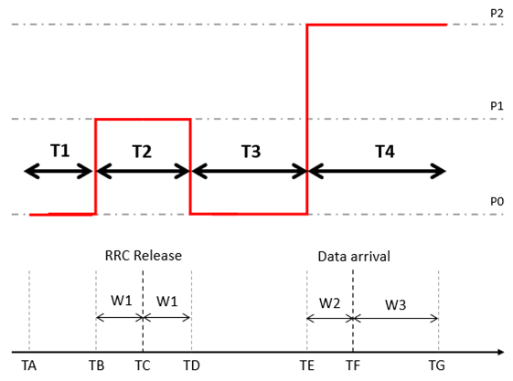
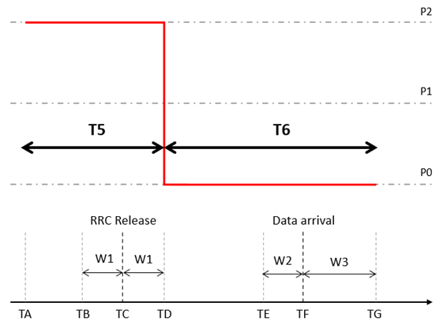
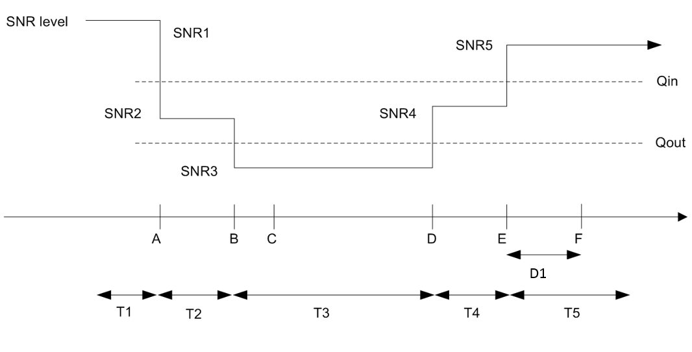
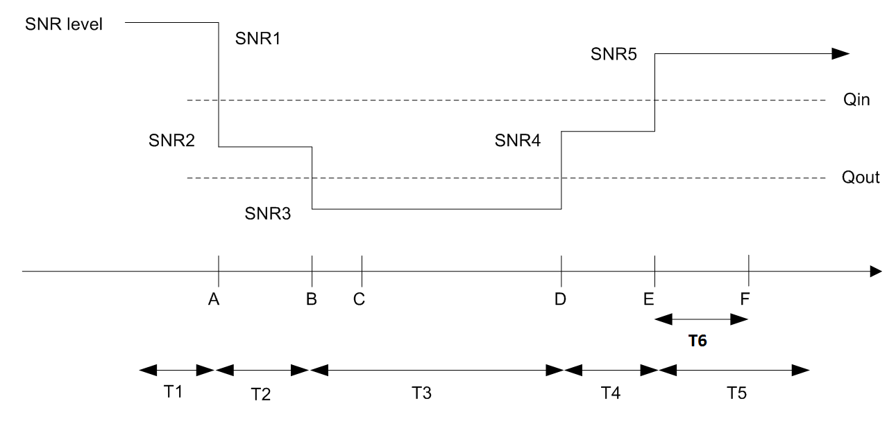
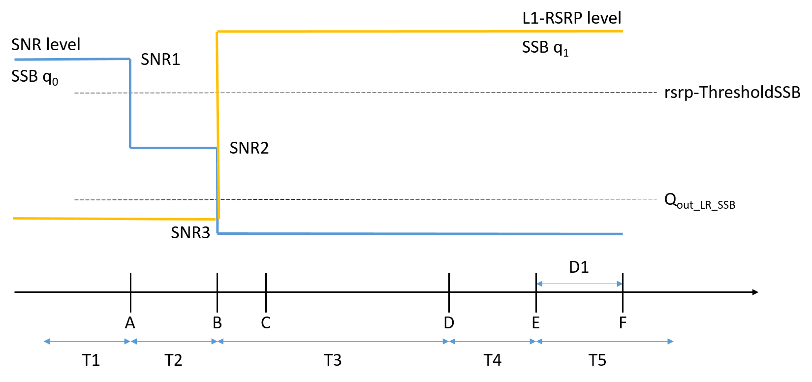

# A.16 NR standalone tests with all NR cells in FR1 for RedCap
## A.16.1 SA: RRC_IDLE state mobility for RedCap
### A.16.1.1 Cell re-selection to NR
#### A.16.1.1.1 Cell re-selection to FR1 intra-frequency NR case for 1 Rx UE
##### A.16.1.1.1.1 Test Purpose and Environment
This test is to verify the requirement for the intra-frequencyintra-frequency NR cell re-selection requirements specified in clause 4.2B.2.3.
##### A.16.1.1.1.2 Test Parameters
The test scenario comprises of 1 NR carrier and 2 cells as given in tables A.16.1.1.1.2-1, A.16.1.1.1.2-2 and A.16.1.1.1.2-3. The test consists of three successive time periods, with time duration of T1, T2, and T3 respectively. Only Cell 1 is already identified by the UE prior to the start of the test. Cell 1 and Cell 2 belong to different tracking areas. Furthermore, UE has not registered with network for the tracking area containing Cell 2.
Table A.16.1.1.1.2-1: Supported test configurations
| Configuration | Description |
| --- | --- |
| 1 | 15 kHz SSB SCS, 10 MHz bandwidth, FDD duplex mode |
| 2 | 15 kHz SSB SCS, 10 MHz bandwidth, TDD duplex mode |
| 3 | 30 kHz SSB SCS, 20 MHz bandwidth, TDD duplex mode |
| 4 | 15 kHz SSB SCS, 10 MHz bandwidth, HD-FDD duplex mode |
| NOTE: The UE is only required to be tested in one of the supported test configurations. |  |

Table A.16.1.1.1.2-2: General test parameters for intra-frequencyintra-frequency NR cell re-selection test case for 1 Rx UE
| Parameter | Unit | Test configuration | Value | Comment |  |
| --- | --- | --- | --- | --- | --- |
|  |  |  |  |  |  |
| Initial condition | Active cell |  | 1, 2, 3, 4 | Cell 1 |  |
| T2 end condition | Active cell |  | 1, 2, 3, 4 | Cell 2 |  |
|  | Neighbour cells |  | 1, 2, 3, 4 | Cell 1 |  |
| Final condition | Active cell |  | 1, 2, 3, 4 | Cell 1 |  |
|  | Neighbour cells |  | 1, 2, 3, 4 | Cell 2 |  |
| RF Channel Number |  | 1, 2, 3, 4 | 1 |  |  |
| Time offset between cells |  | 1, 4 | 3 ms | Asynchronous cells |  |
|  |  | 2 | 3 s | Synchronous cells |  |
|  |  | 3 | 3 s | Synchronous cells |  |
| Access Barring Information | - | 1, 2, 3, 4 | Not Sent | No additional delays in random access procedure. |  |
| SSB configuration |  | 1, 4 | SSB.1 FR1 |  |  |
|  |  | 2 | SSB.1 FR1 |  |  |
|  |  | 3 | SSB.1 RedCap FR1 |  |  |
| SMTC configuration |  | 1, 4 | SMTC.2 | Configured in SIB2 of Cell 1 |  |
|  |  |  | SMTC.6 | Configured in SIB2 of Cell 2 |  |
|  |  | 2 | SMTC.1 |  |  |
|  |  | 3 | SMTC.1 |  |  |
| DRX cycle length | s | 1, 2, 3, 4 | 1.28 | The value shall be used for all cells in the test. |  |
| PRACH configuration index |  | 1, 2, 3, 4 | 102 | The detailed configuration is specified in TS 38.211 clause 6.3.3.2 |  |
| rangeToBestCell |  | 1, 2, 3, 4 | Not configured |  |  |
| T1 | s | 1, 2, 3, 4 | >7 | During T1, Cell 2 shall be powered off, and during the off time the physical cell identity shall be changed, The intention is to ensure that Cell 2 has not been detected by the UE prior to the start of period T2 |  |
| T2 | s | 1, 2, 3, 4 | 40 | T2 needs to be defined so that cell re-selection reaction time is taken into account. |  |
| T3 | s | 1, 2, 3, 4 | 15 | T3 needs to be defined so that cell re-selection reaction time is taken into account. |  |

Table A.16.1.1.1.2-3: Cell specific test parameters for intra-frequency NR cell re-selection test case in AWGN for 1 Rx UE
| Parameter | Unit | Test configuration | Cell 1 | Cell 2 |  |  |  |  |
| --- | --- | --- | --- | --- | --- | --- | --- | --- |
|  |  |  | T1 | T2 | T3 | T1 | T2 | T3 |
| TDD configuration |  | 1, 4 | N/A | N/A |  |  |  |  |
|  |  | 2 | TDDConf.1.1 | TDDConf.1.1 |  |  |  |  |
|  |  | 3 | TDDConf.2.1 | TDDConf.2.1 |  |  |  |  |
| PDSCH RMC |  | 1, 4 | SR.1.1 FDD | SR.1.1 FDD |  |  |  |  |
| configuration |  | 2 | SR.1.1 TDD | SR.1.1 TDD |  |  |  |  |
|  |  | 3 | SR.2.1 TDD | SR.2.1 TDD |  |  |  |  |
| RMSI CORESET |  | 1, , 4 | CR.1.1 FDD | CR.1.1 FDD |  |  |  |  |
| RMC configuration |  | 2 | CR.1.1 TDD | CR.1.1 TDD |  |  |  |  |
|  |  | 3 | CR.2.1 TDD | CR.2.1 TDD |  |  |  |  |
| Dedicated CORESET |  | 1, 4 | CCR.1.1 FDD | CCR.1.1 FDD |  |  |  |  |
| RMC configuration |  | 2 | CCR.1.1 TDD | CCR.1.1 TDD |  |  |  |  |
|  |  | 3 | CCR.2.1 TDD | CCR.2.1 TDD |  |  |  |  |
| OCNG Pattern |  | 1, 2, 3, 4 | OP.1 | OP.1 |  |  |  |  |
| Initial DL BWP configuration |  | 1, 2, 3, 4 | DLBWP.0.1 | DLBWP.0.1 |  |  |  |  |
| Initial UL BWP configuration |  | 1, 2, 3, 4 | ULBWP.0.1 | ULBWP.0.1 |  |  |  |  |
| RLM-RS |  | 1, 2, 3, 4 | SSB | SSB |  |  |  |  |
| Qrxlevmin | dBm/SCS | 1, 2, 4 | -130 | -130 |  |  |  |  |
|  |  | 3 | -127 | -127 |  |  |  |  |
| Pcompensation | dB | 1, 2, 3, 4 | 0 | 0 |  |  |  |  |
| Qhysts | dB | 1, 2, 3, 4 | 0 | 0 |  |  |  |  |
| Qoffsets, n | dB | 1, 2, 3, 4 | 0 | 0 |  |  |  |  |
| Cell_selection_and_ re-selection_quality_measurement |  | 1, 2, 3, 4 | SS-RSRP | SS-RSRP |  |  |  |  |
|  | dB | 1, 4 | 16 | -3.11 | 2.79 | -infinity | 2.79 | -3.11 |
|  |  | 2 |  |  |  |  |  |  |
|  |  | 3 |  |  |  |  |  |  |
|  Note2 | dBm/SCS | 1, 4 | -98 |  |  |  |  |  |
|  |  | 2 | -98 |  |  |  |  |  |
|  |  | 3 | -95 |  |  |  |  |  |
|  Note2 | dBm/15 kHz | 1, 4 | -98 |  |  |  |  |  |
|  |  | 2 |  |  |  |  |  |  |
|  |  | 3 |  |  |  |  |  |  |
|  | dB | 1, 4 | 16 | 13 | 16 | -infinity | 16 | 13 |
|  |  | 2 |  |  |  |  |  |  |
|  |  | 3 |  |  |  |  |  |  |
| SS-RSRP Note3 | dBm/SCS | 1, 4 | -82 | -85 | -82 | -infinity | -82 | -85 |
|  |  | 2 | -82 | -85 | -82 | -infinity | -82 | -85 |
|  |  | 3 | -79 | -82 | -79 | -infinity | -79 | -82 |
| Io | dBm/9.36 MHz | 1, 4 | -53.94 | -52.21 | -52.21 | Same as parameters specified in Cell 1 columns- |  |  |
|  | dBm/9.36 MHz | 2 | -53.94 | -52.21 | -52.21 |  |  |  |
|  | dBm/18.36 MHz | 3 | -51.02 | -49.30 | -49.30 |  |  |  |
| Tre-selection | s | 1, 2, 3, 4 | 0 | 0 | 0 | 0 | 0 | 0 |
| SintrasearchP | dB | 1, 2, 3, 4 | 60 | 60 |  |  |  |  |
| Propagation Condition |  | 1, 2, 3, 4 | AWGN |  |  |  |  |  |
| Antenna Configuration |  |  | 1x1 |  |  |  |  |  |
| NOTE 1: OCNG shall be used such that both cells are fully allocated and a constant total transmitted power spectral density is achieved for all OFDM symbols. NOTE 2: Interference from other cells and noise sources not specified in the test is assumed to be constant over subcarriers and time and shall be modelled as AWGN of appropriate power for  to be fulfilled. NOTE 3: SS-RSRP levels have been derived from other parameters for information purposes. They are not settable parameters themselves. |  |  |  |  |  |  |  |  |

##### A.16.1.1.1.3 Test Requirements
The cell re-selection delay to a newly detectable cell is defined as the time from the beginning of time period T2, to the moment when the UE camps on Cell 2, and starts to send preambles on the PRACH for sending the RRCSetupRequest message to perform a registration procedure for mobility and periodic registration update on Cell 2.
The cell re-selection delay to a newly detectable cell shall be less than 34 s.
The cell re-selection delay to an already detected cell is defined as the time from the beginning of time period T3, to the moment when the UE camps on Cell 1, and starts to send preambles on the PRACH for sending the RRCSetupRequest message to perform a registration procedure for mobility and periodic registration update on Cell 1.
The cell re-selection delay to an already detected cell shall be less than 8 s.
The rate of correct cell re-selections observed during repeated tests shall be at least 90 %.
NOTE: The cell re-selection delay to a newly detectable cell can be expressed as: Tdetect,NR_Intra_RedCap + TSI-NR, and to an already detected cell can be expressed as: Tevaluate,NR_Intra_RedCap + TSI-NR,
Where:
Tdetect,NR_Intra_RedCap See table 4.2B.2.3-1 in clause 4.2B.2.3
Tevaluate,NR_Intra_RedCap See table 4.2B.2.3-1 in clause 4.2B.2.3
TSI-NR Maximum repetition period of relevant system info blocks that needs to be received by the UE to camp on a cell; 1280ms is assumed in this test case.
This gives a total of 33.28 s, allow 34 s for the cell re-selection delay to a newly detectable cell and 7.68 s for the cell re-selection delay to an already detected cell in the test case, which we allow 8 s.
#### A.16.1.1.2 Cell re-selection to FR1 intra-frequency NR case for 2 Rx UE
##### A.16.1.1.2.1 Test Purpose and Environment
This test is to verify the requirement for the intra-frequency NR cell re-selection requirements specified in clause 4.2B.2.3.
##### A.16.1.1.2.2 Test Parameters
The test scenario comprises of 1 NR carrier and 2 cells as given in tables A.16.1.1.2.2-1, A.16.1.1.2.2-2 and A.16.1.1.2.2-3. The test consists of three successive time periods, with time duration of T1, T2, and T3 respectively. Only Cell 1 is already identified by the UE prior to the start of the test. Cell 1 and Cell 2 belong to different tracking areas. Furthermore, UE has not registered with network for the tracking area containing Cell 2.
Table A.16.1.1.2.2-1: Supported test configurations
| Configuration | Description |
| --- | --- |
| 1 | 15 kHz SSB SCS, 10 MHz bandwidth, FDD duplex mode |
| 2 | 15 kHz SSB SCS, 10 MHz bandwidth, TDD duplex mode |
| 3 | 30 kHz SSB SCS, 20 MHz bandwidth, TDD duplex mode |
| 4 | 15 kHz SSB SCS, 10 MHz bandwidth, HD-FDD duplex mode |
| NOTE: The UE is only required to be tested in one of the supported test configurations. |  |

Table A.16.1.1.2.2-2: General test parameters for intra-frequency NR cell re-selection test case for 2 Rx UE
| Parameter | Unit | Test configuration | Value | Comment |  |
| --- | --- | --- | --- | --- | --- |
|  |  |  |  |  |  |
| Initial condition | Active cell |  | 1, 2, 3, 4 | Cell 1 |  |
| T2 end condition | Active cell |  | 1, 2, 3, 4 | Cell 2 |  |
|  | Neighbour cells |  | 1, 2, 3, 4 | Cell 1 |  |
| Final condition | Active cell |  | 1, 2, 3, 4 | Cell 1 |  |
|  | Neighbour cells |  | 1, 2, 3, 4 | Cell 2 |  |
| RF Channel Number |  | 1, 2, 3, 4 | 1 |  |  |
| Time offset between cells |  | 1, 4 | 3 ms | Asynchronous cells |  |
|  |  | 2 | 3 s | Synchronous cells |  |
|  |  | 3 | 3 s | Synchronous cells |  |
| Access Barring Information | - | 1, 2, 3, 4 | Not Sent | No additional delays in random access procedure. |  |
| SSB configuration |  | 1, 4 | SSB.1 FR1 |  |  |
|  |  | 2 | SSB.1 FR1 |  |  |
|  |  | 3 | SSB.1 RedCap FR1 |  |  |
| SMTC configuration |  | 1, 4 | SMTC.2 | Configured in SIB2 of Cell 1 |  |
|  |  |  | SMTC.6 | Configured in SIB2 of Cell 2 |  |
|  |  | 2 | SMTC.1 |  |  |
|  |  | 3 | SMTC.1 |  |  |
| DRX cycle length | s | 1, 2, 3, 4 | 1.28 | The value shall be used for all cells in the test. |  |
| PRACH configuration index |  | 1, 2, 3, 4 | 102 | The detailed configuration is specified in TS 38.211 clause 6.3.3.2 |  |
| rangeToBestCell |  | 1, 2, 3, 4 | Not configured |  |  |
| T1 | s | 1, 2, 3, 4 | >7 | During T1, Cell 2 shall be powered off, and during the off time the physical cell identity shall be changed, The intention is to ensure that Cell 2 has not been detected by the UE prior to the start of period T2 |  |
| T2 | s | 1, 2, 3, 4 | 40 | T2 needs to be defined so that cell re-selection reaction time is taken into account. |  |
| T3 | s | 1, 2, 3, 4 | 15 | T3 needs to be defined so that cell re-selection reaction time is taken into account. |  |

Table A.16.1.1.2.2-3: Cell specific test parameters for intra-frequency NR cell re-selection test case in AWGN for 2 Rx UE
| Parameter | Unit | Test configuration | Cell 1 | Cell 2 |  |  |  |  |
| --- | --- | --- | --- | --- | --- | --- | --- | --- |
|  |  |  | T1 | T2 | T3 | T1 | T2 | T3 |
| TDD configuration |  | 1, 4 | N/A | N/A |  |  |  |  |
|  |  | 2 | TDDConf.1.1 | TDDConf.1.1 |  |  |  |  |
|  |  | 3 | TDDConf.2.1 | TDDConf.2.1 |  |  |  |  |
| PDSCH RMC |  | 1, 4 | SR.1.1 FDD | SR.1.1 FDD |  |  |  |  |
| configuration |  | 2 | SR.1.1 TDD | SR.1.1 TDD |  |  |  |  |
|  |  | 3 | SR.2.1 TDD | SR.2.1 TDD |  |  |  |  |
| RMSI CORESET |  | 1, 4 | CR.1.1 FDD | CR.1.1 FDD |  |  |  |  |
| RMC configuration |  | 2 | CR.1.1 TDD | CR.1.1 TDD |  |  |  |  |
|  |  | 3 | CR.2.1 TDD | CR.2.1 TDD |  |  |  |  |
| Dedicated CORESET |  | 1, 4 | CCR.1.1 FDD | CCR.1.1 FDD |  |  |  |  |
| RMC configuration |  | 2 | CCR.1.1 TDD | CCR.1.1 TDD |  |  |  |  |
|  |  | 3 | CCR.2.1 TDD | CCR.2.1 TDD |  |  |  |  |
| OCNG Pattern |  | 1, 2, 3, 4 | OP.1 | OP.1 |  |  |  |  |
| Initial DL BWP configuration |  | 1, 2, 3, 4 | DLBWP.0.1 | DLBWP.0.1 |  |  |  |  |
| Initial UL BWP configuration |  | 1, 2, 3, 4 | ULBWP.0.1 | ULBWP.0.1 |  |  |  |  |
| RLM-RS |  | 1, 2, 3, 4 | SSB | SSB |  |  |  |  |
| Qrxlevmin | dBm/SCS | 1, 2, 4 | -130 | -130 |  |  |  |  |
|  |  | 3 | -127 | -127 |  |  |  |  |
| Pcompensation | dB | 1, 2, 3, 4 | 0 | 0 |  |  |  |  |
| Qhysts | dB | 1, 2, 3 | 0 | 0 |  |  |  |  |
| Qoffsets, n | dB | 1, 2, 3, 4 | 0 | 0 |  |  |  |  |
| Cell_selection_and_ re-selection_quality_measurement |  | 1, 2, 3, 4 | SS-RSRP | SS-RSRP |  |  |  |  |
|  | dB | 1, 4 | 16 | -3.11 | 2.79 | -infinity | 2.79 | -3.11 |
|  |  | 2 |  |  |  |  |  |  |
|  |  | 3 |  |  |  |  |  |  |
|  Note2 | dBm/SCS | 1, 4 | -98 |  |  |  |  |  |
|  |  | 2 | -98 |  |  |  |  |  |
|  |  | 3 | -95 |  |  |  |  |  |
|  Note2 | dBm/15 kHz | 1, 4 | -98 |  |  |  |  |  |
|  |  | 2 |  |  |  |  |  |  |
|  |  | 3 |  |  |  |  |  |  |
|  | dB | 1, 4 | 16 | 13 | 16 | -infinity | 16 | 13 |
|  |  | 2 |  |  |  |  |  |  |
|  |  | 3 |  |  |  |  |  |  |
| SS-RSRP Note3 | dBm/SCS | 1, 4 | -82 | -85 | -82 | -infinity | -82 | -85 |
|  |  | 2 | -82 | -85 | -82 | -infinity | -82 | -85 |
|  |  | 3 | -79 | -82 | -79 | -infinity | -79 | -82 |
| Io | dBm/9.36 MHz | 1, 4 | -53.94 | -52.21 | -52.21 | Same as parameters specified in Cell 1 columns- |  |  |
|  | dBm/9.36 MHz | 2 | -53.94 | -52.21 | -52.21 |  |  |  |
|  | dBm/18.36 MHz | 3 | -51.01 | -49.30 | -49.30 |  |  |  |
| Tre-selection | s | 1, 2, 3, 4 | 0 | 0 | 0 | 0 | 0 | 0 |
| SintrasearchP | dB | 1, 2, 3, 4 | 60 | 60 |  |  |  |  |
| Propagation Condition |  | 1, 2, 3, 4 | AWGN |  |  |  |  |  |
| Antenna Configuration |  |  | 1x2 |  |  |  |  |  |
| NOTE 1: OCNG shall be used such that both cells are fully allocated and a constant total transmitted power spectral density is achieved for all OFDM symbols. NOTE 2: Interference from other cells and noise sources not specified in the test is assumed to be constant over subcarriers and time and shall be modelled as AWGN of appropriate power for  to be fulfilled. NOTE 3: SS-RSRP levels have been derived from other parameters for information purposes. They are not settable parameters themselves. |  |  |  |  |  |  |  |  |

##### A.16.1.1.2.3 Test Requirements
The cell re-selection delay to a newly detectable cell is defined as the time from the beginning of time period T2, to the moment when the UE camps on Cell 2, and starts to send preambles on the PRACH for sending the RRCSetupRequest message to perform a registration procedure for mobility and periodic registration update on Cell 2.
The cell re-selection delay to a newly detectable cell shall be less than 34 s.
The cell re-selection delay to an already detected cell is defined as the time from the beginning of time period T3, to the moment when the UE camps on Cell 1, and starts to send preambles on the PRACH for sending the RRCSetupRequest message to perform a registration procedure for mobility and periodic registration update on Cell 1.
The cell re-selection delay to an already detected cell shall be less than 8 s.
The rate of correct cell re-selections observed during repeated tests shall be at least 90 %.
NOTE: The cell re-selection delay to a newly detectable cell can be expressed as: Tdetect, NR_Intra + TSI-NR, and to an already detected cell can be expressed as: Tevaluate, NR_ intra + TSI-NR,
Where:
Tdetect, NR_Intra See table 4.2.2.3-1 in clause 4.2.2.3
Tevaluate, NR_ intra See table 4.2.2.3-1 in clause 4.2.2.3
TSI-NR Maximum repetition period of relevant system info blocks that needs to be received by the UE to camp on a cell; 1280 ms is assumed in this test case.
This gives a total of 33.28 s, allow 34 s for the cell re-selection delay to a newly detectable cell and 7.68 s for the cell re-selection delay to an already detected cell in the test case, which we allow 8 s.
#### A.16.1.1.3 Cell re-selection to FR1 inter-frequency NR case for 1 Rx UE
##### A.16.1.1.3.1 Test Purpose and Environment
This test is to verify the requirement for the inter-frequency NR cell re-selection requirements specified in clause 4.2B.2.4.
##### A.16.1.1.3.2 Test Parameters
The test scenario comprises of 2 cells on 2 different NR carriers respectively as given in tables A.16.1.1.3.2-1, A.16.1.1.3.2-2 and A.16.1.1.3.2-3. The test consists of three successive time periods, with time duration of T1, T2, and T3 respectively. Both Cell 1 and Cell 2 are already identified by the UE prior to the start of the test. Cell 1 and Cell 2 belong to different tracking areas and Cell 2 is of higher priority than Cell 1.
Table A.16.1.1.3.2-1: Supported test configurations
| Configuration | Description of serving cell | Description of target cell |
| --- | --- | --- |
| 1 | 15 kHz SSB SCS, 10 MHz bandwidth, FDD duplex mode | 15 kHz SSB SCS, 10 MHz bandwidth, FDD duplex mode |
| 2 | 15 kHz SSB SCS, 10 MHz bandwidth, TDD duplex mode | 15 kHz SSB SCS, 10 MHz bandwidth, TDD duplex mode |
| 3 | 30 kHz SSB SCS, 20 MHz bandwidth, TDD duplex mode | 30 kHz SSB SCS, 20 MHz bandwidth, TDD duplex mode |
| 4 | 15 kHz SSB SCS, 10 MHz bandwidth, HD-FDD duplex mode | 15 kHz SSB SCS, 10 MHz bandwidth, HD-FDD duplex mode |
| NOTE: The UE is only required to be tested in one of the supported test configurations. |  |  |

Table A.16.1.1.3.2-2: General test parameters for FR1 inter-frequency NR cell re-selection test case for 1 Rx UE
| Parameter | Unit | Test configuration | Value | Comment |  |
| --- | --- | --- | --- | --- | --- |
| Initial condition | Active cell |  | 1, 2, 3, 4 | Cell 2 | The UE camps on Cell 2 in the initial phase and during T1 period the UE reselects to Cell 1 |
|  | Neighbour cell |  | 1, 2, 3, 4 | Cell 1 |  |
| T1 end condition | Active cell |  | 1, 2, 3, 4 | Cell 1 | The UE shall perform re-selection to Cell 1 during T1 |
|  | Neighbour cells |  | 1, 2, 3, 4 | Cell 2 |  |
| T3 end condition | Active cell |  | 1, 2, 3, 4 | Cell 2 | The UE shall perform re-selection to Cell 2 with higher priority during T3 |
|  | Neighbour cell |  | 1, 2, 3, 4 | Cell 1 |  |
| RF Channel Number |  | 1, 2, 3, 4 | 1, 2 |  |  |
| Time offset between cells |  | 1, 4 | 3 ms | Asynchronous cells |  |
|  |  | 2 | 3 s | Synchronous cells |  |
|  |  | 3 | 3 s | Synchronous cells |  |
| Access Barring Information | - | 1, 2, 3, 4 | Not Sent | No additional delays in random access procedure. |  |
| SSB configuration |  | 1, 4 | SSB.1 FR1 |  |  |
|  |  | 2 | SSB.1 FR1 |  |  |
|  |  | 3 | SSB.1 RedCap FR1 |  |  |
| SMTC configuration |  | 1, 4 | SMTC.2 | Configured in SIB4 of Cell 1 |  |
|  |  |  | SMTC.6 | Configured in SIB4 of Cell 2 |  |
|  |  | 2 | SMTC.1 |  |  |
|  |  | 3 | SMTC.1 |  |  |
| DRX cycle length | s | 1, 2, 3, 4 | 1.28 | The value shall be used for all cells in the test. |  |
| PRACH configuration index |  | 1, 2, 3, 4 | 102 | The detailed configuration is specified in TS 38.211 clause 6.3.3.2 |  |
| rangeToBestCell |  | 1, 2, 3, 4 | Not configured |  |  |
| T1 | s | 1, 2, 3, 4 | 15 | T1 needs to be defined so that cell re-selection reaction time is taken into account. |  |
| T2 | s | 1, 2, 3, 4 | >7 | During T2, Cell 2 shall be powered off, and during the off time the physical cell identity shall be changed. The intention is to ensure that Cell 2 has not been detected by the UE prior to the start of period T3. |  |
| T3 | s | 1, 2, 3, 4 | 75 | T3 needs to be defined so that cell re-selection reaction time is taken into account. |  |

Table A.16.1.1.3.2-3: Cell specific test parameters for FR1 inter-frequency NR cell re-selection test case in AWGN for 1 Rx UE
| Parameter | Unit | Test configuration | Cell 1 | Cell 2 |  |  |  |  |
| --- | --- | --- | --- | --- | --- | --- | --- | --- |
|  |  |  | T1 | T2 | T3 | T1 | T2 | T3 |
| TDD configuration |  | 1, 4 | N/A | N/A |  |  |  |  |
|  |  | 2 | TDDConf.1.1 | TDDConf.1.1 |  |  |  |  |
|  |  | 3 | TDDConf.2.1 | TDDConf.2.1 |  |  |  |  |
| PDSCH RMC |  | 1, 4 | SR.1.1 FDD | SR.1.1 FDD |  |  |  |  |
| configuration |  | 2 | SR.1.1 TDD | SR.1.1 TDD |  |  |  |  |
|  |  | 3 | SR.2.1 TDD | SR.2.1 TDD |  |  |  |  |
| RMSI CORESET |  | 1, 4 | CR.1.1 FDD | CR.1.1 FDD |  |  |  |  |
| RMC configuration |  | 2 | CR.1.1 TDD | CR.1.1 TDD |  |  |  |  |
|  |  | 3 | CR.2.1 TDD | CR.2.1 TDD |  |  |  |  |
| Dedicated CORESET |  | 1, 4 | CCR.1.1 FDD | CCR.1.1 FDD |  |  |  |  |
| RMC configuration |  | 2 | CCR.1.1 TDD | CCR.1.1 TDD |  |  |  |  |
|  |  | 3 | CCR.2.1 TDD | CCR.2.1 TDD |  |  |  |  |
| OCNG Pattern |  | 1, 2, 3, 4 | OP.1 | OP.1 |  |  |  |  |
| Initial DL BWP configuration |  | 1, 2, 3, 4 | DLBWP.0.1 | DLBWP.0.1 |  |  |  |  |
| Initial UL BWP configuration |  | 1, 2, 3, 4 | ULBWP.0.1 | ULBWP.0.1 |  |  |  |  |
| RLM-RS |  | 1, 2, 3, 4 | SSB | SSB |  |  |  |  |
| Qrxlevmin | dBm/SCS | 1, 2, 4 | -140 | -140 |  |  |  |  |
|  |  | 3 | -137 | -137 |  |  |  |  |
| Pcompensation | dB | 1, 2, 3, 4 | 0 | 0 |  |  |  |  |
| Cell_selection_and_ re-selection_quality_measurement |  | 1, 2, 3, 4 | SS-RSRP | SS-RSRP |  |  |  |  |
|  | dB | 1, 4 | 14 | 14 | 14 | -4 | -infinity | 12 |
|  |  | 2 |  |  |  |  |  |  |
|  |  | 3 |  |  |  |  |  |  |
|  Note2 | dBm/SCS | 1, 4 | -98 |  |  |  |  |  |
|  |  | 2 | -98 |  |  |  |  |  |
|  |  | 3 | -95 |  |  |  |  |  |
|  Note2 | dBm/15 kHz | 1, 4 | -98 |  |  |  |  |  |
|  |  | 2 |  |  |  |  |  |  |
|  |  | 3 |  |  |  |  |  |  |
|  | dB | 1, 4 | 14 | 14 | 14 | -4 | -infinity | 12 |
|  |  | 2 |  |  |  |  |  |  |
|  |  | 3 |  |  |  |  |  |  |
| SS-RSRP Note3 | dBm/SCS | 1, 4 | -84 | -84 | -84 | -102 | -infinity | -86 |
|  |  | 2 | -84 | -84 | -84 | -102 | -infinity | -86 |
|  |  | 3 | -81 | -81 | -81 | -99 | -infinity | -83 |
| Io | dBm/9.36 MHz | 1, 4 | -55.88 | -55.88 | -55.88 | -68.60 | -70.05 | -57.78 |
|  | dBm/9.36 MHz | 2 | -55.88 | -55.88 | -55.88 | -68.60 | -70.05 | -57.78 |
|  | dBm/18.36 MHz | 3 | -52.95 | -52.95 | -52.95 | -65.67 | -67.13 | -54.86 |
| Tre-selection | s | 1, 2, 3, 4 | 0 | 0 | 0 | 0 | 0 | 0 |
| SnonintrasearchP | dB | 1, 2, 3, 4 | 50 | 50 |  |  |  |  |
| Threshx, highP | dB | 1, 2, 3, 4 | 48 | 48 |  |  |  |  |
| Threshserving, lowP | dB | 1, 2, 3, 4 | 44 | 44 |  |  |  |  |
| Threshx, lowP | dB | 1, 2, 3, 4 | 50 | 50 |  |  |  |  |
| Propagation Condition |  | 1, 2, 3, 4 | AWGN |  |  |  |  |  |
| Antenna Configuration |  |  | 1x1 |  |  |  |  |  |
| NOTE 1: OCNG shall be used such that both cells are fully allocated and a constant total transmitted power spectral density is achieved for all OFDM symbols. NOTE 2: Interference from other cells and noise sources not specified in the test is assumed to be constant over subcarriers and time and shall be modelled as AWGN of appropriate power for  to be fulfilled. NOTE 3: SS-RSRP levels have been derived from other parameters for information purposes. They are not settable parameters themselves. |  |  |  |  |  |  |  |  |

##### A.16.1.1.3.3 Test Requirements
The cell re-selection delay to a higher priority cell is defined as the time from the beginning of time period T3, to the moment when the UE camps again on Cell 2, and starts to send preambles on the PRACH for sending the RRCSetupRequest message to perform a registration procedure for mobility and periodic registration update on Cell 2.
The cell re-selection delay to a higher priority cell shall be less than 68 s.
The cell re-selection delay to a lower priority cell is defined as the time from the beginning of time period T1, to the moment when the UE camps on Cell 1, and starts to send preambles on the PRACH for sending the RRCSetupRequest message to perform a registration procedure for mobility and periodic registration update on Cell 1.
The cell re-selection delay to a lower priority cell shall be less than 8 s.
The rate of correct cell re-selections observed during repeated tests shall be at least 90 %.
NOTE: The cell re-selection delay to a higher priority cell can be expressed as: Thigher_priority_search + Tevaluate,NR_Inter_RedCap + TSI-NR, and to a lower priority cell can be expressed as: Tevaluate,NR_Inter_RedCap + TSI-NR,
Where:
Thigher_priority_search See clause 4.2B.2.7
Tevaluate,NR_Inter_RedCap See table 4.2B.2.4-1 in clause 4.2B.2.4
TSI-NR Maximum repetition period of relevant system info blocks that needs to be received by the UE to camp on a cell; 1280 ms is assumed in this test case.
This gives a total of 67.68 s, allow 68 s for the cell re-selection delay to a higher priority cell and 7.68 s for the cell re-selection delay to a lower priority cell in the test case, which we allow 8 s.
#### A.16.1.1.4 Cell re-selection to FR1 inter-frequency NR case for 2 Rx UE
##### A.16.1.1.4.1 Test Purpose and Environment
This test is to verify the requirement for the inter-frequency NR cell re-selection requirements specified in clause 4.2B.2.4.
##### A.16.1.1.4.2 Test Parameters
The test scenario comprises of 2 cells on 2 different NR carriers respectively as given in tables A.16.1.1.4.2-1, A.16.1.1.4.2-2 and A.16.1.1.4.2-3. The test consists of three successive time periods, with time duration of T1, T2, and T3 respectively. Both Cell 1 and Cell 2 are already identified by the UE prior to the start of the test. Cell 1 and Cell 2 belong to different tracking areas and Cell 2 is of higher priority than Cell 1.
Table A.16.1.1.4.2-1: Supported test configurations
| Configuration | Description of serving cell | Description of target cell |
| --- | --- | --- |
| 1 | 15 kHz SSB SCS, 10 MHz bandwidth, FDD duplex mode | 15 kHz SSB SCS, 10 MHz bandwidth, FDD duplex mode |
| 2 | 15 kHz SSB SCS, 10 MHz bandwidth, TDD duplex mode | 15 kHz SSB SCS, 10 MHz bandwidth, TDD duplex mode |
| 3 | 30 kHz SSB SCS, 20 MHz bandwidth, TDD duplex mode | 30 kHz SSB SCS, 20 MHz bandwidth, TDD duplex mode |
| 4 | 15 kHz SSB SCS, 10 MHz bandwidth, HD-FDD duplex mode | 15 kHz SSB SCS, 10 MHz bandwidth, HD-FDD duplex mode |
| NOTE: The UE is only required to be tested in one of the supported test configurations. |  |  |

Table A.16.1.1.4.2-2: General test parameters for FR1 inter-frequency NR cell re-selection test case for 2 Rx UE
| Parameter | Unit | Test configuration | Value | Comment |  |
| --- | --- | --- | --- | --- | --- |
| Initial condition | Active cell |  | 1, 2, 3, 4 | Cell 2 | The UE camps on Cell 2 in the initial phase and during T1 period the UE reselects to Cell 1 |
|  | Neighbour cell |  | 1, 2, 3, 4 | Cell 1 |  |
| T1 end condition | Active cell |  | 1, 2, 3, 4 | Cell 1 | The UE shall perform re-selection to Cell 1 during T1 |
|  | Neighbour cells |  | 1, 2, 3, 4 | Cell 2 |  |
| T3 end condition | Active cell |  | 1, 2, 3, 4 | Cell 2 | The UE shall perform re-selection to Cell 2 with higher priority during T3 |
|  | Neighbour cell |  | 1, 2, 3, 4 | Cell 1 |  |
| RF Channel Number |  | 1, 2, 3, 4 | 1, 2 |  |  |
| Time offset between cells |  | 1, 4 | 3 ms | Asynchronous cells |  |
|  |  | 2 | 3 s | Synchronous cells |  |
|  |  | 3 | 3 s | Synchronous cells |  |
| Access Barring Information | - | 1, 2, 3, 4 | Not Sent | No additional delays in random access procedure. |  |
| SSB configuration |  | 1, 4 | SSB.1 FR1 |  |  |
|  |  | 2 | SSB.1 FR1 |  |  |
|  |  | 3 | SSB.1 RedCap FR1 |  |  |
| SMTC configuration |  | 1, 4 | SMTC.2 | Configured in SIB4 of Cell 1 |  |
|  |  |  | SMTC.6 | Configured in SIB4 of Cell 2 |  |
|  |  | 2 | SMTC.1 |  |  |
|  |  | 3 | SMTC.1 |  |  |
| DRX cycle length | s | 1, 2, 3, 4 | 1.28 | The value shall be used for all cells in the test. |  |
| PRACH configuration index |  | 1, 2, 3, 4 | 102 | The detailed configuration is specified in TS 38.211 clause 6.3.3.2 |  |
| rangeToBestCell |  | 1, 2, 3, 4 | Not configured |  |  |
| T1 | s | 1, 2, 3, 4 | 15 | T1 needs to be defined so that cell re-selection reaction time is taken into account. |  |
| T2 | s | 1, 2, 3, 4 | >7 | During T2, Cell 2 shall be powered off, and during the off time the physical cell identity shall be changed. The intention is to ensure that Cell 2 has not been detected by the UE prior to the start of period T3. |  |
| T3 | s | 1, 2, 3, 4 | 75 | T3 needs to be defined so that cell re-selection reaction time is taken into account. |  |

Table A.16.1.1.4.2-3: Cell specific test parameters for FR1 inter-frequency NR cell re-selection test case in AWGN for 2 Rx UE
| Parameter | Unit | Test configuration | Cell 1 | Cell 2 |  |  |  |  |
| --- | --- | --- | --- | --- | --- | --- | --- | --- |
|  |  |  | T1 | T2 | T3 | T1 | T2 | T3 |
| TDD configuration |  | 1, 4 | N/A | N/A |  |  |  |  |
|  |  | 2 | TDDConf.1.1 | TDDConf.1.1 |  |  |  |  |
|  |  | 3 | TDDConf.2.1 | TDDConf.2.1 |  |  |  |  |
| PDSCH RMC |  | 1, 4 | SR.1.1 FDD | SR.1.1 FDD |  |  |  |  |
| configuration |  | 2 | SR.1.1 TDD | SR.1.1 TDD |  |  |  |  |
|  |  | 3 | SR.2.1 TDD | SR.2.1 TDD |  |  |  |  |
| RMSI CORESET |  | 1, 4 | CR.1.1 FDD | CR.1.1 FDD |  |  |  |  |
| RMC configuration |  | 2 | CR.1.1 TDD | CR.1.1 TDD |  |  |  |  |
|  |  | 3 | CR.2.1 TDD | CR.2.1 TDD |  |  |  |  |
| Dedicated CORESET |  | 1, 4 | CCR.1.1 FDD | CCR.1.1 FDD |  |  |  |  |
| RMC configuration |  | 2 | CCR.1.1 TDD | CCR.1.1 TDD |  |  |  |  |
|  |  | 3 | CCR.2.1 TDD | CCR.2.1 TDD |  |  |  |  |
| OCNG Pattern |  | 1, 2, 3, 4 | OP.1 | OP.1 |  |  |  |  |
| Initial DL BWP configuration |  | 1, 2, 3, 4 | DLBWP.0.1 | DLBWP.0.1 |  |  |  |  |
| Initial UL BWP configuration |  | 1, 2, 3, 4 | ULBWP.0.1 | ULBWP.0.1 |  |  |  |  |
| RLM-RS |  | 1, 2, 3, 4 | SSB | SSB |  |  |  |  |
| Qrxlevmin | dBm/SCS | 1, 2, 4 | -140 | -140 |  |  |  |  |
|  |  | 3 | -137 | -137 |  |  |  |  |
| Pcompensation | dB | 1, 2, 3, 4 | 0 | 0 |  |  |  |  |
| Cell_selection_and_ re-selection_quality_measurement |  | 1, 2, 3, 4 | SS-RSRP | SS-RSRP |  |  |  |  |
|  | dB | 1, 4 | 14 | 14 | 14 | -4 | -infinity | 12 |
|  |  | 2 |  |  |  |  |  |  |
|  |  | 3 |  |  |  |  |  |  |
|  Note2 | dBm/SCS | 1, 4 | -98 |  |  |  |  |  |
|  |  | 2 | -98 |  |  |  |  |  |
|  |  | 3 | -95 |  |  |  |  |  |
|  Note2 | dBm/15 kHz | 1, 4 | -98 |  |  |  |  |  |
|  |  | 2 |  |  |  |  |  |  |
|  |  | 3 |  |  |  |  |  |  |
|  | dB | 1, 4 | 14 | 14 | 14 | -4 | -infinity | 12 |
|  |  | 2 |  |  |  |  |  |  |
|  |  | 3 |  |  |  |  |  |  |
| SS-RSRP Note3 | dBm/SCS | 1, 4 | -84 | -84 | -84 | -102 | -infinity | -86 |
|  |  | 2 | -84 | -84 | -84 | -102 | -infinity | -86 |
|  |  | 3 | -81 | -81 | -81 | -99 | -infinity | -83 |
| Io | dBm/9.36 MHz | 1, 4 | -55.88 | -55.88 | -55.88 | -68.60 | -70.05 | -57.78 |
|  | dBm/9.36 MHz | 2 | -55.88 | -55.88 | -55.88 | -68.60 | -70.05 | -57.78 |
|  | dBm/18.36 MHz | 3 | -52.95 | -52.95 | -52.95 | -65.67 | -67.12 | -54.85 |
| Tre-selection | s | 1, 2, 3, 4 | 0 | 0 | 0 | 0 | 0 | 0 |
| SnonintrasearchP | dB | 1, 2, 3, 4 | 50 | 50 |  |  |  |  |
| Threshx, highP | dB | 1, 2, 3, 4 | 48 | 48 |  |  |  |  |
| Threshserving, lowP | dB | 1, 2, 3, 4 | 44 | 44 |  |  |  |  |
| Threshx, lowP | dB | 1, 2, 3, 4 | 50 | 50 |  |  |  |  |
| Propagation Condition |  | 1, 2, 3, 4 | AWGN |  |  |  |  |  |
| Antenna Configuration |  |  | 1x2 |  |  |  |  |  |
| NOTE 1: OCNG shall be used such that both cells are fully allocated and a constant total transmitted power spectral density is achieved for all OFDM symbols. NOTE 2: Interference from other cells and noise sources not specified in the test is assumed to be constant over subcarriers and time and shall be modelled as AWGN of appropriate power for  to be fulfilled. NOTE 3: SS-RSRP levels have been derived from other parameters for information purposes. They are not settable parameters themselves. |  |  |  |  |  |  |  |  |

##### A.16.1.1.4.3 Test Requirements
The cell re-selection delay to a higher priority cell is defined as the time from the beginning of time period T3, to the moment when the UE camps again on Cell 2, and starts to send preambles on the PRACH for sending the RRCSetupRequest message to perform a registration procedure for mobility and periodic registration update on Cell 2.
The cell re-selection delay to a higher priority cell shall be less than 68 s.
The cell re-selection delay to a lower priority cell is defined as the time from the beginning of time period T1, to the moment when the UE camps on Cell 1, and starts to send preambles on the PRACH for sending the RRCSetupRequest message to perform a registration procedure for mobility and periodic registration update on Cell 1.
The cell re-selection delay to a lower priority cell shall be less than 8 s.
The rate of correct cell re-selections observed during repeated tests shall be at least 90 %.
NOTE: The cell re-selection delay to a higher priority cell can be expressed as: Thigher_priority_search + Tevaluate,NR_Inter_RedCap + TSI-NR, and to a lower priority cell can be expressed as: Tevaluate,NR_Inter_RedCap + TSI-NR,
Where:
Thigher_priority_search See clause 4.2B.2.7
Tevaluate,NR_Inter_RedCap See table 4.2B.2.4-1 in clause 4.2B.2.4
TSI-NR Maximum repetition period of relevant system info blocks that needs to be received by the UE to camp on a cell; 1280 ms is assumed in this test case.
This gives a total of 67.68 s, allow 68 s for the cell re-selection delay to a higher priority cell and 7.68 s for the cell re-selection delay to a lower priority cell in the test case, which we allow 8 s.
#### A.16.1.1.5 Cell re-selection to FR1 intra-frequency NR case for UE fulfilling stationary relaxed measurement criterion for 1 Rx UE
##### A.16.1.1.5.1 Test Purpose and Environment
This test is to verify the requirement for the intra-frequency NR cell re-selection requirements for UE fulfilling stationary relaxed measurement criterion specified in clause 4.2B.2.9.2.
##### A.16.1.1.5.2 Test Parameters
The test scenario comprises of 1 NR carrier and 2 cells as given in tables A.16.1.1.5.2-1, A.16.1.1.5.2-2 and A.16.1.1.5.2-3. The test consists of two successive time periods, with time duration of T1 and T2 respectively. Both Cell 1 and Cell 2 are already identified by the UE prior to the start of the test. Cell 1 and Cell 2 belong to different tracking areas. Furthermore, UE has not registered with network for the tracking area containing Cell 2.
Table A.16.1.1.5.2-1: Supported test configurations
| Configuration | Description |
| --- | --- |
| 1 | 15 kHz SSB SCS, 10 MHz bandwidth, FDD duplex mode |
| 2 | 15 kHz SSB SCS, 10 MHz bandwidth, TDD duplex mode |
| 3 | 30 kHz SSB SCS, 20 MHz bandwidth, TDD duplex mode |
| 4 | 15 kHz SSB SCS, 10 MHz bandwidth, HD-FDD duplex mode |
| NOTE: The UE is only required to be tested in one of the supported test configurations. |  |

Table A.16.1.1.5.2-2: General test parameters for FR1 intra-frequency NR cell re-selection test case for UE fulfilling stationary relaxed measurement criterion for 1 Rx UE
| Parameter | Unit | Test configuration | Value | Comment |  |
| --- | --- | --- | --- | --- | --- |
| Initial condition | Active cell |  | 1, 2, 3, 4 | Cell 1 | The UE camps on Cell 1 in the initial phase |
|  | Neighbour cells |  | 1, 2, 3, 4 | Cell 2 |  |
| T1 end condition | Active cell |  | 1, 2, 3, 4 | Cell 2 | The UE reselects to Cell 2 during T1 period |
|  | Neighbour cells |  | 1, 2, 3, 4 | Cell 1 |  |
| Final condition | Active cell |  | 1, 2, 3, 4 | Cell 1 | The UE reselects to Cell 1 during T2 period |
|  | Neighbour cells |  | 1, 2, 3, 4 | Cell 2 |  |
| RF Channel Number |  | 1, 2, 3, 4 | 1 |  |  |
| Time offset between cells |  | 1, 4 | 3 ms | Asynchronous cells |  |
|  |  | 2 | 3 s | Synchronous cells |  |
|  |  | 3 | 3 s | Synchronous cells |  |
| Access Barring Information | - | 1, 2, 3, 4 | Not Sent | No additional delays in random access procedure. |  |
| SSB configuration |  | 1, 4 | SSB.1 FR1 |  |  |
|  |  | 2 | SSB.1 FR1 |  |  |
|  |  | 3 | SSB.1 RedCap FR1 |  |  |
| SMTC configuration |  | 1, 4 | SMTC.2 | Configured in SIB2 of Cell 1 |  |
|  |  |  | SMTC.6 | Configured in SIB2 of Cell 2 |  |
|  |  | 2 | SMTC.1 |  |  |
|  |  | 3 | SMTC.1 |  |  |
| DRX cycle length | s | 1, 2, 3, 4 | 0.64 | The value shall be used for all cells in the test. |  |
| PRACH configuration index |  | 1, 2, 3, 4 | 102 | The detailed configuration is specified in TS 38.211 clause 6.3.3.2 |  |
| rangeToBestCell |  | 1, 2, 3, 4 | Not configured |  |  |
| T1 | s | 1, 2, 3, 4 | [25] | T1 needs to be defined so that cell re-selection reaction time is taken into account. |  |
| T2 | s | 1, 2, 3, 4 | [25] | T2 needs to be defined so that cell re-selection reaction time is taken into account. |  |

Table A.16.1.1.5.2-3: Cell specific test parameters for FR1 intra-frequency NR cell re-selection test case in AWGN for UE fulfilling stationary relaxed measurement criterion for 1 Rx UE
| Parameter | Unit | Test configuration | Cell 1 | Cell 2 |  |  |
| --- | --- | --- | --- | --- | --- | --- |
|  |  |  | T1 | T2 | T1 | T2 |
| TDD configuration |  | 1, 4 | N/A | N/A |  |  |
|  |  | 2 | TDDConf.1.1 | TDDConf.1.1 |  |  |
|  |  | 3 | TDDConf.2.1 | TDDConf.2.1 |  |  |
| PDSCH RMC configuration |  | 1, 4 | SR.1.1 FDD | SR.1.1 FDD SR.1.1 TDD SR.2.1 TDD |  |  |
|  |  | 2 | SR.1.1 TDD |  |  |  |
|  |  | 3 | SR.2.1 TDD |  |  |  |
| RMSI CORESET RMC configuration |  | 1, 4 | CR.1.1 FDD | CR.1.1 FDD |  |  |
|  |  | 2 | CR.1.1 TDD | CR.1.1 TDD |  |  |
|  |  | 3 | CR.2.1 TDD | CR.2.1 TDD |  |  |
| Dedicated CORESET RMC configuration |  | 1, 4 | CCR.1.1 FDD | CCR.1.1 FDD |  |  |
|  |  | 2 | CCR.1.1 TDD | CCR.1.1 TDD |  |  |
|  |  | 3 | CCR.2.1 TDD | CCR.2.1 TDD |  |  |
| OCNG Pattern |  | 1, 2, 3, 4 | OP.1 | OP.1 |  |  |
| Initial DL BWP configuration |  | 1, 2, 3, 4 | DLBWP.0.1 | DLBWP.0.1 |  |  |
| Initial UL BWP configuration |  | 1, 2, 3, 4 | ULBWP.0.1 | ULBWP.0.1 |  |  |
| RLM-RS |  | 1, 2, 3, 4 | SSB | SSB |  |  |
| Qrxlevmin | dBm/SCS | 1, 2, 4 | -140 | -140 |  |  |
|  |  | 3 | -137 | -137 |  |  |
| Pcompensation | dB | 1, 2, 3, 4 | 0 | 0 |  |  |
| Qhysts | dB | 1, 2, 3, 4 | 0 | 0 |  |  |
| Qoffsets, n | dB | 1, 2, 3, 4 | 0 | 0 |  |  |
| SSearchDeltaP-Stationary | dB | 1, 2, 3, 4 | 3 | 3 |  |  |
| TSearchDeltaP-Stationary | s | 1, 2, 3, 4 | 5 | 5 |  |  |
| Cell_selection_and_ re-selection_quality_ measurement |  | 1, 2, 3, 4 | SS-RSRP | SS-RSRP |  |  |
|  | dB | 1, 2, 3, 4 | -3.11 | 2.79 | 2.79 | -3.11 |
|  Note2 | dBm/SCS | 1, 4 | -98 |  |  |  |
|  |  | 2 | -98 |  |  |  |
|  |  | 3 | -95 |  |  |  |
|  Note2 | dBm/15 kHz | 1, 2, 3, 4 | -98 |  |  |  |
|  | dB | 1, 2, 3, 4 | 13 | 16 | 16 | 13 |
| SS-RSRP Note3 | dBm/SCS | 1, 4 | -85 | -82 | -82 | -85 |
|  |  | 2 | -85 | -82 | -82 | -85 |
|  |  | 3 | -82 | -79 | -79 | -82 |
| Io | dBm/9.36 MHz | 1, 4 | -52.21 | -52.21 | specified in Cell 1 columns- |  |
|  | dBm/9.36 MHz | 2 | -52.21 | -52.21 |  |  |
|  | dBm/18.36 MHz | 3 | -49.28 | -49.28 |  |  |
| Tre-selection | s | 1, 2, 3, 4 | 0 | 0 | 0 | 0 |
| SintrasearchP | dB | 1, 2, 3, 4 | 60 | 60 |  |  |
| Propagation Condition |  | 1, 2, 3, 4 | AWGN |  |  |  |
| Antenna Configuration |  |  | 1x1 |  |  |  |
| NOTE 1: OCNG shall be used such that both cells are fully allocated and a constant total transmitted power spectral density is achieved for all OFDM symbols. NOTE 2: Interference from other cells and noise sources not specified in the test is assumed to be constant over subcarriers and time and shall be modelled as AWGN of appropriate power for  to be fulfilled. NOTE 3: SS-RSRP levels have been derived from other parameters for information purposes. They are not settable parameters themselves. |  |  |  |  |  |  |

##### A.16.1.1.5.3 Test Requirements
The cell re-selection delay to an already detected cell is defined as the time from the beginning of time period T1, to the moment when the UE camps on Cell 2, and starts to send preambles on the PRACH for sending the RRCSetupRequest message to perform a Tracking Area Update procedure on Cell 2.
The cell re-selection delay to an already detected cell shall be less than 32 s.
The cell re-selection delay to an already detected cell is defined as the time from the beginning of time period T2, to the moment when the UE camps on Cell 1, and starts to send preambles on the PRACH for sending the RRCSetupRequest message to perform a Tracking Area Update procedure on Cell 1.
The cell re-selection delay to an already detected cell shall be less than 32 s.
The rate of correct cell re-selections observed during repeated tests shall be at least 90 %.
NOTE: The cell re-selection delay to an already detected cell can be expressed as: Tevaluate,NR_Intra_RedCap_Relax + TSI-NR,
Where:
Tevaluate,NR_Intra_RedCap_Relax See table 4.2B.2.9.2-1 in clause 4.2B.2.9.2 for re-selection to Cell 2 during T1 with UE fulfilling stationary criterion, 30.72 s.
TSI-NR Maximum repetition period of relevant system info blocks that needs to be received by the UE to camp on a cell; 1280 ms is assumed in this test case.
This gives a total of 32 s for the cell re-selection delay to an already detected cell for UE fulfilling stationary criterion in the test case.
#### A.16.1.1.6 Cell re-selection to FR1 intra-frequency NR case for UE fulfilling stationary relaxed measurement criterion for 2 Rx UE
##### A.16.1.1.6.1 Test Purpose and Environment
This test is to verify the requirement for the intra-frequency NR cell re-selection requirements for UE fulfilling stationary relaxed measurement criterion specified in clause 4.2B.2.9.2.
##### A.16.1.1.6.2 Test Parameters
The test scenario comprises of 1 NR carrier and 2 cells as given in tables A.16.1.1.6.2-1, A.16.1.1.6.2-2 and A.16.1.1.6.2-3. The test consists of two successive time periods, with time duration of T1 and T2 respectively. Both Cell 1 and Cell 2 are already identified by the UE prior to the start of the test. Cell 1 and Cell 2 belong to different tracking areas. Furthermore, UE has not registered with network for the tracking area containing Cell 2.
Table A.16.1.1.6.2-1: Supported test configurations
| Configuration | Description |
| --- | --- |
| 1 | 15 kHz SSB SCS, 10 MHz bandwidth, FDD duplex mode |
| 2 | 15 kHz SSB SCS, 10 MHz bandwidth, TDD duplex mode |
| 3 | 30 kHz SSB SCS, 20 MHz bandwidth, TDD duplex mode |
| 4 | 15 kHz SSB SCS, 10 MHz bandwidth, HD-FDD duplex mode |
| NOTE: The UE is only required to be tested in one of the supported test configurations. |  |

Table A.16.1.1.6.2-2: General test parameters for FR1 intra-frequency NR cell re-selection test case for UE fulfilling stationary relaxed measurement criterion for 2 Rx UE
| Parameter | Unit | Test configuration | Value | Comment |  |
| --- | --- | --- | --- | --- | --- |
| Initial condition | Active cell |  | 1, 2, 3, 4 | Cell 1 | The UE camps on Cell 1 in the initial phase |
|  | Neighbour cells |  | 1, 2, 3, 4 | Cell 2 |  |
| T1 end condition | Active cell |  | 1, 2, 3, 4 | Cell 2 | The UE reselects to Cell 2 during T1 period |
|  | Neighbour cells |  | 1, 2, 3, 4 | Cell 1 |  |
| Final condition | Active cell |  | 1, 2, 3, 4 | Cell 1 | The UE reselects to Cell 1 during T2 period |
|  | Neighbour cells |  | 1, 2, 3, 4 | Cell 2 |  |
| RF Channel Number |  | 1, 2, 3, 4 | 1 |  |  |
| Time offset between cells |  | 1, 4 | 3 ms | Asynchronous cells |  |
|  |  | 2 | 3 s | Synchronous cells |  |
|  |  | 3 | 3 s | Synchronous cells |  |
| Access Barring Information | - | 1, 2, 3 | Not Sent | No additional delays in random access procedure. |  |
| SSB configuration |  | 1, 4 | SSB.1 FR1 |  |  |
|  |  | 2 | SSB.1 FR1 |  |  |
|  |  | 3 | SSB.1 RedCap FR1 |  |  |
| SMTC configuration |  | 1, 4 | SMTC.2 | Configured in SIB2 of Cell 1 |  |
|  |  |  | SMTC.6 | Configured in SIB2 of Cell 2 |  |
|  |  | 2 | SMTC.1 |  |  |
|  |  | 3 | SMTC.1 |  |  |
| DRX cycle length | s | 1, 2, 3, 4 | 0.64 | The value shall be used for all cells in the test. |  |
| PRACH configuration index |  | 1, 2, 3, 4 | 102 | The detailed configuration is specified in TS 38.211 clause 6.3.3.2 |  |
| rangeToBestCell |  | 1, 2, 3, 4 | Not configured |  |  |
| T1 | s | 1, 2, 3, 4 | [25] | T1 needs to be defined so that cell re-selection reaction time is taken into account. |  |
| T2 | s | 1, 2, 3, 4 | [25] | T2 needs to be defined so that cell re-selection reaction time is taken into account. |  |

Table A.16.1.1.6.2-3: Cell specific test parameters for FR1 intra-frequency NR cell re-selection test case in AWGN for UE fulfilling stationary relaxed measurement criterion for 2 Rx UE
| Parameter | Unit | Test configuration | Cell 1 | Cell 2 |  |  |
| --- | --- | --- | --- | --- | --- | --- |
|  |  |  | T1 | T2 | T1 | T2 |
| TDD configuration |  | 1, 4 | N/A | N/A |  |  |
|  |  | 2 | TDDConf.1.1 | TDDConf.1.1 |  |  |
|  |  | 3 | TDDConf.2.1 | TDDConf.2.1 |  |  |
| PDSCH RMC configuration |  | 1, 4 | SR.1.1 FDD | SR.1.1 FDD SR.1.1 TDD SR.2.1 TDD |  |  |
|  |  | 2 | SR.1.1 TDD |  |  |  |
|  |  | 3 | SR.2.1 TDD |  |  |  |
| RMSI CORESET RMC configuration |  | 1, 4 | CR.1.1 FDD | CR.1.1 FDD |  |  |
|  |  | 2 | CR.1.1 TDD | CR.1.1 TDD |  |  |
|  |  | 3 | CR.2.1 TDD | CR.2.1 TDD |  |  |
| Dedicated CORESET RMC configuration |  | 1, 4 | CCR.1.1 FDD | CCR.1.1 FDD |  |  |
|  |  | 2 | CCR.1.1 TDD | CCR.1.1 TDD |  |  |
|  |  | 3 | CCR.2.1 TDD | CCR.2.1 TDD |  |  |
| OCNG Pattern |  | 1, 2, 3, 4 | OP.1 | OP.1 |  |  |
| Initial DL BWP configuration |  | 1, 2, 3, 4 | DLBWP.0.1 | DLBWP.0.1 |  |  |
| Initial UL BWP configuration |  | 1, 2, 3, 4 | ULBWP.0.1 | ULBWP.0.1 |  |  |
| RLM-RS |  | 1, 2, 3, 4 | SSB | SSB |  |  |
| Qrxlevmin | dBm/SCS | 1, 2, 4 | -140 | -140 |  |  |
|  |  | 3 | -137 | -137 |  |  |
| Pcompensation | dB | 1, 2, 3, 4 | 0 | 0 |  |  |
| Qhysts | dB | 1, 2, 3, 4 | 0 | 0 |  |  |
| Qoffsets, n | dB | 1, 2, 3, 4 | 0 | 0 |  |  |
| SSearchDeltaP-Stationary | dB | 1, 2, 3, 4 | 3 | 3 |  |  |
| TSearchDeltaP-Stationary | s | 1, 2, 3, 4 | 5 | 5 |  |  |
| Cell_selection_and_ re-selection_quality_ measurement |  | 1, 2, 3, 4 | SS-RSRP | SS-RSRP |  |  |
|  | dB | 1, 2, 3, 4 | -3.11 | 2.79 | 2.79 | -3.11 |
|  Note2 | dBm/SCS | 1, 4 | -98 |  |  |  |
|  |  | 2 | -98 |  |  |  |
|  |  | 3 | -95 |  |  |  |
|  Note2 | dBm/15 kHz | 1, 2, 3, 4 | -98 |  |  |  |
|  | dB | 1, 2, 3, 4 | 13 | 16 | 16 | 13 |
| SS-RSRP Note3 | dBm/SCS | 1, 4 | -85 | -82 | -82 | -85 |
|  |  | 2 | -85 | -82 | -82 | -85 |
|  |  | 3 | -82 | -79 | -79 | -82 |
| Io | dBm/9.36 MHz | 1, 4 | -52.21 | -52.21 | specified in Cell 1 columns- |  |
|  | dBm/9.36 MHz | 2 | -52.21 | -52.21 |  |  |
|  | dBm/18.36 MHz | 3 | -49.28 | -49.28 |  |  |
| Tre-selection | s | 1, 2, 3, 4 | 0 | 0 | 0 | 0 |
| SintrasearchP | dB | 1, 2, 3, 4 | 60 | 60 |  |  |
| Propagation Condition |  | 1, 2, 3, 4 | AWGN |  |  |  |
| Antenna Configuration |  |  | 1x2 |  |  |  |
| NOTE 1: OCNG shall be used such that both cells are fully allocated and a constant total transmitted power spectral density is achieved for all OFDM symbols. NOTE 2: Interference from other cells and noise sources not specified in the test is assumed to be constant over subcarriers and time and shall be modelled as AWGN of appropriate power for  to be fulfilled. NOTE 3: SS-RSRP levels have been derived from other parameters for information purposes. They are not settable parameters themselves. |  |  |  |  |  |  |

##### A.16.1.1.6.3 Test Requirements
The cell re-selection delay to an already detected cell is defined as the time from the beginning of time period T1, to the moment when the UE camps on Cell 2, and starts to send preambles on the PRACH for sending the RRCSetupRequest message to perform a Tracking Area Update procedure on Cell 2.
The cell re-selection delay to an already detected cell shall be less than 32 s.
The cell re-selection delay to an already detected cell is defined as the time from the beginning of time period T2, to the moment when the UE camps on Cell 1, and starts to send preambles on the PRACH for sending the RRCSetupRequest message to perform a Tracking Area Update procedure on Cell 1.
The cell re-selection delay to an already detected cell shall be less than 32 s.
The rate of correct cell re-selections observed during repeated tests shall be at least 90 %.
NOTE: The cell re-selection delay to an already detected cell can be expressed as: Tevaluate,NR_Intra_RedCap_Relax + TSI-NR,
Where:
Tevaluate,NR_Intra_RedCap_Relax See table 4.2B.2.9.2-2 in clause 4.2B.2.9.2 for re-selection to Cell 2 during T1 with UE fulfilling stationary criterion, 30.72 s.
TSI-NR Maximum repetition period of relevant system info blocks that needs to be received by the UE to camp on a cell; 1280 ms is assumed in this test case.
This gives a total of 32 s for the cell re-selection delay to an already detected cell for UE fulfilling stationary criterion in the test case.
#### A.16.1.1.7 Cell re-selection to FR1 inter-frequency NR case for UE fulfilling stationary relaxed measurement criterion for 1 Rx UE
##### A.16.1.1.7.1 Test Purpose and Environment
This test is to verify the requirement for the inter-frequency NR cell re-selection requirements specified in clause 4.2B.2.10.2, for UE fulfilling stationary relaxed measurement criterion.
##### A.16.1.1.7.2 Test Parameters
The test scenario comprises of 2 cells on 2 different NR carriers respectively as given in tables A.16.1.1.7.2-1, A.16.1.1.7.2-2 and A.16.1.1.7.2-3. The test consists of two successive time periods, with time duration of T1 and T2 respectively. Both Cell 1 and Cell 2 are already identified by the UE prior to the start of the test. Cell 1 and Cell 2 belong to different tracking areas and Cell 2 is of higher priority than Cell 1.
As specified in the Test Purpose, the UE is configured with the stationary relaxed measurement criterion for UE defined in clause 5.2.4.9.1 in [1]. So, Cell 2 and Cell 1 configure the UE as follows:
- stationaryMobilityEvaluation [2] criterion is configured according to the parameters listed in table A.16.1.1.7.2-3;
- cellEdgeEvaluationWhileStationary [2] criterion is not configured;
- combineRelaxedMeasCondition2 [2] is not configured;
Table A.16.1.1.7.2-1: Supported test configurations
| Configuration | Description of serving cell | Description of target cell |
| --- | --- | --- |
| 1 | 15 kHz SSB SCS, 10 MHz bandwidth, FDD duplex mode | 15 kHz SSB SCS, 10 MHz bandwidth, FDD duplex mode |
| 2 | 15 kHz SSB SCS, 10 MHz bandwidth, TDD duplex mode | 15 kHz SSB SCS, 10 MHz bandwidth, TDD duplex mode |
| 3 | 30 kHz SSB SCS, 20 MHz bandwidth, TDD duplex mode | 30 kHz SSB SCS, 20 MHz bandwidth, TDD duplex mode |
| 4 | 15 kHz SSB SCS, 10 MHz bandwidth, HD-FDD duplex mode | 15 kHz SSB SCS, 10 MHz bandwidth, HD-FDD duplex mode |
| NOTE: The UE is only required to be tested in one of the supported test configurations. |  |  |

Table A.16.1.1.7.2-2: General test parameters for FR1 inter-frequency NR cell re-selection test case for UE fulfilling stationary relaxed measurement criterion for 1 Rx UE
| Parameter | Unit | Test configuration | Value | Comment |  |
| --- | --- | --- | --- | --- | --- |
| Initial condition | Active cell |  | 1, 2, 3, 4 | Cell 2 | The UE camps on Cell 2 in the initial phase, it fulfills stationary relaxation measurements criterion, and during T1 period the UE reselects to Cell 1 |
|  | Neighbour cells |  | 1, 2, 3, 4 | Cell 1 |  |
| T1 end condition | Active cell |  | 1, 2, 3, 4 | Cell 1 | The UE shall perform re-selection to Cell 1 during T1 |
|  | Neighbour cells |  | 1, 2, 3, 4 | Cell 2 |  |
| T2 end condition | Active cell |  | 1, 2, 3, 4 | Cell 2 | The UE shall perform re-selection to Cell 2 with higher priority during T2 |
|  | Neighbour cells |  | 1, 2, 3, 4 | Cell 1 |  |
| RF Channel Number |  | 1, 2, 3, 4 | 1, 2 |  |  |
| Time offset between cells |  | 1, 4 | 3 ms | Asynchronous cells |  |
|  |  | 2 | 3 s | Synchronous cells |  |
|  |  | 3 | 3 s | Synchronous cells |  |
| Access Barring Information | - | 1, 2, 3, 4 | Not Sent | No additional delays in random access procedure. |  |
| SSB Configuration |  | 1, 4 | SSB.1 FR1 |  |  |
|  |  | 2 | SSB.1 FR1 |  |  |
|  |  | 3 | SSB.1 RedCap FR1 |  |  |
| SMTC configuration |  | 1, 4 | SMTC.2 | Configured in SIB4 of Cell 1 |  |
|  |  |  | SMTC.6 | Configured in SIB4 of Cell 2 |  |
|  |  | 2 | SMTC.1 |  |  |
|  |  | 3 | SMTC.1 |  |  |
| DRX cycle length | s | 1, 2, 3, 4 | 0.64 | The value shall be used for all cells in the test. |  |
| PRACH configuration index |  | 1, 2, 3, 4 | 102 | The detailed configuration is specified in TS 38.211 clause 6.3.3.2 |  |
| rangeToBestCell |  | 1, 2, 3, 4 | Not configured |  |  |
| T1 | s | 1, 2, 3, 4 | 25 s | T1 is defined so that cell re-selection reaction time is taken into account. |  |
| T2 | s | 1, 2, 3, 4 | 25 s | T2 is defined so that cell re-selection reaction time is taken into account. |  |

Table A.16.1.1.7.2-3: Cell specific test parameters for FR1 inter-frequency NR cell re-selection test case in AWGN for UE fulfilling stationary relaxed measurement criterion for 1 Rx UE
| Parameter | Unit | Test configuration | Cell 1 | Cell 2 |  |  |
| --- | --- | --- | --- | --- | --- | --- |
|  |  |  | T1 | T2 | T1 | T2 |
| TDD configuration |  | 1, 4 | N/A | N/A |  |  |
|  |  | 2 | TDDConf.1.1 | TDDConf.1.1 |  |  |
|  |  | 3 | TDDConf.2.1 | TDDConf.2.1 |  |  |
| PDSCH RMC |  | 1, 4 | SR.1.1 FDD | SR.1.1 FDD |  |  |
| configuration |  | 2 | SR.1.1 TDD | SR.1.1 TDD |  |  |
|  |  | 3 | SR.2.1 TDD | SR.2.1 TDD |  |  |
| RMSI CORESET |  | 1, 4 | CR.1.1 FDD | CR.1.1 FDD |  |  |
| RMC configuration |  | 2 | CR.1.1 TDD | CR.1.1 TDD |  |  |
|  |  | 3 | CR.2.1 TDD | CR.2.1 TDD |  |  |
| Dedicated CORESET |  | 1, 4 | CCR.1.1 FDD | CCR.1.1 FDD |  |  |
| RMC configuration |  | 2 | CCR.1.1 TDD | CCR.1.1 TDD |  |  |
|  |  | 3 | CCR.2.1 TDD | CCR.2.1 TDD |  |  |
| OCNG Pattern |  | 1, 2, 3, 4 | OP.1 | OP.1 |  |  |
| Initial DL BWP configuration |  | 1, 2, 3, 4 | DLBWP.0.1 | DLBWP.0.1 |  |  |
| Initial UL BWP configuration |  | 1, 2, 3, 4 | ULBWP.0.1 | ULBWP.0.1 |  |  |
| RLM-RS |  | 1, 2, 3, 4 | SSB | SSB |  |  |
| Qrxlevmin | dBm/SCS | 1, 2, 4 | -140 | -140 |  |  |
|  |  | 3 | -137 | -137 |  |  |
| Pcompensation | dB | 1, 2, 3, 4 | 0 | 0 |  |  |
| Qhysts | dB | 1, 2, 3, 4 | 0 | 0 |  |  |
| Qoffsets, n | dB | 1, 2, 3, 4 | 0 | 0 |  |  |
| Cell_selection_and_ re-selection_quality_measurement |  | 1, 2, 3, 4 | SS-RSRP | SS-RSRP |  |  |
|  | dB | 1, 4 | 14 | 14 | -4 | 12 |
|  |  | 2 |  |  |  |  |
|  |  | 3 |  |  |  |  |
|  Note2 | dBm/SCS | 1, 4 | -98 |  |  |  |
|  |  | 2 | -98 |  |  |  |
|  |  | 3 | -95 |  |  |  |
|  Note2 | dBm/15 kHz | 1, 4 | -98 |  |  |  |
|  |  | 2 |  |  |  |  |
|  |  | 3 |  |  |  |  |
|  | dB | 1, 4 | 14 | 14 | -4 | 12 |
|  |  | 2 |  |  |  |  |
|  |  | 3 |  |  |  |  |
| SS-RSRP Note3 | dBm/SCS | 1, 4 | -84 | -84 | -102 | -86 |
|  |  | 2 | -84 | -84 | -102 | -86 |
|  |  | 3 | -81 | -81 | -99 | -83 |
| Io | dBm/9.36 MHz | 1, 4 | -55.88 | -55.88 | -68.60 | -57.78 |
|  | dBm/9.36 MHz | 2 | -55.88 | -55.88 | -68.60 | -57.78 |
|  | dBm/18.36 MHz | 3 | -52.96 | -52.96 | -65.67 | -54.85 |
| Tre-selection | s | 1, 2, 3, 4 | 0 | 0 | 0 | 0 |
| SnonintrasearchP | dB | 1, 2, 3, 4 | Not sent | Not sent |  |  |
| Threshx, highP | dB | 1, 2, 3, 4 | 48 | 48 |  |  |
| Threshserving, lowP | dB | 1, 2, 3, 4 | 44 | 44 |  |  |
| Threshx, lowP | dB | 1, 2, 3, 4 | 50 | 50 |  |  |
| SSearchDeltaP-Stationary | dB | 1, 2, 3 | 3 | 3 |  |  |
| TSearchDeltaP-Stationary | s | 1, 2, 3 | 5 | 5 |  |  |
| Propagation Condition |  | 1, 2, 3 | AWGN |  |  |  |
| Antenna Configuration |  |  | 1x1 |  |  |  |
| NOTE 1: OCNG shall be used such that both cells are fully allocated and a constant total transmitted power spectral density is achieved for all OFDM symbols. NOTE 2: Interference from other cells and noise sources not specified in the test is assumed to be constant over subcarriers and time and shall be modelled as AWGN of appropriate power for  to be fulfilled. NOTE 3: SS-RSRP levels have been derived from other parameters for information purposes. They are not settable parameters themselves. |  |  |  |  |  |  |

##### A.16.1.1.7.3 Test Requirements
The cell re-selection delay to an already detected lower priority cell for UE fulfilling stationary relaxed measurements is defined as the time from the beginning of time period T1, to the moment when the UE camps on Cell 1, and starts to send preambles on the PRACH for sending the RRCSetupRequest message to perform a Tracking Area Update procedure on Cell 1.
The cell re-selection delay to a lower priority cell for UE fulfilling stationary relaxed measurements shall be less than 32 s.
The cell re-selection delay to an already detected higher priority cell for UE fulfilling stationary relaxed measurements is defined as the time from the beginning of time period T2, to the moment when the UE camps on Cell 2, and starts to send preambles on the PRACH for sending the RRCSetupRequest message to perform a Tracking Area Update procedure on Cell 2.
The cell re-selection delay to an already detected higher priority cell for UE fulfilling stationary relaxed measurements shall be less than 32 s.
The rate of correct cell re-selections observed during repeated tests shall be at least 90 %.
NOTE: The cell re-selection delay to a known lower priority cell can be expressed as: Tevaluate,NR_Inter_RedCap_Relax + TSI-NR,
Where:
Tevaluate,NR_Inter_RedCap_Relax See table 4.2B.2.10.2-1 in clause 4.2B.2.10.2
TSI-NR Maximum repetition period of relevant system info blocks that needs to be received by the UE to camp on a cell; 1280 ms is assumed in this test case.
This gives a total of 32 s for the cell re-selection delay to an already detected lower priority cell and 32 s for the cell re-selection delay to an already detected higher priority cell, for UE fulfilling stationary relaxed measurements in the test case.
#### A.16.1.1.8 Cell re-selection to FR1 inter-frequency NR case for UE fulfilling stationary relaxed measurement criterion for 2 Rx UE
##### A.16.1.1.8.1 Test Purpose and Environment
This test is to verify the requirement for the inter-frequency NR cell re-selection requirements specified in clause 4.2B.2.10.2, for UE fulfilling stationary relaxed measurement criterion.
##### A.16.1.1.8.2 Test Parameters
The test scenario comprises of 2 cells on 2 different NR carriers respectively as given in tables A.16.1.1.8.2-1, A.16.1.1.8.2-2 and A.16.1.1.8.2-3. The test consists of two successive time periods, with time duration of T1 and T2 respectively. Both Cell 1 and Cell 2 are already identified by the UE prior to the start of the test. Cell 1 and Cell 2 belong to different tracking areas and Cell 2 is of higher priority than Cell 1.
As specified in the Test Purpose, the UE is configured with the stationary relaxed measurement criterion for UE defined in clause 5.2.4.9.1 in [1]. So, Cell 2 and Cell 1 configure the UE as follows:
- stationaryMobilityEvaluation [2] criterion is configured according to the parameters listed in table A.16.1.1.8.2-3;
- cellEdgeEvaluationWhileStationary [2] criterion is not configured;
- combineRelaxedMeasCondition2 [2] is not configured;
Table A.16.1.1.8.2-1: Supported test configurations
| Configuration | Description of serving cell | Description of target cell |
| --- | --- | --- |
| 1 | 15 kHz SSB SCS, 10 MHz bandwidth, FDD duplex mode | 15 kHz SSB SCS, 10 MHz bandwidth, FDD duplex mode |
| 2 | 15 kHz SSB SCS, 10 MHz bandwidth, TDD duplex mode | 15 kHz SSB SCS, 10 MHz bandwidth, TDD duplex mode |
| 3 | 30 kHz SSB SCS, 20 MHz bandwidth, TDD duplex mode | 30 kHz SSB SCS, 20 MHz bandwidth, TDD duplex mode |
| 4 | 15 kHz SSB SCS, 10 MHz bandwidth, HD-FDD duplex mode | 15 kHz SSB SCS, 10 MHz bandwidth, HD-FDD duplex mode |
| NOTE: The UE is only required to be tested in one of the supported test configurations. |  |  |

Table A.16.1.1.8.2-2: General test parameters for FR1 inter-frequency NR cell re-selection test case for UE fulfilling stationary relaxed measurement criterion for 2 Rx UE
| Parameter | Unit | Test configuration | Value | Comment |  |
| --- | --- | --- | --- | --- | --- |
| Initial condition | Active cell |  | 1, 2, 3, 4 | Cell 2 | The UE camps on Cell 2 in the initial phase, it fulfills stationary relaxation measurements criterion, and during T1 period the UE reselects to Cell 1 |
|  | Neighbour cells |  | 1, 2, 3, 4 | Cell 1 |  |
| T1 end condition | Active cell |  | 1, 2, 3, 4 | Cell 1 | The UE shall perform re-selection to Cell 1 during T1 |
|  | Neighbour cells |  | 1, 2, 3, 4 | Cell 2 |  |
| T2 end condition | Active cell |  | 1, 2, 3, 4 | Cell 2 | The UE shall perform re-selection to Cell 2 with higher priority during T2 |
|  | Neighbour cells |  | 1, 2, 3, 4 | Cell 1 |  |
| RF Channel Number |  | 1, 2, 3, 4 | 1, 2 |  |  |
| Time offset between cells |  | 1, 4 | 3 ms | Asynchronous cells |  |
|  |  | 2 | 3 s | Synchronous cells |  |
|  |  | 3 | 3 s | Synchronous cells |  |
| Access Barring Information | - | 1, 2, 3, 4 | Not Sent | No additional delays in random access procedure. |  |
| SSB Configuration |  | 1, 4 | SSB.1 FR1 |  |  |
|  |  | 2 | SSB.1 FR1 |  |  |
|  |  | 3 | SSB.1 RedCap FR1 |  |  |
| SMTC configuration |  | 1, 4 | SMTC.2 | Configured in SIB4 of Cell 1 |  |
|  |  |  | SMTC.6 | Configured in SIB4 of Cell 2 |  |
|  |  | 2 | SMTC.1 |  |  |
|  |  | 3 | SMTC.1 |  |  |
| DRX cycle length | s | 1, 2, 3, 4 | 0.64 | The value shall be used for all cells in the test. |  |
| PRACH configuration index |  | 1, 2, 3, 4 | 102 | The detailed configuration is specified in TS 38.211 clause 6.3.3.2 |  |
| rangeToBestCell |  | 1, 2, 3, 4 | Not configured |  |  |
| T1 | s | 1, 2, 3, 4 | 25 s | T1 is defined so that cell re-selection reaction time is taken into account. |  |
| T2 | s | 1, 2, 3, 4 | 25 s | T2 is defined so that cell re-selection reaction time is taken into account. |  |

Table A.16.1.1.8.2-3: Cell specific test parameters for FR1 inter-frequency NR cell re-selection test case in AWGN for UE fulfilling stationary relaxed measurement criterion for 2 Rx UE
| Parameter | Unit | Test configuration | Cell 1 | Cell 2 |  |  |
| --- | --- | --- | --- | --- | --- | --- |
|  |  |  | T1 | T2 | T1 | T2 |
| TDD configuration |  | 1, 4 | N/A | N/A |  |  |
|  |  | 2 | TDDConf.1.1 | TDDConf.1.1 |  |  |
|  |  | 3 | TDDConf.2.1 | TDDConf.2.1 |  |  |
| PDSCH RMC |  | 1, 4 | SR.1.1 FDD | SR.1.1 FDD |  |  |
| configuration |  | 2 | SR.1.1 TDD | SR.1.1 TDD |  |  |
|  |  | 3 | SR.2.1 TDD | SR.2.1 TDD |  |  |
| RMSI CORESET |  | 1, 4 | CR.1.1 FDD | CR.1.1 FDD |  |  |
| RMC configuration |  | 2 | CR.1.1 TDD | CR.1.1 TDD |  |  |
|  |  | 3 | CR.2.1 TDD | CR.2.1 TDD |  |  |
| Dedicated CORESET |  | 1, 4 | CCR.1.1 FDD | CCR.1.1 FDD |  |  |
| RMC configuration |  | 2 | CCR.1.1 TDD | CCR.1.1 TDD |  |  |
|  |  | 3 | CCR.2.1 TDD | CCR.2.1 TDD |  |  |
| OCNG Pattern |  | 1, 2, 3, 4 | OP.1 | OP.1 |  |  |
| Initial DL BWP configuration |  | 1, 2, 3, 4 | DLBWP.0.1 | DLBWP.0.1 |  |  |
| Initial UL BWP configuration |  | 1, 2, 3, 4 | ULBWP.0.1 | ULBWP.0.1 |  |  |
| RLM-RS |  | 1, 2, 3, 4 | SSB | SSB |  |  |
| Qrxlevmin | dBm/SCS | 1, 2, 4 | -140 | -140 |  |  |
|  |  | 3 | -137 | -137 |  |  |
| Pcompensation | dB | 1, 2, 3, 4 | 0 | 0 |  |  |
| Qhysts | dB | 1, 2, 3, 4 | 0 | 0 |  |  |
| Qoffsets, n | dB | 1, 2, 3, 4 | 0 | 0 |  |  |
| Cell_selection_and_ re-selection_quality_measurement |  | 1, 2, 3, 4 | SS-RSRP | SS-RSRP |  |  |
|  | dB | 1, 4 | 14 | 14 | -4 | 12 |
|  |  | 2 |  |  |  |  |
|  |  | 3 |  |  |  |  |
|  Note2 | dBm/SCS | 1, 4 | -98 |  |  |  |
|  |  | 2 | -98 |  |  |  |
|  |  | 3 | -95 |  |  |  |
|  Note2 | dBm/15 kHz | 1, 4 | -98 |  |  |  |
|  |  | 2 |  |  |  |  |
|  |  | 3 |  |  |  |  |
|  | dB | 1, 4 | 14 | 14 | -4 | 12 |
|  |  | 2 |  |  |  |  |
|  |  | 3 |  |  |  |  |
| SS-RSRP Note3 | dBm/SCS | 1, 4 | -84 | -84 | -102 | -86 |
|  |  | 2 | -84 | -84 | -102 | -86 |
|  |  | 3 | -81 | -81 | -99 | -83 |
| Io | dBm/9.36 MHz | 1, 4 | -55.88 | -55.88 | -68.60 | -57.78 |
|  | dBm/9.36 MHz | 2 | -55.88 | -55.88 | -68.60 | -57.78 |
|  | dBm/18.36 MHz | 3 | -52.95 | -52.95 | -65.67 | -54.86 |
| Tre-selection | s | 1, 2, 3, 4 | 0 | 0 | 0 | 0 |
| SnonintrasearchP | dB | 1, 2, 3, 4 | Not sent | Not sent |  |  |
| Threshx, highP | dB | 1, 2, 3, 4 | 48 | 48 |  |  |
| Threshserving, lowP | dB | 1, 2, 3, 4 | 44 | 44 |  |  |
| Threshx, lowP | dB | 1, 2, 3, 4 | 50 | 50 |  |  |
| SSearchDeltaP-Stationary | dB | 1, 2, 3, 4 | 3 | 3 |  |  |
| TSearchDeltaP-Stationary | s | 1, 2, 3, 4 | 5 | 5 |  |  |
| Propagation Condition |  | 1, 2, 3, 4 | AWGN |  |  |  |
| Antenna Configuration |  |  | 1x2 |  |  |  |
| NOTE 1: OCNG shall be used such that both cells are fully allocated and a constant total transmitted power spectral density is achieved for all OFDM symbols. NOTE 2: Interference from other cells and noise sources not specified in the test is assumed to be constant over subcarriers and time and shall be modelled as AWGN of appropriate power for  to be fulfilled. NOTE 3: SS-RSRP levels have been derived from other parameters for information purposes. They are not settable parameters themselves. |  |  |  |  |  |  |

##### A.16.1.1.8.3 Test Requirements
The cell re-selection delay to an already detected lower priority cell for UE fulfilling stationary relaxed measurements is defined as the time from the beginning of time period T1, to the moment when the UE camps on Cell 1, and starts to send preambles on the PRACH for sending the RRCSetupRequest message to perform a Tracking Area Update procedure on Cell 1.
The cell re-selection delay to a lower priority cell for UE fulfilling stationary relaxed measurements shall be less than 32 s.
The cell re-selection delay to an already detected higher priority cell for UE fulfilling stationary relaxed measurements is defined as the time from the beginning of time period T2, to the moment when the UE camps on Cell 2, and starts to send preambles on the PRACH for sending the RRCSetupRequest message to perform a Tracking Area Update procedure on Cell 2.
The cell re-selection delay to an already detected higher priority cell for UE fulfilling stationary relaxed measurements shall be less than 32 s.
The rate of correct cell re-selections observed during repeated tests shall be at least 90 %.
NOTE: The cell re-selection delay to a known lower priority cell can be expressed as: Tevaluate,NR_Inter_RedCap_Relax + TSI-NR,
Where:
Tevaluate,NR_Inter_RedCap_Relax See table 4.2B.2.10.2-2 in clause 4.2B.2.10.2
TSI-NR Maximum repetition period of relevant system info blocks that needs to be received by the UE to camp on a cell; 1280 ms is assumed in this test case.
This gives a total of 32 s for the cell re-selection delay to an already detected lower priority cell and 32 s for the cell re-selection delay to an already detected higher priority cell, for UE fulfilling stationary relaxed measurements in the test case.
### A.16.1.2 Inter-RAT E-UTRAN cell re-selection for RedCap
#### A.16.1.2.1 Cell re-selection to higher priority E-UTRAN for 1 RX
##### A.16.1.2.1.1 Test Purpose and Environment
This test is to verify the requirement for the NR to E-UTRAN inter-RAT cell re-selection requirements specified in clause 4.2B.2.5 when the E-UTRAN cell is of higher priority.
##### A.16.1.2.1.2 Test Parameters
The test scenario comprises of one NR cell and one E-UTRAN cell as given in tables A.16.1.2.1.2-1, A.16.1.2.1.2-2, A.16.1.2.1.2-3 and A.16.1.2.1.2-4. The test consists of three successive time periods, with time duration of T1, T2, and T3 respectively. NR Cell 1 is already identified by the UE prior to the start of the test. E-UTRAN Cell 2 is of higher priority than Cell 1.
Table A.16.1.2.1.2-1: Supported test configurations
| Configuration | Description of serving cell | Description of target cell |
| --- | --- | --- |
| 1 | NR 15 kHz SSB SCS, 10 MHz bandwidth, FDD duplex mode | LTE 10 MHz bandwidth, TDD duplex mode |
| 2 | NR 15 kHz SSB SCS, 10 MHz bandwidth, TDD duplex mode | LTE 10 MHz bandwidth, TDD duplex mode |
| 3 | NR 30 kHz SSB SCS, 20 MHz bandwidth, TDD duplex mode | LTE 10 MHz bandwidth, TDD duplex mode |
| 4 | NR 15 kHz SSB SCS, 10 MHz bandwidth, FDD duplex mode | LTE 10 MHz bandwidth, FDD duplex mode |
| 5 | NR 15 kHz SSB SCS, 10 MHz bandwidth, TDD duplex mode | LTE 10 MHz bandwidth, FDD duplex mode |
| 6 | NR 30 kHz SSB SCS, 20 MHz bandwidth, TDD duplex mode | LTE 10 MHz bandwidth, FDD duplex mode |
| 7 | NR 15 kHz SSB SCS, 10 MHz bandwidth, HD-FDD duplex mode | LTE 10 MHz bandwidth, TDD duplex mode |
| 8 | NR 15 kHz SSB SCS, 10 MHz bandwidth, HD-FDD duplex mode | LTE 10 MHz bandwidth, FDD duplex mode |
| NOTE: The UE is only required to be tested in one of the supported test configurations. |  |  |

Table A.16.1.2.1.2-2: General test parameters for NR to E-UTRAN cell re-selection test case
| Parameter | Unit | Test configuration | Value | Comment |  |
| --- | --- | --- | --- | --- | --- |
| Initial condition | Active cell |  | 1, 2, 3, 4, 5, 6, 7, 8 | Cell 1 | The UE camps on Cell 1 in the initial phase and during T2 period the UE reselects to Cell 2. |
| T2 end | Active cell |  | 1, 2, 3, 4, 5, 6, 7, 8 | Cell 2 | The UE shall perform re-selection to cell |
| condition | Neighbour cell |  | 1, 2, 3, 4, 5, 6, 7, 8 | Cell 1 | 2 during T2. |
| T3 end | Active cell |  | 1, 2, 3, 4, 5, 6, 7, 8 | Cell 1 | The UE shall perform re-selection to cell |
| condition | Neighbour cell |  | 1, 2, 3, 4, 5, 6, 7, 8 | Cell 2 | 1 during T3 for iteration of the tests. |
| Access Barring Information | - | 1, 2, 3, 4, 5, 6, 7, 8 | Not Sent | No additional delays in random access procedure. |  |
| DRX cycle length | s | 1, 2, 3, 4, 5, 6, 7, 8 | 1.28 | The value shall be used for all cells in the test. |  |
| NR PRACH configuration index |  | 1, 2, 3, 4, 5, 6, 7, 8 | 102 | The detailed configuration is specified in TS 38.211 clause 6.3.3.2 |  |
| E-UTRAN PRACH configuration index |  | 1, 2, 3, 7 | 53 | As specified in table 5.7.1-2 in TS 36.211 [23] |  |
|  |  | 4, 5, 6, 8 | 4 |  |  |
| E-UTRAN PRACH |  | 1, 2, 3 | 53 | As specified in table 5.7.1-2 in |  |
| configuration index |  | 4, 5, 6 | 4 | TS 36.211 [23] |  |
| T1 | s | 1, 2, 3, 4, 5, 6, 7, 8 | >7 | During T1, Cell 2 shall be powered off, and during the off time the physical cell identity shall be changed. The intention is to ensure that Cell 2 has not been detected by the UE prior to the start of period T2. |  |
| T2 | s | 1, 2, 3, 4, 5, 6, 7, 8 | 75 | T2 needs to be defined so that cell re-selection reaction time is taken into account. |  |
| T3 | s | 1, 2, 3, 4, 5, 6, 7, 8 | 15 | T3 needs to be defined so that cell re-selection reaction time is taken into account. |  |

Table A.16.1.2.1.2-3: Cell specific test parameters for NR Cell 1
| Parameter | Unit | Test configuration | Cell 1 |  |  |
| --- | --- | --- | --- | --- | --- |
|  |  |  | T1 | T2 | T3 |
| TDD configuration |  | 1, 4, 7, 8 | N/A |  |  |
|  |  | 2, 5 | TDDConf.1.1 |  |  |
|  |  | 3, 6 | TDDConf.2.1 |  |  |
| PDSCH parameters |  | 1, 4, 7, 8 | SR.1.1 FDD |  |  |
|  |  | 2, 5 | SR.1.1 TDD |  |  |
|  |  | 3, 6 | SR.2.1 TDD |  |  |
| RMSI CORESET parameters |  | 1, 4, 7, 8 | CR.1.1 FDD |  |  |
|  |  | 2, 5 | CR.1.1 TDD |  |  |
|  |  | 3, 6 | CR.2.1 TDD |  |  |
| Dedicated CORESET parameters |  | 1, 4, 7, 8 | CCR.1.1 FDD |  |  |
|  |  | 2, 5 | CCR.1.1 TDD |  |  |
|  |  | 3, 6 | CCR.2.1 TDD |  |  |
| SSB parameters |  | 1, 4, 7, 8 | SSB.1 FR1 |  |  |
|  |  | 2, 5 | SSB.1 FR1 |  |  |
|  |  | 3, 6 | SSB.1 RedCap FR1 |  |  |
| NR SMTC parameters |  | 1, 4, 7, 8 | SMTC.2 |  |  |
|  |  | 2, 5 | SMTC.1 |  |  |
|  |  | 3, 6 | SMTC.1 |  |  |
| OCNG Pattern |  | 1, 2, 3, 4, 5, 6, 7, 8 | OP.1 |  |  |
| Initial DL BWP configuration |  | 1, 2, 3, 4, 5, 6, 7, 8 | DLBWP.0.1 |  |  |
| Initial UL BWP configuration |  | 1, 2, 3, 4, 5, 6, 7, 8 | ULBWP.0.1 |  |  |
| RLM-RS |  | 1, 2, 3, 4, 5, 6, 7, 8 | SSB |  |  |
| Qrxlevmin | dBm/SCS | 1, 2, 4, 5 | -140 |  |  |
|  |  | 3, 6 | -137 |  |  |
|  | dBm/SCS | 1, 4, 7, 8 | -98 |  |  |
|  |  | 2, 5 | -98 |  |  |
|  |  | 3, 6 | -95 |  |  |
|  | dBm/15 kHz | 1, 2, 3, 4, 5, 6, 7, 8 | -98 |  |  |
| SS-RSRP | dBm/SCS | 1, 4, 7, 8 | -84 | -84 | -84 |
|  |  | 2, 5 | -84 | -84 | -84 |
|  |  | 3, 6 | -81 | -81 | -81 |
|  | dB | 1, 4, 7, 8 | 14 | 14 | 14 |
|  |  | 2, 5 |  |  |  |
|  |  | 3, 6 |  |  |  |
|  | dB | 1, 4, 7, 8 | 14 | 14 | 14 |
|  |  | 2, 5 |  |  |  |
|  |  | 3, 6 |  |  |  |
| Io | dBm/9.36 MHz | 1, 4, 7, 8 | -55.88 | -55.88 | -55.88 |
|  | dBm/9.36 MHz | 2, 5 | -55.88 | -55.88 | -55.88 |
|  | dBm/18.36 MHz | 3, 6 | -52.95 | -52.95 | -52.95 |
| Tre-selection | s | 1, 2, 3, 4, 5, 6, 7, 8 | 0 |  |  |
| SnonintrasearchP | dB | 1, 2, 3, 4, 5, 6, 7, 8 | 50 |  |  |
| Threshx, highP (Note 2) | dB | 1, 2, 3, 4, 5, 6, 7, 8 | 48 |  |  |
| Threshserving, lowP | dB | 1, 2, 3, 4, 5, 6, 7, 8 | 44 |  |  |
| Threshx, lowP | dB | 1, 2, 3, 4, 5, 6, 7, 8 | 50 |  |  |
| Propagation Condition |  | 1, 2, 3, 4, 5, 6, 7, 8 | AWGN |  |  |
| Antenna Configuration |  |  | 1x1 |  |  |
| NOTE 1: OCNG shall be used such that both cells are fully allocated and a constant total transmitted power spectral density is achieved for all OFDM symbols. NOTE 2: This refers to the value of Threshx, high which is included in NR system information, and is a threshold for the E-UTRA target cell |  |  |  |  |  |

Table A.16.1.2.1.2-4: Cell specific test parameters for E-UTRA Cell 2
| Parameter | Unit | Cell 2 |  |  |
| --- | --- | --- | --- | --- |
|  |  | T1 | T2 | T3 |
| E-UTRA RF Channel number |  | 1 |  |  |
| BWchannel | MHz | 10 |  |  |
| OCNG Patterns defined in TS 36.133 [15] clause A.3.2 |  | OP.2 TDD for test configuration 1, 2, 3; OP.2 FDD for test configuration 4, 5, 6 |  |  |
| PBCH_RA | dB | 0 |  |  |
| PBCH_RB | dB |  |  |  |
| PSS_RA | dB |  |  |  |
| SSS_RA | dB |  |  |  |
| PCFICH_RB | dB |  |  |  |
| PHICH_RA | dB |  |  |  |
| PHICH_RB | dB |  |  |  |
| PDCCH_RA | dB |  |  |  |
| PDCCH_RB | dB |  |  |  |
| PDSCH_RA | dB |  |  |  |
| PDSCH_RB | dB |  |  |  |
| OCNG_RANote 1 | dB |  |  |  |
| OCNG_RBNote 1 | dB |  |  |  |
| Qrxlevmin | dBm | -140 |  |  |
|  | dBm/15 kHz | -98 |  |  |
| RSRP | dBm/15 KHz | -infinity | -86 | -102 |
|  | dB | -infinity | 12 | -4 |
|  | dB | -infinity | 12 | -4 |
| Tre-selectionEUTRAN | s | 0 |  |  |
| SnonintrasearchP | dB | Not sent |  |  |
| Threshx, highP | dB | 48 |  |  |
| Threshserving, lowP | dB | 44 |  |  |
| Threshx, lowP (Note 2) | dB | 50 |  |  |
| Propagation Condition |  | AWGN |  |  |
| Antenna Configuration |  | 1x1 |  |  |
| NOTE 1: OCNG shall be used such that both cells are fully allocated and a constant total transmitted power spectral density is achieved for all OFDM symbols. NOTE 2: This refers to the value of Threshx, Low which is included in E-UTRA system information, and is a threshold for the NR target cell |  |  |  |  |

##### A.16.1.2.1.3 Test Requirements
The cell re-selection delay to a higher priority E-UTRAN cell is defined as the time from the beginning of time period T2, to the moment when the UE camps on Cell 2, and starts to send preambles on the PRACH for sending the RRCSetupRequest message to perform a Tracking Area Update procedure on Cell 2.
The cell re-selection delay to a higher priority cell shall be less than 68 s.
The rate of correct cell re-selections observed during repeated tests shall be at least 90 %.
NOTE: The cell re-selection delay to a higher priority cell can be expressed as: Thigher_priority_search_RedCap + Tevaluate, E-UTRAN_RedCap + TSI-E-UTRA,
Where:
Thigher_priority_search_RedCap See clause 4.2B.2.7
Tevaluate, E-UTRAN_RedCap  See table 4.2B.2.5-1 in clause 4.2B.2.5
TSI-E-UTRA_ Maximum repetition period of relevant system info blocks that needs to be received by the UE to camp on a cell; 1280 ms is assumed in this test case.
This gives a total of 67.68 s, allow 68 s for the cell re-selection delay to a higher priority E-UTRAN cell.
#### A.16.1.2.2 Cell re-selection to higher priority E-UTRAN for 2 RX
##### A.16.1.2.2.1 Test Purpose and Environment
This test is to verify the requirement for the NR to E-UTRAN inter-RAT cell re-selection requirements specified in clause 4.2.2.5 when the E-UTRAN cell is of higher priority.
##### A.16.1.2.2.2 Test Parameters
The test scenario comprises of one NR cell and one E-UTRAN cell as given in tables A.16.1.2.2.2-1, A. 16.1.2.2.2-2, A. 16.1.2.2.2-3 and A. 16.1.2.2.2-4. The test consists of three successive time periods, with time duration of T1, T2, and T3 respectively. NR Cell 1 is already identified by the UE prior to the start of the test. E-UTRAN Cell 2 is of higher priority than Cell 1.
Table A.16.1.2.2.2-1: Supported test configurations
| Configuration | Description of serving cell | Description of target cell |
| --- | --- | --- |
| 1 | NR 15 kHz SSB SCS, 10 MHz bandwidth, FDD duplex mode | LTE 10 MHz bandwidth, TDD duplex mode |
| 2 | NR 15 kHz SSB SCS, 10 MHz bandwidth, TDD duplex mode | LTE 10 MHz bandwidth, TDD duplex mode |
| 3 | NR 30 kHz SSB SCS, 20 MHz bandwidth, TDD duplex mode | LTE 10 MHz bandwidth, TDD duplex mode |
| 4 | NR 15 kHz SSB SCS, 10 MHz bandwidth, FDD duplex mode | LTE 10 MHz bandwidth, FDD duplex mode |
| 5 | NR 15 kHz SSB SCS, 10 MHz bandwidth, TDD duplex mode | LTE 10 MHz bandwidth, FDD duplex mode |
| 6 | NR 30 kHz SSB SCS, 20 MHz bandwidth, TDD duplex mode | LTE 10 MHz bandwidth, FDD duplex mode |
| 7 | NR 15 kHz SSB SCS, 10 MHz bandwidth, HD-FDD duplex mode | LTE 10 MHz bandwidth, TDD duplex mode |
| 8 | NR 15 kHz SSB SCS, 10 MHz bandwidth, HD-FDD duplex mode | LTE 10 MHz bandwidth, FDD duplex mode |
| NOTE: The UE is only required to be tested in one of the supported test configurations. |  |  |

Table A. 16.1.2.2.2-2: General test parameters for NR to E-UTRAN cell re-selection test case
| Parameter | Unit | Test configuration | Value | Comment |  |
| --- | --- | --- | --- | --- | --- |
| Initial condition | Active cell |  | 1, 2, 3, 4, 5, 6, 7, 8 | Cell 1 | The UE camps on Cell 1 in the initial phase and during T2 period the UE reselects to Cell 2. |
| T2 end | Active cell |  | 1, 2, 3, 4, 5, 6, 7, 8 | Cell 2 | The UE shall perform re-selection to cell |
| condition | Neighbour cell |  | 1, 2, 3, 4, 5, 6, 7, 8 | Cell 1 | 2 during T2. |
| T3 end | Active cell |  | 1, 2, 3, 4, 5, 6, 7, 8 | Cell 1 | The UE shall perform re-selection to cell |
| condition | Neighbour cell |  | 1, 2, 3, 4, 5, 6, 7, 8 | Cell 2 | 1 during T3 for iteration of the tests. |
| Access Barring Information | - | 1, 2, 3, 4, 5, 6, 7, 8 | Not Sent | No additional delays in random access procedure. |  |
| DRX cycle length | s | 1, 2, 3, 4, 5, 6, 7, 8 | 1.28 | The value shall be used for all cells in the test. |  |
| NR PRACH configuration index |  | 1, 2, 3, 4, 5, 6, 7, 8 | 102 | The detailed configuration is specified in TS 38.211 clause 6.3.3.2 |  |
| E-UTRAN PRACH configuration index |  | 1, 2, 3, 7 | 53 | As specified in table 5.7.1-2 in TS 36.211 [23] |  |
|  |  | 4, 5, 6, 8 | 4 |  |  |
| E-UTRAN PRACH |  | 1, 2, 3 | 53 | As specified in table 5.7.1-2 in |  |
| configuration index |  | 4, 5, 6 | 4 | TS 36.211 [23] |  |
| T1 | s | 1, 2, 3, 4, 5, 6, 7, 8 | >7 | During T1, Cell 2 shall be powered off, and during the off time the physical cell identity shall be changed. The intention is to ensure that Cell 2 has not been detected by the UE prior to the start of period T2. |  |
| T2 | s | 1, 2, 3, 4, 5, 6, 7, 8 | 75 | T2 needs to be defined so that cell re-selection reaction time is taken into account. |  |
| T3 | s | 1, 2, 3, 4, 5, 6, 7, 8 | 15 | T3 needs to be defined so that cell re-selection reaction time is taken into account. |  |

Table A. 16.1.2.2.2-3: Cell specific test parameters for NR Cell 1
| Parameter | Unit | Test configuration | Cell 1 |  |  |
| --- | --- | --- | --- | --- | --- |
|  |  |  | T1 | T2 | T3 |
| TDD configuration |  | 1, 4, 7, 8 | N/A |  |  |
|  |  | 2, 5 | TDDConf.1.1 |  |  |
|  |  | 3, 6 | TDDConf.2.1 |  |  |
| PDSCH parameters |  | 1, 4, 7, 8 | SR.1.1 FDD |  |  |
|  |  | 2, 5 | SR.1.1 TDD |  |  |
|  |  | 3, 6 | SR.2.1 TDD |  |  |
| RMSI CORESET parameters |  | 1, 4, 7, 8 | CR.1.1 FDD |  |  |
|  |  | 2, 5 | CR.1.1 TDD |  |  |
|  |  | 3, 6 | CR.2.1 TDD |  |  |
| Dedicated CORESET parameters |  | 1, 4, 7, 8 | CCR.1.1 FDD |  |  |
|  |  | 2, 5 | CCR.1.1 TDD |  |  |
|  |  | 3, 6 | CCR.2.1 TDD |  |  |
| SSB parameters |  | 1, 4, 7, 8 | SSB.1 FR1 |  |  |
|  |  | 2, 5 | SSB.1 FR1 |  |  |
|  |  | 3, 6 | SSB.1 RedCap FR1 |  |  |
| NR SMTC parameters |  | 1, 4, 7, 8 | SMTC.2 |  |  |
|  |  | 2, 5 | SMTC.1 |  |  |
|  |  | 3, 6 | SMTC.1 |  |  |
| OCNG Pattern |  | 1, 2, 3, 4, 5, 6, 7, 8 | OP.1 |  |  |
| Initial DL BWP configuration |  | 1, 2, 3, 4, 5, 6, 7, 8 | DLBWP.0.1 |  |  |
| Initial UL BWP configuration |  | 1, 2, 3, 4, 5, 6, 7, 8 | ULBWP.0.1 |  |  |
| RLM-RS |  | 1, 2, 3, 4, 5, 6, 7, 8 | SSB |  |  |
| Qrxlevmin | dBm/SCS | 1, 2, 4, 5 | -140 |  |  |
|  |  | 3, 6 | -137 |  |  |
|  | dBm/SCS | 1, 4, 7, 8 | -98 |  |  |
|  |  | 2, 5 | -98 |  |  |
|  |  | 3, 6 | -95 |  |  |
|  | dBm/15 kHz | 1, 2, 3, 4, 5, 6, 7, 8 | -98 |  |  |
| SS-RSRP | dBm/SCS | 1, 4, 7, 8 | -84 | -84 | -84 |
|  |  | 2, 5 | -84 | -84 | -84 |
|  |  | 3, 6 | -81 | -81 | -81 |
|  | dB | 1, 4, 7, 8 | 14 | 14 | 14 |
|  |  | 2, 5 |  |  |  |
|  |  | 3, 6 |  |  |  |
|  | dB | 1, 4, 7, 8 | 14 | 14 | 14 |
|  |  | 2, 5 |  |  |  |
|  |  | 3, 6 |  |  |  |
| Io | dBm/9.36 MHz | 1, 4, 7, 8 | -55.88 | -55.88 | -55.88 |
|  | dBm/9.36 MHz | 2, 5 | -55.88 | -55.88 | -55.88 |
|  | dBm/18.36 MHz | 3, 6 | -52.95 | -52.95 | -52.95 |
| Tre-selection | s | 1, 2, 3, 4, 5, 6, 7, 8 | 0 |  |  |
| SnonintrasearchP | dB | 1, 2, 3, 4, 5, 6, 7, 8 | 50 |  |  |
| Threshx, highP (Note 2) | dB | 1, 2, 3, 4, 5, 6, 7, 8 | 48 |  |  |
| Threshserving, lowP | dB | 1, 2, 3, 4, 5, 6, 7, 8 | 44 |  |  |
| Threshx, lowP | dB | 1, 2, 3, 4, 5, 6, 7, 8 | 50 |  |  |
| Propagation Condition |  | 1, 2, 3, 4, 5, 6, 7, 8 | AWGN |  |  |
| Antenna Configuration |  |  | 1x2 |  |  |
| NOTE 1: OCNG shall be used such that both cells are fully allocated and a constant total transmitted power spectral density is achieved for all OFDM symbols. NOTE 2: This refers to the value of Threshx, high which is included in NR system information, and is a threshold for the E-UTRA target cell |  |  |  |  |  |

Table A. 16.1.2.2.2-4: Cell specific test parameters for E-UTRA Cell 2
| Parameter | Unit | Cell 2 |  |  |
| --- | --- | --- | --- | --- |
|  |  | T1 | T2 | T3 |
| E-UTRA RF Channel number |  | 1 |  |  |
| BWchannel | MHz | 10 |  |  |
| OCNG Patterns defined in TS 36.133 [15] clause A.3.2 |  | OP.2 TDD for test configuration 1, 2, 3; OP.2 FDD for test configuration 4, 5, 6 |  |  |
| PBCH_RA | dB | 0 |  |  |
| PBCH_RB | dB |  |  |  |
| PSS_RA | dB |  |  |  |
| SSS_RA | dB |  |  |  |
| PCFICH_RB | dB |  |  |  |
| PHICH_RA | dB |  |  |  |
| PHICH_RB | dB |  |  |  |
| PDCCH_RA | dB |  |  |  |
| PDCCH_RB | dB |  |  |  |
| PDSCH_RA | dB |  |  |  |
| PDSCH_RB | dB |  |  |  |
| OCNG_RANote 1 | dB |  |  |  |
| OCNG_RBNote 1 | dB |  |  |  |
| Qrxlevmin | dBm | -140 |  |  |
|  | dBm/15 kHz | -98 |  |  |
| RSRP | dBm/15 KHz | -infinity | -86 | -102 |
|  | dB | -infinity | 12 | -4 |
|  | dB | -infinity | 12 | -4 |
| Tre-selectionEUTRAN | s | 0 |  |  |
| SnonintrasearchP | dB | Not sent |  |  |
| Threshx, highP | dB | 48 |  |  |
| Threshserving, lowP | dB | 44 |  |  |
| Threshx, lowP (Note 2) | dB | 50 |  |  |
| Propagation Condition |  | AWGN |  |  |
| Antenna Configuration |  | 1x2 |  |  |
| NOTE 1: OCNG shall be used such that both cells are fully allocated and a constant total transmitted power spectral density is achieved for all OFDM symbols. NOTE 2: This refers to the value of Threshx, Low which is included in E-UTRA system information, and is a threshold for the NR target cell |  |  |  |  |

##### A.16.1.2.2.3 Test Requirements
The cell re-selection delay to a higher priority E-UTRAN cell is defined as the time from the beginning of time period T2, to the moment when the UE camps on Cell 2, and starts to send preambles on the PRACH for sending the RRCSetupRequest message to perform a Tracking Area Update procedure on Cell 2.
The cell re-selection delay to a higher priority cell shall be less than 68 s.
The rate of correct cell re-selections observed during repeated tests shall be at least 90 %.
NOTE: The cell re-selection delay to a higher priority cell can be expressed as: Thigher_priority_search_RedCap + Tevaluate, E-UTRAN_RedCap + TSI-E-UTRA,
Where:
Thigher_priority_search_RedCap See clause 4.2B.2.7
Tevaluate, E-UTRAN_RedCap  See table 4.2B.2.5-1 in clause 4.2B.2.5
TSI-E-UTRA_ Maximum repetition period of relevant system info blocks that needs to be received by the UE to camp on a cell; 1280 ms is assumed in this test case.
This gives a total of 67.68 s, allow 68 s for the cell re-selection delay to a higher priority E-UTRAN cell.
A.16.1.2.3 Cell re-selection to lower priority E-UTRAN for 1 RX
##### A.16.1.2.3.1 Test Purpose and Environment
This test is to verify the requirement for the NR to E-UTRAN inter-RAT cell re-selection requirements specified in clause 4.2B.2.5 when the E-UTRAN cell is of lower priority.
##### A. 16.1.2.3.2 Test Parameters
The test scenario comprises of one NR cell and one E-UTRAN cell as given in tables A16.1.2.3.2-1, A16.1.2.3.2-2, A16.1.2.3.2-3 and A16.1.2.3.2-4. The test consists of two successive time periods, with time duration of T1 and T2 respectively. Both NR Cell 1 and E-UTRAN Cell 2 are already identified by the UE prior to the start of the test. E-UTRAN Cell 2 is of lower priority than Cell 1.
Table A.16.1.2.3.2-1: Supported test configurations
| Configuration | Description of serving cell | Description of target cell |
| --- | --- | --- |
| 1 | NR 15 kHz SSB SCS, 10 MHz bandwidth, FDD duplex mode | LTE 10 MHz bandwidth, TDD duplex mode |
| 2 | NR 15 kHz SSB SCS, 10 MHz bandwidth, TDD duplex mode | LTE 10 MHz bandwidth, TDD duplex mode |
| 3 | NR 30 kHz SSB SCS, 20 MHz bandwidth, TDD duplex mode | LTE 10 MHz bandwidth, TDD duplex mode |
| 4 | NR 15 kHz SSB SCS, 10 MHz bandwidth, FDD duplex mode | LTE 10 MHz bandwidth, FDD duplex mode |
| 5 | NR 15 kHz SSB SCS, 10 MHz bandwidth, TDD duplex mode | LTE 10 MHz bandwidth, FDD duplex mode |
| 6 | NR 30 kHz SSB SCS, 20 MHz bandwidth, TDD duplex mode | LTE 10 MHz bandwidth, FDD duplex mode |
| 7 | NR 15 kHz SSB SCS, 10 MHz bandwidth, HD-FDD duplex mode | LTE 10 MHz bandwidth, TDD duplex mode |
| 8 | NR 15 kHz SSB SCS, 10 MHz bandwidth, HD-FDD duplex mode | LTE 10 MHz bandwidth, FDD duplex mode |
| NOTE: The UE is only required to be tested in one of the supported test configurations. |  |  |

Table A.16.1.2.3.2-2: General test parameters for NR to E-UTRAN cell re-selection test case
| Parameter | Unit | Test configuration | Value | Comment |  |
| --- | --- | --- | --- | --- | --- |
| Initial condition | Active cell |  | 1, 2, 3, 4, 5, 6, 7, 8 | Cell 1 | The UE camps on Cell 1 in the initial phase. |
|  | Neighbour cell |  | 1, 2, 3, 4, 5, 6, 7, 8 | Cell 2 |  |
| T1 end condition | Active cell |  | 1, 2, 3, 4, 5, 6, 7, 8 | Cell 2 | The UE shall perform re-selection to Cell 2 during T1. |
|  | Neighbour cell |  | 1, 2, 3, 4, 5, 6, 7, 8 | Cell 1 |  |
| T2 end condition | Active cell |  | 1, 2, 3, 4, 5, 6, 7, 8 | Cell 1 | The UE shall perform re-selection to Cell 1 during T2 for iteration of the tests. |
|  | Neighbour cell |  | 1, 2, 3, 4, 5, 6, 7, 8 | Cell 2 |  |
| Access Barring Information | - | 1, 2, 3, 4, 5, 6, 7, 8 | Not Sent | No additional delays in random access procedure. |  |
| DRX cycle length | s | 1, 2, 3, 4, 5, 6, 7, 8 | 1.28 | The value shall be used for all cells in the test. |  |
| NR PRACH configuration index |  | 1, 2, 3, 4, 5, 6, 7, 8 | 102 | The detailed configuration is specified in TS 38.211 clause 6.3.3.2 |  |
| E-UTRAN PRACH configuration index |  | 1, 2, 3, 7 | 534 | As specified in table 5.7.1-2 in TS 36.211 [23] |  |
|  |  | 4, 5, 6, 8 |  |  |  |
| T1 | s | 1, 2, 3, 4, 5, 6, 7, 8 | 15 | T1 needs to be defined so that cell re-selection reaction time is taken into account. |  |
| T2 | s | 1, 2, 3, 4, 5, 6, 7, 8 | 75 | T2 needs to be defined so that cell re-selection reaction time is taken into account. |  |

Table A. 16.1.2.3.2-3: Cell specific test parameters for NR Cell 1
| Parameter | Unit | Test configuration | Cell 1 |  |
| --- | --- | --- | --- | --- |
|  |  |  | T1 | T2 |
| TDD configuration |  | 1, 4, 7, 8 | N/A |  |
|  |  | 2, 5 | TDDConf.1.1 |  |
|  |  | 3, 6 | TDDConf.2.1 |  |
| PDSCH RMC configuration |  | 1, 4, 7, 8 | SR.1.1 FDD |  |
|  |  | 2, 5 | SR.1.1 TDD |  |
|  |  | 3, 6 | SR.2.1 TDD |  |
| RMSI CORESET RMC |  | 1, 4, 7, 8 | CR.1.1 FDD |  |
| configuration |  | 2, 5 | CR.1.1 TDD |  |
|  |  | 3, 6 | CR.2.1 TDD |  |
| Dedicated CORESET RMC |  | 1, 4, 7, 8 | CCR.1.1 FDD |  |
| configuration |  | 2, 5 | CCR.1.1 TDD |  |
|  |  | 3, 6 | CCR.2.1 TDD |  |
| SSB configuration |  | 1, 4, 7, 8 | SSB.1 FR1 |  |
|  |  | 2, 5 | SSB.1 FR1 |  |
|  |  | 3, 6 | SSB.1 RedCap FR1 |  |
| SMTC configuration |  | 1, 4, 7, 8 | SMTC.2 |  |
|  |  | 2, 5 | SMTC.1 |  |
|  |  | 3, 6 | SMTC.1 |  |
| OCNG Pattern |  | 1, 2, 3, 4, 5, 6, 7, 8 | OP.1 |  |
| Initial DL BWP configuration |  | 1, 2, 3, 4, 5, 6, 7, 8 | DLBWP.0.1 |  |
| Initial UL BWP configuration |  | 1, 2, 3, 4, 5, 6, 7, 8 | ULBWP.0.1 |  |
| RLM-RS |  | 1, 2, 3, 4, 5, 6, 7, 8 | SSB |  |
| Qrxlevmin | dBm/SCS | 1, 2, 4, 5 | -140 |  |
|  |  | 3, 6 | -137 |  |
|  | dBm/SCS | 1, 4, 7, 8 | -98 |  |
|  |  | 2, 5 | -98 |  |
|  |  | 3, 6 | -95 |  |
|  | dBm/15 kHz | 1, 2, 3, 4, 5, 6, 7, 8 | -98 |  |
| SS-RSRP | dBm/SCS | 1, 4, 7, 8 | -102 | -86 |
|  |  | 2, 5 | -102 | -86 |
|  |  | 3, 6 | -99 | -83 |
|  | dB | 1, 4, 7, 8 | -4 | 12 |
|  |  | 2, 5 |  |  |
|  |  | 3, 6 |  |  |
|  | dB | 1, 4, 7, 8 | -4 | 12 |
|  |  | 2, 5 |  |  |
|  |  | 3, 6 |  |  |
| Io | dBm/9.36 MHz | 1, 4, 7, 8 | -68.60 | -57.78 |
|  | dBm/9.36 MHz | 2, 5 | -68.60 | -57.78 |
|  | dBm/18.36 MHz | 3, 6 | -65.67 | -54.85 |
| Tre-selection | s | 1, 2, 3, 4, 5, 6, 7, 8 | 0 |  |
| SnonintrasearchP | dB | 1, 2, 3, 4, 5, 6, 7, 8 | Not sent |  |
| Threshx, highP | dB | 1, 2, 3, 4, 5, 6, 7, 8 | 48 |  |
| Threshserving, lowP | dB | 1, 2, 3, 4, 5, 6, 7, 8 | 44 |  |
| Threshx, lowP (Note 2) | dB | 1, 2, 3, 4, 5, 6, 7, 8 | 50 |  |
| Propagation Condition |  | 1, 2, 3, 4, 5, 6, 7, 8 | AWGN |  |
| Antenna Configuration |  |  | 1x1 |  |
| NOTE 1: OCNG shall be used such that both cells are fully allocated and a constant total transmitted power spectral density is achieved for all OFDM symbols. NOTE 2: This refers to the value of Threshx, high which is included in NR system information, and is a threshold for the E-UTRA target cell |  |  |  |  |

Table A.16.1.2.3.2-4: Cell specific test parameters for E-UTRA Cell 2
| Parameter | Unit | Cell 2 |  |
| --- | --- | --- | --- |
|  |  | T1 | T2 |
| E-UTRA RF Channel number |  | 1 |  |
| BWchannel | MHz | 10 |  |
| OCNG Patterns defined in TS 36.133 [15] clause A.3.2 |  | OP.2 TDD for test configuration 1, 2, 3; OP.2 FDD for test configuration 4, 5, 6 |  |
| PBCH_RA | dB | 0 |  |
| PBCH_RB | dB |  |  |
| PSS_RA | dB |  |  |
| SSS_RA | dB |  |  |
| PCFICH_RB | dB |  |  |
| PHICH_RA | dB |  |  |
| PHICH_RB | dB |  |  |
| PDCCH_RA | dB |  |  |
| PDCCH_RB | dB |  |  |
| PDSCH_RA | dB |  |  |
| PDSCH_RB | dB |  |  |
| OCNG_RANote 1 | dB |  |  |
| OCNG_RBNote 1 | dB |  |  |
| Qrxlevmin | dBm | -140 |  |
|  | dBm/15 kHz | -98 |  |
| RSRP | dBm/15 KHz | -84 | -84 |
|  | dB | 14 | 14 |
|  | dB | 14 | 14 |
| Tre-selectionEUTRAN | s | 0 |  |
| SnonintrasearchP | dB | Not sent |  |
| Threshx, highP (Note 2) | dB | 48 |  |
| Threshserving, lowP | dB | 44 |  |
| Threshx, lowP | dB | 50 |  |
| Propagation Condition |  | AWGN |  |
| Antenna Configuration |  | 1x1 |  |
| NOTE 1: OCNG shall be used such that both cells are fully allocated and a constant total transmitted power spectral density is achieved for all OFDM symbols. NOTE 2: This refers to the value of Threshx, high which is included in E-UTRA system information, and is a threshold for the NR target cell |  |  |  |

##### A.16.1.2.3.3 Test Requirements
The cell re-selection delay to a lower priority E-UTRAN cell is defined as the time from the beginning of time period T1, to the moment when the UE camps on Cell 2, and starts to send preambles on the PRACH for sending the RRCSetupRequest message to perform a Tracking Area Update procedure on Cell 2.
The cell re-selection delay to a lower priority cell shall be less than 8 s.
The rate of correct cell re-selections observed during repeated tests shall be at least 90 %.
NOTE: The cell re-selection delay to a lower priority cell can be expressed as: Tevaluate, E-UTRAN + TSI-E-UTRA,
Where:
Thigher_priority_search_RedCap See clause 4.2B.2.7
Tevaluate, E-UTRAN_RedCap  See table 4.2B.2.5-1 in clause 4.2B.2.5
TSI-E-UTRA Maximum repetition period of relevant system info blocks that needs to be received by the UE to camp on a cell; 1280 ms is assumed in this test case.
This gives a total of 7.68 s, allow 8 s for the cell re-selection delay to a lower priority E-UTRAN cell.
A.16.1.2.4 Cell re-selection to lower priority E-UTRAN for 2 RX
##### A.16.1.2.4.1 Test Purpose and Environment
This test is to verify the requirement for the NR to E-UTRAN inter-RAT cell re-selection requirements specified in clause 4.2B.2.5 when the E-UTRAN cell is of lower priority.
##### A.16.1.2.4.2 Test Parameters
The test scenario comprises of one NR cell and one E-UTRAN cell as given in tables A16.1.2.4.2-1, A16.1.2.4.2-2, A16.1.2.4.2-3 and A16.1.2.4.2-4. The test consists of two successive time periods, with time duration of T1 and T2 respectively. Both NR Cell 1 and E-UTRAN Cell 2 are already identified by the UE prior to the start of the test. E-UTRAN Cell 2 is of lower priority than Cell 1.
Table A.16.1.2.4.2-1: Supported test configurations
| Configuration | Description of serving cell | Description of target cell |
| --- | --- | --- |
| 1 | NR 15 kHz SSB SCS, 10 MHz bandwidth, FDD duplex mode | LTE 10 MHz bandwidth, TDD duplex mode |
| 2 | NR 15 kHz SSB SCS, 10 MHz bandwidth, TDD duplex mode | LTE 10 MHz bandwidth, TDD duplex mode |
| 3 | NR 30 kHz SSB SCS, 20 MHz bandwidth, TDD duplex mode | LTE 10 MHz bandwidth, TDD duplex mode |
| 4 | NR 15 kHz SSB SCS, 10 MHz bandwidth, FDD duplex mode | LTE 10 MHz bandwidth, FDD duplex mode |
| 5 | NR 15 kHz SSB SCS, 10 MHz bandwidth, TDD duplex mode | LTE 10 MHz bandwidth, FDD duplex mode |
| 6 | NR 30 kHz SSB SCS, 20 MHz bandwidth, TDD duplex mode | LTE 10 MHz bandwidth, FDD duplex mode |
| 7 | NR 15 kHz SSB SCS, 10 MHz bandwidth, HD-FDD duplex mode | LTE 10 MHz bandwidth, TDD duplex mode |
| 8 | NR 15 kHz SSB SCS, 10 MHz bandwidth, HD-FDD duplex mode | LTE 10 MHz bandwidth, FDD duplex mode |
| NOTE: The UE is only required to be tested in one of the supported test configurations. |  |  |

Table A. 16.1.2.4.2-2: General test parameters for NR to E-UTRAN cell re-selection test case
| Parameter | Unit | Test configuration | Value | Comment |  |
| --- | --- | --- | --- | --- | --- |
| Initial condition | Active cell |  | 1, 2, 3, 4, 5, 6, 7, 8 | Cell 1 | The UE camps on Cell 1 in the initial phase. |
|  | Neighbour cell |  | 1, 2, 3, 4, 5, 6, 7, 8 | Cell 2 |  |
| T1 end condition | Active cell |  | 1, 2, 3, 4, 5, 6, 7, 8 | Cell 2 | The UE shall perform re-selection to Cell 2 during T1. |
|  | Neighbour cell |  | 1, 2, 3, 4, 5, 6, 7, 8 | Cell 1 |  |
| T2 end condition | Active cell |  | 1, 2, 3, 4, 5, 6, 7, 8 | Cell 1 | The UE shall perform re-selection to Cell 1 during T2 for iteration of the tests. |
|  | Neighbour cell |  | 1, 2, 3, 4, 5, 6, 7, 8 | Cell 2 |  |
| Access Barring Information | - | 1, 2, 3, 4, 5, 6, 7, 8 | Not Sent | No additional delays in random access procedure. |  |
| DRX cycle length | s | 1, 2, 3, 4, 5, 6, 7, 8 | 1.28 | The value shall be used for all cells in the test. |  |
| NR PRACH configuration index |  | 1, 2, 3, 4, 5, 6, 7, 8 | 102 | The detailed configuration is specified in TS 38.211 clause 6.3.3.2 |  |
| E-UTRAN PRACH configuration index |  | 1, 2, 3, 7 | 534 | As specified in table 5.7.1-2 in TS 36.211 [23] |  |
|  |  | 4, 5, 6, 8 |  |  |  |
| T1 | s | 1, 2, 3, 4, 5, 6, 7, 8 | 15 | T1 needs to be defined so that cell re-selection reaction time is taken into account. |  |
| T2 | s | 1, 2, 3, 4, 5, 6, 7, 8 | 75 | T2 needs to be defined so that cell re-selection reaction time is taken into account. |  |

Table A. 16.1.2.4.2-3: Cell specific test parameters for NR Cell 1
| Parameter | Unit | Test configuration | Cell 1 |  |
| --- | --- | --- | --- | --- |
|  |  |  | T1 | T2 |
| TDD configuration |  | 1, 4, 7, 8 | N/A |  |
|  |  | 2, 5 | TDDConf.1.1 |  |
|  |  | 3, 6 | TDDConf.2.1 |  |
| PDSCH RMC configuration |  | 1, 4, 7, 8 | SR.1.1 FDD |  |
|  |  | 2, 5 | SR.1.1 TDD |  |
|  |  | 3, 6 | SR.2.1 TDD |  |
| RMSI CORESET RMC |  | 1, 4, 7, 8 | CR.1.1 FDD |  |
| configuration |  | 2, 5 | CR.1.1 TDD |  |
|  |  | 3, 6 | CR.2.1 TDD |  |
| Dedicated CORESET RMC |  | 1, 4, 7, 8 | CCR.1.1 FDD |  |
| configuration |  | 2, 5 | CCR.1.1 TDD |  |
|  |  | 3, 6 | CCR.2.1 TDD |  |
| SSB configuration |  | 1, 4, 7, 8 | SSB.1 FR1 |  |
|  |  | 2, 5 | SSB.1 FR1 |  |
|  |  | 3, 6 | SSB.1 RedCap FR1 |  |
| SMTC configuration |  | 1, 4, 7, 8 | SMTC.2 |  |
|  |  | 2, 5 | SMTC.1 |  |
|  |  | 3, 6 | SMTC.1 |  |
| OCNG Pattern |  | 1, 2, 3, 4, 5, 6, 7, 8 | OP.1 |  |
| Initial DL BWP configuration |  | 1, 2, 3, 4, 5, 6, 7, 8 | DLBWP.0.1 |  |
| Initial UL BWP configuration |  | 1, 2, 3, 4, 5, 6, 7, 8 | ULBWP.0.1 |  |
| RLM-RS |  | 1, 2, 3, 4, 5, 6, 7, 8 | SSB |  |
| Qrxlevmin | dBm/SCS | 1, 2, 4, 5, 7, 8 | -140 |  |
|  |  | 3, 6 | -137 |  |
|  | dBm/SCS | 1, 4, 7, 8 | -98 |  |
|  |  | 2, 5 | -98 |  |
|  |  | 3, 6 | -95 |  |
|  | dBm/15 kHz | 1, 2, 3, 4, 5, 6, 7, 8 | -98 |  |
| SS-RSRP | dBm/SCS | 1, 4, 7, 8 | -102 | -86 |
|  |  | 2, 5 | -102 | -86 |
|  |  | 3, 6 | -99 | -83 |
|  | dB | 1, 4, 7, 8 | -4 | 12 |
|  |  | 2, 5 |  |  |
|  |  | 3, 6 |  |  |
|  | dB | 1, 4, 7, 8 | -4 | 12 |
|  |  | 2, 5 |  |  |
|  |  | 3, 6 |  |  |
| Io | dBm/9.36 MHz | 1, 4, 7, 8 | -68.60 | -57.78 |
|  | dBm/9.36 MHz | 2, 5 | -68.60 | -57.78 |
|  | dBm/18.36 MHz | 3, 6 | -65.67 | -54.85 |
| Tre-selection | s | 1, 2, 3, 4, 5, 6, 7, 8 | 0 |  |
| SnonintrasearchP | dB | 1, 2, 3, 4, 5, 6, 7, 8 | Not sent |  |
| Threshx, highP | dB | 1, 2, 3, 4, 5, 6, 7, 8 | 48 |  |
| Threshserving, lowP | dB | 1, 2, 3, 4, 5, 6, 7, 8 | 44 |  |
| Threshx, lowP (Note 2) | dB | 1, 2, 3, 4, 5, 6, 7, 8 | 50 |  |
| Propagation Condition |  | 1, 2, 3, 4, 5, 6, 7, 8 | AWGN |  |
| Antenna Configuration |  |  | 1x2 |  |
| NOTE 1: OCNG shall be used such that both cells are fully allocated and a constant total transmitted power spectral density is achieved for all OFDM symbols. NOTE 2: This refers to the value of Threshx, high which is included in NR system information, and is a threshold for the E-UTRA target cell |  |  |  |  |

Table A. 16.1.2.4.2-4: Cell specific test parameters for E-UTRA Cell 2
| Parameter | Unit | Cell 2 |  |
| --- | --- | --- | --- |
|  |  | T1 | T2 |
| E-UTRA RF Channel number |  | 1 |  |
| BWchannel | MHz | 10 |  |
| OCNG Patterns defined in TS 36.133 [15] clause A.3.2 |  | OP.2 TDD for test configuration 1, 2, 3; OP.2 FDD for test configuration 4, 5, 6 |  |
| PBCH_RA | dB | 0 |  |
| PBCH_RB | dB |  |  |
| PSS_RA | dB |  |  |
| SSS_RA | dB |  |  |
| PCFICH_RB | dB |  |  |
| PHICH_RA | dB |  |  |
| PHICH_RB | dB |  |  |
| PDCCH_RA | dB |  |  |
| PDCCH_RB | dB |  |  |
| PDSCH_RA | dB |  |  |
| PDSCH_RB | dB |  |  |
| OCNG_RANote 1 | dB |  |  |
| OCNG_RBNote 1 | dB |  |  |
| Qrxlevmin | dBm | -140 |  |
|  | dBm/15 kHz | -98 |  |
| RSRP | dBm/15 KHz | -84 | -84 |
|  | dB | 14 | 14 |
|  | dB | 14 | 14 |
| Tre-selectionEUTRAN | s | 0 |  |
| SnonintrasearchP | dB | Not sent |  |
| Threshx, highP (Note 2) | dB | 48 |  |
| Threshserving, lowP | dB | 44 |  |
| Threshx, lowP | dB | 50 |  |
| Propagation Condition |  | AWGN |  |
| Antenna Configuration |  | 1x2 |  |
| NOTE 1: OCNG shall be used such that both cells are fully allocated and a constant total transmitted power spectral density is achieved for all OFDM symbols. NOTE 2: This refers to the value of Threshx, high which is included in E-UTRA system information, and is a threshold for the NR target cell |  |  |  |

##### A.16.1.3.1.3 Test Requirements
The cell re-selection delay to a lower priority E-UTRAN cell is defined as the time from the beginning of time period T1, to the moment when the UE camps on Cell 2, and starts to send preambles on the PRACH for sending the RRCSetupRequest message to perform a Tracking Area Update procedure on Cell 2.
The cell re-selection delay to a lower priority cell shall be less than 8 s.
The rate of correct cell re-selections observed during repeated tests shall be at least 90 %.
NOTE: The cell re-selection delay to a lower priority cell can be expressed as: Tevaluate, E-UTRAN + TSI-E-UTRA,
Where:
Thigher_priority_search_RedCap See clause 4.2B.2.7
Tevaluate, E-UTRAN_RedCap  See table 4.2B.2.5-1 in clause 4.2B.2.5
TSI-E-UTRA Maximum repetition period of relevant system info blocks that needs to be received by the UE to camp on a cell; 1280 ms is assumed in this test case.
This gives a total of 7.68 s, allow 8 s for the cell re-selection delay to a lower priority E-UTRAN cell.
#### A.16.1.2.5 Cell re-selection to lower priority E-UTRAN for UE fulfilling stationary relaxed measurement criterion for 1 Rx UE
##### A.16.1.2.5.1 Test Purpose and Environment
This test is to verify the requirement for the NR to E-UTRAN inter-RAT cell re-selection when UE fulfills the stationary relaxed measurement criterion specified in clause 4.2B.2.11.2 and the E-UTRAN cell is of lower priority.
##### A.16.1.2.5.2 Test Parameters
The test scenario comprises of one NR cell and one E-UTRAN cell as given in tables A.16.1.2.5.2-1, A.16.1.2.5.2-2, A.16.1.2.5.2-3 and A.16.1.2.5.2-4. The test consists of two successive time periods, with time duration of T1 and T2 respectively. Both NR Cell 1 and E-UTRAN Cell 2 are already identified by the UE prior to the start of the test. E-UTRAN Cell 2 is of lower priority than Cell 1.
As specified in the Test Purpose, the UE is configured with the stationary relaxed measurement criterion defined in clause 5.2.4.9.1 in [1]. So, Cell 1 configures the UE as follows:
- stationaryMobilityEvaluation [2] criterion is configured according to the parameters listed in table A.16.1.1.8.2-3;
- cellEdgeEvaluationWhileStationary [2] criterion is not configured;
- combineRelaxedMeasCondition2 [2] is not configured;
Table A.16.1.2.5.2-1: Supported test configurations
| Configuration | Description of serving cell | Description of target cell |
| --- | --- | --- |
| 1 | NR 15 kHz SSB SCS, 10 MHz bandwidth, FDD duplex mode | LTE 10 MHz bandwidth, TDD duplex mode |
| 2 | NR 15 kHz SSB SCS, 10 MHz bandwidth, TDD duplex mode | LTE 10 MHz bandwidth, TDD duplex mode |
| 3 | NR 30 kHz SSB SCS, 20 MHz bandwidth, TDD duplex mode | LTE 10 MHz bandwidth, TDD duplex mode |
| 4 | NR 15 kHz SSB SCS, 10 MHz bandwidth, FDD duplex mode | LTE 10 MHz bandwidth, FDD duplex mode |
| 5 | NR 15 kHz SSB SCS, 10 MHz bandwidth, TDD duplex mode | LTE 10 MHz bandwidth, FDD duplex mode |
| 6 | NR 30 kHz SSB SCS, 20 MHz bandwidth, TDD duplex mode | LTE 10 MHz bandwidth, FDD duplex mode |
| 7 | NR 15 kHz SSB SCS, 10 MHz bandwidth, HD-FDD duplex mode | LTE 10 MHz bandwidth, TDD duplex mode |
| 8 | NR 15 kHz SSB SCS, 10 MHz bandwidth, HD-FDD duplex mode | LTE 10 MHz bandwidth, FDD duplex mode |
| NOTE: The UE is only required to be tested in one of the supported test configurations. |  |  |

Table A.16.1.2.5.2-2: General test parameters for NR to E-UTRAN cell re-selection test case for UE fulfilling stationary criterion for 1 Rx UE
| Parameter | Unit | Test configuration | Value | Comment |  |
| --- | --- | --- | --- | --- | --- |
| Initial condition | Active cell |  | 1, 2, 3, 4, 5, 6, 7, 8 | Cell 1 | The UE camps on Cell 1 in the initial phase, it fulfills stationary criterion, and during T1 period the UE reselects to Cell 2 |
|  | Neighbour cells |  | 1, 2, 3, 4, 5, 6, 7, 8 | Cell 2 |  |
| T1 end condition | Active cell |  | 1, 2, 3, 4, 5, 6, 7, 8 | Cell 2 | The UE shall perform re-selection to Cell 2 during T1 |
|  | Neighbour cells |  | 1, 2, 3, 4, 5, 6, 7, 8 | Cell 1 |  |
| T2 end condition | Active cell |  | 1, 2, 3, 4, 5, 6, 7, 8 | Cell 1 | The UE shall perform re-selection to Cell 1 with higher priority during T2 for iteration of the tests. |
|  | Neighbour cells |  | 1, 2, 3, 4, 5, 6, 7, 8 | Cell 2 |  |
| Access Barring Information | - | 1, 2, 3, 4, 5, 6, 7, 8 | Not Sent | No additional delays in random access procedure. |  |
| DRX cycle length | s | 1, 2, 3, 4, 5, 6, 7, 8 | 0.64 | The value shall be used for all cells in the test. |  |
| NR PRACH configuration index |  | 1, 2, 3, 4, 5, 6, 7, 8 | 102 | The detailed configuration is specified in TS 38.211 clause 6.3.3.2 |  |
| E-UTRAN PRACH configuration index |  | 1, 2, 3, 7, 8 | 53 | As specified in table 5.7.1-2 in TS 36.211 [23] |  |
|  |  | 4, 5, 6 | 4 |  |  |
| T1 | s | 1, 2, 3, 4, 5, 6, 7, 8 | 35 | T1 needs to be defined so that cell re-selection reaction time is taken into account. |  |
| T2 | s | 1, 2, 3, 4, 5, 6, 7, 8 | 35 | T2 needs to be defined so that cell re-selection reaction time is taken into account. |  |

Table A.16.1.2.5.2-3: Cell specific test parameters for NR Cell 1 for 1 Rx UE
| Parameter | Unit | Test configuration | Cell 1 |  |
| --- | --- | --- | --- | --- |
|  |  |  | T1 | T2 |
| TDD configuration |  | 1, 4,7, 8 | N/A |  |
|  |  | 2, 5 | TDDConf.1.1 |  |
|  |  | 3, 6 | TDDConf.2.1 |  |
| PDSCH RMC configuration |  | 1, 4, 8 | SR.1.1 FDD |  |
|  |  | 2, 5 | SR.1.1 TDD |  |
|  |  | 3, 6 | SR.2.1 TDD |  |
| RMSI CORESET RMC |  | 1, 4, 8 | CR.1.1 FDD |  |
| configuration |  | 2, 5 | CR.1.1 TDD |  |
|  |  | 3, 6 | CR.2.1 TDD |  |
| Dedicated CORESET RMC |  | 1, 4, 8 | CCR.1.1 FDD |  |
| configuration |  | 2, 5 | CCR.1.1 TDD |  |
|  |  | 3, 6 | CCR.2.1 TDD |  |
| SSB configuration |  | 1, 4, 8 | SSB.1 FR1 |  |
|  |  | 2, 5 | SSB.1 FR1 |  |
|  |  | 3, 6 | SSB.1 RedCap FR1 |  |
| SMTC configuration |  | 1, 4, 8 | SMTC.2 |  |
|  |  | 2, 5 | SMTC.1 |  |
|  |  | 3, 6 | SMTC.1 |  |
| OCNG Pattern |  | 1, 2, 3, 4, 5, 6, 7, 8 | OP.1 |  |
| Initial DL BWP configuration |  | 1, 2, 3, 4, 5, 6, 7, 8 | DLBWP.0.1 |  |
| Initial UL BWP configuration |  | 1, 2, 3, 4, 5, 6, 7, 8 | ULBWP.0.1 |  |
| RLM-RS |  | 1, 2, 3, 4, 5, 6, 7, 8 | SSB |  |
| Qrxlevmin | dBm/SCS | 1, 2, 4, 5 | -140 |  |
|  |  | 3, 6 | -137 |  |
|  | dBm/SCS | 1, 4, 8 | -98 |  |
|  |  | 2, 5 | -98 |  |
|  |  | 3, 6 | -95 |  |
|  | dBm/15 kHz | 1, 2, 3, 4, 5, 6, 7, 8 | -98 |  |
| SS-RSRP | dBm/SCS | 1, 4, 8 | -102 | -86 |
|  |  | 2, 5 | -102 | -86 |
|  |  | 3, 6 | -99 | -83 |
|  | dB | 1, 4, 8 | -4 | 12 |
|  |  | 2, 5 |  |  |
|  |  | 3, 6 |  |  |
|  | dB | 1, 4, 8 | -4 | 12 |
|  |  | 2, 5 |  |  |
|  |  | 3, 6 |  |  |
| Io | dBm/9.36 MHz | 1, 4, 8 | -68.60 | -57.78 |
|  | dBm/9.36 MHz | 2, 5 | -68.60 | -57.78 |
|  | dBm/18.36 MHz | 3, 6 | -65.67 | -54.85 |
| Tre-selectionP | s | 1, 2, 3, 4, 5, 6, 7, 8 | 0 |  |
| Snonintrasearch | dB | 1, 2, 3, 4, 5, 6, 7, 8 | 50 |  |
| Threshx, highP | dB | 1, 2, 3, 4, 5, 6, 7, 8 | 48 |  |
| Threshserving, lowP | dB | 1, 2, 3, 4, 5, 6, 7, 8 | 44 |  |
| Threshx, lowP (Note 2) | dB | 1, 2, 3, 4, 5, 6, 7, 8 | 50 |  |
| SSearchDeltaP-Stationary | dB | 1, 2, 3, 4, 5, 6, 7, 8 | 3 |  |
| TSearchDeltaP-Stationary | s | 1, 2, 3, 4, 5, 6, 7, 8 | 5 |  |
| Propagation Condition |  | 1, 2, 3, 4, 5, 6, 7, 8 | AWGN |  |
| Antenna Configuration |  |  | 1x1 |  |
| NOTE 1: OCNG shall be used such that both cells are fully allocated and a constant total transmitted power spectral density is achieved for all OFDM symbols. NOTE 2: This refers to the value of Threshx, low which is included in NR system information, and is a threshold for the E-UTRA target cell |  |  |  |  |

Table A.16.1.2.5.2-4: Cell specific test parameters for E-UTRA Cell 2 for 1 Rx UE
| Parameter | Unit | Cell 2 |  |
| --- | --- | --- | --- |
|  |  | T1 | T2 |
| E-UTRA RF Channel number |  | 1 |  |
| BWchannel | MHz | 10 |  |
| OCNG Patterns defined in TS 36.133 [15] clause A.3.2 |  | OP.2 TDD for test configuration 1, 2, 3; OP.2 FDD for test configuration 4, 5, 6 |  |
| PBCH_RA | dB | 0 |  |
| PBCH_RB | dB |  |  |
| PSS_RA | dB |  |  |
| SSS_RA | dB |  |  |
| PCFICH_RB | dB |  |  |
| PHICH_RA | dB |  |  |
| PHICH_RB | dB |  |  |
| PDCCH_RA | dB |  |  |
| PDCCH_RB | dB |  |  |
| PDSCH_RA | dB |  |  |
| PDSCH_RB | dB |  |  |
| OCNG_RANote 1 | dB |  |  |
| OCNG_RBNote 1 | dB |  |  |
| Qrxlevmin | dBm | -140 |  |
|  | dBm/15 kHz | -98 |  |
| RSRP | dBm/15 KHz | -84 | -84 |
|  | dB | 14 | 14 |
|  | dB | 14 | 14 |
| Tre-selectionEUTRAN | s | 0 |  |
| Snonintrasearch | dB | Not sent |  |
| Threshx, high (Note 2) | dB | 48 |  |
| Threshserving, low | dB | 44 |  |
| Threshx, low | dB | 50 |  |
| Propagation Condition |  | AWGN |  |
| Antenna Configuration |  | 1x1 |  |
| NOTE 1: OCNG shall be used such that both cells are fully allocated and a constant total transmitted power spectral density is achieved for all OFDM symbols. NOTE 2: This refers to the value of Threshx, high which is included in E-UTRA system information, and is a threshold for the NR target cell |  |  |  |

##### A.16.1.2.5.3 Test Requirements
The cell re-selection delay to a lower priority E-UTRAN cell with UE fulfilling stationary relaxed measurement criterion is defined as the time from the beginning of time period T1, to the moment when the UE camps on Cell 2, and starts to send preambles on the PRACH for sending the RRCConnectionRequest message to perform a Tracking Area Update procedure on Cell 2.
The cell re-selection delay to a lower priority cell shall be less than 32 s.
The rate of correct cell re-selections observed during repeated tests shall be at least 90 %.
NOTE: The cell re-selection delay to a lower priority cell can be expressed as: Tevaluate,EUTRAN_Relax + TSI-E-UTRA,
Where:
Tevaluate,EUTRAN_Relax See table 4.2B.2.11.2-1 in clause 4.2B.2.11.2
TSI-E-UTRA Maximum repetition period of relevant system info blocks that needs to be received by the UE to camp on a cell; 1280 ms is assumed in this test case.
This gives a total of 30.72 (Tevaluate,EUTRAN_Relax) + 1.28 (TSI-E-UTRA) = 32 s for the cell re-selection delay to a lower priority E-UTRAN cell for stationary relaxed measurement criterion.
#### A.16.1.2.6 Cell re-selection to lower priority E-UTRAN for UE fulfilling stationary relaxed measurement criterion for 2 Rx UE
##### A.16.1.2.6.1 Test Purpose and Environment
This test is to verify the requirement for the NR to E-UTRAN inter-RAT cell re-selection when UE fulfills the stationary relaxed measurement criterion specified in clause 4.2B.2.11.2 and the E-UTRAN cell is of lower priority.
##### A.16.1.2.6.2 Test Parameters
The test scenario comprises of one NR cell and one E-UTRAN cell as given in tables A.16.1.2.6.2-1, A.16.1.2.6.2-2, A.16.1.2.6.2-3 and A.16.1.2.6.2-4. The test consists of two successive time periods, with time duration of T1 and T2 respectively. Both NR Cell 1 and E-UTRAN Cell 2 are already identified by the UE prior to the start of the test. E-UTRAN Cell 2 is of lower priority than Cell 1.
As specified in the Test Purpose, the UE is configured with the stationary relaxed measurement criterion defined in clause 5.2.4.9.1 in [1]. So, Cell 1 configures the UE as follows:
- stationaryMobilityEvaluation [2] criterion is configured according to the parameters listed in table A.16.1.1.8.2-3;
- cellEdgeEvaluationWhileStationary [2] criterion is not configured;
- combineRelaxedMeasCondition2 [2] is not configured;
Table A.16.1.2.6.2-1: Supported test configurations
| Configuration | Description of serving cell | Description of target cell |
| --- | --- | --- |
| 1 | NR 15 kHz SSB SCS, 10 MHz bandwidth, FDD duplex mode | LTE 10 MHz bandwidth, TDD duplex mode |
| 2 | NR 15 kHz SSB SCS, 10 MHz bandwidth, TDD duplex mode | LTE 10 MHz bandwidth, TDD duplex mode |
| 3 | NR 30 kHz SSB SCS, 20 MHz bandwidth, TDD duplex mode | LTE 10 MHz bandwidth, TDD duplex mode |
| 4 | NR 15 kHz SSB SCS, 10 MHz bandwidth, FDD duplex mode | LTE 10 MHz bandwidth, FDD duplex mode |
| 5 | NR 15 kHz SSB SCS, 10 MHz bandwidth, TDD duplex mode | LTE 10 MHz bandwidth, FDD duplex mode |
| 6 | NR 30 kHz SSB SCS, 20 MHz bandwidth, TDD duplex mode | LTE 10 MHz bandwidth, FDD duplex mode |
| 7 | NR 15 kHz SSB SCS, 10 MHz bandwidth, HD-FDD duplex mode | LTE 10 MHz bandwidth, TDD duplex mode |
| 8 | NR 15 kHz SSB SCS, 10 MHz bandwidth, HD-FDD duplex mode | LTE 10 MHz bandwidth, FDD duplex mode |
| NOTE: The UE is only required to be tested in one of the supported test configurations. |  |  |

Table A.16.1.2.6.2-2: General test parameters for NR to E-UTRAN cell re-selection test case for UE fulfilling stationary criterion for 2 Rx UE
| Parameter | Unit | Test configuration | Value | Comment |  |
| --- | --- | --- | --- | --- | --- |
| Initial condition | Active cell |  | 1, 2, 3, 4, 5, 6, 7, 8 | Cell 1 | The UE camps on Cell 1 in the initial phase, it fulfills stationary criterion, and during T1 period the UE reselects to Cell 2 |
|  | Neighbour cells |  | 1, 2, 3, 4, 5, 6, 7, 8 | Cell 2 |  |
| T1 end condition | Active cell |  | 1, 2, 3, 4, 5, 6, 7, 8 | Cell 2 | The UE shall perform re-selection to Cell 2 during T1 |
|  | Neighbour cells |  | 1, 2, 3, 4, 5, 6, 7, 8 | Cell 1 |  |
| T2 end condition | Active cell |  | 1, 2, 3, 4, 5, 6, 7, 8 | Cell 1 | The UE shall perform re-selection to Cell 1 with higher priority during T2 for iteration of the tests. |
|  | Neighbour cells |  | 1, 2, 3, 4, 5, 6, 7, 8 | Cell 2 |  |
| Access Barring Information | - | 1, 2, 3, 4, 5, 6, 7, 8 | Not Sent | No additional delays in random access procedure. |  |
| DRX cycle length | s | 1, 2, 3, 4, 5, 6, 7, 8 | 0.64 | The value shall be used for all cells in the test. |  |
| NR PRACH configuration index |  | 1, 2, 3, 4, 5, 6, 7, 8 | 102 | The detailed configuration is specified in TS 38.211 clause 6.3.3.2 |  |
| E-UTRAN PRACH configuration index |  | 1, 2, 3, 7 | 53 | As specified in table 5.7.1-2 in TS 36.211 [23] |  |
|  |  | 4, 5, 6, 8 | 4 |  |  |
| T1 | s | 1, 2, 3, 4, 5, 6, 7, 8 | 35 | T1 needs to be defined so that cell re-selection reaction time is taken into account. |  |
| T2 | s | 1, 2, 3, 4, 5, 6, 7, 8 | 35 | T2 needs to be defined so that cell re-selection reaction time is taken into account. |  |

Table A.16.1.2.6.2-3: Cell specific test parameters for NR Cell 1 for 2 Rx UE
| Parameter | Unit | Test configuration | Cell 1 |  |
| --- | --- | --- | --- | --- |
|  |  |  | T1 | T2 |
| TDD configuration |  | 1, 4, 7, 8 | N/A |  |
|  |  | 2, 5 | TDDConf.1.1 |  |
|  |  | 3, 6 | TDDConf.2.1 |  |
| PDSCH RMC configuration |  | 1, 4, 7, 8 | SR.1.1 FDD |  |
|  |  | 2, 5 | SR.1.1 TDD |  |
|  |  | 3, 6 | SR.2.1 TDD |  |
| RMSI CORESET RMC |  | 1, 4, 7, 8 | CR.1.1 FDD |  |
| configuration |  | 2, 5 | CR.1.1 TDD |  |
|  |  | 3, 6 | CR.2.1 TDD |  |
| Dedicated CORESET RMC |  | 1, 4, 7, 8 | CCR.1.1 FDD |  |
| configuration |  | 2, 5 | CCR.1.1 TDD |  |
|  |  | 3, 6 | CCR.2.1 TDD |  |
| SSB configuration |  | 1, 4, 7, 8 | SSB.1 FR1 |  |
|  |  | 2, 5 | SSB.1 FR1 |  |
|  |  | 3, 6 | SSB.2 FR1 |  |
| SMTC configuration |  | 1, 4, 7, 8 | SMTC.2 |  |
|  |  | 2, 5 | SMTC.1 |  |
|  |  | 3, 6 | SSB.1 RedCap FR1 |  |
| OCNG Pattern |  | 1, 2, 3, 4, 5, 6, 7, 8 | OP.1 |  |
| Initial DL BWP configuration |  | 1, 2, 3, 4, 5, 6, 7, 8 | DLBWP.0.1 |  |
| Initial UL BWP configuration |  | 1, 2, 3, 4, 5, 6, 7, 8 | ULBWP.0.1 |  |
| RLM-RS |  | 1, 2, 3, 4, 5, 6, 7, 8 | SSB |  |
| Qrxlevmin | dBm/SCS | 1, 2, 4, 5 | -140 |  |
|  |  | 3, 6 | -137 |  |
|  | dBm/SCS | 1, 4, 7, 8 | -98 |  |
|  |  | 2, 5 | -98 |  |
|  |  | 3, 6 | -95 |  |
|  | dBm/15 kHz | 1, 2, 3, 4, 5, 6, 7, 8 | -98 |  |
| SS-RSRP | dBm/SCS | 1, 4, 7, 8 | -102 | -86 |
|  |  | 2, 5 | -102 | -86 |
|  |  | 3, 6 | -99 | -83 |
|  | dB | 1, 4, 7, 8 | -4 | 12 |
|  |  | 2, 5 |  |  |
|  |  | 3, 6 |  |  |
|  | dB | 1, 4, 7, 8 | -4 | 12 |
|  |  | 2, 5 |  |  |
|  |  | 3, 6 |  |  |
| Io | dBm/9.36 MHz | 1, 4, 7, 8 | -68.60 | -57.78 |
|  | dBm/9.36 MHz | 2, 5 | -68.60 | -57.78 |
|  | dBm/18.36 MHz | 3, 6 | -65.67 | -54.85 |
| Tre-selectionP | s | 1, 2, 3, 4, 5, 6, 7, 8 | 0 |  |
| Snonintrasearch | dB | 1, 2, 3, 4, 5, 6, 7, 8 | 50 |  |
| Threshx, highP | dB | 1, 2, 3, 4, 5, 6, 7, 8 | 48 |  |
| Threshserving, lowP | dB | 1, 2, 3, 4, 5, 6, 7, 8 | 44 |  |
| Threshx, lowP (Note 2) | dB | 1, 2, 3, 4, 5, 6, 7, 8 | 50 |  |
| SSearchDeltaP-Stationary | dB | 1, 2, 3, 4, 5, 6, 7, 8 | 3 |  |
| TSearchDeltaP-Stationary | s | 1, 2, 3, 4, 5, 6, 7, 8 | 5 |  |
| Propagation Condition |  | 1, 2, 3, 4, 5, 6, 7, 8 | AWGN |  |
| Antenna Configuration |  |  | 1x2 |  |
| NOTE 1: OCNG shall be used such that both cells are fully allocated and a constant total transmitted power spectral density is achieved for all OFDM symbols. NOTE 2: This refers to the value of Threshx, low which is included in NR system information, and is a threshold for the E-UTRA target cell |  |  |  |  |

Table A.16.1.2.6.2-4: Cell specific test parameters for E-UTRA Cell 2 for 2 Rx UE
| Parameter | Unit | Cell 2 |  |
| --- | --- | --- | --- |
|  |  | T1 | T2 |
| E-UTRA RF Channel number |  | 1 |  |
| BWchannel | MHz | 10 |  |
| OCNG Patterns defined in TS 36.133 [15] clause A.3.2 |  | OP.2 TDD for test configuration 1, 2, 3; OP.2 FDD for test configuration 4, 5, 6 |  |
| PBCH_RA | dB | 0 |  |
| PBCH_RB | dB |  |  |
| PSS_RA | dB |  |  |
| SSS_RA | dB |  |  |
| PCFICH_RB | dB |  |  |
| PHICH_RA | dB |  |  |
| PHICH_RB | dB |  |  |
| PDCCH_RA | dB |  |  |
| PDCCH_RB | dB |  |  |
| PDSCH_RA | dB |  |  |
| PDSCH_RB | dB |  |  |
| OCNG_RANote 1 | dB |  |  |
| OCNG_RBNote 1 | dB |  |  |
| Qrxlevmin | dBm | -140 |  |
|  | dBm/15 kHz | -98 |  |
| RSRP | dBm/15 KHz | -84 | -84 |
|  | dB | 14 | 14 |
|  | dB | 14 | 14 |
| Tre-selectionEUTRAN | s | 0 |  |
| Snonintrasearch | dB | Not sent |  |
| Threshx, high (Note 2) | dB | 48 |  |
| Threshserving, low | dB | 44 |  |
| Threshx, low | dB | 50 |  |
| Propagation Condition |  | AWGN |  |
| Antenna Configuration |  | 1x2 |  |
| NOTE 1: OCNG shall be used such that both cells are fully allocated and a constant total transmitted power spectral density is achieved for all OFDM symbols. NOTE 2: This refers to the value of Threshx, high which is included in E-UTRA system information, and is a threshold for the NR target cell |  |  |  |

##### A.16.1.2.6.3 Test Requirements
The cell re-selection delay to a lower priority E-UTRAN cell with UE fulfilling stationary relaxed measurement criterion is defined as the time from the beginning of time period T1, to the moment when the UE camps on Cell 2, and starts to send preambles on the PRACH for sending the RRCConnectionRequest message to perform a Tracking Area Update procedure on Cell 2.
The cell re-selection delay to a lower priority cell shall be less than 32 s.
The rate of correct cell re-selections observed during repeated tests shall be at least 90 %.
NOTE: The cell re-selection delay to a lower priority cell can be expressed as: Tevaluate,EUTRAN_Relax + TSI-E-UTRA,
Where:
Tevaluate,EUTRAN_Relax See table 4.2B.2.11.2-1 in clause 4.2B.2.11.2
TSI-E-UTRA Maximum repetition period of relevant system info blocks that needs to be received by the UE to camp on a cell; 1280 ms is assumed in this test case.
This gives a total of 30.72 (Tevaluate,EUTRAN_Relax) + 1.28 (TSI-E-UTRA) = 32 s for the cell re-selection delay to a lower priority E-UTRAN cell for stationary relaxed measurement criterion.
## A.16.2 SA: RRC_INACTIVE state mobility for RedCap
### A.16.2.1 Configured Grant based Small Data Transmissions (CG-SDT) for RedCap
#### A.16.2.1.1 NR UE CG-SDT Test in FR1 for 1 Rx RedCap UE
##### A.16.2.1.1.1 Test purpose and Environment
The purpose of this test is to verify that the UE properly perform TA validation for CG-SDT transmission in clause 5.2B.3. The test includes two sub-tests, Sub-test#1 for testing valid TA where UE can initiate CG-SDT transmission, and Sub-test#2 for testing invalid TA where UE does not initiate CG-SDT transmission. Subtest#2 is only tested if Sub-test#1 is passed. For each sub-test, UE is configured with CG-SDT configurations when entering RRC Inactive state. Sub-test#1 consists of four successive time periods, with time duration of T1, T2, T3 and T4 respectively. Sub-test#2 consists of two successive time periods, with time duration of T5 and T6 respectively. There is one cell, which is the active NR cell in FR1. Figure A.16.2.1.1.1-1 shows the variation of the RSRP over the duration of Sub-test#1 and Figure A.16.2.1.1.1-2 shows the variation of the RSRP over the duration of Sub-test#2.
In Sub-test#1:
- Prior to the time point TA, the UE shall be fully synchronized to PCell (Cell 1), be registered to the cell and have entered RRC connected mode.
- Before starting the test at time point TA, test equipment configures RSRP to P0.
- At time point TB, RSRP is changed from P0 to P1.
- At time point TC, which is W1 after time point TB, UE expect to receive RRC release with CG-SDT configuration and RRC status is changed to INACTIVE status.
- At time point TD, RSRP is changed from P1 to P0.
- At time point TE, RSRP is changed from P0 to P2. TE must be W2 before TF.
- Test equipment triggers UL data arrival at UE lower layer at time point TF. After time point TF, test equipment observes whether UE transmits with CG-SDT no later than TG which is W3 after TF.
- After time point TG, RRC status is changed from RRC INACTIVE to RRC CONNECTED.
In Sub-test#2:
- Prior to the time point TA, the UE shall pass Sub-test#1 and have entered RRC connected mode. Otherwise, Sub-test#2 shall not be executed.
- From time point TA to time point TD, RSRP is set to P2.
- At time point TC, which is W1 after time point TB, UE expect to receive RRC release with CG SDT configuration and RRC status is changed to INACTIVE status.
- At time point TD, RSRP is changed from P2 to P0.
- Test equipment triggers UL data arrival at UE lower layer at time point TF. TF is 3360 ms after TD. After time point TF, test equipment observes whether UE transmits with CG-SDT no later than TG which is W3 after TF.
W1 equals to 640 ms and W2 equals to 640 ms based on requirements in clause 5.2B.2.1. W3 is 860 ms.

Figure A.16.2.1.1.1-1: RSRP variation model for CG-SDT Sub-test#1

Figure A.16.2.1.1.1-2: RSRP variation model for CG-SDT Sub-test#2
##### A.16.2.1.1.2 Test Parameters
Supported test configurations are shown in table A.16.2.1.1.2-1. The test parameters for the PCell are given in table A.16.2.1.1.2-2 and table A.16.2.1.1.2-3.
Table A.16.2.1.1.2-1: NR configuration for FR1 SSB
| Config | Description |
| --- | --- |
| 1 | NR FDD, SSB SCS 15 kHz, data SCS 15 kHz, BW 10 MHz |
| 2 | NR TDD, SSB SCS 15 kHz, data SCS 15 kHz, BW 10 MHz |
| 3 | NR TDD, SSB SCS 30 kHz, data SCS 30 kHz, BW 20 MHz |
| 4 | NR HD-FDD, SSB SCS 15 kHz, data SCS 15 kHz, BW 10 MHz |
| NOTE: The UE is only required to be tested in one of the supported test configurations |  |

Table A.16.2.1.1.2-2: General test parameters
| Parameter | Unit | Value | Comment |  |
| --- | --- | --- | --- | --- |
| Duplex mode | Config 1 |  | FDD |  |
|  | Config 2, 3 |  | TDD |  |
|  | Config 4 |  | HD-FDD |  |
| TDD Configuration | Config 1 |  | N/A |  |
|  | Config 2 |  | TDDConf.1.1 |  |
|  | Config 3 |  | TDDConf.2.1 |  |
|  | Config 4 |  | N/A |  |
| BWchannel | Config 1, 2, 4 | MHz | 10: NPRB,c = 52 |  |
|  | Config 3 |  | 20: NPRB,c = 51 |  |
| PDSCH Reference measurement channel | Config 1, 4 |  | SR.1.1 FDD |  |
|  | Config 2 |  | SR.1.1 TDD |  |
|  | Config 3 |  | SR.2.1 TDD |  |
| RMSI CORESET Reference Channel | Config 1, 4 |  | CR.1.1 FDD |  |
|  | Config 2 |  | CR.1.1 TDD |  |
|  | Config 3 |  | CR.2.1 TDD |  |
| Dedicated CORESET Reference Channel | Config 1, 4 |  | CCR.1.3 FDD |  |
|  | Config 2 |  | CCR.1.3 TDD |  |
|  | Config 3 |  | CCR.2.2 TDD |  |
| SSB configuration | Config 1 |  | SSB.1 FR1 |  |
|  | Config 2, 4 |  | SSB.1 FR1 |  |
|  | Config 3 |  | SSB. 1 RedCap FR1 |  |
| OCNG Patterns |  |  | OP.1 |  |
| Initial BWP Configuration | Config 1, 2, 3, 4 |  | DLBWP.0.1 ULBWP.0.1 |  |
| Dedicated BWP configuration | Config 1, 2, 3, 4 |  | DLBWP.1.1 ULBWP.1.1 |  |
| SMTC configuration | Config 1, 2, 4 |  | SMTC.1 |  |
|  | Config 3 |  | SMTC.1 |  |
| DRX configuration | Config 1, 2, 3, 4 | ms | 640 |  |
| T_delay_modeB | Config 1, 2, 3, 4 | s | [4] |  |
| T1 | Config 1, 2, 3, 4 | s | 0.4 |  |
| T2 | Config 1, 2, 3, 4 | s | 1.28 | 2 x W1 |
| T3 | Config 1, 2, 3, 4 | s | 2.72 | T_timer_modeB - W1 -W2 |
| T4 | Config 1, 2, 3, 4 | s | [1.5] | W2+W3 |
| T5 | Config 1, 2, 3, 4 | s | [1.68] | T1+T2 |
| T6 | Config 1, 2, 3, 4 | s | 4.22 | T3+W2+W3 |
| cg-SDT-RSRP-ChangeThreshold | Config 1, 2, 3, 4 | dB | 8 |  |
| cg-SDT-RSRP-ThresholdSSB | Config 1, 2, 3, 4 | dBm | -110 |  |
| cg-SDT-TimeAlignmentTime | Config 1, 2, 3, 4 |  | infinity |  |
| CG-SDT resource period | Config 1, 2, 3, 4 | ms | 320 ms |  |
| EPRE ratio of PSS to SSS |  | dB | 0 |  |
| EPRE ratio of PBCH DMRS to SSS |  |  |  |  |
| EPRE ratio of PBCH to PBCH DMRS |  |  |  |  |
| EPRE ratio of PDCCH DMRS to SSS |  |  |  |  |
| EPRE ratio of PDCCH to PDCCH DMRS |  |  |  |  |
| EPRE ratio of PDSCH DMRS to SSS |  |  |  |  |
| EPRE ratio of PDSCH to PDSCH DMRS |  |  |  |  |
| EPRE ratio of OCNG DMRS to SSS |  |  |  |  |
| EPRE ratio of OCNG to OCNG DMRS |  |  |  |  |
| Propagation condition | Config 1, 2, 3, 4 |  | AWGN |  |
| Antenna Configuration |  |  | 1x1 |  |

Table A.16.2.1.1.2-3: SSB specific test parameters
| Parameter | Config | Unit | SSB#0 |  |  |  |  |  |
| --- | --- | --- | --- | --- | --- | --- | --- | --- |
|  |  |  | T1 | T2 | T3 | T4 | T5 | T6 |
| Note1 | 1, 2, 3, 4 | dBm/15 kHz | -100 |  |  |  |  |  |
| Note1 | 1, 2, 4 | dBm/SSB SCS | -100 |  |  |  |  |  |
|  | 3 | dBm/SSB SCS | -97 |  |  |  |  |  |
|  | 1, 2, 3, 4 | dB | 0 | 12 | 0 | 14 | 14 | 0 |
| SS RSRP Note2 | 1, 2, 4 | dBm/SSB SCS | -100 | -88 | -100 | -86 | -86 | -100 |
|  | 3 | dBm/SSB SCS | -97 | -85 | -97 | -83 | -83 | -97 |
| Io Note2 | 1, 2, 4 | dBm/ 9.36 MHz | -69.04 | -59.78 | -69.04 | -57.88 | -57.88 | -69.04 |
|  | 3 | dBm/ 18.36 MHz | -66.11 | -56.86 | -66.11 | -54.95 | -54.95 | -66.11 |
|  | 1, 2, 3, 4 | dB | 0 | 12 | 0 | 14 | 14 | 0 |
| NOTE 1: Interference from other cells and noise sources not specified in the test is assumed to be constant over subcarriers and time and shall be modelled as AWGN of appropriate power for  to be fulfilled. NOTE 2: SS-RSRP and Io levels have been derived from other parameters for information purposes. They are not settable parameters themselves. |  |  |  |  |  |  |  |  |

##### A.16.2.1.1.3 Test requirements
The UE behaviour in each test during time durations shall be as follows:
During Sub-test#1, UE shall transmit PUSCH at CG-SDT resource within 860 ms after time point TF.
During Sub-test#2, after passing Sub-test#1, UE shall not transmit PUSCH at CG-SDT resources after TF until the end of the test at time point TG.
The rate of correct events observed during repeated tests shall be at least 90 %.
#### A.16.2.1.2 NR UE CG-SDT Test in FR1 for 2 Rx RedCap UE
##### A.16.2.1.2.1 Test purpose and Environment
The purpose of this test is to verify that the UE properly perform TA validation for CG-SDT transmission in clause 5.2B.3. The test includes two sub-tests, Sub-test#1 for testing valid TA where UE can initiat CG-SDT transmission, and Sub-test#2 for testing invalid TA where UE does not initiate CG-SDT transmission. Subtest#2 is only tested if Sub-test#1 is passed. For each sub-test, UE is configured with CG-SDT configurations when entering RRC Inactive state. Sub-test#1 consists of four successive time periods, with time duration of T1, T2, T3 and T4 respectively. Sub-test#2 consists of two successive time periods, with time duration of T5 and T6 respectively. There is one cell, which is the active NR cell in FR1. Figure A.16.2.1.2.1-1 shows the variation of the RSRP over the duration of Sub-test#1 and Figure A.16.2.1.2.1-2 shows the variation of the RSRP over the duration of Sub-test#2.
In Sub-test#1:
- Prior to the time point TA, the UE shall be fully synchronized to PCell (Cell 1), be registered to the cell and have entered RRC connected mode.
- Before starting the test at time point TA, test equipment configures RSRP to P0.
- At time point TB, RSRP is changed from P0 to P1.
- At time point TC which is W1 after time point TB, UE expect to receive RRC release with CG-SDT configuration and RRC status is changed to INACTIVE status.
- At time point TD, RSRP is changed from P1 to P0.
- At time point TE, RSRP is changed from P0 to P2. TE must be W2 before TF.
Test equipment triggers UL data arrival at UE lower layer at time point TF. After time point TF, test equipment observes whether UE transmits with CG-SDT no later than TG which is W3 after TF.
- After time point TG, RRC status is changed from RRC INACTIVE to RRC CONNECTED.
In Sub-test#2:
- Prior to the time point TA, the UE shall pass Sub-test#1 and have entered RRC connected mode. Otherwise, Sub-test#2 shall not be executed.
- From time point TA to time point TD, RSRP is set to P2.
- At time point TC, which is W1 after time point TB, UE expect to receive RRC release with CG SDT configuration and RRC status is changed to INACTIVE status.
- At time point TD, RSRP is changed from P2 to P0.
- Test equipment triggers UL data arrival at UE lower layer at time point TF. TF is 3360 ms after TD. After time point TF, test equipment observes whether UE transmits with CG-SDT no later than TG which is W3 after TF.
W1 equals to 640 ms and W2 equals to 640 ms based on requirements in clause 5.2B.2.1. W3 is 860 ms.

Figure A.16.2.1.2.1-1: RSRP variation model for CG-SDT Sub-test#1

Figure A.16.2.1.2.1-2: RSRP variation model for CG-SDT Sub-test#2
##### A.16.2.1.2.2 Test Parameters
Supported test configurations are shown in table A.16.2.1.2.2-1. The test parameters for the PCell are given in table A.16.2.1.2.2-2 and table A.16.2.1.2.2-3.
Table A.16.2.1.2.2-1: NR configuration for FR1 SSB
| Config | Description |
| --- | --- |
| 1 | NR FDD, SSB SCS 15 kHz, data SCS 15 kHz, BW 10 MHz |
| 2 | NR TDD, SSB SCS 15 kHz, data SCS 15 kHz, BW 10 MHz |
| 3 | NR TDD, SSB SCS 30 kHz, data SCS 30 kHz, BW 20 MHz |
| 4 | NR HD-FDD, SSB SCS 15 kHz, data SCS 15 kHz, BW 10 MHz |
| NOTE: The UE is only required to be tested in one of the supported test configurations |  |

Table A.16.2.1.2.2-2: General test parameters
| Parameter | Unit | Value | Comment |  |
| --- | --- | --- | --- | --- |
| Duplex mode | Config 1 |  | FDD |  |
|  | Config 2, 3 |  | TDD |  |
|  | Config 4 |  | HD-FDD |  |
| TDD Configuration | Config 1 |  | N/A |  |
|  | Config 2 |  | TDDConf.1.1 |  |
|  | Config 3 |  | TDDConf.2.1 |  |
|  | Config 4 |  | N/A |  |
| BWchannel | Config 1, 2, 4 | MHz | 10: NPRB,c = 52 |  |
|  | Config 3 |  | 20: NPRB,c = 51 |  |
| PDSCH Reference measurement channel | Config 1, 4 |  | SR.1.1 FDD |  |
|  | Config 2 |  | SR.1.1 TDD |  |
|  | Config 3 |  | SR.2.1 TDD |  |
| RMSI CORESET Reference Channel | Config 1, 4 |  | CR.1.1 FDD |  |
|  | Config 2 |  | CR.1.1 TDD |  |
|  | Config 3 |  | CR.2.1 TDD |  |
| Dedicated CORESET Reference Channel | Config 1, 4 |  | CCR.1.3 FDD |  |
|  | Config 2 |  | CCR.1.3 TDD |  |
|  | Config 3 |  | CCR.2.2 TDD |  |
| SSB configuration | Config 1 |  | SSB.1 FR1 |  |
|  | Config 2, 4 |  | SSB.1 FR1 |  |
|  | Config 3 |  | SSB. 1 RedCap FR1 |  |
| OCNG Patterns |  |  | OP.1 |  |
| Initial BWP Configuration | Config 1, 2, 3, 4 |  | DLBWP.0.1 ULBWP.0.1 |  |
| Dedicated BWP configuration | Config 1, 2, 3, 4 |  | DLBWP.1.1 ULBWP.1.1 |  |
| SMTC configuration | Config 1, 2, 4 |  | SMTC.1 |  |
|  | Config 3 |  | SMTC.1 |  |
| DRX configuration | Config 1, 2, 3, 4 | ms | 640 |  |
| T_delay_modeB | Config 1, 2, 3, 4 | s | 4 |  |
| T1 | Config 1, 2, 3, 4 | s | [0.4] |  |
| T2 | Config 1, 2, 3, 4 | s | [1.28] | 2 x W1 |
| T3 | Config 1, 2, 3, 4 | s | [2.72] | T_timer_modeB - W1 -W2 |
| T4 | Config 1, 2, 3, 4 | s | [1.5] | W2+W3 |
| T5 | Config 1, 2, 3, 4 | s | [1.68] | T1+T2 |
| T6 | Config 1, 2, 3, 4 | s | [4.22] | T3+W2+W3 |
| cg-SDT-RSRP-ChangeThreshold | Config 1, 2, 3, 4 | dB | [8] |  |
| cg-SDT-RSRP-ThresholdSSB | Config 1, 2, 3, 4 | dBm | [-110] |  |
| cg-SDT-TimeAlignmentTime |  |  | infinity |  |
| CG-SDT resource period |  | ms | [320 ms] |  |
| EPRE ratio of PSS to SSS |  | dB | 0 |  |
| EPRE ratio of PBCH DMRS to SSS |  |  |  |  |
| EPRE ratio of PBCH to PBCH DMRS |  |  |  |  |
| EPRE ratio of PDCCH DMRS to SSS |  |  |  |  |
| EPRE ratio of PDCCH to PDCCH DMRS |  |  |  |  |
| EPRE ratio of PDSCH DMRS to SSS |  |  |  |  |
| EPRE ratio of PDSCH to PDSCH DMRS |  |  |  |  |
| EPRE ratio of OCNG DMRS to SSS |  |  |  |  |
| EPRE ratio of OCNG to OCNG DMRS |  |  |  |  |
| Propagation condition | Config 1, 2, 3, 4 |  | AWGN |  |
| Antenna Configuration |  |  | 1x2 |  |

Table A.16.2.1.2.2-3: SSB specific test parameters
| Parameter | Config | Unit | SSB#0 |  |  |  |  |  |
| --- | --- | --- | --- | --- | --- | --- | --- | --- |
|  |  |  | T1 | T2 | T3 | T4 | T5 | T6 |
| Note1 | 1, 2, 3, 4 | dBm/15 kHz | -100 |  |  |  |  |  |
| Note1 | 1, 2, 4 | dBm/SSB SCS | -100 |  |  |  |  |  |
|  | 3 | dBm/SSB SCS | -97 |  |  |  |  |  |
|  | 1, 2, 3, 4 | dB | 0 | 12 | 0 | 14 | 14 | 0 |
| SS RSRP Note2 | 1, 2, 4 | dBm/SSB SCS | -100 | -88 | -100 | -86 | -86 | -100 |
|  | 3 | dBm/SSB SCS | -97 | -85 | -97 | -83 | -83 | -97 |
| Io Note2 | 1, 2, 4 | dBm/ 9.36 MHz | -69.04 | -59.78 | -69.04 | -57.88 | -57.88 | -69.04 |
|  | 3 | dBm/ 18.36 MHz | -66.11 | -56.86 | -66.11 | -54.95 | -54.95 | -66.11 |
|  | 1, 2, 3, 4 | dB | 0 | 12 | 0 | 14 | 14 | 0 |
| NOTE 1: Interference from other cells and noise sources not specified in the test is assumed to be constant over subcarriers and time and shall be modelled as AWGN of appropriate power for  to be fulfilled. NOTE 2: SS-RSRP and Io levels have been derived from other parameters for information purposes. They are not settable parameters themselves. |  |  |  |  |  |  |  |  |

##### A.16.2.1.2.3 Test requirements
The UE behaviour in each test during time durations shall be as follows:
During Sub-test#1, UE shall transmit PUSCH at CG-SDT resource within 860 ms after time point TF.
During Sub-test#2, after passing Sub-test#1, UE shall not transmit PUSCH at CG-SDT resources after TF until the end of the test at time point TG.
The rate of correct events observed during repeated tests shall be at least 90 %.

### A.16.2.2 Cell Reselection for Positioning
#### A.16.2.2.1 Cell re-selection to FR1 intra-frequency NR case with RRC_INACTIVE eDRX and positioning SRS
##### A.16.2.2.1.1 Test Purpose and Environment
This test is to verify the requirement for the intra-frequency NR cell re-selection requirements specified in clause 5.6A.2.2, when a RedCap UE is in RRC_INACTIVE and configured with eDRX and to transmit SRS for positioning.
##### A.16.2.2.1.2 Test Parameters
The test scenario comprises of 1 NR carrier and 2 cells as given in tables A.16.2.2.1.2-1, A.16.2.2.1.2-2 and A.16.2.2.1.2-3. The test consists of two successive time periods, with time duration of T1 and T2 respectively. Only Cell 1 is already identified by the UE prior to the start of the test. Cell 1 and Cell 2 belong to different tracking areas. Furthermore, UE has not registered with network for the tracking area containing Cell 2. UE is configured with transmit SRS for positioning in Cell 1.
Table A.16.2.2.1.2-1: Supported test configurations
| Configuration | Description |
| --- | --- |
| 1 | 15 kHz SSB SCS, 10 MHz bandwidth, FDD duplex mode |
| 2 | 15 kHz SSB SCS, 10 MHz bandwidth, TDD duplex mode |
| 3 | 30 kHz SSB SCS, 20 MHz bandwidth, TDD duplex mode |
| 4 | 15 kHz SSB SCS, 10 MHz bandwidth, HD-FDD duplex mode |
| NOTE: The UE is only required to be tested in one of the supported test configurations. |  |

Table A.16.2.2.1.2-2: General test parameters for intra-frequency NR cell re-selection test case
| Parameter | Unit | Test configuration | Value | Comment |  |
| --- | --- | --- | --- | --- | --- |
|  |  |  |  |  |  |
| Initial condition | Active cell |  | 1, 2, 3, 4 | Cell1 |  |
| T2 end condition | Active cell |  | 1, 2, 3, 4 | Cell2 |  |
|  | Neighbour cells |  | 1, 2, 3, 4 | Cell1 |  |
| RF Channel Number |  | 1, 2, 3, 4 | 1 |  |  |
| Time offset between cells |  | 1, 4 | 3 ms | Asynchronous cells |  |
|  |  | 2 | 3 s | Synchronous cells |  |
|  |  | 3 | 3 s | Synchronous cells |  |
| Access Barring Information | - | 1, 2, 3, 4 | Not Sent | No additional delays in random access procedure. |  |
| SSB configuration |  | 1, 4 | SSB.1 FR1 |  |  |
|  |  | 2 | SSB.1 FR1 |  |  |
|  |  | 3 | SSB.2 FR1 |  |  |
| SMTC configuration |  | 1, 4 | SMTC.2 | Configured in SIB2 of Cell 1 |  |
|  |  | 2 | SMTC.1 |  |  |
|  |  | 3 | SMTC.1 |  |  |
| DRX cycle length | s | 1, 2, 3, 4 | 1.28 | The value shall be used for all cells in the test. |  |
| CN and RAN eDRX configuration |  | 1, 2, 3, 4 | eDRX cycle = 40.96s PTW length = 1.28s |  |  |
| PRACH configuration index |  | 1, 2, 3, 4 | 102 | The detailed configuration is specified in TS 38.211 [6] clause 6.3.3.2 |  |
| rangeToBestCell |  | 1, 2, 3, 4 | Not configured |  |  |
| T1 | s | 1, 2, 3, 4 | >7 | During T1, Cell 2 shall be powered off, and during the off time the physical cell identity shall be changed, The intention is to ensure that Cell 2 has not been detected by the UE prior to the start of period T2 |  |
| T2 | s | 1, 2, 3, 4 | 120 | T2 needs to be defined so that cell re-selection reaction time is taken into account. |  |

Table A.16.2.2.1.2-3: Cell specific test parameters for intra-frequency NR cell re-selection test case in AWGN
| Parameter | Unit | Test configuration | Cell 1 | Cell 2 |  |  |
| --- | --- | --- | --- | --- | --- | --- |
|  |  |  | T1 | T2 | T1 | T2 |
| TDD configuration |  | 1, 4 | N/A | N/A |  |  |
|  |  | 2 | TDDConf.1.1 | TDDConf.1.1 |  |  |
|  |  | 3 | TDDConf.2.1 | TDDConf.2.1 |  |  |
| PDSCH RMC |  | 1, 4 | SR.1.1 FDD | SR.1.1 FDD |  |  |
| configuration |  | 2 | SR.1.1 TDD | SR.1.1 TDD |  |  |
|  |  | 3 | SR.2.1 TDD | SR.2.1 TDD |  |  |
| RMSI CORESET |  | 1, 4 | CR.1.1 FDD | CR.1.1 FDD |  |  |
| RMC configuration |  | 2 | CR.1.1 TDD | CR.1.1 TDD |  |  |
|  |  | 3 | CR.2.1 TDD | CR.2.1 TDD |  |  |
| Dedicated CORESET |  | 1, 4 | CCR.1.1 FDD | CCR.1.1 FDD |  |  |
| RMC configuration |  | 2 | CCR.1.1 TDD | CCR.1.1 TDD |  |  |
|  |  | 3 | CCR.2.1 TDD | CCR.2.1 TDD |  |  |
| OCNG Pattern |  | 1, 2, 3, 4 | OP.1 | OP.1 defined in clause A.3.2.1 |  |  |
| Initial DL BWP configuration |  | 1, 2, 3, 4 | DLBWP.0.1 | DLBWP.0.1 |  |  |
| Initial UL BWP configuration |  | 1, 2, 3, 4 | ULBWP.0.1 | ULBWP.0.1 |  |  |
| Periodicity of SRS for positioning | s | 1, 2, 3, 4 | 5.12 | N/A |  |  |
| Qrxlevmin | dBm/SCS | 1, 2, 4 | -130 | -130 |  |  |
|  |  | 3 | -127 | -127 |  |  |
| Pcompensation | dB | 1, 2, 3, 4 | 0 | 0 |  |  |
| Qhysts | dB | 1, 2, 3, 4 | 0 | 0 |  |  |
| Qoffsets, n | dB | 1, 2, 3, 4 | 0 | 0 |  |  |
| Cell_selection_and_ re-selection_quality_measurement |  | 1, 2, 3, 4 | SS-RSRP | SS-RSRP |  |  |
|  | dB | 1, 4 | 16 | -3.11 | -infinity | 2.79 |
|  |  | 2 |  |  |  |  |
|  |  | 3 |  |  |  |  |
|  Note2 | dBm/SCS | 1, 4 | -98 |  |  |  |
|  |  | 2 | -98 |  |  |  |
|  |  | 3 | -95 |  |  |  |
|  Note2 | dBm/15 kHz | 1, 4 | -98 |  |  |  |
|  |  | 2 |  |  |  |  |
|  |  | 3 |  |  |  |  |
|  | dB | 1, 4 | 16 | 13 | -infinity | 16 |
|  |  | 2 |  |  |  |  |
|  |  | 3 |  |  |  |  |
| SS-RSRP Note3 | dBm/SCS | 1, 4 | -82 | -85 | -infinity | -82 |
|  |  | 2 | -82 | -85 | -infinity | -82 |
|  |  | 3 | -79 | -82 | -infinity | -79 |
| Io | dBm/9.36 MHz | 1, 4 | -53.94 | -52.21 | Same as parameters specified in Cell 1 columns- |  |
|  | dBm/9.36 MHz | 2 | -53.94 | -52.21 |  |  |
|  | dBm/18.36 MHz | 3 | -51.02 | -53.92 |  |  |
| Tre-selection | s | 1, 2, 3, 4 | 0 | 0 | 0 | 0 |
| SintrasearchP | dB | 1, 2, 3, 4 | 60 | 60 |  |  |
| Propagation Condition |  | 1, 2, 3, 4 | AWGN |  |  |  |
| NOTE 1: OCNG shall be used such that both cells are fully allocated and a constant total transmitted power spectral density is achieved for all OFDM symbols. NOTE 2: Interference from other cells and noise sources not specified in the test is assumed to be constant over subcarriers and time and shall be modelled as AWGN of appropriate power for  to be fulfilled. NOTE 3: SS-RSRP levels have been derived from other parameters for information purposes. They are not settable parameters themselves. |  |  |  |  |  |  |

##### A.16.2.2.1.3 Test Requirements
The cell re-selection delay to a newly detectable cell is defined as the time from the beginning of time period T2, to the moment when the UE camps on Cell 2 and starts to send preambles on the PRACH for sending the RRCSetupRequest message to perform a registration procedure for mobility and periodic registration update on Cell 2.
The cell re-selection delay to a newly detectable cell shall be less than 119 s.
The rate of correct cell re-selections observed during repeated tests shall be at least 90%.
NOTE: The cell re-selection delay to a newly detectable cell can be expressed as: Tdetect, NR_Intra + TSI-NR,
where:
Tdetect, NR_Intra See table 5.6.1A.2-1 in clause 5.6.1A.2,
TSI-NR Maximum repetition period of relevant system info blocks that needs to be received by the UE to camp on a cell; 1280ms is assumed in this test case.
This gives a total of 119.04 s, allow 120 s for the cell re-selection delay to a newly detectable cell.

## A.16.3 RRC_CONNECTED state mobility for RedCap
### A.16.3.1 Handover
#### A.16.3.1.1 Intra-frequency handover from FR1 to FR1; known target cell for 1 Rx UE
##### A.16.3.1.1.1 Test Purpose and Environment
This test is to verify the requirement for the NR FR1-NR FR1 intra-frequency handover requirements for 1 Rx RedCap UE as specified in clause 6.1D.1.2.
##### A.16.3.1.1.2 Test Parameters
Supported test configurations are shown in table A.16.3.1.1.2-1. Both handover delay and interruption length are tested by using the parameters in table A.16.3.1.1.2-2, and A.16.3.1.1.2-3.
The test consists of three successive time periods, with time durations of T1, T2 and T3 respectively. At the start of time duration T1, the UE may not have any timing information of Cell 2.
NR shall send an RRC message implying handover to Cell 2, then UE handover to Cell 2’s initial BWP associated with CD-SSB. The RRC message implying handover shall be sent to the UE during period T2, after the UE has reported Event A3. T3 is defined as the end of the last TTI containing the RRC message implying handover.
Table A.16.3.1.1.2-1: Intra-frequency handover from FR1 to FR1 test configurations
| Config | Description |
| --- | --- |
| 1 | Source cell: NR 15 kHz SSB SCS, 10 MHz bandwidth, FDD duplex mode Target cell: NR 15 kHz SSB SCS, 10 MHz bandwidth, FDD duplex mode |
| 2 | Source cell: NR 15 kHz SSB SCS, 10 MHz bandwidth, TDD duplex mode Target cell: NR 15 kHz SSB SCS, 10 MHz bandwidth, TDD duplex mode |
| 3 | Source cell: NR 30 kHz SSB SCS, 20 MHz bandwidth, TDD duplex mode Target cell: NR 30 kHz SSB SCS, 20 MHz bandwidth, TDD duplex mode |
| 4 | Source cell: NR 15 kHz SSB SCS, 10 MHz bandwidth, HD-FDD duplex mode Target cell: NR 15 kHz SSB SCS, 10 MHz bandwidth, HD-FDD duplex mode |
| NOTE: The UE is only required to be tested in one of the supported test configurations |  |

Table A.16.3.1.1.2-2: General test parameters Intra-frequency handover from FR1 to FR1
| Parameter | Unit | Value | Comment |  |
| --- | --- | --- | --- | --- |
| Initial conditions | Active cell |  | Cell 1 |  |
|  | Neighbouring cell |  | Cell 2 |  |
| Final condition | Active cell |  | Cell 2 |  |
| A3-Offset | dB | 0 |  |  |
| Hysteresis | dB | 0 |  |  |
| TimeToTrigger | s | 0 |  |  |
| Filter coefficient |  | 0 | L3 filtering is not used |  |
| Access Barring Information | - | Not Sent | No additional delays in random access procedure. |  |
| Time offset between cells |  | 3 s | Synchronous cells |  |
| T1 | s | 5 |  |  |
| T2 | s | 5 |  |  |
| T3 | s | 1 |  |  |

Table A.16.3.1.1.2-3: Cell specific test parameters for NR FR1-FR1 Intra-frequency handover test case
| Parameter | Unit | Cell 1 | Cell 2 |  |  |  |  |  |
| --- | --- | --- | --- | --- | --- | --- | --- | --- |
|  |  | T1 | T2 | T3 | T1 | T2 | T3 |  |
| NR RF Channel Number |  | 1 | 1 |  |  |  |  |  |
| Duplex mode | Config 1 |  | FDD |  |  |  |  |  |
|  | Config 2,3 |  | TDD |  |  |  |  |  |
|  | Config 4 |  | HD-FDD |  |  |  |  |  |
| TDD configuration | Config 1,4 |  | Not Applicable |  |  |  |  |  |
|  | Config 2 |  | TDDConf.1.1 |  |  |  |  |  |
|  | Config 3 |  | TDDConf.2.1 |  |  |  |  |  |
| BWchannel | Config 1,4 | MHz | 10: NPRB,c = 52 |  |  |  |  |  |
|  | Config 2 |  | 10: NPRB,c = 52 |  |  |  |  |  |
|  | Config 3 |  | 20: NPRB,c = 51 |  |  |  |  |  |
| BWP BW | Config 1,4 | MHz | 10: NPRB,c = 52 |  |  |  |  |  |
|  | Config 2 |  | 10: NPRB,c = 52 |  |  |  |  |  |
|  | Config 3 |  | 20: NPRB,c = 51 |  |  |  |  |  |
| DRX Cycle | ms | Not Applicable |  |  |  |  |  |  |
| PDSCH Reference | Config 1,4 |  | SR.1.1 FDD |  |  |  |  |  |
| measurement channel | Config 2 |  | SR.1.1 TDD |  |  |  |  |  |
|  | Config 3 |  | SR.2.1 TDD |  |  |  |  |  |
| CORESET Reference Channel | Config 1,4 |  | CR.1.1 FDD |  |  |  |  |  |
|  | Config 2 |  | CR.1.1 TDD |  |  |  |  |  |
|  | Config 3 |  | CR.2.1 TDD |  |  |  |  |  |
| TRS configuration | Config 1,4 |  | TRS.1.1 FDD |  |  |  |  |  |
|  | Config 2 |  | TRS.1.1 TDD |  |  |  |  |  |
|  | Config 3 |  | TRS.1.2 TDD |  |  |  |  |  |
| OCNG Patterns |  | OP.1 |  |  |  |  |  |  |
| SMTC Configuration |  | SMTC.1 |  |  |  |  |  |  |
| SSB Configuration | Config 1,2,4 |  | SSB.1 FR1 | SSB.1 FR1 |  |  |  |  |
|  | Config 3 |  | SSB.1 RedCap FR1 | SSB.1 RedCap FR1 |  |  |  |  |
| PDSCH/PDCCH subcarrier spacing | Config 1,2,4 | kHz | 15 kHz |  |  |  |  |  |
|  | Config 3 |  | 30 kHz |  |  |  |  |  |
| PUCCH/PUSCH subcarrier spacing | Config 1,2,4 | kHz | 15 kHz |  |  |  |  |  |
|  | Config 3 |  | 30 kHz |  |  |  |  |  |
| PRACH configuration |  | FR1 PRACH configuration 1 |  |  |  |  |  |  |
| BWP configuration | Initial DL BWP |  | DLBWP.0.1 |  |  |  |  |  |
|  | Dedicated DL BWP |  | DLBWP.1.1 |  |  |  |  |  |
|  | Initial UL BWP |  | ULBWP.0.1 |  |  |  |  |  |
|  | Dedicated UL BWP |  | ULBWP.1.1 |  |  |  |  |  |
| EPRE ratio of PSS to SSS | dB | 0 |  |  |  |  |  |  |
| EPRE ratio of PBCH DMRS to SSS |  |  |  |  |  |  |  |  |
| EPRE ratio of PBCH to PBCH DMRS |  |  |  |  |  |  |  |  |
| EPRE ratio of PDCCH DMRS to SSS |  |  |  |  |  |  |  |  |
| EPRE ratio of PDCCH to PDCCH DMRS |  |  |  |  |  |  |  |  |
| EPRE ratio of PDSCH DMRS to SSS |  |  |  |  |  |  |  |  |
| EPRE ratio of PDSCH to PDSCH |  |  |  |  |  |  |  |  |
| EPRE ratio of OCNG DMRS to SSS(Note 1) |  |  |  |  |  |  |  |  |
| EPRE ratio of OCNG to OCNG DMRS (Note 1) |  |  |  |  |  |  |  |  |
| Note2 | dBm/15 kHz | -98 |  |  |  |  |  |  |
| Note2 | Config 1,2,4 | dBm/SCS | -98 |  |  |  |  |  |
|  | Config 3 |  | -95 |  |  |  |  |  |
|  | dB | 8 | -3.3 | -3.3 | -Infinity | 2.36 | 2.36 |  |
|  | dB | 8 | 8 | 8 | -Infinity | 11 | 11 |  |
| SSB_RP | Config 1,2,4 | dBm/SCS | -90 | -90 | -90 | -Infinity | -87 | -87 |
|  | Config 3 | dBm/SCS | -87 | -87 | -87 | -Infinity | -84 | -84 |
| IoNote3 | Config 1,2,4 | dBm/ 9.36 MHz | -57.06 | -57.06 | -61.41 | -57.06 | -57.06 | -57.06 |
|  | Config 3 | dBm/ 18.36 MHz | -54.14 | -54.14 | -58.49 | -54.14 | -54.14 | -54.14 |
| Propagation condition | - | AWGN | AWGN |  |  |  |  |  |
| Antenna Configuration |  | 1x1 |  |  |  |  |  |  |
| NOTE 1: OCNG shall be used such that both cells are fully allocated and a constant total transmitted power spectral density is achieved for all OFDM symbols. NOTE 2: Interference from other cells and noise sources not specified in the test is assumed to be constant over subcarriers and time and shall be modelled as AWGN of appropriate power for  to be fulfilled. NOTE 3: Io levels have been derived from other parameters for information purposes. They are not settable parameters themselves. |  |  |  |  |  |  |  |  |

##### A.16.3.1.1.3 Test Requirements
The UE shall start to transmit the PRACH to Cell 2 less than 72 ms from the beginning of time period T3.
The rate of correct handovers observed during repeated tests shall be at least 90 %.
NOTE: The handover delay can be expressed as: RRC procedure delay + Tinterrupt, where:
RRC procedure delay = 10 ms and is specified in clause 12 in TS 38.331 [2].
Tinterrupt = 62 ms in the test. Tinterrupt is defined in clause 6.1D.1.2.
This gives a total of 72 ms.
#### A.16.3.1.2 Intra-frequency handover from FR1 to FR1; known target cell for 2 Rx UE
##### A.16.3.1.2.1 Test Purpose and Environment
This test is to verify the requirement for the NR FR1-NR FR1 intra-frequency handover requirements for 2 Rx RedCap UE as specified in clause 6.1D.1.2.
##### A.16.3.1.2.2 Test Parameters
Supported test configurations are shown in table A.16.3.1.2.2-1. Both handover delay and interruption length are tested by using the parameters in table A.16.3.1.2.2-2, and A.16.3.1.2.2-3.
The test consists of three successive time periods, with time durations of T1, T2 and T3 respectively. At the start of time duration T1, the UE may not have any timing information of Cell 2.
NR shall send an RRC message implying handover to Cell 2, then UE handover to Cell 2’s initial BWP associated with CD-SSB. The RRC message implying handover shall be sent to the UE during period T2, after the UE has reported Event A3. T3 is defined as the end of the last TTI containing the RRC message implying handover.
Table A.16.3.1.2.2-1: Intra-frequency handover from FR1 to FR1 test configurations
| Config | Description |
| --- | --- |
| 1 | Source cell: NR 15 kHz SSB SCS, 10 MHz bandwidth, FDD duplex mode Target cell: NR 15 kHz SSB SCS, 10 MHz bandwidth, FDD duplex mode |
| 2 | Source cell: NR 15 kHz SSB SCS, 10 MHz bandwidth, TDD duplex mode Target cell: NR 15 kHz SSB SCS, 10 MHz bandwidth, TDD duplex mode |
| 3 | Source cell: NR 30 kHz SSB SCS, 20 MHz bandwidth, TDD duplex mode Target cell: NR 30 kHz SSB SCS, 20 MHz bandwidth, TDD duplex mode |
| 4 | Source cell: NR 15 kHz SSB SCS, 10 MHz bandwidth, HD-FDD duplex mode Target cell: NR 15 kHz SSB SCS, 10 MHz bandwidth, HD-FDD duplex mode |
| NOTE: The UE is only required to be tested in one of the supported test configurations |  |

Table A.16.3.1.2.2-2: General test parameters Intra-frequency handover from FR1 to FR1
| Parameter | Unit | Value | Comment |  |
| --- | --- | --- | --- | --- |
| Initial conditions | Active cell |  | Cell 1 |  |
|  | Neighbouring cell |  | Cell 2 |  |
| Final condition | Active cell |  | Cell 2 |  |
| A3-Offset | dB | 0 |  |  |
| Hysteresis | dB | 0 |  |  |
| TimeToTrigger | s | 0 |  |  |
| Filter coefficient |  | 0 | L3 filtering is not used |  |
| Access Barring Information | - | Not Sent | No additional delays in random access procedure. |  |
| Time offset between cells |  | 3 s | Synchronous cells |  |
| T1 | s | 5 |  |  |
| T2 | s | 5 |  |  |
| T3 | s | 1 |  |  |

Table A.16.3.1.2.2-3: Cell specific test parameters for NR FR1-FR1 Intra-frequency handover test case
| Parameter | Unit | Cell 1 | Cell 2 |  |  |  |  |  |
| --- | --- | --- | --- | --- | --- | --- | --- | --- |
|  |  | T1 | T2 | T3 | T1 | T2 | T3 |  |
| NR RF Channel Number |  | 1 | 1 |  |  |  |  |  |
| Duplex mode | Config 2,3 |  | TDD |  |  |  |  |  |
|  | Config 4 |  | HD-FDD |  |  |  |  |  |
| Duplex mode | Config 1 |  | FDD |  |  |  |  |  |
| TDD configuration | Config 1,4 |  | Not Applicable |  |  |  |  |  |
|  | Config 2 |  | TDDConf.1.1 |  |  |  |  |  |
|  | Config 3 |  | TDDConf.2.1 |  |  |  |  |  |
| BWchannel | Config 1,4 | MHz | 10: NPRB,c = 52 |  |  |  |  |  |
|  | Config 2 |  | 10: NPRB,c = 52 |  |  |  |  |  |
|  | Config 3 |  | 20: NPRB,c = 51 |  |  |  |  |  |
| BWP BW | Config 1,4 | MHz | 10: NPRB,c = 52 |  |  |  |  |  |
|  | Config 2 |  | 10: NPRB,c = 52 |  |  |  |  |  |
|  | Config 3 |  | 20: NPRB,c = 51 |  |  |  |  |  |
| DRX Cycle | ms | Not Applicable |  |  |  |  |  |  |
| PDSCH Reference | Config 1,4 |  | SR.1.1 FDD |  |  |  |  |  |
| measurement channel | Config 2 |  | SR.1.1 TDD |  |  |  |  |  |
|  | Config 3 |  | SR2.1 TDD |  |  |  |  |  |
| CORESET Reference Channel | Config 1,4 |  | CR.1.1 FDD |  |  |  |  |  |
|  | Config 2 |  | CR.1.1 TDD |  |  |  |  |  |
|  | Config 3 |  | CR2.1 TDD |  |  |  |  |  |
| TRS configuration | Config 1,4 |  | TRS.1.1 FDD |  |  |  |  |  |
|  | Config 2 |  | TRS.1.1 TDD |  |  |  |  |  |
|  | Config 3 |  | TRS.1.2 TDD |  |  |  |  |  |
| OCNG Patterns |  | OP.1 |  |  |  |  |  |  |
| SMTC Configuration |  | SMTC.1 |  |  |  |  |  |  |
| SSB Configuration | Config 1,2,4 |  | SSB.1 FR1 | SSB.1 FR1 |  |  |  |  |
|  | Config 3 |  | SSB.1 RedCap FR1 | SSB.1 RedCap FR1 |  |  |  |  |
| PDSCH/PDCCH subcarrier spacing | Config 1,2,4 | kHz | 15 kHz |  |  |  |  |  |
|  | Config 3 |  | 30 kHz |  |  |  |  |  |
| PUCCH/PUSCH subcarrier spacing | Config 1,2,4 | kHz | 15 kHz |  |  |  |  |  |
|  | Config 3 |  | 30 kHz |  |  |  |  |  |
| PRACH configuration |  | FR1 PRACH configuration 1 |  |  |  |  |  |  |
| BWP configuration | Initial DL BWP |  | DLBWP.0.1 |  |  |  |  |  |
|  | Dedicated DL BWP |  | DLBWP.1.1 |  |  |  |  |  |
|  | Initial UL BWP |  | ULBWP.0.1 |  |  |  |  |  |
|  | Dedicated UL BWP |  | ULBWP.1.1 |  |  |  |  |  |
| EPRE ratio of PSS to SSS | dB | 0 |  |  |  |  |  |  |
| EPRE ratio of PBCH DMRS to SSS |  |  |  |  |  |  |  |  |
| EPRE ratio of PBCH to PBCH DMRS |  |  |  |  |  |  |  |  |
| EPRE ratio of PDCCH DMRS to SSS |  |  |  |  |  |  |  |  |
| EPRE ratio of PDCCH to PDCCH DMRS |  |  |  |  |  |  |  |  |
| EPRE ratio of PDSCH DMRS to SSS |  |  |  |  |  |  |  |  |
| EPRE ratio of PDSCH to PDSCH |  |  |  |  |  |  |  |  |
| EPRE ratio of OCNG DMRS to SSS(Note 1) |  |  |  |  |  |  |  |  |
| EPRE ratio of OCNG to OCNG DMRS (Note 1) |  |  |  |  |  |  |  |  |
| Note2 | dBm/15 kHz | -98 |  |  |  |  |  |  |
| Note2 | Config 1,2,4 | dBm/SCS | -98 |  |  |  |  |  |
|  | Config 3 |  | -95 |  |  |  |  |  |
|  | dB | 8 | -3.3 | -3.3 | -Infinity | 2.36 | 2.36 |  |
|  | dB | 8 | 8 | 8 | -Infinity | 11 | 11 |  |
| SSB_RP | Config 1,2,4 | dBm/SCS | -90 | -90 | -90 | -Infinity | -87 | -87 |
|  | Config 3 | dBm/SCS | -87 | -87 | -87 | -Infinity | -84 | -84 |
| IoNote3 | Config 1,2,4 | dBm/ 9.36 MHz | -61.41 | -57.06 | -57.06 | -61.41 | -57.06 | -57.06 |
|  | Config 3 | dBm/ 18.36 MHz | -58.49 | -54.14 | -54.14 | -58.49 | -54.14 | -54.14 |
| Propagation condition | - | AWGN | AWGN |  |  |  |  |  |
| Antenna Configuration |  | 1x2 |  |  |  |  |  |  |
| NOTE 1: OCNG shall be used such that both cells are fully allocated and a constant total transmitted power spectral density is achieved for all OFDM symbols. NOTE 2: Interference from other cells and noise sources not specified in the test is assumed to be constant over subcarriers and time and shall be modelled as AWGN of appropriate power for  to be fulfilled. NOTE 3: Io levels have been derived from other parameters for information purposes. They are not settable parameters themselves. |  |  |  |  |  |  |  |  |

##### A.16.3.1.2.3 Test Requirements
The UE shall start to transmit the PRACH to Cell 2 less than 72 ms from the beginning of time period T3.
The rate of correct handovers observed during repeated tests shall be at least 90 %.
NOTE: The handover delay can be expressed as: RRC procedure delay + Tinterrupt, where:
RRC procedure delay = 10 ms and is specified in clause 12 in TS 38.331 [2].
Tinterrupt = 62 ms in the test. Tinterrupt is defined in clause 6.1D.1.2.
This gives a total of 72 ms.
#### A.16.3.1.3 Intra-frequency handover from FR1 to FR1; unknown target cell for 1 Rx UE
##### A.16.3.1.3.1 Test Purpose and Environment
This test is to verify the requirement for the NR FR1-NR FR1 intra-frequency handover requirements for 1 Rx RedCap UE as specified in clause 6.1D.1.2.
##### A.16.3.1.3.2 Test Parameters
Supported test configurations are shown in table A.16.3.1.3.2-1. Both handover delay and interruption length are tested by using the parameters in table A.16.3.1.3.2-2, and A.16.3.1.3.2-3.
Before the test starts,
- UE is connected to Cell 1 with active DL BWP and active UL BWP;
- UE is configured with nonCellDefiningSSB-r17 under BWP-DownlinkDedicated which serves as the reference SSB for the serving cell. The nonCellDefiningSSB-r17 corresponds to the NCD-SSB within the active DL BWP.
The test scenario comprises of two carriers and one cell on each carrier. No gap patterns are configured in the test case. The test consists of two successive time periods, with time durations of T1, T2 respectively. At the start of time duration T1, the UE does not have any timing information of Cell 2. Starting T2, Cell 2 becomes detectable and the UE receives a RRC handover command from the network indicating the UE to handover to Cell 2 with firstActiveDownlinkBWP-Id configured to DL BWP and firstActiveUplinkBWP-Id configured to UL BWP. The start of T2 is the instant when the last TTI containing the RRC message implying handover is sent to the UE.
Table A.16.3.1.3.2-1: Intra-frequency handover from FR1 to FR1 test configurations
| Config | Description |
| --- | --- |
| 1 | Source cell: NR 15 kHz SSB SCS, 10 MHz bandwidth, FDD duplex mode Target cell: NR 15 kHz SSB SCS, 10 MHz bandwidth, FDD duplex mode |
| 2 | Source cell: NR 15 kHz SSB SCS, 10 MHz bandwidth, TDD duplex mode Target cell: NR 15 kHz SSB SCS, 10 MHz bandwidth, TDD duplex mode |
| 3 | Source cell: NR 30 kHz SSB SCS, 20 MHz bandwidth, TDD duplex mode Target cell: NR 30 kHz SSB SCS, 20 MHz bandwidth, TDD duplex mode |
| 4 | Source cell: NR 15 kHz SSB SCS, 10 MHz bandwidth, HD-FDD duplex mode Target cell: NR 15 kHz SSB SCS, 10 MHz bandwidth, HD-FDD duplex mode |
| NOTE: The UE is only required to be tested in one of the supported test configurations |  |

Table A.16.3.1.3.2-2: General test parameters Intra-frequency handover from FR1 to FR1
| Parameter | Unit | Value | Comment |  |
| --- | --- | --- | --- | --- |
| Initial conditions | Active cell |  | Cell 1 |  |
|  | Neighbouring cell |  | Cell 2 |  |
| Final condition | Active cell |  | Cell 2 |  |
| Access Barring Information | - | Not Sent | No additional delays in random access procedure. |  |
| Time offset between cells |  | 3 s | Synchronous cells |  |
| T1 | s | 5 |  |  |
| T2 | s | 5 |  |  |

Table A.16.3.1.3.2-3: Cell specific test parameters for NR FR1-FR1 Intra-frequency handover test case
| Parameter | Unit | Cell 1 | Cell 2 |  |  |  |
| --- | --- | --- | --- | --- | --- | --- |
|  |  | T1 | T2 | T1 | T2 |  |
| NR RF Channel Number |  | 1 | 1 |  |  |  |
| Duplex mode | Config 1 |  | FDD |  |  |  |
|  | Config 2,3 |  | TDD |  |  |  |
|  | Config 4 |  | HD-FDD |  |  |  |
| TDD configuration | Config 1,4 |  | Not Applicable |  |  |  |
|  | Config 2 |  | TDDConf.1.1 |  |  |  |
|  | Config 3 |  | TDDConf. 2.1 |  |  |  |
| BWchannel | Config 1,4 | MHz | 10: NPRB,c = 52 |  |  |  |
|  | Config 2 |  | 10: NPRB,c = 52 |  |  |  |
|  | Config 3 |  | 20: NPRB,c = 51 |  |  |  |
| BWP BW | Config 1,4 | MHz | 10: NPRB,c = 25 |  |  |  |
|  | Config 2 |  | 10: NPRB,c = 25 |  |  |  |
|  | Config 3 |  | 20: NPRB,c = 25 |  |  |  |
| DRX Cycle | ms | Not Applicable |  |  |  |  |
| PDSCH Reference measurement channel | Config 1, 4 |  | SR.1.1 FDD |  |  |  |
|  | Config 2 |  | SR.1.1 TDD |  |  |  |
|  | Config 3 |  | SR.2.1 TDD |  |  |  |
| CORESET Reference Channel | Config 1, 4 |  | CR.1.1 FDD |  |  |  |
|  | Config 2 |  | CR.1.1 TDD |  |  |  |
|  | Config 3 |  | CR.2.1 TDD |  |  |  |
| TRS configuration | Config 1, 4 |  | TRS.1.1 FDD |  |  |  |
|  | Config 2 |  | TRS.1.1 TDD |  |  |  |
|  | Config 3 |  | TRS.1.2 TDD |  |  |  |
| OCNG Patterns |  | OP.1 |  |  |  |  |
| SMTC configuration for CD-SSB |  | SMTC.1 |  |  |  |  |
| SMTC configuration for NCD-SSB |  | SMTC.2 RedCap |  |  |  |  |
| CD-SSB Configuration | Config 1,2,4 |  | SSB.1 FR1 |  |  |  |
|  | Config 3 |  | SSB.1 RedCap FR1 |  |  |  |
| NCD-SSB Configuration | Config 1,2,4 |  | SSB.6 RedCap FR1 (Note 1) |  |  |  |
|  | Config 3 |  | SSB.7 RedCap FR1 (Note 1) |  |  |  |
| PDSCH/PDCCH subcarrier spacing | Config 1,2,4 | kHz | 15 |  |  |  |
|  | Config 3 |  | 30 |  |  |  |
| PUCCH/PUSCH subcarrier spacing | Config 1,2,4 | kHz | 15 |  |  |  |
|  | Config 3 |  | 30 |  |  |  |
| PRACH configuration |  | FR1 PRACH configuration 1 |  |  |  |  |
| BWP | Initial DL BWP |  | DLBWP.0.1 | DLBWP.0.1 |  |  |
| configuration | Dedicated DL BWP |  | DLBWP.1.1 RedCap (Note 2) | DLBWP.1.1 RedCap (Note 2) |  |  |
|  | Initial UL BWP |  | ULBWP.0.1 | ULBWP.0.1 |  |  |
|  | Dedicated UL BWP |  | ULBWP.1.1 RedCap (Note 3) | ULBWP.1.1 RedCap (Note 3) |  |  |
| EPRE ratio of PSS to SSS | dB | 0 |  |  |  |  |
| EPRE ratio of PBCH DMRS to SSS |  |  |  |  |  |  |
| EPRE ratio of PBCH to PBCH DMRS |  |  |  |  |  |  |
| EPRE ratio of PDCCH DMRS to SSS |  |  |  |  |  |  |
| EPRE ratio of PDCCH to PDCCH DMRS |  |  |  |  |  |  |
| EPRE ratio of PDSCH DMRS to SSS |  |  |  |  |  |  |
| EPRE ratio of PDSCH to PDSCH |  |  |  |  |  |  |
| EPRE ratio of OCNG DMRS to SSS(Note 4) |  |  |  |  |  |  |
| EPRE ratio of OCNG to OCNG DMRS (Note 4) |  |  |  |  |  |  |
| Note5 | dBm/15 kHz | -98 |  |  |  |  |
| Note5 | Config 1,2,4 | dBm/SCS | -98 |  |  |  |
|  | Config 3 |  | -95 |  |  |  |
|  | dB | 8 | -0.64 | -Infinity | -0.64 |  |
|  | dB | 8 | 8 | -Infinity | 8 |  |
| SSB_RP | Config 1,4 | dBm/SCS | -90 | -90 | -Infinity | -90 |
|  | Config 2 | dBm/SCS | -90 | -90 | -Infinity | -90 |
|  | Config 3 | dBm/SCS | -87 | -87 | -Infinity | -87 |
| IoNote6 | Config 1,2,4 | dBm/ 9.36 MHz | -61.41 | -58.71 | -61.41 | -58.71 |
|  | Config 3 | dBm/ 18.36 MHz | -58.48 | -55.78 | -58.48 | -55.78 |
| Propagation condition | - | AWGN | AWGN |  |  |  |
| Antenna Configuration |  | 1x1 | 1x1 |  |  |  |
| NOTE 1: NCD-SSB is configured within dedicated RedCap DL BWP and CD-SSB is configured completely outside the dedicated RedCap DL BWP. NOTE 2: The starting PRB index for dedicated DL BWP corresponding to NCD-SSB PRB index. NOTE 3: The starting PRB index for dedicated UL BWP is the same as the dedicated DL BWP corresponding to NCD-SSB PRB index. NOTE 4: OCNG shall be used such that both cells are fully allocated and a constant total transmitted power spectral density is achieved for all OFDM symbols. NOTE 5: Interference from other cells and noise sources not specified in the test is assumed to be constant over subcarriers and time and shall be modelled as AWGN of appropriate power for  to be fulfilled. NOTE 6: Io levels have been derived from other parameters for information purposes. They are not settable parameters themselves. |  |  |  |  |  |  |

##### A.16.3.1.3.3 Test Requirements
The UE shall start to transmit the PRACH to Cell 2 less than 292 ms from the beginning of time period T2.
The rate of correct handovers observed during repeated tests shall be at least 90 %.
NOTE: The handover delay can be expressed as: RRC procedure delay + Tinterrupt, where:
RRC procedure delay = 10 ms and is specified in clause 12 in TS 38.331 [2].
Tinterrupt = 282 ms in the test. Tinterrupt is defined in clause 6.1.1.2.2 and Tsearch defined in caluse 6.1D.1.2.
This gives a total of 292 ms.
#### A.16.3.1.4 Intra-frequency handover from FR1 to FR1; unknown target cell for 2 Rx UE
##### A.16.3.1.4.1 Test Purpose and Environment
This test is to verify the requirement for the NR FR1-NR FR1 intra-frequency handover requirements for 2 Rx RedCap UE as specified in clause 6.1D.1.2.
##### A.16.3.1.4.2 Test Parameters
Supported test configurations are shown in table A.16.3.1.4.2-1. Both handover delay and interruption length are tested by using the parameters in table A.16.3.1.4.2-2, and A.16.3.1.4.2-3.
Before the test starts,
- UE is connected to Cell 1 with active DL BWP and active UL BWP
- UE is configured with nonCellDefiningSSB-r17 under BWP-DownlinkDedicated which serves as the reference SSB for the serving cell. The nonCellDefiningSSB-r17 corresponds to the NCD-SSB within the active DL BWP.
The test scenario comprises of two carriers and one cell on each carrier. No gap patterns are configured in the test case. The test consists of two successive time periods, with time durations of T1, T2 respectively. At the start of time duration T1, the UE does not have any timing information of Cell 2. Starting T2, Cell 2 becomes detectable and the UE receives a RRC handover command from the network indicating the UE to handover to Cell 2 with firstActiveDownlinkBWP-Id configured to DL BWP and firstActiveUplinkBWP-Id configured to UL BWP. The start of T2 is the instant when the last TTI containing the RRC message implying handover is sent to the UE.
Table A.16.3.1.4.2-1: Intra-frequency handover from FR1 to FR1 test configurations
| Config | Description |
| --- | --- |
| 1 | Source cell: NR 15 kHz SSB SCS, 10 MHz bandwidth, FDD duplex mode Target cell: NR 15 kHz SSB SCS, 10 MHz bandwidth, FDD duplex mode |
| 2 | Source cell: NR 15 kHz SSB SCS, 10 MHz bandwidth, TDD duplex mode Target cell: NR 15 kHz SSB SCS, 10 MHz bandwidth, TDD duplex mode |
| 3 | Source cell: NR 30 kHz SSB SCS, 20 MHz bandwidth, TDD duplex mode Target cell: NR 30 kHz SSB SCS, 20 MHz bandwidth, TDD duplex mode |
| 4 | Source cell: NR 15 kHz SSB SCS, 10 MHz bandwidth, HD-FDD duplex mode Target cell: NR 15 kHz SSB SCS, 10 MHz bandwidth, HD-FDD duplex mode |
| NOTE: The UE is only required to be tested in one of the supported test configurations |  |

Table A.16.3.1.4.2-2: General test parameters Intra-frequency handover from FR1 to FR1
| Parameter | Unit | Value | Comment |  |
| --- | --- | --- | --- | --- |
| Initial conditions | Active cell |  | Cell 1 |  |
|  | Neighbouring cell |  | Cell 2 |  |
| Final condition | Active cell |  | Cell 2 |  |
| Access Barring Information | - | Not Sent | No additional delays in random access procedure. |  |
| Time offset between cells |  | 3 s | Synchronous cells |  |
| T1 | s | 5 |  |  |
| T2 | s | 5 |  |  |

Table A.16.3.1.4.2-3: Cell specific test parameters for NR FR1-FR1 Intra-frequency handover test case
| Parameter | Unit | Cell 1 | Cell 2 |  |  |  |
| --- | --- | --- | --- | --- | --- | --- |
|  |  | T1 | T2 | T1 | T2 |  |
| NR RF Channel Number |  | 1 | 1 |  |  |  |
| Duplex mode | Config 1 |  | FDD |  |  |  |
|  | Config 2,3 |  | TDD |  |  |  |
|  | Config 4 |  | HD-FDD |  |  |  |
| TDD configuration | Config 1,4 |  | Not Applicable |  |  |  |
|  | Config 2 |  | TDDConf.1.1 |  |  |  |
|  | Config 3 |  | TDDConf. 2.1 |  |  |  |
| BWchannel | Config 1,4 | MHz | 10: NPRB,c = 52 |  |  |  |
|  | Config 2 |  | 10: NPRB,c = 52 |  |  |  |
|  | Config 3 |  | 20: NPRB,c = 51 |  |  |  |
| BWP BW | Config 1,4 | MHz | 10: NPRB,c = 25 |  |  |  |
|  | Config 2 |  | 10: NPRB,c = 25 |  |  |  |
|  | Config 3 |  | 20: NPRB,c = 25 |  |  |  |
| DRX Cycle | ms | Not Applicable |  |  |  |  |
| PDSCH Reference measurement channel | Config 1, 4 |  | SR.1.1 FDD |  |  |  |
|  | Config 2 |  | SR.1.1 TDD |  |  |  |
|  | Config 3 |  | SR.2.1 TDD |  |  |  |
| CORESET Reference Channel | Config 1, 4 |  | CR.1.1 FDD |  |  |  |
|  | Config 2 |  | CR.1.1 TDD |  |  |  |
|  | Config 3 |  | CR.2.1 TDD |  |  |  |
| TRS configuration | Config 1, 4 |  | TRS.1.1 FDD |  |  |  |
|  | Config 2 |  | TRS.1.1 TDD |  |  |  |
|  | Config 3 |  | TRS.1.2 TDD |  |  |  |
| OCNG Patterns |  | OP.1 |  |  |  |  |
| SMTC configuration for CD-SSB |  | SMTC.1 |  |  |  |  |
| SMTC configuration for NCD-SSB |  | SMTC.2 RedCap |  |  |  |  |
| CD-SSB Configuration | Config 1,2,4 |  | SSB.1 FR1 |  |  |  |
|  | Config 3 |  | SSB.1 RedCap FR1 |  |  |  |
| NCD-SSB Configuration | Config 1,2,4 |  | SSB.6 RedCap FR1 (Note 1) |  |  |  |
|  | Config 3 |  | SSB.7 RedCap FR1 (Note 1) |  |  |  |
| PDSCH/PDCCH subcarrier spacing | Config 1,2,4 | kHz | 15 |  |  |  |
|  | Config 3 |  | 30 |  |  |  |
| PUCCH/PUSCH subcarrier spacing | Config 1,2,4 | kHz | 15 |  |  |  |
|  | Config 3 |  | 30 |  |  |  |
| PRACH configuration |  | FR1 PRACH configuration 1 |  |  |  |  |
| BWP | Initial DL BWP |  | DLBWP.0.1 | DLBWP.0.1 |  |  |
| configuration | Dedicated DL BWP |  | DLBWP.1.1 RedCap (Note 2) | DLBWP.1.1 RedCap (Note 2) |  |  |
|  | Initial UL BWP |  | ULBWP.0.1 | ULBWP.0.1 |  |  |
|  | Dedicated UL BWP |  | ULBWP.1.1 RedCap (Note 3) | ULBWP.1.1 RedCap (Note 3) |  |  |
| EPRE ratio of PSS to SSS | dB | 0 |  |  |  |  |
| EPRE ratio of PBCH DMRS to SSS |  |  |  |  |  |  |
| EPRE ratio of PBCH to PBCH DMRS |  |  |  |  |  |  |
| EPRE ratio of PDCCH DMRS to SSS |  |  |  |  |  |  |
| EPRE ratio of PDCCH to PDCCH DMRS |  |  |  |  |  |  |
| EPRE ratio of PDSCH DMRS to SSS |  |  |  |  |  |  |
| EPRE ratio of PDSCH to PDSCH |  |  |  |  |  |  |
| EPRE ratio of OCNG DMRS to SSS(Note 4) |  |  |  |  |  |  |
| EPRE ratio of OCNG to OCNG DMRS (Note 4) |  |  |  |  |  |  |
| Note5 | dBm/15 kHz | -98 |  |  |  |  |
| Note5 | Config 1,2,4 | dBm/SCS | -98 |  |  |  |
|  | Config 3 |  | -95 |  |  |  |
|  | dB | 8 | -0.64 | -Infinity | -0.64 |  |
|  | dB | 8 | 8 | -Infinity | 8 |  |
| SSB_RP | Config 1,4 | dBm/SCS | -90 | -90 | -Infinity | -90 |
|  | Config 2 | dBm/SCS | -90 | -90 | -Infinity | -90 |
|  | Config 3 | dBm/SCS | -87 | -87 | -Infinity | -87 |
| IoNote6 | Config 1,2,4 | dBm/ 9.36 MHz | -61.41 | -58.71 | -61.41 | -58.71 |
|  | Config 3 | dBm/ 18.36 MHz | -58.48 | -55.78 | -58.48 | -55.78 |
| Propagation condition | - | AWGN | AWGN |  |  |  |
| Antenna Configuration |  | 1x2 | 1x2 |  |  |  |
| NOTE 1: NCD-SSB is configured within dedicated RedCap DL BWP and CD-SSB is configured completely outside the dedicated RedCap DL BWP. NOTE 2: The starting PRB index for dedicated DL BWP corresponding to NCD-SSB PRB index. NOTE 3: The starting PRB index for dedicated UL BWP is the same as the dedicated DL BWP corresponding to NCD-SSB PRB index.. NOTE 4: OCNG shall be used such that both cells are fully allocated and a constant total transmitted power spectral density is achieved for all OFDM symbols. NOTE 5: Interference from other cells and noise sources not specified in the test is assumed to be constant over subcarriers and time and shall be modelled as AWGN of appropriate power for  to be fulfilled. NOTE 6: Io levels have been derived from other parameters for information purposes. They are not settable parameters themselves. |  |  |  |  |  |  |

The UE shall start to transmit the PRACH to Cell 2 less than 212 ms from the beginning of time period T2.
The rate of correct handovers observed during repeated tests shall be at least 90 %.
NOTE: The handover delay can be expressed as: RRC procedure delay + Tinterrupt, where:
RRC procedure delay = 10 ms and is specified in clause 12 in TS 38.331 [2].
Tinterrupt = 202 ms in the test. Tinterrupt is defined in clause 6.1.1.2.2 and Tsearch defined in caluse 6.1D.1.2.
This gives a total of 212 ms.
#### A.16.3.1.5 Inter-frequency handover from FR1 to FR1; unknown target cell for 1 Rx UE
##### A.16.3.1.5.1 Test Purpose and Environment
This test is to verify the requirement for the NR FR1-NR FR1 inter-frequency handover requirements for 1 Rx RedCap UE as specified in clause 6.1D.1.2.
##### A.16.3.1.5.2 Test Parameters
Supported test configurations are shown in table A.16.3.1.5.2-1. Both handover delay and interruption length are tested by using the parameters in table A.16.3.1.5.2-2, and A.16.3.1.5.2-3.
Before the test starts,
- UE is connected to Cell 1 with active DL BWP and active UL BWP;
- UE is not configured with nonCellDefiningSSB-r17 under BWP-DownlinkDedicated, and CD-SSB serves as the reference SSB for the serving cell.
The test scenario comprises of two carriers and one cell on each carrier. No gap patterns are configured in the test case. The test consists of two successive time periods, with time durations of T1, T2 respectively. At the start of time duration T1, the UE does not have any timing information of Cell 2. Starting T2, Cell 2 becomes detectable and the UE receives a RRC handover command from the network indicating the UE to handover to Cell 2 with firstActiveDownlinkBWP-Id configured to DL BWP and firstActiveUplinkBWP-Id configured to UL BWP, where Cell 2’s DL BWP is the Redcap specific BWP associated with NCD-SSB. The UE then performs handover from Cell 1’s active DL BWP associated with the CD-SSB to Cell 2’s Redcap specific BWP associated with NCD-SSB. The start of T2 is the instant when the last TTI containing the RRC message implying handover is sent to the UE.
Table A.16.3.1.5.2-1: Inter-frequency handover from FR1 to FR1 test configurations
| Config | Description |
| --- | --- |
| 1 | Source cell: NR 15 kHz SSB SCS, 10 MHz bandwidth, FDD duplex mode Target cell: NR 15 kHz SSB SCS, 10 MHz bandwidth, FDD duplex mode |
| 2 | Source cell: NR 15 kHz SSB SCS, 10 MHz bandwidth, TDD duplex mode Target cell: NR 15 kHz SSB SCS, 10 MHz bandwidth, TDD duplex mode |
| 3 | Source cell: NR 30 kHz SSB SCS, 20 MHz bandwidth, TDD duplex mode Target cell: NR 30 kHz SSB SCS, 20 MHz bandwidth, TDD duplex mode |
| 4 | Source cell: NR 15 kHz SSB SCS, 10 MHz bandwidth, HD-FDD duplex mode Target cell: NR 15 kHz SSB SCS, 10 MHz bandwidth, HD-FDD duplex mode |
| NOTE: The UE is only required to be tested in one of the supported test configurations |  |

Table A.16.3.1.5.2-2: General test parameters Inter-frequency handover from FR1 to FR1
| Parameter | Unit | Value | Comment |  |
| --- | --- | --- | --- | --- |
| Initial conditions | Active cell |  | Cell 1 |  |
|  | Neighbouring cell |  | Cell 2 |  |
| Final condition | Active cell |  | Cell 2 |  |
| Access Barring Information | - | Not Sent | No additional delays in random access procedure. |  |
| T1 | s | 5 |  |  |
| T2 | s | 5 |  |  |

Table A.16.3.1.5.2-3: Cell specific test parameters for NR FR1-FR1 inter-frequency handover test case
| Parameter | Unit | Cell 1 | Cell 2 |  |  |  |
| --- | --- | --- | --- | --- | --- | --- |
|  |  | T1 | T2 | T1 | T2 |  |
| NR RF Channel Number |  | 1 | 2 |  |  |  |
| Duplex mode | Config 1 |  | FDD |  |  |  |
|  | Config 2,3 |  | TDD |  |  |  |
|  | Config 4 |  | HD-FDD |  |  |  |
| TDD configuration | Config 1,4 |  | Not Applicable |  |  |  |
|  | Config 2 |  | TDDConf.1.1 |  |  |  |
|  | Config 3 |  | TDDConf.2.1 |  |  |  |
| BWchannel | Config 1,4 | MHz | 10: NPRB,c = 52 |  |  |  |
|  | Config 2 |  | 10: NPRB,c = 52 |  |  |  |
|  | Config 3 |  | 20: NPRB,c = 51 |  |  |  |
| BWP BW | Config 1,4 | MHz | 10: NPRB,c = 52 |  |  |  |
|  | Config 2 |  | 10: NPRB,c = 52 |  |  |  |
|  | Config 3 |  | 20: NPRB,c = 51 |  |  |  |
| TRS configuration | Config 1,4 |  | TRS.1.1 FDD |  |  |  |
|  | Config 2 |  | TRS.1.1 TDD |  |  |  |
|  | Config 3 |  | TRS.1.2 TDD |  |  |  |
| DRX Cycle | ms | Not Applicable |  |  |  |  |
| PDSCH Reference measurement channel | Config 1,4 |  | SR.1.1 FDD |  |  |  |
|  | Config 2 |  | SR.1.1 TDD |  |  |  |
|  | Config 3 |  | SR.2.1 TDD |  |  |  |
| CORESET Reference Channel | Config 1,4 |  | CR.1.1 FDD |  |  |  |
|  | Config 2 |  | CR.1.1 TDD |  |  |  |
|  | Config 3 |  | CR.2.1 TDD |  |  |  |
| OCNG Patterns |  | OP.1 |  |  |  |  |
| SMTC configuration for CD-SSB |  | SMTC.1 |  |  |  |  |
| SMTC configuration for NCD-SSB |  | SMTC.2 RedCap |  |  |  |  |
| CD-SSB Configuration | Config 1,2,4 |  | SSB.1 FR1 |  |  |  |
|  | Config 3 |  | SSB.1 RedCap FR1 |  |  |  |
| NCD-SSB Configuration | Config 1,2,4 |  | SSB.6 RedCap FR1 (Note 4) |  |  |  |
|  | Config 3 |  | SSB.7 RedCap FR1 (Note 4) |  |  |  |
| PDSCH/PDCCH subcarrier spacing | Config 1,2,4 | kHz | 15 kHz |  |  |  |
|  | Config 3 |  | 30 kHz |  |  |  |
| PUCCH/PUSCH subcarrier spacing | Config 1,2,4 | kHz | 15 kHz |  |  |  |
|  | Config 3 |  | 30 kHz |  |  |  |
| PRACH configuration |  | FR1 PRACH configuration 1 |  |  |  |  |
| BWP | Initial DL BWP |  | DLBWP.0.1 |  |  |  |
|  | Dedicated DL BWP |  | DLBWP.1.1 (Note 5) | DLBWP.1.1 RedCap (Note 6) |  |  |
|  | Initial UL BWP |  | ULBWP.0.1 |  |  |  |
|  | Dedicated UL BWP |  | ULBWP.1.1 (Note 7) | ULBWP.1.1 RedCap (Note 8) |  |  |
| EPRE ratio of PSS to SSS | dB | 0 |  |  |  |  |
| EPRE ratio of PBCH DMRS to SSS |  |  |  |  |  |  |
| EPRE ratio of PBCH to PBCH DMRS |  |  |  |  |  |  |
| EPRE ratio of PDCCH DMRS to SSS |  |  |  |  |  |  |
| EPRE ratio of PDCCH to PDCCH DMRS |  |  |  |  |  |  |
| EPRE ratio of PDSCH DMRS to SSS |  |  |  |  |  |  |
| EPRE ratio of PDSCH to PDSCH |  |  |  |  |  |  |
| EPRE ratio of OCNG DMRS to SSS(Note 1) |  |  |  |  |  |  |
| EPRE ratio of OCNG to OCNG DMRS (Note 1) |  |  |  |  |  |  |
| Note2 | dBm/15 kHz | -98 | -98 |  |  |  |
| Note2 | Config 1,2,4 | dBm/SCS | -98 | -98 |  |  |
|  | Config 3 |  | -95 | -95 |  |  |
|  | dB | 4 | 4 | -Infinity | 5 |  |
|  | dB | 4 | 4 | -Infinity | 5 |  |
| SSB_RP | Config 1,2,4 | dBm/SCS | -94 | -94 | -Infinity | -93 |
|  | Config 3 | dBm/SCS | -91 | -91 | -Infinity | -90 |
| IoNote3 | Config 1,2,4 | dBm/ 9.36 MHz | -64.59 | -64.59 | -70.05 | -63.85 |
|  | Config 3 | dBm/ 18.36 MHz | -61.67 | -61.67 | -67.13 | -60.93 |
| Propagation condition | - | AWGN | AWGN |  |  |  |
| Antenna Configuration |  | 1x1 |  |  |  |  |
| NOTE 1: OCNG shall be used such that both cells are fully allocated and a constant total transmitted power spectral density is achieved for all OFDM symbols. NOTE 2: Interference from other cells and noise sources not specified in the test is assumed to be constant over subcarriers and time and shall be modelled as AWGN of appropriate power for  to be fulfilled. NOTE 3: Io levels have been derived from other parameters for information purposes. They are not settable parameters themselves. NOTE 4: NCD-SSB is configured within dedicated RedCap DL BWP. NOTE 5: The starting PRB index for dedicated DL BWP corresponding to CD-SSB PRB index; NOTE 6: The starting PRB index for dedicated DL BWP corresponding to NCD-SSB PRB index; NOTE 7: The starting PRB index for dedicated UL BWP is the same as the dedicated DL BWP corresponding to CD-SSB PRB index; NOTE 8: The starting PRB index for dedicated UL BWP is the same as the dedicated DL BWP corresponding to NCD-SSB PRB index; |  |  |  |  |  |  |

##### A.16.3.1.5.3 Test Requirements
The UE shall start to transmit the PRACH to Cell 2 less than 532 ms from the beginning of time period T2.
The rate of correct handovers observed during repeated tests shall be at least 90 %.
NOTE: The handover delay can be expressed as: RRC procedure delay + Tinterrupt, where:
RRC procedure delay = 10 ms and is specified in clause 12 in TS 38.331 [2].
Tinterrupt = 522 ms in the test. Tinterrupt is defined in clause 6.1D.1.2.
This gives a total of 532 ms.
#### A.16.3.1.6 Inter-frequency handover from FR1 to FR1; unknown target cell for 2 Rx UE
##### A.16.3.1.6.1 Test Purpose and Environment
This test is to verify the requirement for the NR FR1-NR FR1 inter-frequency handover requirements for 2 Rx RedCap UE as specified in clause 6.1D.1.2.
##### A.16.3.1.6.2 Test Parameters
Supported test configurations are shown in table A.16.3.1.6.2-1. Both handover delay and interruption length are tested by using the parameters in table A.16.3.1.6.2-2, and A.16.3.1.6.2-3.
Before the test starts,
- UE is connected to Cell 1 with active DL BWP and active UL BWP;
- UE is not configured with nonCellDefiningSSB-r17 under BWP-DownlinkDedicated, and CD-SSB serves as the reference SSB for the serving cell.
The test scenario comprises of two carriers and one cell on each carrier. No gap patterns are configured in the test case. The test consists of two successive time periods, with time durations of T1, T2 respectively. At the start of time duration T1, the UE does not have any timing information of Cell 2. Starting T2, Cell 2 becomes detectable and the UE receives a RRC handover command from the network indicating the UE to handover to Cell 2 with firstActiveDownlinkBWP-Id configured to DL BWP and firstActiveUplinkBWP-Id configured to UL BWP, where Cell 2’s DL BWP is the Redcap specific BWP associated with NCD-SSB. The UE then performs handover from Cell 1’s active DL-BWP associated with the CD-SSB to Cell 2’s Redcap specific BWP associated with NCD-SSB. The start of T2 is the instant when the last TTI containing the RRC message implying handover is sent to the UE.
Table A.16.3.1.6.2-1: Inter-frequency handover from FR1 to FR1 test configurations
| Config | Description |
| --- | --- |
| 1 | Source cell: NR 15 kHz SSB SCS, 10 MHz bandwidth, FDD duplex mode Target cell: NR 15 kHz SSB SCS, 10 MHz bandwidth, FDD duplex mode |
| 2 | Source cell: NR 15 kHz SSB SCS, 10 MHz bandwidth, TDD duplex mode Target cell: NR 15 kHz SSB SCS, 10 MHz bandwidth, TDD duplex mode |
| 3 | Source cell: NR 30 kHz SSB SCS, 20 MHz bandwidth, TDD duplex mode Target cell: NR 30 kHz SSB SCS, 20 MHz bandwidth, TDD duplex mode |
| 4 | Source cell: NR 15 kHz SSB SCS, 10 MHz bandwidth, HD-FDD duplex mode Target cell: NR 15 kHz SSB SCS, 10 MHz bandwidth, HD-FDD duplex mode |
| NOTE: The UE is only required to be tested in one of the supported test configurations |  |

Table A.16.3.1.6.2-2: General test parameters Inter-frequency handover from FR1 to FR1
| Parameter | Unit | Value | Comment |  |
| --- | --- | --- | --- | --- |
| Initial conditions | Active cell |  | Cell 1 |  |
|  | Neighbouring cell |  | Cell 2 |  |
| Final condition | Active cell |  | Cell 2 |  |
| Access Barring Information | - | Not Sent | No additional delays in random access procedure. |  |
| T1 | s | 5 |  |  |
| T2 | s | 5 |  |  |

Table A.16.3.1.6.2-3: Cell specific test parameters for NR FR1-FR1 Inter frequency handover test case
| Parameter | Unit | Cell 1 | Cell 2 |  |  |  |
| --- | --- | --- | --- | --- | --- | --- |
|  |  | T1 | T2 | T1 | T2 |  |
| NR RF Channel Number |  | 1 | 2 |  |  |  |
| Duplex mode | Config 1 |  | FDD |  |  |  |
|  | Config 2,3 |  | TDD |  |  |  |
|  | Config 4 |  | HD-FDD |  |  |  |
| TDD configuration | Config 1,4 |  | Not Applicable |  |  |  |
|  | Config 2 |  | TDDConf.1.1 |  |  |  |
|  | Config 3 |  | TDDConf.2.1 |  |  |  |
| BWchannel | Config 1,4 | MHz | 10: NPRB,c = 52 |  |  |  |
|  | Config 2 |  | 10: NPRB,c = 52 |  |  |  |
|  | Config 3 |  | 20: NPRB,c = 51 |  |  |  |
| BWP BW | Config 1,4 | MHz | 10: NPRB,c = 52 |  |  |  |
|  | Config 2 |  | 10: NPRB,c = 52 |  |  |  |
|  | Config 3 |  | 20: NPRB,c = 51 |  |  |  |
| TRS configuration | Config 1,4 |  | TRS.1.1 FDD |  |  |  |
|  | Config 2 |  | TRS.1.1 TDD |  |  |  |
|  | Config 3 |  | TRS.1.2 TDD |  |  |  |
| DRX Cycle | ms | Not Applicable |  |  |  |  |
| PDSCH Reference measurement channel | Config 1,4 |  | SR.1.1 FDD |  |  |  |
|  | Config 2 |  | SR.1.1 TDD |  |  |  |
|  | Config 3 |  | SR2.1 TDD |  |  |  |
| CORESET Reference Channel | Config 1,4 |  | CR.1.1 FDD |  |  |  |
|  | Config 2 |  | CR.1.1 TDD |  |  |  |
|  | Config 3 |  | CR2.1 TDD |  |  |  |
| OCNG Patterns |  | OP.1 |  |  |  |  |
| SMTC configuration for CD-SSB |  | SMTC.1 |  |  |  |  |
| SMTC configuration for NCD-SSB |  | SMTC.2 RedCap |  |  |  |  |
| CD-SSB Configuration | Config 1,2,4 |  | SSB.1 FR1 |  |  |  |
|  | Config 3 |  | SSB.1 RedCap FR1 |  |  |  |
| NCD-SSB Configuration | Config 1,2,4 |  | SSB.6 RedCap FR1 (Note 4) |  |  |  |
|  | Config 3 |  | SSB.7 RedCap FR1 (Note 4) |  |  |  |
| PDSCH/PDCCH subcarrier spacing | Config 1,2,4 | kHz | 15 kHz |  |  |  |
|  | Config 3 |  | 30 kHz |  |  |  |
| PUCCH/PUSCH subcarrier spacing | Config 1,2,4 | kHz | 15 kHz |  |  |  |
|  | Config 3 |  | 30 kHz |  |  |  |
| PRACH configuration |  | FR1 PRACH configuration 1 |  |  |  |  |
| BWP | Initial DL BWP |  | DLBWP.0.1 |  |  |  |
|  | Dedicated DL BWP |  | DLBWP.1.1 (Note 5) | DLBWP.1.1 RedCap (Note 6) |  |  |
|  | Initial UL BWP |  | ULBWP.0.1 |  |  |  |
|  | Dedicated UL BWP |  | ULBWP.1.1 (Note 7) | ULBWP.1.1 RedCap (Note 8) |  |  |
| EPRE ratio of PSS to SSS | dB | 0 |  |  |  |  |
| EPRE ratio of PBCH DMRS to SSS |  |  |  |  |  |  |
| EPRE ratio of PBCH to PBCH DMRS |  |  |  |  |  |  |
| EPRE ratio of PDCCH DMRS to SSS |  |  |  |  |  |  |
| EPRE ratio of PDCCH to PDCCH DMRS |  |  |  |  |  |  |
| EPRE ratio of PDSCH DMRS to SSS |  |  |  |  |  |  |
| EPRE ratio of PDSCH to PDSCH |  |  |  |  |  |  |
| EPRE ratio of OCNG DMRS to SSS(Note 1) |  |  |  |  |  |  |
| EPRE ratio of OCNG to OCNG DMRS (Note 1) |  |  |  |  |  |  |
| Note2 | dBm/15 kHz | -98 | -98 |  |  |  |
| Note2 | Config 1,2,4 | dBm/SCS | -98 | -98 |  |  |
|  | Config 3 |  | -95 | -95 |  |  |
|  | dB | 4 | 4 | -Infinity | 5 |  |
|  | dB | 4 | 4 | -Infinity | 5 |  |
| SSB_RP | Config 1,2,4 | dBm/SCS | -94 | -94 | -Infinity | -93 |
|  | Config 3 | dBm/SCS | -91 | -91 | -Infinity | -90 |
| IoNote3 | Config 1,2,4 | dBm/ 9.36 MHz | -64.59 | -64.59 | -70.05 | -63.85 |
|  | Config 3 | dBm/ 18.36 MHz | -61.67 | -61.67 | -67.13 | -60.93 |
| Propagation condition | - | AWGN | AWGN |  |  |  |
| Antenna configuration |  | 1x2 |  |  |  |  |
| NOTE 1: OCNG shall be used such that both cells are fully allocated and a constant total transmitted power spectral density is achieved for all OFDM symbols. NOTE 2: Interference from other cells and noise sources not specified in the test is assumed to be constant over subcarriers and time and shall be modelled as AWGN of appropriate power for  to be fulfilled. NOTE 3: Io levels have been derived from other parameters for information purposes. They are not settable parameters themselves. NOTE 4: NCD-SSB is configured within dedicated RedCap DL BWP. NOTE 5: The starting PRB index for dedicated DL BWP corresponding to CD-SSB PRB index; NOTE 6: The starting PRB index for dedicated DL BWP corresponding to NCD-SSB PRB index; NOTE 7: The starting PRB index for dedicated UL BWP is the same as the dedicated DL BWP corresponding to CD-SSB PRB index; NOTE 8: The starting PRB index for dedicated UL BWP is the same as the dedicated DL BWP corresponding to NCD-SSB PRB index; |  |  |  |  |  |  |

##### A.16.3.1.6.3 Test Requirements
The UE shall start to transmit the PRACH to Cell 2 less than 372 ms from the beginning of time period T2.
The rate of correct handovers observed during repeated tests shall be at least 90 %.
NOTE: The handover delay can be expressed as: RRC procedure delay + Tinterrupt, where:
RRC procedure delay = 10 ms and is specified in clause 12 in TS 38.331 [2].
Tinterrupt = 362 ms in the test. Tinterrupt is defined in clause 6.1D.1.2.
This gives a total of 372 ms.
#### A.16.3.1.7 SA NR - E-UTRAN handover for 1 Rx UE
##### A.16.3.1.7.1 Test Purpose and Environment
The purpose of this set of tests is to verify that the UE can make correct inter-RAT E-UTRAN handover when operating in standalone (SA) operation with PCell in FR1. This test shall verify the NR to E-UTRAN handover requirements as specified in clause 6.1D.2.1.
The test comprises of one NR carrier and one E-UTRA carrier. There are two cells and one cell on each carrier. Cell 1 is the NR PCell and Cell 2 is an inter-RAT E-UTRAN neighbour cell. The test consists of three successive time periods, with time durations of T1, T2 and T3 respectively. At the start of time duration T1, the UE does not have any timing information of Cell 2. Starting T2, Cell 2 becomes detectable and the UE is expected to detect and send a measurement report. Gap pattern configuration with id #0 as specified in table 9.1.2-1 is configured before T2 begins to enable inter-RAT frequency monitoring.
A RRC message implying handover shall be sent to the UE during period T2 after the UE has reported Event B2. The start of T3 is the next instant after the last TTI containing the RRC message implying handover is sent to the UE. The handover message shall contain Cell 2 as the target cell.
Supported test configurations are shown in table A.16.3.1.7.1-1. General test parameters are provided in table A.16.3.1.7.1-2. Cell specific test parameters for Cell 1 and Cell 2 are provided in tables A.16.3.1.7.1-3 and A.16.3.1.7.1-4 respectively.
Table A.16.3.1.7.1-1: Supported test configurations for SA inter-RAT E-UTRAN handover tests
| Configuration | Description |
| --- | --- |
| 1 | NR 15 kHz SSB SCS, 10 MHz bandwidth, FDD duplex mode, LTE FDD |
| 2 | NR 15 kHz SSB SCS, 10 MHz bandwidth, TDD duplex mode, LTE FDD |
| 3 | NR 30 kHz SSB SCS, 20 MHz bandwidth, TDD duplex mode, LTE FDD |
| 4 | NR 15 kHz SSB SCS, 10 MHz bandwidth, FDD duplex mode, LTE TDD |
| 5 | NR 15 kHz SSB SCS, 10 MHz bandwidth, TDD duplex mode, LTE TDD |
| 6 | NR 30 kHz SSB SCS, 20 MHz bandwidth, TDD duplex mode, LTE TDD |
| 7 | NR 15 kHz SSB SCS, 10 MHz bandwidth, HD-FDD duplex mode, LTE FDD |
| 8 | NR 15 kHz SSB SCS, 10 MHz bandwidth, HD-FDD duplex mode, LTE TDD |
| NOTE: The UE is only required to be tested in one of the supported test configurations |  |

Table A.16.3.1.7.1-2: General test parameters for SA inter-RAT E-UTRAN handover
| Parameter | Unit | Value | Comment |  |
| --- | --- | --- | --- | --- |
| NR RF Channel Number |  | 1 | 1 NR carrier frequency is used in the test |  |
| LTE RF Channel Number |  | 2 | 1 E-UTRAN carrier frequency is used in the test |  |
| Initial conditions | Active cell |  | Cell 1 | NR cell |
|  | Neighbouring cell |  | Cell 2 | E-UTRAN cell |
| Final condition | Active cell |  | Cell 2 |  |
| NR measurement quantity |  | SS-RSRP |  |  |
| E-UTRAN measurement quantity |  | RSRP |  |  |
| b2-Threshold1 | dBm | As specified in table A.16.3.1.7.1-3 | Absolute NR SS-RSRP threshold for event B2 |  |
| b2-Threshold2EUTRAN | dBm | -98 | Absolute E-UTRAN RSRP threshold for event B2 |  |
| Hysteresis | dB | 0 |  |  |
| TimeToTrigger | s | 0 |  |  |
| Filter coefficient |  | 0 | L3 filtering is not used |  |
| DRX |  | OFF | Non-DRX test |  |
| Access Barring Information | - | Not sent | No additional delays in random access procedure |  |
| Time offset between cells |  | 3 ms | Asynchronous cells |  |
| Gap pattern configuration Id |  | 0 | As specified in table 9.1.2-1 started before T2 starts |  |
| T1 | s | 5 |  |  |
| T2 | s | 5 |  |  |
| T3 | s | 1 |  |  |

Table A.16.3.1.7.1-3: Cell specific test parameters for SA inter-RAT E-UTRA handover (Cell 1)
| Parameter | Unit | Configuration | Cell 1 |  |  |
| --- | --- | --- | --- | --- | --- |
|  |  |  | T1 | T2 | T3 |
| RF channel number |  | 1, 2, 3, 4, 5, 6, 7, 8 | 1 |  |  |
| Duplex mode |  | 1, 4 | FDD |  |  |
|  |  | 2, 3, 5, 6 | TDD |  |  |
|  |  | 7, 8 | HD-FDD |  |  |
| TDD Configuration |  | 2, 5 | TDDConf.1.1 |  |  |
|  |  | 3, 6 | TDDConf.2.1 |  |  |
| BWchannel | MHz | 1, 4, 7, 8 | 10: NPRB,c = 52 (FDD) |  |  |
|  |  | 2, 5 | 10: NPRB,c = 52 (TDD) |  |  |
|  |  | 3, 6 | 20: NPRB,c = 51 (TDD) |  |  |
| PDSCH reference measurement channel |  | 1, 4, 7, 8 | SR.1.1 FDD |  |  |
|  |  | 2, 5 | SR.1.1 TDD |  |  |
|  |  | 3, 6 | SR.2.1 TDD |  |  |
| CORSET reference channel |  | 1, 4, 7, 8 | CR.1.1 FDD |  |  |
|  |  | 2, 5 | CR.1.1 TDD |  |  |
|  |  | 3, 6 | CR.2.1 TDD |  |  |
| TRS configuration |  | 1, 4, 7, 8 | TRS.1.1 FDD |  |  |
|  |  | 2, 5 | TRS.1.1 TDD |  |  |
|  |  | 3, 6 | TRS.1.2 TDD |  |  |
| OCNG patternNote1 |  | 1, 2, 3, 4, 5, 6, 7, 8 | OP.1 |  |  |
| BWP | Initial DL BWP |  | 1, 2, 3, 4, 5, 6, 7, 8 | DLBWP.0.1 |  |
|  | Dedicated DL BWP |  |  | DLBWP.1.1 |  |
|  | Initial UL BWP |  |  | ULBWP.0.1 |  |
|  | Dedicated UL BWP |  |  | ULBWP.1.1 |  |
| SMTC configuration |  | 1, 2, 3, 4, 5, 6, 7, 8 | SMTC.1 RedCap |  |  |
| SSB configuration |  | 1, 2, 4, 5, 7, 8 | SSB.1 FR1 |  |  |
|  |  | 3, 6 | SSB.1 RedCap FR1 |  |  |
| b2-Threshold1 | dBm | 1, 2, 4, 5, 7, 8 | -96 |  |  |
|  |  | 3, 6 | -93 |  |  |
| EPRE ratio of PSS to SSS | dB | 1, 2, 3, 4, 5, 6, 7, 8 | 0 |  |  |
| EPRE ratio of PBCH_DMRS to SSS |  |  |  |  |  |
| EPRE ratio of PBCH DMRS to SSS |  |  |  |  |  |
| EPRE ratio of PBCH to PBCH DMRS |  |  |  |  |  |
| EPRE ratio of PDCCH DMRS to SSS |  |  |  |  |  |
| EPRE ratio of PDCCH to PDCCH DMRS |  |  |  |  |  |
| EPRE ratio of PDSCH DMRS to SSS |  |  |  |  |  |
| EPRE ratio of OCNG DMRS to SSS |  |  |  |  |  |
| EPRE ratio of OCNG to OCNG DMRS |  |  |  |  |  |
| NocNote2 | dBm/15 KHz | 1, 2, 3, 4, 5, 6, 7, 8 | -100 | -104 | -100 |
| NocNote2 | dBm/SCS | 1, 2, 4, 5, 7, 8 | -100 | -104 | -100 |
|  |  | 3, 6 | -97 | -101 | -97 |
| Ês/Noc | dB | 1, 2, 3, 4, 5, 6, 7, 8 | 12 | 0 | 0 |
| Ês/IotNote3 | dB | 1, 2, 3, 4, 5, 6, 7, 8 | 12 | 0 | 0 |
| SS-RSRPNote3 | dBm/SCS | 1, 2, 4, 5, 7, 8 | -88 | -104 | -100 |
|  |  | 3, 6 | -85 | -101 | -97 |
| IoNote3 | dBm/9.36 MHz | 1, 2, 4, 5, 7, 8 | -59.78 | -73.04 | -69.04 |
|  | dBm/18.36 MHz | 3, 6 | -56.86 | -70.11 | -66.11 |
| Propagation condition |  | 1, 2, 3, 4, 5, 6, 7,8 | AWGN |  |  |
| Antenna Configuration |  |  | 1x1 |  |  |
| NOTE 1: OCNG shall be used such that both cells are fully allocated and a constant total transmitted power spectral density is achieved for all OFDM symbols. NOTE 2: Interference from other cells and noise sources not specified in the test is assumed to be constant over subcarriers and time and shall be modelled as AWGN of appropriate power for Noc to be fulfilled. NOTE 3: Ês/Iot, SS-RSRP, and Io levels have been derived from other parameters for information purposes. They are not settable parameters themselves. |  |  |  |  |  |

Table A.16.3.1.7.1-4: Cell specific test parameters for SA inter-RAT E-UTRA handover (Cell 2)
| Parameter | Unit | Configuration | Cell 2 |  |  |
| --- | --- | --- | --- | --- | --- |
|  |  |  | T1 | T2 | T3 |
| RF channel number |  | 1, 2, 3, 4, 5, 6, 7, 8 | 2 |  |  |
| Duplex mode |  | 1, 2, 3, 7 | FDD |  |  |
|  |  | 4, 5, 6, 8 | TDD |  |  |
| TDD special subframe configurationNote1 |  | 4, 5, 6, 8 | 6 |  |  |
| TDD uplink-downlink configurationNote1 |  | 4, 5, 6, 8 | 1 |  |  |
| BWchannel | MHz | 1, 2, 3, 4, 5, 6, 7, 8 | 5 MHz: NPRB,c = 25 10 MHz: NPRB,c = 50 20 MHz: NPRB,c = 100 |  |  |
| PRACH ConfigurationNote2 |  | 1, 2, 3, 7 | 4 |  |  |
|  |  | 4, 5, 6, 8 | 53 |  |  |
| PDSCH parameters: DL Reference Measurement ChannelNote3 |  | 1, 2, 3, 7 | 5 MHz: R.7 FDD 10 MHz: R.3 FDD 20 MHz: R.6 FDD |  |  |
|  |  | 4, 5, 6, 8 | 5 MHz: R.4 TDD 10 MHz: R.0 TDD 20 MHz: R.3 TDD |  |  |
| PCFICH/PDCCH/PHICH parameters: DL Reference Measurement ChannelNote3 |  | 1, 2, 3, 7 | 5 MHz: R.11 FDD 10 MHz: R.6 FDD 20 MHz: R.10 FDD |  |  |
|  |  | 4, 5, 6, 8 | 5 MHz: R.11 TDD 10 MHz: R.6 TDD 20 MHz: R.10 TDD |  |  |
| OCNG PatternsNote3 |  | 1, 2, 3, 7 | 5 MHz: OP.20 FDD 10 MHz: OP.10 FDD 20 MHz: OP.17 FDD |  |  |
|  |  | 4, 5, 6, 8 | 5 MHz: OP.9 TDD 10 MHz: OP.1 TDD 20 MHz: OP.7 TDD |  |  |
| PBCH_RA | dB | 1, 2, 3, 4, 5, 6, 7, 8 | 0 |  |  |
| PBCH_RB |  |  |  |  |  |
| PSS_RA |  |  |  |  |  |
| SSS_RA |  |  |  |  |  |
| PCFICH_RB |  |  |  |  |  |
| PHICH_RA |  |  |  |  |  |
| PHICH_RB |  |  |  |  |  |
| PDCCH_RA |  |  |  |  |  |
| PDCCH_RB |  |  |  |  |  |
| PDSCH_RA |  |  |  |  |  |
| PDSCH_RB |  |  |  |  |  |
| OCNG_RANote4 |  |  |  |  |  |
| OCNG_RBNote4 |  |  |  |  |  |
| NocNote5 | dBm/15 kHz | 1, 2, 3, 4, 5, 6, 7, 8 | -98 |  |  |
| Ês/Noc | dB | 1, 2, 3, 4, 5, 6, 7, 8 | -Infinity | 8 | 8 |
| Ês/IotNote6 | dB | 1, 2, 3, 4, 5, 6, 7, 8 | -Infinity | 8 | 8 |
| RSRPNote6 | dBm/15 kHz | 1, 2, 3, 4, 5, 6, 7, 8 | -Infinity | -90 | -90 |
| SCH_RPNote6 | dBm/15 kHz | 1, 2, 3, 4, 5, 6, 7, 8 | -Infinity | -90 | -90 |
| IoNote6 | dBm/9 MHz | 1, 2, 3, 4, 5, 6, 7, 8 | -67.21 +10log(NPRB,c/100) | -58.57 +10log(NPRB,c/100) | -58.57 +10log(NPRB,c/100) |
| Propagation Condition |  | 1, 2, 3, 4, 5, 6, 7, 8 | AWGN |  |  |
| Antenna Configuration |  |  | 1x1 |  |  |
| NOTE 1: Special subframe and uplink-downlink configurations are specified in table 4.2-1 in TS 36.211 [23]. NOTE 2: PRACH configurations are specified in table 5.7.1-2 and table 5.7.1-3 in TS 36.211 [23]. NOTE 3: DL RMCs and OCNG patterns are specified in clauses A 3.1 and A 3.2 of TS 36.133 [15] respectively. NOTE 4: OCNG shall be used such that all cells are fully allocated and a constant total transmitted power spectral density is achieved for all OFDM symbols. NOTE 5: Interference from other cells and noise sources not specified in the test is assumed to be constant over subcarriers and time and shall be modelled as AWGN of appropriate power for Noc to be fulfilled. NOTE 6: Ês/Iot, RSRP, SCH_RP and Io levels have been derived from other parameters for information purposes. They are not settable parameters themselves. NOTE 7: Propagation condition and correlation matrix are defined in clause B.2 in TS 36.101 [25]. |  |  |  |  |  |

##### A.16.3.1.7.2 Test Requirements
The UE shall start to transmit the PRACH to Cell 2 less than 85 ms from the beginning of time period T3.
The rate of correct handovers observed during repeated tests shall be at least 90 %.
NOTE: The handover delay can be expressed as: RRC procedure delay + Tinterrupt, where:
RRC procedure delay = 50 ms and Tinterrupt = 35 ms in the test based on requirements specified in clause 6.1D.2.1.
This gives a total of 85 ms.
#### A.16.3.1.8 SA NR - E-UTRAN handover for 2 Rx UE
##### A.16.3.1.8.1 Test Purpose and Environment
The purpose of this set of tests is to verify that the UE can make correct inter-RAT E-UTRAN handover when operating in standalone (SA) operation with PCell in FR1. This test shall verify the NR to E-UTRAN handover requirements as specified in clause 6.1D.2.1.
The test comprises of one NR carrier and one E-UTRA carrier. There are two cells and one cell on each carrier. Cell 1 is the NR PCell and Cell 2 is an inter-RAT E-UTRAN neighbour cell. The test consists of three successive time periods, with time durations of T1, T2 and T3 respectively. At the start of time duration T1, the UE does not have any timing information of Cell 2. Starting T2, Cell 2 becomes detectable and the UE is expected to detect and send a measurement report. Gap pattern configuration with id #0 as specified in table 9.1.2-1 is configured before T2 begins to enable inter-RAT frequency monitoring.
A RRC message implying handover shall be sent to the UE during period T2 after the UE has reported Event B2. The start of T3 is the next instant after the last TTI containing the RRC message implying handover is sent to the UE. The handover message shall contain Cell 2 as the target cell.
Supported test configurations are shown in table A.16.3.1.8.1-1. General test parameters are provided in table A.16.3.1.8.1-2. Cell specific test parameters for Cell 1 and Cell 2 are provided in tables A.16.3.1.8.1-3 and A.16.3.1.8.1-4 respectively.
Table A.16.3.1.8.1-1: Supported test configurations for SA inter-RAT E-UTRAN handover tests
| Configuration | Description |
| --- | --- |
| 1 | NR 15 kHz SSB SCS, 10 MHz bandwidth, FDD duplex mode, LTE FDD |
| 2 | NR 15 kHz SSB SCS, 10 MHz bandwidth, TDD duplex mode, LTE FDD |
| 3 | NR 30 kHz SSB SCS, 20 MHz bandwidth, TDD duplex mode, LTE FDD |
| 4 | NR 15 kHz SSB SCS, 10 MHz bandwidth, FDD duplex mode, LTE TDD |
| 5 | NR 15 kHz SSB SCS, 10 MHz bandwidth, TDD duplex mode, LTE TDD |
| 6 | NR 30 kHz SSB SCS, 20 MHz bandwidth, TDD duplex mode, LTE TDD |
| 7 | NR 15 kHz SSB SCS, 10 MHz bandwidth, HD-FDD duplex mode, LTE FDD |
| 8 | NR 15 kHz SSB SCS, 10 MHz bandwidth, HD-FDD duplex mode, LTE TDD |
| NOTE: The UE is only required to be tested in one of the supported test configurations |  |

Table A.16.3.1.8.1-2: General test parameters for SA inter-RAT E-UTRAN handover
| Parameter | Unit | Value | Comment |  |
| --- | --- | --- | --- | --- |
| NR RF Channel Number |  | 1 | 1 NR carrier frequency is used in the test |  |
| LTE RF Channel Number |  | 2 | 1 E-UTRAN carrier frequency is used in the test |  |
| Initial conditions | Active cell |  | Cell 1 | NR cell |
|  | Neighbouring cell |  | Cell 2 | E-UTRAN cell |
| Final condition | Active cell |  | Cell 2 |  |
| NR measurement quantity |  | SS-RSRP |  |  |
| E-UTRAN measurement quantity |  | RSRP |  |  |
| b2-Threshold1 | dBm | As specified in table A.16.3.1.8.1-3 | Absolute NR SS-RSRP threshold for event B2 |  |
| b2-Threshold2EUTRAN | dBm | -98 | Absolute E-UTRAN RSRP threshold for event B2 |  |
| Hysteresis | dB | 0 |  |  |
| TimeToTrigger | s | 0 |  |  |
| Filter coefficient |  | 0 | L3 filtering is not used |  |
| DRX |  | OFF | Non-DRX test |  |
| Access Barring Information | - | Not sent | No additional delays in random access procedure |  |
| Time offset between cells |  | 3 ms | Asynchronous cells |  |
| Gap pattern configuration Id |  | 0 | As specified in table 9.1.2-1 started before T2 starts |  |
| T1 | s | 5 |  |  |
| T2 | s | 5 |  |  |
| T3 | s | 1 |  |  |

Table A.16.3.1.8.1-3: Cell specific test parameters for SA inter-RAT E-UTRA handover (Cell 1)
| Parameter | Unit | Configuration | Cell 1 |  |  |
| --- | --- | --- | --- | --- | --- |
|  |  |  | T1 | T2 | T3 |
| RF channel number |  | 1, 2, 3, 4, 5, 6,7, 8 | 1 |  |  |
| Duplex mode |  | 1, 4 | FDD |  |  |
|  |  | 2, 3, 5, 6 | TDD |  |  |
|  |  | 7, 8 | HD-FDD |  |  |
| TDD Configuration |  | 2, 5 | TDDConf.1.1 |  |  |
|  |  | 3, 6 | TDDConf.2.1 |  |  |
| BWchannel | MHz | 1, 4, 7, 8 | 10: NPRB,c = 52 (FDD) |  |  |
|  |  | 2, 5 | 10: NPRB,c = 52 (TDD) |  |  |
|  |  | 3, 6 | 20: NPRB,c = 51 (TDD) |  |  |
| PDSCH reference measurement channel |  | 1, 4,7, 8 | SR.1.1 FDD |  |  |
|  |  | 2, 5 | SR.1.1 TDD |  |  |
|  |  | 3, 6 | SR.2.1 TDD |  |  |
| CORSET reference channel |  | 1, 4,7, 8 | CR.1.1 FDD |  |  |
|  |  | 2, 5 | CR.1.1 TDD |  |  |
|  |  | 3, 6 | CR.2.1 TDD |  |  |
| TRS configuration |  | 1, 4,7, 8 | TRS.1.1 FDD |  |  |
|  |  | 2, 5 | TRS.1.1 TDD |  |  |
|  |  | 3, 6 | TRS.1.2 TDD |  |  |
| OCNG patternNote1 |  | 1, 2, 3, 4, 5, 6,7, 8 | OP.1 |  |  |
| BWP | Initial DL BWP |  | 1, 2, 3, 4, 5, 6, 7,8 | DLBWP.0.1 |  |
|  | Dedicated DL BWP |  |  | DLBWP.1.1 |  |
|  | Initial UL BWP |  |  | ULBWP.0.1 |  |
|  | Dedicated UL BWP |  |  | ULBWP.1.1 |  |
| SMTC configuration |  | 1, 2, 3, 4, 5, 6,7, 8 | SMTC.1 RedCap |  |  |
| SSB configuration |  | 1, 2, 4, 5,7, 8 | SSB.1 FR1 |  |  |
|  |  | 3, 6 | SSB.1 RedCap FR1 |  |  |
| b2-Threshold1 | dBm | 1, 2, 4, 5,7, 8 | -96 |  |  |
|  |  | 3, 6 | -93 |  |  |
| EPRE ratio of PSS to SSS | dB | 1, 2, 3, 4, 5, 6,7, 8 | 0 |  |  |
| EPRE ratio of PBCH DMRS to SSS |  |  |  |  |  |
| EPRE ratio of PBCH to PBCH DMRS |  |  |  |  |  |
| EPRE ratio of PDCCH DMRS to SSS |  |  |  |  |  |
| EPRE ratio of PDCCH to PDCCH DMRS |  |  |  |  |  |
| EPRE ratio of PDSCH DMRS to SSS |  |  |  |  |  |
| EPRE ratio of PDSCH to PDSCH DMRS |  |  |  |  |  |
| EPRE ratio of OCNG DMRS to SSS |  |  |  |  |  |
| EPRE ratio of OCNG to OCNG DMRS |  |  |  |  |  |
| NocNote2 | dBm/15 KHz | 1, 2, 3, 4, 5, 6,7, 8 | -100 | -104 | -100 |
| NocNote2 | dBm/SCS | 1, 2, 4, 5,7, 8 | -100 | -104 | -100 |
|  |  | 3, 6 | -97 | -101 | -97 |
| Ês/Noc | dB | 1, 2, 3, 4, 5, 6,7, 8 | 12 | 0 | 0 |
| Ês/IotNote3 | dB | 1, 2, 3, 4, 5, 6,7, 8 | 12 | 0 | 0 |
| SS-RSRPNote3 | dBm/SCS | 1, 2, 4, 5,7, 8 | -88 | -104 | -100 |
|  |  | 3, 6 | -85 | -101 | -97 |
| IoNote3 | dBm/9.36 MHz | 1, 2, 4, 5,7, 8 | -59.78 | -73.04 | -69.04 |
|  | dBm/18.36 MHz | 3, 6 | -56.86 | -70.11 | -66.11 |
| Propagation condition |  | 1, 2, 3, 4, 5, 6,7, 8 | AWGN |  |  |
| Antenna Configuration and Correlation Matrix |  | 1, 2, 3, 4, 5, 6,7, 8 | 1x2 Low |  |  |
| NOTE 1: OCNG shall be used such that both cells are fully allocated and a constant total transmitted power spectral density is achieved for all OFDM symbols. NOTE 2: Interference from other cells and noise sources not specified in the test is assumed to be constant over subcarriers and time and shall be modelled as AWGN of appropriate power for Noc to be fulfilled. NOTE 3: Ês/Iot, SS-RSRP, and Io levels have been derived from other parameters for information purposes. They are not settable parameters themselves. |  |  |  |  |  |

Table A.16.3.1.8.1-4: Cell specific test parameters for SA inter-RAT E-UTRA handover (Cell 2)
| Parameter | Unit | Configuration | Cell 2 |  |  |
| --- | --- | --- | --- | --- | --- |
|  |  |  | T1 | T2 | T3 |
| RF channel number |  | 1, 2, 3, 4, 5, 6, 7, 8 | 2 |  |  |
| Duplex mode |  | 1, 2, 3, 7 | FDD |  |  |
|  |  | 4, 5, 6, 8 | TDD |  |  |
| TDD special subframe configurationNote1 |  | 4, 5, 6, 8 | 6 |  |  |
| TDD uplink-downlink configurationNote1 |  | 4, 5, 6, 8 | 1 |  |  |
| BWchannel | MHz | 1, 2, 3, 4, 5, 6, 7, 8 | 5 MHz: NPRB,c = 25 10 MHz: NPRB,c = 50 20 MHz: NPRB,c = 100 |  |  |
| PRACH ConfigurationNote2 |  | 1, 2, 3, 7 | 4 |  |  |
|  |  | 4, 5, 6, 8 | 53 |  |  |
| PDSCH parameters: DL Reference Measurement ChannelNote3 |  | 1, 2, 3, 7 | 5 MHz: R.7 FDD 10 MHz: R.3 FDD 20 MHz: R.6 FDD |  |  |
|  |  | 4, 5, 6, 8 | 5 MHz: R.4 TDD 10 MHz: R.0 TDD 20 MHz: R.3 TDD |  |  |
| PCFICH/PDCCH/PHICH parameters: DL Reference Measurement ChannelNote3 |  | 1, 2, 3, 7 | 5 MHz: R.11 FDD 10 MHz: R.6 FDD 20 MHz: R.10 FDD |  |  |
|  |  | 4, 5, 6, 8 | 5 MHz: R.11 TDD 10 MHz: R.6 TDD 20 MHz: R.10 TDD |  |  |
| OCNG PatternsNote3 |  | 1, 2, 3, 7 | 5 MHz: OP.20 FDD 10 MHz: OP.10 FDD 20 MHz: OP.17 FDD |  |  |
|  |  | 4, 5, 6, 8 | 5 MHz: OP.9 TDD 10 MHz: OP.1 TDD 20 MHz: OP.7 TDD |  |  |
| PBCH_RA | dB | 1, 2, 3, 4, 5, 6, 7, 8 | 0 |  |  |
| PBCH_RB |  |  |  |  |  |
| PSS_RA |  |  |  |  |  |
| SSS_RA |  |  |  |  |  |
| PCFICH_RB |  |  |  |  |  |
| PHICH_RA |  |  |  |  |  |
| PHICH_RB |  |  |  |  |  |
| PDCCH_RA |  |  |  |  |  |
| PDCCH_RB |  |  |  |  |  |
| PDSCH_RA |  |  |  |  |  |
| PDSCH_RB |  |  |  |  |  |
| OCNG_RANote4 |  |  |  |  |  |
| OCNG_RBNote4 |  |  |  |  |  |
| NocNote5 | dBm/15 kHz | 1, 2, 3, 4, 5, 6, 7, 8 | -98 |  |  |
| Ês/Noc | dB | 1, 2, 3, 4, 5, 6, 7, 8 | -Infinity | 8 | 8 |
| Ês/IotNote6 | dB | 1, 2, 3, 4, 5, 6, 7, 8 | -Infinity | 8 | 8 |
| RSRPNote6 | dBm/15 kHz | 1, 2, 3, 4, 5, 6, 7, 8 | -Infinity | -90 | -90 |
| SCH_RPNote6 | dBm/15 kHz | 1, 2, 3, 4, 5, 6, 7, 8 | -Infinity | -90 | -90 |
| IoNote6 | dBm/9 MHz | 1, 2, 3, 4, 5, 6, 7, 8 | -67.21 +10log(NPRB,c/100) | -58.57 +10log(NPRB,c/100) | -58.57 +10log(NPRB,c/100) |
| Propagation Condition |  | 1, 2, 3, 4, 5, 6, 7, 8 | AWGN |  |  |
| Antenna Configuration and Correlation Matrix Note7 |  | 1, 2, 3, 4, 5, 6, 7, 8 | 1x2 Low |  |  |
| NOTE 1: Special subframe and uplink-downlink configurations are specified in table 4.2-1 in TS 36.211 [23]. NOTE 2: PRACH configurations are specified in table 5.7.1-2 and table 5.7.1-3 in TS 36.211 [23]. NOTE 3: DL RMCs and OCNG patterns are specified in clauses A 3.1 and A 3.2 of TS 36.133 [15] respectively. NOTE 4: OCNG shall be used such that all cells are fully allocated and a constant total transmitted power spectral density is achieved for all OFDM symbols. NOTE 5: Interference from other cells and noise sources not specified in the test is assumed to be constant over subcarriers and time and shall be modelled as AWGN of appropriate power for Noc to be fulfilled. NOTE 6: Ês/Iot, RSRP, SCH_RP and Io levels have been derived from other parameters for information purposes. They are not settable parameters themselves. NOTE 7: Propagation condition and correlation matrix are defined in clause B.2 in TS 36.101 [25]. |  |  |  |  |  |

##### A.16.3.1.8.2 Test Requirements
The UE shall start to transmit the PRACH to Cell 2 less than 85 ms from the beginning of time period T3.
The rate of correct handovers observed during repeated tests shall be at least 90 %.
NOTE: The handover delay can be expressed as: RRC procedure delay + Tinterrupt, where:
RRC procedure delay = 50 ms and is specified in clause 6.1.2.1.
Tinterrupt = 35 ms in the test; Tinterrupt is defined in clause 6.1.2.1.
This gives a total of 85 ms.
#### A.16.3.1.9 SA NR - E-UTRAN handover with unknown target cell for 1 Rx UE
##### A.16.3.1.9.1 Test Purpose and Environment
The purpose of this set of tests is to verify that the UE can make correct inter-RAT E-UTRAN handover when operating in standalone (SA) operation with PCell in FR1. This test shall verify the NR to E-UTRAN handover requirements for the case when the target E-UTRAN cell is unknown as specified in clause 6.1D.2.1.
The test comprises of one NR carrier and one E-UTRA carrier. There are two cells and one cell on each carrier. Cell 1 is the NR PCell and Cell 2 is an inter-RAT E-UTRAN neighbour cell. The test consists of two successive time periods, with time durations of T1 and T2 respectively. At the start of time duration T1, the UE does not have any timing information of Cell 2. Starting T2, Cell 2 becomes detectable. No Gap pattern shall be configured.
A RRC message implying handover shall be sent to the UE during period T1. The start of T2 is the instant when the last TTI containing the RRC message implying handover is sent to the UE. The handover message shall contain Cell 2 as the target cell.
Supported test configurations are shown in table A.16.3.1.9-1. General test parameters are provided in table A.16.3.1.9.1-2. Cell specific test parameters for Cell 1 and Cell 2 are provided in tables A.16.3.1.9.1-3 and A.16.3.1.9.1-4 respectively.
Table A.16.3.1.9.1-1: Supported test configurations for SA inter-RAT E-UTRAN handover tests
| Configuration | Description |
| --- | --- |
| 1 | NR 15 kHz SSB SCS, 10 MHz bandwidth, FDD duplex mode, LTE FDD |
| 2 | NR 15 kHz SSB SCS, 10 MHz bandwidth, TDD duplex mode, LTE FDD |
| 3 | NR 30 kHz SSB SCS, 20 MHz bandwidth, TDD duplex mode, LTE FDD |
| 4 | NR 15 kHz SSB SCS, 10 MHz bandwidth, FDD duplex mode, LTE TDD |
| 5 | NR 15 kHz SSB SCS, 10 MHz bandwidth, TDD duplex mode, LTE TDD |
| 6 | NR 30 kHz SSB SCS, 20 MHz bandwidth, TDD duplex mode, LTE TDD |
| 7 | NR 15 kHz SSB SCS, 10 MHz bandwidth, HD-FDD duplex mode, LTE FDD |
| 8 | NR 15 kHz SSB SCS, 10 MHz bandwidth, HD-FDD duplex mode, LTE TDD |
| NOTE: The UE is only required to be tested in one of the supported test configurations |  |

Table A.16.3.1.9.1-2: General test parameters for SA inter-RAT E-UTRAN handover
| Parameter | Unit | Value | Comment |  |
| --- | --- | --- | --- | --- |
| NR RF Channel Number |  | 1 | 1 NR carrier frequency is used in the test |  |
| LTE RF Channel Number |  | 2 | 1 E-UTRAN carrier frequency is used in the test |  |
| Initial conditions | Active cell |  | Cell 1 | NR cell |
|  | Neighbouring cell |  | Cell 2 | E-UTRAN cell |
| Final condition | Active cell |  | Cell 2 |  |
| NR measurement quantity |  | SS-RSRP |  |  |
| DRX |  | OFF | Non-DRX test |  |
| Access Barring Information | - | Not sent | No additional delays in random access procedure |  |
| Time offset between cells |  | 3 ms | Asynchronous cells |  |
| T1 | s | 5 |  |  |
| T2 | s | 1 |  |  |

Table A.16.3.1.9.1-3: Cell specific test parameters for SA inter-RAT E-UTRA handover (Cell 1)
| Parameter | Unit | Configuration | Cell 1 |  |
| --- | --- | --- | --- | --- |
|  |  |  | T1 | T2 |
| RF channel number |  | 1, 2, 3, 4, 5, 6,7, 8 | 1 |  |
| Duplex mode |  | 1, 4 | FDD |  |
|  |  | 2, 3, 5, 6 | TDD |  |
|  |  | 7, 8 | HD-FDD |  |
| TDD Configuration |  | 2, 5 | TDDConf.1.1 |  |
|  |  | 3, 6 | TDDConf.2.1 |  |
| BWchannel | MHz | 1, 4,7, 8 | 10: NPRB,c = 52 (FDD) |  |
|  |  | 2, 5 | 10: NPRB,c = 52 (TDD) |  |
|  |  | 3, 6 | 20: NPRB,c = 51 (TDD) |  |
| PDSCH reference measurement channel |  | 1, 4,7, 8 | SR.1.1 FDD |  |
|  |  | 2, 5 | SR.1.1 TDD |  |
|  |  | 3, 6 | SR.2.1 TDD |  |
| CORSET reference channel |  | 1, 4,7, 8 | CR.1.1 FDD |  |
|  |  | 2, 5 | CR.1.1 TDD |  |
|  |  | 3, 6 | CR.2.1 TDD |  |
| TRS configuration |  | 1, 4,7, 8 | TRS.1.1 FDD |  |
|  |  | 2, 5 | TRS.1.1 TDD |  |
|  |  | 3, 6 | TRS.1.2 TDD |  |
| OCNG patternNote1 |  | 1, 2, 3, 4, 5, 6,7, 8 | OP.1 |  |
| BWP | Initial DL BWP |  | 1, 2, 3, 4, 5, 6, 7, 8 | DLBWP.0.1 |
|  | Dedicated DL BWP |  |  | DLBWP.1.1 |
|  | Initial UL BWP |  |  | ULBWP.0.1 |
|  | Dedicated UL BWP |  |  | ULBWP.1.1 |
| SMTC configuration |  | 1, 2, 3, 4, 5, 6,7, 8 | SMTC.1 RedCap |  |
| SSB configuration |  | 1, 2, 4, 5,7, 8 | SSB.1 FR1 |  |
|  |  | 3, 6 | SSB.1 RedCap FR1 |  |
| EPRE ratio of PSS to SSS | dB | 1, 2, 3, 4, 5, 6,7, 8 | 0 |  |
| EPRE ratio of PBCH DMRS to SSS |  |  |  |  |
| EPRE ratio of PBCH to PBCH DMRS |  |  |  |  |
| EPRE ratio of PDCCH DMRS to SSS |  |  |  |  |
| EPRE ratio of PDCCH to PDCCH DMRS |  |  |  |  |
| EPRE ratio of PDSCH DMRS to SSS |  |  |  |  |
| EPRE ratio of PDSCH to PDSCH DMRS |  |  |  |  |
| EPRE ratio of OCNG DMRS to SSS |  |  |  |  |
| EPRE ratio of OCNG to OCNG DMRS |  |  |  |  |
| NocNote2 | dBm/15 KHz | 1, 2, 3, 4, 5, 6,7, 8 | -98 |  |
| NocNote2 | dBm/SCS | 1, 2, 4, 5,7, 8 | -98 |  |
|  |  | 3, 6 | -95 |  |
| Ês/Noc | dB | 1, 2, 3, 4, 5, 6,7, 8 | 0 | 0 |
| Ês/IotNote3 | dB | 1, 2, 3, 4, 5, 6,7, 8 | 0 | 0 |
| SS-RSRPNote3 | dBm/SCS | 1, 2, 4, 5,7, 8 | -98 | -98 |
|  |  | 3, 6 | -95 | -95 |
| IoNote3 | dBm/9.36 MHz | 1, 2, 4, 5,7, 8 | -67.04 | -67.04 |
|  | dBm/18.36 MHz | 3, 6 | -64.11 | -64.11 |
| Propagation condition |  | 1, 2, 3, 4, 5, 6,7, 8 | AWGN |  |
| Antenna Configuration |  |  | 1x1 |  |
| NOTE 1: OCNG shall be used such that both cells are fully allocated and a constant total transmitted power spectral density is achieved for all OFDM symbols. NOTE 2: Interference from other cells and noise sources not specified in the test is assumed to be constant over subcarriers and time and shall be modelled as AWGN of appropriate power for Noc to be fulfilled. NOTE 3: Ês/Iot, SS-RSRP, and Io levels have been derived from other parameters for information purposes. They are not settable parameters themselves. |  |  |  |  |

Table A.16.3.1.9.1-4: Cell specific test parameters for SA inter-RAT E-UTRA handover (Cell 2)
| Parameter | Unit | Configuration | Cell 2 |  |
| --- | --- | --- | --- | --- |
|  |  |  | T1 | T2 |
| RF channel number |  | 1, 2, 3, 4, 5, 6, 7, 8 | 2 |  |
| Duplex mode |  | 1, 2, 3, 7 | FDD |  |
|  |  | 4, 5, 6, 8 | TDD |  |
| TDD special subframe configurationNote1 |  | 4, 5, 6, 7 | 6 |  |
| TDD uplink-downlink configurationNote1 |  | 4, 5, 6, 7 | 1 |  |
| BWchannel | MHz | 1, 2, 3, 4, 5, 6, 7, 8 | 5 MHz: NPRB,c = 25 10 MHz: NPRB,c = 50 20 MHz: NPRB,c = 100 |  |
| PRACH ConfigurationNote2 |  | 1, 2, 3, 7 | 4 |  |
|  |  | 4, 5, 6, 8 | 53 |  |
| PDSCH parameters: DL Reference Measurement ChannelNote3 |  | 1, 2, 3, 7 | 5 MHz: R.7 FDD 10 MHz: R.3 FDD 20 MHz: R.6 FDD |  |
|  |  | 4, 5, 6, 8 | 5 MHz: R.4 TDD 10 MHz: R.0 TDD 20 MHz: R.3 TDD |  |
| PCFICH/PDCCH/PHICH parameters: DL Reference Measurement ChannelNote3 |  | 1, 2, 3, 7 | 5 MHz: R.11 FDD 10 MHz: R.6 FDD 20 MHz: R.10 FDD |  |
|  |  | 4, 5, 6, 8 | 5 MHz: R.11 TDD 10 MHz: R.6 TDD 20 MHz: R.10 TDD |  |
| OCNG PatternsNote3 |  | 1, 2, 3, 7 | 5 MHz: OP.20 FDD 10 MHz: OP.10 FDD 20 MHz: OP.17 FDD |  |
|  |  | 4, 5, 6, 8 | 5 MHz: OP.9 TDD 10 MHz: OP.1 TDD 20 MHz: OP.7 TDD |  |
| PBCH_RA | dB | 1, 2, 3, 4, 5, 6, 7, 8 | 0 |  |
| PBCH_RB |  |  |  |  |
| PSS_RA |  |  |  |  |
| SSS_RA |  |  |  |  |
| PCFICH_RB |  |  |  |  |
| PHICH_RA |  |  |  |  |
| PHICH_RB |  |  |  |  |
| PDCCH_RA |  |  |  |  |
| PDCCH_RB |  |  |  |  |
| PDSCH_RA |  |  |  |  |
| PDSCH_RB |  |  |  |  |
| OCNG_RANote4 |  |  |  |  |
| OCNG_RBNote4 |  |  |  |  |
| NocNote5 | dBm/15 kHz | 1, 2, 3, 4, 5, 6, 7, 8 | -98 |  |
| Ês/Noc | dB | 1, 2, 3, 4, 5, 6, 7, 8 | -Infinity | 7 |
| Ês/IotNote6 | dB | 1, 2, 3, 4, 5, 6, 7, 8 | -Infinity | 7 |
| RSRPNote6 | dBm/15 kHz | 1, 2, 3, 4, 5, 6, 7, 8 | -Infinity | -91 |
| SCH_RPNote6 | dBm/15 kHz | 1, 2, 3, 4, 5, 6, 7, 8 | -Infinity | -91 |
| IoNote6 | dBm/9 MHz | 1, 2, 3, 4, 5, 6, 7, 8 | -70.22 | -62.43 |
| Propagation Condition |  | 1, 2, 3, 4, 5, 6, 7, 8 | AWGN |  |
| Antenna Configuration |  |  | 1x1 |  |
| NOTE 1: Special subframe and uplink-downlink configurations are specified in table 4.2-1 in TS 36.211 [23]. NOTE 2: PRACH configurations are specified in table 5.7.1-2 and table 5.7.1-3 in TS 36.211 [23]. NOTE 3: DL RMCs and OCNG patterns are specified in clauses A 3.1 and A 3.2 of TS 36.133 [15] respectively. NOTE 4: OCNG shall be used such that all cells are fully allocated and a constant total transmitted power spectral density is achieved for all OFDM symbols. NOTE 5: Interference from other cells and noise sources not specified in the test is assumed to be constant over subcarriers and time and shall be modelled as AWGN of appropriate power for Noc to be fulfilled. NOTE 6: Ês/Iot, RSRP, SCH_RP and Io levels have been derived from other parameters for information purposes. They are not settable parameters themselves. NOTE 7: Propagation condition and correlation matrix are defined in clause B.2 in TS 36.101 [25]. |  |  |  |  |

##### A.16.3.1.9.2 Test Requirements
The UE shall start to transmit the PRACH to Cell 2 less than 165 ms from the beginning of time period T2.
The rate of correct handovers observed during repeated tests shall be at least 90 %.
NOTE: The handover delay can be expressed as: RRC procedure delay + Tinterrupt, where:
RRC procedure delay = 50 ms and Tinterrupt = 115 ms in the test based on requirements specified in clause 6.1D.2.1.
This gives a total of 165 ms.
#### A.16.3.1.10 SA NR - E-UTRAN handover with unknown target cell for 2 Rx UE
##### A.16.3.1.10.1 Test Purpose and Environment
The purpose of this set of tests is to verify that the UE can make correct inter-RAT E-UTRAN handover when operating in standalone (SA) operation with PCell in FR1. This test shall verify the NR to E-UTRAN handover requirements for the case when the target E-UTRAN cell is unknown as specified in clause 6.1D.2.1.
The test comprises of one NR carrier and one E-UTRA carrier. There are two cells and one cell on each carrier. Cell 1 is the NR PCell and Cell 2 is an inter-RAT E-UTRAN neighbour cell. The test consists of two successive time periods, with time durations of T1 and T2 respectively. At the start of time duration T1, the UE does not have any timing information of Cell 2. Starting T2, Cell 2 becomes detectable. No Gap pattern shall be configured.
A RRC message implying handover shall be sent to the UE during period T1. The start of T2 is the instant when the last TTI containing the RRC message implying handover is sent to the UE. The handover message shall contain Cell 2 as the target cell.
Supported test configurations are shown in table A.16.3.1.10.1-1. General test parameters are provided in table A.16.3.1.10.12. Cell specific test parameters for Cell 1 and Cell 2 are provided in tables A.16.3.1.10.1-3 and A.16.3.1.10.1-4 respectively.
Table A.16.3.1.10.1-1: Supported test configurations for SA inter-RAT E-UTRAN handover tests
| Configuration | Description |
| --- | --- |
| 1 | NR 15 kHz SSB SCS, 10 MHz bandwidth, FDD duplex mode, LTE FDD |
| 2 | NR 15 kHz SSB SCS, 10 MHz bandwidth, TDD duplex mode, LTE FDD |
| 3 | NR 30 kHz SSB SCS, 20 MHz bandwidth, TDD duplex mode, LTE FDD |
| 4 | NR 15 kHz SSB SCS, 10 MHz bandwidth, FDD duplex mode, LTE TDD |
| 5 | NR 15 kHz SSB SCS, 10 MHz bandwidth, TDD duplex mode, LTE TDD |
| 6 | NR 30 kHz SSB SCS, 20 MHz bandwidth, TDD duplex mode, LTE TDD |
| 7 | NR 15 kHz SSB SCS, 10 MHz bandwidth, HD-FDD duplex mode, LTE FDD |
| 8 | NR 15 kHz SSB SCS, 10 MHz bandwidth, HD-FDD duplex mode, LTE TDD |
| NOTE: The UE is only required to be tested in one of the supported test configurations |  |

Table A.16.3.1.10.1-2: General test parameters for SA inter-RAT E-UTRAN handover
| Parameter | Unit | Value | Comment |  |
| --- | --- | --- | --- | --- |
| NR RF Channel Number |  | 1 | 1 NR carrier frequency is used in the test |  |
| LTE RF Channel Number |  | 2 | 1 E-UTRAN carrier frequency is used in the test |  |
| Initial conditions | Active cell |  | Cell 1 | NR cell |
|  | Neighbouring cell |  | Cell 2 | E-UTRAN cell |
| Final condition | Active cell |  | Cell 2 |  |
| NR measurement quantity |  | SS-RSRP |  |  |
| DRX |  | OFF | Non-DRX test |  |
| Access Barring Information | - | Not sent | No additional delays in random access procedure |  |
| Time offset between cells |  | 3 ms | Asynchronous cells |  |
| T1 | s | 5 |  |  |
| T2 | s | 1 |  |  |

Table A.16.3.1.10.1-3: Cell specific test parameters for SA inter-RAT E-UTRA handover (Cell 1)
| Parameter | Unit | Configuration | Cell 1 |  |
| --- | --- | --- | --- | --- |
|  |  |  | T1 | T2 |
| RF channel number |  | 1, 2, 3, 4, 5, 6,7, 8 | 1 |  |
| Duplex mode |  | 1, 4 | FDD |  |
|  |  | 2, 3, 5, 6 | TDD |  |
|  |  | 7, 8 | HD-FDD |  |
| TDD Configuration |  | 2, 5 | TDDConf.1.1 |  |
|  |  | 3, 6 | TDDConf.2.1 |  |
| BWchannel | MHz | 1, 4,7, 8 | 10: NPRB,c = 52 (FDD) |  |
|  |  | 2, 5 | 10: NPRB,c = 52 (TDD) |  |
|  |  | 3, 6 | 20: NPRB,c = 51 (TDD) |  |
| PDSCH reference measurement channel |  | 1, 4,7, 8 | SR.1.1 FDD |  |
|  |  | 2, 5 | SR.1.1 TDD |  |
|  |  | 3, 6 | SR.2.1 TDD |  |
| CORSET reference channel |  | 1, 4,7, 8 | CR.1.1 FDD |  |
|  |  | 2, 5 | CR.1.1 TDD |  |
|  |  | 3, 6 | CR.2.1 TDD |  |
| TRS configuration |  | 1, 4,7, 8 | TRS.1.1 FDD |  |
|  |  | 2, 5 | TRS.1.1 TDD |  |
|  |  | 3, 6 | TRS.1.2 TDD |  |
| OCNG patternNote1 |  | 1, 2, 3, 4, 5, 6,7, 8 | OP.1 |  |
| BWP | Initial DL BWP |  | 1, 2, 3, 4, 5, 6, 7, 8 | DLBWP.0.1 |
|  | Dedicated DL BWP |  |  | DLBWP.1.1 |
|  | Initial UL BWP |  |  | ULBWP.0.1 |
|  | Dedicated UL BWP |  |  | ULBWP.1.1 |
| SMTC configuration |  | 1, 2, 3, 4, 5, 6,7, 8 | SMTC.1 RedCap |  |
| SSB configuration |  | 1, 2, 4, 5,7, 8 | SSB.1 FR1 |  |
|  |  | 3, 6 | SSB.1 RedCap FR1 |  |
| EPRE ratio of PSS to SSS | dB | 1, 2, 3, 4, 5, 6,7, 8 | 0 |  |
| EPRE ratio of PBCH DMRS to SSS |  |  |  |  |
| EPRE ratio of PBCH to PBCH DMRS |  |  |  |  |
| EPRE ratio of PDCCH DMRS to SSS |  |  |  |  |
| EPRE ratio of PDCCH to PDCCH DMRS |  |  |  |  |
| EPRE ratio of PDSCH DMRS to SSS |  |  |  |  |
| EPRE ratio of PDSCH to PDSCH DMRS |  |  |  |  |
| EPRE ratio of OCNG DMRS to SSS |  |  |  |  |
| EPRE ratio of OCNG to OCNG DMRS |  |  |  |  |
| NocNote2 | dBm/15 KHz | 1, 2, 3, 4, 5, 6,7, 8 | -98 |  |
| NocNote2 | dBm/SCS | 1, 2, 4, 5,7, 8 | -98 |  |
|  |  | 3, 6 | -95 |  |
| Ês/Noc | dB | 1, 2, 3, 4, 5, 6,7, 8 | 0 | 0 |
| Ês/IotNote3 | dB | 1, 2, 3, 4, 5, 6,7, 8 | 0 | 0 |
| SS-RSRPNote3 | dBm/SCS | 1, 2, 4, 5, 7, 8 | -98 | -98 |
|  |  | 3, 6 | -95 | -95 |
| IoNote3 | dBm/9.36 MHz | 1, 2, 4, 5,7, 8 | -67.04 | -67.04 |
|  | dBm/18.36 MHz | 3, 6 | -64.12 | -64.12 |
| Propagation condition |  | 1, 2, 3, 4, 5, 6,7, 8 | AWGN |  |
| Antenna Configuration and Correlation Matrix |  | 1, 2, 3, 4, 5, 6,7, 8 | 1x2 Low |  |
| NOTE 1: OCNG shall be used such that both cells are fully allocated and a constant total transmitted power spectral density is achieved for all OFDM symbols. NOTE 2: Interference from other cells and noise sources not specified in the test is assumed to be constant over subcarriers and time and shall be modelled as AWGN of appropriate power for Noc to be fulfilled. NOTE 3: Ês/Iot, SS-RSRP, and Io levels have been derived from other parameters for information purposes. They are not settable parameters themselves. |  |  |  |  |

Table A.16.3.1.10.1-4: Cell specific test parameters for SA inter-RAT E-UTRA handover (Cell 2)
| Parameter | Unit | Configuration | Cell 2 |  |
| --- | --- | --- | --- | --- |
|  |  |  | T1 | T2 |
| RF channel number |  | 1, 2, 3, 4, 5, 6, 7, 8 | 2 |  |
| Duplex mode |  | 1, 2, 3, 7 | FDD |  |
|  |  | 4, 5, 6, 8 | TDD |  |
| TDD special subframe configurationNote1 |  | 4, 5, 6, 8 | 6 |  |
| TDD uplink-downlink configurationNote1 |  | 4, 5, 6, 8 | 1 |  |
| BWchannel | MHz | 1, 2, 3, 4, 5, 6, 7, 8 | 5 MHz: NPRB,c = 25 10 MHz: NPRB,c = 50 20 MHz: NPRB,c = 100 |  |
| PRACH ConfigurationNote2 |  | 1, 2, 3, 7 | 4 |  |
|  |  | 4, 5, 6, 8 | 53 |  |
| PDSCH parameters: DL Reference Measurement ChannelNote3 |  | 1, 2, 3, 7 | 5 MHz: R.7 FDD 10 MHz: R.3 FDD 20 MHz: R.6 FDD |  |
|  |  | 4, 5, 6, 8 | 5 MHz: R.4 TDD 10 MHz: R.0 TDD 20 MHz: R.3 TDD |  |
| PCFICH/PDCCH/PHICH parameters: DL Reference Measurement ChannelNote3 |  | 1, 2, 3, 7 | 5 MHz: R.11 FDD 10 MHz: R.6 FDD 20 MHz: R.10 FDD |  |
|  |  | 4, 5, 6, 8 | 5 MHz: R.11 TDD 10 MHz: R.6 TDD 20 MHz: R.10 TDD |  |
| OCNG PatternsNote3 |  | 1, 2, 3, 7 | 5 MHz: OP.20 FDD 10 MHz: OP.10 FDD 20 MHz: OP.17 FDD |  |
|  |  | 4, 5, 6, 8 | 5 MHz: OP.9 TDD 10 MHz: OP.1 TDD 20 MHz: OP.7 TDD |  |
| PBCH_RA | dB | 1, 2, 3, 4, 5, 6, 7, 8 | 0 |  |
| PBCH_RB |  |  |  |  |
| PSS_RA |  |  |  |  |
| SSS_RA |  |  |  |  |
| PCFICH_RB |  |  |  |  |
| PHICH_RA |  |  |  |  |
| PHICH_RB |  |  |  |  |
| PDCCH_RA |  |  |  |  |
| PDCCH_RB |  |  |  |  |
| PDSCH_RA |  |  |  |  |
| PDSCH_RB |  |  |  |  |
| OCNG_RANote4 |  |  |  |  |
| OCNG_RBNote4 |  |  |  |  |
| NocNote5 | dBm/15 kHz | 1, 2, 3, 4, 5, 6, 7, 8 | -98 |  |
| Ês/Noc | dB | 1, 2, 3, 4, 5, 6, 7, 8 | -Infinity | 7 |
| Ês/IotNote6 | dB | 1, 2, 3, 4, 5, 6, 7, 8 | -Infinity | 7 |
| RSRPNote6 | dBm/15 kHz | 1, 2, 3, 4, 5, 6, 7, 8 | -Infinity | -91 |
| SCH_RPNote6 | dBm/15 kHz | 1, 2, 3, 4, 5, 6, 7, 8 | -Infinity | -91 |
| IoNote6 | dBm/9 MHz | 1, 2, 3, 4, 5, 6, 7, 8 | -70.22 | -62.43 |
| Propagation Condition |  | 1, 2, 3, 4, 5, 6, 7, 8 | AWGN |  |
| Antenna Configuration and Correlation Matrix Note7 |  | 1, 2, 3, 4, 5, 6, 7, 8 | 1x2 Low |  |
| NOTE 1: Special subframe and uplink-downlink configurations are specified in table 4.2-1 in TS 36.211 [23]. NOTE 2: PRACH configurations are specified in table 5.7.1-2 and table 5.7.1-3 in TS 36.211 [23]. NOTE 3: DL RMCs and OCNG patterns are specified in clauses A 3.1 and A 3.2 of TS 36.133 [15] respectively. NOTE 4: OCNG shall be used such that all cells are fully allocated and a constant total transmitted power spectral density is achieved for all OFDM symbols. NOTE 5: Interference from other cells and noise sources not specified in the test is assumed to be constant over subcarriers and time and shall be modelled as AWGN of appropriate power for Noc to be fulfilled. NOTE 6: Ês/Iot, RSRP, SCH_RP and Io levels have been derived from other parameters for information purposes. They are not settable parameters themselves. NOTE 7: Propagation condition and correlation matrix are defined in clause B.2 in TS 36.101 [25]. |  |  |  |  |

##### A.16.3.1.10.2 Test Requirements
The UE shall start to transmit the PRACH to Cell 2 less than 165 ms from the beginning of time period T2.
The rate of correct handovers observed during repeated tests shall be at least 90 %.
NOTE: The handover delay can be expressed as: RRC procedure delay + Tinterrupt, where:
RRC procedure delay = 50 ms and is specified in clause 6.1.2.1.
Tinterrupt = 115 ms in the test; Tinterrupt is defined in clause 6.1.2.1.
This gives a total of 165 ms.
### A.16.3.2 RRC Connection Mobility Control
#### A.16.3.2.1 SA: RRC Re-establishment
##### A.16.3.2.1.1 Intra-frequency RRC Re-establishment in FR1 for 1 Rx UE
A.16.3.2.1.1.1 Test Purpose and Environment
The purpose is to verify that the NR intra-frequency RRC re-establishment delay in FR1 with known target cell is within the specified limits. These tests will verify the requirements in clause 6.2.1B.
The test parameters are given in table A.16.3.2.1.1.1-1, table A.16.3.2.1.1.1-2 and table A.16.3.2.1.1.1-3 below. The test consists of 3 successive time periods, with time duration of T1, T2 and T3 respectively. At the start of time period T2, Cell 1, which is the active cell, is deactivated. The time period T3 starts after the occurrence of the radio link failure.
Table A.16.3.2.1.1.1-1: Supported test configurations
| Configuration | Description |
| --- | --- |
| 1 | 15 kHz SSB SCS, 10 MHz bandwidth, FDD duplex mode |
| 2 | 15 kHz SSB SCS, 10 MHz bandwidth, TDD duplex mode |
| 3 | 30 kHz SSB SCS, 20 MHz bandwidth, TDD duplex mode |
| 4 | 15 kHz SSB SCS, 10 MHz bandwidth, HD-FDD duplex mode |
| NOTE: The UE is only required to be tested in one of the supported test configurations. |  |

Table A.16.3.2.1.1.1-2: General test parameters for NR intra-frequency RRC Re-establishment test case in FR1 for 1 Rx UE
| Parameter | Unit | Test configuration | Value | Comment |  |
| --- | --- | --- | --- | --- | --- |
| Initial condition | Active cell |  | 1, 2, 3, 4 | Cell 1 |  |
|  | Neighbour cells |  | 1, 2, 3, 4 | Cell 2 |  |
| Final condition | Active cell |  | 1, 2, 3, 4 | Cell 2 |  |
| RF Channel Number |  | 1, 2, 3, 4 | 1 |  |  |
| Time offset between cells |  | 1 | 3 ms | Asynchronous cells |  |
|  |  | 2 | 3 s | Synchronous cells |  |
|  |  | 3 | 3 s | Synchronous cells |  |
|  |  | 4 | 3 ms | Asynchronous cells |  |
| N310 | - | 1, 2, 3, 4 | 1 | Maximum consecutive out-of-sync indications from lower layers |  |
| N311 | - | 1, 2, 3, 4 | 1 | Minimum consecutive in-sync indications from lower layers |  |
| T310 | ms | 1, 2, 3, 4 | 0 | Radio link failure timer; |  |
| T311 | ms | 1, 2, 3, 4 | 3000 | RRC re-establishment timer |  |
| Access Barring Information | - | 1, 2, 3, 4 | Not Sent | No additional delays in random access procedure. |  |
| SSB configuration |  | 1 | SSB.1 FR1 |  |  |
|  |  | 2 | SSB.1 FR1 |  |  |
|  |  | 3 | SSB.1 RedCap FR1 |  |  |
|  |  | 4 | SSB.1 FR1 |  |  |
| SMTC configuration |  | 1 | SMTC.2 |  |  |
|  |  | 2 | SMTC.1 |  |  |
|  |  | 3 | SMTC.1 |  |  |
|  |  | 4 | SMTC.2 |  |  |
| DRX cycle length | s | 1, 2, 3, 4 | OFF |  |  |
| PRACH configuration |  | 1, 2, 3, 4 | FR1 PRACH configuration 1 | Table A.3.8.2.1-1 |  |
| T1 | s | 1, 2, 3, 4 | 5 |  |  |
| T2 | ms | 1, 2, 3, 4 | 440 | Time for the UE to detect RLF (Summation of TEvaluate_out_SSB defined in clause 8.1B in TS 38.133, T310 and the period for UE turns off transmitter defined in clause 8.1B.5 in TS 38.133 ) |  |
| T3 | s | 1, 2, 3, 4 | 2 |  |  |

Table A.16.3.2.1.1.1-3: Cell specific test parameters for NR intra-frequency RRC Re-establishment test case in FR1 for 1 Rx UE
| Parameter | Unit | Test configuration | Cell 1 | Cell 2 |  |  |  |  |
| --- | --- | --- | --- | --- | --- | --- | --- | --- |
|  |  |  | T1 | T2 | T3 | T1 | T2 | T3 |
| TDD configuration |  | 1 | N/A | N/A |  |  |  |  |
|  |  | 2 | TDDConf.1.1 | TDDConf.1.1 |  |  |  |  |
|  |  | 3 | TDDConf.2.1 | TDDConf.2.1 |  |  |  |  |
|  |  | 4 | N/A | N/A |  |  |  |  |
| PDSCH RMC configuration |  | 1 | SR.1.1 FDD | SR.1.1 FDD |  |  |  |  |
|  |  | 2 | SR.1.1 TDD | SR.1.1 TDD |  |  |  |  |
|  |  | 3 | SR.2.1 TDD | SR.2.1 TDD |  |  |  |  |
|  |  | 4 | SR.1.1 FDD | SR.1.1 FDD |  |  |  |  |
| RMSI CORESET RMC configuration |  | 1 | CR.1.1 FDD | CR.1.1 FDD |  |  |  |  |
|  |  | 2 | CR.1.1 TDD | CR.1.1 TDD |  |  |  |  |
|  |  | 3 | CR.2.1 TDD | CR.2.1 TDD |  |  |  |  |
|  |  | 4 | CR.1.1 FDD | CR.1.1 FDD |  |  |  |  |
| Dedicated CORESET RMC configuration |  | 1 | CCR.1.1 FDD | CCR.1.1 FDD |  |  |  |  |
|  |  | 2 | CCR.1.1 TDD | CCR.1.1 TDD |  |  |  |  |
|  |  | 3 | CCR.2.1 TDD | CCR.2.1 TDD |  |  |  |  |
|  |  | 4 | CCR.1.1 FDD | CCR.1.1 FDD |  |  |  |  |
| OCNG Pattern |  | 1, 2, 3, 4 | OP.1 | OP.1 |  |  |  |  |
| TRS configuration |  | 1 | TRS.1.1 FDD | TRS.1.1 FDD |  |  |  |  |
|  |  | 2 | TRS.1.1 TDD | TRS.1.1 TDD |  |  |  |  |
|  |  | 3 | TRS.1.2 TDD | TRS.1.2 TDD |  |  |  |  |
|  |  | 4 | TRS.1.1 FDD | TRS.1.1 FDD |  |  |  |  |
| Initial DL BWP configuration |  | 1, 2, 3, 4 | DLBWP.0.1 | DLBWP.0.1 |  |  |  |  |
| Initial UL BWP configuration |  | 1, 2, 3, 4 | ULBWP.0.1 | ULBWP.0.1 |  |  |  |  |
| Active DL BWP configuration |  | 1, 2, 3, 4 | DLBWP.1.1 | N/A | N/A | N/A | N/A | DLBWP.1.1 |
| Active UL BWP configuration |  | 1, 2, 3, 4 | ULBWP.1.1 | N/A | N/A | N/A | N/A | ULBWP.1.1 |
| RLM-RS |  | 1, 2, 3, 4 | SSB | SSB |  |  |  |  |
|  | dB | 1 | 1.54 | -infinity | -infinity | -3.79 | 4 | 4 |
|  |  | 2 |  |  |  |  |  |  |
|  |  | 3 |  |  |  |  |  |  |
|  |  | 4 |  |  |  |  |  |  |
|  Note2 | dBm/SCS | 1 | -98 |  |  |  |  |  |
|  |  | 2 | -98 |  |  |  |  |  |
|  |  | 3 | -95 |  |  |  |  |  |
|  |  | 4 | -98 |  |  |  |  |  |
|  Note2 | dBm/15 kHz | 1 | -98 |  |  |  |  |  |
|  |  | 2 |  |  |  |  |  |  |
|  |  | 3 |  |  |  |  |  |  |
|  |  | 4 |  |  |  |  |  |  |
|  | dB | 1 | 7 | -infinity | -infinity | 4 | 4 | 4 |
|  |  | 2 |  |  |  |  |  |  |
|  |  | 3 |  |  |  |  |  |  |
|  |  | 4 |  |  |  |  |  |  |
| SS-RSRP Note3 | dBm/SCS | 1 | -91 | -infinity | -infinity | -94 | -94 | -94 |
|  |  | 2 | -91 | -infinity | -infinity | -94 | -94 | -94 |
|  |  | 3 | -88 | -infinity | -infinity | -91 | -91 | -91 |
|  |  | 4 | -91 | -infinity | -infinity | -94 | -94 | -94 |
| Io | dBm/9.36 MHz | 1 | -60.74 | -64.59 | -64.59 | -60.74 | -70.05 | -64.59 |
|  | dBm/9.36 MHz | 2 | -60.74 | -64.59 | -64.59 | -60.74 | -70.05 | -64.59 |
|  | dBm/18.36 MHz | 3 | -57.81 | -61.66 | -61.66 | -57.81 | -67.12 | -61.66 |
|  | dBm/9.36 MHz | 4 | -60.74 | -64.59 | -64.59 | -60.74 | -70.05 | -64.59 |
| Propagation Condition |  | 1, 2, 3, 4 | AWGN |  |  |  |  |  |
| Antenna Configuration |  |  | 1x1 |  |  |  |  |  |
| NOTE 1: OCNG shall be used such that both cells are fully allocated and a constant total transmitted power spectral density is achieved for all OFDM symbols. NOTE 2: Interference from other cells and noise sources not specified in the test is assumed to be constant over subcarriers and time and shall be modelled as AWGN of appropriate power for NOC to be fulfilled. NOTE 3: SS-RSRP levels have been derived from other parameters for information purposes. They are not settable parameters themselves. |  |  |  |  |  |  |  |  |

A.16.3.2.1.1.2 Test Requirements
The RRC re-establishment delay is defined as the time from the moment UE declares RLF, to the moment when the UE starts to send PRACH preambles to Cell 2 for sending the RRCReestablishmentRequest message to Cell 2.
The RRC re-establishment delay to a known NR intra-frequency cell shall be less than 1.6 s.
The rate of correct RRC re-establishments observed during repeated tests shall be at least 90 %.
NOTE: The RRC re-establishment delay in the test is derived from the following expression:
Tre-establish_delay= TUL_grant + TUE_re-establish_delay.
Where:
TUL_grant = It is the time required to acquire and process uplink grant from the target cell. The PRACH reception at the system simulator is used as a trigger for the completion of the test; hence TUL_grant is not used.
$$T_{UE_re-establish_delay}=50 ms+T_{identify_intra_NR}+\sum_{i=1}^{Nfreq-1} T_{identify_inter_NR,i}+T_{SI-NR}+T_{PRACH}$$
Nfreq = 1
Tidentify_intra_NR = 200 ms
TSI = 1280 ms; it is the time required for receiving all the relevant system information as defined in TS 38.331 for the target intra-frequency NR cell.
TPRACH = 15 ms; it is the additional delay caused by the random access procedure.
This gives a total of 1545 ms for RRC re-establishment delay, allow 440 ms + 1.6 s from the beginning of T2 in the test case.
##### A.16.3.2.1.2 Intra-frequency RRC Re-establishment in FR1 for 2 Rx UE
A.16.3.2.1.2.1 Test Purpose and Environment
The purpose is to verify that the NR intra-frequency RRC re-establishment delay in FR1 with known target cell is within the specified limits. These tests will verify the requirements in clause 6.2.1B.
The test parameters are given in table A.16.3.2.1.2.1-1, table A.16.3.2.1.2.1-2 and table A.16.3.2.1.2.1-3 below. The test consists of 3 successive time periods, with time duration of T1, T2 and T3 respectively. At the start of time period T2, Cell 1, which is the active cell, is deactivated. The time period T3 starts after the occurrence of the radio link failure.
Table A.16.3.2.1.2.1-1: Supported test configurations
| Configuration | Description |
| --- | --- |
| 1 | 15 kHz SSB SCS, 10 MHz bandwidth, FDD duplex mode |
| 2 | 15 kHz SSB SCS, 10 MHz bandwidth, TDD duplex mode |
| 3 | 30 kHz SSB SCS, 20 MHz bandwidth, TDD duplex mode |
| 4 | 15 kHz SSB SCS, 10 MHz bandwidth, HD-FDD duplex mode |
| NOTE: The UE is only required to be tested in one of the supported test configurations. |  |

Table A.16.3.2.1.2.1-2: General test parameters for NR intra-frequency RRC Re-establishment test case in FR1
| Parameter | Unit | Test configuration | Value | Comment |  |
| --- | --- | --- | --- | --- | --- |
| Initial condition | Active cell |  | 1, 2, 3, 4 | Cell 1 |  |
|  | Neighbour cells |  | 1, 2, 3, 4 | Cell 2 |  |
| Final condition | Active cell |  | 1, 2, 3, 4 | Cell 2 |  |
| RF Channel Number |  | 1, 2, 3, 4 | 1 |  |  |
| Time offset between cells |  | 1 | 3 ms | Asynchronous cells |  |
|  |  | 2 | 3 s | Synchronous cells |  |
|  |  | 3 | 3 s | Synchronous cells |  |
|  |  | 4 | 3 ms | Asynchronous cells |  |
| N310 | - | 1, 2, 3, 4 | 1 | Maximum consecutive out-of-sync indications from lower layers |  |
| N311 | - | 1, 2, 3, 4 | 1 | Minimum consecutive in-sync indications from lower layers |  |
| T310 | ms | 1, 2, 3, 4 | 0 | Radio link failure timer; |  |
| T311 | ms | 1, 2, 3, 4 | 3000 | RRC re-establishment timer |  |
| Access Barring Information | - | 1, 2, 3, 4 | Not Sent | No additional delays in random access procedure. |  |
| SSB configuration |  | 1 | SSB.1 FR1 |  |  |
|  |  | 2 | SSB.1 FR1 |  |  |
|  |  | 3 | SSB.1 RedCap FR1 |  |  |
|  |  | 4 | SSB.1 FR1 |  |  |
| SMTC configuration |  | 1 | SMTC.2 |  |  |
|  |  | 2 | SMTC.1 |  |  |
|  |  | 3 | SMTC.1 |  |  |
|  |  | 4 | SMTC.2 |  |  |
| DRX cycle length | s | 1, 2, 3, 4 | OFF |  |  |
| PRACH configuration |  | 1, 2, 3, 4 | FR1 PRACH configuration 1 | Table A.3.8.2.1-1 |  |
| T1 | s | 1, 2, 3, 4 | 5 |  |  |
| T2 | ms | 1, 2, 3, 4 | 240 | Time for the UE to detect RLF (Summation of TEvaluate_out_SSB defined in clause 8.1B in TS 38.133, T310 and the period for UE turns off transmitter defined in clause 8.1B.5 in TS 38.133 ) |  |
| T3 | s | 1, 2, 3, 4 | 2 |  |  |

Table A.16.3.2.1.2.1-3: Cell specific test parameters for NR intra-frequency RRC Re-establishment test case in FR1
| Parameter | Unit | Test configuration | Cell 1 | Cell 2 |  |  |  |  |
| --- | --- | --- | --- | --- | --- | --- | --- | --- |
|  |  |  | T1 | T2 | T3 | T1 | T2 | T3 |
| TDD configuration |  | 1 | N/A | N/A |  |  |  |  |
|  |  | 2 | TDDConf.1.1 | TDDConf.1.1 |  |  |  |  |
|  |  | 3 | TDDConf.2.1 | TDDConf.2.1 |  |  |  |  |
|  |  | 4 | N/A | N/A |  |  |  |  |
| PDSCH RMC configuration |  | 1 | SR.1.1 FDD | SR.1.1 FDD |  |  |  |  |
|  |  | 2 | SR.1.1 TDD | SR.1.1 TDD |  |  |  |  |
|  |  | 3 | SR.2.1 TDD | SR.2.1 TDD |  |  |  |  |
|  |  | 4 | SR.1.1 FDD | SR.1.1 FDD |  |  |  |  |
| RMSI CORESET RMC configuration |  | 1 | CR.1.1 FDD | CR.1.1 FDD |  |  |  |  |
|  |  | 2 | CR.1.1 TDD | CR.1.1 TDD |  |  |  |  |
|  |  | 3 | CR.2.1 TDD | CR.2.1 TDD |  |  |  |  |
|  |  | 4 | CR.1.1 FDD | CR.1.1 FDD |  |  |  |  |
| Dedicated CORESET RMC configuration |  | 1 | CCR.1.1 FDD | CCR.1.1 FDD |  |  |  |  |
|  |  | 2 | CCR.1.1 TDD | CCR.1.1 TDD |  |  |  |  |
|  |  | 3 | CCR.2.1 TDD | CCR.2.1 TDD |  |  |  |  |
|  |  | 4 | CCR.1.1 FDD | CCR.1.1 FDD |  |  |  |  |
| OCNG Pattern |  | 1, 2, 3, 4 | OP.1 | OP.1 |  |  |  |  |
| TRS configuration |  | 1 | TRS.1.1 FDD | TRS.1.1 FDD |  |  |  |  |
|  |  | 2 | TRS.1.1 TDD | TRS.1.1 TDD |  |  |  |  |
|  |  | 3 | TRS.1.2 TDD | TRS.1.2 TDD |  |  |  |  |
|  |  | 4 | TRS.1.1 FDD | TRS.1.1 FDD |  |  |  |  |
| Initial DL BWP configuration |  | 1, 2, 3, 4 | DLBWP.0.1 | DLBWP.0.1 |  |  |  |  |
| Initial UL BWP configuration |  | 1, 2, 3, 4 | ULBWP.0.1 | ULBWP.0.1 |  |  |  |  |
| Active DL BWP configuration |  | 1, 2, 3, 4 | DLBWP.1.1 | N/A | N/A | N/A | N/A | DLBWP.1.1 |
| Active UL BWP configuration |  | 1, 2, 3, 4 | ULBWP.1.1 | N/A | N/A | N/A | N/A | ULBWP.1.1 |
| RLM-RS |  | 1, 2, 3, 4 | SSB | SSB |  |  |  |  |
|  | dB | 1 | 1.54 | -infinity | -infinity | -3.79 | 4 | 4 |
|  |  | 2 |  |  |  |  |  |  |
|  |  | 3 |  |  |  |  |  |  |
|  |  | 4 |  |  |  |  |  |  |
|  Note2 | dBm/SCS | 1 | -98 |  |  |  |  |  |
|  |  | 2 | -98 |  |  |  |  |  |
|  |  | 3 | -95 |  |  |  |  |  |
|  |  | 4 | -98 |  |  |  |  |  |
|  Note2 | dBm/15 kHz | 1 | -98 |  |  |  |  |  |
|  |  | 2 |  |  |  |  |  |  |
|  |  | 3 |  |  |  |  |  |  |
|  |  | 4 |  |  |  |  |  |  |
|  | dB | 1 | 7 | -infinity | -infinity | 4 | 4 | 4 |
|  |  | 2 |  |  |  |  |  |  |
|  |  | 3 |  |  |  |  |  |  |
|  |  | 4 |  |  |  |  |  |  |
| SS-RSRP Note3 | dBm/SCS | 1 | -91 | -infinity | -infinity | -94 | -94 | -94 |
|  |  | 2 | -91 | -infinity | -infinity | -94 | -94 | -94 |
|  |  | 3 | -88 | -infinity | -infinity | -91 | -91 | -91 |
|  |  | 4 | -91 | -infinity | -infinity | -94 | -94 | -94 |
| Io | dBm/9.36 MHz | 1 | -60.74 | -64.59 | -64.59 | -60.74 | -70.05 | -64.59 |
|  | dBm/9.36 MHz | 2 | -60.74 | -64.59 | -64.59 | -60.74 | -70.05 | -64.59 |
|  | dBm/18.36 MHz | 3 | -57.81 | -61.66 | -61.66 | -57.81 | -67.12 | -61.66 |
|  | dBm/9.36 MHz | 4 | -60.74 | -64.59 | -64.59 | -60.74 | -70.05 | -64.59 |
| Propagation Condition |  | 1, 2, 3, 4 | AWGN |  |  |  |  |  |
| Antenna Configuration |  |  | 1x2 |  |  |  |  |  |
| NOTE 1: OCNG shall be used such that both cells are fully allocated and a constant total transmitted power spectral density is achieved for all OFDM symbols. NOTE 2: Interference from other cells and noise sources not specified in the test is assumed to be constant over subcarriers and time and shall be modelled as AWGN of appropriate power for  to be fulfilled. NOTE 3: SS-RSRP levels have been derived from other parameters for information purposes. They are not settable parameters themselves. |  |  |  |  |  |  |  |  |

A.16.3.2.1.2.2 Test Requirements
The RRC re-establishment delay is defined as the time from the moment UE declares RLF, to the moment when the UE starts to send PRACH preambles to Cell 2 for sending the RRCReestablishmentRequest message to Cell 2.
The RRC re-establishment delay to a known NR intra-frequency cell shall be less than 1.6 s.
The rate of correct RRC re-establishments observed during repeated tests shall be at least 90 %.
NOTE: The RRC re-establishment delay in the test is derived from the following expression:
Tre-establish_delay= TUL_grant + TUE_re-establish_delay.
Where:
TUL_grant = It is the time required to acquire and process uplink grant from the target cell. The PRACH reception at the system simulator is used as a trigger for the completion of the test; hence TUL_grant is not used.
$$T_{UE_re-establish_delay}=50 ms+T_{identify_intra_NR}+\sum_{i=1}^{Nfreq-1} T_{identify_inter_NR,i}+T_{SI-NR}+T_{PRACH}$$
Nfreq = 1
Tidentify_intra_NR = 200 ms
TSI = 1280 ms; it is the time required for receiving all the relevant system information as defined in TS 38.331 for the target intra-frequency NR cell.
TPRACH = 15 ms; it is the additional delay caused by the random access procedure.
This gives a total of 1545 ms for RRC re-establishment delay, allow 240 ms + 1.6 s from the beginning of T2 in the  test case.
##### A.16.3.2.1.3 Inter-frequency RRC Re-establishment in FR1 for 1 Rx UE
A.16.3.2.1.3.1 Test Purpose and Environment
The purpose is to verify that the NR inter-frequency RRC re-establishment delay in FR1 without known target cell is within the specified limits. These tests will verify the requirements in clause 6.2.1B.
The test parameters are given in table A.16.3.2.1.3.1-1, table A.16.3.2.1.3.1-2 and table A.16.3.2.1.3.1-3 below. The test consists of 3 successive time periods, with time duration of T1, T2 and T3 respectively. At the start of time period T2, Cell 1, which is the active cell, becomes inactive. The time period T3 starts after the occurrence of the radio link failure. During T1, the UE shall be configured with the carrier frequency of Cell 2 (with RF Channel Number #2) to ensure that the UE has the context of the carrier frequency of Cell 2 by the end of T1.
Table A.16.3.2.1.3.1-1: Supported test configurations
| Configuration | Description of serving cell | Description of target cell |
| --- | --- | --- |
| 1 | 15 kHz SSB SCS, 10 MHz bandwidth, FDD duplex mode | 15 kHz SSB SCS, 10 MHz bandwidth, FDD duplex mode |
| 2 | 15 kHz SSB SCS, 10 MHz bandwidth, TDD duplex mode | 15 kHz SSB SCS, 10 MHz bandwidth, TDD duplex mode |
| 3 | 30 kHz SSB SCS, 20 MHz bandwidth, TDD duplex mode | 30 kHz SSB SCS, 20 MHz bandwidth, TDD duplex mode |
| 4 | 15 kHz SSB SCS, 10 MHz bandwidth, HD-FDD duplex mode | 15 kHz SSB SCS, 10 MHz bandwidth, HD-FDD duplex mode |
| NOTE: The UE is only required to be tested in one of the supported test configurations. |  |  |

Table A.16.3.2.1.3.1-2: General test parameters for NR inter-frequency RRC Re-establishment test case in FR1 for 1 Rx UE
| Parameter | Unit | Test configuration | Value | Comment |  |
| --- | --- | --- | --- | --- | --- |
| Initial condition | Active cell |  | 1, 2, 3, 4 | Cell 1 |  |
|  | Neighbour cells |  | 1, 2, 3, 4 | Cell 2 |  |
| Final condition | Active cell |  | 1, 2, 3, 4 | Cell 2 |  |
| RF Channel Number |  | 1, 2, 3, 4 | 1, 2 |  |  |
| Time offset between cells |  | 1 | 3 ms | Asynchronous cells |  |
|  |  | 2 | 3 s | Synchronous cells |  |
|  |  | 3 | 3 s | Synchronous cells |  |
|  |  | 4 | 3 ms | Asynchronous cells |  |
| N310 | - | 1, 2, 3, 4 | 1 | Maximum consecutive out-of-sync indications from lower layers |  |
| N311 | - | 1, 2, 3, 4 | 1 | Minimum consecutive in-sync indications from lower layers |  |
| T310 | ms | 1, 2, 3, 4 | 0 | Radio link failure timer; |  |
| T311 | ms | 1, 2, 3, 4 | 5000 | RRC re-establishment timer |  |
| Access Barring Information | - | 1, 2, 3, 4 | Not Sent | No additional delays in random access procedure. |  |
| SSB configuration |  | 1 | SSB.1 FR1 |  |  |
|  |  | 2 | SSB.1 FR1 |  |  |
|  |  | 3 | SSB.1 RedCap FR1 |  |  |
|  |  | 4 | SSB.1 FR1 |  |  |
| SMTC configuration |  | 1 | SMTC.2 |  |  |
|  |  | 2 | SMTC.1 |  |  |
|  |  | 3 | SMTC.1 |  |  |
|  |  | 4 | SMTC.2 |  |  |
| DRX cycle length | s | 1, 2, 3, 4 | OFF |  |  |
| PRACH configuration |  | 1, 2, 3, 4 | FR1 PRACH configuration 1 | Table A.3.8.2.1-1 |  |
| T1 | s | 1, 2, 3, 4 | 5 |  |  |
| T2 | ms | 1, 2, 3, 4 | 440 | Time for the UE to detect RLF (Summation of TEvaluate_out_SSB defined in clause 8.1B in TS 38.133, T310 and the period for UE turns off transmitter defined in clause 8.1B.5 in TS 38.133 ) |  |
| T3 | s | 1, 2, 3, 4 | 5 |  |  |

Table A.16.3.2.1.3.1-3: Cell specific test parameters for NR inter-frequency RRC Re-establishment test case in FR1
| Parameter | Unit | Test configuration | Cell 1 | Cell 2 |  |  |  |  |
| --- | --- | --- | --- | --- | --- | --- | --- | --- |
|  |  |  | T1 | T2 | T3 | T1 | T2 | T3 |
| RF Channel Number |  | 1, 2, 3, 4 | 1 | 2 |  |  |  |  |
| TDD configuration |  | 1 | N/A | N/A |  |  |  |  |
|  |  | 2 | TDDConf.1.1 | TDDConf.1.1 |  |  |  |  |
|  |  | 3 | TDDConf.2.1 | TDDConf.2.1 |  |  |  |  |
|  |  | 4 | N/A | N/A |  |  |  |  |
| PDSCH RMC configuration |  | 1 | SR.1.1 FDD | SR.1.1 FDD |  |  |  |  |
|  |  | 2 | SR.1.1 TDD | SR.1.1 TDD |  |  |  |  |
|  |  | 3 | SR.2.1 TDD | SR.2.1 TDD |  |  |  |  |
|  |  | 4 | SR.1.1 FDD | SR.1.1 FDD |  |  |  |  |
| RMSI CORESET RMC configuration |  | 1 | CR.1.1 FDD | CR.1.1 FDD |  |  |  |  |
|  |  | 2 | CR.1.1 TDD | CR.1.1 TDD |  |  |  |  |
|  |  | 3 | CR.2.1 TDD | CR.2.1 TDD |  |  |  |  |
|  |  | 4 | CR.1.1 FDD | CR.1.1 FDD |  |  |  |  |
| Dedicated CORESET RMC configuration |  | 1 | CCR.1.1 FDD | CCR.1.1 FDD |  |  |  |  |
|  |  | 2 | CCR.1.1 TDD | CCR.1.1 TDD |  |  |  |  |
|  |  | 3 | CCR.2.1 TDD | CCR.2.1 TDD |  |  |  |  |
|  |  | 4 | CCR.1.1 FDD | CCR.1.1 FDD |  |  |  |  |
| OCNG Pattern |  | 1, 2, 3, 4 | OP.1 | OP.1 |  |  |  |  |
| TRS configuration |  | 1 | TRS.1.1 FDD | TRS.1.1 FDD |  |  |  |  |
|  |  | 2 | TRS.1.1 TDD | TRS.1.1 TDD |  |  |  |  |
|  |  | 3 | TRS.1.2 TDD | TRS.1.2 TDD |  |  |  |  |
|  |  | 4 | TRS.1.1 FDD | TRS.1.1 FDD |  |  |  |  |
| Initial DL BWP configuration |  | 1, 2, 3, 4 | DLBWP.0.1 | DLBWP.0.1 |  |  |  |  |
| Initial UL BWP configuration |  | 1, 2, 3, 4 | ULBWP.0.1 | ULBWP.0.1 |  |  |  |  |
| Active DL BWP configuration |  | 1, 2, 3, 4 | DLBWP.1.1 | N/A | N/A | N/A | N/A | DLBWP.1.1 |
| Active UL BWP configuration |  | 1, 2, 3, 4 | ULBWP.1.1 | N/A | N/A | N/A | N/A | ULBWP.1.1 |
| RLM-RS |  | 1, 2, 3, 4 | SSB | SSB |  |  |  |  |
|  | dB | 1 | 4 | -infinity | -infinity | -infinity | -infinity | 7 |
|  |  | 2 |  |  |  |  |  |  |
|  |  | 3 |  |  |  |  |  |  |
|  |  | 4 |  |  |  |  |  |  |
|  Note2 | dBm/SCS | 1 | -98 |  |  |  |  |  |
|  |  | 2 | -98 |  |  |  |  |  |
|  |  | 3 | -95 |  |  |  |  |  |
|  |  | 4 | -98 |  |  |  |  |  |
|  Note2 | dBm/15 kHz | 1 | -98 |  |  |  |  |  |
|  |  | 2 |  |  |  |  |  |  |
|  |  | 3 |  |  |  |  |  |  |
|  |  | 4 |  |  |  |  |  |  |
|  | dB | 1 | 4 | -infinity | -infinity | -infinity | -infinity | 7 |
|  |  | 2 |  |  |  |  |  |  |
|  |  | 3 |  |  |  |  |  |  |
|  |  | 4 |  |  |  |  |  |  |
| SS-RSRP Note3 | dBm/SCS | 1 | -94 | -infinity | -infinity | -infinity | -infinity | -91 |
|  |  | 2 | -94 | -infinity | -infinity | -infinity | -infinity | -91 |
|  |  | 3 | -91 | -infinity | -infinity | -infinity | -infinity | -88 |
|  |  | 4 | -94 | -infinity | -infinity | -infinity | -infinity | -91 |
| Io | dBm/9.36 MHz | 1 | -64.59 | -70.05 | -70.05 | -70.05 | -70.05 | -62.26 |
|  | dBm/9.36 MHz | 2 | -64.59 | -70.05 | -70.05 | -70.05 | -70.05 | -62.26 |
|  | dBm/18.36 MHz | 3 | -61.66 | -67.12 | -67.12 | -67.12 | -67.12 | -59.33 |
|  | dBm/9.36 MHz | 4 | -64.59 | -70.05 | -70.05 | -70.05 | -70.05 | -62.26 |
| Propagation Condition |  | 1, 2, 3, 4 | AWGN |  |  |  |  |  |
| Antenna Configuration |  |  | 1x1 |  |  |  |  |  |
| NOTE 1: OCNG shall be used such that both cells are fully allocated and a constant total transmitted power spectral density is achieved for all OFDM symbols. NOTE 2: Interference from other cells and noise sources not specified in the test is assumed to be constant over subcarriers and time and shall be modelled as AWGN of appropriate power for  to be fulfilled. NOTE 3: SS-RSRP levels have been derived from other parameters for information purposes. They are not settable parameters themselves. |  |  |  |  |  |  |  |  |

A.16.3.2.1.3.2 Test Requirements
The RRC re-establishment delay is defined as the time from the start of time period T3, to the moment when the UE starts to send PRACH preambles to Cell 2 for sending the RRCReestablishmentRequest message to Cell 2.
The RRC re-establishment delay to an unknown NR inter-frequency cell shall be less than 3 s.
The rate of correct RRC re-establishments observed during repeated tests shall be at least 90 %.
NOTE: The RRC re-establishment delay in the test is derived from the following expression:
Tre-establish_delay= TUL_grant + TUE_re-establish_delay.
Where:
TUL_grant = It is the time required to acquire and process uplink grant from the target cell. The PRACH reception at the system simulator is used as a trigger for the completion of the test; hence TUL_grant is not used.
$$T_{UE_re-establish_delay}=50 ms+T_{identify_intra_NR}+\sum_{i=1}^{Nfreq-1} T_{identify_inter_NR,i}+T_{SI-NR}+T_{PRACH}$$
Nfreq = 2
Tidentify_intra_NR = 800 ms
Tidentify_inter_NR = 800 ms
TSI = 1280 ms; it is the time required for receiving all the relevant system information as defined in TS 38.331 for the target inter-frequency NR cell.
TPRACH = 15 ms; it is the additional delay caused by the random access procedure.
This gives a total of 2945 ms, allow 3 s in the test case.
##### A.16.3.2.1.4 Inter-frequency RRC Re-establishment in FR1 for 2 Rx UE
A.16.3.2.1.4.1 Test Purpose and Environment
The purpose is to verify that the NR inter-frequency RRC re-establishment delay in FR1 without known target cell is within the specified limits. These tests will verify the requirements in clause 6.2.1B.
The test parameters are given in table A.16.3.2.1.4.1-1, table A.16.3.2.1.4.1-2 and table A.16.3.2.1.4.1-3 below. The test consists of 3 successive time periods, with time duration of T1, T2 and T3 respectively. At the start of time period T2, Cell 1, which is the active cell, becomes inactive. The time period T3 starts after the occurrence of the radio link failure. During T1, the UE shall be configured with the carrier frequency of Cell 2 (with RF Channel Number #2) to ensure that the UE has the context of the carrier frequency of Cell 2 by the end of T1.
Table A.16.3.2.1.4.1-1: Supported test configurations
| Configuration | Description of serving cell | Description of target cell |
| --- | --- | --- |
| 1 | 15 kHz SSB SCS, 10 MHz bandwidth, FDD duplex mode | 15 kHz SSB SCS, 10 MHz bandwidth, FDD duplex mode |
| 2 | 15 kHz SSB SCS, 10 MHz bandwidth, TDD duplex mode | 15 kHz SSB SCS, 10 MHz bandwidth, TDD duplex mode |
| 3 | 30 kHz SSB SCS, 20 MHz bandwidth, TDD duplex mode | 30 kHz SSB SCS, 20 MHz bandwidth, TDD duplex mode |
| 4 | 15 kHz SSB SCS, 10 MHz bandwidth, HD-FDD duplex mode | 15 kHz SSB SCS, 10 MHz bandwidth, HD-FDD duplex mode |
| NOTE: The UE is only required to be tested in one of the supported test configurations. |  |  |

Table A.16.3.2.1.4.1-2: General test parameters for NR inter-frequency RRC Re-establishment test case in FR1 for 2 Rx UE
| Parameter | Unit | Test configuration | Value | Comment |  |
| --- | --- | --- | --- | --- | --- |
| Initial condition | Active cell |  | 1, 2, 3, 4 | Cell 1 |  |
|  | Neighbour cells |  | 1, 2, 3, 4 | Cell 2 |  |
| Final condition | Active cell |  | 1, 2, 3, 4 | Cell 2 |  |
| RF Channel Number |  | 1, 2, 3, 4 | 1, 2 |  |  |
| Time offset between cells |  | 1 | 3 ms | Asynchronous cells |  |
|  |  | 2 | 3 s | Synchronous cells |  |
|  |  | 3 | 3 s | Synchronous cells |  |
|  |  | 4 | 3 ms | Asynchronous cells |  |
| N310 | - | 1, 2, 3, 4 | 1 | Maximum consecutive out-of-sync indications from lower layers |  |
| N311 | - | 1, 2, 3, 4 | 1 | Minimum consecutive in-sync indications from lower layers |  |
| T310 | ms | 1, 2, 3, 4 | 0 | Radio link failure timer; |  |
| T311 | ms | 1, 2, 3, 4 | 5000 | RRC re-establishment timer |  |
| Access Barring Information | - | 1, 2, 3, 4 | Not Sent | No additional delays in random access procedure. |  |
| SSB configuration |  | 1 | SSB.1 FR1 |  |  |
|  |  | 2 | SSB.1 FR1 |  |  |
|  |  | 3 | SSB.1 RedCap FR1 |  |  |
|  |  | 4 | SSB.1 FR1 |  |  |
| SMTC configuration |  | 1 | SMTC.2 |  |  |
|  |  | 2 | SMTC.1 |  |  |
|  |  | 3 | SMTC.1 |  |  |
|  |  | 4 | SMTC.2 |  |  |
| DRX cycle length | s | 1, 2, 3, 4 | OFF |  |  |
| PRACH configuration |  | 1, 2, 3, 4 | FR1 PRACH configuration 1 | Table A.3.8.2.1-1 |  |
| T1 | s | 1, 2, 3, 4 | 5 |  |  |
| T2 | ms | 1, 2, 3, 4 | 240 | Time for the UE to detect RLF (Summation of TEvaluate_out_SSB defined in clause 8.1B in TS 38.133, T310 and the period for UE turns off transmitter defined in clause 8.1B.5 in TS 38.133 ) |  |
| T3 | s | 1, 2, 3, 4 | 5 |  |  |

Table A.16.3.2.1.4.1-3: Cell specific test parameters for NR inter-frequency RRC Re-establishment test case in FR1 for 2 Rx UE
| Parameter | Unit | Test configuration | Cell 1 | Cell 2 |  |  |  |  |
| --- | --- | --- | --- | --- | --- | --- | --- | --- |
|  |  |  | T1 | T2 | T3 | T1 | T2 | T3 |
| RF Channel Number |  | 1, 2, 3, 4 | 1 | 2 |  |  |  |  |
| TDD configuration |  | 1 | N/A | N/A |  |  |  |  |
|  |  | 2 | TDDConf.1.1 | TDDConf.1.1 |  |  |  |  |
|  |  | 3 | TDDConf.2.1 | TDDConf.2.1 |  |  |  |  |
|  |  | 4 | N/A | N/A |  |  |  |  |
| PDSCH RMC configuration |  | 1 | SR.1.1 FDD | SR.1.1 FDD |  |  |  |  |
|  |  | 2 | SR.1.1 TDD | SR.1.1 TDD |  |  |  |  |
|  |  | 3 | SR.2.1 TDD | SR.2.1 TDD |  |  |  |  |
|  |  | 4 | SR.1.1 FDD | SR.1.1 FDD |  |  |  |  |
| RMSI CORESET RMC configuration |  | 1 | CR.1.1 FDD | CR.1.1 FDD |  |  |  |  |
|  |  | 2 | CR.1.1 TDD | CR.1.1 TDD |  |  |  |  |
|  |  | 3 | CR.2.1 TDD | CR.2.1 TDD |  |  |  |  |
|  |  | 4 | CR.1.1 FDD | CR.1.1 FDD |  |  |  |  |
| Dedicated CORESET RMC configuration |  | 1 | CCR.1.1 FDD | CCR.1.1 FDD |  |  |  |  |
|  |  | 2 | CCR.1.1 TDD | CCR.1.1 TDD |  |  |  |  |
|  |  | 3 | CCR.2.1 TDD | CCR.2.1 TDD |  |  |  |  |
|  |  | 4 | CCR.1.1 FDD | CCR.1.1 FDD |  |  |  |  |
| OCNG Pattern |  | 1, 2, 3, 4 | OP.1 | OP.1 |  |  |  |  |
| TRS configuration |  | 1 | TRS.1.1 FDD | TRS.1.1 FDD |  |  |  |  |
|  |  | 2 | TRS.1.1 TDD | TRS.1.1 TDD |  |  |  |  |
|  |  | 3 | TRS.1.2 TDD | TRS.1.2 TDD |  |  |  |  |
|  |  | 4 | TRS.1.1 FDD | TRS.1.1 FDD |  |  |  |  |
| Initial DL BWP configuration |  | 1, 2, 3, 4 | DLBWP.0.1 | DLBWP.0.1 |  |  |  |  |
| Initial UL BWP configuration |  | 1, 2, 3, 4 | ULBWP.0.1 | ULBWP.0.1 |  |  |  |  |
| Active DL BWP configuration |  | 1, 2, 3, 4 | DLBWP.1.1 | N/A | N/A | N/A | N/A | DLBWP.1.1 |
| Active UL BWP configuration |  | 1, 2, 3, 4 | ULBWP.1.1 | N/A | N/A | N/A | N/A | ULBWP.1.1 |
| RLM-RS |  | 1, 2, 3, 4 | SSB | SSB |  |  |  |  |
|  | dB | 1 | 4 | -infinity | -infinity | -infinity | -infinity | 7 |
|  |  | 2 |  |  |  |  |  |  |
|  |  | 3 |  |  |  |  |  |  |
|  |  | 4 |  |  |  |  |  |  |
|  Note2 | dBm/SCS | 1 | -98 |  |  |  |  |  |
|  |  | 2 | -98 |  |  |  |  |  |
|  |  | 3 | -95 |  |  |  |  |  |
|  |  | 4 | -98 |  |  |  |  |  |
|  Note2 | dBm/15 kHz | 1 | -98 |  |  |  |  |  |
|  |  | 2 |  |  |  |  |  |  |
|  |  | 3 |  |  |  |  |  |  |
|  |  | 4 |  |  |  |  |  |  |
|  | dB | 1 | 4 | -infinity | -infinity | -infinity | -infinity | 7 |
|  |  | 2 |  |  |  |  |  |  |
|  |  | 3 |  |  |  |  |  |  |
|  |  | 4 |  |  |  |  |  |  |
| SS-RSRP Note3 | dBm/SCS | 1 | -94 | -infinity | -infinity | -infinity | -infinity | -91 |
|  |  | 2 | -94 | -infinity | -infinity | -infinity | -infinity | -91 |
|  |  | 3 | -91 | -infinity | -infinity | -infinity | -infinity | -88 |
|  |  | 4 | -94 | -infinity | -infinity | -infinity | -infinity | -91 |
| Io | dBm/9.36 MHz | 1 | -64.59 | -70.05 | -70.05 | -70.05 | -70.05 | -62.26 |
|  | dBm/9.36 MHz | 2 | -64.59 | -70.05 | -70.05 | -70.05 | -70.05 | -62.26 |
|  | dBm/18.36 MHz | 3 | -61.66 | -67.12 | -67.12 | -67.12 | -67.12 | -59.33 |
|  | dBm/9.36 MHz | 4 | -64.59 | -70.05 | -70.05 | -70.05 | -70.05 | -62.26 |
| Propagation Condition |  | 1, 2, 3, 4 | AWGN |  |  |  |  |  |
| Antenna Configuration |  |  | 1x2 |  |  |  |  |  |
| NOTE 1: OCNG shall be used such that both cells are fully allocated and a constant total transmitted power spectral density is achieved for all OFDM symbols. NOTE 2: Interference from other cells and noise sources not specified in the test is assumed to be constant over subcarriers and time and shall be modelled as AWGN of appropriate power for  to be fulfilled. NOTE 3: SS-RSRP levels have been derived from other parameters for information purposes. They are not settable parameters themselves. |  |  |  |  |  |  |  |  |

A.16.3.2.1.4.2 Test Requirements
The RRC re-establishment delay is defined as the time from the start of time period T3, to the moment when the UE starts to send PRACH preambles to Cell 2 for sending the RRCReestablishmentRequest message to Cell 2.
The RRC re-establishment delay to an unknown NR inter-frequency cell shall be less than 3 s.
The rate of correct RRC re-establishments observed during repeated tests shall be at least 90 %.
NOTE: The RRC re-establishment delay in the test is derived from the following expression:
Tre-establish_delay= TUL_grant + TUE_re-establish_delay.
Where:
TUL_grant = It is the time required to acquire and process uplink grant from the target cell. The PRACH reception at the system simulator is used as a trigger for the completion of the test; hence TUL_grant is not used.
$$T_{UE_re-establish_delay}=50 ms+T_{identify_intra_NR}+\sum_{i=1}^{Nfreq-1} T_{identify_inter_NR,i}+T_{SI-NR}+T_{PRACH}$$
Nfreq = 2
Tidentify_intra_NR = 800 ms
Tidentify_inter_NR = 800 ms
TSI = 1280 ms; it is the time required for receiving all the relevant system information as defined in TS 38.331 for the target inter-frequency NR cell.
TPRACH = 15 ms; it is the additional delay caused by the random access procedure.
This gives a total of 2945 ms, allow 3 s in the test case.
##### A.16.3.2.1.5 Intra-frequency RRC Re-establishment in FR1 for 1 Rx UE without serving cell timing
A.16.3.2.1.5.1 Test Purpose and Environment
The purpose is to verify that the NR intra-frequency RRC re-establishment delay in FR1 without serving cell timing is within the specified limits. These tests will verify the requirements in clause 6.2.1B.
The test parameters are given in table A.16.3.2.1.5.1-1, table A.16.3.2.1.5.1-2 and table A.16.3.2.1.5.1-3 below. The test consists of 3 successive time periods, with time duration of T1, T2 and T3 respectively. At the start of time period T2, Cell 1, which is the active cell, is deactivated. The time period T3 starts after the occurrence of the radio link failure.
Table A.16.3.2.1.5.1-1: Supported test configurations
| Configuration | Description |
| --- | --- |
| 1 | 15 kHz SSB SCS, 10 MHz bandwidth, FDD duplex mode |
| 2 | 15 kHz SSB SCS, 10 MHz bandwidth, TDD duplex mode |
| 3 | 30 kHz SSB SCS, 20 MHz bandwidth, TDD duplex mode |
| 4 | 15 kHz SSB SCS, 10 MHz bandwidth, HD-FDD duplex mode |
| NOTE: The UE is only required to be tested in one of the supported test configurations. |  |

Table A.16.3.2.1.5.1-2: General test parameters for NR intra-frequency RRC Re-establishment test case in FR1
| Parameter | Unit | Test configuration | Value | Comment |  |
| --- | --- | --- | --- | --- | --- |
| Initial condition | Active cell |  | 1, 2, 3, 4 | Cell 1 |  |
|  | Neighbour cells |  | 1, 2, 3, 4 | Cell 2 |  |
| Final condition | Active cell |  | 1, 2, 3, 4 | Cell 2 |  |
| RF Channel Number |  | 1, 2, 3, 4 | 1 |  |  |
| Time offset between cells |  | 1 | 3 ms | Asynchronous cells |  |
|  |  | 2 | 3 s | Synchronous cells |  |
|  |  | 3 | 3 s | Synchronous cells |  |
|  |  | 4 | 3 ms | Asynchronous cells |  |
| N310 | - | 1, 2, 3, 4 | 1 | Maximum consecutive out-of-sync indications from lower layers |  |
| N311 | - | 1, 2, 3, 4 | 1 | Minimum consecutive in-sync indications from lower layers |  |
| T310 | ms | 1, 2, 3, 4 | 6000 | Radio link failure timer configured by RLF-TimersAndConstants |  |
| T311 | ms | 1, 2, 3, 4 | 3000 | RRC re-establishment timer |  |
| Access Barring Information | - | 1, 2, 3, 4 | Not Sent | No additional delays in random access procedure. |  |
| SSB configuration |  | 1 | SSB.1 FR1 |  |  |
|  |  | 2 | SSB.1 FR1 |  |  |
|  |  | 3 | SSB.1 RedCap FR1 |  |  |
|  |  | 4 | SSB.1 FR1 |  |  |
| SMTC configuration |  | 1 | SMTC.2 |  |  |
|  |  | 2 | SMTC.1 |  |  |
|  |  | 3 | SMTC.1 |  |  |
|  |  | 4 | SMTC.2 |  |  |
| DRX cycle length | s | 1, 2, 3, 4 | OFF |  |  |
| PRACH configuration |  | 1, 2, 3, 4 | FR1 PRACH configuration 1 | Table A.3.8.2.1-1 |  |
| T1 | s | 1, 2, 3, 4 | 5 |  |  |
| T2 | s | 1, 2, 3, 4 | 6.24 | Time for the UE to detect RLF (Summation of TEvaluate_out_SSB defined in clause 8.1B in TS 38.133, T310 and the period for UE turns off transmitter defined in clause 8.1B.5 in TS 38.133 ) |  |
| T3 | s | 1, 2, 3, 4 | 3 |  |  |

Table A.16.3.2.1.5.1-3: Cell specific test parameters for NR intra-frequency RRC Re-establishment test case in FR1
| Parameter | Unit | Test configuration | Cell 1 | Cell 2 |  |  |  |  |
| --- | --- | --- | --- | --- | --- | --- | --- | --- |
|  |  |  | T1 | T2 | T3 | T1 | T2 | T3 |
| TDD configuration |  | 1 | N/A | N/A |  |  |  |  |
|  |  | 2 | TDDConf.1.1 | TDDConf.1.1 |  |  |  |  |
|  |  | 3 | TDDConf.2.1 | TDDConf.2.1 |  |  |  |  |
|  |  | 4 | N/A | N/A |  |  |  |  |
| PDSCH RMC configuration |  | 1 | SR.1.1 FDD | SR.1.1 FDD |  |  |  |  |
|  |  | 2 | SR.1.1 TDD | SR.1.1 TDD |  |  |  |  |
|  |  | 3 | SR.2.1 TDD | SR.2.1 TDD |  |  |  |  |
|  |  | 4 | SR.1.1 FDD | SR.1.1 FDD |  |  |  |  |
| RMSI CORESET RMC configuration |  | 1 | CR.1.1 FDD | CR.1.1 FDD |  |  |  |  |
|  |  | 2 | CR.1.1 TDD | CR.1.1 TDD |  |  |  |  |
|  |  | 3 | CR.2.1 TDD | CR.2.1 TDD |  |  |  |  |
|  |  | 4 | CR.1.1 FDD | CR.1.1 FDD |  |  |  |  |
| Dedicated CORESET RMC configuration |  | 1 | CCR.1.1 FDD | CCR.1.1 FDD |  |  |  |  |
|  |  | 2 | CCR.1.1 TDD | CCR.1.1 TDD |  |  |  |  |
|  |  | 3 | CCR.2.1 TDD | CCR.2.1 TDD |  |  |  |  |
|  |  | 4 | CCR.1.1 FDD | CCR.1.1 FDD |  |  |  |  |
| OCNG Pattern |  | 1, 2, 3, 4 | OP.1 | OP.1 |  |  |  |  |
| Initial DL BWP configuration |  | 1, 2, 3, 4 | DLBWP.0.1 | DLBWP.0.1 |  |  |  |  |
| TRS Configuration |  | 1 | TRS.1.1.FDD | TRS.1.1.FDD |  |  |  |  |
|  |  | 2 | TRS.1.1.TDD | TRS.1.1.TDD |  |  |  |  |
|  |  | 3 | TRS.1.2.TDD | TRS.1.2.TDD |  |  |  |  |
|  |  | 4 | TRS.1.1.FDD | TRS.1.1.FDD |  |  |  |  |
| Initial UL BWP configuration |  | 1, 2, 3, 4 | ULBWP.0.1 | ULBWP.0.1 |  |  |  |  |
| RLM-RS |  | 1, 2, 3, 4 | SSB | SSB |  |  |  |  |
|  | dB | 1 | 4 | -infinity | -infinity | -infinity | -infinity | 4 |
|  |  | 2 |  |  |  |  |  |  |
|  |  | 3 |  |  |  |  |  |  |
|  |  | 4 |  |  |  |  |  |  |
|  Note2 | dBm/SCS | 1 | -98 |  |  |  |  |  |
|  |  | 2 | -98 |  |  |  |  |  |
|  |  | 3 | -95 |  |  |  |  |  |
|  |  | 4 | -98 |  |  |  |  |  |
|  Note2 | dBm/15 kHz | 1 | -98 |  |  |  |  |  |
|  |  | 2 |  |  |  |  |  |  |
|  |  | 3 |  |  |  |  |  |  |
|  |  | 4 |  |  |  |  |  |  |
|  | dB | 1 | 4 | -infinity | -infinity | -infinity | -infinity | 4 |
|  |  | 2 |  |  |  |  |  |  |
|  |  | 3 |  |  |  |  |  |  |
|  |  | 4 |  |  |  |  |  |  |
| SS-RSRP Note3 | dBm/SCS | 1 | -94 | -infinity | -infinity | -infinity | -infinity | -94 |
|  |  | 2 | -94 | -infinity | -infinity | -infinity | -infinity | -94 |
|  |  | 3 | -91 | -infinity | -infinity | -infinity | -infinity | -91 |
|  |  | 4 | -94 | -infinity | -infinity | -infinity | -infinity | -94 |
| Io | dBm/9.36 MHz | 1 | -64.59 | -70.05 | -70.05 | -70.05 | -70.05 | -64.59 |
|  | dBm/9.36 MHz | 2 | -64.59 | -70.05 | -70.05 | -70.05 | -70.05 | -64.59 |
|  | dBm/18.36 MHz | 3 | -61.66 | -67.12 | -67.12 | -67.12 | -67.12 | -61.66 |
|  | dBm/9.36 MHz | 4 | -64.59 | -70.05 | -70.05 | -70.05 | -70.05 | -64.59 |
| Propagation Condition |  | 1, 2, 3, 4 | AWGN |  |  |  |  |  |
| Antenna Configuration |  |  | 1x1 |  |  |  |  |  |
| NOTE 1: OCNG shall be used such that both cells are fully allocated and a constant total transmitted power spectral density is achieved for all OFDM symbols. NOTE 2: Interference from other cells and noise sources not specified in the test is assumed to be constant over subcarriers and time and shall be modelled as AWGN of appropriate power for  to be fulfilled. NOTE 3: SS-RSRP levels have been derived from other parameters for information purposes. They are not settable parameters themselves. |  |  |  |  |  |  |  |  |

A.16.3.2.1.5.2 Test Requirements
The RRC re-establishment delay is defined as the time from the start of time period T3, to the moment when the UE starts to send PRACH preambles to Cell 2 for sending the RRCReestablishmentRequest message to Cell 2.
The RRC re-establishment delay to an unknown NR intra-frequency cell without serving cell timing shall be less than 2.2 s.
The rate of correct RRC re-establishments observed during repeated tests shall be at least 90 %.
NOTE: The RRC re-establishment delay in the test is derived from the following expression:
Tre-establish_delay= TUL_grant + TUE_re-establish_delay.
Where:
TUL_grant = It is the time required to acquire and process uplink grant from the target cell. The PRACH reception at the system simulator is used as a trigger for the completion of the test; hence TUL_grant is not used.
$$T_{UE_re-establish_delay}=50 ms+T_{identify_intra_NR}+\sum_{i=1}^{Nfreq-1} T_{identify_inter_NR,i}+T_{SI-NR}+T_{PRACH}$$
Nfreq = 1
Tidentify_intra_NR = 800 ms
TSI = 1280 ms; it is the time required for receiving all the relevant system information as defined in TS 38.331 [2] for the target intra-frequency NR cell.
TPRACH = 15 ms; it is the additional delay caused by the random access procedure.
This gives a total of 2145 ms, allow 2.2 s in the test case.
##### A.16.3.2.1.6 Intra-frequency RRC Re-establishment in FR1 for 2 Rx UE without serving cell timing
A.16.3.2.1.6.1 Test Purpose and Environment
The purpose is to verify that the NR intra-frequency RRC re-establishment delay in FR1 without serving cell timing is within the specified limits. These tests will verify the requirements in clause 6.2.1B.
The test parameters are given in table A.16.3.2.1.6.1-1, table A.16.3.2.1.6.1-2 and table A.16.3.2.1.6.1-3 below. The test consists of 3 successive time periods, with time duration of T1, T2 and T3 respectively. At the start of time period T2, Cell 1, which is the active cell, is deactivated. The time period T3 starts after the occurrence of the radio link failure.
Table A.16.3.2.1.6.1-1: Supported test configurations
| Configuration | Description |
| --- | --- |
| 1 | 15 kHz SSB SCS, 10 MHz bandwidth, FDD duplex mode |
| 2 | 15 kHz SSB SCS, 10 MHz bandwidth, TDD duplex mode |
| 3 | 30 kHz SSB SCS, 20 MHz bandwidth, TDD duplex mode |
| 4 | 15 kHz SSB SCS, 10 MHz bandwidth, HD-FDD duplex mode |
| NOTE: The UE is only required to be tested in one of the supported test configurations. |  |

Table A.16.3.2.1.6.1-2: General test parameters for NR intra-frequency RRC Re-establishment test case in FR1
| Parameter | Unit | Test configuration | Value | Comment |  |
| --- | --- | --- | --- | --- | --- |
| Initial condition | Active cell |  | 1, 2, 3, 4 | Cell 1 |  |
|  | Neighbour cells |  | 1, 2, 3, 4 | Cell 2 |  |
| Final condition | Active cell |  | 1, 2, 3, 4 | Cell 2 |  |
| RF Channel Number |  | 1, 2, 3, 4 | 1 |  |  |
| Time offset between cells |  | 1 | 3 ms | Asynchronous cells |  |
|  |  | 2 | 3 s | Synchronous cells |  |
|  |  | 3 | 3 s | Synchronous cells |  |
|  |  | 4 | 3 ms | Asynchronous cells |  |
| N310 | - | 1, 2, 3, 4 | 1 | Maximum consecutive out-of-sync indications from lower layers |  |
| N311 | - | 1, 2, 3, 4 | 1 | Minimum consecutive in-sync indications from lower layers |  |
| T310 | ms | 1, 2, 3, 4 | 6000 | Radio link failure timer configured by RLF-TimersAndConstants |  |
| T311 | ms | 1, 2, 3, 4 | 3000 | RRC re-establishment timer |  |
| Access Barring Information | - | 1, 2, 3, 4 | Not Sent | No additional delays in random access procedure. |  |
| SSB configuration |  | 1 | SSB.1 FR1 |  |  |
|  |  | 2 | SSB.1 FR1 |  |  |
|  |  | 3 | SSB.1 RedCap FR1 |  |  |
|  |  | 4 | SSB.1 FR1 |  |  |
| SMTC configuration |  | 1 | SMTC.2 |  |  |
|  |  | 2 | SMTC.1 |  |  |
|  |  | 3 | SMTC.1 |  |  |
|  |  | 4 | SMTC.2 |  |  |
| DRX cycle length | s | 1, 2, 3, 4 | OFF |  |  |
| PRACH configuration |  | 1, 2, 3, 4 | FR1 PRACH configuration 1 | Table A.3.8.2.1-1 |  |
| T1 | s | 1, 2, 3, 4 | 5 |  |  |
| T2 | s | 1, 2, 3, 4 | 6.24 | Time for the UE to detect RLF (Summation of TEvaluate_out_SSB defined in clause 8.1B in TS 38.133, T310 and the period for UE turns off transmitter defined in clause 8.1B.5 in TS 38.133 ) |  |
| T3 | s | 1, 2, 3, 4 | 3 |  |  |

Table A.16.3.2.1.6.1-3: Cell specific test parameters for NR intra-frequency RRC Re-establishment test case in FR1
| Parameter | Unit | Test configuration | Cell 1 | Cell 2 |  |  |  |  |
| --- | --- | --- | --- | --- | --- | --- | --- | --- |
|  |  |  | T1 | T2 | T3 | T1 | T2 | T3 |
| TDD configuration |  | 1 | N/A | N/A |  |  |  |  |
|  |  | 2 | TDDConf.1.1 | TDDConf.1.1 |  |  |  |  |
|  |  | 3 | TDDConf.2.1 | TDDConf.2.1 |  |  |  |  |
|  |  | 4 | N/A | N/A |  |  |  |  |
| PDSCH RMC configuration |  | 1 | SR.1.1 FDD | SR.1.1 FDD |  |  |  |  |
|  |  | 2 | SR.1.1 TDD | SR.1.1 TDD |  |  |  |  |
|  |  | 3 | SR.2.1 TDD | SR.2.1 TDD |  |  |  |  |
|  |  | 4 | SR.1.1 FDD | SR.1.1 FDD |  |  |  |  |
| RMSI CORESET RMC configuration |  | 1 | CR.1.1 FDD | CR.1.1 FDD |  |  |  |  |
|  |  | 2 | CR.1.1 TDD | CR.1.1 TDD |  |  |  |  |
|  |  | 3 | CR.2.1 TDD | CR.2.1 TDD |  |  |  |  |
|  |  | 4 | CR.1.1 FDD | CR.1.1 FDD |  |  |  |  |
| Dedicated CORESET RMC configuration |  | 1 | CCR.1.1 FDD | CCR.1.1 FDD |  |  |  |  |
|  |  | 2 | CCR.1.1 TDD | CCR.1.1 TDD |  |  |  |  |
|  |  | 3 | CCR.2.1 TDD | CCR.2.1 TDD |  |  |  |  |
|  |  | 4 | CCR.1.1 FDD | CCR.1.1 FDD |  |  |  |  |
| OCNG Pattern |  | 1, 2, 3, 4 | OP.1 | OP.1 |  |  |  |  |
| Initial DL BWP configuration |  | 1, 2, 3, 4 | DLBWP.0.1 | DLBWP.0.1 |  |  |  |  |
| TRS Configuration |  | 1 | TRS.1.1.FDD | TRS.1.1.FDD |  |  |  |  |
|  |  | 2 | TRS.1.1.TDD | TRS.1.1.TDD |  |  |  |  |
|  |  | 3 | TRS.1.2.TDD | TRS.1.2.TDD |  |  |  |  |
|  |  | 4 | TRS.1.1.FDD | TRS.1.1.FDD |  |  |  |  |
| Initial UL BWP configuration |  | 1, 2, 3, 4 | ULBWP.0.1 | ULBWP.0.1 |  |  |  |  |
| RLM-RS |  | 1, 2, 3, 4 | SSB | SSB |  |  |  |  |
|  | dB | 1 | 4 | -infinity | -infinity | -infinity | -infinity | 4 |
|  |  | 2 |  |  |  |  |  |  |
|  |  | 3 |  |  |  |  |  |  |
|  |  | 4 |  |  |  |  |  |  |
|  Note2 | dBm/SCS | 1 | -98 |  |  |  |  |  |
|  |  | 2 | -98 |  |  |  |  |  |
|  |  | 3 | -95 |  |  |  |  |  |
|  |  | 4 |  |  |  |  |  |  |
|  Note2 | dBm/15 kHz | 1 | -98 |  |  |  |  |  |
|  |  | 2 |  |  |  |  |  |  |
|  |  | 3 |  |  |  |  |  |  |
|  |  | 4 |  |  |  |  |  |  |
|  | dB | 1 | 4 | -infinity | -infinity | -infinity | -infinity | 4 |
|  |  | 2 |  |  |  |  |  |  |
|  |  | 3 |  |  |  |  |  |  |
|  |  | 4 |  |  |  |  |  |  |
| SS-RSRP Note3 | dBm/SCS | 1 | -94 | -infinity | -infinity | -infinity | -infinity | -94 |
|  |  | 2 | -94 | -infinity | -infinity | -infinity | -infinity | -94 |
|  |  | 3 | -91 | -infinity | -infinity | -infinity | -infinity | -91 |
|  |  | 4 | -94 | -infinity | -infinity | -infinity | -infinity | -94 |
| Io | dBm/9.36 MHz | 1 | -64.59 | -70.05 | -70.05 | -70.05 | -70.05 | -64.59 |
|  | dBm/9.36 MHz | 2 | -64.59 | -70.05 | -70.05 | -70.05 | -70.05 | -64.59 |
|  | dBm/18.36 MHz | 3 | -61.66 | -67.12 | -67.12 | -67.12 | -67.12 | -61.66 |
|  | dBm/9.36 MHz | 4 | -64.59 | -70.05 | -70.05 | -70.05 | -70.05 | -64.59 |
| Propagation Condition |  | 1, 2, 3, 4 | AWGN |  |  |  |  |  |
| Antenna Configuration |  |  | 1x2 |  |  |  |  |  |
| NOTE 1: OCNG shall be used such that both cells are fully allocated and a constant total transmitted power spectral density is achieved for all OFDM symbols. NOTE 2: Interference from other cells and noise sources not specified in the test is assumed to be constant over subcarriers and time and shall be modelled as AWGN of appropriate power for  to be fulfilled. NOTE 3: SS-RSRP levels have been derived from other parameters for information purposes. They are not settable parameters themselves. |  |  |  |  |  |  |  |  |

A.16.3.2.1.6.2 Test Requirements
The RRC re-establishment delay is defined as the time from the start of time period T3, to the moment when the UE starts to send PRACH preambles to Cell 2 for sending the RRCReestablishmentRequest message to Cell 2.
The RRC re-establishment delay to an unknown NR intra-frequency cell without serving cell timing shall be less than 2.2 s.
The rate of correct RRC re-establishments observed during repeated tests shall be at least 90 %.
NOTE: The RRC re-establishment delay in the test is derived from the following expression:
Tre-establish_delay= TUL_grant + TUE_re-establish_delay.
Where:
TUL_grant = It is the time required to acquire and process uplink grant from the target cell. The PRACH reception at the system simulator is used as a trigger for the completion of the test; hence TUL_grant is not used.
$$T_{UE_re-establish_delay}=50 ms+T_{identify_intra_NR}+\sum_{i=1}^{Nfreq-1} T_{identify_inter_NR,i}+T_{SI-NR}+T_{PRACH}$$
Nfreq = 1
Tidentify_intra_NR = 800 ms
TSI = 1280 ms; it is the time required for receiving all the relevant system information as defined in TS 38.331 [2] for the target intra-frequency NR cell.
TPRACH = 15 ms; it is the additional delay caused by the random access procedure.
This gives a total of 2145 ms, allow 2.2 s in the test case.
#### A.16.3.2.2 Random Access
##### A.16.3.2.2.1 4-step RA type contention based random access test in FR1 for NR standalone for 1 Rx UE
A.16.3.2.2.1.1 Test Purpose and Environment
The purpose of this test is to verify that the behavior of the random access procedure is according to the requirements and that the PRACH power settings and timing are within specified limits. This test will verify the requirements in clause 6.2.2B.2 and clause 7.1A.2 in an AWGN model.
For this test one cell is used and configured as PCell in FR1. Supported test parameters are shown in table A.16.3.2.2.1.1-1. UE capable of SA with PCell in FR1 needs to be tested by using the parameters in table A.16.3.2.2.1.1-2.
Table A.16.3.2.2.1.1-1: Supported test configurations for contention based random access test in FR1 for NR standalone
| Config | Description |
| --- | --- |
| 1 | NR 15 kHz SSB SCS, 10 MHz bandwidth, FDD duplex mode |
| 2 | NR 15 kHz SSB SCS, 10 MHz bandwidth, TDD duplex mode |
| 3 | NR 30 kHz SSB SCS, 20 MHz bandwidth, TDD duplex mode |
| 4 | NR 15 kHz SSB SCS, 10 MHz bandwidth, HD-FDD duplex mode |
| NOTE: The UE is only required to be tested in one of the supported test configurations depending on UE capability |  |

Table A.16.3.2.2.1.1-2: General test parameters for contention based random access test in FR1 for NR Standalone
| Parameter | Unit | Test-1 | Comments |  |  |
| --- | --- | --- | --- | --- | --- |
| SSB Configuration | Config 1,4 |  | SSB pattern 1 in FR1 | As defined in A.3.10 and A.3.10B, except for number of SSBs per SS-burst and SS/PBCH block index as below |  |
|  | Config 2 |  | SSB pattern 1 in FR1 |  |  |
|  | Config 3 |  | SSB pattern 1 for RedCap in FR1 |  |  |
| Number of SSBs per SS-burst |  | 2 | Different from the definition in A.3.10 and A.3.10B |  |  |
| SS/PBCH block index |  | 0,1 | Different from the definition in A.3.10 and A.3.10B |  |  |
| Duplex Mode for Cell 1 | Config 1 |  | FDD |  |  |
|  | Config 2,3 |  | TDD |  |  |
|  | Config 4 |  | HD-FDD |  |  |
| TDD Configuration | Config 2 |  | TDDConf.1.1 |  |  |
|  | Config 3 |  | TDDConf.2.1 |  |  |
| CSI-RS for tracking | Config 1,4 |  | TRS.1.1 FDD |  |  |
|  | Config 2 |  | TRS.1.1 TDD |  |  |
|  | Config 3 |  | TRS.1.2 TDD |  |  |
| OCNG Pattern Note 1 |  | OP.1 |  |  |  |
| PDSCH parameters Note 4 | Config 1,4 |  | SR.1.1 FDD | As defined in A.3.1.1. |  |
|  | Config 2 |  | SR.1.1 TDD |  |  |
|  | Config 3 |  | SR.2.1 TDD |  |  |
| RMSI CORESET Reference Channel | Config 1,4 |  | CR.1.1 FDD |  |  |
|  | Config 2 |  | CR.1.1 TDD |  |  |
|  | Config 3 |  | CR.2.1 TDD |  |  |
| Dedicated CORESET Reference Channel | Config 1,4 |  | CCR.1.1 FDD |  |  |
|  | Config 2 |  | CCR.1.1 TDD |  |  |
|  | Config 3 |  | CCR.2.1 TDD |  |  |
| NR RF Channel Number |  | 1 |  |  |  |
| EPRE ratio of PSS to SSS | dB | 0 |  |  |  |
| EPRE ratio of PBCH DMRS to SSS | dB |  |  |  |  |
| EPRE ratio of PBCH to PBCH DMRS | dB |  |  |  |  |
| EPRE ratio of PDCCH DMRS to SSS | dB |  |  |  |  |
| EPRE ratio of PDCCH to PDCCH DMRS | dB |  |  |  |  |
| EPRE ratio of PDSCH DMRS to SSS | dB |  |  |  |  |
| EPRE ratio of PDSCH to PDSCH DMRS | dB |  |  |  |  |
| SSB with index 0 |  | dB | 3 | Power of SSB with index 0 is set to be above configured rsrp-ThresholdSSB+[1] |  |
|  |  | Config 1,4 | dBm/15 kHz | -98 |  |
|  |  | Config 2 |  | -98 |  |
|  |  | Config 3 |  | -101 |  |
|  |  | dB | 3 |  |  |
|  | SS-RSRP Note 3 | dBm/ SCS | -95 |  |  |
| SSB with index 1 |  | dB | -17 | Power of SSB with index 1 is set to be below configured rsrp-ThresholdSSB+1 dB |  |
|  |  | Config 1,4 | dBm/15 kHz | -98 |  |
|  |  | Config 2 |  | -98 |  |
|  |  | Config 3 |  | -101 |  |
|  |  | dB | -17 |  |  |
|  | SS-RSRP Note 3 | dBm/ SCS | -115 |  |  |
| Io Note 2 | Config 1,4 | dBm | -65.3/9.36 MHz | For symbols without SSB index 1 |  |
|  | Config 2 |  | -65.3/9.36 MHz |  |  |
|  | Config 3 |  | -65.38/18.36 MHz |  |  |
| ss-PBCH-BlockPower | dBm/ SCS | -5 | As defined in clause 6.3.2 in TS 38.331 [2]. |  |  |
| Configured UE transmitted power () | dBm | 23 | As defined in clause 6.2.4 in TS 38.101-1. |  |  |
| PRACH Configuration |  | FR1 PRACH configuration 1 | As defined in A.3.8. |  |  |
| Propagation Condition | - | AWGN |  |  |  |
| Antenna Configuration |  | 1x1 |  |  |  |
| NOTE 1: OCNG shall be used such that the cell is fully allocated and a constant total transmitted power spectral density is achieved for all OFDM symbols. The OCNG pattern is chosen during the test according to the presence of a DL reference measurement channel. NOTE 2: SS-RSRP, Es/Iot and Io levels have been derived from other parameters for information purpose. They are not settable parameters. NOTE 3: Void NOTE 4: The DL PDSCH reference measurement channel is used in the test only when a downlink transmission dedicated to the UE under test is required. |  |  |  |  |  |

A.16.3.2.2.1.2 Test Requirements
Contention based random access is triggered by not explicitly assigning a random access preamble via dedicated signalling in the downlink.
A.16.3.2.2.1.2.1 Random Access Preamble Transmission
To test the UE behavior specified in clause 6.2.2.2.1.1 the System Simulator shall receive the Random Access Preamble which belongs to one of the Random Access Preambles associated with the SSB with index 0, which has SS-RSRP above the configured rsrp-ThresholdSSB+1 dB.
In addition, the power applied to all preambles shall be in accordance with what is specified in clause 6.2.2.2. The power of the first preamble shall be -22 dBm with an accuracy specified in clause 6.3.4.2 of TS 38.101-1 [18] for test configuration 1,3 and 4, and be -25 dBm with an accuracy specified in clause 6.3.4.2 of TS 38.101-1 [18] for test configuration 2. The relative power applied to additional preambles shall have an accuracy specified in clause 6.3.4.3 of TS 38.101-1 [18].
The transmit timing of all PRACH transmissions shall be within the accuracy specified in clause 7.1A.2.
A.16.3.2.2.1.2.2 Random Access Response Reception
To test the UE behavior specified in clause 6.2.2.2.1.2 the System Simulator shall transmit a Random Access Response containing a Random Access Preamble identifier corresponding to the transmitted Random Access Preamble after 5 preambles have been received by the System Simulator. In response to the first 4 preambles, the System Simulator shall transmit a Random Access Response not corresponding to the transmitted Random Access Preamble.
The UE may stop monitoring for Random Access Response(s) and shall transmit the msg3 if the Random Access Response contains a Random Access Preamble identifier corresponding to the transmitted Random Access Preamble.
The UE shall again perform the Random Access Resource selection procedure specified in clause 5.1.2 in TS 38.321 [7], and transmit with the calculated PRACH transmission power when the backoff time expires if all received Random Access Responses contain Random Access Preamble identifiers that do not match the transmitted Random Access Preamble.
In addition, the power applied to all preambles shall be in accordance with what is specified in clause 6.2.2.2. The power of the first preamble shall be -22 dBm with an accuracy specified in clause 6.3.4.2 of TS 38.101-1 [18] for test configuration 1,3 and 4, and be -25 dBm with an accuracy specified in clause 6.3.4.2 of TS 38.101-1 [18] for test configuration 2. The relative power applied to additional preambles shall have an accuracy specified in clause 6.3.4.3 of TS 38.101-1 [18].
The transmit timing of all PRACH transmissions shall be within the accuracy specified in clause 7.1A.2.
A.16.3.2.2.1.2.3 No Random Access Response Reception
To test the UE behavior specified in clause 6.2.2.2.1.3 the System Simulator shall transmit a Random Access Response containing a Random Access Preamble identifier corresponding to the transmitted Random Access Preamble after 5 preambles have been received by the System Simulator. The System Simulator shall not respond to the first 4 preambles.
The UE shall again perform the Random Access Resource selection procedure specified in clause 5.1.2 in TS 38.321 [7], and transmit with the calculated PRACH transmission power when the backoff time expires if no Random Access Response is received within the RA Response window.
In addition, the power applied to all preambles shall be in accordance with what is specified in clause 6.2.2.2. The power of the first preamble shall be -22 dBm with an accuracy specified in clause 6.3.4.2 of TS 38.101-1 [18] for test configuration 1,3 and 4, and be -25 dBm with an accuracy specified in clause 6.3.4.2 of TS 38.101-1 [18] for test configuration 2. The relative power applied to additional preambles shall have an accuracy specified in clause 6.3.4.3 of TS 38.101-1 [18].
The transmit timing of all PRACH transmissions shall be within the accuracy specified in clause 7.1A.2.
A.16.3.2.2.1.2.4 Receiving an UL grant for msg3 retransmission
To test the UE behavior specified in clause 6.2.2.2.1.4 the System Simulator shall provide an UL grant for msg3 retransmission following a successful Random Access Response.
The UE shall re-transmit the msg3 upon the reception of an UL grant for msg3 retransmission.
A.16.3.2.2.1.2.5 Reception of an Incorrect Message over Temporary C-RNTI
To test the UE behavior specified in clause 6.2.2.2.1.5 the System Simulator shall send a message addressed to the temporary C-RNTI with a UE Contention Resolution Identity included in the MAC control element not matching the CCCH SDU transmitted in msg3 uplink message.
The UE shall again perform the Random Access Resource selection procedure specified in clause 5.1.2 in TS 38.321 [7], and transmit with the calculated PRACH transmission power when the backoff time expires unless the received message includes a UE Contention Resolution Identity MAC control element and the UE Contention Resolution Identity included in the MAC control element matches the CCCH SDU transmitted in the uplink message.
A.16.3.2.2.1.2.6 Reception of a Correct Message over Temporary C-RNTI
To test the UE behavior specified in clause 6.2.2.2.1.5 the System Simulator shall send a message addressed to the temporary C-RNTI with a UE Contention Resolution Identity included in the MAC control element matching the CCCH SDU transmitted in the msg3 uplink message.
The UE shall send ACK if the Contention Resolution is successful.
A.16.3.2.2.1.2.7 Contention Resolution Timer expiry
To test the UE behavior specified in clause 6.2.2.2.1.6 the System Simulator shall not send a response to a msg3.
The UE shall again perform the Random Access Resource selection procedure specified in clause 5.1.2 in TS 38.321 [7], and transmit with the calculated PRACH transmission power when the backoff time expires if the Contention Resolution Timer expires.
##### A.16.3.2.2.2 4-step RA type contention based random access test in FR1 for NR standalone for 2 Rx UE
A.16.3.2.2.2.1 Test Purpose and Environment
The purpose of this test is to verify that the behavior of the random access procedure is according to the requirements and that the PRACH power settings and timing are within specified limits. This test will verify the requirements in clause 6.2.2B.2 and clause 7.1A.2 in an AWGN model.
For this test one cell is used and configured as PCell in FR1. Supported test parameters are shown in table A.16.3.2.2.2.1-1. UE capable of SA with PCell in FR1 needs to be tested by using the parameters in table A.16.3.2.2.2.1-2.
Table A.16.3.2.2.2.1-1: Supported test configurations for contention based random access test in FR1 for NR standalone
| Config | Description |
| --- | --- |
| 1 | NR 15 kHz SSB SCS, 10 MHz bandwidth, FDD duplex mode |
| 2 | NR 15 kHz SSB SCS, 10 MHz bandwidth, TDD duplex mode |
| 3 | NR 30 kHz SSB SCS, 20 MHz bandwidth, TDD duplex mode |
| 4 | NR 15 kHz SSB SCS, 10 MHz bandwidth, HD-FDD duplex mode |
| NOTE: The UE is only required to be tested in one of the supported test configurations depending on UE capability |  |

Table A.16.3.2.2.2.1-2: General test parameters for contention based random access test in FR1 for NR Standalone
| Parameter | Unit | Test-1 | Comments |  |  |
| --- | --- | --- | --- | --- | --- |
| SSB Configuration | Config 1,4 |  | SSB pattern 1 in FR1 | As defined in A.3.10 and A.3.10B, except for number of SSBs per SS-burst and SS/PBCH block index as below |  |
|  | Config 2 |  | SSB pattern 1 in FR1 |  |  |
|  | Config 3 |  | SSB pattern 1 for RedCap in FR1 |  |  |
| Number of SSBs per SS-burst |  | 2 | Different from the definition in A.3.10 and A.3.10B |  |  |
| SS/PBCH block index |  | 0,1 | Different from the definition in A.3.10 and A.3.10B |  |  |
| Duplex Mode for Cell 1 | Config 1,4 |  | FDD |  |  |
|  | Config 2,3 |  | TDD |  |  |
| TDD Configuration | Config 2 |  | TDDConf.1.1 |  |  |
|  | Config 3 |  | TDDConf.2.1 |  |  |
| CSI-RS for tracking | Config 1,4 |  | TRS.1.1 FDD |  |  |
|  | Config 2 |  | TRS.1.1 TDD |  |  |
|  | Config 3 |  | TRS.1.2 TDD |  |  |
| OCNG Pattern Note 1 |  | OP.1 | As defined in A.3.2.1. |  |  |
| PDSCH parameters Note 4 | Config 1,4 |  | SR.1.1 FDD | As defined in A.3.1.1. |  |
|  | Config 2 |  | SR.1.1 TDD |  |  |
|  | Config 3 |  | SR.2.1 TDD |  |  |
| RMSI CORESET Reference Channel | Config 1,4 |  | CR.1.1 FDD |  |  |
|  | Config 2 |  | CR.1.1 TDD |  |  |
|  | Config 3 |  | CR.2.1 TDD |  |  |
| Dedicated CORESET Reference Channel | Config 1,4 |  | CCR.1.1 FDD |  |  |
|  | Config 2 |  | CCR.1.1 TDD |  |  |
|  | Config 3 |  | CCR.2.1 TDD |  |  |
| NR RF Channel Number |  | 1 |  |  |  |
| EPRE ratio of PSS to SSS | dB | 0 |  |  |  |
| EPRE ratio of PBCH DMRS to SSS | dB |  |  |  |  |
| EPRE ratio of PBCH to PBCH DMRS | dB |  |  |  |  |
| EPRE ratio of PDCCH DMRS to SSS | dB |  |  |  |  |
| EPRE ratio of PDCCH to PDCCH DMRS | dB |  |  |  |  |
| EPRE ratio of PDSCH DMRS to SSS | dB |  |  |  |  |
| EPRE ratio of PDSCH to PDSCH DMRS | dB |  |  |  |  |
| SSB with index 0 |  | dB | 3 | Power of SSB with index 0 is set to be above configured rsrp-ThresholdSSB |  |
|  |  | Config 1,4 | dBm/15 kHz | -98 |  |
|  |  | Config 2 |  | -98 |  |
|  |  | Config 3 |  | -101 |  |
|  |  | dB | 3 |  |  |
|  | SS-RSRP Note 3 | dBm/ SCS | -95 |  |  |
| SSB with index 1 |  | dB | -17 | Power of SSB with index 1 is set to be below configured rsrp-ThresholdSSB |  |
|  |  | Config 1,4 | dBm/15 kHz | -98 |  |
|  |  | Config 2 |  | -98 |  |
|  |  | Config 3 |  | -101 |  |
|  |  | dB | -17 |  |  |
|  | SS-RSRP Note 3 | dBm/ SCS | -115 |  |  |
| Io Note 2 | Config 1,4 | dBm | -65.3/9.36 MHz | For symbols without SSB index 1 |  |
|  | Config 2 |  | -65.3/9.36 MHz |  |  |
|  | Config 3 |  | -65.38/18.36 MHz |  |  |
| ss-PBCH-BlockPower | dBm/ SCS | -5 | As defined in clause 6.3.2 in TS 38.331 [2]. |  |  |
| Configured UE transmitted power () | dBm | 23 | As defined in clause 6.2.4 in TS 38.101-1 [18]. |  |  |
| PRACH Configuration |  | FR1 PRACH configuration 1 | As defined in A.3.8. |  |  |
| Propagation Condition | - | AWGN |  |  |  |
| Antenna Configuration |  | 1x2 |  |  |  |
| NOTE 1: OCNG shall be used such that the cell is fully allocated and a constant total transmitted power spectral density is achieved for all OFDM symbols. The OCNG pattern is chosen during the test according to the presence of a DL reference measurement channel. NOTE 2: SS-RSRP, Es/Iot and Io levels have been derived from other parameters for information purpose. They are not settable parameters. NOTE 3: Void NOTE 4: The DL PDSCH reference measurement channel is used in the test only when a downlink transmission dedicated to the UE under test is required. |  |  |  |  |  |

A.16.3.2.2.2.2 Test Requirements
Contention based random access is triggered by not explicitly assigning a random access preamble via dedicated signalling in the downlink.
A.16.3.2.2.2.2.1 Random Access Preamble Transmission
To test the UE behavior specified in clause 6.2.2.2.1.1 the System Simulator shall receive the Random Access Preamble which belongs to one of the Random Access Preambles associated with the SSB with index 0, which has SS-RSRP above the configured rsrp-ThresholdSSB.
In addition, the power applied to all preambles shall be in accordance with what is specified in clause 6.2.2.2. The power of the first preamble shall be -22 dBm with an accuracy specified in clause 6.3.4.2 of TS 38.101-1 [18] for test configuration 1,3 and 4, and be -25 dBm with an accuracy specified in clause 6.3.4.2 of TS 38.101-1 [18] for test configuration 2. The relative power applied to additional preambles shall have an accuracy specified in clause 6.3.4.3 of TS 38.101-1 [18].
The transmit timing of all PRACH transmissions shall be within the accuracy specified in clause 7.1A.2.
A.16.3.2.2.2.2.2 Random Access Response Reception
To test the UE behavior specified in clause 6.2.2.2.1.2 the System Simulator shall transmit a Random Access Response containing a Random Access Preamble identifier corresponding to the transmitted Random Access Preamble after 5 preambles have been received by the System Simulator. In response to the first 4 preambles, the System Simulator shall transmit a Random Access Response not corresponding to the transmitted Random Access Preamble.
The UE may stop monitoring for Random Access Response(s) and shall transmit the msg3 if the Random Access Response contains a Random Access Preamble identifier corresponding to the transmitted Random Access Preamble.
The UE shall again perform the Random Access Resource selection procedure specified in clause 5.1.2 in TS 38.321 [7], and transmit with the calculated PRACH transmission power when the backoff time expires if all received Random Access Responses contain Random Access Preamble identifiers that do not match the transmitted Random Access Preamble.
In addition, the power applied to all preambles shall be in accordance with what is specified in clause 6.2.2.2. The power of the first preamble shall be -22 dBm with an accuracy specified in clause 6.3.4.2 of TS 38.101-1 [18] for test configuration 1,3 and 4, and be -25 dBm with an accuracy specified in clause 6.3.4.2 of TS 38.101-1 [18] for test configuration 2. The relative power applied to additional preambles shall have an accuracy specified in clause 6.3.4.3 of TS 38.101-1 [18].
The transmit timing of all PRACH transmissions shall be within the accuracy specified in clause 7.1A.2.
A.16.3.2.2.2.2.3 No Random Access Response Reception
To test the UE behavior specified in clause 6.2.2.2.1.3 the System Simulator shall transmit a Random Access Response containing a Random Access Preamble identifier corresponding to the transmitted Random Access Preamble after 5 preambles have been received by the System Simulator. The System Simulator shall not respond to the first 4 preambles.
The UE shall again perform the Random Access Resource selection procedure specified in clause 5.1.2 in TS 38.321 [7], and transmit with the calculated PRACH transmission power when the backoff time expires if no Random Access Response is received within the RA Response window.
In addition, the power applied to all preambles shall be in accordance with what is specified in clause 6.2.2.2. The power of the first preamble shall be 22  dBm with an accuracy specified in clause 6.3.4.2 of TS 38.101-1 [18] for test configuration 1,3 and 4, and be -25 dBm with an accuracy specified in clause 6.3.4.2 of TS 38.101-1 [18] for test configuration 2. The relative power applied to additional preambles shall have an accuracy specified in clause 6.3.4.3 of TS 38.101-1 [18].
The transmit timing of all PRACH transmissions shall be within the accuracy specified in clause 7.1A.2.
A.16.3.2.2.2.2.4 Receiving an UL grant for msg3 retransmission
To test the UE behavior specified in clause 6.2.2.2.1.4 the System Simulator shall provide an UL grant for msg3 retransmission following a successful Random Access Response.
The UE shall re-transmit the msg3 upon the reception of an UL grant for msg3 retransmission.
A.16.3.2.2.2.2.5 Reception of an Incorrect Message over Temporary C-RNTI
To test the UE behavior specified in clause 6.2.2.2.1.5 the System Simulator shall send a message addressed to the temporary C-RNTI with a UE Contention Resolution Identity included in the MAC control element not matching the CCCH SDU transmitted in msg3 uplink message.
The UE shall again perform the Random Access Resource selection procedure specified in clause 5.1.2 in TS 38.321 [7], and transmit with the calculated PRACH transmission power when the backoff time expires unless the received message includes a UE Contention Resolution Identity MAC control element and the UE Contention Resolution Identity included in the MAC control element matches the CCCH SDU transmitted in the uplink message.
A.16.3.2.2.2.2.6 Reception of a Correct Message over Temporary C-RNTI
To test the UE behavior specified in clause 6.2.2.2.1.5 the System Simulator shall send a message addressed to the temporary C-RNTI with a UE Contention Resolution Identity included in the MAC control element matching the CCCH SDU transmitted in the msg3 uplink message.
The UE shall send ACK if the Contention Resolution is successful.
A.16.3.2.2.2.2.7 Contention Resolution Timer expiry
To test the UE behavior specified in clause 6.2.2.2.1.6 the System Simulator shall not send a response to a msg3.
The UE shall again perform the Random Access Resource selection procedure specified in clause 5.1.2 in TS 38.321 [7], and transmit with the calculated PRACH transmission power when the backoff time expires if the Contention Resolution Timer expires.

##### A.16.3.2.2.3 4-step RA type non-contention based random access test in FR1 for NR standalone for 1 Rx UE
A.16.3.2.2.3.1 Test Purpose and Environment
The purpose of this test is to verify that the behavior of the random access procedure is according to the requirements and that the PRACH power settings and timing are within specified limits. This test will verify the requirements in clause 6.2.2.2B and clause 7.1A.2 in an AWGN model.
For this test one cell is used and configured as PCell in FR1. Supported test parameters are shown in table A.16.3.2.2.3.1-1. UE capable of SA with PCell in FR1 needs to be tested by using the parameters in table A.16.3.2.2.3.1-2 for SSB-based non-contention based random access test (Test 1) and CSI-RS-based non-contention based random access test (Test 2). Test 2 is only applicable to UE which supports csi-RSRP-AndRSRQ-MeasWithSSB or csi-RSRP-AndRSRQ-MeasWithoutSSB.
Table A.16.3.2.2.3.1-1: Supported test configurations for non-contention based random access test in FR1 for NR standalone
| Config | Description |
| --- | --- |
| 1 | NR 15 kHz SSB SCS, 10 MHz bandwidth, FDD duplex mode |
| 2 | NR 15 kHz SSB SCS, 10 MHz bandwidth, TDD duplex mode |
| 3 | NR 30 kHz SSB SCS, 20 MHz bandwidth, TDD duplex mode |
| 4 | NR 15 kHz SSB SCS, 10 MHz bandwidth, HD-FDD duplex mode |
| NOTE: The UE is only required to be tested in one of the supported test configurations depending on UE capability |  |

Table A.16.3.2.2.3.1-2: General test parameters for non-contention based random access test in FR1 for NR Standalone
| Parameter | Unit | Test-1 | Test-2 | Comments |  |  |
| --- | --- | --- | --- | --- | --- | --- |
| SSB Configuration | Config 1, 2,4 |  | SSB pattern 1 in FR1 | SSB pattern 1 in FR1 | As defined in A.3.10B, except for number of SSBs per SS-burst and SS/PBCH block index as below |  |
|  | Config 3 |  | SSB pattern 1 for RedCap in FR1 | SSB pattern 1 for RedCap in FR1 |  |  |
| Number of SSBs per SS-burst |  | 2 | 2 | Different from the definition in A.3.10B |  |  |
| SS/PBCH block index |  | 0,1 | 0,1 | Different from the definition in A.3.10B |  |  |
| CSI-RS Configuration | Config 1, 2, 4 |  | N/A | CSI-RS.1.1 FDD | As defined in A.3.14 |  |
|  | Config 3 |  |  | CSI-RS.2.1 TDD |  |  |
| Duplex Mode for Cell 1 | Config 1 |  | FDD | FDD |  |  |
|  | Config 2, 3 |  | TDD | TDD |  |  |
|  | Config 4 |  | HD-FDD | HD-FDD |  |  |
| TDD Configuration | Config 2 |  | TDDConf.1.1 | TDDConf.1.1 |  |  |
|  | Config 3 |  | TDDConf.2.1 | TDDConf.2.1 |  |  |
| CSI-RS for tracking | Config 1,4 |  | TRS.1.1 FDD | TRS.1.1 FDD |  |  |
|  | Config 2 |  | TRS.1.1 TDD | TRS.1.1 TDD |  |  |
|  | Config 3 |  | TRS.1.2 TDD | TRS.1.2 TDD |  |  |
| OCNG Pattern Note 1 |  | OP.1 | OP.1 |  |  |  |
| PDSCH parameters Note 4 | Config 1,4 |  | SR.1.1 FDD | SR.1.1 FDD | As defined in A.3.1B.1. |  |
|  | Config 2 |  | SR.1.1 TDD | SR.1.1 TDD |  |  |
|  | Config 3 |  | CR.2.1 TDD | CR.2.1 TDD |  |  |
| RMSI CORESET Reference Channel | Config 1, 4 |  | CR.1.1 TDD | CR.1.1 TDD |  |  |
|  | Config 2 |  | CR.1.1 TDD | CR.1.1 TDD |  |  |
|  | Config 3 |  | CR.2.1 TDD | CR.2.1 TDD |  |  |
| Dedicated CORESET Reference Channel | Config 1, 4 |  | CCR.1.1 TDD | CCR.1.1 TDD |  |  |
|  | Config 2 |  | CCR.1.1 TDD | CCR.1.1 TDD |  |  |
|  | Config 3 |  | CCR.2.1 TDD | CCR.2.1 TDD |  |  |
| NR RF Channel Number |  | 1 | 1 |  |  |  |
| EPRE ratio of PSS to SSS | dB | 0 | 0 |  |  |  |
| EPRE ratio of PBCH DMRS to SSS | dB |  |  |  |  |  |
| EPRE ratio of PBCH to PBCH DMRS | dB |  |  |  |  |  |
| EPRE ratio of PDCCH DMRS to SSS | dB |  |  |  |  |  |
| EPRE ratio of PDCCH to PDCCH DMRS | dB |  |  |  |  |  |
| EPRE ratio of PDSCH DMRS to SSS | dB |  |  |  |  |  |
| EPRE ratio of PDSCH to PDSCH DMRS | dB |  |  |  |  |  |
| SSB with index 0 |  | dB | 3 | 3 | Power of SSB with index 0 is set to be above configured rsrp-ThresholdSSB+1 dB |  |
|  |  | Config 1 | dBm/15 kHz | -98 | -98 |  |
|  |  | Config 2 |  | -98 | -98 |  |
|  |  | Config 3 |  | -101 | -101 |  |
|  |  | dB | 3 | 3 |  |  |
|  | SS-RSRP Note 3 | dBm/ SCS | -95 | -95 |  |  |
| SSB with index 1 |  | dB | -17 | -17 | Power of SSB with index 1 is set to be below configured rsrp-ThresholdSSB+1 dB |  |
|  |  | Config 1 | dBm/15 kHz | -98 | -98 |  |
|  |  | Config 2 |  | -98 | -98 |  |
|  |  | Config 3 |  | -101 | -101 |  |
|  |  | dB | -17 | -17 |  |  |
|  | SS-RSRP Note 3 | dBm/ SCS | -115 | -115 |  |  |
| Io Note 2 | Config 1 | dBm | -65.3/9.36 MHz | -65.3/9.36 MHz | For symbols without SSB index 1 |  |
|  | Config 2 |  | -65.3/9.36 MHz | -65.3/9.36 MHz |  |  |
|  | Config 3 |  | -65.38/18.36 MHz | -65.38/18.36 MHz |  |  |
| ss-PBCH-BlockPower | dBm/ SCS | -5 | -5 | As defined in clause 6.3.2 in TS 38.331 [2]. |  |  |
| Configured UE transmitted power () | dBm | 23 | 23 | As defined in clause 6.2.4 in TS 38.101-1. |  |  |
| PRACH Configuration |  | FR1 PRACH configuration 2 | FR1 PRACH configuration 3 | As defined in A.3.8B.2. |  |  |
| Propagation Condition | - | AWGN | AWGN |  |  |  |
| Antenna Configuration |  | 1x1 | 1x1 |  |  |  |
| NOTE 1: OCNG shall be used such that the cell is fully allocated and a constant total transmitted power spectral density is achieved for all OFDM symbols. The OCNG pattern is chosen during the test according to the presence of a DL reference measurement channel. NOTE 2: SS-RSRP, Es/Iot and Io levels have been derived from other parameters for information purpose. They are not settable parameters. NOTE 3: Void NOTE 4: The DL PDSCH reference measurement channel is used in the test only when a downlink transmission dedicated to the UE under test is required. |  |  |  |  |  |  |

A.16.3.2.2.3.2 Test Requirements
Non-Contention based random access is triggered by explicitly assigning a random access preamble via dedicated signalling in the downlink. In the test, the non-contention based random access procedure is not initialized for Other SI requested from UE or beam failure recovery.
A.16.3.2.2.3.2.1 SSB-based Random Access Preamble Transmission
In Test-1, to test the UE behavior specified in clause 6.2.2.2.2.1 for SSB-based Random Access Preamble transmsision, with the contention-free Random Access Resources and the contention-free PRACH occasions associated with SSBs configured, the System Simulator shall receive the Random Access Preamble which has the Preamble Index associated with the SSB with index 0.
In addition, the System Simulator shall receive the Random Access Preamble on the PRACH occasion which belongs to the PRACH occasions corresponding to the SSB with index 0, and the selected PRACH occasion shall belongs to the PRACH occasions permitted by the restrictions given by the ra-ssb-OccasionMaskIndex.
In addition, the power applied to all preambles shall be in accordance with what is specified in clause 6.2.2.2. The power of the first preamble shall be -22 dBm with an accuracy specified in clause 6.3.4.2 of TS 38.101-1 [18] for test configuration 1,3 and 4, and be -25 dBm with an accuracy specified in clause 6.3.4.2 of TS 38.101-1 [18] for test configuration 2. The relative power applied to additional preambles shall have an accuracy specified in clause 6.3.4.3 of TS 38.101-1 [18].
The transmit timing of all PRACH transmissions shall be within the accuracy specified in clause 7.1A.2.
A.16.3.2.2.3.2.2 CSI-RS-based Random Access Preamble Transmission
In Test-2, to test the UE behavior specified in clause 6.2.2.2.2.1 for CSI-RS-based Random Access Preamble transmsision, with the contention-free Random Access Resources and the contention-free PRACH occasions associated with CSI-RSs configured, the System Simulator shall receive the Random Access Preamble which has the Preamble Index associated with the CSI-RS configured.
In addition, the System Simulator shall receive the Random Access Preamble on the PRACH occasion which belongs to the PRACH occasions corresponding to the CSI-RS configured, and the selected PRACH occasion shall belongs to the PRACH occassions permitted by the restrictions given by the ra-OccasionList.
In addition, the power applied to all preambles shall be in accordance with what is specified in clause 6.2.2.2. The power of the first preamble shall be -22 dBm with an accuracy specified in clause 6.3.4.2 of TS 38.101-1 [18] for test configuration 1,3 and 4, and be -25 dBm with an accuracy specified in clause 6.3.4.2 of TS 38.101-1 [18] for test configuration 2. The relative power applied to additional preambles shall have an accuracy specified in clause 6.3.4.3 of TS 38.101-1 [18] for test configuration 1,3 and 4, and be 25 dBm with an accuracy specified in clause 6.3.4.2 of TS 38.101-1 [18] for test configuration 2.
The transmit timing of all PRACH transmissions shall be within the accuracy specified in clause 7.1A.2.
A.16.3.2.2.3.2.3 Random Access Response Reception
To test the UE behavior specified in clause 6.2.2.2.2.2 the System Simulator shall transmit a Random Access Response containing a Random Access Preamble identifier corresponding to the transmitted Random Access Preamble after 5 preambles have been received by the System Simulator. In response to the first 4 preambles, the System Simulator shall transmit a Random Access Response not corresponding to the transmitted Random Access Preamble.
The UE may stop monitoring for Random Access Response(s) if the Random Access Response contains a Random Access Preamble identifier corresponding to the transmitted Random Access Preamble.
The UE shall again perform the Random Access Resource selection procedure specified in clause 5.1.2 in TS 38.321 [7], and transmit with the calculated PRACH transmission power if all received Random Access Responses contain Random Access Preamble identifiers that do not match the transmitted Random Access Preamble.
In addition, the power applied to all preambles shall be in accordance with what is specified in clause 6.2.2.2. The power of the first preamble shall be -22 dBm with an accuracy specified in clause 6.3.4.2 of TS 38.101-1 [18] for test configuration 1,3 and 4, and be -25 dBm with an accuracy specified in clause 6.3.4.2 of TS 38.101-1 [18] for test configuration 2. The relative power applied to additional preambles shall have an accuracy specified in clause 6.3.4.3 of TS 38.101-1 [18].
The transmit timing of all PRACH transmissions shall be within the accuracy specified in clause 7.1A.2.
A.16.3.2.2.3.2.4 No Random Access Response Reception
To test the UE behavior specified in clause 6.2.2.2.2.3 the System Simulator shall transmit a Random Access Response containing a Random Access Preamble identifier corresponding to the transmitted Random Access Preamble after 5 preambles have been received by the System Simulator. The System Simulator shall not respond to the first 4 preambles.
The UE shall again perform the Random Access Resource selection procedure specified in clause 5.1.2 in TS 38.321 [7], and transmit with the calculated PRACH transmission power when the backoff time expires if no Random Access Response is received within the RA Response window configured in RACH-ConfigCommon.
In addition, the power applied to all preambles shall be in accordance with what is specified in clause 6.2.2.2. The power of the first preamble shall be -22 dBm with an accuracy specified in clause 6.3.4.2 of TS 38.101-1 [18] for test configuration 1,3 and 4, and be -25 dBm with an accuracy specified in clause 6.3.4.2 of TS 38.101-1 [18] for test configuration 2. The relative power applied to additional preambles shall have an accuracy specified in clause 6.3.4.3 of TS 38.101-1 [18].
The transmit timing of all PRACH transmissions shall be within the accuracy specified in clause 7.1A.2.
A.16.3.2.2.4 4-step RA type non-contention based random access test in FR1 for NR standalone for 2 Rx UE
A.16.3.2.2.4.1 Test Purpose and Environment
The purpose of this test is to verify that the behavior of the random access procedure is according to the requirements and that the PRACH power settings and timing are within specified limits. This test will verify the requirements in clause 6.2.2.2B and clause 7.1A.2 in an AWGN model.
For this test one cell is used and configured as PCell in FR1. Supported test parameters are shown in table A.16.3.2.2.4.1-1. UE capable of SA with PCell in FR1 needs to be tested by using the parameters in table A.16.3.2.2.4.1-2 for SSB-based non-contention based random access test (Test 1) and CSI-RS-based non-contention based random access test (Test 2). Test 2 is only applicable to UE which supports csi-RSRP-AndRSRQ-MeasWithSSB or csi-RSRP-AndRSRQ-MeasWithoutSSB.
Table A.16.3.2.2.4.1-1: Supported test configurations for non-contention based random access test in FR1 for NR standalone
| Config | Description |
| --- | --- |
| 1 | NR 15 kHz SSB SCS, 10 MHz bandwidth, FDD duplex mode |
| 2 | NR 15 kHz SSB SCS, 10 MHz bandwidth, TDD duplex mode |
| 3 | NR 30 kHz SSB SCS, 20 MHz bandwidth, TDD duplex mode |
| 4 | NR 15 kHz SSB SCS, 10 MHz bandwidth, HD-FDD duplex mode |
| NOTE: The UE is only required to be tested in one of the supported test configurations depending on UE capability |  |

Table A.16.3.2.2.4.1-2: General test parameters for non-contention based random access test in FR1 for NR Standalone
| Parameter | Unit | Test-1 | Test-2 | Comments |  |  |
| --- | --- | --- | --- | --- | --- | --- |
| SSB Configuration | Config 1, 2,4 |  | SSB pattern 1 in FR1 | SSB pattern 1 in FR1 | As defined in A.3.10B, except for number of SSBs per SS-burst and SS/PBCH block index as below |  |
|  | Config 3 |  | SSB pattern 1 for RedCap in FR1 | SSB pattern 1 for RedCap in FR1 |  |  |
| Number of SSBs per SS-burst |  | 2 | 2 | Different from the definition in A.3.10B |  |  |
| SS/PBCH block index |  | 0,1 | 0,1 | Different from the definition in A.3.10B |  |  |
| CSI-RS Configuration | Config 1, 2, 4 |  | N/A | CSI-RS.1.1 FDD | As defined in A.3.14 |  |
|  | Config 3 |  |  | CSI-RS.2.1 TDD |  |  |
| Duplex Mode for Cell 1 | Config 1 |  | FDD | FDD |  |  |
|  | Config 2, 3 |  | TDD | TDD |  |  |
|  | Config 4 |  | HD-FDD | HD-FDD |  |  |
| TDD Configuration | Config 2 |  | TDDConf.1.1 | TDDConf.1.1 |  |  |
|  | Config 3 |  | TDDConf.2.1 | TDDConf.2.1 |  |  |
| CSI-RS for tracking | Config 1,4 |  | TRS.1.1 FDD | TRS.1.1 FDD |  |  |
|  | Config 2 |  | TRS.1.1 TDD | TRS.1.1 TDD |  |  |
|  | Config 3 |  | TRS.1.2 TDD | TRS.1.2 TDD |  |  |
| OCNG Pattern Note 1 |  | OP.1 | OP.1 |  |  |  |
| PDSCH parameters Note 4 | Config 1,4 |  | SR.1.1 FDD | SR.1.1 FDD | As defined in A.3.1B.1. |  |
|  | Config 2 |  | SR.1.1 TDD | SR.1.1 TDD |  |  |
|  | Config 3 |  | CR.2.1 TDD | CR.2.1 TDD |  |  |
| RMSI CORESET Reference Channel | Config 1, 4 |  | CR.1.1 TDD | CR.1.1 TDD |  |  |
|  | Config 2 |  | CR.1.1 TDD | CR.1.1 TDD |  |  |
|  | Config 3 |  | CR.2.1 TDD | CR.2.1 TDD |  |  |
| Dedicated CORESET Reference Channel | Config 1, 4 |  | CCR.1.1 TDD | CCR.1.1 TDD |  |  |
|  | Config 2 |  | CCR.1.1 TDD | CCR.1.1 TDD |  |  |
|  | Config 3 |  | CCR.2.1 TDD | CCR.2.1 TDD |  |  |
| NR RF Channel Number |  | 1 | 1 |  |  |  |
| EPRE ratio of PSS to SSS | dB | 0 | 0 |  |  |  |
| EPRE ratio of PBCH DMRS to SSS | dB |  |  |  |  |  |
| EPRE ratio of PBCH to PBCH DMRS | dB |  |  |  |  |  |
| EPRE ratio of PDCCH DMRS to SSS | dB |  |  |  |  |  |
| EPRE ratio of PDCCH to PDCCH DMRS | dB |  |  |  |  |  |
| EPRE ratio of PDSCH DMRS to SSS | dB |  |  |  |  |  |
| EPRE ratio of PDSCH to PDSCH DMRS | dB |  |  |  |  |  |
| SSB with index 0 |  | dB | 3 | 3 | Power of SSB with index 0 is set to be above configured rsrp-ThresholdSSB |  |
|  |  | Config 1.4 | dBm/15 kHz | -98 | -98 |  |
|  |  | Config 2 |  | -98 | -98 |  |
|  |  | Config 3 |  | -101 | -101 |  |
|  |  | dB | 3 | 3 |  |  |
|  | SS-RSRP Note 3 | dBm/ SCS | -95 | -95 |  |  |
| SSB with index 1 |  | dB | -17 | -17 | Power of SSB with index 1 is set to be below configured rsrp-ThresholdSSB |  |
|  |  | Config 1.4 | dBm/15 kHz | -98 | -98 |  |
|  |  | Config 2 |  | -98 | -98 |  |
|  |  | Config 3 |  | -101 | -101 |  |
|  |  | dB | -17 | -17 |  |  |
|  | SS-RSRP Note 3 | dBm/ SCS | -115 | -115 |  |  |
| Io Note 2 | Config 1.4 | dBm | -65.3/9.36 MHz | -65.3/9.36 MHz | For symbols without SSB index 1 |  |
|  | Config 2 |  | -65.3/9.36 MHz | -65.3/9.36 MHz |  |  |
|  | Config 3 |  | -65.38/18.36 MHz | -65.38/18.36 MHz |  |  |
| ss-PBCH-BlockPower | dBm/ SCS | -5 | -5 | As defined in clause 6.3.2 in TS 38.331 [2]. |  |  |
| Configured UE transmitted power () | dBm | 23 | 23 | As defined in clause 6.2.4 in TS 38.101-1. |  |  |
| PRACH Configuration |  | FR1 PRACH configuration 2 | FR1 PRACH configuration 3 | As defined in A.3.8B.2. |  |  |
| Propagation Condition | - | AWGN | AWGN |  |  |  |
| Antenna Configuration |  | 1x2 | 1x2 |  |  |  |
| NOTE 1: OCNG shall be used such that the cell is fully allocated and a constant total transmitted power spectral density is achieved for all OFDM symbols. The OCNG pattern is chosen during the test according to the presence of a DL reference measurement channel. NOTE 2: SS-RSRP, Es/Iot and Io levels have been derived from other parameters for information purpose. They are not settable parameters. NOTE 3: Void NOTE 4: The DL PDSCH reference measurement channel is used in the test only when a downlink transmission dedicated to the UE under test is required. |  |  |  |  |  |  |

A.16.3.2.2.4.2 Test Requirements
Non-Contention based random access is triggered by explicitly assigning a random access preamble via dedicated signalling in the downlink. In the test, the non-contention based random access procedure is not initialized for Other SI requested from UE or beam failure recovery.
A.16.3.2.2.4.2.1 SSB-based Random Access Preamble Transmission
In Test-1, to test the UE behavior specified in clause 6.2.2.2.2.1 for SSB-based Random Access Preamble transmsision, with the contention-free Random Access Resources and the contention-free PRACH occasions associated with SSBs configured, the System Simulator shall receive the Random Access Preamble which has the Preamble Index associated with the SSB with index 0.
In addition, the System Simulator shall receive the Random Access Preamble on the PRACH occasion which belongs to the PRACH occasions corresponding to the SSB with index 0, and the selected PRACH occasion shall belongs to the PRACH occasions permitted by the restrictions given by the ra-ssb-OccasionMaskIndex.
In addition, the power applied to all preambles shall be in accordance with what is specified in clause 6.2.2.2. The power of the first preamble shall be -22 dBm with an accuracy specified in clause 6.3.4.2 of TS 38.101-1 [18] for test configuration 1,3 and 4, and be -25 dBm with an accuracy specified in clause 6.3.4.2 of TS 38.101-1 [18] for test configuration 2. The relative power applied to additional preambles shall have an accuracy specified in clause 6.3.4.3 of TS 38.101-1 [18].
The transmit timing of all PRACH transmissions shall be within the accuracy specified in clause 7.1A.2.
A.16.3.2.2.4.2.2 CSI-RS-based Random Access Preamble Transmission
In Test-2, to test the UE behavior specified in clause 6.2.2.2.2.1 for CSI-RS-based Random Access Preamble transmsision, with the contention-free Random Access Resources and the contention-free PRACH occasions associated with CSI-RSs configured, the System Simulator shall receive the Random Access Preamble which has the Preamble Index associated with the CSI-RS configured.
In addition, the System Simulator shall receive the Random Access Preamble on the PRACH occasion which belongs to the PRACH occasions corresponding to the CSI-RS configured, and the selected PRACH occasion shall belongs to the PRACH occassions permitted by the restrictions given by the ra-OccasionList.
In addition, the power applied to all preambles shall be in accordance with what is specified in clause 6.2.2.2. The power of the first preamble shall be -22 dBm with an accuracy specified in clause 6.3.4.2 of TS 38.101-1 [18] for test configuration 1,3 and 4, and be -25 dBm with an accuracy specified in clause 6.3.4.2 of TS 38.101-1 [18] for test configuration 2. The relative power applied to additional preambles shall have an accuracy specified in clause 6.3.4.3 of TS 38.101-1 [18].
The transmit timing of all PRACH transmissions shall be within the accuracy specified in clause 7.1A.2.
A.16.3.2.2.4.2.3 Random Access Response Reception
To test the UE behavior specified in clause 6.2.2.2.2.2 the System Simulator shall transmit a Random Access Response containing a Random Access Preamble identifier corresponding to the transmitted Random Access Preamble after 5 preambles have been received by the System Simulator. In response to the first 4 preambles, the System Simulator shall transmit a Random Access Response not corresponding to the transmitted Random Access Preamble.
The UE may stop monitoring for Random Access Response(s) if the Random Access Response contains a Random Access Preamble identifier corresponding to the transmitted Random Access Preamble.
The UE shall again perform the Random Access Resource selection procedure specified in clause 5.1.2 in TS 38.321 [7], and transmit with the calculated PRACH transmission power if all received Random Access Responses contain Random Access Preamble identifiers that do not match the transmitted Random Access Preamble.
In addition, the power applied to all preambles shall be in accordance with what is specified in clause 6.2.2.2. The power of the first preamble shall be -22 dBm with an accuracy specified in clause 6.3.4.2 of TS 38.101-1 [18] for test configuration 1,3 and 4, and be -25 dBm with an accuracy specified in clause 6.3.4.2 of TS 38.101-1 [18] for test configuration 2. The relative power applied to additional preambles shall have an accuracy specified in clause 6.3.4.3 of TS 38.101-1 [18].
The transmit timing of all PRACH transmissions shall be within the accuracy specified in clause 7.1A.2.
A.16.3.2.2.4.2.4 No Random Access Response Reception
To test the UE behavior specified in clause 6.2.2.2.2.3 the System Simulator shall transmit a Random Access Response containing a Random Access Preamble identifier corresponding to the transmitted Random Access Preamble after 5 preambles have been received by the System Simulator. The System Simulator shall not respond to the first 4 preambles.
The UE shall again perform the Random Access Resource selection procedure specified in clause 5.1.2 in TS 38.321 [7], and transmit with the calculated PRACH transmission power when the backoff time expires if no Random Access Response is received within the RA Response window configured in RACH-ConfigCommon.
In addition, the power applied to all preambles shall be in accordance with what is specified in clause 6.2.2.2. The power of the first preamble shall be -22 dBm with an accuracy specified in clause 6.3.4.2 of TS 38.101-1 [18] for test configuration 1,3 and 4, and be -25 dBm with an accuracy specified in clause 6.3.4.2 of TS 38.101-1 [18] for test configuration 2. The relative power applied to additional preambles shall have an accuracy specified in clause 6.3.4.3 of TS 38.101-1 [18].
The transmit timing of all PRACH transmissions shall be within the accuracy specified in clause 7.1A.2.
##### A.16.3.2.2.5 2-step RA type contention based random access test in FR1 for NR standalone for 1 Rx UE
A.16.3.2.2.5.1 Test Purpose and Environment
The purpose of this test is to verify that the behavior of the 2-step RA type random access procedure is according to the requirements and that the PRACH power settings and timing are within specified limits. This test will verify the requirements in clause 6.2.2B.2 and clause 7.1A.2 in an AWGN model.
For this test one cell is used and configured as PCell in FR1. Supported test parameters are shown in table A.16.3.2.2.5.1-1. UE capable of SA with PCell in FR1 needs to be tested by using the parameters in table A.16.3.2.2.5.1-2.
Table A.16.3.2.2.5.1-1: Supported test configurations for 2-step RA type contention based random access with successRAR test in FR1 for NR standalone
| Config | Description |
| --- | --- |
| 1 | NR 15 kHz SSB SCS, 10 MHz bandwidth, FDD duplex mode |
| 2 | NR 15 kHz SSB SCS, 10 MHz bandwidth, TDD duplex mode |
| 3 | NR 30 kHz SSB SCS, 20 MHz bandwidth, TDD duplex mode |
| 4 | NR 15 kHz SSB SCS, 10 MHz bandwidth, HD-FDD duplex mode |
| NOTE: The UE is only required to be tested in one of the supported test configurations depending on UE capability |  |

Table A.16.3.2.2.5.1-2: General test parameters for 2-step RA type contention based random access with successRAR test in FR1 for NR standalone
| Parameter | Unit | Test-1 | Comments |  |  |
| --- | --- | --- | --- | --- | --- |
| SSB Configuration | Config 1,2,4 |  | SSB pattern 1 in FR1 | As defined in A.3.10, except for number of SSBs per SS-burst and SS/PBCH block index as below |  |
|  | Config 3 |  | SSB.1 RedCap FR1 |  |  |
| Number of SSBs per SS-burst |  | 2 | Different from the definition in A.3.10 |  |  |
| SS/PBCH block index |  | 0,1 | Different from the definition in A.3.10 |  |  |
| Duplex Mode for Cell 2 | Config 1 |  | FDD |  |  |
|  | Config 2,3 |  | TDD |  |  |
|  | Config 4 |  | HD-FDD |  |  |
| TDD Configuration | Config 2 |  | TDDConf.1.1 |  |  |
|  | Config 3 |  | TDDConf.2.1 |  |  |
| CSI-RS for tracking | Config 1,4 |  | TRS.1.1 FDD |  |  |
|  | Config 2 |  | TRS.1.1 TDD |  |  |
|  | Config 3 |  | TRS.1.2 TDD |  |  |
| OCNG Pattern Note 1 |  | OP.1 |  |  |  |
| PDSCH parameters Note 3 | Config 1,4 |  | SR.1.1 FDD | As defined in A.3.1.1. |  |
|  | Config 2 |  | SR.1.1 TDD |  |  |
|  | Config 3 |  | SR.2.1 TDD |  |  |
| RMSI CORESET Reference Channel | Config 1,4 |  | CR.1.1 FDD |  |  |
|  | Config 2 |  | CR.1.1 TDD |  |  |
|  | Config 3 |  | CR.2.1 TDD |  |  |
| Dedicated CORESET Reference Channel | Config 1,4 |  | CCR.1.1 FDD |  |  |
|  | Config 2 |  | CCR.1.1 TDD |  |  |
|  | Config 3 |  | CCR.2.1 TDD |  |  |
| NR RF Channel Number |  | 1 |  |  |  |
| EPRE ratio of PSS to SSS | dB | 0 |  |  |  |
| EPRE ratio of PBCH DMRS to SSS | dB |  |  |  |  |
| EPRE ratio of PBCH to PBCH DMRS | dB |  |  |  |  |
| EPRE ratio of PDCCH DMRS to SSS | dB |  |  |  |  |
| EPRE ratio of PDCCH to PDCCH DMRS | dB |  |  |  |  |
| EPRE ratio of PDSCH DMRS to SSS | dB |  |  |  |  |
| EPRE ratio of PDSCH to PDSCH DMRS | dB |  |  |  |  |
| SSB with index 0 |  | dB | 3 | Power of SSB with index 0 is set to be above configured msgA-RSRP-ThresholdSSB+1 dB |  |
|  |  | Config 1,2,4 | dBm/15 kHz | -98 |  |
|  |  | Config 3 |  | -101 |  |
|  |  | dB | 3 |  |  |
|  | SS-RSRP | dBm/ SCS | -95 |  |  |
| SSB with index 1 |  | dB | -17 | Power of SSB with index 1 is set to be below configured msgA-RSRP-ThresholdSSB+1 dB |  |
|  |  | Config 1,2,4 | dBm/15 kHz | -98 |  |
|  |  | Config 3 |  | -101 |  |
|  |  | dB | -17 |  |  |
|  | SS-RSRP | dBm/ SCS | -115 |  |  |
| Io Note 2 | Config 1,2,4 | dBm | -65.3/9.36 MHz | For symbols without SSB index 1 |  |
|  | Config 3 |  | -65.38/18.36 MHz |  |  |
| ss-PBCH-BlockPower | dBm/ SCS | -5 | As defined in clause 6.3.2 in TS 38.331 [2]. |  |  |
| Configured UE transmitted power () | dBm | 23 | As defined in clause 6.2.4 in TS 38.101-1. |  |  |
| MsgA Configuration |  | FR1 MsgA configuration 1 | As defined in A.3.20.2.1. |  |  |
| msgA-RSRP-ThresholdSSB | dBm | RSRP_51 | The actual value of the threshold is -105 dBm, as defined in TS 38.331 [2]. |  |  |
| Propagation Condition | - | AWGN |  |  |  |
| Antenna Configuration |  | 1x1 | 1x1 |  |  |
| NOTE 1: OCNG shall be used such that the cell is fully allocated and a constant total transmitted power spectral density is achieved for all OFDM symbols. The OCNG pattern is chosen during the test according to the presence of a DL reference measurement channel. NOTE 2: SS-RSRP, Es/Iot and Io levels have been derived from other parameters for information purpose. They are not settable parameters. NOTE 3: The DL PDSCH reference measurement channel is used in the test only when a downlink transmission dedicated to the UE under test is required. |  |  |  |  |  |

A.16.3.2.2.5.2 Test Requirements
Contention based random access is triggered by not explicitly assigning a random access preamble via dedicated signalling in the downlink.
A.16.3.2.2.5.2.1 MsgA Transmission
To test the UE behavior specified in clause 6.2.2.3.1.1 the System Simulator shall receive the MsgA with a preamble which belongs to one of the Random Access Preambles associated with the SSB with index 0, which has SS-RSRP above the configured msgA-RSRP-ThresholdSSB+1 dB.
In addition, the power applied to all MsgA transmissions shall be in accordance with what is specified in clause 6.2.2.3. The power of the first MsgA preamble transmission shall be -22 dBm with an accuracy specified in clause 6.3.4.2 of TS 38.101-1 [18] for test configuration 1,3 and 4, and be -25 dBm with an accuracy specified in clause 6.3.4.2 of TS 38.101-1 [18] for test configuration 2. The power of the first MsgA PUSCH transmission shall be 3dB lower than the first MsgA preamble for test configuration 1 & 4 and same as the first MsgA preamble for test configuration 2 & 3 with an accuracy specified in clause 6.3.4.2 of TS 38.101-1 [18]. The relative power applied to additional MsgA transmissions shall have an accuracy specified in clause 6.3.4.3 of TS 38.101-1 [18].
The transmit timing of all MsgA transmissions shall be within the accuracy specified in clause 7.1A.2.
A.16.3.2.2.5.2.2 MsgB Reception
To test the UE behavior specified in clause 6.2.2.3.1.2 the System Simulator shall transmit a MsgB containing a Random Access Preamble identifier corresponding to the transmitted Random Access Preamble after 5 preambles have been received by the System Simulator. In response to the first 4 preambles, the System Simulator shall transmit a MsgB not corresponding to the transmitted Random Access Preamble.
The UE may stop monitoring for MsgB(s) and shall transmit an ACK if the MsgB with a successRAR contains a Random Access Preamble identifier corresponding to the transmitted Random Access Preamble and if the Contention Resolution is successful.
The UE may stop monitoring for MsgB(s) and shall transmit the msg3 if the MsgB with a fallbackRAR contains a Random Access Preamble identifier corresponding to the transmitted Random Access Preamble.
The UE shall again perform the Random Access Resource selection procedure specified in clause 5.1.2a in TS 38.321 [7], and transmit with the calculated MsgA PRACH and MsgA PUSCH transmission power when the backoff time expires if all received MsgB(s) contain Random Access Preamble identifiers that do not match the transmitted Random Access Preamble.
In addition, the power applied to all MsgA transmissions shall be in accordance with what is specified in clause 6.2.2.3. The power of the first preamble shall be -22 dBm with an accuracy specified in clause 6.3.4.2 of TS 38.101-1 [18] for test configuration 1,3 and 4, and be -25 dBm with an accuracy specified in clause 6.3.4.2 of TS 38.101-1 [18] for test configuration 2. The power of the first MsgA PUSCH transmission shall be 3dB lower than the first MsgA preamble for test configuration 1 & 4 and same as the first MsgA preamble for test configuration 2 & 3 with an accuracy specified in clause 6.3.4.2 of TS 38.101-1 [18]. The relative power applied to additional MsgA transmissions shall have an accuracy specified in clause 6.3.4.3 of TS 38.101-1 [18].
The transmit timing of all MsgA transmissions shall be within the accuracy specified in clause 7.1A.2.
A.16.3.2.2.5.2.3 No MsgB Reception
To test the UE behavior specified in clause 6.2.2.3.1.3 the System Simulator shall transmit a MsgB containing a successRAR message and a Random Access Preamble identifier corresponding to the transmitted Random Access Preamble after 5 preambles have been received by the System Simulator. The System Simulator shall not respond to the first 4 preambles.
The UE shall again perform the Random Access Resource selection procedure specified in clause 5.1.2a in TS 38.321 [7], and transmit with the calculated MsgA PRACH and MsgA PUSCH transmission power when the backoff time expires if no MsgB  is received within the MsgB Response window.
In addition, the power applied to all MsgA transmissions shall be in accordance with what is specified in clause 6.2.2.3. The power of the first preamble shall be -22 dBm with an accuracy specified in clause 6.3.4.2 of TS 38.101-1 [18] for test configuration 1,3 and 4, and be -25 dBm with an accuracy specified in clause 6.3.4.2 of TS 38.101-1 [18] for test configuration 2. The power of the first MsgA PUSCH transmission shall be 3dB lower than the first MsgA preamble for test configuration 1 & 4 and same as the first MsgA preamble for test configuration 2 & 3 with an accuracy specified in clause 6.3.4.2 of TS 38.101-1 [18]. The relative power applied to additional MsgA transmissions shall have an accuracy specified in clause 6.3.4.3 of TS 38.101-1 [18].
The transmit timing of all MsgA transmissions shall be within the accuracy specified in clause 7.1A.2.
##### A.16.3.2.2.6 2-step RA type contention based random access test in FR1 for NR standalone for 2 Rx UE
A.16.3.2.2.6.1 Test Purpose and Environment
The purpose of this test is to verify that the behavior of the 2-step RA type random access procedure is according to the requirements and that the PRACH power settings and timing are within specified limits. This test will verify the requirements in clause 6.2.2B.2 and clause 7.1A.2 in an AWGN model.
For this test one cell is used and configured as PCell in FR1. Supported test parameters are shown in table A.16.3.2.2.6.1-1. UE capable of SA with PCell in FR1 needs to be tested by using the parameters in table A.16.3.2.2.6.1-2.
Table A.16.3.2.2.6.1-1: Supported test configurations for 2-step RA type contention based random access with successRAR test in FR1 for NR standalone
| Config | Description |
| --- | --- |
| 1 | NR 15 kHz SSB SCS, 10 MHz bandwidth, FDD duplex mode |
| 2 | NR 15 kHz SSB SCS, 10 MHz bandwidth, TDD duplex mode |
| 3 | NR 30 kHz SSB SCS, 20 MHz bandwidth, TDD duplex mode |
| 4 | NR 15 kHz SSB SCS, 10 MHz bandwidth, HD-FDD duplex mode |
| NOTE: The UE is only required to be tested in one of the supported test configurations depending on UE capability |  |

Table A.16.3.2.2.6.1-2: General test parameters for 2-step RA type contention based random access with successRAR test in FR1 for NR standalone
| Parameter | Unit | Test-1 | Comments |  |  |
| --- | --- | --- | --- | --- | --- |
| SSB Configuration | Config 1,2,4 |  | SSB.1 FR1 | As defined in A.3.10, except for number of SSBs per SS-burst and SS/PBCH block index as below |  |
|  | Config 3 |  | SSB.1 RedCap FR1 |  |  |
| Number of SSBs per SS-burst |  | 2 | Different from the definition in A.3.10 |  |  |
| SS/PBCH block index |  | 0,1 | Different from the definition in A.3.10 |  |  |
| Duplex Mode for Cell 2 | Config 1 |  | FDD |  |  |
|  | Config 2,3 |  | TDD |  |  |
|  | Config 4 |  | HD-FDD |  |  |
| TDD Configuration | Config 2 |  | TDDConf.1.1 |  |  |
|  | Config 3 |  | TDDConf.2.1 |  |  |
| CSI-RS for tracking | Config 1,4 |  | TRS.1.1 FDD |  |  |
|  | Config 2 |  | TRS.1.1 TDD |  |  |
|  | Config 3 |  | TRS.1.2 TDD |  |  |
| OCNG Pattern Note 1 |  | OP.1 |  |  |  |
| PDSCH parameters Note 3 | Config 1,4 |  | SR.1.1 FDD | As defined in A.3.1.1. |  |
|  | Config 2 |  | SR.1.1 TDD |  |  |
|  | Config 3 |  | SR.2.1 TDD |  |  |
| RMSI CORESET Reference Channel | Config 1,4 |  | CR.1.1 FDD |  |  |
|  | Config 2 |  | CR.1.1 TDD |  |  |
|  | Config 3 |  | CR.2.1 TDD |  |  |
| Dedicated CORESET Reference Channel | Config 1,4 |  | CCR.1.1 FDD |  |  |
|  | Config 2 |  | CCR.1.1 TDD |  |  |
|  | Config 3 |  | CCR.2.1 TDD |  |  |
| NR RF Channel Number |  | 1 |  |  |  |
| EPRE ratio of PSS to SSS | dB | 0 |  |  |  |
| EPRE ratio of PBCH DMRS to SSS | dB |  |  |  |  |
| EPRE ratio of PBCH to PBCH DMRS | dB |  |  |  |  |
| EPRE ratio of PDCCH DMRS to SSS | dB |  |  |  |  |
| EPRE ratio of PDCCH to PDCCH DMRS | dB |  |  |  |  |
| EPRE ratio of PDSCH DMRS to SSS | dB |  |  |  |  |
| EPRE ratio of PDSCH to PDSCH DMRS | dB |  |  |  |  |
| SSB with index 0 |  | dB | 3 | Power of SSB with index 0 is set to be above configured msgA-RSRP-ThresholdSSB |  |
|  |  | Config 1,2,4 | dBm/15 kHz | -98 |  |
|  |  | Config 3 |  | -101 |  |
|  |  | dB | 3 |  |  |
|  | SS-RSRP | dBm/ SCS | -95 |  |  |
| SSB with index 1 |  | dB | -17 | Power of SSB with index 1 is set to be below configured msgA-RSRP-ThresholdSSB |  |
|  |  | Config 1,2,4 | dBm/15 kHz | -98 |  |
|  |  | Config 3 |  | -101 |  |
|  |  | dB | -17 |  |  |
|  | SS-RSRP | dBm/ SCS | -115 |  |  |
| Io Note 2 | Config 1,2,4 | dBm | -65.3/9.36 MHz | For symbols without SSB index 1 |  |
|  | Config 3 |  | -65.38/18.36 MHz |  |  |
| ss-PBCH-BlockPower | dBm/ SCS | -5 | As defined in clause 6.3.2 in TS 38.331 [2]. |  |  |
| Configured UE transmitted power () | dBm | 23 | As defined in clause 6.2.4 in TS 38.101-1. |  |  |
| MsgA Configuration |  | FR1 MsgA configuration 1 | As defined in A.3.20.2.1. |  |  |
| msgA-RSRP-ThresholdSSB | dBm | RSRP_51 | The actual value of the threshold is -105 dBm, as defined in TS 38.331 [2]. |  |  |
| Propagation Condition | - | AWGN |  |  |  |
| Antenna Configuration |  | 1x2 | 1x2 |  |  |
| NOTE 1: OCNG shall be used such that the cell is fully allocated and a constant total transmitted power spectral density is achieved for all OFDM symbols. The OCNG pattern is chosen during the test according to the presence of a DL reference measurement channel. NOTE 2: SS-RSRP, Es/Iot and Io levels have been derived from other parameters for information purpose. They are not settable parameters. NOTE 3: The DL PDSCH reference measurement channel is used in the test only when a downlink transmission dedicated to the UE under test is required. |  |  |  |  |  |

A.16.3.2.2.6.2 Test Requirements
Contention based random access is triggered by not explicitly assigning a random access preamble via dedicated signalling in the downlink.
A.16.3.2.2.6.2.1 MsgA Transmission
To test the UE behavior specified in clause 6.2.2.3.1.1 the System Simulator shall receive the MsgA with a preamble which belongs to one of the Random Access Preambles associated with the SSB with index 0, which has SS-RSRP above the configured msgA-RSRP-ThresholdSSB.
In addition, the power applied to all MsgA transmissions shall be in accordance with what is specified in clause 6.2.2.3. The power of the first MsgA preamble transmission shall be -22 dBm with an accuracy specified in clause 6.3.4.2 of TS 38.101-1 [18] for test configuration 1,3 and 4, and be -25 dBm with an accuracy specified in clause 6.3.4.2 of TS 38.101-1 [18] for test configuration 2. The power of the first MsgA PUSCH transmission shall be 3dB lower than the first MsgA preamble for test configuration 1 & 4 and same as the first MsgA preamble for test configuration 2 & 3 with an accuracy specified in clause 6.3.4.2 of TS 38.101-1 [18]. The relative power applied to additional MsgA transmissions shall have an accuracy specified in clause 6.3.4.3 of TS 38.101-1 [18].
The transmit timing of all MsgA transmissions shall be within the accuracy specified in clause 7.1A.2.
A.16.3.2.2.6.2.2 MsgB Reception
To test the UE behavior specified in clause 6.2.2.3.1.2 the System Simulator shall transmit a MsgB containing a Random Access Preamble identifier corresponding to the transmitted Random Access Preamble after 5 preambles have been received by the System Simulator. In response to the first 4 preambles, the System Simulator shall transmit a MsgB not corresponding to the transmitted Random Access Preamble.
The UE may stop monitoring for MsgB(s) and shall transmit an ACK if the MsgB with a successRAR contains a Random Access Preamble identifier corresponding to the transmitted Random Access Preamble and if the Contention Resolution is successful.
The UE may stop monitoring for MsgB(s) and shall transmit the msg3 if the MsgB with a fallbackRAR contains a Random Access Preamble identifier corresponding to the transmitted Random Access Preamble.
The UE shall again perform the Random Access Resource selection procedure specified in clause 5.1.2a in TS 38.321 [7], and transmit with the calculated MsgA PRACH and MsgA PUSCH transmission power when the backoff time expires if all received MsgB(s) contain Random Access Preamble identifiers that do not match the transmitted Random Access Preamble.
In addition, the power applied to all MsgA transmissions shall be in accordance with what is specified in clause 6.2.2.3. The power of the first preamble shall be -22 dBm with an accuracy specified in clause 6.3.4.2 of TS 38.101-1 [18] for test configuration 1,3 and 4, and be -25 dBm with an accuracy specified in clause 6.3.4.2 of TS 38.101-1 [18] for test configuration 2. The power of the first MsgA PUSCH transmission shall be 3dB lower than the first MsgA preamble for test configuration 1 & 4 and same as the first MsgA preamble for test configuration 2 & 3 with an accuracy specified in clause 6.3.4.2 of TS 38.101-1 [18]. The relative power applied to additional MsgA transmissions shall have an accuracy specified in clause 6.3.4.3 of TS 38.101-1 [18].
The transmit timing of all MsgA transmissions shall be within the accuracy specified in clause 7.1A.2.
A.16.3.2.2.6.2.3 No MsgB Reception
To test the UE behavior specified in clause 6.2.2.3.1.3 the System Simulator shall transmit a MsgB containing a successRAR message and a Random Access Preamble identifier corresponding to the transmitted Random Access Preamble after 5 preambles have been received by the System Simulator. The System Simulator shall not respond to the first 4 preambles.
The UE shall again perform the Random Access Resource selection procedure specified in clause 5.1.2a in TS 38.321 [7], and transmit with the calculated MsgA PRACH and MsgA PUSCH transmission power when the backoff time expires if no MsgB  is received within the MsgB Response window.
In addition, the power applied to all MsgA transmissions shall be in accordance with what is specified in clause 6.2.2.3. The power of the first preamble shall be -22 dBm with an accuracy specified in clause 6.3.4.2 of TS 38.101-1 [18] for test configuration 1,3 and 4, and be -25 dBm with an accuracy specified in clause 6.3.4.2 of TS 38.101-1 [18] for test configuration 2. The power of the first MsgA PUSCH transmission shall be 3dB lower than the first MsgA preamble for test configuration 1 & 4 and same as the first MsgA preamble for test configuration 2 & 3 with an accuracy specified in clause 6.3.4.2 of TS 38.101-1 [18]. The relative power applied to additional MsgA transmissions shall have an accuracy specified in clause 6.3.4.3 of TS 38.101-1 [18].
The transmit timing of all MsgA transmissions shall be within the accuracy specified in clause 7.1A.2.
##### A.16.3.2.2.7 2-step RA type non-contention based test in FR1 for NR standalone for 1 RX UE
A.16.3.2.2.7.1 Test Purpose and Environment
The purpose of this test is to verify that the behavior of the random access procedure is according to the requirements and that the PRACH power settings and timing are within specified limits. This test will verify the requirements in clause 6.2.2B.2 and clause 7.1A.2 in an AWGN model.
For this test one cell is used and configured as PCell in FR1. Supported test parameters are shown in table A.16.3.2.2.7.1-1. UE capable of SA with PCell in FR1 needs to be tested by using the parameters in table A.16.3.2.2.7.1-2.
Table A.16.3.2.2.7.1-1: Supported test configurations for non-contention based random access test in FR1 for NR standalone
| Config | Description |
| --- | --- |
| 1 | NR 30 kHz SSB SCS, 20 MHz bandwidth, TDD duplex mode |
| 2 | NR 15 kHz SSB SCS, 10 MHz bandwidth, HD-FDD duplex mode |
| NOTE: The UE is only required to be tested in one of the supported test configurations depending on UE capability |  |

Table A.16.3.2.2.7.1-2: General test parameters for non-contention based random access test in FR1 for NR Standalone
| Parameter | Unit | Test-1 | Comments |  |  |
| --- | --- | --- | --- | --- | --- |
| SSB Configuration | Config 1 |  | SSB.1 RedCap FR1 | As defined in A.3.10, except for number of SSBs per SS-burst and SS/PBCH block index as below |  |
|  | Config 2 |  | SSB.1 FR1 |  |  |
| Number of SSBs per SS-burst |  | 2 | Different from the definition in A.3.10 |  |  |
| SS/PBCH block index |  | 0,1 | Different from the definition in A.3.10 |  |  |
| Duplex Mode for Cell 1 | Config 1 |  | TDD |  |  |
|  | Config 2 |  | HD-FDD |  |  |
| TDD Configuration | Config 1 |  | TDDConf.2.1 |  |  |
| CSI-RS for tracking | Config 1 |  | TRS.1.2 TDD |  |  |
|  | Config 2 |  | TRS.1.1 FDD |  |  |
| OCNG Pattern Note 1 |  | OP.1 |  |  |  |
| PDSCH parameters Note 4 | Config 1 |  | SR.2.1 TDD | As defined in A.3.1.1. |  |
|  | Config 2 |  | SR.1.1 FDD |  |  |
| RMSI CORESET Reference Channel | Config 1 |  | CR.2.1 TDD |  |  |
|  | Config 2 |  | CR.1.1 FDD |  |  |
| Dedicated CORESET Reference Channel | Config 1 |  | CCR.2.1 TDD |  |  |
|  | Config 2 |  | CCR.1.1 FDD |  |  |
| NR RF Channel Number |  | 1 |  |  |  |
| EPRE ratio of PSS to SSS | dB | 0 |  |  |  |
| EPRE ratio of PBCH DMRS to SSS | dB |  |  |  |  |
| EPRE ratio of PBCH to PBCH DMRS | dB |  |  |  |  |
| EPRE ratio of PDCCH DMRS to SSS | dB |  |  |  |  |
| EPRE ratio of PDCCH to PDCCH DMRS | dB |  |  |  |  |
| EPRE ratio of PDSCH DMRS to SSS | dB |  |  |  |  |
| EPRE ratio of PDSCH to PDSCH DMRS | dB |  |  |  |  |
| msgA-RSRP-ThresholdSSB |  | RSRP_51 | The actual value of the threshold is -105 dBm, as defined in TS 38.331 [2]. |  |  |
| SSB with index 0 |  | dB | 3 | Power of SSB with index 0 is set to be above configured msgA-RSRP-ThresholdSSB+1 dB |  |
|  |  | Config 1 | dBm/15 kHz | -101 |  |
|  |  | Config 2 |  | -98 |  |
|  |  | dB | 3 |  |  |
|  | SS-RSRP Note 3 | dBm/ SCS | -95 |  |  |
| SSB with index 1 |  | dB | -17 | Power of SSB with index 1 is set to be below configured msgA-RSRP-ThresholdSSB+1 dB |  |
|  |  | Config 1 | dBm/15 kHz | -101 |  |
|  |  | Config 2 |  | -98 |  |
|  |  | dB | -17 |  |  |
|  | SS-RSRP Note 3 | dBm/ SCS | -115 |  |  |
| Io Note 2 | Config 1 | dBm | -65.38/18.36 MHz | For symbols without SSB index 1 |  |
|  | Config 2 |  | -65.3/9.36 MHz |  |  |
| ss-PBCH-BlockPower | dBm/ SCS | -5 | As defined in clause 6.3.2 in TS 38.331 [2]. |  |  |
| Configured UE transmitted power () | dBm | 23 | As defined in clause 6.2.4 in TS 38.101-1. |  |  |
| MsgA Configuration |  | FR1 MsgA configuration 2 | As defined in A.3.20.2.2. |  |  |
| Propagation Condition | - | AWGN |  |  |  |
| Antenna Configuration |  | 1x1 | 1x1 |  |  |
| NOTE 1: OCNG shall be used such that the cell is fully allocated and a constant total transmitted power spectral density is achieved for all OFDM symbols. The OCNG pattern is chosen during the test according to the presence of a DL reference measurement channel. NOTE 2: SS-RSRP, Es/Iot and Io levels have been derived from other parameters for information purpose. They are not settable parameters. NOTE 3: The DL PDSCH reference measurement channel is used in the test only when a downlink transmission dedicated to the UE under test is required. |  |  |  |  |  |

A.16.3.2.2.7.2 Test Requirements
Non-Contention based random access is triggered by explicitly assigning a random access preamble via dedicated signalling in the downlink. In the test, the non-contention based random access procedure is not initialized for Other SI requested from UE or beam failure recovery.
A.16.3.2.2.7.2.1 MsgA Transmission
To test the UE behavior specified in clause 6.2.2.3.2.1, with the contention-free Random Access Resources and the contention-free PRACH occasions associated with SSBs configured, the System Simulator shall receive the MsgA with a preamble which belongs to one of the Random Access Preambles associated with the SSB with index 0.
In addition, the System Simulator shall receive the MsgA PRACH on the PRACH occasion which belongs to the PRACH occasions corresponding to the SSB with index 0, and the selected PRACH occasion shall belongs to the PRACH occasions permitted by the restrictions given first by the msgA-SSB-SharedRO-MaskIndex if configured, or next by the ra-ssb-OccasionMaskIndex if configured.
In addition, the power applied to all preambles shall be in accordance with what is specified in clause 6.2.2.3. The power of the first preamble shall be -22 dBm with an accuracy specified in clause 6.3.4.2 of TS 38.101-1 [18]. The power of the first MsgA PUSCH transmission shall be same as the first MsgA preamble for test configuration 1 and 3dB lower than the first MsgA preamble for test configuration 2 with an accuracy specified in clause 6.3.4.2 of TS 38.101-1 [18]. The relative power applied to additional MsgA transmissions shall have an accuracy specified in clause 6.3.4.3 of TS 38.101-1 [18].
The transmit timing of all MsgA transmissions shall be within the accuracy specified in clause 7.1A.2.
A.16.3.2.2.7.2.2 MsgB Reception
To test the UE behavior specified in clause 6.2.2.3.2.2 the System Simulator shall transmit a MsgB containing a fallbackRAR containing a Random Access Preamble identifier corresponding to the transmitted Random Access Preamble after 5 preambles have been received by the System Simulator. In response to the first 4 preambles, the System Simulator shall transmit a MsgB not corresponding to the transmitted Random Access Preamble.
The UE may stop monitoring for MsgB(s) and shall transmit the msg3 containing the payload of MsgA PUSCH if the MsgB with a fallbackRAR contains a Random Access Preamble identifier corresponding to the transmitted Random Access Preamble. The UE shall monitor contention resolution as described in clause 8.2A in TS 38.213 [3].
The UE shall again perform the Random Access Resource selection procedure specified in clause 5.1.2a in TS 38.321 [7], and transmit with the calculated MsgA PRACH and MsgA PUSCH transmission power when the backoff time expires if all received MsgB’s contain Random Access Preamble identifiers that do not match the transmitted Random Access Preamble.
In addition, the power applied to all preambles shall be in accordance with what is specified in clause 6.2.2.3. The power of the first preamble shall be -22 dBm with an accuracy specified in clause 6.3.4.2 of TS 38.101-1 [18]. The power of the first MsgA PUSCH transmission shall be same as the first MsgA preamble for test configuration 1 and 3dB lower than the first MsgA preamble for test configuration 2 with an accuracy specified in clause 6.3.4.2 of TS 38.101-1 [18]. The relative power applied to additional preambles shall have an accuracy specified in clause 6.3.4.3 of TS 38.101-1 [18].
The transmit timing of all MsgA and msg3 transmissions shall be within the accuracy specified in clause 7.1A.2.
A.16.3.2.2.7.2.3 No MsgB Reception
To test the UE behavior specified in clause 6.2.2.3.2.3 the System Simulator shall transmit a MsgB containing a successRAR message and a Random Access Preamble identifier corresponding to the transmitted Random Access Preamble after 5 preambles have been received by the System Simulator. The System Simulator shall not respond to the first 4 preambles.
The UE shall again perform the Random Access Resource selection procedure specified in clause 5.1.2a in TS 38.321 [7], and transmit with the calculated MsgA transmission power when the backoff time expires if no MsgB  is received within the MsgB Response window.
In addition, the power applied to all MsgA transmissions shall be in accordance with what is specified in clause 6.2.2.3. The power of the first preamble shall be -22 dBm with an accuracy specified in clause 6.3.4.2 of TS 38.101-1 [18]. The power of the first MsgA PUSCH transmission shall be same as the first MsgA preamble for test configuration 1 and 3dB lower than the first MsgA preamble for test configuration 2 with an accuracy specified in clause 6.3.4.2 of TS 38.101-1 [18]. The relative power applied to additional MsgA transmissions shall have an accuracy specified in clause 6.3.4.3 of TS 38.101-1 [18].
The transmit timing of all MsgA transmissions shall be within the accuracy specified in clause 7.1A.2.
##### A.16.3.2.2.8 2-step RA type non-contention based test in FR1 for NR standalone for 2 RX UE
A.16.3.2.2.8.1 Test Purpose and Environment
The purpose of this test is to verify that the behavior of the random access procedure is according to the requirements and that the PRACH power settings and timing are within specified limits. This test will verify the requirements in clause 6.2.2B.2 and clause 7.1A.2 in an AWGN model.
For this test one cell is used and configured as PCell in FR1. Supported test parameters are shown in table A.16.3.2.2.8.1-1. UE capable of SA with PCell in FR1 needs to be tested by using the parameters in table A.16.3.2.2.8.1-2.
Table A.16.3.2.2.8.1-1: Supported test configurations for non-contention based random access test in FR1 for NR standalone
| Config | Description |
| --- | --- |
| 1 | NR 30 kHz SSB SCS, 20 MHz bandwidth, TDD duplex mode |
| 2 | NR 15 kHz SSB SCS, 10 MHz bandwidth, HD-FDD duplex mode |
| NOTE: The UE is only required to be tested in one of the supported test configurations depending on UE capability |  |

Table A.16.3.2.2.8.1-2: General test parameters for non-contention based random access test in FR1 for NR Standalone
| Parameter | Unit | Test-1 | Comments |  |  |
| --- | --- | --- | --- | --- | --- |
| SSB Configuration | Config 1 |  | SSB.1 RedCap FR1 | As defined in A.3.10, except for number of SSBs per SS-burst and SS/PBCH block index as below |  |
|  | Config 2 |  | SSB.1 FR1 |  |  |
| Number of SSBs per SS-burst |  | 2 | Different from the definition in A.3.10 |  |  |
| SS/PBCH block index |  | 0,1 | Different from the definition in A.3.10 |  |  |
| Duplex Mode for Cell 1 | Config 1 |  | TDD |  |  |
|  | Config 2 |  | HD-FDD |  |  |
| TDD Configuration | Config 1 |  | TDDConf.2.1 |  |  |
| CSI-RS for tracking | Config 1 |  | TRS.1.2 TDD |  |  |
|  | Config 2 |  | TRS.1.1 FDD |  |  |
| OCNG Pattern Note 1 |  | OP.1 |  |  |  |
| PDSCH parameters Note 4 | Config 1 |  | SR.2.1 TDD | As defined in A.3.1.1. |  |
|  | Config 2 |  | SR.1.1 FDD |  |  |
| RMSI CORESET Reference Channel | Config 1 |  | CR.2.1 TDD |  |  |
|  | Config 2 |  | CR.1.1 FDD |  |  |
| Dedicated CORESET Reference Channel | Config 1 |  | CCR.2.1 TDD |  |  |
|  | Config 2 |  | CCR.1.1 FDD |  |  |
| NR RF Channel Number |  | 1 |  |  |  |
| EPRE ratio of PSS to SSS | dB | 0 |  |  |  |
| EPRE ratio of PBCH DMRS to SSS | dB |  |  |  |  |
| EPRE ratio of PBCH to PBCH DMRS | dB |  |  |  |  |
| EPRE ratio of PDCCH DMRS to SSS | dB |  |  |  |  |
| EPRE ratio of PDCCH to PDCCH DMRS | dB |  |  |  |  |
| EPRE ratio of PDSCH DMRS to SSS | dB |  |  |  |  |
| EPRE ratio of PDSCH to PDSCH DMRS | dB |  |  |  |  |
| msgA-RSRP-ThresholdSSB |  | RSRP_51 | The actual value of the threshold is -105 dBm, as defined in TS 38.331 [2]. |  |  |
| SSB with index 0 |  | dB | 3 | Power of SSB with index 0 is set to be above configured msgA-RSRP-ThresholdSSB |  |
|  |  | Config 1 | dBm/15 kHz | -101 |  |
|  |  | Config 2 |  | -98 |  |
|  |  | dB | 3 |  |  |
|  | SS-RSRP Note 3 | dBm/ SCS | -95 |  |  |
| SSB with index 1 |  | dB | -17 | Power of SSB with index 1 is set to be below configured msgA-RSRP-ThresholdSSB |  |
|  |  | Config 1 | dBm/15 kHz | -101 |  |
|  |  | Config 2 |  | -98 |  |
|  |  | dB | -17 |  |  |
|  | SS-RSRP Note 3 | dBm/ SCS | -115 |  |  |
| Io Note 2 | Config 1 | dBm | -65.3/9.36 MHz | For symbols without SSB index 1 |  |
|  | Config 2 |  | -65.38/18.36 MHz |  |  |
| ss-PBCH-BlockPower | dBm/ SCS | -5 | As defined in clause 6.3.2 in TS 38.331 [2]. |  |  |
| Configured UE transmitted power () | dBm | 23 | As defined in clause 6.2.4 in TS 38.101-1 [18]. |  |  |
| MsgA Configuration |  | FR1 MsgA configuration 2 | As defined in A.3.20.2.2. |  |  |
| Propagation Condition | - | AWGN |  |  |  |
| Antenna Configuration |  | 1x2 | 1x2 |  |  |
| NOTE 1: OCNG shall be used such that the cell is fully allocated and a constant total transmitted power spectral density is achieved for all OFDM symbols. The OCNG pattern is chosen during the test according to the presence of a DL reference measurement channel. NOTE 2: SS-RSRP, Es/Iot and Io levels have been derived from other parameters for information purpose. They are not settable parameters. NOTE 3: The DL PDSCH reference measurement channel is used in the test only when a downlink transmission dedicated to the UE under test is required. |  |  |  |  |  |

A.16.3.2.2.8.2 Test Requirements
Non-Contention based random access is triggered by explicitly assigning a random access preamble via dedicated signalling in the downlink. In the test, the non-contention based random access procedure is not initialized for Other SI requested from UE or beam failure recovery.
A.16.3.2.2.8.2.1 MsgA Transmission
To test the UE behavior specified in clause 6.2.2.3.2.1, with the contention-free Random Access Resources and the contention-free PRACH occasions associated with SSBs configured, the System Simulator shall receive the MsgA with a preamble which belongs to one of the Random Access Preambles associated with the SSB with index 0.
In addition, the System Simulator shall receive the MsgA PRACH on the PRACH occasion which belongs to the PRACH occasions corresponding to the SSB with index 0, and the selected PRACH occasion shall belongs to the PRACH occasions permitted by the restrictions given first by the msgA-SSB-SharedRO-MaskIndex if configured, or next by the ra-ssb-OccasionMaskIndex if configured.
In addition, the power applied to all preambles shall be in accordance with what is specified in clause 6.2.2.3. The power of the first preamble shall be -22 dBm with an accuracy specified in clause 6.3.4.2 of TS 38.101-1 [18]. The power of the first MsgA PUSCH transmission shall be same as the first MsgA preamble for test configuration 1 and 3dB lower than the first MsgA preamble for test configuration 2 with an accuracy specified in clause 6.3.4.2 of TS 38.101-1 [18]. The relative power applied to additional MsgA transmissions shall have an accuracy specified in clause 6.3.4.3 of TS 38.101-1 [18].
The transmit timing of all MsgA transmissions shall be within the accuracy specified in clause 7.1A.2.
A.16.3.2.2.8.2.2 MsgB Reception
To test the UE behavior specified in clause 6.2.2.3.2.2 the System Simulator shall transmit a MsgB containing a fallbackRAR containing a Random Access Preamble identifier corresponding to the transmitted Random Access Preamble after 5 preambles have been received by the System Simulator. In response to the first 4 preambles, the System Simulator shall transmit a MsgB not corresponding to the transmitted Random Access Preamble.
The UE may stop monitoring for MsgB(s) and shall transmit the msg3 containing the payload of MsgA PUSCH if the MsgB with a fallbackRAR contains a Random Access Preamble identifier corresponding to the transmitted Random Access Preamble. The UE shall monitor contention resolution as described in clause 8.2A in TS 38.213 [3].
The UE shall again perform the Random Access Resource selection procedure specified in clause 5.1.2a in TS 38.321 [7], and transmit with the calculated MsgA PRACH and MsgA PUSCH transmission power when the backoff time expires if all received MsgB’s contain Random Access Preamble identifiers that do not match the transmitted Random Access Preamble.
In addition, the power applied to all preambles shall be in accordance with what is specified in clause 6.2.2.3. The power of the first preamble shall be -22 dBm with an accuracy specified in clause 6.3.4.2 of TS 38.101-1 [18]. The power of the first MsgA PUSCH transmission shall be same as the first MsgA preamble for test configuration 1 and 3dB lower than the first MsgA preamble for test configuration 2 with an accuracy specified in clause 6.3.4.2 of TS 38.101-1 [18]. The relative power applied to additional preambles shall have an accuracy specified in clause 6.3.4.3 of TS 38.101-1 [18].
The transmit timing of all MsgA and msg3 transmissions shall be within the accuracy specified in clause 7.1A.2.
A.16.3.2.2.8.2.3 No MsgB Reception
To test the UE behavior specified in clause 6.2.2.3.2.3 the System Simulator shall transmit a MsgB containing a successRAR message and a Random Access Preamble identifier corresponding to the transmitted Random Access Preamble after 5 preambles have been received by the System Simulator. The System Simulator shall not respond to the first 4 preambles.
The UE shall again perform the Random Access Resource selection procedure specified in clause 5.1.2a in TS 38.321 [7], and transmit with the calculated MsgA transmission power when the backoff time expires if no MsgB  is received within the MsgB Response window.
In addition, the power applied to all MsgA transmissions shall be in accordance with what is specified in clause 6.2.2.3. The power of the first preamble shall be -22 dBm with an accuracy specified in clause 6.3.4.2 of TS 38.101-1 [18]. The power of the first MsgA PUSCH transmission shall be same as the first MsgA preamble for test configuration 1 and 3dB lower than the first MsgA preamble for test configuration 2 with an accuracy specified in clause 6.3.4.2 of TS 38.101-1 [18]. The relative power applied to additional MsgA transmissions shall have an accuracy specified in clause 6.3.4.3 of TS 38.101-1 [18].
The transmit timing of all MsgA transmissions shall be within the accuracy specified in clause 7.1A.2.
#### A.16.3.2.3 SA: RRC Connection Release with Redirection
##### A.16.3.2.3.1 Redirection from NR in FR1 to NR in FR1 for 1 Rx UE
A.16.3.2.3.1.1 Test Purpose and Environment
This test is to verify RRC connection release with redirection from NR to NR requirements specified in clause 6.2.3A.2.1.
A.16.3.2.3.1.2 Test Parameters
Supported test configurations are shown in table A.16.3.2.3.1.2-1. The time delay is tested by using the parameters in table A.16.3.2.3.1.2-2, and A.16.3.2.3.1.2-3.
The test consists of two successive time periods, with time duration of T1, and T2 respectively. The RRCRelease message shall be sent to the UE during period T1 and the start of T2 is the instant when the last TTI containing the RRC message is sent to the UE. Prior to time duration T2, the UE shall not have any timing information of Cell 2. Cell 2 is powered up at the beginning of the T2. Cell 1 and Cell 2 belong to different tracking areas.
Table A.16.3.2.3.1.2-1: Redirection from NR to NR test configurations
| Config | Description |
| --- | --- |
| 1 | Source cell: NR 15 kHz SSB SCS, 10 MHz bandwidth, FDD duplex mode Target cell: NR 15 kHz SSB SCS, 10 MHz bandwidth, FDD duplex mode |
| 2 | Source cell: NR 15 kHz SSB SCS, 10 MHz bandwidth, TDD duplex mode Target cell: NR 15 kHz SSB SCS, 10 MHz bandwidth, TDD duplex mode |
| 3 | Source cell: NR 30 kHz SSB SCS, 20 MHz bandwidth, TDD duplex mode Target cell: NR 30 kHz SSB SCS, 20 MHz bandwidth, TDD duplex mode |
| 4 | Source cell: NR 15 kHz SSB SCS, 10 MHz bandwidth, HD-FDD duplex mode |
|  | Target cell: NR 15 kHz SSB SCS, 10 MHz bandwidth, HD-FDD duplex mode |
| NOTE: The UE is only required to be tested in one of the supported test configurations |  |

Table A.16.3.2.3.1.2-2: General test parameters for Redirection from NR to NR test case
| Parameter | Unit | Value | Comment |  |
| --- | --- | --- | --- | --- |
| Initial conditions | Active cell |  | Cell 1 |  |
|  | Neighbouring cell |  | Cell 2 |  |
| Final condition | Active cell |  | Cell 2 |  |
| Filter coefficient |  | 0 | L3 filtering is not used |  |
| Access Barring Information | - | Not Sent | No additional delays in random access procedure. |  |
| Time offset between cells |  | 3 s | Synchronous cells |  |
| T1 | s | 5 |  |  |
| T2 | s | 2.3 |  |  |

Table A.16.3.2.3.1.2-3: Cell specific test parameters for Redirection from NR to NR test case
| Parameter | Unit | Cell 1 | Cell 2 |  |  |  |
| --- | --- | --- | --- | --- | --- | --- |
|  |  | T1 | T2 | T1 | T2 |  |
| NR RF Channel Number |  | 1 | 2 |  |  |  |
| Duplex mode | Config 1 |  | FDD |  |  |  |
|  | Config 2, 3 |  | TDD |  |  |  |
|  | Config 4 |  | HD-FDD |  |  |  |
| SSB Configuration | Config 1 |  | SSB.1 FR1 |  |  |  |
|  | Config 2 |  | SSB.1 FR1 |  |  |  |
|  | Config 3 |  | SSB.1 RedCap FR1 |  |  |  |
|  | Config 4 |  | SSB.1 FR1 |  |  |  |
| CSI-RS for tracking | Config 1 |  | TRS.1.1 FDD |  |  |  |
|  | Config 2 |  | TRS.1.1 TDD |  |  |  |
|  | Config 3 |  | TRS.1.2 TDD |  |  |  |
|  | Config 4 |  | TRS.1.1 FDD |  |  |  |
| TDD configuration | Config 1 |  | Not Applicable |  |  |  |
|  | Config 2 |  | TDDConf.1.1 |  |  |  |
|  | Config 3 |  | TDDConf.2.1 |  |  |  |
|  | Config 4 |  | Not Applicable |  |  |  |
| BWchannel | Config 1 | MHz | 10: NPRB,c = 52 |  |  |  |
|  | Config 2 |  | 10: NPRB,c = 52 |  |  |  |
|  | Config 3 |  | 20: NPRB,c = 51 |  |  |  |
|  | Config 4 |  | 10: NPRB,c = 52 |  |  |  |
| BWP BW | Config 1 | MHz | 10: NPRB,c = 52 |  |  |  |
|  | Config 2 |  | 10: NPRB,c = 52 |  |  |  |
|  | Config 3 |  | 20: NPRB,c = 51 |  |  |  |
|  | Config 4 |  | 10: NPRB,c = 52 |  |  |  |
| DRX Cycle | ms | Not Applicable |  |  |  |  |
| PDSCH Reference measurement channel | Config 1 |  | SR.1.1 FDD |  |  |  |
|  | Config 2 |  | SR.1.1 TDD |  |  |  |
|  | Config 3 |  | SR2.1 TDD |  |  |  |
|  | Config 4 |  | SR.1.1 FDD |  |  |  |
| CORESET Reference Channel | Config 1 |  | CR.1.1 FDD |  |  |  |
|  | Config 2 |  | CR.1.1 TDD |  |  |  |
|  | Config 3 |  | CR.2.1 TDD |  |  |  |
|  | Config 4 |  | CR.1.1 FDD |  |  |  |
| OCNG Patterns |  | OP.1 |  |  |  |  |
| SMTC configuration | Config 1, 2, 4 |  | SMTC.1 FR1 |  |  |  |
|  | Config 3 |  | SMTC.2 FR1 |  |  |  |
| PDSCH/PDCCH subcarrier spacing | Config 1, 2, 4 | kHz | 15 kHz |  |  |  |
|  | Config 3 |  | 30 kHz |  |  |  |
| PUCCH/PUSCH subcarrier spacing | Config 1,2,4 | kHz | 15 kHz |  |  |  |
|  | Config 3 |  | 30 kHz |  |  |  |
| PRACH configuration |  | FR1 PRACH configuration 1 |  |  |  |  |
| BWP configuration | Initial DL BWP |  | DLBWP.0.1 |  |  |  |
|  | Dedicated DL BWP |  | DLBWP.1.1 |  |  |  |
|  | Initial UL BWP |  | ULBWP.0.1 |  |  |  |
|  | Dedicated UL BWP |  | ULBWP.1.1 |  |  |  |
| EPRE ratio of PSS to SSS | dB | 0 |  |  |  |  |
| EPRE ratio of PBCH DMRS to SSS |  |  |  |  |  |  |
| EPRE ratio of PBCH to PBCH DMRS |  |  |  |  |  |  |
| EPRE ratio of PDCCH DMRS to SSS |  |  |  |  |  |  |
| EPRE ratio of PDCCH to PDCCH DMRS |  |  |  |  |  |  |
| EPRE ratio of PDSCH DMRS to SSS |  |  |  |  |  |  |
| EPRE ratio of PDSCH to PDSCH DMRS |  |  |  |  |  |  |
| EPRE ratio of OCNG DMRS to SSS(Note 1) |  |  |  |  |  |  |
| EPRE ratio of OCNG to OCNG DMRS (Note 1) |  |  |  |  |  |  |
| Note2 | dBm/15 kHz | -98 |  |  |  |  |
| Note2 | Config 1, 2, 4 | dBm/SCS | -98 |  |  |  |
|  | Config 3 |  | -95 |  |  |  |
|  | dB | 4 | 4 | -infinity | 4 |  |
|  | dB | 4 | 4 | -infinity | 4 |  |
| IoNote3 | Config 1,2, 4 | dBm/ 9.36 MHz | -64.59 | -64.59 | -70.05 | -64.59 |
|  | Config 3 | dBm/ 18.36 MHz | -61.66 | -61.66 | -67.12 | -61.66 |
| Propagation condition | - | AWGN |  |  |  |  |
| Antenna Configuration |  | 1x1 |  |  |  |  |
| NOTE 1: OCNG shall be used such that both cells are fully allocated and a constant total transmitted power spectral density is achieved for all OFDM symbols. NOTE 2: Interference from other cells and noise sources not specified in the test is assumed to be constant over subcarriers and time and shall be modelled as AWGN of appropriate power for  to be fulfilled. NOTE 3: Io levels have been derived from other parameters for information purposes. They are not settable parameters themselves. |  |  |  |  |  |  |

A.16.3.2.3.1.3 Test Requirements
The UE shall start to transmit the PRACH to Cell 2 less than 2240 ms from the beginning of time period T2.
The rate of correct RRC connection release redirection to NR observed during repeated tests shall be at least 90 %.
NOTE: The redirection delay can be expressed as:
Tconnection_release_redirect_NR = TRRC_procedure_delay + Tidentify-NR + TSI-NR + TRACH,
where:
TRRC_procedure_delay = 110 ms in the test.
Tidentify-NR = 680 ms in the test.
TSI-NR = 1280 ms, it is the time required for receiving all the relevant system information as defined in TS 38.331 for the target NR cell.
TRACH = 170 ms in the test.
This gives a total of 2240 ms.
##### A.16.3.2.3.2 Redirection from NR in FR1 to NR in FR1 for 2 Rx UE
A.16.3.2.3.2.1 Test Purpose and Environment
This test is to verify RRC connection release with redirection from NR to NR requirements specified in clause 6.2.3A.2.1.
A.16.3.2.3.2.2 Test Parameters
Supported test configurations are shown in table A.16.3.2.3.2.2-1. The time delay is tested by using the parameters in table A.16.3.2.3.2.2-2, and A.16.3.2.3.2.2-3.
The test consists of two successive time periods, with time duration of T1, and T2 respectively. The RRCRelease message shall be sent to the UE during period T1 and the start of T2 is the instant when the last TTI containing the RRC message is sent to the UE. Prior to time duration T2, the UE shall not have any timing information of Cell 2. Cell 2 is powered up at the beginning of the T2. Cell 1 and Cell 2 belong to different tracking areas.
Table A.16.3.2.3.2.2-1: Redirection from NR to NR test configurations
| Config | Description |
| --- | --- |
| 1 | Source cell: NR 15 kHz SSB SCS, 10 MHz bandwidth, FDD duplex mode Target cell: NR 15 kHz SSB SCS, 10 MHz bandwidth, FDD duplex mode |
| 2 | Source cell: NR 15 kHz SSB SCS, 10 MHz bandwidth, TDD duplex mode Target cell: NR 15 kHz SSB SCS, 10 MHz bandwidth, TDD duplex mode |
| 3 | Source cell: NR 30 kHz SSB SCS, 20 MHz bandwidth, TDD duplex mode Target cell: NR 30 kHz SSB SCS, 20 MHz bandwidth, TDD duplex mode |
| 4 | Source cell: NR 15 kHz SSB SCS, 10 MHz bandwidth, HD-FDD duplex mode |
|  | Target cell: NR 15 kHz SSB SCS, 10 MHz bandwidth, HD-FDD duplex mode |
| NOTE: The UE is only required to be tested in one of the supported test configurations |  |

Table A.16.3.2.3.2.2-2: General test parameters for Redirection from NR to NR test case
| Parameter | Unit | Value | Comment |  |
| --- | --- | --- | --- | --- |
| Initial conditions | Active cell |  | Cell 1 |  |
|  | Neighbouring cell |  | Cell 2 |  |
| Final condition | Active cell |  | Cell 2 |  |
| Filter coefficient |  | 0 | L3 filtering is not used |  |
| Access Barring Information | - | Not Sent | No additional delays in random access procedure. |  |
| Time offset between cells |  | 3 s | Synchronous cells |  |
| T1 | s | 5 |  |  |
| T2 | s | 2.3 |  |  |

Table A.16.3.2.3.2.2-3: Cell specific test parameters for Redirection from NR to NR test case
| Parameter | Unit | Cell 1 | Cell 2 |  |  |  |
| --- | --- | --- | --- | --- | --- | --- |
|  |  | T1 | T2 | T1 | T2 |  |
| NR RF Channel Number |  | 1 | 2 |  |  |  |
| Duplex mode | Config 1 |  | FDD |  |  |  |
|  | Config 2, 3 |  | TDD |  |  |  |
|  | Config 4 |  | HD-FDD |  |  |  |
| SSB Configuration | Config 1 |  | SSB.1 FR1 |  |  |  |
|  | Config 2 |  | SSB.1 FR1 |  |  |  |
|  | Config 3 |  | SSB.1 RedCap FR1 |  |  |  |
|  | Config 4 |  | SSB.1 FR1 |  |  |  |
| CSI-RS for tracking | Config 1 |  | TRS.1.1 FDD |  |  |  |
|  | Config 2 |  | TRS.1.1 TDD |  |  |  |
|  | Config 3 |  | TRS.1.2 TDD |  |  |  |
|  | Config 4 |  | TRS.1.1 FDD |  |  |  |
| TDD configuration | Config 1 |  | Not Applicable |  |  |  |
|  | Config 2 |  | TDDConf.1.1 |  |  |  |
|  | Config 3 |  | TDDConf.2.1 |  |  |  |
|  | Config 4 |  | Not Applicable |  |  |  |
| BWchannel | Config 1 | MHz | 10: NPRB,c = 52 |  |  |  |
|  | Config 2 |  | 10: NPRB,c = 52 |  |  |  |
|  | Config 3 |  | 20: NPRB,c = 51 |  |  |  |
|  | Config 4 |  | 10: NPRB,c = 52 |  |  |  |
| BWP BW | Config 1 | MHz | 10: NPRB,c = 52 |  |  |  |
|  | Config 2 |  | 10: NPRB,c = 52 |  |  |  |
|  | Config 3 |  | 20: NPRB,c = 51 |  |  |  |
|  | Config 4 |  | 10: NPRB,c = 52 |  |  |  |
| DRX Cycle | ms | Not Applicable |  |  |  |  |
| PDSCH Reference measurement channel | Config 1 |  | SR.1.1 FDD |  |  |  |
|  | Config 2 |  | SR.1.1 TDD |  |  |  |
|  | Config 3 |  | SR2.1 TDD |  |  |  |
|  | Config 4 |  | SR.1.1 FDD |  |  |  |
| CORESET Reference Channel | Config 1 |  | CR.1.1 FDD |  |  |  |
|  | Config 2 |  | CR.1.1 TDD |  |  |  |
|  | Config 3 |  | CR2.1 TDD |  |  |  |
|  | Config 4 |  | CR.1.1 FDD |  |  |  |
| OCNG Patterns |  | OP.1 |  |  |  |  |
| SMTC configuration | Config 1, 2, 4 |  | SMTC.1 FR1 |  |  |  |
|  | Config 3 |  | SMTC.2 FR1 |  |  |  |
| PDSCH/PDCCH subcarrier spacing | Config 1, 2, 4 | kHz | 15 kHz |  |  |  |
|  | Config 3 |  | 30 kHz |  |  |  |
| PUCCH/PUSCH subcarrier spacing | Config 1,2,4 | kHz | 15 kHz |  |  |  |
|  | Config 3 |  | 30 kHz |  |  |  |
| PRACH configuration |  | FR1 PRACH configuration 1 |  |  |  |  |
| BWP configuration | Initial DL BWP |  | DLBWP.0.1 |  |  |  |
|  | Dedicated DL BWP |  | DLBWP.1.1 |  |  |  |
|  | Initial UL BWP |  | ULBWP.0.1 |  |  |  |
|  | Dedicated UL BWP |  | ULBWP.1.1 |  |  |  |
| EPRE ratio of PSS to SSS | dB | 0 |  |  |  |  |
| EPRE ratio of PBCH DMRS to SSS |  |  |  |  |  |  |
| EPRE ratio of PBCH to PBCH DMRS |  |  |  |  |  |  |
| EPRE ratio of PDCCH DMRS to SSS |  |  |  |  |  |  |
| EPRE ratio of PDCCH to PDCCH DMRS |  |  |  |  |  |  |
| EPRE ratio of PDSCH DMRS to SSS |  |  |  |  |  |  |
| EPRE ratio of PDSCH to PDSCH DMRS |  |  |  |  |  |  |
| EPRE ratio of OCNG DMRS to SSS(Note 1) |  |  |  |  |  |  |
| EPRE ratio of OCNG to OCNG DMRS (Note 1) |  |  |  |  |  |  |
| Note2 | dBm/15 kHz | -98 |  |  |  |  |
| Note2 | Config 1, 2, 4 | dBm/SCS | -98 |  |  |  |
|  | Config 3 |  | -95 |  |  |  |
|  | dB | 4 | 4 | -infinity | 4 |  |
|  | dB | 4 | 4 | -infinity | 4 |  |
| IoNote3 | Config 1,2, 4 | dBm/ 9.36 MHz | -64.59 | -64.59 | -70.05 | -64.59 |
|  | Config 3 | dBm/ 18.36 MHz | -61.66 | -61.66 | -67.12 | -61.66 |
| Propagation condition | - | AWGN |  |  |  |  |
| Antenna Configuration |  | 1x2 |  |  |  |  |
| NOTE 1: OCNG shall be used such that both cells are fully allocated and a constant total transmitted power spectral density is achieved for all OFDM symbols. NOTE 2: Interference from other cells and noise sources not specified in the test is assumed to be constant over subcarriers and time and shall be modelled as AWGN of appropriate power for  to be fulfilled. NOTE 3: Io levels have been derived from other parameters for information purposes. They are not settable parameters themselves. |  |  |  |  |  |  |

A.16.3.2.3.2.3 Test Requirements
The UE shall start to transmit the PRACH to Cell 2 less than 2240 ms from the beginning of time period T2.
The rate of correct RRC connection release redirection to NR observed during repeated tests shall be at least 90 %.
NOTE: The redirection delay can be expressed as:
Tconnection_release_redirect_NR = TRRC_procedure_delay + Tidentify-NR + TSI-NR + TRACH,
where:
TRRC_procedure_delay = 110 ms in the test.
Tidentify-NR = 680 ms in the test.
TSI-NR = 1280 ms, it is the time required for receiving all the relevant system information as defined in TS 38.331 for the target NR cell.
TRACH = 170 ms in the test.
This gives a total of 2240 ms.
##### A.16.3.2.3.3 Redirection from NR in FR1 to E-UTRAN for 1 Rx UE
A.16.3.2.3.3.1 Test Purpose and Environment
This test is to verify RRC connection release with redirection from NR to E-UTRAN requirements specified in clause 6.2.3A.2.2.
A.16.3.2.3.3.2 Test Parameters
Supported test configurations are shown in table A.16.3.2.3.3.2-1. The time delay is tested by using the parameters in table A.16.3.2.3.3.2-2, A.16.3.2.3.3.2-3 and A.16.3.2.3.3.2-4.
The test consists of two successive time periods, with time duration of T1, and T2 respectively. The RRCRelease message shall be sent to the UE during period T1 and the start of T2 is the instant when the last TTI containing the RRC message is sent to the UE. Prior to time duration T2, the UE shall not have any timing information of Cell 2. Cell 2 is powered up at the beginning of the T2.
Table A.16.3.2.3.3.2-1: Redirection from NR to E-UTRAN test configurations
| Configuration | Description |
| --- | --- |
| 1 | NR 15 kHz SSB SCS, 10 MHz bandwidth, FDD duplex mode, LTE FDD |
| 2 | NR 15 kHz SSB SCS, 10 MHz bandwidth, TDD duplex mode, LTE FDD |
| 3 | NR 30 kHz SSB SCS, 20 MHz bandwidth, TDD duplex mode, LTE FDD |
| 4 | NR 15 kHz SSB SCS, 10 MHz bandwidth, FDD duplex mode, LTE TDD |
| 5 | NR 15 kHz SSB SCS, 10 MHz bandwidth, TDD duplex mode, LTE TDD |
| 6 | NR 30 kHz SSB SCS, 20 MHz bandwidth, TDD duplex mode, LTE TDD |
| 7 | NR 15 kHz SSB SCS, 10 MHz bandwidth, HD-FDD duplex mode, LTE FDD |
| 8 | NR 15 kHz SSB SCS, 10 MHz bandwidth, HD-FDD duplex mode, LTE TDD |
| NOTE: The UE is only required to be tested in one of the supported test configurations |  |

Table A.16.3.2.3.3.2-2: General test parameters for Redirection from NR to E-UTRAN test case
| Parameter | Unit | Value | Comment |  |
| --- | --- | --- | --- | --- |
| Initial conditions | Active cell |  | Cell 1 |  |
|  | Neighbouring cell |  | Cell 2 |  |
| Final condition | Active cell |  | Cell 2 |  |
| Filter coefficient |  | 0 | L3 filtering is not used |  |
| Access Barring Information | - | Not Sent | No additional delays in random access procedure. |  |
| Time offset between cells |  | 3 s | Synchronous cells |  |
| T1 | s | 5 |  |  |
| T2 | s | 2.3 |  |  |

Table A.16.3.2.3.3.2-3: Cell specific test parameters for Redirection from NR to E-UTRAN (Cell 1)
| Parameter | Unit | Cell 1 |  |  |
| --- | --- | --- | --- | --- |
|  |  | T1 | T2 |  |
| RF Channel Number |  | 1 |  |  |
| Duplex mode | Config 1,4 |  | FDD |  |
|  | Config 2,3,5,6 |  | TDD |  |
|  | Config 7, 8 |  | HD-FDD |  |
| SSB Configuration | Config 1,2,4,5,7,8 |  | SSB.1 FR1 |  |
|  | Config 3,6 |  | SSB.1 RedCap FR1 |  |
| CSI-RS for tracking | Config 1, 4 |  | TRS.1.1 FDD |  |
|  | Config 2, 5 |  | TRS.1.1 TDD |  |
|  | Config 3, 6 |  | TRS.1.2 TDD |  |
|  | Config 7,8 |  | TRS.1.1 FDD |  |
| TDD configuration | Config 1,4, 7, 8 |  | Not Applicable |  |
|  | Config 2,5 |  | TDDConf.1.1 |  |
|  | Config 3,6 |  | TDDConf.2.1 |  |
| BWchannel | Config 1,4 | MHz | 10: NPRB,c = 52 |  |
|  | Config 2,5 |  | 10: NPRB,c = 52 |  |
|  | Config 3,6 |  | 20: NPRB,c = 51 |  |
|  | Config 7,8 |  | 10: NPRB,c = 52 |  |
| BWP BW | Config 1,4 | MHz | 10: NPRB,c = 52 |  |
|  | Config 2,5 |  | 10: NPRB,c = 52 |  |
|  | Config 3,6 |  | 20: NPRB,c = 51 |  |
|  | Config 7,8 |  | 10: NPRB,c = 52 |  |
| DRX Cycle | ms | Not Applicable |  |  |
| PDSCH Reference measurement channel | Config 1,4 |  | SR.1.1 FDD |  |
|  | Config 2,5 |  | SR.1.1 TDD |  |
|  | Config 3,6 |  | SR2.1 TDD |  |
|  | Config 7,8 |  | SR.1.1 FDD |  |
| CORESET Reference Channel | Config 1,4 |  | CR.1.1 FDD |  |
|  | Config 2,5 |  | CR.1.1 TDD |  |
|  | Config 3,6 |  | CR2.1 TDD |  |
|  | Config 7,8 |  | CR.1.1 FDD |  |
| OCNG Patterns |  | OP.1 |  |  |
| SMTC configuration | Config 1,2,4,5,7,8 |  | SMTC.1 FR1 |  |
|  | Config 3,6 |  | SMTC.2 FR1 |  |
| PDSCH/PDCCH subcarrier spacing | Config 1,2,4,5,7,8 | kHz | 15 kHz |  |
|  | Config 3,6 |  | 30 kHz |  |
| PUCCH/PUSCH subcarrier spacing | Config 1,2,4,5,7,8 | kHz | 15 kHz |  |
|  | Config 3,6 |  | 30 kHz |  |
| PRACH configuration |  | FR1 PRACH configuration 1 |  |  |
| BWP configuration | Initial DL BWP |  | DLBWP.0.1 |  |
|  | Dedicated DL BWP |  | DLBWP.1.1 |  |
|  | Initial UL BWP |  | ULBWP.0.1 |  |
|  | Dedicated UL BWP |  | ULBWP.1.1 |  |
| EPRE ratio of PSS to SSS | dB | 0 |  |  |
| EPRE ratio of PBCH DMRS to SSS |  |  |  |  |
| EPRE ratio of PBCH to PBCH DMRS |  |  |  |  |
| EPRE ratio of PDCCH DMRS to SSS |  |  |  |  |
| EPRE ratio of PDCCH to PDCCH DMRS |  |  |  |  |
| EPRE ratio of PDSCH DMRS to SSS |  |  |  |  |
| EPRE ratio of PDSCH to PDSCH DMRS |  |  |  |  |
| EPRE ratio of OCNG DMRS to SSS(Note 1) |  |  |  |  |
| EPRE ratio of OCNG to OCNG DMRS (Note 1) |  |  |  |  |
| Note2 | dBm/15 kHz | -98 |  |  |
| Note2 | Config 1,2,4,5,7,8 | dBm/SCS | -98 |  |
|  | Config 3,6 |  | -95 |  |
|  | dB | 4 | 4 |  |
|  | dB | 4 | 4 |  |
| IoNote3 | Config 1,2,4,5,7,8 | dBm/ 9.36 MHz | -64.59 | -64.59 |
|  | Config 3,6 | dBm/ 18.36 MHz | -61.66 | -61.66 |
| Propagation condition | - | AWGN |  |  |
| Antenna Configuration |  | 1x1 |  |  |
| NOTE 1: OCNG shall be used such that both cells are fully allocated and a constant total transmitted power spectral density is achieved for all OFDM symbols. NOTE 2: Interference from other cells and noise sources not specified in the test is assumed to be constant over subcarriers and time and shall be modelled as AWGN of appropriate power for  to be fulfilled. NOTE 3: Io levels have been derived from other parameters for information purposes. They are not settable parameters themselves. |  |  |  |  |

Table A.16.3.2.3.3.2-4: Cell specific test parameters for Redirection from NR to E-UTRAN (Cell 2)
| Parameter | Unit | Configuration | Cell 2 |  |
| --- | --- | --- | --- | --- |
|  |  |  | T1 | T2 |
| RF channel number |  | 1, 2, 3, 4, 5, 6, 7, 8 | 2 |  |
| Duplex mode |  | 1, 2, 3, 7 | FDD |  |
|  |  | 4, 5, 6, 8 | TDD |  |
| TDD special subframe configurationNote1 |  | 4, 5, 6, 8 | 6 |  |
| TDD uplink-downlink configurationNote1 |  | 4, 5, 6, 8 | 1 |  |
| BWchannel | MHz | 1, 2, 3, 4, 5, 6, 7, 8 | 5 MHz: NPRB,c = 25 10 MHz: NPRB,c = 50 20 MHz: NPRB,c = 100 |  |
| PRACH ConfigurationNote2 |  | 1, 2, 3, 7 | 4 |  |
|  |  | 4, 5, 6, 8 | 53 |  |
| PDSCH parameters: DL Reference Measurement ChannelNote3 |  | 1, 2, 3, 7 | 5 MHz: R.7 FDD 10 MHz: R.3 FDD 20 MHz: R.6 FDD |  |
|  |  | 4, 5, 6, 8 | 5 MHz: R.4 TDD 10 MHz: R.0 TDD 20 MHz: R.3 TDD |  |
| PCFICH/PDCCH/PHICH parameters: DL Reference Measurement ChannelNote3 |  | 1, 2, 3, 7 | 5 MHz: R.11 FDD 10 MHz: R.6 FDD 20 MHz: R.10 FDD |  |
|  |  | 4, 5, 6, 8 | 5 MHz: R.11 TDD 10 MHz: R.6 TDD 20 MHz: R.10 TDD |  |
| OCNG PatternsNote3 |  | 1, 2, 3, 7 | 5 MHz: OP.20 FDD 10 MHz: OP.10 FDD 20 MHz: OP.17 FDD |  |
|  |  | 4, 5, 6, 8 | 5 MHz: OP.9 TDD 10 MHz: OP.1 TDD 20 MHz: OP.7 TDD |  |
| PBCH_RA | dB | 1, 2, 3, 4, 5, 6, 7, 8 | 0 |  |
| PBCH_RB |  |  |  |  |
| PSS_RA |  |  |  |  |
| SSS_RA |  |  |  |  |
| PCFICH_RB |  |  |  |  |
| PHICH_RA |  |  |  |  |
| PHICH_RB |  |  |  |  |
| PDCCH_RA |  |  |  |  |
| PDCCH_RB |  |  |  |  |
| PDSCH_RA |  |  |  |  |
| PDSCH_RB |  |  |  |  |
| OCNG_RANote4 |  |  |  |  |
| OCNG_RBNote4 |  |  |  |  |
| NocNote5 | dBm/15 kHz | 1,2,3,4,5,6,7,8 | -98 |  |
| Ês/Noc | dB | 1,2,3,4,5,6,7,8 | -Infinity | 4 |
| Ês/IotNote6 | dB | 1,2,3,4,5,6,7,8 | -Infinity | 4 |
| RSRPNote6 | dBm/15 kHz | 1,2,3,4,5,6,7,8 | -Infinity | -94 |
| SCH_RPNote6 | dBm/15 kHz | 1,2,3,4,5,6,7,8 | -Infinity | -94 |
| IoNote6 | dBm/9 MHz | 1,2,3,4,5,6,7,8 | -70.22 | -64.76 |
| Propagation Condition |  | 1,2,3,4,5,6,7,8 | AWGN |  |
| Antenna Configuration |  |  | 1x1 |  |
| NOTE 1: Special subframe and uplink-downlink configurations are specified in table 4.2-1 in TS 36.211 [23]. NOTE 2: PRACH configurations are specified in table 5.7.1-2 and table 5.7.1-3 in TS 36.211 [23]. NOTE 3: DL RMCs and OCNG patterns are specified in clauses A 3.1 and A 3.2 of TS 36.133 [15] respectively. NOTE 4: OCNG shall be used such that all cells are fully allocated and a constant total transmitted power spectral density is achieved for all OFDM symbols. NOTE 5: Interference from other cells and noise sources not specified in the test is assumed to be constant over subcarriers and time and shall be modelled as AWGN of appropriate power for Noc to be fulfilled. NOTE 6: Ês/Iot, RSRP, SCH_RP and Io levels have been derived from other parameters for information purposes. They are not settable parameters themselves. NOTE 7: Propagation condition and correlation matrix are defined in clause B.2 in TS 36.101 [25]. |  |  |  |  |

A.16.3.2.3.3.3 Test Requirements
The UE shall start to transmit the PRACH to Cell 2 less than 2205 ms from the beginning of time period T2.
The rate of correct RRC connection release redirection to E-UTRAN observed during repeated tests shall be at least 90 %.
NOTE: The redirection delay can be expressed as:
Tconnection_release_redirect_E-UTRA = TRRC_procedure_delay + Tidentify-E-UTRA + TSI-E-UTRA + TRACH,
where:
TRRC_procedure_delay = 110 ms  in the test.
Tidentify-E-UTRA = 800 ms in the test.
TSI-E-UTRA = 1280 ms, it is the time required for receiving all the relevant system information as defined in TS 36.331 for the target E-UTRA cell.
TRACH = 15 ms in the test.
This gives a total of 2205 ms.
##### A.16.3.2.3.4 Redirection from NR in FR1 to E-UTRAN for 2 Rx UE
A.16.3.2.3.4.1 Test Purpose and Environment
This test is to verify RRC connection release with redirection from NR to E-UTRAN requirements specified in clause 6.2.3A.2.2.
A.16.3.2.3.4.2 Test Parameters
Supported test configurations are shown in table A.16.3.2.3.4.2-1. The time delay is tested by using the parameters in table A.16.3.2.3.4.2-2, A.16.3.2.3.4.2-3 and A.16.3.2.3.4.2-4.
The test consists of two successive time periods, with time duration of T1, and T2 respectively. The RRCRelease message shall be sent to the UE during period T1 and the start of T2 is the instant when the last TTI containing the RRC message is sent to the UE. Prior to time duration T2, the UE shall not have any timing information of Cell 2. Cell 2 is powered up at the beginning of the T2.
Table A.16.3.2.3.4.2-1: Redirection from NR to E-UTRAN test configurations
| Configuration | Description |
| --- | --- |
| 1 | NR 15 kHz SSB SCS, 10 MHz bandwidth, FDD duplex mode, LTE FDD |
| 2 | NR 15 kHz SSB SCS, 10 MHz bandwidth, TDD duplex mode, LTE FDD |
| 3 | NR 30 kHz SSB SCS, 20 MHz bandwidth, TDD duplex mode, LTE FDD |
| 4 | NR 15 kHz SSB SCS, 10 MHz bandwidth, FDD duplex mode, LTE TDD |
| 5 | NR 15 kHz SSB SCS, 10 MHz bandwidth, TDD duplex mode, LTE TDD |
| 6 | NR 30 kHz SSB SCS, 20 MHz bandwidth, TDD duplex mode, LTE TDD |
| 7 | NR 15 kHz SSB SCS, 10 MHz bandwidth, HD-FDD duplex mode, LTE FDD |
| 8 | NR 15 kHz SSB SCS, 10 MHz bandwidth, HD-FDD duplex mode, LTE TDD |
| NOTE: The UE is only required to be tested in one of the supported test configurations |  |

Table A.16.3.2.3.4.2-2: General test parameters for Redirection from NR to E-UTRAN test case
| Parameter | Unit | Value | Comment |  |
| --- | --- | --- | --- | --- |
| Initial conditions | Active cell |  | Cell 1 |  |
|  | Neighbouring cell |  | Cell 2 |  |
| Final condition | Active cell |  | Cell 2 |  |
| Filter coefficient |  | 0 | L3 filtering is not used |  |
| Access Barring Information | - | Not Sent | No additional delays in random access procedure. |  |
| Time offset between cells |  | 3 s | Synchronous cells |  |
| T1 | s | 5 |  |  |
| T2 | s | 2.3 |  |  |

Table A.16.3.2.3.4.2-3: Cell specific test parameters for Redirection from NR to E-UTRAN (Cell 1)
| Parameter | Unit | Cell 1 |  |  |
| --- | --- | --- | --- | --- |
|  |  | T1 | T2 |  |
| RF Channel Number |  | 1 |  |  |
| Duplex mode | Config 1,4 |  | FDD |  |
|  | Config 2,3,5,6 |  | TDD |  |
|  | Config 7, 8 |  | HD-FDD |  |
| SSB Configuration | Config 1,2,4,5,7,8 |  | SSB.1 FR1 |  |
|  | Config 3,6 |  | SSB.1 RedCap FR1 |  |
| CSI-RS for tracking | Config 1, 4 |  | TRS.1.1 FDD |  |
|  | Config 2, 5 |  | TRS.1.1 TDD |  |
|  | Config 3, 6 |  | TRS.1.2 TDD |  |
|  | Config 7,8 |  | TRS.1.1 FDD |  |
| TDD configuration | Config 1,4, 7, 8 |  | Not Applicable |  |
|  | Config 2,5 |  | TDDConf.1.1 |  |
|  | Config 3,6 |  | TDDConf.2.1 |  |
| BWchannel | Config 1,4 | MHz | 10: NPRB,c = 52 |  |
|  | Config 2,5 |  | 10: NPRB,c = 52 |  |
|  | Config 3,6 |  | 20: NPRB,c = 51 |  |
|  | Config 7,8 |  | 10: NPRB,c = 52 |  |
| BWP BW | Config 1,4 | MHz | 10: NPRB,c = 52 |  |
|  | Config 2,5 |  | 10: NPRB,c = 52 |  |
|  | Config 3,6 |  | 20: NPRB,c = 51 |  |
|  | Config 7,8 |  | 10: NPRB,c = 52 |  |
| DRX Cycle | ms | Not Applicable |  |  |
| PDSCH Reference measurement channel | Config 1,4 |  | SR.1.1 FDD |  |
|  | Config 2,5 |  | SR.1.1 TDD |  |
|  | Config 3,6 |  | SR.2.1 TDD |  |
|  | Config 7,8 |  | SR.1.1 FDD |  |
| CORESET Reference Channel | Config 1,4 |  | CR.1.1 FDD |  |
|  | Config 2,5 |  | CR.1.1 TDD |  |
|  | Config 3,6 |  | CR.2.1 TDD |  |
|  | Config 7,8 |  | CR.1.1 FDD |  |
| OCNG Patterns |  | OP.1 |  |  |
| SMTC configuration | Config 1,2,4,5,7,8 |  | SMTC.1 FR1 |  |
|  | Config 3,6 |  | SMTC.2 FR1 |  |
| PDSCH/PDCCH subcarrier spacing | Config 1,2,4,5,7,8 | kHz | 15 kHz |  |
|  | Config 3,6 |  | 30 kHz |  |
| PUCCH/PUSCH subcarrier spacing | Config 1,2,4,5,7,8 | kHz | 15 kHz |  |
|  | Config 3,6 |  | 30 kHz |  |
| PRACH configuration |  | FR1 PRACH configuration 1 |  |  |
| BWP configuration | Initial DL BWP |  | DLBWP.0.1 |  |
|  | Dedicated DL BWP |  | DLBWP.1.1 |  |
|  | Initial UL BWP |  | ULBWP.0.1 |  |
|  | Dedicated UL BWP |  | ULBWP.1.1 |  |
| EPRE ratio of PSS to SSS | dB | 0 |  |  |
| EPRE ratio of PBCH DMRS to SSS |  |  |  |  |
| EPRE ratio of PBCH to PBCH DMRS |  |  |  |  |
| EPRE ratio of PDCCH DMRS to SSS |  |  |  |  |
| EPRE ratio of PDCCH to PDCCH DMRS |  |  |  |  |
| EPRE ratio of PDSCH DMRS to SSS |  |  |  |  |
| EPRE ratio of PDSCH to PDSCH DMRS |  |  |  |  |
| EPRE ratio of OCNG DMRS to SSS(Note 1) |  |  |  |  |
| EPRE ratio of OCNG to OCNG DMRS (Note 1) |  |  |  |  |
| Note2 | dBm/15 kHz | -98 |  |  |
| Note2 | Config 1,2,4,5,7,8 | dBm/SCS | -98 |  |
|  | Config 3,6 |  | -95 |  |
|  | dB | 4 | 4 |  |
|  | dB | 4 | 4 |  |
| IoNote3 | Config 1,2,4,5,7,8 | dBm/ 9.36 MHz | -64.59 | -64.59 |
|  | Config 3,6 | dBm/ 18.36 MHz | -61.66 | -61.66 |
| Propagation condition | - | AWGN |  |  |
| Antenna Configuration |  | 1x2 |  |  |
| NOTE 1: OCNG shall be used such that both cells are fully allocated and a constant total transmitted power spectral density is achieved for all OFDM symbols. NOTE 2: Interference from other cells and noise sources not specified in the test is assumed to be constant over subcarriers and time and shall be modelled as AWGN of appropriate power for  to be fulfilled. NOTE 3: Io levels have been derived from other parameters for information purposes. They are not settable parameters themselves. |  |  |  |  |

Table A.16.3.2.3.4.2-4: Cell specific test parameters for Redirection from NR to E-UTRAN (Cell 2)
| Parameter | Unit | Configuration | Cell 2 |  |
| --- | --- | --- | --- | --- |
|  |  |  | T1 | T2 |
| RF channel number |  | 1, 2, 3, 4, 5, 6, 7, 8 | 2 |  |
| Duplex mode |  | 1, 2, 3, 7 | FDD |  |
|  |  | 4, 5, 6, 8 | TDD |  |
| TDD special subframe configurationNote1 |  | 4, 5, 6, 8 | 6 |  |
| TDD uplink-downlink configurationNote1 |  | 4, 5, 6, 8 | 1 |  |
| BWchannel | MHz | 1, 2, 3, 4, 5, 6, 7, 8 | 5 MHz: NPRB,c = 25 10 MHz: NPRB,c = 50 20 MHz: NPRB,c = 100 |  |
| PRACH ConfigurationNote2 |  | 1, 2, 3, 7 | 4 |  |
|  |  | 4, 5, 6, 8 | 53 |  |
| PDSCH parameters: DL Reference Measurement ChannelNote3 |  | 1, 2, 3, 7 | 5 MHz: R.7 FDD 10 MHz: R.3 FDD 20 MHz: R.6 FDD |  |
|  |  | 4, 5, 6, 8 | 5 MHz: R.4 TDD 10 MHz: R.0 TDD 20 MHz: R.3 TDD |  |
| PCFICH/PDCCH/PHICH parameters: DL Reference Measurement ChannelNote3 |  | 1, 2, 3, 7 | 5 MHz: R.11 FDD 10 MHz: R.6 FDD 20 MHz: R.10 FDD |  |
|  |  | 4, 5, 6, 8 | 5 MHz: R.11 TDD 10 MHz: R.6 TDD 20 MHz: R.10 TDD |  |
| OCNG PatternsNote3 |  | 1, 2, 3, 7 | 5 MHz: OP.20 FDD 10 MHz: OP.10 FDD 20 MHz: OP.17 FDD |  |
|  |  | 4, 5, 6, 8 | 5 MHz: OP.9 TDD 10 MHz: OP.1 TDD 20 MHz: OP.7 TDD |  |
| PBCH_RA | dB | 1, 2, 3, 4, 5, 6, 7, 8 | 0 |  |
| PBCH_RB |  |  |  |  |
| PSS_RA |  |  |  |  |
| SSS_RA |  |  |  |  |
| PCFICH_RB |  |  |  |  |
| PHICH_RA |  |  |  |  |
| PHICH_RB |  |  |  |  |
| PDCCH_RA |  |  |  |  |
| PDCCH_RB |  |  |  |  |
| PDSCH_RA |  |  |  |  |
| PDSCH_RB |  |  |  |  |
| OCNG_RANote4 |  |  |  |  |
| OCNG_RBNote4 |  |  |  |  |
| NocNote5 | dBm/15 kHz | 1,2,3,4,5,6,7,8 | -98 |  |
| Ês/Noc | dB | 1,2,3,4,5,6,7,8 | -Infinity | 4 |
| Ês/IotNote6 | dB | 1,2,3,4,5,6,7,8 | -Infinity | 4 |
| RSRPNote6 | dBm/15 kHz | 1,2,3,4,5,6,7,8 | -Infinity | -94 |
| SCH_RPNote6 | dBm/15 kHz | 1,2,3,4,5,6,7,8 | -Infinity | -94 |
| IoNote6 | dBm/9 MHz | 1,2,3,4,5,6,7,8 | -70.22 | -64.76 |
| Propagation Condition |  | 1,2,3,4,5,6,7,8 | AWGN |  |
| Antenna Configuration |  |  | 1x2 |  |
| NOTE 1: Special subframe and uplink-downlink configurations are specified in table 4.2-1 in TS 36.211 [23]. NOTE 2: PRACH configurations are specified in table 5.7.1-2 and table 5.7.1-3 in TS 36.211 [23]. NOTE 3: DL RMCs and OCNG patterns are specified in clauses A 3.1 and A 3.2 of TS 36.133 [15] respectively. NOTE 4: OCNG shall be used such that all cells are fully allocated and a constant total transmitted power spectral density is achieved for all OFDM symbols. NOTE 5: Interference from other cells and noise sources not specified in the test is assumed to be constant over subcarriers and time and shall be modelled as AWGN of appropriate power for Noc to be fulfilled. NOTE 6: Ês/Iot, RSRP, SCH_RP and Io levels have been derived from other parameters for information purposes. They are not settable parameters themselves. NOTE 7: Propagation condition and correlation matrix are defined in clause B.2 in TS 36.101 [25]. |  |  |  |  |

A.16.3.2.3.4.3 Test Requirements
The UE shall start to transmit the PRACH to Cell 2 less than 2205 ms from the beginning of time period T2.
The rate of correct RRC connection release redirection to E-UTRAN observed during repeated tests shall be at least 90 %.
NOTE: The redirection delay can be expressed as:
Tconnection_release_redirect_E-UTRA = TRRC_procedure_delay + Tidentify-E-UTRA + TSI-E-UTRA + TRACH,
where:
TRRC_procedure_delay = 110 ms  in the test.
Tidentify-E-UTRA = 800 ms in the test.
TSI-E-UTRA = 1280 ms, it is the time required for receiving all the relevant system information as defined in TS 36.331 for the target E-UTRA cell.
TRACH = 15 ms in the test.
This gives a total of 2205 ms.
## A.16.4 Timing for RedCap
### A.16.4.1 UE transmit timing
#### A.16.4.1.1 NR UE Transmit Timing Test for FR1 for 1 Rx RedCap UE
##### A.16.4.1.1.1 Test Purpose and environment
The purpose of this test is to verify that the UE can follow frame timing change of the connected gNB and that the UE initial transmit timing accuracy, maximum amount of timing change in one adjustment, minimum and maximum adjustment rate are within the specified limits. This test will verify the requirements in clause 7.1A.2.
Supported test configurations are shown in table A.16.4.1.1.1-1.
Table A.16.4.1.1.1-1: Supported test configurations for FR1 PCell
| Configuration | Description |
| --- | --- |
| 1 | NR FDD, SSB SCS 15 kHz, data SCS 15 kHz, BW 10 MHz |
| 2 | NR TDD, SSB SCS 15 kHz, data SCS 15 kHz, BW 10 MHz |
| 3 | NR TDD, SSB SCS 30 kHz, data SCS 30 kHz, BW 20 MHz |
| 4 | NR HD-FDD, SSB SCS 15 kHz, data SCS 15 kHz, BW 10 MHz |
| NOTE: The UE is only required to be tested in one of the supported test configurations |  |

For this test a single NR cell is used. Table A.16.4.1.1.1-2 defines the parameters to be configured and strength of the transmitted signals. The transmit timing is verified by the UE transmitting SRS using the configuration defined in table A.16.4.1.1.1-3.
Table A.16.4.1.1.1-2: Cell Specific Test Parameters for UL Transmit Timing test
| Parameter | Unit | Config | Test1 | Test2 |
| --- | --- | --- | --- | --- |
| SSB ARFCN |  | 1,2,3 | Freq1 | Freq1 |
| TDD configuration |  | 1 | Not Applicable |  |
|  |  | 2 | TDDConf.1.1 |  |
|  |  | 3 | TDDConf.2.1 |  |
|  |  | 4 | Not Applicable |  |
| BWchannel | MHz | 1 | 10: NPRB,c = 52 |  |
|  |  | 2 | 10: NPRB,c = 52 |  |
|  |  | 3 | 20: NPRB,c = 51 |  |
|  |  | 4 | 10: NPRB,c = 52 |  |
| Initial BWP Configuration |  | 1,2,3,4 | DLBWP.0.1 ULBWP.0.1 |  |
| Dedicated BWP Configuration |  | 1,2,3,4 | DLBWP.1.1 ULBWP.1.1 |  |
| DRX Cycle | ms | 1,2,3,4 | N/A | DRX.8Note5 |
| PDSCH Reference measurement channel |  | 1 | SR.1.1 FDD |  |
|  |  | 2 | SR.1.1 TDD |  |
|  |  | 3 | SR.2.1 TDD |  |
|  |  | 4 | SR.1.1 FDD |  |
| RMSI CORESET Reference Channel |  | 1 | CR.1.1 FDD |  |
|  |  | 2 | CR.1.1 TDD |  |
|  |  | 3 | CR.2.1 TDD |  |
|  |  | 4 | CR.1.1 FDD |  |
| Dedicated CORESET Reference Channel |  | 1 | CCR.1.1 FDD |  |
|  |  | 2 | CCR.1.1 TDD |  |
|  |  | 3 | CCR.2.1 TDD |  |
|  |  | 4 | CCR.1.1 FDD |  |
| OCNG Patterns |  | 1,2,3,4 | OP.1 |  |
|  |  |  |  |  |
| SSB configuration |  | 1,2,4 | SSB.1 FR1 |  |
|  |  | 3 | SSB. 1 RedCap FR1 |  |
| SMTC Configuration |  | 1,2,4 | SMTC.1 |  |
|  |  | 3 | SMTC.2 |  |
| TRS configuration |  | 1 | TRS.1.1 FDD |  |
|  |  | 2 | TRS.1.1 TDD |  |
|  |  | 3 | TRS.1.2 TDD |  |
|  |  | 4 | TRS.1.1 FDD |  |
| EPRE ratio of PSS to SSS | dB | 1,2,3,4 | 0 | 0 |
| EPRE ratio of PBCH DMRS to SSS |  |  |  |  |
| EPRE ratio of PBCH to PBCH DMRS |  |  |  |  |
| EPRE ratio of PDCCH DMRS to SSS |  |  |  |  |
| EPRE ratio of PDCCH to PDCCH DMRS |  |  |  |  |
| EPRE ratio of PDSCH DMRS to SSS |  |  |  |  |
| EPRE ratio of PDSCH to PDSCH DMRS |  |  |  |  |
| EPRE ratio of OCNG DMRS to SSS(Note 1) |  |  |  |  |
| EPRE ratio of OCNG to OCNG DMRS (Note 1) |  |  |  |  |
| Note2 | dBm/15 kHz | 1,2,3,4 | -98 | -98 |
| Note2 | dBm/SCS | 1,2,4 | -98 | -98 |
|  |  | 3 | -95 | -95 |
|  |  | 1,2,3,4 | 3 | 3 |
|  |  | 1,2,3,4 | 3 | 3 |
| SS-RSRPNote3 | dBm/SCS | 1,2,4 | -95 | -95 |
|  |  | 3 | -92 | -92 |
| IoNote3 | dBm/9.36 MHz | 1,2,4 | -65.2 | -65.2 |
|  | dBm/18. 36 MHz | 3 | -62.36 | -62.36 |
| Propagation condition |  | 1,2,3,4 | AWGN |  |
| Antenna Configuration |  |  | 1x1 |  |
| SRS Config |  | 1,2,4 | SRSConf.1Note6 | SRSConf.3Note6 |
|  |  | 3 | SRSConf.1Note6 | SRSConf.2Note6 |
| NOTE 1: OCNG shall be used such that both cells are fully allocated and a constant total transmitted power spectral density is achieved for all OFDM symbols. NOTE 2: Interference from other cells and noise sources not specified in the test is assumed to be constant over subcarriers and time and shall be modelled as AWGN of appropriate power for  to be fulfilled. NOTE 3: SS-RSRP and Io levels have been derived from other parameters for information purposes. They are not settable parameters themselves. NOTE 4: SS-RSRP minimum requirements are specified assuming independent interference and noise at each receiver antenna port. NOTE 5: DRX related parameters are given in table A.3.3.8-1 NOTE 6: SRS configs are given in table A.16.4.1.1.1-3 |  |  |  |  |

Table A.16.4.1.1.1-3: SRS Configuration for Timing Accuracy Test
|  | Field | SRSConf.1 | SRSConf.2 | SRSConf.3 | Comments |
| --- | --- | --- | --- | --- | --- |
| SRS-ResourceSet | srs-ResourceSetId | 0 | 0 | 0 |  |
|  | srs-ResourceIdList | 0 | 0 | 0 |  |
|  | resourceType | Periodic | Periodic | Periodic |  |
|  | Usage | Codebook | Codebook | Codebook |  |
| SRS-Resource | SRS-ResourceId | 0 | 0 | 0 |  |
|  | nrofSRS-Ports | Port1 | Port1 | Port1 |  |
|  | transmissionComb | n2 | n2 | n2 |  |
|  | combOffset-n2 | 0 | 0 | 0 |  |
|  | cyclicShift-n2 | 0 | 0 | 0 |  |
|  | resourceMapping startPosition | 0 | 0 | 0 |  |
|  | resourceMapping nrofSymbols | n1 | n1 | n1 |  |
|  | resourceMapping repetitionFactor | n1 | n1 | n1 |  |
|  | freqDomainPosition | 0 | 0 | 0 |  |
|  | freqDomainShift | 0 | 0 | 0 |  |
|  | freqHopping c-SRS | 12 for test configuration 1,2, 3 | 12 | 12 |  |
|  | freqHopping b-SRS | 0 | 0 | 0 |  |
|  | freqHopping b-hop | 0 | 0 | 0 |  |
|  | groupOrSequenceHopping | Neither | Neither | Neither |  |
|  | resourceType | Periodic | Periodic | Periodic |  |
|  | periodicityAndOffset-p | sl1, 0 | sl640, 0 | sl320, 0 | Offset to align with DRX periodicity |
|  | sequenceId | 0 | 0 | 0 | Any 10 bit number |

##### A.16.4.1.1.2 Test requirements
The test requirements are the same as in clause A.6.4.1.1.2.
#### A.16.4.1.2 NR UE Transmit Timing Test for FR1 for 2 Rx RedCap UE
##### A.16.4.1.2.1 Test Purpose and environment
The purpose of this test is to verify that the UE can follow frame timing change of the connected gNB and that the UE initial transmit timing accuracy, maximum amount of timing change in one adjustment, minimum and maximum adjustment rate are within the specified limits. This test will verify the requirements in clause 7.1A.2.
Supported test configurations are shown in table A.16.4.1.2.1-1.
Table A.16.4.1.2.1-1: Supported test configurations for FR1 PCell
| Configuration | Description |
| --- | --- |
| 1 | NR FDD, SSB SCS 15 kHz, data SCS 15 kHz, BW 10 MHz |
| 2 | NR TDD, SSB SCS 15 kHz, data SCS 15 kHz, BW 10 MHz |
| 3 | NR TDD, SSB SCS 30 kHz, data SCS 30 kHz, BW 20 MHz |
| 4 | NR HD-FDD, SSB SCS 15 kHz, data SCS 15 kHz, BW 10 MHz |
| NOTE: The UE is only required to be tested in one of the supported test configurations |  |

For this test a single NR cell is used. Table A.16.4.1.2.1-2 defines the parameters to be configured and strength of the transmitted signals. The transmit timing is verified by the UE transmitting SRS using the configuration defined in table A.16.4.1.1.1-3.
Table A.16.4.1.2.1-2: Cell Specific Test Parameters for UL Transmit Timing test
| Parameter | Unit | Config | Test1 | Test2 |
| --- | --- | --- | --- | --- |
| SSB ARFCN |  | 1,2,3,4 | Freq1 | Freq1 |
| TDD configuration |  | 1 | Not Applicable |  |
|  |  | 2 | TDDConf.1.1 |  |
|  |  | 3 | TDDConf.2.1 |  |
|  |  | 4 | Not Applicable |  |
| BWchannel | MHz | 1 | 10: NPRB,c = 52 |  |
|  |  | 2 | 10: NPRB,c = 52 |  |
|  |  | 3 | 20: NPRB,c = 51 |  |
|  |  | 4 | 10: NPRB,c = 52 |  |
| Initial BWP Configuration |  | 1,2,3,4 | DLBWP.0.1 ULBWP.0.1 |  |
| Dedicated BWP Configuration |  | 1,2,3,4 | DLBWP.1.1 ULBWP.1.1 |  |
| DRX Cycle | ms | 1,2,3,4 | N/A | DRX.8Note5 |
| PDSCH Reference measurement channel |  | 1 | SR.1.1 FDD |  |
|  |  | 2 | SR.1.1 TDD |  |
|  |  | 3 | SR.2.1 TDD |  |
|  |  | 4 | SR.1.1 FDD |  |
| RMSI CORESET Reference Channel |  | 1 | CR.1.1 FDD |  |
|  |  | 2 | CR.1.1 TDD |  |
|  |  | 3 | CR.2.1 TDD |  |
|  |  | 4 | CR.1.1 FDD |  |
| Dedicated CORESET Reference Channel |  | 1 | CCR.1.1 FDD |  |
|  |  | 2 | CCR.1.1 TDD |  |
|  |  | 3 | CCR.2.1 TDD |  |
|  |  | 4 | CCR.1.1 FDD |  |
| OCNG Patterns |  | 1,2,3,4 | OP.1 |  |
|  |  |  |  |  |
| SSB configuration |  | 1,2,4 | SSB.1 FR1 |  |
|  |  | 3 | SSB. 1 RedCap FR1 |  |
| SMTC Configuration |  | 1,2,4 | SMTC.1 |  |
|  |  | 3 | SMTC.2 |  |
| TRS configuration |  | 1 | TRS.1.1 FDD |  |
|  |  | 2 | TRS.1.1 TDD |  |
|  |  | 3 | TRS.1.2 TDD |  |
|  |  | 4 | TRS.1.1 FDD |  |
| EPRE ratio of PSS to SSS | dB | 1,2,3,4 | 0 | 0 |
| EPRE ratio of PBCH DMRS to SSS |  |  |  |  |
| EPRE ratio of PBCH to PBCH DMRS |  |  |  |  |
| EPRE ratio of PDCCH DMRS to SSS |  |  |  |  |
| EPRE ratio of PDCCH to PDCCH DMRS |  |  |  |  |
| EPRE ratio of PDSCH DMRS to SSS |  |  |  |  |
| EPRE ratio of PDSCH to PDSCH DMRS |  |  |  |  |
| EPRE ratio of OCNG DMRS to SSS(Note 1) |  |  |  |  |
| EPRE ratio of OCNG to OCNG DMRS (Note 1) |  |  |  |  |
| Note2 | dBm/15 kHz | 1,2,3,4 | -98 | -98 |
| Note2 | dBm/SCS | 1,2,4 | -98 | -98 |
|  |  | 3 | -95 | -95 |
|  |  | 1,2,3,4 | 3 | 3 |
|  |  | 1,2,3,4 | 3 | 3 |
| SS-RSRPNote3 | dBm/SCS | 1,2,4 | -95 | -95 |
|  |  | 3 | -92 | -92 |
| IoNote3 | dBm/9.36 MHz | 1,2,4 | -65.2 | -65.2 |
|  | dBm/18. 36 MHz | 3 | -62. 36 | -62. 36 |
| Propagation condition |  | 1,2,3,4 | AWGN |  |
| Antenna Configuration |  |  | 1x2 |  |
| SRS Config |  | 1,2,4 | SRSConf.1Note6 | SRSConf.3Note6 |
|  |  | 3 | SRSConf.1Note6 | SRSConf.2Note6 |
| NOTE 1: OCNG shall be used such that both cells are fully allocated and a constant total transmitted power spectral density is achieved for all OFDM symbols. NOTE 2: Interference from other cells and noise sources not specified in the test is assumed to be constant over subcarriers and time and shall be modelled as AWGN of appropriate power for  to be fulfilled. NOTE 3: SS-RSRP and Io levels have been derived from other parameters for information purposes. They are not settable parameters themselves. NOTE 4: SS-RSRP minimum requirements are specified assuming independent interference and noise at each receiver antenna port. NOTE 5: DRX related parameters are given in table A.3.3.8-1 NOTE 6: SRS configs are given in table A.16.4.1.1.1-3 |  |  |  |  |

##### A.16.4.1.2.2 Test requirements
The test requirements are the same as in clause A.6.4.1.1.2.
### A.16.4.2 Void
### A.16.4.3 Timing advance
#### A.16.4.3.1 SA FR1 timing advance adjustment accuracy for 1 Rx UE
##### A.16.4.3.1.1 Test Purpose and Environment
The purpose of the test is to verify UE Timing Advance adjustment delay and accuracy requirement defined in clause 7.3A.
##### A.16.4.3.1.2 Test Parameters
Supported test configurations are shown in table A.16.4.3.1.2-1. Both timing advance adjustment delay and accuracy are tested by using the parameters in table A.16.4.3.1.2-2, A.16.4.3.1.2-3 and A.16.4.3.1.2-4.
In all test cases, single cell is used. Each test consists of two successive time periods, with time duration of T1 and T2 respectively. In each time period, timing advance commands are sent to the UE and Sounding Reference Signals (SRS), as specified in table A.16.4.3.1.2-3, are sent from the UE and received by the test equipment. By measuring the reception of the SRS, the transmit timing, and hence the timing advance adjustment accuracy, can be measured.
During time period T1, the test equipment shall send one message with a Timing Advance Command MAC Control Element, as specified in clause 6.1.3.4 in TS 38.321 [7]. The Timing Advance Command value shall be set to 31, which according to clause 4.2 in TS 38.213 [3] results in zero adjustment of the Timing Advance. In this way, a reference value for the timing advance used by the UE is established.
During time period T2, the test equipment shall send a sequence of messages with Timing Advance Command MAC Control Elements, with Timing Advance Command value specified in table A.16.4.3.1.2-2. This value shall result in changes of the timing advance used by the UE, and the accuracy of the change shall then be measured, using the SRS sent from the UE.
As specified in clause 7.3.2.1, the UE adjusts its uplink timing at slot n+k for a timing advance command received in slot n. This delay must be taken into account when measuring the timing advance adjustment accuracy, via the SRS sent from the UE.
The UE Time Alignment Timer, described in clause 5.2 in TS 38.321 [7], shall be configured so that it does not expire in the duration of the test.
Table A.16.4.3.1.2-1: Timing advance supported test configurations
| Config | Description |
| --- | --- |
| 1 | NR 15 kHz SSB SCS, 10 MHz bandwidth, FDD duplex mode |
| 2 | NR 15 kHz SSB SCS, 10 MHz bandwidth, TDD duplex mode |
| 3 | NR 30 kHz SSB SCS, 20 MHz bandwidth, TDD duplex mode |
| 4 | NR 15 kHz SSB SCS, 10 MHz bandwidth, HD-FDD duplex mode |
| NOTE: The UE is only required to be tested in one of the supported test configurations |  |

Table A.16.4.3.1.2-2: General test parameters for timing advance
| Parameter | Unit | Value | Comment |
| --- | --- | --- | --- |
| RF channel number |  | 1 |  |
| Initial DL BWP |  | DLBWP.0.1 | As specified in table A.3.9.2.1-1 |
| Dedicated DL BWP |  | DLBWP.1.1 | As specified in table A.3.9.2.2-1 |
| Initial UL BWP |  | ULBWP.0.1 | As specified in table A.3.9.3.1-1 |
| Dedicated UL BWP |  | ULBWP.1.1 | As specified in table A.3.9.3.2-1 |
| Timing Advance Command (TA) value during T1 |  | 31 | NTA_new = NTA_old for the purpose of establishing a reference value from which the timing advance adjustment accuracy can be measured during T2 |
| Timing Advance Command (TA) value during T2 |  | 39 | For 15 kHz SCS NTA_new = NTA_old + 8192*Tc For 30 kHz SCS NTA_new = NTA_old + 4096*Tc (based on equation in clause 4.2 of TS 38.213 [3]) |
| T1 | s | 5 |  |
| T2 | s | 5 |  |

Table A.16.4.3.1.2-3: Cell specific test parameters for timing advance
| Parameter | Unit | Test1 |  |
| --- | --- | --- | --- |
|  |  | T1 | T2 |
| Duplex mode | Config 1,4 |  | FDD |
|  | Config 2,3 |  | TDD |
|  | Config 4 |  | HD-FDD |
| TDD configuration | Config 1,4 |  | Not Applicable |
|  | Config 2 |  | TDDConf.1.1 |
|  | Config 3 |  | TDDConf.2.1 |
| BWchannel | Config 1,4 | MHz | 10: NPRB,c = 52 |
|  | Config 2 |  | 10: NPRB,c = 52 |
|  | Config 3 |  | 20: NPRB,c = 51 |
| BWP BW | Config 1,4 | MHz | 10: NPRB,c = 52 |
|  | Config 2 |  | 10: NPRB,c = 52 |
|  | Config 3 |  | 20: NPRB,c = 51 |
| DRX Cycle | ms | Not Applicable |  |
| PDSCH Reference measurement channel | Config 1,4 |  | SR.1.1 FDD |
|  | Config 2 |  | SR.1.1 TDD |
|  | Config 3 |  | SR.2.1 TDD |
| RMSI CORESET Reference Channel | Config 1,4 |  | CR.1.1 FDD |
|  | Config 2 |  | CR.1.1 TDD |
|  | Config 3 |  | CR.2.1 TDD |
| Dedicated CORESET Reference Channel | Config 1,4 |  | CCR.1.1 FDD |
|  | Config 2 |  | CCR.1.1 TDD |
|  | Config 3 |  | CCR.2.1 TDD |
| TRS configuration | Config 1,4 |  | TRS.1.1 FDD |
|  | Config 2 |  | TRS.1.1 TDD |
|  | Config 3 |  | TRS.1.2 TDD |
| OCNG Patterns |  | OP.1 |  |
| SMTC configuration | Config 1,2,4 |  | SMTC.1 FR1 |
|  | Config 3 |  | SMTC.2 FR1 |
| SSB configuration | Config 1,2,4 |  | SSB.1 FR1 |
|  | Config 3 |  | SSB.1 RedCap FR1 |
| PDSCH/PDCCH subcarrier spacing | Config 1,2,4 | kHz | 15 kHz |
|  | Config 3 |  | 30 kHz |
| PUCCH/PUSCH subcarrier spacing | Config 1,2,4 | kHz | 15 kHz |
|  | Config 3 |  | 30 kHz |
| EPRE ratio of PSS to SSS | dB | 0 |  |
| EPRE ratio of PBCH DMRS to SSS |  |  |  |
| EPRE ratio of PBCH to PBCH DMRS |  |  |  |
| EPRE ratio of PDCCH DMRS to SSS |  |  |  |
| EPRE ratio of PDCCH to PDCCH DMRS |  |  |  |
| EPRE ratio of PDSCH DMRS to SSS |  |  |  |
| EPRE ratio of PDSCH to PDSCH DMRS |  |  |  |
| EPRE ratio of OCNG DMRS to SSS(Note 1) |  |  |  |
| EPRE ratio of OCNG to OCNG DMRS (Note 1) |  |  |  |
| Note2 | dBm/15 kHz | -98 |  |
| Note2 | Config 1,2,4 | dBm/SCS | -98 |
|  | Config 3 |  | -95 |
|  | dB | 3 |  |
|  | dB | 3 |  |
| IoNote3 | Config 1,2,4 | dBm/ 9.36 MHz | -67.57 |
|  | Config 3 | dBm/ 18.36 MHz | -65.76 |
| Propagation condition | - | AWGN |  |
| Antenna Configuration |  | 1x1 |  |
| NOTE 1: OCNG shall be used such that both cells are fully allocated and a constant total transmitted power spectral density is achieved for all OFDM symbols. NOTE 2: Interference from other cells and noise sources not specified in the test is assumed to be constant over subcarriers and time and shall be modelled as AWGN of appropriate power for  to be fulfilled. NOTE 3: Io levels have been derived from other parameters for information purposes. They are not settable parameters themselves. |  |  |  |

Table A.16.4.3.1.2-4: Sounding Reference Symbol Configuration for timing advance
| Field | Value | Comment |  |
| --- | --- | --- | --- |
| c-SRS | Config 1,2,4 | 12 | Frequency hopping is disabled |
|  | Config 3 | 12 |  |
| b-SRS | 0 |  |  |
| b-hop | 0 |  |  |
| freqDomainPosition | 0 | Frequency domain position of SRS |  |
| freqDomainShift | 0 |  |  |
| groupOrSequenceHopping | neither | No group or sequence hopping |  |
| SRS-PeriodicityAndOffset | sl5=2 for SCS 15 kHz sl5=4 for SCS 30 kHz | Once every 5 slots |  |
| pathlossReferenceRS | ssb-Index=0 | SSB #0 is used for SRS path loss estimation |  |
| usage | Codebook | Codebook based UL transmission |  |
| startPosition | 0 | resourceMapping setting. SRS on last symbol of slot, and 1 symbols for SRS without repetition. |  |
| nrofSymbols | n1 |  |  |
| repetitionFactor | n1 |  |  |
| combOffset-n2 | 0 | transmissionComb setting |  |
| cyclicShift-n2 | 0 |  |  |
| nrofSRS-Ports | port1 | Number of antenna ports used for SRS transmission |  |
| NOTE: For further information see clause 6.3.2 in TS 38.331 [2]. |  |  |  |

##### A.16.4.3.1.3 Test Requirements
The UE shall apply the signalled Timing Advance value to the transmission timing at the designated activation time i.e. k+1 slots after the reception of the timing advance command, where k=5.
The Timing Advance adjustment accuracy shall be within the limits specified in clause 7.3.2.2.
The rate of correct Timing Advance adjustments observed during repeated tests shall be at least 90 %.
#### A.16.4.3.2 SA FR1 timing advance adjustment accuracy for 2 Rx UE
##### A.16.4.3.2.1 Test Purpose and Environment
The purpose of the test is to verify UE Timing Advance adjustment delay and accuracy requirement defined in clause 7.3A.
##### A.16.4.3.2.2 Test Parameters
Supported test configurations are shown in table A.16.4.3.2.2-1. Both timing advance adjustment delay and accuracy are tested by using the parameters in table A.16.4.3.2.2-2, A.16.4.3.2.2-3 and A.16.4.3.2.2-4.
In all test cases, single cell is used. Each test consists of two successive time periods, with time duration of T1 and T2 respectively. In each time period, timing advance commands are sent to the UE and Sounding Reference Signals (SRS), as specified in table A.16.4.3.2.2-3, are sent from the UE and received by the test equipment. By measuring the reception of the SRS, the transmit timing, and hence the timing advance adjustment accuracy, can be measured.
During time period T1, the test equipment shall send one message with a Timing Advance Command MAC Control Element, as specified in clause 6.1.3.4 in TS 38.321 [7]. The Timing Advance Command value shall be set to 31, which according to clause 4.2 in TS 38.213 [3] results in zero adjustment of the Timing Advance. In this way, a reference value for the timing advance used by the UE is established.
During time period T2, the test equipment shall send a sequence of messages with Timing Advance Command MAC Control Elements, with Timing Advance Command value specified in table A.16.4.3.2.2-2. This value shall result in changes of the timing advance used by the UE, and the accuracy of the change shall then be measured, using the SRS sent from the UE.
As specified in clause 7.3.2.1, the UE adjusts its uplink timing at slot n+k for a timing advance command received in slot n. This delay must be taken into account when measuring the timing advance adjustment accuracy, via the SRS sent from the UE.
The UE Time Alignment Timer, described in clause 5.2 in TS 38.321 [7], shall be configured so that it does not expire in the duration of the test.
Table A.16.4.3.2.2-1: Timing advance supported test configurations
| Config | Description |
| --- | --- |
| 1 | NR 15 kHz SSB SCS, 10 MHz bandwidth, FDD duplex mode |
| 2 | NR 15 kHz SSB SCS, 10 MHz bandwidth, TDD duplex mode |
| 3 | NR 30 kHz SSB SCS, 20 MHz bandwidth, TDD duplex mode |
| 4 | NR 15 kHz SSB SCS, 10 MHz bandwidth, HD-FDD duplex mode |
| NOTE: The UE is only required to be tested in one of the supported test configurations |  |

Table A.16.4.3.2.2-2: General test parameters for timing advance
| Parameter | Unit | Value | Comment |
| --- | --- | --- | --- |
| RF channel number |  | 1 |  |
| Initial DL BWP |  | DLBWP.0.1 | As specified in table A.3.9.2.1-1 |
| Dedicated DL BWP |  | DLBWP.1.1 | As specified in table A.3.9.2.2-1 |
| Initial UL BWP |  | ULBWP.0.1 | As specified in table A.3.9.3.1-1 |
| Dedicated UL BWP |  | ULBWP.1.1 | As specified in table A.3.9.3.2-1 |
| Timing Advance Command (TA) value during T1 |  | 31 | NTA_new = NTA_old for the purpose of establishing a reference value from which the timing advance adjustment accuracy can be measured during T2 |
| Timing Advance Command (TA) value during T2 |  | 39 | For 15 kHz SCS NTA_new = NTA_old + 8192*Tc For 30 kHz SCS NTA_new = NTA_old + 4096*Tc (based on equation in clause 4.2 of TS 38.213 [3]) |
| T1 | s | 5 |  |
| T2 | s | 5 |  |

Table A.16.4.3.2.2-3: Cell specific test parameters for timing advance
| Parameter | Unit | Test1 |  |
| --- | --- | --- | --- |
|  |  | T1 | T2 |
| Duplex mode | Config 1 |  | FDD |
|  | Config 2,3 |  | TDD |
|  | Config 4 |  | HD-FDD |
| TDD configuration | Config 1,4 |  | Not Applicable |
|  | Config 2 |  | TDDConf.1.1 |
|  | Config 3 |  | TDDConf.2.1 |
| BWchannel | Config 1,4 | MHz | 10: NPRB,c = 52 |
|  | Config 2 |  | 10: NPRB,c = 52 |
|  | Config 3 |  | 20: NPRB,c = 51 |
| BWP BW | Config 1,4 | MHz | 10: NPRB,c = 52 |
|  | Config 2 |  | 10: NPRB,c = 52 |
|  | Config 3 |  | 20: NPRB,c = 51 |
| DRX Cycle | ms | Not Applicable |  |
| PDSCH Reference measurement channel | Config 1,4 |  | SR.1.1 FDD |
|  | Config 2 |  | SR.1.1 TDD |
|  | Config 3 |  | SR.2.1 TDD |
| RMSI CORESET Reference Channel | Config 1,4 |  | CR.1.1 FDD |
|  | Config 2 |  | CR.1.1 TDD |
|  | Config 3 |  | CR.2.1 TDD |
| Dedicated CORESET Reference Channel | Config 1,4 |  | CCR.1.1 FDD |
|  | Config 2 |  | CCR.1.1 TDD |
|  | Config 3 |  | CCR.2.1 TDD |
| TRS configuration | Config 1,4 |  | TRS.1.1 FDD |
|  | Config 2 |  | TRS.1.1 TDD |
|  | Config 3 |  | TRS.1.2 TDD |
| OCNG Patterns |  | OP.1 |  |
| SMTC configuration | Config 1,2,4 |  | SMTC.1 FR1 |
|  | Config 3 |  | SMTC.2 FR1 |
| SSB configuration | Config 1,2,4 |  | SSB.1 FR1 |
|  | Config 3 |  | SSB.1 RedCap FR1 |
| PDSCH/PDCCH subcarrier spacing | Config 1,2,4 | kHz | 15 kHz |
|  | Config 3 |  | 30 kHz |
| PUCCH/PUSCH subcarrier spacing | Config 1,2,4 | kHz | 15 kHz |
|  | Config 3 |  | 30 kHz |
| EPRE ratio of PSS to SSS | dB | 0 |  |
| EPRE ratio of PBCH DMRS to SSS |  |  |  |
| EPRE ratio of PBCH to PBCH DMRS |  |  |  |
| EPRE ratio of PDCCH DMRS to SSS |  |  |  |
| EPRE ratio of PDCCH to PDCCH DMRS |  |  |  |
| EPRE ratio of PDSCH DMRS to SSS |  |  |  |
| EPRE ratio of PDSCH to PDSCH DMRS |  |  |  |
| EPRE ratio of OCNG DMRS to SSS(Note 1) |  |  |  |
| EPRE ratio of OCNG to OCNG DMRS (Note 1) |  |  |  |
| Note2 | dBm/15 kHz | -98 |  |
| Note2 | Config 1,2,4 | dBm/SCS | -98 |
|  | Config 3 |  | -95 |
|  | dB | 3 |  |
|  | dB | 3 |  |
| IoNote3 | Config 1,2,4 | dBm/ 9.36 MHz | -67.57 |
|  | Config 3 | dBm/ 18.36 MHz | -65.76 |
| Propagation condition | - | AWGN |  |
| Antenna Configuration |  | 1x2 |  |
| NOTE 1: OCNG shall be used such that both cells are fully allocated and a constant total transmitted power spectral density is achieved for all OFDM symbols. NOTE 2: Interference from other cells and noise sources not specified in the test is assumed to be constant over subcarriers and time and shall be modelled as AWGN of appropriate power for  to be fulfilled. NOTE 3: Io levels have been derived from other parameters for information purposes. They are not settable parameters themselves. |  |  |  |

Table A.16.4.3.2.2-4: Sounding Reference Symbol Configuration for timing advance
| Field | Value | Comment |  |
| --- | --- | --- | --- |
| c-SRS | Config 1,2,4 | 12 | Frequency hopping is disabled |
|  | Config 3 | 12 |  |
| b-SRS | 0 |  |  |
| b-hop | 0 |  |  |
| freqDomainPosition | 0 | Frequency domain position of SRS |  |
| freqDomainShift | 0 |  |  |
| groupOrSequenceHopping | neither | No group or sequence hopping |  |
| SRS-PeriodicityAndOffset | sl5=2 for SCS 15 kHz sl5=4 for SCS 30 kHz | Once every 5 slots |  |
| pathlossReferenceRS | ssb-Index=0 | SSB #0 is used for SRS path loss estimation |  |
| usage | Codebook | Codebook based UL transmission |  |
| startPosition | 0 | resourceMapping setting. SRS on last symbol of slot, and 1 symbols for SRS without repetition. |  |
| nrofSymbols | n1 |  |  |
| repetitionFactor | n1 |  |  |
| combOffset-n2 | 0 | transmissionComb setting |  |
| cyclicShift-n2 | 0 |  |  |
| nrofSRS-Ports | port1 | Number of antenna ports used for SRS transmission |  |
| NOTE: For further information see clause 6.3.2 in TS 38.331 [2]. |  |  |  |

##### A.16.4.3.2.3 Test Requirements
The UE shall apply the signalled Timing Advance value to the transmission timing at the designated activation time i.e. k+1 slots after the reception of the timing advance command, where k=5.
The Timing Advance adjustment accuracy shall be within the limits specified in clause 7.3.2.2.
The rate of correct Timing Advance adjustments observed during repeated tests shall be at least 90 %.
## A.16.5 Signalling characteristics for RedCap
### A.16.5.1 Radio link Monitoring
#### A.16.5.1.1 Radio Link Monitoring Out-of-sync Test for FR1 PCell configured with SSB-based RLM RS in non-DRX mode for 1 Rx UE
##### A.16.5.1.1.1 Test Purpose and Environment
The purpose of this test is to verify that the 1 Rx RedCap UE properly detects the out of sync and in sync for the purpose of monitoring downlink radio link quality of the PCell for 1 Rx RedCap UE. This test will partly verify the FR1 radio link monitoring requirements in clause 8.1B.2.
In the test, UE is configured to perform RLM on SSB, with detectionResource included in RadioLinkMonitoringRS set to SSB#0, and purpose set to ‘rlf’. Supported test configurations are shown in table A.16.5.1.1.1-1. The test parameters are given in tables A.16.5.1.1.1-2, A.16.5.1.1.1-3, and A.16.5.1.1.1-4 below. There is one cell (Cell 1), which is the active NR cell, in the test. The test consists of three successive time periods, with time duration of T1, T2 and T3 respectively. Figure A.16.5.1.1 .1-1 shows the variation of the downlink SNR in the active cell to emulate out-of-sync and in-sync states. Prior to the start of the time duration T1, the UE shall be fully synchronized to Cell 1. The UE shall be configured for periodic CSI reporting with a reporting periodicity of 5 ms. The UE is configured to perform inter-frequency measurements using Gap Pattern ID #0 (40 ms) in test 1.
Table A.16.5.1.1.1-1: Supported test configurations for FR1 PCell
| Configuration | Description |
| --- | --- |
| 1 | FDD, SSB SCS 15 kHz, data SCS 15 kHz, BW 10 MHz |
| 2 | TDD, SSB SCS 15 kHz, data SCS 15 kHz, BW 10 MHz |
| 3 | TDD, SSB SCS 30 kHz, data SCS 30 kHz, BW 20 MHz |
| 4 | HD-FDD, SSB SCS 15 kHz, data SCS 15 kHz, BW 10 MHz |
| NOTE: The UE is only required to pass in one of the supported test configurations in FR1 |  |

Table A.16.5.1.1.1-2: General test parameters for FR1 out-of-sync testing in non-DRX mode for 1 Rx UE
| Parameter | Unit | Value |  |
| --- | --- | --- | --- |
|  |  | Test 1 |  |
| Active PCell |  | Cell 1 |  |
| RF Channel Number |  | 1 |  |
| Duplex mode | Config 1 |  | FDD |
|  | Config 2, 3 |  | TDD |
|  | Config 4 |  | HD-FDD |
| BWchannel | Config 1, 4 | MHz | 10: NPRB,c = 52 |
|  | Config 2 |  | 10: NPRB,c = 52 |
|  | Config 3 |  | 20: NPRB,c = 51 |
| DL initial BWP configuration | Config 1, 2, 3, 4 |  | DLBWP.0.1 |
| DL dedicated BWP configuration | Config 1, 2, 3, 4 |  | DLBWP.1.1 |
| UL initial BWP configuration | Config 1, 2, 3, 4 |  | ULBWP.0.1 |
| UL dedicated BWP configuration | Config 1, 2, 3, 4 |  | ULBWP.1.1 |
| TDD Configuration | Config 1,4 |  | Not Applicable |
|  | Config 2 |  | TDDConf.1.1 |
|  | Config 3 |  | TDDConf.2.1 |
| RMSI CORESET Reference Channel | Config 1, 4 |  | CR.1.1 FDD |
|  | Config 2 |  | CR.1.1 TDD |
|  | Config 3 |  | CR.2.1 TDD |
| Dedicated CORESET Reference Channel | Config 1, 4 |  | CCR.3.2 FDD |
|  | Config 2 |  | CCR.4.2 TDD |
|  | Config 3 |  | CCR.5.2 TDD |
| SSB Configuration | Config 1, 4 |  | SSB.1 FR1 |
|  | Config 2 |  | SSB.1 FR1 |
|  | Config 3 |  | SSB.1 RedCap FR1 |
| SMTC Configuration | Config 1, 2, 4 |  | SMTC.1 |
|  | Config 3 |  | SMTC.1 |
| PDSCH/PDCCH subcarrier spacing | Config 1, 2, 4 |  | 15 kHz |
|  | Config 3 |  | 30 kHz |
| PRACH Configuration | Config 1, 2, 4 |  | Table A.3.8.2.1-1 |
|  | Config 3 |  | Table A.3.8.2.1-1 |
| SSB index assigned as RLM RS |  | 0 |  |
| OCNG parameters |  | OP.1 |  |
| CP length |  | Normal |  |
| Correlation Matrix and Antenna Configuration |  | 2x1 low |  |
| Out of sync transmission parameters | DCI format |  | 1-0 |
|  | Number of Control OFDM symbols |  | 2 |
|  | Aggregation level | CCE | 16 |
|  | Ratio of hypothetical PDCCH RE energy to average SSS RE energy | dB | 4 |
|  | Ratio of hypothetical PDCCH DMRS energy to average SSS RE energy | dB | 4 |
|  | DMRS precoder granularity |  | REG bundle size |
|  | REG bundle size |  | 6 |
| DRX |  | OFF |  |
| Gap pattern ID |  | gp0 |  |
| Layer 3 filtering |  | Enabled |  |
| T310 timer | ms | 0 |  |
| T311 timer | ms | 1000 |  |
| N310 |  | 1 |  |
| N311 |  | 1 |  |
| CSI-RS configuration for CSI reporting | Config 1, 4 |  | CSI-RS.1.1 FDD |
|  | Config 2 |  | CSI-RS.1.1 TDD |
|  | Config 3 |  | CSI-RS.2.1 TDD |
| CSI-RS for tracking | Config 1, 4 |  | TRS.1.1 FDD |
|  | Config 2 |  | TRS.1.1 TDD |
|  | Config 3 |  | TRS.1.2 TDD |
| T1 | s | 0.2 |  |
| T2 | s | 0.88 |  |
| T3 | s | 0.88 |  |
| D1 | s | 0.84 |  |
| NOTE 1: All configurations are assigned to the UE prior to the start of time period T1. NOTE 2: UE-specific PDCCH is not transmitted after T1 starts. |  |  |  |

Table A.16.5.1.1.1-3: Cell specific test parameters for FR1 (Cell 1) for out-of-sync radio link monitoring tests in non-DRX mode for 1 Rx UE
| Parameter | Unit | Test 1 |  |  |  |
| --- | --- | --- | --- | --- | --- |
|  |  | T1 | T2 | T3 |  |
| EPRE ratio of PDCCH DMRS to SSS | dB | 4 |  |  |  |
| EPRE ratio of PDCCH to PDCCH DMRS | dB | 0 |  |  |  |
| EPRE ratio of PBCH DMRS to SSS | dB | 0 |  |  |  |
| EPRE ratio of PBCH to PBCH DMRS | dB |  |  |  |  |
| EPRE ratio of PSS to SSS | dB |  |  |  |  |
| EPRE ratio of PDSCH DMRS to SSS | dB |  |  |  |  |
| EPRE ratio of PDSCH to PDSCH DMRS | dB |  |  |  |  |
| EPRE ratio of OCNG DMRS to SSS | dB |  |  |  |  |
| EPRE ratio of OCNG to OCNG DMRS | dB |  |  |  |  |
| SNR on RLM-RS | Config 1, 4 | dB | 1 | -7 | -15 |
|  | Config 2 |  | 1 | -7 | -15 |
|  | Config 3 |  | 1 | -7 | -15 |
|  | Config 1, 4 | dBm/15 kHz | -98 |  |  |
|  | Config 2 |  | -98 |  |  |
|  | Config 3 |  | -98 |  |  |
|  | Config 1, 4 | dBm/SCS | -98 |  |  |
|  | Config 2 |  | -98 |  |  |
|  | Config 3 |  | -95 |  |  |
| Propagation condition |  | TDL-C 300 ns 100 Hz |  |  |  |
| NOTE 1: OCNG shall be used such that the resources in Cell 1 are fully allocated and a constant total transmitted power spectral density is achieved for all OFDM symbols. NOTE 2: The signal contains PDCCH for UEs other than the device under test as part of OCNG. NOTE 3: SNR levels correspond to the signal to noise ratio over the SSS REs. NOTE 4: The SNR in time periods T1, T2 and T3 is denoted as SNR1, SNR2 and SNR3 respectively in figure A.16.5.1.1 .1-1. NOTE 5: Void |  |  |  |  |  |

Table A.16.5.1.1.1-4: Measurement gap configuration for out-of-sync tests in non-DRX mode for 1 Rx UE
| Field | Test 1 |
| --- | --- |
|  | Value |
| gapOffset | 0 |
| NOTE: Ensure that RLM RS is partially overlapped with measurement gap |  |

Figure A.16.5.1.1.1-1: SNR variation for out-of-sync testing
##### A.16.5.1.1.2 Test Requirements
The UE behaviour in each test during time durations T1, T2 and T3 shall be as follows:
During the period from time point A to time point B the UE shall transmit uplink signal at least in all uplink slots configured for CSI transmission according to the configured periodic CSI reporting.
The UE shall stop transmitting uplink signal no later than time point C (D1 second after the start of the time duration T3).
The rate of correct events observed during repeated tests shall be at least 90 %.
#### A.16.5.1.2 Radio Link Monitoring Out-of-sync Test for FR1 PCell configured with SSB-based RLM RS in non-DRX mode for 2 Rx UE
##### A.16.5.1.2.1 Test Purpose and Environment
The purpose of this test is to verify that the UE properly detects the out of sync and in sync for the purpose of monitoring downlink radio link quality of the PCell for 2 Rx RedCap UE. This test will partly verify the FR1 radio link monitoring requirements in clause 8.1B.2.
In the test, UE is configured to perform RLM on SSB, with detectionResource included in RadioLinkMonitoringRS set to SSB#0, and purpose set to ‘rlf’. Supported test configurations are shown in table A.16.5.1.2.1-1. The test parameters are given in tables A.16.5.1.2.1-2, A.16.5.1.2.1-3, and A.16.5.1.2.1-4 below. There is one cell (Cell 1), which is the active NR cell, in the test. The test consists of three successive time periods, with time duration of T1, T2 and T3 respectively. Figure A.16.5.1.2.1-1 shows the variation of the downlink SNR in the active cell to emulate out-of-sync and in-sync states. Prior to the start of the time duration T1, the UE shall be fully synchronized to Cell 1. The UE shall be configured for periodic CSI reporting with a reporting periodicity of 5 ms. The UE is configured to perform inter-frequency measurements using Gap Pattern ID #0 (40 ms) in test 1.
Table A.16.5.1.2.1-1: Supported test configurations for FR1 PCell for 2 Rx Redcap UE
| Configuration | Description |
| --- | --- |
| 1 | FDD, SSB SCS 15 kHz, data SCS 15 kHz, BW 10 MHz |
| 2 | TDD, SSB SCS 15 kHz, data SCS 15 kHz, BW 10 MHz |
| 3 | TDD, SSB SCS 30 kHz, data SCS 30 kHz, BW 20 MHz |
| 4 | HD-FDD, SSB SCS 15 kHz, data SCS 15 kHz, BW 10 MHz |
| NOTE: The UE is only required to pass in one of the supported test configurations in FR1 |  |

Table A.16.5.1.2.1-2: General test parameters for FR1 out-of-sync testing in non-DRX mode for 2 Rx Redcap UE
| Parameter | Unit | Value |  |
| --- | --- | --- | --- |
|  |  | Test 1 |  |
| Active PCell |  | Cell 1 |  |
| RF Channel Number |  | 1 |  |
| Duplex mode | Config 1 |  | FDD |
|  | Config 2, 3 |  | TDD |
|  | Config 4 |  | HD-FDD |
| BWchannel | Config 1, 4 | MHz | 10: NPRB,c = 52 |
|  | Config 2 |  | 10: NPRB,c = 52 |
|  | Config 3 |  | 20: NPRB,c = 51 |
| DL initial BWP configuration | Config 1, 2, 3, 4 |  | DLBWP.0.1 |
| DL dedicated BWP configuration | Config 1, 2, 3, 4 |  | DLBWP.1.1 |
| UL initial BWP configuration | Config 1, 2, 3, 4 |  | ULBWP.0.1 |
| UL dedicated BWP configuration | Config 1, 2, 3, 4 |  | ULBWP.1.1 |
| TDD Configuration | Config 1, 4 |  | Not Applicable |
|  | Config 2 |  | TDDConf.1.1 |
|  | Config 3 |  | TDDConf.2.1 |
| RMSI CORESET Reference Channel | Config 1, 4 |  | CR.1.1 FDD |
|  | Config 2 |  | CR.1.1 TDD |
|  | Config 3 |  | CR.2.1 TDD |
| Dedicated CORESET Reference Channel | Config 1, 4 |  | CCR.1.3 FDD |
|  | Config 2 |  | CCR.1.3 TDD |
|  | Config 3 |  | CCR.2.2 TDD |
| SSB Configuration | Config 1, 4 |  | SSB.1 FR1 |
|  | Config 2 |  | SSB.1 FR1 |
|  | Config 3 |  | SSB.1 RedCap FR1 |
| SMTC Configuration | Config 1, 2, 4 |  | SMTC.1 |
|  | Config 3 |  | SMTC.1 |
| PDSCH/PDCCH subcarrier spacing | Config 1, 2, 4 |  | 15 kHz |
|  | Config 3 |  | 30 kHz |
| PRACH Configuration | Config 1, 2,4 |  | Table A.3.8.2.1-1 |
|  | Config 3 |  | Table A.3.8.2.1-1 |
| SSB index assigned as RLM RS |  | 0 |  |
| OCNG parameters |  | OP.1 |  |
| CP length |  | Normal |  |
| Correlation Matrix and Antenna Configuration |  | 2x2 Low |  |
| Out of sync transmission parameters | DCI format |  | 1-0 |
|  | Number of Control OFDM symbols |  | 2 |
|  | Aggregation level | CCE | 8 |
|  | Ratio of hypothetical PDCCH RE energy to average SSS RE energy | dB | 4 |
|  | Ratio of hypothetical PDCCH DMRS energy to average SSS RE energy | dB | 4 |
|  | DMRS precoder granularity |  | REG bundle size |
|  | REG bundle size |  | 6 |
| DRX |  | OFF |  |
| Gap pattern ID |  | gp0 |  |
| Layer 3 filtering |  | Enabled |  |
| T310 timer | ms | 0 |  |
| T311 timer | ms | 1000 |  |
| N310 |  | 1 |  |
| N311 |  | 1 |  |
| CSI-RS configuration for CSI reporting | Config 1, 4 |  | CSI-RS.1.1 FDD |
|  | Config 2 |  | CSI-RS.1.1 TDD |
|  | Config 3 |  | CSI-RS.2.1 TDD |
| CSI-RS for tracking | Config 1, 4 |  | TRS.1.1 FDD |
|  | Config 2 |  | TRS.1.1 TDD |
|  | Config 3 |  | TRS.1.2 TDD |
| T1 | s | 0.2 |  |
| T2 | s | 0.48 |  |
| T3 | s | 0.48 |  |
| D1 | s | 0.44 |  |
| NOTE 1: All configurations are assigned to the UE prior to the start of time period T1. NOTE 2: UE-specific PDCCH is not transmitted after T1 starts. |  |  |  |

Table A.16.5.1.2.1-3: Cell specific test parameters for FR1 (Cell 1) for out-of-sync radio link monitoring tests in non-DRX mode for 2 Rx Redcap UE
| Parameter | Unit | Test 1 |  |  |  |
| --- | --- | --- | --- | --- | --- |
|  |  | T1 | T2 | T3 |  |
| EPRE ratio of PDCCH DMRS to SSS | dB | 4 |  |  |  |
| EPRE ratio of PDCCH to PDCCH DMRS | dB | 0 |  |  |  |
| EPRE ratio of PBCH DMRS to SSS | dB | 0 |  |  |  |
| EPRE ratio of PBCH to PBCH DMRS | dB |  |  |  |  |
| EPRE ratio of PSS to SSS | dB |  |  |  |  |
| EPRE ratio of PDSCH DMRS to SSS | dB |  |  |  |  |
| EPRE ratio of PDSCH to PDSCH DMRS | dB |  |  |  |  |
| EPRE ratio of OCNG DMRS to SSS | dB |  |  |  |  |
| EPRE ratio of OCNG to OCNG DMRS | dB |  |  |  |  |
| SNR on RLM-RS | Config 1, 4 | dB | 1 | -7 | -15 |
|  | Config 2 |  | 1 | -7 | -15 |
|  | Config 3 |  | 1 | -7 | -15 |
|  | Config 1, 4 | dBm/15 kHz | -98 |  |  |
|  | Config 2 |  | -98 |  |  |
|  | Config 3 |  | -98 |  |  |
|  | Config 1, 4 | dBm/SCS | -98 |  |  |
|  | Config 2 |  | -98 |  |  |
|  | Config 3 |  | -95 |  |  |
| Propagation condition |  | TDL-C 300 ns 100 Hz |  |  |  |
| NOTE 1: OCNG shall be used such that the resources in Cell 1 are fully allocated and a constant total transmitted power spectral density is achieved for all OFDM symbols. NOTE 2: The signal contains PDCCH for UEs other than the device under test as part of OCNG. NOTE 3: SNR levels correspond to the signal to noise ratio over the SSS REs. NOTE 4: The SNR in time periods T1, T2 and T3 is denoted as SNR1, SNR2 and SNR3 respectively in figure A.16.5.1.2.1-1. NOTE 5: The SNR values are specified for testing a UE which supports 2 RX on at least one band. |  |  |  |  |  |

Table A.16.5.1.2.1-4: Measurement gap configuration for out-of-sync tests in non-DRX mode
| Field | Test 1 |
| --- | --- |
|  | Value |
| gapOffset | 0 |
| NOTE: Ensure that RLM RS is partially overlapped with measurement gap |  |

Figure A.16.5.1.2.1-1: SNR variation for out-of-sync testing
##### A.16.5.1.2.2 Test Requirements
The UE behaviour in each test during time durations T1, T2 and T3 shall be as follows:
During the period from time point A to time point B the UE shall transmit uplink signal at least in all uplink slots configured for CSI transmission according to the configured periodic CSI reporting.
The UE shall stop transmitting uplink signal no later than time point C (D1 second after the start of the time duration T3).
The rate of correct events observed during repeated tests shall be at least 90 %.
#### A.16.5.1.3 Radio Link Monitoring In-sync Test for FR1 PCell configured with SSB-based RLM RS in non-DRX mode for 1 Rx UE
##### A.16.5.1.3.1 Test Purpose and Environment
The purpose of this test is to verify that the UE properly detects the out of sync and in sync for the purpose of monitoring downlink radio link quality of the PCell. This test will partly verify the FR1 radio link monitoring requirements in clause 8.1B.
In the test, UE is configured to perform RLM on SSB, with detectionResource included in RadioLinkMonitoringRS set to SSB#0, and purpose set to ‘rlf’. Supported test configurations are shown in table A.16.5.1.3.1-1. The test parameters are given in tables A.16.5.1.3.1-2, and A.16.5.1.3.1-3 below. There is one cell (Cell 1), which is the active cell, in the test. The test consists of five successive time periods, with time duration of T1, T2, T3, T4 and T5 respectively. Figure A.16.5.1.3.1-1 shows the variation of the downlink SNR in the active cell to emulate out-of-sync and in-sync states. Prior to the start of the time duration T1, the UE shall be fully synchronized to Cell 1. Prior to the start of the time duration T1, the UE shall be fully synchronized to Cell 1. The UE shall be configured for periodic CSI reporting with a reporting periodicity of 5 ms.
Table A.16.5.1.3.1-1: Supported test configurations for FR1 PCell
| Configuration | Description |
| --- | --- |
| 1 | FDD, SSB SCS 15 kHz, data SCS 15 kHz, BW 10 MHz |
| 2 | TDD, SSB SCS 15 kHz, data SCS 15 kHz, BW 10 MHz |
| 3 | TDD, SSB SCS 30 kHz, data SCS 30 kHz, BW 20 MHz |
| 4 | HD-FDD, SSB SCS 15 kHz, data SCS 15 kHz, BW 10 MHz |
| NOTE: The UE is only required to pass in one of the supported test configurations in FR1 |  |

Table A.16.5.1.3.1-2: General test parameters for FR1 in-sync testing in non-DRX mode
| Parameter | Unit | Value |  |
| --- | --- | --- | --- |
|  |  | Test 1 |  |
| Active PCell |  | Cell 1 |  |
| RF Channel Number |  | 1 |  |
| Duplex mode | Config 1 |  | FDD |
|  | Config 2,3 |  | TDD |
|  | Config 4 |  | HD-FDD |
| BWchannel | Config 1,4 | MHz | 10: NPRB,c = 52 |
|  | Config 2 |  | 10: NPRB,c = 52 |
|  | Config 3 |  | 20: NPRB,c = 51 |
| DL initial BWP configuration | Config 1, 2, 3, 4 |  | DLBWP.0.1 |
| DL dedicated BWP configuration | Config 1, 2, 3, 4 |  | DLBWP.1.1 |
| UL initial BWP configuration | Config 1, 2, 3, 4 |  | ULBWP.0.1 |
| UL dedicated BWP configuration | Config 1, 2, 3, 4 |  | ULBWP.1.1 |
| TDD Configuration | Config 1,4 |  | Not Applicable |
|  | Config 2 |  | TDDConf.1.1 |
|  | Config 3 |  | TDDConf.2.1 |
| RMSI CORESET Reference Channel | Config 1,4 |  | CR.1.1 FDD |
|  | Config 2 |  | CR.1.1 TDD |
|  | Config 3 |  | CR.2.1 TDD |
| Dedicated CORESET Reference Channel | Config 1,4 |  | CCR.3.1 FDD |
|  | Config 2 |  | CCR.3.1 TDD |
|  | Config 3 |  | CCR.4.1 TDD |
| SSB Configuration | Config 1,4 |  | SSB.1 FR1 |
|  | Config 2 |  | SSB.1 FR1 |
|  | Config 3 |  | SSB.1 RedCap FR1 |
| SMTC Configuration | Config 1, 2, 3, 4 |  | SMTC.1 |
| PDSCH/PDCCH subcarrier spacing | Config 1, 2, 4 |  | 15 kHz |
|  | Config 3 |  | 30 kHz |
| PRACH Configuration | Config 1, 2, 3, 4 |  | Table A.3.8.2.1-1 |
| SSB index assigned as RLM RS |  | 0 |  |
| OCNG parameters |  | OP.1 |  |
| CP length |  | Normal |  |
| Correlation Matrix and Antenna Configuration |  | 2x1 Low |  |
| In sync transmission parameters | DCI format |  | 1-0 |
|  | Number of Control OFDM symbols |  | 2 |
|  | Aggregation level | CCE | 8 |
|  | Ratio of hypothetical PDCCH RE energy to average SSS RE energy | dB | 0 |
|  | Ratio of hypothetical PDCCH DMRS energy to average SSS RE energy | dB | 0 |
|  | DMRS precoder granularity |  | REG bundle size |
|  | REG bundle size |  | 6 |
| Out of sync transmission parameters | DCI format |  | 1-0 |
|  | Number of Control OFDM symbols |  | 2 |
|  | Aggregation level | CCE | 16 |
|  | Ratio of hypothetical PDCCH RE energy to average SSS RE energy | dB | 4 |
|  | Ratio of hypothetical PDCCH DMRS energy to average SSS RE energy | dB | 4 |
|  | DMRS precoder granularity |  | REG bundle size |
|  | REG bundle size |  | 6 |
| DRX |  | OFF |  |
| Gap pattern ID |  | N.A. |  |
| Layer 3 filtering |  | Enabled |  |
| T310 timer | ms | 1000 |  |
| T311 timer | ms | 1000 |  |
| N310 |  | 1 |  |
| N311 |  | 1 |  |
| CSI-RS configuration for CSI reporting | Config 1, 4 |  | CSI-RS.1.1 FDD |
|  | Config 2 |  | CSI-RS.1.1 TDD |
|  | Config 3 |  | CSI-RS.2.1 TDD |
| CSI-RS for tracking | Config 1, 4 |  | TRS.1.1 FDD |
|  | Config 2 |  | TRS.1.1 TDD |
|  | Config 3 |  | TRS.1.2 TDD |
| T1 | s | 0.2 |  |
| T2 | s | 0.2 |  |
| T3 | s | 0.44 |  |
| T4 | s | 0.2 |  |
| T5 | s | 0.88 |  |
| D1 | s | 0.84 |  |
| NOTE 1: All configurations are assigned to the UE prior to the start of time period T1. NOTE 2: UE-specific PDCCH is not transmitted after T1 starts. |  |  |  |

Table A.16.5.1.3.1-3: Cell specific test parameters for FR1 (Cell 1) for in-sync radio link monitoring tests in non-DRX mode
| Parameter | Unit | Test 1 |  |  |  |  |  |
| --- | --- | --- | --- | --- | --- | --- | --- |
|  |  | T1 | T2 | T3 | T4 | T5 |  |
| EPRE ratio of PDCCH DMRS to SSS | dB | 0 |  |  |  |  |  |
| EPRE ratio of PDCCH to PDCCH DMRS | dB | 0 |  |  |  |  |  |
| EPRE ratio of PBCH DMRS to SSS | dB | 0 |  |  |  |  |  |
| EPRE ratio of PBCH to PBCH DMRS | dB |  |  |  |  |  |  |
| EPRE ratio of PSS to SSS | dB |  |  |  |  |  |  |
| EPRE ratio of PDSCH DMRS to SSS | dB |  |  |  |  |  |  |
| EPRE ratio of PDSCH to PDSCH DMRS | dB |  |  |  |  |  |  |
| EPRE ratio of OCNG DMRS to SSS | dB |  |  |  |  |  |  |
| EPRE ratio of OCNG to OCNG DMRS | dB |  |  |  |  |  |  |
| SNR on RLM-RS | Config 1,4 | dB | 1 | -7 | -15 | -4.5 | 1 |
|  | Config 2 |  | 1 | -7 | -15 | -4.5 | 1 |
|  | Config 3 |  | 1 | -7 | -15 | -4.5 | 1 |
|  | Config 1, 4 | dBm/15 kHz | -98 |  |  |  |  |
|  | Config 2 |  | -98 |  |  |  |  |
|  | Config 3 |  | -98 |  |  |  |  |
|  | Config 1, 4 | dBm/SCS | -98 |  |  |  |  |
|  | Config 2 |  | -98 |  |  |  |  |
|  | Config 3 |  | -95 |  |  |  |  |
| Propagation condition |  | TDL-C 300 ns 100 Hz |  |  |  |  |  |
| NOTE 1: OCNG shall be used such that the resources in Cell 1 are fully allocated and a constant total transmitted power spectral density is achieved for all OFDM symbols. NOTE 2: The signal contains PDCCH for UEs other than the device under test as part of OCNG. NOTE 3: SNR levels correspond to the signal to noise ratio over the SSS REs. NOTE 4: The SNR in time periods T1, T2, T3, T4 and T5 is denoted as SNR1, SNR2, SNR3, SNR4 and SNR5 respectively in figure A.16.5.1.3.1-1. NOTE 5: Void. |  |  |  |  |  |  |  |

Table A.16.5.1.3.1-4: Void

Figure A.16.5.1.3.1-1: SNR variation for in-sync testing
##### A.16.5.1.3.2 Test Requirements
The UE behaviour in each test during time durations T1, T2, T3, T4 and T5 shall be as follows:
During the period from time point A to time point F (D1 second after the start of time duration T5) the UE shall transmit uplink signal at least in all uplink slots configured for CSI transmission according to the configured periodic CSI reporting.
The rate of correct events observed during repeated tests shall be at least 90 %.
#### A.16.5.1.4 Radio Link Monitoring In-sync Test for FR1 PCell configured with SSB-based RLM RS in non-DRX mode for 2 Rx UE
##### A.16.5.1.4.1 Test Purpose and Environment
The purpose of this test is to verify that the UE properly detects the out of sync and in sync for the purpose of monitoring downlink radio link quality of the PCell. This test will partly verify the FR1 radio link monitoring requirements in clause 8.1B.
In the test, UE is configured to perform RLM on SSB, with detectionResource included in RadioLinkMonitoringRS set to SSB#0, and purpose set to ‘rlf’. Supported test configurations are shown in table A.16.5.1.4.1-1. The test parameters are given in tables A.16.5.1.4.1-2, and A.16.5.1.4.1-3 below. There is one cell (Cell 1), which is the active cell, in the test. The test consists of five successive time periods, with time duration of T1, T2, T3, T4 and T5 respectively. Figure A.16.5.1.4.1-1 shows the variation of the downlink SNR in the active cell to emulate out-of-sync and in-sync states. Prior to the start of the time duration T1, the UE shall be fully synchronized to Cell 1. Prior to the start of the time duration T1, the UE shall be fully synchronized to Cell 1. The UE shall be configured for periodic CSI reporting with a reporting periodicity of 5 ms.
Table A.16.5.1.4.1-1: Supported test configurations for FR1 PCell
| Configuration | Description |
| --- | --- |
| 1 | FDD, SSB SCS 15 kHz, data SCS 15 kHz, BW 10 MHz |
| 2 | TDD, SSB SCS 15 kHz, data SCS 15 kHz, BW 10 MHz |
| 3 | TDD, SSB SCS 30 kHz, data SCS 30 kHz, BW 20 MHz |
| 4 | HD-FDD, SSB SCS 15 kHz, data SCS 15 kHz, BW 10 MHz |
| NOTE: The UE is only required to pass in one of the supported test configurations in FR1 |  |

Table A.16.5.1.4.1-2: General test parameters for FR1 in-sync testing in non-DRX mode
| Parameter | Unit | Value |  |
| --- | --- | --- | --- |
|  |  | Test 1 |  |
| Active PCell |  | Cell 1 |  |
| RF Channel Number |  | 1 |  |
| Duplex mode | Config 1 |  | FDD |
|  | Config 2, 3 |  | TDD |
|  | Config 4 |  | HD-FDD |
| BWchannel | Config 1, 4 | MHz | 10: NPRB,c = 52 |
|  | Config 2 |  | 10: NPRB,c = 52 |
|  | Config 3 |  | 20: NPRB,c = 51 |
| DL initial BWP configuration | Config 1, 2, 3, 4 |  | DLBWP.0.1 |
| DL dedicated BWP configuration | Config 1, 2, 3, 4 |  | DLBWP.1.1 |
| UL initial BWP configuration | Config 1, 2, 3, 4 |  | ULBWP.0.1 |
| UL dedicated BWP configuration | Config 1, 2, 3, 4 |  | ULBWP.1.1 |
| TDD Configuration | Config 1, 4 |  | Not Applicable |
|  | Config 2 |  | TDDConf.1.1 |
|  | Config 3 |  | TDDConf.2.1 |
| RMSI CORESET Reference Channel | Config 1, 4 |  | CR.1.1 FDD |
|  | Config 2 |  | CR.1.1 TDD |
|  | Config 3 |  | CR.2.1 TDD |
| Dedicated CORESET Reference Channel | Config 1, 4 |  | CCR.1.1 FDD |
|  | Config 2 |  | CCR.1.1 TDD |
|  | Config 3 |  | CCR.2.1 TDD |
| SSB Configuration | Config 1, 4 |  | SSB.1 FR1 |
|  | Config 2 |  | SSB.1 FR1 |
|  | Config 3 |  | SSB.1 RedCap FR1 |
| SMTC Configuration | Config 1, 2, 3, 4 |  | SMTC.1 |
| PDSCH/PDCCH subcarrier spacing | Config 1, 2, 4 |  | 15 kHz |
|  | Config 3 |  | 30 kHz |
| PRACH Configuration | Config 1, 2, 3 ,4 |  | Table A.3.8.2.1-1 |
| SSB index assigned as RLM RS |  | 0 |  |
| OCNG parameters |  | OP.1 |  |
| CP length |  | Normal |  |
| Correlation Matrix and Antenna Configuration |  | 2x2 Low |  |
| In sync transmission parameters | DCI format |  | 1-0 |
|  | Number of Control OFDM symbols |  | 2 |
|  | Aggregation level | CCE | 4 |
|  | Ratio of hypothetical PDCCH RE energy to average SSS RE energy | dB | 0 |
|  | Ratio of hypothetical PDCCH DMRS energy to average SSS RE energy | dB | 0 |
|  | DMRS precoder granularity |  | REG bundle size |
|  | REG bundle size |  | 6 |
| Out of sync transmission parameters | DCI format |  | 1-0 |
|  | Number of Control OFDM symbols |  | 2 |
|  | Aggregation level | CCE | 8 |
|  | Ratio of hypothetical PDCCH RE energy to average SSS RE energy | dB | 4 |
|  | Ratio of hypothetical PDCCH DMRS energy to average SSS RE energy | dB | 4 |
|  | DMRS precoder granularity |  | REG bundle size |
|  | REG bundle size |  | 6 |
| DRX |  | OFF |  |
| Gap pattern ID |  | N.A. |  |
| Layer 3 filtering |  | Enabled |  |
| T310 timer | ms | 1000 |  |
| T311 timer | ms | 1000 |  |
| N310 |  | 1 |  |
| N311 |  | 1 |  |
| CSI-RS configuration for CSI reporting | Config 1, 4 |  | CSI-RS.1.1 FDD |
|  | Config 2 |  | CSI-RS.1.1 TDD |
|  | Config 3 |  | CSI-RS.2.1 TDD |
| CSI-RS for tracking | Config 1, 4 |  | TRS.1.1 FDD |
|  | Config 2 |  | TRS.1.1 TDD |
|  | Config 3 |  | TRS.1.2 TDD |
| T1 | s | 0.2 |  |
| T2 | s | 0.2 |  |
| T3 | s | 0.24 |  |
| T4 | s | 0.2 |  |
| T5 | s | 0.88 |  |
| D1 | s | 0.84 |  |
| NOTE 1: All configurations are assigned to the UE prior to the start of time period T1. NOTE 2: UE-specific PDCCH is not transmitted after T1 starts. |  |  |  |

Table A.16.5.1.4.1-3: Cell specific test parameters for FR1 (Cell 1) for in-sync radio link monitoring tests in non-DRX mode
| Parameter | Unit | Test 1 |  |  |  |  |  |
| --- | --- | --- | --- | --- | --- | --- | --- |
|  |  | T1 | T2 | T3 | T4 | T5 |  |
| EPRE ratio of PDCCH DMRS to SSS | dB | 0 |  |  |  |  |  |
| EPRE ratio of PDCCH to PDCCH DMRS | dB | 0 |  |  |  |  |  |
| EPRE ratio of PBCH DMRS to SSS | dB | 0 |  |  |  |  |  |
| EPRE ratio of PBCH to PBCH DMRS | dB |  |  |  |  |  |  |
| EPRE ratio of PSS to SSS | dB |  |  |  |  |  |  |
| EPRE ratio of PDSCH DMRS to SSS | dB |  |  |  |  |  |  |
| EPRE ratio of PDSCH to PDSCH DMRS | dB |  |  |  |  |  |  |
| EPRE ratio of OCNG DMRS to SSS | dB |  |  |  |  |  |  |
| EPRE ratio of OCNG to OCNG DMRS | dB |  |  |  |  |  |  |
| SNR on RLM-RS | Config 1, 4 | dB | 1 | -7 | -15 | -4.5 | 1 |
|  | Config 2 |  | 1 | -7 | -15 | -4.5 | 1 |
|  | Config 3 |  | 1 | -7 | -15 | -4.5 | 1 |
|  | Config 1, 4 | dBm/15 kHz | -98 |  |  |  |  |
|  | Config 2 |  | -98 |  |  |  |  |
|  | Config 3 |  | -98 |  |  |  |  |
|  | Config 1, 4 | dBm/SCS | -98 |  |  |  |  |
|  | Config 2 |  | -98 |  |  |  |  |
|  | Config 3 |  | -95 |  |  |  |  |
| Propagation condition |  | TDL-C 300 ns 100 Hz |  |  |  |  |  |
| NOTE 1: OCNG shall be used such that the resources in Cell 1 are fully allocated and a constant total transmitted power spectral density is achieved for all OFDM symbols. NOTE 2: The signal contains PDCCH for UEs other than the device under test as part of OCNG. NOTE 3: SNR levels correspond to the signal to noise ratio over the SSS REs. NOTE 4: The SNR in time periods T1, T2, T3, T4 and T5 is denoted as SNR1, SNR2, SNR3, SNR4 and SNR5 respectively in figure A.16.5.1.4.1-1. NOTE 5: The SNR values are specified for testing a UE which supports 2 RX on at least one band. |  |  |  |  |  |  |  |

Table A.16.5.1.4.1-4: Void

Figure A.16.5.1.4.1-1: SNR variation for in-sync testing
##### A.16.5.1.4.2 Test Requirements
The UE behaviour in each test during time durations T1, T2, T3, T4 and T5 shall be as follows:
During the period from time point A to time point F (D1 second after the start of time duration T5) the UE shall transmit uplink signal at least in all uplink slots configured for CSI transmission according to the configured periodic CSI reporting.
The rate of correct events observed during repeated tests shall be at least 90 %.
#### A.16.5.1.5 Radio Link Monitoring Out-of-sync Test for FR1 PCell configured with SSB-based RLM RS in DRX mode for 1 Rx UE
##### A.16.5.1.5.1 Test Purpose and Environment
The purpose of this test is to verify that the UE properly detects the out of sync and in sync for the purpose of monitoring downlink radio link quality of the PCell when DRX is used. This test will partly verify the FR1 radio link monitoring requirements in clause 8.1B.
In the test, UE is configured to perform RLM on SSB, with detectionResource included in RadioLinkMonitoringRS set to SSB#0, and purpose set to ‘rlf’. Supported test configurations are shown in table A.16.5.1.5.1-1. The test parameters are given in tables A.16.5.1.5.1-2, and A.16.5.1.5.1-3. There is one cell (Cell 1), which is the active NR cell, in the test. The test consists of three successive time periods, with time duration of T1, T2 and T3 respectively. Figure A.16.5.1.5.1-1 shows the variation of the downlink SNR in the active cell to emulate out-of-sync and in-sync states. Prior to the start of the time duration T1, the UE shall be fully synchronized to Cell 1. The UE shall be configured for periodic CSI reporting with a reporting periodicity of 5 ms. In the test, DRX configuration is enabled and DRX inactivity timer has already been expired, i.e. UE tries to decode PDCCH and to send periodic CSI during the period when On-duration timer is running. Time alignment timers shall be set to “infinity” so that UL timing alignment is maintained during the test.
Table A.16.5.1.5.1-1: Supported test configurations for FR1 PCell
| Configuration | Description |
| --- | --- |
| 1 | FDD, SSB SCS 15 kHz, data SCS 15 kHz, BW 10 MHz |
| 2 | TDD, SSB SCS 15 kHz, data SCS 15 kHz, BW 10 MHz |
| 3 | TDD, SSB SCS 30 kHz, data SCS 30 kHz, BW 20 MHz |
| 4 | HD-FDD, SSB SCS 15 kHz, data SCS 15 kHz, BW 10 MHz |
| NOTE: The UE is only required to pass in one of the supported test configurations in FR1 |  |

Table A.16.5.1.5.1-2: General test parameters for FR1 out-of-sync testing in DRX mode
| Parameter | Unit | Value |  |
| --- | --- | --- | --- |
|  |  | Test 1 |  |
| Active PCell |  | Cell 1 |  |
| RF Channel Number |  | 1 |  |
| Duplex mode | Config 1 |  | FDD |
|  | Config 2, 3 |  | TDD |
|  | Config 4 |  | HD-FDD |
| BWchannel | Config 1 | MHz | 10: NPRB,c = 52 |
|  | Config 2 |  | 10: NPRB,c = 52 |
|  | Config 3 |  | 20: NPRB,c = 51 |
|  | Config 4 |  | 10: NPRB,c = 52 |
| DL initial BWP configuration | Config 1, 2, 3, 4 |  | DLBWP.0.1 |
| DL dedicated BWP configuration | Config 1, 2, 3, 4 |  | DLBWP.1.1 |
| UL initial BWP configuration | Config 1, 2, 3, 4 |  | ULBWP.0.1 |
| UL dedicated BWP configuration | Config 1, 2, 3, 4 |  | ULBWP.1.1 |
| TDD Configuration | Config 1 |  | Not Applicable |
|  | Config 2 |  | TDDConf.1.1 |
|  | Config 3 |  | TDDConf.2.1 |
|  | Config 4 |  | Not Applicable |
| RMSI CORESET Reference Channel | Config 1, 4 |  | CR.1.1 FDD |
|  | Config 2 |  | CR.1.1 TDD |
|  | Config 3 |  | CR.2.1 TDD |
| Dedicated CORESET Reference Channel | Config 1, 4 |  | CCR.3.2 FDD |
|  | Config 2 |  | CCR.4.2 TDD |
|  | Config 3 |  | CCR.5.2 TDD |
| SSB Configuration | Config 1, 4 |  | SSB.1 FR1 |
|  | Config 2 |  | SSB.1 FR1 |
|  | Config 3 |  | SSB.1 RedCap FR1 |
| SMTC Configuration | Config 1, 2, 4 |  | SMTC.1 |
|  | Config 3 |  | SMTC.1 |
| PDSCH/PDCCH subcarrier spacing | Config 1, 2, 4 |  | 15 kHz |
|  | Config 3 |  | 30 kHz |
| PRACH Configuration | Config 1, 2, 4 |  | Table A.3.8.2.1-1 |
|  | Config 3 |  | Table A.3.8.2.1-1 |
| SSB index assigned as RLM RS |  | 0 |  |
| OCNG parameters |  | OP.1 |  |
| CP length |  | Normal |  |
| Correlation Matrix and Antenna Configuration |  | 2x1 Low |  |
| Out of sync transmission parameters | DCI format |  | 1-0 |
|  | Number of Control OFDM symbols |  | 2 |
|  | Aggregation level | CCE | 16 |
|  | Ratio of hypothetical PDCCH RE energy to average SSS RE energy | dB | 4 |
|  | Ratio of hypothetical PDCCH DMRS energy to average SSS RE energy | dB | 4 |
|  | DMRS precoder granularity |  | REG bundle size |
|  | REG bundle size |  | 6 |
| DRX Configuration |  | DRX.3 |  |
| Gap pattern ID |  | N.A. |  |
| Layer 3 filtering |  | Enabled |  |
| T310 timer | ms | 0 |  |
| T311 timer | ms | 1000 |  |
| N310 |  | 1 |  |
| N311 |  | 1 |  |
| CSI-RS configuration for CSI reporting | Config 1, 4 |  | CSI-RS.1.1 FDD |
|  | Config 2 |  | CSI-RS.1.1 TDD |
|  | Config 3 |  | CSI-RS.2.1 TDD |
| CSI-RS for tracking | Config 1, 4 |  | TRS.1.1 FDD |
|  | Config 2 |  | TRS.1.1 TDD |
|  | Config 3 |  | TRS.1.2 TDD |
| T1 | s | 0.2 |  |
| T2 | s | 1.28 |  |
| T3 | s | 1.28 |  |
| D1 | s | 1.24 |  |
| NOTE 1: All configurations are assigned to the UE prior to the start of time period T1. NOTE 2: UE-specific PDCCH is not transmitted after T1 starts. |  |  |  |

Table A.16.5.1.5.1-3: Cell specific test parameters for FR1 (Cell 1) for out-of-sync radio link monitoring tests in DRX mode
| Parameter | Unit | Test 1 |  |  |  |
| --- | --- | --- | --- | --- | --- |
|  |  | T1 | T2 | T3 |  |
| EPRE ratio of PDCCH DMRS to SSS | dB | 4 |  |  |  |
| EPRE ratio of PDCCH to PDCCH DMRS | dB | 0 |  |  |  |
| EPRE ratio of PBCH DMRS to SSS | dB | 0 |  |  |  |
| EPRE ratio of PBCH to PBCH DMRS | dB |  |  |  |  |
| EPRE ratio of PSS to SSS | dB |  |  |  |  |
| EPRE ratio of PDSCH DMRS to SSS | dB |  |  |  |  |
| EPRE ratio of PDSCH to PDSCH DMRS | dB |  |  |  |  |
| EPRE ratio of OCNG DMRS to SSS | dB |  |  |  |  |
| EPRE ratio of OCNG to OCNG DMRS | dB |  |  |  |  |
| SNR on RLM-RS | Config 1, 4 | dB | 1 | -7 | -15 |
|  | Config 2 |  | 1 | -7 | -15 |
|  | Config 3 |  | 1 | -7 | -15 |
|  | Config 1, 4 | dBm/15 kHz | -98 |  |  |
|  | Config 2 |  | -98 |  |  |
|  | Config 3 |  | -98 |  |  |
|  | Config 1, 4 | dBm/SCS | -98 |  |  |
|  | Config 2 |  | -98 |  |  |
|  | Config 3 |  | -95 |  |  |
| Propagation condition |  | TDL-C 300 ns 100 Hz |  |  |  |
| NOTE 1: OCNG shall be used such that the resources in Cell 1 are fully allocated and a constant total transmitted power spectral density is achieved for all OFDM symbols. NOTE 2: The signal contains PDCCH for UEs other than the device under test as part of OCNG. NOTE 3: SNR levels correspond to the signal to noise ratio over the SSS REs. NOTE 4: The SNR in time periods T1, T2 and T3 is denoted as SNR1, SNR2 and SNR3 respectively in figure A.16.5.1.5.1-1. |  |  |  |  |  |

Figure A.16.5.1.5.1-1: SNR variation for out-of-sync testing
##### A.16.5.1.5.2 Test Requirements
The UE behaviour in each test during time durations T1, T2 and T3 shall be as follows:
During the period from time point A to time point B the UE shall transmit uplink signal at least in all uplink slots configured for CSI transmission according to the configured periodic CSI reporting.
The UE shall stop transmitting uplink signal no later than time point C (D1 second after the start of the time duration T3).
The rate of correct events observed during repeated tests shall be at least 90 %.
#### A.16.5.1.6 Radio Link Monitoring Out-of-sync Test for FR1 PCell configured with SSB-based RLM RS in DRX mode for 2 Rx UE
##### A.16.5.1.6.1 Test Purpose and Environment
The purpose of this test is to verify that the UE properly detects the out of sync and in sync for the purpose of monitoring downlink radio link quality of the PCell when DRX is used. This test will partly verify the FR1 radio link monitoring requirements in clause 8.1B.
In the test, UE is configured to perform RLM on SSB, with detectionResource included in RadioLinkMonitoringRS set to SSB#0, and purpose set to ‘rlf’. Supported test configurations are shown in table A.16.5.1.6.1-1. The test parameters are given in tables A.16.5.1.6.1-2, and A.16.5.1.6.1-3. There is one cell (Cell 1), which is the active NR cell, in the test. The test consists of three successive time periods, with time duration of T1, T2 and T3 respectively. Figure A.16.5.1.6.1-1 shows the variation of the downlink SNR in the active cell to emulate out-of-sync and in-sync states. Prior to the start of the time duration T1, the UE shall be fully synchronized to Cell 1. The UE shall be configured for periodic CSI reporting with a reporting periodicity of 5 ms. In the test, DRX configuration is enabled and DRX inactivity timer has already been expired, i.e. UE tries to decode PDCCH and to send periodic CSI during the period when On-duration timer is running. Time alignment timers shall be set to “infinity” so that UL timing alignment is maintained during the test.
Table A.16.5.1.6.1-1: Supported test configurations for FR1 PCell
| Configuration | Description |
| --- | --- |
| 1 | FDD, SSB SCS 15 kHz, data SCS 15 kHz, BW 10 MHz |
| 2 | TDD, SSB SCS 15 kHz, data SCS 15 kHz, BW 10 MHz |
| 3 | TDD, SSB SCS 30 kHz, data SCS 30 kHz, BW 20 MHz |
| 4 | HD-FDD, SSB SCS 15 kHz, data SCS 15 kHz, BW 10 MHz |
| NOTE: The UE is only required to pass in one of the supported test configurations in FR1 |  |

Table A.16.5.1.6.1-2: General test parameters for FR1 out-of-sync testing in DRX mode
| Parameter | Unit | Value |  |
| --- | --- | --- | --- |
|  |  | Test 1 |  |
| Active PCell |  | Cell 1 |  |
| RF Channel Number |  | 1 |  |
| Duplex mode | Config 1 |  | FDD |
|  | Config 2, 3 |  | TDD |
|  | Config 4 |  | HD-FDD |
| BWchannel | Config 1 | MHz | 10: NPRB,c = 52 |
|  | Config 2 |  | 10: NPRB,c = 52 |
|  | Config 3 |  | 20: NPRB,c = 51 |
|  | Config 4 |  | 10: NPRB,c = 52 |
| DL initial BWP configuration | Config 1, 2, 3, 4 |  | DLBWP.0.1 |
| DL dedicated BWP configuration | Config 1, 2, 3, 4 |  | DLBWP.1.1 |
| UL initial BWP configuration | Config 1, 2, 3, 4 |  | ULBWP.0.1 |
| UL dedicated BWP configuration | Config 1, 2, 3, 4 |  | ULBWP.1.1 |
| TDD Configuration | Config 1 |  | Not Applicable |
|  | Config 2 |  | TDDConf.1.1 |
|  | Config 3 |  | TDDConf.2.1 |
|  | Config 4 |  | Not Applicable |
| RMSI CORESET Reference Channel | Config 1, 4 |  | CR.1.1 FDD |
|  | Config 2 |  | CR.1.1 TDD |
|  | Config 3 |  | CR.2.1 TDD |
| Dedicated CORESET Reference Channel | Config 1, 4 |  | CCR.1.3 FDD |
|  | Config 2 |  | CCR.1.3 TDD |
|  | Config 3 |  | CCR.2.2 TDD |
| SSB Configuration | Config 1, 4 |  | SSB.1 FR1 |
|  | Config 2 |  | SSB.1 FR1 |
|  | Config 3 |  | SSB.1 RedCap FR1 |
| SMTC Configuration | Config 1, 2, 4 |  | SMTC.1 |
|  | Config 3 |  | SMTC.1 |
| PDSCH/PDCCH subcarrier spacing | Config 1, 2, 4 |  | 15 kHz |
|  | Config 3 |  | 30 kHz |
| PRACH Configuration | Config 1, 2, 4 |  | Table A.3.8.2.1-1 |
|  | Config 3 |  | Table A.3.8.2.1-1 |
| SSB index assigned as RLM RS |  | 0 |  |
| OCNG parameters |  | OP.1 |  |
| CP length |  | Normal |  |
| Correlation Matrix and Antenna Configuration |  | 2x2 Low |  |
| Out of sync transmission parameters | DCI format |  | 1-0 |
|  | Number of Control OFDM symbols |  | 2 |
|  | Aggregation level | CCE | 8 |
|  | Ratio of hypothetical PDCCH RE energy to average SSS RE energy | dB | 4 |
|  | Ratio of hypothetical PDCCH DMRS energy to average SSS RE energy | dB | 4 |
|  | DMRS precoder granularity |  | REG bundle size |
|  | REG bundle size |  | 6 |
| DRX Configuration |  | DRX.3 |  |
| Gap pattern ID |  | N.A. |  |
| Layer 3 filtering |  | Enabled |  |
| T310 timer | ms | 0 |  |
| T311 timer | ms | 1000 |  |
| N310 |  | 1 |  |
| N311 |  | 1 |  |
| CSI-RS configuration for CSI reporting | Config 1, 4 |  | CSI-RS.1.1 FDD |
|  | Config 2 |  | CSI-RS.1.1 TDD |
|  | Config 3 |  | CSI-RS.2.1 TDD |
| CSI-RS for tracking | Config 1, 4 |  | TRS.1.1 FDD |
|  | Config 2 |  | TRS.1.1 TDD |
|  | Config 3 |  | TRS.1.2 TDD |
| T1 | s | 0.2 |  |
| T2 | s | 0.68 |  |
| T3 | s | 0.68 |  |
| D1 | s | 0.64 |  |
| NOTE 1: All configurations are assigned to the UE prior to the start of time period T1. NOTE 2: UE-specific PDCCH is not transmitted after T1 starts. |  |  |  |

Table A.16.5.1.6.1-3: Cell specific test parameters for FR1 (Cell 1) for out-of-sync radio link monitoring tests in DRX mode
| Parameter | Unit | Test 1 |  |  |  |
| --- | --- | --- | --- | --- | --- |
|  |  | T1 | T2 | T3 |  |
| EPRE ratio of PDCCH DMRS to SSS | dB | 4 |  |  |  |
| EPRE ratio of PDCCH to PDCCH DMRS | dB | 0 |  |  |  |
| EPRE ratio of PBCH DMRS to SSS | dB | 0 |  |  |  |
| EPRE ratio of PBCH to PBCH DMRS | dB |  |  |  |  |
| EPRE ratio of PSS to SSS | dB |  |  |  |  |
| EPRE ratio of PDSCH DMRS to SSS | dB |  |  |  |  |
| EPRE ratio of PDSCH to PDSCH DMRS | dB |  |  |  |  |
| EPRE ratio of OCNG DMRS to SSS | dB |  |  |  |  |
| EPRE ratio of OCNG to OCNG DMRS | dB |  |  |  |  |
| SNR on RLM-RS | Config 1, 4 | dB | 1 | -7 | -15 |
|  | Config 2 |  | 1 | -7 | -15 |
|  | Config 3 |  | 1 | -7 | -15 |
|  | Config 1, 4 | dBm/15 kHz | -98 |  |  |
|  | Config 2 |  | -98 |  |  |
|  | Config 3 |  | -98 |  |  |
|  | Config 1, 4 | dBm/SCS | -98 |  |  |
|  | Config 2 |  | -98 |  |  |
|  | Config 3 |  | -95 |  |  |
| Propagation condition |  | TDL-C 300 ns 100 Hz |  |  |  |
| NOTE 1: OCNG shall be used such that the resources in Cell 1 are fully allocated and a constant total transmitted power spectral density is achieved for all OFDM symbols. NOTE 2: The signal contains PDCCH for UEs other than the device under test as part of OCNG. NOTE 3: SNR levels correspond to the signal to noise ratio over the SSS REs. NOTE 4: The SNR in time periods T1, T2 and T3 is denoted as SNR1, SNR2 and SNR3 respectively in figure A.16.5.1.6.1-1. NOTE 5: The SNR values are specified for testing a UE which supports 2 RX on at least one band. |  |  |  |  |  |

Figure A.16.5.1.6.1-1: SNR variation for out-of-sync testing
##### A.16.5.1.6.2 Test Requirements
The UE behaviour in each test during time durations T1, T2 and T3 shall be as follows:
During the period from time point A to time point B the UE shall transmit uplink signal at least in all uplink slots configured for CSI transmission according to the configured periodic CSI reporting.
The UE shall stop transmitting uplink signal no later than time point C (D1 second after the start of the time duration T3).
The rate of correct events observed during repeated tests shall be at least 90 %.
#### A.16.5.1.7 Radio Link Monitoring In-sync Test for FR1 PCell configured with SSB-based RLM RS in DRX mode for 1 Rx UE
##### A.16.5.1.7.1 Test Purpose and Environment
The purpose of this test is to verify that the UE properly detects the out of sync and in sync for the purpose of monitoring downlink radio link quality of the PCell when DRX is used. This test will partly verify the FR1 radio link monitoring requirements in clause 8.1B.
In the test, UE is configured to perform RLM on SSB, with detectionResource included in RadioLinkMonitoringRS set to SSB#0, and purpose set to ‘rlf’. Supported test configurations are shown in table A.16.5.1.7.1-1. The test parameters are given in tables A.16.5.1.7.1-2, and A.16.5.1.7.1-3. There is one cell (Cell 1), which is the active NR cell, in the test. The test consists of five successive time periods, with time duration of T1, T2, T3, T4 and T5 respectively. Figure A.16.5.1.7.1-1 shows the variation of the downlink SNR in the active cell to emulate out-of-sync and in-sync states. Prior to the start of the time duration T1, the UE shall be fully synchronized to Cell 1. The UE shall be configured for periodic CSI reporting with a reporting periodicity of 5 ms. In the test, DRX configuration is enabled and DRX inactivity timer has already been expired, i.e. UE tries to decode PDCCH and to send periodic CSI during the period when On-duration timer is running. Time alignment timers shall be set to “infinity” so that UL timing alignment is maintained during the test.
Table A.16.5.1.7.1-1: Supported test configurations for FR1 PCell
| Configuration | Description |
| --- | --- |
| 1 | FDD, SSB SCS 15 kHz, data SCS 15 kHz, BW 10 MHz |
| 2 | TDD, SSB SCS 15 kHz, data SCS 15 kHz, BW 10 MHz |
| 3 | TDD, SSB SCS 30 kHz, data SCS 30 kHz, BW 20 MHz |
| 4 | HD-FDD, SSB SCS 15 kHz, data SCS 15 kHz, BW 10 MHz |
| NOTE: The UE is only required to pass in one of the supported test configurations in FR1 |  |

Table A.16.5.1.7.1-2: General test parameters for FR1 in-sync testing in DRX mode
| Parameter | Unit | Value |  |
| --- | --- | --- | --- |
|  |  | Test 1 |  |
| Active PCell |  | Cell 1 |  |
| RF Channel Number |  | 1 |  |
| Duplex mode | Config 1 |  | FDD |
|  | Config 2, 3 |  | TDD |
|  | Config 4 |  | HD-FDD |
| BWchannel | Config 1, 4 | MHz | 10: NPRB,c = 52 |
|  | Config 2 |  | 10: NPRB,c = 52 |
|  | Config 3 |  | 20: NRB,c = 51 |
| DL initial BWP configuration | Config 1, 2, 3, 4 |  | DLBWP.0.1 |
| DL dedicated BWP configuration | Config 1, 2, 3, 4 |  | DLBWP.1.1 |
| UL initial BWP configuration | Config 1, 2, 3, 4 |  | ULBWP.0.1 |
| UL dedicated BWP configuration | Config 1, 2, 3, 4 |  | ULBWP.1.1 |
| TDD Configuration | Config 1, 4 |  | Not Applicable |
|  | Config 2 |  | TDDConf.1.1 |
|  | Config 3 |  | TDDConf.2.1 |
| RMSI CORESET Reference Channel | Config 1, 4 |  | CR.1.1 FDD |
|  | Config 2 |  | CR.1.1 TDD |
|  | Config 3 |  | CR.2.1 TDD |
| Dedicated CORESET Reference Channel | Config 1, 4 |  | CCR.3.1 FDD |
|  | Config 2 |  | CCR.4.1 TDD |
|  | Config 3 |  | CCR.5.1 TDD |
| SSB Configuration | Config 1, 4 |  | SSB.1 FR1 |
|  | Config 2 |  | SSB.1 FR1 |
|  | Config 3 |  | SSB.1 RedCap FR1 |
| SMTC Configuration | Config 1, 2, 3, 4 |  | SMTC.1 |
| PDSCH/PDCCH subcarrier spacing | Config 1, 2, 4 |  | 15 kHz |
|  | Config 3 |  | 30 kHz |
| PRACH Configuration | Config 1, 2, 3, 4 |  | Table A.3.8.2.1-1 |
| SSB index assigned as RLM RS |  | 0 |  |
| OCNG parameters |  | OP.1 |  |
| CP length |  | Normal |  |
| Correlation Matrix and Antenna Configuration |  | 2x1 Low |  |
| In sync transmission parameters | DCI format |  | 1-0 |
|  | Number of Control OFDM symbols |  | 2 |
|  | Aggregation level | CCE | 8 |
|  | Ratio of hypothetical PDCCH RE energy to average SSS RE energy | dB | 0 |
|  | Ratio of hypothetical PDCCH DMRS energy to average SSS RE energy | dB | 0 |
|  | DMRS precoder granularity |  | REG bundle size |
|  | REG bundle size |  | 6 |
| Out of sync transmission parameters | DCI format |  | 1-0 |
|  | Number of Control OFDM symbols |  | 2 |
|  | Aggregation level | CCE | 16 |
|  | Ratio of hypothetical PDCCH RE energy to average SSS RE energy | dB | 4 |
|  | Ratio of hypothetical PDCCH DMRS energy to average SSS RE energy | dB | 4 |
|  | DMRS precoder granularity |  | REG bundle size |
|  | REG bundle size |  | 6 |
| DRX Configuration |  | DRX.3 |  |
| Gap pattern ID |  | N.A. |  |
| Layer 3 filtering |  | Enabled |  |
| T310 timer | ms | 2000 |  |
| T311 timer | ms | 1000 |  |
| N310 |  | 1 |  |
| N311 |  | 1 |  |
| CSI-RS configuration for CSI reporting | Config 1,4 |  | CSI-RS.1.1 FDD |
|  | Config 2 |  | CSI-RS.1.1 TDD |
|  | Config 3 |  | CSI-RS.2.1 TDD |
| CSI-RS for tracking | Config 1,4 |  | TRS.1.1 FDD |
|  | Config 2 |  | TRS.1.1 TDD |
|  | Config 3 |  | TRS.1.2 TDD |
| T1 | s | 0.2 |  |
| T2 | s | 0.2 |  |
| T3 | s | 1.24 |  |
| T4 | s | 0.2 |  |
| T5 | s | 1.88 |  |
| D1 | s | 1.84 |  |
| NOTE 1: All configurations are assigned to the UE prior to the start of time period T1. NOTE 2: UE-specific PDCCH is not transmitted after T1 starts. |  |  |  |

Table A.16.5.1.7.1-3: Cell specific test parameters for FR1 (Cell 1) for in-sync radio link monitoring tests in DRX mode
| Parameter | Unit | Test 1 |  |  |  |  |  |
| --- | --- | --- | --- | --- | --- | --- | --- |
|  |  | T1 | T2 | T3 | T4 | T5 |  |
| EPRE ratio of PDCCH DMRS to SSS | dB | 0 |  |  |  |  |  |
| EPRE ratio of PDCCH to PDCCH DMRS | dB | 0 |  |  |  |  |  |
| EPRE ratio of PBCH DMRS to SSS | dB | 0 |  |  |  |  |  |
| EPRE ratio of PBCH to PBCH DMRS | dB |  |  |  |  |  |  |
| EPRE ratio of PSS to SSS | dB |  |  |  |  |  |  |
| EPRE ratio of PDSCH DMRS to SSS | dB |  |  |  |  |  |  |
| EPRE ratio of PDSCH to PDSCH DMRS | dB |  |  |  |  |  |  |
| EPRE ratio of OCNG DMRS to SSS | dB |  |  |  |  |  |  |
| EPRE ratio of OCNG to OCNG DMRS | dB |  |  |  |  |  |  |
| SNR on RLM-RS | Config 1, 4 | dB | 1 | -7 | -15 | -4.5 | 1 |
|  | Config 2 |  | 1 | -7 | -15 | -4.5 | 1 |
|  | Config 3 |  | 1 | -7 | -15 | -4.5 | 1 |
|  | Config 1, 4 | dBm/15 kHz | -98 |  |  |  |  |
|  | Config 2 |  | -98 |  |  |  |  |
|  | Config 3 |  | -98 |  |  |  |  |
|  | Config 1, 4 | dBm/SCS | -98 |  |  |  |  |
|  | Config 2 |  | -98 |  |  |  |  |
|  | Config 3 |  | -95 |  |  |  |  |
| Propagation condition |  | TDL-C 300 ns 100 Hz |  |  |  |  |  |
| NOTE 1: OCNG shall be used such that the resources in Cell 1 are fully allocated and a constant total transmitted power spectral density is achieved for all OFDM symbols. NOTE 2: The signal contains PDCCH for UEs other than the device under test as part of OCNG. NOTE 3: SNR levels correspond to the signal to noise ratio over the SSS REs. NOTE 4: The SNR in time periods T1, T2, T3, T4 and T5 is denoted as SNR1, SNR2, SNR3, SNR4 and SNR5 respectively in figure A.16.5.1.7.1-1. NOTE 5: Void. |  |  |  |  |  |  |  |

Table A.16.5.1.7.1-4: Void
Table A.16.5.1.7.1-5: Void

Figure A.16.5.1.7.1-1: SNR variation for in-sync testing.
##### A.16.5.1.7.2 Test Requirements
The UE behaviour in each test during time durations T1, T2, T3, T4 and T5 shall be as follows:
During the period from time point A to time point F (D1 second after the start of time duration T5) the UE shall transmit uplink signal at least in all uplink slots configured for CSI transmission according to the configured periodic CSI reporting.
The rate of correct events observed during repeated tests shall be at least 90 %.
#### A.16.5.1.8 Radio Link Monitoring In-sync Test for FR1 PCell configured with SSB-based RLM RS in DRX mode for 2 Rx UE
##### A.16.5.1.8.1 Test Purpose and Environment
The purpose of this test is to verify that the UE properly detects the out of sync and in sync for the purpose of monitoring downlink radio link quality of the PCell when DRX is used. This test will partly verify the FR1 radio link monitoring requirements in clause 8.1B.
In the test, UE is configured to perform RLM on SSB, with detectionResource included in RadioLinkMonitoringRS set to SSB#0, and purpose set to ‘rlf’. Supported test configurations are shown in table A.16.5.1.8.1-1. The test parameters are given in tables A.16.5.1.8.1-2, and A.16.5.1.8.1-3. There is one cell (Cell 1), which is the active NR cell, in the test. The test consists of five successive time periods, with time duration of T1, T2, T3, T4 and T5 respectively. Figure A.16.5.1.8.1-1 shows the variation of the downlink SNR in the active cell to emulate out-of-sync and in-sync states. Prior to the start of the time duration T1, the UE shall be fully synchronized to Cell 1. The UE shall be configured for periodic CSI reporting with a reporting periodicity of 5 ms. In the test, DRX configuration is enabled and DRX inactivity timer has already been expired, i.e. UE tries to decode PDCCH and to send periodic CSI during the period when On-duration timer is running. Time alignment timers shall be set to “infinity” so that UL timing alignment is maintained during the test.
Table A.16.5.1.8.1-1: Supported test configurations for FR1 PCell
| Configuration | Description |
| --- | --- |
| 1 | FDD, SSB SCS 15 kHz, data SCS 15 kHz, BW 10 MHz |
| 2 | TDD, SSB SCS 15 kHz, data SCS 15 kHz, BW 10 MHz |
| 3 | TDD, SSB SCS 30 kHz, data SCS 30 kHz, BW 20 MHz |
| 4 | HD-FDD, SSB SCS 15 kHz, data SCS 15 kHz, BW 10 MHz |
| NOTE: The UE is only required to pass in one of the supported test configurations in FR1 |  |

Table A.16.5.1.8.1-2: General test parameters for FR1 in-sync testing in DRX mode
| Parameter | Unit | Value |  |
| --- | --- | --- | --- |
|  |  | Test 1 |  |
| Active PCell |  | Cell 1 |  |
| RF Channel Number |  | 1 |  |
| Duplex mode | Config 1 |  | FDD |
|  | Config 2, 3 |  | TDD |
|  | Config 4 |  | HD-FDD |
| BWchannel | Config 1, 4 | MHz | 10: NPRB,c = 52 |
|  | Config 2 |  | 10: NPRB,c = 52 |
|  | Config 3 |  | 20: NPRB,c = 51 |
| DL initial BWP configuration | Config 1, 2, 3, 4 |  | DLBWP.0.1 |
| DL dedicated BWP configuration | Config 1, 2, 3, 4 |  | DLBWP.1.1 |
| UL initial BWP configuration | Config 1, 2, 3, 4 |  | ULBWP.0.1 |
| UL dedicated BWP configuration | Config 1, 2, 3, 4 |  | ULBWP.1.1 |
| TDD Configuration | Config 1, 4 |  | Not Applicable |
|  | Config 2 |  | TDDConf.1.1 |
|  | Config 3 |  | TDDConf.2.1 |
| RMSI CORESET Reference Channel | Config 1, 4 |  | CR.1.1 FDD |
|  | Config 2 |  | CR.1.1 TDD |
|  | Config 3 |  | CR.2.1 TDD |
| Dedicated CORESET Reference Channel | Config 1, 4 |  | CCR.1.1 FDD |
|  | Config 2 |  | CCR.1.1 TDD |
|  | Config 3 |  | CCR.2.1 TDD |
| SSB Configuration | Config 1, 4 |  | SSB.1 FR1 |
|  | Config 2 |  | SSB.1 FR1 |
|  | Config 3 |  | SSB.1 RedCap FR1 |
| SMTC Configuration | Config 1, 2, 3, 4 |  | SMTC.1 |
| PDSCH/PDCCH subcarrier spacing | Config 1, 2, 4 |  | 15 kHz |
|  | Config 3 |  | 30 kHz |
| PRACH Configuration | Config 1, 2, 3, 4 |  | Table A.3.8.2.1-1 |
| SSB index assigned as RLM RS |  | 0 |  |
| OCNG parameters |  | OP.1 |  |
| CP length |  | Normal |  |
| Correlation Matrix and Antenna Configuration |  | 2x2 Low |  |
| In sync transmission parameters | DCI format |  | 1-0 |
|  | Number of Control OFDM symbols |  | 2 |
|  | Aggregation level | CCE | 4 |
|  | Ratio of hypothetical PDCCH RE energy to average SSS RE energy | dB | 0 |
|  | Ratio of hypothetical PDCCH DMRS energy to average SSS RE energy | dB | 0 |
|  | DMRS precoder granularity |  | REG bundle size |
|  | REG bundle size |  | 6 |
| Out of sync transmission parameters | DCI format |  | 1-0 |
|  | Number of Control OFDM symbols |  | 2 |
|  | Aggregation level | CCE | 8 |
|  | Ratio of hypothetical PDCCH RE energy to average SSS RE energy | dB | 4 |
|  | Ratio of hypothetical PDCCH DMRS energy to average SSS RE energy | dB | 4 |
|  | DMRS precoder granularity |  | REG bundle size |
|  | REG bundle size |  | 6 |
| DRX Configuration |  | DRX.3 |  |
| Gap pattern ID |  | N.A. |  |
| Layer 3 filtering |  | Enabled |  |
| T310 timer | ms | 2000 |  |
| T311 timer | ms | 1000 |  |
| N310 |  | 1 |  |
| N311 |  | 1 |  |
| CSI-RS configuration for CSI reporting | Config 1, 4 |  | CSI-RS.1.1 FDD |
|  | Config 2 |  | CSI-RS.1.1 TDD |
|  | Config 3 |  | CSI-RS.2.1 TDD |
| CSI-RS for tracking | Config 1, 4 |  | TRS.1.1 FDD |
|  | Config 2 |  | TRS.1.1 TDD |
|  | Config 3 |  | TRS.1.2 TDD |
| T1 | s | 0.2 |  |
| T2 | s | 0.2 |  |
| T3 | s | 0.64 |  |
| T4 | s | 0.2 |  |
| T5 | s | 0.88 |  |
| D1 | s | 0.84 |  |
| NOTE 1: All configurations are assigned to the UE prior to the start of time period T1. NOTE 2: UE-specific PDCCH is not transmitted after T1 starts. |  |  |  |

Table A.16.5.1.8.1-3: Cell specific test parameters for FR1 (Cell 1) for in-sync radio link monitoring tests in DRX mode
| Parameter | Unit | Test 1 |  |  |  |  |  |
| --- | --- | --- | --- | --- | --- | --- | --- |
|  |  | T1 | T2 | T3 | T4 | T5 |  |
| EPRE ratio of PDCCH DMRS to SSS | dB | 0 |  |  |  |  |  |
| EPRE ratio of PDCCH to PDCCH DMRS | dB | 0 |  |  |  |  |  |
| EPRE ratio of PBCH DMRS to SSS | dB | 0 |  |  |  |  |  |
| EPRE ratio of PBCH to PBCH DMRS | dB |  |  |  |  |  |  |
| EPRE ratio of PSS to SSS | dB |  |  |  |  |  |  |
| EPRE ratio of PDSCH DMRS to SSS | dB |  |  |  |  |  |  |
| EPRE ratio of PDSCH to PDSCH DMRS | dB |  |  |  |  |  |  |
| EPRE ratio of OCNG DMRS to SSS | dB |  |  |  |  |  |  |
| EPRE ratio of OCNG to OCNG DMRS | dB |  |  |  |  |  |  |
| SNR on RLM-RS | Config 1, 4 | dB | 1 | -7 | -15 | -4.5 | 1 |
|  | Config 2 |  | 1 | -7 | -15 | -4.5 | 1 |
|  | Config 3 |  | 1 | -7 | -15 | -4.5 | 1 |
|  | Config 1, 4 | dBm/15 kHz | -98 |  |  |  |  |
|  | Config 2 |  | -98 |  |  |  |  |
|  | Config 3 |  | -98 |  |  |  |  |
|  | Config 1, 4 | dBm/SCS | -98 |  |  |  |  |
|  | Config 2 |  | -98 |  |  |  |  |
|  | Config 3 |  | -95 |  |  |  |  |
| Propagation condition |  | TDL-C 300 ns 100 Hz |  |  |  |  |  |
| NOTE 1: OCNG shall be used such that the resources in Cell 1 are fully allocated and a constant total transmitted power spectral density is achieved for all OFDM symbols. NOTE 2: The signal contains PDCCH for UEs other than the device under test as part of OCNG. NOTE 3: SNR levels correspond to the signal to noise ratio over the SSS REs. NOTE 4: The SNR in time periods T1, T2, T3, T4 and T5 is denoted as SNR1, SNR2, SNR3, SNR4 and SNR5 respectively in figure A.16.5.1.8.1-1. NOTE 5: The SNR values are specified for testing a UE which supports 2 RX on at least one band.. |  |  |  |  |  |  |  |

Table A.16.5.1.8.1-4: Void
Table A.16.5.1.8.1-5: Void

Figure A.16.5.1.8.1-1: SNR variation for in-sync testing.
##### A.16.5.1.8.2 Test Requirements
The UE behaviour in each test during time durations T1, T2, T3, T4 and T5 shall be as follows:
During the period from time point A to time point F (D1 second after the start of time duration T5) the UE shall transmit uplink signal at least in all uplink slots configured for CSI transmission according to the configured periodic CSI reporting.
The rate of correct events observed during repeated tests shall be at least 90 %.
#### A.16.5.1.9 Radio Link Monitoring Out-of-sync Test for FR1 PCell configured with CSI-RS-based RLM in non-DRX mode for 1 Rx UE
##### A.16.5.1.9.1 Test Purpose and Environment
The purpose of this test is to verify that the UE properly detects the out of sync for the purpose of monitoring downlink CSI-RS based radio link quality of the PCell when no DRX is used for 1 Rx RedCap UE. This test will partly verify the FR1 PCell CSI-RS Out-of-sync radio link monitoring requirements in clause 8.1B.3.
The test parameters are given in tables A.16.5.1.9.1-1, A.16.5.1.9.1-2, A.16.5.1.9.1-3, and A.16.5.1.9.1-3A below. There is one cell, Cell 1 which is the PCell, in the test. The test consists of three successive time periods, with time duration of T1, T2 and T3 respectively. Figure A.16.5.1.9.1-1 shows the variation of the downlink SNR in the PCell to emulate out-of-sync and in-sync states. Prior to the start of the time duration T1, the UE shall be fully synchronized to Cell 1. The UE shall be configured for periodic CSI reporting of 5 ms. In the test, DRX configuration is not enabled. The UE is configured to perform inter-frequency measurements using GP ID #0 (40 ms) in test. In the test, SSB0 is configured as the BFD-RS.
Table A.16.5.1.9.1-1: Supported test configurations for FR1 PCell
| Configuration | Description |
| --- | --- |
| 1 | FDD duplex mode, 15 kHz SSB SCS, 10 MHz bandwidth |
| 2 | TDD duplex mode, 15 kHz SSB SCS, 10 MHz bandwidth |
| 3 | TDD duplex mode, 30 kHz SSB SCS, 20 MHz bandwidth |
| 4 | HD-FDD duplex mode, 15 kHz SSB SCS, 10 MHz bandwidth |
| NOTE: The UE is only required to pass in one of the supported test configurations in FR1 |  |

Table A.16.5.1.9.1-2: General test parameters for FR1 PCell for CSI-RS out-of-sync testing in non-DRX mode
| Parameter | Unit | Value |  |
| --- | --- | --- | --- |
|  |  | Test 1 |  |
| Active PCell |  | Cell 1 |  |
| RF Channel Number |  | 1 |  |
| Duplex mode | Config 1 |  | FDD |
|  | Config 2, 3 |  | TDD |
|  | Config 4 |  | HD-FDD |
| TDD Configuration | Config 1,4 |  | Not Applicable |
|  | Config 2 |  | TDDConf.1.1 |
|  | Config 3 |  | TDDConf.2.1 |
| DL initial BWP configuration | Config 1, 2, 3, 4 |  | DLBWP.0.1 |
| DL dedicated BWP configuration | Config 1, 2, 3, 4 |  | DLBWP.1.1 |
| UL initial BWP configuration | Config 1, 2, 3, 4 |  | ULBWP.0.1 |
| UL dedicated BWP configuration | Config 1, 2, 3, 4 |  | ULBWP.1.1 |
| RMSI CORESET Reference Channel | Config 1, 4 |  | CR.1.1 FDD |
|  | Config 2 |  | CR.1.1 TDD |
|  | Config 3 |  | CR.2.1 TDD |
| Dedicated CORESET Reference Channel | Config 1, 4 |  | CCR.3.2 FDD |
|  | Config 2 |  | CCR.4.2 TDD |
|  | Config 3 |  | CCR.5.2 TDD |
| SSB Configuration | Config 1, 4 |  | SSB.1 FR1 |
|  | Config 2 |  | SSB.1 FR1 |
|  | Config 3 |  | SSB.1 RedCap FR1 |
| SMTC Configuration | Config 1, 2, 4 |  | SMTC.1 |
|  | Config 3 |  | SMTC.1 |
| PDSCH/PDCCH subcarrier spacing | Config 1, 2, 4 |  | 15 kHz |
|  | Config 3 |  | 30 kHz |
| TRS configuration | Config 1, 4 |  | TRS.1.1 FDD |
|  | Config 2 |  | TRS.1.1 TDD |
|  | Config 3 |  | TRS.1.2 TDD |
| CSI-RS for RLM | Config 1, 4 |  | Resource #4 in TRS.1.1 FDD |
|  | Config 2 |  | Resource #4 in TRS.1.1 TDD |
|  | Config 3 |  | Resource #4 in TRS.1.2 TDD |
| TCI configuration for PDCCH/PDSCH |  | TCI.State. 2 |  |
| OCNG parameters |  | OP.1 |  |
| CP length |  | Normal |  |
| Correlation Matrix and Antenna Configuration |  | 2x1 Low |  |
| Out of sync transmission parameters | DCI format |  | 1-0 |
|  | Number of Control OFDM symbols |  | 2 |
|  | Aggregation level | CCE | 16 |
|  | Ratio of hypothetical PDCCH RE energy to average CSI-RS RE energy | dB | 4 |
|  | Ratio of hypothetical PDCCH DMRS energy to average CSI-RS RE energy | dB | 4 |
|  | DMRS precoder granularity |  | REG bundle size |
|  | REG bundle size |  | 6 |
| DRX |  | OFF |  |
| Gap pattern ID |  | gp0 |  |
| Layer 3 filtering |  | Enabled |  |
| T310 timer | ms | 0 |  |
| T311 timer | ms | 1000 |  |
| N310 |  | 1 |  |
| N311 |  | 1 |  |
| CSI-RS configuration for CSI reporting | Config 1, 4 |  | CSI-RS.1.1 FDD |
|  | Config 2 |  | CSI-RS.1.1 TDD |
|  | Config 3 |  | CSI-RS.2.1 TDD |
| T1 | s | 0.2 |  |
| T2 | s | 0.88 |  |
| T3 | s | 0.88 |  |
| D1 | s | 0.84 |  |
| NOTE 1: UE-specific PDCCH is not transmitted after T1 starts. |  |  |  |

Table A.16.5.1.9.1-3: Cell specific test parameters for FR1 for CSI-RS out-of-sync radio link monitoring in non-DRX mode
| Parameter | Unit | Test 1 |  |  |  |
| --- | --- | --- | --- | --- | --- |
|  |  | T1 | T2 | T3 |  |
| EPRE ratio of PDCCH DMRS to SSSPDCCH_beta | dB | 4 |  |  |  |
| EPRE ratio of PDCCH to PDCCH DMRSPDCCH_DMRS_beta | dB | 0 |  |  |  |
| EPRE ratio of PBCH DMRS to SSSPBCH_beta | dB |  |  |  |  |
| EPRE ratio of PBCH to PBCH DMRSPSS_beta | dB |  |  |  |  |
| EPRE ratio of PSS to SSSSSS_beta | dB |  |  |  |  |
| EPRE ratio of PDSCH DMRS to SSS PDSCH_beta | dB |  |  |  |  |
| EPRE ratio of PDSCH to PDSCH DMRS | dB |  |  |  |  |
| EPRE ratio of OCNG DMRS to SSS | dB |  |  |  |  |
| EPRE ratio of OCNG to OCNG DMRS | dB |  |  |  |  |
| SNR on RLM-RS | Config 1,4 | dB | 1 | -7 | -15 |
|  | Config 2 |  | 1 | -7 | -15 |
|  | Config 3 |  | 1 | -7 | -15 |
|  | Config 1,4 | dBm/15 kHz | -98 |  |  |
|  | Config 2 |  | -98 |  |  |
|  | Config 3 |  | -98 |  |  |
| Propagation condition |  | TDL-C 300 ns 100 Hz |  |  |  |
| NOTE 1: OCNG shall be used such that the resources in Cell 1 are fully allocated and a constant total transmitted power spectral density is achieved for all OFDM symbols. NOTE 2: The uplink resources for CSI reporting are assigned to the UE prior to the start of time period T1. NOTE 3: NZP CSI-RS resource set configuration for CSI reporting are assigned to the UE prior to the start of time period T1. NOTE 4: Measurement gap configuration is assigned to the UE prior to the start of time period T1. NOTE 5: The timers and layer 3 filtering related parameters are configured prior to the start of time period T1. NOTE 6: The signal contains PDCCH for UEs other than the device under test as part of OCNG. NOTE 7: SNR levels correspond to the signal to noise ratio over the SSS REs. NOTE 8: The SNR in time periods T1, T2 and T3 is denoted as SNR1, SNR2 and SNR3 respectively in figure A.16.5.1.9.1-1. |  |  |  |  |  |

Table A.16.5.1.9.1-3A: Measurement gap configuration for FR1 CSI-RS out-of-sync radio link monitoring in non-DRX mode
| Field | Test 1 |
| --- | --- |
|  | Value |
| gapOffset | 0 |
| NOTE 1: Void |  |

Table A.16.5.1.9.1-4: Void

Figure A.16.5.1.9.1-1: SNR variation for CSI-RS out-of-sync testing
##### A.16.5.1.9.2 Test Requirements
The UE behaviour during time durations T1, T2, and T3 shall be as follows:
During time durations T1, T2 and T3, the UE shall transmit uplink signal at least in all subframes configured for CSI transmission on Cell 1.
During the period from time point A to time point B the UE shall transmit uplink signal in Cell 1 at least in all uplink slots configured for CSI transmission according to the configured periodic CSI reporting for Cell 1.
The UE shall stop transmitting uplink signal in Cell 1 no later than time point C (D1 ms after the start of the time duration T3) on the PCell.
The rate of correct events observed during repeated tests shall be at least 90 %.
#### A.16.5.1.10 Radio Link Monitoring Out-of-sync Test for FR1 PCell configured with CSI-RS-based RLM in non-DRX mode for 2 Rx UE
##### A.16.5.1.10.1 Test Purpose and Environment
The purpose of this test is to verify that the UE properly detects the out of sync for the purpose of monitoring downlink CSI-RS based radio link quality of the PCell when no DRX is used for 2 Rx RedCap UE. This test will partly verify the FR1 PCell CSI-RS Out-of-sync radio link monitoring requirements in clause 8.1B.3.
The test parameters are given in tables A.16.5.1.10.1-1, A.16.5.1.10.1-2, A.16.5.1.10.1-3, and A.16.5.1.10.1-3A below. There is one cell, Cell 1 which is the PCell, in the test. The test consists of three successive time periods, with time duration of T1, T2 and T3 respectively. Figure A.16.5.1.10.1-1 shows the variation of the downlink SNR in the PCell to emulate out-of-sync and in-sync states. Prior to the start of the time duration T1, the UE shall be fully synchronized to Cell 1. The UE shall be configured for periodic CSI reporting of 5 ms. In the test, DRX configuration is not enabled. The UE is configured to perform inter-frequency measurements using GP ID #0 (40 ms) in test. In the test, SSB0 is configured as the BFD-RS and is not same as RLM-RS to avoid triggering the beam failure during the RLM test.
Table A.16.5.1.10.1-1: Supported test configurations for FR1 PCell
| Configuration | Description |
| --- | --- |
| 1 | FDD duplex mode, 15 kHz SSB SCS, 10 MHz bandwidth |
| 2 | TDD duplex mode, 15 kHz SSB SCS, 10 MHz bandwidth |
| 3 | TDD duplex mode, 30 kHz SSB SCS, 20 MHz bandwidth |
| 4 | HD-FDD duplex mode, 15 kHz SSB SCS, 10 MHz bandwidth |
| NOTE: The UE is only required to pass in one of the supported test configurations in FR1 |  |

Table A.16.5.1.10.1-2: General test parameters for FR1 PCell for CSI-RS out-of-sync testing in non-DRX mode
| Parameter | Unit | Value |  |
| --- | --- | --- | --- |
|  |  | Test 1 |  |
| Active PCell |  | Cell 1 |  |
| RF Channel Number |  | 1 |  |
| Duplex mode | Config 1 |  | FDD |
|  | Config 2, 3 |  | TDD |
|  | Config 4 |  | HD-FDD |
| TDD Configuration | Config 1,4 |  | Not Applicable |
|  | Config 2 |  | TDDConf.1.1 |
|  | Config 3 |  | TDDConf.2.1 |
| DL initial BWP configuration | Config 1, 2, 3, 4 |  | DLBWP.0.1 |
| DL dedicated BWP configuration | Config 1, 2, 3, 4 |  | DLBWP.1.1 |
| UL initial BWP configuration | Config 1, 2, 3, 4 |  | ULBWP.0.1 |
| UL dedicated BWP configuration | Config 1, 2, 3, 4 |  | ULBWP.1.1 |
| RMSI CORESET Reference Channel | Config 1, 4 |  | CR.1.1 FDD |
|  | Config 2 |  | CR.1.1 TDD |
|  | Config 3 |  | CR.2.1 TDD |
| Dedicated CORESET Reference Channel | Config 1, 4 |  | CCR.1.3 FDD |
|  | Config 2 |  | CCR.1.3 TDD |
|  | Config 3 |  | CCR.2.2 TDD |
| SSB Configuration | Config 1, 4 |  | SSB.1 FR1 |
|  | Config 2 |  | SSB.1 FR1 |
|  | Config 3 |  | SSB.1 RedCap FR1 |
| SMTC Configuration | Config 1, 2, 4 |  | SMTC.1 |
|  | Config 3 |  | SMTC.1 |
| PDSCH/PDCCH subcarrier spacing | Config 1, 2, 4 |  | 15 kHz |
|  | Config 3 |  | 30 kHz |
| TRS configuration | Config 1, 4 |  | TRS.1.1 FDD |
|  | Config 2 |  | TRS.1.1 TDD |
|  | Config 3 |  | TRS.1.2 TDD |
| CSI-RS for RLM | Config 1, 4 |  | Resource #4 in TRS.1.1 FDD |
|  | Config 2 |  | Resource #4 in TRS.1.1 TDD |
|  | Config 3 |  | Resource #4 in TRS.1.2 TDD |
| SSB index assigned as BFD-RS |  | 0 |  |
| TCI configuration for PDCCH/PDSCH |  | TCI.State. 2 |  |
| OCNG parameters |  | OP.1 |  |
| CP length |  | Normal |  |
| Correlation Matrix and Antenna Configuration |  | 2x2 Low |  |
| Out of sync transmission parameters | DCI format |  | 1-0 |
|  | Number of Control OFDM symbols |  | 2 |
|  | Aggregation level | CCE | 8 |
|  | Ratio of hypothetical PDCCH RE energy to average CSI-RS RE energy | dB | 4 |
|  | Ratio of hypothetical PDCCH DMRS energy to average CSI-RS RE energy | dB | 4 |
|  | DMRS precoder granularity |  | REG bundle size |
|  | REG bundle size |  | 6 |
| DRX |  | OFF |  |
| Gap pattern ID |  | gp0 |  |
| Layer 3 filtering |  | Enabled |  |
| T310 timer | ms | 0 |  |
| T311 timer | ms | 1000 |  |
| N310 |  | 1 |  |
| N311 |  | 1 |  |
| CSI-RS configuration for CSI reporting | Config 1, 4 |  | CSI-RS.1.1 FDD |
|  | Config 2 |  | CSI-RS.1.1 TDD |
|  | Config 3 |  | CSI-RS.2.1 TDD |
| T1 | s | 0.2 |  |
| T2 | s | 0.48 |  |
| T3 | s | 0.48 |  |
| D1 | s | 0.44 |  |
| NOTE 1: UE-specific PDCCH is not transmitted after T1 starts. |  |  |  |

Table A.16.5.1.10.1-3: Cell specific test parameters for FR1 for CSI-RS out-of-sync radio link monitoring in non-DRX mode
| Parameter | Unit | Test 1 |  |  |  |
| --- | --- | --- | --- | --- | --- |
|  |  | T1 | T2 | T3 |  |
| EPRE ratio of PDCCH DMRS to SSSPDCCH_beta | dB | 4 |  |  |  |
| EPRE ratio of PDCCH to PDCCH DMRSPDCCH DMRS_beta | dB | 0 |  |  |  |
| EPRE ratio of PBCH DMRS to SSSPBCH_beta | dB |  |  |  |  |
| EPRE ratio of PBCH to PBCH DMRSPSS_beta | dB |  |  |  |  |
| EPRE ratio of PSS to SSSSSS_beta | dB |  |  |  |  |
| EPRE ratio of PDSCH DMRS to SSS PDSCH_beta | dB |  |  |  |  |
| EPRE ratio of PDSCH to PDSCH DMRS | dB |  |  |  |  |
| EPRE ratio of OCNG DMRS to SSS | dB |  |  |  |  |
| EPRE ratio of OCNG to OCNG DMRS | dB |  |  |  |  |
| SNR on RLM-RS | Config 1,4 | dB | 1 | -7 | -15 |
|  | Config 2 |  | 1 | -7 | -15 |
|  | Config 3 |  | 1 | -7 | -15 |
|  | Config 1,4 | dBm/15 kHz | -98 |  |  |
|  | Config 2 |  | -98 |  |  |
|  | Config 3 |  | -98 |  |  |
| Propagation condition |  | TDL-C 300 ns 100 Hz |  |  |  |
| NOTE 1: OCNG shall be used such that the resources in Cell 1 are fully allocated and a constant total transmitted power spectral density is achieved for all OFDM symbols. NOTE 2: The uplink resources for CSI reporting are assigned to the UE prior to the start of time period T1. NOTE 3: NZP CSI-RS resource set configuration for CSI reporting are assigned to the UE prior to the start of time period T1. NOTE 4: Measurement gap configuration is assigned to the UE prior to the start of time period T1. NOTE 5: The timers and layer 3 filtering related parameters are configured prior to the start of time period T1. NOTE 6: The signal contains PDCCH for UEs other than the device under test as part of OCNG. NOTE 7: SNR levels correspond to the signal to noise ratio over the SSS REs. NOTE 8: The SNR in time periods T1, T2 and T3 is denoted as SNR1, SNR2 and SNR3 respectively in figure A.16.5.1.10.1-1. NOTE 9: The SNR values are specified for testing a UE which supports 2 RX on at least one band. |  |  |  |  |  |

Table A.16.5.1.10.1-3A: Measurement gap configuration for FR1 CSI-RS out-of-sync radio link monitoring in non-DRX mode
| Field | Test 1 |
| --- | --- |
|  | Value |
| gapOffset | 0 |
| NOTE 1: Void |  |

Table A.16.5.1.10.1-4: Void

Figure A.16.5.1.10.1-1: SNR variation for CSI-RS out-of-sync testing
##### A.16.5.1.10.2 Test Requirements
The UE behaviour during time durations T1, T2, and T3 shall be as follows:
During time durations T1, T2 and T3, the UE shall transmit uplink signal at least in all subframes configured for CSI transmission on Cell 1.
During the period from time point A to time point B the UE shall transmit uplink signal in Cell 1 at least in all uplink slots configured for CSI transmission according to the configured periodic CSI reporting for Cell 1.
The UE shall stop transmitting uplink signal in Cell 1 no later than time point C (D1 ms after the start of the time duration T3) on the PCell.
The rate of correct events observed during repeated tests shall be at least 90 %.
#### A.16.5.1.11 Radio Link Monitoring In-sync Test for FR1 PCell configured with CSI-RS-based RLM in non-DRX mode for 1 Rx UE
##### A.16.5.1.11.1 Test Purpose and Environment
The purpose of this test is to verify that the UE properly detects the in sync for the purpose of monitoring downlink CSI-RS based radio link quality of the PCell when no DRX is used. This test will partly verify the FR1 PCell CSI-RS In-sync radio link monitoring requirements in clause 8.1B.3.
The test parameters are given in tables A.16.5.1.11.1-1, A.16.5.1.11.1-2, and A.16.5.1.11.1-3 below. There is one cells, Cell 1which is the PCell, in the test. The test consists of five successive time periods, with time duration of T1, T2, T3, T4 and T5 respectively. Figure A.16.5.1.11.1-1 shows the variation of the downlink SNR in the PCell to emulate out-of-sync and in-sync states. Prior to the start of the time duration T1, the UE shall be fully synchronized to Cell 1. The UE shall be configured for periodic CSI reporting with a reporting periodicity of 5 ms. In the test, DRX configuration is not enabled. In the test, SSB0 is configured as the BFD-RS.
Table A.16.5.1.11.1-1: Supported test configurations for FR1 PCell
| Configuration | Description |
| --- | --- |
| 1 | FDD duplex mode, 15 kHz SSB SCS, 10 MHz bandwidth |
| 2 | TDD duplex mode, 15 kHz SSB SCS, 10 MHz bandwidth |
| 3 | TDD duplex mode, 30 kHz SSB SCS, 20 MHz bandwidth |
| 4 | HD-FDD duplex mode, 15 kHz SSB SCS, 10 MHz bandwidth |
| NOTE: The UE is only required to pass in one of the supported test configurations in FR1 |  |

Table A.16.5.1.11.1-2: General test parameters for FR1 PCell for CSI-RS in-sync testing in non-DRX mode
| Parameter | Unit | Value |  |
| --- | --- | --- | --- |
|  |  | Test 1 |  |
| Active PCell |  | Cell 1 |  |
| RF Channel Number |  | 1 |  |
| Duplex mode | Config 1 |  | FDD |
|  | Config 2, 3 |  | TDD |
|  | Config 4 |  | HD-FDD |
| TDD Configuration | Config 1, 4 |  | Not Applicable |
|  | Config 2 |  | TDDConf.1.1 |
|  | Config 3 |  | TDDConf.2.1 |
| DL initial BWP configuration | Config 1, 2, 3, 4 |  | DLBWP.0.1 |
| DL dedicated BWP configuration | Config 1, 2, 3, 4 |  | DLBWP.1.1 |
| UL initial BWP configuration | Config 1, 2, 3, 4 |  | ULBWP.0.1 |
| UL dedicated BWP configuration | Config 1, 2, 3, 4 |  | ULBWP.1.1 |
| RMSI CORESET Reference Channel | Config 1, 4 |  | CR.1.1 FDD |
|  | Config 2 |  | CR.1.1 TDD |
|  | Config 3 |  | CR.2.1 TDD |
| Dedicated CORESET Reference Channel | Config 1, 4 |  | CCR.3.1 FDD |
|  | Config 2 |  | CCR.4.1 TDD |
|  | Config 3 |  | CCR.5.1 TDD |
| SSB Configuration | Config 1, 4 |  | SSB.1 FR1 |
|  | Config 2 |  | SSB.1 FR1 |
|  | Config 3 |  | SSB.1 RedCap FR1 |
| SMTC Configuration | Config 1, 2, 4 |  | SMTC.1 |
|  | Config 3 |  | SMTC.1 |
| PDSCH/PDCCH subcarrier spacing | Config 1, 2, 4 |  | 15 kHz |
|  | Config 3 |  | 30 kHz |
| TRS configuration | Config 1, 4 |  | TRS.1.1 FDD |
|  | Config 2 |  | TRS.1.1 TDD |
|  | Config 3 |  | TRS.1.2 TDD |
| CSI-RS for RLM | Config 1, 4 |  | Resource #4 in TRS.1.1 FDD |
|  | Config 2 |  | Resource #4 in TRS.1.1 TDD |
|  | Config 3 |  | Resource #4 in TRS.1.2 TDD |
| TCI configuration for PDCCH/PDSCH |  | TCI.State. 2 |  |
| OCNG parameters |  | OP.1 |  |
| CP length |  | Normal |  |
| Correlation Matrix and Antenna Configuration |  | 2x1 Low |  |
| Out of sync transmission parameters | DCI format |  | 1-0 |
|  | Number of Control OFDM symbols |  | 2 |
|  | Aggregation level | CCE | 16 |
|  | Ratio of hypothetical PDCCH RE energy to average CSI-RS RE energy | dB | 4 |
|  | Ratio of hypothetical PDCCH DMRS energy to average CSI-RS RE energy | dB | 4 |
|  | DMRS precoder granularity |  | REG bundle size |
|  | REG bundle size |  | 6 |
| In sync transmission parameters | DCI format |  | 1-0 |
|  | Number of Control OFDM symbols |  | 2 |
|  | Aggregation level | CCE | 8 |
|  | Ratio of hypothetical PDCCH RE energy to average CSI-RS RE energy | dB | 0 |
|  | Ratio of hypothetical PDCCH DMRS energy to average CSI-RS RE energy | dB | 0 |
|  | DMRS precoder granularity |  | REG bundle size |
|  | REG bundle size |  | 6 |
| DRX |  | OFF |  |
| Gap pattern ID |  | N.A. |  |
| Layer 3 filtering |  | Enabled |  |
| T310 timer | ms | 2000 |  |
| T311 timer | ms | 1000 |  |
| N310 |  | 1 |  |
| N311 |  | 1 |  |
| CSI-RS configuration for CSI reporting | Config 1,4 |  | CSI-RS.1.1 FDD |
|  | Config 2 |  | CSI-RS.1.1 TDD |
|  | Config 3 |  | CSI-RS.2.1 TDD |
| T1 | s | 0.2 |  |
| T2 | s | 0.2 |  |
| T3 | s | 0.488 |  |
| T4 | s | 0.2 |  |
| T5 | s | 1.88 |  |
| T6 | s | 1.84 |  |
| NOTE 1: UE-specific PDCCH is not transmitted after T1 starts. |  |  |  |

Table A.16.5.1.11.1-3: Cell specific test parameters for FR1 for CSI-RS in-sync radio link monitoring in non-DRX mode
| Parameter | Unit | Test 1 |  |  |  |  |  |
| --- | --- | --- | --- | --- | --- | --- | --- |
|  |  | T1 | T2 | T3 | T4 | T5 |  |
| EPRE ratio of PDCCH DMRS to SSSPDCCH_beta | dB | 0 |  |  |  |  |  |
| EPRE ratio of PDCCH to PDCCH DMRSPDCCH DMRS_beta | dB |  |  |  |  |  |  |
| EPRE ratio of PBCH DMRS to SSSPBCH_beta | dB |  |  |  |  |  |  |
| EPRE ratio of PBCH to PBCH DMRSPSS_beta | dB |  |  |  |  |  |  |
| EPRE ratio of PSS to SSSSSS_beta | dB |  |  |  |  |  |  |
| EPRE ratio of PDSCH DMRS to SSS PDSCH_beta | dB |  |  |  |  |  |  |
| EPRE ratio of PDSCH to PDSCH DMRS | dB |  |  |  |  |  |  |
| EPRE ratio of OCNG DMRS to SSS | dB |  |  |  |  |  |  |
| EPRE ratio of OCNG to OCNG DMRS | dB |  |  |  |  |  |  |
| SNR on RLM-RS | Config 1,4 | dB | 1 | -7 | -15 | -4.5 | 1 |
|  | Config 2 |  | 1 | -7 | -15 | -4.5 | 1 |
|  | Config 3 |  | 1 | -7 | -15 | -4.5 | 1 |
|  | Config 1,4 | dBm/15 kHz | -98 |  |  |  |  |
|  | Config 2 |  | -98 |  |  |  |  |
|  | Config 3 |  | -98 |  |  |  |  |
| Propagation condition |  | TDL-C 300 ns 100 Hz |  |  |  |  |  |
| NOTE 1: OCNG shall be used such that the resources in Cell 1 are fully allocated and a constant total transmitted power spectral density is achieved for all OFDM symbols. NOTE 2: The uplink resources for CSI reporting are assigned to the UE prior to the start of time period T1. NOTE 3: NZP CSI-RS resource set configuration for CSI reporting are assigned to the UE prior to the start of time period T1. NOTE 4: Measurement gap configuration is assigned to the UE prior to the start of time period T1. NOTE 5: The timers and layer 3 filtering related parameters are configured prior to the start of time period T1. NOTE 6: The signal contains PDCCH for UEs other than the device under test as part of OCNG. NOTE 7: SNR levels correspond to the signal to noise ratio over the SSS REs. NOTE 8: The SNR in time periods T1, T2, T3, T4 and T5 is denoted as SNR1, SNR2, SNR3, SNR4 and SNR5 respectively in figure A.16.5.1.11.1-1. |  |  |  |  |  |  |  |

Table A.16.5.1.11.1-4: Void

Figure A.16.5.1.11.1-1: SNR variation for CSI-RS in-sync testing
##### A.16.5.1.11.2 Test Requirements
The UE behaviour in each test during time durations T1, T2, T3, T4 and T5 shall be as follows:
During the period from time point A to time point F (T6 second after the start of time duration T5) the UE shall transmit uplink signal at least in all uplink slots configured for CSI transmission according to the configured periodic CSI reporting on the PCell.
The rate of correct events observed during repeated tests shall be at least 90 %.
#### A.16.5.1.12 Radio Link Monitoring In-sync Test for FR1 PCell configured with CSI-RS-based RLM in non-DRX mode for 2 Rx UE
##### A.16.5.1.12.1 Test Purpose and Environment
The purpose of this test is to verify that the UE properly detects the in sync for the purpose of monitoring downlink CSI-RS based radio link quality of the PCell when no DRX is used. This test will partly verify the FR1 PCell CSI-RS In-sync radio link monitoring requirements in clause 8.1B.3.
The test parameters are given in tables A.16.5.1.12.1-1, A.16.5.1.12.1-2, and A.16.5.1.12.1-3 below. There is one cells, Cell 1which is the PCell, in the test. The test consists of five successive time periods, with time duration of T1, T2, T3, T4 and T5 respectively. Figure A.16.5.1.12.1-1 shows the variation of the downlink SNR in the PCell to emulate out-of-sync and in-sync states. Prior to the start of the time duration T1, the UE shall be fully synchronized to Cell 1. The UE shall be configured for periodic CSI reporting with a reporting periodicity of 5 ms. In the test, DRX configuration is not enabled. In the test, SSB0 is configured as the BFD-RS and is not same as RLM-RS to avoid triggering the beam failure during the RLM test.
Table A.16.5.1.12.1-1: Supported test configurations for FR1 PCell
| Configuration | Description |
| --- | --- |
| 1 | FDD duplex mode, 15 kHz SSB SCS, 10 MHz bandwidth |
| 2 | TDD duplex mode, 15 kHz SSB SCS, 10 MHz bandwidth |
| 3 | TDD duplex mode, 30 kHz SSB SCS, 20 MHz bandwidth |
| 4 | HD-FDD duplex mode, 15 kHz SSB SCS, 10 MHz bandwidth |
| NOTE: The UE is only required to pass in one of the supported test configurations in FR1 |  |

Table A.16.5.1.12.1-2: General test parameters for FR1 PCell for CSI-RS in-sync testing in non-DRX mode
| Parameter | Unit | Value |  |
| --- | --- | --- | --- |
|  |  | Test 1 |  |
| Active PCell |  | Cell 1 |  |
| RF Channel Number |  | 1 |  |
| Duplex mode | Config 1 |  | FDD |
|  | Config 2, 3 |  | TDD |
|  | Config 4 |  | HD-FDD |
| TDD Configuration | Config 1, 4 |  | Not Applicable |
|  | Config 2 |  | TDDConf.1.1 |
|  | Config 3 |  | TDDConf.2.1 |
| DL initial BWP configuration | Config 1, 2, 3, 4 |  | DLBWP.0.1 |
| DL dedicated BWP configuration | Config 1, 2, 3, 4 |  | DLBWP.1.1 |
| UL initial BWP configuration | Config 1, 2, 3, 4 |  | ULBWP.0.1 |
| UL dedicated BWP configuration | Config 1, 2, 3, 4 |  | ULBWP.1.1 |
| RMSI CORESET Reference Channel | Config 1, 4 |  | CR.1.1 FDD |
|  | Config 2 |  | CR.1.1 TDD |
|  | Config 3 |  | CR.2.1 TDD |
| Dedicated CORESET Reference Channel | Config 1, 4 |  | CCR.1.1 FDD |
|  | Config 2 |  | CCR.1.1 TDD |
|  | Config 3 |  | CCR.2.1 TDD |
| SSB Configuration | Config 1, 4 |  | SSB.1 FR1 |
|  | Config 2 |  | SSB.1 FR1 |
|  | Config 3 |  | SSB.1 RedCap FR1 |
| SMTC Configuration | Config 1, 2, 4 |  | SMTC.1 |
|  | Config 3 |  | SMTC.1 |
| PDSCH/PDCCH subcarrier spacing | Config 1, 2, 4 |  | 15 kHz |
|  | Config 3 |  | 30 kHz |
| TRS configuration | Config 1, 4 |  | TRS.1.1 FDD |
|  | Config 2 |  | TRS.1.1 TDD |
|  | Config 3 |  | TRS.1.2 TDD |
| CSI-RS for RLM | Config 1, 4 |  | Resource #4 in TRS.1.1 FDD |
|  | Config 2 |  | Resource #4 in TRS.1.1 TDD |
|  | Config 3 |  | Resource #4 in TRS.1.2 TDD |
| SSB index assigned as BFD-RS |  | 0 |  |
| TCI configuration for PDCCH/PDSCH |  | TCI.State. 2 |  |
| OCNG parameters |  | OP.1 |  |
| CP length |  | Normal |  |
| Correlation Matrix and Antenna Configuration |  | 2x2 Low |  |
| Out of sync transmission parameters | DCI format |  | 1-0 |
|  | Number of Control OFDM symbols |  | 2 |
|  | Aggregation level | CCE | 8 |
|  | Ratio of hypothetical PDCCH RE energy to average CSI-RS RE energy | dB | 4 |
|  | Ratio of hypothetical PDCCH DMRS energy to average CSI-RS RE energy | dB | 4 |
|  | DMRS precoder granularity |  | REG bundle size |
|  | REG bundle size |  | 6 |
| In sync transmission parameters | DCI format |  | 1-0 |
|  | Number of Control OFDM symbols |  | 2 |
|  | Aggregation level | CCE | 4 |
|  | Ratio of hypothetical PDCCH RE energy to average CSI-RS RE energy | dB | 0 |
|  | Ratio of hypothetical PDCCH DMRS energy to average CSI-RS RE energy | dB | 0 |
|  | DMRS precoder granularity |  | REG bundle size |
|  | REG bundle size |  | 6 |
| DRX |  | OFF |  |
| Gap pattern ID |  | N.A. |  |
| Layer 3 filtering |  | Enabled |  |
| T310 timer | ms | 1000 |  |
| T311 timer | ms | 1000 |  |
| N310 |  | 1 |  |
| N311 |  | 1 |  |
| CSI-RS configuration for CSI reporting | Config 1,4 |  | CSI-RS.1.1 FDD |
|  | Config 2 |  | CSI-RS.1.1 TDD |
|  | Config 3 |  | CSI-RS.2.1 TDD |
| T1 | s | 0.2 |  |
| T2 | s | 0.2 |  |
| T3 | s | 0.44 |  |
| T4 | s | 0.2 |  |
| T5 | s | 0.88 |  |
| T6 | s | 0.84 |  |
| NOTE 1: UE-specific PDCCH is not transmitted after T1 starts. |  |  |  |

Table A.16.5.1.12.1-3: Cell specific test parameters for FR1 for CSI-RS in-sync radio link monitoring in non-DRX mode
| Parameter | Unit | Test 1 |  |  |  |  |  |
| --- | --- | --- | --- | --- | --- | --- | --- |
|  |  | T1 | T2 | T3 | T4 | T5 |  |
| EPRE ratio of PDCCH DMRS to SSSPDCCH_beta | dB | 0 |  |  |  |  |  |
| EPRE ratio of PDCCH to PDCCH DMRSPDCCH DMRS_beta | dB |  |  |  |  |  |  |
| EPRE ratio of PBCH DMRS to SSSPBCH_beta | dB |  |  |  |  |  |  |
| EPRE ratio of PBCH to PBCH DMRSPSS_beta | dB |  |  |  |  |  |  |
| EPRE ratio of PSS to SSSSSS_beta | dB |  |  |  |  |  |  |
| EPRE ratio of PDSCH DMRS to SSS PDSCH_beta | dB |  |  |  |  |  |  |
| EPRE ratio of PDSCH to PDSCH DMRS | dB |  |  |  |  |  |  |
| EPRE ratio of OCNG DMRS to SSS | dB |  |  |  |  |  |  |
| EPRE ratio of OCNG to OCNG DMRS | dB |  |  |  |  |  |  |
| SNR on RLM-RS | Config 1,4 | dB | 1 | -7 | -15 | -4.5 | 1 |
|  | Config 2 |  | 1 | -7 | -15 | -4.5 | 1 |
|  | Config 3 |  | 1 | -7 | -15 | -4.5 | 1 |
|  | Config 1,4 | dBm/15 kHz | -98 |  |  |  |  |
|  | Config 2 |  | -98 |  |  |  |  |
|  | Config 3 |  | -98 |  |  |  |  |
| Propagation condition |  | TDL-C 300 ns 100 Hz |  |  |  |  |  |
| NOTE 1: OCNG shall be used such that the resources in Cell 1 are fully allocated and a constant total transmitted power spectral density is achieved for all OFDM symbols. NOTE 2: The uplink resources for CSI reporting are assigned to the UE prior to the start of time period T1. NOTE 3: NZP CSI-RS resource set configuration for CSI reporting are assigned to the UE prior to the start of time period T1. NOTE 4: Measurement gap configuration is assigned to the UE prior to the start of time period T1. NOTE 5: The timers and layer 3 filtering related parameters are configured prior to the start of time period T1. NOTE 6: The signal contains PDCCH for UEs other than the device under test as part of OCNG. NOTE 7: SNR levels correspond to the signal to noise ratio over the SSS REs. NOTE 8: The SNR in time periods T1, T2, T3, T4 and T5 is denoted as SNR1, SNR2, SNR3, SNR4 and SNR5 respectively in figure A.16.5.1.12.1-1. NOTE 9: The SNR values are specified for testing a UE which supports 2 RX on at least one band. |  |  |  |  |  |  |  |

Table A.16.5.1.12.1-4: Void

Figure A.16.5.1.12.1-1: SNR variation for CSI-RS in-sync testing
##### A.16.5.1.12.2 Test Requirements
The UE behaviour in each test during time durations T1, T2, T3, T4 and T5 shall be as follows:
During the period from time point A to time point F (T6 second after the start of time duration T5) the UE shall transmit uplink signal at least in all uplink slots configured for CSI transmission according to the configured periodic CSI reporting on the PCell.
The rate of correct events observed during repeated tests shall be at least 90 %.
#### A.16.5.1.13 Radio Link Monitoring Out-of-sync Test for FR1 PCell configured with CSI-RS-based RLM in DRX mode for 1 Rx UE
##### A.16.5.1.13.1 Test Purpose and Environment
The purpose of this test is to verify that the UE properly detects the out of sync for the purpose of monitoring downlink CSI-RS based radio link quality of the PCell when DRX is used. This test will partly verify the FR1 PCell CSI-RS Out-of-sync radio link monitoring requirements in clause 8.1B.3.
The test parameters are given in tables A.16.5.1.13.1-1, A.16.5.1.13.1-2, and A.16.5.1.13.1-3 below. There is one cell, Cell 1 is the PCell, in the test. The test consists of three successive time periods, with time duration of T1, T2 and T3 respectively. Figure A.16.5.1.13.1-1 shows the variation of the downlink SNR in the PCell to emulate out-of-sync and in-sync states. Prior to the start of the time duration T1, the UE shall be fully synchronized to Cell 1. The UE shall be configured for periodic CSI reporting with a reporting periodicity of 5 ms. In the test, DRX configuration is enabled in PCell and DRX inactivity timer has already been expired, i.e. UE tries to decode PDCCH and to send periodic CQI during the period when On-duration timer is running. Time alignment timers shall be set to “infinity” so that UL timing alignment is maintained during the test. In the test, SSB0 is configured as the BFD-RS.
Table A.16.5.1.13.1-1: Supported test configurations for FR1 PCell
| Configuration | Description |
| --- | --- |
| 1 | FDD duplex mode, 15 kHz SSB SCS, 10 MHz bandwidth |
| 2 | TDD duplex mode, 15 kHz SSB SCS, 10 MHz bandwidth |
| 3 | TDD duplex mode, 30 kHz SSB SCS, 20 MHz bandwidth |
| 4 | HD-FDD duplex mode, 15 kHz SSB SCS, 10 MHz bandwidth |
| NOTE: The UE is only required to pass in one of the supported test configurations in FR1 |  |

Table A.16.5.1.13.1-2: General test parameters for FR1 PCell for CSI-RS out-of-sync testing in DRX mode
| Parameter | Unit | Value |  |
| --- | --- | --- | --- |
|  |  | Test 1 |  |
| Active PCell |  | Cell 1 |  |
| RF Channel Number |  | 1 |  |
| Duplex mode | Config 1 |  | FDD |
|  | Config 2, 3 |  | TDD |
|  | Config 4 |  | HD-FDD |
| TDD Configuration | Config 1, 4 |  | Not Applicable |
|  | Config 2 |  | TDDConf.1.1 |
|  | Config 3 |  | TDDConf.2.1 |
| DL initial BWP configuration | Config 1, 2, 3, 4 |  | DLBWP.0.1 |
| DL dedicated BWP configuration | Config 1, 2, 3, 4 |  | DLBWP.1.1 |
| UL initial BWP configuration | Config 1, 2, 3, 4 |  | ULBWP.0.1 |
| UL dedicated BWP configuration | Config 1, 2, 3, 4 |  | ULBWP.1.1 |
| RMSI CORESET Reference Channel | Config 1, 4 |  | CR.1.1 FDD |
|  | Config 2 |  | CR.1.1 TDD |
|  | Config 3 |  | CR.2.1 TDD |
| Dedicated CORESET Reference Channel | Config 1, 4 |  | CCR.3.2 FDD |
|  | Config 2 |  | CCR.4.2 TDD |
|  | Config 3 |  | CCR.5.2 TDD |
| SSB Configuration | Config 1, 4 |  | SSB.1 FR1 |
|  | Config 2 |  | SSB.1 FR1 |
|  | Config 3 |  | SSB.1 RedCap FR1 |
| SMTC Configuration | Config 1, 2, 4 |  | SMTC.1 |
|  | Config 3 |  | SMTC.1 |
| PDSCH/PDCCH subcarrier spacing | Config 1, 2, 4 |  | 15 kHz |
|  | Config 3 |  | 30 kHz |
| TRS configuration | Config 1, 4 |  | TRS.1.1 FDD |
|  | Config 2 |  | TRS.1.1 TDD |
|  | Config 3 |  | TRS.1.2 TDD |
| CSI-RS for RLM | Config 1, 4 |  | Resource #4 in TRS.1.1 FDD |
|  | Config 2 |  | Resource #4 in TRS.1.1 TDD |
|  | Config 3 |  | Resource #4 in TRS.1.2 TDD |
| TCI configuration for PDCCH/PDSCH |  | TCI.State. 2 |  |
| OCNG parameters |  | OP.1 |  |
| CP length |  | Normal |  |
| Correlation Matrix and Antenna Configuration |  | 2x1 Low |  |
| Out of sync transmission parameters | DCI format |  | 1-0 |
|  | Number of Control OFDM symbols |  | 2 |
|  | Aggregation level | CCE | 16 |
|  | Ratio of hypothetical PDCCH RE energy to average CSI-RS RE energy | dB | 4 |
|  | Ratio of hypothetical PDCCH DMRS energy to average CSI-RS RE energy | dB | 4 |
|  | DMRS precoder granularity |  | REG bundle size |
|  | REG bundle size |  | 6 |
| DRX |  | DRX.3 |  |
| Gap pattern ID |  | N.A. |  |
| Layer 3 filtering |  | Enabled |  |
| T310 timer | ms | 0 |  |
| T311 timer | ms | 1000 |  |
| N310 |  | 1 |  |
| N311 |  | 1 |  |
| CSI-RS configuration for CSI reporting | Config 1, 4 |  | CSI-RS.1.1 FDD |
|  | Config 2 |  | CSI-RS.1.1 TDD |
|  | Config 3 |  | CSI-RS.2.1 TDD |
| T1 | s | 0.2 |  |
| T2 | s | 2.48 |  |
| T3 | s | 2.48 |  |
| D1 | s | 2.44 |  |
| NOTE 1: UE-specific PDCCH is not transmitted after T1 starts. |  |  |  |

Table A.16.5.1.13.1-3: Cell specific test parameters for FR1 for CSI-RS out-of-sync radio link monitoring in DRX mode
| Parameter | Unit | Test 1 |  |  |  |
| --- | --- | --- | --- | --- | --- |
|  |  | T1 | T2 | T3 |  |
| EPRE ratio of PDCCH DMRS to SSSPDCCH_beta | dB | 4 |  |  |  |
| EPRE ratio of PDCCH to PDCCH DMRSPDCCH DMRS_beta | dB | 0 |  |  |  |
| EPRE ratio of PBCH DMRS to SSSPBCH_beta | dB |  |  |  |  |
| EPRE ratio of PBCH to PBCH DMRSPSS_beta | dB |  |  |  |  |
| EPRE ratio of PSS to SSSSSS_beta | dB |  |  |  |  |
| EPRE ratio of PDSCH DMRS to SSS PDSCH_beta | dB |  |  |  |  |
| EPRE ratio of PDSCH to PDSCH DMRS | dB |  |  |  |  |
| EPRE ratio of OCNG DMRS to SSS | dB |  |  |  |  |
| EPRE ratio of OCNG to OCNG DMRS | dB |  |  |  |  |
| SNR on RLM-RS | Config 1,4 | dB | 1 | -7 | -15 |
|  | Config 2 |  | 1 | -7 | -15 |
|  | Config 3 |  | 1 | -7 | -15 |
|  | Config 1,4 | dBm/15 kHz | -98 |  |  |
|  | Config 2 |  | -98 |  |  |
|  | Config 3 |  | -98 |  |  |
| Propagation condition |  | TDL-C 300 ns 100 Hz |  |  |  |
| NOTE 1: OCNG shall be used such that the resources in Cell 1 are fully allocated and a constant total transmitted power spectral density is achieved for all OFDM symbols. NOTE 2: The uplink resources for CSI reporting are assigned to the UE prior to the start of time period T1. NOTE 3: NZP CSI-RS resource set configuration for CSI reporting are assigned to the UE prior to the start of time period T1. NOTE 4: Measurement gap configuration is assigned to the UE prior to the start of time period T1. NOTE 5: The timers and layer 3 filtering related parameters are configured prior to the start of time period T1. NOTE 6: The signal contains PDCCH for UEs other than the device under test as part of OCNG. NOTE 7: SNR levels correspond to the signal to noise ratio over the SSS REs. NOTE 8: The SNR in time periods T1, T2 and T3 is denoted as SNR1, SNR2 and SNR3 respectively in figure A.16.5.1.13.1-1. |  |  |  |  |  |

Figure A.16.5.1.13.1-1: SNR variation for CSI-RS out-of-sync testing
##### A.16.5.1.13.2 Test Requirements
The UE behaviour during time durations T1, T2, and T3 shall be as follows:
During time durations T1, T2 and T3, the UE shall transmit uplink signal at least in all subframes configured for CSI transmission on PCell.
During the period from time point A to time point B the UE shall transmit uplink signal in Cell 1 (PCell) at least in all uplink slots configured for CSI transmission according to the configured periodic CSI reporting for Cell 1.
The UE shall stop transmitting uplink signal in Cell 1 (PCell) no later than time point C (D1 ms after the start of the time duration T3) on the PCell.
The rate of correct events observed during repeated tests shall be at least 90 %.
#### A.16.5.1.14 Radio Link Monitoring Out-of-sync Test for FR1 PCell configured with CSI-RS-based RLM in DRX mode for 2 Rx UE
##### A.16.5.1.14.1 Test Purpose and Environment
The purpose of this test is to verify that the UE properly detects the out of sync for the purpose of monitoring downlink CSI-RS based radio link quality of the PCell when DRX is used. This test will partly verify the FR1 PCell CSI-RS Out-of-sync radio link monitoring requirements in clause 8.1.
The test parameters are given in tables A.16.5.1.14.1-1, A.16.5.1.14.1-2, and A.16.5.1.14.1-3 below. There is one cell, Cell 1 is the PCell, in the test. The test consists of three successive time periods, with time duration of T1, T2 and T3 respectively. Figure A.16.5.1.14.1-1 shows the variation of the downlink SNR in the PCell to emulate out-of-sync and in-sync states. Prior to the start of the time duration T1, the UE shall be fully synchronized to Cell 1. The UE shall be configured for periodic CSI reporting with a reporting periodicity of 5 ms. In the test, DRX configuration is enabled in PCell and DRX inactivity timer has already been expired, i.e. UE tries to decode PDCCH and to send periodic CQI during the period when On-duration timer is running. Time alignment timers shall be set to “infinity” so that UL timing alignment is maintained during the test. In the test, SSB0 is configured as the BFD-RS and is not same as RLM-RS to avoid triggering the beam failure during the RLM test.
Table A.16.5.1.14.1-1: Supported test configurations for FR1 PCell
| Configuration | Description |
| --- | --- |
| 1 | FDD duplex mode, 15 kHz SSB SCS, 10 MHz bandwidth |
| 2 | TDD duplex mode, 15 kHz SSB SCS, 10 MHz bandwidth |
| 3 | TDD duplex mode, 30 kHz SSB SCS, 20 MHz bandwidth |
| 4 | HD-FDD duplex mode, 15 kHz SSB SCS, 10 MHz bandwidth |
| NOTE: The UE is only required to pass in one of the supported test configurations in FR1 |  |

Table A.16.5.1.14.1-2: General test parameters for FR1 PCell for CSI-RS out-of-sync testing in DRX mode
| Parameter | Unit | Value |  |
| --- | --- | --- | --- |
|  |  | Test 1 |  |
| Active PCell |  | Cell 1 |  |
| RF Channel Number |  | 1 |  |
| Duplex mode | Config 1 |  | FDD |
|  | Config 2, 3 |  | TDD |
|  | Config 4 |  | HD-FDD |
| TDD Configuration | Config 1, 4 |  | Not Applicable |
|  | Config 2 |  | TDDConf.1.1 |
|  | Config 3 |  | TDDConf.2.1 |
| DL initial BWP configuration | Config 1, 2, 3, 4 |  | DLBWP.0.1 |
| DL dedicated BWP configuration | Config 1, 2, 3, 4 |  | DLBWP.1.1 |
| UL initial BWP configuration | Config 1, 2, 3, 4 |  | ULBWP.0.1 |
| UL dedicated BWP configuration | Config 1, 2, 3, 4 |  | ULBWP.1.1 |
| RMSI CORESET Reference Channel | Config 1, 4 |  | CR.1.1 FDD |
|  | Config 2 |  | CR.1.1 TDD |
|  | Config 3 |  | CR.2.1 TDD |
| Dedicated CORESET Reference Channel | Config 1, 4 |  | CCR.1.3 FDD |
|  | Config 2 |  | CCR.1.3 TDD |
|  | Config 3 |  | CCR.2.2 TDD |
| SSB Configuration | Config 1, 4 |  | SSB.1 FR1 |
|  | Config 2 |  | SSB.1 FR1 |
|  | Config 3 |  | SSB.1 RedCap FR1 |
| SMTC Configuration | Config 1, 2, 4 |  | SMTC.1 |
|  | Config 3 |  | SMTC.1 |
| PDSCH/PDCCH subcarrier spacing | Config 1, 2, 4 |  | 15 kHz |
|  | Config 3 |  | 30 kHz |
| TRS configuration | Config 1, 4 |  | TRS.1.1 FDD |
|  | Config 2 |  | TRS.1.1 TDD |
|  | Config 3 |  | TRS.1.2 TDD |
| CSI-RS for RLM | Config 1, 4 |  | Resource #4 in TRS.1.1 FDD |
|  | Config 2 |  | Resource #4 in TRS.1.1 TDD |
|  | Config 3 |  | Resource #4 in TRS.1.2 TDD |
| SSB index assigned as BFD-RS |  | 0 |  |
| TCI configuration for PDCCH/PDSCH |  | TCI.State. 2 |  |
| OCNG parameters |  | OP.1 |  |
| CP length |  | Normal |  |
| Correlation Matrix and Antenna Configuration |  | 2x2 Low |  |
| Out of sync transmission parameters | DCI format |  | 1-0 |
|  | Number of Control OFDM symbols |  | 2 |
|  | Aggregation level | CCE | 8 |
|  | Ratio of hypothetical PDCCH RE energy to average CSI-RS RE energy | dB | 4 |
|  | Ratio of hypothetical PDCCH DMRS energy to average CSI-RS RE energy | dB | 4 |
|  | DMRS precoder granularity |  | REG bundle size |
|  | REG bundle size |  | 6 |
| DRX |  | DRX.3 |  |
| Gap pattern ID |  | N.A. |  |
| Layer 3 filtering |  | Enabled |  |
| T310 timer | ms | 0 |  |
| T311 timer | ms | 1000 |  |
| N310 |  | 1 |  |
| N311 |  | 1 |  |
| CSI-RS configuration for CSI reporting | Config 1, 4 |  | CSI-RS.1.1 FDD |
|  | Config 2 |  | CSI-RS.1.1 TDD |
|  | Config 3 |  | CSI-RS.2.1 TDD |
| T1 | s | 0.2 |  |
| T2 | s | 1.28 |  |
| T3 | s | 1.28 |  |
| D1 | s | 1.24 |  |
| NOTE 1: UE-specific PDCCH is not transmitted after T1 starts. |  |  |  |

Table A.16.5.1.14.1-3: Cell specific test parameters for FR1 for CSI-RS out-of-sync radio link monitoring in DRX mode
| Parameter | Unit | Test 1 |  |  |  |
| --- | --- | --- | --- | --- | --- |
|  |  | T1 | T2 | T3 |  |
| EPRE ratio of PDCCH DMRS to SSSPDCCH_beta | dB | 4 |  |  |  |
| EPRE ratio of PDCCH to PDCCH DMRSPDCCH DMRS_beta | dB | 0 |  |  |  |
| EPRE ratio of PBCH DMRS to SSSPBCH_beta | dB |  |  |  |  |
| EPRE ratio of PBCH to PBCH DMRSPSS_beta | dB |  |  |  |  |
| EPRE ratio of PSS to SSSSSS_beta | dB |  |  |  |  |
| EPRE ratio of PDSCH DMRS to SSS PDSCH_beta | dB |  |  |  |  |
| EPRE ratio of PDSCH to PDSCH DMRS | dB |  |  |  |  |
| EPRE ratio of OCNG DMRS to SSS | dB |  |  |  |  |
| EPRE ratio of OCNG to OCNG DMRS | dB |  |  |  |  |
| SNR on RLM-RS | Config 1,4 | dB | 1 | -7 | -15 |
|  | Config 2 |  | 1 | -7 | -15 |
|  | Config 3 |  | 1 | -7 | -15 |
|  | Config 1,4 | dBm/15 kHz | -98 |  |  |
|  | Config 2 |  | -98 |  |  |
|  | Config 3 |  | -98 |  |  |
| Propagation condition |  | TDL-C 300 ns 100 Hz |  |  |  |
| NOTE 1: OCNG shall be used such that the resources in Cell 1 are fully allocated and a constant total transmitted power spectral density is achieved for all OFDM symbols. NOTE 2: The uplink resources for CSI reporting are assigned to the UE prior to the start of time period T1. NOTE 3: NZP CSI-RS resource set configuration for CSI reporting are assigned to the UE prior to the start of time period T1. NOTE 4: Measurement gap configuration is assigned to the UE prior to the start of time period T1. NOTE 5: The timers and layer 3 filtering related parameters are configured prior to the start of time period T1. NOTE 6: The signal contains PDCCH for UEs other than the device under test as part of OCNG. NOTE 7: SNR levels correspond to the signal to noise ratio over the SSS REs. NOTE 8: The SNR in time periods T1, T2 and T3 is denoted as SNR1, SNR2 and SNR3 respectively in figure A.16.5.1.14.1-1. NOTE 9: The SNR values are specified for testing a UE which supports 2 RX on at least one band. |  |  |  |  |  |

Figure A.16.5.1.14.1-1: SNR variation for CSI-RS out-of-sync testing
##### A.16.5.1.14.2 Test Requirements
The UE behaviour during time durations T1, T2, and T3 shall be as follows:
During time durations T1, T2 and T3, the UE shall transmit uplink signal at least in all subframes configured for CSI transmission on PCell.
During the period from time point A to time point B the UE shall transmit uplink signal in Cell 1 (PCell) at least in all uplink slots configured for CSI transmission according to the configured periodic CSI reporting for Cell 1.
The UE shall stop transmitting uplink signal in Cell 1 (PCell) no later than time point C (D1 ms after the start of the time duration T3) on the PCell.
The rate of correct events observed during repeated tests shall be at least 90 %.
#### A.16.5.1.15 Radio Link Monitoring In-sync Test for FR1 PCell configured with CSI-RS-based RLM in DRX mode for 1 Rx UE
##### A.16.5.1.15.1 Test Purpose and Environment
The purpose of this test is to verify that the UE properly detects the in sync for the purpose of monitoring downlink CSI-RS based radio link quality of the PCell when DRX is used. This test will partly verify the FR1 PCell CSI-RS In-sync radio link monitoring requirements in clause 8.1B.3.
The test parameters are given in tables A.16.5.1.15.1-1, A.16.5.1.151-2, A.16.5.1.15.1-3 and A.16.5.1.15.1-3A below. There is one cells, Cell 1which is the PCell, in the test. The test consists of five successive time periods, with time duration of T1, T2, T3, T4 and T5 respectively. Figure A.16.5.1.15.1-1 shows the variation of the downlink SNR in the PCell to emulate out-of-sync and in-sync states. Prior to the start of the time duration T1, the UE shall be fully synchronized to Cell 1. The UE shall be configured for periodic CSI reporting with a reporting periodicity of 5 ms. The UE is configured to perform inter-frequency measurements using GP ID #0 (40 ms) in test. In the test, SSB0 is configured as the BFD-RS.
Table A.16.5.1.15.1-1: Supported test configurations for FR1 PSCell
| Configuration | Description |
| --- | --- |
| 1 | FDD duplex mode, 15 kHz SSB SCS, 10 MHz bandwidth |
| 2 | TDD duplex mode, 15 kHz SSB SCS, 10 MHz bandwidth |
| 3 | TDD duplex mode, 30 kHz SSB SCS, 20 MHz bandwidth |
| 4 | HD-FDD duplex mode, 15 kHz SSB SCS, 10 MHz bandwidth |
| NOTE: The UE is only required to pass in one of the supported test configurations in FR1 |  |

Table A.16.5.1.15.1-2: General test parameters for FR1 PCell for CSI-RS in-sync testing in non-DRX mode
| Parameter | Unit | Value |  |
| --- | --- | --- | --- |
|  |  | Test 1 |  |
| Active PCell |  | Cell 1 |  |
| RF Channel Number |  | 1 |  |
| Duplex mode | Config 1 |  | FDD |
|  | Config 2, 3 |  | TDD |
|  | Config 4 |  | HD-FDD |
| TDD Configuration | Config 1, 4 |  | Not Applicable |
|  | Config 2 |  | TDDConf.1.1 |
|  | Config 3 |  | TDDConf.2.1 |
| DL initial BWP configuration | Config 1, 2, 3, 4 |  | DLBWP.0.1 |
| DL dedicated BWP configuration | Config 1, 2, 3, 4 |  | DLBWP.1.1 |
| UL initial BWP configuration | Config 1, 2, 3, 4 |  | ULBWP.0.1 |
| UL dedicated BWP configuration | Config 1, 2, 3, 4 |  | ULBWP.1.1 |
| RMSI CORESET Reference Channel | Config 1, 4 |  | CR.1.1 FDD |
|  | Config 2 |  | CR.1.1 TDD |
|  | Config 3 |  | CR.2.1 TDD |
| Dedicated CORESET Reference Channel | Config 1, 4 |  | CCR.3.1 FDD |
|  | Config 2 |  | CCR.4.1 TDD |
|  | Config 3 |  | CCR.5.1 TDD |
| SSB Configuration | Config 1, 4 |  | SSB.1 FR1 |
|  | Config 2 |  | SSB.1 FR1 |
|  | Config 3 |  | SSB.1 RedCap FR1 |
| SMTC Configuration | Config 1, 2 |  | SMTC.1 |
|  | Config 3 |  | SMTC.1 |
| PDSCH/PDCCH subcarrier spacing | Config 1, 2, 4 |  | 15 kHz |
|  | Config 3 |  | 30 kHz |
| TRS configuration | Config 1, 4 |  | TRS.1.1 FDD |
|  | Config 2 |  | TRS.1.1 TDD |
|  | Config 3 |  | TRS.1.2 TDD |
| CSI-RS for RLM | Config 1, 4 |  | Resource #4 in TRS.1.1 FDD |
|  | Config 2 |  | Resource #4 in TRS.1.1 TDD |
|  | Config 3 |  | Resource #4 in TRS.1.2 TDD |
| TCI configuration for PDCCH/PDSCH |  | TCI.State. 2 |  |
| OCNG parameters |  | OP.1 |  |
| CP length |  | Normal |  |
| Correlation Matrix and Antenna Configuration |  | 2x1 Low |  |
| Out of sync transmission parameters | DCI format |  | 1-0 |
|  | Number of Control OFDM symbols |  | 2 |
|  | Aggregation level | CCE | 16 |
|  | Ratio of hypothetical PDCCH RE energy to average CSI-RS RE energy | dB | 4 |
|  | Ratio of hypothetical PDCCH DMRS energy to average CSI-RS RE energy | dB | 4 |
|  | DMRS precoder granularity |  | REG bundle size |
|  | REG bundle size |  | 6 |
| In sync transmission parameters | DCI format |  | 1-0 |
|  | Number of Control OFDM symbols |  | 2 |
|  | Aggregation level | CCE | 8 |
|  | Ratio of hypothetical PDCCH RE energy to average CSI-RS RE energy | dB | 0 |
|  | Ratio of hypothetical PDCCH DMRS energy to average CSI-RS RE energy | dB | 0 |
|  | DMRS precoder granularity |  | REG bundle size |
|  | REG bundle size |  | 6 |
| DRX |  | DRX.3 |  |
| Gap pattern ID |  | gp0 |  |
| Layer 3 filtering |  | Enabled |  |
| T310 timer | ms | 4000 |  |
| T311 timer | ms | 1000 |  |
| N310 |  | 1 |  |
| N311 |  | 1 |  |
| CSI-RS configuration for CSI reporting | Config 1, 4 |  | CSI-RS.1.1 FDD |
|  | Config 2 |  | CSI-RS.1.1 TDD |
|  | Config 3 |  | CSI-RS.2.1 TDD |
| T1 | s | 0.2 |  |
| T2 | s | 0.2 |  |
| T3 | s | 2.44 |  |
| T4 | s | 0.2 |  |
| T5 | s | 1.88 |  |
| T6 | s | 1.84 |  |
| NOTE 1: UE-specific PDCCH is not transmitted after T1 starts. |  |  |  |

Table A.16.5.1.15.1-3: Cell specific test parameters for FR1 for CSI-RS in-sync radio link monitoring in non-DRX mode
| Parameter | Unit | Test 1 |  |  |  |  |  |
| --- | --- | --- | --- | --- | --- | --- | --- |
|  |  | T1 | T2 | T3 | T4 | T5 |  |
| EPRE ratio of PDCCH DMRS to SSSPDCCH_beta | dB | 0 |  |  |  |  |  |
| EPRE ratio of PDCCH to PDCCH DMRSPDCCH DMRS_beta | dB |  |  |  |  |  |  |
| EPRE ratio of PBCH DMRS to SSSPBCH_beta | dB |  |  |  |  |  |  |
| EPRE ratio of PBCH to PBCH DMRSPSS_beta | dB |  |  |  |  |  |  |
| EPRE ratio of PSS to SSSSSS_beta | dB |  |  |  |  |  |  |
| EPRE ratio of PDSCH DMRS to SSS PDSCH_beta | dB |  |  |  |  |  |  |
| EPRE ratio of PDSCH to PDSCH DMRS | dB |  |  |  |  |  |  |
| EPRE ratio of OCNG DMRS to SSS | dB |  |  |  |  |  |  |
| EPRE ratio of OCNG to OCNG DMRS | dB |  |  |  |  |  |  |
| SNR on RLM-RS | Config 1,4 | dB | 1 | -7 | -15 | -4.5 | 1 |
|  | Config 2 |  | 1 | -7 | -15 | -4.5 | 1 |
|  | Config 3 |  | 1 | -7 | -15 | -4.5 | 1 |
|  | Config 1,4 | dBm/15 kHz | -98 |  |  |  |  |
|  | Config 2 |  | -98 |  |  |  |  |
|  | Config 3 |  | -98 |  |  |  |  |
| Propagation condition |  | TDL-C 300 ns 100 Hz |  |  |  |  |  |
| NOTE 1: OCNG shall be used such that the resources in Cell 1 are fully allocated and a constant total transmitted power spectral density is achieved for all OFDM symbols. NOTE 2: The uplink resources for CSI reporting are assigned to the UE prior to the start of time period T1. NOTE 3: NZP CSI-RS resource set configuration for CSI reporting are assigned to the UE prior to the start of time period T1. NOTE 4: Measurement gap configuration is assigned to the UE prior to the start of time period T1. NOTE 5: The timers and layer 3 filtering related parameters are configured prior to the start of time period T1. NOTE 6: The signal contains PDCCH for UEs other than the device under test as part of OCNG. NOTE 7: SNR levels correspond to the signal to noise ratio over the SSS REs. NOTE 8: The SNR in time periods T1, T2, T3, T4 and T5 is denoted as SNR1, SNR2, SNR3, SNR4 and SNR5 respectively in figure A.16.5.1.15.1-1. |  |  |  |  |  |  |  |

Table A.16.5.1.15.1-3A: Measurement gap configuration for FR1 CSI-RS in-sync radio link monitoring in non-DRX mode
| Field | Test 1 |
| --- | --- |
|  | Value |
| gapOffset | 0 |
| NOTE 1: Void |  |

Figure A.16.5.1.15.1-1: SNR variation for CSI-RS in-sync testing

##### A.16.5.1.15.2 Test Requirements
The UE behaviour in each test during time durations T1, T2, T3, T4 and T5 shall be as follows:
During the period from time point A to time point F (T6 second after the start of time duration T5) the UE shall transmit uplink signal at least in all uplink slots configured for CSI transmission according to the configured periodic CSI reporting on the PCell.
The rate of correct events observed during repeated tests shall be at least 90 %.
#### A.16.5.1.16 Radio Link Monitoring In-sync Test for FR1 PCell configured with CSI-RS-based RLM in DRX mode for 2 Rx UE
##### A.16.5.1.16.1 Test Purpose and Environment
The purpose of this test is to verify that the UE properly detects the in sync for the purpose of monitoring downlink CSI-RS based radio link quality of the PCell when DRX is used. This test will partly verify the FR1 PCell CSI-RS In-sync radio link monitoring requirements in clause 8.1B.3.
The test parameters are given in tables A.16.5.1.15.1-1, A.16.5.1.151-2, A.16.5.1.15.1-3 and A.16.5.1.15.1-3A below. There is one cells, Cell 1which is the PCell, in the test. The test consists of five successive time periods, with time duration of T1, T2, T3, T4 and T5 respectively. Figure A.16.5.1.15.1-1 shows the variation of the downlink SNR in the PCell to emulate out-of-sync and in-sync states. Prior to the start of the time duration T1, the UE shall be fully synchronized to Cell 1. The UE shall be configured for periodic CSI reporting with a reporting periodicity of 5 ms. The UE is configured to perform inter-frequency measurements using GP ID #0 (40 ms) in test. In the test, SSB0 is configured as the BFD-RS and is not same as RLM-RS to avoid triggering the beam failure during the RLM test.
Table A.16.5.1.16.1-1: Supported test configurations for FR1 PSCell
| Configuration | Description |
| --- | --- |
| 1 | FDD duplex mode, 15 kHz SSB SCS, 10 MHz bandwidth |
| 2 | TDD duplex mode, 15 kHz SSB SCS, 10 MHz bandwidth |
| 3 | TDD duplex mode, 30 kHz SSB SCS, 20 MHz bandwidth |
| 4 | HD-FDD duplex mode, 15 kHz SSB SCS, 10 MHz bandwidth |
| NOTE: The UE is only required to pass in one of the supported test configurations in FR1 |  |

Table A.16.5.1.16.1-2: General test parameters for FR1 PCell for CSI-RS in-sync testing in non-DRX mode
| Parameter | Unit | Value |  |
| --- | --- | --- | --- |
|  |  | Test 1 |  |
| Active PCell |  | Cell 1 |  |
| RF Channel Number |  | 1 |  |
| Duplex mode | Config 1 |  | FDD |
|  | Config 2, 3 |  | TDD |
|  | Config 4 |  | HD-FDD |
| TDD Configuration | Config 1, 4 |  | Not Applicable |
|  | Config 2 |  | TDDConf.1.1 |
|  | Config 3 |  | TDDConf.2.1 |
| DL initial BWP configuration | Config 1, 2, 3, 4 |  | DLBWP.0.1 |
| DL dedicated BWP configuration | Config 1, 2, 3, 4 |  | DLBWP.1.1 |
| UL initial BWP configuration | Config 1, 2, 3, 4 |  | ULBWP.0.1 |
| UL dedicated BWP configuration | Config 1, 2, 3, 4 |  | ULBWP.1.1 |
| RMSI CORESET Reference Channel | Config 1, 4 |  | CR.1.1 FDD |
|  | Config 2 |  | CR.1.1 TDD |
|  | Config 3 |  | CR.2.1 TDD |
| Dedicated CORESET Reference Channel | Config 1, 4 |  | CCR.1.1 FDD |
|  | Config 2 |  | CCR.1.1 TDD |
|  | Config 3 |  | CCR.2.1 TDD |
| SSB Configuration | Config 1, 4 |  | SSB.1 FR1 |
|  | Config 2 |  | SSB.1 FR1 |
|  | Config 3 |  | SSB.2 FR1 |
| SMTC Configuration | Config 1, 2 |  | SMTC.1 |
|  | Config 3 |  | SMTC.1 |
| PDSCH/PDCCH subcarrier spacing | Config 1, 2, 4 |  | 15 kHz |
|  | Config 3 |  | 30 kHz |
| TRS configuration | Config 1, 4 |  | TRS.1.1 FDD |
|  | Config 2 |  | TRS.1.1 TDD |
|  | Config 3 |  | TRS.1.2 TDD |
| CSI-RS for RLM | Config 1, 4 |  | Resource #4 in TRS.1.1 FDD |
|  | Config 2 |  | Resource #4 in TRS.1.1 TDD |
|  | Config 3 |  | Resource #4 in TRS.1.2 TDD |
| SSB index assigned as BFD-RS |  | 0 |  |
| TCI configuration for PDCCH/PDSCH |  | TCI.State. 2 |  |
| OCNG parameters |  | OP.1 |  |
| CP length |  | Normal |  |
| Correlation Matrix and Antenna Configuration |  | 2x2 Low |  |
| Out of sync transmission parameters | DCI format |  | 1-0 |
|  | Number of Control OFDM symbols |  | 2 |
|  | Aggregation level | CCE | 8 |
|  | Ratio of hypothetical PDCCH RE energy to average CSI-RS RE energy | dB | 4 |
|  | Ratio of hypothetical PDCCH DMRS energy to average CSI-RS RE energy | dB | 4 |
|  | DMRS precoder granularity |  | REG bundle size |
|  | REG bundle size |  | 6 |
| In sync transmission parameters | DCI format |  | 1-0 |
|  | Number of Control OFDM symbols |  | 2 |
|  | Aggregation level | CCE | 4 |
|  | Ratio of hypothetical PDCCH RE energy to average CSI-RS RE energy | dB | 0 |
|  | Ratio of hypothetical PDCCH DMRS energy to average CSI-RS RE energy | dB | 0 |
|  | DMRS precoder granularity |  | REG bundle size |
|  | REG bundle size |  | 6 |
| DRX |  | DRX.3 |  |
| Gap pattern ID |  | gp0 |  |
| Layer 3 filtering |  | Enabled |  |
| T310 timer | ms | 2000 |  |
| T311 timer | ms | 1000 |  |
| N310 |  | 1 |  |
| N311 |  | 1 |  |
| CSI-RS configuration for CSI reporting | Config 1, 4 |  | CSI-RS.1.1 FDD |
|  | Config 2 |  | CSI-RS.1.1 TDD |
|  | Config 3 |  | CSI-RS.2.1 TDD |
| T1 | s | 0.2 |  |
| T2 | s | 0.2 |  |
| T3 | s | 1.24 |  |
| T4 | s | 0.2 |  |
| T5 | s | 1.88 |  |
| T6 | s | 1.84 |  |
| NOTE 1: UE-specific PDCCH is not transmitted after T1 starts. |  |  |  |

Table A.16.5.1.16.1-3: Cell specific test parameters for FR1 for CSI-RS in-sync radio link monitoring in non-DRX mode
| Parameter | Unit | Test 1 |  |  |  |  |  |
| --- | --- | --- | --- | --- | --- | --- | --- |
|  |  | T1 | T2 | T3 | T4 | T5 |  |
| EPRE ratio of PDCCH DMRS to SSSPDCCH_beta | dB | 0 |  |  |  |  |  |
| EPRE ratio of PDCCH to PDCCH DMRSPDCCH DMRS_beta | dB |  |  |  |  |  |  |
| EPRE ratio of PBCH DMRS to SSSPBCH_beta | dB |  |  |  |  |  |  |
| EPRE ratio of PBCH to PBCH DMRSPSS_beta | dB |  |  |  |  |  |  |
| EPRE ratio of PSS to SSSSSS_beta | dB |  |  |  |  |  |  |
| EPRE ratio of PDSCH DMRS to SSS PDSCH_beta | dB |  |  |  |  |  |  |
| EPRE ratio of PDSCH to PDSCH DMRS | dB |  |  |  |  |  |  |
| EPRE ratio of OCNG DMRS to SSS | dB |  |  |  |  |  |  |
| EPRE ratio of OCNG to OCNG DMRS | dB |  |  |  |  |  |  |
| SNR on RLM-RS | Config 1,4 | dB | 1 | -7 | -15 | -4.5 | 1 |
|  | Config 2 |  | 1 | -7 | -15 | -4.5 | 1 |
|  | Config 3 |  | 1 | -7 | -15 | -4.5 | 1 |
|  | Config 1,4 | dBm/15 kHz | -98 |  |  |  |  |
|  | Config 2 |  | -98 |  |  |  |  |
|  | Config 3 |  | -98 |  |  |  |  |
| Propagation condition |  | TDL-C 300 ns 100 Hz |  |  |  |  |  |
| NOTE 1: OCNG shall be used such that the resources in Cell 1 are fully allocated and a constant total transmitted power spectral density is achieved for all OFDM symbols. NOTE 2: The uplink resources for CSI reporting are assigned to the UE prior to the start of time period T1. NOTE 3: NZP CSI-RS resource set configuration for CSI reporting are assigned to the UE prior to the start of time period T1. NOTE 4: Measurement gap configuration is assigned to the UE prior to the start of time period T1. NOTE 5: The timers and layer 3 filtering related parameters are configured prior to the start of time period T1. NOTE 6: The signal contains PDCCH for UEs other than the device under test as part of OCNG. NOTE 7: SNR levels correspond to the signal to noise ratio over the SSS REs. NOTE 8: The SNR in time periods T1, T2, T3, T4 and T5 is denoted as SNR1, SNR2, SNR3, SNR4 and SNR5 respectively in figure A.16.5.1.15.1-1. NOTE 9: The SNR values are specified for testing a UE which supports 2 RX on at least one band. |  |  |  |  |  |  |  |

Table A.16.5.1.16.1-3A: Measurement gap configuration for FR1 CSI-RS in-sync radio link monitoring in non-DRX mode
| Field | Test 1 |
| --- | --- |
|  | Value |
| gapOffset | 0 |
| NOTE 1: Void |  |

Figure A.16.5.1.15.1-1: SNR variation for CSI-RS in-sync testing
##### A.16.5.1.16.2 Test Requirements
The UE behaviour in each test during time durations T1, T2, T3, T4 and T5 shall be as follows:
During the period from time point A to time point F (T6 second after the start of time duration T5) the UE shall transmit uplink signal at least in all uplink slots configured for CSI transmission according to the configured periodic CSI reporting on the PCell.
The rate of correct events observed during repeated tests shall be at least 90 %.
### A.16.5.2 Beam Failure Detection and Link recovery procedures
#### A.16.5.2.1 Beam Failure Detection and Link Recovery Test for FR1 PCell configured with SSB-based BFD and LR in non-DRX mode for 1 Rx UE
##### A.16.5.2.1.1 Test Purpose and Environment
The purpose of this test is to verify that the UE properly detects SSB-based beam failure in the set q0 configured for a serving cell and that the UE performs correct SSB-based link recovery based on beam candidate set q1. The purpose is to test the downlink monitoring for beam failure detection within the UEs active DL BWP, during the evaluation period, and link recovery, when no DRX is used. This test will partly verify the SSB based beam failure detection and link recovery for an FR1 serving cell requirements in clause 8.5B.
The test parameters are given in tables A.16.5.2.1.1-1, A.16.5.2.1.1-2, A.16.5.2.1.1-3 and A.16.5.2.1.1-4 below. There is one cell, Cell 1 which is the active cell, in the test. The test consists of five successive time periods, with time duration of T1, T2, T3, T4 and T5 respectively. Figure A.16.5.2.1.1-1 shows the variation of the downlink SNR of the SSB in set q0 in the active cell to emulate SSB based beam failure. Figure A.16.5.2.1.1-1 additionally shows the variation of the downlink L1-RSRP of the SSB in set q1 of the candidate beam used for link recovery. Prior to the start of the time duration T1, the UE shall be fully synchronized to Cell 1. The UE shall be configured for periodic CSI reporting with a reporting periodicity of 2 ms. In the test, DRX configuration is not enabled. The UE is configured to perform inter-frequency measurements using GP ID #0 (40 ms) in test 1.
Table A.16.5.2.1.1-1: Supported test configurations for FR1 PCell
| Configuration | Description |
| --- | --- |
| 1 | FDD duplex mode, 15 kHz SSB SCS, 10 MHz bandwidth |
| 2 | TDD duplex mode, 15 kHz SSB SCS, 10 MHz bandwidth |
| 3 | TDD duplex mode, 30 kHz SSB SCS, 20 MHz bandwidth |
| 4 | HD-FDD duplex mode, 15 kHz SSB SCS, 10 MHz bandwidth |
| NOTE: The UE is only required to pass in one of the supported test configurations in FR1 |  |

Table A.16.5.2.1.1-2: General test parameters for FR1 PCell for SSB-based beam failure detection and link recovery testing in non-DRX mode
| Parameter | Unit | Value | Comment |  |
| --- | --- | --- | --- | --- |
|  |  | Test 1 |  |  |
| Active PCell |  | Cell 1 |  |  |
| RF Channel Number |  | 1 |  |  |
| Duplex mode | Config 1 |  | FDD |  |
|  | Config 2, 3 |  | TDD |  |
|  | Config 4 |  | HD-FDD |  |
| BWchannel | Config 1,4 | MHz | 10: NRB,c = 52 |  |
|  | Config 2 |  | 10: NRB,c = 52 |  |
|  | Config 3 |  | 20: NRB,c = 51 |  |
| DL initial BWP configuration | Config 1, 2, 3, 4 |  | DLBWP.0.1 |  |
| DL dedicated BWP configuration | Config 1, 2, 3,4 |  | DLBWP.1.1 |  |
| UL initial BWP configuration | Config 1, 2, 3,4 |  | ULBWP.0.1 |  |
| UL dedicated BWP configuration | Config 1, 2, 3,4 |  | ULBWP.1.1 |  |
| TDD Configuration | Config 1,4 |  | Not Applicable |  |
|  | Config 2 |  | TDDConf.1.1 |  |
|  | Config 3 |  | TDDConf.2.1 |  |
| CORESET Reference Channel | Config 1,4 |  | CR.1.1 FDD |  |
|  | Config 2 |  | CR.1.1 TDD |  |
|  | Config 3 |  | CR.2.1 TDD |  |
| SSB Configuration | Config 1,4 |  | SSB.3 FR1 |  |
|  | Config 2 |  | SSB.3 FR1 |  |
|  | Config 3 |  | SSB.2 RedCap FR1 |  |
| SMTC Configuration | Config 1, 2.4 |  | SMTC.1 RedCap |  |
|  | Config 3 |  | SMTC.1 RedCap |  |
| PDSCH/PDCCH subcarrier spacing | Config 1, 2 |  | 15 KHz |  |
|  | Config 3 |  | 30 KHz |  |
| PRACH Configuration | Config 1, 2 |  | Table A.3.8.2.2-1 |  |
|  | Config 3 |  | Table A.3.8.2.2-1 |  |
| SSB Index assigned as BFD RS (q0) |  | 0 |  |  |
| SSB Index assigned as CBD RS (q1) |  | 1 |  |  |
| OCNG parameters |  | OP.1 |  |  |
| CP length |  | Normal |  |  |
| Correlation Matrix and Antenna Configuration |  | 2x1 Low |  |  |
| Beam failure detection transmission parameters | DCI format |  | 1-0 |  |
|  | Number of Control OFDM symbols |  | 2 |  |
|  | Aggregation level | CCE | 16 |  |
|  | Ratio of hypothetical PDCCH RE energy to average CSI-RS RE energy | dB | 0 |  |
|  | Ratio of hypothetical PDCCH DMRS energy to average CSI-RS RE energy | dB | 0 |  |
|  | DMRS precoder granularity |  | REG bundle size |  |
|  | REG bundle size |  | 6 |  |
| DRX |  | OFF |  |  |
| Gap pattern ID |  | gp0 |  |  |
| gapOffset |  | 0 |  |  |
| rlmInSyncOutOfSyncThreshold |  | absent | When the field is absent, the UE applies the value 0. (Table 8.1.1-1). |  |
| rsrp-ThresholdSSB | Config 1, 2,4 | dBm/SCS kHz | -98 | Threshold used for Qin_LR_SSB |
|  | Config 3 |  | -95 |  |
| beamFailureInstanceMaxCount |  | n1 | see clause 5.17 of TS 38.321 [7] |  |
| beamFailureDetectionTimer |  | pbfd4 | see clause 5.17 of TS 38.321 [7] |  |
| CSI-RS configuration for CSI reporting | Config 1,4 |  | CSI-RS.1.1 FDD |  |
|  | Config 2 |  | CSI-RS.1.1 TDD |  |
|  | Config 3 |  | CSI-RS.2.1 TDD |  |
| CSI-RS for tracking | Config 1,4 |  | TRS.1.1 FDD |  |
|  | Config 2 |  | TRS.1.1 TDD |  |
|  | Config 3 |  | TRS.1.2 TDD |  |
| SSB Index assigned as RLM RS |  |  | 0, 1 |  |
| T310 Timer | ms |  | 1000 |  |
| N310 |  |  | 2 |  |
| T1 | s | 0.2 | During this time the the UE shall be fully synchronized to Cell 1 |  |
| T2 | s | 0.37 |  |  |
| T3 | s | 0.44 |  |  |
| T4 | s | 0 |  |  |
| T5 | s | 0.17 |  |  |
| D1 | s | 0.14 |  |  |
| NOTE 1: All configurations are assigned to the UE prior to the start of time period T1. NOTE 2: UE-specific PDCCH is not transmitted after T1 starts. |  |  |  |  |

Table A.16.5.2.1.1-3: Cell specific test parameters for FR1 PCell for SSB-based beam failure detection and link recovery testing in non-DRX mode
| Parameter | Unit | Test 1 |  |  |  |  |  |
| --- | --- | --- | --- | --- | --- | --- | --- |
|  |  | T1 | T2 | T3 | T4 | T5 |  |
| EPRE ratio of PDCCH DMRS to SSS | dB | 0 |  |  |  |  |  |
| EPRE ratio of PDCCH to PDCCH DMRS | dB |  |  |  |  |  |  |
| EPRE ratio of PBCH DMRS to SSS | dB |  |  |  |  |  |  |
| EPRE ratio of PBCH to PBCH DMRS | dB |  |  |  |  |  |  |
| EPRE ratio of PSS to SSS | dB |  |  |  |  |  |  |
| EPRE ratio of PDSCH DMRS to SSS | dB |  |  |  |  |  |  |
| EPRE ratio of PDSCH to PDSCH DMRS | dB |  |  |  |  |  |  |
| EPRE ratio of OCNG DMRS to SSS | dB |  |  |  |  |  |  |
| EPRE ratio of OCNG to OCNG DMRS | dB |  |  |  |  |  |  |
| SNR_SSB of set q0 | Config 1,4 | dB | 5 | -3 | -12 | -12 | -12 |
|  | Config 2 |  | 5 | -3 | -12 | -12 | -12 |
|  | Config 3 |  | 5 | -3 | -12 | -12 | -12 |
| SNR_SSB of set q1 | Config 1,4 | dB | -10 | -10 | 10 | 10 | 10 |
|  | Config 2 |  | -10 | -10 | 10 | 10 | 10 |
|  | Config 3 |  | -10 | -10 | 10 | 10 | 10 |
| SSB_RP of set q1 | Config 1,4 | dBm/SCS kHz | -108 | -108 | -88 | -88 | -88 |
|  | Config 2 |  | -108 | -108 | -88 | -88 | -88 |
|  | Config 3 |  | -105 | -105 | -85 | -85 | -85 |
|  | Config 1,4 | dBm/15 KHz | -98 |  |  |  |  |
|  | Config 2 |  | -98 |  |  |  |  |
|  | Config 3 |  | -98 |  |  |  |  |
| Propagation condition |  | TDL-C 300 ns 100 Hz |  |  |  |  |  |
| NOTE 1: OCNG shall be used such that the resources in Cell 1 are fully allocated and a constant total transmitted power spectral density is achieved for all OFDM symbols. NOTE 2: The uplink resources for CSI reporting are assigned to the UE prior to the start of time period T1. NOTE 3: NZP CSI-RS resource set configuration for CSI reporting are assigned to the UE prior to the start of time period T1. NOTE 4: Measurement gap configuration is assigned to the UE prior to the start of time period T1. NOTE 5: The timers and layer 3 filtering related parameters are configured prior to the start of time period T1. NOTE 6: The signal contains PDCCH for UEs other than the device under test as part of OCNG. NOTE 7: SNR levels correspond to the signal to noise ratio over the SSS REs. NOTE 8: The SNR in time periods T1, T2, T3, T4 and T5 is denoted as SNR1, SNR2 and SNR3 respectively in figure A.4.5.5.1.1-1. NOTE 9: Void. |  |  |  |  |  |  |  |

Table A.16.5.2.1.1-4: Void

Figure A.16.5.2.1.1-1: SNR and L1-RSRP variation SSB for SSB-based beam failure detection and link recovery testing in non-DRX mode
##### A.16.5.2.1.2 Test Requirements
The UE behaviour during time durations T1, T2, T3, T4 and T5 shall be as follows:
During the time duration T1 and T2, the UE shall transmit uplink signal at least in all subframes configured for CSI transmission on Cell 1.
During the period from time point A to time point B the UE shall transmit uplink signal in Cell 1 in all uplink slots configured for CSI transmission according to the configured periodic CSI reporting for Cell 1.
During T3 the UE shall detect beam failure and initiate link recovery. During T4 and T5 the UE measures and evaluate beam candidate from beam candidate set q1.
No later than time point F occurring no later than D1 = 120+20 ms after the start of T5, the UE shall transmit preamble on a beam associated with the candidate beam set q1. The UE shall not transmit preamble on a beam associated with the candidate beam set q1 earlier than time point B.
Test is concluded once the test equipment has received the initial preamble transmission from the UE. The rate of correct events observed during repeated tests shall be at least 90 %.
#### A.16.5.2.2 Beam Failure Detection and Link Recovery Test for FR1 PCell configured with SSB-based BFD and LR in non-DRX mode for 2 Rx UE
##### A.16.5.2.2.1 Test Purpose and Environment
The purpose of this test is to verify that the UE properly detects SSB-based beam failure in the set q0 configured for a serving cell and that the UE performs correct SSB-based link recovery based on beam candidate set q1. The purpose is to test the downlink monitoring for beam failure detection within the UEs active DL BWP, during the evaluation period, and link recovery, when no DRX is used. This test will partly verify the SSB based beam failure detection and link recovery for an FR1 serving cell requirements in clause 8.5B.
The test parameters are given in tables A.16.5.2.2.1-1, A.16.5.2.2.1-2, A.16.5.2.2.1-3 and A.16.5.2.2.1-4 below. There is one cell, Cell 1 which is the active cell, in the test. The test consists of five successive time periods, with time duration of T1, T2, T3, T4 and T5 respectively. Figure A.16.5.2.2.1-1 shows the variation of the downlink SNR of the SSB in set q0 in the active cell to emulate SSB based beam failure. Figure A.16.5.2.2.1-1 additionally shows the variation of the downlink L1-RSRP of the SSB in set q1 of the candidate beam used for link recovery. Prior to the start of the time duration T1, the UE shall be fully synchronized to Cell 1. The UE shall be configured for periodic CSI reporting with a reporting periodicity of 2 ms. In the test, DRX configuration is not enabled. The UE is configured to perform inter-frequency measurements using GP ID #0 (40 ms) in test 1.
Table A.16.5.2.2.1-1: Supported test configurations for FR1 PCell
| Configuration | Description |
| --- | --- |
| 1 | FDD duplex mode, 15 kHz SSB SCS, 10 MHz bandwidth |
| 2 | TDD duplex mode, 15 kHz SSB SCS, 10 MHz bandwidth |
| 3 | TDD duplex mode, 30 kHz SSB SCS, 20 MHz bandwidth |
| 4 | HD-FDD duplex mode, 15 kHz SSB SCS, 10 MHz bandwidth |
| NOTE: The UE is only required to pass in one of the supported test configurations in FR1 |  |

Table A.16.5.2.2.1-2: General test parameters for FR1 PCell for SSB-based beam failure detection and link recovery testing in non-DRX mode
| Parameter | Unit | Value | Comment |  |
| --- | --- | --- | --- | --- |
|  |  | Test 1 |  |  |
| Active PSCell |  | Cell 1 |  |  |
| RF Channel Number |  | 1 |  |  |
| Duplex mode | Config 1 |  | FDD |  |
|  | Config 2, 3 |  | TDD |  |
|  | Config 4 |  | HD-FDD |  |
| BWchannel | Config 1,4 | MHz | 10: NRB,c = 52 |  |
|  | Config 2 |  | 10: NRB,c = 52 |  |
|  | Config 3 |  | 20: NRB,c = 51 |  |
| DL initial BWP configuration | Config 1, 2, 3,4 |  | DLBWP.0.1 |  |
| DL dedicated BWP configuration | Config 1, 2, 3,4 |  | DLBWP.1.1 |  |
| UL initial BWP configuration | Config 1, 2, 3,4 |  | ULBWP.0.1 |  |
| UL dedicated BWP configuration | Config 1, 2, 3,4 |  | ULBWP.1.1 |  |
| TDD Configuration | Config 1,4 |  | Not Applicable |  |
|  | Config 2 |  | TDDConf.1.1 |  |
|  | Config 3 |  | TDDConf.2.1 |  |
| CORESET Reference Channel | Config 1,4 |  | CR.1.1 FDD |  |
|  | Config 2 |  | CR.1.1 TDD |  |
|  | Config 3 |  | CR.2.1 TDD |  |
| SSB Configuration | Config 1,4 |  | SSB.3 FR1 |  |
|  | Config 2 |  | SSB.3 FR1 |  |
|  | Config 3 |  | SSB.1 RedCap FR1 |  |
| SMTC Configuration | Config 1, 2,4 |  | SMTC.1 RedCap |  |
|  | Config 3 |  | SMTC.1 RedCap |  |
| PDSCH/PDCCH subcarrier spacing | Config 1, 2,4 |  | 15 KHz |  |
|  | Config 3 |  | 30 KHz |  |
| PRACH Configuration | Config 1, 2,4 |  | Table A.3.8.2.2-1 |  |
|  | Config 3 |  | Table A.3.8.2.2-1 |  |
| SSB Index assigned as BFD RS (q0) |  | 0 |  |  |
| SSB Index assigned as CBD RS (q1) |  | 1 |  |  |
| OCNG parameters |  | OP.1 |  |  |
| CP length |  | Normal |  |  |
| Correlation Matrix and Antenna Configuration |  | 2x2 Low |  |  |
| Beam failure detection transmission parameters | DCI format |  | 1-0 |  |
|  | Number of Control OFDM symbols |  | 2 |  |
|  | Aggregation level | CCE | 8 |  |
|  | Ratio of hypothetical PDCCH RE energy to average CSI-RS RE energy | dB | 0 |  |
|  | Ratio of hypothetical PDCCH DMRS energy to average CSI-RS RE energy | dB | 0 |  |
|  | DMRS precoder granularity |  | REG bundle size |  |
|  | REG bundle size |  | 6 |  |
| DRX |  | OFF |  |  |
| Gap pattern ID |  | gp0 |  |  |
| gapOffset |  | 0 |  |  |
| rlmInSyncOutOfSyncThreshold |  | absent | When the field is absent, the UE applies the value 0. (Table 8.1.1-1). |  |
| rsrp-ThresholdSSB | Config 1, 2,4 | dBm/SCS kHz | -98 | Threshold used for Qin_LR_SSB |
|  | Config 3 |  | -95 |  |
| powerControlOffsetSS |  | db0 | Used for deriving rsrp-ThresholdCSI-RS |  |
| beamFailureInstanceMaxCount |  | n1 | see clause 5.17 of TS 38.321 [7] |  |
| beamFailureDetectionTimer |  | pbfd4 | see clause 5.17 of TS 38.321 [7] |  |
| CSI-RS configuration for CSI reporting | Config 1,4 |  | CSI-RS.1.1 FDD |  |
|  | Config 2 |  | CSI-RS.1.1 TDD |  |
|  | Config 3 |  | CSI-RS.2.1 TDD |  |
| CSI-RS for tracking | Config 1,4 |  | TRS.1.1 FDD |  |
|  | Config 2 |  | TRS.1.1 TDD |  |
|  | Config 3 |  | TRS.1.2 TDD |  |
| SSB Index assigned as RLM RS |  | 0, 1 |  |  |
| T310 Timer | ms | 1000 |  |  |
| N310 |  | 2 |  |  |
| T1 | s | 0.2 | During this time the the UE shall be fully synchronized to Cell 1 |  |
| T2 | s | 0.37 |  |  |
| T3 | s | 0.24 |  |  |
| T4 | s | 0 |  |  |
| T5 | s | 0.17 |  |  |
| D1 | s | 0.14 |  |  |
| NOTE 1: All configurations are assigned to the UE prior to the start of time period T1. NOTE 2: UE-specific PDCCH is not transmitted after T1 starts. |  |  |  |  |

Table A.16.5.2.2.1-3: Cell specific test parameters for FR1 PCell for SSB-based beam failure detection and link recovery testing in non-DRX mode
| Parameter | Unit | Test 1 |  |  |  |  |  |
| --- | --- | --- | --- | --- | --- | --- | --- |
|  |  | T1 | T2 | T3 | T4 | T5 |  |
| EPRE ratio of PDCCH DMRS to SSS | dB | 0 |  |  |  |  |  |
| EPRE ratio of PDCCH to PDCCH DMRS | dB |  |  |  |  |  |  |
| EPRE ratio of PBCH DMRS to SSS | dB |  |  |  |  |  |  |
| EPRE ratio of PBCH to PBCH DMRS | dB |  |  |  |  |  |  |
| EPRE ratio of PSS to SSS | dB |  |  |  |  |  |  |
| EPRE ratio of PDSCH DMRS to SSS | dB |  |  |  |  |  |  |
| EPRE ratio of PDSCH to PDSCH DMRS | dB |  |  |  |  |  |  |
| EPRE ratio of OCNG DMRS to SSS | dB |  |  |  |  |  |  |
| EPRE ratio of OCNG to OCNG DMRS | dB |  |  |  |  |  |  |
| SNR_SSB of set q0 | Config 1,4 | dB | 5 | -3 | -12 | -12 | -12 |
|  | Config 2 |  | 5 | -3 | -12 | -12 | -12 |
|  | Config 3 |  | 5 | -3 | -12 | -12 | -12 |
| SNR_SSB of set q1 | Config 1,4 | dB | -10 | -10 | 10 | 10 | 10 |
|  | Config 2 |  | -10 | -10 | 10 | 10 | 10 |
|  | Config 3 |  | -10 | -10 | 10 | 10 | 10 |
| SSB_RP of set q1 | Config 1,4 | dBm/SCS kHz | -108 | -108 | -88 | -88 | -88 |
|  | Config 2 |  | -108 | -108 | -88 | -88 | -88 |
|  | Config 3 |  | -105 | -105 | -85 | -85 | -85 |
|  | Config 1,4 | dBm/15 KHz | -98 |  |  |  |  |
|  | Config 2 |  | -98 |  |  |  |  |
|  | Config 3 |  | -98 |  |  |  |  |
| Propagation condition |  | TDL-C 300 ns 100 Hz |  |  |  |  |  |
| NOTE 1: OCNG shall be used such that the resources in Cell 1 are fully allocated and a constant total transmitted power spectral density is achieved for all OFDM symbols. NOTE 2: The uplink resources for CSI reporting are assigned to the UE prior to the start of time period T1. NOTE 3: NZP CSI-RS resource set configuration for CSI reporting are assigned to the UE prior to the start of time period T1. NOTE 4: Measurement gap configuration is assigned to the UE prior to the start of time period T1. NOTE 5: The timers and layer 3 filtering related parameters are configured prior to the start of time period T1. NOTE 6: The signal contains PDCCH for UEs other than the device under test as part of OCNG. NOTE 7: SNR levels correspond to the signal to noise ratio over the SSS REs. NOTE 8: The SNR in time periods T1, T2, T3, T4 and T5 is denoted as SNR1, SNR2 and SNR3 respectively in figure A.16.5.2.2.1-1. NOTE 9: The SNR values are specified for testing a UE which supports 2 RX on at least one band. For testing of a UE which supports 4RX on all bands, the SNR during T3 is modified as specified in clause A.3.6. |  |  |  |  |  |  |  |

Table A.16.5.2.2.1-4: Void

Figure A.16.5.2.2.1-1: SNR and L1-RSRP variation SSB for SSB-based beam failure detection and link recovery testing in non-DRX mode
##### A.16.5.2.2.2 Test Requirements
The UE behaviour during time durations T1, T2, T3, T4 and T5 shall be as follows:
During the time duration T1 and T2, the UE shall transmit uplink signal at least in all subframes configured for CSI transmission on Cell 1.
During the period from time point A to time point B the UE shall transmit uplink signal in Cell 1 in all uplink slots configured for CSI transmission according to the configured periodic CSI reporting for Cell 1.
During T3 the UE shall detect beam failure and initiate link recovery. During T4 and T5 the UE measures and evaluate beam candidate from beam candidate set q1.
No later than time point F occurring no later than D1 = 120+20 ms after the start of T5, the UE shall transmit preamble on a beam associated with the candidate beam set q1. The UE shall not transmit preamble on a beam associated with the candidate beam set q1 earlier than time point B.
Test is concluded once the test equipment has received the initial preamble transmission from the UE. The rate of correct events observed during repeated tests shall be at least 90 %.
#### A.16.5.2.3 Beam Failure Detection and Link Recovery Test for FR1 PCell configured with SSB-based BFD and LR in DRX mode for 1 Rx UE
##### A.16.5.2.3.1 Test Purpose and Environment
The purpose of this test is to verify that the UE properly detects SSB-based beam failure in the set q0 configured for a serving cell and that the UE performs correct SSB-based link recovery based on beam candidate set q1. The purpose is to test the downlink monitoring for beam failure detection within the UEs active DL BWP, during the evaluation period, and link recovery, when DRX is used. This test will partly verify the SSB based beam failure detection and link recovery requirements for an FR1 serving cell in clause 8.5B.2.
The test parameters are given in tables A.16.5.2.3.1-1, A.16.5.2.3.1-2, and A.16.5.2.3.1-3 below. There is one cell, Cell 1 which is the active cell, in the test. The test consists of five successive time periods, with time duration of T1, T2, T3, T4 and T5 respectively. Figure A.16.5.2.3.1-1 shows the variation of the downlink SNR of the SSB in set q0 in the active cell to emulate SSB based beam failure. Figure A.16.5.2.3.1-1 additionally shows the variation of the downlink L1-RSRP of the SSB in set q1 of the candidate beam used for link recovery. Prior to the start of the time duration T1, the UE shall be fully synchronized to Cell 1. The UE shall be configured for periodic CSI reporting with a reporting periodicity of 5  ms. In the test, DRX configuration is enabled in PCell and DRX inactivity timer has already been expired, i.e. UE tries to decode PDCCH and to send periodic CQI during the period when On-duration timer is running. Time alignment timers shall be set to “infinity” so that UL timing alignment is maintained during the test.
Table A.16.5.2.3.1-1: Supported test configurations for FR1 PCell
| Configuration | Description |
| --- | --- |
| 1 | FDD duplex mode, 15 kHz SSB SCS, 10 MHz bandwidth |
| 2 | TDD duplex mode, 15 kHz SSB SCS, 10 MHz bandwidth |
| 3 | TDD duplex mode, 30 kHz SSB SCS, 20 MHz bandwidth |
| 4 | HD-FDD duplex mode, 15 kHz SSB SCS, 10 MHz bandwidth |
| NOTE: The UE is only required to pass in one of the supported test configurations in FR1 |  |

Table A.16.5.2.3.1-2: General test parameters for FR1 PCell for SSB-based beam failure detection and link recovery testing in DRX mode
| Parameter | Unit | Value | Comment |  |
| --- | --- | --- | --- | --- |
|  |  | Test 1 |  |  |
| Active PSCell |  | Cell 1 |  |  |
| RF Channel Number |  | 1 |  |  |
| Duplex mode | Config 1 |  | FDD |  |
|  | Config 2, 3 |  | TDD |  |
|  | Config 4 |  | HD-FDD |  |
| BWchannel | Config 1 | MHz | 10: NRB,c = 52 |  |
|  | Config 2 |  | 10: NRB,c = 52 |  |
|  | Config 3 |  | 20: NRB,c = 51 |  |
|  | Config 4 |  | 10: NRB,c = 52 |  |
| DL initial BWP configuration | Config 1, 2, 3, 4 |  | DLBWP.0.1 |  |
| DL dedicated BWP configuration | Config 1, 2, 3, 4 |  | DLBWP.1.1 |  |
| UL initial BWP configuration | Config 1, 2, 3, 4 |  | ULBWP.0.1 |  |
| UL dedicated BWP configuration | Config 1, 2, 3, 4 |  | ULBWP.1.1 |  |
| TDD Configuration | Config 1 |  | Not Applicable |  |
|  | Config 2 |  | TDDConf.1.1 |  |
|  | Config 3 |  | TDDConf.2.1 |  |
|  | Config 4 |  | Not Applicable |  |
| RMSI CORESET Reference Channel | Config 1 |  | CR.1.1 FDD |  |
|  | Config 2 |  | CR.1.1 TDD |  |
|  | Config 3 |  | CR.2.1 TDD |  |
|  | Config 4 |  | CR.1.1 FDD |  |
| Dedicated CORESET Reference Channel | Config 1 |  | CCR.3.2 FDD |  |
|  | Config 2 |  | CCR.4.2 TDD |  |
|  | Config 3 |  | CCR.5.2 TDD |  |
|  | Config 4 |  | CCR.3.2 FDD |  |
| SSB Configuration | Config 1 |  | SSB.3 FR1 |  |
|  | Config 2 |  | SSB.3 FR1 |  |
|  | Config 3 |  | SSB.2 RedCap FR1 |  |
|  | Config 4 |  | SSB.3 FR1 |  |
| SMTC Configuration | Config 1, 2 |  | SMTC.1 |  |
|  | Config 3 |  | SMTC.1 |  |
|  | Config 4 |  | SMTC.1 |  |
| PDSCH/PDCCH subcarrier spacing | Config 1, 2 |  | 15 KHz |  |
|  | Config 3 |  | 30 KHz |  |
|  | Config 4 |  | 15 KHz |  |
| PRACH Configuration | Config 1, 2 |  | Table A.3.8.2.2-1 |  |
|  | Config 3 |  | Table A.3.8.2.2-1 |  |
|  | Config 4 |  | Table A.3.8.2.2-1 |  |
| SSB Index assigned as BFD RS (q0) |  | 0 |  |  |
| SSB Index assigned as CBD RS (q1) |  | 1 |  |  |
| OCNG parameters |  | OP.1 |  |  |
| CP length |  | Normal |  |  |
| Correlation Matrix and Antenna Configuration |  | 2x1 Low |  |  |
| Beam failure detection transmission parameters | DCI format |  | 1-0 |  |
|  | Number of Control OFDM symbols |  | 2 |  |
|  | Aggregation level | CCE | 16 |  |
|  | Ratio of hypothetical PDCCH RE energy to average SSS RE energy | dB | 0 |  |
|  | Ratio of hypothetical PDCCH DMRS energy to average SSS RE energy | dB | 0 |  |
|  | DMRS precoder granularity |  | REG bundle size |  |
|  | REG bundle size |  | 6 |  |
| DRX |  | DRX.7 | A.3.3.7 |  |
| Gap pattern ID |  | N.A. |  |  |
| rlmInSyncOutOfSyncThreshold |  | Absent | When the field is absent, the UE applies the value 0. (Table 8.1.1-1). |  |
| rsrp-ThresholdSSB | Config 1, 2 | dBm/SCS kHz | -98 | Threshold used for Qin_LR_SSB |
|  | Config 3 |  | -95 |  |
|  | Config 4 |  | -98 |  |
| beamFailureInstanceMaxCount |  | n1 | see clause 5.17 of TS 38.321 [7] |  |
| beamFailureDetectionTimer |  | pbfd4 | see clause 5.17 of TS 38.321 [7] |  |
| CSI-RS configuration for CSI reporting | Config 1 |  | CSI-RS.1.1 FDD |  |
|  | Config 2 |  | CSI-RS.1.1 TDD |  |
|  | Config 3 |  | CSI-RS.2.1 TDD |  |
|  | Config 4 |  | CSI-RS.1.1 FDD |  |
| CSI-RS for tracking | Config 1 |  | TRS.1.1 FDD |  |
|  | Config 2 |  | TRS.1.1 TDD |  |
|  | Config 3 |  | TRS.1.2 TDD |  |
|  | Config 4 |  | TRS.1.1 FDD |  |
| SSB Index assigned as RLM RS |  |  | 0, 1 |  |
| T310 Timer |  | ms | 1000 |  |
| N310 |  |  | 2 |  |
| T1 | s | 1 | During this time the the UE shall be fully synchronized to Cell 1 |  |
| T2 | s | 5.17 |  |  |
| T3 | s | 6.44 |  |  |
| T4 | s | 0 |  |  |
| T5 | s | 1.97 |  |  |
| D1 | s | 1.94 |  |  |
| NOTE 1: All configurations are assigned to the UE prior to the start of time period T1. NOTE 2: UE-specific PDCCH is not transmitted after T1 starts. |  |  |  |  |

Table A.16.5.2.3.1-3: Cell specific test parameters for FR1 PCell for SSB-based beam failure detection and link recovery testing in DRX mode
| Parameter | Unit | Test 1 |  |  |  |  |  |
| --- | --- | --- | --- | --- | --- | --- | --- |
|  |  | T1 | T2 | T3 | T4 | T5 |  |
| EPRE ratio of PDCCH DMRS to SSS | dB | 0 |  |  |  |  |  |
| EPRE ratio of PDCCH to PDCCH DMRS | dB |  |  |  |  |  |  |
| EPRE ratio of PBCH DMRS to SSS | dB |  |  |  |  |  |  |
| EPRE ratio of PBCH to PBCH DMRS | dB |  |  |  |  |  |  |
| EPRE ratio of PSS to SSS | dB |  |  |  |  |  |  |
| EPRE ratio of PDSCH DMRS to SSS | dB |  |  |  |  |  |  |
| EPRE ratio of PDSCH to PDSCH DMRS | dB |  |  |  |  |  |  |
| EPRE ratio of OCNG DMRS to SSS | dB |  |  |  |  |  |  |
| EPRE ratio of OCNG to OCNG DMRS | dB |  |  |  |  |  |  |
| SNR_SSB of set q0 | Config 1 | dB | 5 | -3 | -12 | -12 | -12 |
|  | Config 2 |  | 5 | -3 | -12 | -12 | -12 |
|  | Config 3 |  | 5 | -3 | -12 | -12 | -12 |
|  | Config 4 |  | 5 | -3 | -12 | -12 | -12 |
| SNR_SSB of set q1 | Config 1 | dB | -10 | -10 | 10 | 10 | 10 |
|  | Config 2 |  | -10 | -10 | 10 | 10 | 10 |
|  | Config 3 |  | -10 | -10 | 10 | 10 | 10 |
|  | Config 4 |  | -10 | -10 | 10 | 10 | 10 |
| SSB_RP of set q1 | Config 1 | dBm/SCS kHz | -108 | -108 | -88 | -88 | -88 |
|  | Config 2 |  | -108 | -108 | -88 | -88 | -88 |
|  | Config 3 |  | -105 | -105 | -85 | -85 | -85 |
|  | Config 4 |  | -108 | -108 | -88 | -88 | -88 |
|  | Config 1 | dBm/15 KHz | -98 |  |  |  |  |
|  | Config 2 |  | -98 |  |  |  |  |
|  | Config 3 |  | -98 |  |  |  |  |
|  | Config 4 |  | -98 |  |  |  |  |
| Propagation condition |  | TDL-C 300 ns 100 Hz |  |  |  |  |  |
| NOTE 1: OCNG shall be used such that the resources in Cell 1 are fully allocated and a constant total transmitted power spectral density is achieved for all OFDM symbols. NOTE 2: The uplink resources for CSI reporting are assigned to the UE prior to the start of time period T1. NOTE 3: NZP CSI-RS resource set configuration for CSI reporting are assigned to the UE prior to the start of time period T1. NOTE 4: Void NOTE 5: The timers and layer 3 filtering related parameters are configured prior to the start of time period T1. NOTE 6: The signal contains PDCCH for UEs other than the device under test as part of OCNG. NOTE 7: SNR levels correspond to the signal to noise ratio over the SSS REs. NOTE 8: The SNR in time periods T1, T2, T3, T4 and T5 is denoted as SNR1, SNR2 and SNR3 respectively in figure A.16.5.2.3.1-1. |  |  |  |  |  |  |  |

Figure A.16.5.2.2.1-1: SNR and L1-RSRP variation for SSB-based beam failure detection and link recovery testing in non-DRX mode
##### A.16.5.2.3.2 Test Requirements
The UE behaviour during time durations T1, T2, T3, T4 and T5 shall be as follows:
During the time duration T1 and T2, the UE shall transmit uplink signal at least in all subframes configured for CSI transmission on Cell 1.
During the period from time point A to time point B the UE shall transmit uplink signal in Cell 1 in all uplink slots configured for CSI transmission according to the configured periodic CSI reporting for Cell 1.
During T3 the UE shall detect beam failure and initiate link recovery. During T4 and T5 the UE measures and evaluate beam candidate from beam candidate set q1.
No later than time point F occurring no later than D1 = 1920+20 ms after the start of T5, the UE shall transmit preamble on a beam associated with the candidate beam set q1. The UE shall not transmit preamble on a beam associated with the candidate beam set q1 earlier than time point B.
Test is concluded once the test equipment has received the initial preamble transmission from the UE. The rate of correct events observed during repeated tests shall be at least 90 %.
#### A.16.5.2.4 Beam Failure Detection and Link Recovery Test for FR1 PCell configured with SSB-based BFD and LR in DRX mode for 2 Rx UE
##### A.16.5.2.4.1 Test Purpose and Environment
The purpose of this test is to verify that the UE properly detects SSB-based beam failure in the set q0 configured for a serving cell and that the UE performs correct SSB-based link recovery based on beam candidate set q1. The purpose is to test the downlink monitoring for beam failure detection within the UEs active DL BWP, during the evaluation period, and link recovery, when DRX is used. This test will partly verify the SSB based beam failure detection and link recovery requirements for an FR1 serving cell in clause 8.5B.2.
The test parameters are given in tables A.16.5.2.4.1-1, A.16.5.2.4.1-2, and A.16.5.2.4.1-3 below. There is one cell, Cell 1 which is the active cell, in the test. The test consists of five successive time periods, with time duration of T1, T2, T3, T4 and T5 respectively. Figure A.16.5.2.4.1-1 shows the variation of the downlink SNR of the SSB in set q0 in the active cell to emulate SSB based beam failure. Figure A.16.5.2.4.1-1 additionally shows the variation of the downlink L1-RSRP of the SSB in set q1 of the candidate beam used for link recovery. Prior to the start of the time duration T1, the UE shall be fully synchronized to Cell 1. The UE shall be configured for periodic CSI reporting with a reporting periodicity of 5  ms. In the test, DRX configuration is enabled in PCell and DRX inactivity timer has already been expired, i.e. UE tries to decode PDCCH and to send periodic CQI during the period when On-duration timer is running. Time alignment timers shall be set to “infinity” so that UL timing alignment is maintained during the test.
Table A.16.5.2.4.1-1: Supported test configurations for FR1 PCell
| Configuration | Description |
| --- | --- |
| 1 | FDD duplex mode, 15 kHz SSB SCS, 10 MHz bandwidth |
| 2 | TDD duplex mode, 15 kHz SSB SCS, 10 MHz bandwidth |
| 3 | TDD duplex mode, 30 kHz SSB SCS, 20 MHz bandwidth |
| 4 | HD-FDD duplex mode, 15 kHz SSB SCS, 10 MHz bandwidth |
| NOTE: The UE is only required to pass in one of the supported test configurations in FR1 |  |

Table A.16.5.2.4.1-2: General test parameters for FR1 PCell for SSB-based beam failure detection and link recovery testing in DRX mode
| Parameter | Unit | Value | Comment |  |
| --- | --- | --- | --- | --- |
|  |  | Test 1 |  |  |
| Active PSCell |  | Cell 1 |  |  |
| RF Channel Number |  | 1 |  |  |
| Duplex mode | Config 1 |  | FDD |  |
|  | Config 2, 3 |  | TDD |  |
|  | Config 4 |  | HD-FDD |  |
| BWchannel | Config 1 | MHz | 10: NRB,c = 52 |  |
|  | Config 2 |  | 10: NRB,c = 52 |  |
|  | Config 3 |  | 20: NRB,c = 51 |  |
|  | Config 4 |  | 10: NRB,c = 52 |  |
| DL initial BWP configuration | Config 1, 2, 3, 4 |  | DLBWP.0.1 |  |
| DL dedicated BWP configuration | Config 1, 2, 3, 4 |  | DLBWP.1.1 |  |
| UL initial BWP configuration | Config 1, 2, 3, 4 |  | ULBWP.0.1 |  |
| UL dedicated BWP configuration | Config 1, 2, 3, 4 |  | ULBWP.1.1 |  |
| TDD Configuration | Config 1 |  | Not Applicable |  |
|  | Config 2 |  | TDDConf.1.1 |  |
|  | Config 3 |  | TDDConf.2.1 |  |
|  | Config 4 |  | Not Applicable |  |
| RMSI CORESET Reference Channel | Config 1 |  | CR.1.1 FDD |  |
|  | Config 2 |  | CR.1.1 TDD |  |
|  | Config 3 |  | CR.2.1 TDD |  |
|  | Config 4 |  | CR.1.1 FDD |  |
| Dedicated CORESET Reference Channel | Config 1 |  | CCR.1.1 FDD |  |
|  | Config 2 |  | CCR.1.1 TDD |  |
|  | Config 3 |  | CCR.2.1 TDD |  |
|  | Config 4 |  | CCR.1.1 FDD |  |
| SSB Configuration | Config 1 |  | SSB.3 FR1 |  |
|  | Config 2 |  | SSB.3 FR1 |  |
|  | Config 3 |  | SSB.2 RedCap FR1 |  |
|  | Config 4 |  | SSB.3 FR1 |  |
| SMTC Configuration | Config 1, 2 |  | SMTC.1 |  |
|  | Config 3 |  | SMTC.1 |  |
|  | Config 4 |  | SMTC.1 |  |
| PDSCH/PDCCH subcarrier spacing | Config 1, 2 |  | 15 KHz |  |
|  | Config 3 |  | 30 KHz |  |
|  | Config 4 |  | 15 KHz |  |
| PRACH Configuration | Config 1, 2 |  | Table A.3.8.2.2-1 |  |
|  | Config 3 |  | Table A.3.8.2.2-1 |  |
|  | Config 4 |  | Table A.3.8.2.2-1 |  |
| SSB Index assigned as BFD RS (q0) |  | 0 |  |  |
| SSB Index assigned as CBD RS (q1) |  | 1 |  |  |
| OCNG parameters |  | OP.1 |  |  |
| CP length |  | Normal |  |  |
| Correlation Matrix and Antenna Configuration |  | 2x2 Low |  |  |
| Beam failure detection transmission parameters | DCI format |  | 1-0 |  |
|  | Number of Control OFDM symbols |  | 2 |  |
|  | Aggregation level | CCE | 8 |  |
|  | Ratio of hypothetical PDCCH RE energy to average SSS RE energy | dB | 0 |  |
|  | Ratio of hypothetical PDCCH DMRS energy to average SSS RE energy | dB | 0 |  |
|  | DMRS precoder granularity |  | REG bundle size |  |
|  | REG bundle size |  | 6 |  |
| DRX |  | DRX.7 | A.3.3.7 |  |
| Gap pattern ID |  | N.A. |  |  |
| rlmInSyncOutOfSyncThreshold |  | Absent | When the field is absent, the UE applies the value 0. (Table 8.1.1-1). |  |
| rsrp-ThresholdSSB | Config 1, 2 | dBm/SCS kHz | -98 | Threshold used for Qin_LR_SSB |
|  | Config 3 |  | -95 |  |
|  | Config 4 |  | -98 |  |
| beamFailureInstanceMaxCount |  | n1 | see clause 5.17 of TS 38.321 [7] |  |
| beamFailureDetectionTimer |  | pbfd4 | see clause 5.17 of TS 38.321 [7] |  |
| CSI-RS configuration for CSI reporting | Config 1 |  | CSI-RS.1.1 FDD |  |
|  | Config 2 |  | CSI-RS.1.1 TDD |  |
|  | Config 3 |  | CSI-RS.2.1 TDD |  |
|  | Config 4 |  | CSI-RS.1.1 FDD |  |
| CSI-RS for tracking | Config 1 |  | TRS.1.1 FDD |  |
|  | Config 2 |  | TRS.1.1 TDD |  |
|  | Config 3 |  | TRS.1.2 TDD |  |
|  | Config 4 |  | TRS.1.1 FDD |  |
| SSB Index assigned as RLM RS |  |  | 0, 1 |  |
| T310 Timer |  | ms | 1000 |  |
| N310 |  |  | 2 |  |
| T1 | s | 1 | During this time the the UE shall be fully synchronized to Cell 1 |  |
| T2 | s | 5.17 |  |  |
| T3 | s | 3.24 |  |  |
| T4 | s | 0 |  |  |
| T5 | s | 1.97 |  |  |
| D1 | s | 1.94 |  |  |
| NOTE 1: All configurations are assigned to the UE prior to the start of time period T1. NOTE 2: UE-specific PDCCH is not transmitted after T1 starts. |  |  |  |  |

Table A.16.5.2.4.1-3: Cell specific test parameters for FR1 PCell for SSB-based beam failure detection and link recovery testing in DRX mode
| Parameter | Unit | Test 1 |  |  |  |  |  |
| --- | --- | --- | --- | --- | --- | --- | --- |
|  |  | T1 | T2 | T3 | T4 | T5 |  |
| EPRE ratio of PDCCH DMRS to SSS | dB | 0 |  |  |  |  |  |
| EPRE ratio of PDCCH to PDCCH DMRS | dB |  |  |  |  |  |  |
| EPRE ratio of PBCH DMRS to SSS | dB |  |  |  |  |  |  |
| EPRE ratio of PBCH to PBCH DMRS | dB |  |  |  |  |  |  |
| EPRE ratio of PSS to SSS | dB |  |  |  |  |  |  |
| EPRE ratio of PDSCH DMRS to SSS | dB |  |  |  |  |  |  |
| EPRE ratio of PDSCH to PDSCH DMRS | dB |  |  |  |  |  |  |
| EPRE ratio of OCNG DMRS to SSS | dB |  |  |  |  |  |  |
| EPRE ratio of OCNG to OCNG DMRS | dB |  |  |  |  |  |  |
| SNR_SSB of set q0 | Config 1 | dB | 5 | -3 | -12 | -12 | -12 |
|  | Config 2 |  | 5 | -3 | -12 | -12 | -12 |
|  | Config 3 |  | 5 | -3 | -12 | -12 | -12 |
|  | Config 4 |  | 5 | -3 | -12 | -12 | -12 |
| SNR_SSB of set q1 | Config 1 | dB | -10 | -10 | 10 | 10 | 10 |
|  | Config 2 |  | -10 | -10 | 10 | 10 | 10 |
|  | Config 3 |  | -10 | -10 | 10 | 10 | 10 |
|  | Config 4 |  | -10 | -10 | 10 | 10 | 10 |
| SSB_RP of set q1 | Config 1 | dBm/SCS kHz | -108 | -108 | -88 | -88 | -88 |
|  | Config 2 |  | -108 | -108 | -88 | -88 | -88 |
|  | Config 3 |  | -105 | -105 | -85 | -85 | -85 |
|  | Config 4 |  | -108 | -108 | -88 | -88 | -88 |
|  | Config 1 | dBm/15 KHz | -98 |  |  |  |  |
|  | Config 2 |  | -98 |  |  |  |  |
|  | Config 3 |  | -98 |  |  |  |  |
|  | Config 4 |  | -98 |  |  |  |  |
| Propagation condition |  | TDL-C 300 ns 100 Hz |  |  |  |  |  |
| NOTE 1: OCNG shall be used such that the resources in Cell 1 are fully allocated and a constant total transmitted power spectral density is achieved for all OFDM symbols. NOTE 2: The uplink resources for CSI reporting are assigned to the UE prior to the start of time period T1. NOTE 3: NZP CSI-RS resource set configuration for CSI reporting are assigned to the UE prior to the start of time period T1. NOTE 4: Void NOTE 5: The timers and layer 3 filtering related parameters are configured prior to the start of time period T1. NOTE 6: The signal contains PDCCH for UEs other than the device under test as part of OCNG. NOTE 7: SNR levels correspond to the signal to noise ratio over the SSS REs. NOTE 8: The SNR in time periods T1, T2, T3, T4 and T5 is denoted as SNR1, SNR2 and SNR3 respectively in figure A.16.5.2.4.1-1. NOTE 9: The SNR values are specified for testing a UE which supports 2 RX on at least one band. |  |  |  |  |  |  |  |

Figure A.16.5.2.4.1-1: SNR and L1-RSRP variation for SSB-based beam failure detection and link recovery testing in non-DRX mode
##### A.16.5.2.4.2 Test Requirements
The UE behaviour during time durations T1, T2, T3, T4 and T5 shall be as follows:
During the time duration T1 and T2, the UE shall transmit uplink signal at least in all subframes configured for CSI transmission on Cell 1.
During the period from time point A to time point B the UE shall transmit uplink signal in Cell 1 in all uplink slots configured for CSI transmission according to the configured periodic CSI reporting for Cell 1.
During T3 the UE shall detect beam failure and initiate link recovery. During T4 and T5 the UE measures and evaluate beam candidate from beam candidate set q1.
No later than time point F occurring no later than D1 = 1920+20 ms after the start of T5, the UE shall transmit preamble on a beam associated with the candidate beam set q1. The UE shall not transmit preamble on a beam associated with the candidate beam set q1 earlier than time point B.
Test is concluded once the test equipment has received the initial preamble transmission from the UE. The rate of correct events observed during repeated tests shall be at least 90 %.
#### A.16.5.2.5 Beam Failure Detection and Link Recovery Test for FR1 PCell configured with CSI-RS-based BFD and LR in non-DRX mode for 1 Rx UE
##### A.16.5.2.5.1 Test Purpose and Environment
The purpose of this test is to verify that the UE properly detects CSI-RS-based beam failure in the set q0 configured for a serving cell and that the UE performs correct CSI-RS-based link recovery based on beam candidate set q1. The purpose is to test the downlink monitoring for beam failure detection within the UEs active DL BWP, during the evaluation period, and link recovery, when no DRX is used. This test will partly verify the CSI-RS based beam failure detection and link recovery requirements for an FR1 serving cell in clause 8.5B.3.
The test parameters are given in tables A.16.5.2.5.1-1, A.16.5.2.5.1-2, and below. There is one cell, Cell 1 which is the active cell, in the test. The test consists of five successive time periods, with time duration of T1, T2, T3, T4 and T5 respectively. Figure A.16.5.2.5.1-1 shows the variation of the downlink SNR of the CSI-RS in set q0 in the active cell to emulate CSI-RS based beam failure. Figure A.16.5.2.5.1-1 additionally shows the variation of the downlink L1-RSRP of the CSI-RS in set q1 of the candidate beam used for link recovery. Prior to the start of the time duration T1, the UE shall be fully synchronized to Cell 1. The UE shall be configured for periodic CSI reporting with a reporting periodicity of 5 ms. In the test, DRX configuration is not enabled.
Table A.16.5.2.5.1-1: Supported test configurations for FR1 PCell
| Configuration | Description |
| --- | --- |
| 1 | FDD duplex mode, 15 kHz SSB SCS, 10 MHz bandwidth |
| 2 | TDD duplex mode, 15 kHz SSB SCS, 10 MHz bandwidth |
| 3 | TDD duplex mode, 30 kHz SSB SCS, 20 MHz bandwidth |
| 4 | HD-FDD duplex mode, 15 kHz SSB SCS, 10 MHz bandwidth |
| NOTE: The UE is only required to pass in one of the supported test configurations in FR1 |  |

Table A.16.5.2.5.1-2: General test parameters for FR1 PCell for CSI-RS-based beam failure detection and link recovery testing in non-DRX mode
| Parameter | Unit | Value | Comment |  |
| --- | --- | --- | --- | --- |
|  |  | Test 1 |  |  |
| Active PCell |  | Cell 1 |  |  |
| RF Channel Number |  | 1 |  |  |
| Duplex mode | Config 1 |  | FDD |  |
|  | Config 2, 3 |  | TDD |  |
|  | Config 4 |  | HD-FDD |  |
| TDD Configuration | Config 1 |  | Not Applicable |  |
|  | Config 2 |  | TDDConf.1.1 |  |
|  | Config 3 |  | TDDConf.2.1 |  |
|  | Config 4 |  | Not Applicable |  |
| RMSI CORESET Reference Channel | Config 1 |  | CR.1.1 FDD | A.3.1.2 |
|  | Config 2 |  | CR.1.1 TDD |  |
|  | Config 3 |  | CR.2.1 TDD |  |
|  | Config 4 |  | CR.1.1 FDD |  |
| Dedicated CORESET Reference Channel | Config 1 |  | CCR.3.2 FDD | A.3.1.3 |
|  | Config 2 |  | CCR.4.2 TDD |  |
|  | Config 3 |  | CCR.5.2 TDD |  |
|  | Config 4 |  | CCR.3.2 FDD |  |
| SSB Configuration | Config 1 |  | SSB. 3 FR1 | A.3.10 |
|  | Config 2 |  | SSB. 3 FR1 |  |
|  | Config 3 |  | SSB.2 RedCap FR1 |  |
|  | Config 4 |  | SSB.3 FR1 |  |
| SMTC Configuration | Config 1, 2 |  | SMTC.1 | A.3.11 |
|  | Config 3 |  | SMTC.1 |  |
|  | Config 4 |  | SMTC.1 |  |
| PDSCH/PDCCH subcarrier spacing | Config 1, 2 |  | 15 KHz |  |
|  | Config 3 |  | 30 KHz |  |
| PRACH Configuration | Config 1, 2, 4 |  | FR1 PRACH configuration 4 | A.3.8.2 |
|  | Config 3 |  | FR1 PRACH configuration 4 | A.3.8.2 |
| csi-RS-Index assigned as beam failure detection RS in set q0 |  | 0 |  |  |
| OCNG parameters |  | OP.1 | A.3.2.1 |  |
| CP length |  | Normal |  |  |
| Correlation Matrix and Antenna Configuration |  | 2x1 Low |  |  |
| Beam failure detection transmission parameters | DCI format |  | 1-0 |  |
|  | Number of Control OFDM symbols |  | 2 |  |
|  | Aggregation level | CCE | 16 |  |
|  | Ratio of hypothetical PDCCH RE energy to average CSI-RS RE energy | dB | 0 |  |
|  | Ratio of hypothetical PDCCH DMRS energy to average CSI-RS RE energy | dB | 0 |  |
|  | DMRS precoder granularity |  | REG bundle size |  |
|  | REG bundle size |  | 6 |  |
| DRX |  | OFF |  |  |
| Gap pattern ID |  | N.A. |  |  |
| csi-RS-Index assigned as candidate beam detection RS in set q1 |  | 1 | N |  |
| rlmInSyncOutOfSyncThreshold |  | absent | When the field is absent, the UE applies the value 0. (Table 8.1.1-1). |  |
| rsrp-ThresholdSSB | Config 1, 2 | dBm/SCS kHz | -98 | Threshold used for Qin_LR_SSB |
|  | Config 3 |  | -95 |  |
|  | Config 4 |  | -98 |  |
| powerControlOffsetSS |  | db0 | Used for deriving rsrp-ThresholdCSI-RS |  |
| beamFailureInstanceMaxCount |  | n1 | see clause 5.17 of TS 38.321 [7] |  |
| beamFailureDetectionTimer |  | pbfd4 | see clause 5.17 of TS 38.321 [7] |  |
| CSI-RS configuration for q0 and q1 | Config 1 |  | CSI-RS.1.2 FDD | A.3.14 |
|  | Config 2 |  | CSI-RS.1.2 TDD |  |
|  | Config 3 |  | CSI-RS.2.2 TDD |  |
|  | Config 4 |  | CSI-RS.1.2 FDD |  |
| CSI-RS configuration for CSI reporting | Config 1 |  | CSI-RS.1.1 FDD | A.3.14 |
|  | Config 2 |  | CSI-RS.1.1 TDD |  |
|  | Config 3 |  | CSI-RS.2.1 TDD |  |
|  | Config 4 |  | CSI-RS.1.1 FDD |  |
| TRS configuration | Config 1 |  | TRS.1.1 FDD |  |
|  | Config 2 |  | TRS.1.1 TDD |  |
|  | Config 3 |  | TRS.1.2 TDD |  |
|  | Config 4 |  | TRS.1.1 FDD |  |
| CSI-RS-Index assigned as RLM RS | Config 1 |  | CSI-RS.1.2 FDD | A.3.14 |
|  | Config 2 |  | CSI-RS.1.2 TDD |  |
|  | Config 3 |  | CSI-RS.2.2 TDD |  |
|  | Config 4 |  | CSI-RS.1.2 FDD |  |
| T310 Timer | ms | 1000 |  |  |
| N310 |  | 2 |  |  |
| T1 | s | 0.2 | During this time the the UE shall be fully synchronized to Cell 1 |  |
| T2 | s | 0.18 |  |  |
| T3 | s | 0.27 |  |  |
| T4 | s | 0 |  |  |
| T5 | s | 0.08 |  |  |
| D1 | s | 0.05 |  |  |
| NOTE 1: UE-specific PDCCH is not transmitted after T1 starts. |  |  |  |  |

Table A.16.5.2.5.1-3: Cell specific test parameters for FR1 PCell for CSI-RS-based beam failure detection and link recovery testing in non-DRX mode
| Parameter | Unit | Test 1 |  |  |  |  |  |
| --- | --- | --- | --- | --- | --- | --- | --- |
|  |  | T1 | T2 | T3 | T4 | T5 |  |
| EPRE ratio of PDCCH DMRS to SSS | dB | 0 |  |  |  |  |  |
| EPRE ratio of PDCCH to PDCCH DMRS | dB |  |  |  |  |  |  |
| EPRE ratio of PBCH DMRS to SSS | dB |  |  |  |  |  |  |
| EPRE ratio of PBCH to PBCH DMRS | dB |  |  |  |  |  |  |
| EPRE ratio of PSS to SSS | dB |  |  |  |  |  |  |
| EPRE ratio of PDSCH DMRS to SSS | dB |  |  |  |  |  |  |
| EPRE ratio of PDSCH to PDSCH DMRS | dB |  |  |  |  |  |  |
| EPRE ratio of OCNG DMRS to SSS | dB |  |  |  |  |  |  |
| EPRE ratio of OCNG to OCNG DMRS | dB |  |  |  |  |  |  |
| SNR_CSI-RS of set q0 | Config 1 | dB | 5 | -3 | -12 | -12 | -12 |
|  | Config 2 |  | 5 | -3 | -12 | -12 | -12 |
|  | Config 3 |  | 5 | -3 | -12 | -12 | -12 |
|  | Config 4 |  | 5 | -3 | -12 | -12 | -12 |
| SNR_CSI-RS of set q1 | Config 1 | dB | -10 | -10 | 10 | 10 | 10 |
|  | Config 2 |  | -10 | -10 | 10 | 10 | 10 |
|  | Config 3 |  | -10 | -10 | 10 | 10 | 10 |
|  | Config 4 |  | -10 | -10 | 10 | 10 | 10 |
| CSI-RS_RP of set q1 | Config 1 | dBm/SCS kHz | -108 | -108 | -88 | -88 | -88 |
|  | Config 2 |  | -108 | -108 | -88 | -88 | -88 |
|  | Config 3 |  | -105 | -105 | -85 | -85 | -85 |
|  | Config 4 |  | -108 | -108 | -88 | -88 | -88 |
|  | Config 1 | dBm/15 KHz | -98 |  |  |  |  |
|  | Config 2 |  | -98 |  |  |  |  |
|  | Config 3 |  | -98 |  |  |  |  |
|  | Config 4 |  | -98 |  |  |  |  |
| Propagation condition |  | TDL-C 300 ns 100 Hz |  |  |  |  |  |
| NOTE 1: OCNG shall be used such that the resources in Cell 1 are fully allocated and a constant total transmitted power spectral density is achieved for all OFDM symbols. NOTE 2: The uplink resources for CSI reporting are assigned to the UE prior to the start of time period T1. NOTE 3: NZP CSI-RS resource set configuration for CSI reporting are assigned to the UE prior to the start of time period T1. NOTE 4: Void NOTE 5: The timers and layer 3 filtering related parameters are configured prior to the start of time period T1. NOTE 6: The signal contains PDCCH for UEs other than the device under test as part of OCNG. NOTE 7: SNR levels correspond to the signal to noise ratio over the REs carrying CSI-RS. NOTE 8: The SNR in time periods T1, T2, T3, T4 and T5 is denoted as SNR1, SNR2 and SNR3 respectively in figure A.16.5.2.5.1-1. |  |  |  |  |  |  |  |

Figure A.16.5.2.5.1-1: SNR and L1-RSRP variation for CSI-RS-based beam failure detection and link recovery testing in non-DRX mode
##### A.16.5.2.5.2 Test Requirements
The UE behaviour during time durations T1, T2, T3, T4 and T5 shall be as follows:
During the time duration T1 and T2, the UE shall transmit uplink signal at least in all subframes configured for CSI transmission on Cell 1.
During the period from time point A to time point B the UE shall transmit uplink signal in Cell 1 in all uplink slots configured for CSI transmission according to the configured periodic CSI reporting for Cell 1.
During T3 the UE shall detect beam failure and initiate link recovery. During T4 and T5 the UE measures and evaluate beam candidate from beam candidate set q1.
No later than time point F occurring no later than D1 = 30+20 ms after the start of T5, the UE shall transmit preamble on a beam associated with the candidate beam set q1. The UE shall not transmit preamble on a beam associated with the candidate beam set q1 earlier than time point B.
Test is concluded once the test equipment has received the initial preamble transmission from the UE. The rate of correct events observed during repeated tests shall be at least 90 %.
#### A.16.5.2.6 Beam Failure Detection and Link Recovery Test for FR1 PCell configured with CSI-RS-based BFD and LR in non-DRX mode for 2 Rx UE
##### A.16.5.2.6.1 Test Purpose and Environment
The purpose of this test is to verify that the UE properly detects CSI-RS-based beam failure in the set q0 configured for a serving cell and that the UE performs correct CSI-RS-based link recovery based on beam candidate set q1. The purpose is to test the downlink monitoring for beam failure detection within the UEs active DL BWP, during the evaluation period, and link recovery, when no DRX is used. This test will partly verify the CSI-RS based beam failure detection and link recovery for an FR1 serving cell requirements in clause 8.5B.3.
The test parameters are given in tables A.16.5.2.6.1-1, A.16.5.2.6.1-2, and below. There is one cell, Cell 1 which is the active cell, in the test. The test consists of five successive time periods, with time duration of T1, T2, T3, T4 and T5 respectively. Figure A.16.5.2.6.1-1 shows the variation of the downlink SNR of the CSI-RS in set q0 in the active cell to emulate CSI-RS based beam failure. Figure A.16.5.2.6.1-1 additionally shows the variation of the downlink L1-RSRP of the CSI-RS in set q1 of the candidate beam used for link recovery. Prior to the start of the time duration T1, the UE shall be fully synchronized to Cell 1. The UE shall be configured for periodic CSI reporting with a reporting periodicity of 5 ms. In the test, DRX configuration is not enabled.
Table A.16.5.2.6.1-1: Supported test configurations for FR1 PCell
| Configuration | Description |
| --- | --- |
| 1 | FDD duplex mode, 15 kHz SSB SCS, 10 MHz bandwidth |
| 2 | TDD duplex mode, 15 kHz SSB SCS, 10 MHz bandwidth |
| 3 | TDD duplex mode, 30 kHz SSB SCS, 20 MHz bandwidth |
| 4 | HD-FDD duplex mode, 15 kHz SSB SCS, 10 MHz bandwidth |
| NOTE: The UE is only required to pass in one of the supported test configurations in FR1 |  |

Table A.16.5.2.6.1-2: General test parameters for FR1 PCell for CSI-RS-based beam failure detection and link recovery testing in non-DRX mode
| Parameter | Unit | Value | Comment |  |
| --- | --- | --- | --- | --- |
|  |  | Test 1 |  |  |
| Active PCell |  | Cell 1 |  |  |
| RF Channel Number |  | 1 |  |  |
| Duplex mode | Config 1 |  | FDD |  |
|  | Config 2, 3 |  | TDD |  |
|  | Config 4 |  | HD-FDD |  |
| TDD Configuration | Config 1 |  | Not Applicable |  |
|  | Config 2 |  | TDDConf.1.1 |  |
|  | Config 3 |  | TDDConf.2.1 |  |
|  | Config 4 |  | Not Applicable |  |
| RMSI CORESET Reference Channel | Config 1 |  | CR.1.1 FDD | A.3.1.2 |
|  | Config 2 |  | CR.1.1 TDD |  |
|  | Config 3 |  | CR.2.1 TDD |  |
|  | Config 4 |  | CR.1.1 FDD |  |
| Dedicated CORESET Reference Channel | Config 1 |  | CCR.1.1 FDD | A.3.1.3 |
|  | Config 2 |  | CCR.1.1 TDD |  |
|  | Config 3 |  | CCR.2.1 TDD |  |
|  | Config 4 |  | CCR.1.1 FDD |  |
| SSB Configuration | Config 1 |  | SSB. 3 FR1 | A.3.10 |
|  | Config 2 |  | SSB. 3 FR1 |  |
|  | Config 3 |  | SSB.2 RedCap FR1 |  |
|  | Config 4 |  | SSB.3 FR1 |  |
| SMTC Configuration | Config 1, 2 |  | SMTC.1 | A.3.11 |
|  | Config 3 |  | SMTC.1 |  |
|  | Config 4 |  | SMTC.1 |  |
| PDSCH/PDCCH subcarrier spacing | Config 1, 2 |  | 15 KHz |  |
|  | Config 3 |  | 30 KHz |  |
| PRACH Configuration | Config 1, 2, 4 |  | FR1 PRACH configuration 4 | A.3.8.2 |
|  | Config 3 |  | FR1 PRACH configuration 4 | A.3.8.2 |
| csi-RS-Index assigned as beam failure detection RS in set q0 |  | 0 |  |  |
| OCNG parameters |  | OP.1 | A.3.2.1 |  |
| CP length |  | Normal |  |  |
| Correlation Matrix and Antenna Configuration |  | 2x2 Low |  |  |
| Beam failure detection transmission parameters | DCI format |  | 1-0 |  |
|  | Number of Control OFDM symbols |  | 2 |  |
|  | Aggregation level | CCE | 8 |  |
|  | Ratio of hypothetical PDCCH RE energy to average CSI-RS RE energy | dB | 0 |  |
|  | Ratio of hypothetical PDCCH DMRS energy to average CSI-RS RE energy | dB | 0 |  |
|  | DMRS precoder granularity |  | REG bundle size |  |
|  | REG bundle size |  | 6 |  |
| DRX |  | OFF |  |  |
| Gap pattern ID |  | N.A. |  |  |
| csi-RS-Index assigned as candidate beam detection RS in set q1 |  | 1 | N |  |
| rlmInSyncOutOfSyncThreshold |  | absent | When the field is absent, the UE applies the value 0. (Table 8.1.1-1). |  |
| rsrp-ThresholdSSB | Config 1, 2 | dBm/SCS kHz | -98 | Threshold used for Qin_LR_SSB |
|  | Config 3 |  | -95 |  |
|  | Config 4 |  | -98 |  |
| powerControlOffsetSS |  | db0 | Used for deriving rsrp-ThresholdCSI-RS |  |
| beamFailureInstanceMaxCount |  | n1 | see clause 5.17 of TS 38.321 [7] |  |
| beamFailureDetectionTimer |  | pbfd4 | see clause 5.17 of TS 38.321 [7] |  |
| CSI-RS configuration for q0 and q1 | Config 1 |  | CSI-RS.1.2 FDD | A.3.14 |
|  | Config 2 |  | CSI-RS.1.2 TDD |  |
|  | Config 3 |  | CSI-RS.2.2 TDD |  |
|  | Config 4 |  | CSI-RS.1.2 FDD |  |
| CSI-RS configuration for CSI reporting | Config 1 |  | CSI-RS.1.1 FDD | A.3.14 |
|  | Config 2 |  | CSI-RS.1.1 TDD |  |
|  | Config 3 |  | CSI-RS.2.1 TDD |  |
|  | Config 4 |  | CSI-RS.1.1 FDD |  |
| TRS configuration | Config 1 |  | TRS.1.1 FDD |  |
|  | Config 2 |  | TRS.1.1 TDD |  |
|  | Config 3 |  | TRS.1.2 TDD |  |
|  | Config 4 |  | TRS.1.1 FDD |  |
| CSI-RS-Index assigned as RLM RS | Config 1 |  | CSI-RS.1.2 FDD | A.3.14 |
|  | Config 2 |  | CSI-RS.1.2 TDD |  |
|  | Config 3 |  | CSI-RS.2.2 TDD |  |
|  | Config 4 |  | CSI-RS.1.2 FDD |  |
| T310 Timer | ms | 1000 |  |  |
| N310 |  | 2 |  |  |
| T1 | s | 0.2 | During this time the the UE shall be fully synchronized to Cell 1 |  |
| T2 | s | 0.18 |  |  |
| T3 | s | 0.14 |  |  |
| T4 | s | 0 |  |  |
| T5 | s | 0.08 |  |  |
| D1 | s | 0.05 |  |  |
| NOTE 1: UE-specific PDCCH is not transmitted after T1 starts. |  |  |  |  |

Table A.16.5.2.6.1-3: Cell specific test parameters for FR1 PCell for CSI-RS-based beam failure detection and link recovery testing in non-DRX mode
| Parameter | Unit | Test 1 |  |  |  |  |  |
| --- | --- | --- | --- | --- | --- | --- | --- |
|  |  | T1 | T2 | T3 | T4 | T5 |  |
| EPRE ratio of PDCCH DMRS to SSS | dB | 0 |  |  |  |  |  |
| EPRE ratio of PDCCH to PDCCH DMRS | dB |  |  |  |  |  |  |
| EPRE ratio of PBCH DMRS to SSS | dB |  |  |  |  |  |  |
| EPRE ratio of PBCH to PBCH DMRS | dB |  |  |  |  |  |  |
| EPRE ratio of PSS to SSS | dB |  |  |  |  |  |  |
| EPRE ratio of PDSCH DMRS to SSS | dB |  |  |  |  |  |  |
| EPRE ratio of PDSCH to PDSCH DMRS | dB |  |  |  |  |  |  |
| EPRE ratio of OCNG DMRS to SSS | dB |  |  |  |  |  |  |
| EPRE ratio of OCNG to OCNG DMRS | dB |  |  |  |  |  |  |
| SNR_CSI-RS of set q0 | Config 1 | dB | 5 | -3 | -12 | -12 | -12 |
|  | Config 2 |  | 5 | -3 | -12 | -12 | -12 |
|  | Config 3 |  | 5 | -3 | -12 | -12 | -12 |
|  | Config 4 |  | 5 | -3 | -12 | -12 | -12 |
| SNR_CSI-RS of set q1 | Config 1 | dB | -10 | -10 | 10 | 10 | 10 |
|  | Config 2 |  | -10 | -10 | 10 | 10 | 10 |
|  | Config 3 |  | -10 | -10 | 10 | 10 | 10 |
|  | Config 4 |  | -10 | -10 | 10 | 10 | 10 |
| CSI-RS_RP of set q1 | Config 1 | dBm/SCS kHz | -108 | -108 | -88 | -88 | -88 |
|  | Config 2 |  | -108 | -108 | -88 | -88 | -88 |
|  | Config 3 |  | -105 | -105 | -85 | -85 | -85 |
|  | Config 4 |  | -108 | -108 | -88 | -88 | -88 |
|  | Config 1 | dBm/15 KHz | -98 |  |  |  |  |
|  | Config 2 |  | -98 |  |  |  |  |
|  | Config 3 |  | -98 |  |  |  |  |
|  | Config 4 |  | -98 |  |  |  |  |
| Propagation condition |  | TDL-C 300 ns 100 Hz |  |  |  |  |  |
| NOTE 1: OCNG shall be used such that the resources in Cell 1 are fully allocated and a constant total transmitted power spectral density is achieved for all OFDM symbols. NOTE 2: The uplink resources for CSI reporting are assigned to the UE prior to the start of time period T1. NOTE 3: NZP CSI-RS resource set configuration for CSI reporting are assigned to the UE prior to the start of time period T1. NOTE 4: Void NOTE 5: The timers and layer 3 filtering related parameters are configured prior to the start of time period T1. NOTE 6: The signal contains PDCCH for UEs other than the device under test as part of OCNG. NOTE 7: SNR levels correspond to the signal to noise ratio over the REs carrying CSI-RS. NOTE 8: The SNR in time periods T1, T2, T3, T4 and T5 is denoted as SNR1, SNR2 and SNR3 respectively in figure A.16.5.2.6.1-1. NOTE 9: The SNR values are specified for testing a UE which supports 2 RX on at least one band. |  |  |  |  |  |  |  |

Figure A.16.5.2.6.1-1: SNR and L1-RSRP variation for CSI-RS-based beam failure detection and link recovery testing in non-DRX mode
##### A.16.5.2.6.2 Test Requirements
The UE behaviour during time durations T1, T2, T3, T4 and T5 shall be as follows:
During the time duration T1 and T2, the UE shall transmit uplink signal at least in all subframes configured for CSI transmission on Cell 1.
During the period from time point A to time point B the UE shall transmit uplink signal in Cell 1 in all uplink slots configured for CSI transmission according to the configured periodic CSI reporting for Cell 1.
During T3 the UE shall detect beam failure and initiate link recovery. During T4 and T5 the UE measures and evaluate beam candidate from beam candidate set q1.
No later than time point F occurring no later than D1 = 30+20 ms after the start of T5, the UE shall transmit preamble on a beam associated with the candidate beam set q1. The UE shall not transmit preamble on a beam associated with the candidate beam set q1 earlier than time point B.
Test is concluded once the test equipment has received the initial preamble transmission from the UE. The rate of correct events observed during repeated tests shall be at least 90 %.
#### A.16.5.2.7 Beam Failure Detection and Link Recovery Test for FR1 PCell configured with CSI-RS-based BFD and LR in DRX mode for 1 Rx UE
##### A.16.5.2.7.1 Test Purpose and Environment
The purpose of this test is to verify that the UE properly detects CSI-RS-based beam failure in the set q0 configured for a serving cell and that the UE performs correct CSI-RS-based link recovery based on beam candidate set q1. The purpose is to test the downlink monitoring for beam failure detection within the UEs active DL BWP, during the evaluation period, and link recovery, when DRX is used. This test will partly verify the CSI-RS based beam failure detection and link recovery requirements for an FR1 serving cell in clause 8.5B.3.
The test parameters are given in tables A.16.5.2.7.1-1, A.16.5.2.7.1-2, and A.16.5.2.7.1-3 below.  There is one cell, Cell 1 which is the active cell, in the test. The test consists of five successive time periods, with time duration of T1, T2, T3, T4 and T5 respectively. Figure A.16.5.2.7.1-1 shows the variation of the downlink SNR of the CSI-RS in set q0 in the active cell to emulate CSI-RS based beam failure. Figure A.16.5.2.7.1-1 additionally shows the variation of the downlink L1-RSRP of the CSI-RS in set q1 of the candidate beam used for link recovery. Prior to the start of the time duration T1, the UE shall be fully synchronized to Cell 1. The UE shall be configured for periodic CSI reporting with a reporting periodicity of 5  ms. In the test, DRX configuration is enabled in PCell and DRX inactivity timer has already been expired, i.e. UE tries to decode PDCCH and to send periodic CQI during the period when On-duration timer is running. Time alignment timers shall be set to “infinity” so that UL timing alignment is maintained during the test.
Table A.16.5.2.7.1-1: Supported test configurations for FR1 PCell
| Configuration | Description |
| --- | --- |
| 1 | FDD duplex mode, 15 kHz SSB SCS, 10 MHz bandwidth |
| 2 | TDD duplex mode, 15 kHz SSB SCS, 10 MHz bandwidth |
| 3 | TDD duplex mode, 30 kHz SSB SCS, 20 MHz bandwidth |
| 4 | HD-FDD duplex mode, 15 kHz SSB SCS, 10 MHz bandwidth |
| NOTE: The UE is only required to pass in one of the supported test configurations in FR1 |  |

Table A.16.5.2.7.1-2: General test parameters for FR1 PCell for CSI-RS-based beam failure detection and link recovery testing in DRX mode
| Parameter | Unit | Value | Comment |  |
| --- | --- | --- | --- | --- |
|  |  | Test 1 |  |  |
| Active PCell |  | Cell 1 |  |  |
| RF Channel Number |  | 1 |  |  |
| Duplex mode | Config 1 |  | FDD |  |
|  | Config 2, 3 |  | TDD |  |
|  | Config 4 |  | HD-FDD |  |
| TDD Configuration | Config 1 |  | Not Applicable |  |
|  | Config 2 |  | TDDConf.1.1 |  |
|  | Config 3 |  | TDDConf..21 |  |
|  | Config 4 |  | Not Applicable |  |
| RMSI CORESET Reference Channel | Config 1 |  | CR.1.1 FDD | A.3.1.2 |
|  | Config 2 |  | CR.1.1 TDD |  |
|  | Config 3 |  | CR.2.1 TDD |  |
|  | Config 4 |  | CR.1.1 FDD |  |
| Dedicated CORESET Reference Channel | Config 1 |  | CCR.3.2 FDD | A.3.1.3 |
|  | Config 2 |  | CCR.4.2 TDD |  |
|  | Config 3 |  | CCR.5.2 TDD |  |
|  | Config 4 |  | CCR.3.2 FDD |  |
| SSB Configuration | Config 1 |  | SSB.3 FR1 | A.3.10 |
|  | Config 2 |  | SSB.3 FR1 |  |
|  | Config 3 |  | SSB.2 RedCap FR1 |  |
|  | Config 4 |  | SSB.3 FR1 |  |
| SMTC Configuration | Config 1, 2 |  | SMTC.1 | A.3.11 |
|  | Config 3 |  | SMTC.1 |  |
|  | Config 4 |  | SMTC.1 |  |
| PDSCH/PDCCH subcarrier spacing | Config 1, 2 |  | 15 KHz |  |
|  | Config 3 |  | 30 KHz |  |
| PRACH Configuration | Config 1, 2, 4 |  | FR1 PRACH configuration 4 | A.3.8.2 |
|  | Config 3 |  | FR1 PRACH configuration 4 | A.3.8.2 |
| csi-RS-Index assigned as beam failure detection RS in set q0 |  | 0 |  |  |
| OCNG parameters |  | OP.1 | A.3.2.1 |  |
| CP length |  | Normal |  |  |
| Correlation Matrix and Antenna Configuration |  | 2x1 Low |  |  |
| Beam failure detection transmission parameters | DCI format |  | 1-0 |  |
|  | Number of Control OFDM symbols |  | 2 |  |
|  | Aggregation level | CCE | 16 |  |
|  | Ratio of hypothetical PDCCH RE energy to average CSI-RS RE energy | dB | 0 |  |
|  | Ratio of hypothetical PDCCH DMRS energy to average CSI-RS RE energy | dB | 0 |  |
|  | DMRS precoder granularity |  | REG bundle size |  |
|  | REG bundle size |  | 6 |  |
| DRX |  | DRX.7 | A.3.3.7 |  |
| Gap pattern ID |  | N.A. |  |  |
| csi-RS-Index assigned as candidate beam detection RS in set q1 |  | 1 |  |  |
| rlmInSyncOutOfSyncThreshold |  | absent | When the field is absent, the UE applies the value 0. (Table 8.1.1-1). |  |
| rsrp-ThresholdSSB | Config 1, 2 | dBm/SCS kHz | -98 | Threshold used for Qin_LR_SSB |
|  | Config 3 |  | -95 |  |
|  | Config 4 |  | -98 |  |
| powerControlOffsetSS |  | db0 | Used for deriving rsrp-ThresholdCSI-RS |  |
| beamFailureInstanceMaxCount |  | n1 | see clause 5.17 of TS 38.321 [7] |  |
| beamFailureDetectionTimer |  | pbfd4 | see clause 5.17 of TS 38.321 [7] |  |
| CSI-RS configuration for q0 and q1 | Config 1 |  | CSI-RS.1.2 FDD | A.3.14 .1 |
|  | Config 2 |  | CSI-RS.1.2 TDD |  |
|  | Config 3 |  | CSI-RS.2.2 TDD |  |
|  | Config 4 |  | CSI-RS.1.2 FDD |  |
| CSI-RS configuration for CSI reporting | Config 1 |  | CSI-RS.1.1 FDD | A.3.14.1 |
|  | Config 2 |  | CSI-RS.1.1 TDD |  |
|  | Config 3 |  | CSI-RS.2.1 TDD |  |
|  | Config 4 |  | CSI-RS.1.1 FDD |  |
| TRS configuration | Config 1 |  | TRS.1.1 FDD |  |
|  | Config 2 |  | TRS.1.1 TDD |  |
|  | Config 3 |  | TRS.1.2 TDD |  |
|  | Config 4 |  | TRS.1.1 FDD |  |
| CSI-RS-Index assigned as RLM RS | Config 1 |  | CSI-RS.1.2 FDD |  |
|  | Config 2 |  | CSI-RS.1.2 TDD |  |
|  | Config 3 |  | CSI-RS.2.2 TDD |  |
|  | Config 4 |  | CSI-RS.1.2 FDD |  |
| T310 Timer | ms | 1000 |  |  |
| N310 |  | 2 |  |  |
| T1 | s | 1 | During this time the the UE shall be fully synchronized to Cell 1 |  |
| T2 | s | 8.37 |  |  |
| T3 | s | 12.24 |  |  |
| T4 | s | 0 |  |  |
| T5 | s | 1.97 |  |  |
| D1 | s | 1.94 |  |  |
| NOTE 1: UE-specific PDCCH is not transmitted after T1 starts. |  |  |  |  |

Table A.16.5.2.7.1-3: Cell specific test parameters for FR1 PCell for CSI-RS-based beam failure detection and link recovery testing in DRX mode
| Parameter | Unit | Test 1 |  |  |  |  |  |
| --- | --- | --- | --- | --- | --- | --- | --- |
|  |  | T1 | T2 | T3 | T4 | T5 |  |
| EPRE ratio of PDCCH DMRS to SSS | dB | 0 |  |  |  |  |  |
| EPRE ratio of PDCCH to PDCCH DMRS | dB |  |  |  |  |  |  |
| EPRE ratio of PBCH DMRS to SSS | dB |  |  |  |  |  |  |
| EPRE ratio of PBCH to PBCH DMRS | dB |  |  |  |  |  |  |
| EPRE ratio of PSS to SSS | dB |  |  |  |  |  |  |
| EPRE ratio of PDSCH DMRS to SSS | dB |  |  |  |  |  |  |
| EPRE ratio of PDSCH to PDSCH DMRS | dB |  |  |  |  |  |  |
| EPRE ratio of OCNG DMRS to SSS | dB |  |  |  |  |  |  |
| EPRE ratio of OCNG to OCNG DMRS | dB |  |  |  |  |  |  |
| SNR_CSI-RS of set q0 | Config 1 | dB | 5 | -3 | -12 | -12 | -12 |
|  | Config 2 |  | 5 | -3 | -12 | -12 | -12 |
|  | Config 3 |  | 5 | -3 | -12 | -12 | -12 |
|  | Config 4 |  | 5 | -3 | -12 | -12 | -12 |
| SNR_CSI-RS of set q1 | Config 1 | dB | -10 | -10 | 10 | 10 | 10 |
|  | Config 2 |  | -10 | -10 | 10 | 10 | 10 |
|  | Config 3 |  | -10 | -10 | 10 | 10 | 10 |
|  | Config 4 |  | -10 | -10 | 10 | 10 | 10 |
| CSI-RS_RP of set q1 | Config 1 | dB/SCS kHz | -110 | -110 | -88 | -88 | -88 |
|  | Config 2 |  | -110 | -110 | -88 | -88 | -88 |
|  | Config 3 |  | -107 | -107 | -85 | -85 | -85 |
|  | Config 4 |  | -110 | -110 | -88 | -88 | -88 |
|  | Config 1 | dBm/15 KHz | -98 |  |  |  |  |
|  | Config 2 |  | -98 |  |  |  |  |
|  | Config 3 |  | -98 |  |  |  |  |
|  | Config 4 |  | -98 |  |  |  |  |
| Propagation condition |  | TDL-C 300 ns 100 Hz |  |  |  |  |  |
| NOTE 1: OCNG shall be used such that the resources in Cell 1 are fully allocated and a constant total transmitted power spectral density is achieved for all OFDM symbols. NOTE 2: The uplink resources for CSI reporting are assigned to the UE prior to the start of time period T1. NOTE 3: NZP CSI-RS resource set configuration for CSI reporting are assigned to the UE prior to the start of time period T1. NOTE 4: Void NOTE 5: The timers and layer 3 filtering related parameters are configured prior to the start of time period T1. NOTE 6: The signal contains PDCCH for UEs other than the device under test as part of OCNG. NOTE 7: SNR levels correspond to the signal to noise ratio over the REs carrying CSI-RS. NOTE 8: The SNR in time periods T1, T2, T3, T4 and T5 is denoted as SNR1, SNR2 and SNR3 respectively in figure A.16.5.2.7.1-1. |  |  |  |  |  |  |  |

Figure A.16.5.2.7.1-1: SNR and L1-RSRP variation for CSI-RS-based beam failure detection and link recovery testing in DRX mode
##### A.16.5.2.7.2 Test Requirements
The UE behaviour during time durations T1, T2, T3, T4 and T5 shall be as follows:
During the time duration T1 and T2, the UE shall transmit uplink signal at least in all subframes configured for CSI transmission on Cell 1.
During the period from time point A to time point B the UE shall transmit uplink signal in Cell 1 in all uplink slots configured for CSI transmission according to the configured periodic CSI reporting for Cell 1.
During T3 the UE shall detect beam failure and initiate link recovery. During T4 and T5 the UE measures and evaluate beam candidate from beam candidate set q1.
No later than time point F occurring no later than D1 = 1920+20 ms after the start of T5, the UE shall transmit preamble on a beam associated with the candidate beam set q1. The UE shall not transmit preamble on a beam associated with the candidate beam set q1 earlier than time point B.
Test is concluded once the test equipment has received the initial preamble transmission from the UE. The rate of correct events observed during repeated tests shall be at least 90 %.
#### A.16.5.2.8 Beam Failure Detection and Link Recovery Test for FR1 PCell configured with CSI-RS-based BFD and LR in DRX mode for 2 Rx UE
##### A.16.5.2.8.1 Test Purpose and Environment
The purpose of this test is to verify that the UE properly detects CSI-RS-based beam failure in the set q0 configured for a serving cell and that the UE performs correct CSI-RS-based link recovery based on beam candidate set q1. The purpose is to test the downlink monitoring for beam failure detection within the UEs active DL BWP, during the evaluation period, and link recovery, when DRX is used. This test will partly verify the CSI-RS based beam failure detection and link recovery requirements for an FR1 serving cell in clause 8.5B.3.
The test parameters are given in Tables A.16.5.2.8.1-1, A.16.5.2.8.1-2, and A.16.5.2.8.1-3 below.There is one cell, Cell 1 which is the active cell, in the test. The test consists of five successive time periods, with time duration of T1, T2, T3, T4 and T5 respectively. Figure A.16.5.2.8.1-1 shows the variation of the downlink SNR of the CSI-RS in set q0 in the active cell to emulate CSI-RS based beam failure. Figure A.16.5.2.8.1-1 additionally shows the variation of the downlink L1-RSRP of the CSI-RS in set q1 of the candidate beam used for link recovery. Prior to the start of the time duration T1, the UE shall be fully synchronized to Cell 1. The UE shall be configured for periodic CSI reporting with a reporting periodicity of 5  ms. In the test, DRX configuration is enabled in PCell and DRX inactivity timer has already been expired, i.e. UE tries to decode PDCCH and to send periodic CQI during the period when On-duration timer is running. Time alignment timers shall be set to “infinity” so that UL timing alignment is maintained during the test.
Table A.16.5.2.8.1-1: Supported test configurations for FR1 PCell
| Configuration | Description |
| --- | --- |
| 1 | FDD duplex mode, 15 kHz SSB SCS, 10 MHz bandwidth |
| 2 | TDD duplex mode, 15 kHz SSB SCS, 10 MHz bandwidth |
| 3 | TDD duplex mode, 30 kHz SSB SCS, 20 MHz bandwidth |
| 4 | HD-FDD duplex mode, 15 kHz SSB SCS, 10 MHz bandwidth |
| NOTE: The UE is only required to pass in one of the supported test configurations in FR1 |  |

Table A.16.5.2.8.1-2: General test parameters for FR1 PCell for CSI-RS-based beam failure detection and link recovery testing in DRX mode
| Parameter | Unit | Value | Comment |  |
| --- | --- | --- | --- | --- |
|  |  | Test 1 |  |  |
| Active PCell |  | Cell 1 |  |  |
| RF Channel Number |  | 1 |  |  |
| Duplex mode | Config 1 |  | FDD |  |
|  | Config 2, 3 |  | TDD |  |
|  | Config 4 |  | HD-FDD |  |
| TDD Configuration | Config 1 |  | Not Applicable |  |
|  | Config 2 |  | TDDConf.1.1 |  |
|  | Config 3 |  | TDDConf..21 |  |
|  | Config 4 |  | Not Applicable |  |
| RMSI CORESET Reference Channel | Config 1 |  | CR.1.1 FDD | A.3.1.2 |
|  | Config 2 |  | CR.1.1 TDD |  |
|  | Config 3 |  | CR.2.1 TDD |  |
|  | Config 4 |  | CR.1.1 FDD |  |
| Dedicated CORESET Reference Channel | Config 1 |  | CCR.1.1 FDD | A.3.1.3 |
|  | Config 2 |  | CCR.1.1 TDD |  |
|  | Config 3 |  | CCR.2.1 TDD |  |
|  | Config 4 |  | CCR.1.1 FDD |  |
| SSB Configuration | Config 1 |  | SSB.3 FR1 | A.3.10 |
|  | Config 2 |  | SSB.3 FR1 |  |
|  | Config 3 |  | SSB.2 RedCap FR1 |  |
|  | Config 4 |  | SSB.3 FR1 |  |
| SMTC Configuration | Config 1, 2 |  | SMTC.1 | A.3.11 |
|  | Config 3 |  | SMTC.1 |  |
|  | Config 4 |  | SMTC.1 |  |
| PDSCH/PDCCH subcarrier spacing | Config 1, 2 |  | 15 KHz |  |
|  | Config 3 |  | 30 KHz |  |
|  | Config 4 |  | 15 KHz |  |
| PRACH Configuration | Config 1, 2, 4 |  | FR1 PRACH configuration 4 | A.3.8.2 |
|  | Config 3 |  | FR1 PRACH configuration 4 | A.3.8.2 |
| csi-RS-Index assigned as beam failure detection RS in set q0 |  | 0 |  |  |
| OCNG parameters |  | OP.1 | A.3.2.1 |  |
| CP length |  | Normal |  |  |
| Correlation Matrix and Antenna Configuration |  | 2x2 Low |  |  |
| Beam failure detection transmission parameters | DCI format |  | 1-0 |  |
|  | Number of Control OFDM symbols |  | 2 |  |
|  | Aggregation level | CCE | 16 |  |
|  | Ratio of hypothetical PDCCH RE energy to average CSI-RS RE energy | dB | 0 |  |
|  | Ratio of hypothetical PDCCH DMRS energy to average CSI-RS RE energy | dB | 0 |  |
|  | DMRS precoder granularity |  | REG bundle size |  |
|  | REG bundle size |  | 6 |  |
| DRX |  | DRX.7 | A.3.3.7 |  |
| Gap pattern ID |  | N.A. |  |  |
| csi-RS-Index assigned as candidate beam detection RS in set q1 |  | 1 |  |  |
| rlmInSyncOutOfSyncThreshold |  | absent | When the field is absent, the UE applies the value 0. (Table 8.1.1-1). |  |
| rsrp-ThresholdSSB | Config 1, 2 | dBm/SCS kHz | -98 | Threshold used for Qin_LR_SSB |
|  | Config 3 |  | -95 |  |
|  | Config 4 |  | -98 |  |
| powerControlOffsetSS |  | db0 | Used for deriving rsrp-ThresholdCSI-RS |  |
| beamFailureInstanceMaxCount |  | n1 | see clause 5.17 of TS 38.321 [7] |  |
| beamFailureDetectionTimer |  | pbfd4 | see clause 5.17 of TS 38.321 [7] |  |
| CSI-RS configuration for q0 and q1 | Config 1 |  | CSI-RS.1.2 FDD | A.3.14 .1 |
|  | Config 2 |  | CSI-RS.1.2 TDD |  |
|  | Config 3 |  | CSI-RS.2.2 TDD |  |
|  | Config 4 |  | CSI-RS.1.2 FDD |  |
| CSI-RS configuration for CSI reporting | Config 1 |  | CSI-RS.1.1 FDD | A.3.14.1 |
|  | Config 2 |  | CSI-RS.1.1 TDD |  |
|  | Config 3 |  | CSI-RS.2.1 TDD |  |
|  | Config 4 |  | CSI-RS.1.1 FDD |  |
| TRS configuration | Config 1 |  | TRS.1.1 FDD |  |
|  | Config 2 |  | TRS.1.1 TDD |  |
|  | Config 3 |  | TRS.1.2 TDD |  |
|  | Config 4 |  | TRS.1.1 FDD |  |
| CSI-RS-Index assigned as RLM RS | Config 1 |  | CSI-RS.1.2 FDD |  |
|  | Config 2 |  | CSI-RS.1.2 TDD |  |
|  | Config 3 |  | CSI-RS.2.2 TDD |  |
|  | Config 4 |  | CSI-RS.1.2 FDD |  |
| T310 Timer | ms | 1000 |  |  |
| N310 |  | 2 |  |  |
| T1 | s | 1 | During this time the the UE shall be fully synchronized to Cell 1 |  |
| T2 | s | 8.37 |  |  |
| T3 | s | 6.44 |  |  |
| T4 | s | 0 |  |  |
| T5 | s | 1.97 |  |  |
| D1 | s | 1.94 |  |  |
| NOTE 1: UE-specific PDCCH is not transmitted after T1 starts. |  |  |  |  |

Table A.16.5.2.8.1-3: Cell specific test parameters for FR1 PCell for CSI-RS-based beam failure detection and link recovery testing in DRX mode
| Parameter | Unit | Test 1 |  |  |  |  |  |
| --- | --- | --- | --- | --- | --- | --- | --- |
|  |  | T1 | T2 | T3 | T4 | T5 |  |
| EPRE ratio of PDCCH DMRS to SSS | dB | 0 |  |  |  |  |  |
| EPRE ratio of PDCCH to PDCCH DMRS | dB |  |  |  |  |  |  |
| EPRE ratio of PBCH DMRS to SSS | dB |  |  |  |  |  |  |
| EPRE ratio of PBCH to PBCH DMRS | dB |  |  |  |  |  |  |
| EPRE ratio of PSS to SSS | dB |  |  |  |  |  |  |
| EPRE ratio of PDSCH DMRS to SSS | dB |  |  |  |  |  |  |
| EPRE ratio of PDSCH to PDSCH DMRS | dB |  |  |  |  |  |  |
| EPRE ratio of OCNG DMRS to SSS | dB |  |  |  |  |  |  |
| EPRE ratio of OCNG to OCNG DMRS | dB |  |  |  |  |  |  |
| SNR_CSI-RS of set q0 | Config 1 | dB | 5 | -3 | -12 | -12 | -12 |
|  | Config 2 |  | 5 | -3 | -12 | -12 | -12 |
|  | Config 3 |  | 5 | -3 | -12 | -12 | -12 |
|  | Config 4 |  | 5 | -3 | -12 | -12 | -12 |
| SNR_CSI-RS of set q1 | Config 1 | dB | -10 | -10 | 10 | 10 | 10 |
|  | Config 2 |  | -10 | -10 | 10 | 10 | 10 |
|  | Config 3 |  | -10 | -10 | 10 | 10 | 10 |
|  | Config 4 |  | -10 | -10 | 10 | 10 | 10 |
| CSI-RS_RP of set q1 | Config 1 | dB/SCS kHz | -110 | -110 | -88 | -88 | -88 |
|  | Config 2 |  | -110 | -110 | -88 | -88 | -88 |
|  | Config 3 |  | -107 | -107 | -85 | -85 | -85 |
|  | Config 4 |  | -110 | -110 | -88 | -88 | -88 |
|  | Config 1 | dBm/15 KHz | -98 |  |  |  |  |
|  | Config 2 |  | -98 |  |  |  |  |
|  | Config 3 |  | -98 |  |  |  |  |
|  | Config 4 |  | -98 |  |  |  |  |
| Propagation condition |  | TDL-C 300 ns 100 Hz |  |  |  |  |  |
| NOTE 1: OCNG shall be used such that the resources in Cell 1 are fully allocated and a constant total transmitted power spectral density is achieved for all OFDM symbols. NOTE 2: The uplink resources for CSI reporting are assigned to the UE prior to the start of time period T1. NOTE 3: NZP CSI-RS resource set configuration for CSI reporting are assigned to the UE prior to the start of time period T1. NOTE 4: Void NOTE 5: The timers and layer 3 filtering related parameters are configured prior to the start of time period T1. NOTE 6: The signal contains PDCCH for UEs other than the device under test as part of OCNG. NOTE 7: SNR levels correspond to the signal to noise ratio over the REs carrying CSI-RS. NOTE 8: The SNR in time periods T1, T2, T3, T4 and T5 is denoted as SNR1, SNR2 and SNR3 respectively in figure A.16.5.2.8.1-1. NOTE 9: The SNR values are specified for testing a UE which supports 2 RX on at least one band. |  |  |  |  |  |  |  |

Figure A.16.5.2.8.1-1: SNR and L1-RSRP variation for CSI-RS-based beam failure detection and link recovery testing in DRX mode
##### A.16.5.2.8.2 Test Requirements
The UE behaviour during time durations T1, T2, T3, T4 and T5 shall be as follows:
During the time duration T1 and T2, the UE shall transmit uplink signal at least in all subframes configured for CSI transmission on Cell 1.
During the period from time point A to time point B the UE shall transmit uplink signal in Cell 1 in all uplink slots configured for CSI transmission according to the configured periodic CSI reporting for Cell 1.
During T3 the UE shall detect beam failure and initiate link recovery. During T4 and T5 the UE measures and evaluate beam candidate from beam candidate set q1.
No later than time point F occurring no later than D1 = 1920+20 ms after the start of T5, the UE shall transmit preamble on a beam associated with the candidate beam set q1. The UE shall not transmit preamble on a beam associated with the candidate beam set q1 earlier than time point B.
Test is concluded once the test equipment has received the initial preamble transmission from the UE. The rate of correct events observed during repeated tests shall be at least 90 %.
### A.16.5.3 Active BWP switch
#### A.16.5.3.1 DCI-based and Timer-based Active BWP Switch
##### A.16.5.3.1.1 NR FR1 DL active BWP switch with non-DRX in SA for 1 Rx UE
###### A.16.5.3.1.1.1 Test Purpose and Environment
The purpose of this test is to verify the DL BWP switch delay requirement for 1 Rx RedCap defined in clause 8.6A.
The supported test configurations are shown in table A.16.5.3.1.1.1-1. The test scenario comprises of one cell (Cell 1) as given in table A.16.5.3.1.1.1-2. Cell-specific parameters of the cell are specified in table A.16.5.3.1.1.1-3 below.
PDCCHs indicating new transmissions shall be sent continuously on Cell 1 to ensure that the UE will have ACK/NACK sending.
Before the test starts,
- UE is connected to Cell 1 on radio channel 1.
- UE is configured with 2 different UE-specific downlink bandwidth parts, BWP-1 and BWP-2 before starting the test.
- UE is indicated in firstActiveDownlinkBWP-Id that the active DL BWP is BWP-1.
- UE is configured with a bwp-InactivityTimer timer value for Cell 1.
The cell has constant signal levels throughout the test.
The test consists of 3 successive time periods, with durations of T1, T2, and T3, respectively.
During T1,
Time period T1 starts when a DCI format 1_1 command for DL BWP switch, sent from the test equipment to the UE, is received at the UE side in Cell 1’s slot # denoted i. The UE shall switch its bandwidth part from BWP-1 to BWP-2.
The UE shall be able to receive PDSCH on the first DL slot that occurs after the beginning of Cell 1’s DL slot (i+TBWPswitchDelay) as defined in clause 8.6A and starts to report valid ACK/NACK for the Cell 1 no later than the first UL slot that occurs after the beginning of slot (i+TBWPswitchDelay+k1). The UE shall be continuously scheduled on Cell 1’s BWP-2 starting from the first DL slot that occurs after the beginning of slot (i+TBWPswitchDelay).
During T2, the test equipment won’t transmit DCI format for PDSCH reception on Cell 1.
During T3,
The time period T3 starts from the slot #j, where j is the first slot of the subframe immediately after bwp-InactivityTimer timer expires. The UE shall switch its bandwidth part from BWP-2 back to the default bandwidth part – BWP-1.
The UE shall be able to receive PDSCH on the first DL slot that occurs after the beginning of Cell 1’s slot (j+TBWPswitchDelay) as defined in clause 8.6A and starts to report valid ACK/NACK for the Cell 1 at latest on the first UL slot that occurs after the beginning of slot (j+TBWPswitchDelay+k1). The UE shall be continuously scheduled on Cell 1’s BWP-1 starting from the first DL slot that occurs after the beginning of slot (j+TBWPswitchDelay).
The test equipment verifies the DL BWP switch time by counting the slots from the time when the BWP switch command is received or bwp-InactivityTimer timer expires till an ACK/NACK is received.
Table A.16.5.3.1.1.1-1: DL BWP switch supported test configurations
| Configuration | Description |
| --- | --- |
| 1 | 15 kHz SSB SCS, 10 MHz bandwidth, FDD duplex mode |
| 2 | 15 kHz SSB SCS, 10 MHz bandwidth, TDD duplex mode |
| 3 | 30 kHz SSB SCS, 20 MHz bandwidth, TDD duplex mode |
| 4 | 15 kHz SSB SCS, 10 MHz bandwidth, HD-FDD duplex mode, |
| NOTE: The UE is only required to be tested in one of the supported test configurations. |  |

Table A.16.5.3.1.1.1-2: General test parameters for DL BWP switch in SA
| Parameter | Unit | Value | Comment |
| --- | --- | --- | --- |
| NR RF Channel Number |  | 1 | One NR radio channel is used for this test |
| Active Cell |  | Cell 1 | Cell 1 on RF channel number 1. |
| CP length |  | Normal |  |
| DRX |  | OFF |  |
| bwp-InactivityTimer | ms | 200 |  |
| PDCCH and PDSCH maximum number of HARQ transmission |  | 1 |  |
| T1 | s | 0.2 |  |
| T2 | s | 0.2 |  |
| T3 | s | 0.2 |  |

Table A.16.5.3.1.1.1-3: NR Cell specific test parameters for DL BWP switch in SA
| Parameter | Unit | Cell 1 |  |
| --- | --- | --- | --- |
| Frequency Range |  | FR1 |  |
| Duplex mode | Config 1,4 |  | FDD |
|  | Config 2,3 |  | TDD |
| TDD configuration | Config 1,4 |  | Not Applicable |
|  | Config 2 |  | TDDConf.1.1 |
|  | Config 3 |  | TDDConf.2.1 |
| BWchannel | Config 1 |  | 10 MHz: NPRB,c = 52 |
|  | Config 2 |  | 10 MHz: NPRB,c = 52 |
|  | Config 3 |  | 20 MHz: NPRB,c = 51 |
|  | Config 4 |  | 10 MHz: NPRB,c = 52 |
| Active BWP ID |  | 1, 2 |  |
| Initial DL BWP Configuration | Config 1,2,3,4 |  | DLBWP.0.2 Note 4 |
| Active DL BWP-1 Configuration | Config 1,2,3,4 |  | DLBWP.1.1 Note 4 |
| Active DL BWP-2 Configuration | Config 1,2,3,4 |  | DLBWP.1.1 RedCap Note 4 |
| Initial UL BWP Configuration | Config 1,2,3,4 |  | ULBWP.0.2 Note 4 |
| Active UL BWP-1 Configuration | Config 1,2,3,4 |  | ULBWP.1.1 Note 4 |
| Active UL BWP-2 Configuration | Config 1,4 |  | N/A |
|  | Config 2,3 |  | ULBWP.1.1 RedCap Note 4 |
| PDSCH Reference measurement channel | Config 1,4 |  | SR.1.1 FDD |
|  | Config 2 |  | SR.1.1 TDD |
|  | Config 3 |  | SR.2.1 TDD |
| RMSI CORESET parameters | Config 1,4 |  | CR.1.1 FDD |
|  | Config 2 |  | CR.1.1 TDD |
|  | Config 3 |  | CR.2.1 TDD |
| Dedicated CORESET parameters | Config 1,4 |  | CCR.1.2 FDD |
|  | Config 2 |  | CCR.1.2 TDD |
|  | Config 3 |  | CCR.2.4 TDD |
| OCNG Patterns |  | OP.1 |  |
| SSB Configuration | Config 1,2,4 |  | SSB.1 FR1 |
|  | Config 3 |  | SSB.1 RedCap FR1 |
| SMTC Configuration |  |  | SMTC.1 |
| Antenna Configuration |  | 1x1 |  |
| TRS Configuration | Config 1,4 |  | TRS.1.1 FDD |
|  | Config 2 |  | TRS.1.1 TDD |
|  | Config 3 |  | TRS.1.2 TDD |
| EPRE ratio of PSS to SSS | dB | 0 |  |
| EPRE ratio of PBCH DMRS to SSS |  |  |  |
| EPRE ratio of PBCH to PBCH DMRS |  |  |  |
| EPRE ratio of PDCCH DMRS to SSS |  |  |  |
| EPRE ratio of PDCCH to PDCCH DMRS |  |  |  |
| EPRE ratio of PDSCH DMRS to SSS |  |  |  |
| EPRE ratio of PDSCH to PDSCH |  |  |  |
| EPRE ratio of OCNG DMRS to SSS(Note 1) |  |  |  |
| EPRE ratio of OCNG to OCNG DMRS (Note 1) |  |  |  |
| NocNote 2 | Config 1,2,4 | dBm/SCS | -104 |
|  | Config 3 |  | -101 |
| NocNote 2 | dBm/15 kHz | -104 |  |
| SS-RSRP Note 3 | Config 1,2,4 | dBm/SCS | -87 |
|  | Config 3 |  | -84 |
| Ês/Iot | dB | 17 |  |
| Ês/Noc | dB | 17 |  |
| IoNote3 | Config 1,2,4 | dBm/ 9.36 MHz | -58.96 |
|  | Config 3 | dBm/ 38.16 MHz | -52.86 |
| Propagation Condition |  | AWGN |  |
| NOTE 1: OCNG shall be used such that the resources in Cell 1 are fully allocated and a constant total transmitted power spectral density is achieved for all OFDM symbols. NOTE 2: Interference from other cells and noise sources not specified in the test is assumed to be constant over subcarriers and time and shall be modelled as AWGN of appropriate power for Noc to be fulfilled. NOTE 3: SS-RSRP and Io levels have been derived from other parameters for information purposes. They are not settable parameters themselves. NOTE 4: For unpaired spectrum, a DL BWP is linked with an UL BWP. DLBWP.0.2 is linked with ULBWP.0.2; DLBWP.1.1 is linked with ULBWP.1.1; DLBWP.1.1 RedCap is linked with ULBWP.1.1 RedCap defined in clause 12 of TS 38.213 [3]. |  |  |  |

###### A.16.5.3.1.1.2 Test Requirements
During T1, the UE shall start to send the ACK/NACK for Cell 1 from the first UL slot that occurs after the beginning of DL slot (i+TBWPswitchDelay+k1).
During T3, the UE shall start to send the ACK/NACK for Cell 1 from the first UL slot that occurs after the beginning of DL slot (j+TBWPswitchDelay+k1).
Where, k1 is the timing between DL data receiving and acknowledgement as specified in [7].
Depending on UE capability bwp-SwitchingDelay [2], UE shall finish BWP switch within the time duration TBWPswitchDelay defined in table 8.6A.2-1.
All of the above test requirements shall be fulfilled in order for the observed Cell 1 active BWP switch delay to be counted as correct.
The rate of correct events observed during repeated tests shall be at least 90 %.
NOTE: During T1, T3 if there are no uplink resources for reporting the ACK/NACK in the first UL slot that occurs after beginning of DL slot (i+TBWPswitchDelay+k1), (j+TBWPswitchDelay+k1), then the UE shall use the next available uplink resource for reporting the corresponding ACK/NACK.
##### A.16.5.3.1.2 NR FR1 DL active BWP switch with non-DRX in SA for 2 Rx UE
###### A.16.5.3.1.2.1 Test Purpose and Environment
The purpose of this test is to verify the DL BWP switch delay requirement for 2 Rx RedCap defined in clause 8.6A.
The supported test configurations are shown in table A.16.5.3.1.2.1-1. The test scenario comprises of one cell (Cell 1) as given in table A.16.5.3.1.2.1-2. Cell-specific parameters of the cell are specified in table A.16.5.3.1.2.1-3 below.
PDCCHs indicating new transmissions shall be sent continuously on Cell 1 to ensure that the UE will have ACK/NACK sending.
Before the test starts,
- UE is connected to Cell 1 on radio channel 1.
- UE is configured with 2 different UE-specific downlink bandwidth parts, BWP-1 and BWP-2 before starting the test.
- UE is indicated in firstActiveDownlinkBWP-Id that the active DL BWP is BWP-1.
- UE is configured with a bwp-InactivityTimer timer value for Cell 1.
The cell has constant signal levels throughout the test.
The test consists of 3 successive time periods, with durations of T1, T2, and T3, respectively.
During T1,
Time period T1 starts when a DCI format 1_1 command for DL BWP switch, sent from the test equipment to the UE, is received at the UE side in Cell 1’s slot # denoted i. The UE shall switch its bandwidth part from BWP-1 to BWP-2.
The UE shall be able to receive PDSCH on the first DL slot that occurs after the beginning of Cell 1’s DL slot (i+TBWPswitchDelay) as defined in clause 8.6A and starts to report valid ACK/NACK for the Cell 1 no later than the first UL slot that occurs after the beginning of slot (i+TBWPswitchDelay+k1). The UE shall be continuously scheduled on Cell 1’s BWP-2 starting from the first DL slot that occurs after the beginning of slot (i+TBWPswitchDelay).
During T2, the test equipment won’t transmit DCI format for PDSCH reception on Cell 1.
During T3,
The time period T3 starts from the slot #j, where j is the first slot of the subframe immediately after bwp-InactivityTimer timer expires. The UE shall switch its bandwidth part from BWP-2 back to the default bandwidth part – BWP-1.
The UE shall be able to receive PDSCH on the first DL slot that occurs after the beginning of Cell 1’s slot (j+TBWPswitchDelay) as defined in clause 8.6A and starts to report valid ACK/NACK for the Cell 1 at latest on the first UL slot that occurs after the beginning of slot (j+TBWPswitchDelay+k1). The UE shall be continuously scheduled on Cell 1’s BWP-1 starting from the first DL slot that occurs after the beginning of slot (j+TBWPswitchDelay).
The test equipment verifies the DL BWP switch time by counting the slots from the time when the BWP switch command is received or bwp-InactivityTimer timer expires till an ACK/NACK is received.
Table A.16.5.3.1.2.1-1: DL BWP switch supported test configurations
| Configuration | Description |
| --- | --- |
| 1 | 15 kHz SSB SCS, 10 MHz bandwidth, FDD duplex mode |
| 2 | 15 kHz SSB SCS, 10 MHz bandwidth, TDD duplex mode |
| 3 | 30 kHz SSB SCS, 20 MHz bandwidth, TDD duplex mode |
| 4 | 15 kHz SSB SCS, 10 MHz bandwidth, HD-FDD duplex mode, |
| NOTE: The UE is only required to be tested in one of the supported test configurations. |  |

Table A.16.5.3.1.2.1-2: General test parameters for DL BWP switch in SA
| Parameter | Unit | Value | Comment |
| --- | --- | --- | --- |
| NR RF Channel Number |  | 1 | One NR radio channel is used for this test |
| Active Cell |  | Cell 1 | Cell 1 on RF channel number 1. |
| CP length |  | Normal |  |
| DRX |  | OFF |  |
| bwp-InactivityTimer | ms | 200 |  |
| PDCCH and PDSCH maximum number of HARQ transmission |  | 1 |  |
| T1 | s | 0.2 |  |
| T2 | s | 0.2 |  |
| T3 | s | 0.2 |  |

Table A.16.5.3.1.2.1-3: NR Cell specific test parameters for DL BWP switch in SA
| Parameter | Unit | Cell 1 |  |
| --- | --- | --- | --- |
| Frequency Range |  | FR1 |  |
| Duplex mode | Config 1,4 |  | FDD |
|  | Config 2,3 |  | TDD |
| TDD configuration | Config 1,4 |  | Not Applicable |
|  | Config 2 |  | TDDConf.1.1 |
|  | Config 3 |  | TDDConf.2.1 |
| BWchannel | Config 1 |  | 10 MHz: NPRB,c = 52 |
|  | Config 2 |  | 10 MHz: NPRB,c = 52 |
|  | Config 3 |  | 20 MHz: NPRB,c = 51 |
|  | Config 4 |  | 10 MHz: NPRB,c = 52 |
| Active BWP ID |  | 1, 2 |  |
| Initial DL BWP Configuration | Config 1,2,3,4 |  | DLBWP.0.2 Note 4 |
| Active DL BWP-1 Configuration | Config 1,2,3,4 |  | DLBWP.1.1 Note 4 |
| Active DL BWP-2 Configuration | Config 1,2,3,4 |  | DLBWP.1.1 RedCap Note 4 |
| Initial UL BWP Configuration | Config 1,2,3,4 |  | ULBWP.0.2 Note 4 |
| Active UL BWP-1 Configuration | Config 1,2,3,4 |  | ULBWP.1.1 Note 4 |
| Active UL BWP-2 Configuration | Config 1,4 |  | N/A |
|  | Config 2,3 |  | ULBWP.1.1 RedCap Note 4 |
| PDSCH Reference measurement channel | Config 1,4 |  | SR.1.1 FDD |
|  | Config 2 |  | SR.1.1 TDD |
|  | Config 3 |  | SR.2.1 TDD |
| RMSI CORESET parameters | Config 1,4 |  | CR.1.1 FDD |
|  | Config 2 |  | CR.1.1 TDD |
|  | Config 3 |  | CR.2.1 TDD |
| Dedicated CORESET parameters | Config 1,4 |  | CCR.1.2 FDD |
|  | Config 2 |  | CCR.1.2 TDD |
|  | Config 3 |  | CCR.2.4 TDD |
| OCNG Patterns |  | OP.1 |  |
| SSB Configuration | Config 1,2,4 |  | SSB.1 FR1 |
|  | Config 3 |  | SSB.1 RedCap FR1 |
| SMTC Configuration |  |  | SMTC.1 |
| Correlation Matrix and Antenna Configuration |  | 1x2 Low |  |
| TRS Configuration | Config 1,4 |  | TRS.1.1 FDD |
|  | Config 2 |  | TRS.1.1 TDD |
|  | Config 3 |  | TRS.1.2 TDD |
| EPRE ratio of PSS to SSS | dB | 0 |  |
| EPRE ratio of PBCH DMRS to SSS |  |  |  |
| EPRE ratio of PBCH to PBCH DMRS |  |  |  |
| EPRE ratio of PDCCH DMRS to SSS |  |  |  |
| EPRE ratio of PDCCH to PDCCH DMRS |  |  |  |
| EPRE ratio of PDSCH DMRS to SSS |  |  |  |
| EPRE ratio of PDSCH to PDSCH DMRS |  |  |  |
| EPRE ratio of OCNG DMRS to SSS(Note 1) |  |  |  |
| EPRE ratio of OCNG to OCNG DMRS (Note 1) |  |  |  |
| NocNote 2 | Config 1,2,4 | dBm/SCS | -104 |
|  | Config 3 |  | -101 |
| NocNote 2 | dBm/15 kHz | -104 |  |
| SS-RSRP Note 3 | Config 1,2,4 | dBm/SCS | -87 |
|  | Config 3 |  | -84 |
| Ês/Iot | dB | 17 |  |
| Ês/Noc | dB | 17 |  |
| IoNote3 | Config 1,2,4 | dBm/ 9.36 MHz | -58.96 |
|  | Config 3 | dBm/ 38.16 MHz | -52.86 |
| Propagation Condition |  | AWGN |  |
| NOTE 1: OCNG shall be used such that the resources in Cell 1 are fully allocated and a constant total transmitted power spectral density is achieved for all OFDM symbols. NOTE 2: Interference from other cells and noise sources not specified in the test is assumed to be constant over subcarriers and time and shall be modelled as AWGN of appropriate power for Noc to be fulfilled. NOTE 3: SS-RSRP and Io levels have been derived from other parameters for information purposes. They are not settable parameters themselves. NOTE 4: For unpaired spectrum, a DL BWP is linked with an UL BWP. DLBWP.0.2 is linked with ULBWP.0.2; DLBWP.1.1 is linked with ULBWP.1.1; DLBWP.1.1 RedCap is linked with ULBWP.1.1 RedCap defined in clause 12 of TS 38.213 [3]. |  |  |  |

###### A.16.5.3.1.2.2 Test Requirements
During T1, the UE shall start to send the ACK/NACK for Cell 1 from the first UL slot that occurs after the beginning of DL slot (i+TBWPswitchDelay+k1).
During T3, the UE shall start to send the ACK/NACK for Cell 1 from the first UL slot that occurs after the beginning of DL slot (j+TBWPswitchDelay+k1).
Where, k1 is the timing between DL data receiving and acknowledgement as specified in [7].
Depending on UE capability bwp-SwitchingDelay [2], UE shall finish BWP switch within the time duration TBWPswitchDelay defined in table 8.6A.2-1.
All of the above test requirements shall be fulfilled in order for the observed Cell 1 active BWP switch delay to be counted as correct.
The rate of correct events observed during repeated tests shall be at least 90 %.
NOTE: During T1, T3 if there are no uplink resources for reporting the ACK/NACK in the first UL slot that occurs after beginning of DL slot (i+TBWPswitchDelay+k1), (j+TBWPswitchDelay+k1), then the UE shall use the next available uplink resource for reporting the corresponding ACK/NACK.
#### A.16.5.3.2 RRC-based Active BWP Switch
##### A.16.5.3.2.1 NR FR1 DL active BWP switch of Cell with non-DRX in SA for 1 Rx UE
###### A.16.5.3.2.1.1 Test Purpose and Environment
The purpose of this test is to verify the DL BWP switch delay requirement for RRC-based BWP switch defined in clause 8.6A.
The supported test configurations are shown in table A.16.5.3.2.1.1-1. The test scenario comprises of one Cell (Cell 1) as given in table A.16.5.3.2.1.1-2. Cell-specific parameters of Cell are specified in table A.16.5.3.2.1.1-3 below.
PDCCHs indicating new transmissions shall be sent continuously on Cell 1 to ensure that the UE will have ACK/NACK sending.
Before the test starts,
- UE is connected to Cell 1 on radio channel 1.
- UE has bandwidth part BWP-1 in its RRCReconfiguration for Cell 1.
- UE is indicated in firstActiveDownlinkBWP-Id that the active DL BWP is BWP-1 of initial condition in Cell 1.
All cells have constant signal levels throughout the test.
The test consists of 1 time period, with duration of T1.
During T1,
Time period T1 starts when a RRCReconfiguration with updated bandwidth part configuration, sent from the test equipment to the UE, is completely received at the UE side in PCell’s slot # denoted i. The UE shall reconfigure its bandwidth part with the updated bandwidth part BWP-1 of final condition.
The UE shall be able to receive PDSCH on PCell from the first DL slot that occurs after the beginning of DL slot$i+\frac{T_{RRCprocessingDelay}+T_{BWPswitchDelayRRC}}{NR Slot length}$ as defined in clause 8.6A.3 and starts to report valid ACK/NACK for the PCell from the first UL slot that occurs after the beginning of DL slot$i+\frac{T_{RRCprocessingDelay}+T_{BWPswitchDelayRRC}}{NR Slot length}+k1$ on BWP-1 of final condition. The UE shall be continuously scheduled on PCell’s BWP-1 of final condition starting from the first DL slot right after slot $i+\frac{T_{RRCprocessingDelay}+T_{BWPswitchDelayRRC}}{NR Slot length}$.
TRRCprocessingDelay and TBWPswitchDelayRRC are defined in clause 8.6A.3.
The test equipment verifies the DL BWP switch time in Cell by counting the time from the time when the RRCReconfiguration message including updated BWP configuration is sent till the time when a valid ACK/NACK is received is received.
Table A.16.5.3.2.1.1-1: DL BWP switch supported test configurations in SA scenario
| Configuration | Description |
| --- | --- |
| 1 | 15 kHz SSB SCS, 10 MHz bandwidth, FDD duplex mode |
| 2 | 15 kHz SSB SCS, 10 MHz bandwidth, TDD duplex mode |
| 3 | 30 kHz SSB SCS, 20 MHz bandwidth, TDD duplex mode |
| 4 | 15 kHz SSB SCS, 10 MHz bandwidth, HD-FDD duplex mode, |
| NOTE: The UE is only required to be tested in one of the supported test configurations. |  |

Table A.16.5.3.2.1.1-2: General test parameters for DL BWP switch in SA scenario
| Parameter | Unit | Value | Comment |
| --- | --- | --- | --- |
| NR RF Channel Number |  | 1 | One NR radio channel is used for this test |
| Active Cell |  | Cell 1 | Cell on RF channel number 1. |
| CP length |  | Normal |  |
| DRX |  | OFF |  |
| PDCCH and PDSCH maximum number of HARQ transmission |  | 1 |  |
| T1 | s | 0.2 |  |

Table A.16.5.3.2.1.1-3: NR Cell specific test parameters for DL BWP switch in SA scenario
| Parameter | Unit | Cell 1 |  |  |
| --- | --- | --- | --- | --- |
| Frequency Range |  | FR1 |  |  |
| Duplex mode | Config 1,4 |  | FDD |  |
|  | Config 2,3 |  | TDD |  |
| TDD configuration | Config 1,4 |  | Not Applicable |  |
|  | Config 2 |  | TDDConf.1.1 |  |
|  | Config 3 |  | TDDConf.2.1 |  |
| BWchannel | Config 1,4 |  | 10 MHz: NPRB,c = 52 |  |
|  | Config 2 |  | 10 MHz: NPRB,c = 52 |  |
|  | Config 3 |  | 20 MHz: NPRB,c = 51 |  |
| Active BWP ID |  | 1 |  |  |
| Initial DL BWP Configuration | Config 1,2, 3,4 |  | DLBWP.0.2 |  |
| Initial UL BWP Configuration | Config 1,2, 3,4 |  | ULBWP.0.2 |  |
| Initial Condition | Active DL BWP-1 Configuration | Config 1, 2, 3,4 |  | DLBWP.1.1 RedCap |
|  | Active UL BWP-1 Configuration | Config 1, 2, 3,4 |  | ULBWP.1.1 RedCap |
| Final Condition | Active DL BWP-1 Configuration | Config 1, 2, 3,4 |  | DLBWP.1.1 |
|  | Active UL BWP-1 Configuration | Config 1, 2, 3,4 |  | ULBWP.1.1 |
| PDSCH Reference measurement channel | Config 1,4 |  | SR.1.1 FDD |  |
|  | Config 2 |  | SR.1.1 TDD |  |
|  | Config 3 |  | SR2.1 TDD |  |
| RMSI CORESET parameters | Config 1,4 |  | CR.1.1 FDD |  |
|  | Config 2 |  | CR.1.1 TDD |  |
|  | Config 3 |  | CR2.1 TDD |  |
| Dedicated CORESET parameters | Config 1,4 |  | CCR.1.2 FDD |  |
|  | Config 2 |  | CCR.1.2 TDD |  |
|  | Config 3 |  | CCR.2.4 TDD |  |
| OCNG Patterns |  | OP.1 |  |  |
| SSB Configuration | Config 1,2,4 |  | SSB.1 FR1 |  |
|  | Config 3 |  | SSB.1 RedCap FR1 |  |
| SMTC Configuration |  | SMTC.1 |  |  |
| TRS Configuration | Config 1,4 |  | TRS.1.1 FDD |  |
|  | Config 2 |  | TRS.1.1 TDD |  |
|  | Config 3 |  | TRS.1.2 TDD |  |
| Antenna Configuration |  | 1x1 |  |  |
| Propagation Condition |  | AWGN |  |  |
| EPRE ratio of PSS to SSS | dB | 0 |  |  |
| EPRE ratio of PBCH DMRS to SSS |  |  |  |  |
| EPRE ratio of PBCH to PBCH DMRS |  |  |  |  |
| EPRE ratio of PDCCH DMRS to SSS |  |  |  |  |
| EPRE ratio of PDCCH to PDCCH DMRS |  |  |  |  |
| EPRE ratio of PDSCH DMRS to SSS |  |  |  |  |
| EPRE ratio of PDSCH to PDSCH DMRS |  |  |  |  |
| EPRE ratio of OCNG DMRS to SSS(Note 1) |  |  |  |  |
| EPRE ratio of OCNG to OCNG DMRS(Note 1) |  |  |  |  |
| NocNote 2 | Config 1,2 | dBm/SCS | -104 |  |
|  | Config 3 |  | -101 |  |
| SS-RSRP Note 3 | Config 1,2 | dBm/SCS | -87 |  |
|  | Config 3 |  | -84 |  |
| Ês/Iot | dB | 17 |  |  |
| Ês/Noc | dB | 17 |  |  |
| IoNote3 | Config 1,2 | dBm/ 9.36 MHz | -58.96 |  |
|  | Config 3 | dBm/ 38.16 MHz | -52.86 |  |
| NOTE 1: OCNG shall be used such that both cells are fully allocated and a constant total transmitted power spectral density is achieved for all OFDM symbols. NOTE 2: Interference from other cells and noise sources not specified in the test is assumed to be constant over subcarriers and time and shall be modelled as AWGN of appropriate power for Noc to be fulfilled. NOTE 3: SS-RSRP and Io levels have been derived from other parameters for information purposes. They are not settable parameters themselves. NOTE 4: For unpaired spectrum, a DL BWP is linked with an UL BWP. DLBWP.0.2 is linked with ULBWP.0.2; DLBWP.1.1 is linked with ULBWP.1.1; DLBWP.1.1 RedCap is linked with ULBWP.1.1 RedCap defined in clause 12 of TS 38.213 [3]. |  |  |  |  |

###### A.16.5.3.2.1.2 Test Requirements
During T1, the UE shall be ready for the reception of uplink grant for the Cell from the first DL slot that occurs right after the beginning of slot $i+\frac{T_{RRCprocessingDelay}+T_{BWPswitchDelayRRC}}{NR Slot length}$ and starts to report valid ACK/NACK for PCell from the first UL slot that occurs after the beginning of DL slot$i+\frac{T_{RRCprocessingDelay}+T_{BWPswitchDelayRRC}}{NR Slot length}+k1$.
Where, k1 is the timing between DL data receiving and acknowledgement as specified in [7].
All of the above test requirements shall be fulfilled in order for the observed Cell active BWP switch delay to be counted as correct.
The rate of correct events observed during repeated tests shall be at least 90 %.
##### A.16.5.3.2.2 NR FR1 DL active BWP switch of Cell with non-DRX in SA for 2 Rx UE
###### A.16.5.3.2.2.1 Test Purpose and Environment
The purpose of this test is to verify the DL BWP switch delay requirement for RRC-based BWP switch defined in clause 8.6A.
The supported test configurations are shown in table A.16.5.3.2.2.1-1. The test scenario comprises of one Cell (Cell 1) as given in table A.16.5.3.2.2.1-2. Cell-specific parameters of Cell are specified in table A.16.5.3.2.2.1-3 below.
PDCCHs indicating new transmissions shall be sent continuously on Cell 1 to ensure that the UE will have ACK/NACK sending.
Before the test starts,
- UE is connected to Cell 1 on radio channel 1.
- UE has bandwidth part BWP-1 in its RRCReconfiguration for Cell 1.
- UE is indicated in firstActiveDownlinkBWP-Id that the active DL BWP is BWP-1 of initial condition in Cell 1.
All cells have constant signal levels throughout the test.
The test consists of 1 time period, with duration of T1.
During T1,
Time period T1 starts when a RRCReconfiguration with updated bandwidth part configuration, sent from the test equipment to the UE, is completely received at the UE side in PCell’s slot # denoted i. The UE shall reconfigure its bandwidth part with the updated bandwidth part BWP-1 of final condition.
The UE shall be able to receive PDSCH on PCell from the first DL slot that occurs after the beginning of DL slot$i+\frac{T_{RRCprocessingDelay}+T_{BWPswitchDelayRRC}}{NR Slot length}$ as defined in clause 8.6A.3 and starts to report valid ACK/NACK for the PCell from the first UL slot that occurs after the beginning of DL slot$i+\frac{T_{RRCprocessingDelay}+T_{BWPswitchDelayRRC}}{NR Slot length}+k1$ on BWP-1 of final condition. The UE shall be continuously scheduled on PCell’s BWP-1 of final condition starting from the first DL slot right after slot $i+\frac{T_{RRCprocessingDelay}+T_{BWPswitchDelayRRC}}{NR Slot length}$.
TRRCprocessingDelay and TBWPswitchDelayRRC are defined in clause 8.6A.3.
The test equipment verifies the DL BWP switch time in Cell by counting the time from the time when the RRCReconfiguration message including updated BWP configuration is sent till the time when a valid ACK/NACK is received is received.
Table A.16.5.3.2.2.1-1: DL BWP switch supported test configurations in SA scenario
| Configuration | Description |
| --- | --- |
| 1 | 15 kHz SSB SCS, 10 MHz bandwidth, FDD duplex mode |
| 2 | 15 kHz SSB SCS, 10 MHz bandwidth, TDD duplex mode |
| 3 | 30 kHz SSB SCS, 20 MHz bandwidth, TDD duplex mode |
| 4 | 15 kHz SSB SCS, 10 MHz bandwidth, HD-FDD duplex mode, |
| NOTE: The UE is only required to be tested in one of the supported test configurations. |  |

Table A.16.5.3.2.2.1-2: General test parameters for DL BWP switch in SA scenario
| Parameter | Unit | Value | Comment |
| --- | --- | --- | --- |
| NR RF Channel Number |  | 1 | One NR radio channel is used for this test |
| Active Cell |  | Cell 1 | Cell on RF channel number 1. |
| CP length |  | Normal |  |
| DRX |  | OFF |  |
| PDCCH and PDSCH maximum number of HARQ transmission |  | 1 |  |
| T1 | s | 0.2 |  |

Table A.16.5.3.2.2.1-3: NR Cell specific test parameters for DL BWP switch in SA scenario
| Parameter | Unit | Cell 1 |  |  |
| --- | --- | --- | --- | --- |
| Frequency Range |  | FR1 |  |  |
| Duplex mode | Config 1,4 |  | FDD |  |
|  | Config 2,3 |  | TDD |  |
| TDD configuration | Config 1,4 |  | Not Applicable |  |
|  | Config 2 |  | TDDConf.1.1 |  |
|  | Config 3 |  | TDDConf.2.1 |  |
| BWchannel | Config 1,4 |  | 10 MHz: NPRB,c = 52 |  |
|  | Config 2 |  | 10 MHz: NPRB,c = 52 |  |
|  | Config 3 |  | 20 MHz: NPRB,c = 51 |  |
| Active BWP ID |  | 1 |  |  |
| Initial DL BWP Configuration | Config 1,2, 3,4 |  | DLBWP.0.2 |  |
| Initial UL BWP Configuration | Config 1,2, 3,4 |  | ULBWP.0.2 |  |
| Initial Condition | Active DL BWP-1 Configuration | Config 1, 2, 3,4 |  | DLBWP.1.1 RedCap |
|  | Active UL BWP-1 Configuration | Config 1, 2, 3,4 |  | ULBWP.1.1 RedCap |
| Final Condition | Active DL BWP-1 Configuration | Config 1, 2, 3,4 |  | DLBWP.1.1 |
|  | Active UL BWP-1 Configuration | Config 1, 2, 3,4 |  | ULBWP.1.1 |
| PDSCH Reference measurement channel | Config 1,4 |  | SR.1.1 FDD |  |
|  | Config 2 |  | SR.1.1 TDD |  |
|  | Config 3 |  | SR2.1 TDD |  |
| RMSI CORESET parameters | Config 1,4 |  | CR.1.1 FDD |  |
|  | Config 2 |  | CR.1.1 TDD |  |
|  | Config 3 |  | CR2.1 TDD |  |
| Dedicated CORESET parameters | Config 1,4 |  | CCR.1.2 FDD |  |
|  | Config 2 |  | CCR.1.2 TDD |  |
|  | Config 3 |  | CCR.2.4 TDD |  |
| OCNG Patterns |  | OP.1 |  |  |
| SSB Configuration | Config 1,2,4 |  | SSB.1 FR1 |  |
|  | Config 3 |  | SSB.1 RedCap FR1 |  |
| SMTC Configuration |  | SMTC.1 |  |  |
| TRS Configuration | Config 1,4 |  | TRS.1.1 FDD |  |
|  | Config 2 |  | TRS.1.1 TDD |  |
|  | Config 3 |  | TRS.1.2 TDD |  |
| Antenna Configuration |  | 1x2 Low |  |  |
| Propagation Condition |  | AWGN |  |  |
| EPRE ratio of PSS to SSS | dB | 0 |  |  |
| EPRE ratio of PBCH DMRS to SSS |  |  |  |  |
| EPRE ratio of PBCH to PBCH DMRS |  |  |  |  |
| EPRE ratio of PDCCH DMRS to SSS |  |  |  |  |
| EPRE ratio of PDCCH to PDCCH DMRS |  |  |  |  |
| EPRE ratio of PDSCH DMRS to SSS |  |  |  |  |
| EPRE ratio of PDSCH to PDSCH DMRS |  |  |  |  |
| EPRE ratio of OCNG DMRS to SSS(Note 1) |  |  |  |  |
| EPRE ratio of OCNG to OCNG DMRS(Note 1) |  |  |  |  |
| NocNote 2 | Config 1,2,4 | dBm/SCS | -104 |  |
|  | Config 3 |  | -101 |  |
| SS-RSRP Note 3 | Config 1,2,4 | dBm/SCS | -87 |  |
|  | Config 3 |  | -84 |  |
| Ês/Iot | dB | 17 |  |  |
| Ês/Noc | dB | 17 |  |  |
| IoNote3 | Config 1,2,4 | dBm/ 9.36 MHz | -58.96 |  |
|  | Config 3 | dBm/ 38.16 MHz | -52.86 |  |
| NOTE 1: OCNG shall be used such that both cells are fully allocated and a constant total transmitted power spectral density is achieved for all OFDM symbols. NOTE 2: Interference from other cells and noise sources not specified in the test is assumed to be constant over subcarriers and time and shall be modelled as AWGN of appropriate power for Noc to be fulfilled. NOTE 3: SS-RSRP and Io levels have been derived from other parameters for information purposes. They are not settable parameters themselves. NOTE 4: For unpaired spectrum, a DL BWP is linked with an UL BWP. DLBWP.0.2 is linked with ULBWP.0.2; DLBWP.1.1 is linked with ULBWP.1.1; DLBWP.1.2 RedCap is linked with ULBWP.1.1 RedCap defined in clause 12 of TS 38.213 [3]. |  |  |  |  |

###### A.16.5.3.2.2.2 Test Requirements
During T1, the UE shall be ready for the reception of uplink grant for the Cell from the first DL slot that occurs right after the beginning of slot $i+\frac{T_{RRCprocessingDelay}+T_{BWPswitchDelayRRC}}{NR Slot length}$ and starts to report valid ACK/NACK for PCell from the first UL slot that occurs after the beginning of DL slot$i+\frac{T_{RRCprocessingDelay}+T_{BWPswitchDelayRRC}}{NR Slot length}+k1$.
Where, k1 is the timing between DL data receiving and acknowledgement as specified in [7].
All of the above test requirements shall be fulfilled in order for the observed Cell active BWP switch delay to be counted as correct.
The rate of correct events observed during repeated tests shall be at least 90 %.
### A.16.5.4 UE specific CBW change
#### A.16.5.4.1 UE specific CBW change on PCell in FR1 in non-DRX for 1 Rx UE
##### A.16.5.4.1.1 Test Purpose and Environment
The purpose of this test is to verify the UE specific CBW change delay requirement defined in clause 8.13A.
The supported test configurations are shown in table A.16.5.4.1.1-1. The test scenario comprises of one Cell (Cell 1) as given in table A.16.5.4.1.1-2. Cell-specific parameters are specified in table A.16.5.4.1.1-3.
PDCCHs indicating new transmissions shall be sent continuously on Cell 1 to ensure that the UE sends ACK/NACK during the test.
Before the test starts:
- UE is connected to Cell 1 on radio channel 1.
- UE has bandwidth part BWP-1 in its RRCReconfiguration for Cell 1.
- UE is indicated in firstActiveDownlinkBWP-Id that the active DL BWP is BWP-1 of initial condition in Cell 1.
- UE has been configured with UE specific CBW (CBW-1).
- UE is indicated in SCS-SpecificCarrier [2] that the UE specific CBW is CBW-1 as the initial condition in Cell 1.
Cell 1 has constant signal levels throughout the test.
The test consists of 1 time period, with duration of T1.
During T1,
Time period T1 starts when a RRCReconfiguration containing SCS-SpecificCarrier with updated UE specific CBW, sent from the test equipment to the UE, is completely received at the UE side in Cell 1’s slot # denoted i. The UE shall reconfigure its UE specific CBW with the updated CBW-2 for the final condition.
The UE shall be able to receive PDSCH on Cell 1 from the first DL slot that occurs after the beginning of DL slot$i+\frac{T_{RRCprocessingDelay}+T_{CBWchangeDelayRRC}}{NR Slot length}$ as defined in clause 8.13A and starts to report valid ACK/NACK for Cell 1from the first UL slot that occurs after the beginning of DL slot$i+\frac{T_{RRCprocessingDelay}+T_{CBWchangeDelayRRC}}{NR Slot length}+k1$ on the Cell 1’s BWP-1 on CBW-2 for the final condition. The UE shall be continuously scheduled on the Cell 1’s BWP-1 on CBW-2  for the final condition starting from the first DL slot right after slot $i+\frac{T_{RRCprocessingDelay}+T_{CBWchangeDelayRRC}}{NR Slot length}$.
$T_{RRCprocessingDelay}$ and $T_{CBWchangeDelayRRC}$ are defined in clause 8.13A.
The test equipment verifies the UE specific CBW switching delay in Cell 1 by estimating the time from the moment the RRCReconfiguration message including updated UE specific CBW configuration is sent until the moment a valid ACK/NACK is received.
Table A.16.5.4.1.1-1: Supported test configurations for UE specific CBW change in SA scenario
| Configuration | Description |
| --- | --- |
| 1 | 15 kHz SSB SCS, 10 MHz bandwidth, FDD duplex mode |
| 2 | 15 kHz SSB SCS, 10 MHz bandwidth, TDD duplex mode |
| 3 | 30 kHz SSB SCS, 20 MHz bandwidth, TDD duplex mode |
| 4 | 15 kHz SSB SCS, 10 MHz bandwidth, HD-FDD duplex mode, |
| NOTE: The UE is only required to be tested in one of the supported test configurations. |  |

Table A.16.5.4.1.1-2: General test parameters for UE specific CBW change in SA scenario
| Parameter | Unit | Value | Comment |
| --- | --- | --- | --- |
| NR RF Channel Number |  | 1 | One NR radio channel is used for this test |
| Active Cell |  | Cell 1 | Cell on RF channel number 1. |
| CP length |  | Normal |  |
| DRX |  | OFF |  |
| T1 | s | 0.2 |  |

Table A.16.5.4.1.1-3: NR Cell specific test parameters for UE specific CBW change in SA scenario
| Parameter | Unit | Cell 1 |  |  |
| --- | --- | --- | --- | --- |
| Frequency Range |  | FR1 |  |  |
| Duplex mode | Config 1 |  | FDD |  |
|  | Config 2,3 |  | TDD |  |
|  | Config 4 |  | HD-FDD |  |
| TDD configuration | Config 1,4 |  | Not Applicable |  |
|  | Config 2 |  | TDDConf.1.1 |  |
|  | Config 3 |  | TDDConf.2.1 |  |
| BWchannel | Config 1 |  | 10 MHz: NPRB,c = 52 |  |
|  | Config 2 |  | 10 MHz: NPRB,c = 52 |  |
|  | Config 3 |  | 20 MHz: NPRB,c = 51 |  |
|  | Config 4 |  | 10 MHz: NPRB,c = 52 |  |
| Active DL BWP ID | Config 1,2, 3,4 |  | 0 |  |
| Initial DL BWP Configuration (BWP-1) | Config 1,2, 3,4 |  | DLBWP.0.2 |  |
| Initial UL BWP Configuration | Config 1,2, 3,4 |  | ULBWP.0.2 |  |
| Initial Condition | Active DL CBW Configureation (CBW-1) | Config 1, 2, 3,4 |  | DLCBW.1.1 |
|  | Active UL CBW Configuration (CBW-1) | Config 1, 2, 3,4 |  | ULCBW.1.1 |
| Final Condition | Active DL CBW Configureation (CBW-2) | Config 1, 2, 3,4 |  | DLCBW.1.2 |
|  | Active UL CBW Configuration (CBW-2) | Config 1, 2, 3,4 |  | ULCBW.1.2 |
| PDSCH Reference measurement channel | Config 1,4 |  | SR.1.1 FDD |  |
|  | Config 2 |  | SR.1.1 TDD |  |
|  | Config 3 |  | SR.2.1 TDD |  |
| RMSI CORESET parameters | Config 1,4 |  | CR.1.1 FDD |  |
|  | Config 2 |  | CR.1.1 TDD |  |
|  | Config 3 |  | CR.2.1 TDD |  |
| Dedicated CORESET parameters | Config 1,4 |  | CCR.1.1 FDD |  |
|  | Config 2 |  | CCR.1.1 TDD |  |
|  | Config 3 |  | CCR.2.1 TDD |  |
| OCNG Patterns |  | OP.1 |  |  |
| SSB Configuration | Config 1,2,4 |  | SSB.1 FR1 |  |
|  | Config 3 |  | SSB.1 RedCap FR1 |  |
| SMTC Configuration |  | SMTC.1 RedCap FR1 |  |  |
| TRS Configuration | Config 1,4 |  | TRS.1.1 FDD |  |
|  | Config 2 |  | TRS.1.1 TDD |  |
|  | Config 3 |  | TRS.1.2 TDD |  |
| Antenna Configuration |  | 1x1 |  |  |
| Propagation Condition |  | AWGN |  |  |
| EPRE ratio of PSS to SSS | dB | 0 |  |  |
| EPRE ratio of PBCH DMRS to SSS |  |  |  |  |
| EPRE ratio of PBCH to PBCH DMRS |  |  |  |  |
| EPRE ratio of PDCCH DMRS to SSS |  |  |  |  |
| EPRE ratio of PDCCH to PDCCH DMRS |  |  |  |  |
| EPRE ratio of PDSCH DMRS to SSS |  |  |  |  |
| EPRE ratio of PDSCH to PDSCH DMRS |  |  |  |  |
| EPRE ratio of OCNG DMRS to SSS(Note 1) |  |  |  |  |
| EPRE ratio of OCNG to OCNG DMRS(Note 1) |  |  |  |  |
| NocNote 2 | Config 1,2,4 | dBm/SCS | -104 |  |
|  | Config 3 |  | -101 |  |
| SS-RSRP Note 3 | Config 1,2,4 | dBm/SCS | -87 |  |
|  | Config 3 |  | -84 |  |
| Ês/Iot | dB | 17 |  |  |
| Ês/Noc | dB | 17 |  |  |
| IoNote3 | Config 1,2,4 | dBm/ 9.36 MHz | -58.96 |  |
|  | Config 3 | dBm/ 18.36 MHz | -56.04 |  |
| NOTE 1: OCNG shall be used such that both cells are fully allocated and a constant total transmitted power spectral density is achieved for all OFDM symbols. NOTE 2: Interference from other cells and noise sources not specified in the test is assumed to be constant over subcarriers and time and shall be modelled as AWGN of appropriate power for Noc to be fulfilled. NOTE 3: SS-RSRP and Io levels have been derived from other parameters for information purposes. They are not settable parameters themselves. NOTE 4: For unpaired spectrum, a DL BWP is linked with an UL BWP. DLBWP.0.1 is linked with ULBWP.0.1; DLBWP.1.1 is linked with ULBWP.1.1; as defined in clause 12 of TS 38.213 [3]. |  |  |  |  |

##### A.16.5.4.1.2 Test Requirements
During T1, the UE shall be ready for the reception of uplink grant for the Cell 1 from the first DL slot that occurs right after the beginning of slot $i+\frac{T_{RRCprocessingDelay}+T_{CBWchangeDelayRRC}}{NR Slot length}$ and starts to report valid ACK/NACK for Cell 1 from the first UL slot that occurs after the beginning of DL slot$i+\frac{T_{RRCprocessingDelay}+T_{CBWchangeDelayRRC}}{NR Slot length}+k1$.
Where, k1 is the timing between DL data receiving and acknowledgement as specified in [7].
All of the above test requirements shall be fulfilled in order for the observed UE specific CBW change delay on the Cell 1 to be counted as correct.
The rate of correct events observed during repeated tests shall be at least 90 %.
#### A.16.5.4.2 UE specific CBW change on PCell in FR1 in non-DRX for 2 Rx UE
##### A.16.5.4.2.1 Test Purpose and Environment
The purpose of this test is to verify the UE specific CBW change delay requirement defined in clause 8.13A.
The supported test configurations are shown in table A.16.5.4.2.1-1. The test scenario comprises of one Cell (Cell 1) as given in table A.16.5.4.2.1-2. Cell-specific parameters are specified in table A.16.5.4.2.1-3.
PDCCHs indicating new transmissions shall be sent continuously on Cell 1 to ensure that the UE sends ACK/NACK during the test.
Before the test starts:
- UE is connected to Cell 1 on radio channel 1.
- UE has bandwidth part BWP-1 in its RRCReconfiguration for Cell 1.
- UE is indicated in firstActiveDownlinkBWP-Id that the active DL BWP is BWP-1 of initial condition in Cell 1.
- UE has been configured with UE specific CBW (CBW-1).
- UE is indicated in SCS-SpecificCarrier [2] that the UE specific CBW is CBW-1 as the initial condition in Cell 1.
Cell 1 has constant signal levels throughout the test.
The test consists of 1 time period, with duration of T1.
During T1,
Time period T1 starts when a RRCReconfiguration containing SCS-SpecificCarrier with updated UE specific CBW, sent from the test equipment to the UE, is completely received at the UE side in Cell 1’s slot # denoted i. The UE shall reconfigure its UE specific CBW with the updated CBW-2 for the final condition.
The UE shall be able to receive PDSCH on Cell 1 from the first DL slot that occurs after the beginning of DL slot$i+\frac{T_{RRCprocessingDelay}+T_{CBWchangeDelayRRC}}{NR Slot length}$ as defined in clause 8.13A and starts to report valid ACK/NACK for Cell 1from the first UL slot that occurs after the beginning of DL slot$i+\frac{T_{RRCprocessingDelay}+T_{CBWchangeDelayRRC}}{NR Slot length}+k1$ on the Cell 1’s BWP-1 on CBW-2 for the final condition. The UE shall be continuously scheduled on the Cell 1’s BWP-1 on CBW-2  for the final condition starting from the first DL slot right after slot $i+\frac{T_{RRCprocessingDelay}+T_{CBWchangeDelayRRC}}{NR Slot length}$.
$T_{RRCprocessingDelay}$ and $T_{CBWchangeDelayRRC}$ are defined in clause 8.13A.
The test equipment verifies the UE specific CBW switching delay in Cell 1 by estimating the time from the moment the RRCReconfiguration message including updated UE specific CBW configuration is sent until the moment a valid ACK/NACK is received.
Table A.16.5.4.2.1-1: Supported test configurations for UE specific CBW change in SA scenario
| Configuration | Description |
| --- | --- |
| 1 | 15 kHz SSB SCS, 10 MHz bandwidth, FDD duplex mode |
| 2 | 15 kHz SSB SCS, 10 MHz bandwidth, TDD duplex mode |
| 3 | 30 kHz SSB SCS, 20 MHz bandwidth, TDD duplex mode |
| 4 | 15 kHz SSB SCS, 10 MHz bandwidth, HD-FDD duplex mode, |
| NOTE: The UE is only required to be tested in one of the supported test configurations. |  |

Table A.16.5.4.2.1-2: General test parameters for UE specific CBW change in SA scenario
| Parameter | Unit | Value | Comment |
| --- | --- | --- | --- |
| NR RF Channel Number |  | 1 | One NR radio channel is used for this test |
| Active Cell |  | Cell 1 | Cell on RF channel number 1. |
| CP length |  | Normal |  |
| DRX |  | OFF |  |
| T1 | s | 0.2 |  |

Table A.16.5.4.2.1-3: NR Cell specific test parameters for UE specific CBW change in SA scenario
| Parameter | Unit | Cell 1 |  |  |
| --- | --- | --- | --- | --- |
| Frequency Range |  | FR1 |  |  |
| Duplex mode | Config 1 |  | FDD |  |
|  | Config 2,3 |  | TDD |  |
|  | Config 4 |  | HD-FDD |  |
| TDD configuration | Config 1,4 |  | Not Applicable |  |
|  | Config 2 |  | TDDConf.1.1 |  |
|  | Config 3 |  | TDDConf.2.1 |  |
| BWchannel | Config 1 |  | 10 MHz: NPRB,c = 52 |  |
|  | Config 2 |  | 10 MHz: NPRB,c = 52 |  |
|  | Config 3 |  | 20 MHz: NPRB,c = 51 |  |
|  | Config 4 |  | 10 MHz: NPRB,c = 52 |  |
| Active DL BWP ID | Config 1,2, 3,4 |  | 0 |  |
| Initial DL BWP Configuration (BWP-1) | Config 1,2, 3,4 |  | DLBWP.0.1 |  |
| Initial UL BWP Configuration | Config 1,2, 3,4 |  | ULBWP.0.1 |  |
| Initial Condition | Active DL CBW Configureation (CBW-1) | Config 1, 2, 3,4 |  | DLCBW.1.1 |
|  | Active UL CBW Configuration (CBW-1) | Config 1, 2, 3,4 |  | ULCBW.1.1 |
| Final Condition | Active DL CBW Configureation (CBW-2) | Config 1, 2, 3,4 |  | DLCBW.1.2 |
|  | Active UL CBW Configuration (CBW-2) | Config 1, 2, 3,4 |  | ULCBW.1.2 |
| PDSCH Reference measurement channel | Config 1,4 |  | SR.1.1 FDD |  |
|  | Config 2 |  | SR.1.1 TDD |  |
|  | Config 3 |  | SR2.1 TDD |  |
| RMSI CORESET parameters | Config 1,4 |  | CR.1.1 FDD |  |
|  | Config 2 |  | CR.1.1 TDD |  |
|  | Config 3 |  | CR2.1 TDD |  |
| Dedicated CORESET parameters | Config 1,4 |  | CCR.1.1 FDD |  |
|  | Config 2 |  | CCR.1.1 TDD |  |
|  | Config 3 |  | CCR.2.1 TDD |  |
| OCNG Patterns |  | OP.1 |  |  |
| SSB Configuration | Config 1,2,4 |  | SSB.1 FR1 |  |
|  | Config 3 |  | SSB.1 RedCap FR1 |  |
| SMTC Configuration |  | SMTC.1 RedCap FR1 |  |  |
| TRS Configuration | Config 1,4 |  | TRS.1.1 FDD |  |
|  | Config 2 |  | TRS.1.1 TDD |  |
|  | Config 3 |  | TRS.1.2 TDD |  |
| Antenna Configuration |  | 1x2 Low |  |  |
| Propagation Condition |  | AWGN |  |  |
| EPRE ratio of PSS to SSS | dB | 0 |  |  |
| EPRE ratio of PBCH DMRS to SSS |  |  |  |  |
| EPRE ratio of PBCH to PBCH DMRS |  |  |  |  |
| EPRE ratio of PDCCH DMRS to SSS |  |  |  |  |
| EPRE ratio of PDCCH to PDCCH DMRS |  |  |  |  |
| EPRE ratio of PDSCH DMRS to SSS |  |  |  |  |
| EPRE ratio of PDSCH to PDSCH DMRS |  |  |  |  |
| EPRE ratio of OCNG DMRS to SSS(Note 1) |  |  |  |  |
| EPRE ratio of OCNG to OCNG DMRS(Note 1) |  |  |  |  |
| NocNote 2 | Config 1,2,4 | dBm/SCS | -104 |  |
|  | Config 3 |  | -101 |  |
| SS-RSRP Note 3 | Config 1,2,4 | dBm/SCS | -87 |  |
|  | Config 3 |  | -84 |  |
| Ês/Iot | dB | 17 |  |  |
| Ês/Noc | dB | 17 |  |  |
| IoNote3 | Config 1,2,4 | dBm/ 9.36 MHz | -58.96 |  |
|  | Config 3 | dBm/ 18.36 MHz | -56.04 |  |
| NOTE 1: OCNG shall be used such that both cells are fully allocated and a constant total transmitted power spectral density is achieved for all OFDM symbols. NOTE 2: Interference from other cells and noise sources not specified in the test is assumed to be constant over subcarriers and time and shall be modelled as AWGN of appropriate power for Noc to be fulfilled. NOTE 3: SS-RSRP and Io levels have been derived from other parameters for information purposes. They are not settable parameters themselves. NOTE 4: For unpaired spectrum, a DL BWP is linked with an UL BWP. DLBWP.0.1 is linked with ULBWP.0.1; DLBWP.1.1 is linked with ULBWP.1.1; as defined in clause 12 of TS 38.213 [3]. |  |  |  |  |

##### A.16.5.4.2.2 Test Requirements
During T1, the UE shall be ready for the reception of uplink grant for the Cell 1 from the first DL slot that occurs right after the beginning of slot $i+\frac{T_{RRCprocessingDelay}+T_{CBWchangeDelayRRC}}{NR Slot length}$ and starts to report valid ACK/NACK for Cell 1 from the first UL slot that occurs after the beginning of DL slot$i+\frac{T_{RRCprocessingDelay}+T_{CBWchangeDelayRRC}}{NR Slot length}+k1$.
Where, k1 is the timing between DL data receiving and acknowledgement as specified in [7].
All of the above test requirements shall be fulfilled in order for the observed UE specific CBW change delay on the Cell 1 to be counted as correct.
The rate of correct events observed during repeated tests shall be at least 90 %.
## A.16.6 Measurement procedure for RedCap
### A.16.6.1 Intra-frequency Measurements
#### A.16.6.1.1 SA event triggered reporting tests without gap under non-DRX for 1 Rx UE
##### A.16.6.1.1.1 Test purpose and Environment
The purpose of this test is to verify that the UE makes correct reporting of an event. This test will partly verify the intra-frequency cell search requirements in clauses 9.2B.5.1 and 9.2B.5.2.
##### A.16.6.1.1.2 Test parameters
Two cells are deployed in the test, which are FR1 PCell (Cell 1) and a FR1 neighbour cell (Cell 2) on the same frequency as the PCell. The test parameters for PCell and neighbour cell are given in table A.16.6.1.1.1-1 and A.16.6.1.1.1-2 below. In the measurement control information, a measurement object is configured for the frequency of the PCell, and it is indicated to the UE that event-triggered reporting with Event A3 is used. The test consists of two successive time periods, with time duration of T1, and T2 respectively. During time duration T1, the UE shall not have any timing information of Cell 2.
Table A.16.6.1.1.1.2-1: Supported test configurations
| Configuration | Description |
| --- | --- |
| 1 | 15 kHz SSB SCS, 10 MHz bandwidth, FDD duplex mode |
| 2 | 15 kHz SSB SCS, 10 MHz bandwidth, TDD duplex mode |
| 3 | 30 kHz SSB SCS, 20 MHz bandwidth, TDD duplex mode |
| 4 | 15 kHz SSB SCS, 10 MHz bandwidth, HD-FDD duplex mode |
| NOTE: The UE is only required to be tested in one of the supported test configurations. |  |

Table A.16.6.1.1.2-2: General test parameters for SA intra-frequency event triggered reporting without gap for FR1
| Parameter | Unit | Test configuration | Value | Comment |
| --- | --- | --- | --- | --- |
| Active cell |  | 1, 2, 3, 4 | Cell 1 |  |
| Neighbour cell |  | 1, 2, 3, 4 | Cell 2 | Cell to be identified. |
| RF Channel Number |  | 1, 2, 3, 4 | 1: Cell 1 and Cell 2 |  |
| CD-SSB configuration |  | 1,2,4 | SSB.1 FR1 |  |
|  |  | 3 | SSB.1 RedCap FR1 |  |
| NCD-SSB configuration |  | 1, 4 | SSB.6 RedCap FR1 (Note 1) |  |
|  |  | 2 | SSB.6 RedCap FR1 (Note 1) |  |
|  |  | 3 | SSB.7 RedCap FR1 (Note 1) |  |
| SMTC configuration for NCD-SSB |  | 1, 4 | SMTC.4 RedCap |  |
|  |  | 2 | SMTC.2 RedCap |  |
|  |  | 3 | SMTC.2 RedCap |  |
| A3-Offset | dB | 1, 2, 3, 4 | -4.5 |  |
| CP length |  | 1, 2, 3, 4 | Normal |  |
| Hysteresis | dB | 1, 2, 3, 4 | 0 |  |
| Time To Trigger | s | 1, 2, 3, 4 | 0 |  |
| Filter coefficient |  | 1, 2, 3, 4 | 0 | L3 filtering is not used |
| DRX |  | 1, 2, 3, 4 |  | OFF |
| Time offset between serving and neighbour cells |  | 1, 4 | 3 ms | Asynchronous cells. The timing of Cell 2 is 3 ms later than the timing of Cell 1. |
|  |  | 2 | 3 s | Synchronous cells |
|  |  | 3 | 3 s | Synchronous cells |
| T1 | s | 1, 2, 3, 4 | 5 |  |
| T2 | s | 1, 2, 3, 4 | 5 |  |
| NOTE 1: NCD-SSB is configured within dedicated RedCap DL BWP. |  |  |  |  |

Table A.16.6.1.1.2-3: NR Cell specific test parameters for SA intra-frequency event triggered reporting without gap for FR1
| Parameter | Unit | Test configuration | Cell 1 | Cell 2 |  |  |
| --- | --- | --- | --- | --- | --- | --- |
|  |  |  | T1 | T2 | T1 | T2 |
| TDD configuration |  | 1, 4 | N/A | N/A |  |  |
|  |  | 2 | TDDConf.1.1 | TDDConf.1.1 |  |  |
|  |  | 3 | TDDConf.2.1 | TDDConf.2.1 |  |  |
| PDSCH RMC configuration |  | 1, 4 | SR.1.1 FDD | N/A |  |  |
|  |  | 2 | SR.1.1 TDD |  |  |  |
|  |  | 3 | SR.2.1 TDD |  |  |  |
| RMSI CORESET RMC configuration |  | 1, 4 | CR.1.1 FDD | N/A |  |  |
|  |  | 2 | CR.1.1 TDD | N/A |  |  |
|  |  | 3 | CR.2.1 TDD | N/A |  |  |
| Dedicated CORESET RMC configuration |  | 1, 4 | CCR.1.1 FDD | N/A |  |  |
|  |  | 2 | CCR.1.1 TDD | N/A |  |  |
|  |  | 3 | CCR.2.1 TDD | N/A |  |  |
| OCNG Patterns |  | 1, 2, 3,4 | OP.1 | OP.1 |  |  |
| TRS Configuration |  | 1, 4 | TRS.1.1 FDD | N/A |  |  |
|  |  | 2 | TRS.1.1 TDD | N/A |  |  |
|  |  | 3 | TRS.1.2 TDD | N/A |  |  |
| Initial BWP configuration |  | 1, 2, 3, 4 | DLBWP.0.1 ULBWP.0.1 | DLBWP.0.1 ULBWP.0.1 |  |  |
| Active DL BWP configuration |  | 1, 2, 3, 4 | DLBWP.1.2 RedCap | DLBWP.1.3 RedCap |  |  |
| Active UL BWP configuration |  | 1, 2, 3, 4 | ULBWP.1.2 RedCap | ULBWP.1.3 RedCap |  |  |
| RLM-RS |  | 1, 2, 3, 4 | SSB | SSB |  |  |
|  Note 2 | dBm/SCS | 1, 4 | -98 |  |  |  |
|  |  | 2 | -98 |  |  |  |
|  |  | 3 | -95 |  |  |  |
|  Note 2 | dBm/15 kHz | 1, 4 | -98 |  |  |  |
|  |  | 2 |  |  |  |  |
|  |  | 3 |  |  |  |  |
|  | dB | 1, 4 | 4 | -1.46 | -Infinity | -1.46 |
|  |  | 2 |  |  |  |  |
|  |  | 3 |  |  |  |  |
|  | dB | 1, 4 | 4 | 4 | -Infinity | 4 |
|  |  | 2 |  |  |  |  |
|  |  | 3 |  |  |  |  |
| SS-RSRP Note 3 | dBm/SCS kHz | 1, 4 | -94 | -94 | -Infinity | -94 |
|  |  | 2 | -94 | -94 | -Infinity | -94 |
|  |  | 3 | -91 | -91 | -Infinity | -91 |
| Io | dBm/9.36 MHz | 1, 4 | -64.60 | -62.25 | -64.60 | -62.25 |
|  | dBm/9.36 MHz | 2 | -64.60 | -62.25 | -64.60 | -62.25 |
|  | dBm/18.36 MHz | 3 | -61.68 | -59.34 | -61.68 | -59.34 |
| Propagation Condition |  | 1, 2, 3, 4 | AWGN |  |  |  |
| Antenna Configuration |  |  | 1x1 | 1x1 |  |  |
| NOTE 1: The resources for uplink transmission are assigned to the UE prior to the start of time period T2. NOTE 2: Interference from other cells and noise sources not specified in the test is assumed to be constant over subcarriers and time and shall be modelled as AWGN of appropriate power for  to be fulfilled. NOTE 3: SS-RSRP levels have been derived from other parameters for information purposes. They are not settable parameters themselves. |  |  |  |  |  |  |

##### A.16.6.1.1.3 Test Requirements
The UE shall send one Event A3 triggered measurement report, with a measurement reporting delay less than 1000 ms from the beginning of time period T2. The UE is not required to read the neighbour cell SSB index in this test.
The UE shall not send event triggered measurement reports, as long as the reporting criteria are not fulfilled.
The rate of correct events observed during repeated tests shall be at least 90 %.
NOTE: The actual overall delays measured in the test may be up to 2xTTIDCCH higher than the measurement reporting delays above because of TTI insertion uncertainty of the measurement report in DCCH.
#### A.16.6.1.2 SA event triggered reporting tests without gap under non-DRX for 2 Rx UE
##### A.16.6.1.2.1 Test purpose and Environment
The purpose of this test is to verify that the UE makes correct reporting of an event. This test will partly verify the intra-frequency cell search requirements in clauses 9.2B.5.1 and 9.2B.5.2.
##### A.16.6.1.2.2 Test parameters
Two cells are deployed in the test, which are FR1 PCell (Cell 1) and a FR1 neighbour cell (Cell 2) on the same frequency as the PCell. The test parameters for PCell and neighbour cell are given in table A.16.6.1.2.1-1 and A.16.6.1.2.1-2 below. In the measurement control information, a measurement object is configured for the frequency of the PCell, and it is indicated to the UE that event-triggered reporting with Event A3 is used. The test consists of two successive time periods, with time duration of T1, and T2 respectively. During time duration T1, the UE shall not have any timing information of Cell 2.
Table A.16.6.1.2.1.2-1: Supported test configurations
| Configuration | Description |
| --- | --- |
| 1 | 15 kHz SSB SCS, 10 MHz bandwidth, FDD duplex mode |
| 2 | 15 kHz SSB SCS, 10 MHz bandwidth, TDD duplex mode |
| 3 | 30 kHz SSB SCS, 20 MHz bandwidth, TDD duplex mode |
| 4 | 15 kHz SSB SCS, 10 MHz bandwidth, HD-FDD duplex mode |
| NOTE: The UE is only required to be tested in one of the supported test configurations. |  |

Table A.16.6.1.2.2-2: General test parameters for SA intra-frequency event triggered reporting without gap for FR1
| Parameter | Unit | Test configuration | Value | Comment |
| --- | --- | --- | --- | --- |
| Active cell |  | 1, 2, 3, 4 | Cell 1 |  |
| Neighbour cell |  | 1, 2, 3, 4 | Cell 2 | Cell to be identified. |
| RF Channel Number |  | 1, 2, 3, 4 | 1: Cell 1 and Cell 2 |  |
| CD-SSB configuration |  | 1,2,4 | SSB.1 FR1 |  |
|  |  | 3 | SSB.1 RedCap FR1 |  |
| NCD-SSB configuration |  | 1, 4 | SSB.6 RedCap FR1 (Note 1) |  |
|  |  | 2 | SSB.6 RedCap FR1 (Note 1) |  |
|  |  | 3 | SSB.7 RedCap FR1 (Note 1) |  |
| SMTC configuration for NCD-SSB |  | 1, 4 | SMTC.4 RedCap |  |
|  |  | 2 | SMTC.2 RedCap |  |
|  |  | 3 | SMTC.2 RedCap |  |
| A3-Offset | dB | 1, 2, 3, 4 | -4.5 |  |
| CP length |  | 1, 2, 3, 4 | Normal |  |
| Hysteresis | dB | 1, 2, 3, 4 | 0 |  |
| Time To Trigger | s | 1, 2, 3, 4 | 0 |  |
| Filter coefficient |  | 1, 2, 3, 4 | 0 | L3 filtering is not used |
| DRX |  | 1, 2, 3, 4 |  | OFF |
| Time offset between serving and neighbour cells |  | 1, 4 | 3 ms | Asynchronous cells. The timing of Cell 2 is 3 ms later than the timing of Cell 1. |
|  |  | 2 | 3 s | Synchronous cells |
|  |  | 3 | 3 s | Synchronous cells |
| T1 | s | 1, 2, 3, 4 | 5 |  |
| T2 | s | 1, 2, 3, 4 | 5 |  |
| NOTE 1: NCD-SSB is configured within dedicated RedCap DL BWP. |  |  |  |  |

Table A.16.6.1.2.2-3: NR Cell specific test parameters for SA intra-frequency event triggered reporting without gap for FR1
| Parameter | Unit | Test configuration | Cell 1 | Cell 2 |  |  |
| --- | --- | --- | --- | --- | --- | --- |
|  |  |  | T1 | T2 | T1 | T2 |
| TDD configuration |  | 1, 4 | N/A | N/A |  |  |
|  |  | 2 | TDDConf.1.1 | TDDConf.1.1 |  |  |
|  |  | 3 | TDDConf.2.1 | TDDConf.2.1 |  |  |
| PDSCH RMC configuration |  | 1, 4 | SR.1.1 FDD | N/A |  |  |
|  |  | 2 | SR.1.1 TDD |  |  |  |
|  |  | 3 | SR.2.1 TDD |  |  |  |
| RMSI CORESET RMC configuration |  | 1, 4 | CR.1.1 FDD | N/A |  |  |
|  |  | 2 | CR.1.1 TDD | N/A |  |  |
|  |  | 3 | CR.2.1 TDD | N/A |  |  |
| Dedicated CORESET RMC configuration |  | 1, 4 | CCR.1.1 FDD | N/A |  |  |
|  |  | 2 | CCR.1.1 TDD | N/A |  |  |
|  |  | 3 | CCR.2.1 TDD | N/A |  |  |
| OCNG Patterns |  | 1, 2, 3,4 | OP.1 | OP.1 |  |  |
| TRS Configuration |  | 1, 4 | TRS.1.1 FDD | N/A |  |  |
|  |  | 2 | TRS.1.1 TDD | N/A |  |  |
|  |  | 3 | TRS.1.2 TDD | N/A |  |  |
| Initial BWP configuration |  | 1, 2, 3, 4 | DLBWP.0.1 ULBWP.0.1 | DLBWP.0.1 ULBWP.0.1 |  |  |
| Active DL BWP configuration |  | 1, 2, 3, 4 | DLBWP.1.3 RedCap | DLBWP.1.3 RedCap |  |  |
| Active UL BWP configuration |  | 1, 2, 3, 4 | ULBWP.1.3 RedCap | ULBWP.1.3 RedCap |  |  |
| RLM-RS |  | 1, 2, 3, 4 | SSB | SSB |  |  |
|  Note 2 | dBm/SCS | 1, 4 | -98 |  |  |  |
|  |  | 2 | -98 |  |  |  |
|  |  | 3 | -95 |  |  |  |
|  Note 2 | dBm/15 kHz | 1, 4 | -98 |  |  |  |
|  |  | 2 |  |  |  |  |
|  |  | 3 |  |  |  |  |
|  | dB | 1, 4 | 4 | -1.46 | -Infinity | -1.46 |
|  |  | 2 |  |  |  |  |
|  |  | 3 |  |  |  |  |
|  | dB | 1, 4 | 4 | 4 | -Infinity | 4 |
|  |  | 2 |  |  |  |  |
|  |  | 3 |  |  |  |  |
| SS-RSRP Note 3 | dBm/SCS kHz | 1, 4 | -94 | -94 | -Infinity | -94 |
|  |  | 2 | -94 | -94 | -Infinity | -94 |
|  |  | 3 | -91 | -91 | -Infinity | -91 |
| Io | dBm/9.36 MHz | 1, 4 | -64.60 | -62.25 | -64.60 | -62.25 |
|  | dBm/9.36 MHz | 2 | -64.60 | -62.25 | -64.60 | -62.25 |
|  | dBm/18.36 MHz | 3 | -61.68 | -59.34 | -61.68 | -59.34 |
| Propagation Condition |  | 1, 2, 3, 4 | AWGN |  |  |  |
| Antenna Configuration |  | 1, 2, 3, 4 | 1x2 |  |  |  |
| NOTE 1: The resources for uplink transmission are assigned to the UE prior to the start of time period T2. NOTE 2: Interference from other cells and noise sources not specified in the test is assumed to be constant over subcarriers and time and shall be modelled as AWGN of appropriate power for  to be fulfilled. NOTE 3: SS-RSRP levels have been derived from other parameters for information purposes. They are not settable parameters themselves. |  |  |  |  |  |  |

##### A.16.6.1.2.3 Test Requirements
The UE shall send one Event A3 triggered measurement report, with a measurement reporting delay less than 1000 ms from the beginning of time period T2. The UE is not required to read the neighbour cell SSB index in this test.
The UE shall not send event triggered measurement reports, as long as the reporting criteria are not fulfilled.
The rate of correct events observed during repeated tests shall be at least 90 %.
NOTE: The actual overall delays measured in the test may be up to 2xTTIDCCH higher than the measurement reporting delays above because of TTI insertion uncertainty of the measurement report in DCCH.
#### A.16.6.1.3 SA event triggered reporting tests without gap under DRX for 1 Rx UE
##### A.16.6.1.3.1 Test purpose and Environment
The purpose of this test is to verify that the UE makes correct reporting of an event. This test will partly verify the intra-frequency cell identification and measurement period requirements in clauses 9.2B.5.1 and 9.2B.5.2.
##### A.16.6.1.3.2 Test parameters
Two cells are deployed in the test, which are FR1 PCell (Cell 1) and a FR1 neighbour cell (Cell 2) on the same frequency as the PCell. The test parameters for PCell are given in table A.16.6.1.3.2-1, A.16.6.1.3.2-2 and A.16.6.1.3.2-3 below. In the measurement control information, a measurement object is configured for the frequency of the PCell, and it is indicated to the UE that event-triggered reporting with Event A3 is used. The test consists of two successive time periods, with time duration of T1, and T2 respectively. During time duration T1, the UE shall not have any timing information of Cell 2.
UE needs to be provided with new Timing Advance Command MAC control element at least once during each time alignment timer period to maintain uplink time alignment. Furthermore, UE is allocated with PUSCH resource at every DRX cycle.
Table A.16.6.1.3.2-1: Supported test configurations for NR Redcap UE
| Configuration | Description |
| --- | --- |
| 1 | 15 kHz SSB SCS, 10 MHz bandwidth, FDD duplex mode |
| 2 | 15 kHz SSB SCS, 10 MHz bandwidth, TDD duplex mode |
| 3 | 30 kHz SSB SCS, 20 MHz bandwidth, TDD duplex mode |
| 4 | 15 kHz SSB SCS, 10 MHz bandwidth, HD-FDD duplex mode, |
| NOTE: The UE is only required to be tested in one of the supported test configurations. |  |

Table A.16.6.1.3.2-2: General test parameters for SA intra-frequency event triggered reporting without gap for PCell in FR1 with DRX
| Parameter | Unit | Test configuration | Value | Comment |  |
| --- | --- | --- | --- | --- | --- |
|  |  |  | Test 1 | Test 2 |  |
| Active cell |  | 1, 2, 3, 4 | Cell 1 |  |  |
| Neighbour cell |  | 1, 2, 3, 4 | Cell 2 | Cell to be identified. |  |
| RF Channel Number |  | 1, 2, 3, 4 | 1: Cell 1 and Cell 2 |  |  |
| SSB configuration |  | 1, 4 | SSB.1 FR1 |  |  |
|  |  | 2 | SSB.1 FR1 |  |  |
|  |  | 3 | SSB.1 RedCap FR1 |  |  |
| SMTC configuration |  | 1, 4 | SMTC.2 |  |  |
|  |  | 2 | SMTC.1 |  |  |
|  |  | 3 | SMTC.1 |  |  |
| A3-Offset | dB | 1, 2, 3, 4 | -4.5 |  |  |
| CP length |  | 1, 2, 3, 4 | Normal |  |  |
| Hysteresis | dB | 1, 2, 3, 4 | 0 |  |  |
| Time To Trigger | s | 1, 2, 3, 4 | 0 |  |  |
| Filter coefficient |  | 1, 2, 3, 4 | 0 | L3 filtering is not used |  |
| DRX |  | 1, 2, 3, 4 | DRX.1 | DRX. 7 |  |
| Time offset between serving and neighbour cells |  | 1, 4 | 3 ms | Asynchronous cells. The timing of Cell 2 is 3 ms later than the timing of Cell 1. |  |
|  |  | 2 | 3 s | Synchronous cells |  |
|  |  | 3 | 3 s | Synchronous cells |  |
| T1 | s | 1, 2, 3, 4 | 5 |  |  |
| T2 | s | 1, 2, 3, 4 | 5 | 10 |  |

Table A.16.6.1.3.2-3: NR Cell specific test parameters for SA intra-frequency event triggered reporting without gap for PCell in FR1 with DRX
| Parameter | Unit | Test configuration | Cell 1 | Cell 2 |  |  |
| --- | --- | --- | --- | --- | --- | --- |
|  |  |  | T1 | T2 | T1 | T2 |
| TDD configuration |  | 1, 4 | N/A | N/A |  |  |
|  |  | 2 | TDDConf.1.1 | TDDConf.1.1 |  |  |
|  |  | 3 | TDDConf.2.1 | TDDConf.2.1 |  |  |
| PDSCH RMC configuration |  | 1, 4 | SR.1.1 FDD | N/A |  |  |
|  |  | 2 | SR.1.1 TDD |  |  |  |
|  |  | 3 | SR.2.1 TDD |  |  |  |
| RMSI CORESET RMC configuration |  | 1, 4 | CR.1.1 FDD | N/A |  |  |
|  |  | 2 | CR.1.1 TDD | N/A |  |  |
|  |  | 3 | CR.2.1 TDD | N/A |  |  |
| Dedicated CORESET RMC configuration |  | 1, 4 | CCR.1.1 FDD | N/A |  |  |
|  |  | 2 | CCR.1.1 TDD | N/A |  |  |
|  |  | 3 | CCR.2.1 TDD | N/A |  |  |
| OCNG Patterns |  | 1, 2, 3, 4 | OP.1 | OP.1 |  |  |
| TRS configuration |  | 1, 4 | TRS.1.1 FDD | N/A |  |  |
|  |  | 2 | TRS.1.1 TDD | N/A |  |  |
|  |  | 3 | TRS.1.2 TDD | N/A |  |  |
| Initial BWP configuration |  | 1, 2, 3, 4 | DLBWP.0.1 ULBWP.0.1 | DLBWP.0.1 ULBWP.0.1 |  |  |
| Active DL BWP configuration |  | 1, 2, 3, 4 | DLBWP.1.1 | DLBWP.1.1 |  |  |
| Active UL BWP configuration |  | 1, 2, 3, 4 | ULBWP.1.1 | ULBWP.1.1 |  |  |
| RLM-RS |  | 1, 2, 3, 4 | SSB | SSB |  |  |
|  Note 2 | dBm/SCS | 1, 4 | -98 |  |  |  |
|  |  | 2 | -98 |  |  |  |
|  |  | 3 | -95 |  |  |  |
|  Note 2 | dBm/15 kHz | 1, 4 | -98 |  |  |  |
|  |  | 2 |  |  |  |  |
|  |  | 3 |  |  |  |  |
|  | dB | 1, 4 | 4 | -1.46 | -Infinity | -1.46 |
|  |  | 2 |  |  |  |  |
|  |  | 3 |  |  |  |  |
|  | dB | 1, 4 | 4 | 4 | -Infinity | 4 |
|  |  | 2 |  |  |  |  |
|  |  | 3 |  |  |  |  |
| SS-RSRP Note 3 | dBm/SCS kHz | 1, 4 | -94 | -94 | -Infinity | -94 |
|  |  | 2 | -94 | -94 | -Infinity | -94 |
|  |  | 3 | -91 | -91 | -Infinity | -91 |
| Io | dBm/9.36 MHz | 1, 4 | -64.60 | -62.25 | -64.60 | -62.25 |
|  | dBm/9.36 MHz | 2 | -64.60 | -62.25 | -64.60 | -62.25 |
|  | dBm/18.36 MHz | 3 | -61.68 | -59.34 | -61.68 | -59.34 |
| Propagation Condition |  | 1, 2, 3, 4 | AWGN |  |  |  |
| Antenna Configuration |  | 1, 2, 3, 4 | 1x1 |  |  |  |
| NOTE 1: The resources for uplink transmission are assigned to the UE prior to the start of time period T2. NOTE 2: Interference from other cells and noise sources not specified in the test is assumed to be constant over subcarriers and time and shall be modelled as AWGN of appropriate power for  to be fulfilled. NOTE 3: SS-RSRP levels have been derived from other parameters for information purposes. They are not settable parameters themselves. |  |  |  |  |  |  |

##### A.16.6.1.3.3 Test Requirements
In test 1, the UE shall send one Event A3 triggered measurement report, with a measurement reporting delay less than 920 ms from the beginning of time period T2. The UE is not required to read the neighbour cell SSB index in this test.
In test 2, the UE shall send one Event A3 triggered measurement report, with a measurement reporting delay less than 7680 ms from the beginning of time period T2. The UE is not required to read the neighbour cell SSB index in this test.
The UE shall not send event triggered measurement reports, as long as the reporting criteria are not fulfilled.
The rate of correct events observed during repeated tests shall be at least 90 %.
NOTE: The actual overall delays measured in the test may be up to 2xTTIDCCH higher than the measurement reporting delays above because of TTI insertion uncertainty of the measurement report in DCCH.
#### A.16.6.1.4 SA event triggered reporting tests without gap under DRX for 2 Rx UE
##### A.16.6.1.4.1 Test purpose and Environment
The purpose of this test is to verify that the UE makes correct reporting of an event. This test will partly verify the intra-frequency cell identification and measurement period requirements in clauses 9.2B.5.1 and 9.2B.5.2.
##### A.16.6.1.4.2 Test parameters
Two cells are deployed in the test, which are FR1 PCell (Cell 1) and a FR1 neighbour cell (Cell 2) on the same frequency as the PCell. The test parameters for PCell are given in table A.16.6.1.4.2-1, A.16.6.1.4.2-2 and A.16.6.1.4.2-3 below. In the measurement control information, a measurement object is configured for the frequency of the PCell, and it is indicated to the UE that event-triggered reporting with Event A3 is used. The test consists of two successive time periods, with time duration of T1, and T2 respectively. During time duration T1, the UE shall not have any timing information of Cell 2.
UE needs to be provided with new Timing Advance Command MAC control element at least once during each time alignment timer period to maintain uplink time alignment. Furthermore, UE is allocated with PUSCH resource at every DRX cycle.
Table A.16.6.1.4.2-1: Supported test configurations for NR Redcap UE
| Configuration | Description |
| --- | --- |
| 1 | 15 kHz SSB SCS, 10 MHz bandwidth, FDD duplex mode |
| 2 | 15 kHz SSB SCS, 10 MHz bandwidth, TDD duplex mode |
| 3 | 30 kHz SSB SCS, 20 MHz bandwidth, TDD duplex mode |
| 4 | 15 kHz SSB SCS, 10 MHz bandwidth, HD-FDD duplex mode, |
| NOTE: The UE is only required to be tested in one of the supported test configurations. |  |

Table A.16.6.1.3.2-2: General test parameters for SA intra-frequency event triggered reporting without gap for PCell in FR1 with DRX
| Parameter | Unit | Test configuration | Value | Comment |  |
| --- | --- | --- | --- | --- | --- |
|  |  |  | Test 1 | Test 2 |  |
| Active cell |  | 1, 2, 3, 4 | Cell 1 |  |  |
| Neighbour cell |  | 1, 2, 3, 4 | Cell 2 | Cell to be identified. |  |
| RF Channel Number |  | 1, 2, 3, 4 | 1: Cell 1 and Cell 2 |  |  |
| SSB configuration |  | 1, 4 | SSB.1 FR1 |  |  |
|  |  | 2 | SSB.1 FR1 |  |  |
|  |  | 3 | SSB.1 RedCap FR1 |  |  |
| SMTC configuration |  | 1, 4 | SMTC.2 |  |  |
|  |  | 2 | SMTC.1 |  |  |
|  |  | 3 | SMTC.1 |  |  |
| A3-Offset | dB | 1, 2, 3, 4 | -4.5 |  |  |
| CP length |  | 1, 2, 3, 4 | Normal |  |  |
| Hysteresis | dB | 1, 2, 3, 4 | 0 |  |  |
| Time To Trigger | s | 1, 2, 3, 4 | 0 |  |  |
| Filter coefficient |  | 1, 2, 3, 4 | 0 | L3 filtering is not used |  |
| DRX |  | 1, 2, 3, 4 | DRX.1 | DRX. 7 |  |
| Time offset between serving and neighbour cells |  | 1, 4 | 3 ms | Asynchronous cells. The timing of Cell 2 is 3 ms later than the timing of Cell 1. |  |
|  |  | 2 | 3 s | Synchronous cells |  |
|  |  | 3 | 3 s | Synchronous cells |  |
| T1 | s | 1, 2, 3, 4 | 5 |  |  |
| T2 | s | 1, 2, 3, 4 | 5 | 10 |  |

Table A.16.6.1.4.2-3: NR Cell specific test parameters for SA intra-frequency event triggered reporting without gap for PCell in FR1 with DRX
| Parameter | Unit | Test configuration | Cell 1 | Cell 2 |  |  |
| --- | --- | --- | --- | --- | --- | --- |
|  |  |  | T1 | T2 | T1 | T2 |
| TDD configuration |  | 1, 4 | N/A | N/A |  |  |
|  |  | 2 | TDDConf.1.1 | TDDConf.1.1 |  |  |
|  |  | 3 | TDDConf.2.1 | TDDConf.2.1 |  |  |
| PDSCH RMC configuration |  | 1, 4 | SR.1.1 FDD | N/A |  |  |
|  |  | 2 | SR.1.1 TDD |  |  |  |
|  |  | 3 | SR.2.1 TDD |  |  |  |
| RMSI CORESET RMC configuration |  | 1, 4 | CR.1.1 FDD | N/A |  |  |
|  |  | 2 | CR.1.1 TDD | N/A |  |  |
|  |  | 3 | CR.2.1 TDD | N/A |  |  |
| Dedicated CORESET RMC configuration |  | 1, 4 | CCR.1.1 FDD | N/A |  |  |
|  |  | 2 | CCR.1.1 TDD | N/A |  |  |
|  |  | 3 | CCR.2.1 TDD | N/A |  |  |
| OCNG Patterns |  | 1, 2, 3, 4 | OP.1 | OP.1 |  |  |
| TRS configuration |  | 1, 4 | TRS.1.1 FDD | N/A |  |  |
|  |  | 2 | TRS.1.1 TDD | N/A |  |  |
|  |  | 3 | TRS.1.2 TDD | N/A |  |  |
| Initial BWP configuration |  | 1, 2, 3, 4 | DLBWP.0.1 ULBWP.0.1 | DLBWP.0.1 ULBWP.0.1 |  |  |
| Active DL BWP configuration |  | 1, 2, 3, 4 | DLBWP.1.1 | DLBWP.1.1 |  |  |
| Active UL BWP configuration |  | 1, 2, 3, 4 | ULBWP.1.1 | ULBWP.1.1 |  |  |
| RLM-RS |  | 1, 2, 3, 4 | SSB | SSB |  |  |
|  Note 2 | dBm/SCS | 1, 4 | -98 |  |  |  |
|  |  | 2 | -98 |  |  |  |
|  |  | 3 | -95 |  |  |  |
|  Note 2 | dBm/15 kHz | 1, 4 | -98 |  |  |  |
|  |  | 2 |  |  |  |  |
|  |  | 3 |  |  |  |  |
|  | dB | 1, 4 | 4 | -1.46 | -Infinity | -1.46 |
|  |  | 2 |  |  |  |  |
|  |  | 3 |  |  |  |  |
|  | dB | 1, 4 | 4 | 4 | -Infinity | 4 |
|  |  | 2 |  |  |  |  |
|  |  | 3 |  |  |  |  |
| SS-RSRP Note 3 | dBm/SCS kHz | 1, 4 | -94 | -94 | -Infinity | -94 |
|  |  | 2 | -94 | -94 | -Infinity | -94 |
|  |  | 3 | -91 | -91 | -Infinity | -91 |
| Io | dBm/9.36 MHz | 1, 4 | -64.60 | -62.25 | -64.60 | -62.25 |
|  | dBm/9.36 MHz | 2 | -64.60 | -62.25 | -64.60 | -62.25 |
|  | dBm/18.36 MHz | 3 | -61.68 | -59.34 | -61.68 | -59.34 |
| Propagation Condition |  | 1, 2, 3, 4 | AWGN |  |  |  |
| Antenna Configuration |  | 1, 2, 3, 4 | 1x2 |  |  |  |
| NOTE 1: The resources for uplink transmission are assigned to the UE prior to the start of time period T2. NOTE 2: Interference from other cells and noise sources not specified in the test is assumed to be constant over subcarriers and time and shall be modelled as AWGN of appropriate power for  to be fulfilled. NOTE 3: SS-RSRP levels have been derived from other parameters for information purposes. They are not settable parameters themselves. |  |  |  |  |  |  |

##### A.16.6.1.4.3 Test Requirements
In test 1, the UE shall send one Event A3 triggered measurement report, with a measurement reporting delay less than 920 ms from the beginning of time period T2. The UE is not required to read the neighbour cell SSB index in this test.
In test 2, the UE shall send one Event A3 triggered measurement report, with a measurement reporting delay less than 6400 ms from the beginning of time period T2. The UE is not required to read the neighbour cell SSB index in this test.
The UE shall not send event triggered measurement reports, as long as the reporting criteria are not fulfilled.
The rate of correct events observed during repeated tests shall be at least 90 %.
NOTE: The actual overall delays measured in the test may be up to 2xTTIDCCH higher than the measurement reporting delays above because of TTI insertion uncertainty of the measurement report in DCCH.
#### A.16.6.1.5 SA event triggered reporting tests with per-UE gaps under non-DRX for 1 Rx UE
##### A.16.6.1.5.1 Test purpose and Environment
The purpose of this test is to verify that the UE makes correct reporting of an event. This test will partly verify the intra-frequency cell search requirements in clause 9.2B.6.1 and 9.2B.6.2.
##### A.16.6.1.5.2 Test parameters
Two cells are deployed in the test, which are FR1 PCell (Cell 1) and a FR1 neighbour cell (Cell 2) on the same frequency as the PCell. The test parameters for PCell are given in table A.16.6.1.5.2-1 and A.16.6.1.5.2-2 below. In the measurement control information, a measurement object is configured for the frequency of the PCell, and it is indicated to the UE that event-triggered reporting with Event A3 is used. The test consists of two successive time periods, with time duration of T1, and T2 respectively. During time duration T1, the UE shall not have any timing information of Cell 2.
There are two BWPs configured in Cell 1, BWP1 which contains the cell defining SSB, and BWP2 which does not contain any SSB of Cell 1. During the whole test, BWP2 is always scheduled as the active BWP for the UE.
Table A.16.6.1.5.2-1: Supported test configurations
| Configuration | Description |
| --- | --- |
| 1 | 15 kHz SSB SCS, 10 MHz bandwidth, FDD duplex mode |
| 2 | 15 kHz SSB SCS, 10 MHz bandwidth, TDD duplex mode |
| 3 | 30 kHz SSB SCS, 20 MHz bandwidth, TDD duplex mode |
| 4 | 15 kHz SSB SCS, 10 MHz bandwidth, HD-FDD duplex mode |
| NOTE: The UE is only required to be tested in one of the supported test configurations. |  |

Table A.16.6.1.5.2-2: General test parameters for SA intra-frequency event triggered reporting with per-UE gaps for PCell in FR1
| Parameter | Unit | Test configuration | Value | Comment |
| --- | --- | --- | --- | --- |
| Active cell |  | 1, 2, 3, 4 | Cell 1 |  |
| Neighbour cell |  | 1, 2, 3, 4 | Cell 2 | Cell to be identified. |
| RF Channel Number |  | 1, 2, 3, 4 | 1: Cell 1 and Cell 2 |  |
| Measurement gap type |  | 1, 2, 3, 4 | Per-UE gaps |  |
| Measurement gap repetition periodicity | ms | 1, 2, 3, 4 | 40 |  |
| Measurement gap length | ms | 1, 2, 3, 4 | 6 |  |
| Measurement gap offset | ms | 1, 2, 3, 4 | 39 |  |
| SSB configuration |  | 1, 2, 4 | SSB.1 FR1 |  |
|  |  | 3 | SSB.1 RedCap FR1 |  |
| SMTC configuration |  | 1, 4 | SMTC.2 |  |
|  |  | 2 | SMTC.1 |  |
|  |  | 3 | SMTC.1 |  |
| CSI-RS parameters |  | 1, 4 | CSI-RS.1.2 FDD resource #0 |  |
|  |  | 2 | CSI-RS.1.2 TDD resource #0 |  |
|  |  | 3 | CSI-RS.2.2 TDD resource #0 |  |
| A3-Offset | dB | 1, 2, 3, 4 | -4.5 |  |
| CP length |  | 1, 2, 3, 4 | Normal |  |
| Hysteresis | dB | 1, 2, 3, 4 | 0 |  |
| Time To Trigger | s | 1, 2, 3, 4 | 0 |  |
| Filter coefficient |  | 1, 2, 3, 4 | 0 | L3 filtering is not used |
| DRX | ms | 1, 2, 3, 4 | N/A | OFF |
| Time offset between serving and neighbour cells |  | 1, 4 | 3 ms | Asynchronous cells. The timing of Cell 2 is 3 ms later than the timing of Cell 1. |
|  |  | 2 | 3 s | Synchronous cells |
|  |  | 3 | 3 s | Synchronous cells |
| T1 | s | 1, 2, 3, 4 | 5 |  |
| T2 | s | 1, 2, 3, 4 | 5 |  |

Table A.16.6.1.5.2-3: NR Cell specific test parameters for SA intra-frequency event triggered reporting with per-UE gaps for PCell in FR1
| Parameter | Unit | Test configuration | Cell 1 | Cell 2 |  |  |
| --- | --- | --- | --- | --- | --- | --- |
|  |  |  | T1 | T2 | T1 | T2 |
| TDD configuration |  | 1, 4 | N/A | N/A |  |  |
|  |  | 2 | TDDConf.1.1 | TDDConf.1.1 |  |  |
|  |  | 3 | TDDConf.2.1 | TDDConf.2.1 |  |  |
| PDSCH RMC configuration |  | 1, 4 | SR.1.1 FDD | N/A |  |  |
|  |  | 2 | SR.1.1 TDD |  |  |  |
|  |  | 3 | SR.2.1 TDD |  |  |  |
| RMSI CORESET RMC configuration |  | 1, 4 | CR.1.1 FDD | N/A |  |  |
|  |  | 2 | CR.1.1 TDD | N/A |  |  |
|  |  | 3 | CR.2.1 TDD | N/A |  |  |
| Dedicated CORESET RMC configuration |  | 1, 4 | CCR.1.2 FDD | N/A |  |  |
|  |  | 2 | CCR.1.2 TDD | N/A |  |  |
|  |  | 3 | CCR.2.3 TDD | N/A |  |  |
| OCNG Patterns |  | 1, 2, 3, 4 | OP.1 | OP.1 |  |  |
| TRS configuration |  | 1, 4 | TRS.1.1 FDD | N/A |  |  |
|  |  | 2 | TRS.1.1 TDD | N/A |  |  |
|  |  | 3 | TRS.1.2 TDD | N/A |  |  |
| Initial BWP configuration |  | 1, 2, 3, 4 | DLBWP.0.1 ULBWP.0.1 | DLBWP.0.1 ULBWP.0.1 |  |  |
| Active DL BWP configuration |  | 1, 2, 3, 4 | DLBWP.1.2 RedCap | DLBWP.1.1 |  |  |
| Active UL BWP configuration |  | 1, 2, 3, 4 | DLBWP.1.2 RedCap | ULBWP.1.1 |  |  |
| RLM-RS |  | 1, 2, 3, 4 | CSI-RS | SSB |  |  |
|  Note 2 | dBm/SCS | 1, 4 | -98 |  |  |  |
|  |  | 2 | -98 |  |  |  |
|  |  | 3 | -95 |  |  |  |
|  Note 2 | dBm/15 kHz | 1, 4 | -98 |  |  |  |
|  |  | 2 |  |  |  |  |
|  |  | 3 |  |  |  |  |
|  | dB | 1, 4 | 4 | -1.46 | -Infinity | -1.46 |
|  |  | 2 |  |  |  |  |
|  |  | 3 |  |  |  |  |
|  | dB | 1, 4 | 4 | 4 | -Infinity | 4 |
|  |  | 2 |  |  |  |  |
|  |  | 3 |  |  |  |  |
| SS-RSRP Note 3 | dBm/SCS kHz | 1, 4 | -94 | -94 | -Infinity | -94 |
|  |  | 2 | -94 | -94 | -Infinity | -94 |
|  |  | 3 | -91 | -91 | -Infinity | -91 |
| Io | dBm/9.36 MHz | 1, 4 | -64.60 | -62.25 | --64.60 | -62.25 |
|  | dBm/9.36 MHz | 2 | -64.60 | -62.25 | --64.60 | -62.25 |
|  | dBm/18.36 MHz | 3 | -61.68 | -59.34 | -61.68 | -59.34 |
| Propagation Condition |  | 1, 2, 3, 4 | AWGN |  |  |  |
| Antenna Configuration |  | 1, 2, 3, 4 | 1x1 |  |  |  |
| NOTE 1: The resources for uplink transmission are assigned to the UE prior to the start of time period T2. NOTE 2: Interference from other cells and noise sources not specified in the test is assumed to be constant over subcarriers and time and shall be modelled as AWGN of appropriate power for  to be fulfilled. NOTE 3: SS-RSRP levels have been derived from other parameters for information purposes. They are not settable parameters themselves. |  |  |  |  |  |  |

##### A.16.6.1.5.3 Test Requirements
The UE shall send one Event A3 triggered measurement report, with a measurement reporting delay less than 800 ms from the beginning of time period T2. The UE is not required to read the neighbour cell SSB index in this test.
The UE shall not send event triggered measurement reports, as long as the reporting criteria are not fulfilled.
The rate of correct events observed during repeated tests shall be at least 90 %.
NOTE: The actual overall delays measured in the test may be up to 2xTTIDCCH higher than the measurement reporting delays above because of TTI insertion uncertainty of the measurement report in DCCH.
#### A.16.6.1.6 SA event triggered reporting tests with per-UE gaps under non-DRX for 2 Rx UE
##### A.16.6.1.6.1 Test purpose and Environment
The purpose of this test is to verify that the UE makes correct reporting of an event. This test will partly verify the intra-frequency cell search requirements in clause 9.2B.6.1 and 9.2B.6.2.
##### A.16.6.1.6.2 Test parameters
Two cells are deployed in the test, which are FR1 PCell (Cell 1) and a FR1 neighbour cell (Cell 2) on the same frequency as the PCell. The test parameters for PCell are given in table A.16.6.1.6.2-1 and A.16.6.1.6.2-2 below. In the measurement control information, a measurement object is configured for the frequency of the PCell, and it is indicated to the UE that event-triggered reporting with Event A3 is used. The test consists of two successive time periods, with time duration of T1, and T2 respectively. During time duration T1, the UE shall not have any timing information of Cell 2.
There are two BWPs configured in Cell 1, BWP1 which contains the cell defining SSB, and BWP2 which does not contain any SSB of Cell 1. During the whole test, BWP2 is always scheduled as the active BWP for the UE.
Table A.16.6.1.6.2-1: Supported test configurations
| Configuration | Description |
| --- | --- |
| 1 | 15 kHz SSB SCS, 10 MHz bandwidth, FDD duplex mode |
| 2 | 15 kHz SSB SCS, 10 MHz bandwidth, TDD duplex mode |
| 3 | 30 kHz SSB SCS, 20 MHz bandwidth, TDD duplex mode |
| 4 | 15 kHz SSB SCS, 10 MHz bandwidth, HD-FDD duplex mode |
| NOTE: The UE is only required to be tested in one of the supported test configurations. |  |

Table A.16.6.1.6.2-2: General test parameters for SA intra-frequency event triggered reporting with per-UE gaps for PCell in FR1
| Parameter | Unit | Test configuration | Value | Comment |
| --- | --- | --- | --- | --- |
| Active cell |  | 1, 2, 3, 4 | Cell 1 |  |
| Neighbour cell |  | 1, 2, 3, 4 | Cell 2 | Cell to be identified. |
| RF Channel Number |  | 1, 2, 3, 4 | 1: Cell 1 and Cell 2 |  |
| Measurement gap type |  | 1, 2, 3, 4 | Per-UE gaps |  |
| Measurement gap repetition periodicity | ms | 1, 2, 3, 4 | 40 |  |
| Measurement gap length | ms | 1, 2, 3, 4 | 6 |  |
| Measurement gap offset | ms | 1, 2, 3, 4 | 39 |  |
| SSB configuration |  | 1, 2, 4 | SSB.1 FR1 |  |
|  |  | 3 | SSB.1 RedCap FR1 |  |
| SMTC configuration |  | 1, 4 | SMTC.2 |  |
|  |  | 2 | SMTC.1 |  |
|  |  | 3 | SMTC.1 |  |
| CSI-RS parameters |  | 1, 4 | CSI-RS.1.2 FDD resource #0 |  |
|  |  | 2 | CSI-RS.1.2 TDD resource #0 |  |
|  |  | 3 | CSI-RS.2.2 TDD resource #0 |  |
| A3-Offset | dB | 1, 2, 3, 4 | -4.5 |  |
| CP length |  | 1, 2, 3, 4 | Normal |  |
| Hysteresis | dB | 1, 2, 3, 4 | 0 |  |
| Time To Trigger | s | 1, 2, 3, 4 | 0 |  |
| Filter coefficient |  | 1, 2, 3, 4 | 0 | L3 filtering is not used |
| DRX | ms | 1, 2, 3, 4 | N/A | OFF |
| Time offset between serving and neighbour cells |  | 1, 4 | 3 ms | Asynchronous cells. The timing of Cell 2 is 3 ms later than the timing of Cell 1. |
|  |  | 2 | 3 s | Synchronous cells |
|  |  | 3 | 3 s | Synchronous cells |
| T1 | s | 1, 2, 3, 4 | 5 |  |
| T2 | s | 1, 2, 3, 4 | 5 |  |

Table A.16.6.1.6.2-3: NR Cell specific test parameters for SA intra-frequency event triggered reporting with per-UE gaps for PCell in FR1
| Parameter | Unit | Test configuration | Cell 1 | Cell 2 |  |  |
| --- | --- | --- | --- | --- | --- | --- |
|  |  |  | T1 | T2 | T1 | T2 |
| TDD configuration |  | 1, 4 | N/A | N/A |  |  |
|  |  | 2 | TDDConf.1.1 | TDDConf.1.1 |  |  |
|  |  | 3 | TDDConf.2.1 | TDDConf.2.1 |  |  |
| PDSCH RMC configuration |  | 1, 4 | SR.1.1 FDD | N/A |  |  |
|  |  | 2 | SR.1.1 TDD |  |  |  |
|  |  | 3 | SR.2.1 TDD |  |  |  |
| RMSI CORESET RMC configuration |  | 1, 4 | CR.1.1 FDD | N/A |  |  |
|  |  | 2 | CR.1.1 TDD | N/A |  |  |
|  |  | 3 | CR.2.1 TDD | N/A |  |  |
| Dedicated CORESET RMC configuration |  | 1, 4 | CCR.1.2 FDD | N/A |  |  |
|  |  | 2 | CCR.1.2 TDD | N/A |  |  |
|  |  | 3 | CCR.2.3 TDD | N/A |  |  |
| OCNG Patterns |  | 1, 2, 3, 4 | OP.1 | OP.1 |  |  |
| TRS configuration |  | 1, 4 | TRS.1.1 FDD | N/A |  |  |
|  |  | 2 | TRS.1.1 TDD | N/A |  |  |
|  |  | 3 | TRS.1.2 TDD | N/A |  |  |
| Initial BWP configuration |  | 1, 2, 3, 4 | DLBWP.0.1 ULBWP.0.1 | DLBWP.0.1 ULBWP.0.1 |  |  |
| Active DL BWP configuration |  | 1, 2, 3, 4 | DLBWP.1.2 RedCap | DLBWP.1.1 |  |  |
| Active UL BWP configuration |  | 1, 2, 3, 4 | DLBWP.1.2 RedCap | ULBWP.1.1 |  |  |
| RLM-RS |  | 1, 2, 3, 4 | CSI-RS | SSB |  |  |
|  Note 2 | dBm/SCS | 1, 4 | -98 |  |  |  |
|  |  | 2 | -98 |  |  |  |
|  |  | 3 | -95 |  |  |  |
|  Note 2 | dBm/15 kHz | 1, 4 | -98 |  |  |  |
|  |  | 2 |  |  |  |  |
|  |  | 3 |  |  |  |  |
|  | dB | 1, 4 | 4 | -1.46 | -Infinity | -1.46 |
|  |  | 2 |  |  |  |  |
|  |  | 3 |  |  |  |  |
|  | dB | 1, 4 | 4 | 4 | -Infinity | 4 |
|  |  | 2 |  |  |  |  |
|  |  | 3 |  |  |  |  |
| SS-RSRP Note 3 | dBm/SCS kHz | 1, 4 | -94 | -94 | -Infinity | -94 |
|  |  | 2 | -94 | -94 | -Infinity | -94 |
|  |  | 3 | -91 | -91 | -Infinity | -91 |
| Io | dBm/9.36 MHz | 1, 4 | -64.60 | -62.25 | --64.60 | -62.25 |
|  | dBm/9.36 MHz | 2 | -64.60 | -62.25 | --64.60 | -62.25 |
|  | dBm/18.36 MHz | 3 | -61.68 | -59.34 | -61.68 | -59.34 |
| Propagation Condition |  | 1, 2, 3, 4 | AWGN |  |  |  |
| Antenna Configuration |  | 1, 2, 3, 4 | 1x2 |  |  |  |
| NOTE 1: The resources for uplink transmission are assigned to the UE prior to the start of time period T2. NOTE 2: Interference from other cells and noise sources not specified in the test is assumed to be constant over subcarriers and time and shall be modelled as AWGN of appropriate power for  to be fulfilled. NOTE 3: SS-RSRP levels have been derived from other parameters for information purposes. They are not settable parameters themselves. |  |  |  |  |  |  |

##### A.16.6.1.6.3 Test Requirements
The UE shall send one Event A3 triggered measurement report, with a measurement reporting delay less than 800 ms from the beginning of time period T2. The UE is not required to read the neighbour cell SSB index in this test.
The UE shall not send event triggered measurement reports, as long as the reporting criteria are not fulfilled.
The rate of correct events observed during repeated tests shall be at least 90 %.
NOTE: The actual overall delays measured in the test may be up to 2xTTIDCCH higher than the measurement reporting delays above because of TTI insertion uncertainty of the measurement report in DCCH.
#### A.16.6.1.7 SA event triggered reporting tests with per-UE gaps under DRX for 1 Rx UE
##### A.16.6.1.7.1 Test purpose and Environment
The purpose of this test is to verify that the UE makes correct reporting of an event. This test will partly verify the intra-frequency cell identification and measurement period requirements in clauses 9.2B.6.1 and 9.2B.6.2.
##### A.16.6.1.7.2 Test parameters
Two cells are deployed in the test, which are FR1 PCell (Cell 1) and a FR1 neighbour cell (Cell 2) on the same frequency as the PCell. The test parameters for PCell are given in table A.16.6.1.7.2-1, A.16.6.1.7.2-2 and A.16.6.1.7.2-3 below. In the measurement control information, a measurement object is configured for the frequency of the PCell, and it is indicated to the UE that event-triggered reporting with Event A3 is used. The test consists of two successive time periods, with time duration of T1, and T2 respectively. During time duration T1, the UE shall not have any timing information of Cell 2.
There are two BWPs configured in Cell 1, BWP1 which contains the cell defining SSB, and BWP2 which does not contain any SSB of Cell 1. During the whole test, BWP2 is always scheduled as the active BWP for the UE.
UE needs to be provided with new Timing Advance Command MAC control element at least once during each time alignment timer period to maintain uplink time alignment. Furthermore, UE is allocated with PUSCH resource at every DRX cycle.
Table A.16.6.1.7.2-1: Supported test configurations for NR Redcap UE
| Configuration | Description |
| --- | --- |
| 1 | 15 kHz SSB SCS, 10 MHz bandwidth, FDD duplex mode |
| 2 | 15 kHz SSB SCS, 10 MHz bandwidth, TDD duplex mode |
| 3 | 30 kHz SSB SCS, 20 MHz bandwidth, TDD duplex mode |
| 4 | 15 kHz SSB SCS, 10 MHz bandwidth, HD-FDD duplex mode, |
| NOTE: The UE is only required to be tested in one of the supported test configurations. |  |

Table A.16.6.1.7.2-2: General test parameters for SA intra-frequency event triggered reporting with per-UE gaps for PCell in FR1 with DRX
| Parameter | Unit | Test configuration | Value | Comment |  |
| --- | --- | --- | --- | --- | --- |
|  |  |  | Test 1 | Test 2 |  |
| Active cell |  | 1, 2, 3, 4 | Cell 1 |  |  |
| Neighbour cell |  | 1, 2, 3, 4 | Cell 2 | Cell to be identified. |  |
| RF Channel Number |  | 1, 2, 3, 4 | 1: Cell 1 and Cell 2 |  |  |
| Measurement gap type |  | 1, 2, 3, 4, | Per-UE gaps |  |  |
| Measurement gap repetition periodicity | ms | 1, 2, 3, 4 | 40 |  |  |
| Measurement gap length | ms | 1, 2, 3, 4 | 6 |  |  |
| Measurement gap offset | ms | 1, 2, 3, 4 | 39 |  |  |
| SSB configuration |  | 1, 4 | SSB.1 FR1 |  |  |
|  |  | 2 | SSB.1 FR1 |  |  |
|  |  | 3 | SSB.1 RedCap FR1 |  |  |
| SMTC configuration |  | 1, 4 | SMTC.2 |  |  |
|  |  | 2 | SMTC.1 |  |  |
|  |  | 3 | SMTC.1 |  |  |
| CSI-RS parameters |  | 1, 4 | CSI-RS.1.2 FDD resource #0 |  |  |
|  |  | 2 | CSI-RS.1.2 TDD resource #0 |  |  |
|  |  | 3 | CSI-RS.2.2 TDD resource #0 |  |  |
| A3-Offset | dB | 1, 2, 3, 4 | -4.5 |  |  |
| CP length |  | 1, 2, 3, 4 | Normal |  |  |
| Hysteresis | dB | 1, 2, 3, 4 | 0 |  |  |
| Time To Trigger | s | 1, 2, 3, 4 | 0 |  |  |
| Filter coefficient |  | 1, 2, 3, 4 | 0 | L3 filtering is not used |  |
| DRX |  | 1, 2, 3, 4 | DRX.1 | DRX. 7 |  |
| Time offset between serving and neighbour cells |  | 1, 4 | 3 ms | Asynchronous cells. The timing of Cell 2 is 3 ms later than the timing of Cell 1. |  |
|  |  | 2 | 3 s | Synchronous cells |  |
|  |  | 3 | 3 s | Synchronous cells |  |
| T1 | s | 1, 2, 3, 4 | 5 |  |  |
| T2 | s | 1, 2, 3, 4 | 5 | 10 |  |

Table A.16.6.1.7.2-3: NR Cell specific test parameters for SA intra-frequency event triggered reporting with per-UE gap for PCell in FR1 with DRX
| Parameter | Unit | Test configuration | Cell 1 | Cell 2 |  |  |
| --- | --- | --- | --- | --- | --- | --- |
|  |  |  | T1 | T2 | T1 | T2 |
| TDD configuration |  | 1, 4 | N/A | N/A |  |  |
|  |  | 2 | TDDConf.1.1 | TDDConf.1.1 |  |  |
|  |  | 3 | TDDConf.2.1 | TDDConf.2.1 |  |  |
| PDSCH RMC configuration |  | 1, 4 | SR.1.1 FDD | N/A |  |  |
|  |  | 2 | SR.1.1 TDD |  |  |  |
|  |  | 3 | SR.2.1 TDD |  |  |  |
| RMSI CORESET RMC configuration |  | 1, 4 | CR.1.1 FDD | N/A |  |  |
|  |  | 2 | CR.1.1 TDD | N/A |  |  |
|  |  | 3 | CR.2.1 TDD | N/A |  |  |
| Dedicated CORESET RMC configuration |  | 1, 4 | CCR.1.2 FDD | N/A |  |  |
|  |  | 2 | CCR.1.2 TDD | N/A |  |  |
|  |  | 3 | CCR.2.3 TDD | N/A |  |  |
| OCNG Patterns |  | 1, 2, 3, 4 | OP.1 | OP.1 |  |  |
| TRS configuration |  | 1, 4 | TRS.1.1 FDD | N/A |  |  |
|  |  | 2 | TRS.1.1 TDD | N/A |  |  |
|  |  | 3 | TRS.1.2 TDD | N/A |  |  |
| Initial BWP configuration |  | 1, 2, 3, 4 | DLBWP.0.1 ULBWP.0.1 | DLBWP.0.1 ULBWP.0.1 |  |  |
| Active DL BWP configuration |  | 1, 2, 3, 4 | DLBWP.1.2 RedCap | DLBWP.1.1 |  |  |
| Active UL BWP configuration |  | 1, 2, 3, 4 | ULBWP.1.2 RedCap | ULBWP.1.1 |  |  |
| RLM-RS |  | 1, 2, 3, 4 | CSI-RS | SSB |  |  |
|  Note 2 | dBm/SCS | 1, 4 | -98 |  |  |  |
|  |  | 2 | -98 |  |  |  |
|  |  | 3 | -95 |  |  |  |
|  Note 2 | dBm/15 kHz | 1, 4 | -98 |  |  |  |
|  |  | 2 |  |  |  |  |
|  |  | 3 |  |  |  |  |
|  | dB | 1, 4 | 4 | -1.46 | -Infinity | -1.46 |
|  |  | 2 |  |  |  |  |
|  |  | 3 |  |  |  |  |
|  | dB | 1, 4 | 4 | 4 | -Infinity | 4 |
|  |  | 2 |  |  |  |  |
|  |  | 3 |  |  |  |  |
| SS-RSRP Note 3 | dBm/SCS kHz | 1, 4 | -94 | -94 | -Infinity | -94 |
|  |  | 2 | -94 | -94 | -Infinity | -94 |
|  |  | 3 | -91 | -91 | -Infinity | -91 |
| Io | dBm/9.36 MHz | 1, 4 | -64.60 | -62.25 | -64.60 | -62.25 |
|  | dBm/9.36 MHz | 2 | -64.60 | -62.25 | -64.60 | -62.25 |
|  | dBm/16.36 MHz | 3 | -61.68 | -59.34 | -61.68 | -59.34 |
| Propagation Condition |  | 1, 2, 3, 4 | AWGN |  |  |  |
| Antenna Configuration |  | 1, 2, 3, 4 | 1x1 |  |  |  |
| NOTE 1: The resources for uplink transmission are assigned to the UE prior to the start of time period T2. NOTE 2: Interference from other cells and noise sources not specified in the test is assumed to be constant over subcarriers and time and shall be modelled as AWGN of appropriate power for  to be fulfilled. NOTE 3: SS-RSRP levels have been derived from other parameters for information purposes. They are not settable parameters themselves. |  |  |  |  |  |  |

##### A.16.6.1.7.3 Test Requirements
In test 1, the UE shall send one Event A3 triggered measurement report, with a measurement reporting delay less than 920 ms from the beginning of time period T2. The UE is not required to read the neighbour cell SSB index in this test.
In test 2, the UE shall send one Event A3 triggered measurement report, with a measurement reporting delay less than 7680 ms from the beginning of time period T2. The UE is not required to read the neighbour cell SSB index in this test.
The UE shall not send event triggered measurement reports, as long as the reporting criteria are not fulfilled.
The rate of correct events observed during repeated tests shall be at least 90 %.
NOTE: The actual overall delays measured in the test may be up to 2xTTIDCCH higher than the measurement reporting delays above because of TTI insertion uncertainty of the measurement report in DCCH.
#### A.16.6.1.8 SA event triggered reporting tests with per-UE gaps under DRX for 2 Rx UE
##### A.16.6.1.8.1 Test purpose and Environment
The purpose of this test is to verify that the UE makes correct reporting of an event. This test will partly verify the intra-frequency cell identification and measurement period requirements in clauses 9.2B.6.1 and 9.2B.6.2.
##### A.16.6.1.8.2 Test parameters
Two cells are deployed in the test, which are FR1 PCell (Cell 1) and a FR1 neighbour cell (Cell 2) on the same frequency as the PCell. The test parameters for PCell are given in table A.16.6.1.8.2-1, A.16.6.1.8.2-2 and A.16.6.1.8.2-3 below. In the measurement control information, a measurement object is configured for the frequency of the PCell, and it is indicated to the UE that event-triggered reporting with Event A3 is used. The test consists of two successive time periods, with time duration of T1, and T2 respectively. During time duration T1, the UE shall not have any timing information of Cell 2.
There are two BWPs configured in Cell 1, BWP1 which contains the cell defining SSB, and BWP2 which does not contain any SSB of Cell 1. During the whole test, BWP2 is always scheduled as the active BWP for the UE.
UE needs to be provided with new Timing Advance Command MAC control element at least once during each time alignment timer period to maintain uplink time alignment. Furthermore, UE is allocated with PUSCH resource at every DRX cycle.
Table A.16.6.1.8.2-1: Supported test configurations for NR Redcap UE
| Configuration | Description |
| --- | --- |
| 1 | 15 kHz SSB SCS, 10 MHz bandwidth, FDD duplex mode |
| 2 | 15 kHz SSB SCS, 10 MHz bandwidth, TDD duplex mode |
| 3 | 30 kHz SSB SCS, 20 MHz bandwidth, TDD duplex mode |
| 4 | 15 kHz SSB SCS, 10 MHz bandwidth, HD-FDD duplex mode, |
| NOTE: The UE is only required to be tested in one of the supported test configurations. |  |

Table A.16.6.1.8.2-2: General test parameters for SA intra-frequency event triggered reporting with per-UE gaps for PCell in FR1 with DRX
| Parameter | Unit | Test configuration | Value | Comment |  |
| --- | --- | --- | --- | --- | --- |
|  |  |  | Test 1 | Test 2 |  |
| Active cell |  | 1, 2, 3, 4 | Cell 1 |  |  |
| Neighbour cell |  | 1, 2, 3, 4 | Cell 2 | Cell to be identified. |  |
| RF Channel Number |  | 1, 2, 3, 4 | 1: Cell 1 and Cell 2 |  |  |
| Measurement gap type |  | 1, 2, 3, 4, | Per-UE gaps |  |  |
| Measurement gap repetition periodicity | ms | 1, 2, 3, 4 | 40 |  |  |
| Measurement gap length | ms | 1, 2, 3, 4 | 6 |  |  |
| Measurement gap offset | ms | 1, 2, 3, 4 | 39 |  |  |
| SSB configuration |  | 1, 4 | SSB.1 FR1 |  |  |
|  |  | 2 | SSB.1 FR1 |  |  |
|  |  | 3 | SSB.1 RedCap FR1 |  |  |
| SMTC configuration |  | 1, 4 | SMTC.2 |  |  |
|  |  | 2 | SMTC.1 |  |  |
|  |  | 3 | SMTC.1 |  |  |
| CSI-RS parameters |  | 1, 4 | CSI-RS.1.2 FDD resource #0 |  |  |
|  |  | 2 | CSI-RS.1.2 TDD resource #0 |  |  |
|  |  | 3 | CSI-RS.2.2 TDD resource #0 |  |  |
| A3-Offset | dB | 1, 2, 3, 4 | -4.5 |  |  |
| CP length |  | 1, 2, 3, 4 | Normal |  |  |
| Hysteresis | dB | 1, 2, 3, 4 | 0 |  |  |
| Time To Trigger | s | 1, 2, 3, 4 | 0 |  |  |
| Filter coefficient |  | 1, 2, 3, 4 | 0 | L3 filtering is not used |  |
| DRX |  | 1, 2, 3, 4 | DRX.1 | DRX. 7 |  |
| Time offset between serving and neighbour cells |  | 1, 4 | 3 ms | Asynchronous cells. The timing of Cell 2 is 3 ms later than the timing of Cell 1. |  |
|  |  | 2 | 3 s | Synchronous cells |  |
|  |  | 3 | 3 s | Synchronous cells |  |
| T1 | s | 1, 2, 3, 4 | 5 |  |  |
| T2 | s | 1, 2, 3, 4 | 5 | 10 |  |

Table A.16.6.1.8.2-3: NR Cell specific test parameters for SA intra-frequency event triggered reporting with per-UE gap for PCell in FR1 with DRX
| Parameter | Unit | Test configuration | Cell 1 | Cell 2 |  |  |
| --- | --- | --- | --- | --- | --- | --- |
|  |  |  | T1 | T2 | T1 | T2 |
| TDD configuration |  | 1, 4 | N/A | N/A |  |  |
|  |  | 2 | TDDConf.1.1 | TDDConf.1.1 |  |  |
|  |  | 3 | TDDConf.2.1 | TDDConf.2.1 |  |  |
| PDSCH RMC configuration |  | 1, 4 | SR.1.1 FDD | N/A |  |  |
|  |  | 2 | SR.1.1 TDD |  |  |  |
|  |  | 3 | SR.2.1 TDD |  |  |  |
| RMSI CORESET RMC configuration |  | 1, 4 | CR.1.1 FDD | N/A |  |  |
|  |  | 2 | CR.1.1 TDD | N/A |  |  |
|  |  | 3 | CR.2.1 TDD | N/A |  |  |
| Dedicated CORESET RMC configuration |  | 1, 4 | CCR.1.2 FDD | N/A |  |  |
|  |  | 2 | CCR.1.2 TDD | N/A |  |  |
|  |  | 3 | CCR.2.3 TDD | N/A |  |  |
| OCNG Patterns |  | 1, 2, 3, 4 | OP.1 | OP.1 |  |  |
| TRS configuration |  | 1, 4 | TRS.1.1 FDD | N/A |  |  |
|  |  | 2 | TRS.1.1 TDD | N/A |  |  |
|  |  | 3 | TRS.1.2 TDD | N/A |  |  |
| Initial BWP configuration |  | 1, 2, 3, 4 | DLBWP.0.1 ULBWP.0.1 | DLBWP.0.1 ULBWP.0.1 |  |  |
| Active DL BWP configuration |  | 1, 2, 3, 4 | DLBWP.1.2 RedCap | DLBWP.1.1 |  |  |
| Active UL BWP configuration |  | 1, 2, 3, 4 | ULBWP.1.2 RedCap | ULBWP.1.1 |  |  |
| RLM-RS |  | 1, 2, 3, 4 | CSI-RS | SSB |  |  |
|  Note 2 | dBm/SCS | 1, 4 | -98 |  |  |  |
|  |  | 2 | -98 |  |  |  |
|  |  | 3 | -95 |  |  |  |
|  Note 2 | dBm/15 kHz | 1, 4 | -98 |  |  |  |
|  |  | 2 |  |  |  |  |
|  |  | 3 |  |  |  |  |
|  | dB | 1, 4 | 4 | -1.46 | -Infinity | -1.46 |
|  |  | 2 |  |  |  |  |
|  |  | 3 |  |  |  |  |
|  | dB | 1, 4 | 4 | 4 | -Infinity | 4 |
|  |  | 2 |  |  |  |  |
|  |  | 3 |  |  |  |  |
| SS-RSRP Note 3 | dBm/SCS kHz | 1, 4 | -94 | -94 | -Infinity | -94 |
|  |  | 2 | -94 | -94 | -Infinity | -94 |
|  |  | 3 | -91 | -91 | -Infinity | -91 |
| Io | dBm/9.36 MHz | 1, 4 | -64.60 | -62.25 | -64.60 | -62.25 |
|  | dBm/9.36 MHz | 2 | -64.60 | -62.25 | -64.60 | -62.25 |
|  | dBm/18.36 MHz | 3 | -61.68 | -59.34 | -61.68 | -59.34 |
| Propagation Condition |  | 1, 2, 3, 4 | AWGN |  |  |  |
| Antenna Configuration |  | 1, 2, 3, 4 | 1x2 |  |  |  |
| NOTE 1: The resources for uplink transmission are assigned to the UE prior to the start of time period T2. NOTE 2: Interference from other cells and noise sources not specified in the test is assumed to be constant over subcarriers and time and shall be modelled as AWGN of appropriate power for  to be fulfilled. NOTE 3: SS-RSRP levels have been derived from other parameters for information purposes. They are not settable parameters themselves. |  |  |  |  |  |  |

##### A.16.6.1.8.3 Test Requirements
In test 1, the UE shall send one Event A3 triggered measurement report, with a measurement reporting delay less than 920 ms from the beginning of time period T2. The UE is not required to read the neighbour cell SSB index in this test.
In test 2, the UE shall send one Event A3 triggered measurement report, with a measurement reporting delay less than 6400 ms from the beginning of time period T2. The UE is not required to read the neighbour cell SSB index in this test.
The UE shall not send event triggered measurement reports, as long as the reporting criteria are not fulfilled.
The rate of correct events observed during repeated tests shall be at least 90 %.
NOTE: The actual overall delays measured in the test may be up to 2xTTIDCCH higher than the measurement reporting delays above because of TTI insertion uncertainty of the measurement report in DCCH.
#### A.16.6.1.9 SA event triggered reporting tests without gap under non-DRX with SSB index reading for 1 Rx UE
##### A.16.6.1.9.1 Test purpose and Environment
The purpose of this test is to verify that the UE makes correct reporting of an event. This test will partly verify the FDD intra-frequency cell search requirements in clause 9.2B.5.1 and 9.2B.5.2.
##### A.16.6.1.9.2 Test parameters
Two cells are deployed in the test, which are FR1 PCell (Cell 1) and a FR1 neighbour cell (Cell 2) on the same frequency as the PCell. The test parameters for FDD PCell and neighbour cell are given in table A.16.6.1.9.2-1 and A.16.6.1.9.2-2 below. In the measurement control information, a measurement object is configured for the frequency of the PCell, and it is indicated to the UE that event-triggered reporting with Event A3 is used. The test consists of two successive time periods, with time duration of T1, and T2 respectively. During time duration T1, the UE shall not have any timing information of Cell 2.
Table A.16.6.1.9.2-1: Supported test configurations
| Configuration | Description |
| --- | --- |
| 1 | 15 kHz SSB SCS, 10 MHz bandwidth, FDD duplex mode |
| 2 | 15 kHz SSB SCS, 10 MHz bandwidth, HD-FDD duplex mode |

Table A.16.6.1.9.2-2: General test parameters for SA intra-frequency event triggered reporting without gap for FDD PCell in FR1 with SSB index reading
| Parameter | Unit | Test configuration | Value | Comment |
| --- | --- | --- | --- | --- |
| Active cell |  | 1, 2 | Cell 1 |  |
| Neighbour cell |  | 1, 2 | Cell 2 | Cell to be identified. |
| RF Channel Number |  | 1, 2 | 1: Cell 1 and Cell 2 |  |
| CD-SSB configuration |  | 1, 2 | SSB.1 FR1 |  |
| NCD-SSB configuration |  | 1,2 | SSB.6 RedCap FR1 Note 1 |  |
| SMTC configuration for CD-SSB |  | 1, 2 | SMTC.2 |  |
| SMTC configuration for NCD-SSB |  | 1, 2 | SMTC.4 RedCap |  |
| A3-Offset | dB | 1, 2 | -4.5 |  |
| CP length |  | 1, 2 | Normal |  |
| Hysteresis | dB | 1, 2 | 0 |  |
| Time To Trigger | s | 1, 2 | 0 |  |
| Filter coefficient |  | 1, 2 | 0 | L3 filtering is not used |
| DRX | ms | 1, 2 | N/A | OFF |
| Time offset between serving and neighbour cells |  | 1, 2 | 3 ms | Asynchronous cells. The timing of Cell 2 is 3 ms later than the timing of Cell 1. |
| T1 | s | 1, 2 | 5 |  |
| T2 | s | 1, 2 | 5 |  |
| NOTE 1: NCD-SSB is configured within dedicated RedCap DL BWP. |  |  |  |  |

Table A.16.6.1.9.2-3: NR Cell specific test parameters for SA intra-frequency event triggered reporting without gap for FDD PCell in FR1 with SSB index reading
| Parameter | Unit | Test configuration | Cell 1 | Cell 2 |  |  |
| --- | --- | --- | --- | --- | --- | --- |
|  |  |  | T1 | T2 | T1 | T2 |
| TDD configuration |  | 1, 2 | N/A | N/A |  |  |
| PDSCH RMC configuration |  | 1, 2 | SR.1.1 FDD | N/A |  |  |
| RMSI CORESET RMC configuration |  | 1, 2 | CR.1.1 FDD | N/A |  |  |
| Dedicated CORESET RMC configuration |  | 1, 2 | CCR.1.1 FDD | N/A |  |  |
| OCNG Patterns |  | 1, 2 | OP.1 | OP.1 |  |  |
| TRS configuration |  | 1, 2 | TRS.1.1 FDD | N/A |  |  |
| Active UL BWP1 configuration |  |  | ULBWP.1.1 | ULBWP.1.1 |  |  |
| Active DL BWP configuration |  | 1, 2 | DLBWP.1.3 RedCap Note 4 | DLBWP.1.3 RedCap Note 4 |  |  |
| Active UL BWP configuration |  | 1, 2 | ULBWP.1.3 RedCap Note 5 | ULBWP.1.3 RedCap Note 5 |  |  |
| RLM-RS |  | 1, 2, | SSB | SSB |  |  |
|  Note 2 | dBm/SCS | 1, 2 | -98 |  |  |  |
|  Note 2 | dBm/15 kHz | 1, 2 | -98 |  |  |  |
|  | dB | 1, 2 | 4 | -1.46 | -Infinity | -1.46 |
|  | dB | 1, 2 | 4 | 4 | -Infinity | 4 |
| SS-RSRP Note 3 | dBm/SCS kHz | 1, 2 | -94 | -94 | -Infinity | -94 |
| Io | dBm/9.36 MHz | 1, 2 | -64.60 | -62.25 | --64.60 | -62.25 |
| Propagation Condition |  | 1, 2 | AWGN |  |  |  |
| Antenna Configuration |  | 1, 2 | 1x1 |  |  |  |
| NOTE 1: The resources for uplink transmission are assigned to the UE prior to the start of time period T2. NOTE 2: Interference from other cells and noise sources not specified in the test is assumed to be constant over subcarriers and time and shall be modelled as AWGN of appropriate power for  to be fulfilled. NOTE 3: SS-RSRP levels have been derived from other parameters for information purposes. They are not settable parameters themselves. NOTE 4: The starting PRB index for dedicated DL BWP1 corresponding to CD-SSB PRB index; the starting PRB index for dediacted DL BWP2 corresponding to NCD-SSB PRB index; NOTE 5: The starting PRB index for dedicated UL BWP1 is the same as the starting PRB index for dedicated DL BWP1; the starting PRB index for dedicated UL BWP2 is the same as the starting PRB index for dedicated DL BWP2. |  |  |  |  |  |  |

##### A.16.6.1.9.3 Test Requirements
The UE shall send one Event A3 triggered measurement report, with a measurement reporting delay less than 1480 ms from the beginning of time period T2. The UE is required to read the neighbour cell SSB index and report the acquired SSB index in this test.
The UE shall not send event triggered measurement reports, as long as the reporting criteria are not fulfilled.
The rate of correct events observed during repeated tests shall be at least 90 %.
NOTE: The actual overall delays measured in the test may be up to 2xTTIDCCH higher than the measurement reporting delays above because of TTI insertion uncertainty of the measurement report in DCCH.
#### A.16.6.1.10 SA event triggered reporting tests without gap under non-DRX with SSB index reading for 2 Rx UE
##### A.16.6.1.10.1 Test purpose and Environment
The purpose of this test is to verify that the UE makes correct reporting of an event. This test will partly verify the FDD intra-frequency cell search requirements in clause 9.2.5.1 and 9.2.5.2.
##### A.16.6.1.10.2 Test parameters
Two cells are deployed in the test, which are FR1 PCell (Cell 1) and a FR1 neighbour cell (Cell 2) on the same frequency as the PCell. The test parameters for FDD PCell and neighbour cell are given in table A.16.6.1.10.2-1 and A.16.6.1.10.2-2 below. In the measurement control information, a measurement object is configured for the frequency of the PCell, and it is indicated to the UE that event-triggered reporting with Event A3 is used. The test consists of two successive time periods, with time duration of T1, and T2 respectively. During time duration T1, the UE shall not have any timing information of Cell 2.
Table A.16.6.1.10.2-1: Supported test configurations
| Configuration | Description |
| --- | --- |
| 1 | 15 kHz SSB SCS, 10 MHz bandwidth, FDD duplex mode |
| 2 | 15 kHz SSB SCS, 10 MHz bandwidth, HD-FDD duplex mode |

Table A.16.6.1.10.2-2: General test parameters for SA intra-frequency event triggered reporting without gap for FDD PCell in FR1 with SSB index reading
| Parameter | Unit | Test configuration | Value | Comment |
| --- | --- | --- | --- | --- |
| Active cell |  | 1, 2 | Cell 1 |  |
| Neighbour cell |  | 1, 2 | Cell 2 | Cell to be identified. |
| RF Channel Number |  | 1, 2 | 1: Cell 1 and Cell 2 |  |
| CD-SSB configuration |  | 1, 2 | SSB.1 FR1 |  |
| NCD-SSB configuration |  | 1,2 | SSB.6 RedCap FR1 Note 1 |  |
| SMTC configuration for CD-SSB |  | 1, 2 | SMTC.2 |  |
| SMTC configuration for NCD-SSB |  | 1, 2 | SMTC.4 RedCap |  |
| A3-Offset | dB | 1, 2, 3, 4 | -4.5 |  |
| CP length |  | 1, 2, 3, 4 | Normal |  |
| Hysteresis | dB | 1, 2, 3, 4 | 0 |  |
| Time To Trigger | s | 1, 2, 3, 4 | 0 |  |
| Filter coefficient |  | 1, 2, 3, 4 | 0 | L3 filtering is not used |
| DRX | ms | 1, 2, 3, 4 | N/A | OFF |
| Time offset between serving and neighbour cells |  | 1, 2, 3, 4 | 3 ms | Asynchronous cells. The timing of Cell 2 is 3 ms later than the timing of Cell 1. |
| T1 | s | 1, 2, 3, 4 | 5 |  |
| T2 | s | 1, 2, 3, 4 | 5 |  |
| NOTE 1: NCD-SSB is configured within dedicated RedCap DL BWP. |  |  |  |  |

Table A.16.6.1.10.2-3: NR Cell specific test parameters for SA intra-frequency event triggered reporting without gap for FDD PCell in FR1 with SSB index reading
| Parameter | Unit | Test configuration | Cell 1 | Cell 2 |  |  |
| --- | --- | --- | --- | --- | --- | --- |
|  |  |  | T1 | T2 | T1 | T2 |
| TDD configuration |  | 1, 2 | N/A | N/A |  |  |
| PDSCH RMC configuration |  | 1, 2 | SR.1.1 FDD | N/A |  |  |
| RMSI CORESET RMC configuration |  | 1, 2 | CR.1.1 FDD | N/A |  |  |
| Dedicated CORESET RMC configuration |  | 1, 2 | CCR.1.1 FDD | N/A |  |  |
| OCNG Patterns |  | 1, 2 | OP.1 | OP.1 |  |  |
| TRS configuration |  | 1, 2 | TRS.1.1 FDD | N/A |  |  |
| Initial BWP configuration |  | 1, 2 | DLBWP.0,1 ULBWP.0.1 | DLBWP.0.1 ULBWP.0.1 |  |  |
| Active DL BWP2 configuration |  | 1, 2 | DLBWP.1.3 RedCap Note 4 | DLBWP.1.3 RedCap Note 4 |  |  |
| Active UL BWP2 configuration |  | 1, 2 | ULBWP.1.3 RedCap Note 5 | ULBWP.1.3 RedCap Note 5 |  |  |
| RLM-RS |  | 1, 2 | SSB | SSB |  |  |
|  Note 2 | dBm/SCS | 1, 2 | -98 |  |  |  |
|  Note 2 | dBm/15 kHz | 1, 2 | -98 |  |  |  |
|  | dB | 1, 2 | 4 | -1.46 | -Infinity | -1.46 |
|  | dB | 1, 2 | 4 | 4 | -Infinity | 4 |
| SS-RSRP Note 3 | dBm/SCS kHz | 1, 2 | -94 | -94 | -Infinity | -94 |
| Io | dBm/9.36 MHz | 1, 2, 4 | -64.60 | -62.25 | --64.60 | -62.25 |
| Propagation Condition |  | 1, 2 | AWGN |  |  |  |
| Antenna Configuration |  | 1, 2 | 1x2 |  |  |  |
| NOTE 1: The resources for uplink transmission are assigned to the UE prior to the start of time period T2. NOTE 2: Interference from other cells and noise sources not specified in the test is assumed to be constant over subcarriers and time and shall be modelled as AWGN of appropriate power for  to be fulfilled. NOTE 3: SS-RSRP levels have been derived from other parameters for information purposes. They are not settable parameters themselves. NOTE 4: The starting PRB index for dedicated DL BWP1 corresponding to CD-SSB PRB index; the starting PRB index for dediacted DL BWP2 corresponding to NCD-SSB PRB index; NOTE 5: The starting PRB index for dedicated UL BWP1 is the same as the starting PRB index for dedicated DL BWP1; the starting PRB index for dedicated UL BWP2 is the same as the starting PRB index for dedicated DL BWP2. |  |  |  |  |  |  |

##### A.16.6.1.10.3 Test Requirements
The UE shall send one Event A3 triggered measurement report, with a measurement reporting delay less than 1240 ms from the beginning of time period T2. The UE is required to read the neighbour cell SSB index and report the acquired SSB index in this test.
The UE shall not send event triggered measurement reports, as long as the reporting criteria are not fulfilled.
The rate of correct events observed during repeated tests shall be at least 90 %.
NOTE: The actual overall delays measured in the test may be up to 2xTTIDCCH higher than the measurement reporting delays above because of TTI insertion uncertainty of the measurement report in DCCH.
#### A.16.6.1.11 SA event triggered reporting tests with per-UE gaps under non-DRX with SSB index reading for 1 Rx UE
##### A.16.6.1.11.1 Test purpose and Environment
The purpose of this test is to verify that the UE makes correct reporting of an event. This test will partly verify the intra-frequency cell identification and measurement period requirements in clauses 9.2B.6.1 and 9.2B.6.2.
##### A.16.6.1.11.2 Test parameters
Two cells are deployed in the test, which are FR1 PCell (Cell 1) and a FR1 neighbour cell (Cell 2) on the same frequency as the PCell. The test parameters for PCell are given in table A.16.6.1.11.2-1, A.16.6.1.11.2-2 and A.16.6.1.11.2-3 below. In the measurement control information, a measurement object is configured for the frequency of the PCell, and it is indicated to the UE that event-triggered reporting with Event A3 is used. The test consists of two successive time periods, with time duration of T1, and T2 respectively. During time duration T1, the UE shall not have any timing information of Cell 2.
There are two BWPs configured in Cell 1, BWP1 which contains the cell defining SSB, and BWP2 which does not contain any SSB of Cell 1. During the whole test, BWP2 is always scheduled as the active BWP for the UE.
Table A.16.6.1.11.2-1: Supported test configurations for NR Redcap UE
| Configuration | Description |
| --- | --- |
| 1 | 15 kHz SSB SCS, 10 MHz UE bandwidth, FDD duplex mode |
| 2 | 15 kHz SSB SCS, 10 MHz UE bandwidth, HD-FDD duplex mode |

Table A.16.6.1.11.2-2: General test parameters for SA intra-frequency event triggered reporting with per-UE gaps for PCell in FR1 with SSB index reading
| Parameter | Unit | Test configuration | Value | Comment |
| --- | --- | --- | --- | --- |
| Active cell |  | 1,2 | Cell 1 |  |
| Neighbour cell |  | 1,2 | Cell 2 | Cell to be identified. |
| RF Channel Number |  | 1,2 | 1: Cell 1 and Cell 2 |  |
| Measurement gap type |  | 1,2 | Per-UE gaps |  |
| Measurement gap repetition periodicity | ms | 1,2 | 40 |  |
| Measurement gap length | ms | 1,2 | 6 |  |
| Measurement gap offset | ms | 1,2 | 39 |  |
| CD-SSB configuration |  | 1,2 | SSB.1 FR1 |  |
| SMTC configuration for CD-SSB |  | 1,2 | SMTC.2 |  |
| A3-Offset | dB | 1,2 | -4.5 |  |
| CP length |  | 1,2 | Normal |  |
| Hysteresis | dB | 1,2 | 0 |  |
| Time To Trigger | s | 1,2 | 0 |  |
| Filter coefficient |  | 1,2 | 0 | L3 filtering is not used |
| DRX |  | 1,2 | N/A | OFF |
| Time offset between serving and neighbour cells |  | 1,2 | 3 ms | Asynchronous cells. The timing of Cell 2 is 3 ms later than the timing of Cell 1. |
| T1 | s | 1,2 | 5 |  |
| T2 | s | 1,2 | 5 |  |

Table A.16.6.1.11.2-3: NR Cell specific test parameters for SA intra-frequency event triggered reporting with per-UE gap for PCell in FR1 with SSB index reading
| Parameter | Unit | Test configuration | Cell 1 | Cell 2 |  |  |
| --- | --- | --- | --- | --- | --- | --- |
|  |  |  | T1 | T2 | T1 | T2 |
| TDD configuration |  | 1,2 | N/A | N/A |  |  |
| PDSCH RMC configuration |  | 1,2 | SR.1.1 FDD | N/A |  |  |
| RMSI CORESET RMC configuration |  | 1,2 | CR.1.1 FDD | N/A |  |  |
| Dedicated CORESET RMC configuration |  | 1,2 | CCR.1.2 FDD | N/A |  |  |
| OCNG Patterns |  | 1,2 | OP.1 | OP.1 |  |  |
| TRS configuration |  | 1,2 | TRS.1.1 FDD | N/A |  |  |
| Initial BWP configuration |  | 1,2 | DLBWP.0.1 ULBWP.0.1 | DLBWP.0.1 ULBWP.0.1 |  |  |
| Active DL BWP2 configuration |  | 1,2 | DLBWP.1.3 RedCap | DLBWP.1.1 |  |  |
| Active UL BWP2 configuration |  | 1,2 | ULBWP.1.3 RedCap | ULBWP.1.1 |  |  |
| RLM-RS |  | 1,2 | CSI-RS | SSB |  |  |
|  Note 2 | dBm/SCS | 1,2 | -98 |  |  |  |
|  Note 2 | dBm/15 kHz | 1,2 | -98 |  |  |  |
|  | dB | 1,2 | 4 | -1.46 | -Infinity | -1.46 |
|  | dB | 1,2 | 4 | 4 | -Infinity | 4 |
| SS-RSRP Note 3 | dBm/SCS kHz | 1,2 | -94 | -94 | -Infinity | -94 |
| Io | dBm/9.36 MHz | 1,2 | -64.60 | -62.25 | -64.60 | -62.25 |
| Propagation Condition |  | 1,2 | AWGN |  |  |  |
| Antenna Configuration |  | 1,2 | 1x1 |  |  |  |
| NOTE 1: The resources for uplink transmission are assigned to the UE prior to the start of time period T2. NOTE 2: Interference from other cells and noise sources not specified in the test is assumed to be constant over subcarriers and time and shall be modelled as AWGN of appropriate power for  to be fulfilled. NOTE 3: SS-RSRP levels have been derived from other parameters for information purposes. They are not settable parameters themselves. |  |  |  |  |  |  |

##### A.16.6.1.11.3 Test Requirements
The UE shall send one Event A3 triggered measurement report, with a measurement reporting delay less than 1040 ms from the beginning of time period T2. The UE isrequired to read the neighbour cell SSB index in this test.
The UE shall not send event triggered measurement reports, as long as the reporting criteria are not fulfilled.
The rate of correct events observed during repeated tests shall be at least 90 %.
NOTE: The actual overall delays measured in the test may be up to 2xTTIDCCH higher than the measurement reporting delays above because of TTI insertion uncertainty of the measurement report in DCCH.
#### A.16.6.1.12 SA event triggered reporting tests with per-UE gaps under non-DRX with SSB index reading for 2 Rx UE
##### A.16.6.1.12.1 Test purpose and Environment
The purpose of this test is to verify that the UE makes correct reporting of an event. This test will partly verify the intra-frequency cell identification and measurement period requirements in clauses 9.2B.6.1 and 9.2B.6.2.
##### A.16.6.1.12.2 Test parameters
Two cells are deployed in the test, which are FR1 PCell (Cell 1) and a FR1 neighbour cell (Cell 2) on the same frequency as the PCell. The test parameters for PCell are given in table A.16.6.1.12.2-1, A.16.6.1.12.2-2 and A.16.6.1.12.2-3 below. In the measurement control information, a measurement object is configured for the frequency of the PCell, and it is indicated to the UE that event-triggered reporting with Event A3 is used. The test consists of two successive time periods, with time duration of T1, and T2 respectively. During time duration T1, the UE shall not have any timing information of Cell 2.
There are two BWPs configured in Cell 1, BWP1 which contains the cell defining SSB, and BWP2 which does not contain any SSB of Cell 1. During the whole test, BWP2 is always scheduled as the active BWP for the UE.
Table A.16.6.1.12.2-1: Supported test configurations for NR Redcap UE
| Configuration | Description |
| --- | --- |
| 1 | 15 kHz SSB SCS, 10 MHz bandwidth, FDD duplex mode |
| 2 | 15 kHz SSB SCS, 10 MHz bandwidth, HD-FDD duplex mode |

Table A.16.6.1.12.2-2: General test parameters for SA intra-frequency event triggered reporting with per-UE gaps for PCell in FR1 with SSB index reading
| Parameter | Unit | Test configuration | Value | Comment |
| --- | --- | --- | --- | --- |
| Active cell |  | 1,2 | Cell 1 |  |
| Neighbour cell |  | 1,2 | Cell 2 | Cell to be identified. |
| RF Channel Number |  | 1,2 | 1: Cell 1 and Cell 2 |  |
| Measurement gap type |  | 1,2 | Per-UE gaps |  |
| Measurement gap repetition periodicity | ms | 1,2 | 40 |  |
| Measurement gap length | ms | 1,2 | 6 |  |
| Measurement gap offset | ms | 1,2 | 39 |  |
| CD-SSB configuration |  | 1,2 | SSB.1 FR1 |  |
| SMTC configuration for CD-SSB |  | 1,2 | SMTC.2 |  |
| A3-Offset | dB | 1,2 | -4.5 |  |
| CP length |  | 1,2 | Normal |  |
| Hysteresis | dB | 1,2 | 0 |  |
| Time To Trigger | s | 1,2 | 0 |  |
| Filter coefficient |  | 1,2 | 0 | L3 filtering is not used |
| DRX |  | 1,2 | N/A | OFF |
| Time offset between serving and neighbour cells |  | 1,2 | 3 ms | Asynchronous cells. The timing of Cell 2 is 3 ms later than the timing of Cell 1. |
| T1 | s | 1,2 | 5 |  |
| T2 | s | 1,2 | 5 |  |

Table A.16.6.1.11.2-3: NR Cell specific test parameters for SA intra-frequency event triggered reporting with per-UE gap for PCell in FR1 with SSB index reading
| Parameter | Unit | Test configuration | Cell 1 | Cell 2 |  |  |
| --- | --- | --- | --- | --- | --- | --- |
|  |  |  | T1 | T2 | T1 | T2 |
| TDD configuration |  | 1,2 | N/A | N/A |  |  |
| PDSCH RMC configuration |  | 1,2 | SR.1.1 FDD | N/A |  |  |
| RMSI CORESET RMC configuration |  | 1,2 | CR.1.1 FDD | N/A |  |  |
| Dedicated CORESET RMC configuration |  | 1,2 | CCR.1.2 FDD | N/A |  |  |
| OCNG Patterns |  | 1,2 | OP.1 | OP.1 |  |  |
| TRS configuration |  | 1,2 | TRS.1.1 FDD | N/A |  |  |
| IInitial BWP configuration |  | 1,2 | DLBWP.0.1 ULBWP.0.1 | DLBWP.0.1 ULBWP.0.1 |  |  |
| Active DL BWP2 configuration |  | 1,2 | DLBWP.1.2 RedCap | DLBWP.1.1 |  |  |
| Active UL BWP 2 configuration |  | 1,2 | ULBWP.1.2 RedCap | ULBWP.1.1 |  |  |
| RLM-RS |  | 1,2 | CSI-RS | SSB |  |  |
|  Note 2 | dBm/SCS | 1,2 | -98 |  |  |  |
|  Note 2 | dBm/15 kHz | 1,2 | -98 |  |  |  |
|  | dB | 1,2 | 4 | -1.46 | -Infinity | -1.46 |
|  | dB | 1,2 | 4 | 4 | -Infinity | 4 |
| SS-RSRP Note 3 | dBm/SCS kHz | 1,2 | -94 | -94 | -Infinity | -94 |
| Io | dBm/9.36 MHz | 1,2 | -64.60 | -62.25 | -64.60 | -62.25 |
| Propagation Condition |  | 1,2 | AWGN |  |  |  |
| Antenna Configuration |  | 1,2 | 1x2 |  |  |  |
| NOTE 1: The resources for uplink transmission are assigned to the UE prior to the start of time period T2. NOTE 2: Interference from other cells and noise sources not specified in the test is assumed to be constant over subcarriers and time and shall be modelled as AWGN of appropriate power for  to be fulfilled. NOTE 3: SS-RSRP levels have been derived from other parameters for information purposes. They are not settable parameters themselves. |  |  |  |  |  |  |

##### A.16.6.1.12.3 Test Requirements
The UE shall send one Event A3 triggered measurement report, with a measurement reporting delay less than 920 ms from the beginning of time period T2. The UE is required to read the neighbour cell SSB index in this test.
The UE shall not send event triggered measurement reports, as long as the reporting criteria are not fulfilled.
The rate of correct events observed during repeated tests shall be at least 90 %.
NOTE: The actual overall delays measured in the test may be up to 2xTTIDCCH higher than the measurement reporting delays above because of TTI insertion uncertainty of the measurement report in DCCH.
### A.16.6.2 Inter-frequency Measurements
#### A.16.6.2.1 SA event triggered reporting tests for FR1 without SSB time index detection when DRX is used for 1 Rx UE
##### A.16.6.2.1.1 Test Purpose and Environment
The purpose of this test is to verify that the UE makes correct reporting of an event. This test will partly verify the SA inter-frequency NR cell search requirements in clause 9.3B.4.
In this test, there are two cells: NR Cell 1 as PCell in FR1 on NR RF channel 1 and NR Cell 2 as neighbour cell in FR1 on NR RF channel 2.  The test parameters are given in tables A.16.6.2.1.1-1, A.16.6.2.1.1-2 and A.16.6.2.1.1-3.
In the measurement control information, it is indicated to the UE that event-triggered reporting with Event A3 is used. The test consists of two successive time periods, with time duration of T1, and T2 respectively. During time duration T1, the UE shall not have any timing information of NR Cell 2.
UE needs to be provided with new Timing Advance Command MAC control element at least once during each time alignment timer period to maintain uplink time alignment. Furthermore, UE is allocated with PUSCH resource at every DRX cycle.
Table A.16.6.2.1.1-1: Supported test configurations
| Config | Description |
| --- | --- |
| 1 | NR 15 kHz SSB SCS, 10 MHz bandwidth, FDD duplex mode |
| 2 | NR 15 kHz SSB SCS, 10 MHz bandwidth, TDD duplex mode |
| 3 | NR 30 kHz SSB SCS, 20 MHz bandwidth, TDD duplex mode |
| 4 | NR 15 kHz SSB SCS, 10 MHz bandwidth, HD-FDD duplex mode |
| NOTE 1: The UE is only required to be tested in one of the supported test configurations NOTE 2: target NR cell has the same SCS, BW and duplex mode as NR serving cell |  |

Table A.16.6.2.1.1-2: General test parameters for SA inter-frequency event triggered reporting for FR1 without SSB time index detection
| Parameter | Unit | Test configuration | Value | Comment |  |
| --- | --- | --- | --- | --- | --- |
|  |  |  | Test 1 | Test 2 |  |
| NR RF Channel Number |  | Config 1,2,3,4 | 1, 2 | Two FR1 NR carrier frequencies is used. |  |
| Active cell |  | Config 1,2,3,4 | NR Cell 1 (PCell) | NR Cell 1 is on NR RF channel number 1. |  |
| Neighbour cell |  | Config 1,2,3,4 | NR Cell 2 | NR Cell 2 is on NR RF channel number 2. |  |
| Gap Pattern Id |  | Config 1,2,3,4 | 0 | As specified in clause 9.1.2-1. |  |
| Measurement gap offset |  | Config 1,2,3,4 | 9 |  |  |
| A3-Offset | dB | Config 1,2,3,4 | -6 |  |  |
| Hysteresis | dB | Config 1,2,3,4 | 0 |  |  |
| CP length |  | Config 1,2,3,4 | Normal |  |  |
| TimeToTrigger | s | Config 1,2,3,4 | 0 |  |  |
| Filter coefficient |  | Config 1,2,3,4 | 0 | L3 filtering is not used |  |
| DRX |  | Config 1,2,3,4 | DRX.1 | DRX.7 | As specified in clause A.3.3 |
| Time offset between serving and neighbour cells |  | Config 1,4 | 3 ms | Asynchronous cells. The timing of Cell 2 is 3 ms later than the timing of Cell 1. |  |
|  |  | Config 2,3 | 3s | Synchronous cells. |  |
| T1 | s | Config 1,2,3,4 | 5 |  |  |
| T2 | s | Config 1,2,3,4 | 1.1 | 12 |  |

Table A.16.6.2.1.1-3: Cell specific test parameters for SA inter-frequency event triggered reporting for FR1 without SSB time index detection
| Parameter | Unit | Test configuration | Cell 1 | Cell 2 |  |  |
| --- | --- | --- | --- | --- | --- | --- |
|  |  |  | T1 | T2 | T1 | T2 |
| NR RF Channel Number |  | Config 1,2,3,4 | 1 | 2 |  |  |
| Duplex mode |  | Config 1 | FDD |  |  |  |
|  |  | Config 2,3 | TDD |  |  |  |
|  |  | Config 4 | HD-FDD |  |  |  |
| TDD configuration |  | Config 1 | Not Applicable |  |  |  |
|  |  | Config 2 | TDDConf.1.1 |  |  |  |
|  |  | Config 3 | TDDConf.2.1 |  |  |  |
| BWchannel | MHz | Config 1,2,4 | 10: NPRB,c = 52 |  |  |  |
|  |  | Config 3 | 20: NPRB,c = 51 |  |  |  |
| BWP BW | MHz | Config 1,2,4 | 10: NPRB,c = 52 |  |  |  |
|  |  | Config 3 | 20: NPRB,c = 51 |  |  |  |
| BWP configuration | Initial DL BWP |  | Config 1, 2, 3,4 | DLBWP.0.1 | NA |  |
|  | Initial UL BWP |  | Config 1, 2, 3,4 | ULBWP.0.1 | NA |  |
|  | Dedicated DL BWP |  | Config 1, 2, 3,4 | DLBWP.1.1 | NA |  |
|  | Dedicated UL BWP |  | Config 1, 2, 3,4 | ULBWP.1.1 | NA |  |
| TRS configuration |  | Config 1,4 | TRS.1.1 FDD | NA |  |  |
|  |  | Config 2 | TRS.1.1 TDD | NA |  |  |
|  |  | Config 3 | TRS.1.2 TDD | NA |  |  |
| OCNG Patterns |  | Config 1,2,3,4 | OP.1 | OP.1 |  |  |
| PDSCH Reference measurement channel |  | Config 1,4 | SR.1.1 FDD | NA |  |  |
|  |  | Config 2 | SR.1.1 TDD | NA |  |  |
|  |  | Config 3 | SR2.1 TDD | NA |  |  |
| RMSI CORESET Reference Channel |  | Config 1,4 | CR.1.1 FDD | NA |  |  |
|  |  | Config 2 | CR.1.1 TDD | NA |  |  |
|  |  | Config 3 | CR.2.1 TDD | NA |  |  |
| Dedicated CORESET Reference Channel |  | Config 1,4 | CCR.1.1 FDD | NA |  |  |
|  |  | Config 2 | CCR.1.1 TDD | NA |  |  |
|  |  | Config 3 | CCR.2.1 TDD | NA |  |  |
| SSB parameters |  | Config 1,4 | SSB.1 FR1 | SSB.5 FR1 |  |  |
|  |  | Config 2 | SSB.1 FR1 | SSB.5 FR1 |  |  |
|  |  | Config 3 | SSB.1 RedCap FR1 | SSB.3 RedCap FR1 |  |  |
| SMTC configuration |  | Config 1,4 | SMTC.2 | SMTC.5 |  |  |
|  |  | Config 2, 3 | SMTC.1 | SMTC.4 |  |  |
| PDSCH/PDCCH subcarrier spacing | kHz | Config 1,2,4 | 15 |  |  |  |
|  |  | Config 3 | 30 |  |  |  |
| EPRE ratio of PSS to SSS |  | Config 1,2,3,4 | 0 | 0 |  |  |
| EPRE ratio of PBCH DMRS to SSS |  |  |  |  |  |  |
| EPRE ratio of PBCH to PBCH DMRS |  |  |  |  |  |  |
| EPRE ratio of PDCCH DMRS to SSS |  |  |  |  |  |  |
| EPRE ratio of PDCCH to PDCCH DMRS |  |  |  |  |  |  |
| EPRE ratio of PDSCH DMRS to SSS |  |  |  |  |  |  |
| EPRE ratio of PDSCH to PDSCH DMRS |  |  |  |  |  |  |
| EPRE ratio of OCNG DMRS to SSS(Note 1) |  |  |  |  |  |  |
| EPRE ratio of OCNG to OCNG DMRS (Note 1) |  |  |  |  |  |  |
| Note2 | dBm/15 kHz | Config 1,2,3,4 | -98 | -98 |  |  |
| Note2 | dBm/SCS | Config 1,2,4 | -98 | -98 |  |  |
|  |  | Config 3 | -95 | -95 |  |  |
| SS-RSRP Note 3 | dBm/SCS | Config 1,2,4 | -94 | -94 | -Infinity | -91 |
|  |  | Config 3 | -91 | -91 | -Infinity | -88 |
|  | dB | Config 1,2,3,4 | 4 | 4 | -Infinity | 7 |
|  | dB | Config 1,2,3,4 | 4 | 4 | -Infinity | 7 |
| IoNote3 | dBm/9.36 MHz | Config 1,2,4 | -64.59 | -64.59 | -70.05 | -62.2 |
|  | dBm/18.36 MHz | Config 3 | -61.66 | -61.66 | -67.11 | -59.32 |
| Propagation Condition |  | Config 1,2,3,4 | AWGN | AWGN |  |  |
| Antenna Configuration |  | Config 1,2,3,4 | 1x1 | 1x1 |  |  |
| NOTE 1: OCNG shall be used such that both cells are fully allocated and a constant total transmitted power spectral density is achieved for all OFDM symbols. NOTE 2: Interference from other cells and noise sources not specified in the test is assumed to be constant over subcarriers and time and shall be modelled as AWGN of appropriate power for  to be fulfilled. NOTE 3: SSB_RP and Io levels have been derived from other parameters for information purposes. They are not settable parameters themselves. NOTE 4: SS-RSRP minimum requirements are specified assuming independent interference and noise at each receiver antenna port. |  |  |  |  |  |  |

Table A.16.6.2.1.1-4: DRX-Configuration for SA inter-frequency event triggered reporting without SSB time index detection
| Field | Test1&3 | Test2&4 | Comment |
| --- | --- | --- | --- |
|  | Value | Value |  |
| drx-onDurationTimer | ms1 | ms1 | As specified in clause 6.3.2 in TS 38.331 [2] |
| drx-InactivityTimer | ms1 | ms1 |  |
| drx-RetransmissionTimerDL | sl1 | sl1 |  |
| drx-RetransmissionTimerUL | sl1 | sl1 |  |
| drx-LongCycleStartOffset | ms40 | Ms640 |  |
| shortDRX | disable | disable |  |

Table A.16.6.2.1.1-5: TimeAlignmentTimer -Configuration SA inter-frequency event triggered reporting without SSB time index detection
| Field | Value | Comment |
| --- | --- | --- |
| TimeAlignmentTimer | ms500 | As specified in clause 6.3.2 in TS 38.331 [2] |

##### A.16.6.2.1.2 Test Requirements
In test 1 with per-UE gap, the UE shall send one Event A3 triggered measurement report, with a measurement reporting delay less than 1080 ms from the beginning of time period T2. The UE shall not send event triggered measurement reports, as long as the reporting criteria are not fulfilled. The rate of correct events observed during repeated tests shall be at least 90 %.
In test 2 with per-UE gap, the UE shall send one Event A3 triggered measurement report, with a measurement reporting delay less than 11520 ms from the beginning of time period T2. The UE shall not send event triggered measurement reports, as long as the reporting criteria are not fulfilled. The rate of correct events observed during repeated tests shall be at least 90 %.
In test 1and 2 UE is not required to report SSB time index.
NOTE: The actual overall delays measured in the test may be up to 2xTTIDCCH higher than the measurement reporting delays above because of TTI insertion uncertainty of the measurement report in DCCH.
#### A.16.6.2.2 SA event triggered reporting tests for FR1 without SSB time index detection when DRX is used for 2 Rx UE
##### A.16.6.2.2.1 Test Purpose and Environment
The purpose of this test is to verify that the UE makes correct reporting of an event. This test will partly verify the SA inter-frequency NR cell search requirements in clause 9.3B.4.
In this test, there are two cells: NR Cell 1 as PCell in FR1 on NR RF channel 1 and NR Cell 2 as neighbour cell in FR1 on NR RF channel 2.  The test parameters are given in tables A.16.6.2.22.2.1-1, A.16.6.2.2.1-2 and A.16.6.2.2.1-3.
In the measurement control information, it is indicated to the UE that event-triggered reporting with Event A3 is used. The test consists of two successive time periods, with time duration of T1, and T2 respectively. During time duration T1, the UE shall not have any timing information of NR Cell 2.
UE needs to be provided with new Timing Advance Command MAC control element at least once during each time alignment timer period to maintain uplink time alignment. Furthermore, UE is allocated with PUSCH resource at every DRX cycle.
Table A.16.6.2.2.1-1: Supported test configurations
| Config | Description |
| --- | --- |
| 1 | NR 15 kHz SSB SCS, 10 MHz bandwidth, FDD duplex mode |
| 2 | NR 15 kHz SSB SCS, 10 MHz bandwidth, TDD duplex mode |
| 3 | NR 30 kHz SSB SCS, 20 MHz bandwidth, TDD duplex mode |
| 4 | NR 15 kHz SSB SCS, 10 MHz bandwidth, HD-FDD duplex mode |
| NOTE 1: The UE is only required to be tested in one of the supported test configurations NOTE 2: target NR cell has the same SCS, BW and duplex mode as NR serving cell |  |

Table A.16.6.2.2.1-2: General test parameters for SA inter-frequency event triggered reporting for FR1 without SSB time index detection
| Parameter | Unit | Test configuration | Value | Comment |  |
| --- | --- | --- | --- | --- | --- |
|  |  |  | Test 1 | Test 2 |  |
| NR RF Channel Number |  | Config 1,2,3,4 | 1, 2 | Two FR1 NR carrier frequencies is used. |  |
| Active cell |  | Config 1,2,3,4 | NR Cell 1 (PCell) | NR Cell 1 is on NR RF channel number 1. |  |
| Neighbour cell |  | Config 1,2,3,4 | NR Cell 2 | NR Cell 2 is on NR RF channel number 2. |  |
| Gap Pattern Id |  | Config 1,2,3,4 | 0 | As specified in clause 9.1.2-1. |  |
| Measurement gap offset |  | Config 1,2,3,4 | 9 |  |  |
| A3-Offset | dB | Config 1,2,3,4 | -6 |  |  |
| Hysteresis | dB | Config 1,2,3,4 | 0 |  |  |
| CP length |  | Config 1,2,3,4 | Normal |  |  |
| TimeToTrigger | s | Config 1,2,3,4 | 0 |  |  |
| Filter coefficient |  | Config 1,2,3,4 | 0 | L3 filtering is not used |  |
| DRX |  | Config 1,2,3,4 | DRX.1 | DRX.7 | As specified in clause A.3.3 |
| Time offset between serving and neighbour cells |  | Config 1,4 | 3 ms | Asynchronous cells. The timing of Cell 2 is 3 ms later than the timing of Cell 1. |  |
|  |  | Config 2,3 | 3s | Synchronous cells. |  |
| T1 | s | Config 1,2,3,4 | 5 |  |  |
| T2 | s | Config 1,2,3,4 | 1.1 | 11 |  |

Table A.16.6.2.2.1-3: Cell specific test parameters for SA inter-frequency event triggered reporting for FR1 without SSB time index detection
| Parameter | Unit | Test configuration | Cell 1 | Cell 2 |  |  |
| --- | --- | --- | --- | --- | --- | --- |
|  |  |  | T1 | T2 | T1 | T2 |
| NR RF Channel Number |  | Config 1,2,3,4 | 1 | 2 |  |  |
| Duplex mode |  | Config 1 | FDD |  |  |  |
|  |  | Config 2,3 | TDD |  |  |  |
|  |  | Config 4 | HD-FDD |  |  |  |
| TDD configuration |  | Config 1 | Not Applicable |  |  |  |
|  |  | Config 2 | TDDConf.1.1 |  |  |  |
|  |  | Config 3 | TDDConf.2.1 |  |  |  |
| BWchannel | MHz | Config 1,2,4 | 10: NPRB,c = 52 |  |  |  |
|  |  | Config 3 | 20: NPRB,c = 51 |  |  |  |
| BWP BW | MHz | Config 1,2,4 | 10: NPRB,c = 52 |  |  |  |
|  |  | Config 3 | 20: NPRB,c = 51 |  |  |  |
| BWP configuration | Initial DL BWP |  | Config 1, 2, 3,4 | DLBWP.0.1 | NA |  |
|  | Initial UL BWP |  | Config 1, 2, 3,4 | ULBWP.0.1 | NA |  |
|  | Dedicated DL BWP |  |  | DLBWP.1.1 | NA |  |
|  | Dedicated UL BWP |  |  | ULBWP.1.1 | NA |  |
| TRS configuration |  | Config 1,4 | TRS.1.1 FDD | NA |  |  |
|  |  | Config 2 | TRS.1.1 TDD | NA |  |  |
|  |  | Config 3 | TRS.1.2 TDD | NA |  |  |
| OCNG Patterns |  | Config 1,2,3,4 | OP.1 | OP.1 |  |  |
| PDSCH Reference measurement channel |  | Config 1,4 | SR.1.1 FDD | NA |  |  |
|  |  | Config 2 | SR.1.1 TDD | NA |  |  |
|  |  | Config 3 | SR2.1 TDD | NA |  |  |
| RMSI CORESET Reference Channel |  | Config 1,4 | CR.1.1 FDD | NA |  |  |
|  |  | Config 2 | CR.1.1 TDD | NA |  |  |
|  |  | Config 3 | CR.2.1 TDD | NA |  |  |
| Dedicated CORESET Reference Channel |  | Config 1,4 | CCR.1.1 FDD | NA |  |  |
|  |  | Config 2 | CCR.1.1 TDD | NA |  |  |
|  |  | Config 3 | CCR.2.1 TDD | NA |  |  |
| SSB parameters |  | Config 1,4 | SSB.1 FR1 | SSB.5 FR1 |  |  |
|  |  | Config 2 | SSB.1 FR1 | SSB.5 FR1 |  |  |
|  |  | Config 3 | SSB.1 RedCap FR1 | SSB.3 RedCap FR1 |  |  |
| SMTC configuration |  | Config 1,4 | SMTC.2 | SMTC.5 |  |  |
|  |  | Config 2, 3 | SMTC.1 | SMTC.4 |  |  |
| PDSCH/PDCCH subcarrier spacing | kHz | Config 1,2, 4 | 15 |  |  |  |
|  |  | Config 3 | 30 |  |  |  |
| EPRE ratio of PSS to SSS |  | Config 1,2,3, 4 | 0 | 0 |  |  |
| EPRE ratio of PBCH DMRS to SSS |  |  |  |  |  |  |
| EPRE ratio of PBCH to PBCH DMRS |  |  |  |  |  |  |
| EPRE ratio of PDCCH DMRS to SSS |  |  |  |  |  |  |
| EPRE ratio of PDCCH to PDCCH DMRS |  |  |  |  |  |  |
| EPRE ratio of PDSCH DMRS to SSS |  |  |  |  |  |  |
| EPRE ratio of PDSCH to PDSCH DMRS |  |  |  |  |  |  |
| EPRE ratio of OCNG DMRS to SSS(Note 1) |  |  |  |  |  |  |
| EPRE ratio of OCNG to OCNG DMRS (Note 1) |  |  |  |  |  |  |
| Note2 | dBm/15 kHz | Config 1,2,3 | -98 | -98 |  |  |
| Note2 | dBm/SCS | Config 1,2 | -98 | -98 |  |  |
|  |  | Config 3 | -95 | -95 |  |  |
| SSB_RRP Note 3 | dBm/SCS | Config 1,2 | -94 | -94 | -Infinity | -91 |
|  |  | Config 3 | -91 | -91 | -Infinity | -88 |
|  | dB | Config 1,2,3,4,5,6 | 4 | 4 | -Infinity | 7 |
|  | dB | Config 1,2,3 | 4 | 4 | -Infinity | 7 |
| IoNote3 | dBm/9.36 MHz | Config 1,2 | -64.59 | -64.59 | -70.05 | -62.2 |
|  | dBm/38.16 MHz | Config 3 | -58.49 | -58.49 | -63.94 | -56.15 |
| Propagation Condition |  | Config 1,2,3 | AWGN | AWGN |  |  |
| Antenna Configuration |  | Config 1,2,3 | 1x2 | 1x2 |  |  |
| NOTE 1: OCNG shall be used such that both cells are fully allocated and a constant total transmitted power spectral density is achieved for all OFDM symbols. NOTE 2: Interference from other cells and noise sources not specified in the test is assumed to be constant over subcarriers and time and shall be modelled as AWGN of appropriate power for  to be fulfilled. NOTE 3: SSB_RP and Io levels have been derived from other parameters for information purposes. They are not settable parameters themselves. NOTE 4: SS-RSRP minimum requirements are specified assuming independent interference and noise at each receiver antenna port. |  |  |  |  |  |  |

Table A.16.6.2.2.1-4: DRX-Configuration for SA inter-frequency event triggered reporting without SSB time index detection
| Field | Test 1 | Test 2 | Comment |
| --- | --- | --- | --- |
|  | Value | Value |  |
| drx-onDurationTimer | ms1 | ms1 | As specified in clause 6.3.2 in TS 38.331 [2] |
| drx-InactivityTimer | ms1 | ms1 |  |
| drx-RetransmissionTimerDL | sl1 | sl1 |  |
| drx-RetransmissionTimerUL | sl1 | sl1 |  |
| drx-LongCycleStartOffset | ms40 | Ms640 |  |
| shortDRX | disable | disable |  |

Table A.16.6.2.2.1-5: TimeAlignmentTimer -Configuration SA inter-frequency event triggered reporting without SSB time index detection
| Field | Value | Comment |
| --- | --- | --- |
| TimeAlignmentTimer | ms500 | As specified in clause 6.3.2 in TS 38.331 [2] |

##### A.16.6.2.2.2 Test Requirements
In test 1 with per-UE gap, the UE shall send one Event A3 triggered measurement report, with a measurement reporting delay less than 1080 ms from the beginning of time period T2. The UE shall not send event triggered measurement reports, as long as the reporting criteria are not fulfilled. The rate of correct events observed during repeated tests shall be at least 90 %.
In test 2 with per-UE gap, the UE shall send one Event A3 triggered measurement report, with a measurement reporting delay less than 10240 ms from the beginning of time period T2. The UE shall not send event triggered measurement reports, as long as the reporting criteria are not fulfilled. The rate of correct events observed during repeated tests shall be at least 90 %.
In test 1 and 2 UE is not required to report SSB time index.
NOTE: The actual overall delays measured in the test may be up to 2xTTIDCCH higher than the measurement reporting delays above because of TTI insertion uncertainty of the measurement report in DCCH.
#### A.16.6.2.3 SA event triggered reporting tests for FR1 without SSB time index detection when DRX is not used for 1 Rx UE
##### A.16.6.2.3.1 Test Purpose and Environment
The purpose of this test is to verify that the UE makes correct reporting of an event. This test will partly verify the SA inter-frequency NR cell search requirements in clause 9.3B.4.
In this test, there are two cells: NR Cell 1 as PCell in FR1 on NR RF channel 1 and NR Cell 2 as neighbour cell in FR1 on NR RF channel 2.  The test parameters are given in tables A.16.6.2.3.1-1, A.16.6.2.3.1-2 and A.16.6.2.3.1-3.
In the measurement control information, it is indicated to the UE that event-triggered reporting with Event A3 is used. The test consists of two successive time periods, with time duration of T1, and T2 respectively. During time duration T1, the UE shall not have any timing information of NR Cell 2.
Table A.16.6.2.3.1-1: Supported test configurations
| Config | Description |
| --- | --- |
| 1 | NR 15 kHz SSB SCS, 10 MHz bandwidth, FDD duplex mode |
| 2 | NR 15 kHz SSB SCS, 10 MHz bandwidth, TDD duplex mode |
| 3 | NR 30 kHz SSB SCS, 20 MHz bandwidth, TDD duplex mode |
| 4 | NR 15 kHz SSB SCS, 10 MHz bandwidth, HD-FDD duplex mode |
| NOTE 1: The UE is only required to be tested in one of the supported test configurations NOTE 2: target NR cell has the same SCS, BW and duplex mode as NR serving cell |  |

Table A.16.6.2.3.1-2: General test parameters for SA inter-frequency event triggered reporting for FR1 without SSB time index detection
| Parameter | Unit | Test configuration | Value | Comment |
| --- | --- | --- | --- | --- |
| NR RF Channel Number |  | Config 1,2,3,4 | 1, 2 | Two FR1 NR carrier frequencies is used. |
| Active cell |  | Config 1,2,3,4 | NR Cell 1 (PCell) | NR Cell 1 is on NR RF channel number 1. |
| Neighbour cell |  | Config 1,2,3,4 | NR Cell 2 | NR Cell 2 is on NR RF channel number 2. |
| Gap Pattern Id |  | Config 1,2,3,4 | 0 | As specified in clause 9.1.2-1. |
| Measurement gap offset |  | Config 1,2,3,4 | 9 |  |
| A3-Offset | dB | Config 1,2,3,4 | -6 |  |
| Hysteresis | dB | Config 1,2,3,4 | 0 |  |
| CP length |  | Config 1,2,3,4 | Normal |  |
| TimeToTrigger | s | Config 1,2,3,4 | 0 |  |
| Filter coefficient |  | Config 1,2,3,4 | 0 | L3 filtering is not used |
| DRX |  | Config 1,2,3,4 | OFF | DRX is not used |
| Time offset between serving and neighbour cells |  | Config 1,4 | 3 ms | Asynchronous cells. The timing of Cell 2 is 3 ms later than the timing of Cell 1. |
|  |  | Config 2,3 | 3s | Synchronous cells. |
| T1 | s | Config 1,2,3,4 | 5 |  |
| T2 | s | Config 1,2,3,4 | 1.1 |  |

Table A.16.6.2.3.1-3: Cell specific test parameters for SA inter-frequency event triggered reporting for FR1 without SSB time index detection
| Parameter | Unit | Test configuration | Cell 1 | Cell 2 |  |  |
| --- | --- | --- | --- | --- | --- | --- |
|  |  |  | T1 | T2 | T1 | T2 |
| NR RF Channel Number |  | Config 1,2,3,4 | 1 | 2 |  |  |
| Duplex mode |  | Config 1 | FDD |  |  |  |
|  |  | Config 2,3 | TDD |  |  |  |
|  |  | Config 4 | HD-FDD |  |  |  |
| TDD configuration |  | Config 1,4 | Not Applicable |  |  |  |
|  |  | Config 2 | TDDConf.1.1 |  |  |  |
|  |  | Config 3 | TDDConf.2.1 |  |  |  |
| BWchannel | MHz | Config 1,2,4 | 10: NPRB,c = 52 |  |  |  |
|  |  | Config 3 | 20: NPRB,c = 51 |  |  |  |
| BWP BW | MHz | Config 1,2,4 | 10: NPRB,c = 52 |  |  |  |
|  |  | Config 3 | 20: NPRB,c = 51 |  |  |  |
| BWP configuration | Initial DL BWP |  | Config 1, 2, 3, 4 | DLBWP.0.1 | NA |  |
|  | Initial UL BWP |  |  | ULBWP.0.1 | NA |  |
|  | Dedicated DL BWP |  |  | DLBWP.1.1 | NA |  |
|  | Dedicated UL BWP |  |  | ULBWP.1.1 | NA |  |
| TRS configuration |  | Config 1,4 | TRS.1.1 FDD | NA |  |  |
|  |  | Config 2 | TRS.1.1 TDD | NA |  |  |
|  |  | Config 3 | TRS.1.2 TDD | NA |  |  |
| OCNG Patterns |  | Config 1,2,3,4 | OP.1 | OP.1 |  |  |
| PDSCH Reference measurement channel |  | Config 1,4 | SR.1.1 FDD |  |  |  |
|  |  | Config 2 | SR.1.1 TDD |  |  |  |
|  |  | Config 3 | SR2.1 TDD |  |  |  |
| RMSI CORESET Reference Channel |  | Config 1,4 | CR.1.1 FDD |  |  |  |
|  |  | Config 2 | CR.1.1 TDD |  |  |  |
|  |  | Config 3 | CR2.1 TDD |  |  |  |
| Dedicated CORESET Reference Channel |  | Config 1,4 | CCR.1.1 FDD |  |  |  |
|  |  | Config 2 | CCR.1.1 TDD |  |  |  |
|  |  | Config 3 | CCR.2.1 TDD |  |  |  |
| SSB parameters |  | Config 1,2,4 | SSB.1 FR1 | SSB.5 FR1 |  |  |
|  |  | Config 3 | SSB.1 RedCap FR1 | SSB.1 RedCap FR1 |  |  |
| SMTC configuration |  | Config 1,4 | SMTC.2 | SMTC.2 |  |  |
|  |  | Config 2, 3 | SMTC.1 | SMTC.1 |  |  |
| PDSCH/PDCCH subcarrier spacing | kHz | Config 1,2,4 | 15 |  |  |  |
|  |  | Config 3 | 30 |  |  |  |
| EPRE ratio of PSS to SSS |  | Config 1,2,3,4 | 0 | 0 |  |  |
| EPRE ratio of PBCH DMRS to SSS |  |  |  |  |  |  |
| EPRE ratio of PBCH to PBCH DMRS |  |  |  |  |  |  |
| EPRE ratio of PDCCH DMRS to SSS |  |  |  |  |  |  |
| EPRE ratio of PDCCH to PDCCH DMRS |  |  |  |  |  |  |
| EPRE ratio of PDSCH DMRS to SSS |  |  |  |  |  |  |
| EPRE ratio of PDSCH to PDSCH DMRS |  |  |  |  |  |  |
| EPRE ratio of OCNG DMRS to SSS(Note 1) |  |  |  |  |  |  |
| EPRE ratio of OCNG to OCNG DMRS (Note 1) |  |  |  |  |  |  |
| Note2 | dBm/15 kHz |  | -98 | -98 |  |  |
| Note2 | dBm/SCS | Config 1,2,4 | -98 | -98 |  |  |
|  |  | Config 3 | -95 | -95 |  |  |
| SS-RSRP Note 3 | dBm/SCS | Config 1,2,4 | -94 | -94 | -Infinity | -91 |
|  |  | Config 3 | -91 | -91 | -Infinity | -88 |
|  | dB | Config 1,2,3,4 | 4 | 4 | -Infinity | 7 |
|  | dB | Config 1,2,3,4 | 4 | 4 | -Infinity | 7 |
| IoNote3 | dBm/9.36 MHz | Config 1,2,4 | -64.59 | -64.59 | -70.05 | -62.26 |
|  | dBm/18.72 MHz | Config 3 | -61.68 | -61.68 | -67.13 | -59.34 |
| Propagation Condition |  | Config 1,2,3,4 | AWGN | AWGN |  |  |
| Antenna Configuration |  | Config 1,2,3,4 | 1x1 | 1x1 |  |  |
| NOTE 1: OCNG shall be used such that both cells are fully allocated and a constant total transmitted power spectral density is achieved for all OFDM symbols. NOTE 2: Interference from other cells and noise sources not specified in the test is assumed to be constant over subcarriers and time and shall be modelled as AWGN of appropriate power for  to be fulfilled. NOTE 3: SS-RSRP and Io levels have been derived from other parameters for information purposes. They are not settable parameters themselves. NOTE 4: SS-RSRP minimum requirements are specified assuming independent interference and noise at each receiver antenna port. |  |  |  |  |  |  |

##### A.16.6.2.3.2 Test Requirements
The UE shall send one Event A3 triggered measurement report, with a measurement reporting delay less than 1000 ms from the beginning of time period T2. The UE shall not send event triggered measurement reports, as long as the reporting criteria are not fulfilled. The rate of correct events observed during repeated tests shall be at least 90 %.
UE is not required to report SSB time index.
NOTE: The actual overall delays measured in the test may be up to 2xTTIDCCH higher than the measurement reporting delays above because of TTI insertion uncertainty of the measurement report in DCCH.
#### A.16.6.2.4 SA event triggered reporting tests for FR1 without SSB time index detection when DRX is not used for 2 Rx UE
##### A.16.6.2.4.1 Test Purpose and Environment
The purpose of this test is to verify that the UE makes correct reporting of an event. This test will partly verify the SA inter-frequency NR cell search requirements in clause 9.3B.4.
In this test, there are two cells: NR Cell 1 as PCell in FR1 on NR RF channel 1 and NR Cell 2 as neighbour cell in FR1 on NR RF channel 2.  The test parameters are given in tables A.16.6.2.4.1-1, A.16.6.2.4.1-2 and A.16.6.2.4.1-3.
In the measurement control information, it is indicated to the UE that event-triggered reporting with Event A3 is used. The test consists of two successive time periods, with time duration of T1, and T2 respectively. During time duration T1, the UE shall not have any timing information of NR Cell 2.
Table A.16.6.2.4.1-1: Supported test configurations
| Config | Description |
| --- | --- |
| 1 | NR 15 kHz SSB SCS, 10 MHz bandwidth, FDD duplex mode |
| 2 | NR 15 kHz SSB SCS, 10 MHz bandwidth, TDD duplex mode |
| 3 | NR 30 kHz SSB SCS, 20 MHz bandwidth, TDD duplex mode |
| 4 | NR 15 kHz SSB SCS, 10 MHz bandwidth, HD-FDD duplex mode |
| NOTE 1: The UE is only required to be tested in one of the supported test configurations NOTE 2: target NR cell has the same SCS, BW and duplex mode as NR serving cell |  |

Table A.16.6.2.4.1-2: General test parameters for SA inter-frequency event triggered reporting for FR1 without SSB time index detection
| Parameter | Unit | Test configuration | Value | Comment |
| --- | --- | --- | --- | --- |
| NR RF Channel Number |  | Config 1,2,3,4 | 1, 2 | Two FR1 NR carrier frequencies is used. |
| Active cell |  | Config 1,2,3,4 | NR Cell 1 (PCell) | NR Cell 1 is on NR RF channel number 1. |
| Neighbour cell |  | Config 1,2,3,4 | NR Cell 2 | NR Cell 2 is on NR RF channel number 2. |
| Gap Pattern Id |  | Config 1,2,3,4 | 0 | As specified in clause 9.1.2-1. |
| Measurement gap offset |  | Config 1,2,3,4 | 9 |  |
| A3-Offset | dB | Config 1,2,3,4 | -6 |  |
| Hysteresis | dB | Config 1,2,3,4 | 0 |  |
| CP length |  | Config 1,2,3,4 | Normal |  |
| TimeToTrigger | s | Config 1,2,3,4 | 0 |  |
| Filter coefficient |  | Config 1,2,3,4 | 0 | L3 filtering is not used |
| DRX |  | Config 1,2,3,4 | OFF | DRX is not used |
| Time offset between serving and neighbour cells |  | Config 1,4 | 3 ms | Asynchronous cells. The timing of Cell 2 is 3 ms later than the timing of Cell 1. |
|  |  | Config 2,3 | 3s | Synchronous cells. |
| T1 | s | Config 1,2,3,4 | 5 |  |
| T2 | s | Config 1,2,3,4 | 1 |  |

Table A.16.6.2.4.1-3: Cell specific test parameters for SA inter-frequency event triggered reporting for FR1 without SSB time index detection
| Parameter | Unit | Test configuration | Cell 1 | Cell 2 |  |  |
| --- | --- | --- | --- | --- | --- | --- |
|  |  |  | T1 | T2 | T1 | T2 |
| NR RF Channel Number |  | Config 1,2,3,4 | 1 | 2 |  |  |
| Duplex mode |  | Config 1 | FDD |  |  |  |
|  |  | Config 2,3 | TDD |  |  |  |
|  |  | Config 4 | HD-FDD |  |  |  |
| TDD configuration |  | Config 1,4 | Not Applicable |  |  |  |
|  |  | Config 2 | TDDConf.1.1 |  |  |  |
|  |  | Config 3 | TDDConf.2.1 |  |  |  |
| BWchannel | MHz | Config 1,2,4 | 10: NPRB,c = 52 |  |  |  |
|  |  | Config 3 | 20: NPRB,c = 51 |  |  |  |
| BWP BW | MHz | Config 1,2,4 | 10: NPRB,c = 52 |  |  |  |
|  |  | Config 3 | 20: NPRB,c = 51 |  |  |  |
| BWP configuration | Initial DL BWP |  | Config 1, 2, 3, 4 | DLBWP.0.1 | NA |  |
|  | Initial UL BWP |  |  | ULBWP.0.1 | NA |  |
|  | Dedicated DL BWP |  |  | DLBWP.1.1 | NA |  |
|  | Dedicated UL BWP |  |  | ULBWP.1.1 | NA |  |
| TRS configuration |  | Config 1,4 | TRS.1.1 FDD | NA |  |  |
|  |  | Config 2 | TRS.1.1 TDD | NA |  |  |
|  |  | Config 3 | TRS.1.2 TDD | NA |  |  |
| OCNG Patterns defined in A.2 |  | Config 1,2,3,4 | OP.1 | OP.1 |  |  |
| PDSCH Reference measurement channel |  | Config 1,4 | SR.1.1 FDD | NA |  |  |
|  |  | Config 2 | SR.1.1 TDD | NA |  |  |
|  |  | Config 3 | SR2.1 TDD | NA |  |  |
| RMSI CORESET Reference Channel |  | Config 1,4 | CR.1.1 FDD | NA |  |  |
|  |  | Config 2 | CR.1.1 TDD | NA |  |  |
|  |  | Config 3 | CR2.1 TDD | NA |  |  |
| Dedicated CORESET Reference Channel |  | Config 1,4 | CCR.1.1 FDD | NA |  |  |
|  |  | Config 2 | CCR.1.1 TDD | NA |  |  |
|  |  | Config 3 | CCR.2.1 TDD | NA |  |  |
| SSB parameters |  | Config 1,2,4 | SSB.1 FR1 | SSB.5 FR1 |  |  |
|  |  |  |  |  |  |  |
|  |  | Config 3 | SSB.1 RedCap FR1 | SSB.3 RedCap FR1 |  |  |
| SMTC configuration |  | Config 1,4 | SMTC.2 | SMTC.5 |  |  |
|  |  | Config 2, 3 | SMTC.1 | SMTC.4 |  |  |
| PDSCH/PDCCH subcarrier spacing | kHz | Config 1,2,4 | 15 |  |  |  |
|  |  | Config 3 | 30 |  |  |  |
| EPRE ratio of PSS to SSS |  | Config 1,2,3,4 | 0 | 0 |  |  |
| EPRE ratio of PBCH DMRS to SSS |  |  |  |  |  |  |
| EPRE ratio of PBCH to PBCH DMRS |  |  |  |  |  |  |
| EPRE ratio of PDCCH DMRS to SSS |  |  |  |  |  |  |
| EPRE ratio of PDCCH to PDCCH DMRS |  |  |  |  |  |  |
| EPRE ratio of PDSCH DMRS to SSS |  |  |  |  |  |  |
| EPRE ratio of PDSCH to PDSCH DMRS |  |  |  |  |  |  |
| EPRE ratio of OCNG DMRS to SSS(Note 1) |  |  |  |  |  |  |
| EPRE ratio of OCNG to OCNG DMRS (Note 1) |  |  |  |  |  |  |
| Note2 | dBm/15 kHz |  | -98 | -98 |  |  |
| Note2 | dBm/SCS | Config 1,2,4 | -98 | -98 |  |  |
|  |  | Config 3 | -95 | -95 |  |  |
| SSB_RP Note 3 | dBm/SCS | Config 1,2,4 | -94 | -94 | -Infinity | -91 |
|  |  | Config 3 | -91 | -91 | -Infinity | -88 |
|  | dB | Config 1,2,3,4 | 4 | 4 | -Infinity | 7 |
|  | dB | Config 1,2,3,4 | 4 | 4 | -Infinity | 7 |
| IoNote3 | dBm/9.36 MHz | Config 1,2,4 | -64.59 | -64.59 | -70.05 | -62.26 |
|  | dBm/18.72 MHz | Config 3 | -61.68 | -61.68 | -67.13 | -59.34 |
| Propagation Condition |  | Config 1,2,3,4 | AWGN | AWGN |  |  |
| Antenna Configuration |  | Config 1,2,3,4 | 1x2 | 1x2 |  |  |
| NOTE 1: OCNG shall be used such that both cells are fully allocated and a constant total transmitted power spectral density is achieved for all OFDM symbols. NOTE 2: Interference from other cells and noise sources not specified in the test is assumed to be constant over subcarriers and time and shall be modelled as AWGN of appropriate power for  to be fulfilled. NOTE 3: SSB_RP and Io levels have been derived from other parameters for information purposes. They are not settable parameters themselves. NOTE 4: SS-RSRP minimum requirements are specified assuming independent interference and noise at each receiver antenna port. |  |  |  |  |  |  |

##### A.16.6.2.4.2 Test Requirements
The UE shall send one Event A3 triggered measurement report, with a measurement reporting delay less than 800 ms from the beginning of time period T2. The UE shall not send event triggered measurement reports, as long as the reporting criteria are not fulfilled. The rate of correct events observed during repeated tests shall be at least 90 %.
UE is not required to report SSB time index.
NOTE: The actual overall delays measured in the test may be up to 2xTTIDCCH higher than the measurement reporting delays above because of TTI insertion uncertainty of the measurement report in DCCH.
#### A.16.6.2.5 SA event triggered reporting tests for FR1 with SSB time index detection when DRX is not used for 1 Rx UE
##### A.16.6.2.5.1 Test Purpose and Environment
The purpose of this test is to verify that the UE makes correct reporting of an event. This test will partly verify the SA inter-frequency NR cell search requirements in clause 9.3B.4.
In this test, there are two cells: NR Cell 1 as PCell in FR1 on NR RF channel 1 and NR Cell 2 as neighbour cell in FR1 on NR RF channel 2.  The test parameters are given in tables A.16.6.2.5.1-1, A.16.6.2.5.1-2 and A.16.6.2.5.1-3.7
In the measurement control information, it is indicated to the UE that event-triggered reporting with Event A3 is used. The test consists of two successive time periods, with time duration of T1, and T2 respectively. During time duration T1, the UE shall not have any timing information of NR Cell 2.
Table A.16.6.2.5.1-1: Supported test configurations
| Config | Description |
| --- | --- |
| 1 | NR 15 kHz SSB SCS, 10 MHz bandwidth, FDD duplex mode |
| 2 | NR 15 kHz SSB SCS, 10 MHz bandwidth, TDD duplex mode |
| 3 | NR 30 kHz SSB SCS, 20 MHz bandwidth, TDD duplex mode |
| 4 | NR 15 kHz SSB SCS, 10 MHz bandwidth, HD-FDD duplex mode |
| NOTE 1: The UE is only required to be tested in one of the supported test configurations NOTE 2: target NR cell has the same SCS, BW and duplex mode as NR serving cell |  |

Table A.16.6.2.5.1-2: General test parameters for SA inter-frequency event triggered reporting for FR1 with SSB time index detection
| Parameter | Unit | Test configuration | Value | Comment |
| --- | --- | --- | --- | --- |
| NR RF Channel Number |  | Config 1,2,3,4 | 1, 2 | Two FR1 NR carrier frequencies is used. |
| Active cell |  | Config 1,2,3,4 | NR Cell 1 (PCell) | NR Cell 1 is on NR RF channel number 1. |
| Neighbour cell |  | Config 1,2,3,4 | NR Cell 2 | NR Cell 2 is on NR RF channel number 2. |
| Gap Pattern Id |  | Config 1,2,3,4 | 0 | As specified in clause 9.1.2-1. |
| Measurement gap offset |  | Config 1,2,3,4 | 9 |  |
| A3-Offset | dB | Config 1,2,3,4 | -6 |  |
| Hysteresis | dB | Config 1,2,3,4 | 0 |  |
| CP length |  | Config 1,2,3,4 | Normal |  |
| TimeToTrigger | s | Config 1,2,3,4 | 0 |  |
| Filter coefficient |  | Config 1,2,3,4 | 0 | L3 filtering is not used |
| DRX |  | Config 1,2,3,4 | OFF | DRX is not used |
| Time offset between serving and neighbour cells |  | Config 1,4 | 3 ms | Asynchronous cells. The timing of Cell 2 is 3 ms later than the timing of Cell 1. |
|  |  | Config 2,3 | 3s | Synchronous cells. |
| T1 | s | Config 1,2,3,4 | 5 |  |
| T2 | s | Config 1,2,3,4 | 1.3 |  |

Table A.16.6.2.5.1-3: Cell specific test parameters for SA inter-frequency event triggered reporting for FR1 with SSB time index detection
| Parameter | Unit | Test configuration | Cell 1 | Cell 2 |  |  |
| --- | --- | --- | --- | --- | --- | --- |
|  |  |  | T1 | T2 | T1 | T2 |
| NR RF Channel Number |  | Config 1,2,3,4 | 1 | 2 |  |  |
| Duplex mode |  | Config 1 | FDD |  |  |  |
|  |  | Config 2,3 | TDD |  |  |  |
|  |  | Config 4 | HD-FDD |  |  |  |
| TDD configuration |  | Config 1,4 | Not Applicable |  |  |  |
|  |  | Config 2 | TDDConf.1.1 |  |  |  |
|  |  | Config 3 | TDDConf.2.1 |  |  |  |
| BWchannel | MHz | Config 1,2,4 | 10: NPRB,c = 52 |  |  |  |
|  |  | Config 3 | 20: NPRB,c = 51 |  |  |  |
| BWP BW | MHz | Config 1,2,4 | 10: NPRB,c = 52 |  |  |  |
|  |  | Config 3 | 20: NPRB,c = 51 |  |  |  |
| BWP configuration | Initial DL BWP |  | Config 1, 2, 3, 4 | DLBWP.0.1 | NA |  |
|  | Initial UL BWP |  |  | ULBWP.0.1 | NA |  |
|  | Dedicated DL BWP |  |  | DLBWP.1.1 | NA |  |
|  | Dedicated UL BWP |  |  | ULBWP.1.1 | NA |  |
| TRS configuration |  | Config 1,4 | TRS.1.1 FDD | NA |  |  |
|  |  | Config 2 | TRS.1.1 TDD | NA |  |  |
|  |  | Config 3 | TRS.1.2 TDD | NA |  |  |
| OCNG Patterns |  | Config 1,2,3,4 | OP.1 | OP.1 |  |  |
| PDSCH Reference measurement channel |  | Config 1,4 | SR.1.1 FDD |  |  |  |
|  |  | Config 2 | SR.1.1 TDD |  |  |  |
|  |  | Config 3 | SR2.1 TDD |  |  |  |
| RMSI CORESET Reference Channel |  | Config 1,4 | CR.1.1 FDD |  |  |  |
|  |  | Config 2 | CR.1.1 TDD |  |  |  |
|  |  | Config 3 | CR2.1 TDD |  |  |  |
| Dedicated CORESET Reference Channel |  | Config 1,4 | CCR.1.1 FDD |  |  |  |
|  |  | Config 2 | CCR.1.1 TDD |  |  |  |
|  |  | Config 3 | CCR.2.1 TDD |  |  |  |
| SSB parameters |  | Config 1,2,4 | SSB.1 FR1 | SSB.5 FR1 |  |  |
|  |  | Config 3 | SSB.1 RedCap FR1 | SSB.3 RedCap FR1 |  |  |
| SMTC configuration |  | Config 1,4 | SMTC.2 | SMTC.5 |  |  |
|  |  | Config 2, 3 | SMTC.1 | SMTC.4 |  |  |
| PDSCH/PDCCH subcarrier spacing | kHz | Config 1,2,4 | 15 |  |  |  |
|  |  | Config 3 | 30 |  |  |  |
| EPRE ratio of PSS to SSS |  | Config 1,2,3,4 | 0 | 0 |  |  |
| EPRE ratio of PBCH DMRS to SSS |  |  |  |  |  |  |
| EPRE ratio of PBCH to PBCH DMRS |  |  |  |  |  |  |
| EPRE ratio of PDCCH DMRS to SSS |  |  |  |  |  |  |
| EPRE ratio of PDCCH to PDCCH DMRS |  |  |  |  |  |  |
| EPRE ratio of PDSCH DMRS to SSS |  |  |  |  |  |  |
| EPRE ratio of PDSCH to PDSCH DMRS |  |  |  |  |  |  |
| EPRE ratio of OCNG DMRS to SSS(Note 1) |  |  |  |  |  |  |
| EPRE ratio of OCNG to OCNG DMRS (Note 1) |  |  |  |  |  |  |
| Note2 | dBm/15 kHz |  | -98 | -98 |  |  |
| Note2 | dBm/SCS | Config 1,2,4 | -98 | -98 |  |  |
|  |  | Config 3 | -95 | -95 |  |  |
| SSB_RP Note 3 | dBm/SCS | Config 1,2,4 | -94 | -94 | -Infinity | -91 |
|  |  | Config 3 | -91 | -91 | -Infinity | -88 |
|  | dB | Config 1,2,3,4 | 4 | 4 | -Infinity | 7 |
|  | dB | Config 1,2,3,4 | 4 | 4 | -Infinity | 7 |
| IoNote3 | dBm/9.36 MHz | Config 1,2,4 | -64.59 | -64.59 | -70.05 | -62.26 |
|  | dBm/18.72 MHz | Config 3 | -61.68 | -61.68 | -67.13 | -59.34 |
| Propagation Condition |  | Config 1,2,3,4 | AWGN | AWGN |  |  |
| Antenna Configuration |  | Config 1,2,3,4 | 1x1 | 1x1 |  |  |
| NOTE 1: OCNG shall be used such that both cells are fully allocated and a constant total transmitted power spectral density is achieved for all OFDM symbols. NOTE 2: Interference from other cells and noise sources not specified in the test is assumed to be constant over subcarriers and time and shall be modelled as AWGN of appropriate power for  to be fulfilled. NOTE 3: SSB_RP and Io levels have been derived from other parameters for information purposes. They are not settable parameters themselves. NOTE 4: SS-RSRP minimum requirements are specified assuming independent interference and noise at each receiver antenna port. |  |  |  |  |  |  |

##### A.16.6.2.5.2 Test Requirements
The UE shall send one Event A3 triggered measurement report, with a measurement reporting delay less than 1240 ms from the beginning of time period T2. The UE shall not send event triggered measurement reports, as long as the reporting criteria are not fulfilled. The rate of correct events observed during repeated tests shall be at least 90 %.
UE is required to report SSB time index.
NOTE: The actual overall delays measured in the test may be up to 2xTTIDCCH higher than the measurement reporting delays above because of TTI insertion uncertainty of the measurement report in DCCH.
#### A.16.6.2.6 SA event triggered reporting tests for FR1 with SSB time index detection when DRX is not used for 2 Rx UE
##### A.16.6.2.6.1 Test Purpose and Environment
The purpose of this test is to verify that the UE makes correct reporting of an event. This test will partly verify the SA inter-frequency NR cell search requirements in clause 9.3B.4.
In this test, there are two cells: NR Cell 1 as PCell in FR1 on NR RF channel 1 and NR Cell 2 as neighbour cell in FR1 on NR RF channel 2.  The test parameters are given in tables A.16.6.2.6.1-1, A.16.6.2.6.1-2 and A.16.6.2.6.1-3.
In the measurement control information, it is indicated to the UE that event-triggered reporting with Event A3 is used. The test consists of two successive time periods, with time duration of T1, and T2 respectively. During time duration T1, the UE shall not have any timing information of NR Cell 2.
Table A.16.6.2.6.1-1: Supported test configurations
| Config | Description |
| --- | --- |
| 1 | NR 15 kHz SSB SCS, 10 MHz bandwidth, FDD duplex mode |
| 2 | NR 15 kHz SSB SCS, 10 MHz bandwidth, TDD duplex mode |
| 3 | NR 30 kHz SSB SCS, 20 MHz bandwidth, TDD duplex mode |
| 4 | NR 15 kHz SSB SCS, 10 MHz bandwidth, HD-FDD duplex mode |
| NOTE 1: The UE is only required to be tested in one of the supported test configurations NOTE 2: target NR cell has the same SCS, BW and duplex mode as NR serving cell |  |

Table A.16.6.2.5.1-2: General test parameters for SA inter-frequency event triggered reporting for FR1 with SSB time index detection
| Parameter | Unit | Test configuration | Value | Comment |
| --- | --- | --- | --- | --- |
| NR RF Channel Number |  | Config 1,2,3,4 | 1, 2 | Two FR1 NR carrier frequencies is used. |
| Active cell |  | Config 1,2,3,4 | NR Cell 1 (PCell) | NR Cell 1 is on NR RF channel number 1. |
| Neighbour cell |  | Config 1,2,3,4 | NR Cell 2 | NR Cell 2 is on NR RF channel number 2. |
| Gap Pattern Id |  | Config 1,2,3,4 | 0 | As specified in clause 9.1.2-1. |
| Measurement gap offset |  | Config 1,2,3,4 | 9 |  |
| A3-Offset | dB | Config 1,2,3,4 | -6 |  |
| Hysteresis | dB | Config 1,2,3,4 | 0 |  |
| CP length |  | Config 1,2,3,4 | Normal |  |
| TimeToTrigger | s | Config 1,2,3,4 | 0 |  |
| Filter coefficient |  | Config 1,2,3,4 | 0 | L3 filtering is not used |
| DRX |  | Config 1,2,3,4 | OFF | DRX is not used |
| Time offset between serving and neighbour cells |  | Config 1,4 | 3 ms | Asynchronous cells. The timing of Cell 2 is 3 ms later than the timing of Cell 1. |
|  |  | Config 2,3 | 3s | Synchronous cells. |
| T1 | s | Config 1,2,3,4 | 5 |  |
| T2 | s | Config 1,2,3,4 | 1.1 |  |

Table A.16.6.2.6.1-3: Cell specific test parameters for SA inter-frequency event triggered reporting for FR1 with SSB time index detection
| Parameter | Unit | Test configuration | Cell 1 | Cell 2 |  |  |
| --- | --- | --- | --- | --- | --- | --- |
|  |  |  | T1 | T2 | T1 | T2 |
| NR RF Channel Number |  | Config 1,2,3,4 | 1 | 2 |  |  |
| Duplex mode |  | Config 1 | FDD |  |  |  |
|  |  | Config 2,3 | TDD |  |  |  |
|  |  | Config 4 | HD-FDD |  |  |  |
| TDD configuration |  | Config 1,4 | Not Applicable |  |  |  |
|  |  | Config 2 | TDDConf.1.1 |  |  |  |
|  |  | Config 3 | TDDConf.2.1 |  |  |  |
| BWchannel | MHz | Config 1,2,4 | 10: NPRB,c = 52 |  |  |  |
|  |  | Config 3 | 20: NPRB,c = 51 |  |  |  |
| BWP BW | MHz | Config 1,2,4 | 10: NPRB,c = 52 |  |  |  |
|  |  | Config 3 | 20: NPRB,c = 51 |  |  |  |
| BWP configuration | Initial DL BWP |  | Config 1, 2, 3, 4 | DLBWP.0.1 | NA |  |
|  | Initial UL BWP |  |  | ULBWP.0.1 | NA |  |
|  | Dedicated DL BWP |  |  | DLBWP.1.1 | NA |  |
|  | Dedicated UL BWP |  |  | ULBWP.1.1 | NA |  |
| TRS configuration |  | Config 1,4 | TRS.1.1 FDD | NA |  |  |
|  |  | Config 2 | TRS.1.1 TDD | NA |  |  |
|  |  | Config 3 | TRS.1.2 TDD | NA |  |  |
| OCNG Patterns |  | Config 1,2,3,4 | OP.1 | OP.1 |  |  |
| PDSCH Reference measurement channel |  | Config 1,4 | SR.1.1 FDD |  |  |  |
|  |  | Config 2 | SR.1.1 TDD |  |  |  |
|  |  | Config 3 | SR2.1 TDD |  |  |  |
| RMSI CORESET Reference Channel |  | Config 1,4 | CR.1.1 FDD |  |  |  |
|  |  | Config 2 | CR.1.1 TDD |  |  |  |
|  |  | Config 3 | CR2.1 TDD |  |  |  |
| Dedicated CORESET Reference Channel |  | Config 1,4 | CCR.1.1 FDD |  |  |  |
|  |  | Config 2 | CCR.1.1 TDD |  |  |  |
|  |  | Config 3 | CCR.2.1 TDD |  |  |  |
| SSB parameters |  | Config 1,2,4 | SSB.1 FR1 | SSB.5 FR1 |  |  |
|  |  | Config 3 | SSB.1 RedCap FR1 | SSB.3 RedCap FR1 |  |  |
| SMTC configuration |  | Config 1,4 | SMTC.2 | SMTC.5 |  |  |
|  |  | Config 2, 3 | SMTC.1 | SMTC.4 |  |  |
| PDSCH/PDCCH subcarrier spacing | kHz | Config 1,2,4 | 15 |  |  |  |
|  |  | Config 3 | 30 |  |  |  |
| EPRE ratio of PSS to SSS |  | Config 1,2,3,4 | 0 | 0 |  |  |
| EPRE ratio of PBCH DMRS to SSS |  |  |  |  |  |  |
| EPRE ratio of PBCH to PBCH DMRS |  |  |  |  |  |  |
| EPRE ratio of PDCCH DMRS to SSS |  |  |  |  |  |  |
| EPRE ratio of PDCCH to PDCCH DMRS |  |  |  |  |  |  |
| EPRE ratio of PDSCH DMRS to SSS |  |  |  |  |  |  |
| EPRE ratio of PDSCH to PDSCH DMRS |  |  |  |  |  |  |
| EPRE ratio of OCNG DMRS to SSS(Note 1) |  |  |  |  |  |  |
| EPRE ratio of OCNG to OCNG DMRS (Note 1) |  |  |  |  |  |  |
| Note2 | dBm/15 kHz | Config 1,2,3,4 | -98 | -98 |  |  |
| Note2 | dBm/SCS | Config 1,2,4 | -98 | -98 |  |  |
|  |  | Config 3 | -95 | -95 |  |  |
| SSB_RP Note 3 | dBm/SCS | Config 1,2,4 | -94 | -94 | -Infinity | -91 |
|  |  | Config 3 | -91 | -91 | -Infinity | -88 |
|  | dB | Config 1,2,3,4 | 4 | 4 | -Infinity | 7 |
|  | dB | Config 1,2,3,4 | 4 | 4 | -Infinity | 7 |
| IoNote3 | dBm/9.36 MHz | Config 1,2,4 | -64.59 | -64.59 | -70.05 | -62.26 |
|  | dBm/18.36 MHz | Config 3 | -61.68 | -61.68 | -67.13 | -59.34 |
| Propagation Condition |  | Config 1,2,3,4 | AWGN | AWGN |  |  |
| Antenna Configuration |  | Config 1,2,3,4 | 1x2 | 1x2 |  |  |
| NOTE 1: OCNG shall be used such that both cells are fully allocated and a constant total transmitted power spectral density is achieved for all OFDM symbols. NOTE 2: Interference from other cells and noise sources not specified in the test is assumed to be constant over subcarriers and time and shall be modelled as AWGN of appropriate power for  to be fulfilled. NOTE 3: SSB_RP and Io levels have been derived from other parameters for information purposes. They are not settable parameters themselves. NOTE 4: SS-RSRP minimum requirements are specified assuming independent interference and noise at each receiver antenna port. |  |  |  |  |  |  |

##### A.16.6.2.6.2 Test Requirements
The UE shall send one Event A3 triggered measurement report, with a measurement reporting delay less than 1040 ms from the beginning of time period T2. The UE shall not send event triggered measurement reports, as long as the reporting criteria are not fulfilled. The rate of correct events observed during repeated tests shall be at least 90 %.
UE is required to report SSB time index.
NOTE: The actual overall delays measured in the test may be up to 2xTTIDCCH higher than the measurement reporting delays above because of TTI insertion uncertainty of the measurement report in DCCH.
#### A.16.6.2.7 SA event triggered reporting tests for FR1 with SSB time index detection when DRX is used for 1 Rx UE
##### A.16.6.2.7.1 Test Purpose and Environment
The purpose of this test is to verify that 1 Rx RedCap UE makes correct reporting of an event in FR1. This test will partly verify the SA inter-frequency NR cell search requirements in clause 9.3B.4.
In this test, there are two cells: NR Cell 1 as PCell in FR1 on NR RF channel 1 and NR Cell 2 as neighbour cell in FR1 on NR RF channel 2. The test parameters are given in tables A.16.6.2.7.1-1, A.16.6.2.7.1-2 and A.16.6.2.7.1-3.
In the measurement control information, it is indicated to the UE that event-triggered reporting with Event A3 is used. The test consists of two successive time periods, with time duration of T1, and T2 respectively. During time duration T1, the UE shall not have any timing information of NR Cell 2.
UE needs to be provided with new Timing Advance Command MAC control element at least once during each time alignment timer period to maintain uplink time alignment. Furthermore, UE is allocated with PUSCH resource at every DRX cycle.
Table A.16.6.2.7.1-1: Supported test configurations
| Config | Description |
| --- | --- |
| 1 | NR 15 kHz SSB SCS, 10 MHz bandwidth, FDD duplex mode |
| 2 | NR 15 kHz SSB SCS, 10 MHz bandwidth, TDD duplex mode |
| 3 | NR 30 kHz SSB SCS, 20 MHz bandwidth, TDD duplex mode |
| 4 | NR 15 kHz SSB SCS, 10 MHz bandwidth, HD-FDD duplex mode |
| NOTE 1: The UE is only required to be tested in one of the supported test configurations NOTE 2: target NR cell has the same SCS, BW and duplex mode as NR serving cell |  |

Table A.16.6.2.7.1-2: General test parameters for SA inter-frequency event triggered reporting for FR1 with SSB time index detection
| Parameter | Unit | Test configuration | Value | Comment |  |
| --- | --- | --- | --- | --- | --- |
|  |  |  | Test 1 | Test 2 |  |
| NR RF Channel Number |  | Config 1,2,3,4 | 1, 2 | Two FR1 NR carrier frequencies is used. |  |
| Active cell |  | Config 1,2,3,4 | NR Cell 1 (PCell) | NR Cell 1 is on NR RF channel number 1. |  |
| Neighbour cell |  | Config 1,2,3,4 | NR Cell 2 | NR Cell 2 is on NR RF channel number 2. |  |
| Gap Pattern Id |  | Config 1,2,3,4 | 0 | As specified in clause 9.1A.2-1. |  |
| Measurement gap offset |  | Config 1,2,3,4 | 9 |  |  |
| A3-Offset | dB | Config 1,2,3,4 | -6 |  |  |
| Hysteresis | dB | Config 1,2,3,4 | 0 |  |  |
| CP length |  | Config 1,2,3,4 | Normal |  |  |
| TimeToTrigger | s | Config 1,2,3,4 | 0 |  |  |
| Filter coefficient |  | Config 1,2,3,4 | 0 | L3 filtering is not used |  |
| DRX |  | Config 1,2,3,4 | DRX.1 | DRX.7 | As specified in clause A.3.3 |
| Time offset between serving and neighbour cells |  | Config 1,4 | 3 ms | Asynchronous cells. The timing of Cell 2 is 3 ms later than the timing of Cell 1. |  |
|  |  | Config 2,3 | 3 s | Synchronous cells. |  |
| T1 | s | Config 1,2,3,4 | 5 |  |  |
| T2 | s | Config 1,2,3,4 | 1.5 | 16 |  |

Table A.16.6.2.7.1-3: Cell specific test parameters for SA inter-frequency event triggered reporting for FR1 with SSB time index detection
| Parameter | Unit | Test configuration | Cell 1 | Cell 2 |  |  |
| --- | --- | --- | --- | --- | --- | --- |
|  |  |  | T1 | T2 | T1 | T2 |
| NR RF Channel Number |  | Config 1,2,3,4 | 1 | 2 |  |  |
| Duplex mode |  | Config 1 | FDD |  |  |  |
|  |  | Config 2,3 | TDD |  |  |  |
|  |  | Config 4 | HD-FDD |  |  |  |
| TDD configuration |  | Config 1,4 | Not Applicable |  |  |  |
|  |  | Config 2 | TDDConf.1.1 |  |  |  |
|  |  | Config 3 | TDDConf.2.1 |  |  |  |
| BWchannel | MHz | Config 1,2,4 | 10: NPRB,c = 52 |  |  |  |
|  |  | Config 3 | 20: NPRB,c = 51 |  |  |  |
| BWP BW | MHz | Config 1,2,4 | 10: NPRB,c = 52 |  |  |  |
|  |  | Config 3 | 20: NPRB,c = 51 |  |  |  |
| BWP configuration | Initial DL BWP |  | Config 1, 2, 3,4 | DLBWP.0.1 | NA |  |
|  | Initial UL BWP |  |  | ULBWP.0.1 | NA |  |
|  | Dedicated DL BWP |  |  | DLBWP.1.1 | NA |  |
|  | Dedicated UL BWP |  |  | ULBWP.1.1 | NA |  |
| TRS configuration |  | Config 1,4 | TRS.1.1 FDD | NA |  |  |
|  |  | Config 2 | TRS.1.1 TDD | NA |  |  |
|  |  | Config 3 | TRS.1.2 TDD | NA |  |  |
| OCNG Patterns |  | Config 1,2,3,4 | OP.1 | OP.1 |  |  |
| PDSCH Reference measurement channel |  | Config 1,4 | SR.1.1 FDD | NA |  |  |
|  |  | Config 2 | SR.1.1 TDD |  |  |  |
|  |  | Config 3 | SR2.1 TDD |  |  |  |
| RMSI CORESET Reference Channel |  | Config 1,4 | CR.1.1 FDD | - |  |  |
|  |  | Config 2 | CR.1.1 TDD |  |  |  |
|  |  | Config 3 | CR2.1 TDD |  |  |  |
| Dedicated CORESET Reference Channel |  | Config 1,4 | CCR.1.1 FDD | - |  |  |
|  |  | Config 2 | CCR.1.1 TDD |  |  |  |
|  |  | Config 3 | CCR.2.1 TDD |  |  |  |
| SSB parameters |  | Config 1,4 | SSB.1 FR1 | SSB.5 FR1 |  |  |
|  |  | Config 2 | SSB.1 FR1 | SSB.5 FR1 |  |  |
|  |  | Config 3 | SSB.1 RedCap FR1 | SSB.3 RedCap FR1 |  |  |
| SMTC configuration |  | Config 1,4 | SMTC.2 | SMTC.5 |  |  |
|  |  | Config 2, 3 | SMTC.1 | SMTC.4 |  |  |
| PDSCH/PDCCH subcarrier spacing | kHz | Config 1,2,4 | 15 |  |  |  |
|  |  | Config 3 | 30 |  |  |  |
| EPRE ratio of PSS to SSS |  | Config 1,2,3 | 0 | 0 |  |  |
| EPRE ratio of PBCH DMRS to SSS |  |  |  |  |  |  |
| EPRE ratio of PBCH to PBCH DMRS |  |  |  |  |  |  |
| EPRE ratio of PDCCH DMRS to SSS |  |  |  |  |  |  |
| EPRE ratio of PDCCH to PDCCH DMRS |  |  |  |  |  |  |
| EPRE ratio of PDSCH DMRS to SSS |  |  |  |  |  |  |
| EPRE ratio of PDSCH to PDSCH DMRS |  |  |  |  |  |  |
| EPRE ratio of OCNG DMRS to SSS(Note 1) |  |  |  |  |  |  |
| EPRE ratio of OCNG to OCNG DMRS (Note 1) |  |  |  |  |  |  |
| Note2 | dBm/15 kHz | Config 1,2,3,4 | -98 | -98 |  |  |
| Note2 | dBm/SCS | Config 1,2,4 | -98 | -98 |  |  |
|  |  | Config 3 | -95 | -95 |  |  |
| SS-RSRP Note 3 | dBm/SCS | Config 1,2,4 | -94 | -94 | -Infinity | -91 |
|  |  | Config 3 | -91 | -91 | -Infinity | -88 |
| Ês/Iot | dB | Config 1,2,3,4 | 4 | 4 | -Infinity | 7 |
| Ês/Noc | dB | Config 1,2,3,4 | 4 | 4 | -Infinity | 7 |
| IoNote3 | dBm/9.36 MHz | Config 1,2,4 | -64.59 | -64.59 | -70.05 | -62.26 |
|  | dBm/18.36 MHz | Config 3 | -61.68 | -61.68 | -67.13 | -59.34 |
| Propagation Condition |  | Config 1,2,3,4 | AWGN | AWGN |  |  |
| Antenna Configuration |  | Config 1,2,3,4 | 1x1 | 1x1 |  |  |
| NOTE 1: OCNG shall be used such that both cells are fully allocated and a constant total transmitted power spectral density is achieved for all OFDM symbols. NOTE 2: Interference from other cells and noise sources not specified in the test is assumed to be constant over subcarriers and time and shall be modelled as AWGN of appropriate power for  to be fulfilled. NOTE 3: SS-RSRP and Io levels have been derived from other parameters for information purposes. They are not settable parameters themselves. NOTE 4: SS-RSRP minimum requirements are specified assuming independent interference and noise at each receiver antenna port. |  |  |  |  |  |  |

##### A.16.6.2.7.2 Test Requirements
In test 1 the UE shall send one Event A3 triggered measurement report, with a measurement reporting delay less than 1440 ms from the beginning of time period T2. The UE shall not send event triggered measurement reports, as long as the reporting criteria are not fulfilled. The rate of correct events observed during repeated tests shall be at least 90 %.
In test 2  the UE shall send one Event A3 triggered measurement report, with a measurement reporting delay less than 15360 ms from the beginning of time period T2. The UE shall not send event triggered measurement reports, as long as the reporting criteria are not fulfilled. The rate of correct events observed during repeated tests shall be at least 90 %.
In test 1and 2 UE is required to report SSB time index.
NOTE: The actual overall delays measured in the test may be up to 2xTTIDCCH higher than the measurement reporting delays above because of TTI insertion uncertainty of the measurement report in DCCH.
#### A.16.6.2.8 SA event triggered reporting tests for FR1 with SSB time index detection when DRX is used for 2 Rx UE
##### A.16.6.2.8.1 Test Purpose and Environment
The purpose of this test is to verify that 2 Rx RedCap UE makes correct reporting of an event in FR1. This test will partly verify the SA inter-frequency NR cell search requirements in clause 9.3.4.
In this test, there are two cells: NR Cell 1 as PCell in FR1 on NR RF channel 1 and NR Cell 2 as neighbour cell in FR1 on NR RF channel 2. The test parameters are given in tables A.16.6.2.8.1-1, A.16.6.2.8.1-2 and A.16.6.2.8.1-3.
In the measurement control information, it is indicated to the UE that event-triggered reporting with Event A3 is used. The test consists of two successive time periods, with time duration of T1, and T2 respectively. During time duration T1, the UE shall not have any timing information of NR Cell 2.
UE needs to be provided with new Timing Advance Command MAC control element at least once during each time alignment timer period to maintain uplink time alignment. Furthermore, UE is allocated with PUSCH resource at every DRX cycle.
Table A.16.6.2.8.1-1: Supported test configurations
| Config | Description |
| --- | --- |
| 1 | NR 15 kHz SSB SCS, 10 MHz bandwidth, FDD duplex mode |
| 2 | NR 15 kHz SSB SCS, 10 MHz bandwidth, TDD duplex mode |
| 3 | NR 30 kHz SSB SCS, 20 MHz bandwidth, TDD duplex mode |
| 4 | NR 15 kHz SSB SCS, 10 MHz bandwidth, HD-FDD duplex mode |
| NOTE 1: The UE is only required to be tested in one of the supported test configurations NOTE 2: target NR cell has the same SCS, BW and duplex mode as NR serving cell |  |

Table A.16.6.2.8.1-2: General test parameters for SA inter-frequency event triggered reporting for FR1 with SSB time index detection
| Parameter | Unit | Test configuration | Value | Comment |  |
| --- | --- | --- | --- | --- | --- |
|  |  |  | Test 1 | Test 2 |  |
| NR RF Channel Number |  | Config 1,2,3,4 | 1, 2 | Two FR1 NR carrier frequencies is used. |  |
| Active cell |  | Config 1,2,3,4 | NR Cell 1 (PCell) | NR Cell 1 is on NR RF channel number 1. |  |
| Neighbour cell |  | Config 1,2,3,4 | NR Cell 2 | NR Cell 2 is on NR RF channel number 2. |  |
| Gap Pattern Id |  | Config 1,2,3,4 | 0 | As specified in clause 9.1A.2-1. |  |
| Measurement gap offset |  | Config 1,2,3,4 | 9 |  |  |
| A3-Offset | dB | Config 1,2,3,4 | -6 |  |  |
| Hysteresis | dB | Config 1,2,3,4 | 0 |  |  |
| CP length |  | Config 1,2,3,4 | Normal |  |  |
| TimeToTrigger | s | Config 1,2,3,4 | 0 |  |  |
| Filter coefficient |  | Config 1,2,3,4 | 0 | L3 filtering is not used |  |
| DRX |  | Config 1,2,3,4 | DRX.1 | DRX.7 | As specified in clause A.3.3 |
| Time offset between serving and neighbour cells |  | Config 1,4 | 3 ms | Asynchronous cells. The timing of Cell 2 is 3 ms later than the timing of Cell 1. |  |
|  |  | Config 2,3 | 3 s | Synchronous cells. |  |
| T1 | s | Config 1,2,3,4 | 5 |  |  |
| T2 | s | Config 1,2,3,4 | 1.3 | 13.5 |  |

Table A.16.6.2.8.1-3: Cell specific test parameters for SA inter-frequency event triggered reporting for FR1 with SSB time index detection
| Parameter | Unit | Test configuration | Cell 1 | Cell 2 |  |  |
| --- | --- | --- | --- | --- | --- | --- |
|  |  |  | T1 | T2 | T1 | T2 |
| NR RF Channel Number |  | Config 1,2,3,4 | 1 | 2 |  |  |
| Duplex mode |  | Config 1 | FDD |  |  |  |
|  |  | Config 2,3 | TDD |  |  |  |
|  |  | Config 4 | HD-FDD |  |  |  |
| TDD configuration |  | Config 1,4 | Not Applicable |  |  |  |
|  |  | Config 2 | TDDConf.1.1 |  |  |  |
|  |  | Config 3 | TDDConf.2.1 |  |  |  |
| BWchannel | MHz | Config 1,2,4 | 10: NPRB,c = 52 |  |  |  |
|  |  | Config 3 | 20: NPRB,c = 51 |  |  |  |
| BWP BW | MHz | Config 1,2,4 | 10: NPRB,c = 52 |  |  |  |
|  |  | Config 3 | 20: NPRB,c = 51 |  |  |  |
| BWP configuration | Initial DL BWP |  | Config 1, 2, 3,4 | DLBWP.0.1 | NA |  |
|  | Initial UL BWP |  |  | ULBWP.0.1 | NA |  |
|  | Dedicated DL BWP |  |  | DLBWP.1.1 | NA |  |
|  | Dedicated UL BWP |  |  | ULBWP.1.1 | NA |  |
| TRS configuration |  | Config 1,4 | TRS.1.1 FDD | NA |  |  |
|  |  | Config 2 | TRS.1.1 TDD | NA |  |  |
|  |  | Config 3 | TRS.1.2 TDD | NA |  |  |
| OCNG Patterns |  | Config 1,2,3,4 | OP.1 | OP.1 |  |  |
| PDSCH Reference measurement channel |  | Config 1,4 | SR.1.1 FDD | NA |  |  |
|  |  | Config 2 | SR.1.1 TDD |  |  |  |
|  |  | Config 3 | SR2.1 TDD |  |  |  |
| RMSI CORESET Reference Channel |  | Config 1,4 | CR.1.1 FDD | - |  |  |
|  |  | Config 2 | CR.1.1 TDD |  |  |  |
|  |  | Config 3 | CR2.1 TDD |  |  |  |
| Dedicated CORESET Reference Channel |  | Config 1,4 | CCR.1.1 FDD | - |  |  |
|  |  | Config 2 | CCR.1.1 TDD |  |  |  |
|  |  | Config 3 | CCR.2.1 TDD |  |  |  |
| SSB parameters |  | Config 1,4 | SSB.1 FR1 | SSB.5 FR1 |  |  |
|  |  | Config 2 | SSB.1 FR1 | SSB.5 FR1 |  |  |
|  |  | Config 3 | SSB.1 RedCap FR1 | SSB.3 RedCap FR1 |  |  |
| SMTC configuration |  | Config 1,4 | SMTC.2 | SMTC.5 |  |  |
|  |  | Config 2, 3 | SMTC.1 | SMTC.4 |  |  |
| PDSCH/PDCCH subcarrier spacing | kHz | Config 1,2,4 | 15 |  |  |  |
|  |  | Config 3 | 30 |  |  |  |
| EPRE ratio of PSS to SSS |  | Config 1,2,3 | 0 | 0 |  |  |
| EPRE ratio of PBCH DMRS to SSS |  |  |  |  |  |  |
| EPRE ratio of PBCH to PBCH DMRS |  |  |  |  |  |  |
| EPRE ratio of PDCCH DMRS to SSS |  |  |  |  |  |  |
| EPRE ratio of PDCCH to PDCCH DMRS |  |  |  |  |  |  |
| EPRE ratio of PDSCH DMRS to SSS |  |  |  |  |  |  |
| EPRE ratio of PDSCH to PDSCH DMRS |  |  |  |  |  |  |
| EPRE ratio of OCNG DMRS to SSS(Note 1) |  |  |  |  |  |  |
| EPRE ratio of OCNG to OCNG DMRS (Note 1) |  |  |  |  |  |  |
| Note2 | dBm/15 kHz | Config 1,2,3,4 | -98 | -98 |  |  |
| Note2 | dBm/SCS | Config 1,2,4 | -98 | -98 |  |  |
|  |  | Config 3 | -95 | -95 |  |  |
| SS-RSRP Note 3 | dBm/SCS | Config 1,2,4 | -94 | -94 | -Infinity | -91 |
|  |  | Config 3 | -91 | -91 | -Infinity | -88 |
| Ês/Iot | dB | Config 1,2,3,4 | 4 | 4 | -Infinity | 7 |
| Ês/Noc | dB | Config 1,2,3,4 | 4 | 4 | -Infinity | 7 |
| IoNote3 | dBm/9.36 MHz | Config 1,2,4 | -64.59 | -64.59 | -70.05 | -62.26 |
|  | dBm/18.36 MHz | Config 3 | -61.68 | -61.68 | -67.13 | -59.34 |
| Propagation Condition |  | Config 1,2,3,4 | AWGN | AWGN |  |  |
| Antenna Configuration |  | Config 1,2,3,4 | 1x2 | 1x2 |  |  |
| NOTE 1: OCNG shall be used such that both cells are fully allocated and a constant total transmitted power spectral density is achieved for all OFDM symbols. NOTE 2: Interference from other cells and noise sources not specified in the test is assumed to be constant over subcarriers and time and shall be modelled as AWGN of appropriate power for  to be fulfilled. NOTE 3: SS-RSRP and Io levels have been derived from other parameters for information purposes. They are not settable parameters themselves. NOTE 4: SS-RSRP minimum requirements are specified assuming independent interference and noise at each receiver antenna port. |  |  |  |  |  |  |

##### A.16.6.2.8.2 Test Requirements
In test 1 with per-UE gap, the UE shall send one Event A3 triggered measurement report, with a measurement reporting delay less than 1280 ms from the beginning of time period T2. The UE shall not send event triggered measurement reports, as long as the reporting criteria are not fulfilled. The rate of correct events observed during repeated tests shall be at least 90 %.
In test 2 with per-UE gap, the UE shall send one Event A3 triggered measurement report, with a measurement reporting delay less than 12160 ms from the beginning of time period T2. The UE shall not send event triggered measurement reports, as long as the reporting criteria are not fulfilled. The rate of correct events observed during repeated tests shall be at least 90 %.
In test 1 and 2 UE is required to report SSB time index.
NOTE: The actual overall delays measured in the test may be up to 2xTTIDCCH higher than the measurement reporting delays above because of TTI insertion uncertainty of the measurement report in DCCH.
#### A.16.6.2.9 SA event triggered reporting tests with additional mandatory gap pattern for 1 Rx UE
##### A.16.6.2.9.1 Test Purpose and Environment
The purpose of this test is to verify that the UE makes correct reporting of an event when mandatory gap pattern with 3 ms MGL is configured.
In this test, there are two cells: NR Cell 1 as PCell in FR1 on NR RF channel 1 and NR Cell 2 as neighbour cell in FR1 on NR RF channel 2.  The test parameters are given in tables A.16.6.2.9.1-1, A.16.6.2.9.1-2 and A.16.6.2.9.1-3.
In the measurement control information, it is indicated to the UE that event-triggered reporting with Event A3 is used. The test consists of two successive time periods, with time duration of T1, and T2 respectively. During time duration T1, the UE shall not have any timing information of NR Cell 2.
Table A.16.6.2.9.1-1: Supported test configurations
| Config | Description |
| --- | --- |
| 1 | 15 kHz SSB SCS, 10 MHz bandwidth, FDD duplex mode |
| 2 | 15 kHz SSB SCS, 10 MHz bandwidth, TDD duplex mode |
| 3 | 30 kHz SSB SCS, 20 MHz bandwidth, TDD duplex mode |
| 4 | 15 kHz SSB SCS, 10 MHz bandwidth, HD-FDD duplex mode |
| NOTE 1: The UE is only required to be tested in one of the supported test configurations NOTE 2: target NR cell has the same SCS, BW and duplex mode as NR serving cell |  |

Table A.16.6.2.9.1-2: General test parameters for SA inter-frequency event triggered reporting with additional mandatory gap pattern
| Parameter | Unit | Test configuration | Value | Comment |
| --- | --- | --- | --- | --- |
|  |  |  | Test 1 |  |
| NR RF Channel Number |  | Config 1,2,3, 4 | 1, 2 | Two FR1 NR carrier frequencies is used. |
| Active cell |  | Config 1,2,3, 4 | NR Cell 1 (PCell) | NR Cell 1 is on NR RF channel number 1. |
| Neighbour cell |  | Config 1,2,3, 4 | NR Cell 2 | NR Cell 2 is on NR RF channel number 2. |
| Gap Pattern Id |  | Config 1,2,3, 4 | 3 | As specified in clause 9.1.2-1. |
| Measurement gap offset |  | Config 1, , 4 | 12 |  |
|  |  | Config 2,3 | 9 |  |
| A3-Offset | dB | Config 1,2,3 | -6 |  |
| Hysteresis | dB | Config 1,2,3 | 0 |  |
| CP length |  | Config 1,2,3 | Normal |  |
| TimeToTrigger | s | Config 1,2,3 | 0 |  |
| Filter coefficient |  | Config 1,2,3 | 0 | L3 filtering is not used |
| DRX |  | Config 1,2,3 | OFF | DRX is not used |
| Time offset between serving and neighbour cells |  | Config 1 | 3 ms | Asynchronous cells. The timing of Cell 2 is 3 ms later than the timing of Cell 1. |
|  |  | Config 2,3 | 3s | Synchronous cells. |
| T1 | s | Config 1,2,3 | 5 |  |
| T2 | s | Config 1,2,3 | 1.5 |  |

Table A.16.6.2.9.1-3: Cell specific test parameters for SA inter-frequency event triggered reporting with additional mandatory gap pattern
| Parameter | Unit | Test configuration | Cell 1 | Cell 2 |  |  |
| --- | --- | --- | --- | --- | --- | --- |
|  |  |  | T1 | T2 | T1 | T2 |
| NR RF Channel Number |  | Config 1,2,3, 4 | 1 | 2 |  |  |
| Duplex mode |  | Config 1, 4 | FDD |  |  |  |
|  |  | Config 2,3 | TDD |  |  |  |
| TDD configuration |  | Config 1 | Not Applicable |  |  |  |
|  |  | Config 2 | TDDConf.1.1 |  |  |  |
|  |  | Config 3 | TDDConf.2.1 |  |  |  |
| BWchannel | MHz | Config 1,2, 4 | 10: NPRB,c = 52 |  |  |  |
|  |  | Config 3 | 20: NPRB,c = 51 |  |  |  |
| BWP BW | MHz | Config 1,2, 4 | 10: NPRB,c = 52 |  |  |  |
|  |  | Config 3 | 20: NPRB,c = 51 |  |  |  |
| BWP configuration | Initial DL BWP |  | Config 1, 2, 3, 4 | DLBWP.0.1 | NA |  |
|  | Initial UL BWP |  |  | ULBWP.0.1 | NA |  |
|  | Dedicated DL BWP |  |  | DLBWP.1.1 | NA |  |
|  | Dedicated UL BWP |  |  | ULBWP.1.1 | NA |  |
| TRS configuration |  | Config 1, 4 | TRS.1.1 FDD | NA |  |  |
|  |  | Config 2 | TRS.1.1 TDD | NA |  |  |
|  |  | Config 3 | TRS.1.2 TDD | NA |  |  |
| OCNG Patterns |  | Config 1,2,3, 4 | OP.1 | OP.1 |  |  |
| PDSCH Reference measurement channel |  | Config 1, 4 | SR.1.1 FDD |  |  |  |
|  |  | Config 2 | SR.1.1 TDD |  |  |  |
|  |  | Config 3 | SR2.1 TDD |  |  |  |
| CORESET Reference Channel |  | Config 1, 4 | CR.1.1 FDD |  |  |  |
|  |  | Config 2 | CR.1.1 TDD |  |  |  |
|  |  | Config 3 | CR2.1 TDD |  |  |  |
| SSB parameters |  | Config 1, 4 | SSB.1 FR1 | SSB.5 FR1 |  |  |
|  |  | Config 2 | SSB.1 FR1 | SSB.5 FR1 |  |  |
|  |  | Config 3 | SSB.1 RedCap FR1 | SSB.3 RedCap FR1 |  |  |
| SMTC configuration |  | Config 1, 4 | SMTC.1 | SMTC.9 |  |  |
|  |  | Config 2, 3 | SMTC.1 | SMTC.4 |  |  |
| PDSCH/PDCCH subcarrier spacing | kHz | Config 1,2, 4 | 15 |  |  |  |
|  |  | Config 3 | 30 |  |  |  |
| EPRE ratio of PSS to SSS |  | Config 1,2,3, 4 | 0 | 0 |  |  |
| EPRE ratio of PBCH DMRS to SSS |  |  |  |  |  |  |
| EPRE ratio of PBCH to PBCH DMRS |  |  |  |  |  |  |
| EPRE ratio of PDCCH DMRS to SSS |  |  |  |  |  |  |
| EPRE ratio of PDCCH to PDCCH DMRS |  |  |  |  |  |  |
| EPRE ratio of PDSCH DMRS to SSS |  |  |  |  |  |  |
| EPRE ratio of PDSCH to PDSCH DMRS |  |  |  |  |  |  |
| EPRE ratio of OCNG DMRS to SSS (Note 1) |  |  |  |  |  |  |
| EPRE ratio of OCNG to OCNG DMRS (Note 1) |  |  |  |  |  |  |
| Note2 | dBm/15 kHz |  | -98 | -98 |  |  |
| Note2 | dBm/SCS | Config 1,2, 4 | -98 | -98 |  |  |
|  |  | Config 3 | -95 | -95 |  |  |
| SS-RSRP Note 3 | dBm/SCS | Config 1,2, 4 | -94 | -94 | -Infinity | -91 |
|  |  | Config 3 | -91 | -91 | -Infinity | -88 |
|  | dB | Config 1,2,3,4 | 4 | 4 | -Infinity | 7 |
|  | dB | Config 1,2,3, 4 | 4 | 4 | -Infinity | 7 |
| IoNote3 | dBm/9.36 MHz | Config 1,2, 4 | -64.59 | -64.59 | -70.05 | -62.26 |
|  | dBm/18.36 MHz | Config 3 | -61.66 | -61.66 | -67.11 | -59.32 |
| Propagation Condition |  | Config 1,2,3, 4 | AWGN | AWGN |  |  |
| Antenna Configuration |  | Config 1,2,3,4 | 1x1 | 1x1 |  |  |
| NOTE 1: OCNG shall be used such that both cells are fully allocated and a constant total transmitted power spectral density is achieved for all OFDM symbols. NOTE 2: Interference from other cells and noise sources not specified in the test is assumed to be constant over subcarriers and time and shall be modelled as AWGN of appropriate power for  to be fulfilled. NOTE 3: SS-RSRP and Io levels have been derived from other parameters for information purposes. They are not settable parameters themselves. NOTE 4: SS-RSRP minimum requirements are specified assuming independent interference and noise at each receiver antenna port. |  |  |  |  |  |  |

##### A.16.6.2.9.2 Test Requirements
The UE shall send one Event A3 triggered measurement report, with a measurement reporting delay less than 1440 ms from the beginning of time period T2. The UE shall not send event triggered measurement reports, as long as the reporting criteria are not fulfilled. The rate of correct events observed during repeated tests shall be at least 90 %.
UE is not required to report SSB time index.
NOTE: The actual overall delays measured in the test may be up to 2xTTIDCCH higher than the measurement reporting delays above because of TTI insertion uncertainty of the measurement report in DCCH.
#### A.16.6.2.10 SA event triggered reporting tests with additional mandatory gap pattern for 2 Rx UE
##### A.16.6.2.10.1 Test Purpose and Environment
The purpose of this test is to verify that the UE makes correct reporting of an event when mandatory gap pattern with 3 ms MGL is configured.
In this test, there are two cells: NR Cell 1 as PCell in FR1 on NR RF channel 1 and NR Cell 2 as neighbour cell in FR1 on NR RF channel 2.  The test parameters are given in tables A.16.6.2.10.1-1, A.16.6.2.10.1-2 and A.16.6.2.10.1-3.
In the measurement control information, it is indicated to the UE that event-triggered reporting with Event A3 is used. The test consists of two successive time periods, with time duration of T1, and T2 respectively. During time duration T1, the UE shall not have any timing information of NR Cell 2.
Table A.16.6.2.10.1-1: Supported test configurations
| Config | Description |
| --- | --- |
| 1 | 15 kHz SSB SCS, 10 MHz bandwidth, FDD duplex mode |
| 2 | 15 kHz SSB SCS, 10 MHz bandwidth, TDD duplex mode |
| 3 | 30 kHz SSB SCS, 20 MHz bandwidth, TDD duplex mode |
| 4 | 15 kHz SSB SCS, 10 MHz bandwidth, HD-FDD duplex mode, |
| NOTE 1: The UE is only required to be tested in one of the supported test configurations NOTE 2: target NR cell has the same SCS, BW and duplex mode as NR serving cell |  |

Table A.16.6.2.10.1-2: General test parameters for SA inter-frequency event triggered reporting with additional mandatory gap pattern
| Parameter | Unit | Test configuration | Value | Comment |  |
| --- | --- | --- | --- | --- | --- |
|  |  |  | Test 1 |  |  |
| NR RF Channel Number |  | Config 1,2,3, 4 | 1, 2 | Two FR1 NR carrier frequencies is used. |  |
| Active cell |  | Config 1,2,3, 4 | NR Cell 1 (PCell) | NR Cell 1 is on NR RF channel number 1. |  |
| Neighbour cell |  | Config 1,2,3, 4 | NR Cell 2 | NR Cell 2 is on NR RF channel number 2. |  |
| Gap Pattern Id |  | Config 1,2,3, 4 | 3 | As specified in clause 9.1.2-1. |  |
| Measurement gap offset |  | Config 1, 4 | 12 |  |  |
|  |  | Config 2, 3 | 9 |  |  |
| A3-Offset | dB | Config 1,2,3 | -6 |  |  |
| Hysteresis | dB | Config 1,2,3 | 0 |  |  |
| CP length |  | Config 1,2,3 | Normal |  |  |
| TimeToTrigger | s | Config 1,2,3 | 0 |  |  |
| Filter coefficient |  | Config 1,2,3 | 0 | L3 filtering is not used |  |
| DRX |  | Config 1,2,3 | OFF | DRX is not used |  |
| Time offset between serving and neighbour cells |  | Config 1 | 3 ms | Asynchronous cells. The timing of Cell 2 is 3 ms later than the timing of Cell 1. |  |
|  |  | Config 2,3 | 3s | Synchronous cells. |  |
| T1 | s | Config 1,2,3 | 5 |  |  |
| T2 | s | Config 1,2,3 | 1.5 | 1 |  |

Table A.16.6.2.10.1-3: Cell specific test parameters for SA inter-frequency event triggered reporting with additional mandatory gap pattern
| Parameter | Unit | Test configuration | Cell 1 | Cell 2 |  |  |
| --- | --- | --- | --- | --- | --- | --- |
|  |  |  | T1 | T2 | T1 | T2 |
| NR RF Channel Number |  | Config 1,2,3, 4 | 1 | 2 |  |  |
| Duplex mode |  | Config 1, 4 | FDD |  |  |  |
|  |  | Config 2,3 | TDD |  |  |  |
| TDD configuration |  | Config 1 | Not Applicable |  |  |  |
|  |  | Config 2 | TDDConf.1.1 |  |  |  |
|  |  | Config 3 | TDDConf.2.1 |  |  |  |
| BWchannel | MHz | Config 1,2, 4 | 10: NPRB,c = 52 |  |  |  |
|  |  | Config 3 | 20: NPRB,c = 51 |  |  |  |
| BWP BW | MHz | Config 1,2, 4 | 10: NPRB,c = 52 |  |  |  |
|  |  | Config 3 | 20: NPRB,c = 51 |  |  |  |
| BWP configuration | Initial DL BWP |  | Config 1, 2, 3, 4 | DLBWP.0.1 | NA |  |
|  | Initial UL BWP |  |  | ULBWP.0.1 | NA |  |
|  | Dedicated DL BWP |  |  | DLBWP.1.1 | NA |  |
|  | Dedicated UL BWP |  |  | ULBWP.1.1 | NA |  |
| TRS configuration |  | Config 1, 4 | TRS.1.1 FDD | NA |  |  |
|  |  | Config 2 | TRS.1.1 TDD | NA |  |  |
|  |  | Config 3 | TRS.1.2 TDD | NA |  |  |
| OCNG Patterns |  | Config 1,2,3, 4 | OP.1 | OP.1 |  |  |
| PDSCH Reference measurement channel |  | Config 1, 4 | SR.1.1 FDD |  |  |  |
|  |  | Config 2 | SR.1.1 TDD |  |  |  |
|  |  | Config 3 | SR2.1 TDD |  |  |  |
| CORESET Reference Channel |  | Config 1, 4 | CR.1.1 FDD |  |  |  |
|  |  | Config 2 | CR.1.1 TDD |  |  |  |
|  |  | Config 3 | CR2.1 TDD |  |  |  |
| SSB parameters |  | Config 1, 4 | SSB.1 FR1 | SSB.5 FR1 |  |  |
|  |  | Config 2 | SSB.1 FR1 | SSB.5 FR1 |  |  |
|  |  | Config 3 | SSB.1 RedCap FR1 | SSB.3 RedCap FR1 |  |  |
| SMTC configuration |  | Config 1, 4 | SMTC.1 | SMTC.9 |  |  |
|  |  | Config 2, 3 | SMTC.1 | SMTC.4 |  |  |
| PDSCH/PDCCH subcarrier spacing | kHz | Config 1,2, 4 | 15 |  |  |  |
|  |  | Config 3 | 30 |  |  |  |
| EPRE ratio of PSS to SSS |  | Config 1,2,3, 4 | 0 | 0 |  |  |
| EPRE ratio of PBCH DMRS to SSS |  |  |  |  |  |  |
| EPRE ratio of PBCH to PBCH DMRS |  |  |  |  |  |  |
| EPRE ratio of PDCCH DMRS to SSS |  |  |  |  |  |  |
| EPRE ratio of PDCCH to PDCCH DMRS |  |  |  |  |  |  |
| EPRE ratio of PDSCH DMRS to SSS |  |  |  |  |  |  |
| EPRE ratio of PDSCH to PDSCH DMRS |  |  |  |  |  |  |
| EPRE ratio of OCNG DMRS to SSS (Note 1) |  |  |  |  |  |  |
| EPRE ratio of OCNG to OCNG DMRS (Note 1) |  |  |  |  |  |  |
| Note2 | dBm/15 kHz |  | -98 | -98 |  |  |
| Note2 | dBm/SCS | Config 1,2, 4 | -98 | -98 |  |  |
|  |  | Config 3 | -95 | -95 |  |  |
| SS-RSRP Note 3 | dBm/SCS | Config 1,2, 4 | -94 | -94 | -Infinity | -91 |
|  |  | Config 3 | -91 | -91 | -Infinity | -88 |
|  | dB | Config 1,2,3,4 | 4 | 4 | -Infinity | 7 |
|  | dB | Config 1,2,3, 4 | 4 | 4 | -Infinity | 7 |
| IoNote3 | dBm/9.36 MHz | Config 1,2, 4 | -64.59 | -64.59 | -70.05 | -62.26 |
|  | dBm/18.36 MHz | Config 3 | -61.66 | -61.66 | -67.11 | -59.32 |
| Propagation Condition |  | Config 1,2,3,4 | AWGN | AWGN |  |  |
| Antenna Configuration |  | Config 1,2,3,4 | 1x2 | 1x2 |  |  |
| NOTE 1: OCNG shall be used such that both cells are fully allocated and a constant total transmitted power spectral density is achieved for all OFDM symbols. NOTE 2: Interference from other cells and noise sources not specified in the test is assumed to be constant over subcarriers and time and shall be modelled as AWGN of appropriate power for  to be fulfilled. NOTE 3: SS-RSRP and Io levels have been derived from other parameters for information purposes. They are not settable parameters themselves. NOTE 4: SS-RSRP minimum requirements are specified assuming independent interference and noise at each receiver antenna port. |  |  |  |  |  |  |

##### A.16.6.2.10.2 Test Requirements
The UE shall send one Event A3 triggered measurement report, with a measurement reporting delay less than 1440 ms from the beginning of time period T2. The UE shall not send event triggered measurement reports, as long as the reporting criteria are not fulfilled. The rate of correct events observed during repeated tests shall be at least 90 %.
UE is not required to report SSB time index.
NOTE: The actual overall delays measured in the test may be up to 2xTTIDCCH higher than the measurement reporting delays above because of TTI insertion uncertainty of the measurement report in DCCH.
#### A.16.6.2.11 SA event triggered reporting tests for FR1 when DRX is used for 1 Rx UE
##### A.16.6.2.11.1 Test Purpose and Environment
The purpose of this test is to verify that the UE which supports interFrequencyMeas-Nogap-r16 makes correct reporting of an event. This test will partly verify the SA inter-frequency NR cell search without measurement gap requirements in clause 9.3B.7.
In this test, there are two cells: NR Cell 1 as PCell in FR1 on NR RF channel 1 and NR Cell 2 as neighbour cell in FR1 on RF channel 2. The SSB of Cell 2 is completely within UE’s active BWP BW. The PRBs containing SSB from Cell 1 and Cell 2 should be different in frequency location within the cell bandwidth. The test parameters are given in tables A.16.6.2.11.1-1, A.16.6.2.11.1-2 and A.16.6.2.11.1-3.
In the measurement control information, it is indicated to the UE that event-triggered reporting with Event A3 is used. The test consists of two successive time periods, with time duration of T1, and T2 respectively. During time duration T1, the UE shall not have any timing information of NR Cell 2.
UE needs to be provided at least once every 500 ms with new Timing Advance Command MAC control element to restart the Time alignment timer to keep UE uplink time alignment. Furthermore, UE is allocated with PUSCH resource at every DRX cycle.
Table A.16.6.2.11.1-1: Supported test configurations
| Config | Description |
| --- | --- |
| 1 | 15 kHz SSB SCS, 10 MHz bandwidth, FDD duplex mode |
| 2 | 15 kHz SSB SCS, 10 MHz bandwidth, TDD duplex mode |
| 3 | 30 kHz SSB SCS, 20 MHz bandwidth, TDD duplex mode |
| 4 | 15 kHz SSB SCS, 10 MHz bandwidth, HD-FDD duplex mode |
| NOTE 1: The UE is only required to be tested in one of the supported test configurations NOTE 2: target NR cell has the same SCS, BW and duplex mode as NR serving cell |  |

Table A.16.6.2.11.1-2: General test parameters for SA inter-frequency event triggered reporting for FR1 when DRX is used
| Parameter | Unit | Test configuration | Value | Comment |
| --- | --- | --- | --- | --- |
| NR RF Channel Number |  | Config 1,2,3, 4 | 1, 2 | Two FR1 NR carrier frequencies is used. |
| Active cell |  | Config 1,2,3, 4 | NR Cell 1 (PCell) | NR Cell 1 is on NR RF channel number 1. |
| Neighbour cell |  | Config 1,2,3, 4 | NR Cell 2 | NR Cell 2 is on NR RF channel number 2. |
| A3-Offset | dB | Config 1,2,3, 4 | -6 |  |
| Hysteresis | dB | Config 1,2,3, 4 | 0 |  |
| CP length |  | Config 1,2,3, 4 | Normal |  |
| TimeToTrigger | s | Config 1,2,3, 4 | 0 |  |
| Filter coefficient |  | Config 1,2,3, 4 | 0 | L3 filtering is not used |
| DRX |  | Config 1,2,3, 4 | DRX.1 | As specified in clause A.3.3 |
| Time offset between serving and neighbour cells |  | Config 1, 4 | 3 ms | Asynchronous cells. The timing of Cell 2 is 3 ms later than the timing of Cell 1. |
|  |  | Config 2,3 | 3s | Synchronous cells. |
| T1 | s | Config 1,2,3, 4 | 5 |  |
| T2 | s | Config 1,2,3, 4 | 1 |  |

Table A.16.6.2.11.1-3: Cell specific test parameters for SA inter-frequency event triggered reporting for FR1 when DRX is used
| Parameter | Unit | Test configuration | Cell 1 | Cell 2 |  |  |
| --- | --- | --- | --- | --- | --- | --- |
|  |  |  | T1 | T2 | T1 | T2 |
| NR RF Channel Number |  | Config 1,2,3,4 | 1 | 2 |  |  |
| Duplex mode |  | Config 1,4 | FDD |  |  |  |
|  |  | Config 2,3 | TDD |  |  |  |
| TDD configuration |  | Config 1,4 | Not Applicable |  |  |  |
|  |  | Config 2 | TDDConf.1.1 |  |  |  |
|  |  | Config 3 | TDDConf.2.1 |  |  |  |
| BWchannel | MHz | Config 1,2,4 | 10: NPRB,c = 52 |  |  |  |
|  |  | Config 3 | 20: NPRB,c = 51 |  |  |  |
| BWP BW | MHz | Config 1,2 | 10: NPRB,c = 52 |  |  |  |
|  |  | Config 3 | 20: NPRB,c = 51 |  |  |  |
| BWP configuration | Initial DL BWP |  | Config 1, 2, 3, 4 | DLBWP.0.1 | NA |  |
|  | Initial UL BWP |  | Config 1, 2, 3, 4 | ULBWP.0.1 | NA |  |
|  | Dedicated DL BWP |  |  | DLBWP.1.1 | NA |  |
|  | Dedicated UL BWP |  |  | ULBWP.1.1 | NA |  |
| TRS configuration |  | Config 1 | TRS.1.1 FDD | NA |  |  |
|  |  | Config 2 | TRS.1.1 TDD | NA |  |  |
|  |  | Config 3 | TRS.1.2 TDD | NA |  |  |
| OCNG Patterns |  | Config 1,2,3,4 | OP.1 | OP.1 |  |  |
| PDSCH Reference measurement channel |  | Config 1,4 | SR.1.1 FDD | NA |  |  |
|  |  | Config 2 | SR.1.1 TDD | NA |  |  |
|  |  | Config 3 | SR2.1 TDD | NA |  |  |
| CORESET Reference Channel |  | Config 1,4 | CR.1.1 FDD | NA |  |  |
|  |  | Config 2 | CR.1.1 TDD | NA |  |  |
|  |  | Config 3 | CR2.1 TDD | NA |  |  |
| SSB parameters |  | Config 1,4 | SSB.1 FR1 | SSB.1 FR1 |  |  |
|  |  | Config 2 | SSB.1 FR1 | SSB.1 FR1 |  |  |
|  |  | Config 3 | SSB.1 RedCap FR1 | SSB.1 RedCap FR1 |  |  |
| SMTC configuration |  | Config 1,4 | SMTC.2 | SMTC.2 |  |  |
|  |  | Config 2, 3 | SMTC.1 | SMTC.1 |  |  |
| PDSCH/PDCCH subcarrier spacing | kHz | Config 1,2, 4 | 15 |  |  |  |
|  |  | Config 3 | 30 |  |  |  |
| EPRE ratio of PSS to SSS |  | Config 1,2,3,4 | 0 | 0 |  |  |
| EPRE ratio of PBCH DMRS to SSS |  |  |  |  |  |  |
| EPRE ratio of PBCH to PBCH DMRS |  |  |  |  |  |  |
| EPRE ratio of PDCCH DMRS to SSS |  |  |  |  |  |  |
| EPRE ratio of PDCCH to PDCCH DMRS |  |  |  |  |  |  |
| EPRE ratio of PDSCH DMRS to SSS |  |  |  |  |  |  |
| EPRE ratio of PDSCH to PDSCH DMRS |  |  |  |  |  |  |
| EPRE ratio of OCNG DMRS to SSS (Note 1) |  |  |  |  |  |  |
| EPRE ratio of OCNG to OCNG DMRS (Note 1) |  |  |  |  |  |  |
| Note2 | dBm/15 kHz | Config 1,2,3,4 | -98 | -98 |  |  |
| Note2 | dBm/SCS | Config 1,2,4 | -98 | -98 |  |  |
|  |  | Config 3 | -95 | -95 |  |  |
| SS-RSRP Note 3 | dBm/SCS | Config 1,2,4 | -94 | -94 | -Infinity | -91 |
|  |  | Config 3 | -91 | -91 | -Infinity | -88 |
|  | dB | Config 1,2,3,4 | 4 | 4 | -Infinity | 7 |
|  | dB | Config 1,2,3,4 | 4 | 4 | -Infinity | 7 |
| IoNote3 | dBm/9.36 MHz | Config 1,2,4 | -64.59 | -64.59 | -70.05 | -62.2 |
|  | dBm/18.36 MHz | Config 3 | -61.66 | -61.66 | -67.11 | -59.32 |
| Propagation Condition |  | Config 1,2,3 | AWGN | AWGN |  |  |
| Antenna Configuration |  | Config 1,2,3 | 1x1 | 1x1 |  |  |
| NOTE 1: OCNG shall be used such that both cells are fully allocated and a constant total transmitted power spectral density is achieved for all OFDM symbols. NOTE 2: Interference from other cells and noise sources not specified in the test is assumed to be constant over subcarriers and time and shall be modelled as AWGN of appropriate power for  to be fulfilled. NOTE 3: SS-RSRP and Io levels have been derived from other parameters for information purposes. They are not settable parameters themselves. NOTE 4: SS-RSRP minimum requirements are specified assuming independent interference and noise at each receiver antenna port. |  |  |  |  |  |  |

Table A.16.6.2.11.1-4: TimeAlignmentTimer -Configuration SA inter-frequency event triggered reporting when DRX is used
| Field | Value | Comment |
| --- | --- | --- |
| TimeAlignmentTimer | ms500 | As specified in clause 6.3.2 in TS 38.331 [2] |

##### A.16.6.2.11.2 Test Requirements
In test config 1, UE is required to report SSB time index. The UE shall send one Event A3 triggered measurement report, with a measurement reporting delay less than 1280 ms from the beginning of time period T2. The UE shall not send event triggered measurement reports, as long as the reporting criteria are not fulfilled. The rate of correct events observed during repeated tests shall be at least 90 %.
In test config 2 and 3, UE is not required to report SSB time index. The UE shall send one Event A3 triggered measurement report, with a measurement reporting delay less than 920 ms from the beginning of time period T2. The UE shall not send event triggered measurement reports, as long as the reporting criteria are not fulfilled. The rate of correct events observed during repeated tests shall be at least 90 %.
NOTE: The actual overall delays measured in the test may be up to 2xTTIDCCH higher than the measurement reporting delays above because of TTI insertion uncertainty of the measurement report in DCCH.
#### A.16.6.2.12 SA event triggered reporting tests for FR1 when DRX is used for 2 Rx UE
##### A.16.6.2.12.1 Test Purpose and Environment
The purpose of this test is to verify that the UE which supports interFrequencyMeas-Nogap-r16 makes correct reporting of an event. This test will partly verify the SA inter-frequency NR cell search without measurement gap requirements in clause 9.3B.7.
In this test, there are two cells: NR Cell 1 as PCell in FR1 on NR RF channel 1 and NR Cell 2 as neighbour cell in FR1 on RF channel 2. The SSB of Cell 2 is completely within UE’s active BWP BW. The PRBs containing SSB from Cell 1 and Cell 2 should be different in frequency location within the cell bandwidth. The test parameters are given in tables A.16.6.2.12.1-1, A.16.6.2.12.1-2 and A.16.6.2.12.1-3.
In the measurement control information, it is indicated to the UE that event-triggered reporting with Event A3 is used. The test consists of two successive time periods, with time duration of T1, and T2 respectively. During time duration T1, the UE shall not have any timing information of NR Cell 2.
UE needs to be provided at least once every 500 ms with new Timing Advance Command MAC control element to restart the Time alignment timer to keep UE uplink time alignment. Furthermore, UE is allocated with PUSCH resource at every DRX cycle.
Table A.16.6.2.12.1-1: Supported test configurations
| Config | Description |
| --- | --- |
| 1 | 15 kHz SSB SCS, 10 MHz bandwidth, FDD duplex mode |
| 2 | 15 kHz SSB SCS, 10 MHz bandwidth, TDD duplex mode |
| 3 | 30 kHz SSB SCS, 20 MHz bandwidth, TDD duplex mode |
| 4 | 15 kHz SSB SCS, 10 MHz bandwidth, HD-FDD duplex mode |
| NOTE 1: The UE is only required to be tested in one of the supported test configurations NOTE 2: target NR cell has the same SCS, BW and duplex mode as NR serving cell |  |

Table A.16.6.2.12.1-2: General test parameters for SA inter-frequency event triggered reporting for FR1 when DRX is used
| Parameter | Unit | Test configuration | Value | Comment |
| --- | --- | --- | --- | --- |
| NR RF Channel Number |  | Config 1,2,3, 4 | 1, 2 | Two FR1 NR carrier frequencies is used. |
| Active cell |  | Config 1,2,3, 4 | NR Cell 1 (PCell) | NR Cell 1 is on NR RF channel number 1. |
| Neighbour cell |  | Config 1,2,3, 4 | NR Cell 2 | NR Cell 2 is on NR RF channel number 2. |
| A3-Offset | dB | Config 1,2,3, 4 | -6 |  |
| Hysteresis | dB | Config 1,2,3, 4 | 0 |  |
| CP length |  | Config 1,2,3, 4 | Normal |  |
| TimeToTrigger | s | Config 1,2,3, 4 | 0 |  |
| Filter coefficient |  | Config 1,2,3, 4 | 0 | L3 filtering is not used |
| DRX |  | Config 1,2,3, 4 | DRX.1 | As specified in clause A.3.3 |
| Time offset between serving and neighbour cells |  | Config 1, 4 | 3 ms | Asynchronous cells. The timing of Cell 2 is 3 ms later than the timing of Cell 1. |
|  |  | Config 2,3 | 3s | Synchronous cells. |
| T1 | s | Config 1,2,3, 4 | 5 |  |
| T2 | s | Config 1,2,3, 4 | 1.5 |  |

Table A.16.6.2.12.1-3: Cell specific test parameters for SA inter-frequency event triggered reporting for FR1 when DRX is used
| Parameter | Unit | Test configuration | Cell 1 | Cell 2 |  |  |
| --- | --- | --- | --- | --- | --- | --- |
|  |  |  | T1 | T2 | T1 | T2 |
| NR RF Channel Number |  | Config 1,2,3,4 | 1 | 2 |  |  |
| Duplex mode |  | Config 1,4 | FDD |  |  |  |
|  |  | Config 2,3 | TDD |  |  |  |
| TDD configuration |  | Config 1,4 | Not Applicable |  |  |  |
|  |  | Config 2 | TDDConf.1.1 |  |  |  |
|  |  | Config 3 | TDDConf.2.1 |  |  |  |
| BWchannel | MHz | Config 1,2,4 | 10: NPRB,c = 52 |  |  |  |
|  |  | Config 3 | 20: NPRB,c = 51 |  |  |  |
| BWP BW | MHz | Config 1,2 | 10: NPRB,c = 52 |  |  |  |
|  |  | Config 3 | 20: NPRB,c = 51 |  |  |  |
| BWP configuration | Initial DL BWP |  | Config 1, 2, 3, 4 | DLBWP.0.1 | NA |  |
|  | Initial UL BWP |  | Config 1, 2, 3, 4 | ULBWP.0.1 | NA |  |
|  | Dedicated DL BWP |  |  | DLBWP.1.1 | NA |  |
|  | Dedicated UL BWP |  |  | ULBWP.1.1 | NA |  |
| TRS configuration |  | Config 1 | TRS.1.1 FDD | NA |  |  |
|  |  | Config 2 | TRS.1.1 TDD | NA |  |  |
|  |  | Config 3 | TRS.1.2 TDD | NA |  |  |
| OCNG Patterns |  | Config 1,2,3,4 | OP.1 | OP.1 |  |  |
| PDSCH Reference measurement channel |  | Config 1,4 | SR.1.1 FDD | NA |  |  |
|  |  | Config 2 | SR.1.1 TDD | NA |  |  |
|  |  | Config 3 | SR2.1 TDD | NA |  |  |
| CORESET Reference Channel |  | Config 1,4 | CR.1.1 FDD | NA |  |  |
|  |  | Config 2 | CR.1.1 TDD | NA |  |  |
|  |  | Config 3 | CR2.1 TDD | NA |  |  |
| SSB parameters |  | Config 1,4 | SSB.1 FR1 | SSB.1 FR1 |  |  |
|  |  | Config 2 | SSB.1 FR1 | SSB.1 FR1 |  |  |
|  |  | Config 3 | SSB.1 RedCap FR1 | SSB.1 RedCap FR1 |  |  |
| SMTC configuration |  | Config 1,4 | SMTC.2 | SMTC.2 |  |  |
|  |  | Config 2, 3 | SMTC.1 | SMTC.1 |  |  |
| PDSCH/PDCCH subcarrier spacing | kHz | Config 1,2, 4 | 15 |  |  |  |
|  |  | Config 3 | 30 |  |  |  |
| EPRE ratio of PSS to SSS |  | Config 1,2,3,4 | 0 | 0 |  |  |
| EPRE ratio of PBCH DMRS to SSS |  |  |  |  |  |  |
| EPRE ratio of PBCH to PBCH DMRS |  |  |  |  |  |  |
| EPRE ratio of PDCCH DMRS to SSS |  |  |  |  |  |  |
| EPRE ratio of PDCCH to PDCCH DMRS |  |  |  |  |  |  |
| EPRE ratio of PDSCH DMRS to SSS |  |  |  |  |  |  |
| EPRE ratio of PDSCH to PDSCH DMRS |  |  |  |  |  |  |
| EPRE ratio of OCNG DMRS to SSS (Note 1) |  |  |  |  |  |  |
| EPRE ratio of OCNG to OCNG DMRS (Note 1) |  |  |  |  |  |  |
| Note2 | dBm/15 kHz | Config 1,2,3,4 | -98 | -98 |  |  |
| Note2 | dBm/SCS | Config 1,2,4 | -98 | -98 |  |  |
|  |  | Config 3 | -95 | -95 |  |  |
| SS-RSRP Note 3 | dBm/SCS | Config 1,2,4 | -94 | -94 | -Infinity | -91 |
|  |  | Config 3 | -91 | -91 | -Infinity | -88 |
|  | dB | Config 1,2,3,4,5,6 | 4 | 4 | -Infinity | 7 |
|  | dB | Config 1,2,3,4 | 4 | 4 | -Infinity | 7 |
| IoNote3 | dBm/9.36 MHz | Config 1,2,4 | -64.59 | -64.59 | -70.05 | -62.2 |
|  | dBm/18.36 MHz | Config 3 | -61.66 | -61.66 | -67.11 | -59.32 |
| Propagation Condition |  | Config 1,2,3 | AWGN | AWGN |  |  |
| Antenna Configuration |  | Config 1,2,3 | 1x2 | 1x2 |  |  |
| NOTE 1: OCNG shall be used such that both cells are fully allocated and a constant total transmitted power spectral density is achieved for all OFDM symbols. NOTE 2: Interference from other cells and noise sources not specified in the test is assumed to be constant over subcarriers and time and shall be modelled as AWGN of appropriate power for  to be fulfilled. NOTE 3: SS-RSRP and Io levels have been derived from other parameters for information purposes. They are not settable parameters themselves. NOTE 4: SS-RSRP minimum requirements are specified assuming independent interference and noise at each receiver antenna port. |  |  |  |  |  |  |

Table A.16.6.2.12.1-4: TimeAlignmentTimer -Configuration SA inter-frequency event triggered reporting when DRX is used
| Field | Value | Comment |
| --- | --- | --- |
| TimeAlignmentTimer | ms500 | As specified in clause 6.3.2 in TS 38.331 [2] |

##### A.16.6.2.12.2 Test Requirements
In test config 1 and 4, UE is required to report SSB time index. The UE shall send one Event A3 triggered measurement report, with a measurement reporting delay less than 1120 ms from the beginning of time period T2. The UE shall not send event triggered measurement reports, as long as the reporting criteria are not fulfilled. The rate of correct events observed during repeated tests shall be at least 90 %.
In test config 2 and 3, UE is not required to report SSB time index. The UE shall send one Event A3 triggered measurement report, with a measurement reporting delay less than 920 ms from the beginning of time period T2. The UE shall not send event triggered measurement reports, as long as the reporting criteria are not fulfilled. The rate of correct events observed during repeated tests shall be at least 90 %.
NOTE: The actual overall delays measured in the test may be up to 2xTTIDCCH higher than the measurement reporting delays above because of TTI insertion uncertainty of the measurement report in DCCH.
### A.16.6.3 Inter-RAT Measurements
#### A.16.6.3.1 SA NR - E-UTRAN event-triggered reporting in non-DRX in FR1 for 1 Rx UE
##### A.16.6.3.1.1 Test purpose and Environment
The purpose of this set of tests is to verify that the 1 Rx redcap UE makes correct event-triggered reporting of inter-RAT E-UTRAN measurements when operating in standalone (SA) operation with PCell in FR1. This test shall partly verify the cell search and measurement requirements in clauses 9.4A.2 and 9.4A.3.
In each test there are two cells: Cell 1 and Cell 2. Cell 1 is the NR PCell and Cell 2 is an inter-RAT E-UTRAN neighbour cell. In the measurement control information from the PCell it is indicated to the UE that event-triggered reporting with Event B2 (PCell becomes worse than threshold1 and inter RAT neighbour becomes better than threshold2) is to be used. Each test consists of two consecutive time periods, with durations T1 and T2, respectively.  Prior to the start of time duration T1, the UE shall be fully synchronized to Cell 1. During T1, the UE shall not have any information on Cell 2.
Supported test configurations are shown in table A.16.6.3.1.1-1. General test parameters are provided in table A.16.6.3.1.1-2 below. Test parameters for Cell 1 and Cell 2, valid for both time duration T1 and T2, are provided in tables A.16.6.3.1.1-3 and A.16.6.3.1.1-4, respectively.
Table A.16.6.3.1.1-1: Supported test configurations in SA inter-RAT E-UTRAN event triggered reporting in non-DRX with PCell in FR1
| Configuration | Description |
| --- | --- |
| 1 | NR 15 kHz SSB SCS, 10 MHz bandwidth, FDD duplex mode, LTE FDD |
| 2 | NR 15 kHz SSB SCS, 10 MHz bandwidth, TDD duplex mode, LTE FDD |
| 3 | NR 30 kHz SSB SCS, 20 MHz bandwidth, TDD duplex mode, LTE FDD |
| 4 | NR 15 kHz SSB SCS, 10 MHz bandwidth, FDD duplex mode, LTE TDD |
| 5 | NR 15 kHz SSB SCS, 10 MHz bandwidth, TDD duplex mode, LTE TDD |
| 6 | NR 30 kHz SSB SCS, 20 MHz bandwidth, TDD duplex mode, LTE TDD |
| 7 | NR 15 kHz SSB SCS, 10 MHz bandwidth, HD-FDD duplex mode, LTE FDD |
| 8 | NR 15 kHz SSB SCS, 10 MHz bandwidth, HD-FDD duplex mode, LTE TDD |
| NOTE: The UE is only required to be tested in one of the supported test configurations |  |

Table A.16.6.3.1.1-2: General test parameters for SA inter-RAT E-UTRAN event triggered reporting in non-DRX with PCell in FR1
| Parameter | Unit | Value | Comment |
| --- | --- | --- | --- |
| NR RF Channel Number |  | 1 | 1 NR carrier frequency is used in the test |
| LTE RF Channel Number |  | 1 | 1 LTE carrier frequency is used in the test |
| Channel Bandwidth | MHz | As specified in tables A.16.6.3.1.1-3 and A.16.6.3.1.1-4. |  |
| Active cell |  | Cell 1 | Cell 1 is on RF channel number 1 |
| Neighbour cell |  | Cell 2 | Cell 2 is on RF channel number 1 |
| Gap Pattern Id |  | 0 | As specified in clause Table 9.1.2-1. Per-UE gap pattern. |
| NR measurement quantity |  | SS-RSRP | Measurement quantity for Cell 1 |
| Inter-RAT E-UTRAN measurement quantity |  | RSRP | Measurement quantity for Cell 2 |
| b2-Threshold1 | dBm | Note 1 | SS-RSRP threshold for SS-RSRP measurement on Cell 1 for event B2 |
| b2-Threshold2EUTRA | dBm | -95 | E-UTRAN RSRP threshold for SS-RSRP measurement on Cell 1 for event B2 |
| Hysteresis | dB | 0 |  |
| TimeToTrigger | s | 0 |  |
| Filter coefficient |  | 0 | L3 filtering is not used |
| DRX |  | OFF | OFF |
| T1 | s | 5 |  |
| T2 | s | 3 |  |
| NOTE 1: Values are defined in table A.16.6.3.1.1-3 |  |  |  |

Table A.16.6.3.1.1-3: PCell specific test parameters for SA inter-RAT E-UTRA event triggered reporting in non-DRX with PCell in FR1
| Parameter | Unit | Configuration | Cell 1 |  |
| --- | --- | --- | --- | --- |
|  |  |  | T1 | T2 |
| RF channel number |  | 1, 2, 3, 4, 5, 6, 7, 8 | 1 |  |
| Duplex mode |  | 1, 3, 7, 8 | FDD |  |
|  |  | 2, 4, 5, 6 | TDD |  |
| TDD Configuration | SCS=15 KHz |  | 2, 5 | TDDConf.1.1 |
|  | SCS=30 KHz |  | 3, 6 | TDDConf.2.1 |
| BWchannel | MHz | 1, 4, 7, 8 | 10: NPRB,c = 52 (FDD) |  |
|  |  | 2, 5 | 10: NPRB,c = 52(TDD) |  |
|  |  | 3, 6 | 20: NPRB,c = 51 (TDD) |  |
| PDSCH reference measurement channel |  | 1, 4, 7, 8 | SR.1.1 FDD |  |
|  |  | 2, 5 | SR.1.1 TDD |  |
|  |  | 3, 6 | SR.2.1 TDD |  |
| RMSI CORSET reference channel |  | 1, 4, 7, 8 | CR.1.1 FDD |  |
|  |  | 2, 5 | CR.1.1 TDD |  |
|  |  | 3, 6 | CR.2.1 TDD |  |
| Dedicated CORSET reference channel |  | 1, 4 | CCR.1.1 FDD |  |
|  |  | 2, 5 | CCR.1.1 TDD |  |
|  |  | 3, 6 | CCR.2.1 TDD |  |
| BWP configurations | Initial DL BWP |  | 1, 2, 3, 4, 5, 6, 7, 8 | DLBWP.0.1 |
|  | Dedicated DL BWP |  | 1, 2, 3, 4, 5, 6, 7, 8 | DLBWP.1.1 |
|  | Initial UL BWP |  | 1, 2, 3, 4, 5, 6, 7, 8 | ULBWP.0.1 |
|  | Dedicated UL BWP |  | 1, 2, 3, 4, 5, 6, 7, 8 | ULBWP.1.1 |
| OCNG patternNote1 |  | 1, 2, 3, 4, 5, 6, 7, 8 | OP.1 |  |
| SMTC configuration |  | 1, 2, 3, 4, 5, 6, 7, 8 | SMTC.1 FR1 |  |
| SSB configuration |  | 1, 2, 4, 5, 7, 8 | SSB.1 FR1 |  |
|  |  | 3, 6 | SSB.1 RedCap FR1 |  |
| CSI-RS for tracking |  | 1, 4, 7, 8 | TRS.1.1 FDD |  |
|  |  | 2, 5 | TRS.1.1 TDD |  |
|  |  | 3, 6 | TRS.1.2 TDD |  |
| b2-Threshold1 | dBm | 1, 2, 4, 5, 7, 8 | -96 |  |
|  |  | 3, 6 | -93 |  |
| EPRE ratio of PSS to SSS | dB | 1, 2, 3, 4, 5, 6, 7, 8 | 0 |  |
| EPRE ratio of PBCH DMRS to SSS |  |  |  |  |
| EPRE ratio of PBCH to PBCH DMRS |  |  |  |  |
| EPRE ratio of PDCCH DMRS to SSS |  |  |  |  |
| EPRE ratio of PDCCH to PDCCH DMRS |  |  |  |  |
| EPRE ratio of PDSCH DMRS to SSS |  |  |  |  |
| EPRE ratio of PDSCH to PDSCH DMRS |  |  |  |  |
| EPRE ratio of OCNG DMRS to SSS |  |  |  |  |
| EPRE ratio of OCNG to OCNG DMRS |  |  |  |  |
| NocNote2 | dBm/15 KHz | 1, 2, 3, 4, 5, 6, 7, 8 | -104 |  |
| NocNote2 | dBm/SCS | 1, 2, 4, 5, 7, 8 | -104 |  |
|  |  | 3, 6 | -101 |  |
| Ês/Noc | dB | 1, 2, 3, 4, 5, 6, 7, 8 | 16 | 0 |
| Ês/IotNote3 | dB | 1, 2, 3, 4, 5, 6 | 16 | 0 |
| SS-RSRPNote3 | dBm/SCS | 1, 2, 4, 5, 7, 8 | -88 | -104 |
|  |  | 3, 6 | -85 | -101 |
| SSB_RPNote3 | dBm/SCS | 1, 2, 4, 5, 7, 8 | -88 | -104 |
|  |  | 3, 6 | -85 | -101 |
| IoNote3 | dBm/9.36 MHz | 1, 2, 4, 5, 7, 8 | -59.94 | -73.04 |
|  | dBm/18.36 MHz | 3, 6 | -57.01 | -70.11 |
| Propagation condition |  | 1, 2, 3, 4, 5, 6, 7, 8 | AWGN |  |
| Antenna Configuration |  | 1, 2, 3, 4, 5, 6, 7, 8 | 1x1 |  |
| NOTE 1: OCNG shall be used such that both cells are fully allocated and a constant total transmitted power spectral density is achieved for all OFDM symbols. NOTE 2: Interference from other cells and noise sources not specified in the test is assumed to be constant over subcarriers and time and shall be modelled as AWGN of appropriate power for  to be fulfilled. NOTE 3: Ês/Iot, SS-RSRP, SSB_RP and Io levels have been derived from other parameters for information purposes. They are not settable parameters themselves. |  |  |  |  |

Table A.16.6.3.1.1-4: E-UTRAN neighbour cell specific test parameters for SA inter-RAT E-UTRAN event triggered reporting in non-DRX with PCell in FR1
| Parameter | Unit | Configuration | Cell 2 |  |
| --- | --- | --- | --- | --- |
|  |  |  | T1 | T2 |
| RF channel number |  | 1, 2, 3, 4, 5, 6, 7, 8 | 1 |  |
| Duplex mode |  | 1, 2, 3, 7 | FDD |  |
|  |  | 4, 5, 6, 8 | TDD |  |
| TDD special subframe configurationNote1 |  | 4, 5, 6, 8 | 6 |  |
| TDD uplink-downlink configurationNote1 |  | 4, 5, 6, 8 | 1 |  |
| BWchannel | MHz | 1, 2, 3, 4, 5, 6, 7, 8 | 5 MHz: NPRB,c = 25 10 MHz: NPRB,c = 50 20 MHz: NPRB,c = 100 |  |
| PDSCH parameters: DL Reference Measurement ChannelNote2 |  | 1, 2, 3, 7 | 5 MHz: R.7 FDD 10 MHz: R.3 FDD 20 MHz: R.6 FDD |  |
|  |  | 4, 5, 6, 8 | 5 MHz: R.4 TDD 10 MHz: R.0 TDD 20 MHz: R.3 TDD |  |
| PCFICH/PDCCH/PHICH parameters: DL Reference Measurement ChannelNote2 |  | 1, 2, 3, 7 | 5 MHz: R.11 FDD 10 MHz: R.6 FDD 20 MHz: R.10 FDD |  |
|  |  | 4, 5, 6, 8 | 5 MHz: R.11 TDD 10 MHz: R.6 TDD 20 MHz: R.10 TDD |  |
| OCNG PatternsNote2 |  | 1, 2, 3, 7 | 5 MHz: OP.20 FDD 10 MHz: OP.10 FDD 20 MHz: OP.17 FDD |  |
|  |  | 4, 5, 6, 8 | 5 MHz: OP.9 TDD 10 MHz: OP.1 TDD 20 MHz: OP.7 TDD |  |
| PBCH_RA | dB | 1, 2, 3, 4, 5, 6, 7, 8 | 0 |  |
| PBCH_RB |  |  |  |  |
| PSS_RA |  |  |  |  |
| SSS_RA |  |  |  |  |
| PCFICH_RB |  |  |  |  |
| PHICH_RA |  |  |  |  |
| PHICH_RB |  |  |  |  |
| PDCCH_RA |  |  |  |  |
| PDCCH_RB |  |  |  |  |
| PDSCH_RA |  |  |  |  |
| PDSCH_RB |  |  |  |  |
| OCNG_RANote3 |  |  |  |  |
| OCNG_RBNote3 |  |  |  |  |
| NocNote4 | dBm/15 kHz | 1, 2, 3, 4, 5, 6, 7, 8 | -104 |  |
| Ês/Noc | dB | 1, 2, 3, 4, 5, 6, 7, 8 | -Infinity | 17 |
| Ês/IotNote5 | dB | 1, 2, 3, 4, 5, 6, 7, 8 | -Infinity | 17 |
| RSRPNote5 | dBm/15 kHz | 1, 2, 3, 4, 5, 6, 7, 8 | -Infinity | -87 |
| SCH_RPNote5 | dBm/15 kHz | 1, 2, 3, 4, 5, 6, 7, 8 | -Infinity | -87 |
| IoNote5 | dBm/9 MHz | 1, 2, 3, 4, 5, 6, 7, 8 | -76.22+10log (NPRB,c /50) | -59.13+10log (NPRB,c /50) |
| Propagation Condition |  | 1, 2, 3, 4, 5, 6, 7, 8 | AWGN |  |
| Antenna Configuration |  | 1, 2, 3, 4, 5, 6, 7, 8 | 1x1 |  |
| NOTE 1: Special subframe and uplink-downlink configurations are specified in table 4.2-1 in TS 36.211 [23]. NOTE 2: DL RMCs and OCNG patterns are specified in clauses A 3.1 and A 3.2 of TS 36.133 [15] respectively. NOTE 3: OCNG shall be used such that all cells are fully allocated and a constant total transmitted power spectral density is achieved for all OFDM symbols. NOTE 4: Interference from other cells and noise sources not specified in the test is assumed to be constant over subcarriers and time and shall be modelled as AWGN of appropriate power for Noc to be fulfilled. NOTE 5: Ês/Iot, RSRP, SCH_RP and Io levels have been derived from other parameters for information purposes. They are not settable parameters themselves. |  |  |  |  |

##### A.16.6.3.1.2 Test Requirements
The UE shall send one Event B2 triggered measurement report for Cell 2 to the PCell, with a measurement reporting delay less than 3.84 s from the start of period T2. The measurement reporting delay is defined as the time from the beginning of time period T2 to the moment when the UE sends the measurement report on PUSCH.
The UE shall not send event-triggered measurement reports as long as the reporting criteria is not fulfilled.
The rate of correct events observed during repeated tests shall be at least 90 %.
NOTE: The actual overall delays measured in the test may be up to 2xTTIDCCH higher than the measurement reporting delays above because of TTI insertion uncertainty of the measurement report in DCCH.
#### A.16.6.3.2 SA NR - E-UTRAN event-triggered reporting in non-DRX in FR1 for 2 Rx UE
##### A.16.6.3.2.1 Test purpose and Environment
The purpose of this set of tests is to verify that the 2 Rx redcap UE makes correct event-triggered reporting of inter-RAT E-UTRAN measurements when operating in standalone (SA) operation with PCell in FR1. This test shall partly verify the cell search and measurement requirements in clauses 9.4A.2 and 9.4A.3.
In each test there are two cells: Cell 1 and Cell 2. Cell 1 is the NR PCell and Cell 2 is an inter-RAT E-UTRAN neighbour cell. In the measurement control information from the PCell it is indicated to the UE that event-triggered reporting with Event B2 (PCell becomes worse than threshold1 and inter RAT neighbour becomes better than threshold2) is to be used. Each test consists of two consecutive time periods, with durations T1 and T2, respectively. Prior to the start of time duration T1, the UE shall be fully synchronized to Cell 1. During T1, the UE shall not have any information on Cell 2.
Supported test configurations are shown in table A.16.6.3.2.1-1. General test parameters are provided in table A.16.6.3.2.1-2 below. Test parameters for Cell 1 and Cell 2, valid for both time duration T1 and T2, are provided in tables A.16.6.3.2.1-3 and A.16.6.3.2.1-4, respectively.
Table A.16.6.3.2.1-1: Supported test configurations in SA inter-RAT E-UTRAN event triggered reporting in non-DRX with PCell in FR1 for 1 Rx UE
| Configuration | Description |
| --- | --- |
| 1 | NR 15 kHz SSB SCS, 10 MHz bandwidth, FDD duplex mode, LTE FDD |
| 2 | NR 15 kHz SSB SCS, 10 MHz bandwidth, TDD duplex mode, LTE FDD |
| 3 | NR 30 kHz SSB SCS, 20 MHz bandwidth, TDD duplex mode, LTE FDD |
| 4 | NR 15 kHz SSB SCS, 10 MHz bandwidth, FDD duplex mode, LTE TDD |
| 5 | NR 15 kHz SSB SCS, 10 MHz bandwidth, TDD duplex mode, LTE TDD |
| 6 | NR 30 kHz SSB SCS, 20 MHz bandwidth, TDD duplex mode, LTE TDD |
| 7 | NR 15 kHz SSB SCS, 10 MHz bandwidth, HD-FDD duplex mode, LTE FDD |
| 8 | NR 15 kHz SSB SCS, 10 MHz bandwidth, HD-FDD duplex mode, LTE TDD |
| NOTE: The UE is only required to be tested in one of the supported test configurations |  |

Table A.16.6.3.2.1-2: General test parameters for SA inter-RAT E-UTRAN event triggered reporting in non-DRX with PCell in FR1
| Parameter | Unit | Value | Comment |
| --- | --- | --- | --- |
| NR RF Channel Number |  | 1 | 1 NR carrier frequency is used in the test |
| LTE RF Channel Number |  | 1 | 1 LTE carrier frequency is used in the test |
| Channel Bandwidth | MHz | As specified in tables A.16.6.3.2.1-3 and A.16.6.3.2.1-4. |  |
| Active cell |  | Cell 1 | Cell 1 is on RF channel number 1 |
| Neighbour cell |  | Cell 2 | Cell 2 is on RF channel number 1 |
| Gap Pattern Id |  | 0 | As specified in clause Table 9.1.2-1. Per-UE gap pattern. |
| NR measurement quantity |  | SS-RSRP | Measurement quantity for Cell 1 |
| Inter-RAT E-UTRAN measurement quantity |  | RSRP | Measurement quantity for Cell 2 |
| b2-Threshold1 | dBm | Note 1 | SS-RSRP threshold for SS-RSRP measurement on Cell 1 for event B2 |
| b2-Threshold2EUTRA | dBm | -95 | E-UTRAN RSRP threshold for SS-RSRP measurement on Cell 1 for event B2 |
| Hysteresis | dB | 0 |  |
| TimeToTrigger | s | 0 |  |
| Filter coefficient |  | 0 | L3 filtering is not used |
| DRX |  | OFF | OFF |
| T1 | s | 5 |  |
| T2 | s | 5 |  |
| NOTE 1: Values are defined in table A.16.6.3.2.1-3 |  |  |  |

Table A.16.6.3.1.1-3: PCell specific test parameters for SA inter-RAT E-UTRA event triggered reporting in non-DRX with PCell in FR1
| Parameter | Unit | Configuration | Cell 1 |  |
| --- | --- | --- | --- | --- |
|  |  |  | T1 | T2 |
| RF channel number |  | 1, 2, 3, 4, 5, 6, 7, 8 | 1 |  |
| Duplex mode |  | 1, 3, 7, 8 | FDD |  |
|  |  | 2, 4, 5, 6 | TDD |  |
| TDD Configuration | SCS=15 KHz | 2, 5 | 2, 5 | TDDConf.1.1 |
|  | SCS=30 KHz | 3, 6 | 3, 6 | TDDConf.2.1 |
| BWchannel | MHz | 1, 4, 7, 8 | 10: NPRB,c = 52 (FDD) |  |
|  |  | 2, 5 | 10: NPRB,c = 52(TDD) |  |
|  |  | 3, 6 | 20: NPRB,c = 51 (TDD) |  |
| PDSCH reference measurement channel |  | 1, 4, 7, 8 | SR.1.1 FDD |  |
|  |  | 2, 5 | SR.1.1 TDD |  |
|  |  | 3, 6 | SR.2.1 TDD |  |
| RMSI CORSET reference channel |  | 1, 4, 7, 8 | CR.1.1 FDD |  |
|  |  | 2, 5 | CR.1.1 TDD |  |
|  |  | 3, 6 | CR.2.1 TDD |  |
| Dedicated CORSET reference channel |  | 1, 4, 7, 8 | CCR.1.1 FDD |  |
|  |  | 2, 5 | CCR.1.1 TDD |  |
|  |  | 3, 6 | CCR.2.1 TDD |  |
| BWP configurations | Initial DL BWP |  | 1, 2, 3, 4, 5, 6, 7, 8 | DLBWP.0.1 |
|  | Dedicated DL BWP |  | 1, 2, 3, 4, 5, 6, 7, 8 | DLBWP.1.1 |
|  | Initial UL BWP |  | 1, 2, 3, 4, 5, 6, 7, 8 | ULBWP.0.1 |
|  | Dedicated UL BWP |  | 1, 2, 3, 4, 5, 6, 7, 8 | ULBWP.1.1 |
| OCNG patternNote1 |  | 1, 2, 3, 4, 5, 6, 7, 8 | OP.1 |  |
| SMTC configuration |  | 1, 2, 3, 4, 5, 6, 7, 8 | SMTC.1 FR1 |  |
| SSB configuration |  | 1, 2, 4, 5, 7, 8 | SSB.1 FR1 |  |
|  |  | 3, 6 | SSB.1 RedCap FR1 |  |
| CSI-RS for tracking |  | 1, 4, 7, 8 | TRS.1.1 FDD |  |
|  |  | 2, 5 | TRS.1.1 TDD |  |
|  |  | 3, 6 | TRS.1.2 TDD |  |
| b2-Threshold1 | dBm | 1, 2, 4, 5, 7, 8 | -96 |  |
|  |  | 3, 6 | -93 |  |
| EPRE ratio of PSS to SSS | dB | 1, 2, 3, 4, 5, 6, 7, 8 | 0 |  |
| EPRE ratio of PBCH DMRS to SSS |  |  |  |  |
| EPRE ratio of PBCH to PBCH DMRS |  |  |  |  |
| EPRE ratio of PDCCH DMRS to SSS |  |  |  |  |
| EPRE ratio of PDCCH to PDCCH DMRS |  |  |  |  |
| EPRE ratio of PDSCH DMRS to SSS |  |  |  |  |
| EPRE ratio of PDSCH to PDSCH DMRS |  |  |  |  |
| EPRE ratio of OCNG DMRS to SSS |  |  |  |  |
| EPRE ratio of OCNG to OCNG DMRS |  |  |  |  |
| NocNote2 | dBm/15 KHz | 1, 2, 3, 4, 5, 6, 7, 8 | -104 |  |
| NocNote2 | dBm/SCS | 1, 2, 4, 5, 7, 8 | -104 |  |
|  |  | 3, 6 | -101 |  |
| Ês/Noc | dB | 1, 2, 3, 4, 5, 6, 7, 8 | 116 | 70 |
| Ês/IotNote3 | dB | 1, 2, 3, 4, 5, 6, 7, 8 | 116 | 70 |
| SS-RSRPNote3 | dBm/SCS | 1, 2, 4, 5, 7, 8 | -88 | -104 |
|  |  | 3, 6 | -85 | -101 |
| SSB_RPNote3 | dBm/SCS | 1, 2, 4, 5, 7, 8 | -88 | -104 |
|  |  | 3, 6 | -85 | -101 |
| IoNote3 | dBm/9.36 MHz | 1, 2, 4, 5, 7, 8 | -59.94 | -73.04 |
|  | dBm/18.36 MHz | 3, 6 | -57.01 | -70.11 |
| Propagation condition |  | 1, 2, 3, 4, 5, 6, 7, 8 | AWGN |  |
| Antenna Configuration and Correlation Matrix |  | 1, 2, 3, 4, 5, 6, 7, 8 | 1x2 Low |  |
| NOTE 1: OCNG shall be used such that both cells are fully allocated and a constant total transmitted power spectral density is achieved for all OFDM symbols. NOTE 2: Interference from other cells and noise sources not specified in the test is assumed to be constant over subcarriers and time and shall be modelled as AWGN of appropriate power for  to be fulfilled. NOTE 3: Ês/Iot, SS-RSRP, SSB_RP and Io levels have been derived from other parameters for information purposes. They are not settable parameters themselves. |  |  |  |  |

Table A.16.6.3.2.1-4: E-UTRAN neighbour cell specific test parameters for SA inter-RAT E-UTRAN event triggered reporting in non-DRX with PCell in FR1
| Parameter | Unit | Configuration | Cell 2 |  |
| --- | --- | --- | --- | --- |
|  |  |  | T1 | T2 |
| RF channel number |  | 1, 2, 3, 4, 5, 6, 7, 8 | 1 |  |
| Duplex mode |  | 1, 2, 3, 7 | FDD |  |
|  |  | 4, 5, 6, 8 | TDD |  |
| TDD special subframe configurationNote1 |  | 4, 5, 6, 8 | 6 |  |
| TDD uplink-downlink configurationNote1 |  | 4, 5, 6, 8 | 1 |  |
| BWchannel | MHz | 1, 2, 3, 4, 5, 6, 7, 8 | 5 MHz: NPRB,c = 25 10 MHz: NPRB,c = 50 20 MHz: NPRB,c = 100 |  |
| PDSCH parameters: DL Reference Measurement ChannelNote2 |  | 1, 2, 3, 7 | 5 MHz: R.7 FDD 10 MHz: R.3 FDD 20 MHz: R.6 FDD |  |
|  |  | 4, 5, 6, 8 | 5 MHz: R.4 TDD 10 MHz: R.0 TDD 20 MHz: R.3 TDD |  |
| PCFICH/PDCCH/PHICH parameters: DL Reference Measurement ChannelNote2 |  | 1, 2, 3, 7 | 5 MHz: R.11 FDD 10 MHz: R.6 FDD 20 MHz: R.10 FDD |  |
|  |  | 4, 5, 6, 8 | 5 MHz: R.11 TDD 10 MHz: R.6 TDD 20 MHz: R.10 TDD |  |
| OCNG PatternsNote2 |  | 1, 2, 3, 7 | 5 MHz: OP.20 FDD 10 MHz: OP.10 FDD 20 MHz: OP.17 FDD |  |
|  |  | 4, 5, 6, 8 | 5 MHz: OP.9 TDD 10 MHz: OP.1 TDD 20 MHz: OP.7 TDD |  |
| PBCH_RA | dB | 1, 2, 3, 4, 5, 6, 7, 8 | 0 |  |
| PBCH_RB |  |  |  |  |
| PSS_RA |  |  |  |  |
| SSS_RA |  |  |  |  |
| PCFICH_RB |  |  |  |  |
| PHICH_RA |  |  |  |  |
| PHICH_RB |  |  |  |  |
| PDCCH_RA |  |  |  |  |
| PDCCH_RB |  |  |  |  |
| PDSCH_RA |  |  |  |  |
| PDSCH_RB |  |  |  |  |
| OCNG_RANote3 |  |  |  |  |
| OCNG_RBNote3 |  |  |  |  |
| NocNote4 | dBm/15 kHz | 1, 2, 3, 4, 5, 6, 7, 8 | -104 |  |
| Ês/Noc | dB | 1, 2, 3, 4, 5, 6, 7, 8 | -Infinity | 17 |
| Ês/IotNote5 | dB | 1, 2, 3, 4, 5, 6, 7, 8 | -Infinity | 17 |
| RSRPNote5 | dBm/15 kHz | 1, 2, 3, 4, 5, 6, 7, 8 | -Infinity | -87 |
| SCH_RPNote5 | dBm/15 kHz | 1, 2, 3, 4, 5, 6, 7, 8 | -Infinity | -87 |
| IoNote5 | dBm/9 MHz | 1, 2, 3, 4, 5, 6, 7, 8 | -76.22+10log (NPRB,c /50) | -59.13+10log (NPRB,c /50) |
| Propagation Condition |  | 1, 2, 3, 4, 5, 6, 7, 8 | AWGN |  |
| Antenna Configuration and Correlation Matrix |  | 1, 2, 3, 4, 5, 6, 7, 8 | 1x2 Low |  |
| NOTE 1: Special subframe and uplink-downlink configurations are specified in table 4.2-1 in TS 36.211 [23]. NOTE 2: DL RMCs and OCNG patterns are specified in clauses A 3.1 and A 3.2 of TS 36.133 [15] respectively. NOTE 3: OCNG shall be used such that all cells are fully allocated and a constant total transmitted power spectral density is achieved for all OFDM symbols. NOTE 4: Interference from other cells and noise sources not specified in the test is assumed to be constant over subcarriers and time and shall be modelled as AWGN of appropriate power for Noc to be fulfilled. NOTE 5: Ês/Iot, RSRP, SCH_RP and Io levels have been derived from other parameters for information purposes. They are not settable parameters themselves. |  |  |  |  |

##### A.16.6.3.2.2 Test Requirements
The UE shall send one Event B2 triggered measurement report for Cell 2 to the PCell, with a measurement reporting delay less than 3.84 s from the start of period T2. The measurement reporting delay is defined as the time from the beginning of time period T2 to the moment when the UE sends the measurement report on PUSCH.
The UE shall not send event-triggered measurement reports as long as the reporting criteria is not fulfilled.
The rate of correct events observed during repeated tests shall be at least 90 %.
NOTE: The actual overall delays measured in the test may be up to 2xTTIDCCH higher than the measurement reporting delays above because of TTI insertion uncertainty of the measurement report in DCCH.
#### A.16.6.3.3 SA NR - E-UTRAN event-triggered reporting in DRX in FR1 for 1 Rx UE
##### A.16.6.3.3.1 Test purpose and Environment
The purpose of this set of tests is to verify that the 1 Rx redcap UE makes correct event-triggered reporting of inter-RAT E-UTRAN measurements when operating in standalone (SA) operation with PCell in FR1 when DRX is used. This test shall partly verify the cell search and measurement requirements in clauses 9.4A.2 and 9.4A.3. There are two test cases. In test 1 the UE shall be configured with DRX cycle of 40 ms. In test 2 the UE shall be configured with DRX cycle of 640 ms.
In each test there are two cells: Cell 1 and Cell 2. Cell 1 is the NR PCell and Cell 2 is an inter-RAT E-UTRAN neighbour cell. In the measurement control information from the PCell it is indicated to the UE that event-triggered reporting with Event B2 (PCell becomes worse than threshold1 and inter RAT neighbour becomes better than threshold2) is to be used. Each test consists of two consecutive time periods, with durations T1 and T2, respectively. Prior to the start of time duration T1, the UE shall be fully synchronized to Cell 1. During T1, the UE shall not have any information on Cell 2..
In each test the UE shall be provided with new Timing Advance Command MAC control element at least once during each time alignment timer period to maintain uplink time alignment. Furthermore the UE shall be allocated with PUSCH resource at every DRX cycle.
Supported test configurations are shown in table A.16.6.3.3.1-1. General test parameters are provided in table A.16.6.3.3.1-2 below. Test parameters for Cell 1 and Cell 2, valid for both time duration T1 and T2, are provided in tables A.16.6.3.3.1-3 and A.16.6.3.3.1-4, respectively.
Table A.16.6.3.3.1-1: Supported test configurations in SA inter-RAT E-UTRAN event triggered reporting in DRX with PCell in FR1
| Configuration | Description |
| --- | --- |
| 1 | NR 15 kHz SSB SCS, 10 MHz bandwidth, FDD duplex mode, LTE FDD |
| 2 | NR 15 kHz SSB SCS, 10 MHz bandwidth, TDD duplex mode, LTE FDD |
| 3 | NR 30 kHz SSB SCS, 20 MHz bandwidth, TDD duplex mode, LTE FDD |
| 4 | NR 15 kHz SSB SCS, 10 MHz bandwidth, FDD duplex mode, LTE TDD |
| 5 | NR 15 kHz SSB SCS, 10 MHz bandwidth, TDD duplex mode, LTE TDD |
| 6 | NR 30 kHz SSB SCS, 20 MHz bandwidth, TDD duplex mode, LTE TDD |
| 7 | NR 15 kHz SSB SCS, 10 MHz bandwidth, HD-FDD duplex mode, LTE FDD |
| 8 | NR 15 kHz SSB SCS, 10 MHz bandwidth, HD-FDD duplex mode, LTE TDD |
| NOTE: The UE is only required to be tested in one of the supported test configurations |  |

Table A.16.6.3.3.1-2: General test parameters for SA inter-RAT E-UTRAN event triggered reporting in DRX with PCell in FR1
| Parameter | Unit | Value | Comment |  |
| --- | --- | --- | --- | --- |
|  |  | Test 1 | Test 2 |  |
| NR RF Channel Number |  | 1 | 1 NR carrier frequency is used in the test |  |
| LTE RF Channel Number |  | 2 | 1 LTE carrier frequency is used in the test |  |
| Channel Bandwidth | MHz | As specified in tables A.16.6.3.3.1-3 and A.16.6.3.3.1-4. |  |  |
| Active cell |  | Cell 1 | Cell 1 is on RF channel number 1 |  |
| Neighbour cell |  | Cell 2 | Cell 2 is on RF channel number 2 |  |
| Gap Pattern Id |  | 0 | As specified in clause Table 9.1.2-1. Per-UE gap pattern. |  |
| NR measurement quantity |  | SS-RSRP | Measurement quantity for Cell 1 |  |
| Inter-RAT E-UTRAN measurement quantity |  | RSRP | Measurement quantity for Cell 2 |  |
| b2-Threshold1 | dBm | Note 1 | SS-RSRP threshold for SS-RSRP measurement on Cell 1 for event B2 |  |
| b2-Threshold2EUTRA | dBm | -95 | E-UTRAN RSRP threshold for SS-RSRP measurement on Cell 1 for event B2 |  |
| Hysteresis | dB | 0 |  |  |
| TimeToTrigger | s | 0 |  |  |
| Filter coefficient |  | 0 | L3 filtering is not used |  |
| DRX |  | DRX.1 | DRX.7 | DRX cycle configurations DRX.1 and DRX. 7 are defined in table A.3.3.1-1 and table A.3.3.7-1 respectively. |
| T1 | s | 5 |  |  |
| T2 | s | 5 | 15 |  |
| NOTE 1: Values are defined in table A.16.6.3.3.1-3 |  |  |  |  |

Table A.16.6.3.3.1-3: PCell specific test parameters for SA inter-RAT E-UTRA event triggered reporting in DRX with PCell in FR1
| Parameter | Unit | Configuration | Cell 1 |  |
| --- | --- | --- | --- | --- |
|  |  |  | T1 | T2 |
| RF channel number |  | 1, 2, 3, 4, 5, 6, 7, 8 | 1 |  |
| Duplex mode |  | 1, 3, 7, 8 | FDD |  |
|  |  | 2, 4, 5, 6 | TDD |  |
| TDD Configuration | SCS=15 KHz |  | 2, 5 | TDDConf.1.1 |
|  | SCS=30 KHz |  | 3, 6 | TDDConf.2.1 |
| BWchannel | MHz | 1, 4, 7, 8 | 10: NPRB,c = 52 (FDD) |  |
|  |  | 2, 5 | 10: NPRB,c = 52(TDD) |  |
|  |  | 3, 6 | 20: NPRB,c = 51 (TDD) |  |
| PDSCH reference measurement channel |  | 1, 4, 7, 8 | SR.1.1 FDD |  |
|  |  | 2, 5 | SR.1.1 TDD |  |
|  |  | 3, 6 | SR.2.1 TDD |  |
| RMSI CORSET reference channel |  | 1, 4, 7, 8 | CR.1.1 FDD |  |
|  |  | 2, 5 | CR.1.1 TDD |  |
|  |  | 3, 6 | CR.2.1 TDD |  |
| Dedicated CORSET reference channel |  | 1, 4, 7, 8 | CCR.1.1 FDD |  |
|  |  | 2, 5 | CCR.1.1 TDD |  |
|  |  | 3, 6 | CCR.2.1 TDD |  |
| BWP configurations | Initial DL BWP |  | 1, 2, 3, 4, 5, 6, 7, 8 | DLBWP.0.1 |
|  | Dedicated DL BWP |  | 1, 2, 3, 4, 5, 6, 7, 8 | DLBWP.1.1 |
|  | Initial UL BWP |  | 1, 2, 3, 4, 5, 6, 7, 8 | ULBWP.0.1 |
|  | Dedicated UL BWP |  | 1, 2, 3, 4, 5, 6, 7, 8 | ULBWP.1.1 |
| OCNG patternNote1 |  | 1, 2, 3, 4, 5, 6, 7, 8 | OP.1 |  |
| SMTC configuration |  | 1, 2, 3, 4, 5, 6, 7, 8 | SMTC.1 FR1 |  |
| SSB configuration |  | 1, 2, 4, 5, 7, 8 | SSB.1 FR1 |  |
|  |  | 3, 6 | SSB.1 RedCap FR1 |  |
| CSI-RS for tracking |  | 1, 4, 7, 8 | TRS.1.1 FDD |  |
|  |  | 2, 5 | TRS.1.1 TDD |  |
|  |  | 3, 6 | TRS.1.2 TDD |  |
| b2-Threshold1 | dBm | 1, 2, 4, 5, 7, 8 | -96 |  |
|  |  | 3, 6 | -93 |  |
| EPRE ratio of PSS to SSS | dB | 1, 2, 3, 4, 5, 6, 7, 8 | 0 |  |
| EPRE ratio of PBCH DMRS to SSS |  |  |  |  |
| EPRE ratio of PBCH to PBCH DMRS |  |  |  |  |
| EPRE ratio of PDCCH DMRS to SSS |  |  |  |  |
| EPRE ratio of PDCCH to PDCCH DMRS |  |  |  |  |
| EPRE ratio of PDSCH DMRS to SSS |  |  |  |  |
| EPRE ratio of PDSCH to PDSCH DMRS |  |  |  |  |
| EPRE ratio of OCNG DMRS to SSS |  |  |  |  |
| EPRE ratio of OCNG to OCNG DMRS |  |  |  |  |
| NocNote2 | dBm/15 KHz | 1, 2, 3, 4, 5, 6, 7, 8 | -104 |  |
| NocNote2 | dBm/SCS | 1, 2, 4, 5, 7, 8 | -104 |  |
|  |  | 3, 6 | -101 |  |
| Ês/Noc | dB | 1, 2, 3, 4, 5, 6, 7, 8 | 116 | 70 |
| Ês/IotNote3 | dB | 1, 2, 3, 4, 5, 6, 7, 8 | 116 | 70 |
| SS-RSRPNote3 | dBm/SCS | 1, 2, 4, 5, 7, 8 | -88 | -104 |
|  |  | 3, 6 | -85 | -101 |
| SSB_RPNote3 | dBm/SCS | 1, 2, 4, 5, 7, 8 | -88 | -104 |
|  |  | 3, 6 | -85 | -101 |
| IoNote3 | dBm/9.36 MHz | 1, 2, 4, 5, 7, 8 | -59.94 | -73.04 |
|  | dBm/18.36 MHz | 3, 6 | -57.01 | -70.11 |
| Propagation condition |  | 1, 2, 3, 4, 5, 6, 7, 8 | AWGN |  |
| Antenna Configuration |  | 1, 2, 3, 4, 5, 6, 7, 8 | 1x1 |  |
| NOTE 1: OCNG shall be used such that both cells are fully allocated and a constant total transmitted power spectral density is achieved for all OFDM symbols. NOTE 2: Interference from other cells and noise sources not specified in the test is assumed to be constant over subcarriers and time and shall be modelled as AWGN of appropriate power for  to be fulfilled. NOTE 3: Ês/Iot, SS-RSRP, SSB_RP and Io levels have been derived from other parameters for information purposes. They are not settable parameters themselves. |  |  |  |  |

Table A.16.6.3.3.1-4: E-UTRAN neighbour cell specific test parameters for SA inter-RAT E-UTRAN event triggered reporting in DRX with PCell in FR1
| Parameter | Unit | Configuration | Cell 2 |  |
| --- | --- | --- | --- | --- |
|  |  |  | T1 | T2 |
| RF channel number |  | 1, 2, 3, 4, 5, 6, 7, 8 | 2 |  |
| Duplex mode |  | 1, 2, 3, 7 | FDD |  |
|  |  | 4, 5, 6, 8 | TDD |  |
| TDD special subframe configurationNote1 |  | 4, 5, 6, 8 | 6 |  |
| TDD uplink-downlink configurationNote1 |  | 4, 5, 6, 8 | 1 |  |
| BWchannel | MHz | 1, 2, 3, 4, 5, 6, 7, 8 | 5 MHz: NPRB,c = 25 10 MHz: NPRB,c = 50 20 MHz: NPRB,c = 100 |  |
| PDSCH parameters: DL Reference Measurement ChannelNote2 |  | 1, 2, 3, 7 | 5 MHz: R.7 FDD 10 MHz: R.3 FDD 20 MHz: R.6 FDD |  |
|  |  | 4, 5, 6, 8 | 5 MHz: R.4 TDD 10 MHz: R.0 TDD 20 MHz: R.3 TDD |  |
| PCFICH/PDCCH/PHICH parameters: DL Reference Measurement ChannelNote2 |  | 1, 2, 3, 7 | 5 MHz: R.11 FDD 10 MHz: R.6 FDD 20 MHz: R.10 FDD |  |
|  |  | 4, 5, 6, 8 | 5 MHz: R.11 TDD 10 MHz: R.6 TDD 20 MHz: R.10 TDD |  |
| OCNG PatternsNote2 |  | 1, 2, 3, 7 | 5 MHz: OP.20 FDD 10 MHz: OP.10 FDD 20 MHz: OP.17 FDD |  |
|  |  | 4, 5, 6, 8 | 5 MHz: OP.9 TDD 10 MHz: OP.1 TDD 20 MHz: OP.7 TDD |  |
| PBCH_RA | dB | 1, 2, 3, 4, 5, 6, 7, 8 | 0 |  |
| PBCH_RB |  |  |  |  |
| PSS_RA |  |  |  |  |
| SSS_RA |  |  |  |  |
| PCFICH_RB |  |  |  |  |
| PHICH_RA |  |  |  |  |
| PHICH_RB |  |  |  |  |
| PDCCH_RA |  |  |  |  |
| PDCCH_RB |  |  |  |  |
| PDSCH_RA |  |  |  |  |
| PDSCH_RB |  |  |  |  |
| OCNG_RANote3 |  |  |  |  |
| OCNG_RBNote3 |  |  |  |  |
| NocNote4 | dBm/15 kHz | 1, 2, 3, 4, 5, 6, 7, 8 | -104 |  |
| Ês/Noc | dB | 1, 2, 3, 4, 5, 6, 7, 8 | -Infinity | 17 |
| Ês/IotNote5 | dB | 1, 2, 3, 4, 5, 6, 7, 8 | -Infinity | 17 |
| RSRPNote5 | dBm/15 kHz | 1, 2, 3, 4, 5, 6, 7, 8 | -Infinity | -87 |
| SCH_RPNote5 | dBm/15 kHz | 1, 2, 3, 4, 5, 6, 7, 8 | -Infinity | -87 |
| IoNote5 | dBm/9 MHz | 1, 2, 3, 4, 5, 6, 7, 8 | -76.22+10log (NPRB,c /50) | -59.13+10log (NPRB,c /50) |
| Propagation Condition |  | 1, 2, 3, 4, 5, 6, 7, 8 | AWGN |  |
| Antenna Configuration |  | 1, 2, 3, 4, 5, 6, 7, 8 | 1x1 |  |
| NOTE 1: Special subframe and uplink-downlink configurations are specified in table 4.2-1 in TS 36.211 [23]. NOTE 2: DL RMCs and OCNG patterns are specified in clauses A 3.1 and A 3.2 of TS 36.133 [15] respectively. NOTE 3: OCNG shall be used such that all cells are fully allocated and a constant total transmitted power spectral density is achieved for all OFDM symbols. NOTE 4: Interference from other cells and noise sources not specified in the test is assumed to be constant over subcarriers and time and shall be modelled as AWGN of appropriate power for Noc to be fulfilled. NOTE 5: Ês/Iot, RSRP, SCH_RP and Io levels have been derived from other parameters for information purposes. They are not settable parameters themselves. |  |  |  |  |

##### A.16.6.3.3.2 Test Requirements
In test 1, the UE shall send one Event B2 triggered measurement report for Cell 2 to the PCell, with a measurement reporting delay less than 3.84 s from the start of period T2. The measurement reporting delay is defined as the time from the beginning of time period T2 to the moment when the UE sends the measurement report on PUSCH.
In test 2, the UE shall send one Event B2 triggered measurement report for Cell 2 to the PCell, with a measurement reporting delay less than 12.8 s from the start of period T2. The measurement reporting delay is defined as the time from the beginning of time period T2 to the moment when the UE sends the measurement report on PUSCH.
The UE shall not send event-triggered measurement reports as long as the reporting criteria is not fulfilled.
The rate of correct events observed during repeated tests shall be at least 90 %.
NOTE: The actual overall delays measured in the test may be up to 2xTTIDCCH higher than the measurement reporting delays above because of TTI insertion uncertainty of the measurement report in DCCH.
#### A.16.6.3.4 SA NR - E-UTRAN event-triggered reporting in DRX in FR1 for 2 Rx UE
##### A.16.6.3.4.1 Test purpose and Environment
The purpose of this set of tests is to verify that the 2 Rx redcap UE makes correct event-triggered reporting of inter-RAT E-UTRAN measurements when operating in standalone (SA) operation with PCell in FR1 when DRX is used. This test shall partly verify the cell search and measurement requirements in clauses 9.4A.2 and 9.4A.3. There are two test cases. In test 1 the UE shall be configured with DRX cycle of 40 ms. In test 2 the UE shall be configured with DRX cycle of 640 ms.
In each test there are two cells: Cell 1 and Cell 2. Cell 1 is the NR PCell and Cell 2 is an inter-RAT E-UTRAN inter-RAT neighbour cell. In the measurement control information from the PCell it is indicated to the UE that event-triggered reporting with Event B2 (PCell becomes worse than threshold1 and inter RAT neighbour becomes better than threshold2) is to be used. Each test consists of two consecutive time periods, with durations T1 and T2, respectively. Prior to the start of time duration T1, the UE shall be fully synchronized to Cell 1. During T1, the UE shall not have any information on Cell 2.
In each test the UE shall be provided with new Timing Advance Command MAC control element at least once during each time alignment timer period to maintain uplink time alignment. Furthermore the UE shall be allocated with PUSCH resource at every DRX cycle.
Supported test configurations are shown in table A.16.6.3.4.1-1. General test parameters are provided in table A.16.6.3.4.1-2 below. Test parameters for Cell 1 and Cell 2, valid for both time duration T1 and T2, are provided in tables A.16.6.3.4.1-3 and A.16.6.3.4.1-4, respectively.
Table A.16.6.3.4.1-1: Supported test configurations in SA inter-RAT E-UTRAN event triggered reporting in DRX with PCell in FR1
| Configuration | Description |
| --- | --- |
| 1 | NR 15 kHz SSB SCS, 10 MHz bandwidth, FDD duplex mode, LTE FDD |
| 2 | NR 15 kHz SSB SCS, 10 MHz bandwidth, TDD duplex mode, LTE FDD |
| 3 | NR 30 kHz SSB SCS, 20 MHz bandwidth, TDD duplex mode, LTE FDD |
| 4 | NR 15 kHz SSB SCS, 10 MHz bandwidth, FDD duplex mode, LTE TDD |
| 5 | NR 15 kHz SSB SCS, 10 MHz bandwidth, TDD duplex mode, LTE TDD |
| 6 | NR 30 kHz SSB SCS, 20 MHz bandwidth, TDD duplex mode, LTE TDD |
| 7 | NR 15 kHz SSB SCS, 10 MHz bandwidth, HD-FDD duplex mode, LTE FDD |
| 8 | NR 15 kHz SSB SCS, 10 MHz bandwidth, HD-FDD duplex mode, LTE TDD |
| NOTE: The UE is only required to be tested in one of the supported test configurations |  |

Table A.16.6.3.4.1-2: General test parameters for SA inter-RAT E-UTRAN event triggered reporting in DRX with PCell in FR1
| Parameter | Unit | Value | Comment |  |
| --- | --- | --- | --- | --- |
|  |  | Test 1 | Test 2 |  |
| NR RF Channel Number |  | 1 | 1 NR carrier frequency is used in the test |  |
| LTE RF Channel Number |  | 1 | 1 LTE carrier frequency is used in the test |  |
| Channel Bandwidth | MHz | As specified in tables A.16.6.3.4.1-3 and A.16.6.3.4.1-4. |  |  |
| Active cell |  | Cell 1 | Cell 1 is on RF channel number 1 |  |
| Neighbour cell |  | Cell 2 | Cell 2 is on RF channel number 2 |  |
| Gap Pattern Id |  | 0 | As specified in clause Table 9.1.2-1. Per-UE gap pattern. |  |
| NR measurement quantity |  | SS-RSRP | Measurement quantity for Cell 1 |  |
| Inter-RAT E-UTRAN measurement quantity |  | RSRP | Measurement quantity for Cell 2 |  |
| b2-Threshold1 | dBm | Note 1 | SS-RSRP threshold for SS-RSRP measurement on Cell 1 for event B2 |  |
| b2-Threshold2EUTRA | dBm | -95 | E-UTRAN RSRP threshold for SS-RSRP measurement on Cell 1 for event B2 |  |
| Hysteresis | dB | 0 |  |  |
| TimeToTrigger | s | 0 |  |  |
| Filter coefficient |  | 0 | L3 filtering is not used |  |
| DRX |  | DRX.1 | DRX.7 | DRX cycle configurations DRX.1 and DRX. 7 are defined in table A.3.3.1-1 and table A.3.3.7-1 respectively. |
| T1 | s | 5 |  |  |
| T2 | s | 5 | 15 |  |
| NOTE 1: Values are defined in table A.16.6.3.4.1-3 |  |  |  |  |

Table A.16.6.3.4.1-3: PCell specific test parameters for SA inter-RAT E-UTRA event triggered reporting in DRX with PCell in FR1
| Parameter | Unit | Configuration | Cell 1 |  |
| --- | --- | --- | --- | --- |
|  |  |  | T1 | T2 |
| RF channel number |  | 1, 2, 3, 4, 5, 6, 7, 8 | 1 |  |
| Duplex mode |  | 1, 3, 7, 8 | FDD |  |
|  |  | 2, 4, 5, 6 | TDD |  |
| TDD Configuration | SCS=15 KHz |  | 2, 5 | TDDConf.1.1 |
|  | SCS=30 KHz |  | 3, 6 | TDDConf.2.1 |
| BWchannel | MHz | 1, 4, 7, 8 | 10: NPRB,c = 52 (FDD) |  |
|  |  | 2, 5 | 10: NPRB,c = 52(TDD) |  |
|  |  | 3, 6 | 20: NPRB,c = 51 (TDD) |  |
| PDSCH reference measurement channel |  | 1, 4, 7, 8 | SR.1.1 FDD |  |
|  |  | 2, 5 | SR.1.1 TDD |  |
|  |  | 3, 6 | SR.2.1 TDD |  |
| RMSI CORSET reference channel |  | 1, 4, 7, 8 | CR.1.1 FDD |  |
|  |  | 2, 5 | CR.1.1 TDD |  |
|  |  | 3, 6 | CR.2.1 TDD |  |
| Dedicated CORSET reference channel |  | 1, 4, 7, 8 | CCR.1.1 FDD |  |
|  |  | 2, 5 | CCR.1.1 TDD |  |
|  |  | 3, 6 | CCR.2.1 TDD |  |
| BWP configurations | Initial DL BWP |  | 1, 2, 3, 4, 5, 6, 7, 8 | DLBWP.0.1 |
|  | Dedicated DL BWP |  | 1, 2, 3, 4, 5, 6, 7, 8 | DLBWP.1.1 |
|  | Initial UL BWP |  | 1, 2, 3, 4, 5, 6, 7, 8 | ULBWP.0.1 |
|  | Dedicated UL BWP |  | 1, 2, 3, 4, 5, 6, 7, 8 | ULBWP.1.1 |
| OCNG patternNote1 |  | 1, 2, 3, 4, 5, 6, 7, 8 | OP.1 |  |
| SMTC configuration |  | 1, 2, 3, 4, 5, 6, 7, 8 | SMTC.1 FR1 |  |
| SSB configuration |  | 1, 2, 4, 5, 7, 8 | SSB.1 FR1 |  |
|  |  | 3, 6 | SSB.1 RedCap FR1 |  |
| CSI-RS for tracking |  | 1, 4, 7, 8 | TRS.1.1 FDD |  |
|  |  | 2, 5 | TRS.1.1 TDD |  |
|  |  | 3, 6 | TRS.1.2 TDD |  |
| b2-Threshold1 | dBm | 1, 2, 4, 5, 7, 8 | -96 |  |
|  |  | 3, 6 | -93 |  |
| EPRE ratio of PSS to SSS | dB | 1, 2, 3, 4, 5, 6, 7, 8 | 0 |  |
| EPRE ratio of PBCH DMRS to SSS |  |  |  |  |
| EPRE ratio of PBCH to PBCH DMRS |  |  |  |  |
| EPRE ratio of PDCCH DMRS to SSS |  |  |  |  |
| EPRE ratio of PDCCH to PDCCH DMRS |  |  |  |  |
| EPRE ratio of PDSCH DMRS to SSS |  |  |  |  |
| EPRE ratio of PDSCH to PDSCH DMRS |  |  |  |  |
| EPRE ratio of OCNG DMRS to SSS |  |  |  |  |
| EPRE ratio of OCNG to OCNG DMRS |  |  |  |  |
| NocNote2 | dBm/15 KHz | 1, 2, 3, 4, 5, 6, 7, 8 | -104 |  |
| NocNote2 | dBm/SCS | 1, 2, 4, 5, 7, 8 | -104 |  |
|  |  | 3, 6 | -101 |  |
| Ês/Noc | dB | 1, 2, 3, 4, 5, 6, 7, 8 | 16 | 0 |
| Ês/IotNote3 | dB | 1, 2, 3, 4, 5, 6, 7, 8 | 16 | 0 |
| SS-RSRPNote3 | dBm/SCS | 1, 2, 4, 5, 7, 8 | -88 | -104 |
|  |  | 3, 6 | -85 | -101 |
| SSB_RPNote3 | dBm/SCS | 1, 2, 4, 5, 7, 8 | -88 | -104 |
|  |  | 3, 6 | -85 | -101 |
| IoNote3 | dBm/9.36 MHz | 1, 2, 4, 5, 7, 8 | -59.94 | -73.04 |
|  | dBm/18.36 MHz | 3, 6 | -57.01 | -70.11 |
| Propagation condition |  | 1, 2, 3, 4, 5, 6, 7, 8 | AWGN |  |
| Antenna Configuration and Correlation Matrix |  | 1, 2, 3, 4, 5, 6, 7, 8 | 1x2 Low |  |
| NOTE 1: OCNG shall be used such that both cells are fully allocated and a constant total transmitted power spectral density is achieved for all OFDM symbols. NOTE 2: Interference from other cells and noise sources not specified in the test is assumed to be constant over subcarriers and time and shall be modelled as AWGN of appropriate power for  to be fulfilled. NOTE 3: Ês/Iot, SS-RSRP, SSB_RP and Io levels have been derived from other parameters for information purposes. They are not settable parameters themselves. |  |  |  |  |

Table A.16.6.3.4.1-4: E-UTRAN neighbour cell specific test parameters for SA inter-RAT E-UTRAN event triggered reporting in DRX with PCell in FR1
| Parameter | Unit | Configuration | Cell 2 |  |
| --- | --- | --- | --- | --- |
|  |  |  | T1 | T2 |
| RF channel number |  | 1, 2, 3, 4, 5, 6, 7, 8 | 2 |  |
| Duplex mode |  | 1, 2, 3, 7 | FDD |  |
|  |  | 4, 5, 6, 8 | TDD |  |
| TDD special subframe configurationNote1 |  | 4, 5, 6, 8 | 6 |  |
| TDD uplink-downlink configurationNote1 |  | 4, 5, 6, 8 | 1 |  |
| BWchannel | MHz | 1, 2, 3, 4, 5, 6, 7, 8 | 5 MHz: NPRB,c = 25 10 MHz: NPRB,c = 50 20 MHz: NPRB,c = 100 |  |
| PDSCH parameters: DL Reference Measurement ChannelNote2 |  | 1, 2, 3, 7 | 5 MHz: R.7 FDD 10 MHz: R.3 FDD 20 MHz: R.6 FDD |  |
|  |  | 4, 5, 6, 8 | 5 MHz: R.4 TDD 10 MHz: R.0 TDD 20 MHz: R.3 TDD |  |
| PCFICH/PDCCH/PHICH parameters: DL Reference Measurement ChannelNote2 |  | 1, 2, 3, 7 | 5 MHz: R.11 FDD 10 MHz: R.6 FDD 20 MHz: R.10 FDD |  |
|  |  | 4, 5, 6, 8 | 5 MHz: R.11 TDD 10 MHz: R.6 TDD 20 MHz: R.10 TDD |  |
| OCNG PatternsNote2 |  | 1, 2, 3, 7 | 5 MHz: OP.20 FDD 10 MHz: OP.10 FDD 20 MHz: OP.17 FDD |  |
|  |  | 4, 5, 6, 8 | 5 MHz: OP.9 TDD 10 MHz: OP.1 TDD 20 MHz: OP.7 TDD |  |
| PBCH_RA | dB | 1, 2, 3, 4, 5, 6, 7, 8 | 0 |  |
| PBCH_RB |  |  |  |  |
| PSS_RA |  |  |  |  |
| SSS_RA |  |  |  |  |
| PCFICH_RB |  |  |  |  |
| PHICH_RA |  |  |  |  |
| PHICH_RB |  |  |  |  |
| PDCCH_RA |  |  |  |  |
| PDCCH_RB |  |  |  |  |
| PDSCH_RA |  |  |  |  |
| PDSCH_RB |  |  |  |  |
| OCNG_RANote3 |  |  |  |  |
| OCNG_RBNote3 |  |  |  |  |
| NocNote4 | dBm/15 kHz | 1, 2, 3, 4, 5, 6, 7, 8 | -104 |  |
| Ês/Noc | dB | 1, 2, 3, 4, 5, 6, 7, 8 | -Infinity | 17 |
| Ês/IotNote5 | dB | 1, 2, 3, 4, 5, 6, 7, 8 | -Infinity | 17 |
| RSRPNote5 | dBm/15 kHz | 1, 2, 3, 4, 5, 6, 7, 8 | -Infinity | -87 |
| SCH_RPNote5 | dBm/15 kHz | 1, 2, 3, 4, 5, 6, 7, 8 | -Infinity | -87 |
| IoNote5 | dBm/9 MHz | 1, 2, 3, 4, 5, 6, 7, 8 | -76.22+10log (NPRB,c /50) | -59.13+10log (NPRB,c /50) |
| Propagation Condition |  | 1, 2, 3, 4, 5, 6, 7, 8 | AWGN |  |
| Antenna Configuration and Correlation Matrix |  | 1, 2, 3, 4, 5, 6, 7, 8 | 1x2 Low |  |
| NOTE 1: Special subframe and uplink-downlink configurations are specified in table 4.2-1 in TS 36.211 [23]. NOTE 2: DL RMCs and OCNG patterns are specified in clauses A 3.1 and A 3.2 of TS 36.133 [15] respectively. NOTE 3: OCNG shall be used such that all cells are fully allocated and a constant total transmitted power spectral density is achieved for all OFDM symbols. NOTE 4: Interference from other cells and noise sources not specified in the test is assumed to be constant over subcarriers and time and shall be modelled as AWGN of appropriate power for Noc to be fulfilled. NOTE 5: Ês/Iot, RSRP, SCH_RP and Io levels have been derived from other parameters for information purposes. They are not settable parameters themselves. |  |  |  |  |

##### A.16.6.3.4.2 Test Requirements
In test 1, the UE shall send one Event B2 triggered measurement report for Cell 2 to the PCell, with a measurement reporting delay less than 3.84 s from the start of period T2. The measurement reporting delay is defined as the time from the beginning of time period T2 to the moment when the UE sends the measurement report on PUSCH.
In test 2, the UE shall send one Event B2 triggered measurement report for Cell 2 to the PCell, with a measurement reporting delay less than 12.8 s from the start of period T2. The measurement reporting delay is defined as the time from the beginning of time period T2 to the moment when the UE sends the measurement report on PUSCH.
The UE shall not send event-triggered measurement reports as long as the reporting criteria is not fulfilled.
The rate of correct events observed during repeated tests shall be at least 90 %.
NOTE: The actual overall delays measured in the test may be up to 2xTTIDCCH higher than the measurement reporting delays above because of TTI insertion uncertainty of the measurement report in DCCH.
### A.16.6.4 L1-RSRP measurement for beam reporting
#### A.16.6.4.1 SSB based L1-RSRP measurement when DRX is not used for 1 Rx UE
##### A.16.6.4.1.1 Test Purpose and Environment
The purpose of this test is to verify that the UE makes correct reporting of L1-RSRP measurement. This test will partly verify the L1-RSRP measurement requirements in clause 9.5B.4.1, with the testing configurations for NR cells in table A.16.6.4.1.1-1.
Table A.16.6.4.1.1-1: Applicable NR configurations for FR1 SSB based L1-RSRP test
| Config | Description |
| --- | --- |
| 1 | NR 15 kHz SSB SCS, 10 MHz bandwidth, FDD duplex mode |
| 2 | NR 15 kHz SSB SCS, 10 MHz bandwidth, TDD duplex mode |
| 3 | NR 30 kHz SSB SCS, 20 MHz bandwidth, TDD duplex mode |
| 4 | NR 15 kHz SSB SCS, 10 MHz bandwidth, HD-FDD duplex mode |
| NOTE: The UE is only required to be tested in one of the supported test configurations |  |

##### A.16.6.4.1.2 Test parameters
There is one cells in the test, the FR1 PCell (Cell 1). The test parameters for the Cell 1 are given in table A.16.6.4.1.2-1 and table A.16.6.4.1.2-2 below.
In CSI measurement configuration, UE is indicated to perform L1-RSRP measurement on the SSBs and report periodically. The test consists of two successive time periods, with time duration of T1 and T2 respectively. The test has higher layer parameter timeRestrictionForChannelMeasurements configured.
There is no measurement gap configured in the test. Before the test, UE is configured to perform RLM, BFD and L1-RSRP measurement based on the SSBs.
Table A.16.6.4.1.2-1: General test parameters
| Parameter | Config | Unit | Value |
| --- | --- | --- | --- |
| SSB ARFCN | 1~4 |  | freq1 |
| Duplex mode | 1 |  | FDD |
|  | 2 |  | TDD |
|  | 3 |  | TDD |
|  | 4 |  | HD-FDD |
| TDD Configuration | 1,4 |  | N/A |
|  | 2 |  | TDDConf.1.1 |
|  | 3 |  | TDDConf.2.1 |
| BWchannel | 1,4 | MHz | 10: NPRB,c = 52 |
|  | 2 |  | 10: NPRB,c = 52 |
|  | 3 |  | 20: NPRB,c = 51 |
| PDSCH Reference measurement channel | 1,4 |  | SR.1.1 FDD |
|  | 2 |  | SR.1.1 TDD |
|  | 3 |  | SR.2.1 TDD |
| RMSI CORESET Reference Channel | 1,4 |  | CR.1.1 FDD |
|  | 2 |  | CR.1.1 TDD |
|  | 3 |  | CR.2.1 TDD |
| Dedicated CORESET Reference Channel | 1,4 |  | CCR.1.1 FDD |
|  | 2 |  | CCR.1.1 TDD |
|  | 3 |  | CCR.2.1 TDD |
| SSB configuration | 1,4 |  | SSB.3 FR1 |
|  | 2 |  | SSB.3 FR1 |
|  | 3 |  | SSB.2 RedCap FR1 |
| OCNG Patterns | 1~4 |  | OP.1 |
| Initial BWP Configuration | 1~4 |  | DLBWP.0.1 ULBWP.0.1 |
| Dedicated BWP configuration | 1~4 |  | DLBWP.1.1 ULBWP.1.1 |
| SMTC configuration | 1~4 |  | SMTC.1 RedCap |
| TRS Configuration | 1,4 |  | TRS.1.1 FDD |
|  | 2 |  | TRS.1.1 TDD |
|  | 3 |  | TRS.1.2 TDD |
| DRX configuration | 1~4 |  | Off |
| reportConfigType | 1~4 |  | periodic |
| reportQuantity | 1~4 |  | ssb-Index-RSRP |
| Number of reported RS | 1~4 |  | 2 |
| L1-RSRP reporting period | 1~4 | slot | 80 |
| T1 | 1~4 | s | 5 |
| T2 | 1~4 | s | 1 |
| EPRE ratio of PSS to SSS | 1~4 | dB | 0 |
| EPRE ratio of PBCH DMRS to SSS |  |  |  |
| EPRE ratio of PBCH to PBCH DMRS |  |  |  |
| EPRE ratio of PDCCH DMRS to SSS |  |  |  |
| EPRE ratio of PDCCH to PDCCH DMRS |  |  |  |
| EPRE ratio of PDSCH DMRS to SSS |  |  |  |
| EPRE ratio of PDSCH to PDSCH DMRS |  |  |  |
| EPRE ratio of OCNG DMRS to SSSNote 1 |  |  |  |
| EPRE ratio of OCNG to OCNG DMRS Note 1 |  |  |  |
| Propagation condition | 1~4 |  | AWGN |
| Antenna Configuration |  |  | 1x1 |
| NOTE 1: OCNG shall be used such that both cells are fully allocated and a constant total transmitted power spectral density is achieved for all OFDM symbols. |  |  |  |

Table A.16.6.4.1.2-2: SSB specific test parameters
| Parameter | Config | Unit | SSB#0 | SSB#1 |  |  |
| --- | --- | --- | --- | --- | --- | --- |
|  |  |  | T1 | T2 | T1 | T2 |
| Note2 | 1~4 | dBm/15 kHz | -94.65 |  |  |  |
| Note2 | 1,2,4 | dBm/SSB SCS | -94.65 |  |  |  |
|  | 3 |  | -91.65 |  |  |  |
|  | 1~4 | dB | 0 | 0 | -Infinity | 3 |
| SSB RSRP Note3 | 1,2.4 | dBm/SSB SCS | -94.65 | -94.65 | -Infinity | -91.65 |
|  | 3 |  | -91.65 | -91.65 | -Infinity | -88.65 |
| Io Note3 | 1,2.4 | dBm/9.36 MHz | -63.69 | -63.69 | -66.70 | -61.93 |
|  | 3 | dBm/18.36 MHz | -60.77 | -60.77 | -63.79 | -59.02 |
|  | 1~4 | dB | 0 | 0 | -Infinity | 3 |
| NOTE 1: The resources for uplink transmission are assigned to the UE prior to the start of time period T2. NOTE 2: Interference from other cells and noise sources not specified in the test is assumed to be constant over subcarriers and time and shall be modelled as AWGN of appropriate power for  to be fulfilled. NOTE 3: SS-RSRP and Io levels have been derived from other parameters for information purposes. They are not settable parameters themselves. |  |  |  |  |  |  |

##### A.16.6.4.1.3 Test Requirements
The UE shall send L1-RSRP report every 80 slots. No later than 640 ms plus 80 slots from the beginning of time period T2, UE shall send L1-RSRP report including results of both SSB0 and SSB1 while meeting the absolute accuracy requirement in clause 10.1.19.1.1 and relative accuracy requirement in clause 10.1.19.1.2. The rate of correct events observed during repeated tests shall be at least 90 %.
NOTE: The actual overall delays measured in the test may be up to 2xTTIDCCH higher than the measurement reporting delays above because of TTI insertion uncertainty of the measurement report in DCCH.
#### A.16.6.4.2 SSB based L1-RSRP measurement when DRX is not used for 2 Rx UE
##### A.16.6.4.2.1 Test Purpose and Environment
The purpose of this test is to verify that the UE makes correct reporting of L1-RSRP measurement. This test will partly verify the L1-RSRP measurement requirements in clause 9.5B.4.1, with the testing configurations for NR cells in table A.16.6.4.2.1-1.
Table A.16.6.4.2.1-1: Applicable NR configurations for FR1 SSB based L1-RSRP test
| Config | Description |
| --- | --- |
| 1 | NR 15 kHz SSB SCS, 10 MHz bandwidth, FDD duplex mode |
| 2 | NR 15 kHz SSB SCS, 10 MHz bandwidth, TDD duplex mode |
| 3 | NR 30 kHz SSB SCS, 20 MHz bandwidth, TDD duplex mode |
| 4 | NR 15 kHz SSB SCS, 10 MHz bandwidth, HD-FDD duplex mode |
| NOTE: The UE is only required to be tested in one of the supported test configurations |  |

##### A.16.6.4.2.2 Test parameters
There is one cells in the test, the FR1 PCell (Cell 1). The test parameters for the Cell 1 are given in table A.16.6.4.2.2-1 and table A.16.6.4.2.2-2 below.
In CSI measurement configuration, UE is indicated to perform L1-RSRP measurement on the SSBs and report periodically. The test consists of two successive time periods, with time duration of T1 and T2 respectively. The test has higher layer parameter timeRestrictionForChannelMeasurements configured.
There is no measurement gap configured in the test. Before the test, UE is configured to perform RLM, BFD and L1-RSRP measurement based on the SSBs.
Table A.16.6.4.2.2-1: General test parameters
| Parameter | Config | Unit | Value |
| --- | --- | --- | --- |
| SSB ARFCN | 1~4 |  | freq1 |
| Duplex mode | 1 |  | FDD |
|  | 2 |  | TDD |
|  | 3 |  | TDD |
|  | 4 |  | HD-FDD |
| TDD Configuration | 1,4 |  | N/A |
|  | 2 |  | TDDConf.1.1 |
|  | 3 |  | TDDConf.2.1 |
| BWchannel | 1,4 | MHz | 10: NPRB,c = 52 |
|  | 2 |  | 10: NPRB,c = 52 |
|  | 3 |  | 20: NPRB,c = 51 |
| PDSCH Reference measurement channel | 1,4 |  | SR.1.1 FDD |
|  | 2 |  | SR.1.1 TDD |
|  | 3 |  | SR.2.1 TDD |
| RMSI CORESET Reference Channel | 1,4 |  | CR.1.1 FDD |
|  | 2 |  | CR.1.1 TDD |
|  | 3 |  | CR.2.1 TDD |
| Dedicated CORESET Reference Channel | 1,4 |  | CCR.1.1 FDD |
|  | 2 |  | CCR.1.1 TDD |
|  | 3 |  | CCR.2.1 TDD |
| SSB configuration | 1,4 |  | SSB.3 FR1 |
|  | 2 |  | SSB.3 FR1 |
|  | 3 |  | SSB.2 RedCap FR1 |
| OCNG Patterns | 1~4 |  | OP.1 |
| Initial BWP Configuration | 1~4 |  | DLBWP.0.1 ULBWP.0.1 |
| Dedicated BWP configuration | 1~4 |  | DLBWP.1.1 ULBWP.1.1 |
| SMTC configuration | 1~4 |  | SMTC.1 RedCap |
| TRS Configuration | 1,4 |  | TRS.1.1 FDD |
|  | 2 |  | TRS.1.1 TDD |
|  | 3 |  | TRS.1.2 TDD |
| DRX configuration | 1~4 |  | Off |
| reportConfigType | 1~4 |  | periodic |
| reportQuantity | 1~4 |  | ssb-Index-RSRP |
| Number of reported RS | 1~4 |  | 2 |
| L1-RSRP reporting period | 1~4 | slot | 80 |
| T1 | 1~4 | s | 5 |
| T2 | 1~4 | s | 1 |
| EPRE ratio of PSS to SSS | 1~4 | dB | 0 |
| EPRE ratio of PBCH DMRS to SSS |  |  |  |
| EPRE ratio of PBCH to PBCH DMRS |  |  |  |
| EPRE ratio of PDCCH DMRS to SSS |  |  |  |
| EPRE ratio of PDCCH to PDCCH DMRS |  |  |  |
| EPRE ratio of PDSCH DMRS to SSS |  |  |  |
| EPRE ratio of PDSCH to PDSCH DMRS |  |  |  |
| EPRE ratio of OCNG DMRS to SSSNote 1 |  |  |  |
| EPRE ratio of OCNG to OCNG DMRS Note 1 |  |  |  |
| Propagation condition | 1~4 |  | AWGN |
| Antenna Configuration |  |  | 1x2 |
| NOTE 1: OCNG shall be used such that both cells are fully allocated and a constant total transmitted power spectral density is achieved for all OFDM symbols. |  |  |  |

Table A.16.6.4.2.2-2: SSB specific test parameters
| Parameter | Config | Unit | SSB#0 | SSB#1 |  |  |
| --- | --- | --- | --- | --- | --- | --- |
|  |  |  | T1 | T2 | T1 | T2 |
| Note2 | 1~4 | dBm/15 kHz | -94.65 |  |  |  |
| Note2 | 1,2,4 | dBm/SSB SCS | -94.65 |  |  |  |
|  | 3 |  | -91.65 |  |  |  |
|  | 1~4 | dB | 0 | 0 | -Infinity | 3 |
| SSB RSRP Note3 | 1,2 | dBm/SSB SCS | -94.65 | -94.65 | -Infinity | -91.65 |
|  | 3 |  | -91.65 | -91.65 | -Infinity | -88.65 |
| Io Note3 | 1,2,4 | dBm/9.36 MHz | -63.69 | -63.69 | -66.70 | -61.93 |
|  | 3 | dBm/18.36 MHz | -60.77 | -60.77 | -63.79 | -59.02 |
|  | 1~4 | dB | 0 | 0 | -Infinity | 3 |
| NOTE 1: The resources for uplink transmission are assigned to the UE prior to the start of time period T2. NOTE 2: Interference from other cells and noise sources not specified in the test is assumed to be constant over subcarriers and time and shall be modelled as AWGN of appropriate power for  to be fulfilled. NOTE 3: SS-RSRP and Io levels have been derived from other parameters for information purposes. They are not settable parameters themselves. |  |  |  |  |  |  |

##### A.16.6.4.2.3 Test Requirements
The UE shall send L1-RSRP report every 80 slots. No later than 640 ms plus 80 slots from the beginning of time period T2, UE shall send L1-RSRP report including results of both SSB0 and SSB1 while meeting the absolute accuracy requirement in clause 10.1.19.1.1 and relative accuracy requirement in clause 10.1.19.1.2. The rate of correct events observed during repeated tests shall be at least 90 %.
NOTE: The actual overall delays measured in the test may be up to 2xTTIDCCH higher than the measurement reporting delays above because of TTI insertion uncertainty of the measurement report in DCCH.
#### A.16.6.4.3 SSB based L1-RSRP measurement when DRX is used for 1 Rx UE
##### A.16.6.4.3.1 Test Purpose and Environment
The purpose of this test is to verify that the UE makes correct reporting of L1-RSRP measurement. This test will partly verify the L1-RSRP measurement requirements in clause 9.5B.4.1, with the testing configurations for NR cells in table A.16.6.4.3.1-1.
Table A.16.6.4.3.1-1: Applicable NR configurations for FR1 SSB based L1-RSRP test
| Config | Description |
| --- | --- |
| 1 | NR 15 kHz SSB SCS, 10 MHz bandwidth, FDD duplex mode |
| 2 | NR 15 kHz SSB SCS, 10 MHz bandwidth, TDD duplex mode |
| 3 | NR 30 kHz SSB SCS, 20 MHz bandwidth, TDD duplex mode |
| 4 | NR 15 kHz SSB SCS, 10 MHz bandwidth, HD-FDD duplex mode |
| NOTE: The UE is only required to be tested in one of the supported test configurations |  |

##### A.16.6.4.3.2 Test parameters
There is one cells in the test, the FR1 PCell (Cell 1). The test parameters for the Cell 1 are given in table A.16.6.4.3.2-1 and table A.16.6.4.3.2-2 below.
In CSI measurement configuration, UE is indicated to perform L1-RSRP measurement on the SSBs and report periodically. The test consists of two successive time periods, with time duration of T1 and T2 respectively. The test has higher layer parameter timeRestrictionForChannelMeasurements configured.
There is no measurement gap configured in the test. Before the test, UE is configured to perform RLM, BFD and L1-RSRP measurement based on the SSBs.
Table A.16.6.4.3.2-1: General test parameters
| Parameter | Config | Unit | Value |
| --- | --- | --- | --- |
| SSB ARFCN | 1~4 |  | freq1 |
| Duplex mode | 1,4 |  | FDD |
|  | 2 |  | TDD |
|  | 3 |  | TDD |
|  | 4 |  | HD-FDD |
| TDD Configuration | 1,4 |  | N/A |
|  | 2 |  | TDDConf.1.1 |
|  | 3 |  | TDDConf.2.1 |
| BWchannel | 1,4 | MHz | 10: NPRB,c = 52 |
|  | 2 |  | 10: NPRB,c = 52 |
|  | 3 |  | 20: NPRB,c = 51 |
| PDSCH Reference measurement channel | 1,4 |  | SR.1.1 FDD |
|  | 2 |  | SR.1.1 TDD |
|  | 3 |  | SR.2.1 TDD |
| RMSI CORESET Reference Channel | 1,4 |  | CR.1.1 FDD |
|  | 2 |  | CR.1.1 TDD |
|  | 3 |  | CR.2.1 TDD |
| Dedicated CORESET Reference Channel | 1,4 |  | CCR.1.1 FDD |
|  | 2 |  | CCR.1.1 TDD |
|  | 3 |  | CCR.2.1 TDD |
| SSB configuration | 1,4 |  | SSB.3 FR1 |
|  | 2 |  | SSB.3 FR1 |
|  | 3 |  | SSB.2 RedCap FR1 |
| OCNG Patterns | 1~4 |  | OP.1 |
| Initial BWP Configuration | 1~4 |  | DLBWP.0.1 ULBWP.0.1 |
| Dedicated BWP configuration | 1~4 |  | DLBWP.1.1 ULBWP.1.1 |
| SMTC configuration | 1~4 |  | SMTC.1 RedCap |
| TRS Configuration | 1,4 |  | TRS.1.1 FDD |
|  | 2 |  | TRS.1.1 TDD |
|  | 3 |  | TRS.1.2 TDD |
| DRX configuration | 1~4 |  | DRX.3 |
| reportConfigType | 1~4 |  | periodic |
| reportQuantity | 1~4 |  | ssb-Index-RSRP |
| Number of reported RS | 1~4 |  | 2 |
| L1-RSRP reporting period | 1~4 | slot | 80 |
| T1 | 1~4 | s | 5 |
| T2 | 1~4 | s | 1 |
| EPRE ratio of PSS to SSS | 1~4 | dB | 0 |
| EPRE ratio of PBCH DMRS to SSS |  |  |  |
| EPRE ratio of PBCH to PBCH DMRS |  |  |  |
| EPRE ratio of PDCCH DMRS to SSS |  |  |  |
| EPRE ratio of PDCCH to PDCCH DMRS |  |  |  |
| EPRE ratio of PDSCH DMRS to SSS |  |  |  |
| EPRE ratio of PDSCH to PDSCH DMRS |  |  |  |
| EPRE ratio of OCNG DMRS to SSSNote 1 |  |  |  |
| EPRE ratio of OCNG to OCNG DMRS Note 1 |  |  |  |
| Propagation condition | 1~4 |  | AWGN |
| Antenna Configuration |  |  | 1x1 |
| NOTE 1: OCNG shall be used such that both cells are fully allocated and a constant total transmitted power spectral density is achieved for all OFDM symbols. |  |  |  |

Table A.16.6.4.3.2-2: SSB specific test parameters
| Parameter | Config | Unit | SSB#0 | SSB#1 |  |  |
| --- | --- | --- | --- | --- | --- | --- |
|  |  |  | T1 | T2 | T1 | T2 |
| Note2 | 1~4 | dBm/15 kHz | -94.65 |  |  |  |
| Note2 | 1,2,4 | dBm/SSB SCS | -94.65 |  |  |  |
|  | 3 |  | -91.65 |  |  |  |
|  | 1~4 | dB | 0 | 0 | -Infinity | 3 |
| SSB RSRP Note3 | 1,2,4 | dBm/SSB SCS | -94.65 | -94.65 | -Infinity | -91.65 |
|  | 3 |  | -91.65 | -91.65 | -Infinity | -88.65 |
| Io Note3 | 1,2,4 | dBm/9.36 MHz | -63.69 | -63.69 | -66.70 | -61.93 |
|  | 3 | dBm/18.36 MHz | -60.77 | -60.77 | -63.79 | -59.02 |
|  | 1~4 | dB | 0 | 0 | -Infinity | 3 |
| NOTE 1: The resources for uplink transmission are assigned to the UE prior to the start of time period T2. NOTE 2: Interference from other cells and noise sources not specified in the test is assumed to be constant over subcarriers and time and shall be modelled as AWGN of appropriate power for  to be fulfilled. NOTE 3: SS-RSRP and Io levels have been derived from other parameters for information purposes. They are not settable parameters themselves. |  |  |  |  |  |  |

##### A.16.6.4.3.3 Test Requirements
The UE shall send L1-RSRP report every 80 slots. No later than 640 ms plus 80 slots from the beginning of time period T2, UE shall send L1-RSRP report including results of both SSB0 and SSB1 while meeting the absolute accuracy requirement in clause 10.1.19.1.1 and relative accuracy requirement in clause 10.1.19.1.2. The rate of correct events observed during repeated tests shall be at least 90 %.
NOTE: The actual overall delays measured in the test may be up to 2xTTIDCCH higher than the measurement reporting delays above because of TTI insertion uncertainty of the measurement report in DCCH.
#### A.16.6.4.4 SSB based L1-RSRP measurement when DRX is used for 2 Rx UE
##### A.16.6.4.4.1 Test Purpose and Environment
The purpose of this test is to verify that the UE makes correct reporting of L1-RSRP measurement. This test will partly verify the L1-RSRP measurement requirements in clause 9.5B.4.1, with the testing configurations for NR cells in table A.16.6.4.4.1-1.
Table A.16.6.4.4.1-1: Applicable NR configurations for FR1 SSB based L1-RSRP test
| Config | Description |
| --- | --- |
| 1 | NR 15 kHz SSB SCS, 10 MHz bandwidth, FDD duplex mode |
| 2 | NR 15 kHz SSB SCS, 10 MHz bandwidth, TDD duplex mode |
| 3 | NR 30 kHz SSB SCS, 20 MHz bandwidth, TDD duplex mode |
| 4 | NR 15 kHz SSB SCS, 10 MHz bandwidth, HD-FDD duplex mode |
| NOTE: The UE is only required to be tested in one of the supported test configurations |  |

##### A.16.6.4.4.2 Test parameters
There is one cells in the test, the FR1 PCell (Cell 1). The test parameters for the Cell 1 are given in table A.16.6.4.4.2-1 and table A.16.6.4.4.2-2 below.
In CSI measurement configuration, UE is indicated to perform L1-RSRP measurement on the SSBs and report periodically. The test consists of two successive time periods, with time duration of T1 and T2 respectively. The test has higher layer parameter timeRestrictionForChannelMeasurements configured.
There is no measurement gap configured in the test. Before the test, UE is configured to perform RLM, BFD and L1-RSRP measurement based on the SSBs.
Table A.16.6.4.34.2-1: General test parameters
| Parameter | Config | Unit | Value |
| --- | --- | --- | --- |
| SSB ARFCN | 1~4 |  | freq1 |
| Duplex mode | 1 |  | FDD |
|  | 2 |  | TDD |
|  | 3 |  | TDD |
|  | 4 |  | HD-FDD |
| TDD Configuration | 1,4 |  | N/A |
|  | 2 |  | TDDConf.1.1 |
|  | 3 |  | TDDConf.2.1 |
| BWchannel | 1,4 | MHz | 10: NPRB,c = 52 |
|  | 2 |  | 10: NPRB,c = 52 |
|  | 3 |  | 20: NPRB,c = 51 |
| PDSCH Reference measurement channel | 1,4 |  | SR.1.1 FDD |
|  | 2 |  | SR.1.1 TDD |
|  | 3 |  | SR.2.1 TDD |
| RMSI CORESET Reference Channel | 1,4 |  | CR.1.1 FDD |
|  | 2 |  | CR.1.1 TDD |
|  | 3 |  | CR.2.1 TDD |
| Dedicated CORESET Reference Channel | 1,4 |  | CCR.1.1 FDD |
|  | 2 |  | CCR.1.1 TDD |
|  | 3 |  | CCR.2.1 TDD |
| SSB configuration | 1,4 |  | SSB.3 FR1 |
|  | 2 |  | SSB.3 FR1 |
|  | 3 |  | SSB.2 RedCap FR1 |
| OCNG Patterns | 1~4 |  | OP.1 |
| Initial BWP Configuration | 1~4 |  | DLBWP.0.1 ULBWP.0.1 |
| Dedicated BWP configuration | 1~4 |  | DLBWP.1.1 ULBWP.1.1 |
| SMTC configuration | 1~4 |  | SMTC.1 RedCap |
| TRS Configuration | 1,4 |  | TRS.1.1 FDD |
|  | 2 |  | TRS.1.1 TDD |
|  | 3 |  | TRS.1.2 TDD |
| DRX configuration | 1~4 |  | DRX.3 |
| reportConfigType | 1~4 |  | periodic |
| reportQuantity | 1~4 |  | ssb-Index-RSRP |
| Number of reported RS | 1~4 |  | 2 |
| L1-RSRP reporting period | 1~4 | slot | 80 |
| T1 | 1~4 | s | 5 |
| T2 | 1~4 | s | 1 |
| EPRE ratio of PSS to SSS | 1~4 | dB | 0 |
| EPRE ratio of PBCH DMRS to SSS |  |  |  |
| EPRE ratio of PBCH to PBCH DMRS |  |  |  |
| EPRE ratio of PDCCH DMRS to SSS |  |  |  |
| EPRE ratio of PDCCH to PDCCH DMRS |  |  |  |
| EPRE ratio of PDSCH DMRS to SSS |  |  |  |
| EPRE ratio of PDSCH to PDSCH DMRS |  |  |  |
| EPRE ratio of OCNG DMRS to SSSNote 1 |  |  |  |
| EPRE ratio of OCNG to OCNG DMRS Note 1 |  |  |  |
| Propagation condition | 1~4 |  | AWGN |
| Antenna Configuration |  |  | 1x2 |
| NOTE 1: OCNG shall be used such that both cells are fully allocated and a constant total transmitted power spectral density is achieved for all OFDM symbols. |  |  |  |

Table A.16.6.4.34.2-2: SSB specific test parameters
| Parameter | Config | Unit | SSB#0 | SSB#1 |  |  |
| --- | --- | --- | --- | --- | --- | --- |
|  |  |  | T1 | T2 | T1 | T2 |
| Note2 | 1~4 | dBm/15 kHz | -94.65 |  |  |  |
| Note2 | 1,2,4 | dBm/SSB SCS | -94.65 |  |  |  |
|  | 3 |  | -91.65 |  |  |  |
|  | 1~4 | dB | 0 | 0 | -Infinity | 3 |
| SSB RSRP Note3 | 1,2,4 | dBm/SSB SCS | -94.65 | -94.65 | -Infinity | -91.65 |
|  | 3 |  | -91.65 | -91.65 | -Infinity | -88.65 |
| Io Note3 | 1,2,4 | dBm/9.36 MHz | -63.69 | -63.69 | -66.70 | -61.93 |
|  | 3 | dBm/18.36 MHz | -60.77 | -60.77 | -63.79 | -59.02 |
|  | 1~4 | dB | 0 | 0 | -Infinity | 3 |
| NOTE 1: The resources for uplink transmission are assigned to the UE prior to the start of time period T2. NOTE 2: Interference from other cells and noise sources not specified in the test is assumed to be constant over subcarriers and time and shall be modelled as AWGN of appropriate power for  to be fulfilled. NOTE 3: SS-RSRP and Io levels have been derived from other parameters for information purposes. They are not settable parameters themselves. |  |  |  |  |  |  |

##### A.16.6.4.4.3 Test Requirements
The UE shall send L1-RSRP report every 80 slots. No later than 640 ms plus 80 slots from the beginning of time period T2, UE shall send L1-RSRP report including results of both SSB0 and SSB1 while meeting the absolute accuracy requirement in clause 10.1.19.1.1 and relative accuracy requirement in clause 10.1.19.1.2. The rate of correct events observed during repeated tests shall be at least 90 %.
NOTE: The actual overall delays measured in the test may be up to 2xTTIDCCH higher than the measurement reporting delays above because of TTI insertion uncertainty of the measurement report in DCCH.
#### A.16.6.4.5 CSI-RS based L1-RSRP measurement when DRX is not used for 1 Rx UE
##### A.16.6.4.5.1 Test Purpose and Environment
The purpose of this test is to verify that the UE makes correct reporting of L1-RSRP measurement. This test will partly verify the L1-RSRP measurement requirements in clause 9.5B.4.2, with the testing configurations for NR cells in table A.16.6.4.5.1-1.
Table A.16.6.4.5.1-1: Applicable NR configurations for FR1 CSI-RS based L1-RSRP test
| Config | Description |
| --- | --- |
| 1 | NR 15 kHz SSB SCS, 10 MHz bandwidth, FDD duplex mode |
| 2 | NR 15 kHz SSB SCS, 10 MHz bandwidth, TDD duplex mode |
| 3 | NR 30 kHz SSB SCS, 20 MHz bandwidth, TDD duplex mode |
| 4 | NR 15 kHz SSB SCS, 10 MHz bandwidth, HD-FDD duplex mode |
| NOTE: The UE is only required to be tested in one of the supported test configurations |  |

##### A.16.6.4.5.2 Test parameters
There is one cells in the test, the FR1 PCell (Cell 1). The test parameters for the Cell 1 are given in table A.16.6.4.5.2-1 and table A.16.6.4.5.2-2 below.
In CSI measurement configuration, UE is indicated to perform L1-RSRP measurement on the CSI-RS and report aperiodically. The test consists of a single time period T1, during which the UE is triggered via DCI to report L1-RSRP on aperiodic CSI-RS resources. UE is also configured to measure L1-RSRP based on SSB. After 80 ms from the beginning of the test, the DCI trigger comes in slot n (0 for Config 1,2 and 8 for Config 3) of a frame and UE provides the report back based on the reporting configuration as defined in table A.16.6.4.5.2-1.
There is no measurement gap configured in the test. Before the test, UE is configured to perform RLM and BFD based on the SSBs.
Table A.16.6.4.5.2-1: General test parameters
| Parameter | Config | Unit | Value |
| --- | --- | --- | --- |
| SSB ARFCN | 1~4 |  | freq1 |
| Duplex mode | 1 |  | FDD |
|  | 2 |  | TDD |
|  | 3 |  | TDD |
|  | 4 |  | HD-FDD |
| TDD Configuration | 1,4 |  | N/A |
|  | 2 |  | TDDConf.1.1 |
|  | 3 |  | TDDConf.2.1 |
| BWchannel | 1,4 | MHz | 10: NPRB,c = 52 |
|  | 2 |  | 10: NPRB,c = 52 |
|  | 3 |  | 20: NPRB,c = 51 |
| PDSCH Reference measurement channel | 1,4 |  | SR.1.1 FDD |
|  | 2 |  | SR.1.1 TDD |
|  | 3 |  | SR.2.1 TDD |
| RMSI CORESET Reference Channel | 1,4 |  | CR.1.1 FDD |
|  | 2 |  | CR.1.1 TDD |
|  | 3 |  | CR.2.1 TDD |
| Dedicated CORESET Reference Channel | 1,4 |  | CCR.1.1 FDD |
|  | 2 |  | CCR.1.1 TDD |
|  | 3 |  | CCR.2.1 TDD |
| SSB configuration | 1,4 |  | SSB.3 FR1 |
|  | 2 |  | SSB.3 FR1 |
|  | 3 |  | SSB.2 Redcap FR1 |
| CSI-RS configuration | 1,4 |  | CSI-RS 1.3 FDD |
|  | 2 |  | CSI-RS 1.3 TDD |
|  | 3 |  | CSI-RS 2.3 TDD |
| OCNG Patterns | 1~4 |  | OP.1 |
| TRS Configuration | 1,4 |  | TRS.1.1 FDD |
|  | 2 |  | TRS.1.1 TDD |
|  | 3 |  | TRS.1.2 TDD |
| Initial BWP Configuration | 1~4 |  | DLBWP.0.1 ULBWP.0.1 |
| Dedicated BWP configuration | 1~4 |  | DLBWP.1.1 ULBWP.1.1 |
| SMTC configuration | 1,2,4 |  | SMTC.1 Redcap |
|  | 3 |  | SMTC.1 Redcap |
| DRX configuration | 1~4 |  | Off |
| reportConfigType | 1~4 |  | aperiodic |
| reportQuantity | 1~4 |  | cri-RSRP |
| Number of reported RS | 1~4 |  | 2 |
| qcl-Info | 1~4 |  | SSB#0 for resource#0 |
|  |  |  | SSB#1 for resource#1 |
| reportSlotOffsetList | 1~4 | slots | 8 |
| T1 | 1~4 | s | 5 |
| EPRE ratio of PSS to SSS | 1~4 | dB | 0 |
| EPRE ratio of PBCH DMRS to SSS |  |  |  |
| EPRE ratio of PBCH to PBCH DMRS |  |  |  |
| EPRE ratio of PDCCH DMRS to SSS |  |  |  |
| EPRE ratio of PDCCH to PDCCH DMRS |  |  |  |
| EPRE ratio of PDSCH DMRS to SSS |  |  |  |
| EPRE ratio of PDSCH to PDSCH DMRS |  |  |  |
| EPRE ratio of OCNG DMRS to SSSNote 1 |  |  |  |
| EPRE ratio of OCNG to OCNG DMRS Note 1 |  |  |  |
| Propagation condition | 1~4 |  | AWGN |
| Antenna Configuration |  |  | 1x1 |
| NOTE 1: OCNG shall be used such that both cells are fully allocated and a constant total transmitted power spectral density is achieved for all OFDM symbols. |  |  |  |

Table A.16.6.4.5.2-2: CSI-RS specific test parameters
| Parameter | Config | Unit | CSI-RS#0 | CSI-RS#1 |
| --- | --- | --- | --- | --- |
| Note1 | 1~4 | dBm/15 kHz | -94.65 |  |
| Note1 | 1,2,4 | dBm/SSB SCS | -94.65 |  |
|  | 3 |  | -91.65 |  |
|  | 1~4 | dB | 0 | 3 |
| CSI-RS RSRP Note2 | 1,2,4 | dBm/SSB SCS | -94.65 | -91.65 |
|  | 3 |  | -91.65 | -88.65 |
| Io Note2 | 1,2,4 | dBm/9.36 MHz | -63.69 | -61.93 |
|  | 3 | dBm/18.36 MHz | -60.77 | -59.02 |
|  | 1~4 | dB | 0 | 3 |
| NOTE 1: Interference from other cells and noise sources not specified in the test is assumed to be constant over subcarriers and time and shall be modelled as AWGN of appropriate power for  to be fulfilled. NOTE 2: CSI-RS RSRP and Io levels have been derived from other parameters for information purposes. They are not settable parameters themselves. |  |  |  |  |

##### A.16.6.4.5.3 Test Requirements
After 80 ms from the beginning of the test, the UE shall send L1-RSRP report at slot 8 from the reception of DCI triggering the L1-RSRP measurement. The L1-RSRP report shall include the results for both CSI-RS#0 and CSI-RS#1 while meeting the absolute accuracy requirement in clause 10.1.19.2.1 and relative accuracy requirement in clause 10.1.19.2.2.
The rate of correct events observed during repeated tests shall be at least 90 %.
NOTE: The actual overall delays measured in the test may be up to 2xTTIDCCH higher than the measurement reporting delays above because of TTI insertion uncertainty of the measurement report in DCCH.
#### A.16.6.4.6 CSI-RS based L1-RSRP measurement when DRX is not used for 2 Rx UE
##### A.16.6.4.6.1 Test Purpose and Environment
The purpose of this test is to verify that the UE makes correct reporting of L1-RSRP measurement. This test will partly verify the L1-RSRP measurement requirements in clause 9.5B.4.2, with the testing configurations for NR cells in table A.16.6.4.6.1-1.
Table A.16.6.4.6.1-1: Applicable NR configurations for FR1 CSI-RS based L1-RSRP test
| Config | Description |
| --- | --- |
| 1 | NR 15 kHz SSB SCS, 10 MHz bandwidth, FDD duplex mode |
| 2 | NR 15 kHz SSB SCS, 10 MHz bandwidth, TDD duplex mode |
| 3 | NR 30 kHz SSB SCS, 20 MHz bandwidth, TDD duplex mode |
| 4 | NR 15 kHz SSB SCS, 10 MHz bandwidth, HD-FDD duplex mode |
| NOTE: The UE is only required to be tested in one of the supported test configurations |  |

##### A.16.6.4.6.2 Test parameters
There is one cells in the test, the FR1 PCell (Cell 1). The test parameters for the Cell 1 are given in table A.16.6.4.6.2-1 and table A.16.6.4.6.2-2 below.
In CSI measurement configuration, UE is indicated to perform L1-RSRP measurement on the CSI-RS and report aperiodically. The test consists of a single time period T1, during which the UE is triggered via DCI to report L1-RSRP on aperiodic CSI-RS resources. UE is also configured to measure L1-RSRP based on SSB. After 80 ms from the beginning of the test, the DCI trigger comes in slot n (0 for Config 1,2 and 8 for Config 3) of a frame and UE provides the report back based on the reporting configuration as defined in table A.16.6.4.6.2-1.
There is no measurement gap configured in the test. Before the test, UE is configured to perform RLM and BFD based on the SSBs.
Table A.16.6.4.6.2-1: General test parameters
| Parameter | Config | Unit | Value |
| --- | --- | --- | --- |
| SSB ARFCN | 1~4 |  | freq1 |
| Duplex mode | 1 |  | FDD |
|  | 2 |  | TDD |
|  | 3 |  | TDD |
|  | 4 |  | HD-FDD |
| TDD Configuration | 1,4 |  | N/A |
|  | 2 |  | TDDConf.1.1 |
|  | 3 |  | TDDConf.2.1 |
| BWchannel | 1,4 | MHz | 10: NPRB,c = 52 |
|  | 2 |  | 10: NPRB,c = 52 |
|  | 3 |  | 20: NPRB,c = 51 |
| PDSCH Reference measurement channel | 1,4 |  | SR.1.1 FDD |
|  | 2 |  | SR.1.1 TDD |
|  | 3 |  | SR.2.1 TDD |
| RMSI CORESET Reference Channel | 1,4 |  | CR.1.1 FDD |
|  | 2 |  | CR.1.1 TDD |
|  | 3 |  | CR.2.1 TDD |
| Dedicated CORESET Reference Channel | 1,4 |  | CCR.1.1 FDD |
|  | 2 |  | CCR.1.1 TDD |
|  | 3 |  | CCR.2.1 TDD |
| SSB configuration | 1,4 |  | SSB.3 FR1 |
|  | 2 |  | SSB.3 FR1 |
|  | 3 |  | SSB.2 Redcap FR1 |
| CSI-RS configuration | 1,4 |  | CSI-RS 1.3 FDD |
|  | 2 |  | CSI-RS 1.3 TDD |
|  | 3 |  | CSI-RS 2.3 TDD |
| OCNG Patterns | 1~4 |  | OP.1 |
| TRS Configuration | 1,4 |  | TRS.1.1 FDD |
|  | 2 |  | TRS.1.1 TDD |
|  | 3 |  | TRS.1.2 TDD |
| Initial BWP Configuration | 1~4 |  | DLBWP.0.1 ULBWP.0.1 |
| Dedicated BWP configuration | 1~4 |  | DLBWP.1.1 ULBWP.1.1 |
| SMTC configuration | 1,2,4 |  | SMTC.1 Redcap |
|  | 3 |  | SMTC.1 Redcap |
| DRX configuration | 1~4 |  | Off |
| reportConfigType | 1~4 |  | aperiodic |
| reportQuantity | 1~4 |  | cri-RSRP |
| Number of reported RS | 1~4 |  | 2 |
| qcl-Info | 1~4 |  | SSB#0 for resource#0 |
|  |  |  | SSB#1 for resource#1 |
| reportSlotOffsetList | 1~4 | slots | 8 |
| T1 | 1~4 | s | 5 |
| EPRE ratio of PSS to SSS | 1~4 | dB | 0 |
| EPRE ratio of PBCH DMRS to SSS |  |  |  |
| EPRE ratio of PBCH to PBCH DMRS |  |  |  |
| EPRE ratio of PDCCH DMRS to SSS |  |  |  |
| EPRE ratio of PDCCH to PDCCH DMRS |  |  |  |
| EPRE ratio of PDSCH DMRS to SSS |  |  |  |
| EPRE ratio of PDSCH to PDSCH DMRS |  |  |  |
| EPRE ratio of OCNG DMRS to SSSNote 1 |  |  |  |
| EPRE ratio of OCNG to OCNG DMRS Note 1 |  |  |  |
| Propagation condition | 1~4 |  | AWGN |
| Antenna Configuration |  |  | 1x2 |
| NOTE 1: OCNG shall be used such that both cells are fully allocated and a constant total transmitted power spectral density is achieved for all OFDM symbols. |  |  |  |

Table A.16.6.4.6.2-2: CSI-RS specific test parameters
| Parameter | Config | Unit | CSI-RS#0 | CSI-RS#1 |
| --- | --- | --- | --- | --- |
| Note1 | 1~4 | dBm/15 kHz | -94.65 |  |
| Note1 | 1,2,4 | dBm/SSB SCS | -94.65 |  |
|  | 3 |  | -91.65 |  |
|  | 1~4 | dB | 0 | 3 |
| CSI-RS RSRP Note2 | 1,2,4 | dBm/SSB SCS | -94.65 | -91.65 |
|  | 3 |  | -91.65 | -88.65 |
| Io Note2 | 1,2,4 | dBm/9.36 MHz | -63.69 | -61.93 |
|  | 3 | dBm/18.36 MHz | -60.77 | -59.02 |
|  | 1~4 | dB | 0 | 3 |
| NOTE 1: Interference from other cells and noise sources not specified in the test is assumed to be constant over subcarriers and time and shall be modelled as AWGN of appropriate power for  to be fulfilled. NOTE 2: CSI-RS RSRP and Io levels have been derived from other parameters for information purposes. They are not settable parameters themselves. |  |  |  |  |

##### A.16.6.4.6.3 Test Requirements
After 80 ms from the beginning of the test, the UE shall send L1-RSRP report at slot 8 from the reception of DCI triggering the L1-RSRP measurement. The L1-RSRP report shall include the results for both CSI-RS#0 and CSI-RS#1 while meeting the absolute accuracy requirement in clause 10.1.19.2.1 and relative accuracy requirement in clause 10.1.19.2.2.
The rate of correct events observed during repeated tests shall be at least 90 %.
NOTE: The actual overall delays measured in the test may be up to 2xTTIDCCH higher than the measurement reporting delays above because of TTI insertion uncertainty of the measurement report in DCCH.
#### A.16.6.4.7 CSI-RS based L1-RSRP measurement when DRX is used for 1 Rx UE
##### A.16.6.4.7.1 Test Purpose and Environment
The purpose of this test is to verify that the UE makes correct reporting of L1-RSRP measurement. This test will partly verify the L1-RSRP measurement requirements in clause 9.5B.4.2, with the testing configurations for NR cells in table A.16.6.4.7.1-1.
Table A.16.6.4.7.1-1: Applicable NR configurations for FR1 CSI-RS based L1-RSRP test
| Config | Description |
| --- | --- |
| 1 | NR 15 kHz SSB SCS, 10 MHz bandwidth, FDD duplex mode |
| 2 | NR 15 kHz SSB SCS, 10 MHz bandwidth, TDD duplex mode |
| 3 | NR 30 kHz SSB SCS, 20 MHz bandwidth, TDD duplex mode |
| 4 | NR 15 kHz SSB SCS, 10 MHz bandwidth, HD-FDD duplex mode |
| NOTE: The UE is only required to be tested in one of the supported test configurations |  |

##### A.16.6.4.7.2 Test parameters
There is one cells in the test, the FR1 PCell (Cell 1). The test parameters for the Cell 1 are given in table A.16.6.4.7.2-1 and table A.16.6.4.7.2-2 below.
In CSI measurement configuration, UE is indicated to perform L1-RSRP measurement on the CSI-RS and report aperiodically. The test consists of a single time period T1, during which the UE is triggered via DCI to report L1-RSRP on aperiodic CSI-RS resources. UE is also configured to measure L1-RSRP based on SSB. After 80 ms from the beginning of the test, the DCI trigger comes in slot n (0 for Config 1,2 and 8 for Config 3) of a frame and UE provides the report back based on the reporting configuration as defined in table A.16.6.4.7.2-1.
There is no measurement gap configured in the test. Before the test, UE is configured to perform RLM and BFD based on the SSBs.
Table A.16.6.4.7.2-1: General test parameters
| Parameter | Config | Unit | Value |
| --- | --- | --- | --- |
| SSB ARFCN | 1~4 |  | freq1 |
| Duplex mode | 1 |  | FDD |
|  | 2 |  | TDD |
|  | 3 |  | TDD |
|  | 4 |  | HD-FDD |
| TDD Configuration | 1 |  | N/A |
|  | 2 |  | TDDConf.1.1 |
|  | 3 |  | TDDConf.2.1 |
| BWchannel | 1,4 | MHz | 10: NPRB,c = 52 |
|  | 2 |  | 10: NPRB,c = 52 |
|  | 3 |  | 20: NPRB,c = 51 |
| PDSCH Reference measurement channel | 1,4 |  | SR.1.1 FDD |
|  | 2 |  | SR.1.1 TDD |
|  | 3 |  | SR.2.1 TDD |
| RMSI CORESET Reference Channel | 1,4 |  | CR.1.1 FDD |
|  | 2 |  | CR.1.1 TDD |
|  | 3 |  | CR.2.1 TDD |
| Dedicated CORESET Reference Channel | 1,4 |  | CCR.1.1 FDD |
|  | 2 |  | CCR.1.1 TDD |
|  | 3 |  | CCR.2.1 TDD |
| SSB configuration | 1,4 |  | SSB.3 FR1 |
|  | 2 |  | SSB.3 FR1 |
|  | 3 |  | SSB.2 Redcap FR1 |
| CSI-RS configuration | 1,4 |  | CSI-RS 1.3 FDD |
|  | 2 |  | CSI-RS 1.3 TDD |
|  | 3 |  | CSI-RS 2.3 TDD |
| OCNG Patterns | 1~4 |  | OP.1 |
| TRS Configuration | 1,4 |  | TRS.1.1 FDD |
|  | 2 |  | TRS.1.1 TDD |
|  | 3 |  | TRS.1.2 TDD |
| Initial BWP Configuration | 1~4 |  | DLBWP.0.1 ULBWP.0.1 |
| Dedicated BWP configuration | 1~4 |  | DLBWP.1.1 ULBWP.1.1 |
| SMTC configuration | 1,2,4 |  | SMTC.1 Redcap |
|  | 3 |  | SMTC.1 Redcap |
| DRX configuration | 1~4 |  | DRX.3 |
| reportConfigType | 1~4 |  | aperiodic |
| reportQuantity | 1~4 |  | cri-RSRP |
| Number of reported RS | 1~4 |  | 2 |
| qcl-Info | 1~4 |  | SSB#0 for resource#0 |
|  |  |  | SSB#1 for resource#1 |
| reportSlotOffsetList | 1~4 | slots | 8 |
| T1 | 1~4 | s | 5 |
| EPRE ratio of PSS to SSS | 1~4 | dB | 0 |
| EPRE ratio of PBCH DMRS to SSS |  |  |  |
| EPRE ratio of PBCH to PBCH DMRS |  |  |  |
| EPRE ratio of PDCCH DMRS to SSS |  |  |  |
| EPRE ratio of PDCCH to PDCCH DMRS |  |  |  |
| EPRE ratio of PDSCH DMRS to SSS |  |  |  |
| EPRE ratio of PDSCH to PDSCH DMRS |  |  |  |
| EPRE ratio of OCNG DMRS to SSSNote 1 |  |  |  |
| EPRE ratio of OCNG to OCNG DMRS Note 1 |  |  |  |
| Propagation condition | 1~4 |  | AWGN |
| Antenna Configuration |  |  | 1x1 |
| NOTE 1: OCNG shall be used such that both cells are fully allocated and a constant total transmitted power spectral density is achieved for all OFDM symbols. |  |  |  |

Table A.16.6.4.7.2-2: CSI-RS specific test parameters
| Parameter | Config | Unit | CSI-RS#0 | CSI-RS#1 |
| --- | --- | --- | --- | --- |
| Note1 | 1~4 | dBm/15 kHz | -94.65 |  |
| Note1 | 1,2,4 | dBm/SSB SCS | -94.65 |  |
|  | 3 |  | -91.65 |  |
|  | 1~4 | dB | 0 | 3 |
| CSI-RS RSRP Note2 | 1,2,4 | dBm/SSB SCS | -94.65 | -91.65 |
|  | 3 |  | -91.65 | -88.65 |
| Io Note2 | 1,2,4 | dBm/9.36 MHz | -63.69 | -61.93 |
|  | 3 | dBm/18.36 MHz | -60.77 | -59.02 |
|  | 1~4 | dB | 0 | 3 |
| NOTE 1: Interference from other cells and noise sources not specified in the test is assumed to be constant over subcarriers and time and shall be modelled as AWGN of appropriate power for  to be fulfilled. NOTE 2: CSI-RS RSRP and Io levels have been derived from other parameters for information purposes. They are not settable parameters themselves. |  |  |  |  |

##### A.16.6.4.7.3 Test Requirements
After 80 ms from the beginning of the test, the UE shall send L1-RSRP report at slot 8 from the reception of DCI triggering the L1-RSRP measurement. The L1-RSRP report shall include the results for both CSI-RS#0 and CSI-RS#1 while meeting the absolute accuracy requirement in clause 10.1.19.2.1 and relative accuracy requirement in clause 10.1.19.2.2.
The rate of correct events observed during repeated tests shall be at least 90 %.
NOTE: The actual overall delays measured in the test may be up to 2xTTIDCCH higher than the measurement reporting delays above because of TTI insertion uncertainty of the measurement report in DCCH.
#### A.16.6.4.8 CSI-RS based L1-RSRP measurement when DRX is used for 2 Rx UE
##### A.16.6.4.8.1 Test Purpose and Environment
The purpose of this test is to verify that the UE makes correct reporting of L1-RSRP measurement. This test will partly verify the L1-RSRP measurement requirements in clause 9.5B.4.2, with the testing configurations for NR cells in table A.16.6.4.8.1-1.
Table A.16.6.4.8.1-1: Applicable NR configurations for FR1 CSI-RS based L1-RSRP test
| Config | Description |
| --- | --- |
| 1 | NR 15 kHz SSB SCS, 10 MHz bandwidth, FDD duplex mode |
| 2 | NR 15 kHz SSB SCS, 10 MHz bandwidth, TDD duplex mode |
| 3 | NR 30 kHz SSB SCS, 20 MHz bandwidth, TDD duplex mode |
| 4 | NR 15 kHz SSB SCS, 10 MHz bandwidth, HD-FDD duplex mode |
| NOTE: The UE is only required to be tested in one of the supported test configurations |  |

##### A.16.6.4.8.2 Test parameters
There is one cells in the test, the FR1 PCell (Cell 1). The test parameters for the Cell 1 are given in table A.16.6.4.8.2-1 and table A.16.6.4.8.2-2 below.
In CSI measurement configuration, UE is indicated to perform L1-RSRP measurement on the CSI-RS and report aperiodically. The test consists of a single time period T1, during which the UE is triggered via DCI to report L1-RSRP on aperiodic CSI-RS resources. UE is also configured to measure L1-RSRP based on SSB. After 80 ms from the beginning of the test, the DCI trigger comes in slot n (0 for Config 1,2 and 8 for Config 3) of a frame and UE provides the report back based on the reporting configuration as defined in table A.16.6.4.8.2-1.
There is no measurement gap configured in the test. Before the test, UE is configured to perform RLM and BFD based on the SSBs.
Table A.16.6.4.8.2-1: General test parameters
| Parameter | Config | Unit | Value |
| --- | --- | --- | --- |
| SSB ARFCN | 1~4 |  | freq1 |
| Duplex mode | 1 |  | FDD |
|  | 2 |  | TDD |
|  | 3 |  | TDD |
|  | 4 |  | HD-FDD |
| TDD Configuration | 1,4 |  | N/A |
|  | 2 |  | TDDConf.1.1 |
|  | 3 |  | TDDConf.2.1 |
| BWchannel | 1,4 | MHz | 10: NPRB,c = 52 |
|  | 2 |  | 10: NPRB,c = 52 |
|  | 3 |  | 20: NPRB,c = 51 |
| PDSCH Reference measurement channel | 1,4 |  | SR.1.1 FDD |
|  | 2 |  | SR.1.1 TDD |
|  | 3 |  | SR.2.1 TDD |
| RMSI CORESET Reference Channel | 1,4 |  | CR.1.1 FDD |
|  | 2 |  | CR.1.1 TDD |
|  | 3 |  | CR.2.1 TDD |
| Dedicated CORESET Reference Channel | 1,4 |  | CCR.1.1 FDD |
|  | 2 |  | CCR.1.1 TDD |
|  | 3 |  | CCR.2.1 TDD |
| SSB configuration | 1,4 |  | SSB.3 FR1 |
|  | 2 |  | SSB.3 FR1 |
|  | 3 |  | SSB.1 Redcap FR1 |
| CSI-RS configuration | 1,4 |  | CSI-RS 1.3 FDD |
|  | 2 |  | CSI-RS 1.3 TDD |
|  | 3 |  | CSI-RS 2.3 TDD |
| OCNG Patterns | 1~4 |  | OP.1 |
| TRS Configuration | 1 |  | TRS.1.1 FDD |
|  | 2 |  | TRS.1.1 TDD |
|  | 3 |  | TRS.1.2 TDD |
| Initial BWP Configuration | 1~4 |  | DLBWP.0.1 ULBWP.0.1 |
| Dedicated BWP configuration | 1~4 |  | DLBWP.1.1 ULBWP.1.1 |
| SMTC configuration | 1,2,4 |  | SMTC.1 Redcap |
|  | 3 |  | SMTC.1 Redcap |
| DRX configuration | 1~4 |  | DRX.3 |
| reportConfigType | 1~4 |  | aperiodic |
| reportQuantity | 1~4 |  | cri-RSRP |
| Number of reported RS | 1~4 |  | 2 |
| qcl-Info | 1~4 |  | SSB#0 for resource#0 |
|  |  |  | SSB#1 for resource#1 |
| reportSlotOffsetList | 1~4 | slots | 8 |
| T1 | 1~4 | s | 5 |
| EPRE ratio of PSS to SSS | 1~4 | dB | 0 |
| EPRE ratio of PBCH DMRS to SSS |  |  |  |
| EPRE ratio of PBCH to PBCH DMRS |  |  |  |
| EPRE ratio of PDCCH DMRS to SSS |  |  |  |
| EPRE ratio of PDCCH to PDCCH DMRS |  |  |  |
| EPRE ratio of PDSCH DMRS to SSS |  |  |  |
| EPRE ratio of PDSCH to PDSCH DMRS |  |  |  |
| EPRE ratio of OCNG DMRS to SSSNote 1 |  |  |  |
| EPRE ratio of OCNG to OCNG DMRS Note 1 |  |  |  |
| Propagation condition | 1~4 |  | AWGN |
| Antenna Configuration |  |  | 1x2 |
| NOTE 1: OCNG shall be used such that both cells are fully allocated and a constant total transmitted power spectral density is achieved for all OFDM symbols. |  |  |  |

Table A.16.6.4.8.2-2: CSI-RS specific test parameters
| Parameter | Config | Unit | CSI-RS#0 | CSI-RS#1 |
| --- | --- | --- | --- | --- |
| Note1 | 1~4 | dBm/15 kHz | -94.65 |  |
| Note1 | 1,2,4 | dBm/SSB SCS | -94.65 |  |
|  | 3 |  | -91.65 |  |
|  | 1~4 | dB | 0 | 3 |
| CSI-RS RSRP Note2 | 1,2,4 | dBm/SSB SCS | -94.65 | -91.65 |
|  | 3 |  | -91.65 | -88.65 |
| Io Note2 | 1,2,4 | dBm/9.36 MHz | -63.69 | -61.93 |
|  | 3 | dBm/18.36 MHz | -60.77 | -59.02 |
|  | 1~4 | dB | 0 | 3 |
| NOTE 1: Interference from other cells and noise sources not specified in the test is assumed to be constant over subcarriers and time and shall be modelled as AWGN of appropriate power for  to be fulfilled. NOTE 2: CSI-RS RSRP and Io levels have been derived from other parameters for information purposes. They are not settable parameters themselves. |  |  |  |  |

##### A.16.6.4.8.3 Test Requirements
After 80 ms from the beginning of the test, the UE shall send L1-RSRP report at slot 8 from the reception of DCI triggering the L1-RSRP measurement. The L1-RSRP report shall include the results for both CSI-RS#0 and CSI-RS#1 while meeting the absolute accuracy requirement in clause 10.1.19.2.1 and relative accuracy requirement in clause 10.1.19.2.2.
The rate of correct events observed during repeated tests shall be at least 90 %.
NOTE: The actual overall delays measured in the test may be up to 2xTTIDCCH higher than the measurement reporting delays above because of TTI insertion uncertainty of the measurement report in DCCH.
### A.16.6.5 NR measurements with autonomous gaps
#### A.16.6.5.1 SA intra-frequency CGI identification of NR neighbor cell in FR1 for 1 Rx UE
##### A.16.6.5.1.1 Test Purpose and Environment
The purpose of this test is to verify that the UE makes correct reporting of intra-frequency CGI identification of an NR neighbour cell in FR1 with autonomous gaps. This test shall partly verify the measurement requirements in clause 9.11A.
##### A.16.6.5.1.2 Test Parameters
In each test there are two cells: Cell 1 and Cell 2. Cell 1 is the FR1 PCell and Cell 2 is an FR1 neighbour cell on the same frequency as the PCell. The test parameters for PCell and neighbour cell are given in table A.16.6.5.1.2-1, A.16.6.5.1.2-2 and A.16.6.5.1.2-3 below. The test consists of three successive time periods, with time durations of T1, T2 and T3 respectively. At the start of time duration T1, the UE does not have any timing information of Cell 2. Starting T2, Cell 2 becomes detectable.  A measurement object is configured for the frequency of the PCell and it is indicated to the UE that event-triggered reporting with Event A3 is used. The UE is expected to detect and send a measurement report with Event A3.
A new RRC message triggering CGI identification shall be sent to the UE during period T2, after the UE has reported Event A3. The RRC message shall create a measurement report configuration with purpose reportCGI and useAutonomousGaps set to setup. The start of T3 is the instant when the last TTI containing the RRC message implying CGI identification is sent to the UE.
The test equipment verifies that potential interruption is carried out correctly by monitoring ACK/NACK sent in PCell during T3 until a measurement report with CGI is sent.
Table A.16.6.5.1.2-1: Supported test configurations
| Configuration | Description |
| --- | --- |
| 1 | 15 kHz SSB SCS, 10 MHz bandwidth, FDD duplex mode |
| 2 | 15 kHz SSB SCS, 10 MHz bandwidth, TDD duplex mode |
| 3 | 30 kHz SSB SCS, 20 MHz bandwidth, TDD duplex mode |
| 4 | 15 kHz SSB SCS, 10 MHz bandwidth, HD-FDD duplex mode |
| NOTE: The UE is only required to be tested in one of the supported test configurations. |  |

Table A.16.6.5.1.2-2: General test parameters for SA intra-frequency CGI identification of NR neighbor cell in FR1
| Parameter | Unit | Test configuration | Value | Comment |
| --- | --- | --- | --- | --- |
| Active cell |  | 1, 2, 3, 4 | Cell 1 |  |
| Neighbour cell |  | 1, 2, 3, 4 | Cell 2 | Cell to be identified. |
| RF Channel Number |  | 1, 2, 3, 4 | 1: Cell 1 and Cell 2 |  |
| SSB configuration |  | 1, 4 | SSB.1 FR1 |  |
|  |  | 2 | SSB.1 FR1 |  |
|  |  | 3 | SSB.1 RedCap FR1 |  |
| SMTC configuration |  | 1, 4 | SMTC.2 |  |
|  |  | 2 | SMTC.1 |  |
|  |  | 3 | SMTC.1 |  |
| A3-Offset | dB | 1, 2, 3, 4 | -4.5 |  |
| CP length |  | 1, 2, 3, 4 | Normal |  |
| Hysteresis | dB | 1, 2, 3, 4 | 0 |  |
| Time To Trigger | s | 1, 2, 3, 4 | 0 |  |
| Filter coefficient |  | 1, 2, 3, 4 | 0 | L3 filtering is not used |
| DRX |  | 1, 2, 3, 4 |  | OFF |
| Time offset between serving and neighbour cells |  | 1, 4 | 3 ms | Asynchronous cells. The timing of Cell 2 is 3 ms later than the timing of Cell 1. |
|  |  | 2 | 3 ms | Synchronous cells |
|  |  | 3 | 3 ms | Synchronous cells |
| T1 | s | 1, 2, 3, 4 | 5 |  |
| T2 | s | 1, 2, 3, 4 | 5 |  |
| T3 | s | 1, 2, 3, 4 | 5 |  |

Table A.16.6.5.1.2-3: NR Cell specific test parameters for SA intra-frequency CGI identification of NR neighbor cell in FR1
| Parameter | Unit | Test configuration | Cell 1 | Cell 2 |  |  |
| --- | --- | --- | --- | --- | --- | --- |
|  |  |  | T1 | T2 | T1 | T2 |
| TDD configuration |  | 1, 4 | N/A | N/A |  |  |
|  |  | 2 | TDDConf.1.1 | TDDConf.1.1 |  |  |
|  |  | 3 | TDDConf.2.1 | TDDConf.2.1 |  |  |
| PDSCH RMC configuration |  | 1, 4 | SR.1.1 FDD | N/A |  |  |
|  |  | 2 | SR.1.1 TDD |  |  |  |
|  |  | 3 | SR.2.1 TDD |  |  |  |
| RMSI CORESET RMC configuration |  | 1, 4 | CR.1.1 FDD | CR.1.1 FDD |  |  |
|  |  | 2 | CR.1.1 TDD | CR.1.1 TDD |  |  |
|  |  | 3 | CR.2.1 TDD | CR.2.1 TDD |  |  |
| Dedicated CORESET RMC configuration |  | 1, 4 | CCR.1.1 FDD | CCR.1.1 FDD |  |  |
|  |  | 2 | CCR.1.1 TDD | CCR.1.1 TDD |  |  |
|  |  | 3 | CCR.2.1 TDD | CCR.2.1 TDD |  |  |
| OCNG Patterns |  | 1, 2, 3, 4 | OP.1 | OP.1 |  |  |
| TRS Configuration |  | 1, 4 | TRS.1.1 FDD | N/A |  |  |
|  |  | 2 | TRS.1.1 TDD | N/A |  |  |
|  |  | 3 | TRS.1.2 TDD | N/A |  |  |
| Initial BWP configuration |  | 1, 2, 3, 4 | DLBWP.0.1 ULBWP.0.1 | DLBWP.0.1 ULBWP.0.1 |  |  |
| Active DL BWP configuration |  | 1, 2, 3, 4 | DLBWP.1.1 | DLBWP.1.1 |  |  |
| Active UL BWP configuration |  | 1, 2, 3, 4 | ULBWP.1.1 | ULBWP.1.1 |  |  |
| RLM-RS |  | 1, 2, 3, 4 | SSB | SSB |  |  |
|  Note 2 | dBm/SCS | 1, 4 | -98 |  |  |  |
|  |  | 2 | -98 |  |  |  |
|  |  | 3 | -95 |  |  |  |
|  Note 2 | dBm/15 kHz | 1, 4 | -98 |  |  |  |
|  |  | 2 |  |  |  |  |
|  |  | 3 |  |  |  |  |
|  | dB | 1, 4 | 4 | -1.46 | -Infinity | -1.46 |
|  |  | 2 |  |  |  |  |
|  |  | 3 |  |  |  |  |
|  | dB | 1, 4 | 4 | 4 | -Infinity | 4 |
|  |  | 2 |  |  |  |  |
|  |  | 3 |  |  |  |  |
| SS-RSRP Note 3 | dBm/SCS kHz | 1, 4 | -94 | -94 | -Infinity | -94 |
|  |  | 2 | -94 | -94 | -Infinity | -94 |
|  |  | 3 | -91 | -91 | -Infinity | -91 |
| Io | dBm/9.36 MHz | 1, 4 | -64.60 | -62.25 | -64.60 | -62.25 |
|  | dBm/9.36 MHz | 2 | -64.60 | -62.25 | -64.60 | -62.25 |
|  | dBm/18.36 MHz | 3 | -61.67 | -59.32 | -61.67 | -59.32 |
| Propagation Condition |  | 1, 2, 3, 4 | AWGN |  |  |  |
| Antenna Configuration |  |  | 1x1 |  |  |  |
| NOTE 1: The resources for uplink transmission are assigned to the UE prior to the start of time period T2. NOTE 2: Interference from other cells and noise sources not specified in the test is assumed to be constant over subcarriers and time and shall be modelled as AWGN of appropriate power for  to be fulfilled. NOTE 3: SS-RSRP levels have been derived from other parameters for information purposes. They are not settable parameters themselves. |  |  |  |  |  |  |

##### A.16.6.5.1.3 Test Requirements
The UE shall send a measurement report containing the CGI of Cell 2 within 375 ms from the start of time period T3.
Test requirement  = RRC Procedure delay + Tidentify_CGI_redcap + reporting delay
- = 10 + 360 + 2 ms from the start of T3
- = 372 ms, allow 375 ms
The UE shall be scheduled continuously throughout the test. From the start of T3 until 372 ms, the interruption on PCell shall not be more than the values specified for SA in clause 9.11A.4.
The rate of correct events observed during repeated tests shall be at least 90 %.
#### A.16.6.5.2 SA intra-frequency CGI identification of NR neighbor cell in FR1 for 2 Rx UE
##### A.16.6.5.2.1 Test Purpose and Environment
The purpose of this test is to verify that the UE makes correct reporting of intra-frequency CGI identification of an NR neighbour cell in FR1 with autonomous gaps. This test shall partly verify the measurement requirements in clause 9.11A.
##### A.16.6.5.2.2 Test Parameters
In each test there are two cells: Cell 1 and Cell 2. Cell 1 is the FR1 PCell and Cell 2 is an FR1 neighbour cell on the same frequency as the PCell. The test parameters for PCell and neighbour cell are given in table A.16.6.5.2.2-1, A.16.6.5.2.2-2 and A.16.6.5.2.2-3 below. The test consists of three successive time periods, with time durations of T1, T2 and T3 respectively. At the start of time duration T1, the UE does not have any timing information of Cell 2. Starting T2, Cell 2 becomes detectable.  A measurement object is configured for the frequency of the PCell and it is indicated to the UE that event-triggered reporting with Event A3 is used. The UE is expected to detect and send a measurement report with Event A3.
A new RRC message triggering CGI identification shall be sent to the UE during period T2, after the UE has reported Event A3. The RRC message shall create a measurement report configuration with purpose reportCGI and useAutonomousGaps set to setup. The start of T3 is the instant when the last TTI containing the RRC message implying CGI identification is sent to the UE.
The test equipment verifies that potential interruption is carried out correctly by monitoring ACK/NACK sent in PCell during T3 until a measurement report with CGI is sent.
Table A.16.6.5.2.2-1: Supported test configurations
| Configuration | Description |
| --- | --- |
| 1 | 15 kHz SSB SCS, 10 MHz bandwidth, FDD duplex mode |
| 2 | 15 kHz SSB SCS, 10 MHz bandwidth, TDD duplex mode |
| 3 | 30 kHz SSB SCS, 20 MHz bandwidth, TDD duplex mode |
| 4 | 15 kHz SSB SCS, 10 MHz bandwidth, HD-FDD duplex mode |
| NOTE: The UE is only required to be tested in one of the supported test configurations. |  |

Table A.16.6.5.2.2-2: General test parameters for SA intra-frequency CGI identification of NR neighbor cell in FR1
| Parameter | Unit | Test configuration | Value | Comment |
| --- | --- | --- | --- | --- |
| Active cell |  | 1, 2, 3, 4 | Cell 1 |  |
| Neighbour cell |  | 1, 2, 3, 4 | Cell 2 | Cell to be identified. |
| RF Channel Number |  | 1, 2, 3, 4 | 1: Cell 1 and Cell 2 |  |
| SSB configuration |  | 1, 4 | SSB.1 FR1 |  |
|  |  | 2 | SSB.1 FR1 |  |
|  |  | 3 | SSB.1 RedCap FR1 |  |
| SMTC configuration |  | 1, 4 | SMTC.2 |  |
|  |  | 2 | SMTC.1 |  |
|  |  | 3 | SMTC.1 |  |
| A3-Offset | dB | 1, 2, 3, 4 | -4.5 |  |
| CP length |  | 1, 2, 3, 4 | Normal |  |
| Hysteresis | dB | 1, 2, 3, 4 | 0 |  |
| Time To Trigger | s | 1, 2, 3, 4 | 0 |  |
| Filter coefficient |  | 1, 2, 3, 4 | 0 | L3 filtering is not used |
| DRX |  | 1, 2, 3, 4 |  | OFF |
| Time offset between serving and neighbour cells |  | 1, 4 | 3 ms | Asynchronous cells. The timing of Cell 2 is 3 ms later than the timing of Cell 1. |
|  |  | 2 | 3 ms | Synchronous cells |
|  |  | 3 | 3 ms | Synchronous cells |
| T1 | s | 1, 2, 3, 4 | 5 |  |
| T2 | s | 1, 2, 3, 4 | 5 |  |
| T3 | s | 1, 2, 3, 4 | 5 |  |

Table A.16.6.5.2.2-3: NR Cell specific test parameters for SA intra-frequency CGI identification of NR neighbor cell in FR1
| Parameter | Unit | Test configuration | Cell 1 | Cell 2 |  |  |
| --- | --- | --- | --- | --- | --- | --- |
|  |  |  | T1 | T2 | T1 | T2 |
| TDD configuration |  | 1, 4 | N/A | N/A |  |  |
|  |  | 2 | TDDConf.1.1 | TDDConf.1.1 |  |  |
|  |  | 3 | TDDConf.2.1 | TDDConf.2.1 |  |  |
| PDSCH RMC configuration |  | 1, 4 | SR.1.1 FDD | N/A |  |  |
|  |  | 2 | SR.1.1 TDD |  |  |  |
|  |  | 3 | SR.2.1 TDD |  |  |  |
| RMSI CORESET RMC configuration |  | 1, 4 | CR.1.1 FDD | CR.1.1 FDD |  |  |
|  |  | 2 | CR.1.1 TDD | CR.1.1 TDD |  |  |
|  |  | 3 | CR.2.1 TDD | CR.2.1 TDD |  |  |
| Dedicated CORESET RMC configuration |  | 1, 4 | CCR.1.1 FDD | CCR.1.1 FDD |  |  |
|  |  | 2 | CCR.1.1 TDD | CCR.1.1 TDD |  |  |
|  |  | 3 | CCR.2.1 TDD | CCR.2.1 TDD |  |  |
| OCNG Patterns |  | 1, 2, 3, 4 | OP.1 | OP.1 |  |  |
| TRS Configuration |  | 1, 4 | TRS.1.1 FDD | N/A |  |  |
|  |  | 2 | TRS.1.1 TDD | N/A |  |  |
|  |  | 3 | TRS.1.2 TDD | N/A |  |  |
| Initial BWP configuration |  | 1, 2, 3, 4 | DLBWP.0.1 ULBWP.0.1 | DLBWP.0.1 ULBWP.0.1 |  |  |
| Active DL BWP configuration |  | 1, 2, 3, 4 | DLBWP.1.1 | DLBWP.1.1 |  |  |
| Active UL BWP configuration |  | 1, 2, 3, 4 | ULBWP.1.1 | ULBWP.1.1 |  |  |
| RLM-RS |  | 1, 2, 3, 4 | SSB | SSB |  |  |
|  Note 2 | dBm/SCS | 1, 4 | -98 |  |  |  |
|  |  | 2 | -98 |  |  |  |
|  |  | 3 | -95 |  |  |  |
|  Note 2 | dBm/15 kHz | 1, 4 | -98 |  |  |  |
|  |  | 2 |  |  |  |  |
|  |  | 3 |  |  |  |  |
|  | dB | 1, 4 | 4 | -1.46 | -Infinity | -1.46 |
|  |  | 2 |  |  |  |  |
|  |  | 3 |  |  |  |  |
|  | dB | 1, 4 | 4 | 4 | -Infinity | 4 |
|  |  | 2 |  |  |  |  |
|  |  | 3 |  |  |  |  |
| SS-RSRP Note 3 | dBm/SCS kHz | 1, 4 | -94 | -94 | -Infinity | -94 |
|  |  | 2 | -94 | -94 | -Infinity | -94 |
|  |  | 3 | -91 | -91 | -Infinity | -91 |
| Io | dBm/9.36 MHz | 1, 4 | -64.60 | -62.25 | --64.60 | -62.25 |
|  | dBm/9.36 MHz | 2 | -64.60 | -62.25 | --64.60 | -62.25 |
|  | dBm/18.36 MHz | 3 | -61.67 | -59.32 | -61.67 | -59.32 |
| Propagation Condition |  | 1, 2, 3, 4 | AWGN |  |  |  |
| Antenna Configuration |  |  | 1x2 |  |  |  |
| NOTE 1: The resources for uplink transmission are assigned to the UE prior to the start of time period T2. NOTE 2: Interference from other cells and noise sources not specified in the test is assumed to be constant over subcarriers and time and shall be modelled as AWGN of appropriate power for  to be fulfilled. NOTE 3: SS-RSRP levels have been derived from other parameters for information purposes. They are not settable parameters themselves. |  |  |  |  |  |  |

##### A.16.6.5.2.3 Test Requirements
The UE shall send a measurement report containing the CGI of Cell 2 within 255 ms from the start of time period T3.
Test requirement  = RRC Procedure delay + Tidentify_CGI + reporting delay
- = 10 + 240 + 2 ms from the start of T3
- = 252 ms, allow 255 ms
The UE shall be scheduled continuously throughout the test. From the start of T3 until 252 ms, the interruption on PCell shall not be more than the values specified for SA in clause 9.11A.4.
The rate of correct events observed during repeated tests shall be at least 90 %.
#### A.16.6.5.3 Identification of a new CGI of inter-RAT E-UTRA cell using autonomous gaps in NR SA for 1 Rx UE
##### A.16.6.5.3.1 Test Purpose and Environment
This test is to verify the requirement for identification of a new CGI of E-UTRA cell with autonomous gaps in NR SA in clause 9.4A.4.
The test scenario comprises of one NR carrier and an E-UTRA carrier and two cells as given in tables A.16.6.5.3.1-1, A.16.6.5.3.1-2, A.16.6.5.3.1-3 and A.16.6.5.3.1-4. PDCCHs indicating new transmissions shall be sent continuously to ensure that the UE would have ACK/NACK sending during identifying a new CGI of E-UTRAN cell. The test consists of three successive time periods, with time durations of T1, T2 and T3 respectively. At the start of time duration T1, the UE does not have any timing information of Cell 2. Starting T2, Cell 2 becomes detectable and the UE is expected to detect and send a measurement report.
A RRC message implying SI reading shall be sent to the UE during period T2, after the UE has reported Event B2. The RRC message shall create a measurement report configuration with purpose reportCGI and useAutonomousGaps set to setup. The start of T3 is the instant when the last TTI containing the RRC message implying SI reading is sent to the UE.
Table A.16.6.5.3.1-1: Supported test configurations of inter-RAT E-UTRAN cell using autonomous gap in SA
| Configuration | Description |
| --- | --- |
| 1 | NR 15 kHz SSB SCS, 10 MHz bandwidth, FDD duplex mode, LTE FDD |
| 2 | NR 15 kHz SSB SCS, 10 MHz bandwidth, TDD duplex mode, LTE FDD |
| 3 | NR 30 kHz SSB SCS, 20 MHz bandwidth, TDD duplex mode, LTE FDD |
| 4 | NR 15 kHz SSB SCS, 10 MHz bandwidth, FDD duplex mode, LTE TDD |
| 5 | NR 15 kHz SSB SCS, 10 MHz bandwidth, TDD duplex mode, LTE TDD |
| 6 | NR 30 kHz SSB SCS, 20 MHz bandwidth, TDD duplex mode, LTE TDD |
| NOTE: The UE is only required to be tested in one of the supported test configurations |  |

Table A.16.6.5.3.1-2: General test parameters for identification of a new CGI of inter-RAT E-UTRA cell using autonomous gaps in NR SA
| Parameter | Unit | Value | Comment |
| --- | --- | --- | --- |
| NR RF Channel Number |  | 1 | 1 NR carrier frequency is used in the test |
| LTE RF Channel Number |  | 2 | 1 LTE carrier frequency is used in the test |
| Active cell |  | Cell 1 |  |
| Neighbour cell |  | Cell 2 | Cell to be identified. |
| LTE Channel Bandwidth | MHz | 10 |  |
| LTE PDSCH/PCFICH/PDCCH/PHICH parameters |  |  | As specified in clause A.3.7.2.1 |
| CP length |  | Normal |  |
| Hysteresis | dB | 0 |  |
| Time To Trigger | s | 0 |  |
| Filter coefficient |  | 0 | L3 filtering is not used |
| DRX |  | OFF |  |
| useAutonomousGaps |  | setup | As specified in clause 5.5.3.1 in TS 38.331. |
| Time offset between cells | ms | 3 | Asynchronous cells |
| T1 | s | 5 |  |
| T2 | s | £10 |  |
| T3 | s | 5 |  |

Table A.16.6.5.3.1-3: PCell specific test parameters for identification of a new CGI of inter-RAT E-UTRA cell using autonomous gaps in NR
| Parameter | Unit | Configuration | Cell 1 |  |  |
| --- | --- | --- | --- | --- | --- |
|  |  |  | T1 | T2 | T3 |
| RF channel number |  | 1, 2, 3, 4, 5, 6 | 1 |  |  |
| Duplex mode |  | 1, 4 | FDD |  |  |
|  |  | 2, 3,5, 6 | TDD |  |  |
| TDD Configuration | SCS=15 KHz |  | 2, 5 | TDDConf.1.1 |  |
|  | SCS=30 KHz |  | 3, 6 | TDDConf.2.1 |  |
| BWchannel | MHz | 1, 4 | 10: NPRB,c = 52 (FDD) |  |  |
|  |  | 2, 5 | 10: NPRB,c = 52 (TDD) |  |  |
|  |  | 3, 6 | 20: NPRB,c = 51 (TDD) |  |  |
| PDSCH reference measurement channel |  | 1, 4 | SR.1.1 FDD |  |  |
|  |  | 2, 5 | SR.1.1 TDD |  |  |
|  |  | 3, 6 | SR.2.1 TDD |  |  |
| CORSET reference channel |  | 1, 4 | CR.1.1 FDD |  |  |
|  |  | 2, 5 | CR.1.1 TDD |  |  |
|  |  | 3, 6 | CR.2.1 TDD |  |  |
| BWP configurations | Initial DL BWP |  | 1, 2, 3, 4, 5, 6 | DLBWP.0.1 |  |
|  | Dedicated DL BWP |  | 1, 2, 3, 4, 5, 6 | DLBWP.1.1 |  |
|  | Initial UL BWP |  | 1, 2, 3, 4, 5, 6 | ULBWP.0.1 |  |
|  | Dedicated UL BWP |  | 1, 2, 3, 4, 5, 6 | ULBWP.1.1 |  |
| OCNG patternNote1 |  | 1, 2, 3, 4, 5, 6 | OP.1 |  |  |
| SMTC configuration |  | 1, 2, 3, 4, 5, 6 | SMTC.1 |  |  |
| SSB configuration |  | 1, 2, 4, 5 | SSB.1 FR1 |  |  |
|  |  | 3, 6 | SSB.1 RedCap FR1 |  |  |
| b2-Threshold1 | dBm/SCS | 1, 2, 4, 5 | -98 |  |  |
|  |  | 3, 6 | -95 |  |  |
| b2-Threshold2EUTRA | dBm/15 kHz | 1, 2, 3, 4, 5, 6 | -109 |  |  |
| EPRE ratio of PSS to SSS | dB | 1, 2, 3, 4, 5, 6 | 0 |  |  |
| EPRE ratio of PBCH DMRS to SSS |  |  |  |  |  |
| EPRE ratio of PBCH to PBCH DMRS |  |  |  |  |  |
| EPRE ratio of PDCCH DMRS to SSS |  |  |  |  |  |
| EPRE ratio of PDCCH to PDCCH DMRS |  |  |  |  |  |
| EPRE ratio of PDSCH DMRS to SSS |  |  |  |  |  |
| EPRE ratio of PDSCH to PDSCH DMRS |  |  |  |  |  |
| EPRE ratio of OCNG DMRS to SSS |  |  |  |  |  |
| EPRE ratio of OCNG to OCNG DMRS |  |  |  |  |  |
| NocNote2 | dBm/15 KHz | 1, 2, 3, 4, 5, 6 | -106 |  |  |
| NocNote2 | dBm/SCS | 1, 2, 4, 5 | -106 |  |  |
|  |  | 3, 6 | -103 |  |  |
| Ês/Noc | dB | 1, 2, 3, 4, 5, 6 | 18 | -2 |  |
| Ês/IotNote3 | dB | 1, 2, 3, 4, 5, 6 | 18 | -2 |  |
| SS-RSRPNote3 | dBm/SCS | 1, 2, 4, 5 | -88 | -108 |  |
|  |  | 3, 6 | -85 | -105 |  |
| SSB_RPNote3 | dBm/SCS | 1, 2, 4, 5 | -88 | -108 |  |
|  |  | 3, 6 | -85 | -105 |  |
| IoNote3 | dBm/9.36 MHz | 1, 2, 4, 5 | -59.98 | -75.92 |  |
|  | dBm/18.36 MHz | 3, 6 | -57.05 | -72.99 |  |
| Propagation condition |  | 1, 2, 3, 4, 5, 6 | AWGN |  |  |
| Antenna Configuration |  | 1, 2, 3, 4, 5, 6 | 1x1 |  |  |
| NOTE 1: OCNG shall be used such that both cells are fully allocated and a constant total transmitted power spectral density is achieved for all OFDM symbols. NOTE 2: Interference from other cells and noise sources not specified in the test is assumed to be constant over subcarriers and time and shall be modelled as AWGN of appropriate power for  to be fulfilled. NOTE 3: Ês/Iot, SS-RSRP, SSB_RP and Io levels have been derived from other parameters for information purposes. They are not settable parameters themselves. |  |  |  |  |  |

Table A.16.6.5.3.1-4: Cell specific test parameters for inter-RAT E-UTRAN cell for identification of a new CGI of E-UTRA cell using autonomous gaps
| Parameter | Unit | Configuration | Cell 2 |  |  |
| --- | --- | --- | --- | --- | --- |
|  |  |  | T1 | T2 | T3 |
| RF channel number |  | 1, 2, 3, 4, 5, 6 | 2 |  |  |
| Duplex mode |  | 1, 2, 3 | FDD |  |  |
|  |  | 4, 5, 6 | TDD |  |  |
| TDD special subframe configurationNote1 |  | 4, 5, 6 | 6 |  |  |
| TDD uplink-downlink configurationNote1 |  | 4, 5, 6 | 1 |  |  |
| BWchannel | MHz | 1, 2, 3, 4, 5, 6 | 10 MHz: NPRB,c = 50 |  |  |
| PDSCH parameters: DL Reference Measurement ChannelNote2 |  | 1, 2, 3 | 10 MHz: R.3 FDD |  |  |
|  |  | 4, 5, 6 | 10 MHz: R.0 TDD |  |  |
| PCFICH/PDCCH/PHICH parameters: DL Reference Measurement ChannelNote2 |  | 1, 2, 3 | 10 MHz: R.6 FDD |  |  |
|  |  | 4, 5, 6 | 10 MHz: R.6 TDD |  |  |
| OCNG PatternsNote2 |  | 1, 2, 3 | 10 MHz: OP.10 FDD |  |  |
|  |  | 4, 5, 6 | 10 MHz: OP.1 TDD |  |  |
| PBCH_RA | dB | 1, 2, 3, 4, 5, 6 | 0 |  |  |
| PBCH_RB |  |  |  |  |  |
| PSS_RA |  |  |  |  |  |
| SSS_RA |  |  |  |  |  |
| PCFICH_RB |  |  |  |  |  |
| PHICH_RA |  |  |  |  |  |
| PHICH_RB |  |  |  |  |  |
| PDCCH_RA |  |  |  |  |  |
| PDCCH_RB |  |  |  |  |  |
| PDSCH_RA |  |  |  |  |  |
| PDSCH_RB |  |  |  |  |  |
| OCNG_RANote3 |  |  |  |  |  |
| OCNG_RBNote3 |  |  |  |  |  |
| NocNote4 | dBm/15 kHz | 1, 2, 3, 4, 5, 6 | -106 |  |  |
| Ês/Noc | dB | 1, 2, 3, 4, 5, 6 | -Infinity | 7 | 7 |
| Ês/IotNote5 | dB | 1, 2, 3, 4, 5, 6 | -Infinity | 7 | 7 |
| RSRPNote5 | dBm/15 kHz | 1, 2, 3, 4, 5, 6 | -Infinity | -99 | -99 |
| SCH_RPNote5 | dBm/15 kHz | 1, 2, 3, 4, 5, 6 | -Infinity | -99 | -99 |
| Propagation Condition |  | 1, 2, 3, 4, 5, 6 | AWGN |  |  |
| Antenna Configuration and Correlation Matrix |  | 1, 2, 3, 4, 5, 6 | 1x1 |  |  |
| NOTE 1: Special subframe and uplink-downlink configurations are specified in table 4.2-1 in TS 36.211 [23]. NOTE 2: DL RMCs and OCNG patterns are specified in clauses A 3.1 and A 3.2 of TS 36.133 [15] respectively. NOTE 3: OCNG shall be used such that all cells are fully allocated and a constant total transmitted power spectral density is achieved for all OFDM symbols. NOTE 4: Interference from other cells and noise sources not specified in the test is assumed to be constant over subcarriers and time and shall be modelled as AWGN of appropriate power for Noc to be fulfilled. NOTE 5: Ês/Iot, RSRP, and SCH_RP levels have been derived from other parameters for information purposes. They are not settable parameters themselves. |  |  |  |  |  |

##### A.16.6.5.3.2 Test Requirements
The UE shall transmit a measurement report containing the cell global identifier of Cell 2 within 240 milliseconds from the start of T3.
Test requirement = RRC Procedure delay with additional margin + Tidentify_CGI_LC-UE + TTI insertion uncertainty
= 15 + 30 + 190 + 2 ms from the start of T3
= 237 ms, allow 240 ms.
- The UE shall be scheduled continuously throughout the test, and from the start of T3 until 240 ms at least the number of ACK/NACK specified in NOTE 2 shall be detected as being transmitted by the UE.
The rate of correct events observed during repeated tests shall be at least 90 %.
NOTE 1: The actual overall delays measured in the test may be up to 2xTTIDCCH higher than the measurement reporting delays above because of TTI insertion uncertainty of the measurement report in DCCH.
NOTE 2: The overall ACK/NACK number is caused by two parts. Firstly, at least X ACK/NACK shall be sent during identifying the cell global identifier of Cell 2, where X is defined in table 9.4A.4.3-1. Secondly, given that continuous DL data allocation, additional 43, 14 and 34 ACK/NACK shall be sent for FDD 15 kHz, TDD 15 kHz and TDD 30 kHz, respectively, from the start of T3 until 240 ms excludes 190 ms for identifying the cell global identifier of Cell 2.
#### A.16.6.5.4 Identification of a new CGI of inter-RAT E-UTRA cell using autonomous gaps in NR SA for 2 Rx UE
##### A.16.6.5.4.1 Test Purpose and Environment
This test is to verify the requirement for identification of a new CGI of E-UTRA cell with autonomous gaps in NR SA in clause 9.4A.4.
The test scenario comprises of one NR carrier and an E-UTRA carrier and two cells as given in tables A.16.6.5.4.1-1, A.16.6.5.4.1-2, A.16.6.5.4.1-3 and A.16.6.5.4.1-4. PDCCHs indicating new transmissions shall be sent continuously to ensure that the UE would have ACK/NACK sending during identifying a new CGI of E-UTRAN cell. The test consists of three successive time periods, with time durations of T1, T2 and T3 respectively. At the start of time duration T1, the UE does not have any timing information of Cell 2. Starting T2, Cell 2 becomes detectable and the UE is expected to detect and send a measurement report.
A RRC message implying SI reading shall be sent to the UE during period T2, after the UE has reported Event B2. The RRC message shall create a measurement report configuration with purpose reportCGI and useAutonomousGaps set to setup. The start of T3 is the instant when the last TTI containing the RRC message implying SI reading is sent to the UE.
Table A.16.6.5.4.1-1: Supported test configurations of inter-RAT E-UTRAN cell using autonomous gap in SA
| Configuration | Description |
| --- | --- |
| 1 | NR 15 kHz SSB SCS, 10 MHz bandwidth, FDD duplex mode, LTE FDD |
| 2 | NR 15 kHz SSB SCS, 10 MHz bandwidth, TDD duplex mode, LTE FDD |
| 3 | NR 30 kHz SSB SCS, 20 MHz bandwidth, TDD duplex mode, LTE FDD |
| 4 | NR 15 kHz SSB SCS, 10 MHz bandwidth, FDD duplex mode, LTE TDD |
| 5 | NR 15 kHz SSB SCS, 10 MHz bandwidth, TDD duplex mode, LTE TDD |
| 6 | NR 30 kHz SSB SCS, 20 MHz bandwidth, TDD duplex mode, LTE TDD |
| NOTE: The UE is only required to be tested in one of the supported test configurations |  |

Table A.16.6.5.4.1-2: General test parameters for identification of a new CGI of inter-RAT E-UTRA cell using autonomous gaps in NR SA
| Parameter | Unit | Value | Comment |
| --- | --- | --- | --- |
| NR RF Channel Number |  | 1 | 1 NR carrier frequency is used in the test |
| LTE RF Channel Number |  | 2 | 1 LTE carrier frequency is used in the test |
| Active cell |  | Cell 1 |  |
| Neighbour cell |  | Cell 2 | Cell to be identified. |
| LTE Channel Bandwidth | MHz | 10 |  |
| LTE PDSCH/PCFICH/PDCCH/PHICH parameters |  |  | As specified in clause A.3.7.2.1 |
| CP length |  | Normal |  |
| Hysteresis | dB | 0 |  |
| Time To Trigger | s | 0 |  |
| Filter coefficient |  | 0 | L3 filtering is not used |
| DRX |  | OFF |  |
| useAutonomousGaps |  | setup | As specified in clause 5.5.3.1 in TS 38.331. |
| Time offset between cells | ms | 3 | Asynchronous cells |
| T1 | s | 5 |  |
| T2 | s | £10 |  |
| T3 | s | 5 |  |

Table A.16.6.5.4.1-3: PCell specific test parameters for identification of a new CGI of inter-RAT E-UTRA cell using autonomous gaps in NR
| Parameter | Unit | Configuration | Cell 1 |  |  |
| --- | --- | --- | --- | --- | --- |
|  |  |  | T1 | T2 | T3 |
| RF channel number |  | 1, 2, 3, 4, 5, 6 | 1 |  |  |
| Duplex mode |  | 1, 4 | FDD |  |  |
|  |  | 2,3, 5 | TDD |  |  |
| TDD Configuration | SCS=15 KHz |  | 2, 5 | TDDConf.1.1 |  |
|  | SCS=30 KHz |  | 3, 6 | TDDConf.2.1 |  |
| BWchannel | MHz | 1, 4 | 10: NPRB,c = 52 (FDD) |  |  |
|  |  | 2, 5 | 10: NPRB,c = 52 (TDD) |  |  |
|  |  | 3, 6 | 20: NPRB,c = 51 (TDD) |  |  |
| PDSCH reference measurement channel |  | 1, 4 | SR.1.1 FDD |  |  |
|  |  | 2, 5 | SR.1.1 TDD |  |  |
|  |  | 3, 6 | SR.2.1 TDD |  |  |
| CORSET reference channel |  | 1, 4 | CR.1.1 FDD |  |  |
|  |  | 2, 5 | CR.1.1 TDD |  |  |
|  |  | 3, 6 | CR.2.1 TDD |  |  |
| BWP configurations | Initial DL BWP |  | 1, 2, 3, 4, 5, 6 | DLBWP.0.1 |  |
|  | Dedicated DL BWP |  | 1, 2, 3, 4, 5, 6 | DLBWP.1.1 |  |
|  | Initial UL BWP |  | 1, 2, 3, 4, 5, 6 | ULBWP.0.1 |  |
|  | Dedicated UL BWP |  | 1, 2, 3, 4, 5, 6 | ULBWP.1.1 |  |
| OCNG patternNote1 |  | 1, 2, 3, 4, 5, 6 | OP.1 |  |  |
| SMTC configuration |  | 1, 2, 3, 4, 5, 6 | SMTC.1 |  |  |
| SSB configuration |  | 1, 2, 4, 5 | SSB.1 FR1 |  |  |
|  |  | 3, 6 | SSB.1 RedCap FR1 |  |  |
| b2-Threshold1 | dBm/SCS | 1, 2, 4, 5 | -98 |  |  |
|  |  | 3, 6 | -95 |  |  |
| b2-Threshold2EUTRA | dBm/15 kHz | 1, 2, 3, 4, 5, 6 | -109 |  |  |
| EPRE ratio of PSS to SSS | dB | 1, 2, 3, 4, 5, 6 | 0 |  |  |
| EPRE ratio of PBCH DMRS to SSS |  |  |  |  |  |
| EPRE ratio of PBCH to PBCH DMRS |  |  |  |  |  |
| EPRE ratio of PDCCH DMRS to SSS |  |  |  |  |  |
| EPRE ratio of PDCCH to PDCCH DMRS |  |  |  |  |  |
| EPRE ratio of PDSCH DMRS to SSS |  |  |  |  |  |
| EPRE ratio of PDSCH to PDSCH DMRS |  |  |  |  |  |
| EPRE ratio of OCNG DMRS to SSS |  |  |  |  |  |
| EPRE ratio of OCNG to OCNG DMRS |  |  |  |  |  |
| NocNote2 | dBm/15 KHz | 1, 2, 3, 4, 5, 6 | -106 |  |  |
| NocNote2 | dBm/SCS | 1, 2, 4, 5 | -106 |  |  |
|  |  | 3, 6 | -103 |  |  |
| Ês/Noc | dB | 1, 2, 3, 4, 5, 6 | 18 | -2 |  |
| Ês/IotNote3 | dB | 1, 2, 3, 4, 5, 6 | 18 | -2 |  |
| SS-RSRPNote3 | dBm/SCS | 1, 2, 4, 5 | -88 | -108 |  |
|  |  | 3, 6 | -85 | -105 |  |
| SSB_RPNote3 | dBm/SCS | 1, 2, 4, 5 | -88 | -108 |  |
|  |  | 3, 6 | -85 | -105 |  |
| IoNote3 | dBm/9.36 MHz | 1, 2, 4, 5 | -59.98 | -75.92 |  |
|  | dBm/18.36 MHz | 3, 6 | -57.05 | -72.99 |  |
| Propagation condition |  | 1, 2, 3, 4, 5, 6 | AWGN |  |  |
| Antenna Configuration and Correlation Matrix |  | 1, 2, 3, 4, 5, 6 | 1x2 Low |  |  |
| NOTE 1: OCNG shall be used such that both cells are fully allocated and a constant total transmitted power spectral density is achieved for all OFDM symbols. NOTE 2: Interference from other cells and noise sources not specified in the test is assumed to be constant over subcarriers and time and shall be modelled as AWGN of appropriate power for  to be fulfilled. NOTE 3: Ês/Iot, SS-RSRP, SSB_RP and Io levels have been derived from other parameters for information purposes. They are not settable parameters themselves. |  |  |  |  |  |

Table A.16.6.5.4.1-4: Cell specific test parameters for inter-RAT E-UTRAN cell for identification of a new CGI of E-UTRA cell using autonomous gaps
| Parameter | Unit | Configuration | Cell 2 |  |  |
| --- | --- | --- | --- | --- | --- |
|  |  |  | T1 | T2 | T3 |
| RF channel number |  | 1, 2, 3, 4, 5, 6 | 2 |  |  |
| Duplex mode |  | 1, 2, 3 | FDD |  |  |
|  |  | 4, 5, 6 | TDD |  |  |
| TDD special subframe configurationNote1 |  | 4, 5, 6 | 6 |  |  |
| TDD uplink-downlink configurationNote1 |  | 4, 5, 6 | 1 |  |  |
| BWchannel | MHz | 1, 2, 3, 4, 5, 6 | 10 MHz: NPRB,c = 50 |  |  |
| PDSCH parameters: DL Reference Measurement ChannelNote2 |  | 1, 2, 3 | 10 MHz: R.3 FDD |  |  |
|  |  | 4, 5, 6 | 10 MHz: R.0 TDD |  |  |
| PCFICH/PDCCH/PHICH parameters: DL Reference Measurement ChannelNote2 |  | 1, 2, 3 | 10 MHz: R.6 FDD |  |  |
|  |  | 4, 5, 6 | 10 MHz: R.6 TDD |  |  |
| OCNG PatternsNote2 |  | 1, 2, 3 | 10 MHz: OP.10 FDD |  |  |
|  |  | 4, 5, 6 | 10 MHz: OP.1 TDD |  |  |
| PBCH_RA | dB | 1, 2, 3, 4, 5, 6 | 0 |  |  |
| PBCH_RB |  |  |  |  |  |
| PSS_RA |  |  |  |  |  |
| SSS_RA |  |  |  |  |  |
| PCFICH_RB |  |  |  |  |  |
| PHICH_RA |  |  |  |  |  |
| PHICH_RB |  |  |  |  |  |
| PDCCH_RA |  |  |  |  |  |
| PDCCH_RB |  |  |  |  |  |
| PDSCH_RA |  |  |  |  |  |
| PDSCH_RB |  |  |  |  |  |
| OCNG_RANote3 |  |  |  |  |  |
| OCNG_RBNote3 |  |  |  |  |  |
| NocNote4 | dBm/15 kHz | 1, 2, 3, 4, 5, 6 | -106 |  |  |
| Ês/Noc | dB | 1, 2, 3, 4, 5, 6 | -Infinity | 7 | 7 |
| Ês/IotNote5 | dB | 1, 2, 3, 4, 5, 6 | -Infinity | 7 | 7 |
| RSRPNote5 | dBm/15 kHz | 1, 2, 3, 4, 5, 6 | -Infinity | -99 | -99 |
| SCH_RPNote5 | dBm/15 kHz | 1, 2, 3, 4, 5, 6 | -Infinity | -99 | -99 |
| Propagation Condition |  | 1, 2, 3, 4, 5, 6 | AWGN |  |  |
| Antenna Configuration and Correlation Matrix |  | 1, 2, 3, 4, 5, 6 | 1x2 Low |  |  |
| NOTE 1: Special subframe and uplink-downlink configurations are specified in table 4.2-1 in TS 36.211 [23]. NOTE 2: DL RMCs and OCNG patterns are specified in clauses A 3.1 and A 3.2 of TS 36.133 [15] respectively. NOTE 3: OCNG shall be used such that all cells are fully allocated and a constant total transmitted power spectral density is achieved for all OFDM symbols. NOTE 4: Interference from other cells and noise sources not specified in the test is assumed to be constant over subcarriers and time and shall be modelled as AWGN of appropriate power for Noc to be fulfilled. NOTE 5: Ês/Iot, RSRP, and SCH_RP levels have been derived from other parameters for information purposes. They are not settable parameters themselves. |  |  |  |  |  |

##### A.16.6.5.4.2 Test Requirements
The UE shall transmit a measurement report containing the cell global identifier of Cell 2 within 200 milliseconds from the start of T3.
Test requirement = RRC Procedure delay with additional margin + Tidentify_CGI,E-UTRAN + TTI insertion uncertainty
= 15 + 30 + 150 + 2 ms from the start of T3
= 197 ms, allow 200 ms.
- The UE shall be scheduled continuously throughout the test, and from the start of T3 until 200 ms at least the number of ACK/NACK specified in NOTE 2 shall be detected as being transmitted by the UE.
The rate of correct events observed during repeated tests shall be at least 90 %.
NOTE 1: The actual overall delays measured in the test may be up to 2xTTIDCCH higher than the measurement reporting delays above because of TTI insertion uncertainty of the measurement report in DCCH.
NOTE 2: The overall ACK/NACK number is caused by two parts. Firstly, at least X ACK/NACK shall be sent during identifying the cell global identifier of Cell 2, where X is defined in table 9.4A.4.3-1. Secondly, given that continuous DL data allocation, additional 43, 14 and 34 ACK/NACK shall be sent for FDD 15 kHz, TDD 15 kHz and TDD 30 kHz, respectively, from the start of T3 until 200 ms excludes 150 ms for identifying the cell global identifier of Cell 2.

### A.16.6.6 RSTD Measurements
#### A.16.6.6.1 NR RSTD measurement reporting delay test case for RedCap UE without FH in FR1 SA
##### A.16.6.6.1.1 Test Purpose and Environment
The purpose of the test is to verify that the RSTD measurement for RedCap UE without FH in RRC CONNECTED state meets the requirements specified in clause 9.9A.2 in an environment with AWGN propagation conditions in FR1 in standalone scenario when single positioning frequency layer is configured.
The supported test configurations are specified in table A.16.6.6.1.1-1.
Table A.16.6.6.1.1-1: Supported test configurations
| Configuration | Description |
| --- | --- |
| 1 | 15 kHz SSB SCS, 10 MHz bandwidth, FDD duplex mode |
| 2 | 15 kHz SSB SCS, 10 MHz bandwidth, TDD duplex mode |
| 3 | 30 kHz SSB SCS, 20 MHz bandwidth, TDD duplex mode |
| 4 | 15 kHz SSB SCS, 10 MHz bandwidth, HD-FDD duplex mode |
| NOTE: The UE is only required to be tested in one of the supported test configurations. |  |

In the test there are three synchronous cells: Cell 1, Cell 2 and Cell 3. Cell 1 is the reference as well as the PCell. Cell 2 and Cell 3 are the neighbour cells. All 3 cells are on the same RF channel in FR1.
The test consists of two consecutive time intervals, with duration of T1 and T2. During time duration T1, the UE shall not have any timing information of Cell 2 and Cell 3. All three cells transmit PRS during T2.
NOTE: The information on when PRS is muted is conveyed to the UE using PRS muting information.
The NR-DL-TDOA-ProvideAssistanceData and NR-DL-TDOA-RequestLocationInformation as defined in TS 37.355 [34], clause 6.5.12.1, shall be provided to the RedCap UE during T1. The measurement reporting delay test in this clause is valid for the cases where the RedCap UE is either not configured by the LMF to perform RSTD measurement with RX FH via NR-DL-TDOA-RequestLocationInformation or the RedCap UE is configured by the LMF to perform RSTD measurement with RX FH via NR-DL-TDOA-RequestLocationInformation but reports the RSTD measurement based on the single hop in NR-DL-TDOA-SignalMeasurementInformation as specified in TS 37.355 [34], clause 6.5.12.
The last TTI containing the two messages shall be provided to the UE T ms before the start of T2, where T = 50 ms is the maximum processing time of the DL-TDOA assistance data and location information request. The beginning of the time interval T2 shall be aligned with the beginning of the first MG instance containing the PRS resources.
The UE is configured with measurement gap pattern ID # 24 or #0 before T2.
The general test parameters are listed in table A.16.6.6.1.1-2, and cell specific test parameters are listed in table A.16.6.6.1.1-3.
Table A.16.6.6.1.1-2: General test parameters for RSTD measurement reporting delay
| Parameter | Unit | Value | Comment |  |
| --- | --- | --- | --- | --- |
| Reference cell |  | Cell 1 | Reference cell is the cell in the DL-TDOA assistance data with respect to which the RSTD measurement is defined, as specified in TS 38.215 [4] and TS 37.355 [34]. The reference cell is the PCell in this test case. |  |
| Neighbor cells |  | Cell 2 and Cell 3 | Cell 2 and Cell 3 appear at the first and second places in the neighbour cell list in the DL-TDOA assistance data. |  |
| SSB configuration | Config 1 |  | SSB.1 FR1 |  |
|  | Config 2 |  | SSB.1 FR1 |  |
|  | Config 3 |  | SSB.1 RedCap FR1 |  |
|  | Config 4 |  | SSB.1 FR1 |  |
| SMTC configuration | Config 1 |  | SMTC.2 |  |
|  | Config 2 |  | SMTC.1 |  |
|  | Config 3 |  | SMTC.1 |  |
|  | Config 4 |  | SMTC.2 |  |
| PDSCH RMC configuration | Config 1 |  | SR.1.1 FDD |  |
|  | Config 2 |  | SR.1.1 TDD |  |
|  | Config 3 |  | SR.2.1 TDD |  |
|  | Config 4 |  | SR.1.1 FDD |  |
| RMSI CORESET RMC configuration | Config 1 |  | CR.1.1 FDD | As specified in clause A.3.1.2 |
|  | Config 2 |  | CR.1.1 TDD |  |
|  | Config 3 |  | CR.2.1 TDD |  |
|  | Config 4 |  | CR.1.1 FDD |  |
| Dedicated CORESET RMC configuration | Config 1 |  | CCR.1.1 FDD |  |
|  | Config 2 |  | CCR.1.1 TDD |  |
|  | Config 3 |  | CCR.2.1 TDD |  |
|  | Config 4 |  | CCR.1.1 FDD |  |
| Initial BWP configuration | Config 1,2,3,4 |  | DLBWP.0.1 ULBWP.0.1 |  |
| Active DL BWP configuration | Config 1,2,3,4 |  | DLBWP.1.1 |  |
| Active UL BWP configuration | Config 1,2,3,4 |  | ULBWP.1.1 |  |
| PRS Configuration | Config 1 |  | PRS.1.1 FR1 | As specified in clause A.3.31 |
|  | Config 2 |  | PRS.1.1 FR1 |  |
|  | Config 3 |  | PRS.2.1 FR1 |  |
|  | Config 4 |  | PRS.1.1 FR1 |  |
| Physical cell ID PCI |  | (PCI of Cell 1 – PCI of Cell 2)mod6=0 and (PCI of Cell 1 – PCI of Cell 3)mod6=0 | The cell PCIs are selected such that the relative shifts of PRS patterns among cells are as given by the test parameters |  |
| CP length |  | Normal |  |  |
| DRX |  | OFF |  |  |
| Measurement gap |  | GP#24 or GP#0 | GP#24 is configured if UE supports MG#24, otherwise GP#0 is configured |  |
| Radio frame receive time offset between the cells at the UE antenna connector | s | Cell 2 to Cell 1: 0 Cell 3 to Cell 1: 3 | PRS are transmitted from synchronous cells |  |
| Expected RSTD | s | Cell 2: 3 Cell 3: 3 Other neighbour cells: randomly between -3 and 3 | The expected RSTD is what is expected at the receiver. The corresponding parameter in the DL-TDOA assistance data specified in TS 37.355 [34] is the expectedRSTD indicator |  |
| Expected RSTD uncertainty for all neighbour cells | s | 5 | The corresponding parameter in the DL-TDOA assistance ta specified in TS 37.355 [34] is the expectedRSTD-Uncertainty index |  |
| Number of cells provided in DL-TDOA assistance data |  | 3 | Including the reference cell |  |
| PRS muting info |  | Cell 1: ‘10’ Cell 2: ‘01’ Cell 3: ‘10’ | Correponds to prs-MutingInfo defined in TS 37.355 [34] |  |
| PRS resource RE offset |  | Cell 1: 0 Cell 2: 0 Cell 3: 1 | Cell 1 and Cell 3 are configured with different resource offsets |  |
| T1 | s | 3 | The length of the time interval from the beginning of each test |  |
| T2 | s | 1.28 | The length of the time interval that follows immediately after time interval T1 |  |

Table A.16.6.6.1.1-3: Cell-specific test parameters for RSTD measurement reporting delay during T1
| Parameter | Unit | Cell 1 | Cell 2 | Cell 3 |  |
| --- | --- | --- | --- | --- | --- |
| NR RF Channel Number |  | 1 | 1 | 1 |  |
| Positiong frequency layer |  | 1 | 1 | 1 |  |
| Correlation Matrix and Antenna Configuration |  | 1x2 Low | 1x2 Low | 1x2 Low |  |
| OCNG patterns defined in A.3.2.1 |  | OP.1 | N/A | N/A |  |
| EPRE ratio of PSS to SSS | dB | 0 | N/A | N/A |  |
| EPRE ratio of PBCH DMRS to SSS |  |  |  |  |  |
| EPRE ratio of PBCH to PBCH DMRS |  |  |  |  |  |
| EPRE ratio of PDCCH DMRS to SSS |  |  |  |  |  |
| EPRE ratio of PDCCH to PDCCH DMRS |  |  |  |  |  |
| EPRE ratio of PDSCH DMRS to SSS |  |  |  |  |  |
| EPRE ratio of PDSCH to PDSCH DMRS |  |  |  |  |  |
| EPRE ratio of OCNG DMRS to SSSNote 1 |  |  |  |  |  |
| EPRE ratio of OCNG to OCNG DMRS Note 1 |  |  |  |  |  |
|  Note 3 | Config 1 | dBm/SCS | -98 |  |  |
|  | Config 2 | dBm/SCS | -98 |  |  |
|  | Config 3 | dBm/SCS | -95 |  |  |
|  | Config 4 | dBm/SCS | -98 |  |  |
| PRS  | dB | -Infinity | -Infinity | -Infinity |  |
| SSB  | dB | 10 | -Infinity | -Infinity |  |
| Io Note 4 | Config 1 | dBm/ 9.36MHz | -59.63 | -59.63 | -59.63 |
|  | Config 2 | dBm/ 9.36MHz | -59.63 | -59.63 | -59.63 |
|  | Config 3 | dBm/ 18.36MHz | -56.71 | -56.71 | -56.71 |
|  | Config 4 | dBm/ 9.36MHz | -59.63 | -59.63 | -59.63 |
| SSB RP Note4 | Config 1 | dBm/SCS | -88 | -Infinity | -Infinity |
|  | Config 2 | dBm/SCS | -88 | -Infinity | -Infinity |
|  | Config 3 | dBm/SCS | -85 | -Infinity | -Infinity |
|  | Config 4 | dBm/SCS | -88 | -Infinity | -Infinity |
| Propagation Condition |  | AWGN |  |  |  |
| NOTE 1: OCNG shall be used such that active cell (Cell 1) is fully allocated and a constant total transmitted power spectral density is achieved for all OFDM symbols other than those in the slots with transmitted PRS. NOTE 2: The resources for uplink transmission are assigned to the UE prior to the start of time period T2. NOTE 3: Interference from other cells and noise sources not specified in the test are assumed to be constant over subcarriers and time and shall be modelled as AWGN of appropriate power for  to be fulfilled. NOTE 4: SSB RP and Io levels have been derived from other parameters and are given for information purpose. These are not settable test parameters. |  |  |  |  |  |

Table A.16.6.6.1.1-4: Cell-specific test parameters for RSTD measurement reporting delay during T2
| Parameter | Unit | Cell 1 | Cell 2 | Cell 3 |  |
| --- | --- | --- | --- | --- | --- |
|  |  | T2 | T2 | T2 |  |
| NR RF Channel Number |  | 1 | 1 | 1 |  |
| Correlation Matrix and Antenna Configuration |  | 1x2 Low | 1x2 Low | 1x2 Low |  |
| OCNG patterns defined in A.3.2.1 |  | OP.1 | OP.1 | OP.1 |  |
| PRACH configuration |  | FR1 PRACH configuration 1 | FR1 PRACH configuration 1 | FR1 PRACH configuration 1 |  |
| EPRE ratio of PSS to SSS | dB | 0 | 0 | 0 |  |
| EPRE ratio of PBCH DMRS to SSS |  |  |  |  |  |
| EPRE ratio of PBCH to PBCH DMRS |  |  |  |  |  |
| EPRE ratio of PDCCH DMRS to SSS |  |  |  |  |  |
| EPRE ratio of PDCCH to PDCCH DMRS |  |  |  |  |  |
| EPRE ratio of PDSCH DMRS to SSS |  |  |  |  |  |
| EPRE ratio of PDSCH to PDSCH DMRS |  |  |  |  |  |
| EPRE ratio of OCNG DMRS to SSSNote 1 |  |  |  |  |  |
| EPRE ratio of OCNG to OCNG DMRS Note 1 |  |  |  |  |  |
|  Note 3 | Config 1 | dBm/SCS | -98 | -98 | -98 |
|  | Config 2 | dBm/SCS | -98 | -98 | -98 |
|  | Config 3 | dBm/SCS | -95 | -95 | -95 |
|  | Config 4 | dBm/SCS | -98 | -98 | -98 |
| PRS  | Config 1 | dB | -5.45 | -11.67 | -11.67 |
|  | Config 2 | dB | -5.45 | -11.67 | -11.67 |
|  | Config 3 | dB | -5.45 | -11.67 | -11.67 |
|  | Config 4 | dB | -5.45 | -11.67 | -11.67 |
| SSB  | Config 1,2,3,4 | dB | 10 | 3 | 3 |
| Io Note 4 | Config 1 | dBm/ 9.36MHz | -68.52 | -68.52 | -68.52 |
|  | Config 2 | dBm/ 9.36MHz | -68.52 | -68.52 | -68.52 |
|  | Config 3 | dBm/ 18.36MHz | -65.61 | -65.61 | -65.61 |
|  | Config 4 | dBm/ 9.36MHz | -68.52 | -68.52 | -68.52 |
| SSB RP Note4 | Config 1 | dBm/SCS | -88 | -95 | -95 |
|  | Config 2 | dBm/SCS | -88 | -95 | -95 |
|  | Config 3 | dBm/SCS | -85 | -92 | -92 |
|  | Config 4 | dBm/SCS | -88 | -95 | -95 |
| PRS  | dB | -6.00 | -12.98 | -12.98 |  |
| Propagation Condition |  | AWGN |  |  |  |
| NOTE 1: OCNG shall be used such that active cells are fully allocated and a constant total transmitted power spectral density is achieved for all OFDM symbols other than those in the slots with transmitted PRS. NOTE 2: The resources for uplink transmission are assigned to the UE prior to the start of time period T2. NOTE 3: Interference from other cells and noise sources not specified in the test are assumed to be constant over subcarriers and time and shall be modelled as AWGN of appropriate power for  to be fulfilled. NOTE 4: SSB RP and Io levels have been derived from other parameters and are given for information purpose. These are not settable test parameters. The Io is calculated based only on the symbols in which PRS is transmitted. |  |  |  |  |  |

##### A.16.6.6.1.2 Test Requirements
The RSTD measurement time without FH for RedCap fulfils the requirements specified in clause 9.9A.2.5.
The UE shall perform and report the RSTD measurements for Cell 2 and Cell 3 with respect to the reference cell in the DL-TDOA assistance data, Cell 1, within the time duration specified in clause 9.9A.2.5 starting from the beginning of time interval T2.
NOTE: The actual overall delays measured in the test may be up to 2xTTIDCCH higher than the time duration above because of TTI insertion uncertainty of the measurement report in DCCH.
The rate of the correct events for each neighbour cell observed during repeated tests shall be at least 90%, where the reported RSTD measurement for each correct event shall be within the RSTD reporting range specified in clause 10.1A.16.3, i.e., between RSTD_0000000 and RSTD1970049.

#### A.16.6.6.2 NR RSTD measurement reporting delay test case with PRS frequency hopping
##### A.16.6.6.2.1 Test Purpose and Environment
The purpose of the test is to verify that the RSTD measurement meets the requirements specified in clause 9.9A.2.6 in an environment with AWGN propagation conditions in FR1 in standalone scenario when frequency hopping is configured.
The supported test configurations are specified in table A.16.6.6.2.1-1.
Table A.16.6.6.2.1-1: Supported test configurations
| Configuration | Description |
| --- | --- |
| 1 | 15 kHz SSB SCS, cell bandwidth 50 MHz, FDD duplex mode |
| 2 | 15 kHz SSB SCS, cell bandwidth 50 MHz, TDD duplex mode |
| 3 | 30 kHz SSB SCS, cell bandwidth 100 MHz, TDD duplex mode |
| 4 | 15 kHz SSB SCS, cell bandwidth 50 MHz, HD-FDD duplex mode |
| NOTE 1: The UE is only required to be tested in one of the supported test configurations. NOTE 2: UE with 1 Rx or 2 Rx is required to meet the same requirements specified in this clause. NOTE 3: This test case is applicable to the UE supporting per hop bandwidth ≥ 10 MHz for SCS 15 kHz. NOTE 4: This test case is applicable to the UE supporting per hop bandwidth = 20 MHz for SCS 30 kHz. |  |

In the test there are three synchronous cells: Cell 1, Cell 2 and Cell 3. Cell 1 is the reference as well as the PCell. Cell 2 and Cell 3 are the neighbour cells. All 3 cells are on the same RF channel in FR1.
The test consists of two consecutive time intervals, with duration of T1 and T2. During time duration T1, the UE shall not have any timing information of Cell 2 and Cell 3. All three cells transmit PRS during T2.
NOTE: The information on when PRS is muted is conveyed to the UE using PRS muting information.
The NR-DL-TDOA-ProvideAssistanceData and nr-DL-TDOA-RequestLocationInformation as defined in TS 37.355 [34], clause 6.5.12.1, shall be provided to the UE during T1. The last TTI containing the two messages shall be provided to the UE T ms before the start of T2, where T = 50 ms is the maximum processing time of the DL-TDOA assistance data and location information request.
The test requirements apply when frequencyHopping is configured to UE.
The beginning of the time interval T2 shall be aligned with the beginning of the first MG instance containing the PRS resources.
The UE is configured with measurement gap pattern ID # 24 or #0 before T2.
The general test parameters are listed in table A.16.6.6.2.1-2, and cell specific test parameters are listed in table A.16.6.6.2.1-3.
Table A.16.6.6.2.1-2: General test parameters for RSTD measurement reporting delay
| Parameter | Unit | Value | Comment |  |
| --- | --- | --- | --- | --- |
| Reference cell |  | Cell 1 | Reference cell is the cell in the DL-TDOA assistance data with respect to which the RSTD measurement is defined, as specified in TS 38.215 [4] and TS 37.355 [34]. The reference cell is the PCell in this test case. |  |
| Neighbor cells |  | Cell 2 and Cell 3 | Cell 2 and Cell 3 appear at the first and second places in the neighbour cell list in the DL-TDOA assistance data. |  |
| CD-SSB configuration | Config 1, 2, 4 |  | SSB.1 FR1 |  |
|  | Config 3 |  | SSB.1 RedCap FR1 |  |
| NCD-SSB configuration | Config 1, 2, 4 |  | SSB.6 RedCap FR1 |  |
|  | Config 3 |  | SSB.7 RedCap FR1 |  |
| SMTC configuration | Config 1, 4 |  | SMTC.4 RedCap |  |
|  | Config 2 |  | SMTC.2 RedCap |  |
|  | Config 3 |  | SMTC.2 RedCap |  |
| PRS Configuration | Config 1, 4 |  | PRS.1.5 FR1 | PRS configured with frequency hopping as specified in clause A.3.31 |
|  | Config 2 |  | PRS.1.5 FR1 |  |
|  | Config 3 |  | PRS.2.6 FR1 |  |
| Physical cell ID PCI |  | (PCI of Cell 1 – PCI of Cell 2)mod6=0 and (PCI of Cell 1 – PCI of Cell 3)mod6=0 | The cell PCIs are selected such that the relative shifts of PRS patterns among cells are as given by the test parameters |  |
| CP length |  | Normal |  |  |
| DRX |  | OFF |  |  |
| Measurement gap |  | GP#24 or GP#0 | GP#24 is configured if UE supports MG#24, otherwise GP#0 is configured |  |
| Radio frame receive time offset between the cells at the UE antenna connector | s | Cell 2 to Cell 1: 0 Cell 3 to Cell 1: 3 | PRS are transmitted from synchronous cells |  |
| Expected RSTD | s | Cell 2: 3 Cell 3: 3 Other neighbour cells: randomly between -3 and 3 | The expected RSTD is what is expected at the receiver. The corresponding parameter in the DL-TDOA assistance data specified in TS 37.355 [34] is the expectedRSTD indicator |  |
| Expected RSTD uncertainty for all neighbour cells | s | 5 | The corresponding parameter in the DL-TDOA assistance ta specified in TS 37.355 [34] is the expectedRSTD-Uncertainty index |  |
| Number of cells provided in DL-TDOA assistance data |  | 3 | Including the reference cell |  |
| PRS muting info |  | Cell 1: ‘10’ Cell 2: ‘01’ Cell 3: ‘10’ | Correponds to prs-MutingInfo defined in TS 37.355 [34] |  |
| PRS resource RE offset |  | Cell 1: 0 Cell 2: 0 Cell 3: 1 | Cell 1 and Cell 3 are configured with different resource offsets |  |
| T1 | s | 3 | The length of the time interval from the beginning of each test |  |
| T2 | s | 1.28 | The length of the time interval that follows immediately after time interval T1 |  |

Table A.16.6.6.2.1-3: Cell-specific test parameters for RSTD measurement reporting delay during T1
| Parameter | Unit | Cell 1 | Cell 2 | Cell 3 |  |
| --- | --- | --- | --- | --- | --- |
| NR RF Channel Number |  | 1 | 1 | 1 |  |
| Positiong frequency layer |  | 1 | 1 | 1 |  |
| Correlation Matrix and Antenna Configuration |  | 1x2 Low | 1x2 Low | 1x2 Low |  |
| PDSCH RMC configuration | Config 1, 4 |  | SR.1.1 FDD | N/A | N/A |
|  | Config 2 |  | SR.1.1 TDD |  |  |
|  | Config 3 |  | SR.2.1 TDD |  |  |
| RMSI CORESET RMC configuration | Config 1, 4 |  | CR.1.1 FDD | N/A | N/A |
|  | Config 2 |  | CR.1.1 TDD |  |  |
|  | Config 3 |  | CR.2.1 TDD |  |  |
| Dedicated CORESET RMC configuration | Config 1, 4 |  | CCR.1.1 FDD | N/A | N/A |
|  | Config 2 |  | CCR.1.1 TDD |  |  |
|  | Config 3 |  | CCR.2.1 TDD |  |  |
| OCNG Patterns | Config 1,2,3,4 |  | OP.1 | OP.1 | OP.1 |
| RMSI CORESET RMC configuration | Config 1, 4 |  | CR.1.1 FDD | N/A | N/A |
|  | Config 2 |  | CR.1.1 TDD |  |  |
|  | Config 3 |  | CR.2.1 TDD |  |  |
| Initial BWP configuration | Config 1,2,3,4 |  | DLBWP.0.1 ULBWP.0.1 | N/A | N/A |
| Active DL BWP configuration | Config 1,2,3,4 |  | DLBWP.1.3 RedCap | N/A | N/A |
| Active UL BWP configuration | Config 1,2,3,4 |  | ULBWP.1.3 RedCap | N/A | N/A |
|  Note 3 | Config 1, 4 | dBm/SCS | -98 |  |  |
|  | Config 2 | dBm/SCS | -98 |  |  |
|  | Config 3 | dBm/SCS | -95 |  |  |
| PRS  | dB | -Infinity | -Infinity | -Infinity |  |
| SSB  | dB | 10 | -Infinity | -Infinity |  |
| Io Note 4 | Config 1, 4 | dBm/ 48.6MHz | -52.48 | -52.48 | -52.48 |
|  | Config 2 | dBm/ 48.6MHz | -52.48 | -52.48 | -52.48 |
|  | Config 3 | dBm/ 98.28MHz | -49.43 | -49.43 | -49.43 |
| SSB RP Note4 | Config 1, 4 | dBm/SCS | -88 | -Infinity | -Infinity |
|  | Config 2 | dBm/SCS | -88 | -Infinity | -Infinity |
|  | Config 3 | dBm/SCS | -85 | -Infinity | -Infinity |
| Propagation Condition |  | AWGN |  |  |  |
| NOTE 1: OCNG shall be used such that active cell (Cell 1) is fully allocated and a constant total transmitted power spectral density is achieved for all OFDM symbols other than those in the slots with transmitted PRS. NOTE 2: The resources for uplink transmission are assigned to the UE prior to the start of time period T2. NOTE 3: Interference from other cells and noise sources not specified in the test are assumed to be constant over subcarriers and time and shall be modelled as AWGN of appropriate power for  to be fulfilled. NOTE 4: SSB RP and Io levels have been derived from other parameters and are given for information purpose. These are not settable test parameters. |  |  |  |  |  |

Table A.16.6.6.2.1-4: Cell-specific test parameters for RSTD measurement reporting delay during T2
| Parameter | Unit | Cell 1 | Cell 2 | Cell 3 |  |
| --- | --- | --- | --- | --- | --- |
|  |  | T2 | T2 | T2 |  |
| NR RF Channel Number |  | 1 | 1 | 1 |  |
| Correlation Matrix and Antenna Configuration |  | 1x2 Low | 1x2 Low | 1x2 Low |  |
| OCNG patterns defined in A.3.2.1 |  | OP.1 | OP.1 | OP.1 |  |
| PRACH configuration |  | FR1 PRACH configuration 1 | FR1 PRACH configuration 1 | FR1 PRACH configuration 1 |  |
|  Note 3 | Config 1, 4 | dBm/SCS | -98 | -98 | -98 |
|  | Config 2 | dBm/SCS | -98 | -98 | -98 |
|  | Config 3 | dBm/SCS | -95 | -95 | -95 |
| PRS  | Config 1, 4 | dB | -5.45 | -11.67 | -11.67 |
|  | Config 2 | dB | -5.45 | -11.67 | -11.67 |
|  | Config 3 | dB | -5.45 | -11.67 | -11.67 |
| SSB  | Config 1,2,3,4 | dB | 10 | 3 | 3 |
| Io Note 4 | Config 1, 4 | dBm/ 48.6MHz | -61.37 | -61.37 | -61.37 |
|  | Config 2 | dBm/ 48.6MHz | -61.37 | -61.37 | -61.37 |
|  | Config 3 | dBm/ 98.28MHz | -61.32 | -61.32 | -61.32 |
| SSB RP Note4 | Config 1, 4 | dBm/SCS | -88 | -95 | -95 |
|  | Config 2 | dBm/SCS | -88 | -95 | -95 |
|  | Config 3 | dBm/SCS | -85 | -92 | -92 |
| PRS  | dB | -6.00 | -12.98 | -12.98 |  |
| Propagation Condition |  | AWGN |  |  |  |
| Note 1: OCNG shall be used such that active cells are fully allocated and a constant total transmitted power spectral density is achieved for all OFDM symbols other than those in the slots with transmitted PRS. Note 2: The resources for uplink transmission are assigned to the UE prior to the start of time period T2. Note 3: Interference from other cells and noise sources not specified in the test are assumed to be constant over subcarriers and time and shall be modelled as AWGN of appropriate power for  to be fulfilled. Note 4: SSB RP and Io levels have been derived from other parameters and are given for information purpose. These are not settable test parameters. The Io is calculated based only on the symbols in which PRS is transmitted. |  |  |  |  |  |

##### A.16.6.6.2.2 Test Requirements
The RSTD measurement time fulfils the requirements specified in clause 9.9A.2.6.
The UE shall perform and report the RSTD measurements for Cell 2 and Cell 3 with respect to the reference cell in the DL-TDOA assistance data, Cell 1, within the time duration specified in clause 9.9A.2.6 starting from the beginning of time interval T2.
The rate of the correct events for each neighbour cell observed during repeated tests shall be at least 90%, where the reported RSTD measurement for each correct event shall be within the RSTD reporting range specified in clause 10.1A.16.3, i.e., between RSTD_0000000 and RSTD1970049.

### A.16.6.7 UE Rx-Tx Measurements
#### A.16.6.7.1 UE Rx-Tx measurement reporting delay test case for single positioning frequency layer in FR1 SA for RedCap UE without RX FH in RRC_CONNECTED mode
##### A.16.6.7.1.1 Test purpose and environment
The purpose of the test is to verify that the UE Rx-Tx measurement without RX FH reported by the RedCap UE meets the requirements specified in clause 9.9A.4.5 in AWGN propagation condition in FR1 in standalone scenario when single positioning frequency layer is configured. The measurement reporting delay test defined in this clause is valid for both 1 Rx and 2 Rx RedCap UEs.
The supported test configurations are listed in table A.16.6.7.1.1-1.
Table A.16.6.7.1.1-1: Supported test configurations
| Configuration | Description |
| --- | --- |
| 1 | 15 kHz SSB SCS, 10 MHz bandwidth, FDD duplex mode |
| 2 | 15 kHz SSB SCS, 10 MHz bandwidth, TDD duplex mode |
| 3 | 30 kHz SSB SCS, 20 MHz bandwidth, TDD duplex mode |
| 4 | 15 kHz SSB SCS, 10 MHz bandwidth, HD-FDD duplex mode |
| NOTE: The UE is only required to be tested in one of the supported test configurations. |  |

There are two cells in the test: PCell (Cell 1) and a neighbour cell (Cell 2). Both cells are on the same RF channel in FR1.
The test consists of two consecutive time intervals, with duration of T1 and T2. Cell 1 and Cell 2 mute PRS transmission during T1 and transmit PRS during T2.
The NR-Multi-RTT-ProvideAssistanceData and NR-Multi-RTT-RequestLocationInformation as defined in TS 37.355 [34], clause 6.5.12, shall be provided to the UE during T1. The measurement reporting delay test in this clause is valid for the cases where the RedCap UE is either not configured by the LMF to perform UE Rx-Tx time difference measurement with RX FH via NR-Multi-RTT-RequestLocationInformation or the UE is configured by the LMF to perform UE Rx-Tx time difference measurement with RX FH via NR-Multi-RTT-RequestLocationInformation but reports the UE Rx-Tx time difference measurement based on the single hop in NR-Multi-RTT-SignalMeasurementInformation as specified in TS 37.355 [34], clause 6.5.12.
The last TTI containing the two messages shall be provided to the RedCap UE T ms before the start of T2, where T = 50 ms is the maximum processing time of the multi-RTT assistance data and location information request. The beginning of the time interval T2 shall be aligned with the beginning of the first MG instance containing the PRS resources.
The RedCap UE is configured with measurement gap pattern ID #0 or ID #24 before T2.
The RedCap UE is configured to transmit positioning SRS during T2.
The general test parameters and cell specific test parameters are as given in table A.16.6.7.1.1-2 and table A.16.6.7.1.1-3, respectively.
Table A.16.6.7.1.1-2: General test parameters
| Parameter | Unit | Test configuration | Value | Comment |
| --- | --- | --- | --- | --- |
| Active cell |  | 1,2,3,4 | Cell 1 | Cell 1 is the reference cell in NR-Multi-RTT-ProvideAssistanceData [34]. |
| Neighbour cell |  | 1,2,3,4 | Cell 2 | Cell 2 is a neighbour cell in NR-Multi-RTT-ProvideAssistanceData TS 37.355 [34]. |
| RF Channel Number |  | 1,2,3,4 | 1 | For both Cell 1 and Cell 2 |
| BWchannel | MHz | 1,4 | 10: NRB,c = 52 |  |
|  |  | 2 | 10: NRB,c = 52 |  |
|  |  | 3 | 20: NRB,c = 52 |  |
| SSB configuration |  | 1,4 | SSB.4 RedCap FR1 |  |
|  |  | 2 | SSB.4 RedCap FR1 |  |
|  |  | 3 | SSB.5 RedCap FR1 |  |
| SMTC configuration |  | 1,4 | SMTC.1 RedCap |  |
|  |  | 2 | SMTC.1 RedCap |  |
|  |  | 3 | SMTC.1 RedCap |  |
| Measurement gap |  | 1,2,3,4 | GP#24 or GP#0 Note 1 |  |
| CP length |  | 1,2,3,4 | Normal |  |
| DRX |  | 1,2,3,4 | OFF |  |
| Time offset between serving and neighbour cells | s | 1,2,3,4 | 3 | Synchronous cells |
| T1 | s | 1,2,3,4 | 5 |  |
| T2 | s | 1,2,3,4 | 10 |  |
| NOTE 1: GP#24 is configured if UE supports GP#24, otherwise GP#0 is configured. |  |  |  |  |

Table A.16.6.7.1.1-3: Cell specific test parameters
| Parameter | Unit | Test configuration | Cell 1 | Cell 2 |  |  |
| --- | --- | --- | --- | --- | --- | --- |
|  |  |  | T1 | T2 | T1 | T2 |
| TDD configuration |  | 1,4 | N/A | N/A |  |  |
|  |  | 2 | TDDConf.1.1 | TDDConf.1.1 |  |  |
|  |  | 3 | TDDConf.2.1 | TDDConf.2.1 |  |  |
| PDSCH RMC configuration |  | 1,4 | SR.1.1 FDD | N/A |  |  |
|  |  | 2 | SR.1.1 TDD |  |  |  |
|  |  | 3 | SR.2.1 TDD |  |  |  |
| RMSI CORESET RMC configuration |  | 1,4 | CR.1.1 FDD | N/A |  |  |
|  |  | 2 | CR.1.1 TDD |  |  |  |
|  |  | 3 | CR.2.1 TDD |  |  |  |
| Dedicated CORESET RMC configuration |  | 1,4 | CCR.1.1 FDD | N/A |  |  |
|  |  | 2 | CCR.1.1 TDD |  |  |  |
|  |  | 3 | CCR.2.1 TDD |  |  |  |
| OCNG Patterns |  | 1,2,3,4 | OP.1 | OP.1 |  |  |
| EPRE ratio of PSS to SSS | dB | 1,2,3,4 | 0 | 0 |  |  |
| EPRE ratio of PBCH DMRS to SSS |  |  |  |  |  |  |
| EPRE ratio of PBCH to PBCH DMRS |  |  |  |  |  |  |
| EPRE ratio of PDCCH DMRS to SSS |  |  |  |  |  |  |
| EPRE ratio of PDCCH to PDCCH DMRS |  |  |  |  |  |  |
| EPRE ratio of PDSCH DMRS to SSS |  |  |  |  |  |  |
| EPRE ratio of PDSCH to PDSCH DMRS |  |  |  |  |  |  |
| EPRE ratio of OCNG DMRS to SSSNote 1 |  |  |  |  |  |  |
| EPRE ratio of OCNG to OCNG DMRS Note 1 |  |  |  |  |  |  |
| EPRE ratio of PRS to SSS |  |  |  |  |  |  |
| TRS Configuration |  | 1,4 | TRS.1.1 FDD | N/A |  |  |
|  |  | 2 | TRS.1.1 TDD |  |  |  |
|  |  | 3 | TRS.1.2 TDD |  |  |  |
| Initial BWP configuration |  | 1,2,3,4 | DLBWP.0.1 ULBWP.0.1 | N/A |  |  |
| Active DL BWP configuration |  | 1,2,3,4 | DLBWP.1.1 RedCap | N/A |  |  |
| Active UL BWP configuration |  | 1, 2, 3 | ULBWP.1.1 RedCap | N/A |  |  |
| PRS configuration |  | 1,4 | PRS.1.1 FR1 | PRS.1.1 FR1 |  |  |
|  |  | 2 | PRS.1.1 FR1 | PRS.1.1 FR1 |  |  |
|  |  | 3 | PRS.2.1 FR1 | PRS.2.1 FR1 |  |  |
| PRS muting info |  | 1,2,3,4 | ‘10’ | ‘01’ |  |  |
| SRS configuration |  | 1,4 | POS-SRS.1 | N/A |  |  |
|  |  | 2 | POS-SRS.1 | N/A |  |  |
|  |  | 3 | POS-SRS.2 | N/A |  |  |
| $N_{oc}$Note 2 | dBm/SCS | 1,4 | -98 |  |  |  |
|  |  | 2 | -98 |  |  |  |
|  |  | 3 | -95 |  |  |  |
| PRS $\frac{\hat{E}_{s}}{I_{ot}}$ | dB | 1,4 | -Infinity | -2.41 | -Infinity | -12.12 |
|  |  | 2 |  |  |  |  |
|  |  | 3 |  |  |  |  |
| PRS $\frac{\hat{E}_{s}}{N_{oc}}$ | dB | 1,4 | -Infinity | -2 | -Infinity | -10 |
|  |  | 2 |  |  |  |  |
|  |  | 3 |  |  |  |  |
| PRP Note 3 | dBm/SCS kHz | 1,4 | -Infinity | -100 | -Infinity | -108 |
|  |  | 2 | -Infinity | -100 | -Infinity | -108 |
|  |  | 3 | -Infinity | -97 | -Infinity | -105 |
| Io | dBm/9.36 MHz | 1,4 | N/A | -67.67 | N/A | -67.67 |
|  | dBm/9.36 MHz | 2 |  | -67.67 |  | -67.67 |
|  | dBm/18.72 MHz | 3 |  | -64.67 |  | -64.67 |
| Propagation Condition |  | 1,2,3,4 | AWGN |  |  |  |
| NOTE 1: The resources for uplink transmission are assigned to the UE prior to the start of time period T2. NOTE 2: Interference from other cells and noise sources not specified in the test is assumed to be constant over subcarriers and time and shall be modelled as AWGN of appropriate power for $N_{oc}$ to be fulfilled. NOTE 3: PRP levels have been derived from other parameters for information purposes. They are not settable parameters themselves. NOTE 4: OCNG shall be used such that active cells are fully allocated and a constant total transmitted power spectral density is achieved for all OFDM symbols other than those in the subframes with transmitted PRS. |  |  |  |  |  |  |

##### A.16.6.7.1.2 Test requirements
The UE Rx-Tx time difference measurement time fulfils the requirements specified in clause 9.9A.4.5.
The UE shall perform and report the UE Rx-Tx time difference measurements without RX FH for Cell 1 and Cell 2 within the specified UE Rx-Tx time difference measurement time starting from the beginning of time interval T2.
NOTE: The actual overall delays measured in the test may be up to 2xTTIDCCH higher than the time duration above because of TTI insertion uncertainty of the measurement report in DCCH.
The rate of the correct events for each neighbour cell observed during repeated tests shall be at least 90%, where the reported UE Rx-Tx measurement for each correct event shall be within the UE Rx-Tx reporting range specified in clause 10.1A.18.3.

#### A.16.6.7.2 UE Rx-Tx time difference measurement with Rx FH for single positioning frequency layer in FR1 SA in RRC_CONNECTED state
##### A.16.6.7.2.1 Test purpose and environment
The purpose of the test is to verify that the UE Rx-Tx measurement with Rx FH in RRC_CONNECTED state meets the requirements specified in clause 9.9A.4.8 in AWGN propagation condition in FR1 in standalone scenario when single positioning frequency layer is configured.
The supported test configurations are listed in table A.16.6.7.2.1-1.
Table A.16.6.7.2.1-1: Supported test configurations
| Configuration | Description |
| --- | --- |
| 1 | 15 kHz SSB SCS, cell bandwidth 50 MHz, FDD duplex mode |
| 2 | 15 kHz SSB SCS, cell bandwidth 50 MHz, TDD duplex mode |
| 3 | 30 kHz SSB SCS, cell bandwidth 100 MHz, TDD duplex mode |
| 4 | 15 kHz SSB SCS, cell bandwidth 50 MHz, HD-FDD duplex mode |
| NOTE 1: The RedCap UE is only required to be tested in one of the supported test configurations. NOTE 2: This test case is applicable to the UE supporting per hop bandwidth ≥ 10 MHz for SCS 15 kHz. NOTE 3: This test case is applicable to the UE supporting per hop bandwidth = 20 MHz for SCS 30 kHz. |  |

There are two cells in the test: PCell (Cell 1) and a neighbour cell (Cell 2). Both cells are on the same RF channel in FR1.
The test consists of two consecutive time intervals, with duration of T1 and T2. Cell 1 and Cell 2 mute PRS transmission during T1 and transmit PRS during T2.
The NR-Multi-RTT-ProvideAssistanceData and nr-Multi-RTT-RequestLocationInformation as defined in TS 37.355 [34], clause 6.5.12.1, shall be provided to the UE during T1. The last TTI containing the two messages shall be provided to the UE T ms before the start of T2, where T = 50 ms is the maximum processing time of the multi-RTT assistance data and location information request.
The beginning of the time interval T2 shall be aligned with the beginning of the first MG instance containing the PRS resources.
The UE is configured with measurement gap pattern ID #0 or ID #24 before T2.
The UE is configured to transmit positioning SRS during T2.
The general test parameters and cell specific test parameters are as given in table A.16.6.7.2.1-2 and table A.16.6.7.2.1-3, respectively.
Table A.16.6.7.2.1-2: General test parameters
| Parameter | Unit | Test configuration | Value | Comment |
| --- | --- | --- | --- | --- |
| Active cell |  | 1, 2, 3, 4 | Cell 1 | Cell 1 is the PCell in NR-Multi-RTT-ProvideAssistanceData [34]. |
| Neighbour cell |  | 1, 2, 3, 4 | Cell 2 | Cell 2 is a neighbour cell in NR-Multi-RTT-ProvideAssistanceData [34]. |
| RF Channel Number |  | 1, 2, 3, 4 | 1 | For both Cell 1 and Cell 2 |
| BWchannel | MHz | 1, 2, 4 | 50: NRB,c = 270 |  |
|  |  | 3 | 100: NRB,c = 273 |  |
| SSB configuration |  | 1, 2, 4 | SSB.1 FR1 |  |
|  |  | 3 | SSB.1 RedCap FR1 |  |
| SMTC configuration |  | 1, 2, 3, 4 | SMTC.1 |  |
| Measurement gap |  | 1, 2, 3, 4 | GP#24 or GP#0 Note 1 |  |
| CP length |  | 1, 2, 3, 4 | Normal |  |
| DRX |  | 1, 2, 3, 4 | OFF |  |
| Time offset between serving and neighbour cells | s | 1, 2, 3, 4 | 3 | Synchronous cells |
| PRS RX hopping request |  | 1, 2, 3, 4 | Requested |  |
| T1 | s | 1, 2, 3, 4 | 5 |  |
| T2 | s | 1, 2, 3, 4 | 10 |  |
| NOTE 1: GP#24 is configured if RedCap UE supports MG#24, otherwise GP#0 is configured. |  |  |  |  |

Table A.16.6.7.2.1-3: Cell specific test parameters
| Parameter | Unit | Test configuration | Cell 1 | Cell 2 |  |  |
| --- | --- | --- | --- | --- | --- | --- |
|  |  |  | T1 | T2 | T1 | T2 |
| TDD configuration |  | 1, 4 | N/A | N/A |  |  |
|  |  | 2 | TDDConf.1.1 | TDDConf.1.1 |  |  |
|  |  | 3 | TDDConf.2.1 | TDDConf.2.1 |  |  |
| PDSCH RMC configuration |  | 1, 4 | SR.1.1 FDD | N/A |  |  |
|  |  | 2 | SR.1.1 TDD |  |  |  |
|  |  | 3 | SR.2.1 TDD |  |  |  |
| RMSI CORESET RMC configuration |  | 1, 4 | CR.1.1 FDD | N/A |  |  |
|  |  | 2 | CR.1.1 TDD |  |  |  |
|  |  | 3 | CR.2.1 TDD |  |  |  |
| Dedicated CORESET RMC configuration |  | 1, 4 | CCR.1.1 FDD | N/A |  |  |
|  |  | 2 | CCR.1.1 TDD |  |  |  |
|  |  | 3 | CCR.2.1 TDD |  |  |  |
| OCNG Patterns |  | 1, 2, 3, 4 | OP.1 | OP.1 |  |  |
| EPRE ratio of PSS to SSS | dB | 1, 2, 3, 4 | 0 | 0 |  |  |
| EPRE ratio of PBCH DMRS to SSS |  |  |  |  |  |  |
| EPRE ratio of PBCH to PBCH DMRS |  |  |  |  |  |  |
| EPRE ratio of PDCCH DMRS to SSS |  |  |  |  |  |  |
| EPRE ratio of PDCCH to PDCCH DMRS |  |  |  |  |  |  |
| EPRE ratio of PDSCH DMRS to SSS |  |  |  |  |  |  |
| EPRE ratio of PDSCH to PDSCH DMRS |  |  |  |  |  |  |
| EPRE ratio of OCNG DMRS to SSSNote 1 |  |  |  |  |  |  |
| EPRE ratio of OCNG to OCNG DMRS Note 1 |  |  |  |  |  |  |
| EPRE ratio of PRS to SSS |  |  |  |  |  |  |
| TRS Configuration |  | 1, 4 | TRS.1.1 FDD | N/A |  |  |
|  |  | 2 | TRS.1.1 TDD |  |  |  |
|  |  | 3 | TRS.1.2 TDD |  |  |  |
| Initial BWP configuration |  | 1, 2, 3, 4 | DLBWP.0.1 ULBWP.0.1 | N/A |  |  |
| Active DL BWP configuration |  | 1, 2, 3, 4 | DLBWP.1.1 RedCap | N/A |  |  |
| Active UL BWP configuration |  | 1, 2, 3, 4 | ULBWP.1.1 RedCap | N/A |  |  |
| PRS configuration |  | 1, 4 | PRS.1.5 FR1 | PRS.1.5 FR1 |  |  |
|  |  | 2 | PRS.1.5 FR1 | PRS.1.5 FR1 |  |  |
|  |  | 3 | PRS.2.6 FR1 | PRS.2.6 FR1 |  |  |
| PRS muting info |  | 1, 2, 3, 4 | ‘10’ | ‘01’ |  |  |
| SRS configuration |  | 1, 4 | POS-SRS.1 | N/A |  |  |
|  |  | 2 | POS-SRS.1 | N/A |  |  |
|  |  | 3 | POS-SRS.2 | N/A |  |  |
|  Note 2 | dBm/SCS | 1, 4 | -98 |  |  |  |
|  |  | 2 | -98 |  |  |  |
|  |  | 3 | -95 |  |  |  |
|  Note 2 | dBm/15 kHz | 1, 4 | -98 |  |  |  |
|  |  | 2 |  |  |  |  |
|  |  | 3 |  |  |  |  |
| PRS  | dB | 1, 4 | -Infinity | -2.41 | -Infinity | -12.12 |
|  |  | 2 |  |  |  |  |
|  |  | 3 |  |  |  |  |
| PRS  | dB | 1, 4 | -Infinity | -2 | -Infinity | -10 |
|  |  | 2 |  |  |  |  |
|  |  | 3 |  |  |  |  |
| PRP Note 3 | dBm/SCS | 1, 4 | -Infinity | -100 | -Infinity | -108 |
|  |  | 2 | -Infinity | -100 | -Infinity | -108 |
|  |  | 3 | -Infinity | -97 | -Infinity | -105 |
| Io | dBm/48.6MHz | 1, 4 | N/A | -60.51 | N/A | -60.51 |
|  | dBm/48.6MHz | 2 |  | -60.51 |  | -60.51 |
|  | dBm/ 98.28MHz | 3 |  | -57.46 |  | -57.46 |
| Propagation Condition |  | 1, 2, 3, 4 | AWGN |  |  |  |
| NOTE 1: The resources for uplink transmission are assigned to the RedCap UE prior to the start of time period T2. NOTE 2: Interference from other cells and noise sources not specified in the test is assumed to be constant over subcarriers and time and shall be modelled as AWGN of appropriate power for  to be fulfilled. NOTE 3: PRP levels have been derived from other parameters for information purposes. They are not settable parameters themselves. |  |  |  |  |  |  |

##### A.16.6.7.2.2 Test requirements
The UE Rx-Tx time difference measurement time in RRC_CONNECTED state fulfils the requirements specified in clause 9.9A.4.8.
The RedCap UE shall perform and report the UE Rx-Tx time difference measurements for Cell 1 and Cell 2 within the specified UE Rx-Tx time difference measurement time starting from the beginning of time interval T2.
NOTE: The actual overall delays measured in the test may be up to 2xTTIDCCH higher than the time duration above because of TTI insertion uncertainty of the measurement report in DCCH.
The rate of the correct events for each neighbour cell observed during repeated tests shall be at least 90%, where the reported UE Rx-Tx measurement for each correct event shall be within the UE Rx-Tx reporting range specified in clause 10.1A.18.3.

### A.16.6.8 PRS-RSRP measurements
#### A.16.6.8.1 PRS-RSRP measurement delay test case for single positioning frequency layer
##### A.16.6.8.1.1 Test purpose and Environment
The purpose of the test is to verify that the PRS-RSRP measurement meets the delay requirements specified in clause 9.9A.3.5 in an environment with AWGN propagation conditions. The test is applicable to 1 Rx or 2 Rx RedCap UE.
The supported test configurations are specified in table A.16.6.8.1.1-1.
Table A.16.6.8.1.1-1: Supported test configurations
| Configuration | Description |
| --- | --- |
| 1 | 15 kHz SSB SCS, 10 MHz bandwidth, FDD duplex mode |
| 2 | 15 kHz SSB SCS, 10 MHz bandwidth, TDD duplex mode |
| 3 | 30 kHz SSB SCS, 20 MHz bandwidth, TDD duplex mode |
| 4 | 15 kHz SSB SCS, 10 MHz bandwidth, HD-FDD duplex mode |
| NOTE: The UE is only required to be tested in one of the supported test configurations. |  |

In the test there are two synchronous cells: Cell 1 and Cell 2. Cell 1 is the reference as well as the PCell. Cell 2 is a neighbour cell. Both cells are on the same NR RF channel in FR1. The test consists of two consecutive time intervals, with duration of T1 and T2. Both cells transmit PRS during T2.
The NR-DL-AoD-RequestLocationInformation message and NR-DL-AoD-ProvideAssistanceData message as defined in TS 37.355 [34] shall be provided to the UE during T1. The last slot containing the two messages for the assistance data and location information request is denoted as #n. The measurement reporting delay test in this clause is valid for the cases where the RedCap UE is either not configured by the LMF to perform PRS-RSRP measurement with RX FH via NR-DL-AoD-RequestLocationInformation or the UE is configured by the LMF to perform PRS-RSRP measurement with RX FH but reports the PRS-RSRP measurement based on the single hop in NR-DL-AoD-SignalMeasurementInformation as specified in TS 37.355 [34], clause 6.5.12.
The beginning of the time interval T2 shall be aligned with the beginning of the first MG instance containing the PRS resources that is T after slot #n, where T = 50 ms is the maximum processing time of the assistance data and location information request.
The general test parameters are listed in table A.16.6.8.1.1-2, and cell specific test parameters are listed in table A.16.6.8.1.1-3.
Table A.16.6.8.1.1-2: General test parameters
| Parameter | Unit | Test configuration | Value | Comment |
| --- | --- | --- | --- | --- |
| Reference cell |  | 1, 2, 3, 4 | Cell 1 | Cell 1 is the PCell and the DL-AoD reference cell in the positioning assistance data. |
| Neighbour cell |  | 1, 2, 3, 4 | Cell 2 | Cell 2 is a neighbour cell in the positioning assistance data. |
| RF Channel Number |  | 1, 2, 3, 4 | 1: Cell 1 and Cell 2 |  |
| BWchannel | MHz | 1, 2, 4 | 10: NRB,c = 52 |  |
|  |  | 3 | 20: NRB,c = 51 |  |
| SSB configuration |  | 1, 2, 4 | SSB.1 FR1 |  |
|  |  | 3 | SSB.1 RedCap FR1 |  |
| SMTC configuration |  | 1, 2, 3, 4 | SMTC.1 RedCap |  |
| Measurement gap |  | 1, 2, 3, 4 | GP#24 or GP#0 Note 1 |  |
| CP length |  | 1, 2, 3, 4 | Normal |  |
| DRX |  | 1, 2, 3, 4 | N/A | OFF |
| Time offset between serving and neighbour cells | s | 1, 2, 3, 4 | 3 | Synchronous cells |
| Expected RSTD | s | 1, 2, 3, 4 | 3 |  |
| Expected RSTD uncertainty | s | 1, 2, 3, 4 | 5 |  |
| T1 | s | 1, 2, 3, 4 | 2 |  |
| T2 | s | 1, 2, 3, 4 | 5 |  |
| NOTE 1: GP#24 is configured if UE supports MG#24, otherwise GP#0 is configured. |  |  |  |  |

Table A.16.6.8.1.1-3: Cell specific test parameters
| Parameter | Unit | Test configuration | Cell 1 | Cell 2 |  |  |
| --- | --- | --- | --- | --- | --- | --- |
|  |  |  | T1 | T2 | T1 | T2 |
| TDD configuration |  | 1, 4 | N/A | N/A |  |  |
|  |  | 2 | TDDConf.1.1 | TDDConf.1.1 |  |  |
|  |  | 3 | TDDConf.2.1 | TDDConf.2.1 |  |  |
| PDSCH RMC configuration |  | 1, 4 | SR.1.1 FDD | N/A |  |  |
|  |  | 2 | SR.1.1 TDD |  |  |  |
|  |  | 3 | SR.2.1.TDD |  |  |  |
| RMSI CORESET RMC configuration |  | 1, 4 | CR.1.1 FDD | N/A |  |  |
|  |  | 2 | CR.1.1 TDD |  |  |  |
|  |  | 3 | CR.2.1.TDD |  |  |  |
| Dedicated CORESET RMC configuration |  | 1, 4 | CCR.1.1 FDD | N/A |  |  |
|  |  | 2 | CCR.1.1 TDD |  |  |  |
|  |  | 3 | CCR.2.1 TDD |  |  |  |
| OCNG Patterns |  | 1, 2, 3, 4 | OP.1 | OP.1 |  |  |
| EPRE ratio of PSS to SSS | dB | 1, 2, 3, 4 | 0 | 0 |  |  |
| EPRE ratio of PBCH DMRS to SSS |  |  |  |  |  |  |
| EPRE ratio of PBCH to PBCH DMRS |  |  |  |  |  |  |
| EPRE ratio of PDCCH DMRS to SSS |  |  |  |  |  |  |
| EPRE ratio of PDCCH to PDCCH DMRS |  |  |  |  |  |  |
| EPRE ratio of PDSCH DMRS to SSS |  |  |  |  |  |  |
| EPRE ratio of PDSCH to PDSCH DMRS |  |  |  |  |  |  |
| EPRE ratio of OCNG DMRS to SSSNote 1 |  |  |  |  |  |  |
| EPRE ratio of OCNG to OCNG DMRS Note 1 |  |  |  |  |  |  |
| EPRE ratio of PRS to SSS |  |  |  |  |  |  |
| TRS Configuration |  | 1, 4 | TRS.1.1 FDD | N/A |  |  |
|  |  | 2 | TRS.1.1 TDD |  |  |  |
|  |  | 3 | TRS.2.1 TDD |  |  |  |
| Initial BWP configuration |  | 1, 2, 3, 4 | DLBWP.0.1 ULBWP.0.1 | N/A |  |  |
| Active DL BWP configuration |  | 1, 2, 3, 4 | DLBWP.1.1 RedCap | N/A |  |  |
| Active UL BWP configuration |  | 1, 2, 3, 4 | ULBWP.1.1 RedCap | N/A |  |  |
| PRS configuration |  | 1, 4 | PRS.1.3 FR1 | PRS.1.3 FR1 |  |  |
|  |  | 2 | PRS.1.3 FR1 | PRS.1.3 FR1 |  |  |
|  |  | 3 | PRS.2.3 FR1 | PRS.2.3 FR1 |  |  |
| PRS muting info |  | 1, 2, 3, 4 | ‘10’ | ‘01’ |  |  |
|  Note 2 | dBm/SCS | 1, 4 | -98 |  |  |  |
|  |  | 2 | -98 |  |  |  |
|  |  | 3 | -95 |  |  |  |
|  Note 2 | dBm/15 kHz | 1, 4 | -98 |  |  |  |
|  |  | 2 |  |  |  |  |
|  |  | 3 |  |  |  |  |
| PRS  | dB | 1, 4 | -Infinity | -2.41 | -Infinity | -12.12 |
|  |  | 2 |  |  |  |  |
|  |  | 3 |  |  |  |  |
| PRS  | dB | 1, 4 | -Infinity | -2 | -Infinity | -10 |
|  |  | 2 |  |  |  |  |
|  |  | 3 |  |  |  |  |
| PRP Note 3 | dBm/SCS kHz | 1, 4 | -Infinity | -100 | -Infinity | -108 |
|  |  | 2 | -Infinity | -100 | -Infinity | -108 |
|  |  | 3 | -Infinity | -97 | -Infinity | -105 |
| Io | dBm/9.36 MHz | 1, 4 | N/A | -66.22 | N/A | -66.22 |
|  | dBm/9.36 MHz | 2 |  | -66.22 |  | -66.22 |
|  | dBm/18.72 MHz | 3 |  | -63.22 |  | -63.22 |
| Propagation Condition |  | 1, 2, 3, 4 | AWGN |  |  |  |
| NOTE 1: The resources for uplink transmission are assigned to the UE prior to the start of time period T2. NOTE 2: Interference from other cells and noise sources not specified in the test is assumed to be constant over subcarriers and time and shall be modelled as AWGN of appropriate power for  to be fulfilled. NOTE 3: PRP levels have been derived from other parameters for information purposes. They are not settable parameters themselves. |  |  |  |  |  |  |

##### A.16.6.8.1.2 Test Requirements
The UE shall perform and report the PRS-RSRP measurements for Cell 1 and Cell 2, within the time limit specified in clause 9.9A.3.5, starting from the beginning of time interval T2.
NOTE: The actual overall delays measured in the test may be up to 2xTTIDCCH higher than the time limit above because of TTI insertion uncertainty of the measurement report in DCCH.
The rate of correct events observed during repeated tests shall be at least 90%, where the reported PRS-RSRP measurement for each correct event shall be within the reporting range specified in clause 10.1A.17.3.

#### A.16.6.8.2 PRS-RSRP measurement delay with FH in RRC_CONNECTED state in FR1
##### A.16.6.8.2.1 Test purpose and Environment
The purpose of the test is to verify that the PRS-RSRP measurement with FH by a RedCap UE meets the delay requirements specified in clause 9.9A.3.6 in an environment with AWGN propagation conditions.
The supported test configurations are specified in table A.16.6.8.2.1-1.
Table A.16.6.8.2.1-1: Supported test configurations
| Configuration | Description |
| --- | --- |
| 1 | 15 kHz SSB SCS, cell bandwidth 50 MHz, FDD duplex mode |
| 2 | 15 kHz SSB SCS, cell bandwidth 50 MHz, TDD duplex mode |
| 3 | 30 kHz SSB SCS, cell bandwidth 100 MHz, TDD duplex mode |
| 4 | 15 kHz SSB SCS, cell bandwidth 50 MHz, HD-FDD duplex mode |
| NOTE 1: The UE is only required to be tested in one of the supported test configurations. NOTE 2: This test case is applicable to the UE supporting per hop bandwidth ≥ 10 MHz for SCS 15 kHz. NOTE 3: This test case is applicable to the UE supporting per hop bandwidth = 20 MHz for SCS 30 kHz. |  |

In the test there are two synchronous cells: Cell 1 and Cell 2. Cell 1 is the reference as well as the PCell. Cell 2 is a neighbour cell. Both cells are on the same NR RF channel in FR1. The test consists of two consecutive time intervals, with duration of T1 and T2. Both cells transmit PRS during T2.
The NR-DL-AoD-RequestLocationInformation message and NR-DL-AoD-ProvideAssistanceData message as defined in TS 37.355 [34] shall be provided to the UE during T1. The last slot containing the two messages for the assistance data and location information request is denoted as #n.
The beginning of the time interval T2 shall be aligned with the beginning of the first MG instance containing the PRS resources that is T after slot #n, where T = 50 ms is the maximum processing time of the assistance data and location information request.
The general test parameters are listed in table A.16.6.8.2.1-2, and cell specific test parameters are listed in table A.16.6.8.2.1-3.
Table A.16.6.8.2.1-2: General test parameters
| Parameter | Unit | Test configuration | Value | Comment |
| --- | --- | --- | --- | --- |
| Reference cell |  | 1, 2, 3, 4 | Cell 1 | Cell 1 is the PCell and the DL-AoD reference cell in the positioning assistance data. |
| Neighbour cell |  | 1, 2, 3, 4 | Cell 2 | Cell 2 is a neighbour cell in the positioning assistance data. |
| RF Channel Number |  | 1, 2, 3, 4 | 1: Cell 1 and Cell 2 |  |
| BWchannel | MHz | 1, 2, 4 | 50: NRB,c = 270 |  |
|  |  | 3 | 100: NRB,c = 273 |  |
| SSB configuration |  | 1, 2, 4 | SSB.1 FR1 |  |
|  |  | 3 | SSB.1 RedCap FR1 |  |
| SMTC configuration |  | 1, 2, 3, 4 | SMTC.1 RedCap |  |
| Measurement gap |  | 1, 2, 3, 4 | GP#24 or GP#0 Note 1 |  |
| CP length |  | 1, 2, 3, 4 | Normal |  |
| DRX |  | 1, 2, 3, 4 | N/A | OFF |
| Time offset between serving and neighbour cells | s | 1, 2, 3, 4 | 3 | Synchronous cells |
| Expected RSTD | s | 1, 2, 3, 4 | 3 |  |
| Expected RSTD uncertainty | s | 1, 2, 3, 4 | 5 |  |
| PRS RX hopping request |  | 1, 2, 3, 4 | Present |  |
| T1 | s | 1, 2, 3, 4 | 2 |  |
| T2 | s | 1, 2, 3, 4 | 5 |  |
| NOTE 1: GP#24 is configured if UE supports MG#24, otherwise GP#0 is configured. |  |  |  |  |

Table A.16.6.8.2.1-3: Cell specific test parameters
| Parameter | Unit | Test configuration | Cell 1 | Cell 2 |  |  |
| --- | --- | --- | --- | --- | --- | --- |
|  |  |  | T1 | T2 | T1 | T2 |
| TDD configuration |  | 1, 4 | N/A | N/A |  |  |
|  |  | 2 | TDDConf.1.1 | TDDConf.1.1 |  |  |
|  |  | 3 | TDDConf.2.1 | TDDConf.2.1 |  |  |
| PDSCH RMC configuration |  | 1, 4 | SR.1.1 FDD | N/A |  |  |
|  |  | 2 | SR.1.1 TDD |  |  |  |
|  |  | 3 | SR.2.1 TDD |  |  |  |
| RMSI CORESET RMC configuration |  | 1, 4 | CR.1.1 FDD | N/A |  |  |
|  |  | 2 | CR.1.1 TDD |  |  |  |
|  |  | 3 | CR.2.1 TDD |  |  |  |
| Dedicated CORESET RMC configuration |  | 1, 4 | CCR.1.1 FDD | N/A |  |  |
|  |  | 2 | CCR.1.1 TDD |  |  |  |
|  |  | 3 | CCR.2.1 TDD |  |  |  |
| OCNG Patterns |  | 1, 2, 3, 4 | OP.1 | OP.1 |  |  |
| EPRE ratio of PSS to SSS | dB | 1, 2, 3, 4 | 0 | 0 |  |  |
| EPRE ratio of PBCH DMRS to SSS |  |  |  |  |  |  |
| EPRE ratio of PBCH to PBCH DMRS |  |  |  |  |  |  |
| EPRE ratio of PDCCH DMRS to SSS |  |  |  |  |  |  |
| EPRE ratio of PDCCH to PDCCH DMRS |  |  |  |  |  |  |
| EPRE ratio of PDSCH DMRS to SSS |  |  |  |  |  |  |
| EPRE ratio of PDSCH to PDSCH DMRS |  |  |  |  |  |  |
| EPRE ratio of OCNG DMRS to SSSNote 1 |  |  |  |  |  |  |
| EPRE ratio of OCNG to OCNG DMRS Note 1 |  |  |  |  |  |  |
| EPRE ratio of PRS to SSS |  |  |  |  |  |  |
| TRS Configuration |  | 1, 4 | TRS.1.1 FDD | N/A |  |  |
|  |  | 2 | TRS.1.1 TDD |  |  |  |
|  |  | 3 | TRS.1.2 TDD |  |  |  |
| Initial BWP configuration |  | 1, 2, 3, 4 | DLBWP.0.1 ULBWP.0.1 | N/A |  |  |
| Active DL BWP configuration |  | 1, 2, 3, 4 | DLBWP.1.1 RedCap | N/A |  |  |
| Active UL BWP configuration |  | 1, 2, 3, 4 | ULBWP.1.1 RedCap | N/A |  |  |
| PRS configuration |  | 1, 4 | PRS.1.5 FR1 | PRS.1.5 FR1 |  |  |
|  |  | 2 | PRS.1.5 FR1 | PRS.1.5 FR1 |  |  |
|  |  | 3 | PRS.2.6 FR1 | PRS.2.6 FR1 |  |  |
| PRS muting info |  | 1, 2, 3, 4 | ‘10’ | ‘01’ |  |  |
|  Note 2 | dBm/SCS | 1, 4 | -98 |  |  |  |
|  |  | 2 | -98 |  |  |  |
|  |  | 3 | -95 |  |  |  |
|  Note 2 | dBm/15 kHz | 1, 4 | -98 |  |  |  |
|  |  | 2 |  |  |  |  |
|  |  | 3 |  |  |  |  |
| PRS  | dB | 1, 4 | -Infinity | -2.41 | -Infinity | -12.12 |
|  |  | 2 |  |  |  |  |
|  |  | 3 |  |  |  |  |
| PRS  | dB | 1, 4 | -Infinity | -2 | -Infinity | -10 |
|  |  | 2 |  |  |  |  |
|  |  | 3 |  |  |  |  |
| PRP Note 3 | dBm/SCS | 1, 4 | -Infinity | -100 | -Infinity | -108 |
|  |  | 2 | -Infinity | -100 | -Infinity | -108 |
|  |  | 3 | -Infinity | -97 | -Infinity | -105 |
| SS-RSRP Note 3 | dBm/SCS | 1, 2, 4 | -88 | -88 | -Infinity | -Infinity |
|  |  | 3 | -85 | -85 | -Infinity | -Infinity |
| Io | dBm/48.6 MHz | 1, 4 | -52.48 | -60.51 | -70.05 | -60.51 |
|  | dBm/48.6 MHz | 2 | -52.48 | -60.51 | -70.05 | -60.51 |
|  | dBm/98.28 MHz | 3 | -49.43 | -57.46 | -67.13 | -57.46 |
| Propagation Condition |  | 1, 2, 3, 4 | AWGN |  |  |  |
| NOTE 1: The resources for uplink transmission are assigned to the UE prior to the start of time period T2. NOTE 2: Interference from other cells and noise sources not specified in the test is assumed to be constant over subcarriers and time and shall be modelled as AWGN of appropriate power for  to be fulfilled. NOTE 3: PRP/SS-RSRP levels have been derived from other parameters for information purposes. They are not settable parameters themselves. NOTE 4: OCNG shall be used such that active cells are fully allocated and a constant total transmitted power spectral density is achieved for all OFDM symbols other than those in the subframes with transmitted PRS. |  |  |  |  |  |  |

##### A.16.6.8.2.2 Test Requirements
The UE shall perform and report the PRS-RSRP measurements for Cell 1 and Cell 2, within the time limit specified in clause 9.9A.3.6, starting from the beginning of time interval T2.
NOTE: The actual overall delays measured in the test may be up to 2xTTIDCCH higher than the time limit above because of TTI insertion uncertainty of the measurement report in DCCH.
The rate of correct events observed during repeated tests shall be at least 90%, where the reported PRS-RSRP measurement for each correct event shall be within the reporting range specified in clause 10.1A.17.3.

### A.16.6.9 PRS-RSRPP Measurements
#### A.16.6.9.1 PRS-RSRPP measurement delay without FH in RRC_CONNECTED state in FR1
##### A.16.6.9.1.1 Test purpose and Environment
The purpose of the test is to verify that the PRS-RSRPP measurement without FH by a RedCap UE meets the delay requirements specified in clause 9.9A.5.5 in an environment with a 2-tap channel propagation condition.
The supported test configurations are specified in table A.16.6.9.1.1-1.
Table A.16.6.9.1.11: Supported test configurations
| Configuration | Description |
| --- | --- |
| 1 | 15 kHz SSB SCS, 10 MHz bandwidth, FDD duplex mode |
| 2 | 15 kHz SSB SCS, 10 MHz bandwidth, TDD duplex mode |
| 3 | 30 kHz SSB SCS, 20 MHz bandwidth, TDD duplex mode |
| 4 | 15 kHz SSB SCS, 10 MHz bandwidth, HD-FDD duplex mode |
| NOTE: The UE is only required to be tested in one of the supported test configurations. |  |

In the test there are two synchronous cells: Cell 1 and Cell 2. Cell 1 is the reference as well as the PCell. Cell 2 is a neighbour cell. Both cells are on the same NR RF channel in FR1. The test consists of two consecutive time intervals, with duration of T1 and T2. Both cells transmit PRS during T2.
The NR-DL-AoD-RequestLocationInformation message and NR-DL-AoD-ProvideAssistanceData message as defined in TS 37.355 [34] shall be provided to the UE during T1. The last slot containing the two messages for the assistance data and location information request is denoted as #n.
The beginning of the time interval T2 shall be aligned with the beginning of the first MG instance containing the PRS resources that is T after slot #n, where T = 50 ms is the maximum processing time of the assistance data and location information request.
The general test parameters are listed in table A.16.6.9.1.1-2, and cell specific test parameters are listed in table A.16.6.9.1.1-3.
Table A.16.6.9.1.1-2: General test parameters
| Parameter | Unit | Test configuration | Value | Comment |
| --- | --- | --- | --- | --- |
| Reference cell |  | 1, 2, 3, 4 | Cell 1 | Cell 1 is the PCell and the DL-AoD reference cell in the positioning assistance data. |
| Neighbour cell |  | 1, 2, 3, 4 | Cell 2 | Cell 2 is a neighbour cell in the positioning assistance data. |
| RF Channel Number |  | 1, 2, 3, 4 | 1: Cell 1 and Cell 2 |  |
| BWchannel | MHz | 1, 2, 4 | 10: NRB,c = 52 |  |
|  |  | 3 | 20: NRB,c = 51 |  |
| SSB configuration |  | 1, 2, 4 | SSB.1 FR1 |  |
|  |  | 3 | SSB.1 RedCap FR1 |  |
| SMTC configuration |  | 1, 2, 3, 4 | SMTC.1 RedCap |  |
| Measurement gap |  | 1, 2, 3, 4 | GP#24 or GP#0 Note 1 |  |
| CP length |  | 1, 2, 3, 4 | Normal |  |
| DRX |  | 1, 2, 3, 4 | N/A | OFF |
| Time offset between serving and neighbour cells | s | 1, 2, 3, 4 | 3 | Synchronous cells |
| Expected RSTD | s | 1, 2, 3, 4 | 3 |  |
| Expected RSTD uncertainty | s | 1, 2, 3, 4 | 5 |  |
| PRS RX hopping request |  | 1, 2, 3, 4 | NOT present |  |
| T1 | s | 1, 2, 3, 4 | 2 |  |
| T2 | s | 1, 2, 3, 4 | 5 |  |
| NOTE 1: GP#24 is configured if UE supports MG#24, otherwise GP#0 is configured. |  |  |  |  |

Table A.16.6.9.1.1-3: Cell specific test parameters
| Parameter | Unit | Test configuration | Cell 1 | Cell 2 |  |  |
| --- | --- | --- | --- | --- | --- | --- |
|  |  |  | T1 | T2 | T1 | T2 |
| TDD configuration |  | 1, 4 | N/A | N/A |  |  |
|  |  | 2 | TDDConf.1.1 | TDDConf.1.1 |  |  |
|  |  | 3 | TDDConf.2.1 | TDDConf.2.1 |  |  |
| PDSCH RMC configuration |  | 1, 4 | SR.1.1 FDD | N/A |  |  |
|  |  | 2 | SR.1.1 TDD |  |  |  |
|  |  | 3 | SR.2.1 TDD |  |  |  |
| RMSI CORESET RMC configuration |  | 1, 4 | CR.1.1 FDD | N/A |  |  |
|  |  | 2 | CR.1.1 TDD |  |  |  |
|  |  | 3 | CR.2.1 TDD |  |  |  |
| Dedicated CORESET RMC configuration |  | 1, 4 | CCR.1.1 FDD | N/A |  |  |
|  |  | 2 | CCR.1.1 TDD |  |  |  |
|  |  | 3 | CCR.2.1 TDD |  |  |  |
| OCNG Patterns |  | 1, 2, 3, 4 | OP.1 | OP.1 |  |  |
| TRS Configuration |  | 1, 4 | TRS.1.1 FDD | N/A |  |  |
|  |  | 2 | TRS.1.1 TDD |  |  |  |
|  |  | 3 | TRS.1.2 TDD |  |  |  |
| Initial BWP configuration |  | 1, 2, 3, 4 | DLBWP.0.1 ULBWP.0.1 | N/A |  |  |
| Active DL BWP configuration |  | 1, 2, 3, 4 | DLBWP.1.1 RedCap | N/A |  |  |
| Active UL BWP configuration |  | 1, 2, 3, 4 | ULBWP.1.1 RedCap | N/A |  |  |
| PRS configuration |  | 1, 4 | PRS.1.3 FR1 | PRS.1.3 FR1 |  |  |
|  |  | 2 | PRS.1.3 FR1 | PRS.1.3 FR1 |  |  |
|  |  | 3 | PRS.2.3 FR1 | PRS.2.3 FR1 |  |  |
| PRS muting info |  | 1, 2, 3, 4 | ‘10’ | ‘01’ |  |  |
|  Note 2 | dBm/SCS | 1, 4 | -98 |  |  |  |
|  |  | 2 | -98 |  |  |  |
|  |  | 3 | -95 |  |  |  |
|  Note 2 | dBm/15 kHz | 1, 4 | -98 |  |  |  |
|  |  | 2 |  |  |  |  |
|  |  | 3 |  |  |  |  |
| PRS  | dB | 1, 4 | -Infinity | -2.41 | -Infinity | -12.12 |
|  |  | 2 |  |  |  |  |
|  |  | 3 |  |  |  |  |
| PRS  | dB | 1, 4 | -Infinity | -2 | -Infinity | -10 |
|  |  | 2 |  |  |  |  |
|  |  | 3 |  |  |  |  |
| PRS-RSRP Note 3 | dBm/SCS kHz | 1, 4 | -Infinity | -100 | -Infinity | -108 |
|  |  | 2 | -Infinity | -100 | -Infinity | -108 |
|  |  | 3 | -Infinity | -97 | -Infinity | -105 |
| SS-RSRP Note 3 | dBm/SCS kHz | 1, 4 | -88 | -88 | -Infinity | -88 |
|  |  | 2 | -88 | -88 | -Infinity | -88 |
|  |  | 3 | -85 | -85 | -Infinity | -85 |
| Io | dBm/9.36 MHz | 1, 4 | -70.05 | -67.67 | -70.05 | -67.67 |
|  | dBm/9.36 MHz | 2 | -70.05 | -67.67 | -70.05 | -67.67 |
|  | dBm/18.36 MHz | 3 | -67.13 | -64.75 | -67.13 | -64.75 |
| Propagation Condition |  | 1, 2, 3, 4 | Two-tap channel defined in 38.101-4 annex B.2.4, a = 1, $\tau _{d}=0.45$ µs and $f_{D}=5$ Hz |  |  |  |
| NOTE 1: The resources for uplink transmission are assigned to the UE prior to the start of time period T2. NOTE 2: Interference from other cells and noise sources not specified in the test is assumed to be constant over subcarriers and time and shall be modelled as AWGN of appropriate power for  to be fulfilled. NOTE 3: SS-RSRP/PRS-RSRP levels have been derived from other parameters for information purposes. They are not settable parameters themselves. NOTE 4: OCNG shall be used such that active cells are fully allocated and a constant total transmitted power spectral density is achieved for all OFDM symbols other than those in the subframes with transmitted PRS. |  |  |  |  |  |  |

##### A.16.6.9.1.2 Test Requirements
The UE shall perform and report the PRS-RSRPP measurements for Cell 1 and Cell 2, within the time limit specified in clause 9.9A.5.5, starting from the beginning of time interval T2.
NOTE: The actual overall delays measured in the test may be up to 2xTTIDCCH higher than the time duration above because of TTI insertion uncertainty of the measurement report in DCCH.
The rate of correct events observed during repeated tests shall be at least 90%, where the reported PRS-RSRPP measurement for each correct event shall be within the reporting range specified in clause 10.1A.19.3.

#### A.16.6.9.2 PRS-RSRPP measurement with Rx FH reporting delay test case for single positioning frequency layer in FR1 SA in RRC_CONNECTED state
##### A.16.6.9.2.1 Test purpose and Environment
The purpose of the test is to verify that the PRS-RSRPP measurement with Rx FH in RRC_CONNECTED state meets the delay requirements specified in clause 9.9A.5.8 in an environment with two-tap channel propagation conditions in FR1 in standalone scenario when single positioning frequency layer is configured.
The supported test configurations are specified in table A.16.6.9.2.1-1.
Table A.16.6.9.2.1-1: Supported test configurations
| Configuration | Description |
| --- | --- |
| 1 | 15 kHz SSB SCS, cell bandwidth 50 MHz, FDD duplex mode |
| 2 | 15 kHz SSB SCS, cell bandwidth 50 MHz, TDD duplex mode |
| 3 | 30 kHz SSB SCS, cell bandwidth 100 MHz, TDD duplex mode |
| 4 | 15 kHz SSB SCS, cell bandwidth 50 MHz, HD-FDD duplex mode |
| NOTE 1: The RedCap UE is only required to be tested in one of the supported test configurations. NOTE 2: This test case is applicable to the UE supporting per hop bandwidth ≥ 10 MHz for SCS 15 kHz. NOTE 3: This test case is applicable to the UE supporting per hop bandwidth = 20 MHz for SCS 30 kHz. |  |

In the test there are two synchronous cells: Cell 1 and Cell 2. Cell 1 is the reference as well as the PCell. Cell 2 is a neighbour cell. Both cells are on the same NR RF channel in FR1. The test consists of two consecutive time intervals, with duration of T1 and T2. Both cells transmit PRS during T2.
The NR-DL-AoD-RequestLocationInformation message and NR-DL-AoD-ProvideAssistanceData message as defined in TS 37.355 shall be provided to the UE during T1. The last slot containing the two messages for the assistance data and location information request is denoted as #n.
The beginning of the time interval T2 shall be aligned with the beginning of the first MG instance containing the PRS resources that is T after slot #n, where T = 50 ms is the maximum processing time of the assistance data and location information request.
The general test parameters are listed in table A.16.6.9.2.1-2, and cell specific test parameters are listed in table A.16.6.9.2.1-3.
Table A.16.6.9.2.1-2: General test parameters
| Parameter | Unit | Test configuration | Value | Comment |
| --- | --- | --- | --- | --- |
| Reference cell |  | 1, 2, 3, 4 | Cell 1 | Cell 1 is the PCell and the DL-AoD reference cell in the positioning assistance data. |
| Neighbour cell |  | 1, 2, 3, 4 | Cell 2 | Cell 2 is a neighbour cell in the positioning assistance data. |
| RF Channel Number |  | 1, 2, 3, 4 | 1: Cell 1 and Cell 2 |  |
| BWchannel | MHz | 1, 4 | 50: NRB,c = 270 |  |
|  |  | 2 | 50: NRB,c = 270 |  |
|  |  | 3 | 100: NRB,c = 273 |  |
| SSB configuration |  | 1, 4 | SSB.1 FR1 |  |
|  |  | 2 | SSB.1 FR1 |  |
|  |  | 3 | SSB.1 RedCap FR1 |  |
| SMTC configuration |  | 1, 4 | SMTC.1 |  |
|  |  | 2 | SMTC.1 |  |
|  |  | 3 | SMTC.1 |  |
| Measurement gap |  | 1, 2, 3, 4 | GP#24 or GP#0 Note 1 |  |
| CP length |  | 1, 2, 3, 4 | Normal |  |
| DRX |  | 1, 2, 3, 4 | N/A | OFF |
| Time offset between serving and neighbour cells | s | 1, 2, 3, 4 | 3 | Synchronous cells |
| PRS RX hopping request |  | 1, 2, 3, 4 | Requested |  |
| Expected RSTD | s | 1, 2, 3, 4 | 3 |  |
| Expected RSTD uncertainty | s | 1, 2, 3, 4 | 5 |  |
| T1 | s | 1, 2, 3, 4 | 5 |  |
| T2 | s | 1, 2, 3, 4 | 10 |  |
| NOTE 1: GP#24 is configured if UE supports MG#24, otherwise GP#0 is configured. |  |  |  |  |

Table A.16.6.9.2.1-3: Cell specific test parameters
| Parameter | Unit | Test configuration | Cell 1 | Cell 2 |  |  |
| --- | --- | --- | --- | --- | --- | --- |
|  |  |  | T1 | T2 | T1 | T2 |
| TDD configuration |  | 1, 4 | N/A | N/A |  |  |
|  |  | 2 | TDDConf.1.1 | TDDConf.1.1 |  |  |
|  |  | 3 | TDDConf.2.1 | TDDConf.2.1 |  |  |
| PDSCH RMC configuration |  | 1, 4 | SR.1.1 FDD | N/A |  |  |
|  |  | 2 | SR.1.1 TDD |  |  |  |
|  |  | 3 | SR.2.1 TDD |  |  |  |
| RMSI CORESET RMC configuration |  | 1, 4 | CR.1.1 FDD | N/A |  |  |
|  |  | 2 | CR.1.1 TDD |  |  |  |
|  |  | 3 | CR.2.1 TDD |  |  |  |
| Dedicated CORESET RMC configuration |  | 1, 4 | CCR.1.1 FDD | N/A |  |  |
|  |  | 2 | CCR.1.1 TDD |  |  |  |
|  |  | 3 | CCR.2.1 TDD |  |  |  |
| OCNG Patterns |  | 1, 2, 3, 4 | OP.1 | OP.1 |  |  |
| TRS Configuration |  | 1, 4 | TRS.1.1 FDD | N/A |  |  |
|  |  | 2 | TRS.1.1 TDD |  |  |  |
|  |  | 3 | TRS.1.2 TDD |  |  |  |
| Initial BWP configuration |  | 1, 2, 3, 4 | DLBWP.0.1 ULBWP.0.1 | N/A |  |  |
| Active DL BWP configuration |  | 1, 2, 3 | DLBWP.1.1 RedCap | N/A |  |  |
| Active UL BWP configuration |  | 1, 2, 3, 4 | ULBWP.1.1 RedCap | N/A |  |  |
| PRS configuration |  | 1, 4 | PRS.1.5 FR1 | PRS.1.5 FR1 |  |  |
|  |  | 2 | PRS.1.5 FR1 | PRS.1.5 FR1 |  |  |
|  |  | 3 | PRS.2.6 FR1 | PRS.2.6 FR1 |  |  |
| PRS muting info |  | 1, 2, 3, 3 | ‘10’ | ‘01’ |  |  |
|  Note 2 | dBm/SCS | 1, 4 | -98 |  |  |  |
|  |  | 2 | -98 |  |  |  |
|  |  | 3 | -95 |  |  |  |
|  Note 2 | dBm/15 kHz | 1, 4 | -98 |  |  |  |
|  |  | 2 |  |  |  |  |
|  |  | 3 |  |  |  |  |
| PRS  | dB | 1, 4 | -Infinity | -2.41 | -Infinity | -12.12 |
|  |  | 2 |  |  |  |  |
|  |  | 3 |  |  |  |  |
| PRS  | dB | 1, 4 | -Infinity | -2 | -Infinity | -10 |
|  |  | 2 |  |  |  |  |
|  |  | 3 |  |  |  |  |
| PRS-RSRP Note 3 | dBm/SCS | 1, 4 | -Infinity | -100 | -Infinity | -108 |
|  |  | 2 | -Infinity | -100 | -Infinity | -108 |
|  |  | 3 | -Infinity | -97 | -Infinity | -105 |
| SS-RSRP Note 3 | dBm/SCS | 1, 4 | -88 | -88 | -Infinity | -Infinity |
|  |  | 2 | -88 | -88 | -Infinity | -Infinity |
|  |  | 3 | -85 | -85 | -Infinity | -Infinity |
| Io | dBm/48.6 MHz | 1, 4 | -52.48 | -60.51 | N/A | -60.51 |
|  | dBm/48.6 MHz | 2 | -52.48 | -60.51 | N/A | -60.51 |
|  | dBm/98.28 MHz | 3 | -49.43 | -57.46 | N/A | -57.46 |
| Propagation Condition |  | 1, 2, 3, 4 | Two-tap channel defined in 38.101-4 annex B.2.4, a = 1, $\tau _{d}=0.45$ µs and $f_{D}=5$ Hz |  |  |  |
| NOTE 1: The resources for uplink transmission are assigned to the UE prior to the start of time period T2. NOTE 2: Interference from other cells and noise sources not specified in the test is assumed to be constant over subcarriers and time and shall be modelled as AWGN of appropriate power for  to be fulfilled. NOTE 3: SS-RSRP/PRS-RSRP levels have been derived from other parameters for information purposes. They are not settable parameters themselves. |  |  |  |  |  |  |

##### A.16.6.9.2.2 Test Requirements
The UE shall perform and report the PRS-RSRPP measurements for Cell 1 and Cell 2, within the time limit specified in clause 9.9A.5.8, starting from the beginning of time interval T2.
NOTE: The actual overall delays measured in the test may be up to 2xTTIDCCH higher than the time duration above because of TTI insertion uncertainty of the measurement report in DCCH.
The rate of the correct events for each cell observed during repeated tests shall be at least 90%, where the reported PRS-RSRPP measurement for each correct event shall be within the PRS-RSRPP reporting range specified in clause 10.1A.19.3, i.e., between PRS RSRPP_0 and PRS RSRPP_126.

## A.16.7 Measurement Performance requirements for RedCap
### A.16.7.1 SS-RSRP
#### A.16.7.1.1 SA: intra-frequency case measurement accuracy with FR1 serving cell and FR1 target cell for 1 Rx UE
##### A.16.7.1.1.1 Test Purpose and Environment
The purpose of this test is to verify that the SS-RSRP measurement accuracy is within the specified limits. This test will verify the requirements in clauses 10.1A.2.1 and 10.1A.2.2 for intra-frequency measurements for 1 RX RedCap UE.
##### A.16.7.1.1.2 Test parameters
In this set of test cases all cells are on the same carrier frequency. Supported test configurations are shown in table A.16.7.1.1.2-1. Both absolute and relative accuracy of SS-RSRP intra-frequency measurements are tested by using the parameters in A.16.7.1.1.2-2. In all test cases, Cell 1 is the PCell, and Cell 2 is the target cell.
Table A.16.7.1.1.2-1: SS-RSRP Intra-frequency SS-RSRP supported test configurations
| Config | Description |
| --- | --- |
| 1 | NR 15 kHz SSB SCS, 10 MHz bandwidth, FDD duplex mode |
| 2 | NR 15 kHz SSB SCS, 10 MHz bandwidth, TDD duplex mode |
| 3 | NR 30 kHz SSB SCS, 20 MHz bandwidth, TDD duplex mode |
| 4 | NR 15 kHz SSB SCS, 10 MHz bandwidth, HD-FDD duplex mode |
| NOTE: The UE is only required to be tested in one of the supported test configurations in each supported band |  |

Table A.16.7.1.1.2-2: SS-RSRP Intra-frequency test parameters
| Parameter | Unit | Test 1 | Test 2 | Test 3 |  |  |  |  |  |
| --- | --- | --- | --- | --- | --- | --- | --- | --- | --- |
|  |  | Cell 1 | Cell 2 | Cell 1 | Cell 2 | Cell 1 | Cell 2 |  |  |
| Cell ID |  | 489 | 0 | 489 | 0 | 489 | 0 |  |  |
| SSB ARFCN |  | freq1 | freq1 | freq1 |  |  |  |  |  |
| Duplex mode | Config 1 |  | FDD |  |  |  |  |  |  |
|  | Config 2,3 |  | TDD |  |  |  |  |  |  |
|  | Config 4 |  | HD-FDD |  |  |  |  |  |  |
| TDD configuration | Config 1, 4 |  | Not Applicable |  |  |  |  |  |  |
|  | Config 2 |  | TDDConf.1.1 |  |  |  |  |  |  |
|  | Config 3 |  | TDDConf.2.1 |  |  |  |  |  |  |
| BWchannel | Config 1, 4 | MHz | 10: NPRB,c = 52 |  |  |  |  |  |  |
|  | Config 2 |  | 10: NPRB,c = 52 |  |  |  |  |  |  |
|  | Config 3 |  | 20: NPRB,c = 51 |  |  |  |  |  |  |
| BWP BW | Config 1, 4 |  | 10: NPRB,c = 52 |  |  |  |  |  |  |
|  | Config 2 |  | 10: NPRB,c = 52 |  |  |  |  |  |  |
|  | Config 3 |  | 20: NPRB,c = 51 |  |  |  |  |  |  |
| Downlink initial BWP configuration |  | DLBWP.0.1 |  |  |  |  |  |  |  |
| Downlink dedicated BWP configuration |  | DLBWP.1.1 |  |  |  |  |  |  |  |
| Uplink initial BWP configuration |  | ULBWP.0.1 |  |  |  |  |  |  |  |
| Uplink dedicated BWP configuration |  | ULBWP.1.1 |  |  |  |  |  |  |  |
| TRS configuration | Config 1, 4 |  | TRS.1.1 FDD | NA | TRS.1.1 FDD | NA | TRS.1.1 FDD | NA |  |
|  | Config 2 |  | TRS.1.1 TDD | NA | TRS.1.1 TDD | NA | TRS.1.1 TDD | NA |  |
|  | Config 3 |  | TRS.1.2 TDD | NA | TRS.1.2 TDD | NA | TRS.1.2 TDD | NA |  |
| DRX Cycle | ms | Not Applicable |  |  |  |  |  |  |  |
| PDSCH Reference measurement channel | Config 1, 4 |  | SR.1.1 FDD | - | SR.1.1 FDD | - | SR.1.1 FDD | - |  |
|  | Config 2 |  | SR.1.1 TDD |  | SR.1.1 TDD |  | SR.1.1 TDD |  |  |
|  | Config 3 |  | SR2.1 TDD |  | SR2.1 TDD |  | SR2.1 TDD |  |  |
| RMSI CORESET Reference Channel | Config 1, 4 |  | CR.1.1 FDD | - | CR.1.1 FDD | - | CR.1.1 FDD | - |  |
|  | Config 2 |  | CR.1.1 TDD |  | CR.1.1 TDD |  | CR.1.1 TDD |  |  |
|  | Config 3 |  | CR2.1 TDD |  | CR2.1 TDD |  | CR2.1 TDD |  |  |
| Control channel RMC | Config 1, 4 |  | CCR.1.1 FDD | - | CCR.1.1 FDD | - | CCR.1.1 FDD | - |  |
|  | Config 2 |  | CCR.1.1 TDD |  | CCR.1.1 TDD |  | CCR.1.1 TDD |  |  |
|  | Config 3 |  | CCR2.1 TDD |  | CCR2.1 TDD |  | CCR2.1 TDD |  |  |
| SSB configuration | Config 1, 4 |  | SSB.1 FR1 | SSB.1 FR1 | SSB.1 FR1 | SSB.1 FR1 | SSB.1 FR1 | SSB.1 FR1 |  |
|  | Config 2 |  | SSB.1 FR1 | SSB.1 FR1 | SSB.1 FR1 | SSB.1 FR1 | SSB.1 FR1 | SSB.1 FR1 |  |
|  | Config 3 |  | SSB.1 RedCap FR1 | SSB. 1 RedCap FR1 | SSB. 1 RedCap FR1 | SSB. 1 RedCap FR1 | SSB.1 RedCap FR1 | SSB.1 RedCap FR1 |  |
| Time offset with Cell 1 | Config 1, 4 | ms | - | 3 | - | 3 | - | 3 |  |
|  | Config 2,3 | s | - | 3 | - | 3 | - | 3 |  |
| SMTC configuration | Config 1, 4 |  | SMTC.2 |  |  |  |  |  |  |
|  | Config 2,3 |  | SMTC.1 |  |  |  |  |  |  |
| OCNG Patterns |  | OP.1 |  |  |  |  |  |  |  |
| PDSCH/PDCCH subcarrier spacing | Config 1,2,4 | kHz | 15 kHz |  |  |  |  |  |  |
|  | Config 3 |  | 30 kHz |  |  |  |  |  |  |
| EPRE ratio of PSS to SSS | dB | 0 | 0 | 0 | 0 | 0 | 0 |  |  |
| EPRE ratio of PBCH DMRS to SSS |  |  |  |  |  |  |  |  |  |
| EPRE ratio of PBCH to PBCH DMRS |  |  |  |  |  |  |  |  |  |
| EPRE ratio of PDCCH DMRS to SSS |  |  |  |  |  |  |  |  |  |
| EPRE ratio of PDCCH to PDCCH DMRS |  |  |  |  |  |  |  |  |  |
| EPRE ratio of PDSCH DMRS to SSS |  |  |  |  |  |  |  |  |  |
| EPRE ratio of PDSCH to PDSCH |  |  |  |  |  |  |  |  |  |
| EPRE ratio of OCNG DMRS to SSS(Note 1) |  |  |  |  |  |  |  |  |  |
| EPRE ratio of OCNG to OCNG DMRS (Note 1) |  |  |  |  |  |  |  |  |  |
| Note2 | Config 1,2,4 | NR_FDD_FR1_A, NR_TDD_FR1_A NOTE 6 | dBm/15KhZ | -106 | -88 | -114 |  |  |  |
|  |  | NR_FDD_FR1_B |  |  |  | -113.5 |  |  |  |
|  |  | NR_TDD_FR1_C |  |  |  | -113 |  |  |  |
|  |  | NR_FDD_FR1_D, NR_TDD_FR1_D |  |  |  | -112.5 |  |  |  |
|  |  | NR_FDD_FR1_E, NR_TDD_FR1_E |  |  |  | -112 |  |  |  |
|  |  | NR_FDD_FR1_F |  |  |  | -111.5 |  |  |  |
|  |  | NR_FDD_FR1_G |  |  |  | -111 |  |  |  |
|  |  | NR_FDD_FR1_H |  |  |  | -110.5 |  |  |  |
|  |  | NR_FDD_FR1_N |  |  |  | -107.5 |  |  |  |
|  | Config 3 | NR_FDD_FR1_A, NR_TDD_FR1_A NOTE 6 |  | Not applicableNote 5 | -94 | -114 |  |  |  |
|  |  | NR_FDD_FR1_B |  |  |  | -113.5 |  |  |  |
|  |  | NR_TDD_FR1_C |  |  |  | -113 |  |  |  |
|  |  | NR_FDD_FR1_D, NR_TDD_FR1_D |  |  |  | -112.5 |  |  |  |
|  |  | NR_FDD_FR1_E, NR_TDD_FR1_E |  |  |  | -112 |  |  |  |
|  |  | NR_FDD_FR1_F |  |  |  | -111.5 |  |  |  |
|  |  | NR_FDD_FR1_G |  |  |  | -111 |  |  |  |
|  |  | NR_FDD_FR1_H |  |  |  | -110.5 |  |  |  |
|  |  | NR_FDD_FR1_N |  |  |  | -107.5 |  |  |  |
| Note2 | Config 1,2,4 | dBm/SCS | -106 | -88 | Same as Noc/15 kHz |  |  |  |  |
|  | Config 3 | NR_FDD_FR1_A, NR_TDD_FR1_A NOTE 6 |  | Not applicableNote 5 | -91 | -111 |  |  |  |
|  |  | NR_FDD_FR1_B |  |  |  | -110.5 |  |  |  |
|  |  | NR_TDD_FR1_C |  |  |  | -110 |  |  |  |
|  |  | NR_FDD_FR1_D, NR_TDD_FR1_D |  |  |  | -109.5 |  |  |  |
|  |  | NR_FDD_FR1_E, NR_TDD_FR1_E |  |  |  | -109 |  |  |  |
|  |  | NR_FDD_FR1_F |  |  |  | -108.5 |  |  |  |
|  |  | NR_FDD_FR1_G |  |  |  | -108 |  |  |  |
|  |  | NR_FDD_FR1_H |  |  |  | -107.5 |  |  |  |
|  |  | NR_FDD_FR1_N |  |  |  | -104.5 |  |  |  |
|  | dB | 2.46 | -5.97 | 2.46 | -5.97 | -0.01 | -4.76 |  |  |
|  | dB | 6 | 1 | 6 | 1 | 3 | 0 |  |  |
| SS-RSRPNote3 | Config 1,2,4 | NR_FDD_FR1_A, NR_TDD_FR1_A NOTE 6 | dBm/SCS | -100 | -105 | -82 | -87 | -111.00 | -114.00 |
|  |  | NR_FDD_FR1_B |  |  |  |  |  | -110.50 | -113.50 |
|  |  | NR_TDD_FR1_C |  |  |  |  |  | -110.00 | -113.00 |
|  |  | NR_FDD_FR1_D, NR_TDD_FR1_D |  |  |  |  |  | -109.50 | -112.50 |
|  |  | NR_FDD_FR1_E, NR_TDD_FR1_E |  |  |  |  |  | -109.00 | -112.00 |
|  |  | NR_FDD_FR1_F |  |  |  |  |  | -108.50 | -111.50 |
|  |  | NR_FDD_FR1_G |  |  |  |  |  | -108.00 | -111.00 |
|  |  | NR_FDD_FR1_H |  |  |  |  |  | -107.50 | -110.50 |
|  |  | NR_FDD_FR1_N |  |  |  |  |  | -104.50 | -107.50 |
|  | Config 3 | NR_FDD_FR1_A, NR_TDD_FR1_A NOTE 6 |  | Not applicableNote 5 | Not applicableNote 5 | -85 | -90 | -108.00 | -111.00 |
|  |  | NR_FDD_FR1_B |  |  |  |  |  | -107.50 | -110.50 |
|  |  | NR_TDD_FR1_C |  |  |  |  |  | -107.00 | -110.00 |
|  |  | NR_FDD_FR1_D, NR_TDD_FR1_D |  |  |  |  |  | -106.50 | -109.50 |
|  |  | NR_FDD_FR1_E, NR_TDD_FR1_E |  |  |  |  |  | -106.00 | -109.00 |
|  |  | NR_FDD_FR1_F |  |  |  |  |  | -105.50 | -108.50 |
|  |  | NR_FDD_FR1_G |  |  |  |  |  | -105.00 | -108.00 |
|  |  | NR_FDD_FR1_H |  |  |  |  |  | -104.50 | -107.50 |
|  |  | NR_FDD_FR1_N |  |  |  |  |  | -101.50 | -104.50 |
| IoNote3 | Config 1,2,4 | NR_FDD_FR1_A, NR_TDD_FR1_A NOTE 6 | dBm/ 9.36 MHz | -70.09 | -52.09 | -80.03 |  |  |  |
|  |  | NR_FDD_FR1_B |  |  |  | -79.53 |  |  |  |
|  |  | NR_TDD_FR1_C |  |  |  | -79.03 |  |  |  |
|  |  | NR_FDD_FR1_D, NR_TDD_FR1_D |  |  |  | -78.53 |  |  |  |
|  |  | NR_FDD_FR1_E, NR_TDD_FR1_E |  |  |  | -78.03 |  |  |  |
|  |  | NR_FDD_FR1_F |  |  |  | -77.53 |  |  |  |
|  |  | NR_FDD_FR1_G |  |  |  | -77.03 |  |  |  |
|  |  | NR_FDD_FR1_H |  |  |  | -76.53 |  |  |  |
|  |  | NR_FDD_FR1_N |  |  |  | -73.53 |  |  |  |
|  | Config 3 | NR_FDD_FR1_A, NR_TDD_FR1_A NOTE 6 | dBm/ 38.16 MHz | Not applicableNote 5- | -55.18 | -77.12 |  |  |  |
|  |  | NR_FDD_FR1_B |  |  |  | -76.62 |  |  |  |
|  |  | NR_TDD_FR1_C |  |  |  | -76.12 |  |  |  |
|  |  | NR_FDD_FR1_D, NR_TDD_FR1_D |  |  |  | -75.62 |  |  |  |
|  |  | NR_FDD_FR1_E, NR_TDD_FR1_E |  |  |  | -75.12 |  |  |  |
|  |  | NR_FDD_FR1_F |  |  |  | -74.62 |  |  |  |
|  |  | NR_FDD_FR1_G |  |  |  | -74.12 |  |  |  |
|  |  | NR_FDD_FR1_H |  |  |  | -73.62 |  |  |  |
|  |  | NR_FDD_FR1_N |  |  |  | -70.62 |  |  |  |
| Propagation condition | - | AWGN |  |  |  |  |  |  |  |
| Antenna configuration |  | 1x1 |  |  |  |  |  |  |  |
| NOTE 1: OCNG shall be used such that both cells are fully allocated and a constant total transmitted power spectral density is achieved for all OFDM symbols. NOTE 2: Interference from other cells and noise sources not specified in the test is assumed to be constant over subcarriers and time and shall be modelled as AWGN of appropriate power for  to be fulfilled. NOTE 3: SS-RSRP and Io levels have been derived from other parameters for information purposes. They are not settable parameters themselves. NOTE 4: SS-RSRP minimum requirements are specified assuming independent interference and noise at each receiver antenna port. NOTE 5: Subtest 1 is not used when testing with 30 kHz SSB SCS. NOTE 6: The test configuration excludes support for band n51 and it is not required to run this test on band n51 in this release of the specification |  |  |  |  |  |  |  |  |  |

##### A.16.7.1.1.3 Test Requirements
The SS-RSRP measurement accuracy for Cell 1 and Cell 2 shall fulfil absolute requirement in clause 10.1A.2.1 and relative requirement in clause 10.1A.2.2 for 1 RX RedCap UE.
#### A.16.7.1.2 SA: intra-frequency case measurement accuracy with FR1 serving cell and FR1 target cell for 2 RX UE
##### A.16.7.1.2.1 Test Purpose and Environment
The purpose of this test is to verify that the SS-RSRP measurement accuracy is within the specified limits. This test will verify the requirements in clauses 10.1A.2.1 and 10.1A.2.2 for intra-frequency measurements for 2 RX RedCap UE.
##### A.16.7.1.2.2 Test parameters
In this set of test cases all cells are on the same carrier frequency. Supported test configurations are shown in table A.16.7.1.2.2-1. Both absolute and relative accuracy of SS-RSRP intra-frequency measurements are tested by using the parameters in A.16.7.1.2.2-2. In all test cases, Cell 1 is the PCell, and Cell 2 is the target cell.
Table A.16.7.1.2.2-1: SS-RSRP Intra-frequency SS-RSRP supported test configurations
| Config | Description |
| --- | --- |
| 1 | NR 15 kHz SSB SCS, 10 MHz bandwidth, FDD duplex mode |
| 2 | NR 15 kHz SSB SCS, 10 MHz bandwidth, TDD duplex mode |
| 3 | NR 30 kHz SSB SCS, 20 MHz bandwidth, TDD duplex mode |
| 4 | NR 15 kHz SSB SCS, 10 MHz bandwidth, HD-FDD duplex mode |
| NOTE: The UE is only required to be tested in one of the supported test configurations in each supported band |  |

Table A.16.7.1.2.2-2: SS-RSRP Intra-frequency test parameters
| Parameter | Unit | Test 1 | Test 2 | Test 3 |  |  |  |  |  |
| --- | --- | --- | --- | --- | --- | --- | --- | --- | --- |
|  |  | Cell 1 | Cell 2 | Cell 1 | Cell 2 | Cell 1 | Cell 2 |  |  |
| Cell ID |  | 489 | 0 | 489 | 0 | 489 | 0 |  |  |
| SSB ARFCN |  | freq1 | freq1 | freq1 |  |  |  |  |  |
| Duplex mode | Config 1 |  | FDD |  |  |  |  |  |  |
|  | Config 2,3 |  | TDD |  |  |  |  |  |  |
|  | Config 4 |  | HD-FDD |  |  |  |  |  |  |
| TDD configuration | Config 1,4 |  | Not Applicable |  |  |  |  |  |  |
|  | Config 2 |  | TDDConf.1.1 |  |  |  |  |  |  |
|  | Config 3 |  | TDDConf.2.1 |  |  |  |  |  |  |
| BWchannel | Config 1,4 | MHz | 10: NPRB,c = 52 |  |  |  |  |  |  |
|  | Config 2 |  | 10: NPRB,c = 52 |  |  |  |  |  |  |
|  | Config 3 |  | 20: NPRB,c = 51 |  |  |  |  |  |  |
| BWP BW | Config 1,4 |  | 10: NPRB,c = 52 |  |  |  |  |  |  |
|  | Config 2 |  | 10: NPRB,c = 52 |  |  |  |  |  |  |
|  | Config 3 |  | 20: NPRB,c = 51 |  |  |  |  |  |  |
| Downlink initial BWP configuration |  | DLBWP.0.1 |  |  |  |  |  |  |  |
| Downlink dedicated BWP configuration |  | DLBWP.1.1 |  |  |  |  |  |  |  |
| Uplink initial BWP configuration |  | ULBWP.0.1 |  |  |  |  |  |  |  |
| Uplink dedicated BWP configuration |  | ULBWP.1.1 |  |  |  |  |  |  |  |
| TRS configuration | Config 1,4 |  | TRS.1.1 FDD | NA | TRS.1.1 FDD | NA | TRS.1.1 FDD | NA |  |
|  | Config 2 |  | TRS.1.1 TDD | NA | TRS.1.1 TDD | NA | TRS.1.1 TDD | NA |  |
|  | Config 3 |  | TRS.1.2 TDD | NA | TRS.1.2 TDD | NA | TRS.1.2 TDD | NA |  |
| DRX Cycle | ms | Not Applicable |  |  |  |  |  |  |  |
| PDSCH Reference measurement channel | Config 1,4 |  | SR.1.1 FDD | - | SR.1.1 FDD | - | SR.1.1 FDD | - |  |
|  | Config 2 |  | SR.1.1 TDD |  | SR.1.1 TDD |  | SR.1.1 TDD |  |  |
|  | Config 3 |  | SR2.1 TDD |  | SR2.1 TDD |  | SR2.1 TDD |  |  |
| RMSI CORESET Reference Channel | Config 1,4 |  | CR.1.1 FDD | - | CR.1.1 FDD | - | CR.1.1 FDD | - |  |
|  | Config 2 |  | CR.1.1 TDD |  | CR.1.1 TDD |  | CR.1.1 TDD |  |  |
|  | Config 3 |  | CR2.1 TDD |  | CR2.1 TDD |  | CR2.1 TDD |  |  |
| Control channel RMC | Config 1,4 |  | CCR.1.1 FDD | - | CCR.1.1 FDD | - | CCR.1.1 FDD | - |  |
|  | Config 2 |  | CCR.1.1 TDD |  | CCR.1.1 TDD |  | CCR.1.1 TDD |  |  |
|  | Config 3 |  | CCR2.1 TDD |  | CCR2.1 TDD |  | CCR2.1 TDD |  |  |
| SSB configuration | Config 1,4 |  | SSB.1 FR1 | SSB.1 FR1 | SSB.1 FR1 | SSB.1 FR1 | SSB.1 FR1 | SSB.1 FR1 |  |
|  | Config 2 |  | SSB.1 FR1 | SSB.1 FR1 | SSB.1 FR1 | SSB.1 FR1 | SSB.1 FR1 | SSB.1 FR1 |  |
|  | Config 3 |  | SSB.1 RedCap FR1 | SSB. 1 RedCap FR1 | SSB. 1 RedCap FR1 | SSB. 1 RedCap FR1 | SSB.1 RedCap FR1 | SSB.1 RedCap FR1 |  |
| Time offset with Cell 1 | Config 1,4 | ms | - | 3 | - | 3 | - | 3 |  |
|  | Config 2,3 | s | - | 3 | - | 3 | - | 3 |  |
| SMTC configuration | Config 1,4 |  | SMTC.2 |  |  |  |  |  |  |
|  | Config 2,3 |  | SMTC.1 |  |  |  |  |  |  |
| OCNG Patterns |  | OP.1 |  |  |  |  |  |  |  |
| PDSCH/PDCCH subcarrier spacing | Config 1,2,4 | kHz | 15 kHz |  |  |  |  |  |  |
|  | Config 3 |  | 30 kHz |  |  |  |  |  |  |
| EPRE ratio of PSS to SSS | dB | 0 | 0 | 0 | 0 | 0 | 0 |  |  |
| EPRE ratio of PBCH DMRS to SSS |  |  |  |  |  |  |  |  |  |
| EPRE ratio of PBCH to PBCH DMRS |  |  |  |  |  |  |  |  |  |
| EPRE ratio of PDCCH DMRS to SSS |  |  |  |  |  |  |  |  |  |
| EPRE ratio of PDCCH to PDCCH DMRS |  |  |  |  |  |  |  |  |  |
| EPRE ratio of PDSCH DMRS to SSS |  |  |  |  |  |  |  |  |  |
| EPRE ratio of PDSCH to PDSCH |  |  |  |  |  |  |  |  |  |
| EPRE ratio of OCNG DMRS to SSS(Note 1) |  |  |  |  |  |  |  |  |  |
| EPRE ratio of OCNG to OCNG DMRS (Note 1) |  |  |  |  |  |  |  |  |  |
| Note2 | Config 1,2,4 | NR_FDD_FR1_A, NR_TDD_FR1_A NOTE 6 | dBm/15KhZ | -106 | -88 | -114 |  |  |  |
|  |  | NR_FDD_FR1_B |  |  |  | -113.5 |  |  |  |
|  |  | NR_TDD_FR1_C |  |  |  | -113 |  |  |  |
|  |  | NR_FDD_FR1_D, NR_TDD_FR1_D |  |  |  | -112.5 |  |  |  |
|  |  | NR_FDD_FR1_E, NR_TDD_FR1_E |  |  |  | -112 |  |  |  |
|  |  | NR_FDD_FR1_F |  |  |  | -111.5 |  |  |  |
|  |  | NR_FDD_FR1_G |  |  |  | -111 |  |  |  |
|  |  | NR_FDD_FR1_H |  |  |  | -110.5 |  |  |  |
|  |  | NR_FDD_FR1_N |  |  |  | -107.5 |  |  |  |
|  | Config 3 | NR_FDD_FR1_A, NR_TDD_FR1_A NOTE 6 |  | Not applicableNote 5 | -94 | -114 |  |  |  |
|  |  | NR_FDD_FR1_B |  |  |  | -113.5 |  |  |  |
|  |  | NR_TDD_FR1_C |  |  |  | -113 |  |  |  |
|  |  | NR_FDD_FR1_D, NR_TDD_FR1_D |  |  |  | -112.5 |  |  |  |
|  |  | NR_FDD_FR1_E, NR_TDD_FR1_E |  |  |  | -112 |  |  |  |
|  |  | NR_FDD_FR1_F |  |  |  | -111.5 |  |  |  |
|  |  | NR_FDD_FR1_G |  |  |  | -111 |  |  |  |
|  |  | NR_FDD_FR1_H |  |  |  | -110.5 |  |  |  |
|  |  | NR_FDD_FR1_N |  |  |  | -107.5 |  |  |  |
| Note2 | Config 1,2,4 | dBm/SCS | -106 | -88 | Same as Noc/15 kHz |  |  |  |  |
|  | Config 3 | NR_FDD_FR1_A, NR_TDD_FR1_A NOTE 6 |  | Not applicableNote 5 | -91 | -111 |  |  |  |
|  |  | NR_FDD_FR1_B |  |  |  | -110.5 |  |  |  |
|  |  | NR_TDD_FR1_C |  |  |  | -110 |  |  |  |
|  |  | NR_FDD_FR1_D, NR_TDD_FR1_D |  |  |  | -109.5 |  |  |  |
|  |  | NR_FDD_FR1_E, NR_TDD_FR1_E |  |  |  | -109 |  |  |  |
|  |  | NR_FDD_FR1_F |  |  |  | -108.5 |  |  |  |
|  |  | NR_FDD_FR1_G |  |  |  | -108 |  |  |  |
|  |  | NR_FDD_FR1_H |  |  |  | -107.5 |  |  |  |
|  |  | NR_FDD_FR1_N |  |  |  | -104.5 |  |  |  |
|  | dB | 2.46 | -5.97 | 2.46 | -5.97 | -0.01 | -4.76 |  |  |
|  | dB | 6 | 1 | 6 | 1 | 3 | 0 |  |  |
| SS-RSRPNote3 | Config 1,2,4 | NR_FDD_FR1_A, NR_TDD_FR1_A NOTE 6 | dBm/SCS | -100 | -105 | -82 | -87 | -111.00 | -114.00 |
|  |  | NR_FDD_FR1_B |  |  |  |  |  | -110.50 | -113.50 |
|  |  | NR_TDD_FR1_C |  |  |  |  |  | -110.00 | -113.00 |
|  |  | NR_FDD_FR1_D, NR_TDD_FR1_D |  |  |  |  |  | -109.50 | -112.50 |
|  |  | NR_FDD_FR1_E, NR_TDD_FR1_E |  |  |  |  |  | -109.00 | -112.00 |
|  |  | NR_FDD_FR1_F |  |  |  |  |  | -108.50 | -111.50 |
|  |  | NR_FDD_FR1_G |  |  |  |  |  | -108.00 | -111.00 |
|  |  | NR_FDD_FR1_H |  |  |  |  |  | -107.50 | -110.50 |
|  |  | NR_FDD_FR1_N |  |  |  |  |  | -104.50 | -107.50 |
|  | Config 3 | NR_FDD_FR1_A, NR_TDD_FR1_A NOTE 6 |  | Not applicableNote 5 | Not applicableNote 5 | -85 | -90 | -108.00 | -111.00 |
|  |  | NR_FDD_FR1_B |  |  |  |  |  | -107.50 | -110.50 |
|  |  | NR_TDD_FR1_C |  |  |  |  |  | -107.00 | -110.00 |
|  |  | NR_FDD_FR1_D, NR_TDD_FR1_D |  |  |  |  |  | -106.50 | -109.50 |
|  |  | NR_FDD_FR1_E, NR_TDD_FR1_E |  |  |  |  |  | -106.00 | -109.00 |
|  |  | NR_FDD_FR1_F |  |  |  |  |  | -105.50 | -108.50 |
|  |  | NR_FDD_FR1_G |  |  |  |  |  | -105.00 | -108.00 |
|  |  | NR_FDD_FR1_H |  |  |  |  |  | -104.50 | -107.50 |
|  |  | NR_FDD_FR1_N |  |  |  |  |  | -101.50 | -104.50 |
| IoNote3 | Config 1,2,4 | NR_FDD_FR1_A, NR_TDD_FR1_A NOTE 6 | dBm/ 9.36 MHz | -70.09 | -52.09 | -80.03 |  |  |  |
|  |  | NR_FDD_FR1_B |  |  |  | -79.53 |  |  |  |
|  |  | NR_TDD_FR1_C |  |  |  | -79.03 |  |  |  |
|  |  | NR_FDD_FR1_D, NR_TDD_FR1_D |  |  |  | -78.53 |  |  |  |
|  |  | NR_FDD_FR1_E, NR_TDD_FR1_E |  |  |  | -78.03 |  |  |  |
|  |  | NR_FDD_FR1_F |  |  |  | -77.53 |  |  |  |
|  |  | NR_FDD_FR1_G |  |  |  | -77.03 |  |  |  |
|  |  | NR_FDD_FR1_H |  |  |  | -76.53 |  |  |  |
|  |  | NR_FDD_FR1_N |  |  |  | -73.53 |  |  |  |
|  | Config 3 | NR_FDD_FR1_A, NR_TDD_FR1_A NOTE 6 | dBm/ 38.16 MHz | Not applicableNote 5- | -55.18 | -77.12 |  |  |  |
|  |  | NR_FDD_FR1_B |  |  |  | -76.62 |  |  |  |
|  |  | NR_TDD_FR1_C |  |  |  | -76.12 |  |  |  |
|  |  | NR_FDD_FR1_D, NR_TDD_FR1_D |  |  |  | -75.62 |  |  |  |
|  |  | NR_FDD_FR1_E, NR_TDD_FR1_E |  |  |  | -75.12 |  |  |  |
|  |  | NR_FDD_FR1_F |  |  |  | -74.62 |  |  |  |
|  |  | NR_FDD_FR1_G |  |  |  | 74.12 |  |  |  |
|  |  | NR_FDD_FR1_H |  |  |  | 73.62 |  |  |  |
|  |  | NR_FDD_FR1_N |  |  |  | -70.62 |  |  |  |
| Propagation condition | - | AWGN |  |  |  |  |  |  |  |
| Antenna configuration |  | 1x2 |  |  |  |  |  |  |  |
| NOTE 1: OCNG shall be used such that both cells are fully allocated and a constant total transmitted power spectral density is achieved for all OFDM symbols. NOTE 2: Interference from other cells and noise sources not specified in the test is assumed to be constant over subcarriers and time and shall be modelled as AWGN of appropriate power for  to be fulfilled. NOTE 3: SS-RSRP and Io levels have been derived from other parameters for information purposes. They are not settable parameters themselves. NOTE 4: SS-RSRP minimum requirements are specified assuming independent interference and noise at each receiver antenna port. NOTE 5: Subtest 1 is not used when testing with 30 kHz SSB SCS. NOTE 6: The test configuration excludes support for band n51 and it is not required to run this test on band n51 in this release of the specification |  |  |  |  |  |  |  |  |  |

##### A.16.7.1.2.3 Test Requirements
The SS-RSRP measurement accuracy for Cell 1 and Cell 2 shall fulfil absolute requirement in clause 10.1A.2.1 and relative requirement in clause 10.1A.2.2 for 2 RX RedCap UE.
#### A.16.7.1.3 SA inter-frequency case measurement accuracy with FR1 serving cell and FR1 target cell for 1 Rx UE
##### A.16.7.1.3.1 Test Purpose and Environment
The purpose of this test is to verify that the SS-RSRP measurement accuracy is within the specified limits. This test will verify the requirements in clauses 10.1A.4.1.1 and 10.1A.4.1.2 for inter-frequency measurements with the testing configurations for NR cells in table A.16.7.1.3.1-1.
Table A.16.7.1.3.1-1: Applicable NR configurations for FR1 inter-frequency SS-RSRP accuracy test
| Config | Description |
| --- | --- |
| 1 | NR 15 kHz SSB SCS, 10 MHz bandwidth, FDD duplex mode |
| 2 | NR 15 kHz SSB SCS, 10 MHz bandwidth, TDD duplex mode |
| 3 | NR 30 kHz SSB SCS, 20 MHz bandwidth, TDD duplex mode |
| 4 | NR 15 kHz SSB SCS, 10 MHz bandwidth, HD-FDD duplex mode |
| NOTE: The UE is only required to be tested in one of the supported test configurations in each supported band |  |

##### A.16.7.1.3.2 Test parameters
In this set of test cases there are two cells in the test, PCell (Cell 1) and a FR1 neighbour cell (Cell 2) on a different frequency than the PCell. The test parameters for the Cell 1 and Cell 2 are given in table A.16.7.1.3.2-1 below. Both absolute and relative accuracy of RSRP inter-frequency measurements is tested by using the parameters in table A.16.7.1.3.2-1. The inter-frequency measurements are supported by a measurement gap.
Table A.16.7.1.3.2-1: SS-RSRP inter-frequency test parameters
| Parameter | Config | Unit | Test 1 | Test 2 |  |  |
| --- | --- | --- | --- | --- | --- | --- |
|  |  |  | Cell 1 | Cell 2 | Cell 1 | Cell 2 |
| SSB ARFCN | 1~4 |  | freq1 | freq2 | freq1 | freq2 |
| BWchannel | 1,4 | MHz | 10: NPRB,c = 52 | 10: NPRB,c = 52 |  |  |
|  | 2 |  | 10: NPRB,c = 52 | 10: NPRB,c = 52 |  |  |
|  | 3 |  | 20: NPRB,c = 51 | 20: NPRB,c = 51 |  |  |
| Duplex mode | 1 |  | FDD | FDD |  |  |
|  | 2 |  | TDD | TDD |  |  |
|  | 3 |  | TDD | TDD |  |  |
|  | 4 |  | HD-FDD | HD-FDD |  |  |
| TDD configuration | 1 |  | N/A | N/A |  |  |
|  | 2 |  | TDDConf.1.1 | TDDConf.1.1 |  |  |
|  | 3 |  | TDDConf.2.1 | TDDConf.2.1 |  |  |
| PDSCH Reference measurement channel | 1,4 |  | SR.1.1 FDD | - | SR.1.1 FDD | - |
|  | 2 |  | SR.1.1 TDD |  | SR.1.1 TDD |  |
|  | 3 |  | SR.2.1 TDD |  | SR.2.1 TDD |  |
| RMSI CORESET Reference Channel | 1,4 |  | CR.1.1 FDD | - | CR.1.1 FDD | - |
|  | 2 |  | CR.1.1 TDD | - | CR.1.1 TDD | - |
|  | 3 |  | CR.2.1 TDD | - | CR.2.1 TDD | - |
| Dedicated CORESET Reference Channel | 1,4 |  | CCR.1.1 FDD | - | CCR.1.1 FDD | - |
|  | 2 |  | CCR.1.1 TDD | - | CCR.1.1 TDD | - |
|  | 3 |  | CCR.2.1 TDD | - | CCR.2.1 TDD | - |
| SSB configuration | 1,4 |  | SSB.1 FR1 | SSB.1 FR1 |  |  |
|  | 2 |  | SSB.1 FR1 | SSB.1 FR1 |  |  |
|  | 3 |  | SSB.1 RedCap FR1 | SSB.1 RedCap FR1 |  |  |
| OCNG Patterns | 1~4 |  | OP.1 | OP.1 |  |  |
| TRS configuration | 1,4 |  | TRS.1.1 FDD | - | TRS.1.1 FDD |  |
|  | 2 |  | TRS.1.1 TDD |  | TRS.1.1 TDD |  |
|  | 3 |  | TRS.1.2 TDD |  | TRS.1.2 TDD |  |
| Initial BWP Configuration | 1~4 |  | DLBWP.0.1 ULBWP.0.1 | DLBWP.0.1 ULBWP.0.1 |  |  |
| Dedicated BWP configuration | 1~4 |  | DLBWP.1.1 ULBWP.1.1 | DLBWP.1.1 ULBWP.1.1 |  |  |
| Time offset with Cell 1 | 1,4 | ms | - | 3 | - | 3 |
|  | 2,3 | s | - | 3 | - | 3 |
| SMTC configuration | 1,4 |  | SMTC.2 | SMTC.2 |  |  |
|  | 2,3 |  | SMTC.1 | SMTC.1 |  |  |
| EPRE ratio of PSS to SSS | 1~4 | dB | 0 | 0 | 0 | 0 |
| EPRE ratio of PBCH DMRS to SSS |  |  |  |  |  |  |
| EPRE ratio of PBCH to PBCH DMRS |  |  |  |  |  |  |
| EPRE ratio of PDCCH DMRS to SSS |  |  |  |  |  |  |
| EPRE ratio of PDCCH to PDCCH DMRS |  |  |  |  |  |  |
| EPRE ratio of PDSCH DMRS to SSS |  |  |  |  |  |  |
| EPRE ratio of PDSCH to PDSCH DMRS |  |  |  |  |  |  |
| EPRE ratio of OCNG DMRS to SSSNote 1 |  |  |  |  |  |  |
| EPRE ratio of OCNG to OCNG DMRS Note 1 |  |  |  |  |  |  |
| Note2 | NR_FDD_FR1_A, NR_TDD_FR1_A NOTE 5 | 1~4 | dBm/15 kHz | -94.65 | ( for Channel 2 +8 dB) | -115 |
|  | NR_FDD_FR1_B |  |  |  |  | -114.5 |
|  | NR_TDD_FR1_C |  |  |  |  | -114 |
|  | NR_FDD_FR1_D, NR_TDD_FR1_D |  |  |  |  | -113.5 |
|  | NR_FDD_FR1_E, NR_TDD_FR1_E |  |  |  |  | -113 |
|  | NR_FDD_FR1_F |  |  |  |  | -112.5 |
|  | NR_FDD_FR1_G |  |  |  |  | -112 |
|  | NR_FDD_FR1_H |  |  |  |  | -111.5 |
|  | NR_FDD_FR1_N |  |  |  |  | -108.5 |
| Note2 | NR_FDD_FR1_A, NR_TDD_FR1_A NOTE 5, | 1,2,4 | dBm/SSB SCS | -94.65 | ( for Channel 2 +8 dB) | -115 |
|  | NR_FDD_FR1_B |  |  |  |  | -114.5 |
|  | NR_TDD_FR1_C |  |  |  |  | -114 |
|  | NR_FDD_FR1_D, NR_TDD_FR1_D |  |  |  |  | -113.5 |
|  | NR_FDD_FR1_E, NR_TDD_FR1_E |  |  |  |  | -113 |
|  | NR_FDD_FR1_F |  |  |  |  | -112.5 |
|  | NR_FDD_FR1_G |  |  |  |  | -112 |
|  | NR_FDD_FR1_H |  |  |  |  | -111.5 |
|  | NR_FDD_FR1_N |  |  |  |  | -108.5 |
|  | NR_FDD_FR1_A, NR_TDD_FR1_A NOTE 5, | 3 |  | -91.65 | ( for Channel 2 +8 dB) | -112.00 |
|  | NR_FDD_FR1_B |  |  |  |  | -111.50 |
|  | NR_TDD_FR1_C |  |  |  |  | -111.00 |
|  | NR_FDD_FR1_D, NR_TDD_FR1_D |  |  |  |  | -110.50 |
|  | NR_FDD_FR1_E, NR_TDD_FR1_E |  |  |  |  | -110.00 |
|  | NR_FDD_FR1_F |  |  |  |  | -109.50 |
|  | NR_FDD_FR1_G |  |  |  |  | -109.00 |
|  | NR_FDD_FR1_H |  |  |  |  | -108.50 |
|  | NR_FDD_FR1_N |  |  |  |  | -105.50 |
|  | 1~4 | dB | 10 | 10 | 13 | -3 |
| SS-RSRPNote3 | NR_FDD_FR1_A, NR_TDD_FR1_A NOTE 5, | 1,2,4 | dBm/SCS | -84.65 | (RSRP for Cell 2 +24 dB) | -118.00 |
|  | NR_FDD_FR1_B |  |  |  |  | -117.50 |
|  | NR_TDD_FR1_C |  |  |  |  | -117.00 |
|  | NR_FDD_FR1_D, NR_TDD_FR1_D |  |  |  |  | -116.50 |
|  | NR_FDD_FR1_E, NR_TDD_FR1_E |  |  |  |  | -116.00 |
|  | NR_FDD_FR1_F |  |  |  |  | -115.50 |
|  | NR_FDD_FR1_G |  |  |  |  | -115.00 |
|  | NR_FDD_FR1_H |  |  |  |  | -114.50 |
|  | NR_FDD_FR1_N |  |  |  |  | -111.50 |
|  | NR_FDD_FR1_A, NR_TDD_FR1_A NOTE 5, | 3 |  | -84.65 | (RSRP for Cell 2 +24 dB) | -115.00 |
|  | NR_FDD_FR1_B |  |  |  |  | -114.50 |
|  | NR_TDD_FR1_C |  |  |  |  | -114.00 |
|  | NR_FDD_FR1_D, NR_TDD_FR1_D |  |  |  |  | -113.50 |
|  | NR_FDD_FR1_E, NR_TDD_FR1_E |  |  |  |  | -113.00 |
|  | NR_FDD_FR1_F |  |  |  |  | -112.50 |
|  | NR_FDD_FR1_G |  |  |  |  | -112.00 |
|  | NR_FDD_FR1_H |  |  |  |  | -111.50 |
|  | NR_FDD_FR1_N |  |  |  |  | -108.50 |
| IoNote3 | NR_FDD_FR1_A, NR_TDD_FR1_A NOTE 5, | 1,2,4 | dBm/ 9.36 MHz | -56.28 | (Io for Channel 2 +19.45 dB) | -85.28 |
|  | NR_FDD_FR1_B |  |  |  |  | -84.78 |
|  | NR_TDD_FR1_C |  |  |  |  | -84.28 |
|  | NR_FDD_FR1_D, NR_TDD_FR1_D |  |  |  |  | -83.78 |
|  | NR_FDD_FR1_E, NR_TDD_FR1_E |  |  |  |  | -83.28 |
|  | NR_FDD_FR1_F |  |  |  |  | -82.78 |
|  | NR_FDD_FR1_G |  |  |  |  | -82.28 |
|  | NR_FDD_FR1_H |  |  |  |  | -81.78 |
|  | NR_FDD_FR1_N |  |  |  |  | -78.78 |
|  | NR_FDD_FR1_A, NR_TDD_FR1_A NOTE 5, | 3 | dBm/ 18.36 MHz | -53.33 | (Io for Channel 2 +19.45 dB) | -82.35 |
|  | NR_FDD_FR1_B |  |  |  |  | -81.85 |
|  | NR_TDD_FR1_C |  |  |  |  | -81.35 |
|  | NR_FDD_FR1_D, NR_TDD_FR1_D |  |  |  |  | -80.85 |
|  | NR_FDD_FR1_E, NR_TDD_FR1_E |  |  |  |  | -80.35 |
|  | NR_FDD_FR1_F |  |  |  |  | -79.85 |
|  | NR_FDD_FR1_G |  |  |  |  | -79.35 |
|  | NR_FDD_FR1_H |  |  |  |  | -78.85 |
|  | NR_FDD_FR1_N |  |  |  |  | -75.85 |
|  | 1~4 | dB | 10 | 10 | 13 | -3 |
| Propagation condition | 1~4 | - | AWGN | AWGN |  |  |
| Antenna configuration | 1~4 |  | 1x1 | 1x1 |  |  |
| NOTE 1: OCNG shall be used such that both cells are fully allocated and a constant total transmitted power spectral density is achieved for all OFDM symbols. NOTE 2: Interference from other cells and noise sources not specified in the test is assumed to be constant over subcarriers and time and shall be modelled as AWGN of appropriate power for  to be fulfilled. NOTE 3: RSRP and Io levels have been derived from other parameters for information purposes. They are not settable parameters themselves. NOTE 4: RSRP minimum requirements are specified assuming independent interference and noise at each receiver antenna port. NOTE 5: The test configuration excludes support for band n51 and it is not required to run this test on band n51 in this release of the specification. |  |  |  |  |  |  |

##### A.16.7.1.3.3 Test Requirements
The SS-RSRP measurement accuracy for Cell 1 and Cell 2 shall fulfil the absolute requirement in clause 10.1A.4.1.1 and relative requirement in clause 10.1A.4.1.2.
#### A.16.7.1.4 SA inter-frequency case measurement accuracy with FR1 serving cell and FR1 target cell for 2 Rx UE
##### A.16.7.1.4.1 Test Purpose and Environment
The purpose of this test is to verify that the SS-RSRP measurement accuracy is within the specified limits. This test will verify the requirements in clauses 10.1A.4.1.1 and 10.1A.4.1.2 for inter-frequency measurements with the testing configurations for NR cells in table A.16.7.1.4.1-1.
Table A.16.7.1.4.1-1: Applicable NR configurations for FR1 inter-frequency SS-RSRP accuracy test
| Config | Description |
| --- | --- |
| 1 | NR 15 kHz SSB SCS, 10 MHz bandwidth, FDD duplex mode |
| 2 | NR 15 kHz SSB SCS, 10 MHz bandwidth, TDD duplex mode |
| 3 | NR 30 kHz SSB SCS, 20 MHz bandwidth, TDD duplex mode |
| 4 | NR 15 kHz SSB SCS, 10 MHz bandwidth, HD-FDD duplex mode |
| NOTE: The UE is only required to be tested in one of the supported test configurations in each supported band |  |

##### A.16.7.1.4.2 Test parameters
In this set of test cases there are two cells in the test, PCell (Cell 1) and a FR1 neighbour cell (Cell 2) on a different frequency than the PCell. The test parameters for the Cell 1 and Cell 2 are given in table A.16.7.1.4.2-1 below. Both absolute and relative accuracy of RSRP inter-frequency measurements is tested by using the parameters in table A.16.7.1.4.1-1. The inter-frequency measurements are supported by a measurement gap.
Table A.16.7.1.4.2-1: SS-RSRP inter-frequency test parameters
| Parameter | Config | Unit | Test 1 | Test 2 |  |  |
| --- | --- | --- | --- | --- | --- | --- |
|  |  |  | Cell 1 | Cell 2 | Cell 1 | Cell 2 |
| SSB ARFCN | 1~4 |  | freq1 | freq2 | freq1 | freq2 |
| BWchannel | 1,4 | MHz | 10: NPRB,c = 52 | 10: NPRB,c = 52 |  |  |
|  | 2 |  | 10: NPRB,c = 52 | 10: NPRB,c = 52 |  |  |
|  | 3 |  | 20: NPRB,c = 51 | 20: NPRB,c = 51 |  |  |
| Duplex mode | 1 |  | FDD | FDD |  |  |
|  | 2 |  | TDD | TDD |  |  |
|  | 3 |  | TDD | TDD |  |  |
|  | 4 |  | HD-FDD | HD-FDD |  |  |
| TDD configuration | 1 |  | N/A | N/A |  |  |
|  | 2 |  | TDDConf.1.1 | TDDConf.1.1 |  |  |
|  | 3 |  | TDDConf.2.1 | TDDConf.2.1 |  |  |
| PDSCH Reference measurement channel | 1,4 |  | SR.1.1 FDD | - | SR.1.1 FDD | - |
|  | 2 |  | SR.1.1 TDD |  | SR.1.1 TDD |  |
|  | 3 |  | SR.2.1 TDD |  | SR.2.1 TDD |  |
| RMSI CORESET Reference Channel | 1,4 |  | CR.1.1 FDD | - | CR.1.1 FDD | - |
|  | 2 |  | CR.1.1 TDD | - | CR.1.1 TDD | - |
|  | 3 |  | CR.2.1 TDD | - | CR.2.1 TDD | - |
| Dedicated CORESET Reference Channel | 1,4 |  | CCR.1.1 FDD | - | CCR.1.1 FDD | - |
|  | 2 |  | CCR.1.1 TDD | - | CCR.1.1 TDD | - |
|  | 3 |  | CCR.2.1 TDD | - | CCR.2.1 TDD | - |
| SSB configuration | 1,4 |  | SSB.1 FR1 | SSB.1 FR1 |  |  |
|  | 2 |  | SSB.1 FR1 | SSB.1 FR1 |  |  |
|  | 3 |  | SSB.1 RedCap FR1 | SSB.1 RedCap FR1 |  |  |
| OCNG Patterns | 1~4 |  | OP.1 | OP.1 |  |  |
| TRS configuration | 1,4 |  | TRS.1.1 FDD | - | TRS.1.1 FDD |  |
|  | 2 |  | TRS.1.1 TDD |  | TRS.1.1 TDD |  |
|  | 3 |  | TRS.1.2 TDD |  | TRS.1.2 TDD |  |
| Initial BWP Configuration | 1~4 |  | DLBWP.0.1 ULBWP.0.1 | DLBWP.0.1 ULBWP.0.1 |  |  |
| Dedicated BWP configuration | 1~4 |  | DLBWP.1.1 ULBWP.1.1 | DLBWP.1.1 ULBWP.1.1 |  |  |
| Time offset with Cell 1 | 1,4 | ms | - | 3 | - | 3 |
|  | 2,3 | s | - | 3 | - | 3 |
| SMTC configuration | 1,4 |  | SMTC.2 | SMTC.2 |  |  |
|  | 2,3 |  | SMTC.1 | SMTC.1 |  |  |
| EPRE ratio of PSS to SSS | 1~4 | dB | 0 | 0 | 0 | 0 |
| EPRE ratio of PBCH DMRS to SSS |  |  |  |  |  |  |
| EPRE ratio of PBCH to PBCH DMRS |  |  |  |  |  |  |
| EPRE ratio of PDCCH DMRS to SSS |  |  |  |  |  |  |
| EPRE ratio of PDCCH to PDCCH DMRS |  |  |  |  |  |  |
| EPRE ratio of PDSCH DMRS to SSS |  |  |  |  |  |  |
| EPRE ratio of PDSCH to PDSCH DMRS |  |  |  |  |  |  |
| EPRE ratio of OCNG DMRS to SSSNote 1 |  |  |  |  |  |  |
| EPRE ratio of OCNG to OCNG DMRS Note 1 |  |  |  |  |  |  |
| Note2 | NR_FDD_FR1_A, NR_TDD_FR1_A NOTE 5 | 1~4 | dBm/15 kHz | -94.65 | ( for Channel 2 +8 dB) | -115 |
|  | NR_FDD_FR1_B |  |  |  |  | -114.5 |
|  | NR_TDD_FR1_C |  |  |  |  | -114 |
|  | NR_FDD_FR1_D, NR_TDD_FR1_D |  |  |  |  | -113.5 |
|  | NR_FDD_FR1_E, NR_TDD_FR1_E |  |  |  |  | -113 |
|  | NR_FDD_FR1_F |  |  |  |  | -112.5 |
|  | NR_FDD_FR1_G |  |  |  |  | -112 |
|  | NR_FDD_FR1_H |  |  |  |  | -111.5 |
|  | NR_FDD_FR1_N |  |  |  |  | -108.5 |
| Note2 | NR_FDD_FR1_A, NR_TDD_FR1_A NOTE 5, | 1,2,4 | dBm/SSB SCS | -94.65 | ( for Channel 2 +8 dB) | -115 |
|  | NR_FDD_FR1_B |  |  |  |  | -114.5 |
|  | NR_TDD_FR1_C |  |  |  |  | -114 |
|  | NR_FDD_FR1_D, NR_TDD_FR1_D |  |  |  |  | -113.5 |
|  | NR_FDD_FR1_E, NR_TDD_FR1_E |  |  |  |  | -113 |
|  | NR_FDD_FR1_F |  |  |  |  | -112.5 |
|  | NR_FDD_FR1_G |  |  |  |  | -112 |
|  | NR_FDD_FR1_H |  |  |  |  | -111.5 |
|  | NR_FDD_FR1_N |  |  |  |  | -108.5 |
|  | NR_FDD_FR1_A, NR_TDD_FR1_A NOTE 5, | 3 |  | -91.65 | ( for Channel 2 +8 dB) | -112.00 |
|  | NR_FDD_FR1_B |  |  |  |  | -111.50 |
|  | NR_TDD_FR1_C |  |  |  |  | -111.00 |
|  | NR_FDD_FR1_D, NR_TDD_FR1_D |  |  |  |  | -110.50 |
|  | NR_FDD_FR1_E, NR_TDD_FR1_E |  |  |  |  | -110.00 |
|  | NR_FDD_FR1_F |  |  |  |  | -109.50 |
|  | NR_FDD_FR1_G |  |  |  |  | -109.00 |
|  | NR_FDD_FR1_H |  |  |  |  | -108.50 |
|  | NR_FDD_FR1_N |  |  |  |  | -105.50 |
|  | 1~4 | dB | 10 | 10 | 13 | -3 |
| SS-RSRPNote3 | NR_FDD_FR1_A, NR_TDD_FR1_A NOTE 5, | 1,2,4 | dBm/SCS | -84.65 | (RSRP for Cell 2 +24 dB) | -118.00 |
|  | NR_FDD_FR1_B |  |  |  |  | -117.50 |
|  | NR_TDD_FR1_C |  |  |  |  | -117.00 |
|  | NR_FDD_FR1_D, NR_TDD_FR1_D |  |  |  |  | -116.50 |
|  | NR_FDD_FR1_E, NR_TDD_FR1_E |  |  |  |  | -116.00 |
|  | NR_FDD_FR1_F |  |  |  |  | -115.50 |
|  | NR_FDD_FR1_G |  |  |  |  | -115.00 |
|  | NR_FDD_FR1_H |  |  |  |  | -114.50 |
|  | NR_FDD_FR1_N |  |  |  |  | -111.50 |
|  | NR_FDD_FR1_A, NR_TDD_FR1_A NOTE 5, | 3 |  | -84.65 | (RSRP for Cell 2 +24 dB) | -115.00 |
|  | NR_FDD_FR1_B |  |  |  |  | -114.50 |
|  | NR_TDD_FR1_C |  |  |  |  | -114.00 |
|  | NR_FDD_FR1_D, NR_TDD_FR1_D |  |  |  |  | -113.50 |
|  | NR_FDD_FR1_E, NR_TDD_FR1_E |  |  |  |  | -113.00 |
|  | NR_FDD_FR1_F |  |  |  |  | -112.50 |
|  | NR_FDD_FR1_G |  |  |  |  | -112.00 |
|  | NR_FDD_FR1_H |  |  |  |  | -111.50 |
|  | NR_FDD_FR1_N |  |  |  |  | -108.50 |
| IoNote3 | NR_FDD_FR1_A, NR_TDD_FR1_A NOTE 5, | 1,2,4 | dBm/ 9.36 MHz | -56.28 | (Io for Channel 2 +19.45 dB) | -85.28 |
|  | NR_FDD_FR1_B |  |  |  |  | -84.78 |
|  | NR_TDD_FR1_C |  |  |  |  | -84.28 |
|  | NR_FDD_FR1_D, NR_TDD_FR1_D |  |  |  |  | -83.78 |
|  | NR_FDD_FR1_E, NR_TDD_FR1_E |  |  |  |  | -83.28 |
|  | NR_FDD_FR1_F |  |  |  |  | -82.78 |
|  | NR_FDD_FR1_G |  |  |  |  | -82.28 |
|  | NR_FDD_FR1_H |  |  |  |  | -81.78 |
|  | NR_FDD_FR1_N |  |  |  |  | -78.78 |
|  | NR_FDD_FR1_A, NR_TDD_FR1_A NOTE 5, | 3 | dBm/ 18.36 MHz | -53.33 | (Io for Channel 2 +19.45 dB) | -82.35 |
|  | NR_FDD_FR1_B |  |  |  |  | -81.85 |
|  | NR_TDD_FR1_C |  |  |  |  | -81.35 |
|  | NR_FDD_FR1_D, NR_TDD_FR1_D |  |  |  |  | -80.85 |
|  | NR_FDD_FR1_E, NR_TDD_FR1_E |  |  |  |  | -80.35 |
|  | NR_FDD_FR1_F |  |  |  |  | -79.85 |
|  | NR_FDD_FR1_G |  |  |  |  | -79.35 |
|  | NR_FDD_FR1_H |  |  |  |  | -78.85 |
|  | NR_FDD_FR1_N |  |  |  |  | -75.85 |
|  | 1~4 | dB | 10 | 10 | 13 | -3 |
| Propagation condition | 1~4 | - | AWGN | AWGN |  |  |
| Antenna configuration | 1~4 |  | 1x2 | 1x2 |  |  |
| NOTE 1: OCNG shall be used such that both cells are fully allocated and a constant total transmitted power spectral density is achieved for all OFDM symbols. NOTE 2: Interference from other cells and noise sources not specified in the test is assumed to be constant over subcarriers and time and shall be modelled as AWGN of appropriate power for  to be fulfilled. NOTE 3: RSRP and Io levels have been derived from other parameters for information purposes. They are not settable parameters themselves. NOTE 4: RSRP minimum requirements are specified assuming independent interference and noise at each receiver antenna port. NOTE 5: The test configuration excludes support for band n51 and it is not required to run this test on band n51 in this release of the specification. |  |  |  |  |  |  |

##### A.16.7.1.4.3 Test Requirements
The SS-RSRP measurement accuracy for Cell 1 and Cell 2 shall fulfil the absolute requirement in clause 10.1A.4.1.1 and relative requirement in clause 10.1A.4.1.2.
### A.16.7.2 SS-RSRQ
#### A.16.7.2.1 SA: Intra-frequency measurement accuracy with FR1 serving cell and FR1 target cell for 1 Rx UE
##### A.16.7.2.1.1 Test Purpose and Environment
The purpose of this test is to verify that the SS-RSRQ measurement accuracy is within the specified limits. This test will verify the requirements in clause 10.1A.6.
##### A.16.7.2.1.2 Test Parameters
In this test case all cells are on the same carrier frequency. Supported test configuration are shown in table A.16.7.2.1.2-1. The absolute accuracy of SS-RSRQ intra-frequency measurement is tested by using the parameters in table A.16.7.2.1.2-2. In all test cases, Cell 1 is the PCell and Cell 2 is the target cell.
Table A.16.7.2.1.2-1: SS-RSRQ Intra-frequency SS-RSRQ supported test configurations
| Config | Description |
| --- | --- |
| 1 | NR 15 kHz SSB SCS, 10 MHz bandwidth, FDD duplex mode |
| 2 | NR 15 kHz SSB SCS, 10 MHz bandwidth, TDD duplex mode |
| 3 | NR 30 kHz SSB SCS, 20 MHz bandwidth, TDD duplex mode |
| 4 | NR 15 kHz SSB SCS, 10 MHz bandwidth, HD-FDD duplex mode |
| NOTE: The UE is only required to be tested in one of the supported test configurations |  |

Table A.16.7.2.1.2-2: SS-RSRQ Intra-frequency test parameters
| Parameter | Unit | Test 1 | Test 2 | Test 3 |  |  |  |  |  |
| --- | --- | --- | --- | --- | --- | --- | --- | --- | --- |
|  |  | Cell 1 | Cell 2 | Cell 1 | Cell 2 | Cell 1 | Cell 2 |  |  |
| SSB ARFCN |  | freq1 | freq1 | freq1 |  |  |  |  |  |
| Duplex mode | Config 1 |  | FDD |  |  |  |  |  |  |
|  | Config 2,3 |  | TDD |  |  |  |  |  |  |
|  | Config 4 |  | HD-FDD |  |  |  |  |  |  |
| TDD configuration | Config 1, 4 |  | Not Applicable |  |  |  |  |  |  |
|  | Config 2 |  | TDDConf.1.1 |  |  |  |  |  |  |
|  | Config 3 |  | TDDConf.2.1 |  |  |  |  |  |  |
| BWchannel | Config 1, 4 | MHz | 10: NPRB,c = 52 |  |  |  |  |  |  |
|  | Config 2 |  | 10: NPRB,c = 52 |  |  |  |  |  |  |
|  | Config 3 |  | 20: NPRB,c = 51 |  |  |  |  |  |  |
| BWP configuration | Initial DL BWP |  | DLBWP.0.1 |  |  |  |  |  |  |
|  | Dedicated DL BWP |  | DLBWP.1.1 |  |  |  |  |  |  |
|  | Initial UL BWP |  | ULBWP.0.1 |  |  |  |  |  |  |
|  | Dedicated UL BWP |  | ULBWP.1.1 |  |  |  |  |  |  |
| DRX Cycle | ms | Not Applicable |  |  |  |  |  |  |  |
| PDSCH Reference measurement channel | Config 1, 4 |  | SR.1.1 FDD | - | SR.1.1 FDD | - | SR.1.1 FDD | - |  |
|  | Config 2 |  | SR.1.1 TDD |  | SR.1.1 TDD |  | SR.1.1 TDD |  |  |
|  | Config 3 |  | SR2.1 TDD |  | SR2.1 TDD |  | SR2.1 TDD |  |  |
| RMSI CORESET Reference Channel | Config 1, 4 |  | CR.1.1 FDD | - | CR.1.1 FDD | - | CR.1.1 FDD |  |  |
|  | Config 2 |  | CR.1.1 TDD |  | CR.1.1 TDD |  | CR.1.1 TDD |  |  |
|  | Config 3 |  | CR.2.1 TDD |  | CR.2.1 TDD |  | CR.2.1 TDD |  |  |
| Control Channel RMC | Config 1, 4 |  | CCR.1.1 FDD | - | CCR.1.1 FDD | - | CCR.1.1 FDD | - |  |
|  | Config 2 |  | CCR.1.1 TDD |  | CCR.1.1 TDD |  | CCR.1.1 TDD |  |  |
|  | Config 3 |  | CCR.2.1 TDD |  | CCR.2.1 TDD |  | CCR.2.1 TDD |  |  |
| TRS Configuration | Config 1, 4 |  | TRS.1.1 FDD | - | TRS.1.1 FDD | - | TRS.1.1 FDD | - |  |
|  | Config 2 |  | TRS.1.1 TDD |  | TRS.1.1 TDD |  | TRS.1.1 TDD |  |  |
|  | Config 3 |  | TRS.1.2 TDD |  | TRS.1.2 TDD |  | TRS.1.2 TDD |  |  |
| OCNG Patterns |  | OP. 1 |  |  |  |  |  |  |  |
| SS-RSSI-Measurement |  | Not Applicable |  |  |  |  |  |  |  |
| Time offset with Cell 1 | Config 1,4 | ms | - | 3 | - | 3 | - | 3 |  |
|  | Config 2,3 | s | - | 3 | - | 3 | - | 3 |  |
| SMTC configuration | Config 1,4 |  | SMTC.2 |  |  |  |  |  |  |
|  | Config 2,3 |  | SMTC.1 |  |  |  |  |  |  |
| SSB configuration | Config 1,2,4 |  | SSB.1 FR1 |  |  |  |  |  |  |
|  | Config 3 |  | SSB.1 RedCap FR1 |  |  |  |  |  |  |
| CSI-RS for tracking | Config 1,4 |  | TRS.1.1 FDD |  |  |  |  |  |  |
|  | Config 2 |  | TRS.1.1 TDD |  |  |  |  |  |  |
|  | Config 3 |  | TRS.1.2 TDD |  |  |  |  |  |  |
| PDSCH/PDCCH subcarrier spacing | Config 1,2,4 | kHz | 15 kHz |  |  |  |  |  |  |
|  | Config 3 |  | 30 kHz |  |  |  |  |  |  |
| EPRE ratio of PSS to SSS | dB | 0 | 0 | 0 | 0 | 0 | 0 |  |  |
| EPRE ratio of PBCH DMRS to SSS |  |  |  |  |  |  |  |  |  |
| EPRE ratio of PBCH to PBCH DMRS |  |  |  |  |  |  |  |  |  |
| EPRE ratio of PDCCH DMRS to SSS |  |  |  |  |  |  |  |  |  |
| EPRE ratio of PDCCH to PDCCH DMRS |  |  |  |  |  |  |  |  |  |
| EPRE ratio of PDSCH DMRS to SSS |  |  |  |  |  |  |  |  |  |
| EPRE ratio of PDSCH to PDSCH |  |  |  |  |  |  |  |  |  |
| EPRE ratio of OCNG DMRS to SSS(Note 1) |  |  |  |  |  |  |  |  |  |
| EPRE ratio of OCNG to OCNG DMRS (Note 1) |  |  |  |  |  |  |  |  |  |
| Note2 | Config 1,2,4 | NR_FDD_FR1_A, NR_TDD_FR1_A NOTE 6 | dBm/15 kHz | -85 | -101 | -114 |  |  |  |
|  |  | NR_FDD_FR1_B |  |  |  | -113.5 |  |  |  |
|  |  | NR_TDD_FR1_C |  |  |  | -113 |  |  |  |
|  |  | NR_FDD_FR1_D, NR_TDD_FR1_D |  |  |  | -112.5 |  |  |  |
|  |  | NR_FDD_FR1_E, NR_TDD_FR1_E |  |  |  | -112 |  |  |  |
|  |  | NR_FDD_FR1_F |  |  |  | -111.5 |  |  |  |
|  |  | NR_FDD_FR1_G |  |  |  | -111 |  |  |  |
|  |  | NR_FDD_FR1_H |  |  |  | -110.5 |  |  |  |
|  |  | NR_FDD_FR1_N |  |  |  | -107.5 |  |  |  |
|  | Config 3 | NR_FDD_FR1_A, NR_TDD_FR1_A NOTE 6 |  | -91 | - | -114 |  |  |  |
|  |  | NR_FDD_FR1_B |  |  |  | -113.5 |  |  |  |
|  |  | NR_TDD_FR1_C |  |  |  | -113 |  |  |  |
|  |  | NR_FDD_FR1_D, NR_TDD_FR1_D |  |  |  | -112.5 |  |  |  |
|  |  | NR_FDD_FR1_E, NR_TDD_FR1_E |  |  |  | -112 |  |  |  |
|  |  | NR_FDD_FR1_F |  |  |  | -111.5 |  |  |  |
|  |  | NR_FDD_FR1_G |  |  |  | -111 |  |  |  |
|  |  | NR_FDD_FR1_H |  |  |  | -110.5 |  |  |  |
|  |  | NR_FDD_FR1_N |  |  |  | -107.5 |  |  |  |
| Note2 | Config 1,2,4 | NR_FDD_FR1_A, NR_TDD_FR1_A NOTE 6 | dBm/SCS | -85 | -101 | -114 |  |  |  |
|  |  | NR_FDD_FR1_B |  |  |  | -113.5 |  |  |  |
|  |  | NR_TDD_FR1_C |  |  |  | -113 |  |  |  |
|  |  | NR_FDD_FR1_D, NR_TDD_FR1_D |  |  |  | -112.5 |  |  |  |
|  |  | NR_FDD_FR1_E, NR_TDD_FR1_E |  |  |  | -112 |  |  |  |
|  |  | NR_FDD_FR1_F |  |  |  | -111.5 |  |  |  |
|  |  | NR_FDD_FR1_G |  |  |  | -111 |  |  |  |
|  |  | NR_FDD_FR1_H |  |  |  | -110.5 |  |  |  |
|  |  | NR_FDD_FR1_N |  |  |  | -107.5 |  |  |  |
|  | Config 3 | NR_FDD_FR1_A, NR_TDD_FR1_A NOTE 6 |  | -88 | - | -111 |  |  |  |
|  |  | NR_FDD_FR1_B |  |  |  | -110.5 |  |  |  |
|  |  | NR_TDD_FR1_C |  |  |  | -110 |  |  |  |
|  |  | NR_FDD_FR1_D, NR_TDD_FR1_D |  |  |  | -109.5 |  |  |  |
|  |  | NR_FDD_FR1_E, NR_TDD_FR1_E |  |  |  | -109 |  |  |  |
|  |  | NR_FDD_FR1_F |  |  |  | -108.5 |  |  |  |
|  |  | NR_FDD_FR1_G |  |  |  | -108 |  |  |  |
|  |  | NR_FDD_FR1_H |  |  |  | -107.5 |  |  |  |
|  |  | NR_FDD_FR1_N |  |  |  | -104.5 |  |  |  |
|  | dB | -1.76 | -4.7 | -5..46 | -5.46 |  |  |  |  |
|  | dB | 3 | 3 | -2.9 | -2.9 | -4 | -4 |  |  |
| SS-RSRPNote3 | Config 1,2,4 | NR_FDD_FR1_A, NR_TDD_FR1_A NOTE 6 | dBm/SCS | -82 | -82 | -103.9 | -103.9 | -118 | -118 |
|  |  | NR_FDD_FR1_B |  |  |  |  |  | -117.5 | -117.5 |
|  |  | NR_TDD_FR1_C |  |  |  |  |  | -117 | -117 |
|  |  | NR_FDD_FR1_D, NR_TDD_FR1_D |  |  |  |  |  | -116.5 | -116.5 |
|  |  | NR_FDD_FR1_E, NR_TDD_FR1_E |  |  |  |  |  | -116 | -116 |
|  |  | NR_FDD_FR1_F |  |  |  |  |  | -115.5 | -115.5 |
|  |  | NR_FDD_FR1_G |  |  |  |  |  | -115 | -115 |
|  |  | NR_FDD_FR1_H |  |  |  |  |  | -114.5 | -114.5 |
|  |  | NR_FDD_FR1_N |  |  |  |  |  | -111.5 | -111.5 |
|  | Config 3 | NR_FDD_FR1_A, NR_TDD_FR1_A NOTE 6 |  | -85 | -85 | - | - | -115 | -115 |
|  |  | NR_FDD_FR1_B |  |  |  |  |  | -114.5 | -114.5 |
|  |  | NR_TDD_FR1_C |  |  |  |  |  | -114 | -114 |
|  |  | NR_FDD_FR1_D, NR_TDD_FR1_D |  |  |  |  |  | -113.5 | -113.5 |
|  |  | NR_FDD_FR1_E, NR_TDD_FR1_E |  |  |  |  |  | -113 | -113 |
|  |  | NR_FDD_FR1_F |  |  |  |  |  | -112.5 | -112.5 |
|  |  | NR_FDD_FR1_G |  |  |  |  |  | -112 | -112 |
|  |  | NR_FDD_FR1_H |  |  |  |  |  | -111.5 | -111.5 |
|  |  | NR_FDD_FR1_N |  |  |  |  |  | -108.5 | -108.5 |
| SS-RSRQ Note3 | NR_FDD_FR1_A, NR_TDD_FR1_A NOTE 6 | dB | -14.77 | -14.77 | -16.76 | -16.76 | -17.34 | -17.34 |  |
|  | NR_FDD_FR1_B |  |  |  |  |  |  |  |  |
|  | NR_TDD_FR1_C |  |  |  |  |  |  |  |  |
|  | NR_FDD_FR1_D, NR_TDD_FR1_D |  |  |  |  |  |  |  |  |
|  | NR_FDD_FR1_E, NR_TDD_FR1_E |  |  |  |  |  |  |  |  |
|  | NR_FDD_FR1_F |  |  |  |  |  |  |  |  |
|  | NR_FDD_FR1_G |  |  |  |  |  |  |  |  |
|  | NR_FDD_FR1_H |  |  |  |  |  |  |  |  |
|  | NR_FDD_FR1_N |  |  |  |  |  |  |  |  |
| IoNote3 | Config 1,2,4 | NR_FDD_FR1_A, NR_TDD_FR1_A NOTE 6 | dBm/ 9.36 MHz | -50 | -70 | -83.5 |  |  |  |
|  |  | NR_FDD_FR1_B |  |  |  | -83 |  |  |  |
|  |  | NR_TDD_FR1_C |  |  |  | -82.5 |  |  |  |
|  |  | NR_FDD_FR1_D, NR_TDD_FR1_D |  |  |  | -82 |  |  |  |
|  |  | NR_FDD_FR1_E, NR_TDD_FR1_E |  |  |  | -81.5 |  |  |  |
|  |  | NR_FDD_FR1_F |  |  |  | -81 |  |  |  |
|  |  | NR_FDD_FR1_G |  |  |  | -80.5 |  |  |  |
|  |  | NR_FDD_FR1_H |  |  |  | -80 |  |  |  |
|  |  | NR_FDD_FR1_N |  |  |  | -77 |  |  |  |
|  | Config 3 | NR_FDD_FR1_A, NR_TDD_FR1_A NOTE 6 | dBm/ 18.36 MHz | -50 | - | -80.6 |  |  |  |
|  |  | NR_FDD_FR1_B |  |  |  | -80.1 |  |  |  |
|  |  | NR_TDD_FR1_C |  |  |  | -79.6 |  |  |  |
|  |  | NR_FDD_FR1_D, NR_TDD_FR1_D |  |  |  | -79.1 |  |  |  |
|  |  | NR_FDD_FR1_E, NR_TDD_FR1_E |  |  |  | -78.6 |  |  |  |
|  |  | NR_FDD_FR1_F |  |  |  | -78.1 |  |  |  |
|  |  | NR_FDD_FR1_G |  |  |  | -77.6 |  |  |  |
|  |  | NR_FDD_FR1_H |  |  |  | -77.1 |  |  |  |
|  |  | NR_FDD_FR1_N |  |  |  | -74.1 |  |  |  |
| Propagation condition | - | AWGN | AWGN | AWGN | AWGN | AWGN | AWGN |  |  |
| Antenna configuration |  | 1x1 | 1x1 | 1x1 | 1x1 | 1x1 | 1x1 |  |  |
| NOTE 1: OCNG shall be used such that both cells are fully allocated and a constant total transmitted power spectral density is achieved for all OFDM symbols. NOTE 2: Interference from other cells and noise sources not specified in the test is assumed to be constant over subcarriers and time and shall be modelled as AWGN of appropriate power for  to be fulfilled. NOTE 3: SS-RSRQ, SS-RSRP, and Io levels have been derived from other parameters for information purposes. They are not settable parameters themselves. NOTE 4: SS-RSRQ, SS-RSRP minimum requirements are specified assuming independent interference and noise at each receiver antenna port. NOTE 5: NR operating band groups are as defined in clause 3.5.2. NOTE 6: The test configuration excludes support for band n51 and it is not required to run this test on band n51 in this release of the specification. |  |  |  |  |  |  |  |  |  |

##### A.16.7.2.1.3 Test Requirements
The SS-RSRQ measurement accuracy shall fulfil the requirements in clause 10.1A.6.
#### A.16.7.2.2 SA: Intra-frequency measurement accuracy with FR1 serving cell and FR1 target cell for 2 Rx UE
##### A.16.7.2.2.1 Test Purpose and Environment
The purpose of this test is to verify that the SS-RSRQ measurement accuracy is within the specified limits. This test will verify the requirements in clause 10.1A.6.
##### A.16.7.2.2.2 Test Parameters
In this test case all cells are on the same carrier frequency. Supported test configuration are shown in table A.16.7.2.2.2-1. The absolute accuracy of SS-RSRQ intra-frequency measurement is tested by using the parameters in table A.16.7.2.2.2-2. In all test cases, Cell 1 is the PCell and Cell 2 is the target cell.
Table A.16.7.2.2.2-1: SS-RSRQ Intra-frequency SS-RSRQ supported test configurations
| Config | Description |
| --- | --- |
| 1 | NR 15 kHz SSB SCS, 10 MHz bandwidth, FDD duplex mode |
| 2 | NR 15 kHz SSB SCS, 10 MHz bandwidth, TDD duplex mode |
| 3 | NR 30 kHz SSB SCS, 20 MHz bandwidth, TDD duplex mode |
| 4 | NR 15 kHz SSB SCS, 10 MHz bandwidth, HD-FDD duplex mode |
| NOTE: The UE is only required to be tested in one of the supported test configurations |  |

Table A.16.7.2.2.2-2: SS-RSRQ Intra-frequency test parameters
| Parameter | Unit | Test 1 | Test 2 | Test 3 |  |  |  |  |  |
| --- | --- | --- | --- | --- | --- | --- | --- | --- | --- |
|  |  | Cell 1 | Cell 2 | Cell 1 | Cell 2 | Cell 1 | Cell 2 |  |  |
| SSB ARFCN |  | freq1 | freq1 | freq1 |  |  |  |  |  |
| Duplex mode | Config 1 |  | FDD |  |  |  |  |  |  |
|  | Config 2,3 |  | TDD |  |  |  |  |  |  |
|  | Config 4 |  | HD-FDD |  |  |  |  |  |  |
| TDD configuration | Config 1, 4 |  | Not Applicable |  |  |  |  |  |  |
|  | Config 2 |  | TDDConf.1.1 |  |  |  |  |  |  |
|  | Config 3 |  | TDDConf.2.1 |  |  |  |  |  |  |
| BWchannel | Config 1, 4 | MHz | 10: NPRB,c = 52 |  |  |  |  |  |  |
|  | Config 2 |  | 10: NPRB,c = 52 |  |  |  |  |  |  |
|  | Config 3 |  | 20: NPRB,c = 51 |  |  |  |  |  |  |
| BWP configuration | Initial DL BWP |  | DLBWP.0.1 |  |  |  |  |  |  |
|  | Dedicated DL BWP |  | DLBWP.1.1 |  |  |  |  |  |  |
|  | Initial UL BWP |  | ULBWP.0.1 |  |  |  |  |  |  |
|  | Dedicated UL BWP |  | ULBWP.1.1 |  |  |  |  |  |  |
| DRX Cycle | ms | Not Applicable |  |  |  |  |  |  |  |
| PDSCH Reference measurement channel | Config 1, 4 |  | SR.1.1 FDD | - | SR.1.1 FDD | - | SR.1.1 FDD | - |  |
|  | Config 2 |  | SR.1.1 TDD |  | SR.1.1 TDD |  | SR.1.1 TDD |  |  |
|  | Config 3 |  | SR2.1 TDD |  | SR2.1 TDD |  | SR2.1 TDD |  |  |
| RMSI CORESET Reference Channel | Config 1, 4 |  | CR.1.1 FDD | - | CR.1.1 FDD | - | CR.1.1 FDD |  |  |
|  | Config 2 |  | CR.1.1 TDD |  | CR.1.1 TDD |  | CR.1.1 TDD |  |  |
|  | Config 3 |  | CR.2.1 TDD |  | CR.2.1 TDD |  | CR.2.1 TDD |  |  |
| Control Channel RMC | Config 1, 4 |  | CCR.1.1 FDD | - | CCR.1.1 FDD | - | CCR.1.1 FDD | - |  |
|  | Config 2 |  | CCR.1.1 TDD |  | CCR.1.1 TDD |  | CCR.1.1 TDD |  |  |
|  | Config 3 |  | CCR.2.1 TDD |  | CCR.2.1 TDD |  | CCR.2.1 TDD |  |  |
| TRS Configuration | Config 1, 4 |  | TRS.1.1 FDD | - | TRS.1.1 FDD | - | TRS.1.1 FDD | - |  |
|  | Config 2 |  | TRS.1.1 TDD |  | TRS.1.1 TDD |  | TRS.1.1 TDD |  |  |
|  | Config 3 |  | TRS.1.2 TDD |  | TRS.1.2 TDD |  | TRS.1.2 TDD |  |  |
| OCNG Patterns |  | OP. 1 |  |  |  |  |  |  |  |
| SS-RSSI-Measurement |  | Not Applicable |  |  |  |  |  |  |  |
| Time offset with Cell 1 | Config 1,4 | ms | - | 3 | - | 3 | - | 3 |  |
|  | Config 2,3 | s | - | 3 | - | 3 | - | 3 |  |
| SMTC configuration | Config 1,4 |  | SMTC.2 |  |  |  |  |  |  |
|  | Config 2,3 |  | SMTC.1 |  |  |  |  |  |  |
| SSB configuration | Config 1,2,4 |  | SSB.1 FR1 |  |  |  |  |  |  |
|  | Config 3 |  | SSB.1 RedCap FR1 |  |  |  |  |  |  |
| CSI-RS for tracking | Config 1,4 |  | TRS.1.1 FDD |  |  |  |  |  |  |
|  | Config 2 |  | TRS.1.1 TDD |  |  |  |  |  |  |
|  | Config 3 |  | TRS.1.2 TDD |  |  |  |  |  |  |
| PDSCH/PDCCH subcarrier spacing | Config 1,2,4 | kHz | 15 kHz |  |  |  |  |  |  |
|  | Config 3 |  | 30 kHz |  |  |  |  |  |  |
| EPRE ratio of PSS to SSS | dB | 0 | 0 | 0 | 0 | 0 | 0 |  |  |
| EPRE ratio of PBCH DMRS to SSS |  |  |  |  |  |  |  |  |  |
| EPRE ratio of PBCH to PBCH DMRS |  |  |  |  |  |  |  |  |  |
| EPRE ratio of PDCCH DMRS to SSS |  |  |  |  |  |  |  |  |  |
| EPRE ratio of PDCCH to PDCCH DMRS |  |  |  |  |  |  |  |  |  |
| EPRE ratio of PDSCH DMRS to SSS |  |  |  |  |  |  |  |  |  |
| EPRE ratio of PDSCH to PDSCH |  |  |  |  |  |  |  |  |  |
| EPRE ratio of OCNG DMRS to SSS(Note 1) |  |  |  |  |  |  |  |  |  |
| EPRE ratio of OCNG to OCNG DMRS (Note 1) |  |  |  |  |  |  |  |  |  |
| Note2 | Config 1,2,4 | NR_FDD_FR1_A, NR_TDD_FR1_A NOTE 6 | dBm/15 kHz | -85 | -101 | -114 |  |  |  |
|  |  | NR_FDD_FR1_B |  |  |  | -113.5 |  |  |  |
|  |  | NR_TDD_FR1_C |  |  |  | -113 |  |  |  |
|  |  | NR_FDD_FR1_D, NR_TDD_FR1_D |  |  |  | -112.5 |  |  |  |
|  |  | NR_FDD_FR1_E, NR_TDD_FR1_E |  |  |  | -112 |  |  |  |
|  |  | NR_FDD_FR1_F |  |  |  | -111.5 |  |  |  |
|  |  | NR_FDD_FR1_G |  |  |  | -111 |  |  |  |
|  |  | NR_FDD_FR1_H |  |  |  | -110.5 |  |  |  |
|  |  | NR_FDD_FR1_N |  |  |  | -107.5 |  |  |  |
|  | Config 3 | NR_FDD_FR1_A, NR_TDD_FR1_A NOTE 6 |  | -91 | - | -114 |  |  |  |
|  |  | NR_FDD_FR1_B |  |  |  | -113.5 |  |  |  |
|  |  | NR_TDD_FR1_C |  |  |  | -113 |  |  |  |
|  |  | NR_FDD_FR1_D, NR_TDD_FR1_D |  |  |  | -112.5 |  |  |  |
|  |  | NR_FDD_FR1_E, NR_TDD_FR1_E |  |  |  | -112 |  |  |  |
|  |  | NR_FDD_FR1_F |  |  |  | -111.5 |  |  |  |
|  |  | NR_FDD_FR1_G |  |  |  | -111 |  |  |  |
|  |  | NR_FDD_FR1_H |  |  |  | -110.5 |  |  |  |
|  |  | NR_FDD_FR1_N |  |  |  | -107.5 |  |  |  |
| Note2 | Config 1,2,4 | NR_FDD_FR1_A, NR_TDD_FR1_A NOTE 6 | dBm/SCS | -85 | -101 | -114 |  |  |  |
|  |  | NR_FDD_FR1_B |  |  |  | -113.5 |  |  |  |
|  |  | NR_TDD_FR1_C |  |  |  | -113 |  |  |  |
|  |  | NR_FDD_FR1_D, NR_TDD_FR1_D |  |  |  | -112.5 |  |  |  |
|  |  | NR_FDD_FR1_E, NR_TDD_FR1_E |  |  |  | -112 |  |  |  |
|  |  | NR_FDD_FR1_F |  |  |  | -111.5 |  |  |  |
|  |  | NR_FDD_FR1_G |  |  |  | -111 |  |  |  |
|  |  | NR_FDD_FR1_H |  |  |  | -110.5 |  |  |  |
|  |  | NR_FDD_FR1_N |  |  |  | -107.5 |  |  |  |
|  | Config 3 | NR_FDD_FR1_A, NR_TDD_FR1_A NOTE 6 |  | -88 | - | -111 |  |  |  |
|  |  | NR_FDD_FR1_B |  |  |  | -110.5 |  |  |  |
|  |  | NR_TDD_FR1_C |  |  |  | -110 |  |  |  |
|  |  | NR_FDD_FR1_D, NR_TDD_FR1_D |  |  |  | -109.5 |  |  |  |
|  |  | NR_FDD_FR1_E, NR_TDD_FR1_E |  |  |  | -109 |  |  |  |
|  |  | NR_FDD_FR1_F |  |  |  | -108.5 |  |  |  |
|  |  | NR_FDD_FR1_G |  |  |  | -108 |  |  |  |
|  |  | NR_FDD_FR1_H |  |  |  | -107.5 |  |  |  |
|  |  | NR_FDD_FR1_N |  |  |  | -104.5 |  |  |  |
|  | dB | -1.76 | -4.7 | -5..46 | -5.46 |  |  |  |  |
|  | dB | 3 | 3 | -2.9 | -2.9 | -4 | -4 |  |  |
| SS-RSRPNote3 | Config 1,2,4 | NR_FDD_FR1_A, NR_TDD_FR1_A NOTE 6 | dBm/SCS | -82 | -82 | -103.9 | -103.9 | -118 | -118 |
|  |  | NR_FDD_FR1_B |  |  |  |  |  | -117.5 | -117.5 |
|  |  | NR_TDD_FR1_C |  |  |  |  |  | -117 | -117 |
|  |  | NR_FDD_FR1_D, NR_TDD_FR1_D |  |  |  |  |  | -116.5 | -116.5 |
|  |  | NR_FDD_FR1_E, NR_TDD_FR1_E |  |  |  |  |  | -116 | -116 |
|  |  | NR_FDD_FR1_F |  |  |  |  |  | -115.5 | -115.5 |
|  |  | NR_FDD_FR1_G |  |  |  |  |  | -115 | -115 |
|  |  | NR_FDD_FR1_H |  |  |  |  |  | -114.5 | -114.5 |
|  |  | NR_FDD_FR1_N |  |  |  |  |  | -111.5 | -111.5 |
|  | Config 3 | NR_FDD_FR1_A, NR_TDD_FR1_A NOTE 6 |  | -85 | -85 | - | - | -115 | -115 |
|  |  | NR_FDD_FR1_B |  |  |  |  |  | -114.5 | -114.5 |
|  |  | NR_TDD_FR1_C |  |  |  |  |  | -114 | -114 |
|  |  | NR_FDD_FR1_D, NR_TDD_FR1_D |  |  |  |  |  | -113.5 | -113.5 |
|  |  | NR_FDD_FR1_E, NR_TDD_FR1_E |  |  |  |  |  | -113 | -113 |
|  |  | NR_FDD_FR1_F |  |  |  |  |  | -112.5 | -112.5 |
|  |  | NR_FDD_FR1_G |  |  |  |  |  | -112 | -112 |
|  |  | NR_FDD_FR1_H |  |  |  |  |  | -111.5 | -111.5 |
|  |  | NR_FDD_FR1_N |  |  |  |  |  | -108.5 | -108.5 |
| SS-RSRQ Note3 | NR_FDD_FR1_A, NR_TDD_FR1_A NOTE 6 | dB | -14.77 | -14.77 | -16.76 | -16.76 | -17.34 | -17.34 |  |
|  | NR_FDD_FR1_B |  |  |  |  |  |  |  |  |
|  | NR_TDD_FR1_C |  |  |  |  |  |  |  |  |
|  | NR_FDD_FR1_D, NR_TDD_FR1_D |  |  |  |  |  |  |  |  |
|  | NR_FDD_FR1_E, NR_TDD_FR1_E |  |  |  |  |  |  |  |  |
|  | NR_FDD_FR1_F |  |  |  |  |  |  |  |  |
|  | NR_FDD_FR1_G |  |  |  |  |  |  |  |  |
|  | NR_FDD_FR1_H |  |  |  |  |  |  |  |  |
|  | NR_FDD_FR1_N |  |  |  |  |  |  |  |  |
| IoNote3 | Config 1,2,4 | NR_FDD_FR1_A, NR_TDD_FR1_A NOTE 6 | dBm/ 9.36 MHz | -50 | -70 | -83.5 |  |  |  |
|  |  | NR_FDD_FR1_B |  |  |  | -83 |  |  |  |
|  |  | NR_TDD_FR1_C |  |  |  | -82.5 |  |  |  |
|  |  | NR_FDD_FR1_D, NR_TDD_FR1_D |  |  |  | -82 |  |  |  |
|  |  | NR_FDD_FR1_E, NR_TDD_FR1_E |  |  |  | -81.5 |  |  |  |
|  |  | NR_FDD_FR1_F |  |  |  | -81 |  |  |  |
|  |  | NR_FDD_FR1_G |  |  |  | -80.5 |  |  |  |
|  |  | NR_FDD_FR1_H |  |  |  | -80 |  |  |  |
|  |  | NR_FDD_FR1_N |  |  |  | -77 |  |  |  |
|  | Config 3 | NR_FDD_FR1_A, NR_TDD_FR1_A NOTE 6 | dBm/ 18.36 MHz | -50 | - | -80.6 |  |  |  |
|  |  | NR_FDD_FR1_B |  |  |  | -80.1 |  |  |  |
|  |  | NR_TDD_FR1_C |  |  |  | -79.6 |  |  |  |
|  |  | NR_FDD_FR1_D, NR_TDD_FR1_D |  |  |  | -79.1 |  |  |  |
|  |  | NR_FDD_FR1_E, NR_TDD_FR1_E |  |  |  | -78.6 |  |  |  |
|  |  | NR_FDD_FR1_F |  |  |  | -78.1 |  |  |  |
|  |  | NR_FDD_FR1_G |  |  |  | -77.6 |  |  |  |
|  |  | NR_FDD_FR1_H |  |  |  | -77.1 |  |  |  |
|  |  | NR_FDD_FR1_N |  |  |  | -74.1 |  |  |  |
| Propagation condition | - | AWGN | AWGN | AWGN | AWGN | AWGN | AWGN |  |  |
| Antenna configuration |  | 1x2 | 1x2 | 1x2 | 1x2 | 1x2 | 1x2 |  |  |
| NOTE 1: OCNG shall be used such that both cells are fully allocated and a constant total transmitted power spectral density is achieved for all OFDM symbols. NOTE 2: Interference from other cells and noise sources not specified in the test is assumed to be constant over subcarriers and time and shall be modelled as AWGN of appropriate power for  to be fulfilled. NOTE 3: SS-RSRQ, SS-RSRP, and Io levels have been derived from other parameters for information purposes. They are not settable parameters themselves. NOTE 4: SS-RSRQ, SS-RSRP minimum requirements are specified assuming independent interference and noise at each receiver antenna port. NOTE 5: NR operating band groups are as defined in clause 3.5.2. NOTE 6: The test configuration excludes support for band n51 and it is not required to run this test on band n51 in this release of the specification. |  |  |  |  |  |  |  |  |  |

##### A.16.7.2.2.3 Test Requirements
The SS-RSRQ measurement accuracy shall fulfil the requirements in clause 10.1A.6.
#### A.16.7.2.3 SA Inter-frequency measurement accuracy with FR1 serving cell and FR1 target cell for 1 Rx UE
##### A.16.7.2.3.1 Test Purpose and Environment
The purpose of this test is to verify that the SS-RSRQ measurement accuracy is within the specified limits. This test will verify the requirements in clause 10.1A.8.1.1 and 10.1A.8.1.2.
##### A.16.7.2.3.2 Test parameters
In this test case the two cells (i.e., Cell 1 and Cell 2) are on different carrier frequencies and measurement gaps are provided. Supported test configurations are shown in table A.16.7.2.3.2-1. Both absolute accuracy and relative accuracy requirements of SS-RSRQ inter-frequency measurement are tested by using test parameters in table A.16.7.2.3.2-2. In all test cases, Cell 1 is the PCell and Cell 2 is target cell.
Table A.16.7.2.3.2-1: SS-RSRQ Inter frequency SS-RSRQ supported test configurations
| Config | Description |
| --- | --- |
| 1 | NR 15 kHz SSB SCS, 10 MHz bandwidth, FDD duplex mode |
| 2 | NR 15 kHz SSB SCS, 10 MHz bandwidth, TDD duplex mode |
| 3 | NR 30 kHz SSB SCS, 20 MHz bandwidth, TDD duplex mode |
| 4 | NR 15 kHz SSB SCS, 10 MHz bandwidth, HD-FDD duplex mode |
| NOTE: The UE is only required to be tested in one of the supported test configurations in each supported band |  |

Table A.16.7.2.3.2-2: SS-RSRQ Inter frequency test parameters
| Parameter | Unit | Test 1 | Test 2 | Test 3 |  |  |  |  |  |
| --- | --- | --- | --- | --- | --- | --- | --- | --- | --- |
|  |  | Cell 1 | Cell 2 | Cell 1 | Cell 2 | Cell 1 | Cell 2 |  |  |
| SSB ARFCN |  | freq1 | freq2 | freq1 | freq2 | freq1 | freq2 |  |  |
| Duplex mode | Config 1 |  | FDD |  |  |  |  |  |  |
|  | Config 2,3 |  | TDD |  |  |  |  |  |  |
|  | Config 4 |  | HD-FDD |  |  |  |  |  |  |
| TDD configuration | Config 1,4 |  | Not Applicable |  |  |  |  |  |  |
|  | Config 2 |  | TDDConf.1.1 |  |  |  |  |  |  |
|  | Config 3 |  | TDDConf.2.1 |  |  |  |  |  |  |
| BWchannel | Config 1,4 | MHz | 10: NPRB,c = 52 |  |  |  |  |  |  |
|  | Config 2 |  | 10: NPRB,c = 52 |  |  |  |  |  |  |
|  | Config 3 |  | 20: NPRB,c = 51 |  |  |  |  |  |  |
| Gap pattern ID | Config 1,2,3,4 |  | 0 |  |  |  |  |  |  |
| BWP BW | Config 1,4 |  | 10: NPRB,c = 52 |  |  |  |  |  |  |
|  | Config 2 |  | 10: NPRB,c = 52 |  |  |  |  |  |  |
|  | Config 3 |  | 20: NPRB,c = 51 |  |  |  |  |  |  |
| DRX Cycle | ms | Not Applicable |  |  |  |  |  |  |  |
| PDSCH Reference measurement channel | Config 1,4 |  | SR.1.1 FDD | - | SR.1.1 FDD | - | SR.1.1 FDD | - |  |
|  | Config 2 |  | SR.1.1 TDD |  | SR.1.1 TDD |  | SR.1.1 TDD |  |  |
|  | Config 3 |  | SR2.1 TDD |  | SR2.1 TDD |  | SR2.1 TDD |  |  |
| RMSI CORESET Reference Channel | Config 1,4 |  | CR.1.1 FDD | - | R.1.1 FDD | - | CR.1.1 FDD |  |  |
|  | Config 2 |  | CR.1.1 TDD |  | CR.1.1 TDD |  | CR.1.1 TDD |  |  |
|  | Config 3 |  | CR2.1 TDD |  | CR2.1 TDD |  | CR2.1 TDD |  |  |
| Dedicated CORESET Reference Channel | Config 1,4 |  | CCR.1.1 FDD | - | CCR.1.1 FDD | - | CCR.1.1 FDD | - |  |
|  | Config 2 |  | CCR.1.1 TDD |  | CCR.1.1 TDD |  | CCR.1.1 TDD |  |  |
|  | Config 3 |  | CCR2.1 TDD |  | CCR2.1 TDD |  | CCR2.1 TDD |  |  |
| TRS Configuration | Config 1,4 |  | TRS.1.1 FDD | - | TRS.1.1 FDD | - | TRS.1.1 FDD | - |  |
|  | Config 2 |  | TRS.1.1 TDD |  | TRS.1.1 TDD |  | TRS.1.1 TDD |  |  |
|  | Config 3 |  | TRS.1.2 TDD |  | TRS.1.2 TDD |  | TRS.1.2 TDD |  |  |
| OCNG Patterns |  | OCNG pattern 1 |  |  |  |  |  |  |  |
| Time offset with Cell 1 | Config 1,4 | ms | - | 3 | - | 3 | - | 3 |  |
|  | Config 2,3 | s | - | 3 | - | 3 | - | 3 |  |
| SMTC configuration | Config 1,4 |  | SMTC.2 |  |  |  |  |  |  |
|  | Config 2,3 |  | SMTC.1 |  |  |  |  |  |  |
| SSB configuration | Config 1,2,4 |  | SSB.1 FR1 |  |  |  |  |  |  |
|  | Config 3 |  | SSB.1 RedCap FR1 |  |  |  |  |  |  |
| PDSCH/PDCCH subcarrier spacing | Config 1,2,4 | kHz | 15 |  |  |  |  |  |  |
|  | Config 3 |  | 30 |  |  |  |  |  |  |
| EPRE ratio of PSS to SSS | dB | 0 | 0 | 0 | 0 | 0 | 0 |  |  |
| EPRE ratio of PBCH DMRS to SSS |  |  |  |  |  |  |  |  |  |
| EPRE ratio of PBCH to PBCH DMRS |  |  |  |  |  |  |  |  |  |
| EPRE ratio of PDCCH DMRS to SSS |  |  |  |  |  |  |  |  |  |
| EPRE ratio of PDCCH to PDCCH DMRS |  |  |  |  |  |  |  |  |  |
| EPRE ratio of PDSCH DMRS to SSS |  |  |  |  |  |  |  |  |  |
| EPRE ratio of PDSCH to PDSCH |  |  |  |  |  |  |  |  |  |
| EPRE ratio of OCNG DMRS to SSS(Note 1) |  |  |  |  |  |  |  |  |  |
| EPRE ratio of OCNG to OCNG DMRS (Note 1) |  |  |  |  |  |  |  |  |  |
| Note2 | Config 1,2,4 | NR_FDD_FR1_A NR_TDD_FR1_A NOTE 6 | dBm/15 kHz | -80.18 | -106 | -116 |  |  |  |
|  |  | NR_FDD_FR1_B |  |  |  | -115.5 |  |  |  |
|  |  | NR_TDD_FR1_C |  |  |  | -115 |  |  |  |
|  |  | NR_FDD_FR1_D NR_TDD_FR1_D |  |  |  | -114.5 |  |  |  |
|  |  | NR_FDD_FR1_E NR_TDD_FR1_E |  |  |  | -114 |  |  |  |
|  |  | NR_FDD_FR1_F |  |  |  | -113.5 |  |  |  |
|  |  | NR_FDD_FR1_G |  |  |  | -113 |  |  |  |
|  |  | NR_FDD_FR1_H |  |  |  | -112.5 |  |  |  |
|  |  | NR_FDD_FR1_N |  |  |  | -109.5 |  |  |  |
| Note2 | Config 3 | NR_FDD_FR1_A NR_TDD_FR1_A NOTE 6 | dBm/15 kHz | -86.27 | -113 | -116 |  |  |  |
|  |  | NR_FDD_FR1_B |  |  |  | -115.5 |  |  |  |
|  |  | NR_TDD_FR1_C |  |  |  | -115 |  |  |  |
|  |  | NR_FDD_FR1_D NR_TDD_FR1_D |  |  |  | -114.5 |  |  |  |
|  |  | NR_FDD_FR1_E NR_TDD_FR1_E |  |  |  | -114 |  |  |  |
|  |  | NR_FDD_FR1_F |  |  |  | -113.5 |  |  |  |
|  |  | NR_FDD_FR1_G |  |  |  | -113 |  |  |  |
|  |  | NR_FDD_FR1_H |  |  |  | -112.5 |  |  |  |
|  |  | NR_FDD_FR1_N |  |  |  | -109.5 |  |  |  |
| Note2 | Config 1,2,4 | NR_FDD_FR1_A NR_TDD_FR1_A NOTE 6 | dBm/15 kHz | -80.18 | -106 | -116 |  |  |  |
|  |  | NR_FDD_FR1_B |  |  |  | -115.5 |  |  |  |
|  |  | NR_TDD_FR1_C |  |  |  | -115 |  |  |  |
|  |  | NR_FDD_FR1_D NR_TDD_FR1_D |  |  |  | -114.5 |  |  |  |
|  |  | NR_FDD_FR1_E NR_TDD_FR1_E |  |  |  | -114 |  |  |  |
|  |  | NR_FDD_FR1_F |  |  |  | -113.5 |  |  |  |
|  |  | NR_FDD_FR1_G |  |  |  | -113 |  |  |  |
|  |  | NR_FDD_FR1_H |  |  |  | -112.5 |  |  |  |
|  |  | NR_FDD_FR1_N |  |  |  | -109.5 |  |  |  |
|  | Config 3 | NR_FDD_FR1_A NR_TDD_FR1_A NOTE 6 |  | -83.27 | -110 | -113 |  |  |  |
|  |  | NR_FDD_FR1_B |  |  |  | -112.5 |  |  |  |
|  |  | NR_TDD_FR1_C |  |  |  | -112 |  |  |  |
|  |  | NR_FDD_FR1_D NR_TDD_FR1_D |  |  |  | -111.5 |  |  |  |
|  |  | NR_FDD_FR1_E NR_TDD_FR1_E |  |  |  | -111 |  |  |  |
|  |  | NR_FDD_FR1_F |  |  |  | -110.5 |  |  |  |
|  |  | NR_FDD_FR1_G |  |  |  | -110 |  |  |  |
|  |  | NR_FDD_FR1_H |  |  |  | -109.5 |  |  |  |
|  |  | NR_FDD_FR1_N |  |  |  | -106.5 |  |  |  |
|  | dB | -1.75 | -1.75 | 3 | -1.75 |  |  |  |  |
|  | dB | -1.75 | -1.75 | 3 | -1.75 |  |  |  |  |
| SS-RSRPNote3 | Config 1,2,4 | NR_FDD_FR1_A NR_TDD_FR1_A NOTE 6 | dBm/SCS | -81.93 | -81.93 | -107.75 | -107.75 | -113 | -117.75 |
|  |  | NR_FDD_FR1_B |  |  |  |  |  | -112.5 | -117.25 |
|  |  | NR_TDD_FR1_C |  |  |  |  |  | -112 | -116.75 |
|  |  | NR_FDD_FR1_D NR_TDD_FR1_D |  |  |  |  |  | -111.5 | -116.25 |
|  |  | NR_FDD_FR1_E NR_TDD_FR1_E |  |  |  |  |  | -111 | -115.75 |
|  |  | NR_FDD_FR1_F |  |  |  |  |  | -110.5 | -115.2 |
|  |  | NR_FDD_FR1_G |  |  |  |  |  | -110 | -114.75 |
|  |  | NR_FDD_FR1_H |  |  |  |  |  | -109.5 | -114.25 |
|  |  | NR_FDD_FR1_N |  |  |  |  |  | -106.5 | -111.25 |
|  | Config 3 | NR_FDD_FR1_A NR_TDD_FR1_A NOTE 6 |  | -85.02 | -85.02 | -111.75 | -111.75 | -110 | -114.75 |
|  |  | NR_FDD_FR1_B |  |  |  |  |  | -109.5 | -114.25 |
|  |  | NR_TDD_FR1_C |  |  |  |  |  | -109 | -113.75 |
|  |  | NR_FDD_FR1_D NR_TDD_FR1_D |  |  |  |  |  | -108.5 | -113.25 |
|  |  | NR_FDD_FR1_E NR_TDD_FR1_E |  |  |  |  |  | -108 | -112.75 |
|  |  | NR_FDD_FR1_F |  |  |  |  |  | -107.5 | -112.2 |
|  |  | NR_FDD_FR1_G |  |  |  |  |  | -107 | -111.75 |
|  |  | NR_FDD_FR1_H |  |  |  |  |  | -106.5 | -111.25 |
|  |  | NR_FDD_FR1_N |  |  |  |  |  | -103.5 | -108.25 |
| SS-RSRQNote3 | NR_FDD_FR1_A NR_TDD_FR1_A NOTE 6 | dB | -14.77 | -14.77 | -14.77 | -14.77 | -12.56 | -14.76 |  |
|  | NR_FDD_FR1_B |  |  |  |  |  |  |  |  |
|  | NR_TDD_FR1_C |  |  |  |  |  |  |  |  |
|  | NR_FDD_FR1_D NR_TDD_FR1_D |  |  |  |  |  |  |  |  |
|  | NR_FDD_FR1_E NR_TDD_FR1_E |  |  |  |  |  |  |  |  |
|  | NR_FDD_FR1_F |  |  |  |  |  |  |  |  |
|  | NR_FDD_FR1_G |  |  |  |  |  |  |  |  |
|  | NR_FDD_FR1_H |  |  |  |  |  |  |  |  |
|  | NR_FDD_FR1_N |  |  |  |  |  |  |  |  |
| IoNote3 | Config 1,2,4 | NR_FDD_FR1_A NR_TDD_FR1_A NOTE 6 | dBm/SCS | -50 | -75.83 | -83.28 | -85.83 |  |  |
|  |  | NR_FDD_FR1_B |  |  |  | -82.78 | -85.33 |  |  |
|  |  | NR_TDD_FR1_C |  |  |  | -82.28 | -84.83 |  |  |
|  |  | NR_FDD_FR1_D NR_TDD_FR1_D |  |  |  | -81.78 | -84.33 |  |  |
|  |  | NR_FDD_FR1_E NR_TDD_FR1_E |  |  |  | -81.28 | -83.83 |  |  |
|  |  | NR_FDD_FR1_F |  |  |  | -80.78 | -83.33 |  |  |
|  |  | NR_FDD_FR1_G |  |  |  | -80.28 | -82.83 |  |  |
|  |  | NR_FDD_FR1_H |  |  |  | -79.78 | -82.33 |  |  |
|  |  | NR_FDD_FR1_N |  |  |  | -76.78 | -79.33 |  |  |
|  | Config 3 | NR_FDD_FR1_A NR_TDD_FR1_A NOTE 6 |  | -53.17 | -79.90 | -80.36 | -82.90 |  |  |
|  |  | NR_FDD_FR1_B |  |  |  | -79.86 | -82.40 |  |  |
|  |  | NR_TDD_FR1_C |  |  |  | -79.36 | -81.90 |  |  |
|  |  | NR_FDD_FR1_D NR_TDD_FR1_D |  |  |  | -78.86 | -81.40 |  |  |
|  |  | NR_FDD_FR1_E NR_TDD_FR1_E |  |  |  | -78.36 | -80.90 |  |  |
|  |  | NR_FDD_FR1_F |  |  |  | -77.86 | -80.40 |  |  |
|  |  | NR_FDD_FR1_G |  |  |  | -77.36 | -79.90 |  |  |
|  |  | NR_FDD_FR1_H |  |  |  | -76.86 | -79.40 |  |  |
|  |  | NR_FDD_FR1_N |  |  |  | -79.86 | -82.40 |  |  |
| Propagation condition | - | AWGN | AWGN | AWGN | AWGN | AWGN | AWGN |  |  |
| Antenna configuration |  | 1x1 | 1x1 | 1x1 | 1x1 | 1x1 | 1x1 |  |  |
| NOTE 1: OCNG shall be used such that both cells are fully allocated and a constant total transmitted power spectral density is achieved for all OFDM symbols. NOTE 2: Interference from other cells and noise sources not specified in the test is assumed to be constant over subcarriers and time and shall be modelled as AWGN of appropriate power for  to be fulfilled. NOTE 3: SS-RSRQ, SS-RSRP, and Io levels have been derived from other parameters for information purposes. They are not settable parameters themselves. NOTE 4: SS-RSRQ, SS-RSRP minimum requirements are specified assuming independent interference and noise at each receiver antenna port. NOTE 5: NR operating band groups are as defined in clause 3.5.2. NOTE 6: The test configuration excludes support for band n51 and it is not required to run this test on band n51 in this release of the specification. |  |  |  |  |  |  |  |  |  |

##### A.16.7.2.3.3 Test Requirements
The SS-RSRQ measurement accuracy shall fulfil the requirements in clause 10.1A.8.1.1 and 10.1A.8.1.2.
#### A.16.7.2.4 SA Inter-frequency measurement accuracy with FR1 serving cell and FR1 target cell for 2 Rx UE
##### A.16.7.2.4.1 Test Purpose and Environment
The purpose of this test is to verify that the SS-RSRQ measurement accuracy is within the specified limits. This test will verify the requirements in clause 10.1A.8.1.1 and 10.1A.8.1.2.
##### A.16.7.2.4.2 Test parameters
In this test case the two cells (i.e., Cell 1 and Cell 2) are on different carrier frequencies and measurement gaps are provided. Supported test configurations are shown in table A.16.7.2.4.2-1. Both absolute accuracy and relative accuracy requirements of SS-RSRQ inter-frequency measurement are tested by using test parameters in table A.16.7.2.4.2-2. In all test cases, Cell 1 is the PCell and Cell 2 is target cell.
Table A.16.7.2.4.2-1: SS-RSRQ Inter frequency SS-RSRQ supported test configurations
| Config | Description |
| --- | --- |
| 1 | NR 15 kHz SSB SCS, 10 MHz bandwidth, FDD duplex mode |
| 2 | NR 15 kHz SSB SCS, 10 MHz bandwidth, TDD duplex mode |
| 3 | NR 30 kHz SSB SCS, 20 MHz bandwidth, TDD duplex mode |
| 4 | NR 15 kHz SSB SCS, 10 MHz bandwidth, HD-FDD duplex mode |
| NOTE: The UE is only required to be tested in one of the supported test configurations in each supported band |  |

Table A.16.7.2.4.2-2: SS-RSRQ Inter frequency test parameters
| Parameter | Unit | Test 1 | Test 2 | Test 3 |  |  |  |  |  |
| --- | --- | --- | --- | --- | --- | --- | --- | --- | --- |
|  |  | Cell 1 | Cell 2 | Cell 1 | Cell 2 | Cell 1 | Cell 2 |  |  |
| SSB ARFCN |  | freq1 | freq2 | freq1 | freq2 | freq1 | freq2 |  |  |
| Duplex mode | Config 1 |  | FDD |  |  |  |  |  |  |
|  | Config 2,3 |  | TDD |  |  |  |  |  |  |
|  | Config 4 |  | HD-FDD |  |  |  |  |  |  |
| TDD configuration | Config 1,4 |  | Not Applicable |  |  |  |  |  |  |
|  | Config 2 |  | TDDConf.1.1 |  |  |  |  |  |  |
|  | Config 3 |  | TDDConf.2.1 |  |  |  |  |  |  |
| BWchannel | Config 1,4 | MHz | 10: NPRB,c = 52 |  |  |  |  |  |  |
|  | Config 2 |  | 10: NPRB,c = 52 |  |  |  |  |  |  |
|  | Config 3 |  | 20: NPRB,c = 51 |  |  |  |  |  |  |
| Gap pattern ID | Config 1,2,3,4 |  | 0 |  |  |  |  |  |  |
| BWP BW | Config 1,4 |  | 10: NPRB,c = 52 |  |  |  |  |  |  |
|  | Config 2 |  | 10: NPRB,c = 52 |  |  |  |  |  |  |
|  | Config 3 |  | 20: NPRB,c = 51 |  |  |  |  |  |  |
| DRX Cycle | ms | Not Applicable |  |  |  |  |  |  |  |
| PDSCH Reference measurement channel | Config 1,4 |  | SR.1.1 FDD | - | SR.1.1 FDD | - | SR.1.1 FDD | - |  |
|  | Config 2 |  | SR.1.1 TDD |  | SR.1.1 TDD |  | SR.1.1 TDD |  |  |
|  | Config 3 |  | SR2.1 TDD |  | SR2.1 TDD |  | SR2.1 TDD |  |  |
| RMSI CORESET Reference Channel | Config 1,4 |  | CR.1.1 FDD | - | R.1.1 FDD | - | CR.1.1 FDD |  |  |
|  | Config 2 |  | CR.1.1 TDD |  | CR.1.1 TDD |  | CR.1.1 TDD |  |  |
|  | Config 3 |  | CR2.1 TDD |  | CR2.1 TDD |  | CR2.1 TDD |  |  |
| Dedicated CORESET Reference Channel | Config 1,4 |  | CCR.1.1 FDD | - | CCR.1.1 FDD | - | CCR.1.1 FDD | - |  |
|  | Config 2 |  | CCR.1.1 TDD |  | CCR.1.1 TDD |  | CCR.1.1 TDD |  |  |
|  | Config 3 |  | CCR2.1 TDD |  | CCR2.1 TDD |  | CCR2.1 TDD |  |  |
| TRS Configuration | Config 1,4 |  | TRS.1.1 FDD | - | TRS.1.1 FDD | - | TRS.1.1 FDD | - |  |
|  | Config 2 |  | TRS.1.1 TDD |  | TRS.1.1 TDD |  | TRS.1.1 TDD |  |  |
|  | Config 3 |  | TRS.1.2 TDD |  | TRS.1.2 TDD |  | TRS.1.2 TDD |  |  |
| OCNG Patterns |  | OP.1 |  |  |  |  |  |  |  |
| Time offset with Cell 1 | Config 1,4 | ms | - | 3 | - | 3 | - | 3 |  |
|  | Config 2,3 | s | - | 3 | - | 3 | - | 3 |  |
| SMTC configuration | Config 1,4 |  | SMTC.2 |  |  |  |  |  |  |
|  | Config 2,3 |  | SMTC.1 |  |  |  |  |  |  |
| SSB configuration | Config 1,2,4 |  | SSB.1 in FR1 |  |  |  |  |  |  |
|  | Config 3 |  | SSB.1 RedCap FR1 |  |  |  |  |  |  |
| PDSCH/PDCCH subcarrier spacing | Config 1,2,4 | kHz | 15 |  |  |  |  |  |  |
|  | Config 3 |  | 30 |  |  |  |  |  |  |
| EPRE ratio of PSS to SSS | dB | 0 | 0 | 0 | 0 | 0 | 0 |  |  |
| EPRE ratio of PBCH DMRS to SSS |  |  |  |  |  |  |  |  |  |
| EPRE ratio of PBCH to PBCH DMRS |  |  |  |  |  |  |  |  |  |
| EPRE ratio of PDCCH DMRS to SSS |  |  |  |  |  |  |  |  |  |
| EPRE ratio of PDCCH to PDCCH DMRS |  |  |  |  |  |  |  |  |  |
| EPRE ratio of PDSCH DMRS to SSS |  |  |  |  |  |  |  |  |  |
| EPRE ratio of PDSCH to PDSCH |  |  |  |  |  |  |  |  |  |
| EPRE ratio of OCNG DMRS to SSS(Note 1) |  |  |  |  |  |  |  |  |  |
| EPRE ratio of OCNG to OCNG DMRS (Note 1) |  |  |  |  |  |  |  |  |  |
| Note2 | Config 1,2,4 | NR_FDD_FR1_A NR_TDD_FR1_A NOTE 6 | dBm/15 kHz | -80.18 | -106 | -116 |  |  |  |
|  |  | NR_FDD_FR1_B |  |  |  | -115.5 |  |  |  |
|  |  | NR_TDD_FR1_C |  |  |  | -115 |  |  |  |
|  |  | NR_FDD_FR1_D NR_TDD_FR1_D |  |  |  | -114.5 |  |  |  |
|  |  | NR_FDD_FR1_E NR_TDD_FR1_E |  |  |  | -114 |  |  |  |
|  |  | NR_FDD_FR1_F |  |  |  | -113.5 |  |  |  |
|  |  | NR_FDD_FR1_G |  |  |  | -113 |  |  |  |
|  |  | NR_FDD_FR1_H |  |  |  | -112.5 |  |  |  |
|  |  | NR_FDD_FR1_N |  |  |  | -109.5 |  |  |  |
| Note2 | Config 3 | NR_FDD_FR1_A NR_TDD_FR1_A NOTE 6 | dBm/15 kHz | -86.27 | -113 | -116 |  |  |  |
|  |  | NR_FDD_FR1_B |  |  |  | -115.5 |  |  |  |
|  |  | NR_TDD_FR1_C |  |  |  | -115 |  |  |  |
|  |  | NR_FDD_FR1_D NR_TDD_FR1_D |  |  |  | -114.5 |  |  |  |
|  |  | NR_FDD_FR1_E NR_TDD_FR1_E |  |  |  | -114 |  |  |  |
|  |  | NR_FDD_FR1_F |  |  |  | -113.5 |  |  |  |
|  |  | NR_FDD_FR1_G |  |  |  | -113 |  |  |  |
|  |  | NR_FDD_FR1_H |  |  |  | -112.5 |  |  |  |
|  |  | NR_FDD_FR1_N |  |  |  | -109.5 |  |  |  |
| Note2 | Config 1,2,4 | NR_FDD_FR1_A NR_TDD_FR1_A NOTE 6 | dBm/15 kHz | -80.18 | -106 | -116 |  |  |  |
|  |  | NR_FDD_FR1_B |  |  |  | -115.5 |  |  |  |
|  |  | NR_TDD_FR1_C |  |  |  | -115 |  |  |  |
|  |  | NR_FDD_FR1_D NR_TDD_FR1_D |  |  |  | -114.5 |  |  |  |
|  |  | NR_FDD_FR1_E NR_TDD_FR1_E |  |  |  | -114 |  |  |  |
|  |  | NR_FDD_FR1_F |  |  |  | -113.5 |  |  |  |
|  |  | NR_FDD_FR1_G |  |  |  | -113 |  |  |  |
|  |  | NR_FDD_FR1_H |  |  |  | -112.5 |  |  |  |
|  |  | NR_FDD_FR1_N |  |  |  | -109.5 |  |  |  |
|  | Config 3 | NR_FDD_FR1_A NR_TDD_FR1_A NOTE 6 |  | -83.27 | -110 | -113 |  |  |  |
|  |  | NR_FDD_FR1_B |  |  |  | -112.5 |  |  |  |
|  |  | NR_TDD_FR1_C |  |  |  | -112 |  |  |  |
|  |  | NR_FDD_FR1_D NR_TDD_FR1_D |  |  |  | -111.5 |  |  |  |
|  |  | NR_FDD_FR1_E NR_TDD_FR1_E |  |  |  | -111 |  |  |  |
|  |  | NR_FDD_FR1_F |  |  |  | -110.5 |  |  |  |
|  |  | NR_FDD_FR1_G |  |  |  | -110 |  |  |  |
|  |  | NR_FDD_FR1_H |  |  |  | -109.5 |  |  |  |
|  |  | NR_FDD_FR1_N |  |  |  | -106.5 |  |  |  |
|  | dB | -1.75 | -1.75 | 3 | -1.75 |  |  |  |  |
|  | dB | -1.75 | -1.75 | 3 | -1.75 |  |  |  |  |
| SS-RSRPNote3 | Config 1,2,4 | NR_FDD_FR1_A NR_TDD_FR1_A NOTE 6 | dBm/SCS | -81.93 | -81.93 | -107.75 | -107.75 | -113 | -117.75 |
|  |  | NR_FDD_FR1_B |  |  |  |  |  | -112.5 | -117.25 |
|  |  | NR_TDD_FR1_C |  |  |  |  |  | -112 | -116.75 |
|  |  | NR_FDD_FR1_D NR_TDD_FR1_D |  |  |  |  |  | -111.5 | -116.25 |
|  |  | NR_FDD_FR1_E NR_TDD_FR1_E |  |  |  |  |  | -111 | -115.75 |
|  |  | NR_FDD_FR1_F |  |  |  |  |  | -110.5 | -115.2 |
|  |  | NR_FDD_FR1_G |  |  |  |  |  | -110 | -114.75 |
|  |  | NR_FDD_FR1_H |  |  |  |  |  | -109.5 | -114.25 |
|  |  | NR_FDD_FR1_N |  |  |  |  |  | -106.5 | -111.25 |
|  | Config 3 | NR_FDD_FR1_A NR_TDD_FR1_A NOTE 6 |  | -85.02 | -85.02 | -111.75 | -111.75 | -110 | -114.75 |
|  |  | NR_FDD_FR1_B |  |  |  |  |  | -109.5 | -114.25 |
|  |  | NR_TDD_FR1_C |  |  |  |  |  | -109 | -113.75 |
|  |  | NR_FDD_FR1_D NR_TDD_FR1_D |  |  |  |  |  | -108.5 | -113.25 |
|  |  | NR_FDD_FR1_E NR_TDD_FR1_E |  |  |  |  |  | -108 | -112.75 |
|  |  | NR_FDD_FR1_F |  |  |  |  |  | -107.5 | -112.2 |
|  |  | NR_FDD_FR1_G |  |  |  |  |  | -107 | -111.75 |
|  |  | NR_FDD_FR1_H |  |  |  |  |  | -106.5 | -111.25 |
|  |  | NR_FDD_FR1_N |  |  |  |  |  | -103.5 | -108.25 |
| SS-RSRQNote3 | NR_FDD_FR1_A NR_TDD_FR1_A NOTE 6 | dB | -14.77 | -14.77 | -12.56 | -14.76 | -14.77 | -14.77 |  |
|  | NR_FDD_FR1_B |  |  |  |  |  |  |  |  |
|  | NR_TDD_FR1_C |  |  |  |  |  |  |  |  |
|  | NR_FDD_FR1_D NR_TDD_FR1_D |  |  |  |  |  |  |  |  |
|  | NR_FDD_FR1_E NR_TDD_FR1_E |  |  |  |  |  |  |  |  |
|  | NR_FDD_FR1_F |  |  |  |  |  |  |  |  |
|  | NR_FDD_FR1_G |  |  |  |  |  |  |  |  |
|  | NR_FDD_FR1_H |  |  |  |  |  |  |  |  |
|  | NR_FDD_FR1_N |  |  |  |  |  |  |  |  |
| IoNote3 | Config 1,2,4 | NR_FDD_FR1_A NR_TDD_FR1_A NOTE 6 | dBm/SCS | -50 | -75.83 | -83.28 | -85.83 |  |  |
|  |  | NR_FDD_FR1_B |  |  |  | -82.78 | -85.33 |  |  |
|  |  | NR_TDD_FR1_C |  |  |  | -82.28 | -84.83 |  |  |
|  |  | NR_FDD_FR1_D NR_TDD_FR1_D |  |  |  | -81.78 | -84.33 |  |  |
|  |  | NR_FDD_FR1_E NR_TDD_FR1_E |  |  |  | -81.28 | -83.83 |  |  |
|  |  | NR_FDD_FR1_F |  |  |  | -80.78 | -83.33 |  |  |
|  |  | NR_FDD_FR1_G |  |  |  | -80.28 | -82.83 |  |  |
|  |  | NR_FDD_FR1_H |  |  |  | -79.78 | -82.33 |  |  |
|  |  | NR_FDD_FR1_N |  |  |  | -76.78 | -79.33 |  |  |
|  | Config 3 | NR_FDD_FR1_A NR_TDD_FR1_A NOTE 6 |  | -53.17 | -79.90 | -80.36 | -82.90 |  |  |
|  |  | NR_FDD_FR1_B |  |  |  | -79.86 | -82.40 |  |  |
|  |  | NR_TDD_FR1_C |  |  |  | -79.36 | -81.90 |  |  |
|  |  | NR_FDD_FR1_D NR_TDD_FR1_D |  |  |  | -78.86 | -81.40 |  |  |
|  |  | NR_FDD_FR1_E NR_TDD_FR1_E |  |  |  | -78.36 | -80.90 |  |  |
|  |  | NR_FDD_FR1_F |  |  |  | -77.86 | -80.40 |  |  |
|  |  | NR_FDD_FR1_G |  |  |  | -77.36 | -79.90 |  |  |
|  |  | NR_FDD_FR1_H |  |  |  | -76.86 | -79.40 |  |  |
|  |  | NR_FDD_FR1_N |  |  |  | -79.86 | -82.40 |  |  |
| Propagation condition | - | AWGN | AWGN | AWGN | AWGN | AWGN | AWGN |  |  |
| Antenna configuration |  | 1x2 | 1x2 | 1x2 | 1x2 | 1x2 | 1x2 |  |  |
| NOTE 1: OCNG shall be used such that both cells are fully allocated and a constant total transmitted power spectral density is achieved for all OFDM symbols. NOTE 2: Interference from other cells and noise sources not specified in the test is assumed to be constant over subcarriers and time and shall be modelled as AWGN of appropriate power for  to be fulfilled. NOTE 3: SS-RSRQ, SS-RSRP, and Io levels have been derived from other parameters for information purposes. They are not settable parameters themselves. NOTE 4: SS-RSRQ, SS-RSRP minimum requirements are specified assuming independent interference and noise at each receiver antenna port. NOTE 5: NR operating band groups are as defined in clause 3.5.2. NOTE 6: The test configuration excludes support for band n51 and it is not required to run this test on band n51 in this release of the specification. |  |  |  |  |  |  |  |  |  |

##### A.16.7.2.4.3 Test Requirements
The SS-RSRQ measurement accuracy shall fulfil the requirements in clause 10.1A.8.1.1 and 10.1A.8.1.2.
### A.16.7.3 SS-SINR
#### A.16.7.3.1 SA intra-frequency measurement accuracy with FR1 serving cell and FR1 target cell for 1 Rx UE
##### A.16.7.3.1.1 Test Purpose and Environment
The purpose of this test is to verify that the SS-SINR measurement accuracy is within the specified limits. This test will verify the requirements in clause 10.1A.10.1.
##### A.16.7.3.1.2 Test parameters
In this test case all cells are on the same carrier frequency. Supported test configuration are shown in table A.16.7.3.1.2-1. The absolute accuracy of SS-SINR intra-frequency measurement is tested by using the parameters in table A.16.7.3.1.2-2. In all test cases, Cell 1 is the PCell and Cell 2 is the target cell.
Table A.16.7.3.1.2-1: SS-SINR Intra-frequency supported test configurations
| Config | Description |
| --- | --- |
| 1 | NR 15 kHz SSB SCS, 10 MHz bandwidth, FDD duplex mode |
| 2 | NR 15 kHz SSB SCS, 10 MHz bandwidth, TDD duplex mode |
| 3 | NR 30 kHz SSB SCS, 20 MHz bandwidth, TDD duplex mode |
| 4 | NR 15 kHz SSB SCS, 10 MHz bandwidth, HD-FDD duplex mode |
| NOTE: The UE is only required to be tested in one of the supported test configurations in each supported band |  |

Table A.16.7.3.1.2-2: SS-SINR Intra-frequency test parameters
| Parameter | Unit | Test 1 | Test 2 |  |  |  |  |
| --- | --- | --- | --- | --- | --- | --- | --- |
|  |  | Cell 1 | Cell 2 | Cell 1 | Cell 2 |  |  |
| SSB ARFCN |  | freq1 | freq1 |  |  |  |  |
| Duplex mode | Config 1 |  | FDD |  |  |  |  |
|  | Config 2,3 |  | TDD |  |  |  |  |
|  | Config 4 |  | HD-FDD |  |  |  |  |
| TDD configuration | Config 1,4 |  | Not Applicable |  |  |  |  |
|  | Config 2 |  | TDDConf.1.1 |  |  |  |  |
|  | Config 3 |  | TDDConf.2.1 |  |  |  |  |
| Downlink initial BWP configuration |  | DLBWP.0.1 |  |  |  |  |  |
| Downlink dedicated BWP configuration |  | DLBWP.1.1 |  |  |  |  |  |
| Uplink initial BWP configuration |  | ULBWP.0.1 |  |  |  |  |  |
| Uplink dedicated BWP configuration |  | ULBWP.1.1 |  |  |  |  |  |
| DRX Cycle configuration | ms | Not Applicable |  |  |  |  |  |
| TRS configuration | Config 1,4 |  | TRS.1.1 FDD |  | TRS.1.1 FDD |  |  |
|  | Config 2 |  | TRS.1.1 TDD |  | TRS.1.1 TDD |  |  |
|  | Config 3 |  | TRS.1.2 TDD |  | TRS.1.2 TDD |  |  |
| PDSCH Reference measurement channel | Config 1,4 |  | SR.1.1 FDD | - | SR.1.1 FDD | - |  |
|  | Config 2 |  | SR.1.1 TDD |  | SR.1.1 TDD |  |  |
|  | Config 3 |  | SR.2.1 TDD |  | SR2.1 TDD |  |  |
| RMSI CORESET Reference Channel | Config 1,4 |  | CR.1.1 FDD | - | CR.1.1 FDD |  |  |
|  | Config 2 |  | CR.1.1 TDD |  | CR.1.1 TDD |  |  |
|  | Config 3 |  | CR.2.1 TDD |  | CR.2.1 TDD |  |  |
| Dedicated CORESET Reference Channel | Config 1,4 |  | CCR.1.1 FDD | - | CCR.1.1 FDD | - |  |
|  | Config 2 |  | CCR.1.1 TDD |  | CCR.1.1 TDD |  |  |
|  | Config 3 |  | CCR.2.1 TDD |  | CCR.2.1 TDD |  |  |
| OCNG Patterns |  | OP.1 |  |  |  |  |  |
| SS-RSSI-Measurement |  | Not Applicable |  |  |  |  |  |
| SMTC configuration | Config 1,4 |  | SMTC.2 |  |  |  |  |
|  | Config 2,3 |  | SMTC.1 |  |  |  |  |
| Time offset with Cell 1 | Config 1,4 | ms | - | 3 | - | 3 |  |
|  | Config 2,3 | ms | - | 3 | - | 3 |  |
| SSB configuration | Config 1,2 |  | SSB.1 FR1 |  |  |  |  |
|  | Config 3 |  | SSB.1 RedCap FR1 |  |  |  |  |
| PDSCH/PDCCH subcarrier spacing | Config 1,2,4 | kHz | 15 |  |  |  |  |
|  | Config 3 |  | 30 |  |  |  |  |
| EPRE ratio of PSS to SSS | dB | 0 | 0 | 0 | 0 |  |  |
| EPRE ratio of PBCH DMRS to SSS |  |  |  |  |  |  |  |
| EPRE ratio of PBCH to PBCH DMRS |  |  |  |  |  |  |  |
| EPRE ratio of PDCCH DMRS to SSS |  |  |  |  |  |  |  |
| EPRE ratio of PDCCH to PDCCH DMRS |  |  |  |  |  |  |  |
| EPRE ratio of PDSCH DMRS to SSS |  |  |  |  |  |  |  |
| EPRE ratio of PDSCH to PDSCH |  |  |  |  |  |  |  |
| EPRE ratio of OCNG DMRS to SSS(Note 1) |  |  |  |  |  |  |  |
| EPRE ratio of OCNG to OCNG DMRS (Note 1) |  |  |  |  |  |  |  |
| Note2 | NR_FDD_FR1_A, NR_TDD_FR1_A NOTE 6 | dBm/15 kHz | -93 | -116 |  |  |  |
|  | NR_FDD_FR1_B |  |  | -115.5 |  |  |  |
|  | NR_TDD_FR1_C |  |  | -115 |  |  |  |
|  | NR_FDD_FR1_D, NR_TDD_FR1_D |  |  | -114.5 |  |  |  |
|  | NR_FDD_FR1_E, NR_TDD_FR1_E |  |  | -114 |  |  |  |
|  | NR_FDD_FR1_F |  |  | -113.5 |  |  |  |
|  | NR_FDD_FR1_G |  |  | -113 |  |  |  |
|  | NR_FDD_FR1_H |  |  | -112.5 |  |  |  |
|  | NR_FDD_FR1_N |  |  | -109.5 |  |  |  |
| Note2 | Config 1,2,4 | dBm/SCS | -93 | Same as Noc for 15 kHz |  |  |  |
|  | Config 3 | NR_FDD_FR1_A, NR_TDD_FR1_A NOTE 6 |  | -90 | -113 |  |  |
|  |  | NR_FDD_FR1_B |  |  | -112.5 |  |  |
|  |  | NR_TDD_FR1_C |  |  | -112 |  |  |
|  |  | NR_FDD_FR1_D, NR_TDD_FR1_D |  |  | -111.5 |  |  |
|  |  | NR_FDD_FR1_E, NR_TDD_FR1_E |  |  | -111 |  |  |
|  |  | NR_FDD_FR1_F |  |  | -110.5 |  |  |
|  |  | NR_FDD_FR1_G |  |  | -110 |  |  |
|  |  | NR_FDD_FR1_H |  |  | -109.5 |  |  |
|  |  | NR_FDD_FR1_N |  |  | -106.5 |  |  |
|  | dB | 0 | -3.19 | -5.46 | -5.46 |  |  |
|  | dB | 4.54 | 2.66 | -4 | -4 |  |  |
| SS-RSRPNote3 | Config 1,2,4 | NR_FDD_FR1_A, NR_TDD_FR1_A NOTE 6 | dBm/SCS | -88.46 | -90.34 | -120 | -120 |
|  |  | NR_FDD_FR1_B |  |  |  | -119.5 | -119.5 |
|  |  | NR_TDD_FR1_C |  |  |  | -119 | -119 |
|  |  | NR_FDD_FR1_D, NR_TDD_FR1_D |  |  |  | -118.5 | -118.5 |
|  |  | NR_FDD_FR1_E, NR_TDD_FR1_E |  |  |  | -118 | -118 |
|  |  | NR_FDD_FR1_F |  |  |  | -117.5 | -117.5 |
|  |  | NR_FDD_FR1_G |  |  |  | -117 | -117 |
|  |  | NR_FDD_FR1_H |  |  |  | -116.5 | -116.5 |
|  |  | NR_FDD_FR1_N |  |  |  | -113.5 | -113.5 |
|  | Config 3 | NR_FDD_FR1_A, NR_TDD_FR1_A NOTE 6 |  | -85.46 | -87.34 | -117 | -117 |
|  |  | NR_FDD_FR1_B |  |  |  | -116.5 | -116.5 |
|  |  | NR_TDD_FR1_C |  |  |  | -116 | -116 |
|  |  | NR_FDD_FR1_D, NR_TDD_FR1_D |  |  |  | -115.5 | -115.5 |
|  |  | NR_FDD_FR1_E, NR_TDD_FR1_E |  |  |  | -115 | -115 |
|  |  | NR_FDD_FR1_F |  |  |  | -114.5 | -114.5 |
|  |  | NR_FDD_FR1_G |  |  |  | -114 | -114 |
|  |  | NR_FDD_FR1_H |  |  |  | -113.5 | -113.5 |
|  |  | NR_FDD_FR1_N |  |  |  | -110.5 | -110.5 |
| SS-SINR Note3 | NR_FDD_FR1_A, NR_TDD_FR1_A NOTE 6 | dB | 0 | -3.19 | -5.46 | -5.46 |  |
|  | NR_FDD_FR1_B |  |  |  |  |  |  |
|  | NR_TDD_FR1_C |  |  |  |  |  |  |
|  | NR_FDD_FR1_D, NR_TDD_FR1_D |  |  |  |  |  |  |
|  | NR_FDD_FR1_E, NR_TDD_FR1_E |  |  |  |  |  |  |
|  | NR_FDD_FR1_F |  |  |  |  |  |  |
|  | NR_FDD_FR1_G |  |  |  |  |  |  |
|  | NR_FDD_FR1_H |  |  |  |  |  |  |
|  | NR_FDD_FR1_N |  |  |  |  |  |  |
| IoNote3 | Config 1,2,4 | NR_FDD_FR1_A, NR_TDD_FR1_A NOTE 6 | dBm/ 9.36 MHz | -57.5 | -85.51 |  |  |
|  |  | NR_FDD_FR1_B |  |  | -85.01 |  |  |
|  |  | NR_TDD_FR1_C |  |  | -84.51 |  |  |
|  |  | NR_FDD_FR1_D, NR_TDD_FR1_D |  |  | -84.01 |  |  |
|  |  | NR_FDD_FR1_E, NR_TDD_FR1_E |  |  | -83.51 |  |  |
|  |  | NR_FDD_FR1_F |  |  | -83.01 |  |  |
|  |  | NR_FDD_FR1_G |  |  | -82.51 |  |  |
|  |  | NR_FDD_FR1_H |  |  | -82.01 |  |  |
|  |  | NR_FDD_FR1_N |  |  | -79.01 |  |  |
|  | Config 3 | NR_FDD_FR1_A, NR_TDD_FR1_A NOTE 6 | dBm/ 18.36 MHz | -54.57 | -82.57 |  |  |
|  |  | NR_FDD_FR1_B |  |  | -82.07 |  |  |
|  |  | NR_TDD_FR1_C |  |  | -81.57 |  |  |
|  |  | NR_FDD_FR1_D, NR_TDD_FR1_D |  |  | -81.07 |  |  |
|  |  | NR_FDD_FR1_E, NR_TDD_FR1_E |  |  | -81.07 |  |  |
|  |  | NR_FDD_FR1_F |  |  | -80.57 |  |  |
|  |  | NR_FDD_FR1_G |  |  | -80.07 |  |  |
|  |  | NR_FDD_FR1_H |  |  | -79.57 |  |  |
|  |  | NR_FDD_FR1_N |  |  | -76.57 |  |  |
| Propagation condition | - | AWGN |  |  |  |  |  |
| Antenna configuration | - | 1x1 |  |  |  |  |  |
| NOTE 1: OCNG shall be used such that both cells are fully allocated and a constant total transmitted power spectral density is achieved for all OFDM symbols. NOTE 2: Interference from other cells and noise sources not specified in the test is assumed to be constant over subcarriers and time and shall be modelled as AWGN of appropriate power for  to be fulfilled. NOTE 3: SS-SINR, SS-RSRP, and Io levels have been derived from other parameters for information purposes. They are not settable parameters themselves. NOTE 4: SS-SINR, SS-RSRP minimum requirements are specified assuming independent interference and noise at each receiver antenna port. NOTE 5: NR operating band groups are as defined in clause 3.5.2. NOTE 6: The test configuration excludes support for band n51 and it is not required to run this test on band n51 in this release of the specification. |  |  |  |  |  |  |  |

##### A.16.7.3.1.3 Test Requirements
The SS-SINR measurement accuracy shall fulfil the requirements in clause 10.1A.10.1.1 and 10.1A.10.1.2
#### A.16.7.3.2 SA intra-frequency measurement accuracy with FR1 serving cell and FR1 target cell for 2 Rx UE
##### A.16.7.3.2.1 Test Purpose and Environment
The purpose of this test is to verify that the SS-SINR measurement accuracy is within the specified limits. This test will verify the requirements in clause 10.1A.10.1.
##### A.16.7.3.2.2 Test parameters
In this test case all cells are on the same carrier frequency. Supported test configuration are shown in table A.16.7.3.2.2-1. The absolute accuracy of SS-SINR intra-frequency measurement is tested by using the parameters in table A.16.7.3.2.22. In all test cases, Cell 1 is the PCell and Cell 2 is the target cell.
Table A.16.7.3.2.2-1: SS-SINR Intra-frequency supported test configurations
| Config | Description |
| --- | --- |
| 1 | NR 15 kHz SSB SCS, 10 MHz bandwidth, FDD duplex mode |
| 2 | NR 15 kHz SSB SCS, 10 MHz bandwidth, TDD duplex mode |
| 3 | NR 30 kHz SSB SCS, 20 MHz bandwidth, TDD duplex mode |
| 4 | NR 15 kHz SSB SCS, 10 MHz bandwidth, HD-FDD duplex mode |
| NOTE: The UE is only required to be tested in one of the supported test configurations in each supported band |  |

Table A.16.7.3.2.2-2: SS-SINR Intra-frequency test parameters
| Parameter | Unit | Test 1 | Test 2 |  |  |  |  |
| --- | --- | --- | --- | --- | --- | --- | --- |
|  |  | Cell 1 | Cell 2 | Cell 1 | Cell 2 |  |  |
| SSB ARFCN |  | freq1 | freq1 |  |  |  |  |
| Duplex mode | Config 1 |  | FDD |  |  |  |  |
|  | Config 2,3 |  | TDD |  |  |  |  |
|  | Config 4 |  | HD-FDD |  |  |  |  |
| TDD configuration | Config 1,4 |  | Not Applicable |  |  |  |  |
|  | Config 2 |  | TDDConf.1.1 |  |  |  |  |
|  | Config 3 |  | TDDConf.2.1 |  |  |  |  |
| Downlink initial BWP configuration |  | DLBWP.0.1 |  |  |  |  |  |
| Downlink dedicated BWP configuration |  | DLBWP.1.1 |  |  |  |  |  |
| Uplink initial BWP configuration |  | ULBWP.0.1 |  |  |  |  |  |
| Uplink dedicated BWP configuration |  | ULBWP.1.1 |  |  |  |  |  |
| DRX Cycle configuration | ms | Not Applicable |  |  |  |  |  |
| TRS configuration | Config 1,4 |  | TRS.1.1 FDD |  | TRS.1.1 FDD |  |  |
|  | Config 2 |  | TRS.1.1 TDD |  | TRS.1.1 TDD |  |  |
|  | Config 3 |  | TRS.1.2 TDD |  | TRS.1.2 TDD |  |  |
| PDSCH Reference measurement channel | Config 1,4 |  | SR.1.1 FDD | - | SR.1.1 FDD | - |  |
|  | Config 2 |  | SR.1.1 TDD |  | SR.1.1 TDD |  |  |
|  | Config 3 |  | SR.2.1 TDD |  | SR2.1 TDD |  |  |
| RMSI CORESET Reference Channel | Config 1,4 |  | CR.1.1 FDD | - | CR.1.1 FDD |  |  |
|  | Config 2 |  | CR.1.1 TDD |  | CR.1.1 TDD |  |  |
|  | Config 3 |  | CR.2.1 TDD |  | CR.2.1 TDD |  |  |
| Dedicated CORESET Reference Channel | Config 1,4 |  | CCR.1.1 FDD | - | CCR.1.1 FDD | - |  |
|  | Config 2 |  | CCR.1.1 TDD |  | CCR.1.1 TDD |  |  |
|  | Config 3 |  | CCR.2.1 TDD |  | CCR.2.1 TDD |  |  |
| OCNG Patterns |  | OP.1 |  |  |  |  |  |
| SS-RSSI-Measurement |  | Not Applicable |  |  |  |  |  |
| SMTC configuration | Config 1,4 |  | SMTC.2 |  |  |  |  |
|  | Config 2,3 |  | SMTC.1 |  |  |  |  |
| Time offset with Cell 1 | Config 1,4 | ms | - | 3 | - | 3 |  |
|  | Config 2,3 | ms | - | 3 | - | 3 |  |
| SSB configuration | Config 1,2,4 |  | SSB.1 FR1 |  |  |  |  |
|  | Config 3 |  | SSB.1 RedCap FR1 |  |  |  |  |
| PDSCH/PDCCH subcarrier spacing | Config 1,2,4 | kHz | 15 |  |  |  |  |
|  | Config 3 |  | 30 |  |  |  |  |
| EPRE ratio of PSS to SSS | dB | 0 | 0 | 0 | 0 |  |  |
| EPRE ratio of PBCH DMRS to SSS |  |  |  |  |  |  |  |
| EPRE ratio of PBCH to PBCH DMRS |  |  |  |  |  |  |  |
| EPRE ratio of PDCCH DMRS to SSS |  |  |  |  |  |  |  |
| EPRE ratio of PDCCH to PDCCH DMRS |  |  |  |  |  |  |  |
| EPRE ratio of PDSCH DMRS to SSS |  |  |  |  |  |  |  |
| EPRE ratio of PDSCH to PDSCH |  |  |  |  |  |  |  |
| EPRE ratio of OCNG DMRS to SSS(Note 1) |  |  |  |  |  |  |  |
| EPRE ratio of OCNG to OCNG DMRS (Note 1) |  |  |  |  |  |  |  |
| Note2 | NR_FDD_FR1_A, NR_TDD_FR1_A NOTE 6 | dBm/15 kHz | -93 | -116 |  |  |  |
|  | NR_FDD_FR1_B |  |  | -115.5 |  |  |  |
|  | NR_TDD_FR1_C |  |  | -115 |  |  |  |
|  | NR_FDD_FR1_D, NR_TDD_FR1_D |  |  | -114.5 |  |  |  |
|  | NR_FDD_FR1_E, NR_TDD_FR1_E |  |  | -114 |  |  |  |
|  | NR_FDD_FR1_F |  |  | -113.5 |  |  |  |
|  | NR_FDD_FR1_G |  |  | -113 |  |  |  |
|  | NR_FDD_FR1_H |  |  | -112.5 |  |  |  |
|  | NR_FDD_FR1_N |  |  | -109.5 |  |  |  |
| Note2 | Config 1,2,4 | dBm/SCS | -93 | Same as Noc for 15 kHz |  |  |  |
|  | Config 3 | NR_FDD_FR1_A, NR_TDD_FR1_A NOTE 6 |  | -90 | -113 |  |  |
|  |  | NR_FDD_FR1_B |  |  | -112.5 |  |  |
|  |  | NR_TDD_FR1_C |  |  | -112 |  |  |
|  |  | NR_FDD_FR1_D, NR_TDD_FR1_D |  |  | -111.5 |  |  |
|  |  | NR_FDD_FR1_E, NR_TDD_FR1_E |  |  | -111 |  |  |
|  |  | NR_FDD_FR1_F |  |  | -110.5 |  |  |
|  |  | NR_FDD_FR1_G |  |  | -110 |  |  |
|  |  | NR_FDD_FR1_H |  |  | -109.5 |  |  |
|  |  | NR_FDD_FR1_N |  |  | -106.5 |  |  |
|  | dB | 0 | -3.19 | -5.46 | -5.46 |  |  |
|  | dB | 4.54 | 2.66 | -4 | -4 |  |  |
| SS-RSRPNote3 | Config 1,2,4 | NR_FDD_FR1_A, NR_TDD_FR1_A NOTE 6 | dBm/SCS | -88.46 | -90.34 | -120 | -120 |
|  |  | NR_FDD_FR1_B |  |  |  | -119.5 | -119.5 |
|  |  | NR_TDD_FR1_C |  |  |  | -119 | -119 |
|  |  | NR_FDD_FR1_D, NR_TDD_FR1_D |  |  |  | -118.5 | -118.5 |
|  |  | NR_FDD_FR1_E, NR_TDD_FR1_E |  |  |  | -118 | -118 |
|  |  | NR_FDD_FR1_F |  |  |  | -117.5 | -117.5 |
|  |  | NR_FDD_FR1_G |  |  |  | -117 | -117 |
|  |  | NR_FDD_FR1_H |  |  |  | -116.5 | -116.5 |
|  |  | NR_FDD_FR1_N |  |  |  | -113.5 | -113.5 |
|  | Config 3 | NR_FDD_FR1_A, NR_TDD_FR1_A NOTE 6 |  | -85.46 | -87.34 | -117 | -117 |
|  |  | NR_FDD_FR1_B |  |  |  | -116.5 | -116.5 |
|  |  | NR_TDD_FR1_C |  |  |  | -116 | -116 |
|  |  | NR_FDD_FR1_D, NR_TDD_FR1_D |  |  |  | -115.5 | -115.5 |
|  |  | NR_FDD_FR1_E, NR_TDD_FR1_E |  |  |  | -115 | -115 |
|  |  | NR_FDD_FR1_F |  |  |  | -114.5 | -114.5 |
|  |  | NR_FDD_FR1_G |  |  |  | -114 | -114 |
|  |  | NR_FDD_FR1_H |  |  |  | -113.5 | -113.5 |
|  |  | NR_FDD_FR1_N |  |  |  | -110.5 | -110.5 |
| SS-SINR Note3 | NR_FDD_FR1_A, NR_TDD_FR1_A NOTE 6 | dB | 0 | -3.19 | -5.46 | -5.46 |  |
|  | NR_FDD_FR1_B |  |  |  |  |  |  |
|  | NR_TDD_FR1_C |  |  |  |  |  |  |
|  | NR_FDD_FR1_D, NR_TDD_FR1_D |  |  |  |  |  |  |
|  | NR_FDD_FR1_E, NR_TDD_FR1_E |  |  |  |  |  |  |
|  | NR_FDD_FR1_F |  |  |  |  |  |  |
|  | NR_FDD_FR1_G |  |  |  |  |  |  |
|  | NR_FDD_FR1_H |  |  |  |  |  |  |
|  | NR_FDD_FR1_N |  |  |  |  |  |  |
| IoNote3 | Config 1,2,4 | NR_FDD_FR1_A, NR_TDD_FR1_A NOTE 6 | dBm/ 9.36 MHz | -57.5 | -85.51 |  |  |
|  |  | NR_FDD_FR1_B |  |  | -85.01 |  |  |
|  |  | NR_TDD_FR1_C |  |  | -84.51 |  |  |
|  |  | NR_FDD_FR1_D, NR_TDD_FR1_D |  |  | -84.01 |  |  |
|  |  | NR_FDD_FR1_E, NR_TDD_FR1_E |  |  | -83.51 |  |  |
|  |  | NR_FDD_FR1_F |  |  | -83.01 |  |  |
|  |  | NR_FDD_FR1_G |  |  | -82.51 |  |  |
|  |  | NR_FDD_FR1_H |  |  | -82.01 |  |  |
|  |  | NR_FDD_FR1_N |  |  | -79.01 |  |  |
|  | Config 3 | NR_FDD_FR1_A, NR_TDD_FR1_A NOTE 6 | dBm/ 18.36 MHz | -54.57 | -82.57 |  |  |
|  |  | NR_FDD_FR1_B |  |  | -82.07 |  |  |
|  |  | NR_TDD_FR1_C |  |  | -81.57 |  |  |
|  |  | NR_FDD_FR1_D, NR_TDD_FR1_D |  |  | -81.07 |  |  |
|  |  | NR_FDD_FR1_E, NR_TDD_FR1_E |  |  | -81.07 |  |  |
|  |  | NR_FDD_FR1_F |  |  | -80.57 |  |  |
|  |  | NR_FDD_FR1_G |  |  | -80.07 |  |  |
|  |  | NR_FDD_FR1_H |  |  | -79.57 |  |  |
|  |  | NR_FDD_FR1_N |  |  | -76.57 |  |  |
| Propagation condition | - | AWGN |  |  |  |  |  |
| Antenna configuration | - | 1x2 |  |  |  |  |  |
| NOTE 1: OCNG shall be used such that both cells are fully allocated and a constant total transmitted power spectral density is achieved for all OFDM symbols. NOTE 2: Interference from other cells and noise sources not specified in the test is assumed to be constant over subcarriers and time and shall be modelled as AWGN of appropriate power for  to be fulfilled. NOTE 3: SS-SINR, SS-RSRP, and Io levels have been derived from other parameters for information purposes. They are not settable parameters themselves. NOTE 4: SS-SINR, SS-RSRP minimum requirements are specified assuming independent interference and noise at each receiver antenna port. NOTE 5: NR operating band groups are as defined in clause 3.5.2. NOTE 6: The test configuration excludes support for band n51 and it is not required to run this test on band n51 in this release of the specification. |  |  |  |  |  |  |  |

#### A.16.7.3.3 SA Inter-frequency measurement accuracy with FR1 serving cell and FR1 target cell for 1 Rx UE
##### A.16.7.3.3.1 Test Purpose and Environment
The purpose of this test is to verify that the SS-SINR measurement accuracy is within the specified limits. This test will verify the requirements in clause 10.1A.12.1.
##### A.16.7.3.3.2 Test parameters
In this test case the two cells (i.e., Cell 1 and Cell 2) are on different carrier frequencies and measurement gaps are provided. Supported test configurations are shown in table A.16.7.3.3.2-1. Both absolute accuracy and relative accuracy requirements of SS-SINR inter-frequency measurement are tested by using test parameters in table A.16.7.3.3.2-2. In all test cases, Cell 1 is the PCell and Cell 2 is target cell.
Table A.16.7.3.3.2-1: SS-SINR Inter frequency supported test configurations
| Config | Description |
| --- | --- |
| 1 | NR 15 kHz SSB SCS, 10 MHz bandwidth, FDD duplex mode |
| 2 | NR 15 kHz SSB SCS, 10 MHz bandwidth, TDD duplex mode |
| 3 | NR 30 kHz SSB SCS, 20 MHz bandwidth, TDD duplex mode |
| 4 | NR 15 kHz SSB SCS, 10 MHz bandwidth, HD-FDD duplex mode |
| NOTE: The UE is only required to be tested in one of the supported test configurations in each supported band |  |

Table A.16.7.3.3.2-2: SS-SINR Inter frequency test parameters
| Parameter | Unit | Test 1 | Test 2 | Test 3 |  |  |  |  |
| --- | --- | --- | --- | --- | --- | --- | --- | --- |
|  |  | Cell 1 | Cell 2 | Cell 1 | Cell 2 | Cell 1 | Cell 2 |  |
| SSB ARFCN |  | freq1 | freq2 | freq1 | freq2 | freq1 | freq2 |  |
| Duplex mode | Config 1 |  | FDD |  |  |  |  |  |
|  | Config 2,3 |  | TDD |  |  |  |  |  |
|  | Config 4 |  | HD-FDD |  |  |  |  |  |
| TDD configuration | Config 1,4 |  | Not Applicable |  |  |  |  |  |
|  | Config 2 |  | TDDConf.1.1 |  |  |  |  |  |
|  | Config 3 |  | TDDConf.2.1 |  |  |  |  |  |
| Downlink initial BWP configuration |  | DLBWP.0.1 |  |  |  |  |  |  |
| Downlink dedicated BWP configuration |  | DLBWP.1.1 |  |  |  |  |  |  |
| Uplink initial BWP configuration |  | ULBWP.0.1 |  |  |  |  |  |  |
| Uplink dedicated BWP configuration |  | ULBWP.1.1 |  |  |  |  |  |  |
| DRX Cycle configuration | ms | Not Applicable |  |  |  |  |  |  |
| Gap pattern ID |  | 0 | - | 0 | - | 0 | - |  |
| TRS configuration | Config 1,4 |  | TRS.1.1 FDD |  | TRS.1.1 FDD |  | TRS.1.1 FDD |  |
|  | Config 2 |  | TRS.1.1 TDD |  | TRS.1.1 TDD |  | TRS.1.1 TDD |  |
|  | Config 3 |  | TRS.1.2 TDD |  | TRS.1.2 TDD |  | TRS.1.2 TDD |  |
| PDSCH Reference measurement channel | Config 1,4 |  | SR.1.1 FDD | - | SR.1.1 FDD | - | SR.1.1 FDD | - |
|  | Config 2 |  | SR.1.1 TDD |  | SR.1.1 TDD |  | SR.1.1 TDD |  |
|  | Config 3 |  | SR2.1 TDD |  | SR2.1 TDD |  | SR2.1 TDD |  |
| RMSI CORESET Reference Channel | Config 1,4 |  | CR.1.1 FDD | - | CR.1.1 FDD | - | CR.1.1 FDD |  |
|  | Config 2 |  | CR.1.1 TDD |  | CR.1.1 TDD |  | CR.1.1 TDD |  |
|  | Config 3 |  | CR2.1 TDD |  | CR2.1 TDD |  | CR2.1 TDD |  |
| Dedicated CORESET Reference Channel | Config 1,4 |  | CCR.1.1 FDD | - | CCR.1.1 FDD | - | CCR.1.1 FDD | - |
|  | Config 2 |  | CCR.1.1 TDD |  | CCR.1.1 TDD |  | CCR.1.1 TDD |  |
|  | Config 3 |  | CCR2.1 TDD |  | CCR2.1 TDD |  | CCR2.1 TDD |  |
| OCNG Patterns |  | OP.1 |  |  |  |  |  |  |
| SS-RSSI-Measurement |  | Not Applicable |  |  |  |  |  |  |
| Time offset with Cell 1 | Config 1,4 | ms | - | 3 | - | 3 | - | 3 |
|  | Config 2,3 | s | - | 3 | - | 3 | - | 3 |
| SMTC configuration | Config 1,4 |  | SMTC.2 |  |  |  |  |  |
|  | Config 2,3 |  | SMTC.1 |  |  |  |  |  |
| SSB configuration | Config 1,2,4 |  | SSB.1 FR1 |  |  |  |  |  |
|  | Config 3 |  | SSB.1 RedCap FR1 |  |  |  |  |  |
| PDSCH/PDCCH subcarrier spacing | Config 1,2,4 | kHz | 15 |  |  |  |  |  |
|  | Config 3 |  | 30 |  |  |  |  |  |
| EPRE ratio of PSS to SSS | dB | 0 | 0 | 0 | 0 | 0 | 0 |  |
| EPRE ratio of PBCH DMRS to SSS |  |  |  |  |  |  |  |  |
| EPRE ratio of PBCH to PBCH DMRS |  |  |  |  |  |  |  |  |
| EPRE ratio of PDCCH DMRS to SSS |  |  |  |  |  |  |  |  |
| EPRE ratio of PDCCH to PDCCH DMRS |  |  |  |  |  |  |  |  |
| EPRE ratio of PDSCH DMRS to SSS |  |  |  |  |  |  |  |  |
| EPRE ratio of PDSCH to PDSCH |  |  |  |  |  |  |  |  |
| EPRE ratio of OCNG DMRS to SSS(Note 1) |  |  |  |  |  |  |  |  |
| EPRE ratio of OCNG to OCNG DMRS (Note 1) |  |  |  |  |  |  |  |  |
| Note2 | Config 1,2,4 | NR_FDD_FR1_A NR_TDD_FR1_A NOTE 6 | dBm/15 kHz | -88 | -108.5 | -119.5 |  |  |
|  |  | NR_FDD_FR1_B |  |  |  | -119 |  |  |
|  |  | NR_TDD_FR1_C |  |  |  | -118.5 |  |  |
|  |  | NR_FDD_FR1_D NR_TDD_FR1_D |  |  |  | -118 |  |  |
|  |  | NR_FDD_FR1_E NR_TDD_FR1_E |  |  |  | -117.5 |  |  |
|  |  | NR_FDD_FR1_F |  |  |  | -117 |  |  |
|  |  | NR_FDD_FR1_G |  |  |  | -116.5 |  |  |
|  |  | NR_FDD_FR1_H |  |  |  | -116 |  |  |
|  |  | NR_FDD_FR1_N |  |  |  | -113 |  |  |
| Note2 | Config 1,2,4 | dBm/SCS | -88 | -108.5 | Same as Noc for 15 kHz |  |  |  |
|  |  |  |  |  |  |  |  |  |
|  |  |  |  |  |  |  |  |  |
|  |  |  |  |  |  |  |  |  |
|  |  |  |  |  |  |  |  |  |
|  |  |  |  |  |  |  |  |  |
|  |  |  |  |  |  |  |  |  |
|  |  |  |  |  |  |  |  |  |
|  | Config 3 | NR_FDD_FR1_A NR_TDD_FR1_A NOTE 6 |  | -85 | -105.5 | -116.5 |  |  |
|  |  | NR_FDD_FR1_B |  |  |  | -116 |  |  |
|  |  | NR_TDD_FR1_C |  |  |  | -115.5 |  |  |
|  |  | NR_FDD_FR1_D NR_TDD_FR1_D |  |  |  | -115 |  |  |
|  |  | NR_FDD_FR1_E NR_TDD_FR1_E |  |  |  | -114.5 |  |  |
|  |  | NR_FDD_FR1_F |  |  |  | -114 |  |  |
|  |  | NR_FDD_FR1_G |  |  |  | -114.5 |  |  |
|  |  | NR_FDD_FR1_H |  |  |  | -113 |  |  |
|  |  | NR_FDD_FR1_N |  |  |  | -110 |  |  |
|  | dB | -1.75 | -1.75 | 20 | 20 | -4.0 | -4.0 |  |
|  | dB | -1.75 | 20 | -4.0 |  |  |  |  |
| SS-RSRP Note3 | Config 1,2,4 | NR_FDD_FR1_A NR_TDD_FR1_A NOTE 6 | dBm/SCS | -89.75 | -88.5 | -123.5 |  |  |
|  |  | NR_FDD_FR1_B |  |  |  | -123 |  |  |
|  |  | NR_TDD_FR1_C |  |  |  | -122.5 |  |  |
|  |  | NR_FDD_FR1_D NR_TDD_FR1_D |  |  |  | -122 |  |  |
|  |  | NR_FDD_FR1_E NR_TDD_FR1_E |  |  |  | -121.5 |  |  |
|  |  | NR_FDD_FR1_F |  |  |  | -121 |  |  |
|  |  | NR_FDD_FR1_G |  |  |  | -120.5 |  |  |
|  |  | NR_FDD_FR1_H |  |  |  | -120 |  |  |
|  |  | NR_FDD_FR1_N |  |  |  | -117 |  |  |
|  | Config 3 | NR_FDD_FR1_A NR_TDD_FR1_A NOTE 6 |  | -86.75 | -85.5 | -120.5 |  |  |
|  |  | NR_FDD_FR1_B |  |  |  | -120 |  |  |
|  |  | NR_TDD_FR1_C |  |  |  | -119.5 |  |  |
|  |  | NR_FDD_FR1_D NR_TDD_FR1_D |  |  |  | -119 |  |  |
|  |  | NR_FDD_FR1_E NR_TDD_FR1_E |  |  |  | -118.5 |  |  |
|  |  | NR_FDD_FR1_F |  |  |  | -118 |  |  |
|  |  | NR_FDD_FR1_G |  |  |  | -117.5 |  |  |
|  |  | NR_FDD_FR1_H |  |  |  | -117 |  |  |
|  |  | NR_FDD_FR1_N |  |  |  | -114 |  |  |
| SS-SINRNote3 | NR_FDD_FR1_A NR_TDD_FR1_A NOTE 6 | dB | -1.75 | 20 | -4.0 |  |  |  |
|  | NR_FDD_FR1_B |  |  |  |  |  |  |  |
|  | NR_TDD_FR1_C |  |  |  |  |  |  |  |
|  | NR_FDD_FR1_D NR_TDD_FR1_D |  |  |  |  |  |  |  |
|  | NR_FDD_FR1_E NR_TDD_FR1_E |  |  |  |  |  |  |  |
|  | NR_FDD_FR1_F |  |  |  |  |  |  |  |
|  | NR_FDD_FR1_G |  |  |  |  |  |  |  |
|  | NR_FDD_FR1_H |  |  |  |  |  |  |  |
|  | NR_FDD_FR1_N |  |  |  |  |  |  |  |
| IoNote3 | Config 1,2,4 | NR_FDD_FR1_A NR_TDD_FR1_A NOTE 6 | dBm/ 9.36 MHz | -57.83 | -60.5 | -90.09 |  |  |
|  |  | NR_FDD_FR1_B |  |  |  | -89.59 |  |  |
|  |  | NR_TDD_FR1_C |  |  |  | -89.09 |  |  |
|  |  | NR_FDD_FR1_D NR_TDD_FR1_D |  |  |  | -88.59 |  |  |
|  |  | NR_FDD_FR1_E NR_TDD_FR1_E |  |  |  | -88.09 |  |  |
|  |  | NR_FDD_FR1_F |  |  |  | -87.59 |  |  |
|  |  | NR_FDD_FR1_G |  |  |  | -87.09 |  |  |
|  |  | NR_FDD_FR1_H |  |  |  | -86.59 |  |  |
|  |  | NR_FDD_FR1_N |  |  |  | -83.59 |  |  |
|  | Config 3 | NR_FDD_FR1_A NR_TDD_FR1_A NOTE 6 | dBm/ 18.36 MHz | -54.87 | -57.57 | -87.97 |  |  |
|  |  | NR_FDD_FR1_B |  |  |  | -87.47 |  |  |
|  |  | NR_TDD_FR1_C |  |  |  | -86.97 |  |  |
|  |  | NR_FDD_FR1_D NR_TDD_FR1_D |  |  |  | -86.47 |  |  |
|  |  | NR_FDD_FR1_E NR_TDD_FR1_E |  |  |  | -85.97 |  |  |
|  |  | NR_FDD_FR1_F |  |  |  | -85.47 |  |  |
|  |  | NR_FDD_FR1_G |  |  |  | -84.97 |  |  |
|  |  | NR_FDD_FR1_H |  |  |  | -84.47 |  |  |
|  |  | NR_FDD_FR1_N |  |  |  | -81.47 |  |  |
| Propagation condition | - | AWGN |  |  |  |  |  |  |
| Antenna configuration | - | 1x1 |  |  |  |  |  |  |
| NOTE 1: OCNG shall be used such that both cells are fully allocated and a constant total transmitted power spectral density is achieved for all OFDM symbols. NOTE 2: Interference from other cells and noise sources not specified in the test is assumed to be constant over subcarriers and time and shall be modelled as AWGN of appropriate power for  to be fulfilled. NOTE 3: SS-SINR, SS-RSRP, and Io levels have been derived from other parameters for information purposes. They are not settable parameters themselves. NOTE 4: SS-SINR, SS-RSRP minimum requirements are specified assuming independent interference and noise at each receiver antenna port. NOTE 5: NR operating band groups are as defined in clause 3.5.2. NOTE 6: The test configuration excludes support for band n51 and it is not required to run this test on band n51 in this release of the specification. |  |  |  |  |  |  |  |  |

##### A.16.7.3.3.3 Test Requirements
The SS-SINR measurement accuracy shall fulfil the requirements in clause 10.1A.12.1.1 and 10.1A.12.1.2.
#### A.16.7.3.4 SA Inter-frequency measurement accuracy with FR1 serving cell and FR1 target cell for 2 Rx UE
##### A.16.7.3.4.1 Test Purpose and Environment
The purpose of this test is to verify that the SS-SINR measurement accuracy is within the specified limits. This test will verify the requirements in clause 10.1A.12.1.
##### A.16.7.3.4.2 Test parameters
In this test case the two cells (i.e., Cell 1 and Cell 2) are on different carrier frequencies and measurement gaps are provided. Supported test configurations are shown in table A.16.7.3.4.2-1. Both absolute accuracy and relative accuracy requirements of SS-SINR inter-frequency measurement are tested by using test parameters in table A.16.7.3.4.2-2. In all test cases, Cell 1 is the PCell and Cell 2 is target cell.
Table A.16.7.3.4.2-1: Inter frequency SS-SINR supported test configurations
| Config | Description |
| --- | --- |
| 1 | NR 15 kHz SSB SCS, 10 MHz bandwidth, FDD duplex mode |
| 2 | NR 15 kHz SSB SCS, 10 MHz bandwidth, TDD duplex mode |
| 3 | NR 30 kHz SSB SCS, 20 MHz bandwidth, TDD duplex mode |
| 4 | NR 15 kHz SSB SCS, 10 MHz bandwidth, HD-FDD duplex mode |
| NOTE: The UE is only required to be tested in one of the supported test configurations in each supported band |  |

Table A.16.7.3.4.2-2: SS-SINR Inter frequency test parameters
| Parameter | Unit | Test 1 | Test 2 | Test 3 |  |  |  |  |
| --- | --- | --- | --- | --- | --- | --- | --- | --- |
|  |  | Cell 1 | Cell 2 | Cell 1 | Cell 2 | Cell 1 | Cell 2 |  |
| SSB ARFCN |  | freq1 | freq2 | freq1 | freq2 | freq1 | freq2 |  |
| Duplex mode | Config 1 |  | FDD |  |  |  |  |  |
|  | Config 2,3 |  | TDD |  |  |  |  |  |
|  | Config 4 |  | HD-FDD |  |  |  |  |  |
| TDD configuration | Config 1,4 |  | Not Applicable |  |  |  |  |  |
|  | Config 2 |  | TDDConf.1.1 |  |  |  |  |  |
|  | Config 3 |  | TDDConf.2.1 |  |  |  |  |  |
| Downlink initial BWP configuration |  | DLBWP.0.1 |  |  |  |  |  |  |
| Downlink dedicated BWP configuration |  | DLBWP.1.1 |  |  |  |  |  |  |
| Uplink initial BWP configuration |  | ULBWP.0.1 |  |  |  |  |  |  |
| Uplink dedicated BWP configuration |  | ULBWP.1.1 |  |  |  |  |  |  |
| DRX Cycle configuration | ms | Not Applicable |  |  |  |  |  |  |
| Gap pattern ID |  | 0 | - | 0 | - | 0 | - |  |
| TRS configuration | Config 1,4 |  | TRS.1.1 FDD |  | TRS.1.1 FDD |  | TRS.1.1 FDD |  |
|  | Config 2 |  | TRS.1.1 TDD |  | TRS.1.1 TDD |  | TRS.1.1 TDD |  |
|  | Config 3 |  | TRS.1.2 TDD |  | TRS.1.2 TDD |  | TRS.1.2 TDD |  |
| PDSCH Reference measurement channel | Config 1,4 |  | SR.1.1 FDD | - | SR.1.1 FDD | - | SR.1.1 FDD | - |
|  | Config 2 |  | SR.1.1 TDD |  | SR.1.1 TDD |  | SR.1.1 TDD |  |
|  | Config 3 |  | SR2.1 TDD |  | SR2.1 TDD |  | SR2.1 TDD |  |
| RMSI CORESET Reference Channel | Config 1,4 |  | CR.1.1 FDD | - | CR.1.1 FDD | - | CR.1.1 FDD |  |
|  | Config 2 |  | CR.1.1 TDD |  | CR.1.1 TDD |  | CR.1.1 TDD |  |
|  | Config 3 |  | CR2.1 TDD |  | CR2.1 TDD |  | CR2.1 TDD |  |
| Dedicated CORESET Reference Channel | Config 1,4 |  | CCR.1.1 FDD | - | CCR.1.1 FDD | - | CCR.1.1 FDD | - |
|  | Config 2 |  | CCR.1.1 TDD |  | CCR.1.1 TDD |  | CCR.1.1 TDD |  |
|  | Config 3 |  | CCR2.1 TDD |  | CCR2.1 TDD |  | CCR2.1 TDD |  |
| OCNG Patterns |  | OP.1 |  |  |  |  |  |  |
| SS-RSSI-Measurement |  | Not Applicable |  |  |  |  |  |  |
| Time offset with Cell 1 | Config 1,4 | ms | - | 3 | - | 3 | - | 3 |
|  | Config 2,3 | s | - | 3 | - | 3 | - | 3 |
| SMTC configuration | Config 1,4 |  | SMTC.2 |  |  |  |  |  |
|  | Config 2,3 |  | SMTC.1 |  |  |  |  |  |
| SSB configuration | Config 1,2,4 |  | SSB.1 FR1 |  |  |  |  |  |
|  | Config 3 |  | SSB.1 RedCap FR1 |  |  |  |  |  |
| PDSCH/PDCCH subcarrier spacing | Config 1,2,4 | kHz | 15 |  |  |  |  |  |
|  | Config 3 |  | 30 |  |  |  |  |  |
| EPRE ratio of PSS to SSS | dB | 0 | 0 | 0 | 0 | 0 | 0 |  |
| EPRE ratio of PBCH DMRS to SSS |  |  |  |  |  |  |  |  |
| EPRE ratio of PBCH to PBCH DMRS |  |  |  |  |  |  |  |  |
| EPRE ratio of PDCCH DMRS to SSS |  |  |  |  |  |  |  |  |
| EPRE ratio of PDCCH to PDCCH DMRS |  |  |  |  |  |  |  |  |
| EPRE ratio of PDSCH DMRS to SSS |  |  |  |  |  |  |  |  |
| EPRE ratio of PDSCH to PDSCH |  |  |  |  |  |  |  |  |
| EPRE ratio of OCNG DMRS to SSS(Note 1) |  |  |  |  |  |  |  |  |
| EPRE ratio of OCNG to OCNG DMRS (Note 1) |  |  |  |  |  |  |  |  |
| Note2 | Config 1,2,4 | NR_FDD_FR1_A NR_TDD_FR1_A NOTE 6 | dBm/15 kHz | -88 | -108.5 | -119.5 |  |  |
|  |  | NR_FDD_FR1_B |  |  |  | -119 |  |  |
|  |  | NR_TDD_FR1_C |  |  |  | -118.5 |  |  |
|  |  | NR_FDD_FR1_D NR_TDD_FR1_D |  |  |  | -118 |  |  |
|  |  | NR_FDD_FR1_E NR_TDD_FR1_E |  |  |  | -117.5 |  |  |
|  |  | NR_FDD_FR1_F |  |  |  | -117 |  |  |
|  |  | NR_FDD_FR1_G |  |  |  | -116.5 |  |  |
|  |  | NR_FDD_FR1_H |  |  |  | -116 |  |  |
|  |  | NR_FDD_FR1_N |  |  |  | -113 |  |  |
| Note2 | Config 1,2,4 | dBm/SCS | -88 | -108.5 | Same as Noc for 15 kHz |  |  |  |
|  | Config 3 | NR_FDD_FR1_A NR_TDD_FR1_A NOTE 6 |  | -85 | -105.5 | -116.5 |  |  |
|  |  | NR_FDD_FR1_B |  |  |  | -116 |  |  |
|  |  | NR_TDD_FR1_C |  |  |  | -115.5 |  |  |
|  |  | NR_FDD_FR1_D NR_TDD_FR1_D |  |  |  | -115 |  |  |
|  |  | NR_FDD_FR1_E NR_TDD_FR1_E |  |  |  | -114.5 |  |  |
|  |  | NR_FDD_FR1_F |  |  |  | -114 |  |  |
|  |  | NR_FDD_FR1_G |  |  |  | -114.5 |  |  |
|  |  | NR_FDD_FR1_H |  |  |  | -113 |  |  |
|  |  | NR_FDD_FR1_N |  |  |  | -110 |  |  |
|  | dB | -1.75 | -1.75 | 20 | 20 | -4.0 | -4.0 |  |
|  | dB | -1.75 | 20 | -4.0 |  |  |  |  |
| SS-RSRP Note3 | Config 1,2,4 | NR_FDD_FR1_A NR_TDD_FR1_A NOTE 6 | dBm/SCS | -89.75 | -88.5 | -123.5 |  |  |
|  |  | NR_FDD_FR1_B |  |  |  | -123 |  |  |
|  |  | NR_TDD_FR1_C |  |  |  | -122.5 |  |  |
|  |  | NR_FDD_FR1_D NR_TDD_FR1_D |  |  |  | -122 |  |  |
|  |  | NR_FDD_FR1_E NR_TDD_FR1_E |  |  |  | -121.5 |  |  |
|  |  | NR_FDD_FR1_F |  |  |  | -121 |  |  |
|  |  | NR_FDD_FR1_G |  |  |  | -120.5 |  |  |
|  |  | NR_FDD_FR1_H |  |  |  | -120 |  |  |
|  |  | NR_FDD_FR1_N |  |  |  | -117 |  |  |
|  | Config 3 | NR_FDD_FR1_A NR_TDD_FR1_A NOTE 6 |  | -86.75 | -85.5 | -120.5 |  |  |
|  |  | NR_FDD_FR1_B |  |  |  | -120 |  |  |
|  |  | NR_TDD_FR1_C |  |  |  | -119.5 |  |  |
|  |  | NR_FDD_FR1_D NR_TDD_FR1_D |  |  |  | -119 |  |  |
|  |  | NR_FDD_FR1_E NR_TDD_FR1_E |  |  |  | -118.5 |  |  |
|  |  | NR_FDD_FR1_F |  |  |  | -118 |  |  |
|  |  | NR_FDD_FR1_G |  |  |  | -117.5 |  |  |
|  |  | NR_FDD_FR1_H |  |  |  | -117 |  |  |
|  |  | NR_FDD_FR1_N |  |  |  | -114 |  |  |
| SS-SINRNote3 | NR_FDD_FR1_A NR_TDD_FR1_A NOTE 6 | dB | -1.75 | 20 | -4.0 |  |  |  |
|  | NR_FDD_FR1_B |  |  |  |  |  |  |  |
|  | NR_TDD_FR1_C |  |  |  |  |  |  |  |
|  | NR_FDD_FR1_D NR_TDD_FR1_D |  |  |  |  |  |  |  |
|  | NR_FDD_FR1_E NR_TDD_FR1_E |  |  |  |  |  |  |  |
|  | NR_FDD_FR1_F |  |  |  |  |  |  |  |
|  | NR_FDD_FR1_G |  |  |  |  |  |  |  |
|  | NR_FDD_FR1_H |  |  |  |  |  |  |  |
|  | NR_FDD_FR1_N |  |  |  |  |  |  |  |
| IoNote3 | Config 1,2,4 | NR_FDD_FR1_A NR_TDD_FR1_A NOTE 6 | dBm/ 9.36 MHz | -57.83 | -60.5 | -90.09 |  |  |
|  |  | NR_FDD_FR1_B |  |  |  | -89.59 |  |  |
|  |  | NR_TDD_FR1_C |  |  |  | -89.09 |  |  |
|  |  | NR_FDD_FR1_D NR_TDD_FR1_D |  |  |  | -88.59 |  |  |
|  |  | NR_FDD_FR1_E NR_TDD_FR1_E |  |  |  | -88.09 |  |  |
|  |  | NR_FDD_FR1_F |  |  |  | -87.59 |  |  |
|  |  | NR_FDD_FR1_G |  |  |  | -87.09 |  |  |
|  |  | NR_FDD_FR1_H |  |  |  | -86.59 |  |  |
|  |  | NR_FDD_FR1_N |  |  |  | -83.59 |  |  |
|  | Config 3 | NR_FDD_FR1_A NR_TDD_FR1_A NOTE 6 | dBm/ 18.36 MHz | -54.87 | -57.57 | -87.97 |  |  |
|  |  | NR_FDD_FR1_B |  |  |  | -87.47 |  |  |
|  |  | NR_TDD_FR1_C |  |  |  | -86.97 |  |  |
|  |  | NR_FDD_FR1_D NR_TDD_FR1_D |  |  |  | -86.47 |  |  |
|  |  | NR_FDD_FR1_E NR_TDD_FR1_E |  |  |  | -85.97 |  |  |
|  |  | NR_FDD_FR1_F |  |  |  | -85.47 |  |  |
|  |  | NR_FDD_FR1_G |  |  |  | -84.97 |  |  |
|  |  | NR_FDD_FR1_H |  |  |  | -84.47 |  |  |
|  |  | NR_FDD_FR1_N |  |  |  | -81.47 |  |  |
| Propagation condition | - | AWGN |  |  |  |  |  |  |
| Antenna configuration | - | 1x2 |  |  |  |  |  |  |
| NOTE 1: OCNG shall be used such that both cells are fully allocated and a constant total transmitted power spectral density is achieved for all OFDM symbols. NOTE 2: Interference from other cells and noise sources not specified in the test is assumed to be constant over subcarriers and time and shall be modelled as AWGN of appropriate power for  to be fulfilled. NOTE 3: SS-SINR, SS-RSRP, and Io levels have been derived from other parameters for information purposes. They are not settable parameters themselves. NOTE 4: SS-SINR, SS-RSRP minimum requirements are specified assuming independent interference and noise at each receiver antenna port. NOTE 5: NR operating band groups are as defined in clause 3.5.2. NOTE 6: The test configuration excludes support for band n51 and it is not required to run this test on band n51 in this release of the specification. |  |  |  |  |  |  |  |  |

##### A.16.7.3.4.3 Test Requirements
The SS-SINR measurement accuracy shall fulfil the requirements in clause 10.1A.12.1.1 and 10.1A.12.1.2.
### A.16.7.4 L1-RSRP measurement for beam reporting
#### A.16.7.4.1 SSB based L1-RSRP measurement for 1 Rx UE
##### A.16.7.4.1.1 Test Purpose and Environment
The purpose of this test is to verify that the L1-RSRP measurement accuracy is within the specified limits. This test will verify the requirements in clause 9.5B.3 and clause 10.1A.14.1 for L1-RSRP measurements based on SSB with the testing configurations for NR cells in table A.16.7.4.1.1-1.
Table A.16.7.4.1.1-1: Applicable NR configurations for FR1 SSB based L1-RSRP test
| Config | Description |
| --- | --- |
| 1 | NR 15 kHz SSB SCS, 10 MHz bandwidth, FDD duplex mode |
| 2 | NR 15 kHz SSB SCS, 10 MHz bandwidth, TDD duplex mode |
| 3 | NR 30 kHz SSB SCS, 20 MHz bandwidth, TDD duplex mode |
| 4 | NR 15 kHz SSB SCS, 10 MHz bandwidth, HD-FDD duplex mode |
| NOTE: The UE is only required to be tested in one of the supported test configurations |  |

##### A.16.7.4.1.2 Test parameters
In this set of test cases there is one cell in the test, PCell (Cell 1). The test parameters for the Cell 1 are given in table A.16.7.4.1.2-1 below. The absolute and relative accuracy of L1-RSRP measurements are tested by using the parameters in table A.16.7.4.1.2-1.
There is no measurement gap configured in the test. Before the test, UE is configured with one SSB resource set containing two SSB resources (SSB#0) and 1 (SSB#1). UE is configured to perform RLM, BFD and L1-RSRP measurement based on the SSB resources 0.
Table A.16.7.4.1.2-1: FR1 SSB based L1-RSRP test parameters
| Parameter | Config | Unit | Test 1 | Test 2 |  |
| --- | --- | --- | --- | --- | --- |
| SSB ARFCN | 1~4 |  | freq1 | freq1 |  |
| Duplex mode | 1 |  | FDD | FDD |  |
|  | 2 |  | TDD | TDD |  |
|  | 3 |  | TDD | TDD |  |
|  | 4 |  | HD-FDD | HD-FDD |  |
| TDD Configuration | 1, 4 |  | N/A | N/A |  |
|  | 2 |  | TDDConf.1.1 | TDDConf.1.1 |  |
|  | 3 |  | TDDConf.2.1 | TDDConf.2.1 |  |
| BWchannel | 1, 2, 4 | MHz | 10: NPRB,c = 52 | 10: NPRB,c = 52 |  |
|  | 3 |  | 20: NPRB,c = 51 | 20: NPRB,c = 51 |  |
| PDSCH Reference measurement channel | 1, 4 |  | SR.1.1 FDD | SR.1.1 FDD |  |
|  | 2 |  | SR.1.1 TDD | SR.1.1 TDD |  |
|  | 3 |  | SR.2.1 TDD | SR.2.1 TDD |  |
| RMSI CORESET Reference Channel | 1, 4 |  | CR.1.1 FDD | CR.1.1 FDD |  |
|  | 2 |  | CR.1.1 TDD | CR.1.1 TDD |  |
|  | 3 |  | CR.2.1 TDD | CR.2.1 TDD |  |
| Dedicated CORESET Reference Channel | 1, 4 |  | CCR.1.1 FDD | CCR.1.1 FDD |  |
|  | 2 |  | CCR.1.1 TDD | CCR.1.1 TDD |  |
|  | 3 |  | CCR.2.1 TDD | CCR.2.1 TDD |  |
| SSB configuration | 1, 2, 4 |  | SSB.3 FR1 | SSB.3 FR1 |  |
|  | 3 |  | SSB.2 RedCap FR1 | SSB.2 RedCap FR1 |  |
| OCNG Patterns | 1~4 |  | OP.1 | OP.1 |  |
| Initial BWP Configuration | 1~4 |  | DLBWP.0.1 ULBWP.0.1 | DLBWP.0.1 ULBWP.0.1 |  |
| TRS configuration | 1, 4 |  | TRS.1.1 FDD | TRS.1.1 FDD |  |
|  | 2 |  | TRS.1.1 TDD | TRS.1.1 TDD |  |
|  | 3 |  | TRS.1.2 TDD | TRS.1.2 TDD |  |
| Dedicated BWP configuration | 1~4 |  | DLBWP.1.1 ULBWP.1.1 | DLBWP.1.1 ULBWP.1.1 |  |
| SMTC configuration | 1~4 |  | SMTC.1 | SMTC.1 |  |
| reportConfigType | 1~4 |  | periodic | periodic |  |
| reportQuantity | 1~4 |  | ssb-Index-RSRP | ssb-Index-RSRP |  |
| Number of reported RS | 1~4 |  | 2 | 2 |  |
| L1-RSRP reporting period | 1~4 |  | slot80 | slot80 |  |
| EPRE ratio of PSS to SSS | 1~4 | dB | 0 | 0 |  |
| EPRE ratio of PBCH DMRS to SSS |  |  |  |  |  |
| EPRE ratio of PBCH to PBCH DMRS |  |  |  |  |  |
| EPRE ratio of PDCCH DMRS to SSS |  |  |  |  |  |
| EPRE ratio of PDCCH to PDCCH DMRS |  |  |  |  |  |
| EPRE ratio of PDSCH DMRS to SSS |  |  |  |  |  |
| EPRE ratio of PDSCH to PDSCH DMRS |  |  |  |  |  |
| EPRE ratio of OCNG DMRS to SSSNote 1 |  |  |  |  |  |
| EPRE ratio of OCNG to OCNG DMRS Note 1 |  |  |  |  |  |
| Note2 | NR_FDD_FR1_A, NR_TDD_FR1_A NOTE 5 | 1~4 | dBm/15 kHz | -94.65 | -117 |
|  | NR_FDD_FR1_B |  |  |  | -116.5 |
|  | NR_TDD_FR1_C |  |  |  | -116 |
|  | NR_FDD_FR1_D, NR_TDD_FR1_D |  |  |  | -115.5 |
|  | NR_FDD_FR1_E, NR_TDD_FR1_E |  |  |  | -115 |
|  | NR_FDD_FR1_F |  |  |  | -114.5 |
|  | NR_FDD_FR1_G |  |  |  | -114 |
|  | NR_FDD_FR1_H |  |  |  | -113.5 |
| Note2 | NR_FDD_FR1_A, NR_TDD_FR1_A NOTE 5 | 1,2, 4 | dBm/SSB SCS | -94.65 | -117 |
|  | NR_FDD_FR1_B |  |  |  | -116.5 |
|  | NR_TDD_FR1_C |  |  |  | -116 |
|  | NR_FDD_FR1_D, NR_TDD_FR1_D |  |  |  | -115.5 |
|  | NR_FDD_FR1_E, NR_TDD_FR1_E |  |  |  | -115 |
|  | NR_FDD_FR1_F |  |  |  | -114.5 |
|  | NR_FDD_FR1_G |  |  |  | -114 |
|  | NR_FDD_FR1_H |  |  |  | -113.5 |
|  | NR_FDD_FR1_A, NR_TDD_FR1_A NOTE 5 | 3 |  | -91.65 | -114 |
|  | NR_FDD_FR1_B |  |  |  | -113.5 |
|  | NR_TDD_FR1_C |  |  |  | -114 |
|  | NR_FDD_FR1_D, NR_TDD_FR1_D |  |  |  | -112.5 |
|  | NR_FDD_FR1_E, NR_TDD_FR1_E |  |  |  | -112 |
|  | NR_FDD_FR1_F |  |  |  | -111.5 |
|  | NR_FDD_FR1_G |  |  |  | -111 |
|  | NR_FDD_FR1_H |  |  |  | -110.5 |
|  | 1~4 | dB | 10 | -3 |  |
| SSB RSRP Note3 | NR_FDD_FR1_A, NR_TDD_FR1_A NOTE 5 | 1,2, 4 | dBm/SSB SCS | -84.65 | -120 |
|  | NR_FDD_FR1_B |  |  |  | -119.5 |
|  | NR_TDD_FR1_C |  |  |  | -119 |
|  | NR_FDD_FR1_D, NR_TDD_FR1_D |  |  |  | -118.5 |
|  | NR_FDD_FR1_E, NR_TDD_FR1_E |  |  |  | -118 |
|  | NR_FDD_FR1_F |  |  |  | -117.5 |
|  | NR_FDD_FR1_G |  |  |  | -117 |
|  | NR_FDD_FR1_H |  |  |  | -116.5 |
|  | NR_FDD_FR1_A, NR_TDD_FR1_A NOTE 5 | 3 |  | -81.65 | -117 |
|  | NR_FDD_FR1_B |  |  |  | -116.5 |
|  | NR_TDD_FR1_C |  |  |  | -116 |
|  | NR_FDD_FR1_D, NR_TDD_FR1_D |  |  |  | -115.5 |
|  | NR_FDD_FR1_E, NR_TDD_FR1_E |  |  |  | -115 |
|  | NR_FDD_FR1_F |  |  |  | -114.5 |
|  | NR_FDD_FR1_G |  |  |  | -114 |
|  | NR_FDD_FR1_H |  |  |  | -113.5 |
| Io Note3 | NR_FDD_FR1_A, NR_TDD_FR1_A NOTE 5 | 1,2, 4 | dBm/9.36 MHz | -56.28 | -87.28 |
|  | NR_FDD_FR1_B |  |  |  | -86.78 |
|  | NR_TDD_FR1_C |  |  |  | -86.28 |
|  | NR_FDD_FR1_D, NR_TDD_FR1_D |  |  |  | -85.78 |
|  | NR_FDD_FR1_E, NR_TDD_FR1_E |  |  |  | -85.28 |
|  | NR_FDD_FR1_F |  |  |  | -84.78 |
|  | NR_FDD_FR1_G |  |  |  | -84.28 |
|  | NR_FDD_FR1_H |  |  |  | -83.78 |
|  | NR_FDD_FR1_A, NR_TDD_FR1_A NOTE 5 | 3 | dBm/18.36 MHz | -53.36 | -84.36 |
|  | NR_FDD_FR1_B |  |  |  | -83.86 |
|  | NR_TDD_FR1_C |  |  |  | -83.36 |
|  | NR_FDD_FR1_D, NR_TDD_FR1_D |  |  |  | -82.86 |
|  | NR_FDD_FR1_E, NR_TDD_FR1_E |  |  |  | -82.36 |
|  | NR_FDD_FR1_F |  |  |  | -81.86 |
|  | NR_FDD_FR1_G |  |  |  | -81.36 |
|  | NR_FDD_FR1_H |  |  |  | -80.86 |
|  | 1~4 | dB | 10 | -3 |  |
| Propagation condition | 1~4 |  | AWGN | AWGN |  |
| Antenna configuration | 1~4 |  | 1x1 | 1x1 |  |
| NOTE 1: OCNG shall be used such that both cells are fully allocated and a constant total transmitted power spectral density is achieved for all OFDM symbols. NOTE 2: Interference from other cells and noise sources not specified in the test is assumed to be constant over subcarriers and time and shall be modelled as AWGN of appropriate power for  to be fulfilled. NOTE 3: RSRP and Io levels have been derived from other parameters for information purposes. They are not settable parameters themselves. NOTE 4: RSRP minimum requirements are specified assuming independent interference and noise at each receiver antenna port. NOTE 5: The test configuration excludes support for band n51 and it is not required to run this test on band n51 in this release of the specification. |  |  |  |  |  |

##### A.16.7.4.1.3 Test Requirements
The L1-RSRP measurement accuracy for SSB resource reported by UE in L1-RSRP report (SSB#0 or SSB#1) of Cell 2 shall fulfil the requirements in clauses 10.1A.14.1.
#### A.16.7.4.2 SSB based L1-RSRP measurement for 2 Rx UE
##### A.16.7.4.2.1 Test Purpose and Environment
Test purpose and environment defined in clause A.16.7.4.1.1 apply in this clause.
##### A.16.7.4.2.2 Test parameters
Test parameters defined in clause A.16.7.4.1.2 apply in this clause except the antenna configuration defined in table A.16.7.4.2.2-1.
Table A.16.7.4.2.2-1: FR1 SSB based L1-RSRP test parameters
| Antenna configuration and Correlation matrix | 1~4 |  | 1x2 Low | 1x2 Low |
| --- | --- | --- | --- | --- |

##### A.16.7.4.2.3 Test Requirements
The L1-RSRP measurement accuracy for SSB resource reported by UE in L1-RSRP report (SSB#0 or SSB#1) of Cell 2 shall fulfil the requirements in clauses 10.1A.14.1.
#### A.16.7.4.3 CSI-RS based L1-RSRP measurement on resource set with repetition off for 1 Rx UE
##### A.16.7.4.3.1 Test Purpose and Environment
The purpose of this test is to verify that the L1-RSRP measurement accuracy is within the specified limits. This test will verify the requirements in clause 9.5B.3 and clause 10.1A.14.2 for L1-RSRP measurements based on CSI-RS with the testing configurations for NR cells in table A.16.7.4.3.1-1.
Table A.16.7.4.3.1-1: Applicable NR configurations for FR1 CSI-RS based L1-RSRP test
| Config | Description |
| --- | --- |
| 1 | NR 15 kHz SSB SCS, 10 MHz bandwidth, FDD duplex mode |
| 2 | NR 15 kHz SSB SCS, 10 MHz bandwidth, TDD duplex mode |
| 3 | NR 30 kHz SSB SCS, 20 MHz bandwidth, TDD duplex mode |
| 4 | NR 15 kHz SSB SCS, 10 MHz bandwidth, HD-FDD duplex mode |
| NOTE: The UE is only required to be tested in one of the supported test configurations |  |

##### A.16.7.4.3.2 Test parameters
In this set of test cases there is one cell in the test, PCell (Cell 1). The test parameters for the Cell 1 are given in table A.16.7.4.3.2-1 below. The absolute and relative accuracy of L1-RSRP measurements are tested by using the parameters in table A.16.7.4.3.2-1.
There is no measurement gap configured in the test. Before the test, UE is configured one CSI-RS resource set containing two CSI-RS resources (CSI-RS#0 or CSI-RS#1). UE is configured to perform RLM and BFD based on SSB 0 and 1. CSI-RS is not transmitted in the same OFDM symbols as SSB.
Table A.16.7.4.3.2-1: FR1 CSI-RS based L1-RSRP test parameters
| Parameter | Config | Unit | Test 1 | Test 2 |  |
| --- | --- | --- | --- | --- | --- |
| SSB ARFCN | 1~4 |  | freq1 | freq1 |  |
| Duplex mode | 1 |  | FDD | FDD |  |
|  | 2, 3 |  | TDD | TDD |  |
|  | 4 |  | HD-FDD | HD-FDD |  |
| TDD Configuration | 1,4 |  | N/A | N/A |  |
|  | 2 |  | TDDConf.1.1 | TDDConf.1.1 |  |
|  | 3 |  | TDDConf.2.1 | TDDConf.2.1 |  |
| BWchannel | 1, 2, 4 | MHz | 10: NPRB,c = 52 | 10: NPRB,c = 52 |  |
|  | 3 |  | 20: NPRB,c = 51 | 20: NPRB,c = 51 |  |
| PDSCH Reference measurement channel | 1, 4 |  | SR.1.1 FDD | SR.1.1 FDD |  |
|  | 2 |  | SR.1.1 TDD | SR.1.1 TDD |  |
|  | 3 |  | SR.2.1 TDD | SR.2.1 TDD |  |
| RMSI CORESET Reference Channel | 1, 4 |  | CR.1.1 FDD | CR.1.1 FDD |  |
|  | 2 |  | CR.1.1 TDD | CR.1.1 TDD |  |
|  | 3 |  | CR.2.1 TDD | CR.2.1 TDD |  |
| Dedicated CORESET Reference Channel | 1, 4 |  | CCR.1.1 FDD | CCR.1.1 FDD |  |
|  | 2 |  | CCR.1.1 TDD | CCR.1.1 TDD |  |
|  | 3 |  | CCR.2.1 TDD | CCR.2.1 TDD |  |
| SSB configuration | 1, 2, 4 |  | SSB.3 FR1 | SSB.3 FR1 |  |
|  | 3 |  | SSB.2 RedCap FR1 | SSB.2 RedCap FR1 |  |
| OCNG Patterns | 1~4 |  | OP.1 | OP.1 |  |
| TRS configuration | 1, 4 |  | TRS.1.1 FDD | TRS.1.1 FDD |  |
|  | 2 |  | TRS.1.1 TDD | TRS.1.1 TDD |  |
|  | 3 |  | TRS.1.2 TDD | TRS.1.2 TDD |  |
| Initial BWP Configuration | 1~4 |  | DLBWP.0.1 ULBWP.0.1 | DLBWP.0.1 ULBWP.0.1 |  |
| Dedicated BWP configuration | 1~4 |  | DLBWP.1.1 ULBWP.1.1 | DLBWP.1.1 ULBWP.1.1 |  |
| SMTC configuration | 1~4 |  | SMTC.1 | SMTC.1 |  |
| CSI-RS | 1, 4 |  | CSI-RS 1.2 FDD | CSI-RS 1.2 FDD |  |
|  | 2 |  | CSI-RS 1.2 TDD | CSI-RS 1.2 TDD |  |
|  | 3 |  | CSI-RS 2.2 TDD | CSI-RS 2.2 FDD |  |
| reportConfigType | 1~4 |  | periodic | periodic |  |
| reportQuantity | 1~4 |  | cri-RSRP | cri-RSRP |  |
| Number of reported RS | 1~4 |  | 2 | 2 |  |
| L1-RSRP reporting period | 1~4 |  | slot80 | slot80 |  |
| EPRE ratio of PSS to SSS | 1~4 | dB | 0 | 0 |  |
| EPRE ratio of PBCH DMRS to SSS |  |  |  |  |  |
| EPRE ratio of PBCH to PBCH DMRS |  |  |  |  |  |
| EPRE ratio of PDCCH DMRS to SSS |  |  |  |  |  |
| EPRE ratio of PDCCH to PDCCH DMRS |  |  |  |  |  |
| EPRE ratio of PDSCH DMRS to SSS |  |  |  |  |  |
| EPRE ratio of PDSCH to PDSCH DMRS |  |  |  |  |  |
| EPRE ratio of OCNG DMRS to SSSNote 1 |  |  |  |  |  |
| EPRE ratio of OCNG to OCNG DMRS Note 1 |  |  |  |  |  |
| Note2 | NR_FDD_FR1_A, NR_TDD_FR1_A NOTE 5 | 1~4 | dBm/15 kHz | -94.65 | -117 |
|  | NR_FDD_FR1_B |  |  |  | -116.5 |
|  | NR_TDD_FR1_C |  |  |  | -116 |
|  | NR_FDD_FR1_D, NR_TDD_FR1_D |  |  |  | -115.5 |
|  | NR_FDD_FR1_E, NR_TDD_FR1_E |  |  |  | -115 |
|  | NR_FDD_FR1_F |  |  |  | -114.5 |
|  | NR_FDD_FR1_G |  |  |  | -114 |
|  | NR_FDD_FR1_H |  |  |  | -113.5 |
| Note2 | NR_FDD_FR1_A, NR_TDD_FR1_A NOTE 5 | 1,2, 4 | dBm/CSI-RS SCS | -94.65 | -117 |
|  | NR_FDD_FR1_B |  |  |  | -116.5 |
|  | NR_TDD_FR1_C |  |  |  | -116 |
|  | NR_FDD_FR1_D, NR_TDD_FR1_D |  |  |  | -115.5 |
|  | NR_FDD_FR1_E, NR_TDD_FR1_E |  |  |  | -115 |
|  | NR_FDD_FR1_F |  |  |  | -114.5 |
|  | NR_FDD_FR1_G |  |  |  | -114 |
|  | NR_FDD_FR1_H |  |  |  | -113.5 |
|  | NR_FDD_FR1_A, NR_TDD_FR1_A NOTE 5 | 3 |  | -91.65 | -114 |
|  | NR_FDD_FR1_B |  |  |  | -113.5 |
|  | NR_TDD_FR1_C |  |  |  | -114 |
|  | NR_FDD_FR1_D, NR_TDD_FR1_D |  |  |  | -112.5 |
|  | NR_FDD_FR1_E, NR_TDD_FR1_E |  |  |  | -112 |
|  | NR_FDD_FR1_F |  |  |  | -111.5 |
|  | NR_FDD_FR1_G |  |  |  | -111 |
|  | NR_FDD_FR1_H |  |  |  | -110.5 |
|  | 1~4 | dB | 10 | -3 |  |
| CSI-RS RSRP Note3 | NR_FDD_FR1_A, NR_TDD_FR1_A NOTE 5 | 1,2, 4 | dBm/CSI-RS SCS | -84.65 | -120 |
|  | NR_FDD_FR1_B |  |  |  | -119.5 |
|  | NR_TDD_FR1_C |  |  |  | -119 |
|  | NR_FDD_FR1_D, NR_TDD_FR1_D |  |  |  | -118.5 |
|  | NR_FDD_FR1_E, NR_TDD_FR1_E |  |  |  | -118 |
|  | NR_FDD_FR1_F |  |  |  | -117.5 |
|  | NR_FDD_FR1_G |  |  |  | -117 |
|  | NR_FDD_FR1_H |  |  |  | -116.5 |
|  | NR_FDD_FR1_A, NR_TDD_FR1_A NOTE 5 | 3 |  | -81.65 | -117 |
|  | NR_FDD_FR1_B |  |  |  | -116.5 |
|  | NR_TDD_FR1_C |  |  |  | -116 |
|  | NR_FDD_FR1_D, NR_TDD_FR1_D |  |  |  | -115.5 |
|  | NR_FDD_FR1_E, NR_TDD_FR1_E |  |  |  | -115 |
|  | NR_FDD_FR1_F |  |  |  | -114.5 |
|  | NR_FDD_FR1_G |  |  |  | -114 |
|  | NR_FDD_FR1_H |  |  |  | -113.5 |
| Io Note3 | NR_FDD_FR1_A, NR_TDD_FR1_A NOTE 5 | 1,2, 4 | dBm/9.36 MHz | -56.28 | -87.28 |
|  | NR_FDD_FR1_B |  |  |  | -86.78 |
|  | NR_TDD_FR1_C |  |  |  | -86.28 |
|  | NR_FDD_FR1_D, NR_TDD_FR1_D |  |  |  | -85.78 |
|  | NR_FDD_FR1_E, NR_TDD_FR1_E |  |  |  | -85.28 |
|  | NR_FDD_FR1_F |  |  |  | -84.78 |
|  | NR_FDD_FR1_G |  |  |  | -84.28 |
|  | NR_FDD_FR1_H |  |  |  | -83.78 |
|  | NR_FDD_FR1_A, NR_TDD_FR1_A NOTE 5 | 3 | dBm/18.36 MHz | -53.36 | -84.36 |
|  | NR_FDD_FR1_B |  |  |  | -83.86 |
|  | NR_TDD_FR1_C |  |  |  | -83.36 |
|  | NR_FDD_FR1_D, NR_TDD_FR1_D |  |  |  | -82.86 |
|  | NR_FDD_FR1_E, NR_TDD_FR1_E |  |  |  | -82.36 |
|  | NR_FDD_FR1_F |  |  |  | -81.86 |
|  | NR_FDD_FR1_G |  |  |  | -81.36 |
|  | NR_FDD_FR1_H |  |  |  | -80.86 |
|  | 1~4 | dB | 10 | -3 |  |
| Propagation condition | 1~4 |  | AWGN | AWGN |  |
| Antenna configuration | 1~4 |  | 1x1 | 1x1 |  |
| NOTE 1: OCNG shall be used such that both cells are fully allocated and a constant total transmitted power spectral density is achieved for all OFDM symbols. NOTE 2: Interference from other cells and noise sources not specified in the test is assumed to be constant over subcarriers and time and shall be modelled as AWGN of appropriate power for  to be fulfilled. NOTE 3: RSRP and Io levels have been derived from other parameters for information purposes. They are not settable parameters themselves. NOTE 4: RSRP minimum requirements are specified assuming independent interference and noise at each receiver antenna port. NOTE 5: The test configuration excludes support for band n51 and it is not required to run this test on band n51 in this release of the specification. |  |  |  |  |  |

##### A.16.7.4.3.3 Test Requirements
The L1-RSRP measurement accuracy for CSI-RS resource reported by UE in L1-RSRP report (CSI-RS#0 or CSI-RS#1) of Cell 1 shall fulfil the requirements in clause 10.1A.14.2.
#### A.16.7.4.4 CSI-RS based L1-RSRP measurement on resource set with repetition off for 2 Rx UE
##### A.16.7.4.4.1 Test Purpose and Environment
Test purpose and environment defined in clause A.16.7.4.3.1 apply in this clause.
##### A.16.7.4.4.2 Test parameters
Test parameters defined in clause A.16.7.4.3.2 apply in this clause except the antenna configuration defined in table A.16.7.4.2.2-1.
Table A.16.7.4.2.2-1: FR1 SSB based L1-RSRP test parameters
| Antenna configuration and Correlation matrix | 1~4 |  | 1x2 Low | 1x2 Low |
| --- | --- | --- | --- | --- |

##### A.16.7.4.4.3 Test Requirements
The L1-RSRP measurement accuracy for CSI-RS resource reported by UE in L1-RSRP report (CSI-RS#0 or CSI-RS#1) of Cell 1 shall fulfil the requirements in clause 10.1A.14.2.
### A.16.7.5 E-UTRAN RSRP
#### A.16.7.5.1 SA: inter-RAT measurement accuracy with FR1 serving cell for 1 Rx UE
##### A.16.7.5.1.1 Test Purpose and Environment
The purpose of this test is to verify that the E-UTRAN RSRP measurement accuracy is within the specified limits. This test will verify the requirements in clause 10.2A.2 for SA inter-RAT E-UTRAN RSRP measurements.
##### A.16.7.5.1.2 Test parameters
In each test there are two cells: Cell 1 and Cell 2. Cell 1 is the NR PCell and Cell 2 is an E-UTRAN inter-RAT neighbour cell. Supported test configurations are shown in table A.16.7.5.1.2-1. The measurement accuracy of SA inter-RAT E-UTRAN RSRP are tested by using the parameters in A.16.7.5.1.2-2 and A.16.7.5.1.2-3.
Table A.16.7.5.1.2-1: Inter-RAT E-UTRAN RSRP supported test configurations with FR1 serving cell
| Configuration | Description |
| --- | --- |
| 1 | NR 15 kHz SSB SCS, 10 MHz bandwidth, FDD duplex mode, E-UTRAN FDD |
| 2 | NR 15 kHz SSB SCS, 10 MHz bandwidth, TDD duplex mode, E-UTRAN FDD |
| 3 | NR 30 kHz SSB SCS, 20 MHz bandwidth, TDD duplex mode, E-UTRAN FDD |
| 4 | NR 15 kHz SSB SCS, 10 MHz bandwidth, FDD duplex mode, E-UTRAN TDD |
| 5 | NR 15 kHz SSB SCS, 10 MHz bandwidth, TDD duplex mode, E-UTRAN TDD |
| 6 | NR 30 kHz SSB SCS, 20 MHz bandwidth, TDD duplex mode, E-UTRAN TDD |
| 7 | NR 15 kHz SSB SCS, 10 MHz bandwidth, HD-FDD duplex mode. E-UTRAN FDD |
| 8 | NR 15 kHz SSB SCS, 10 MHz bandwidth, HD-FDD duplex mode. E-UTRAN TDD |
| NOTE: The UE is only required to be tested in one of the supported test configurations |  |

Table A.16.7.5.1.2-2: NR Cell specific test parameters for SA Inter-RAT E-UTRAN RSRP test parameters
| Parameter | Unit | Cell 1 |  |
| --- | --- | --- | --- |
| NR RF channel number |  | 1 |  |
| Duplex mode | Config 1, 4 |  | FDD |
|  | Config 2, 3, 5, 6 |  | TDD |
|  | Config 7,8 |  | HD-FDD |
| TDD Configuration | Config 1, 4, 7, 8 |  | N/A |
|  | Config 2, 5 |  | TDDConf.1.1 |
|  | Config 3, 6 |  | TDDConf.2.1 |
| BWchannel | Config 1, 4, 7, 8 | MHz | 10: NPRB,c = 52 (FDD) |
|  | Config 2, 5 |  | 10: NPRB,c = 52 (TDD) |
|  | Config 3, 6 |  | 20: NPRB,c = 51 (TDD) |
| Gap pattern Id |  | 0 |  |
| PDSCH reference measurement channel | Config 1, 4,7,8 |  | SR.1.1 FDD |
|  | Config 2, 5 |  | SR.1.1 TDD |
|  | Config 3, 6 |  | SR.2.1 TDD |
| RMSI CORSET reference channel | Config 1, 4,7,8 |  | CR.1.1 FDD |
|  | Config 2, 5 |  | CR.1.1 TDD |
|  | Config 3, 6 |  | CR.2.1 TDD |
| Dedicated CORSET reference channel | Config 1, 4,7,8 |  | CCR.1.1 FDD |
|  | Config 2, 5 |  | CCR.1.1 TDD |
|  | Config 3, 6 |  | CCR.2.1 TDD |
| CSI-RS for tracking | Config 1, 4,7,8 |  | TRS.1.1 FDD |
|  | Config 2, 5 |  | TRS.1.1 TDD |
|  | Config 3, 6 |  | TRS.1.2 TDD |
| BWP configurations | Initial DL BWP |  | DLBWP.0.1 |
|  | Dedicated DL BWP |  | DLBWP.1.1 |
|  | Initial UL BWP |  | ULBWP.0.1 |
|  | Dedicated UL BWP |  | ULBWP.1.1 |
| OCNG patternNote1 |  | OP.1 |  |
| SMTC configuration |  | SMTC.1 |  |
| SSB configuration | Config 1, 2, 4, 5,7,8 |  | SSB.1 FR1 |
|  | Config 3, 6 |  | SSB.1 RedCap FR1 |
| EPRE ratio of PSS to SSS | dB | 0 |  |
| EPRE ratio of PBCH DMRS to SSS |  |  |  |
| EPRE ratio of PBCH to PBCH DMRS |  |  |  |
| EPRE ratio of PDCCH DMRS to SSS |  |  |  |
| EPRE ratio of PDCCH to PDCCH DMRS |  |  |  |
| EPRE ratio of PDSCH DMRS to SSS |  |  |  |
| EPRE ratio of PDSCH to PDSCH DMRS |  |  |  |
| EPRE ratio of OCNG DMRS to SSS |  |  |  |
| EPRE ratio of OCNG to OCNG DMRS |  |  |  |
| NocNote2 | dBm/15 kHz | -104 |  |
| NocNote2 | Config 1, 2, 4, 5,7,8 | dBm/SCS | -104 |
|  | Config 3, 6 |  | -101 |
| Ês/Noc | dB | 17 |  |
| Ês/IotNote3 | dB | 17 |  |
| SS-RSRPNote3 | Config 1, 2, 4, 5,7,8 | dBm/SCS | -87 |
|  | Config 3, 6 |  | -84 |
| SSB_RPNote3 | Config 1, 2, 4, 5,7,8 | dBm/SCS | -87 |
|  | Config 3, 6 |  | -84 |
| IoNote3 | Config 1, 2, 4, 5,7,8 | dBm/9.36 MHz | -58.96 |
|  | Config 3, 6 | dBm/18.36 MHz | -56.03 |
| Propagation condition |  | AWGN |  |
| Antenna Configuration |  | 1x1 |  |
| NOTE 1: OCNG shall be used such that both cells are fully allocated and a constant total transmitted power spectral density is achieved for all OFDM symbols. NOTE 2: Interference from other cells and noise sources not specified in the test is assumed to be constant over subcarriers and time and shall be modelled as AWGN of appropriate power for  to be fulfilled. NOTE 3: Ês/Iot, SS-RSRP, SSB_RP and Io levels have been derived from other parameters for information purposes. They are not settable parameters themselves. |  |  |  |

Table A.16.7.5.1.2-3: E-UTRAN Cell specific test parameters for SA Inter-RAT E-UTRAN RSRP test parameters
| Parameter | Unit | Cell 2 |  |  |
| --- | --- | --- | --- | --- |
|  |  | Test 1 | Test 2 |  |
| E-UTRA RF channel number |  | 2 |  |  |
| Duplex mode | Config 1, 2, 3, 7 |  | FDD |  |
|  | Config 4, 5, 6, 8 |  | TDD |  |
| TDD special subframe configurationNote1 | Config 1, 2, 3, 7 |  | N/A |  |
|  | Config 4, 5, 6, 8 |  | 6 |  |
| TDD uplink-downlink configurationNote1 | Config 1, 2, 3, 7 |  | N/A |  |
|  | Config 4, 5, 6, 8 |  | 1 |  |
| BWchannel | MHz | 5 MHz: NPRB,c = 25 10 MHz: NPRB,c = 50 20 MHz: NPRB,c = 100 |  |  |
| PDSCH parameters: DL Reference Measurement ChannelNote2 |  | - |  |  |
| PCFICH/PDCCH/PHICH parameters: DL Reference Measurement ChannelNote2 | Config 1, 2, 3, 7 |  | 5 MHz: R.11 FDD 10 MHz: R.6 FDD 20 MHz: R.10 FDD |  |
|  | Config 4, 5, 6, 8 |  | 5 MHz: R.11 TDD 10 MHz: R.6 TDD 20 MHz: R.10 TDD |  |
| OCNG PatternsNote2 | Config 1, 2, 3, 7 |  | 5 MHz: OP.19 FDD 10 MHz: OP.6 FDD 20 MHz: OP.14 FDD |  |
|  | Config 4, 5, 6 ,8 |  | 5 MHz: OP.10 TDD 10 MHz: OP.2 TDD 20 MHz: OP.8 TDD |  |
| PBCH_RA | dB | 0 |  |  |
| PBCH_RB |  |  |  |  |
| PSS_RA |  |  |  |  |
| SSS_RA |  |  |  |  |
| PCFICH_RB |  |  |  |  |
| PHICH_RA |  |  |  |  |
| PHICH_RB |  |  |  |  |
| PDCCH_RA |  |  |  |  |
| PDCCH_RB |  |  |  |  |
| PDSCH_RA |  |  |  |  |
| PDSCH_RB |  |  |  |  |
| OCNG_RANote3 |  |  |  |  |
| OCNG_RBNote3 |  |  |  |  |
| NocNote4 | Bands FDD_A Note 9, TDD_A | dBm/15 kHz | -91.65 | -117 |
|  | Bands FDD_B1, FDD_B2 Note 10 |  |  | -116.5 |
|  | Bands FDD_C, TDD_C |  |  | -116 |
|  | Bands FDD_D |  |  | -115.5 |
|  | Bands FDD_E, FDD_F Note 7, TDD_E |  |  | -115 |
|  | Bands FDD_G Note 8 |  |  | -114 |
|  | Bands FDD_H |  |  | -113.5 |
| Ês/Noc | dB | 10 | -4 |  |
| Ês/IotNote5 | dB | 10 | -4 |  |
| RSRPNote5 | Bands FDD_A Note 9, TDD_A | dBm/15 kHz | -81.65 | -121 |
|  | Bands FDD_B1, FDD_B2 Note 10 |  |  | -120.5 |
|  | Bands FDD_C, TDD_C |  |  | -120 |
|  | Bands FDD_D |  |  | -119.5 |
|  | Bands FDD_E, FDD_F Note 7, TDD_E |  |  | -119 |
|  | Bands FDD_G Note 8 |  |  | -118 |
|  | Bands FDD_H |  |  | -117.5 |
| SCH_RPNote5 | Bands FDD_A Note 9, TDD_A | dBm/15 kHz | -81.65 | -121 |
|  | Bands FDD_B1, FDD_B2 Note 10 |  |  | -120.5 |
|  | Bands FDD_C, TDD_C |  |  | -120 |
|  | Bands FDD_D |  |  | -119.5 |
|  | Bands FDD_E, FDD_F Note 7, TDD_E |  |  | -119 |
|  | Bands FDD_G Note 8 |  |  | -118 |
|  | Bands FDD_H |  |  | -117.5 |
| IoNote5 | Bands FDD_A Note 9, TDD_A | dBm/Ch BW | -53.45 + 10log(NPRB,c/50) | -87.76 + 10log(NPRB,c/50) |
|  | Bands FDD_B1, FDD_B2 Note 10 |  |  | -87.26 + 10log(NPRB,c/50) |
|  | Bands FDD_C, TDD_C |  |  | -86.76 + 10log(NPRB,c/50) |
|  | Bands FDD_D |  |  | -86.26 + 10log(NPRB,c/50) |
|  | Bands FDD_E, FDD_F Note 7, TDD_E |  |  | -85.76 + 10log(NPRB,c/50) |
|  | Bands FDD_G Note 8 |  |  | -84.76 + 10log(NPRB,c/50) |
|  | Bands FDD_H |  |  | -84.26 + 10log(NPRB,c/50) |
| Propagation Condition |  | AWGN |  |  |
| Antenna Configuration |  | 1x1 |  |  |
| NOTE 1: Special subframe and uplink-downlink configurations are specified in table 4.2-1 in TS 36.211 [23]. NOTE 2: DL RMCs and OCNG patterns are specified in clauses A 3.1 and A 3.2 of TS 36.133 [15] respectively. NOTE 3: OCNG shall be used such that all cells are fully allocated and a constant total transmitted power spectral density is achieved for all OFDM symbols. NOTE 4: Interference from other cells and noise sources not specified in the test is assumed to be constant over subcarriers and time and shall be modelled as AWGN of appropriate power for Noc to be fulfilled. NOTE 5: Ês/Iot, RSRP, SCH_RP and Io levels have been derived from other parameters for information purposes. They are not settable parameters themselves. NOTE 6: E-UTRA operating band groups are as defined in clause 3.5 of TS 36.133 [15]. NOTE 7: For Band 26, the tests shall be performed with the carrier frequency of assigned E-UTRA channel bandwidth within 865-894 MHz. NOTE 8: Except Band 29. NOTE 9: Except Band 32, Band 75 and Band 76. NOTE 10: For Band 74, the tests shall be performed with the carrier frequency of the assigned E-UTRA channel bandwidth within 1475.9-1510.9 MHz. |  |  |  |  |

##### A.16.7.5.1.3 Test Requirements
The SA inter-RAT E-UTRAN RSRP measurement accuracy for Cell 2 shall fulfil absolute requirement in clause 9.4A.2 and 9.4A.3.
#### A.16.7.5.2 SA: inter-RAT measurement accuracy with FR1 serving cell for 2 Rx UE
##### A.16.7.5.2.1 Test Purpose and Environment
The purpose of this test is to verify that the E-UTRAN RSRP measurement accuracy is within the specified limits. This test will verify the requirements in clause 10.2A.2 for SA inter-RAT E-UTRAN RSRP measurements.
##### A.16.7.5.2.2 Test parameters
In each test there are two cells: Cell 1 and Cell 2. Cell 1 is the NR PCell and Cell 2 is an E-UTRAN inter-RAT neighbour cell. Supported test configurations are shown in table A.16.7.5.2.2-1. The measurement accuracy of SA inter-RAT E-UTRAN RSRP are tested by using the parameters in A.16.7.5.2.2-2 and A.16.7.5.2.2-3.
Table A.16.7.5.2.2-1: Inter-RAT E-UTRAN RSRP supported test configurations with FR1 serving cell
| Configuration | Description |
| --- | --- |
| 1 | NR 15 kHz SSB SCS, 10 MHz bandwidth, FDD duplex mode, E-UTRAN FDD |
| 2 | NR 15 kHz SSB SCS, 10 MHz bandwidth, TDD duplex mode, E-UTRAN FDD |
| 3 | NR 30 kHz SSB SCS, 20 MHz bandwidth, TDD duplex mode, E-UTRAN FDD |
| 4 | NR 15 kHz SSB SCS, 10 MHz bandwidth, FDD duplex mode, E-UTRAN TDD |
| 5 | NR 15 kHz SSB SCS, 10 MHz bandwidth, TDD duplex mode, E-UTRAN TDD |
| 6 | NR 30 kHz SSB SCS, 20 MHz bandwidth, TDD duplex mode, E-UTRAN TDD |
| 7 | NR 15 kHz SSB SCS, 10 MHz bandwidth, HD-FDD duplex mode. E-UTRAN FDD |
| 8 | NR 15 kHz SSB SCS, 10 MHz bandwidth, HD-FDD duplex mode. E-UTRAN TDD |
| NOTE: The UE is only required to be tested in one of the supported test configurations |  |

Table A.16.7.5.2.2-2: NR Cell specific test parameters for SA Inter-RAT E-UTRAN RSRP test parameters
| Parameter | Unit | Cell 1 |  |
| --- | --- | --- | --- |
| NR RF channel number |  | 1 |  |
| Duplex mode | Config 1, 4 |  | FDD |
|  | Config 2, 3, 5, 6 |  | TDD |
|  | Config 7.8 |  | HD-FDD |
| TDD Configuration | Config 1, 4, 7, 8 |  | N/A |
|  | Config 2, 5 |  | TDDConf.1.1 |
|  | Config 3, 6 |  | TDDConf.2.1 |
| BWchannel | Config 1, 4, 7, 8 | MHz | 10: NPRB,c = 52 (FDD) |
|  | Config 2, 5 |  | 10: NPRB,c = 52 (TDD) |
|  | Config 3, 6 |  | 20: NPRB,c = 51 (TDD) |
| Gap pattern Id |  | 0 |  |
| PDSCH reference measurement channel | Config 1, 4, 7, 8 |  | SR.1.1 FDD |
|  | Config 2, 5 |  | SR.1.1 TDD |
|  | Config 3, 6 |  | SR.2.1 TDD |
| RMSI CORSET reference channel | Config 1, 4, 7, 8 |  | CR.1.1 FDD |
|  | Config 2, 5 |  | CR.1.1 TDD |
|  | Config 3, 6 |  | CR.2.1 TDD |
| Dedicated CORSET reference channel | Config 1, 4, 7, 8 |  | CCR.1.1 FDD |
|  | Config 2, 5 |  | CCR.1.1 TDD |
|  | Config 3, 6 |  | CCR.2.1 TDD |
| CSI-RS for tracking | Config 1, 4, 7, 8 |  | TRS.1.1 FDD |
|  | Config 2, 5 |  | TRS.1.1 TDD |
|  | Config 3, 6 |  | TRS.1.2 TDD |
| BWP configurations | Initial DL BWP |  | DLBWP.0.1 |
|  | Dedicated DL BWP |  | DLBWP.1.1 |
|  | Initial UL BWP |  | ULBWP.0.1 |
|  | Dedicated UL BWP |  | ULBWP.1.1 |
| OCNG patternNote1 |  | OP.1 |  |
| SMTC configuration |  | SMTC.1 |  |
| SSB configuration | Config 1, 2, 4, 5,7,8 |  | SSB.1 FR1 |
|  | Config 3, 6 |  | SSB.1 RedCap FR1 |
| EPRE ratio of PSS to SSS | dB | 0 |  |
| EPRE ratio of PBCH DMRS to SSS |  |  |  |
| EPRE ratio of PBCH to PBCH DMRS |  |  |  |
| EPRE ratio of PDCCH DMRS to SSS |  |  |  |
| EPRE ratio of PDCCH to PDCCH DMRS |  |  |  |
| EPRE ratio of PDSCH DMRS to SSS |  |  |  |
| EPRE ratio of PDSCH to PDSCH DMRS |  |  |  |
| EPRE ratio of OCNG DMRS to SSS |  |  |  |
| EPRE ratio of OCNG to OCNG DMRS |  |  |  |
| NocNote2 | dBm/15 kHz | -104 |  |
| NocNote2 | Config 1, 2, 4, 5,7,8 | dBm/SCS | -104 |
|  | Config 3, 6 |  | -101 |
| Ês/Noc | dB | 17 |  |
| Ês/IotNote3 | dB | 17 |  |
| SS-RSRPNote3 | Config 1, 2, 4, 5,7,8 | dBm/SCS | -87 |
|  | Config 3, 6 |  | -84 |
| SSB_RPNote3 | Config 1, 2, 4, 5,7,8 | dBm/SCS | -87 |
|  | Config 3, 6 |  | -84 |
| IoNote3 | Config 1, 2, 4, 5,7,8 | dBm/9.36 MHz | -58.96 |
|  | Config 3, 6 | dBm/18.36 MHz | -56.03 |
| Propagation condition |  | AWGN |  |
| Antenna Configuration and Correlation Matrix |  | 1x2 |  |
| NOTE 1: OCNG shall be used such that both cells are fully allocated and a constant total transmitted power spectral density is achieved for all OFDM symbols. NOTE 2: Interference from other cells and noise sources not specified in the test is assumed to be constant over subcarriers and time and shall be modelled as AWGN of appropriate power for  to be fulfilled. NOTE 3: Ês/Iot, SS-RSRP, SSB_RP and Io levels have been derived from other parameters for information purposes. They are not settable parameters themselves. |  |  |  |

Table A.16.7.5.2.2-3: E-UTRAN Cell specific test parameters for SA Inter-RAT E-UTRAN RSRP test parameters
| Parameter | Unit | Cell 2 |  |  |
| --- | --- | --- | --- | --- |
|  |  | Test 1 | Test 2 |  |
| E-UTRA RF channel number |  | 2 |  |  |
| Duplex mode | Config 1, 2, 3, 7 |  | FDD |  |
|  | Config 4, 5, 6, 8 |  | TDD |  |
| TDD special subframe configurationNote1 | Config 1, 2, 3, 7 |  | N/A |  |
|  | Config 4, 5, 6, 8 |  | 6 |  |
| TDD uplink-downlink configurationNote1 | Config 1, 2, 3, 7 |  | N/A |  |
|  | Config 4, 5, 6, 8 |  | 1 |  |
| BWchannel | MHz | 5 MHz: NPRB,c = 25 10 MHz: NPRB,c = 50 20 MHz: NPRB,c = 100 |  |  |
| PDSCH parameters: DL Reference Measurement ChannelNote2 |  | - |  |  |
| PCFICH/PDCCH/PHICH parameters: DL Reference Measurement ChannelNote2 | Config 1, 2, 3, 7 |  | 5 MHz: R.11 FDD 10 MHz: R.6 FDD 20 MHz: R.10 FDD |  |
|  | Config 4, 5, 6, 8 |  | 5 MHz: R.11 TDD 10 MHz: R.6 TDD 20 MHz: R.10 TDD |  |
| OCNG PatternsNote2 | Config 1, 2, 3, 7 |  | 5 MHz: OP.19 FDD 10 MHz: OP.6 FDD 20 MHz: OP.14 FDD |  |
|  | Config 4, 5, 6 ,8 |  | 5 MHz: OP.10 TDD 10 MHz: OP.2 TDD 20 MHz: OP.8 TDD |  |
| PBCH_RA | dB | 0 |  |  |
| PBCH_RB |  |  |  |  |
| PSS_RA |  |  |  |  |
| SSS_RA |  |  |  |  |
| PCFICH_RB |  |  |  |  |
| PHICH_RA |  |  |  |  |
| PHICH_RB |  |  |  |  |
| PDCCH_RA |  |  |  |  |
| PDCCH_RB |  |  |  |  |
| PDSCH_RA |  |  |  |  |
| PDSCH_RB |  |  |  |  |
| OCNG_RANote3 |  |  |  |  |
| OCNG_RBNote3 |  |  |  |  |
| NocNote4 | Bands FDD_A Note 9, TDD_A | dBm/15 kHz | -91.65 | -117 |
|  | Bands FDD_B1, FDD_B2 Note 10 |  |  | -116.5 |
|  | Bands FDD_C, TDD_C |  |  | -116 |
|  | Bands FDD_D |  |  | -115.5 |
|  | Bands FDD_E, FDD_F Note 7, TDD_E |  |  | -115 |
|  | Bands FDD_G Note 8 |  |  | -114 |
|  | Bands FDD_H |  |  | -113.5 |
| Ês/Noc | dB | 10 | -4 |  |
| Ês/IotNote5 | dB | 10 | -4 |  |
| RSRPNote5 | Bands FDD_A Note 9, TDD_A | dBm/15 kHz | -81.65 | -121 |
|  | Bands FDD_B1, FDD_B2 Note 10 |  |  | -120.5 |
|  | Bands FDD_C, TDD_C |  |  | -120 |
|  | Bands FDD_D |  |  | -119.5 |
|  | Bands FDD_E, FDD_F Note 7, TDD_E |  |  | -119 |
|  | Bands FDD_G Note 8 |  |  | -118 |
|  | Bands FDD_H |  |  | -117.5 |
| SCH_RPNote5 | Bands FDD_A Note 9, TDD_A | dBm/15 kHz | -81.65 | -121 |
|  | Bands FDD_B1, FDD_B2 Note 10 |  |  | -120.5 |
|  | Bands FDD_C, TDD_C |  |  | -120 |
|  | Bands FDD_D |  |  | -119.5 |
|  | Bands FDD_E, FDD_F Note 7, TDD_E |  |  | -119 |
|  | Bands FDD_G Note 8 |  |  | -118 |
|  | Bands FDD_H |  |  | -117.5 |
| IoNote5 | Bands FDD_A Note 9, TDD_A | dBm/Ch BW | -53.45 + 10log(NPRB,c/50) | -87.76 + 10log(NPRB,c/50) |
|  | Bands FDD_B1, FDD_B2 Note 10 |  |  | -87.26 + 10log(NPRB,c/50) |
|  | Bands FDD_C, TDD_C |  |  | -86.76 + 10log(NPRB,c/50) |
|  | Bands FDD_D |  |  | -86.26 + 10log(NPRB,c/50) |
|  | Bands FDD_E, FDD_F Note 7, TDD_E |  |  | -85.76 + 10log(NPRB,c/50) |
|  | Bands FDD_G Note 8 |  |  | -84.76 + 10log(NPRB,c/50) |
|  | Bands FDD_H |  |  | -84.26 + 10log(NPRB,c/50) |
| Propagation Condition |  | AWGN |  |  |
| Antenna Configuration and Correlation Matrix |  | 1x2 |  |  |
| NOTE 1: Special subframe and uplink-downlink configurations are specified in table 4.2-1 in TS 36.211 [23]. NOTE 2: DL RMCs and OCNG patterns are specified in clauses A 3.1 and A 3.2 of TS 36.133 [15] respectively. NOTE 3: OCNG shall be used such that all cells are fully allocated and a constant total transmitted power spectral density is achieved for all OFDM symbols. NOTE 4: Interference from other cells and noise sources not specified in the test is assumed to be constant over subcarriers and time and shall be modelled as AWGN of appropriate power for Noc to be fulfilled. NOTE 5: Ês/Iot, RSRP, SCH_RP and Io levels have been derived from other parameters for information purposes. They are not settable parameters themselves. NOTE 6: E-UTRA operating band groups are as defined in clause 3.5 of TS 36.133 [15]. NOTE 7: For Band 26, the tests shall be performed with the carrier frequency of assigned E-UTRA channel bandwidth within 865-894 MHz. NOTE 8: Except Band 29. NOTE 9: Except Band 32, Band 75 and Band 76. NOTE 10: For Band 74, the tests shall be performed with the carrier frequency of the assigned E-UTRA channel bandwidth within 1475.9-1510.9 MHz. |  |  |  |  |

##### A.16.7.5.2.3 Test Requirements
The SA inter-RAT E-UTRAN RSRP measurement accuracy for Cell 2 shall fulfil absolute requirement in clause 9.4A.2 and 9.4A.3.
### A.16.7.6 E-UTRAN RSRQ
#### A.16.7.6.1 SA: inter-RAT measurement accuracy with FR1 serving cell for 1 Rx UE
##### A.16.7.6.1.1 Test Purpose and Environment
The purpose of this test is to verify that the E-UTRAN RSRQ measurement accuracy is within the specified limits. This test will verify the requirements in clause 10.2A.3 for SA inter-RAT E-UTRAN RSRQ measurements.
##### A.16.7.6.1.2 Test parameters
In each test there are two cells: Cell 1 and Cell 2. Cell 1 is the NR PCell and Cell 2 is an E-UTRAN inter-RAT neighbour cell. Supported test configurations are shown in table A.16.7.6.1.2-1. The measurement accuracy of SA inter-RAT E-UTRAN RSRQ are tested by using the parameters in A.16.7.6.1.2-2 and A.16.7.6.1.2-3.
Table A.16.7.6.1.2-1: Inter-RAT E-UTRAN RSRQ supported test configurations with FR1 serving cell
| Configuration | Description |
| --- | --- |
| 1 | NR 15 kHz SSB SCS, 10 MHz bandwidth, FDD duplex mode, E-UTRAN FDD |
| 2 | NR 15 kHz SSB SCS, 10 MHz bandwidth, TDD duplex mode, E-UTRAN FDD |
| 3 | NR 30 kHz SSB SCS, 20 MHz bandwidth, TDD duplex mode, E-UTRAN FDD |
| 4 | NR 15 kHz SSB SCS, 10 MHz bandwidth, FDD duplex mode, E-UTRAN TDD |
| 5 | NR 15 kHz SSB SCS, 10 MHz bandwidth, TDD duplex mode, E-UTRAN TDD |
| 6 | NR 30 kHz SSB SCS, 20 MHz bandwidth, TDD duplex mode, E-UTRAN TDD |
| 7 | NR 15 kHz SSB SCS, 10 MHz bandwidth, HD-FDD duplex mode. E-UTRAN FDD |
| 8 | NR 15 kHz SSB SCS, 10 MHz bandwidth, HD-FDD duplex mode. E-UTRAN TDD |
| NOTE: The UE is only required to be tested in one of the supported test configurations |  |

Table A.16.7.6.1.2-2: NR Cell specific test parameters for SA Inter-RAT E-UTRAN RSRQ test parameters
| Parameter | Unit | Cell 1 |  |
| --- | --- | --- | --- |
| NR RF channel number |  | 1 |  |
| Duplex mode | Config 1, 4 |  | FDD |
|  | Config 2, 3, 5, 6 |  | TDD |
|  | Config 7, 8 |  | HD-FDD |
| TDD Configuration | Config 1, 4, 7, 8 |  | N/A |
|  | Config 2, 5 |  | TDDConf.1.1 |
|  | Config 3, 6 |  | TDDConf.2.1 |
| BWchannel | Config 1, 4, 7, 8 | MHz | 10: NPRB,c = 52 (FDD) |
|  | Config 2, 5 |  | 10: NPRB,c = 52 (TDD) |
|  | Config 3, 6 |  | 20: NPRB,c = 51 (TDD) |
| Gap pattern Id |  | 0 |  |
| PDSCH reference measurement channel | Config 1, 4, 7, 8 |  | SR.1.1 FDD |
|  | Config 2, 5 |  | SR.1.1 TDD |
|  | Config 3, 6 |  | SR.2.1 TDD |
| RMSI CORSET reference channel | Config 1, 4, 7, 8 |  | CR.1.1 FDD |
|  | Config 2, 5 |  | CR.1.1 TDD |
|  | Config 3, 6 |  | CR.2.1 TDD |
| Dedicated CORSET reference channel | Config 1, 4, 7, 8 |  | CCR.1.1 FDD |
|  | Config 2, 5 |  | CCR.1.1 TDD |
|  | Config 3, 6 |  | CCR.2.1 TDD |
| CSI-RS for tracking | Config 1, 4, 7, 8 |  | TRS.1.1 FDD |
|  | Config 2, 5 |  | TRS.1.1 TDD |
|  | Config 3, 6 |  | TRS.1.2 TDD |
| BWP configurations | Initial DL BWP |  | DLBWP.0.1 |
|  | Dedicated DL BWP |  | DLBWP.1.1 |
|  | Initial UL BWP |  | ULBWP.0.1 |
|  | Dedicated UL BWP |  | ULBWP.1.1 |
| OCNG patternNote1 |  | OP.1 |  |
| SMTC configuration |  | SMTC.1 |  |
| SSB configuration | Config 1, 2, 4, 5, 7, 8 |  | SSB.1 FR1 |
|  | Config 3, 6 |  | SSB.1 RedCap FR1 |
| EPRE ratio of PSS to SSS | dB | 0 |  |
| EPRE ratio of PBCH DMRS to SSS |  |  |  |
| EPRE ratio of PBCH to PBCH DMRS |  |  |  |
| EPRE ratio of PDCCH DMRS to SSS |  |  |  |
| EPRE ratio of PDCCH to PDCCH DMRS |  |  |  |
| EPRE ratio of PDSCH DMRS to SSS |  |  |  |
| EPRE ratio of PDSCH to PDSCH DMRS |  |  |  |
| EPRE ratio of OCNG DMRS to SSS |  |  |  |
| EPRE ratio of OCNG to OCNG DMRS |  |  |  |
| NocNote2 | dBm/15 kHz | -104 |  |
| NocNote2 | Config 1, 2, 4, 5, 7, 8 | dBm/SCS | -104 |
|  | Config 3, 6 |  | -101 |
| Ês/Noc | dB | 17 |  |
| Ês/IotNote3 | dB | 17 |  |
| SS-RSRPNote3 | Config 1, 2, 4, 5, 7, 8 | dBm/SCS | -87 |
|  | Config 3, 6 |  | -84 |
| SSB_RPNote3 | Config 1, 2, 4, 5, 7, 8 | dBm/SCS | -87 |
|  | Config 3, 6 |  | -84 |
| IoNote3 | Config 1, 2, 4, 5, 7, 8 | dBm/9.36 MHz | -58.96 |
|  | Config 3, 6 | dBm/18.36 MHz | -56.03 |
| Propagation condition |  | AWGN |  |
| Antenna Configuration |  | 1x1 |  |
| NOTE 1: OCNG shall be used such that both cells are fully allocated and a constant total transmitted power spectral density is achieved for all OFDM symbols. NOTE 2: Interference from other cells and noise sources not specified in the test is assumed to be constant over subcarriers and time and shall be modelled as AWGN of appropriate power for  to be fulfilled. NOTE 3: Ês/Iot, SS-RSRQ, SSB_RP and Io levels have been derived from other parameters for information purposes. They are not settable parameters themselves. |  |  |  |

Table A.16.7.6.1.2-3: E-UTRAN Cell specific test parameters for SA Inter-RAT E-UTRAN RSRQ test parameters
| Parameter | Unit | Cell 2 |  |  |  |
| --- | --- | --- | --- | --- | --- |
|  |  | Test 1 | Test 2 | Test 3 |  |
| E-UTRA RF channel number |  | 2 |  |  |  |
| Duplex mode | Config 1, 2, 3, 7 |  | FDD |  |  |
|  | Config 4, 5, 6, 8 |  | TDD |  |  |
| TDD special subframe configurationNote1 | Config 1, 2, 3, 7 |  | N/A |  |  |
|  | Config 4, 5, 6, 8 |  | 6 |  |  |
| TDD uplink-downlink configurationNote1 | Config 1, 2, 3, 7 |  | N/A |  |  |
|  | Config 4, 5, 6, 8 |  | 1 |  |  |
| BWchannel | MHz | 5 MHz: NPRB,c = 25 10 MHz: NPRB,c = 50 20 MHz: NPRB,c = 100 |  |  |  |
| PDSCH parameters: DL Reference Measurement ChannelNote2 |  | - |  |  |  |
| PCFICH/PDCCH/PHICH parameters: DL Reference Measurement ChannelNote2 | Config 1, 2, 3, 7 |  | 5 MHz: R.11 FDD 10 MHz: R.6 FDD 20 MHz: R.10 FDD |  |  |
|  | Config 4, 5, 6, 8 |  | 5 MHz: R.11 TDD 10 MHz: R.6 TDD 20 MHz: R.10 TDD |  |  |
| OCNG PatternsNote2 | Config 1, 2, 3, 7 |  | 5 MHz: OP.19 FDD 10 MHz: OP.6 FDD 20 MHz: OP.14 FDD |  |  |
|  | Config 4, 5, 6, 8 |  | 5 MHz: OP.10 TDD 10 MHz: OP.2 TDD 20 MHz: OP.8 TDD |  |  |
| PBCH_RA | dB | 0 |  |  |  |
| PBCH_RB |  |  |  |  |  |
| PSS_RA |  |  |  |  |  |
| SSS_RA |  |  |  |  |  |
| PCFICH_RB |  |  |  |  |  |
| PHICH_RA |  |  |  |  |  |
| PHICH_RB |  |  |  |  |  |
| PDCCH_RA |  |  |  |  |  |
| PDCCH_RB |  |  |  |  |  |
| PDSCH_RA |  |  |  |  |  |
| PDSCH_RB |  |  |  |  |  |
| OCNG_RANote3 |  |  |  |  |  |
| OCNG_RBNote3 |  |  |  |  |  |
| NocNote4 | Bands FDD_A Note 9, TDD_A | dBm/15 kHz | -83 | -104.70 | -119.5 |
|  | Bands FDD_B1, FDD_B2 Note 10 |  |  |  | -119 |
|  | Bands FDD_C, TDD_C |  |  |  | -118.5 |
|  | Bands FDD_D |  |  |  | -118 |
|  | Bands FDD_E, FDD_F Note 7, TDD_E |  |  |  | -117.5 |
|  | Bands FDD_G Note 8 |  |  |  | -116.5 |
|  | Bands FDD_H |  |  |  | -116 |
| Ês/Noc | dB | -1.75 | -4.0 | -4.0 |  |
| Ês/IotNote5 | dB | -1.75 | -4.0 | -4.0 |  |
| RSRPNote5 | Bands FDD_A Note 9, TDD_A | dBm/15 kHz | -84.75 | -108.70 | -123.5 |
|  | Bands FDD_B1, FDD_B2 Note 10 |  |  |  | -123 |
|  | Bands FDD_C, TDD_C |  |  |  | -122.5 |
|  | Bands FDD_D |  |  |  | -122 |
|  | Bands FDD_E, FDD_F Note 7, TDD_E |  |  |  | -121.5 |
|  | Bands FDD_G Note 8 |  |  |  | -120.5 |
|  | Bands FDD_H |  |  |  | -120 |
| RSRQNote5 | Bands FDD_A Note 9, TDD_A | dB | -14.76 | -16.25 | -16.25 |
|  | Bands FDD_B1, FDD_B2 Note 10 |  |  |  |  |
|  | Bands FDD_C, TDD_C |  |  |  |  |
|  | Bands FDD_D |  |  |  |  |
|  | Bands FDD_E, FDD_F Note 7, TDD_E |  |  |  |  |
|  | Bands FDD_G Note 8 |  |  |  |  |
|  | Bands FDD_H |  |  |  |  |
| IoNote5 | Bands FDD_A Note 9, TDD_A | dBm/Ch BW | -53 + 10log(NPRB,c /50) | -75.46 + 10log(NPRB,c /50) | -90.26 + 10log(NPRB,c /50) |
|  | Bands FDD_B1, FDD_B2 Note 10 |  |  |  | -89.76 + 10log(NPRB,c /50) |
|  | Bands FDD_C, TDD_C |  |  |  | -89.26 + 10log(NPRB,c /50) |
|  | Bands FDD_D |  |  |  | -88.76 + 10log(NPRB,c /50) |
|  | Bands FDD_E, FDD_F Note 7, TDD_E |  |  |  | -88.26 + 10log(NPRB,c /50) |
|  | Bands FDD_G Note 8 |  |  |  | -87.26 + 10log(NPRB,c /50) |
|  | Bands FDD_H |  |  |  | -86.76 + 10log(NPRB,c /50) |
| Propagation Condition |  | AWGN |  |  |  |
| Antenna Configuration |  | 1x1 |  |  |  |
| NOTE 1: Special subframe and uplink-downlink configurations are specified in table 4.2-1 in TS 36.211 [23]. NOTE 2: DL RMCs and OCNG patterns are specified in clauses A 3.1 and A 3.2 of TS 36.133 [15] respectively. NOTE 3: OCNG shall be used such that all cells are fully allocated and a constant total transmitted power spectral density is achieved for all OFDM symbols. NOTE 4: Interference from other cells and noise sources not specified in the test is assumed to be constant over subcarriers and time and shall be modelled as AWGN of appropriate power for Noc to be fulfilled. NOTE 5: Ês/Iot, RSRP, RSRQ and Io levels have been derived from other parameters for information purposes. They are not settable parameters themselves. NOTE 6: E-UTRA operating band groups are as defined in clause 3.5 of TS 36.133 [15]. NOTE 7: For Band 26, the tests shall be performed with the carrier frequency of assigned E-UTRA channel bandwidth within 865-894 MHz. NOTE 8: Except Band 29. NOTE 9: Except Band 32, Band 75 and Band 76. NOTE 10: For Band 74, the tests shall be performed with the carrier frequency of the assigned E-UTRA channel bandwidth within 1475.9-1510.9 MHz. |  |  |  |  |  |

##### A.16.7.6.1.3 Test Requirements
The SA inter-RAT E-UTRAN RSRQ measurement accuracy for Cell 2 shall fulfil absolute requirement in clause 10.2A.3.
#### A.16.7.6.2 SA: inter-RAT measurement accuracy with FR1 serving cell for 2 Rx UE
##### A.16.7.6.2.1 Test Purpose and Environment
The purpose of this test is to verify that the E-UTRAN RSRQ measurement accuracy is within the specified limits. This test will verify the requirements in clause 10.2A.3 for SA inter-RAT E-UTRAN RSRQ measurements.
##### A.16.7.6.2.2 Test parameters
In each test there are two cells: Cell 1 and Cell 2. Cell 1 is the NR PCell and Cell 2 is an E-UTRAN inter-RAT neighbour cell. Supported test configurations are shown in table A.16.7.6.2.2-1. The measurement accuracy of SA inter-RAT E-UTRAN RSRQ are tested by using the parameters in A.16.7.6.2.22-2 and A.16.7.6.2.2-3.
Table A.16.7.6.2.2-1: Inter-RAT E-UTRAN RSRQ supported test configurations with FR1 serving cell
| Configuration | Description |
| --- | --- |
| 1 | NR 15 kHz SSB SCS, 10 MHz bandwidth, FDD duplex mode, E-UTRAN FDD |
| 2 | NR 15 kHz SSB SCS, 10 MHz bandwidth, TDD duplex mode, E-UTRAN FDD |
| 3 | NR 30 kHz SSB SCS, 20 MHz bandwidth, TDD duplex mode, E-UTRAN FDD |
| 4 | NR 15 kHz SSB SCS, 10 MHz bandwidth, FDD duplex mode, E-UTRAN TDD |
| 5 | NR 15 kHz SSB SCS, 10 MHz bandwidth, TDD duplex mode, E-UTRAN TDD |
| 6 | NR 30 kHz SSB SCS, 20 MHz bandwidth, TDD duplex mode, E-UTRAN TDD |
| 7 | NR 15 kHz SSB SCS, 10 MHz bandwidth, HD-FDD duplex mode. E-UTRAN FDD |
| 8 | NR 15 kHz SSB SCS, 10 MHz bandwidth, HD-FDD duplex mode. E-UTRAN TDD |
| NOTE: The UE is only required to be tested in one of the supported test configurations |  |

Table A.16.7.6.2.2-2: NR Cell specific test parameters for SA Inter-RAT E-UTRAN RSRQ test parameters
| Parameter | Unit | Cell 1 |  |
| --- | --- | --- | --- |
| NR RF channel number |  | 1 |  |
| Duplex mode | Config 1, 4 |  | FDD |
|  | Config 2, 3, 5, 6 |  | TDD |
|  | Config 7, 8 |  | HD-FDD |
| TDD Configuration | Config 1, 4, 7, 8 |  | N/A |
|  | Config 2, 5 |  | TDDConf.1.1 |
|  | Config 3, 6 |  | TDDConf.2.1 |
| BWchannel | Config 1, 4, 7, 8 | MHz | 10: NPRB,c = 52 (FDD) |
|  | Config 2, 5 |  | 10: NPRB,c = 52 (TDD) |
|  | Config 3, 6 |  | 20: NPRB,c = 51 (TDD) |
| Gap pattern Id |  | 0 |  |
| PDSCH reference measurement channel | Config 1, 4, 7, 8 |  | SR.1.1 FDD |
|  | Config 2, 5 |  | SR.1.1 TDD |
|  | Config 3, 6 |  | SR.2.1 TDD |
| RMSI CORSET reference channel | Config 1, 4, 7, 8 |  | CR.1.1 FDD |
|  | Config 2, 5 |  | CR.1.1 TDD |
|  | Config 3, 6 |  | CR.2.1 TDD |
| Dedicated CORSET reference channel | Config 1, 4, 7, 8 |  | CCR.1.1 FDD |
|  | Config 2, 5 |  | CCR.1.1 TDD |
|  | Config 3, 6 |  | CCR.2.1 TDD |
| CSI-RS for tracking | Config 1, 4, 7, 8 |  | TRS.1.1 FDD |
|  | Config 2, 5 |  | TRS.1.1 TDD |
|  | Config 3, 6 |  | TRS.1.2 TDD |
| BWP configurations | Initial DL BWP |  | DLBWP.0.1 |
|  | Dedicated DL BWP |  | DLBWP.1.1 |
|  | Initial UL BWP |  | ULBWP.0.1 |
|  | Dedicated UL BWP |  | ULBWP.1.1 |
| OCNG patternNote1 |  | OP.1 |  |
| SMTC configuration |  | SMTC.1 |  |
| SSB configuration | Config 1, 2, 4, 5, 7, 8 |  | SSB.1 FR1 |
|  | Config 3, 6 |  | SSB.1 RedCap FR1 |
| EPRE ratio of PSS to SSS | dB | 0 |  |
| EPRE ratio of PBCH DMRS to SSS |  |  |  |
| EPRE ratio of PBCH to PBCH DMRS |  |  |  |
| EPRE ratio of PDCCH DMRS to SSS |  |  |  |
| EPRE ratio of PDCCH to PDCCH DMRS |  |  |  |
| EPRE ratio of PDSCH DMRS to SSS |  |  |  |
| EPRE ratio of PDSCH to PDSCH DMRS |  |  |  |
| EPRE ratio of OCNG DMRS to SSS |  |  |  |
| EPRE ratio of OCNG to OCNG DMRS |  |  |  |
| NocNote2 | dBm/15 kHz | -104 |  |
| NocNote2 | Config 1, 2, 4, 5, 7, 8 | dBm/SCS | -104 |
|  | Config 3, 6 |  | -101 |
| Ês/Noc | dB | 17 |  |
| Ês/IotNote3 | dB | 17 |  |
| SS-RSRPNote3 | Config 1, 2, 4, 5, 7, 8 | dBm/SCS | -87 |
|  | Config 3, 6 |  | -84 |
| SSB_RPNote3 | Config 1, 2, 4, 5, 7, 8 | dBm/SCS | -87 |
|  | Config 3, 6 |  | -84 |
| IoNote3 | Config 1, 2, 4, 5, 7, 8 | dBm/9.36 MHz | -58.96 |
|  | Config 3, 6 | dBm/18.36 MHz | -56.03 |
| Propagation condition |  | AWGN |  |
| Antenna Configuration and Correlation Matrix |  | 1x2 Low |  |
| NOTE 1: OCNG shall be used such that both cells are fully allocated and a constant total transmitted power spectral density is achieved for all OFDM symbols. NOTE 2: Interference from other cells and noise sources not specified in the test is assumed to be constant over subcarriers and time and shall be modelled as AWGN of appropriate power for  to be fulfilled. NOTE 3: Ês/Iot, SS-RSRQ, SSB_RP and Io levels have been derived from other parameters for information purposes. They are not settable parameters themselves. |  |  |  |

Table A.16.7.6.2.2-3: E-UTRAN Cell specific test parameters for SA Inter-RAT E-UTRAN RSRQ test parameters
| Parameter | Unit | Cell 2 |  |  |  |
| --- | --- | --- | --- | --- | --- |
|  |  | Test 1 | Test 2 | Test 3 |  |
| E-UTRA RF channel number |  | 2 |  |  |  |
| Duplex mode | Config 1, 2, 3, 7 |  | FDD |  |  |
|  | Config 4, 5, 6, 8 |  | TDD |  |  |
| TDD special subframe configurationNote1 | Config 1, 2, 3, 7 |  | N/A |  |  |
|  | Config 4, 5, 6, 8 |  | 6 |  |  |
| TDD uplink-downlink configurationNote1 | Config 1, 2, 3, 7 |  | N/A |  |  |
|  | Config 4, 5, 6, 8 |  | 1 |  |  |
| BWchannel | MHz | 5 MHz: NPRB,c = 25 10 MHz: NPRB,c = 50 20 MHz: NPRB,c = 100 |  |  |  |
| PDSCH parameters: DL Reference Measurement ChannelNote2 |  | - |  |  |  |
| PCFICH/PDCCH/PHICH parameters: DL Reference Measurement ChannelNote2 | Config 1, 2, 3, 7 |  | 5 MHz: R.11 FDD 10 MHz: R.6 FDD 20 MHz: R.10 FDD |  |  |
|  | Config 4, 5, 6, 8 |  | 5 MHz: R.11 TDD 10 MHz: R.6 TDD 20 MHz: R.10 TDD |  |  |
| OCNG PatternsNote2 | Config 1, 2, 3, 7 |  | 5 MHz: OP.19 FDD 10 MHz: OP.6 FDD 20 MHz: OP.14 FDD |  |  |
|  | Config 4, 5, 6, 8 |  | 5 MHz: OP.10 TDD 10 MHz: OP.2 TDD 20 MHz: OP.8 TDD |  |  |
| PBCH_RA | dB | 0 |  |  |  |
| PBCH_RB |  |  |  |  |  |
| PSS_RA |  |  |  |  |  |
| SSS_RA |  |  |  |  |  |
| PCFICH_RB |  |  |  |  |  |
| PHICH_RA |  |  |  |  |  |
| PHICH_RB |  |  |  |  |  |
| PDCCH_RA |  |  |  |  |  |
| PDCCH_RB |  |  |  |  |  |
| PDSCH_RA |  |  |  |  |  |
| PDSCH_RB |  |  |  |  |  |
| OCNG_RANote3 |  |  |  |  |  |
| OCNG_RBNote3 |  |  |  |  |  |
| NocNote4 | Bands FDD_A Note 9, TDD_A | dBm/15 kHz | -83 | -104.70 | -119.5 |
|  | Bands FDD_B1, FDD_B2 Note 10 |  |  |  | -119 |
|  | Bands FDD_C, TDD_C |  |  |  | -118.5 |
|  | Bands FDD_D |  |  |  | -118 |
|  | Bands FDD_E, FDD_F Note 7, TDD_E |  |  |  | -117.5 |
|  | Bands FDD_G Note 8 |  |  |  | -116.5 |
|  | Bands FDD_H |  |  |  | -116 |
| Ês/Noc | dB | -1.75 | -4.0 | -4.0 |  |
| Ês/IotNote5 | dB | -1.75 | -4.0 | -4.0 |  |
| RSRPNote5 | Bands FDD_A Note 9, TDD_A | dBm/15 kHz | -84.75 | -108.70 | -123.5 |
|  | Bands FDD_B1, FDD_B2 Note 10 |  |  |  | -123 |
|  | Bands FDD_C, TDD_C |  |  |  | -122.5 |
|  | Bands FDD_D |  |  |  | -122 |
|  | Bands FDD_E, FDD_F Note 7, TDD_E |  |  |  | -121.5 |
|  | Bands FDD_G Note 8 |  |  |  | -120.5 |
|  | Bands FDD_H |  |  |  | -120 |
| RSRQNote5 | Bands FDD_A Note 9, TDD_A | dB | -14.76 | -16.25 | -16.25 |
|  | Bands FDD_B1, FDD_B2 Note 10 |  |  |  |  |
|  | Bands FDD_C, TDD_C |  |  |  |  |
|  | Bands FDD_D |  |  |  |  |
|  | Bands FDD_E, FDD_F Note 7, TDD_E |  |  |  |  |
|  | Bands FDD_G Note 8 |  |  |  |  |
|  | Bands FDD_H |  |  |  |  |
| IoNote5 | Bands FDD_A Note 9, TDD_A | dBm/Ch BW | -53 + 10log(NPRB,c /50) | -75.46 + 10log(NPRB,c /50) | -90.26 + 10log(NPRB,c /50) |
|  | Bands FDD_B1, FDD_B2 Note 10 |  |  |  | -89.76 + 10log(NPRB,c /50) |
|  | Bands FDD_C, TDD_C |  |  |  | -89.26 + 10log(NPRB,c /50) |
|  | Bands FDD_D |  |  |  | -88.76 + 10log(NPRB,c /50) |
|  | Bands FDD_E, FDD_F Note 7, TDD_E |  |  |  | -88.26 + 10log(NPRB,c /50) |
|  | Bands FDD_G Note 8 |  |  |  | -87.26 + 10log(NPRB,c /50) |
|  | Bands FDD_H |  |  |  | -86.76 + 10log(NPRB,c /50) |
| Propagation Condition |  | AWGN |  |  |  |
| Antenna Configuration and Correlation Matrix |  | 1x2 Low |  |  |  |
| NOTE 1: Special subframe and uplink-downlink configurations are specified in table 4.2-1 in TS 36.211 [23]. NOTE 2: DL RMCs and OCNG patterns are specified in clauses A 3.1 and A 3.2 of TS 36.133 [15] respectively. NOTE 3: OCNG shall be used such that all cells are fully allocated, and a constant total transmitted power spectral density is achieved for all OFDM symbols. NOTE 4: Interference from other cells and noise sources not specified in the test is assumed to be constant over subcarriers and time and shall be modelled as AWGN of appropriate power for Noc to be fulfilled. NOTE 5: Ês/Iot, RSRP, RSRQ and Io levels have been derived from other parameters for information purposes. They are not settable parameters themselves. NOTE 6: E-UTRA operating band groups are as defined in clause 3.5 of TS 36.133 [15]. NOTE 7: For Band 26, the tests shall be performed with the carrier frequency of assigned E-UTRA channel bandwidth within 865-894 MHz. NOTE 8: Except Band 29. NOTE 9: Except Band 32, Band 75 and Band 76. NOTE 10: For Band 74, the tests shall be performed with the carrier frequency of the assigned E-UTRA channel bandwidth within 1475.9-1510.9 MHz. |  |  |  |  |  |

##### A.16.7.6.2.3 Test Requirements
The SA inter-RAT E-UTRAN RSRQ measurement accuracy for Cell 2 shall fulfil absolute requirement in clause 10.2A.3.

### A.16.7.7 RSTD measurements
#### A.16.7.7.1 RSTD measurement accuracy test case for RedCap UE without FH
##### A.16.7.7.1.1 Test purpose and Environment
The purpose of the test is to verify that the RSTD measurement for RedCap UE without FH in RRC CONNECTED state meets the accuracy requirements specified in clause 10.1A.16.2 in an environment with AWGN propagation conditions.
The supported test configurations are specified in table A.16.7.7.1.1-1.
Table A.16.7.7.1.1-1: Supported test configurations
| Configuration | Description |
| --- | --- |
| 1 | 15 kHz SSB SCS, 10 MHz bandwidth, FDD duplex mode |
| 2 | 15 kHz SSB SCS, 10 MHz bandwidth, TDD duplex mode |
| 3 | 30 kHz SSB SCS, 20 MHz bandwidth, TDD duplex mode |
| 4 | 15 kHz SSB SCS, 10 MHz bandwidth, HD-FDD duplex mode |
| NOTE: The UE is only required to be tested in one of the supported test configurations. |  |

In the test there are two synchronous cells: Cell 1 and Cell 2. Cell 1 is the reference as well as the PCell. Cell 2 is a neighbour cell. Both cells are on the same NR RF channel in FR1. GP#24 is configured if UE supports MG#24, otherwise GP#0 is configured. The NR-TDOA-ProvideAssistanceData and NR-TDOA-RequestLocationInformation message as defined in TS 37.355 [34] shall be provided to the RedCap UE before the start of the test. The test duration should be larger than the UE measurement period as defined in clause 9.9A.2.
The RSTD measurement accuracy in this clause is valid for the cases where the RedCap UE is either not configured by the LMF to perform RSTD measurement with RX FH via NR-DL-TDOA-RequestLocationInformation or the RedCap UE is configured by the LMF to perform RSTD measurement with RX FH via NR-DL-TDOA-RequestLocationInformation but reports the RSTD measurement based on the single hop in NR-DL-TDOA-SignalMeasurementInformation as specified in TS 37.355 [34], clause 6.5.12.
Table A.16.7.7.1.1-2: RSTD accuracy test parameters
| Parameter | Config | Unit | Test 1 |  |
| --- | --- | --- | --- | --- |
|  |  |  | Cell 1 | Cell 2 |
| PRS ARFCN | 1,2,3,4 |  | freq1 | Freq1 |
| BWchannel | 1 | MHz | 10: NRB,c = 52 |  |
|  | 2 |  | 10: NRB,c = 52 |  |
|  | 3 |  | 20: NRB,c = 51 |  |
|  | 4 |  | 10: NRB,c = 52 |  |
| Duplex mode | 1 |  | FDD |  |
|  | 2 |  | TDD |  |
|  | 3 |  | TDD |  |
|  | 4 |  | HD-FDD |  |
| TDD configuration | 1 |  | N/A |  |
|  | 2 |  | TDDConf.1.1 |  |
|  | 3 |  | TDDConf.2.1 |  |
|  | 4 |  | N/A |  |
| Measurement gap | 1, 2, 3, 4 |  | GP#24 or GP#0 |  |
| PDSCH Reference measurement channel | 1 |  | SR.1.1 FDD | - |
|  | 2 |  | SR.1.1 TDD |  |
|  | 3 |  | SR.2.1 TDD |  |
|  | 4 |  | SR.1.1 FDD |  |
| RMSI CORESET Reference Channel | 1 |  | CR.1.1 FDD | - |
|  | 2 |  | CR.1.1 TDD | - |
|  | 3 |  | CR.2.1 TDD | - |
|  | 4 |  | CR.1.1 FDD |  |
| Dedicated CORESET Reference Channel | 1 |  | CCR.1.1 FDD | - |
|  | 2 |  | CCR.1.1 TDD | - |
|  | 3 |  | CCR.2.1 TDD | - |
|  | 4 |  | CCR.1.1 FDD |  |
| SSB configuration | 1 |  | SSB.1 FR1 |  |
|  | 2 |  | SSB.1 FR1 |  |
|  | 3 |  | SSB.1 RedCap FR1 |  |
|  | 4 |  | SSB.1 FR1 |  |
| OCNG Patterns | 1,2,3,4 |  | OP.1 |  |
| TRS configuration | 1 |  | TRS.1.1 FDD | - |
|  | 2 |  | TRS.1.1 TDD |  |
|  | 3 |  | TRS.1.2 TDD |  |
|  | 4 |  | TRS.1.1 FDD |  |
| Initial BWP Configuration | 1,2,3,4 |  | DLBWP.0.1 ULBWP.0.1 |  |
| Dedicated BWP configuration | 1,2,3,4 |  | DLBWP.1.1 ULBWP.1.1 |  |
| Time offset with Cell 1 | 1,2,3,4 | s | - | 3 |
| SMTC configuration | 1,4 |  | SMTC.2 |  |
|  | 2,3 |  | SMTC.1 |  |
| PRS configuration | 1 |  | PRS.1.1 FR1 |  |
|  | 2 |  | PRS.1.1 FR1 |  |
|  | 3 |  | PRS.2.1 FR1 |  |
|  | 4 |  | PRS.1.1 FR1 |  |
| PRS Resource slot offset | 1, 2, 3, 4 | slot | 0 | 4 |
| Expected RSTD | 1, 2, 3, 4 | s | N/A | 3 |
| Expected RSTD uncertainty | 1, 2, 3, 4 | s | N/A | 5 |
| EPRE ratio of PSS to SSS | 1,2,3,4 | dB | 0 | 0 |
| EPRE ratio of PBCH DMRS to SSS |  |  |  |  |
| EPRE ratio of PBCH to PBCH DMRS |  |  |  |  |
| EPRE ratio of PDCCH DMRS to SSS |  |  |  |  |
| EPRE ratio of PDCCH to PDCCH DMRS |  |  |  |  |
| EPRE ratio of PDSCH DMRS to SSS |  |  |  |  |
| EPRE ratio of PDSCH to PDSCH DMRS |  |  |  |  |
| EPRE ratio of OCNG DMRS to SSSNote 1 |  |  |  |  |
| EPRE ratio of OCNG to OCNG DMRS Note 1 |  |  |  |  |
| EPRE ratio of PRS to SSS | 1,2,3,4 | dB | 0 | 0 |
| Note2 | 1,2,4 | dBm/ SCS | -98 |  |
|  | 3 |  | -95 |  |
| PRS  | 1,2,3,4 | dB | -6 | -13 |
| PRPNote3 | 1,2,4 | dBm/SCS | -103.7 | -109.9 |
|  | 3 |  | -100.7 | -106.9 |
| IoNote3 | 1,2,4 | dBm/ 9.36MHz | -68.8 | -68.8 |
|  | 3 | dBm/ 18.36MHz | -65.88 | -65.88 |
| PRS  | 1,2,3,4 | dB | -5.7 | -11.9 |
| Propagation condition | 1,2,3,4 | - | AWGN |  |
| Antenna configuration | 1,2,3,4 |  | 1x2 |  |
| NOTE 1: OCNG shall be used such that both cells are fully allocated and a constant total transmitted power spectral density is achieved for all OFDM symbols other than those in the slots with transmitted PRS. NOTE 2: Interference from other cells and noise sources not specified in the test is assumed to be constant over subcarriers and time and shall be modelled as AWGN of appropriate power for  to be fulfilled. NOTE 3: PRP and Io levels have been derived from other parameters for information purposes. They are not settable parameters themselves. The Io is calculated based only on the symbols in which PRS is transmitted. NOTE 4: RSRP minimum requirements are specified assuming independent interference and noise at each receiver antenna port. NOTE 5: The test configuration excludes support for band n51 and it is not required to run this test on band n51 in this release of the specification. |  |  |  |  |

##### A.16.7.7.1.2 Test Requirements
The RSTD measurement accuracy for Cell 2 shall fulfil the absolute requirement in clause 10.1A.16.2.

A.16.7.7.2 RSTD measurement accuracy test case for RedCap UE with FH in RRC_CONNECTED state
A.16.7.7.2.1 Test purpose and Environment
The purpose of the test is to verify that the RSTD measurement for RedCap UE with FH in RRC CONNECTED state meets the accuracy requirements specified in clause 10.1A.16.2 in an environment with AWGN propagation conditions.
The supported test configurations are specified in table A.16.7.7.2.1-1.
Table A.16.7.7.2.1-1: Supported test configurations
| Configuration | Description |
| --- | --- |
| 1 | 15 kHz SSB SCS, cell bandwidth 50 Hz, FDD duplex mode |
| 2 | 15 kHz SSB SCS, cell bandwidth 50 Hz, TDD duplex mode |
| 3 | 30 kHz SSB SCS, cell bandwidth 100 Hz, TDD duplex mode |
| 4 | 15 kHz SSB SCS, cell bandwidth 50 Hz, HD-FDD duplex mode |
| NOTE 1: The UE is only required to be tested in one of the supported test configurations. NOTE 2: UE with 1 Rx or 2 Rx is required to meet the same requirements specified in this clause. NOTE 3: This test case is applicable to the UE supporting per hop bandwidth ≥ 10 MHz for SCS 15 kHz. NOTE 4: This test case is applicable to the UE supporting per hop bandwidth = 20 MHz for SCS 30 kHz. |  |

In the test there are two synchronous cells: Cell 1 and Cell 2. Cell 1 is the reference as well as the PCell. Cell 2 is a neighbour cell. Both cells are on the same NR RF channel in FR1. GP#24 is configured if UE supports MG#24, otherwise GP#0 is configured. The NR-TDOA-ProvideAssistanceData and NR-TDOA-RequestLocationInformation message as defined in TS 37.355 [34] shall be provided to the RedCap UE before the start of the test. The test duration should be larger than the UE measurement period as defined in clause 9.9A.2.
The RSTD measurement accuracy in this clause is valid for the cases where the RedCap UE is configured by the LMF to perform RSTD measurement with RX FH via NR-DL-TDOA-RequestLocationInformation as specified in TS 37.355 [34], clause 6.5.12. The frequency hopping configurations are specified in clause A.3.31.
Table A.16.7.7.2.1-2: RSTD accuracy test parameters
| Parameter | Config | Unit | Test 1 |  |
| --- | --- | --- | --- | --- |
|  |  |  | Cell 1 | Cell 2 |
| PRS ARFCN | 1,2,3,4 |  | freq1 | Freq1 |
| BWchannel | 1 | MHz | 50: NRB,c = 270 |  |
|  | 2 |  | 50: NRB,c = 270 |  |
|  | 3 |  | 100: NRB,c = 273 |  |
|  | 4 |  | 50: NRB,c = 270 |  |
| Duplex mode | 1 |  | FDD |  |
|  | 2 |  | TDD |  |
|  | 3 |  | TDD |  |
|  | 4 |  | HD-FDD |  |
| TDD configuration | 1 |  | N/A |  |
|  | 2 |  | TDDConf.1.1 |  |
|  | 3 |  | TDDConf.2.1 |  |
|  | 4 |  | N/A |  |
| Measurement gap | 1, 2, 3, 4 |  | GP#24 or GP#0 |  |
| PDSCH Reference measurement channel | 1 |  | SR.1.1 FDD | - |
|  | 2 |  | SR.1.1 TDD |  |
|  | 3 |  | SR.2.1 TDD |  |
|  | 4 |  | SR.1.1 FDD |  |
| RMSI CORESET Reference Channel | 1 |  | CR.1.1 FDD | - |
|  | 2 |  | CR.1.1 TDD | - |
|  | 3 |  | CR.2.1 TDD | - |
|  | 4 |  | CR.1.1 FDD |  |
| Dedicated CORESET Reference Channel | 1 |  | CCR.1.1 FDD | - |
|  | 2 |  | CCR.1.1 TDD | - |
|  | 3 |  | CCR.2.1 TDD | - |
|  | 4 |  | CCR.1.1 FDD |  |
| SSB configuration | 1 |  | SSB.1 FR1 |  |
|  | 2 |  | SSB.1 FR1 |  |
|  | 3 |  | SSB.1 RedCap FR1 |  |
|  | 4 |  | SSB.1 FR1 |  |
| OCNG Patterns | 1,2,3,4 |  | OP.1 |  |
| TRS configuration | 1 |  | TRS.1.1 FDD | - |
|  | 2 |  | TRS.1.1 TDD |  |
|  | 3 |  | TRS.1.2 TDD |  |
|  | 4 |  | TRS.1.1 FDD |  |
| Initial BWP Configuration | 1,2,3,4 |  | DLBWP.0.1 ULBWP.0.1 |  |
| Dedicated BWP configuration | 1,2,3,4 |  | DLBWP.1.1 ULBWP.1.1 |  |
| Time offset with Cell 1 | 1,2,3,4 | s | - | 3 |
| SMTC configuration | 1,4 |  | SMTC.2 |  |
|  | 2,3 |  | SMTC.1 |  |
| PRS configuration | 1 |  | PRS.1.5 FR1 |  |
|  | 2 |  | PRS.1.5 FR1 |  |
|  | 3 |  | PRS.2.6 FR1 |  |
|  | 4 |  | PRS.1.5 FR1 |  |
| PRS Resource slot offset | 1, 2, 3, 4 | slot | 0 | 4 |
| Expected RSTD | 1, 2, 3, 4 | s | N/A | 3 |
| Expected RSTD uncertainty | 1, 2, 3, 4 | s | N/A | 5 |
| EPRE ratio of PSS to SSS | 1,2,3,4 | dB | 0 | 0 |
| EPRE ratio of PBCH DMRS to SSS |  |  |  |  |
| EPRE ratio of PBCH to PBCH DMRS |  |  |  |  |
| EPRE ratio of PDCCH DMRS to SSS |  |  |  |  |
| EPRE ratio of PDCCH to PDCCH DMRS |  |  |  |  |
| EPRE ratio of PDSCH DMRS to SSS |  |  |  |  |
| EPRE ratio of PDSCH to PDSCH DMRS |  |  |  |  |
| EPRE ratio of OCNG DMRS to SSSNote 1 |  |  |  |  |
| EPRE ratio of OCNG to OCNG DMRS Note 1 |  |  |  |  |
| EPRE ratio of PRS to SSS | 1,2,3,4 | dB | 0 | 0 |
| Note2 | 1,2,4 | dBm/ SCS | -98 |  |
|  | 3 |  | -95 |  |
| PRS  | 1,2,3,4 | dB | -6 | -13 |
| PRPNote3 | 1,2,4 | dBm/SCS | -103.7 | -109.9 |
|  | 3 |  | -100.7 | -106.9 |
| IoNote3 | 1,2,4 | dBm/ 48.6MHz | -61.64 | -61.64 |
|  | 3 | dBm/ 98.28MHz | -58.51 | -58.51 |
| PRS  | 1,2,3,4 | dB | -5.7 | -11.9 |
| Propagation condition | 1,2,3,4 | - | AWGN |  |
| Antenna configuration | 1,2,3,4 |  | 1x2 |  |
| NOTE 1: OCNG shall be used such that both cells are fully allocated and a constant total transmitted power spectral density is achieved for all OFDM symbols other than those in the slots with transmitted PRS. NOTE 2: Interference from other cells and noise sources not specified in the test is assumed to be constant over subcarriers and time and shall be modelled as AWGN of appropriate power for  to be fulfilled. NOTE 3: PRP and Io levels have been derived from other parameters for information purposes. They are not settable parameters themselves. The Io is calculated based only on the symbols in which PRS is transmitted. NOTE 4: RSRP minimum requirements are specified assuming independent interference and noise at each receiver antenna port. NOTE 5: The test configuration excludes support for band n51 and it is not required to run this test on band n51 in this release of the specification. |  |  |  |  |

A.16.7.7.2.2 Test Requirements
The RSTD measurement accuracy for Cell 2 shall fulfil the absolute requirement in clause 10.1A.16.2.

### A.16.7.8 UE Rx-Tx measurements
#### A.16.7.8.1 UE Rx-Tx time difference measurement accuracy for single positioning frequency layer in FR1 SA for RedCap UE without RX FH in RRC_CONNECTED mode
##### A.16.7.8.1.1 Test purpose and environment
The purpose of the test is to verify that the accuracy of the UE Rx-Tx time difference measurement without RX FH reported by the RedCap UE is within the specified limits in clause 10.1A.18.2. The test is conducted in AWGN propagation condition in FR1 in standalone scenario when single positioning frequency layer is configured.
The supported test configurations are listed in table A.16.7.8.1.1-1.
Table A.16.7.8.1.1-1: Supported test configurations
| Configuration | Description |
| --- | --- |
| 1 | 15 kHz SSB SCS, 10 MHz bandwidth, FDD duplex mode |
| 2 | 15 kHz SSB SCS, 10 MHz bandwidth, TDD duplex mode |
| 3 | 30 kHz SSB SCS, 20 MHz bandwidth, TDD duplex mode |
| 4 | 15 kHz SSB SCS, 10 MHz bandwidth, HD-FDD duplex mode |
| NOTE: The UE is only required to be tested in one of the supported test configurations. |  |

There are two cells in the test: PCell (Cell 1) and a neighbour cell (Cell 2). Both cells are on the same RF channel in FR1.
The NR-Multi-RTT-ProvideAssistanceData and nr-Multi-RTT-RequestLocationInformation as defined in TS 37.355 [34], clause 6.5.12, shall be provided to the UE before the start of the test. The UE Rx-Tx measurement accuracy test in this clause is valid for the cases where the RedCap UE is either not configured by the LMF to perform UE Rx-Tx time difference measurement with RX FH via NR-Multi-RTT-RequestLocationInformation or the UE is configured by the LMF to perform UE Rx-Tx time difference measurement with RX FH via NR-Multi-RTT-RequestLocationInformation but reports the UE Rx-Tx time difference measurement based on the single hop in NR-Multi-RTT-SignalMeasurementInformation as specified in TS 37.355 [34], clause 6.5.12.
The UE is configured with measurement gap pattern ID #0 or ID #24 before the test.
The UE is configured to transmit positioning SRS on Cell 1 during the test.
The test equipment measures the transmit timing of the UE using the transmitted SRS and measures the receive timing using the PRS. The test equipment then compares the difference of these two timings to the UE Rx-Tx measurement reported by the UE for each cell.
##### A.16.7.8.1.2 Test parameters
The UE Rx-Tx time difference accuracy test parameters are given in table A.16.7.8.1.2-1.
Table A.16.7.8.1.2-1: UE Rx-Tx time difference measurement accuracy test parameters
| Parameter | Unit | Test configuration | Cell 1 | Cell 2 |
| --- | --- | --- | --- | --- |
| RF Channel Number |  | 1,2,3,4 | 1 | 1 |
| BWchannel | MHz | 1 | 10: NRB,c = 52 |  |
|  |  | 2 | 10: NRB,c = 52 |  |
|  |  | 3 | 20: NRB,c = 51 |  |
|  |  | 4 | 10: NRB,c = 52 |  |
| Measurement gap |  | 1,2,3,4 | GP#24 or GP#0 Note 4 |  |
| DRX |  | 1,2,3,4 | OFF |  |
| Time offset with Cell 1 | s | 1,2,3,4 | N/A | 3 |
| TDD configuration |  | 1,4 | N/A | N/A |
|  |  | 2 | TDDConf.1.1 | TDDConf.1.1 |
|  |  | 3 | TDDConf.2.1 | TDDConf.2.1 |
| PDSCH RMC configuration |  | 1,4 | SR.1.1 FDD | N/A |
|  |  | 2 | SR.1.1 TDD |  |
|  |  | 3 | SR.2.1 TDD |  |
| RMSI CORESET RMC configuration |  | 1,4 | CR.1.1 FDD | N/A |
|  |  | 2 | CR.1.1 TDD |  |
|  |  | 3 | CR.2.1 TDD |  |
| Dedicated CORESET RMC configuration |  | 1,4 | CCR.1.1 FDD | N/A |
|  |  | 2 | CCR.1.1 TDD |  |
|  |  | 3 | CCR.2.1 TDD |  |
| OCNG Patterns |  | 1,2,3,4 | OP.1 | OP.1 |
| EPRE ratio of PSS to SSS | dB | 1,2,3,4 | 0 | 0 |
| EPRE ratio of PBCH DMRS to SSS |  |  |  |  |
| EPRE ratio of PBCH to PBCH DMRS |  |  |  |  |
| EPRE ratio of PDCCH DMRS to SSS |  |  |  |  |
| EPRE ratio of PDCCH to PDCCH DMRS |  |  |  |  |
| EPRE ratio of PDSCH DMRS to SSS |  |  |  |  |
| EPRE ratio of PDSCH to PDSCH DMRS |  |  |  |  |
| EPRE ratio of OCNG DMRS to SSSNote 1 |  |  |  |  |
| EPRE ratio of OCNG to OCNG DMRS Note 1 |  |  |  |  |
| EPRE ratio of PRS to SSS |  |  |  |  |
| TRS Configuration |  | 1,4 | TRS.1.1 FDD | N/A |
|  |  | 2 | TRS.1.1 TDD |  |
|  |  | 3 | TRS.1.2 TDD |  |
| Initial BWP configuration |  | 1,2,3,4 | DLBWP.0.1 ULBWP.0.1 | N/A |
| Active DL BWP configuration |  | 1,2,3,4 | DLBWP.1.1 RedCap | N/A |
| Active UL BWP configuration |  | 1,2,3,4 | ULBWP.1.1 RedCap | N/A |
| PRS configuration |  | 1,4 | PRS.1.1 FR1 | PRS.1.1 FR1 |
|  |  | 2 | PRS.1.1 FR1 | PRS.1.1 FR1 |
|  |  | 3 | PRS.2.1 FR1 | PRS.2.1 FR1 |
| PRS Resource slot offset | slot | 1,2,3,4 | 0 | 4 |
| SRS configuration |  | 1,4 | POS-SRS.1 | N/A |
|  |  | 2 | POS-SRS.1 | N/A |
|  |  | 3 | POS-SRS.2 | N/A |
| $N_{oc}$Note 2 | dBm/SCS | 1,4 | -98 |  |
|  |  | 2 | -98 |  |
|  |  | 3 | -95 |  |
| PRS $\frac{\hat{E}_{s}}{I_{ot}}$ | dB | 1,2,3,4 | -2.41 | -12.12 |
| PRS $\frac{\hat{E}_{s}}{N_{oc}}$ | dB | 1,2,3,4 | -2 | -10 |
| PRP Note 3 | dBm/SCS kHz | 1,4 | -100 | -108 |
|  |  | 2 | -100 | -108 |
|  |  | 3 | -97 | -105 |
| Io | dBm/9.36 MHz | 1,4 | -67.67 | -67.67 |
|  | dBm/9.36 MHz | 2 | -67.67 | -67.67 |
|  | dBm/18.36MHz | 3 | -64.75 | -64.75 |
| Propagation Condition |  | 1,2,3,4 | AWGN |  |
| NOTE 1: OCNG shall be used such that active cells are fully allocated and a constant total transmitted power spectral density is achieved for all OFDM symbols other than those in the subframes with transmitted PRS. NOTE 2: Interference from other cells and noise sources not specified in the test is assumed to be constant over subcarriers and time and shall be modelled as AWGN of appropriate power for  to be fulfilled. NOTE 3: PRP and Io levels have been derived from other parameters for information purposes. They are not settable parameters themselves. NOTE 4: The test configuration excludes support for band n51 and it is not required to run this test on band n51 in this release of the specification. NOTE 5: GP#24 is configured if UE supports MG#24, otherwise GP#0 is configured. |  |  |  |  |

##### A.16.7.8.1.3 Test requirements
The UE Rx-Tx time difference measurement without RX FH fulfils the UE Rx-Tx measurement accuracy requirements for AWGN propagation condition specified in the clause 10.1A.18.2.
#### A.16.7.8.2 SA: UE Rx-Tx time difference measurement accuracy with Rx FH in RRC_CONNECTED state in FR1
##### A.16.7.8.2.1  Test purpose and Environment
The purpose of the test is to verify that the UE Rx-Tx time difference measurement accuracy in RRC_CONNECTED with FH by a RedCap UE is within the specified limits. This test will verify the requirements in clause 10.1A.18.2.3 and 10.1A.18.2.4. The test is conducted in AWGN propagation condition in FR1 in standalone scenario when single positioning frequency layer is configured.
The supported test configurations are listed in table A.16.7.8.2.1-1.
Table A.16.7.8.2.1-1: Supported test configurations
| Config | Description |
| --- | --- |
| 1 | NR 15 kHz SSB SCS, cell bandwidth 50 MHz, FDD duplex mode |
| 2 | NR 15 kHz SSB SCS, cell bandwidth 50 MHz, TDD duplex mode |
| 3 | NR 30 kHz SSB SCS, cell bandwidth 100 MHz, TDD duplex mode |
| 4 | NR 15 kHz SSB SCS, cell bandwidth 50 MHz, HD-FDD duplex mode |
| NOTE 1: The UE is only required to be tested in one of the supported test configurations in each supported band. NOTE 2: This test case is applicable to the UE supporting per hop bandwidth ≥ 10 MHz for SCS 15 kHz. NOTE 3: This test case is applicable to the UE supporting per hop bandwidth = 20 MHz for SCS 30 kHz. |  |

There are two cells in the test: PCell (Cell 1) and a neighbour cell (Cell 2). Both cells are on the same RF channel in FR1.
The NR-Multi-RTT-ProvideAssistanceData and nr-Multi-RTT-RequestLocationInformation as defined in TS 37.355 [34], clause 6.5.12.1, shall be provided to the UE before the start of the test. The test requirements apply when frequencyHopping is configured to UE.
The UE is configured with measurement gap pattern ID #0 or ID #24 before the test.
The UE is configured to transmit positioning SRS on Cell 1 during the test.
The test equipment measures the transmit timing of the UE using the transmitted SRS and measures the receive timing using the PRS. The test equipment then compares the difference of these two timings to the UE Rx-Tx measurement reported by the UE for each cell.

##### A.16.7.8.2.2 Test parameters
The UE Rx-Tx time difference accuracy test parameters are given in table A.16.7.8.2.2-1.
Table A.16.7.8.2.2-1: UE Rx-Tx time difference measurement accuracy test parameters
| Parameter | Unit | Test configuration | Test 1 | Test 2 |  |  |
| --- | --- | --- | --- | --- | --- | --- |
|  |  |  | Cell 1 | Cell 2 | Cell 1 | Cell 2 |
| RF Channel Number |  | 1,2,3,4 | 1 | 1 | 1 | 1 |
| Measurement gap |  | 1,2,3,4 | GP#24 or GP#0 Note 4 | GP#24 or GP#0 Note 4 |  |  |
| DRX |  | 1,2,3,4 | OFF | OFF |  |  |
| Time offset with Cell 1 | s | 1, 2, 3, 4 | N/A | 3 | N/A | 3 |
| TDD configuration |  | 1, 4 | N/A | N/A | N/A | N/A |
|  |  | 2 | TDDConf.1.1 | TDDConf.1.1 | TDDConf.1.1 | TDDConf.1.1 |
|  |  | 3 | TDDConf.2.1 | TDDConf.2.1 | TDDConf.2.1 | TDDConf.2.1 |
| PDSCH RMC configuration |  | 1, 4 | SR.1.1 FDD | N/A | SR.1.1 FDD | N/A |
|  |  | 2 | SR.1.1 TDD |  | SR.1.1 TDD |  |
|  |  | 3 | SR.2.1 TDD |  | SR.2.1 TDD |  |
| RMSI CORESET RMC configuration |  | 1, 4 | CR.1.1 FDD | N/A | CR.1.1 FDD | N/A |
|  |  | 2 | CR.1.1 TDD |  | CR.1.1 TDD |  |
|  |  | 3 | CR.2.1 TDD |  | CR.2.1 TDD |  |
| Dedicated CORESET RMC configuration |  | 1, 4 | CCR.1.1 FDD | N/A | CCR.1.1 FDD | N/A |
|  |  | 2 | CCR.1.1 TDD |  | CCR.1.1 TDD |  |
|  |  | 3 | CCR.2.1 TDD |  | CCR.2.1 TDD |  |
| OCNG Patterns |  | 1, 2, 3, 4 | OP.1 | OP.1 | OP.1 | OP.1 |
| EPRE ratio of PSS to SSS | dB | 1, 2, 3, 4 | 0 | 0 | 0 | 0 |
| EPRE ratio of PBCH DMRS to SSS |  |  |  |  |  |  |
| EPRE ratio of PBCH to PBCH DMRS |  |  |  |  |  |  |
| EPRE ratio of PDCCH DMRS to SSS |  |  |  |  |  |  |
| EPRE ratio of PDCCH to PDCCH DMRS |  |  |  |  |  |  |
| EPRE ratio of PDSCH DMRS to SSS |  |  |  |  |  |  |
| EPRE ratio of PDSCH to PDSCH DMRS |  |  |  |  |  |  |
| EPRE ratio of OCNG DMRS to SSSNote 1 |  |  |  |  |  |  |
| EPRE ratio of OCNG to OCNG DMRS Note 1 |  |  |  |  |  |  |
| EPRE ratio of PRS to SSS |  |  |  |  |  |  |
| TRS Configuration |  | 1, 4 | TRS.1.1 FDD | N/A | TRS.1.1 FDD | N/A |
|  |  | 2 | TRS.1.1 TDD |  | TRS.1.1 TDD |  |
|  |  | 3 | TRS.1.2 TDD |  | TRS.1.2 TDD |  |
| Initial BWP configuration |  | 1, 2, 3, 4 | DLBWP.0.1 ULBWP.0.1 | N/A | DLBWP.0.1 ULBWP.0.1 | N/A |
| Active DL BWP configuration |  | 1, 2, 3, 4 | DLBWP.1.1 | N/A | DLBWP.1.1 | N/A |
| Active UL BWP configuration |  | 1, 2, 3, 4 | ULBWP.1.1 | N/A | ULBWP.1.1 | N/A |
| PRS configuration |  | 1, 4 | PRS.1.5 FR1 | PRS.1.5 FR1 | PRS.1.5 FR1 | PRS.1.5 FR1 |
|  |  | 2 | PRS.1.5 FR1 | PRS.1.5 FR1 | PRS.1.5 FR1 | PRS.1.5 FR1 |
|  |  | 3 | PRS.2.6 FR1 | PRS.2.6 FR1 | PRS.2.6 FR1 | PRS.2.6 FR1 |
| PRS Resource slot offset | slot | 1, 2, 3, 4 | 0 | 4 | 0 | 4 |
| SRS configuration |  | 1, 4 | POS-SRS.1 | N/A | POS-SRS.1 | N/A |
|  |  | 2 | POS-SRS.1 | N/A | POS-SRS.1 | N/A |
|  |  | 3 | POS-SRS.2 | N/A | POS-SRS.2 | N/A |
|  Note 2 | dBm/SCS | 1 | -98 | -98 |  |  |
|  |  | 2 | -98 | -98 |  |  |
|  |  | 3 | -95 | -95 |  |  |
|  |  | 4 | -98 | -98 |  |  |
|  Note 2 | dBm/15 kHz | 1 | -98 | -98 |  |  |
|  |  | 2 |  |  |  |  |
|  |  | 3 |  |  |  |  |
|  |  | 4 |  |  |  |  |
| PRS  | dB | 1 | -2.41 | -12.12 | -2.41 | -12.12 |
|  |  | 2 |  |  |  |  |
|  |  | 3 |  |  |  |  |
|  |  | 4 |  |  |  |  |
| PRS  | dB | 1 | -2 | -10 | -2 | -10 |
|  |  | 2 |  |  |  |  |
|  |  | 3 |  |  |  |  |
|  |  | 4 |  |  |  |  |
| PRP Note 3 | dBm/SCS | 1 | -100 | -108 | -100 | -108 |
|  |  | 2 | -100 | -108 | -100 | -108 |
|  |  | 3 | -97 | -105 | -97 | -105 |
|  |  | 4 | -100 | -108 | -100 | -108 |
| Io | dBm/48.6MHz | 1 | -60.51 | -60.51 | -60.51 | -60.51 |
|  | dBm/48.6MHz | 2 | -60.51 | -60.51 | -60.51 | -60.51 |
|  | dBm/98.28MHz | 3 | -57.46 | -57.46 | -57.46 | -57.46 |
|  | dBm/48.6MHz | 4 | -60.51 | -60.51 | -60.51 | -60.51 |
| Propagation Condition |  | 1, 2, 3, 4 | AWGN | AWGN |  |  |
| NOTE 1: OCNG shall be used such that active cells are fully allocated and a constant total transmitted power spectral density is achieved for all OFDM symbols other than those in the subframes with transmitted PRS. NOTE 2: Interference from other cells and noise sources not specified in the test is assumed to be constant over subcarriers and time and shall be modelled as AWGN of appropriate power for  to be fulfilled. NOTE 3: PRP levels have been derived from other parameters for information purposes. They are not settable parameters themselves. NOTE 4: GP#24 is configured if UE supports MG#24, otherwise GP#0 is configured. |  |  |  |  |  |  |

##### A.16.7.8.2.3 Test requirements
The UE Rx-Tx time difference measurement fulfils the UE Rx-Tx measurement accuracy requirements specified in clause 10.1A.18.2.3 and 10.1A.18.2.4 for both Cell 1 and Cell 2.

### A.16.7.9 PRS-RSRP Measurements
#### A.16.7.9.1 PRS-RSRP measurement accuracy without FH in RRC_CONNECTED state in FR1
##### A.16.7.9.1.1 Test Purpose and Environment
The purpose of this test is to verify that the accuracy of PRS-RSRP measurement in RRC_CONNECTED without FH by a RedCap UE is within the specified limits. This test will verify the requirements in clauses 10.1A.17.2.
##### A.16.7.9.1.2 Test parameters
In this set of test cases all cells are on the same carrier frequency. Supported test configurations are shown in table A.16.7.9.1.2-1. Both absolute and relative accuracy of PRS-RSRP measurements are tested by using the parameters in A.16.7.9.1.2-2. In all test cases, Cell 1 is the PCell. PRS RX hopping is not requested in NR-DL-AoD-RequestLocationInformation.
Table A.16.7.9.1.2-1: PRS-RSRP supported test configurations
| Configuration | Description |
| --- | --- |
| 1 | 15 kHz SSB SCS, 10 MHz bandwidth, FDD duplex mode |
| 2 | 15 kHz SSB SCS, 10 MHz bandwidth, TDD duplex mode |
| 3 | 30 kHz SSB SCS, 20 MHz bandwidth, TDD duplex mode |
| 4 | 15 kHz SSB SCS, 10 MHz bandwidth, HD-FDD duplex mode |
| NOTE: The UE is only required to be tested in one of the supported test configurations. |  |

Table A.16.7.9.1.2-2: PRS-RSRP test parameters
| Parameter | Unit | Test 1 | Test 2 |  |  |  |  |
| --- | --- | --- | --- | --- | --- | --- | --- |
|  |  | Cell 1 | Cell 2 | Cell 1 | Cell 2 |  |  |
| Cell ID |  | 489 | 0 | 489 | 0 |  |  |
| SSB ARFCN |  | freq1 | freq1 |  |  |  |  |
| Duplex mode | Config 1,4 |  | FDD |  |  |  |  |
|  | Config 2,3 |  | TDD |  |  |  |  |
| TDD configuration | Config 1,4 |  | Not Applicable |  |  |  |  |
|  | Config 2 |  | TDDConf.1.1 |  |  |  |  |
|  | Config 3 |  | TDDConf.2.1 |  |  |  |  |
| BWchannel | Config 1,2,4 | MHz | 10: NRB,c = 52 |  |  |  |  |
|  | Config 2 |  | 20: NRB,c = 51 |  |  |  |  |
| Downlink initial BWP configuration |  | DLBWP.0.1 |  |  |  |  |  |
| Downlink dedicated BWP configuration |  | DLBWP.1.1 RedCap |  |  |  |  |  |
| Uplink initial BWP configuration |  | ULBWP.0.1 |  |  |  |  |  |
| Uplink dedicated BWP configuration |  | ULBWP.1.1 RedCap |  |  |  |  |  |
| TRS configuration | Config 1,4 |  | TRS.1.1 FDD | N/A | TRS.1.1 FDD | N/A |  |
|  | Config 2 |  | TRS.1.1 TDD | N/A | TRS.1.1 TDD | N/A |  |
|  | Config 3 |  | TRS.1.2 TDD | N/A | TRS.1.2 TDD | N/A |  |
| DRX Cycle | ms | Not Applicable |  |  |  |  |  |
| Measurement gap |  | GP#24 or GP#0 Note 6 |  |  |  |  |  |
| PDSCH Reference measurement channel | Config 1,4 |  | SR.1.1 FDD | - | SR.1.1 FDD | - |  |
|  | Config 2 |  | SR.1.1 TDD |  | SR.1.1 TDD |  |  |
|  | Config 3 |  | SR2.1 TDD |  | SR2.1 TDD |  |  |
| RMSI CORESET Reference Channel | Config 1,4 |  | CR.1.1 FDD | - | CR.1.1 FDD | - |  |
|  | Config 2 |  | CR.1.1 TDD |  | CR.1.1 TDD |  |  |
|  | Config 3 |  | CR2.1 TDD |  | CR2.1 TDD |  |  |
| Control channel RMC | Config 1,4 |  | CCR.1.1 FDD | - | CCR.1.1 FDD | - |  |
|  | Config 2 |  | CCR.1.1 TDD |  | CCR.1.1 TDD |  |  |
|  | Config 3 |  | CCR2.1 TDD |  | CCR2.1 TDD |  |  |
| PRS configuration | Config 1,4 |  | PRS.1.3 FR1 | PRS.1.3 FR1 | PRS.1.3 FR1 | PRS.1.3 FR1 |  |
|  | Config 2 |  | PRS.1.3 FR1 | PRS.1.3 FR1 | PRS.1.3 FR1 | PRS.1.3 FR1 |  |
|  | Config 3 |  | PRS.2.3 FR1 | PRS.2.3 FR1 | PRS.2.3 FR1 | PRS.2.3 FR1 |  |
| PRS Resource slot offset (slot) | Config 1,2,3,4 | slot | 0 | 4 | 0 | 4 |  |
| SSB configuration | Config 1,4 |  | SSB.1 FR1 | SSB.1 FR1 | SSB.1 FR1 | SSB.1 FR1 |  |
|  | Config 2 |  | SSB.1 FR1 | SSB.1 FR1 | SSB.1 FR1 | SSB.1 FR1 |  |
|  | Config 3 |  | SSB.1 RedCap FR1 | SSB.1 RedCap FR1 | SSB.1 RedCap FR1 | SSB.1 RedCap FR1 |  |
| Time offset with Cell 1 | Config 1,4 | s | - | 3 | - | 3 |  |
|  | Config 2,3 |  | - | 3 | - | 3 |  |
| Expected RSTD | Config 1,2,3,4 | s | 3 |  |  |  |  |
| Expected RSTD uncertainty | Config 1,2,3,4 | s | 5 |  |  |  |  |
| SMTC configuration | Config 1,2,3,4 |  | SMTC.1 RedCap |  |  |  |  |
| OCNG Patterns |  | OCNG pattern 1 |  |  |  |  |  |
| EPRE ratio of PSS to SSS | dB | 0 | 0 | 0 | 0 |  |  |
| EPRE ratio of PBCH DMRS to SSS |  |  |  |  |  |  |  |
| EPRE ratio of PBCH to PBCH DMRS |  |  |  |  |  |  |  |
| EPRE ratio of PDCCH DMRS to SSS |  |  |  |  |  |  |  |
| EPRE ratio of PDCCH to PDCCH DMRS |  |  |  |  |  |  |  |
| EPRE ratio of PDSCH DMRS to SSS |  |  |  |  |  |  |  |
| EPRE ratio of PDSCH to PDSCH |  |  |  |  |  |  |  |
| EPRE ratio of OCNG DMRS to SSS(Note 1) |  |  |  |  |  |  |  |
| EPRE ratio of OCNG to OCNG DMRS (Note 1) |  |  |  |  |  |  |  |
| EPRE ratio of PRS to SSS | dB | 0 | 0 | 0 | 0 |  |  |
| Note2 | Config 1,2,4 |  | dBm/15kHz | -98 | -98 |  |  |
|  | Config 3 |  |  | -98 | -98 |  |  |
| Note2 | Config 1,2,4 | dBm/SCS | -98 | -98 |  |  |  |
|  | Config 3 |  |  | -95 | -95 |  |  |
| PRS  | dB | -2.41 | -12.12 | -2.41 | -12.12 |  |  |
| PRS  | dB | -2 | -10 | -2 | -10 |  |  |
| PRP Note3 | Config 1,2,4 |  | dBm/SCS | -100 | -108 | -100 | -108 |
|  | Config 3 |  |  | -97 | -105 | -97 | -105 |
| IoNote3 | Config 1,2,4 |  | dBm/9.36MHz | -67.67 | -67.67 |  |  |
|  | Config 3 |  | dBm/18.36MHz | -64.75 | -64.75 |  |  |
| Propagation condition |  | AWGN |  |  |  |  |  |
| Antenna configuration |  | 1x2 |  |  |  |  |  |
| NOTE 1: OCNG shall be used such that active cells are fully allocated and a constant total transmitted power spectral density is achieved for all OFDM symbols other than those in the subframes with transmitted PRS. NOTE 2: Interference from other cells and noise sources not specified in the test is assumed to be constant over subcarriers and time and shall be modelled as AWGN of appropriate power for  to be fulfilled. NOTE 3: PRP and Io levels have been derived from other parameters for information purposes. They are not settable parameters themselves. NOTE 4: PRP minimum requirements are specified assuming independent interference and noise at each receiver antenna port. NOTE 5: The test configuration excludes support for band n51 and it is not required to run this test on band n51 in this release of the specification. NOTE 6: GP#24 is configured if UE supports MG#24, otherwise GP#0 is configured. |  |  |  |  |  |  |  |

##### A.16.7.9.1.3 Test Requirements
In each test, the absolute PRS-RSRP measurement for each cell shall fulfil the absolute accuracy requirement in clause 10.1A.17.2.1. The relative PRS-RSRP measurement between the two PRS resources within the same cell shall fulfil the relative accuracy requirement in clause 10.1A.17.2.2.
#### A.16.7.9.2 PRS-RSRP measurement accuracy with FH in RRC_CONNECTED state in FR1
##### A.16.7.9.2.1 Test Purpose and Environment
The purpose of this test is to verify that the accuracy of PRS-RSRP measurement in RRC_CONNECTED with FH by a RedCap UE is within the specified limits. This test will verify the requirements in clauses 10.1A.17.2.
##### A.16.7.9.2.2 Test parameters
In this set of test cases all cells are on the same carrier frequency. Supported test configurations are shown in table A.16.7.9.2.2-1. Both absolute and relative accuracy of PRS-RSRP measurements are tested by using the parameters in A.16.7.9.2.2-2. In all test cases, Cell 1 is the PCell. PRS RX hopping is present in NR-DL-AoD-RequestLocationInformation.
Table A.16.7.9.2.2-1: PRS-RSRP supported test configurations
| Configuration | Description |
| --- | --- |
| 1 | 15 kHz SSB SCS, cell bandwidth 50 MHz, FDD duplex mode |
| 2 | 15 kHz SSB SCS, cell bandwidth 50 MHz, TDD duplex mode |
| 3 | 30 kHz SSB SCS, cell bandwidth 100 MHz, TDD duplex mode |
| 4 | 15 kHz SSB SCS, cell bandwidth 50 MHz, HD-FDD duplex mode |
| NOTE 1: The UE is only required to be tested in one of the supported test configurations. NOTE 2: This test case is applicable to the UE supporting per hop bandwidth ≥ 10 MHz for SCS 15 kHz. NOTE 3: This test case is applicable to the UE supporting per hop bandwidth = 20 MHz for SCS 30 kHz. |  |

Table A.16.7.9.2.2-2: PRS-RSRP test parameters
| Parameter | Unit | Test 1 | Test 2 |  |  |  |  |
| --- | --- | --- | --- | --- | --- | --- | --- |
|  |  | Cell 1 | Cell 2 | Cell 1 | Cell 2 |  |  |
| Cell ID |  | 489 | 0 | 489 | 0 |  |  |
| SSB ARFCN |  | freq1 | freq1 |  |  |  |  |
| Duplex mode | Config 1,4 |  | FDD |  |  |  |  |
|  | Config 2,3 |  | TDD |  |  |  |  |
| TDD configuration | Config 1,4 |  | Not Applicable |  |  |  |  |
|  | Config 2 |  | TDDConf.1.1 |  |  |  |  |
|  | Config 3 |  | TDDConf.2.1 |  |  |  |  |
| BWchannel | Config 1,2,4 | MHz | 50: NRB,c = 270 |  |  |  |  |
|  | Config 3 |  | 100: NRB,c = 273 |  |  |  |  |
| Downlink initial BWP configuration |  | DLBWP.0.1 |  |  |  |  |  |
| Downlink dedicated BWP configuration |  | DLBWP.1.1 RedCap |  |  |  |  |  |
| Uplink initial BWP configuration |  | ULBWP.0.1 |  |  |  |  |  |
| Uplink dedicated BWP configuration |  | ULBWP.1.1 RedCap |  |  |  |  |  |
| TRS configuration | Config 1,4 |  | TRS.1.1 FDD | N/A | TRS.1.1 FDD | N/A |  |
|  | Config 2 |  | TRS.1.1 TDD | N/A | TRS.1.1 TDD | N/A |  |
|  | Config 3 |  | TRS.1.2 TDD | N/A | TRS.1.2 TDD | N/A |  |
| DRX Cycle | ms | Not Applicable |  |  |  |  |  |
| Measurement gap |  | GP#24 or GP#0 Note 6 |  |  |  |  |  |
| PDSCH Reference measurement channel | Config 1,4 |  | SR.1.1 FDD | - | SR.1.1 FDD | - |  |
|  | Config 2 |  | SR.1.1 TDD |  | SR.1.1 TDD |  |  |
|  | Config 3 |  | SR2.1 TDD |  | SR2.1 TDD |  |  |
| RMSI CORESET Reference Channel | Config 1,4 |  | CR.1.1 FDD | - | CR.1.1 FDD | - |  |
|  | Config 2 |  | CR.1.1 TDD |  | CR.1.1 TDD |  |  |
|  | Config 3 |  | CR2.1 TDD |  | CR2.1 TDD |  |  |
| Control channel RMC | Config 1,4 |  | CCR.1.1 FDD | - | CCR.1.1 FDD | - |  |
|  | Config 2 |  | CCR.1.1 TDD |  | CCR.1.1 TDD |  |  |
|  | Config 3 |  | CCR2.1 TDD |  | CCR2.1 TDD |  |  |
| PRS configuration | Config 1,4 |  | PRS.1.5 FR1 | PRS.1.5 FR1 | PRS.1.5 FR1 | PRS.1.5 FR1 |  |
|  | Config 2 |  | PRS.1.5 FR1 | PRS.1.5 FR1 | PRS.1.5 FR1 | PRS.1.5 FR1 |  |
|  | Config 3 |  | PRS.2.6 FR1 | PRS.2.6 FR1 | PRS.2.6 FR1 | PRS.2.6 FR1 |  |
| PRS Resource slot offset (slot) | Config 1,2,3,4 | slot | 0 | 4 | 0 | 4 |  |
| SSB configuration | Config 1,4 |  | SSB.1 FR1 | SSB.1 FR1 | SSB.1 FR1 | SSB.1 FR1 |  |
|  | Config 2 |  | SSB.1 FR1 | SSB.1 FR1 | SSB.1 FR1 | SSB.1 FR1 |  |
|  | Config 3 |  | SSB.1 RedCap FR1 | SSB.1 RedCap FR1 | SSB.1 RedCap FR1 | SSB.1 RedCap FR1 |  |
| Time offset with Cell 1 | Config 1,4 | s | - | 3 | - | 3 |  |
|  | Config 2,3 |  | - | 3 | - | 3 |  |
| Expected RSTD | Config 1,2,3,4 | s | 3 |  |  |  |  |
| Expected RSTD uncertainty | Config 1,2,3,4 | s | 5 |  |  |  |  |
| SMTC configuration | Config 1,2,3,4 |  | SMTC.1 RedCap |  |  |  |  |
| OCNG Patterns |  | OCNG pattern 1 |  |  |  |  |  |
| EPRE ratio of PSS to SSS | dB | 0 | 0 | 0 | 0 |  |  |
| EPRE ratio of PBCH DMRS to SSS |  |  |  |  |  |  |  |
| EPRE ratio of PBCH to PBCH DMRS |  |  |  |  |  |  |  |
| EPRE ratio of PDCCH DMRS to SSS |  |  |  |  |  |  |  |
| EPRE ratio of PDCCH to PDCCH DMRS |  |  |  |  |  |  |  |
| EPRE ratio of PDSCH DMRS to SSS |  |  |  |  |  |  |  |
| EPRE ratio of PDSCH to PDSCH DMRS |  |  |  |  |  |  |  |
| EPRE ratio of OCNG DMRS to SSS(Note 1) |  |  |  |  |  |  |  |
| EPRE ratio of OCNG to OCNG DMRS (Note 1) |  |  |  |  |  |  |  |
| EPRE ratio of PRS to SSS | dB | 0 | 0 | 0 | 0 |  |  |
| Note2 | Config 1,2,4 |  | dBm/15kHz | -98 | -98 |  |  |
|  | Config 3 |  |  | -98 | -98 |  |  |
| Note2 | Config 1,2,4 | dBm/SCS | -98 | -98 |  |  |  |
|  | Config 3 |  |  | -95 | -95 |  |  |
| PRS  | dB | -2.41 | -12.12 | -2.41 | -12.12 |  |  |
| PRS  | dB | -2 | -10 | -2 | -10 |  |  |
| PRP Note3 | Config 1,2,4 |  | dBm/SCS | -100 | -108 | -100 | -108 |
|  | Config 3 |  |  | -97 | -105 | -97 | -105 |
| IoNote3 | Config 1,2,4 |  | dBm/48.6MHz | -60.51 | -60.51 |  |  |
|  | Config 3 |  | dBm/98.28MHz | -57.46 | -57.46 |  |  |
| Propagation condition |  | AWGN |  |  |  |  |  |
| Antenna configuration |  | 1x2 |  |  |  |  |  |
| NOTE 1: OCNG shall be used such that active cells are fully allocated and a constant total transmitted power spectral density is achieved for all OFDM symbols other than those in the subframes with transmitted PRS. NOTE 2: Interference from other cells and noise sources not specified in the test is assumed to be constant over subcarriers and time and shall be modelled as AWGN of appropriate power for  to be fulfilled. NOTE 3: PRP and Io levels have been derived from other parameters for information purposes. They are not settable parameters themselves. NOTE 4: PRP minimum requirements are specified assuming independent interference and noise at each receiver antenna port. NOTE 5: The test configuration excludes support for band n51 and it is not required to run this test on band n51 in this release of the specification. NOTE 6: GP#24 is configured if UE supports MG#24, otherwise GP#0 is configured. |  |  |  |  |  |  |  |

##### A.16.7.9.2.3 Test Requirements
In each test, the absolute PRS-RSRP measurement for each cell shall fulfil the absolute accuracy requirement in clause 10.1A.17.2.1. The relative PRS-RSRP measurement between the two PRS resources within the same cell shall fulfil the relative accuracy requirement in clause 10.1A.17.2.2.

### A.16.7.10 PRS-RSRPP measurements
#### A.16.7.10.1 PRS-RSRPP measurement accuracy without FH in RRC_CONNECTED state in FR1
##### A.16.7.10.1.1 Test Purpose and Environment
The purpose of this test is to verify that the accuracy of PRS-RSRPP measurement in RRC_CONNECTED without FH by a RedCap UE is within the specified limits. This test will verify the requirements in clauses 10.1A.19.2.
##### A.16.7.10.1.2 Test parameters
In this set of test cases all cells are on the same carrier frequency. Supported test configurations are shown in table A.16.7.10.1.2-1. Both absolute accuracy of PRS-RSRPP measurements are tested by using the parameters in A.16.7.10.1.2-2. In all test cases, Cell 1 is the PCell. PRS RX hopping is not requested in NR-DL-AoD-RequestLocationInformation.
Table A.16.7.10.1.2-1: PRS-RSRPP supported test configurations
| Configuration | Description |
| --- | --- |
| 1 | 15 kHz SSB SCS, 10 MHz bandwidth, FDD duplex mode |
| 2 | 15 kHz SSB SCS, 10 MHz bandwidth, TDD duplex mode |
| 3 | 30 kHz SSB SCS, 20 MHz bandwidth, TDD duplex mode |
| 4 | 15 kHz SSB SCS, 10 MHz bandwidth, HD-FDD duplex mode |
| NOTE: The UE is only required to be tested in one of the supported test configurations. |  |

Table A.16.7.10.1.2-2: PRS-RSRPP test parameters
| Parameter | Unit | Cell 1 | Cell 2 |  |  |
| --- | --- | --- | --- | --- | --- |
|  |  |  |  |  |  |
| Cell ID |  | 489 | 0 |  |  |
| SSB ARFCN |  | freq1 |  |  |  |
| Duplex mode | Config 1,4 |  | FDD |  |  |
|  | Config 2,3 |  | TDD |  |  |
| TDD configuration | Config 1,4 |  | Not Applicable |  |  |
|  | Config 2 |  | TDDConf.1.1 |  |  |
|  | Config 3 |  | TDDConf.2.1 |  |  |
| BWchannel | Config 1,2,4 | MHz | 10: NRB,c = 52 |  |  |
|  | Config 2 |  | 20: NRB,c = 51 |  |  |
| Downlink initial BWP configuration |  | DLBWP.0.1 |  |  |  |
| Downlink dedicated BWP configuration |  | DLBWP.1.1 RedCap |  |  |  |
| Uplink initial BWP configuration |  | ULBWP.0.1 |  |  |  |
| Uplink dedicated BWP configuration |  | ULBWP.1.1 RedCap |  |  |  |
| TRS configuration | Config 1,4 |  | TRS.1.1 FDD | N/A |  |
|  | Config 2 |  | TRS.1.1 TDD | N/A |  |
|  | Config 3 |  | TRS.1.2 TDD | N/A |  |
| DRX Cycle | ms | Not Applicable |  |  |  |
| Measurement gap |  | GP#24 or GP#0 Note 6 |  |  |  |
| PDSCH Reference measurement channel | Config 1,4 |  | SR.1.1 FDD | - |  |
|  | Config 2 |  | SR.1.1 TDD |  |  |
|  | Config 3 |  | SR2.1 TDD |  |  |
| RMSI CORESET Reference Channel | Config 1,4 |  | CR.1.1 FDD | - |  |
|  | Config 2 |  | CR.1.1 TDD |  |  |
|  | Config 3 |  | CR2.1 TDD |  |  |
| Control channel RMC | Config 1,4 |  | CCR.1.1 FDD | - |  |
|  | Config 2 |  | CCR.1.1 TDD |  |  |
|  | Config 3 |  | CCR2.1 TDD |  |  |
| PRS configuration | Config 1,4 |  | PRS.1.3 FR1 | PRS.1.3 FR1 |  |
|  | Config 2 |  | PRS.1.3 FR1 | PRS.1.3 FR1 |  |
|  | Config 3 |  | PRS.2.3 FR1 | PRS.2.3 FR1 |  |
| PRS Resource slot offset (slot) | Config 1,2,3,4 | slot | 0 | 4 |  |
| SSB configuration | Config 1,4 |  | SSB.1 FR1 | SSB.1 FR1 |  |
|  | Config 2 |  | SSB.1 FR1 | SSB.1 FR1 |  |
|  | Config 3 |  | SSB.1 RedCap FR1 | SSB.1 RedCap FR1 |  |
| Time offset with Cell 1 | Config 1,4 | s | - | 3 |  |
|  | Config 2,3 |  | - | 3 |  |
| Expected RSTD | Config 1,2,3,4 | s | 3 |  |  |
| Expected RSTD uncertainty | Config 1,2,3,4 | s | 5 |  |  |
| SMTC configuration | Config 1,2,3,4 |  | SMTC.1 RedCap |  |  |
| OCNG Patterns |  | OCNG pattern 1 |  |  |  |
| EPRE ratio of PSS to SSS | dB | 0 | 0 |  |  |
| EPRE ratio of PBCH DMRS to SSS |  |  |  |  |  |
| EPRE ratio of PBCH to PBCH DMRS |  |  |  |  |  |
| EPRE ratio of PDCCH DMRS to SSS |  |  |  |  |  |
| EPRE ratio of PDCCH to PDCCH DMRS |  |  |  |  |  |
| EPRE ratio of PDSCH DMRS to SSS |  |  |  |  |  |
| EPRE ratio of PDSCH to PDSCH DMRS |  |  |  |  |  |
| EPRE ratio of OCNG DMRS to SSS(Note 1) |  |  |  |  |  |
| EPRE ratio of OCNG to OCNG DMRS (Note 1) |  |  |  |  |  |
| EPRE ratio of PRS to SSS | dB | 0 | 0 |  |  |
| Note2 | Config 1,2,4 |  | dBm/15kHz | -98 |  |
|  | Config 3 |  |  | -98 |  |
| Note2 | Config 1,2,4 | dBm/SCS | -98 |  |  |
|  | Config 3 |  |  | -95 |  |
| PRS  | dB | -2.41 | -12.12 |  |  |
| PRS  | dB | -2 | -10 |  |  |
| PRP Note3 | Config 1,2,4 |  | dBm/SCS | -100 | -108 |
|  | Config 3 |  |  | -97 | -105 |
| IoNote3 | Config 1,2,4 |  | dBm/9.36MHz | -67.67 |  |
|  | Config 3 |  | dBm/18.36MHz | -64.75 |  |
| Propagation condition |  | AWGN |  |  |  |
| Antenna configuration |  | 1x2 |  |  |  |
| NOTE 1: OCNG shall be used such that active cells are fully allocated and a constant total transmitted power spectral density is achieved for all OFDM symbols other than those in the subframes with transmitted PRS. NOTE 2: Interference from other cells and noise sources not specified in the test is assumed to be constant over subcarriers and time and shall be modelled as AWGN of appropriate power for  to be fulfilled. NOTE 3: PRP and Io levels have been derived from other parameters for information purposes. They are not settable parameters themselves. NOTE 4: PRP minimum requirements are specified assuming independent interference and noise at each receiver antenna port. NOTE 5: The test configuration excludes support for band n51 and it is not required to run this test on band n51 in this release of the specification. NOTE 6: GP#24 is configured if UE supports MG#24, otherwise GP#0 is configured. |  |  |  |  |  |

##### A.16.7.10.1.3 Test Requirements
In each test, the absolute PRS-RSRPP measurement for each cell shall fulfil the absolute accuracy requirement in clause 10.1A.19.2.
#### A.16.7.10.2 SA: PRS-RSRPP measurement accuracy with Rx FH in RRC_CONNECTED state in FR1
##### A.16.7.10.2.1 Test purpose and Environment
The purpose of this test is to verify that the accuracy of PRS-RSRPP measurement in RRC_CONNECTED with FH by a RedCap UE is within the specified limits. This test will verify the requirements in clauses 10.1A.19.2.
##### A.16.7.10.2.2 Test parameters
In this set of test cases all cells are on the same carrier frequency. Supported test configurations are shown in table A.16.7.10.2.2-1. Both absolute and relative accuracy of PRS-RSRPP measurements are tested by using the parameters in A.16.7.10.2.2-2. In all test cases, Cell 1 is the PCell. PRS RX hopping is requested in NR-DL-AoD-RequestLocationInformation.
Table A.16.7.10.2.2-1: PRS-RSRPP supported test configurations
| Config | Description |
| --- | --- |
| 1 | NR 15 kHz SSB SCS, cell bandwidth 50 MHz, FDD duplex mode |
| 2 | NR 15 kHz SSB SCS, cell bandwidth 50 MHz, TDD duplex mode |
| 3 | NR 30 kHz SSB SCS, cell bandwidth 100 MHz, TDD duplex mode |
| 4 | NR 15 kHz SSB SCS, cell bandwidth 50 MHz, HD-FDD duplex mode |
| NOTE 1: The UE is only required to be tested in one of the supported test configurations in each supported band. NOTE 2: This test case is applicable to the UE supporting per hop bandwidth ≥ 10 MHz for SCS 15 kHz. NOTE 3: This test case is applicable to the UE supporting per hop bandwidth = 20 MHz for SCS 30 kHz. |  |

Table A.16.7.10.2.2-2: PRS-RSRPP test parameters
| Parameter | Unit | Cell 1 | Cell 2 |  |  |
| --- | --- | --- | --- | --- | --- |
|  |  |  |  |  |  |
| Cell ID |  | 489 | 0 |  |  |
| SSB ARFCN |  | freq1 |  |  |  |
| Duplex mode | Config 1,4 |  | FDD |  |  |
|  | Config 2,3 |  | TDD |  |  |
| TDD configuration | Config 1,4 |  | Not Applicable |  |  |
|  | Config 2 |  | TDDConf.1.1 |  |  |
|  | Config 3 |  | TDDConf.2.1 |  |  |
| BWchannel | Config 1,2,4 | MHz | 50: NRB,c = 270 |  |  |
|  | Config 3 |  | 100: NRB,c = 273 |  |  |
| Downlink initial BWP configuration |  | DLBWP.0.1 |  |  |  |
| Downlink dedicated BWP configuration |  | DLBWP.1.1 RedCap |  |  |  |
| Uplink initial BWP configuration |  | ULBWP.0.1 |  |  |  |
| Uplink dedicated BWP configuration |  | ULBWP.1.1 RedCap |  |  |  |
| TRS configuration | Config 1,4 |  | TRS.1.1 FDD | N/A |  |
|  | Config 2 |  | TRS.1.1 TDD | N/A |  |
|  | Config 3 |  | TRS.1.2 TDD | N/A |  |
| DRX Cycle | ms | Not Applicable |  |  |  |
| Measurement gap |  | GP#24 or GP#0 Note 5 |  |  |  |
| PDSCH Reference measurement channel | Config 1,4 |  | SR.1.1 FDD | - |  |
|  | Config 2 |  | SR.1.1 TDD |  |  |
|  | Config 3 |  | SR2.1 TDD |  |  |
| RMSI CORESET Reference Channel | Config 1,4 |  | CR.1.1 FDD | - |  |
|  | Config 2 |  | CR.1.1 TDD |  |  |
|  | Config 3 |  | CR2.1 TDD |  |  |
| Control channel RMC | Config 1,4 |  | CCR.1.1 FDD | - |  |
|  | Config 2 |  | CCR.1.1 TDD |  |  |
|  | Config 3 |  | CCR2.1 TDD |  |  |
| PRS configuration | Config 1,4 |  | PRS.1.5 FR1 | PRS.1.5 FR1 |  |
|  | Config 2 |  | PRS.1.5 FR1 | PRS.1.5 FR1 |  |
|  | Config 3 |  | PRS.2.6 FR1 | PRS.2.6 FR1 |  |
| PRS Resource slot offset (slot) | Config 1,2,3,4 | slot | 0 | 4 |  |
| SSB configuration | Config 1 |  | SSB.1 FR1 | SSB.1 FR1 |  |
|  | Config 2 |  | SSB.1 FR1 | SSB.1 FR1 |  |
|  | Config 3 |  | SSB.1 RedCap FR1 | SSB.1 RedCap FR1 |  |
| Time offset with Cell 1 | Config 1 | ms | - | 3 |  |
|  | Config 2,3 | s | - | 3 |  |
| Expected RSTD | Config 1,2,3,4 | s | 3 |  |  |
| Expected RSTD uncertainty | Config 1,2,3,4 |  | 5 |  |  |
| SMTC configuration | Config 1,2,3,4 |  | SMTC.1 RedCap |  |  |
| OCNG Patterns |  | OCNG pattern 1 |  |  |  |
| EPRE ratio of PSS to SSS | dB | 0 | 0 |  |  |
| EPRE ratio of PBCH DMRS to SSS |  |  |  |  |  |
| EPRE ratio of PBCH to PBCH DMRS |  |  |  |  |  |
| EPRE ratio of PDCCH DMRS to SSS |  |  |  |  |  |
| EPRE ratio of PDCCH to PDCCH DMRS |  |  |  |  |  |
| EPRE ratio of PDSCH DMRS to SSS |  |  |  |  |  |
| EPRE ratio of PDSCH to PDSCH DMRS |  |  |  |  |  |
| EPRE ratio of OCNG DMRS to SSS(Note 1) |  |  |  |  |  |
| EPRE ratio of OCNG to OCNG DMRS (Note 1) |  |  |  |  |  |
| EPRE ratio of PRS to SSS | dB | 0 | 0 |  |  |
| Note2 | Config 1,2,4 |  | dBm/15kHz | -98 |  |
|  | Config 3 |  |  | -98 |  |
| Note2 | Config 1,2,4 | dBm/SCS | -98 |  |  |
|  | Config 3 |  |  | -95 |  |
| PRS  | dB | -2.41 | -12.12 |  |  |
| PRS  | dB | -2 | -10 |  |  |
| PRS-RSRPP Note3 | Config 1, 2,4 |  | dBm/SCS | -100 | -108 |
|  | Config 3 |  |  | -97 | -105 |
| IoNote3 | Config 1,2,4 |  | dBm/48.6MHz | -60.51 |  |
|  | Config 3 |  | dBm/98.28MHz | -57.46 |  |
| Propagation condition |  | Two-tap channel defined in 38.101-4 annex B.2.4, a = 1, $\tau _{d}=0.45$ µs and $f_{D}=5$ Hz |  |  |  |
| Antenna configuration |  | 1x2 |  |  |  |
| NOTE 1: OCNG shall be used such that both cells are fully allocated, and a constant total transmitted power spectral density is achieved for all OFDM symbols. NOTE 2: Interference from other cells and noise sources not specified in the test is assumed to be constant over subcarriers and time and shall be modelled as AWGN of appropriate power for  to be fulfilled. NOTE 3: PRS-RSRP and Io levels have been derived from other parameters for information purposes. They are not settable parameters themselves. NOTE 4: PRS-RSRPP minimum requirements are specified assuming independent interference and noise at each receiver antenna port. NOTE 5: GP#24 is configured if UE supports MG#24, otherwise GP#0 is configured. |  |  |  |  |  |

##### A.16.7.10.2.3 Test requirements
In each test, the absolute PRS-RSRPP measurement for each cell shall fulfil the absolute accuracy requirement in clause 10.1A.19.2.

## A.16.8 Measurement Procedure for RedCap in RRC_INACTIVE
### A.16.8.1 RSTD Measurements
#### A.16.8.1.1 NR RSTD measurement reporting delay test case for for RedCap UE without FH in FR1 SA in RRC_INACTIVE state
##### A.16.8.1.1.1 Test Purpose and Environment
The purpose of the test is to verify that the RSTD measurement for RedCap UE without FH in RRC INACTIVE state meets the requirements specified in clause 5.6A.4.5 in an environment with AWGN propagation conditions in FR1 in standalone scenario when single positioning frequency layer is configured.
The supported test configurations are specified in table A.16.8.1.1.1-1.
Table A.16.8.1.1.1-1: Supported test configurations
| Configuration | Description |
| --- | --- |
| 1 | 15 kHz SSB SCS, 10 MHz bandwidth, FDD duplex mode |
| 2 | 15 kHz SSB SCS, 10 MHz bandwidth, TDD duplex mode |
| 3 | 30 kHz SSB SCS, 20 MHz bandwidth, TDD duplex mode |
| 4 | 15 kHz SSB SCS, 10 MHz bandwidth, HD-FDD duplex mode |
| NOTE: The UE is only required to be tested in one of the supported test configurations. |  |

In the test there are three synchronous cells: Cell 1, Cell 2 and Cell 3. Cell 1 is the reference as well as the PCell. Cell 2 and Cell 3 are the neighbour cells. All 3 cells are on the same RF channel in FR1.
The test consists of two consecutive time intervals, with duration of T1 and T2. During time duration T1, the UE shall be in RRC_CONNECTED state and shall not have any timing information of Cell 2 and Cell 3. During T2 UE shall be in RRC_INACTIVE state and all three cells transmit PRS resources within initial DL BWP of the UE and with the same numerology as the initial DL BWP.
Note: The information on when PRS is muted is conveyed to the UE using PRS muting information.
The NR-DL-TDOA-ProvideAssistanceData and nr-DL-TDOA-RequestLocationInformation as defined in TS 37.355 [34], clause 6.5.12.1, shall be provided to the RedCap UE during T1. The measurement reporting delay test in this clause is valid for the cases where the RedCap UE is either not configured by the LMF to perform RSTD measurement with RX FH via NR-DL-TDOA-RequestLocationInformation or the RedCap UE is configured by the LMF to perform RSTD measurement with RX FH via NR-DL-TDOA-RequestLocationInformation but reports the RSTD measurement based on the single hop in NR-DL-TDOA-SignalMeasurementInformation as specified in TS 37.355 [34], clause 6.5.12.
The last TTI containing the two messages shall be provided to the RedCap UE T ms before the start of T2, where T = 50 ms is the maximum processing time of the DL-TDOA assistance data and location information request. The beginning of the time interval T2 shall be aligned with the first DRX cycle containing a DL PRS resource(s).
The UE is configured with DRX cycle of 1.28s.
The general test parameters are listed in table A.16.8.1.1.1-2, and cell specific test parameters are listed in table A.16.8.1.1.1-3 and table A.16.8.1.1.1-4.
Table A.16.8.1.1.1-2: General test parameters for RSTD measurement reporting delay
| Parameter | Unit | Value | Comment |  |
| --- | --- | --- | --- | --- |
| Reference cell |  | Cell 1 | Reference cell is the cell in the DL-TDOA assistance data with respect to which the RSTD measurement is defined, as specified in TS 38.215 [4] and TS 37.355 [34]. The reference cell is the PCell in this test case. |  |
| Neighbor cells |  | Cell 2 and Cell 3 | Cell 2 and Cell 3 appear at the first and second places in the neighbour cell list in the DL-TDOA assistance data. |  |
| SSB configuration | Config 1 |  | SSB.1 FR1 |  |
|  | Config 2 |  | SSB.1 FR1 |  |
|  | Config 3 |  | SSB.1 RedCap FR1 |  |
|  | Config 4 |  | SSB.1 FR1 |  |
| SMTC configuration | Config 1 |  | SMTC.2 |  |
|  | Config 2 |  | SMTC.1 |  |
|  | Config 3 |  | SMTC.1 |  |
|  | Config 4 |  | SMTC.2 |  |
| PDSCH RMC configuration | Config 1 |  | SR.1.1 FDD |  |
|  | Config 2 |  | SR.1.1 TDD |  |
|  | Config 3 |  | SR.2.1 TDD |  |
|  | Config 4 |  | SR.1.1 FDD |  |
| RMSI CORESET RMC configuration | Config 1 |  | CR.1.1 FDD | As specified in clause A.3.1.2 |
|  | Config 2 |  | CR.1.1 TDD |  |
|  | Config 3 |  | CR.2.1 TDD |  |
|  | Config 4 |  | CR.1.1 FDD |  |
| Dedicated CORESET RMC configuration | Config 1 |  | CCR.1.1 FDD |  |
|  | Config 2 |  | CCR.1.1 TDD |  |
|  | Config 3 |  | CCR.2.1 TDD |  |
|  | Config 4 |  | CCR.1.1 FDD |  |
| Initial BWP configuration | Config 1,2,3,4 |  | DLBWP.0.1 ULBWP.0.1 |  |
| Active UL BWP configuration | Config 1,2,3,4 |  | ULBWP.1.1 |  |
| PRS Configuration | Config 1 |  | PRS.1.1 FR1 | As specified in clause A.3.31 |
|  | Config 2 |  | PRS.1.1 FR1 |  |
|  | Config 3 |  | PRS.2.1 FR1 |  |
|  | Config 4 |  | PRS.1.1 FR1 |  |
| Physical cell ID PCI |  | (PCI of Cell 1 – PCI of Cell 2)mod6=0 and (PCI of Cell 1 – PCI of Cell 3)mod6=0 | The cell PCIs are selected such that the relative shifts of PRS patterns among cells are as given by the test parameters |  |
| CP length |  | Normal |  |  |
| DRX | s | 1.28 |  |  |
| Radio frame receive time offset between the cells at the UE antenna connector | s | Cell 2 to Cell 1: 0 Cell 3 to Cell 1: 3 | PRS are transmitted from synchronous cells |  |
| Expected RSTD | s | Cell 2: 3 Cell 3: 3 Other neighbour cells: randomly between -3 and 3 | The expected RSTD is what is expected at the receiver. The corresponding parameter in the DL-TDOA assistance data specified in TS 37.355 [34] is the expectedRSTD indicator |  |
| Expected RSTD uncertainty for all neighbour cells | s | 5 | The corresponding parameter in the DL-TDOA assistance ta specified in TS 37.355 [34] is the expectedRSTD-Uncertainty index |  |
| Number of cells provided in DL-TDOA assistance data |  | 3 | Including the reference cell |  |
| PRS muting info |  | Cell 1: ‘10’ Cell 2: ‘01’ Cell 3: ‘10’ | Correponds to prs-MutingInfo defined in TS 37.355 [34] |  |
| PRS resource RE offset |  | Cell 1: 0 Cell 2: 0 Cell 3: 1 | Cell 1 and Cell 3 are configured with different resource offsets |  |
| T1 | s | 3 | The length of the time interval from the beginning of each test |  |
| T2 | s | 5 | The length of the time interval that follows immediately after time interval T1. |  |

Table A.16.8.1.1.1-3: Cell-specific test parameters for RSTD measurement reporting delay during T1
| Parameter | Unit | Cell 1 | Cell 2 | Cell 3 |  |
| --- | --- | --- | --- | --- | --- |
| NR RF Channel Number |  | 1 | 1 | 1 |  |
| Positiong frequency layer |  | 1 | 1 | 1 |  |
| Correlation Matrix and Antenna Configuration |  | 1x2 Low | 1x2 Low | 1x2 Low |  |
| OCNG patterns defined in A.3.2.1 |  | OP.1 | N/A | N/A |  |
|  Note 3 | Config 1 | dBm/SCS | -98 |  |  |
|  | Config 2 | dBm/SCS | -98 |  |  |
|  | Config 3 | dBm/SCS | -95 |  |  |
|  | Config 4 | dBm/SCS | -98 |  |  |
| PRS  | dB | -Infinity | -Infinity | -Infinity |  |
| SSB  | dB | 10 | -Infinity | -Infinity |  |
| Io Note 4 | Config 1 | dBm/ 9.36MHz | -59.63 | -59.63 | -59.63 |
|  | Config 2 | dBm/ 9.36MHz | -59.63 | -59.63 | -59.63 |
|  | Config 3 | dBm/ 18.36MHz | -56.71 | -56.71 | -56.71 |
|  | Config 4 | dBm/ 9.36MHz | -59.63 | -59.63 | -59.63 |
| SSB RP Note4 | Config 1 | dBm/SCS | -88 | -Infinity | -Infinity |
|  | Config 2 | dBm/SCS | -88 | -Infinity | -Infinity |
|  | Config 3 | dBm/SCS | -85 | -Infinity | -Infinity |
|  | Config 4 | dBm/SCS | -88 | -Infinity | -Infinity |
| Propagation Condition |  | AWGN |  |  |  |
| NOTE 1: OCNG shall be used such that active cell (Cell 1) is fully allocated and a constant total transmitted power spectral density is achieved for all OFDM symbols. NOTE 2: The resources for uplink transmission are assigned after the end of time period T2 to UEs that do not support SDT for measurement reporting. NOTE 3: Interference from other cells and noise sources not specified in the test are assumed to be constant over subcarriers and time and shall be modelled as AWGN of appropriate power for  to be fulfilled. NOTE 4: SSB RP and Io levels have been derived from other parameters and are given for information purpose. These are not settable test parameters. |  |  |  |  |  |

Table A.16.8.1.1.1-4: Cell-specific test parameters for RSTD measurement reporting delay during T2
| Parameter | Unit | Cell 1 | Cell 2 | Cell 3 |  |
| --- | --- | --- | --- | --- | --- |
|  |  | T2 | T2 | T2 |  |
| NR RF Channel Number |  | 1 | 1 | 1 |  |
| Correlation Matrix and Antenna Configuration |  | 1x2 Low | 1x2 Low | 1x2 Low |  |
| OCNG patterns defined in A.3.2.1 |  | OP.1 | OP.1 | OP.1 |  |
| PRACH configuration |  | FR1 PRACH configuration 1 | FR1 PRACH configuration 1 | FR1 PRACH configuration 1 |  |
|  Note 3 | Config 1 | dBm/SCS | -98 | -98 | -98 |
|  | Config 2 | dBm/SCS | -98 | -98 | -98 |
|  | Config 3 | dBm/SCS | -95 | -95 | -95 |
|  | Config 4 | dBm/SCS | -98 | -98 | -98 |
| PRS  | Config 1 | dB | -5.45 | -11.67 | -11.67 |
|  | Config 2 | dB | -5.45 | -11.67 | -11.67 |
|  | Config 3 | dB | -5.45 | -11.67 | -11.67 |
|  | Config 4 | dB | -5.45 | -11.67 | -11.67 |
| Io Note 4 | Config 1 | dBm/ 9.36MHz | -68.52 | -68.52 | -68.52 |
|  | Config 2 | dBm/ 9.36MHz | -68.52 | -68.52 | -68.52 |
|  | Config 3 | dBm/ 18.36MHz | -65.61 | -65.61 | -65.61 |
|  | Config 4 | dBm/ 9.36MHz | -68.52 | -68.52 | -68.52 |
| PRS  | dB | -6 | -13 | -13 |  |
| Propagation Condition |  | AWGN |  |  |  |
| NOTE 1: OCNG shall be used such that active cells (all, except Cell 3 in T2) are fully allocated and a constant total transmitted power spectral density is achieved for all OFDM symbols other than those in the subframes with transmitted PRS. NOTE 2: The resources for uplink transmission are assigned after the end of time period T2 to UEs that do not support SDT for measurement reporting. NOTE 3: Interference from other cells and noise sources not specified in the test are assumed to be constant over subcarriers and time and shall be modelled as AWGN of appropriate power for  to be fulfilled. |  |  |  |  |  |

##### A.16.8.1.1.2 Test Requirements
The RSTD measurement time without FH for RedCap fulfils the requirements specified in clause 5.6A.4.5.
The UE shall perform and report the RSTD measurements for Cell 2 and Cell 3 with respect to the reference cell in the DL-TDOA assistance data, Cell 1, within the time duration specified in clause 5.6A.4.5 starting from the beginning of time interval T2.
NOTE: The actual overall delays measured in the test may be higher than the time duration above because of the uncertainty in acquiring the first available PRACH occasion to transition to RRC_CONNECTED state to report the measurements.
The rate of the correct events for each neighbour cell observed during repeated tests shall be at least 90%, where the reported RSTD measurement for each correct event shall be within the RSTD reporting range specified in clause 10.1A.16.3, i.e., between RSTD_0000000 and RSTD1970049.

#### A.16.8.1.2 NR RSTD measurement reporting delay test case with PRS frequency hopping
##### A.16.8.1.2.1 Test Purpose and Environment
The purpose of the test is to verify that the RSTD measurement meets the requirements specified in clause 5.6A.4.6 in an environment with AWGN propagation conditions in FR1 in standalone scenario when single positioning frequency layer is configured.
The supported test configurations are specified in table A.16.8.1.2.1-1.
Table A.16.8.1.2.1-1: Supported test configurations
| Configuration | Description |
| --- | --- |
| 1 | 15 kHz SSB SCS, cell bandwidth 50 MHz, FDD duplex mode |
| 2 | 15 kHz SSB SCS, cell bandwidth 50 MHz, TDD duplex mode |
| 3 | 30 kHz SSB SCS, cell bandwidth 100 MHz, TDD duplex mode |
| 4 | 15 kHz SSB SCS, cell bandwidth 50 MHz, HD-FDD duplex mode |
| NOTE 1: The UE is only required to be tested in one of the supported test configurations. NOTE 2: UE with 1 Rx or 2 Rx is required to meet the same requirements specified in this clause. NOTE 3: This test case is applicable to the UE supporting per hop bandwidth ≥ 10 MHz for SCS 15 kHz. NOTE 4: This test case is applicable to the UE supporting per hop bandwidth = 20 MHz for SCS 30 kHz. |  |

In the test there are three synchronous cells: Cell 1, Cell 2 and Cell 3. Cell 1 is the reference as well as the PCell. Cell 2 and Cell 3 are the neighbour cells. All 3 cells are on the same RF channel in FR1.
The test consists of two consecutive time intervals, with duration of T1 and T2. During time duration T1, the UE shall be in RRC_CONNECTED state and shall not have any timing information of Cell 2 and Cell 3. During T2 UE shall be in RRC_INACTIVE state and all three cells transmit PRS resources within initial DL BWP of the UE and with the same numerology as the initial DL BWP.
Note: The information on when PRS is muted is conveyed to the UE using PRS muting information.
The NR-DL-TDOA-ProvideAssistanceData and nr-DL-TDOA-RequestLocationInformation as defined in TS 37.355 [34], clause 6.5.12.1, shall be provided to the UE during T1. The last TTI containing the two messages shall be provided to the UE T ms before the start of T2, where T = 50 ms is the maximum processing time of the DL-TDOA assistance data and location information request.
The test requirements apply when frequencyHopping is configured to UE.
The beginning of the time interval T2 shall be aligned with the first DRX cycle containing a DL PRS resource(s).
The UE is configured with DRX cycle of 1.28s.
The general test parameters are listed in table A.16.8.1.2.1-2, and cell specific test parameters are listed in table A.16.8.1.2.1-3 and table A.16.8.1.2.1-4.
Table A.16.8.1.2.1-2: General test parameters for RSTD measurement reporting delay
| Parameter | Unit | Value | Comment |  |
| --- | --- | --- | --- | --- |
| Reference cell |  | Cell 1 | Reference cell is the cell in the DL-TDOA assistance data with respect to which the RSTD measurement is defined, as specified in TS 38.215 [4] and TS 37.355 [34]. The reference cell is the PCell in this test case. |  |
| Neighbor cells |  | Cell 2 and Cell 3 | Cell 2 and Cell 3 appear at the first and second places in the neighbour cell list in the DL-TDOA assistance data. |  |
| CD-SSB configuration | Config 1, 4 |  | SSB.1 FR1 |  |
|  | Config 2 |  | SSB.1 FR1 |  |
|  | Config 3 |  | SSB.1 RedCap FR1 |  |
| NCD-SSB configuration | Config 1, 4 |  | SSB.6 RedCap FR1 | NCD-SSB is configured within dedicated RedCap DL BWP. |
|  | Config 2 |  | SSB.6 RedCap FR1 |  |
|  | Config 3 |  | SSB.7 RedCap FR1 |  |
| SMTC configuration | Config 1, 4 |  | SMTC.4 RedCap |  |
|  | Config 2 |  | SMTC.2 RedCap |  |
|  | Config 3 |  | SMTC.2 RedCap |  |
| PDSCH RMC configuration | Config 1, 4 |  | SR.1.1 FDD |  |
|  | Config 2 |  | SR.1.1 TDD |  |
|  | Config 3 |  | SR.2.1 TDD |  |
| RMSI CORESET RMC configuration | Config 1, 4 |  | CR.1.1 FDD |  |
|  | Config 2 |  | CR.1.1 TDD |  |
|  | Config 3 |  | CR.2.1 TDD |  |
| Dedicated CORESET RMC configuration | Config 1, 4 |  | CCR.1.1 FDD |  |
|  | Config 2 |  | CCR.1.1 TDD |  |
|  | Config 3 |  | CCR.2.1 TDD |  |
| Initial BWP configuration | Config 1,2,3,4 |  | DLBWP.0.1 ULBWP.0.1 |  |
| Active UL BWP configuration | Config 1,2,3,4 |  | ULBWP.1.1 |  |
| PRS Configuration | Config 1, 4 |  | PRS.1.5 FR1 | PRS configured with frequency hopping as specified in clause A.3.31 |
|  | Config 2 |  | PRS.1.5 FR1 |  |
|  | Config 3 |  | PRS.2.6 FR1 |  |
| Physical cell ID PCI |  | (PCI of Cell 1 – PCI of Cell 2)mod6=0 and (PCI of Cell 1 – PCI of Cell 3)mod6=0 | The cell PCIs are selected such that the relative shifts of PRS patterns among cells are as given by the test parameters |  |
| CP length |  | Normal |  |  |
| DRX | s | 1.28 |  |  |
| Radio frame receive time offset between the cells at the UE antenna connector | s | Cell 2 to Cell 1: 0 Cell 3 to Cell 1: 3 | PRS are transmitted from synchronous cells |  |
| Expected RSTD | s | Cell 2: 3 Cell 3: 3 Other neighbour cells: randomly between -3 and 3 | The expected RSTD is what is expected at the receiver. The corresponding parameter in the DL-TDOA assistance data specified in TS 37.355 [34] is the expectedRSTD indicator |  |
| Expected RSTD uncertainty for all neighbour cells | s | 5 | The corresponding parameter in the DL-TDOA assistance ta specified in TS 37.355 [34] is the expectedRSTD-Uncertainty index |  |
| Number of cells provided in DL-TDOA assistance data |  | 3 | Including the reference cell |  |
| PRS muting info |  | Cell 1: ‘10’ Cell 2: ‘01’ Cell 3: ‘10’ | Correponds to prs-MutingInfo defined in TS 37.355 [34] |  |
| PRS resource RE offset |  | Cell 1: 0 Cell 2: 0 Cell 3: 1 | Cell 1 and Cell 3 are configured with different resource offsets |  |
| T1 | s | 3 | The length of the time interval from the beginning of each test |  |
| T2 | s | 5 | The length of the time interval that follows immediately after time interval T1. |  |

Table A.16.8.1.2.1-3: Cell-specific test parameters for RSTD measurement reporting delay during T1
| Parameter | Unit | Cell 1 | Cell 2 | Cell 3 |  |
| --- | --- | --- | --- | --- | --- |
| NR RF Channel Number |  | 1 | 1 | 1 |  |
| Positiong frequency layer |  | 1 | 1 | 1 |  |
| Correlation Matrix and Antenna Configuration |  | 1x2 Low | 1x2 Low | 1x2 Low |  |
| OCNG patterns defined in A.3.2.1 |  | OP.1 | N/A | N/A |  |
|  Note 3 | Config 1, 4 | dBm/SCS | -98 |  |  |
|  | Config 2 | dBm/SCS | -98 |  |  |
|  | Config 3 | dBm/SCS | -95 |  |  |
| PRS  | dB | -Infinity | -Infinity | -Infinity |  |
| SSB  | dB | 10 | -Infinity | -Infinity |  |
| Io Note 4 | Config 1, 4 | dBm/ 48.6MHz | -52.48 | -62.89 | -62.89 |
|  | Config 2 | dBm/ 48.6MHz | -52.48 | -62.89 | -62.89 |
|  | Config 3 | dBm/ 98.28MHz | -49.43 | -59.85 | -59.85 |
| SSB RP Note4 | Config 1, 4 | dBm/SCS | -88 | -Infinity | -Infinity |
|  | Config 2 | dBm/SCS | -88 | -Infinity | -Infinity |
|  | Config 3 | dBm/SCS | -85 | -Infinity | -Infinity |
| Propagation Condition |  | AWGN |  |  |  |
| NOTE 1: OCNG shall be used such that active cell (Cell 1) is fully allocated and a constant total transmitted power spectral density is achieved for all OFDM symbols. NOTE 2: The resources for uplink transmission are assigned after the end of time period T2 to UEs that do not support SDT for measurement reporting. NOTE 3: Interference from other cells and noise sources not specified in the test are assumed to be constant over subcarriers and time and shall be modelled as AWGN of appropriate power for  to be fulfilled. NOTE 4: SSB RP and Io levels have been derived from other parameters and are given for information purpose. These are not settable test parameters. |  |  |  |  |  |

Table A.16.8.1.2.1-4: Cell-specific test parameters for RSTD measurement reporting delay during T2
| Parameter | Unit | Cell 1 | Cell 2 | Cell 3 |  |
| --- | --- | --- | --- | --- | --- |
|  |  | T2 | T2 | T2 |  |
| NR RF Channel Number |  | 1 | 1 | 1 |  |
| Correlation Matrix and Antenna Configuration |  | 1x2 Low | 1x2 Low | 1x2 Low |  |
| OCNG patterns defined in A.3.2.1 |  | OP.1 | OP.1 | OP.1 |  |
| PRACH configuration |  | FR1 PRACH configuration 1 | FR1 PRACH configuration 1 | FR1 PRACH configuration 1 |  |
|  Note 3 | Config 1, 4 | dBm/SCS | -98 | -98 | -98 |
|  | Config 2 | dBm/SCS | -98 | -98 | -98 |
|  | Config 3 | dBm/SCS | -95 | -95 | -95 |
| PRS  | Config 1, 4 | dB | -5.45 | -11.67 | -11.67 |
|  | Config 2 | dB | -5.45 | -11.67 | -11.67 |
|  | Config 3 | dB | -5.45 | -11.67 | -11.67 |
| Io Note 4 | Config 1, 4 | dBm/ 48.6MHz | -61.37 | -61.37 | -61.37 |
|  | Config 2 | dBm/ 48.6MHz | -61.37 | -61.37 | -61.37 |
|  | Config 3 | dBm/ 98.28MHz | -58.32 | -58.32 | -58.32 |
| PRS  | dB | -6 | -13 | -13 |  |
| Propagation Condition |  | AWGN |  |  |  |
| NOTE 1: OCNG shall be used such that active cells (all, except Cell 3 in T2) are fully allocated and a constant total transmitted power spectral density is achieved for all OFDM symbols other than those in the subframes with transmitted PRS. NOTE 2: The resources for uplink transmission are assigned after the end of time period T2 to UEs that do not support SDT for measurement reporting. NOTE 3: Interference from other cells and noise sources not specified in the test are assumed to be constant over subcarriers and time and shall be modelled as AWGN of appropriate power for  to be fulfilled. |  |  |  |  |  |

##### A.16.8.1.2.2 Test Requirements
The RSTD measurement time fulfils the requirements specified in clause 5.6A.4.6.
The UE shall perform and report the RSTD measurements for Cell 2 and Cell 3 with respect to the reference cell in the DL-TDOA assistance data, Cell 1, within the time duration specified in clause 5.6A.4.6 starting from the beginning of time interval T2.
The rate of the correct events for each neighbour cell observed during repeated tests shall be at least 90%, where the reported RSTD measurement for each correct event shall be within the RSTD reporting range specified in clause 10.1A.16.3, i.e., between RSTD_0000000 and RSTD1970049.
#### A.16.8.1.3 NR RSTD measurement reporting delay test case for single positioning frequency layer in FR1 SA in RRC_INACTIVE state when eDRX cycle > 10.24s for RedCap UE
##### A.16.8.1.3.1 Test Purpose and Environment
The purpose of the test is to verify that the RSTD measurement, reported by RedCap UE with 1 Rx or 2 Rx branches, meets the requirements specified in clause 5.6A.4.5 when the RedCap UE is configured with eDRX cycle longer than 10.24 s in an environment with AWGN propagation conditions in FR1 in standalone scenario when single positioning frequency layer is configured.
The supported test configurations are specified in table A.16.8.1.3.1-1.
Table A.16.8.1.3.1-1: Supported test configurations
| Configuration | Description |
| --- | --- |
| 1 | 15 kHz SSB SCS, 10 MHz bandwidth, FDD duplex mode |
| 2 | 15 kHz SSB SCS, 10 MHz bandwidth, TDD duplex mode |
| 3 | 30 kHz SSB SCS, 20 MHz bandwidth, TDD duplex mode |
| 4 | 15 kHz SSB SCS, 10 MHz bandwidth, HD-FDD duplex mode |
| NOTE: The UE is only required to be tested in one of the supported test configurations. |  |

In the test there are three synchronous cells: Cell 1, Cell 2 and Cell 3. Cell 1 is the reference as well as the PCell. Cell 2 and Cell 3 are the neighbour cells. All 3 cells are on the same RF channel in FR1.
The test consists of two consecutive time intervals, with duration of T1 and T2. During time duration T1, the UE shall be in RRC_CONNECTED state and shall not have any timing information of Cell 2 and Cell 3. During T2 UE shall be in RRC_INACTIVE state and all three cells transmit PRS resources within initial DL BWP of the UE and with the same numerology as the initial DL BWP.
Note: The information on when PRS is muted is conveyed to the UE using PRS muting information.
The NR-DL-TDOA-ProvideAssistanceData and nr-DL-TDOA-RequestLocationInformation as defined in TS 37.355 [34], clause 6.5.10, shall be provided to the UE during T1. The UE is configured to report positioning measurements every 20s via reportingInterval in nr-DL-TDOA-RequestLocationInformation such the value of reportingInterval is set to "ri20". The last TTI containing the two messages shall be provided to the UE T ms before the start of T2, where T = 50 ms is the maximum processing time of the DL-TDOA assistance data and location information request.
The beginning of the time interval T2 is not limited to PTW.
The UE is configured with eDRX cycle of 40.96 s.
The general test parameters are listed in table A.16.8.1.3.1-2, and cell specific test parameters are listed in table A.16.8.1.3.1-3 and table A.16.8.1.3.1-4.
Table A.16.8.1.3.1-2: General test parameters for RSTD measurement reporting delay
| Parameter | Unit | Value | Comment |  |
| --- | --- | --- | --- | --- |
| Reference cell |  | Cell 1 | Reference cell is the cell in the DL-TDOA assistance data with respect to which the RSTD measurement is defined, as specified in TS 38.215 [4] and TS 37.355 [34]. The reference cell is the PCell in this test case. |  |
| Neighbor cells |  | Cell 2 and Cell 3 | Cell 2 and Cell 3 appear at the first and second places in the neighbour cell list in the DL-TDOA assistance data. |  |
| SSB configuration | Config 1,4 |  | SSB.4 RedCap FR1 |  |
|  | Config 2 |  | SSB.4 RedCap FR1 |  |
|  | Config 3 |  | SSB.5 RedCap FR1 |  |
| SMTC configuration | Config 1,4 |  | SMTC.1 RedCap |  |
|  | Config 2 |  | SMTC.1 RedCap |  |
|  | Config 3 |  | SMTC.1 RedCap |  |
| PDSCH RMC configuration | Config 1,4 |  | SR.1.1 FDD |  |
|  | Config 2 |  | SR.1.1 TDD |  |
|  | Config 3 |  | SR.2.1 TDD |  |
| RMSI CORESET RMC configuration | Config 1,4 |  | CR.1.1 FDD | As specified in clause A.3.1.2.1 |
|  | Config 2 |  | CR.1.1 TDD |  |
|  | Config 3 |  | CR.2.1 TDD |  |
| Dedicated CORESET RMC configuration | Config 1,4 |  | CR.1.1 FDD |  |
|  | Config 2 |  | CR.1.1 TDD |  |
|  | Config 3 |  | CR.2.1 TDD |  |
| Initial BWP configuration | Config 1,2,3,4 |  | DLBWP.0.1 ULBWP.0.1 |  |
| Active UL BWP configuration | Config 1,2,3,4 |  | ULBWP.1.1 |  |
| PRS Configuration | Config 1,4 |  | PRS.1.1 FR1 | As specified in clause A.3.31 |
|  | Config 2 |  | PRS.1.1 FR1 |  |
|  | Config 3 |  | PRS.2.1 FR1 |  |
| Physical cell ID PCI |  | (PCI of Cell 1 – PCI of Cell 2) mod 6 = 0 and (PCI of Cell 1 – PCI of Cell 3) mod 6 = 0 | The cell PCIs are selected such that the relative shifts of PRS patterns among cells are as given by the test parameters |  |
| CP length |  | Normal |  |  |
| DRX | s | 1.28 |  |  |
| CN and RAN eDRX configuration | s | eDRX length = 40.96 PTW length = 1.28 |  |  |
| Radio frame receive time offset between the cells at the UE antenna connector | s | Cell 2 to Cell 1: 0 Cell 3 to Cell 1: 3 | PRS are transmitted from synchronous cells |  |
| Expected RSTD | s | Cell 2: 3 Cell 3: 3 Other neighbour cells: randomly between -3 and 3 | The expected RSTD is what is expected at the receiver. The corresponding parameter in the DL-TDOA assistance data specified in TS 37.355 [34] is the expectedRSTD indicator |  |
| Expected RSTD uncertainty for all neighbour cells | s | 5 | The corresponding parameter in the DL-TDOA assistance ta specified in TS 37.355 [34] is the expectedRSTD-Uncertainty index |  |
| Number of cells provided in DL-TDOA assistance data |  | 3 | Including the reference cell |  |
| PRS muting info |  | Cell 1: ‘10’ Cell 2: ‘01’ Cell 3: ‘10’ | Correponds to NR-MutingPattern defined in TS 37.355 [34] |  |
| PRS resource RE offset |  | Cell 1: 0 Cell 2: 0 Cell 3: 1 | Cell 1 and Cell 3 are configured with different resource offsets |  |
| T1 | s | 3 | The length of the time interval from the beginning of each test |  |
| T2 | s | 5 | The length of the time interval that follows immediately after time interval T1. |  |

Table A.16.8.1.3.1-3: Cell-specific test parameters for RSTD measurement reporting delay during T1
| Parameter | Unit | Cell 1 | Cell 2 | Cell 3 |  |
| --- | --- | --- | --- | --- | --- |
| NR RF Channel Number |  | 1 | 1 | 1 |  |
| Positiong frequency layer |  | 1 | 1 | 1 |  |
| Correlation Matrix and Antenna Configuration |  | 1$\times$2 Low | 1$\times$2 Low | 1$\times$2 Low |  |
| OCNG patterns defined in A.3.2.1 |  | OP.1 | N/A | N/A |  |
| $N_{oc}$Note 3 | Config 1 | dBm/SCS | -98 |  |  |
|  | Config 2 | dBm/SCS | -98 |  |  |
|  | Config 3 | dBm/SCS | -95 |  |  |
| PRS $\frac{\hat{E}_{s}}{N_{oc}}$ | dB | -Infinity | -Infinity | -Infinity |  |
| SSB $\frac{\hat{E}_{s}}{N_{oc}}$ | dB | 10 | -Infinity | -Infinity |  |
| Io Note 4 | Config 1 | dBm/ 9.36 MHz | -56.54 | -56.54 | -56.54 |
|  | Config 2 | dBm/ 9.36 MHz | -56.54 | -56.54 | -56.54 |
|  | Config 3 | dBm/ 18.72 MHz | -56.54 | -56.54 | -56.54 |
| SSB RP Note4 | Config 1 | dBm/SCS | -82 | -Infinity | -Infinity |
|  | Config 2 | dBm/SCS | -88 | -Infinity | -Infinity |
|  | Config 3 | dBm/SCS | -85 | -Infinity | -Infinity |
| Propagation Condition |  | AWGN |  |  |  |
| NOTE 1: OCNG shall be used such that active cell (Cell 1) is fully allocated and a constant total transmitted power spectral density is achieved for all OFDM symbols. NOTE 2: The resources for uplink transmission are assigned after the end of time period T2 to UEs that do not support SDT for measurement reporting. NOTE 3: Interference from other cells and noise sources not specified in the test are assumed to be constant over subcarriers and time and shall be modelled as AWGN of appropriate power for $N_{oc}$ to be fulfilled. NOTE 4: SSB RP and Io levels have been derived from other parameters and are given for information purpose. These are not settable test parameters. |  |  |  |  |  |

Table A.16.8.1.3.1-4: Cell-specific test parameters for RSTD measurement reporting delay during T2
| Parameter | Unit | Cell 1 | Cell 2 | Cell 3 |  |
| --- | --- | --- | --- | --- | --- |
|  |  | T2 | T2 | T2 |  |
| NR RF Channel Number |  | 1 | 1 | 1 |  |
| Correlation Matrix and Antenna Configuration |  | 1$\times$2 Low | 1$\times$2 Low | 1$\times$2 Low |  |
| OCNG patterns defined in A.3.2.1 |  | OP.1 | OP.1 | OP.1 |  |
| PRACH configuration |  | FR1 PRACH configuration 1 | FR1 PRACH configuration 1 | FR1 PRACH configuration 1 |  |
| $N_{oc}$Note 3 | Config 1 | dBm/SCS | -98 | -98 | -98 |
|  | Config 2 | dBm/SCS | -98 | -98 | -98 |
|  | Config 3 | dBm/SCS | -95 | -95 | -95 |
| PRS $\frac{\hat{E}_{s}}{N_{oc}}$ | Config 1 | dB | -5 | -11 | -11 |
|  | Config 2 | dB | -5 | -11 | -11 |
|  | Config 3 | dB | -5 | -11 | -11 |
| Io Note 4 | Config 1 | dBm/ 9.36MHz | -69.26 | -69.26 | -69.26 |
|  | Config 2 | dBm/ 9.36MHz | -69.26 | -69.26 | -69.26 |
|  | Config 3 | dBm/ 18.72MHz | -66.63 | -66.63 | -66.63 |
| PRS $\frac{\hat{E}_{s}}{I_{ot}}$ | dB | -5.33 | -12.19 | -12.19 |  |
| Propagation Condition |  | AWGN |  |  |  |
| NOTE 1: OCNG shall be used such that active cells (all, except Cell 3 in T2) are fully allocated and a constant total transmitted power spectral density is achieved for all OFDM symbols other than those in the subframes with transmitted PRS. NOTE 2: The resources for uplink transmission are assigned after the end of time period T2 to UEs that do not support SDT for measurement reporting. NOTE 3: Interference from other cells and noise sources not specified in the test are assumed to be constant over subcarriers and time and shall be modelled as AWGN of appropriate power for $N_{oc}$ to be fulfilled. |  |  |  |  |  |

##### A.16.8.1.3.2 Test Requirements
The RSTD measurement time fulfils the requirements specified in clause 5.6A.4.5.
The UE shall perform and report the RSTD measurements for Cell 2 and Cell 3 with respect to the reference cell in the DL-TDOA assistance data, Cell 1, within the time duration specified in clause 5.6A.4.5 starting from the beginning of time interval T2.
NOTE: The actual overall delays measured in the test may be higher than the time duration above because of the uncertainty in acquiring the first available PRACH occasion to transition to RRC_CONNECTED state to report the measurements.
The rate of the correct events for each neighbour cell observed during the repeated tests shall be at least 90%, where the reported RSTD measurement for each correct event shall be within the RSTD reporting range specified in the clause 10.1A.16.3, i.e., between RSTD_000000000 and RSTD_126083073.

### A.16.8.2 UE Rx-Tx Measurements
#### A.16.8.2.1 UE Rx-Tx measurement reporting delay test case for single positioning frequency layer in FR1 SA for RedCap UE without RX FH in RRC_INACTIVE mode
##### A.16.8.2.1.1 Test purpose and environment
The purpose of the test is to verify that the UE Rx-Tx measurement without RX FH reported by the RedCap UE meets the requirements specified in clause 5.6A.6.5 in AWGN propagation condition in FR1 in standalone scenario when single positioning frequency layer is configured. The measurement reporting delay test defined in this clause is valid for both 1 Rx and 2 Rx RedCap UEs.
The supported test configurations are listed in table A.16.8.2.1.1-1.
Table A.16.8.2.1.1-1: Supported test configurations
| Configuration | Description |
| --- | --- |
| 1 | 15 kHz SSB SCS, 10 MHz bandwidth, FDD duplex mode |
| 2 | 15 kHz SSB SCS, 10 MHz bandwidth, TDD duplex mode |
| 3 | 30 kHz SSB SCS, 20 MHz bandwidth, TDD duplex mode |
| 4 | 15 kHz SSB SCS, 10 MHz bandwidth, HD-FDD duplex mode |
| NOTE: The UE is only required to be tested in one of the supported test configurations. |  |

There are two cells in the test: PCell (Cell 1) and a neighbour cell (Cell 2). Both cells are on the same RF channel in FR1.
The test consists of two consecutive time intervals, with duration of T1 and T2. Cell 1 and Cell 2 mute PRS transmission during T1 and transmit PRS during T2.
The NR-Multi-RTT-ProvideAssistanceData and nr-Multi-RTT-RequestLocationInformation as defined in TS 37.355 [34], clause 6.5.12, shall be provided to the UE during T1. The last slot containing the two messages for the assistance data and location information request is denoted as #n. In the next DL slot after slot #n, UE is released into RRC_INACTIVE. The measurement reporting delay test in this clause is valid for the cases where the RedCap UE is either not configured by the LMF to perform UE Rx-Tx time difference measurement with RX FH via NR-Multi-RTT-RequestLocationInformation or the UE is configured by the LMF to perform UE Rx-Tx time difference measurement with RX FH via NR-Multi-RTT-RequestLocationInformation but reports the UE Rx-Tx time difference measurement based on the single hop in NR-Multi-RTT-SignalMeasurementInformation as specified in TS 37.355 [34], clause 6.5.12.
The beginning of the time interval T2 is the first PRS resource occasion occurring T after the slot #n, where T = 50 ms is the maximum processing time of the assistance data and location information request.
The RedCap UE is configured to transmit positioning SRS during T2.
The general test parameters and cell specific test parameters are as given in table A.16.8.2.1.1-2 and table A.16.8.2.1.1-3, respectively.
Table A.16.8.2.1.1-2: General test parameters
| Parameter | Unit | Test configuration | Value | Comment |
| --- | --- | --- | --- | --- |
| Active cell |  | 1,2,3,4 | Cell 1 | Cell 1 is the reference cell in NR-Multi-RTT-ProvideAssistanceData [34]. |
| Neighbour cell |  | 1,2,3,4 | Cell 2 | Cell 2 is a neighbour cell in NR-Multi-RTT-ProvideAssistanceData [34]. |
| RF Channel Number |  | 1,2,3,4 | 1 | For both Cell 1 and Cell 2 |
| BWchannel | MHz | 1,4 | 10: NRB,c = 52 |  |
|  |  | 2 | 10: NRB,c = 52 |  |
|  |  | 3 | 20: NRB,c = 51 |  |
| SSB configuration |  | 1,4 | SSB.4 RedCap FR1 |  |
|  |  | 2 | SSB.4 RedCap FR1 |  |
|  |  | 3 | SSB.5 RedCap FR1 |  |
| SMTC configuration |  | 1,4 | SMTC.1 RedCap |  |
|  |  | 2 | SMTC.1 RedCap |  |
|  |  | 3 | SMTC.1 RedCap |  |
| CP length |  | 1,2,3,4 | Normal |  |
| DRX cycle |  | 1,2,3,4 | 1.28s |  |
| Time offset between serving and neighbour cells | s | 1,2,3,4 | 3 | Synchronous cells |
| T1 | s | 1,2,3,4 | 5 |  |
| T2 | s | 1,2,3,4 | 10 |  |

Table A.16.8.2.1.1-3: Cell specific test parameters
| Parameter | Unit | Test configuration | Cell 1 | Cell 2 |  |  |
| --- | --- | --- | --- | --- | --- | --- |
|  |  |  | T1 | T2 | T1 | T2 |
| TDD configuration |  | 1,4 | N/A | N/A |  |  |
|  |  | 2 | TDDConf.1.1 | TDDConf.1.1 |  |  |
|  |  | 3 | TDDConf.2.1 | TDDConf.2.1 |  |  |
| PDSCH RMC configuration |  | 1,4 | SR.1.1 FDD | N/A |  |  |
|  |  | 2 | SR.1.1 TDD |  |  |  |
|  |  | 3 | SR.2.1 TDD |  |  |  |
| RMSI CORESET RMC configuration |  | 1,4 | CR.1.1 FDD | N/A |  |  |
|  |  | 2 | CR.1.1 TDD |  |  |  |
|  |  | 3 | CR.2.1 TDD |  |  |  |
| Dedicated CORESET RMC configuration |  | 1,4 | CCR.1.1 FDD | N/A |  |  |
|  |  | 2 | CCR.1.1 TDD |  |  |  |
|  |  | 3 | CCR.2.1 TDD |  |  |  |
| OCNG Patterns |  | 1,2,3,4 | OP.1 | OP.1 |  |  |
| EPRE ratio of PSS to SSS | dB | 1,2,3,4 | 0 | 0 |  |  |
| EPRE ratio of PBCH DMRS to SSS |  |  |  |  |  |  |
| EPRE ratio of PBCH to PBCH DMRS |  |  |  |  |  |  |
| EPRE ratio of PDCCH DMRS to SSS |  |  |  |  |  |  |
| EPRE ratio of PDCCH to PDCCH DMRS |  |  |  |  |  |  |
| EPRE ratio of PDSCH DMRS to SSS |  |  |  |  |  |  |
| EPRE ratio of PDSCH to PDSCH DMRS |  |  |  |  |  |  |
| EPRE ratio of OCNG DMRS to SSSNote 1 |  |  |  |  |  |  |
| EPRE ratio of OCNG to OCNG DMRS Note 1 |  |  |  |  |  |  |
| EPRE ratio of PRS to SSS |  |  |  |  |  |  |
| TRS Configuration |  | 1,4 | TRS.1.1 FDD | N/A |  |  |
|  |  | 2 | TRS.1.1 TDD |  |  |  |
|  |  | 3 | TRS.1.2 TDD |  |  |  |
| Initial BWP configuration |  | 1,2,3,4 | DLBWP.0.1 ULBWP.0.1 | N/A |  |  |
| PRS configuration |  | 1,4 | PRS.1.1 FR1 | PRS.1.1 FR1 |  |  |
|  |  | 2 | PRS.1.1 FR1 | PRS.1.1 FR1 |  |  |
|  |  | 3 | PRS.2.1 FR1 | PRS.2.1 FR1 |  |  |
| PRS muting info |  | 1,2,3,4 | ‘10’ | ‘01’ |  |  |
| SRS configuration |  | 1,4 | POS-SRS.1 | N/A |  |  |
|  |  | 2 | POS-SRS.1 | N/A |  |  |
|  |  | 3 | POS-SRS.2 | N/A |  |  |
| $N_{oc}$Note 2 | dBm/SCS | 1,4 | -98 |  |  |  |
|  |  | 2 | -98 |  |  |  |
|  |  | 3 | -95 |  |  |  |
| PRS $\frac{\hat{E}_{s}}{I_{ot}}$ | dB | 1,4 | -Infinity | -2.41 | -Infinity | -12.12 |
|  |  | 2 |  |  |  |  |
|  |  | 3 |  |  |  |  |
| PRS $\frac{\hat{E}_{s}}{N_{oc}}$ | dB | 1,4 | -Infinity | -2 | -Infinity | -10 |
|  |  | 2 |  |  |  |  |
|  |  | 3 |  |  |  |  |
| PRP Note 3 | dBm/SCS kHz | 1,4 | -Infinity | -100 | -Infinity | -108 |
|  |  | 2 | -Infinity | -100 | -Infinity | -108 |
|  |  | 3 | -Infinity | -97 | -Infinity | -105 |
| Io | dBm/9.36 MHz | 1,4 | N/A | -67.67 | N/A | -67.67 |
|  | dBm/9.36 MHz | 2 |  | -67.67 |  | -67.67 |
|  | dBm/18.36 MHz | 3 |  | -65.01 |  | -65.01 |
| Propagation Condition |  | 1,2,3,4 | AWGN |  |  |  |
| NOTE 1: OCNG shall be used such that active cells are fully allocated and a constant total transmitted power spectral density is achieved for all OFDM symbols other than those in the subframes with transmitted PRS. NOTE 2: Interference from other cells and noise sources not specified in the test is assumed to be constant over subcarriers and time and shall be modelled as AWGN of appropriate power for $N_{oc}$ to be fulfilled. NOTE 3: PRP levels have been derived from other parameters for information purposes. They are not settable parameters themselves. NOTE 4: The resources for uplink transmission are assigned to the UE prior to the start of time period T2. |  |  |  |  |  |  |

##### A.16.8.2.1.2 Test requirements
The UE Rx-Tx time difference measurement time in RRC_INACTIVE state fulfils the requirements specified in clause 5.6A.6.5.
The UE shall perform and report the UE Rx-Tx time difference measurements without RX FH for Cell 1 and Cell 2 within the specified UE Rx-Tx time difference measurement time starting from the beginning of time interval T2.
NOTE: The actual overall delays measured in the test may be higher than the time duration above because of the uncertainty in acquiring the first available PRACH occasion to transition to RRC_CONNECTED state to report the measurements.
The rate of the correct events for each neighbour cell observed during repeated tests shall be at least 90%, where the reported UE Rx-Tx measurement for each correct event shall be within the UE Rx-Tx reporting range specified in clause 10.1A.18.3 for both Cell 1 and Cell 2.
#### A.16.8.2.2 UE Rx-Tx time difference measurement with Rx FH for single positioning frequency layer in FR1 SA in RRC_INACTIVE state
##### A.16.8.2.2.1 Test purpose and environment
The purpose of the test is to verify that the UE Rx-Tx measurement with Rx FH in RRC_INACTIVE state meets the requirements specified in clause 5.6A.6.6 in AWGN propagation condition in FR1 in standalone scenario when single positioning frequency layer is configured.
The supported test configurations are listed in table A.16.8.2.2.1-1.
Table A.16.8.2.2.1-1: Supported test configurations
| Configuration | Description |
| --- | --- |
| 1 | 15 kHz SSB SCS, cell bandwidth 50 MHz, FDD duplex mode |
| 2 | 15 kHz SSB SCS, cell bandwidth 50 MHz, TDD duplex mode |
| 3 | 30 kHz SSB SCS, cell bandwidth 100 MHz, TDD duplex mode |
| 4 | 15 kHz SSB SCS, cell bandwidth 50 MHz, HD-FDD duplex mode |
| NOTE 1: The RedCap UE is only required to be tested in one of the supported test configurations. NOTE 2: This test case is applicable to the UE supporting per hop bandwidth ≥ 10 MHz for SCS 15 kHz. NOTE 3: This test case is applicable to the UE supporting per hop bandwidth = 20 MHz for SCS 30 kHz. |  |

There are two cells in the test: PCell (Cell 1) and a neighbour cell (Cell 2). Both cells are on the same RF channel in FR1.
The test consists of two consecutive time intervals, with duration of T1 and T2. Cell 1 and Cell 2 mute PRS transmission during T1 and transmit PRS during T2.
The NR-Multi-RTT-ProvideAssistanceData and nr-Multi-RTT-RequestLocationInformation as defined in TS 37.355 [34], clause 6.5.12.1, shall be provided to the UE during T1. The last slot containing the two messages for the assistance data and location information request is denoted as #n. In the next DL slot after slot #n, UE is released into RRC_INACTIVE state.
The beginning of the time interval T2 is the first PRS resource occasion occurring T after the slot #n, where T = 50 ms is the maximum processing time of the assistance data and location information request.
The UE is configured to transmit positioning SRS during T2.
The general test parameters and cell specific test parameters are as given in table A.16.8.2.2.1-2 and table A.16.8.2.2.1-3 respectively.
Table A.16.8.2.2.1-2: General test parameters
| Parameter | Unit | Test configuration | Value | Comment |
| --- | --- | --- | --- | --- |
| Active cell |  | 1, 2, 3, 4 | Cell 1 | Cell 1 is the PCell in NR-Multi-RTT-ProvideAssistanceData [34]. |
| Neighbour cell |  | 1, 2, 3, 4 | Cell 2 | Cell 2 is a neighbour cell in NR-Multi-RTT-ProvideAssistanceData [34]. |
| RF Channel Number |  | 1, 2, 3, 4 | 1 | For both Cell 1 and Cell 2 |
| BWchannel | MHz | 1, 2, 4 | 50: NRB,c = 270 |  |
|  |  | 3 | 100: NRB,c = 273 |  |
| SSB configuration |  | 1, 2 ,4 | SSB.1 FR1 |  |
|  |  | 3 | SSB.1 RedCap FR1 |  |
| SMTC configuration |  | 1, 2, 3 ,4 | SMTC.1 |  |
| CP length |  | 1, 2, 3, 4 | Normal |  |
| DRX cycle |  | 1, 2, 3, 4 | 1.28s |  |
| Time offset between serving and neighbour cells | s | 1, 2, 3, 4 | 3 | Synchronous cells |
| PRS RX hopping request |  | 1, 2, 3, 4 | requested |  |
| T1 | s | 1, 2, 3, 4 | 5 |  |
| T2 | s | 1, 2, 3, 4 | 10 |  |

Table A.16.8.2.2.1-3: Cell specific test parameters
| Parameter | Unit | Test configuration | Cell 1 | Cell 2 |  |  |
| --- | --- | --- | --- | --- | --- | --- |
|  |  |  | T1 | T2 | T1 | T2 |
| TDD configuration |  | 1, 4 | N/A | N/A |  |  |
|  |  | 2 | TDDConf.1.1 | TDDConf.1.1 |  |  |
|  |  | 3 | TDDConf.2.1 | TDDConf.2.1 |  |  |
| PDSCH RMC configuration |  | 1, 4 | SR.1.1 FDD | N/A |  |  |
|  |  | 2 | SR.1.1 TDD |  |  |  |
|  |  | 3 | SR.2.1 TDD |  |  |  |
| RMSI CORESET RMC configuration |  | 1, 4 | CR.1.1 FDD | N/A |  |  |
|  |  | 2 | CR.1.1 TDD |  |  |  |
|  |  | 3 | CR.2.1 TDD |  |  |  |
| Dedicated CORESET RMC configuration |  | 1, 4 | CCR.1.1 FDD | N/A |  |  |
|  |  | 2 | CCR.1.1 TDD |  |  |  |
|  |  | 3 | CCR.2.1 TDD |  |  |  |
| OCNG Patterns |  | 1, 2, 3, 4 | OP.1 | OP.1 |  |  |
| EPRE ratio of PSS to SSS | dB | 1, 2, 3, 4 | 0 | 0 |  |  |
| EPRE ratio of PBCH DMRS to SSS |  |  |  |  |  |  |
| EPRE ratio of PBCH to PBCH DMRS |  |  |  |  |  |  |
| EPRE ratio of PDCCH DMRS to SSS |  |  |  |  |  |  |
| EPRE ratio of PDCCH to PDCCH DMRS |  |  |  |  |  |  |
| EPRE ratio of PDSCH DMRS to SSS |  |  |  |  |  |  |
| EPRE ratio of PDSCH to PDSCH DMRS |  |  |  |  |  |  |
| EPRE ratio of OCNG DMRS to SSSNote 1 |  |  |  |  |  |  |
| EPRE ratio of OCNG to OCNG DMRS Note 1 |  |  |  |  |  |  |
| EPRE ratio of PRS to SSS |  |  |  |  |  |  |
| TRS Configuration |  | 1, 4 | TRS.1.1 FDD | N/A |  |  |
|  |  | 2 | TRS.1.1 TDD |  |  |  |
|  |  | 3 | TRS.1.2 TDD |  |  |  |
| Initial BWP configuration |  | 1, 2, 3, 4 | DLBWP.0.1 ULBWP.0.1 | N/A |  |  |
| PRS configuration |  | 1, 4 | PRS.1.5 FR1 | PRS.1.5 FR1 |  |  |
|  |  | 2 | PRS.1.5 FR1 | PRS.1.5 FR1 |  |  |
|  |  | 3 | PRS.2.6 FR1 | PRS.2.6 FR1 |  |  |
| PRS muting info |  | 1, 2, 3, 4 | ‘10’ | ‘01’ |  |  |
| SRS configuration |  | 1, 4 | POS-SRS.1 | N/A |  |  |
|  |  | 2 | POS-SRS.1 | N/A |  |  |
|  |  | 3 | POS-SRS.2 | N/A |  |  |
|  Note 2 | dBm/SCS | 1, 4 | -98 |  |  |  |
|  |  | 2 | -98 |  |  |  |
|  |  | 3 | -95 |  |  |  |
|  Note 2 | dBm/15 kHz | 1, 4 | -98 |  |  |  |
|  |  | 2 |  |  |  |  |
|  |  | 3 |  |  |  |  |
| PRS  | dB | 1, 4 | -Infinity | -2.41 | -Infinity | -12.12 |
|  |  | 2 |  |  |  |  |
|  |  | 3 |  |  |  |  |
| PRS  | dB | 1, 4 | -Infinity | -2 | -Infinity | -10 |
|  |  | 2 |  |  |  |  |
|  |  | 3 |  |  |  |  |
| PRP Note 3 | dBm/SCS | 1, 4 | -Infinity | -100 | -Infinity | -108 |
|  |  | 2 | -Infinity | -100 | -Infinity | -108 |
|  |  | 3 | -Infinity | -97 | -Infinity | -105 |
| Io | dBm/48.6MHz | 1, 4 | N/A | -60.51 | N/A | -60.51 |
|  | dBm/48.6MHz | 2 |  | -60.51 |  | -60.51 |
|  | dBm/98.28MHz | 3 |  | -57.46 |  | -57.46 |
| Propagation Condition |  | 1, 2, 3, 4 | AWGN |  |  |  |
| NOTE 1: OCNG shall be used such that both cells are fully allocated and a constant total transmitted power spectral density is achieved for all OFDM symbols. NOTE 2: Interference from other cells and noise sources not specified in the test is assumed to be constant over subcarriers and time and shall be modelled as AWGN of appropriate power for  to be fulfilled. NOTE 3: PRP levels have been derived from other parameters for information purposes. They are not settable parameters themselves. NOTE 4: The resources for uplink transmission are assigned to the UE prior to the start of time period T2. |  |  |  |  |  |  |

##### A.16.8.2.2.2 Test requirements
The UE Rx-Tx time difference measurement time in RRC_INACTIVE state fulfils the requirements specified in clause 5.6A.6.6.
The RedCap UE shall perform and report the UE Rx-Tx time difference measurements for Cell 1 and Cell 2 within the specified UE Rx-Tx time difference measurement time starting from the beginning of time interval T2.
NOTE: The actual overall delays measured in the test may be higher than the time duration above because of the uncertainty in acquiring the first available PRACH occasion to transition to RRC_CONNECTED state to report the measurements.
The rate of the correct events for each neighbour cell observed during repeated tests shall be at least 90%, where the reported UE Rx-Tx measurement for each correct event shall be within the UE Rx-Tx reporting range specified in clause 10. 1A.18.3 for both Cell 1 and Cell 2.
#### A.16.8.2.3. UE Rx-Tx time difference measurement for single positioning frequency layer with eDRX > 10.24s in FR1 SA
##### A.16.8.2.3.1 Test purpose and environment
The purpose of the test is to verify the measurement requirements specified in clause 5.6A.6.5 for UE Rx-Tx measurements in RRC_INACTIVE with eDRX. The tests are conducted under AWGN propagation condition with the UE operating in FR1 stand-alone mode and configured to perform UE Rx-Tx measurements on a single positioning frequency layer (PFL) in FR1.
The supported test configuration in listed in table A.16.8.2.3.1-1.
Table A.16.8.2.3.1-1: Supported test configurations
| Config | Description |
| --- | --- |
| 1 | NR 15 kHz SSB SCS, 10 MHz bandwidth, FDD duplex mode |
| 2 | NR 15 kHz SSB SCS, 10 MHz bandwidth, TDD duplex mode |
| 3 | NR 30 kHz SSB SCS, 20 MHz bandwidth, TDD duplex mode |
| 4 | NR 15 kHz SSB SCS, 10 MHz bandwidth, HD-FDD duplex mode |
| NOTE: The UE is only required to be tested in one of the supported test configurations in each supported band |  |

There are two cells in the test: PCell (Cell 1) and a neighbour cell (Cell 2). Both cells are on the same RF channel in FR1.
The test consists of two consecutive time intervals, with duration of T1 and T2. The UE shall be in RRC_CONNECTED state during T1 and in RRC_INACTIVE state during T2. Cell 1 and Cell 2 transmit PRS only during the second time interval of duration T2. Similarly, the UE is configured to transmit positioning SRS during only during the second time interval of duration T2.
The NR-Multi-RTT-ProvideAssistanceData and nr-Multi-RTT-RequestLocationInformation as defined in TS 37.355 [34], clause 6.5.12.1, shall be provided to the UE during T1. The last TTI of the last message shall be provided to the UE T ms before the start of T2, where T = 50 ms is the maximum processing time of the multi-RTT assistance data and location information request.
The beginning of the time interval T2 shall be aligned with the beginning of the first DRX cycle in RRC_INACTIVE.
The general test parameters and cell specific test parameters are as given in table A.16.8.2.3.1-2 and table A.16.8.2.3.1-3, respectively.
Table A.16.8.2.3.1-2: General test parameters
| Parameter | Unit | Test configuration | Value | Comment |
| --- | --- | --- | --- | --- |
| Active cell |  | 1, 2, 3, 4 | Cell 1 | Cell 1 is the PCell in NR-Multi-RTT-ProvideAssistanceData [34]. |
| Neighbour cell |  | 1, 2, 3, 4 | Cell 2 | Cell 2 is a neighbour cell in NR-Multi-RTT-ProvideAssistanceData [34]. |
| RF Channel Number |  | 1, 2, 3, 4 | 1 | For both Cell 1 and Cell 2 |
| BWchannel | MHz | 1, 2, 4 | 10: NRB,c = 52 |  |
|  |  | 3 | 20: NRB,c = 51 |  |
| SSB configuration |  | 1, 2, 4 | SSB.4 RedCap FR1 |  |
|  |  | 3 | SSB.5 RedCap FR1 |  |
| SMTC configuration |  | 1, 4 | SMTC.1 RedCap |  |
|  |  | 2, 3 | SMTC.1 RedCap |  |
| CP length |  | 1, 2, 3, 4 | Normal |  |
| DRX cycle |  | 1, 2, 3, 4 | 1.28s |  |
| eDRX cycle length (for both RAN and CN) | s | 1, 2, 3, 4 | 40.96 |  |
| PTW window length | s | 1, 2, 3, 4 | 1.28 |  |
| Reporting periodicity | s | 1, 2, 3, 4 | 20 | reportingInterval for periodic reporting defined in TS 37.355 [34] |
| Time offset between serving and neighbour cells | s | 1, 2, 3, 4 | 3 | Synchronous cells |
| Expected RSTD | s | 1, 2, 3, 4 | 3 |  |
| Expected RSTD uncertainty | s | 1, 2, 3, 4 | 5 |  |
| T1 | s | 1, 2, 3, 4 | 5 |  |
| T2 | s | 1, 2, 3, 4 | 10 |  |

Table A.16.8.2.3.1-2: Cell specific test parameters
| Parameter | Unit | Test configuration | Cell 1 | Cell 2 |  |  |
| --- | --- | --- | --- | --- | --- | --- |
|  |  |  | T1 | T2 | T1 | T2 |
| TDD configuration |  | 1, 4 | N/A | N/A |  |  |
|  |  | 2 | TDDConf.1.1 | TDDConf.1.1 |  |  |
|  |  | 3 | TDDConf.2.1 | TDDConf.2.1 |  |  |
| PDSCH RMC configuration |  | 1, 4 | SR.1.1 FDD | N/A |  |  |
|  |  | 2 | SR.1.1 TDD |  |  |  |
|  |  | 3 | SR.2.1 TDD |  |  |  |
| RMSI CORESET RMC configuration |  | 1, 4 | CR.1.1 FDD | N/A |  |  |
|  |  | 2 | CR.1.1 TDD |  |  |  |
|  |  | 3 | CR.2.1 TDD |  |  |  |
| Dedicated CORESET RMC configuration |  | 1, 4 | CCR.1.1 FDD | N/A |  |  |
|  |  | 2 | CCR.1.1 TDD |  |  |  |
|  |  | 3 | CCR.2.1 TDD |  |  |  |
| OCNG Patterns |  | 1, 2, 3, 4 | OP.1 | OP.1 |  |  |
| EPRE ratio of PSS to SSS | dB | 1, 2, 3, 4 | 0 | 0 |  |  |
| EPRE ratio of PBCH DMRS to SSS |  |  |  |  |  |  |
| EPRE ratio of PBCH to PBCH DMRS |  |  |  |  |  |  |
| EPRE ratio of PDCCH DMRS to SSS |  |  |  |  |  |  |
| EPRE ratio of PDCCH to PDCCH DMRS |  |  |  |  |  |  |
| EPRE ratio of PDSCH DMRS to SSS |  |  |  |  |  |  |
| EPRE ratio of PDSCH to PDSCH DMRS |  |  |  |  |  |  |
| EPRE ratio of OCNG DMRS to SSSNote 1 |  |  |  |  |  |  |
| EPRE ratio of OCNG to OCNG DMRS Note 1 |  |  |  |  |  |  |
| EPRE ratio of PRS to SSS |  |  |  |  |  |  |
| TRS Configuration |  | 1, 4 | TRS.1.1 FDD | N/A |  |  |
|  |  | 2 | TRS.1.1 TDD |  |  |  |
|  |  | 3 | TRS.1.2 TDD |  |  |  |
| Initial BWP configuration |  | 1, 2, 3, 4 | DLBWP.0.1 RedCap ULBWP.0.1 RedCap | N/A |  |  |
| Active DL BWP configuration |  | 1 | DLBWP.1.1 RedCap | N/A |  |  |
| Active UL BWP configuration |  | 1 | ULBWP.1.1 RedCap | N/A |  |  |
| PRS configuration |  | 1, 4 | PRS.1.2 FR1 | PRS.1.2 FR1 |  |  |
|  |  | 2 | PRS.1.2 FR1 | PRS.1.2 FR1 |  |  |
|  |  | 3 | PRS.2.1 FR1 | PRS.2.1 FR1 |  |  |
| PRS muting info |  | 1, 2, 3, 4 | ‘10’ | ‘01’ |  |  |
| SRS configuration |  | 1, 4 | POS-SRS.1 | N/A |  |  |
|  |  | 2 | POS-SRS.1 | N/A |  |  |
|  |  | 3 | POS-SRS.2 | N/A |  |  |
|  Note 2 | dBm/SCS | 1, 4 | -98 |  |  |  |
|  |  | 2 | -98 |  |  |  |
|  |  | 3 | -95 |  |  |  |
|  Note 2 | dBm/15 kHz | 1, 4 | -98 |  |  |  |
|  |  | 2 |  |  |  |  |
|  |  | 3 |  |  |  |  |
| PRS  | dB | 1, 4 | -Infinity | -2.41 | -Infinity | -12.12 |
|  |  | 2 |  |  |  |  |
|  |  | 3 |  |  |  |  |
| PRS  | dB | 1, 4 | -Infinity | -2 | -Infinity | -10 |
|  |  | 2 |  |  |  |  |
|  |  | 3 |  |  |  |  |
| PRP Note 3 | dBm/SCS kHz | 1, 4 | -Infinity | -100 | -Infinity | -108 |
|  |  | 2 | -Infinity | -100 | -Infinity | -108 |
|  |  | 3 | -Infinity | -97 | -Infinity | -105 |
| Io | dBm/9.36 MHz | 1, 4 | N/A | -67.92 | N/A | -69.63 |
|  | dBm/9.36 MHz | 2 |  | -67.92 |  | -69.63 |
|  | dBm/18.36 MHz | 3 |  | -65.01 |  | -.66.72 |
| Propagation Condition |  | 1, 2, 3, 4 | AWGN |  |  |  |
| NOTE 1: OCNG shall be used such that both cells are fully allocated and a constant total transmitted power spectral density is achieved for all OFDM symbols. NOTE 2: Interference from other cells and noise sources not specified in the test is assumed to be constant over subcarriers and time and shall be modelled as AWGN of appropriate power for  to be fulfilled. NOTE 3: PRP levels have been derived from other parameters for information purposes. They are not settable parameters themselves. NOTE 4: The resources for uplink transmission are assigned to the UE prior to the start of time period T2. |  |  |  |  |  |  |

##### A.16.8.2.3.2 Test requirements
The UE Rx-Tx time difference measurement time fulfils the requirements specified in clause 5.6A.6.5.
The UE shall perform and report the UE Rx-Tx time difference measurements for Cell 1 and Cell 2 within the specified UE Rx-Tx time difference measurement time starting from the beginning of time interval T2.
NOTE 1: The actual overall delays measured in the test may be higher than the time duration above because of the uncertainty in acquiring the first available PRACH occasion to transition to RRC_CONNECTED state to report the measurements.
NOTE 2: The actual overall delays measured in the test may be up to 2xTTIDCCH higher than the time duration above because of TTI insertion uncertainty of the measurement report in DCCH.
A test is considered complete after the UE has reported first set of measurement based on the configured reporting periodicity. The rate of the correct events for each neighbour cell observed during repeated tests shall be at least 90%, where the reported UE Rx-Tx measurement for each correct event shall be within the UE Rx-Tx reporting range specified in clause 10.1A.18.3.

### A.16.8.3 PRS-RSRP Measurements
#### A.16.8.3.1 PRS-RSRP reporting delay test case for single positioning frequency layer in RRC_INACTIVE
##### A.16.8.3.1.1 Test purpose and Environment
The purpose of the test is to verify that the PRS-RSRP measurement in RRC_INACTIVE meets the delay requirements specified in clause 9.9A.3.5 in an environment with AWGN propagation conditions.
The supported test configurations are specified in table A.16.8.3.1.1-1.
Table A.16.8.3.1.1-1: Supported test configurations
| Configuration | Description |
| --- | --- |
| 1 | 15 kHz SSB SCS, 10 MHz bandwidth, FDD duplex mode |
| 2 | 15 kHz SSB SCS, 10 MHz bandwidth, TDD duplex mode |
| 3 | 30 kHz SSB SCS, 20 MHz bandwidth, TDD duplex mode |
| 4 | 15 kHz SSB SCS, 10 MHz bandwidth, HD-FDD duplex mode |
| NOTE: The UE is only required to be tested in one of the supported test configurations. |  |

In the test there are two synchronous cells: Cell 1 and Cell 2. Cell 1 is the reference as well as the PCell. Cell 2 is a neighbour cell. Both cells are on the same NR RF channel in FR1. The test consists of two consecutive time intervals, with duration of T1 and T2. Both cells transmit PRS during T2.
During T1 UE is in RRC_CONNECTED, the NR-DL-AoD-RequestLocationInformation message and NR-DL-AoD-ProvideAssistanceData message as defined in TS 37.355 shall be provided to the UE during T1. The last slot containing the two messages for the assistance data and location information request is denoted as #n. The measurement reporting delay test in this clause is valid in the cases where the RedCap UE is either not configured by the LMF to perform PRS-RSRP measurement with RX FH via NR-DL-AoD-RequestLocationInformation or the UE is configured by the LMF to perform PRS-RSRP measurement with RX FH and reports the PRS-RSRP measurement based on the single hop in NR-DL-AoD-SignalMeasurementInformation as specified in TS 37.355 [34, clause 6.5.12]. In the next DL slot after slot #n, UE is released into RRC_INACTIVE.
The beginning of the time interval T2 is the first PRS resource occasion occurring T after the slot #n, where T = 50 ms is the maximum processing time of the assistance data and location information request.
The general test parameters are listed in table A.16.8.3.1.1-2, and cell specific test parameters are listed in table A.16.8.3.1.1-3.
Table A.16.8.3.1.1-2: General test parameters
| Parameter | Unit | Test configuration | Value | Comment |
| --- | --- | --- | --- | --- |
| Reference cell |  | 1, 2, 3, 4 | Cell 1 | Cell 1 is the PCell and the DL-AoD reference cell in the positioning assistance data. |
| Neighbour cell |  | 1, 2, 3, 4 | Cell 2 | Cell 2 is a neighbour cell in the positioning assistance data. |
| RF Channel Number |  | 1, 2, 3, 4 | 1: Cell 1 and Cell 2 |  |
| BWchannel | MHz | 1, 2, 4 | 10: NRB,c = 52 |  |
|  |  | 3 | 20: NRB,c = 51 |  |
| SSB configuration |  | 1, 2, 4 | SSB.1 FR1 |  |
|  |  | 3 | SSB.1 RedCap FR1 |  |
| SMTC configuration |  | 1, 2, 3, 4 | SMTC.1 RedCap |  |
| CP length |  | 1, 2, 3, 4 | Normal |  |
| DRX |  | 1, 2, 3, 4 | 1.28s |  |
| Time offset between serving and neighbour cells | s | 1, 2, 3, 4 | 3 | Synchronous cells |
| Expected RSTD | s | 1, 2, 3, 4 | 3 |  |
| Expected RSTD uncertainty | s | 1, 2, 3, 4 | 5 |  |
| T1 | s | 1, 2, 3, 4 | 2 |  |
| T2 | s | 1, 2, 3, 4 | 6 |  |

Table A.16.8.3.1.1-3: Cell specific test parameters
| Parameter | Unit | Test configuration | Cell 1 | Cell 2 |  |  |
| --- | --- | --- | --- | --- | --- | --- |
|  |  |  | T1 | T2 | T1 | T2 |
| TDD configuration |  | 1, 4 | N/A | N/A |  |  |
|  |  | 2 | TDDConf.1.1 | TDDConf.1.1 |  |  |
|  |  | 3 | TDDConf.2.1 | TDDConf.2.1 |  |  |
| PDSCH RMC configuration |  | 1, 4 | SR.1.1 FDD | N/A |  |  |
|  |  | 2 | SR.1.1 TDD |  |  |  |
|  |  | 3 | SR.2.1 TDD |  |  |  |
| RMSI CORESET RMC configuration |  | 1, 4 | CR.1.1 FDD | N/A |  |  |
|  |  | 2 | CR.1.1 TDD |  |  |  |
|  |  | 3 | CR.2.1 TDD |  |  |  |
| Dedicated CORESET RMC configuration |  | 1, 4 | CCR.1.1 FDD | N/A |  |  |
|  |  | 2 | CCR.1.1 TDD |  |  |  |
|  |  | 3 | CCR.2.1 TDD |  |  |  |
| OCNG Patterns |  | 1, 2, 3, 4 | OP.1 | OP.1 |  |  |
| Initial BWP configuration |  | 1, 2, 3, 4 | DLBWP.0.1 ULBWP.0.1 | N/A |  |  |
| PRS configuration |  | 1, 4 | PRS.1.4 FR1 | PRS.1.4 FR1 |  |  |
|  |  | 2 | PRS.1.4 FR1 | PRS.1.4 FR1 |  |  |
|  |  | 3 | PRS.2.4 FR1 | PRS.2.4 FR1 |  |  |
| PRS muting info |  | 1, 2, 3, 4 | ‘10’ | ‘01’ |  |  |
|  Note 2 | dBm/SCS | 1, 4 | -98 |  |  |  |
|  |  | 2 | -98 |  |  |  |
|  |  | 3 | -95 |  |  |  |
|  Note 2 | dBm/15 kHz | 1, 4 | -98 |  |  |  |
|  |  | 2 |  |  |  |  |
|  |  | 3 |  |  |  |  |
| PRS  | dB | 1, 4 | -Infinity | -2.41 | -Infinity | -12.12 |
|  |  | 2 |  |  |  |  |
|  |  | 3 |  |  |  |  |
| PRS  | dB | 1, 4 | -Infinity | -2 | -Infinity | -10 |
|  |  | 2 |  |  |  |  |
|  |  | 3 |  |  |  |  |
| PRS-RSRP Note 3 | dBm/SCS kHz | 1, 4 | -Infinity | -100 | -Infinity | -108 |
|  |  | 2 | -Infinity | -100 | -Infinity | -108 |
|  |  | 3 | -Infinity | -97 | -Infinity | -105 |
| SS-RSRP Note 3 | dBm/SCS kHz | 1, 4 | -88 | -88 | -Infinity | -88 |
|  |  | 2 | -88 | -88 | -Infinity | -88 |
|  |  | 3 | -85 | -85 | -Infinity | -85 |
| Io | dBm/9.36 MHz | 1, 4 | N/A | -66.22 | N/A | -66.22 |
|  | dBm/9.36 MHz | 2 |  | -66.22 |  | -66.22 |
|  | dBm/18.72 MHz | 3 |  | -63.22 |  | -63.22 |
| Propagation Condition |  | 1, 2, 3, 4 | AWGN |  |  |  |
| NOTE 1: The resources for uplink transmission are assigned to the UE prior to the start of time period T2. NOTE 2: Interference from other cells and noise sources not specified in the test is assumed to be constant over subcarriers and time and shall be modelled as AWGN of appropriate power for  to be fulfilled. NOTE 3: SS-RSRP/PRS-RSRP levels have been derived from other parameters for information purposes. They are not settable parameters themselves. |  |  |  |  |  |  |

##### A.16.8.3.1.2 Test Requirements
The UE shall perform and report the PRS-RSRP measurements for Cell 1 and Cell 2, within the time limit specified in clause 9.9A.3.5, starting from the beginning of time interval T2.
NOTE: The actual overall delays measured in the test may be higher than the time duration above because of the uncertainty in acquiring the first available PRACH occasion to transition to RRC_CONNECTED state to report the measurements.
The rate of correct events observed during repeated tests shall be at least 90%, where the reported PRS-RSRP measurement for each correct event shall be within the reporting range specified in clause 10.1A.17.3.

#### A.16.8.3.3 PRS-RSRP reporting delay test case in RRC_INACTIVE state in FR1 when eDRX cycle > 10.24s
##### A.16.8.3.3.1 Test purpose and Environment
The purpose of the test is to verify that the PRS-RSRP measurement for RedCap UE in RRC_INACTIVE with eDRX meets the delay requirements specified in clause 5.6A.3.5 in an environment with AWGN propagation conditions.
The supported test configurations are specified in table A.16.8.3.3.1-1.
Table A.16.8.3.3.1-1: Supported test configurations
| Configuration | Description |
| --- | --- |
| 1 | 15 kHz SSB SCS, 10 MHz bandwidth, FDD duplex mode |
| 2 | 15 kHz SSB SCS, 10 MHz bandwidth, TDD duplex mode |
| 3 | 30 kHz SSB SCS, 20 MHz bandwidth, TDD duplex mode |
| 4 | 15 kHz SSB SCS, 10 MHz bandwidth, HD-FDD duplex mode |
| NOTE: The UE is only required to be tested in one of the supported test configurations. |  |

In the test there are two synchronous cells: Cell 1 and Cell 2. Cell 1 is the reference as well as the PCell. Cell 2 is a neighbour cell. Both cells are on the same NR RF channel in FR1. The test consists of two consecutive time intervals, with duration of T1 and T2. Both cells transmit PRS during T2.
During T1 UE is in RRC_CONNECTED, the NR-DL-AoD-RequestLocationInformation message and NR-DL-AoD-ProvideAssistanceData message as defined in TS 37.355 shall be provided to the UE during T1. The last slot containing the two messages for the assistance data and location information request is denoted as #n. In the next DL slot after slot #n, UE is released into RRC_INACTIVE.
The beginning of the time interval T2 is the first PRS resource occasion occurring T after the slot #n, where T = 50 ms is the maximum processing time of the assistance data and location information request.
The general test parameters are listed in table A.16.8.3.3.1-2, and cell specific test parameters are listed in table A.16.8.3.3.1-3.
Table A.16.8.3.3.1-2: General test parameters
| Parameter | Unit | Test configuration | Value | Comment |
| --- | --- | --- | --- | --- |
| Reference cell |  | 1, 2, 3, 4 | Cell 1 | Cell 1 is the PCell and the DL-AoD reference cell in the positioning assistance data. |
| Neighbour cell |  | 1, 2, 3, 4 | Cell 2 | Cell 2 is a neighbour cell in the positioning assistance data. |
| RF Channel Number |  | 1, 2, 3, 4 | 1: Cell 1 and Cell 2 |  |
| BWchannel | MHz | 1, 4 | 10: NRB,c = 52 |  |
|  |  | 2 | 10: NRB,c = 52 |  |
|  |  | 3 | 20: NRB,c = 51 |  |
| SSB configuration |  | 1, 4 | SSB.1 FR1 |  |
|  |  | 2 | SSB.1 FR1 |  |
|  |  | 3 | SSB.2 RedCap FR1 |  |
| SMTC configuration |  | 1, 4 | SMTC.1 |  |
|  |  | 2 | SMTC.1 |  |
|  |  | 3 | SMTC.1 |  |
| CP length |  | 1, 2, 3, 4 | Normal |  |
| DRX | s | 1, 2, 3, 4 | 1.28 |  |
| eDRX cycle length (for both RAN and CN) | s | 1, 2, 3, 4 | 40.96 |  |
| PTW window length | s | 1, 2, 3, 4 | 1.28 |  |
| Reporting periodicity | s | 1, 2, 3, 4 | 20 | reportingInterval for periodic reporting defined in TS 37.355 [34] |
| Time offset between serving and neighbour cells | s | 1, 2, 3, 4 | 3 | Synchronous cells |
| Expected RSTD | s | 1, 2, 3, 4 | 3 |  |
| Expected RSTD uncertainty | s | 1, 2, 3, 4 | 5 |  |
| T1 | s | 1, 2, 3, 4 | 5 |  |
| T2 | s | 1, 2, 3, 4 | 10 |  |

Table A.16.8.3.3.1-3: Cell specific test parameters
| Parameter | Unit | Test configuration | Cell 1 | Cell 2 |  |  |
| --- | --- | --- | --- | --- | --- | --- |
|  |  |  | T1 | T2 | T1 | T2 |
| TDD configuration |  | 1, 4 | N/A | N/A |  |  |
|  |  | 2 | TDDConf.1.1 | TDDConf.1.1 |  |  |
|  |  | 3 | TDDConf.2.1 | TDDConf.2.1 |  |  |
| PDSCH RMC configuration |  | 1, 4 | SR.1.1 FDD | N/A |  |  |
|  |  | 2 | SR.1.1 TDD |  |  |  |
|  |  | 3 | SR.2.1 TDD |  |  |  |
| RMSI CORESET RMC configuration |  | 1, 4 | CR.1.1 FDD | N/A |  |  |
|  |  | 2 | CR.1.1 TDD |  |  |  |
|  |  | 3 | CR.2.1 TDD |  |  |  |
| Dedicated CORESET RMC configuration |  | 1, 4 | CCR.1.1 FDD | N/A |  |  |
|  |  | 2 | CCR.1.1 TDD |  |  |  |
|  |  | 3 | CCR.2.1 TDD |  |  |  |
| OCNG Patterns |  | 1, 2, 3, 4 | OP.1 | OP.1 |  |  |
| Initial BWP configuration |  | 1, 2, 3, 4 | DLBWP.0.1 ULBWP.0.1 | N/A |  |  |
| PRS configuration |  | 1 | PRS.1.3 FR1 | PRS.1.3 FR1 |  |  |
|  |  | 2 | PRS.1.3 FR1 | PRS.1.3 FR1 |  |  |
|  |  | 3 | PRS.2.3 FR1 | PRS.2.3 FR1 |  |  |
| PRS muting info |  | 1, 2, 3, 4 | ‘10’ | ‘01’ |  |  |
|  Note 2 | dBm/SCS | 1, 4 | -98 |  |  |  |
|  |  | 2 | -98 |  |  |  |
|  |  | 3 | -95 |  |  |  |
|  Note 2 | dBm/15 kHz | 1, 4 | -98 |  |  |  |
|  |  | 2 |  |  |  |  |
|  |  | 3 |  |  |  |  |
| PRS  | dB | 1, 4 | -Infinity | -2.41 | -Infinity | -12.12 |
|  |  | 2 |  |  |  |  |
|  |  | 3 |  |  |  |  |
| PRS  | dB | 1, 4 | -Infinity | -2 | -Infinity | -10 |
|  |  | 2 |  |  |  |  |
|  |  | 3 |  |  |  |  |
| PRS-RSRP Note 3 | dBm/SCS kHz | 1, 4 | -Infinity | -100 | -Infinity | -108 |
|  |  | 2 | -Infinity | -100 | -Infinity | -108 |
|  |  | 3 | -Infinity | -97 | -Infinity | -105 |
| SS-RSRP Note 3 | dBm/SCS kHz | 1, 4 | -88 | -88 | -Infinity | -88 |
|  |  | 2 | -88 | -88 | -Infinity | -88 |
|  |  | 3 | -85 | -85 | -Infinity | -85 |
| Io | dBm/9.36 MHz | 1, 4 | N/A | -67.92 | N/A | -69.63 |
|  | dBm/9.36 MHz | 2 |  | -67.92 |  | -69.63 |
|  | dBm/18.36 MHz | 3 |  | -65.01 |  | -66.72 |
| Propagation Condition |  | 1, 2, 3, 4 | AWGN |  |  |  |
| NOTE 1: The resources for uplink transmission are assigned to the UE prior to the start of time period T2. NOTE 2: Interference from other cells and noise sources not specified in the test is assumed to be constant over subcarriers and time and shall be modelled as AWGN of appropriate power for  to be fulfilled. NOTE 3: SS-RSRP/PRS-RSRP levels have been derived from other parameters for information purposes. They are not settable parameters themselves. |  |  |  |  |  |  |

##### A.16.8.3.3.2 Test Requirements
The UE shall perform and report the PRS-RSRP measurements for Cell 1 and Cell 2, within the time limit specified in clause 5.6A.5.5, starting from the beginning of time interval T2.
NOTE: The actual overall delays measured in the test may be higher than the time duration above because of the uncertainty in acquiring the first available PRACH occasion to transition to RRC_CONNECTED state to report the measurements.
A test is considered complete after the UE has reported first set of measurement based on the configured reporting periodicity. The rate of correct events observed during repeated tests shall be at least 90%, where the reported PRS-RSRP measurement for each correct event shall be within the reporting range specified in clause 10.1A.17.3.

## A.16.8.4 PRS-RSRPP Measurements
#### A.16.8.4.1 PRS-RSRPP measurement delay without FH in RRC_INACTIVE state in FR1
##### A.16.8.4.1.1 Test purpose and Environment
The purpose of the test is to verify that the PRS-RSRPP measurement without FH by a RedCap UE meets the delay requirements specified in clause 5.6A.7.5 in an environment with a 2-tap channel propagation condition.
The supported test configurations are specified in table A.16.8.4.1.1-1.
Table A.16.8.4.1.1-1: Supported test configurations
| Configuration | Description |
| --- | --- |
| 1 | 15 kHz SSB SCS, 10 MHz bandwidth, FDD duplex mode |
| 2 | 15 kHz SSB SCS, 10 MHz bandwidth, TDD duplex mode |
| 3 | 30 kHz SSB SCS, 20 MHz bandwidth, TDD duplex mode |
| 4 | 15 kHz SSB SCS, 10 MHz bandwidth, HD-FDD duplex mode |
| NOTE: The UE is only required to be tested in one of the supported test configurations. |  |

The test consists of two consecutive time intervals, with duration of T1 and T2. During time duration T1, the UE shall be in RRC_CONNECTED state and shall not have any timing information of Cell 2. During T2 UE shall be in RRC_INACTIVE state and all both cells transmit PRS resources within initial DL BWP of the UE and with the same numerology as the initial DL BWP.
The NR-DL-AoD-RequestLocationInformation message and NR-DL-AoD-ProvideAssistanceData message as defined in TS 37.355 [34] shall be provided to the UE during T1. The last slot containing the two messages for the assistance data and location information request is denoted as #n.
The beginning of the time interval T2 shall be aligned with the beginning of the first DRX cycle containing the PRS resources that is T after slot #n, where T = 50 ms is the maximum processing time of the assistance data and location information request.
The general test parameters are listed in table A.16.8.4.1.1-2, and cell specific test parameters are listed in table A.16.8.4.1.1-3.
Table A.16.8.4.1.1-2: General test parameters
| Parameter | Unit | Test configuration | Value | Comment |
| --- | --- | --- | --- | --- |
| Reference cell |  | 1, 2, 3, 4 | Cell 1 | Cell 1 is the PCell and the DL-AoD reference cell in the positioning assistance data. |
| Neighbour cell |  | 1, 2, 3, 4 | Cell 2 | Cell 2 is a neighbour cell in the positioning assistance data. |
| RF Channel Number |  | 1, 2, 3, 4 | 1: Cell 1 and Cell 2 |  |
| BWchannel | MHz | 1, 2, 4 | 10: NRB,c = 52 |  |
|  |  | 3 | 20: NRB,c = 51 |  |
| SSB configuration |  | 1, 2, 4 | SSB.1 FR1 |  |
|  |  | 3 | SSB.1 RedCap FR1 |  |
| SMTC configuration |  | 1, 2, 3, 4 | SMTC.1 RedCap |  |
| CP length |  | 1, 2, 3, 4 | Normal |  |
| DRX | s | 1, 2, 3, 4 | 1.28 | ON |
| Time offset between serving and neighbour cells | s | 1, 2, 3, 4 | 3 | Synchronous cells |
| Expected RSTD | s | 1, 2, 3, 4 | 3 |  |
| Expected RSTD uncertainty | s | 1, 2, 3, 4 | 5 |  |
| PRS RX hopping request |  | 1, 2, 3, 4 | NOT present |  |
| T1 | s | 1, 2, 3, 4 | 2 |  |
| T2 | s | 1, 2, 3, 4 | 5 |  |

Table A.16.8.4.1.1-3: Cell specific test parameters
| Parameter | Unit | Test configuration | Cell 1 | Cell 2 |  |  |
| --- | --- | --- | --- | --- | --- | --- |
|  |  |  | T1 | T2 | T1 | T2 |
| TDD configuration |  | 1, 4 | N/A | N/A |  |  |
|  |  | 2 | TDDConf.1.1 | TDDConf.1.1 |  |  |
|  |  | 3 | TDDConf.2.1 | TDDConf.2.1 |  |  |
| PDSCH RMC configuration |  | 1, 4 | SR.1.1 FDD | N/A |  |  |
|  |  | 2 | SR.1.1 TDD |  |  |  |
|  |  | 3 | SR.2.1 TDD |  |  |  |
| RMSI CORESET RMC configuration |  | 1, 4 | CR.1.1 FDD | N/A |  |  |
|  |  | 2 | CR.1.1 TDD |  |  |  |
|  |  | 3 | CR.2.1 TDD |  |  |  |
| Dedicated CORESET RMC configuration |  | 1, 4 | CCR.1.1 FDD | N/A |  |  |
|  |  | 2 | CCR.1.1 TDD |  |  |  |
|  |  | 3 | CCR.2.1 TDD |  |  |  |
| OCNG Patterns |  | 1, 2, 3, 4 | OP.1 | OP.1 |  |  |
| TRS Configuration |  | 1, 4 | TRS.1.1 FDD | N/A |  |  |
|  |  | 2 | TRS.1.1 TDD |  |  |  |
|  |  | 3 | TRS.1.2 TDD |  |  |  |
| Initial BWP configuration |  | 1, 2, 3, 4 | DLBWP.0.1 ULBWP.0.1 | N/A |  |  |
| PRS configuration |  | 1, 4 | PRS.1.3 FR1 | PRS.1.3 FR1 |  |  |
|  |  | 2 | PRS.1.3 FR1 | PRS.1.3 FR1 |  |  |
|  |  | 3 | PRS.2.3 FR1 | PRS.2.3 FR1 |  |  |
| PRS muting info |  | 1, 2, 3, 4 | ‘10’ | ‘01’ |  |  |
|  Note 2 | dBm/SCS | 1, 4 | -98 |  |  |  |
|  |  | 2 | -98 |  |  |  |
|  |  | 3 | -95 |  |  |  |
|  Note 2 | dBm/15 kHz | 1, 4 | -98 |  |  |  |
|  |  | 2 |  |  |  |  |
|  |  | 3 |  |  |  |  |
| PRS  | dB | 1, 4 | -Infinity | -3 | -Infinity | -10 |
|  |  | 2 |  |  |  |  |
|  |  | 3 |  |  |  |  |
| PRS  | dB | 1, 4 | -Infinity | -2 | -Infinity | -10 |
|  |  | 2 |  |  |  |  |
|  |  | 3 |  |  |  |  |
| PRS-RSRP Note 3 | dBm/SCS kHz | 1, 4 | -Infinity | -100 | -Infinity | -108 |
|  |  | 2 | -Infinity | -100 | -Infinity | -108 |
|  |  | 3 | -Infinity | -97 | -Infinity | -105 |
| SS-RSRP Note 3 | dBm/SCS kHz | 1, 4 | -88 | -88 | -Infinity | -88 |
|  |  | 2 | -88 | -88 | -Infinity | -88 |
|  |  | 3 | -85 | -85 | -Infinity | -85 |
| Io | dBm/9.36 MHz | 1, 4 | -70.05 | -67.67 | -70.05 | -67.67 |
|  | dBm/9.36 MHz | 2 | -70.05 | -67.67 | -70.05 | -67.67 |
|  | dBm/18.36 MHz | 3 | -67.13 | -64.75 | -67.13 | -64.75 |
| Propagation Condition |  | 1, 2, 3, 4 | Two-tap channel defined in 38.101-4 annex B.2.4, a = 1, $\tau _{d}=0.45$ µs and $f_{D}=5$ Hz |  |  |  |
| NOTE 1: The resources for uplink transmission are assigned after the end of time period T2 to UEs that do not support SDT for measurement reporting. NOTE 2: Interference from other cells and noise sources not specified in the test is assumed to be constant over subcarriers and time and shall be modelled as AWGN of appropriate power for  to be fulfilled. NOTE 3: SS-RSRP/PRS-RSRP levels have been derived from other parameters for information purposes. They are not settable parameters themselves. NOTE 4: OCNG shall be used such that active cells are fully allocated and a constant total transmitted power spectral density is achieved for all OFDM symbols other than those in the subframes with transmitted PRS. |  |  |  |  |  |  |

A.16.8.4.1.2 Test Requirements
The UE shall perform and report the PRS-RSRPP measurements for Cell 1 and Cell 2, within the time limit specified in clause 5.6A.7.5, starting from the beginning of time interval T2.
NOTE: The actual overall delays measured in the test may be higher than the time duration above because of the uncertainty in acquiring the first available PRACH occasion to transition to RRC_CONNECTED state to report the measurements.
The rate of correct events observed during repeated tests shall be at least 90%, where the reported PRS-RSRPP measurement for each correct event shall be within the PRS-RSRPP reporting range specified in clause 10.1A.19.3.
#### A.16.8.4.2 PRS-RSRPP measurement with Rx FH reporting delay test case for single positioning frequency layer in FR1 SA in RRC_INACTIVE state
##### A.16.8.4.2.1 Test purpose and Environment
The purpose of the test is to verify that the PRS-RSRPP measurement with Rx FH in RRC_INACTIVE state meets the delay requirements specified in clause 5.6A.7.6 in an environment with two-tap channel propagation conditions in FR1 in standalone scenario when single positioning frequency layer is configured.
The supported test configurations are specified in table A.16.8.4.2.1-1.
Table A.16.8.4.2.1-1: Supported test configurations
| Configuration | Description |
| --- | --- |
| 1 | 15 kHz SSB SCS, cell bandwidth 50 MHz, FDD duplex mode |
| 2 | 15 kHz SSB SCS, cell bandwidth 50 MHz, TDD duplex mode |
| 3 | 30 kHz SSB SCS, cell bandwidth 100 MHz, TDD duplex mode |
| 4 | 15 kHz SSB SCS, cell bandwidth 50 MHz, HD-FDD duplex mode |
| NOTE 1: The RedCap UE is only required to be tested in one of the supported test configurations. NOTE 2: This test case is applicable to the UE supporting per hop bandwidth ≥ 10 MHz for SCS 15 kHz. NOTE 3: This test case is applicable to the UE supporting per hop bandwidth = 20 MHz for SCS 30 kHz. |  |

In the test there are two synchronous cells: Cell 1 and Cell 2. Cell 1 is the reference as well as the PCell. Cell 2 is a neighbour cell. Both cells are on the same NR RF channel in FR1. The test consists of two consecutive time intervals, with duration of T1 and T2. Both cells transmit PRS during T2.
The NR-DL-AoD-RequestLocationInformation message and NR-DL-AoD-ProvideAssistanceData message as defined in TS 37.355 [34] shall be provided to the UE during T1. The last slot containing the two messages for the assistance data and location information request is denoted as #n. In the next DL slot after slot #n, UE is released into RRC_INACTIVE.
The test requirements apply when frequencyHopping is configured to UE.
The beginning of the time interval T2 shall be aligned with the first DRX cycle containing a DL PRS resource occasion occuring T after slot #n, where T = 50 ms is the maximum processing time of the assistance data and location information request.
The general test parameters are listed in table A.16.8.4.2.1-2, and cell specific test parameters are listed in table A.16.8.4.2.1-3.
Table A.16.8.4.2.1-2: General test parameters
| Parameter | Unit | Test configuration | Value | Comment |
| --- | --- | --- | --- | --- |
| Reference cell |  | 1, 2, 3, 4 | Cell 1 | Cell 1 is the PCell and the DL-AoD reference cell in the positioning assistance data. |
| Neighbour cell |  | 1, 2, 3, 4 | Cell 2 | Cell 2 is a neighbour cell in the positioning assistance data. |
| RF Channel Number |  | 1, 2, 3, 4 | 1: Cell 1 and Cell 2 |  |
| BWchannel | MHz | 1, 4 | 50: NRB,c = 270 |  |
|  |  | 2 | 50: NRB,c = 270 |  |
|  |  | 3 | 100: NRB,c = 273 |  |
| SSB configuration |  | 1, 4 | SSB.1 FR1 |  |
|  |  | 2 | SSB.1 FR1 |  |
|  |  | 3 | SSB.1 RedCap FR1 |  |
| SMTC configuration |  | 1, 4 | SMTC.1 |  |
|  |  | 2 | SMTC.1 |  |
|  |  | 3 | SMTC.1 |  |
| CP length |  | 1, 2, 3, 4 | Normal |  |
| DRX | s | 1, 2, 3, 4 | 1.28 |  |
| Time offset between serving and neighbour cells | s | 1, 2, 3, 4 | 3 | Synchronous cells |
| PRS RX hopping request |  | 1, 2, 3, 4 | requested |  |
| Expected RSTD | s | 1, 2, 3, 4 | 3 |  |
| Expected RSTD uncertainty | s | 1, 2, 3, 4 | 5 |  |
| T1 | s | 1, 2, 3, 4 | 5 |  |
| T2 | s | 1, 2, 3, 4 | 10 |  |

Table A.16.8.4.2.1-3: Cell specific test parameters
| Parameter | Unit | Test configuration | Cell 1 | Cell 2 |  |  |
| --- | --- | --- | --- | --- | --- | --- |
|  |  |  | T1 | T2 | T1 | T2 |
| TDD configuration |  | 1, 4 | N/A | N/A |  |  |
|  |  | 2 | TDDConf.1.1 | TDDConf.1.1 |  |  |
|  |  | 3 | TDDConf.2.1 | TDDConf.2.1 |  |  |
| PDSCH RMC configuration |  | 1, 4 | SR.1.1 FDD | N/A |  |  |
|  |  | 2 | SR.1.1 TDD |  |  |  |
|  |  | 3 | SR.2.1 TDD |  |  |  |
| RMSI CORESET RMC configuration |  | 1, 4 | CR.1.1 FDD | N/A |  |  |
|  |  | 2 | CR.1.1 TDD |  |  |  |
|  |  | 3 | CR.2.1 TDD |  |  |  |
| Dedicated CORESET RMC configuration |  | 1, 4 | CCR.1.1 FDD | N/A |  |  |
|  |  | 2 | CCR.1.1 TDD |  |  |  |
|  |  | 3 | CCR.2.1 TDD |  |  |  |
| OCNG Patterns |  | 1, 2, 3, 4 | OP.1 | OP.1 |  |  |
| TRS Configuration |  | 1, 4 | TRS.1.1 FDD | N/A |  |  |
|  |  | 2 | TRS.1.1 TDD |  |  |  |
|  |  | 3 | TRS.1.2 TDD |  |  |  |
| Initial BWP configuration |  | 1, 2, 3, 4 | DLBWP.0.1 ULBWP.0.1 | N/A |  |  |
| PRS configuration |  | 1, 4 | PRS.1.5 FR1 | PRS.1.5 FR1 |  |  |
|  |  | 2 | PRS.1.5 FR1 | PRS.1.5 FR1 |  |  |
|  |  | 3 | PRS.2.6 FR1 | PRS.2.6 FR1 |  |  |
| PRS muting info |  | 1, 2, 3, 3 | ‘10’ | ‘01’ |  |  |
|  Note 2 | dBm/SCS | 1, 4 | -98 |  |  |  |
|  |  | 2 | -98 |  |  |  |
|  |  | 3 | -95 |  |  |  |
|  Note 2 | dBm/15 kHz | 1, 4 | -98 |  |  |  |
|  |  | 2 |  |  |  |  |
|  |  | 3 |  |  |  |  |
| PRS  | dB | 1, 4 | -Infinity | -2.41 | -Infinity | -12.12 |
|  |  | 2 |  |  |  |  |
|  |  | 3 |  |  |  |  |
| PRS  | dB | 1, 4 | -Infinity | -2 | -Infinity | -10 |
|  |  | 2 |  |  |  |  |
|  |  | 3 |  |  |  |  |
| PRS-RSRP Note 3 | dBm/SCS | 1, 4 | -Infinity | -100 | -Infinity | -108 |
|  |  | 2 | -Infinity | -100 | -Infinity | -108 |
|  |  | 3 | -Infinity | -97 | -Infinity | -105 |
| SS-RSRP Note 3 | dBm/SCS | 1, 4 | -88 | -88 | -Infinity | -Infinity |
|  |  | 2 | -88 | -88 | -Infinity | -Infinity |
|  |  | 3 | -85 | -85 | -Infinity | -Infinity |
| Io | dBm/48.6MHz | 1, 4 | N/A | -60.51 | N/A | -60.51 |
|  | dBm/48.6MHz | 2 |  | -60.51 |  | -60.51 |
|  | dBm/98.28MHz | 3 |  | -57.46 |  | -57.46 |
| Propagation Condition |  | 1, 2, 3, 4 | Two-tap channel defined in 38.101-4 annex B.2.4, a = 1, $\tau _{d}=0.45$ µs and $f_{D}=5$ Hz |  |  |  |
| NOTE 1: The resources for uplink transmission are assigned to the UE prior to the start of time period T2. NOTE 2: Interference from other cells and noise sources not specified in the test is assumed to be constant over subcarriers and time and shall be modelled as AWGN of appropriate power for  to be fulfilled. NOTE 3: SS-RSRP/PRS-RSRP levels have been derived from other parameters for information purposes. They are not settable parameters themselves. |  |  |  |  |  |  |

##### A.16.8.4.2.2 Test Requirements
The UE shall perform and report the PRS-RSRPP measurements for Cell 1 and Cell 2, within the time limit specified in clause 5.6A.7.6, starting from the beginning of time interval T2.
NOTE: The actual overall delays measured in the test may be higher than the time duration above because of the uncertainty in acquiring the first available PRACH occasion to transition to RRC_CONNECTED state to report the measurements.
The rate of the correct events for each cell observed during repeated tests shall be at least 90%, where the reported PRS-RSRPP measurement for each correct event shall be within the PRS-RSRPP reporting range specified in clause 10.1A.19.3, i.e., between PRS RSRPP_0 and PRS RSRPP_126.
A.16.8.4.3 PRS-RSRPP reporting delay in RRC_INACTIVE with eDRX
A.16.8.4.3.1 Test purpose and Environment
The purpose of the test is to verify that the PRS-RSRPP measurement by a RedCap UE meets the delay requirements specified in clause 5.6A.7.5 in an environment with a 2-tap channel propagation condition in RRC_INACTIVE, when configured with eDRX and without FH.
The supported test configurations are specified in table A.16.8.4.3.1-1.
Table A.16.8.4.3.1-1: Supported test configurations
| Configuration | Description |
| --- | --- |
| 1 | 15 kHz SSB SCS, 10 MHz bandwidth, FDD duplex mode |
| 2 | 15 kHz SSB SCS, 10 MHz bandwidth, TDD duplex mode |
| 3 | 30 kHz SSB SCS, 20 MHz bandwidth, TDD duplex mode |
| 4 | 15 kHz SSB SCS, 10 MHz bandwidth, HD-FDD duplex mode |
| NOTE: The UE is only required to be tested in one of the supported test configurations. |  |

The test consists of two consecutive time intervals, with duration of T1 and T2. During time duration T1, the UE shall be in RRC_CONNECTED state and shall not have any timing information of Cell 2. During T2 UE shall be in RRC_INACTIVE state and all both cells transmit PRS resources within initial DL BWP of the UE and with the same numerology as the initial DL BWP.
The NR-DL-AoD-RequestLocationInformation message and NR-DL-AoD-ProvideAssistanceData message as defined in TS 37.355 [34] shall be provided to the UE during T1. The last slot containing the two messages for the assistance data and location information request is denoted as #n.
The beginning of the time interval T2 shall be aligned with the beginning of the first DRX cycle containing the PRS resources that is T after slot #n, where T = 50 ms is the maximum processing time of the assistance data and location information request.
The general test parameters are listed in table A.16.8.4.3.1-2, and cell specific test parameters are listed in table A.16.8.4.3.1-3.
Table A.16.8.4.3.1-2: General test parameters
| Parameter | Unit | Test configuration | Value | Comment |
| --- | --- | --- | --- | --- |
| Reference cell |  | 1, 2, 3, 4 | Cell 1 | Cell 1 is the PCell and the DL-AoD reference cell in the positioning assistance data. |
| Neighbour cell |  | 1, 2, 3, 4 | Cell 2 | Cell 2 is a neighbour cell in the positioning assistance data. |
| RF Channel Number |  | 1, 2, 3, 4 | 1: Cell 1 and Cell 2 |  |
| BWchannel | MHz | 1, 2, 4 | 10: NRB,c = 52 |  |
|  |  | 3 | 20: NRB,c = 51 |  |
| SSB configuration |  | 1, 2, 4 | SSB.1 FR1 |  |
|  |  | 3 | SSB.1 RedCap FR1 |  |
| SMTC configuration |  | 1, 2, 3, 4 | SMTC.1 RedCap |  |
| CP length |  | 1, 2, 3, 4 | Normal |  |
| DRX | s | 1, 2, 3, 4 | 1.28 | ON |
| CN and RAN eDRX configuration |  | 1, 2, 3, 4 | eDRX cycle = 40.96s PTW length = 1.28s |  |
| reportingInterval | s | 1, 2, 3 | 20 | PRS measurement reporting periodicity |
| Time offset between serving and neighbour cells | s | 1, 2, 3, 4 | 3 | Synchronous cells |
| Expected RSTD | s | 1, 2, 3, 4 | 3 |  |
| Expected RSTD uncertainty | s | 1, 2, 3, 4 | 5 |  |
| PRS RX hopping request |  | 1, 2, 3, 4 | NOT present |  |
| T1 | s | 1, 2, 3, 4 | 2 |  |
| T2 | s | 1, 2, 3, 4 | 5 |  |

Table A.16.8.4.3.1-3: Cell specific test parameters
| Parameter | Unit | Test configuration | Cell 1 | Cell 2 |  |  |
| --- | --- | --- | --- | --- | --- | --- |
|  |  |  | T1 | T2 | T1 | T2 |
| TDD configuration |  | 1, 4 | N/A | N/A |  |  |
|  |  | 2 | TDDConf.1.1 | TDDConf.1.1 |  |  |
|  |  | 3 | TDDConf.2.1 | TDDConf.2.1 |  |  |
| PDSCH RMC configuration |  | 1, 4 | SR.1.1 FDD | N/A |  |  |
|  |  | 2 | SR.1.1 TDD |  |  |  |
|  |  | 3 | SR.2.1 TDD |  |  |  |
| RMSI CORESET RMC configuration |  | 1, 4 | CR.1.1 FDD | N/A |  |  |
|  |  | 2 | CR.1.1 TDD |  |  |  |
|  |  | 3 | CR.2.1 TDD |  |  |  |
| Dedicated CORESET RMC configuration |  | 1, 4 | CCR.1.1 FDD | N/A |  |  |
|  |  | 2 | CCR.1.1 TDD |  |  |  |
|  |  | 3 | CCR.2.1 TDD |  |  |  |
| OCNG Patterns |  | 1, 2, 3, 4 | OP.1 | OP.1 |  |  |
| TRS Configuration |  | 1, 4 | TRS.1.1 FDD | N/A |  |  |
|  |  | 2 | TRS.1.1 TDD |  |  |  |
|  |  | 3 | TRS.1.2 TDD |  |  |  |
| Initial BWP configuration |  | 1, 2, 3, 4 | DLBWP.0.1 ULBWP.0.1 | N/A |  |  |
| PRS configuration |  | 1, 4 | PRS.1.3 FR1 | PRS.1.3 FR1 |  |  |
|  |  | 2 | PRS.1.3 FR1 | PRS.1.3 FR1 |  |  |
|  |  | 3 | PRS.2.3 FR1 | PRS.2.3 FR1 |  |  |
| PRS muting info |  | 1, 2, 3, 4 | ‘10’ | ‘01’ |  |  |
|  Note 2 | dBm/SCS | 1, 4 | -98 |  |  |  |
|  |  | 2 | -98 |  |  |  |
|  |  | 3 | -95 |  |  |  |
|  Note 2 | dBm/15 kHz | 1, 4 | -98 |  |  |  |
|  |  | 2 |  |  |  |  |
|  |  | 3 |  |  |  |  |
| PRS  | dB | 1, 4 | -Infinity | -3 | -Infinity | -10 |
|  |  | 2 |  |  |  |  |
|  |  | 3 |  |  |  |  |
| PRS  | dB | 1, 4 | -Infinity | -2 | -Infinity | -10 |
|  |  | 2 |  |  |  |  |
|  |  | 3 |  |  |  |  |
| PRS-RSRP Note 3 | dBm/SCS kHz | 1, 4 | -Infinity | -100 | -Infinity | -108 |
|  |  | 2 | -Infinity | -100 | -Infinity | -108 |
|  |  | 3 | -Infinity | -97 | -Infinity | -105 |
| SS-RSRP Note 3 | dBm/SCS kHz | 1, 4 | -88 | -88 | -Infinity | -88 |
|  |  | 2 | -88 | -88 | -Infinity | -88 |
|  |  | 3 | -85 | -85 | -Infinity | -85 |
| Io | dBm/9.36 MHz | 1, 4 | -70.05 | -67.67 | -70.05 | -67.67 |
|  | dBm/9.36 MHz | 2 | -70.05 | -67.67 | -70.05 | -67.67 |
|  | dBm/18.36 MHz | 3 | -67.13 | -64.75 | -67.13 | -64.75 |
| Propagation Condition |  | 1, 2, 3, 4 | Two-tap channel defined in 38.101-4 annex B.2.4, a = 1, $\tau _{d}=0.45$ µs and $f_{D}=5$ Hz |  |  |  |
| NOTE 1: The resources for uplink transmission are assigned after the end of time period T2 to UEs that do not support SDT for measurement reporting. NOTE 2: Interference from other cells and noise sources not specified in the test is assumed to be constant over subcarriers and time and shall be modelled as AWGN of appropriate power for  to be fulfilled. NOTE 3: SS-RSRP/PRS-RSRP levels have been derived from other parameters for information purposes. They are not settable parameters themselves. NOTE 4: OCNG shall be used such that active cells are fully allocated and a constant total transmitted power spectral density is achieved for all OFDM symbols other than those in the subframes with transmitted PRS. |  |  |  |  |  |  |

A.16.8.4.3.2 Test Requirements
The UE shall perform and report the PRS-RSRPP measurements for Cell 1 and Cell 2, within the time limit specified in clause 5.6A.7.5 with Tavailable_PRS = 1.28s, starting from the beginning of time interval T2.
NOTE 1: The actual overall delays measured in the test may be higher than the time duration above because of the uncertainty in acquiring the first available PRACH occasion to transition to RRC_CONNECTED state to report the measurements.
NOTE 2: The test is considered complete after the UE reports the first set of positioning measurements based on the configured reportingInterval.
A test is considered complete after the UE has reported first set of results based on the configured reporting periodicity. The rate of correct events observed during repeated tests shall be at least 90%, where the reported PRS-RSRPP measurement for each correct event shall be within the PRS-RSRPP reporting range specified in clause 10.1A.19.3.

## A.16.9 Measurement Performance Requirements for RedCap in RRC_INACTIVE
### A.16.9.1  RSTD Measurements
#### A.16.9.1.1 RSTD measurement accuracy test case for RedCap UE without FH in FR1 in RRC_INACTIVE state
##### A.16.9.1.1.1 Test purpose and Environment
The purpose of the test is to verify that the RSTD measurement for RedCap UE without FH in RRC_INACTIVE state meets the accuracy requirements specified in clause 10.1A.16.2 in an environment with AWGN propagation conditions.
The supported test configurations are specified in table A.16.9.1.1.1-1.
Table A.16.9.1.1.1-1: Supported test configurations
| Configuration | Description |
| --- | --- |
| 1 | 15 kHz SSB SCS, 10 MHz bandwidth, FDD duplex mode |
| 2 | 15 kHz SSB SCS, 10 MHz bandwidth, TDD duplex mode |
| 3 | 30 kHz SSB SCS, 20 MHz bandwidth, TDD duplex mode |
| 4 | 15 kHz SSB SCS, 10 MHz bandwidth, HD-FDD duplex mode |
| NOTE: The UE is only required to be tested in one of the supported test configurations. |  |

In the test there are two synchronous cells: Cell 1 and Cell 2. Cell 1 is the reference as well as the PCell. Cell 2 is a neighbour cell. Both cells are on the same NR RF channel in FR1. The UE is configured with DRX cycle of 1.28 s. The NR-TDOA-ProvideAssistanceData and NR-TDOA-RequestLocationInformation message as defined in TS 37.355 [34] shall be provided to the RedCap UE before the start of the test. The test duration should be larger than the UE measurement period as defined in clause 5.6A.4.5.
The RSTD measurement accuracy in this clause is valid for the cases where the RedCap UE is either not configured by the LMF to perform RSTD measurement with RX FH via NR-DL-TDOA-RequestLocationInformation or the RedCap UE is configured by the LMF to perform RSTD measurement with RX FH via NR-DL-TDOA-RequestLocationInformation but reports the RSTD measurement based on the single hop in NR-DL-TDOA-SignalMeasurementInformation as specified in TS 37.355 [34], clause 6.5.12.
Table A.16.9.1.1.1-2: RSTD accuracy test parameters
| Parameter | Config | Unit | Test 1 |  |
| --- | --- | --- | --- | --- |
|  |  |  | Cell 1 | Cell 2 |
| PRS ARFCN | 1,2,3,4 |  | freq1 | Freq1 |
| BWchannel | 1 | MHz | 10: NRB,c = 52 |  |
|  | 2 |  | 10: NRB,c = 52 |  |
|  | 3 |  | 20: NRB,c = 51 |  |
|  | 4 |  | 10: NRB,c = 52 |  |
| Duplex mode | 1 |  | FDD |  |
|  | 2 |  | TDD |  |
|  | 3 |  | TDD |  |
|  | 4 |  | HD-FDD |  |
| TDD configuration | 1 |  | N/A |  |
|  | 2 |  | TDDConf.1.1 |  |
|  | 3 |  | TDDConf.2.1 |  |
|  | 4 |  | N/A |  |
| PDSCH Reference measurement channel | 1 |  | SR.1.1 FDD | - |
|  | 2 |  | SR.1.1 TDD |  |
|  | 3 |  | SR.2.1 TDD |  |
|  | 4 |  | SR.1.1 FDD |  |
| RMSI CORESET Reference Channel | 1 |  | CR.1.1 FDD | - |
|  | 2 |  | CR.1.1 TDD | - |
|  | 3 |  | CR.2.1 TDD | - |
|  | 4 |  | CR.1.1 FDD |  |
| Dedicated CORESET Reference Channel | 1 |  | CCR.1.1 FDD | - |
|  | 2 |  | CCR.1.1 TDD | - |
|  | 3 |  | CCR.2.1 TDD | - |
|  | 4 |  | CCR.1.1 FDD | - |
| SSB configuration | 1 |  | SSB.1 FR1 |  |
|  | 2 |  | SSB.1 FR1 |  |
|  | 3 |  | SSB.1 RedCap FR1 |  |
|  | 4 |  | SSB.1 FR1 |  |
| OCNG Patterns | 1,2,3,4 |  | OP.1 |  |
| TRS configuration | 1 |  | TRS.1.1 FDD | - |
|  | 2 |  | TRS.1.1 TDD |  |
|  | 3 |  | TRS.1.2 TDD |  |
|  | 4 |  | TRS.1.1 FDD |  |
| Initial BWP Configuration | 1,2,3,4 |  | DLBWP.0.1 ULBWP.0.1 |  |
| Time offset with Cell 1 | 1,4 | s | - | 3 |
|  | 2,3 |  | - | 3 |
| SMTC configuration | 1,4 |  | SMTC.2 |  |
|  | 2,3 |  | SMTC.1 |  |
| PRS configuration | 1 |  | PRS.1.3 FR1 |  |
|  | 2 |  | PRS.1.3 FR1 |  |
|  | 3 |  | PRS.2.3 FR1 |  |
|  | 4 |  | PRS.1.3 FR1 |  |
| PRS muting info | 1,2,3,4 |  | ‘10’ | ‘01’ |
| Expected RSTD | 1, 2, 3, 4 | s | N/A | 3 |
| Expected RSTD uncertainty | 1, 2, 3, 4 | s | N/A | 5 |
| EPRE ratio of PSS to SSS | 1,2,3,4 | dB | 0 | 0 |
| EPRE ratio of PBCH DMRS to SSS |  |  |  |  |
| EPRE ratio of PBCH to PBCH DMRS |  |  |  |  |
| EPRE ratio of PDCCH DMRS to SSS |  |  |  |  |
| EPRE ratio of PDCCH to PDCCH DMRS |  |  |  |  |
| EPRE ratio of PDSCH DMRS to SSS |  |  |  |  |
| EPRE ratio of PDSCH to PDSCH DMRS |  |  |  |  |
| EPRE ratio of OCNG DMRS to SSSNote 1 |  |  |  |  |
| EPRE ratio of OCNG to OCNG DMRS Note 1 |  |  |  |  |
| Note2 | 1,2,4 | dBm/ SCS | -98 |  |
|  | 3 |  | -95 |  |
|  | 1,2,3,4 | dB | -6 | -13 |
| PRS-RSRPNote3 | 1,2,4 | dBm/SCS | -103.7 | -109.9 |
|  | 3 |  | -100.7 | -106.9 |
| IoNote3 | 1,2,4 | dBm/ 9.36MHz | -68.8 | -68.8 |
|  | 3 | dBm/ 18.36MHz | -65.88 | -65.88 |
|  | 1,2,3,4 | dB | -5.7 | -11.9 |
| Propagation condition | 1,2,3,4 | - | AWGN |  |
| Antenna configuration | 1,2,3,4 |  | 1x2 |  |
| NOTE 1: OCNG shall be used such that both cells are fully allocated and a constant total transmitted power spectral density is achieved for all OFDM symbols. NOTE 2: Interference from other cells and noise sources not specified in the test is assumed to be constant over subcarriers and time and shall be modelled as AWGN of appropriate power for  to be fulfilled. NOTE 3: RSRP and Io levels have been derived from other parameters for information purposes. They are not settable parameters themselves. NOTE 4: RSRP minimum requirements are specified assuming independent interference and noise at each receiver antenna port. |  |  |  |  |

##### A.16.9.1.1.2 Test Requirements
The RSTD measurement accuracy for Cell 2 shall fulfil the absolute requirement in clause 10.1A.16.2.
#### A.16.9.1.2 RSTD measurement accuracy test case for RedCap UE with FH in FR1 in RRC_INACTIVE state
##### A.16.9.1.2.1 Test purpose and Environment
The purpose of the test is to verify that the RSTD measurement for RedCap UE with FH in RRC_INACTIVE state meets the accuracy requirements specified in clause 10.1A.16.2 in an environment with AWGN propagation conditions.
The supported test configurations are specified in table A.16.9.1.2.1-1.
Table A.16.9.1.2.1-1: Supported test configurations
| Configuration | Description |
| --- | --- |
| 1 | 15 kHz SSB SCS, cell bandwidth 50 MHz, FDD duplex mode |
| 2 | 15 kHz SSB SCS, cell bandwidth 50 MHz, TDD duplex mode |
| 3 | 30 kHz SSB SCS, cell bandwidth 100 MHz, TDD duplex mode |
| 4 | 15 kHz SSB SCS, cell bandwidth 50 MHz, HD-FDD duplex mode |
| NOTE 1: The UE is only required to be tested in one of the supported test configurations. NOTE 2: This test case is applicable to the UE supporting per hop bandwidth ≥ 10 MHz for SCS 15 kHz. NOTE 3: This test case is applicable to the UE supporting per hop bandwidth = 20 MHz for SCS 30 kHz. |  |

In the test there are two synchronous cells: Cell 1 and Cell 2. Cell 1 is the reference as well as the PCell. Cell 2 is a neighbour cell. Both cells are on the same NR RF channel in FR1. The UE is configured with DRX cycle of 1.28 s. The NR-TDOA-ProvideAssistanceData and NR-TDOA-RequestLocationInformation message as defined in TS 37.355 [34] shall be provided to the RedCap UE before the start of the test. The test duration should be larger than the UE measurement period as defined in clause 5.6A.4.5.
The RSTD measurement accuracy in this clause is valid for the cases where the RedCap UE is configured by the LMF to perform RSTD measurement with RX FH via NR-DL-TDOA-RequestLocationInformation as specified in TS 37.355 [34], clause 6.5.12. The frequency hopping configurations are specified in clause A.3.31.
Table A.16.9.1.2.1-2: RSTD accuracy test parameters
| Parameter | Config | Unit | Test 1 |  |
| --- | --- | --- | --- | --- |
|  |  |  | Cell 1 | Cell 2 |
| PRS ARFCN | 1,2,3,4 |  | freq1 | Freq1 |
| BWchannel | 1 | MHz | 50: NRB,c = 270 |  |
|  | 2 |  | 50: NRB,c = 270 |  |
|  | 3 |  | 100: NRB,c = 273 |  |
|  | 4 |  | 50: NRB,c = 270 |  |
| Duplex mode | 1 |  | FDD |  |
|  | 2 |  | TDD |  |
|  | 3 |  | TDD |  |
|  | 4 |  | HD-FDD |  |
| TDD configuration | 1 |  | N/A |  |
|  | 2 |  | TDDConf.1.1 |  |
|  | 3 |  | TDDConf.2.1 |  |
|  | 4 |  | N/A |  |
| PDSCH Reference measurement channel | 1 |  | SR.1.1 FDD | - |
|  | 2 |  | SR.1.1 TDD |  |
|  | 3 |  | SR.2.1 TDD |  |
|  | 4 |  | SR.1.1 FDD |  |
| RMSI CORESET Reference Channel | 1 |  | CR.1.1 FDD | - |
|  | 2 |  | CR.1.1 TDD | - |
|  | 3 |  | CR.2.1 TDD | - |
|  | 4 |  | CR.1.1 FDD |  |
| Dedicated CORESET Reference Channel | 1 |  | CCR.1.1 FDD | - |
|  | 2 |  | CCR.1.1 TDD | - |
|  | 3 |  | CCR.2.1 TDD | - |
|  | 4 |  | CCR.1.1 FDD | - |
| SSB configuration | 1 |  | SSB.1 FR1 |  |
|  | 2 |  | SSB.1 FR1 |  |
|  | 3 |  | SSB.1 RedCap FR1 |  |
|  | 4 |  | SSB.1 FR1 |  |
| OCNG Patterns | 1,2,3,4 |  | OP.1 |  |
| TRS configuration | 1 |  | TRS.1.1 FDD | - |
|  | 2 |  | TRS.1.1 TDD |  |
|  | 3 |  | TRS.1.2 TDD |  |
|  | 4 |  | TRS.1.1 FDD |  |
| Initial BWP Configuration | 1,2,3,4 |  | DLBWP.0.1 ULBWP.0.1 |  |
| Time offset with Cell 1 | 1,4 | s | - | 3 |
|  | 2,3 |  | - | 3 |
| SMTC configuration | 1,4 |  | SMTC.2 |  |
|  | 2,3 |  | SMTC.1 |  |
| PRS configuration | 1 |  | PRS.1.3 FR1 |  |
|  | 2 |  | PRS.1.3 FR1 |  |
|  | 3 |  | PRS.2.3 FR1 |  |
|  | 4 |  | PRS.1.3 FR1 |  |
| PRS muting info | 1,2,3,4 |  | ‘10’ | ‘01’ |
| Expected RSTD | 1, 2, 3, 4 | s | N/A | 3 |
| Expected RSTD uncertainty | 1, 2, 3, 4 | s | N/A | 5 |
| EPRE ratio of PSS to SSS | 1,2,3,4 | dB | 0 | 0 |
| EPRE ratio of PBCH DMRS to SSS |  |  |  |  |
| EPRE ratio of PBCH to PBCH DMRS |  |  |  |  |
| EPRE ratio of PDCCH DMRS to SSS |  |  |  |  |
| EPRE ratio of PDCCH to PDCCH DMRS |  |  |  |  |
| EPRE ratio of PDSCH DMRS to SSS |  |  |  |  |
| EPRE ratio of PDSCH to PDSCH DMRS |  |  |  |  |
| EPRE ratio of OCNG DMRS to SSSNote 1 |  |  |  |  |
| EPRE ratio of OCNG to OCNG DMRS Note 1 |  |  |  |  |
| Note2 | 1,2,4 | dBm/ SCS | -98 |  |
|  | 3 |  | -95 |  |
|  | 1,2,3,4 | dB | -6 | -13 |
| PRS-RSRPNote3 | 1,2,4 | dBm/SCS | -103.7 | -109.9 |
|  | 3 |  | -100.7 | -106.9 |
| IoNote3 | 1,2,4 | dBm/ 48.6MHz | -61.44 | -61.44 |
|  | 3 | dBm/ 98.28MHz | -58.6 | -58.6 |
|  | 1,2,3,4 | dB | -5.7 | -11.9 |
| Propagation condition | 1,2,3,4 | - | AWGN |  |
| Antenna configuration | 1,2,3,4 |  | 1x2 |  |
| NOTE 1: OCNG shall be used such that both cells are fully allocated and a constant total transmitted power spectral density is achieved for all OFDM symbols. NOTE 2: Interference from other cells and noise sources not specified in the test is assumed to be constant over subcarriers and time and shall be modelled as AWGN of appropriate power for  to be fulfilled. NOTE 3: RSRP and Io levels have been derived from other parameters for information purposes. They are not settable parameters themselves. NOTE 4: RSRP minimum requirements are specified assuming independent interference and noise at each receiver antenna port. |  |  |  |  |

##### A.16.9.1.2.2 Test Requirements
The RSTD measurement accuracy for Cell 2 shall fulfil the absolute requirement in clause 10.1A.16.2.

### A.16.9.2 UE Rx-Tx measurements
#### A.16.9.2.1 UE Rx-Tx time difference measurement accuracy for single positioning frequency layer in FR1 SA for RedCap UE without RX FH in RRC_INACTIVE mode
##### A.16.9.2.1.1 Test purpose and environment
The purpose of the test is to verify that the accuracy of the UE Rx-Tx time difference measurement without RX FH reported by the RedCap UE is within the specified limits in clause 10.1A.18.2. The test is conducted in AWGN propagation condition in FR1 in standalone scenario when single positioning frequency layer is configured.
The supported test configurations are listed in table A.16.9.2.1.1-1.
Table A.16.9.2.1.1-1: Supported test configurations
| Configuration | Description |
| --- | --- |
| 1 | 15 kHz SSB SCS, 10 MHz bandwidth, FDD duplex mode |
| 2 | 15 kHz SSB SCS, 10 MHz bandwidth, TDD duplex mode |
| 3 | 30 kHz SSB SCS, 20 MHz bandwidth, TDD duplex mode |
| 4 | 15 kHz SSB SCS, 10 MHz bandwidth, HD-FDD duplex mode |
| NOTE: The UE is only required to be tested in one of the supported test configurations. |  |

There are two cells in the test: PCell (Cell 1) and a neighbour cell (Cell 2). All cells are on the same RF channel in FR1.
The NR-Multi-RTT-ProvideAssistanceData and nr-Multi-RTT-RequestLocationInformation as defined in TS 37.355 [34], clause 6.5.12, shall be provided to the UE before the start of the test. The UE Rx-Tx measurement accuracy test in this clause is valid for the cases where the RedCap UE is either not configured by the LMF to perform UE Rx-Tx time difference measurement with RX FH via NR-Multi-RTT-RequestLocationInformation or the UE is configured by the LMF to perform UE Rx-Tx time difference measurement with RX FH via NR-Multi-RTT-RequestLocationInformation but reports the UE Rx-Tx time difference measurement based on the single hop in NR-Multi-RTT-SignalMeasurementInformation as specified in TS 37.355 [34], clause 6.5.12.
The UE is configured to transmit SRS on Cell 1 during the test.
The test equipment measures the transmit timing of the UE using the transmitted SRS and measures the receive timing using the PRS. The test equipment then compares the difference of these two timings to the UE Rx-Tx measurement reported by the UE for each cell.
##### A.16.9.2.1.2 Test parameters
The UE Rx-Tx time difference accuracy test parameters are given in table A.16.9.2.1.2-1.
Table A.16.9.2.1.2-1: UE Rx-Tx time difference measurement accuracy test parameters
| Parameter | Unit | Test configuration | Cell 1 | Cell 2 |
| --- | --- | --- | --- | --- |
|  |  |  |  |  |
| RF Channel Number |  | 1,2,3,4 | 1 | 1 |
| BWchannel | MHz | 1 | 10: NRB,c = 52 |  |
|  |  | 2 | 10: NRB,c = 52 |  |
|  |  | 3 | 20: NRB,c = 51 |  |
|  |  | 4 | 10: NRB,c = 52 |  |
| DRX | s | 1,2,3,4 | 1.28 |  |
| Time offset with Cell 1 | s | 1,2,3,4 | N/A | 3 |
| TDD configuration |  | 1,4 | N/A | N/A |
|  |  | 2 | TDDConf.1.1 | TDDConf.1.1 |
|  |  | 3 | TDDConf.2.1 | TDDConf.2.1 |
| PDSCH RMC configuration |  | 1,4 | SR.1.1 FDD | N/A |
|  |  | 2 | SR.1.1 TDD |  |
|  |  | 3 | SR.2.1 TDD |  |
| RMSI CORESET RMC configuration |  | 1,4 | CR.1.1 FDD | N/A |
|  |  | 2 | CR.1.1 TDD |  |
|  |  | 3 | CR.2.1 TDD |  |
| Dedicated CORESET RMC configuration |  | 1,4 | CCR.1.1 FDD | N/A |
|  |  | 2 | CCR.1.1 TDD |  |
|  |  | 3 | CCR.2.1 TDD |  |
| OCNG Patterns |  | 1,2,3,4 | OP.1 | OP.1 |
| Initial BWP configuration |  | 1,2,3,4 | DLBWP.0.1 ULBWP.0.1 | N/A |
| PRS configuration |  | 1,4 | PRS.1.1 FR1 | PRS.1.1 FR1 |
|  |  | 2 | PRS.1.1 FR1 | PRS.1.1 FR1 |
|  |  | 3 | PRS.2.1 FR1 | PRS.2.1 FR1 |
| PRS Resource slot offset | slot | 1,2,3,4 | 0 | 4 |
| SRS configuration |  | 1,4 | POS-SRS.1 | N/A |
|  |  | 2 | POS-SRS.1 | N/A |
|  |  | 3 | POS-SRS.2 | N/A |
| $N_{oc}$Note 2 | dBm/SCS | 1,4 | -98 |  |
|  |  | 2 | -98 |  |
|  |  | 3 | -95 |  |
| PRS $\frac{\hat{E}_{s}}{I_{ot}}$ | dB | 1,4 | -2.41 | -12.12 |
|  |  | 2 |  |  |
|  |  | 3 |  |  |
| PRS $\frac{\hat{E}_{s}}{N_{oc}}$ | dB | 1,4 | -2 | -10 |
|  |  | 2 |  |  |
|  |  | 3 |  |  |
| PRP Note 3 | dBm/SCS kHz | 1,4 | -100 | -108 |
|  |  | 2 | -100 | -108 |
|  |  | 3 | -97 | -105 |
| Io | dBm/9.36 MHz | 1,4 | -67.67 | -67.67 |
|  | dBm/9.36 MHz | 2 | -67.67 | -67.67 |
|  | dBm/18.36 MHz | 3 | -64.75 | -64.75 |
| Propagation Condition |  | 1,2,3,4 | AWGN |  |
| NOTE 1: OCNG shall be used such that both cells are fully allocated and a constant total transmitted power spectral density is achieved for all OFDM symbols. NOTE 2: Interference from other cells and noise sources not specified in the test is assumed to be constant over subcarriers and time and shall be modelled as AWGN of appropriate power for  to be fulfilled. NOTE 3: RSRP and Io levels have been derived from other parameters for information purposes. They are not settable parameters themselves. |  |  |  |  |

##### A.16.9.2.1.3 Test requirements
The UE Rx-Tx time difference measurement without RX FH fulfils the UE Rx-Tx measurement absolute accuracy requirements for AWGN propagation condition specified in clause 10.1A.18.2 for both Cell 1 and Cell 2.

#### A.16.9.2.2 SA: UE Rx-Tx time difference measurement accuracy with Rx FH in RRC_INACTIVE state in FR1
##### A.16.9.2.2.1 Test purpose and Environment
The purpose of this test is to verify that the UE Rx-Tx measurement accuracy in FR1 with FH by a RedCap UE in RRC_INACTIVE state is within the specified limits. This test will verify the requirements in clauses 10.1A.18.2.3 and 10.1A.18.2.4.
The supported test configurations are listed in table A.16.9.2.2.1-1.
Table A.16.9.2.2.1-1: Supported test configurations
| Config | Description |
| --- | --- |
| 1 | NR 15 kHz SSB SCS, cell bandwidth 50 MHz, FDD duplex mode |
| 2 | NR 15 kHz SSB SCS, cell bandwidth 50 MHz, TDD duplex mode |
| 3 | NR 30 kHz SSB SCS, cell bandwidth 100 MHz, TDD duplex mode |
| 4 | NR 15 kHz SSB SCS, cell bandwidth 50 MHz, HD-FDD duplex mode |
| NOTE 1: The UE is only required to be tested in one of the supported test configurations in each supported band. NOTE 2: This test case is applicable to the UE supporting per hop bandwidth ≥ 10 MHz for SCS 15 kHz. NOTE 3: This test case is applicable to the UE supporting per hop bandwidth = 20 MHz for SCS 30 kHz. |  |

There are two cells in the test: PCell (Cell 1) and a neighbour cell (Cell 2). All cells are on the same RF channel in FR1.
The NR-Multi-RTT-ProvideAssistanceData and nr-Multi-RTT-RequestLocationInformation as defined in TS 37.355 [34], clause 6.5.12.1, shall be provided to the UE before the start of the test. The test requirements apply when frequencyHopping is configured to UE.
The UE is configured to transmit SRS on Cell 1 during the test.
The test equipment measures the transmit timing of the UE using the transmitted SRS and measures the receive timing using the PRS. The test equipment then compares the difference of these two timings to the UE Rx-Tx measurement reported by the UE for each cell.

##### A.16.9.2.2.2 Test parameters
The UE Rx-Tx time difference accuracy test parameters are given in table A.16.9.2.2.2-1.
Table A.16.9.2.2.2-1: UE Rx-Tx time difference test parameters
| Parameter | Unit | Test configuration | Test 1 | Test 2 |  |  |
| --- | --- | --- | --- | --- | --- | --- |
|  |  |  | Cell 1 | Cell 2 | Cell 1 | Cell 2 |
| RF Channel Number |  | 1,2,3,4 | 1 | 1 | 1 | 1 |
| DRX | s | 1,2,3 | 1.28 | 1.28 |  |  |
| Time offset with Cell 1 | s | 1, 2, 3, 4 | N/A | 3 | N/A | 3 |
| TDD configuration |  | 1, 4 | N/A | N/A | N/A | N/A |
|  |  | 2 | TDDConf.1.1 | TDDConf.1.1 | TDDConf.1.1 | TDDConf.1.1 |
|  |  | 3 | TDDConf.2.1 | TDDConf.2.1 | TDDConf.2.1 | TDDConf.2.1 |
| PDSCH RMC configuration |  | 1, 4 | SR.1.1 FDD | N/A | SR.1.1 FDD | N/A |
|  |  | 2 | SR.1.1 TDD |  | SR.1.1 TDD |  |
|  |  | 3 | SR.2.1 TDD |  | SR.2.1 TDD |  |
| RMSI CORESET RMC configuration |  | 1, 4 | CR.1.1 FDD | N/A | CR.1.1 FDD | N/A |
|  |  | 2 | CR.1.1 TDD |  | CR.1.1 TDD |  |
|  |  | 3 | CR.2.1 TDD |  | CR.2.1 TDD |  |
| Dedicated CORESET RMC configuration |  | 1, 4 | CCR.1.1 FDD | N/A | CCR.1.1 FDD | N/A |
|  |  | 2 | CCR.1.1 TDD |  | CCR.1.1 TDD |  |
|  |  | 3 | CCR.2.1 TDD |  | CCR.2.1 TDD |  |
| OCNG Patterns |  | 1, 2, 3, 4 | OP.1 | OP.1 | OP.1 | OP.1 |
| Initial BWP configuration |  | 1, 2, 3, 4 | DLBWP.0.1 ULBWP.0.1 | N/A | DLBWP.0.1 ULBWP.0.1 | N/A |
| PRS configuration |  | 1, 4 | PRS.1.5 FR1 | PRS.1.5 FR1 | PRS.1.5 FR1 | PRS.1.5 FR1 |
|  |  | 2 | PRS.1.5 FR1 | PRS.1.5 FR1 | PRS.1.5 FR1 | PRS.1.5 FR1 |
|  |  | 3 | PRS.2.6 FR1 | PRS.2.6 FR1 | PRS.2.6 FR1 | PRS.2.6 FR1 |
| PRS Resource slot offset | slot | 1, 2, 3, 4 | 0 | 4 | 0 | 4 |
| SRS configuration |  | 1, 4 | POS-SRS.1 | N/A | POS-SRS.1 | N/A |
|  |  | 2 | POS-SRS.1 | N/A | POS-SRS.1 | N/A |
|  |  | 3 | POS-SRS.2 | N/A | POS-SRS.2 | N/A |
|  Note 2 | dBm/SCS | 1 | -98 | -98 |  |  |
|  |  | 2 | -98 | -98 |  |  |
|  |  | 3 | -95 | -95 |  |  |
|  |  | 4 | -98 | -98 |  |  |
|  Note 2 | dBm/15 kHz | 1 | -98 | -98 |  |  |
|  |  | 2 |  |  |  |  |
|  |  | 3 |  |  |  |  |
|  |  | 4 |  |  |  |  |
| PRS  | dB | 1 | -2.41 | -12.12 | -2.41 | -12.12 |
|  |  | 2 |  |  |  |  |
|  |  | 3 |  |  |  |  |
|  |  | 4 |  |  |  |  |
| PRS  | dB | 1 | -2 | -10 | -2 | -10 |
|  |  | 2 |  |  |  |  |
|  |  | 3 |  |  |  |  |
|  |  | 4 |  |  |  |  |
| PRS-RSRP Note 3 | dBm/SCS | 1 | -100 | -108 | -100 | -108 |
|  |  | 2 | -100 | -108 | -100 | -108 |
|  |  | 3 | -97 | -105 | -97 | -105 |
|  |  | 4 | -100 | -108 | -100 | -108 |
| Io Note 3 | dBm/48.6MHz | 1 | -60.51 | -60.51 | -60.51 | -60.51 |
|  | dBm/48.6MHz | 2 | -60.51 | -60.51 | -60.51 | -60.51 |
|  | dBm/48.6MHz | 4 | -60.51 | -60.51 | -60.51 | -60.51 |
|  | dBm/98.28MHz | 3 | -57.46 | -57.46 | -57.46 | -57.46 |
| Propagation Condition |  | 1, 2, 3, 4 | AWGN | AWGN |  |  |
| NOTE 1: OCNG shall be used such that active cells are fully allocated and a constant total transmitted power spectral density is achieved for all OFDM symbols other than those in the subframes with transmitted PRS. NOTE 2: Interference from other cells and noise sources not specified in the test is assumed to be constant over subcarriers and time and shall be modelled as AWGN of appropriate power for  to be fulfilled. NOTE 3: PRS-RSRP and Io levels have been derived from other parameters for information purposes. They are not settable parameters themselves. |  |  |  |  |  |  |

##### A.16.9.2.2.3 Test requirements
The UE Rx-Tx time difference measurement time fulfils the UE Rx-Tx measurement absolute and relative accuracy requirements specified in clause 10.1A.18.2 for both Cell 1 and Cell 2.

### A.16.9.3 PRS-RSRP Measurements
#### A.16.9.3.1 PRS-RSRP measurement accuracy without FH in RRC_INACTIVE state in FR1
##### A.16.9.3.1.1 Test Purpose and Environment
The purpose of this test is to verify that the accuracy of PRS-RSRP measurement in RRC_INACTIVE without FH by a RedCap UE is within the specified limits. This test will verify the requirements in clauses 10.1A.17.2.1 for absolute accuracy and 10.1A.17.2.1 for relative accuracy.
##### A.16.9.3.1.2 Test parameters
In this set of test cases all cells are on the same carrier frequency. Supported test configurations are shown in table A.16.9.3.1.2-1. Both absolute and relative accuracy of PRS-RSRP measurements are tested by using the parameters in A.16.9.3.1.2-2. In all test cases, Cell 1 is the PCell. PRS RX hopping is not requested in NR-DL-AoD-RequestLocationInformation.
Table A.16.9.3.1.2-1: PRS-RSRP supported test configurations
| Configuration | Description |
| --- | --- |
| 1 | 15 kHz SSB SCS, 10 MHz bandwidth, FDD duplex mode |
| 2 | 15 kHz SSB SCS, 10 MHz bandwidth, TDD duplex mode |
| 3 | 30 kHz SSB SCS, 20 MHz bandwidth, TDD duplex mode |
| 4 | 15 kHz SSB SCS, 10 MHz bandwidth, HD-FDD duplex mode |
| NOTE: The UE is only required to be tested in one of the supported test configurations. |  |

Table A.16.9.3.1.2-2: PRS-RSRP test parameters
| Parameter | Unit | Test 1 | Test 2 |  |  |  |  |
| --- | --- | --- | --- | --- | --- | --- | --- |
|  |  | Cell 1 | Cell 2 | Cell 1 | Cell 2 |  |  |
| Cell ID |  | 489 | 0 | 489 | 0 |  |  |
| SSB ARFCN |  | freq1 | freq1 |  |  |  |  |
| Duplex mode | Config 1,4 |  | FDD |  |  |  |  |
|  | Config 2,3 |  | TDD |  |  |  |  |
| TDD configuration | Config 1,4 |  | Not Applicable |  |  |  |  |
|  | Config 2 |  | TDDConf.1.1 |  |  |  |  |
|  | Config 3 |  | TDDConf.2.1 |  |  |  |  |
| BWchannel | Config 1,2,4 | MHz | 10: NRB,c = 52 |  |  |  |  |
|  | Config 3 |  | 20: NRB,c = 51 |  |  |  |  |
| Downlink initial BWP configuration |  | DLBWP.0.1 |  |  |  |  |  |
| Uplink initial BWP configuration |  | ULBWP.0.1 |  |  |  |  |  |
| DRX Cycle | ms | 1280 |  |  |  |  |  |
| PDSCH Reference measurement channel | Config 1,4 |  | SR.1.1 FDD | - | SR.1.1 FDD | - |  |
|  | Config 2 |  | SR.1.1 TDD |  | SR.1.1 TDD |  |  |
|  | Config 3 |  | SR2.1 TDD |  | SR2.1 TDD |  |  |
| RMSI CORESET Reference Channel | Config 1,4 |  | CR.1.1 FDD | - | CR.1.1 FDD | - |  |
|  | Config 2 |  | CR.1.1 TDD |  | CR.1.1 TDD |  |  |
|  | Config 3 |  | CR2.1 TDD |  | CR2.1 TDD |  |  |
| Control channel RMC | Config 1,4 |  | CCR.1.1 FDD | - | CCR.1.1 FDD | - |  |
|  | Config 2 |  | CCR.1.1 TDD |  | CCR.1.1 TDD |  |  |
|  | Config 3 |  | CCR2.1 TDD |  | CCR2.1 TDD |  |  |
| PRS configuration | Config 1,4 |  | PRS.1.3 FR1 | PRS.1.3 FR1 | PRS.1.3 FR1 | PRS.1.3 FR1 |  |
|  | Config 2 |  | PRS.1.3 FR1 | PRS.1.3 FR1 | PRS.1.3 FR1 | PRS.1.3 FR1 |  |
|  | Config 3 |  | PRS.2.3 FR1 | PRS.2.3 FR1 | PRS.2.3 FR1 | PRS.2.3 FR1 |  |
| PRS Resource slot offset (slot) | Config 1,2,3,4 | slot | 0 | 4 | 0 | 4 |  |
| SSB configuration | Config 1,2,4 |  | SSB.1 FR1 | SSB.1 FR1 | SSB.1 FR1 | SSB.1 FR1 |  |
|  | Config 3 |  | SSB.1 RedCap FR1 | SSB.1 RedCap FR1 | SSB.1 RedCap FR1 | SSB.1 RedCap FR1 |  |
| Time offset with Cell 1 | Config 1,4 | ms | - | 3 | - | 3 |  |
|  | Config 2,3 | s | - | 3 | - | 3 |  |
| SMTC configuration | Config 1,2,3,4 |  | SMTC.1 RedCap |  |  |  |  |
| OCNG Patterns |  | OCNG pattern 1 |  |  |  |  |  |
| EPRE ratio of PSS to SSS | dB | 0 | 0 | 0 | 0 |  |  |
| EPRE ratio of PBCH DMRS to SSS |  |  |  |  |  |  |  |
| EPRE ratio of PBCH to PBCH DMRS |  |  |  |  |  |  |  |
| EPRE ratio of PDCCH DMRS to SSS |  |  |  |  |  |  |  |
| EPRE ratio of PDCCH to PDCCH DMRS |  |  |  |  |  |  |  |
| EPRE ratio of PDSCH DMRS to SSS |  |  |  |  |  |  |  |
| EPRE ratio of PDSCH to PDSCH DMRS |  |  |  |  |  |  |  |
| EPRE ratio of OCNG DMRS to SSS(Note 1) |  |  |  |  |  |  |  |
| EPRE ratio of OCNG to OCNG DMRS (Note 1) |  |  |  |  |  |  |  |
| Note2 | Config 1,2,4 |  | dBm/15kHz | -98 | -98 |  |  |
|  | Config 3 |  |  | -98 | -98 |  |  |
| Note2 | Config 1,2,4 | dBm/SCS | -98 | -98 |  |  |  |
|  | Config 3 |  |  | -95 | -95 |  |  |
|  | dB | -2.41 | -12.12 | -2.41 | -12.12 |  |  |
|  | dB | -2 | -10 | -2 | -10 |  |  |
| PRS-RSRP Note3 | Config 1, 2,4 |  | dBm/SCS | -100 | -108 | -100 | -108 |
|  | Config 3 |  |  | -97 | -105 | -97 | -105 |
| IoNote3 | Config 1,2,4 |  | dBm/9.36MHz | -67.67 | -67.67 |  |  |
|  | Config 3 |  | dBm/18.36MHz | -64.75 | -64.75 |  |  |
| Propagation condition |  | AWGN |  |  |  |  |  |
| Antenna configuration |  | 1x2 |  |  |  |  |  |
| NOTE 1: OCNG shall be used such that active cells are fully allocated and a constant total transmitted power spectral density is achieved for all OFDM symbols other than those in the subframes with transmitted PRS. NOTE 2: Interference from other cells and noise sources not specified in the test is assumed to be constant over subcarriers and time and shall be modelled as AWGN of appropriate power for  to be fulfilled. NOTE 3: PRS-RSRP and Io levels have been derived from other parameters for information purposes. They are not settable parameters themselves. NOTE 4: PRS-RSRP minimum requirements are specified assuming independent interference and noise at each receiver antenna port. |  |  |  |  |  |  |  |

##### A.16.9.3.1.3 Test Requirements
In each test, the absolute PRS-RSRP measurement for each cell shall fulfil the absolute accuracy requirement in clause 10.1A.17.2.1. The relative PRS-RSRP measurement between the two PRS resources within the same cell shall fulfil the relative accuracy requirement in clause 10.1A.17.2.2.

#### A.16.9.3.2 PRS-RSRP measurement accuracy with FH in RRC_INACTIVE state in FR1
##### A.16.9.3.2.1 Test Purpose and Environment
The purpose of this test is to verify that the accuracy of PRS-RSRP measurement in RRC_INACTIVE with FH by a RedCap UE is within the specified limits. This test will verify the requirements in clauses 10.1A.17.2.1 for absolute accuracy and 10.1A.17.2.1 for relative accuracy.
##### A.16.9.3.2.2 Test parameters
In this set of test cases all cells are on the same carrier frequency. Supported test configurations are shown in table A.16.9.3.2.2-1. Both absolute and relative accuracy of PRS-RSRP measurements are tested by using the parameters in A.16.9.3.2.2-2. In all test cases, Cell 1 is the PCell. PRS RX hopping is present in NR-DL-AoD-RequestLocationInformation.
Table A.16.9.3.2.2-1: PRS-RSRP supported test configurations
| Configuration | Description |
| --- | --- |
| 1 | 15 kHz SSB SCS, cell bandwidth 50 MHz, FDD duplex mode |
| 2 | 15 kHz SSB SCS, cell bandwidth 50 MHz, TDD duplex mode |
| 3 | 30 kHz SSB SCS, cell bandwidth 100 MHz, TDD duplex mode |
| 4 | 15 kHz SSB SCS, cell bandwidth 50 MHz, HD-FDD duplex mode |
| NOTE 1: The UE is only required to be tested in one of the supported test configurations. NOTE 2: This test case is applicable to the UE supporting per hop bandwidth ≥ 10 MHz for SCS 15 kHz. NOTE 3: This test case is applicable to the UE supporting per hop bandwidth = 20 MHz for SCS 30 kHz. |  |

Table A.16.9.3.2.2-2: PRS-RSRP test parameters
| Parameter | Unit | Test 1 | Test 2 |  |  |  |  |
| --- | --- | --- | --- | --- | --- | --- | --- |
|  |  | Cell 1 | Cell 2 | Cell 1 | Cell 2 |  |  |
| Cell ID |  | 489 | 0 | 489 | 0 |  |  |
| SSB ARFCN |  | freq1 | freq1 |  |  |  |  |
| Duplex mode | Config 1,4 |  | FDD |  |  |  |  |
|  | Config 2,3 |  | TDD |  |  |  |  |
| TDD configuration | Config 1,4 |  | Not Applicable |  |  |  |  |
|  | Config 2 |  | TDDConf.1.1 |  |  |  |  |
|  | Config 3 |  | TDDConf.2.1 |  |  |  |  |
| BWchannel | Config 1,2,4 | MHz | 50: NRB,c = 270 |  |  |  |  |
|  | Config 3 |  | 100: NRB,c = 273 |  |  |  |  |
| Downlink initial BWP configuration |  | DLBWP.0.1 |  |  |  |  |  |
| Uplink initial BWP configuration |  | ULBWP.0.1 |  |  |  |  |  |
| DRX Cycle | ms | 1280 |  |  |  |  |  |
| PDSCH Reference measurement channel | Config 1,4 |  | SR.1.1 FDD | - | SR.1.1 FDD | - |  |
|  | Config 2 |  | SR.1.1 TDD |  | SR.1.1 TDD |  |  |
|  | Config 3 |  | SR2.1 TDD |  | SR2.1 TDD |  |  |
| RMSI CORESET Reference Channel | Config 1,4 |  | CR.1.1 FDD | - | CR.1.1 FDD | - |  |
|  | Config 2 |  | CR.1.1 TDD |  | CR.1.1 TDD |  |  |
|  | Config 3 |  | CR2.1 TDD |  | CR2.1 TDD |  |  |
| Control channel RMC | Config 1,4 |  | CCR.1.1 FDD | - | CCR.1.1 FDD | - |  |
|  | Config 2 |  | CCR.1.1 TDD |  | CCR.1.1 TDD |  |  |
|  | Config 3 |  | CCR2.1 TDD |  | CCR2.1 TDD |  |  |
| PRS configuration | Config 1,4 |  | PRS.1.5 FR1 | PRS.1.5 FR1 | PRS.1.5 FR1 | PRS.1.5 FR1 |  |
|  | Config 2 |  | PRS.1.5 FR1 | PRS.1.5 FR1 | PRS.1.5 FR1 | PRS.1.5 FR1 |  |
|  | Config 3 |  | PRS.2.6 FR1 | PRS.2.6 FR1 | PRS.2.6 FR1 | PRS.2.6 FR1 |  |
| PRS Resource slot offset (slot) | Config 1,2,3,4 | slot | 0 | 4 | 0 | 4 |  |
| SSB configuration | Config 1,2,4 |  | SSB.1 FR1 | SSB.1 FR1 | SSB.1 FR1 | SSB.1 FR1 |  |
|  | Config 3 |  | SSB.1 RedCap FR1 | SSB.1 RedCap FR1 | SSB.1 RedCap FR1 | SSB.1 RedCap FR1 |  |
| Time offset with Cell 1 | Config 1,4 | ms | - | 3 | - | 3 |  |
|  | Config 2,3 | s | - | 3 | - | 3 |  |
| SMTC configuration | Config 1,2,3,4 |  | SMTC.1 RedCap |  |  |  |  |
| OCNG Patterns |  | OCNG pattern 1 |  |  |  |  |  |
| EPRE ratio of PSS to SSS | dB | 0 | 0 | 0 | 0 |  |  |
| EPRE ratio of PBCH DMRS to SSS |  |  |  |  |  |  |  |
| EPRE ratio of PBCH to PBCH DMRS |  |  |  |  |  |  |  |
| EPRE ratio of PDCCH DMRS to SSS |  |  |  |  |  |  |  |
| EPRE ratio of PDCCH to PDCCH DMRS |  |  |  |  |  |  |  |
| EPRE ratio of PDSCH DMRS to SSS |  |  |  |  |  |  |  |
| EPRE ratio of PDSCH to PDSCH DMRS |  |  |  |  |  |  |  |
| EPRE ratio of OCNG DMRS to SSS(Note 1) |  |  |  |  |  |  |  |
| EPRE ratio of OCNG to OCNG DMRS (Note 1) |  |  |  |  |  |  |  |
| Note2 | Config 1,2,4 |  | dBm/15kHz | -98 | -98 |  |  |
|  | Config 3 |  |  | -98 | -98 |  |  |
| Note2 | Config 1,2,4 | dBm/SCS | -98 | -98 |  |  |  |
|  | Config 3 |  |  | -95 | -95 |  |  |
|  | dB | -2.41 | -12.12 | -2.41 | -12.12 |  |  |
|  | dB | -2 | -10 | -2 | -10 |  |  |
| PRS-RSRP Note3 | Config 1, 2,4 |  | dBm/SCS | -100 | -108 | -100 | -108 |
|  | Config 3 |  |  | -97 | -105 | -97 | -105 |
| IoNote3 | Config 1,2,4 |  | dBm/48.6MHz | -60.51 | -60.51 |  |  |
|  | Config 3 |  | dBm/98.28MHz | -57.46 | -57.46 |  |  |
| Propagation condition |  | AWGN |  |  |  |  |  |
| Antenna configuration |  | 1x2 |  |  |  |  |  |
| NOTE 1: OCNG shall be used such that active cells are fully allocated and a constant total transmitted power spectral density is achieved for all OFDM symbols other than those in the subframes with transmitted PRS. NOTE 2: Interference from other cells and noise sources not specified in the test is assumed to be constant over subcarriers and time and shall be modelled as AWGN of appropriate power for  to be fulfilled. NOTE 3: PRS-RSRP and Io levels have been derived from other parameters for information purposes. They are not settable parameters themselves. NOTE 4: PRS-RSRP minimum requirements are specified assuming independent interference and noise at each receiver antenna port. |  |  |  |  |  |  |  |

##### A.16.9.3.2.3 Test Requirements
In each test, the absolute PRS-RSRP measurement for each cell shall fulfil the absolute accuracy requirement in clause 10.1A.17.2.1. The relative PRS-RSRP measurement between the two PRS resources within the same cell shall fulfil the relative accuracy requirement in clause 10.1A.17.2.2.

### A.16.9.4 PRS-RSRPP measurements
#### A.16.9.4.1 PRS-RSRPP measurement accuracy without Rx FH in RRC_INACTIVE state in FR1
##### A.16.9.4.1.1 Test purpose and Environment
The purpose of this test is to verify that the PRS-RSRPP measurement accuracy in FR1 without FH by a RedCap UE in RRC_INACTIVE state is within the specified limits. This test will verify the requirements in clauses 10.1A.19.2.
##### A.16.9.4.1.2 Test parameters
In this set of test cases all cells are on the same carrier frequency. Supported test configurations are shown in table A.16.9.4.1.2-1. Absolute accuracy of PRS-RSRPP measurements are tested by using the parameters in A.16.9.4.1.2-2. In all test cases, Cell 1 is the PCell, and PRS RX hopping is not requested in NR-DL-AoD-RequestLocationInformation.
Table A.16.9.4.1.2-1: PRS-RSRPP supported test configurations
| Config | Description |
| --- | --- |
| 1 | NR 15 kHz SSB SCS, 10 MHz bandwidth, FDD duplex mode |
| 2 | NR 15 kHz SSB SCS, 10 MHz bandwidth, TDD duplex mode |
| 3 | NR 30 kHz SSB SCS, 20 MHz bandwidth, TDD duplex mode |
| 4 | NR 15 kHz SSB SCS, 10 MHz bandwidth, HD-FDD duplex mode |
| NOTE: The UE is only required to be tested in one of the supported test configurations in each supported band. |  |

Table A.16.9.4.1.2-2: PRS-RSRPP test parameters
| Parameter | Unit | Test 1 |  |  |  |
| --- | --- | --- | --- | --- | --- |
|  |  | Cell 1 | Cell 2 |  |  |
| Cell ID |  | 489 | 0 |  |  |
| SSB ARFCN |  | freq1 |  |  |  |
| Duplex mode | Config 1,4 |  | FDD |  |  |
|  | Config 2,3 |  | TDD |  |  |
| TDD configuration | Config 1,4 |  | Not Applicable |  |  |
|  | Config 2 |  | TDDConf.1.1 |  |  |
|  | Config 3 |  | TDDConf.2.1 |  |  |
| BWchannel | Config 1,2,4 | MHz | 10: NRB,c = 52 |  |  |
|  | Config 3 |  | 20: NRB,c = 51 |  |  |
| Downlink initial BWP configuration |  | DLBWP.0.1 |  |  |  |
| Uplink initial BWP configuration |  | ULBWP.0.1 |  |  |  |
| DRX Cycle | ms | 1280 |  |  |  |
| PDSCH Reference measurement channel | Config 1,4 |  | SR.1.1 FDD | - |  |
|  | Config 2 |  | SR.1.1 TDD |  |  |
|  | Config 3 |  | SR2.1 TDD |  |  |
| RMSI CORESET Reference Channel | Config 1,4 |  | CR.1.1 FDD | - |  |
|  | Config 2 |  | CR.1.1 TDD |  |  |
|  | Config 3 |  | CR2.1 TDD |  |  |
| Control channel RMC | Config 1,4 |  | CCR.1.1 FDD | - |  |
|  | Config 2 |  | CCR.1.1 TDD |  |  |
|  | Config 3 |  | CCR2.1 TDD |  |  |
| PRS configuration | Config 1,4 |  | PRS.1.3 FR1 | PRS.1.3 FR1 |  |
|  | Config 2 |  | PRS.1.3 FR1 | PRS.1.3 FR1 |  |
|  | Config 3 |  | PRS.2.3 FR1 | PRS.2.3 FR1 |  |
| PRS Resource slot offset (slot) | Config 1,2,3,4 | slot | 0 | 4 |  |
| SSB configuration | Config 1,2,4 |  | SSB.1 FR1 | SSB.1 FR1 |  |
|  | Config 3 |  | SSB.1 RedCap FR1 | SSB.1 RedCap FR1 |  |
| Time offset with Cell 1 | Config 1,4 | ms | - | 3 |  |
|  | Config 2,3 | s | - | 3 |  |
| SMTC configuration | Config 1,2,3,4 |  | SMTC.1 RedCap |  |  |
| OCNG Patterns |  | OCNG pattern 1 |  |  |  |
| EPRE ratio of PSS to SSS | dB | 0 | 0 |  |  |
| EPRE ratio of PBCH DMRS to SSS |  |  |  |  |  |
| EPRE ratio of PBCH to PBCH DMRS |  |  |  |  |  |
| EPRE ratio of PDCCH DMRS to SSS |  |  |  |  |  |
| EPRE ratio of PDCCH to PDCCH DMRS |  |  |  |  |  |
| EPRE ratio of PDSCH DMRS to SSS |  |  |  |  |  |
| EPRE ratio of PDSCH to PDSCH DMRS |  |  |  |  |  |
| EPRE ratio of OCNG DMRS to SSS(Note 1) |  |  |  |  |  |
| EPRE ratio of OCNG to OCNG DMRS (Note 1) |  |  |  |  |  |
| Note2 | Config 1,2,4 |  | dBm/15kHz | -98 |  |
|  | Config 3 |  |  | -98 |  |
| Note2 | Config 1,2,4 | dBm/SCS | -98 |  |  |
|  | Config 3 |  |  | -95 |  |
|  | dB | -2.41 | -12.12 |  |  |
|  | dB | -2 | -10 |  |  |
| PRS-RSRP Note3 | Config 1, 2,4 |  | dBm/SCS | -100 | -108 |
|  | Config 3 |  |  | -97 | -105 |
| IoNote3 | Config 1,2,4 |  | dBm/9.36MHz | -67.67 |  |
|  | Config 3 |  | dBm/18.36MHz | -64.75 |  |
| Propagation condition |  | AWGN |  |  |  |
| Antenna configuration |  | 1x2 |  |  |  |
| NOTE 1: OCNG shall be used such that active cells are fully allocated and a constant total transmitted power spectral density is achieved for all OFDM symbols other than those in the subframes with transmitted PRS. NOTE 2: Interference from other cells and noise sources not specified in the test is assumed to be constant over subcarriers and time and shall be modelled as AWGN of appropriate power for  to be fulfilled. NOTE 3: PRS-RSRP and Io levels have been derived from other parameters for information purposes. They are not settable parameters themselves. NOTE 4: PRS-RSRP minimum requirements are specified assuming independent interference and noise at each receiver antenna port. |  |  |  |  |  |

##### A.16.9.4.1.3 Test requirements
In each test, the absolute PRS-RSRPP measurement for each cell shall fulfil the absolute accuracy requirement in clause 10.1A.19.2.
#### A.16.9.4.2 SA: PRS-RSRPP measurement accuracy with Rx FH in RRC_INACTIVE state in FR1
##### A.16.9.4.2.1 Test purpose and Environment
The purpose of this test is to verify that the PRS-RSRPP measurement accuracy in FR1 with FH by a RedCap UE in RRC_INACTIVE state is within the specified limits. This test will verify the requirements in clauses 10.1A.19.2.
##### A.16.9.4.2.2 Test parameters
In this set of test cases all cells are on the same carrier frequency. Supported test configurations are shown in table A.16.9.4.2.2-1. Both absolute and relative accuracy of PRS-RSRP measurements are tested by using the parameters in A.16.9.4.2.2-2. In all test cases, Cell 1 is the PCell, and PRS RX hopping is requested in NR-DL-AoD-RequestLocationInformation.
Table A.16.9.4.2.2-1: PRS-RSRPP supported test configurations
| Config | Description |
| --- | --- |
| 1 | NR 15 kHz SSB SCS, cell bandwidth 50 MHz, FDD duplex mode |
| 2 | NR 15 kHz SSB SCS, cell bandwidth 50 MHz, TDD duplex mode |
| 3 | NR 30 kHz SSB SCS, cell bandwidth 100 MHz, TDD duplex mode |
| 4 | NR 15 kHz SSB SCS, cell bandwidth 50 MHz, HD-FDD duplex mode |
| NOTE 1: The UE is only required to be tested in one of the supported test configurations in each supported band. NOTE 2: This test case is applicable to the UE supporting per hop bandwidth ≥ 10 MHz for SCS 15 kHz. NOTE 3: This test case is applicable to the UE supporting per hop bandwidth = 20 MHz for SCS 30 kHz. |  |

Table A.16.9.4.2.2-2: PRS-RSRPP test parameters
| Parameter | Unit | Cell 1 | Cell 2 |  |  |
| --- | --- | --- | --- | --- | --- |
|  |  |  |  |  |  |
| Cell ID |  | 489 | 0 |  |  |
| SSB ARFCN |  | freq1 |  |  |  |
| Duplex mode | Config 1,4 |  | FDD |  |  |
|  | Config 2,3 |  | TDD |  |  |
| TDD configuration | Config 1,4 |  | Not Applicable |  |  |
|  | Config 2 |  | TDDConf.1.1 |  |  |
|  | Config 3 |  | TDDConf.2.1 |  |  |
| BWchannel | Config 1,2,4 | MHz | 50: NRB,c = 270 |  |  |
|  | Config 3 |  | 100: NRB,c = 273 |  |  |
| Downlink initial BWP configuration |  | DLBWP.0.1 |  |  |  |
| Uplink initial BWP configuration |  | ULBWP.0.1 |  |  |  |
| TRS configuration | Config 1,4 |  | TRS.1.1 FDD | N/A |  |
|  | Config 2 |  | TRS.1.1 TDD | N/A |  |
|  | Config 3 |  | TRS.1.2 TDD | N/A |  |
| DRX cycle length | Config 1,2,3 | ms | 1280 |  |  |
| PDSCH Reference measurement channel | Config 1,4 |  | SR.1.1 FDD | - |  |
|  | Config 2 |  | SR.1.1 TDD |  |  |
|  | Config 3 |  | SR2.1 TDD |  |  |
| RMSI CORESET Reference Channel | Config 1,4 |  | CR.1.1 FDD | - |  |
|  | Config 2 |  | CR.1.1 TDD |  |  |
|  | Config 3 |  | CR2.1 TDD |  |  |
| Control channel RMC | Config 1,4 |  | CCR.1.1 FDD | - |  |
|  | Config 2 |  | CCR.1.1 TDD |  |  |
|  | Config 3 |  | CCR2.1 TDD |  |  |
| PRS configuration | Config 1,4 |  | PRS.1.5 FR1 | PRS.1.5 FR1 |  |
|  | Config 2 |  | PRS.1.5 FR1 | PRS.1.5 FR1 |  |
|  | Config 3 |  | PRS.2.6 FR1 | PRS.2.6 FR1 |  |
| PRS Resource slot offset (slot) | Config 1,2,3,4 | slot | 0 | 4 |  |
| SSB configuration | Config 1,2,4 |  | SSB.1 FR1 | SSB.1 FR1 |  |
|  |  |  |  |  |  |
|  | Config 3 |  | SSB.1 RedCap FR1 | SSB.1 RedCap FR1 |  |
| Time offset with Cell 1 | Config 1,4 | ms | - | 3 |  |
|  | Config 2,3 | s | - | 3 |  |
| SMTC configuration | Config 1,2,3,4 |  | SMTC.1 RedCap |  |  |
| OCNG Patterns |  | OCNG pattern 1 |  |  |  |
| EPRE ratio of PSS to SSS | dB | 0 | 0 |  |  |
| EPRE ratio of PBCH DMRS to SSS |  |  |  |  |  |
| EPRE ratio of PBCH to PBCH DMRS |  |  |  |  |  |
| EPRE ratio of PDCCH DMRS to SSS |  |  |  |  |  |
| EPRE ratio of PDCCH to PDCCH DMRS |  |  |  |  |  |
| EPRE ratio of PDSCH DMRS to SSS |  |  |  |  |  |
| EPRE ratio of PDSCH to PDSCH DMRS |  |  |  |  |  |
| EPRE ratio of OCNG DMRS to SSS(Note 1) |  |  |  |  |  |
| EPRE ratio of OCNG to OCNG DMRS (Note 1) |  |  |  |  |  |
| Note2 | Config 1,2,4 |  | dBm/15kHz | -98 |  |
|  | Config 3 |  |  | -98 |  |
| Note2 | Config 1,2,4 | dBm/SCS | -98 |  |  |
|  | Config 3 |  |  | -98 |  |
|  | dB | -2.41 | -12.12 |  |  |
|  | dB | -2 | -10 |  |  |
| PRS-RSRP Note3 | Config 1, 2,4 |  | dBm/SCS | -100 | -108 |
|  | Config 3 |  |  | -97 | -105 |
| IoNote3 | Config 1,2,4 |  | dBm/48.6MHz | -60.51 |  |
|  | Config 3 |  | dBm/98.28MHz | -57.46 |  |
| Propagation condition |  | Two-tap channel Note 5 |  |  |  |
| Antenna configuration |  | 1x2 |  |  |  |
| NOTE 1: OCNG shall be used such that both cells are fully allocated, and a constant total transmitted power spectral density is achieved for all OFDM symbols. NOTE 2: Interference from other cells and noise sources not specified in the test is assumed to be constant over subcarriers and time and shall be modelled as AWGN of appropriate power for  to be fulfilled. NOTE 3: PRS-RSRP and Io levels have been derived from other parameters for information purposes. They are not settable parameters themselves. NOTE 4: PRS-RSRP minimum requirements are specified assuming independent interference and noise at each receiver antenna port. NOTE 5: The two-tap channel model is defined in 38.101-4 annex B.2.4 (a = 1, τd=0.45 µs and fD=5 Hz). |  |  |  |  |  |

##### A.16.9.4.2.3 Test requirements
In each test, the absolute PRS-RSRPP measurement for each cell shall fulfil the absolute accuracy requirement in clause 10.1A.19.2.

## A.16.10  Measurement procedure for RedCap in RRC_IDLE
### A.16.10.1 RSTD measurements
#### A.16.10.1.1 NR RSTD measurement reporting delay test case for RedCap UE without FH in FR1 SA in RRC_IDLE state without eDRX
##### A.16.10.1.1.1 Test Purpose and Environment
The purpose of the test is to verify that the RSTD measurement for RedCap UE without FH in RRC IDLE state and without eDRX meets the requirements specified in clause 4.6.2.5 in an environment with AWGN propagation conditions in FR1 in standalone scenario when single positioning frequency layer is configured.
The supported test configurations are specified in table A.16.10.1.1.1-1.
Table A.16.10.1.1.1-1: Supported test configurations
| Configuration | Description |
| --- | --- |
| 1 | 15 kHz SSB SCS, 10 MHz bandwidth, FDD duplex mode |
| 2 | 15 kHz SSB SCS, 10 MHz bandwidth, TDD duplex mode |
| 3 | 30 kHz SSB SCS, 20 MHz bandwidth, TDD duplex mode |
| 4 | 15 kHz SSB SCS, 10 MHz bandwidth, HD-FDD duplex mode |
| NOTE: The UE is only required to be tested in one of the supported test configurations. |  |

In the test there are three synchronous cells: Cell 1, Cell 2 and Cell 3. Cell 1 is the reference as well as the PCell. Cell 2 and Cell 3 are the neighbour cells. All 3 cells are on the same RF channel in FR1.
The test consists of two consecutive time intervals, with duration of T1 and T2. During time duration T1, the UE shall be in RRC_CONNECTED state and shall not have any timing information of Cell 2 and Cell 3. During T2 UE shall be in RRC_IDLE state and all three cells transmit PRS resources within initial DL BWP of the UE and with the same numerology as the initial DL BWP.
NOTE: The information on when PRS is muted is conveyed to the UE using PRS muting information.
The NR-DL-TDOA-ProvideAssistanceData and nr-DL-TDOA-RequestLocationInformation as defined in TS 37.355 [34], clause 6.5.12.1, shall be provided to the RedCap UE during T1. The measurement reporting delay test in this clause is valid for the cases where the RedCap UE is either not configured by the LMF to perform RSTD measurement with RX FH via NR-DL-TDOA-RequestLocationInformation or the RedCap UE is configured by the LMF to perform RSTD measurement with RX FH via NR-DL-TDOA-RequestLocationInformation but reports the RSTD measurement based on the single hop in NR-DL-TDOA-SignalMeasurementInformation as specified in TS 37.355 [34], clause 6.5.12.
The last TTI containing the two messages shall be provided to the RedCap UE T ms before the start of T2, where T = 50 ms is the maximum processing time of the DL-TDOA assistance data and location information request. The beginning of the time interval T2 shall be aligned with the first DRX cycle containing a DL PRS resource(s).
The UE is configured with DRX cycle of 1.28 s.
The general test parameters are listed in table A.16.10.1.1.1-2, and cell specific test parameters are listed in table A.16.10.1.1.1-3 and table A.16.10.1.1.1-4.
Table A.16.10.1.1.1-2: General test parameters for RSTD measurement reporting delay
| Parameter | Unit | Value | Comment |  |
| --- | --- | --- | --- | --- |
| Reference cell |  | Cell 1 | Reference cell is the cell in the DL-TDOA assistance data with respect to which the RSTD measurement is defined, as specified in TS 38.215 [4] and TS 37.355 [34]. The reference cell is the PCell in this test case. |  |
| Neighbor cells |  | Cell 2 and Cell 3 | Cell 2 and Cell 3 appear at the first and second places in the neighbour cell list in the DL-TDOA assistance data. |  |
| SSB configuration | Config 1 |  | SSB.1 FR1 |  |
|  | Config 2 |  | SSB.1 FR1 |  |
|  | Config 3 |  | SSB.1 RedCap FR1 |  |
|  | Config 4 |  | SSB.1 FR1 |  |
| SMTC configuration | Config 1 |  | SMTC.2 |  |
|  | Config 2 |  | SMTC.1 |  |
|  | Config 3 |  | SMTC.1 |  |
|  | Config 4 |  | SMTC.2 |  |
| PDSCH RMC configuration | Config 1 |  | SR.1.1 FDD |  |
|  | Config 2 |  | SR.1.1 TDD |  |
|  | Config 3 |  | SR.2.1 TDD |  |
|  | Config 4 |  | SR.1.1 FDD |  |
| RMSI CORESET RMC configuration | Config 1 |  | CR.1.1 FDD | As specified in clause A.3.1.2 |
|  | Config 2 |  | CR.1.1 TDD |  |
|  | Config 3 |  | CR.2.1 TDD |  |
|  | Config 4 |  | CR.1.1 FDD |  |
| Dedicated CORESET RMC configuration | Config 1 |  | CCR.1.1 FDD |  |
|  | Config 2 |  | CCR.1.1 TDD |  |
|  | Config 3 |  | CCR.2.1 TDD |  |
|  | Config 4 |  | CCR.1.1 FDD |  |
| Initial BWP configuration | Config 1,2,3,4 |  | DLBWP.0.1 ULBWP.0.1 |  |
| Active UL BWP configuration | Config 1,2,3,4 |  | ULBWP.1.1 |  |
| PRS Configuration | Config 1 |  | PRS.1.1 FR1 | As specified in clause A.3.31 |
|  | Config 2 |  | PRS.1.1 FR1 |  |
|  | Config 3 |  | PRS.2.1 FR1 |  |
|  | Config 4 |  | PRS.1.1 FR1 |  |
| Physical cell ID PCI |  | (PCI of Cell 1 – PCI of Cell 2)mod6=0 and (PCI of Cell 1 – PCI of Cell 3)mod6=0 | The cell PCIs are selected such that the relative shifts of PRS patterns among cells are as given by the test parameters |  |
| CP length |  | Normal |  |  |
| DRX | s | 1.28 |  |  |
| Radio frame receive time offset between the cells at the UE antenna connector | s | Cell 2 to Cell 1: 0 Cell 3 to Cell 1: 3 | PRS are transmitted from synchronous cells |  |
| Expected RSTD | s | Cell 2: 3 Cell 3: 3 Other neighbour cells: randomly between -3 and 3 | The expected RSTD is what is expected at the receiver. The corresponding parameter in the DL-TDOA assistance data specified in TS 37.355 [34] is the expectedRSTD indicator |  |
| Expected RSTD uncertainty for all neighbour cells | s | 5 | The corresponding parameter in the DL-TDOA assistance ta specified in TS 37.355 [34] is the expectedRSTD-Uncertainty index |  |
| Number of cells provided in DL-TDOA assistance data |  | 3 | Including the reference cell |  |
| PRS muting info |  | Cell 1: ‘10’ Cell 2: ‘01’ Cell 3: ‘10’ | Correponds to prs-MutingInfo defined in TS 37.355 [34] |  |
| PRS resource RE offset |  | Cell 1: 0 Cell 2: 0 Cell 3: 1 | Cell 1 and Cell 3 are configured with different resource offsets |  |
| T1 | s | 3 | The length of the time interval from the beginning of each test |  |
| T2 | s | 5 | The length of the time interval that follows immediately after time interval T1. |  |

Table A.16.10.1.1.1-3: Cell-specific test parameters for RSTD measurement reporting delay during T1
| Parameter | Unit | Cell 1 | Cell 2 | Cell 3 |  |
| --- | --- | --- | --- | --- | --- |
| NR RF Channel Number |  | 1 | 1 | 1 |  |
| Positiong frequency layer |  | 1 | 1 | 1 |  |
| Correlation Matrix and Antenna Configuration |  | 1x2 Low | 1x2 Low | 1x2 Low |  |
| OCNG patterns defined in A.3.2.1 |  | OP.1 | N/A | N/A |  |
|  Note 3 | Config 1 | dBm/SCS | -98 |  |  |
|  | Config 2 | dBm/SCS | -98 |  |  |
|  | Config 3 | dBm/SCS | -95 |  |  |
|  | Config 4 | dBm/SCS | -98 |  |  |
| PRS  | dB | -Infinity | -Infinity | -Infinity |  |
| SSB  | dB | 10 | -Infinity | -Infinity |  |
| Io Note 4 | Config 1 | dBm/ 9.36MHz | -59.63 | -59.63 | -59.63 |
|  | Config 2 | dBm/ 9.36MHz | -59.63 | -59.63 | -59.63 |
|  | Config 3 | dBm/ 18.36MHz | -56.71 | -56.71 | -56.71 |
|  | Config 4 | dBm/ 9.36MHz | -59.63 | -59.63 | -59.63 |
| SSB RP Note4 | Config 1 | dBm/SCS | -88 | -Infinity | -Infinity |
|  | Config 2 | dBm/SCS | -88 | -Infinity | -Infinity |
|  | Config 3 | dBm/SCS | -85 | -Infinity | -Infinity |
|  | Config 4 | dBm/SCS | -88 | -Infinity | -Infinity |
| Propagation Condition |  | AWGN |  |  |  |
| NOTE 1: OCNG shall be used such that active cell (Cell 1) is fully allocated and a constant total transmitted power spectral density is achieved for all OFDM symbols. NOTE 2: The resources for uplink transmission are assigned after the end of time period T2 to UEs that do not support SDT for measurement reporting. NOTE 3: Interference from other cells and noise sources not specified in the test are assumed to be constant over subcarriers and time and shall be modelled as AWGN of appropriate power for  to be fulfilled. NOTE 4: SSB RP and Io levels have been derived from other parameters and are given for information purpose. These are not settable test parameters. |  |  |  |  |  |

Table A.16.10.1.1.1-4: Cell-specific test parameters for RSTD measurement reporting delay during T2
| Parameter | Unit | Cell 1 | Cell 2 | Cell 3 |  |
| --- | --- | --- | --- | --- | --- |
|  |  | T2 | T2 | T2 |  |
| NR RF Channel Number |  | 1 | 1 | 1 |  |
| Correlation Matrix and Antenna Configuration |  | 1x2 Low | 1x2 Low | 1x2 Low |  |
| OCNG patterns defined in A.3.2.1 |  | OP.1 | OP.1 | OP.1 |  |
| PRACH configuration |  | FR1 PRACH configuration 1 | FR1 PRACH configuration 1 | FR1 PRACH configuration 1 |  |
|  Note 3 | Config 1 | dBm/SCS | -98 | -98 | -98 |
|  | Config 2 | dBm/SCS | -98 | -98 | -98 |
|  | Config 3 | dBm/SCS | -95 | -95 | -95 |
|  | Config 4 | dBm/SCS | -98 | -98 | -98 |
| PRS  | Config 1 | dB | -5.45 | -11.67 | -11.67 |
|  | Config 2 | dB | -5.45 | -11.67 | -11.67 |
|  | Config 3 | dB | -5.45 | -11.67 | -11.67 |
|  | Config 4 | dB | -5.45 | -11.67 | -11.67 |
| Io Note 4 | Config 1 | dBm/ 9.36MHz | -68.52 | -68.52 | -68.52 |
|  | Config 2 | dBm/ 9.36MHz | -68.52 | -68.52 | -68.52 |
|  | Config 3 | dBm/ 18.36MHz | -65.61 | -65.61 | -65.61 |
|  | Config 4 | dBm/ 9.36MHz | -68.52 | -68.52 | -68.52 |
| PRS  | dB | -6 | -13 | -13 |  |
| Propagation Condition |  | AWGN |  |  |  |
| NOTE 1: OCNG shall be used such that active cells (all, except Cell 3 in T2) are fully allocated and a constant total transmitted power spectral density is achieved for all OFDM symbols other than those in the subframes with transmitted PRS. NOTE 2: The resources for uplink transmission are assigned after the end of time period T2 to UEs that do not support SDT for measurement reporting. NOTE 3: Interference from other cells and noise sources not specified in the test are assumed to be constant over subcarriers and time and shall be modelled as AWGN of appropriate power for  to be fulfilled. |  |  |  |  |  |

##### A.16.10.1.1.2 Test Requirements
The RSTD measurement time without FH for RedCap fulfils the requirements specified in clause 4.6.2.5.
The UE shall perform and report the RSTD measurements for Cell 2 and Cell 3 with respect to the reference cell in the DL-TDOA assistance data, Cell 1, within the time duration specified in clause 4.6.2.5 starting from the beginning of time interval T2.
NOTE: The actual overall delays measured in the test may be higher than the time duration above because of the uncertainty in acquiring the first available PRACH occasion to transition to RRC_CONNECTED state to report the measurements.
The rate of the correct events for each neighbour cell observed during repeated tests shall be at least 90%, where the reported RSTD measurement for each correct event shall be within the RSTD reporting range specified in clause 10.1A.16.3, i.e., between RSTD_0000000 and RSTD1970049.

#### A.16.10.1.2 NR RSTD measurement reporting delay test case for RedCap UE without RX FH in FR1 SA in RRC_IDLE state when eDRX > 10.24s
##### A.16.10.1.2.1 Test Purpose and Environment
The purpose of the test is to verify that the RSTD measurement, reported by RedCap UE with 1 Rx or 2 Rx branches, meets the requirements specified in clause 4.6.2.5 when the RedCap UE is configured with eDRX cycle longer than 10.24 s in an environment with AWGN propagation conditions in FR1 in standalone scenario when single positioning frequency layer is configured.
The supported test configurations are specified in table A.16.10.1.2.1-1.
Table A.16.10.1.2.1-1: Supported test configurations
| Configuration | Description |
| --- | --- |
| 1 | 15 kHz SSB SCS, 10 MHz bandwidth, FDD duplex mode |
| 2 | 15 kHz SSB SCS, 10 MHz bandwidth, TDD duplex mode |
| 3 | 30 kHz SSB SCS, 20 MHz bandwidth, TDD duplex mode |
| 4 | 15 kHz SSB SCS, 10 MHz bandwidth, HD-FDD duplex mode |
| NOTE: The UE is only required to be tested in one of the supported test configurations. |  |

In the test there are three synchronous cells: Cell 1, Cell 2 and Cell 3. Cell 1 is the reference as well as the PCell. Cell 2 and Cell 3 are the neighbour cells. All 3 cells are on the same RF channel in FR1.
The test consists of two consecutive time intervals, with duration of T1 and T2. During time duration T1, the UE shall be in RRC_CONNECTED state and shall not have any timing information of Cell 2 and Cell 3. During T2 UE shall be in RRC_IDLE state and all three cells transmit PRS resources within initial DL BWP of the UE and with the same numerology as the initial DL BWP.
NOTE: The information on when PRS is muted is conveyed to the UE using PRS muting information.
The NR-DL-TDOA-ProvideAssistanceData and nr-DL-TDOA-RequestLocationInformation as defined in TS 37.355 [34], clause 6.5.10, shall be provided to the UE during T1. The UE is configured to report positioning measurements every 20s by setting the value of reportingInterval to "ri20" in nr-DL-TDOA-RequestLocationInformation. The UE is not configured by the LMF to perform RSTD measurement with RX FH in NR-DL-TDOA-RequestLocationInformation. The last TTI containing the two messages shall be provided to the UE T ms before the start of T2, where T = 50 ms is the maximum processing time of the DL-TDOA assistance data and location information request.
The beginning of the time interval T2 is not limited to PTW.
The UE is configured with eDRX cycle of 40.96 s.
The general test parameters are listed in table A.16.10.1.2.1-2, and cell specific test parameters are listed in table A.16.10.1.2.1-3 and table A.16.10.1.2.1-4.
Table A.16.10.1.2.1-2: General test parameters for RSTD measurement reporting delay
| Parameter | Unit | Value | Comment |  |
| --- | --- | --- | --- | --- |
| Reference cell |  | Cell 1 | Reference cell is the cell in the DL-TDOA assistance data with respect to which the RSTD measurement is defined, as specified in TS 38.215 [4] and TS 37.355 [34]. The reference cell is the PCell in this test case. |  |
| Neighbor cells |  | Cell 2 and Cell 3 | Cell 2 and Cell 3 appear at the first and second places in the neighbour cell list in the DL-TDOA assistance data. |  |
| SSB configuration | Config 1,4 |  | SSB.4 RedCap FR1 |  |
|  | Config 2 |  | SSB.4 RedCap FR1 |  |
|  | Config 3 |  | SSB.5 RedCap FR1 |  |
| SMTC configuration | Config 1,4 |  | SMTC.1 RedCap |  |
|  | Config 2 |  | SMTC.1 RedCap |  |
|  | Config 3 |  | SMTC.1 RedCap |  |
| PDSCH RMC configuration | Config 1,4 |  | SR.1.1 FDD |  |
|  | Config 2 |  | SR.1.1 TDD |  |
|  | Config 3 |  | SR.2.1 TDD |  |
| RMSI CORESET RMC configuration | Config 1,4 |  | CR.1.1 FDD | As specified in clause A.3.1.2.1 |
|  | Config 2 |  | CR.1.1 TDD |  |
|  | Config 3 |  | CR.2.1 TDD |  |
| Dedicated CORESET RMC configuration | Config 1,4 |  | CR.1.1 FDD |  |
|  | Config 2 |  | CR.1.1 TDD |  |
|  | Config 3 |  | CR.2.1 TDD |  |
| Initial BWP configuration | Config 1,2,3,4 |  | DLBWP.0.1 ULBWP.0.1 |  |
| Active UL BWP configuration | Config 1,2,3,4 |  | ULBWP.1.1 |  |
| PRS Configuration | Config 1,4 |  | PRS.1.1 FR1 | As specified in clause A.3.31 |
|  | Config 2 |  | PRS.1.1 FR1 |  |
|  | Config 3 |  | PRS.2.1 FR1 |  |
| Physical cell ID PCI |  | (PCI of Cell 1 – PCI of Cell 2) mod 6 = 0 and (PCI of Cell 1 – PCI of Cell 3) mod 6 = 0 | The cell PCIs are selected such that the relative shifts of PRS patterns among cells are as given by the test parameters |  |
| CP length |  | Normal |  |  |
| CN and RAN eDRX configuration | s | eDRX length = 40.96 PTW length = 1.28 |  |  |
| Radio frame receive time offset between the cells at the UE antenna connector | s | Cell 2 to Cell 1: 0 Cell 3 to Cell 1: 3 | PRS are transmitted from synchronous cells |  |
| Expected RSTD | s | Cell 2: 3 Cell 3: 3 Other neighbour cells: randomly between -3 and 3 | The expected RSTD is what is expected at the receiver. The corresponding parameter in the DL-TDOA assistance data specified in TS 37.355 [34] is the expectedRSTD indicator |  |
| Expected RSTD uncertainty for all neighbour cells | s | 5 | The corresponding parameter in the DL-TDOA assistance ta specified in TS 37.355 [34] is the expectedRSTD-Uncertainty index |  |
| Number of cells provided in DL-TDOA assistance data |  | 3 | Including the reference cell |  |
| PRS muting info |  | Cell 1: ‘10’ Cell 2: ‘01’ Cell 3: ‘10’ | Correponds to NR-MutingPattern defined in TS 37.355 [34] |  |
| PRS resource RE offset |  | Cell 1: 0 Cell 2: 0 Cell 3: 1 | Cell 1 and Cell 3 are configured with different resource offsets |  |
| T1 | s | 3 | The length of the time interval from the beginning of each test |  |
| T2 | s | 5 | The length of the time interval that follows immediately after time interval T1. |  |

Table A.16.10.1.2.1-3: Cell-specific test parameters for RSTD measurement reporting delay during T1
| Parameter | Unit | Cell 1 | Cell 2 | Cell 3 |  |
| --- | --- | --- | --- | --- | --- |
| NR RF Channel Number |  | 1 | 1 | 1 |  |
| Positiong frequency layer |  | 1 | 1 | 1 |  |
| Correlation Matrix and Antenna Configuration |  | 1$\times$2 Low | 1$\times$2 Low | 1$\times$2 Low |  |
| OCNG patterns defined in A.3.2.1 |  | OP.1 | N/A | N/A |  |
| $N_{oc}$Note 3 | Config 1 | dBm/SCS | -98 |  |  |
|  | Config 2 | dBm/SCS | -98 |  |  |
|  | Config 3 | dBm/SCS | -95 |  |  |
| PRS $\frac{\hat{E}_{s}}{N_{oc}}$ | dB | -Infinity | -Infinity | -Infinity |  |
| SSB $\frac{\hat{E}_{s}}{N_{oc}}$ | dB | 10 | -Infinity | -Infinity |  |
| Io Note 4 | Config 1 | dBm/ 9.36 MHz | -56.54 | -56.54 | -56.54 |
|  | Config 2 | dBm/ 9.36 MHz | -56.54 | -56.54 | -56.54 |
|  | Config 3 | dBm/ 18.72 MHz | -56.54 | -56.54 | -56.54 |
| SSB RP Note4 | Config 1 | dBm/SCS | -82 | -Infinity | -Infinity |
|  | Config 2 | dBm/SCS | -88 | -Infinity | -Infinity |
|  | Config 3 | dBm/SCS | -85 | -Infinity | -Infinity |
| Propagation Condition |  | AWGN |  |  |  |
| NOTE 1: OCNG shall be used such that active cell (Cell 1) is fully allocated and a constant total transmitted power spectral density is achieved for all OFDM symbols. NOTE 2: The resources for uplink transmission are assigned after the end of time period T2 to UEs that do not support SDT for measurement reporting. NOTE 3: Interference from other cells and noise sources not specified in the test are assumed to be constant over sub-carriers and time and shall be modelled as AWGN of appropriate power for $N_{oc}$ to be fulfilled. NOTE 4: SSB RP and Io levels have been derived from other parameters and are given for information purpose. These are not settable test parameters. |  |  |  |  |  |

Table A.16.10.1.2.1-4: Cell-specific test parameters for RSTD measurement reporting delay during T2
| Parameter | Unit | Cell 1 | Cell 2 | Cell 3 |  |
| --- | --- | --- | --- | --- | --- |
|  |  | T2 | T2 | T2 |  |
| NR RF Channel Number |  | 1 | 1 | 1 |  |
| Correlation Matrix and Antenna Configuration |  | 1$\times$2 Low | 1$\times$2 Low | 1$\times$2 Low |  |
| OCNG patterns defined in A.3.2.1 |  | OP.1 | OP.1 | OP.1 |  |
| PRACH configuration |  | FR1 PRACH configuration 1 | FR1 PRACH configuration 1 | FR1 PRACH configuration 1 |  |
| $N_{oc}$Note 3 | Config 1 | dBm/SCS | -98 | -98 | -98 |
|  | Config 2 | dBm/SCS | -98 | -98 | -98 |
|  | Config 3 | dBm/SCS | -95 | -95 | -95 |
| PRS $\frac{\hat{E}_{s}}{N_{oc}}$ | Config 1 | dB | -5 | -11 | -11 |
|  | Config 2 | dB | -5 | -11 | -11 |
|  | Config 3 | dB | -5 | -11 | -11 |
| Io Note 4 | Config 1 | dBm/ 9.36MHz | -69.26 | -69.26 | -69.26 |
|  | Config 2 | dBm/ 9.36MHz | -69.26 | -69.26 | -69.26 |
|  | Config 3 | dBm/ 18.72MHz | -66.63 | -66.63 | -66.63 |
| PRS $\frac{\hat{E}_{s}}{I_{ot}}$ | dB | -5.33 | -12.19 | -12.19 |  |
| Propagation Condition |  | AWGN |  |  |  |
| NOTE 1: OCNG shall be used such that active cells (all, except Cell 3 in T2) are fully allocated and a constant total transmitted power spectral density is achieved for all OFDM symbols other than those in the sub-frames with transmitted PRS. NOTE 2: The resources for uplink transmission are assigned after the end of time period T2. NOTE 3: Interference from other cells and noise sources not specified in the test are assumed to be constant over sub-carriers and time and shall be modelled as AWGN of appropriate power for $N_{oc}$ to be fulfilled. |  |  |  |  |  |

##### A.16.10.1.2.2 Test Requirements
The RSTD measurement time fulfils the requirements specified in clause 4.6.2.5. The test is considered complete after the UE reports the first set of positioning measurements based on the configured reportingInterval.
The UE shall perform and report the RSTD measurements for Cell 2 and Cell 3 with respect to the reference cell in the DL-TDOA assistance data, Cell 1, within the time duration specified in clause 4.6.2.5 starting from the beginning of time interval T2.
NOTE: The actual overall delays measured in the test may be higher than the time duration above because of the uncertainty in acquiring the first available PRACH occasion to transition to RRC_CONNECTED state to report the measurements.
The rate of the correct events for each neighbour cell observed during the repeated tests shall be at least 90%, where the reported RSTD measurement for each correct event shall be within the RSTD reporting range specified in the clause 10.1A.16.3, i.e., between RSTD_000000000 and RSTD_126083073.

### A.16.10.2 PRS-RSRP Measurements
#### A.16.10.2.1 PRS-RSRP reporting delay test case for single positioning frequency layer in RRC_IDLE
##### A.16.10.2.1.1 Test purpose and Environment
The purpose of the test is to verify that the PRS-RSRP measurement without RX FH in RRC_IDLE in FR1 meets the delay requirements specified in clause 4.6.3.5 in an environment with AWGN propagation conditions.
The supported test configurations are specified in table A.16.10.2.1.1-1.
Table A.16.10.2.1.1-1: Supported test configurations
| Configuration | Description |
| --- | --- |
| 1 | 15 kHz SSB SCS, 10 MHz bandwidth, FDD duplex mode |
| 2 | 15 kHz SSB SCS, 10 MHz bandwidth, TDD duplex mode |
| 3 | 30 kHz SSB SCS, 20 MHz bandwidth, TDD duplex mode |
| 4 | 15 kHz SSB SCS, 10 MHz bandwidth, HD-FDD duplex mode |
| NOTE: The UE is only required to be tested in one of the supported test configurations in each supported band. |  |

In the test there are two synchronous cells: Cell 1 and Cell 2. Cell 1 is the reference as well as the PCell. Cell 2 is a neighbour cell. Both cells are on the same NR RF channel in FR1. The test consists of two consecutive time intervals, with duration of T1 and T2. Both cells transmit PRS during T2.
The NR-DL-AoD-RequestLocationInformation message and NR-DL-AoD-ProvideAssistanceData message as defined in TS 37.355 [34] shall be provided to the UE during T1. The last slot containing the two messages for the assistance data and location information request is denoted as #n. In the DL slot next to slot #n, UE is released into RRC_IDLE. PRS RX FH is not requested in NR-DL-AoD-RequestLocationInformation.
The beginning of the time interval T2 shall be aligned with the beginning of the first MG instance containing the PRS resources that is DT after slot #n, where DT = 50 ms is the maximum processing time of the assistance data and location information request.
The general test parameters are listed in table A.16.10.2.1.1-2, and cell specific test parameters are listed in table A.16.10.2.1.1-3.
Table A.16.10.2.1.1-2: General test parameters
| Parameter | Unit | Test configuration | Value | Comment |
| --- | --- | --- | --- | --- |
| Reference cell |  | 1, 2, 3, 4 | Cell 1 | Cell 1 is the PCell and the DL-AoD reference cell in the positioning assistance data. |
| Neighbour cell |  | 1, 2, 3, 4 | Cell 2 | Cell 2 is a neighbour cell in the positioning assistance data. |
| RF Channel Number |  | 1, 2, 3, 4 | 1: Cell 1 and Cell 2 |  |
| BWchannel | MHz | 1, 2, 4 | 10: NRB,c = 52 |  |
|  |  | 3 | 20: NRB,c = 51 |  |
| SSB configuration |  | 1, 2, 4 | SSB.1 FR1 |  |
|  |  | 3 | SSB.1 RedCap FR1 |  |
| SMTC configuration |  | 1, 2, 3, 4 | SMTC.1 RedCap |  |
| CP length |  | 1, 2, 3, 4 | Normal |  |
| DRX |  | 1, 2, 3, 4 | 1.28s |  |
| Time offset between serving and neighbour cells | ms | 1, 2, 3, 4 | 3 | Synchronous cells |
| Expected RSTD | ms | 1, 2, 3, 4 | 3 |  |
| Expected RSTD uncertainty | ms | 1, 2, 3, 4 | 5 |  |
| T1 | s | 1, 2, 3, 4 | 2 |  |
| T2 | s | 1, 2, 3, 4 | 6 |  |

Table A.16.10.2.1.1-3: Cell specific test parameters
| Parameter | Unit | Test configuration | Cell 1 | Cell 2 |  |  |
| --- | --- | --- | --- | --- | --- | --- |
|  |  |  | T1 | T2 | T1 | T2 |
| TDD configuration |  | 1, 4 | N/A | N/A |  |  |
|  |  | 2 | TDDConf.1.1 | TDDConf.1.1 |  |  |
|  |  | 3 | TDDConf.2.1 | TDDConf.2.1 |  |  |
| PDSCH RMC configuration |  | 1, 4 | SR.1.1 FDD | N/A |  |  |
|  |  | 2 | SR.1.1 TDD |  |  |  |
|  |  | 3 | SR.2.1 TDD |  |  |  |
| RMSI CORESET RMC configuration |  | 1, 4 | CR.1.1 FDD | N/A |  |  |
|  |  | 2 | CR.1.1 TDD |  |  |  |
|  |  | 3 | CR.2.1 TDD |  |  |  |
| Dedicated CORESET RMC configuration |  | 1, 4 | CCR.1.1 FDD | N/A |  |  |
|  |  | 2 | CCR.1.1 TDD |  |  |  |
|  |  | 3 | CCR.2.1 TDD |  |  |  |
| OCNG Patterns |  | 1, 2, 3, 4 | OP.1 | OP.1 |  |  |
| Initial BWP configuration |  | 1, 2, 3, 4 | DLBWP.0.1 ULBWP.0.1 | N/A |  |  |
| PRS configuration |  | 1, 4 | PRS.1.3 FR1 | PRS.1.3 FR1 |  |  |
|  |  | 2 | PRS.1.3 FR1 | PRS.1.3 FR1 |  |  |
|  |  | 3 | PRS.2.3 FR1 | PRS.2.3 FR1 |  |  |
| PRS muting info |  | 1, 2, 3, 4 | ‘10’ | ‘01’ |  |  |
|  Note 2 | dBm/SCS | 1, 4 | -98 |  |  |  |
|  |  | 2 | -98 |  |  |  |
|  |  | 3 | -95 |  |  |  |
|  Note 2 | dBm/15 kHz | 1, 4 | -98 |  |  |  |
|  |  | 2 |  |  |  |  |
|  |  | 3 |  |  |  |  |
| PRS  | dB | 1, 4 | -Infinity | -2.41 | -Infinity | -12.12 |
|  |  | 2 |  |  |  |  |
|  |  | 3 |  |  |  |  |
| PRS  | dB | 1, 4 | -Infinity | -2 | -Infinity | -10 |
|  |  | 2 |  |  |  |  |
|  |  | 3 |  |  |  |  |
| PRS-RSRP Note 3 | dBm/SCS kHz | 1, 4 | -Infinity | -100 | -Infinity | -108 |
|  |  | 2 | -Infinity | -100 | -Infinity | -108 |
|  |  | 3 | -Infinity | -97 | -Infinity | -105 |
| SS-RSRP Note 3 | dBm/SCS kHz | 1, 4 | -88 | -88 | -Infinity | -88 |
|  |  | 2 | -88 | -88 | -Infinity | -88 |
|  |  | 3 | -85 | -85 | -Infinity | -85 |
| Io | dBm/9.36 MHz | 1, 4 | N/A | -66.22 | N/A | -66.22 |
|  | dBm/9.36 MHz | 2 |  | -66.22 |  | -66.22 |
|  | dBm/18.72 MHz | 3 |  | -63.22 |  | -63.22 |
| Propagation Condition |  | 1, 2, 3, 4 | AWGN |  |  |  |
| NOTE 1: The resources for uplink transmission are assigned to the UE prior to the start of time period T2. NOTE 2: Interference from other cells and noise sources not specified in the test is assumed to be constant over subcarriers and time and shall be modelled as AWGN of appropriate power for  to be fulfilled. NOTE 3: SS-RSRP/PRS-RSRP levels have been derived from other parameters for information purposes. They are not settable parameters themselves. |  |  |  |  |  |  |

##### A.16.10.2.1.2 Test Requirements
The UE shall perform and report the PRS-RSRP measurements for Cell 1 and Cell 2, within the time limit specified in clause 4.6.3.5, starting from the beginning of time interval T2.
NOTE: The actual overall delays measured in the test may be higher than the time duration above because of the uncertainty in acquiring the first available PRACH occasion to transition to RRC_CONNECTED state to report the measurements.
The rate of correct events observed during repeated tests shall be at least 90%, where the reported PRS-RSRP measurement for each correct event shall be within the reporting range specified in clause 10.1A.17.3.

#### A.16.10.2.2 PRS-RSRP measurement without Rx FH reporting delay test case for single positioning frequency layer in FR1 SA in RRC_IDLE state with eDRX cycle > 10.24s
##### A.16.10.2.2.1 Test purpose and Environment
The purpose of the test is to verify that the PRS-RSRP measurement without Rx FH for RedCap UE in RRC_IDLE state with eDRX cycle > 10.24s meets the delay requirements specified in clause 4.6.3.5 in an environment with AWGN propagation conditions in FR1 in standalone scenario when single positioning frequency layer is configured.
The supported test configurations are specified in table A.16.10.2.2.1-1.
Table A.16.10.2.2.1-1: Supported test configurations
| Configuration | Description |
| --- | --- |
| 1 | 15 kHz SSB SCS, 10 MHz bandwidth, FDD duplex mode |
| 2 | 15 kHz SSB SCS, 10 MHz bandwidth, TDD duplex mode |
| 3 | 30 kHz SSB SCS, 20 MHz bandwidth, TDD duplex mode |
| 4 | 15 kHz SSB SCS, 10 MHz bandwidth, HD-FDD duplex mode |
| NOTE: The RedCap UE is only required to be tested in one of the supported test configurations. |  |

In the test there are two synchronous cells: Cell 1 and Cell 2. Cell 1 is the reference as well as the PCell. Cell 2 is a neighbour cell. Both cells are on the same NR RF channel in FR1. The test consists of two consecutive time intervals, with duration of T1 and T2. Both cells transmit PRS during T2.
The NR-DL-AoD-RequestLocationInformation message and NR-DL-AoD-ProvideAssistanceData message as defined in TS 37.355 [34] shall be provided to the UE during T1. The last slot containing the two messages for the assistance data and location information request is denoted as #n. In the next DL slot after slot #n, UE is released into RRC_IDLE. PRS RX hopping is not requested in NR-DL-AoD-RequestLocationInformation.
The beginning of the time interval T2 shall be aligned with the first DRX cycle containing a DL PRS resource occasion occuring T after slot #n, where T = 50 ms is the maximum processing time of the assistance data and location information request.
The general test parameters are listed in table A.16.10.2.2.1-2, and cell specific test parameters are listed in table A.16.10.2.2.1-3.
Table A.16.10.2.2.1-2: General test parameters
| Parameter | Unit | Test configuration | Value | Comment |
| --- | --- | --- | --- | --- |
| Reference cell |  | 1, 2, 3, 4 | Cell 1 | Cell 1 is the PCell and the DL-AoD reference cell in the positioning assistance data. |
| Neighbour cell |  | 1, 2, 3, 4 | Cell 2 | Cell 2 is a neighbour cell in the positioning assistance data. |
| RF Channel Number |  | 1, 2, 3, 4 | 1: Cell 1 and Cell 2 |  |
| BWchannel | MHz | 1, 4 | 10: NRB,c = 52 |  |
|  |  | 2 | 10: NRB,c = 52 |  |
|  |  | 3 | 20: NRB,c = 51 |  |
| SSB configuration |  | 1, 4 | SSB.1 FR1 |  |
|  |  | 2 | SSB.1 FR1 |  |
|  |  | 3 | SSB.1 RedCap FR1 |  |
| SMTC configuration |  | 1, 4 | SMTC.1 |  |
|  |  | 2 | SMTC.1 |  |
|  |  | 3 | SMTC.1 |  |
| CP length |  | 1, 2, 3, 4 | Normal |  |
| DRX | s | 1, 2, 3, 4 | 1.28 |  |
| eDRX cycle length | s | 1, 2, 3, 4 | 40.96 |  |
| PTW length | s | 1, 2, 3, 4 | 1.28 |  |
| Reporting periodicity | s | 1, 2, 3, 4 | 20 | reportingInterval for periodic reporting defined in TS 37.355 [34] |
| Time offset between serving and neighbour cells | s | 1, 2, 3, 4 | 3 | Synchronous cells |
| Expected RSTD | s | 1, 2, 3, 4 | 3 |  |
| Expected RSTD uncertainty | s | 1, 2, 3, 4 | 5 |  |
| T1 | s | 1, 2, 3, 4 | 5 |  |
| T2 | s | 1, 2, 3, 4 | 10 |  |

Table A.16.10.2.2.1-3: Cell specific test parameters
| Parameter | Unit | Test configuration | Cell 1 | Cell 2 |  |  |
| --- | --- | --- | --- | --- | --- | --- |
|  |  |  | T1 | T2 | T1 | T2 |
| TDD configuration |  | 1, 4 | N/A | N/A |  |  |
|  |  | 2 | TDDConf.1.1 | TDDConf.1.1 |  |  |
|  |  | 3 | TDDConf.2.1 | TDDConf.2.1 |  |  |
| PDSCH RMC configuration |  | 1, 4 | SR.1.1 FDD | N/A |  |  |
|  |  | 2 | SR.1.1 TDD |  |  |  |
|  |  | 3 | SR.2.1 TDD |  |  |  |
| RMSI CORESET RMC configuration |  | 1, 4 | CR.1.1 FDD | N/A |  |  |
|  |  | 2 | CR.1.1 TDD |  |  |  |
|  |  | 3 | CR.2.1 TDD |  |  |  |
| Dedicated CORESET RMC configuration |  | 1, 4 | CCR.1.1 FDD | N/A |  |  |
|  |  | 2 | CCR.1.1 TDD |  |  |  |
|  |  | 3 | CCR.2.1 TDD |  |  |  |
| OCNG Patterns |  | 1, 2, 3, 4 | OP.1 | OP.1 |  |  |
| TRS Configuration |  | 1, 4 | TRS.1.1 FDD | N/A |  |  |
|  |  | 2 | TRS.1.1 TDD |  |  |  |
|  |  | 3 | TRS.1.2 TDD |  |  |  |
| Initial BWP configuration |  | 1, 2, 3, 4 | DLBWP.0.1 ULBWP.0.1 | N/A |  |  |
| PRS configuration |  | 1, 4 | PRS.1.3 FR1 | PRS.1.3 FR1 |  |  |
|  |  | 2 | PRS.1.3 FR1 | PRS.1.3 FR1 |  |  |
|  |  | 3 | PRS.2.3 FR1 | PRS.2.3 FR1 |  |  |
| PRS muting info |  | 1, 2, 3, 3 | ‘10’ | ‘01’ |  |  |
|  Note 2 | dBm/SCS | 1, 4 | -98 |  |  |  |
|  |  | 2 | -98 |  |  |  |
|  |  | 3 | -95 |  |  |  |
|  Note 2 | dBm/15 kHz | 1, 4 | -98 |  |  |  |
|  |  | 2 |  |  |  |  |
|  |  | 3 |  |  |  |  |
| PRS  | dB | 1, 4 | -Infinity | -2.41 | -Infinity | -12.12 |
|  |  | 2 |  |  |  |  |
|  |  | 3 |  |  |  |  |
| PRS  | dB | 1, 4 | -Infinity | -2 | -Infinity | -10 |
|  |  | 2 |  |  |  |  |
|  |  | 3 |  |  |  |  |
| PRS-RSRP Note 3 | dBm/SCS kHz | 1, 4 | -Infinity | -100 | -Infinity | -108 |
|  |  | 2 | -Infinity | -100 | -Infinity | -108 |
|  |  | 3 | -Infinity | -97 | -Infinity | -105 |
| SS-RSRP Note 3 | dBm/SCS kHz | 1, 4 | -88 | -88 | -Infinity | -88 |
|  |  | 2 | -88 | -88 | -Infinity | -88 |
|  |  | 3 | -85 | -85 | -Infinity | -85 |
| Io | dBm/9.36 MHz | 1, 4 | N/A | -67.92 | N/A | -69.63 |
|  | dBm/9.36 MHz | 2 |  | -67.92 |  | -69.63 |
|  | dBm/18.36 MHz | 3 |  | -65.01 |  | -66.72 |
| Propagation Condition |  | 1, 2, 3, 4 | AWGN |  |  |  |
| NOTE 1: The resources for uplink transmission are assigned to the UE prior to the start of time period T2. NOTE 2: Interference from other cells and noise sources not specified in the test is assumed to be constant over subcarriers and time and shall be modelled as AWGN of appropriate power for  to be fulfilled. NOTE 3: SS-RSRP/PRS-RSRP levels have been derived from other parameters for information purposes. They are not settable parameters themselves. |  |  |  |  |  |  |

##### A.16.10.2.2.2 Test Requirements
The UE shall perform and report the PRS-RSRP measurements for Cell 1 and Cell 2, within the time limit specified in clause 4.6.3.5, starting from the beginning of time interval T2.
NOTE: The actual overall delays measured in the test may be higher than the time duration above because of the uncertainty in acquiring the first available PRACH occasion to transition to RRC_CONNECTED state to report the measurements.
A test is considered complete after the UE has reported first set of results based on the configured reporting periodicity. The rate of the correct events for each cell observed during repeated tests shall be at least 90%, where the reported PRS-RSRP measurement for each correct event shall be within the reporting range specified in clause 10.1A.17.3.

## A.16.11  Measurement Performance Requirements for RedCap in RRC_IDLE
### A.16.11.1 RSTD Measurements
#### A.16.11.1.1 RSTD measurement accuracy test case for RedCap UE without FH in FR1 in RRC_IDLE state without eDRX
##### A.16.11.1.1.1 Test purpose and Environment
The purpose of the test is to verify that the RSTD measurement for RedCap UE without FH in RRC_IDLE state and without eDRX meets the accuracy requirements specified in clause 10.1A.16.2 in an environment with AWGN propagation conditions in FR1 in standalone scenario when single positioning frequency layer is configured.
The supported test configurations are specified in table A.16.11.1.1.1-1.
Table A.16.11.1.1.1-1: Supported test configurations
| Configuration | Description |
| --- | --- |
| 1 | 15 kHz SSB SCS, 10 MHz bandwidth, FDD duplex mode |
| 2 | 15 kHz SSB SCS, 10 MHz bandwidth, TDD duplex mode |
| 3 | 30 kHz SSB SCS, 20 MHz bandwidth, TDD duplex mode |
| 4 | 15 kHz SSB SCS, 10 MHz bandwidth, HD-FDD duplex mode |
| NOTE: The UE is only required to be tested in one of the supported test configurations. |  |

In the test there are two synchronous cells: Cell 1 and Cell 2. Cell 1 is the reference as well as the PCell. Cell 2 is a neighbour cell. Both cells are on the same NR RF channel in FR1. The UE is configured with DRX cycle of 1.28 s. The NR-TDOA-ProvideAssistanceData and NR-TDOA-RequestLocationInformation message as defined in TS 37.355 [34] shall be provided to the RedCap UE before the start of the test. The test duration should be larger than the UE measurement period as defined in clause 4.6.2.5.
The RSTD measurement accuracy in this clause is valid for the cases where the RedCap UE is either not configured by the LMF to perform RSTD measurement with RX FH via NR-DL-TDOA-RequestLocationInformation or the RedCap UE is configured by the LMF to perform RSTD measurement with RX FH via NR-DL-TDOA-RequestLocationInformation but reports the RSTD measurement based on the single hop in NR-DL-TDOA-SignalMeasurementInformation as specified in TS 37.355 [34], clause 6.5.12.
Table A.16.11.1.1.1-2: RSTD accuracy test parameters
| Parameter | Config | Unit | Test 1 |  |
| --- | --- | --- | --- | --- |
|  |  |  | Cell 1 | Cell 2 |
| PRS ARFCN | 1,2,3,4 |  | freq1 | Freq1 |
| BWchannel | 1 | MHz | 10: NRB,c = 52 |  |
|  | 2 |  | 10: NRB,c = 52 |  |
|  | 3 |  | 20: NRB,c = 51 |  |
|  | 4 |  | 10: NRB,c = 52 |  |
| Duplex mode | 1 |  | FDD |  |
|  | 2 |  | TDD |  |
|  | 3 |  | TDD |  |
|  | 4 |  | HD-FDD |  |
| TDD configuration | 1 |  | N/A |  |
|  | 2 |  | TDDConf.1.1 |  |
|  | 3 |  | TDDConf.2.1 |  |
|  | 4 |  | N/A |  |
| PDSCH Reference measurement channel | 1 |  | SR.1.1 FDD | - |
|  | 2 |  | SR.1.1 TDD |  |
|  | 3 |  | SR.2.1 TDD |  |
|  | 4 |  | SR.1.1 FDD |  |
| RMSI CORESET Reference Channel | 1 |  | CR.1.1 FDD | - |
|  | 2 |  | CR.1.1 TDD | - |
|  | 3 |  | CR.2.1 TDD | - |
|  | 4 |  | CR.1.1 FDD |  |
| Dedicated CORESET Reference Channel | 1 |  | CCR.1.1 FDD | - |
|  | 2 |  | CCR.1.1 TDD | - |
|  | 3 |  | CCR.2.1 TDD | - |
|  | 4 |  | CCR.1.1 FDD | - |
| SSB configuration | 1 |  | SSB.1 FR1 |  |
|  | 2 |  | SSB.1 FR1 |  |
|  | 3 |  | SSB.1 RedCap FR1 |  |
|  | 4 |  | SSB.1 FR1 |  |
| OCNG Patterns | 1,2,3,4 |  | OP.1 |  |
| TRS configuration | 1 |  | TRS.1.1 FDD | - |
|  | 2 |  | TRS.1.1 TDD |  |
|  | 3 |  | TRS.1.2 TDD |  |
|  | 4 |  | TRS.1.1 FDD |  |
| Initial BWP Configuration | 1,2,3,4 |  | DLBWP.0.1 ULBWP.0.1 |  |
| Time offset with Cell 1 | 1,2,3,4 | s | - | 3 |
|  | 2,3 |  | - | 3 |
| SMTC configuration | 1,4 |  | SMTC.2 |  |
|  | 2,3 |  | SMTC.1 |  |
| PRS configuration | 1 |  | PRS.1.3 FR1 |  |
|  | 2 |  | PRS.1.3 FR1 |  |
|  | 3 |  | PRS.2.3 FR1 |  |
|  | 4 |  | PRS.1.3 FR1 |  |
| PRS muting info | 1,2,3,4 |  | ‘10’ | ‘01’ |
| Expected RSTD | 1,2,3,4 | s | N/A | 3 |
| Expected RSTD uncertainty | 1,2,3,4 | s | N/A | 5 |
| EPRE ratio of PSS to SSS | 1,2,3,4 | dB | 0 | 0 |
| EPRE ratio of PBCH DMRS to SSS |  |  |  |  |
| EPRE ratio of PBCH to PBCH DMRS |  |  |  |  |
| EPRE ratio of PDCCH DMRS to SSS |  |  |  |  |
| EPRE ratio of PDCCH to PDCCH DMRS |  |  |  |  |
| EPRE ratio of PDSCH DMRS to SSS |  |  |  |  |
| EPRE ratio of PDSCH to PDSCH DMRS |  |  |  |  |
| EPRE ratio of OCNG DMRS to SSSNote 1 |  |  |  |  |
| EPRE ratio of OCNG to OCNG DMRS Note 1 |  |  |  |  |
| Note2 | 1,2,4 | dBm/ SCS | -98 |  |
|  | 3 |  | -95 |  |
|  | 1,2,3,4 | dB | -6 | -13 |
| PRS-RSRPNote3 | 1,2,4 | dBm/SCS | -103.7 | -109.9 |
|  | 3 |  | -100.7 | -106.9 |
| IoNote3 | 1,2,3,4 | dBm/ 9.36MHz | -68.8 | -68.8 |
|  | 3 | dBm/ 18.36MHz | -65.88 | -65.88 |
|  | 1,2,3,4 | dB | -5.7 | -11.9 |
| Propagation condition | 1,2,3,4 | - | AWGN |  |
| Antenna configuration | 1,2,3,4 |  | 1x2 |  |
| NOTE 1: OCNG shall be used such that both cells are fully allocated and a constant total transmitted power spectral density is achieved for all OFDM symbols. NOTE 2: Interference from other cells and noise sources not specified in the test is assumed to be constant over subcarriers and time and shall be modelled as AWGN of appropriate power for  to be fulfilled. NOTE 3: RSRP and Io levels have been derived from other parameters for information purposes. They are not settable parameters themselves. NOTE 4: RSRP minimum requirements are specified assuming independent interference and noise at each receiver antenna port. |  |  |  |  |

##### A.16.11.1.1.2 Test Requirements
The RSTD measurement accuracy shall fulfil the absolute requirement in clause 10.1A.16.2.

#### A.16.11.1.2 RSTD measurement accuracy test case for RedCap UE without FH in FR1 in RRC_IDLE state with eDRX > 10.24s
##### A.16.11.1.2.1 Test purpose and Environment
The purpose of the test is to verify that the RSTD measurement for RedCap UE without FH in RRC_IDLE state with eDRX > 10.24s meets the accuracy requirements specified in clause 10.1A.16.2 in an environment with AWGN propagation conditions.
The supported test configurations are specified in table A.16.11.1.2.1-1.
Table A.16.11.1.2.1-1: Supported test configurations
| Configuration | Description |
| --- | --- |
| 1 | 15 kHz SSB SCS, 10 MHz bandwidth, FDD duplex mode |
| 2 | 15 kHz SSB SCS, 10 MHz bandwidth, TDD duplex mode |
| 3 | 30 kHz SSB SCS, 20 MHz bandwidth, TDD duplex mode |
| 4 | 15 kHz SSB SCS, 10 MHz bandwidth, HD-FDD duplex mode |
| NOTE: The UE is only required to be tested in one of the supported test configurations. |  |

In the test there are two synchronous cells: Cell 1 and Cell 2. Cell 1 is the reference as well as the PCell. Cell 2 is a neighbour cell. Both cells are on the same NR RF channel in FR1. The UE is configured with eDRX cycle of 40.96 s. The UE is configured to report positioning measurements every 20 s by setting the value of reportingInterval to "ri20" in nr-DL-TDOA-RequestLocationInformation. The NR-DL-TDOA-ProvideAssistanceData and NR-DL-TDOA-RequestLocationInformation message as defined in TS 37.355 [34] shall be provided to the RedCap UE before the start of the test. The test duration should be larger than the UE measurement period as defined in clause 4.6.2.5.
The RSTD measurement accuracy in this clause is valid for the cases where the RedCap UE is not configured by the LMF to perform RSTD measurement with RX FH in NR-DL-TDOA-RequestLocationInformation.
Table A.16.11.1.2.1-2: RSTD accuracy test parameters.
| Parameter | Config | Unit | Cell 1 | Cell 2 |
| --- | --- | --- | --- | --- |
| PRS ARFCN | 1,2,3,4 |  | freq1 | freq1 |
| BWchannel | 1 | MHz | 10: NRB,c = 52 |  |
|  | 2 |  | 10: NRB,c = 52 |  |
|  | 3 |  | 20: NRB,c = 51 |  |
|  | 4 |  | 10: NRB,c = 52 |  |
| Duplex mode | 1 |  | FDD |  |
|  | 2 |  | TDD |  |
|  | 3 |  | TDD |  |
|  | 4 |  | HD-FDD |  |
| TDD configuration | 1 |  | N/A |  |
|  | 2 |  | TDDConf.1.1 |  |
|  | 3 |  | TDDConf.2.1 |  |
|  | 4 |  | N/A |  |
| PDSCH Reference measurement channel | 1 |  | SR.1.1 FDD | - |
|  | 2 |  | SR.1.1 TDD |  |
|  | 3 |  | SR.2.1 TDD |  |
|  | 4 |  | SR.1.1 FDD |  |
| RMSI CORESET Reference Channel | 1 |  | CR.1.1 FDD | - |
|  | 2 |  | CR.1.1 TDD | - |
|  | 3 |  | CR.2.1 TDD | - |
|  | 4 |  | CR.1.1 FDD |  |
| Dedicated CORESET Reference Channel | 1 |  | CCR.1.1 FDD | - |
|  | 2 |  | CCR.1.1 TDD | - |
|  | 3 |  | CCR.2.1 TDD | - |
|  | 4 |  | CCR.1.1 FDD | - |
| SSB configuration | 1 |  | SSB.1 FR1 |  |
|  | 2 |  | SSB.1 FR1 |  |
|  | 3 |  | SSB.1 RedCap FR1 |  |
|  | 4 |  | SSB.1 FR1 |  |
| OCNG Patterns | 1,2,3,4 |  | OP.1 |  |
| TRS configuration | 1 |  | TRS.1.1 FDD | - |
|  | 2 |  | TRS.1.1 TDD |  |
|  | 3 |  | TRS.1.2 TDD |  |
|  | 4 |  | TRS.1.1 FDD |  |
| Initial BWP Configuration | 1,2,3,4 |  | DLBWP.0.1 ULBWP.0.1 |  |
| Time offset with Cell 1 | 1,4 | s | - | 3 |
|  | 2,3 |  | - | 3 |
| SMTC configuration | 1,4 |  | SMTC.2 |  |
|  | 2,3 |  | SMTC.1 |  |
| PRS configuration | 1 |  | PRS.1.3 FR1 |  |
|  | 2 |  | PRS.1.3 FR1 |  |
|  | 3 |  | PRS.2.3 FR1 |  |
|  | 4 |  | PRS.1.3 FR1 |  |
| PRS muting info | 1,2,3,4 |  | ‘10’ | ‘01’ |
| Expected RSTD | 1, 2, 3, 4 | s | N/A | 3 |
| Expected RSTD uncertainty | 1, 2, 3, 4 | s | N/A | 5 |
| EPRE ratio of PSS to SSS | 1,2,3,4 | dB | 0 | 0 |
| EPRE ratio of PBCH DMRS to SSS |  |  |  |  |
| EPRE ratio of PBCH to PBCH DMRS |  |  |  |  |
| EPRE ratio of PDCCH DMRS to SSS |  |  |  |  |
| EPRE ratio of PDCCH to PDCCH DMRS |  |  |  |  |
| EPRE ratio of PDSCH DMRS to SSS |  |  |  |  |
| EPRE ratio of PDSCH to PDSCH DMRS |  |  |  |  |
| EPRE ratio of OCNG DMRS to SSSNote 1 |  |  |  |  |
| EPRE ratio of OCNG to OCNG DMRS Note 1 |  |  |  |  |
| Note2 | 1,2,4 | dBm/ SCS | -98 |  |
|  | 3 |  | -95 |  |
|  | 1,2,3,4 | dB | -6 | -13 |
| PRS-RSRPNote3 | 1,2,4 | dBm/SCS | -103.7 | -109.9 |
|  | 3 |  | -100.7 | -106.9 |
| IoNote3 | 1,2,4 | dBm/ 9.36MHz | -68.8 | -68.8 |
|  | 3 | dBm/ 18.36MHz | -65.88 | -65.88 |
|  | 1,2,3,4 | dB | -5.7 | -11.9 |
| Propagation condition | 1,2,3,4 | - | AWGN |  |
| Antenna configuration | 1,2,3,4 |  | 1x2 |  |
| NOTE 1: OCNG shall be used such that both cells are fully allocated and a constant total transmitted power spectral density is achieved for all OFDM symbols. NOTE 2: Interference from other cells and noise sources not specified in the test is assumed to be constant over subcarriers and time and shall be modelled as AWGN of appropriate power for  to be fulfilled. NOTE 3: RSRP and Io levels have been derived from other parameters for information purposes. They are not settable parameters themselves. NOTE 4: RSRP minimum requirements are specified assuming independent interference and noise at each receiver antenna port. |  |  |  |  |

##### A.16.11.1.2.2 Test Requirements
The test is considered complete after the UE reports the first set of positioning measurements based on the configured reportingInterval. The RSTD measurement accuracy for Cell 2 shall fulfil the absolute requirement in clause 10.1A.16.2.

### A.16.11.2 PRS-RSRP Measurements
#### A.16.11.2.1 PRS-RSRP measurement accuracy test case for RedCap UE in FR1 in RRC_IDLE state
##### A.16.11.2.1.1 Test Purpose and Environment
The purpose of this test is to verify that the PRS-RSRP measurement accuracy for 1 Rx RedCap UE and 2 Rx RedCap UE, respectively, in RRC_IDLE is within the specified limits in FR1. This test will verify the requirements in clauses 10.1.A.17.2.1 for absolute accuracy and 10.1.A.17.2.2 for relative accuracy, when the PRS-RSRP measurement is performed without RX FH.
##### A.16.11.2.1.2 Test parameters
In this set of test cases all cells are on the same carrier frequency. Supported test configurations are shown in table A.16.11.2.1.2-1. Both absolute and relative accuracy of PRS-RSRP measurements are tested by using the parameters in A.16.11.2.1.2-2. In all test cases, Cell 1 is the PCell.
Table A.16.11.2.1.2-1: PRS-RSRP supported test configurations
| Config | Description |
| --- | --- |
| 1 | 15 kHz SSB SCS, 10 MHz bandwidth, FDD duplex mode |
| 2 | 15 kHz SSB SCS, 10 MHz bandwidth, TDD duplex mode |
| 3 | 30 kHz SSB SCS, 20 MHz bandwidth, TDD duplex mode |
| 4 | 15 kHz SSB SCS, 10 MHz bandwidth, HD-FDD duplex mode |
| NOTE: The UE is only required to be tested in one of the supported test configurations in each supported band. |  |

Table A.16.11.2.1.2-2: PRS-RSRP test parameters
| Parameter | Unit | Test 1 | Test 2 |  |  |  |
| --- | --- | --- | --- | --- | --- | --- |
|  |  | Cell 1 | Cell 2 | Cell 1 | Cell 2 |  |
| Cell ID |  | 489 | 0 | 489 | 0 |  |
| SSB ARFCN |  | freq1 | freq1 |  |  |  |
| Duplex mode | Config 1 |  | FDD |  |  |  |
|  | Config 2,3 |  | TDD |  |  |  |
|  | Config 4 |  | HD-FDD |  |  |  |
| TDD configuration | Config 1,4 |  | Not Applicable |  |  |  |
|  | Config 2 |  | TDDConf.1.1 |  |  |  |
|  | Config 3 |  | TDDConf.2.1 |  |  |  |
| BWchannel | Config 1,4 | MHz | 10: NRB,c = 52 |  |  |  |
|  | Config 2 |  | 10: NRB,c = 52 |  |  |  |
|  | Config 3 |  | 20: NRB,c = 51 |  |  |  |
| BWP BW | Config 1,4 |  | 10: NRB,c = 52 |  |  |  |
|  | Config 2 |  | 10: NRB,c = 52 |  |  |  |
|  | Config 3 |  | 20: NRB,c = 51 |  |  |  |
| Downlink initial BWP configuration |  | DLBWP.0.1 |  |  |  |  |
| Uplink initial BWP configuration |  | ULBWP.0.1 |  |  |  |  |
| CP length | Config 1,2,3,4 |  | Normal |  |  |  |
| DRX Cycle | Config 1,2,3,4 | s | 1.28 |  |  |  |
| PDSCH Reference measurement channel | Config 1,4 |  | SR.1.1 FDD | - | SR.1.1 FDD | - |
|  | Config 2 |  | SR.1.1 TDD |  | SR.1.1 TDD |  |
|  | Config 3 |  | SR2.1 TDD |  | SR2.1 TDD |  |
| RMSI CORESET Reference Channel | Config 1,4 |  | CR.1.1 FDD | - | CR.1.1 FDD | - |
|  | Config 2 |  | CR.1.1 TDD |  | CR.1.1 TDD |  |
|  | Config 3 |  | CR2.1 TDD |  | CR2.1 TDD |  |
| Control channel RMC | Config 1,4 |  | CCR.1.1 FDD | - | CCR.1.1 FDD | - |
|  | Config 2 |  | CCR.1.1 TDD |  | CCR.1.1 TDD |  |
|  | Config 3 |  | CCR2.1 TDD |  | CCR2.1 TDD |  |
| PRS configuration | Config 1,4 |  | PRS.1.3 FR1 | PRS.1.3 FR1 | PRS.1.3 FR1 | PRS.1.3 FR1 |
|  | Config 2 |  | PRS.1.3 FR1 | PRS.1.3 FR1 | PRS.1.3 FR1 | PRS.1.3 FR1 |
|  | Config 3 |  | PRS.2.3 FR1 | PRS.2.3 FR1 | PRS.2.3 FR1 | PRS.2.3 FR1 |
| PRS Resource slot offset (slot) | Config 1,2,3,4 | slot | 0 | 4 | 0 | 4 |
| SSB configuration | Config 1,4 |  | SSB.1 FR1 | SSB.1 FR1 | SSB.1 FR1 | SSB.1 FR1 |
|  | Config 2 |  | SSB.1 FR1 | SSB.1 FR1 | SSB.1 FR1 | SSB.1 FR1 |
|  | Config 3 |  | SSB.1 RedCap FR1 | SSB.1 RedCap FR1 | SSB.1 RedCap FR1 | SSB.1 RedCap FR1 |
| Time offset with Cell 1 | Config 1,4 | ms | - | 3 | - | 3 |
|  | Config 2,3 | s | - | 3 | - | 3 |
| SMTC configuration | Config 1,4 |  | SMTC.1 RedCap |  |  |  |
|  | Config 2,3 |  | SMTC.1 RedCap |  |  |  |
| OCNG Patterns | Config 1,2,3,4 |  | OCNG pattern 1 |  |  |  |
| PDSCH/PDCCH subcarrier spacing | Config 1,2,4 | kHz | 15 kHz |  |  |  |
|  | Config 3 |  | 30 kHz |  |  |  |
| EPRE ratio of PSS to SSS | dB | 0 | 0 | 0 | 0 |  |
| EPRE ratio of PBCH DMRS to SSS |  |  |  |  |  |  |
| EPRE ratio of PBCH to PBCH DMRS |  |  |  |  |  |  |
| EPRE ratio of PDCCH DMRS to SSS |  |  |  |  |  |  |
| EPRE ratio of PDCCH to PDCCH DMRS |  |  |  |  |  |  |
| EPRE ratio of PDSCH DMRS to SSS |  |  |  |  |  |  |
| EPRE ratio of PDSCH to PDSCH DMRS |  |  |  |  |  |  |
| EPRE ratio of OCNG DMRS to SSS(Note 1) |  |  |  |  |  |  |
| EPRE ratio of OCNG to OCNG DMRS (Note 1) |  |  |  |  |  |  |
| Note2 | Config 1,2,4 | dBm/15kHz | -98 | -98 |  |  |
|  | Config 3 |  | -98 | -98 |  |  |
| Note2 | Config 1,2,4 | dBm/SCS | -98 | -98 |  |  |
|  | Config 3 |  | -95 | -95 |  |  |
| $$\frac{\hat{E}_{s}}{I_{ot}}$$ | dB | -2.41 | -12.12 | -2.41 | -12.12 |  |
| $$\frac{\hat{E}_{s}}{N_{oc}}$$ | dB | -2 | -10 | -2 | -10 |  |
| PRS-RSRP Note3 | Config 1,2,4 | dBm/SCS | -100 | -108 | -100 | -108 |
|  | Config 3 |  | -97 | -105 | -97 | -105 |
| IoNote3 | Config 1,2,4 | dBm/9.36MHz | -66.22 | -66.22 |  |  |
|  | Config 3 | dBm/18.72MHz | -63.22 | -63.22 |  |  |
| Propagation condition |  | AWGN |  |  |  |  |
| Antenna configuration (1 Rx RedCap UE) |  | 1x1 |  |  |  |  |
| Antenna configuration (2 Rx RedCap UE) |  | 1x2 |  |  |  |  |
| NOTE 1: OCNG shall be used such that both cells are fully allocated and a constant total transmitted power spectral density is achieved for all OFDM symbols. NOTE 2: Interference from other cells and noise sources not specified in the test is assumed to be constant over sub-carriers and time and shall be modelled as AWGN of appropriate power for  to be fulfilled. NOTE 3: PRS-RSRP and Io levels have been derived from other parameters for information purposes. They are not settable parameters themselves. NOTE 4: PRS-RSRP minimum requirements are specified assuming independent interference and noise at each receiver antenna port. |  |  |  |  |  |  |

##### A.16.11.2.1.3 Test Requirements
In each test, the absolute PRS-RSRP measurement for each cell shall fulfil the absolute accuracy requirement in clause 10.1A.17.2.1 when the PRS-RSRP measurement is performed without RX FH. The relative PRS-RSRP measurement between the two PRS resources within the same cell shall fulfil the relative accuracy requirement in clause 10.1A.17.2.2 when the PRS-RSRP measurement is performed without RX FH.
#### A.16.11.2.2 PRS-RSRP measurement without Rx FH accuracy test case for single positioning frequency layer in FR1 SA in RRC_IDLE state with eDRX cycle > 10.24s
##### A.16.11.2.2.1 Test purpose and Environment
The purpose of the test is to verify that the PRS-RSRP measurement without Rx FH for RedCap UE in RRC_IDLE state with eDRX cycle > 10.24s meets the accuracy requirements specified in clause 10.1A.17.2 in an environment with AWGN propagation conditions in FR1 in standalone scenario when single positioning frequency layer is configured. And both absolute and relative accuracy of PRS-RSRP measurements are tested.
The supported test configurations are specified in table A.16.11.2.2.1-1.
Table A.16.11.2.2.1-1: Supported test configurations
| Configuration | Description |
| --- | --- |
| 1 | 15 kHz SSB SCS, 10 MHz bandwidth, FDD duplex mode |
| 2 | 15 kHz SSB SCS, 10 MHz bandwidth, TDD duplex mode |
| 3 | 30 kHz SSB SCS, 20 MHz bandwidth, TDD duplex mode |
| 4 | 15 kHz SSB SCS, 10 MHz bandwidth, HD-FDD duplex mode |
| NOTE: The RedCap UE is only required to be tested in one of the supported test configurations. |  |

In the test there are two synchronous cells: Cell 1 and Cell 2. Cell 1 is the reference as well as the PCell. Cell 2 is a neighbour cell. Both cells are on the same NR RF channel in FR1. The test consists of two consecutive time intervals, with duration of T1 and T2. Both cells transmit PRS during T2.
The NR-DL-AoD-RequestLocationInformation message and NR-DL-AoD-ProvideAssistanceData message as defined in TS 37.355 [34] shall be provided to the UE during T1. The last slot containing the two messages for the assistance data and location information request is denoted as #n. In the next DL slot after slot #n, UE is released into RRC_IDLE. PRS RX hopping is not requested in NR-DL-AoD-RequestLocationInformation.
The beginning of the time interval T2 shall be aligned with the first DRX cycle containing a DL PRS resource occasion occuring T after slot #n, where T = 50 ms is the maximum processing time of the assistance data and location information request.
The general test parameters are listed in table A.16.11.2.2.1-2, and cell specific test parameters are listed in table A.16.11.2.2.1-3.
Table A.16.11.2.2.1-2: General test parameters
| Parameter | Unit | Test configuration | Value | Comment |
| --- | --- | --- | --- | --- |
| Reference cell |  | 1, 2, 3, 4 | Cell 1 | Cell 1 is the PCell and the DL-AoD reference cell in the positioning assistance data. |
| Neighbour cell |  | 1, 2, 3, 4 | Cell 2 | Cell 2 is a neighbour cell in the positioning assistance data. |
| RF Channel Number |  | 1, 2, 3, 4 | 1: Cell 1 and Cell 2 |  |
| BWchannel | MHz | 1, 4 | 10: NRB,c = 52 |  |
|  |  | 2 | 10: NRB,c = 52 |  |
|  |  | 3 | 20: NRB,c = 51 |  |
| SSB configuration |  | 1, 4 | SSB.1 FR1 |  |
|  |  | 2 | SSB.1 FR1 |  |
|  |  | 3 | SSB.1 RedCap FR1 |  |
| SMTC configuration |  | 1, 4 | SMTC.1 |  |
|  |  | 2 | SMTC.1 |  |
|  |  | 3 | SMTC.1 |  |
| CP length |  | 1, 2, 3, 4 | Normal |  |
| DRX | s | 1, 2, 3, 4 | 1.28 |  |
| eDRX cycle length | s | 1, 2, 3, 4 | 40.96 |  |
| PTW length | s | 1, 2, 3, 4 | 1.28 |  |
| Time offset between serving and neighbour cells | s | 1, 2, 3, 4 | 3 | Synchronous cells |
| Expected RSTD | s | 1, 2, 3, 4 | 3 |  |
| Expected RSTD uncertainty | s | 1, 2, 3, 4 | 5 |  |
| T1 | s | 1, 2, 3, 4 | 5 |  |
| T2 | s | 1, 2, 3, 4 | 10 |  |

Table A.16.11.2.2.1-3: Cell specific test parameters
| Parameter | Unit | Test configuration | Cell 1 | Cell 2 |  |  |
| --- | --- | --- | --- | --- | --- | --- |
|  |  |  | T1 | T2 | T1 | T2 |
| TDD configuration |  | 1, 4 | N/A | N/A |  |  |
|  |  | 2 | TDDConf.1.1 | TDDConf.1.1 |  |  |
|  |  | 3 | TDDConf.2.1 | TDDConf.2.1 |  |  |
| PDSCH RMC configuration |  | 1, 4 | SR.1.1 FDD | N/A |  |  |
|  |  | 2 | SR.1.1 TDD |  |  |  |
|  |  | 3 | SR.2.1 TDD |  |  |  |
| RMSI CORESET RMC configuration |  | 1, 4 | CR.1.1 FDD | N/A |  |  |
|  |  | 2 | CR.1.1 TDD |  |  |  |
|  |  | 3 | CR.2.1 TDD |  |  |  |
| Dedicated CORESET RMC configuration |  | 1, 4 | CCR.1.1 FDD | N/A |  |  |
|  |  | 2 | CCR.1.1 TDD |  |  |  |
|  |  | 3 | CCR.2.1 TDD |  |  |  |
| OCNG Patterns |  | 1, 2, 3, 4 | OP.1 | OP.1 |  |  |
| TRS Configuration |  | 1, 4 | TRS.1.1 FDD | N/A |  |  |
|  |  | 2 | TRS.1.1 TDD |  |  |  |
|  |  | 3 | TRS.1.2 TDD |  |  |  |
| Initial BWP configuration |  | 1, 2, 3, 4 | DLBWP.0.1 ULBWP.0.1 | N/A |  |  |
| PRS configuration |  | 1, 4 | PRS.1.3 FR1 | PRS.1.3 FR1 |  |  |
|  |  | 2 | PRS.1.3 FR1 | PRS.1.3 FR1 |  |  |
|  |  | 3 | PRS.2.3 FR1 | PRS.2.3 FR1 |  |  |
| PRS muting info |  | 1, 2, 3, 3 | ‘10’ | ‘01’ |  |  |
|  Note 2 | dBm/SCS | 1, 4 | -98 |  |  |  |
|  |  | 2 | -98 |  |  |  |
|  |  | 3 | -95 |  |  |  |
|  Note 2 | dBm/15 kHz | 1, 4 | -98 |  |  |  |
|  |  | 2 |  |  |  |  |
|  |  | 3 |  |  |  |  |
| PRS  | dB | 1, 4 | -Infinity | -2.41 | -Infinity | -12.12 |
|  |  | 2 |  |  |  |  |
|  |  | 3 |  |  |  |  |
| PRS  | dB | 1, 4 | -Infinity | -2 | -Infinity | -10 |
|  |  | 2 |  |  |  |  |
|  |  | 3 |  |  |  |  |
| PRS-RSRP Note 3 | dBm/SCS kHz | 1, 4 | -Infinity | -100 | -Infinity | -108 |
|  |  | 2 | -Infinity | -100 | -Infinity | -108 |
|  |  | 3 | -Infinity | -97 | -Infinity | -105 |
| SS-RSRP Note 3 | dBm/SCS kHz | 1, 4 | -88 | -88 | -Infinity | -88 |
|  |  | 2 | -88 | -88 | -Infinity | -88 |
|  |  | 3 | -85 | -85 | -Infinity | -85 |
| Io | dBm/9.36 MHz | 1, 4 | N/A | -67.92 | N/A | -69.63 |
|  | dBm/9.36 MHz | 2 |  | -67.92 |  | -69.63 |
|  | dBm/18.36 MHz | 3 |  | -65.01 |  | -66.72 |
| Propagation Condition |  | 1, 2, 3, 4 | AWGN |  |  |  |
| NOTE 1: The resources for uplink transmission are assigned to the UE prior to the start of time period T2. NOTE 2: Interference from other cells and noise sources not specified in the test is assumed to be constant over subcarriers and time and shall be modelled as AWGN of appropriate power for  to be fulfilled. NOTE 3: SS-RSRP/PRS-RSRP levels have been derived from other parameters for information purposes. They are not settable parameters themselves. |  |  |  |  |  |  |

##### A.16.11.2.2.2 Test Requirements
In each test, the absolute PRS-RSRP measurement for each cell shall fulfil the absolute accuracy requirement in clause 10.1A.17.2.1. The relative PRS-RSRP measurement between the two PRS resources within the same cell shall fulfil the relative accuracy requirement in clause 10.1A.17.2.2.

---

